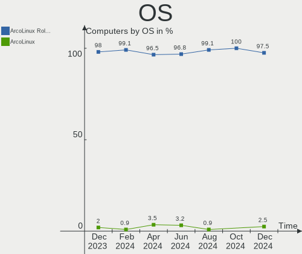
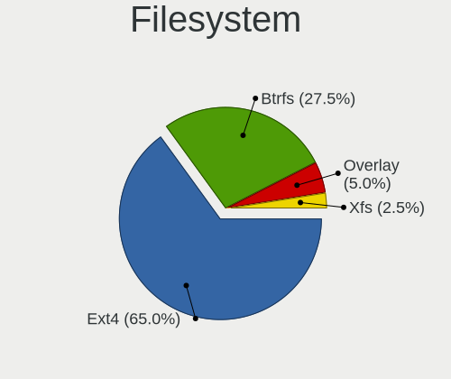
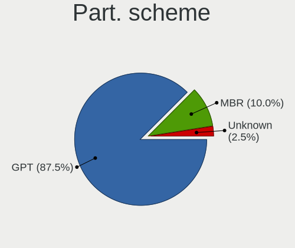

ArcoLinux - Hardware Trends
---------------------------

A project to identify most popular hardware characteristics and track their change
over time based on data collected by Linux users at https://Linux-Hardware.org.

Anyone can contribute to this report by the [hw-probe](https://github.com/linuxhw/hw-probe) tool:

    sudo -E hw-probe -all -upload

This is a report for all computer types. See also reports for [desktops](/Dist/ArcoLinux/Desktop/README.md) and [notebooks](/Dist/ArcoLinux/Notebook/README.md).

This report is for one last month. Overall report since the beginning of time: [TestDays](https://github.com/linuxhw/TestDays)

Period: Apr, 2024.

Contents
--------

* [ System ](#system)
  - [ OS                       ](#os)
  - [ OS Family                ](#os-family)
  - [ Kernel                   ](#kernel)
  - [ Kernel Family            ](#kernel-family)
  - [ Kernel Major Ver.        ](#kernel-major-ver)
  - [ Arch                     ](#arch)
  - [ DE                       ](#de)
  - [ Display Server           ](#display-server)
  - [ Display Manager          ](#display-manager)
  - [ OS Lang                  ](#os-lang)
  - [ Boot Mode                ](#boot-mode)
  - [ Filesystem               ](#filesystem)
  - [ Part. scheme             ](#part-scheme)
  - [ Dual Boot with Linux/BSD ](#dual-boot-with-linuxbsd)
  - [ Dual Boot (Win)          ](#dual-boot-win)

* [ Board ](#board)
  - [ Vendor                   ](#vendor)
  - [ Model                    ](#model)
  - [ Model Family             ](#model-family)
  - [ MFG Year                 ](#mfg-year)
  - [ Form Factor              ](#form-factor)
  - [ Secure Boot              ](#secure-boot)
  - [ Coreboot                 ](#coreboot)
  - [ RAM Size                 ](#ram-size)
  - [ RAM Used                 ](#ram-used)
  - [ Total Drives             ](#total-drives)
  - [ Has CD-ROM               ](#has-cd-rom)
  - [ Has Ethernet             ](#has-ethernet)
  - [ Has WiFi                 ](#has-wifi)
  - [ Has Bluetooth            ](#has-bluetooth)

* [ Location ](#location)
  - [ Country                  ](#country)
  - [ City                     ](#city)

* [ Drives ](#drives)
  - [ Drive Vendor             ](#drive-vendor)
  - [ Drive Model              ](#drive-model)
  - [ HDD Vendor               ](#hdd-vendor)
  - [ SSD Vendor               ](#ssd-vendor)
  - [ Drive Kind               ](#drive-kind)
  - [ Drive Connector          ](#drive-connector)
  - [ Drive Size               ](#drive-size)
  - [ Space Total              ](#space-total)
  - [ Space Used               ](#space-used)
  - [ Malfunc. Drives          ](#malfunc-drives)
  - [ Malfunc. Drive Vendor    ](#malfunc-drive-vendor)
  - [ Malfunc. HDD Vendor      ](#malfunc-hdd-vendor)
  - [ Malfunc. Drive Kind      ](#malfunc-drive-kind)
  - [ Failed Drives            ](#failed-drives)
  - [ Failed Drive Vendor      ](#failed-drive-vendor)
  - [ Drive Status             ](#drive-status)

* [ Storage controller ](#storage-controller)
  - [ Storage Vendor           ](#storage-vendor)
  - [ Storage Model            ](#storage-model)
  - [ Storage Kind             ](#storage-kind)

* [ Processor ](#processor)
  - [ CPU Vendor               ](#cpu-vendor)
  - [ CPU Model                ](#cpu-model)
  - [ CPU Model Family         ](#cpu-model-family)
  - [ CPU Cores                ](#cpu-cores)
  - [ CPU Sockets              ](#cpu-sockets)
  - [ CPU Threads              ](#cpu-threads)
  - [ CPU Op-Modes             ](#cpu-op-modes)
  - [ CPU Microcode            ](#cpu-microcode)
  - [ CPU Microarch            ](#cpu-microarch)

* [ Graphics ](#graphics)
  - [ GPU Vendor               ](#gpu-vendor)
  - [ GPU Model                ](#gpu-model)
  - [ GPU Combo                ](#gpu-combo)
  - [ GPU Driver               ](#gpu-driver)
  - [ GPU Memory               ](#gpu-memory)

* [ Monitor ](#monitor)
  - [ Monitor Vendor           ](#monitor-vendor)
  - [ Monitor Model            ](#monitor-model)
  - [ Monitor Resolution       ](#monitor-resolution)
  - [ Monitor Diagonal         ](#monitor-diagonal)
  - [ Monitor Width            ](#monitor-width)
  - [ Aspect Ratio             ](#aspect-ratio)
  - [ Monitor Area             ](#monitor-area)
  - [ Pixel Density            ](#pixel-density)
  - [ Multiple Monitors        ](#multiple-monitors)

* [ Network ](#network)
  - [ Net Controller Vendor    ](#net-controller-vendor)
  - [ Net Controller Model     ](#net-controller-model)
  - [ Wireless Vendor          ](#wireless-vendor)
  - [ Wireless Model           ](#wireless-model)
  - [ Ethernet Vendor          ](#ethernet-vendor)
  - [ Ethernet Model           ](#ethernet-model)
  - [ Net Controller Kind      ](#net-controller-kind)
  - [ Used Controller          ](#used-controller)
  - [ NICs                     ](#nics)
  - [ IPv6                     ](#ipv6)

* [ Bluetooth ](#bluetooth)
  - [ Bluetooth Vendor         ](#bluetooth-vendor)
  - [ Bluetooth Model          ](#bluetooth-model)

* [ Sound ](#sound)
  - [ Sound Vendor             ](#sound-vendor)
  - [ Sound Model              ](#sound-model)

* [ Memory ](#memory)
  - [ Memory Vendor            ](#memory-vendor)
  - [ Memory Model             ](#memory-model)
  - [ Memory Kind              ](#memory-kind)
  - [ Memory Form Factor       ](#memory-form-factor)
  - [ Memory Size              ](#memory-size)
  - [ Memory Speed             ](#memory-speed)

* [ Printers & scanners ](#printers--scanners)
  - [ Printer Vendor           ](#printer-vendor)
  - [ Printer Model            ](#printer-model)
  - [ Scanner Vendor           ](#scanner-vendor)
  - [ Scanner Model            ](#scanner-model)

* [ Camera ](#camera)
  - [ Camera Vendor            ](#camera-vendor)
  - [ Camera Model             ](#camera-model)

* [ Security ](#security)
  - [ Fingerprint Vendor       ](#fingerprint-vendor)
  - [ Fingerprint Model        ](#fingerprint-model)
  - [ Chipcard Vendor          ](#chipcard-vendor)
  - [ Chipcard Model           ](#chipcard-model)

* [ Unsupported ](#unsupported)
  - [ Unsupported Devices      ](#unsupported-devices)
  - [ Unsupported Device Types ](#unsupported-device-types)

System
------

OS
--

Installed operating systems

| Name              | Computers | Percent |
|-------------------|-----------|---------|
| ArcoLinux Rolling | 137       | 96.48%  |
| ArcoLinux         | 5         | 3.52%   |

OS Family
---------

OS without a version

| Name      | Computers | Percent |
|-----------|-----------|---------|
| ArcoLinux | 142       | 100%    |

Kernel
------

Version of the Linux kernel

| Version                     | Computers | Percent |
|-----------------------------|-----------|---------|
| 6.8.2-arch2-1               | 20        | 14.08%  |
| 6.8.7-arch1-1               | 18        | 12.68%  |
| 6.8.5-arch1-1               | 12        | 8.45%   |
| 6.8.4-arch1-1               | 11        | 7.75%   |
| 6.8.7-zen1-1-zen            | 10        | 7.04%   |
| 6.7.9-arch1-1               | 10        | 7.04%   |
| 6.8.7-1-cachyos             | 6         | 4.23%   |
| 6.8.5-zen1-1-zen            | 5         | 3.52%   |
| 6.7.4-arch1-1               | 5         | 3.52%   |
| 6.8.2-zen2-1-zen            | 4         | 2.82%   |
| 6.8.4-zen1-1-zen            | 3         | 2.11%   |
| 6.6.28-1-lts                | 3         | 2.11%   |
| 6.8.7-zen1-2-zen            | 2         | 1.41%   |
| 6.8.6-arch1-1               | 2         | 1.41%   |
| 6.8.2-arch1-1               | 2         | 1.41%   |
| 6.7.5-arch1-1               | 2         | 1.41%   |
| 6.7.11-hardened1-1-hardened | 2         | 1.41%   |
| 6.7.10-x64v-xanmod1-1       | 2         | 1.41%   |
| 6.6.26-1-lts                | 2         | 1.41%   |
| 6.6.25-1-lts                | 2         | 1.41%   |
| 6.6.1-arch1-1               | 2         | 1.41%   |
| 6.8.8-zen1-1-zen            | 1         | 0.7%    |
| 6.8.7-arch1-2               | 1         | 0.7%    |
| 6.8.7-2-cachyos-echo        | 1         | 0.7%    |
| 6.8.6-zen1-1-zen            | 1         | 0.7%    |
| 6.8.6-1-cachyos             | 1         | 0.7%    |
| 6.8.5-x64v-xanmod1-1        | 1         | 0.7%    |
| 6.8.2-zen1-1-zen            | 1         | 0.7%    |
| 6.7.6-arch1-2               | 1         | 0.7%    |
| 6.7.5-273-tkg-linux-tkg-pds | 1         | 0.7%    |
| 6.7.4-zen1-1-zen            | 1         | 0.7%    |
| 6.6.9-arch1-1               | 1         | 0.7%    |
| 6.6.5-x64v2-xanmod1-1       | 1         | 0.7%    |
| 6.6.27-1-lts                | 1         | 0.7%    |
| 6.6.24-1-lts                | 1         | 0.7%    |
| 6.6.16-x64v-xanmod1-1       | 1         | 0.7%    |
| 6.5.9-arch2-1               | 1         | 0.7%    |
| 6.3.8-arch1-1               | 1         | 0.7%    |

Kernel Family
-------------

Linux kernel without a distro release

| Version | Computers | Percent |
|---------|-----------|---------|
| 6.8.7   | 38        | 26.76%  |
| 6.8.2   | 27        | 19.01%  |
| 6.8.5   | 18        | 12.68%  |
| 6.8.4   | 14        | 9.86%   |
| 6.7.9   | 10        | 7.04%   |
| 6.7.4   | 6         | 4.23%   |
| 6.8.6   | 4         | 2.82%   |
| 6.7.5   | 3         | 2.11%   |
| 6.6.28  | 3         | 2.11%   |
| 6.7.11  | 2         | 1.41%   |
| 6.7.10  | 2         | 1.41%   |
| 6.6.26  | 2         | 1.41%   |
| 6.6.25  | 2         | 1.41%   |
| 6.6.1   | 2         | 1.41%   |
| 6.8.8   | 1         | 0.7%    |
| 6.7.6   | 1         | 0.7%    |
| 6.6.9   | 1         | 0.7%    |
| 6.6.5   | 1         | 0.7%    |
| 6.6.27  | 1         | 0.7%    |
| 6.6.24  | 1         | 0.7%    |
| 6.6.16  | 1         | 0.7%    |
| 6.5.9   | 1         | 0.7%    |
| 6.3.8   | 1         | 0.7%    |

Kernel Major Ver.
-----------------

Linux kernel major version

| Version | Computers | Percent |
|---------|-----------|---------|
| 6.8     | 102       | 71.83%  |
| 6.7     | 24        | 16.9%   |
| 6.6     | 14        | 9.86%   |
| 6.5     | 1         | 0.7%    |
| 6.3     | 1         | 0.7%    |

Arch
----

OS architecture (x86_64, i586, etc.)

| Name   | Computers | Percent |
|--------|-----------|---------|
| x86_64 | 142       | 100%    |

DE
--

Desktop Environment

| Name         | Computers | Percent |
|--------------|-----------|---------|
| XFCE         | 57        | 40.14%  |
| GNOME        | 17        | 11.97%  |
| KDE6         | 14        | 9.86%   |
| Unknown      | 12        | 8.45%   |
| Cinnamon     | 9         | 6.34%   |
| i3           | 5         | 3.52%   |
| LXQt         | 4         | 2.82%   |
| Hyprland     | 4         | 2.82%   |
| X-Cinnamon   | 3         | 2.11%   |
| KDE          | 3         | 2.11%   |
| xmonad       | 2         | 1.41%   |
| MATE         | 2         | 1.41%   |
| Deepin       | 2         | 1.41%   |
| chadwm       | 2         | 1.41%   |
| bspwm        | 2         | 1.41%   |
| sway         | 1         | 0.7%    |
| qtile        | 1         | 0.7%    |
| herbstluftwm | 1         | 0.7%    |
| awesome      | 1         | 0.7%    |

Display Server
--------------

X11 or Wayland

| Name    | Computers | Percent |
|---------|-----------|---------|
| X11     | 89        | 62.68%  |
| Wayland | 46        | 32.39%  |
| Unknown | 6         | 4.23%   |
| Tty     | 1         | 0.7%    |

Display Manager
---------------

SDDM, LightDM, etc.

| Name    | Computers | Percent |
|---------|-----------|---------|
| SDDM    | 112       | 78.87%  |
| LightDM | 21        | 14.79%  |
| Unknown | 6         | 4.23%   |
| GDM     | 3         | 2.11%   |

OS Lang
-------

Language

| Lang  | Computers | Percent |
|-------|-----------|---------|
| en_US | 71        | 50%     |
| C     | 8         | 5.63%   |
| ru_RU | 6         | 4.23%   |
| en_IN | 6         | 4.23%   |
| en_GB | 6         | 4.23%   |
| pt_BR | 5         | 3.52%   |
| pl_PL | 5         | 3.52%   |
| es_ES | 5         | 3.52%   |
| it_IT | 4         | 2.82%   |
| en_CA | 4         | 2.82%   |
| tr_TR | 3         | 2.11%   |
| fr_FR | 2         | 1.41%   |
| es_MX | 2         | 1.41%   |
| en_HK | 2         | 1.41%   |
| de_DE | 2         | 1.41%   |
| cs_CZ | 2         | 1.41%   |
| vi_VN | 1         | 0.7%    |
| sv_SE | 1         | 0.7%    |
| ro_RO | 1         | 0.7%    |
| pt_PT | 1         | 0.7%    |
| lt_LT | 1         | 0.7%    |
| es_AR | 1         | 0.7%    |
| en_IE | 1         | 0.7%    |
| en_AU | 1         | 0.7%    |
| de_AT | 1         | 0.7%    |

Boot Mode
---------

EFI or BIOS

| Mode | Computers | Percent |
|------|-----------|---------|
| EFI  | 111       | 78.17%  |
| BIOS | 31        | 21.83%  |

Filesystem
----------

Type of filesystem

| Type    | Computers | Percent |
|---------|-----------|---------|
| Ext4    | 101       | 71.13%  |
| Btrfs   | 32        | 22.54%  |
| Overlay | 8         | 5.63%   |
| F2fs    | 1         | 0.7%    |

Part. scheme
------------

Scheme of partitioning

| Type    | Computers | Percent |
|---------|-----------|---------|
| GPT     | 120       | 84.51%  |
| MBR     | 17        | 11.97%  |
| Unknown | 5         | 3.52%   |

Dual Boot with Linux/BSD
------------------------

Hosting more than one Linux/BSD

| Dual boot | Computers | Percent |
|-----------|-----------|---------|
| No        | 96        | 67.61%  |
| Yes       | 46        | 32.39%  |

Dual Boot (Win)
---------------

Hosting Linux and Windows

| Dual boot | Computers | Percent |
|-----------|-----------|---------|
| No        | 79        | 55.63%  |
| Yes       | 63        | 44.37%  |

Board
-----

Vendor
------

Motherboard manufacturer

| Name                                 | Computers | Percent |
|--------------------------------------|-----------|---------|
| Dell                                 | 22        | 15.49%  |
| Hewlett-Packard                      | 21        | 14.79%  |
| Lenovo                               | 20        | 14.08%  |
| MSI                                  | 15        | 10.56%  |
| ASUSTek Computer                     | 13        | 9.15%   |
| Gigabyte Technology                  | 10        | 7.04%   |
| ASRock                               | 6         | 4.23%   |
| Apple                                | 5         | 3.52%   |
| Acer                                 | 5         | 3.52%   |
| Intel                                | 3         | 2.11%   |
| Unknown                              | 3         | 2.11%   |
| Toshiba                              | 2         | 1.41%   |
| Microsoft                            | 2         | 1.41%   |
| System76                             | 1         | 0.7%    |
| Sony                                 | 1         | 0.7%    |
| Shenzhen Meigao Electronic Equipment | 1         | 0.7%    |
| Razer                                | 1         | 0.7%    |
| Pegatron                             | 1         | 0.7%    |
| Packard Bell                         | 1         | 0.7%    |
| Notebook                             | 1         | 0.7%    |
| INET                                 | 1         | 0.7%    |
| HUAWEI                               | 1         | 0.7%    |
| Fujitsu                              | 1         | 0.7%    |
| ECS                                  | 1         | 0.7%    |
| DFI                                  | 1         | 0.7%    |
| Biostar                              | 1         | 0.7%    |
| BESSTAR Tech                         | 1         | 0.7%    |
| AZW                                  | 1         | 0.7%    |

Model
-----

Motherboard model

| Name                                       | Computers | Percent |
|--------------------------------------------|-----------|---------|
| Unknown                                    | 3         | 2.11%   |
| MSI MS-7C52                                | 2         | 1.41%   |
| Dell Latitude 7490                         | 2         | 1.41%   |
| Toshiba Satellite P55W-C                   | 1         | 0.7%    |
| Toshiba Satellite M645                     | 1         | 0.7%    |
| System76 Gazelle                           | 1         | 0.7%    |
| Sony SVF1521X1RB                           | 1         | 0.7%    |
| Shenzhen Meigao Electronic Equipment UM690 | 1         | 0.7%    |
| Razer Blade                                | 1         | 0.7%    |
| Pegatron NC757AA-ABA a6757c                | 1         | 0.7%    |
| Packard Bell EasyNote LM98                 | 1         | 0.7%    |
| Notebook NP5x_NP6x_NP7xPNP                 | 1         | 0.7%    |
| MSI MS-B09011                              | 1         | 0.7%    |
| MSI MS-7E26                                | 1         | 0.7%    |
| MSI MS-7C91                                | 1         | 0.7%    |
| MSI MS-7C90                                | 1         | 0.7%    |
| MSI MS-7B93                                | 1         | 0.7%    |
| MSI MS-7B89                                | 1         | 0.7%    |
| MSI MS-7B86                                | 1         | 0.7%    |
| MSI MS-7A38                                | 1         | 0.7%    |
| MSI MS-7A36                                | 1         | 0.7%    |
| MSI MS-7850                                | 1         | 0.7%    |
| MSI Hyrican PC A320M PRO-VD/S              | 1         | 0.7%    |
| MSI H310 Gaming Infinite (MS-B915)         | 1         | 0.7%    |
| MSI GP63 Leopard 8RE                       | 1         | 0.7%    |
| Microsoft Surface Pro 9                    | 1         | 0.7%    |
| Microsoft Surface Pro                      | 1         | 0.7%    |
| Lenovo Yoga 720-15IKB 80X7                 | 1         | 0.7%    |
| Lenovo ThinkPad X1 Carbon 3448A47          | 1         | 0.7%    |
| Lenovo ThinkPad T580 20L9CTO1WW            | 1         | 0.7%    |
| Lenovo ThinkPad T540p 20BFS06B05           | 1         | 0.7%    |
| Lenovo ThinkPad T490 20N2005VMX            | 1         | 0.7%    |
| Lenovo ThinkPad T430 2349IF8               | 1         | 0.7%    |
| Lenovo ThinkPad E15 Gen 2 20T8005CUS       | 1         | 0.7%    |
| Lenovo ThinkBook 15 G2 ITL 20VE            | 1         | 0.7%    |
| Lenovo Slim Pro 7 14ARP8 83AX              | 1         | 0.7%    |
| Lenovo Legion 5 15ACH6A 82NW               | 1         | 0.7%    |
| Lenovo IdeaPad Y700-17ISK 80Q0             | 1         | 0.7%    |
| Lenovo IdeaPad Slim 1-11AST-05 81VR        | 1         | 0.7%    |
| Lenovo IdeaPad S340-15IWL 81N8             | 1         | 0.7%    |

Model Family
------------

Motherboard model prefix

| Name                                       | Computers | Percent |
|--------------------------------------------|-----------|---------|
| Lenovo IdeaPad                             | 8         | 5.63%   |
| Dell Latitude                              | 7         | 4.93%   |
| Lenovo ThinkPad                            | 6         | 4.23%   |
| HP Pavilion                                | 5         | 3.52%   |
| Dell OptiPlex                              | 5         | 3.52%   |
| Dell Inspiron                              | 4         | 2.82%   |
| ASUS TUF                                   | 4         | 2.82%   |
| Unknown                                    | 3         | 2.11%   |
| Toshiba Satellite                          | 2         | 1.41%   |
| MSI MS-7C52                                | 2         | 1.41%   |
| Microsoft Surface                          | 2         | 1.41%   |
| HP ProDesk                                 | 2         | 1.41%   |
| HP Laptop                                  | 2         | 1.41%   |
| HP Compaq                                  | 2         | 1.41%   |
| Gigabyte B550                              | 2         | 1.41%   |
| Dell Vostro                                | 2         | 1.41%   |
| ASUS PRIME                                 | 2         | 1.41%   |
| Acer Aspire                                | 2         | 1.41%   |
| System76 Gazelle                           | 1         | 0.7%    |
| Sony SVF1521X1RB                           | 1         | 0.7%    |
| Shenzhen Meigao Electronic Equipment UM690 | 1         | 0.7%    |
| Razer Blade                                | 1         | 0.7%    |
| Pegatron NC757AA-ABA                       | 1         | 0.7%    |
| Packard Bell EasyNote                      | 1         | 0.7%    |
| Notebook NP5x                              | 1         | 0.7%    |
| MSI MS-B09011                              | 1         | 0.7%    |
| MSI MS-7E26                                | 1         | 0.7%    |
| MSI MS-7C91                                | 1         | 0.7%    |
| MSI MS-7C90                                | 1         | 0.7%    |
| MSI MS-7B93                                | 1         | 0.7%    |
| MSI MS-7B89                                | 1         | 0.7%    |
| MSI MS-7B86                                | 1         | 0.7%    |
| MSI MS-7A38                                | 1         | 0.7%    |
| MSI MS-7A36                                | 1         | 0.7%    |
| MSI MS-7850                                | 1         | 0.7%    |
| MSI Hyrican                                | 1         | 0.7%    |
| MSI H310                                   | 1         | 0.7%    |
| MSI GP63                                   | 1         | 0.7%    |
| Lenovo Yoga                                | 1         | 0.7%    |
| Lenovo ThinkBook                           | 1         | 0.7%    |

MFG Year
--------

Motherboard manufacture year

| Year | Computers | Percent |
|------|-----------|---------|
| 2018 | 21        | 14.79%  |
| 2020 | 15        | 10.56%  |
| 2019 | 12        | 8.45%   |
| 2022 | 11        | 7.75%   |
| 2017 | 11        | 7.75%   |
| 2021 | 10        | 7.04%   |
| 2014 | 9         | 6.34%   |
| 2015 | 8         | 5.63%   |
| 2012 | 8         | 5.63%   |
| 2016 | 7         | 4.93%   |
| 2011 | 7         | 4.93%   |
| 2023 | 6         | 4.23%   |
| 2013 | 6         | 4.23%   |
| 2010 | 6         | 4.23%   |
| 2008 | 4         | 2.82%   |
| 2007 | 1         | 0.7%    |

Form Factor
-----------

Physical design of the computer

| Name        | Computers | Percent |
|-------------|-----------|---------|
| Notebook    | 68        | 47.89%  |
| Desktop     | 63        | 44.37%  |
| All in one  | 5         | 3.52%   |
| Tablet      | 2         | 1.41%   |
| Convertible | 2         | 1.41%   |
| Mini pc     | 2         | 1.41%   |

Secure Boot
-----------

Enabled or disabled

| State    | Computers | Percent |
|----------|-----------|---------|
| Disabled | 142       | 100%    |

Coreboot
--------

Have coreboot on board

| Used | Computers | Percent |
|------|-----------|---------|
| No   | 141       | 99.3%   |
| Yes  | 1         | 0.7%    |

RAM Size
--------

Total RAM memory

| Size in GB  | Computers | Percent |
|-------------|-----------|---------|
| 16.01-24.0  | 39        | 27.46%  |
| 4.01-8.0    | 34        | 23.94%  |
| 8.01-16.0   | 23        | 16.2%   |
| 32.01-64.0  | 20        | 14.08%  |
| 3.01-4.0    | 15        | 10.56%  |
| 24.01-32.0  | 8         | 5.63%   |
| 2.01-3.0    | 1         | 0.7%    |
| 64.01-256.0 | 1         | 0.7%    |
| 1.01-2.0    | 1         | 0.7%    |

RAM Used
--------

Used RAM memory

| Used GB    | Computers | Percent |
|------------|-----------|---------|
| 1.01-2.0   | 59        | 41.55%  |
| 2.01-3.0   | 23        | 16.2%   |
| 4.01-8.0   | 21        | 14.79%  |
| 3.01-4.0   | 18        | 12.68%  |
| 8.01-16.0  | 11        | 7.75%   |
| 0.51-1.0   | 9         | 6.34%   |
| 16.01-24.0 | 1         | 0.7%    |

Total Drives
------------

Number of drives on board

| Drives | Computers | Percent |
|--------|-----------|---------|
| 1      | 75        | 52.82%  |
| 2      | 36        | 25.35%  |
| 3      | 20        | 14.08%  |
| 4      | 9         | 6.34%   |
| 5      | 1         | 0.7%    |
| 0      | 1         | 0.7%    |

Has CD-ROM
----------

Has CD-ROM on board

| Presented | Computers | Percent |
|-----------|-----------|---------|
| No        | 109       | 76.76%  |
| Yes       | 33        | 23.24%  |

Has Ethernet
------------

Has Ethernet on board

| Presented | Computers | Percent |
|-----------|-----------|---------|
| Yes       | 122       | 85.92%  |
| No        | 20        | 14.08%  |

Has WiFi
--------

Has WiFi module

| Presented | Computers | Percent |
|-----------|-----------|---------|
| Yes       | 112       | 78.87%  |
| No        | 30        | 21.13%  |

Has Bluetooth
-------------

Has Bluetooth module

| Presented | Computers | Percent |
|-----------|-----------|---------|
| Yes       | 99        | 69.72%  |
| No        | 43        | 30.28%  |

Location
--------

Country
-------

Geographic location (country)

| Country     | Computers | Percent |
|-------------|-----------|---------|
| USA         | 44        | 30.99%  |
| India       | 9         | 6.34%   |
| Russia      | 8         | 5.63%   |
| UK          | 6         | 4.23%   |
| Brazil      | 6         | 4.23%   |
| Spain       | 5         | 3.52%   |
| Italy       | 5         | 3.52%   |
| Austria     | 5         | 3.52%   |
| Turkey      | 4         | 2.82%   |
| Sweden      | 4         | 2.82%   |
| Poland      | 3         | 2.11%   |
| Germany     | 3         | 2.11%   |
| Czechia     | 3         | 2.11%   |
| Belgium     | 3         | 2.11%   |
| Romania     | 2         | 1.41%   |
| Mexico      | 2         | 1.41%   |
| Kenya       | 2         | 1.41%   |
| Iran        | 2         | 1.41%   |
| Indonesia   | 2         | 1.41%   |
| Hong Kong   | 2         | 1.41%   |
| France      | 2         | 1.41%   |
| Canada      | 2         | 1.41%   |
| Australia   | 2         | 1.41%   |
| Argentina   | 2         | 1.41%   |
| Zimbabwe    | 1         | 0.7%    |
| Vietnam     | 1         | 0.7%    |
| Uruguay     | 1         | 0.7%    |
| Slovenia    | 1         | 0.7%    |
| Portugal    | 1         | 0.7%    |
| Norway      | 1         | 0.7%    |
| New Zealand | 1         | 0.7%    |
| Morocco     | 1         | 0.7%    |
| Lithuania   | 1         | 0.7%    |
| Ireland     | 1         | 0.7%    |
| Hungary     | 1         | 0.7%    |
| Greece      | 1         | 0.7%    |
| Egypt       | 1         | 0.7%    |
| Algeria     | 1         | 0.7%    |

City
----

Geographic location (city)

| City               | Computers | Percent |
|--------------------|-----------|---------|
| Vienna             | 3         | 2.11%   |
| Veliky Novgorod    | 3         | 2.11%   |
| Xinzo de Limia     | 2         | 1.41%   |
| Tsuen Wan          | 2         | 1.41%   |
| Tehran             | 2         | 1.41%   |
| Stockholm          | 2         | 1.41%   |
| Prague             | 2         | 1.41%   |
| Perth              | 2         | 1.41%   |
| New York           | 2         | 1.41%   |
| Nairobi            | 2         | 1.41%   |
| Kolkata            | 2         | 1.41%   |
| Istanbul           | 2         | 1.41%   |
| Duffel             | 2         | 1.41%   |
| Dade City          | 2         | 1.41%   |
| Bengaluru          | 2         | 1.41%   |
| Zaczernie          | 1         | 0.7%    |
| Yuzhno-Sakhalinsk  | 1         | 0.7%    |
| Youngstown         | 1         | 0.7%    |
| Whangarei          | 1         | 0.7%    |
| Welwyn Garden City | 1         | 0.7%    |
| Walla Walla        | 1         | 0.7%    |
| Waldport           | 1         | 0.7%    |
| Vitoria-Gasteiz    | 1         | 0.7%    |
| Velikiye Luki      | 1         | 0.7%    |
| Varanasi           | 1         | 0.7%    |
| Ulyanovsk          | 1         | 0.7%    |
| Tiruchirappalli    | 1         | 0.7%    |
| Tampa              | 1         | 0.7%    |
| Szczecin           | 1         | 0.7%    |
| Sturgeon Bay       | 1         | 0.7%    |
| Strömsnäsbruk    | 1         | 0.7%    |
| St Louis           | 1         | 0.7%    |
| Spring Hill        | 1         | 0.7%    |
| Sosnowiec          | 1         | 0.7%    |
| Sorocaba           | 1         | 0.7%    |
| Seville            | 1         | 0.7%    |
| Secaucus           | 1         | 0.7%    |
| Schwarzach         | 1         | 0.7%    |
| Sao Paulo          | 1         | 0.7%    |
| San Francisco      | 1         | 0.7%    |

Drives
------

Drive Vendor
------------

Hard drive vendors

| Vendor                      | Computers | Drives | Percent |
|-----------------------------|-----------|--------|---------|
| Samsung Electronics         | 43        | 50     | 18.7%   |
| WDC                         | 27        | 31     | 11.74%  |
| Seagate                     | 27        | 31     | 11.74%  |
| Sandisk                     | 18        | 20     | 7.83%   |
| Toshiba                     | 10        | 10     | 4.35%   |
| Kingston                    | 10        | 11     | 4.35%   |
| Unknown                     | 9         | 10     | 3.91%   |
| Crucial                     | 9         | 10     | 3.91%   |
| Silicon Motion              | 6         | 6      | 2.61%   |
| Intel                       | 6         | 6      | 2.61%   |
| Micron/Crucial Technology   | 5         | 5      | 2.17%   |
| Hitachi                     | 5         | 5      | 2.17%   |
| KIOXIA                      | 4         | 4      | 1.74%   |
| HGST                        | 4         | 4      | 1.74%   |
| A-DATA Technology           | 4         | 5      | 1.74%   |
| SK hynix                    | 3         | 3      | 1.3%    |
| OCZ                         | 3         | 3      | 1.3%    |
| China                       | 3         | 3      | 1.3%    |
| Team                        | 2         | 2      | 0.87%   |
| SPCC                        | 2         | 2      | 0.87%   |
| PNY                         | 2         | 2      | 0.87%   |
| Patriot                     | 2         | 2      | 0.87%   |
| Kingston Technology Company | 2         | 2      | 0.87%   |
| KingSpec                    | 2         | 2      | 0.87%   |
| Apple                       | 2         | 2      | 0.87%   |
| XrayDisk                    | 1         | 1      | 0.43%   |
| X12                         | 1         | 1      | 0.43%   |
| ShiJi                       | 1         | 1      | 0.43%   |
| SABRENT                     | 1         | 1      | 0.43%   |
| Plextor                     | 1         | 1      | 0.43%   |
| Phison Electronics          | 1         | 1      | 0.43%   |
| Netac                       | 1         | 1      | 0.43%   |
| Micron Technology           | 1         | 1      | 0.43%   |
| MAXIO Technology (Hangzhou) | 1         | 1      | 0.43%   |
| LITEONIT                    | 1         | 1      | 0.43%   |
| LITEON                      | 1         | 1      | 0.43%   |
| Hewlett-Packard             | 1         | 1      | 0.43%   |
| General                     | 1         | 1      | 0.43%   |
| Fanxiang                    | 1         | 1      | 0.43%   |
| External                    | 1         | 1      | 0.43%   |

Drive Model
-----------

Hard drive models

| Model                                                 | Computers | Percent |
|-------------------------------------------------------|-----------|---------|
| Samsung NVMe SSD Controller PM9A1/PM9A3/980PRO 1TB    | 7         | 2.85%   |
| Silicon Motion SM2263EN/SM2263XT SSD Controller 256GB | 6         | 2.44%   |
| Samsung NVMe SSD Controller SM981/PM981/PM983 1TB     | 6         | 2.44%   |
| Sandisk WD Blue SN550 NVMe SSD 2TB                    | 4         | 1.63%   |
| SanDisk Extreme 55AE 1TB SSD                          | 4         | 1.63%   |
| Samsung SSD 980 1TB                                   | 4         | 1.63%   |
| Unknown MMC Card  64GB                                | 3         | 1.22%   |
| Seagate ST1000DM010-2EP102 1TB                        | 3         | 1.22%   |
| Samsung SSD 870 EVO 1TB                               | 3         | 1.22%   |
| Samsung HD103SJ 1TB                                   | 3         | 1.22%   |
| Kingston SA400S37240G 240GB SSD                       | 3         | 1.22%   |
| Toshiba MQ01ABD100 1TB                                | 2         | 0.81%   |
| Seagate ST500DM002-1BD142 500GB                       | 2         | 0.81%   |
| Seagate ST2000DM008-2FR102 2TB                        | 2         | 0.81%   |
| Seagate ST1000LM035-1RK172 1TB                        | 2         | 0.81%   |
| Seagate Backup+ Hub BK 8TB                            | 2         | 0.81%   |
| Sandisk WD Blue SN500 / PC SN520 NVMe SSD 512GB       | 2         | 0.81%   |
| SanDisk SSD PLUS 480GB                                | 2         | 0.81%   |
| Samsung SSD 860 EVO 250GB                             | 2         | 0.81%   |
| Samsung SSD 850 EVO 500GB                             | 2         | 0.81%   |
| Samsung SSD 840 EVO 250GB                             | 2         | 0.81%   |
| Micron/Crucial P1 NVMe PCIe SSD 1TB                   | 2         | 0.81%   |
| Kingston SA400S37480G 480GB SSD                       | 2         | 0.81%   |
| KingSpec NT-256 256GB SSD                             | 2         | 0.81%   |
| HGST HTS721010A9E630 1TB                              | 2         | 0.81%   |
| Crucial CT500MX500SSD1 500GB                          | 2         | 0.81%   |
| Crucial CT480BX500SSD1 480GB                          | 2         | 0.81%   |
| Crucial CT1000MX500SSD1 1TB                           | 2         | 0.81%   |
| XrayDisk 1TB SSD                                      | 1         | 0.41%   |
| X12 SSD 512GB                                         | 1         | 0.41%   |
| WDC WDS500G2B0A-00SM50 500GB SSD                      | 1         | 0.41%   |
| WDC WDS480G2G0B-00EPW0 480GB SSD                      | 1         | 0.41%   |
| WDC WDS240G2G0B-00EPW0 240GB SSD                      | 1         | 0.41%   |
| WDC WDS100T2B0A-00SM50 1TB SSD                        | 1         | 0.41%   |
| WDC WD6401AALS-00L3B2 640GB                           | 1         | 0.41%   |
| WDC WD50EZRZ-00RWYB1 5TB                              | 1         | 0.41%   |
| WDC WD5000LUCT-63C26Y0 500GB                          | 1         | 0.41%   |
| WDC WD5000LPCX-24VHAT0 500GB                          | 1         | 0.41%   |
| WDC WD5000AZLX-60K2TA0 500GB                          | 1         | 0.41%   |
| WDC WD5000AAKX-75U6AA0 500GB                          | 1         | 0.41%   |

HDD Vendor
----------

Hard disk drive vendors

| Vendor              | Computers | Drives | Percent |
|---------------------|-----------|--------|---------|
| Seagate             | 27        | 30     | 36.49%  |
| WDC                 | 23        | 26     | 31.08%  |
| Toshiba             | 6         | 6      | 8.11%   |
| Samsung Electronics | 5         | 5      | 6.76%   |
| Hitachi             | 5         | 5      | 6.76%   |
| HGST                | 4         | 4      | 5.41%   |
| Unknown             | 1         | 1      | 1.35%   |
| SABRENT             | 1         | 1      | 1.35%   |
| Apple               | 1         | 1      | 1.35%   |
| ACASIS              | 1         | 1      | 1.35%   |

SSD Vendor
----------

Solid state drive vendors

| Vendor              | Computers | Drives | Percent |
|---------------------|-----------|--------|---------|
| Samsung Electronics | 17        | 18     | 20.48%  |
| Crucial             | 9         | 10     | 10.84%  |
| SanDisk             | 8         | 9      | 9.64%   |
| Kingston            | 7         | 7      | 8.43%   |
| WDC                 | 4         | 5      | 4.82%   |
| A-DATA Technology   | 4         | 5      | 4.82%   |
| OCZ                 | 3         | 3      | 3.61%   |
| Intel               | 3         | 3      | 3.61%   |
| China               | 3         | 3      | 3.61%   |
| Team                | 2         | 2      | 2.41%   |
| SPCC                | 2         | 2      | 2.41%   |
| PNY                 | 2         | 2      | 2.41%   |
| Patriot             | 2         | 2      | 2.41%   |
| KingSpec            | 2         | 2      | 2.41%   |
| X12                 | 1         | 1      | 1.2%    |
| Toshiba             | 1         | 1      | 1.2%    |
| ShiJi               | 1         | 1      | 1.2%    |
| Seagate             | 1         | 1      | 1.2%    |
| Plextor             | 1         | 1      | 1.2%    |
| Netac               | 1         | 1      | 1.2%    |
| Micron Technology   | 1         | 1      | 1.2%    |
| LITEONIT            | 1         | 1      | 1.2%    |
| LITEON              | 1         | 1      | 1.2%    |
| Hewlett-Packard     | 1         | 1      | 1.2%    |
| Fanxiang            | 1         | 1      | 1.2%    |
| External            | 1         | 1      | 1.2%    |
| Dahua               | 1         | 1      | 1.2%    |
| Apple               | 1         | 1      | 1.2%    |
| Unknown             | 1         | 1      | 1.2%    |

Drive Kind
----------

HDD or SSD

| Kind    | Computers | Drives | Percent |
|---------|-----------|--------|---------|
| SSD     | 67        | 88     | 33.17%  |
| NVMe    | 66        | 73     | 32.67%  |
| HDD     | 60        | 80     | 29.7%   |
| MMC     | 7         | 8      | 3.47%   |
| Unknown | 2         | 2      | 0.99%   |

Drive Connector
---------------

SATA, SAS, NVMe, etc.

| Type | Computers | Drives | Percent |
|------|-----------|--------|---------|
| SATA | 99        | 155    | 53.23%  |
| NVMe | 66        | 73     | 35.48%  |
| SAS  | 14        | 15     | 7.53%   |
| MMC  | 7         | 8      | 3.76%   |

Drive Size
----------

Size of hard drive

| Size in TB | Computers | Drives | Percent |
|------------|-----------|--------|---------|
| 0.01-0.5   | 64        | 83     | 47.41%  |
| 0.51-1.0   | 52        | 66     | 38.52%  |
| 1.01-2.0   | 11        | 11     | 8.15%   |
| 2.01-3.0   | 3         | 3      | 2.22%   |
| 4.01-10.0  | 3         | 3      | 2.22%   |
| 3.01-4.0   | 1         | 1      | 0.74%   |
| 10.01-20.0 | 1         | 1      | 0.74%   |

Space Total
-----------

Amount of disk space available on the file system

| Size in GB     | Computers | Percent |
|----------------|-----------|---------|
| 251-500        | 32        | 22.54%  |
| 101-250        | 32        | 22.54%  |
| 501-1000       | 26        | 18.31%  |
| More than 3000 | 17        | 11.97%  |
| 1001-2000      | 17        | 11.97%  |
| 1-20           | 6         | 4.23%   |
| 51-100         | 5         | 3.52%   |
| 21-50          | 3         | 2.11%   |
| 2001-3000      | 2         | 1.41%   |
| Unknown        | 2         | 1.41%   |

Space Used
----------

Amount of used disk space

| Used GB        | Computers | Percent |
|----------------|-----------|---------|
| 1-20           | 36        | 25.35%  |
| 21-50          | 26        | 18.31%  |
| 51-100         | 25        | 17.61%  |
| 101-250        | 23        | 16.2%   |
| 251-500        | 14        | 9.86%   |
| 501-1000       | 6         | 4.23%   |
| 1001-2000      | 4         | 2.82%   |
| More than 3000 | 3         | 2.11%   |
| 2001-3000      | 3         | 2.11%   |
| Unknown        | 2         | 1.41%   |

Malfunc. Drives
---------------

Drive models with a malfunction

| Model                                                 | Computers | Drives | Percent |
|-------------------------------------------------------|-----------|--------|---------|
| WDC WD5000AAKX-75U6AA0 500GB                          | 1         | 1      | 3.23%   |
| WDC WD5000AAKX-22ERMA0 500GB                          | 1         | 1      | 3.23%   |
| WDC WD30EFRX-68EUZN0 3TB                              | 1         | 1      | 3.23%   |
| WDC WD2500BEVT-22ZCT0 250GB                           | 1         | 1      | 3.23%   |
| WDC WD Green 2.5 240GB                                | 1         | 1      | 3.23%   |
| Toshiba THNSNK256GVN8 M.2 2280 256GB SSD              | 1         | 1      | 3.23%   |
| Toshiba MQ01ACF050 500GB                              | 1         | 1      | 3.23%   |
| Toshiba MQ01ABD100 1TB                                | 1         | 1      | 3.23%   |
| Toshiba MK6475GSX 640GB                               | 1         | 1      | 3.23%   |
| Silicon Motion SM2263EN/SM2263XT SSD Controller 256GB | 1         | 1      | 3.23%   |
| Seagate ST9500420AS 500GB                             | 1         | 1      | 3.23%   |
| Seagate ST9500325AS 500GB                             | 1         | 1      | 3.23%   |
| Seagate ST500LT012-1DG142 500GB                       | 1         | 1      | 3.23%   |
| Seagate ST500DM002-1BD142 500GB                       | 1         | 1      | 3.23%   |
| Seagate ST3160815AS 160GB                             | 1         | 1      | 3.23%   |
| Seagate ST31000524AS 1TB                              | 1         | 1      | 3.23%   |
| Seagate ST2000DM001-1CH164 2TB                        | 1         | 1      | 3.23%   |
| Seagate ST1000DM003-1CH162 1TB                        | 1         | 1      | 3.23%   |
| SanDisk SSD PLUS 480GB                                | 1         | 1      | 3.23%   |
| Samsung Electronics SSD 870 EVO 1TB                   | 1         | 1      | 3.23%   |
| Samsung Electronics HM250HI 250GB                     | 1         | 1      | 3.23%   |
| Micron Technology MTFDDAV256TDL-1AW1ZABHA 256GB SSD   | 1         | 1      | 3.23%   |
| LITEON L8H-256V2G-HP 256GB SSD                        | 1         | 1      | 3.23%   |
| Kingston SA400S37480G 480GB SSD                       | 1         | 1      | 3.23%   |
| KingSpec NT-256 256GB SSD                             | 1         | 1      | 3.23%   |
| Intel SSDSC2BF180A4L 180GB                            | 1         | 1      | 3.23%   |
| Hitachi HTS723212L9A362 120GB                         | 1         | 1      | 3.23%   |
| Hitachi HDP725050GLA360 500GB                         | 1         | 1      | 3.23%   |
| HGST HTS541010A9E680 1TB                              | 1         | 1      | 3.23%   |
| Crucial CT275MX300SSD1 275GB                          | 1         | 1      | 3.23%   |
| A-DATA Technology SU650 256GB SSD                     | 1         | 1      | 3.23%   |

Malfunc. Drive Vendor
---------------------

Vendors of faulty drives

| Vendor              | Computers | Drives | Percent |
|---------------------|-----------|--------|---------|
| Seagate             | 7         | 8      | 23.33%  |
| WDC                 | 5         | 5      | 16.67%  |
| Toshiba             | 4         | 4      | 13.33%  |
| Samsung Electronics | 2         | 2      | 6.67%   |
| Hitachi             | 2         | 2      | 6.67%   |
| Silicon Motion      | 1         | 1      | 3.33%   |
| SanDisk             | 1         | 1      | 3.33%   |
| Micron Technology   | 1         | 1      | 3.33%   |
| LITEON              | 1         | 1      | 3.33%   |
| Kingston            | 1         | 1      | 3.33%   |
| KingSpec            | 1         | 1      | 3.33%   |
| Intel               | 1         | 1      | 3.33%   |
| HGST                | 1         | 1      | 3.33%   |
| Crucial             | 1         | 1      | 3.33%   |
| A-DATA Technology   | 1         | 1      | 3.33%   |

Malfunc. HDD Vendor
-------------------

Vendors of faulty HDD drives

| Vendor              | Computers | Drives | Percent |
|---------------------|-----------|--------|---------|
| Seagate             | 7         | 8      | 38.89%  |
| WDC                 | 4         | 4      | 22.22%  |
| Toshiba             | 3         | 3      | 16.67%  |
| Hitachi             | 2         | 2      | 11.11%  |
| Samsung Electronics | 1         | 1      | 5.56%   |
| HGST                | 1         | 1      | 5.56%   |

Malfunc. Drive Kind
-------------------

Kinds of faulty drives

| Kind | Computers | Drives | Percent |
|------|-----------|--------|---------|
| HDD  | 17        | 19     | 58.62%  |
| SSD  | 11        | 11     | 37.93%  |
| NVMe | 1         | 1      | 3.45%   |

Failed Drives
-------------

Failed drive models

Zero info for selected period =(

Failed Drive Vendor
-------------------

Failed drive vendors

Zero info for selected period =(

Drive Status
------------

Number of failed and malfunc. drives

| Status   | Computers | Drives | Percent |
|----------|-----------|--------|---------|
| Works    | 117       | 190    | 69.23%  |
| Malfunc  | 28        | 31     | 16.57%  |
| Detected | 24        | 30     | 14.2%   |

Storage controller
------------------

Storage Vendor
--------------

Storage controller vendors

| Vendor                       | Computers | Percent |
|------------------------------|-----------|---------|
| Intel                        | 84        | 42.86%  |
| AMD                          | 40        | 20.41%  |
| Samsung Electronics          | 25        | 12.76%  |
| SanDisk                      | 11        | 5.61%   |
| Silicon Motion               | 6         | 3.06%   |
| Micron/Crucial Technology    | 5         | 2.55%   |
| Kingston Technology Company  | 5         | 2.55%   |
| KIOXIA                       | 4         | 2.04%   |
| Toshiba America Info Systems | 3         | 1.53%   |
| SK hynix                     | 3         | 1.53%   |
| ASMedia Technology           | 3         | 1.53%   |
| VIA Technologies             | 1         | 0.51%   |
| Phison Electronics           | 1         | 0.51%   |
| Nvidia                       | 1         | 0.51%   |
| MAXIO Technology (Hangzhou)  | 1         | 0.51%   |
| INNOGRIT                     | 1         | 0.51%   |
| Biwin Storage Technology     | 1         | 0.51%   |
| ADATA Technology             | 1         | 0.51%   |

Storage Model
-------------

Storage controller models

| Model                                                                          | Computers | Percent |
|--------------------------------------------------------------------------------|-----------|---------|
| AMD FCH SATA Controller [AHCI mode]                                            | 22        | 10.09%  |
| AMD 400 Series Chipset SATA Controller                                         | 10        | 4.59%   |
| Samsung NVMe SSD Controller PM9A1/PM9A3/980PRO                                 | 7         | 3.21%   |
| Samsung NVMe SSD Controller 980 (DRAM-less)                                    | 7         | 3.21%   |
| Intel 8 Series/C220 Series Chipset Family 6-port SATA Controller 1 [AHCI mode] | 7         | 3.21%   |
| Intel 7 Series Chipset Family 6-port SATA Controller [AHCI mode]               | 7         | 3.21%   |
| Silicon Motion SM2263EN/SM2263XT (DRAM-less) NVMe SSD Controllers              | 6         | 2.75%   |
| Samsung NVMe SSD Controller SM981/PM981/PM983                                  | 6         | 2.75%   |
| Intel 200 Series PCH SATA controller [AHCI mode]                               | 6         | 2.75%   |
| Intel 82801 Mobile SATA Controller [RAID mode]                                 | 5         | 2.29%   |
| AMD FCH SATA Controller D                                                      | 5         | 2.29%   |
| SanDisk Ultra 3D / WD Blue SN550 NVMe SSD                                      | 4         | 1.83%   |
| Intel Volume Management Device NVMe RAID Controller                            | 4         | 1.83%   |
| Intel Tiger Lake-LP SATA Controller                                            | 4         | 1.83%   |
| Intel SATA Controller [RAID mode]                                              | 4         | 1.83%   |
| Intel Cannon Lake Mobile PCH SATA AHCI Controller                              | 4         | 1.83%   |
| AMD 500 Series Chipset SATA Controller                                         | 4         | 1.83%   |
| SK hynix Gold P31/BC711/PC711 NVMe Solid State Drive                           | 3         | 1.38%   |
| Intel Cannon Lake PCH SATA AHCI Controller                                     | 3         | 1.38%   |
| Intel 6 Series/C200 Series Chipset Family 6 port Mobile SATA AHCI Controller   | 3         | 1.38%   |
| Intel 6 Series/C200 Series Chipset Family 6 port Desktop SATA AHCI Controller  | 3         | 1.38%   |
| ASMedia ASM1061/ASM1062 Serial ATA Controller                                  | 3         | 1.38%   |
| AMD SB7x0/SB8x0/SB9x0 SATA Controller [IDE mode]                               | 3         | 1.38%   |
| AMD SB7x0/SB8x0/SB9x0 IDE Controller                                           | 3         | 1.38%   |
| SanDisk WD Blue SN500 / PC SN520 x2 M.2 2280 NVMe SSD                          | 2         | 0.92%   |
| Samsung NVMe SSD Controller S4LV008[Pascal]                                    | 2         | 0.92%   |
| Micron/Crucial P1 NVMe PCIe SSD[Frampton]                                      | 2         | 0.92%   |
| KIOXIA NVMe SSD Controller BG4 (DRAM-less)                                     | 2         | 0.92%   |
| Intel Wildcat Point-LP SATA Controller [AHCI Mode]                             | 2         | 0.92%   |
| Intel Sunrise Point-LP SATA Controller [AHCI mode]                             | 2         | 0.92%   |
| Intel SSD 670p Series [Keystone Harbor]                                        | 2         | 0.92%   |
| Intel Q170/Q150/B150/H170/H110/Z170/CM236 Chipset SATA Controller [AHCI Mode]  | 2         | 0.92%   |
| Intel HM170/QM170 Chipset SATA Controller [AHCI Mode]                          | 2         | 0.92%   |
| Intel Comet Lake SATA AHCI Controller                                          | 2         | 0.92%   |
| Intel Celeron/Pentium Silver Processor SATA Controller                         | 2         | 0.92%   |
| Intel Alder Lake-P SATA AHCI Controller                                        | 2         | 0.92%   |
| Intel 9 Series Chipset Family SATA Controller [AHCI Mode]                      | 2         | 0.92%   |
| Intel 82801IBM/IEM (ICH9M/ICH9M-E) 4 port SATA Controller [AHCI mode]          | 2         | 0.92%   |
| Intel 7 Series/C210 Series Chipset Family 6-port SATA Controller [AHCI mode]   | 2         | 0.92%   |
| Intel 5 Series/3400 Series Chipset 4 port SATA AHCI Controller                 | 2         | 0.92%   |

Storage Kind
------------

Kind of storage controller (IDE, SATA, NVMe, SAS, ...)

| Kind | Computers | Percent |
|------|-----------|---------|
| SATA | 109       | 55.05%  |
| NVMe | 66        | 33.33%  |
| RAID | 13        | 6.57%   |
| IDE  | 10        | 5.05%   |

Processor
---------

CPU Vendor
----------

Processor vendors

| Vendor | Computers | Percent |
|--------|-----------|---------|
| Intel  | 92        | 64.79%  |
| AMD    | 50        | 35.21%  |

CPU Model
---------

Processor models

| Model                                       | Computers | Percent |
|---------------------------------------------|-----------|---------|
| Intel Core i7-8750H CPU @ 2.20GHz           | 4         | 2.82%   |
| Intel 11th Gen Core i5-1135G7 @ 2.40GHz     | 3         | 2.11%   |
| AMD Ryzen 7 3800X 8-Core Processor          | 3         | 2.11%   |
| AMD Ryzen 5 2600 Six-Core Processor         | 3         | 2.11%   |
| Intel Core i7-8700 CPU @ 3.20GHz            | 2         | 1.41%   |
| Intel Core i7-7700HQ CPU @ 2.80GHz          | 2         | 1.41%   |
| Intel Core i7-6700 CPU @ 3.40GHz            | 2         | 1.41%   |
| Intel Core i5-8265U CPU @ 1.60GHz           | 2         | 1.41%   |
| Intel Core i5-4570 CPU @ 3.20GHz            | 2         | 1.41%   |
| Intel Celeron J4125 CPU @ 2.00GHz           | 2         | 1.41%   |
| AMD Ryzen 7 7800X3D 8-Core Processor        | 2         | 1.41%   |
| AMD Ryzen 7 7735HS with Radeon Graphics     | 2         | 1.41%   |
| AMD Ryzen 7 5800H with Radeon Graphics      | 2         | 1.41%   |
| AMD Ryzen 7 5700G with Radeon Graphics      | 2         | 1.41%   |
| AMD Ryzen 5 5600X 6-Core Processor          | 2         | 1.41%   |
| AMD Ryzen 5 3600 6-Core Processor           | 2         | 1.41%   |
| AMD Ryzen 5 3400G with Radeon Vega Graphics | 2         | 1.41%   |
| AMD Ryzen 5 2400G with Radeon Vega Graphics | 2         | 1.41%   |
| Intel Pentium CPU T4500 @ 2.30GHz           | 1         | 0.7%    |
| Intel Pentium CPU P6100 @ 2.00GHz           | 1         | 0.7%    |
| Intel Core i7-9700K CPU @ 3.60GHz           | 1         | 0.7%    |
| Intel Core i7-8700K CPU @ 3.70GHz           | 1         | 0.7%    |
| Intel Core i7-8650U CPU @ 1.90GHz           | 1         | 0.7%    |
| Intel Core i7-8565U CPU @ 1.80GHz           | 1         | 0.7%    |
| Intel Core i7-7700K CPU @ 4.20GHz           | 1         | 0.7%    |
| Intel Core i7-6820HQ CPU @ 2.70GHz          | 1         | 0.7%    |
| Intel Core i7-6700HQ CPU @ 2.60GHz          | 1         | 0.7%    |
| Intel Core i7-5600U CPU @ 2.60GHz           | 1         | 0.7%    |
| Intel Core i7-5500U CPU @ 2.40GHz           | 1         | 0.7%    |
| Intel Core i7-4790K CPU @ 4.00GHz           | 1         | 0.7%    |
| Intel Core i7-4510U CPU @ 2.00GHz           | 1         | 0.7%    |
| Intel Core i7-3770 CPU @ 3.40GHz            | 1         | 0.7%    |
| Intel Core i7-3740QM CPU @ 2.70GHz          | 1         | 0.7%    |
| Intel Core i7-3615QM CPU @ 2.30GHz          | 1         | 0.7%    |
| Intel Core i7-3537U CPU @ 2.00GHz           | 1         | 0.7%    |
| Intel Core i7-3520M CPU @ 2.90GHz           | 1         | 0.7%    |
| Intel Core i7-2630QM CPU @ 2.00GHz          | 1         | 0.7%    |
| Intel Core i7-10870H CPU @ 2.20GHz          | 1         | 0.7%    |
| Intel Core i7-10700K CPU @ 3.80GHz          | 1         | 0.7%    |
| Intel Core i5-9400 CPU @ 2.90GHz            | 1         | 0.7%    |

CPU Model Family
----------------

Processor model prefix

| Model            | Computers | Percent |
|------------------|-----------|---------|
| Intel Core i5    | 34        | 23.94%  |
| Intel Core i7    | 29        | 20.42%  |
| AMD Ryzen 5      | 18        | 12.68%  |
| Other            | 14        | 9.86%   |
| AMD Ryzen 7      | 14        | 9.86%   |
| Intel Core i3    | 6         | 4.23%   |
| Intel Celeron    | 6         | 4.23%   |
| AMD Ryzen 9      | 3         | 2.11%   |
| AMD Athlon II X2 | 3         | 2.11%   |
| Intel Pentium    | 2         | 1.41%   |
| Intel Core 2 Duo | 2         | 1.41%   |
| AMD Ryzen 3      | 2         | 1.41%   |
| AMD A4           | 2         | 1.41%   |
| AMD Ryzen 3 PRO  | 1         | 0.7%    |
| AMD Phenom II X6 | 1         | 0.7%    |
| AMD Phenom       | 1         | 0.7%    |
| AMD E            | 1         | 0.7%    |
| AMD Athlon       | 1         | 0.7%    |
| AMD A6           | 1         | 0.7%    |
| AMD A10          | 1         | 0.7%    |

CPU Cores
---------

Number of processor cores

| Number | Computers | Percent |
|--------|-----------|---------|
| 4      | 51        | 35.92%  |
| 2      | 40        | 28.17%  |
| 6      | 23        | 16.2%   |
| 8      | 20        | 14.08%  |
| 14     | 3         | 2.11%   |
| 12     | 2         | 1.41%   |
| 1      | 2         | 1.41%   |
| 10     | 1         | 0.7%    |

CPU Sockets
-----------

Number of sockets

| Number | Computers | Percent |
|--------|-----------|---------|
| 1      | 142       | 100%    |

CPU Threads
-----------

Threads per core (Hyper-Threading)

| Number | Computers | Percent |
|--------|-----------|---------|
| 2      | 105       | 73.94%  |
| 1      | 37        | 26.06%  |

CPU Op-Modes
------------

CPU Operation Modes (32-bit, 64-bit)

| Op mode        | Computers | Percent |
|----------------|-----------|---------|
| 32-bit, 64-bit | 142       | 100%    |

CPU Microcode
-------------

Microcode number

| Number     | Computers | Percent |
|------------|-----------|---------|
| Unknown    | 138       | 97.18%  |
| 0x0a601206 | 1         | 0.7%    |
| 0x0a50000c | 1         | 0.7%    |
| 0x08600109 | 1         | 0.7%    |
| 0x0800820d | 1         | 0.7%    |

CPU Microarch
-------------

Microarchitecture

| Name             | Computers | Percent |
|------------------|-----------|---------|
| KabyLake         | 26        | 18.31%  |
| IvyBridge        | 12        | 8.45%   |
| Haswell          | 12        | 8.45%   |
| Zen 2            | 11        | 7.75%   |
| Zen 3            | 10        | 7.04%   |
| Zen+             | 8         | 5.63%   |
| SandyBridge      | 7         | 4.93%   |
| Alderlake Hybrid | 7         | 4.93%   |
| TigerLake        | 6         | 4.23%   |
| Skylake          | 6         | 4.23%   |
| Unknown          | 6         | 4.23%   |
| Zen              | 5         | 3.52%   |
| K10              | 5         | 3.52%   |
| Broadwell        | 3         | 2.11%   |
| Westmere         | 2         | 1.41%   |
| Silvermont       | 2         | 1.41%   |
| Penryn           | 2         | 1.41%   |
| Goldmont plus    | 2         | 1.41%   |
| Excavator        | 2         | 1.41%   |
| CometLake        | 2         | 1.41%   |
| Tremont          | 1         | 0.7%    |
| Steamroller      | 1         | 0.7%    |
| Piledriver       | 1         | 0.7%    |
| Goldmont         | 1         | 0.7%    |
| Core             | 1         | 0.7%    |
| Bobcat           | 1         | 0.7%    |

Graphics
--------

GPU Vendor
----------

Vendors of graphics cards

| Vendor | Computers | Percent |
|--------|-----------|---------|
| Intel  | 80        | 47.34%  |
| Nvidia | 46        | 27.22%  |
| AMD    | 43        | 25.44%  |

GPU Model
---------

Graphics card models

| Model                                                                       | Computers | Percent |
|-----------------------------------------------------------------------------|-----------|---------|
| Intel 3rd Gen Core processor Graphics Controller                            | 7         | 4.05%   |
| Intel Xeon E3-1200 v3/4th Gen Core Processor Integrated Graphics Controller | 6         | 3.47%   |
| Intel TigerLake-LP GT2 [Iris Xe Graphics]                                   | 6         | 3.47%   |
| Intel 2nd Generation Core Processor Family Integrated Graphics Controller   | 6         | 3.47%   |
| Intel HD Graphics 630                                                       | 5         | 2.89%   |
| Intel CoffeeLake-H GT2 [UHD Graphics 630]                                   | 5         | 2.89%   |
| AMD Picasso/Raven 2 [Radeon Vega Series / Radeon Vega Mobile Series]        | 5         | 2.89%   |
| AMD Cezanne [Radeon Vega Series / Radeon Vega Mobile Series]                | 5         | 2.89%   |
| Intel WhiskeyLake-U GT2 [UHD Graphics 620]                                  | 4         | 2.31%   |
| Intel HD Graphics 530                                                       | 4         | 2.31%   |
| Intel CoffeeLake-S GT2 [UHD Graphics 630]                                   | 4         | 2.31%   |
| Nvidia GA106M [GeForce RTX 3060 Mobile / Max-Q]                             | 3         | 1.73%   |
| Intel UHD Graphics 620                                                      | 3         | 1.73%   |
| Intel HD Graphics 5500                                                      | 3         | 1.73%   |
| AMD Renoir [Radeon RX Vega 6 (Ryzen 4000/5000 Mobile Series)]               | 3         | 1.73%   |
| AMD Rembrandt [Radeon 680M]                                                 | 3         | 1.73%   |
| AMD Navi 23 [Radeon RX 6600/6600 XT/6600M]                                  | 3         | 1.73%   |
| AMD Navi 10 [Radeon RX 5600 OEM/5600 XT / 5700/5700 XT]                     | 3         | 1.73%   |
| Nvidia TU117M [GeForce GTX 1650 Mobile / Max-Q]                             | 2         | 1.16%   |
| Nvidia TU117 [GeForce GTX 1650]                                             | 2         | 1.16%   |
| Nvidia TU116 [GeForce GTX 1660 SUPER]                                       | 2         | 1.16%   |
| Nvidia TU106 [GeForce RTX 2060 Rev. A]                                      | 2         | 1.16%   |
| Nvidia GP107M [GeForce GTX 1050 Mobile]                                     | 2         | 1.16%   |
| Nvidia GP107 [GeForce GTX 1050]                                             | 2         | 1.16%   |
| Nvidia GP107 [GeForce GTX 1050 Ti]                                          | 2         | 1.16%   |
| Nvidia GP106M [GeForce GTX 1060 Mobile]                                     | 2         | 1.16%   |
| Nvidia GM108M [GeForce 840M]                                                | 2         | 1.16%   |
| Nvidia GK208B [GeForce GT 710]                                              | 2         | 1.16%   |
| Nvidia GF108M [GeForce GT 540M]                                             | 2         | 1.16%   |
| Intel Xeon E3-1200 v2/3rd Gen Core processor Graphics Controller            | 2         | 1.16%   |
| Intel Raptor Lake-P [UHD Graphics]                                          | 2         | 1.16%   |
| Intel Mobile 4 Series Chipset Integrated Graphics Controller                | 2         | 1.16%   |
| Intel HD Graphics 620                                                       | 2         | 1.16%   |
| Intel Haswell-ULT Integrated Graphics Controller                            | 2         | 1.16%   |
| Intel GeminiLake [UHD Graphics 600]                                         | 2         | 1.16%   |
| Intel Core Processor Integrated Graphics Controller                         | 2         | 1.16%   |
| Intel 4th Gen Core Processor Integrated Graphics Controller                 | 2         | 1.16%   |
| AMD Stoney [Radeon R2/R3/R4/R5 Graphics]                                    | 2         | 1.16%   |
| AMD RS880 [Radeon HD 4250]                                                  | 2         | 1.16%   |
| AMD Raven Ridge [Radeon Vega Series / Radeon Vega Mobile Series]            | 2         | 1.16%   |

GPU Combo
---------

Combinations of graphics cards

| Name           | Computers | Percent |
|----------------|-----------|---------|
| 1 x Intel      | 55        | 38.73%  |
| 1 x AMD        | 35        | 24.65%  |
| Intel + Nvidia | 22        | 15.49%  |
| 1 x Nvidia     | 19        | 13.38%  |
| AMD + Nvidia   | 4         | 2.82%   |
| 2 x AMD        | 3         | 2.11%   |
| 2 x Intel      | 2         | 1.41%   |
| 2 x Nvidia     | 1         | 0.7%    |
| Intel + AMD    | 1         | 0.7%    |

GPU Driver
----------

Free vs proprietary

| Driver      | Computers | Percent |
|-------------|-----------|---------|
| Free        | 102       | 71.83%  |
| Proprietary | 34        | 23.94%  |
| Unknown     | 6         | 4.23%   |

GPU Memory
----------

Total video memory

| Size in GB | Computers | Percent |
|------------|-----------|---------|
| Unknown    | 81        | 57.04%  |
| 0.01-0.5   | 14        | 9.86%   |
| 7.01-8.0   | 13        | 9.15%   |
| 3.01-4.0   | 9         | 6.34%   |
| 1.01-2.0   | 9         | 6.34%   |
| 8.01-16.0  | 6         | 4.23%   |
| 0.51-1.0   | 6         | 4.23%   |
| 5.01-6.0   | 4         | 2.82%   |

Monitor
-------

Monitor Vendor
--------------

Monitor vendors

| Vendor                  | Computers | Percent |
|-------------------------|-----------|---------|
| Samsung Electronics     | 22        | 13.58%  |
| BOE                     | 16        | 9.88%   |
| Goldstar                | 13        | 8.02%   |
| Chimei Innolux          | 13        | 8.02%   |
| Dell                    | 12        | 7.41%   |
| LG Display              | 11        | 6.79%   |
| AU Optronics            | 11        | 6.79%   |
| Acer                    | 11        | 6.79%   |
| Hewlett-Packard         | 7         | 4.32%   |
| BenQ                    | 5         | 3.09%   |
| Apple                   | 5         | 3.09%   |
| Philips                 | 4         | 2.47%   |
| AOC                     | 4         | 2.47%   |
| Ancor Communications    | 3         | 1.85%   |
| ViewSonic               | 2         | 1.23%   |
| SKY                     | 2         | 1.23%   |
| Sharp                   | 2         | 1.23%   |
| Insignia                | 2         | 1.23%   |
| InfoVision              | 2         | 1.23%   |
| Toshiba                 | 1         | 0.62%   |
| TMX                     | 1         | 0.62%   |
| STA                     | 1         | 0.62%   |
| Sony                    | 1         | 0.62%   |
| Sceptre Tech            | 1         | 0.62%   |
| RGT                     | 1         | 0.62%   |
| PANDA                   | 1         | 0.62%   |
| MSI                     | 1         | 0.62%   |
| MDA                     | 1         | 0.62%   |
| Lenovo                  | 1         | 0.62%   |
| HannStar                | 1         | 0.62%   |
| FUN                     | 1         | 0.62%   |
| ECM                     | 1         | 0.62%   |
| Chi Mei Optoelectronics | 1         | 0.62%   |
| ASUSTek Computer        | 1         | 0.62%   |

Monitor Model
-------------

Monitor models

| Model                                                                   | Computers | Percent |
|-------------------------------------------------------------------------|-----------|---------|
| Samsung Electronics LCD Monitor SEC5441 1366x768 344x194mm 15.5-inch    | 3         | 1.79%   |
| Samsung Electronics C27F390 SAM0D32 1920x1080 598x336mm 27.0-inch       | 2         | 1.19%   |
| Goldstar FULL HD GSM5B55 1920x1080 480x270mm 21.7-inch                  | 2         | 1.19%   |
| Goldstar E2042 GSM4ED7 1600x900 443x249mm 20.0-inch                     | 2         | 1.19%   |
| Acer S271HL ACR02CA 1920x1080 598x336mm 27.0-inch                       | 2         | 1.19%   |
| Acer G236HL ACR02EB 1920x1080 509x286mm 23.0-inch                       | 2         | 1.19%   |
| ViewSonic VX2363 Series VSC6B2F 1920x1080 509x286mm 23.0-inch           | 1         | 0.6%    |
| ViewSonic VA2465 SERIES VSCB730 1920x1080 521x293mm 23.5-inch           | 1         | 0.6%    |
| Toshiba TV TSB010E 1920x1080 882x498mm 39.9-inch                        | 1         | 0.6%    |
| TMX TL156VDXP01 TMX1560 1920x1080 344x194mm 15.5-inch                   | 1         | 0.6%    |
| STA LCD Monitor STABB81 1920x1080 309x174mm 14.0-inch                   | 1         | 0.6%    |
| Sony TV *02 SNYC603 1920x1080 1085x610mm 49.0-inch                      | 1         | 0.6%    |
| SKY TV-monitor SKY0402 1920x1080 890x500mm 40.2-inch                    | 1         | 0.6%    |
| SKY TV MONITOR SKY0030 3840x2160 1150x650mm 52.0-inch                   | 1         | 0.6%    |
| Sharp LQ156D1JX01 SHP1414 3840x2160 346x194mm 15.6-inch                 | 1         | 0.6%    |
| Sharp LCD Monitor SHP1476 3840x2160 346x194mm 15.6-inch                 | 1         | 0.6%    |
| Sceptre Tech Sceptre P30 SPT0BCC 2560x1080 690x291mm 29.5-inch          | 1         | 0.6%    |
| Samsung Electronics SyncMaster SAM0420 1680x1050 474x296mm 22.0-inch    | 1         | 0.6%    |
| Samsung Electronics SyncMaster SAM0025 1152x864 267x200mm 13.1-inch     | 1         | 0.6%    |
| Samsung Electronics S27D590 SAM0BE9 1920x1080 600x340mm 27.2-inch       | 1         | 0.6%    |
| Samsung Electronics S24D330 SAM0D92 1920x1080 531x299mm 24.0-inch       | 1         | 0.6%    |
| Samsung Electronics S24C750 SAM0A5D 1920x1080 531x299mm 24.0-inch       | 1         | 0.6%    |
| Samsung Electronics S24B300 SAM08B3 1920x1080 521x293mm 23.5-inch       | 1         | 0.6%    |
| Samsung Electronics S19F350 SAM0D46 1366x768 410x230mm 18.5-inch        | 1         | 0.6%    |
| Samsung Electronics S19D300 SAM0B36 1366x768 410x230mm 18.5-inch        | 1         | 0.6%    |
| Samsung Electronics LCD Monitor SEC544B 1600x900 310x174mm 14.0-inch    | 1         | 0.6%    |
| Samsung Electronics LCD Monitor SEC3354 1600x900 382x215mm 17.3-inch    | 1         | 0.6%    |
| Samsung Electronics LCD Monitor SAM0F17 3840x2160 1872x1053mm 84.6-inch | 1         | 0.6%    |
| Samsung Electronics LCD Monitor SAM0B30 1920x1080 885x498mm 40.0-inch   | 1         | 0.6%    |
| Samsung Electronics LCD Monitor SAM0A7A 1920x1080 480x270mm 21.7-inch   | 1         | 0.6%    |
| Samsung Electronics LCD Monitor SAM0902 1920x1080 890x500mm 40.2-inch   | 1         | 0.6%    |
| Samsung Electronics LCD Monitor SAM065F 1360x768                        | 1         | 0.6%    |
| Samsung Electronics LCD Monitor SAM01FF 1360x768 885x498mm 40.0-inch    | 1         | 0.6%    |
| Samsung Electronics C32F391 SAM0D34 1920x1080 698x393mm 31.5-inch       | 1         | 0.6%    |
| Samsung Electronics C24F390 SAM0D2D 1920x1080 521x293mm 23.5-inch       | 1         | 0.6%    |
| RGT LCD Monitor RGT1352 1920x1080 480x270mm 21.7-inch                   | 1         | 0.6%    |
| Philips PHL 272V8 PHLC21A 1920x1080 598x336mm 27.0-inch                 | 1         | 0.6%    |
| Philips PHL 243V7 PHLC155 1920x1080 527x296mm 23.8-inch                 | 1         | 0.6%    |
| Philips PHL 221V8 PHLC211 1920x1080 477x268mm 21.5-inch                 | 1         | 0.6%    |
| Philips 22PFL3404D PHLD05D 1920x1080 640x360mm 28.9-inch                | 1         | 0.6%    |

Monitor Resolution
------------------

Monitor screen resolution

| Resolution         | Computers | Percent |
|--------------------|-----------|---------|
| 1920x1080 (FHD)    | 82        | 52.23%  |
| 1366x768 (WXGA)    | 21        | 13.38%  |
| 3840x2160 (4K)     | 13        | 8.28%   |
| 1600x900 (HD+)     | 10        | 6.37%   |
| 2560x1440 (QHD)    | 5         | 3.18%   |
| 1680x1050 (WSXGA+) | 4         | 2.55%   |
| 2560x1600          | 3         | 1.91%   |
| 2560x1080          | 3         | 1.91%   |
| 1360x768           | 3         | 1.91%   |
| 1440x900 (WXGA+)   | 2         | 1.27%   |
| 1280x1024 (SXGA)   | 2         | 1.27%   |
| 3440x1440          | 1         | 0.64%   |
| 3200x2000          | 1         | 0.64%   |
| 2880x1920          | 1         | 0.64%   |
| 2880x1800          | 1         | 0.64%   |
| 2736x1824          | 1         | 0.64%   |
| 1920x1200 (WUXGA)  | 1         | 0.64%   |
| 1600x1200          | 1         | 0.64%   |
| 1280x800 (WXGA)    | 1         | 0.64%   |
| 1152x864           | 1         | 0.64%   |

Monitor Diagonal
----------------

Diagonal size in inches

| Inches  | Computers | Percent |
|---------|-----------|---------|
| 15      | 36        | 21.82%  |
| 27      | 16        | 9.7%    |
| 24      | 15        | 9.09%   |
| 23      | 14        | 8.48%   |
| 13      | 14        | 8.48%   |
| 21      | 10        | 6.06%   |
| 17      | 9         | 5.45%   |
| 14      | 9         | 5.45%   |
| 20      | 6         | 3.64%   |
| 31      | 5         | 3.03%   |
| 40      | 4         | 2.42%   |
| 22      | 3         | 1.82%   |
| 54      | 2         | 1.21%   |
| 34      | 2         | 1.21%   |
| 28      | 2         | 1.21%   |
| 19      | 2         | 1.21%   |
| 18      | 2         | 1.21%   |
| Unknown | 2         | 1.21%   |
| 84      | 1         | 0.61%   |
| 52      | 1         | 0.61%   |
| 49      | 1         | 0.61%   |
| 48      | 1         | 0.61%   |
| 46      | 1         | 0.61%   |
| 42      | 1         | 0.61%   |
| 32      | 1         | 0.61%   |
| 29      | 1         | 0.61%   |
| 26      | 1         | 0.61%   |
| 16      | 1         | 0.61%   |
| 12      | 1         | 0.61%   |
| 11      | 1         | 0.61%   |

Monitor Width
-------------

Physical width

| Width in mm | Computers | Percent |
|-------------|-----------|---------|
| 301-350     | 52        | 32.7%   |
| 501-600     | 41        | 25.79%  |
| 401-500     | 20        | 12.58%  |
| 351-400     | 12        | 7.55%   |
| 601-700     | 9         | 5.66%   |
| 201-300     | 8         | 5.03%   |
| 1001-1500   | 6         | 3.77%   |
| 801-900     | 5         | 3.14%   |
| 701-800     | 2         | 1.26%   |
| Unknown     | 2         | 1.26%   |
| 1501-2000   | 1         | 0.63%   |
| 901-1000    | 1         | 0.63%   |

Aspect Ratio
------------

Proportional relationship between the width and the height

| Ratio   | Computers | Percent |
|---------|-----------|---------|
| 16/9    | 118       | 82.52%  |
| 16/10   | 14        | 9.79%   |
| 21/9    | 4         | 2.8%    |
| 5/4     | 2         | 1.4%    |
| 4/3     | 2         | 1.4%    |
| 3/2     | 2         | 1.4%    |
| Unknown | 1         | 0.7%    |

Monitor Area
------------

Area in inch²

| Area in inch² | Computers | Percent |
|----------------|-----------|---------|
| 101-110        | 36        | 22.22%  |
| 201-250        | 34        | 20.99%  |
| 301-350        | 18        | 11.11%  |
| 81-90          | 17        | 10.49%  |
| 351-500        | 9         | 5.56%   |
| 151-200        | 9         | 5.56%   |
| 121-130        | 7         | 4.32%   |
| More than 1000 | 6         | 3.7%    |
| 501-1000       | 6         | 3.7%    |
| 71-80          | 5         | 3.09%   |
| 251-300        | 5         | 3.09%   |
| 141-150        | 3         | 1.85%   |
| 91-100         | 2         | 1.23%   |
| Unknown        | 2         | 1.23%   |
| 51-60          | 1         | 0.62%   |
| 131-140        | 1         | 0.62%   |
| 111-120        | 1         | 0.62%   |

Pixel Density
-------------

Pixels per inch

| Density       | Computers | Percent |
|---------------|-----------|---------|
| 51-100        | 66        | 41.77%  |
| 121-160       | 37        | 23.42%  |
| 101-120       | 34        | 21.52%  |
| 1-50          | 7         | 4.43%   |
| 161-240       | 7         | 4.43%   |
| More than 240 | 5         | 3.16%   |
| Unknown       | 2         | 1.27%   |

Multiple Monitors
-----------------

Total monitors connected

| Total | Computers | Percent |
|-------|-----------|---------|
| 1     | 114       | 80.28%  |
| 2     | 25        | 17.61%  |
| 4     | 1         | 0.7%    |
| 3     | 1         | 0.7%    |
| 0     | 1         | 0.7%    |

Network
-------

Net Controller Vendor
---------------------

Controller vendors

| Vendor                          | Computers | Percent |
|---------------------------------|-----------|---------|
| Realtek Semiconductor           | 82        | 39.23%  |
| Intel                           | 70        | 33.49%  |
| Qualcomm Atheros                | 19        | 9.09%   |
| Broadcom                        | 9         | 4.31%   |
| MediaTek                        | 8         | 3.83%   |
| Ralink Technology               | 4         | 1.91%   |
| Broadcom Limited                | 4         | 1.91%   |
| TP-Link                         | 2         | 0.96%   |
| Samsung Electronics             | 2         | 0.96%   |
| Marvell Technology Group        | 2         | 0.96%   |
| Tenda                           | 1         | 0.48%   |
| STMicroelectronics              | 1         | 0.48%   |
| Ralink                          | 1         | 0.48%   |
| Qualcomm Atheros Communications | 1         | 0.48%   |
| Nvidia                          | 1         | 0.48%   |
| IBM                             | 1         | 0.48%   |
| D-Link                          | 1         | 0.48%   |

Net Controller Model
--------------------

Controller models

| Model                                                                  | Computers | Percent |
|------------------------------------------------------------------------|-----------|---------|
| Realtek RTL8111/8168/8211/8411 PCI Express Gigabit Ethernet Controller | 57        | 22.89%  |
| Realtek RTL810xE PCI Express Fast Ethernet controller                  | 11        | 4.42%   |
| Intel Wi-Fi 6 AX200                                                    | 10        | 4.02%   |
| Realtek RTL8821CE 802.11ac PCIe Wireless Network Adapter               | 8         | 3.21%   |
| Realtek RTL8125 2.5GbE Controller                                      | 7         | 2.81%   |
| Qualcomm Atheros QCA9377 802.11ac Wireless Network Adapter             | 7         | 2.81%   |
| Intel Wireless 8265 / 8275                                             | 5         | 2.01%   |
| Intel Ethernet Controller I225-V                                       | 5         | 2.01%   |
| Intel Ethernet Connection I217-LM                                      | 5         | 2.01%   |
| Intel Ethernet Connection (2) I219-V                                   | 5         | 2.01%   |
| Intel Wireless 7260                                                    | 4         | 1.61%   |
| Intel Wi-Fi 6 AX201                                                    | 4         | 1.61%   |
| Intel Cannon Lake PCH CNVi WiFi                                        | 4         | 1.61%   |
| Intel 82579LM Gigabit Network Connection (Lewisville)                  | 4         | 1.61%   |
| Realtek RTL8153 Gigabit Ethernet Adapter                               | 3         | 1.2%    |
| Qualcomm Atheros QCA9565 / AR9565 Wireless Network Adapter             | 3         | 1.2%    |
| Qualcomm Atheros AR9285 Wireless Network Adapter (PCI-Express)         | 3         | 1.2%    |
| MediaTek MT7921 802.11ax PCI Express Wireless Network Adapter          | 3         | 1.2%    |
| Intel Wireless 7265                                                    | 3         | 1.2%    |
| Intel I211 Gigabit Network Connection                                  | 3         | 1.2%    |
| Realtek RTL8852AE 802.11ax PCIe Wireless Network Adapter               | 2         | 0.8%    |
| Realtek RTL8822CE 802.11ac PCIe Wireless Network Adapter               | 2         | 0.8%    |
| Ralink RT2870/RT3070 Wireless Adapter                                  | 2         | 0.8%    |
| Ralink MT7601U Wireless Adapter                                        | 2         | 0.8%    |
| Qualcomm Atheros Killer E2400 Gigabit Ethernet Controller              | 2         | 0.8%    |
| MediaTek MT7922 802.11ax PCI Express Wireless Network Adapter          | 2         | 0.8%    |
| MediaTek MT7921K (RZ608) Wi-Fi 6E 80MHz                                | 2         | 0.8%    |
| Intel Wireless 3165                                                    | 2         | 0.8%    |
| Intel Wi-Fi 5(802.11ac) Wireless-AC 9x6x [Thunder Peak]                | 2         | 0.8%    |
| Intel Raptor Lake PCH CNVi WiFi                                        | 2         | 0.8%    |
| Intel Ethernet Connection (7) I219-V                                   | 2         | 0.8%    |
| Intel Ethernet Connection (4) I219-LM                                  | 2         | 0.8%    |
| Intel Ethernet Connection (2) I219-LM                                  | 2         | 0.8%    |
| Intel Centrino Advanced-N 6205 [Taylor Peak]                           | 2         | 0.8%    |
| Intel Cannon Point-LP CNVi [Wireless-AC]                               | 2         | 0.8%    |
| Intel Alder Lake-P PCH CNVi WiFi                                       | 2         | 0.8%    |
| Broadcom NetXtreme BCM57765 Gigabit Ethernet PCIe                      | 2         | 0.8%    |
| Broadcom BCM43142 802.11b/g/n                                          | 2         | 0.8%    |
| TP-Link TL-WN823N v2/v3 [Realtek RTL8192EU]                            | 1         | 0.4%    |
| TP-Link TL-WN722N v2/v3 [Realtek RTL8188EUS]                           | 1         | 0.4%    |

Wireless Vendor
---------------

Wireless vendors

| Vendor                          | Computers | Percent |
|---------------------------------|-----------|---------|
| Intel                           | 52        | 44.83%  |
| Realtek Semiconductor           | 20        | 17.24%  |
| Qualcomm Atheros                | 16        | 13.79%  |
| MediaTek                        | 8         | 6.9%    |
| Broadcom                        | 6         | 5.17%   |
| Ralink Technology               | 4         | 3.45%   |
| Broadcom Limited                | 3         | 2.59%   |
| TP-Link                         | 2         | 1.72%   |
| Tenda                           | 1         | 0.86%   |
| Ralink                          | 1         | 0.86%   |
| Qualcomm Atheros Communications | 1         | 0.86%   |
| Marvell Technology Group        | 1         | 0.86%   |
| D-Link                          | 1         | 0.86%   |

Wireless Model
--------------

Wireless models

| Model                                                          | Computers | Percent |
|----------------------------------------------------------------|-----------|---------|
| Intel Wi-Fi 6 AX200                                            | 10        | 8.62%   |
| Realtek RTL8821CE 802.11ac PCIe Wireless Network Adapter       | 8         | 6.9%    |
| Qualcomm Atheros QCA9377 802.11ac Wireless Network Adapter     | 7         | 6.03%   |
| Intel Wireless 8265 / 8275                                     | 5         | 4.31%   |
| Intel Wireless 7260                                            | 4         | 3.45%   |
| Intel Wi-Fi 6 AX201                                            | 4         | 3.45%   |
| Intel Cannon Lake PCH CNVi WiFi                                | 4         | 3.45%   |
| Qualcomm Atheros QCA9565 / AR9565 Wireless Network Adapter     | 3         | 2.59%   |
| Qualcomm Atheros AR9285 Wireless Network Adapter (PCI-Express) | 3         | 2.59%   |
| MediaTek MT7921 802.11ax PCI Express Wireless Network Adapter  | 3         | 2.59%   |
| Intel Wireless 7265                                            | 3         | 2.59%   |
| Realtek RTL8852AE 802.11ax PCIe Wireless Network Adapter       | 2         | 1.72%   |
| Realtek RTL8822CE 802.11ac PCIe Wireless Network Adapter       | 2         | 1.72%   |
| Ralink RT2870/RT3070 Wireless Adapter                          | 2         | 1.72%   |
| Ralink MT7601U Wireless Adapter                                | 2         | 1.72%   |
| MediaTek MT7922 802.11ax PCI Express Wireless Network Adapter  | 2         | 1.72%   |
| MediaTek MT7921K (RZ608) Wi-Fi 6E 80MHz                        | 2         | 1.72%   |
| Intel Wireless 3165                                            | 2         | 1.72%   |
| Intel Wi-Fi 5(802.11ac) Wireless-AC 9x6x [Thunder Peak]        | 2         | 1.72%   |
| Intel Raptor Lake PCH CNVi WiFi                                | 2         | 1.72%   |
| Intel Centrino Advanced-N 6205 [Taylor Peak]                   | 2         | 1.72%   |
| Intel Cannon Point-LP CNVi [Wireless-AC]                       | 2         | 1.72%   |
| Intel Alder Lake-P PCH CNVi WiFi                               | 2         | 1.72%   |
| Broadcom BCM43142 802.11b/g/n                                  | 2         | 1.72%   |
| TP-Link TL-WN823N v2/v3 [Realtek RTL8192EU]                    | 1         | 0.86%   |
| TP-Link TL-WN722N v2/v3 [Realtek RTL8188EUS]                   | 1         | 0.86%   |
| Tenda U12                                                      | 1         | 0.86%   |
| Realtek RTL8852BE PCIe 802.11ax Wireless Network Controller    | 1         | 0.86%   |
| Realtek RTL8821AE 802.11ac PCIe Wireless Network Adapter       | 1         | 0.86%   |
| Realtek RTL8723BU 802.11b/g/n WLAN Adapter                     | 1         | 0.86%   |
| Realtek RTL8723BE PCIe Wireless Network Adapter                | 1         | 0.86%   |
| Realtek RTL8191SEvA Wireless LAN Controller                    | 1         | 0.86%   |
| Realtek RTL8188FTV 802.11b/g/n 1T1R 2.4G WLAN Adapter          | 1         | 0.86%   |
| Realtek RTL8188EUS 802.11n Wireless Network Adapter            | 1         | 0.86%   |
| Realtek RTL8188CE 802.11b/g/n WiFi Adapter                     | 1         | 0.86%   |
| Ralink RT3060 Wireless 802.11n 1T/1R                           | 1         | 0.86%   |
| Qualcomm Atheros QCA6174 802.11ac Wireless Network Adapter     | 1         | 0.86%   |
| Qualcomm Atheros AR9271 802.11n                                | 1         | 0.86%   |
| Qualcomm Atheros AR93xx Wireless Network Adapter               | 1         | 0.86%   |
| Qualcomm Atheros AR9227 Wireless Network Adapter               | 1         | 0.86%   |

Ethernet Vendor
---------------

Ethernet vendors

| Vendor                   | Computers | Percent |
|--------------------------|-----------|---------|
| Realtek Semiconductor    | 75        | 59.52%  |
| Intel                    | 38        | 30.16%  |
| Broadcom                 | 5         | 3.97%   |
| Qualcomm Atheros         | 3         | 2.38%   |
| Samsung Electronics      | 2         | 1.59%   |
| Nvidia                   | 1         | 0.79%   |
| Marvell Technology Group | 1         | 0.79%   |
| Broadcom Limited         | 1         | 0.79%   |

Ethernet Model
--------------

Ethernet models

| Model                                                                  | Computers | Percent |
|------------------------------------------------------------------------|-----------|---------|
| Realtek RTL8111/8168/8211/8411 PCI Express Gigabit Ethernet Controller | 57        | 43.51%  |
| Realtek RTL810xE PCI Express Fast Ethernet controller                  | 11        | 8.4%    |
| Realtek RTL8125 2.5GbE Controller                                      | 7         | 5.34%   |
| Intel Ethernet Controller I225-V                                       | 5         | 3.82%   |
| Intel Ethernet Connection I217-LM                                      | 5         | 3.82%   |
| Intel Ethernet Connection (2) I219-V                                   | 5         | 3.82%   |
| Intel 82579LM Gigabit Network Connection (Lewisville)                  | 4         | 3.05%   |
| Realtek RTL8153 Gigabit Ethernet Adapter                               | 3         | 2.29%   |
| Intel I211 Gigabit Network Connection                                  | 3         | 2.29%   |
| Qualcomm Atheros Killer E2400 Gigabit Ethernet Controller              | 2         | 1.53%   |
| Intel Ethernet Connection (7) I219-V                                   | 2         | 1.53%   |
| Intel Ethernet Connection (4) I219-LM                                  | 2         | 1.53%   |
| Intel Ethernet Connection (2) I219-LM                                  | 2         | 1.53%   |
| Broadcom NetXtreme BCM57765 Gigabit Ethernet PCIe                      | 2         | 1.53%   |
| Samsung GT-I9070 (network tethering, USB debugging enabled)            | 1         | 0.76%   |
| Samsung Galaxy series, misc. (tethering mode)                          | 1         | 0.76%   |
| Qualcomm Atheros Killer E2500 Gigabit Ethernet Controller              | 1         | 0.76%   |
| Nvidia MCP61 Ethernet                                                  | 1         | 0.76%   |
| Marvell Group 88E8058 PCI-E Gigabit Ethernet Controller                | 1         | 0.76%   |
| Intel WiMAX Connection 2400m                                           | 1         | 0.76%   |
| Intel I210 Gigabit Network Connection                                  | 1         | 0.76%   |
| Intel Ethernet Controller I226-V                                       | 1         | 0.76%   |
| Intel Ethernet Connection (7) I219-LM                                  | 1         | 0.76%   |
| Intel Ethernet Connection (6) I219-V                                   | 1         | 0.76%   |
| Intel Ethernet Connection (6) I219-LM                                  | 1         | 0.76%   |
| Intel Ethernet Connection (5) I219-V                                   | 1         | 0.76%   |
| Intel Ethernet Connection (5) I219-LM                                  | 1         | 0.76%   |
| Intel Ethernet Connection (4) I219-V                                   | 1         | 0.76%   |
| Intel Ethernet Connection (3) I218-LM                                  | 1         | 0.76%   |
| Intel Ethernet Connection (16) I219-V                                  | 1         | 0.76%   |
| Intel Ethernet Connection (13) I219-V                                  | 1         | 0.76%   |
| Broadcom NetXtreme BCM57786 Gigabit Ethernet PCIe                      | 1         | 0.76%   |
| Broadcom NetXtreme BCM5761 Gigabit Ethernet PCIe                       | 1         | 0.76%   |
| Broadcom NetLink BCM57780 Gigabit Ethernet PCIe                        | 1         | 0.76%   |
| Broadcom Limited NetXtreme BCM5754 Gigabit Ethernet PCI Express        | 1         | 0.76%   |

Net Controller Kind
-------------------

Ethernet, WiFi or modem

| Kind     | Computers | Percent |
|----------|-----------|---------|
| Ethernet | 122       | 51.69%  |
| WiFi     | 112       | 47.46%  |
| Modem    | 1         | 0.42%   |
| Unknown  | 1         | 0.42%   |

Used Controller
---------------

Currently used network controller

| Kind     | Computers | Percent |
|----------|-----------|---------|
| WiFi     | 85        | 57.43%  |
| Ethernet | 63        | 42.57%  |

NICs
----

Total network controllers on board

| Total | Computers | Percent |
|-------|-----------|---------|
| 2     | 84        | 59.15%  |
| 1     | 56        | 39.44%  |
| 3     | 2         | 1.41%   |

IPv6
----

IPv6 vs IPv4

| Used | Computers | Percent |
|------|-----------|---------|
| No   | 109       | 76.76%  |
| Yes  | 33        | 23.24%  |

Bluetooth
---------

Bluetooth Vendor
----------------

Controller vendors

| Vendor                          | Computers | Percent |
|---------------------------------|-----------|---------|
| Intel                           | 48        | 47.52%  |
| Realtek Semiconductor           | 13        | 12.87%  |
| Qualcomm Atheros Communications | 10        | 9.9%    |
| IMC Networks                    | 6         | 5.94%   |
| Cambridge Silicon Radio         | 5         | 4.95%   |
| Apple                           | 5         | 4.95%   |
| MediaTek                        | 3         | 2.97%   |
| TP-Link                         | 2         | 1.98%   |
| Foxconn / Hon Hai               | 2         | 1.98%   |
| Broadcom                        | 2         | 1.98%   |
| Realtek                         | 1         | 0.99%   |
| Marvell Semiconductor           | 1         | 0.99%   |
| Lite-On Technology              | 1         | 0.99%   |
| Dell                            | 1         | 0.99%   |
| Actions                         | 1         | 0.99%   |

Bluetooth Model
---------------

Controller models

| Model                                               | Computers | Percent |
|-----------------------------------------------------|-----------|---------|
| Intel Bluetooth wireless interface                  | 10        | 9.9%    |
| Intel AX200 Bluetooth                               | 10        | 9.9%    |
| Realtek Bluetooth Radio                             | 9         | 8.91%   |
| Intel Bluetooth 9460/9560 Jefferson Peak (JfP)      | 8         | 7.92%   |
| Qualcomm Atheros  Bluetooth Device                  | 6         | 5.94%   |
| Intel Bluetooth Device                              | 6         | 5.94%   |
| Intel AX201 Bluetooth                               | 5         | 4.95%   |
| Cambridge Silicon Radio Bluetooth Dongle (HCI mode) | 5         | 4.95%   |
| Intel AX211 Bluetooth                               | 4         | 3.96%   |
| Realtek  Bluetooth 4.2 Adapter                      | 3         | 2.97%   |
| MediaTek Wireless_Device                            | 3         | 2.97%   |
| IMC Networks Wireless_Device                        | 3         | 2.97%   |
| TP-Link UB500 Adapter                               | 2         | 1.98%   |
| Intel Wireless-AC 9260 Bluetooth Adapter            | 2         | 1.98%   |
| IMC Networks Bluetooth Radio                        | 2         | 1.98%   |
| Apple Bluetooth Host Controller                     | 2         | 1.98%   |
| Realtek 802.11ac WLAN Adapter                       | 1         | 0.99%   |
| Realtek Bluetooth Radio                             | 1         | 0.99%   |
| Qualcomm Atheros QCA61x4 Bluetooth 4.0              | 1         | 0.99%   |
| Qualcomm Atheros AR9462 Bluetooth                   | 1         | 0.99%   |
| Qualcomm Atheros AR3012 Bluetooth 4.0               | 1         | 0.99%   |
| Qualcomm Atheros AR3011 Bluetooth                   | 1         | 0.99%   |
| Marvell Bluetooth and Wireless LAN Composite        | 1         | 0.99%   |
| Lite-On Qualcomm Atheros QCA9377 Bluetooth          | 1         | 0.99%   |
| Intel Wireless-AC 3168 Bluetooth                    | 1         | 0.99%   |
| Intel Centrino Advanced-N 6230 Bluetooth adapter    | 1         | 0.99%   |
| Intel AX210 Bluetooth                               | 1         | 0.99%   |
| IMC Networks Bluetooth Device                       | 1         | 0.99%   |
| Foxconn / Hon Hai Wireless_Device                   | 1         | 0.99%   |
| Foxconn / Hon Hai BCM43142A0                        | 1         | 0.99%   |
| Dell BCM20702A0 Bluetooth Module                    | 1         | 0.99%   |
| Broadcom BCM43142 Bluetooth 4.0                     | 1         | 0.99%   |
| Broadcom BCM20702 Bluetooth 4.0 [ThinkPad]          | 1         | 0.99%   |
| Apple Built-in Bluetooth 2.0+EDR HCI                | 1         | 0.99%   |
| Apple Bluetooth USB Host Controller                 | 1         | 0.99%   |
| Apple Bluetooth HCI MacBookPro (HID mode)           | 1         | 0.99%   |
| Actions general adapter                             | 1         | 0.99%   |

Sound
-----

Sound Vendor
------------

Sound card vendors

| Vendor              | Computers | Percent |
|---------------------|-----------|---------|
| Intel               | 92        | 46.94%  |
| AMD                 | 52        | 26.53%  |
| Nvidia              | 35        | 17.86%  |
| C-Media Electronics | 5         | 2.55%   |
| SteelSeries ApS     | 2         | 1.02%   |
| RODE Microphones    | 2         | 1.02%   |
| Universal Audio     | 1         | 0.51%   |
| Texas Instruments   | 1         | 0.51%   |
| Sony                | 1         | 0.51%   |
| RME                 | 1         | 0.51%   |
| Logitech            | 1         | 0.51%   |
| Kingston Technology | 1         | 0.51%   |
| Bose                | 1         | 0.51%   |
| Audio-Technica      | 1         | 0.51%   |

Sound Model
-----------

Sound card models

| Model                                                                      | Computers | Percent |
|----------------------------------------------------------------------------|-----------|---------|
| AMD Family 17h/19h HD Audio Controller                                     | 25        | 10%     |
| Intel 7 Series/C216 Chipset Family High Definition Audio Controller        | 11        | 4.4%    |
| AMD Starship/Matisse HD Audio Controller                                   | 11        | 4.4%    |
| Intel Xeon E3-1200 v3/4th Gen Core Processor HD Audio Controller           | 9         | 3.6%    |
| Intel Cannon Lake PCH cAVS                                                 | 8         | 3.2%    |
| Intel 8 Series/C220 Series Chipset High Definition Audio Controller        | 8         | 3.2%    |
| Intel 6 Series/C200 Series Chipset Family High Definition Audio Controller | 8         | 3.2%    |
| AMD Renoir Radeon High Definition Audio Controller                         | 7         | 2.8%    |
| AMD Navi 21/23 HDMI/DP Audio Controller                                    | 7         | 2.8%    |
| Intel Tiger Lake-LP Smart Sound Technology Audio Controller                | 6         | 2.4%    |
| Intel 200 Series PCH HD Audio                                              | 6         | 2.4%    |
| AMD Raven/Raven2/Fenghuang HDMI/DP Audio Controller                        | 6         | 2.4%    |
| Nvidia GP107GL High Definition Audio Controller                            | 5         | 2%      |
| Intel Sunrise Point-LP HD Audio                                            | 5         | 2%      |
| Intel 100 Series/C230 Series Chipset Family HD Audio Controller            | 5         | 2%      |
| AMD SBx00 Azalia (Intel HDA)                                               | 5         | 2%      |
| AMD Rembrandt Radeon High Definition Audio Controller                      | 5         | 2%      |
| Nvidia GP104 High Definition Audio Controller                              | 4         | 1.6%    |
| Nvidia GA106 High Definition Audio Controller                              | 4         | 1.6%    |
| Nvidia GA104 High Definition Audio Controller                              | 4         | 1.6%    |
| Intel Cannon Point-LP High Definition Audio Controller                     | 4         | 1.6%    |
| C-Media Electronics USB Audio Device                                       | 4         | 1.6%    |
| AMD Family 17h (Models 00h-0fh) HD Audio Controller                        | 4         | 1.6%    |
| Nvidia TU107 GeForce GTX 1650 High Definition Audio Controller             | 3         | 1.2%    |
| Nvidia GP106 High Definition Audio Controller                              | 3         | 1.2%    |
| Intel Wildcat Point-LP High Definition Audio Controller                    | 3         | 1.2%    |
| Intel Raptor Lake-P/U/H cAVS                                               | 3         | 1.2%    |
| Intel CM238 HD Audio Controller                                            | 3         | 1.2%    |
| Intel Broadwell-U Audio Controller                                         | 3         | 1.2%    |
| AMD Navi 10 HDMI Audio                                                     | 3         | 1.2%    |
| Nvidia TU116 High Definition Audio Controller                              | 2         | 0.8%    |
| Nvidia TU106 High Definition Audio Controller                              | 2         | 0.8%    |
| Nvidia GK208 HDMI/DP Audio Controller                                      | 2         | 0.8%    |
| Nvidia GF108 High Definition Audio Controller                              | 2         | 0.8%    |
| Intel Haswell-ULT HD Audio Controller                                      | 2         | 0.8%    |
| Intel Comet Lake PCH cAVS                                                  | 2         | 0.8%    |
| Intel Celeron/Pentium Silver Processor High Definition Audio               | 2         | 0.8%    |
| Intel Alder Lake PCH-P High Definition Audio Controller                    | 2         | 0.8%    |
| Intel 9 Series Chipset Family HD Audio Controller                          | 2         | 0.8%    |
| Intel 82801I (ICH9 Family) HD Audio Controller                             | 2         | 0.8%    |

Memory
------

Memory Vendor
-------------

Memory module vendors

| Vendor                       | Computers | Percent |
|------------------------------|-----------|---------|
| Samsung Electronics          | 38        | 21.71%  |
| SK hynix                     | 34        | 19.43%  |
| Kingston                     | 22        | 12.57%  |
| Micron Technology            | 19        | 10.86%  |
| Corsair                      | 12        | 6.86%   |
| Unknown                      | 10        | 5.71%   |
| G.Skill                      | 9         | 5.14%   |
| Ramaxel Technology           | 4         | 2.29%   |
| Crucial                      | 4         | 2.29%   |
| Unknown (ABCD)               | 2         | 1.14%   |
| Team                         | 2         | 1.14%   |
| Sesame                       | 2         | 1.14%   |
| Neo Forza                    | 2         | 1.14%   |
| Nanya Technology             | 2         | 1.14%   |
| A-DATA Technology            | 2         | 1.14%   |
| Unknown                      | 2         | 1.14%   |
| Transcend                    | 1         | 0.57%   |
| Timetec                      | 1         | 0.57%   |
| SpecTek Incorporated         | 1         | 0.57%   |
| Shenzhen Jinge Information   | 1         | 0.57%   |
| Patriot Memory (PDP Systems) | 1         | 0.57%   |
| HT Micron                    | 1         | 0.57%   |
| GOODRAM                      | 1         | 0.57%   |
| Elpida                       | 1         | 0.57%   |
| Asgard                       | 1         | 0.57%   |

Memory Model
------------

Memory module models

| Model                                                        | Computers | Percent |
|--------------------------------------------------------------|-----------|---------|
| SK hynix RAM HMA81GS6DJR8N-XN 8192MB SODIMM DDR4 3200MT/s    | 4         | 2.15%   |
| Samsung RAM M471A1K43CB1-CTD 8GB SODIMM DDR4 2667MT/s        | 4         | 2.15%   |
| Samsung RAM M471A1G44AB0-CWE 8192MB SODIMM DDR4 3200MT/s     | 4         | 2.15%   |
| Unknown RAM Module 4GB DIMM 1333MT/s                         | 2         | 1.08%   |
| Unknown (ABCD) RAM 123456789012345678 4GB DIMM DDR4 2400MT/s | 2         | 1.08%   |
| SK hynix RAM Module 4GB SODIMM DDR3 1600MT/s                 | 2         | 1.08%   |
| SK hynix RAM Module 16GB SODIMM DDR4 3200MT/s                | 2         | 1.08%   |
| SK hynix RAM HMA81GS6AFR8N-UH 8GB SODIMM DDR4 2667MT/s       | 2         | 1.08%   |
| SK hynix RAM HMA41GU6AFR8N-TF 8GB DIMM DDR4 2465MT/s         | 2         | 1.08%   |
| Samsung RAM M471B1G73EB0-YK0 8GB SODIMM DDR3 1600MT/s        | 2         | 1.08%   |
| Samsung RAM M471B1G73DB0-YK0 8GB SODIMM DDR3 1600MT/s        | 2         | 1.08%   |
| Samsung RAM M471A5244CB0-CWE 4GB Row Of Chips DDR4 3200MT/s  | 2         | 1.08%   |
| Samsung RAM M471A5244CB0-CTD 4GB SODIMM DDR4 3266MT/s        | 2         | 1.08%   |
| Samsung RAM M471A1K43DB1-CTD 8GB SODIMM DDR4 2667MT/s        | 2         | 1.08%   |
| Samsung RAM M471A1K43CB1-CRC 8GB SODIMM DDR4 2667MT/s        | 2         | 1.08%   |
| Micron RAM 8ATF1G64HZ-3G2R1 8GB SODIMM DDR4 3200MT/s         | 2         | 1.08%   |
| Micron RAM 8ATF1G64AZ-2G6E1 8GB DIMM DDR4 2667MT/s           | 2         | 1.08%   |
| Kingston RAM KHX2400C15/8G 8GB DIMM DDR4 3400MT/s            | 2         | 1.08%   |
| Corsair RAM CMK32GX4M2E3200C16 16GB DIMM DDR4 3534MT/s       | 2         | 1.08%   |
| Unknown                                                      | 2         | 1.08%   |
| Unknown RAM Module 8GB SODIMM DDR4 2667MT/s                  | 1         | 0.54%   |
| Unknown RAM Module 8GB SODIMM DDR3 1600MT/s                  | 1         | 0.54%   |
| Unknown RAM Module 8GB DIMM DDR3 800MT/s                     | 1         | 0.54%   |
| Unknown RAM Module 8GB DIMM DDR3 1600MT/s                    | 1         | 0.54%   |
| Unknown RAM Module 4GB SODIMM DDR3                           | 1         | 0.54%   |
| Unknown RAM Module 2GB SODIMM DDR3 1600MT/s                  | 1         | 0.54%   |
| Unknown RAM Module 2GB DIMM DDR2 667MT/s                     | 1         | 0.54%   |
| Unknown RAM Module 2GB DIMM 1333MT/s                         | 1         | 0.54%   |
| Unknown RAM Module 2GB DIMM 1066MT/s                         | 1         | 0.54%   |
| Transcend RAM TS512MSK64V3N 4GB SODIMM DDR3 1333MT/s         | 1         | 0.54%   |
| Timetec RAM Module 4GB SODIMM DDR3 1333MT/s                  | 1         | 0.54%   |
| Team RAM TEAMGROUP-UD4-3600 16GB DIMM DDR4 3733MT/s          | 1         | 0.54%   |
| Team RAM TEAMGROUP-UD4-2666 8GB DIMM DDR4 3200MT/s           | 1         | 0.54%   |
| SpecTek Incorporated RAM Module 16GB SODIMM DDR4 3200MT/s    | 1         | 0.54%   |
| SK hynix RAM HYMP125S64CP8-S6 2GB SODIMM DDR2 800MT/s        | 1         | 0.54%   |
| SK hynix RAM HYMP112U64CP8-S6 1GB DIMM DDR2 800MT/s          | 1         | 0.54%   |
| SK hynix RAM HMT451U6BFR8A-PB 4GB DIMM DDR3 1600MT/s         | 1         | 0.54%   |
| SK hynix RAM HMT451U6AFR8C-PB 4GB DIMM DDR3 1600MT/s         | 1         | 0.54%   |
| SK hynix RAM HMT451S6BFR8A-PB 4GB SODIMM DDR3 1600MT/s       | 1         | 0.54%   |
| SK hynix RAM HMT41GS6BFR8A-PB 8GB SODIMM DDR3 1600MT/s       | 1         | 0.54%   |

Memory Kind
-----------

Memory module kinds

| Kind    | Computers | Percent |
|---------|-----------|---------|
| DDR4    | 82        | 58.16%  |
| DDR3    | 39        | 27.66%  |
| DDR5    | 5         | 3.55%   |
| SDRAM   | 3         | 2.13%   |
| LPDDR4  | 3         | 2.13%   |
| DDR2    | 3         | 2.13%   |
| Unknown | 3         | 2.13%   |
| LPDDR5  | 2         | 1.42%   |
| LPDDR3  | 1         | 0.71%   |

Memory Form Factor
------------------

Physical design of the memory module

| Name         | Computers | Percent |
|--------------|-----------|---------|
| SODIMM       | 74        | 52.11%  |
| DIMM         | 58        | 40.85%  |
| Row Of Chips | 9         | 6.34%   |
| Chip         | 1         | 0.7%    |

Memory Size
-----------

Memory module size

| Size  | Computers | Percent |
|-------|-----------|---------|
| 8192  | 70        | 43.75%  |
| 4096  | 41        | 25.63%  |
| 16384 | 32        | 20%     |
| 2048  | 11        | 6.88%   |
| 32768 | 3         | 1.88%   |
| 1024  | 3         | 1.88%   |

Memory Speed
------------

Memory module speed

| Speed   | Computers | Percent |
|---------|-----------|---------|
| 1600    | 30        | 18.87%  |
| 3200    | 28        | 17.61%  |
| 2667    | 27        | 16.98%  |
| 2400    | 8         | 5.03%   |
| 1333    | 8         | 5.03%   |
| 3600    | 7         | 4.4%    |
| 2133    | 4         | 2.52%   |
| 3266    | 3         | 1.89%   |
| 1334    | 3         | 1.89%   |
| 800     | 3         | 1.89%   |
| 6400    | 2         | 1.26%   |
| 5600    | 2         | 1.26%   |
| 4800    | 2         | 1.26%   |
| 3866    | 2         | 1.26%   |
| 3534    | 2         | 1.26%   |
| 3400    | 2         | 1.26%   |
| 3066    | 2         | 1.26%   |
| 3000    | 2         | 1.26%   |
| 2800    | 2         | 1.26%   |
| 2465    | 2         | 1.26%   |
| 2048    | 2         | 1.26%   |
| 1800    | 2         | 1.26%   |
| 8400    | 1         | 0.63%   |
| 5200    | 1         | 0.63%   |
| 4267    | 1         | 0.63%   |
| 4199    | 1         | 0.63%   |
| 3800    | 1         | 0.63%   |
| 3733    | 1         | 0.63%   |
| 3666    | 1         | 0.63%   |
| 3334    | 1         | 0.63%   |
| 1867    | 1         | 0.63%   |
| 1866    | 1         | 0.63%   |
| 1648    | 1         | 0.63%   |
| 1066    | 1         | 0.63%   |
| 667     | 1         | 0.63%   |
| Unknown | 1         | 0.63%   |

Printers & scanners
-------------------

Printer Vendor
--------------

Printer device vendors

| Vendor              | Computers | Percent |
|---------------------|-----------|---------|
| Prolific Technology | 1         | 100%    |

Printer Model
-------------

Printer device models

| Model                         | Computers | Percent |
|-------------------------------|-----------|---------|
| Prolific PL2305 Parallel Port | 1         | 100%    |

Scanner Vendor
--------------

Scanner device vendors

Zero info for selected period =(

Scanner Model
-------------

Scanner device models

Zero info for selected period =(

Camera
------

Camera Vendor
-------------

Camera device vendors

| Vendor                        | Computers | Percent |
|-------------------------------|-----------|---------|
| Chicony Electronics           | 17        | 23.94%  |
| Microdia                      | 9         | 12.68%  |
| Quanta                        | 8         | 11.27%  |
| Sunplus Innovation Technology | 6         | 8.45%   |
| Realtek Semiconductor         | 5         | 7.04%   |
| Syntek                        | 4         | 5.63%   |
| IMC Networks                  | 4         | 5.63%   |
| Logitech                      | 3         | 4.23%   |
| Bison Electronics             | 3         | 4.23%   |
| Apple                         | 3         | 4.23%   |
| Luxvisions Innotech Limited   | 2         | 2.82%   |
| Lite-On Technology            | 2         | 2.82%   |
| Microsoft                     | 1         | 1.41%   |
| GEMBIRD                       | 1         | 1.41%   |
| Elgato Systems                | 1         | 1.41%   |
| Alcor Micro                   | 1         | 1.41%   |
| Acer                          | 1         | 1.41%   |

Camera Model
------------

Camera device models

| Model                                                | Computers | Percent |
|------------------------------------------------------|-----------|---------|
| Sunplus Integrated_Webcam_HD                         | 4         | 5.63%   |
| Realtek Integrated_Webcam_HD                         | 4         | 5.63%   |
| Microdia Integrated_Webcam_HD                        | 3         | 4.23%   |
| Chicony Integrated Camera                            | 3         | 4.23%   |
| Chicony EasyCamera                                   | 3         | 4.23%   |
| Syntek EasyCamera                                    | 2         | 2.82%   |
| Quanta HP Wide Vision HD Camera                      | 2         | 2.82%   |
| Microdia Integrated Webcam                           | 2         | 2.82%   |
| Logitech Webcam C930e                                | 2         | 2.82%   |
| IMC Networks Integrated Camera                       | 2         | 2.82%   |
| Apple FaceTime HD Camera (Built-in)                  | 2         | 2.82%   |
| Syntek Lenovo EasyCamera                             | 1         | 1.41%   |
| Syntek Integrated Camera                             | 1         | 1.41%   |
| Sunplus Laptop_Integrated_Webcam_FHD                 | 1         | 1.41%   |
| Sunplus HP TrueVision HD                             | 1         | 1.41%   |
| Realtek USB Camera                                   | 1         | 1.41%   |
| Quanta VGA WebCam                                    | 1         | 1.41%   |
| Quanta Laptop_Integrated_Webcam_2HDM                 | 1         | 1.41%   |
| Quanta HP TrueVision HD Camera                       | 1         | 1.41%   |
| Quanta HP HD Camera                                  | 1         | 1.41%   |
| Quanta HP 5MP Camera                                 | 1         | 1.41%   |
| Quanta hm1091_techfront                              | 1         | 1.41%   |
| Microsoft LifeCam Cinema                             | 1         | 1.41%   |
| Microdia Webcam Vitade AF                            | 1         | 1.41%   |
| Microdia USB Camera                                  | 1         | 1.41%   |
| Microdia USB 2.0 Camera                              | 1         | 1.41%   |
| Microdia Dell Laptop Integrated Webcam HD            | 1         | 1.41%   |
| Luxvisions Innotech Limited HP Wide Vision HD Camera | 1         | 1.41%   |
| Luxvisions Innotech Limited HP TrueVision HD Camera  | 1         | 1.41%   |
| Logitech QuickCam E 3500                             | 1         | 1.41%   |
| Lite-On Integrated Camera                            | 1         | 1.41%   |
| Lite-On HP HD Webcam                                 | 1         | 1.41%   |
| IMC Networks USB2.0 HD UVC WebCam                    | 1         | 1.41%   |
| IMC Networks EasyCamera                              | 1         | 1.41%   |
| GEMBIRD Generic UVC 1.00 camera [AppoTech AX2311]    | 1         | 1.41%   |
| Elgato Systems Elgato Facecam                        | 1         | 1.41%   |
| Chicony VGA WebCam                                   | 1         | 1.41%   |
| Chicony USB2.0 Camera                                | 1         | 1.41%   |
| Chicony TOSHIBA Web Camera - HD                      | 1         | 1.41%   |
| Chicony Integrated Camera (1280x720@30)              | 1         | 1.41%   |

Security
--------

Fingerprint Vendor
------------------

Fingerprint sensor vendors

| Vendor                     | Computers | Percent |
|----------------------------|-----------|---------|
| Validity Sensors           | 3         | 30%     |
| Synaptics                  | 3         | 30%     |
| Elan Microelectronics      | 3         | 30%     |
| Shenzhen Goodix Technology | 1         | 10%     |

Fingerprint Model
-----------------

Fingerprint sensor models

| Model                                                                      | Computers | Percent |
|----------------------------------------------------------------------------|-----------|---------|
| Elan ELAN:ARM-M4                                                           | 3         | 30%     |
| Validity Sensors VFS7552 Touch Fingerprint Sensor                          | 1         | 10%     |
| Validity Sensors VFS 5011 fingerprint sensor                               | 1         | 10%     |
| Validity Sensors Synaptics VFS7552 Touch Fingerprint Sensor with PurePrint | 1         | 10%     |
| Synaptics  WBDI                                                            | 1         | 10%     |
| Synaptics Prometheus MIS Touch Fingerprint Reader                          | 1         | 10%     |
| Synaptics FS7604 Touch Fingerprint Sensor with PurePrint                   | 1         | 10%     |
| Shenzhen Goodix  FingerPrint Device                                        | 1         | 10%     |

Chipcard Vendor
---------------

Chipcard module vendors

| Vendor   | Computers | Percent |
|----------|-----------|---------|
| Broadcom | 5         | 71.43%  |
| Upek     | 1         | 14.29%  |
| O2 Micro | 1         | 14.29%  |

Chipcard Model
--------------

Chipcard module models

| Model                                                                        | Computers | Percent |
|------------------------------------------------------------------------------|-----------|---------|
| Broadcom 5880                                                                | 2         | 28.57%  |
| Upek TouchChip Fingerprint Coprocessor (WBF advanced mode)                   | 1         | 14.29%  |
| O2 Micro OZ776 CCID Smartcard Reader                                         | 1         | 14.29%  |
| Broadcom BCM5880 Secure Applications Processor with fingerprint swipe sensor | 1         | 14.29%  |
| Broadcom BCM5880 Secure Applications Processor                               | 1         | 14.29%  |
| Broadcom 58200                                                               | 1         | 14.29%  |

Unsupported
-----------

Unsupported Devices
-------------------

Total unsupported devices on board

| Total | Computers | Percent |
|-------|-----------|---------|
| 0     | 114       | 80.28%  |
| 1     | 23        | 16.2%   |
| 2     | 5         | 3.52%   |

Unsupported Device Types
------------------------

Types of unsupported devices

| Type                  | Computers | Percent |
|-----------------------|-----------|---------|
| Fingerprint reader    | 10        | 30.3%   |
| Graphics card         | 8         | 24.24%  |
| Chipcard              | 7         | 21.21%  |
| Net/ethernet          | 3         | 9.09%   |
| Multimedia controller | 3         | 9.09%   |
| Storage               | 1         | 3.03%   |
| Net/wireless          | 1         | 3.03%   |

