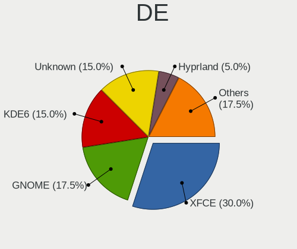
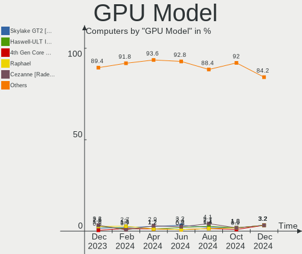
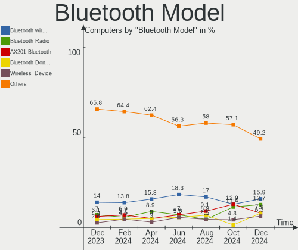
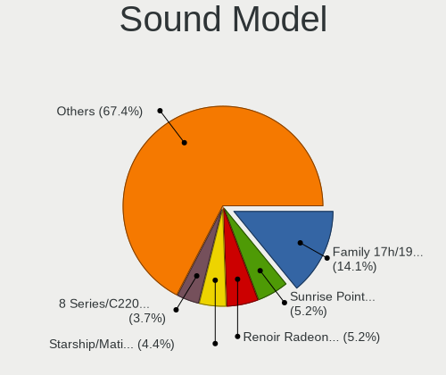
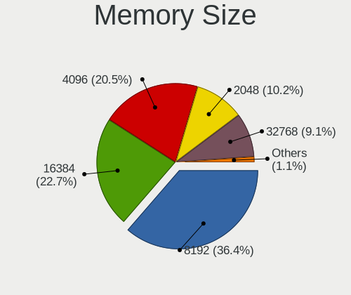
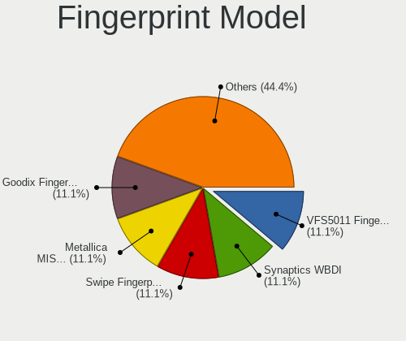

ArcoLinux - Hardware Trends
---------------------------

A project to identify most popular hardware characteristics and track their change
over time based on data collected by Linux users at https://Linux-Hardware.org.

Anyone can contribute to this report by the [hw-probe](https://github.com/linuxhw/hw-probe) tool:

    sudo -E hw-probe -all -upload

This is a report for all computer types. See also reports for [desktops](/Dist/ArcoLinux/Desktop/README.md) and [notebooks](/Dist/ArcoLinux/Notebook/README.md).

This report is for one last month. Overall report since the beginning of time: [TestCoverage](https://github.com/linuxhw/TestCoverage)

Period: Dec, 2022.

Contents
--------

* [ System ](#system)
  - [ OS                       ](#os)
  - [ OS Family                ](#os-family)
  - [ Kernel                   ](#kernel)
  - [ Kernel Family            ](#kernel-family)
  - [ Kernel Major Ver.        ](#kernel-major-ver)
  - [ Arch                     ](#arch)
  - [ DE                       ](#de)
  - [ Display Server           ](#display-server)
  - [ Display Manager          ](#display-manager)
  - [ OS Lang                  ](#os-lang)
  - [ Boot Mode                ](#boot-mode)
  - [ Filesystem               ](#filesystem)
  - [ Part. scheme             ](#part-scheme)
  - [ Dual Boot with Linux/BSD ](#dual-boot-with-linuxbsd)
  - [ Dual Boot (Win)          ](#dual-boot-win)

* [ Board ](#board)
  - [ Vendor                   ](#vendor)
  - [ Model                    ](#model)
  - [ Model Family             ](#model-family)
  - [ MFG Year                 ](#mfg-year)
  - [ Form Factor              ](#form-factor)
  - [ Secure Boot              ](#secure-boot)
  - [ Coreboot                 ](#coreboot)
  - [ RAM Size                 ](#ram-size)
  - [ RAM Used                 ](#ram-used)
  - [ Total Drives             ](#total-drives)
  - [ Has CD-ROM               ](#has-cd-rom)
  - [ Has Ethernet             ](#has-ethernet)
  - [ Has WiFi                 ](#has-wifi)
  - [ Has Bluetooth            ](#has-bluetooth)

* [ Location ](#location)
  - [ Country                  ](#country)
  - [ City                     ](#city)

* [ Drives ](#drives)
  - [ Drive Vendor             ](#drive-vendor)
  - [ Drive Model              ](#drive-model)
  - [ HDD Vendor               ](#hdd-vendor)
  - [ SSD Vendor               ](#ssd-vendor)
  - [ Drive Kind               ](#drive-kind)
  - [ Drive Connector          ](#drive-connector)
  - [ Drive Size               ](#drive-size)
  - [ Space Total              ](#space-total)
  - [ Space Used               ](#space-used)
  - [ Malfunc. Drives          ](#malfunc-drives)
  - [ Malfunc. Drive Vendor    ](#malfunc-drive-vendor)
  - [ Malfunc. HDD Vendor      ](#malfunc-hdd-vendor)
  - [ Malfunc. Drive Kind      ](#malfunc-drive-kind)
  - [ Failed Drives            ](#failed-drives)
  - [ Failed Drive Vendor      ](#failed-drive-vendor)
  - [ Drive Status             ](#drive-status)

* [ Storage controller ](#storage-controller)
  - [ Storage Vendor           ](#storage-vendor)
  - [ Storage Model            ](#storage-model)
  - [ Storage Kind             ](#storage-kind)

* [ Processor ](#processor)
  - [ CPU Vendor               ](#cpu-vendor)
  - [ CPU Model                ](#cpu-model)
  - [ CPU Model Family         ](#cpu-model-family)
  - [ CPU Cores                ](#cpu-cores)
  - [ CPU Sockets              ](#cpu-sockets)
  - [ CPU Threads              ](#cpu-threads)
  - [ CPU Op-Modes             ](#cpu-op-modes)
  - [ CPU Microcode            ](#cpu-microcode)
  - [ CPU Microarch            ](#cpu-microarch)

* [ Graphics ](#graphics)
  - [ GPU Vendor               ](#gpu-vendor)
  - [ GPU Model                ](#gpu-model)
  - [ GPU Combo                ](#gpu-combo)
  - [ GPU Driver               ](#gpu-driver)
  - [ GPU Memory               ](#gpu-memory)

* [ Monitor ](#monitor)
  - [ Monitor Vendor           ](#monitor-vendor)
  - [ Monitor Model            ](#monitor-model)
  - [ Monitor Resolution       ](#monitor-resolution)
  - [ Monitor Diagonal         ](#monitor-diagonal)
  - [ Monitor Width            ](#monitor-width)
  - [ Aspect Ratio             ](#aspect-ratio)
  - [ Monitor Area             ](#monitor-area)
  - [ Pixel Density            ](#pixel-density)
  - [ Multiple Monitors        ](#multiple-monitors)

* [ Network ](#network)
  - [ Net Controller Vendor    ](#net-controller-vendor)
  - [ Net Controller Model     ](#net-controller-model)
  - [ Wireless Vendor          ](#wireless-vendor)
  - [ Wireless Model           ](#wireless-model)
  - [ Ethernet Vendor          ](#ethernet-vendor)
  - [ Ethernet Model           ](#ethernet-model)
  - [ Net Controller Kind      ](#net-controller-kind)
  - [ Used Controller          ](#used-controller)
  - [ NICs                     ](#nics)
  - [ IPv6                     ](#ipv6)

* [ Bluetooth ](#bluetooth)
  - [ Bluetooth Vendor         ](#bluetooth-vendor)
  - [ Bluetooth Model          ](#bluetooth-model)

* [ Sound ](#sound)
  - [ Sound Vendor             ](#sound-vendor)
  - [ Sound Model              ](#sound-model)

* [ Memory ](#memory)
  - [ Memory Vendor            ](#memory-vendor)
  - [ Memory Model             ](#memory-model)
  - [ Memory Kind              ](#memory-kind)
  - [ Memory Form Factor       ](#memory-form-factor)
  - [ Memory Size              ](#memory-size)
  - [ Memory Speed             ](#memory-speed)

* [ Printers & scanners ](#printers--scanners)
  - [ Printer Vendor           ](#printer-vendor)
  - [ Printer Model            ](#printer-model)
  - [ Scanner Vendor           ](#scanner-vendor)
  - [ Scanner Model            ](#scanner-model)

* [ Camera ](#camera)
  - [ Camera Vendor            ](#camera-vendor)
  - [ Camera Model             ](#camera-model)

* [ Security ](#security)
  - [ Fingerprint Vendor       ](#fingerprint-vendor)
  - [ Fingerprint Model        ](#fingerprint-model)
  - [ Chipcard Vendor          ](#chipcard-vendor)
  - [ Chipcard Model           ](#chipcard-model)

* [ Unsupported ](#unsupported)
  - [ Unsupported Devices      ](#unsupported-devices)
  - [ Unsupported Device Types ](#unsupported-device-types)

System
------

OS
--

Installed operating systems

| Name              | Computers | Percent |
|-------------------|-----------|---------|
| ArcoLinux Rolling | 39        | 90.7%   |
| ArcoLinux         | 4         | 9.3%    |

OS Family
---------

OS without a version

| Name      | Computers | Percent |
|-----------|-----------|---------|
| ArcoLinux | 43        | 100%    |

Kernel
------

Version of the Linux kernel

| Version                     | Computers | Percent |
|-----------------------------|-----------|---------|
| 6.0.12-arch1-1              | 11        | 25.58%  |
| 6.0.11-arch1-1              | 6         | 13.95%  |
| 6.1.1-zen1-1-zen            | 5         | 11.63%  |
| 6.0.10-arch2-1              | 5         | 11.63%  |
| 6.1.1-arch1-1               | 2         | 4.65%   |
| 6.0.12-zen1-1-zen           | 2         | 4.65%   |
| 6.0.11-zen1-1-zen           | 2         | 4.65%   |
| 5.15.81-1-lts               | 2         | 4.65%   |
| 6.0.9-x64v1-xanmod1-1       | 1         | 2.33%   |
| 6.0.9-arch1-1               | 1         | 2.33%   |
| 6.0.8-arch1-1               | 1         | 2.33%   |
| 6.0.10-hardened1-1-hardened | 1         | 2.33%   |
| 6.0.1-arch2-1               | 1         | 2.33%   |
| 5.15.84-1-lts               | 1         | 2.33%   |
| 5.15.82-1-lts               | 1         | 2.33%   |
| 5.13.9-arch1-1              | 1         | 2.33%   |

Kernel Family
-------------

Linux kernel without a distro release

| Version | Computers | Percent |
|---------|-----------|---------|
| 6.0.12  | 13        | 30.23%  |
| 6.0.11  | 8         | 18.6%   |
| 6.1.1   | 7         | 16.28%  |
| 6.0.10  | 6         | 13.95%  |
| 6.0.9   | 2         | 4.65%   |
| 5.15.81 | 2         | 4.65%   |
| 6.0.8   | 1         | 2.33%   |
| 6.0.1   | 1         | 2.33%   |
| 5.15.84 | 1         | 2.33%   |
| 5.15.82 | 1         | 2.33%   |
| 5.13.9  | 1         | 2.33%   |

Kernel Major Ver.
-----------------

Linux kernel major version

| Version | Computers | Percent |
|---------|-----------|---------|
| 6.0     | 31        | 72.09%  |
| 6.1     | 7         | 16.28%  |
| 5.15    | 4         | 9.3%    |
| 5.13    | 1         | 2.33%   |

Arch
----

OS architecture (x86_64, i586, etc.)

| Name   | Computers | Percent |
|--------|-----------|---------|
| x86_64 | 43        | 100%    |

DE
--

Desktop Environment

| Name          | Computers | Percent |
|---------------|-----------|---------|
| XFCE          | 13        | 30.23%  |
| KDE5          | 9         | 20.93%  |
| awesome       | 4         | 9.3%    |
| LeftWM        | 3         | 6.98%   |
| i3            | 3         | 6.98%   |
| GNOME         | 2         | 4.65%   |
| sway          | 1         | 2.33%   |
| qtile         | 1         | 2.33%   |
| GNOME Classic | 1         | 2.33%   |
| dwm           | 1         | 2.33%   |
| Deepin        | 1         | 2.33%   |
| cwm           | 1         | 2.33%   |
| chadwm        | 1         | 2.33%   |
| Budgie        | 1         | 2.33%   |
| bspwm         | 1         | 2.33%   |

Display Server
--------------

X11 or Wayland

| Name    | Computers | Percent |
|---------|-----------|---------|
| X11     | 39        | 90.7%   |
| Wayland | 3         | 6.98%   |
| Tty     | 1         | 2.33%   |

Display Manager
---------------

SDDM, LightDM, etc.

| Name    | Computers | Percent |
|---------|-----------|---------|
| SDDM    | 29        | 67.44%  |
| LightDM | 7         | 16.28%  |
| Unknown | 4         | 9.3%    |
| GDM     | 2         | 4.65%   |
| Ly      | 1         | 2.33%   |

OS Lang
-------

Language

| Lang  | Computers | Percent |
|-------|-----------|---------|
| en_US | 27        | 62.79%  |
| de_DE | 4         | 9.3%    |
| ru_RU | 2         | 4.65%   |
| it_IT | 2         | 4.65%   |
| en_GB | 2         | 4.65%   |
| pt_BR | 1         | 2.33%   |
| fr_FR | 1         | 2.33%   |
| es_ES | 1         | 2.33%   |
| en_ZA | 1         | 2.33%   |
| en_CA | 1         | 2.33%   |
| en_AU | 1         | 2.33%   |

Boot Mode
---------

EFI or BIOS

| Mode | Computers | Percent |
|------|-----------|---------|
| EFI  | 32        | 74.42%  |
| BIOS | 11        | 25.58%  |

Filesystem
----------

Type of filesystem

| Type    | Computers | Percent |
|---------|-----------|---------|
| Ext4    | 30        | 69.77%  |
| Btrfs   | 11        | 25.58%  |
| Xfs     | 1         | 2.33%   |
| Overlay | 1         | 2.33%   |

Part. scheme
------------

Scheme of partitioning

| Type    | Computers | Percent |
|---------|-----------|---------|
| GPT     | 35        | 81.4%   |
| MBR     | 4         | 9.3%    |
| Unknown | 4         | 9.3%    |

Dual Boot with Linux/BSD
------------------------

Hosting more than one Linux/BSD

| Dual boot | Computers | Percent |
|-----------|-----------|---------|
| No        | 34        | 79.07%  |
| Yes       | 9         | 20.93%  |

Dual Boot (Win)
---------------

Hosting Linux and Windows

| Dual boot | Computers | Percent |
|-----------|-----------|---------|
| No        | 27        | 62.79%  |
| Yes       | 16        | 37.21%  |

Board
-----

Vendor
------

Motherboard manufacturer

| Name                | Computers | Percent |
|---------------------|-----------|---------|
| ASUSTek Computer    | 11        | 25.58%  |
| MSI                 | 7         | 16.28%  |
| Gigabyte Technology | 5         | 11.63%  |
| Lenovo              | 4         | 9.3%    |
| Hewlett-Packard     | 4         | 9.3%    |
| Dell                | 4         | 9.3%    |
| Sony                | 1         | 2.33%   |
| Packard Bell        | 1         | 2.33%   |
| LG Electronics      | 1         | 2.33%   |
| Intel               | 1         | 2.33%   |
| Fanless Mini PC     | 1         | 2.33%   |
| ASRock              | 1         | 2.33%   |
| Apple               | 1         | 2.33%   |
| Acer                | 1         | 2.33%   |

Model
-----

Motherboard model

| Name                                   | Computers | Percent |
|----------------------------------------|-----------|---------|
| Sony SVF15N26CXB                       | 1         | 2.33%   |
| Packard Bell EasyNote TE69HW           | 1         | 2.33%   |
| MSI Raider GE77HX 12UGS                | 1         | 2.33%   |
| MSI MS-7C83                            | 1         | 2.33%   |
| MSI MS-7C79                            | 1         | 2.33%   |
| MSI MS-7B79                            | 1         | 2.33%   |
| MSI MS-7971                            | 1         | 2.33%   |
| MSI GL75 Leopard 10SDK                 | 1         | 2.33%   |
| MSI GE72VR 6RF                         | 1         | 2.33%   |
| LG C500                                | 1         | 2.33%   |
| Lenovo ThinkPad T14s Gen 2i 20WM00ACIX | 1         | 2.33%   |
| Lenovo ThinkCentre M58 6258D3G         | 1         | 2.33%   |
| Lenovo Legion 5 15ARH05 82B5           | 1         | 2.33%   |
| Lenovo IdeaPad 5 14ALC05 82LM          | 1         | 2.33%   |
| Intel NUC7CJYH                         | 1         | 2.33%   |
| HP Spectre x360 Convertible 15-df1xxx  | 1         | 2.33%   |
| HP Folio 13                            | 1         | 2.33%   |
| HP EliteBook 850 G1                    | 1         | 2.33%   |
| HP EliteBook 830 G5                    | 1         | 2.33%   |
| Gigabyte Z490I AORUS ULTRA             | 1         | 2.33%   |
| Gigabyte X570 AORUS PRO WIFI           | 1         | 2.33%   |
| Gigabyte X570 AORUS MASTER             | 1         | 2.33%   |
| Gigabyte B650 AORUS ELITE AX           | 1         | 2.33%   |
| Gigabyte 970A-UD3P                     | 1         | 2.33%   |
| Fanless Mini PC PCG35 GLK              | 1         | 2.33%   |
| Dell Latitude 5580                     | 1         | 2.33%   |
| Dell Inspiron 7580                     | 1         | 2.33%   |
| Dell Inspiron 5502                     | 1         | 2.33%   |
| Dell Inspiron 3847                     | 1         | 2.33%   |
| ASUS X556UQK                           | 1         | 2.33%   |
| ASUS X555QA                            | 1         | 2.33%   |
| ASUS X550MD                            | 1         | 2.33%   |
| ASUS ROG STRIX X670E-I GAMING WIFI     | 1         | 2.33%   |
| ASUS ROG STRIX B550-I GAMING           | 1         | 2.33%   |
| ASUS ROG STRIX B550-F GAMING WIFI II   | 1         | 2.33%   |
| ASUS PRIME Z490-A                      | 1         | 2.33%   |
| ASUS PRIME X570-P                      | 1         | 2.33%   |
| ASUS PRIME B450M-K                     | 1         | 2.33%   |
| ASUS PRIME A320M-K                     | 1         | 2.33%   |
| ASUS All Series                        | 1         | 2.33%   |

Model Family
------------

Motherboard model prefix

| Name                  | Computers | Percent |
|-----------------------|-----------|---------|
| ASUS PRIME            | 4         | 9.3%    |
| Dell Inspiron         | 3         | 6.98%   |
| ASUS ROG              | 3         | 6.98%   |
| HP EliteBook          | 2         | 4.65%   |
| Gigabyte X570         | 2         | 4.65%   |
| Sony SVF15N26CXB      | 1         | 2.33%   |
| Packard Bell EasyNote | 1         | 2.33%   |
| MSI Raider            | 1         | 2.33%   |
| MSI MS-7C83           | 1         | 2.33%   |
| MSI MS-7C79           | 1         | 2.33%   |
| MSI MS-7B79           | 1         | 2.33%   |
| MSI MS-7971           | 1         | 2.33%   |
| MSI GL75              | 1         | 2.33%   |
| MSI GE72VR            | 1         | 2.33%   |
| LG C500               | 1         | 2.33%   |
| Lenovo ThinkPad       | 1         | 2.33%   |
| Lenovo ThinkCentre    | 1         | 2.33%   |
| Lenovo Legion         | 1         | 2.33%   |
| Lenovo IdeaPad        | 1         | 2.33%   |
| Intel NUC7CJYH        | 1         | 2.33%   |
| HP Spectre            | 1         | 2.33%   |
| HP Folio              | 1         | 2.33%   |
| Gigabyte Z490I        | 1         | 2.33%   |
| Gigabyte B650         | 1         | 2.33%   |
| Gigabyte 970A-UD3P    | 1         | 2.33%   |
| Fanless Mini PC PCG35 | 1         | 2.33%   |
| Dell Latitude         | 1         | 2.33%   |
| ASUS X556UQK          | 1         | 2.33%   |
| ASUS X555QA           | 1         | 2.33%   |
| ASUS X550MD           | 1         | 2.33%   |
| ASUS All              | 1         | 2.33%   |
| ASRock B250M-HDV      | 1         | 2.33%   |
| Apple MacBookAir6     | 1         | 2.33%   |
| Acer Aspire           | 1         | 2.33%   |

MFG Year
--------

Motherboard manufacture year

| Year | Computers | Percent |
|------|-----------|---------|
| 2020 | 8         | 18.6%   |
| 2019 | 7         | 16.28%  |
| 2021 | 4         | 9.3%    |
| 2017 | 4         | 9.3%    |
| 2014 | 4         | 9.3%    |
| 2013 | 4         | 9.3%    |
| 2022 | 3         | 6.98%   |
| 2016 | 3         | 6.98%   |
| 2018 | 2         | 4.65%   |
| 2011 | 2         | 4.65%   |
| 2015 | 1         | 2.33%   |
| 2008 | 1         | 2.33%   |

Form Factor
-----------

Physical design of the computer

| Name        | Computers | Percent |
|-------------|-----------|---------|
| Desktop     | 21        | 48.84%  |
| Notebook    | 19        | 44.19%  |
| Mini pc     | 2         | 4.65%   |
| Convertible | 1         | 2.33%   |

Secure Boot
-----------

Enabled or disabled

| State    | Computers | Percent |
|----------|-----------|---------|
| Disabled | 43        | 100%    |

Coreboot
--------

Have coreboot on board

| Used | Computers | Percent |
|------|-----------|---------|
| No   | 43        | 100%    |

RAM Size
--------

Total RAM memory

| Size in GB  | Computers | Percent |
|-------------|-----------|---------|
| 4.01-8.0    | 9         | 20.93%  |
| 32.01-64.0  | 8         | 18.6%   |
| 16.01-24.0  | 8         | 18.6%   |
| 8.01-16.0   | 7         | 16.28%  |
| 3.01-4.0    | 5         | 11.63%  |
| 64.01-256.0 | 4         | 9.3%    |
| 24.01-32.0  | 2         | 4.65%   |

RAM Used
--------

Used RAM memory

| Used GB    | Computers | Percent |
|------------|-----------|---------|
| 4.01-8.0   | 11        | 25.58%  |
| 3.01-4.0   | 11        | 25.58%  |
| 1.01-2.0   | 9         | 20.93%  |
| 2.01-3.0   | 8         | 18.6%   |
| 8.01-16.0  | 3         | 6.98%   |
| 16.01-24.0 | 1         | 2.33%   |

Total Drives
------------

Number of drives on board

| Drives | Computers | Percent |
|--------|-----------|---------|
| 1      | 19        | 44.19%  |
| 2      | 15        | 34.88%  |
| 3      | 4         | 9.3%    |
| 5      | 3         | 6.98%   |
| 4      | 2         | 4.65%   |

Has CD-ROM
----------

Has CD-ROM on board

| Presented | Computers | Percent |
|-----------|-----------|---------|
| No        | 34        | 79.07%  |
| Yes       | 9         | 20.93%  |

Has Ethernet
------------

Has Ethernet on board

| Presented | Computers | Percent |
|-----------|-----------|---------|
| Yes       | 38        | 88.37%  |
| No        | 5         | 11.63%  |

Has WiFi
--------

Has WiFi module

| Presented | Computers | Percent |
|-----------|-----------|---------|
| Yes       | 37        | 86.05%  |
| No        | 6         | 13.95%  |

Has Bluetooth
-------------

Has Bluetooth module

| Presented | Computers | Percent |
|-----------|-----------|---------|
| Yes       | 33        | 76.74%  |
| No        | 10        | 23.26%  |

Location
--------

Country
-------

Geographic location (country)

| Country      | Computers | Percent |
|--------------|-----------|---------|
| USA          | 10        | 23.26%  |
| Germany      | 4         | 9.3%    |
| Mexico       | 3         | 6.98%   |
| Turkey       | 2         | 4.65%   |
| Sweden       | 2         | 4.65%   |
| Spain        | 2         | 4.65%   |
| Russia       | 2         | 4.65%   |
| Romania      | 2         | 4.65%   |
| Italy        | 2         | 4.65%   |
| France       | 2         | 4.65%   |
| Egypt        | 2         | 4.65%   |
| Canada       | 2         | 4.65%   |
| UK           | 1         | 2.33%   |
| South Africa | 1         | 2.33%   |
| Slovenia     | 1         | 2.33%   |
| Latvia       | 1         | 2.33%   |
| Finland      | 1         | 2.33%   |
| Brazil       | 1         | 2.33%   |
| Belgium      | 1         | 2.33%   |
| Australia    | 1         | 2.33%   |

City
----

Geographic location (city)

| City                  | Computers | Percent |
|-----------------------|-----------|---------|
| Workington            | 1         | 2.33%   |
| Venustiano Carranza   | 1         | 2.33%   |
| Ventspils             | 1         | 2.33%   |
| Vellinge              | 1         | 2.33%   |
| Tyumen                | 1         | 2.33%   |
| Toronto               | 1         | 2.33%   |
| Spokane               | 1         | 2.33%   |
| Sharqia               | 1         | 2.33%   |
| Schwanewede           | 1         | 2.33%   |
| San Luis Potosí City | 1         | 2.33%   |
| San Juan de Moro      | 1         | 2.33%   |
| Rio de Janeiro        | 1         | 2.33%   |
| Radomlje              | 1         | 2.33%   |
| Portland              | 1         | 2.33%   |
| Parma                 | 1         | 2.33%   |
| Oulu                  | 1         | 2.33%   |
| Örebro               | 1         | 2.33%   |
| New York              | 1         | 2.33%   |
| Neustadt in Holstein  | 1         | 2.33%   |
| Milan                 | 1         | 2.33%   |
| Mexico City           | 1         | 2.33%   |
| Madrid                | 1         | 2.33%   |
| Lyon                  | 1         | 2.33%   |
| Lafayette             | 1         | 2.33%   |
| Krasnodar             | 1         | 2.33%   |
| Istanbul              | 1         | 2.33%   |
| Inverness             | 1         | 2.33%   |
| Hercules              | 1         | 2.33%   |
| Grand Junction        | 1         | 2.33%   |
| Gardena               | 1         | 2.33%   |
| Duffel                | 1         | 2.33%   |
| Draveil               | 1         | 2.33%   |
| Cluj-Napoca           | 1         | 2.33%   |
| Cape Town             | 1         | 2.33%   |
| Campina               | 1         | 2.33%   |
| Cairo                 | 1         | 2.33%   |
| Burlington            | 1         | 2.33%   |
| Brisbane              | 1         | 2.33%   |
| Bradenton             | 1         | 2.33%   |
| Berkeley              | 1         | 2.33%   |

Drives
------

Drive Vendor
------------

Hard drive vendors

| Vendor                    | Computers | Drives | Percent |
|---------------------------|-----------|--------|---------|
| Samsung Electronics       | 16        | 23     | 23.53%  |
| WDC                       | 10        | 15     | 14.71%  |
| SK hynix                  | 4         | 5      | 5.88%   |
| Seagate                   | 4         | 5      | 5.88%   |
| Kingston                  | 4         | 4      | 5.88%   |
| Unknown                   | 3         | 3      | 4.41%   |
| Toshiba                   | 3         | 3      | 4.41%   |
| Sandisk                   | 3         | 4      | 4.41%   |
| Micron Technology         | 3         | 3      | 4.41%   |
| A-DATA Technology         | 3         | 3      | 4.41%   |
| PNY                       | 2         | 2      | 2.94%   |
| Corsair                   | 2         | 2      | 2.94%   |
| ADATA Technology          | 2         | 2      | 2.94%   |
| USB3.0                    | 1         | 1      | 1.47%   |
| Pioneer                   | 1         | 1      | 1.47%   |
| Phison Electronics        | 1         | 1      | 1.47%   |
| PHD 3.0                   | 1         | 1      | 1.47%   |
| Micron/Crucial Technology | 1         | 1      | 1.47%   |
| LaCie                     | 1         | 1      | 1.47%   |
| Intel                     | 1         | 1      | 1.47%   |
| Crucial                   | 1         | 1      | 1.47%   |
| Apple                     | 1         | 1      | 1.47%   |

Drive Model
-----------

Hard drive models

| Model                                                           | Computers | Percent |
|-----------------------------------------------------------------|-----------|---------|
| Samsung NVMe SSD Controller SM981/PM981/PM983 500GB             | 5         | 6.25%   |
| WDC WD10EZEX-08WN4A0 1TB                                        | 2         | 2.5%    |
| Unknown SD/MMC/MS PRO 64GB                                      | 2         | 2.5%    |
| Samsung NVMe SSD Controller PM9A1/PM9A3/980PRO 2TB              | 2         | 2.5%    |
| Kingston SA400S37240G 240GB SSD                                 | 2         | 2.5%    |
| ADATA XPG SX8200 Pro PCIe Gen3x4 M.2 2280 Solid State Drive 1TB | 2         | 2.5%    |
| WDC WDS100T2B0B-00YS70 1TB SSD                                  | 1         | 1.25%   |
| WDC WD5000LPVX-80V0TT0 500GB                                    | 1         | 1.25%   |
| WDC WD5000AAKS-65A7B2 500GB                                     | 1         | 1.25%   |
| WDC WD5000AACS-00G8B1 500GB                                     | 1         | 1.25%   |
| WDC WD3200BPVT-22ZEST0 320GB                                    | 1         | 1.25%   |
| WDC WD3200AVJS-63B6A0 320GB                                     | 1         | 1.25%   |
| WDC WD30EZRZ-00Z5HB0 3TB                                        | 1         | 1.25%   |
| WDC WD30EZRX-00DC0B0 3TB                                        | 1         | 1.25%   |
| WDC WD15EARS-00Z5B1 1TB                                         | 1         | 1.25%   |
| WDC WD10EZEX-75M2NA0 1TB                                        | 1         | 1.25%   |
| WDC WD10EZEX-22MFCA0 1TB                                        | 1         | 1.25%   |
| WDC WD10EZEX-00BN5A0 1TB                                        | 1         | 1.25%   |
| WDC WD Blue SA510 2.5 1000GB SSD                                | 1         | 1.25%   |
| USB3.0 Disk 2TB                                                 | 1         | 1.25%   |
| Unknown MMC Card  128GB                                         | 1         | 1.25%   |
| Toshiba THNSNK256GVN8 M.2 2280 256GB SSD                        | 1         | 1.25%   |
| Toshiba MQ01ABD100 1TB                                          | 1         | 1.25%   |
| Toshiba BG3 NVMe SSD Controller 256GB                           | 1         | 1.25%   |
| SK hynix SKHynix_HFS512GDE9X081N 512GB                          | 1         | 1.25%   |
| SK hynix SHPP41-2000GM 2TB                                      | 1         | 1.25%   |
| SK hynix HFS128G32TND-N210A 128GB SSD                           | 1         | 1.25%   |
| SK hynix C2S3T/240G 240GB SSD                                   | 1         | 1.25%   |
| Seagate ST8000DM004-2CX188 8TB                                  | 1         | 1.25%   |
| Seagate ST3500312CS 500GB                                       | 1         | 1.25%   |
| Seagate ST3320311CS 320GB                                       | 1         | 1.25%   |
| Seagate ST2000DM008-2UB102 2TB                                  | 1         | 1.25%   |
| Seagate Expansion 4TB                                           | 1         | 1.25%   |
| Sandisk WD Blue SN570 1TB                                       | 1         | 1.25%   |
| Sandisk WD Black SN750 / PC SN730 NVMe SSD 512GB                | 1         | 1.25%   |
| Sandisk WD Black 2018/SN750 / PC SN720 NVMe SSD 256GB           | 1         | 1.25%   |
| Samsung SSD 990 PRO 1TB                                         | 1         | 1.25%   |
| Samsung SSD 980 1TB                                             | 1         | 1.25%   |
| Samsung SSD 870 QVO 2TB                                         | 1         | 1.25%   |
| Samsung SSD 870 EVO 1TB                                         | 1         | 1.25%   |

HDD Vendor
----------

Hard disk drive vendors

| Vendor              | Computers | Drives | Percent |
|---------------------|-----------|--------|---------|
| WDC                 | 9         | 13     | 42.86%  |
| Seagate             | 4         | 5      | 19.05%  |
| Unknown             | 2         | 2      | 9.52%   |
| Samsung Electronics | 2         | 2      | 9.52%   |
| USB3.0              | 1         | 1      | 4.76%   |
| Toshiba             | 1         | 1      | 4.76%   |
| PHD 3.0             | 1         | 1      | 4.76%   |
| LaCie               | 1         | 1      | 4.76%   |

SSD Vendor
----------

Solid state drive vendors

| Vendor              | Computers | Drives | Percent |
|---------------------|-----------|--------|---------|
| Samsung Electronics | 7         | 9      | 26.92%  |
| Kingston            | 3         | 3      | 11.54%  |
| A-DATA Technology   | 3         | 3      | 11.54%  |
| WDC                 | 2         | 2      | 7.69%   |
| SK hynix            | 2         | 2      | 7.69%   |
| PNY                 | 2         | 2      | 7.69%   |
| Corsair             | 2         | 2      | 7.69%   |
| Toshiba             | 1         | 1      | 3.85%   |
| Pioneer             | 1         | 1      | 3.85%   |
| Micron Technology   | 1         | 1      | 3.85%   |
| Crucial             | 1         | 1      | 3.85%   |
| Apple               | 1         | 1      | 3.85%   |

Drive Kind
----------

HDD or SSD

| Kind | Computers | Drives | Percent |
|------|-----------|--------|---------|
| NVMe | 22        | 28     | 34.38%  |
| SSD  | 22        | 28     | 34.38%  |
| HDD  | 19        | 26     | 29.69%  |
| MMC  | 1         | 1      | 1.56%   |

Drive Connector
---------------

SATA, SAS, NVMe, etc.

| Type | Computers | Drives | Percent |
|------|-----------|--------|---------|
| SATA | 30        | 47     | 50%     |
| NVMe | 22        | 28     | 36.67%  |
| SAS  | 7         | 7      | 11.67%  |
| MMC  | 1         | 1      | 1.67%   |

Drive Size
----------

Size of hard drive

| Size in TB | Computers | Drives | Percent |
|------------|-----------|--------|---------|
| 0.01-0.5   | 25        | 32     | 54.35%  |
| 0.51-1.0   | 13        | 14     | 28.26%  |
| 1.01-2.0   | 4         | 4      | 8.7%    |
| 2.01-3.0   | 2         | 2      | 4.35%   |
| 3.01-4.0   | 1         | 1      | 2.17%   |
| 4.01-10.0  | 1         | 1      | 2.17%   |

Space Total
-----------

Amount of disk space available on the file system

| Size in GB     | Computers | Percent |
|----------------|-----------|---------|
| 1001-2000      | 10        | 23.26%  |
| 251-500        | 9         | 20.93%  |
| 501-1000       | 8         | 18.6%   |
| 101-250        | 7         | 16.28%  |
| More than 3000 | 4         | 9.3%    |
| 51-100         | 2         | 4.65%   |
| 21-50          | 1         | 2.33%   |
| 2001-3000      | 1         | 2.33%   |
| 1-20           | 1         | 2.33%   |

Space Used
----------

Amount of used disk space

| Used GB        | Computers | Percent |
|----------------|-----------|---------|
| 251-500        | 9         | 20.93%  |
| 101-250        | 8         | 18.6%   |
| 1-20           | 8         | 18.6%   |
| 501-1000       | 6         | 13.95%  |
| 51-100         | 5         | 11.63%  |
| 21-50          | 4         | 9.3%    |
| 1001-2000      | 2         | 4.65%   |
| More than 3000 | 1         | 2.33%   |

Malfunc. Drives
---------------

Drive models with a malfunction

| Model                                    | Computers | Drives | Percent |
|------------------------------------------|-----------|--------|---------|
| WDC WD5000AACS-00G8B1 500GB              | 1         | 1      | 11.11%  |
| WDC WD3200AVJS-63B6A0 320GB              | 1         | 1      | 11.11%  |
| WDC WD30EZRZ-00Z5HB0 3TB                 | 1         | 1      | 11.11%  |
| Toshiba THNSNK256GVN8 M.2 2280 256GB SSD | 1         | 1      | 11.11%  |
| SK hynix HFS128G32TND-N210A 128GB SSD    | 1         | 1      | 11.11%  |
| Samsung Electronics HD502HI 500GB        | 1         | 1      | 11.11%  |
| LaCie Rugged Mini USB3 2TB               | 1         | 1      | 11.11%  |
| Corsair CSSD-F60GB2 64GB                 | 1         | 1      | 11.11%  |
| A-DATA Technology SU800 128GB SSD        | 1         | 1      | 11.11%  |

Malfunc. Drive Vendor
---------------------

Vendors of faulty drives

| Vendor              | Computers | Drives | Percent |
|---------------------|-----------|--------|---------|
| WDC                 | 3         | 3      | 33.33%  |
| Toshiba             | 1         | 1      | 11.11%  |
| SK hynix            | 1         | 1      | 11.11%  |
| Samsung Electronics | 1         | 1      | 11.11%  |
| LaCie               | 1         | 1      | 11.11%  |
| Corsair             | 1         | 1      | 11.11%  |
| A-DATA Technology   | 1         | 1      | 11.11%  |

Malfunc. HDD Vendor
-------------------

Vendors of faulty HDD drives

| Vendor              | Computers | Drives | Percent |
|---------------------|-----------|--------|---------|
| WDC                 | 3         | 3      | 60%     |
| Samsung Electronics | 1         | 1      | 20%     |
| LaCie               | 1         | 1      | 20%     |

Malfunc. Drive Kind
-------------------

Kinds of faulty drives

| Kind | Computers | Drives | Percent |
|------|-----------|--------|---------|
| HDD  | 5         | 5      | 55.56%  |
| SSD  | 4         | 4      | 44.44%  |

Failed Drives
-------------

Failed drive models

| Model                           | Computers | Drives | Percent |
|---------------------------------|-----------|--------|---------|
| Samsung Electronics SSD 980 1TB | 1         | 1      | 100%    |

Failed Drive Vendor
-------------------

Failed drive vendors

| Vendor              | Computers | Drives | Percent |
|---------------------|-----------|--------|---------|
| Samsung Electronics | 1         | 1      | 100%    |

Drive Status
------------

Number of failed and malfunc. drives

| Status   | Computers | Drives | Percent |
|----------|-----------|--------|---------|
| Works    | 37        | 59     | 68.52%  |
| Detected | 8         | 14     | 14.81%  |
| Malfunc  | 8         | 9      | 14.81%  |
| Failed   | 1         | 1      | 1.85%   |

Storage controller
------------------

Storage Vendor
--------------

Storage controller vendors

| Vendor                       | Computers | Percent |
|------------------------------|-----------|---------|
| Intel                        | 25        | 38.46%  |
| AMD                          | 14        | 21.54%  |
| Samsung Electronics          | 10        | 15.38%  |
| SanDisk                      | 3         | 4.62%   |
| SK hynix                     | 2         | 3.08%   |
| Micron Technology            | 2         | 3.08%   |
| Marvell Technology Group     | 2         | 3.08%   |
| ADATA Technology             | 2         | 3.08%   |
| Toshiba America Info Systems | 1         | 1.54%   |
| Phison Electronics           | 1         | 1.54%   |
| Micron/Crucial Technology    | 1         | 1.54%   |
| Kingston Technology Company  | 1         | 1.54%   |
| ASMedia Technology           | 1         | 1.54%   |

Storage Model
-------------

Storage controller models

| Model                                                                          | Computers | Percent |
|--------------------------------------------------------------------------------|-----------|---------|
| AMD FCH SATA Controller [AHCI mode]                                            | 8         | 11.43%  |
| Samsung NVMe SSD Controller SM981/PM981/PM983                                  | 5         | 7.14%   |
| Intel Q170/Q150/B150/H170/H110/Z170/CM236 Chipset SATA Controller [AHCI Mode]  | 3         | 4.29%   |
| Intel Comet Lake SATA AHCI Controller                                          | 3         | 4.29%   |
| Intel 8 Series SATA Controller 1 [AHCI mode]                                   | 3         | 4.29%   |
| Samsung NVMe SSD Controller PM9A1/PM9A3/980PRO                                 | 2         | 2.86%   |
| Samsung NVMe SSD Controller 980                                                | 2         | 2.86%   |
| Micron Non-Volatile memory controller                                          | 2         | 2.86%   |
| Intel Celeron/Pentium Silver Processor SATA Controller                         | 2         | 2.86%   |
| Intel 8 Series/C220 Series Chipset Family 6-port SATA Controller 1 [AHCI mode] | 2         | 2.86%   |
| Intel 400 Series Chipset Family SATA AHCI Controller                           | 2         | 2.86%   |
| AMD SATA controller                                                            | 2         | 2.86%   |
| AMD 500 Series Chipset SATA Controller                                         | 2         | 2.86%   |
| AMD 400 Series Chipset SATA Controller                                         | 2         | 2.86%   |
| ADATA XPG SX8200 Pro PCIe Gen3x4 M.2 2280 Solid State Drive                    | 2         | 2.86%   |
| Toshiba America Info Systems BG3 NVMe SSD Controller                           | 1         | 1.43%   |
| SK hynix Non-Volatile memory controller                                        | 1         | 1.43%   |
| SK hynix Gold P31/PC711 NVMe Solid State Drive                                 | 1         | 1.43%   |
| SanDisk WD Blue SN570 NVMe SSD                                                 | 1         | 1.43%   |
| SanDisk WD Black SN750 / PC SN730 NVMe SSD                                     | 1         | 1.43%   |
| SanDisk WD Black 2018/SN750 / PC SN720 NVMe SSD                                | 1         | 1.43%   |
| Samsung NVMe SSD Controller SM961/PM961/SM963                                  | 1         | 1.43%   |
| Samsung NVMe SSD Controller SM951/PM951                                        | 1         | 1.43%   |
| Samsung Electronics Non-Volatile memory controller                             | 1         | 1.43%   |
| Phison NVMe Storage Controller                                                 | 1         | 1.43%   |
| Micron/Crucial P2 NVMe PCIe SSD                                                | 1         | 1.43%   |
| Marvell Group 88SS9183 PCIe SSD Controller                                     | 1         | 1.43%   |
| Marvell Group 88SE9215 PCIe 2.0 x1 4-port SATA 6 Gb/s Controller               | 1         | 1.43%   |
| Kingston Company SNVS2000G [NV1 NVMe PCIe SSD 2TB]                             | 1         | 1.43%   |
| Intel Volume Management Device NVMe RAID Controller                            | 1         | 1.43%   |
| Intel Sunrise Point-LP SATA Controller [AHCI mode]                             | 1         | 1.43%   |
| Intel SSD Pro 7600p/760p/E 6100p Series                                        | 1         | 1.43%   |
| Intel HM170/QM170 Chipset SATA Controller [AHCI Mode]                          | 1         | 1.43%   |
| Intel Cannon Point-LP SATA Controller [AHCI Mode]                              | 1         | 1.43%   |
| Intel Atom Processor E3800 Series SATA AHCI Controller                         | 1         | 1.43%   |
| Intel 82801JD/DO (ICH10 Family) SATA AHCI Controller                           | 1         | 1.43%   |
| Intel 6 Series/C200 Series Chipset Family 6 port Mobile SATA AHCI Controller   | 1         | 1.43%   |
| Intel 5 Series/3400 Series Chipset 4 port SATA AHCI Controller                 | 1         | 1.43%   |
| Intel 4 Series Chipset PT IDER Controller                                      | 1         | 1.43%   |
| Intel 200 Series PCH SATA controller [AHCI mode]                               | 1         | 1.43%   |

Storage Kind
------------

Kind of storage controller (IDE, SATA, NVMe, SAS, ...)

| Kind | Computers | Percent |
|------|-----------|---------|
| SATA | 38        | 61.29%  |
| NVMe | 22        | 35.48%  |
| RAID | 1         | 1.61%   |
| IDE  | 1         | 1.61%   |

Processor
---------

CPU Vendor
----------

Processor vendors

| Vendor | Computers | Percent |
|--------|-----------|---------|
| Intel  | 29        | 67.44%  |
| AMD    | 14        | 32.56%  |

CPU Model
---------

Processor models

| Model                                           | Computers | Percent |
|-------------------------------------------------|-----------|---------|
| Intel Core i7-4500U CPU @ 1.80GHz               | 2         | 4.65%   |
| Intel 11th Gen Core i7-1165G7 @ 2.80GHz         | 2         | 4.65%   |
| AMD Ryzen 7 3700X 8-Core Processor              | 2         | 4.65%   |
| Intel Pentium CPU N3540 @ 2.16GHz               | 1         | 2.33%   |
| Intel Pentium CPU G3460 @ 3.50GHz               | 1         | 2.33%   |
| Intel Core i9-10900K CPU @ 3.70GHz              | 1         | 2.33%   |
| Intel Core i9-10850K CPU @ 3.60GHz              | 1         | 2.33%   |
| Intel Core i7-8565U CPU @ 1.80GHz               | 1         | 2.33%   |
| Intel Core i7-6700K CPU @ 4.00GHz               | 1         | 2.33%   |
| Intel Core i7-6700HQ CPU @ 2.60GHz              | 1         | 2.33%   |
| Intel Core i7-4790 CPU @ 3.60GHz                | 1         | 2.33%   |
| Intel Core i7-10750H CPU @ 2.60GHz              | 1         | 2.33%   |
| Intel Core i7-10700K CPU @ 3.80GHz              | 1         | 2.33%   |
| Intel Core i7-10510U CPU @ 1.80GHz              | 1         | 2.33%   |
| Intel Core i5-8350U CPU @ 1.70GHz               | 1         | 2.33%   |
| Intel Core i5-7300HQ CPU @ 2.50GHz              | 1         | 2.33%   |
| Intel Core i5-7200U CPU @ 2.50GHz               | 1         | 2.33%   |
| Intel Core i5-6400 CPU @ 2.70GHz                | 1         | 2.33%   |
| Intel Core i5-4250U CPU @ 1.30GHz               | 1         | 2.33%   |
| Intel Core i5-4200U CPU @ 1.60GHz               | 1         | 2.33%   |
| Intel Core i5-2467M CPU @ 1.60GHz               | 1         | 2.33%   |
| Intel Core i5-10400F CPU @ 2.90GHz              | 1         | 2.33%   |
| Intel Core i3-7100 CPU @ 3.90GHz                | 1         | 2.33%   |
| Intel Core i3 CPU M 390 @ 2.67GHz               | 1         | 2.33%   |
| Intel Core 2 Duo CPU E7500 @ 2.93GHz            | 1         | 2.33%   |
| Intel Celeron J4125 CPU @ 2.00GHz               | 1         | 2.33%   |
| Intel Celeron J4005 CPU @ 2.00GHz               | 1         | 2.33%   |
| Intel 12th Gen Core i7-12800HX                  | 1         | 2.33%   |
| AMD Ryzen 9 7900X 12-Core Processor             | 1         | 2.33%   |
| AMD Ryzen 7 5800X 8-Core Processor              | 1         | 2.33%   |
| AMD Ryzen 7 5700U with Radeon Graphics          | 1         | 2.33%   |
| AMD Ryzen 7 4800H with Radeon Graphics          | 1         | 2.33%   |
| AMD Ryzen 5 7600X 6-Core Processor              | 1         | 2.33%   |
| AMD Ryzen 5 5600X 6-Core Processor              | 1         | 2.33%   |
| AMD Ryzen 5 3600X 6-Core Processor              | 1         | 2.33%   |
| AMD Ryzen 5 2600X Six-Core Processor            | 1         | 2.33%   |
| AMD Ryzen 3 3100 4-Core Processor               | 1         | 2.33%   |
| AMD Ryzen 3 2200G with Radeon Vega Graphics     | 1         | 2.33%   |
| AMD FX-8350 Eight-Core Processor                | 1         | 2.33%   |
| AMD A12-9720P RADEON R7, 12 COMPUTE CORES 4C+8G | 1         | 2.33%   |

CPU Model Family
----------------

Processor model prefix

| Model            | Computers | Percent |
|------------------|-----------|---------|
| Intel Core i7    | 9         | 20.93%  |
| Intel Core i5    | 8         | 18.6%   |
| AMD Ryzen 7      | 5         | 11.63%  |
| AMD Ryzen 5      | 4         | 9.3%    |
| Other            | 3         | 6.98%   |
| Intel Pentium    | 2         | 4.65%   |
| Intel Core i9    | 2         | 4.65%   |
| Intel Core i3    | 2         | 4.65%   |
| Intel Celeron    | 2         | 4.65%   |
| AMD Ryzen 3      | 2         | 4.65%   |
| Intel Core 2 Duo | 1         | 2.33%   |
| AMD Ryzen 9      | 1         | 2.33%   |
| AMD FX           | 1         | 2.33%   |
| AMD A12          | 1         | 2.33%   |

CPU Cores
---------

Number of processor cores

| Number | Computers | Percent |
|--------|-----------|---------|
| 4      | 15        | 34.88%  |
| 2      | 12        | 27.91%  |
| 8      | 6         | 13.95%  |
| 6      | 6         | 13.95%  |
| 10     | 2         | 4.65%   |
| 16     | 1         | 2.33%   |
| 12     | 1         | 2.33%   |

CPU Sockets
-----------

Number of sockets

| Number | Computers | Percent |
|--------|-----------|---------|
| 1      | 43        | 100%    |

CPU Threads
-----------

Threads per core (Hyper-Threading)

| Number | Computers | Percent |
|--------|-----------|---------|
| 2      | 35        | 81.4%   |
| 1      | 8         | 18.6%   |

CPU Op-Modes
------------

CPU Operation Modes (32-bit, 64-bit)

| Op mode        | Computers | Percent |
|----------------|-----------|---------|
| 32-bit, 64-bit | 43        | 100%    |

CPU Microcode
-------------

Microcode number

| Number     | Computers | Percent |
|------------|-----------|---------|
| Unknown    | 6         | 13.95%  |
| 0xa0655    | 4         | 9.3%    |
| 0x506e3    | 3         | 6.98%   |
| 0x906e9    | 2         | 4.65%   |
| 0x806c1    | 2         | 4.65%   |
| 0x40651    | 2         | 4.65%   |
| 0x306c3    | 2         | 4.65%   |
| 0x08701021 | 2         | 4.65%   |
| 0xa0652    | 1         | 2.33%   |
| 0x90672    | 1         | 2.33%   |
| 0x806ec    | 1         | 2.33%   |
| 0x806eb    | 1         | 2.33%   |
| 0x806ea    | 1         | 2.33%   |
| 0x806e9    | 1         | 2.33%   |
| 0x706a1    | 1         | 2.33%   |
| 0x30678    | 1         | 2.33%   |
| 0x206a7    | 1         | 2.33%   |
| 0x20655    | 1         | 2.33%   |
| 0x0a601203 | 1         | 2.33%   |
| 0x0a601201 | 1         | 2.33%   |
| 0x0a201204 | 1         | 2.33%   |
| 0x0a201016 | 1         | 2.33%   |
| 0x08701013 | 1         | 2.33%   |
| 0x08608103 | 1         | 2.33%   |
| 0x08600106 | 1         | 2.33%   |
| 0x08101016 | 1         | 2.33%   |
| 0x0600611a | 1         | 2.33%   |
| 0x06000852 | 1         | 2.33%   |

CPU Microarch
-------------

Microarchitecture

| Name             | Computers | Percent |
|------------------|-----------|---------|
| KabyLake         | 6         | 13.95%  |
| Haswell          | 6         | 13.95%  |
| Zen 2            | 5         | 11.63%  |
| CometLake        | 5         | 11.63%  |
| Skylake          | 3         | 6.98%   |
| Unknown          | 3         | 6.98%   |
| Zen 3            | 2         | 4.65%   |
| TigerLake        | 2         | 4.65%   |
| Goldmont plus    | 2         | 4.65%   |
| Zen+             | 1         | 2.33%   |
| Zen              | 1         | 2.33%   |
| Westmere         | 1         | 2.33%   |
| Silvermont       | 1         | 2.33%   |
| SandyBridge      | 1         | 2.33%   |
| Piledriver       | 1         | 2.33%   |
| Penryn           | 1         | 2.33%   |
| Excavator        | 1         | 2.33%   |
| Alderlake Hybrid | 1         | 2.33%   |

Graphics
--------

GPU Vendor
----------

Vendors of graphics cards

| Vendor | Computers | Percent |
|--------|-----------|---------|
| Intel  | 24        | 43.64%  |
| Nvidia | 21        | 38.18%  |
| AMD    | 10        | 18.18%  |

GPU Model
---------

Graphics card models

| Model                                                                       | Computers | Percent |
|-----------------------------------------------------------------------------|-----------|---------|
| Intel Haswell-ULT Integrated Graphics Controller                            | 4         | 7.02%   |
| Nvidia GP106 [GeForce GTX 1060 6GB]                                         | 2         | 3.51%   |
| Intel Xeon E3-1200 v3/4th Gen Core Processor Integrated Graphics Controller | 2         | 3.51%   |
| Intel TigerLake-LP GT2 [Iris Xe Graphics]                                   | 2         | 3.51%   |
| Intel HD Graphics 630                                                       | 2         | 3.51%   |
| Intel HD Graphics 530                                                       | 2         | 3.51%   |
| Intel GeminiLake [UHD Graphics 600]                                         | 2         | 3.51%   |
| AMD Raphael                                                                 | 2         | 3.51%   |
| AMD Navi 22 [Radeon RX 6700/6700 XT/6750 XT / 6800M]                        | 2         | 3.51%   |
| Nvidia TU117M                                                               | 1         | 1.75%   |
| Nvidia TU116M [GeForce GTX 1660 Ti Mobile]                                  | 1         | 1.75%   |
| Nvidia TU116 [GeForce GTX 1660]                                             | 1         | 1.75%   |
| Nvidia TU116 [GeForce GTX 1650]                                             | 1         | 1.75%   |
| Nvidia TU106 [GeForce RTX 2070 Rev. A]                                      | 1         | 1.75%   |
| Nvidia TU106 [GeForce RTX 2060 Rev. A]                                      | 1         | 1.75%   |
| Nvidia TU104 [GeForce RTX 2060]                                             | 1         | 1.75%   |
| Nvidia GP108M [GeForce MX250]                                               | 1         | 1.75%   |
| Nvidia GP108M [GeForce MX150]                                               | 1         | 1.75%   |
| Nvidia GP106M [GeForce GTX 1060 Mobile]                                     | 1         | 1.75%   |
| Nvidia GP104 [GeForce GTX 1070 Ti]                                          | 1         | 1.75%   |
| Nvidia GM204 [GeForce GTX 970]                                              | 1         | 1.75%   |
| Nvidia GM108M [GeForce 940MX]                                               | 1         | 1.75%   |
| Nvidia GK208M [GeForce GT 735M]                                             | 1         | 1.75%   |
| Nvidia GF117M [GeForce 610M/710M/810M/820M / GT 620M/625M/630M/720M]        | 1         | 1.75%   |
| Nvidia GF108 [GeForce GT 730]                                               | 1         | 1.75%   |
| Nvidia GA106 [GeForce RTX 3060 Lite Hash Rate]                              | 1         | 1.75%   |
| Nvidia GA104 [Geforce RTX 3070 Ti Laptop GPU]                               | 1         | 1.75%   |
| Nvidia GA104 [GeForce RTX 3070 Lite Hash Rate]                              | 1         | 1.75%   |
| Intel WhiskeyLake-U GT2 [UHD Graphics 620]                                  | 1         | 1.75%   |
| Intel UHD Graphics 620                                                      | 1         | 1.75%   |
| Intel HD Graphics 620                                                       | 1         | 1.75%   |
| Intel Core Processor Integrated Graphics Controller                         | 1         | 1.75%   |
| Intel CometLake-U GT2 [UHD Graphics]                                        | 1         | 1.75%   |
| Intel CometLake-H GT2 [UHD Graphics]                                        | 1         | 1.75%   |
| Intel Atom Processor Z36xxx/Z37xxx Series Graphics & Display                | 1         | 1.75%   |
| Intel Alder Lake-HX GT1 [UHD Graphics 770]                                  | 1         | 1.75%   |
| Intel 4 Series Chipset Integrated Graphics Controller                       | 1         | 1.75%   |
| Intel 2nd Generation Core Processor Family Integrated Graphics Controller   | 1         | 1.75%   |
| AMD Wani [Radeon R5/R6/R7 Graphics]                                         | 1         | 1.75%   |
| AMD Raven Ridge [Radeon Vega Series / Radeon Vega Mobile Series]            | 1         | 1.75%   |

GPU Combo
---------

Combinations of graphics cards

| Name           | Computers | Percent |
|----------------|-----------|---------|
| 1 x Intel      | 14        | 32.56%  |
| 1 x Nvidia     | 11        | 25.58%  |
| Intel + Nvidia | 8         | 18.6%   |
| 1 x AMD        | 5         | 11.63%  |
| Intel + AMD    | 2         | 4.65%   |
| AMD + Nvidia   | 2         | 4.65%   |
| 2 x AMD        | 1         | 2.33%   |

GPU Driver
----------

Free vs proprietary

| Driver      | Computers | Percent |
|-------------|-----------|---------|
| Free        | 28        | 65.12%  |
| Proprietary | 14        | 32.56%  |
| Unknown     | 1         | 2.33%   |

GPU Memory
----------

Total video memory

| Size in GB | Computers | Percent |
|------------|-----------|---------|
| Unknown    | 21        | 48.84%  |
| 7.01-8.0   | 5         | 11.63%  |
| 1.01-2.0   | 5         | 11.63%  |
| 5.01-6.0   | 4         | 9.3%    |
| 8.01-16.0  | 3         | 6.98%   |
| 3.01-4.0   | 2         | 4.65%   |
| 0.01-0.5   | 2         | 4.65%   |
| 0.51-1.0   | 1         | 2.33%   |

Monitor
-------

Monitor Vendor
--------------

Monitor vendors

| Vendor                  | Computers | Percent |
|-------------------------|-----------|---------|
| LG Display              | 6         | 11.32%  |
| Dell                    | 6         | 11.32%  |
| AU Optronics            | 6         | 11.32%  |
| Samsung Electronics     | 3         | 5.66%   |
| Goldstar                | 3         | 5.66%   |
| Chimei Innolux          | 3         | 5.66%   |
| BOE                     | 3         | 5.66%   |
| BenQ                    | 3         | 5.66%   |
| Ancor Communications    | 3         | 5.66%   |
| Philips                 | 2         | 3.77%   |
| AOC                     | 2         | 3.77%   |
| Acer                    | 2         | 3.77%   |
| Vizio                   | 1         | 1.89%   |
| Sony                    | 1         | 1.89%   |
| Sceptre Tech            | 1         | 1.89%   |
| HZB                     | 1         | 1.89%   |
| HKC                     | 1         | 1.89%   |
| Hewlett-Packard         | 1         | 1.89%   |
| Eizo                    | 1         | 1.89%   |
| Compal                  | 1         | 1.89%   |
| Chi Mei Optoelectronics | 1         | 1.89%   |
| ASUSTek Computer        | 1         | 1.89%   |
| Apple                   | 1         | 1.89%   |

Monitor Model
-------------

Monitor models

| Model                                                                    | Computers | Percent |
|--------------------------------------------------------------------------|-----------|---------|
| AU Optronics LCD Monitor AUO408D 1920x1080 309x174mm 14.0-inch           | 2         | 3.7%    |
| Vizio E231-B1 VIZ0095 1360x768 534x311mm 24.3-inch                       | 1         | 1.85%   |
| Sony SDM-HS95 SNY2700 1280x1024 376x301mm 19.0-inch                      | 1         | 1.85%   |
| Sceptre Tech Sceptre F24 SPT09AB 1920x1080 530x290mm 23.8-inch           | 1         | 1.85%   |
| Samsung Electronics LCD Monitor SAM0C3C 1366x768 609x347mm 27.6-inch     | 1         | 1.85%   |
| Samsung Electronics LCD Monitor SAM0313 1360x768                         | 1         | 1.85%   |
| Samsung Electronics C24F390 SAM0D2C 1920x1080 521x293mm 23.5-inch        | 1         | 1.85%   |
| Philips PHL 234E5 PHLC0C7 1920x1080 509x286mm 23.0-inch                  | 1         | 1.85%   |
| Philips 190CW PHLC023 1440x900 408x255mm 18.9-inch                       | 1         | 1.85%   |
| LG Display LCD Monitor LGD05F2 1920x1080 344x194mm 15.5-inch             | 1         | 1.85%   |
| LG Display LCD Monitor LGD0546 1920x1080 344x194mm 15.5-inch             | 1         | 1.85%   |
| LG Display LCD Monitor LGD0469 1920x1080 382x215mm 17.3-inch             | 1         | 1.85%   |
| LG Display LCD Monitor LGD03FE 1920x1080 345x194mm 15.6-inch             | 1         | 1.85%   |
| LG Display LCD Monitor LGD0312 1366x768 294x166mm 13.3-inch              | 1         | 1.85%   |
| LG Display LCD Monitor LGD02DC 1366x768 344x194mm 15.5-inch              | 1         | 1.85%   |
| HZB HDMI88 HZB3132 480x1920                                              | 1         | 1.85%   |
| HKC TV HKC3393 1360x768 890x500mm 40.2-inch                              | 1         | 1.85%   |
| Hewlett-Packard W2071d HWP299C 1600x900 443x249mm 20.0-inch              | 1         | 1.85%   |
| Goldstar ULTRAGEAR GSM775C 1920x1080 698x393mm 31.5-inch                 | 1         | 1.85%   |
| Goldstar M2380D GSM57BC 1920x1080 598x336mm 27.0-inch                    | 1         | 1.85%   |
| Goldstar 34GK950F GSM7727 3440x1440 800x335mm 34.1-inch                  | 1         | 1.85%   |
| Eizo EV2785 ENC2908 3840x2160 600x340mm 27.2-inch                        | 1         | 1.85%   |
| Dell U2515H DELD06E 2560x1440 553x311mm 25.0-inch                        | 1         | 1.85%   |
| Dell U2412M DELA07A 1920x1200 518x324mm 24.1-inch                        | 1         | 1.85%   |
| Dell P2414H DELA09A 1920x1080 530x300mm 24.0-inch                        | 1         | 1.85%   |
| Dell P1914S DELF049 1280x1024 380x300mm 19.1-inch                        | 1         | 1.85%   |
| Dell P190S DEL405A 1280x1024 376x301mm 19.0-inch                         | 1         | 1.85%   |
| Dell E2420HS DELF11D 1920x1080 527x296mm 23.8-inch                       | 1         | 1.85%   |
| Dell E2414H DEL4091 1920x1080 530x300mm 24.0-inch                        | 1         | 1.85%   |
| Compal TERRA 2451W WOR2451 1920x1080 341x256mm 16.8-inch                 | 1         | 1.85%   |
| Chimei Innolux LCD Monitor CMN176E 1920x1080 381x214mm 17.2-inch         | 1         | 1.85%   |
| Chimei Innolux LCD Monitor CMN15C2 1920x1080 344x194mm 15.5-inch         | 1         | 1.85%   |
| Chimei Innolux LCD Monitor CMN1375 1920x1080 293x165mm 13.2-inch         | 1         | 1.85%   |
| Chi Mei Optoelectronics LCD Monitor CMO15A7 1366x768 344x193mm 15.5-inch | 1         | 1.85%   |
| BOE LCD Monitor BOE09F9 2560x1440 381x214mm 17.2-inch                    | 1         | 1.85%   |
| BOE LCD Monitor BOE08DF 1920x1080 340x190mm 15.3-inch                    | 1         | 1.85%   |
| BOE LCD Monitor BOE078C 1920x1080 344x194mm 15.5-inch                    | 1         | 1.85%   |
| BenQ GW2780 BNQ78E6 1920x1080 600x340mm 27.2-inch                        | 1         | 1.85%   |
| BenQ GW2480 BNQ78E7 1920x1080 527x296mm 23.8-inch                        | 1         | 1.85%   |
| BenQ GL2580 BNQ78E5 1920x1080 540x300mm 24.3-inch                        | 1         | 1.85%   |

Monitor Resolution
------------------

Monitor screen resolution

| Resolution        | Computers | Percent |
|-------------------|-----------|---------|
| 1920x1080 (FHD)   | 24        | 50%     |
| 1366x768 (WXGA)   | 7         | 14.58%  |
| 3840x2160 (4K)    | 3         | 6.25%   |
| 1440x900 (WXGA+)  | 3         | 6.25%   |
| 2560x1440 (QHD)   | 2         | 4.17%   |
| 1280x1024 (SXGA)  | 2         | 4.17%   |
| 480x1920          | 1         | 2.08%   |
| 3440x1440         | 1         | 2.08%   |
| 2288x1287         | 1         | 2.08%   |
| 1920x540          | 1         | 2.08%   |
| 1920x1200 (WUXGA) | 1         | 2.08%   |
| 1600x900 (HD+)    | 1         | 2.08%   |
| 1360x768          | 1         | 2.08%   |

Monitor Diagonal
----------------

Diagonal size in inches

| Inches  | Computers | Percent |
|---------|-----------|---------|
| 15      | 12        | 24.49%  |
| 24      | 6         | 12.24%  |
| 27      | 4         | 8.16%   |
| 31      | 3         | 6.12%   |
| 19      | 3         | 6.12%   |
| 17      | 3         | 6.12%   |
| 13      | 3         | 6.12%   |
| Unknown | 3         | 6.12%   |
| 23      | 2         | 4.08%   |
| 14      | 2         | 4.08%   |
| 40      | 1         | 2.04%   |
| 34      | 1         | 2.04%   |
| 33      | 1         | 2.04%   |
| 32      | 1         | 2.04%   |
| 25      | 1         | 2.04%   |
| 20      | 1         | 2.04%   |
| 18      | 1         | 2.04%   |
| 16      | 1         | 2.04%   |

Monitor Width
-------------

Physical width

| Width in mm | Computers | Percent |
|-------------|-----------|---------|
| 301-350     | 15        | 30%     |
| 501-600     | 12        | 24%     |
| 351-400     | 6         | 12%     |
| 601-700     | 4         | 8%      |
| 701-800     | 3         | 6%      |
| 401-500     | 3         | 6%      |
| 201-300     | 3         | 6%      |
| Unknown     | 3         | 6%      |
| 801-900     | 1         | 2%      |

Aspect Ratio
------------

Proportional relationship between the width and the height

| Ratio   | Computers | Percent |
|---------|-----------|---------|
| 16/9    | 35        | 76.09%  |
| 16/10   | 4         | 8.7%    |
| 5/4     | 3         | 6.52%   |
| 4/3     | 1         | 2.17%   |
| 21/9    | 1         | 2.17%   |
| 0.25    | 1         | 2.17%   |
| Unknown | 1         | 2.17%   |

Monitor Area
------------

Area in inch²

| Area in inch² | Computers | Percent |
|----------------|-----------|---------|
| 101-110        | 11        | 21.57%  |
| 201-250        | 8         | 15.69%  |
| 351-500        | 6         | 11.76%  |
| 151-200        | 5         | 9.8%    |
| 301-350        | 4         | 7.84%   |
| 81-90          | 3         | 5.88%   |
| 251-300        | 3         | 5.88%   |
| 121-130        | 3         | 5.88%   |
| Unknown        | 3         | 5.88%   |
| 71-80          | 2         | 3.92%   |
| 131-140        | 1         | 1.96%   |
| 501-1000       | 1         | 1.96%   |
| 91-100         | 1         | 1.96%   |

Pixel Density
-------------

Pixels per inch

| Density       | Computers | Percent |
|---------------|-----------|---------|
| 51-100        | 17        | 36.17%  |
| 121-160       | 14        | 29.79%  |
| 101-120       | 6         | 12.77%  |
| 1-50          | 3         | 6.38%   |
| 161-240       | 3         | 6.38%   |
| Unknown       | 3         | 6.38%   |
| More than 240 | 1         | 2.13%   |

Multiple Monitors
-----------------

Total monitors connected

| Total | Computers | Percent |
|-------|-----------|---------|
| 1     | 31        | 72.09%  |
| 2     | 9         | 20.93%  |
| 3     | 2         | 4.65%   |
| 0     | 1         | 2.33%   |

Network
-------

Net Controller Vendor
---------------------

Controller vendors

| Vendor                | Computers | Percent |
|-----------------------|-----------|---------|
| Intel                 | 28        | 40%     |
| Realtek Semiconductor | 25        | 35.71%  |
| Qualcomm Atheros      | 6         | 8.57%   |
| MediaTek              | 3         | 4.29%   |
| Broadcom              | 3         | 4.29%   |
| Ralink Technology     | 2         | 2.86%   |
| Ralink                | 1         | 1.43%   |
| Hewlett-Packard       | 1         | 1.43%   |
| Broadcom Limited      | 1         | 1.43%   |

Net Controller Model
--------------------

Controller models

| Model                                                             | Computers | Percent |
|-------------------------------------------------------------------|-----------|---------|
| Realtek RTL8111/8168/8411 PCI Express Gigabit Ethernet Controller | 18        | 22.5%   |
| Intel Wi-Fi 6 AX200                                               | 5         | 6.25%   |
| Intel Ethernet Controller I225-V                                  | 4         | 5%      |
| Realtek RTL8125 2.5GbE Controller                                 | 3         | 3.75%   |
| Intel Comet Lake PCH CNVi WiFi                                    | 3         | 3.75%   |
| Ralink RT2870/RT3070 Wireless Adapter                             | 2         | 2.5%    |
| Qualcomm Atheros QCA9565 / AR9565 Wireless Network Adapter        | 2         | 2.5%    |
| MediaTek MT7922 802.11ax PCI Express Wireless Network Adapter     | 2         | 2.5%    |
| Intel Wi-Fi 6 AX201                                               | 2         | 2.5%    |
| Intel I211 Gigabit Network Connection                             | 2         | 2.5%    |
| Intel Dual Band Wireless-AC 3168NGW [Stone Peak]                  | 2         | 2.5%    |
| Realtek RTL8822CE 802.11ac PCIe Wireless Network Adapter          | 1         | 1.25%   |
| Realtek RTL8821AE 802.11ac PCIe Wireless Network Adapter          | 1         | 1.25%   |
| Realtek RTL8188EUS 802.11n Wireless Network Adapter               | 1         | 1.25%   |
| Realtek RTL8153 Gigabit Ethernet Adapter                          | 1         | 1.25%   |
| Realtek RTL810xE PCI Express Fast Ethernet controller             | 1         | 1.25%   |
| Realtek Killer E3000 2.5GbE Controller                            | 1         | 1.25%   |
| Realtek 8821CE Wireless LAN 802.11ac PCIe NIC                     | 1         | 1.25%   |
| Ralink MT7601U Wireless Adapter                                   | 1         | 1.25%   |
| Ralink RT3090 Wireless 802.11n 1T/1R PCIe                         | 1         | 1.25%   |
| Qualcomm Atheros QCA9377 802.11ac Wireless Network Adapter        | 1         | 1.25%   |
| Qualcomm Atheros QCA6174 802.11ac Wireless Network Adapter        | 1         | 1.25%   |
| Qualcomm Atheros Killer E2400 Gigabit Ethernet Controller         | 1         | 1.25%   |
| Qualcomm Atheros AR8132 Fast Ethernet                             | 1         | 1.25%   |
| MediaTek MT7921K (RZ608) Wi-Fi 6E 80MHz                           | 1         | 1.25%   |
| Intel Wireless-AC 9260                                            | 1         | 1.25%   |
| Intel Wireless 8265 / 8275                                        | 1         | 1.25%   |
| Intel Wireless 7265                                               | 1         | 1.25%   |
| Intel Wireless 7260                                               | 1         | 1.25%   |
| Intel Wireless 3165                                               | 1         | 1.25%   |
| Intel Gemini Lake PCH CNVi WiFi                                   | 1         | 1.25%   |
| Intel Ethernet Connection I218-LM                                 | 1         | 1.25%   |
| Intel Ethernet Connection I217-V                                  | 1         | 1.25%   |
| Intel Ethernet Connection (5) I219-LM                             | 1         | 1.25%   |
| Intel Ethernet Connection (4) I219-LM                             | 1         | 1.25%   |
| Intel Ethernet Connection (2) I219-V                              | 1         | 1.25%   |
| Intel Ethernet Connection (13) I219-V                             | 1         | 1.25%   |
| Intel Comet Lake PCH-LP CNVi WiFi                                 | 1         | 1.25%   |
| Intel Centrino Wireless-N 1030 [Rainbow Peak]                     | 1         | 1.25%   |
| Intel Alder Lake-S PCH CNVi WiFi                                  | 1         | 1.25%   |

Wireless Vendor
---------------

Wireless vendors

| Vendor                | Computers | Percent |
|-----------------------|-----------|---------|
| Intel                 | 21        | 53.85%  |
| Realtek Semiconductor | 4         | 10.26%  |
| Qualcomm Atheros      | 4         | 10.26%  |
| MediaTek              | 3         | 7.69%   |
| Ralink Technology     | 2         | 5.13%   |
| Broadcom              | 2         | 5.13%   |
| Ralink                | 1         | 2.56%   |
| Hewlett-Packard       | 1         | 2.56%   |
| Broadcom Limited      | 1         | 2.56%   |

Wireless Model
--------------

Wireless models

| Model                                                         | Computers | Percent |
|---------------------------------------------------------------|-----------|---------|
| Intel Wi-Fi 6 AX200                                           | 5         | 12.5%   |
| Intel Comet Lake PCH CNVi WiFi                                | 3         | 7.5%    |
| Ralink RT2870/RT3070 Wireless Adapter                         | 2         | 5%      |
| Qualcomm Atheros QCA9565 / AR9565 Wireless Network Adapter    | 2         | 5%      |
| MediaTek MT7922 802.11ax PCI Express Wireless Network Adapter | 2         | 5%      |
| Intel Wi-Fi 6 AX201                                           | 2         | 5%      |
| Intel Dual Band Wireless-AC 3168NGW [Stone Peak]              | 2         | 5%      |
| Realtek RTL8822CE 802.11ac PCIe Wireless Network Adapter      | 1         | 2.5%    |
| Realtek RTL8821AE 802.11ac PCIe Wireless Network Adapter      | 1         | 2.5%    |
| Realtek RTL8188EUS 802.11n Wireless Network Adapter           | 1         | 2.5%    |
| Realtek 8821CE Wireless LAN 802.11ac PCIe NIC                 | 1         | 2.5%    |
| Ralink MT7601U Wireless Adapter                               | 1         | 2.5%    |
| Ralink RT3090 Wireless 802.11n 1T/1R PCIe                     | 1         | 2.5%    |
| Qualcomm Atheros QCA9377 802.11ac Wireless Network Adapter    | 1         | 2.5%    |
| Qualcomm Atheros QCA6174 802.11ac Wireless Network Adapter    | 1         | 2.5%    |
| MediaTek MT7921K (RZ608) Wi-Fi 6E 80MHz                       | 1         | 2.5%    |
| Intel Wireless-AC 9260                                        | 1         | 2.5%    |
| Intel Wireless 8265 / 8275                                    | 1         | 2.5%    |
| Intel Wireless 7265                                           | 1         | 2.5%    |
| Intel Wireless 7260                                           | 1         | 2.5%    |
| Intel Wireless 3165                                           | 1         | 2.5%    |
| Intel Gemini Lake PCH CNVi WiFi                               | 1         | 2.5%    |
| Intel Comet Lake PCH-LP CNVi WiFi                             | 1         | 2.5%    |
| Intel Centrino Wireless-N 1030 [Rainbow Peak]                 | 1         | 2.5%    |
| Intel Alder Lake-S PCH CNVi WiFi                              | 1         | 2.5%    |
| HP lt4112 Gobi 4G Module Network Device                       | 1         | 2.5%    |
| Broadcom Limited BCM4360 802.11ac Wireless Network Adapter    | 1         | 2.5%    |
| Broadcom BCM43228 802.11a/b/g/n                               | 1         | 2.5%    |
| Broadcom BCM43142 802.11b/g/n                                 | 1         | 2.5%    |

Ethernet Vendor
---------------

Ethernet vendors

| Vendor                | Computers | Percent |
|-----------------------|-----------|---------|
| Realtek Semiconductor | 23        | 58.97%  |
| Intel                 | 13        | 33.33%  |
| Qualcomm Atheros      | 2         | 5.13%   |
| Broadcom              | 1         | 2.56%   |

Ethernet Model
--------------

Ethernet models

| Model                                                             | Computers | Percent |
|-------------------------------------------------------------------|-----------|---------|
| Realtek RTL8111/8168/8411 PCI Express Gigabit Ethernet Controller | 18        | 45%     |
| Intel Ethernet Controller I225-V                                  | 4         | 10%     |
| Realtek RTL8125 2.5GbE Controller                                 | 3         | 7.5%    |
| Intel I211 Gigabit Network Connection                             | 2         | 5%      |
| Realtek RTL8153 Gigabit Ethernet Adapter                          | 1         | 2.5%    |
| Realtek RTL810xE PCI Express Fast Ethernet controller             | 1         | 2.5%    |
| Realtek Killer E3000 2.5GbE Controller                            | 1         | 2.5%    |
| Qualcomm Atheros Killer E2400 Gigabit Ethernet Controller         | 1         | 2.5%    |
| Qualcomm Atheros AR8132 Fast Ethernet                             | 1         | 2.5%    |
| Intel Ethernet Connection I218-LM                                 | 1         | 2.5%    |
| Intel Ethernet Connection I217-V                                  | 1         | 2.5%    |
| Intel Ethernet Connection (5) I219-LM                             | 1         | 2.5%    |
| Intel Ethernet Connection (4) I219-LM                             | 1         | 2.5%    |
| Intel Ethernet Connection (2) I219-V                              | 1         | 2.5%    |
| Intel Ethernet Connection (13) I219-V                             | 1         | 2.5%    |
| Intel 82567LM-3 Gigabit Network Connection                        | 1         | 2.5%    |
| Broadcom NetXtreme BCM57786 Gigabit Ethernet PCIe                 | 1         | 2.5%    |

Net Controller Kind
-------------------

Ethernet, WiFi or modem

| Kind     | Computers | Percent |
|----------|-----------|---------|
| Ethernet | 38        | 50.67%  |
| WiFi     | 37        | 49.33%  |

Used Controller
---------------

Currently used network controller

| Kind     | Computers | Percent |
|----------|-----------|---------|
| WiFi     | 28        | 60.87%  |
| Ethernet | 18        | 39.13%  |

NICs
----

Total network controllers on board

| Total | Computers | Percent |
|-------|-----------|---------|
| 2     | 29        | 67.44%  |
| 1     | 13        | 30.23%  |
| 3     | 1         | 2.33%   |

IPv6
----

IPv6 vs IPv4

| Used | Computers | Percent |
|------|-----------|---------|
| No   | 30        | 69.77%  |
| Yes  | 13        | 30.23%  |

Bluetooth
---------

Bluetooth Vendor
----------------

Controller vendors

| Vendor                          | Computers | Percent |
|---------------------------------|-----------|---------|
| Intel                           | 19        | 57.58%  |
| IMC Networks                    | 3         | 9.09%   |
| Qualcomm Atheros Communications | 2         | 6.06%   |
| MediaTek                        | 2         | 6.06%   |
| Foxconn / Hon Hai               | 2         | 6.06%   |
| Realtek Semiconductor           | 1         | 3.03%   |
| Lite-On Technology              | 1         | 3.03%   |
| Cambridge Silicon Radio         | 1         | 3.03%   |
| Broadcom                        | 1         | 3.03%   |
| Apple                           | 1         | 3.03%   |

Bluetooth Model
---------------

Controller models

| Model                                               | Computers | Percent |
|-----------------------------------------------------|-----------|---------|
| Intel AX201 Bluetooth                               | 5         | 15.15%  |
| Intel AX200 Bluetooth                               | 5         | 15.15%  |
| Intel Bluetooth wireless interface                  | 4         | 12.12%  |
| MediaTek Wireless_Device                            | 2         | 6.06%   |
| Intel Wireless-AC 3168 Bluetooth                    | 2         | 6.06%   |
| IMC Networks Bluetooth Device                       | 2         | 6.06%   |
| Realtek Bluetooth Radio                             | 1         | 3.03%   |
| Qualcomm Atheros  Bluetooth Device                  | 1         | 3.03%   |
| Qualcomm Atheros AR9462 Bluetooth                   | 1         | 3.03%   |
| Lite-On Broadcom BCM43142A0 Bluetooth Device        | 1         | 3.03%   |
| Intel Wireless-AC 9260 Bluetooth Adapter            | 1         | 3.03%   |
| Intel Bluetooth Device                              | 1         | 3.03%   |
| Intel Bluetooth 9460/9560 Jefferson Peak (JfP)      | 1         | 3.03%   |
| IMC Networks Bluetooth Radio                        | 1         | 3.03%   |
| Foxconn / Hon Hai Wireless_Device                   | 1         | 3.03%   |
| Foxconn / Hon Hai Bluetooth Device                  | 1         | 3.03%   |
| Cambridge Silicon Radio Bluetooth Dongle (HCI mode) | 1         | 3.03%   |
| Broadcom HP Portable Bumble Bee                     | 1         | 3.03%   |
| Apple Bluetooth USB Host Controller                 | 1         | 3.03%   |

Sound
-----

Sound Vendor
------------

Sound card vendors

| Vendor                | Computers | Percent |
|-----------------------|-----------|---------|
| Intel                 | 29        | 40.85%  |
| Nvidia                | 16        | 22.54%  |
| AMD                   | 16        | 22.54%  |
| Logitech              | 3         | 4.23%   |
| Texas Instruments     | 1         | 1.41%   |
| RODE Microphones      | 1         | 1.41%   |
| Realtek Semiconductor | 1         | 1.41%   |
| Kingston Technology   | 1         | 1.41%   |
| Creative Technology   | 1         | 1.41%   |
| C-Media Electronics   | 1         | 1.41%   |
| ASUSTek Computer      | 1         | 1.41%   |

Sound Model
-----------

Sound card models

| Model                                                                      | Computers | Percent |
|----------------------------------------------------------------------------|-----------|---------|
| AMD Starship/Matisse HD Audio Controller                                   | 5         | 6.02%   |
| Intel Haswell-ULT HD Audio Controller                                      | 4         | 4.82%   |
| Intel Comet Lake PCH cAVS                                                  | 4         | 4.82%   |
| Intel 8 Series HD Audio Controller                                         | 4         | 4.82%   |
| AMD Family 17h/19h HD Audio Controller                                     | 4         | 4.82%   |
| Nvidia TU116 High Definition Audio Controller                              | 3         | 3.61%   |
| Nvidia GP106 High Definition Audio Controller                              | 3         | 3.61%   |
| Intel 100 Series/C230 Series Chipset Family HD Audio Controller            | 3         | 3.61%   |
| Nvidia TU106 High Definition Audio Controller                              | 2         | 2.41%   |
| Nvidia GA104 High Definition Audio Controller                              | 2         | 2.41%   |
| Intel Xeon E3-1200 v3/4th Gen Core Processor HD Audio Controller           | 2         | 2.41%   |
| Intel Tiger Lake-LP Smart Sound Technology Audio Controller                | 2         | 2.41%   |
| Intel Sunrise Point-LP HD Audio                                            | 2         | 2.41%   |
| Intel Celeron/Pentium Silver Processor High Definition Audio               | 2         | 2.41%   |
| Intel 8 Series/C220 Series Chipset High Definition Audio Controller        | 2         | 2.41%   |
| AMD Rembrandt Radeon High Definition Audio Controller                      | 2         | 2.41%   |
| AMD Navi 21/23 HDMI/DP Audio Controller                                    | 2         | 2.41%   |
| Texas Instruments PCM2902 Audio Codec                                      | 1         | 1.2%    |
| RODE Microphones RODE NT-USB                                               | 1         | 1.2%    |
| Realtek Semiconductor Realtek USB2.0 Audio                                 | 1         | 1.2%    |
| Nvidia TU107 GeForce GTX 1650 High Definition Audio Controller             | 1         | 1.2%    |
| Nvidia TU104 HD Audio Controller                                           | 1         | 1.2%    |
| Nvidia GP104 High Definition Audio Controller                              | 1         | 1.2%    |
| Nvidia GM204 High Definition Audio Controller                              | 1         | 1.2%    |
| Nvidia GF108 High Definition Audio Controller                              | 1         | 1.2%    |
| Nvidia GA106 High Definition Audio Controller                              | 1         | 1.2%    |
| Logitech Yeti Nano                                                         | 1         | 1.2%    |
| Logitech V10 Notebook Speakers                                             | 1         | 1.2%    |
| Logitech Blue Microphones                                                  | 1         | 1.2%    |
| Kingston Technology HyperX 7.1 Audio                                       | 1         | 1.2%    |
| Intel Comet Lake PCH-V cAVS                                                | 1         | 1.2%    |
| Intel Comet Lake PCH-LP cAVS                                               | 1         | 1.2%    |
| Intel CM238 HD Audio Controller                                            | 1         | 1.2%    |
| Intel Cannon Point-LP High Definition Audio Controller                     | 1         | 1.2%    |
| Intel Atom Processor Z36xxx/Z37xxx Series High Definition Audio Controller | 1         | 1.2%    |
| Intel Alder Lake-S HD Audio Controller                                     | 1         | 1.2%    |
| Intel 82801JD/DO (ICH10 Family) HD Audio Controller                        | 1         | 1.2%    |
| Intel 6 Series/C200 Series Chipset Family High Definition Audio Controller | 1         | 1.2%    |
| Intel 5 Series/3400 Series Chipset High Definition Audio                   | 1         | 1.2%    |
| Intel 200 Series PCH HD Audio                                              | 1         | 1.2%    |

Memory
------

Memory Vendor
-------------

Memory module vendors

| Vendor              | Computers | Percent |
|---------------------|-----------|---------|
| SK hynix            | 10        | 22.22%  |
| Corsair             | 10        | 22.22%  |
| Kingston            | 7         | 15.56%  |
| Samsung Electronics | 6         | 13.33%  |
| Micron Technology   | 3         | 6.67%   |
| Crucial             | 3         | 6.67%   |
| Unknown             | 1         | 2.22%   |
| Silicon Power       | 1         | 2.22%   |
| Patriot             | 1         | 2.22%   |
| Neo Forza           | 1         | 2.22%   |
| G.Skill             | 1         | 2.22%   |
| A-DATA Technology   | 1         | 2.22%   |

Memory Model
------------

Memory module models

| Model                                                       | Computers | Percent |
|-------------------------------------------------------------|-----------|---------|
| SK hynix RAM HMA81GS6MFR8N-TF 8GB SODIMM DDR4 2133MT/s      | 2         | 4.35%   |
| Samsung RAM M471A1K43DB1-CWE 8GB SODIMM DDR4 3200MT/s       | 2         | 4.35%   |
| Corsair RAM CMW16GX4M2C3200C16 8GB DIMM DDR4 3733MT/s       | 2         | 4.35%   |
| Unknown RAM Module 8GB SODIMM DDR3                          | 1         | 2.17%   |
| SK hynix RAM Module 2GB SODIMM DDR3 1600MT/s                | 1         | 2.17%   |
| SK hynix RAM HMT451S6BFR8A-PB 4GB SODIMM DDR3 1600MT/s      | 1         | 2.17%   |
| SK hynix RAM HMT351S6CFR8C-PB 4GB SODIMM DDR3 1600MT/s      | 1         | 2.17%   |
| SK hynix RAM HMT125S6TFR8C-G7 2GB SODIMM DDR3 1067MT/s      | 1         | 2.17%   |
| SK hynix RAM HMAA1GS6CJR6N-XN 8GB SODIMM DDR4 3200MT/s      | 1         | 2.17%   |
| SK hynix RAM HMA81GU6CJR8N-XN 8GB DIMM DDR4 3200MT/s        | 1         | 2.17%   |
| SK hynix RAM HMA81GU6AFR8N-UH 8GB DIMM DDR4 2400MT/s        | 1         | 2.17%   |
| SK hynix RAM HMA81GS6CJR8N-VK 8GB SODIMM DDR4 2667MT/s      | 1         | 2.17%   |
| Silicon Power RAM Module 16GB DIMM DDR4 2133MT/s            | 1         | 2.17%   |
| Samsung RAM M471A5244CB0-CWE 4GB Row Of Chips DDR4 3200MT/s | 1         | 2.17%   |
| Samsung RAM M471A5244CB0-CRC 4GB SODIMM DDR4 2667MT/s       | 1         | 2.17%   |
| Samsung RAM M471A1K43CB1-CTD 8GB SODIMM DDR4 2667MT/s       | 1         | 2.17%   |
| Samsung RAM M378B5173QH0-YK0 4GB DIMM DDR3 1600MT/s         | 1         | 2.17%   |
| Patriot RAM 2400 C15 Series 16GB SODIMM DDR4 2667MT/s       | 1         | 2.17%   |
| Neo Forza RAM NMUD480E85-2666E 8GB DIMM DDR4 2667MT/s       | 1         | 2.17%   |
| Micron RAM 53E1G32D2NP-046 2GB Row Of Chips LPDDR4 4267MT/s | 1         | 2.17%   |
| Micron RAM 4ATF51264HZ-2G3B1 4GB SODIMM DDR4 2400MT/s       | 1         | 2.17%   |
| Micron RAM 16KTF1G64HZ-1G6E1 8GB SODIMM DDR3 1600MT/s       | 1         | 2.17%   |
| Kingston RAM KHX3200C16D4/8GX 8GB DIMM DDR4 3600MT/s        | 1         | 2.17%   |
| Kingston RAM KHX1866C10D3/ 4GB DIMM DDR3 1866MT/s           | 1         | 2.17%   |
| Kingston RAM KHX1600C10D3/4G 4GB DIMM DDR3 1866MT/s         | 1         | 2.17%   |
| Kingston RAM KF556C40-16 16GB DIMM DDR5 5600MT/s            | 1         | 2.17%   |
| Kingston RAM ACR16D3LS1NBG/4G 4GB SODIMM DDR3 1600MT/s      | 1         | 2.17%   |
| Kingston RAM 99U5428-018.A00LF 8GB SODIMM DDR3 1600MT/s     | 1         | 2.17%   |
| Kingston RAM 9905428-026.A00LF 2GB SODIMM DDR3 1067MT/s     | 1         | 2.17%   |
| G.Skill RAM F4-2666C15-8GVR 8GB DIMM DDR4 2800MT/s          | 1         | 2.17%   |
| Crucial RAM CT4G4SFS824A.M8FF 4GB SODIMM DDR4 2400MT/s      | 1         | 2.17%   |
| Crucial RAM CT4G4SFS824A.C8FF 4GB SODIMM DDR4 2400MT/s      | 1         | 2.17%   |
| Crucial RAM CT32G48C40S5.M16A1 32GB SODIMM DDR5 4800MT/s    | 1         | 2.17%   |
| Crucial RAM BL16G36C16U4B.M16FE1 16GB DIMM DDR4 3600MT/s    | 1         | 2.17%   |
| Corsair RAM Module 16GB SODIMM DDR4 2400MT/s                | 1         | 2.17%   |
| Corsair RAM CMZ8GX3M2A1600C9 4GB DIMM DDR3 1600MT/s         | 1         | 2.17%   |
| Corsair RAM CMW32GX4M2E3200C16 16GB DIMM DDR4 3200MT/s      | 1         | 2.17%   |
| Corsair RAM CMK8GX4M2A2400C16 4GB DIMM DDR4 3020MT/s        | 1         | 2.17%   |
| Corsair RAM CMK32GX5M2B5200C40 16GB DIMM DDR5 5200MT/s      | 1         | 2.17%   |
| Corsair RAM CMK32GX4M2D3600C18 16GB DIMM DDR4 3600MT/s      | 1         | 2.17%   |

Memory Kind
-----------

Memory module kinds

| Kind   | Computers | Percent |
|--------|-----------|---------|
| DDR4   | 25        | 64.1%   |
| DDR3   | 10        | 25.64%  |
| DDR5   | 3         | 7.69%   |
| LPDDR4 | 1         | 2.56%   |

Memory Form Factor
------------------

Physical design of the memory module

| Name         | Computers | Percent |
|--------------|-----------|---------|
| SODIMM       | 19        | 48.72%  |
| DIMM         | 18        | 46.15%  |
| Row Of Chips | 2         | 5.13%   |

Memory Size
-----------

Memory module size

| Size  | Computers | Percent |
|-------|-----------|---------|
| 8192  | 17        | 42.5%   |
| 4096  | 10        | 25%     |
| 16384 | 8         | 20%     |
| 32768 | 3         | 7.5%    |
| 2048  | 2         | 5%      |

Memory Speed
------------

Memory module speed

| Speed   | Computers | Percent |
|---------|-----------|---------|
| 1600    | 7         | 16.28%  |
| 3200    | 6         | 13.95%  |
| 2667    | 5         | 11.63%  |
| 3600    | 4         | 9.3%    |
| 2400    | 4         | 9.3%    |
| 2133    | 3         | 6.98%   |
| 3733    | 2         | 4.65%   |
| 3400    | 2         | 4.65%   |
| 1866    | 2         | 4.65%   |
| 5600    | 1         | 2.33%   |
| 5200    | 1         | 2.33%   |
| 4800    | 1         | 2.33%   |
| 4267    | 1         | 2.33%   |
| 3020    | 1         | 2.33%   |
| 2800    | 1         | 2.33%   |
| 1067    | 1         | 2.33%   |
| Unknown | 1         | 2.33%   |

Printers & scanners
-------------------

Printer Vendor
--------------

Printer device vendors

| Vendor | Computers | Percent |
|--------|-----------|---------|
| Canon  | 1         | 100%    |

Printer Model
-------------

Printer device models

| Model               | Computers | Percent |
|---------------------|-----------|---------|
| Canon TS5100 series | 1         | 100%    |

Scanner Vendor
--------------

Scanner device vendors

Zero info for selected period =(

Scanner Model
-------------

Scanner device models

Zero info for selected period =(

Camera
------

Camera Vendor
-------------

Camera device vendors

| Vendor                                 | Computers | Percent |
|----------------------------------------|-----------|---------|
| Realtek Semiconductor                  | 4         | 18.18%  |
| Chicony Electronics                    | 4         | 18.18%  |
| Logitech                               | 3         | 13.64%  |
| IMC Networks                           | 3         | 13.64%  |
| Sunplus Innovation Technology          | 2         | 9.09%   |
| Cheng Uei Precision Industry (Foxlink) | 2         | 9.09%   |
| Acer                                   | 2         | 9.09%   |
| Syntek                                 | 1         | 4.55%   |
| Microdia                               | 1         | 4.55%   |

Camera Model
------------

Camera device models

| Model                                                        | Computers | Percent |
|--------------------------------------------------------------|-----------|---------|
| Realtek Integrated_Webcam_HD                                 | 2         | 9.09%   |
| IMC Networks USB2.0 VGA UVC WebCam                           | 2         | 9.09%   |
| Syntek Integrated Camera                                     | 1         | 4.55%   |
| Sunplus Integrated_Webcam_HD                                 | 1         | 4.55%   |
| Sunplus HP TrueVision HD                                     | 1         | 4.55%   |
| Realtek USB Camera                                           | 1         | 4.55%   |
| Realtek Front Camera                                         | 1         | 4.55%   |
| Microdia Camera                                              | 1         | 4.55%   |
| Logitech Webcam C930e                                        | 1         | 4.55%   |
| Logitech HD Webcam C510                                      | 1         | 4.55%   |
| Logitech HD Pro Webcam C920                                  | 1         | 4.55%   |
| IMC Networks Integrated RGB Camera                           | 1         | 4.55%   |
| Chicony Integrated Camera                                    | 1         | 4.55%   |
| Chicony HP Wide Vision FHD Camera                            | 1         | 4.55%   |
| Chicony HP HD Webcam                                         | 1         | 4.55%   |
| Chicony HD WebCam (Acer)                                     | 1         | 4.55%   |
| Cheng Uei Precision Industry (Foxlink) Webcam                | 1         | 4.55%   |
| Cheng Uei Precision Industry (Foxlink) USB2.0 UVC VGA WebCam | 1         | 4.55%   |
| Acer Integrated Camera                                       | 1         | 4.55%   |
| Acer BisonCam, NB Pro                                        | 1         | 4.55%   |

Security
--------

Fingerprint Vendor
------------------

Fingerprint sensor vendors

| Vendor           | Computers | Percent |
|------------------|-----------|---------|
| Validity Sensors | 2         | 66.67%  |
| Synaptics        | 1         | 33.33%  |

Fingerprint Model
-----------------

Fingerprint sensor models

| Model                                                                      | Computers | Percent |
|----------------------------------------------------------------------------|-----------|---------|
| Validity Sensors VFS495 Fingerprint Reader                                 | 1         | 33.33%  |
| Validity Sensors Synaptics VFS7552 Touch Fingerprint Sensor with PurePrint | 1         | 33.33%  |
| Unknown                                                                    | 1         | 33.33%  |

Chipcard Vendor
---------------

Chipcard module vendors

| Vendor      | Computers | Percent |
|-------------|-----------|---------|
| Alcor Micro | 1         | 100%    |

Chipcard Model
--------------

Chipcard module models

| Model                               | Computers | Percent |
|-------------------------------------|-----------|---------|
| Alcor Micro AU9540 Smartcard Reader | 1         | 100%    |

Unsupported
-----------

Unsupported Devices
-------------------

Total unsupported devices on board

| Total | Computers | Percent |
|-------|-----------|---------|
| 0     | 35        | 81.4%   |
| 1     | 8         | 18.6%   |

Unsupported Device Types
------------------------

Types of unsupported devices

| Type               | Computers | Percent |
|--------------------|-----------|---------|
| Graphics card      | 3         | 37.5%   |
| Fingerprint reader | 3         | 37.5%   |
| Network            | 1         | 12.5%   |
| Chipcard           | 1         | 12.5%   |

