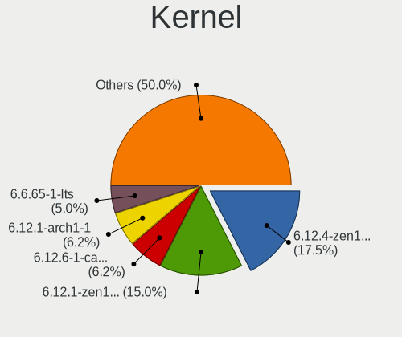
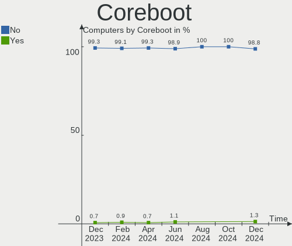
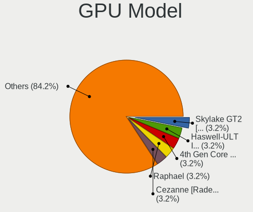
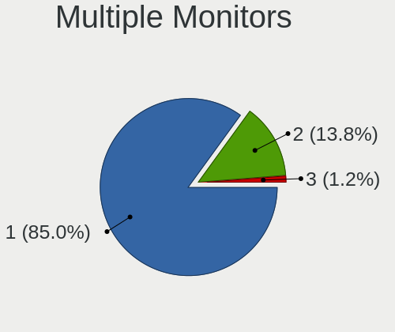
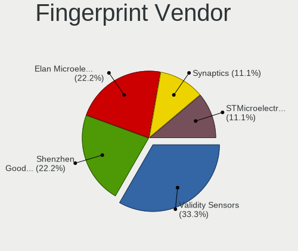
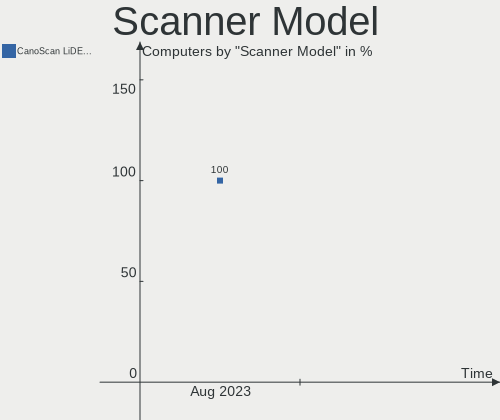

ArcoLinux Hardware Trends
-------------------------

A project to identify most popular hardware characteristics and track their change
over time based on data collected by ArcoLinux users at https://Linux-Hardware.org.

Anyone can contribute to the study by uploading probes of their computers by
the [hw-probe](https://github.com/linuxhw/hw-probe) tool:

    sudo -E hw-probe -all -upload

This is a report for all computer types. See also reports for [desktops](/Dist/ArcoLinux/Desktop/README.md) and [notebooks](/Dist/ArcoLinux/Notebook/README.md).

Full-feature report is available here: https://linux-hardware.org/?view=trends

Period: Nov, 2020.

Contents
--------

- [ OS                       ](#os)
- [ OS Family                ](#os-family)
- [ Kernel                   ](#kernel)
- [ Kernel Family            ](#kernel-family)
- [ Kernel Major Ver.        ](#kernel-major-ver)
- [ Arch                     ](#arch)
- [ DE                       ](#de)
- [ Display Server           ](#display-server)
- [ Display Manager          ](#display-manager)
- [ OS Lang                  ](#os-lang)
- [ Boot Mode                ](#boot-mode)
- [ Filesystem               ](#filesystem)
- [ Part. scheme             ](#part-scheme)
- [ Dual Boot with Linux/BSD ](#dual-boot-with-linux/bsd)
- [ Dual Boot (Win)          ](#dual-boot-win)
- [ Country                  ](#country)
- [ City                     ](#city)
- [ Vendor                   ](#vendor)
- [ Model                    ](#model)
- [ Model Family             ](#model-family)
- [ MFG Year                 ](#mfg-year)
- [ Form Factor              ](#form-factor)
- [ Secure Boot              ](#secure-boot)
- [ Coreboot                 ](#coreboot)
- [ RAM Size                 ](#ram-size)
- [ RAM Used                 ](#ram-used)
- [ Has CD-ROM               ](#has-cd-rom)
- [ Total Drives             ](#total-drives)
- [ Has Ethernet             ](#has-ethernet)
- [ Drive Vendor             ](#drive-vendor)
- [ Drive Model              ](#drive-model)
- [ HDD Vendor               ](#hdd-vendor)
- [ SSD Vendor               ](#ssd-vendor)
- [ Drive Kind               ](#drive-kind)
- [ Drive Connector          ](#drive-connector)
- [ Drive Size               ](#drive-size)
- [ Space Total              ](#space-total)
- [ Space Used               ](#space-used)
- [ Malfunc. Drives          ](#malfunc-drives)
- [ Malfunc. Drive Vendor    ](#malfunc-drive-vendor)
- [ Malfunc. HDD Vendor      ](#malfunc-hdd-vendor)
- [ Malfunc. Drive Kind      ](#malfunc-drive-kind)
- [ Failed Drives            ](#failed-drives)
- [ Failed Drive Vendor      ](#failed-drive-vendor)
- [ Drive Status             ](#drive-status)
- [ Storage Vendor           ](#storage-vendor)
- [ Storage Model            ](#storage-model)
- [ Storage Kind             ](#storage-kind)
- [ CPU Vendor               ](#cpu-vendor)
- [ CPU Model                ](#cpu-model)
- [ CPU Model Family         ](#cpu-model-family)
- [ CPU Cores                ](#cpu-cores)
- [ CPU Sockets              ](#cpu-sockets)
- [ CPU Threads              ](#cpu-threads)
- [ CPU Op-Modes             ](#cpu-op-modes)
- [ CPU Microcode            ](#cpu-microcode)
- [ CPU Microarch            ](#cpu-microarch)
- [ GPU Vendor               ](#gpu-vendor)
- [ GPU Model                ](#gpu-model)
- [ GPU Combo                ](#gpu-combo)
- [ GPU Driver               ](#gpu-driver)
- [ GPU Memory               ](#gpu-memory)
- [ Monitor Vendor           ](#monitor-vendor)
- [ Monitor Model            ](#monitor-model)
- [ Monitor Resolution       ](#monitor-resolution)
- [ Monitor Diagonal         ](#monitor-diagonal)
- [ Monitor Width            ](#monitor-width)
- [ Aspect Ratio             ](#aspect-ratio)
- [ Monitor Area             ](#monitor-area)
- [ Pixel Density            ](#pixel-density)
- [ Multiple Monitors        ](#multiple-monitors)
- [ Net Controller Vendor    ](#net-controller-vendor)
- [ Net Controller Model     ](#net-controller-model)
- [ Wireless Vendor          ](#wireless-vendor)
- [ Wireless Model           ](#wireless-model)
- [ Ethernet Vendor          ](#ethernet-vendor)
- [ Ethernet Model           ](#ethernet-model)
- [ Net Controller Kind      ](#net-controller-kind)
- [ Used Controller          ](#used-controller)
- [ NICs                     ](#nics)
- [ Memory Vendor            ](#memory-vendor)
- [ Memory Model             ](#memory-model)
- [ Memory Kind              ](#memory-kind)
- [ Memory Form Factor       ](#memory-form-factor)
- [ Memory Size              ](#memory-size)
- [ Memory Speed             ](#memory-speed)
- [ Sound Vendor             ](#sound-vendor)
- [ Sound Model              ](#sound-model)
- [ Camera Vendor            ](#camera-vendor)
- [ Camera Model             ](#camera-model)
- [ Fingerprint Vendor       ](#fingerprint-vendor)
- [ Fingerprint Model        ](#fingerprint-model)
- [ Chipcard Vendor          ](#chipcard-vendor)
- [ Chipcard Model           ](#chipcard-model)
- [ Printer Vendor           ](#printer-vendor)
- [ Printer Model            ](#printer-model)
- [ Scanner Vendor           ](#scanner-vendor)
- [ Scanner Model            ](#scanner-model)
- [ Bluetooth Vendor         ](#bluetooth-vendor)
- [ Bluetooth Model          ](#bluetooth-model)
- [ Unsupported Devices      ](#unsupported-devices)
- [ Unsupported Device Types ](#unsupported-device-types)

OS
--

Installed operating systems

| Name              | Computers | Percent |
|-------------------|-----------|---------|
| ArcoLinux Rolling | 65        | 84.42%  |
| ArcoLinux         | 10        | 12.99%  |
| ArcoLinux 20.6.5  | 2         | 2.6%    |

OS Family
---------

OS without a version

| Name      | Computers | Percent |
|-----------|-----------|---------|
| ArcoLinux | 77        | 100%    |

Kernel
------

Version of the Linux kernel

| Version                              | Computers | Percent |
|--------------------------------------|-----------|---------|
| 5.9.6-arch1-1                        | 14        | 18.18%  |
| 5.9.8-arch1-1                        | 11        | 14.29%  |
| 5.9.10-arch1-1                       | 9         | 11.69%  |
| 5.9.9-arch1-1                        | 6         | 7.79%   |
| 5.9.6-zen1-1-zen                     | 5         | 6.49%   |
| 5.4.78-1-lts                         | 4         | 5.19%   |
| 5.4.75-1-lts                         | 4         | 5.19%   |
| 5.9.8-zen1-1-zen                     | 3         | 3.9%    |
| 5.9.2-arch1-1                        | 3         | 3.9%    |
| 5.4.79-1-lts                         | 3         | 3.9%    |
| 5.9.9-zen1-1-zen                     | 2         | 2.6%    |
| 5.9.3-arch1-1                        | 2         | 2.6%    |
| 5.9.10-zen1-1-zen                    | 2         | 2.6%    |
| 5.9.1-arch1-1                        | 2         | 2.6%    |
| 5.8.14-arch1-1                       | 2         | 2.6%    |
| 5.9.8.a-1-hardened                   | 1         | 1.3%    |
| 5.9.8-AMD-znver2                     | 1         | 1.3%    |
| 5.9.11-xanmod1-1                     | 1         | 1.3%    |
| 5.8.14-zen1-1-zen                    | 1         | 1.3%    |
| 5.10.0-rc3-1-git-00107-g3d5e28bff7ad | 1         | 1.3%    |

Kernel Family
-------------

Linux kernel without a distro release

| Version | Computers | Percent |
|---------|-----------|---------|
| 5.9.6   | 19        | 24.68%  |
| 5.9.8   | 16        | 20.78%  |
| 5.9.10  | 11        | 14.29%  |
| 5.9.9   | 8         | 10.39%  |
| 5.4.78  | 4         | 5.19%   |
| 5.4.75  | 4         | 5.19%   |
| 5.9.2   | 3         | 3.9%    |
| 5.8.14  | 3         | 3.9%    |
| 5.4.79  | 3         | 3.9%    |
| 5.9.3   | 2         | 2.6%    |
| 5.9.1   | 2         | 2.6%    |
| 5.9.11  | 1         | 1.3%    |
| 5.10.0  | 1         | 1.3%    |

Kernel Major Ver.
-----------------

Linux kernel major version

| Version | Computers | Percent |
|---------|-----------|---------|
| 5.9     | 62        | 80.52%  |
| 5.4     | 11        | 14.29%  |
| 5.8     | 3         | 3.9%    |
| 5.10    | 1         | 1.3%    |

Arch
----

OS architecture (x86_64, i586, etc.)

| Name   | Computers | Percent |
|--------|-----------|---------|
| x86_64 | 77        | 100%    |

DE
--

Desktop Environment

| Name       | Computers | Percent |
|------------|-----------|---------|
| XFCE       | 33        | 42.86%  |
| KDE5       | 14        | 18.18%  |
| GNOME      | 6         | 7.79%   |
| dwm        | 5         | 6.49%   |
| Deepin     | 4         | 5.19%   |
| Cinnamon   | 3         | 3.9%    |
| bspwm      | 3         | 3.9%    |
| qtile      | 2         | 2.6%    |
| i3         | 2         | 2.6%    |
| xmonad     | 1         | 1.3%    |
| X-Cinnamon | 1         | 1.3%    |
| MATE       | 1         | 1.3%    |
| LXQt       | 1         | 1.3%    |
| KDE        | 1         | 1.3%    |

Display Server
--------------

X11 or Wayland

| Name | Computers | Percent |
|------|-----------|---------|
| X11  | 75        | 97.4%   |
| Tty  | 2         | 2.6%    |

Display Manager
---------------

SDDM, LightDM, etc.

| Name    | Computers | Percent |
|---------|-----------|---------|
| TDM     | 58        | 75.32%  |
| Unknown | 9         | 11.69%  |
| SDDM    | 6         | 7.79%   |
| LightDM | 3         | 3.9%    |
| GDM     | 1         | 1.3%    |

OS Lang
-------

Language

| Lang       | Computers | Percent |
|------------|-----------|---------|
| en_US.utf8 | 27        | 35.06%  |
| en_GB.utf8 | 10        | 12.99%  |
| en_US      | 8         | 10.39%  |
| de_DE.utf8 | 6         | 7.79%   |
| de_DE      | 4         | 5.19%   |
| en_GB      | 3         | 3.9%    |
| pl_PL.utf8 | 2         | 2.6%    |
| fr_FR      | 2         | 2.6%    |
| en_CA      | 2         | 2.6%    |
| zh_CN      | 1         | 1.3%    |
| sv_SE      | 1         | 1.3%    |
| ru_RU      | 1         | 1.3%    |
| ro_RO      | 1         | 1.3%    |
| pt_PT.utf8 | 1         | 1.3%    |
| hu_HU      | 1         | 1.3%    |
| fr_FR.utf8 | 1         | 1.3%    |
| fi_FI.utf8 | 1         | 1.3%    |
| es_MX.utf8 | 1         | 1.3%    |
| es_ES.utf8 | 1         | 1.3%    |
| es_AR.utf8 | 1         | 1.3%    |
| en_IE.utf8 | 1         | 1.3%    |
| de_AT      | 1         | 1.3%    |

Boot Mode
---------

EFI or BIOS

| Mode | Computers | Percent |
|------|-----------|---------|
| EFI  | 51        | 66.23%  |
| BIOS | 26        | 33.77%  |

Filesystem
----------

Type of filesystem

| Type  | Computers | Percent |
|-------|-----------|---------|
| Ext4  | 70        | 90.91%  |
| Xfs   | 4         | 5.19%   |
| Btrfs | 2         | 2.6%    |
| F2fs  | 1         | 1.3%    |

Part. scheme
------------

Scheme of partitioning

| Type    | Computers | Percent |
|---------|-----------|---------|
| GPT     | 52        | 67.53%  |
| MBR     | 16        | 20.78%  |
| Unknown | 9         | 11.69%  |

Dual Boot with Linux/BSD
------------------------

Hosting more than one Linux/BSD

| Dual boot | Computers | Percent |
|-----------|-----------|---------|
| No        | 58        | 75.32%  |
| Yes       | 19        | 24.68%  |

Dual Boot (Win)
---------------

Hosting Linux and Windows

| Dual boot | Computers | Percent |
|-----------|-----------|---------|
| No        | 53        | 68.83%  |
| Yes       | 24        | 31.17%  |

Country
-------

Geographic location (country)

| Country     | Computers | Percent |
|-------------|-----------|---------|
| USA         | 18        | 23.38%  |
| UK          | 10        | 12.99%  |
| Germany     | 10        | 12.99%  |
| Belgium     | 4         | 5.19%   |
| Hungary     | 3         | 3.9%    |
| France      | 3         | 3.9%    |
| Spain       | 2         | 2.6%    |
| Serbia      | 2         | 2.6%    |
| Poland      | 2         | 2.6%    |
| Netherlands | 2         | 2.6%    |
| Mexico      | 2         | 2.6%    |
| Finland     | 2         | 2.6%    |
| Canada      | 2         | 2.6%    |
| Argentina   | 2         | 2.6%    |
| Turkey      | 1         | 1.3%    |
| Tunisia     | 1         | 1.3%    |
| Switzerland | 1         | 1.3%    |
| Russia      | 1         | 1.3%    |
| Romania     | 1         | 1.3%    |
| Portugal    | 1         | 1.3%    |
| Malaysia    | 1         | 1.3%    |
| Israel      | 1         | 1.3%    |
| Ireland     | 1         | 1.3%    |
| Hong Kong   | 1         | 1.3%    |
| Egypt       | 1         | 1.3%    |
| China       | 1         | 1.3%    |
| Austria     | 1         | 1.3%    |

City
----

Geographic location (city)

| City               | Computers | Percent |
|--------------------|-----------|---------|
| Berlin             | 5         | 6.49%   |
| Lier               | 3         | 3.9%    |
| London             | 2         | 2.6%    |
| Budapest           | 2         | 2.6%    |
| Arcata             | 2         | 2.6%    |
| Zwaag              | 1         | 1.3%    |
| Zurich             | 1         | 1.3%    |
| Yiyang             | 1         | 1.3%    |
| Worksop            | 1         | 1.3%    |
| Welwyn Garden City | 1         | 1.3%    |
| Warsaw             | 1         | 1.3%    |
| Vienna             | 1         | 1.3%    |
| Vantaa             | 1         | 1.3%    |
| Van Nuys           | 1         | 1.3%    |
| Torres Novas       | 1         | 1.3%    |
| Tel Aviv           | 1         | 1.3%    |
| Sungai Petani      | 1         | 1.3%    |
| St Petersburg      | 1         | 1.3%    |
| Springdale         | 1         | 1.3%    |
| Siegburg           | 1         | 1.3%    |
| Seville            | 1         | 1.3%    |
| Sault Ste. Marie   | 1         | 1.3%    |
| Sarasota           | 1         | 1.3%    |
| Saarbrücken       | 1         | 1.3%    |
| Rosstal            | 1         | 1.3%    |
| Pori               | 1         | 1.3%    |
| Plescop            | 1         | 1.3%    |
| Paris              | 1         | 1.3%    |
| Novi Sad           | 1         | 1.3%    |
| Niš               | 1         | 1.3%    |
| Mérida            | 1         | 1.3%    |
| Morganton          | 1         | 1.3%    |
| Miskolc            | 1         | 1.3%    |
| Martigues          | 1         | 1.3%    |
| Mariano Moreno     | 1         | 1.3%    |
| Mansfield          | 1         | 1.3%    |
| Livingston         | 1         | 1.3%    |
| Leg Tarnowski      | 1         | 1.3%    |
| Istanbul           | 1         | 1.3%    |
| Hurricane          | 1         | 1.3%    |
| Hampton            | 1         | 1.3%    |
| Hammam Sousse      | 1         | 1.3%    |
| Haddonfield        | 1         | 1.3%    |
| Gravesend          | 1         | 1.3%    |
| Grande Prairie     | 1         | 1.3%    |
| Forest Lake        | 1         | 1.3%    |
| Fishkill           | 1         | 1.3%    |
| Elkhorn City       | 1         | 1.3%    |
| Dungarvan          | 1         | 1.3%    |
| Doncaster          | 1         | 1.3%    |
| Deltona            | 1         | 1.3%    |
| Conroe             | 1         | 1.3%    |
| Ciudad del Carmen  | 1         | 1.3%    |
| Chorley            | 1         | 1.3%    |
| Chinnor            | 1         | 1.3%    |
| Charlotte          | 1         | 1.3%    |
| Central            | 1         | 1.3%    |
| Cairo              | 1         | 1.3%    |
| Buenos Aires       | 1         | 1.3%    |
| Bristol            | 1         | 1.3%    |

Vendor
------

Motherboard manufacturer

| Name                | Computers | Percent |
|---------------------|-----------|---------|
| Lenovo              | 19        | 24.68%  |
| ASUSTek Computer    | 17        | 22.08%  |
| Dell                | 9         | 11.69%  |
| ASRock              | 6         | 7.79%   |
| MSI                 | 5         | 6.49%   |
| Gigabyte Technology | 4         | 5.19%   |
| Hewlett-Packard     | 3         | 3.9%    |
| Timi                | 2         | 2.6%    |
| Apple               | 2         | 2.6%    |
| Alienware           | 2         | 2.6%    |
| Acer                | 2         | 2.6%    |
| Toshiba             | 1         | 1.3%    |
| System76            | 1         | 1.3%    |
| Supermicro          | 1         | 1.3%    |
| Sony                | 1         | 1.3%    |
| Medion              | 1         | 1.3%    |
| Entroware           | 1         | 1.3%    |

Model
-----

Motherboard model

| Name                                       | Computers | Percent |
|--------------------------------------------|-----------|---------|
| ASUS STRIX Z270H GAMING                    | 2         | 2.6%    |
| Toshiba Satellite S70-B                    | 1         | 1.3%    |
| Timi TM1709                                | 1         | 1.3%    |
| Timi TM1607                                | 1         | 1.3%    |
| System76 Galago Pro                        | 1         | 1.3%    |
| Supermicro X8DTH-i/6/iF/6F                 | 1         | 1.3%    |
| Sony SVS1511Q9EB                           | 1         | 1.3%    |
| MSI MS-7C80                                | 1         | 1.3%    |
| MSI MS-7C37                                | 1         | 1.3%    |
| MSI MS-7B79                                | 1         | 1.3%    |
| MSI MS-7994                                | 1         | 1.3%    |
| MSI MS-7891                                | 1         | 1.3%    |
| Medion E7212                               | 1         | 1.3%    |
| Lenovo Yoga 730-13IKB 81CT                 | 1         | 1.3%    |
| Lenovo V130-14IGM 81HM                     | 1         | 1.3%    |
| Lenovo ThinkPad X201 3680KC5               | 1         | 1.3%    |
| Lenovo ThinkPad X1 Carbon 6th 20KHCTO1WW   | 1         | 1.3%    |
| Lenovo ThinkPad T430 2347AQ9               | 1         | 1.3%    |
| Lenovo ThinkPad T420 423662U               | 1         | 1.3%    |
| Lenovo ThinkPad Edge E531 688526G          | 1         | 1.3%    |
| Lenovo ThinkPad E595 20NF0000GE            | 1         | 1.3%    |
| Lenovo ThinkPad E14 Gen 2 20T6000TPB       | 1         | 1.3%    |
| Lenovo ThinkCentre M91p 4512A47            | 1         | 1.3%    |
| Lenovo ThinkCentre Edge72 3493DEG          | 1         | 1.3%    |
| Lenovo IdeaPad S340-15API 81NC             | 1         | 1.3%    |
| Lenovo IdeaPad S145-15AST 81N3             | 1         | 1.3%    |
| Lenovo IdeaPad L340-17IRH Gaming 81LL      | 1         | 1.3%    |
| Lenovo IdeaPad 320-15ABR 80XS              | 1         | 1.3%    |
| Lenovo IdeaCentre AIO 520-22IKU F0D50000US | 1         | 1.3%    |
| Lenovo IdeaCentre AIO 3 24ARE05 F0EW004VMT | 1         | 1.3%    |
| Lenovo G580                                | 1         | 1.3%    |
| Lenovo G560 0679                           | 1         | 1.3%    |
| HP Pavilion Notebook                       | 1         | 1.3%    |
| HP EliteBook 8760w                         | 1         | 1.3%    |
| HP EliteBook 8540p                         | 1         | 1.3%    |
| Gigabyte Z97MX-Gaming 5                    | 1         | 1.3%    |
| Gigabyte H170-D3HP                         | 1         | 1.3%    |
| Gigabyte B450 AORUS M                      | 1         | 1.3%    |
| Gigabyte B250-D3A                          | 1         | 1.3%    |
| Entroware Apollo                           | 1         | 1.3%    |
| Dell XPS L421X                             | 1         | 1.3%    |
| Dell OptiPlex 7010                         | 1         | 1.3%    |
| Dell OptiPlex 5050                         | 1         | 1.3%    |
| Dell Latitude 5480                         | 1         | 1.3%    |
| Dell Latitude 5310                         | 1         | 1.3%    |
| Dell Inspiron N4110                        | 1         | 1.3%    |
| Dell Inspiron 5770                         | 1         | 1.3%    |
| Dell Inspiron 3558                         | 1         | 1.3%    |
| Dell Dimension 5100                        | 1         | 1.3%    |
| ASUS Z170M-PLUS                            | 1         | 1.3%    |
| ASUS TUF GAMING X570-PLUS                  | 1         | 1.3%    |
| ASUS Strix 17 GL703GE                      | 1         | 1.3%    |
| ASUS ROG STRIX X570-E GAMING               | 1         | 1.3%    |
| ASUS ROG Strix G531GT_GL531GT              | 1         | 1.3%    |
| ASUS Rampage II GENE                       | 1         | 1.3%    |
| ASUS PRIME X470-PRO                        | 1         | 1.3%    |
| ASUS PRIME X370-PRO                        | 1         | 1.3%    |
| ASUS PRIME B450M-A                         | 1         | 1.3%    |
| ASUS Maximus VIII FORMULA                  | 1         | 1.3%    |
| ASUS M5A78L-M/USB3                         | 1         | 1.3%    |

Model Family
------------

Motherboard model prefix

| Name                  | Computers | Percent |
|-----------------------|-----------|---------|
| Lenovo ThinkPad       | 7         | 9.09%   |
| Lenovo IdeaPad        | 4         | 5.19%   |
| Dell Inspiron         | 3         | 3.9%    |
| ASUS Strix            | 3         | 3.9%    |
| ASUS PRIME            | 3         | 3.9%    |
| Lenovo ThinkCentre    | 2         | 2.6%    |
| Lenovo IdeaCentre     | 2         | 2.6%    |
| HP EliteBook          | 2         | 2.6%    |
| Dell OptiPlex         | 2         | 2.6%    |
| Dell Latitude         | 2         | 2.6%    |
| ASUS ROG              | 2         | 2.6%    |
| Acer Aspire           | 2         | 2.6%    |
| Toshiba Satellite     | 1         | 1.3%    |
| Timi TM1709           | 1         | 1.3%    |
| Timi TM1607           | 1         | 1.3%    |
| System76 Galago       | 1         | 1.3%    |
| Supermicro X8DTH-i    | 1         | 1.3%    |
| Sony SVS1511Q9EB      | 1         | 1.3%    |
| MSI MS-7C80           | 1         | 1.3%    |
| MSI MS-7C37           | 1         | 1.3%    |
| MSI MS-7B79           | 1         | 1.3%    |
| MSI MS-7994           | 1         | 1.3%    |
| MSI MS-7891           | 1         | 1.3%    |
| Medion E7212          | 1         | 1.3%    |
| Lenovo Yoga           | 1         | 1.3%    |
| Lenovo V130-14IGM     | 1         | 1.3%    |
| Lenovo G580           | 1         | 1.3%    |
| Lenovo G560           | 1         | 1.3%    |
| HP Pavilion           | 1         | 1.3%    |
| Gigabyte Z97MX-Gaming | 1         | 1.3%    |
| Gigabyte H170-D3HP    | 1         | 1.3%    |
| Gigabyte B450         | 1         | 1.3%    |
| Gigabyte B250-D3A     | 1         | 1.3%    |
| Entroware Apollo      | 1         | 1.3%    |
| Dell XPS              | 1         | 1.3%    |
| Dell Dimension        | 1         | 1.3%    |
| ASUS Z170M-PLUS       | 1         | 1.3%    |
| ASUS TUF              | 1         | 1.3%    |
| ASUS Rampage          | 1         | 1.3%    |
| ASUS Maximus          | 1         | 1.3%    |
| ASUS M5A78L-M         | 1         | 1.3%    |
| ASUS K52JT            | 1         | 1.3%    |
| ASUS K501UX           | 1         | 1.3%    |
| ASUS E403NA           | 1         | 1.3%    |
| ASUS ASUSPRO          | 1         | 1.3%    |
| ASRock X470           | 1         | 1.3%    |
| ASRock P67            | 1         | 1.3%    |
| ASRock G41C-GS        | 1         | 1.3%    |
| ASRock B75            | 1         | 1.3%    |
| ASRock B450M          | 1         | 1.3%    |
| ASRock 970M           | 1         | 1.3%    |
| Apple MacBookPro7     | 1         | 1.3%    |
| Apple iMac11          | 1         | 1.3%    |
| Alienware X51         | 1         | 1.3%    |
| Alienware Area        | 1         | 1.3%    |

MFG Year
--------

Motherboard manufacture year

| Year | Computers | Percent |
|------|-----------|---------|
| 2020 | 18        | 23.38%  |
| 2018 | 14        | 18.18%  |
| 2019 | 10        | 12.99%  |
| 2012 | 6         | 7.79%   |
| 2017 | 5         | 6.49%   |
| 2016 | 5         | 6.49%   |
| 2013 | 5         | 6.49%   |
| 2015 | 3         | 3.9%    |
| 2014 | 3         | 3.9%    |
| 2011 | 3         | 3.9%    |
| 2010 | 3         | 3.9%    |
| 2009 | 1         | 1.3%    |
| 2005 | 1         | 1.3%    |

Form Factor
-----------

Physical design of the computer

| Name        | Computers | Percent |
|-------------|-----------|---------|
| Notebook    | 38        | 49.35%  |
| Desktop     | 34        | 44.16%  |
| All in one  | 3         | 3.9%    |
| Convertible | 1         | 1.3%    |
| Server      | 1         | 1.3%    |

Secure Boot
-----------

Enabled or disabled

| State    | Computers | Percent |
|----------|-----------|---------|
| Disabled | 77        | 100%    |

Coreboot
--------

Have coreboot on board

| Used | Computers | Percent |
|------|-----------|---------|
| No   | 77        | 100%    |

RAM Size
--------

Total RAM memory

| Size in GB  | Computers | Percent |
|-------------|-----------|---------|
| 16.01-24.0  | 25        | 32.47%  |
| 4.01-8.0    | 18        | 23.38%  |
| 3.01-4.0    | 12        | 15.58%  |
| 8.01-16.0   | 8         | 10.39%  |
| 32.01-64.0  | 7         | 9.09%   |
| 24.01-32.0  | 6         | 7.79%   |
| 64.01-256.0 | 1         | 1.3%    |

RAM Used
--------

Used RAM memory

| Used GB   | Computers | Percent |
|-----------|-----------|---------|
| 1.01-2.0  | 30        | 38.96%  |
| 2.01-3.0  | 15        | 19.48%  |
| 4.01-8.0  | 14        | 18.18%  |
| 3.01-4.0  | 8         | 10.39%  |
| 0.01-1.0  | 8         | 10.39%  |
| 8.01-16.0 | 2         | 2.6%    |

Has CD-ROM
----------

Has CD-ROM on board

| Presented | Computers | Percent |
|-----------|-----------|---------|
| No        | 50        | 64.94%  |
| Yes       | 27        | 35.06%  |

Total Drives
------------

Number of drives on board

| Drives | Computers | Percent |
|--------|-----------|---------|
| 1      | 34        | 44.16%  |
| 2      | 25        | 32.47%  |
| 3      | 9         | 11.69%  |
| 4      | 6         | 7.79%   |
| 5      | 2         | 2.6%    |
| 6      | 1         | 1.3%    |

Has Ethernet
------------

Has Ethernet on board

| Presented | Computers | Percent |
|-----------|-----------|---------|
| Yes       | 73        | 94.81%  |
| No        | 4         | 5.19%   |

Drive Vendor
------------

Hard drive vendors

| Vendor              | Computers | Drives | Percent |
|---------------------|-----------|--------|---------|
| Samsung Electronics | 33        | 37     | 24.44%  |
| WDC                 | 19        | 25     | 14.07%  |
| Seagate             | 19        | 21     | 14.07%  |
| SanDisk             | 9         | 9      | 6.67%   |
| Toshiba             | 7         | 7      | 5.19%   |
| Kingston            | 7         | 7      | 5.19%   |
| Crucial             | 5         | 5      | 3.7%    |
| SK Hynix            | 3         | 3      | 2.22%   |
| OCZ                 | 3         | 4      | 2.22%   |
| Intel               | 3         | 3      | 2.22%   |
| Unknown             | 2         | 2      | 1.48%   |
| PNY                 | 2         | 3      | 1.48%   |
| Phison              | 2         | 2      | 1.48%   |
| LITEONIT            | 2         | 2      | 1.48%   |
| JMicron             | 2         | 2      | 1.48%   |
| Hitachi             | 2         | 2      | 1.48%   |
| HGST                | 2         | 2      | 1.48%   |
| A-DATA Technology   | 2         | 2      | 1.48%   |
| XPG                 | 1         | 1      | 0.74%   |
| Union Memory        | 1         | 1      | 0.74%   |
| Team                | 1         | 1      | 0.74%   |
| SPCC                | 1         | 1      | 0.74%   |
| Micron Technology   | 1         | 1      | 0.74%   |
| MAXTOR              | 1         | 1      | 0.74%   |
| KIOXIA              | 1         | 1      | 0.74%   |
| Fantom              | 1         | 1      | 0.74%   |
| ExcelStor           | 1         | 1      | 0.74%   |
| DOGFISH             | 1         | 1      | 0.74%   |
| China               | 1         | 1      | 0.74%   |

Drive Model
-----------

Hard drive models

| Model                               | Computers | Percent |
|-------------------------------------|-----------|---------|
| Samsung SSD 860 EVO 500GB           | 6         | 4.05%   |
| Samsung SSD 850 EVO 500GB           | 5         | 3.38%   |
| Samsung SSD 970 EVO Plus 500GB      | 4         | 2.7%    |
| Seagate ST1000LM035-1RK172 1TB      | 2         | 1.35%   |
| Seagate ST1000LM024 HN-M101MBB 1TB  | 2         | 1.35%   |
| SanDisk SSD PLUS 240GB              | 2         | 1.35%   |
| Samsung SSD 860 EVO 250GB           | 2         | 1.35%   |
| Samsung HD203WI 2TB                 | 2         | 1.35%   |
| Phison Sabrent Rocket 4.0 1TB       | 2         | 1.35%   |
| Kingston SA400S37240G 240GB SSD     | 2         | 1.35%   |
| XPG GAMMIX S5 512GB                 | 1         | 0.68%   |
| WDC WDS500G3X0C-00SJG0 500GB        | 1         | 0.68%   |
| WDC WDS250G1B0C-00S6U0 250GB        | 1         | 0.68%   |
| WDC WDS240G2G0A-00JH30 240GB SSD    | 1         | 0.68%   |
| WDC WDS120G1G0B-00RC30 120GB SSD    | 1         | 0.68%   |
| WDC WD6400AAKS-65A7B2 640GB         | 1         | 0.68%   |
| WDC WD6400AAKS-65A7B0 640GB         | 1         | 0.68%   |
| WDC WD5000LPLX-08ZNTT0 500GB        | 1         | 0.68%   |
| WDC WD5000LPCX-24C6HT0 500GB        | 1         | 0.68%   |
| WDC WD5000BPVT-75HXZT1 500GB        | 1         | 0.68%   |
| WDC WD5000BEVT-22A0RT0 500GB        | 1         | 0.68%   |
| WDC WD5000AAKX-001CA0 500GB         | 1         | 0.68%   |
| WDC WD5000AAKS-60WWPA0 500GB        | 1         | 0.68%   |
| WDC WD40EFRX-68N32N0 4TB            | 1         | 0.68%   |
| WDC WD20EARS-00MVWB0 2TB            | 1         | 0.68%   |
| WDC WD2002FYPS-02W3B0 2TB           | 1         | 0.68%   |
| WDC WD1600AAJS-00WAA0 160GB         | 1         | 0.68%   |
| WDC WD10EZRX-00L4HB0 1TB            | 1         | 0.68%   |
| WDC WD10EZEX-22MFCA0 1TB            | 1         | 0.68%   |
| WDC WD10EZEX-08WN4A0 1TB            | 1         | 0.68%   |
| WDC WD10EAVS-00D7B0 1TB             | 1         | 0.68%   |
| WDC WD10EADS-00M2B0 1TB             | 1         | 0.68%   |
| WDC WD1002FBYS-02A6B0 1TB           | 1         | 0.68%   |
| WDC WD1002FAEX-00Z3A0 1TB           | 1         | 0.68%   |
| WDC PC SN720 SDAPNTW-256G           | 1         | 0.68%   |
| Unknown SDEZS25-240G-Z01 240GB      | 1         | 0.68%   |
| Unknown HX240GSSDSATA3 240GB        | 1         | 0.68%   |
| Union Memory RPFTJ256PDD2MWX 256GB  | 1         | 0.68%   |
| Toshiba MQ04ABF100 1TB              | 1         | 0.68%   |
| Toshiba MQ01ABD100M 1TB             | 1         | 0.68%   |
| Toshiba MQ01ABD100 1TB              | 1         | 0.68%   |
| Toshiba MQ01ABD032 320GB            | 1         | 0.68%   |
| Toshiba MK6475GSX 640GB             | 1         | 0.68%   |
| Toshiba KBG40ZNT256G MEMORY 256GB   | 1         | 0.68%   |
| Toshiba HDWD120 2TB                 | 1         | 0.68%   |
| Team T253X2001T 1TB SSD             | 1         | 0.68%   |
| SPCC Solid State Disk 256GB         | 1         | 0.68%   |
| SK Hynix SHGS31-1000GS-2 1TB SSD    | 1         | 0.68%   |
| SK Hynix HFS256GD9TNG-62A0A 256GB   | 1         | 0.68%   |
| SK Hynix HFM512GDHTNG-8710B 512GB   | 1         | 0.68%   |
| Seagate ST9320325AS 320GB           | 1         | 0.68%   |
| Seagate ST9250827AS 250GB           | 1         | 0.68%   |
| Seagate ST500LM012 HN-M500MBB 500GB | 1         | 0.68%   |
| Seagate ST4000DX002-1H2178 4TB      | 1         | 0.68%   |
| Seagate ST4000DM004-2CV104 4TB      | 1         | 0.68%   |
| Seagate ST3500410SV 500GB           | 1         | 0.68%   |
| Seagate ST3500312CS 500GB           | 1         | 0.68%   |
| Seagate ST3250410AS 250GB           | 1         | 0.68%   |
| Seagate ST3250318AS 250GB           | 1         | 0.68%   |
| Seagate ST2000LM007-1R8174 2TB      | 1         | 0.68%   |

HDD Vendor
----------

Hard disk drive vendors

| Vendor              | Computers | Drives | Percent |
|---------------------|-----------|--------|---------|
| Seagate             | 18        | 20     | 33.96%  |
| WDC                 | 16        | 19     | 30.19%  |
| Toshiba             | 6         | 6      | 11.32%  |
| Samsung Electronics | 6         | 6      | 11.32%  |
| Hitachi             | 2         | 2      | 3.77%   |
| HGST                | 2         | 2      | 3.77%   |
| MAXTOR              | 1         | 1      | 1.89%   |
| Fantom              | 1         | 1      | 1.89%   |
| ExcelStor           | 1         | 1      | 1.89%   |

SSD Vendor
----------

Solid state drive vendors

| Vendor              | Computers | Drives | Percent |
|---------------------|-----------|--------|---------|
| Samsung Electronics | 21        | 22     | 36.84%  |
| SanDisk             | 7         | 7      | 12.28%  |
| Kingston            | 6         | 6      | 10.53%  |
| Crucial             | 5         | 5      | 8.77%   |
| OCZ                 | 3         | 4      | 5.26%   |
| WDC                 | 2         | 2      | 3.51%   |
| PNY                 | 2         | 2      | 3.51%   |
| LITEONIT            | 2         | 2      | 3.51%   |
| Unknown             | 1         | 1      | 1.75%   |
| Team                | 1         | 1      | 1.75%   |
| SPCC                | 1         | 1      | 1.75%   |
| SK Hynix            | 1         | 1      | 1.75%   |
| Micron Technology   | 1         | 1      | 1.75%   |
| Intel               | 1         | 1      | 1.75%   |
| DOGFISH             | 1         | 1      | 1.75%   |
| China               | 1         | 1      | 1.75%   |
| A-DATA Technology   | 1         | 1      | 1.75%   |

Drive Kind
----------

HDD or SSD

| Kind    | Computers | Drives | Percent |
|---------|-----------|--------|---------|
| SSD     | 51        | 59     | 43.59%  |
| HDD     | 38        | 58     | 32.48%  |
| NVMe    | 24        | 28     | 20.51%  |
| Unknown | 3         | 3      | 2.56%   |
| MMC     | 1         | 1      | 0.85%   |

Drive Connector
---------------

SATA, SAS, NVMe, etc.

| Type | Computers | Drives | Percent |
|------|-----------|--------|---------|
| SATA | 65        | 115    | 68.42%  |
| NVMe | 24        | 27     | 25.26%  |
| SAS  | 5         | 6      | 5.26%   |
| MMC  | 1         | 1      | 1.05%   |

Drive Size
----------

Size of hard drive

| Size in TB | Computers | Drives | Percent |
|------------|-----------|--------|---------|
| 0.01-0.5   | 52        | 72     | 54.74%  |
| 0.51-1.0   | 29        | 30     | 30.53%  |
| 1.01-2.0   | 11        | 12     | 11.58%  |
| 3.01-4.0   | 3         | 3      | 3.16%   |

Space Total
-----------

Amount of disk space available on the file system

| Size in GB     | Computers | Percent |
|----------------|-----------|---------|
| 101-250        | 21        | 27.27%  |
| 251-500        | 19        | 24.68%  |
| 1001-2000      | 14        | 18.18%  |
| 501-1000       | 10        | 12.99%  |
| More than 3000 | 4         | 5.19%   |
| 51-100         | 4         | 5.19%   |
| 21-50          | 2         | 2.6%    |
| 2001-3000      | 2         | 2.6%    |
| Unknown        | 1         | 1.3%    |

Space Used
----------

Amount of used disk space

| Used GB        | Computers | Percent |
|----------------|-----------|---------|
| 1-20           | 24        | 31.17%  |
| 21-50          | 14        | 18.18%  |
| 101-250        | 9         | 11.69%  |
| 51-100         | 9         | 11.69%  |
| 501-1000       | 8         | 10.39%  |
| 251-500        | 6         | 7.79%   |
| 1001-2000      | 3         | 3.9%    |
| More than 3000 | 2         | 2.6%    |
| 2001-3000      | 1         | 1.3%    |
| Unknown        | 1         | 1.3%    |

Malfunc. Drives
---------------

Drive models with a malfunction

| Model                              | Computers | Drives | Percent |
|------------------------------------|-----------|--------|---------|
| WDC WD5000AAKS-60WWPA0 500GB       | 1         | 1      | 7.69%   |
| WDC WD20EARS-00MVWB0 2TB           | 1         | 1      | 7.69%   |
| WDC WD2002FYPS-02W3B0 2TB          | 1         | 1      | 7.69%   |
| WDC WD10EADS-00M2B0 1TB            | 1         | 1      | 7.69%   |
| WDC WD1002FBYS-02A6B0 1TB          | 1         | 1      | 7.69%   |
| Seagate ST9320325AS 320GB          | 1         | 1      | 7.69%   |
| Seagate ST1000LM035-1RK172 1TB     | 1         | 1      | 7.69%   |
| Seagate ST1000LM024 HN-M101MBB 1TB | 1         | 1      | 7.69%   |
| Samsung Electronics HD501LJ 500GB  | 1         | 1      | 7.69%   |
| OCZ AGILITY3 240GB SSD             | 1         | 1      | 7.69%   |
| MAXTOR STM3250310AS 250GB          | 1         | 1      | 7.69%   |
| LITEONIT LCT-512M3S 512GB SSD      | 1         | 1      | 7.69%   |
| Kingston SUV400S37240G 240GB SSD   | 1         | 1      | 7.69%   |

Malfunc. Drive Vendor
---------------------

Vendors of faulty drives

| Vendor              | Computers | Drives | Percent |
|---------------------|-----------|--------|---------|
| WDC                 | 4         | 5      | 33.33%  |
| Seagate             | 3         | 3      | 25%     |
| Samsung Electronics | 1         | 1      | 8.33%   |
| OCZ                 | 1         | 1      | 8.33%   |
| MAXTOR              | 1         | 1      | 8.33%   |
| LITEONIT            | 1         | 1      | 8.33%   |
| Kingston            | 1         | 1      | 8.33%   |

Malfunc. HDD Vendor
-------------------

Vendors of faulty HDD drives

| Vendor              | Computers | Drives | Percent |
|---------------------|-----------|--------|---------|
| WDC                 | 4         | 5      | 44.44%  |
| Seagate             | 3         | 3      | 33.33%  |
| Samsung Electronics | 1         | 1      | 11.11%  |
| MAXTOR              | 1         | 1      | 11.11%  |

Malfunc. Drive Kind
-------------------

Kinds of faulty drives

| Kind | Computers | Drives | Percent |
|------|-----------|--------|---------|
| HDD  | 9         | 10     | 75%     |
| SSD  | 3         | 3      | 25%     |

Failed Drives
-------------

Failed drive models

| Model                          | Computers | Drives | Percent |
|--------------------------------|-----------|--------|---------|
| Seagate ST2000DL001-9VT156 2TB | 1         | 1      | 100%    |

Failed Drive Vendor
-------------------

Failed drive vendors

| Vendor  | Computers | Drives | Percent |
|---------|-----------|--------|---------|
| Seagate | 1         | 1      | 100%    |

Drive Status
------------

Number of failed and malfunc. drives

| Status   | Computers | Drives | Percent |
|----------|-----------|--------|---------|
| Works    | 65        | 111    | 69.89%  |
| Detected | 15        | 24     | 16.13%  |
| Malfunc  | 12        | 13     | 12.9%   |
| Failed   | 1         | 1      | 1.08%   |

Storage Vendor
--------------

Storage controller vendors

| Vendor                      | Computers | Percent |
|-----------------------------|-----------|---------|
| Intel                       | 53        | 50.48%  |
| AMD                         | 20        | 19.05%  |
| Samsung Electronics         | 9         | 8.57%   |
| Sandisk                     | 4         | 3.81%   |
| Phison Electronics          | 3         | 2.86%   |
| SK Hynix                    | 2         | 1.9%    |
| Marvell Technology Group    | 2         | 1.9%    |
| KIOXIA                      | 2         | 1.9%    |
| JMicron Technology          | 2         | 1.9%    |
| ASMedia Technology          | 2         | 1.9%    |
| Union Memory (Shenzhen)     | 1         | 0.95%   |
| Silicon Image               | 1         | 0.95%   |
| Realtek Semiconductor       | 1         | 0.95%   |
| Nvidia                      | 1         | 0.95%   |
| Kingston Technology Company | 1         | 0.95%   |
| ADATA Technology            | 1         | 0.95%   |

Storage Model
-------------

Storage controller models

| Model                                                                                   | Computers | Percent |
|-----------------------------------------------------------------------------------------|-----------|---------|
| AMD FCH SATA Controller [AHCI mode]                                                     | 18        | 14.88%  |
| Intel Sunrise Point-LP SATA Controller [AHCI mode]                                      | 9         | 7.44%   |
| Samsung Electronics NVMe SSD Controller SM981/PM981/PM983                               | 7         | 5.79%   |
| AMD 400 Series Chipset SATA Controller                                                  | 7         | 5.79%   |
| Intel 7 Series Chipset Family 6-port SATA Controller [AHCI mode]                        | 5         | 4.13%   |
| Intel 200 Series PCH SATA controller [AHCI mode]                                        | 4         | 3.31%   |
| Intel Q170/Q150/B150/H170/H110/Z170/CM236 Chipset SATA Controller [AHCI Mode]           | 3         | 2.48%   |
| Intel Cannon Lake Mobile PCH SATA AHCI Controller                                       | 3         | 2.48%   |
| Intel 6 Series/C200 Series Chipset Family 6 port Mobile SATA AHCI Controller            | 3         | 2.48%   |
| Intel 5 Series/3400 Series Chipset 6 port SATA AHCI Controller                          | 3         | 2.48%   |
| Phison Electronics E16 PCIe4 NVMe Controller                                            | 2         | 1.65%   |
| KIOXIA Non-Volatile memory controller                                                   | 2         | 1.65%   |
| JMicron Technology JMB363 SATA/IDE Controller                                           | 2         | 1.65%   |
| Intel SSD 660P Series                                                                   | 2         | 1.65%   |
| Intel NM10/ICH7 Family SATA Controller [IDE mode]                                       | 2         | 1.65%   |
| Intel 82801JI (ICH10 Family) 4 port SATA IDE Controller #1                              | 2         | 1.65%   |
| Intel 82801JI (ICH10 Family) 2 port SATA IDE Controller #2                              | 2         | 1.65%   |
| Intel 82801G (ICH7 Family) IDE Controller                                               | 2         | 1.65%   |
| Intel 7 Series/C210 Series Chipset Family 6-port SATA Controller [AHCI mode]            | 2         | 1.65%   |
| Intel 6 Series/C200 Series Chipset Family Desktop SATA Controller (IDE mode, ports 4-5) | 2         | 1.65%   |
| Intel 6 Series/C200 Series Chipset Family Desktop SATA Controller (IDE mode, ports 0-3) | 2         | 1.65%   |
| Intel 6 Series/C200 Series Chipset Family 6 port Desktop SATA AHCI Controller           | 2         | 1.65%   |
| Intel 5 Series/3400 Series Chipset 4 port SATA AHCI Controller                          | 2         | 1.65%   |
| ASMedia Technology ASM1062 Serial ATA Controller                                        | 2         | 1.65%   |
| AMD SB7x0/SB8x0/SB9x0 IDE Controller                                                    | 2         | 1.65%   |
| Union Memory (Shenzhen) Non-Volatile memory controller                                  | 1         | 0.83%   |
| SK Hynix Non-Volatile memory controller                                                 | 1         | 0.83%   |
| SK Hynix BC501 NVMe Solid State Drive 512GB                                             | 1         | 0.83%   |
| Silicon Image SiI 3132 Serial ATA Raid II Controller                                    | 1         | 0.83%   |
| Sandisk WD Black 2019/PC SN750 NVMe SSD                                                 | 1         | 0.83%   |
| Sandisk WD Black 2018 / PC SN720 NVMe SSD                                               | 1         | 0.83%   |
| Sandisk WD Black 2018 / PC SN520 NVMe SSD                                               | 1         | 0.83%   |
| Sandisk Non-Volatile memory controller                                                  | 1         | 0.83%   |
| Samsung Electronics NVMe SSD Controller SM961/PM961                                     | 1         | 0.83%   |
| Samsung Electronics NVMe SSD Controller SM951/PM951                                     | 1         | 0.83%   |
| Realtek Semiconductor RTS5763DL NVMe SSD Controller                                     | 1         | 0.83%   |
| Phison Electronics E12 NVMe Controller                                                  | 1         | 0.83%   |
| Nvidia MCP89 SATA Controller (AHCI mode)                                                | 1         | 0.83%   |
| Marvell Technology Group 88SE912x SATA 6Gb/s Controller [IDE mode]                      | 1         | 0.83%   |
| Marvell Technology Group 88SE9128 PCIe SATA 6 Gb/s RAID controller                      | 1         | 0.83%   |
| Kingston Technology Company Non-Volatile memory controller                              | 1         | 0.83%   |
| Intel Wildcat Point-LP SATA Controller [AHCI Mode]                                      | 1         | 0.83%   |
| Intel SATA controller                                                                   | 1         | 0.83%   |
| Intel Celeron N3350/Pentium N4200/Atom E3900 Series SATA AHCI Controller                | 1         | 0.83%   |
| Intel Atom/Celeron/Pentium Processor x5-E8000/J3xxx/N3xxx Series SATA Controller        | 1         | 0.83%   |
| Intel 9 Series Chipset Family SATA Controller [AHCI Mode]                               | 1         | 0.83%   |
| Intel 82801JI (ICH10 Family) SATA AHCI Controller                                       | 1         | 0.83%   |
| Intel 82801IBM/IEM (ICH9M/ICH9M-E) 4 port SATA Controller [AHCI mode]                   | 1         | 0.83%   |
| Intel 8 Series/C220 Series Chipset Family 6-port SATA Controller 1 [AHCI mode]          | 1         | 0.83%   |
| Intel 400 Series Chipset Family SATA AHCI Controller                                    | 1         | 0.83%   |
| AMD X370 Series Chipset SATA Controller                                                 | 1         | 0.83%   |
| AMD SB7x0/SB8x0/SB9x0 SATA Controller [IDE mode]                                        | 1         | 0.83%   |
| AMD SB7x0/SB8x0/SB9x0 SATA Controller [AHCI mode]                                       | 1         | 0.83%   |
| ADATA Technology XPG SX8200 Pro PCIe Gen3x4 M.2 2280 Solid State Drive                  | 1         | 0.83%   |

Storage Kind
------------

Kind of storage controller (IDE, SATA, NVMe, SAS, ...)

| Kind | Computers | Percent |
|------|-----------|---------|
| SATA | 67        | 67%     |
| NVMe | 24        | 24%     |
| IDE  | 9         | 9%      |

CPU Vendor
----------

Processor vendors

| Vendor | Computers | Percent |
|--------|-----------|---------|
| Intel  | 56        | 72.73%  |
| AMD    | 21        | 27.27%  |

CPU Model
---------

Processor models

| Model                                         | Computers | Percent |
|-----------------------------------------------|-----------|---------|
| Intel Core i5-8250U CPU @ 1.60GHz             | 3         | 3.9%    |
| AMD Ryzen 7 2700X Eight-Core Processor        | 3         | 3.9%    |
| Intel Core i7-7700K CPU @ 4.20GHz             | 2         | 2.6%    |
| Intel Core i7-6700K CPU @ 4.00GHz             | 2         | 2.6%    |
| Intel Core i5-2520M CPU @ 2.50GHz             | 2         | 2.6%    |
| AMD Ryzen 7 3700U with Radeon Vega Mobile Gfx | 2         | 2.6%    |
| AMD Ryzen 5 4500U with Radeon Graphics        | 2         | 2.6%    |
| AMD Ryzen 5 3400G with Radeon Vega Graphics   | 2         | 2.6%    |
| AMD Ryzen 5 1600 Six-Core Processor           | 2         | 2.6%    |
| Intel Xeon CPU X5680 @ 3.33GHz                | 1         | 1.3%    |
| Intel Xeon CPU X5670 @ 2.93GHz                | 1         | 1.3%    |
| Intel Xeon CPU E3-1245 V2 @ 3.40GHz           | 1         | 1.3%    |
| Intel Pentium Silver N5000 CPU @ 1.10GHz      | 1         | 1.3%    |
| Intel Pentium Dual-Core CPU T4500 @ 2.30GHz   | 1         | 1.3%    |
| Intel Pentium CPU P6100 @ 2.00GHz             | 1         | 1.3%    |
| Intel Pentium CPU N4200 @ 1.10GHz             | 1         | 1.3%    |
| Intel Pentium CPU N3700 @ 1.60GHz             | 1         | 1.3%    |
| Intel Pentium CPU G4560 @ 3.50GHz             | 1         | 1.3%    |
| Intel Pentium CPU 4415U @ 2.30GHz             | 1         | 1.3%    |
| Intel Pentium 4 CPU 3.20GHz                   | 1         | 1.3%    |
| Intel Core m3-7Y30 CPU @ 1.00GHz              | 1         | 1.3%    |
| Intel Core i7-9750H CPU @ 2.60GHz             | 1         | 1.3%    |
| Intel Core i7-8750H CPU @ 2.20GHz             | 1         | 1.3%    |
| Intel Core i7-8650U CPU @ 1.90GHz             | 1         | 1.3%    |
| Intel Core i7-8550U CPU @ 1.80GHz             | 1         | 1.3%    |
| Intel Core i7-7700 CPU @ 3.60GHz              | 1         | 1.3%    |
| Intel Core i7-7600U CPU @ 2.80GHz             | 1         | 1.3%    |
| Intel Core i7-7500U CPU @ 2.70GHz             | 1         | 1.3%    |
| Intel Core i7-6500U CPU @ 2.50GHz             | 1         | 1.3%    |
| Intel Core i7-4710HQ CPU @ 2.50GHz            | 1         | 1.3%    |
| Intel Core i7-3770S CPU @ 3.10GHz             | 1         | 1.3%    |
| Intel Core i7-3770 CPU @ 3.40GHz              | 1         | 1.3%    |
| Intel Core i7-3632QM CPU @ 2.20GHz            | 1         | 1.3%    |
| Intel Core i7-3517U CPU @ 1.90GHz             | 1         | 1.3%    |
| Intel Core i7-2860QM CPU @ 2.50GHz            | 1         | 1.3%    |
| Intel Core i7-2600K CPU @ 3.40GHz             | 1         | 1.3%    |
| Intel Core i7 CPU Q 840 @ 1.87GHz             | 1         | 1.3%    |
| Intel Core i7 CPU Q 740 @ 1.73GHz             | 1         | 1.3%    |
| Intel Core i7 CPU 920 @ 2.67GHz               | 1         | 1.3%    |
| Intel Core i7 CPU 860 @ 2.80GHz               | 1         | 1.3%    |
| Intel Core i5-9300H CPU @ 2.40GHz             | 1         | 1.3%    |
| Intel Core i5-7400 CPU @ 3.00GHz              | 1         | 1.3%    |
| Intel Core i5-7200U CPU @ 2.50GHz             | 1         | 1.3%    |
| Intel Core i5-6600 CPU @ 3.30GHz              | 1         | 1.3%    |
| Intel Core i5-4690K CPU @ 3.50GHz             | 1         | 1.3%    |
| Intel Core i5-2400 CPU @ 3.10GHz              | 1         | 1.3%    |
| Intel Core i5-10600K CPU @ 4.10GHz            | 1         | 1.3%    |
| Intel Core i5-10310U CPU @ 1.70GHz            | 1         | 1.3%    |
| Intel Core i5 CPU M 520 @ 2.40GHz             | 1         | 1.3%    |
| Intel Core i3-5015U CPU @ 2.10GHz             | 1         | 1.3%    |
| Intel Core i3-3220 CPU @ 3.30GHz              | 1         | 1.3%    |
| Intel Core i3-3110M CPU @ 2.40GHz             | 1         | 1.3%    |
| Intel Core i3-2350M CPU @ 2.30GHz             | 1         | 1.3%    |
| Intel Core i3-2310M CPU @ 2.10GHz             | 1         | 1.3%    |
| Intel Core 2 Quad CPU Q9550 @ 2.83GHz         | 1         | 1.3%    |
| Intel Core 2 Duo CPU P8600 @ 2.40GHz          | 1         | 1.3%    |
| AMD Ryzen 7 3700X 8-Core Processor            | 1         | 1.3%    |
| AMD Ryzen 7 2700 Eight-Core Processor         | 1         | 1.3%    |
| AMD Ryzen 5 3600X 6-Core Processor            | 1         | 1.3%    |
| AMD Ryzen 5 3600 6-Core Processor             | 1         | 1.3%    |

CPU Model Family
----------------

Processor model prefix

| Model                   | Computers | Percent |
|-------------------------|-----------|---------|
| Intel Core i7           | 23        | 29.87%  |
| Intel Core i5           | 14        | 18.18%  |
| AMD Ryzen 5             | 8         | 10.39%  |
| AMD Ryzen 7             | 7         | 9.09%   |
| Intel Pentium           | 5         | 6.49%   |
| Intel Core i3           | 5         | 6.49%   |
| Intel Xeon              | 3         | 3.9%    |
| AMD FX                  | 2         | 2.6%    |
| Other                   | 1         | 1.3%    |
| Intel Pentium Silver    | 1         | 1.3%    |
| Intel Pentium Dual-Core | 1         | 1.3%    |
| Intel Pentium 4         | 1         | 1.3%    |
| Intel Core m3           | 1         | 1.3%    |
| Intel Core 2 Quad       | 1         | 1.3%    |
| Intel Core 2 Duo        | 1         | 1.3%    |
| AMD A6                  | 1         | 1.3%    |
| AMD A4                  | 1         | 1.3%    |
| AMD A12                 | 1         | 1.3%    |

CPU Cores
---------

Number of processor cores

| Number | Computers | Percent |
|--------|-----------|---------|
| 4      | 36        | 46.75%  |
| 2      | 22        | 28.57%  |
| 6      | 11        | 14.29%  |
| 8      | 5         | 6.49%   |
| 1      | 2         | 2.6%    |
| 3      | 1         | 1.3%    |

CPU Sockets
-----------

Number of sockets

| Number | Computers | Percent |
|--------|-----------|---------|
| 1      | 77        | 100%    |

CPU Threads
-----------

Threads per core (Hyper-Threading)

| Number | Computers | Percent |
|--------|-----------|---------|
| 2      | 62        | 80.52%  |
| 1      | 15        | 19.48%  |

CPU Op-Modes
------------

CPU Operation Modes (32-bit, 64-bit)

| Op mode        | Computers | Percent |
|----------------|-----------|---------|
| 32-bit, 64-bit | 77        | 100%    |

CPU Microcode
-------------

Microcode number

| Number     | Computers | Percent |
|------------|-----------|---------|
| 0x306a9    | 7         | 9.09%   |
| 0x206a7    | 6         | 7.79%   |
| Unknown    | 6         | 7.79%   |
| 0x806ea    | 5         | 6.49%   |
| 0x806e9    | 5         | 6.49%   |
| 0x0800820d | 5         | 6.49%   |
| 0x906e9    | 4         | 5.19%   |
| 0x906ea    | 3         | 3.9%    |
| 0x506e3    | 3         | 3.9%    |
| 0x106e5    | 3         | 3.9%    |
| 0x1067a    | 3         | 3.9%    |
| 0x306c3    | 2         | 2.6%    |
| 0x206c2    | 2         | 2.6%    |
| 0x20655    | 2         | 2.6%    |
| 0x08701021 | 2         | 2.6%    |
| 0x08600103 | 2         | 2.6%    |
| 0x08108102 | 2         | 2.6%    |
| 0xf41      | 1         | 1.3%    |
| 0xa0655    | 1         | 1.3%    |
| 0x806ec    | 1         | 1.3%    |
| 0x706a1    | 1         | 1.3%    |
| 0x506c9    | 1         | 1.3%    |
| 0x306d4    | 1         | 1.3%    |
| 0x106a5    | 1         | 1.3%    |
| 0x08701013 | 1         | 1.3%    |
| 0x08108109 | 1         | 1.3%    |
| 0x08001138 | 1         | 1.3%    |
| 0x06006705 | 1         | 1.3%    |
| 0x06006704 | 1         | 1.3%    |
| 0x06006118 | 1         | 1.3%    |
| 0x06001119 | 1         | 1.3%    |
| 0x0600063e | 1         | 1.3%    |

CPU Microarch
-------------

Microarchitecture

| Name          | Computers | Percent |
|---------------|-----------|---------|
| KabyLake      | 19        | 24.68%  |
| Zen+          | 9         | 11.69%  |
| SandyBridge   | 7         | 9.09%   |
| IvyBridge     | 7         | 9.09%   |
| Zen 2         | 5         | 6.49%   |
| Westmere      | 4         | 5.19%   |
| Skylake       | 4         | 5.19%   |
| Nehalem       | 4         | 5.19%   |
| Penryn        | 3         | 3.9%    |
| Excavator     | 3         | 3.9%    |
| Piledriver    | 2         | 2.6%    |
| Haswell       | 2         | 2.6%    |
| Zen           | 1         | 1.3%    |
| Silvermont    | 1         | 1.3%    |
| NetBurst      | 1         | 1.3%    |
| Goldmont plus | 1         | 1.3%    |
| Goldmont      | 1         | 1.3%    |
| CometLake     | 1         | 1.3%    |
| Bulldozer     | 1         | 1.3%    |
| Broadwell     | 1         | 1.3%    |

GPU Vendor
----------

Vendors of graphics cards

| Vendor | Computers | Percent |
|--------|-----------|---------|
| Intel  | 42        | 45.16%  |
| Nvidia | 27        | 29.03%  |
| AMD    | 24        | 25.81%  |

GPU Model
---------

Graphics card models

| Model                                                                                    | Computers | Percent |
|------------------------------------------------------------------------------------------|-----------|---------|
| Intel UHD Graphics 620                                                                   | 5         | 5.38%   |
| Intel 2nd Generation Core Processor Family Integrated Graphics Controller                | 5         | 5.38%   |
| AMD Ellesmere [Radeon RX 470/480/570/570X/580/580X/590]                                  | 5         | 5.38%   |
| Intel Xeon E3-1200 v2/3rd Gen Core processor Graphics Controller                         | 4         | 4.3%    |
| Intel HD Graphics 630                                                                    | 4         | 4.3%    |
| AMD Picasso                                                                              | 4         | 4.3%    |
| Nvidia GP106 [GeForce GTX 1060 6GB]                                                      | 3         | 3.23%   |
| Intel UHD Graphics 630 (Mobile)                                                          | 3         | 3.23%   |
| Intel HD Graphics 620                                                                    | 3         | 3.23%   |
| Intel 3rd Gen Core processor Graphics Controller                                         | 3         | 3.23%   |
| Nvidia TU117M [GeForce GTX 1650 Mobile / Max-Q]                                          | 2         | 2.15%   |
| Nvidia GP104 [GeForce GTX 1080]                                                          | 2         | 2.15%   |
| Nvidia GM206 [GeForce GTX 960]                                                           | 2         | 2.15%   |
| Nvidia GF117M [GeForce 610M/710M/810M/820M / GT 620M/625M/630M/720M]                     | 2         | 2.15%   |
| Intel Core Processor Integrated Graphics Controller                                      | 2         | 2.15%   |
| AMD Stoney [Radeon R2/R3/R4/R5 Graphics]                                                 | 2         | 2.15%   |
| AMD Renoir                                                                               | 2         | 2.15%   |
| AMD Baffin [Radeon RX 550 640SP / RX 560/560X]                                           | 2         | 2.15%   |
| Nvidia TU116 [GeForce GTX 1660 Ti]                                                       | 1         | 1.08%   |
| Nvidia MCP89 [GeForce 320M]                                                              | 1         | 1.08%   |
| Nvidia GP108 [GeForce GT 1030]                                                           | 1         | 1.08%   |
| Nvidia GP107M [GeForce GTX 1050 Ti Mobile]                                               | 1         | 1.08%   |
| Nvidia GP104 [GeForce GTX 1070]                                                          | 1         | 1.08%   |
| Nvidia GM204 [GeForce GTX 970]                                                           | 1         | 1.08%   |
| Nvidia GM108M [GeForce MX110]                                                            | 1         | 1.08%   |
| Nvidia GM107M [GeForce GTX 950M]                                                         | 1         | 1.08%   |
| Nvidia GK208M [GeForce GT 740M]                                                          | 1         | 1.08%   |
| Nvidia GK208B [GeForce GT 710]                                                           | 1         | 1.08%   |
| Nvidia GK104 [GeForce GTX 770]                                                           | 1         | 1.08%   |
| Nvidia GK104 [GeForce GTX 660 OEM]                                                       | 1         | 1.08%   |
| Nvidia GF116 [GeForce GTX 550 Ti]                                                        | 1         | 1.08%   |
| Nvidia GF106GLM [Quadro 2000M]                                                           | 1         | 1.08%   |
| Nvidia GF104GLM [Quadro 3000M]                                                           | 1         | 1.08%   |
| Nvidia G86 [GeForce 8500 GT]                                                             | 1         | 1.08%   |
| Intel Xeon E3-1200 v3/4th Gen Core Processor Integrated Graphics Controller              | 1         | 1.08%   |
| Intel UHD Graphics 605                                                                   | 1         | 1.08%   |
| Intel UHD Graphics                                                                       | 1         | 1.08%   |
| Intel Skylake GT2 [HD Graphics 520]                                                      | 1         | 1.08%   |
| Intel Mobile 4 Series Chipset Integrated Graphics Controller                             | 1         | 1.08%   |
| Intel Kaby Lake-U GT1 Integrated Graphics Controller                                     | 1         | 1.08%   |
| Intel HD Graphics 615                                                                    | 1         | 1.08%   |
| Intel HD Graphics 610                                                                    | 1         | 1.08%   |
| Intel HD Graphics 5500                                                                   | 1         | 1.08%   |
| Intel HD Graphics 530                                                                    | 1         | 1.08%   |
| Intel Celeron N3350/Pentium N4200/Atom E3900 Series Integrated Graphics Controller       | 1         | 1.08%   |
| Intel Atom/Celeron/Pentium Processor x5-E8000/J3xxx/N3xxx Integrated Graphics Controller | 1         | 1.08%   |
| Intel 4th Gen Core Processor Integrated Graphics Controller                              | 1         | 1.08%   |
| AMD Wani [Radeon R5/R6/R7 Graphics]                                                      | 1         | 1.08%   |
| AMD Venus PRO [Radeon HD 8850M / R9 M265X]                                               | 1         | 1.08%   |
| AMD Turks XT [Radeon HD 6670/7670]                                                       | 1         | 1.08%   |
| AMD Topaz XT [Radeon R7 M260/M265 / M340/M360 / M440/M445 / 530/535 / 620/625 Mobile]    | 1         | 1.08%   |
| AMD RV770/M98L [Mobility Radeon HD 4850]                                                 | 1         | 1.08%   |
| AMD Robson CE [Radeon HD 6370M/7370M]                                                    | 1         | 1.08%   |
| AMD Richland [Radeon HD 8370D]                                                           | 1         | 1.08%   |
| AMD Navi 10 [Radeon RX 5600 OEM/5600 XT / 5700/5700 XT]                                  | 1         | 1.08%   |
| AMD Hawaii PRO [Radeon R9 290/390]                                                       | 1         | 1.08%   |

GPU Combo
---------

Combinations of graphics cards

| Name           | Computers | Percent |
|----------------|-----------|---------|
| 1 x Intel      | 26        | 33.77%  |
| 1 x AMD        | 21        | 27.27%  |
| 1 x Nvidia     | 19        | 24.68%  |
| Intel + Nvidia | 8         | 10.39%  |
| Intel + AMD    | 3         | 3.9%    |

GPU Driver
----------

Free vs proprietary

| Driver      | Computers | Percent |
|-------------|-----------|---------|
| Free        | 60        | 77.92%  |
| Proprietary | 14        | 18.18%  |
| Unknown     | 3         | 3.9%    |

GPU Memory
----------

Total video memory

| Size in GB | Computers | Percent |
|------------|-----------|---------|
| Unknown    | 37        | 48.05%  |
| 1.01-2.0   | 12        | 15.58%  |
| 3.01-4.0   | 9         | 11.69%  |
| 7.01-8.0   | 5         | 6.49%   |
| 0.51-1.0   | 5         | 6.49%   |
| 0.01-0.5   | 5         | 6.49%   |
| 5.01-6.0   | 4         | 5.19%   |

Monitor Vendor
--------------

Monitor vendors

| Vendor               | Computers | Percent |
|----------------------|-----------|---------|
| AU Optronics         | 11        | 13.25%  |
| LG Display           | 9         | 10.84%  |
| Chimei Innolux       | 7         | 8.43%   |
| Samsung Electronics  | 6         | 7.23%   |
| Goldstar             | 6         | 7.23%   |
| BenQ                 | 6         | 7.23%   |
| Ancor Communications | 6         | 7.23%   |
| Acer                 | 5         | 6.02%   |
| Dell                 | 4         | 4.82%   |
| BOE                  | 4         | 4.82%   |
| Philips              | 3         | 3.61%   |
| AOC                  | 3         | 3.61%   |
| PANDA                | 2         | 2.41%   |
| Lenovo               | 2         | 2.41%   |
| Eizo                 | 2         | 2.41%   |
| Vizio                | 1         | 1.2%    |
| Panasonic            | 1         | 1.2%    |
| OEM                  | 1         | 1.2%    |
| Medion               | 1         | 1.2%    |
| InfoVision           | 1         | 1.2%    |
| Gigabyte Technology  | 1         | 1.2%    |
| Apple                | 1         | 1.2%    |

Monitor Model
-------------

Monitor models

| Model                                                                   | Computers | Percent |
|-------------------------------------------------------------------------|-----------|---------|
| Chimei Innolux LCD Monitor CMN14C3 1366x768 309x173mm 13.9-inch         | 2         | 2.38%   |
| Ancor Communications ASUS VX279 ACI27E4 1920x1080 598x336mm 27.0-inch   | 2         | 2.38%   |
| Acer VG271 ACR06E2 1920x1080 600x340mm 27.2-inch                        | 2         | 2.38%   |
| Vizio D43n-E1 VIZ1009 1920x1080 953x543mm 43.2-inch                     | 1         | 1.19%   |
| Samsung Electronics U28E590 SAM0C4C 3840x2160 608x345mm 27.5-inch       | 1         | 1.19%   |
| Samsung Electronics S19D300 SAM0B34 1280x720 410x230mm 18.5-inch        | 1         | 1.19%   |
| Samsung Electronics LCD Monitor SDC424A 3200x1800 293x165mm 13.2-inch   | 1         | 1.19%   |
| Samsung Electronics LCD Monitor SAM0E84 3840x2160 1872x1053mm 84.6-inch | 1         | 1.19%   |
| Samsung Electronics LCD Monitor SAM03C4 1920x1080                       | 1         | 1.19%   |
| Samsung Electronics LCD Monitor SAM01FF 1360x768 885x498mm 40.0-inch    | 1         | 1.19%   |
| Philips PHL 243V5 PHLC0D1 1920x1080 521x293mm 23.5-inch                 | 1         | 1.19%   |
| Philips PHL 223V5 PHLC0CF 1920x1080 480x270mm 21.7-inch                 | 1         | 1.19%   |
| Philips FTV PHL04C4 1920x1080 1440x810mm 65.0-inch                      | 1         | 1.19%   |
| PANDA LCD Monitor NCP002D 1920x1080 344x194mm 15.5-inch                 | 1         | 1.19%   |
| PANDA LCD Monitor NCP002A 1920x1080 344x194mm 15.5-inch                 | 1         | 1.19%   |
| Panasonic TV MEIA296 1920x1080 1280x720mm 57.8-inch                     | 1         | 1.19%   |
| OEM 32W_LCD_TV OEM3700 1920x1080                                        | 1         | 1.19%   |
| Medion MD20432 MED36A9 1920x1080 521x293mm 23.5-inch                    | 1         | 1.19%   |
| LG Display LP156WH2-TLAA LGD0230 1366x768 344x194mm 15.5-inch           | 1         | 1.19%   |
| LG Display LCD Monitor LGD05DB 1920x1080 294x165mm 13.3-inch            | 1         | 1.19%   |
| LG Display LCD Monitor LGD0596 1920x1080 382x215mm 17.3-inch            | 1         | 1.19%   |
| LG Display LCD Monitor LGD0456 1366x768 344x194mm 15.5-inch             | 1         | 1.19%   |
| LG Display LCD Monitor LGD033A 1366x768 340x190mm 15.3-inch             | 1         | 1.19%   |
| LG Display LCD Monitor LGD0335 1366x768 310x174mm 14.0-inch             | 1         | 1.19%   |
| LG Display LCD Monitor LGD0323 1920x1080 345x194mm 15.6-inch            | 1         | 1.19%   |
| LG Display LCD Monitor LGD02E9 1366x768 309x174mm 14.0-inch             | 1         | 1.19%   |
| LG Display LCD Monitor LGD02DC 1366x768 344x194mm 15.5-inch             | 1         | 1.19%   |
| Lenovo LEN-24AST-B LEN1206 1920x1080 527x296mm 23.8-inch                | 1         | 1.19%   |
| Lenovo LCD Monitor LEN4011 1280x800 261x163mm 12.1-inch                 | 1         | 1.19%   |
| InfoVision LCD Monitor IVO0536 1920x1080 294x165mm 13.3-inch            | 1         | 1.19%   |
| Goldstar W2243 GSM56FE 1920x1080 477x269mm 21.6-inch                    | 1         | 1.19%   |
| Goldstar ULTRAWIDE GSM76FE 2560x1080 798x334mm 34.1-inch                | 1         | 1.19%   |
| Goldstar ULTRAWIDE GSM76F9 2560x1080 531x298mm 24.0-inch                | 1         | 1.19%   |
| Goldstar ULTRAWIDE GSM76E4 3440x1440 800x335mm 34.1-inch                | 1         | 1.19%   |
| Goldstar IPS FULLHD GSM5AB8 1920x1080 480x270mm 21.7-inch               | 1         | 1.19%   |
| Goldstar IPS FULLHD GSM5AB7 1920x1080 480x270mm 21.7-inch               | 1         | 1.19%   |
| Gigabyte Technology G32QC GBT3200 2560x1440 697x392mm 31.5-inch         | 1         | 1.19%   |
| Eizo S2110W ENC1792 1680x1050 460x290mm 21.4-inch                       | 1         | 1.19%   |
| Eizo S1931 ENC1833 1280x1024 376x301mm 19.0-inch                        | 1         | 1.19%   |
| Dell U2719D DEL415A 2560x1440 597x336mm 27.0-inch                       | 1         | 1.19%   |
| Dell SE2719HR DELF115 1920x1080 598x336mm 27.0-inch                     | 1         | 1.19%   |
| Dell S2719NX DELD0DF 1920x1080 598x336mm 27.0-inch                      | 1         | 1.19%   |
| Dell E171FP DEL300F 1280x1024 338x270mm 17.0-inch                       | 1         | 1.19%   |
| Dell 1703FP DEL3011 1280x1024 338x270mm 17.0-inch                       | 1         | 1.19%   |
| Chimei Innolux LCD Monitor CMN1747 1920x1080 381x214mm 17.2-inch        | 1         | 1.19%   |
| Chimei Innolux LCD Monitor CMN1738 1920x1080 381x214mm 17.2-inch        | 1         | 1.19%   |
| Chimei Innolux LCD Monitor CMN1737 1920x1080 381x214mm 17.2-inch        | 1         | 1.19%   |
| Chimei Innolux LCD Monitor CMN15CA 1366x768 340x190mm 15.3-inch         | 1         | 1.19%   |
| Chimei Innolux LCD Monitor CMN15B9 1920x1080 340x190mm 15.3-inch        | 1         | 1.19%   |
| BOE LCD Monitor BOE06FF 1920x1080 344x194mm 15.5-inch                   | 1         | 1.19%   |
| BOE LCD Monitor BOE0691 1920x1080 280x165mm 12.8-inch                   | 1         | 1.19%   |
| BOE LCD Monitor BOE0675 1366x768 344x194mm 15.5-inch                    | 1         | 1.19%   |
| BOE LCD Monitor BOE0672 1366x768 344x194mm 15.5-inch                    | 1         | 1.19%   |
| BenQ GW2780 BNQ78E6 1920x1080 598x336mm 27.0-inch                       | 1         | 1.19%   |
| BenQ GW2280 BNQ78E8 1920x1080 480x270mm 21.7-inch                       | 1         | 1.19%   |
| BenQ GL2780 BNQ78EC 1920x1080 598x336mm 27.0-inch                       | 1         | 1.19%   |
| BenQ GC2870 BNQ78DD 1920x1080 621x341mm 27.9-inch                       | 1         | 1.19%   |
| BenQ EX3501R BNQ7F5E 3440x1440 820x350mm 35.1-inch                      | 1         | 1.19%   |
| BenQ EW3270ZL BNQ7945 2560x1440 709x399mm 32.0-inch                     | 1         | 1.19%   |
| AU Optronics LCD Monitor AUO81EC 1366x768 344x193mm 15.5-inch           | 1         | 1.19%   |

Monitor Resolution
------------------

Monitor screen resolution

| Resolution         | Computers | Percent |
|--------------------|-----------|---------|
| 1920x1080 (FHD)    | 38        | 49.35%  |
| 1366x768 (WXGA)    | 16        | 20.78%  |
| 2560x1440 (QHD)    | 6         | 7.79%   |
| 3840x2160 (4K)     | 3         | 3.9%    |
| 3440x1440          | 2         | 2.6%    |
| 2560x1080          | 2         | 2.6%    |
| 1600x900 (HD+)     | 2         | 2.6%    |
| 1280x800 (WXGA)    | 2         | 2.6%    |
| 1280x1024 (SXGA)   | 2         | 2.6%    |
| 3200x1800 (QHD+)   | 1         | 1.3%    |
| 1920x540           | 1         | 1.3%    |
| 1680x1050 (WSXGA+) | 1         | 1.3%    |
| 1360x768           | 1         | 1.3%    |

Monitor Diagonal
----------------

Diagonal size in inches

| Inches  | Computers | Percent |
|---------|-----------|---------|
| 27      | 17        | 20.48%  |
| 15      | 16        | 19.28%  |
| 13      | 8         | 9.64%   |
| 17      | 7         | 8.43%   |
| 21      | 6         | 7.23%   |
| 23      | 5         | 6.02%   |
| 14      | 5         | 6.02%   |
| 34      | 3         | 3.61%   |
| 84      | 2         | 2.41%   |
| 19      | 2         | 2.41%   |
| 12      | 2         | 2.41%   |
| Unknown | 2         | 2.41%   |
| 65      | 1         | 1.2%    |
| 43      | 1         | 1.2%    |
| 40      | 1         | 1.2%    |
| 35      | 1         | 1.2%    |
| 32      | 1         | 1.2%    |
| 31      | 1         | 1.2%    |
| 24      | 1         | 1.2%    |
| 18      | 1         | 1.2%    |

Monitor Width
-------------

Physical width

| Width in mm | Computers | Percent |
|-------------|-----------|---------|
| 301-350     | 26        | 31.33%  |
| 501-600     | 18        | 21.69%  |
| 401-500     | 8         | 9.64%   |
| 351-400     | 7         | 8.43%   |
| 601-700     | 6         | 7.23%   |
| 201-300     | 6         | 7.23%   |
| 701-800     | 4         | 4.82%   |
| 801-900     | 2         | 2.41%   |
| 1501-2000   | 2         | 2.41%   |
| Unknown     | 2         | 2.41%   |
| 1001-1500   | 1         | 1.2%    |
| 901-1000    | 1         | 1.2%    |

Aspect Ratio
------------

Proportional relationship between the width and the height

| Ratio | Computers | Percent |
|-------|-----------|---------|
| 16/9  | 64        | 86.49%  |
| 21/9  | 4         | 5.41%   |
| 5/4   | 2         | 2.7%    |
| 16/10 | 2         | 2.7%    |
| 32/9  | 1         | 1.35%   |
| 3/2   | 1         | 1.35%   |

Monitor Area
------------

Area in inch²

| Area in inch² | Computers | Percent |
|----------------|-----------|---------|
| 301-350        | 17        | 20.48%  |
| 101-110        | 16        | 19.28%  |
| 201-250        | 12        | 14.46%  |
| 81-90          | 10        | 12.05%  |
| 351-500        | 6         | 7.23%   |
| 121-130        | 6         | 7.23%   |
| 71-80          | 4         | 4.82%   |
| More than 1000 | 3         | 3.61%   |
| 151-200        | 2         | 2.41%   |
| 141-150        | 2         | 2.41%   |
| 501-1000       | 2         | 2.41%   |
| Unknown        | 2         | 2.41%   |
| 61-70          | 1         | 1.2%    |

Pixel Density
-------------

Pixels per inch

| Density       | Computers | Percent |
|---------------|-----------|---------|
| 51-100        | 30        | 36.59%  |
| 101-120       | 25        | 30.49%  |
| 121-160       | 18        | 21.95%  |
| 161-240       | 4         | 4.88%   |
| 1-50          | 2         | 2.44%   |
| Unknown       | 2         | 2.44%   |
| More than 240 | 1         | 1.22%   |

Multiple Monitors
-----------------

Total monitors connected

| Total | Computers | Percent |
|-------|-----------|---------|
| 1     | 61        | 79.22%  |
| 2     | 13        | 16.88%  |
| 0     | 3         | 3.9%    |

Net Controller Vendor
---------------------

Controller vendors

| Vendor                         | Computers | Percent |
|--------------------------------|-----------|---------|
| Realtek Semiconductor          | 47        | 41.23%  |
| Intel                          | 41        | 35.96%  |
| Qualcomm Atheros               | 14        | 12.28%  |
| Broadcom Inc. and subsidiaries | 5         | 4.39%   |
| Microsoft                      | 2         | 1.75%   |
| Marvell Technology Group       | 2         | 1.75%   |
| TP-Link                        | 1         | 0.88%   |
| Lenovo                         | 1         | 0.88%   |
| JMicron Technology             | 1         | 0.88%   |

Net Controller Model
--------------------

Controller models

| Model                                                                        | Computers | Percent |
|------------------------------------------------------------------------------|-----------|---------|
| Realtek RTL8111/8168/8411 PCI Express Gigabit Ethernet Controller            | 36        | 27.27%  |
| Qualcomm Atheros QCA9377 802.11ac Wireless Network Adapter                   | 7         | 5.3%    |
| Intel Ethernet Connection (2) I219-V                                         | 6         | 4.55%   |
| Realtek RTL810xE PCI Express Fast Ethernet controller                        | 5         | 3.79%   |
| Intel 82579LM Gigabit Network Connection (Lewisville)                        | 5         | 3.79%   |
| Intel Wi-Fi 6 AX200                                                          | 4         | 3.03%   |
| Intel I211 Gigabit Network Connection                                        | 4         | 3.03%   |
| Realtek RTL8153 Gigabit Ethernet Adapter                                     | 3         | 2.27%   |
| Intel Wireless 8265 / 8275                                                   | 3         | 2.27%   |
| Realtek RTL8822BE 802.11a/b/g/n/ac WiFi adapter                              | 2         | 1.52%   |
| Realtek RTL8821CE 802.11ac PCIe Wireless Network Adapter                     | 2         | 1.52%   |
| Realtek RTL8125 2.5GbE Controller                                            | 2         | 1.52%   |
| Qualcomm Atheros QCA6174 802.11ac Wireless Network Adapter                   | 2         | 1.52%   |
| Qualcomm Atheros AR9485 Wireless Network Adapter                             | 2         | 1.52%   |
| Intel Wireless-AC 9560 [Jefferson Peak]                                      | 2         | 1.52%   |
| Intel Wireless 7265                                                          | 2         | 1.52%   |
| Intel Wireless 3160                                                          | 2         | 1.52%   |
| Intel Ethernet Connection (4) I219-LM                                        | 2         | 1.52%   |
| Intel Dual Band Wireless-AC 3168NGW [Stone Peak]                             | 2         | 1.52%   |
| Intel Centrino Advanced-N 6235                                               | 2         | 1.52%   |
| Intel Centrino Advanced-N 6205 [Taylor Peak]                                 | 2         | 1.52%   |
| Intel Centrino Advanced-N 6200                                               | 2         | 1.52%   |
| Intel 82577LM Gigabit Network Connection                                     | 2         | 1.52%   |
| Broadcom Inc. and subsidiaries NetXtreme BCM5764M Gigabit Ethernet PCIe      | 2         | 1.52%   |
| TP-Link 802.11ac WLAN Adapter                                                | 1         | 0.76%   |
| Realtek RTL8821AE 802.11ac PCIe Wireless Network Adapter                     | 1         | 0.76%   |
| Realtek RTL8191SEvB Wireless LAN Controller                                  | 1         | 0.76%   |
| Qualcomm Atheros Killer E220x Gigabit Ethernet Controller                    | 1         | 0.76%   |
| Qualcomm Atheros AR928X Wireless Network Adapter (PCI-Express)               | 1         | 0.76%   |
| Qualcomm Atheros AR9285 Wireless Network Adapter (PCI-Express)               | 1         | 0.76%   |
| Qualcomm Atheros AR8162 Fast Ethernet                                        | 1         | 0.76%   |
| Microsoft Xbox 360 Wireless Adapter                                          | 1         | 0.76%   |
| Microsoft Wireless XBox Controller Dongle                                    | 1         | 0.76%   |
| Marvell Group 88E8057 PCI-E Gigabit Ethernet Controller                      | 1         | 0.76%   |
| Marvell Group 88E8053 PCI-E Gigabit Ethernet Controller                      | 1         | 0.76%   |
| Lenovo USB-C Dock Ethernet                                                   | 1         | 0.76%   |
| JMicron JMC250 PCI Express Gigabit Ethernet Controller                       | 1         | 0.76%   |
| Intel Wireless 8260                                                          | 1         | 0.76%   |
| Intel NM10/ICH7 Family LAN Controller                                        | 1         | 0.76%   |
| Intel Ethernet Connection (7) I219-V                                         | 1         | 0.76%   |
| Intel Ethernet Connection (5) I219-V                                         | 1         | 0.76%   |
| Intel Ethernet Connection (10) I219-LM                                       | 1         | 0.76%   |
| Intel Dual Band Wireless-AC 3165 Plus Bluetooth                              | 1         | 0.76%   |
| Intel Comet Lake PCH-LP CNVi WiFi                                            | 1         | 0.76%   |
| Intel Centrino Wireless-N 2230                                               | 1         | 0.76%   |
| Intel Centrino Wireless-N 1030 [Rainbow Peak]                                | 1         | 0.76%   |
| Intel Centrino Wireless-N + WiMAX 6150                                       | 1         | 0.76%   |
| Intel Centrino Ultimate-N 6300                                               | 1         | 0.76%   |
| Intel 82576 Gigabit Network Connection                                       | 1         | 0.76%   |
| Broadcom Inc. and subsidiaries NetLink BCM5784M Gigabit Ethernet PCIe        | 1         | 0.76%   |
| Broadcom Inc. and subsidiaries BCM4360 802.11ac Wireless Network Adapter     | 1         | 0.76%   |
| Broadcom Inc. and subsidiaries BCM4322 802.11a/b/g/n Wireless LAN Controller | 1         | 0.76%   |
| Broadcom Inc. and subsidiaries BCM4313 802.11bgn Wireless Network Adapter    | 1         | 0.76%   |

Wireless Vendor
---------------

Wireless vendors

| Vendor                         | Computers | Percent |
|--------------------------------|-----------|---------|
| Intel                          | 27        | 51.92%  |
| Qualcomm Atheros               | 13        | 25%     |
| Realtek Semiconductor          | 6         | 11.54%  |
| Broadcom Inc. and subsidiaries | 3         | 5.77%   |
| Microsoft                      | 2         | 3.85%   |
| TP-Link                        | 1         | 1.92%   |

Wireless Model
--------------

Wireless models

| Model                                                                        | Computers | Percent |
|------------------------------------------------------------------------------|-----------|---------|
| Qualcomm Atheros QCA9377 802.11ac Wireless Network Adapter                   | 7         | 13.21%  |
| Intel Wi-Fi 6 AX200                                                          | 4         | 7.55%   |
| Intel Wireless 8265 / 8275                                                   | 3         | 5.66%   |
| Realtek RTL8822BE 802.11a/b/g/n/ac WiFi adapter                              | 2         | 3.77%   |
| Realtek RTL8821CE 802.11ac PCIe Wireless Network Adapter                     | 2         | 3.77%   |
| Qualcomm Atheros QCA6174 802.11ac Wireless Network Adapter                   | 2         | 3.77%   |
| Qualcomm Atheros AR9485 Wireless Network Adapter                             | 2         | 3.77%   |
| Intel Wireless-AC 9560 [Jefferson Peak]                                      | 2         | 3.77%   |
| Intel Wireless 7265                                                          | 2         | 3.77%   |
| Intel Wireless 3160                                                          | 2         | 3.77%   |
| Intel Dual Band Wireless-AC 3168NGW [Stone Peak]                             | 2         | 3.77%   |
| Intel Centrino Advanced-N 6235                                               | 2         | 3.77%   |
| Intel Centrino Advanced-N 6205 [Taylor Peak]                                 | 2         | 3.77%   |
| Intel Centrino Advanced-N 6200                                               | 2         | 3.77%   |
| TP-Link 802.11ac WLAN Adapter                                                | 1         | 1.89%   |
| Realtek RTL8821AE 802.11ac PCIe Wireless Network Adapter                     | 1         | 1.89%   |
| Realtek RTL8191SEvB Wireless LAN Controller                                  | 1         | 1.89%   |
| Qualcomm Atheros AR928X Wireless Network Adapter (PCI-Express)               | 1         | 1.89%   |
| Qualcomm Atheros AR9285 Wireless Network Adapter (PCI-Express)               | 1         | 1.89%   |
| Microsoft Xbox 360 Wireless Adapter                                          | 1         | 1.89%   |
| Microsoft Wireless XBox Controller Dongle                                    | 1         | 1.89%   |
| Intel Wireless 8260                                                          | 1         | 1.89%   |
| Intel Dual Band Wireless-AC 3165 Plus Bluetooth                              | 1         | 1.89%   |
| Intel Comet Lake PCH-LP CNVi WiFi                                            | 1         | 1.89%   |
| Intel Centrino Wireless-N 2230                                               | 1         | 1.89%   |
| Intel Centrino Wireless-N 1030 [Rainbow Peak]                                | 1         | 1.89%   |
| Intel Centrino Wireless-N + WiMAX 6150                                       | 1         | 1.89%   |
| Intel Centrino Ultimate-N 6300                                               | 1         | 1.89%   |
| Broadcom Inc. and subsidiaries BCM4360 802.11ac Wireless Network Adapter     | 1         | 1.89%   |
| Broadcom Inc. and subsidiaries BCM4322 802.11a/b/g/n Wireless LAN Controller | 1         | 1.89%   |
| Broadcom Inc. and subsidiaries BCM4313 802.11bgn Wireless Network Adapter    | 1         | 1.89%   |

Ethernet Vendor
---------------

Ethernet vendors

| Vendor                         | Computers | Percent |
|--------------------------------|-----------|---------|
| Realtek Semiconductor          | 45        | 57.69%  |
| Intel                          | 24        | 30.77%  |
| Broadcom Inc. and subsidiaries | 3         | 3.85%   |
| Qualcomm Atheros               | 2         | 2.56%   |
| Marvell Technology Group       | 2         | 2.56%   |
| Lenovo                         | 1         | 1.28%   |
| JMicron Technology             | 1         | 1.28%   |

Ethernet Model
--------------

Ethernet models

| Model                                                                   | Computers | Percent |
|-------------------------------------------------------------------------|-----------|---------|
| Realtek RTL8111/8168/8411 PCI Express Gigabit Ethernet Controller       | 36        | 45.57%  |
| Intel Ethernet Connection (2) I219-V                                    | 6         | 7.59%   |
| Realtek RTL810xE PCI Express Fast Ethernet controller                   | 5         | 6.33%   |
| Intel 82579LM Gigabit Network Connection (Lewisville)                   | 5         | 6.33%   |
| Intel I211 Gigabit Network Connection                                   | 4         | 5.06%   |
| Realtek RTL8153 Gigabit Ethernet Adapter                                | 3         | 3.8%    |
| Realtek RTL8125 2.5GbE Controller                                       | 2         | 2.53%   |
| Intel Ethernet Connection (4) I219-LM                                   | 2         | 2.53%   |
| Intel 82577LM Gigabit Network Connection                                | 2         | 2.53%   |
| Broadcom Inc. and subsidiaries NetXtreme BCM5764M Gigabit Ethernet PCIe | 2         | 2.53%   |
| Qualcomm Atheros Killer E220x Gigabit Ethernet Controller               | 1         | 1.27%   |
| Qualcomm Atheros AR8162 Fast Ethernet                                   | 1         | 1.27%   |
| Marvell Group 88E8057 PCI-E Gigabit Ethernet Controller                 | 1         | 1.27%   |
| Marvell Group 88E8053 PCI-E Gigabit Ethernet Controller                 | 1         | 1.27%   |
| Lenovo USB-C Dock Ethernet                                              | 1         | 1.27%   |
| JMicron JMC250 PCI Express Gigabit Ethernet Controller                  | 1         | 1.27%   |
| Intel NM10/ICH7 Family LAN Controller                                   | 1         | 1.27%   |
| Intel Ethernet Connection (7) I219-V                                    | 1         | 1.27%   |
| Intel Ethernet Connection (5) I219-V                                    | 1         | 1.27%   |
| Intel Ethernet Connection (10) I219-LM                                  | 1         | 1.27%   |
| Intel 82576 Gigabit Network Connection                                  | 1         | 1.27%   |
| Broadcom Inc. and subsidiaries NetLink BCM5784M Gigabit Ethernet PCIe   | 1         | 1.27%   |

Net Controller Kind
-------------------

Ethernet, WiFi or modem

| Kind     | Computers | Percent |
|----------|-----------|---------|
| Ethernet | 73        | 58.4%   |
| WiFi     | 52        | 41.6%   |

Used Controller
---------------

Currently used network controller

| Kind     | Computers | Percent |
|----------|-----------|---------|
| Ethernet | 53        | 61.63%  |
| WiFi     | 33        | 38.37%  |

NICs
----

Total network controllers on board

| Total | Computers | Percent |
|-------|-----------|---------|
| 2     | 45        | 58.44%  |
| 1     | 30        | 38.96%  |
| 3     | 2         | 2.6%    |

Memory Vendor
-------------

Memory module vendors

| Vendor              | Computers | Percent |
|---------------------|-----------|---------|
| Samsung Electronics | 22        | 26.83%  |
| SK Hynix            | 10        | 12.2%   |
| Kingston            | 7         | 8.54%   |
| Corsair             | 7         | 8.54%   |
| Unknown             | 6         | 7.32%   |
| Micron Technology   | 6         | 7.32%   |
| G.Skill             | 6         | 7.32%   |
| Crucial             | 6         | 7.32%   |
| Nanya Technology    | 2         | 2.44%   |
| A-DATA Technology   | 2         | 2.44%   |
| Transcend           | 1         | 1.22%   |
| Team                | 1         | 1.22%   |
| Ramaxel Technology  | 1         | 1.22%   |
| Goldkey             | 1         | 1.22%   |
| Elpida              | 1         | 1.22%   |
| Avant               | 1         | 1.22%   |
| ASint Technology    | 1         | 1.22%   |
| Apacer              | 1         | 1.22%   |

Memory Model
------------

Memory module models

| Model                                                            | Computers | Percent |
|------------------------------------------------------------------|-----------|---------|
| Samsung RAM M471A5244CB0-CTD 4GB SODIMM DDR4 2667MT/s            | 3         | 3.26%   |
| Samsung RAM M471A1K43CB1-CRC 8GB SODIMM DDR4 2667MT/s            | 3         | 3.26%   |
| Corsair RAM CMK16GX4M2B3000C15 8GB DIMM DDR4 3466MT/s            | 3         | 3.26%   |
| Samsung RAM M471B5273DH0-CK0 4096MB SODIMM DDR3 1600MT/s         | 2         | 2.17%   |
| Samsung RAM M471A2K43DB1-CTD 16GB SODIMM DDR4 2667MT/s           | 2         | 2.17%   |
| G.Skill RAM F4-3200C16-8GVGB 8GB DIMM DDR4 3200MT/s              | 2         | 2.17%   |
| G.Skill RAM F4-3000C16-8GISB 8GB DIMM DDR4 3200MT/s              | 2         | 2.17%   |
| Unknown RAM Module 8GB SODIMM DDR3                               | 1         | 1.09%   |
| Unknown RAM Module 8GB DIMM 667MT/s                              | 1         | 1.09%   |
| Unknown RAM Module 4GB SODIMM DDR3 1067MT/s                      | 1         | 1.09%   |
| Unknown RAM Module 4GB SODIMM DDR3                               | 1         | 1.09%   |
| Unknown RAM Module 4GB DIMM SDRAM                                | 1         | 1.09%   |
| Unknown RAM Module 2GB SODIMM DDR3 1333MT/s                      | 1         | 1.09%   |
| Unknown RAM Module 2GB DIMM SDRAM                                | 1         | 1.09%   |
| Unknown RAM Module 2GB DIMM 1066MT/s                             | 1         | 1.09%   |
| Transcend RAM JM1333KLN-8GK 4GB DIMM DDR3 1333MT/s               | 1         | 1.09%   |
| Team RAM TEAMGROUP-SD4-2666 8GB SODIMM DDR4 2667MT/s             | 1         | 1.09%   |
| SK Hynix RAM HYMP125S64CP8-S6 2GB SODIMM DDR2 975MT/s            | 1         | 1.09%   |
| SK Hynix RAM HMT451S6BFR8A-PB 4GB SODIMM DDR3 1600MT/s           | 1         | 1.09%   |
| SK Hynix RAM HMT41GS6BFR8A-PB 8GB SODIMM DDR3 1600MT/s           | 1         | 1.09%   |
| SK Hynix RAM HMT351U6CFR8C-PB 4GB DIMM DDR3 1800MT/s             | 1         | 1.09%   |
| SK Hynix RAM HMT325S6BFR8C-H9 2GB SODIMM DDR3 1600MT/s           | 1         | 1.09%   |
| SK Hynix RAM HMA851U6AFR6N-UH 4GB DIMM DDR4 2400MT/s             | 1         | 1.09%   |
| SK Hynix RAM HMA851S6AFR6N-UH 4GB SODIMM DDR4 2400MT/s           | 1         | 1.09%   |
| SK Hynix RAM HMA82GS6CJR8N-VK 16GB SODIMM DDR4 2667MT/s          | 1         | 1.09%   |
| SK Hynix RAM HMA82GS6AFR8N-UH 16GB SODIMM DDR4 2400MT/s          | 1         | 1.09%   |
| SK Hynix RAM HMA81GU6CJR8N-VK 8GB DIMM DDR4 2666MT/s             | 1         | 1.09%   |
| Samsung RAM Module 2GB SODIMM DDR3 1067MT/s                      | 1         | 1.09%   |
| Samsung RAM Module 2GB Row Of Chips LPDDR3 1867MT/s              | 1         | 1.09%   |
| Samsung RAM M471B5673FH0-CF8 2GB SODIMM DDR3 1067MT/s            | 1         | 1.09%   |
| Samsung RAM M471B5273DH0-CH9 4096MB SODIMM DDR3 1334MT/s         | 1         | 1.09%   |
| Samsung RAM M471B5173DB0-YK0 4096MB SODIMM DDR3 1600MT/s         | 1         | 1.09%   |
| Samsung RAM M471B5173BH0-CK0 4GB SODIMM DDR3 1600MT/s            | 1         | 1.09%   |
| Samsung RAM M471B1G73QH0-YK0 8192MB SODIMM DDR3 1600MT/s         | 1         | 1.09%   |
| Samsung RAM M471A5244CB0-CWE 4GB SODIMM DDR4 3200MT/s            | 1         | 1.09%   |
| Samsung RAM M471A5244CB0-CRC 4GB SODIMM DDR4 2667MT/s            | 1         | 1.09%   |
| Samsung RAM M471A1G44AB0-CWE 8GB SODIMM DDR4 3200MT/s            | 1         | 1.09%   |
| Samsung RAM M393B5270DH0-YK0 4GB DIMM DDR3 1333MT/s              | 1         | 1.09%   |
| Samsung RAM M378B5773CH0-CH9 2048MB DIMM DDR3 1867MT/s           | 1         | 1.09%   |
| Samsung RAM M378B5273DH0-CK0 4GB DIMM DDR3 2200MT/s              | 1         | 1.09%   |
| Samsung RAM M378B1G73EB0-CK0 8GB DIMM DDR3 1600MT/s              | 1         | 1.09%   |
| Samsung RAM M378B1G73DB0-CK0 8GB DIMM DDR3 1600MT/s              | 1         | 1.09%   |
| Ramaxel RAM RMR5030MM58E8F1600 2GB DIMM DDR3 1600MT/s            | 1         | 1.09%   |
| Nanya RAM NT8GC64B8HB0NS-DI 8GB SODIMM DDR3 1600MT/s             | 1         | 1.09%   |
| Nanya RAM NT4GC64B8HG0NF-DI 4GB DIMM DDR3 1600MT/s               | 1         | 1.09%   |
| Micron RAM MT52L1G32D4PG-093 8192MB Row Of Chips LPDDR3 2133MT/s | 1         | 1.09%   |
| Micron RAM 8KTF51264HDZ-1G9E1 4GB SODIMM DDR3 1600MT/s           | 1         | 1.09%   |
| Micron RAM 8ATF1G64HZ-2G3H1 8GB SODIMM DDR4 2400MT/s             | 1         | 1.09%   |
| Micron RAM 18KSF51272PZ-1G4K1 4GB DIMM DDR3 1333MT/s             | 1         | 1.09%   |
| Micron RAM 16KTF51264AZ-1G6M1 4GB DIMM DDR3 1333MT/s             | 1         | 1.09%   |
| Micron RAM 16KTF1G64HZ-1G6N1 8192MB SODIMM DDR3 1600MT/s         | 1         | 1.09%   |
| Micron RAM 16KTF1G64HZ-1G6E1 8192MB SODIMM DDR3 1600MT/s         | 1         | 1.09%   |
| Kingston RAM KPN424-ELG 1024MB DIMM DDR 667MT/s                  | 1         | 1.09%   |
| Kingston RAM KHX3200C16D4/32GX 32GB DIMM DDR4 3200MT/s           | 1         | 1.09%   |
| Kingston RAM KHX2666C16/8G 8192MB DIMM DDR4 2800MT/s             | 1         | 1.09%   |
| Kingston RAM KHX2133C14D4/4G 4GB DIMM DDR4 2933MT/s              | 1         | 1.09%   |
| Kingston RAM KC6844-IFA37 2GB DIMM DDR 533MT/s                   | 1         | 1.09%   |
| Kingston RAM ACR21D4S15HAG/8G 8GB SODIMM DDR4 2133MT/s           | 1         | 1.09%   |
| Kingston RAM 99U5471-057.A00LF 8GB DIMM DDR3 1333MT/s            | 1         | 1.09%   |
| Kingston RAM 99U5471-030.A00LF 8GB DIMM DDR3 1333MT/s            | 1         | 1.09%   |

Memory Kind
-----------

Memory module kinds

| Kind    | Computers | Percent |
|---------|-----------|---------|
| DDR4    | 36        | 52.17%  |
| DDR3    | 24        | 34.78%  |
| SDRAM   | 2         | 2.9%    |
| LPDDR3  | 2         | 2.9%    |
| DDR2    | 2         | 2.9%    |
| Unknown | 2         | 2.9%    |
| DDR     | 1         | 1.45%   |

Memory Form Factor
------------------

Physical design of the memory module

| Name         | Computers | Percent |
|--------------|-----------|---------|
| SODIMM       | 33        | 49.25%  |
| DIMM         | 32        | 47.76%  |
| Row Of Chips | 2         | 2.99%   |

Memory Size
-----------

Memory module size

| Size  | Computers | Percent |
|-------|-----------|---------|
| 8192  | 31        | 40.79%  |
| 4096  | 23        | 30.26%  |
| 2048  | 11        | 14.47%  |
| 16384 | 7         | 9.21%   |
| 32768 | 3         | 3.95%   |
| 1024  | 1         | 1.32%   |

Memory Speed
------------

Memory module speed

| Speed   | Computers | Percent |
|---------|-----------|---------|
| 2667    | 13        | 17.11%  |
| 1600    | 13        | 17.11%  |
| 3200    | 10        | 13.16%  |
| 2400    | 6         | 7.89%   |
| 1333    | 6         | 7.89%   |
| 2133    | 5         | 6.58%   |
| 3466    | 3         | 3.95%   |
| 1867    | 2         | 2.63%   |
| 1067    | 2         | 2.63%   |
| 667     | 2         | 2.63%   |
| Unknown | 2         | 2.63%   |
| 3600    | 1         | 1.32%   |
| 3266    | 1         | 1.32%   |
| 2933    | 1         | 1.32%   |
| 2800    | 1         | 1.32%   |
| 2666    | 1         | 1.32%   |
| 2200    | 1         | 1.32%   |
| 1800    | 1         | 1.32%   |
| 1334    | 1         | 1.32%   |
| 1066    | 1         | 1.32%   |
| 975     | 1         | 1.32%   |
| 800     | 1         | 1.32%   |
| 533     | 1         | 1.32%   |

Sound Vendor
------------

Sound card vendors

| Vendor                  | Computers | Percent |
|-------------------------|-----------|---------|
| Intel                   | 52        | 46.02%  |
| AMD                     | 28        | 24.78%  |
| Nvidia                  | 20        | 17.7%   |
| C-Media Electronics     | 3         | 2.65%   |
| BEHRINGER International | 2         | 1.77%   |
| VIA Technologies        | 1         | 0.88%   |
| Texas Instruments       | 1         | 0.88%   |
| RODE Microphones        | 1         | 0.88%   |
| RadioShack (Tandy)      | 1         | 0.88%   |
| Lenovo                  | 1         | 0.88%   |
| Kingston Technology     | 1         | 0.88%   |
| Creative Technology     | 1         | 0.88%   |
| Corsair                 | 1         | 0.88%   |

Sound Model
-----------

Sound card models

| Model                                                                                             | Computers | Percent |
|---------------------------------------------------------------------------------------------------|-----------|---------|
| Intel Sunrise Point-LP HD Audio                                                                   | 11        | 8.53%   |
| Intel 6 Series/C200 Series Chipset Family High Definition Audio Controller                        | 7         | 5.43%   |
| Intel 7 Series/C216 Chipset Family High Definition Audio Controller                               | 6         | 4.65%   |
| AMD Family 17h (Models 10h-1fh) HD Audio Controller                                               | 6         | 4.65%   |
| AMD Family 17h (Models 00h-0fh) HD Audio Controller                                               | 6         | 4.65%   |
| Intel 5 Series/3400 Series Chipset High Definition Audio                                          | 5         | 3.88%   |
| AMD Ellesmere HDMI Audio [Radeon RX 470/480 / 570/580/590]                                        | 5         | 3.88%   |
| Intel 200 Series PCH HD Audio                                                                     | 4         | 3.1%    |
| Nvidia GP106 High Definition Audio Controller                                                     | 3         | 2.33%   |
| Nvidia GP104 High Definition Audio Controller                                                     | 3         | 2.33%   |
| Intel Cannon Lake PCH cAVS                                                                        | 3         | 2.33%   |
| Intel 100 Series/C230 Series Chipset Family HD Audio Controller                                   | 3         | 2.33%   |
| AMD Raven/Raven2/Fenghuang HDMI/DP Audio Controller                                               | 3         | 2.33%   |
| AMD Family 15h (Models 60h-6fh) Audio Controller                                                  | 3         | 2.33%   |
| Nvidia TU107 GeForce GTX 1650 High Definition Audio Controller                                    | 2         | 1.55%   |
| Nvidia GM206 High Definition Audio Controller                                                     | 2         | 1.55%   |
| Nvidia GK104 HDMI Audio Controller                                                                | 2         | 1.55%   |
| Intel Xeon E3-1200 v3/4th Gen Core Processor HD Audio Controller                                  | 2         | 1.55%   |
| Intel NM10/ICH7 Family High Definition Audio Controller                                           | 2         | 1.55%   |
| Intel 82801JI (ICH10 Family) HD Audio Controller                                                  | 2         | 1.55%   |
| AMD Starship/Matisse HD Audio Controller                                                          | 2         | 1.55%   |
| AMD SBx00 Azalia (Intel HDA)                                                                      | 2         | 1.55%   |
| AMD Renoir Radeon High Definition Audio Controller                                                | 2         | 1.55%   |
| AMD High Definition Audio Controller                                                              | 2         | 1.55%   |
| AMD Baffin HDMI/DP Audio [Radeon RX 550 640SP / RX 560/560X]                                      | 2         | 1.55%   |
| VIA Technologies USB Audio Device                                                                 | 1         | 0.78%   |
| Texas Instruments PCM2902 Audio Codec                                                             | 1         | 0.78%   |
| RODE Microphones RODE NT-USB                                                                      | 1         | 0.78%   |
| RadioShack (Tandy) 4300054 Gigaware USB Audio Adapter                                             | 1         | 0.78%   |
| Nvidia TU116 High Definition Audio Controller                                                     | 1         | 0.78%   |
| Nvidia MCP89 High Definition Audio                                                                | 1         | 0.78%   |
| Nvidia GP108 High Definition Audio Controller                                                     | 1         | 0.78%   |
| Nvidia GM204 High Definition Audio Controller                                                     | 1         | 0.78%   |
| Nvidia GK208 HDMI/DP Audio Controller                                                             | 1         | 0.78%   |
| Nvidia GF116 High Definition Audio Controller                                                     | 1         | 0.78%   |
| Nvidia GF106 High Definition Audio Controller                                                     | 1         | 0.78%   |
| Nvidia GF104 High Definition Audio Controller                                                     | 1         | 0.78%   |
| Lenovo ThinkPad USB-C Dock Gen2 USB Audio                                                         | 1         | 0.78%   |
| Kingston Technology HyperX 7.1 Audio                                                              | 1         | 0.78%   |
| Intel Wildcat Point-LP High Definition Audio Controller                                           | 1         | 0.78%   |
| Intel Comet Lake PCH-LP cAVS                                                                      | 1         | 0.78%   |
| Intel Comet Lake PCH cAVS                                                                         | 1         | 0.78%   |
| Intel Celeron/Pentium Silver Processor High Definition Audio                                      | 1         | 0.78%   |
| Intel Celeron N3350/Pentium N4200/Atom E3900 Series Audio Cluster                                 | 1         | 0.78%   |
| Intel Broadwell-U Audio Controller                                                                | 1         | 0.78%   |
| Intel Atom/Celeron/Pentium Processor x5-E8000/J3xxx/N3xxx Series High Definition Audio Controller | 1         | 0.78%   |
| Intel 9 Series Chipset Family HD Audio Controller                                                 | 1         | 0.78%   |
| Intel 82801I (ICH9 Family) HD Audio Controller                                                    | 1         | 0.78%   |
| Intel 8 Series/C220 Series Chipset High Definition Audio Controller                               | 1         | 0.78%   |
| Creative Technology Sound Blaster Premium HD [SBX]                                                | 1         | 0.78%   |
| Corsair CA-HS1 USB Headset                                                                        | 1         | 0.78%   |
| C-Media Electronics USB Advanced Audio Device                                                     | 1         | 0.78%   |
| C-Media Electronics Blue Snowball                                                                 | 1         | 0.78%   |
| C-Media Electronics Auna Mic CM900                                                                | 1         | 0.78%   |
| BEHRINGER International UMC404HD 192k                                                             | 1         | 0.78%   |
| BEHRINGER International UMC202HD 192k                                                             | 1         | 0.78%   |
| AMD Turks HDMI Audio [Radeon HD 6500/6600 / 6700M Series]                                         | 1         | 0.78%   |
| AMD Trinity HDMI Audio Controller                                                                 | 1         | 0.78%   |
| AMD RV770 HDMI Audio [Radeon HD 4850/4870]                                                        | 1         | 0.78%   |
| AMD Navi 10 HDMI Audio                                                                            | 1         | 0.78%   |

Camera Vendor
-------------

Camera device vendors

| Vendor                                 | Computers | Percent |
|----------------------------------------|-----------|---------|
| Chicony Electronics                    | 12        | 24%     |
| Logitech                               | 6         | 12%     |
| Realtek Semiconductor                  | 4         | 8%      |
| Acer                                   | 4         | 8%      |
| Syntek                                 | 3         | 6%      |
| Sunplus Innovation Technology          | 3         | 6%      |
| IMC Networks                           | 3         | 6%      |
| Microsoft                              | 2         | 4%      |
| Microdia                               | 2         | 4%      |
| KYE Systems (Mouse Systems)            | 2         | 4%      |
| Cheng Uei Precision Industry (Foxlink) | 2         | 4%      |
| Apple                                  | 2         | 4%      |
| Sonix Technology                       | 1         | 2%      |
| Samsung Electronics                    | 1         | 2%      |
| Primax Electronics                     | 1         | 2%      |
| Lite-On Technology                     | 1         | 2%      |
| Hewlett-Packard                        | 1         | 2%      |

Camera Model
------------

Camera device models

| Model                                                                      | Computers | Percent |
|----------------------------------------------------------------------------|-----------|---------|
| Chicony Integrated Camera                                                  | 5         | 10%     |
| Syntek Integrated Camera                                                   | 2         | 4%      |
| KYE Systems (Mouse Systems) PC-LM1E Camera                                 | 2         | 4%      |
| Apple Built-in iSight                                                      | 2         | 4%      |
| Syntek EasyCamera                                                          | 1         | 2%      |
| Sunplus USB2.0 Camera                                                      | 1         | 2%      |
| Sunplus Laptop_Integrated_Webcam_HD                                        | 1         | 2%      |
| Sunplus Laptop_Integrated_Webcam_1.3M                                      | 1         | 2%      |
| Sonix Simplo Webcam                                                        | 1         | 2%      |
| Samsung Galaxy A5 (MTP)                                                    | 1         | 2%      |
| Realtek USB Camera                                                         | 1         | 2%      |
| Realtek Integrated_Webcam_HD                                               | 1         | 2%      |
| Realtek Integrated Camera                                                  | 1         | 2%      |
| Realtek HD WebCam                                                          | 1         | 2%      |
| Primax HP HD Webcam [Fixed]                                                | 1         | 2%      |
| Microsoft Xbox NUI Camera                                                  | 1         | 2%      |
| Microsoft LifeCam HD-3000                                                  | 1         | 2%      |
| Microdia Integrated_Webcam_HD                                              | 1         | 2%      |
| Microdia Integrated Webcam                                                 | 1         | 2%      |
| Logitech Webcam C930e                                                      | 1         | 2%      |
| Logitech Webcam C925e                                                      | 1         | 2%      |
| Logitech Webcam C310                                                       | 1         | 2%      |
| Logitech Webcam C270                                                       | 1         | 2%      |
| Logitech HD Webcam C910                                                    | 1         | 2%      |
| Logitech HD Pro Webcam C920                                                | 1         | 2%      |
| Lite-On Integrated Camera                                                  | 1         | 2%      |
| IMC Networks USB2.0 HD UVC WebCam                                          | 1         | 2%      |
| IMC Networks Integrated Webcam                                             | 1         | 2%      |
| IMC Networks Integrated Camera                                             | 1         | 2%      |
| HP Webcam HD 2300                                                          | 1         | 2%      |
| Chicony XiaoMi USB 2.0 Webcam                                              | 1         | 2%      |
| Chicony USB2.0 VGA UVC WebCam                                              | 1         | 2%      |
| Chicony USB2.0 Camera                                                      | 1         | 2%      |
| Chicony TOSHIBA Web Camera - HD                                            | 1         | 2%      |
| Chicony Lenovo EasyCamera                                                  | 1         | 2%      |
| Chicony HP Webcam [2 MP Macro]                                             | 1         | 2%      |
| Chicony HD WebCam                                                          | 1         | 2%      |
| Cheng Uei Precision Industry (Foxlink) XiaoMi USB 2.0 Webcam               | 1         | 2%      |
| Cheng Uei Precision Industry (Foxlink) HP Wide Vision HD integrated webcam | 1         | 2%      |
| Acer SunplusIT Integrated Camera                                           | 1         | 2%      |
| Acer Lenovo Integrated Webcam                                              | 1         | 2%      |
| Acer Integrated Camera                                                     | 1         | 2%      |
| Acer BisonCam,NB Pro                                                       | 1         | 2%      |

Fingerprint Vendor
------------------

Fingerprint sensor vendors

| Vendor                     | Computers | Percent |
|----------------------------|-----------|---------|
| Validity Sensors           | 3         | 42.86%  |
| Synaptics                  | 2         | 28.57%  |
| Shenzhen Goodix Technology | 1         | 14.29%  |
| AuthenTec                  | 1         | 14.29%  |

Fingerprint Model
-----------------

Fingerprint sensor models

| Model                                            | Computers | Percent |
|--------------------------------------------------|-----------|---------|
| Validity Sensors VFS5011 Fingerprint Reader      | 1         | 14.29%  |
| Validity Sensors VFS471 Fingerprint Reader       | 1         | 14.29%  |
| Validity Sensors VFS451 Fingerprint Reader       | 1         | 14.29%  |
| Synaptics  WBDI                                  | 1         | 14.29%  |
| Synaptics Metallica MIS Touch Fingerprint Reader | 1         | 14.29%  |
| Shenzhen Goodix  FingerPrint Device              | 1         | 14.29%  |
| AuthenTec AES1660 Fingerprint Sensor             | 1         | 14.29%  |

Chipcard Vendor
---------------

Chipcard module vendors

| Vendor      | Computers | Percent |
|-------------|-----------|---------|
| Broadcom    | 1         | 50%     |
| Alcor Micro | 1         | 50%     |

Chipcard Model
--------------

Chipcard module models

| Model                               | Computers | Percent |
|-------------------------------------|-----------|---------|
| Broadcom 58200                      | 1         | 50%     |
| Alcor Micro AU9540 Smartcard Reader | 1         | 50%     |

Printer Vendor
--------------

Printer device vendors

| Vendor             | Computers | Percent |
|--------------------|-----------|---------|
| Seiko Epson        | 1         | 33.33%  |
| Hewlett-Packard    | 1         | 33.33%  |
| Brother Industries | 1         | 33.33%  |

Printer Model
-------------

Printer device models

| Model                      | Computers | Percent |
|----------------------------|-----------|---------|
| Seiko Epson ET-4700 Series | 1         | 33.33%  |
| HP DeskJet 2600 series     | 1         | 33.33%  |
| Brother MFC-J6545DW        | 1         | 33.33%  |

Scanner Vendor
--------------

Scanner device vendors

| Vendor      | Computers | Percent |
|-------------|-----------|---------|
| Seiko Epson | 1         | 100%    |

Scanner Model
-------------

Scanner device models

| Model                                         | Computers | Percent |
|-----------------------------------------------|-----------|---------|
| Seiko Epson GT-9300UF [Perfection 2400 PHOTO] | 1         | 100%    |

Bluetooth Vendor
----------------

Controller vendors

| Vendor                          | Computers | Percent |
|---------------------------------|-----------|---------|
| Intel                           | 22        | 44%     |
| Qualcomm Atheros Communications | 6         | 12%     |
| Broadcom                        | 5         | 10%     |
| Realtek Semiconductor           | 4         | 8%      |
| Cambridge Silicon Radio         | 3         | 6%      |
| Belkin Components               | 2         | 4%      |
| ASUSTek Computer                | 2         | 4%      |
| Apple                           | 2         | 4%      |
| Lite-On Technology              | 1         | 2%      |
| IMC Networks                    | 1         | 2%      |
| Hewlett-Packard                 | 1         | 2%      |
| Foxconn / Hon Hai               | 1         | 2%      |

Bluetooth Model
---------------

Controller models

| Model                                                 | Computers | Percent |
|-------------------------------------------------------|-----------|---------|
| Intel Bluetooth wireless interface                    | 9         | 18%     |
| Qualcomm Atheros  Bluetooth Device                    | 5         | 10%     |
| Intel AX200 Bluetooth                                 | 4         | 8%      |
| Intel Centrino Bluetooth Wireless Transceiver         | 3         | 6%      |
| Cambridge Silicon Radio Bluetooth Dongle (HCI mode)   | 3         | 6%      |
| Realtek RTL8822BE Bluetooth 4.2 Adapter               | 2         | 4%      |
| Intel Wireless-AC 3168 Bluetooth                      | 2         | 4%      |
| Intel Bluetooth 9460/9560 Jefferson Peak (JfP)        | 2         | 4%      |
| Broadcom BCM20702A0 Bluetooth 4.0                     | 2         | 4%      |
| Broadcom BCM2045B (BDC-2.1)                           | 2         | 4%      |
| Belkin Components F8T065BF Mini Bluetooth 4.0 Adapter | 2         | 4%      |
| Realtek RTL8821A Bluetooth                            | 1         | 2%      |
| Realtek Bluetooth Radio                               | 1         | 2%      |
| Qualcomm Atheros AR3012 Bluetooth 4.0                 | 1         | 2%      |
| Lite-On Bluetooth Device                              | 1         | 2%      |
| Intel Centrino Advanced-N 6230 Bluetooth adapter      | 1         | 2%      |
| Intel Bluetooth Device                                | 1         | 2%      |
| IMC Networks Bluetooth Device                         | 1         | 2%      |
| HP Broadcom 2070 Bluetooth Combo                      | 1         | 2%      |
| Foxconn / Hon Hai Bluetooth Device                    | 1         | 2%      |
| Broadcom BCM20702 Bluetooth 4.0 [ThinkPad]            | 1         | 2%      |
| ASUS Qualcomm Bluetooth 4.1                           | 1         | 2%      |
| ASUS Broadcom BCM20702A0 Bluetooth                    | 1         | 2%      |
| Apple Built-in Bluetooth 2.0+EDR HCI                  | 1         | 2%      |
| Apple Bluetooth Host Controller                       | 1         | 2%      |

Unsupported Devices
-------------------

Total unsupported devices on board

| Total | Computers | Percent |
|-------|-----------|---------|
| 0     | 60        | 77.92%  |
| 1     | 12        | 15.58%  |
| 2     | 5         | 6.49%   |

Unsupported Device Types
------------------------

Types of unsupported devices

| Type                  | Computers | Percent |
|-----------------------|-----------|---------|
| Graphics card         | 8         | 36.36%  |
| Fingerprint reader    | 7         | 31.82%  |
| Net/wireless          | 3         | 13.64%  |
| Chipcard              | 2         | 9.09%   |
| Multimedia controller | 1         | 4.55%   |
| Camera                | 1         | 4.55%   |

