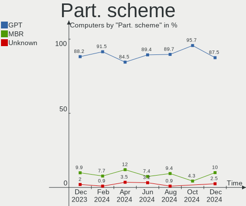
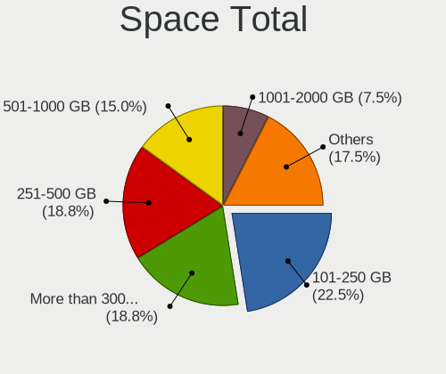
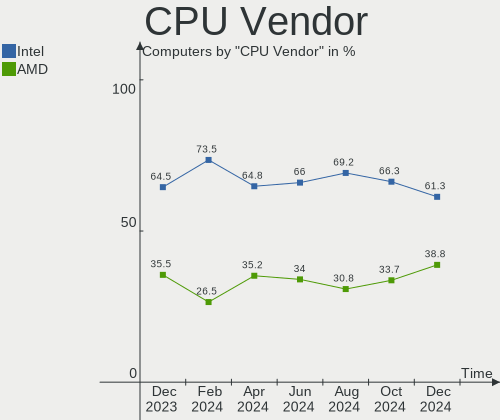
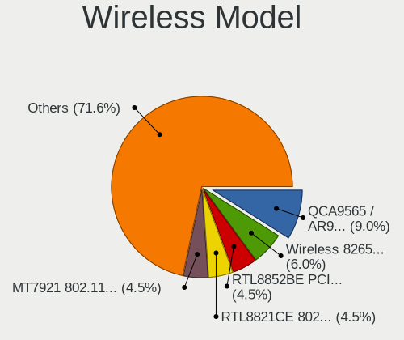

ArcoLinux - Hardware Trends
---------------------------

A project to identify most popular hardware characteristics and track their change
over time based on data collected by Linux users at https://Linux-Hardware.org.

Anyone can contribute to this report by the [hw-probe](https://github.com/linuxhw/hw-probe) tool:

    sudo -E hw-probe -all -upload

This is a report for all computer types. See also reports for [desktops](/Dist/ArcoLinux/Desktop/README.md) and [notebooks](/Dist/ArcoLinux/Notebook/README.md).

This report is for one last month. Overall report since the beginning of time: [TestCoverage](https://github.com/linuxhw/TestCoverage)

Period: Jul, 2022.

Contents
--------

* [ System ](#system)
  - [ OS                       ](#os)
  - [ OS Family                ](#os-family)
  - [ Kernel                   ](#kernel)
  - [ Kernel Family            ](#kernel-family)
  - [ Kernel Major Ver.        ](#kernel-major-ver)
  - [ Arch                     ](#arch)
  - [ DE                       ](#de)
  - [ Display Server           ](#display-server)
  - [ Display Manager          ](#display-manager)
  - [ OS Lang                  ](#os-lang)
  - [ Boot Mode                ](#boot-mode)
  - [ Filesystem               ](#filesystem)
  - [ Part. scheme             ](#part-scheme)
  - [ Dual Boot with Linux/BSD ](#dual-boot-with-linuxbsd)
  - [ Dual Boot (Win)          ](#dual-boot-win)

* [ Board ](#board)
  - [ Vendor                   ](#vendor)
  - [ Model                    ](#model)
  - [ Model Family             ](#model-family)
  - [ MFG Year                 ](#mfg-year)
  - [ Form Factor              ](#form-factor)
  - [ Secure Boot              ](#secure-boot)
  - [ Coreboot                 ](#coreboot)
  - [ RAM Size                 ](#ram-size)
  - [ RAM Used                 ](#ram-used)
  - [ Total Drives             ](#total-drives)
  - [ Has CD-ROM               ](#has-cd-rom)
  - [ Has Ethernet             ](#has-ethernet)
  - [ Has WiFi                 ](#has-wifi)
  - [ Has Bluetooth            ](#has-bluetooth)

* [ Location ](#location)
  - [ Country                  ](#country)
  - [ City                     ](#city)

* [ Drives ](#drives)
  - [ Drive Vendor             ](#drive-vendor)
  - [ Drive Model              ](#drive-model)
  - [ HDD Vendor               ](#hdd-vendor)
  - [ SSD Vendor               ](#ssd-vendor)
  - [ Drive Kind               ](#drive-kind)
  - [ Drive Connector          ](#drive-connector)
  - [ Drive Size               ](#drive-size)
  - [ Space Total              ](#space-total)
  - [ Space Used               ](#space-used)
  - [ Malfunc. Drives          ](#malfunc-drives)
  - [ Malfunc. Drive Vendor    ](#malfunc-drive-vendor)
  - [ Malfunc. HDD Vendor      ](#malfunc-hdd-vendor)
  - [ Malfunc. Drive Kind      ](#malfunc-drive-kind)
  - [ Failed Drives            ](#failed-drives)
  - [ Failed Drive Vendor      ](#failed-drive-vendor)
  - [ Drive Status             ](#drive-status)

* [ Storage controller ](#storage-controller)
  - [ Storage Vendor           ](#storage-vendor)
  - [ Storage Model            ](#storage-model)
  - [ Storage Kind             ](#storage-kind)

* [ Processor ](#processor)
  - [ CPU Vendor               ](#cpu-vendor)
  - [ CPU Model                ](#cpu-model)
  - [ CPU Model Family         ](#cpu-model-family)
  - [ CPU Cores                ](#cpu-cores)
  - [ CPU Sockets              ](#cpu-sockets)
  - [ CPU Threads              ](#cpu-threads)
  - [ CPU Op-Modes             ](#cpu-op-modes)
  - [ CPU Microcode            ](#cpu-microcode)
  - [ CPU Microarch            ](#cpu-microarch)

* [ Graphics ](#graphics)
  - [ GPU Vendor               ](#gpu-vendor)
  - [ GPU Model                ](#gpu-model)
  - [ GPU Combo                ](#gpu-combo)
  - [ GPU Driver               ](#gpu-driver)
  - [ GPU Memory               ](#gpu-memory)

* [ Monitor ](#monitor)
  - [ Monitor Vendor           ](#monitor-vendor)
  - [ Monitor Model            ](#monitor-model)
  - [ Monitor Resolution       ](#monitor-resolution)
  - [ Monitor Diagonal         ](#monitor-diagonal)
  - [ Monitor Width            ](#monitor-width)
  - [ Aspect Ratio             ](#aspect-ratio)
  - [ Monitor Area             ](#monitor-area)
  - [ Pixel Density            ](#pixel-density)
  - [ Multiple Monitors        ](#multiple-monitors)

* [ Network ](#network)
  - [ Net Controller Vendor    ](#net-controller-vendor)
  - [ Net Controller Model     ](#net-controller-model)
  - [ Wireless Vendor          ](#wireless-vendor)
  - [ Wireless Model           ](#wireless-model)
  - [ Ethernet Vendor          ](#ethernet-vendor)
  - [ Ethernet Model           ](#ethernet-model)
  - [ Net Controller Kind      ](#net-controller-kind)
  - [ Used Controller          ](#used-controller)
  - [ NICs                     ](#nics)
  - [ IPv6                     ](#ipv6)

* [ Bluetooth ](#bluetooth)
  - [ Bluetooth Vendor         ](#bluetooth-vendor)
  - [ Bluetooth Model          ](#bluetooth-model)

* [ Sound ](#sound)
  - [ Sound Vendor             ](#sound-vendor)
  - [ Sound Model              ](#sound-model)

* [ Memory ](#memory)
  - [ Memory Vendor            ](#memory-vendor)
  - [ Memory Model             ](#memory-model)
  - [ Memory Kind              ](#memory-kind)
  - [ Memory Form Factor       ](#memory-form-factor)
  - [ Memory Size              ](#memory-size)
  - [ Memory Speed             ](#memory-speed)

* [ Printers & scanners ](#printers--scanners)
  - [ Printer Vendor           ](#printer-vendor)
  - [ Printer Model            ](#printer-model)
  - [ Scanner Vendor           ](#scanner-vendor)
  - [ Scanner Model            ](#scanner-model)

* [ Camera ](#camera)
  - [ Camera Vendor            ](#camera-vendor)
  - [ Camera Model             ](#camera-model)

* [ Security ](#security)
  - [ Fingerprint Vendor       ](#fingerprint-vendor)
  - [ Fingerprint Model        ](#fingerprint-model)
  - [ Chipcard Vendor          ](#chipcard-vendor)
  - [ Chipcard Model           ](#chipcard-model)

* [ Unsupported ](#unsupported)
  - [ Unsupported Devices      ](#unsupported-devices)
  - [ Unsupported Device Types ](#unsupported-device-types)

System
------

OS
--

Installed operating systems

| Name              | Computers | Percent |
|-------------------|-----------|---------|
| ArcoLinux Rolling | 28        | 84.85%  |
| ArcoLinux         | 5         | 15.15%  |

OS Family
---------

OS without a version

| Name      | Computers | Percent |
|-----------|-----------|---------|
| ArcoLinux | 33        | 100%    |

Kernel
------

Version of the Linux kernel

| Version            | Computers | Percent |
|--------------------|-----------|---------|
| 5.18.12-arch1-1    | 6         | 18.18%  |
| 5.18.9-arch1-1     | 4         | 12.12%  |
| 5.17.6-arch1-1     | 3         | 9.09%   |
| 5.18.3-arch1-1     | 2         | 6.06%   |
| 5.18.15-arch1-1    | 2         | 6.06%   |
| 5.18.14-arch1-1    | 2         | 6.06%   |
| 5.18.11-arch1-1    | 2         | 6.06%   |
| 5.18.10-zen1-1-zen | 2         | 6.06%   |
| 5.18.9-zen1-1-zen  | 1         | 3.03%   |
| 5.18.8-arch1-1     | 1         | 3.03%   |
| 5.18.7-zen1-1-zen  | 1         | 3.03%   |
| 5.18.13-zen1-1-zen | 1         | 3.03%   |
| 5.18.13-arch1-1    | 1         | 3.03%   |
| 5.18.12-zen1-1-zen | 1         | 3.03%   |
| 5.18.11-zen1-1-zen | 1         | 3.03%   |
| 5.18.10-arch1-1    | 1         | 3.03%   |
| 5.18.1-arch1-1     | 1         | 3.03%   |
| 5.15.51-1-lts      | 1         | 3.03%   |

Kernel Family
-------------

Linux kernel without a distro release

| Version | Computers | Percent |
|---------|-----------|---------|
| 5.18.12 | 7         | 21.21%  |
| 5.18.9  | 5         | 15.15%  |
| 5.18.11 | 3         | 9.09%   |
| 5.18.10 | 3         | 9.09%   |
| 5.17.6  | 3         | 9.09%   |
| 5.18.3  | 2         | 6.06%   |
| 5.18.15 | 2         | 6.06%   |
| 5.18.14 | 2         | 6.06%   |
| 5.18.13 | 2         | 6.06%   |
| 5.18.8  | 1         | 3.03%   |
| 5.18.7  | 1         | 3.03%   |
| 5.18.1  | 1         | 3.03%   |
| 5.15.51 | 1         | 3.03%   |

Kernel Major Ver.
-----------------

Linux kernel major version

| Version | Computers | Percent |
|---------|-----------|---------|
| 5.18    | 29        | 87.88%  |
| 5.17    | 3         | 9.09%   |
| 5.15    | 1         | 3.03%   |

Arch
----

OS architecture (x86_64, i586, etc.)

| Name   | Computers | Percent |
|--------|-----------|---------|
| x86_64 | 33        | 100%    |

DE
--

Desktop Environment

| Name       | Computers | Percent |
|------------|-----------|---------|
| KDE5       | 10        | 30.3%   |
| XFCE       | 8         | 24.24%  |
| GNOME      | 3         | 9.09%   |
| bspwm      | 3         | 9.09%   |
| qtile      | 2         | 6.06%   |
| i3         | 2         | 6.06%   |
| awesome    | 2         | 6.06%   |
| xmonad     | 1         | 3.03%   |
| X-Cinnamon | 1         | 3.03%   |
| dwm        | 1         | 3.03%   |

Display Server
--------------

X11 or Wayland

| Name    | Computers | Percent |
|---------|-----------|---------|
| X11     | 31        | 93.94%  |
| Wayland | 1         | 3.03%   |
| Unknown | 1         | 3.03%   |

Display Manager
---------------

SDDM, LightDM, etc.

| Name    | Computers | Percent |
|---------|-----------|---------|
| SDDM    | 22        | 66.67%  |
| LightDM | 5         | 15.15%  |
| Unknown | 5         | 15.15%  |
| GDM     | 1         | 3.03%   |

OS Lang
-------

Language

| Lang  | Computers | Percent |
|-------|-----------|---------|
| en_US | 25        | 75.76%  |
| es_ES | 2         | 6.06%   |
| en_IN | 2         | 6.06%   |
| tr_TR | 1         | 3.03%   |
| es_GT | 1         | 3.03%   |
| en_PH | 1         | 3.03%   |
| en_AU | 1         | 3.03%   |

Boot Mode
---------

EFI or BIOS

| Mode | Computers | Percent |
|------|-----------|---------|
| EFI  | 25        | 75.76%  |
| BIOS | 8         | 24.24%  |

Filesystem
----------

Type of filesystem

| Type    | Computers | Percent |
|---------|-----------|---------|
| Ext4    | 20        | 60.61%  |
| Btrfs   | 10        | 30.3%   |
| Overlay | 3         | 9.09%   |

Part. scheme
------------

Scheme of partitioning

| Type    | Computers | Percent |
|---------|-----------|---------|
| GPT     | 24        | 72.73%  |
| Unknown | 5         | 15.15%  |
| MBR     | 4         | 12.12%  |

Dual Boot with Linux/BSD
------------------------

Hosting more than one Linux/BSD

| Dual boot | Computers | Percent |
|-----------|-----------|---------|
| No        | 25        | 75.76%  |
| Yes       | 8         | 24.24%  |

Dual Boot (Win)
---------------

Hosting Linux and Windows

| Dual boot | Computers | Percent |
|-----------|-----------|---------|
| No        | 25        | 75.76%  |
| Yes       | 8         | 24.24%  |

Board
-----

Vendor
------

Motherboard manufacturer

| Name                | Computers | Percent |
|---------------------|-----------|---------|
| Hewlett-Packard     | 8         | 24.24%  |
| Dell                | 4         | 12.12%  |
| ASUSTek Computer    | 4         | 12.12%  |
| Lenovo              | 3         | 9.09%   |
| ASRock              | 3         | 9.09%   |
| MSI                 | 2         | 6.06%   |
| Gigabyte Technology | 2         | 6.06%   |
| Acer                | 2         | 6.06%   |
| System76            | 1         | 3.03%   |
| Supermicro          | 1         | 3.03%   |
| Chuwi               | 1         | 3.03%   |
| Biostar             | 1         | 3.03%   |
| Apple               | 1         | 3.03%   |

Model
-----

Motherboard model

| Name                                | Computers | Percent |
|-------------------------------------|-----------|---------|
| System76 Oryx Pro                   | 1         | 3.03%   |
| Supermicro SYS-E100-9AP             | 1         | 3.03%   |
| MSI MS-7C95                         | 1         | 3.03%   |
| MSI MS-7B98                         | 1         | 3.03%   |
| Lenovo ThinkPad Yoga 260 20FES1U600 | 1         | 3.03%   |
| Lenovo ThinkCentre M700 10J0S35C00  | 1         | 3.03%   |
| Lenovo IdeaPad S340-15IWL 81N8      | 1         | 3.03%   |
| HP Pavilion Notebook                | 1         | 3.03%   |
| HP Pavilion Laptop 15-eh0xxx        | 1         | 3.03%   |
| HP Notebook                         | 1         | 3.03%   |
| HP Laptop 15-da1xxx                 | 1         | 3.03%   |
| HP ENVY x360 Convertible 15-ee1xxx  | 1         | 3.03%   |
| HP ENVY x360 Convertible 13-ay0xxx  | 1         | 3.03%   |
| HP Compaq Elite 8300 SFF            | 1         | 3.03%   |
| Gigabyte X570 AORUS PRO WIFI        | 1         | 3.03%   |
| Gigabyte B450M S2H                  | 1         | 3.03%   |
| Dell Vostro 15 3510                 | 1         | 3.03%   |
| Dell Inspiron N5050                 | 1         | 3.03%   |
| Dell Inspiron 5558                  | 1         | 3.03%   |
| Dell Inspiron 14 5401               | 1         | 3.03%   |
| Chuwi GemiBook Pro                  | 1         | 3.03%   |
| Biostar J3060NH                     | 1         | 3.03%   |
| ASUS Zephyrus M GU502GU_GU502GU     | 1         | 3.03%   |
| ASUS S551LN                         | 1         | 3.03%   |
| ASUS ROG STRIX B550-F GAMING        | 1         | 3.03%   |
| ASUS EX-B150M-V3                    | 1         | 3.03%   |
| ASRock Z170 Gaming K4               | 1         | 3.03%   |
| ASRock FM2A58M-VG3+ R2.0            | 1         | 3.03%   |
| ASRock B550M Pro4                   | 1         | 3.03%   |
| Apple Macmini6,2                    | 1         | 3.03%   |
| Acer Aspire V5-571G                 | 1         | 3.03%   |
| Acer Aspire E5-576G                 | 1         | 3.03%   |
| Unknown                             | 1         | 3.03%   |

Model Family
------------

Motherboard model prefix

| Name                    | Computers | Percent |
|-------------------------|-----------|---------|
| Dell Inspiron           | 3         | 9.09%   |
| HP Pavilion             | 2         | 6.06%   |
| HP ENVY                 | 2         | 6.06%   |
| Acer Aspire             | 2         | 6.06%   |
| System76 Oryx           | 1         | 3.03%   |
| Supermicro SYS-E100-9AP | 1         | 3.03%   |
| MSI MS-7C95             | 1         | 3.03%   |
| MSI MS-7B98             | 1         | 3.03%   |
| Lenovo ThinkPad         | 1         | 3.03%   |
| Lenovo ThinkCentre      | 1         | 3.03%   |
| Lenovo IdeaPad          | 1         | 3.03%   |
| HP Notebook             | 1         | 3.03%   |
| HP Laptop               | 1         | 3.03%   |
| HP Compaq               | 1         | 3.03%   |
| Gigabyte X570           | 1         | 3.03%   |
| Gigabyte B450M          | 1         | 3.03%   |
| Dell Vostro             | 1         | 3.03%   |
| Chuwi GemiBook          | 1         | 3.03%   |
| Biostar J3060NH         | 1         | 3.03%   |
| ASUS Zephyrus           | 1         | 3.03%   |
| ASUS S551LN             | 1         | 3.03%   |
| ASUS ROG                | 1         | 3.03%   |
| ASUS EX-B150M-V3        | 1         | 3.03%   |
| ASRock Z170             | 1         | 3.03%   |
| ASRock FM2A58M-VG3+     | 1         | 3.03%   |
| ASRock B550M            | 1         | 3.03%   |
| Apple Macmini6          | 1         | 3.03%   |
| Unknown                 | 1         | 3.03%   |

MFG Year
--------

Motherboard manufacture year

| Year | Computers | Percent |
|------|-----------|---------|
| 2020 | 7         | 21.21%  |
| 2019 | 5         | 15.15%  |
| 2018 | 4         | 12.12%  |
| 2017 | 4         | 12.12%  |
| 2021 | 3         | 9.09%   |
| 2015 | 3         | 9.09%   |
| 2012 | 3         | 9.09%   |
| 2014 | 2         | 6.06%   |
| 2016 | 1         | 3.03%   |
| 2011 | 1         | 3.03%   |

Form Factor
-----------

Physical design of the computer

| Name        | Computers | Percent |
|-------------|-----------|---------|
| Notebook    | 16        | 48.48%  |
| Desktop     | 13        | 39.39%  |
| Convertible | 3         | 9.09%   |
| Mini pc     | 1         | 3.03%   |

Secure Boot
-----------

Enabled or disabled

| State    | Computers | Percent |
|----------|-----------|---------|
| Disabled | 33        | 100%    |

Coreboot
--------

Have coreboot on board

| Used | Computers | Percent |
|------|-----------|---------|
| No   | 33        | 100%    |

RAM Size
--------

Total RAM memory

| Size in GB  | Computers | Percent |
|-------------|-----------|---------|
| 4.01-8.0    | 11        | 33.33%  |
| 16.01-24.0  | 9         | 27.27%  |
| 32.01-64.0  | 4         | 12.12%  |
| 3.01-4.0    | 4         | 12.12%  |
| 8.01-16.0   | 4         | 12.12%  |
| 64.01-256.0 | 1         | 3.03%   |

RAM Used
--------

Used RAM memory

| Used GB   | Computers | Percent |
|-----------|-----------|---------|
| 4.01-8.0  | 10        | 30.3%   |
| 3.01-4.0  | 8         | 24.24%  |
| 2.01-3.0  | 5         | 15.15%  |
| 1.01-2.0  | 5         | 15.15%  |
| 0.51-1.0  | 3         | 9.09%   |
| 8.01-16.0 | 2         | 6.06%   |

Total Drives
------------

Number of drives on board

| Drives | Computers | Percent |
|--------|-----------|---------|
| 1      | 19        | 57.58%  |
| 2      | 7         | 21.21%  |
| 3      | 3         | 9.09%   |
| 9      | 1         | 3.03%   |
| 6      | 1         | 3.03%   |
| 5      | 1         | 3.03%   |
| 4      | 1         | 3.03%   |

Has CD-ROM
----------

Has CD-ROM on board

| Presented | Computers | Percent |
|-----------|-----------|---------|
| No        | 25        | 75.76%  |
| Yes       | 8         | 24.24%  |

Has Ethernet
------------

Has Ethernet on board

| Presented | Computers | Percent |
|-----------|-----------|---------|
| Yes       | 28        | 84.85%  |
| No        | 5         | 15.15%  |

Has WiFi
--------

Has WiFi module

| Presented | Computers | Percent |
|-----------|-----------|---------|
| Yes       | 25        | 75.76%  |
| No        | 8         | 24.24%  |

Has Bluetooth
-------------

Has Bluetooth module

| Presented | Computers | Percent |
|-----------|-----------|---------|
| Yes       | 23        | 69.7%   |
| No        | 10        | 30.3%   |

Location
--------

Country
-------

Geographic location (country)

| Country     | Computers | Percent |
|-------------|-----------|---------|
| USA         | 12        | 36.36%  |
| Turkey      | 3         | 9.09%   |
| Russia      | 3         | 9.09%   |
| Italy       | 3         | 9.09%   |
| India       | 2         | 6.06%   |
| Uruguay     | 1         | 3.03%   |
| UK          | 1         | 3.03%   |
| Spain       | 1         | 3.03%   |
| Philippines | 1         | 3.03%   |
| Guatemala   | 1         | 3.03%   |
| Germany     | 1         | 3.03%   |
| Czechia     | 1         | 3.03%   |
| Brazil      | 1         | 3.03%   |
| Barbados    | 1         | 3.03%   |
| Australia   | 1         | 3.03%   |

City
----

Geographic location (city)

| City             | Computers | Percent |
|------------------|-----------|---------|
| Ufa              | 2         | 6.06%   |
| Yalova           | 1         | 3.03%   |
| Wyoming          | 1         | 3.03%   |
| Turin            | 1         | 3.03%   |
| Sydney           | 1         | 3.03%   |
| Stockton-on-Tees | 1         | 3.03%   |
| Seville          | 1         | 3.03%   |
| Queens           | 1         | 3.03%   |
| Pune             | 1         | 3.03%   |
| Prague           | 1         | 3.03%   |
| Pittsburgh       | 1         | 3.03%   |
| Phoenix          | 1         | 3.03%   |
| Omaha            | 1         | 3.03%   |
| Noida            | 1         | 3.03%   |
| Montevideo       | 1         | 3.03%   |
| Maracanau        | 1         | 3.03%   |
| Lavino di Mezzo  | 1         | 3.03%   |
| Lake Cormorant   | 1         | 3.03%   |
| Kazan’         | 1         | 3.03%   |
| Kassel           | 1         | 3.03%   |
| İzmit           | 1         | 3.03%   |
| Istanbul         | 1         | 3.03%   |
| Gustine          | 1         | 3.03%   |
| Guatemala City   | 1         | 3.03%   |
| Gallarate        | 1         | 3.03%   |
| Durham           | 1         | 3.03%   |
| Duncanville      | 1         | 3.03%   |
| Bridgetown       | 1         | 3.03%   |
| Baton Rouge      | 1         | 3.03%   |
| Bais City        | 1         | 3.03%   |
| Atlanta          | 1         | 3.03%   |
| Abilene          | 1         | 3.03%   |

Drives
------

Drive Vendor
------------

Hard drive vendors

| Vendor                | Computers | Drives | Percent |
|-----------------------|-----------|--------|---------|
| Seagate               | 9         | 9      | 16.07%  |
| Samsung Electronics   | 9         | 12     | 16.07%  |
| WDC                   | 6         | 10     | 10.71%  |
| Kingston              | 5         | 6      | 8.93%   |
| Crucial               | 3         | 3      | 5.36%   |
| Unknown               | 2         | 2      | 3.57%   |
| SK hynix              | 2         | 2      | 3.57%   |
| SanDisk               | 2         | 2      | 3.57%   |
| Intel                 | 2         | 2      | 3.57%   |
| HGST                  | 2         | 2      | 3.57%   |
| China                 | 2         | 3      | 3.57%   |
| Transcend             | 1         | 1      | 1.79%   |
| Toshiba               | 1         | 1      | 1.79%   |
| Team                  | 1         | 1      | 1.79%   |
| Realtek Semiconductor | 1         | 1      | 1.79%   |
| Realtek               | 1         | 1      | 1.79%   |
| Phison Electronics    | 1         | 1      | 1.79%   |
| Patriot               | 1         | 1      | 1.79%   |
| LITEONIT              | 1         | 1      | 1.79%   |
| LaCie                 | 1         | 1      | 1.79%   |
| KIOXIA                | 1         | 1      | 1.79%   |
| Innodisk              | 1         | 1      | 1.79%   |
| Apple                 | 1         | 1      | 1.79%   |

Drive Model
-----------

Hard drive models

| Model                                       | Computers | Percent |
|---------------------------------------------|-----------|---------|
| Seagate ST2000DM008-2FR102 2TB              | 2         | 3.13%   |
| HGST HTS545050A7E680 500GB                  | 2         | 3.13%   |
| WDC WDS500G2B0B-00YS70 500GB SSD            | 1         | 1.56%   |
| WDC WDS500G1X0E-00AFY0 500GB                | 1         | 1.56%   |
| WDC WDBNCE5000PNC 500GB SSD                 | 1         | 1.56%   |
| WDC WD5000AAKX-00ERMA0 500GB                | 1         | 1.56%   |
| WDC WD20SPZX-22UA7T0 2TB                    | 1         | 1.56%   |
| WDC WD20EFRX-68EUZN0 2TB                    | 1         | 1.56%   |
| WDC WD10SPZX-21Z10T0 1TB                    | 1         | 1.56%   |
| WDC WD10EZEX-07WN4A0 1TB                    | 1         | 1.56%   |
| WDC WD10EADS-11M2B1 1TB                     | 1         | 1.56%   |
| WDC WD1003FZEX-00K3CA0 1TB                  | 1         | 1.56%   |
| Unknown MMC Card  256GB                     | 1         | 1.56%   |
| Unknown APPSD  134GB                        | 1         | 1.56%   |
| Transcend TS480GSSD220S 480GB               | 1         | 1.56%   |
| Toshiba MQ01ABD100 1TB                      | 1         | 1.56%   |
| Team TM8PS7256G 256GB SSD                   | 1         | 1.56%   |
| SK hynix SHGS31-500GS-2 500GB SSD           | 1         | 1.56%   |
| SK hynix BC511 NVMe 256GB                   | 1         | 1.56%   |
| Seagate ST9500325AS 500GB                   | 1         | 1.56%   |
| Seagate ST750LX003-1AC154 752GB             | 1         | 1.56%   |
| Seagate ST500LT012-9WS142 500GB             | 1         | 1.56%   |
| Seagate ST320LT020-9YG142 320GB             | 1         | 1.56%   |
| Seagate ST1000VM002-1SD102 1TB              | 1         | 1.56%   |
| Seagate ST1000LM035-1RK172 1TB              | 1         | 1.56%   |
| Seagate FireCuda 520 SSD ZP500GM30002 500GB | 1         | 1.56%   |
| SanDisk NVMe SSD Drive 500GB                | 1         | 1.56%   |
| SanDisk Extreme 55AE 2TB SSD                | 1         | 1.56%   |
| Samsung SSD 970 EVO 1TB                     | 1         | 1.56%   |
| Samsung SSD 960 EVO 250GB                   | 1         | 1.56%   |
| Samsung SSD 870 EVO 500GB                   | 1         | 1.56%   |
| Samsung SSD 860 EVO 500GB                   | 1         | 1.56%   |
| Samsung SSD 860 EVO 250GB                   | 1         | 1.56%   |
| Samsung SSD 850 EVO 250GB                   | 1         | 1.56%   |
| Samsung NVMe SSD Drive 1TB                  | 1         | 1.56%   |
| Samsung MZVLQ512HALU-000H1 512GB            | 1         | 1.56%   |
| Samsung MZVLQ256HBJD-00BH1 256GB            | 1         | 1.56%   |
| Samsung MZNLN512HMJP-000L7 512GB SSD        | 1         | 1.56%   |
| Samsung HD502HJ 500GB                       | 1         | 1.56%   |
| Realtek NVMe SSD Drive 512GB                | 1         | 1.56%   |
| Realtek RTL9210B-CG 500GB                   | 1         | 1.56%   |
| Phison PCIe SSD 500GB                       | 1         | 1.56%   |
| Patriot Burst 480GB SSD                     | 1         | 1.56%   |
| LITEONIT LCS-128M6S 128GB SSD               | 1         | 1.56%   |
| LaCie Mobile Drive 2TB                      | 1         | 1.56%   |
| KIOXIA KBG40ZNS512G NVMe 512GB              | 1         | 1.56%   |
| Kingston SA400S37240G 240GB SSD             | 1         | 1.56%   |
| Kingston SA400S371TB SSD                    | 1         | 1.56%   |
| Kingston SA400M8240G 240GB SSD              | 1         | 1.56%   |
| Kingston SA2000M81000G 1TB                  | 1         | 1.56%   |
| Kingston RBUSNS8180S3128GI 128GB SSD        | 1         | 1.56%   |
| Kingston RBUSNS8154P3256GJ 256GB            | 1         | 1.56%   |
| Intel SSDSC2KW256G8 256GB                   | 1         | 1.56%   |
| Intel SSDPEKNW512G8 512GB                   | 1         | 1.56%   |
| Innodisk M.2 (S80) 3TE7 960GB SSD           | 1         | 1.56%   |
| Crucial CT250P2SSD8 250GB                   | 1         | 1.56%   |
| Crucial CT250MX500SSD1 250GB                | 1         | 1.56%   |
| Crucial CT240BX500SSD1 240GB                | 1         | 1.56%   |
| China SSD 240GB                             | 1         | 1.56%   |
| China SSD 1TB                               | 1         | 1.56%   |

HDD Vendor
----------

Hard disk drive vendors

| Vendor              | Computers | Drives | Percent |
|---------------------|-----------|--------|---------|
| Seagate             | 8         | 8      | 47.06%  |
| WDC                 | 5         | 7      | 29.41%  |
| HGST                | 2         | 2      | 11.76%  |
| Toshiba             | 1         | 1      | 5.88%   |
| Samsung Electronics | 1         | 1      | 5.88%   |

SSD Vendor
----------

Solid state drive vendors

| Vendor              | Computers | Drives | Percent |
|---------------------|-----------|--------|---------|
| Samsung Electronics | 4         | 6      | 17.39%  |
| Kingston            | 4         | 4      | 17.39%  |
| WDC                 | 2         | 2      | 8.7%    |
| Crucial             | 2         | 2      | 8.7%    |
| China               | 2         | 3      | 8.7%    |
| Transcend           | 1         | 1      | 4.35%   |
| Team                | 1         | 1      | 4.35%   |
| SK hynix            | 1         | 1      | 4.35%   |
| SanDisk             | 1         | 1      | 4.35%   |
| Patriot             | 1         | 1      | 4.35%   |
| LITEONIT            | 1         | 1      | 4.35%   |
| Intel               | 1         | 1      | 4.35%   |
| Innodisk            | 1         | 1      | 4.35%   |
| Apple               | 1         | 1      | 4.35%   |

Drive Kind
----------

HDD or SSD

| Kind    | Computers | Drives | Percent |
|---------|-----------|--------|---------|
| SSD     | 19        | 26     | 37.25%  |
| HDD     | 16        | 19     | 31.37%  |
| NVMe    | 13        | 17     | 25.49%  |
| MMC     | 2         | 2      | 3.92%   |
| Unknown | 1         | 1      | 1.96%   |

Drive Connector
---------------

SATA, SAS, NVMe, etc.

| Type | Computers | Drives | Percent |
|------|-----------|--------|---------|
| SATA | 24        | 44     | 57.14%  |
| NVMe | 13        | 16     | 30.95%  |
| SAS  | 3         | 3      | 7.14%   |
| MMC  | 2         | 2      | 4.76%   |

Drive Size
----------

Size of hard drive

| Size in TB | Computers | Drives | Percent |
|------------|-----------|--------|---------|
| 0.01-0.5   | 19        | 28     | 54.29%  |
| 0.51-1.0   | 11        | 12     | 31.43%  |
| 1.01-2.0   | 5         | 5      | 14.29%  |

Space Total
-----------

Amount of disk space available on the file system

| Size in GB     | Computers | Percent |
|----------------|-----------|---------|
| 1001-2000      | 6         | 18.18%  |
| 251-500        | 5         | 15.15%  |
| 101-250        | 5         | 15.15%  |
| More than 3000 | 4         | 12.12%  |
| 2001-3000      | 4         | 12.12%  |
| 501-1000       | 3         | 9.09%   |
| Unknown        | 3         | 9.09%   |
| 1-20           | 2         | 6.06%   |
| 21-50          | 1         | 3.03%   |

Space Used
----------

Amount of used disk space

| Used GB   | Computers | Percent |
|-----------|-----------|---------|
| 1-20      | 6         | 18.18%  |
| 251-500   | 5         | 15.15%  |
| 501-1000  | 5         | 15.15%  |
| 21-50     | 4         | 12.12%  |
| 101-250   | 4         | 12.12%  |
| 51-100    | 4         | 12.12%  |
| Unknown   | 3         | 9.09%   |
| 2001-3000 | 1         | 3.03%   |
| 1001-2000 | 1         | 3.03%   |

Malfunc. Drives
---------------

Drive models with a malfunction

| Model                           | Computers | Drives | Percent |
|---------------------------------|-----------|--------|---------|
| WDC WDS500G1X0E-00AFY0 500GB    | 1         | 1      | 11.11%  |
| WDC WD20EFRX-68EUZN0 2TB        | 1         | 1      | 11.11%  |
| WDC WD10EADS-11M2B1 1TB         | 1         | 1      | 11.11%  |
| WDC WD1003FZEX-00K3CA0 1TB      | 1         | 1      | 11.11%  |
| Toshiba MQ01ABD100 1TB          | 1         | 1      | 11.11%  |
| Seagate ST9500325AS 500GB       | 1         | 1      | 11.11%  |
| Seagate ST500LT012-9WS142 500GB | 1         | 1      | 11.11%  |
| Seagate ST320LT020-9YG142 320GB | 1         | 1      | 11.11%  |
| HGST HTS545050A7E680 500GB      | 1         | 1      | 11.11%  |

Malfunc. Drive Vendor
---------------------

Vendors of faulty drives

| Vendor  | Computers | Drives | Percent |
|---------|-----------|--------|---------|
| Seagate | 3         | 3      | 50%     |
| WDC     | 1         | 4      | 16.67%  |
| Toshiba | 1         | 1      | 16.67%  |
| HGST    | 1         | 1      | 16.67%  |

Malfunc. HDD Vendor
-------------------

Vendors of faulty HDD drives

| Vendor  | Computers | Drives | Percent |
|---------|-----------|--------|---------|
| Seagate | 3         | 3      | 50%     |
| WDC     | 1         | 3      | 16.67%  |
| Toshiba | 1         | 1      | 16.67%  |
| HGST    | 1         | 1      | 16.67%  |

Malfunc. Drive Kind
-------------------

Kinds of faulty drives

| Kind | Computers | Drives | Percent |
|------|-----------|--------|---------|
| HDD  | 6         | 8      | 85.71%  |
| NVMe | 1         | 1      | 14.29%  |

Failed Drives
-------------

Failed drive models

Zero info for selected period =(

Failed Drive Vendor
-------------------

Failed drive vendors

Zero info for selected period =(

Drive Status
------------

Number of failed and malfunc. drives

| Status   | Computers | Drives | Percent |
|----------|-----------|--------|---------|
| Works    | 22        | 40     | 61.11%  |
| Detected | 8         | 16     | 22.22%  |
| Malfunc  | 6         | 9      | 16.67%  |

Storage controller
------------------

Storage Vendor
--------------

Storage controller vendors

| Vendor                      | Computers | Percent |
|-----------------------------|-----------|---------|
| Intel                       | 22        | 48.89%  |
| AMD                         | 8         | 17.78%  |
| Samsung Electronics         | 5         | 11.11%  |
| SanDisk                     | 2         | 4.44%   |
| Kingston Technology Company | 2         | 4.44%   |
| SK hynix                    | 1         | 2.22%   |
| Seagate Technology          | 1         | 2.22%   |
| Realtek Semiconductor       | 1         | 2.22%   |
| Phison Electronics          | 1         | 2.22%   |
| Micron/Crucial Technology   | 1         | 2.22%   |
| KIOXIA                      | 1         | 2.22%   |

Storage Model
-------------

Storage controller models

| Model                                                                            | Computers | Percent |
|----------------------------------------------------------------------------------|-----------|---------|
| AMD FCH SATA Controller [AHCI mode]                                              | 6         | 12.5%   |
| Intel Sunrise Point-LP SATA Controller [AHCI mode]                               | 3         | 6.25%   |
| Intel Q170/Q150/B150/H170/H110/Z170/CM236 Chipset SATA Controller [AHCI Mode]    | 3         | 6.25%   |
| Intel 7 Series Chipset Family 6-port SATA Controller [AHCI mode]                 | 3         | 6.25%   |
| AMD 500 Series Chipset SATA Controller                                           | 3         | 6.25%   |
| Samsung NVMe SSD Controller 980                                                  | 2         | 4.17%   |
| Intel 82801 Mobile SATA Controller [RAID mode]                                   | 2         | 4.17%   |
| SK hynix BC511                                                                   | 1         | 2.08%   |
| Seagate FireCuda 520 SSD                                                         | 1         | 2.08%   |
| SanDisk WD PC SN810 / Black SN850 NVMe SSD                                       | 1         | 2.08%   |
| SanDisk WD Black SN750 / PC SN730 NVMe SSD                                       | 1         | 2.08%   |
| Samsung NVMe SSD Controller SM981/PM981/PM983                                    | 1         | 2.08%   |
| Samsung NVMe SSD Controller SM961/PM961/SM963                                    | 1         | 2.08%   |
| Samsung NVMe SSD Controller PM9A1/PM9A3/980PRO                                   | 1         | 2.08%   |
| Realtek Realtek Non-Volatile memory controller                                   | 1         | 2.08%   |
| Phison E12 NVMe Controller                                                       | 1         | 2.08%   |
| Micron/Crucial P2 NVMe PCIe SSD                                                  | 1         | 2.08%   |
| KIOXIA NVMe SSD Controller BG4                                                   | 1         | 2.08%   |
| Kingston Company U-SNS8154P3 NVMe SSD                                            | 1         | 2.08%   |
| Kingston Company A2000 NVMe SSD                                                  | 1         | 2.08%   |
| Intel Wildcat Point-LP SATA Controller [AHCI Mode]                               | 1         | 2.08%   |
| Intel Tiger Lake-LP SATA Controller                                              | 1         | 2.08%   |
| Intel SSD 660P Series                                                            | 1         | 2.08%   |
| Intel Jasper Lake SATA AHCI Controller                                           | 1         | 2.08%   |
| Intel Celeron N3350/Pentium N4200/Atom E3900 Series SATA AHCI Controller         | 1         | 2.08%   |
| Intel Cannon Lake PCH SATA AHCI Controller                                       | 1         | 2.08%   |
| Intel Cannon Lake Mobile PCH SATA AHCI Controller                                | 1         | 2.08%   |
| Intel Atom/Celeron/Pentium Processor x5-E8000/J3xxx/N3xxx Series SATA Controller | 1         | 2.08%   |
| Intel 8 Series SATA Controller 1 [AHCI mode]                                     | 1         | 2.08%   |
| Intel 7 Series/C210 Series Chipset Family 6-port SATA Controller [AHCI mode]     | 1         | 2.08%   |
| Intel 6 Series/C200 Series Chipset Family 6 port Mobile SATA AHCI Controller     | 1         | 2.08%   |
| AMD FCH IDE Controller                                                           | 1         | 2.08%   |
| AMD 400 Series Chipset SATA Controller                                           | 1         | 2.08%   |

Storage Kind
------------

Kind of storage controller (IDE, SATA, NVMe, SAS, ...)

| Kind | Computers | Percent |
|------|-----------|---------|
| SATA | 27        | 62.79%  |
| NVMe | 13        | 30.23%  |
| RAID | 2         | 4.65%   |
| IDE  | 1         | 2.33%   |

Processor
---------

CPU Vendor
----------

Processor vendors

| Vendor | Computers | Percent |
|--------|-----------|---------|
| Intel  | 23        | 69.7%   |
| AMD    | 10        | 30.3%   |

CPU Model
---------

Processor models

| Model                                         | Computers | Percent |
|-----------------------------------------------|-----------|---------|
| AMD Ryzen 5 3600 6-Core Processor             | 3         | 9.09%   |
| Intel Core i7-9750H CPU @ 2.60GHz             | 2         | 6.06%   |
| Intel Genuine CPU 0000 @ 2.40GHz              | 1         | 3.03%   |
| Intel Core i9-9900KF CPU @ 3.60GHz            | 1         | 3.03%   |
| Intel Core i7-8565U CPU @ 1.80GHz             | 1         | 3.03%   |
| Intel Core i7-7700K CPU @ 4.20GHz             | 1         | 3.03%   |
| Intel Core i7-6500U CPU @ 2.50GHz             | 1         | 3.03%   |
| Intel Core i7-3615QM CPU @ 2.30GHz            | 1         | 3.03%   |
| Intel Core i5-8265U CPU @ 1.60GHz             | 1         | 3.03%   |
| Intel Core i5-6500T CPU @ 2.50GHz             | 1         | 3.03%   |
| Intel Core i5-6200U CPU @ 2.30GHz             | 1         | 3.03%   |
| Intel Core i5-4200U CPU @ 1.60GHz             | 1         | 3.03%   |
| Intel Core i5-3210M CPU @ 2.50GHz             | 1         | 3.03%   |
| Intel Core i3-6006U CPU @ 2.00GHz             | 1         | 3.03%   |
| Intel Core i3-5005U CPU @ 2.00GHz             | 1         | 3.03%   |
| Intel Core i3-2367M CPU @ 1.40GHz             | 1         | 3.03%   |
| Intel Core i3-2350M CPU @ 2.30GHz             | 1         | 3.03%   |
| Intel Core i3-2100T CPU @ 2.50GHz             | 1         | 3.03%   |
| Intel Core i3-1005G1 CPU @ 1.20GHz            | 1         | 3.03%   |
| Intel Celeron N5100 @ 1.10GHz                 | 1         | 3.03%   |
| Intel Celeron CPU J3060 @ 1.60GHz             | 1         | 3.03%   |
| Intel Atom Processor E3940 @ 1.60GHz          | 1         | 3.03%   |
| Intel 11th Gen Core i5-1135G7 @ 2.40GHz       | 1         | 3.03%   |
| AMD Ryzen 9 3900X 12-Core Processor           | 1         | 3.03%   |
| AMD Ryzen 7 5800X 8-Core Processor            | 1         | 3.03%   |
| AMD Ryzen 7 5700U with Radeon Graphics        | 1         | 3.03%   |
| AMD Ryzen 5 4500U with Radeon Graphics        | 1         | 3.03%   |
| AMD Ryzen 3 4300U with Radeon Graphics        | 1         | 3.03%   |
| AMD A8-7600 Radeon R7, 10 Compute Cores 4C+6G | 1         | 3.03%   |
| AMD A6-7310 APU with AMD Radeon R4 Graphics   | 1         | 3.03%   |

CPU Model Family
----------------

Processor model prefix

| Model         | Computers | Percent |
|---------------|-----------|---------|
| Intel Core i7 | 6         | 18.18%  |
| Intel Core i3 | 6         | 18.18%  |
| Intel Core i5 | 5         | 15.15%  |
| AMD Ryzen 5   | 4         | 12.12%  |
| Intel Celeron | 2         | 6.06%   |
| AMD Ryzen 7   | 2         | 6.06%   |
| Other         | 1         | 3.03%   |
| Intel Genuine | 1         | 3.03%   |
| Intel Core i9 | 1         | 3.03%   |
| Intel Atom    | 1         | 3.03%   |
| AMD Ryzen 9   | 1         | 3.03%   |
| AMD Ryzen 3   | 1         | 3.03%   |
| AMD A8        | 1         | 3.03%   |
| AMD A6        | 1         | 3.03%   |

CPU Cores
---------

Number of processor cores

| Number | Computers | Percent |
|--------|-----------|---------|
| 2      | 12        | 36.36%  |
| 4      | 10        | 30.3%   |
| 6      | 7         | 21.21%  |
| 8      | 3         | 9.09%   |
| 12     | 1         | 3.03%   |

CPU Sockets
-----------

Number of sockets

| Number | Computers | Percent |
|--------|-----------|---------|
| 1      | 33        | 100%    |

CPU Threads
-----------

Threads per core (Hyper-Threading)

| Number | Computers | Percent |
|--------|-----------|---------|
| 2      | 26        | 78.79%  |
| 1      | 7         | 21.21%  |

CPU Op-Modes
------------

CPU Operation Modes (32-bit, 64-bit)

| Op mode        | Computers | Percent |
|----------------|-----------|---------|
| 32-bit, 64-bit | 33        | 100%    |

CPU Microcode
-------------

Microcode number

| Number     | Computers | Percent |
|------------|-----------|---------|
| Unknown    | 8         | 24.24%  |
| 0x906ea    | 3         | 9.09%   |
| 0x08701021 | 3         | 9.09%   |
| 0x806ec    | 2         | 6.06%   |
| 0x206a7    | 2         | 6.06%   |
| 0x906ed    | 1         | 3.03%   |
| 0x906c0    | 1         | 3.03%   |
| 0x806c1    | 1         | 3.03%   |
| 0x706e5    | 1         | 3.03%   |
| 0x506e3    | 1         | 3.03%   |
| 0x506ca    | 1         | 3.03%   |
| 0x406e3    | 1         | 3.03%   |
| 0x406c4    | 1         | 3.03%   |
| 0x40651    | 1         | 3.03%   |
| 0x306d4    | 1         | 3.03%   |
| 0x306a9    | 1         | 3.03%   |
| 0x08701013 | 1         | 3.03%   |
| 0x08608103 | 1         | 3.03%   |
| 0x08600106 | 1         | 3.03%   |
| 0x07030105 | 1         | 3.03%   |

CPU Microarch
-------------

Microarchitecture

| Name        | Computers | Percent |
|-------------|-----------|---------|
| KabyLake    | 7         | 21.21%  |
| Zen 2       | 6         | 18.18%  |
| Skylake     | 4         | 12.12%  |
| SandyBridge | 3         | 9.09%   |
| IvyBridge   | 2         | 6.06%   |
| Zen 3       | 1         | 3.03%   |
| Tremont     | 1         | 3.03%   |
| TigerLake   | 1         | 3.03%   |
| Steamroller | 1         | 3.03%   |
| Silvermont  | 1         | 3.03%   |
| Puma        | 1         | 3.03%   |
| IceLake     | 1         | 3.03%   |
| Haswell     | 1         | 3.03%   |
| Goldmont    | 1         | 3.03%   |
| Broadwell   | 1         | 3.03%   |
| Unknown     | 1         | 3.03%   |

Graphics
--------

GPU Vendor
----------

Vendors of graphics cards

| Vendor | Computers | Percent |
|--------|-----------|---------|
| Intel  | 20        | 50%     |
| Nvidia | 12        | 30%     |
| AMD    | 8         | 20%     |

GPU Model
---------

Graphics card models

| Model                                                                                    | Computers | Percent |
|------------------------------------------------------------------------------------------|-----------|---------|
| Intel Skylake GT2 [HD Graphics 520]                                                      | 3         | 7.5%    |
| Intel 2nd Generation Core Processor Family Integrated Graphics Controller                | 3         | 7.5%    |
| Intel WhiskeyLake-U GT2 [UHD Graphics 620]                                               | 2         | 5%      |
| Intel CoffeeLake-H GT2 [UHD Graphics 630]                                                | 2         | 5%      |
| Intel 3rd Gen Core processor Graphics Controller                                         | 2         | 5%      |
| AMD Renoir                                                                               | 2         | 5%      |
| Nvidia TU116M [GeForce GTX 1660 Ti Mobile]                                               | 1         | 2.5%    |
| Nvidia TU116 [GeForce GTX 1650 SUPER]                                                    | 1         | 2.5%    |
| Nvidia TU106M [GeForce RTX 2060 Mobile]                                                  | 1         | 2.5%    |
| Nvidia GP106 [GeForce GTX 1060 3GB]                                                      | 1         | 2.5%    |
| Nvidia GP104 [GeForce GTX 1070]                                                          | 1         | 2.5%    |
| Nvidia GM108M [GeForce MX110]                                                            | 1         | 2.5%    |
| Nvidia GM108M [GeForce 940MX]                                                            | 1         | 2.5%    |
| Nvidia GM108M [GeForce 840M]                                                             | 1         | 2.5%    |
| Nvidia GM107 [GeForce GTX 750 Ti]                                                        | 1         | 2.5%    |
| Nvidia GF117M [GeForce 610M/710M/810M/820M / GT 620M/625M/630M/720M]                     | 1         | 2.5%    |
| Nvidia GA106 [GeForce RTX 3060]                                                          | 1         | 2.5%    |
| Nvidia GA106 [GeForce RTX 3060 Lite Hash Rate]                                           | 1         | 2.5%    |
| Intel TigerLake-LP GT2 [Iris Xe Graphics]                                                | 1         | 2.5%    |
| Intel JasperLake [UHD Graphics]                                                          | 1         | 2.5%    |
| Intel Iris Plus Graphics G1 (Ice Lake)                                                   | 1         | 2.5%    |
| Intel HD Graphics 5500                                                                   | 1         | 2.5%    |
| Intel HD Graphics 530                                                                    | 1         | 2.5%    |
| Intel HD Graphics 500                                                                    | 1         | 2.5%    |
| Intel Haswell-ULT Integrated Graphics Controller                                         | 1         | 2.5%    |
| Intel Atom/Celeron/Pentium Processor x5-E8000/J3xxx/N3xxx Integrated Graphics Controller | 1         | 2.5%    |
| AMD Navi 14 [Radeon RX 5500/5500M / Pro 5500M]                                           | 1         | 2.5%    |
| AMD Mullins [Radeon R4/R5 Graphics]                                                      | 1         | 2.5%    |
| AMD Lucienne                                                                             | 1         | 2.5%    |
| AMD Kaveri [Radeon R7 Graphics]                                                          | 1         | 2.5%    |
| AMD Heathrow PRO [Radeon HD 7850M/8850M]                                                 | 1         | 2.5%    |
| AMD Ellesmere [Radeon RX 470/480/570/570X/580/580X/590]                                  | 1         | 2.5%    |

GPU Combo
---------

Combinations of graphics cards

| Name           | Computers | Percent |
|----------------|-----------|---------|
| 1 x Intel      | 13        | 39.39%  |
| 1 x AMD        | 7         | 21.21%  |
| 1 x Nvidia     | 6         | 18.18%  |
| Intel + Nvidia | 6         | 18.18%  |
| Intel + AMD    | 1         | 3.03%   |

GPU Driver
----------

Free vs proprietary

| Driver      | Computers | Percent |
|-------------|-----------|---------|
| Free        | 23        | 69.7%   |
| Proprietary | 10        | 30.3%   |

GPU Memory
----------

Total video memory

| Size in GB | Computers | Percent |
|------------|-----------|---------|
| Unknown    | 20        | 60.61%  |
| 7.01-8.0   | 3         | 9.09%   |
| 0.01-0.5   | 3         | 9.09%   |
| 8.01-16.0  | 2         | 6.06%   |
| 5.01-6.0   | 1         | 3.03%   |
| 3.01-4.0   | 1         | 3.03%   |
| 2.01-3.0   | 1         | 3.03%   |
| 1.01-2.0   | 1         | 3.03%   |
| 0.51-1.0   | 1         | 3.03%   |

Monitor
-------

Monitor Vendor
--------------

Monitor vendors

| Vendor              | Computers | Percent |
|---------------------|-----------|---------|
| AU Optronics        | 7         | 18.92%  |
| Samsung Electronics | 6         | 16.22%  |
| BOE                 | 5         | 13.51%  |
| Dell                | 4         | 10.81%  |
| LG Display          | 3         | 8.11%   |
| Chimei Innolux      | 3         | 8.11%   |
| ViewSonic           | 1         | 2.7%    |
| Sceptre             | 1         | 2.7%    |
| Lenovo              | 1         | 2.7%    |
| Insignia            | 1         | 2.7%    |
| Hewlett-Packard     | 1         | 2.7%    |
| Goldstar            | 1         | 2.7%    |
| BenQ                | 1         | 2.7%    |
| AOC                 | 1         | 2.7%    |
| Unknown             | 1         | 2.7%    |

Monitor Model
-------------

Monitor models

| Model                                                                | Computers | Percent |
|----------------------------------------------------------------------|-----------|---------|
| ViewSonic VA1917 SERIES VSCAD30 1366x768 410x230mm 18.5-inch         | 1         | 2.44%   |
| Sceptre LCD Monitor F24 3840x1080                                    | 1         | 2.44%   |
| Samsung Electronics SMT22A300 SAM087B 1920x1080 480x270mm 21.7-inch  | 1         | 2.44%   |
| Samsung Electronics SM2333TN SAM06FC 1920x1080 477x268mm 21.5-inch   | 1         | 2.44%   |
| Samsung Electronics S24F350 SAM0D20 1920x1080 521x293mm 23.5-inch    | 1         | 2.44%   |
| Samsung Electronics LU28R55 SAM1018 3840x2160 632x360mm 28.6-inch    | 1         | 2.44%   |
| Samsung Electronics LU28R55 SAM1016 3840x2160 632x360mm 28.6-inch    | 1         | 2.44%   |
| Samsung Electronics LCD Monitor SDC4E51 1366x768 344x194mm 15.5-inch | 1         | 2.44%   |
| Samsung Electronics LCD Monitor SAM0B32 1366x768 610x350mm 27.7-inch | 1         | 2.44%   |
| LG Display LCD Monitor LGD0625 1920x1080 344x194mm 15.5-inch         | 1         | 2.44%   |
| LG Display LCD Monitor LGD0484 1366x768 344x194mm 15.5-inch          | 1         | 2.44%   |
| LG Display LCD Monitor LGD02DC 1366x768 344x194mm 15.5-inch          | 1         | 2.44%   |
| Lenovo LEN E2003bA LEN60BC 1600x900 430x240mm 19.4-inch              | 1         | 2.44%   |
| Insignia NS-50L240A13 BBY0042 1920x1080 1090x610mm 49.2-inch         | 1         | 2.44%   |
| Hewlett-Packard E243 HPN3469 1920x1080 527x296mm 23.8-inch           | 1         | 2.44%   |
| Goldstar E2240 GSM57A3 1920x1080 477x268mm 21.5-inch                 | 1         | 2.44%   |
| Goldstar 27GL650F GSM5B71 1920x1080 597x336mm 27.0-inch              | 1         | 2.44%   |
| Dell U2414H DELA0A4 1920x1080 530x300mm 24.0-inch                    | 1         | 2.44%   |
| Dell SX2210 DELA046 1920x1080 477x268mm 21.5-inch                    | 1         | 2.44%   |
| Dell SE2417HG DELD08E 1920x1080 521x293mm 23.5-inch                  | 1         | 2.44%   |
| Dell SE2417HG DELD08D 1920x1080 521x293mm 23.5-inch                  | 1         | 2.44%   |
| Dell S2421NX DEL41FC 1920x1080 527x296mm 23.8-inch                   | 1         | 2.44%   |
| Chimei Innolux P140ZKA-BZ1 CMN8C02 2160x1440 296x197mm 14.0-inch     | 1         | 2.44%   |
| Chimei Innolux LCD Monitor CMN15F5 1920x1080 344x193mm 15.5-inch     | 1         | 2.44%   |
| Chimei Innolux LCD Monitor CMN15D5 1920x1080 344x193mm 15.5-inch     | 1         | 2.44%   |
| BOE LCD Monitor BOE097D 1920x1080 344x194mm 15.5-inch                | 1         | 2.44%   |
| BOE LCD Monitor BOE0947 1920x1080 344x194mm 15.5-inch                | 1         | 2.44%   |
| BOE LCD Monitor BOE08A8 1920x1080 344x194mm 15.5-inch                | 1         | 2.44%   |
| BOE LCD Monitor BOE07B6 1920x1080 382x215mm 17.3-inch                | 1         | 2.44%   |
| BOE LCD Monitor BOE06A4 1366x768 344x194mm 15.5-inch                 | 1         | 2.44%   |
| BenQ LCD Monitor EX2780Q 3840x2160                                   | 1         | 2.44%   |
| BenQ LCD Monitor EW3280U                                             | 1         | 2.44%   |
| AU Optronics LCD Monitor AUOF38C 1920x1080 293x165mm 13.2-inch       | 1         | 2.44%   |
| AU Optronics LCD Monitor AUO47EC 1366x768 344x193mm 15.5-inch        | 1         | 2.44%   |
| AU Optronics LCD Monitor AUO45EC 1366x768 344x193mm 15.5-inch        | 1         | 2.44%   |
| AU Optronics LCD Monitor AUO453D 1920x1080 309x174mm 14.0-inch       | 1         | 2.44%   |
| AU Optronics LCD Monitor AUO38ED 1920x1080 344x193mm 15.5-inch       | 1         | 2.44%   |
| AU Optronics LCD Monitor AUO226D 1920x1080 276x155mm 12.5-inch       | 1         | 2.44%   |
| AU Optronics LCD Monitor AUO219D 1920x1080 381x214mm 17.2-inch       | 1         | 2.44%   |
| AOC AG271QG AOC2713 2560x1440 600x340mm 27.2-inch                    | 1         | 2.44%   |
| Unknown                                                              | 1         | 2.44%   |

Monitor Resolution
------------------

Monitor screen resolution

| Resolution      | Computers | Percent |
|-----------------|-----------|---------|
| 1920x1080 (FHD) | 21        | 58.33%  |
| 1366x768 (WXGA) | 8         | 22.22%  |
| 3840x2160 (4K)  | 2         | 5.56%   |
| 3840x1080       | 1         | 2.78%   |
| 2560x1440 (QHD) | 1         | 2.78%   |
| 2160x1440       | 1         | 2.78%   |
| 1600x900 (HD+)  | 1         | 2.78%   |
| Unknown         | 1         | 2.78%   |

Monitor Diagonal
----------------

Diagonal size in inches

| Inches  | Computers | Percent |
|---------|-----------|---------|
| 15      | 13        | 35.14%  |
| 23      | 4         | 10.81%  |
| 21      | 3         | 8.11%   |
| 27      | 2         | 5.41%   |
| 24      | 2         | 5.41%   |
| 17      | 2         | 5.41%   |
| 14      | 2         | 5.41%   |
| Unknown | 2         | 5.41%   |
| 49      | 1         | 2.7%    |
| 40      | 1         | 2.7%    |
| 28      | 1         | 2.7%    |
| 19      | 1         | 2.7%    |
| 18      | 1         | 2.7%    |
| 13      | 1         | 2.7%    |
| 12      | 1         | 2.7%    |

Monitor Width
-------------

Physical width

| Width in mm | Computers | Percent |
|-------------|-----------|---------|
| 301-350     | 14        | 40%     |
| 501-600     | 7         | 20%     |
| 401-500     | 4         | 11.43%  |
| 201-300     | 3         | 8.57%   |
| 351-400     | 2         | 5.71%   |
| Unknown     | 2         | 5.71%   |
| 801-900     | 1         | 2.86%   |
| 601-700     | 1         | 2.86%   |
| 1001-1500   | 1         | 2.86%   |

Aspect Ratio
------------

Proportional relationship between the width and the height

| Ratio   | Computers | Percent |
|---------|-----------|---------|
| 16/9    | 29        | 90.63%  |
| Unknown | 2         | 6.25%   |
| 3/2     | 1         | 3.13%   |

Monitor Area
------------

Area in inch²

| Area in inch² | Computers | Percent |
|----------------|-----------|---------|
| 101-110        | 13        | 35.14%  |
| 201-250        | 8         | 21.62%  |
| 81-90          | 2         | 5.41%   |
| 301-350        | 2         | 5.41%   |
| 151-200        | 2         | 5.41%   |
| 121-130        | 2         | 5.41%   |
| Unknown        | 2         | 5.41%   |
| More than 1000 | 1         | 2.7%    |
| 71-80          | 1         | 2.7%    |
| 61-70          | 1         | 2.7%    |
| 351-500        | 1         | 2.7%    |
| 141-150        | 1         | 2.7%    |
| 501-1000       | 1         | 2.7%    |

Pixel Density
-------------

Pixels per inch

| Density | Computers | Percent |
|---------|-----------|---------|
| 121-160 | 11        | 29.73%  |
| 101-120 | 10        | 27.03%  |
| 51-100  | 9         | 24.32%  |
| 161-240 | 3         | 8.11%   |
| 1-50    | 2         | 5.41%   |
| Unknown | 2         | 5.41%   |

Multiple Monitors
-----------------

Total monitors connected

| Total | Computers | Percent |
|-------|-----------|---------|
| 1     | 24        | 72.73%  |
| 2     | 9         | 27.27%  |

Network
-------

Net Controller Vendor
---------------------

Controller vendors

| Vendor                | Computers | Percent |
|-----------------------|-----------|---------|
| Realtek Semiconductor | 20        | 41.67%  |
| Intel                 | 16        | 33.33%  |
| Qualcomm Atheros      | 5         | 10.42%  |
| Ralink Technology     | 2         | 4.17%   |
| Broadcom              | 2         | 4.17%   |
| Samsung Electronics   | 1         | 2.08%   |
| MediaTek              | 1         | 2.08%   |
| Broadcom Limited      | 1         | 2.08%   |

Net Controller Model
--------------------

Controller models

| Model                                                                         | Computers | Percent |
|-------------------------------------------------------------------------------|-----------|---------|
| Realtek RTL8111/8168/8411 PCI Express Gigabit Ethernet Controller             | 13        | 23.21%  |
| Realtek RTL810xE PCI Express Fast Ethernet controller                         | 4         | 7.14%   |
| Qualcomm Atheros QCA9377 802.11ac Wireless Network Adapter                    | 2         | 3.57%   |
| Intel Wireless 3165                                                           | 2         | 3.57%   |
| Intel Cannon Lake PCH CNVi WiFi                                               | 2         | 3.57%   |
| Samsung GT-I9070 (network tethering, USB debugging enabled)                   | 1         | 1.79%   |
| Realtek RTL8852AE 802.11ax PCIe Wireless Network Adapter                      | 1         | 1.79%   |
| Realtek RTL8822CE 802.11ac PCIe Wireless Network Adapter                      | 1         | 1.79%   |
| Realtek RTL8821CE 802.11ac PCIe Wireless Network Adapter                      | 1         | 1.79%   |
| Realtek RTL8723DE Wireless Network Adapter                                    | 1         | 1.79%   |
| Realtek RTL8188EUS 802.11n Wireless Network Adapter                           | 1         | 1.79%   |
| Realtek RTL8188EE Wireless Network Adapter                                    | 1         | 1.79%   |
| Realtek RTL8153 Gigabit Ethernet Adapter                                      | 1         | 1.79%   |
| Ralink RT5370 Wireless Adapter                                                | 1         | 1.79%   |
| Ralink MT7601U Wireless Adapter                                               | 1         | 1.79%   |
| Qualcomm Atheros Killer E2400 Gigabit Ethernet Controller                     | 1         | 1.79%   |
| Qualcomm Atheros AR9462 Wireless Network Adapter                              | 1         | 1.79%   |
| Qualcomm Atheros AR8151 v2.0 Gigabit Ethernet                                 | 1         | 1.79%   |
| MediaTek MT7630e 802.11bgn Wireless Network Adapter                           | 1         | 1.79%   |
| Intel Wireless 8260                                                           | 1         | 1.79%   |
| Intel Wireless 3160                                                           | 1         | 1.79%   |
| Intel Wi-Fi 6 AX201                                                           | 1         | 1.79%   |
| Intel Wi-Fi 6 AX200                                                           | 1         | 1.79%   |
| Intel Ice Lake-LP PCH CNVi WiFi                                               | 1         | 1.79%   |
| Intel I211 Gigabit Network Connection                                         | 1         | 1.79%   |
| Intel I210 Gigabit Network Connection                                         | 1         | 1.79%   |
| Intel Ethernet Controller I225-V                                              | 1         | 1.79%   |
| Intel Ethernet Connection I219-V                                              | 1         | 1.79%   |
| Intel Ethernet Connection (7) I219-V                                          | 1         | 1.79%   |
| Intel Ethernet Connection (2) I219-V                                          | 1         | 1.79%   |
| Intel Dual Band Wireless-AC 3168NGW [Stone Peak]                              | 1         | 1.79%   |
| Intel Centrino Advanced-N 6235                                                | 1         | 1.79%   |
| Intel 82579LM Gigabit Network Connection (Lewisville)                         | 1         | 1.79%   |
| Intel 82571EB/82571GB Gigabit Ethernet Controller D0/D1 (copper applications) | 1         | 1.79%   |
| Broadcom NetXtreme BCM57766 Gigabit Ethernet PCIe                             | 1         | 1.79%   |
| Broadcom Limited BCM4313 802.11bgn Wireless Network Adapter                   | 1         | 1.79%   |
| Broadcom BCM4360 802.11ac Wireless Network Adapter                            | 1         | 1.79%   |
| Broadcom BCM4331 802.11a/b/g/n                                                | 1         | 1.79%   |

Wireless Vendor
---------------

Wireless vendors

| Vendor                | Computers | Percent |
|-----------------------|-----------|---------|
| Intel                 | 11        | 42.31%  |
| Realtek Semiconductor | 6         | 23.08%  |
| Qualcomm Atheros      | 3         | 11.54%  |
| Ralink Technology     | 2         | 7.69%   |
| Broadcom              | 2         | 7.69%   |
| MediaTek              | 1         | 3.85%   |
| Broadcom Limited      | 1         | 3.85%   |

Wireless Model
--------------

Wireless models

| Model                                                       | Computers | Percent |
|-------------------------------------------------------------|-----------|---------|
| Qualcomm Atheros QCA9377 802.11ac Wireless Network Adapter  | 2         | 7.69%   |
| Intel Wireless 3165                                         | 2         | 7.69%   |
| Intel Cannon Lake PCH CNVi WiFi                             | 2         | 7.69%   |
| Realtek RTL8852AE 802.11ax PCIe Wireless Network Adapter    | 1         | 3.85%   |
| Realtek RTL8822CE 802.11ac PCIe Wireless Network Adapter    | 1         | 3.85%   |
| Realtek RTL8821CE 802.11ac PCIe Wireless Network Adapter    | 1         | 3.85%   |
| Realtek RTL8723DE Wireless Network Adapter                  | 1         | 3.85%   |
| Realtek RTL8188EUS 802.11n Wireless Network Adapter         | 1         | 3.85%   |
| Realtek RTL8188EE Wireless Network Adapter                  | 1         | 3.85%   |
| Ralink RT5370 Wireless Adapter                              | 1         | 3.85%   |
| Ralink MT7601U Wireless Adapter                             | 1         | 3.85%   |
| Qualcomm Atheros AR9462 Wireless Network Adapter            | 1         | 3.85%   |
| MediaTek MT7630e 802.11bgn Wireless Network Adapter         | 1         | 3.85%   |
| Intel Wireless 8260                                         | 1         | 3.85%   |
| Intel Wireless 3160                                         | 1         | 3.85%   |
| Intel Wi-Fi 6 AX201                                         | 1         | 3.85%   |
| Intel Wi-Fi 6 AX200                                         | 1         | 3.85%   |
| Intel Ice Lake-LP PCH CNVi WiFi                             | 1         | 3.85%   |
| Intel Dual Band Wireless-AC 3168NGW [Stone Peak]            | 1         | 3.85%   |
| Intel Centrino Advanced-N 6235                              | 1         | 3.85%   |
| Broadcom Limited BCM4313 802.11bgn Wireless Network Adapter | 1         | 3.85%   |
| Broadcom BCM4360 802.11ac Wireless Network Adapter          | 1         | 3.85%   |
| Broadcom BCM4331 802.11a/b/g/n                              | 1         | 3.85%   |

Ethernet Vendor
---------------

Ethernet vendors

| Vendor                | Computers | Percent |
|-----------------------|-----------|---------|
| Realtek Semiconductor | 18        | 62.07%  |
| Intel                 | 7         | 24.14%  |
| Qualcomm Atheros      | 2         | 6.9%    |
| Samsung Electronics   | 1         | 3.45%   |
| Broadcom              | 1         | 3.45%   |

Ethernet Model
--------------

Ethernet models

| Model                                                                         | Computers | Percent |
|-------------------------------------------------------------------------------|-----------|---------|
| Realtek RTL8111/8168/8411 PCI Express Gigabit Ethernet Controller             | 13        | 43.33%  |
| Realtek RTL810xE PCI Express Fast Ethernet controller                         | 4         | 13.33%  |
| Samsung GT-I9070 (network tethering, USB debugging enabled)                   | 1         | 3.33%   |
| Realtek RTL8153 Gigabit Ethernet Adapter                                      | 1         | 3.33%   |
| Qualcomm Atheros Killer E2400 Gigabit Ethernet Controller                     | 1         | 3.33%   |
| Qualcomm Atheros AR8151 v2.0 Gigabit Ethernet                                 | 1         | 3.33%   |
| Intel I211 Gigabit Network Connection                                         | 1         | 3.33%   |
| Intel I210 Gigabit Network Connection                                         | 1         | 3.33%   |
| Intel Ethernet Controller I225-V                                              | 1         | 3.33%   |
| Intel Ethernet Connection I219-V                                              | 1         | 3.33%   |
| Intel Ethernet Connection (7) I219-V                                          | 1         | 3.33%   |
| Intel Ethernet Connection (2) I219-V                                          | 1         | 3.33%   |
| Intel 82579LM Gigabit Network Connection (Lewisville)                         | 1         | 3.33%   |
| Intel 82571EB/82571GB Gigabit Ethernet Controller D0/D1 (copper applications) | 1         | 3.33%   |
| Broadcom NetXtreme BCM57766 Gigabit Ethernet PCIe                             | 1         | 3.33%   |

Net Controller Kind
-------------------

Ethernet, WiFi or modem

| Kind     | Computers | Percent |
|----------|-----------|---------|
| Ethernet | 28        | 51.85%  |
| WiFi     | 26        | 48.15%  |

Used Controller
---------------

Currently used network controller

| Kind     | Computers | Percent |
|----------|-----------|---------|
| WiFi     | 19        | 59.38%  |
| Ethernet | 13        | 40.63%  |

NICs
----

Total network controllers on board

| Total | Computers | Percent |
|-------|-----------|---------|
| 2     | 17        | 51.52%  |
| 1     | 15        | 45.45%  |
| 4     | 1         | 3.03%   |

IPv6
----

IPv6 vs IPv4

| Used | Computers | Percent |
|------|-----------|---------|
| No   | 28        | 84.85%  |
| Yes  | 5         | 15.15%  |

Bluetooth
---------

Bluetooth Vendor
----------------

Controller vendors

| Vendor                          | Computers | Percent |
|---------------------------------|-----------|---------|
| Intel                           | 10        | 43.48%  |
| Cambridge Silicon Radio         | 4         | 17.39%  |
| Realtek Semiconductor           | 3         | 13.04%  |
| Apple                           | 2         | 8.7%    |
| Qualcomm Atheros Communications | 1         | 4.35%   |
| Lite-On Technology              | 1         | 4.35%   |
| Foxconn / Hon Hai               | 1         | 4.35%   |
| Broadcom                        | 1         | 4.35%   |

Bluetooth Model
---------------

Controller models

| Model                                               | Computers | Percent |
|-----------------------------------------------------|-----------|---------|
| Intel Bluetooth wireless interface                  | 4         | 17.39%  |
| Intel Bluetooth 9460/9560 Jefferson Peak (JfP)      | 4         | 17.39%  |
| Cambridge Silicon Radio Bluetooth Dongle (HCI mode) | 4         | 17.39%  |
| Realtek Bluetooth Radio                             | 2         | 8.7%    |
| Apple Bluetooth USB Host Controller                 | 2         | 8.7%    |
| Realtek  Bluetooth 4.2 Adapter                      | 1         | 4.35%   |
| Qualcomm Atheros  Bluetooth Device                  | 1         | 4.35%   |
| Lite-On Qualcomm Atheros QCA9377 Bluetooth          | 1         | 4.35%   |
| Intel Wireless-AC 3168 Bluetooth                    | 1         | 4.35%   |
| Intel AX200 Bluetooth                               | 1         | 4.35%   |
| Foxconn / Hon Hai BT                                | 1         | 4.35%   |
| Broadcom BCM2070 Bluetooth 2.1 + EDR                | 1         | 4.35%   |

Sound
-----

Sound Vendor
------------

Sound card vendors

| Vendor                               | Computers | Percent |
|--------------------------------------|-----------|---------|
| Intel                                | 23        | 45.1%   |
| AMD                                  | 10        | 19.61%  |
| Nvidia                               | 8         | 15.69%  |
| Realtek Semiconductor                | 2         | 3.92%   |
| Thesycon Systemsoftware & Consulting | 1         | 1.96%   |
| Razer USA                            | 1         | 1.96%   |
| Plantronics                          | 1         | 1.96%   |
| Microchip Technology                 | 1         | 1.96%   |
| Logitech                             | 1         | 1.96%   |
| JMTek                                | 1         | 1.96%   |
| Creative Technology                  | 1         | 1.96%   |
| C-Media Electronics                  | 1         | 1.96%   |

Sound Model
-----------

Sound card models

| Model                                                                                             | Computers | Percent |
|---------------------------------------------------------------------------------------------------|-----------|---------|
| AMD Starship/Matisse HD Audio Controller                                                          | 5         | 8.47%   |
| Intel 7 Series/C216 Chipset Family High Definition Audio Controller                               | 4         | 6.78%   |
| Intel Sunrise Point-LP HD Audio                                                                   | 3         | 5.08%   |
| Intel Cannon Lake PCH cAVS                                                                        | 3         | 5.08%   |
| Intel 100 Series/C230 Series Chipset Family HD Audio Controller                                   | 3         | 5.08%   |
| AMD Renoir Radeon High Definition Audio Controller                                                | 3         | 5.08%   |
| AMD Family 17h/19h HD Audio Controller                                                            | 3         | 5.08%   |
| Nvidia TU116 High Definition Audio Controller                                                     | 2         | 3.39%   |
| Nvidia GA106 High Definition Audio Controller                                                     | 2         | 3.39%   |
| Intel Cannon Point-LP High Definition Audio Controller                                            | 2         | 3.39%   |
| AMD FCH Azalia Controller                                                                         | 2         | 3.39%   |
| Thesycon Systemsoftware & Consulting DX3 Pro                                                      | 1         | 1.69%   |
| Realtek Semiconductor TX-384Khz Hifi Type-C Audio                                                 | 1         | 1.69%   |
| Realtek Semiconductor Realtek USB2.0 Audio                                                        | 1         | 1.69%   |
| Razer USA Nari (Wireless)                                                                         | 1         | 1.69%   |
| Plantronics RIG 800HD                                                                             | 1         | 1.69%   |
| Nvidia TU106 High Definition Audio Controller                                                     | 1         | 1.69%   |
| Nvidia GP106 High Definition Audio Controller                                                     | 1         | 1.69%   |
| Nvidia GP104 High Definition Audio Controller                                                     | 1         | 1.69%   |
| Nvidia GM107 High Definition Audio Controller [GeForce 940MX]                                     | 1         | 1.69%   |
| Microchip Technology HP Wireless Audio Adapter                                                    | 1         | 1.69%   |
| Logitech USB Headset                                                                              | 1         | 1.69%   |
| JMTek USB PnP Audio Device                                                                        | 1         | 1.69%   |
| Intel Wildcat Point-LP High Definition Audio Controller                                           | 1         | 1.69%   |
| Intel Tiger Lake-LP Smart Sound Technology Audio Controller                                       | 1         | 1.69%   |
| Intel Jasper Lake HD Audio                                                                        | 1         | 1.69%   |
| Intel Ice Lake-LP Smart Sound Technology Audio Controller                                         | 1         | 1.69%   |
| Intel Haswell-ULT HD Audio Controller                                                             | 1         | 1.69%   |
| Intel Celeron N3350/Pentium N4200/Atom E3900 Series Audio Cluster                                 | 1         | 1.69%   |
| Intel Broadwell-U Audio Controller                                                                | 1         | 1.69%   |
| Intel Atom/Celeron/Pentium Processor x5-E8000/J3xxx/N3xxx Series High Definition Audio Controller | 1         | 1.69%   |
| Intel 8 Series HD Audio Controller                                                                | 1         | 1.69%   |
| Intel 6 Series/C200 Series Chipset Family High Definition Audio Controller                        | 1         | 1.69%   |
| Creative Technology SB X-Fi Surround 5.1 Pro                                                      | 1         | 1.69%   |
| C-Media Electronics Antlion USB adapter                                                           | 1         | 1.69%   |
| AMD Navi 10 HDMI Audio                                                                            | 1         | 1.69%   |
| AMD Kabini HDMI/DP Audio                                                                          | 1         | 1.69%   |
| AMD Ellesmere HDMI Audio [Radeon RX 470/480 / 570/580/590]                                        | 1         | 1.69%   |

Memory
------

Memory Vendor
-------------

Memory module vendors

| Vendor              | Computers | Percent |
|---------------------|-----------|---------|
| Micron Technology   | 7         | 20.59%  |
| SK hynix            | 6         | 17.65%  |
| Samsung Electronics | 6         | 17.65%  |
| Kingston            | 4         | 11.76%  |
| G.Skill             | 2         | 5.88%   |
| Crucial             | 2         | 5.88%   |
| Corsair             | 2         | 5.88%   |
| Team                | 1         | 2.94%   |
| Innodisk            | 1         | 2.94%   |
| Goldkey             | 1         | 2.94%   |
| AMD                 | 1         | 2.94%   |
| A-DATA Technology   | 1         | 2.94%   |

Memory Model
------------

Memory module models

| Model                                                          | Computers | Percent |
|----------------------------------------------------------------|-----------|---------|
| SK hynix RAM HMA81GS6CJR8N-XN 8GB SODIMM DDR4 3200MT/s         | 2         | 5.56%   |
| Micron RAM 4ATF51264HZ-2G6E1 4GB SODIMM DDR4 2667MT/s          | 2         | 5.56%   |
| Team RAM TEAMGROUP-UD4-3200 16GB DIMM DDR4 3200MT/s            | 1         | 2.78%   |
| SK hynix RAM HMT425S6AFR6A-PB 2GB SODIMM DDR3 1600MT/s         | 1         | 2.78%   |
| SK hynix RAM HMT351S6CFR8C-PB 4GB SODIMM DDR3 1600MT/s         | 1         | 2.78%   |
| SK hynix RAM HMT351S6CFR8C-H9 4GB SODIMM DDR3 1333MT/s         | 1         | 2.78%   |
| SK hynix RAM HMT325U6EFR8C-PB 2GB DIMM DDR3 1600MT/s           | 1         | 2.78%   |
| SK hynix RAM HMA851S6DJR6N-XN 4GB SODIMM DDR4 3200MT/s         | 1         | 2.78%   |
| Samsung RAM M471B5173EB0-YK0 4GB SODIMM DDR3 1600MT/s          | 1         | 2.78%   |
| Samsung RAM M471A5244CB0-CTD 4096MB SODIMM DDR4 3266MT/s       | 1         | 2.78%   |
| Samsung RAM M471A2G43AB1-CTD 16GB SODIMM DDR4 2667MT/s         | 1         | 2.78%   |
| Samsung RAM M471A1K43DB1-CTD 8192MB SODIMM DDR4 2667MT/s       | 1         | 2.78%   |
| Samsung RAM M471A1K43BB0-CPB 8GB SODIMM DDR4 2133MT/s          | 1         | 2.78%   |
| Samsung RAM M378B5173DB0-CK0 4GB DIMM DDR3 1600MT/s            | 1         | 2.78%   |
| Micron RAM Module 4GB SODIMM DDR3 1600MT/s                     | 1         | 2.78%   |
| Micron RAM 8KTF51264HZ-1G6E1 4GB DIMM DDR3 1600MT/s            | 1         | 2.78%   |
| Micron RAM 53E1G32D4NQ-046WTE 4GB Row Of Chips LPDDR4 3200MT/s | 1         | 2.78%   |
| Micron RAM 4ATF51264HZ-3G2J1 4GB SODIMM DDR4 3200MT/s          | 1         | 2.78%   |
| Micron RAM 4ATF1G64HZ-3G2F1 8GB SODIMM DDR4 3200MT/s           | 1         | 2.78%   |
| Kingston RAM KX830D-ELC 4GB SODIMM DDR3 1333MT/s               | 1         | 2.78%   |
| Kingston RAM HX426C16FB2/8-SP 8GB DIMM DDR4 2667MT/s           | 1         | 2.78%   |
| Kingston RAM ACR16D3LS1KBGR/4G 4GB SODIMM DDR3 1600MT/s        | 1         | 2.78%   |
| Kingston RAM 99U5428-101.A00LF 8GB SODIMM DDR3 1600MT/s        | 1         | 2.78%   |
| Kingston RAM 99U5428-100.A00LF 8GB SODIMM DDR3 1600MT/s        | 1         | 2.78%   |
| Innodisk RAM M3ST-8GMSD40E-S168 8GB SODIMM DDR3 1866MT/s       | 1         | 2.78%   |
| Goldkey RAM GKE800SO102408-2666A 8GB SODIMM DDR4 2667MT/s      | 1         | 2.78%   |
| G.Skill RAM F4-3200C16-8GIS 8GB DIMM DDR4 3200MT/s             | 1         | 2.78%   |
| G.Skill RAM F4-3000C16-8GVRB 8GB DIMM DDR4 3000MT/s            | 1         | 2.78%   |
| Crucial RAM CT16G4DFD824A.C16FBR 16GB DIMM DDR4 2400MT/s       | 1         | 2.78%   |
| Crucial RAM CT102464BD160B.M16 8GB DIMM DDR3 1600MT/s          | 1         | 2.78%   |
| Corsair RAM CMW32GX4M2C3200C16 16GB DIMM DDR4 3200MT/s         | 1         | 2.78%   |
| Corsair RAM CMK16GX4M2B3200C16 8GB DIMM DDR4 3600MT/s          | 1         | 2.78%   |
| AMD RAM R538G1601S2SL 8GB SODIMM DDR3 1600MT/s                 | 1         | 2.78%   |
| A-DATA RAM Module 4GB DIMM DDR3 1600MT/s                       | 1         | 2.78%   |

Memory Kind
-----------

Memory module kinds

| Kind   | Computers | Percent |
|--------|-----------|---------|
| DDR4   | 16        | 57.14%  |
| DDR3   | 11        | 39.29%  |
| LPDDR4 | 1         | 3.57%   |

Memory Form Factor
------------------

Physical design of the memory module

| Name         | Computers | Percent |
|--------------|-----------|---------|
| SODIMM       | 17        | 60.71%  |
| DIMM         | 10        | 35.71%  |
| Row Of Chips | 1         | 3.57%   |

Memory Size
-----------

Memory module size

| Size  | Computers | Percent |
|-------|-----------|---------|
| 8192  | 14        | 42.42%  |
| 4096  | 13        | 39.39%  |
| 16384 | 3         | 9.09%   |
| 2048  | 2         | 6.06%   |
| 32768 | 1         | 3.03%   |

Memory Speed
------------

Memory module speed

| Speed | Computers | Percent |
|-------|-----------|---------|
| 1600  | 9         | 29.03%  |
| 3200  | 8         | 25.81%  |
| 2667  | 6         | 19.35%  |
| 1333  | 2         | 6.45%   |
| 3600  | 1         | 3.23%   |
| 3266  | 1         | 3.23%   |
| 3000  | 1         | 3.23%   |
| 2400  | 1         | 3.23%   |
| 2133  | 1         | 3.23%   |
| 1866  | 1         | 3.23%   |

Printers & scanners
-------------------

Printer Vendor
--------------

Printer device vendors

| Vendor      | Computers | Percent |
|-------------|-----------|---------|
| Seiko Epson | 1         | 50%     |
| Canon       | 1         | 50%     |

Printer Model
-------------

Printer device models

| Model                    | Computers | Percent |
|--------------------------|-----------|---------|
| Seiko Epson L3150 Series | 1         | 50%     |
| Canon G2000 series       | 1         | 50%     |

Scanner Vendor
--------------

Scanner device vendors

Zero info for selected period =(

Scanner Model
-------------

Scanner device models

Zero info for selected period =(

Camera
------

Camera Vendor
-------------

Camera device vendors

| Vendor                                 | Computers | Percent |
|----------------------------------------|-----------|---------|
| Chicony Electronics                    | 5         | 22.73%  |
| Microdia                               | 3         | 13.64%  |
| IMC Networks                           | 2         | 9.09%   |
| Cheng Uei Precision Industry (Foxlink) | 2         | 9.09%   |
| Unknown                                | 1         | 4.55%   |
| Suyin                                  | 1         | 4.55%   |
| Sonix Technology                       | 1         | 4.55%   |
| Realtek Semiconductor                  | 1         | 4.55%   |
| Quanta                                 | 1         | 4.55%   |
| OmniVision Technologies                | 1         | 4.55%   |
| Luxvisions Innotech Limited            | 1         | 4.55%   |
| Logitech                               | 1         | 4.55%   |
| Importek                               | 1         | 4.55%   |
| Acer                                   | 1         | 4.55%   |

Camera Model
------------

Camera device models

| Model                                                                 | Computers | Percent |
|-----------------------------------------------------------------------|-----------|---------|
| Chicony HD WebCam                                                     | 2         | 9.09%   |
| Unknown Integrated RGB Camera                                         | 1         | 4.55%   |
| Suyin Integrated_Webcam_HD                                            | 1         | 4.55%   |
| Sonix GENERAL WEBCAM                                                  | 1         | 4.55%   |
| Realtek Integrated_Webcam_HD                                          | 1         | 4.55%   |
| Quanta HP Wide Vision HD Camera                                       | 1         | 4.55%   |
| OmniVision Monitor Webcam                                             | 1         | 4.55%   |
| Microdia Laptop_Integrated_Webcam_7645BB9590586C77DC683CD9114697FF.3M | 1         | 4.55%   |
| Microdia Integrated_Webcam_HD                                         | 1         | 4.55%   |
| Microdia Amcrest AWC2198 USB Webcam                                   | 1         | 4.55%   |
| Luxvisions Innotech Limited HP Wide Vision HD Camera                  | 1         | 4.55%   |
| Logitech HD Pro Webcam C920                                           | 1         | 4.55%   |
| Importek HP TrueVision HD                                             | 1         | 4.55%   |
| IMC Networks USB2.0 UVC HD Webcam                                     | 1         | 4.55%   |
| IMC Networks Integrated Camera                                        | 1         | 4.55%   |
| Chicony Integrated Camera                                             | 1         | 4.55%   |
| Chicony HP Wide Vision HD Camera                                      | 1         | 4.55%   |
| Chicony HP Webcam                                                     | 1         | 4.55%   |
| Cheng Uei Precision Industry (Foxlink) HP TrueVision HD Camera        | 1         | 4.55%   |
| Cheng Uei Precision Industry (Foxlink) HP Truevision HD               | 1         | 4.55%   |
| Acer BisonCam,NB Pro                                                  | 1         | 4.55%   |

Security
--------

Fingerprint Vendor
------------------

Fingerprint sensor vendors

| Vendor                | Computers | Percent |
|-----------------------|-----------|---------|
| Synaptics             | 2         | 50%     |
| Validity Sensors      | 1         | 25%     |
| Elan Microelectronics | 1         | 25%     |

Fingerprint Model
-----------------

Fingerprint sensor models

| Model                                             | Computers | Percent |
|---------------------------------------------------|-----------|---------|
| Unknown                                           | 2         | 50%     |
| Validity Sensors VFS7500 Touch Fingerprint Sensor | 1         | 25%     |
| Elan ELAN:ARM-M4                                  | 1         | 25%     |

Chipcard Vendor
---------------

Chipcard module vendors

| Vendor      | Computers | Percent |
|-------------|-----------|---------|
| Clay Logic  | 1         | 50%     |
| Alcor Micro | 1         | 50%     |

Chipcard Model
--------------

Chipcard module models

| Model                               | Computers | Percent |
|-------------------------------------|-----------|---------|
| Clay Logic Nitrokey Pro             | 1         | 50%     |
| Alcor Micro AU9540 Smartcard Reader | 1         | 50%     |

Unsupported
-----------

Unsupported Devices
-------------------

Total unsupported devices on board

| Total | Computers | Percent |
|-------|-----------|---------|
| 0     | 26        | 78.79%  |
| 1     | 6         | 18.18%  |
| 2     | 1         | 3.03%   |

Unsupported Device Types
------------------------

Types of unsupported devices

| Type               | Computers | Percent |
|--------------------|-----------|---------|
| Fingerprint reader | 4         | 50%     |
| Net/wireless       | 1         | 12.5%   |
| Graphics card      | 1         | 12.5%   |
| Chipcard           | 1         | 12.5%   |
| Bluetooth          | 1         | 12.5%   |

