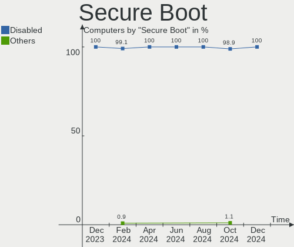
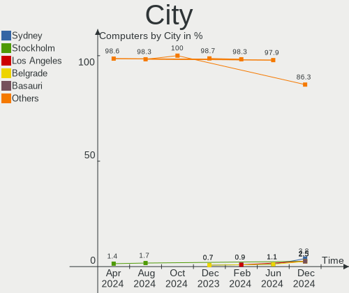
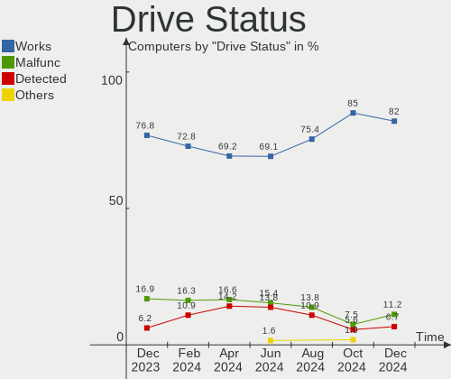
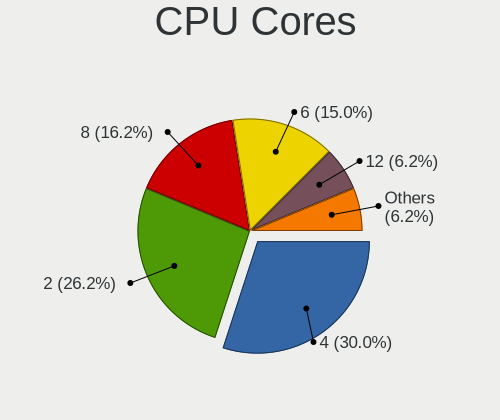
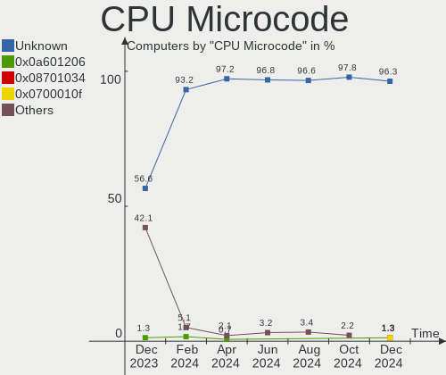

ArcoLinux Hardware Trends
-------------------------

A project to identify most popular hardware characteristics and track their change
over time based on data collected by ArcoLinux users at https://Linux-Hardware.org.

Anyone can contribute to this report by the [hw-probe](https://github.com/linuxhw/hw-probe) tool:

    sudo -E hw-probe -all -upload

This is a report for all computer types. See also reports for [desktops](/Dist/ArcoLinux/Desktop/README.md) and [notebooks](/Dist/ArcoLinux/Notebook/README.md).

Full-feature report is available here: https://linux-hardware.org/?view=trends

Period: Sep, 2021.

Contents
--------

* [ System ](#system)
  - [ OS                       ](#os)
  - [ OS Family                ](#os-family)
  - [ Kernel                   ](#kernel)
  - [ Kernel Family            ](#kernel-family)
  - [ Kernel Major Ver.        ](#kernel-major-ver)
  - [ Arch                     ](#arch)
  - [ DE                       ](#de)
  - [ Display Server           ](#display-server)
  - [ Display Manager          ](#display-manager)
  - [ OS Lang                  ](#os-lang)
  - [ Boot Mode                ](#boot-mode)
  - [ Filesystem               ](#filesystem)
  - [ Part. scheme             ](#part-scheme)
  - [ Dual Boot with Linux/BSD ](#dual-boot-with-linuxbsd)
  - [ Dual Boot (Win)          ](#dual-boot-win)

* [ Board ](#board)
  - [ Vendor                   ](#vendor)
  - [ Model                    ](#model)
  - [ Model Family             ](#model-family)
  - [ MFG Year                 ](#mfg-year)
  - [ Form Factor              ](#form-factor)
  - [ Secure Boot              ](#secure-boot)
  - [ Coreboot                 ](#coreboot)
  - [ RAM Size                 ](#ram-size)
  - [ RAM Used                 ](#ram-used)
  - [ Total Drives             ](#total-drives)
  - [ Has CD-ROM               ](#has-cd-rom)
  - [ Has Ethernet             ](#has-ethernet)
  - [ Has WiFi                 ](#has-wifi)
  - [ Has Bluetooth            ](#has-bluetooth)

* [ Location ](#location)
  - [ Country                  ](#country)
  - [ City                     ](#city)

* [ Drives ](#drives)
  - [ Drive Vendor             ](#drive-vendor)
  - [ Drive Model              ](#drive-model)
  - [ HDD Vendor               ](#hdd-vendor)
  - [ SSD Vendor               ](#ssd-vendor)
  - [ Drive Kind               ](#drive-kind)
  - [ Drive Connector          ](#drive-connector)
  - [ Drive Size               ](#drive-size)
  - [ Space Total              ](#space-total)
  - [ Space Used               ](#space-used)
  - [ Malfunc. Drives          ](#malfunc-drives)
  - [ Malfunc. Drive Vendor    ](#malfunc-drive-vendor)
  - [ Malfunc. HDD Vendor      ](#malfunc-hdd-vendor)
  - [ Malfunc. Drive Kind      ](#malfunc-drive-kind)
  - [ Failed Drives            ](#failed-drives)
  - [ Failed Drive Vendor      ](#failed-drive-vendor)
  - [ Drive Status             ](#drive-status)

* [ Storage controller ](#storage-controller)
  - [ Storage Vendor           ](#storage-vendor)
  - [ Storage Model            ](#storage-model)
  - [ Storage Kind             ](#storage-kind)

* [ Processor ](#processor)
  - [ CPU Vendor               ](#cpu-vendor)
  - [ CPU Model                ](#cpu-model)
  - [ CPU Model Family         ](#cpu-model-family)
  - [ CPU Cores                ](#cpu-cores)
  - [ CPU Sockets              ](#cpu-sockets)
  - [ CPU Threads              ](#cpu-threads)
  - [ CPU Op-Modes             ](#cpu-op-modes)
  - [ CPU Microcode            ](#cpu-microcode)
  - [ CPU Microarch            ](#cpu-microarch)

* [ Graphics ](#graphics)
  - [ GPU Vendor               ](#gpu-vendor)
  - [ GPU Model                ](#gpu-model)
  - [ GPU Combo                ](#gpu-combo)
  - [ GPU Driver               ](#gpu-driver)
  - [ GPU Memory               ](#gpu-memory)

* [ Monitor ](#monitor)
  - [ Monitor Vendor           ](#monitor-vendor)
  - [ Monitor Model            ](#monitor-model)
  - [ Monitor Resolution       ](#monitor-resolution)
  - [ Monitor Diagonal         ](#monitor-diagonal)
  - [ Monitor Width            ](#monitor-width)
  - [ Aspect Ratio             ](#aspect-ratio)
  - [ Monitor Area             ](#monitor-area)
  - [ Pixel Density            ](#pixel-density)
  - [ Multiple Monitors        ](#multiple-monitors)

* [ Network ](#network)
  - [ Net Controller Vendor    ](#net-controller-vendor)
  - [ Net Controller Model     ](#net-controller-model)
  - [ Wireless Vendor          ](#wireless-vendor)
  - [ Wireless Model           ](#wireless-model)
  - [ Ethernet Vendor          ](#ethernet-vendor)
  - [ Ethernet Model           ](#ethernet-model)
  - [ Net Controller Kind      ](#net-controller-kind)
  - [ Used Controller          ](#used-controller)
  - [ NICs                     ](#nics)
  - [ IPv6                     ](#ipv6)

* [ Bluetooth ](#bluetooth)
  - [ Bluetooth Vendor         ](#bluetooth-vendor)
  - [ Bluetooth Model          ](#bluetooth-model)

* [ Sound ](#sound)
  - [ Sound Vendor             ](#sound-vendor)
  - [ Sound Model              ](#sound-model)

* [ Memory ](#memory)
  - [ Memory Vendor            ](#memory-vendor)
  - [ Memory Model             ](#memory-model)
  - [ Memory Kind              ](#memory-kind)
  - [ Memory Form Factor       ](#memory-form-factor)
  - [ Memory Size              ](#memory-size)
  - [ Memory Speed             ](#memory-speed)

* [ Printers & scanners ](#printers--scanners)
  - [ Printer Vendor           ](#printer-vendor)
  - [ Printer Model            ](#printer-model)
  - [ Scanner Vendor           ](#scanner-vendor)
  - [ Scanner Model            ](#scanner-model)

* [ Camera ](#camera)
  - [ Camera Vendor            ](#camera-vendor)
  - [ Camera Model             ](#camera-model)

* [ Security ](#security)
  - [ Fingerprint Vendor       ](#fingerprint-vendor)
  - [ Fingerprint Model        ](#fingerprint-model)
  - [ Chipcard Vendor          ](#chipcard-vendor)
  - [ Chipcard Model           ](#chipcard-model)

* [ Unsupported ](#unsupported)
  - [ Unsupported Devices      ](#unsupported-devices)
  - [ Unsupported Device Types ](#unsupported-device-types)

System
------

OS
--

Installed operating systems

| Name              | Computers | Percent |
|-------------------|-----------|---------|
| ArcoLinux Rolling | 89        | 97.8%   |
| ArcoLinux         | 2         | 2.2%    |

OS Family
---------

OS without a version

| Name      | Computers | Percent |
|-----------|-----------|---------|
| ArcoLinux | 91        | 100%    |

Kernel
------

Version of the Linux kernel

| Version                     | Computers | Percent |
|-----------------------------|-----------|---------|
| 5.13.13-arch1-1             | 23        | 25.27%  |
| 5.14.6-arch1-1              | 10        | 10.99%  |
| 5.14.7-arch1-1              | 7         | 7.69%   |
| 5.14.5-arch1-1              | 6         | 6.59%   |
| 5.14.2-arch1-2              | 6         | 6.59%   |
| 5.10.62-1-lts               | 5         | 5.49%   |
| 5.10.61-1-lts               | 5         | 5.49%   |
| 5.14.8-arch1-1              | 3         | 3.3%    |
| 5.14.7-zen1-1-zen           | 3         | 3.3%    |
| 5.13.8-arch1-1              | 3         | 3.3%    |
| 5.14.3-zen1-1-zen           | 2         | 2.2%    |
| 5.14.3-arch1-1              | 2         | 2.2%    |
| 5.10.69-1-lts               | 2         | 2.2%    |
| 5.10.60-1-lts               | 2         | 2.2%    |
| 5.14.6-xanmod1-cacule-1     | 1         | 1.1%    |
| 5.14.6-hardened1-1-hardened | 1         | 1.1%    |
| 5.14.5-zen2-1-zen           | 1         | 1.1%    |
| 5.14.2-zen1-2-zen           | 1         | 1.1%    |
| 5.13.9-arch1-1              | 1         | 1.1%    |
| 5.13.12-arch1-1             | 1         | 1.1%    |
| 5.12.13-arch1-2             | 1         | 1.1%    |
| 5.10.68-1-lts               | 1         | 1.1%    |
| 5.10.67-1-lts               | 1         | 1.1%    |
| 5.10.66-1-lts               | 1         | 1.1%    |
| 5.10.64-1-lts               | 1         | 1.1%    |
| 5.10.63-1-lts               | 1         | 1.1%    |

Kernel Family
-------------

Linux kernel without a distro release

| Version | Computers | Percent |
|---------|-----------|---------|
| 5.13.13 | 23        | 25.27%  |
| 5.14.6  | 12        | 13.19%  |
| 5.14.7  | 10        | 10.99%  |
| 5.14.5  | 7         | 7.69%   |
| 5.14.2  | 7         | 7.69%   |
| 5.10.62 | 5         | 5.49%   |
| 5.10.61 | 5         | 5.49%   |
| 5.14.3  | 4         | 4.4%    |
| 5.14.8  | 3         | 3.3%    |
| 5.13.8  | 3         | 3.3%    |
| 5.10.69 | 2         | 2.2%    |
| 5.10.60 | 2         | 2.2%    |
| 5.13.9  | 1         | 1.1%    |
| 5.13.12 | 1         | 1.1%    |
| 5.12.13 | 1         | 1.1%    |
| 5.10.68 | 1         | 1.1%    |
| 5.10.67 | 1         | 1.1%    |
| 5.10.66 | 1         | 1.1%    |
| 5.10.64 | 1         | 1.1%    |
| 5.10.63 | 1         | 1.1%    |

Kernel Major Ver.
-----------------

Linux kernel major version

| Version | Computers | Percent |
|---------|-----------|---------|
| 5.14    | 43        | 47.25%  |
| 5.13    | 28        | 30.77%  |
| 5.10    | 19        | 20.88%  |
| 5.12    | 1         | 1.1%    |

Arch
----

OS architecture (x86_64, i586, etc.)

| Name   | Computers | Percent |
|--------|-----------|---------|
| x86_64 | 91        | 100%    |

DE
--

Desktop Environment

| Name           | Computers | Percent |
|----------------|-----------|---------|
| XFCE           | 35        | 38.46%  |
| KDE5           | 19        | 20.88%  |
| awesome        | 9         | 9.89%   |
| i3             | 8         | 8.79%   |
| xmonad         | 6         | 6.59%   |
| qtile          | 3         | 3.3%    |
| X-Cinnamon     | 2         | 2.2%    |
| MATE           | 2         | 2.2%    |
| GNOME          | 2         | 2.2%    |
| bspwm          | 2         | 2.2%    |
| KDE            | 1         | 1.1%    |
| i3-with-shmlog | 1         | 1.1%    |
| Budgie         | 1         | 1.1%    |

Display Server
--------------

X11 or Wayland

| Name    | Computers | Percent |
|---------|-----------|---------|
| X11     | 86        | 94.51%  |
| Tty     | 3         | 3.3%    |
| Unknown | 2         | 2.2%    |

Display Manager
---------------

SDDM, LightDM, etc.

| Name    | Computers | Percent |
|---------|-----------|---------|
| SDDM    | 71        | 78.02%  |
| LightDM | 17        | 18.68%  |
| Unknown | 3         | 3.3%    |

OS Lang
-------

Language

| Lang  | Computers | Percent |
|-------|-----------|---------|
| en_US | 52        | 57.14%  |
| en_GB | 9         | 9.89%   |
| de_DE | 5         | 5.49%   |
| en_IN | 3         | 3.3%    |
| en_CA | 3         | 3.3%    |
| en_AU | 3         | 3.3%    |
| pt_PT | 2         | 2.2%    |
| pl_PL | 2         | 2.2%    |
| nl_BE | 2         | 2.2%    |
| es_ES | 2         | 2.2%    |
| ru_RU | 1         | 1.1%    |
| pt_BR | 1         | 1.1%    |
| ja_JP | 1         | 1.1%    |
| fr_FR | 1         | 1.1%    |
| es_VE | 1         | 1.1%    |
| es_AR | 1         | 1.1%    |
| en_IE | 1         | 1.1%    |
| de_CH | 1         | 1.1%    |

Boot Mode
---------

EFI or BIOS

| Mode | Computers | Percent |
|------|-----------|---------|
| EFI  | 62        | 68.13%  |
| BIOS | 29        | 31.87%  |

Filesystem
----------

Type of filesystem

| Type    | Computers | Percent |
|---------|-----------|---------|
| Ext4    | 62        | 68.13%  |
| Btrfs   | 22        | 24.18%  |
| Overlay | 6         | 6.59%   |
| F2fs    | 1         | 1.1%    |

Part. scheme
------------

Scheme of partitioning

| Type    | Computers | Percent |
|---------|-----------|---------|
| GPT     | 74        | 81.32%  |
| MBR     | 15        | 16.48%  |
| Unknown | 2         | 2.2%    |

Dual Boot with Linux/BSD
------------------------

Hosting more than one Linux/BSD

| Dual boot | Computers | Percent |
|-----------|-----------|---------|
| No        | 71        | 78.02%  |
| Yes       | 20        | 21.98%  |

Dual Boot (Win)
---------------

Hosting Linux and Windows

| Dual boot | Computers | Percent |
|-----------|-----------|---------|
| No        | 51        | 56.04%  |
| Yes       | 40        | 43.96%  |

Board
-----

Vendor
------

Motherboard manufacturer

| Name                | Computers | Percent |
|---------------------|-----------|---------|
| ASUSTek Computer    | 26        | 28.57%  |
| Lenovo              | 15        | 16.48%  |
| Gigabyte Technology | 8         | 8.79%   |
| Hewlett-Packard     | 7         | 7.69%   |
| Dell                | 6         | 6.59%   |
| MSI                 | 5         | 5.49%   |
| Apple               | 4         | 4.4%    |
| Acer                | 4         | 4.4%    |
| ASRock              | 2         | 2.2%    |
| Toshiba             | 1         | 1.1%    |
| Timi                | 1         | 1.1%    |
| Supermicro          | 1         | 1.1%    |
| Semp Toshiba        | 1         | 1.1%    |
| SeeedStudio         | 1         | 1.1%    |
| Samsung Electronics | 1         | 1.1%    |
| Pegatron            | 1         | 1.1%    |
| Monster             | 1         | 1.1%    |
| Maibenben           | 1         | 1.1%    |
| LG Electronics      | 1         | 1.1%    |
| Fujitsu             | 1         | 1.1%    |
| Chuwi               | 1         | 1.1%    |
| Biostar             | 1         | 1.1%    |
| Unknown             | 1         | 1.1%    |

Model
-----

Motherboard model

| Name                                   | Computers | Percent |
|----------------------------------------|-----------|---------|
| ASUS PRIME X570-P                      | 2         | 2.2%    |
| Toshiba QOSMIO X75-A                   | 1         | 1.1%    |
| Timi TM1607                            | 1         | 1.1%    |
| Supermicro X8DTH-i/6/iF/6F             | 1         | 1.1%    |
| Semp Toshiba IS 1442                   | 1         | 1.1%    |
| SeeedStudio ODYSSEY-X86J4125           | 1         | 1.1%    |
| Samsung QX311/QX411/QX412/QX511        | 1         | 1.1%    |
| Pegatron T14AF                         | 1         | 1.1%    |
| MSI MS-7D22                            | 1         | 1.1%    |
| MSI MS-7C35                            | 1         | 1.1%    |
| MSI GP76 Leopard 10UE                  | 1         | 1.1%    |
| MSI GF63 Thin 10SCSR                   | 1         | 1.1%    |
| MSI A320M-HDV R4.0                     | 1         | 1.1%    |
| Monster ABRA A5 V11.1                  | 1         | 1.1%    |
| Maibenben PC34                         | 1         | 1.1%    |
| LG RD590-K.ADJCRE6                     | 1         | 1.1%    |
| Lenovo Yoga DuetITL 2021 82MA          | 1         | 1.1%    |
| Lenovo Yoga C740 81TC                  | 1         | 1.1%    |
| Lenovo ThinkPad W540 20BHS0LA00        | 1         | 1.1%    |
| Lenovo ThinkPad T490 20N3S19L00        | 1         | 1.1%    |
| Lenovo ThinkPad T480s 20L8S02301       | 1         | 1.1%    |
| Lenovo ThinkPad T470 W10DG 20JNS0QC0F  | 1         | 1.1%    |
| Lenovo ThinkPad T450s 20BWS07N00       | 1         | 1.1%    |
| Lenovo ThinkPad T450s 20BWS04K03       | 1         | 1.1%    |
| Lenovo ThinkPad P50 20ENCTO1WW         | 1         | 1.1%    |
| Lenovo ThinkPad E14 Gen 2 20T6000KMX   | 1         | 1.1%    |
| Lenovo Legion 5 Pro 16ACH6H 82JQ       | 1         | 1.1%    |
| Lenovo Legion 5 15ARH05 82B5           | 1         | 1.1%    |
| Lenovo IdeaPad FLEX 5-1570 81CA        | 1         | 1.1%    |
| Lenovo IdeaCentre 720-18IKL 90H0006JMH | 1         | 1.1%    |
| Lenovo IdeaCentre 510-15ICB 90HU00CEGE | 1         | 1.1%    |
| HP ZBook Studio G3                     | 1         | 1.1%    |
| HP Pavilion dv6                        | 1         | 1.1%    |
| HP Laptop 15q-bu0xx                    | 1         | 1.1%    |
| HP ENVY x360 Convertible 15-ee0xxx     | 1         | 1.1%    |
| HP ENVY Laptop 17-cg0xxx               | 1         | 1.1%    |
| HP 750-114                             | 1         | 1.1%    |
| HP 250 G6 Notebook PC                  | 1         | 1.1%    |
| Gigabyte Z97-HD3                       | 1         | 1.1%    |
| Gigabyte Z97-D3H                       | 1         | 1.1%    |
| Gigabyte Z170-Gaming K3                | 1         | 1.1%    |
| Gigabyte X570 GAMING X                 | 1         | 1.1%    |
| Gigabyte X570 AORUS PRO WIFI           | 1         | 1.1%    |
| Gigabyte X570 AORUS MASTER             | 1         | 1.1%    |
| Gigabyte H61M-DS2 DVI                  | 1         | 1.1%    |
| Gigabyte B450M DS3H V2                 | 1         | 1.1%    |
| Fujitsu LIFEBOOK A357                  | 1         | 1.1%    |
| Dell XPS 15 9560                       | 1         | 1.1%    |
| Dell XPS 13 9300                       | 1         | 1.1%    |
| Dell Latitude E6420                    | 1         | 1.1%    |
| Dell Inspiron 7306 2n1                 | 1         | 1.1%    |
| Dell Inspiron 5570                     | 1         | 1.1%    |
| Dell Inspiron 1545                     | 1         | 1.1%    |
| Chuwi GemiBook Pro                     | 1         | 1.1%    |
| Biostar J3060NH                        | 1         | 1.1%    |
| ASUS X580VD                            | 1         | 1.1%    |
| ASUS X555QG                            | 1         | 1.1%    |
| ASUS X510UA                            | 1         | 1.1%    |
| ASUS X441SA                            | 1         | 1.1%    |
| ASUS VivoBook_ASUSLaptop X570ZD_X570ZD | 1         | 1.1%    |

Model Family
------------

Motherboard model prefix

| Name                         | Computers | Percent |
|------------------------------|-----------|---------|
| Lenovo ThinkPad              | 8         | 8.79%   |
| ASUS PRIME                   | 5         | 5.49%   |
| ASUS ROG                     | 4         | 4.4%    |
| Gigabyte X570                | 3         | 3.3%    |
| Dell Inspiron                | 3         | 3.3%    |
| Acer Aspire                  | 3         | 3.3%    |
| Lenovo Yoga                  | 2         | 2.2%    |
| Lenovo Legion                | 2         | 2.2%    |
| Lenovo IdeaCentre            | 2         | 2.2%    |
| HP ENVY                      | 2         | 2.2%    |
| Dell XPS                     | 2         | 2.2%    |
| ASUS STRIX                   | 2         | 2.2%    |
| Toshiba QOSMIO               | 1         | 1.1%    |
| Timi TM1607                  | 1         | 1.1%    |
| Supermicro X8DTH-i           | 1         | 1.1%    |
| Semp Toshiba IS              | 1         | 1.1%    |
| SeeedStudio ODYSSEY-X86J4125 | 1         | 1.1%    |
| Samsung QX311                | 1         | 1.1%    |
| Pegatron T14AF               | 1         | 1.1%    |
| MSI MS-7D22                  | 1         | 1.1%    |
| MSI MS-7C35                  | 1         | 1.1%    |
| MSI GP76                     | 1         | 1.1%    |
| MSI GF63                     | 1         | 1.1%    |
| MSI A320M-HDV                | 1         | 1.1%    |
| Monster ABRA                 | 1         | 1.1%    |
| Maibenben PC34               | 1         | 1.1%    |
| LG RD590-K.ADJCRE6           | 1         | 1.1%    |
| Lenovo IdeaPad               | 1         | 1.1%    |
| HP ZBook                     | 1         | 1.1%    |
| HP Pavilion                  | 1         | 1.1%    |
| HP Laptop                    | 1         | 1.1%    |
| HP 750-114                   | 1         | 1.1%    |
| HP 250                       | 1         | 1.1%    |
| Gigabyte Z97-HD3             | 1         | 1.1%    |
| Gigabyte Z97-D3H             | 1         | 1.1%    |
| Gigabyte Z170-Gaming         | 1         | 1.1%    |
| Gigabyte H61M-DS2            | 1         | 1.1%    |
| Gigabyte B450M               | 1         | 1.1%    |
| Fujitsu LIFEBOOK             | 1         | 1.1%    |
| Dell Latitude                | 1         | 1.1%    |
| Chuwi GemiBook               | 1         | 1.1%    |
| Biostar J3060NH              | 1         | 1.1%    |
| ASUS X580VD                  | 1         | 1.1%    |
| ASUS X555QG                  | 1         | 1.1%    |
| ASUS X510UA                  | 1         | 1.1%    |
| ASUS X441SA                  | 1         | 1.1%    |
| ASUS VivoBook                | 1         | 1.1%    |
| ASUS UX550VE                 | 1         | 1.1%    |
| ASUS UX303LN                 | 1         | 1.1%    |
| ASUS P8Z77-V                 | 1         | 1.1%    |
| ASUS P8H67                   | 1         | 1.1%    |
| ASUS Maximus                 | 1         | 1.1%    |
| ASUS M5A78L-M                | 1         | 1.1%    |
| ASUS M4A79XTD                | 1         | 1.1%    |
| ASUS M4A77T                  | 1         | 1.1%    |
| ASUS M2N-E                   | 1         | 1.1%    |
| ASUS K53E                    | 1         | 1.1%    |
| ASRock X570                  | 1         | 1.1%    |
| ASRock FM2A75M               | 1         | 1.1%    |
| Apple Macmini6               | 1         | 1.1%    |

MFG Year
--------

Motherboard manufacture year

| Year | Computers | Percent |
|------|-----------|---------|
| 2020 | 23        | 25.27%  |
| 2021 | 18        | 19.78%  |
| 2018 | 11        | 12.09%  |
| 2019 | 8         | 8.79%   |
| 2014 | 7         | 7.69%   |
| 2011 | 6         | 6.59%   |
| 2017 | 4         | 4.4%    |
| 2016 | 4         | 4.4%    |
| 2012 | 3         | 3.3%    |
| 2010 | 3         | 3.3%    |
| 2009 | 2         | 2.2%    |
| 2015 | 1         | 1.1%    |
| 2013 | 1         | 1.1%    |

Form Factor
-----------

Physical design of the computer

| Name        | Computers | Percent |
|-------------|-----------|---------|
| Notebook    | 44        | 48.35%  |
| Desktop     | 38        | 41.76%  |
| Convertible | 4         | 4.4%    |
| All in one  | 2         | 2.2%    |
| Tablet      | 1         | 1.1%    |
| Mini pc     | 1         | 1.1%    |
| Server      | 1         | 1.1%    |

Secure Boot
-----------

Enabled or disabled

| State    | Computers | Percent |
|----------|-----------|---------|
| Disabled | 91        | 100%    |

Coreboot
--------

Have coreboot on board

| Used | Computers | Percent |
|------|-----------|---------|
| No   | 91        | 100%    |

RAM Size
--------

Total RAM memory

| Size in GB  | Computers | Percent |
|-------------|-----------|---------|
| 16.01-24.0  | 31        | 34.07%  |
| 8.01-16.0   | 18        | 19.78%  |
| 4.01-8.0    | 15        | 16.48%  |
| 32.01-64.0  | 12        | 13.19%  |
| 64.01-256.0 | 6         | 6.59%   |
| 3.01-4.0    | 5         | 5.49%   |
| 24.01-32.0  | 2         | 2.2%    |
| 1.01-2.0    | 2         | 2.2%    |

RAM Used
--------

Used RAM memory

| Used GB    | Computers | Percent |
|------------|-----------|---------|
| 1.01-2.0   | 27        | 29.67%  |
| 2.01-3.0   | 23        | 25.27%  |
| 0.51-1.0   | 12        | 13.19%  |
| 4.01-8.0   | 10        | 10.99%  |
| 3.01-4.0   | 10        | 10.99%  |
| 8.01-16.0  | 6         | 6.59%   |
| 16.01-24.0 | 2         | 2.2%    |
| 0.01-0.5   | 1         | 1.1%    |

Total Drives
------------

Number of drives on board

| Drives | Computers | Percent |
|--------|-----------|---------|
| 1      | 46        | 50.55%  |
| 2      | 25        | 27.47%  |
| 3      | 8         | 8.79%   |
| 4      | 6         | 6.59%   |
| 5      | 3         | 3.3%    |
| 6      | 2         | 2.2%    |
| 8      | 1         | 1.1%    |

Has CD-ROM
----------

Has CD-ROM on board

| Presented | Computers | Percent |
|-----------|-----------|---------|
| No        | 63        | 69.23%  |
| Yes       | 28        | 30.77%  |

Has Ethernet
------------

Has Ethernet on board

| Presented | Computers | Percent |
|-----------|-----------|---------|
| Yes       | 78        | 85.71%  |
| No        | 13        | 14.29%  |

Has WiFi
--------

Has WiFi module

| Presented | Computers | Percent |
|-----------|-----------|---------|
| Yes       | 68        | 74.73%  |
| No        | 23        | 25.27%  |

Has Bluetooth
-------------

Has Bluetooth module

| Presented | Computers | Percent |
|-----------|-----------|---------|
| Yes       | 65        | 71.43%  |
| No        | 26        | 28.57%  |

Location
--------

Country
-------

Geographic location (country)

| Country     | Computers | Percent |
|-------------|-----------|---------|
| USA         | 21        | 23.08%  |
| UK          | 9         | 9.89%   |
| India       | 6         | 6.59%   |
| Germany     | 6         | 6.59%   |
| Switzerland | 4         | 4.4%    |
| Canada      | 4         | 4.4%    |
| Belgium     | 4         | 4.4%    |
| Netherlands | 3         | 3.3%    |
| Ireland     | 3         | 3.3%    |
| Australia   | 3         | 3.3%    |
| Spain       | 2         | 2.2%    |
| Portugal    | 2         | 2.2%    |
| Japan       | 2         | 2.2%    |
| France      | 2         | 2.2%    |
| Estonia     | 2         | 2.2%    |
| Bulgaria    | 2         | 2.2%    |
| Venezuela   | 1         | 1.1%    |
| Ukraine     | 1         | 1.1%    |
| Turkey      | 1         | 1.1%    |
| Sweden      | 1         | 1.1%    |
| Romania     | 1         | 1.1%    |
| Poland      | 1         | 1.1%    |
| Latvia      | 1         | 1.1%    |
| Kuwait      | 1         | 1.1%    |
| Italy       | 1         | 1.1%    |
| Iran        | 1         | 1.1%    |
| Indonesia   | 1         | 1.1%    |
| Finland     | 1         | 1.1%    |
| Czechia     | 1         | 1.1%    |
| Brazil      | 1         | 1.1%    |
| Barbados    | 1         | 1.1%    |
| Argentina   | 1         | 1.1%    |

City
----

Geographic location (city)

| City                     | Computers | Percent |
|--------------------------|-----------|---------|
| Tallinn                  | 2         | 2.2%    |
| Sofia                    | 2         | 2.2%    |
| Lerwick                  | 2         | 2.2%    |
| Leiria                   | 2         | 2.2%    |
| Duffel                   | 2         | 2.2%    |
| Delhi                    | 2         | 2.2%    |
| Bruges                   | 2         | 2.2%    |
| Bengaluru                | 2         | 2.2%    |
| Barneveld                | 2         | 2.2%    |
| Zurich                   | 1         | 1.1%    |
| Winschoten               | 1         | 1.1%    |
| Windsor                  | 1         | 1.1%    |
| Welwyn Garden City       | 1         | 1.1%    |
| Tuscaloosa               | 1         | 1.1%    |
| Trenton                  | 1         | 1.1%    |
| Tokyo                    | 1         | 1.1%    |
| Timi?™oara               | 1         | 1.1%    |
| Thornleigh               | 1         | 1.1%    |
| Tekoa                    | 1         | 1.1%    |
| Tehran                   | 1         | 1.1%    |
| Susono                   | 1         | 1.1%    |
| Stockholm                | 1         | 1.1%    |
| Spokane                  | 1         | 1.1%    |
| Seville                  | 1         | 1.1%    |
| Scottsdale               | 1         | 1.1%    |
| S??o Bernardo do Campo   | 1         | 1.1%    |
| San Antonio              | 1         | 1.1%    |
| Saint-Jean-sur-Richelieu | 1         | 1.1%    |
| Rouen                    | 1         | 1.1%    |
| Riga                     | 1         | 1.1%    |
| Plano                    | 1         | 1.1%    |
| Petersburg               | 1         | 1.1%    |
| Oulu                     | 1         | 1.1%    |
| Ostermundigen            | 1         | 1.1%    |
| Nuneaton                 | 1         | 1.1%    |
| North Stonington         | 1         | 1.1%    |
| New Delhi                | 1         | 1.1%    |
| Neuss                    | 1         | 1.1%    |
| Naples                   | 1         | 1.1%    |
| Mys?‚owice               | 1         | 1.1%    |
| Munich                   | 1         | 1.1%    |
| Mt. Dora                 | 1         | 1.1%    |
| Milan                    | 1         | 1.1%    |
| Melbourne                | 1         | 1.1%    |
| Maracaibo                | 1         | 1.1%    |
| Mahomet                  | 1         | 1.1%    |
| London                   | 1         | 1.1%    |
| Lancaster                | 1         | 1.1%    |
| Kuwait City              | 1         | 1.1%    |
| Kassel                   | 1         | 1.1%    |
| Irvine                   | 1         | 1.1%    |
| Hradec Kr??lov?©         | 1         | 1.1%    |
| Hamburg                  | 1         | 1.1%    |
| Federal Way              | 1         | 1.1%    |
| Edmonton                 | 1         | 1.1%    |
| Durango                  | 1         | 1.1%    |
| Dublin                   | 1         | 1.1%    |
| Dortmund                 | 1         | 1.1%    |
| Dnipropetrovsk           | 1         | 1.1%    |
| Denton                   | 1         | 1.1%    |

Drives
------

Drive Vendor
------------

Hard drive vendors

| Vendor              | Computers | Drives | Percent |
|---------------------|-----------|--------|---------|
| WDC                 | 30        | 41     | 20.69%  |
| Samsung Electronics | 29        | 42     | 20%     |
| Seagate             | 16        | 19     | 11.03%  |
| Crucial             | 11        | 11     | 7.59%   |
| Toshiba             | 10        | 11     | 6.9%    |
| SanDisk             | 5         | 5      | 3.45%   |
| SK Hynix            | 3         | 4      | 2.07%   |
| Intel               | 3         | 3      | 2.07%   |
| Corsair             | 3         | 3      | 2.07%   |
| Unknown             | 2         | 2      | 1.38%   |
| Transcend           | 2         | 2      | 1.38%   |
| SPCC                | 2         | 2      | 1.38%   |
| Phison              | 2         | 3      | 1.38%   |
| Micron Technology   | 2         | 2      | 1.38%   |
| MAXTOR              | 2         | 3      | 1.38%   |
| KIOXIA              | 2         | 2      | 1.38%   |
| Kingston            | 2         | 2      | 1.38%   |
| JMicron             | 2         | 2      | 1.38%   |
| Hitachi             | 2         | 2      | 1.38%   |
| Apple               | 2         | 3      | 1.38%   |
| A-DATA Technology   | 2         | 3      | 1.38%   |
| XPG                 | 1         | 1      | 0.69%   |
| W800S               | 1         | 1      | 0.69%   |
| Vaseky              | 1         | 1      | 0.69%   |
| PNY                 | 1         | 1      | 0.69%   |
| PLEXTOR             | 1         | 1      | 0.69%   |
| Patriot             | 1         | 1      | 0.69%   |
| PALIT               | 1         | 1      | 0.69%   |
| LITEON              | 1         | 1      | 0.69%   |
| Lexar               | 1         | 1      | 0.69%   |
| Lenovo              | 1         | 1      | 0.69%   |
| GOODRAM             | 1         | 1      | 0.69%   |

Drive Model
-----------

Hard drive models

| Model                                | Computers | Percent |
|--------------------------------------|-----------|---------|
| Samsung SSD 850 EVO 250GB            | 5         | 2.92%   |
| Seagate ST1000LM035-1RK172 1TB       | 3         | 1.75%   |
| Samsung SSD 860 EVO 500GB            | 3         | 1.75%   |
| Crucial CT500MX500SSD1 500GB         | 3         | 1.75%   |
| WDC WDS500G1X0E-00AFY0 500GB         | 2         | 1.17%   |
| WDC WDS240G2G0A-00JH30 240GB SSD     | 2         | 1.17%   |
| WDC WD40EZRZ-75GXCB0 4TB             | 2         | 1.17%   |
| WDC WD10EADS-11M2B1 1TB              | 2         | 1.17%   |
| WDC WD1003FZEX-00K3CA0 1TB           | 2         | 1.17%   |
| Toshiba MQ04ABF100 1TB               | 2         | 1.17%   |
| Seagate ST2000DM001-1ER164 2TB       | 2         | 1.17%   |
| Samsung SSD 970 EVO Plus 500GB       | 2         | 1.17%   |
| Samsung SSD 970 EVO Plus 1TB         | 2         | 1.17%   |
| Samsung SSD 960 EVO 250GB            | 2         | 1.17%   |
| Samsung SSD 850 EVO 500GB            | 2         | 1.17%   |
| Crucial CT500P2SSD8 500GB            | 2         | 1.17%   |
| XPG GAMMIX S11L 256GB                | 1         | 0.58%   |
| WDC WDS500G2B0B-00YS70 500GB SSD     | 1         | 0.58%   |
| WDC WDS500G2B0A-00SM50 500GB SSD     | 1         | 0.58%   |
| WDC WDS250G2B0C-00PXH0 250GB         | 1         | 0.58%   |
| WDC WDS250G2B0C 250GB                | 1         | 0.58%   |
| WDC WDS250G1B0A-00H9H0 250GB SSD     | 1         | 0.58%   |
| WDC WDS100T2B0A-00SM50 1TB SSD       | 1         | 0.58%   |
| WDC WD6400BEVT-60A0RT0 640GB         | 1         | 0.58%   |
| WDC WD6400AAKS-22A7B2 640GB          | 1         | 0.58%   |
| WDC WD5000BPKX-00HPJT0 500GB         | 1         | 0.58%   |
| WDC WD5000AAKX-001CA0 500GB          | 1         | 0.58%   |
| WDC WD5000AAKS-00A7B0 500GB          | 1         | 0.58%   |
| WDC WD40EZRZ-19GXCB0 4TB             | 1         | 0.58%   |
| WDC WD3200BEVT-75A23T0 320GB         | 1         | 0.58%   |
| WDC WD30EZRX-00D8PB0 3TB             | 1         | 0.58%   |
| WDC WD20EFRX-68EUZN0 2TB             | 1         | 0.58%   |
| WDC WD20EARX-00PASB0 2TB             | 1         | 0.58%   |
| WDC WD2002FYPS-02W3B0 2TB            | 1         | 0.58%   |
| WDC WD10SPZX-21Z10T0 1TB             | 1         | 0.58%   |
| WDC WD10SPSX-60A6WT0 1TB             | 1         | 0.58%   |
| WDC WD10PURZ-85U8XY0 1TB             | 1         | 0.58%   |
| WDC WD10JPVX-60JC3T1 1TB             | 1         | 0.58%   |
| WDC WD10EAVS-00D7B1 1TB              | 1         | 0.58%   |
| WDC WD1002FBYS-02A6B0 1TB            | 1         | 0.58%   |
| WDC WD1001FALS-403AA0 1TB            | 1         | 0.58%   |
| WDC PC SN730 SDBPNTY-512G-1032 512GB | 1         | 0.58%   |
| WDC PC SN720 SDAQNTW-512G-1001 512GB | 1         | 0.58%   |
| WDC PC SN530 SDBPNPZ-1T00-1032 1TB   | 1         | 0.58%   |
| WDC PC SN530 SDBPMPZ-512G-1101 512GB | 1         | 0.58%   |
| WDC PC SN530 SDBPMPZ-256G-1001 256GB | 1         | 0.58%   |
| W800S 512GB SSD                      | 1         | 0.58%   |
| Vaseky V900/128G 128GB SSD           | 1         | 0.58%   |
| Unknown SD/MMC/MS PRO 128GB          | 1         | 0.58%   |
| Unknown A200-240GB SSD               | 1         | 0.58%   |
| Transcend TS512GMTS430S 512GB SSD    | 1         | 0.58%   |
| Transcend TS480GSSD220S 480GB        | 1         | 0.58%   |
| Toshiba THNSNH256GMCT 256GB SSD      | 1         | 0.58%   |
| Toshiba THNSN5512GPUK NVMe 512GB     | 1         | 0.58%   |
| Toshiba RC500 250GB                  | 1         | 0.58%   |
| Toshiba MQ01ABF050 500GB             | 1         | 0.58%   |
| Toshiba MQ01ABD100 1TB               | 1         | 0.58%   |
| Toshiba MQ01ABD050V 500GB            | 1         | 0.58%   |
| Toshiba HDWT140 4TB                  | 1         | 0.58%   |
| Toshiba HDWG480 8TB                  | 1         | 0.58%   |

HDD Vendor
----------

Hard disk drive vendors

| Vendor              | Computers | Drives | Percent |
|---------------------|-----------|--------|---------|
| WDC                 | 18        | 26     | 36.73%  |
| Seagate             | 15        | 18     | 30.61%  |
| Toshiba             | 8         | 8      | 16.33%  |
| Samsung Electronics | 2         | 2      | 4.08%   |
| MAXTOR              | 2         | 3      | 4.08%   |
| Hitachi             | 2         | 2      | 4.08%   |
| Unknown             | 1         | 1      | 2.04%   |
| Apple               | 1         | 1      | 2.04%   |

SSD Vendor
----------

Solid state drive vendors

| Vendor              | Computers | Drives | Percent |
|---------------------|-----------|--------|---------|
| Samsung Electronics | 18        | 21     | 32.14%  |
| Crucial             | 8         | 8      | 14.29%  |
| WDC                 | 5         | 6      | 8.93%   |
| SanDisk             | 4         | 4      | 7.14%   |
| Transcend           | 2         | 2      | 3.57%   |
| SK Hynix            | 2         | 3      | 3.57%   |
| Micron Technology   | 2         | 2      | 3.57%   |
| Kingston            | 2         | 2      | 3.57%   |
| W800S               | 1         | 1      | 1.79%   |
| Vaseky              | 1         | 1      | 1.79%   |
| Unknown             | 1         | 1      | 1.79%   |
| Toshiba             | 1         | 1      | 1.79%   |
| SPCC                | 1         | 1      | 1.79%   |
| Seagate             | 1         | 1      | 1.79%   |
| PLEXTOR             | 1         | 1      | 1.79%   |
| Patriot             | 1         | 1      | 1.79%   |
| PALIT               | 1         | 1      | 1.79%   |
| Lexar               | 1         | 1      | 1.79%   |
| Intel               | 1         | 1      | 1.79%   |
| GOODRAM             | 1         | 1      | 1.79%   |
| Corsair             | 1         | 1      | 1.79%   |

Drive Kind
----------

HDD or SSD

| Kind    | Computers | Drives | Percent |
|---------|-----------|--------|---------|
| SSD     | 48        | 61     | 36.36%  |
| NVMe    | 42        | 55     | 31.82%  |
| HDD     | 41        | 61     | 31.06%  |
| Unknown | 1         | 1      | 0.76%   |

Drive Connector
---------------

SATA, SAS, NVMe, etc.

| Type | Computers | Drives | Percent |
|------|-----------|--------|---------|
| SATA | 69        | 117    | 58.97%  |
| NVMe | 41        | 54     | 35.04%  |
| SAS  | 7         | 7      | 5.98%   |

Drive Size
----------

Size of hard drive

| Size in TB | Computers | Drives | Percent |
|------------|-----------|--------|---------|
| 0.01-0.5   | 44        | 59     | 46.81%  |
| 0.51-1.0   | 33        | 40     | 35.11%  |
| 1.01-2.0   | 10        | 13     | 10.64%  |
| 3.01-4.0   | 4         | 7      | 4.26%   |
| 4.01-10.0  | 2         | 2      | 2.13%   |
| 2.01-3.0   | 1         | 1      | 1.06%   |

Space Total
-----------

Amount of disk space available on the file system

| Size in GB     | Computers | Percent |
|----------------|-----------|---------|
| 101-250        | 21        | 23.08%  |
| 251-500        | 18        | 19.78%  |
| 501-1000       | 13        | 14.29%  |
| More than 3000 | 12        | 13.19%  |
| 1001-2000      | 9         | 9.89%   |
| 51-100         | 6         | 6.59%   |
| 1-20           | 5         | 5.49%   |
| 2001-3000      | 3         | 3.3%    |
| Unknown        | 3         | 3.3%    |
| 21-50          | 1         | 1.1%    |

Space Used
----------

Amount of used disk space

| Used GB        | Computers | Percent |
|----------------|-----------|---------|
| 1-20           | 24        | 26.37%  |
| 21-50          | 20        | 21.98%  |
| 101-250        | 15        | 16.48%  |
| 51-100         | 10        | 10.99%  |
| 501-1000       | 7         | 7.69%   |
| 251-500        | 5         | 5.49%   |
| 1001-2000      | 4         | 4.4%    |
| Unknown        | 3         | 3.3%    |
| More than 3000 | 2         | 2.2%    |
| 2001-3000      | 1         | 1.1%    |

Malfunc. Drives
---------------

Drive models with a malfunction

| Model                                          | Computers | Drives | Percent |
|------------------------------------------------|-----------|--------|---------|
| WDC WDS500G1X0E-00AFY0 500GB                   | 1         | 1      | 4.35%   |
| WDC WD6400BEVT-60A0RT0 640GB                   | 1         | 1      | 4.35%   |
| WDC WD6400AAKS-22A7B2 640GB                    | 1         | 1      | 4.35%   |
| WDC WD5000AAKX-001CA0 500GB                    | 1         | 1      | 4.35%   |
| WDC WD20EFRX-68EUZN0 2TB                       | 1         | 1      | 4.35%   |
| WDC WD2002FYPS-02W3B0 2TB                      | 1         | 2      | 4.35%   |
| WDC WD10PURZ-85U8XY0 1TB                       | 1         | 1      | 4.35%   |
| WDC WD1003FZEX-00K3CA0 1TB                     | 1         | 1      | 4.35%   |
| WDC WD1002FBYS-02A6B0 1TB                      | 1         | 1      | 4.35%   |
| WDC WD1001FALS-403AA0 1TB                      | 1         | 1      | 4.35%   |
| Toshiba DT01ACA100 1TB                         | 1         | 1      | 4.35%   |
| SK Hynix HFS128G39TND-N210A 128GB SSD          | 1         | 1      | 4.35%   |
| Seagate ST9160314AS 160GB                      | 1         | 1      | 4.35%   |
| Seagate ST2000DM001-1ER164 2TB                 | 1         | 1      | 4.35%   |
| Seagate ST1000LM035-1RK172 1TB                 | 1         | 1      | 4.35%   |
| Seagate ST1000LM014-1EJ164 1TB                 | 1         | 1      | 4.35%   |
| Samsung Electronics SSD 960 EVO 250GB          | 1         | 1      | 4.35%   |
| Micron Technology 1100_MTFDDAV512TBN 512GB SSD | 1         | 1      | 4.35%   |
| MAXTOR STM3320820AS 320GB                      | 1         | 2      | 4.35%   |
| MAXTOR STM3250310AS 250GB                      | 1         | 1      | 4.35%   |
| Intel SSDSA2M160G2GC 160GB                     | 1         | 1      | 4.35%   |
| Hitachi HDS721010CLA332 1TB                    | 1         | 1      | 4.35%   |
| Corsair Force 3 SSD 240GB                      | 1         | 1      | 4.35%   |

Malfunc. Drive Vendor
---------------------

Vendors of faulty drives

| Vendor              | Computers | Drives | Percent |
|---------------------|-----------|--------|---------|
| WDC                 | 7         | 11     | 35%     |
| Seagate             | 4         | 4      | 20%     |
| MAXTOR              | 2         | 3      | 10%     |
| Toshiba             | 1         | 1      | 5%      |
| SK Hynix            | 1         | 1      | 5%      |
| Samsung Electronics | 1         | 1      | 5%      |
| Micron Technology   | 1         | 1      | 5%      |
| Intel               | 1         | 1      | 5%      |
| Hitachi             | 1         | 1      | 5%      |
| Corsair             | 1         | 1      | 5%      |

Malfunc. HDD Vendor
-------------------

Vendors of faulty HDD drives

| Vendor  | Computers | Drives | Percent |
|---------|-----------|--------|---------|
| WDC     | 7         | 10     | 46.67%  |
| Seagate | 4         | 4      | 26.67%  |
| MAXTOR  | 2         | 3      | 13.33%  |
| Toshiba | 1         | 1      | 6.67%   |
| Hitachi | 1         | 1      | 6.67%   |

Malfunc. Drive Kind
-------------------

Kinds of faulty drives

| Kind | Computers | Drives | Percent |
|------|-----------|--------|---------|
| HDD  | 12        | 19     | 66.67%  |
| SSD  | 4         | 4      | 22.22%  |
| NVMe | 2         | 2      | 11.11%  |

Failed Drives
-------------

Failed drive models

Zero info for selected period =(

Failed Drive Vendor
-------------------

Failed drive vendors

Zero info for selected period =(

Drive Status
------------

Number of failed and malfunc. drives

| Status   | Computers | Drives | Percent |
|----------|-----------|--------|---------|
| Works    | 79        | 145    | 76.7%   |
| Malfunc  | 16        | 25     | 15.53%  |
| Detected | 8         | 8      | 7.77%   |

Storage controller
------------------

Storage Vendor
--------------

Storage controller vendors

| Vendor                       | Computers | Percent |
|------------------------------|-----------|---------|
| Intel                        | 54        | 41.54%  |
| AMD                          | 26        | 20%     |
| Samsung Electronics          | 17        | 13.08%  |
| Sandisk                      | 9         | 6.92%   |
| Phison Electronics           | 5         | 3.85%   |
| Micron/Crucial Technology    | 3         | 2.31%   |
| KIOXIA                       | 3         | 2.31%   |
| Nvidia                       | 2         | 1.54%   |
| ADATA Technology             | 2         | 1.54%   |
| VIA Technologies             | 1         | 0.77%   |
| Toshiba America Info Systems | 1         | 0.77%   |
| SK Hynix                     | 1         | 0.77%   |
| Realtek Semiconductor        | 1         | 0.77%   |
| Marvell Technology Group     | 1         | 0.77%   |
| Lite-On Technology           | 1         | 0.77%   |
| Lenovo                       | 1         | 0.77%   |
| ASMedia Technology           | 1         | 0.77%   |
| Apple                        | 1         | 0.77%   |

Storage Model
-------------

Storage controller models

| Model                                                                                   | Computers | Percent |
|-----------------------------------------------------------------------------------------|-----------|---------|
| AMD FCH SATA Controller [AHCI mode]                                                     | 22        | 15.28%  |
| Samsung NVMe SSD Controller SM981/PM981/PM983                                           | 10        | 6.94%   |
| Intel Sunrise Point-LP SATA Controller [AHCI mode]                                      | 7         | 4.86%   |
| Intel Q170/Q150/B150/H170/H110/Z170/CM236 Chipset SATA Controller [AHCI Mode]           | 6         | 4.17%   |
| Intel 6 Series/C200 Series Chipset Family 6 port Mobile SATA AHCI Controller            | 5         | 3.47%   |
| Intel HM170/QM170 Chipset SATA Controller [AHCI Mode]                                   | 4         | 2.78%   |
| Sandisk WD Blue SN550 NVMe SSD                                                          | 3         | 2.08%   |
| Samsung NVMe SSD Controller SM961/PM961/SM963                                           | 3         | 2.08%   |
| Phison E16 PCIe4 NVMe Controller                                                        | 3         | 2.08%   |
| Phison E12 NVMe Controller                                                              | 3         | 2.08%   |
| Intel Celeron/Pentium Silver Processor SATA Controller                                  | 3         | 2.08%   |
| Intel 82801 Mobile SATA Controller [RAID mode]                                          | 3         | 2.08%   |
| AMD SB7x0/SB8x0/SB9x0 SATA Controller [AHCI mode]                                       | 3         | 2.08%   |
| AMD SB7x0/SB8x0/SB9x0 IDE Controller                                                    | 3         | 2.08%   |
| Sandisk WD Black SN850                                                                  | 2         | 1.39%   |
| Sandisk Non-Volatile memory controller                                                  | 2         | 1.39%   |
| Samsung NVMe SSD Controller 980                                                         | 2         | 1.39%   |
| Micron/Crucial P2 NVMe PCIe SSD                                                         | 2         | 1.39%   |
| KIOXIA Non-Volatile memory controller                                                   | 2         | 1.39%   |
| Intel Wildcat Point-LP SATA Controller [AHCI Mode]                                      | 2         | 1.39%   |
| Intel SSD 660P Series                                                                   | 2         | 1.39%   |
| Intel SATA Controller [RAID mode]                                                       | 2         | 1.39%   |
| Intel Atom/Celeron/Pentium Processor x5-E8000/J3xxx/N3xxx Series SATA Controller        | 2         | 1.39%   |
| Intel 9 Series Chipset Family SATA Controller [AHCI Mode]                               | 2         | 1.39%   |
| Intel 82801IBM/IEM (ICH9M/ICH9M-E) 2 port SATA Controller [IDE mode]                    | 2         | 1.39%   |
| Intel 8 Series/C220 Series Chipset Family 6-port SATA Controller 1 [AHCI mode]          | 2         | 1.39%   |
| Intel 200 Series PCH SATA controller [AHCI mode]                                        | 2         | 1.39%   |
| AMD 400 Series Chipset SATA Controller                                                  | 2         | 1.39%   |
| ADATA XPG SX8200 Pro PCIe Gen3x4 M.2 2280 Solid State Drive                             | 2         | 1.39%   |
| VIA VT6415 PATA IDE Host Controller                                                     | 1         | 0.69%   |
| Toshiba America Info Systems XG4 NVMe SSD Controller                                    | 1         | 0.69%   |
| SK Hynix BC511                                                                          | 1         | 0.69%   |
| Sandisk WD Black SN750 / PC SN730 NVMe SSD                                              | 1         | 0.69%   |
| Sandisk WD Black 2018/SN750 / PC SN720 NVMe SSD                                         | 1         | 0.69%   |
| Samsung NVMe SSD Controller SM951/PM951                                                 | 1         | 0.69%   |
| Samsung NVMe SSD Controller PM9A1/PM9A3/980PRO                                          | 1         | 0.69%   |
| Samsung Electronics Non-Volatile memory controller                                      | 1         | 0.69%   |
| Realtek Realtek Non-Volatile memory controller                                          | 1         | 0.69%   |
| Nvidia MCP79 AHCI Controller                                                            | 1         | 0.69%   |
| Nvidia CK804 Serial ATA Controller                                                      | 1         | 0.69%   |
| Nvidia CK804 IDE                                                                        | 1         | 0.69%   |
| Micron/Crucial P1 NVMe PCIe SSD                                                         | 1         | 0.69%   |
| Marvell Group 88SE6111/6121 SATA II / PATA Controller                                   | 1         | 0.69%   |
| Lite-On Non-Volatile memory controller                                                  | 1         | 0.69%   |
| Lenovo Non-Volatile memory controller                                                   | 1         | 0.69%   |
| KIOXIA NVMe SSD                                                                         | 1         | 0.69%   |
| Intel Comet Lake SATA AHCI Controller                                                   | 1         | 0.69%   |
| Intel Cannon Lake PCH SATA AHCI Controller                                              | 1         | 0.69%   |
| Intel 82801JI (ICH10 Family) 4 port SATA IDE Controller #1                              | 1         | 0.69%   |
| Intel 82801JI (ICH10 Family) 2 port SATA IDE Controller #2                              | 1         | 0.69%   |
| Intel 8 Series SATA Controller 1 [AHCI mode]                                            | 1         | 0.69%   |
| Intel 7 Series/C210 Series Chipset Family 6-port SATA Controller [AHCI mode]            | 1         | 0.69%   |
| Intel 7 Series Chipset Family 6-port SATA Controller [AHCI mode]                        | 1         | 0.69%   |
| Intel 6 Series/C200 Series Chipset Family Desktop SATA Controller (IDE mode, ports 4-5) | 1         | 0.69%   |
| Intel 6 Series/C200 Series Chipset Family Desktop SATA Controller (IDE mode, ports 0-3) | 1         | 0.69%   |
| Intel 500 Series Chipset Family SATA AHCI Controller                                    | 1         | 0.69%   |
| Intel 5 Series/3400 Series Chipset 4 port SATA AHCI Controller                          | 1         | 0.69%   |
| Intel 400 Series Chipset Family SATA RAID Controller                                    | 1         | 0.69%   |
| Intel 400 Series Chipset Family SATA AHCI Controller                                    | 1         | 0.69%   |
| ASMedia ASM1062 Serial ATA Controller                                                   | 1         | 0.69%   |

Storage Kind
------------

Kind of storage controller (IDE, SATA, NVMe, SAS, ...)

| Kind | Computers | Percent |
|------|-----------|---------|
| SATA | 70        | 55.12%  |
| NVMe | 41        | 32.28%  |
| IDE  | 10        | 7.87%   |
| RAID | 6         | 4.72%   |

Processor
---------

CPU Vendor
----------

Processor vendors

| Vendor | Computers | Percent |
|--------|-----------|---------|
| Intel  | 62        | 68.13%  |
| AMD    | 29        | 31.87%  |

CPU Model
---------

Processor models

| Model                                       | Computers | Percent |
|---------------------------------------------|-----------|---------|
| Intel Core i7-7700HQ CPU @ 2.80GHz          | 4         | 4.4%    |
| Intel Core i5-7200U CPU @ 2.50GHz           | 3         | 3.3%    |
| AMD Ryzen 9 3900X 12-Core Processor         | 3         | 3.3%    |
| Intel Core i7-8550U CPU @ 1.80GHz           | 2         | 2.2%    |
| Intel Core i7-7700K CPU @ 4.20GHz           | 2         | 2.2%    |
| Intel Core i7-6700K CPU @ 4.00GHz           | 2         | 2.2%    |
| Intel Core i7-4790K CPU @ 4.00GHz           | 2         | 2.2%    |
| Intel Core i7-1065G7 CPU @ 1.30GHz          | 2         | 2.2%    |
| Intel Core i5-2410M CPU @ 2.30GHz           | 2         | 2.2%    |
| Intel Core i3-6006U CPU @ 2.00GHz           | 2         | 2.2%    |
| Intel Celeron J4125 CPU @ 2.00GHz           | 2         | 2.2%    |
| AMD Ryzen 9 5950X 16-Core Processor         | 2         | 2.2%    |
| AMD Ryzen 5 5600X 6-Core Processor          | 2         | 2.2%    |
| AMD Ryzen 5 3600 6-Core Processor           | 2         | 2.2%    |
| Intel Xeon CPU X5670 @ 2.93GHz              | 1         | 1.1%    |
| Intel Xeon CPU E3-1505M v5 @ 2.80GHz        | 1         | 1.1%    |
| Intel Xeon CPU E3-1230 V2 @ 3.30GHz         | 1         | 1.1%    |
| Intel Pentium Dual-Core CPU T4200 @ 2.00GHz | 1         | 1.1%    |
| Intel Core m3-7Y30 CPU @ 1.00GHz            | 1         | 1.1%    |
| Intel Core i7-8565U CPU @ 1.80GHz           | 1         | 1.1%    |
| Intel Core i7-7700 CPU @ 3.60GHz            | 1         | 1.1%    |
| Intel Core i7-6820HQ CPU @ 2.70GHz          | 1         | 1.1%    |
| Intel Core i7-5600U CPU @ 2.60GHz           | 1         | 1.1%    |
| Intel Core i7-4800MQ CPU @ 2.70GHz          | 1         | 1.1%    |
| Intel Core i7-4700MQ CPU @ 2.40GHz          | 1         | 1.1%    |
| Intel Core i7-2670QM CPU @ 2.20GHz          | 1         | 1.1%    |
| Intel Core i7-10870H CPU @ 2.20GHz          | 1         | 1.1%    |
| Intel Core i7-10700K CPU @ 3.80GHz          | 1         | 1.1%    |
| Intel Core i5-8400 CPU @ 2.80GHz            | 1         | 1.1%    |
| Intel Core i5-8350U CPU @ 1.70GHz           | 1         | 1.1%    |
| Intel Core i5-7600 CPU @ 3.50GHz            | 1         | 1.1%    |
| Intel Core i5-6400 CPU @ 2.70GHz            | 1         | 1.1%    |
| Intel Core i5-6300U CPU @ 2.40GHz           | 1         | 1.1%    |
| Intel Core i5-5300U CPU @ 2.30GHz           | 1         | 1.1%    |
| Intel Core i5-5250U CPU @ 1.60GHz           | 1         | 1.1%    |
| Intel Core i5-4210U CPU @ 1.70GHz           | 1         | 1.1%    |
| Intel Core i5-3570K CPU @ 3.40GHz           | 1         | 1.1%    |
| Intel Core i5-3470 CPU @ 3.20GHz            | 1         | 1.1%    |
| Intel Core i5-3210M CPU @ 2.50GHz           | 1         | 1.1%    |
| Intel Core i5-2520M CPU @ 2.50GHz           | 1         | 1.1%    |
| Intel Core i5-2430M CPU @ 2.40GHz           | 1         | 1.1%    |
| Intel Core i5-10300H CPU @ 2.50GHz          | 1         | 1.1%    |
| Intel Core i5-10210U CPU @ 1.60GHz          | 1         | 1.1%    |
| Intel Core i5 CPU M 460 @ 2.53GHz           | 1         | 1.1%    |
| Intel Core i3-2310M CPU @ 2.10GHz           | 1         | 1.1%    |
| Intel Core 2 Duo CPU T6600 @ 2.20GHz        | 1         | 1.1%    |
| Intel Core 2 Duo CPU E7600 @ 3.06GHz        | 1         | 1.1%    |
| Intel Celeron N4000 CPU @ 1.10GHz           | 1         | 1.1%    |
| Intel Celeron CPU N3060 @ 1.60GHz           | 1         | 1.1%    |
| Intel Celeron CPU J3060 @ 1.60GHz           | 1         | 1.1%    |
| Intel 11th Gen Core i7-1165G7 @ 2.80GHz     | 1         | 1.1%    |
| Intel 11th Gen Core i5-11400 @ 2.60GHz      | 1         | 1.1%    |
| Intel 11th Gen Core i5-1135G7 @ 2.40GHz     | 1         | 1.1%    |
| AMD Ryzen 9 5900HX with Radeon Graphics     | 1         | 1.1%    |
| AMD Ryzen 9 3950X 16-Core Processor         | 1         | 1.1%    |
| AMD Ryzen 7 5800X 8-Core Processor          | 1         | 1.1%    |
| AMD Ryzen 7 5800H with Radeon Graphics      | 1         | 1.1%    |
| AMD Ryzen 7 4800H with Radeon Graphics      | 1         | 1.1%    |
| AMD Ryzen 7 4700U with Radeon Graphics      | 1         | 1.1%    |
| AMD Ryzen 7 3700X 8-Core Processor          | 1         | 1.1%    |

CPU Model Family
----------------

Processor model prefix

| Model                   | Computers | Percent |
|-------------------------|-----------|---------|
| Intel Core i7           | 23        | 25.27%  |
| Intel Core i5           | 21        | 23.08%  |
| AMD Ryzen 9             | 7         | 7.69%   |
| AMD Ryzen 7             | 7         | 7.69%   |
| AMD Ryzen 5             | 7         | 7.69%   |
| Intel Celeron           | 5         | 5.49%   |
| Other                   | 3         | 3.3%    |
| Intel Xeon              | 3         | 3.3%    |
| Intel Core i3           | 3         | 3.3%    |
| Intel Core 2 Duo        | 2         | 2.2%    |
| AMD A8                  | 2         | 2.2%    |
| Intel Pentium Dual-Core | 1         | 1.1%    |
| Intel Core m3           | 1         | 1.1%    |
| AMD Ryzen 3             | 1         | 1.1%    |
| AMD Phenom II X4        | 1         | 1.1%    |
| AMD FX                  | 1         | 1.1%    |
| AMD Athlon II X4        | 1         | 1.1%    |
| AMD Athlon 64 X2        | 1         | 1.1%    |
| AMD A10                 | 1         | 1.1%    |

CPU Cores
---------

Number of processor cores

| Number | Computers | Percent |
|--------|-----------|---------|
| 4      | 38        | 41.76%  |
| 2      | 28        | 30.77%  |
| 8      | 10        | 10.99%  |
| 6      | 8         | 8.79%   |
| 16     | 3         | 3.3%    |
| 12     | 3         | 3.3%    |
| 3      | 1         | 1.1%    |

CPU Sockets
-----------

Number of sockets

| Number | Computers | Percent |
|--------|-----------|---------|
| 1      | 91        | 100%    |

CPU Threads
-----------

Threads per core (Hyper-Threading)

| Number | Computers | Percent |
|--------|-----------|---------|
| 2      | 72        | 79.12%  |
| 1      | 19        | 20.88%  |

CPU Op-Modes
------------

CPU Operation Modes (32-bit, 64-bit)

| Op mode        | Computers | Percent |
|----------------|-----------|---------|
| 32-bit, 64-bit | 91        | 100%    |

CPU Microcode
-------------

Microcode number

| Number     | Computers | Percent |
|------------|-----------|---------|
| 0x906e9    | 7         | 7.69%   |
| Unknown    | 6         | 6.59%   |
| 0x506e3    | 5         | 5.49%   |
| 0x206a7    | 5         | 5.49%   |
| 0x08701021 | 5         | 5.49%   |
| 0x806e9    | 4         | 4.4%    |
| 0x306c3    | 4         | 4.4%    |
| 0x306a9    | 4         | 4.4%    |
| 0x0a201009 | 4         | 4.4%    |
| 0x806ea    | 3         | 3.3%    |
| 0x406e3    | 3         | 3.3%    |
| 0x306d4    | 3         | 3.3%    |
| 0x1067a    | 3         | 3.3%    |
| 0xa0652    | 2         | 2.2%    |
| 0x806ec    | 2         | 2.2%    |
| 0x806c1    | 2         | 2.2%    |
| 0x706a8    | 2         | 2.2%    |
| 0x406c4    | 2         | 2.2%    |
| 0x0800820d | 2         | 2.2%    |
| 0xa0671    | 1         | 1.1%    |
| 0xa0655    | 1         | 1.1%    |
| 0x906ea    | 1         | 1.1%    |
| 0x706e5    | 1         | 1.1%    |
| 0x706a1    | 1         | 1.1%    |
| 0x40651    | 1         | 1.1%    |
| 0x206c2    | 1         | 1.1%    |
| 0x20655    | 1         | 1.1%    |
| 0x0a50000c | 1         | 1.1%    |
| 0x0a50000b | 1         | 1.1%    |
| 0x0a201016 | 1         | 1.1%    |
| 0x08701013 | 1         | 1.1%    |
| 0x08600106 | 1         | 1.1%    |
| 0x08600104 | 1         | 1.1%    |
| 0x08600103 | 1         | 1.1%    |
| 0x08108102 | 1         | 1.1%    |
| 0x0810100b | 1         | 1.1%    |
| 0x08001138 | 1         | 1.1%    |
| 0x06006118 | 1         | 1.1%    |
| 0x06001119 | 1         | 1.1%    |
| 0x06000852 | 1         | 1.1%    |
| 0x010000c8 | 1         | 1.1%    |
| 0x010000b6 | 1         | 1.1%    |

CPU Microarch
-------------

Microarchitecture

| Name          | Computers | Percent |
|---------------|-----------|---------|
| KabyLake      | 18        | 19.78%  |
| Zen 2         | 10        | 10.99%  |
| Skylake       | 8         | 8.79%   |
| Zen 3         | 7         | 7.69%   |
| SandyBridge   | 6         | 6.59%   |
| Haswell       | 5         | 5.49%   |
| IvyBridge     | 4         | 4.4%    |
| Zen+          | 3         | 3.3%    |
| Piledriver    | 3         | 3.3%    |
| Penryn        | 3         | 3.3%    |
| IceLake       | 3         | 3.3%    |
| Goldmont plus | 3         | 3.3%    |
| CometLake     | 3         | 3.3%    |
| Broadwell     | 3         | 3.3%    |
| Zen           | 2         | 2.2%    |
| Westmere      | 2         | 2.2%    |
| TigerLake     | 2         | 2.2%    |
| Silvermont    | 2         | 2.2%    |
| K10           | 2         | 2.2%    |
| K8 Hammer     | 1         | 1.1%    |
| Excavator     | 1         | 1.1%    |

Graphics
--------

GPU Vendor
----------

Vendors of graphics cards

| Vendor | Computers | Percent |
|--------|-----------|---------|
| Intel  | 49        | 44.95%  |
| Nvidia | 40        | 36.7%   |
| AMD    | 20        | 18.35%  |

GPU Model
---------

Graphics card models

| Model                                                                                    | Computers | Percent |
|------------------------------------------------------------------------------------------|-----------|---------|
| Intel HD Graphics 630                                                                    | 6         | 5.45%   |
| Intel 2nd Generation Core Processor Family Integrated Graphics Controller                | 6         | 5.45%   |
| Nvidia GP107M [GeForce GTX 1050 Mobile]                                                  | 4         | 3.64%   |
| Nvidia GM204 [GeForce GTX 970]                                                           | 3         | 2.73%   |
| Nvidia GA104 [GeForce RTX 3070]                                                          | 3         | 2.73%   |
| Intel UHD Graphics 620                                                                   | 3         | 2.73%   |
| Intel Skylake GT2 [HD Graphics 520]                                                      | 3         | 2.73%   |
| Intel HD Graphics 620                                                                    | 3         | 2.73%   |
| Intel GeminiLake [UHD Graphics 600]                                                      | 3         | 2.73%   |
| AMD Ellesmere [Radeon RX 470/480/570/570X/580/580X/590]                                  | 3         | 2.73%   |
| Nvidia GP104 [GeForce GTX 1080]                                                          | 2         | 1.82%   |
| Nvidia GP104 [GeForce GTX 1070 Ti]                                                       | 2         | 1.82%   |
| Intel TigerLake-LP GT2 [Iris Xe Graphics]                                                | 2         | 1.82%   |
| Intel Mobile 4 Series Chipset Integrated Graphics Controller                             | 2         | 1.82%   |
| Intel Iris Plus Graphics G7                                                              | 2         | 1.82%   |
| Intel HD Graphics 5500                                                                   | 2         | 1.82%   |
| Intel HD Graphics 530                                                                    | 2         | 1.82%   |
| Intel CometLake-H GT2 [UHD Graphics]                                                     | 2         | 1.82%   |
| Intel Atom/Celeron/Pentium Processor x5-E8000/J3xxx/N3xxx Integrated Graphics Controller | 2         | 1.82%   |
| Intel 4th Gen Core Processor Integrated Graphics Controller                              | 2         | 1.82%   |
| AMD Sun XT [Radeon HD 8670A/8670M/8690M / R5 M330 / M430 / Radeon 520 Mobile]            | 2         | 1.82%   |
| AMD Renoir                                                                               | 2         | 1.82%   |
| AMD Cedar [Radeon HD 5000/6000/7350/8350 Series]                                         | 2         | 1.82%   |
| Nvidia TU117M [GeForce GTX 1650 Ti Mobile]                                               | 1         | 0.91%   |
| Nvidia TU117M                                                                            | 1         | 0.91%   |
| Nvidia TU106 [GeForce RTX 2060 Rev. A]                                                   | 1         | 0.91%   |
| Nvidia TU104 [GeForce RTX 2060]                                                          | 1         | 0.91%   |
| Nvidia MCP7A [GeForce 9400]                                                              | 1         | 0.91%   |
| Nvidia GT218M [GeForce 310M]                                                             | 1         | 0.91%   |
| Nvidia GT218 [GeForce 210]                                                               | 1         | 0.91%   |
| Nvidia GP108M [GeForce MX330]                                                            | 1         | 0.91%   |
| Nvidia GP108M [GeForce MX250]                                                            | 1         | 0.91%   |
| Nvidia GP107M [GeForce GTX 1050 Ti Mobile]                                               | 1         | 0.91%   |
| Nvidia GP107 [GeForce GTX 1050]                                                          | 1         | 0.91%   |
| Nvidia GM108M [GeForce MX130]                                                            | 1         | 0.91%   |
| Nvidia GM108M [GeForce 940MX]                                                            | 1         | 0.91%   |
| Nvidia GM108M [GeForce 840M]                                                             | 1         | 0.91%   |
| Nvidia GM107GLM [Quadro M2000M]                                                          | 1         | 0.91%   |
| Nvidia GM107 [GeForce GTX 750]                                                           | 1         | 0.91%   |
| Nvidia GK208B [GeForce GT 710]                                                           | 1         | 0.91%   |
| Nvidia GK107 [GeForce GT 740]                                                            | 1         | 0.91%   |
| Nvidia GK107 [GeForce GT 630 OEM]                                                        | 1         | 0.91%   |
| Nvidia GK106M [GeForce GTX 770M]                                                         | 1         | 0.91%   |
| Nvidia GK106GLM [Quadro K2100M]                                                          | 1         | 0.91%   |
| Nvidia GF108M [GeForce GT 525M]                                                          | 1         | 0.91%   |
| Nvidia GA106M [GeForce RTX 3060 Mobile / Max-Q]                                          | 1         | 0.91%   |
| Nvidia GA106 [GeForce RTX 3060 Lite Hash Rate]                                           | 1         | 0.91%   |
| Nvidia GA104M [GeForce RTX 3070 Mobile / Max-Q]                                          | 1         | 0.91%   |
| Nvidia GA102 [GeForce RTX 3080 Lite Hash Rate]                                           | 1         | 0.91%   |
| Intel Xeon E3-1200 v3/4th Gen Core Processor Integrated Graphics Controller              | 1         | 0.91%   |
| Intel WhiskeyLake-U GT2 [UHD Graphics 620]                                               | 1         | 0.91%   |
| Intel RocketLake-S GT1 [UHD Graphics 730]                                                | 1         | 0.91%   |
| Intel HD Graphics 615                                                                    | 1         | 0.91%   |
| Intel HD Graphics 6000                                                                   | 1         | 0.91%   |
| Intel Haswell-ULT Integrated Graphics Controller                                         | 1         | 0.91%   |
| Intel CometLake-U GT2 [UHD Graphics]                                                     | 1         | 0.91%   |
| Intel CometLake-S GT2 [UHD Graphics 630]                                                 | 1         | 0.91%   |
| Intel 3rd Gen Core processor Graphics Controller                                         | 1         | 0.91%   |
| AMD Wani [Radeon R5/R6/R7 Graphics]                                                      | 1         | 0.91%   |
| AMD Trinity [Radeon HD 7640G]                                                            | 1         | 0.91%   |

GPU Combo
---------

Combinations of graphics cards

| Name           | Computers | Percent |
|----------------|-----------|---------|
| 1 x Intel      | 32        | 35.16%  |
| 1 x Nvidia     | 24        | 26.37%  |
| 1 x AMD        | 16        | 17.58%  |
| Intel + Nvidia | 15        | 16.48%  |
| Intel + AMD    | 2         | 2.2%    |
| 2 x AMD        | 1         | 1.1%    |
| AMD + Nvidia   | 1         | 1.1%    |

GPU Driver
----------

Free vs proprietary

| Driver      | Computers | Percent |
|-------------|-----------|---------|
| Free        | 62        | 68.13%  |
| Proprietary | 27        | 29.67%  |
| Unknown     | 2         | 2.2%    |

GPU Memory
----------

Total video memory

| Size in GB | Computers | Percent |
|------------|-----------|---------|
| Unknown    | 48        | 52.75%  |
| 7.01-8.0   | 11        | 12.09%  |
| 3.01-4.0   | 8         | 8.79%   |
| 1.01-2.0   | 8         | 8.79%   |
| 0.01-0.5   | 7         | 7.69%   |
| 0.51-1.0   | 5         | 5.49%   |
| 8.01-16.0  | 3         | 3.3%    |
| 5.01-6.0   | 1         | 1.1%    |

Monitor
-------

Monitor Vendor
--------------

Monitor vendors

| Vendor                  | Computers | Percent |
|-------------------------|-----------|---------|
| AU Optronics            | 14        | 13.59%  |
| Dell                    | 12        | 11.65%  |
| Chimei Innolux          | 10        | 9.71%   |
| LG Display              | 9         | 8.74%   |
| Goldstar                | 7         | 6.8%    |
| BenQ                    | 6         | 5.83%   |
| BOE                     | 5         | 4.85%   |
| Acer                    | 5         | 4.85%   |
| Hewlett-Packard         | 4         | 3.88%   |
| Samsung Electronics     | 3         | 2.91%   |
| Sharp                   | 2         | 1.94%   |
| Iiyama                  | 2         | 1.94%   |
| CSO                     | 2         | 1.94%   |
| Chi Mei Optoelectronics | 2         | 1.94%   |
| ASUSTek Computer        | 2         | 1.94%   |
| Apple                   | 2         | 1.94%   |
| AOC                     | 2         | 1.94%   |
| Vizio                   | 1         | 0.97%   |
| Vestel Elektronik       | 1         | 0.97%   |
| Sony                    | 1         | 0.97%   |
| Philips                 | 1         | 0.97%   |
| Panasonic               | 1         | 0.97%   |
| MiTAC                   | 1         | 0.97%   |
| Medion                  | 1         | 0.97%   |
| Insignia                | 1         | 0.97%   |
| InnoLux Display         | 1         | 0.97%   |
| InfoVision              | 1         | 0.97%   |
| Hitachi                 | 1         | 0.97%   |
| Eizo                    | 1         | 0.97%   |
| Compal                  | 1         | 0.97%   |
| Ancor Communications    | 1         | 0.97%   |

Monitor Model
-------------

Monitor models

| Model                                                                  | Computers | Percent |
|------------------------------------------------------------------------|-----------|---------|
| AU Optronics LCD Monitor AUO38ED 1920x1080 340x190mm 15.3-inch         | 3         | 2.78%   |
| LG Display LCD Monitor LGD04A7 1920x1080 340x190mm 15.3-inch           | 2         | 1.85%   |
| Iiyama PL2409HD IVM560C 1920x1080 521x293mm 23.5-inch                  | 2         | 1.85%   |
| Hewlett-Packard w2408 HWP26CF 1920x1200 518x324mm 24.1-inch            | 2         | 1.85%   |
| Goldstar 34GL750 GSM773B 2560x1080 798x334mm 34.1-inch                 | 2         | 1.85%   |
| Dell U2412M DELA07B 1920x1200 518x324mm 24.1-inch                      | 2         | 1.85%   |
| Vizio D24hn-G9 VIZ1031 1360x768 521x293mm 23.5-inch                    | 1         | 0.93%   |
| Vestel Elektronik 50UHD_LCD_TV VES3700 3840x2160 1872x1053mm 84.6-inch | 1         | 0.93%   |
| Sony TV SNYE903 1920x1080 1600x900mm 72.3-inch                         | 1         | 0.93%   |
| Sharp LCD Monitor SHP14CB 1920x1200 288x180mm 13.4-inch                | 1         | 0.93%   |
| Sharp LCD Monitor SHP1453 1920x1080 346x194mm 15.6-inch                | 1         | 0.93%   |
| Samsung Electronics U28D590 SAM0B80 3840x2160 607x345mm 27.5-inch      | 1         | 0.93%   |
| Samsung Electronics SyncMaster SAM0524 1920x1080 477x268mm 21.5-inch   | 1         | 0.93%   |
| Samsung Electronics LCD Monitor SEC3449 1366x768 309x174mm 14.0-inch   | 1         | 0.93%   |
| Philips PHL 273V5 PHLC0D2 1920x1080 600x340mm 27.2-inch                | 1         | 0.93%   |
| Panasonic VVX13F009G00 MEI96A2 1920x1080 290x170mm 13.2-inch           | 1         | 0.93%   |
| MiTAC DSGi TV SZM0308 1920x540 708x398mm 32.0-inch                     | 1         | 0.93%   |
| Medion MD 20889 MED3687 1920x1080 509x286mm 23.0-inch                  | 1         | 0.93%   |
| LG Display LP156WH2-TLAA LGD0230 1366x768 344x194mm 15.5-inch          | 1         | 0.93%   |
| LG Display LCD Monitor LGD0685 1920x1080 309x174mm 14.0-inch           | 1         | 0.93%   |
| LG Display LCD Monitor LGD0590 1920x1080 344x194mm 15.5-inch           | 1         | 0.93%   |
| LG Display LCD Monitor LGD046F 1920x1080 344x194mm 15.5-inch           | 1         | 0.93%   |
| LG Display LCD Monitor LGD046D 1920x1080 309x174mm 14.0-inch           | 1         | 0.93%   |
| LG Display LCD Monitor LGD034A 1366x768 345x194mm 15.6-inch            | 1         | 0.93%   |
| LG Display LCD Monitor LGD02DC 1366x768 344x194mm 15.5-inch            | 1         | 0.93%   |
| Insignia NS19D220NA16A BBY0019 1680x1050 640x384mm 29.4-inch           | 1         | 0.93%   |
| InnoLux Display LCD Monitor INL0001 1366x768 344x194mm 15.5-inch       | 1         | 0.93%   |
| InfoVision LCD Monitor IVO0579 1366x768 310x170mm 13.9-inch            | 1         | 0.93%   |
| Hitachi HISENSE HEC002F 3840x2160 1872x1053mm 84.6-inch                | 1         | 0.93%   |
| Hewlett-Packard v220 HWP26FE 1680x1050 473x296mm 22.0-inch             | 1         | 0.93%   |
| Hewlett-Packard 27q HPN3565 2560x1440 597x336mm 27.0-inch              | 1         | 0.93%   |
| Goldstar Ultra HD GSM5B09 3840x2160 600x340mm 27.2-inch                | 1         | 0.93%   |
| Goldstar LG ULTRAWIDE GSM59F1 1920x1080 580x240mm 24.7-inch            | 1         | 0.93%   |
| Goldstar HDR 4K GSM7707 3840x2160 600x340mm 27.2-inch                  | 1         | 0.93%   |
| Goldstar HDR 4K GSM7706 3840x2160 600x340mm 27.2-inch                  | 1         | 0.93%   |
| Goldstar HD GSM5ACB 1366x768 410x230mm 18.5-inch                       | 1         | 0.93%   |
| Goldstar FULL HD GSM5B55 1920x1080 480x270mm 21.7-inch                 | 1         | 0.93%   |
| Goldstar E2750 GSM57DC 1920x1080 510x290mm 23.1-inch                   | 1         | 0.93%   |
| Eizo EV2450 ENC2531 1920x1080 528x297mm 23.9-inch                      | 1         | 0.93%   |
| Dell U2718Q DELA0EC 3840x2160 609x349mm 27.6-inch                      | 1         | 0.93%   |
| Dell U2713HM DEL4080 2560x1440 597x336mm 27.0-inch                     | 1         | 0.93%   |
| Dell U2414H DELA0A2 1920x1080 527x296mm 23.8-inch                      | 1         | 0.93%   |
| Dell SX2210 DELA046 1920x1080 477x268mm 21.5-inch                      | 1         | 0.93%   |
| Dell S2716DG DELA0D1 2560x1440 598x336mm 27.0-inch                     | 1         | 0.93%   |
| Dell P2719H DEL4184 1920x1080 598x336mm 27.0-inch                      | 1         | 0.93%   |
| Dell P2421D DELD0FF 2560x1440 527x296mm 23.8-inch                      | 1         | 0.93%   |
| Dell P170S DEL4059 1280x1024 338x270mm 17.0-inch                       | 1         | 0.93%   |
| Dell E2216HV DELF06F 1920x1080 476x268mm 21.5-inch                     | 1         | 0.93%   |
| Dell E171FP DEL300F 1280x1024 338x270mm 17.0-inch                      | 1         | 0.93%   |
| Dell D3218HN DEL200B 1920x1080 698x393mm 31.5-inch                     | 1         | 0.93%   |
| Dell 2009W DEL4042 1680x1050 433x270mm 20.1-inch                       | 1         | 0.93%   |
| Dell 1703FP DEL3011 1280x1024 338x270mm 17.0-inch                      | 1         | 0.93%   |
| CSO LCD Monitor CSO1600 2560x1600 340x220mm 15.9-inch                  | 1         | 0.93%   |
| CSO LCD Monitor CSO1301 2160x1350 280x175mm 13.0-inch                  | 1         | 0.93%   |
| Compal LCD Monitor WOR2760 2560x1440 600x340mm 27.2-inch               | 1         | 0.93%   |
| Chimei Innolux P140ZKA-BZ1 CMN8C02 2160x1440 296x197mm 14.0-inch       | 1         | 0.93%   |
| Chimei Innolux LCD Monitor CMN176E 1920x1080 381x214mm 17.2-inch       | 1         | 0.93%   |
| Chimei Innolux LCD Monitor CMN176C 1920x1080 381x214mm 17.2-inch       | 1         | 0.93%   |
| Chimei Innolux LCD Monitor CMN15E8 1920x1080 344x193mm 15.5-inch       | 1         | 0.93%   |
| Chimei Innolux LCD Monitor CMN14F2 1920x1080 309x173mm 13.9-inch       | 1         | 0.93%   |

Monitor Resolution
------------------

Monitor screen resolution

| Resolution         | Computers | Percent |
|--------------------|-----------|---------|
| 1920x1080 (FHD)    | 45        | 45.92%  |
| 1366x768 (WXGA)    | 14        | 14.29%  |
| 3840x2160 (4K)     | 12        | 12.24%  |
| 2560x1440 (QHD)    | 9         | 9.18%   |
| 2560x1080          | 3         | 3.06%   |
| 1920x1200 (WUXGA)  | 3         | 3.06%   |
| 1680x1050 (WSXGA+) | 2         | 2.04%   |
| 1280x1024 (SXGA)   | 2         | 2.04%   |
| 3440x1440          | 1         | 1.02%   |
| 2560x1600          | 1         | 1.02%   |
| 2160x1440          | 1         | 1.02%   |
| 2160x1350          | 1         | 1.02%   |
| 1920x540           | 1         | 1.02%   |
| 1600x900 (HD+)     | 1         | 1.02%   |
| 1360x768           | 1         | 1.02%   |
| 1280x800 (WXGA)    | 1         | 1.02%   |

Monitor Diagonal
----------------

Diagonal size in inches

| Inches | Computers | Percent |
|--------|-----------|---------|
| 15     | 24        | 23.08%  |
| 27     | 19        | 18.27%  |
| 24     | 10        | 9.62%   |
| 14     | 10        | 9.62%   |
| 13     | 8         | 7.69%   |
| 17     | 7         | 6.73%   |
| 34     | 4         | 3.85%   |
| 23     | 4         | 3.85%   |
| 21     | 4         | 3.85%   |
| 31     | 3         | 2.88%   |
| 84     | 2         | 1.92%   |
| 72     | 1         | 0.96%   |
| 39     | 1         | 0.96%   |
| 29     | 1         | 0.96%   |
| 26     | 1         | 0.96%   |
| 22     | 1         | 0.96%   |
| 20     | 1         | 0.96%   |
| 18     | 1         | 0.96%   |
| 12     | 1         | 0.96%   |
| 11     | 1         | 0.96%   |

Monitor Width
-------------

Physical width

| Width in mm | Computers | Percent |
|-------------|-----------|---------|
| 301-350     | 38        | 38%     |
| 501-600     | 27        | 27%     |
| 601-700     | 8         | 8%      |
| 401-500     | 7         | 7%      |
| 201-300     | 7         | 7%      |
| 351-400     | 5         | 5%      |
| 701-800     | 4         | 4%      |
| 1501-2000   | 3         | 3%      |
| 801-900     | 1         | 1%      |

Aspect Ratio
------------

Proportional relationship between the width and the height

| Ratio | Computers | Percent |
|-------|-----------|---------|
| 16/9  | 75        | 82.42%  |
| 16/10 | 7         | 7.69%   |
| 21/9  | 4         | 4.4%    |
| 5/4   | 2         | 2.2%    |
| 3/2   | 2         | 2.2%    |
| 4/3   | 1         | 1.1%    |

Monitor Area
------------

Area in inch²

| Area in inch² | Computers | Percent |
|----------------|-----------|---------|
| 101-110        | 23        | 22.12%  |
| 301-350        | 20        | 19.23%  |
| 201-250        | 16        | 15.38%  |
| 81-90          | 14        | 13.46%  |
| 351-500        | 8         | 7.69%   |
| 71-80          | 5         | 4.81%   |
| 121-130        | 5         | 4.81%   |
| More than 1000 | 3         | 2.88%   |
| 141-150        | 3         | 2.88%   |
| 251-300        | 2         | 1.92%   |
| 151-200        | 2         | 1.92%   |
| 51-60          | 1         | 0.96%   |
| 111-120        | 1         | 0.96%   |
| 501-1000       | 1         | 0.96%   |

Pixel Density
-------------

Pixels per inch

| Density       | Computers | Percent |
|---------------|-----------|---------|
| 121-160       | 30        | 30.61%  |
| 51-100        | 29        | 29.59%  |
| 101-120       | 25        | 25.51%  |
| 161-240       | 9         | 9.18%   |
| More than 240 | 3         | 3.06%   |
| 1-50          | 2         | 2.04%   |

Multiple Monitors
-----------------

Total monitors connected

| Total | Computers | Percent |
|-------|-----------|---------|
| 1     | 67        | 73.63%  |
| 2     | 20        | 21.98%  |
| 0     | 3         | 3.3%    |
| 3     | 1         | 1.1%    |

Network
-------

Net Controller Vendor
---------------------

Controller vendors

| Vendor                   | Computers | Percent |
|--------------------------|-----------|---------|
| Intel                    | 56        | 43.75%  |
| Realtek Semiconductor    | 41        | 32.03%  |
| Qualcomm Atheros         | 16        | 12.5%   |
| Broadcom                 | 5         | 3.91%   |
| Nvidia                   | 2         | 1.56%   |
| Broadcom Limited         | 2         | 1.56%   |
| Seeed Technology         | 1         | 0.78%   |
| Ralink Technology        | 1         | 0.78%   |
| Oculus VR                | 1         | 0.78%   |
| Microsoft                | 1         | 0.78%   |
| Marvell Technology Group | 1         | 0.78%   |
| Arduino SA               | 1         | 0.78%   |

Net Controller Model
--------------------

Controller models

| Model                                                             | Computers | Percent |
|-------------------------------------------------------------------|-----------|---------|
| Realtek RTL8111/8168/8411 PCI Express Gigabit Ethernet Controller | 32        | 20.65%  |
| Intel Wi-Fi 6 AX200                                               | 10        | 6.45%   |
| Intel I211 Gigabit Network Connection                             | 10        | 6.45%   |
| Intel Wireless 8265 / 8275                                        | 5         | 3.23%   |
| Intel Ethernet Controller I225-V                                  | 4         | 2.58%   |
| Realtek RTL8125 2.5GbE Controller                                 | 3         | 1.94%   |
| Qualcomm Atheros QCA6174 802.11ac Wireless Network Adapter        | 3         | 1.94%   |
| Intel Wireless 8260                                               | 3         | 1.94%   |
| Intel Wireless 7265                                               | 3         | 1.94%   |
| Intel Wireless 7260                                               | 3         | 1.94%   |
| Intel Ethernet Connection (2) I219-V                              | 3         | 1.94%   |
| Intel Dual Band Wireless-AC 3168NGW [Stone Peak]                  | 3         | 1.94%   |
| Realtek RTL8153 Gigabit Ethernet Adapter                          | 2         | 1.29%   |
| Realtek RTL810xE PCI Express Fast Ethernet controller             | 2         | 1.29%   |
| Qualcomm Atheros QCA9377 802.11ac Wireless Network Adapter        | 2         | 1.29%   |
| Qualcomm Atheros AR9485 Wireless Network Adapter                  | 2         | 1.29%   |
| Qualcomm Atheros AR8151 v2.0 Gigabit Ethernet                     | 2         | 1.29%   |
| Intel Wireless 3165                                               | 2         | 1.29%   |
| Intel Wi-Fi 6 AX201                                               | 2         | 1.29%   |
| Intel Ice Lake-LP PCH CNVi WiFi                                   | 2         | 1.29%   |
| Intel Gemini Lake PCH CNVi WiFi                                   | 2         | 1.29%   |
| Intel Ethernet Connection (3) I218-LM                             | 2         | 1.29%   |
| Intel Ethernet Connection (2) I219-LM                             | 2         | 1.29%   |
| Intel Comet Lake PCH CNVi WiFi                                    | 2         | 1.29%   |
| Intel Centrino Advanced-N 6205 [Taylor Peak]                      | 2         | 1.29%   |
| Broadcom NetXtreme BCM57766 Gigabit Ethernet PCIe                 | 2         | 1.29%   |
| Seeed Seeeduino_Cortex_M0+                                        | 1         | 0.65%   |
| Realtek RTL88x2bu [AC1200 Techkey]                                | 1         | 0.65%   |
| Realtek RTL8852AE 802.11ax PCIe Wireless Network Adapter          | 1         | 0.65%   |
| Realtek RTL8822CE 802.11ac PCIe Wireless Network Adapter          | 1         | 0.65%   |
| Realtek RTL8821CE 802.11ac PCIe Wireless Network Adapter          | 1         | 0.65%   |
| Realtek RTL8821AE 802.11ac PCIe Wireless Network Adapter          | 1         | 0.65%   |
| Realtek RTL8723DE Wireless Network Adapter                        | 1         | 0.65%   |
| Realtek RTL8169 PCI Gigabit Ethernet Controller                   | 1         | 0.65%   |
| Realtek 802.11ac NIC                                              | 1         | 0.65%   |
| Ralink MT7601U Wireless Adapter                                   | 1         | 0.65%   |
| Qualcomm Atheros QCA9565 / AR9565 Wireless Network Adapter        | 1         | 0.65%   |
| Qualcomm Atheros QCA8171 Gigabit Ethernet                         | 1         | 0.65%   |
| Qualcomm Atheros Killer E220x Gigabit Ethernet Controller         | 1         | 0.65%   |
| Qualcomm Atheros AR928X Wireless Network Adapter (PCI-Express)    | 1         | 0.65%   |
| Qualcomm Atheros AR9287 Wireless Network Adapter (PCI-Express)    | 1         | 0.65%   |
| Qualcomm Atheros AR9285 Wireless Network Adapter (PCI-Express)    | 1         | 0.65%   |
| Qualcomm Atheros AR8161 Gigabit Ethernet                          | 1         | 0.65%   |
| Qualcomm Atheros AR8131 Gigabit Ethernet                          | 1         | 0.65%   |
| Oculus VR Rift S                                                  | 1         | 0.65%   |
| Nvidia MCP79 Ethernet                                             | 1         | 0.65%   |
| Nvidia CK804 Ethernet Controller                                  | 1         | 0.65%   |
| Microsoft Xbox 360 Wireless Adapter                               | 1         | 0.65%   |
| Marvell Group 88E8040 PCI-E Fast Ethernet Controller              | 1         | 0.65%   |
| Intel Ethernet Connection I219-LM                                 | 1         | 0.65%   |
| Intel Ethernet Connection I217-V                                  | 1         | 0.65%   |
| Intel Ethernet Connection I217-LM                                 | 1         | 0.65%   |
| Intel Ethernet Connection (7) I219-V                              | 1         | 0.65%   |
| Intel Ethernet Connection (6) I219-V                              | 1         | 0.65%   |
| Intel Ethernet Connection (4) I219-LM                             | 1         | 0.65%   |
| Intel Ethernet Connection (10) I219-V                             | 1         | 0.65%   |
| Intel Dual Band Wireless-AC 3165 Plus Bluetooth                   | 1         | 0.65%   |
| Intel Comet Lake PCH-LP CNVi WiFi                                 | 1         | 0.65%   |
| Intel Centrino Wireless-N 1030 [Rainbow Peak]                     | 1         | 0.65%   |
| Intel Centrino Wireless-N 1000 [Condor Peak]                      | 1         | 0.65%   |

Wireless Vendor
---------------

Wireless vendors

| Vendor                | Computers | Percent |
|-----------------------|-----------|---------|
| Intel                 | 44        | 62.86%  |
| Qualcomm Atheros      | 11        | 15.71%  |
| Realtek Semiconductor | 7         | 10%     |
| Broadcom              | 4         | 5.71%   |
| Broadcom Limited      | 2         | 2.86%   |
| Ralink Technology     | 1         | 1.43%   |
| Microsoft             | 1         | 1.43%   |

Wireless Model
--------------

Wireless models

| Model                                                          | Computers | Percent |
|----------------------------------------------------------------|-----------|---------|
| Intel Wi-Fi 6 AX200                                            | 10        | 14.29%  |
| Intel Wireless 8265 / 8275                                     | 5         | 7.14%   |
| Qualcomm Atheros QCA6174 802.11ac Wireless Network Adapter     | 3         | 4.29%   |
| Intel Wireless 8260                                            | 3         | 4.29%   |
| Intel Wireless 7265                                            | 3         | 4.29%   |
| Intel Wireless 7260                                            | 3         | 4.29%   |
| Intel Dual Band Wireless-AC 3168NGW [Stone Peak]               | 3         | 4.29%   |
| Qualcomm Atheros QCA9377 802.11ac Wireless Network Adapter     | 2         | 2.86%   |
| Qualcomm Atheros AR9485 Wireless Network Adapter               | 2         | 2.86%   |
| Intel Wireless 3165                                            | 2         | 2.86%   |
| Intel Wi-Fi 6 AX201                                            | 2         | 2.86%   |
| Intel Ice Lake-LP PCH CNVi WiFi                                | 2         | 2.86%   |
| Intel Gemini Lake PCH CNVi WiFi                                | 2         | 2.86%   |
| Intel Comet Lake PCH CNVi WiFi                                 | 2         | 2.86%   |
| Intel Centrino Advanced-N 6205 [Taylor Peak]                   | 2         | 2.86%   |
| Realtek RTL88x2bu [AC1200 Techkey]                             | 1         | 1.43%   |
| Realtek RTL8852AE 802.11ax PCIe Wireless Network Adapter       | 1         | 1.43%   |
| Realtek RTL8822CE 802.11ac PCIe Wireless Network Adapter       | 1         | 1.43%   |
| Realtek RTL8821CE 802.11ac PCIe Wireless Network Adapter       | 1         | 1.43%   |
| Realtek RTL8821AE 802.11ac PCIe Wireless Network Adapter       | 1         | 1.43%   |
| Realtek RTL8723DE Wireless Network Adapter                     | 1         | 1.43%   |
| Realtek 802.11ac NIC                                           | 1         | 1.43%   |
| Ralink MT7601U Wireless Adapter                                | 1         | 1.43%   |
| Qualcomm Atheros QCA9565 / AR9565 Wireless Network Adapter     | 1         | 1.43%   |
| Qualcomm Atheros AR928X Wireless Network Adapter (PCI-Express) | 1         | 1.43%   |
| Qualcomm Atheros AR9287 Wireless Network Adapter (PCI-Express) | 1         | 1.43%   |
| Qualcomm Atheros AR9285 Wireless Network Adapter (PCI-Express) | 1         | 1.43%   |
| Microsoft Xbox 360 Wireless Adapter                            | 1         | 1.43%   |
| Intel Dual Band Wireless-AC 3165 Plus Bluetooth                | 1         | 1.43%   |
| Intel Comet Lake PCH-LP CNVi WiFi                              | 1         | 1.43%   |
| Intel Centrino Wireless-N 1030 [Rainbow Peak]                  | 1         | 1.43%   |
| Intel Centrino Wireless-N 1000 [Condor Peak]                   | 1         | 1.43%   |
| Intel Cannon Point-LP CNVi [Wireless-AC]                       | 1         | 1.43%   |
| Broadcom Limited BCM4360 802.11ac Wireless Network Adapter     | 1         | 1.43%   |
| Broadcom Limited BCM4312 802.11b/g LP-PHY                      | 1         | 1.43%   |
| Broadcom BCM43602 802.11ac Wireless LAN SoC                    | 1         | 1.43%   |
| Broadcom BCM4360 802.11ac Wireless Network Adapter             | 1         | 1.43%   |
| Broadcom BCM4331 802.11a/b/g/n                                 | 1         | 1.43%   |
| Broadcom BCM4313 802.11bgn Wireless Network Adapter            | 1         | 1.43%   |

Ethernet Vendor
---------------

Ethernet vendors

| Vendor                   | Computers | Percent |
|--------------------------|-----------|---------|
| Realtek Semiconductor    | 38        | 47.5%   |
| Intel                    | 30        | 37.5%   |
| Qualcomm Atheros         | 6         | 7.5%    |
| Broadcom                 | 3         | 3.75%   |
| Nvidia                   | 2         | 2.5%    |
| Marvell Technology Group | 1         | 1.25%   |

Ethernet Model
--------------

Ethernet models

| Model                                                             | Computers | Percent |
|-------------------------------------------------------------------|-----------|---------|
| Realtek RTL8111/8168/8411 PCI Express Gigabit Ethernet Controller | 32        | 39.02%  |
| Intel I211 Gigabit Network Connection                             | 10        | 12.2%   |
| Intel Ethernet Controller I225-V                                  | 4         | 4.88%   |
| Realtek RTL8125 2.5GbE Controller                                 | 3         | 3.66%   |
| Intel Ethernet Connection (2) I219-V                              | 3         | 3.66%   |
| Realtek RTL8153 Gigabit Ethernet Adapter                          | 2         | 2.44%   |
| Realtek RTL810xE PCI Express Fast Ethernet controller             | 2         | 2.44%   |
| Qualcomm Atheros AR8151 v2.0 Gigabit Ethernet                     | 2         | 2.44%   |
| Intel Ethernet Connection (3) I218-LM                             | 2         | 2.44%   |
| Intel Ethernet Connection (2) I219-LM                             | 2         | 2.44%   |
| Broadcom NetXtreme BCM57766 Gigabit Ethernet PCIe                 | 2         | 2.44%   |
| Realtek RTL8169 PCI Gigabit Ethernet Controller                   | 1         | 1.22%   |
| Qualcomm Atheros QCA8171 Gigabit Ethernet                         | 1         | 1.22%   |
| Qualcomm Atheros Killer E220x Gigabit Ethernet Controller         | 1         | 1.22%   |
| Qualcomm Atheros AR8161 Gigabit Ethernet                          | 1         | 1.22%   |
| Qualcomm Atheros AR8131 Gigabit Ethernet                          | 1         | 1.22%   |
| Nvidia MCP79 Ethernet                                             | 1         | 1.22%   |
| Nvidia CK804 Ethernet Controller                                  | 1         | 1.22%   |
| Marvell Group 88E8040 PCI-E Fast Ethernet Controller              | 1         | 1.22%   |
| Intel Ethernet Connection I219-LM                                 | 1         | 1.22%   |
| Intel Ethernet Connection I217-V                                  | 1         | 1.22%   |
| Intel Ethernet Connection I217-LM                                 | 1         | 1.22%   |
| Intel Ethernet Connection (7) I219-V                              | 1         | 1.22%   |
| Intel Ethernet Connection (6) I219-V                              | 1         | 1.22%   |
| Intel Ethernet Connection (4) I219-LM                             | 1         | 1.22%   |
| Intel Ethernet Connection (10) I219-V                             | 1         | 1.22%   |
| Intel 82579LM Gigabit Network Connection (Lewisville)             | 1         | 1.22%   |
| Intel 82576 Gigabit Network Connection                            | 1         | 1.22%   |
| Broadcom NetLink BCM57785 Gigabit Ethernet PCIe                   | 1         | 1.22%   |

Net Controller Kind
-------------------

Ethernet, WiFi or modem

| Kind     | Computers | Percent |
|----------|-----------|---------|
| Ethernet | 77        | 52.03%  |
| WiFi     | 68        | 45.95%  |
| Modem    | 3         | 2.03%   |

Used Controller
---------------

Currently used network controller

| Kind     | Computers | Percent |
|----------|-----------|---------|
| Ethernet | 50        | 53.19%  |
| WiFi     | 44        | 46.81%  |

NICs
----

Total network controllers on board

| Total | Computers | Percent |
|-------|-----------|---------|
| 2     | 50        | 54.95%  |
| 1     | 38        | 41.76%  |
| 3     | 3         | 3.3%    |

IPv6
----

IPv6 vs IPv4

| Used | Computers | Percent |
|------|-----------|---------|
| No   | 66        | 72.53%  |
| Yes  | 25        | 27.47%  |

Bluetooth
---------

Bluetooth Vendor
----------------

Controller vendors

| Vendor                          | Computers | Percent |
|---------------------------------|-----------|---------|
| Intel                           | 39        | 60%     |
| Cambridge Silicon Radio         | 6         | 9.23%   |
| Realtek Semiconductor           | 5         | 7.69%   |
| Apple                           | 5         | 7.69%   |
| IMC Networks                    | 4         | 6.15%   |
| Qualcomm Atheros Communications | 2         | 3.08%   |
| ASUSTek Computer                | 2         | 3.08%   |
| Lite-On Technology              | 1         | 1.54%   |
| Belkin Components               | 1         | 1.54%   |

Bluetooth Model
---------------

Controller models

| Model                                                 | Computers | Percent |
|-------------------------------------------------------|-----------|---------|
| Intel AX200 Bluetooth                                 | 11        | 16.92%  |
| Intel Bluetooth wireless interface                    | 10        | 15.38%  |
| Intel Bluetooth Device                                | 8         | 12.31%  |
| Intel AX201 Bluetooth                                 | 6         | 9.23%   |
| Cambridge Silicon Radio Bluetooth Dongle (HCI mode)   | 6         | 9.23%   |
| Realtek Bluetooth Radio                               | 4         | 6.15%   |
| Apple Bluetooth USB Host Controller                   | 4         | 6.15%   |
| Intel Bluetooth 9460/9560 Jefferson Peak (JfP)        | 3         | 4.62%   |
| IMC Networks Bluetooth Device                         | 2         | 3.08%   |
| Realtek  Bluetooth 4.2 Adapter                        | 1         | 1.54%   |
| Qualcomm Atheros  Bluetooth Device                    | 1         | 1.54%   |
| Qualcomm Atheros QCA61x4 Bluetooth 4.0                | 1         | 1.54%   |
| Lite-On Qualcomm Atheros QCA9377 Bluetooth            | 1         | 1.54%   |
| Intel Centrino Advanced-N 6230 Bluetooth adapter      | 1         | 1.54%   |
| IMC Networks Bluetooth USB Host Controller            | 1         | 1.54%   |
| IMC Networks Bluetooth Radio                          | 1         | 1.54%   |
| Belkin Components F8T065BF Mini Bluetooth 4.0 Adapter | 1         | 1.54%   |
| ASUS Qualcomm Bluetooth 4.1                           | 1         | 1.54%   |
| ASUS BT-253 Bluetooth Adapter                         | 1         | 1.54%   |
| Apple Built-in Bluetooth 2.0+EDR HCI                  | 1         | 1.54%   |

Sound
-----

Sound Vendor
------------

Sound card vendors

| Vendor                               | Computers | Percent |
|--------------------------------------|-----------|---------|
| Intel                                | 60        | 40.54%  |
| AMD                                  | 33        | 22.3%   |
| Nvidia                               | 30        | 20.27%  |
| Logitech                             | 3         | 2.03%   |
| C-Media Electronics                  | 3         | 2.03%   |
| JMTek                                | 2         | 1.35%   |
| Thesycon Systemsoftware & Consulting | 1         | 0.68%   |
| Texas Instruments                    | 1         | 0.68%   |
| SteelSeries ApS                      | 1         | 0.68%   |
| Sony                                 | 1         | 0.68%   |
| Sennheiser Communications            | 1         | 0.68%   |
| RODE Microphones                     | 1         | 0.68%   |
| PreSonus Audio Electronics           | 1         | 0.68%   |
| Plantronics                          | 1         | 0.68%   |
| M-Audio                              | 1         | 0.68%   |
| Kingston Technology                  | 1         | 0.68%   |
| Harman                               | 1         | 0.68%   |
| Focusrite-Novation                   | 1         | 0.68%   |
| DigiTech                             | 1         | 0.68%   |
| Dell                                 | 1         | 0.68%   |
| DCMT Technology                      | 1         | 0.68%   |
| Asahi Kasei Microsystems             | 1         | 0.68%   |
| Afatech                              | 1         | 0.68%   |

Sound Model
-----------

Sound card models

| Model                                                                                             | Computers | Percent |
|---------------------------------------------------------------------------------------------------|-----------|---------|
| AMD Starship/Matisse HD Audio Controller                                                          | 12        | 7.19%   |
| Intel Sunrise Point-LP HD Audio                                                                   | 10        | 5.99%   |
| Intel 6 Series/C200 Series Chipset Family High Definition Audio Controller                        | 8         | 4.79%   |
| AMD Family 17h (Models 10h-1fh) HD Audio Controller                                               | 7         | 4.19%   |
| Intel 100 Series/C230 Series Chipset Family HD Audio Controller                                   | 6         | 3.59%   |
| Nvidia GP104 High Definition Audio Controller                                                     | 4         | 2.4%    |
| Nvidia GA104 High Definition Audio Controller                                                     | 4         | 2.4%    |
| Intel CM238 HD Audio Controller                                                                   | 4         | 2.4%    |
| Nvidia GM204 High Definition Audio Controller                                                     | 3         | 1.8%    |
| Intel Xeon E3-1200 v3/4th Gen Core Processor HD Audio Controller                                  | 3         | 1.8%    |
| Intel Wildcat Point-LP High Definition Audio Controller                                           | 3         | 1.8%    |
| Intel Comet Lake PCH cAVS                                                                         | 3         | 1.8%    |
| Intel Celeron/Pentium Silver Processor High Definition Audio                                      | 3         | 1.8%    |
| Intel Broadwell-U Audio Controller                                                                | 3         | 1.8%    |
| Intel 200 Series PCH HD Audio                                                                     | 3         | 1.8%    |
| AMD SBx00 Azalia (Intel HDA)                                                                      | 3         | 1.8%    |
| AMD Renoir Radeon High Definition Audio Controller                                                | 3         | 1.8%    |
| AMD Ellesmere HDMI Audio [Radeon RX 470/480 / 570/580/590]                                        | 3         | 1.8%    |
| Nvidia High Definition Audio Controller                                                           | 2         | 1.2%    |
| Nvidia GP107GL High Definition Audio Controller                                                   | 2         | 1.2%    |
| Nvidia GM107 High Definition Audio Controller [GeForce 940MX]                                     | 2         | 1.2%    |
| Nvidia GK107 HDMI Audio Controller                                                                | 2         | 1.2%    |
| Nvidia GK106 HDMI Audio Controller                                                                | 2         | 1.2%    |
| Nvidia Audio device                                                                               | 2         | 1.2%    |
| Intel Tiger Lake-LP Smart Sound Technology Audio Controller                                       | 2         | 1.2%    |
| Intel Ice Lake-LP Smart Sound Technology Audio Controller                                         | 2         | 1.2%    |
| Intel Atom/Celeron/Pentium Processor x5-E8000/J3xxx/N3xxx Series High Definition Audio Controller | 2         | 1.2%    |
| Intel 9 Series Chipset Family HD Audio Controller                                                 | 2         | 1.2%    |
| Intel 82801I (ICH9 Family) HD Audio Controller                                                    | 2         | 1.2%    |
| Intel 8 Series/C220 Series Chipset High Definition Audio Controller                               | 2         | 1.2%    |
| Intel 7 Series/C216 Chipset Family High Definition Audio Controller                               | 2         | 1.2%    |
| AMD Raven/Raven2/Fenghuang HDMI/DP Audio Controller                                               | 2         | 1.2%    |
| AMD FCH Azalia Controller                                                                         | 2         | 1.2%    |
| AMD Family 17h (Models 00h-0fh) HD Audio Controller                                               | 2         | 1.2%    |
| AMD Cedar HDMI Audio [Radeon HD 5400/6300/7300 Series]                                            | 2         | 1.2%    |
| Thesycon Systemsoftware & Consulting DX7s                                                         | 1         | 0.6%    |
| Texas Instruments PCM2902 Audio Codec                                                             | 1         | 0.6%    |
| SteelSeries ApS SteelSeries Arctis 7                                                              | 1         | 0.6%    |
| Sony DualShock 4 [CUH-ZCT2x]                                                                      | 1         | 0.6%    |
| Sennheiser Communications Headset [PC 8]                                                          | 1         | 0.6%    |
| RODE Microphones RODE AI-1                                                                        | 1         | 0.6%    |
| PreSonus Audio Electronics AudioBox USB 96                                                        | 1         | 0.6%    |
| Plantronics RIG 800HD                                                                             | 1         | 0.6%    |
| Nvidia TU107 GeForce GTX 1650 High Definition Audio Controller                                    | 1         | 0.6%    |
| Nvidia TU106 High Definition Audio Controller                                                     | 1         | 0.6%    |
| Nvidia TU104 HD Audio Controller                                                                  | 1         | 0.6%    |
| Nvidia MCP79 High Definition Audio                                                                | 1         | 0.6%    |
| Nvidia GK208 HDMI/DP Audio Controller                                                             | 1         | 0.6%    |
| Nvidia GF108 High Definition Audio Controller                                                     | 1         | 0.6%    |
| Nvidia GA102 High Definition Audio Controller                                                     | 1         | 0.6%    |
| M-Audio M-Audio Producer                                                                          | 1         | 0.6%    |
| Logitech V20 portable speakers (USB powered)                                                      | 1         | 0.6%    |
| Logitech USB Headset H540                                                                         | 1         | 0.6%    |
| Logitech G930                                                                                     | 1         | 0.6%    |
| Kingston Technology HyperX Cloud Flight Wireless Headset                                          | 1         | 0.6%    |
| JMTek USB PnP Audio Device(EEPROM)                                                                | 1         | 0.6%    |
| JMTek USB PnP Audio Device                                                                        | 1         | 0.6%    |
| Intel Tiger Lake-H HD Audio Controller                                                            | 1         | 0.6%    |
| Intel Haswell-ULT HD Audio Controller                                                             | 1         | 0.6%    |
| Intel Comet Lake PCH-LP cAVS                                                                      | 1         | 0.6%    |

Memory
------

Memory Vendor
-------------

Memory module vendors

| Vendor              | Computers | Percent |
|---------------------|-----------|---------|
| Samsung Electronics | 24        | 23.08%  |
| SK Hynix            | 15        | 14.42%  |
| Corsair             | 15        | 14.42%  |
| Micron Technology   | 11        | 10.58%  |
| Crucial             | 9         | 8.65%   |
| Unknown             | 8         | 7.69%   |
| Kingston            | 5         | 4.81%   |
| G.Skill             | 4         | 3.85%   |
| Team                | 3         | 2.88%   |
| Nanya Technology    | 3         | 2.88%   |
| Unknown (ABCD)      | 2         | 1.92%   |
| A-DATA Technology   | 2         | 1.92%   |
| PNY                 | 1         | 0.96%   |
| Patriot             | 1         | 0.96%   |
| Elpida              | 1         | 0.96%   |

Memory Model
------------

Memory module models

| Model                                                            | Computers | Percent |
|------------------------------------------------------------------|-----------|---------|
| SK Hynix RAM HMT41GS6BFR8A-PB 8GB SODIMM DDR3 1600MT/s           | 3         | 2.61%   |
| Samsung RAM M471B5273CH0-CH9 4096MB SODIMM DDR3 1334MT/s         | 3         | 2.61%   |
| SK Hynix RAM HMT851S6CMR6A-PB 4GB SODIMM DDR3 1600MT/s           | 2         | 1.74%   |
| Samsung RAM M471A5244CB0-CRC 4096MB SODIMM DDR4 2667MT/s         | 2         | 1.74%   |
| Samsung RAM M471A1K43DB1-CWE 8192MB SODIMM DDR4 3200MT/s         | 2         | 1.74%   |
| Samsung RAM M471A1K43CB1-CRC 8192MB SODIMM DDR4 2667MT/s         | 2         | 1.74%   |
| Samsung RAM M471A1K43BB1-CRC 8GB SODIMM DDR4 2667MT/s            | 2         | 1.74%   |
| Corsair RAM CMK32GX4M2B3200C16 16GB DIMM DDR4 3400MT/s           | 2         | 1.74%   |
| Unknown RAM Module 4GB SODIMM DDR4 2400MT/s                      | 1         | 0.87%   |
| Unknown RAM Module 4GB SODIMM DDR3 1067MT/s                      | 1         | 0.87%   |
| Unknown RAM Module 4GB DIMM 667MT/s                              | 1         | 0.87%   |
| Unknown RAM Module 4GB DIMM 1333MT/s                             | 1         | 0.87%   |
| Unknown RAM Module 4GB DIMM 1066MT/s                             | 1         | 0.87%   |
| Unknown RAM Module 2GB SODIMM DDR2                               | 1         | 0.87%   |
| Unknown RAM Module 2GB DIMM 1066MT/s                             | 1         | 0.87%   |
| Unknown RAM Module 16384MB Row Of Chips LPDDR4 3733MT/s          | 1         | 0.87%   |
| Unknown RAM 53E1G32D2NP-046 8GB Row Of Chips LPDDR4 4267MT/s     | 1         | 0.87%   |
| Unknown (ABCD) RAM 123456789012345678 3GB SODIMM LPDDR4 2400MT/s | 1         | 0.87%   |
| Unknown (ABCD) RAM 123456789012345678 2GB DIMM DDR3 2400MT/s     | 1         | 0.87%   |
| Team RAM TEAMGROUP-UD4-3600 8GB DIMM DDR4 3600MT/s               | 1         | 0.87%   |
| Team RAM TEAMGROUP-UD4-3000 8GB DIMM DDR4 3000MT/s               | 1         | 0.87%   |
| Team RAM Module 4GB SODIMM DDR3 1067MT/s                         | 1         | 0.87%   |
| SK Hynix RAM Module 8GB SODIMM DDR4 2133MT/s                     | 1         | 0.87%   |
| SK Hynix RAM Module 2GB SODIMM DDR3 1600MT/s                     | 1         | 0.87%   |
| SK Hynix RAM HYMP125S64CP8-S6 2GB SODIMM DDR2 975MT/s            | 1         | 0.87%   |
| SK Hynix RAM HMT451U6BFR8A-PB 4GB DIMM DDR3 1600MT/s             | 1         | 0.87%   |
| SK Hynix RAM HMT451S6AFR8A-PB 4096MB SODIMM DDR3 1600MT/s        | 1         | 0.87%   |
| SK Hynix RAM HMT41GU6BFR8A-PB 8192MB DIMM DDR3 1600MT/s          | 1         | 0.87%   |
| SK Hynix RAM HMT351S6BFR8C-H9 4096MB SODIMM DDR3 1334MT/s        | 1         | 0.87%   |
| SK Hynix RAM HMA851S6AFR6N-UH 4GB SODIMM DDR4 2667MT/s           | 1         | 0.87%   |
| SK Hynix RAM HMA82GS6AFR8N-UH 16384MB SODIMM DDR4 2667MT/s       | 1         | 0.87%   |
| SK Hynix RAM HMA81GU6AFR8N-UH 8GB DIMM DDR4 2400MT/s             | 1         | 0.87%   |
| SK Hynix RAM HMA81GS6DJR8N-XN 8192MB SODIMM DDR4 3200MT/s        | 1         | 0.87%   |
| SK Hynix RAM HMA81GS6DJR8N-VK 8GB SODIMM DDR4 2667MT/s           | 1         | 0.87%   |
| SK Hynix RAM HMA81GS6CJR8N-UH 8GB SODIMM DDR4 2400MT/s           | 1         | 0.87%   |
| SK Hynix RAM HMA81GS6AFR8N-UH 8192MB SODIMM DDR4 2667MT/s        | 1         | 0.87%   |
| Samsung RAM M474A2K43BB1-CPB 16GB SODIMM DDR4 2133MT/s           | 1         | 0.87%   |
| Samsung RAM M471B5273DH0-CH9 4096MB SODIMM DDR3 1334MT/s         | 1         | 0.87%   |
| Samsung RAM M471B5173QH0-YK0 4GB SODIMM DDR3 1600MT/s            | 1         | 0.87%   |
| Samsung RAM M471A5244CB0-CTD 4096MB Row Of Chips DDR4 2667MT/s   | 1         | 0.87%   |
| Samsung RAM M471A5244BB0-CRC 4096MB SODIMM DDR4 2667MT/s         | 1         | 0.87%   |
| Samsung RAM M471A4G43AB1-CWE 32GB SODIMM DDR4 3200MT/s           | 1         | 0.87%   |
| Samsung RAM M471A2K43CB1-CRC 16GB SODIMM DDR4 2667MT/s           | 1         | 0.87%   |
| Samsung RAM M471A1K44BM0-CRC 8192MB SODIMM DDR4 2400MT/s         | 1         | 0.87%   |
| Samsung RAM M471A1K43DB1-CTD 8192MB SODIMM DDR4 2667MT/s         | 1         | 0.87%   |
| Samsung RAM M471A1K43BB1-CTD 8192MB SODIMM DDR4 2667MT/s         | 1         | 0.87%   |
| Samsung RAM M471A1G44AB0-CWE 8GB SODIMM DDR4 3200MT/s            | 1         | 0.87%   |
| Samsung RAM M471A1G43EB1-CRC 8GB SODIMM DDR4 2400MT/s            | 1         | 0.87%   |
| Samsung RAM M393B5270DH0-YK0 4096MB DIMM DDR3 1600MT/s           | 1         | 0.87%   |
| Samsung RAM M379B5273DH0-YK0 4GB DIMM DDR3 1600MT/s              | 1         | 0.87%   |
| Samsung RAM M378A1K43CB2-CTD 8192MB DIMM DDR4 3200MT/s           | 1         | 0.87%   |
| Samsung RAM K3QF3F30BM-AGCF 2048MB Row Of Chips LPDDR3 1867MT/s  | 1         | 0.87%   |
| PNY RAM Module 4GB SODIMM DDR3 1333MT/s                          | 1         | 0.87%   |
| Patriot RAM 3200 C16 Series 16GB DIMM DDR4 3200MT/s              | 1         | 0.87%   |
| Nanya RAM NT4GC64B8HB0NS-CG 4GB SODIMM DDR3 1334MT/s             | 1         | 0.87%   |
| Nanya RAM NT2GC64B88B0NS-CG 2048MB SODIMM DDR3 1334MT/s          | 1         | 0.87%   |
| Nanya RAM Module 4GB SODIMM DDR3 1067MT/s                        | 1         | 0.87%   |
| Micron RAM Module 4GB SODIMM DDR4 2400MT/s                       | 1         | 0.87%   |
| Micron RAM Module 4GB SODIMM DDR3 1600MT/s                       | 1         | 0.87%   |
| Micron RAM 8KTF51264HZ-1G6E1 4GB DIMM DDR3 1600MT/s              | 1         | 0.87%   |

Memory Kind
-----------

Memory module kinds

| Kind    | Computers | Percent |
|---------|-----------|---------|
| DDR4    | 54        | 60.67%  |
| DDR3    | 24        | 26.97%  |
| LPDDR4  | 5         | 5.62%   |
| Unknown | 3         | 3.37%   |
| DDR2    | 2         | 2.25%   |
| LPDDR3  | 1         | 1.12%   |

Memory Form Factor
------------------

Physical design of the memory module

| Name         | Computers | Percent |
|--------------|-----------|---------|
| SODIMM       | 47        | 53.41%  |
| DIMM         | 36        | 40.91%  |
| Row Of Chips | 5         | 5.68%   |

Memory Size
-----------

Memory module size

| Size  | Computers | Percent |
|-------|-----------|---------|
| 8192  | 35        | 36.46%  |
| 4096  | 30        | 31.25%  |
| 16384 | 22        | 22.92%  |
| 2048  | 7         | 7.29%   |
| 32768 | 2         | 2.08%   |

Memory Speed
------------

Memory module speed

| Speed   | Computers | Percent |
|---------|-----------|---------|
| 3200    | 18        | 18.95%  |
| 1600    | 16        | 16.84%  |
| 2667    | 14        | 14.74%  |
| 2400    | 13        | 13.68%  |
| 1334    | 5         | 5.26%   |
| 3600    | 4         | 4.21%   |
| 1333    | 4         | 4.21%   |
| 3733    | 3         | 3.16%   |
| 3000    | 3         | 3.16%   |
| 3400    | 2         | 2.11%   |
| 2133    | 2         | 2.11%   |
| 1867    | 2         | 2.11%   |
| 4267    | 1         | 1.05%   |
| 3466    | 1         | 1.05%   |
| 3266    | 1         | 1.05%   |
| 1776    | 1         | 1.05%   |
| 1067    | 1         | 1.05%   |
| 1066    | 1         | 1.05%   |
| 975     | 1         | 1.05%   |
| 667     | 1         | 1.05%   |
| Unknown | 1         | 1.05%   |

Printers & scanners
-------------------

Printer Vendor
--------------

Printer device vendors

| Vendor             | Computers | Percent |
|--------------------|-----------|---------|
| Hewlett-Packard    | 2         | 66.67%  |
| Brother Industries | 1         | 33.33%  |

Printer Model
-------------

Printer device models

| Model                    | Computers | Percent |
|--------------------------|-----------|---------|
| HP OfficeJet 5200 series | 1         | 33.33%  |
| HP LaserJet P1005        | 1         | 33.33%  |
| Brother Printer          | 1         | 33.33%  |

Scanner Vendor
--------------

Scanner device vendors

Zero info for selected period =(

Scanner Model
-------------

Scanner device models

Zero info for selected period =(

Camera
------

Camera Vendor
-------------

Camera device vendors

| Vendor                                 | Computers | Percent |
|----------------------------------------|-----------|---------|
| Chicony Electronics                    | 8         | 14.55%  |
| Realtek Semiconductor                  | 6         | 10.91%  |
| Acer                                   | 6         | 10.91%  |
| Logitech                               | 5         | 9.09%   |
| IMC Networks                           | 4         | 7.27%   |
| Suyin                                  | 3         | 5.45%   |
| Microdia                               | 3         | 5.45%   |
| Cheng Uei Precision Industry (Foxlink) | 3         | 5.45%   |
| Apple                                  | 3         | 5.45%   |
| Syntek                                 | 2         | 3.64%   |
| Sunplus Innovation Technology          | 2         | 3.64%   |
| Lite-On Technology                     | 2         | 3.64%   |
| Hewlett-Packard                        | 2         | 3.64%   |
| WaveRider Communications               | 1         | 1.82%   |
| Sunplus Technology                     | 1         | 1.82%   |
| Silicon Motion                         | 1         | 1.82%   |
| Ricoh                                  | 1         | 1.82%   |
| Lenovo                                 | 1         | 1.82%   |
| Generalplus Technology                 | 1         | 1.82%   |

Camera Model
------------

Camera device models

| Model                                                   | Computers | Percent |
|---------------------------------------------------------|-----------|---------|
| Acer Integrated Camera                                  | 4         | 7.27%   |
| Logitech Webcam C270                                    | 3         | 5.45%   |
| IMC Networks USB2.0 VGA UVC WebCam                      | 3         | 5.45%   |
| Syntek Integrated Camera                                | 2         | 3.64%   |
| Realtek USB2.0 VGA UVC WebCam                           | 2         | 3.64%   |
| Realtek Integrated_Webcam_HD                            | 2         | 3.64%   |
| HP Webcam HD 2300                                       | 2         | 3.64%   |
| WaveRider USB 2.0 Camera                                | 1         | 1.82%   |
| Suyin USB2.0 UVC 1.3M WebCam                            | 1         | 1.82%   |
| Suyin LG Webcam                                         | 1         | 1.82%   |
| Suyin Asus Integrated Webcam                            | 1         | 1.82%   |
| Sunplus 1.3M HD WebCam                                  | 1         | 1.82%   |
| Sunplus HP TrueVision HD Camera                         | 1         | 1.82%   |
| Sunplus HD User Facing                                  | 1         | 1.82%   |
| Silicon Motion WebCam SCB-1100N                         | 1         | 1.82%   |
| Ricoh Integrated Webcam                                 | 1         | 1.82%   |
| Realtek Integrated Webcam                               | 1         | 1.82%   |
| Realtek HP Webcam                                       | 1         | 1.82%   |
| Microdia Webcam Vitade AF                               | 1         | 1.82%   |
| Microdia Integrated_Webcam_HD                           | 1         | 1.82%   |
| Microdia Integrated Camera                              | 1         | 1.82%   |
| Logitech Webcam C925e                                   | 1         | 1.82%   |
| Logitech HD Pro Webcam C920                             | 1         | 1.82%   |
| Lite-On TOSHIBA Web Camera - FHD                        | 1         | 1.82%   |
| Lite-On Integrated Camera                               | 1         | 1.82%   |
| Lenovo 500 RGB Camera                                   | 1         | 1.82%   |
| IMC Networks USB 2.0 Camera                             | 1         | 1.82%   |
| Generalplus GENERAL WEBCAM                              | 1         | 1.82%   |
| Chicony USB2.0 HD UVC WebCam                            | 1         | 1.82%   |
| Chicony USB2.0 Camera                                   | 1         | 1.82%   |
| Chicony USB 2.0 Camera                                  | 1         | 1.82%   |
| Chicony Integrated Camera                               | 1         | 1.82%   |
| Chicony HP Wide Vision HD Camera                        | 1         | 1.82%   |
| Chicony HD WebCam                                       | 1         | 1.82%   |
| Chicony FJ Camera                                       | 1         | 1.82%   |
| Chicony 1.3M HD WebCam                                  | 1         | 1.82%   |
| Cheng Uei Precision Industry (Foxlink) XiaoMi Webcam    | 1         | 1.82%   |
| Cheng Uei Precision Industry (Foxlink) HP Truevision HD | 1         | 1.82%   |
| Cheng Uei Precision Industry (Foxlink) HP HD Camera     | 1         | 1.82%   |
| Apple iPhone5/5C/5S/6                                   | 1         | 1.82%   |
| Apple FaceTime HD Camera (Built-in)                     | 1         | 1.82%   |
| Apple Built-in iSight                                   | 1         | 1.82%   |
| Acer HD Webcam                                          | 1         | 1.82%   |
| Acer EasyCamera                                         | 1         | 1.82%   |

Security
--------

Fingerprint Vendor
------------------

Fingerprint sensor vendors

| Vendor                     | Computers | Percent |
|----------------------------|-----------|---------|
| Validity Sensors           | 4         | 40%     |
| Synaptics                  | 3         | 30%     |
| Shenzhen Goodix Technology | 1         | 10%     |
| LighTuning Technology      | 1         | 10%     |
| Elan Microelectronics      | 1         | 10%     |

Fingerprint Model
-----------------

Fingerprint sensor models

| Model                                             | Computers | Percent |
|---------------------------------------------------|-----------|---------|
| Validity Sensors VFS7500 Touch Fingerprint Sensor | 1         | 10%     |
| Validity Sensors VFS495 Fingerprint Reader        | 1         | 10%     |
| Validity Sensors VFS 5011 fingerprint sensor      | 1         | 10%     |
| Validity Sensors Fingerprint scanner              | 1         | 10%     |
| Synaptics  WBDI                                   | 1         | 10%     |
| Synaptics Metallica MIS Touch Fingerprint Reader  | 1         | 10%     |
| Shenzhen Goodix FingerPrint                       | 1         | 10%     |
| LighTuning EgisTec Touch Fingerprint Sensor       | 1         | 10%     |
| Elan ELAN:Fingerprint                             | 1         | 10%     |
| Unknown                                           | 1         | 10%     |

Chipcard Vendor
---------------

Chipcard module vendors

| Vendor                | Computers | Percent |
|-----------------------|-----------|---------|
| Alcor Micro           | 4         | 57.14%  |
| Gemalto (was Gemplus) | 2         | 28.57%  |
| Broadcom              | 1         | 14.29%  |

Chipcard Model
--------------

Chipcard module models

| Model                                             | Computers | Percent |
|---------------------------------------------------|-----------|---------|
| Alcor Micro AU9540 Smartcard Reader               | 4         | 57.14%  |
| Gemalto (was Gemplus) GemPC Twin SmartCard Reader | 2         | 28.57%  |
| Broadcom BCM5880 Secure Applications Processor    | 1         | 14.29%  |

Unsupported
-----------

Unsupported Devices
-------------------

Total unsupported devices on board

| Total | Computers | Percent |
|-------|-----------|---------|
| 0     | 64        | 70.33%  |
| 1     | 22        | 24.18%  |
| 2     | 5         | 5.49%   |

Unsupported Device Types
------------------------

Types of unsupported devices

| Type                  | Computers | Percent |
|-----------------------|-----------|---------|
| Graphics card         | 9         | 29.03%  |
| Fingerprint reader    | 9         | 29.03%  |
| Chipcard              | 6         | 19.35%  |
| Net/wireless          | 3         | 9.68%   |
| Multimedia controller | 2         | 6.45%   |
| Storage               | 1         | 3.23%   |
| Camera                | 1         | 3.23%   |

