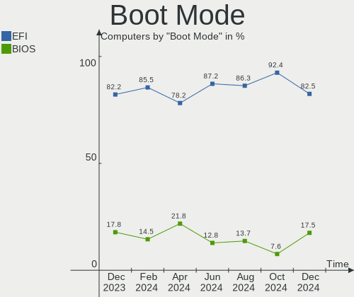
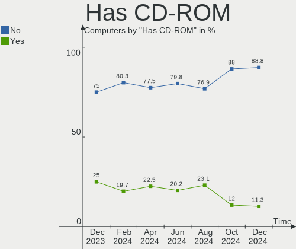
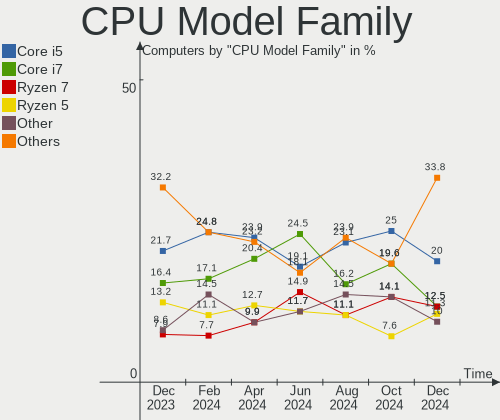
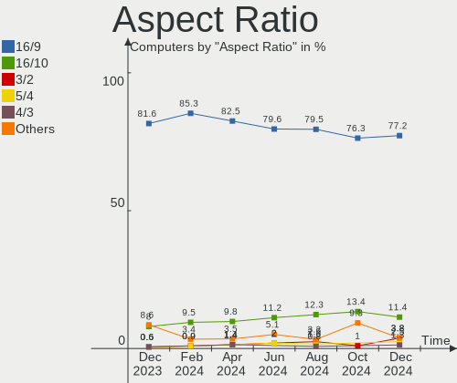
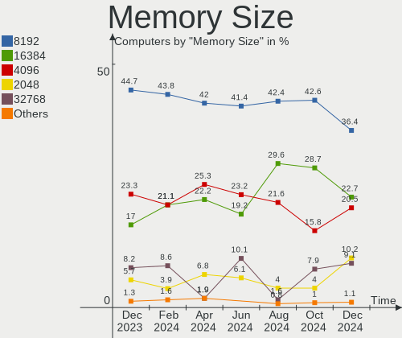
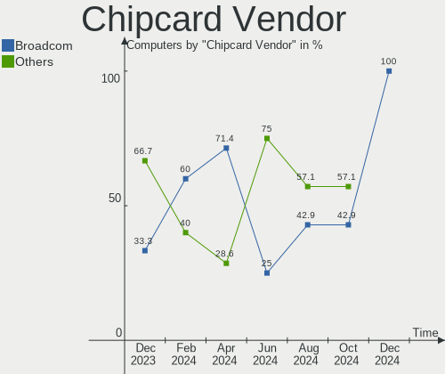

ArcoLinux Hardware Trends
-------------------------

A project to identify most popular hardware characteristics and track their change
over time based on data collected by ArcoLinux users at https://Linux-Hardware.org.

Anyone can contribute to this report by the [hw-probe](https://github.com/linuxhw/hw-probe) tool:

    sudo -E hw-probe -all -upload

This is a report for all computer types. See also reports for [desktops](/Dist/ArcoLinux/Desktop/README.md) and [notebooks](/Dist/ArcoLinux/Notebook/README.md).

This report is for one last month. Overall report since the beginning of time: [TestCoverage](https://github.com/linuxhw/TestCoverage)

Period: Apr, 2022.

Contents
--------

* [ System ](#system)
  - [ OS                       ](#os)
  - [ OS Family                ](#os-family)
  - [ Kernel                   ](#kernel)
  - [ Kernel Family            ](#kernel-family)
  - [ Kernel Major Ver.        ](#kernel-major-ver)
  - [ Arch                     ](#arch)
  - [ DE                       ](#de)
  - [ Display Server           ](#display-server)
  - [ Display Manager          ](#display-manager)
  - [ OS Lang                  ](#os-lang)
  - [ Boot Mode                ](#boot-mode)
  - [ Filesystem               ](#filesystem)
  - [ Part. scheme             ](#part-scheme)
  - [ Dual Boot with Linux/BSD ](#dual-boot-with-linuxbsd)
  - [ Dual Boot (Win)          ](#dual-boot-win)

* [ Board ](#board)
  - [ Vendor                   ](#vendor)
  - [ Model                    ](#model)
  - [ Model Family             ](#model-family)
  - [ MFG Year                 ](#mfg-year)
  - [ Form Factor              ](#form-factor)
  - [ Secure Boot              ](#secure-boot)
  - [ Coreboot                 ](#coreboot)
  - [ RAM Size                 ](#ram-size)
  - [ RAM Used                 ](#ram-used)
  - [ Total Drives             ](#total-drives)
  - [ Has CD-ROM               ](#has-cd-rom)
  - [ Has Ethernet             ](#has-ethernet)
  - [ Has WiFi                 ](#has-wifi)
  - [ Has Bluetooth            ](#has-bluetooth)

* [ Location ](#location)
  - [ Country                  ](#country)
  - [ City                     ](#city)

* [ Drives ](#drives)
  - [ Drive Vendor             ](#drive-vendor)
  - [ Drive Model              ](#drive-model)
  - [ HDD Vendor               ](#hdd-vendor)
  - [ SSD Vendor               ](#ssd-vendor)
  - [ Drive Kind               ](#drive-kind)
  - [ Drive Connector          ](#drive-connector)
  - [ Drive Size               ](#drive-size)
  - [ Space Total              ](#space-total)
  - [ Space Used               ](#space-used)
  - [ Malfunc. Drives          ](#malfunc-drives)
  - [ Malfunc. Drive Vendor    ](#malfunc-drive-vendor)
  - [ Malfunc. HDD Vendor      ](#malfunc-hdd-vendor)
  - [ Malfunc. Drive Kind      ](#malfunc-drive-kind)
  - [ Failed Drives            ](#failed-drives)
  - [ Failed Drive Vendor      ](#failed-drive-vendor)
  - [ Drive Status             ](#drive-status)

* [ Storage controller ](#storage-controller)
  - [ Storage Vendor           ](#storage-vendor)
  - [ Storage Model            ](#storage-model)
  - [ Storage Kind             ](#storage-kind)

* [ Processor ](#processor)
  - [ CPU Vendor               ](#cpu-vendor)
  - [ CPU Model                ](#cpu-model)
  - [ CPU Model Family         ](#cpu-model-family)
  - [ CPU Cores                ](#cpu-cores)
  - [ CPU Sockets              ](#cpu-sockets)
  - [ CPU Threads              ](#cpu-threads)
  - [ CPU Op-Modes             ](#cpu-op-modes)
  - [ CPU Microcode            ](#cpu-microcode)
  - [ CPU Microarch            ](#cpu-microarch)

* [ Graphics ](#graphics)
  - [ GPU Vendor               ](#gpu-vendor)
  - [ GPU Model                ](#gpu-model)
  - [ GPU Combo                ](#gpu-combo)
  - [ GPU Driver               ](#gpu-driver)
  - [ GPU Memory               ](#gpu-memory)

* [ Monitor ](#monitor)
  - [ Monitor Vendor           ](#monitor-vendor)
  - [ Monitor Model            ](#monitor-model)
  - [ Monitor Resolution       ](#monitor-resolution)
  - [ Monitor Diagonal         ](#monitor-diagonal)
  - [ Monitor Width            ](#monitor-width)
  - [ Aspect Ratio             ](#aspect-ratio)
  - [ Monitor Area             ](#monitor-area)
  - [ Pixel Density            ](#pixel-density)
  - [ Multiple Monitors        ](#multiple-monitors)

* [ Network ](#network)
  - [ Net Controller Vendor    ](#net-controller-vendor)
  - [ Net Controller Model     ](#net-controller-model)
  - [ Wireless Vendor          ](#wireless-vendor)
  - [ Wireless Model           ](#wireless-model)
  - [ Ethernet Vendor          ](#ethernet-vendor)
  - [ Ethernet Model           ](#ethernet-model)
  - [ Net Controller Kind      ](#net-controller-kind)
  - [ Used Controller          ](#used-controller)
  - [ NICs                     ](#nics)
  - [ IPv6                     ](#ipv6)

* [ Bluetooth ](#bluetooth)
  - [ Bluetooth Vendor         ](#bluetooth-vendor)
  - [ Bluetooth Model          ](#bluetooth-model)

* [ Sound ](#sound)
  - [ Sound Vendor             ](#sound-vendor)
  - [ Sound Model              ](#sound-model)

* [ Memory ](#memory)
  - [ Memory Vendor            ](#memory-vendor)
  - [ Memory Model             ](#memory-model)
  - [ Memory Kind              ](#memory-kind)
  - [ Memory Form Factor       ](#memory-form-factor)
  - [ Memory Size              ](#memory-size)
  - [ Memory Speed             ](#memory-speed)

* [ Printers & scanners ](#printers--scanners)
  - [ Printer Vendor           ](#printer-vendor)
  - [ Printer Model            ](#printer-model)
  - [ Scanner Vendor           ](#scanner-vendor)
  - [ Scanner Model            ](#scanner-model)

* [ Camera ](#camera)
  - [ Camera Vendor            ](#camera-vendor)
  - [ Camera Model             ](#camera-model)

* [ Security ](#security)
  - [ Fingerprint Vendor       ](#fingerprint-vendor)
  - [ Fingerprint Model        ](#fingerprint-model)
  - [ Chipcard Vendor          ](#chipcard-vendor)
  - [ Chipcard Model           ](#chipcard-model)

* [ Unsupported ](#unsupported)
  - [ Unsupported Devices      ](#unsupported-devices)
  - [ Unsupported Device Types ](#unsupported-device-types)

System
------

OS
--

Installed operating systems

| Name              | Computers | Percent |
|-------------------|-----------|---------|
| ArcoLinux Rolling | 66        | 95.65%  |
| ArcoLinux         | 3         | 4.35%   |

OS Family
---------

OS without a version

| Name      | Computers | Percent |
|-----------|-----------|---------|
| ArcoLinux | 69        | 100%    |

Kernel
------

Version of the Linux kernel

| Version                | Computers | Percent |
|------------------------|-----------|---------|
| 5.17.1-arch1-1         | 17        | 24.64%  |
| 5.16.11-arch1-1        | 11        | 15.94%  |
| 5.17.4-arch1-1         | 8         | 11.59%  |
| 5.17.3-arch1-1         | 7         | 10.14%  |
| 5.17.1-zen1-1-zen      | 5         | 7.25%   |
| 5.15.33-1-lts          | 3         | 4.35%   |
| 5.15.32-1-lts          | 3         | 4.35%   |
| 5.17.3-zen1-1-zen      | 2         | 2.9%    |
| 5.16.16-arch1-1        | 2         | 2.9%    |
| 5.17.5-arch1-1         | 1         | 1.45%   |
| 5.17.2-arch3-1         | 1         | 1.45%   |
| 5.17.1-xanmod1-1       | 1         | 1.45%   |
| 5.17.1-arch1-1.1       | 1         | 1.45%   |
| 5.17.0-249-tkg-pds     | 1         | 1.45%   |
| 5.16.12-arch1-1        | 1         | 1.45%   |
| 5.15.36-1-lts          | 1         | 1.45%   |
| 5.15.30-1-lts          | 1         | 1.45%   |
| 5.15.10-arch1-1        | 1         | 1.45%   |
| 5.11.6-arch1-1         | 1         | 1.45%   |
| 5.10.111-xanmod1-1-lts | 1         | 1.45%   |

Kernel Family
-------------

Linux kernel without a distro release

| Version  | Computers | Percent |
|----------|-----------|---------|
| 5.17.1   | 24        | 34.78%  |
| 5.16.11  | 11        | 15.94%  |
| 5.17.3   | 9         | 13.04%  |
| 5.17.4   | 8         | 11.59%  |
| 5.15.33  | 3         | 4.35%   |
| 5.15.32  | 3         | 4.35%   |
| 5.16.16  | 2         | 2.9%    |
| 5.17.5   | 1         | 1.45%   |
| 5.17.2   | 1         | 1.45%   |
| 5.17.0   | 1         | 1.45%   |
| 5.16.12  | 1         | 1.45%   |
| 5.15.36  | 1         | 1.45%   |
| 5.15.30  | 1         | 1.45%   |
| 5.15.10  | 1         | 1.45%   |
| 5.11.6   | 1         | 1.45%   |
| 5.10.111 | 1         | 1.45%   |

Kernel Major Ver.
-----------------

Linux kernel major version

| Version | Computers | Percent |
|---------|-----------|---------|
| 5.17    | 44        | 63.77%  |
| 5.16    | 14        | 20.29%  |
| 5.15    | 9         | 13.04%  |
| 5.11    | 1         | 1.45%   |
| 5.10    | 1         | 1.45%   |

Arch
----

OS architecture (x86_64, i586, etc.)

| Name   | Computers | Percent |
|--------|-----------|---------|
| x86_64 | 69        | 100%    |

DE
--

Desktop Environment

| Name         | Computers | Percent |
|--------------|-----------|---------|
| XFCE         | 33        | 47.83%  |
| KDE5         | 12        | 17.39%  |
| X-Cinnamon   | 4         | 5.8%    |
| GNOME        | 4         | 5.8%    |
| i3           | 3         | 4.35%   |
| awesome      | 3         | 4.35%   |
| LeftWM       | 2         | 2.9%    |
| Unity        | 1         | 1.45%   |
| qtile        | 1         | 1.45%   |
| MATE         | 1         | 1.45%   |
| LXQt         | 1         | 1.45%   |
| herbstluftwm | 1         | 1.45%   |
| dwm          | 1         | 1.45%   |
| Deepin       | 1         | 1.45%   |
| bspwm        | 1         | 1.45%   |

Display Server
--------------

X11 or Wayland

| Name    | Computers | Percent |
|---------|-----------|---------|
| X11     | 62        | 89.86%  |
| Wayland | 5         | 7.25%   |
| Tty     | 1         | 1.45%   |
| Unknown | 1         | 1.45%   |

Display Manager
---------------

SDDM, LightDM, etc.

| Name    | Computers | Percent |
|---------|-----------|---------|
| SDDM    | 48        | 69.57%  |
| LightDM | 16        | 23.19%  |
| Unknown | 4         | 5.8%    |
| Ly      | 1         | 1.45%   |

OS Lang
-------

Language

| Lang  | Computers | Percent |
|-------|-----------|---------|
| en_US | 43        | 62.32%  |
| de_DE | 8         | 11.59%  |
| en_GB | 6         | 8.7%    |
| en_CA | 2         | 2.9%    |
| en_AU | 2         | 2.9%    |
| nl_NL | 1         | 1.45%   |
| fr_FR | 1         | 1.45%   |
| es_CO | 1         | 1.45%   |
| en_SG | 1         | 1.45%   |
| en_IN | 1         | 1.45%   |
| en_IE | 1         | 1.45%   |
| en_HK | 1         | 1.45%   |
| en_DK | 1         | 1.45%   |

Boot Mode
---------

EFI or BIOS

| Mode | Computers | Percent |
|------|-----------|---------|
| EFI  | 54        | 78.26%  |
| BIOS | 15        | 21.74%  |

Filesystem
----------

Type of filesystem

| Type    | Computers | Percent |
|---------|-----------|---------|
| Ext4    | 44        | 63.77%  |
| Btrfs   | 16        | 23.19%  |
| Overlay | 4         | 5.8%    |
| F2fs    | 2         | 2.9%    |
| Unknown | 2         | 2.9%    |
| Xfs     | 1         | 1.45%   |

Part. scheme
------------

Scheme of partitioning

| Type    | Computers | Percent |
|---------|-----------|---------|
| GPT     | 58        | 84.06%  |
| MBR     | 7         | 10.14%  |
| Unknown | 4         | 5.8%    |

Dual Boot with Linux/BSD
------------------------

Hosting more than one Linux/BSD

| Dual boot | Computers | Percent |
|-----------|-----------|---------|
| No        | 56        | 81.16%  |
| Yes       | 13        | 18.84%  |

Dual Boot (Win)
---------------

Hosting Linux and Windows

| Dual boot | Computers | Percent |
|-----------|-----------|---------|
| No        | 46        | 66.67%  |
| Yes       | 23        | 33.33%  |

Board
-----

Vendor
------

Motherboard manufacturer

| Name                | Computers | Percent |
|---------------------|-----------|---------|
| Lenovo              | 13        | 18.84%  |
| ASUSTek Computer    | 11        | 15.94%  |
| Supermicro          | 10        | 14.49%  |
| Hewlett-Packard     | 8         | 11.59%  |
| Dell                | 8         | 11.59%  |
| Gigabyte Technology | 5         | 7.25%   |
| MSI                 | 3         | 4.35%   |
| Unknown             | 2         | 2.9%    |
| System76            | 1         | 1.45%   |
| Sony                | 1         | 1.45%   |
| Pegatron            | 1         | 1.45%   |
| Notebook            | 1         | 1.45%   |
| Intel               | 1         | 1.45%   |
| Biostar             | 1         | 1.45%   |
| ASRock              | 1         | 1.45%   |
| Apple               | 1         | 1.45%   |
| Acer                | 1         | 1.45%   |

Model
-----

Motherboard model

| Name                                  | Computers | Percent |
|---------------------------------------|-----------|---------|
| Supermicro SYS-5019A-FTN4             | 10        | 14.49%  |
| Dell OptiPlex 9020                    | 2         | 2.9%    |
| ASUS All Series                       | 2         | 2.9%    |
| Unknown                               | 2         | 2.9%    |
| System76 Oryx Pro                     | 1         | 1.45%   |
| Sony SVE1712C1EW                      | 1         | 1.45%   |
| Pegatron 27-1001eu                    | 1         | 1.45%   |
| Notebook P65_P67RGRERA                | 1         | 1.45%   |
| MSI MS-7B98                           | 1         | 1.45%   |
| MSI MS-7A38                           | 1         | 1.45%   |
| MSI A320M-HDV R4.0                    | 1         | 1.45%   |
| Lenovo ThinkPad X220 4291IU6          | 1         | 1.45%   |
| Lenovo ThinkPad T480s 20L7001SGE      | 1         | 1.45%   |
| Lenovo ThinkPad T460 20FMS07000       | 1         | 1.45%   |
| Lenovo ThinkPad T410 2522AC1          | 1         | 1.45%   |
| Lenovo ThinkCentre M73 10AXS6C500     | 1         | 1.45%   |
| Lenovo IdeaPadFlex 5 15ITL05 82HT     | 1         | 1.45%   |
| Lenovo IdeaPad L340-15IRH Gaming 81LK | 1         | 1.45%   |
| Lenovo IdeaPad 5 15ARE05 81YQ         | 1         | 1.45%   |
| Lenovo IdeaPad 330-15ICH 81FK         | 1         | 1.45%   |
| Lenovo IdeaPad 320-15IKB 80YH         | 1         | 1.45%   |
| Lenovo IdeaPad 320-15IKB 80XL         | 1         | 1.45%   |
| Lenovo IdeaPad 310-15ISK 80SM         | 1         | 1.45%   |
| Lenovo IdeaPad 310-14ISK 80SL         | 1         | 1.45%   |
| Intel NUC7CJYH                        | 1         | 1.45%   |
| HP ProBook 470 G2                     | 1         | 1.45%   |
| HP ProBook 4430s                      | 1         | 1.45%   |
| HP Pavilion g7                        | 1         | 1.45%   |
| HP Laptop 15s-gr0xxx                  | 1         | 1.45%   |
| HP Laptop 15s-eq2xxx                  | 1         | 1.45%   |
| HP EliteBook 820 G3                   | 1         | 1.45%   |
| HP 750-114                            | 1         | 1.45%   |
| HP 500-536d                           | 1         | 1.45%   |
| Gigabyte Z270-Gaming K3               | 1         | 1.45%   |
| Gigabyte B550 AORUS MASTER            | 1         | 1.45%   |
| Gigabyte B450 AORUS ELITE             | 1         | 1.45%   |
| Gigabyte B365M H                      | 1         | 1.45%   |
| Gigabyte AB350N-Gaming WIFI           | 1         | 1.45%   |
| Dell OptiPlex 790                     | 1         | 1.45%   |
| Dell Latitude E7250                   | 1         | 1.45%   |
| Dell Latitude E6430                   | 1         | 1.45%   |
| Dell Latitude E6230                   | 1         | 1.45%   |
| Dell Latitude 5421                    | 1         | 1.45%   |
| Dell Latitude 3380                    | 1         | 1.45%   |
| Biostar J3060NH                       | 1         | 1.45%   |
| ASUS VivoBook_ASUSLaptop X512UF       | 1         | 1.45%   |
| ASUS TUF Gaming X570-PLUS             | 1         | 1.45%   |
| ASUS TUF Gaming FX705GM_FX705GM       | 1         | 1.45%   |
| ASUS TUF Gaming FX705GD_FX705GD       | 1         | 1.45%   |
| ASUS TUF B450M-PLUS GAMING            | 1         | 1.45%   |
| ASUS ROG STRIX B550-A GAMING          | 1         | 1.45%   |
| ASUS ROG STRIX B450-F GAMING II       | 1         | 1.45%   |
| ASUS ROG CROSSHAIR VIII HERO          | 1         | 1.45%   |
| ASUS G752VSK                          | 1         | 1.45%   |
| ASRock TRX40 Taichi                   | 1         | 1.45%   |
| Apple MacBookPro11,1                  | 1         | 1.45%   |
| Acer Aspire X3300                     | 1         | 1.45%   |

Model Family
------------

Motherboard model prefix

| Name                      | Computers | Percent |
|---------------------------|-----------|---------|
| Supermicro SYS-5019A-FTN4 | 10        | 14.49%  |
| Lenovo IdeaPad            | 7         | 10.14%  |
| Dell Latitude             | 5         | 7.25%   |
| Lenovo ThinkPad           | 4         | 5.8%    |
| ASUS TUF                  | 4         | 5.8%    |
| Dell OptiPlex             | 3         | 4.35%   |
| ASUS ROG                  | 3         | 4.35%   |
| HP ProBook                | 2         | 2.9%    |
| HP Laptop                 | 2         | 2.9%    |
| ASUS All                  | 2         | 2.9%    |
| Unknown                   | 2         | 2.9%    |
| System76 Oryx             | 1         | 1.45%   |
| Sony SVE1712C1EW          | 1         | 1.45%   |
| Pegatron 27-1001eu        | 1         | 1.45%   |
| Notebook P65              | 1         | 1.45%   |
| MSI MS-7B98               | 1         | 1.45%   |
| MSI MS-7A38               | 1         | 1.45%   |
| MSI A320M-HDV             | 1         | 1.45%   |
| Lenovo ThinkCentre        | 1         | 1.45%   |
| Lenovo IdeaPadFlex        | 1         | 1.45%   |
| Intel NUC7CJYH            | 1         | 1.45%   |
| HP Pavilion               | 1         | 1.45%   |
| HP EliteBook              | 1         | 1.45%   |
| HP 750-114                | 1         | 1.45%   |
| HP 500-536d               | 1         | 1.45%   |
| Gigabyte Z270-Gaming      | 1         | 1.45%   |
| Gigabyte B550             | 1         | 1.45%   |
| Gigabyte B450             | 1         | 1.45%   |
| Gigabyte B365M            | 1         | 1.45%   |
| Gigabyte AB350N-Gaming    | 1         | 1.45%   |
| Biostar J3060NH           | 1         | 1.45%   |
| ASUS VivoBook             | 1         | 1.45%   |
| ASUS G752VSK              | 1         | 1.45%   |
| ASRock TRX40              | 1         | 1.45%   |
| Apple MacBookPro11        | 1         | 1.45%   |
| Acer Aspire               | 1         | 1.45%   |

MFG Year
--------

Motherboard manufacture year

| Year    | Computers | Percent |
|---------|-----------|---------|
| 2021    | 13        | 18.84%  |
| 2019    | 10        | 14.49%  |
| 2020    | 8         | 11.59%  |
| 2017    | 6         | 8.7%    |
| 2018    | 5         | 7.25%   |
| 2016    | 5         | 7.25%   |
| 2015    | 5         | 7.25%   |
| 2012    | 4         | 5.8%    |
| 2011    | 4         | 5.8%    |
| 2014    | 3         | 4.35%   |
| 2013    | 3         | 4.35%   |
| 2009    | 2         | 2.9%    |
| Unknown | 1         | 1.45%   |

Form Factor
-----------

Physical design of the computer

| Name        | Computers | Percent |
|-------------|-----------|---------|
| Desktop     | 37        | 53.62%  |
| Notebook    | 30        | 43.48%  |
| Convertible | 1         | 1.45%   |
| Mini pc     | 1         | 1.45%   |

Secure Boot
-----------

Enabled or disabled

| State    | Computers | Percent |
|----------|-----------|---------|
| Disabled | 69        | 100%    |

Coreboot
--------

Have coreboot on board

| Used | Computers | Percent |
|------|-----------|---------|
| No   | 69        | 100%    |

RAM Size
--------

Total RAM memory

| Size in GB  | Computers | Percent |
|-------------|-----------|---------|
| 32.01-64.0  | 18        | 26.09%  |
| 4.01-8.0    | 17        | 24.64%  |
| 16.01-24.0  | 12        | 17.39%  |
| 8.01-16.0   | 8         | 11.59%  |
| 3.01-4.0    | 7         | 10.14%  |
| 64.01-256.0 | 4         | 5.8%    |
| 24.01-32.0  | 2         | 2.9%    |
| Unknown     | 1         | 1.45%   |

RAM Used
--------

Used RAM memory

| Used GB   | Computers | Percent |
|-----------|-----------|---------|
| 1.01-2.0  | 29        | 42.03%  |
| 2.01-3.0  | 22        | 31.88%  |
| 4.01-8.0  | 8         | 11.59%  |
| 0.51-1.0  | 4         | 5.8%    |
| 3.01-4.0  | 3         | 4.35%   |
| 8.01-16.0 | 2         | 2.9%    |
| Unknown   | 1         | 1.45%   |

Total Drives
------------

Number of drives on board

| Drives | Computers | Percent |
|--------|-----------|---------|
| 1      | 39        | 56.52%  |
| 2      | 17        | 24.64%  |
| 3      | 5         | 7.25%   |
| 4      | 4         | 5.8%    |
| 5      | 2         | 2.9%    |
| 11     | 1         | 1.45%   |
| 0      | 1         | 1.45%   |

Has CD-ROM
----------

Has CD-ROM on board

| Presented | Computers | Percent |
|-----------|-----------|---------|
| No        | 49        | 71.01%  |
| Yes       | 20        | 28.99%  |

Has Ethernet
------------

Has Ethernet on board

| Presented | Computers | Percent |
|-----------|-----------|---------|
| Yes       | 64        | 92.75%  |
| No        | 5         | 7.25%   |

Has WiFi
--------

Has WiFi module

| Presented | Computers | Percent |
|-----------|-----------|---------|
| Yes       | 45        | 65.22%  |
| No        | 24        | 34.78%  |

Has Bluetooth
-------------

Has Bluetooth module

| Presented | Computers | Percent |
|-----------|-----------|---------|
| Yes       | 39        | 56.52%  |
| No        | 30        | 43.48%  |

Location
--------

Country
-------

Geographic location (country)

| Country     | Computers | Percent |
|-------------|-----------|---------|
| USA         | 22        | 31.88%  |
| Germany     | 10        | 14.49%  |
| UK          | 5         | 7.25%   |
| Greece      | 4         | 5.8%    |
| Netherlands | 3         | 4.35%   |
| Canada      | 3         | 4.35%   |
| Brazil      | 2         | 2.9%    |
| Belgium     | 2         | 2.9%    |
| Australia   | 2         | 2.9%    |
| Slovenia    | 1         | 1.45%   |
| Puerto Rico | 1         | 1.45%   |
| Portugal    | 1         | 1.45%   |
| Poland      | 1         | 1.45%   |
| Norway      | 1         | 1.45%   |
| Mexico      | 1         | 1.45%   |
| Malaysia    | 1         | 1.45%   |
| Italy       | 1         | 1.45%   |
| Ireland     | 1         | 1.45%   |
| India       | 1         | 1.45%   |
| Hong Kong   | 1         | 1.45%   |
| Denmark     | 1         | 1.45%   |
| Croatia     | 1         | 1.45%   |
| Colombia    | 1         | 1.45%   |
| Barbados    | 1         | 1.45%   |
| Bangladesh  | 1         | 1.45%   |

City
----

Geographic location (city)

| City                 | Computers | Percent |
|----------------------|-----------|---------|
| Durham               | 10        | 14.49%  |
| Kollow               | 3         | 4.35%   |
| Sydney               | 2         | 2.9%    |
| Zadar                | 1         | 1.45%   |
| Wroclaw              | 1         | 1.45%   |
| Winnipeg             | 1         | 1.45%   |
| Tuscaloosa           | 1         | 1.45%   |
| Toronto              | 1         | 1.45%   |
| Thessaloniki         | 1         | 1.45%   |
| Sunderland           | 1         | 1.45%   |
| Southampton          | 1         | 1.45%   |
| Sooke                | 1         | 1.45%   |
| Solbergelva          | 1         | 1.45%   |
| Seremban             | 1         | 1.45%   |
| Scandicci            | 1         | 1.45%   |
| Sao Joao del Rei     | 1         | 1.45%   |
| San Jose             | 1         | 1.45%   |
| Rio de Janeiro       | 1         | 1.45%   |
| Portlaoise           | 1         | 1.45%   |
| Portland             | 1         | 1.45%   |
| Plano                | 1         | 1.45%   |
| Olympia              | 1         | 1.45%   |
| Ochten               | 1         | 1.45%   |
| Neustadt in Holstein | 1         | 1.45%   |
| Narayanganj          | 1         | 1.45%   |
| Milton Keynes        | 1         | 1.45%   |
| Meise                | 1         | 1.45%   |
| Mattoon              | 1         | 1.45%   |
| Lufkin               | 1         | 1.45%   |
| Lokeren              | 1         | 1.45%   |
| Ljubljana            | 1         | 1.45%   |
| Lisbon               | 1         | 1.45%   |
| Leeds                | 1         | 1.45%   |
| Laatzen              | 1         | 1.45%   |
| Kingston upon Thames | 1         | 1.45%   |
| Kalamazoo            | 1         | 1.45%   |
| Ioannina             | 1         | 1.45%   |
| Ibague               | 1         | 1.45%   |
| Houston              | 1         | 1.45%   |
| Gorssel              | 1         | 1.45%   |
| Frankfurt am Main    | 1         | 1.45%   |
| Esbjerg              | 1         | 1.45%   |
| Eppelborn            | 1         | 1.45%   |
| Edingen-Neckarhausen | 1         | 1.45%   |
| Edinburgh            | 1         | 1.45%   |
| Doetinchem           | 1         | 1.45%   |
| Corfu                | 1         | 1.45%   |
| Cologne              | 1         | 1.45%   |
| Colfax               | 1         | 1.45%   |
| Chicago              | 1         | 1.45%   |
| Chennai              | 1         | 1.45%   |
| Central              | 1         | 1.45%   |
| Carolina             | 1         | 1.45%   |
| Bridgetown           | 1         | 1.45%   |
| Berlin               | 1         | 1.45%   |
| Athens               | 1         | 1.45%   |
| Agua Prieta          | 1         | 1.45%   |

Drives
------

Drive Vendor
------------

Hard drive vendors

| Vendor              | Computers | Drives | Percent |
|---------------------|-----------|--------|---------|
| WDC                 | 18        | 21     | 15.93%  |
| Toshiba             | 17        | 17     | 15.04%  |
| Samsung Electronics | 15        | 19     | 13.27%  |
| Seagate             | 14        | 19     | 12.39%  |
| Crucial             | 7         | 8      | 6.19%   |
| Kingston            | 6         | 6      | 5.31%   |
| SanDisk             | 5         | 5      | 4.42%   |
| Unknown             | 4         | 4      | 3.54%   |
| SK Hynix            | 3         | 3      | 2.65%   |
| Hitachi             | 3         | 3      | 2.65%   |
| A-DATA Technology   | 3         | 3      | 2.65%   |
| PNY                 | 2         | 2      | 1.77%   |
| Intel               | 2         | 2      | 1.77%   |
| HGST                | 2         | 2      | 1.77%   |
| Corsair             | 2         | 2      | 1.77%   |
| China               | 2         | 3      | 1.77%   |
| XPG                 | 1         | 1      | 0.88%   |
| Transcend           | 1         | 1      | 0.88%   |
| Patriot             | 1         | 1      | 0.88%   |
| LITEON              | 1         | 1      | 0.88%   |
| Leven               | 1         | 1      | 0.88%   |
| KIOXIA              | 1         | 1      | 0.88%   |
| External            | 1         | 1      | 0.88%   |
| Apple               | 1         | 1      | 0.88%   |

Drive Model
-----------

Hard drive models

| Model                                      | Computers | Percent |
|--------------------------------------------|-----------|---------|
| Toshiba KXG60ZNV1T02 1TB                   | 10        | 7.94%   |
| Toshiba HDWD110 1TB                        | 3         | 2.38%   |
| WDC WD20SPZX-22UA7T0 2TB                   | 2         | 1.59%   |
| Toshiba MQ04ABF100 1TB                     | 2         | 1.59%   |
| Samsung SSD 860 EVO 1TB                    | 2         | 1.59%   |
| Kingston SA400S37240G 240GB SSD            | 2         | 1.59%   |
| HGST HTS721010A9E630 1TB                   | 2         | 1.59%   |
| Crucial CT480BX500SSD1 480GB               | 2         | 1.59%   |
| XPG GAMMIX S41 256GB                       | 1         | 0.79%   |
| WDC WDS500G3X0C-00SJG0 500GB               | 1         | 0.79%   |
| WDC WDS500G2B0B-00YS70 500GB SSD           | 1         | 0.79%   |
| WDC WDS500G2B0A-00SM50 500GB SSD           | 1         | 0.79%   |
| WDC WDS240G2G0A-00JH30 240GB SSD           | 1         | 0.79%   |
| WDC WDS200T2B0C-00PXH0 2TB                 | 1         | 0.79%   |
| WDC WDS200T2B0B-00YS70 2TB SSD             | 1         | 0.79%   |
| WDC WDS200T2B0A-00SM50 2TB SSD             | 1         | 0.79%   |
| WDC WDBNCE5000PNC 500GB SSD                | 1         | 0.79%   |
| WDC WD60EZRZ-00GZ5B1 6TB                   | 1         | 0.79%   |
| WDC WD5000HHTZ-75N21V0 500GB               | 1         | 0.79%   |
| WDC WD40EZRZ-00GXCB0 4TB                   | 1         | 0.79%   |
| WDC WD30EFRX-68EUZN0 3TB                   | 1         | 0.79%   |
| WDC WD20EFRX-68EUZN0 2TB                   | 1         | 0.79%   |
| WDC WD2003FZEX-00Z4SA0 2TB                 | 1         | 0.79%   |
| WDC WD1200BEVS-60LAT0 120GB                | 1         | 0.79%   |
| WDC WD10SPZX-80Z10T2 1TB                   | 1         | 0.79%   |
| WDC WD10JPCX-24UE4T0 1TB                   | 1         | 0.79%   |
| WDC WD10EUCX-63YZ1Y0 1TB                   | 1         | 0.79%   |
| WDC PC SN520 SDAPNUW-256G-1002 256GB       | 1         | 0.79%   |
| Unknown SU04G  4GB                         | 1         | 0.79%   |
| Unknown SD128  128GB                       | 1         | 0.79%   |
| Unknown SD/MMC/MS PRO 16GB                 | 1         | 0.79%   |
| Unknown APPSD  134GB                       | 1         | 0.79%   |
| Transcend TS480GSSD220S 480GB              | 1         | 0.79%   |
| Toshiba MQ01ABF050 500GB                   | 1         | 0.79%   |
| Toshiba MQ01ABD100 1TB                     | 1         | 0.79%   |
| SK Hynix SC308 SATA 128GB SSD              | 1         | 0.79%   |
| SK Hynix SC210 mSATA 256GB SSD             | 1         | 0.79%   |
| SK Hynix HFS256GD9TNG-62A0A 256GB          | 1         | 0.79%   |
| Seagate ST9500325AS 500GB                  | 1         | 0.79%   |
| Seagate ST8000DM004-2CX188 8TB             | 1         | 0.79%   |
| Seagate ST500LM021-1KJ152 500GB            | 1         | 0.79%   |
| Seagate ST4000LM024-2U817V 4TB             | 1         | 0.79%   |
| Seagate ST4000DM005-2DP166 4TB             | 1         | 0.79%   |
| Seagate ST2000LM015-2E8174 2TB             | 1         | 0.79%   |
| Seagate ST2000DM008-2FR102 2TB             | 1         | 0.79%   |
| Seagate ST2000DM001-9YN164 2TB             | 1         | 0.79%   |
| Seagate ST2000DM001-1ER164 2TB             | 1         | 0.79%   |
| Seagate ST2000DM001-1CH164 2TB             | 1         | 0.79%   |
| Seagate ST16000NM001G-2KK103 16TB          | 1         | 0.79%   |
| Seagate ST1000LM048-2E7172 1TB             | 1         | 0.79%   |
| Seagate ST1000LM035-1RK172 1TB             | 1         | 0.79%   |
| Seagate ST1000DM003-1ER162 1TB             | 1         | 0.79%   |
| Seagate FireCuda 520 SSD ZP2000GM30002 2TB | 1         | 0.79%   |
| Seagate Expansion+ 2TB                     | 1         | 0.79%   |
| Seagate Expansion HDD 5TB                  | 1         | 0.79%   |
| Seagate BUP BL 4TB                         | 1         | 0.79%   |
| SanDisk SSD PLUS 240GB                     | 1         | 0.79%   |
| SanDisk SDSSDHII240G 240GB                 | 1         | 0.79%   |
| SanDisk SDSSDA480G 480GB                   | 1         | 0.79%   |
| SanDisk SD9SN8W256G1102 256GB SSD          | 1         | 0.79%   |

HDD Vendor
----------

Hard disk drive vendors

| Vendor              | Computers | Drives | Percent |
|---------------------|-----------|--------|---------|
| Seagate             | 14        | 18     | 34.15%  |
| WDC                 | 12        | 12     | 29.27%  |
| Toshiba             | 7         | 7      | 17.07%  |
| Hitachi             | 3         | 3      | 7.32%   |
| Samsung Electronics | 2         | 2      | 4.88%   |
| HGST                | 2         | 2      | 4.88%   |
| Unknown             | 1         | 1      | 2.44%   |

SSD Vendor
----------

Solid state drive vendors

| Vendor              | Computers | Drives | Percent |
|---------------------|-----------|--------|---------|
| Samsung Electronics | 9         | 10     | 21.43%  |
| WDC                 | 5         | 6      | 11.9%   |
| SanDisk             | 5         | 5      | 11.9%   |
| Kingston            | 4         | 4      | 9.52%   |
| Crucial             | 4         | 5      | 9.52%   |
| A-DATA Technology   | 3         | 3      | 7.14%   |
| SK Hynix            | 2         | 2      | 4.76%   |
| PNY                 | 2         | 2      | 4.76%   |
| China               | 2         | 3      | 4.76%   |
| Transcend           | 1         | 1      | 2.38%   |
| Patriot             | 1         | 1      | 2.38%   |
| Leven               | 1         | 1      | 2.38%   |
| Intel               | 1         | 1      | 2.38%   |
| External            | 1         | 1      | 2.38%   |
| Apple               | 1         | 1      | 2.38%   |

Drive Kind
----------

HDD or SSD

| Kind | Computers | Drives | Percent |
|------|-----------|--------|---------|
| SSD  | 36        | 46     | 35.29%  |
| HDD  | 34        | 45     | 33.33%  |
| NVMe | 29        | 33     | 28.43%  |
| MMC  | 3         | 3      | 2.94%   |

Drive Connector
---------------

SATA, SAS, NVMe, etc.

| Type | Computers | Drives | Percent |
|------|-----------|--------|---------|
| SATA | 52        | 85     | 57.78%  |
| NVMe | 29        | 33     | 32.22%  |
| SAS  | 6         | 6      | 6.67%   |
| MMC  | 3         | 3      | 3.33%   |

Drive Size
----------

Size of hard drive

| Size in TB | Computers | Drives | Percent |
|------------|-----------|--------|---------|
| 0.01-0.5   | 34        | 42     | 44.74%  |
| 0.51-1.0   | 22        | 25     | 28.95%  |
| 1.01-2.0   | 12        | 14     | 15.79%  |
| 3.01-4.0   | 3         | 4      | 3.95%   |
| 4.01-10.0  | 3         | 3      | 3.95%   |
| 2.01-3.0   | 1         | 1      | 1.32%   |
| 10.01-20.0 | 1         | 2      | 1.32%   |

Space Total
-----------

Amount of disk space available on the file system

| Size in GB     | Computers | Percent |
|----------------|-----------|---------|
| 101-250        | 13        | 18.84%  |
| 251-500        | 11        | 15.94%  |
| More than 3000 | 9         | 13.04%  |
| 1-20           | 9         | 13.04%  |
| 501-1000       | 9         | 13.04%  |
| Unknown        | 6         | 8.7%    |
| 1001-2000      | 5         | 7.25%   |
| 2001-3000      | 4         | 5.8%    |
| 51-100         | 2         | 2.9%    |
| 21-50          | 1         | 1.45%   |

Space Used
----------

Amount of used disk space

| Used GB        | Computers | Percent |
|----------------|-----------|---------|
| 1-20           | 25        | 36.23%  |
| 101-250        | 10        | 14.49%  |
| 51-100         | 8         | 11.59%  |
| 21-50          | 6         | 8.7%    |
| Unknown        | 6         | 8.7%    |
| 251-500        | 5         | 7.25%   |
| 1001-2000      | 4         | 5.8%    |
| More than 3000 | 3         | 4.35%   |
| 2001-3000      | 1         | 1.45%   |
| 501-1000       | 1         | 1.45%   |

Malfunc. Drives
---------------

Drive models with a malfunction

| Model                               | Computers | Drives | Percent |
|-------------------------------------|-----------|--------|---------|
| WDC WD60EZRZ-00GZ5B1 6TB            | 1         | 1      | 11.11%  |
| WDC WD30EFRX-68EUZN0 3TB            | 1         | 1      | 11.11%  |
| WDC WD10JPCX-24UE4T0 1TB            | 1         | 1      | 11.11%  |
| Toshiba MQ01ABD100 1TB              | 1         | 1      | 11.11%  |
| Seagate ST500LM021-1KJ152 500GB     | 1         | 1      | 11.11%  |
| Seagate ST2000DM001-1ER164 2TB      | 1         | 1      | 11.11%  |
| Samsung Electronics SSD 860 EVO 1TB | 1         | 1      | 11.11%  |
| Samsung Electronics HD642JJ 640GB   | 1         | 1      | 11.11%  |
| Hitachi HDS723020BLA642 2TB         | 1         | 1      | 11.11%  |

Malfunc. Drive Vendor
---------------------

Vendors of faulty drives

| Vendor              | Computers | Drives | Percent |
|---------------------|-----------|--------|---------|
| WDC                 | 3         | 3      | 33.33%  |
| Seagate             | 2         | 2      | 22.22%  |
| Samsung Electronics | 2         | 2      | 22.22%  |
| Toshiba             | 1         | 1      | 11.11%  |
| Hitachi             | 1         | 1      | 11.11%  |

Malfunc. HDD Vendor
-------------------

Vendors of faulty HDD drives

| Vendor              | Computers | Drives | Percent |
|---------------------|-----------|--------|---------|
| WDC                 | 3         | 3      | 37.5%   |
| Seagate             | 2         | 2      | 25%     |
| Toshiba             | 1         | 1      | 12.5%   |
| Samsung Electronics | 1         | 1      | 12.5%   |
| Hitachi             | 1         | 1      | 12.5%   |

Malfunc. Drive Kind
-------------------

Kinds of faulty drives

| Kind | Computers | Drives | Percent |
|------|-----------|--------|---------|
| HDD  | 7         | 8      | 87.5%   |
| SSD  | 1         | 1      | 12.5%   |

Failed Drives
-------------

Failed drive models

| Model                    | Computers | Drives | Percent |
|--------------------------|-----------|--------|---------|
| HGST HTS721010A9E630 1TB | 1         | 1      | 100%    |

Failed Drive Vendor
-------------------

Failed drive vendors

| Vendor | Computers | Drives | Percent |
|--------|-----------|--------|---------|
| HGST   | 1         | 1      | 100%    |

Drive Status
------------

Number of failed and malfunc. drives

| Status   | Computers | Drives | Percent |
|----------|-----------|--------|---------|
| Works    | 60        | 102    | 72.29%  |
| Detected | 14        | 15     | 16.87%  |
| Malfunc  | 8         | 9      | 9.64%   |
| Failed   | 1         | 1      | 1.2%    |

Storage controller
------------------

Storage Vendor
--------------

Storage controller vendors

| Vendor                       | Computers | Percent |
|------------------------------|-----------|---------|
| Intel                        | 50        | 51.02%  |
| AMD                          | 14        | 14.29%  |
| Toshiba America Info Systems | 11        | 11.22%  |
| Samsung Electronics          | 7         | 7.14%   |
| Sandisk                      | 3         | 3.06%   |
| Micron/Crucial Technology    | 3         | 3.06%   |
| Phison Electronics           | 2         | 2.04%   |
| Kingston Technology Company  | 2         | 2.04%   |
| SK Hynix                     | 1         | 1.02%   |
| Seagate Technology           | 1         | 1.02%   |
| Realtek Semiconductor        | 1         | 1.02%   |
| Nvidia                       | 1         | 1.02%   |
| Lite-On Technology           | 1         | 1.02%   |
| ASMedia Technology           | 1         | 1.02%   |

Storage Model
-------------

Storage controller models

| Model                                                                            | Computers | Percent |
|----------------------------------------------------------------------------------|-----------|---------|
| Toshiba America Info Systems XG6 NVMe SSD Controller                             | 11        | 9.57%   |
| AMD FCH SATA Controller [AHCI mode]                                              | 11        | 9.57%   |
| Intel Atom Processor C3000 Series SATA Controller 1                              | 10        | 8.7%    |
| Intel Atom Processor C3000 Series SATA Controller 0                              | 10        | 8.7%    |
| Intel Sunrise Point-LP SATA Controller [AHCI mode]                               | 6         | 5.22%   |
| Intel 82801 Mobile SATA Controller [RAID mode]                                   | 6         | 5.22%   |
| Intel 8 Series/C220 Series Chipset Family 6-port SATA Controller 1 [AHCI mode]   | 5         | 4.35%   |
| Samsung NVMe SSD Controller SM981/PM981/PM983                                    | 4         | 3.48%   |
| Intel Cannon Lake Mobile PCH SATA AHCI Controller                                | 4         | 3.48%   |
| AMD 400 Series Chipset SATA Controller                                           | 4         | 3.48%   |
| Phison E16 PCIe4 NVMe Controller                                                 | 2         | 1.74%   |
| Micron/Crucial P2 NVMe PCIe SSD                                                  | 2         | 1.74%   |
| Intel Q170/Q150/B150/H170/H110/Z170/CM236 Chipset SATA Controller [AHCI Mode]    | 2         | 1.74%   |
| Intel 6 Series/C200 Series Chipset Family 6 port Mobile SATA AHCI Controller     | 2         | 1.74%   |
| Intel 6 Series/C200 Series Chipset Family 6 port Desktop SATA AHCI Controller    | 2         | 1.74%   |
| Intel 200 Series PCH SATA controller [AHCI mode]                                 | 2         | 1.74%   |
| AMD 500 Series Chipset SATA Controller                                           | 2         | 1.74%   |
| SK Hynix PC401 NVMe Solid State Drive 256GB                                      | 1         | 0.87%   |
| Seagate FireCuda 520 SSD                                                         | 1         | 0.87%   |
| Sandisk WD Blue SN500 / PC SN520 NVMe SSD                                        | 1         | 0.87%   |
| Sandisk WD Black SN750 / PC SN730 NVMe SSD                                       | 1         | 0.87%   |
| Sandisk Non-Volatile memory controller                                           | 1         | 0.87%   |
| Samsung NVMe SSD Controller SM961/PM961/SM963                                    | 1         | 0.87%   |
| Samsung NVMe SSD Controller PM9A1/PM9A3/980PRO                                   | 1         | 0.87%   |
| Samsung NVMe SSD Controller 980                                                  | 1         | 0.87%   |
| Samsung Apple PCIe SSD                                                           | 1         | 0.87%   |
| Realtek RTS5763DL NVMe SSD Controller                                            | 1         | 0.87%   |
| Nvidia MCP78S [GeForce 8200] IDE                                                 | 1         | 0.87%   |
| Nvidia MCP78S [GeForce 8200] AHCI Controller                                     | 1         | 0.87%   |
| Micron/Crucial NVMe Controller                                                   | 1         | 0.87%   |
| Lite-On NVMe Controller                                                          | 1         | 0.87%   |
| Kingston Company Company Non-Volatile memory controller                          | 1         | 0.87%   |
| Kingston Company A2000 NVMe SSD                                                  | 1         | 0.87%   |
| Intel Volume Management Device NVMe RAID Controller                              | 1         | 0.87%   |
| Intel SSD 660P Series                                                            | 1         | 0.87%   |
| Intel SATA Controller [RAID mode]                                                | 1         | 0.87%   |
| Intel HM170/QM170 Chipset SATA Controller [AHCI Mode]                            | 1         | 0.87%   |
| Intel Celeron/Pentium Silver Processor SATA Controller                           | 1         | 0.87%   |
| Intel Cannon Lake PCH SATA AHCI Controller                                       | 1         | 0.87%   |
| Intel Atom/Celeron/Pentium Processor x5-E8000/J3xxx/N3xxx Series SATA Controller | 1         | 0.87%   |
| Intel 8 Series SATA Controller 1 [AHCI mode]                                     | 1         | 0.87%   |
| Intel 7 Series/C210 Series Chipset Family 6-port SATA Controller [AHCI mode]     | 1         | 0.87%   |
| Intel 7 Series Chipset Family 6-port SATA Controller [AHCI mode]                 | 1         | 0.87%   |
| Intel 5 Series/3400 Series Chipset 6 port SATA AHCI Controller                   | 1         | 0.87%   |
| ASMedia ASM1062 Serial ATA Controller                                            | 1         | 0.87%   |
| AMD FCH SATA Controller D                                                        | 1         | 0.87%   |
| AMD 300 Series Chipset SATA Controller                                           | 1         | 0.87%   |

Storage Kind
------------

Kind of storage controller (IDE, SATA, NVMe, SAS, ...)

| Kind | Computers | Percent |
|------|-----------|---------|
| SATA | 57        | 60%     |
| NVMe | 29        | 30.53%  |
| RAID | 8         | 8.42%   |
| IDE  | 1         | 1.05%   |

Processor
---------

CPU Vendor
----------

Processor vendors

| Vendor  | Computers | Percent |
|---------|-----------|---------|
| Intel   | 52        | 75.36%  |
| AMD     | 16        | 23.19%  |
| Unknown | 1         | 1.45%   |

CPU Model
---------

Processor models

| Model                                          | Computers | Percent |
|------------------------------------------------|-----------|---------|
| Intel Atom CPU C3758 @ 2.20GHz                 | 10        | 14.49%  |
| AMD Ryzen 7 5800X 8-Core Processor             | 3         | 4.35%   |
| Intel Core i7-8750H CPU @ 2.20GHz              | 2         | 2.9%    |
| Intel Core i5-6200U CPU @ 2.30GHz              | 2         | 2.9%    |
| AMD Ryzen 5 3600 6-Core Processor              | 2         | 2.9%    |
| Intel Pentium CPU G630 @ 2.70GHz               | 1         | 1.45%   |
| Intel Pentium CPU B980 @ 2.40GHz               | 1         | 1.45%   |
| Intel Core i7-9750H CPU @ 2.60GHz              | 1         | 1.45%   |
| Intel Core i7-8550U CPU @ 1.80GHz              | 1         | 1.45%   |
| Intel Core i7-7700K CPU @ 4.20GHz              | 1         | 1.45%   |
| Intel Core i7-7700HQ CPU @ 2.80GHz             | 1         | 1.45%   |
| Intel Core i7-6700HQ CPU @ 2.60GHz             | 1         | 1.45%   |
| Intel Core i7-6500U CPU @ 2.50GHz              | 1         | 1.45%   |
| Intel Core i7-5600U CPU @ 2.60GHz              | 1         | 1.45%   |
| Intel Core i7-4790 CPU @ 3.60GHz               | 1         | 1.45%   |
| Intel Core i7-4770K CPU @ 3.50GHz              | 1         | 1.45%   |
| Intel Core i7-4770 CPU @ 3.40GHz               | 1         | 1.45%   |
| Intel Core i5-9400F CPU @ 2.90GHz              | 1         | 1.45%   |
| Intel Core i5-9300HF CPU @ 2.40GHz             | 1         | 1.45%   |
| Intel Core i5-8300H CPU @ 2.30GHz              | 1         | 1.45%   |
| Intel Core i5-8250U CPU @ 1.60GHz              | 1         | 1.45%   |
| Intel Core i5-7200U CPU @ 2.50GHz              | 1         | 1.45%   |
| Intel Core i5-6400 CPU @ 2.70GHz               | 1         | 1.45%   |
| Intel Core i5-6300U CPU @ 2.40GHz              | 1         | 1.45%   |
| Intel Core i5-4590 CPU @ 3.30GHz               | 1         | 1.45%   |
| Intel Core i5-4258U CPU @ 2.40GHz              | 1         | 1.45%   |
| Intel Core i5-4210U CPU @ 1.70GHz              | 1         | 1.45%   |
| Intel Core i5-3340M CPU @ 2.70GHz              | 1         | 1.45%   |
| Intel Core i5-3320M CPU @ 2.60GHz              | 1         | 1.45%   |
| Intel Core i5-2520M CPU @ 2.50GHz              | 1         | 1.45%   |
| Intel Core i5-2400S CPU @ 2.50GHz              | 1         | 1.45%   |
| Intel Core i5 CPU M 520 @ 2.40GHz              | 1         | 1.45%   |
| Intel Core i3-9100F CPU @ 3.60GHz              | 1         | 1.45%   |
| Intel Core i3-7100U CPU @ 2.40GHz              | 1         | 1.45%   |
| Intel Core i3-6006U CPU @ 2.00GHz              | 1         | 1.45%   |
| Intel Core i3-4170T CPU @ 3.20GHz              | 1         | 1.45%   |
| Intel Core i3-4160 CPU @ 3.60GHz               | 1         | 1.45%   |
| Intel Core i3-2350M CPU @ 2.30GHz              | 1         | 1.45%   |
| Intel Core i3-2120 CPU @ 3.30GHz               | 1         | 1.45%   |
| Intel Celeron J4005 CPU @ 2.00GHz              | 1         | 1.45%   |
| Intel Celeron CPU J3060 @ 1.60GHz              | 1         | 1.45%   |
| Intel 11th Gen Core i7-11850H @ 2.50GHz        | 1         | 1.45%   |
| Intel 11th Gen Core i7-1165G7 @ 2.80GHz        | 1         | 1.45%   |
| AMD Ryzen Threadripper 3960X 24-Core Processor | 1         | 1.45%   |
| AMD Ryzen 9 5950X 16-Core Processor            | 1         | 1.45%   |
| AMD Ryzen 7 4800U with Radeon Graphics         | 1         | 1.45%   |
| AMD Ryzen 7 1700X Eight-Core Processor         | 1         | 1.45%   |
| AMD Ryzen 5 5500U with Radeon Graphics         | 1         | 1.45%   |
| AMD Ryzen 5 2600 Six-Core Processor            | 1         | 1.45%   |
| AMD Ryzen 3 3250U with Radeon Graphics         | 1         | 1.45%   |
| AMD Ryzen 3 2300X Quad-Core Processor          | 1         | 1.45%   |
| AMD Ryzen 3 2200G with Radeon Vega Graphics    | 1         | 1.45%   |
| AMD Phenom II X4 925 Processor                 | 1         | 1.45%   |
| AMD A6-4400M APU with Radeon HD Graphics       | 1         | 1.45%   |
|                                                | 1         | 1.45%   |

CPU Model Family
----------------

Processor model prefix

| Model                  | Computers | Percent |
|------------------------|-----------|---------|
| Intel Core i5          | 17        | 24.64%  |
| Intel Core i7          | 12        | 17.39%  |
| Intel Atom             | 10        | 14.49%  |
| Intel Core i3          | 7         | 10.14%  |
| AMD Ryzen 7            | 5         | 7.25%   |
| AMD Ryzen 5            | 4         | 5.8%    |
| Other                  | 3         | 4.35%   |
| AMD Ryzen 3            | 3         | 4.35%   |
| Intel Pentium          | 2         | 2.9%    |
| Intel Celeron          | 2         | 2.9%    |
| AMD Ryzen Threadripper | 1         | 1.45%   |
| AMD Ryzen 9            | 1         | 1.45%   |
| AMD Phenom II X4       | 1         | 1.45%   |
| AMD A6                 | 1         | 1.45%   |

CPU Cores
---------

Number of processor cores

| Number  | Computers | Percent |
|---------|-----------|---------|
| 2       | 23        | 33.33%  |
| 4       | 18        | 26.09%  |
| 8       | 15        | 21.74%  |
| 6       | 9         | 13.04%  |
| 24      | 1         | 1.45%   |
| 16      | 1         | 1.45%   |
| 1       | 1         | 1.45%   |
| Unknown | 1         | 1.45%   |

CPU Sockets
-----------

Number of sockets

| Number  | Computers | Percent |
|---------|-----------|---------|
| 1       | 68        | 98.55%  |
| Unknown | 1         | 1.45%   |

CPU Threads
-----------

Threads per core (Hyper-Threading)

| Number  | Computers | Percent |
|---------|-----------|---------|
| 2       | 46        | 66.67%  |
| 1       | 22        | 31.88%  |
| Unknown | 1         | 1.45%   |

CPU Op-Modes
------------

CPU Operation Modes (32-bit, 64-bit)

| Op mode        | Computers | Percent |
|----------------|-----------|---------|
| 32-bit, 64-bit | 68        | 98.55%  |
| Unknown        | 1         | 1.45%   |

CPU Microcode
-------------

Microcode number

| Number     | Computers | Percent |
|------------|-----------|---------|
| 0x506f1    | 10        | 14.49%  |
| Unknown    | 7         | 10.14%  |
| 0x206a7    | 6         | 8.7%    |
| 0x906ea    | 5         | 7.25%   |
| 0x406e3    | 5         | 7.25%   |
| 0x306c3    | 5         | 7.25%   |
| 0x906e9    | 2         | 2.9%    |
| 0x806ea    | 2         | 2.9%    |
| 0x806e9    | 2         | 2.9%    |
| 0x506e3    | 2         | 2.9%    |
| 0x40651    | 2         | 2.9%    |
| 0x08701021 | 2         | 2.9%    |
| 0x906eb    | 1         | 1.45%   |
| 0x806d1    | 1         | 1.45%   |
| 0x806c1    | 1         | 1.45%   |
| 0x706e5    | 1         | 1.45%   |
| 0x706a1    | 1         | 1.45%   |
| 0x406c4    | 1         | 1.45%   |
| 0x306a9    | 1         | 1.45%   |
| 0x0a201205 | 1         | 1.45%   |
| 0x0a201016 | 1         | 1.45%   |
| 0x0a201009 | 1         | 1.45%   |
| 0x08608103 | 1         | 1.45%   |
| 0x08600106 | 1         | 1.45%   |
| 0x08301039 | 1         | 1.45%   |
| 0x08108109 | 1         | 1.45%   |
| 0x08101016 | 1         | 1.45%   |
| 0x0800820d | 1         | 1.45%   |
| 0x08001138 | 1         | 1.45%   |
| 0x06001116 | 1         | 1.45%   |
| 0x010000db | 1         | 1.45%   |

CPU Microarch
-------------

Microarchitecture

| Name          | Computers | Percent |
|---------------|-----------|---------|
| KabyLake      | 13        | 18.84%  |
| Goldmont      | 10        | 14.49%  |
| Haswell       | 8         | 11.59%  |
| Skylake       | 7         | 10.14%  |
| SandyBridge   | 6         | 8.7%    |
| Zen 3         | 4         | 5.8%    |
| Zen 2         | 4         | 5.8%    |
| Zen+          | 3         | 4.35%   |
| Zen           | 2         | 2.9%    |
| IvyBridge     | 2         | 2.9%    |
| Unknown       | 2         | 2.9%    |
| Westmere      | 1         | 1.45%   |
| TigerLake     | 1         | 1.45%   |
| Silvermont    | 1         | 1.45%   |
| Piledriver    | 1         | 1.45%   |
| K10           | 1         | 1.45%   |
| Icelake       | 1         | 1.45%   |
| Goldmont plus | 1         | 1.45%   |
| Broadwell     | 1         | 1.45%   |

Graphics
--------

GPU Vendor
----------

Vendors of graphics cards

| Vendor            | Computers | Percent |
|-------------------|-----------|---------|
| Intel             | 32        | 41.56%  |
| Nvidia            | 21        | 27.27%  |
| AMD               | 14        | 18.18%  |
| ASPEED Technology | 10        | 12.99%  |

GPU Model
---------

Graphics card models

| Model                                                                                    | Computers | Percent |
|------------------------------------------------------------------------------------------|-----------|---------|
| ASPEED Technology ASPEED Graphics Family                                                 | 10        | 12.82%  |
| Intel Skylake GT2 [HD Graphics 520]                                                      | 5         | 6.41%   |
| Intel CoffeeLake-H GT2 [UHD Graphics 630]                                                | 4         | 5.13%   |
| Intel 2nd Generation Core Processor Family Integrated Graphics Controller                | 4         | 5.13%   |
| Nvidia TU104 [GeForce RTX 2070 SUPER]                                                    | 2         | 2.56%   |
| Nvidia GP107M [GeForce GTX 1050 Mobile]                                                  | 2         | 2.56%   |
| Intel UHD Graphics 620                                                                   | 2         | 2.56%   |
| Intel HD Graphics 620                                                                    | 2         | 2.56%   |
| Intel HD Graphics 530                                                                    | 2         | 2.56%   |
| Intel Haswell-ULT Integrated Graphics Controller                                         | 2         | 2.56%   |
| Intel 4th Generation Core Processor Family Integrated Graphics Controller                | 2         | 2.56%   |
| Intel 3rd Gen Core processor Graphics Controller                                         | 2         | 2.56%   |
| Nvidia TU116 [GeForce GTX 1660 SUPER]                                                    | 1         | 1.28%   |
| Nvidia TU116 [GeForce GTX 1650 SUPER]                                                    | 1         | 1.28%   |
| Nvidia TU106M [GeForce RTX 2060 Mobile]                                                  | 1         | 1.28%   |
| Nvidia TU106 [GeForce RTX 2060 SUPER]                                                    | 1         | 1.28%   |
| Nvidia GP107M [GeForce GTX 1050 3 GB Max-Q]                                              | 1         | 1.28%   |
| Nvidia GP106M [GeForce GTX 1060 Mobile]                                                  | 1         | 1.28%   |
| Nvidia GP106 [GeForce GTX 1060 6GB]                                                      | 1         | 1.28%   |
| Nvidia GP106 [GeForce GTX 1060 3GB]                                                      | 1         | 1.28%   |
| Nvidia GP104BM [GeForce GTX 1070 Mobile]                                                 | 1         | 1.28%   |
| Nvidia GP104 [GeForce GTX 1070]                                                          | 1         | 1.28%   |
| Nvidia GM204M [GeForce GTX 970M]                                                         | 1         | 1.28%   |
| Nvidia GM108M [GeForce MX130]                                                            | 1         | 1.28%   |
| Nvidia GM108M [GeForce 940MX]                                                            | 1         | 1.28%   |
| Nvidia GM108M [GeForce 920MX]                                                            | 1         | 1.28%   |
| Nvidia GK208B [GeForce GT 710]                                                           | 1         | 1.28%   |
| Nvidia GA102 [GeForce RTX 3080 Ti]                                                       | 1         | 1.28%   |
| Nvidia GA102 [GeForce RTX 3080 Lite Hash Rate]                                           | 1         | 1.28%   |
| Intel Xeon E3-1200 v3/4th Gen Core Processor Integrated Graphics Controller              | 1         | 1.28%   |
| Intel TigerLake-LP GT2 [Iris Xe Graphics]                                                | 1         | 1.28%   |
| Intel TigerLake-H GT1 [UHD Graphics]                                                     | 1         | 1.28%   |
| Intel HD Graphics 5500                                                                   | 1         | 1.28%   |
| Intel GeminiLake [UHD Graphics 600]                                                      | 1         | 1.28%   |
| Intel Core Processor Integrated Graphics Controller                                      | 1         | 1.28%   |
| Intel Atom/Celeron/Pentium Processor x5-E8000/J3xxx/N3xxx Integrated Graphics Controller | 1         | 1.28%   |
| AMD Turks [Radeon HD 7650A/7670A]                                                        | 1         | 1.28%   |
| AMD Trinity 2 [Radeon HD 7520G]                                                          | 1         | 1.28%   |
| AMD Topaz PRO [Radeon R5 M255]                                                           | 1         | 1.28%   |
| AMD Thames [Radeon HD 7500M/7600M Series]                                                | 1         | 1.28%   |
| AMD RV730 PRO [Radeon HD 4650]                                                           | 1         | 1.28%   |
| AMD Renoir                                                                               | 1         | 1.28%   |
| AMD Raven Ridge [Radeon Vega Series / Radeon Vega Mobile Series]                         | 1         | 1.28%   |
| AMD Picasso/Raven 2 [Radeon Vega Series / Radeon Vega Mobile Series]                     | 1         | 1.28%   |
| AMD Oland [Radeon HD 8570 / R5 430 OEM / R7 240/340 / Radeon 520 OEM]                    | 1         | 1.28%   |
| AMD Navi 21 [Radeon RX 6800/6800 XT / 6900 XT]                                           | 1         | 1.28%   |
| AMD Navi 10 [Radeon RX 5600 OEM/5600 XT / 5700/5700 XT]                                  | 1         | 1.28%   |
| AMD Lucienne                                                                             | 1         | 1.28%   |
| AMD Ellesmere [Radeon RX 470/480/570/570X/580/580X/590]                                  | 1         | 1.28%   |
| AMD Cape Verde PRO / Venus LE / Tropo PRO-L [Radeon HD 8830M / R7 250 / R7 M465X]        | 1         | 1.28%   |
| AMD Baffin [Radeon RX 460/560D / Pro 450/455/460/555/555X/560/560X]                      | 1         | 1.28%   |

GPU Combo
---------

Combinations of graphics cards

| Name           | Computers | Percent |
|----------------|-----------|---------|
| 1 x Intel      | 23        | 33.33%  |
| 1 x Nvidia     | 13        | 18.84%  |
| 1 x AMD        | 12        | 17.39%  |
| 1 x ASPEED     | 10        | 14.49%  |
| Intel + Nvidia | 8         | 11.59%  |
| Other          | 1         | 1.45%   |
| 2 x AMD        | 1         | 1.45%   |
| Intel + AMD    | 1         | 1.45%   |

GPU Driver
----------

Free vs proprietary

| Driver      | Computers | Percent |
|-------------|-----------|---------|
| Free        | 53        | 76.81%  |
| Proprietary | 14        | 20.29%  |
| Unknown     | 2         | 2.9%    |

GPU Memory
----------

Total video memory

| Size in GB | Computers | Percent |
|------------|-----------|---------|
| Unknown    | 43        | 62.32%  |
| 7.01-8.0   | 5         | 7.25%   |
| 1.01-2.0   | 5         | 7.25%   |
| 3.01-4.0   | 4         | 5.8%    |
| 5.01-6.0   | 3         | 4.35%   |
| 0.51-1.0   | 3         | 4.35%   |
| 0.01-0.5   | 3         | 4.35%   |
| 8.01-16.0  | 2         | 2.9%    |
| 2.01-3.0   | 1         | 1.45%   |

Monitor
-------

Monitor Vendor
--------------

Monitor vendors

| Vendor              | Computers | Percent |
|---------------------|-----------|---------|
| Dell                | 11        | 13.58%  |
| AU Optronics        | 8         | 9.88%   |
| LG Display          | 7         | 8.64%   |
| Chimei Innolux      | 7         | 8.64%   |
| Samsung Electronics | 6         | 7.41%   |
| BOE                 | 5         | 6.17%   |
| AOC                 | 5         | 6.17%   |
| Acer                | 5         | 6.17%   |
| Hewlett-Packard     | 4         | 4.94%   |
| Goldstar            | 3         | 3.7%    |
| Lenovo              | 2         | 2.47%   |
| Fujitsu Siemens     | 2         | 2.47%   |
| Compal              | 2         | 2.47%   |
| ASUSTek Computer    | 2         | 2.47%   |
| ___                 | 1         | 1.23%   |
| Vizio               | 1         | 1.23%   |
| Unknown             | 1         | 1.23%   |
| Sony                | 1         | 1.23%   |
| Sceptre Tech        | 1         | 1.23%   |
| Philips             | 1         | 1.23%   |
| Nixeus              | 1         | 1.23%   |
| MSI                 | 1         | 1.23%   |
| InnoLux Display     | 1         | 1.23%   |
| Huion               | 1         | 1.23%   |
| Gigabyte Technology | 1         | 1.23%   |
| Apple               | 1         | 1.23%   |

Monitor Model
-------------

Monitor models

| Model                                                                 | Computers | Percent |
|-----------------------------------------------------------------------|-----------|---------|
| Dell SE2416H DELD081 1920x1080 527x296mm 23.8-inch                    | 7         | 8.33%   |
| Acer V173 ACR0053 1280x1024 338x270mm 17.0-inch                       | 3         | 3.57%   |
| Goldstar FULL HD GSM5B55 1920x1080 480x270mm 21.7-inch                | 2         | 2.38%   |
| ___ AAA ___1062 1440x900 410x260mm 19.1-inch                          | 1         | 1.19%   |
| Vizio D32x-D1 VIZ1005 1920x1080 700x390mm 31.5-inch                   | 1         | 1.19%   |
| Unknown AAA 1062 1440x900 341x256mm 16.8-inch                         | 1         | 1.19%   |
| Sony TV SNYE903 1920x1080                                             | 1         | 1.19%   |
| Sceptre Tech F27 SPT0ABF 1920x1080 409x230mm 18.5-inch                | 1         | 1.19%   |
| Samsung Electronics SyncMaster SAM7027 1920x1080 1074x604mm 48.5-inch | 1         | 1.19%   |
| Samsung Electronics SA300/SA350 SAM0791 1920x1080 510x287mm 23.0-inch | 1         | 1.19%   |
| Samsung Electronics LCD Monitor SEC3941 1600x900 382x214mm 17.2-inch  | 1         | 1.19%   |
| Samsung Electronics LCD Monitor SAM090B 1920x1080 700x390mm 31.5-inch | 1         | 1.19%   |
| Samsung Electronics C49RG9x SAM0F99 3840x1080 1193x336mm 48.8-inch    | 1         | 1.19%   |
| Samsung Electronics C27R50x SAM0F9D 1920x1080 600x340mm 27.2-inch     | 1         | 1.19%   |
| Philips PHL 243S7 PHL090F 1920x1080 530x300mm 24.0-inch               | 1         | 1.19%   |
| Nixeus NX-VUE24 NIX2415 1920x1080 477x268mm 21.5-inch                 | 1         | 1.19%   |
| MSI G24C6 MSI3BA0 1920x1080 520x290mm 23.4-inch                       | 1         | 1.19%   |
| LG Display LCD Monitor LGD0521 1920x1080 309x174mm 14.0-inch          | 1         | 1.19%   |
| LG Display LCD Monitor LGD04FA 1366x768 309x174mm 14.0-inch           | 1         | 1.19%   |
| LG Display LCD Monitor LGD04E8 1920x1080 380x210mm 17.1-inch          | 1         | 1.19%   |
| LG Display LCD Monitor LGD0498 1366x768 277x156mm 12.5-inch           | 1         | 1.19%   |
| LG Display LCD Monitor LGD046F 1920x1080 344x194mm 15.5-inch          | 1         | 1.19%   |
| LG Display LCD Monitor LGD0450 1366x768 277x156mm 12.5-inch           | 1         | 1.19%   |
| LG Display LCD Monitor LGD02D8 1366x768 277x156mm 12.5-inch           | 1         | 1.19%   |
| Lenovo LEN E2054A LEN60DF 1440x900 419x262mm 19.5-inch                | 1         | 1.19%   |
| Lenovo LCD Monitor LEN4035 1280x800 303x190mm 14.1-inch               | 1         | 1.19%   |
| InnoLux Display LCD Monitor INL0028 1366x768 309x174mm 14.0-inch      | 1         | 1.19%   |
| Huion Kamvas 20 HAT1950 1920x1080 430x240mm 19.4-inch                 | 1         | 1.19%   |
| Hewlett-Packard Omni/Pro HWP4271 1920x1080 598x336mm 27.0-inch        | 1         | 1.19%   |
| Hewlett-Packard 27q HPN3565 2560x1440 597x336mm 27.0-inch             | 1         | 1.19%   |
| Hewlett-Packard 2309 HWP2821 1920x1080 510x287mm 23.0-inch            | 1         | 1.19%   |
| Hewlett-Packard 20wd HWP3144 1600x900 432x239mm 19.4-inch             | 1         | 1.19%   |
| Goldstar E2210      GSM57FB 1680x1050 470x290mm 21.7-inch             | 1         | 1.19%   |
| Gigabyte Technology M27Q GBT270D 2560x1440 596x335mm 26.9-inch        | 1         | 1.19%   |
| Fujitsu Siemens LSL 3230T FUS07A7 1920x1080 509x286mm 23.0-inch       | 1         | 1.19%   |
| Fujitsu Siemens LSL 3230T FUS07A6 1920x1080 509x286mm 23.0-inch       | 1         | 1.19%   |
| Dell SX2210 DELA046 1920x1080 477x268mm 21.5-inch                     | 1         | 1.19%   |
| Dell S3422DWG DELD12C 3440x1440 797x334mm 34.0-inch                   | 1         | 1.19%   |
| Dell P2314H DEL4098 1920x1080 509x286mm 23.0-inch                     | 1         | 1.19%   |
| Dell D3218HN DEL200B 1920x1080 698x393mm 31.5-inch                    | 1         | 1.19%   |
| Compal TERRA 2451W WOR2451 1920x1080 341x256mm 16.8-inch              | 1         | 1.19%   |
| Compal TERRA 2446W WOR2446 1920x1080 530x300mm 24.0-inch              | 1         | 1.19%   |
| Chimei Innolux LCD Monitor CMN1733 1600x900 382x215mm 17.3-inch       | 1         | 1.19%   |
| Chimei Innolux LCD Monitor CMN1731 1600x900 382x215mm 17.3-inch       | 1         | 1.19%   |
| Chimei Innolux LCD Monitor CMN15F5 1920x1080 344x193mm 15.5-inch      | 1         | 1.19%   |
| Chimei Innolux LCD Monitor CMN15DB 1366x768 344x193mm 15.5-inch       | 1         | 1.19%   |
| Chimei Innolux LCD Monitor CMN15D5 1920x1080 344x193mm 15.5-inch      | 1         | 1.19%   |
| Chimei Innolux LCD Monitor CMN14C9 1920x1080 309x173mm 13.9-inch      | 1         | 1.19%   |
| Chimei Innolux LCD Monitor CMN1352 1366x768 293x165mm 13.2-inch       | 1         | 1.19%   |
| BOE LCD Monitor BOE094A 1920x1080 344x194mm 15.5-inch                 | 1         | 1.19%   |
| BOE LCD Monitor BOE091D 1920x1080 309x174mm 14.0-inch                 | 1         | 1.19%   |
| BOE LCD Monitor BOE08B9 1920x1080 344x194mm 15.5-inch                 | 1         | 1.19%   |
| BOE LCD Monitor BOE07B6 1920x1080 382x215mm 17.3-inch                 | 1         | 1.19%   |
| BOE LCD Monitor BOE0700 1920x1080 340x190mm 15.3-inch                 | 1         | 1.19%   |
| AU Optronics LCD Monitor AUO70EC 1366x768 344x193mm 15.5-inch         | 1         | 1.19%   |
| AU Optronics LCD Monitor AUO5799 1920x1080 344x194mm 15.5-inch        | 1         | 1.19%   |
| AU Optronics LCD Monitor AUO429D 1920x1080 382x215mm 17.3-inch        | 1         | 1.19%   |
| AU Optronics LCD Monitor AUO40ED 1920x1080 344x193mm 15.5-inch        | 1         | 1.19%   |
| AU Optronics LCD Monitor AUO409D 1920x1080 382x215mm 17.3-inch        | 1         | 1.19%   |
| AU Optronics LCD Monitor AUO313E 1600x900 309x174mm 14.0-inch         | 1         | 1.19%   |

Monitor Resolution
------------------

Monitor screen resolution

| Resolution         | Computers | Percent |
|--------------------|-----------|---------|
| 1920x1080 (FHD)    | 42        | 56%     |
| 1366x768 (WXGA)    | 9         | 12%     |
| 1600x900 (HD+)     | 5         | 6.67%   |
| 1440x900 (WXGA+)   | 5         | 6.67%   |
| 3840x2160 (4K)     | 4         | 5.33%   |
| 2560x1440 (QHD)    | 4         | 5.33%   |
| 3840x1080          | 1         | 1.33%   |
| 3440x1440          | 1         | 1.33%   |
| 2560x1600          | 1         | 1.33%   |
| 2560x1080          | 1         | 1.33%   |
| 1680x1050 (WSXGA+) | 1         | 1.33%   |
| 1280x800 (WXGA)    | 1         | 1.33%   |

Monitor Diagonal
----------------

Diagonal size in inches

| Inches  | Computers | Percent |
|---------|-----------|---------|
| 24      | 11        | 13.41%  |
| 15      | 11        | 13.41%  |
| 19      | 7         | 8.54%   |
| 17      | 7         | 8.54%   |
| 27      | 6         | 7.32%   |
| 23      | 6         | 7.32%   |
| 14      | 6         | 7.32%   |
| 31      | 5         | 6.1%    |
| 21      | 5         | 6.1%    |
| 12      | 4         | 4.88%   |
| 13      | 3         | 3.66%   |
| 48      | 2         | 2.44%   |
| 16      | 2         | 2.44%   |
| 72      | 1         | 1.22%   |
| 54      | 1         | 1.22%   |
| 34      | 1         | 1.22%   |
| 32      | 1         | 1.22%   |
| 28      | 1         | 1.22%   |
| 22      | 1         | 1.22%   |
| Unknown | 1         | 1.22%   |

Monitor Width
-------------

Physical width

| Width in mm | Computers | Percent |
|-------------|-----------|---------|
| 501-600     | 21        | 26.58%  |
| 301-350     | 20        | 25.32%  |
| 401-500     | 12        | 15.19%  |
| 351-400     | 7         | 8.86%   |
| 601-700     | 6         | 7.59%   |
| 201-300     | 6         | 7.59%   |
| 1001-1500   | 3         | 3.8%    |
| 701-800     | 2         | 2.53%   |
| 1501-2000   | 1         | 1.27%   |
| Unknown     | 1         | 1.27%   |

Aspect Ratio
------------

Proportional relationship between the width and the height

| Ratio   | Computers | Percent |
|---------|-----------|---------|
| 16/9    | 56        | 80%     |
| 16/10   | 8         | 11.43%  |
| 4/3     | 2         | 2.86%   |
| 21/9    | 2         | 2.86%   |
| 32/9    | 1         | 1.43%   |
| Unknown | 1         | 1.43%   |

Monitor Area
------------

Area in inch

| Area in inch | Computers | Percent |
|----------------|-----------|---------|
| 201-250        | 18        | 22.78%  |
| 101-110        | 10        | 12.66%  |
| 151-200        | 9         | 11.39%  |
| 81-90          | 7         | 8.86%   |
| 351-500        | 7         | 8.86%   |
| 301-350        | 6         | 7.59%   |
| 121-130        | 5         | 6.33%   |
| 61-70          | 4         | 5.06%   |
| 131-140        | 4         | 5.06%   |
| More than 1000 | 3         | 3.8%    |
| 71-80          | 2         | 2.53%   |
| 251-300        | 1         | 1.27%   |
| 501-1000       | 1         | 1.27%   |
| 91-100         | 1         | 1.27%   |
| Unknown        | 1         | 1.27%   |

Pixel Density
-------------

Pixels per inch

| Density | Computers | Percent |
|---------|-----------|---------|
| 51-100  | 32        | 41.03%  |
| 121-160 | 23        | 29.49%  |
| 101-120 | 18        | 23.08%  |
| 1-50    | 3         | 3.85%   |
| 161-240 | 1         | 1.28%   |
| Unknown | 1         | 1.28%   |

Multiple Monitors
-----------------

Total monitors connected

| Total | Computers | Percent |
|-------|-----------|---------|
| 1     | 52        | 75.36%  |
| 2     | 13        | 18.84%  |
| 3     | 3         | 4.35%   |
| 0     | 1         | 1.45%   |

Network
-------

Net Controller Vendor
---------------------

Controller vendors

| Vendor                | Computers | Percent |
|-----------------------|-----------|---------|
| Intel                 | 45        | 45.92%  |
| Realtek Semiconductor | 37        | 37.76%  |
| Qualcomm Atheros      | 6         | 6.12%   |
| Ralink Technology     | 2         | 2.04%   |
| Dell                  | 2         | 2.04%   |
| TP-Link               | 1         | 1.02%   |
| Ralink                | 1         | 1.02%   |
| Nvidia                | 1         | 1.02%   |
| NetGear               | 1         | 1.02%   |
| Broadcom Limited      | 1         | 1.02%   |
| Broadcom              | 1         | 1.02%   |

Net Controller Model
--------------------

Controller models

| Model                                                             | Computers | Percent |
|-------------------------------------------------------------------|-----------|---------|
| Realtek RTL8111/8168/8411 PCI Express Gigabit Ethernet Controller | 29        | 24.58%  |
| Intel Ethernet Connection X553 1GbE                               | 10        | 8.47%   |
| Intel Wi-Fi 6 AX200                                               | 4         | 3.39%   |
| Intel Cannon Lake PCH CNVi WiFi                                   | 4         | 3.39%   |
| Intel 82579LM Gigabit Network Connection (Lewisville)             | 4         | 3.39%   |
| Realtek RTL8821CE 802.11ac PCIe Wireless Network Adapter          | 3         | 2.54%   |
| Realtek RTL8153 Gigabit Ethernet Adapter                          | 3         | 2.54%   |
| Realtek RTL8125 2.5GbE Controller                                 | 3         | 2.54%   |
| Qualcomm Atheros QCA9377 802.11ac Wireless Network Adapter        | 3         | 2.54%   |
| Intel Wireless 8260                                               | 3         | 2.54%   |
| Intel I211 Gigabit Network Connection                             | 3         | 2.54%   |
| Realtek RTL810xE PCI Express Fast Ethernet controller             | 2         | 1.69%   |
| Intel Wireless 3165                                               | 2         | 1.69%   |
| Intel Ethernet Connection I217-V                                  | 2         | 1.69%   |
| Intel Ethernet Connection I217-LM                                 | 2         | 1.69%   |
| Intel Dual Band Wireless-AC 3165 Plus Bluetooth                   | 2         | 1.69%   |
| Intel Centrino Ultimate-N 6300                                    | 2         | 1.69%   |
| Intel Centrino Advanced-N 6205 [Taylor Peak]                      | 2         | 1.69%   |
| TP-Link TL-WN823N v2/v3 [Realtek RTL8192EU]                       | 1         | 0.85%   |
| Realtek RTL8723BU 802.11b/g/n WLAN Adapter                        | 1         | 0.85%   |
| Realtek RTL8723BE PCIe Wireless Network Adapter                   | 1         | 0.85%   |
| Realtek RTL8188EE Wireless Network Adapter                        | 1         | 0.85%   |
| Realtek RTL8188CE 802.11b/g/n WiFi Adapter                        | 1         | 0.85%   |
| Realtek 802.11ac NIC                                              | 1         | 0.85%   |
| Ralink RT5572 Wireless Adapter                                    | 1         | 0.85%   |
| Ralink RT5370 Wireless Adapter                                    | 1         | 0.85%   |
| Ralink RT3290 Wireless 802.11n 1T/1R PCIe                         | 1         | 0.85%   |
| Qualcomm Atheros QCA6174 802.11ac Wireless Network Adapter        | 1         | 0.85%   |
| Qualcomm Atheros Killer E2500 Gigabit Ethernet Controller         | 1         | 0.85%   |
| Qualcomm Atheros AR9485 Wireless Network Adapter                  | 1         | 0.85%   |
| Nvidia MCP77 Ethernet                                             | 1         | 0.85%   |
| NetGear WNDA3100v2 802.11abgn [Broadcom BCM4323]                  | 1         | 0.85%   |
| Intel Wireless-AC 9260                                            | 1         | 0.85%   |
| Intel Wireless 8265 / 8275                                        | 1         | 0.85%   |
| Intel Wireless 7265                                               | 1         | 0.85%   |
| Intel Wireless 3160                                               | 1         | 0.85%   |
| Intel Wi-Fi 6 AX201                                               | 1         | 0.85%   |
| Intel Tiger Lake PCH CNVi WiFi                                    | 1         | 0.85%   |
| Intel Gemini Lake PCH CNVi WiFi                                   | 1         | 0.85%   |
| Intel Ethernet Controller I225-V                                  | 1         | 0.85%   |
| Intel Ethernet Connection I219-V                                  | 1         | 0.85%   |
| Intel Ethernet Connection I219-LM                                 | 1         | 0.85%   |
| Intel Ethernet Connection (7) I219-V                              | 1         | 0.85%   |
| Intel Ethernet Connection (4) I219-V                              | 1         | 0.85%   |
| Intel Ethernet Connection (3) I218-LM                             | 1         | 0.85%   |
| Intel Ethernet Connection (14) I219-LM                            | 1         | 0.85%   |
| Intel Dual Band Wireless-AC 3168NGW [Stone Peak]                  | 1         | 0.85%   |
| Intel 82577LM Gigabit Network Connection                          | 1         | 0.85%   |
| Intel 82576 Gigabit Network Connection                            | 1         | 0.85%   |
| Dell DW5820e L850-GL                                              | 1         | 0.85%   |
| Dell DW5560 miniPCIe HSPA+ Mobile Broadband Modem                 | 1         | 0.85%   |
| Broadcom Limited BCM4360 802.11ac Wireless Network Adapter        | 1         | 0.85%   |
| Broadcom BCM43228 802.11a/b/g/n                                   | 1         | 0.85%   |

Wireless Vendor
---------------

Wireless vendors

| Vendor                | Computers | Percent |
|-----------------------|-----------|---------|
| Intel                 | 27        | 57.45%  |
| Realtek Semiconductor | 7         | 14.89%  |
| Qualcomm Atheros      | 5         | 10.64%  |
| Ralink Technology     | 2         | 4.26%   |
| TP-Link               | 1         | 2.13%   |
| Ralink                | 1         | 2.13%   |
| NetGear               | 1         | 2.13%   |
| Dell                  | 1         | 2.13%   |
| Broadcom Limited      | 1         | 2.13%   |
| Broadcom              | 1         | 2.13%   |

Wireless Model
--------------

Wireless models

| Model                                                      | Computers | Percent |
|------------------------------------------------------------|-----------|---------|
| Intel Wi-Fi 6 AX200                                        | 4         | 8.33%   |
| Intel Cannon Lake PCH CNVi WiFi                            | 4         | 8.33%   |
| Realtek RTL8821CE 802.11ac PCIe Wireless Network Adapter   | 3         | 6.25%   |
| Qualcomm Atheros QCA9377 802.11ac Wireless Network Adapter | 3         | 6.25%   |
| Intel Wireless 8260                                        | 3         | 6.25%   |
| Intel Wireless 3165                                        | 2         | 4.17%   |
| Intel Dual Band Wireless-AC 3165 Plus Bluetooth            | 2         | 4.17%   |
| Intel Centrino Ultimate-N 6300                             | 2         | 4.17%   |
| Intel Centrino Advanced-N 6205 [Taylor Peak]               | 2         | 4.17%   |
| TP-Link TL-WN823N v2/v3 [Realtek RTL8192EU]                | 1         | 2.08%   |
| Realtek RTL8723BU 802.11b/g/n WLAN Adapter                 | 1         | 2.08%   |
| Realtek RTL8723BE PCIe Wireless Network Adapter            | 1         | 2.08%   |
| Realtek RTL8188EE Wireless Network Adapter                 | 1         | 2.08%   |
| Realtek RTL8188CE 802.11b/g/n WiFi Adapter                 | 1         | 2.08%   |
| Realtek 802.11ac NIC                                       | 1         | 2.08%   |
| Ralink RT5572 Wireless Adapter                             | 1         | 2.08%   |
| Ralink RT5370 Wireless Adapter                             | 1         | 2.08%   |
| Ralink RT3290 Wireless 802.11n 1T/1R PCIe                  | 1         | 2.08%   |
| Qualcomm Atheros QCA6174 802.11ac Wireless Network Adapter | 1         | 2.08%   |
| Qualcomm Atheros AR9485 Wireless Network Adapter           | 1         | 2.08%   |
| NetGear WNDA3100v2 802.11abgn [Broadcom BCM4323]           | 1         | 2.08%   |
| Intel Wireless-AC 9260                                     | 1         | 2.08%   |
| Intel Wireless 8265 / 8275                                 | 1         | 2.08%   |
| Intel Wireless 7265                                        | 1         | 2.08%   |
| Intel Wireless 3160                                        | 1         | 2.08%   |
| Intel Wi-Fi 6 AX201                                        | 1         | 2.08%   |
| Intel Tiger Lake PCH CNVi WiFi                             | 1         | 2.08%   |
| Intel Gemini Lake PCH CNVi WiFi                            | 1         | 2.08%   |
| Intel Dual Band Wireless-AC 3168NGW [Stone Peak]           | 1         | 2.08%   |
| Dell DW5820e L850-GL                                       | 1         | 2.08%   |
| Broadcom Limited BCM4360 802.11ac Wireless Network Adapter | 1         | 2.08%   |
| Broadcom BCM43228 802.11a/b/g/n                            | 1         | 2.08%   |

Ethernet Vendor
---------------

Ethernet vendors

| Vendor                | Computers | Percent |
|-----------------------|-----------|---------|
| Realtek Semiconductor | 36        | 53.73%  |
| Intel                 | 29        | 43.28%  |
| Qualcomm Atheros      | 1         | 1.49%   |
| Nvidia                | 1         | 1.49%   |

Ethernet Model
--------------

Ethernet models

| Model                                                             | Computers | Percent |
|-------------------------------------------------------------------|-----------|---------|
| Realtek RTL8111/8168/8411 PCI Express Gigabit Ethernet Controller | 29        | 42.03%  |
| Intel Ethernet Connection X553 1GbE                               | 10        | 14.49%  |
| Intel 82579LM Gigabit Network Connection (Lewisville)             | 4         | 5.8%    |
| Realtek RTL8153 Gigabit Ethernet Adapter                          | 3         | 4.35%   |
| Realtek RTL8125 2.5GbE Controller                                 | 3         | 4.35%   |
| Intel I211 Gigabit Network Connection                             | 3         | 4.35%   |
| Realtek RTL810xE PCI Express Fast Ethernet controller             | 2         | 2.9%    |
| Intel Ethernet Connection I217-V                                  | 2         | 2.9%    |
| Intel Ethernet Connection I217-LM                                 | 2         | 2.9%    |
| Qualcomm Atheros Killer E2500 Gigabit Ethernet Controller         | 1         | 1.45%   |
| Nvidia MCP77 Ethernet                                             | 1         | 1.45%   |
| Intel Ethernet Controller I225-V                                  | 1         | 1.45%   |
| Intel Ethernet Connection I219-V                                  | 1         | 1.45%   |
| Intel Ethernet Connection I219-LM                                 | 1         | 1.45%   |
| Intel Ethernet Connection (7) I219-V                              | 1         | 1.45%   |
| Intel Ethernet Connection (4) I219-V                              | 1         | 1.45%   |
| Intel Ethernet Connection (3) I218-LM                             | 1         | 1.45%   |
| Intel Ethernet Connection (14) I219-LM                            | 1         | 1.45%   |
| Intel 82577LM Gigabit Network Connection                          | 1         | 1.45%   |
| Intel 82576 Gigabit Network Connection                            | 1         | 1.45%   |

Net Controller Kind
-------------------

Ethernet, WiFi or modem

| Kind     | Computers | Percent |
|----------|-----------|---------|
| Ethernet | 64        | 57.66%  |
| WiFi     | 46        | 41.44%  |
| Modem    | 1         | 0.9%    |

Used Controller
---------------

Currently used network controller

| Kind     | Computers | Percent |
|----------|-----------|---------|
| WiFi     | 34        | 50%     |
| Ethernet | 34        | 50%     |

NICs
----

Total network controllers on board

| Total | Computers | Percent |
|-------|-----------|---------|
| 2     | 35        | 50.72%  |
| 1     | 20        | 28.99%  |
| 4     | 10        | 14.49%  |
| 3     | 3         | 4.35%   |
| 0     | 1         | 1.45%   |

IPv6
----

IPv6 vs IPv4

| Used | Computers | Percent |
|------|-----------|---------|
| No   | 35        | 50.72%  |
| Yes  | 34        | 49.28%  |

Bluetooth
---------

Bluetooth Vendor
----------------

Controller vendors

| Vendor                          | Computers | Percent |
|---------------------------------|-----------|---------|
| Intel                           | 22        | 56.41%  |
| Realtek Semiconductor           | 6         | 15.38%  |
| Qualcomm Atheros Communications | 2         | 5.13%   |
| Broadcom                        | 2         | 5.13%   |
| Ralink                          | 1         | 2.56%   |
| IMC Networks                    | 1         | 2.56%   |
| Foxconn / Hon Hai               | 1         | 2.56%   |
| Dynex                           | 1         | 2.56%   |
| Dell                            | 1         | 2.56%   |
| Cambridge Silicon Radio         | 1         | 2.56%   |
| Apple                           | 1         | 2.56%   |

Bluetooth Model
---------------

Controller models

| Model                                                    | Computers | Percent |
|----------------------------------------------------------|-----------|---------|
| Intel Bluetooth wireless interface                       | 9         | 23.08%  |
| Intel Bluetooth 9460/9560 Jefferson Peak (JfP)           | 5         | 12.82%  |
| Realtek Bluetooth Radio                                  | 4         | 10.26%  |
| Intel AX200 Bluetooth                                    | 4         | 10.26%  |
| Qualcomm Atheros  Bluetooth Device                       | 2         | 5.13%   |
| Intel Bluetooth Device                                   | 2         | 5.13%   |
| Realtek  Bluetooth 4.2 Adapter                           | 1         | 2.56%   |
| Realtek CSR BS8510                                       | 1         | 2.56%   |
| Ralink RT3290 Bluetooth                                  | 1         | 2.56%   |
| Intel Wireless-AC 9260 Bluetooth Adapter                 | 1         | 2.56%   |
| Intel Wireless-AC 3168 Bluetooth                         | 1         | 2.56%   |
| IMC Networks Bluetooth Device                            | 1         | 2.56%   |
| Foxconn / Hon Hai Bluetooth USB Host Controller          | 1         | 2.56%   |
| Dynex Bluetooth 4.0 Adapter [Broadcom, 1.12, BCM20702A0] | 1         | 2.56%   |
| Dell BCM20702A0 Bluetooth Module                         | 1         | 2.56%   |
| Cambridge Silicon Radio Bluetooth Dongle (HCI mode)      | 1         | 2.56%   |
| Broadcom HP Portable Bumble Bee                          | 1         | 2.56%   |
| Broadcom BCM2045B (BDC-2.1)                              | 1         | 2.56%   |
| Apple Bluetooth USB Host Controller                      | 1         | 2.56%   |

Sound
-----

Sound Vendor
------------

Sound card vendors

| Vendor                          | Computers | Percent |
|---------------------------------|-----------|---------|
| Intel                           | 41        | 43.16%  |
| AMD                             | 21        | 22.11%  |
| Nvidia                          | 18        | 18.95%  |
| C-Media Electronics             | 2         | 2.11%   |
| Unknown                         | 1         | 1.05%   |
| Texas Instruments               | 1         | 1.05%   |
| Tdlasunnic                      | 1         | 1.05%   |
| Samson Technologies             | 1         | 1.05%   |
| Realtek Semiconductor           | 1         | 1.05%   |
| Razer USA                       | 1         | 1.05%   |
| Microfone Condensador Avalanche | 1         | 1.05%   |
| Logitech                        | 1         | 1.05%   |
| Kingston Technology             | 1         | 1.05%   |
| Focusrite-Novation              | 1         | 1.05%   |
| Creative Labs                   | 1         | 1.05%   |
| BEHRINGER International         | 1         | 1.05%   |
| ASUSTek Computer                | 1         | 1.05%   |

Sound Model
-----------

Sound card models

| Model                                                                                             | Computers | Percent |
|---------------------------------------------------------------------------------------------------|-----------|---------|
| Intel Sunrise Point-LP HD Audio                                                                   | 9         | 8.33%   |
| AMD Starship/Matisse HD Audio Controller                                                          | 7         | 6.48%   |
| Intel Cannon Lake PCH cAVS                                                                        | 6         | 5.56%   |
| Intel 8 Series/C220 Series Chipset High Definition Audio Controller                               | 5         | 4.63%   |
| Intel 7 Series/C216 Chipset Family High Definition Audio Controller                               | 4         | 3.7%    |
| Intel 6 Series/C200 Series Chipset Family High Definition Audio Controller                        | 4         | 3.7%    |
| AMD Family 17h/19h HD Audio Controller                                                            | 4         | 3.7%    |
| Nvidia GP106 High Definition Audio Controller                                                     | 3         | 2.78%   |
| Intel Xeon E3-1200 v3/4th Gen Core Processor HD Audio Controller                                  | 3         | 2.78%   |
| AMD Family 17h (Models 00h-0fh) HD Audio Controller                                               | 3         | 2.78%   |
| Nvidia TU116 High Definition Audio Controller                                                     | 2         | 1.85%   |
| Nvidia TU106 High Definition Audio Controller                                                     | 2         | 1.85%   |
| Nvidia TU104 HD Audio Controller                                                                  | 2         | 1.85%   |
| Nvidia GP107GL High Definition Audio Controller                                                   | 2         | 1.85%   |
| Nvidia GP104 High Definition Audio Controller                                                     | 2         | 1.85%   |
| Nvidia GA102 High Definition Audio Controller                                                     | 2         | 1.85%   |
| Intel Haswell-ULT HD Audio Controller                                                             | 2         | 1.85%   |
| Intel 8 Series HD Audio Controller                                                                | 2         | 1.85%   |
| Intel 200 Series PCH HD Audio                                                                     | 2         | 1.85%   |
| Intel 100 Series/C230 Series Chipset Family HD Audio Controller                                   | 2         | 1.85%   |
| AMD Renoir Radeon High Definition Audio Controller                                                | 2         | 1.85%   |
| AMD Raven/Raven2/Fenghuang HDMI/DP Audio Controller                                               | 2         | 1.85%   |
| AMD Oland/Hainan/Cape Verde/Pitcairn HDMI Audio [Radeon HD 7000 Series]                           | 2         | 1.85%   |
| Unknown USB Audio                                                                                 | 1         | 0.93%   |
| Texas Instruments SMSL M-3 Desktop DAC                                                            | 1         | 0.93%   |
| Tdlasunnic Sharkoon Gaming DAC Pro S                                                              | 1         | 0.93%   |
| Samson Technologies C01U condenser microphone                                                     | 1         | 0.93%   |
| Realtek Semiconductor Realtek USB2.0 Audio                                                        | 1         | 0.93%   |
| Razer USA RC30-026902, Gaming Headset [Nari Essential, Wireless, Receiver]                        | 1         | 0.93%   |
| Nvidia MCP72XE/MCP72P/MCP78U/MCP78S High Definition Audio                                         | 1         | 0.93%   |
| Nvidia GM204 High Definition Audio Controller                                                     | 1         | 0.93%   |
| Nvidia GK208 HDMI/DP Audio Controller                                                             | 1         | 0.93%   |
| Microfone Condensador Avalanche Microfone Condensador Avalanche                                   | 1         | 0.93%   |
| Logitech EasyCall Speakerphone                                                                    | 1         | 0.93%   |
| Kingston Technology HyperX 7.1 Audio                                                              | 1         | 0.93%   |
| Intel Wildcat Point-LP High Definition Audio Controller                                           | 1         | 0.93%   |
| Intel Tiger Lake-LP Smart Sound Technology Audio Controller                                       | 1         | 0.93%   |
| Intel Tiger Lake-H HD Audio Controller                                                            | 1         | 0.93%   |
| Intel CM238 HD Audio Controller                                                                   | 1         | 0.93%   |
| Intel Celeron/Pentium Silver Processor High Definition Audio                                      | 1         | 0.93%   |
| Intel Broadwell-U Audio Controller                                                                | 1         | 0.93%   |
| Intel Atom/Celeron/Pentium Processor x5-E8000/J3xxx/N3xxx Series High Definition Audio Controller | 1         | 0.93%   |
| Intel 5 Series/3400 Series Chipset High Definition Audio                                          | 1         | 0.93%   |
| Focusrite-Novation Focusrite Scarlett 2i2 2nd Gen                                                 | 1         | 0.93%   |
| Creative Labs CA0108/CA10300 [Sound Blaster Audigy Series]                                        | 1         | 0.93%   |
| C-Media Electronics USB Audio Device                                                              | 1         | 0.93%   |
| C-Media Electronics CMI8788 [Oxygen HD Audio]                                                     | 1         | 0.93%   |
| BEHRINGER International UMC404HD 192k                                                             | 1         | 0.93%   |
| ASUSTek Computer STRIX SOUND CARD                                                                 | 1         | 0.93%   |
| AMD Turks HDMI Audio [Radeon HD 6500/6600 / 6700M Series]                                         | 1         | 0.93%   |
| AMD Trinity HDMI Audio Controller                                                                 | 1         | 0.93%   |
| AMD RV710/730 HDMI Audio [Radeon HD 4000 series]                                                  | 1         | 0.93%   |
| AMD Navi 21/23 HDMI/DP Audio Controller                                                           | 1         | 0.93%   |
| AMD Navi 10 HDMI Audio                                                                            | 1         | 0.93%   |
| AMD FCH Azalia Controller                                                                         | 1         | 0.93%   |
| AMD Ellesmere HDMI Audio [Radeon RX 470/480 / 570/580/590]                                        | 1         | 0.93%   |
| AMD Baffin HDMI/DP Audio [Radeon RX 550 640SP / RX 560/560X]                                      | 1         | 0.93%   |

Memory
------

Memory Vendor
-------------

Memory module vendors

| Vendor              | Computers | Percent |
|---------------------|-----------|---------|
| SK Hynix            | 20        | 26.32%  |
| Samsung Electronics | 15        | 19.74%  |
| Crucial             | 8         | 10.53%  |
| Micron Technology   | 6         | 7.89%   |
| Corsair             | 6         | 7.89%   |
| Kingston            | 5         | 6.58%   |
| G.Skill             | 3         | 3.95%   |
| A-DATA Technology   | 3         | 3.95%   |
| Ramaxel Technology  | 2         | 2.63%   |
| Unknown             | 1         | 1.32%   |
| Transcend           | 1         | 1.32%   |
| Silicon Power       | 1         | 1.32%   |
| Nanya Technology    | 1         | 1.32%   |
| Lexar Co Limited    | 1         | 1.32%   |
| Goldkey             | 1         | 1.32%   |
| Elpida              | 1         | 1.32%   |
| Unknown             | 1         | 1.32%   |

Memory Model
------------

Memory module models

| Model                                                           | Computers | Percent |
|-----------------------------------------------------------------|-----------|---------|
| SK Hynix RAM HMA82GR7DJR8N-XN 16GB DIMM DDR4 3200MT/s           | 10        | 12.05%  |
| Samsung RAM M471A5244CB0-CRC 4GB SODIMM DDR4 2667MT/s           | 3         | 3.61%   |
| SK Hynix RAM HMT451U6BFR8A-PB 4GB DIMM DDR3 1600MT/s            | 2         | 2.41%   |
| Samsung RAM M471A5244BB0-CPB 4GB SODIMM DDR4 2400MT/s           | 2         | 2.41%   |
| Unknown RAM Module 4GB DIMM DDR3 1333MT/s                       | 1         | 1.2%    |
| Transcend RAM JM1600KLN-4GK 2GB DIMM DDR3 1600MT/s              | 1         | 1.2%    |
| SK Hynix RAM Module 16GB SODIMM DDR4 2400MT/s                   | 1         | 1.2%    |
| SK Hynix RAM HMT451U6AFR8C-PB 4096MB DIMM DDR3 1600MT/s         | 1         | 1.2%    |
| SK Hynix RAM HMT451S6AFR8A-PB 4GB SODIMM DDR3 1600MT/s          | 1         | 1.2%    |
| SK Hynix RAM HMT41GU6BFR8A-PB 8GB DIMM DDR3 1600MT/s            | 1         | 1.2%    |
| SK Hynix RAM HMT351S6EFR8A-PB 4096MB SODIMM DDR3 1600MT/s       | 1         | 1.2%    |
| SK Hynix RAM HMT351S6CFR8C-PB 4GB SODIMM DDR3 1600MT/s          | 1         | 1.2%    |
| SK Hynix RAM HMAA1GS6CJR6N-XN 8GB SODIMM DDR4 3200MT/s          | 1         | 1.2%    |
| SK Hynix RAM HMA851S6AFR6N-UH 4096MB SODIMM DDR4 2667MT/s       | 1         | 1.2%    |
| SK Hynix RAM HMA81GS6DJR8N-XN 8GB SODIMM DDR4 3200MT/s          | 1         | 1.2%    |
| SK Hynix RAM HMA81GS6CJR8N-VK 8192MB SODIMM DDR4 2667MT/s       | 1         | 1.2%    |
| Silicon Power RAM SP008GBLFU240B02 8GB DIMM DDR4 2400MT/s       | 1         | 1.2%    |
| Samsung RAM Module 8GB SODIMM DDR4 2133MT/s                     | 1         | 1.2%    |
| Samsung RAM M471B5773DH0-CH9 2GB DIMM DDR3 1333MT/s             | 1         | 1.2%    |
| Samsung RAM M471B5173DB0-YK0 4096MB SODIMM DDR3 1600MT/s        | 1         | 1.2%    |
| Samsung RAM M471B2873EH1-CF8 1GB SODIMM DDR3 1067MT/s           | 1         | 1.2%    |
| Samsung RAM M471A5244CB0-CTD 4096MB SODIMM DDR4 3266MT/s        | 1         | 1.2%    |
| Samsung RAM M471A2K43CB1-CTD 16GB SODIMM DDR4 2667MT/s          | 1         | 1.2%    |
| Samsung RAM M471A2K43BB1-CRC 16GB SODIMM DDR4 2400MT/s          | 1         | 1.2%    |
| Samsung RAM M471A1K43CB1-CRC 8GB SODIMM DDR4 2667MT/s           | 1         | 1.2%    |
| Samsung RAM M471A1K43BB1-CRC 8192MB SODIMM DDR4 2667MT/s        | 1         | 1.2%    |
| Samsung RAM M471A1G44AB0-CWE 8GB Row Of Chips DDR4 3200MT/s     | 1         | 1.2%    |
| Samsung RAM M378B1G73QH0-CK0 8GB DIMM DDR3 1600MT/s             | 1         | 1.2%    |
| Samsung RAM M378B1G73BH0-CK0 8GB DIMM DDR3 1600MT/s             | 1         | 1.2%    |
| Ramaxel RAM RMT3160MP68FAF1600 8GB SODIMM DDR3 1600MT/s         | 1         | 1.2%    |
| Ramaxel RAM RMSA3230KE68H9F2133 4GB SODIMM DDR4 2133MT/s        | 1         | 1.2%    |
| Nanya RAM NT2GC64B88G0NF-CG 2GB DIMM DDR3 1333MT/s              | 1         | 1.2%    |
| Micron RAM Module 4GB SODIMM DDR3 1600MT/s                      | 1         | 1.2%    |
| Micron RAM 8KTF51264HZ-1G6E1 4GB DIMM DDR3 1600MT/s             | 1         | 1.2%    |
| Micron RAM 8JTF51264AZ-1G6E1 4GB DIMM DDR3 1600MT/s             | 1         | 1.2%    |
| Micron RAM 4KTF25664HZ-1G6E1 2GB SODIMM DDR3 1600MT/s           | 1         | 1.2%    |
| Micron RAM 4ATF1G64HZ-3G2E2 8GB SODIMM DDR4 3200MT/s            | 1         | 1.2%    |
| Micron RAM 16KTF51264HZ-1G6M1 4096MB SODIMM DDR3 1600MT/s       | 1         | 1.2%    |
| Lexar Co Limited RAM LD4AU016G-H3200GST 16GB DIMM DDR4 3200MT/s | 1         | 1.2%    |
| Kingston RAM KHX2133C13S4/8G 8GB SODIMM DDR4 2133MT/s           | 1         | 1.2%    |
| Kingston RAM 99U5663-007.A00G 16GB SODIMM DDR4 2667MT/s         | 1         | 1.2%    |
| Kingston RAM 9995403-009.A00LF 2GB DIMM 1066MT/s                | 1         | 1.2%    |
| Kingston RAM 9905428-073.A00LF 4GB SODIMM DDR3 1334MT/s         | 1         | 1.2%    |
| Kingston RAM 9905428-051.A00LF 4GB SODIMM DDR3 1334MT/s         | 1         | 1.2%    |
| Kingston RAM 9905403-011.A02LF 2GB DIMM DDR3 1333MT/s           | 1         | 1.2%    |
| Goldkey RAM GKE800SO102408-2666A 8GB SODIMM DDR4 2667MT/s       | 1         | 1.2%    |
| G.Skill RAM F4-3200C16-8GVKB 8192MB DIMM DDR4 3200MT/s          | 1         | 1.2%    |
| G.Skill RAM F4-3200C16-16GTZR 16GB DIMM DDR4 3333MT/s           | 1         | 1.2%    |
| G.Skill RAM F4-3000C16-8GISB 8GB DIMM DDR4 3200MT/s             | 1         | 1.2%    |
| Elpida RAM EBJ41UF8BCS0-DJ-F 4GB DIMM DDR3 1333MT/s             | 1         | 1.2%    |
| Crucial RAM CT8G4DFS8266.C8FD1 8GB DIMM DDR4 2667MT/s           | 1         | 1.2%    |
| Crucial RAM CT4G4SFS824A.M8FF 4GB SODIMM DDR4 2400MT/s          | 1         | 1.2%    |
| Crucial RAM CT4G4SFS824A.C8FF 4GB SODIMM DDR4 2400MT/s          | 1         | 1.2%    |
| Crucial RAM CT4G4SFS824A.C8FBR2 4GB SODIMM DDR4 2133MT/s        | 1         | 1.2%    |
| Crucial RAM CT32G4SFD832A.M16FF 32GB SODIMM DDR4 3200MT/s       | 1         | 1.2%    |
| Crucial RAM CT102464BF160B.M16 8GB SODIMM DDR3 1600MT/s         | 1         | 1.2%    |
| Crucial RAM CB8GS2666.C8ET 8GB SODIMM DDR4 2667MT/s             | 1         | 1.2%    |
| Crucial RAM BLS4G3D1609DS1S00. 4GB DIMM DDR3 1600MT/s           | 1         | 1.2%    |
| Crucial RAM BLS16G4D32AESE.M16FE 16GB DIMM DDR4 3733MT/s        | 1         | 1.2%    |
| Corsair RAM CMW32GX4M4C3200C16 8GB DIMM DDR4 3200MT/s           | 1         | 1.2%    |

Memory Kind
-----------

Memory module kinds

| Kind    | Computers | Percent |
|---------|-----------|---------|
| DDR4    | 44        | 68.75%  |
| DDR3    | 18        | 28.13%  |
| LPDDR4  | 1         | 1.56%   |
| Unknown | 1         | 1.56%   |

Memory Form Factor
------------------

Physical design of the memory module

| Name         | Computers | Percent |
|--------------|-----------|---------|
| DIMM         | 34        | 53.13%  |
| SODIMM       | 29        | 45.31%  |
| Row Of Chips | 1         | 1.56%   |

Memory Size
-----------

Memory module size

| Size  | Computers | Percent |
|-------|-----------|---------|
| 8192  | 23        | 31.51%  |
| 4096  | 23        | 31.51%  |
| 16384 | 19        | 26.03%  |
| 2048  | 5         | 6.85%   |
| 32768 | 2         | 2.74%   |
| 1024  | 1         | 1.37%   |

Memory Speed
------------

Memory module speed

| Speed | Computers | Percent |
|-------|-----------|---------|
| 3200  | 19        | 26.76%  |
| 1600  | 15        | 21.13%  |
| 2667  | 10        | 14.08%  |
| 2400  | 6         | 8.45%   |
| 2133  | 4         | 5.63%   |
| 1333  | 4         | 5.63%   |
| 3466  | 3         | 4.23%   |
| 3600  | 2         | 2.82%   |
| 3733  | 1         | 1.41%   |
| 3333  | 1         | 1.41%   |
| 3266  | 1         | 1.41%   |
| 3000  | 1         | 1.41%   |
| 2933  | 1         | 1.41%   |
| 1334  | 1         | 1.41%   |
| 1067  | 1         | 1.41%   |
| 1066  | 1         | 1.41%   |

Printers & scanners
-------------------

Printer Vendor
--------------

Printer device vendors

| Vendor             | Computers | Percent |
|--------------------|-----------|---------|
| Brother Industries | 2         | 40%     |
| MIIIW              | 1         | 20%     |
| Hewlett-Packard    | 1         | 20%     |
| Canon              | 1         | 20%     |

Printer Model
-------------

Printer device models

| Model                            | Computers | Percent |
|----------------------------------|-----------|---------|
| MIIIW MW Keyboard Air Mini       | 1         | 20%     |
| HP OfficeJet Pro 6960            | 1         | 20%     |
| Canon PIXMA MG3600 Series        | 1         | 20%     |
| Brother MFC-J485DW               | 1         | 20%     |
| Brother DCP-7055 scanner/printer | 1         | 20%     |

Scanner Vendor
--------------

Scanner device vendors

Zero info for selected period =(

Scanner Model
-------------

Scanner device models

Zero info for selected period =(

Camera
------

Camera Vendor
-------------

Camera device vendors

| Vendor                        | Computers | Percent |
|-------------------------------|-----------|---------|
| Chicony Electronics           | 8         | 21.62%  |
| Acer                          | 7         | 18.92%  |
| Microdia                      | 5         | 13.51%  |
| Logitech                      | 5         | 13.51%  |
| Sunplus Innovation Technology | 3         | 8.11%   |
| IMC Networks                  | 3         | 8.11%   |
| Luxvisions Innotech Limited   | 2         | 5.41%   |
| Syntek                        | 1         | 2.7%    |
| Realtek Semiconductor         | 1         | 2.7%    |
| Lite-On Technology            | 1         | 2.7%    |
| Lenovo                        | 1         | 2.7%    |

Camera Model
------------

Camera device models

| Model                                               | Computers | Percent |
|-----------------------------------------------------|-----------|---------|
| IMC Networks USB2.0 HD UVC WebCam                   | 3         | 8.11%   |
| Luxvisions Innotech Limited HP TrueVision HD Camera | 2         | 5.41%   |
| Chicony EasyCamera                                  | 2         | 5.41%   |
| Acer Integrated Camera                              | 2         | 5.41%   |
| Acer EasyCamera                                     | 2         | 5.41%   |
| Syntek EasyCamera                                   | 1         | 2.7%    |
| Sunplus Laptop Integrated Webcam HD                 | 1         | 2.7%    |
| Sunplus Integrated_Webcam_HD                        | 1         | 2.7%    |
| Sunplus HP Universal Camera                         | 1         | 2.7%    |
| Realtek USB2.0 HD UVC WebCam                        | 1         | 2.7%    |
| Microdia WEBCAM PCYES RAZA FHD-03                   | 1         | 2.7%    |
| Microdia JP001                                      | 1         | 2.7%    |
| Microdia Integrated_Webcam_HD                       | 1         | 2.7%    |
| Microdia Integrated Webcam                          | 1         | 2.7%    |
| Microdia Dell Integrated HD Webcam                  | 1         | 2.7%    |
| Logitech Webcam Pro 9000                            | 1         | 2.7%    |
| Logitech Webcam C310                                | 1         | 2.7%    |
| Logitech HD Webcam C615                             | 1         | 2.7%    |
| Logitech HD Pro Webcam C920                         | 1         | 2.7%    |
| Logitech C922 Pro Stream Webcam                     | 1         | 2.7%    |
| Lite-On Integrated Camera                           | 1         | 2.7%    |
| Lenovo Integrated Webcam [R5U877]                   | 1         | 2.7%    |
| Chicony Lenovo Integrated Camera (0.3MP)            | 1         | 2.7%    |
| Chicony Integrated Camera                           | 1         | 2.7%    |
| Chicony HP Truevision HD                            | 1         | 2.7%    |
| Chicony HP High Definition Webcam                   | 1         | 2.7%    |
| Chicony HP HD Webcam                                | 1         | 2.7%    |
| Chicony HP HD Camera                                | 1         | 2.7%    |
| Acer USB2.0 Camera                                  | 1         | 2.7%    |
| Acer BisonCam,NB Pro                                | 1         | 2.7%    |
| Acer BisonCam, NB Pro                               | 1         | 2.7%    |

Security
--------

Fingerprint Vendor
------------------

Fingerprint sensor vendors

| Vendor                     | Computers | Percent |
|----------------------------|-----------|---------|
| Validity Sensors           | 1         | 16.67%  |
| Upek                       | 1         | 16.67%  |
| Synaptics                  | 1         | 16.67%  |
| Shenzhen Goodix Technology | 1         | 16.67%  |
| LighTuning Technology      | 1         | 16.67%  |
| Elan Microelectronics      | 1         | 16.67%  |

Fingerprint Model
-----------------

Fingerprint sensor models

| Model                                                  | Computers | Percent |
|--------------------------------------------------------|-----------|---------|
| Validity Sensors VFS471 Fingerprint Reader             | 1         | 16.67%  |
| Upek Biometric Touchchip/Touchstrip Fingerprint Sensor | 1         | 16.67%  |
| Shenzhen Goodix  FingerPrint Device                    | 1         | 16.67%  |
| LighTuning ES603 Swipe Fingerprint Sensor              | 1         | 16.67%  |
| Elan ELAN:ARM-M4                                       | 1         | 16.67%  |
| Unknown                                                | 1         | 16.67%  |

Chipcard Vendor
---------------

Chipcard module vendors

| Vendor      | Computers | Percent |
|-------------|-----------|---------|
| Broadcom    | 3         | 75%     |
| Alcor Micro | 1         | 25%     |

Chipcard Model
--------------

Chipcard module models

| Model                                                                        | Computers | Percent |
|------------------------------------------------------------------------------|-----------|---------|
| Broadcom BCM5880 Secure Applications Processor with fingerprint swipe sensor | 2         | 50%     |
| Broadcom 58200                                                               | 1         | 25%     |
| Alcor Micro AU9540 Smartcard Reader                                          | 1         | 25%     |

Unsupported
-----------

Unsupported Devices
-------------------

Total unsupported devices on board

| Total | Computers | Percent |
|-------|-----------|---------|
| 0     | 43        | 62.32%  |
| 1     | 24        | 34.78%  |
| 2     | 2         | 2.9%    |

Unsupported Device Types
------------------------

Types of unsupported devices

| Type                     | Computers | Percent |
|--------------------------|-----------|---------|
| Communication controller | 10        | 37.04%  |
| Fingerprint reader       | 6         | 22.22%  |
| Chipcard                 | 4         | 14.81%  |
| Net/wireless             | 2         | 7.41%   |
| Graphics card            | 2         | 7.41%   |
| Bluetooth                | 2         | 7.41%   |
| Multimedia controller    | 1         | 3.7%    |

