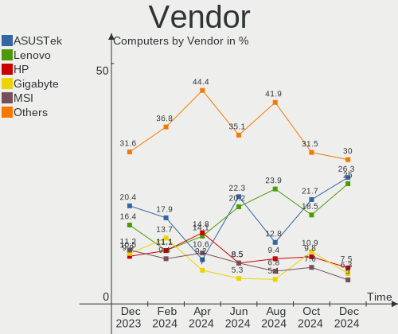
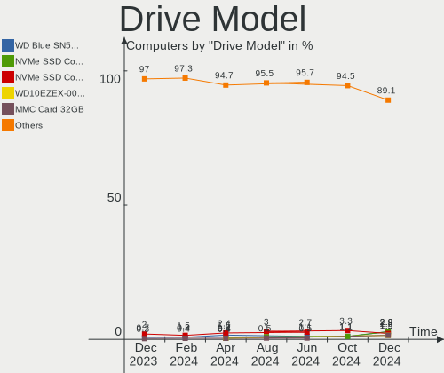
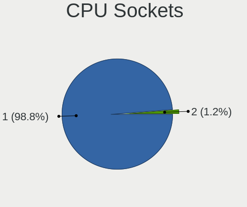
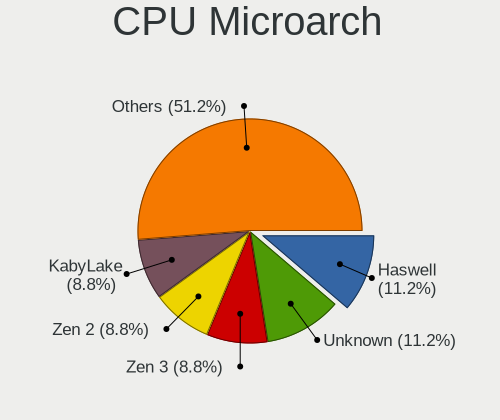
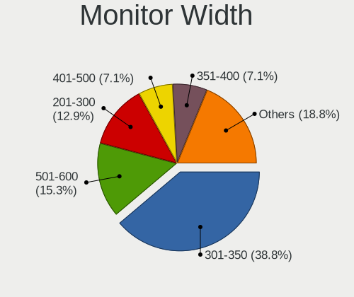

ArcoLinux - Hardware Trends
---------------------------

A project to identify most popular hardware characteristics and track their change
over time based on data collected by Linux users at https://Linux-Hardware.org.

Anyone can contribute to this report by the [hw-probe](https://github.com/linuxhw/hw-probe) tool:

    sudo -E hw-probe -all -upload

This is a report for all computer types. See also reports for [desktops](/Dist/ArcoLinux/Desktop/README.md) and [notebooks](/Dist/ArcoLinux/Notebook/README.md).

This report is for one last month. Overall report since the beginning of time: [TestCoverage](https://github.com/linuxhw/TestCoverage)

Period: Aug, 2022.

Contents
--------

* [ System ](#system)
  - [ OS                       ](#os)
  - [ OS Family                ](#os-family)
  - [ Kernel                   ](#kernel)
  - [ Kernel Family            ](#kernel-family)
  - [ Kernel Major Ver.        ](#kernel-major-ver)
  - [ Arch                     ](#arch)
  - [ DE                       ](#de)
  - [ Display Server           ](#display-server)
  - [ Display Manager          ](#display-manager)
  - [ OS Lang                  ](#os-lang)
  - [ Boot Mode                ](#boot-mode)
  - [ Filesystem               ](#filesystem)
  - [ Part. scheme             ](#part-scheme)
  - [ Dual Boot with Linux/BSD ](#dual-boot-with-linuxbsd)
  - [ Dual Boot (Win)          ](#dual-boot-win)

* [ Board ](#board)
  - [ Vendor                   ](#vendor)
  - [ Model                    ](#model)
  - [ Model Family             ](#model-family)
  - [ MFG Year                 ](#mfg-year)
  - [ Form Factor              ](#form-factor)
  - [ Secure Boot              ](#secure-boot)
  - [ Coreboot                 ](#coreboot)
  - [ RAM Size                 ](#ram-size)
  - [ RAM Used                 ](#ram-used)
  - [ Total Drives             ](#total-drives)
  - [ Has CD-ROM               ](#has-cd-rom)
  - [ Has Ethernet             ](#has-ethernet)
  - [ Has WiFi                 ](#has-wifi)
  - [ Has Bluetooth            ](#has-bluetooth)

* [ Location ](#location)
  - [ Country                  ](#country)
  - [ City                     ](#city)

* [ Drives ](#drives)
  - [ Drive Vendor             ](#drive-vendor)
  - [ Drive Model              ](#drive-model)
  - [ HDD Vendor               ](#hdd-vendor)
  - [ SSD Vendor               ](#ssd-vendor)
  - [ Drive Kind               ](#drive-kind)
  - [ Drive Connector          ](#drive-connector)
  - [ Drive Size               ](#drive-size)
  - [ Space Total              ](#space-total)
  - [ Space Used               ](#space-used)
  - [ Malfunc. Drives          ](#malfunc-drives)
  - [ Malfunc. Drive Vendor    ](#malfunc-drive-vendor)
  - [ Malfunc. HDD Vendor      ](#malfunc-hdd-vendor)
  - [ Malfunc. Drive Kind      ](#malfunc-drive-kind)
  - [ Failed Drives            ](#failed-drives)
  - [ Failed Drive Vendor      ](#failed-drive-vendor)
  - [ Drive Status             ](#drive-status)

* [ Storage controller ](#storage-controller)
  - [ Storage Vendor           ](#storage-vendor)
  - [ Storage Model            ](#storage-model)
  - [ Storage Kind             ](#storage-kind)

* [ Processor ](#processor)
  - [ CPU Vendor               ](#cpu-vendor)
  - [ CPU Model                ](#cpu-model)
  - [ CPU Model Family         ](#cpu-model-family)
  - [ CPU Cores                ](#cpu-cores)
  - [ CPU Sockets              ](#cpu-sockets)
  - [ CPU Threads              ](#cpu-threads)
  - [ CPU Op-Modes             ](#cpu-op-modes)
  - [ CPU Microcode            ](#cpu-microcode)
  - [ CPU Microarch            ](#cpu-microarch)

* [ Graphics ](#graphics)
  - [ GPU Vendor               ](#gpu-vendor)
  - [ GPU Model                ](#gpu-model)
  - [ GPU Combo                ](#gpu-combo)
  - [ GPU Driver               ](#gpu-driver)
  - [ GPU Memory               ](#gpu-memory)

* [ Monitor ](#monitor)
  - [ Monitor Vendor           ](#monitor-vendor)
  - [ Monitor Model            ](#monitor-model)
  - [ Monitor Resolution       ](#monitor-resolution)
  - [ Monitor Diagonal         ](#monitor-diagonal)
  - [ Monitor Width            ](#monitor-width)
  - [ Aspect Ratio             ](#aspect-ratio)
  - [ Monitor Area             ](#monitor-area)
  - [ Pixel Density            ](#pixel-density)
  - [ Multiple Monitors        ](#multiple-monitors)

* [ Network ](#network)
  - [ Net Controller Vendor    ](#net-controller-vendor)
  - [ Net Controller Model     ](#net-controller-model)
  - [ Wireless Vendor          ](#wireless-vendor)
  - [ Wireless Model           ](#wireless-model)
  - [ Ethernet Vendor          ](#ethernet-vendor)
  - [ Ethernet Model           ](#ethernet-model)
  - [ Net Controller Kind      ](#net-controller-kind)
  - [ Used Controller          ](#used-controller)
  - [ NICs                     ](#nics)
  - [ IPv6                     ](#ipv6)

* [ Bluetooth ](#bluetooth)
  - [ Bluetooth Vendor         ](#bluetooth-vendor)
  - [ Bluetooth Model          ](#bluetooth-model)

* [ Sound ](#sound)
  - [ Sound Vendor             ](#sound-vendor)
  - [ Sound Model              ](#sound-model)

* [ Memory ](#memory)
  - [ Memory Vendor            ](#memory-vendor)
  - [ Memory Model             ](#memory-model)
  - [ Memory Kind              ](#memory-kind)
  - [ Memory Form Factor       ](#memory-form-factor)
  - [ Memory Size              ](#memory-size)
  - [ Memory Speed             ](#memory-speed)

* [ Printers & scanners ](#printers--scanners)
  - [ Printer Vendor           ](#printer-vendor)
  - [ Printer Model            ](#printer-model)
  - [ Scanner Vendor           ](#scanner-vendor)
  - [ Scanner Model            ](#scanner-model)

* [ Camera ](#camera)
  - [ Camera Vendor            ](#camera-vendor)
  - [ Camera Model             ](#camera-model)

* [ Security ](#security)
  - [ Fingerprint Vendor       ](#fingerprint-vendor)
  - [ Fingerprint Model        ](#fingerprint-model)
  - [ Chipcard Vendor          ](#chipcard-vendor)
  - [ Chipcard Model           ](#chipcard-model)

* [ Unsupported ](#unsupported)
  - [ Unsupported Devices      ](#unsupported-devices)
  - [ Unsupported Device Types ](#unsupported-device-types)

System
------

OS
--

Installed operating systems

| Name              | Computers | Percent |
|-------------------|-----------|---------|
| ArcoLinux Rolling | 38        | 86.36%  |
| ArcoLinux         | 6         | 13.64%  |

OS Family
---------

OS without a version

| Name      | Computers | Percent |
|-----------|-----------|---------|
| ArcoLinux | 44        | 100%    |

Kernel
------

Version of the Linux kernel

| Version                      | Computers | Percent |
|------------------------------|-----------|---------|
| 5.18.16-arch1-1              | 10        | 22.73%  |
| 5.19.1-arch2-1               | 5         | 11.36%  |
| 5.19.2-arch1-1               | 4         | 9.09%   |
| 5.19.3-arch1-1               | 3         | 6.82%   |
| 5.19.4-arch1-1               | 2         | 4.55%   |
| 5.18.15-zen1-1-zen           | 2         | 4.55%   |
| 5.18.15-arch1-2              | 2         | 4.55%   |
| 5.18.15-arch1-1              | 2         | 4.55%   |
| 5.15.59-2-lts                | 2         | 4.55%   |
| 5.19.5-zen1-1-zen            | 1         | 2.27%   |
| 5.19.5-arch1-1               | 1         | 2.27%   |
| 5.19.2-arch1-2               | 1         | 2.27%   |
| 5.19.0-arch1-1               | 1         | 2.27%   |
| 5.18.7-arch1-1               | 1         | 2.27%   |
| 5.18.5-arch1-1               | 1         | 2.27%   |
| 5.18.3-arch1-1               | 1         | 2.27%   |
| 5.18.19-hardened1-2-hardened | 1         | 2.27%   |
| 5.18.16-zen1-1-zen           | 1         | 2.27%   |
| 5.15.63-1-lts                | 1         | 2.27%   |
| 5.15.60-1-lts                | 1         | 2.27%   |
| 5.15.55-2-lts                | 1         | 2.27%   |

Kernel Family
-------------

Linux kernel without a distro release

| Version | Computers | Percent |
|---------|-----------|---------|
| 5.18.16 | 11        | 25%     |
| 5.18.15 | 6         | 13.64%  |
| 5.19.2  | 5         | 11.36%  |
| 5.19.1  | 5         | 11.36%  |
| 5.19.3  | 3         | 6.82%   |
| 5.19.5  | 2         | 4.55%   |
| 5.19.4  | 2         | 4.55%   |
| 5.15.59 | 2         | 4.55%   |
| 5.19.0  | 1         | 2.27%   |
| 5.18.7  | 1         | 2.27%   |
| 5.18.5  | 1         | 2.27%   |
| 5.18.3  | 1         | 2.27%   |
| 5.18.19 | 1         | 2.27%   |
| 5.15.63 | 1         | 2.27%   |
| 5.15.60 | 1         | 2.27%   |
| 5.15.55 | 1         | 2.27%   |

Kernel Major Ver.
-----------------

Linux kernel major version

| Version | Computers | Percent |
|---------|-----------|---------|
| 5.18    | 21        | 47.73%  |
| 5.19    | 18        | 40.91%  |
| 5.15    | 5         | 11.36%  |

Arch
----

OS architecture (x86_64, i586, etc.)

| Name   | Computers | Percent |
|--------|-----------|---------|
| x86_64 | 44        | 100%    |

DE
--

Desktop Environment

| Name           | Computers | Percent |
|----------------|-----------|---------|
| XFCE           | 13        | 29.55%  |
| KDE5           | 13        | 29.55%  |
| qtile          | 4         | 9.09%   |
| GNOME          | 3         | 6.82%   |
| awesome        | 2         | 4.55%   |
| X-Cinnamon     | 1         | 2.27%   |
| LXQt           | 1         | 2.27%   |
| LeftWM         | 1         | 2.27%   |
| i3-with-shmlog | 1         | 2.27%   |
| i3             | 1         | 2.27%   |
| herbstluftwm   | 1         | 2.27%   |
| dwm            | 1         | 2.27%   |
| Deepin         | 1         | 2.27%   |
| bspwm          | 1         | 2.27%   |

Display Server
--------------

X11 or Wayland

| Name    | Computers | Percent |
|---------|-----------|---------|
| X11     | 39        | 88.64%  |
| Tty     | 3         | 6.82%   |
| Wayland | 2         | 4.55%   |

Display Manager
---------------

SDDM, LightDM, etc.

| Name    | Computers | Percent |
|---------|-----------|---------|
| SDDM    | 26        | 59.09%  |
| LightDM | 9         | 20.45%  |
| Unknown | 7         | 15.91%  |
| Ly      | 1         | 2.27%   |
| GDM     | 1         | 2.27%   |

OS Lang
-------

Language

| Lang  | Computers | Percent |
|-------|-----------|---------|
| en_US | 32        | 72.73%  |
| pt_BR | 2         | 4.55%   |
| fr_FR | 2         | 4.55%   |
| de_DE | 2         | 4.55%   |
| de_CH | 2         | 4.55%   |
| zh_CN | 1         | 2.27%   |
| th_TH | 1         | 2.27%   |
| es_PA | 1         | 2.27%   |
| es_ES | 1         | 2.27%   |

Boot Mode
---------

EFI or BIOS

| Mode | Computers | Percent |
|------|-----------|---------|
| EFI  | 29        | 65.91%  |
| BIOS | 15        | 34.09%  |

Filesystem
----------

Type of filesystem

| Type    | Computers | Percent |
|---------|-----------|---------|
| Ext4    | 32        | 72.73%  |
| Btrfs   | 10        | 22.73%  |
| Xfs     | 1         | 2.27%   |
| Overlay | 1         | 2.27%   |

Part. scheme
------------

Scheme of partitioning

| Type    | Computers | Percent |
|---------|-----------|---------|
| GPT     | 33        | 75%     |
| Unknown | 8         | 18.18%  |
| MBR     | 3         | 6.82%   |

Dual Boot with Linux/BSD
------------------------

Hosting more than one Linux/BSD

| Dual boot | Computers | Percent |
|-----------|-----------|---------|
| No        | 35        | 79.55%  |
| Yes       | 9         | 20.45%  |

Dual Boot (Win)
---------------

Hosting Linux and Windows

| Dual boot | Computers | Percent |
|-----------|-----------|---------|
| No        | 29        | 65.91%  |
| Yes       | 15        | 34.09%  |

Board
-----

Vendor
------

Motherboard manufacturer

| Name                | Computers | Percent |
|---------------------|-----------|---------|
| Gigabyte Technology | 8         | 18.18%  |
| Lenovo              | 6         | 13.64%  |
| ASUSTek Computer    | 6         | 13.64%  |
| Hewlett-Packard     | 5         | 11.36%  |
| Dell                | 5         | 11.36%  |
| MSI                 | 2         | 4.55%   |
| Chuwi               | 2         | 4.55%   |
| Acer                | 2         | 4.55%   |
| Xplore              | 1         | 2.27%   |
| Sony                | 1         | 2.27%   |
| Shuttle             | 1         | 2.27%   |
| Samsung Electronics | 1         | 2.27%   |
| Intel               | 1         | 2.27%   |
| Casper              | 1         | 2.27%   |
| ASRock              | 1         | 2.27%   |
| Unknown             | 1         | 2.27%   |

Model
-----

Motherboard model

| Name                                    | Computers | Percent |
|-----------------------------------------|-----------|---------|
| Xplore iX104C5                          | 1         | 2.27%   |
| Sony VPCF120FL                          | 1         | 2.27%   |
| Shuttle DS437                           | 1         | 2.27%   |
| Samsung 550XDA                          | 1         | 2.27%   |
| MSI MS-7C95                             | 1         | 2.27%   |
| MSI A320M-HDV R4.0                      | 1         | 2.27%   |
| Lenovo ThinkPad X240 20AL00BNRT         | 1         | 2.27%   |
| Lenovo ThinkPad T550 20CJS1MW00         | 1         | 2.27%   |
| Lenovo ThinkPad L14 Gen 1 20U6A008CD    | 1         | 2.27%   |
| Lenovo Legion 5 15IMH05H 82CF           | 1         | 2.27%   |
| Lenovo Legion 5 15ACH6 82JW             | 1         | 2.27%   |
| Lenovo IdeaPad S340-15API 81NC          | 1         | 2.27%   |
| Intel NUC7CJYH                          | 1         | 2.27%   |
| HP Z440 Workstation                     | 1         | 2.27%   |
| HP ProDesk 600 G4 DM (TAA)              | 1         | 2.27%   |
| HP ProBook 450 G1                       | 1         | 2.27%   |
| HP Pavilion Laptop 15-eh1xxx            | 1         | 2.27%   |
| HP EliteBook 8540p                      | 1         | 2.27%   |
| Gigabyte Z690 UD DDR4                   | 1         | 2.27%   |
| Gigabyte Z390 AORUS ELITE               | 1         | 2.27%   |
| Gigabyte H87-HD3                        | 1         | 2.27%   |
| Gigabyte F2A68HM-DS2                    | 1         | 2.27%   |
| Gigabyte B550M AORUS PRO                | 1         | 2.27%   |
| Gigabyte B450M H                        | 1         | 2.27%   |
| Gigabyte B450 AORUS M                   | 1         | 2.27%   |
| Gigabyte B365 M AORUS ELITE             | 1         | 2.27%   |
| Dell Vostro 3400                        | 1         | 2.27%   |
| Dell Precision WorkStation T3500        | 1         | 2.27%   |
| Dell OptiPlex 9010                      | 1         | 2.27%   |
| Dell Inspiron 5570                      | 1         | 2.27%   |
| Dell G7 7588                            | 1         | 2.27%   |
| Chuwi HeroBook Air                      | 1         | 2.27%   |
| Chuwi GemiBook Pro                      | 1         | 2.27%   |
| Casper C600 NOTEBOOK DISCRETE           | 1         | 2.27%   |
| ASUS Z170-A                             | 1         | 2.27%   |
| ASUS VivoBook_ASUS Laptop X505ZA_A505ZA | 1         | 2.27%   |
| ASUS TUF Gaming X570-PLUS               | 1         | 2.27%   |
| ASUS ROG Zephyrus G15 GA502IV_GA502IV   | 1         | 2.27%   |
| ASUS PRIME X570-P                       | 1         | 2.27%   |
| ASUS N61Jv                              | 1         | 2.27%   |
| ASRock B550M Pro4                       | 1         | 2.27%   |
| Acer Predator G3-710                    | 1         | 2.27%   |
| Acer Aspire E5-575G                     | 1         | 2.27%   |
| Unknown                                 | 1         | 2.27%   |

Model Family
------------

Motherboard model prefix

| Name                 | Computers | Percent |
|----------------------|-----------|---------|
| Lenovo ThinkPad      | 3         | 6.82%   |
| Lenovo Legion        | 2         | 4.55%   |
| Xplore iX104C5       | 1         | 2.27%   |
| Sony VPCF120FL       | 1         | 2.27%   |
| Shuttle DS437        | 1         | 2.27%   |
| Samsung 550XDA       | 1         | 2.27%   |
| MSI MS-7C95          | 1         | 2.27%   |
| MSI A320M-HDV        | 1         | 2.27%   |
| Lenovo IdeaPad       | 1         | 2.27%   |
| Intel NUC7CJYH       | 1         | 2.27%   |
| HP Z440              | 1         | 2.27%   |
| HP ProDesk           | 1         | 2.27%   |
| HP ProBook           | 1         | 2.27%   |
| HP Pavilion          | 1         | 2.27%   |
| HP EliteBook         | 1         | 2.27%   |
| Gigabyte Z690        | 1         | 2.27%   |
| Gigabyte Z390        | 1         | 2.27%   |
| Gigabyte H87-HD3     | 1         | 2.27%   |
| Gigabyte F2A68HM-DS2 | 1         | 2.27%   |
| Gigabyte B550M       | 1         | 2.27%   |
| Gigabyte B450M       | 1         | 2.27%   |
| Gigabyte B450        | 1         | 2.27%   |
| Gigabyte B365        | 1         | 2.27%   |
| Dell Vostro          | 1         | 2.27%   |
| Dell Precision       | 1         | 2.27%   |
| Dell OptiPlex        | 1         | 2.27%   |
| Dell Inspiron        | 1         | 2.27%   |
| Dell G7              | 1         | 2.27%   |
| Chuwi HeroBook       | 1         | 2.27%   |
| Chuwi GemiBook       | 1         | 2.27%   |
| Casper C600          | 1         | 2.27%   |
| ASUS Z170-A          | 1         | 2.27%   |
| ASUS VivoBook        | 1         | 2.27%   |
| ASUS TUF             | 1         | 2.27%   |
| ASUS ROG             | 1         | 2.27%   |
| ASUS PRIME           | 1         | 2.27%   |
| ASUS N61Jv           | 1         | 2.27%   |
| ASRock B550M         | 1         | 2.27%   |
| Acer Predator        | 1         | 2.27%   |
| Acer Aspire          | 1         | 2.27%   |
| Unknown              | 1         | 2.27%   |

MFG Year
--------

Motherboard manufacture year

| Year | Computers | Percent |
|------|-----------|---------|
| 2019 | 9         | 20.45%  |
| 2020 | 7         | 15.91%  |
| 2021 | 5         | 11.36%  |
| 2015 | 4         | 9.09%   |
| 2013 | 4         | 9.09%   |
| 2010 | 4         | 9.09%   |
| 2018 | 3         | 6.82%   |
| 2017 | 2         | 4.55%   |
| 2012 | 2         | 4.55%   |
| 2022 | 1         | 2.27%   |
| 2016 | 1         | 2.27%   |
| 2014 | 1         | 2.27%   |
| 2011 | 1         | 2.27%   |

Form Factor
-----------

Physical design of the computer

| Name     | Computers | Percent |
|----------|-----------|---------|
| Notebook | 24        | 54.55%  |
| Desktop  | 19        | 43.18%  |
| Mini pc  | 1         | 2.27%   |

Secure Boot
-----------

Enabled or disabled

| State    | Computers | Percent |
|----------|-----------|---------|
| Disabled | 44        | 100%    |

Coreboot
--------

Have coreboot on board

| Used | Computers | Percent |
|------|-----------|---------|
| No   | 44        | 100%    |

RAM Size
--------

Total RAM memory

| Size in GB  | Computers | Percent |
|-------------|-----------|---------|
| 4.01-8.0    | 12        | 27.27%  |
| 32.01-64.0  | 9         | 20.45%  |
| 16.01-24.0  | 9         | 20.45%  |
| 8.01-16.0   | 8         | 18.18%  |
| 3.01-4.0    | 4         | 9.09%   |
| 24.01-32.0  | 1         | 2.27%   |
| 64.01-256.0 | 1         | 2.27%   |

RAM Used
--------

Used RAM memory

| Used GB   | Computers | Percent |
|-----------|-----------|---------|
| 2.01-3.0  | 12        | 27.27%  |
| 1.01-2.0  | 12        | 27.27%  |
| 3.01-4.0  | 8         | 18.18%  |
| 4.01-8.0  | 7         | 15.91%  |
| 0.51-1.0  | 3         | 6.82%   |
| 8.01-16.0 | 2         | 4.55%   |

Total Drives
------------

Number of drives on board

| Drives | Computers | Percent |
|--------|-----------|---------|
| 1      | 22        | 50%     |
| 2      | 12        | 27.27%  |
| 3      | 5         | 11.36%  |
| 5      | 3         | 6.82%   |
| 4      | 2         | 4.55%   |

Has CD-ROM
----------

Has CD-ROM on board

| Presented | Computers | Percent |
|-----------|-----------|---------|
| No        | 32        | 72.73%  |
| Yes       | 12        | 27.27%  |

Has Ethernet
------------

Has Ethernet on board

| Presented | Computers | Percent |
|-----------|-----------|---------|
| Yes       | 39        | 88.64%  |
| No        | 5         | 11.36%  |

Has WiFi
--------

Has WiFi module

| Presented | Computers | Percent |
|-----------|-----------|---------|
| Yes       | 31        | 70.45%  |
| No        | 13        | 29.55%  |

Has Bluetooth
-------------

Has Bluetooth module

| Presented | Computers | Percent |
|-----------|-----------|---------|
| Yes       | 28        | 63.64%  |
| No        | 16        | 36.36%  |

Location
--------

Country
-------

Geographic location (country)

| Country     | Computers | Percent |
|-------------|-----------|---------|
| USA         | 11        | 25%     |
| Germany     | 4         | 9.09%   |
| Brazil      | 4         | 9.09%   |
| Switzerland | 3         | 6.82%   |
| Russia      | 2         | 4.55%   |
| Nepal       | 2         | 4.55%   |
| France      | 2         | 4.55%   |
| Turkey      | 1         | 2.27%   |
| Thailand    | 1         | 2.27%   |
| Spain       | 1         | 2.27%   |
| Slovakia    | 1         | 2.27%   |
| Romania     | 1         | 2.27%   |
| Portugal    | 1         | 2.27%   |
| Panama      | 1         | 2.27%   |
| Netherlands | 1         | 2.27%   |
| Mexico      | 1         | 2.27%   |
| Latvia      | 1         | 2.27%   |
| Kuwait      | 1         | 2.27%   |
| Japan       | 1         | 2.27%   |
| Iran        | 1         | 2.27%   |
| India       | 1         | 2.27%   |
| Hong Kong   | 1         | 2.27%   |
| Belgium     | 1         | 2.27%   |

City
----

Geographic location (city)

| City                 | Computers | Percent |
|----------------------|-----------|---------|
| Houston              | 3         | 6.82%   |
| Sao Luís            | 2         | 4.55%   |
| Zurich               | 1         | 2.27%   |
| Verkhnyaya Pyshma    | 1         | 2.27%   |
| Vendrennes           | 1         | 2.27%   |
| Valley Village       | 1         | 2.27%   |
| Trussville           | 1         | 2.27%   |
| Tehran               | 1         | 2.27%   |
| Seville              | 1         | 2.27%   |
| Schaffhausen         | 1         | 2.27%   |
| Riga                 | 1         | 2.27%   |
| Povoa de Santa Iria  | 1         | 2.27%   |
| Portsmouth           | 1         | 2.27%   |
| Panama City          | 1         | 2.27%   |
| Overpelt             | 1         | 2.27%   |
| Neustadt in Holstein | 1         | 2.27%   |
| Mumbai               | 1         | 2.27%   |
| Moscow               | 1         | 2.27%   |
| Mérida              | 1         | 2.27%   |
| Lohnberg             | 1         | 2.27%   |
| Kuwait City          | 1         | 2.27%   |
| Kathmandu            | 1         | 2.27%   |
| Juazeiro             | 1         | 2.27%   |
| Hurst                | 1         | 2.27%   |
| Huntington Station   | 1         | 2.27%   |
| Heiwajima            | 1         | 2.27%   |
| Frankfurt am Main    | 1         | 2.27%   |
| Etzwil               | 1         | 2.27%   |
| Colfax               | 1         | 2.27%   |
| Chatsworth           | 1         | 2.27%   |
| Central              | 1         | 2.27%   |
| Carpentras           | 1         | 2.27%   |
| Čadca               | 1         | 2.27%   |
| Bursa                | 1         | 2.27%   |
| Brodosqui            | 1         | 2.27%   |
| Boston               | 1         | 2.27%   |
| Bhaktapur            | 1         | 2.27%   |
| Berlin               | 1         | 2.27%   |
| Bangkok              | 1         | 2.27%   |
| Bacau                | 1         | 2.27%   |
| Amsterdam            | 1         | 2.27%   |

Drives
------

Drive Vendor
------------

Hard drive vendors

| Vendor                      | Computers | Drives | Percent |
|-----------------------------|-----------|--------|---------|
| WDC                         | 13        | 13     | 17.33%  |
| Samsung Electronics         | 11        | 18     | 14.67%  |
| Seagate                     | 9         | 10     | 12%     |
| Sandisk                     | 6         | 6      | 8%      |
| Intel                       | 4         | 4      | 5.33%   |
| Crucial                     | 4         | 6      | 5.33%   |
| Toshiba                     | 3         | 3      | 4%      |
| Kingston                    | 3         | 3      | 4%      |
| Unknown                     | 2         | 2      | 2.67%   |
| SK hynix                    | 2         | 2      | 2.67%   |
| Micron/Crucial Technology   | 2         | 2      | 2.67%   |
| MAXIO Technology (Hangzhou) | 2         | 2      | 2.67%   |
| ADATA Technology            | 2         | 2      | 2.67%   |
| A-DATA Technology           | 2         | 2      | 2.67%   |
| USB3.0                      | 1         | 1      | 1.33%   |
| Team                        | 1         | 1      | 1.33%   |
| Micron Technology           | 1         | 1      | 1.33%   |
| Kingston Technology Company | 1         | 1      | 1.33%   |
| Kingmax                     | 1         | 1      | 1.33%   |
| Intenso                     | 1         | 1      | 1.33%   |
| HGST                        | 1         | 1      | 1.33%   |
| BIWIN                       | 1         | 1      | 1.33%   |
| ASMT                        | 1         | 1      | 1.33%   |
| Apple                       | 1         | 1      | 1.33%   |

Drive Model
-----------

Hard drive models

| Model                                               | Computers | Percent |
|-----------------------------------------------------|-----------|---------|
| Samsung NVMe SSD Controller SM981/PM981/PM983 1TB   | 4         | 4.76%   |
| WDC WDS240G2G0A-00JH30 240GB SSD                    | 2         | 2.38%   |
| WDC WD20EZRX-00DC0B0 2TB                            | 2         | 2.38%   |
| Samsung SSD 850 EVO 500GB                           | 2         | 2.38%   |
| Crucial CT1000MX500SSD1 1TB                         | 2         | 2.38%   |
| WDC WDS120G2G0A-00JH30 120GB SSD                    | 1         | 1.19%   |
| WDC WD5000AAKX-753CA1 500GB                         | 1         | 1.19%   |
| WDC WD5000AAKX-08U6AA0 500GB                        | 1         | 1.19%   |
| WDC WD2500BEKT-60PVMT0 250GB                        | 1         | 1.19%   |
| WDC WD20EZRZ-00Z5HB0 2TB                            | 1         | 1.19%   |
| WDC WD20EFZX-68AWUN0 2TB                            | 1         | 1.19%   |
| WDC WD10SPZX-75Z10T2 1TB                            | 1         | 1.19%   |
| WDC WD10EFRX-68JCSN0 1TB                            | 1         | 1.19%   |
| WDC PC SN520 SDAPMUW-256G-1101 256GB                | 1         | 1.19%   |
| USB3.0 Super Speed 128GB                            | 1         | 1.19%   |
| Unknown SD/MMC/MS PRO 128GB                         | 1         | 1.19%   |
| Unknown MMC Card  64GB                              | 1         | 1.19%   |
| Toshiba THNSNH128GMCT 128GB SSD                     | 1         | 1.19%   |
| Toshiba MQ01ABF050M 500GB                           | 1         | 1.19%   |
| Toshiba DT01ACA200 2TB                              | 1         | 1.19%   |
| Team TM8PS7256G 256GB SSD                           | 1         | 1.19%   |
| SK hynix SKHynix_HFS512GDE9X084N 512GB              | 1         | 1.19%   |
| SK hynix SHGP31-1000GM 1TB                          | 1         | 1.19%   |
| Seagate ST8000DM004-2CX188 8TB                      | 1         | 1.19%   |
| Seagate ST4000DM004-2CV104 4TB                      | 1         | 1.19%   |
| Seagate ST3500413AS 500GB                           | 1         | 1.19%   |
| Seagate ST3250310AS 250GB                           | 1         | 1.19%   |
| Seagate ST2000DX002-2DV164 2TB                      | 1         | 1.19%   |
| Seagate ST2000DM006-2DM164 2TB                      | 1         | 1.19%   |
| Seagate ST1000LM049-2GH172 1TB                      | 1         | 1.19%   |
| Seagate ST1000LM035-1RK172 1TB                      | 1         | 1.19%   |
| Seagate Expansion 500GB                             | 1         | 1.19%   |
| Seagate Basic 2TB                                   | 1         | 1.19%   |
| SanDisk X600 M.2 2280 SATA 128GB SSD                | 1         | 1.19%   |
| Sandisk WD Blue SN550 NVMe SSD 256GB                | 1         | 1.19%   |
| SanDisk SSD U110 16GB                               | 1         | 1.19%   |
| SanDisk SSD PLUS 240GB                              | 1         | 1.19%   |
| SanDisk SSD G5 BICS4 500GB                          | 1         | 1.19%   |
| SanDisk SD9SN8W512G1102 512GB SSD                   | 1         | 1.19%   |
| Samsung SSD PM830 2.5 7mm 128GB                     | 1         | 1.19%   |
| Samsung SSD 980 1TB                                 | 1         | 1.19%   |
| Samsung SSD 870 QVO 1TB                             | 1         | 1.19%   |
| Samsung SSD 860 EVO 500GB                           | 1         | 1.19%   |
| Samsung SSD 850 EVO 250GB                           | 1         | 1.19%   |
| Samsung SSD 840 EVO 250GB                           | 1         | 1.19%   |
| Samsung NVMe SSD Drive 256GB                        | 1         | 1.19%   |
| Samsung NVMe SSD Controller SM961/PM961/SM963 256GB | 1         | 1.19%   |
| Samsung NVMe SSD Controller PM9A1/PM9A3/980PRO 1TB  | 1         | 1.19%   |
| Samsung MZVLB512HBJQ-000L7 512GB                    | 1         | 1.19%   |
| Samsung MZHPU256HCGL-000H1 256GB SSD                | 1         | 1.19%   |
| Samsung MZALQ128HBHQ-000L2 128GB                    | 1         | 1.19%   |
| Micron/Crucial CT1000P5SSD8 1TB                     | 1         | 1.19%   |
| Micron/Crucial CT1000P1SSD8 1TB                     | 1         | 1.19%   |
| Micron MTFDDAK256MAM-1K1 256GB SSD                  | 1         | 1.19%   |
| MAXIO (Hangzhou) NVMe SSD Controller MAP1202 1TB    | 1         | 1.19%   |
| MAXIO (Hangzhou) NVMe SSD Controller MAP1001 512GB  | 1         | 1.19%   |
| Kingston Company U-SNS8154P3 NVMe SSD 256GB         | 1         | 1.19%   |
| Kingston SA400S37240G 240GB SSD                     | 1         | 1.19%   |
| Kingston SA400S371TB SSD                            | 1         | 1.19%   |
| Kingston SA400S37120G 120GB SSD                     | 1         | 1.19%   |

HDD Vendor
----------

Hard disk drive vendors

| Vendor  | Computers | Drives | Percent |
|---------|-----------|--------|---------|
| WDC     | 9         | 9      | 37.5%   |
| Seagate | 8         | 9      | 33.33%  |
| Toshiba | 2         | 2      | 8.33%   |
| USB3.0  | 1         | 1      | 4.17%   |
| Unknown | 1         | 1      | 4.17%   |
| HGST    | 1         | 1      | 4.17%   |
| ASMT    | 1         | 1      | 4.17%   |
| Apple   | 1         | 1      | 4.17%   |

SSD Vendor
----------

Solid state drive vendors

| Vendor              | Computers | Drives | Percent |
|---------------------|-----------|--------|---------|
| SanDisk             | 5         | 5      | 19.23%  |
| Samsung Electronics | 4         | 8      | 15.38%  |
| Crucial             | 4         | 6      | 15.38%  |
| WDC                 | 3         | 3      | 11.54%  |
| Kingston            | 3         | 3      | 11.54%  |
| Toshiba             | 1         | 1      | 3.85%   |
| Team                | 1         | 1      | 3.85%   |
| Micron Technology   | 1         | 1      | 3.85%   |
| Kingmax             | 1         | 1      | 3.85%   |
| Intenso             | 1         | 1      | 3.85%   |
| BIWIN               | 1         | 1      | 3.85%   |
| A-DATA Technology   | 1         | 1      | 3.85%   |

Drive Kind
----------

HDD or SSD

| Kind    | Computers | Drives | Percent |
|---------|-----------|--------|---------|
| SSD     | 24        | 32     | 35.29%  |
| NVMe    | 21        | 26     | 30.88%  |
| HDD     | 21        | 25     | 30.88%  |
| MMC     | 1         | 1      | 1.47%   |
| Unknown | 1         | 1      | 1.47%   |

Drive Connector
---------------

SATA, SAS, NVMe, etc.

| Type | Computers | Drives | Percent |
|------|-----------|--------|---------|
| SATA | 33        | 53     | 55%     |
| NVMe | 21        | 26     | 35%     |
| SAS  | 5         | 5      | 8.33%   |
| MMC  | 1         | 1      | 1.67%   |

Drive Size
----------

Size of hard drive

| Size in TB | Computers | Drives | Percent |
|------------|-----------|--------|---------|
| 0.01-0.5   | 24        | 34     | 53.33%  |
| 0.51-1.0   | 11        | 13     | 24.44%  |
| 1.01-2.0   | 8         | 8      | 17.78%  |
| 3.01-4.0   | 1         | 1      | 2.22%   |
| 4.01-10.0  | 1         | 1      | 2.22%   |

Space Total
-----------

Amount of disk space available on the file system

| Size in GB     | Computers | Percent |
|----------------|-----------|---------|
| 251-500        | 13        | 29.55%  |
| 101-250        | 11        | 25%     |
| 501-1000       | 6         | 13.64%  |
| More than 3000 | 4         | 9.09%   |
| 1001-2000      | 4         | 9.09%   |
| 2001-3000      | 2         | 4.55%   |
| Unknown        | 2         | 4.55%   |
| 1-20           | 1         | 2.27%   |
| 51-100         | 1         | 2.27%   |

Space Used
----------

Amount of used disk space

| Used GB        | Computers | Percent |
|----------------|-----------|---------|
| 1-20           | 11        | 25%     |
| 101-250        | 9         | 20.45%  |
| 51-100         | 7         | 15.91%  |
| 21-50          | 6         | 13.64%  |
| 251-500        | 5         | 11.36%  |
| 1001-2000      | 3         | 6.82%   |
| Unknown        | 2         | 4.55%   |
| More than 3000 | 1         | 2.27%   |

Malfunc. Drives
---------------

Drive models with a malfunction

| Model                        | Computers | Drives | Percent |
|------------------------------|-----------|--------|---------|
| WDC WD5000AAKX-753CA1 500GB  | 1         | 1      | 16.67%  |
| WDC WD2500BEKT-60PVMT0 250GB | 1         | 1      | 16.67%  |
| WDC WD20EZRX-00DC0B0 2TB     | 1         | 1      | 16.67%  |
| USB3.0 Super Speed 128GB     | 1         | 1      | 16.67%  |
| Intel SSD 600P Series 512GB  | 1         | 1      | 16.67%  |
| HGST HTS541075A9E680 752GB   | 1         | 1      | 16.67%  |

Malfunc. Drive Vendor
---------------------

Vendors of faulty drives

| Vendor | Computers | Drives | Percent |
|--------|-----------|--------|---------|
| WDC    | 3         | 3      | 50%     |
| USB3.0 | 1         | 1      | 16.67%  |
| Intel  | 1         | 1      | 16.67%  |
| HGST   | 1         | 1      | 16.67%  |

Malfunc. HDD Vendor
-------------------

Vendors of faulty HDD drives

| Vendor | Computers | Drives | Percent |
|--------|-----------|--------|---------|
| WDC    | 3         | 3      | 60%     |
| USB3.0 | 1         | 1      | 20%     |
| HGST   | 1         | 1      | 20%     |

Malfunc. Drive Kind
-------------------

Kinds of faulty drives

| Kind | Computers | Drives | Percent |
|------|-----------|--------|---------|
| HDD  | 5         | 5      | 83.33%  |
| NVMe | 1         | 1      | 16.67%  |

Failed Drives
-------------

Failed drive models

Zero info for selected period =(

Failed Drive Vendor
-------------------

Failed drive vendors

Zero info for selected period =(

Drive Status
------------

Number of failed and malfunc. drives

| Status   | Computers | Drives | Percent |
|----------|-----------|--------|---------|
| Works    | 34        | 61     | 64.15%  |
| Detected | 13        | 18     | 24.53%  |
| Malfunc  | 6         | 6      | 11.32%  |

Storage controller
------------------

Storage Vendor
--------------

Storage controller vendors

| Vendor                      | Computers | Percent |
|-----------------------------|-----------|---------|
| Intel                       | 32        | 47.76%  |
| AMD                         | 13        | 19.4%   |
| Samsung Electronics         | 10        | 14.93%  |
| SK hynix                    | 2         | 2.99%   |
| SanDisk                     | 2         | 2.99%   |
| Micron/Crucial Technology   | 2         | 2.99%   |
| MAXIO Technology (Hangzhou) | 2         | 2.99%   |
| ADATA Technology            | 2         | 2.99%   |
| LSI Logic / Symbios Logic   | 1         | 1.49%   |
| Kingston Technology Company | 1         | 1.49%   |

Storage Model
-------------

Storage controller models

| Model                                                                          | Computers | Percent |
|--------------------------------------------------------------------------------|-----------|---------|
| AMD FCH SATA Controller [AHCI mode]                                            | 7         | 9.86%   |
| Samsung NVMe SSD Controller SM981/PM981/PM983                                  | 5         | 7.04%   |
| Intel SATA Controller [RAID mode]                                              | 4         | 5.63%   |
| Samsung NVMe SSD Controller 980                                                | 3         | 4.23%   |
| Intel 5 Series/3400 Series Chipset 6 port SATA AHCI Controller                 | 3         | 4.23%   |
| AMD 500 Series Chipset SATA Controller                                         | 3         | 4.23%   |
| SK hynix Gold P31 SSD                                                          | 2         | 2.82%   |
| Intel Tiger Lake-LP SATA Controller                                            | 2         | 2.82%   |
| Intel Sunrise Point-LP SATA Controller [AHCI mode]                             | 2         | 2.82%   |
| Intel Q170/Q150/B150/H170/H110/Z170/CM236 Chipset SATA Controller [AHCI Mode]  | 2         | 2.82%   |
| Intel Non-Volatile memory controller                                           | 2         | 2.82%   |
| Intel Celeron/Pentium Silver Processor SATA Controller                         | 2         | 2.82%   |
| Intel 82801 Mobile SATA Controller [RAID mode]                                 | 2         | 2.82%   |
| Intel 8 Series/C220 Series Chipset Family 6-port SATA Controller 1 [AHCI mode] | 2         | 2.82%   |
| AMD 400 Series Chipset SATA Controller                                         | 2         | 2.82%   |
| SanDisk WD Blue SN550 NVMe SSD                                                 | 1         | 1.41%   |
| SanDisk PC SN520 NVMe SSD                                                      | 1         | 1.41%   |
| Samsung XP941 PCIe SSD                                                         | 1         | 1.41%   |
| Samsung NVMe SSD Controller SM961/PM961/SM963                                  | 1         | 1.41%   |
| Samsung NVMe SSD Controller PM9A1/PM9A3/980PRO                                 | 1         | 1.41%   |
| Micron/Crucial NVMe Controller                                                 | 1         | 1.41%   |
| Micron/Crucial Non-Volatile memory controller                                  | 1         | 1.41%   |
| MAXIO (Hangzhou) NVMe SSD Controller MAP1202                                   | 1         | 1.41%   |
| MAXIO (Hangzhou) NVMe SSD Controller MAP1001                                   | 1         | 1.41%   |
| LSI Logic / Symbios Logic SAS1068E PCI-Express Fusion-MPT SAS                  | 1         | 1.41%   |
| Kingston Company U-SNS8154P3 NVMe SSD                                          | 1         | 1.41%   |
| Intel Wildcat Point-LP SATA Controller [AHCI Mode]                             | 1         | 1.41%   |
| Intel SSD 660P Series                                                          | 1         | 1.41%   |
| Intel SSD 600P Series                                                          | 1         | 1.41%   |
| Intel Jasper Lake SATA AHCI Controller                                         | 1         | 1.41%   |
| Intel Celeron N3350/Pentium N4200/Atom E3900 Series SATA AHCI Controller       | 1         | 1.41%   |
| Intel Cannon Lake PCH SATA AHCI Controller                                     | 1         | 1.41%   |
| Intel C610/X99 series chipset sSATA Controller [AHCI mode]                     | 1         | 1.41%   |
| Intel C610/X99 series chipset 6-Port SATA Controller [AHCI mode]               | 1         | 1.41%   |
| Intel Alder Lake-S PCH SATA Controller [AHCI Mode]                             | 1         | 1.41%   |
| Intel 8 Series SATA Controller 1 [AHCI mode]                                   | 1         | 1.41%   |
| Intel 7 Series Chipset Family 6-port SATA Controller [AHCI mode]               | 1         | 1.41%   |
| Intel 5 Series/3400 Series Chipset 4 port SATA AHCI Controller                 | 1         | 1.41%   |
| Intel 400 Series Chipset Family SATA AHCI Controller                           | 1         | 1.41%   |
| AMD FCH SATA Controller [IDE mode]                                             | 1         | 1.41%   |
| AMD FCH SATA Controller D                                                      | 1         | 1.41%   |
| ADATA XPG SX8200 Pro PCIe Gen3x4 M.2 2280 Solid State Drive                    | 1         | 1.41%   |
| ADATA Non-Volatile memory controller                                           | 1         | 1.41%   |

Storage Kind
------------

Kind of storage controller (IDE, SATA, NVMe, SAS, ...)

| Kind | Computers | Percent |
|------|-----------|---------|
| SATA | 36        | 56.25%  |
| NVMe | 21        | 32.81%  |
| RAID | 6         | 9.38%   |
| SCSI | 1         | 1.56%   |

Processor
---------

CPU Vendor
----------

Processor vendors

| Vendor | Computers | Percent |
|--------|-----------|---------|
| Intel  | 29        | 65.91%  |
| AMD    | 15        | 34.09%  |

CPU Model
---------

Processor models

| Model                                          | Computers | Percent |
|------------------------------------------------|-----------|---------|
| AMD Ryzen 7 5800X 8-Core Processor             | 3         | 6.82%   |
| AMD Ryzen 5 3600 6-Core Processor              | 3         | 6.82%   |
| Intel Xeon CPU W3550 @ 3.07GHz                 | 1         | 2.27%   |
| Intel Xeon CPU E5-1620 v3 @ 3.50GHz            | 1         | 2.27%   |
| Intel Xeon CPU E3-1240 v3 @ 3.40GHz            | 1         | 2.27%   |
| Intel Core i7-8750H CPU @ 2.20GHz              | 1         | 2.27%   |
| Intel Core i7-8700T CPU @ 2.40GHz              | 1         | 2.27%   |
| Intel Core i7-7700 CPU @ 3.60GHz               | 1         | 2.27%   |
| Intel Core i7-7500U CPU @ 2.70GHz              | 1         | 2.27%   |
| Intel Core i7-6700K CPU @ 4.00GHz              | 1         | 2.27%   |
| Intel Core i7-5600U CPU @ 2.60GHz              | 1         | 2.27%   |
| Intel Core i7-4600U CPU @ 2.10GHz              | 1         | 2.27%   |
| Intel Core i7-3770 CPU @ 3.40GHz               | 1         | 2.27%   |
| Intel Core i7-10750H CPU @ 2.60GHz             | 1         | 2.27%   |
| Intel Core i7 CPU U 620 @ 1.07GHz              | 1         | 2.27%   |
| Intel Core i7 CPU Q 740 @ 1.73GHz              | 1         | 2.27%   |
| Intel Core i5-9600K CPU @ 3.70GHz              | 1         | 2.27%   |
| Intel Core i5-8250U CPU @ 1.60GHz              | 1         | 2.27%   |
| Intel Core i5-4200M CPU @ 2.50GHz              | 1         | 2.27%   |
| Intel Core i5 CPU M 540 @ 2.53GHz              | 1         | 2.27%   |
| Intel Core i5 CPU M 450 @ 2.40GHz              | 1         | 2.27%   |
| Intel Core i3-9100 CPU @ 3.60GHz               | 1         | 2.27%   |
| Intel Core i3-7100U CPU @ 2.40GHz              | 1         | 2.27%   |
| Intel Celeron N5100 @ 1.10GHz                  | 1         | 2.27%   |
| Intel Celeron N4020 CPU @ 1.10GHz              | 1         | 2.27%   |
| Intel Celeron J4005 CPU @ 2.00GHz              | 1         | 2.27%   |
| Intel Celeron CPU N3450 @ 1.10GHz              | 1         | 2.27%   |
| Intel Celeron CPU 1037U @ 1.80GHz              | 1         | 2.27%   |
| Intel 12th Gen Core i5-12400                   | 1         | 2.27%   |
| Intel 11th Gen Core i7-1165G7 @ 2.80GHz        | 1         | 2.27%   |
| Intel 11th Gen Core i5-1135G7 @ 2.40GHz        | 1         | 2.27%   |
| AMD Ryzen 9 4900HS with Radeon Graphics        | 1         | 2.27%   |
| AMD Ryzen 7 PRO 4750U with Radeon Graphics     | 1         | 2.27%   |
| AMD Ryzen 7 5800H with Radeon Graphics         | 1         | 2.27%   |
| AMD Ryzen 7 3700X 8-Core Processor             | 1         | 2.27%   |
| AMD Ryzen 7 3700U with Radeon Vega Mobile Gfx  | 1         | 2.27%   |
| AMD Ryzen 5 5600G with Radeon Graphics         | 1         | 2.27%   |
| AMD Ryzen 5 5500U with Radeon Graphics         | 1         | 2.27%   |
| AMD Ryzen 5 2500U with Radeon Vega Mobile Gfx  | 1         | 2.27%   |
| AMD A10-7800 Radeon R7, 12 Compute Cores 4C+8G | 1         | 2.27%   |

CPU Model Family
----------------

Processor model prefix

| Model           | Computers | Percent |
|-----------------|-----------|---------|
| Intel Core i7   | 11        | 25%     |
| AMD Ryzen 7     | 6         | 13.64%  |
| AMD Ryzen 5     | 6         | 13.64%  |
| Intel Core i5   | 5         | 11.36%  |
| Intel Celeron   | 5         | 11.36%  |
| Other           | 3         | 6.82%   |
| Intel Xeon      | 3         | 6.82%   |
| Intel Core i3   | 2         | 4.55%   |
| AMD Ryzen 9     | 1         | 2.27%   |
| AMD Ryzen 7 PRO | 1         | 2.27%   |
| AMD A10         | 1         | 2.27%   |

CPU Cores
---------

Number of processor cores

| Number | Computers | Percent |
|--------|-----------|---------|
| 4      | 15        | 34.09%  |
| 2      | 12        | 27.27%  |
| 6      | 10        | 22.73%  |
| 8      | 7         | 15.91%  |

CPU Sockets
-----------

Number of sockets

| Number | Computers | Percent |
|--------|-----------|---------|
| 1      | 44        | 100%    |

CPU Threads
-----------

Threads per core (Hyper-Threading)

| Number | Computers | Percent |
|--------|-----------|---------|
| 2      | 35        | 79.55%  |
| 1      | 9         | 20.45%  |

CPU Op-Modes
------------

CPU Operation Modes (32-bit, 64-bit)

| Op mode        | Computers | Percent |
|----------------|-----------|---------|
| 32-bit, 64-bit | 44        | 100%    |

CPU Microcode
-------------

Microcode number

| Number     | Computers | Percent |
|------------|-----------|---------|
| Unknown    | 11        | 25%     |
| 0x08701021 | 4         | 9.09%   |
| 0x906ea    | 2         | 4.55%   |
| 0x20655    | 2         | 4.55%   |
| 0x0a201016 | 2         | 4.55%   |
| 0xa0652    | 1         | 2.27%   |
| 0x906ec    | 1         | 2.27%   |
| 0x906eb    | 1         | 2.27%   |
| 0x906e9    | 1         | 2.27%   |
| 0x906c0    | 1         | 2.27%   |
| 0x90672    | 1         | 2.27%   |
| 0x806e9    | 1         | 2.27%   |
| 0x806c1    | 1         | 2.27%   |
| 0x706a8    | 1         | 2.27%   |
| 0x706a1    | 1         | 2.27%   |
| 0x506e3    | 1         | 2.27%   |
| 0x506c9    | 1         | 2.27%   |
| 0x306f2    | 1         | 2.27%   |
| 0x306d4    | 1         | 2.27%   |
| 0x306c3    | 1         | 2.27%   |
| 0x306a9    | 1         | 2.27%   |
| 0x106e5    | 1         | 2.27%   |
| 0x0a50000d | 1         | 2.27%   |
| 0x0a20120a | 1         | 2.27%   |
| 0x08600106 | 1         | 2.27%   |
| 0x08600104 | 1         | 2.27%   |
| 0x08108102 | 1         | 2.27%   |
| 0x08101007 | 1         | 2.27%   |

CPU Microarch
-------------

Microarchitecture

| Name             | Computers | Percent |
|------------------|-----------|---------|
| KabyLake         | 8         | 18.18%  |
| Zen 2            | 6         | 13.64%  |
| Zen 3            | 5         | 11.36%  |
| Haswell          | 4         | 9.09%   |
| Westmere         | 3         | 6.82%   |
| TigerLake        | 2         | 4.55%   |
| Nehalem          | 2         | 4.55%   |
| IvyBridge        | 2         | 4.55%   |
| Goldmont plus    | 2         | 4.55%   |
| Zen+             | 1         | 2.27%   |
| Zen              | 1         | 2.27%   |
| Tremont          | 1         | 2.27%   |
| Steamroller      | 1         | 2.27%   |
| Skylake          | 1         | 2.27%   |
| Goldmont         | 1         | 2.27%   |
| CometLake        | 1         | 2.27%   |
| Broadwell        | 1         | 2.27%   |
| Alderlake Hybrid | 1         | 2.27%   |
| Unknown          | 1         | 2.27%   |

Graphics
--------

GPU Vendor
----------

Vendors of graphics cards

| Vendor | Computers | Percent |
|--------|-----------|---------|
| Nvidia | 19        | 35.85%  |
| Intel  | 19        | 35.85%  |
| AMD    | 15        | 28.3%   |

GPU Model
---------

Graphics card models

| Model                                                                 | Computers | Percent |
|-----------------------------------------------------------------------|-----------|---------|
| Intel TigerLake-LP GT2 [Iris Xe Graphics]                             | 2         | 3.64%   |
| Intel HD Graphics 620                                                 | 2         | 3.64%   |
| Intel GeminiLake [UHD Graphics 600]                                   | 2         | 3.64%   |
| Intel Core Processor Integrated Graphics Controller                   | 2         | 3.64%   |
| AMD Renoir                                                            | 2         | 3.64%   |
| AMD Navi 23 [Radeon RX 6600/6600 XT/6600M]                            | 2         | 3.64%   |
| AMD Cezanne                                                           | 2         | 3.64%   |
| Nvidia TU116 [GeForce GTX 1660]                                       | 1         | 1.82%   |
| Nvidia TU106M [GeForce RTX 2060 Mobile]                               | 1         | 1.82%   |
| Nvidia TU106M [GeForce RTX 2060 Max-Q]                                | 1         | 1.82%   |
| Nvidia GT218 [GeForce 210]                                            | 1         | 1.82%   |
| Nvidia GT216M [NVS 5100M]                                             | 1         | 1.82%   |
| Nvidia GT216M [GeForce GT 330M]                                       | 1         | 1.82%   |
| Nvidia GT216M [GeForce GT 325M]                                       | 1         | 1.82%   |
| Nvidia GP106M [GeForce GTX 1060 Mobile]                               | 1         | 1.82%   |
| Nvidia GP106 [GeForce GTX 1060 6GB]                                   | 1         | 1.82%   |
| Nvidia GP104 [GeForce GTX 1080]                                       | 1         | 1.82%   |
| Nvidia GP102 [GeForce GTX 1080 Ti]                                    | 1         | 1.82%   |
| Nvidia GM206 [GeForce GTX 960]                                        | 1         | 1.82%   |
| Nvidia GM108M [GeForce 940MX]                                         | 1         | 1.82%   |
| Nvidia GM108M [GeForce 920MX]                                         | 1         | 1.82%   |
| Nvidia GM107 [GeForce GTX 750 Ti]                                     | 1         | 1.82%   |
| Nvidia GF106GL [Quadro 2000]                                          | 1         | 1.82%   |
| Nvidia GA107BM [GeForce RTX 3050 Ti Mobile]                           | 1         | 1.82%   |
| Nvidia GA104 [GeForce RTX 3070 Ti]                                    | 1         | 1.82%   |
| Nvidia GA102 [GeForce RTX 3080 Ti]                                    | 1         | 1.82%   |
| Intel VGA compatible controller                                       | 1         | 1.82%   |
| Intel UHD Graphics 620                                                | 1         | 1.82%   |
| Intel JasperLake [UHD Graphics]                                       | 1         | 1.82%   |
| Intel HD Graphics 5500                                                | 1         | 1.82%   |
| Intel HD Graphics 530                                                 | 1         | 1.82%   |
| Intel HD Graphics 500                                                 | 1         | 1.82%   |
| Intel Haswell-ULT Integrated Graphics Controller                      | 1         | 1.82%   |
| Intel CoffeeLake-S GT2 [UHD Graphics 630]                             | 1         | 1.82%   |
| Intel CoffeeLake-H GT2 [UHD Graphics 630]                             | 1         | 1.82%   |
| Intel 4th Gen Core Processor Integrated Graphics Controller           | 1         | 1.82%   |
| Intel 3rd Gen Core processor Graphics Controller                      | 1         | 1.82%   |
| AMD Raven Ridge [Radeon Vega Series / Radeon Vega Mobile Series]      | 1         | 1.82%   |
| AMD Picasso/Raven 2 [Radeon Vega Series / Radeon Vega Mobile Series]  | 1         | 1.82%   |
| AMD Oland [Radeon HD 8570 / R5 430 OEM / R7 240/340 / Radeon 520 OEM] | 1         | 1.82%   |
| AMD Navi 24 [Radeon RX 6400 / 6500 XT]                                | 1         | 1.82%   |
| AMD Navi 14 [Radeon RX 5500/5500M / Pro 5500M]                        | 1         | 1.82%   |
| AMD Navi 10 [Radeon RX 5600 OEM/5600 XT / 5700/5700 XT]               | 1         | 1.82%   |
| AMD Mars [Radeon HD 8670A/8670M/8750M / R7 M370]                      | 1         | 1.82%   |
| AMD Lucienne                                                          | 1         | 1.82%   |
| AMD Lexa XT [Radeon PRO WX 2100]                                      | 1         | 1.82%   |
| AMD Kaveri [Radeon R7 Graphics]                                       | 1         | 1.82%   |
| AMD Ellesmere [Radeon RX 470/480/570/570X/580/580X/590]               | 1         | 1.82%   |

GPU Combo
---------

Combinations of graphics cards

| Name           | Computers | Percent |
|----------------|-----------|---------|
| 1 x Intel      | 12        | 27.27%  |
| 1 x Nvidia     | 11        | 25%     |
| 1 x AMD        | 10        | 22.73%  |
| Intel + Nvidia | 6         | 13.64%  |
| 2 x AMD        | 2         | 4.55%   |
| AMD + Nvidia   | 2         | 4.55%   |
| Intel + AMD    | 1         | 2.27%   |

GPU Driver
----------

Free vs proprietary

| Driver      | Computers | Percent |
|-------------|-----------|---------|
| Free        | 30        | 68.18%  |
| Proprietary | 14        | 31.82%  |

GPU Memory
----------

Total video memory

| Size in GB | Computers | Percent |
|------------|-----------|---------|
| Unknown    | 22        | 50%     |
| 0.51-1.0   | 5         | 11.36%  |
| 7.01-8.0   | 4         | 9.09%   |
| 5.01-6.0   | 4         | 9.09%   |
| 3.01-4.0   | 3         | 6.82%   |
| 1.01-2.0   | 3         | 6.82%   |
| 0.01-0.5   | 2         | 4.55%   |
| 8.01-16.0  | 1         | 2.27%   |

Monitor
-------

Monitor Vendor
--------------

Monitor vendors

| Vendor                  | Computers | Percent |
|-------------------------|-----------|---------|
| BOE                     | 6         | 12%     |
| Samsung Electronics     | 5         | 10%     |
| Goldstar                | 5         | 10%     |
| Chimei Innolux          | 4         | 8%      |
| AU Optronics            | 4         | 8%      |
| Acer                    | 3         | 6%      |
| Sony                    | 2         | 4%      |
| Hewlett-Packard         | 2         | 4%      |
| Dell                    | 2         | 4%      |
| AOC                     | 2         | 4%      |
| ViewSonic               | 1         | 2%      |
| Unknown                 | 1         | 2%      |
| Sharp                   | 1         | 2%      |
| RGT                     | 1         | 2%      |
| PANDA                   | 1         | 2%      |
| Panasonic               | 1         | 2%      |
| MSI                     | 1         | 2%      |
| Microstep               | 1         | 2%      |
| LG Display              | 1         | 2%      |
| HYD                     | 1         | 2%      |
| HannStar                | 1         | 2%      |
| Compal                  | 1         | 2%      |
| Chi Mei Optoelectronics | 1         | 2%      |
| ASUSTek Computer        | 1         | 2%      |
| Ancor Communications    | 1         | 2%      |

Monitor Model
-------------

Monitor models

| Model                                                                    | Computers | Percent |
|--------------------------------------------------------------------------|-----------|---------|
| Goldstar FULL HD GSM5B55 1920x1080 480x270mm 21.7-inch                   | 2         | 4%      |
| BOE LCD Monitor BOE0812 1920x1080 344x194mm 15.5-inch                    | 2         | 4%      |
| ViewSonic VSC PJD VSCD934 1920x1080                                      | 1         | 2%      |
| Unknown LCD Monitor MEC MD20491 1920x1080                                | 1         | 2%      |
| Sony TV  *00 SNY8004 3840x2160 1220x680mm 55.0-inch                      | 1         | 2%      |
| Sony LCD Monitor MS_0025 1920x1080 340x190mm 15.3-inch                   | 1         | 2%      |
| Sharp LQ156M1JW09 SHP14D3 1920x1080 344x194mm 15.5-inch                  | 1         | 2%      |
| Samsung Electronics SyncMaster SAM04D5 1920x1080                         | 1         | 2%      |
| Samsung Electronics SA300/SA350 SAM078B 1600x900 443x249mm 20.0-inch     | 1         | 2%      |
| Samsung Electronics S34J55x SAM0F70 3440x1440 797x333mm 34.0-inch        | 1         | 2%      |
| Samsung Electronics S24D360 SAM0B25 1920x1080 520x290mm 23.4-inch        | 1         | 2%      |
| Samsung Electronics C27F390 SAM0D32 1920x1080 600x340mm 27.2-inch        | 1         | 2%      |
| RGT LCD Monitor RGT1352 1920x1080 480x270mm 21.7-inch                    | 1         | 2%      |
| PANDA LCD Monitor NCP002D 1920x1080 344x194mm 15.5-inch                  | 1         | 2%      |
| Panasonic LCD Monitor MEI96A2 3840x2160 382x215mm 17.3-inch              | 1         | 2%      |
| MSI G27C4 MSI3CA9 1920x1080 598x336mm 27.0-inch                          | 1         | 2%      |
| Microstep LCD Monitor MSI G27C4 1920x1080                                | 1         | 2%      |
| LG Display LCD Monitor LGD0437 1920x1080 276x156mm 12.5-inch             | 1         | 2%      |
| HYD LCD Monitor HYD0834 1024x768 210x158mm 10.3-inch                     | 1         | 2%      |
| Hewlett-Packard Z27n HWP3217 2560x1440 597x336mm 27.0-inch               | 1         | 2%      |
| Hewlett-Packard L2045w HWP2694 1680x1050 430x270mm 20.0-inch             | 1         | 2%      |
| HannStar HSD160PHW1 HSD0640 1366x768 353x199mm 16.0-inch                 | 1         | 2%      |
| Goldstar ULTRAWIDE GSM76F9 2560x1080 531x298mm 24.0-inch                 | 1         | 2%      |
| Goldstar HDR 4K GSM7750 3840x2160 697x392mm 31.5-inch                    | 1         | 2%      |
| Goldstar FHD GSM5BCA 1920x1080 480x270mm 21.7-inch                       | 1         | 2%      |
| Dell P2719H DEL4185 1920x1080 598x336mm 27.0-inch                        | 1         | 2%      |
| Dell D3218HN DEL200B 1920x1080 698x393mm 31.5-inch                       | 1         | 2%      |
| Compal TERRA 2451W WOR2451 1920x1080 341x256mm 16.8-inch                 | 1         | 2%      |
| Chimei Innolux P140ZKA-BZ1 CMN8C02 2160x1440 296x197mm 14.0-inch         | 1         | 2%      |
| Chimei Innolux LCD Monitor CMN153B 1920x1080 344x193mm 15.5-inch         | 1         | 2%      |
| Chimei Innolux LCD Monitor CMN14D6 1366x768 309x173mm 13.9-inch          | 1         | 2%      |
| Chimei Innolux LCD Monitor CMN114C 1366x768 256x144mm 11.6-inch          | 1         | 2%      |
| Chi Mei Optoelectronics LCD Monitor CMO1595 1600x900 344x193mm 15.5-inch | 1         | 2%      |
| BOE LCD Monitor BOE0965 1366x768 256x144mm 11.6-inch                     | 1         | 2%      |
| BOE LCD Monitor BOE08E8 1920x1080 344x194mm 15.5-inch                    | 1         | 2%      |
| BOE LCD Monitor BOE08C7 1920x1080 309x174mm 14.0-inch                    | 1         | 2%      |
| BOE LCD Monitor BOE06A9 1920x1080 344x193mm 15.5-inch                    | 1         | 2%      |
| AU Optronics LCD Monitor AUO70EC 1366x768 344x193mm 15.5-inch            | 1         | 2%      |
| AU Optronics LCD Monitor AUO63ED 1920x1080 344x193mm 15.5-inch           | 1         | 2%      |
| AU Optronics LCD Monitor AUO5895 1920x1080 344x193mm 15.5-inch           | 1         | 2%      |
| AU Optronics LCD Monitor AUO46EC 1366x768 344x193mm 15.5-inch            | 1         | 2%      |
| ASUSTek Computer VG259 AUS25A6 1920x1080 540x300mm 24.3-inch             | 1         | 2%      |
| AOC 24G2W1G4 AOC2402 1920x1080 530x300mm 24.0-inch                       | 1         | 2%      |
| AOC 1970W-1 AOC1970 1366x768 410x230mm 18.5-inch                         | 1         | 2%      |
| Ancor Communications ASUS PB278 ACI27A3 2560x1440 597x336mm 27.0-inch    | 1         | 2%      |
| Acer V277U ACR0679 2560x1440 597x336mm 27.0-inch                         | 1         | 2%      |
| Acer K272HUL ACR0524 2560x1440 598x336mm 27.0-inch                       | 1         | 2%      |
| Acer GR235H ACR02A1 1920x1080 510x287mm 23.0-inch                        | 1         | 2%      |

Monitor Resolution
------------------

Monitor screen resolution

| Resolution         | Computers | Percent |
|--------------------|-----------|---------|
| 1920x1080 (FHD)    | 21        | 45.65%  |
| 1366x768 (WXGA)    | 7         | 15.22%  |
| 3840x2160 (4K)     | 5         | 10.87%  |
| 2560x1440 (QHD)    | 5         | 10.87%  |
| 1600x900 (HD+)     | 2         | 4.35%   |
| 3440x1440          | 1         | 2.17%   |
| 2560x1080          | 1         | 2.17%   |
| 2160x1440          | 1         | 2.17%   |
| 1920x540           | 1         | 2.17%   |
| 1680x1050 (WSXGA+) | 1         | 2.17%   |
| 1024x768 (XGA)     | 1         | 2.17%   |

Monitor Diagonal
----------------

Diagonal size in inches

| Inches  | Computers | Percent |
|---------|-----------|---------|
| 15      | 12        | 24%     |
| 27      | 7         | 14%     |
| 21      | 4         | 8%      |
| Unknown | 4         | 8%      |
| 24      | 3         | 6%      |
| 34      | 2         | 4%      |
| 31      | 2         | 4%      |
| 23      | 2         | 4%      |
| 20      | 2         | 4%      |
| 16      | 2         | 4%      |
| 14      | 2         | 4%      |
| 11      | 2         | 4%      |
| 65      | 1         | 2%      |
| 18      | 1         | 2%      |
| 17      | 1         | 2%      |
| 13      | 1         | 2%      |
| 12      | 1         | 2%      |
| 10      | 1         | 2%      |

Monitor Width
-------------

Physical width

| Width in mm | Computers | Percent |
|-------------|-----------|---------|
| 301-350     | 15        | 30%     |
| 501-600     | 12        | 24%     |
| 401-500     | 7         | 14%     |
| 201-300     | 5         | 10%     |
| Unknown     | 4         | 8%      |
| 701-800     | 2         | 4%      |
| 601-700     | 2         | 4%      |
| 351-400     | 2         | 4%      |
| 1001-1500   | 1         | 2%      |

Aspect Ratio
------------

Proportional relationship between the width and the height

| Ratio   | Computers | Percent |
|---------|-----------|---------|
| 16/9    | 34        | 79.07%  |
| 4/3     | 2         | 4.65%   |
| 21/9    | 2         | 4.65%   |
| Unknown | 2         | 4.65%   |
| 32/9    | 1         | 2.33%   |
| 3/2     | 1         | 2.33%   |
| 16/10   | 1         | 2.33%   |

Monitor Area
------------

Area in inch²

| Area in inch² | Computers | Percent |
|----------------|-----------|---------|
| 101-110        | 13        | 26%     |
| 201-250        | 8         | 16%     |
| 301-350        | 7         | 14%     |
| 351-500        | 4         | 8%      |
| Unknown        | 4         | 8%      |
| 81-90          | 3         | 6%      |
| 51-60          | 3         | 6%      |
| 151-200        | 2         | 4%      |
| More than 1000 | 1         | 2%      |
| 61-70          | 1         | 2%      |
| 251-300        | 1         | 2%      |
| 141-150        | 1         | 2%      |
| 131-140        | 1         | 2%      |
| 121-130        | 1         | 2%      |

Pixel Density
-------------

Pixels per inch

| Density       | Computers | Percent |
|---------------|-----------|---------|
| 121-160       | 15        | 30.61%  |
| 51-100        | 14        | 28.57%  |
| 101-120       | 13        | 26.53%  |
| Unknown       | 4         | 8.16%   |
| 161-240       | 2         | 4.08%   |
| More than 240 | 1         | 2.04%   |

Multiple Monitors
-----------------

Total monitors connected

| Total | Computers | Percent |
|-------|-----------|---------|
| 1     | 33        | 75%     |
| 2     | 7         | 15.91%  |
| 0     | 3         | 6.82%   |
| 3     | 1         | 2.27%   |

Network
-------

Net Controller Vendor
---------------------

Controller vendors

| Vendor                   | Computers | Percent |
|--------------------------|-----------|---------|
| Realtek Semiconductor    | 28        | 41.79%  |
| Intel                    | 26        | 38.81%  |
| Qualcomm Atheros         | 6         | 8.96%   |
| NetGear                  | 2         | 2.99%   |
| Broadcom                 | 2         | 2.99%   |
| vivo                     | 1         | 1.49%   |
| U-Blox                   | 1         | 1.49%   |
| Marvell Technology Group | 1         | 1.49%   |

Net Controller Model
--------------------

Controller models

| Model                                                             | Computers | Percent |
|-------------------------------------------------------------------|-----------|---------|
| Realtek RTL8111/8168/8411 PCI Express Gigabit Ethernet Controller | 23        | 31.08%  |
| Qualcomm Atheros QCA9377 802.11ac Wireless Network Adapter        | 3         | 4.05%   |
| Intel Wi-Fi 6 AX200                                               | 3         | 4.05%   |
| Realtek 802.11n WLAN Adapter                                      | 2         | 2.7%    |
| NetGear A6210                                                     | 2         | 2.7%    |
| Intel Wireless 8265 / 8275                                        | 2         | 2.7%    |
| Intel Wireless 7265                                               | 2         | 2.7%    |
| Intel Wireless 3165                                               | 2         | 2.7%    |
| Intel Wi-Fi 6 AX201                                               | 2         | 2.7%    |
| Intel Ethernet Connection (2) I219-V                              | 2         | 2.7%    |
| Intel Dual Band Wireless-AC 3168NGW [Stone Peak]                  | 2         | 2.7%    |
| Intel Centrino Advanced-N 6200                                    | 2         | 2.7%    |
| vivo 1818                                                         | 1         | 1.35%   |
| U-Blox [u-blox 6]                                                 | 1         | 1.35%   |
| Realtek RTL8821CE 802.11ac PCIe Wireless Network Adapter          | 1         | 1.35%   |
| Realtek RTL8188CE 802.11b/g/n WiFi Adapter                        | 1         | 1.35%   |
| Realtek RTL8169 PCI Gigabit Ethernet Controller                   | 1         | 1.35%   |
| Realtek RTL8125 2.5GbE Controller                                 | 1         | 1.35%   |
| Realtek RTL810xE PCI Express Fast Ethernet controller             | 1         | 1.35%   |
| Qualcomm Atheros QCA9565 / AR9565 Wireless Network Adapter        | 1         | 1.35%   |
| Qualcomm Atheros Killer E2400 Gigabit Ethernet Controller         | 1         | 1.35%   |
| Qualcomm Atheros AR9285 Wireless Network Adapter (PCI-Express)    | 1         | 1.35%   |
| Qualcomm Atheros AR8131 Gigabit Ethernet                          | 1         | 1.35%   |
| Marvell Group 88E8057 PCI-E Gigabit Ethernet Controller           | 1         | 1.35%   |
| Intel Wireless-AC 9260                                            | 1         | 1.35%   |
| Intel Wireless 7260                                               | 1         | 1.35%   |
| Intel Gemini Lake PCH CNVi WiFi                                   | 1         | 1.35%   |
| Intel Ethernet Connection I218-LM                                 | 1         | 1.35%   |
| Intel Ethernet Connection (7) I219-V                              | 1         | 1.35%   |
| Intel Ethernet Connection (7) I219-LM                             | 1         | 1.35%   |
| Intel Ethernet Connection (3) I218-LM                             | 1         | 1.35%   |
| Intel Ethernet Connection (2) I218-LM                             | 1         | 1.35%   |
| Intel Comet Lake PCH CNVi WiFi                                    | 1         | 1.35%   |
| Intel Centrino Advanced-N 6205 [Taylor Peak]                      | 1         | 1.35%   |
| Intel Cannon Lake PCH CNVi WiFi                                   | 1         | 1.35%   |
| Intel 82579LM Gigabit Network Connection (Lewisville)             | 1         | 1.35%   |
| Intel 82577LM Gigabit Network Connection                          | 1         | 1.35%   |
| Broadcom NetXtreme BCM5761 Gigabit Ethernet PCIe                  | 1         | 1.35%   |
| Broadcom NetLink BCM57780 Gigabit Ethernet PCIe                   | 1         | 1.35%   |

Wireless Vendor
---------------

Wireless vendors

| Vendor                | Computers | Percent |
|-----------------------|-----------|---------|
| Intel                 | 21        | 65.63%  |
| Qualcomm Atheros      | 5         | 15.63%  |
| Realtek Semiconductor | 4         | 12.5%   |
| NetGear               | 2         | 6.25%   |

Wireless Model
--------------

Wireless models

| Model                                                          | Computers | Percent |
|----------------------------------------------------------------|-----------|---------|
| Qualcomm Atheros QCA9377 802.11ac Wireless Network Adapter     | 3         | 9.38%   |
| Intel Wi-Fi 6 AX200                                            | 3         | 9.38%   |
| Realtek 802.11n WLAN Adapter                                   | 2         | 6.25%   |
| NetGear A6210                                                  | 2         | 6.25%   |
| Intel Wireless 8265 / 8275                                     | 2         | 6.25%   |
| Intel Wireless 7265                                            | 2         | 6.25%   |
| Intel Wireless 3165                                            | 2         | 6.25%   |
| Intel Wi-Fi 6 AX201                                            | 2         | 6.25%   |
| Intel Dual Band Wireless-AC 3168NGW [Stone Peak]               | 2         | 6.25%   |
| Intel Centrino Advanced-N 6200                                 | 2         | 6.25%   |
| Realtek RTL8821CE 802.11ac PCIe Wireless Network Adapter       | 1         | 3.13%   |
| Realtek RTL8188CE 802.11b/g/n WiFi Adapter                     | 1         | 3.13%   |
| Qualcomm Atheros QCA9565 / AR9565 Wireless Network Adapter     | 1         | 3.13%   |
| Qualcomm Atheros AR9285 Wireless Network Adapter (PCI-Express) | 1         | 3.13%   |
| Intel Wireless-AC 9260                                         | 1         | 3.13%   |
| Intel Wireless 7260                                            | 1         | 3.13%   |
| Intel Gemini Lake PCH CNVi WiFi                                | 1         | 3.13%   |
| Intel Comet Lake PCH CNVi WiFi                                 | 1         | 3.13%   |
| Intel Centrino Advanced-N 6205 [Taylor Peak]                   | 1         | 3.13%   |
| Intel Cannon Lake PCH CNVi WiFi                                | 1         | 3.13%   |

Ethernet Vendor
---------------

Ethernet vendors

| Vendor                   | Computers | Percent |
|--------------------------|-----------|---------|
| Realtek Semiconductor    | 25        | 64.1%   |
| Intel                    | 9         | 23.08%  |
| Qualcomm Atheros         | 2         | 5.13%   |
| Broadcom                 | 2         | 5.13%   |
| Marvell Technology Group | 1         | 2.56%   |

Ethernet Model
--------------

Ethernet models

| Model                                                             | Computers | Percent |
|-------------------------------------------------------------------|-----------|---------|
| Realtek RTL8111/8168/8411 PCI Express Gigabit Ethernet Controller | 23        | 57.5%   |
| Intel Ethernet Connection (2) I219-V                              | 2         | 5%      |
| Realtek RTL8169 PCI Gigabit Ethernet Controller                   | 1         | 2.5%    |
| Realtek RTL8125 2.5GbE Controller                                 | 1         | 2.5%    |
| Realtek RTL810xE PCI Express Fast Ethernet controller             | 1         | 2.5%    |
| Qualcomm Atheros Killer E2400 Gigabit Ethernet Controller         | 1         | 2.5%    |
| Qualcomm Atheros AR8131 Gigabit Ethernet                          | 1         | 2.5%    |
| Marvell Group 88E8057 PCI-E Gigabit Ethernet Controller           | 1         | 2.5%    |
| Intel Ethernet Connection I218-LM                                 | 1         | 2.5%    |
| Intel Ethernet Connection (7) I219-V                              | 1         | 2.5%    |
| Intel Ethernet Connection (7) I219-LM                             | 1         | 2.5%    |
| Intel Ethernet Connection (3) I218-LM                             | 1         | 2.5%    |
| Intel Ethernet Connection (2) I218-LM                             | 1         | 2.5%    |
| Intel 82579LM Gigabit Network Connection (Lewisville)             | 1         | 2.5%    |
| Intel 82577LM Gigabit Network Connection                          | 1         | 2.5%    |
| Broadcom NetXtreme BCM5761 Gigabit Ethernet PCIe                  | 1         | 2.5%    |
| Broadcom NetLink BCM57780 Gigabit Ethernet PCIe                   | 1         | 2.5%    |

Net Controller Kind
-------------------

Ethernet, WiFi or modem

| Kind     | Computers | Percent |
|----------|-----------|---------|
| Ethernet | 39        | 54.17%  |
| WiFi     | 31        | 43.06%  |
| Modem    | 1         | 1.39%   |
| Unknown  | 1         | 1.39%   |

Used Controller
---------------

Currently used network controller

| Kind     | Computers | Percent |
|----------|-----------|---------|
| WiFi     | 24        | 55.81%  |
| Ethernet | 19        | 44.19%  |

NICs
----

Total network controllers on board

| Total | Computers | Percent |
|-------|-----------|---------|
| 2     | 25        | 56.82%  |
| 1     | 16        | 36.36%  |
| 0     | 2         | 4.55%   |
| 3     | 1         | 2.27%   |

IPv6
----

IPv6 vs IPv4

| Used | Computers | Percent |
|------|-----------|---------|
| No   | 34        | 77.27%  |
| Yes  | 10        | 22.73%  |

Bluetooth
---------

Bluetooth Vendor
----------------

Controller vendors

| Vendor                          | Computers | Percent |
|---------------------------------|-----------|---------|
| Intel                           | 18        | 62.07%  |
| Qualcomm Atheros Communications | 3         | 10.34%  |
| ASUSTek Computer                | 3         | 10.34%  |
| Foxconn / Hon Hai               | 2         | 6.9%    |
| SINO WEALTH                     | 1         | 3.45%   |
| Realtek Semiconductor           | 1         | 3.45%   |
| Lite-On Technology              | 1         | 3.45%   |

Bluetooth Model
---------------

Controller models

| Model                                                                               | Computers | Percent |
|-------------------------------------------------------------------------------------|-----------|---------|
| Intel Bluetooth wireless interface                                                  | 7         | 24.14%  |
| Intel Bluetooth 9460/9560 Jefferson Peak (JfP)                                      | 4         | 13.79%  |
| Intel AX200 Bluetooth                                                               | 3         | 10.34%  |
| Qualcomm Atheros  Bluetooth Device                                                  | 2         | 6.9%    |
| Intel Wireless-AC 3168 Bluetooth                                                    | 2         | 6.9%    |
| SINO WEALTH RK Bluetooth Keyboar                                                    | 1         | 3.45%   |
| Realtek Bluetooth Radio                                                             | 1         | 3.45%   |
| Qualcomm Atheros AR3012 Bluetooth                                                   | 1         | 3.45%   |
| Lite-On Qualcomm Atheros QCA9377 Bluetooth                                          | 1         | 3.45%   |
| Intel Wireless-AC 9260 Bluetooth Adapter                                            | 1         | 3.45%   |
| Intel AX201 Bluetooth                                                               | 1         | 3.45%   |
| Foxconn / Hon Hai Foxconn T77H114 BCM2070 [Single-Chip Bluetooth 2.1 + EDR Adapter] | 1         | 3.45%   |
| Foxconn / Hon Hai Broadcom Bluetooth 2.1 Device                                     | 1         | 3.45%   |
| ASUS BT-183 Bluetooth 2.0+EDR adapter                                               | 1         | 3.45%   |
| ASUS Broadcom BCM20702A0 Bluetooth                                                  | 1         | 3.45%   |
| ASUS ASUS USB-BT500                                                                 | 1         | 3.45%   |

Sound
-----

Sound Vendor
------------

Sound card vendors

| Vendor                   | Computers | Percent |
|--------------------------|-----------|---------|
| Intel                    | 28        | 42.42%  |
| Nvidia                   | 17        | 25.76%  |
| AMD                      | 17        | 25.76%  |
| RME                      | 1         | 1.52%   |
| Realtek Semiconductor    | 1         | 1.52%   |
| Nordic Semiconductor ASA | 1         | 1.52%   |
| BR25                     | 1         | 1.52%   |

Sound Model
-----------

Sound card models

| Model                                                                   | Computers | Percent |
|-------------------------------------------------------------------------|-----------|---------|
| AMD Starship/Matisse HD Audio Controller                                | 7         | 8.54%   |
| AMD Family 17h/19h HD Audio Controller                                  | 7         | 8.54%   |
| Intel 5 Series/3400 Series Chipset High Definition Audio                | 4         | 4.88%   |
| AMD Renoir Radeon High Definition Audio Controller                      | 4         | 4.88%   |
| Nvidia GT216 HDMI Audio Controller                                      | 3         | 3.66%   |
| Intel Sunrise Point-LP HD Audio                                         | 3         | 3.66%   |
| Intel Cannon Lake PCH cAVS                                              | 3         | 3.66%   |
| AMD Navi 21/23 HDMI/DP Audio Controller                                 | 3         | 3.66%   |
| Nvidia TU106 High Definition Audio Controller                           | 2         | 2.44%   |
| Nvidia GP106 High Definition Audio Controller                           | 2         | 2.44%   |
| Intel Tiger Lake-LP Smart Sound Technology Audio Controller             | 2         | 2.44%   |
| Intel Celeron/Pentium Silver Processor High Definition Audio            | 2         | 2.44%   |
| Intel 8 Series/C220 Series Chipset High Definition Audio Controller     | 2         | 2.44%   |
| Intel 7 Series/C216 Chipset Family High Definition Audio Controller     | 2         | 2.44%   |
| AMD Raven/Raven2/Fenghuang HDMI/DP Audio Controller                     | 2         | 2.44%   |
| AMD Navi 10 HDMI Audio                                                  | 2         | 2.44%   |
| RME ADI-2 DAC (59920196)                                                | 1         | 1.22%   |
| Realtek Semiconductor Realtek USB2.0 Audio                              | 1         | 1.22%   |
| Nvidia TU116 High Definition Audio Controller                           | 1         | 1.22%   |
| Nvidia High Definition Audio Controller                                 | 1         | 1.22%   |
| Nvidia GP104 High Definition Audio Controller                           | 1         | 1.22%   |
| Nvidia GP102 HDMI Audio Controller                                      | 1         | 1.22%   |
| Nvidia GM206 High Definition Audio Controller                           | 1         | 1.22%   |
| Nvidia GM107 High Definition Audio Controller [GeForce 940MX]           | 1         | 1.22%   |
| Nvidia GF106 High Definition Audio Controller                           | 1         | 1.22%   |
| Nvidia GA104 High Definition Audio Controller                           | 1         | 1.22%   |
| Nvidia GA102 High Definition Audio Controller                           | 1         | 1.22%   |
| Nvidia Audio device                                                     | 1         | 1.22%   |
| Nordic Semiconductor ASA Smart Control                                  | 1         | 1.22%   |
| Intel Xeon E3-1200 v3/4th Gen Core Processor HD Audio Controller        | 1         | 1.22%   |
| Intel Wildcat Point-LP High Definition Audio Controller                 | 1         | 1.22%   |
| Intel Jasper Lake HD Audio                                              | 1         | 1.22%   |
| Intel Haswell-ULT HD Audio Controller                                   | 1         | 1.22%   |
| Intel Comet Lake PCH cAVS                                               | 1         | 1.22%   |
| Intel Celeron N3350/Pentium N4200/Atom E3900 Series Audio Cluster       | 1         | 1.22%   |
| Intel C610/X99 series chipset HD Audio Controller                       | 1         | 1.22%   |
| Intel Broadwell-U Audio Controller                                      | 1         | 1.22%   |
| Intel Alder Lake-S HD Audio Controller                                  | 1         | 1.22%   |
| Intel 82801JI (ICH10 Family) HD Audio Controller                        | 1         | 1.22%   |
| Intel 8 Series HD Audio Controller                                      | 1         | 1.22%   |
| Intel 200 Series PCH HD Audio                                           | 1         | 1.22%   |
| Intel 100 Series/C230 Series Chipset Family HD Audio Controller         | 1         | 1.22%   |
| BR25 USB Composite Device                                               | 1         | 1.22%   |
| AMD Oland/Hainan/Cape Verde/Pitcairn HDMI Audio [Radeon HD 7000 Series] | 1         | 1.22%   |
| AMD Kaveri HDMI/DP Audio Controller                                     | 1         | 1.22%   |
| AMD FCH Azalia Controller                                               | 1         | 1.22%   |
| AMD Ellesmere HDMI Audio [Radeon RX 470/480 / 570/580/590]              | 1         | 1.22%   |
| AMD Baffin HDMI/DP Audio [Radeon RX 550 640SP / RX 560/560X]            | 1         | 1.22%   |

Memory
------

Memory Vendor
-------------

Memory module vendors

| Vendor              | Computers | Percent |
|---------------------|-----------|---------|
| SK hynix            | 7         | 17.5%   |
| Micron Technology   | 7         | 17.5%   |
| Corsair             | 4         | 10%     |
| Samsung Electronics | 3         | 7.5%    |
| Kingston            | 3         | 7.5%    |
| G.Skill             | 3         | 7.5%    |
| Crucial             | 3         | 7.5%    |
| A-DATA Technology   | 3         | 7.5%    |
| Unknown (ABCD)      | 2         | 5%      |
| Unknown             | 2         | 5%      |
| Lexar               | 1         | 2.5%    |
| ASint Technology    | 1         | 2.5%    |
| Unknown             | 1         | 2.5%    |

Memory Model
------------

Memory module models

| Model                                                               | Computers | Percent |
|---------------------------------------------------------------------|-----------|---------|
| Unknown (ABCD) RAM 123456789012345678 2048MB SODIMM LPDDR4 2400MT/s | 2         | 4.65%   |
| Samsung RAM M471A1K43DB1-CTD 8GB SODIMM DDR4 2667MT/s               | 2         | 4.65%   |
| Corsair RAM CMK32GX4M2B3200C16 16GB DIMM DDR4 3400MT/s              | 2         | 4.65%   |
| Unknown RAM Module 4GB SODIMM DDR4 2133MT/s                         | 1         | 2.33%   |
| Unknown RAM Module 4GB SODIMM DDR3                                  | 1         | 2.33%   |
| SK hynix RAM HMT41GS6BFR8A-PB 8GB SODIMM DDR3 1600MT/s              | 1         | 2.33%   |
| SK hynix RAM HMT351S6CFR8A-PB 4GB SODIMM DDR3 1600MT/s              | 1         | 2.33%   |
| SK hynix RAM HMT325S6CFR8C-PB 2GB SODIMM DDR3 1600MT/s              | 1         | 2.33%   |
| SK hynix RAM HMAA1GS6CJR6N-XN 8GB SODIMM DDR4 3200MT/s              | 1         | 2.33%   |
| SK hynix RAM HMA81GU6AFR8N-UH 8GB DIMM DDR4 2400MT/s                | 1         | 2.33%   |
| SK hynix RAM HMA81GS6AFR8N-UH 8GB SODIMM DDR4 2667MT/s              | 1         | 2.33%   |
| SK hynix RAM HMA41GR7MFR4N-TF 8GB DIMM 2133MT/s                     | 1         | 2.33%   |
| SK hynix RAM HMA41GR7AFR4N-TF 8GB DIMM DDR4 2133MT/s                | 1         | 2.33%   |
| Samsung RAM M471A5244CB0-CTD 4096MB SODIMM DDR4 3266MT/s            | 1         | 2.33%   |
| Samsung RAM M471A1K43DB1-CWE 8GB SODIMM DDR4 3200MT/s               | 1         | 2.33%   |
| Micron RAM Module 8GB SODIMM DDR4 2667MT/s                          | 1         | 2.33%   |
| Micron RAM 8JSF25664HZ-1G4D1 2GB SODIMM DDR3 1334MT/s               | 1         | 2.33%   |
| Micron RAM 8ATF1G64HZ-3G2J1 8GB SODIMM DDR4 3200MT/s                | 1         | 2.33%   |
| Micron RAM 8ATF1G64HZ-2G3E1 8GB SODIMM DDR4 2400MT/s                | 1         | 2.33%   |
| Micron RAM 53E1G32D4NQ-046WTE 4GB Row Of Chips LPDDR4 3200MT/s      | 1         | 2.33%   |
| Micron RAM 4ATF1G64HZ-3G2E2 8GB SODIMM DDR4 3200MT/s                | 1         | 2.33%   |
| Micron RAM 16KTF1G64HZ-1G6E1 8GB SODIMM DDR3 1600MT/s               | 1         | 2.33%   |
| Lexar RAM LD4AU016G-H3200GST 16GB DIMM DDR4 3200MT/s                | 1         | 2.33%   |
| Kingston RAM KVT8FP-HYC 4GB DIMM DDR3 1600MT/s                      | 1         | 2.33%   |
| Kingston RAM KHX3600C17D4/8GX 8GB DIMM DDR4 3600MT/s                | 1         | 2.33%   |
| Kingston RAM KHX2666C15D4/8G 8GB DIMM DDR4 3200MT/s                 | 1         | 2.33%   |
| G.Skill RAM F4-3600C18-32GTZN 32GB DIMM DDR4 3600MT/s               | 1         | 2.33%   |
| G.Skill RAM F4-3200C16-8GVRB 8GB DIMM DDR4 3200MT/s                 | 1         | 2.33%   |
| G.Skill RAM F4-3200C16-16GIS 16GB DIMM DDR4 3600MT/s                | 1         | 2.33%   |
| Crucial RAM CT4G4SFS824A.M8FF 4GB SODIMM DDR4 2400MT/s              | 1         | 2.33%   |
| Crucial RAM CT4G4SFS824A.C8FHP 4GB SODIMM DDR4 2133MT/s             | 1         | 2.33%   |
| Crucial RAM CT4G4SFS824A.C8FF 4GB SODIMM DDR4 2400MT/s              | 1         | 2.33%   |
| Crucial RAM CT102464BD160B.C16 8GB DIMM DDR3 1600MT/s               | 1         | 2.33%   |
| Corsair RAM CMK16GX4M2D3600C18 8GB DIMM DDR4 3600MT/s               | 1         | 2.33%   |
| Corsair RAM CM4X8GD3200C16K2E 8GB DIMM DDR4 3200MT/s                | 1         | 2.33%   |
| ASint RAM SSZ3128M8-EDJED 2GB SODIMM DDR3 4199MT/s                  | 1         | 2.33%   |
| A-DATA RAM DDR4 3000 8GB DIMM DDR4 3600MT/s                         | 1         | 2.33%   |
| A-DATA RAM DDR4 2666 16GB SODIMM DDR4 2667MT/s                      | 1         | 2.33%   |
| A-DATA RAM AO1P21FC4R1-B2MS 4GB SODIMM DDR4 2133MT/s                | 1         | 2.33%   |
| Unknown                                                             | 1         | 2.33%   |

Memory Kind
-----------

Memory module kinds

| Kind   | Computers | Percent |
|--------|-----------|---------|
| DDR4   | 25        | 71.43%  |
| DDR3   | 6         | 17.14%  |
| LPDDR4 | 3         | 8.57%   |
| SDRAM  | 1         | 2.86%   |

Memory Form Factor
------------------

Physical design of the memory module

| Name         | Computers | Percent |
|--------------|-----------|---------|
| SODIMM       | 19        | 55.88%  |
| DIMM         | 14        | 41.18%  |
| Row Of Chips | 1         | 2.94%   |

Memory Size
-----------

Memory module size

| Size  | Computers | Percent |
|-------|-----------|---------|
| 8192  | 18        | 47.37%  |
| 4096  | 10        | 26.32%  |
| 16384 | 6         | 15.79%  |
| 32768 | 2         | 5.26%   |
| 2048  | 2         | 5.26%   |

Memory Speed
------------

Memory module speed

| Speed   | Computers | Percent |
|---------|-----------|---------|
| 3200    | 8         | 21.62%  |
| 3600    | 5         | 13.51%  |
| 2667    | 5         | 13.51%  |
| 2400    | 5         | 13.51%  |
| 1600    | 5         | 13.51%  |
| 2133    | 3         | 8.11%   |
| 3400    | 2         | 5.41%   |
| 4199    | 1         | 2.7%    |
| 3266    | 1         | 2.7%    |
| 1334    | 1         | 2.7%    |
| Unknown | 1         | 2.7%    |

Printers & scanners
-------------------

Printer Vendor
--------------

Printer device vendors

| Vendor             | Computers | Percent |
|--------------------|-----------|---------|
| Hewlett-Packard    | 1         | 50%     |
| Brother Industries | 1         | 50%     |

Printer Model
-------------

Printer device models

| Model                  | Computers | Percent |
|------------------------|-----------|---------|
| HP DeskJet 3700 series | 1         | 50%     |
| Brother DCP-L3550CDW   | 1         | 50%     |

Scanner Vendor
--------------

Scanner device vendors

Zero info for selected period =(

Scanner Model
-------------

Scanner device models

Zero info for selected period =(

Camera
------

Camera Vendor
-------------

Camera device vendors

| Vendor                        | Computers | Percent |
|-------------------------------|-----------|---------|
| Microdia                      | 3         | 13.64%  |
| Chicony Electronics           | 3         | 13.64%  |
| Sunplus Innovation Technology | 2         | 9.09%   |
| IMC Networks                  | 2         | 9.09%   |
| Acer                          | 2         | 9.09%   |
| Syntek                        | 1         | 4.55%   |
| Suyin                         | 1         | 4.55%   |
| Ricoh                         | 1         | 4.55%   |
| Quanta                        | 1         | 4.55%   |
| Logitech                      | 1         | 4.55%   |
| Lite-On Technology            | 1         | 4.55%   |
| KYE Systems (Mouse Systems)   | 1         | 4.55%   |
| icSpring                      | 1         | 4.55%   |
| AVerMedia Technologies        | 1         | 4.55%   |
| Alcor Micro                   | 1         | 4.55%   |

Camera Model
------------

Camera device models

| Model                                      | Computers | Percent |
|--------------------------------------------|-----------|---------|
| Microdia Integrated_Webcam_HD              | 2         | 9.09%   |
| Acer Integrated Camera                     | 2         | 9.09%   |
| Syntek Integrated Camera                   | 1         | 4.55%   |
| Suyin USB Webcam                           | 1         | 4.55%   |
| Sunplus Integrated_Webcam_HD               | 1         | 4.55%   |
| Sunplus Full HD webcam                     | 1         | 4.55%   |
| Ricoh Sony Visual Communication Camera     | 1         | 4.55%   |
| Quanta USB HD Webcam                       | 1         | 4.55%   |
| Microdia Webcam Vitade AF                  | 1         | 4.55%   |
| Logitech Webcam C270                       | 1         | 4.55%   |
| Lite-On Integrated Camera                  | 1         | 4.55%   |
| KYE Systems (Mouse Systems) PC-LM1E Camera | 1         | 4.55%   |
| IMC Networks VGA camera                    | 1         | 4.55%   |
| IMC Networks USB2.0 VGA UVC WebCam         | 1         | 4.55%   |
| icSpring camera                            | 1         | 4.55%   |
| Chicony HP Wide Vision HD Camera           | 1         | 4.55%   |
| Chicony HP HD Webcam                       | 1         | 4.55%   |
| Chicony HD WebCam                          | 1         | 4.55%   |
| AVerMedia Live Streamer CAM 313            | 1         | 4.55%   |
| Alcor Micro USB 2.0 Camera                 | 1         | 4.55%   |

Security
--------

Fingerprint Vendor
------------------

Fingerprint sensor vendors

| Vendor           | Computers | Percent |
|------------------|-----------|---------|
| Validity Sensors | 1         | 50%     |
| Upek             | 1         | 50%     |

Fingerprint Model
-----------------

Fingerprint sensor models

| Model                                                  | Computers | Percent |
|--------------------------------------------------------|-----------|---------|
| Validity Sensors VFS 5011 fingerprint sensor           | 1         | 50%     |
| Upek Biometric Touchchip/Touchstrip Fingerprint Sensor | 1         | 50%     |

Chipcard Vendor
---------------

Chipcard module vendors

Zero info for selected period =(

Chipcard Model
--------------

Chipcard module models

Zero info for selected period =(

Unsupported
-----------

Unsupported Devices
-------------------

Total unsupported devices on board

| Total | Computers | Percent |
|-------|-----------|---------|
| 0     | 37        | 84.09%  |
| 1     | 7         | 15.91%  |

Unsupported Device Types
------------------------

Types of unsupported devices

| Type                     | Computers | Percent |
|--------------------------|-----------|---------|
| Graphics card            | 3         | 42.86%  |
| Fingerprint reader       | 2         | 28.57%  |
| Unassigned class         | 1         | 14.29%  |
| Communication controller | 1         | 14.29%  |

