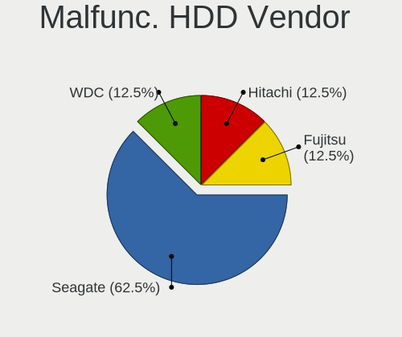
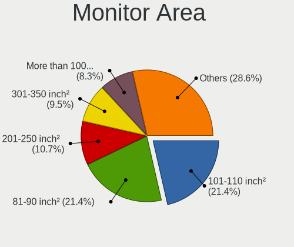
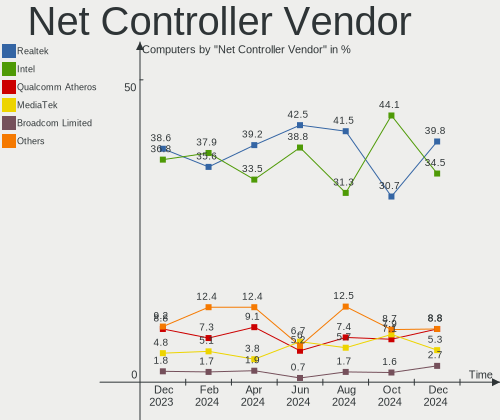

ArcoLinux Hardware Trends
-------------------------

A project to identify most popular hardware characteristics and track their change
over time based on data collected by ArcoLinux users at https://Linux-Hardware.org.

Anyone can contribute to this report by the [hw-probe](https://github.com/linuxhw/hw-probe) tool:

    sudo -E hw-probe -all -upload

This is a report for all computer types. See also reports for [desktops](/Dist/ArcoLinux/Desktop/README.md) and [notebooks](/Dist/ArcoLinux/Notebook/README.md).

Full-feature report is available here: https://linux-hardware.org/?view=trends

Period: Jan, 2022.

Contents
--------

* [ System ](#system)
  - [ OS                       ](#os)
  - [ OS Family                ](#os-family)
  - [ Kernel                   ](#kernel)
  - [ Kernel Family            ](#kernel-family)
  - [ Kernel Major Ver.        ](#kernel-major-ver)
  - [ Arch                     ](#arch)
  - [ DE                       ](#de)
  - [ Display Server           ](#display-server)
  - [ Display Manager          ](#display-manager)
  - [ OS Lang                  ](#os-lang)
  - [ Boot Mode                ](#boot-mode)
  - [ Filesystem               ](#filesystem)
  - [ Part. scheme             ](#part-scheme)
  - [ Dual Boot with Linux/BSD ](#dual-boot-with-linuxbsd)
  - [ Dual Boot (Win)          ](#dual-boot-win)

* [ Board ](#board)
  - [ Vendor                   ](#vendor)
  - [ Model                    ](#model)
  - [ Model Family             ](#model-family)
  - [ MFG Year                 ](#mfg-year)
  - [ Form Factor              ](#form-factor)
  - [ Secure Boot              ](#secure-boot)
  - [ Coreboot                 ](#coreboot)
  - [ RAM Size                 ](#ram-size)
  - [ RAM Used                 ](#ram-used)
  - [ Total Drives             ](#total-drives)
  - [ Has CD-ROM               ](#has-cd-rom)
  - [ Has Ethernet             ](#has-ethernet)
  - [ Has WiFi                 ](#has-wifi)
  - [ Has Bluetooth            ](#has-bluetooth)

* [ Location ](#location)
  - [ Country                  ](#country)
  - [ City                     ](#city)

* [ Drives ](#drives)
  - [ Drive Vendor             ](#drive-vendor)
  - [ Drive Model              ](#drive-model)
  - [ HDD Vendor               ](#hdd-vendor)
  - [ SSD Vendor               ](#ssd-vendor)
  - [ Drive Kind               ](#drive-kind)
  - [ Drive Connector          ](#drive-connector)
  - [ Drive Size               ](#drive-size)
  - [ Space Total              ](#space-total)
  - [ Space Used               ](#space-used)
  - [ Malfunc. Drives          ](#malfunc-drives)
  - [ Malfunc. Drive Vendor    ](#malfunc-drive-vendor)
  - [ Malfunc. HDD Vendor      ](#malfunc-hdd-vendor)
  - [ Malfunc. Drive Kind      ](#malfunc-drive-kind)
  - [ Failed Drives            ](#failed-drives)
  - [ Failed Drive Vendor      ](#failed-drive-vendor)
  - [ Drive Status             ](#drive-status)

* [ Storage controller ](#storage-controller)
  - [ Storage Vendor           ](#storage-vendor)
  - [ Storage Model            ](#storage-model)
  - [ Storage Kind             ](#storage-kind)

* [ Processor ](#processor)
  - [ CPU Vendor               ](#cpu-vendor)
  - [ CPU Model                ](#cpu-model)
  - [ CPU Model Family         ](#cpu-model-family)
  - [ CPU Cores                ](#cpu-cores)
  - [ CPU Sockets              ](#cpu-sockets)
  - [ CPU Threads              ](#cpu-threads)
  - [ CPU Op-Modes             ](#cpu-op-modes)
  - [ CPU Microcode            ](#cpu-microcode)
  - [ CPU Microarch            ](#cpu-microarch)

* [ Graphics ](#graphics)
  - [ GPU Vendor               ](#gpu-vendor)
  - [ GPU Model                ](#gpu-model)
  - [ GPU Combo                ](#gpu-combo)
  - [ GPU Driver               ](#gpu-driver)
  - [ GPU Memory               ](#gpu-memory)

* [ Monitor ](#monitor)
  - [ Monitor Vendor           ](#monitor-vendor)
  - [ Monitor Model            ](#monitor-model)
  - [ Monitor Resolution       ](#monitor-resolution)
  - [ Monitor Diagonal         ](#monitor-diagonal)
  - [ Monitor Width            ](#monitor-width)
  - [ Aspect Ratio             ](#aspect-ratio)
  - [ Monitor Area             ](#monitor-area)
  - [ Pixel Density            ](#pixel-density)
  - [ Multiple Monitors        ](#multiple-monitors)

* [ Network ](#network)
  - [ Net Controller Vendor    ](#net-controller-vendor)
  - [ Net Controller Model     ](#net-controller-model)
  - [ Wireless Vendor          ](#wireless-vendor)
  - [ Wireless Model           ](#wireless-model)
  - [ Ethernet Vendor          ](#ethernet-vendor)
  - [ Ethernet Model           ](#ethernet-model)
  - [ Net Controller Kind      ](#net-controller-kind)
  - [ Used Controller          ](#used-controller)
  - [ NICs                     ](#nics)
  - [ IPv6                     ](#ipv6)

* [ Bluetooth ](#bluetooth)
  - [ Bluetooth Vendor         ](#bluetooth-vendor)
  - [ Bluetooth Model          ](#bluetooth-model)

* [ Sound ](#sound)
  - [ Sound Vendor             ](#sound-vendor)
  - [ Sound Model              ](#sound-model)

* [ Memory ](#memory)
  - [ Memory Vendor            ](#memory-vendor)
  - [ Memory Model             ](#memory-model)
  - [ Memory Kind              ](#memory-kind)
  - [ Memory Form Factor       ](#memory-form-factor)
  - [ Memory Size              ](#memory-size)
  - [ Memory Speed             ](#memory-speed)

* [ Printers & scanners ](#printers--scanners)
  - [ Printer Vendor           ](#printer-vendor)
  - [ Printer Model            ](#printer-model)
  - [ Scanner Vendor           ](#scanner-vendor)
  - [ Scanner Model            ](#scanner-model)

* [ Camera ](#camera)
  - [ Camera Vendor            ](#camera-vendor)
  - [ Camera Model             ](#camera-model)

* [ Security ](#security)
  - [ Fingerprint Vendor       ](#fingerprint-vendor)
  - [ Fingerprint Model        ](#fingerprint-model)
  - [ Chipcard Vendor          ](#chipcard-vendor)
  - [ Chipcard Model           ](#chipcard-model)

* [ Unsupported ](#unsupported)
  - [ Unsupported Devices      ](#unsupported-devices)
  - [ Unsupported Device Types ](#unsupported-device-types)

System
------

OS
--

Installed operating systems

| Name              | Computers | Percent |
|-------------------|-----------|---------|
| ArcoLinux Rolling | 72        | 93.51%  |
| ArcoLinux         | 5         | 6.49%   |

OS Family
---------

OS without a version

| Name      | Computers | Percent |
|-----------|-----------|---------|
| ArcoLinux | 77        | 100%    |

Kernel
------

Version of the Linux kernel

| Version                      | Computers | Percent |
|------------------------------|-----------|---------|
| 5.16.2-arch1-1               | 13        | 16.88%  |
| 5.15.10-arch1-1              | 11        | 14.29%  |
| 5.15.13-arch1-1              | 10        | 12.99%  |
| 5.15.12-arch1-1              | 8         | 10.39%  |
| 5.15.15-1-lts                | 4         | 5.19%   |
| 5.10.88-2-lts                | 4         | 5.19%   |
| 5.16.2-zen1-1-zen            | 3         | 3.9%    |
| 5.16.0-arch1-1               | 3         | 3.9%    |
| 5.15.16-1-lts                | 3         | 3.9%    |
| 5.16.1-arch1-1               | 2         | 2.6%    |
| 5.15.14-1-lts                | 2         | 2.6%    |
| 5.15.12-zen1-1-zen           | 2         | 2.6%    |
| 5.14.14-arch1-1              | 2         | 2.6%    |
| 5.16.4-arch1-1               | 1         | 1.3%    |
| 5.16.2-prexan0-rog-1         | 1         | 1.3%    |
| 5.16.1-zen1-1-zen            | 1         | 1.3%    |
| 5.16.0-zen1-1-zen            | 1         | 1.3%    |
| 5.15.7-zen1-1-zen            | 1         | 1.3%    |
| 5.15.16-hardened1-1-hardened | 1         | 1.3%    |
| 5.15.13-zen1-1-zen           | 1         | 1.3%    |
| 5.15.13-xanmod1-1            | 1         | 1.3%    |
| 5.10.85-1-lts                | 1         | 1.3%    |
| 5.10.61-1-lts                | 1         | 1.3%    |

Kernel Family
-------------

Linux kernel without a distro release

| Version | Computers | Percent |
|---------|-----------|---------|
| 5.16.2  | 17        | 22.08%  |
| 5.15.13 | 12        | 15.58%  |
| 5.15.10 | 11        | 14.29%  |
| 5.15.12 | 10        | 12.99%  |
| 5.16.0  | 4         | 5.19%   |
| 5.15.16 | 4         | 5.19%   |
| 5.15.15 | 4         | 5.19%   |
| 5.10.88 | 4         | 5.19%   |
| 5.16.1  | 3         | 3.9%    |
| 5.15.14 | 2         | 2.6%    |
| 5.14.14 | 2         | 2.6%    |
| 5.16.4  | 1         | 1.3%    |
| 5.15.7  | 1         | 1.3%    |
| 5.10.85 | 1         | 1.3%    |
| 5.10.61 | 1         | 1.3%    |

Kernel Major Ver.
-----------------

Linux kernel major version

| Version | Computers | Percent |
|---------|-----------|---------|
| 5.15    | 44        | 57.14%  |
| 5.16    | 25        | 32.47%  |
| 5.10    | 6         | 7.79%   |
| 5.14    | 2         | 2.6%    |

Arch
----

OS architecture (x86_64, i586, etc.)

| Name   | Computers | Percent |
|--------|-----------|---------|
| x86_64 | 77        | 100%    |

DE
--

Desktop Environment

| Name           | Computers | Percent |
|----------------|-----------|---------|
| XFCE           | 24        | 31.17%  |
| KDE5           | 21        | 27.27%  |
| awesome        | 6         | 7.79%   |
| X-Cinnamon     | 3         | 3.9%    |
| i3             | 3         | 3.9%    |
| xmonad         | 2         | 2.6%    |
| qtile          | 2         | 2.6%    |
| LXQt           | 2         | 2.6%    |
| LeftWM         | 2         | 2.6%    |
| Cutefish       | 2         | 2.6%    |
| Budgie         | 2         | 2.6%    |
| bspwm          | 2         | 2.6%    |
| spectrwm       | 1         | 1.3%    |
| jwm            | 1         | 1.3%    |
| i3-with-shmlog | 1         | 1.3%    |
| GNOME          | 1         | 1.3%    |
| dwm            | 1         | 1.3%    |
| cwm            | 1         | 1.3%    |

Display Server
--------------

X11 or Wayland

| Name    | Computers | Percent |
|---------|-----------|---------|
| X11     | 70        | 90.91%  |
| Tty     | 6         | 7.79%   |
| Wayland | 1         | 1.3%    |

Display Manager
---------------

SDDM, LightDM, etc.

| Name    | Computers | Percent |
|---------|-----------|---------|
| SDDM    | 53        | 68.83%  |
| LightDM | 18        | 23.38%  |
| Unknown | 5         | 6.49%   |
| GDM     | 1         | 1.3%    |

OS Lang
-------

Language

| Lang  | Computers | Percent |
|-------|-----------|---------|
| en_US | 56        | 72.73%  |
| en_CA | 5         | 6.49%   |
| en_IN | 2         | 2.6%    |
| en_GB | 2         | 2.6%    |
| de_DE | 2         | 2.6%    |
| tr_TR | 1         | 1.3%    |
| sv_SE | 1         | 1.3%    |
| pt_PT | 1         | 1.3%    |
| pt_BR | 1         | 1.3%    |
| pl_PL | 1         | 1.3%    |
| nl_NL | 1         | 1.3%    |
| es_AR | 1         | 1.3%    |
| en_SG | 1         | 1.3%    |
| en_NZ | 1         | 1.3%    |
| en_AU | 1         | 1.3%    |

Boot Mode
---------

EFI or BIOS

| Mode | Computers | Percent |
|------|-----------|---------|
| EFI  | 50        | 64.94%  |
| BIOS | 27        | 35.06%  |

Filesystem
----------

Type of filesystem

| Type    | Computers | Percent |
|---------|-----------|---------|
| Ext4    | 58        | 75.32%  |
| Overlay | 9         | 11.69%  |
| Btrfs   | 8         | 10.39%  |
| F2fs    | 1         | 1.3%    |
| Unknown | 1         | 1.3%    |

Part. scheme
------------

Scheme of partitioning

| Type    | Computers | Percent |
|---------|-----------|---------|
| GPT     | 54        | 70.13%  |
| MBR     | 17        | 22.08%  |
| Unknown | 6         | 7.79%   |

Dual Boot with Linux/BSD
------------------------

Hosting more than one Linux/BSD

| Dual boot | Computers | Percent |
|-----------|-----------|---------|
| No        | 56        | 72.73%  |
| Yes       | 21        | 27.27%  |

Dual Boot (Win)
---------------

Hosting Linux and Windows

| Dual boot | Computers | Percent |
|-----------|-----------|---------|
| No        | 54        | 70.13%  |
| Yes       | 23        | 29.87%  |

Board
-----

Vendor
------

Motherboard manufacturer

| Name                | Computers | Percent |
|---------------------|-----------|---------|
| Lenovo              | 16        | 20.78%  |
| ASUSTek Computer    | 13        | 16.88%  |
| Hewlett-Packard     | 10        | 12.99%  |
| Gigabyte Technology | 10        | 12.99%  |
| Dell                | 10        | 12.99%  |
| MSI                 | 3         | 3.9%    |
| ASRock              | 2         | 2.6%    |
| VS Company          | 1         | 1.3%    |
| Toshiba             | 1         | 1.3%    |
| Standard            | 1         | 1.3%    |
| Sony                | 1         | 1.3%    |
| Samsung Electronics | 1         | 1.3%    |
| Monster             | 1         | 1.3%    |
| HUAWEI              | 1         | 1.3%    |
| Fujitsu             | 1         | 1.3%    |
| Casper              | 1         | 1.3%    |
| Biostar             | 1         | 1.3%    |
| Apple               | 1         | 1.3%    |
| Acer                | 1         | 1.3%    |
| Unknown             | 1         | 1.3%    |

Model
-----

Motherboard model

| Name                                        | Computers | Percent |
|---------------------------------------------|-----------|---------|
| ASUS ROG STRIX B450-F GAMING II             | 2         | 2.6%    |
| VS Company MCP61M                           | 1         | 1.3%    |
| Toshiba Satellite L640                      | 1         | 1.3%    |
| Standard MB50II                             | 1         | 1.3%    |
| Sony VPCEB2B4E                              | 1         | 1.3%    |
| Samsung 350V5C/351V5C/3540VC/3440VC         | 1         | 1.3%    |
| MSI MS-7C34                                 | 1         | 1.3%    |
| MSI MS-7C02                                 | 1         | 1.3%    |
| MSI A320M-HDV R4.0                          | 1         | 1.3%    |
| Monster ABRA A5 V11.1                       | 1         | 1.3%    |
| Lenovo Yoga Slim 7 Pro 14ACH5 O 82N5        | 1         | 1.3%    |
| Lenovo Yoga C740-15IML 81TD                 | 1         | 1.3%    |
| Lenovo ThinkStation S10 6483CTO             | 1         | 1.3%    |
| Lenovo ThinkPad Yoga 11e 3rd Gen 20GAS00000 | 1         | 1.3%    |
| Lenovo ThinkPad X1 Extreme 20MF000SGE       | 1         | 1.3%    |
| Lenovo ThinkPad T540p 20BE0086MS            | 1         | 1.3%    |
| Lenovo ThinkPad T440s 20ARS06C00            | 1         | 1.3%    |
| Lenovo ThinkPad T420 4180DY4                | 1         | 1.3%    |
| Lenovo ThinkPad T420 4180AJ3                | 1         | 1.3%    |
| Lenovo ThinkPad T14s Gen 1 20T0002JUS       | 1         | 1.3%    |
| Lenovo ThinkPad P51 20HJS2JJ01              | 1         | 1.3%    |
| Lenovo ThinkPad L460 20FVS0QQ00             | 1         | 1.3%    |
| Lenovo ThinkPad E580 20KS005ASC             | 1         | 1.3%    |
| Lenovo ThinkCentre M710q 10MRCTO1WW         | 1         | 1.3%    |
| Lenovo IdeaPad Yoga 13 20175                | 1         | 1.3%    |
| Lenovo IdeaPad Y580                         | 1         | 1.3%    |
| HUAWEI KLVL-WXX9                            | 1         | 1.3%    |
| HP x2 Detachable 10-p0XX                    | 1         | 1.3%    |
| HP ProBook 450 G2                           | 1         | 1.3%    |
| HP ProBook 450 G1                           | 1         | 1.3%    |
| HP Pavilion Gaming Laptop 15-ec0xxx         | 1         | 1.3%    |
| HP Pavilion Desktop PC 570-p0xx             | 1         | 1.3%    |
| HP Pavilion Desktop 590-p0xxx               | 1         | 1.3%    |
| HP EliteDesk 800 G4 TWR                     | 1         | 1.3%    |
| HP EliteDesk 800 G1 SFF                     | 1         | 1.3%    |
| HP EliteBook x360 1030 G4                   | 1         | 1.3%    |
| HP 250 G7 Notebook PC                       | 1         | 1.3%    |
| Gigabyte Z390 AORUS PRO WIFI                | 1         | 1.3%    |
| Gigabyte P55-USB3                           | 1         | 1.3%    |
| Gigabyte H110M-A                            | 1         | 1.3%    |
| Gigabyte GA-970A-UD3                        | 1         | 1.3%    |
| Gigabyte B550 AORUS PRO V2                  | 1         | 1.3%    |
| Gigabyte B550 AORUS MASTER                  | 1         | 1.3%    |
| Gigabyte B450M DS3H V2                      | 1         | 1.3%    |
| Gigabyte B450 I AORUS PRO WIFI              | 1         | 1.3%    |
| Gigabyte AB350N-Gaming WIFI                 | 1         | 1.3%    |
| Gigabyte A520M S2H                          | 1         | 1.3%    |
| Fujitsu LIFEBOOK S751                       | 1         | 1.3%    |
| Dell XPS 8700                               | 1         | 1.3%    |
| Dell XPS 17 9710                            | 1         | 1.3%    |
| Dell XPS 15 9500                            | 1         | 1.3%    |
| Dell XPS 13 7390                            | 1         | 1.3%    |
| Dell Vostro 270                             | 1         | 1.3%    |
| Dell Latitude E6510                         | 1         | 1.3%    |
| Dell Latitude E5430 non-vPro                | 1         | 1.3%    |
| Dell Latitude 7480                          | 1         | 1.3%    |
| Dell Inspiron 3470                          | 1         | 1.3%    |
| Dell Inspiron 15 7000 Gaming                | 1         | 1.3%    |
| Casper EXCALIBUR G860                       | 1         | 1.3%    |
| Biostar J3060NH                             | 1         | 1.3%    |

Model Family
------------

Motherboard model prefix

| Name                   | Computers | Percent |
|------------------------|-----------|---------|
| Lenovo ThinkPad        | 10        | 12.99%  |
| Dell XPS               | 4         | 5.19%   |
| ASUS ROG               | 4         | 5.19%   |
| HP Pavilion            | 3         | 3.9%    |
| Dell Latitude          | 3         | 3.9%    |
| ASUS PRIME             | 3         | 3.9%    |
| Lenovo Yoga            | 2         | 2.6%    |
| Lenovo IdeaPad         | 2         | 2.6%    |
| HP ProBook             | 2         | 2.6%    |
| HP EliteDesk           | 2         | 2.6%    |
| Gigabyte B550          | 2         | 2.6%    |
| Dell Inspiron          | 2         | 2.6%    |
| VS Company MCP61M      | 1         | 1.3%    |
| Toshiba Satellite      | 1         | 1.3%    |
| Standard MB50II        | 1         | 1.3%    |
| Sony VPCEB2B4E         | 1         | 1.3%    |
| Samsung 350V5C         | 1         | 1.3%    |
| MSI MS-7C34            | 1         | 1.3%    |
| MSI MS-7C02            | 1         | 1.3%    |
| MSI A320M-HDV          | 1         | 1.3%    |
| Monster ABRA           | 1         | 1.3%    |
| Lenovo ThinkStation    | 1         | 1.3%    |
| Lenovo ThinkCentre     | 1         | 1.3%    |
| HUAWEI KLVL-WXX9       | 1         | 1.3%    |
| HP x2                  | 1         | 1.3%    |
| HP EliteBook           | 1         | 1.3%    |
| HP 250                 | 1         | 1.3%    |
| Gigabyte Z390          | 1         | 1.3%    |
| Gigabyte P55-USB3      | 1         | 1.3%    |
| Gigabyte H110M-A       | 1         | 1.3%    |
| Gigabyte GA-970A-UD3   | 1         | 1.3%    |
| Gigabyte B450M         | 1         | 1.3%    |
| Gigabyte B450          | 1         | 1.3%    |
| Gigabyte AB350N-Gaming | 1         | 1.3%    |
| Gigabyte A520M         | 1         | 1.3%    |
| Fujitsu LIFEBOOK       | 1         | 1.3%    |
| Dell Vostro            | 1         | 1.3%    |
| Casper EXCALIBUR       | 1         | 1.3%    |
| Biostar J3060NH        | 1         | 1.3%    |
| ASUS X580VD            | 1         | 1.3%    |
| ASUS VivoBook          | 1         | 1.3%    |
| ASUS P5L8L-SE          | 1         | 1.3%    |
| ASUS K53E              | 1         | 1.3%    |
| ASUS 5939              | 1         | 1.3%    |
| ASUS 1001PX            | 1         | 1.3%    |
| ASRock P75             | 1         | 1.3%    |
| ASRock A300M-STX       | 1         | 1.3%    |
| Apple iMac14           | 1         | 1.3%    |
| Acer Aspire            | 1         | 1.3%    |
| Unknown                | 1         | 1.3%    |

MFG Year
--------

Motherboard manufacture year

| Year | Computers | Percent |
|------|-----------|---------|
| 2019 | 13        | 16.88%  |
| 2018 | 11        | 14.29%  |
| 2020 | 9         | 11.69%  |
| 2017 | 9         | 11.69%  |
| 2011 | 8         | 10.39%  |
| 2013 | 6         | 7.79%   |
| 2021 | 5         | 6.49%   |
| 2016 | 4         | 5.19%   |
| 2012 | 4         | 5.19%   |
| 2010 | 4         | 5.19%   |
| 2014 | 2         | 2.6%    |
| 2008 | 1         | 1.3%    |
| 2007 | 1         | 1.3%    |

Form Factor
-----------

Physical design of the computer

| Name        | Computers | Percent |
|-------------|-----------|---------|
| Notebook    | 37        | 48.05%  |
| Desktop     | 34        | 44.16%  |
| Convertible | 3         | 3.9%    |
| Tablet      | 1         | 1.3%    |
| Mini pc     | 1         | 1.3%    |
| All in one  | 1         | 1.3%    |

Secure Boot
-----------

Enabled or disabled

| State    | Computers | Percent |
|----------|-----------|---------|
| Disabled | 77        | 100%    |

Coreboot
--------

Have coreboot on board

| Used | Computers | Percent |
|------|-----------|---------|
| No   | 77        | 100%    |

RAM Size
--------

Total RAM memory

| Size in GB  | Computers | Percent |
|-------------|-----------|---------|
| 4.01-8.0    | 19        | 24.68%  |
| 16.01-24.0  | 19        | 24.68%  |
| 8.01-16.0   | 17        | 22.08%  |
| 32.01-64.0  | 9         | 11.69%  |
| 64.01-256.0 | 5         | 6.49%   |
| 3.01-4.0    | 4         | 5.19%   |
| 1.01-2.0    | 2         | 2.6%    |
| 24.01-32.0  | 1         | 1.3%    |
| 2.01-3.0    | 1         | 1.3%    |

RAM Used
--------

Used RAM memory

| Used GB    | Computers | Percent |
|------------|-----------|---------|
| 1.01-2.0   | 23        | 29.87%  |
| 2.01-3.0   | 18        | 23.38%  |
| 3.01-4.0   | 11        | 14.29%  |
| 4.01-8.0   | 9         | 11.69%  |
| 0.51-1.0   | 9         | 11.69%  |
| 8.01-16.0  | 3         | 3.9%    |
| 0.01-0.5   | 3         | 3.9%    |
| 16.01-24.0 | 1         | 1.3%    |

Total Drives
------------

Number of drives on board

| Drives | Computers | Percent |
|--------|-----------|---------|
| 1      | 33        | 42.86%  |
| 2      | 27        | 35.06%  |
| 4      | 6         | 7.79%   |
| 3      | 6         | 7.79%   |
| 5      | 3         | 3.9%    |
| 9      | 1         | 1.3%    |
| 7      | 1         | 1.3%    |

Has CD-ROM
----------

Has CD-ROM on board

| Presented | Computers | Percent |
|-----------|-----------|---------|
| No        | 53        | 68.83%  |
| Yes       | 24        | 31.17%  |

Has Ethernet
------------

Has Ethernet on board

| Presented | Computers | Percent |
|-----------|-----------|---------|
| Yes       | 69        | 89.61%  |
| No        | 8         | 10.39%  |

Has WiFi
--------

Has WiFi module

| Presented | Computers | Percent |
|-----------|-----------|---------|
| Yes       | 64        | 83.12%  |
| No        | 13        | 16.88%  |

Has Bluetooth
-------------

Has Bluetooth module

| Presented | Computers | Percent |
|-----------|-----------|---------|
| Yes       | 50        | 64.94%  |
| No        | 27        | 35.06%  |

Location
--------

Country
-------

Geographic location (country)

| Country     | Computers | Percent |
|-------------|-----------|---------|
| USA         | 18        | 23.38%  |
| Canada      | 7         | 9.09%   |
| Germany     | 6         | 7.79%   |
| UK          | 3         | 3.9%    |
| Turkey      | 3         | 3.9%    |
| Sweden      | 3         | 3.9%    |
| Poland      | 3         | 3.9%    |
| Italy       | 3         | 3.9%    |
| Argentina   | 3         | 3.9%    |
| Serbia      | 2         | 2.6%    |
| Romania     | 2         | 2.6%    |
| Norway      | 2         | 2.6%    |
| Kenya       | 2         | 2.6%    |
| India       | 2         | 2.6%    |
| Greece      | 2         | 2.6%    |
| Brazil      | 2         | 2.6%    |
| Portugal    | 1         | 1.3%    |
| New Zealand | 1         | 1.3%    |
| Netherlands | 1         | 1.3%    |
| Malaysia    | 1         | 1.3%    |
| Lithuania   | 1         | 1.3%    |
| Hungary     | 1         | 1.3%    |
| Honduras    | 1         | 1.3%    |
| France      | 1         | 1.3%    |
| Egypt       | 1         | 1.3%    |
| Croatia     | 1         | 1.3%    |
| Belgium     | 1         | 1.3%    |
| Barbados    | 1         | 1.3%    |
| Austria     | 1         | 1.3%    |
| Australia   | 1         | 1.3%    |

City
----

Geographic location (city)

| City                   | Computers | Percent |
|------------------------|-----------|---------|
| Rupert                 | 2         | 2.6%    |
| Pickering              | 2         | 2.6%    |
| Nairobi                | 2         | 2.6%    |
| Houston                | 2         | 2.6%    |
| Belgrade               | 2         | 2.6%    |
| Ankara                 | 2         | 2.6%    |
| Akersberga             | 2         | 2.6%    |
| Zagreb                 | 1         | 1.3%    |
| Windsor                | 1         | 1.3%    |
| Wiesbaden              | 1         | 1.3%    |
| Warsaw                 | 1         | 1.3%    |
| Vilnius                | 1         | 1.3%    |
| Villa Ballester        | 1         | 1.3%    |
| Vienna                 | 1         | 1.3%    |
| Vargem Grande Paulista | 1         | 1.3%    |
| Trieste                | 1         | 1.3%    |
| Templin                | 1         | 1.3%    |
| Stuttgart              | 1         | 1.3%    |
| Stittsville            | 1         | 1.3%    |
| Staten Island          | 1         | 1.3%    |
| Sioux Falls            | 1         | 1.3%    |
| Shetland Islands       | 1         | 1.3%    |
| Schwarzenberg          | 1         | 1.3%    |
| San Pedro Sula         | 1         | 1.3%    |
| San Antonio            | 1         | 1.3%    |
| Saetre                 | 1         | 1.3%    |
| Quakers Hill           | 1         | 1.3%    |
| Piatra Neam??          | 1         | 1.3%    |
| Palmerston North       | 1         | 1.3%    |
| Ozimek                 | 1         | 1.3%    |
| Orlando                | 1         | 1.3%    |
| Olympia                | 1         | 1.3%    |
| Noida                  | 1         | 1.3%    |
| Neutraubling           | 1         | 1.3%    |
| Muzaffarpur            | 1         | 1.3%    |
| Montreal               | 1         | 1.3%    |
| Mirabel                | 1         | 1.3%    |
| Mattoon                | 1         | 1.3%    |
| Maidstone              | 1         | 1.3%    |
| Lokeren                | 1         | 1.3%    |
| Leiria                 | 1         | 1.3%    |
| Leipzig                | 1         | 1.3%    |
| Kuala Lumpur           | 1         | 1.3%    |
| Kristianstad           | 1         | 1.3%    |
| Janesville             | 1         | 1.3%    |
| Jacksonville           | 1         | 1.3%    |
| Hillsborough           | 1         | 1.3%    |
| Heraklion              | 1         | 1.3%    |
| Hammond                | 1         | 1.3%    |
| Guelph                 | 1         | 1.3%    |
| Gebze                  | 1         | 1.3%    |
| Gdansk                 | 1         | 1.3%    |
| Fayetteville           | 1         | 1.3%    |
| East Longmeadow        | 1         | 1.3%    |
| Cotia                  | 1         | 1.3%    |
| Conroe                 | 1         | 1.3%    |
| Colfax                 | 1         | 1.3%    |
| Chattanooga            | 1         | 1.3%    |
| C??rdoba               | 1         | 1.3%    |
| Cameri                 | 1         | 1.3%    |

Drives
------

Drive Vendor
------------

Hard drive vendors

| Vendor                | Computers | Drives | Percent |
|-----------------------|-----------|--------|---------|
| Samsung Electronics   | 25        | 31     | 18.12%  |
| WDC                   | 19        | 23     | 13.77%  |
| Seagate               | 18        | 23     | 13.04%  |
| Toshiba               | 8         | 8      | 5.8%    |
| Crucial               | 8         | 10     | 5.8%    |
| Kingston              | 7         | 7      | 5.07%   |
| SK Hynix              | 6         | 6      | 4.35%   |
| Unknown               | 5         | 6      | 3.62%   |
| Sandisk               | 5         | 5      | 3.62%   |
| Intel                 | 4         | 4      | 2.9%    |
| JMicron               | 3         | 3      | 2.17%   |
| Transcend             | 2         | 2      | 1.45%   |
| Phison                | 2         | 2      | 1.45%   |
| Corsair               | 2         | 2      | 1.45%   |
| China                 | 2         | 2      | 1.45%   |
| Unknown               | 2         | 2      | 1.45%   |
| XPG                   | 1         | 1      | 0.72%   |
| Verbatim              | 1         | 1      | 0.72%   |
| Silicon Motion        | 1         | 1      | 0.72%   |
| Sabrent               | 1         | 1      | 0.72%   |
| Realtek Semiconductor | 1         | 1      | 0.72%   |
| PNY                   | 1         | 1      | 0.72%   |
| PLEXTOR               | 1         | 1      | 0.72%   |
| Patriot               | 1         | 1      | 0.72%   |
| OEM                   | 1         | 1      | 0.72%   |
| Mushkin               | 1         | 1      | 0.72%   |
| Micron Technology     | 1         | 1      | 0.72%   |
| Lenovo                | 1         | 1      | 0.72%   |
| KingFast              | 1         | 1      | 0.72%   |
| KingDian              | 1         | 1      | 0.72%   |
| Hitachi               | 1         | 1      | 0.72%   |
| HGST                  | 1         | 1      | 0.72%   |
| Gigabyte Technology   | 1         | 1      | 0.72%   |
| Fujitsu               | 1         | 1      | 0.72%   |
| Apple                 | 1         | 1      | 0.72%   |
| A-DATA Technology     | 1         | 1      | 0.72%   |

Drive Model
-----------

Hard drive models

| Model                                   | Computers | Percent |
|-----------------------------------------|-----------|---------|
| Seagate ST1000DM010-2EP102 1TB          | 4         | 2.61%   |
| Toshiba DT01ACA100 1TB                  | 2         | 1.31%   |
| Seagate ST500LT012-1DG142 500GB         | 2         | 1.31%   |
| Samsung SSD 860 EVO 500GB               | 2         | 1.31%   |
| Samsung SSD 860 EVO 250GB               | 2         | 1.31%   |
| Samsung SSD 860 EVO 1TB                 | 2         | 1.31%   |
| Samsung SSD 840 EVO 250GB               | 2         | 1.31%   |
| JMicron Generic 128GB                   | 2         | 1.31%   |
| Crucial CT500MX500SSD1 500GB            | 2         | 1.31%   |
| Unknown                                 | 2         | 1.31%   |
| XPG GAMMIX S11 Pro 2TB                  | 1         | 0.65%   |
| WDC WDS500G1X0E-00AFY0 500GB            | 1         | 0.65%   |
| WDC WDS240G2G0A-00JH30 240GB SSD        | 1         | 0.65%   |
| WDC WDS200T2B0A-00SM50 2TB SSD          | 1         | 0.65%   |
| WDC WDS100T3X0C-00SJG0 1TB              | 1         | 0.65%   |
| WDC WDS100T2B0A-00SM50 1TB SSD          | 1         | 0.65%   |
| WDC WD6401AALS-00E3A0 640GB             | 1         | 0.65%   |
| WDC WD6400BEVT-60A0RT0 640GB            | 1         | 0.65%   |
| WDC WD5000HHTZ-75N21V0 500GB            | 1         | 0.65%   |
| WDC WD5000AAKX-75U6AA0 500GB            | 1         | 0.65%   |
| WDC WD5000AAKX-00ERMA0 500GB            | 1         | 0.65%   |
| WDC WD3200AAKS-00YGA0 320GB             | 1         | 0.65%   |
| WDC WD3200AAJS-56M0A0 320GB             | 1         | 0.65%   |
| WDC WD30EZRX-00DC0B0 3TB                | 1         | 0.65%   |
| WDC WD20EARX-00PASB0 2TB                | 1         | 0.65%   |
| WDC WD2003FZEX-00SRLA0 2TB              | 1         | 0.65%   |
| WDC WD10SPZX-22Z10T0 1TB                | 1         | 0.65%   |
| WDC WD10SPZX-21Z10T0 1TB                | 1         | 0.65%   |
| WDC WD10SPZX-08Z10 1TB                  | 1         | 0.65%   |
| WDC WD10SPSX-60A6WT0 1TB                | 1         | 0.65%   |
| WDC WD10EUCX-63YZ1Y0 1TB                | 1         | 0.65%   |
| WDC WD101EFAX-68LDBN0 10TB              | 1         | 0.65%   |
| WDC PC SN730 SDBPNTY-256G-1006 256GB    | 1         | 0.65%   |
| Verbatim Vi550 S3 SSD 512GB             | 1         | 0.65%   |
| Unknown SU02G  2GB                      | 1         | 0.65%   |
| Unknown SDW32G  32GB                    | 1         | 0.65%   |
| Unknown SD/MMC/MS PRO 128GB             | 1         | 0.65%   |
| Unknown SD/MMC 16GB                     | 1         | 0.65%   |
| Unknown NVMe SSD Drive 1024GB           | 1         | 0.65%   |
| Unknown M.S./M.S.Pro/HG 16GB            | 1         | 0.65%   |
| Transcend TS480GSSD220S 480GB           | 1         | 0.65%   |
| Transcend TS128GSSD630 128GB            | 1         | 0.65%   |
| Toshiba RC500 250GB                     | 1         | 0.65%   |
| Toshiba MQ04ABF100 1TB                  | 1         | 0.65%   |
| Toshiba MK7575GSX 752GB                 | 1         | 0.65%   |
| Toshiba MK5065GSX 500GB                 | 1         | 0.65%   |
| Toshiba HDWD240 4TB                     | 1         | 0.65%   |
| Toshiba HDWD110 1TB                     | 1         | 0.65%   |
| SK Hynix SKHynix_HFS001TDE9X084N 1TB    | 1         | 0.65%   |
| SK Hynix SC311 SATA 256GB SSD           | 1         | 0.65%   |
| SK Hynix PC611 NVMe 512GB               | 1         | 0.65%   |
| SK Hynix PC601 HFS256GD9TNG-L2A0A 256GB | 1         | 0.65%   |
| SK Hynix HFS128G39TND-N210A 128GB SSD   | 1         | 0.65%   |
| SK Hynix HFM512GD3JX013N 512GB          | 1         | 0.65%   |
| Silicon Motion NVMe SSD Drive 250GB     | 1         | 0.65%   |
| Seagate ST9750420AS 752GB               | 1         | 0.65%   |
| Seagate ST975042 0AS 752GB              | 1         | 0.65%   |
| Seagate ST9250315AS 250GB               | 1         | 0.65%   |
| Seagate ST8000DM004-2CX188 8TB          | 1         | 0.65%   |
| Seagate ST6000DM003-2CY186 6TB          | 1         | 0.65%   |

HDD Vendor
----------

Hard disk drive vendors

| Vendor              | Computers | Drives | Percent |
|---------------------|-----------|--------|---------|
| Seagate             | 18        | 22     | 37.5%   |
| WDC                 | 15        | 17     | 31.25%  |
| Toshiba             | 7         | 7      | 14.58%  |
| Unknown             | 1         | 1      | 2.08%   |
| Samsung Electronics | 1         | 1      | 2.08%   |
| JMicron             | 1         | 1      | 2.08%   |
| Hitachi             | 1         | 1      | 2.08%   |
| HGST                | 1         | 1      | 2.08%   |
| Fujitsu             | 1         | 1      | 2.08%   |
| Apple               | 1         | 1      | 2.08%   |
| Unknown             | 1         | 1      | 2.08%   |

SSD Vendor
----------

Solid state drive vendors

| Vendor              | Computers | Drives | Percent |
|---------------------|-----------|--------|---------|
| Samsung Electronics | 17        | 19     | 32.69%  |
| Kingston            | 5         | 5      | 9.62%   |
| Crucial             | 5         | 7      | 9.62%   |
| SanDisk             | 4         | 4      | 7.69%   |
| WDC                 | 3         | 3      | 5.77%   |
| Transcend           | 2         | 2      | 3.85%   |
| SK Hynix            | 2         | 2      | 3.85%   |
| Intel               | 2         | 2      | 3.85%   |
| China               | 2         | 2      | 3.85%   |
| Verbatim            | 1         | 1      | 1.92%   |
| PNY                 | 1         | 1      | 1.92%   |
| PLEXTOR             | 1         | 1      | 1.92%   |
| Patriot             | 1         | 1      | 1.92%   |
| Mushkin             | 1         | 1      | 1.92%   |
| Micron Technology   | 1         | 1      | 1.92%   |
| KingFast            | 1         | 1      | 1.92%   |
| KingDian            | 1         | 1      | 1.92%   |
| Gigabyte Technology | 1         | 1      | 1.92%   |
| Unknown             | 1         | 1      | 1.92%   |

Drive Kind
----------

HDD or SSD

| Kind    | Computers | Drives | Percent |
|---------|-----------|--------|---------|
| SSD     | 43        | 56     | 35.25%  |
| HDD     | 42        | 54     | 34.43%  |
| NVMe    | 33        | 41     | 27.05%  |
| MMC     | 2         | 2      | 1.64%   |
| Unknown | 2         | 3      | 1.64%   |

Drive Connector
---------------

SATA, SAS, NVMe, etc.

| Type | Computers | Drives | Percent |
|------|-----------|--------|---------|
| SATA | 64        | 104    | 61.54%  |
| NVMe | 31        | 39     | 29.81%  |
| SAS  | 7         | 11     | 6.73%   |
| MMC  | 2         | 2      | 1.92%   |

Drive Size
----------

Size of hard drive

| Size in TB | Computers | Drives | Percent |
|------------|-----------|--------|---------|
| 0.01-0.5   | 42        | 54     | 46.67%  |
| 0.51-1.0   | 32        | 38     | 35.56%  |
| 1.01-2.0   | 6         | 7      | 6.67%   |
| 4.01-10.0  | 5         | 5      | 5.56%   |
| 3.01-4.0   | 2         | 2      | 2.22%   |
| 10.01-20.0 | 2         | 3      | 2.22%   |
| 2.01-3.0   | 1         | 1      | 1.11%   |

Space Total
-----------

Amount of disk space available on the file system

| Size in GB     | Computers | Percent |
|----------------|-----------|---------|
| 251-500        | 20        | 25.97%  |
| 501-1000       | 14        | 18.18%  |
| 101-250        | 9         | 11.69%  |
| 1001-2000      | 8         | 10.39%  |
| 1-20           | 8         | 10.39%  |
| Unknown        | 7         | 9.09%   |
| 21-50          | 4         | 5.19%   |
| More than 3000 | 3         | 3.9%    |
| 2001-3000      | 2         | 2.6%    |
| 51-100         | 2         | 2.6%    |

Space Used
----------

Amount of used disk space

| Used GB        | Computers | Percent |
|----------------|-----------|---------|
| 1-20           | 26        | 33.77%  |
| 21-50          | 11        | 14.29%  |
| 101-250        | 11        | 14.29%  |
| 251-500        | 9         | 11.69%  |
| Unknown        | 7         | 9.09%   |
| 51-100         | 6         | 7.79%   |
| 501-1000       | 4         | 5.19%   |
| 1001-2000      | 2         | 2.6%    |
| More than 3000 | 1         | 1.3%    |

Malfunc. Drives
---------------

Drive models with a malfunction

| Model                           | Computers | Drives | Percent |
|---------------------------------|-----------|--------|---------|
| WDC WD6400BEVT-60A0RT0 640GB    | 1         | 1      | 8.33%   |
| Toshiba MK5065GSX 500GB         | 1         | 1      | 8.33%   |
| Seagate ST9250315AS 250GB       | 1         | 1      | 8.33%   |
| Seagate ST3500312CS 500GB       | 1         | 1      | 8.33%   |
| Seagate ST2000DM001-1E6164 2TB  | 1         | 1      | 8.33%   |
| Seagate ST1000DM003-9YN162 1TB  | 1         | 1      | 8.33%   |
| Seagate ST1000DM003-1ER162 1TB  | 1         | 1      | 8.33%   |
| Kingston SA400S37480G 480GB SSD | 1         | 1      | 8.33%   |
| Intel SSDSA2M160G2GC 160GB      | 1         | 1      | 8.33%   |
| Hitachi HTS547575A9E384 752GB   | 1         | 1      | 8.33%   |
| HGST HTS541010A9E680 1TB        | 1         | 1      | 8.33%   |
| Unknown                         | 1         | 1      | 8.33%   |

Malfunc. Drive Vendor
---------------------

Vendors of faulty drives

| Vendor   | Computers | Drives | Percent |
|----------|-----------|--------|---------|
| Seagate  | 5         | 5      | 41.67%  |
| WDC      | 1         | 1      | 8.33%   |
| Toshiba  | 1         | 1      | 8.33%   |
| Kingston | 1         | 1      | 8.33%   |
| Intel    | 1         | 1      | 8.33%   |
| Hitachi  | 1         | 1      | 8.33%   |
| HGST     | 1         | 1      | 8.33%   |
| Unknown  | 1         | 1      | 8.33%   |

Malfunc. HDD Vendor
-------------------

Vendors of faulty HDD drives

| Vendor  | Computers | Drives | Percent |
|---------|-----------|--------|---------|
| Seagate | 5         | 5      | 50%     |
| WDC     | 1         | 1      | 10%     |
| Toshiba | 1         | 1      | 10%     |
| Hitachi | 1         | 1      | 10%     |
| HGST    | 1         | 1      | 10%     |
| Unknown | 1         | 1      | 10%     |

Malfunc. Drive Kind
-------------------

Kinds of faulty drives

| Kind | Computers | Drives | Percent |
|------|-----------|--------|---------|
| HDD  | 10        | 10     | 83.33%  |
| SSD  | 2         | 2      | 16.67%  |

Failed Drives
-------------

Failed drive models

Zero info for selected period =(

Failed Drive Vendor
-------------------

Failed drive vendors

Zero info for selected period =(

Drive Status
------------

Number of failed and malfunc. drives

| Status   | Computers | Drives | Percent |
|----------|-----------|--------|---------|
| Works    | 60        | 107    | 69.77%  |
| Detected | 15        | 37     | 17.44%  |
| Malfunc  | 11        | 12     | 12.79%  |

Storage controller
------------------

Storage Vendor
--------------

Storage controller vendors

| Vendor                       | Computers | Percent |
|------------------------------|-----------|---------|
| Intel                        | 48        | 45.28%  |
| AMD                          | 20        | 18.87%  |
| Samsung Electronics          | 9         | 8.49%   |
| SK Hynix                     | 4         | 3.77%   |
| Sandisk                      | 4         | 3.77%   |
| Phison Electronics           | 4         | 3.77%   |
| Micron/Crucial Technology    | 3         | 2.83%   |
| Kingston Technology Company  | 2         | 1.89%   |
| ADATA Technology             | 2         | 1.89%   |
| Unknown                      | 1         | 0.94%   |
| Silicon Motion               | 1         | 0.94%   |
| Shenzhen Longsys Electronics | 1         | 0.94%   |
| Seagate Technology           | 1         | 0.94%   |
| Realtek Semiconductor        | 1         | 0.94%   |
| Nvidia                       | 1         | 0.94%   |
| Lenovo                       | 1         | 0.94%   |
| KIOXIA                       | 1         | 0.94%   |
| JMicron Technology           | 1         | 0.94%   |
| ASMedia Technology           | 1         | 0.94%   |

Storage Model
-------------

Storage controller models

| Model                                                                            | Computers | Percent |
|----------------------------------------------------------------------------------|-----------|---------|
| AMD FCH SATA Controller [AHCI mode]                                              | 11        | 9.32%   |
| Samsung NVMe SSD Controller SM981/PM981/PM983                                    | 7         | 5.93%   |
| AMD 400 Series Chipset SATA Controller                                           | 7         | 5.93%   |
| Intel 8 Series/C220 Series Chipset Family 6-port SATA Controller 1 [AHCI mode]   | 5         | 4.24%   |
| Intel 6 Series/C200 Series Chipset Family 6 port Mobile SATA AHCI Controller     | 5         | 4.24%   |
| Intel HM170/QM170 Chipset SATA Controller [AHCI Mode]                            | 4         | 3.39%   |
| Intel Cannon Lake PCH SATA AHCI Controller                                       | 4         | 3.39%   |
| AMD Starship/Matisse Chipset SATA Controller [AHCI mode]                         | 4         | 3.39%   |
| Samsung NVMe SSD Controller PM9A1/PM9A3/980PRO                                   | 3         | 2.54%   |
| Intel Sunrise Point-LP SATA Controller [AHCI mode]                               | 3         | 2.54%   |
| Intel 7 Series/C210 Series Chipset Family 6-port SATA Controller [AHCI mode]     | 3         | 2.54%   |
| Intel 7 Series Chipset Family 6-port SATA Controller [AHCI mode]                 | 3         | 2.54%   |
| SK Hynix Non-Volatile memory controller                                          | 2         | 1.69%   |
| SK Hynix Gold P31 SSD                                                            | 2         | 1.69%   |
| Sandisk WD PC SN810 / Black SN850 NVMe SSD                                       | 2         | 1.69%   |
| Sandisk WD Black SN750 / PC SN730 NVMe SSD                                       | 2         | 1.69%   |
| Phison E16 PCIe4 NVMe Controller                                                 | 2         | 1.69%   |
| Intel Atom/Celeron/Pentium Processor x5-E8000/J3xxx/N3xxx Series SATA Controller | 2         | 1.69%   |
| Intel 82801 Mobile SATA Controller [RAID mode]                                   | 2         | 1.69%   |
| Intel 5 Series/3400 Series Chipset 4 port SATA AHCI Controller                   | 2         | 1.69%   |
| Intel 200 Series PCH SATA controller [AHCI mode]                                 | 2         | 1.69%   |
| ADATA XPG SX8200 Pro PCIe Gen3x4 M.2 2280 Solid State Drive                      | 2         | 1.69%   |
| Unknown Non-Volatile memory controller                                           | 1         | 0.85%   |
| Silicon Motion SM2263EN/SM2263XT SSD Controller                                  | 1         | 0.85%   |
| Shenzhen Longsys SM2263EN/SM2263XT-based OEM SSD                                 | 1         | 0.85%   |
| Seagate FireCuda 520 SSD                                                         | 1         | 0.85%   |
| Samsung NVMe SSD Controller SM961/PM961/SM963                                    | 1         | 0.85%   |
| Realtek RTS5763DL NVMe SSD Controller                                            | 1         | 0.85%   |
| Phison PS5013 E13 NVMe Controller                                                | 1         | 0.85%   |
| Phison E18 PCIe4 NVMe Controller                                                 | 1         | 0.85%   |
| Nvidia MCP61 SATA Controller                                                     | 1         | 0.85%   |
| Nvidia MCP61 IDE                                                                 | 1         | 0.85%   |
| Micron/Crucial P2 NVMe PCIe SSD                                                  | 1         | 0.85%   |
| Micron/Crucial P1 NVMe PCIe SSD                                                  | 1         | 0.85%   |
| Micron/Crucial Non-Volatile memory controller                                    | 1         | 0.85%   |
| Lenovo Non-Volatile memory controller                                            | 1         | 0.85%   |
| KIOXIA NVMe SSD                                                                  | 1         | 0.85%   |
| Kingston Company U-SNS8154P3 NVMe SSD                                            | 1         | 0.85%   |
| Kingston Company Company Non-Volatile memory controller                          | 1         | 0.85%   |
| JMicron JMB363 SATA/IDE Controller                                               | 1         | 0.85%   |
| Intel Wildcat Point-LP SATA Controller [AHCI Mode]                               | 1         | 0.85%   |
| Intel SSD 660P Series                                                            | 1         | 0.85%   |
| Intel Q170/Q150/B150/H170/H110/Z170/CM236 Chipset SATA Controller [AHCI Mode]    | 1         | 0.85%   |
| Intel Optane SSD 900P Series                                                     | 1         | 0.85%   |
| Intel NM10/ICH7 Family SATA Controller [IDE mode]                                | 1         | 0.85%   |
| Intel NM10/ICH7 Family SATA Controller [AHCI mode]                               | 1         | 0.85%   |
| Intel Comet Lake SATA AHCI Controller                                            | 1         | 0.85%   |
| Intel Comet Lake PCH-H RAID                                                      | 1         | 0.85%   |
| Intel Cannon Point-LP SATA Controller [AHCI Mode]                                | 1         | 0.85%   |
| Intel 82801IR/IO/IH (ICH9R/DO/DH) 4 port SATA Controller [IDE mode]              | 1         | 0.85%   |
| Intel 82801I (ICH9 Family) 2 port SATA Controller [IDE mode]                     | 1         | 0.85%   |
| Intel 82801G (ICH7 Family) IDE Controller                                        | 1         | 0.85%   |
| Intel 8 Series SATA Controller 1 [AHCI mode]                                     | 1         | 0.85%   |
| Intel 5 Series/3400 Series Chipset 6 port SATA AHCI Controller                   | 1         | 0.85%   |
| Intel 5 Series/3400 Series Chipset 4 port SATA IDE Controller                    | 1         | 0.85%   |
| Intel 5 Series/3400 Series Chipset 2 port SATA IDE Controller                    | 1         | 0.85%   |
| ASMedia ASM1062 Serial ATA Controller                                            | 1         | 0.85%   |
| AMD SB7x0/SB8x0/SB9x0 SATA Controller [IDE mode]                                 | 1         | 0.85%   |
| AMD SB7x0/SB8x0/SB9x0 IDE Controller                                             | 1         | 0.85%   |
| AMD FCH SATA Controller D                                                        | 1         | 0.85%   |

Storage Kind
------------

Kind of storage controller (IDE, SATA, NVMe, SAS, ...)

| Kind | Computers | Percent |
|------|-----------|---------|
| SATA | 60        | 60.61%  |
| NVMe | 31        | 31.31%  |
| IDE  | 5         | 5.05%   |
| RAID | 3         | 3.03%   |

Processor
---------

CPU Vendor
----------

Processor vendors

| Vendor | Computers | Percent |
|--------|-----------|---------|
| Intel  | 53        | 68.83%  |
| AMD    | 24        | 31.17%  |

CPU Model
---------

Processor models

| Model                                         | Computers | Percent |
|-----------------------------------------------|-----------|---------|
| Intel Core i7-7700HQ CPU @ 2.80GHz            | 3         | 3.9%    |
| Intel Core i5-2520M CPU @ 2.50GHz             | 3         | 3.9%    |
| AMD Ryzen 5 5600X 6-Core Processor            | 3         | 3.9%    |
| Intel Core i7-8700 CPU @ 3.20GHz              | 2         | 2.6%    |
| Intel Core i7-10510U CPU @ 1.80GHz            | 2         | 2.6%    |
| Intel Core i5-4570 CPU @ 3.20GHz              | 2         | 2.6%    |
| Intel Core i5-2410M CPU @ 2.30GHz             | 2         | 2.6%    |
| AMD Ryzen 9 5950X 16-Core Processor           | 2         | 2.6%    |
| AMD Ryzen 7 5800X 8-Core Processor            | 2         | 2.6%    |
| AMD Ryzen 7 3800X 8-Core Processor            | 2         | 2.6%    |
| Intel Pentium Dual CPU E2180 @ 2.00GHz        | 1         | 1.3%    |
| Intel Pentium CPU G2020 @ 2.90GHz             | 1         | 1.3%    |
| Intel Pentium CPU B970 @ 2.30GHz              | 1         | 1.3%    |
| Intel Core i9-9900K CPU @ 3.60GHz             | 1         | 1.3%    |
| Intel Core i7-8550U CPU @ 1.80GHz             | 1         | 1.3%    |
| Intel Core i7-7820HQ CPU @ 2.90GHz            | 1         | 1.3%    |
| Intel Core i7-7600U CPU @ 2.80GHz             | 1         | 1.3%    |
| Intel Core i7-4790 CPU @ 3.60GHz              | 1         | 1.3%    |
| Intel Core i7-4702MQ CPU @ 2.20GHz            | 1         | 1.3%    |
| Intel Core i7-4700MQ CPU @ 2.40GHz            | 1         | 1.3%    |
| Intel Core i7-4600U CPU @ 2.10GHz             | 1         | 1.3%    |
| Intel Core i7-3820 CPU @ 3.60GHz              | 1         | 1.3%    |
| Intel Core i7-3610QM CPU @ 2.30GHz            | 1         | 1.3%    |
| Intel Core i7-10750H CPU @ 2.60GHz            | 1         | 1.3%    |
| Intel Core i5-8400 CPU @ 2.80GHz              | 1         | 1.3%    |
| Intel Core i5-8365U CPU @ 1.60GHz             | 1         | 1.3%    |
| Intel Core i5-8300H CPU @ 2.30GHz             | 1         | 1.3%    |
| Intel Core i5-8265U CPU @ 1.60GHz             | 1         | 1.3%    |
| Intel Core i5-7500T CPU @ 2.70GHz             | 1         | 1.3%    |
| Intel Core i5-7400 CPU @ 3.00GHz              | 1         | 1.3%    |
| Intel Core i5-7300HQ CPU @ 2.50GHz            | 1         | 1.3%    |
| Intel Core i5-6500 CPU @ 3.20GHz              | 1         | 1.3%    |
| Intel Core i5-6300U CPU @ 2.40GHz             | 1         | 1.3%    |
| Intel Core i5-3570K CPU @ 3.40GHz             | 1         | 1.3%    |
| Intel Core i5-3317U CPU @ 1.70GHz             | 1         | 1.3%    |
| Intel Core i5-3210M CPU @ 2.50GHz             | 1         | 1.3%    |
| Intel Core i5-1035G1 CPU @ 1.00GHz            | 1         | 1.3%    |
| Intel Core i5-10210U CPU @ 1.60GHz            | 1         | 1.3%    |
| Intel Core i5 CPU M 540 @ 2.53GHz             | 1         | 1.3%    |
| Intel Core i5 CPU M 480 @ 2.67GHz             | 1         | 1.3%    |
| Intel Core i5 CPU M 450 @ 2.40GHz             | 1         | 1.3%    |
| Intel Core i5 CPU 750 @ 2.67GHz               | 1         | 1.3%    |
| Intel Core i3-5010U CPU @ 2.10GHz             | 1         | 1.3%    |
| Intel Core 2 Quad CPU Q9400 @ 2.66GHz         | 1         | 1.3%    |
| Intel Celeron CPU N3150 @ 1.60GHz             | 1         | 1.3%    |
| Intel Celeron CPU J3060 @ 1.60GHz             | 1         | 1.3%    |
| Intel Atom x5-Z8350 CPU @ 1.44GHz             | 1         | 1.3%    |
| Intel Atom CPU N450 @ 1.66GHz                 | 1         | 1.3%    |
| Intel 11th Gen Core i9-11900H @ 2.50GHz       | 1         | 1.3%    |
| AMD Ryzen 7 5800HS with Radeon Graphics       | 1         | 1.3%    |
| AMD Ryzen 7 5800H with Radeon Graphics        | 1         | 1.3%    |
| AMD Ryzen 7 5700G with Radeon Graphics        | 1         | 1.3%    |
| AMD Ryzen 7 4800H with Radeon Graphics        | 1         | 1.3%    |
| AMD Ryzen 7 2700X Eight-Core Processor        | 1         | 1.3%    |
| AMD Ryzen 5 3600 6-Core Processor             | 1         | 1.3%    |
| AMD Ryzen 5 3550H with Radeon Vega Mobile Gfx | 1         | 1.3%    |
| AMD Ryzen 5 3400G with Radeon Vega Graphics   | 1         | 1.3%    |
| AMD Ryzen 5 2600X Six-Core Processor          | 1         | 1.3%    |
| AMD Ryzen 5 2600 Six-Core Processor           | 1         | 1.3%    |
| AMD Ryzen 3 2300X Quad-Core Processor         | 1         | 1.3%    |

CPU Model Family
----------------

Processor model prefix

| Model              | Computers | Percent |
|--------------------|-----------|---------|
| Intel Core i5      | 25        | 32.47%  |
| Intel Core i7      | 17        | 22.08%  |
| AMD Ryzen 7        | 9         | 11.69%  |
| AMD Ryzen 5        | 8         | 10.39%  |
| Intel Pentium      | 2         | 2.6%    |
| Intel Celeron      | 2         | 2.6%    |
| Intel Atom         | 2         | 2.6%    |
| AMD Ryzen 9        | 2         | 2.6%    |
| AMD Ryzen 3        | 2         | 2.6%    |
| Other              | 1         | 1.3%    |
| Intel Pentium Dual | 1         | 1.3%    |
| Intel Core i9      | 1         | 1.3%    |
| Intel Core i3      | 1         | 1.3%    |
| Intel Core 2 Quad  | 1         | 1.3%    |
| AMD FX             | 1         | 1.3%    |
| AMD Athlon II X2   | 1         | 1.3%    |
| AMD A6             | 1         | 1.3%    |

CPU Cores
---------

Number of processor cores

| Number | Computers | Percent |
|--------|-----------|---------|
| 4      | 33        | 42.86%  |
| 2      | 20        | 25.97%  |
| 8      | 11        | 14.29%  |
| 6      | 10        | 12.99%  |
| 16     | 2         | 2.6%    |
| 1      | 1         | 1.3%    |

CPU Sockets
-----------

Number of sockets

| Number | Computers | Percent |
|--------|-----------|---------|
| 1      | 77        | 100%    |

CPU Threads
-----------

Threads per core (Hyper-Threading)

| Number | Computers | Percent |
|--------|-----------|---------|
| 2      | 57        | 74.03%  |
| 1      | 20        | 25.97%  |

CPU Op-Modes
------------

CPU Operation Modes (32-bit, 64-bit)

| Op mode        | Computers | Percent |
|----------------|-----------|---------|
| 32-bit, 64-bit | 77        | 100%    |

CPU Microcode
-------------

Microcode number

| Number     | Computers | Percent |
|------------|-----------|---------|
| Unknown    | 10        | 12.99%  |
| 0x906e9    | 6         | 7.79%   |
| 0x206a7    | 6         | 7.79%   |
| 0x906ea    | 4         | 5.19%   |
| 0x806ec    | 4         | 5.19%   |
| 0x306c3    | 4         | 5.19%   |
| 0x0a201016 | 4         | 5.19%   |
| 0x0800820d | 4         | 5.19%   |
| 0x306a9    | 3         | 3.9%    |
| 0x406c4    | 2         | 2.6%    |
| 0x20655    | 2         | 2.6%    |
| 0x0a50000c | 2         | 2.6%    |
| 0x0a201009 | 2         | 2.6%    |
| 0x08701021 | 2         | 2.6%    |
| 0xa0652    | 1         | 1.3%    |
| 0x906ed    | 1         | 1.3%    |
| 0x806e9    | 1         | 1.3%    |
| 0x706e5    | 1         | 1.3%    |
| 0x6fd      | 1         | 1.3%    |
| 0x506e3    | 1         | 1.3%    |
| 0x406e3    | 1         | 1.3%    |
| 0x406c3    | 1         | 1.3%    |
| 0x40651    | 1         | 1.3%    |
| 0x206d7    | 1         | 1.3%    |
| 0x20652    | 1         | 1.3%    |
| 0x106e5    | 1         | 1.3%    |
| 0x106ca    | 1         | 1.3%    |
| 0x1067a    | 1         | 1.3%    |
| 0x0a50000b | 1         | 1.3%    |
| 0x08600106 | 1         | 1.3%    |
| 0x08108109 | 1         | 1.3%    |
| 0x08108102 | 1         | 1.3%    |
| 0x08101016 | 1         | 1.3%    |
| 0x06006705 | 1         | 1.3%    |
| 0x06000852 | 1         | 1.3%    |
| 0x010000b6 | 1         | 1.3%    |

CPU Microarch
-------------

Microarchitecture

| Name        | Computers | Percent |
|-------------|-----------|---------|
| KabyLake    | 19        | 24.68%  |
| Zen 3       | 10        | 12.99%  |
| SandyBridge | 7         | 9.09%   |
| Zen+        | 6         | 7.79%   |
| Haswell     | 6         | 7.79%   |
| IvyBridge   | 5         | 6.49%   |
| Zen 2       | 4         | 5.19%   |
| Westmere    | 3         | 3.9%    |
| Silvermont  | 3         | 3.9%    |
| Skylake     | 2         | 2.6%    |
| Zen         | 1         | 1.3%    |
| Piledriver  | 1         | 1.3%    |
| Penryn      | 1         | 1.3%    |
| Nehalem     | 1         | 1.3%    |
| K10         | 1         | 1.3%    |
| IceLake     | 1         | 1.3%    |
| Excavator   | 1         | 1.3%    |
| Core        | 1         | 1.3%    |
| CometLake   | 1         | 1.3%    |
| Broadwell   | 1         | 1.3%    |
| Bonnell     | 1         | 1.3%    |
| Unknown     | 1         | 1.3%    |

Graphics
--------

GPU Vendor
----------

Vendors of graphics cards

| Vendor | Computers | Percent |
|--------|-----------|---------|
| Intel  | 43        | 43.88%  |
| Nvidia | 30        | 30.61%  |
| AMD    | 25        | 25.51%  |

GPU Model
---------

Graphics card models

| Model                                                                                    | Computers | Percent |
|------------------------------------------------------------------------------------------|-----------|---------|
| Intel HD Graphics 630                                                                    | 7         | 7%      |
| Intel 2nd Generation Core Processor Family Integrated Graphics Controller                | 6         | 6%      |
| AMD Ellesmere [Radeon RX 470/480/570/570X/580/580X/590]                                  | 5         | 5%      |
| Nvidia GK208B [GeForce GT 710]                                                           | 3         | 3%      |
| Intel CometLake-U GT2 [UHD Graphics]                                                     | 3         | 3%      |
| Intel Atom/Celeron/Pentium Processor x5-E8000/J3xxx/N3xxx Integrated Graphics Controller | 3         | 3%      |
| Intel 3rd Gen Core processor Graphics Controller                                         | 3         | 3%      |
| AMD Cezanne                                                                              | 3         | 3%      |
| Nvidia TU106 [GeForce RTX 2060 SUPER]                                                    | 2         | 2%      |
| Nvidia GP107M [GeForce GTX 1050 Ti Mobile]                                               | 2         | 2%      |
| Nvidia GP107M [GeForce GTX 1050 Mobile]                                                  | 2         | 2%      |
| Nvidia GA106M [GeForce RTX 3060 Mobile / Max-Q]                                          | 2         | 2%      |
| Nvidia GA104 [GeForce RTX 3070]                                                          | 2         | 2%      |
| Intel Xeon E3-1200 v3/4th Gen Core Processor Integrated Graphics Controller              | 2         | 2%      |
| Intel WhiskeyLake-U GT2 [UHD Graphics 620]                                               | 2         | 2%      |
| Intel CoffeeLake-S GT2 [UHD Graphics 630]                                                | 2         | 2%      |
| Intel 4th Gen Core Processor Integrated Graphics Controller                              | 2         | 2%      |
| AMD Picasso/Raven 2 [Radeon Vega Series / Radeon Vega Mobile Series]                     | 2         | 2%      |
| AMD Cape Verde XT [Radeon HD 7770/8760 / R7 250X]                                        | 2         | 2%      |
| Nvidia TU117M [GeForce GTX 1650 Ti Mobile]                                               | 1         | 1%      |
| Nvidia TU117M [GeForce GTX 1650 Mobile / Max-Q]                                          | 1         | 1%      |
| Nvidia TU117 [GeForce GTX 1650]                                                          | 1         | 1%      |
| Nvidia TU106 [GeForce RTX 2060 Rev. A]                                                   | 1         | 1%      |
| Nvidia GP108M [GeForce MX250]                                                            | 1         | 1%      |
| Nvidia GP106M [GeForce GTX 1060 Mobile]                                                  | 1         | 1%      |
| Nvidia GP106 [GeForce GTX 1060 3GB]                                                      | 1         | 1%      |
| Nvidia GM206GLM [Quadro M2200 Mobile]                                                    | 1         | 1%      |
| Nvidia GM108M [GeForce MX110]                                                            | 1         | 1%      |
| Nvidia GM107 [GeForce GTX 745]                                                           | 1         | 1%      |
| Nvidia GK208M [GeForce GT 730M]                                                          | 1         | 1%      |
| Nvidia GK110 [GeForce GTX 780]                                                           | 1         | 1%      |
| Nvidia GK107M [GeForce GTX 660M]                                                         | 1         | 1%      |
| Nvidia GK107M [GeForce GT 755M Mac Edition]                                              | 1         | 1%      |
| Nvidia GA106 [GeForce RTX 3060 Lite Hash Rate]                                           | 1         | 1%      |
| Nvidia GA104 [GeForce RTX 3070 Lite Hash Rate]                                           | 1         | 1%      |
| Nvidia GA102 [GeForce RTX 3090]                                                          | 1         | 1%      |
| Nvidia C61 [GeForce 6150SE nForce 430]                                                   | 1         | 1%      |
| Intel Xeon E3-1200 v2/3rd Gen Core processor Graphics Controller                         | 1         | 1%      |
| Intel UHD Graphics 620                                                                   | 1         | 1%      |
| Intel TigerLake-H GT1 [UHD Graphics]                                                     | 1         | 1%      |
| Intel Skylake GT2 [HD Graphics 520]                                                      | 1         | 1%      |
| Intel Iris Plus Graphics G1 (Ice Lake)                                                   | 1         | 1%      |
| Intel HD Graphics 620                                                                    | 1         | 1%      |
| Intel HD Graphics 5500                                                                   | 1         | 1%      |
| Intel Haswell-ULT Integrated Graphics Controller                                         | 1         | 1%      |
| Intel Core Processor Integrated Graphics Controller                                      | 1         | 1%      |
| Intel CometLake-H GT2 [UHD Graphics]                                                     | 1         | 1%      |
| Intel CoffeeLake-H GT2 [UHD Graphics 630]                                                | 1         | 1%      |
| Intel Atom Processor D4xx/D5xx/N4xx/N5xx Integrated Graphics Controller                  | 1         | 1%      |
| Intel 82945G/GZ Integrated Graphics Controller                                           | 1         | 1%      |
| AMD Topaz PRO [Radeon R5 M255]                                                           | 1         | 1%      |
| AMD Tahiti XT [Radeon HD 7970/8970 OEM / R9 280X]                                        | 1         | 1%      |
| AMD Stoney [Radeon R2/R3/R4/R5 Graphics]                                                 | 1         | 1%      |
| AMD Renoir                                                                               | 1         | 1%      |
| AMD Raven Ridge [Radeon Vega Series / Radeon Vega Mobile Series]                         | 1         | 1%      |
| AMD Park [Mobility Radeon HD 5430/5450/5470]                                             | 1         | 1%      |
| AMD Navi 21 [Radeon RX 6800/6800 XT / 6900 XT]                                           | 1         | 1%      |
| AMD Navi 14 [Radeon RX 5500/5500M / Pro 5500M]                                           | 1         | 1%      |
| AMD Mars [Radeon HD 8670A/8670M/8750M / R7 M370]                                         | 1         | 1%      |
| AMD Madison [Mobility Radeon HD 5650/5750 / 6530M/6550M]                                 | 1         | 1%      |

GPU Combo
---------

Combinations of graphics cards

| Name           | Computers | Percent |
|----------------|-----------|---------|
| 1 x Intel      | 25        | 32.47%  |
| 1 x AMD        | 19        | 24.68%  |
| Intel + Nvidia | 14        | 18.18%  |
| 1 x Nvidia     | 12        | 15.58%  |
| Intel + AMD    | 3         | 3.9%    |
| AMD + Nvidia   | 3         | 3.9%    |
| 2 x Nvidia     | 1         | 1.3%    |

GPU Driver
----------

Free vs proprietary

| Driver      | Computers | Percent |
|-------------|-----------|---------|
| Free        | 57        | 74.03%  |
| Proprietary | 20        | 25.97%  |

GPU Memory
----------

Total video memory

| Size in GB | Computers | Percent |
|------------|-----------|---------|
| Unknown    | 40        | 51.95%  |
| 1.01-2.0   | 9         | 11.69%  |
| 7.01-8.0   | 8         | 10.39%  |
| 0.51-1.0   | 6         | 7.79%   |
| 0.01-0.5   | 5         | 6.49%   |
| 3.01-4.0   | 3         | 3.9%    |
| 2.01-3.0   | 2         | 2.6%    |
| 8.01-16.0  | 2         | 2.6%    |
| 5.01-6.0   | 1         | 1.3%    |
| 16.01-24.0 | 1         | 1.3%    |

Monitor
-------

Monitor Vendor
--------------

Monitor vendors

| Vendor                  | Computers | Percent |
|-------------------------|-----------|---------|
| LG Display              | 10        | 11.11%  |
| Dell                    | 10        | 11.11%  |
| Samsung Electronics     | 9         | 10%     |
| Chimei Innolux          | 8         | 8.89%   |
| Goldstar                | 7         | 7.78%   |
| AU Optronics            | 6         | 6.67%   |
| BOE                     | 4         | 4.44%   |
| AOC                     | 4         | 4.44%   |
| Sharp                   | 3         | 3.33%   |
| Hewlett-Packard         | 3         | 3.33%   |
| Vizio                   | 2         | 2.22%   |
| Sony                    | 2         | 2.22%   |
| Panasonic               | 2         | 2.22%   |
| Gigabyte Technology     | 2         | 2.22%   |
| Acer                    | 2         | 2.22%   |
| Vestel Elektronik       | 1         | 1.11%   |
| Unknown                 | 1         | 1.11%   |
| Sceptre Tech            | 1         | 1.11%   |
| Philips                 | 1         | 1.11%   |
| Nixeus                  | 1         | 1.11%   |
| MSI                     | 1         | 1.11%   |
| MiTAC                   | 1         | 1.11%   |
| Lenovo                  | 1         | 1.11%   |
| Iiyama                  | 1         | 1.11%   |
| HannStar                | 1         | 1.11%   |
| Eizo                    | 1         | 1.11%   |
| CPT                     | 1         | 1.11%   |
| Chi Mei Optoelectronics | 1         | 1.11%   |
| BenQ                    | 1         | 1.11%   |
| Apple                   | 1         | 1.11%   |
| Ancor Communications    | 1         | 1.11%   |

Monitor Model
-------------

Monitor models

| Model                                                                 | Computers | Percent |
|-----------------------------------------------------------------------|-----------|---------|
| Samsung Electronics C24F390 SAM0D2C 1920x1080 521x293mm 23.5-inch     | 2         | 2.13%   |
| Vizio E241i-A1 VIZ1005 1920x1080 521x293mm 23.5-inch                  | 1         | 1.06%   |
| Vizio D43n-E1 VIZ1009 1920x1080 953x543mm 43.2-inch                   | 1         | 1.06%   |
| Vestel Elektronik LCD Monitor VES3700 1920x540                        | 1         | 1.06%   |
| Unknown LCD Monitor FFFF 2288x1287 2550x2550mm 142.0-inch             | 1         | 1.06%   |
| Sony TV SNYE903 1920x1080                                             | 1         | 1.06%   |
| Sony LCD Monitor MS_0025 1920x1080 360x200mm 16.2-inch                | 1         | 1.06%   |
| Sharp LCD Monitor SHP1518 1920x1200 366x229mm 17.0-inch               | 1         | 1.06%   |
| Sharp LCD Monitor SHP14D1 1920x1200 336x210mm 15.6-inch               | 1         | 1.06%   |
| Sharp LCD Monitor SHP14AD 3840x2160 294x165mm 13.3-inch               | 1         | 1.06%   |
| Sceptre Tech F27 SPT0ABF 1920x1080 409x230mm 18.5-inch                | 1         | 1.06%   |
| Samsung Electronics SMB1930N SAM0632 1366x768 410x230mm 18.5-inch     | 1         | 1.06%   |
| Samsung Electronics LCD Monitor SEC544B 1600x900 344x194mm 15.5-inch  | 1         | 1.06%   |
| Samsung Electronics LCD Monitor SEC3741 1366x768 309x174mm 14.0-inch  | 1         | 1.06%   |
| Samsung Electronics LCD Monitor SDC4152 2880x1800 302x189mm 14.0-inch | 1         | 1.06%   |
| Samsung Electronics LCD Monitor SDC3443 1366x768 256x144mm 11.6-inch  | 1         | 1.06%   |
| Samsung Electronics C27FG70 SAM0DC9 1920x1080 598x337mm 27.0-inch     | 1         | 1.06%   |
| Samsung Electronics C27F390 SAM0D32 1920x1080 598x336mm 27.0-inch     | 1         | 1.06%   |
| Philips LCD Monitor 222EL 1920x1080                                   | 1         | 1.06%   |
| Panasonic TV MEIA296 3840x2160 698x392mm 31.5-inch                    | 1         | 1.06%   |
| Panasonic LCD Monitor MEI96A2 2880x1620 344x193mm 15.5-inch           | 1         | 1.06%   |
| Nixeus NX-VUE24 NIX2415 1920x1080 477x268mm 21.5-inch                 | 1         | 1.06%   |
| MSI MAG341CQ MSI1462 3440x1440 800x330mm 34.1-inch                    | 1         | 1.06%   |
| MiTAC DSGi TV SZM0308 1920x1080 880x490mm 39.7-inch                   | 1         | 1.06%   |
| LG Display LCD Monitor LGD40A0 1366x768 310x174mm 14.0-inch           | 1         | 1.06%   |
| LG Display LCD Monitor LGD0590 1920x1080 344x194mm 15.5-inch          | 1         | 1.06%   |
| LG Display LCD Monitor LGD0570 1920x1080 344x194mm 15.5-inch          | 1         | 1.06%   |
| LG Display LCD Monitor LGD056D 1920x1080 382x215mm 17.3-inch          | 1         | 1.06%   |
| LG Display LCD Monitor LGD053F 1920x1080 344x194mm 15.5-inch          | 1         | 1.06%   |
| LG Display LCD Monitor LGD04F2 1366x768 309x174mm 14.0-inch           | 1         | 1.06%   |
| LG Display LCD Monitor LGD0360 1600x900 294x166mm 13.3-inch           | 1         | 1.06%   |
| LG Display LCD Monitor LGD02EA 1366x768 309x174mm 14.0-inch           | 1         | 1.06%   |
| LG Display LCD Monitor LGD02DC 1366x768 344x194mm 15.5-inch           | 1         | 1.06%   |
| LG Display LCD Monitor LGD01E9 1920x1080 345x194mm 15.6-inch          | 1         | 1.06%   |
| Lenovo LCD Monitor LEN40BA 1920x1080 344x194mm 15.5-inch              | 1         | 1.06%   |
| Iiyama PL3493WQ IVM7612 3440x1440 800x345mm 34.3-inch                 | 1         | 1.06%   |
| Hewlett-Packard Z24i HWP309E 1920x1200 518x324mm 24.1-inch            | 1         | 1.06%   |
| Hewlett-Packard w2408 HWP26CF 1920x1200 518x324mm 24.1-inch           | 1         | 1.06%   |
| Hewlett-Packard 24f HPN3545 1920x1080 527x296mm 23.8-inch             | 1         | 1.06%   |
| HannStar HSD101PFW2A HSD03E9 1024x600 222x125mm 10.0-inch             | 1         | 1.06%   |
| Goldstar ULTRAWIDE GSM59F1 2560x1080 677x290mm 29.0-inch              | 1         | 1.06%   |
| Goldstar ULTRAGEAR GSM774B 3440x1440 800x335mm 34.1-inch              | 1         | 1.06%   |
| Goldstar Ultra HD GSM5B09 3840x2160 600x340mm 27.2-inch               | 1         | 1.06%   |
| Goldstar LG ULTRAGEAR GSM7765 2560x1440 700x390mm 31.5-inch           | 1         | 1.06%   |
| Goldstar LG TV SSCR2 GSMC0C8 3840x2160                                | 1         | 1.06%   |
| Goldstar LG FULL HD GSM5B55 1920x1080 480x270mm 21.7-inch             | 1         | 1.06%   |
| Goldstar L1742 GSM449B 1280x1024 338x270mm 17.0-inch                  | 1         | 1.06%   |
| Goldstar HDR QHD GSM771B 2560x1440 697x392mm 31.5-inch                | 1         | 1.06%   |
| Goldstar 34GL750 GSM773B 2560x1080 800x340mm 34.2-inch                | 1         | 1.06%   |
| Gigabyte Technology M27Q GBT270D 2560x1440 596x335mm 26.9-inch        | 1         | 1.06%   |
| Gigabyte Technology G27QC A GBT2716 2560x1440 597x336mm 27.0-inch     | 1         | 1.06%   |
| Gigabyte Technology AORUS CV27Q GBT2705 2560x1440 596x335mm 26.9-inch | 1         | 1.06%   |
| Eizo S2411W ENC1850 1920x1200 519x324mm 24.1-inch                     | 1         | 1.06%   |
| Dell U2713HM DEL4080 2560x1440 600x340mm 27.2-inch                    | 1         | 1.06%   |
| Dell U2419HC DEL4168 1920x1080 527x296mm 23.8-inch                    | 1         | 1.06%   |
| Dell U2412M DELA07B 1920x1200 520x320mm 24.0-inch                     | 1         | 1.06%   |
| Dell U2312HM DEL4073 1920x1080 510x290mm 23.1-inch                    | 1         | 1.06%   |
| Dell SX2210 DELA046 1920x1080 477x268mm 21.5-inch                     | 1         | 1.06%   |
| Dell SE2717H/HX DELD0A1 1920x1080 600x340mm 27.2-inch                 | 1         | 1.06%   |
| Dell SE2216H DELF071 1920x1080 476x268mm 21.5-inch                    | 1         | 1.06%   |

Monitor Resolution
------------------

Monitor screen resolution

| Resolution        | Computers | Percent |
|-------------------|-----------|---------|
| 1920x1080 (FHD)   | 35        | 39.33%  |
| 1366x768 (WXGA)   | 14        | 15.73%  |
| 3840x2160 (4K)    | 9         | 10.11%  |
| 2560x1440 (QHD)   | 8         | 8.99%   |
| 1920x1200 (WUXGA) | 6         | 6.74%   |
| 1600x900 (HD+)    | 4         | 4.49%   |
| 3440x1440         | 3         | 3.37%   |
| 2560x1080         | 2         | 2.25%   |
| 2880x1800         | 1         | 1.12%   |
| 2288x1287         | 1         | 1.12%   |
| 2160x1440         | 1         | 1.12%   |
| 1920x540          | 1         | 1.12%   |
| 1440x900 (WXGA+)  | 1         | 1.12%   |
| 1280x800 (WXGA)   | 1         | 1.12%   |
| 1280x1024 (SXGA)  | 1         | 1.12%   |
| 1024x600          | 1         | 1.12%   |

Monitor Diagonal
----------------

Diagonal size in inches

| Inches  | Computers | Percent |
|---------|-----------|---------|
| 15      | 19        | 20.43%  |
| 27      | 10        | 10.75%  |
| 24      | 9         | 9.68%   |
| 14      | 8         | 8.6%    |
| 34      | 5         | 5.38%   |
| 31      | 5         | 5.38%   |
| 23      | 5         | 5.38%   |
| 21      | 5         | 5.38%   |
| 17      | 5         | 5.38%   |
| 13      | 5         | 5.38%   |
| 18      | 3         | 3.23%   |
| 84      | 2         | 2.15%   |
| 72      | 2         | 2.15%   |
| 10      | 2         | 2.15%   |
| Unknown | 2         | 2.15%   |
| 142     | 1         | 1.08%   |
| 43      | 1         | 1.08%   |
| 39      | 1         | 1.08%   |
| 32      | 1         | 1.08%   |
| 26      | 1         | 1.08%   |
| 11      | 1         | 1.08%   |

Monitor Width
-------------

Physical width

| Width in mm    | Computers | Percent |
|----------------|-----------|---------|
| 301-350        | 29        | 32.58%  |
| 501-600        | 21        | 23.6%   |
| 401-500        | 8         | 8.99%   |
| 201-300        | 7         | 7.87%   |
| 701-800        | 6         | 6.74%   |
| 601-700        | 5         | 5.62%   |
| 351-400        | 4         | 4.49%   |
| 1501-2000      | 4         | 4.49%   |
| Unknown        | 2         | 2.25%   |
| More than 2000 | 1         | 1.12%   |
| 801-900        | 1         | 1.12%   |
| 901-1000       | 1         | 1.12%   |

Aspect Ratio
------------

Proportional relationship between the width and the height

| Ratio   | Computers | Percent |
|---------|-----------|---------|
| 16/9    | 61        | 75.31%  |
| 16/10   | 10        | 12.35%  |
| 21/9    | 5         | 6.17%   |
| Unknown | 2         | 2.47%   |
| 5/4     | 1         | 1.23%   |
| 3/2     | 1         | 1.23%   |
| 1.00    | 1         | 1.23%   |

Monitor Area
------------

Area in inch

| Area in inch | Computers | Percent |
|----------------|-----------|---------|
| 101-110        | 19        | 21.35%  |
| 201-250        | 12        | 13.48%  |
| 81-90          | 10        | 11.24%  |
| 351-500        | 10        | 11.24%  |
| 301-350        | 10        | 11.24%  |
| More than 1000 | 4         | 4.49%   |
| 251-300        | 4         | 4.49%   |
| 121-130        | 4         | 4.49%   |
| 71-80          | 3         | 3.37%   |
| 151-200        | 3         | 3.37%   |
| 141-150        | 3         | 3.37%   |
| 41-50          | 2         | 2.25%   |
| 501-1000       | 2         | 2.25%   |
| Unknown        | 2         | 2.25%   |
| 51-60          | 1         | 1.12%   |

Pixel Density
-------------

Pixels per inch

| Density       | Computers | Percent |
|---------------|-----------|---------|
| 51-100        | 31        | 36.05%  |
| 101-120       | 23        | 26.74%  |
| 121-160       | 21        | 24.42%  |
| 161-240       | 5         | 5.81%   |
| More than 240 | 3         | 3.49%   |
| Unknown       | 2         | 2.33%   |
| 1-50          | 1         | 1.16%   |

Multiple Monitors
-----------------

Total monitors connected

| Total | Computers | Percent |
|-------|-----------|---------|
| 1     | 58        | 75.32%  |
| 2     | 16        | 20.78%  |
| 3     | 2         | 2.6%    |
| 0     | 1         | 1.3%    |

Network
-------

Net Controller Vendor
---------------------

Controller vendors

| Vendor                            | Computers | Percent |
|-----------------------------------|-----------|---------|
| Intel                             | 46        | 40.35%  |
| Realtek Semiconductor             | 42        | 36.84%  |
| Qualcomm Atheros                  | 10        | 8.77%   |
| Broadcom                          | 3         | 2.63%   |
| MEDIATEK                          | 2         | 1.75%   |
| TP-Link                           | 1         | 0.88%   |
| Sierra Wireless                   | 1         | 0.88%   |
| Samsung Electronics               | 1         | 0.88%   |
| Ralink Technology                 | 1         | 0.88%   |
| Nvidia                            | 1         | 0.88%   |
| Marvell Technology Group          | 1         | 0.88%   |
| Ericsson Business Mobile Networks | 1         | 0.88%   |
| Dell                              | 1         | 0.88%   |
| ASIX Electronics                  | 1         | 0.88%   |
| Aquantia                          | 1         | 0.88%   |
| 3Com                              | 1         | 0.88%   |

Net Controller Model
--------------------

Controller models

| Model                                                                          | Computers | Percent |
|--------------------------------------------------------------------------------|-----------|---------|
| Realtek RTL8111/8168/8411 PCI Express Gigabit Ethernet Controller              | 34        | 23.61%  |
| Intel Wi-Fi 6 AX200                                                            | 6         | 4.17%   |
| Intel Wireless 8265 / 8275                                                     | 5         | 3.47%   |
| Intel I211 Gigabit Network Connection                                          | 5         | 3.47%   |
| Realtek RTL8188EUS 802.11n Wireless Network Adapter                            | 3         | 2.08%   |
| Realtek RTL8125 2.5GbE Controller                                              | 3         | 2.08%   |
| Intel Dual Band Wireless-AC 3168NGW [Stone Peak]                               | 3         | 2.08%   |
| Intel Centrino Advanced-N 6205 [Taylor Peak]                                   | 3         | 2.08%   |
| Intel 82579LM Gigabit Network Connection (Lewisville)                          | 3         | 2.08%   |
| Realtek RTL8822CE 802.11ac PCIe Wireless Network Adapter                       | 2         | 1.39%   |
| Realtek RTL8821CE 802.11ac PCIe Wireless Network Adapter                       | 2         | 1.39%   |
| Realtek RTL8188EE Wireless Network Adapter                                     | 2         | 1.39%   |
| Qualcomm Atheros QCA9565 / AR9565 Wireless Network Adapter                     | 2         | 1.39%   |
| Qualcomm Atheros AR9485 Wireless Network Adapter                               | 2         | 1.39%   |
| MEDIATEK MT7921 802.11ax PCI Express Wireless Network Adapter                  | 2         | 1.39%   |
| Intel Wireless-AC 9260                                                         | 2         | 1.39%   |
| Intel Wireless 8260                                                            | 2         | 1.39%   |
| Intel Wireless 7260                                                            | 2         | 1.39%   |
| Intel Wireless 3165                                                            | 2         | 1.39%   |
| Intel Ethernet Connection I217-LM                                              | 2         | 1.39%   |
| Intel Ethernet Connection (7) I219-V                                           | 2         | 1.39%   |
| Intel Dual Band Wireless-AC 3165 Plus Bluetooth                                | 2         | 1.39%   |
| Intel Comet Lake PCH-LP CNVi WiFi                                              | 2         | 1.39%   |
| Intel Centrino Ultimate-N 6300                                                 | 2         | 1.39%   |
| Intel Centrino Advanced-N 6200                                                 | 2         | 1.39%   |
| Intel Cannon Lake PCH CNVi WiFi                                                | 2         | 1.39%   |
| TP-Link TL-WN722N v2/v3 [Realtek RTL8188EUS]                                   | 1         | 0.69%   |
| Sierra Wireless MC8305 Modem                                                   | 1         | 0.69%   |
| Samsung GT-I9070 (network tethering, USB debugging enabled)                    | 1         | 0.69%   |
| Realtek RTL8821AE 802.11ac PCIe Wireless Network Adapter                       | 1         | 0.69%   |
| Realtek RTL8723AU 802.11n WLAN Adapter                                         | 1         | 0.69%   |
| Realtek RTL8188CE 802.11b/g/n WiFi Adapter                                     | 1         | 0.69%   |
| Realtek RTL8153 Gigabit Ethernet Adapter                                       | 1         | 0.69%   |
| Realtek Killer E3000 2.5GbE Controller                                         | 1         | 0.69%   |
| Realtek Killer E2600 Gigabit Ethernet Controller                               | 1         | 0.69%   |
| Realtek 802.11ac NIC                                                           | 1         | 0.69%   |
| Ralink MT7601U Wireless Adapter                                                | 1         | 0.69%   |
| Qualcomm Atheros QCA9377 802.11ac Wireless Network Adapter                     | 1         | 0.69%   |
| Qualcomm Atheros AR9285 Wireless Network Adapter (PCI-Express)                 | 1         | 0.69%   |
| Qualcomm Atheros AR8161 Gigabit Ethernet                                       | 1         | 0.69%   |
| Qualcomm Atheros AR8152 v1.1 Fast Ethernet                                     | 1         | 0.69%   |
| Qualcomm Atheros AR8151 v2.0 Gigabit Ethernet                                  | 1         | 0.69%   |
| Qualcomm Atheros AR8132 Fast Ethernet                                          | 1         | 0.69%   |
| Qualcomm Atheros AR2427 802.11bg Wireless Network Adapter (PCI-Express)        | 1         | 0.69%   |
| Nvidia MCP61 Ethernet                                                          | 1         | 0.69%   |
| Marvell Group Yukon Optima 88E8059 [PCIe Gigabit Ethernet Controller with AVB] | 1         | 0.69%   |
| Intel Wireless 7265                                                            | 1         | 0.69%   |
| Intel Wireless 3160                                                            | 1         | 0.69%   |
| Intel Tiger Lake PCH CNVi WiFi                                                 | 1         | 0.69%   |
| Intel Ethernet Connection I219-LM                                              | 1         | 0.69%   |
| Intel Ethernet Connection I218-LM                                              | 1         | 0.69%   |
| Intel Ethernet Connection (7) I219-LM                                          | 1         | 0.69%   |
| Intel Ethernet Connection (5) I219-LM                                          | 1         | 0.69%   |
| Intel Ethernet Connection (4) I219-LM                                          | 1         | 0.69%   |
| Intel Ethernet Connection (2) I219-V                                           | 1         | 0.69%   |
| Intel Ethernet Connection (10) I219-V                                          | 1         | 0.69%   |
| Intel Comet Lake PCH CNVi WiFi                                                 | 1         | 0.69%   |
| Intel Centrino Wireless-N 1030 [Rainbow Peak]                                  | 1         | 0.69%   |
| Intel Cannon Point-LP CNVi [Wireless-AC]                                       | 1         | 0.69%   |
| Intel 82577LM Gigabit Network Connection                                       | 1         | 0.69%   |

Wireless Vendor
---------------

Wireless vendors

| Vendor                | Computers | Percent |
|-----------------------|-----------|---------|
| Intel                 | 41        | 62.12%  |
| Realtek Semiconductor | 12        | 18.18%  |
| Qualcomm Atheros      | 7         | 10.61%  |
| MEDIATEK              | 2         | 3.03%   |
| TP-Link               | 1         | 1.52%   |
| Sierra Wireless       | 1         | 1.52%   |
| Ralink Technology     | 1         | 1.52%   |
| Broadcom              | 1         | 1.52%   |

Wireless Model
--------------

Wireless models

| Model                                                                   | Computers | Percent |
|-------------------------------------------------------------------------|-----------|---------|
| Intel Wi-Fi 6 AX200                                                     | 6         | 8.96%   |
| Intel Wireless 8265 / 8275                                              | 5         | 7.46%   |
| Realtek RTL8188EUS 802.11n Wireless Network Adapter                     | 3         | 4.48%   |
| Intel Dual Band Wireless-AC 3168NGW [Stone Peak]                        | 3         | 4.48%   |
| Intel Centrino Advanced-N 6205 [Taylor Peak]                            | 3         | 4.48%   |
| Realtek RTL8822CE 802.11ac PCIe Wireless Network Adapter                | 2         | 2.99%   |
| Realtek RTL8821CE 802.11ac PCIe Wireless Network Adapter                | 2         | 2.99%   |
| Realtek RTL8188EE Wireless Network Adapter                              | 2         | 2.99%   |
| Qualcomm Atheros QCA9565 / AR9565 Wireless Network Adapter              | 2         | 2.99%   |
| Qualcomm Atheros AR9485 Wireless Network Adapter                        | 2         | 2.99%   |
| MEDIATEK MT7921 802.11ax PCI Express Wireless Network Adapter           | 2         | 2.99%   |
| Intel Wireless-AC 9260                                                  | 2         | 2.99%   |
| Intel Wireless 8260                                                     | 2         | 2.99%   |
| Intel Wireless 7260                                                     | 2         | 2.99%   |
| Intel Wireless 3165                                                     | 2         | 2.99%   |
| Intel Dual Band Wireless-AC 3165 Plus Bluetooth                         | 2         | 2.99%   |
| Intel Comet Lake PCH-LP CNVi WiFi                                       | 2         | 2.99%   |
| Intel Centrino Ultimate-N 6300                                          | 2         | 2.99%   |
| Intel Centrino Advanced-N 6200                                          | 2         | 2.99%   |
| Intel Cannon Lake PCH CNVi WiFi                                         | 2         | 2.99%   |
| TP-Link TL-WN722N v2/v3 [Realtek RTL8188EUS]                            | 1         | 1.49%   |
| Sierra Wireless MC8305 Modem                                            | 1         | 1.49%   |
| Realtek RTL8821AE 802.11ac PCIe Wireless Network Adapter                | 1         | 1.49%   |
| Realtek RTL8723AU 802.11n WLAN Adapter                                  | 1         | 1.49%   |
| Realtek RTL8188CE 802.11b/g/n WiFi Adapter                              | 1         | 1.49%   |
| Realtek 802.11ac NIC                                                    | 1         | 1.49%   |
| Ralink MT7601U Wireless Adapter                                         | 1         | 1.49%   |
| Qualcomm Atheros QCA9377 802.11ac Wireless Network Adapter              | 1         | 1.49%   |
| Qualcomm Atheros AR9285 Wireless Network Adapter (PCI-Express)          | 1         | 1.49%   |
| Qualcomm Atheros AR2427 802.11bg Wireless Network Adapter (PCI-Express) | 1         | 1.49%   |
| Intel Wireless 7265                                                     | 1         | 1.49%   |
| Intel Wireless 3160                                                     | 1         | 1.49%   |
| Intel Tiger Lake PCH CNVi WiFi                                          | 1         | 1.49%   |
| Intel Comet Lake PCH CNVi WiFi                                          | 1         | 1.49%   |
| Intel Centrino Wireless-N 1030 [Rainbow Peak]                           | 1         | 1.49%   |
| Intel Cannon Point-LP CNVi [Wireless-AC]                                | 1         | 1.49%   |
| Broadcom BCM4360 802.11ac Wireless Network Adapter                      | 1         | 1.49%   |

Ethernet Vendor
---------------

Ethernet vendors

| Vendor                   | Computers | Percent |
|--------------------------|-----------|---------|
| Realtek Semiconductor    | 39        | 53.42%  |
| Intel                    | 21        | 28.77%  |
| Qualcomm Atheros         | 4         | 5.48%   |
| Broadcom                 | 3         | 4.11%   |
| Samsung Electronics      | 1         | 1.37%   |
| Nvidia                   | 1         | 1.37%   |
| Marvell Technology Group | 1         | 1.37%   |
| ASIX Electronics         | 1         | 1.37%   |
| Aquantia                 | 1         | 1.37%   |
| 3Com                     | 1         | 1.37%   |

Ethernet Model
--------------

Ethernet models

| Model                                                                          | Computers | Percent |
|--------------------------------------------------------------------------------|-----------|---------|
| Realtek RTL8111/8168/8411 PCI Express Gigabit Ethernet Controller              | 34        | 45.33%  |
| Intel I211 Gigabit Network Connection                                          | 5         | 6.67%   |
| Realtek RTL8125 2.5GbE Controller                                              | 3         | 4%      |
| Intel 82579LM Gigabit Network Connection (Lewisville)                          | 3         | 4%      |
| Intel Ethernet Connection I217-LM                                              | 2         | 2.67%   |
| Intel Ethernet Connection (7) I219-V                                           | 2         | 2.67%   |
| Samsung GT-I9070 (network tethering, USB debugging enabled)                    | 1         | 1.33%   |
| Realtek RTL8153 Gigabit Ethernet Adapter                                       | 1         | 1.33%   |
| Realtek Killer E3000 2.5GbE Controller                                         | 1         | 1.33%   |
| Realtek Killer E2600 Gigabit Ethernet Controller                               | 1         | 1.33%   |
| Qualcomm Atheros AR8161 Gigabit Ethernet                                       | 1         | 1.33%   |
| Qualcomm Atheros AR8152 v1.1 Fast Ethernet                                     | 1         | 1.33%   |
| Qualcomm Atheros AR8151 v2.0 Gigabit Ethernet                                  | 1         | 1.33%   |
| Qualcomm Atheros AR8132 Fast Ethernet                                          | 1         | 1.33%   |
| Nvidia MCP61 Ethernet                                                          | 1         | 1.33%   |
| Marvell Group Yukon Optima 88E8059 [PCIe Gigabit Ethernet Controller with AVB] | 1         | 1.33%   |
| Intel Ethernet Connection I219-LM                                              | 1         | 1.33%   |
| Intel Ethernet Connection I218-LM                                              | 1         | 1.33%   |
| Intel Ethernet Connection (7) I219-LM                                          | 1         | 1.33%   |
| Intel Ethernet Connection (5) I219-LM                                          | 1         | 1.33%   |
| Intel Ethernet Connection (4) I219-LM                                          | 1         | 1.33%   |
| Intel Ethernet Connection (2) I219-V                                           | 1         | 1.33%   |
| Intel Ethernet Connection (10) I219-V                                          | 1         | 1.33%   |
| Intel 82577LM Gigabit Network Connection                                       | 1         | 1.33%   |
| Intel 82574L Gigabit Network Connection                                        | 1         | 1.33%   |
| Broadcom NetXtreme BCM57766 Gigabit Ethernet PCIe                              | 1         | 1.33%   |
| Broadcom NetXtreme BCM5761 Gigabit Ethernet PCIe                               | 1         | 1.33%   |
| Broadcom NetXtreme BCM5755 Gigabit Ethernet PCI Express                        | 1         | 1.33%   |
| Broadcom NetXtreme BCM5754 Gigabit Ethernet PCI Express                        | 1         | 1.33%   |
| ASIX AX88179 Gigabit Ethernet                                                  | 1         | 1.33%   |
| Aquantia AQC107 NBase-T/IEEE 802.3bz Ethernet Controller [AQtion]              | 1         | 1.33%   |
| 3Com 3c905B 100BaseTX [Cyclone]                                                | 1         | 1.33%   |

Net Controller Kind
-------------------

Ethernet, WiFi or modem

| Kind     | Computers | Percent |
|----------|-----------|---------|
| Ethernet | 69        | 51.11%  |
| WiFi     | 64        | 47.41%  |
| Modem    | 2         | 1.48%   |

Used Controller
---------------

Currently used network controller

| Kind     | Computers | Percent |
|----------|-----------|---------|
| WiFi     | 48        | 54.55%  |
| Ethernet | 40        | 45.45%  |

NICs
----

Total network controllers on board

| Total | Computers | Percent |
|-------|-----------|---------|
| 2     | 50        | 64.94%  |
| 1     | 24        | 31.17%  |
| 4     | 1         | 1.3%    |
| 3     | 1         | 1.3%    |
| 0     | 1         | 1.3%    |

IPv6
----

IPv6 vs IPv4

| Used | Computers | Percent |
|------|-----------|---------|
| No   | 61        | 79.22%  |
| Yes  | 16        | 20.78%  |

Bluetooth
---------

Bluetooth Vendor
----------------

Controller vendors

| Vendor                          | Computers | Percent |
|---------------------------------|-----------|---------|
| Intel                           | 32        | 62.75%  |
| Realtek Semiconductor           | 4         | 7.84%   |
| Qualcomm Atheros Communications | 3         | 5.88%   |
| Foxconn / Hon Hai               | 2         | 3.92%   |
| Dell                            | 2         | 3.92%   |
| Cambridge Silicon Radio         | 2         | 3.92%   |
| Broadcom                        | 2         | 3.92%   |
| Realtek                         | 1         | 1.96%   |
| Lite-On Technology              | 1         | 1.96%   |
| IMC Networks                    | 1         | 1.96%   |
| Apple                           | 1         | 1.96%   |

Bluetooth Model
---------------

Controller models

| Model                                                                               | Computers | Percent |
|-------------------------------------------------------------------------------------|-----------|---------|
| Intel Bluetooth Device                                                              | 15        | 29.41%  |
| Intel Bluetooth wireless interface                                                  | 7         | 13.73%  |
| Intel Bluetooth 9460/9560 Jefferson Peak (JfP)                                      | 4         | 7.84%   |
| Intel Wireless-AC 3168 Bluetooth                                                    | 3         | 5.88%   |
| Realtek  Bluetooth 4.2 Adapter                                                      | 2         | 3.92%   |
| Realtek Bluetooth Radio                                                             | 2         | 3.92%   |
| Intel Wireless-AC 9260 Bluetooth Adapter                                            | 2         | 3.92%   |
| Cambridge Silicon Radio Bluetooth Dongle (HCI mode)                                 | 2         | 3.92%   |
| Realtek Bluetooth Radio                                                             | 1         | 1.96%   |
| Qualcomm Atheros  Bluetooth Device                                                  | 1         | 1.96%   |
| Qualcomm Atheros Bluetooth USB Host Controller                                      | 1         | 1.96%   |
| Qualcomm Atheros AR3012 Bluetooth                                                   | 1         | 1.96%   |
| Lite-On Qualcomm Atheros QCA9377 Bluetooth                                          | 1         | 1.96%   |
| Intel Centrino Advanced-N 6230 Bluetooth adapter                                    | 1         | 1.96%   |
| IMC Networks Wireless_Device                                                        | 1         | 1.96%   |
| Foxconn / Hon Hai Wireless_Device                                                   | 1         | 1.96%   |
| Foxconn / Hon Hai Foxconn T77H114 BCM2070 [Single-Chip Bluetooth 2.1 + EDR Adapter] | 1         | 1.96%   |
| Dell DW375 Bluetooth Module                                                         | 1         | 1.96%   |
| Dell BCM20702A0 Bluetooth Module                                                    | 1         | 1.96%   |
| Broadcom BCM92046DG-CL1ROM Bluetooth 2.1 Adapter                                    | 1         | 1.96%   |
| Broadcom BCM2045B (BDC-2.1)                                                         | 1         | 1.96%   |
| Apple Bluetooth USB Host Controller                                                 | 1         | 1.96%   |

Sound
-----

Sound Vendor
------------

Sound card vendors

| Vendor              | Computers | Percent |
|---------------------|-----------|---------|
| Intel               | 51        | 43.59%  |
| AMD                 | 30        | 25.64%  |
| Nvidia              | 24        | 20.51%  |
| Creative Labs       | 2         | 1.71%   |
| Corsair             | 2         | 1.71%   |
| Logitech            | 1         | 0.85%   |
| Lenovo              | 1         | 0.85%   |
| Kingston Technology | 1         | 0.85%   |
| Focusrite-Novation  | 1         | 0.85%   |
| FIFINE Microphones  | 1         | 0.85%   |
| C-Media Electronics | 1         | 0.85%   |
| AudioQuest          | 1         | 0.85%   |
| ASUSTek Computer    | 1         | 0.85%   |

Sound Model
-----------

Sound card models

| Model                                                                                             | Computers | Percent |
|---------------------------------------------------------------------------------------------------|-----------|---------|
| AMD Starship/Matisse HD Audio Controller                                                          | 9         | 6.57%   |
| Intel 7 Series/C216 Chipset Family High Definition Audio Controller                               | 6         | 4.38%   |
| AMD Family 17h (Models 10h-1fh) HD Audio Controller                                               | 6         | 4.38%   |
| Intel CM238 HD Audio Controller                                                                   | 5         | 3.65%   |
| Intel Cannon Lake PCH cAVS                                                                        | 5         | 3.65%   |
| Intel 8 Series/C220 Series Chipset High Definition Audio Controller                               | 5         | 3.65%   |
| Intel 6 Series/C200 Series Chipset Family High Definition Audio Controller                        | 5         | 3.65%   |
| AMD Ellesmere HDMI Audio [Radeon RX 470/480 / 570/580/590]                                        | 5         | 3.65%   |
| Intel Xeon E3-1200 v3/4th Gen Core Processor HD Audio Controller                                  | 4         | 2.92%   |
| Intel 5 Series/3400 Series Chipset High Definition Audio                                          | 4         | 2.92%   |
| AMD Renoir Radeon High Definition Audio Controller                                                | 4         | 2.92%   |
| AMD Family 17h (Models 00h-0fh) HD Audio Controller                                               | 4         | 2.92%   |
| Nvidia TU106 High Definition Audio Controller                                                     | 3         | 2.19%   |
| Nvidia GP107GL High Definition Audio Controller                                                   | 3         | 2.19%   |
| Nvidia GK208 HDMI/DP Audio Controller                                                             | 3         | 2.19%   |
| Nvidia GA104 High Definition Audio Controller                                                     | 3         | 2.19%   |
| Nvidia Audio device                                                                               | 3         | 2.19%   |
| Intel Sunrise Point-LP HD Audio                                                                   | 3         | 2.19%   |
| Intel Comet Lake PCH-LP cAVS                                                                      | 3         | 2.19%   |
| Nvidia TU107 GeForce GTX 1650 High Definition Audio Controller                                    | 2         | 1.46%   |
| Nvidia GP106 High Definition Audio Controller                                                     | 2         | 1.46%   |
| Intel NM10/ICH7 Family High Definition Audio Controller                                           | 2         | 1.46%   |
| Intel Cannon Point-LP High Definition Audio Controller                                            | 2         | 1.46%   |
| Intel Atom/Celeron/Pentium Processor x5-E8000/J3xxx/N3xxx Series High Definition Audio Controller | 2         | 1.46%   |
| Intel 200 Series PCH HD Audio                                                                     | 2         | 1.46%   |
| AMD Raven/Raven2/Fenghuang HDMI/DP Audio Controller                                               | 2         | 1.46%   |
| AMD Oland/Hainan/Cape Verde/Pitcairn HDMI Audio [Radeon HD 7000 Series]                           | 2         | 1.46%   |
| Nvidia MCP61 High Definition Audio                                                                | 1         | 0.73%   |
| Nvidia GM206 High Definition Audio Controller                                                     | 1         | 0.73%   |
| Nvidia GM107 High Definition Audio Controller [GeForce 940MX]                                     | 1         | 0.73%   |
| Nvidia GK110 High Definition Audio Controller                                                     | 1         | 0.73%   |
| Nvidia GK107 HDMI Audio Controller                                                                | 1         | 0.73%   |
| Nvidia GA102 High Definition Audio Controller                                                     | 1         | 0.73%   |
| Logitech USB Headset H540                                                                         | 1         | 0.73%   |
| Lenovo ThinkPad Dock USB Audio                                                                    | 1         | 0.73%   |
| Kingston Technology HyperX 7.1 Audio                                                              | 1         | 0.73%   |
| Intel Wildcat Point-LP High Definition Audio Controller                                           | 1         | 0.73%   |
| Intel Tiger Lake-H HD Audio Controller                                                            | 1         | 0.73%   |
| Intel Ice Lake-LP Smart Sound Technology Audio Controller                                         | 1         | 0.73%   |
| Intel Haswell-ULT HD Audio Controller                                                             | 1         | 0.73%   |
| Intel Comet Lake PCH cAVS                                                                         | 1         | 0.73%   |
| Intel Broadwell-U Audio Controller                                                                | 1         | 0.73%   |
| Intel 82801I (ICH9 Family) HD Audio Controller                                                    | 1         | 0.73%   |
| Intel 8 Series HD Audio Controller                                                                | 1         | 0.73%   |
| Intel 100 Series/C230 Series Chipset Family HD Audio Controller                                   | 1         | 0.73%   |
| Focusrite-Novation Scarlett Solo (3rd Gen.)                                                       | 1         | 0.73%   |
| FIFINE Microphones FIFINE K678 Microphone                                                         | 1         | 0.73%   |
| Creative Labs CA0108/CA10300 [Sound Blaster Audigy Series]                                        | 1         | 0.73%   |
| Creative Labs CA0106/CA0111 [SB Live!/Audigy/X-Fi Series]                                         | 1         | 0.73%   |
| Corsair VIRTUOSO SE Wireless Gaming Headset                                                       | 1         | 0.73%   |
| Corsair HS70 Pro Wireless Gaming Headset                                                          | 1         | 0.73%   |
| C-Media Electronics Schiit Modi 3                                                                 | 1         | 0.73%   |
| AudioQuest DragonFly Cobalt v1.0                                                                  | 1         | 0.73%   |
| ASUSTek Computer STRIX SOUND CARD                                                                 | 1         | 0.73%   |
| AMD Tahiti HDMI Audio [Radeon HD 7870 XT / 7950/7970]                                             | 1         | 0.73%   |
| AMD SBx00 Azalia (Intel HDA)                                                                      | 1         | 0.73%   |
| AMD Redwood HDMI Audio [Radeon HD 5000 Series]                                                    | 1         | 0.73%   |
| AMD Navi 21 HDMI Audio [Radeon RX 6800/6800 XT / 6900 XT]                                         | 1         | 0.73%   |
| AMD Navi 10 HDMI Audio                                                                            | 1         | 0.73%   |
| AMD High Definition Audio Controller                                                              | 1         | 0.73%   |

Memory
------

Memory Vendor
-------------

Memory module vendors

| Vendor              | Computers | Percent |
|---------------------|-----------|---------|
| Samsung Electronics | 20        | 24.69%  |
| SK Hynix            | 13        | 16.05%  |
| Kingston            | 8         | 9.88%   |
| Unknown             | 7         | 8.64%   |
| Crucial             | 6         | 7.41%   |
| Corsair             | 6         | 7.41%   |
| Micron Technology   | 3         | 3.7%    |
| G.Skill             | 3         | 3.7%    |
| A-DATA Technology   | 3         | 3.7%    |
| Elpida              | 2         | 2.47%   |
| Unknown             | 2         | 2.47%   |
| Unknown (09D5)      | 1         | 1.23%   |
| Team                | 1         | 1.23%   |
| Smart               | 1         | 1.23%   |
| Silicon Power       | 1         | 1.23%   |
| Nanya Technology    | 1         | 1.23%   |
| Lexar Co Limited    | 1         | 1.23%   |
| Avant               | 1         | 1.23%   |
| Apacer              | 1         | 1.23%   |

Memory Model
------------

Memory module models

| Model                                                            | Computers | Percent |
|------------------------------------------------------------------|-----------|---------|
| SK Hynix RAM HMA81GS6AFR8N-UH 8192MB SODIMM DDR4 2667MT/s        | 2         | 2.35%   |
| Samsung RAM M471A1K43CB1-CRC 8GB SODIMM DDR4 2667MT/s            | 2         | 2.35%   |
| Samsung RAM M471A1G44AB0-CWE 8192MB SODIMM DDR4 3200MT/s         | 2         | 2.35%   |
| Unknown                                                          | 2         | 2.35%   |
| Unknown RAM Module 8GB DIMM 1333MT/s                             | 1         | 1.18%   |
| Unknown RAM Module 4GB SODIMM DDR3 1333MT/s                      | 1         | 1.18%   |
| Unknown RAM Module 2GB SODIMM DDR3                               | 1         | 1.18%   |
| Unknown RAM Module 2GB SODIMM DDR2 667MT/s                       | 1         | 1.18%   |
| Unknown RAM Module 2GB DIMM DDR3 1067MT/s                        | 1         | 1.18%   |
| Unknown RAM Module 2GB DIMM DDR2 667MT/s                         | 1         | 1.18%   |
| Unknown RAM Module 2GB DIMM 533MT/s                              | 1         | 1.18%   |
| Unknown (09D5) RAM Module 8GB SODIMM DDR4 2400MT/s               | 1         | 1.18%   |
| Team RAM TEAMGROUP-UD4-3600 16GB DIMM DDR4 3600MT/s              | 1         | 1.18%   |
| Smart RAM SH564128FH8N6TNSQG 4GB DIMM DDR3 1600MT/s              | 1         | 1.18%   |
| SK Hynix RAM Module 4GB SODIMM DDR3 1600MT/s                     | 1         | 1.18%   |
| SK Hynix RAM HMT41GU6BFR8A-PB 8GB DIMM DDR3 2000MT/s             | 1         | 1.18%   |
| SK Hynix RAM HMT351S6EFR8C-PB 4GB SODIMM DDR3 1600MT/s           | 1         | 1.18%   |
| SK Hynix RAM HMT351S6BFR8C-H9 4GB SODIMM DDR3 1334MT/s           | 1         | 1.18%   |
| SK Hynix RAM HMAA1GS6CMR6N-XN 8GB Row Of Chips DDR4 3200MT/s     | 1         | 1.18%   |
| SK Hynix RAM HMA851S6AFR6N-UH 4096MB SODIMM DDR4 2400MT/s        | 1         | 1.18%   |
| SK Hynix RAM HMA82GS6AFR8N-UH 16GB SODIMM DDR4 2667MT/s          | 1         | 1.18%   |
| SK Hynix RAM HMA81GU6CJR8N-VK 8GB DIMM DDR4 2667MT/s             | 1         | 1.18%   |
| SK Hynix RAM HMA81GS6JJR8N-VK 8GB SODIMM DDR4 2667MT/s           | 1         | 1.18%   |
| SK Hynix RAM H9CCNNNCLGALAR-NVD 8GB Row Of Chips LPDDR3 2133MT/s | 1         | 1.18%   |
| SK Hynix RAM H5TC4G63CFR-PBA 2GB SODIMM DDR3 1600MT/s            | 1         | 1.18%   |
| Silicon Power RAM SP008GBLFU240B02 8GB DIMM DDR4 2400MT/s        | 1         | 1.18%   |
| Samsung RAM Module 8GB Row Of Chips LPDDR3 2133MT/s              | 1         | 1.18%   |
| Samsung RAM Module 8GB DIMM DDR4 2666MT/s                        | 1         | 1.18%   |
| Samsung RAM M471B5773DH0-CH9 2GB SODIMM DDR3 1600MT/s            | 1         | 1.18%   |
| Samsung RAM M471B5273CH0-CH9 4GB SODIMM DDR3 1334MT/s            | 1         | 1.18%   |
| Samsung RAM M471B5273CH0-CF8 4GB SODIMM DDR3 1067MT/s            | 1         | 1.18%   |
| Samsung RAM M471B5173BH0-CK0 4GB SODIMM DDR3 1600MT/s            | 1         | 1.18%   |
| Samsung RAM M471B1G73QH0-YK0 8192MB SODIMM DDR3 2667MT/s         | 1         | 1.18%   |
| Samsung RAM M471B1G73DB0-YK0 8GB SODIMM DDR3 1600MT/s            | 1         | 1.18%   |
| Samsung RAM M471B1G73BH0-YK0 8GB SODIMM DDR3 1600MT/s            | 1         | 1.18%   |
| Samsung RAM M471A5244CB0-CTD 4GB Row Of Chips DDR4 2667MT/s      | 1         | 1.18%   |
| Samsung RAM M471A5244CB0-CRC 4096MB SODIMM DDR4 2667MT/s         | 1         | 1.18%   |
| Samsung RAM M471A2K43CB1-CTD 16384MB SODIMM DDR4 2667MT/s        | 1         | 1.18%   |
| Samsung RAM M471A2K43CB1-CRC 16GB SODIMM DDR4 2667MT/s           | 1         | 1.18%   |
| Samsung RAM M471A1K43DB1-CTD 8GB SODIMM DDR4 2667MT/s            | 1         | 1.18%   |
| Samsung RAM M471A1K43BB1-CTD 8GB Row Of Chips DDR4 2667MT/s      | 1         | 1.18%   |
| Samsung RAM M471A1G44AB0-CWE 8GB Row Of Chips DDR4 3200MT/s      | 1         | 1.18%   |
| Samsung RAM M471A1G43EB1-CRC 8GB SODIMM DDR4 2400MT/s            | 1         | 1.18%   |
| Samsung RAM M378B5273DH0-CK0 4GB DIMM DDR3 2200MT/s              | 1         | 1.18%   |
| Nanya RAM NT4GC64B8HG0NS-CG 4096MB SODIMM DDR3 1334MT/s          | 1         | 1.18%   |
| Micron RAM 8KTF51264HZ-1G6E1 4GB DIMM DDR3 1600MT/s              | 1         | 1.18%   |
| Micron RAM 4ATF1G64HZ-3G2E1 8GB SODIMM DDR4 3200MT/s             | 1         | 1.18%   |
| Micron RAM 16KTF1G64HZ-1G6E1 8192MB SODIMM DDR3 1600MT/s         | 1         | 1.18%   |
| Lexar Co Limited RAM LD4AU016G-H3200GST 16GB DIMM DDR4 3200MT/s  | 1         | 1.18%   |
| Kingston RAM Module 8GB SODIMM DDR4 2400MT/s                     | 1         | 1.18%   |
| Kingston RAM KHX2933C17S4/8G 8GB SODIMM DDR4 2933MT/s            | 1         | 1.18%   |
| Kingston RAM HP26D4S9S8HJ-8 8GB SODIMM DDR4 2667MT/s             | 1         | 1.18%   |
| Kingston RAM HP24D4U7S8MH-8 8GB DIMM DDR4 2400MT/s               | 1         | 1.18%   |
| Kingston RAM ACR24D4S7S8MB-4 4096MB SODIMM DDR4 2400MT/s         | 1         | 1.18%   |
| Kingston RAM ACR16D3LU1NGG/4G 4GB DIMM DDR3 1600MT/s             | 1         | 1.18%   |
| Kingston RAM 99U5428-018.A00LF 8GB SODIMM DDR3 1600MT/s          | 1         | 1.18%   |
| Kingston RAM 9905474-019.A00LF 2GB DIMM 1333MT/s                 | 1         | 1.18%   |
| G.Skill RAM F4-3200C16-8GTZRX 8GB DIMM DDR4 3200MT/s             | 1         | 1.18%   |
| G.Skill RAM F4-3200C16-16GVK 16GB DIMM DDR4 3600MT/s             | 1         | 1.18%   |
| G.Skill RAM F3-12800CL9-4 4GB DIMM DDR3 1600MT/s                 | 1         | 1.18%   |

Memory Kind
-----------

Memory module kinds

| Kind    | Computers | Percent |
|---------|-----------|---------|
| DDR4    | 38        | 54.29%  |
| DDR3    | 25        | 35.71%  |
| Unknown | 3         | 4.29%   |
| LPDDR3  | 2         | 2.86%   |
| DDR2    | 2         | 2.86%   |

Memory Form Factor
------------------

Physical design of the memory module

| Name         | Computers | Percent |
|--------------|-----------|---------|
| SODIMM       | 35        | 50%     |
| DIMM         | 29        | 41.43%  |
| Row Of Chips | 5         | 7.14%   |
| Chip         | 1         | 1.43%   |

Memory Size
-----------

Memory module size

| Size  | Computers | Percent |
|-------|-----------|---------|
| 8192  | 34        | 45.95%  |
| 4096  | 17        | 22.97%  |
| 16384 | 14        | 18.92%  |
| 2048  | 8         | 10.81%  |
| 32768 | 1         | 1.35%   |

Memory Speed
------------

Memory module speed

| Speed   | Computers | Percent |
|---------|-----------|---------|
| 1600    | 14        | 18.18%  |
| 2667    | 13        | 16.88%  |
| 3200    | 10        | 12.99%  |
| 2400    | 8         | 10.39%  |
| 3600    | 5         | 6.49%   |
| 1334    | 5         | 6.49%   |
| 1333    | 5         | 6.49%   |
| 1067    | 3         | 3.9%    |
| 3733    | 2         | 2.6%    |
| 2133    | 2         | 2.6%    |
| 667     | 2         | 2.6%    |
| 3000    | 1         | 1.3%    |
| 2933    | 1         | 1.3%    |
| 2666    | 1         | 1.3%    |
| 2200    | 1         | 1.3%    |
| 2000    | 1         | 1.3%    |
| 1866    | 1         | 1.3%    |
| 533     | 1         | 1.3%    |
| Unknown | 1         | 1.3%    |

Printers & scanners
-------------------

Printer Vendor
--------------

Printer device vendors

Zero info for selected period =(

Printer Model
-------------

Printer device models

Zero info for selected period =(

Scanner Vendor
--------------

Scanner device vendors

| Vendor          | Computers | Percent |
|-----------------|-----------|---------|
| Hewlett-Packard | 1         | 100%    |

Scanner Model
-------------

Scanner device models

| Model            | Computers | Percent |
|------------------|-----------|---------|
| HP ScanJet 2200c | 1         | 100%    |

Camera
------

Camera Vendor
-------------

Camera device vendors

| Vendor                                 | Computers | Percent |
|----------------------------------------|-----------|---------|
| Chicony Electronics                    | 13        | 28.26%  |
| Microdia                               | 5         | 10.87%  |
| IMC Networks                           | 5         | 10.87%  |
| Logitech                               | 4         | 8.7%    |
| Acer                                   | 4         | 8.7%    |
| Realtek Semiconductor                  | 3         | 6.52%   |
| Quanta                                 | 3         | 6.52%   |
| Cheng Uei Precision Industry (Foxlink) | 2         | 4.35%   |
| Suyin                                  | 1         | 2.17%   |
| Ruision                                | 1         | 2.17%   |
| OmniVision Technologies                | 1         | 2.17%   |
| Microsoft                              | 1         | 2.17%   |
| Hewlett-Packard                        | 1         | 2.17%   |
| GEMBIRD                                | 1         | 2.17%   |
| Apple                                  | 1         | 2.17%   |

Camera Model
------------

Camera device models

| Model                                            | Computers | Percent |
|--------------------------------------------------|-----------|---------|
| Chicony Integrated Camera                        | 4         | 8.7%    |
| Acer Integrated Camera                           | 4         | 8.7%    |
| Microdia Integrated_Webcam_HD                    | 2         | 4.35%   |
| Logitech Webcam C270                             | 2         | 4.35%   |
| Chicony Integrated Camera (1280x720@30)          | 2         | 4.35%   |
| Suyin HP TrueVision HD                           | 1         | 2.17%   |
| Ruision UVC Camera                               | 1         | 2.17%   |
| Realtek Integrated_Webcam_HD                     | 1         | 2.17%   |
| Realtek Integrated Webcam_HD                     | 1         | 2.17%   |
| Realtek Integrated Webcam                        | 1         | 2.17%   |
| Quanta VGA WebCam                                | 1         | 2.17%   |
| Quanta USB HD WEBCAM                             | 1         | 2.17%   |
| Quanta HP TrueVision HD Camera                   | 1         | 2.17%   |
| OmniVision Monitor Webcam                        | 1         | 2.17%   |
| Microsoft LifeCam HD-3000                        | 1         | 2.17%   |
| Microdia WebCam SC-13HDL12639P                   | 1         | 2.17%   |
| Microdia Webcam                                  | 1         | 2.17%   |
| Microdia Dell Integrated HD Webcam               | 1         | 2.17%   |
| Logitech Webcam C110                             | 1         | 2.17%   |
| Logitech C922 Pro Stream Webcam                  | 1         | 2.17%   |
| IMC Networks UVC VGA Webcam                      | 1         | 2.17%   |
| IMC Networks USB2.0 HD UVC WebCam                | 1         | 2.17%   |
| IMC Networks USB 2.0 Camera                      | 1         | 2.17%   |
| IMC Networks Lenovo EasyCamera                   | 1         | 2.17%   |
| IMC Networks Integrated Camera                   | 1         | 2.17%   |
| HP Webcam HD 2300                                | 1         | 2.17%   |
| GEMBIRD USB2.0 PC CAMERA                         | 1         | 2.17%   |
| Chicony USB2.0 HD UVC WebCam                     | 1         | 2.17%   |
| Chicony USB2.0 Camera                            | 1         | 2.17%   |
| Chicony Lenovo EasyCamera                        | 1         | 2.17%   |
| Chicony HP HD Webcam                             | 1         | 2.17%   |
| Chicony HP Full-HD Camera                        | 1         | 2.17%   |
| Chicony FJ Camera                                | 1         | 2.17%   |
| Chicony CNF9055 Toshiba Webcam                   | 1         | 2.17%   |
| Cheng Uei Precision Industry (Foxlink) HP Webcam | 1         | 2.17%   |
| Cheng Uei Precision Industry (Foxlink) HD Camera | 1         | 2.17%   |
| Apple FaceTime HD Camera (Built-in)              | 1         | 2.17%   |

Security
--------

Fingerprint Vendor
------------------

Fingerprint sensor vendors

| Vendor                     | Computers | Percent |
|----------------------------|-----------|---------|
| Validity Sensors           | 3         | 30%     |
| Synaptics                  | 3         | 30%     |
| Shenzhen Goodix Technology | 3         | 30%     |
| Upek                       | 1         | 10%     |

Fingerprint Model
-----------------

Fingerprint sensor models

| Model                                                      | Computers | Percent |
|------------------------------------------------------------|-----------|---------|
| Validity Sensors VFS495 Fingerprint Reader                 | 1         | 10%     |
| Validity Sensors VFS 5011 fingerprint sensor               | 1         | 10%     |
| Validity Sensors Synaptics WBDI                            | 1         | 10%     |
| Upek Biometric Touchchip/Touchstrip Fingerprint Sensor     | 1         | 10%     |
| Synaptics  VFS7552 Touch Fingerprint Sensor with PurePrint | 1         | 10%     |
| Synaptics Prometheus MIS Touch Fingerprint Reader          | 1         | 10%     |
| Synaptics Metallica MOH Touch Fingerprint Reader           | 1         | 10%     |
| Shenzhen Goodix  Fingerprint Device                        | 1         | 10%     |
| Shenzhen Goodix Fingerprint Reader                         | 1         | 10%     |
| Shenzhen Goodix FingerPrint                                | 1         | 10%     |

Chipcard Vendor
---------------

Chipcard module vendors

| Vendor                | Computers | Percent |
|-----------------------|-----------|---------|
| Alcor Micro           | 3         | 37.5%   |
| Broadcom              | 2         | 25%     |
| O2 Micro              | 1         | 12.5%   |
| Lenovo                | 1         | 12.5%   |
| Gemalto (was Gemplus) | 1         | 12.5%   |

Chipcard Model
--------------

Chipcard module models

| Model                                             | Computers | Percent |
|---------------------------------------------------|-----------|---------|
| Alcor Micro AU9540 Smartcard Reader               | 3         | 37.5%   |
| O2 Micro OZ776 CCID Smartcard Reader              | 1         | 12.5%   |
| Lenovo Integrated Smart Card Reader               | 1         | 12.5%   |
| Gemalto (was Gemplus) GemPC Twin SmartCard Reader | 1         | 12.5%   |
| Broadcom BCM5880 Secure Applications Processor    | 1         | 12.5%   |
| Broadcom 5880                                     | 1         | 12.5%   |

Unsupported
-----------

Unsupported Devices
-------------------

Total unsupported devices on board

| Total | Computers | Percent |
|-------|-----------|---------|
| 0     | 54        | 70.13%  |
| 1     | 17        | 22.08%  |
| 2     | 6         | 7.79%   |

Unsupported Device Types
------------------------

Types of unsupported devices

| Type                  | Computers | Percent |
|-----------------------|-----------|---------|
| Fingerprint reader    | 10        | 35.71%  |
| Chipcard              | 7         | 25%     |
| Graphics card         | 5         | 17.86%  |
| Net/wireless          | 2         | 7.14%   |
| Multimedia controller | 2         | 7.14%   |
| Card reader           | 1         | 3.57%   |
| Camera                | 1         | 3.57%   |

