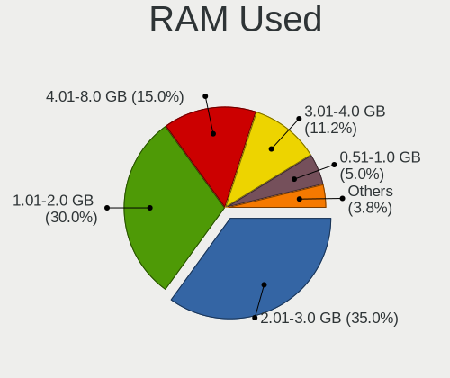
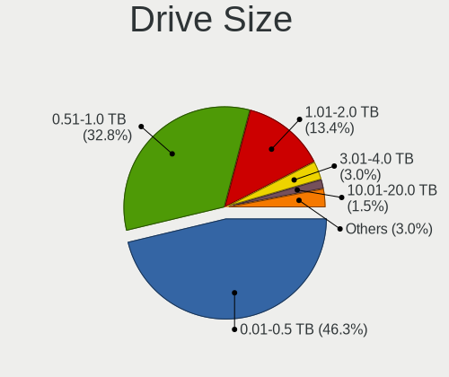
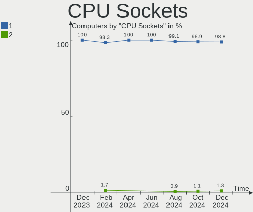
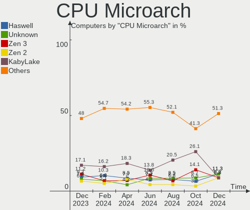
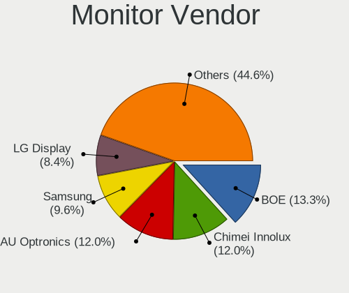
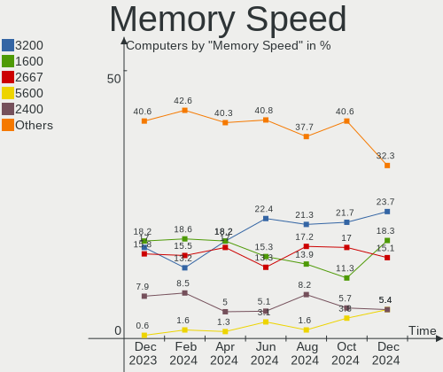

ArcoLinux Hardware Trends
-------------------------

A project to identify most popular hardware characteristics and track their change
over time based on data collected by Linux users at https://Linux-Hardware.org.

Anyone can contribute to this report by the [hw-probe](https://github.com/linuxhw/hw-probe) tool:

    sudo -E hw-probe -all -upload

This is a report for all computer types. See also reports for [desktops](/Dist/ArcoLinux/Desktop/README.md) and [notebooks](/Dist/ArcoLinux/Notebook/README.md).

Full-feature report is available here: https://linux-hardware.org/?view=trends

Period: Jul, 2021.

Contents
--------

* [ System ](#system)
  - [ OS                       ](#os)
  - [ OS Family                ](#os-family)
  - [ Kernel                   ](#kernel)
  - [ Kernel Family            ](#kernel-family)
  - [ Kernel Major Ver.        ](#kernel-major-ver)
  - [ Arch                     ](#arch)
  - [ DE                       ](#de)
  - [ Display Server           ](#display-server)
  - [ Display Manager          ](#display-manager)
  - [ OS Lang                  ](#os-lang)
  - [ Boot Mode                ](#boot-mode)
  - [ Filesystem               ](#filesystem)
  - [ Part. scheme             ](#part-scheme)
  - [ Dual Boot with Linux/BSD ](#dual-boot-with-linuxbsd)
  - [ Dual Boot (Win)          ](#dual-boot-win)

* [ Board ](#board)
  - [ Vendor                   ](#vendor)
  - [ Model                    ](#model)
  - [ Model Family             ](#model-family)
  - [ MFG Year                 ](#mfg-year)
  - [ Form Factor              ](#form-factor)
  - [ Secure Boot              ](#secure-boot)
  - [ Coreboot                 ](#coreboot)
  - [ RAM Size                 ](#ram-size)
  - [ RAM Used                 ](#ram-used)
  - [ Total Drives             ](#total-drives)
  - [ Has CD-ROM               ](#has-cd-rom)
  - [ Has Ethernet             ](#has-ethernet)
  - [ Has WiFi                 ](#has-wifi)
  - [ Has Bluetooth            ](#has-bluetooth)

* [ Location ](#location)
  - [ Country                  ](#country)
  - [ City                     ](#city)

* [ Drives ](#drives)
  - [ Drive Vendor             ](#drive-vendor)
  - [ Drive Model              ](#drive-model)
  - [ HDD Vendor               ](#hdd-vendor)
  - [ SSD Vendor               ](#ssd-vendor)
  - [ Drive Kind               ](#drive-kind)
  - [ Drive Connector          ](#drive-connector)
  - [ Drive Size               ](#drive-size)
  - [ Space Total              ](#space-total)
  - [ Space Used               ](#space-used)
  - [ Malfunc. Drives          ](#malfunc-drives)
  - [ Malfunc. Drive Vendor    ](#malfunc-drive-vendor)
  - [ Malfunc. HDD Vendor      ](#malfunc-hdd-vendor)
  - [ Malfunc. Drive Kind      ](#malfunc-drive-kind)
  - [ Failed Drives            ](#failed-drives)
  - [ Failed Drive Vendor      ](#failed-drive-vendor)
  - [ Drive Status             ](#drive-status)

* [ Storage controller ](#storage-controller)
  - [ Storage Vendor           ](#storage-vendor)
  - [ Storage Model            ](#storage-model)
  - [ Storage Kind             ](#storage-kind)

* [ Processor ](#processor)
  - [ CPU Vendor               ](#cpu-vendor)
  - [ CPU Model                ](#cpu-model)
  - [ CPU Model Family         ](#cpu-model-family)
  - [ CPU Cores                ](#cpu-cores)
  - [ CPU Sockets              ](#cpu-sockets)
  - [ CPU Threads              ](#cpu-threads)
  - [ CPU Op-Modes             ](#cpu-op-modes)
  - [ CPU Microcode            ](#cpu-microcode)
  - [ CPU Microarch            ](#cpu-microarch)

* [ Graphics ](#graphics)
  - [ GPU Vendor               ](#gpu-vendor)
  - [ GPU Model                ](#gpu-model)
  - [ GPU Combo                ](#gpu-combo)
  - [ GPU Driver               ](#gpu-driver)
  - [ GPU Memory               ](#gpu-memory)

* [ Monitor ](#monitor)
  - [ Monitor Vendor           ](#monitor-vendor)
  - [ Monitor Model            ](#monitor-model)
  - [ Monitor Resolution       ](#monitor-resolution)
  - [ Monitor Diagonal         ](#monitor-diagonal)
  - [ Monitor Width            ](#monitor-width)
  - [ Aspect Ratio             ](#aspect-ratio)
  - [ Monitor Area             ](#monitor-area)
  - [ Pixel Density            ](#pixel-density)
  - [ Multiple Monitors        ](#multiple-monitors)

* [ Network ](#network)
  - [ Net Controller Vendor    ](#net-controller-vendor)
  - [ Net Controller Model     ](#net-controller-model)
  - [ Wireless Vendor          ](#wireless-vendor)
  - [ Wireless Model           ](#wireless-model)
  - [ Ethernet Vendor          ](#ethernet-vendor)
  - [ Ethernet Model           ](#ethernet-model)
  - [ Net Controller Kind      ](#net-controller-kind)
  - [ Used Controller          ](#used-controller)
  - [ NICs                     ](#nics)
  - [ IPv6                     ](#ipv6)

* [ Bluetooth ](#bluetooth)
  - [ Bluetooth Vendor         ](#bluetooth-vendor)
  - [ Bluetooth Model          ](#bluetooth-model)

* [ Sound ](#sound)
  - [ Sound Vendor             ](#sound-vendor)
  - [ Sound Model              ](#sound-model)

* [ Memory ](#memory)
  - [ Memory Vendor            ](#memory-vendor)
  - [ Memory Model             ](#memory-model)
  - [ Memory Kind              ](#memory-kind)
  - [ Memory Form Factor       ](#memory-form-factor)
  - [ Memory Size              ](#memory-size)
  - [ Memory Speed             ](#memory-speed)

* [ Printers & scanners ](#printers-&-scanners)
  - [ Printer Vendor           ](#printer-vendor)
  - [ Printer Model            ](#printer-model)
  - [ Scanner Vendor           ](#scanner-vendor)
  - [ Scanner Model            ](#scanner-model)

* [ Camera ](#camera)
  - [ Camera Vendor            ](#camera-vendor)
  - [ Camera Model             ](#camera-model)

* [ Security ](#security)
  - [ Fingerprint Vendor       ](#fingerprint-vendor)
  - [ Fingerprint Model        ](#fingerprint-model)
  - [ Chipcard Vendor          ](#chipcard-vendor)
  - [ Chipcard Model           ](#chipcard-model)

* [ Unsupported ](#unsupported)
  - [ Unsupported Devices      ](#unsupported-devices)
  - [ Unsupported Device Types ](#unsupported-device-types)

System
------

OS
--

Installed operating systems

| Name              | Computers | Percent |
|-------------------|-----------|---------|
| ArcoLinux Rolling | 53        | 86.89%  |
| ArcoLinux         | 8         | 13.11%  |

OS Family
---------

OS without a version

| Name      | Computers | Percent |
|-----------|-----------|---------|
| ArcoLinux | 61        | 100%    |

Kernel
------

Version of the Linux kernel

| Version            | Computers | Percent |
|--------------------|-----------|---------|
| 5.12.15-arch1-1    | 15        | 24.59%  |
| 5.12.14-arch1-1    | 11        | 18.03%  |
| 5.13.5-arch1-1     | 5         | 8.2%    |
| 5.12.15-zen1-1-zen | 3         | 4.92%   |
| 5.12.13-arch1-2    | 3         | 4.92%   |
| 5.12.12-arch1-1    | 3         | 4.92%   |
| 5.10.52-1-lts      | 3         | 4.92%   |
| 5.10.47-1-lts      | 3         | 4.92%   |
| 5.13.6-arch1-1     | 2         | 3.28%   |
| 5.12.1-arch1-1     | 2         | 3.28%   |
| 5.10.48-1-lts      | 2         | 3.28%   |
| 5.13.5-zen1-1-zen  | 1         | 1.64%   |
| 5.13.4-zen1-1-zen  | 1         | 1.64%   |
| 5.13.4-arch2-1     | 1         | 1.64%   |
| 5.13.1-zen1-1-zen  | 1         | 1.64%   |
| 5.12.13-zen1-2-zen | 1         | 1.64%   |
| 5.10.50-1-lts      | 1         | 1.64%   |
| 5.10.49-1-lts      | 1         | 1.64%   |
| 5.10.44-1-lts      | 1         | 1.64%   |
| 5.10.43-1-lts      | 1         | 1.64%   |

Kernel Family
-------------

Linux kernel without a distro release

| Version | Computers | Percent |
|---------|-----------|---------|
| 5.12.15 | 18        | 29.51%  |
| 5.12.14 | 11        | 18.03%  |
| 5.13.5  | 6         | 9.84%   |
| 5.12.13 | 4         | 6.56%   |
| 5.12.12 | 3         | 4.92%   |
| 5.10.52 | 3         | 4.92%   |
| 5.10.47 | 3         | 4.92%   |
| 5.13.6  | 2         | 3.28%   |
| 5.13.4  | 2         | 3.28%   |
| 5.12.1  | 2         | 3.28%   |
| 5.10.48 | 2         | 3.28%   |
| 5.13.1  | 1         | 1.64%   |
| 5.10.50 | 1         | 1.64%   |
| 5.10.49 | 1         | 1.64%   |
| 5.10.44 | 1         | 1.64%   |
| 5.10.43 | 1         | 1.64%   |

Kernel Major Ver.
-----------------

Linux kernel major version

| Version | Computers | Percent |
|---------|-----------|---------|
| 5.12    | 38        | 62.3%   |
| 5.10    | 12        | 19.67%  |
| 5.13    | 11        | 18.03%  |

Arch
----

OS architecture (x86_64, i586, etc.)

| Name   | Computers | Percent |
|--------|-----------|---------|
| x86_64 | 61        | 100%    |

DE
--

Desktop Environment

| Name           | Computers | Percent |
|----------------|-----------|---------|
| XFCE           | 17        | 27.87%  |
| KDE5           | 9         | 14.75%  |
| i3             | 6         | 9.84%   |
| GNOME          | 4         | 6.56%   |
| awesome        | 4         | 6.56%   |
| xmonad         | 3         | 4.92%   |
| X-Cinnamon     | 3         | 4.92%   |
| KDE            | 3         | 4.92%   |
| qtile          | 2         | 3.28%   |
| LXQt           | 2         | 3.28%   |
| Cinnamon       | 2         | 3.28%   |
| bspwm          | 2         | 3.28%   |
| ICEWM          | 1         | 1.64%   |
| i3-with-shmlog | 1         | 1.64%   |
| herbstluftwm   | 1         | 1.64%   |
| Budgie         | 1         | 1.64%   |

Display Server
--------------

X11 or Wayland

| Name    | Computers | Percent |
|---------|-----------|---------|
| X11     | 55        | 90.16%  |
| Tty     | 5         | 8.2%    |
| Wayland | 1         | 1.64%   |

Display Manager
---------------

SDDM, LightDM, etc.

| Name    | Computers | Percent |
|---------|-----------|---------|
| SDDM    | 43        | 70.49%  |
| TDM     | 9         | 14.75%  |
| Unknown | 8         | 13.11%  |
| GDM     | 1         | 1.64%   |

OS Lang
-------

Language

| Lang  | Computers | Percent |
|-------|-----------|---------|
| en_US | 34        | 55.74%  |
| en_GB | 5         | 8.2%    |
| ru_RU | 3         | 4.92%   |
| en_IN | 3         | 4.92%   |
| en_AU | 3         | 4.92%   |
| de_DE | 3         | 4.92%   |
| pt_BR | 2         | 3.28%   |
| en_CA | 2         | 3.28%   |
| sl_SI | 1         | 1.64%   |
| hu_HU | 1         | 1.64%   |
| es_AR | 1         | 1.64%   |
| en_SG | 1         | 1.64%   |
| en_DK | 1         | 1.64%   |
| C     | 1         | 1.64%   |

Boot Mode
---------

EFI or BIOS

| Mode | Computers | Percent |
|------|-----------|---------|
| EFI  | 43        | 70.49%  |
| BIOS | 18        | 29.51%  |

Filesystem
----------

Type of filesystem

| Type    | Computers | Percent |
|---------|-----------|---------|
| Ext4    | 43        | 70.49%  |
| Btrfs   | 14        | 22.95%  |
| Overlay | 3         | 4.92%   |
| Xfs     | 1         | 1.64%   |

Part. scheme
------------

Scheme of partitioning

| Type    | Computers | Percent |
|---------|-----------|---------|
| GPT     | 47        | 77.05%  |
| Unknown | 8         | 13.11%  |
| MBR     | 6         | 9.84%   |

Dual Boot with Linux/BSD
------------------------

Hosting more than one Linux/BSD

| Dual boot | Computers | Percent |
|-----------|-----------|---------|
| No        | 49        | 80.33%  |
| Yes       | 12        | 19.67%  |

Dual Boot (Win)
---------------

Hosting Linux and Windows

| Dual boot | Computers | Percent |
|-----------|-----------|---------|
| No        | 31        | 50.82%  |
| Yes       | 30        | 49.18%  |

Board
-----

Vendor
------

Motherboard manufacturer

| Name                | Computers | Percent |
|---------------------|-----------|---------|
| ASUSTek Computer    | 16        | 26.23%  |
| Lenovo              | 10        | 16.39%  |
| Gigabyte Technology | 9         | 14.75%  |
| Dell                | 7         | 11.48%  |
| Hewlett-Packard     | 5         | 8.2%    |
| Apple               | 3         | 4.92%   |
| Acer                | 3         | 4.92%   |
| MSI                 | 2         | 3.28%   |
| Fujitsu             | 2         | 3.28%   |
| Notebook            | 1         | 1.64%   |
| Biostar             | 1         | 1.64%   |
| ASRock              | 1         | 1.64%   |
| Unknown             | 1         | 1.64%   |

Model
-----

Motherboard model

| Name                                     | Computers | Percent |
|------------------------------------------|-----------|---------|
| Lenovo IdeaPad 5 14ARE05 81YM            | 2         | 3.28%   |
| Notebook P95_HP                          | 1         | 1.64%   |
| MSI GP63 Leopard 8RE                     | 1         | 1.64%   |
| MSI A320M-HDV R4.0                       | 1         | 1.64%   |
| Lenovo Yoga C740 81TC                    | 1         | 1.64%   |
| Lenovo Yoga 910-13IKB 80VF               | 1         | 1.64%   |
| Lenovo ThinkPad X1 Carbon 7th 20QDCTO1WW | 1         | 1.64%   |
| Lenovo ThinkPad T440p 20AWX5140J         | 1         | 1.64%   |
| Lenovo Legion 5 Pro 16ACH6H 82JQ         | 1         | 1.64%   |
| Lenovo Legion 5 15ARH05 82B5             | 1         | 1.64%   |
| Lenovo Legion 5 15ACH6H 82JU             | 1         | 1.64%   |
| Lenovo IdeaPad FLEX 5-1570 81CA          | 1         | 1.64%   |
| HP Stream Notebook PC 13                 | 1         | 1.64%   |
| HP Notebook                              | 1         | 1.64%   |
| HP Laptop 15-da0xxx                      | 1         | 1.64%   |
| HP Compaq Presario CQ40                  | 1         | 1.64%   |
| HP 250 G1                                | 1         | 1.64%   |
| Gigabyte Z97-D3H                         | 1         | 1.64%   |
| Gigabyte X570 AORUS MASTER               | 1         | 1.64%   |
| Gigabyte P85-D3                          | 1         | 1.64%   |
| Gigabyte H310M H                         | 1         | 1.64%   |
| Gigabyte GA-870A-USB3                    | 1         | 1.64%   |
| Gigabyte Barcoo VA35                     | 1         | 1.64%   |
| Gigabyte B85M-D3H                        | 1         | 1.64%   |
| Gigabyte B450 AORUS M                    | 1         | 1.64%   |
| Gigabyte B365M GAMING HD                 | 1         | 1.64%   |
| Fujitsu LIFEBOOK T902                    | 1         | 1.64%   |
| Fujitsu LIFEBOOK S751                    | 1         | 1.64%   |
| Dell XPS 13 9360                         | 1         | 1.64%   |
| Dell Vostro 5568                         | 1         | 1.64%   |
| Dell Precision 7520                      | 1         | 1.64%   |
| Dell OptiPlex 7040                       | 1         | 1.64%   |
| Dell Latitude 7480                       | 1         | 1.64%   |
| Dell Latitude 7370                       | 1         | 1.64%   |
| Dell Latitude 5410                       | 1         | 1.64%   |
| Biostar TZ68K+                           | 1         | 1.64%   |
| ASUS X510UNR                             | 1         | 1.64%   |
| ASUS VivoBook_ASUSLaptop X512FA_X512FA   | 1         | 1.64%   |
| ASUS TUF Z370-PLUS GAMING II             | 1         | 1.64%   |
| ASUS TUF GAMING X570-PLUS                | 1         | 1.64%   |
| ASUS TUF Gaming FX505DT_FX505DT          | 1         | 1.64%   |
| ASUS TUF GAMING B550M-PLUS               | 1         | 1.64%   |
| ASUS TUF B360M-PLUS GAMING/BR            | 1         | 1.64%   |
| ASUS ROG Strix G712LV_G712LV             | 1         | 1.64%   |
| ASUS Q550LF                              | 1         | 1.64%   |
| ASUS PRIME X570-P                        | 1         | 1.64%   |
| ASUS PRIME B250M-K                       | 1         | 1.64%   |
| ASUS PRIME A320M-K                       | 1         | 1.64%   |
| ASUS P8Z77-V DELUXE                      | 1         | 1.64%   |
| ASUS P8P67 LE                            | 1         | 1.64%   |
| ASUS P5Q-E                               | 1         | 1.64%   |
| ASUS K53E                                | 1         | 1.64%   |
| ASRock Z370 Killer SLI/ac                | 1         | 1.64%   |
| Apple Macmini6,1                         | 1         | 1.64%   |
| Apple MacBookPro9,2                      | 1         | 1.64%   |
| Apple MacBookPro11,5                     | 1         | 1.64%   |
| Acer Swift SF314-41G                     | 1         | 1.64%   |
| Acer Aspire E5-575G                      | 1         | 1.64%   |
| Acer Aspire E5-573G                      | 1         | 1.64%   |
| Unknown                                  | 1         | 1.64%   |

Model Family
------------

Motherboard model prefix

| Name                  | Computers | Percent |
|-----------------------|-----------|---------|
| ASUS TUF              | 5         | 8.2%    |
| Lenovo Legion         | 3         | 4.92%   |
| Lenovo IdeaPad        | 3         | 4.92%   |
| Dell Latitude         | 3         | 4.92%   |
| ASUS PRIME            | 3         | 4.92%   |
| Lenovo Yoga           | 2         | 3.28%   |
| Lenovo ThinkPad       | 2         | 3.28%   |
| Fujitsu LIFEBOOK      | 2         | 3.28%   |
| Acer Aspire           | 2         | 3.28%   |
| Notebook P95          | 1         | 1.64%   |
| MSI GP63              | 1         | 1.64%   |
| MSI A320M-HDV         | 1         | 1.64%   |
| HP Stream             | 1         | 1.64%   |
| HP Notebook           | 1         | 1.64%   |
| HP Laptop             | 1         | 1.64%   |
| HP Compaq             | 1         | 1.64%   |
| HP 250                | 1         | 1.64%   |
| Gigabyte Z97-D3H      | 1         | 1.64%   |
| Gigabyte X570         | 1         | 1.64%   |
| Gigabyte P85-D3       | 1         | 1.64%   |
| Gigabyte H310M        | 1         | 1.64%   |
| Gigabyte GA-870A-USB3 | 1         | 1.64%   |
| Gigabyte Barcoo       | 1         | 1.64%   |
| Gigabyte B85M-D3H     | 1         | 1.64%   |
| Gigabyte B450         | 1         | 1.64%   |
| Gigabyte B365M        | 1         | 1.64%   |
| Dell XPS              | 1         | 1.64%   |
| Dell Vostro           | 1         | 1.64%   |
| Dell Precision        | 1         | 1.64%   |
| Dell OptiPlex         | 1         | 1.64%   |
| Biostar TZ68K+        | 1         | 1.64%   |
| ASUS X510UNR          | 1         | 1.64%   |
| ASUS VivoBook         | 1         | 1.64%   |
| ASUS ROG              | 1         | 1.64%   |
| ASUS Q550LF           | 1         | 1.64%   |
| ASUS P8Z77-V          | 1         | 1.64%   |
| ASUS P8P67            | 1         | 1.64%   |
| ASUS P5Q-E            | 1         | 1.64%   |
| ASUS K53E             | 1         | 1.64%   |
| ASRock Z370           | 1         | 1.64%   |
| Apple Macmini6        | 1         | 1.64%   |
| Apple MacBookPro9     | 1         | 1.64%   |
| Apple MacBookPro11    | 1         | 1.64%   |
| Acer Swift            | 1         | 1.64%   |
| Unknown               | 1         | 1.64%   |

MFG Year
--------

Motherboard manufacture year

| Year | Computers | Percent |
|------|-----------|---------|
| 2020 | 13        | 21.31%  |
| 2021 | 11        | 18.03%  |
| 2019 | 10        | 16.39%  |
| 2017 | 7         | 11.48%  |
| 2013 | 6         | 9.84%   |
| 2018 | 3         | 4.92%   |
| 2009 | 3         | 4.92%   |
| 2015 | 2         | 3.28%   |
| 2014 | 2         | 3.28%   |
| 2012 | 2         | 3.28%   |
| 2016 | 1         | 1.64%   |
| 2011 | 1         | 1.64%   |

Form Factor
-----------

Physical design of the computer

| Name        | Computers | Percent |
|-------------|-----------|---------|
| Notebook    | 34        | 55.74%  |
| Desktop     | 23        | 37.7%   |
| Convertible | 3         | 4.92%   |
| Mini pc     | 1         | 1.64%   |

Secure Boot
-----------

Enabled or disabled

| State    | Computers | Percent |
|----------|-----------|---------|
| Disabled | 61        | 100%    |

Coreboot
--------

Have coreboot on board

| Used | Computers | Percent |
|------|-----------|---------|
| No   | 61        | 100%    |

RAM Size
--------

Total RAM memory

| Size in GB  | Computers | Percent |
|-------------|-----------|---------|
| 16.01-24.0  | 24        | 39.34%  |
| 4.01-8.0    | 12        | 19.67%  |
| 8.01-16.0   | 10        | 16.39%  |
| 32.01-64.0  | 7         | 11.48%  |
| 3.01-4.0    | 5         | 8.2%    |
| 1.01-2.0    | 2         | 3.28%   |
| 64.01-256.0 | 1         | 1.64%   |

RAM Used
--------

Used RAM memory

| Used GB    | Computers | Percent |
|------------|-----------|---------|
| 1.01-2.0   | 22        | 36.07%  |
| 2.01-3.0   | 11        | 18.03%  |
| 3.01-4.0   | 10        | 16.39%  |
| 4.01-8.0   | 7         | 11.48%  |
| 0.51-1.0   | 5         | 8.2%    |
| 8.01-16.0  | 3         | 4.92%   |
| 0.01-0.5   | 2         | 3.28%   |
| 24.01-32.0 | 1         | 1.64%   |

Total Drives
------------

Number of drives on board

| Drives | Computers | Percent |
|--------|-----------|---------|
| 2      | 22        | 36.07%  |
| 1      | 22        | 36.07%  |
| 3      | 8         | 13.11%  |
| 4      | 5         | 8.2%    |
| 5      | 2         | 3.28%   |
| 10     | 1         | 1.64%   |
| 6      | 1         | 1.64%   |

Has CD-ROM
----------

Has CD-ROM on board

| Presented | Computers | Percent |
|-----------|-----------|---------|
| No        | 46        | 75.41%  |
| Yes       | 15        | 24.59%  |

Has Ethernet
------------

Has Ethernet on board

| Presented | Computers | Percent |
|-----------|-----------|---------|
| Yes       | 50        | 81.97%  |
| No        | 11        | 18.03%  |

Has WiFi
--------

Has WiFi module

| Presented | Computers | Percent |
|-----------|-----------|---------|
| Yes       | 47        | 77.05%  |
| No        | 14        | 22.95%  |

Has Bluetooth
-------------

Has Bluetooth module

| Presented | Computers | Percent |
|-----------|-----------|---------|
| Yes       | 42        | 68.85%  |
| No        | 19        | 31.15%  |

Location
--------

Country
-------

Geographic location (country)

| Country     | Computers | Percent |
|-------------|-----------|---------|
| USA         | 13        | 21.31%  |
| India       | 6         | 9.84%   |
| UK          | 4         | 6.56%   |
| Russia      | 4         | 6.56%   |
| Germany     | 4         | 6.56%   |
| Canada      | 3         | 4.92%   |
| Australia   | 3         | 4.92%   |
| Vietnam     | 2         | 3.28%   |
| Poland      | 2         | 3.28%   |
| Brazil      | 2         | 3.28%   |
| Bangladesh  | 2         | 3.28%   |
| Uzbekistan  | 1         | 1.64%   |
| Ukraine     | 1         | 1.64%   |
| Switzerland | 1         | 1.64%   |
| Spain       | 1         | 1.64%   |
| Slovenia    | 1         | 1.64%   |
| Singapore   | 1         | 1.64%   |
| Ireland     | 1         | 1.64%   |
| Hong Kong   | 1         | 1.64%   |
| Guatemala   | 1         | 1.64%   |
| Denmark     | 1         | 1.64%   |
| Czechia     | 1         | 1.64%   |
| Chile       | 1         | 1.64%   |
| Bulgaria    | 1         | 1.64%   |
| Bahrain     | 1         | 1.64%   |
| Azerbaijan  | 1         | 1.64%   |
| Argentina   | 1         | 1.64%   |

City
----

Geographic location (city)

| City                 | Computers | Percent |
|----------------------|-----------|---------|
| Moscow               | 3         | 4.92%   |
| Sydney               | 2         | 3.28%   |
| Mumbai               | 2         | 3.28%   |
| Yekaterinburg        | 1         | 1.64%   |
| Wroclaw              | 1         | 1.64%   |
| Wiesbaden            | 1         | 1.64%   |
| Walla Walla          | 1         | 1.64%   |
| Vorbach              | 1         | 1.64%   |
| Valencia             | 1         | 1.64%   |
| Toronto              | 1         | 1.64%   |
| Tekoa                | 1         | 1.64%   |
| Tashkent             | 1         | 1.64%   |
| Stuttgart            | 1         | 1.64%   |
| Singapore            | 1         | 1.64%   |
| Shumen               | 1         | 1.64%   |
| Sao Lourenco da Mata | 1         | 1.64%   |
| Santiago             | 1         | 1.64%   |
| San Antonio          | 1         | 1.64%   |
| Rangpur              | 1         | 1.64%   |
| Poznan               | 1         | 1.64%   |
| Portland             | 1         | 1.64%   |
| Plano                | 1         | 1.64%   |
| Old Town             | 1         | 1.64%   |
| North Charleston     | 1         | 1.64%   |
| Nha Trang            | 1         | 1.64%   |
| Mississauga          | 1         | 1.64%   |
| Menzingen            | 1         | 1.64%   |
| Manama               | 1         | 1.64%   |
| Lloydminster         | 1         | 1.64%   |
| Ljubljana            | 1         | 1.64%   |
| Lancaster            | 1         | 1.64%   |
| Kolkata              | 1         | 1.64%   |
| Kannur               | 1         | 1.64%   |
| Islington            | 1         | 1.64%   |
| Ingeniero Jacobacci  | 1         | 1.64%   |
| Hyderabad            | 1         | 1.64%   |
| Ho Chi Minh City     | 1         | 1.64%   |
| Half Moon Bay        | 1         | 1.64%   |
| Hackney              | 1         | 1.64%   |
| Guatemala City       | 1         | 1.64%   |
| East Hartford        | 1         | 1.64%   |
| Dnipropetrovsk       | 1         | 1.64%   |
| Dhaka                | 1         | 1.64%   |
| Denver               | 1         | 1.64%   |
| Dagenham             | 1         | 1.64%   |
| Curitiba             | 1         | 1.64%   |
| Central              | 1         | 1.64%   |
| Celbridge            | 1         | 1.64%   |
| Camillus             | 1         | 1.64%   |
| Burlington           | 1         | 1.64%   |
| Brisbane             | 1         | 1.64%   |
| Bergheim             | 1         | 1.64%   |
| Bengaluru            | 1         | 1.64%   |
| Bath                 | 1         | 1.64%   |
| Baltimore            | 1         | 1.64%   |
| Baku                 | 1         | 1.64%   |
| Aarhus               | 1         | 1.64%   |

Drives
------

Drive Vendor
------------

Hard drive vendors

| Vendor              | Computers | Drives | Percent |
|---------------------|-----------|--------|---------|
| Samsung Electronics | 24        | 28     | 20.87%  |
| WDC                 | 17        | 27     | 14.78%  |
| Seagate             | 17        | 22     | 14.78%  |
| Kingston            | 7         | 7      | 6.09%   |
| Intel               | 6         | 6      | 5.22%   |
| Toshiba             | 5         | 5      | 4.35%   |
| SK Hynix            | 4         | 4      | 3.48%   |
| Sandisk             | 4         | 5      | 3.48%   |
| Crucial             | 4         | 4      | 3.48%   |
| HGST                | 3         | 3      | 2.61%   |
| A-DATA Technology   | 3         | 3      | 2.61%   |
| Unknown             | 2         | 4      | 1.74%   |
| PNY                 | 2         | 2      | 1.74%   |
| OCZ                 | 2         | 2      | 1.74%   |
| Micron Technology   | 2         | 2      | 1.74%   |
| Corsair             | 2         | 2      | 1.74%   |
| SPCC                | 1         | 1      | 0.87%   |
| SABRENT             | 1         | 1      | 0.87%   |
| PLEXTOR             | 1         | 1      | 0.87%   |
| Patriot             | 1         | 1      | 0.87%   |
| LITEON              | 1         | 1      | 0.87%   |
| Lexar               | 1         | 1      | 0.87%   |
| Hitachi             | 1         | 1      | 0.87%   |
| GOODRAM             | 1         | 1      | 0.87%   |
| China               | 1         | 3      | 0.87%   |
| Apple               | 1         | 1      | 0.87%   |
| Apacer              | 1         | 1      | 0.87%   |

Drive Model
-----------

Hard drive models

| Model                                     | Computers | Percent |
|-------------------------------------------|-----------|---------|
| Samsung SSD 860 EVO 500GB                 | 3         | 2.21%   |
| WDC WDS250G1B0C-00S6U0 250GB              | 2         | 1.47%   |
| WDC WDS120G2G0B-00EPW0 120GB SSD          | 2         | 1.47%   |
| WDC WD10SPZX-24Z10T0 1TB                  | 2         | 1.47%   |
| Toshiba MQ04ABF100 1TB                    | 2         | 1.47%   |
| Seagate ST1000LM035-1RK172 1TB            | 2         | 1.47%   |
| Seagate ST1000LM024 HN-M101MBB 1TB        | 2         | 1.47%   |
| Samsung SSD 970 EVO 1TB                   | 2         | 1.47%   |
| Samsung SSD 860 EVO 1TB                   | 2         | 1.47%   |
| Samsung SSD 840 EVO 120GB                 | 2         | 1.47%   |
| WDC WDS240G2G0A-00JH30 240GB SSD          | 1         | 0.74%   |
| WDC WDS120G2G0A-00JH30 120GB SSD          | 1         | 0.74%   |
| WDC WDS100T2G0A-00JH30 1TB SSD            | 1         | 0.74%   |
| WDC WD6400BEVT-60A0RT0 640GB              | 1         | 0.74%   |
| WDC WD5000AZRX-00A8LB0 500GB              | 1         | 0.74%   |
| WDC WD5000AAKX-603CA0 500GB               | 1         | 0.74%   |
| WDC WD50 00BEVT-22A0RT0 500GB             | 1         | 0.74%   |
| WDC WD40EZRZ-75GXCB0 4TB                  | 1         | 0.74%   |
| WDC WD40EZRZ-19GXCB0 4TB                  | 1         | 0.74%   |
| WDC WD3200AAKS-75SBA0 320GB               | 1         | 0.74%   |
| WDC WD30EFRX-68EUZN0 3TB                  | 1         | 0.74%   |
| WDC WD2002FAEX-007BA0 2TB                 | 1         | 0.74%   |
| WDC WD10SPZX-22Z10T1 1TB                  | 1         | 0.74%   |
| WDC WD10SPZX-08Z10 1TB                    | 1         | 0.74%   |
| WDC WD10JPVX-60JC3T0 1TB                  | 1         | 0.74%   |
| WDC WD10EZRX-00L4HB0 1TB                  | 1         | 0.74%   |
| WDC WD10EZEX-75M2NA0 1TB                  | 1         | 0.74%   |
| WDC WD10EZEX-00BN5A0 1TB                  | 1         | 0.74%   |
| WDC WD10EACS-32ZJB0 1TB                   | 1         | 0.74%   |
| WDC WD1003FZEX-00MK2A0 1TB                | 1         | 0.74%   |
| Unknown SD16G  16GB                       | 1         | 0.74%   |
| Unknown MMC Card  32GB                    | 1         | 0.74%   |
| Unknown MMC Card  16GB                    | 1         | 0.74%   |
| Unknown BGND3R  32GB                      | 1         | 0.74%   |
| Toshiba RC100 240GB                       | 1         | 0.74%   |
| Toshiba MQ01ABF050 500GB                  | 1         | 0.74%   |
| Toshiba DT01ACA100 1TB                    | 1         | 0.74%   |
| SPCC M.2 PCIe SSD 2TB                     | 1         | 0.74%   |
| SK Hynix SKHynix_HFS256GD9TNI-L2A0B 256GB | 1         | 0.74%   |
| SK Hynix SKHynix_HFM256GDHTNI-87A0B 256GB | 1         | 0.74%   |
| SK Hynix SC311 SATA 128GB SSD             | 1         | 0.74%   |
| SK Hynix HFM512GDJTNG-8310A 512GB         | 1         | 0.74%   |
| Seagate STM31000528AS 1TB                 | 1         | 0.74%   |
| Seagate ST9250315AS 250GB                 | 1         | 0.74%   |
| Seagate ST8000DM004-2CX188 8TB            | 1         | 0.74%   |
| Seagate ST500DM005 HD502HJ 500GB          | 1         | 0.74%   |
| Seagate ST4000VX007-2DT166 4TB            | 1         | 0.74%   |
| Seagate ST4000LM024-2AN17V 4TB            | 1         | 0.74%   |
| Seagate ST3250318AS 250GB                 | 1         | 0.74%   |
| Seagate ST320LT0 07-9ZV142 320GB          | 1         | 0.74%   |
| Seagate ST31000340NS 1TB                  | 1         | 0.74%   |
| Seagate ST3000VN000 4GB                   | 1         | 0.74%   |
| Seagate ST3000DM007-1WY10G 3TB            | 1         | 0.74%   |
| Seagate ST3000DM001-1ER166 3TB            | 1         | 0.74%   |
| Seagate ST2000DM006-2DM164 2TB            | 1         | 0.74%   |
| Seagate ST2000DM001-1CH164 2TB            | 1         | 0.74%   |
| Seagate ST2000DL003-9VT166 2TB            | 1         | 0.74%   |
| Seagate ST1000DM003-9YN162 1TB            | 1         | 0.74%   |
| Seagate ST1000DM003-1CH162 1TB            | 1         | 0.74%   |
| Seagate Expansion Desk 3TB                | 1         | 0.74%   |

HDD Vendor
----------

Hard disk drive vendors

| Vendor              | Computers | Drives | Percent |
|---------------------|-----------|--------|---------|
| Seagate             | 17        | 22     | 42.5%   |
| WDC                 | 13        | 19     | 32.5%   |
| Toshiba             | 4         | 4      | 10%     |
| HGST                | 3         | 3      | 7.5%    |
| Samsung Electronics | 2         | 3      | 5%      |
| Hitachi             | 1         | 1      | 2.5%    |

SSD Vendor
----------

Solid state drive vendors

| Vendor              | Computers | Drives | Percent |
|---------------------|-----------|--------|---------|
| Samsung Electronics | 14        | 15     | 29.79%  |
| WDC                 | 5         | 6      | 10.64%  |
| Kingston            | 5         | 5      | 10.64%  |
| Crucial             | 4         | 4      | 8.51%   |
| SanDisk             | 2         | 2      | 4.26%   |
| OCZ                 | 2         | 2      | 4.26%   |
| Intel               | 2         | 2      | 4.26%   |
| SK Hynix            | 1         | 1      | 2.13%   |
| PNY                 | 1         | 1      | 2.13%   |
| PLEXTOR             | 1         | 1      | 2.13%   |
| Patriot             | 1         | 1      | 2.13%   |
| Micron Technology   | 1         | 1      | 2.13%   |
| LITEON              | 1         | 1      | 2.13%   |
| Lexar               | 1         | 1      | 2.13%   |
| GOODRAM             | 1         | 1      | 2.13%   |
| Corsair             | 1         | 1      | 2.13%   |
| China               | 1         | 3      | 2.13%   |
| Apple               | 1         | 1      | 2.13%   |
| Apacer              | 1         | 1      | 2.13%   |
| A-DATA Technology   | 1         | 1      | 2.13%   |

Drive Kind
----------

HDD or SSD

| Kind | Computers | Drives | Percent |
|------|-----------|--------|---------|
| SSD  | 35        | 51     | 36.08%  |
| HDD  | 35        | 52     | 36.08%  |
| NVMe | 25        | 32     | 25.77%  |
| MMC  | 2         | 4      | 2.06%   |

Drive Connector
---------------

SATA, SAS, NVMe, etc.

| Type | Computers | Drives | Percent |
|------|-----------|--------|---------|
| SATA | 48        | 97     | 58.54%  |
| NVMe | 25        | 31     | 30.49%  |
| SAS  | 7         | 7      | 8.54%   |
| MMC  | 2         | 4      | 2.44%   |

Drive Size
----------

Size of hard drive

| Size in TB | Computers | Drives | Percent |
|------------|-----------|--------|---------|
| 0.01-0.5   | 32        | 52     | 44.44%  |
| 0.51-1.0   | 28        | 35     | 38.89%  |
| 1.01-2.0   | 5         | 7      | 6.94%   |
| 2.01-3.0   | 4         | 4      | 5.56%   |
| 3.01-4.0   | 2         | 4      | 2.78%   |
| 4.01-10.0  | 1         | 1      | 1.39%   |

Space Total
-----------

Amount of disk space available on the file system

| Size in GB     | Computers | Percent |
|----------------|-----------|---------|
| 101-250        | 14        | 22.95%  |
| 501-1000       | 12        | 19.67%  |
| 251-500        | 9         | 14.75%  |
| 1001-2000      | 7         | 11.48%  |
| Unknown        | 6         | 9.84%   |
| More than 3000 | 5         | 8.2%    |
| 21-50          | 2         | 3.28%   |
| 2001-3000      | 2         | 3.28%   |
| 1-20           | 2         | 3.28%   |
| 51-100         | 2         | 3.28%   |

Space Used
----------

Amount of used disk space

| Used GB        | Computers | Percent |
|----------------|-----------|---------|
| 21-50          | 14        | 22.95%  |
| 101-250        | 12        | 19.67%  |
| 51-100         | 9         | 14.75%  |
| 1-20           | 8         | 13.11%  |
| Unknown        | 6         | 9.84%   |
| 251-500        | 4         | 6.56%   |
| 501-1000       | 4         | 6.56%   |
| More than 3000 | 2         | 3.28%   |
| 1001-2000      | 2         | 3.28%   |

Malfunc. Drives
---------------

Drive models with a malfunction

| Model                                 | Computers | Drives | Percent |
|---------------------------------------|-----------|--------|---------|
| WDC WD6400BEVT-60A0RT0 640GB          | 1         | 1      | 6.67%   |
| WDC WD5000AAKX-603CA0 500GB           | 1         | 1      | 6.67%   |
| WDC WD10SPZX-24Z10T0 1TB              | 1         | 1      | 6.67%   |
| WDC WD1003FZEX-00MK2A0 1TB            | 1         | 1      | 6.67%   |
| Toshiba MQ04ABF100 1TB                | 1         | 1      | 6.67%   |
| Seagate STM31000528AS 1TB             | 1         | 1      | 6.67%   |
| Seagate ST500DM005 HD502HJ 500GB      | 1         | 1      | 6.67%   |
| Seagate ST3000DM001-1ER166 3TB        | 1         | 1      | 6.67%   |
| Seagate ST1000LM024 HN-M101MBB 1TB    | 1         | 1      | 6.67%   |
| Seagate ST1000DM003-9YN162 1TB        | 1         | 1      | 6.67%   |
| Micron Technology 1100 SATA 512GB SSD | 1         | 1      | 6.67%   |
| Intel SSDSC2BF240A5L 240GB            | 1         | 1      | 6.67%   |
| Intel SSDSA2M160G2GC 160GB            | 1         | 1      | 6.67%   |
| HGST HTS545050A7E380 500GB            | 1         | 1      | 6.67%   |
| Corsair Force LS SSD 120GB            | 1         | 1      | 6.67%   |

Malfunc. Drive Vendor
---------------------

Vendors of faulty drives

| Vendor            | Computers | Drives | Percent |
|-------------------|-----------|--------|---------|
| Seagate           | 5         | 5      | 33.33%  |
| WDC               | 4         | 4      | 26.67%  |
| Intel             | 2         | 2      | 13.33%  |
| Toshiba           | 1         | 1      | 6.67%   |
| Micron Technology | 1         | 1      | 6.67%   |
| HGST              | 1         | 1      | 6.67%   |
| Corsair           | 1         | 1      | 6.67%   |

Malfunc. HDD Vendor
-------------------

Vendors of faulty HDD drives

| Vendor  | Computers | Drives | Percent |
|---------|-----------|--------|---------|
| Seagate | 5         | 5      | 45.45%  |
| WDC     | 4         | 4      | 36.36%  |
| Toshiba | 1         | 1      | 9.09%   |
| HGST    | 1         | 1      | 9.09%   |

Malfunc. Drive Kind
-------------------

Kinds of faulty drives

| Kind | Computers | Drives | Percent |
|------|-----------|--------|---------|
| HDD  | 11        | 11     | 73.33%  |
| SSD  | 4         | 4      | 26.67%  |

Failed Drives
-------------

Failed drive models

Zero info for selected period =(

Failed Drive Vendor
-------------------

Failed drive vendors

Zero info for selected period =(

Drive Status
------------

Number of failed and malfunc. drives

| Status   | Computers | Drives | Percent |
|----------|-----------|--------|---------|
| Works    | 48        | 102    | 64%     |
| Malfunc  | 14        | 15     | 18.67%  |
| Detected | 13        | 22     | 17.33%  |

Storage controller
------------------

Storage Vendor
--------------

Storage controller vendors

| Vendor                       | Computers | Percent |
|------------------------------|-----------|---------|
| Intel                        | 41        | 50%     |
| AMD                          | 12        | 14.63%  |
| Samsung Electronics          | 9         | 10.98%  |
| Sandisk                      | 4         | 4.88%   |
| SK Hynix                     | 3         | 3.66%   |
| ASMedia Technology           | 3         | 3.66%   |
| Phison Electronics           | 2         | 2.44%   |
| Marvell Technology Group     | 2         | 2.44%   |
| Kingston Technology Company  | 2         | 2.44%   |
| Toshiba America Info Systems | 1         | 1.22%   |
| Realtek Semiconductor        | 1         | 1.22%   |
| Micron Technology            | 1         | 1.22%   |
| ADATA Technology             | 1         | 1.22%   |

Storage Model
-------------

Storage controller models

| Model                                                                                   | Computers | Percent |
|-----------------------------------------------------------------------------------------|-----------|---------|
| AMD FCH SATA Controller [AHCI mode]                                                     | 9         | 9.57%   |
| Samsung NVMe SSD Controller SM981/PM981/PM983                                           | 5         | 5.32%   |
| Intel Sunrise Point-LP SATA Controller [AHCI mode]                                      | 4         | 4.26%   |
| Intel 7 Series Chipset Family 6-port SATA Controller [AHCI mode]                        | 4         | 4.26%   |
| Intel 200 Series PCH SATA controller [AHCI mode]                                        | 4         | 4.26%   |
| Sandisk WD Blue SN500 / PC SN520 NVMe SSD                                               | 3         | 3.19%   |
| Intel 82801 Mobile SATA Controller [RAID mode]                                          | 3         | 3.19%   |
| Intel 8 Series/C220 Series Chipset Family 6-port SATA Controller 1 [AHCI mode]          | 3         | 3.19%   |
| ASMedia ASM1062 Serial ATA Controller                                                   | 3         | 3.19%   |
| Samsung NVMe SSD Controller SM961/PM961/SM963                                           | 2         | 2.13%   |
| Samsung NVMe SSD Controller PM9A1/PM9A3/980PRO                                          | 2         | 2.13%   |
| Phison E12 NVMe Controller                                                              | 2         | 2.13%   |
| Intel Wildcat Point-LP SATA Controller [AHCI Mode]                                      | 2         | 2.13%   |
| Intel SSD 660P Series                                                                   | 2         | 2.13%   |
| Intel Q170/Q150/B150/H170/H110/Z170/CM236 Chipset SATA Controller [AHCI Mode]           | 2         | 2.13%   |
| Intel Comet Lake SATA AHCI Controller                                                   | 2         | 2.13%   |
| Intel Cannon Lake PCH SATA AHCI Controller                                              | 2         | 2.13%   |
| Intel 6 Series/C200 Series Chipset Family 6 port Mobile SATA AHCI Controller            | 2         | 2.13%   |
| AMD FCH SATA Controller D                                                               | 2         | 2.13%   |
| Toshiba America Info Systems BG3 NVMe SSD Controller                                    | 1         | 1.06%   |
| SK Hynix Non-Volatile memory controller                                                 | 1         | 1.06%   |
| SK Hynix BC511                                                                          | 1         | 1.06%   |
| SK Hynix BC501 NVMe Solid State Drive                                                   | 1         | 1.06%   |
| Sandisk WD Blue SN550 NVMe SSD                                                          | 1         | 1.06%   |
| Sandisk WD Black SN750 / PC SN730 NVMe SSD                                              | 1         | 1.06%   |
| Samsung NVMe Controller                                                                 | 1         | 1.06%   |
| Samsung Electronics SATA controller                                                     | 1         | 1.06%   |
| Realtek Realtek Non-Volatile memory controller                                          | 1         | 1.06%   |
| Phison E16 PCIe4 NVMe Controller                                                        | 1         | 1.06%   |
| Micron Non-Volatile memory controller                                                   | 1         | 1.06%   |
| Marvell Group 88SE9230 PCIe 2.0 x2 4-port SATA 6 Gb/s RAID Controller                   | 1         | 1.06%   |
| Marvell Group 88SE912x IDE Controller                                                   | 1         | 1.06%   |
| Marvell Group 88SE9120 SATA 6Gb/s Controller                                            | 1         | 1.06%   |
| Marvell Group 88SE6111/6121 SATA II / PATA Controller                                   | 1         | 1.06%   |
| Kingston Company U-SNS8154P3 NVMe SSD                                                   | 1         | 1.06%   |
| Kingston Company Company Non-Volatile memory controller                                 | 1         | 1.06%   |
| Intel SSD Pro 7600p/760p/E 6100p Series                                                 | 1         | 1.06%   |
| Intel SSD 600P Series                                                                   | 1         | 1.06%   |
| Intel NM10/ICH7 Family SATA Controller [IDE mode]                                       | 1         | 1.06%   |
| Intel HM170/QM170 Chipset SATA Controller [AHCI Mode]                                   | 1         | 1.06%   |
| Intel Cannon Point-LP SATA Controller [AHCI Mode]                                       | 1         | 1.06%   |
| Intel Cannon Lake Mobile PCH SATA AHCI Controller                                       | 1         | 1.06%   |
| Intel 9 Series Chipset Family SATA Controller [AHCI Mode]                               | 1         | 1.06%   |
| Intel 82801JI (ICH10 Family) SATA AHCI Controller                                       | 1         | 1.06%   |
| Intel 82801IBM/IEM (ICH9M/ICH9M-E) 4 port SATA Controller [AHCI mode]                   | 1         | 1.06%   |
| Intel 8 Series SATA Controller 1 [AHCI mode]                                            | 1         | 1.06%   |
| Intel 7 Series/C210 Series Chipset Family 6-port SATA Controller [AHCI mode]            | 1         | 1.06%   |
| Intel 6 Series/C200 Series Chipset Family Desktop SATA Controller (IDE mode, ports 4-5) | 1         | 1.06%   |
| Intel 6 Series/C200 Series Chipset Family Desktop SATA Controller (IDE mode, ports 0-3) | 1         | 1.06%   |
| Intel 6 Series/C200 Series Chipset Family 6 port Desktop SATA AHCI Controller           | 1         | 1.06%   |
| AMD Starship/Matisse Chipset SATA Controller [AHCI mode]                                | 1         | 1.06%   |
| AMD SB7x0/SB8x0/SB9x0 SATA Controller [AHCI mode]                                       | 1         | 1.06%   |
| AMD SB7x0/SB8x0/SB9x0 IDE Controller                                                    | 1         | 1.06%   |
| AMD 400 Series Chipset SATA Controller                                                  | 1         | 1.06%   |
| ADATA Non-Volatile memory controller                                                    | 1         | 1.06%   |

Storage Kind
------------

Kind of storage controller (IDE, SATA, NVMe, SAS, ...)

| Kind | Computers | Percent |
|------|-----------|---------|
| SATA | 47        | 58.75%  |
| NVMe | 25        | 31.25%  |
| IDE  | 5         | 6.25%   |
| RAID | 3         | 3.75%   |

Processor
---------

CPU Vendor
----------

Processor vendors

| Vendor | Computers | Percent |
|--------|-----------|---------|
| Intel  | 46        | 75.41%  |
| AMD    | 15        | 24.59%  |

CPU Model
---------

Processor models

| Model                                         | Computers | Percent |
|-----------------------------------------------|-----------|---------|
| Intel Core i5-8250U CPU @ 1.60GHz             | 3         | 4.92%   |
| Intel Core i5-7200U CPU @ 2.50GHz             | 3         | 4.92%   |
| Intel Core i5-8400 CPU @ 2.80GHz              | 2         | 3.28%   |
| Intel Core i5-6500 CPU @ 3.20GHz              | 2         | 3.28%   |
| Intel Core i5-3210M CPU @ 2.50GHz             | 2         | 3.28%   |
| AMD Ryzen 7 5800H with Radeon Graphics        | 2         | 3.28%   |
| AMD Ryzen 7 4700U with Radeon Graphics        | 2         | 3.28%   |
| AMD Ryzen 7 3700X 8-Core Processor            | 2         | 3.28%   |
| Intel Xeon CPU E5450 @ 3.00GHz                | 1         | 1.64%   |
| Intel Xeon CPU E3-1505M v6 @ 3.00GHz          | 1         | 1.64%   |
| Intel Pentium Dual-Core CPU T4200 @ 2.00GHz   | 1         | 1.64%   |
| Intel Pentium CPU 2020M @ 2.40GHz             | 1         | 1.64%   |
| Intel Core m7-6Y75 CPU @ 1.20GHz              | 1         | 1.64%   |
| Intel Core i9-9900KF CPU @ 3.60GHz            | 1         | 1.64%   |
| Intel Core i9-9900K CPU @ 3.60GHz             | 1         | 1.64%   |
| Intel Core i7-8750H CPU @ 2.20GHz             | 1         | 1.64%   |
| Intel Core i7-8565U CPU @ 1.80GHz             | 1         | 1.64%   |
| Intel Core i7-8550U CPU @ 1.80GHz             | 1         | 1.64%   |
| Intel Core i7-7700HQ CPU @ 2.80GHz            | 1         | 1.64%   |
| Intel Core i7-7600U CPU @ 2.80GHz             | 1         | 1.64%   |
| Intel Core i7-7500U CPU @ 2.70GHz             | 1         | 1.64%   |
| Intel Core i7-4980HQ CPU @ 2.80GHz            | 1         | 1.64%   |
| Intel Core i7-4790K CPU @ 4.00GHz             | 1         | 1.64%   |
| Intel Core i7-4600M CPU @ 2.90GHz             | 1         | 1.64%   |
| Intel Core i7-4500U CPU @ 1.80GHz             | 1         | 1.64%   |
| Intel Core i7-3770K CPU @ 3.50GHz             | 1         | 1.64%   |
| Intel Core i7-10750H CPU @ 2.60GHz            | 1         | 1.64%   |
| Intel Core i7-10610U CPU @ 1.80GHz            | 1         | 1.64%   |
| Intel Core i5-8265U CPU @ 1.60GHz             | 1         | 1.64%   |
| Intel Core i5-5200U CPU @ 2.20GHz             | 1         | 1.64%   |
| Intel Core i5-4670K CPU @ 3.40GHz             | 1         | 1.64%   |
| Intel Core i5-4440 CPU @ 3.10GHz              | 1         | 1.64%   |
| Intel Core i5-3340M CPU @ 2.70GHz             | 1         | 1.64%   |
| Intel Core i5-2520M CPU @ 2.50GHz             | 1         | 1.64%   |
| Intel Core i5-2500K CPU @ 3.30GHz             | 1         | 1.64%   |
| Intel Core i5-2410M CPU @ 2.30GHz             | 1         | 1.64%   |
| Intel Core i5-2400 CPU @ 3.10GHz              | 1         | 1.64%   |
| Intel Core i5-10210U CPU @ 1.60GHz            | 1         | 1.64%   |
| Intel Core i3-8100 CPU @ 3.60GHz              | 1         | 1.64%   |
| Intel Core i3-5005U CPU @ 2.00GHz             | 1         | 1.64%   |
| Intel Core 2 Duo CPU E8400 @ 3.00GHz          | 1         | 1.64%   |
| Intel Celeron CPU N2840 @ 2.16GHz             | 1         | 1.64%   |
| AMD Ryzen 9 3950X 16-Core Processor           | 1         | 1.64%   |
| AMD Ryzen 7 4800H with Radeon Graphics        | 1         | 1.64%   |
| AMD Ryzen 7 3800X 8-Core Processor            | 1         | 1.64%   |
| AMD Ryzen 5 3550H with Radeon Vega Mobile Gfx | 1         | 1.64%   |
| AMD Ryzen 5 3500U with Radeon Vega Mobile Gfx | 1         | 1.64%   |
| AMD Ryzen 5 2600 Six-Core Processor           | 1         | 1.64%   |
| AMD Ryzen 3 2300X Quad-Core Processor         | 1         | 1.64%   |
| AMD Ryzen 3 2200G with Radeon Vega Graphics   | 1         | 1.64%   |
| AMD Phenom II X4 955 Processor                | 1         | 1.64%   |

CPU Model Family
----------------

Processor model prefix

| Model                   | Computers | Percent |
|-------------------------|-----------|---------|
| Intel Core i5           | 22        | 36.07%  |
| Intel Core i7           | 13        | 21.31%  |
| AMD Ryzen 7             | 8         | 13.11%  |
| AMD Ryzen 5             | 3         | 4.92%   |
| Intel Xeon              | 2         | 3.28%   |
| Intel Core i9           | 2         | 3.28%   |
| Intel Core i3           | 2         | 3.28%   |
| AMD Ryzen 3             | 2         | 3.28%   |
| Intel Pentium Dual-Core | 1         | 1.64%   |
| Intel Pentium           | 1         | 1.64%   |
| Intel Core m7           | 1         | 1.64%   |
| Intel Core 2 Duo        | 1         | 1.64%   |
| Intel Celeron           | 1         | 1.64%   |
| AMD Ryzen 9             | 1         | 1.64%   |
| AMD Phenom II X4        | 1         | 1.64%   |

CPU Cores
---------

Number of processor cores

| Number | Computers | Percent |
|--------|-----------|---------|
| 4      | 26        | 42.62%  |
| 2      | 19        | 31.15%  |
| 8      | 10        | 16.39%  |
| 6      | 5         | 8.2%    |
| 16     | 1         | 1.64%   |

CPU Sockets
-----------

Number of sockets

| Number | Computers | Percent |
|--------|-----------|---------|
| 1      | 61        | 100%    |

CPU Threads
-----------

Threads per core (Hyper-Threading)

| Number | Computers | Percent |
|--------|-----------|---------|
| 2      | 42        | 68.85%  |
| 1      | 19        | 31.15%  |

CPU Op-Modes
------------

CPU Operation Modes (32-bit, 64-bit)

| Op mode        | Computers | Percent |
|----------------|-----------|---------|
| 32-bit, 64-bit | 61        | 100%    |

CPU Microcode
-------------

Microcode number

| Number     | Computers | Percent |
|------------|-----------|---------|
| Unknown    | 9         | 14.75%  |
| 0x806ea    | 4         | 6.56%   |
| 0x806e9    | 4         | 6.56%   |
| 0x206a7    | 4         | 6.56%   |
| 0x806ec    | 3         | 4.92%   |
| 0x306c3    | 3         | 4.92%   |
| 0x306a9    | 3         | 4.92%   |
| 0x08701021 | 3         | 4.92%   |
| 0x906ea    | 2         | 3.28%   |
| 0x906e9    | 2         | 3.28%   |
| 0x506e3    | 2         | 3.28%   |
| 0x306d4    | 2         | 3.28%   |
| 0x1067a    | 2         | 3.28%   |
| 0x08600106 | 2         | 3.28%   |
| 0x0800820d | 2         | 3.28%   |
| 0x906ed    | 1         | 1.64%   |
| 0x906ec    | 1         | 1.64%   |
| 0x906eb    | 1         | 1.64%   |
| 0x406e3    | 1         | 1.64%   |
| 0x40661    | 1         | 1.64%   |
| 0x40651    | 1         | 1.64%   |
| 0x30678    | 1         | 1.64%   |
| 0x0a50000b | 1         | 1.64%   |
| 0x08701013 | 1         | 1.64%   |
| 0x08600104 | 1         | 1.64%   |
| 0x08108109 | 1         | 1.64%   |
| 0x08108102 | 1         | 1.64%   |
| 0x08101016 | 1         | 1.64%   |
| 0x010000c8 | 1         | 1.64%   |

CPU Microarch
-------------

Microarchitecture

| Name        | Computers | Percent |
|-------------|-----------|---------|
| KabyLake    | 21        | 34.43%  |
| Zen 2       | 7         | 11.48%  |
| Haswell     | 6         | 9.84%   |
| IvyBridge   | 5         | 8.2%    |
| Zen+        | 4         | 6.56%   |
| SandyBridge | 4         | 6.56%   |
| Skylake     | 3         | 4.92%   |
| Penryn      | 3         | 4.92%   |
| Zen 3       | 2         | 3.28%   |
| Broadwell   | 2         | 3.28%   |
| Zen         | 1         | 1.64%   |
| Silvermont  | 1         | 1.64%   |
| K10         | 1         | 1.64%   |
| CometLake   | 1         | 1.64%   |

Graphics
--------

GPU Vendor
----------

Vendors of graphics cards

| Vendor | Computers | Percent |
|--------|-----------|---------|
| Intel  | 36        | 49.32%  |
| Nvidia | 23        | 31.51%  |
| AMD    | 14        | 19.18%  |

GPU Model
---------

Graphics card models

| Model                                                                       | Computers | Percent |
|-----------------------------------------------------------------------------|-----------|---------|
| Intel HD Graphics 620                                                       | 5         | 6.76%   |
| Intel UHD Graphics 620                                                      | 4         | 5.41%   |
| Intel 3rd Gen Core processor Graphics Controller                            | 4         | 5.41%   |
| Nvidia TU117 [GeForce GTX 1650]                                             | 2         | 2.7%    |
| Nvidia GP106M [GeForce GTX 1060 Mobile]                                     | 2         | 2.7%    |
| Nvidia GA106M [GeForce RTX 3060 Mobile / Max-Q]                             | 2         | 2.7%    |
| Intel Xeon E3-1200 v3/4th Gen Core Processor Integrated Graphics Controller | 2         | 2.7%    |
| Intel WhiskeyLake-U GT2 [UHD Graphics 620]                                  | 2         | 2.7%    |
| Intel HD Graphics 5500                                                      | 2         | 2.7%    |
| Intel CometLake-U GT2 [UHD Graphics]                                        | 2         | 2.7%    |
| Intel 2nd Generation Core Processor Family Integrated Graphics Controller   | 2         | 2.7%    |
| AMD Renoir                                                                  | 2         | 2.7%    |
| AMD Picasso                                                                 | 2         | 2.7%    |
| AMD Ellesmere [Radeon RX 470/480/570/570X/580/580X/590]                     | 2         | 2.7%    |
| Nvidia TU117M [GeForce GTX 1650 Ti Mobile]                                  | 1         | 1.35%   |
| Nvidia TU117M [GeForce GTX 1650 Mobile / Max-Q]                             | 1         | 1.35%   |
| Nvidia TU116 [GeForce GTX 1660 Ti]                                          | 1         | 1.35%   |
| Nvidia TU116 [GeForce GTX 1650 SUPER]                                       | 1         | 1.35%   |
| Nvidia TU106M [GeForce RTX 2060 Mobile]                                     | 1         | 1.35%   |
| Nvidia GP108M [GeForce MX150]                                               | 1         | 1.35%   |
| Nvidia GP106 [GeForce GTX 1060 3GB]                                         | 1         | 1.35%   |
| Nvidia GP102 [GeForce GTX 1080 Ti]                                          | 1         | 1.35%   |
| Nvidia GM204 [GeForce GTX 970]                                              | 1         | 1.35%   |
| Nvidia GM108M [GeForce MX110]                                               | 1         | 1.35%   |
| Nvidia GM108M [GeForce 940M]                                                | 1         | 1.35%   |
| Nvidia GM108M [GeForce 940MX]                                               | 1         | 1.35%   |
| Nvidia GK208M [GeForce GT 730M]                                             | 1         | 1.35%   |
| Nvidia GK208B [GeForce GT 710]                                              | 1         | 1.35%   |
| Nvidia GK107M [GeForce GT 745M]                                             | 1         | 1.35%   |
| Nvidia GA104 [GeForce RTX 3060 Ti]                                          | 1         | 1.35%   |
| Nvidia G98 [GeForce 8400 GS Rev. 2]                                         | 1         | 1.35%   |
| Intel Xeon E3-1200 v2/3rd Gen Core processor Graphics Controller            | 1         | 1.35%   |
| Intel Mobile 4 Series Chipset Integrated Graphics Controller                | 1         | 1.35%   |
| Intel HD Graphics P630                                                      | 1         | 1.35%   |
| Intel HD Graphics 630                                                       | 1         | 1.35%   |
| Intel HD Graphics 530                                                       | 1         | 1.35%   |
| Intel HD Graphics 515                                                       | 1         | 1.35%   |
| Intel Haswell-ULT Integrated Graphics Controller                            | 1         | 1.35%   |
| Intel CometLake-S GT2 [UHD Graphics 630]                                    | 1         | 1.35%   |
| Intel CometLake-H GT2 [UHD Graphics]                                        | 1         | 1.35%   |
| Intel CoffeeLake-S GT2 [UHD Graphics 630]                                   | 1         | 1.35%   |
| Intel CoffeeLake-H GT2 [UHD Graphics 630]                                   | 1         | 1.35%   |
| Intel Atom Processor Z36xxx/Z37xxx Series Graphics & Display                | 1         | 1.35%   |
| Intel 4th Gen Core Processor Integrated Graphics Controller                 | 1         | 1.35%   |
| AMD Venus XT [Radeon HD 8870M / R9 M270X/M370X]                             | 1         | 1.35%   |
| AMD Vega 10 XL/XT [Radeon RX Vega 56/64]                                    | 1         | 1.35%   |
| AMD Raven Ridge [Radeon Vega Series / Radeon Vega Mobile Series]            | 1         | 1.35%   |
| AMD Navi 21 [Radeon RX 6800/6800 XT / 6900 XT]                              | 1         | 1.35%   |
| AMD Navi 10 [Radeon RX 5600 OEM/5600 XT / 5700/5700 XT]                     | 1         | 1.35%   |
| AMD Lexa [Radeon 540X/550X/630 / RX 640 / E9171 MCM]                        | 1         | 1.35%   |
| AMD Lexa PRO [Radeon 540/540X/550/550X / RX 540X/550/550X]                  | 1         | 1.35%   |
| AMD Curacao PRO [Radeon R7 370 / R9 270/370 OEM]                            | 1         | 1.35%   |
| AMD Baffin [Radeon RX 550 640SP / RX 560/560X]                              | 1         | 1.35%   |

GPU Combo
---------

Combinations of graphics cards

| Name           | Computers | Percent |
|----------------|-----------|---------|
| 1 x Intel      | 25        | 40.98%  |
| 1 x Nvidia     | 12        | 19.67%  |
| 1 x AMD        | 12        | 19.67%  |
| Intel + Nvidia | 10        | 16.39%  |
| 2 x AMD        | 1         | 1.64%   |
| AMD + Nvidia   | 1         | 1.64%   |

GPU Driver
----------

Free vs proprietary

| Driver      | Computers | Percent |
|-------------|-----------|---------|
| Free        | 50        | 81.97%  |
| Proprietary | 10        | 16.39%  |
| Unknown     | 1         | 1.64%   |

GPU Memory
----------

Total video memory

| Size in GB | Computers | Percent |
|------------|-----------|---------|
| Unknown    | 35        | 57.38%  |
| 3.01-4.0   | 8         | 13.11%  |
| 1.01-2.0   | 6         | 9.84%   |
| 0.01-0.5   | 4         | 6.56%   |
| 7.01-8.0   | 3         | 4.92%   |
| 5.01-6.0   | 2         | 3.28%   |
| 8.01-16.0  | 2         | 3.28%   |
| 2.01-3.0   | 1         | 1.64%   |

Monitor
-------

Monitor Vendor
--------------

Monitor vendors

| Vendor               | Computers | Percent |
|----------------------|-----------|---------|
| LG Display           | 12        | 16.67%  |
| BOE                  | 7         | 9.72%   |
| AU Optronics         | 6         | 8.33%   |
| Samsung Electronics  | 5         | 6.94%   |
| Goldstar             | 4         | 5.56%   |
| Chimei Innolux       | 4         | 5.56%   |
| BenQ                 | 4         | 5.56%   |
| AOC                  | 4         | 5.56%   |
| Ancor Communications | 4         | 5.56%   |
| Hewlett-Packard      | 3         | 4.17%   |
| ASUSTek Computer     | 2         | 2.78%   |
| Apple                | 2         | 2.78%   |
| Westinghouse         | 1         | 1.39%   |
| VIE                  | 1         | 1.39%   |
| Unknown (XXX)        | 1         | 1.39%   |
| Unknown              | 1         | 1.39%   |
| SUNNY                | 1         | 1.39%   |
| Sony                 | 1         | 1.39%   |
| Sharp                | 1         | 1.39%   |
| Sceptre Tech         | 1         | 1.39%   |
| Philips              | 1         | 1.39%   |
| PANDA                | 1         | 1.39%   |
| Packard Bell         | 1         | 1.39%   |
| LG Electronics       | 1         | 1.39%   |
| Iiyama               | 1         | 1.39%   |
| Dell                 | 1         | 1.39%   |
| Acer                 | 1         | 1.39%   |

Monitor Model
-------------

Monitor models

| Model                                                                 | Computers | Percent |
|-----------------------------------------------------------------------|-----------|---------|
| AU Optronics LCD Monitor AUO38ED 1920x1080 340x190mm 15.3-inch        | 3         | 4.11%   |
| LG Display LCD Monitor LGD0533 1920x1080 344x194mm 15.5-inch          | 2         | 2.74%   |
| Chimei Innolux LCD Monitor CMN15F5 1920x1080 344x193mm 15.5-inch      | 2         | 2.74%   |
| Westinghouse WD24FT1360 WET0015 1920x1080 530x290mm 23.8-inch         | 1         | 1.37%   |
| VIE R300 VIE2380 1920x1080 521x293mm 23.5-inch                        | 1         | 1.37%   |
| Unknown LCD Monitor Dell S2716DG 2560x1440                            | 1         | 1.37%   |
| Unknown (XXX) Beyond TV XXX2851 3840x2160 1210x680mm 54.6-inch        | 1         | 1.37%   |
| SUNNY SUNNY SNN0002 1920x1080 708x398mm 32.0-inch                     | 1         | 1.37%   |
| Sony TV SNY8002 1920x1080 1600x900mm 72.3-inch                        | 1         | 1.37%   |
| Sharp LCD Monitor SHP1449 1920x1080 294x165mm 13.3-inch               | 1         | 1.37%   |
| Sceptre Tech X325BV-FHDU SPT3202 1920x1080 880x490mm 39.7-inch        | 1         | 1.37%   |
| Samsung Electronics LCD Monitor SEC325A 1366x768 344x194mm 15.5-inch  | 1         | 1.37%   |
| Samsung Electronics LCD Monitor SDC8A4D 1920x1080 293x165mm 13.2-inch | 1         | 1.37%   |
| Samsung Electronics LCD Monitor SDC324C 1920x1080 344x194mm 15.5-inch | 1         | 1.37%   |
| Samsung Electronics C34J79x SAM0F1E 3440x1440 797x333mm 34.0-inch     | 1         | 1.37%   |
| Samsung Electronics C32F391 SAM0D35 1920x1080 698x393mm 31.5-inch     | 1         | 1.37%   |
| Philips PHL 273V7 PHLC156 1920x1080 598x336mm 27.0-inch               | 1         | 1.37%   |
| PANDA LCD Monitor NCP002D 1920x1080 344x194mm 15.5-inch               | 1         | 1.37%   |
| Packard Bell Maestro226DX PKB036D 1920x1080 476x268mm 21.5-inch       | 1         | 1.37%   |
| LG Electronics LCD Monitor LG TV 3840x2160                            | 1         | 1.37%   |
| LG Display LCD Monitor LGD065B 1920x1080 382x215mm 17.3-inch          | 1         | 1.37%   |
| LG Display LCD Monitor LGD05F6 1920x1080 309x174mm 14.0-inch          | 1         | 1.37%   |
| LG Display LCD Monitor LGD05EE 2560x1440 309x174mm 14.0-inch          | 1         | 1.37%   |
| LG Display LCD Monitor LGD057D 3840x2160 309x174mm 14.0-inch          | 1         | 1.37%   |
| LG Display LCD Monitor LGD0543 2560x1440 310x174mm 14.0-inch          | 1         | 1.37%   |
| LG Display LCD Monitor LGD03FC 1600x900 309x174mm 14.0-inch           | 1         | 1.37%   |
| LG Display LCD Monitor LGD0380 1600x900 294x166mm 13.3-inch           | 1         | 1.37%   |
| LG Display LCD Monitor LGD02EA 1366x768 309x174mm 14.0-inch           | 1         | 1.37%   |
| LG Display LCD Monitor LGD02DC 1366x768 344x194mm 15.5-inch           | 1         | 1.37%   |
| LG Display LCD Monitor LGD027E 1280x800 304x190mm 14.1-inch           | 1         | 1.37%   |
| Iiyama PL2792Q IVM6637 2560x1440 597x336mm 27.0-inch                  | 1         | 1.37%   |
| Hewlett-Packard x20LED HWP290F 1600x900 443x249mm 20.0-inch           | 1         | 1.37%   |
| Hewlett-Packard 22x HPN3656 1920x1080 476x268mm 21.5-inch             | 1         | 1.37%   |
| Hewlett-Packard 2159 HWP282B 1680x1050 480x270mm 21.7-inch            | 1         | 1.37%   |
| Goldstar LCD Monitor GSM580D 1920x1080 510x290mm 23.1-inch            | 1         | 1.37%   |
| Goldstar FULL HD GSM5B55 1920x1080 480x270mm 21.7-inch                | 1         | 1.37%   |
| Goldstar E2750 GSM57DC 1920x1080 510x290mm 23.1-inch                  | 1         | 1.37%   |
| Goldstar 34GL750 GSM773B 2560x1080 798x334mm 34.1-inch                | 1         | 1.37%   |
| Goldstar 22MP55 GSM5A26 1920x1080 477x268mm 21.5-inch                 | 1         | 1.37%   |
| Dell D3218HN DEL200B 1920x1080 698x393mm 31.5-inch                    | 1         | 1.37%   |
| Chimei Innolux LCD Monitor CMN14E5 1920x1080 309x173mm 13.9-inch      | 1         | 1.37%   |
| Chimei Innolux LCD Monitor CMN14C0 1920x1080 308x173mm 13.9-inch      | 1         | 1.37%   |
| BOE LCD Monitor BOE08E8 1920x1080 340x190mm 15.3-inch                 | 1         | 1.37%   |
| BOE LCD Monitor BOE08D7 1920x1080 309x174mm 14.0-inch                 | 1         | 1.37%   |
| BOE LCD Monitor BOE0855 1920x1080 309x174mm 14.0-inch                 | 1         | 1.37%   |
| BOE LCD Monitor BOE0826 1920x1080 344x193mm 15.5-inch                 | 1         | 1.37%   |
| BOE LCD Monitor BOE07BB 1920x1080 309x173mm 13.9-inch                 | 1         | 1.37%   |
| BOE LCD Monitor BOE06A4 1366x768 344x194mm 15.5-inch                  | 1         | 1.37%   |
| BOE LCD Monitor BOE0687 1920x1080 344x193mm 15.5-inch                 | 1         | 1.37%   |
| BenQ GW2480 BNQ78E7 1920x1080 527x296mm 23.8-inch                     | 1         | 1.37%   |
| BenQ GW2470 BNQ78D9 1920x1080 530x300mm 24.0-inch                     | 1         | 1.37%   |
| BenQ EX2780Q BNQ7F76 2560x1440 600x340mm 27.2-inch                    | 1         | 1.37%   |
| BenQ EL2870U BNQ7949 3840x2160 621x341mm 27.9-inch                    | 1         | 1.37%   |
| AU Optronics LCD Monitor AUOD1ED 1920x1080 340x190mm 15.3-inch        | 1         | 1.37%   |
| AU Optronics LCD Monitor AUO312C 1366x768 293x164mm 13.2-inch         | 1         | 1.37%   |
| AU Optronics LCD Monitor AUO21ED 1920x1080 344x194mm 15.5-inch        | 1         | 1.37%   |
| ASUSTek Computer VP249 AUS24AA 1920x1080 530x300mm 24.0-inch          | 1         | 1.37%   |
| ASUSTek Computer MG248 AUS24A3 1920x1080 530x300mm 24.0-inch          | 1         | 1.37%   |
| Apple Color LCD APPA02E 2880x1800 331x207mm 15.4-inch                 | 1         | 1.37%   |
| Apple Color LCD APP9CC7 1280x800 290x180mm 13.4-inch                  | 1         | 1.37%   |

Monitor Resolution
------------------

Monitor screen resolution

| Resolution      | Computers | Percent |
|-----------------|-----------|---------|
| 1920x1080 (FHD) | 41        | 62.12%  |
| 2560x1440 (QHD) | 6         | 9.09%   |
| 1366x768 (WXGA) | 6         | 9.09%   |
| 3840x2160 (4K)  | 5         | 7.58%   |
| 1600x900 (HD+)  | 3         | 4.55%   |
| 1280x800 (WXGA) | 2         | 3.03%   |
| 3440x1440       | 1         | 1.52%   |
| 2880x1800       | 1         | 1.52%   |
| 2560x1080       | 1         | 1.52%   |

Monitor Diagonal
----------------

Diagonal size in inches

| Inches  | Computers | Percent |
|---------|-----------|---------|
| 15      | 18        | 25.35%  |
| 14      | 9         | 12.68%  |
| 21      | 8         | 11.27%  |
| 13      | 8         | 11.27%  |
| 27      | 5         | 7.04%   |
| 24      | 5         | 7.04%   |
| 23      | 5         | 7.04%   |
| 34      | 2         | 2.82%   |
| 31      | 2         | 2.82%   |
| Unknown | 2         | 2.82%   |
| 72      | 1         | 1.41%   |
| 54      | 1         | 1.41%   |
| 52      | 1         | 1.41%   |
| 39      | 1         | 1.41%   |
| 20      | 1         | 1.41%   |
| 18      | 1         | 1.41%   |
| 17      | 1         | 1.41%   |

Monitor Width
-------------

Physical width

| Width in mm | Computers | Percent |
|-------------|-----------|---------|
| 301-350     | 30        | 42.25%  |
| 501-600     | 14        | 19.72%  |
| 401-500     | 10        | 14.08%  |
| 201-300     | 5         | 7.04%   |
| 601-700     | 3         | 4.23%   |
| 701-800     | 2         | 2.82%   |
| 1001-1500   | 2         | 2.82%   |
| Unknown     | 2         | 2.82%   |
| 801-900     | 1         | 1.41%   |
| 351-400     | 1         | 1.41%   |
| 1501-2000   | 1         | 1.41%   |

Aspect Ratio
------------

Proportional relationship between the width and the height

| Ratio   | Computers | Percent |
|---------|-----------|---------|
| 16/9    | 53        | 88.33%  |
| 16/10   | 3         | 5%      |
| 21/9    | 2         | 3.33%   |
| Unknown | 2         | 3.33%   |

Monitor Area
------------

Area in inch

| Area in inch | Computers | Percent |
|----------------|-----------|---------|
| 201-250        | 17        | 23.94%  |
| 101-110        | 17        | 23.94%  |
| 81-90          | 13        | 18.31%  |
| 301-350        | 5         | 7.04%   |
| 71-80          | 4         | 5.63%   |
| 351-500        | 4         | 5.63%   |
| More than 1000 | 3         | 4.23%   |
| 151-200        | 2         | 2.82%   |
| Unknown        | 2         | 2.82%   |
| 141-150        | 1         | 1.41%   |
| 121-130        | 1         | 1.41%   |
| 501-1000       | 1         | 1.41%   |
| 91-100         | 1         | 1.41%   |

Pixel Density
-------------

Pixels per inch

| Density       | Computers | Percent |
|---------------|-----------|---------|
| 121-160       | 24        | 36.36%  |
| 101-120       | 19        | 28.79%  |
| 51-100        | 13        | 19.7%   |
| 161-240       | 5         | 7.58%   |
| 1-50          | 2         | 3.03%   |
| Unknown       | 2         | 3.03%   |
| More than 240 | 1         | 1.52%   |

Multiple Monitors
-----------------

Total monitors connected

| Total | Computers | Percent |
|-------|-----------|---------|
| 1     | 45        | 73.77%  |
| 2     | 13        | 21.31%  |
| 0     | 2         | 3.28%   |
| 3     | 1         | 1.64%   |

Network
-------

Net Controller Vendor
---------------------

Controller vendors

| Vendor                   | Computers | Percent |
|--------------------------|-----------|---------|
| Realtek Semiconductor    | 36        | 39.56%  |
| Intel                    | 32        | 35.16%  |
| Qualcomm Atheros         | 8         | 8.79%   |
| Broadcom                 | 6         | 6.59%   |
| TP-Link                  | 3         | 3.3%    |
| Dell                     | 2         | 2.2%    |
| Sierra Wireless          | 1         | 1.1%    |
| Ralink Technology        | 1         | 1.1%    |
| Microsoft                | 1         | 1.1%    |
| Marvell Technology Group | 1         | 1.1%    |

Net Controller Model
--------------------

Controller models

| Model                                                             | Computers | Percent |
|-------------------------------------------------------------------|-----------|---------|
| Realtek RTL8111/8168/8411 PCI Express Gigabit Ethernet Controller | 28        | 25.93%  |
| Intel Wi-Fi 6 AX200                                               | 5         | 4.63%   |
| Intel Dual Band Wireless-AC 3168NGW [Stone Peak]                  | 4         | 3.7%    |
| Realtek RTL8822CE 802.11ac PCIe Wireless Network Adapter          | 3         | 2.78%   |
| Qualcomm Atheros QCA6174 802.11ac Wireless Network Adapter        | 3         | 2.78%   |
| Realtek RTL8125 2.5GbE Controller                                 | 2         | 1.85%   |
| Realtek RTL810xE PCI Express Fast Ethernet controller             | 2         | 1.85%   |
| Qualcomm Atheros QCA9377 802.11ac Wireless Network Adapter        | 2         | 1.85%   |
| Intel Wireless-AC 9260                                            | 2         | 1.85%   |
| Intel Wireless 8265 / 8275                                        | 2         | 1.85%   |
| Intel Wireless 8260                                               | 2         | 1.85%   |
| Intel Wireless 7260                                               | 2         | 1.85%   |
| Intel Ethernet Connection (2) I219-V                              | 2         | 1.85%   |
| Intel Comet Lake PCH-LP CNVi WiFi                                 | 2         | 1.85%   |
| Intel Centrino Advanced-N 6205 [Taylor Peak]                      | 2         | 1.85%   |
| Intel 82579LM Gigabit Network Connection (Lewisville)             | 2         | 1.85%   |
| Dell DW5811e Snapdragon????? X7 LTE                              | 2         | 1.85%   |
| Broadcom BCM4331 802.11a/b/g/n                                    | 2         | 1.85%   |
| TP-Link UE300 10/100/1000 LAN (ethernet mode) [Realtek RTL8153]   | 1         | 0.93%   |
| TP-Link Archer T3U [Realtek RTL8812BU]                            | 1         | 0.93%   |
| TP-Link 802.11ac NIC                                              | 1         | 0.93%   |
| Sierra Wireless MC8305 Modem                                      | 1         | 0.93%   |
| Realtek RTL88x2bu [AC1200 Techkey]                                | 1         | 0.93%   |
| Realtek RTL8723DE Wireless Network Adapter                        | 1         | 0.93%   |
| Realtek RTL8723BE PCIe Wireless Network Adapter                   | 1         | 0.93%   |
| Realtek RTL8188EUS 802.11n Wireless Network Adapter               | 1         | 0.93%   |
| Realtek RTL8188EE Wireless Network Adapter                        | 1         | 0.93%   |
| Realtek RTL8153 Gigabit Ethernet Adapter                          | 1         | 0.93%   |
| Realtek Realtek Network controller                                | 1         | 0.93%   |
| Ralink RT5572 Wireless Adapter                                    | 1         | 0.93%   |
| Qualcomm Atheros QCA9565 / AR9565 Wireless Network Adapter        | 1         | 0.93%   |
| Qualcomm Atheros Killer E2400 Gigabit Ethernet Controller         | 1         | 0.93%   |
| Qualcomm Atheros AR8151 v2.0 Gigabit Ethernet                     | 1         | 0.93%   |
| Microsoft Wireless XBox Controller Dongle                         | 1         | 0.93%   |
| Marvell Group 88E8056 PCI-E Gigabit Ethernet Controller           | 1         | 0.93%   |
| Marvell Group 88E8001 Gigabit Ethernet Controller                 | 1         | 0.93%   |
| Intel Wireless 3165                                               | 1         | 0.93%   |
| Intel I211 Gigabit Network Connection                             | 1         | 0.93%   |
| Intel Ethernet Connection I217-V                                  | 1         | 0.93%   |
| Intel Ethernet Connection I217-LM                                 | 1         | 0.93%   |
| Intel Ethernet Connection (7) I219-V                              | 1         | 0.93%   |
| Intel Ethernet Connection (6) I219-V                              | 1         | 0.93%   |
| Intel Ethernet Connection (5) I219-LM                             | 1         | 0.93%   |
| Intel Ethernet Connection (4) I219-LM                             | 1         | 0.93%   |
| Intel Ethernet Connection (2) I219-LM                             | 1         | 0.93%   |
| Intel Ethernet Connection (10) I219-LM                            | 1         | 0.93%   |
| Intel Comet Lake PCH CNVi WiFi                                    | 1         | 0.93%   |
| Intel Centrino Wireless-N 1030 [Rainbow Peak]                     | 1         | 0.93%   |
| Intel Cannon Point-LP CNVi [Wireless-AC]                          | 1         | 0.93%   |
| Intel Cannon Lake PCH CNVi WiFi                                   | 1         | 0.93%   |
| Intel 82579V Gigabit Network Connection                           | 1         | 0.93%   |
| Broadcom NetXtreme BCM57766 Gigabit Ethernet PCIe                 | 1         | 0.93%   |
| Broadcom NetXtreme BCM57765 Gigabit Ethernet PCIe                 | 1         | 0.93%   |
| Broadcom BCM43602 802.11ac Wireless LAN SoC                       | 1         | 0.93%   |
| Broadcom BCM43228 802.11a/b/g/n                                   | 1         | 0.93%   |
| Broadcom BCM43142 802.11b/g/n                                     | 1         | 0.93%   |
| Broadcom BCM4312 802.11b/g LP-PHY                                 | 1         | 0.93%   |

Wireless Vendor
---------------

Wireless vendors

| Vendor                | Computers | Percent |
|-----------------------|-----------|---------|
| Intel                 | 26        | 48.15%  |
| Realtek Semiconductor | 9         | 16.67%  |
| Qualcomm Atheros      | 6         | 11.11%  |
| Broadcom              | 6         | 11.11%  |
| TP-Link               | 2         | 3.7%    |
| Dell                  | 2         | 3.7%    |
| Sierra Wireless       | 1         | 1.85%   |
| Ralink Technology     | 1         | 1.85%   |
| Microsoft             | 1         | 1.85%   |

Wireless Model
--------------

Wireless models

| Model                                                      | Computers | Percent |
|------------------------------------------------------------|-----------|---------|
| Intel Wi-Fi 6 AX200                                        | 5         | 9.26%   |
| Intel Dual Band Wireless-AC 3168NGW [Stone Peak]           | 4         | 7.41%   |
| Realtek RTL8822CE 802.11ac PCIe Wireless Network Adapter   | 3         | 5.56%   |
| Qualcomm Atheros QCA6174 802.11ac Wireless Network Adapter | 3         | 5.56%   |
| Qualcomm Atheros QCA9377 802.11ac Wireless Network Adapter | 2         | 3.7%    |
| Intel Wireless-AC 9260                                     | 2         | 3.7%    |
| Intel Wireless 8265 / 8275                                 | 2         | 3.7%    |
| Intel Wireless 8260                                        | 2         | 3.7%    |
| Intel Wireless 7260                                        | 2         | 3.7%    |
| Intel Comet Lake PCH-LP CNVi WiFi                          | 2         | 3.7%    |
| Intel Centrino Advanced-N 6205 [Taylor Peak]               | 2         | 3.7%    |
| Dell DW5811e Snapdragon????? X7 LTE                       | 2         | 3.7%    |
| Broadcom BCM4331 802.11a/b/g/n                             | 2         | 3.7%    |
| TP-Link Archer T3U [Realtek RTL8812BU]                     | 1         | 1.85%   |
| TP-Link 802.11ac NIC                                       | 1         | 1.85%   |
| Sierra Wireless MC8305 Modem                               | 1         | 1.85%   |
| Realtek RTL88x2bu [AC1200 Techkey]                         | 1         | 1.85%   |
| Realtek RTL8723DE Wireless Network Adapter                 | 1         | 1.85%   |
| Realtek RTL8723BE PCIe Wireless Network Adapter            | 1         | 1.85%   |
| Realtek RTL8188EUS 802.11n Wireless Network Adapter        | 1         | 1.85%   |
| Realtek RTL8188EE Wireless Network Adapter                 | 1         | 1.85%   |
| Realtek Realtek Network controller                         | 1         | 1.85%   |
| Ralink RT5572 Wireless Adapter                             | 1         | 1.85%   |
| Qualcomm Atheros QCA9565 / AR9565 Wireless Network Adapter | 1         | 1.85%   |
| Microsoft Wireless XBox Controller Dongle                  | 1         | 1.85%   |
| Intel Wireless 3165                                        | 1         | 1.85%   |
| Intel Comet Lake PCH CNVi WiFi                             | 1         | 1.85%   |
| Intel Centrino Wireless-N 1030 [Rainbow Peak]              | 1         | 1.85%   |
| Intel Cannon Point-LP CNVi [Wireless-AC]                   | 1         | 1.85%   |
| Intel Cannon Lake PCH CNVi WiFi                            | 1         | 1.85%   |
| Broadcom BCM43602 802.11ac Wireless LAN SoC                | 1         | 1.85%   |
| Broadcom BCM43228 802.11a/b/g/n                            | 1         | 1.85%   |
| Broadcom BCM43142 802.11b/g/n                              | 1         | 1.85%   |
| Broadcom BCM4312 802.11b/g LP-PHY                          | 1         | 1.85%   |

Ethernet Vendor
---------------

Ethernet vendors

| Vendor                   | Computers | Percent |
|--------------------------|-----------|---------|
| Realtek Semiconductor    | 33        | 62.26%  |
| Intel                    | 14        | 26.42%  |
| Qualcomm Atheros         | 2         | 3.77%   |
| Broadcom                 | 2         | 3.77%   |
| TP-Link                  | 1         | 1.89%   |
| Marvell Technology Group | 1         | 1.89%   |

Ethernet Model
--------------

Ethernet models

| Model                                                             | Computers | Percent |
|-------------------------------------------------------------------|-----------|---------|
| Realtek RTL8111/8168/8411 PCI Express Gigabit Ethernet Controller | 28        | 51.85%  |
| Realtek RTL8125 2.5GbE Controller                                 | 2         | 3.7%    |
| Realtek RTL810xE PCI Express Fast Ethernet controller             | 2         | 3.7%    |
| Intel Ethernet Connection (2) I219-V                              | 2         | 3.7%    |
| Intel 82579LM Gigabit Network Connection (Lewisville)             | 2         | 3.7%    |
| TP-Link UE300 10/100/1000 LAN (ethernet mode) [Realtek RTL8153]   | 1         | 1.85%   |
| Realtek RTL8153 Gigabit Ethernet Adapter                          | 1         | 1.85%   |
| Qualcomm Atheros Killer E2400 Gigabit Ethernet Controller         | 1         | 1.85%   |
| Qualcomm Atheros AR8151 v2.0 Gigabit Ethernet                     | 1         | 1.85%   |
| Marvell Group 88E8056 PCI-E Gigabit Ethernet Controller           | 1         | 1.85%   |
| Marvell Group 88E8001 Gigabit Ethernet Controller                 | 1         | 1.85%   |
| Intel I211 Gigabit Network Connection                             | 1         | 1.85%   |
| Intel Ethernet Connection I217-V                                  | 1         | 1.85%   |
| Intel Ethernet Connection I217-LM                                 | 1         | 1.85%   |
| Intel Ethernet Connection (7) I219-V                              | 1         | 1.85%   |
| Intel Ethernet Connection (6) I219-V                              | 1         | 1.85%   |
| Intel Ethernet Connection (5) I219-LM                             | 1         | 1.85%   |
| Intel Ethernet Connection (4) I219-LM                             | 1         | 1.85%   |
| Intel Ethernet Connection (2) I219-LM                             | 1         | 1.85%   |
| Intel Ethernet Connection (10) I219-LM                            | 1         | 1.85%   |
| Intel 82579V Gigabit Network Connection                           | 1         | 1.85%   |
| Broadcom NetXtreme BCM57766 Gigabit Ethernet PCIe                 | 1         | 1.85%   |
| Broadcom NetXtreme BCM57765 Gigabit Ethernet PCIe                 | 1         | 1.85%   |

Net Controller Kind
-------------------

Ethernet, WiFi or modem

| Kind     | Computers | Percent |
|----------|-----------|---------|
| Ethernet | 50        | 51.55%  |
| WiFi     | 47        | 48.45%  |

Used Controller
---------------

Currently used network controller

| Kind     | Computers | Percent |
|----------|-----------|---------|
| WiFi     | 41        | 58.57%  |
| Ethernet | 29        | 41.43%  |

NICs
----

Total network controllers on board

| Total | Computers | Percent |
|-------|-----------|---------|
| 2     | 32        | 52.46%  |
| 1     | 27        | 44.26%  |
| 3     | 2         | 3.28%   |

IPv6
----

IPv6 vs IPv4

| Used | Computers | Percent |
|------|-----------|---------|
| No   | 43        | 70.49%  |
| Yes  | 18        | 29.51%  |

Bluetooth
---------

Bluetooth Vendor
----------------

Controller vendors

| Vendor                          | Computers | Percent |
|---------------------------------|-----------|---------|
| Intel                           | 21        | 50%     |
| Realtek Semiconductor           | 5         | 11.9%   |
| Qualcomm Atheros Communications | 3         | 7.14%   |
| ASUSTek Computer                | 3         | 7.14%   |
| Apple                           | 3         | 7.14%   |
| Lite-On Technology              | 2         | 4.76%   |
| IMC Networks                    | 2         | 4.76%   |
| Foxconn / Hon Hai               | 1         | 2.38%   |
| Cambridge Silicon Radio         | 1         | 2.38%   |
| Broadcom                        | 1         | 2.38%   |

Bluetooth Model
---------------

Controller models

| Model                                               | Computers | Percent |
|-----------------------------------------------------|-----------|---------|
| Intel Bluetooth wireless interface                  | 5         | 11.9%   |
| Intel AX200 Bluetooth                               | 5         | 11.9%   |
| Realtek Bluetooth Radio                             | 4         | 9.52%   |
| Intel Wireless-AC 3168 Bluetooth                    | 3         | 7.14%   |
| Intel Bluetooth 9460/9560 Jefferson Peak (JfP)      | 3         | 7.14%   |
| Qualcomm Atheros QCA61x4 Bluetooth 4.0              | 2         | 4.76%   |
| Intel Wireless-AC 9260 Bluetooth Adapter            | 2         | 4.76%   |
| Intel AX201 Bluetooth                               | 2         | 4.76%   |
| ASUS Broadcom BCM20702A0 Bluetooth                  | 2         | 4.76%   |
| Apple Bluetooth USB Host Controller                 | 2         | 4.76%   |
| Realtek  Bluetooth 4.2 Adapter                      | 1         | 2.38%   |
| Qualcomm Atheros  Bluetooth Device                  | 1         | 2.38%   |
| Lite-On Qualcomm Atheros QCA9377 Bluetooth          | 1         | 2.38%   |
| Lite-On Bluetooth Device                            | 1         | 2.38%   |
| Intel Centrino Advanced-N 6230 Bluetooth adapter    | 1         | 2.38%   |
| IMC Networks Bluetooth Radio                        | 1         | 2.38%   |
| IMC Networks Bluetooth Device                       | 1         | 2.38%   |
| Foxconn / Hon Hai BCM20702A0                        | 1         | 2.38%   |
| Cambridge Silicon Radio Bluetooth Dongle (HCI mode) | 1         | 2.38%   |
| Broadcom BCM43142A0 Bluetooth Device                | 1         | 2.38%   |
| ASUS BCM20702A0                                     | 1         | 2.38%   |
| Apple Bluetooth Host Controller                     | 1         | 2.38%   |

Sound
-----

Sound Vendor
------------

Sound card vendors

| Vendor                | Computers | Percent |
|-----------------------|-----------|---------|
| Intel                 | 45        | 51.14%  |
| AMD                   | 19        | 21.59%  |
| Nvidia                | 17        | 19.32%  |
| C-Media Electronics   | 2         | 2.27%   |
| Realtek Semiconductor | 1         | 1.14%   |
| Native Instruments    | 1         | 1.14%   |
| Logitech              | 1         | 1.14%   |
| Creative Technology   | 1         | 1.14%   |
| Afatech               | 1         | 1.14%   |

Sound Model
-----------

Sound card models

| Model                                                                      | Computers | Percent |
|----------------------------------------------------------------------------|-----------|---------|
| Intel Sunrise Point-LP HD Audio                                            | 10        | 9.71%   |
| AMD Family 17h (Models 10h-1fh) HD Audio Controller                        | 8         | 7.77%   |
| Intel 7 Series/C216 Chipset Family High Definition Audio Controller        | 5         | 4.85%   |
| Nvidia TU107 GeForce GTX 1650 High Definition Audio Controller             | 4         | 3.88%   |
| Intel 6 Series/C200 Series Chipset Family High Definition Audio Controller | 4         | 3.88%   |
| Intel 200 Series PCH HD Audio                                              | 4         | 3.88%   |
| AMD Starship/Matisse HD Audio Controller                                   | 4         | 3.88%   |
| Nvidia GP106 High Definition Audio Controller                              | 3         | 2.91%   |
| Intel Xeon E3-1200 v3/4th Gen Core Processor HD Audio Controller           | 3         | 2.91%   |
| Intel Cannon Lake PCH cAVS                                                 | 3         | 2.91%   |
| Intel 8 Series/C220 Series Chipset High Definition Audio Controller        | 3         | 2.91%   |
| Nvidia TU116 High Definition Audio Controller                              | 2         | 1.94%   |
| Nvidia GK208 HDMI/DP Audio Controller                                      | 2         | 1.94%   |
| Nvidia Audio device                                                        | 2         | 1.94%   |
| Intel Wildcat Point-LP High Definition Audio Controller                    | 2         | 1.94%   |
| Intel Comet Lake PCH-LP cAVS                                               | 2         | 1.94%   |
| Intel CM238 HD Audio Controller                                            | 2         | 1.94%   |
| Intel Cannon Point-LP High Definition Audio Controller                     | 2         | 1.94%   |
| Intel Broadwell-U Audio Controller                                         | 2         | 1.94%   |
| AMD Renoir Radeon High Definition Audio Controller                         | 2         | 1.94%   |
| AMD Raven/Raven2/Fenghuang HDMI/DP Audio Controller                        | 2         | 1.94%   |
| AMD Oland/Hainan/Cape Verde/Pitcairn HDMI Audio [Radeon HD 7000 Series]    | 2         | 1.94%   |
| AMD Family 17h (Models 00h-0fh) HD Audio Controller                        | 2         | 1.94%   |
| AMD Ellesmere HDMI Audio [Radeon RX 470/480 / 570/580/590]                 | 2         | 1.94%   |
| AMD Baffin HDMI/DP Audio [Radeon RX 550 640SP / RX 560/560X]               | 2         | 1.94%   |
| Realtek Semiconductor USB Audio                                            | 1         | 0.97%   |
| Nvidia TU106 High Definition Audio Controller                              | 1         | 0.97%   |
| Nvidia GP102 HDMI Audio Controller                                         | 1         | 0.97%   |
| Nvidia GM204 High Definition Audio Controller                              | 1         | 0.97%   |
| Nvidia GA104 High Definition Audio Controller                              | 1         | 0.97%   |
| Native Instruments Komplete Audio 1                                        | 1         | 0.97%   |
| Logitech [G533 Wireless Headset Dongle]                                    | 1         | 0.97%   |
| Intel NM10/ICH7 Family High Definition Audio Controller                    | 1         | 0.97%   |
| Intel Haswell-ULT HD Audio Controller                                      | 1         | 0.97%   |
| Intel Comet Lake PCH cAVS                                                  | 1         | 0.97%   |
| Intel Atom Processor Z36xxx/Z37xxx Series High Definition Audio Controller | 1         | 0.97%   |
| Intel 9 Series Chipset Family HD Audio Controller                          | 1         | 0.97%   |
| Intel 82801JI (ICH10 Family) HD Audio Controller                           | 1         | 0.97%   |
| Intel 82801I (ICH9 Family) HD Audio Controller                             | 1         | 0.97%   |
| Intel 8 Series HD Audio Controller                                         | 1         | 0.97%   |
| Intel 100 Series/C230 Series Chipset Family HD Audio Controller            | 1         | 0.97%   |
| Creative Technology SB X-Fi Surround 5.1 Pro                               | 1         | 0.97%   |
| C-Media Electronics USB Audio Device                                       | 1         | 0.97%   |
| C-Media Electronics CMI8788 [Oxygen HD Audio]                              | 1         | 0.97%   |
| AMD Vega 10 HDMI Audio [Radeon Vega 56/64]                                 | 1         | 0.97%   |
| AMD SBx00 Azalia (Intel HDA)                                               | 1         | 0.97%   |
| AMD Navi 21 HDMI Audio [Radeon RX 6800/6800 XT / 6900 XT]                  | 1         | 0.97%   |
| AMD Navi 10 HDMI Audio                                                     | 1         | 0.97%   |
| Afatech GAMDIAS USB Audio Device                                           | 1         | 0.97%   |

Memory
------

Memory Vendor
-------------

Memory module vendors

| Vendor              | Computers | Percent |
|---------------------|-----------|---------|
| Samsung Electronics | 10        | 15.63%  |
| Kingston            | 9         | 14.06%  |
| Crucial             | 8         | 12.5%   |
| SK Hynix            | 7         | 10.94%  |
| Micron Technology   | 6         | 9.38%   |
| Corsair             | 6         | 9.38%   |
| Unknown             | 5         | 7.81%   |
| G.Skill             | 4         | 6.25%   |
| Team                | 3         | 4.69%   |
| A-DATA Technology   | 2         | 3.13%   |
| Ramaxel Technology  | 1         | 1.56%   |
| Patriot             | 1         | 1.56%   |
| GOODRAM             | 1         | 1.56%   |
| Apacer              | 1         | 1.56%   |

Memory Model
------------

Memory module models

| Model                                                             | Computers | Percent |
|-------------------------------------------------------------------|-----------|---------|
| Samsung RAM M471A1K43CB1-CRC 8GB SODIMM DDR4 2667MT/s             | 2         | 2.94%   |
| Unknown RAM Module 8GB SODIMM LPDDR3 1600MT/s                     | 1         | 1.47%   |
| Unknown RAM Module 4GB SODIMM DDR3 1333MT/s                       | 1         | 1.47%   |
| Unknown RAM Module 4GB DIMM 1600MT/s                              | 1         | 1.47%   |
| Unknown RAM Module 4GB DIMM 1333MT/s                              | 1         | 1.47%   |
| Unknown RAM Module 2GB DIMM 800MT/s                               | 1         | 1.47%   |
| Unknown RAM Module 1GB DIMM DDR2 1066MT/s                         | 1         | 1.47%   |
| Team RAM Vulcan-1600 4GB DIMM DDR3 1333MT/s                       | 1         | 1.47%   |
| Team RAM TEAMGROUP-UD4-3000 16GB DIMM DDR4 3000MT/s               | 1         | 1.47%   |
| Team RAM TEAMGROUP-UD4-2400 8GB DIMM DDR4 2400MT/s                | 1         | 1.47%   |
| SK Hynix RAM Module 8GB SODIMM DDR3 1600MT/s                      | 1         | 1.47%   |
| SK Hynix RAM HMT451S6AFR8A-PB 4GB SODIMM DDR3 1600MT/s            | 1         | 1.47%   |
| SK Hynix RAM HMT351S6BFR8C-H9 4GB SODIMM DDR3 1334MT/s            | 1         | 1.47%   |
| SK Hynix RAM HMA851S6CJR6N-VK 4GB SODIMM DDR4 2667MT/s            | 1         | 1.47%   |
| SK Hynix RAM HMA81GS6AFR8N-UH 8GB SODIMM DDR4 2667MT/s            | 1         | 1.47%   |
| SK Hynix RAM HMA81GS6AFR8N-UH 8GB SODIMM DDR4 2400MT/s            | 1         | 1.47%   |
| SK Hynix RAM HMA41GU6AFR8N-TF 8GB DIMM DDR4 2465MT/s              | 1         | 1.47%   |
| Samsung RAM M471B5273CH0-CH9 4096MB SODIMM DDR3 1334MT/s          | 1         | 1.47%   |
| Samsung RAM M471B1G73QH0-YK0 8GB SODIMM DDR3 1600MT/s             | 1         | 1.47%   |
| Samsung RAM M471B1G73EB0-YK0 8192MB SODIMM DDR3 1600MT/s          | 1         | 1.47%   |
| Samsung RAM M471A5244CB0-CTD 4GB Row Of Chips DDR4 2667MT/s       | 1         | 1.47%   |
| Samsung RAM M471A5244CB0-CRC 4GB SODIMM DDR4 2667MT/s             | 1         | 1.47%   |
| Samsung RAM M471A2K43DB1-CWE 16GB SODIMM DDR4 3200MT/s            | 1         | 1.47%   |
| Samsung RAM M471A1G44AB0-CWE 8GB SODIMM DDR4 3200MT/s             | 1         | 1.47%   |
| Samsung RAM M471A1G43EB1-CPB 8GB SODIMM DDR4 2133MT/s             | 1         | 1.47%   |
| Ramaxel RAM RMSA3260NA78HAF-2400 8GB SODIMM DDR4 2400MT/s         | 1         | 1.47%   |
| Patriot RAM 3000 C16 Series 8GB DIMM DDR4 3000MT/s                | 1         | 1.47%   |
| Micron RAM MT52L512M32D2PF-10 4096MB Row Of Chips LPDDR3 1867MT/s | 1         | 1.47%   |
| Micron RAM 8ATF1G64HZ-3G2J1 8GB SODIMM DDR4 3200MT/s              | 1         | 1.47%   |
| Micron RAM 8ATF1G64HZ-2G3H1 8GB SODIMM DDR4 2400MT/s              | 1         | 1.47%   |
| Micron RAM 4KTF25664HZ-1G6E1 2GB SODIMM DDR3 1600MT/s             | 1         | 1.47%   |
| Micron RAM 4ATF1G64HZ-3G2E1 8192MB SODIMM DDR4 3200MT/s           | 1         | 1.47%   |
| Micron RAM 16ATF2G64HZ-2G3E1 16GB SODIMM DDR4 2667MT/s            | 1         | 1.47%   |
| Kingston RAM LV32D4S2S8HD-8 8GB SODIMM DDR4 3200MT/s              | 1         | 1.47%   |
| Kingston RAM KY7N41-MIE 8GB DIMM DDR4 2666MT/s                    | 1         | 1.47%   |
| Kingston RAM KN2M64-ETB 8GB SODIMM DDR3 1600MT/s                  | 1         | 1.47%   |
| Kingston RAM KHX3200C18D4/16G 16GB DIMM DDR4 3200MT/s             | 1         | 1.47%   |
| Kingston RAM KHX3200C16D4/8GX 8GB DIMM DDR4 3533MT/s              | 1         | 1.47%   |
| Kingston RAM HP16D3LS1KBGH/4G 4GB SODIMM DDR3 1600MT/s            | 1         | 1.47%   |
| Kingston RAM ACR26D4S9S1ME-4 4GB SODIMM DDR4 2667MT/s             | 1         | 1.47%   |
| Kingston RAM ACR24D4S7S8MB-8 8GB SODIMM DDR4 2400MT/s             | 1         | 1.47%   |
| Kingston RAM 9905702-119.A00G 8GB DIMM DDR4 2667MT/s              | 1         | 1.47%   |
| Kingston RAM 9905700-012.A00G 8GB SODIMM DDR4 2667MT/s            | 1         | 1.47%   |
| GOODRAM RAM GR3200S464L22S/16G 16GB SODIMM DDR4 3200MT/s          | 1         | 1.47%   |
| G.Skill RAM F4-3600C16-8GTZNC 8GB DIMM DDR4 3800MT/s              | 1         | 1.47%   |
| G.Skill RAM F4-2666C19-16GIS 16384MB DIMM DDR4 2667MT/s           | 1         | 1.47%   |
| G.Skill RAM F4-2400C15-8GVB 8GB DIMM DDR4 2133MT/s                | 1         | 1.47%   |
| G.Skill RAM F3-10666CL9-8GBXL 8GB DIMM DDR3 2133MT/s              | 1         | 1.47%   |
| Crucial RAM CT8G4SFD824A.C16FF 8GB SODIMM DDR4 2667MT/s           | 1         | 1.47%   |
| Crucial RAM CT8G4DFS8266.M8FE 8GB DIMM DDR4 2667MT/s              | 1         | 1.47%   |
| Crucial RAM CT4G4SFS824A.C8FF 4GB SODIMM DDR4 2400MT/s            | 1         | 1.47%   |
| Crucial RAM CT16G4SFRA32A.C8FB 16384MB SODIMM DDR4 3200MT/s       | 1         | 1.47%   |
| Crucial RAM CT16G4SFD824A.C16FHD 16GB SODIMM DDR4 2400MT/s        | 1         | 1.47%   |
| Crucial RAM CB16GS2400.C16E 16GB SODIMM DDR4 2400MT/s             | 1         | 1.47%   |
| Crucial RAM BLS8G4D240FSEK.8FBD 8GB DIMM DDR4 2400MT/s            | 1         | 1.47%   |
| Crucial RAM BLS4G3D1609DS1S00. 4GB DIMM DDR3 1600MT/s             | 1         | 1.47%   |
| Crucial RAM BLS16G4D32AESE.M16FE 16GB DIMM DDR4 3733MT/s          | 1         | 1.47%   |
| Corsair RAM Module 8GB SODIMM DDR3 1600MT/s                       | 1         | 1.47%   |
| Corsair RAM CMZ8GX3M2A1600C9 4096MB DIMM DDR3 1600MT/s            | 1         | 1.47%   |
| Corsair RAM CMZ16GX3M4A1600C9 4GB DIMM DDR3 1600MT/s              | 1         | 1.47%   |

Memory Kind
-----------

Memory module kinds

| Kind    | Computers | Percent |
|---------|-----------|---------|
| DDR4    | 33        | 61.11%  |
| DDR3    | 16        | 29.63%  |
| LPDDR3  | 2         | 3.7%    |
| Unknown | 2         | 3.7%    |
| DDR2    | 1         | 1.85%   |

Memory Form Factor
------------------

Physical design of the memory module

| Name         | Computers | Percent |
|--------------|-----------|---------|
| SODIMM       | 29        | 53.7%   |
| DIMM         | 23        | 42.59%  |
| Row Of Chips | 2         | 3.7%    |

Memory Size
-----------

Memory module size

| Size  | Computers | Percent |
|-------|-----------|---------|
| 8192  | 27        | 45.76%  |
| 4096  | 15        | 25.42%  |
| 16384 | 13        | 22.03%  |
| 2048  | 3         | 5.08%   |
| 1024  | 1         | 1.69%   |

Memory Speed
------------

Memory module speed

| Speed | Computers | Percent |
|-------|-----------|---------|
| 1600  | 14        | 22.22%  |
| 2667  | 11        | 17.46%  |
| 3200  | 8         | 12.7%   |
| 2400  | 8         | 12.7%   |
| 1333  | 4         | 6.35%   |
| 2133  | 3         | 4.76%   |
| 3000  | 2         | 3.17%   |
| 1334  | 2         | 3.17%   |
| 3800  | 1         | 1.59%   |
| 3733  | 1         | 1.59%   |
| 3600  | 1         | 1.59%   |
| 3533  | 1         | 1.59%   |
| 2933  | 1         | 1.59%   |
| 2800  | 1         | 1.59%   |
| 2666  | 1         | 1.59%   |
| 2465  | 1         | 1.59%   |
| 1867  | 1         | 1.59%   |
| 1066  | 1         | 1.59%   |
| 800   | 1         | 1.59%   |

Printers & scanners
-------------------

Printer Vendor
--------------

Printer device vendors

Zero info for selected period =(

Printer Model
-------------

Printer device models

Zero info for selected period =(

Scanner Vendor
--------------

Scanner device vendors

Zero info for selected period =(

Scanner Model
-------------

Scanner device models

Zero info for selected period =(

Camera
------

Camera Vendor
-------------

Camera device vendors

| Vendor                        | Computers | Percent |
|-------------------------------|-----------|---------|
| Chicony Electronics           | 10        | 27.78%  |
| IMC Networks                  | 5         | 13.89%  |
| Acer                          | 5         | 13.89%  |
| Realtek Semiconductor         | 3         | 8.33%   |
| Logitech                      | 3         | 8.33%   |
| Syntek                        | 2         | 5.56%   |
| Sunplus Innovation Technology | 2         | 5.56%   |
| Unknown                       | 1         | 2.78%   |
| Suyin                         | 1         | 2.78%   |
| Silicon Motion                | 1         | 2.78%   |
| Microdia                      | 1         | 2.78%   |
| Lenovo                        | 1         | 2.78%   |
| Apple                         | 1         | 2.78%   |

Camera Model
------------

Camera device models

| Model                                    | Computers | Percent |
|------------------------------------------|-----------|---------|
| Realtek Integrated_Webcam_HD             | 2         | 5.56%   |
| IMC Networks USB2.0 HD UVC WebCam        | 2         | 5.56%   |
| Chicony Integrated Camera                | 2         | 5.56%   |
| Chicony HP Truevision HD                 | 2         | 5.56%   |
| Chicony HD WebCam                        | 2         | 5.56%   |
| Chicony FJ Camera                        | 2         | 5.56%   |
| Unknown HD camera                        | 1         | 2.78%   |
| Syntek USB Camera Device                 | 1         | 2.78%   |
| Syntek Integrated Camera                 | 1         | 2.78%   |
| Suyin HP TrueVision HD Integrated Webcam | 1         | 2.78%   |
| Sunplus Integrated_Webcam_HD             | 1         | 2.78%   |
| Sunplus HD WebCam                        | 1         | 2.78%   |
| Silicon Motion Endoscope camera          | 1         | 2.78%   |
| Realtek Integrated Webcam_HD             | 1         | 2.78%   |
| Microdia Integrated_Webcam_HD            | 1         | 2.78%   |
| Logitech Webcam C270                     | 1         | 2.78%   |
| Logitech QuickCam Pro for Notebooks      | 1         | 2.78%   |
| Logitech HD Pro Webcam C920              | 1         | 2.78%   |
| Lenovo 500 RGB Camera                    | 1         | 2.78%   |
| IMC Networks USB2.0 VGA UVC WebCam       | 1         | 2.78%   |
| IMC Networks USB 2.0 Camera              | 1         | 2.78%   |
| IMC Networks Integrated Camera           | 1         | 2.78%   |
| Chicony HP TrueVision HD Camera          | 1         | 2.78%   |
| Chicony EasyCamera                       | 1         | 2.78%   |
| Apple FaceTime HD Camera                 | 1         | 2.78%   |
| Acer SunplusIT INC. Integrated Camera    | 1         | 2.78%   |
| Acer Integrated Camera                   | 1         | 2.78%   |
| Acer HD Webcam                           | 1         | 2.78%   |
| Acer EasyCamera                          | 1         | 2.78%   |
| Acer BisonCam, NB Pro                    | 1         | 2.78%   |

Security
--------

Fingerprint Vendor
------------------

Fingerprint sensor vendors

| Vendor                | Computers | Percent |
|-----------------------|-----------|---------|
| Synaptics             | 4         | 44.44%  |
| Validity Sensors      | 3         | 33.33%  |
| LighTuning Technology | 1         | 11.11%  |
| AuthenTec             | 1         | 11.11%  |

Fingerprint Model
-----------------

Fingerprint sensor models

| Model                                             | Computers | Percent |
|---------------------------------------------------|-----------|---------|
| Validity Sensors VFS5011 Fingerprint Reader       | 1         | 11.11%  |
| Validity Sensors VFS 5011 fingerprint sensor      | 1         | 11.11%  |
| Validity Sensors Synaptics WBDI                   | 1         | 11.11%  |
| Synaptics WBDI Device                             | 1         | 11.11%  |
| Synaptics  WBDI                                   | 1         | 11.11%  |
| Synaptics Prometheus MIS Touch Fingerprint Reader | 1         | 11.11%  |
| LighTuning EgisTec Touch Fingerprint Sensor       | 1         | 11.11%  |
| AuthenTec Fingerprint Sensor                      | 1         | 11.11%  |
| Unknown                                           | 1         | 11.11%  |

Chipcard Vendor
---------------

Chipcard module vendors

| Vendor   | Computers | Percent |
|----------|-----------|---------|
| Broadcom | 4         | 66.67%  |
| O2 Micro | 2         | 33.33%  |

Chipcard Model
--------------

Chipcard module models

| Model                                | Computers | Percent |
|--------------------------------------|-----------|---------|
| Broadcom 5880                        | 3         | 50%     |
| O2 Micro OZ776 CCID Smartcard Reader | 2         | 33.33%  |
| Broadcom 58200                       | 1         | 16.67%  |

Unsupported
-----------

Unsupported Devices
-------------------

Total unsupported devices on board

| Total | Computers | Percent |
|-------|-----------|---------|
| 0     | 42        | 68.85%  |
| 1     | 16        | 26.23%  |
| 2     | 3         | 4.92%   |

Unsupported Device Types
------------------------

Types of unsupported devices

| Type               | Computers | Percent |
|--------------------|-----------|---------|
| Fingerprint reader | 9         | 40.91%  |
| Chipcard           | 6         | 27.27%  |
| Graphics card      | 5         | 22.73%  |
| Net/wireless       | 2         | 9.09%   |

