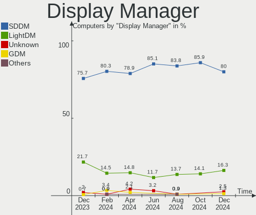
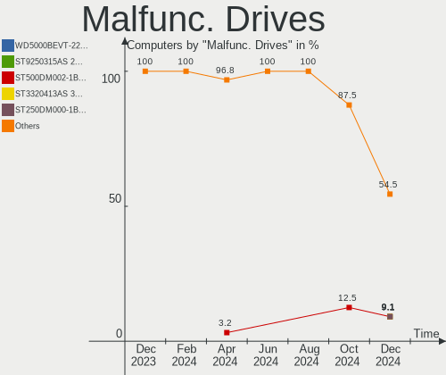
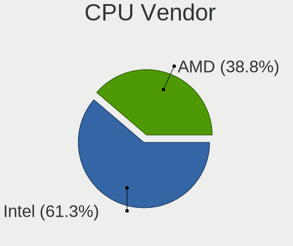
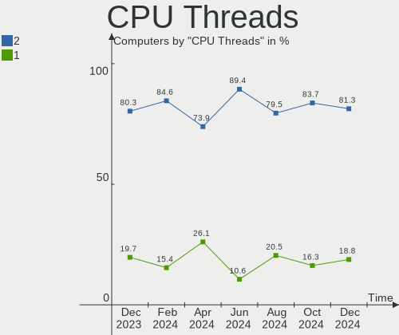
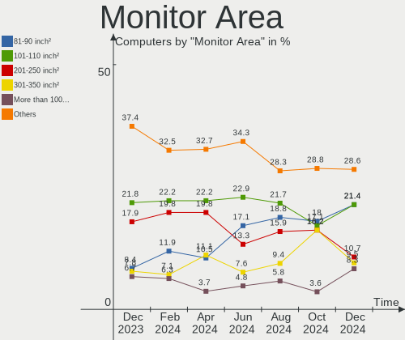

ArcoLinux - Hardware Trends
---------------------------

A project to identify most popular hardware characteristics and track their change
over time based on data collected by Linux users at https://Linux-Hardware.org.

Anyone can contribute to this report by the [hw-probe](https://github.com/linuxhw/hw-probe) tool:

    sudo -E hw-probe -all -upload

This is a report for all computer types. See also reports for [desktops](/Dist/ArcoLinux/Desktop/README.md) and [notebooks](/Dist/ArcoLinux/Notebook/README.md).

This report is for one last month. Overall report since the beginning of time: [TestCoverage](https://github.com/linuxhw/TestCoverage)

Period: Sep, 2022.

Contents
--------

* [ System ](#system)
  - [ OS                       ](#os)
  - [ OS Family                ](#os-family)
  - [ Kernel                   ](#kernel)
  - [ Kernel Family            ](#kernel-family)
  - [ Kernel Major Ver.        ](#kernel-major-ver)
  - [ Arch                     ](#arch)
  - [ DE                       ](#de)
  - [ Display Server           ](#display-server)
  - [ Display Manager          ](#display-manager)
  - [ OS Lang                  ](#os-lang)
  - [ Boot Mode                ](#boot-mode)
  - [ Filesystem               ](#filesystem)
  - [ Part. scheme             ](#part-scheme)
  - [ Dual Boot with Linux/BSD ](#dual-boot-with-linuxbsd)
  - [ Dual Boot (Win)          ](#dual-boot-win)

* [ Board ](#board)
  - [ Vendor                   ](#vendor)
  - [ Model                    ](#model)
  - [ Model Family             ](#model-family)
  - [ MFG Year                 ](#mfg-year)
  - [ Form Factor              ](#form-factor)
  - [ Secure Boot              ](#secure-boot)
  - [ Coreboot                 ](#coreboot)
  - [ RAM Size                 ](#ram-size)
  - [ RAM Used                 ](#ram-used)
  - [ Total Drives             ](#total-drives)
  - [ Has CD-ROM               ](#has-cd-rom)
  - [ Has Ethernet             ](#has-ethernet)
  - [ Has WiFi                 ](#has-wifi)
  - [ Has Bluetooth            ](#has-bluetooth)

* [ Location ](#location)
  - [ Country                  ](#country)
  - [ City                     ](#city)

* [ Drives ](#drives)
  - [ Drive Vendor             ](#drive-vendor)
  - [ Drive Model              ](#drive-model)
  - [ HDD Vendor               ](#hdd-vendor)
  - [ SSD Vendor               ](#ssd-vendor)
  - [ Drive Kind               ](#drive-kind)
  - [ Drive Connector          ](#drive-connector)
  - [ Drive Size               ](#drive-size)
  - [ Space Total              ](#space-total)
  - [ Space Used               ](#space-used)
  - [ Malfunc. Drives          ](#malfunc-drives)
  - [ Malfunc. Drive Vendor    ](#malfunc-drive-vendor)
  - [ Malfunc. HDD Vendor      ](#malfunc-hdd-vendor)
  - [ Malfunc. Drive Kind      ](#malfunc-drive-kind)
  - [ Failed Drives            ](#failed-drives)
  - [ Failed Drive Vendor      ](#failed-drive-vendor)
  - [ Drive Status             ](#drive-status)

* [ Storage controller ](#storage-controller)
  - [ Storage Vendor           ](#storage-vendor)
  - [ Storage Model            ](#storage-model)
  - [ Storage Kind             ](#storage-kind)

* [ Processor ](#processor)
  - [ CPU Vendor               ](#cpu-vendor)
  - [ CPU Model                ](#cpu-model)
  - [ CPU Model Family         ](#cpu-model-family)
  - [ CPU Cores                ](#cpu-cores)
  - [ CPU Sockets              ](#cpu-sockets)
  - [ CPU Threads              ](#cpu-threads)
  - [ CPU Op-Modes             ](#cpu-op-modes)
  - [ CPU Microcode            ](#cpu-microcode)
  - [ CPU Microarch            ](#cpu-microarch)

* [ Graphics ](#graphics)
  - [ GPU Vendor               ](#gpu-vendor)
  - [ GPU Model                ](#gpu-model)
  - [ GPU Combo                ](#gpu-combo)
  - [ GPU Driver               ](#gpu-driver)
  - [ GPU Memory               ](#gpu-memory)

* [ Monitor ](#monitor)
  - [ Monitor Vendor           ](#monitor-vendor)
  - [ Monitor Model            ](#monitor-model)
  - [ Monitor Resolution       ](#monitor-resolution)
  - [ Monitor Diagonal         ](#monitor-diagonal)
  - [ Monitor Width            ](#monitor-width)
  - [ Aspect Ratio             ](#aspect-ratio)
  - [ Monitor Area             ](#monitor-area)
  - [ Pixel Density            ](#pixel-density)
  - [ Multiple Monitors        ](#multiple-monitors)

* [ Network ](#network)
  - [ Net Controller Vendor    ](#net-controller-vendor)
  - [ Net Controller Model     ](#net-controller-model)
  - [ Wireless Vendor          ](#wireless-vendor)
  - [ Wireless Model           ](#wireless-model)
  - [ Ethernet Vendor          ](#ethernet-vendor)
  - [ Ethernet Model           ](#ethernet-model)
  - [ Net Controller Kind      ](#net-controller-kind)
  - [ Used Controller          ](#used-controller)
  - [ NICs                     ](#nics)
  - [ IPv6                     ](#ipv6)

* [ Bluetooth ](#bluetooth)
  - [ Bluetooth Vendor         ](#bluetooth-vendor)
  - [ Bluetooth Model          ](#bluetooth-model)

* [ Sound ](#sound)
  - [ Sound Vendor             ](#sound-vendor)
  - [ Sound Model              ](#sound-model)

* [ Memory ](#memory)
  - [ Memory Vendor            ](#memory-vendor)
  - [ Memory Model             ](#memory-model)
  - [ Memory Kind              ](#memory-kind)
  - [ Memory Form Factor       ](#memory-form-factor)
  - [ Memory Size              ](#memory-size)
  - [ Memory Speed             ](#memory-speed)

* [ Printers & scanners ](#printers--scanners)
  - [ Printer Vendor           ](#printer-vendor)
  - [ Printer Model            ](#printer-model)
  - [ Scanner Vendor           ](#scanner-vendor)
  - [ Scanner Model            ](#scanner-model)

* [ Camera ](#camera)
  - [ Camera Vendor            ](#camera-vendor)
  - [ Camera Model             ](#camera-model)

* [ Security ](#security)
  - [ Fingerprint Vendor       ](#fingerprint-vendor)
  - [ Fingerprint Model        ](#fingerprint-model)
  - [ Chipcard Vendor          ](#chipcard-vendor)
  - [ Chipcard Model           ](#chipcard-model)

* [ Unsupported ](#unsupported)
  - [ Unsupported Devices      ](#unsupported-devices)
  - [ Unsupported Device Types ](#unsupported-device-types)

System
------

OS
--

Installed operating systems

| Name              | Computers | Percent |
|-------------------|-----------|---------|
| ArcoLinux Rolling | 37        | 100%    |

OS Family
---------

OS without a version

| Name      | Computers | Percent |
|-----------|-----------|---------|
| ArcoLinux | 37        | 100%    |

Kernel
------

Version of the Linux kernel

| Version                 | Computers | Percent |
|-------------------------|-----------|---------|
| 5.19.11-arch1-1         | 6         | 16.22%  |
| 5.19.9-arch1-1          | 3         | 8.11%   |
| 5.19.7-arch1-1          | 3         | 8.11%   |
| 5.19.12-arch1-1         | 3         | 8.11%   |
| 5.19.10-arch1-1         | 3         | 8.11%   |
| 5.15.70-1-lts           | 3         | 8.11%   |
| 5.19.7-zen2-1-zen       | 2         | 5.41%   |
| 5.19.6-arch1-1          | 2         | 5.41%   |
| 5.19.5-arch1-1          | 2         | 5.41%   |
| 5.17.6-arch1-1          | 2         | 5.41%   |
| 5.19.9-zen1-1.1-zen     | 1         | 2.7%    |
| 5.19.9-zen1-1-zen       | 1         | 2.7%    |
| 5.19.8-arch1-1          | 1         | 2.7%    |
| 5.19.7-269-tkg-cfs-llvm | 1         | 2.7%    |
| 5.19.2-arch1-1          | 1         | 2.7%    |
| 5.19.11-xanmod1-1       | 1         | 2.7%    |
| 5.19.10-zen1-1-zen      | 1         | 2.7%    |
| 5.15.71-1-lts           | 1         | 2.7%    |

Kernel Family
-------------

Linux kernel without a distro release

| Version | Computers | Percent |
|---------|-----------|---------|
| 5.19.11 | 7         | 18.92%  |
| 5.19.7  | 6         | 16.22%  |
| 5.19.9  | 5         | 13.51%  |
| 5.19.10 | 4         | 10.81%  |
| 5.19.12 | 3         | 8.11%   |
| 5.15.70 | 3         | 8.11%   |
| 5.19.6  | 2         | 5.41%   |
| 5.19.5  | 2         | 5.41%   |
| 5.17.6  | 2         | 5.41%   |
| 5.19.8  | 1         | 2.7%    |
| 5.19.2  | 1         | 2.7%    |
| 5.15.71 | 1         | 2.7%    |

Kernel Major Ver.
-----------------

Linux kernel major version

| Version | Computers | Percent |
|---------|-----------|---------|
| 5.19    | 31        | 83.78%  |
| 5.15    | 4         | 10.81%  |
| 5.17    | 2         | 5.41%   |

Arch
----

OS architecture (x86_64, i586, etc.)

| Name   | Computers | Percent |
|--------|-----------|---------|
| x86_64 | 37        | 100%    |

DE
--

Desktop Environment

| Name         | Computers | Percent |
|--------------|-----------|---------|
| XFCE         | 14        | 37.84%  |
| KDE5         | 8         | 21.62%  |
| X-Cinnamon   | 2         | 5.41%   |
| qtile        | 2         | 5.41%   |
| i3           | 2         | 5.41%   |
| herbstluftwm | 2         | 5.41%   |
| awesome      | 2         | 5.41%   |
| Unknown      | 2         | 5.41%   |
| xmonad       | 1         | 2.7%    |
| GNOME        | 1         | 2.7%    |
| Cinnamon     | 1         | 2.7%    |

Display Server
--------------

X11 or Wayland

| Name    | Computers | Percent |
|---------|-----------|---------|
| X11     | 34        | 91.89%  |
| Tty     | 2         | 5.41%   |
| Unknown | 1         | 2.7%    |

Display Manager
---------------

SDDM, LightDM, etc.

| Name    | Computers | Percent |
|---------|-----------|---------|
| SDDM    | 27        | 72.97%  |
| LightDM | 8         | 21.62%  |
| Ly      | 1         | 2.7%    |
| Unknown | 1         | 2.7%    |

OS Lang
-------

Language

| Lang  | Computers | Percent |
|-------|-----------|---------|
| en_US | 20        | 54.05%  |
| en_GB | 5         | 13.51%  |
| en_AG | 2         | 5.41%   |
| pt_BR | 1         | 2.7%    |
| fr_FR | 1         | 2.7%    |
| fr_CA | 1         | 2.7%    |
| es_MX | 1         | 2.7%    |
| es_ES | 1         | 2.7%    |
| es_AR | 1         | 2.7%    |
| en_SG | 1         | 2.7%    |
| en_IN | 1         | 2.7%    |
| en_CA | 1         | 2.7%    |
| de_DE | 1         | 2.7%    |

Boot Mode
---------

EFI or BIOS

| Mode | Computers | Percent |
|------|-----------|---------|
| EFI  | 32        | 86.49%  |
| BIOS | 5         | 13.51%  |

Filesystem
----------

Type of filesystem

| Type    | Computers | Percent |
|---------|-----------|---------|
| Ext4    | 24        | 64.86%  |
| Btrfs   | 12        | 32.43%  |
| Overlay | 1         | 2.7%    |

Part. scheme
------------

Scheme of partitioning

| Type | Computers | Percent |
|------|-----------|---------|
| GPT  | 34        | 91.89%  |
| MBR  | 3         | 8.11%   |

Dual Boot with Linux/BSD
------------------------

Hosting more than one Linux/BSD

| Dual boot | Computers | Percent |
|-----------|-----------|---------|
| No        | 25        | 67.57%  |
| Yes       | 12        | 32.43%  |

Dual Boot (Win)
---------------

Hosting Linux and Windows

| Dual boot | Computers | Percent |
|-----------|-----------|---------|
| Yes       | 20        | 54.05%  |
| No        | 17        | 45.95%  |

Board
-----

Vendor
------

Motherboard manufacturer

| Name                  | Computers | Percent |
|-----------------------|-----------|---------|
| ASUSTek Computer      | 11        | 29.73%  |
| Gigabyte Technology   | 8         | 21.62%  |
| Lenovo                | 4         | 10.81%  |
| ASRock                | 3         | 8.11%   |
| Apple                 | 3         | 8.11%   |
| Hewlett-Packard       | 2         | 5.41%   |
| TUXEDO                | 1         | 2.7%    |
| System76              | 1         | 2.7%    |
| Positivo Bahia - VAIO | 1         | 2.7%    |
| Packard Bell          | 1         | 2.7%    |
| Dell                  | 1         | 2.7%    |
| Acer                  | 1         | 2.7%    |

Model
-----

Motherboard model

| Name                                    | Computers | Percent |
|-----------------------------------------|-----------|---------|
| ASUS TUF Gaming X570-PLUS               | 2         | 5.41%   |
| TUXEDO Aura 15 Gen2                     | 1         | 2.7%    |
| System76 Oryx Pro                       | 1         | 2.7%    |
| Positivo Bahia - VAIO VJFE42F11X-XXXXXX | 1         | 2.7%    |
| Packard Bell IMEDIA S3850               | 1         | 2.7%    |
| Lenovo Y520-15IKBN 80WK                 | 1         | 2.7%    |
| Lenovo ThinkPad X260 20F5S6P801         | 1         | 2.7%    |
| Lenovo ThinkBook 13s-IML 20RR           | 1         | 2.7%    |
| Lenovo Legion 5 15ARH05 82B5            | 1         | 2.7%    |
| HP ENVY x360 Convertible 13-ay0xxx      | 1         | 2.7%    |
| HP 500-536d                             | 1         | 2.7%    |
| Gigabyte Z97-D3H                        | 1         | 2.7%    |
| Gigabyte Z390 UD                        | 1         | 2.7%    |
| Gigabyte X570S AERO G                   | 1         | 2.7%    |
| Gigabyte X570 GAMING X                  | 1         | 2.7%    |
| Gigabyte P55-USB3                       | 1         | 2.7%    |
| Gigabyte AORUS 15P YD                   | 1         | 2.7%    |
| Gigabyte AERO 15-SA                     | 1         | 2.7%    |
| Gigabyte A320M-S2H V2                   | 1         | 2.7%    |
| Dell Latitude 3410                      | 1         | 2.7%    |
| ASUS ZenBook UX331FA_UX331FA            | 1         | 2.7%    |
| ASUS X580VD                             | 1         | 2.7%    |
| ASUS ROG Strix G531GW_G531GW            | 1         | 2.7%    |
| ASUS ROG STRIX B550-F GAMING            | 1         | 2.7%    |
| ASUS ROG Maximus X HERO                 | 1         | 2.7%    |
| ASUS PRIME Z390-A                       | 1         | 2.7%    |
| ASUS P8H61-M LE/CSM                     | 1         | 2.7%    |
| ASUS Maximus IX HERO                    | 1         | 2.7%    |
| ASUS E402BA                             | 1         | 2.7%    |
| ASRock X300M-STX                        | 1         | 2.7%    |
| ASRock H87M Pro4                        | 1         | 2.7%    |
| ASRock B250M-HDV                        | 1         | 2.7%    |
| Apple Macmini7,1                        | 1         | 2.7%    |
| Apple MacBookAir7,2                     | 1         | 2.7%    |
| Apple iMac18,2                          | 1         | 2.7%    |
| Acer Aspire A715-75G                    | 1         | 2.7%    |

Model Family
------------

Motherboard model prefix

| Name                                    | Computers | Percent |
|-----------------------------------------|-----------|---------|
| ASUS ROG                                | 3         | 8.11%   |
| ASUS TUF                                | 2         | 5.41%   |
| TUXEDO Aura                             | 1         | 2.7%    |
| System76 Oryx                           | 1         | 2.7%    |
| Positivo Bahia - VAIO VJFE42F11X-XXXXXX | 1         | 2.7%    |
| Packard Bell IMEDIA                     | 1         | 2.7%    |
| Lenovo Y520-15IKBN                      | 1         | 2.7%    |
| Lenovo ThinkPad                         | 1         | 2.7%    |
| Lenovo ThinkBook                        | 1         | 2.7%    |
| Lenovo Legion                           | 1         | 2.7%    |
| HP ENVY                                 | 1         | 2.7%    |
| HP 500-536d                             | 1         | 2.7%    |
| Gigabyte Z97-D3H                        | 1         | 2.7%    |
| Gigabyte Z390                           | 1         | 2.7%    |
| Gigabyte X570S                          | 1         | 2.7%    |
| Gigabyte X570                           | 1         | 2.7%    |
| Gigabyte P55-USB3                       | 1         | 2.7%    |
| Gigabyte AORUS                          | 1         | 2.7%    |
| Gigabyte AERO                           | 1         | 2.7%    |
| Gigabyte A320M-S2H                      | 1         | 2.7%    |
| Dell Latitude                           | 1         | 2.7%    |
| ASUS ZenBook                            | 1         | 2.7%    |
| ASUS X580VD                             | 1         | 2.7%    |
| ASUS PRIME                              | 1         | 2.7%    |
| ASUS P8H61-M                            | 1         | 2.7%    |
| ASUS Maximus                            | 1         | 2.7%    |
| ASUS E402BA                             | 1         | 2.7%    |
| ASRock X300M-STX                        | 1         | 2.7%    |
| ASRock H87M                             | 1         | 2.7%    |
| ASRock B250M-HDV                        | 1         | 2.7%    |
| Apple Macmini7                          | 1         | 2.7%    |
| Apple MacBookAir7                       | 1         | 2.7%    |
| Apple iMac18                            | 1         | 2.7%    |
| Acer Aspire                             | 1         | 2.7%    |

MFG Year
--------

Motherboard manufacture year

| Year | Computers | Percent |
|------|-----------|---------|
| 2020 | 8         | 21.62%  |
| 2019 | 8         | 21.62%  |
| 2017 | 6         | 16.22%  |
| 2018 | 3         | 8.11%   |
| 2021 | 2         | 5.41%   |
| 2015 | 2         | 5.41%   |
| 2014 | 2         | 5.41%   |
| 2010 | 2         | 5.41%   |
| 2022 | 1         | 2.7%    |
| 2016 | 1         | 2.7%    |
| 2013 | 1         | 2.7%    |
| 2011 | 1         | 2.7%    |

Form Factor
-----------

Physical design of the computer

| Name        | Computers | Percent |
|-------------|-----------|---------|
| Desktop     | 18        | 48.65%  |
| Notebook    | 16        | 43.24%  |
| Convertible | 1         | 2.7%    |
| Mini pc     | 1         | 2.7%    |
| All in one  | 1         | 2.7%    |

Secure Boot
-----------

Enabled or disabled

| State    | Computers | Percent |
|----------|-----------|---------|
| Disabled | 37        | 100%    |

Coreboot
--------

Have coreboot on board

| Used | Computers | Percent |
|------|-----------|---------|
| No   | 37        | 100%    |

RAM Size
--------

Total RAM memory

| Size in GB  | Computers | Percent |
|-------------|-----------|---------|
| 4.01-8.0    | 10        | 27.03%  |
| 32.01-64.0  | 10        | 27.03%  |
| 16.01-24.0  | 8         | 21.62%  |
| 3.01-4.0    | 4         | 10.81%  |
| 8.01-16.0   | 3         | 8.11%   |
| 64.01-256.0 | 2         | 5.41%   |

RAM Used
--------

Used RAM memory

| Used GB   | Computers | Percent |
|-----------|-----------|---------|
| 2.01-3.0  | 9         | 24.32%  |
| 1.01-2.0  | 9         | 24.32%  |
| 4.01-8.0  | 8         | 21.62%  |
| 3.01-4.0  | 8         | 21.62%  |
| 8.01-16.0 | 2         | 5.41%   |
| 0.01-0.5  | 1         | 2.7%    |

Total Drives
------------

Number of drives on board

| Drives | Computers | Percent |
|--------|-----------|---------|
| 2      | 15        | 40.54%  |
| 1      | 9         | 24.32%  |
| 4      | 6         | 16.22%  |
| 3      | 4         | 10.81%  |
| 5      | 3         | 8.11%   |

Has CD-ROM
----------

Has CD-ROM on board

| Presented | Computers | Percent |
|-----------|-----------|---------|
| No        | 29        | 78.38%  |
| Yes       | 8         | 21.62%  |

Has Ethernet
------------

Has Ethernet on board

| Presented | Computers | Percent |
|-----------|-----------|---------|
| Yes       | 34        | 91.89%  |
| No        | 3         | 8.11%   |

Has WiFi
--------

Has WiFi module

| Presented | Computers | Percent |
|-----------|-----------|---------|
| Yes       | 27        | 72.97%  |
| No        | 10        | 27.03%  |

Has Bluetooth
-------------

Has Bluetooth module

| Presented | Computers | Percent |
|-----------|-----------|---------|
| Yes       | 25        | 67.57%  |
| No        | 12        | 32.43%  |

Location
--------

Country
-------

Geographic location (country)

| Country     | Computers | Percent |
|-------------|-----------|---------|
| USA         | 10        | 27.03%  |
| Netherlands | 4         | 10.81%  |
| UK          | 2         | 5.41%   |
| Germany     | 2         | 5.41%   |
| Egypt       | 2         | 5.41%   |
| Canada      | 2         | 5.41%   |
| Belgium     | 2         | 5.41%   |
| Turkey      | 1         | 2.7%    |
| Sweden      | 1         | 2.7%    |
| Spain       | 1         | 2.7%    |
| Russia      | 1         | 2.7%    |
| Mexico      | 1         | 2.7%    |
| Malaysia    | 1         | 2.7%    |
| Italy       | 1         | 2.7%    |
| Ireland     | 1         | 2.7%    |
| India       | 1         | 2.7%    |
| Greece      | 1         | 2.7%    |
| France      | 1         | 2.7%    |
| Brazil      | 1         | 2.7%    |
| Argentina   | 1         | 2.7%    |

City
----

Geographic location (city)

| City              | Computers | Percent |
|-------------------|-----------|---------|
| Alexandria        | 2         | 5.41%   |
| Zapopan           | 1         | 2.7%    |
| West Columbia     | 1         | 2.7%    |
| Vence             | 1         | 2.7%    |
| Rossville         | 1         | 2.7%    |
| Rochester         | 1         | 2.7%    |
| Phoenix           | 1         | 2.7%    |
| Peoria            | 1         | 2.7%    |
| Ochten            | 1         | 2.7%    |
| Nieuw-Vennep      | 1         | 2.7%    |
| Moscow            | 1         | 2.7%    |
| Montreal          | 1         | 2.7%    |
| Mohali            | 1         | 2.7%    |
| Maryville         | 1         | 2.7%    |
| Malacca           | 1         | 2.7%    |
| Madrid            | 1         | 2.7%    |
| Los Angeles       | 1         | 2.7%    |
| London            | 1         | 2.7%    |
| Lavino di Mezzo   | 1         | 2.7%    |
| Islington         | 1         | 2.7%    |
| Hulshout          | 1         | 2.7%    |
| Houston           | 1         | 2.7%    |
| Hanover           | 1         | 2.7%    |
| General Pacheco   | 1         | 2.7%    |
| Gaziantep         | 1         | 2.7%    |
| Frankfurt am Main | 1         | 2.7%    |
| Eindhoven         | 1         | 2.7%    |
| Dublin            | 1         | 2.7%    |
| Dison             | 1         | 2.7%    |
| Curitiba          | 1         | 2.7%    |
| Calgary           | 1         | 2.7%    |
| Brakel            | 1         | 2.7%    |
| Borås            | 1         | 2.7%    |
| Athens            | 1         | 2.7%    |
| Ashburn           | 1         | 2.7%    |
| Amsterdam         | 1         | 2.7%    |

Drives
------

Drive Vendor
------------

Hard drive vendors

| Vendor                    | Computers | Drives | Percent |
|---------------------------|-----------|--------|---------|
| Samsung Electronics       | 17        | 21     | 22.37%  |
| WDC                       | 12        | 18     | 15.79%  |
| Seagate                   | 6         | 7      | 7.89%   |
| Phison Electronics        | 6         | 6      | 7.89%   |
| Sandisk                   | 5         | 6      | 6.58%   |
| SK hynix                  | 4         | 4      | 5.26%   |
| Micron/Crucial Technology | 4         | 4      | 5.26%   |
| Kingston                  | 3         | 3      | 3.95%   |
| Intel                     | 3         | 3      | 3.95%   |
| Apple                     | 3         | 3      | 3.95%   |
| Unknown                   | 2         | 2      | 2.63%   |
| Toshiba                   | 2         | 2      | 2.63%   |
| Silicon Motion            | 1         | 1      | 1.32%   |
| RSH-319                   | 1         | 1      | 1.32%   |
| Realtek Semiconductor     | 1         | 1      | 1.32%   |
| Patriot                   | 1         | 1      | 1.32%   |
| JMicron Technology        | 1         | 1      | 1.32%   |
| Intenso                   | 1         | 1      | 1.32%   |
| Inateck                   | 1         | 1      | 1.32%   |
| Crucial                   | 1         | 1      | 1.32%   |
| Corsair                   | 1         | 1      | 1.32%   |

Drive Model
-----------

Hard drive models

| Model                                                  | Computers | Percent |
|--------------------------------------------------------|-----------|---------|
| Phison E16 PCIe4 NVMe Controller 1TB                   | 4         | 4.6%    |
| Samsung NVMe SSD Controller SM981/PM981/PM983 256GB    | 3         | 3.45%   |
| Samsung NVMe SSD Controller PM9A1/PM9A3/980PRO 1024GB  | 3         | 3.45%   |
| Micron/Crucial P2 NVMe PCIe SSD 500GB                  | 3         | 3.45%   |
| WDC WD10EZEX-08WN4A0 1TB                               | 2         | 2.3%    |
| Toshiba MQ04ABF100 1TB                                 | 2         | 2.3%    |
| Samsung SSD 860 EVO 250GB                              | 2         | 2.3%    |
| Samsung SSD 860 EVO 1TB                                | 2         | 2.3%    |
| Samsung NVMe SSD Controller SM961/PM961/SM963 256GB    | 2         | 2.3%    |
| Kingston SA400S37240G 240GB SSD                        | 2         | 2.3%    |
| WDC WDS200T2B0A-00SM50 2TB SSD                         | 1         | 1.15%   |
| WDC WD80EFBX-68AZZN0 8TB                               | 1         | 1.15%   |
| WDC WD8003FFBX-68B9AN0 8TB                             | 1         | 1.15%   |
| WDC WD7501AALS-00J7B1 752GB                            | 1         | 1.15%   |
| WDC WD5000AAKS-00V1A0 500GB                            | 1         | 1.15%   |
| WDC WD5000AACS-00G8B1 500GB                            | 1         | 1.15%   |
| WDC WD40EZRZ-75GXCB0 4TB                               | 1         | 1.15%   |
| WDC WD40EZRZ-00GXCB0 4TB                               | 1         | 1.15%   |
| WDC WD40EFRX-68N32N0 4TB                               | 1         | 1.15%   |
| WDC WD4004FZWX-00GBGB0 4TB                             | 1         | 1.15%   |
| WDC WD20SPZX-22UA7T0 2TB                               | 1         | 1.15%   |
| WDC WD20EZBX-00AYRA0 2TB                               | 1         | 1.15%   |
| WDC WD20EZAZ-00GGJB0 2TB                               | 1         | 1.15%   |
| WDC WD10EZEX-75WN4A0 1TB                               | 1         | 1.15%   |
| WDC WD10EARS-22Y5B1 1TB                                | 1         | 1.15%   |
| WDC WD10EADS-114BB1 1TB                                | 1         | 1.15%   |
| Unknown MMC Card  256GB                                | 1         | 1.15%   |
| Unknown MMC Card  134GB                                | 1         | 1.15%   |
| SK hynix SHGP31-500GM-2 500GB                          | 1         | 1.15%   |
| SK hynix SH920 2.5 7MM 256GB SSD                       | 1         | 1.15%   |
| SK hynix HFS256G32TND-N210A 256GB SSD                  | 1         | 1.15%   |
| SK hynix BC501 NVMe Solid State Drive 512GB            | 1         | 1.15%   |
| Silicon Motion SM2263EN/SM2263XT SSD Controller 1024GB | 1         | 1.15%   |
| Seagate ST3000DM001-1ER166 3TB                         | 1         | 1.15%   |
| Seagate ST2000DM008-2FR102 2TB                         | 1         | 1.15%   |
| Seagate ST1000LM035-1RK172 1TB                         | 1         | 1.15%   |
| Seagate ST1000DM003-1ER162 1TB                         | 1         | 1.15%   |
| Seagate Expansion 1TB                                  | 1         | 1.15%   |
| Seagate Backup+ Hub BK 8TB                             | 1         | 1.15%   |
| Sandisk WD_BLACK SN770 1TB                             | 1         | 1.15%   |

HDD Vendor
----------

Hard disk drive vendors

| Vendor  | Computers | Drives | Percent |
|---------|-----------|--------|---------|
| WDC     | 11        | 17     | 47.83%  |
| Seagate | 6         | 7      | 26.09%  |
| Toshiba | 2         | 2      | 8.7%    |
| Apple   | 2         | 2      | 8.7%    |
| RSH-319 | 1         | 1      | 4.35%   |
| Inateck | 1         | 1      | 4.35%   |

SSD Vendor
----------

Solid state drive vendors

| Vendor              | Computers | Drives | Percent |
|---------------------|-----------|--------|---------|
| Samsung Electronics | 10        | 10     | 47.62%  |
| SK hynix            | 2         | 2      | 9.52%   |
| Kingston            | 2         | 2      | 9.52%   |
| WDC                 | 1         | 1      | 4.76%   |
| Patriot             | 1         | 1      | 4.76%   |
| Intenso             | 1         | 1      | 4.76%   |
| Intel               | 1         | 1      | 4.76%   |
| Crucial             | 1         | 1      | 4.76%   |
| Corsair             | 1         | 1      | 4.76%   |
| Apple               | 1         | 1      | 4.76%   |

Drive Kind
----------

HDD or SSD

| Kind | Computers | Drives | Percent |
|------|-----------|--------|---------|
| NVMe | 26        | 35     | 40.63%  |
| HDD  | 19        | 30     | 29.69%  |
| SSD  | 17        | 21     | 26.56%  |
| MMC  | 2         | 2      | 3.13%   |

Drive Connector
---------------

SATA, SAS, NVMe, etc.

| Type | Computers | Drives | Percent |
|------|-----------|--------|---------|
| SATA | 27        | 46     | 44.26%  |
| NVMe | 26        | 34     | 42.62%  |
| SAS  | 6         | 6      | 9.84%   |
| MMC  | 2         | 2      | 3.28%   |

Drive Size
----------

Size of hard drive

| Size in TB | Computers | Drives | Percent |
|------------|-----------|--------|---------|
| 0.51-1.0   | 15        | 18     | 38.46%  |
| 0.01-0.5   | 11        | 17     | 28.21%  |
| 1.01-2.0   | 5         | 5      | 12.82%  |
| 3.01-4.0   | 4         | 5      | 10.26%  |
| 2.01-3.0   | 2         | 3      | 5.13%   |
| 4.01-10.0  | 2         | 3      | 5.13%   |

Space Total
-----------

Amount of disk space available on the file system

| Size in GB     | Computers | Percent |
|----------------|-----------|---------|
| More than 3000 | 10        | 27.03%  |
| 101-250        | 7         | 18.92%  |
| 1001-2000      | 7         | 18.92%  |
| 251-500        | 6         | 16.22%  |
| 501-1000       | 6         | 16.22%  |
| Unknown        | 1         | 2.7%    |

Space Used
----------

Amount of used disk space

| Used GB        | Computers | Percent |
|----------------|-----------|---------|
| 101-250        | 8         | 21.62%  |
| 21-50          | 6         | 16.22%  |
| 1-20           | 6         | 16.22%  |
| 251-500        | 3         | 8.11%   |
| 2001-3000      | 3         | 8.11%   |
| 1001-2000      | 3         | 8.11%   |
| 501-1000       | 3         | 8.11%   |
| More than 3000 | 2         | 5.41%   |
| 51-100         | 2         | 5.41%   |
| Unknown        | 1         | 2.7%    |

Malfunc. Drives
---------------

Drive models with a malfunction

| Model                                 | Computers | Drives | Percent |
|---------------------------------------|-----------|--------|---------|
| WDC WD5000AACS-00G8B1 500GB           | 1         | 1      | 11.11%  |
| WDC WD10EARS-22Y5B1 1TB               | 1         | 1      | 11.11%  |
| WDC WD10EADS-114BB1 1TB               | 1         | 1      | 11.11%  |
| SK hynix SH920 2.5 7MM 256GB SSD      | 1         | 1      | 11.11%  |
| SK hynix HFS256G32TND-N210A 256GB SSD | 1         | 1      | 11.11%  |
| Seagate ST3000DM001-1ER166 3TB        | 1         | 2      | 11.11%  |
| Inateck ASM1153E 4TB                  | 1         | 1      | 11.11%  |
| Corsair CSSD-F60GB2 64GB              | 1         | 1      | 11.11%  |
| Apple HDD HTS545050A7E362 500GB       | 1         | 1      | 11.11%  |

Malfunc. Drive Vendor
---------------------

Vendors of faulty drives

| Vendor   | Computers | Drives | Percent |
|----------|-----------|--------|---------|
| WDC      | 3         | 3      | 33.33%  |
| SK hynix | 2         | 2      | 22.22%  |
| Seagate  | 1         | 2      | 11.11%  |
| Inateck  | 1         | 1      | 11.11%  |
| Corsair  | 1         | 1      | 11.11%  |
| Apple    | 1         | 1      | 11.11%  |

Malfunc. HDD Vendor
-------------------

Vendors of faulty HDD drives

| Vendor  | Computers | Drives | Percent |
|---------|-----------|--------|---------|
| WDC     | 3         | 3      | 50%     |
| Seagate | 1         | 2      | 16.67%  |
| Inateck | 1         | 1      | 16.67%  |
| Apple   | 1         | 1      | 16.67%  |

Malfunc. Drive Kind
-------------------

Kinds of faulty drives

| Kind | Computers | Drives | Percent |
|------|-----------|--------|---------|
| HDD  | 6         | 7      | 66.67%  |
| SSD  | 3         | 3      | 33.33%  |

Failed Drives
-------------

Failed drive models

Zero info for selected period =(

Failed Drive Vendor
-------------------

Failed drive vendors

Zero info for selected period =(

Drive Status
------------

Number of failed and malfunc. drives

| Status   | Computers | Drives | Percent |
|----------|-----------|--------|---------|
| Works    | 32        | 68     | 68.09%  |
| Malfunc  | 8         | 10     | 17.02%  |
| Detected | 7         | 10     | 14.89%  |

Storage controller
------------------

Storage Vendor
--------------

Storage controller vendors

| Vendor                      | Computers | Percent |
|-----------------------------|-----------|---------|
| Intel                       | 22        | 33.85%  |
| Samsung Electronics         | 12        | 18.46%  |
| AMD                         | 10        | 15.38%  |
| Phison Electronics          | 6         | 9.23%   |
| SanDisk                     | 5         | 7.69%   |
| Micron/Crucial Technology   | 4         | 6.15%   |
| SK hynix                    | 2         | 3.08%   |
| Silicon Motion              | 1         | 1.54%   |
| Realtek Semiconductor       | 1         | 1.54%   |
| Kingston Technology Company | 1         | 1.54%   |
| JMicron Technology          | 1         | 1.54%   |

Storage Model
-------------

Storage controller models

| Model                                                                                   | Computers | Percent |
|-----------------------------------------------------------------------------------------|-----------|---------|
| AMD FCH SATA Controller [AHCI mode]                                                     | 9         | 13.04%  |
| Samsung NVMe SSD Controller SM981/PM981/PM983                                           | 4         | 5.8%    |
| Phison E16 PCIe4 NVMe Controller                                                        | 4         | 5.8%    |
| Samsung NVMe SSD Controller PM9A1/PM9A3/980PRO                                          | 3         | 4.35%   |
| Micron/Crucial P2 NVMe PCIe SSD                                                         | 3         | 4.35%   |
| Intel 200 Series PCH SATA controller [AHCI mode]                                        | 3         | 4.35%   |
| SanDisk Non-Volatile memory controller                                                  | 2         | 2.9%    |
| Samsung NVMe SSD Controller SM961/PM961/SM963                                           | 2         | 2.9%    |
| Intel HM170/QM170 Chipset SATA Controller [AHCI Mode]                                   | 2         | 2.9%    |
| Intel Cannon Lake PCH SATA AHCI Controller                                              | 2         | 2.9%    |
| Intel Cannon Lake Mobile PCH SATA AHCI Controller                                       | 2         | 2.9%    |
| Intel 8 Series/C220 Series Chipset Family 6-port SATA Controller 1 [AHCI mode]          | 2         | 2.9%    |
| SK hynix Gold P31 SSD                                                                   | 1         | 1.45%   |
| SK hynix BC501 NVMe Solid State Drive                                                   | 1         | 1.45%   |
| Silicon Motion SM2263EN/SM2263XT SSD Controller                                         | 1         | 1.45%   |
| SanDisk WD PC SN810 / Black SN850 NVMe SSD                                              | 1         | 1.45%   |
| SanDisk WD Blue SN570 NVMe SSD                                                          | 1         | 1.45%   |
| SanDisk WD Black SN750 / PC SN730 NVMe SSD                                              | 1         | 1.45%   |
| SanDisk WD Black 2018/SN750 / PC SN720 NVMe SSD                                         | 1         | 1.45%   |
| Samsung NVMe SSD Controller 980                                                         | 1         | 1.45%   |
| Samsung Electronics SATA controller                                                     | 1         | 1.45%   |
| Samsung Electronics Non-Volatile memory controller                                      | 1         | 1.45%   |
| Realtek RTS5763DL NVMe SSD Controller                                                   | 1         | 1.45%   |
| Phison E18 PCIe4 NVMe Controller                                                        | 1         | 1.45%   |
| Phison E12 NVMe Controller                                                              | 1         | 1.45%   |
| Micron/Crucial Non-Volatile memory controller                                           | 1         | 1.45%   |
| Kingston Company SNVS2000G [NV1 NVMe PCIe SSD 2TB]                                      | 1         | 1.45%   |
| JMicron JMB363 SATA/IDE Controller                                                      | 1         | 1.45%   |
| Intel Sunrise Point-LP SATA Controller [AHCI mode]                                      | 1         | 1.45%   |
| Intel SSD Pro 7600p/760p/E 6100p Series                                                 | 1         | 1.45%   |
| Intel SSD 660P Series                                                                   | 1         | 1.45%   |
| Intel Q170/Q150/B150/H170/H110/Z170/CM236 Chipset SATA Controller [AHCI Mode]           | 1         | 1.45%   |
| Intel Comet Lake SATA AHCI Controller                                                   | 1         | 1.45%   |
| Intel Comet Lake PCH-LP SATA RAID Premium Controller                                    | 1         | 1.45%   |
| Intel 9 Series Chipset Family SATA Controller [AHCI Mode]                               | 1         | 1.45%   |
| Intel 8 Series SATA Controller 1 [AHCI mode]                                            | 1         | 1.45%   |
| Intel 6 Series/C200 Series Chipset Family Desktop SATA Controller (IDE mode, ports 4-5) | 1         | 1.45%   |
| Intel 6 Series/C200 Series Chipset Family Desktop SATA Controller (IDE mode, ports 0-3) | 1         | 1.45%   |
| Intel 6 Series/C200 Series Chipset Family 6 port Desktop SATA AHCI Controller           | 1         | 1.45%   |
| Intel 5 Series/3400 Series Chipset 4 port SATA IDE Controller                           | 1         | 1.45%   |

Storage Kind
------------

Kind of storage controller (IDE, SATA, NVMe, SAS, ...)

| Kind | Computers | Percent |
|------|-----------|---------|
| SATA | 28        | 49.12%  |
| NVMe | 26        | 45.61%  |
| IDE  | 2         | 3.51%   |
| RAID | 1         | 1.75%   |

Processor
---------

CPU Vendor
----------

Processor vendors

| Vendor | Computers | Percent |
|--------|-----------|---------|
| Intel  | 26        | 70.27%  |
| AMD    | 11        | 29.73%  |

CPU Model
---------

Processor models

| Model                                        | Computers | Percent |
|----------------------------------------------|-----------|---------|
| Intel Core i7-9750H CPU @ 2.60GHz            | 4         | 10.81%  |
| Intel Core i7-7700HQ CPU @ 2.80GHz           | 2         | 5.41%   |
| AMD Ryzen 9 5900X 12-Core Processor          | 2         | 5.41%   |
| AMD Ryzen 5 5600X 6-Core Processor           | 2         | 5.41%   |
| Intel Xeon CPU E3-1230 v3 @ 3.30GHz          | 1         | 2.7%    |
| Intel Pentium CPU G630 @ 2.70GHz             | 1         | 2.7%    |
| Intel Core i9-9900K CPU @ 3.60GHz            | 1         | 2.7%    |
| Intel Core i7-8700K CPU @ 3.70GHz            | 1         | 2.7%    |
| Intel Core i7-7700 CPU @ 3.60GHz             | 1         | 2.7%    |
| Intel Core i7-4790K CPU @ 4.00GHz            | 1         | 2.7%    |
| Intel Core i7-10510U CPU @ 1.80GHz           | 1         | 2.7%    |
| Intel Core i5-8400 CPU @ 2.80GHz             | 1         | 2.7%    |
| Intel Core i5-8265U CPU @ 1.60GHz            | 1         | 2.7%    |
| Intel Core i5-7500 CPU @ 3.40GHz             | 1         | 2.7%    |
| Intel Core i5-6300U CPU @ 2.40GHz            | 1         | 2.7%    |
| Intel Core i5-5350U CPU @ 1.80GHz            | 1         | 2.7%    |
| Intel Core i5-4260U CPU @ 1.40GHz            | 1         | 2.7%    |
| Intel Core i5-2300 CPU @ 2.80GHz             | 1         | 2.7%    |
| Intel Core i5-10310U CPU @ 1.70GHz           | 1         | 2.7%    |
| Intel Core i5-10210U CPU @ 1.60GHz           | 1         | 2.7%    |
| Intel Core i5 CPU 750 @ 2.67GHz              | 1         | 2.7%    |
| Intel Core i3-7100 CPU @ 3.90GHz             | 1         | 2.7%    |
| Intel Core i3-4160 CPU @ 3.60GHz             | 1         | 2.7%    |
| Intel 11th Gen Core i7-11800H @ 2.30GHz      | 1         | 2.7%    |
| AMD Ryzen 9 3900X 12-Core Processor          | 1         | 2.7%    |
| AMD Ryzen 7 5700U with Radeon Graphics       | 1         | 2.7%    |
| AMD Ryzen 7 4800H with Radeon Graphics       | 1         | 2.7%    |
| AMD Ryzen 5 5600G with Radeon Graphics       | 1         | 2.7%    |
| AMD Ryzen 5 4500U with Radeon Graphics       | 1         | 2.7%    |
| AMD Ryzen 5 3400G with Radeon Vega Graphics  | 1         | 2.7%    |
| AMD A9-9420 RADEON R5, 5 COMPUTE CORES 2C+3G | 1         | 2.7%    |

CPU Model Family
----------------

Processor model prefix

| Model         | Computers | Percent |
|---------------|-----------|---------|
| Intel Core i7 | 10        | 27.03%  |
| Intel Core i5 | 10        | 27.03%  |
| AMD Ryzen 5   | 5         | 13.51%  |
| AMD Ryzen 9   | 3         | 8.11%   |
| Other         | 2         | 5.41%   |
| Intel Core i3 | 2         | 5.41%   |
| AMD Ryzen 7   | 2         | 5.41%   |
| Intel Xeon    | 1         | 2.7%    |
| Intel Pentium | 1         | 2.7%    |
| Intel Core i9 | 1         | 2.7%    |

CPU Cores
---------

Number of processor cores

| Number | Computers | Percent |
|--------|-----------|---------|
| 4      | 13        | 35.14%  |
| 6      | 10        | 27.03%  |
| 2      | 7         | 18.92%  |
| 8      | 4         | 10.81%  |
| 12     | 3         | 8.11%   |

CPU Sockets
-----------

Number of sockets

| Number | Computers | Percent |
|--------|-----------|---------|
| 1      | 37        | 100%    |

CPU Threads
-----------

Threads per core (Hyper-Threading)

| Number | Computers | Percent |
|--------|-----------|---------|
| 2      | 30        | 81.08%  |
| 1      | 7         | 18.92%  |

CPU Op-Modes
------------

CPU Operation Modes (32-bit, 64-bit)

| Op mode        | Computers | Percent |
|----------------|-----------|---------|
| 32-bit, 64-bit | 37        | 100%    |

CPU Microcode
-------------

Microcode number

| Number     | Computers | Percent |
|------------|-----------|---------|
| 0x906ea    | 6         | 16.22%  |
| 0x906e9    | 5         | 13.51%  |
| 0x306c3    | 3         | 8.11%   |
| 0x0a201016 | 3         | 8.11%   |
| Unknown    | 3         | 8.11%   |
| 0x206a7    | 2         | 5.41%   |
| 0x08600106 | 2         | 5.41%   |
| 0x906ed    | 1         | 2.7%    |
| 0x806ec    | 1         | 2.7%    |
| 0x806eb    | 1         | 2.7%    |
| 0x806d1    | 1         | 2.7%    |
| 0x406e3    | 1         | 2.7%    |
| 0x40651    | 1         | 2.7%    |
| 0x306d4    | 1         | 2.7%    |
| 0x106e5    | 1         | 2.7%    |
| 0x0a20120a | 1         | 2.7%    |
| 0x08701021 | 1         | 2.7%    |
| 0x08608103 | 1         | 2.7%    |
| 0x08108109 | 1         | 2.7%    |
| 0x06006704 | 1         | 2.7%    |

CPU Microarch
-------------

Microarchitecture

| Name        | Computers | Percent |
|-------------|-----------|---------|
| KabyLake    | 16        | 43.24%  |
| Zen 3       | 5         | 13.51%  |
| Haswell     | 4         | 10.81%  |
| Zen 2       | 3         | 8.11%   |
| SandyBridge | 2         | 5.41%   |
| Zen+        | 1         | 2.7%    |
| Skylake     | 1         | 2.7%    |
| Nehalem     | 1         | 2.7%    |
| Icelake     | 1         | 2.7%    |
| Excavator   | 1         | 2.7%    |
| Broadwell   | 1         | 2.7%    |
| Unknown     | 1         | 2.7%    |

Graphics
--------

GPU Vendor
----------

Vendors of graphics cards

| Vendor | Computers | Percent |
|--------|-----------|---------|
| Intel  | 19        | 41.3%   |
| Nvidia | 15        | 32.61%  |
| AMD    | 12        | 26.09%  |

GPU Model
---------

Graphics card models

| Model                                                                       | Computers | Percent |
|-----------------------------------------------------------------------------|-----------|---------|
| Intel CoffeeLake-H GT2 [UHD Graphics 630]                                   | 4         | 8.7%    |
| Intel HD Graphics 630                                                       | 3         | 6.52%   |
| Intel CometLake-U GT2 [UHD Graphics]                                        | 3         | 6.52%   |
| Nvidia TU117M                                                               | 2         | 4.35%   |
| Nvidia GP107M [GeForce GTX 1050 Mobile]                                     | 2         | 4.35%   |
| Nvidia GM204 [GeForce GTX 970]                                              | 2         | 4.35%   |
| Nvidia TU116M [GeForce GTX 1660 Ti Mobile]                                  | 1         | 2.17%   |
| Nvidia TU106M [GeForce RTX 2070 Mobile]                                     | 1         | 2.17%   |
| Nvidia TU106M [GeForce RTX 2060 Mobile]                                     | 1         | 2.17%   |
| Nvidia TU106 [GeForce RTX 2060 SUPER]                                       | 1         | 2.17%   |
| Nvidia GP104 [GeForce GTX 1080]                                             | 1         | 2.17%   |
| Nvidia GK104 [GeForce GTX 770]                                              | 1         | 2.17%   |
| Nvidia GF108 [GeForce GT 420]                                               | 1         | 2.17%   |
| Nvidia GA104M [GeForce RTX 3080 Mobile / Max-Q 8GB/16GB]                    | 1         | 2.17%   |
| Nvidia GA102 [GeForce RTX 3080 Ti]                                          | 1         | 2.17%   |
| Intel Xeon E3-1200 v3/4th Gen Core Processor Integrated Graphics Controller | 1         | 2.17%   |
| Intel WhiskeyLake-U GT2 [UHD Graphics 620]                                  | 1         | 2.17%   |
| Intel TigerLake-H GT1 [UHD Graphics]                                        | 1         | 2.17%   |
| Intel Skylake GT2 [HD Graphics 520]                                         | 1         | 2.17%   |
| Intel HD Graphics 6000                                                      | 1         | 2.17%   |
| Intel Haswell-ULT Integrated Graphics Controller                            | 1         | 2.17%   |
| Intel CoffeeLake-S GT2 [UHD Graphics 630]                                   | 1         | 2.17%   |
| Intel 4th Generation Core Processor Family Integrated Graphics Controller   | 1         | 2.17%   |
| Intel 2nd Generation Core Processor Family Integrated Graphics Controller   | 1         | 2.17%   |
| AMD Stoney [Radeon R2/R3/R4/R5 Graphics]                                    | 1         | 2.17%   |
| AMD Renoir                                                                  | 1         | 2.17%   |
| AMD Picasso/Raven 2 [Radeon Vega Series / Radeon Vega Mobile Series]        | 1         | 2.17%   |
| AMD Navi 24 [Radeon RX 6400 / 6500 XT]                                      | 1         | 2.17%   |
| AMD Navi 23 [Radeon RX 6600/6600 XT/6600M]                                  | 1         | 2.17%   |
| AMD Navi 22 [Radeon RX 6700/6700 XT/6750 XT / 6800M]                        | 1         | 2.17%   |
| AMD Navi 21 [Radeon RX 6800/6800 XT / 6900 XT]                              | 1         | 2.17%   |
| AMD Navi 10 [Radeon RX 5600 OEM/5600 XT / 5700/5700 XT]                     | 1         | 2.17%   |
| AMD Lucienne                                                                | 1         | 2.17%   |
| AMD Cezanne                                                                 | 1         | 2.17%   |
| AMD Cape Verde XT [Radeon HD 7770/8760 / R7 250X]                           | 1         | 2.17%   |
| AMD Baffin [Radeon RX 460/560D / Pro 450/455/460/555/555X/560/560X]         | 1         | 2.17%   |

GPU Combo
---------

Combinations of graphics cards

| Name           | Computers | Percent |
|----------------|-----------|---------|
| 1 x AMD        | 11        | 29.73%  |
| 1 x Intel      | 10        | 27.03%  |
| Intel + Nvidia | 8         | 21.62%  |
| 1 x Nvidia     | 7         | 18.92%  |
| Intel + AMD    | 1         | 2.7%    |

GPU Driver
----------

Free vs proprietary

| Driver      | Computers | Percent |
|-------------|-----------|---------|
| Free        | 25        | 67.57%  |
| Proprietary | 12        | 32.43%  |

GPU Memory
----------

Total video memory

| Size in GB | Computers | Percent |
|------------|-----------|---------|
| Unknown    | 17        | 45.95%  |
| 3.01-4.0   | 6         | 16.22%  |
| 7.01-8.0   | 5         | 13.51%  |
| 8.01-16.0  | 3         | 8.11%   |
| 0.01-0.5   | 3         | 8.11%   |
| 1.01-2.0   | 2         | 5.41%   |
| 0.51-1.0   | 1         | 2.7%    |

Monitor
-------

Monitor Vendor
--------------

Monitor vendors

| Vendor               | Computers | Percent |
|----------------------|-----------|---------|
| Goldstar             | 7         | 15.91%  |
| Samsung Electronics  | 5         | 11.36%  |
| BOE                  | 5         | 11.36%  |
| AU Optronics         | 4         | 9.09%   |
| Dell                 | 3         | 6.82%   |
| Sharp                | 2         | 4.55%   |
| MSI                  | 2         | 4.55%   |
| LG Display           | 2         | 4.55%   |
| Hewlett-Packard      | 2         | 4.55%   |
| Apple                | 2         | 4.55%   |
| AOC                  | 2         | 4.55%   |
| ViewSonic            | 1         | 2.27%   |
| PANDA                | 1         | 2.27%   |
| Microstep            | 1         | 2.27%   |
| Medion               | 1         | 2.27%   |
| Iiyama               | 1         | 2.27%   |
| Eizo                 | 1         | 2.27%   |
| Chimei Innolux       | 1         | 2.27%   |
| Ancor Communications | 1         | 2.27%   |

Monitor Model
-------------

Monitor models

| Model                                                                 | Computers | Percent |
|-----------------------------------------------------------------------|-----------|---------|
| Goldstar FULL HD GSM5B55 1920x1080 480x270mm 21.7-inch                | 2         | 4.35%   |
| ViewSonic VX3276-QHD VSCE635 2560x1440 698x393mm 31.5-inch            | 1         | 2.17%   |
| Sharp LQ156M1JW09 SHP14D3 1920x1080 344x194mm 15.5-inch               | 1         | 2.17%   |
| Sharp LQ156M1JW03 SHP155D 1920x1080 344x194mm 15.5-inch               | 1         | 2.17%   |
| Samsung Electronics U28E590 SAM0C4D 3840x2160 607x345mm 27.5-inch     | 1         | 2.17%   |
| Samsung Electronics U28E570 SAM0D70 3840x2160 608x345mm 27.5-inch     | 1         | 2.17%   |
| Samsung Electronics SyncMaster SAM027F 1680x1050 474x296mm 22.0-inch  | 1         | 2.17%   |
| Samsung Electronics S27D590 SAM0B49 1920x1080 598x336mm 27.0-inch     | 1         | 2.17%   |
| Samsung Electronics LCD Monitor SDCA029 3840x2160 344x194mm 15.5-inch | 1         | 2.17%   |
| Samsung Electronics C24F390 SAM0D2C 1920x1080 521x293mm 23.5-inch     | 1         | 2.17%   |
| PANDA LCD Monitor NCP002B 1920x1080 309x174mm 14.0-inch               | 1         | 2.17%   |
| MSI MAG272CQR MSI3CA6 2560x1440 598x336mm 27.0-inch                   | 1         | 2.17%   |
| MSI G241V E2 MSI3BA7 1920x1080 527x296mm 23.8-inch                    | 1         | 2.17%   |
| Microstep LCD Monitor MSI MAG274R2 3840x1080                          | 1         | 2.17%   |
| Microstep LCD Monitor MSI MAG274R2                                    | 1         | 2.17%   |
| Medion MD 20889 MED3687 1920x1080 509x286mm 23.0-inch                 | 1         | 2.17%   |
| LG Display LCD Monitor LGD065A 1920x1080 344x194mm 15.5-inch          | 1         | 2.17%   |
| LG Display LCD Monitor LGD0590 1920x1080 344x194mm 15.5-inch          | 1         | 2.17%   |
| Iiyama PLE2407HDS IVM560D 1920x1080 521x293mm 23.5-inch               | 1         | 2.17%   |
| Hewlett-Packard 27q HPN3565 2560x1440 597x336mm 27.0-inch             | 1         | 2.17%   |
| Hewlett-Packard 20wd HWP3144 1600x900 432x239mm 19.4-inch             | 1         | 2.17%   |
| Goldstar W2343 GSM5700 1920x1080 474x296mm 22.0-inch                  | 1         | 2.17%   |
| Goldstar MP59G GSM5B35 1920x1080 480x270mm 21.7-inch                  | 1         | 2.17%   |
| Goldstar M2380D GSM57BC 1920x1080 598x336mm 27.0-inch                 | 1         | 2.17%   |
| Goldstar LG ULTRAWIDE GSM777D 3840x1600 890x390mm 38.3-inch           | 1         | 2.17%   |
| Goldstar 27GL650F GSM5B70 1920x1080 531x298mm 24.0-inch               | 1         | 2.17%   |
| Eizo S2411W ENC1850 1920x1200 519x324mm 24.1-inch                     | 1         | 2.17%   |
| Dell S2240L DELD054 1920x1080 476x267mm 21.5-inch                     | 1         | 2.17%   |
| Dell P2719H DEL4185 1920x1080 598x336mm 27.0-inch                     | 1         | 2.17%   |
| Dell P2217H DELA0D9 1920x1080 476x267mm 21.5-inch                     | 1         | 2.17%   |
| Chimei Innolux LCD Monitor CMN14A7 1920x1080 308x173mm 13.9-inch      | 1         | 2.17%   |
| BOE LCD Monitor BOE08DF 1920x1080 340x190mm 15.3-inch                 | 1         | 2.17%   |
| BOE LCD Monitor BOE07F6 1920x1080 309x174mm 14.0-inch                 | 1         | 2.17%   |
| BOE LCD Monitor BOE07D7 1920x1080 294x165mm 13.3-inch                 | 1         | 2.17%   |
| BOE LCD Monitor BOE07B6 1920x1080 382x215mm 17.3-inch                 | 1         | 2.17%   |
| BOE LCD Monitor BOE0747 1920x1080 344x194mm 15.5-inch                 | 1         | 2.17%   |
| AU Optronics LCD Monitor AUOF38C 1920x1080 293x165mm 13.2-inch        | 1         | 2.17%   |
| AU Optronics LCD Monitor AUO61ED 1920x1080 344x194mm 15.5-inch        | 1         | 2.17%   |
| AU Optronics LCD Monitor AUO492D 1920x1080 293x165mm 13.2-inch        | 1         | 2.17%   |
| AU Optronics LCD Monitor AUO226D 1920x1080 276x155mm 12.5-inch        | 1         | 2.17%   |

Monitor Resolution
------------------

Monitor screen resolution

| Resolution         | Computers | Percent |
|--------------------|-----------|---------|
| 1920x1080 (FHD)    | 23        | 57.5%   |
| 3840x2160 (4K)     | 6         | 15%     |
| 2560x1440 (QHD)    | 4         | 10%     |
| 3840x1600          | 1         | 2.5%    |
| 3840x1080          | 1         | 2.5%    |
| 1920x1200 (WUXGA)  | 1         | 2.5%    |
| 1680x1050 (WSXGA+) | 1         | 2.5%    |
| 1600x900 (HD+)     | 1         | 2.5%    |
| 1440x900 (WXGA+)   | 1         | 2.5%    |
| Unknown            | 1         | 2.5%    |

Monitor Diagonal
----------------

Diagonal size in inches

| Inches  | Computers | Percent |
|---------|-----------|---------|
| 27      | 9         | 20.45%  |
| 15      | 8         | 18.18%  |
| 23      | 5         | 11.36%  |
| 21      | 5         | 11.36%  |
| 13      | 5         | 11.36%  |
| 31      | 2         | 4.55%   |
| 24      | 2         | 4.55%   |
| 14      | 2         | 4.55%   |
| 38      | 1         | 2.27%   |
| 22      | 1         | 2.27%   |
| 19      | 1         | 2.27%   |
| 17      | 1         | 2.27%   |
| 12      | 1         | 2.27%   |
| Unknown | 1         | 2.27%   |

Monitor Width
-------------

Physical width

| Width in mm | Computers | Percent |
|-------------|-----------|---------|
| 501-600     | 14        | 31.82%  |
| 301-350     | 11        | 25%     |
| 401-500     | 7         | 15.91%  |
| 201-300     | 5         | 11.36%  |
| 601-700     | 4         | 9.09%   |
| 801-900     | 1         | 2.27%   |
| 351-400     | 1         | 2.27%   |
| Unknown     | 1         | 2.27%   |

Aspect Ratio
------------

Proportional relationship between the width and the height

| Ratio   | Computers | Percent |
|---------|-----------|---------|
| 16/9    | 32        | 86.49%  |
| 16/10   | 3         | 8.11%   |
| 21/9    | 1         | 2.7%    |
| Unknown | 1         | 2.7%    |

Monitor Area
------------

Area in inch²

| Area in inch² | Computers | Percent |
|----------------|-----------|---------|
| 201-250        | 11        | 25%     |
| 301-350        | 9         | 20.45%  |
| 101-110        | 7         | 15.91%  |
| 81-90          | 4         | 9.09%   |
| 71-80          | 3         | 6.82%   |
| 351-500        | 2         | 4.55%   |
| 151-200        | 2         | 4.55%   |
| 61-70          | 1         | 2.27%   |
| 251-300        | 1         | 2.27%   |
| 121-130        | 1         | 2.27%   |
| 501-1000       | 1         | 2.27%   |
| 91-100         | 1         | 2.27%   |
| Unknown        | 1         | 2.27%   |

Pixel Density
-------------

Pixels per inch

| Density       | Computers | Percent |
|---------------|-----------|---------|
| 51-100        | 16        | 35.56%  |
| 121-160       | 13        | 28.89%  |
| 101-120       | 8         | 17.78%  |
| 161-240       | 6         | 13.33%  |
| More than 240 | 1         | 2.22%   |
| Unknown       | 1         | 2.22%   |

Multiple Monitors
-----------------

Total monitors connected

| Total | Computers | Percent |
|-------|-----------|---------|
| 1     | 27        | 72.97%  |
| 2     | 10        | 27.03%  |

Network
-------

Net Controller Vendor
---------------------

Controller vendors

| Vendor                                 | Computers | Percent |
|----------------------------------------|-----------|---------|
| Realtek Semiconductor                  | 24        | 40.68%  |
| Intel                                  | 22        | 37.29%  |
| Broadcom                               | 3         | 5.08%   |
| Qualcomm Atheros                       | 2         | 3.39%   |
| Broadcom Limited                       | 2         | 3.39%   |
| Sony Ericsson Mobile Communications AB | 1         | 1.69%   |
| Sierra Wireless                        | 1         | 1.69%   |
| Samsung Electronics                    | 1         | 1.69%   |
| Ralink Technology                      | 1         | 1.69%   |
| MediaTek                               | 1         | 1.69%   |
| D-Link                                 | 1         | 1.69%   |

Net Controller Model
--------------------

Controller models

| Model                                                                | Computers | Percent |
|----------------------------------------------------------------------|-----------|---------|
| Realtek RTL8111/8168/8411 PCI Express Gigabit Ethernet Controller    | 19        | 29.69%  |
| Intel Wi-Fi 6 AX200                                                  | 6         | 9.38%   |
| Intel Ethernet Connection (2) I219-V                                 | 3         | 4.69%   |
| Intel Wireless 8265 / 8275                                           | 2         | 3.13%   |
| Intel Ethernet Controller I225-V                                     | 2         | 3.13%   |
| Intel Ethernet Connection I217-V                                     | 2         | 3.13%   |
| Intel Comet Lake PCH-LP CNVi WiFi                                    | 2         | 3.13%   |
| Intel Cannon Lake PCH CNVi WiFi                                      | 2         | 3.13%   |
| Broadcom NetXtreme BCM57766 Gigabit Ethernet PCIe                    | 2         | 3.13%   |
| Broadcom Limited BCM4360 802.11ac Wireless Network Adapter           | 2         | 3.13%   |
| Sony Ericsson Mobile AB XQ-AD51                                      | 1         | 1.56%   |
| Sierra Wireless EM7455                                               | 1         | 1.56%   |
| Samsung GT-I9070 (network tethering, USB debugging enabled)          | 1         | 1.56%   |
| Realtek RTL8822CE 802.11ac PCIe Wireless Network Adapter             | 1         | 1.56%   |
| Realtek RTL8822BE 802.11a/b/g/n/ac WiFi adapter                      | 1         | 1.56%   |
| Realtek RTL8821AE 802.11ac PCIe Wireless Network Adapter             | 1         | 1.56%   |
| Realtek RTL8188EE Wireless Network Adapter                           | 1         | 1.56%   |
| Realtek RTL8153 Gigabit Ethernet Adapter                             | 1         | 1.56%   |
| Realtek RTL8125 2.5GbE Controller                                    | 1         | 1.56%   |
| Realtek Killer E2600 Gigabit Ethernet Controller                     | 1         | 1.56%   |
| Ralink RT2870/RT3070 Wireless Adapter                                | 1         | 1.56%   |
| Qualcomm Atheros QCA9377 802.11ac Wireless Network Adapter           | 1         | 1.56%   |
| Qualcomm Atheros QCA6174 802.11ac Wireless Network Adapter           | 1         | 1.56%   |
| MediaTek MT7921K (RZ608) Wi-Fi 6E 80MHz                              | 1         | 1.56%   |
| Intel Wireless-AC 9260                                               | 1         | 1.56%   |
| Intel Wireless 8260                                                  | 1         | 1.56%   |
| Intel Ethernet Connection I219-LM                                    | 1         | 1.56%   |
| Intel Ethernet Connection (7) I219-V                                 | 1         | 1.56%   |
| Intel 82579V Gigabit Network Connection                              | 1         | 1.56%   |
| D-Link DWA-131 Wireless N Nano Adapter (Rev. E1) [Realtek RTL8192EU] | 1         | 1.56%   |
| Broadcom BCM43602 802.11ac Wireless LAN SoC                          | 1         | 1.56%   |
| Broadcom BCM4360 802.11ac Wireless Network Adapter                   | 1         | 1.56%   |

Wireless Vendor
---------------

Wireless vendors

| Vendor                | Computers | Percent |
|-----------------------|-----------|---------|
| Intel                 | 14        | 50%     |
| Realtek Semiconductor | 4         | 14.29%  |
| Qualcomm Atheros      | 2         | 7.14%   |
| Broadcom Limited      | 2         | 7.14%   |
| Broadcom              | 2         | 7.14%   |
| Sierra Wireless       | 1         | 3.57%   |
| Ralink Technology     | 1         | 3.57%   |
| MediaTek              | 1         | 3.57%   |
| D-Link                | 1         | 3.57%   |

Wireless Model
--------------

Wireless models

| Model                                                                | Computers | Percent |
|----------------------------------------------------------------------|-----------|---------|
| Intel Wi-Fi 6 AX200                                                  | 6         | 21.43%  |
| Intel Wireless 8265 / 8275                                           | 2         | 7.14%   |
| Intel Comet Lake PCH-LP CNVi WiFi                                    | 2         | 7.14%   |
| Intel Cannon Lake PCH CNVi WiFi                                      | 2         | 7.14%   |
| Broadcom Limited BCM4360 802.11ac Wireless Network Adapter           | 2         | 7.14%   |
| Sierra Wireless EM7455                                               | 1         | 3.57%   |
| Realtek RTL8822CE 802.11ac PCIe Wireless Network Adapter             | 1         | 3.57%   |
| Realtek RTL8822BE 802.11a/b/g/n/ac WiFi adapter                      | 1         | 3.57%   |
| Realtek RTL8821AE 802.11ac PCIe Wireless Network Adapter             | 1         | 3.57%   |
| Realtek RTL8188EE Wireless Network Adapter                           | 1         | 3.57%   |
| Ralink RT2870/RT3070 Wireless Adapter                                | 1         | 3.57%   |
| Qualcomm Atheros QCA9377 802.11ac Wireless Network Adapter           | 1         | 3.57%   |
| Qualcomm Atheros QCA6174 802.11ac Wireless Network Adapter           | 1         | 3.57%   |
| MediaTek MT7921K (RZ608) Wi-Fi 6E 80MHz                              | 1         | 3.57%   |
| Intel Wireless-AC 9260                                               | 1         | 3.57%   |
| Intel Wireless 8260                                                  | 1         | 3.57%   |
| D-Link DWA-131 Wireless N Nano Adapter (Rev. E1) [Realtek RTL8192EU] | 1         | 3.57%   |
| Broadcom BCM43602 802.11ac Wireless LAN SoC                          | 1         | 3.57%   |
| Broadcom BCM4360 802.11ac Wireless Network Adapter                   | 1         | 3.57%   |

Ethernet Vendor
---------------

Ethernet vendors

| Vendor                                 | Computers | Percent |
|----------------------------------------|-----------|---------|
| Realtek Semiconductor                  | 22        | 61.11%  |
| Intel                                  | 10        | 27.78%  |
| Broadcom                               | 2         | 5.56%   |
| Sony Ericsson Mobile Communications AB | 1         | 2.78%   |
| Samsung Electronics                    | 1         | 2.78%   |

Ethernet Model
--------------

Ethernet models

| Model                                                             | Computers | Percent |
|-------------------------------------------------------------------|-----------|---------|
| Realtek RTL8111/8168/8411 PCI Express Gigabit Ethernet Controller | 19        | 52.78%  |
| Intel Ethernet Connection (2) I219-V                              | 3         | 8.33%   |
| Intel Ethernet Controller I225-V                                  | 2         | 5.56%   |
| Intel Ethernet Connection I217-V                                  | 2         | 5.56%   |
| Broadcom NetXtreme BCM57766 Gigabit Ethernet PCIe                 | 2         | 5.56%   |
| Sony Ericsson Mobile AB XQ-AD51                                   | 1         | 2.78%   |
| Samsung GT-I9070 (network tethering, USB debugging enabled)       | 1         | 2.78%   |
| Realtek RTL8153 Gigabit Ethernet Adapter                          | 1         | 2.78%   |
| Realtek RTL8125 2.5GbE Controller                                 | 1         | 2.78%   |
| Realtek Killer E2600 Gigabit Ethernet Controller                  | 1         | 2.78%   |
| Intel Ethernet Connection I219-LM                                 | 1         | 2.78%   |
| Intel Ethernet Connection (7) I219-V                              | 1         | 2.78%   |
| Intel 82579V Gigabit Network Connection                           | 1         | 2.78%   |

Net Controller Kind
-------------------

Ethernet, WiFi or modem

| Kind     | Computers | Percent |
|----------|-----------|---------|
| Ethernet | 34        | 55.74%  |
| WiFi     | 27        | 44.26%  |

Used Controller
---------------

Currently used network controller

| Kind     | Computers | Percent |
|----------|-----------|---------|
| WiFi     | 24        | 55.81%  |
| Ethernet | 19        | 44.19%  |

NICs
----

Total network controllers on board

| Total | Computers | Percent |
|-------|-----------|---------|
| 2     | 21        | 56.76%  |
| 1     | 16        | 43.24%  |

IPv6
----

IPv6 vs IPv4

| Used | Computers | Percent |
|------|-----------|---------|
| No   | 30        | 81.08%  |
| Yes  | 7         | 18.92%  |

Bluetooth
---------

Bluetooth Vendor
----------------

Controller vendors

| Vendor                          | Computers | Percent |
|---------------------------------|-----------|---------|
| Intel                           | 14        | 53.85%  |
| Apple                           | 3         | 11.54%  |
| Realtek Semiconductor           | 2         | 7.69%   |
| Qualcomm Atheros Communications | 1         | 3.85%   |
| MediaTek                        | 1         | 3.85%   |
| IMC Networks                    | 1         | 3.85%   |
| HTC (High Tech Computer)        | 1         | 3.85%   |
| Edimax Technology               | 1         | 3.85%   |
| Cambridge Silicon Radio         | 1         | 3.85%   |
| ASUSTek Computer                | 1         | 3.85%   |

Bluetooth Model
---------------

Controller models

| Model                                                                | Computers | Percent |
|----------------------------------------------------------------------|-----------|---------|
| Intel AX200 Bluetooth                                                | 6         | 23.08%  |
| Intel Bluetooth 9460/9560 Jefferson Peak (JfP)                       | 4         | 15.38%  |
| Intel Bluetooth wireless interface                                   | 3         | 11.54%  |
| Realtek Bluetooth Radio                                              | 2         | 7.69%   |
| Apple Bluetooth USB Host Controller                                  | 2         | 7.69%   |
| Qualcomm Atheros  Bluetooth Device                                   | 1         | 3.85%   |
| MediaTek Wireless_Device                                             | 1         | 3.85%   |
| Intel Wireless-AC 9260 Bluetooth Adapter                             | 1         | 3.85%   |
| IMC Networks Bluetooth Device                                        | 1         | 3.85%   |
| HTC (High Tech Computer) Vive Hub Bluetooth 4.1 (Broadcom BCM920703) | 1         | 3.85%   |
| Edimax Bluetooth Adapter                                             | 1         | 3.85%   |
| Cambridge Silicon Radio Bluetooth Dongle (HCI mode)                  | 1         | 3.85%   |
| ASUS Bluetooth Radio                                                 | 1         | 3.85%   |
| Apple Bluetooth Host Controller                                      | 1         | 3.85%   |

Sound
-----

Sound Vendor
------------

Sound card vendors

| Vendor              | Computers | Percent |
|---------------------|-----------|---------|
| Intel               | 26        | 44.07%  |
| AMD                 | 14        | 23.73%  |
| Nvidia              | 13        | 22.03%  |
| C-Media Electronics | 2         | 3.39%   |
| Razer USA           | 1         | 1.69%   |
| OPPO Electronics    | 1         | 1.69%   |
| Logitech            | 1         | 1.69%   |
| Corsair             | 1         | 1.69%   |

Sound Model
-----------

Sound card models

| Model                                                                      | Computers | Percent |
|----------------------------------------------------------------------------|-----------|---------|
| Intel Cannon Lake PCH cAVS                                                 | 6         | 8.22%   |
| AMD Starship/Matisse HD Audio Controller                                   | 5         | 6.85%   |
| AMD Family 17h/19h HD Audio Controller                                     | 5         | 6.85%   |
| AMD Navi 21/23 HDMI/DP Audio Controller                                    | 4         | 5.48%   |
| Nvidia TU106 High Definition Audio Controller                              | 3         | 4.11%   |
| Intel Comet Lake PCH-LP cAVS                                               | 3         | 4.11%   |
| Intel 200 Series PCH HD Audio                                              | 3         | 4.11%   |
| AMD Renoir Radeon High Definition Audio Controller                         | 3         | 4.11%   |
| Nvidia TU107 GeForce GTX 1650 High Definition Audio Controller             | 2         | 2.74%   |
| Nvidia GM204 High Definition Audio Controller                              | 2         | 2.74%   |
| Intel Xeon E3-1200 v3/4th Gen Core Processor HD Audio Controller           | 2         | 2.74%   |
| Intel CM238 HD Audio Controller                                            | 2         | 2.74%   |
| Intel 8 Series/C220 Series Chipset High Definition Audio Controller        | 2         | 2.74%   |
| Intel 6 Series/C200 Series Chipset Family High Definition Audio Controller | 2         | 2.74%   |
| Razer USA Kraken Tournament Edition                                        | 1         | 1.37%   |
| OPPO Electronics RMX3171                                                   | 1         | 1.37%   |
| Nvidia TU116 High Definition Audio Controller                              | 1         | 1.37%   |
| Nvidia GP104 High Definition Audio Controller                              | 1         | 1.37%   |
| Nvidia GK104 HDMI Audio Controller                                         | 1         | 1.37%   |
| Nvidia GF108 High Definition Audio Controller                              | 1         | 1.37%   |
| Nvidia GA104 High Definition Audio Controller                              | 1         | 1.37%   |
| Nvidia GA102 High Definition Audio Controller                              | 1         | 1.37%   |
| Logitech [G533 Wireless Headset Dongle]                                    | 1         | 1.37%   |
| Intel Wildcat Point-LP High Definition Audio Controller                    | 1         | 1.37%   |
| Intel Tiger Lake-H HD Audio Controller                                     | 1         | 1.37%   |
| Intel Sunrise Point-LP HD Audio                                            | 1         | 1.37%   |
| Intel Haswell-ULT HD Audio Controller                                      | 1         | 1.37%   |
| Intel Cannon Point-LP High Definition Audio Controller                     | 1         | 1.37%   |
| Intel Broadwell-U Audio Controller                                         | 1         | 1.37%   |
| Intel 9 Series Chipset Family HD Audio Controller                          | 1         | 1.37%   |
| Intel 8 Series HD Audio Controller                                         | 1         | 1.37%   |
| Intel 5 Series/3400 Series Chipset High Definition Audio                   | 1         | 1.37%   |
| Intel 100 Series/C230 Series Chipset Family HD Audio Controller            | 1         | 1.37%   |
| Corsair VOID PRO Wireless Gaming Headset                                   | 1         | 1.37%   |
| C-Media Electronics USB Audio Device                                       | 1         | 1.37%   |
| C-Media Electronics Blue Snowball                                          | 1         | 1.37%   |
| C-Media Electronics Audio Adapter                                          | 1         | 1.37%   |
| AMD Raven/Raven2/Fenghuang HDMI/DP Audio Controller                        | 1         | 1.37%   |
| AMD Oland/Hainan/Cape Verde/Pitcairn HDMI Audio [Radeon HD 7000 Series]    | 1         | 1.37%   |
| AMD Navi 10 HDMI Audio                                                     | 1         | 1.37%   |

Memory
------

Memory Vendor
-------------

Memory module vendors

| Vendor              | Computers | Percent |
|---------------------|-----------|---------|
| Samsung Electronics | 10        | 26.32%  |
| SK hynix            | 5         | 13.16%  |
| Micron Technology   | 5         | 13.16%  |
| Corsair             | 4         | 10.53%  |
| Kingston            | 3         | 7.89%   |
| G.Skill             | 3         | 7.89%   |
| Unknown             | 2         | 5.26%   |
| Team                | 2         | 5.26%   |
| Crucial             | 2         | 5.26%   |
| Timetec             | 1         | 2.63%   |
| A-DATA Technology   | 1         | 2.63%   |

Memory Model
------------

Memory module models

| Model                                                          | Computers | Percent |
|----------------------------------------------------------------|-----------|---------|
| Samsung RAM M471A1K43DB1-CWE 8192MB SODIMM DDR4 3200MT/s       | 2         | 5.26%   |
| Samsung RAM M471A1K43DB1-CTD 8GB SODIMM DDR4 2667MT/s          | 2         | 5.26%   |
| Samsung RAM M471A1K43CB1-CRC 8GB SODIMM DDR4 2667MT/s          | 2         | 5.26%   |
| G.Skill RAM F4-3200C16-16GVK 16GB DIMM DDR4 3600MT/s           | 2         | 5.26%   |
| Unknown RAM Module 8GB DIMM 1333MT/s                           | 1         | 2.63%   |
| Unknown RAM Module 32GB SODIMM DDR4 2667MT/s                   | 1         | 2.63%   |
| Timetec RAM SD4-3200 16GB SODIMM DDR4 3200MT/s                 | 1         | 2.63%   |
| Team RAM TEAMGROUP-UD4-3600 32GB DIMM DDR4 3600MT/s            | 1         | 2.63%   |
| Team RAM TEAMGROUP-UD4-3000 8GB DIMM DDR4 3000MT/s             | 1         | 2.63%   |
| SK hynix RAM Module 4GB SODIMM DDR3 1600MT/s                   | 1         | 2.63%   |
| SK hynix RAM Module 2GB SODIMM DDR3 1600MT/s                   | 1         | 2.63%   |
| SK hynix RAM HMA81GU6AFR8N-UH 8GB DIMM DDR4 2400MT/s           | 1         | 2.63%   |
| SK hynix RAM HMA81GS6DJR8N-XN 8GB SODIMM DDR4 3200MT/s         | 1         | 2.63%   |
| SK hynix RAM HMA81GS6AFR8N-UH 8192MB SODIMM DDR4 2667MT/s      | 1         | 2.63%   |
| Samsung RAM Module 2GB DIMM DDR3 1333MT/s                      | 1         | 2.63%   |
| Samsung RAM M471A2K43CB1-CTD 16384MB SODIMM DDR4 8400MT/s      | 1         | 2.63%   |
| Samsung RAM M471A2G43AB2-CWE 16GB SODIMM DDR4 3200MT/s         | 1         | 2.63%   |
| Samsung RAM M471A1K43CB1-CTD 8GB SODIMM DDR4 2667MT/s          | 1         | 2.63%   |
| Micron RAM MT52L512M32D2PF-09 4GB Row Of Chips LPDDR3 2133MT/s | 1         | 2.63%   |
| Micron RAM MT40A512M16TB-062E:J 4GB Row Of Chips DDR4 3200MT/s | 1         | 2.63%   |
| Micron RAM Module 4GB SODIMM DDR4 2400MT/s                     | 1         | 2.63%   |
| Micron RAM 8JTF51264AZ-1G6E1 4GB DIMM DDR3 1600MT/s            | 1         | 2.63%   |
| Micron RAM 4KTF51264HZ-1G6A1 4GB SODIMM DDR3 1600MT/s          | 1         | 2.63%   |
| Kingston RAM KHX3000C15D4/8GX 8GB DIMM DDR4 3400MT/s           | 1         | 2.63%   |
| Kingston RAM KHX2400C15/16G 16GB DIMM DDR4 3334MT/s            | 1         | 2.63%   |
| Kingston RAM 99U5471-020.A00LF 4GB DIMM DDR3 1600MT/s          | 1         | 2.63%   |
| G.Skill RAM F3-14900CL9-4GBSR 4GB DIMM DDR3 1867MT/s           | 1         | 2.63%   |
| Crucial RAM BL8G32C16S4B.8FE 8GB SODIMM DDR4 3200MT/s          | 1         | 2.63%   |
| Crucial RAM BL16G36C16U4B.M16FE1 16GB DIMM DDR4 3600MT/s       | 1         | 2.63%   |
| Corsair RAM CMZ16GX3M4A1600C9 4GB DIMM DDR3 1600MT/s           | 1         | 2.63%   |
| Corsair RAM CMU16GX4M2C3000C15 8GB DIMM DDR4 3200MT/s          | 1         | 2.63%   |
| Corsair RAM CMK8GX4M2A2400C16 4GB DIMM DDR4 3020MT/s           | 1         | 2.63%   |
| Corsair RAM CMH32GX4M4E3200C16 8GB DIMM DDR4 3266MT/s          | 1         | 2.63%   |
| A-DATA RAM DDR4 3000 8GB DIMM DDR4 3600MT/s                    | 1         | 2.63%   |

Memory Kind
-----------

Memory module kinds

| Kind    | Computers | Percent |
|---------|-----------|---------|
| DDR4    | 27        | 72.97%  |
| DDR3    | 8         | 21.62%  |
| LPDDR3  | 1         | 2.7%    |
| Unknown | 1         | 2.7%    |

Memory Form Factor
------------------

Physical design of the memory module

| Name         | Computers | Percent |
|--------------|-----------|---------|
| SODIMM       | 18        | 48.65%  |
| DIMM         | 17        | 45.95%  |
| Row Of Chips | 2         | 5.41%   |

Memory Size
-----------

Memory module size

| Size  | Computers | Percent |
|-------|-----------|---------|
| 8192  | 15        | 39.47%  |
| 4096  | 10        | 26.32%  |
| 16384 | 9         | 23.68%  |
| 32768 | 2         | 5.26%   |
| 2048  | 2         | 5.26%   |

Memory Speed
------------

Memory module speed

| Speed | Computers | Percent |
|-------|-----------|---------|
| 3200  | 8         | 21.05%  |
| 2667  | 7         | 18.42%  |
| 1600  | 6         | 15.79%  |
| 3600  | 5         | 13.16%  |
| 2400  | 2         | 5.26%   |
| 1333  | 2         | 5.26%   |
| 8400  | 1         | 2.63%   |
| 3400  | 1         | 2.63%   |
| 3334  | 1         | 2.63%   |
| 3266  | 1         | 2.63%   |
| 3020  | 1         | 2.63%   |
| 3000  | 1         | 2.63%   |
| 2133  | 1         | 2.63%   |
| 1867  | 1         | 2.63%   |

Printers & scanners
-------------------

Printer Vendor
--------------

Printer device vendors

Zero info for selected period =(

Printer Model
-------------

Printer device models

Zero info for selected period =(

Scanner Vendor
--------------

Scanner device vendors

Zero info for selected period =(

Scanner Model
-------------

Scanner device models

Zero info for selected period =(

Camera
------

Camera Vendor
-------------

Camera device vendors

| Vendor                | Computers | Percent |
|-----------------------|-----------|---------|
| Chicony Electronics   | 5         | 25%     |
| IMC Networks          | 4         | 20%     |
| Logitech              | 3         | 15%     |
| Microdia              | 2         | 10%     |
| Acer                  | 2         | 10%     |
| Realtek Semiconductor | 1         | 5%      |
| Microsoft             | 1         | 5%      |
| Lite-On Technology    | 1         | 5%      |
| Apple                 | 1         | 5%      |

Camera Model
------------

Camera device models

| Model                               | Computers | Percent |
|-------------------------------------|-----------|---------|
| Logitech HD Pro Webcam C920         | 2         | 10%     |
| IMC Networks USB2.0 HD UVC WebCam   | 2         | 10%     |
| Acer BisonCam,NB Pro                | 2         | 10%     |
| Realtek EasyCamera                  | 1         | 5%      |
| Microsoft LifeCam Cinema            | 1         | 5%      |
| Microdia USB 2.0 Camera             | 1         | 5%      |
| Microdia Integrated_Webcam_HD       | 1         | 5%      |
| Logitech Webcam C110                | 1         | 5%      |
| Lite-On Integrated Camera           | 1         | 5%      |
| IMC Networks USB2.0 VGA UVC WebCam  | 1         | 5%      |
| IMC Networks Integrated Camera      | 1         | 5%      |
| Chicony USB2.0 VGA UVC WebCam       | 1         | 5%      |
| Chicony USB2.0 HD UVC WebCam        | 1         | 5%      |
| Chicony Integrated Camera           | 1         | 5%      |
| Chicony HP Wide Vision HD Camera    | 1         | 5%      |
| Chicony HD User Facing              | 1         | 5%      |
| Apple FaceTime HD Camera (Built-in) | 1         | 5%      |

Security
--------

Fingerprint Vendor
------------------

Fingerprint sensor vendors

| Vendor    | Computers | Percent |
|-----------|-----------|---------|
| Synaptics | 2         | 100%    |

Fingerprint Model
-----------------

Fingerprint sensor models

| Model   | Computers | Percent |
|---------|-----------|---------|
| Unknown | 2         | 100%    |

Chipcard Vendor
---------------

Chipcard module vendors

Zero info for selected period =(

Chipcard Model
--------------

Chipcard module models

Zero info for selected period =(

Unsupported
-----------

Unsupported Devices
-------------------

Total unsupported devices on board

| Total | Computers | Percent |
|-------|-----------|---------|
| 0     | 32        | 86.49%  |
| 1     | 5         | 13.51%  |

Unsupported Device Types
------------------------

Types of unsupported devices

| Type                  | Computers | Percent |
|-----------------------|-----------|---------|
| Fingerprint reader    | 2         | 40%     |
| Multimedia controller | 1         | 20%     |
| Graphics card         | 1         | 20%     |
| Bluetooth             | 1         | 20%     |

