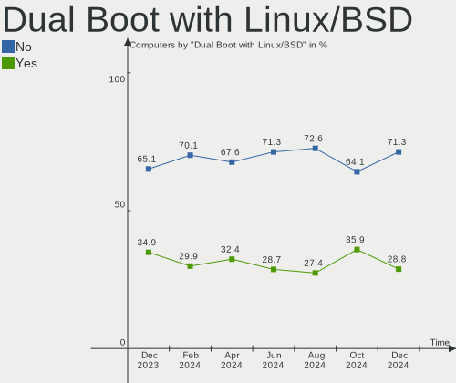
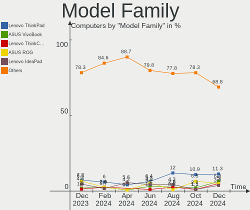
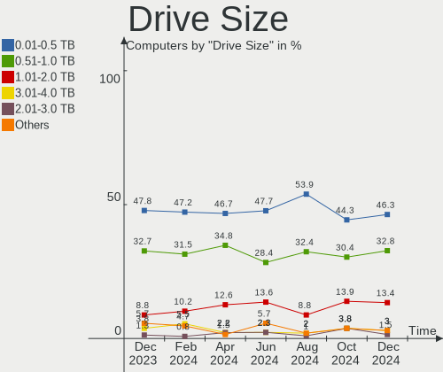
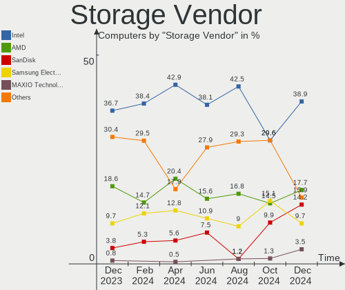
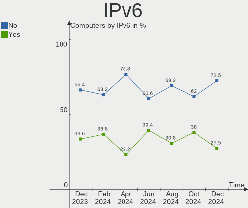
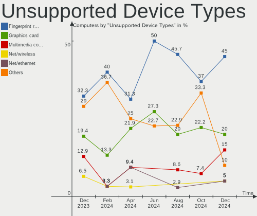

ArcoLinux - Hardware Trends
---------------------------

A project to identify most popular hardware characteristics and track their change
over time based on data collected by Linux users at https://Linux-Hardware.org.

Anyone can contribute to this report by the [hw-probe](https://github.com/linuxhw/hw-probe) tool:

    sudo -E hw-probe -all -upload

This is a report for all computer types. See also reports for [desktops](/Dist/ArcoLinux/Desktop/README.md) and [notebooks](/Dist/ArcoLinux/Notebook/README.md).

This report is for one last month. Overall report since the beginning of time: [TestDays](https://github.com/linuxhw/TestDays)

Period: Mar, 2023.

Contents
--------

* [ System ](#system)
  - [ OS                       ](#os)
  - [ OS Family                ](#os-family)
  - [ Kernel                   ](#kernel)
  - [ Kernel Family            ](#kernel-family)
  - [ Kernel Major Ver.        ](#kernel-major-ver)
  - [ Arch                     ](#arch)
  - [ DE                       ](#de)
  - [ Display Server           ](#display-server)
  - [ Display Manager          ](#display-manager)
  - [ OS Lang                  ](#os-lang)
  - [ Boot Mode                ](#boot-mode)
  - [ Filesystem               ](#filesystem)
  - [ Part. scheme             ](#part-scheme)
  - [ Dual Boot with Linux/BSD ](#dual-boot-with-linuxbsd)
  - [ Dual Boot (Win)          ](#dual-boot-win)

* [ Board ](#board)
  - [ Vendor                   ](#vendor)
  - [ Model                    ](#model)
  - [ Model Family             ](#model-family)
  - [ MFG Year                 ](#mfg-year)
  - [ Form Factor              ](#form-factor)
  - [ Secure Boot              ](#secure-boot)
  - [ Coreboot                 ](#coreboot)
  - [ RAM Size                 ](#ram-size)
  - [ RAM Used                 ](#ram-used)
  - [ Total Drives             ](#total-drives)
  - [ Has CD-ROM               ](#has-cd-rom)
  - [ Has Ethernet             ](#has-ethernet)
  - [ Has WiFi                 ](#has-wifi)
  - [ Has Bluetooth            ](#has-bluetooth)

* [ Location ](#location)
  - [ Country                  ](#country)
  - [ City                     ](#city)

* [ Drives ](#drives)
  - [ Drive Vendor             ](#drive-vendor)
  - [ Drive Model              ](#drive-model)
  - [ HDD Vendor               ](#hdd-vendor)
  - [ SSD Vendor               ](#ssd-vendor)
  - [ Drive Kind               ](#drive-kind)
  - [ Drive Connector          ](#drive-connector)
  - [ Drive Size               ](#drive-size)
  - [ Space Total              ](#space-total)
  - [ Space Used               ](#space-used)
  - [ Malfunc. Drives          ](#malfunc-drives)
  - [ Malfunc. Drive Vendor    ](#malfunc-drive-vendor)
  - [ Malfunc. HDD Vendor      ](#malfunc-hdd-vendor)
  - [ Malfunc. Drive Kind      ](#malfunc-drive-kind)
  - [ Failed Drives            ](#failed-drives)
  - [ Failed Drive Vendor      ](#failed-drive-vendor)
  - [ Drive Status             ](#drive-status)

* [ Storage controller ](#storage-controller)
  - [ Storage Vendor           ](#storage-vendor)
  - [ Storage Model            ](#storage-model)
  - [ Storage Kind             ](#storage-kind)

* [ Processor ](#processor)
  - [ CPU Vendor               ](#cpu-vendor)
  - [ CPU Model                ](#cpu-model)
  - [ CPU Model Family         ](#cpu-model-family)
  - [ CPU Cores                ](#cpu-cores)
  - [ CPU Sockets              ](#cpu-sockets)
  - [ CPU Threads              ](#cpu-threads)
  - [ CPU Op-Modes             ](#cpu-op-modes)
  - [ CPU Microcode            ](#cpu-microcode)
  - [ CPU Microarch            ](#cpu-microarch)

* [ Graphics ](#graphics)
  - [ GPU Vendor               ](#gpu-vendor)
  - [ GPU Model                ](#gpu-model)
  - [ GPU Combo                ](#gpu-combo)
  - [ GPU Driver               ](#gpu-driver)
  - [ GPU Memory               ](#gpu-memory)

* [ Monitor ](#monitor)
  - [ Monitor Vendor           ](#monitor-vendor)
  - [ Monitor Model            ](#monitor-model)
  - [ Monitor Resolution       ](#monitor-resolution)
  - [ Monitor Diagonal         ](#monitor-diagonal)
  - [ Monitor Width            ](#monitor-width)
  - [ Aspect Ratio             ](#aspect-ratio)
  - [ Monitor Area             ](#monitor-area)
  - [ Pixel Density            ](#pixel-density)
  - [ Multiple Monitors        ](#multiple-monitors)

* [ Network ](#network)
  - [ Net Controller Vendor    ](#net-controller-vendor)
  - [ Net Controller Model     ](#net-controller-model)
  - [ Wireless Vendor          ](#wireless-vendor)
  - [ Wireless Model           ](#wireless-model)
  - [ Ethernet Vendor          ](#ethernet-vendor)
  - [ Ethernet Model           ](#ethernet-model)
  - [ Net Controller Kind      ](#net-controller-kind)
  - [ Used Controller          ](#used-controller)
  - [ NICs                     ](#nics)
  - [ IPv6                     ](#ipv6)

* [ Bluetooth ](#bluetooth)
  - [ Bluetooth Vendor         ](#bluetooth-vendor)
  - [ Bluetooth Model          ](#bluetooth-model)

* [ Sound ](#sound)
  - [ Sound Vendor             ](#sound-vendor)
  - [ Sound Model              ](#sound-model)

* [ Memory ](#memory)
  - [ Memory Vendor            ](#memory-vendor)
  - [ Memory Model             ](#memory-model)
  - [ Memory Kind              ](#memory-kind)
  - [ Memory Form Factor       ](#memory-form-factor)
  - [ Memory Size              ](#memory-size)
  - [ Memory Speed             ](#memory-speed)

* [ Printers & scanners ](#printers--scanners)
  - [ Printer Vendor           ](#printer-vendor)
  - [ Printer Model            ](#printer-model)
  - [ Scanner Vendor           ](#scanner-vendor)
  - [ Scanner Model            ](#scanner-model)

* [ Camera ](#camera)
  - [ Camera Vendor            ](#camera-vendor)
  - [ Camera Model             ](#camera-model)

* [ Security ](#security)
  - [ Fingerprint Vendor       ](#fingerprint-vendor)
  - [ Fingerprint Model        ](#fingerprint-model)
  - [ Chipcard Vendor          ](#chipcard-vendor)
  - [ Chipcard Model           ](#chipcard-model)

* [ Unsupported ](#unsupported)
  - [ Unsupported Devices      ](#unsupported-devices)
  - [ Unsupported Device Types ](#unsupported-device-types)

System
------

OS
--

Installed operating systems

| Name              | Computers | Percent |
|-------------------|-----------|---------|
| ArcoLinux Rolling | 81        | 97.59%  |
| ArcoLinux         | 2         | 2.41%   |

OS Family
---------

OS without a version

| Name      | Computers | Percent |
|-----------|-----------|---------|
| ArcoLinux | 83        | 100%    |

Kernel
------

Version of the Linux kernel

| Version                       | Computers | Percent |
|-------------------------------|-----------|---------|
| 6.2.8-arch1-1                 | 19        | 22.89%  |
| 6.2.2-arch1-1                 | 9         | 10.84%  |
| 6.2.6-arch1-1                 | 8         | 9.64%   |
| 6.2.1-arch1-1                 | 5         | 6.02%   |
| 6.1.21-1-lts                  | 4         | 4.82%   |
| 6.1.12-arch1-1                | 4         | 4.82%   |
| 6.2.6-zen1-1-zen              | 3         | 3.61%   |
| 6.2.5-arch1-1                 | 3         | 3.61%   |
| 6.1.11-arch1-1                | 3         | 3.61%   |
| 6.2.8-zen1-1-zen              | 2         | 2.41%   |
| 6.2.7-x64v1-xanmod1-1         | 2         | 2.41%   |
| 6.2.7-arch1-1                 | 2         | 2.41%   |
| 6.2.2-zen1-1-zen              | 2         | 2.41%   |
| 6.1.19-1-lts                  | 2         | 2.41%   |
| 5.15.96.61.realtime1-1-rt-lts | 2         | 2.41%   |
| 6.2.8-AMD                     | 1         | 1.2%    |
| 6.2.7-lqx1-1-lqx              | 1         | 1.2%    |
| 6.2.1-zen1-1-zen              | 1         | 1.2%    |
| 6.1.6-arch1-3                 | 1         | 1.2%    |
| 6.1.22-1-lts                  | 1         | 1.2%    |
| 6.1.21-hardened1-1-hardened   | 1         | 1.2%    |
| 6.1.18-1-lts                  | 1         | 1.2%    |
| 6.1.15-1-lts                  | 1         | 1.2%    |
| 6.1.14-1-lts                  | 1         | 1.2%    |
| 6.1.11-x64v1-xanmod1-1        | 1         | 1.2%    |
| 6.0.9-arch1-1                 | 1         | 1.2%    |
| 6.0.12-arch1-1                | 1         | 1.2%    |
| 5.10.31-1-lts                 | 1         | 1.2%    |

Kernel Family
-------------

Linux kernel without a distro release

| Version    | Computers | Percent |
|------------|-----------|---------|
| 6.2.8      | 22        | 26.51%  |
| 6.2.6      | 11        | 13.25%  |
| 6.2.2      | 11        | 13.25%  |
| 6.2.1      | 6         | 7.23%   |
| 6.2.7      | 5         | 6.02%   |
| 6.1.21     | 5         | 6.02%   |
| 6.1.12     | 4         | 4.82%   |
| 6.1.11     | 4         | 4.82%   |
| 6.2.5      | 3         | 3.61%   |
| 6.1.19     | 2         | 2.41%   |
| 5.15.96.61 | 2         | 2.41%   |
| 6.1.6      | 1         | 1.2%    |
| 6.1.22     | 1         | 1.2%    |
| 6.1.18     | 1         | 1.2%    |
| 6.1.15     | 1         | 1.2%    |
| 6.1.14     | 1         | 1.2%    |
| 6.0.9      | 1         | 1.2%    |
| 6.0.12     | 1         | 1.2%    |
| 5.10.31    | 1         | 1.2%    |

Kernel Major Ver.
-----------------

Linux kernel major version

| Version | Computers | Percent |
|---------|-----------|---------|
| 6.2     | 58        | 69.88%  |
| 6.1     | 20        | 24.1%   |
| 6.0     | 2         | 2.41%   |
| 5.15.96 | 2         | 2.41%   |
| 5.10    | 1         | 1.2%    |

Arch
----

OS architecture (x86_64, i586, etc.)

| Name   | Computers | Percent |
|--------|-----------|---------|
| x86_64 | 83        | 100%    |

DE
--

Desktop Environment

| Name       | Computers | Percent |
|------------|-----------|---------|
| XFCE       | 30        | 36.14%  |
| KDE5       | 17        | 20.48%  |
| Hyprland   | 10        | 12.05%  |
| GNOME      | 5         | 6.02%   |
| bspwm      | 5         | 6.02%   |
| i3         | 4         | 4.82%   |
| awesome    | 4         | 4.82%   |
| qtile      | 3         | 3.61%   |
| xmonad     | 1         | 1.2%    |
| X-Cinnamon | 1         | 1.2%    |
| MATE       | 1         | 1.2%    |
| LeftWM     | 1         | 1.2%    |
| Cinnamon   | 1         | 1.2%    |

Display Server
--------------

X11 or Wayland

| Name    | Computers | Percent |
|---------|-----------|---------|
| X11     | 65        | 78.31%  |
| Wayland | 13        | 15.66%  |
| Tty     | 5         | 6.02%   |

Display Manager
---------------

SDDM, LightDM, etc.

| Name    | Computers | Percent |
|---------|-----------|---------|
| SDDM    | 72        | 86.75%  |
| LightDM | 7         | 8.43%   |
| GDM     | 2         | 2.41%   |
| Unknown | 2         | 2.41%   |

OS Lang
-------

Language

| Lang  | Computers | Percent |
|-------|-----------|---------|
| en_US | 43        | 51.81%  |
| en_GB | 10        | 12.05%  |
| C     | 7         | 8.43%   |
| de_DE | 5         | 6.02%   |
| it_IT | 3         | 3.61%   |
| pt_BR | 2         | 2.41%   |
| fr_FR | 2         | 2.41%   |
| es_ES | 2         | 2.41%   |
| en_IN | 2         | 2.41%   |
| en_CA | 2         | 2.41%   |
| tr_TR | 1         | 1.2%    |
| pl_PL | 1         | 1.2%    |
| nl_NL | 1         | 1.2%    |
| fi_FI | 1         | 1.2%    |
| en_ZA | 1         | 1.2%    |

Boot Mode
---------

EFI or BIOS

| Mode | Computers | Percent |
|------|-----------|---------|
| EFI  | 68        | 81.93%  |
| BIOS | 15        | 18.07%  |

Filesystem
----------

Type of filesystem

| Type    | Computers | Percent |
|---------|-----------|---------|
| Ext4    | 53        | 63.86%  |
| Btrfs   | 21        | 25.3%   |
| Overlay | 8         | 9.64%   |
| F2fs    | 1         | 1.2%    |

Part. scheme
------------

Scheme of partitioning

| Type    | Computers | Percent |
|---------|-----------|---------|
| GPT     | 69        | 83.13%  |
| MBR     | 12        | 14.46%  |
| Unknown | 2         | 2.41%   |

Dual Boot with Linux/BSD
------------------------

Hosting more than one Linux/BSD

| Dual boot | Computers | Percent |
|-----------|-----------|---------|
| No        | 54        | 65.06%  |
| Yes       | 29        | 34.94%  |

Dual Boot (Win)
---------------

Hosting Linux and Windows

| Dual boot | Computers | Percent |
|-----------|-----------|---------|
| No        | 51        | 61.45%  |
| Yes       | 32        | 38.55%  |

Board
-----

Vendor
------

Motherboard manufacturer

| Name                | Computers | Percent |
|---------------------|-----------|---------|
| ASUSTek Computer    | 24        | 28.92%  |
| Lenovo              | 10        | 12.05%  |
| Hewlett-Packard     | 8         | 9.64%   |
| Dell                | 8         | 9.64%   |
| Gigabyte Technology | 6         | 7.23%   |
| MSI                 | 5         | 6.02%   |
| ASRock              | 4         | 4.82%   |
| Acer                | 3         | 3.61%   |
| Toshiba             | 2         | 2.41%   |
| System76            | 2         | 2.41%   |
| Chuwi               | 2         | 2.41%   |
| Unknown             | 2         | 2.41%   |
| TUXEDO              | 1         | 1.2%    |
| Sony                | 1         | 1.2%    |
| Samsung Electronics | 1         | 1.2%    |
| Medion              | 1         | 1.2%    |
| LG Electronics      | 1         | 1.2%    |
| HUAWEI              | 1         | 1.2%    |
| Huanan              | 1         | 1.2%    |

Model
-----

Motherboard model

| Name                                                                     | Computers | Percent |
|--------------------------------------------------------------------------|-----------|---------|
| Unknown                                                                  | 2         | 2.41%   |
| TUXEDO InfinityBook Pro 14 Gen6                                          | 1         | 1.2%    |
| Toshiba Satellite C55-A                                                  | 1         | 1.2%    |
| Toshiba Satellite C50-A510                                               | 1         | 1.2%    |
| System76 Pangolin                                                        | 1         | 1.2%    |
| System76 Oryx Pro                                                        | 1         | 1.2%    |
| Sony VPCEH10EB                                                           | 1         | 1.2%    |
| Samsung 300E4A/300E5A/300E7A/3430EA/3530EA                               | 1         | 1.2%    |
| MSI MS-7C02                                                              | 1         | 1.2%    |
| MSI MS-7B51                                                              | 1         | 1.2%    |
| MSI GV62 7RE                                                             | 1         | 1.2%    |
| MSI GT70                                                                 | 1         | 1.2%    |
| MSI A320M-HDV R4.0                                                       | 1         | 1.2%    |
| Medion P7624                                                             | 1         | 1.2%    |
| LG 17Z90P-K.AA78A1                                                       | 1         | 1.2%    |
| Lenovo Z51-70 80K6                                                       | 1         | 1.2%    |
| Lenovo V15 G2 ALC 82KD                                                   | 1         | 1.2%    |
| Lenovo ThinkPad T490s 20NXS0DS00                                         | 1         | 1.2%    |
| Lenovo ThinkPad T470 W10DG 20JNS15B26                                    | 1         | 1.2%    |
| Lenovo ThinkPad T410 2522AC1                                             | 1         | 1.2%    |
| Lenovo ThinkPad Edge S430 33643DG                                        | 1         | 1.2%    |
| Lenovo IdeaPad S145-15IKB 81XM                                           | 1         | 1.2%    |
| Lenovo IdeaPad 5 15ALC05 82LN                                            | 1         | 1.2%    |
| Lenovo IdeaCentre 510-15ICB 90HU00CEGE                                   | 1         | 1.2%    |
| Lenovo E41-25 81FS                                                       | 1         | 1.2%    |
| HUAWEI KLVL-WXX9                                                         | 1         | 1.2%    |
| Huanan X79-ZD3 INTEL (INTEL Xeon E5/Corei7 DMI2 - C600/C200 Cipset V3.6C | 1         | 1.2%    |
| HP x2 Detachable 10-p0XX                                                 | 1         | 1.2%    |
| HP ProOne 600 G1 AiO                                                     | 1         | 1.2%    |
| HP Pavilion Power Desktop 580-1xx                                        | 1         | 1.2%    |
| HP Pavilion Laptop 15-eh0xxx                                             | 1         | 1.2%    |
| HP OMEN by Laptop 15-dc0xxx                                              | 1         | 1.2%    |
| HP Laptop 15s-eq2xxx                                                     | 1         | 1.2%    |
| HP EliteDesk 800 G2 DM 35W                                               | 1         | 1.2%    |
| HP 750-427c                                                              | 1         | 1.2%    |
| Gigabyte X570 AORUS ELITE                                                | 1         | 1.2%    |
| Gigabyte H61MS                                                           | 1         | 1.2%    |
| Gigabyte GA-78LMT-USB3 6.0                                               | 1         | 1.2%    |
| Gigabyte B560M DS3H                                                      | 1         | 1.2%    |
| Gigabyte B550 AORUS PRO V2                                               | 1         | 1.2%    |

Model Family
------------

Motherboard model prefix

| Name                   | Computers | Percent |
|------------------------|-----------|---------|
| ASUS PRIME             | 7         | 8.43%   |
| ASUS ROG               | 6         | 7.23%   |
| Lenovo ThinkPad        | 4         | 4.82%   |
| Acer Aspire            | 3         | 3.61%   |
| Toshiba Satellite      | 2         | 2.41%   |
| Lenovo IdeaPad         | 2         | 2.41%   |
| HP Pavilion            | 2         | 2.41%   |
| Dell OptiPlex          | 2         | 2.41%   |
| Dell Inspiron          | 2         | 2.41%   |
| ASUS VivoBook          | 2         | 2.41%   |
| ASUS TUF               | 2         | 2.41%   |
| Unknown                | 2         | 2.41%   |
| TUXEDO InfinityBook    | 1         | 1.2%    |
| System76 Pangolin      | 1         | 1.2%    |
| System76 Oryx          | 1         | 1.2%    |
| Sony VPCEH10EB         | 1         | 1.2%    |
| Samsung 300E4A         | 1         | 1.2%    |
| MSI MS-7C02            | 1         | 1.2%    |
| MSI MS-7B51            | 1         | 1.2%    |
| MSI GV62               | 1         | 1.2%    |
| MSI GT70               | 1         | 1.2%    |
| MSI A320M-HDV          | 1         | 1.2%    |
| Medion P7624           | 1         | 1.2%    |
| LG 17Z90P-K.AA78A1     | 1         | 1.2%    |
| Lenovo Z51-70          | 1         | 1.2%    |
| Lenovo V15             | 1         | 1.2%    |
| Lenovo IdeaCentre      | 1         | 1.2%    |
| Lenovo E41-25          | 1         | 1.2%    |
| HUAWEI KLVL-WXX9       | 1         | 1.2%    |
| Huanan X79-ZD3         | 1         | 1.2%    |
| HP x2                  | 1         | 1.2%    |
| HP ProOne              | 1         | 1.2%    |
| HP OMEN                | 1         | 1.2%    |
| HP Laptop              | 1         | 1.2%    |
| HP EliteDesk           | 1         | 1.2%    |
| HP 750-427c            | 1         | 1.2%    |
| Gigabyte X570          | 1         | 1.2%    |
| Gigabyte H61MS         | 1         | 1.2%    |
| Gigabyte GA-78LMT-USB3 | 1         | 1.2%    |
| Gigabyte B560M         | 1         | 1.2%    |

MFG Year
--------

Motherboard manufacture year

| Year | Computers | Percent |
|------|-----------|---------|
| 2021 | 14        | 16.87%  |
| 2019 | 13        | 15.66%  |
| 2018 | 10        | 12.05%  |
| 2013 | 8         | 9.64%   |
| 2020 | 7         | 8.43%   |
| 2017 | 7         | 8.43%   |
| 2022 | 5         | 6.02%   |
| 2016 | 4         | 4.82%   |
| 2014 | 4         | 4.82%   |
| 2011 | 4         | 4.82%   |
| 2012 | 3         | 3.61%   |
| 2015 | 2         | 2.41%   |
| 2009 | 1         | 1.2%    |
| 2007 | 1         | 1.2%    |

Form Factor
-----------

Physical design of the computer

| Name     | Computers | Percent |
|----------|-----------|---------|
| Desktop  | 41        | 49.4%   |
| Notebook | 41        | 49.4%   |
| Tablet   | 1         | 1.2%    |

Secure Boot
-----------

Enabled or disabled

| State    | Computers | Percent |
|----------|-----------|---------|
| Disabled | 83        | 100%    |

Coreboot
--------

Have coreboot on board

| Used | Computers | Percent |
|------|-----------|---------|
| No   | 83        | 100%    |

RAM Size
--------

Total RAM memory

| Size in GB  | Computers | Percent |
|-------------|-----------|---------|
| 32.01-64.0  | 18        | 21.69%  |
| 16.01-24.0  | 18        | 21.69%  |
| 4.01-8.0    | 17        | 20.48%  |
| 8.01-16.0   | 13        | 15.66%  |
| 24.01-32.0  | 8         | 9.64%   |
| 3.01-4.0    | 5         | 6.02%   |
| 64.01-256.0 | 3         | 3.61%   |
| 1.01-2.0    | 1         | 1.2%    |

RAM Used
--------

Used RAM memory

| Used GB   | Computers | Percent |
|-----------|-----------|---------|
| 1.01-2.0  | 23        | 27.71%  |
| 4.01-8.0  | 19        | 22.89%  |
| 2.01-3.0  | 19        | 22.89%  |
| 3.01-4.0  | 12        | 14.46%  |
| 0.51-1.0  | 7         | 8.43%   |
| 8.01-16.0 | 3         | 3.61%   |

Total Drives
------------

Number of drives on board

| Drives | Computers | Percent |
|--------|-----------|---------|
| 1      | 37        | 44.58%  |
| 2      | 22        | 26.51%  |
| 3      | 13        | 15.66%  |
| 4      | 7         | 8.43%   |
| 5      | 3         | 3.61%   |
| 6      | 1         | 1.2%    |

Has CD-ROM
----------

Has CD-ROM on board

| Presented | Computers | Percent |
|-----------|-----------|---------|
| No        | 64        | 77.11%  |
| Yes       | 19        | 22.89%  |

Has Ethernet
------------

Has Ethernet on board

| Presented | Computers | Percent |
|-----------|-----------|---------|
| Yes       | 71        | 85.54%  |
| No        | 12        | 14.46%  |

Has WiFi
--------

Has WiFi module

| Presented | Computers | Percent |
|-----------|-----------|---------|
| Yes       | 56        | 67.47%  |
| No        | 27        | 32.53%  |

Has Bluetooth
-------------

Has Bluetooth module

| Presented | Computers | Percent |
|-----------|-----------|---------|
| Yes       | 59        | 71.08%  |
| No        | 24        | 28.92%  |

Location
--------

Country
-------

Geographic location (country)

| Country         | Computers | Percent |
|-----------------|-----------|---------|
| USA             | 13        | 15.66%  |
| UK              | 9         | 10.84%  |
| Germany         | 8         | 9.64%   |
| Belgium         | 8         | 9.64%   |
| France          | 5         | 6.02%   |
| India           | 4         | 4.82%   |
| Italy           | 3         | 3.61%   |
| Canada          | 3         | 3.61%   |
| Brazil          | 3         | 3.61%   |
| Austria         | 3         | 3.61%   |
| Turkey          | 2         | 2.41%   |
| Sweden          | 2         | 2.41%   |
| Spain           | 2         | 2.41%   |
| Netherlands     | 2         | 2.41%   |
| Uruguay         | 1         | 1.2%    |
| Ukraine         | 1         | 1.2%    |
| Switzerland     | 1         | 1.2%    |
| South Africa    | 1         | 1.2%    |
| Russia          | 1         | 1.2%    |
| Portugal        | 1         | 1.2%    |
| Poland          | 1         | 1.2%    |
| North Macedonia | 1         | 1.2%    |
| Mexico          | 1         | 1.2%    |
| Indonesia       | 1         | 1.2%    |
| Greece          | 1         | 1.2%    |
| Finland         | 1         | 1.2%    |
| Denmark         | 1         | 1.2%    |
| Bolivia         | 1         | 1.2%    |
| Australia       | 1         | 1.2%    |
| Argentina       | 1         | 1.2%    |

City
----

Geographic location (city)

| City                  | Computers | Percent |
|-----------------------|-----------|---------|
| Duffel                | 5         | 6.02%   |
| Kolkata               | 3         | 3.61%   |
| Vaxjo                 | 2         | 2.41%   |
| Ripon                 | 2         | 2.41%   |
| Paris                 | 2         | 2.41%   |
| Mechelen              | 2         | 2.41%   |
| Walterboro            | 1         | 1.2%    |
| Vienna                | 1         | 1.2%    |
| Valley Stream         | 1         | 1.2%    |
| Thornhill             | 1         | 1.2%    |
| Sydney                | 1         | 1.2%    |
| Stratford-upon-Avon   | 1         | 1.2%    |
| Spokane               | 1         | 1.2%    |
| Skopje                | 1         | 1.2%    |
| Seville               | 1         | 1.2%    |
| Sao Paulo             | 1         | 1.2%    |
| Santa Cruz            | 1         | 1.2%    |
| San Luis Potosí City | 1         | 1.2%    |
| Roosendaal            | 1         | 1.2%    |
| Romilly-sur-Seine     | 1         | 1.2%    |
| Rome                  | 1         | 1.2%    |
| Recife                | 1         | 1.2%    |
| Poway                 | 1         | 1.2%    |
| Portland              | 1         | 1.2%    |
| Port Elizabeth        | 1         | 1.2%    |
| Offenbach             | 1         | 1.2%    |
| Odense                | 1         | 1.2%    |
| Newport               | 1         | 1.2%    |
| Neuss                 | 1         | 1.2%    |
| Nea Smyrni            | 1         | 1.2%    |
| Moscow                | 1         | 1.2%    |
| Montevideo            | 1         | 1.2%    |
| Madurai               | 1         | 1.2%    |
| Madison               | 1         | 1.2%    |
| Lviv                  | 1         | 1.2%    |
| Lurate Caccivio       | 1         | 1.2%    |
| Ludwigsburg           | 1         | 1.2%    |
| Los Angeles           | 1         | 1.2%    |
| Lochgilphead          | 1         | 1.2%    |
| Leander               | 1         | 1.2%    |

Drives
------

Drive Vendor
------------

Hard drive vendors

| Vendor                      | Computers | Drives | Percent |
|-----------------------------|-----------|--------|---------|
| Samsung Electronics         | 36        | 46     | 24.66%  |
| WDC                         | 20        | 23     | 13.7%   |
| Seagate                     | 16        | 18     | 10.96%  |
| Sandisk                     | 14        | 16     | 9.59%   |
| Kingston                    | 9         | 9      | 6.16%   |
| Unknown                     | 5         | 5      | 3.42%   |
| Toshiba                     | 5         | 5      | 3.42%   |
| Intel                       | 5         | 5      | 3.42%   |
| Crucial                     | 5         | 6      | 3.42%   |
| SK hynix                    | 3         | 3      | 2.05%   |
| Hitachi                     | 3         | 3      | 2.05%   |
| HGST                        | 3         | 3      | 2.05%   |
| Phison Electronics          | 2         | 3      | 1.37%   |
| Kingston Technology Company | 2         | 2      | 1.37%   |
| Intenso                     | 2         | 2      | 1.37%   |
| ADATA Technology            | 2         | 2      | 1.37%   |
| SSD_2.5"                    | 1         | 1      | 0.68%   |
| Micron/Crucial Technology   | 1         | 1      | 0.68%   |
| Micron Technology           | 1         | 1      | 0.68%   |
| KIOXIA                      | 1         | 1      | 0.68%   |
| Hewlett-Packard             | 1         | 1      | 0.68%   |
| H/W                         | 1         | 3      | 0.68%   |
| External                    | 1         | 1      | 0.68%   |
| Corsair                     | 1         | 1      | 0.68%   |
| China                       | 1         | 1      | 0.68%   |
| BIWIN                       | 1         | 1      | 0.68%   |
| Biostar                     | 1         | 2      | 0.68%   |
| ASMedia                     | 1         | 1      | 0.68%   |
| AMD                         | 1         | 2      | 0.68%   |
| A-DATA Technology           | 1         | 1      | 0.68%   |

Drive Model
-----------

Hard drive models

| Model                                                              | Computers | Percent |
|--------------------------------------------------------------------|-----------|---------|
| Samsung NVMe SSD Controller SM981/PM981/PM983 250GB                | 12        | 7.5%    |
| WDC WD10EZEX-08WN4A0 1TB                                           | 3         | 1.88%   |
| Unknown SD/MMC/MS PRO 64GB                                         | 3         | 1.88%   |
| Seagate ST1000LM024 HN-M101MBB 1TB                                 | 3         | 1.88%   |
| Sandisk WD Blue SN550 NVMe SSD 256GB                               | 3         | 1.88%   |
| Samsung SSD 860 EVO 250GB                                          | 3         | 1.88%   |
| Kingston SNVS500G 500GB                                            | 3         | 1.88%   |
| Kingston SA400S37240G 240GB SSD                                    | 3         | 1.88%   |
| WDC WDS500G2B0B-00YS70 500GB SSD                                   | 2         | 1.25%   |
| WDC WDS240G2G0A-00JH30 240GB SSD                                   | 2         | 1.25%   |
| Toshiba MQ01ABD100 1TB                                             | 2         | 1.25%   |
| Seagate ST2000DM008-2FR102 2TB                                     | 2         | 1.25%   |
| Samsung SSD 980 500GB                                              | 2         | 1.25%   |
| Samsung SSD 870 QVO 2TB                                            | 2         | 1.25%   |
| Samsung SSD 860 EVO 500GB                                          | 2         | 1.25%   |
| Samsung SSD 850 EVO 500GB                                          | 2         | 1.25%   |
| Samsung NVMe SSD Controller PM9A1/PM9A3/980PRO 1TB                 | 2         | 1.25%   |
| Samsung MZALQ512HBLU-00BL2 512GB                                   | 2         | 1.25%   |
| HGST HTS721010A9E630 1TB                                           | 2         | 1.25%   |
| Crucial CT240BX500SSD1 240GB                                       | 2         | 1.25%   |
| ADATA XPG SX8200 Pro PCIe Gen3x4 M.2 2280 Solid State Drive 1024GB | 2         | 1.25%   |
| WDC WDS500G2B0A-00SM50 500GB SSD                                   | 1         | 0.63%   |
| WDC WDS500G2B0A 500GB SSD                                          | 1         | 0.63%   |
| WDC WDS120G2G0B-00EPW0 120GB SSD                                   | 1         | 0.63%   |
| WDC WDS120G2G0A-00JH30 120GB SSD                                   | 1         | 0.63%   |
| WDC WDS120G1G0A-00SS50 120GB SSD                                   | 1         | 0.63%   |
| WDC WD5000LPCX-24VHAT0 500GB                                       | 1         | 0.63%   |
| WDC WD5000AAKX-75U6AA0 500GB                                       | 1         | 0.63%   |
| WDC WD5000AACS-00G8B1 500GB                                        | 1         | 0.63%   |
| WDC WD3200BPVT-22JJ5T0 320GB                                       | 1         | 0.63%   |
| WDC WD3200AVJS-63B6A0 320GB                                        | 1         | 0.63%   |
| WDC WD20SPZX-22UA7T0 2TB                                           | 1         | 0.63%   |
| WDC WD10SPZX-24Z10 1TB                                             | 1         | 0.63%   |
| WDC WD10SPZX-21Z10T0 1TB                                           | 1         | 0.63%   |
| WDC WD10JPVX-22JC3T0 1TB                                           | 1         | 0.63%   |
| WDC WD10EZRX-00A8LB0 1TB                                           | 1         | 0.63%   |
| WDC WD10EZEX-60WN4A1 1TB                                           | 1         | 0.63%   |
| Unknown MMC Card  32GB                                             | 1         | 0.63%   |
| Unknown MMC Card  134GB                                            | 1         | 0.63%   |
| Toshiba THNSFJ256GDNU A 256GB SSD                                  | 1         | 0.63%   |

HDD Vendor
----------

Hard disk drive vendors

| Vendor              | Computers | Drives | Percent |
|---------------------|-----------|--------|---------|
| Seagate             | 15        | 17     | 33.33%  |
| WDC                 | 12        | 14     | 26.67%  |
| Toshiba             | 4         | 4      | 8.89%   |
| Unknown             | 3         | 3      | 6.67%   |
| Hitachi             | 3         | 3      | 6.67%   |
| HGST                | 3         | 3      | 6.67%   |
| Samsung Electronics | 1         | 1      | 2.22%   |
| Hewlett-Packard     | 1         | 1      | 2.22%   |
| H/W                 | 1         | 3      | 2.22%   |
| External            | 1         | 1      | 2.22%   |
| ASMedia             | 1         | 1      | 2.22%   |

SSD Vendor
----------

Solid state drive vendors

| Vendor              | Computers | Drives | Percent |
|---------------------|-----------|--------|---------|
| Samsung Electronics | 22        | 23     | 38.6%   |
| WDC                 | 9         | 9      | 15.79%  |
| Kingston            | 6         | 6      | 10.53%  |
| Crucial             | 5         | 6      | 8.77%   |
| SanDisk             | 4         | 5      | 7.02%   |
| Intenso             | 2         | 2      | 3.51%   |
| Toshiba             | 1         | 1      | 1.75%   |
| SK hynix            | 1         | 1      | 1.75%   |
| Seagate             | 1         | 1      | 1.75%   |
| Intel               | 1         | 1      | 1.75%   |
| Corsair             | 1         | 1      | 1.75%   |
| China               | 1         | 1      | 1.75%   |
| BIWIN               | 1         | 1      | 1.75%   |
| Biostar             | 1         | 2      | 1.75%   |
| A-DATA Technology   | 1         | 1      | 1.75%   |

Drive Kind
----------

HDD or SSD

| Kind    | Computers | Drives | Percent |
|---------|-----------|--------|---------|
| NVMe    | 46        | 54     | 33.58%  |
| SSD     | 46        | 61     | 33.58%  |
| HDD     | 42        | 51     | 30.66%  |
| MMC     | 2         | 2      | 1.46%   |
| Unknown | 1         | 1      | 0.73%   |

Drive Connector
---------------

SATA, SAS, NVMe, etc.

| Type | Computers | Drives | Percent |
|------|-----------|--------|---------|
| SATA | 63        | 103    | 52.5%   |
| NVMe | 46        | 53     | 38.33%  |
| SAS  | 9         | 11     | 7.5%    |
| MMC  | 2         | 2      | 1.67%   |

Drive Size
----------

Size of hard drive

| Size in TB | Computers | Drives | Percent |
|------------|-----------|--------|---------|
| 0.01-0.5   | 44        | 58     | 48.35%  |
| 0.51-1.0   | 28        | 33     | 30.77%  |
| 1.01-2.0   | 16        | 18     | 17.58%  |
| 4.01-10.0  | 2         | 2      | 2.2%    |
| 3.01-4.0   | 1         | 1      | 1.1%    |

Space Total
-----------

Amount of disk space available on the file system

| Size in GB     | Computers | Percent |
|----------------|-----------|---------|
| More than 3000 | 17        | 20.48%  |
| 101-250        | 14        | 16.87%  |
| 501-1000       | 12        | 14.46%  |
| 251-500        | 11        | 13.25%  |
| 1001-2000      | 10        | 12.05%  |
| 2001-3000      | 6         | 7.23%   |
| 51-100         | 5         | 6.02%   |
| 1-20           | 4         | 4.82%   |
| Unknown        | 3         | 3.61%   |
| 21-50          | 1         | 1.2%    |

Space Used
----------

Amount of used disk space

| Used GB        | Computers | Percent |
|----------------|-----------|---------|
| 1-20           | 17        | 20.48%  |
| 21-50          | 13        | 15.66%  |
| 251-500        | 10        | 12.05%  |
| 51-100         | 10        | 12.05%  |
| 101-250        | 9         | 10.84%  |
| 501-1000       | 9         | 10.84%  |
| 1001-2000      | 8         | 9.64%   |
| 2001-3000      | 3         | 3.61%   |
| Unknown        | 3         | 3.61%   |
| More than 3000 | 1         | 1.2%    |

Malfunc. Drives
---------------

Drive models with a malfunction

| Model                              | Computers | Drives | Percent |
|------------------------------------|-----------|--------|---------|
| Seagate ST1000LM024 HN-M101MBB 1TB | 3         | 3      | 13.04%  |
| Toshiba MQ01ABD100 1TB             | 2         | 2      | 8.7%    |
| WDC WD5000AAKX-75U6AA0 500GB       | 1         | 1      | 4.35%   |
| WDC WD5000AACS-00G8B1 500GB        | 1         | 1      | 4.35%   |
| WDC WD3200AVJS-63B6A0 320GB        | 1         | 1      | 4.35%   |
| WDC WD10JPVX-22JC3T0 1TB           | 1         | 1      | 4.35%   |
| WDC WD10EZRX-00A8LB0 1TB           | 1         | 1      | 4.35%   |
| Toshiba MQ01ABF050 500GB           | 1         | 1      | 4.35%   |
| Toshiba DT01ACA100 1TB             | 1         | 1      | 4.35%   |
| Seagate ST2000VX003-1HH164 2TB     | 1         | 1      | 4.35%   |
| Seagate ST1000DM003-1CH162 1TB     | 1         | 1      | 4.35%   |
| Samsung Electronics HM251JI 250GB  | 1         | 1      | 4.35%   |
| Intel SSDSC2CT240A4 240GB          | 1         | 1      | 4.35%   |
| Intel SSDPEKNU512GZH 512GB         | 1         | 1      | 4.35%   |
| Hitachi HDS722020ALA330 2TB        | 1         | 1      | 4.35%   |
| HGST HTS721010A9E630 1TB           | 1         | 1      | 4.35%   |
| Hewlett-Packard MB2000EBUCF 2TB    | 1         | 1      | 4.35%   |
| Crucial CT250BX100SSD1 250GB       | 1         | 1      | 4.35%   |
| Corsair CSSD-F60GB2 64GB           | 1         | 1      | 4.35%   |
| ASMedia AS2115 8TB                 | 1         | 1      | 4.35%   |

Malfunc. Drive Vendor
---------------------

Vendors of faulty drives

| Vendor              | Computers | Drives | Percent |
|---------------------|-----------|--------|---------|
| WDC                 | 5         | 5      | 21.74%  |
| Seagate             | 5         | 5      | 21.74%  |
| Toshiba             | 4         | 4      | 17.39%  |
| Intel               | 2         | 2      | 8.7%    |
| Samsung Electronics | 1         | 1      | 4.35%   |
| Hitachi             | 1         | 1      | 4.35%   |
| HGST                | 1         | 1      | 4.35%   |
| Hewlett-Packard     | 1         | 1      | 4.35%   |
| Crucial             | 1         | 1      | 4.35%   |
| Corsair             | 1         | 1      | 4.35%   |
| ASMedia             | 1         | 1      | 4.35%   |

Malfunc. HDD Vendor
-------------------

Vendors of faulty HDD drives

| Vendor              | Computers | Drives | Percent |
|---------------------|-----------|--------|---------|
| WDC                 | 5         | 5      | 26.32%  |
| Seagate             | 5         | 5      | 26.32%  |
| Toshiba             | 4         | 4      | 21.05%  |
| Samsung Electronics | 1         | 1      | 5.26%   |
| Hitachi             | 1         | 1      | 5.26%   |
| HGST                | 1         | 1      | 5.26%   |
| Hewlett-Packard     | 1         | 1      | 5.26%   |
| ASMedia             | 1         | 1      | 5.26%   |

Malfunc. Drive Kind
-------------------

Kinds of faulty drives

| Kind | Computers | Drives | Percent |
|------|-----------|--------|---------|
| HDD  | 18        | 19     | 81.82%  |
| SSD  | 3         | 3      | 13.64%  |
| NVMe | 1         | 1      | 4.55%   |

Failed Drives
-------------

Failed drive models

Zero info for selected period =(

Failed Drive Vendor
-------------------

Failed drive vendors

Zero info for selected period =(

Drive Status
------------

Number of failed and malfunc. drives

| Status   | Computers | Drives | Percent |
|----------|-----------|--------|---------|
| Works    | 71        | 131    | 67.62%  |
| Malfunc  | 21        | 23     | 20%     |
| Detected | 13        | 15     | 12.38%  |

Storage controller
------------------

Storage Vendor
--------------

Storage controller vendors

| Vendor                      | Computers | Percent |
|-----------------------------|-----------|---------|
| Intel                       | 52        | 42.28%  |
| AMD                         | 24        | 19.51%  |
| Samsung Electronics         | 18        | 14.63%  |
| SanDisk                     | 10        | 8.13%   |
| Kingston Technology Company | 5         | 4.07%   |
| ASMedia Technology          | 3         | 2.44%   |
| SK hynix                    | 2         | 1.63%   |
| Phison Electronics          | 2         | 1.63%   |
| Marvell Technology Group    | 2         | 1.63%   |
| ADATA Technology            | 2         | 1.63%   |
| Micron/Crucial Technology   | 1         | 0.81%   |
| Micron Technology           | 1         | 0.81%   |
| KIOXIA                      | 1         | 0.81%   |

Storage Model
-------------

Storage controller models

| Model                                                                          | Computers | Percent |
|--------------------------------------------------------------------------------|-----------|---------|
| AMD FCH SATA Controller [AHCI mode]                                            | 19        | 13.48%  |
| Samsung NVMe SSD Controller SM981/PM981/PM983                                  | 12        | 8.51%   |
| Samsung NVMe SSD Controller 980                                                | 5         | 3.55%   |
| Intel 200 Series PCH SATA controller [AHCI mode]                               | 5         | 3.55%   |
| Intel 8 Series/C220 Series Chipset Family 6-port SATA Controller 1 [AHCI mode] | 4         | 2.84%   |
| AMD 400 Series Chipset SATA Controller                                         | 4         | 2.84%   |
| SanDisk WD Blue SN550 NVMe SSD                                                 | 3         | 2.13%   |
| Intel Volume Management Device NVMe RAID Controller                            | 3         | 2.13%   |
| Intel Q170/Q150/B150/H170/H110/Z170/CM236 Chipset SATA Controller [AHCI Mode]  | 3         | 2.13%   |
| Intel Comet Lake SATA AHCI Controller                                          | 3         | 2.13%   |
| Intel Cannon Lake PCH SATA AHCI Controller                                     | 3         | 2.13%   |
| Intel 7 Series Chipset Family 6-port SATA Controller [AHCI mode]               | 3         | 2.13%   |
| Intel 6 Series/C200 Series Chipset Family 6 port Mobile SATA AHCI Controller   | 3         | 2.13%   |
| ASMedia ASM1062 Serial ATA Controller                                          | 3         | 2.13%   |
| SK hynix Gold P31/PC711 NVMe Solid State Drive                                 | 2         | 1.42%   |
| SanDisk WD Blue SN570 NVMe SSD 1TB                                             | 2         | 1.42%   |
| SanDisk Non-Volatile memory controller                                         | 2         | 1.42%   |
| Samsung NVMe SSD Controller PM9A1/PM9A3/980PRO                                 | 2         | 1.42%   |
| Kingston Company SNVS2000G [NV1 NVMe PCIe SSD 2TB]                             | 2         | 1.42%   |
| Intel Sunrise Point-LP SATA Controller [AHCI mode]                             | 2         | 1.42%   |
| Intel Non-Volatile memory controller                                           | 2         | 1.42%   |
| Intel Cannon Lake Mobile PCH SATA AHCI Controller                              | 2         | 1.42%   |
| Intel Alder Lake-S PCH SATA Controller [AHCI Mode]                             | 2         | 1.42%   |
| Intel 8 Series SATA Controller 1 [AHCI mode]                                   | 2         | 1.42%   |
| Intel 500 Series Chipset Family SATA AHCI Controller                           | 2         | 1.42%   |
| AMD SB7x0/SB8x0/SB9x0 SATA Controller [IDE mode]                               | 2         | 1.42%   |
| AMD SB7x0/SB8x0/SB9x0 IDE Controller                                           | 2         | 1.42%   |
| AMD FCH SATA Controller D                                                      | 2         | 1.42%   |
| AMD 500 Series Chipset SATA Controller                                         | 2         | 1.42%   |
| ADATA XPG SX8200 Pro PCIe Gen3x4 M.2 2280 Solid State Drive                    | 2         | 1.42%   |
| SanDisk WD Blue SN500 / PC SN520 NVMe SSD                                      | 1         | 0.71%   |
| SanDisk WD Black SN750 / PC SN730 NVMe SSD                                     | 1         | 0.71%   |
| SanDisk WD Black 2018/SN750 / PC SN720 NVMe SSD                                | 1         | 0.71%   |
| SanDisk NVMe Controller                                                        | 1         | 0.71%   |
| Samsung NVMe SSD Controller SM961/PM961/SM963                                  | 1         | 0.71%   |
| Phison E16 PCIe4 NVMe Controller                                               | 1         | 0.71%   |
| Phison E12 NVMe Controller                                                     | 1         | 0.71%   |
| Micron/Crucial P2 NVMe PCIe SSD                                                | 1         | 0.71%   |
| Micron NVMe Storage Controller                                                 | 1         | 0.71%   |
| Marvell Group 88SE9230 PCIe 2.0 x2 4-port SATA 6 Gb/s RAID Controller          | 1         | 0.71%   |

Storage Kind
------------

Kind of storage controller (IDE, SATA, NVMe, SAS, ...)

| Kind | Computers | Percent |
|------|-----------|---------|
| SATA | 67        | 54.92%  |
| NVMe | 46        | 37.7%   |
| RAID | 5         | 4.1%    |
| IDE  | 4         | 3.28%   |

Processor
---------

CPU Vendor
----------

Processor vendors

| Vendor | Computers | Percent |
|--------|-----------|---------|
| Intel  | 55        | 66.27%  |
| AMD    | 28        | 33.73%  |

CPU Model
---------

Processor models

| Model                                  | Computers | Percent |
|----------------------------------------|-----------|---------|
| AMD Ryzen 7 5700U with Radeon Graphics | 4         | 4.82%   |
| AMD Ryzen 7 5800X 8-Core Processor     | 3         | 3.61%   |
| Intel Core i7-9750H CPU @ 2.60GHz      | 2         | 2.41%   |
| Intel Core i7-10510U CPU @ 1.80GHz     | 2         | 2.41%   |
| Intel Core i5-2430M CPU @ 2.40GHz      | 2         | 2.41%   |
| AMD Ryzen 5 5600G with Radeon Graphics | 2         | 2.41%   |
| Intel Xeon CPU E5-2667 v2 @ 3.30GHz    | 1         | 1.2%    |
| Intel Pentium CPU G4560 @ 3.50GHz      | 1         | 1.2%    |
| Intel Core i9-9900K CPU @ 3.60GHz      | 1         | 1.2%    |
| Intel Core i7-9700K CPU @ 3.60GHz      | 1         | 1.2%    |
| Intel Core i7-8700K CPU @ 3.70GHz      | 1         | 1.2%    |
| Intel Core i7-8565U CPU @ 1.80GHz      | 1         | 1.2%    |
| Intel Core i7-7700K CPU @ 4.20GHz      | 1         | 1.2%    |
| Intel Core i7-7700HQ CPU @ 2.80GHz     | 1         | 1.2%    |
| Intel Core i7-6700 CPU @ 3.40GHz       | 1         | 1.2%    |
| Intel Core i7-4960X CPU @ 3.60GHz      | 1         | 1.2%    |
| Intel Core i7-4710MQ CPU @ 2.50GHz     | 1         | 1.2%    |
| Intel Core i7-4510U CPU @ 2.00GHz      | 1         | 1.2%    |
| Intel Core i7-4500U CPU @ 1.80GHz      | 1         | 1.2%    |
| Intel Core i7-3770K CPU @ 3.50GHz      | 1         | 1.2%    |
| Intel Core i7-3770 CPU @ 3.40GHz       | 1         | 1.2%    |
| Intel Core i7-3612QM CPU @ 2.10GHz     | 1         | 1.2%    |
| Intel Core i7-3610QM CPU @ 2.30GHz     | 1         | 1.2%    |
| Intel Core i7-3520M CPU @ 2.90GHz      | 1         | 1.2%    |
| Intel Core i7-10750H CPU @ 2.60GHz     | 1         | 1.2%    |
| Intel Core i7-10700K CPU @ 3.80GHz     | 1         | 1.2%    |
| Intel Core i7-10700 CPU @ 2.90GHz      | 1         | 1.2%    |
| Intel Core i5-8400 CPU @ 2.80GHz       | 1         | 1.2%    |
| Intel Core i5-8300H CPU @ 2.30GHz      | 1         | 1.2%    |
| Intel Core i5-7600 CPU @ 3.50GHz       | 1         | 1.2%    |
| Intel Core i5-7200U CPU @ 2.50GHz      | 1         | 1.2%    |
| Intel Core i5-6500T CPU @ 2.50GHz      | 1         | 1.2%    |
| Intel Core i5-6500 CPU @ 3.20GHz       | 1         | 1.2%    |
| Intel Core i5-6300U CPU @ 2.40GHz      | 1         | 1.2%    |
| Intel Core i5-5200U CPU @ 2.20GHz      | 1         | 1.2%    |
| Intel Core i5-4590S CPU @ 3.00GHz      | 1         | 1.2%    |
| Intel Core i5-4200M CPU @ 2.50GHz      | 1         | 1.2%    |
| Intel Core i5-10210U CPU @ 1.60GHz     | 1         | 1.2%    |
| Intel Core i5 CPU M 520 @ 2.40GHz      | 1         | 1.2%    |
| Intel Core i3-8130U CPU @ 2.20GHz      | 1         | 1.2%    |

CPU Model Family
----------------

Processor model prefix

| Model         | Computers | Percent |
|---------------|-----------|---------|
| Intel Core i7 | 22        | 26.51%  |
| Intel Core i5 | 14        | 16.87%  |
| AMD Ryzen 7   | 12        | 14.46%  |
| AMD Ryzen 5   | 8         | 9.64%   |
| Other         | 7         | 8.43%   |
| Intel Core i3 | 5         | 6.02%   |
| Intel Celeron | 4         | 4.82%   |
| AMD Ryzen 9   | 3         | 3.61%   |
| AMD Ryzen 3   | 2         | 2.41%   |
| AMD FX        | 2         | 2.41%   |
| Intel Xeon    | 1         | 1.2%    |
| Intel Pentium | 1         | 1.2%    |
| Intel Core i9 | 1         | 1.2%    |
| Intel Atom    | 1         | 1.2%    |

CPU Cores
---------

Number of processor cores

| Number | Computers | Percent |
|--------|-----------|---------|
| 4      | 24        | 28.92%  |
| 2      | 21        | 25.3%   |
| 8      | 18        | 21.69%  |
| 6      | 16        | 19.28%  |
| 12     | 2         | 2.41%   |
| 3      | 2         | 2.41%   |

CPU Sockets
-----------

Number of sockets

| Number | Computers | Percent |
|--------|-----------|---------|
| 1      | 83        | 100%    |

CPU Threads
-----------

Threads per core (Hyper-Threading)

| Number | Computers | Percent |
|--------|-----------|---------|
| 2      | 69        | 83.13%  |
| 1      | 14        | 16.87%  |

CPU Op-Modes
------------

CPU Operation Modes (32-bit, 64-bit)

| Op mode        | Computers | Percent |
|----------------|-----------|---------|
| 32-bit, 64-bit | 83        | 100%    |

CPU Microcode
-------------

Microcode number

| Number     | Computers | Percent |
|------------|-----------|---------|
| Unknown    | 39        | 46.99%  |
| 0x906e9    | 4         | 4.82%   |
| 0x0a50000c | 4         | 4.82%   |
| 0x0a201016 | 4         | 4.82%   |
| 0x08608103 | 3         | 3.61%   |
| 0x806c1    | 2         | 2.41%   |
| 0x306a9    | 2         | 2.41%   |
| 0x08701021 | 2         | 2.41%   |
| 0x08608102 | 2         | 2.41%   |
| 0xa0655    | 1         | 1.2%    |
| 0x906ea    | 1         | 1.2%    |
| 0x806ec    | 1         | 1.2%    |
| 0x806ea    | 1         | 1.2%    |
| 0x706a8    | 1         | 1.2%    |
| 0x506e3    | 1         | 1.2%    |
| 0x406c4    | 1         | 1.2%    |
| 0x40651    | 1         | 1.2%    |
| 0x206a7    | 1         | 1.2%    |
| 0x0a601203 | 1         | 1.2%    |
| 0x0a50000d | 1         | 1.2%    |
| 0x08701013 | 1         | 1.2%    |
| 0x08600106 | 1         | 1.2%    |
| 0x08101016 | 1         | 1.2%    |
| 0x0800820d | 1         | 1.2%    |
| 0x08008206 | 1         | 1.2%    |
| 0x08001126 | 1         | 1.2%    |
| 0x06006705 | 1         | 1.2%    |
| 0x06000852 | 1         | 1.2%    |
| 0x06000822 | 1         | 1.2%    |
| 0x00000000 | 1         | 1.2%    |

CPU Microarch
-------------

Microarchitecture

| Name             | Computers | Percent |
|------------------|-----------|---------|
| KabyLake         | 18        | 21.69%  |
| Zen 3            | 10        | 12.05%  |
| IvyBridge        | 9         | 10.84%  |
| Haswell          | 6         | 7.23%   |
| Unknown          | 6         | 7.23%   |
| Zen 2            | 5         | 6.02%   |
| Skylake          | 4         | 4.82%   |
| TigerLake        | 3         | 3.61%   |
| SandyBridge      | 3         | 3.61%   |
| CometLake        | 3         | 3.61%   |
| Zen+             | 2         | 2.41%   |
| Zen              | 2         | 2.41%   |
| Silvermont       | 2         | 2.41%   |
| Piledriver       | 2         | 2.41%   |
| Alderlake Hybrid | 2         | 2.41%   |
| Westmere         | 1         | 1.2%    |
| Tremont          | 1         | 1.2%    |
| Icelake          | 1         | 1.2%    |
| Goldmont plus    | 1         | 1.2%    |
| Excavator        | 1         | 1.2%    |
| Broadwell        | 1         | 1.2%    |

Graphics
--------

GPU Vendor
----------

Vendors of graphics cards

| Vendor | Computers | Percent |
|--------|-----------|---------|
| Intel  | 42        | 42.42%  |
| Nvidia | 31        | 31.31%  |
| AMD    | 26        | 26.26%  |

GPU Model
---------

Graphics card models

| Model                                                                       | Computers | Percent |
|-----------------------------------------------------------------------------|-----------|---------|
| AMD Lucienne                                                                | 5         | 5%      |
| AMD Cezanne [Radeon Vega Series / Radeon Vega Mobile Series]                | 5         | 5%      |
| Intel 3rd Gen Core processor Graphics Controller                            | 4         | 4%      |
| AMD Ellesmere [Radeon RX 470/480/570/570X/580/580X/590]                     | 4         | 4%      |
| Nvidia GF117M [GeForce 610M/710M/810M/820M / GT 620M/625M/630M/720M]        | 3         | 3%      |
| Intel HD Graphics 630                                                       | 3         | 3%      |
| Intel CometLake-U GT2 [UHD Graphics]                                        | 3         | 3%      |
| Intel CoffeeLake-H GT2 [UHD Graphics 630]                                   | 3         | 3%      |
| Intel 2nd Generation Core Processor Family Integrated Graphics Controller   | 3         | 3%      |
| Nvidia TU106M [GeForce RTX 2060 Mobile]                                     | 2         | 2%      |
| Nvidia GM206 [GeForce GTX 960]                                              | 2         | 2%      |
| Nvidia GF108M [GeForce GT 620M/630M/635M/640M LE]                           | 2         | 2%      |
| Nvidia GA106 [GeForce RTX 3060 Lite Hash Rate]                              | 2         | 2%      |
| Nvidia GA104 [GeForce RTX 3070 Lite Hash Rate]                              | 2         | 2%      |
| Intel TigerLake-LP GT2 [Iris Xe Graphics]                                   | 2         | 2%      |
| Intel Haswell-ULT Integrated Graphics Controller                            | 2         | 2%      |
| Intel 4th Gen Core Processor Integrated Graphics Controller                 | 2         | 2%      |
| AMD Renoir                                                                  | 2         | 2%      |
| AMD Navi 22 [Radeon RX 6700/6700 XT/6750 XT / 6800M/6850M XT]               | 2         | 2%      |
| AMD Navi 10 [Radeon RX 5600 OEM/5600 XT / 5700/5700 XT]                     | 2         | 2%      |
| Nvidia TU117M [GeForce GTX 1650 Mobile / Max-Q]                             | 1         | 1%      |
| Nvidia TU116 [GeForce GTX 1650 SUPER]                                       | 1         | 1%      |
| Nvidia TU106 [GeForce RTX 2060 Rev. A]                                      | 1         | 1%      |
| Nvidia TU104 [GeForce RTX 2070 SUPER]                                       | 1         | 1%      |
| Nvidia GP107M [GeForce GTX 1050 Ti Mobile]                                  | 1         | 1%      |
| Nvidia GP106M [GeForce GTX 1060 Mobile]                                     | 1         | 1%      |
| Nvidia GP106 [GeForce GTX 1060 6GB]                                         | 1         | 1%      |
| Nvidia GP104 [GeForce GTX 1070 Ti]                                          | 1         | 1%      |
| Nvidia GP102 [GeForce GTX 1080 Ti]                                          | 1         | 1%      |
| Nvidia GM204 [GeForce GTX 970]                                              | 1         | 1%      |
| Nvidia GM200 [GeForce GTX 980 Ti]                                           | 1         | 1%      |
| Nvidia GM107 [GeForce GTX 750 Ti]                                           | 1         | 1%      |
| Nvidia GK104M [GeForce GTX 870M]                                            | 1         | 1%      |
| Nvidia GF119M [GeForce GT 520MX]                                            | 1         | 1%      |
| Nvidia GF114M [GeForce GTX 670M]                                            | 1         | 1%      |
| Nvidia GA104M [GeForce RTX 3080 Mobile / Max-Q 8GB/16GB]                    | 1         | 1%      |
| Nvidia GA102 [GeForce RTX 3080 Lite Hash Rate]                              | 1         | 1%      |
| Nvidia AD104 [GeForce RTX 4070 Ti]                                          | 1         | 1%      |
| Intel Xeon E3-1200 v3/4th Gen Core Processor Integrated Graphics Controller | 1         | 1%      |
| Intel Xeon E3-1200 v2/3rd Gen Core processor Graphics Controller            | 1         | 1%      |

GPU Combo
---------

Combinations of graphics cards

| Name           | Computers | Percent |
|----------------|-----------|---------|
| 1 x Intel      | 27        | 32.53%  |
| 1 x AMD        | 22        | 26.51%  |
| 1 x Nvidia     | 17        | 20.48%  |
| Intel + Nvidia | 13        | 15.66%  |
| Intel + AMD    | 2         | 2.41%   |
| 2 x AMD        | 1         | 1.2%    |
| AMD + Nvidia   | 1         | 1.2%    |

GPU Driver
----------

Free vs proprietary

| Driver      | Computers | Percent |
|-------------|-----------|---------|
| Free        | 56        | 67.47%  |
| Proprietary | 26        | 31.33%  |
| Unknown     | 1         | 1.2%    |

GPU Memory
----------

Total video memory

| Size in GB | Computers | Percent |
|------------|-----------|---------|
| Unknown    | 41        | 49.4%   |
| 0.01-0.5   | 9         | 10.84%  |
| 8.01-16.0  | 8         | 9.64%   |
| 7.01-8.0   | 7         | 8.43%   |
| 3.01-4.0   | 6         | 7.23%   |
| 1.01-2.0   | 6         | 7.23%   |
| 5.01-6.0   | 5         | 6.02%   |
| 0.51-1.0   | 1         | 1.2%    |

Monitor
-------

Monitor Vendor
--------------

Monitor vendors

| Vendor                  | Computers | Percent |
|-------------------------|-----------|---------|
| Samsung Electronics     | 19        | 18.81%  |
| AU Optronics            | 10        | 9.9%    |
| Chimei Innolux          | 8         | 7.92%   |
| Dell                    | 7         | 6.93%   |
| BOE                     | 7         | 6.93%   |
| LG Display              | 6         | 5.94%   |
| Goldstar                | 6         | 5.94%   |
| Hewlett-Packard         | 4         | 3.96%   |
| Sony                    | 3         | 2.97%   |
| BenQ                    | 3         | 2.97%   |
| Acer                    | 3         | 2.97%   |
| Panasonic               | 2         | 1.98%   |
| Microstep               | 2         | 1.98%   |
| Idek Iiyama             | 2         | 1.98%   |
| ASUSTek Computer        | 2         | 1.98%   |
| AOC                     | 2         | 1.98%   |
| Ancor Communications    | 2         | 1.98%   |
| Vestel Elektronik       | 1         | 0.99%   |
| Philips                 | 1         | 0.99%   |
| PANDA                   | 1         | 0.99%   |
| NEC Computers           | 1         | 0.99%   |
| MSI                     | 1         | 0.99%   |
| LG Electronics          | 1         | 0.99%   |
| Lenovo                  | 1         | 0.99%   |
| InfoVision              | 1         | 0.99%   |
| Iiyama                  | 1         | 0.99%   |
| Eizo                    | 1         | 0.99%   |
| CSO                     | 1         | 0.99%   |
| Chi Mei Optoelectronics | 1         | 0.99%   |
| Unknown                 | 1         | 0.99%   |

Monitor Model
-------------

Monitor models

| Model                                                                  | Computers | Percent |
|------------------------------------------------------------------------|-----------|---------|
| LG Display LCD Monitor LGD0563 1920x1080 344x194mm 15.5-inch           | 2         | 1.94%   |
| LG Display LCD Monitor LGD033A 1366x768 344x194mm 15.5-inch            | 2         | 1.94%   |
| Vestel Elektronik 55UHD_LCD_TV VES3700 3840x2160 1872x1053mm 84.6-inch | 1         | 0.97%   |
| Sony TV SNY4B03 1920x1080 1063x598mm 48.0-inch                         | 1         | 0.97%   |
| Sony TV SNY0801 1360x768                                               | 1         | 0.97%   |
| Sony LCD Monitor TV 3280x1080                                          | 1         | 0.97%   |
| Samsung Electronics T24B750 SAM095F 1920x1080 531x299mm 24.0-inch      | 1         | 0.97%   |
| Samsung Electronics SA300/SA350 SAM0788 1366x768 410x230mm 18.5-inch   | 1         | 0.97%   |
| Samsung Electronics S27D390 SAM0B67 1920x1080 598x336mm 27.0-inch      | 1         | 0.97%   |
| Samsung Electronics LS32A600U SAM716F 2560x1440 698x393mm 31.5-inch    | 1         | 0.97%   |
| Samsung Electronics LS24A40xV SAM717D 1920x1080 527x296mm 23.8-inch    | 1         | 0.97%   |
| Samsung Electronics LCD Monitor SEC3253 1366x768 344x194mm 15.5-inch   | 1         | 0.97%   |
| Samsung Electronics LCD Monitor SEC324A 1366x768 344x194mm 15.5-inch   | 1         | 0.97%   |
| Samsung Electronics LCD Monitor SDCA029 3840x2160 344x194mm 15.5-inch  | 1         | 0.97%   |
| Samsung Electronics LCD Monitor SDC4154 2880x1800 302x189mm 14.0-inch  | 1         | 0.97%   |
| Samsung Electronics LCD Monitor SDC354A 1366x768 344x194mm 15.5-inch   | 1         | 0.97%   |
| Samsung Electronics LCD Monitor SAM065D 1920x1080                      | 1         | 0.97%   |
| Samsung Electronics LCD Monitor SAM03BB 1920x1080 886x498mm 40.0-inch  | 1         | 0.97%   |
| Samsung Electronics LCD Monitor S24B300 1920x1080                      | 1         | 0.97%   |
| Samsung Electronics LC32G5xT SAM7080 2560x1440 698x393mm 31.5-inch     | 1         | 0.97%   |
| Samsung Electronics C32F391 SAM0D34 1920x1080 698x393mm 31.5-inch      | 1         | 0.97%   |
| Samsung Electronics C27JG5x SAM0F58 2560x1440 597x336mm 27.0-inch      | 1         | 0.97%   |
| Samsung Electronics C27F390 SAM0D32 1920x1080 598x336mm 27.0-inch      | 1         | 0.97%   |
| Samsung Electronics C24FG7x SAM0E43 1920x1080 532x304mm 24.1-inch      | 1         | 0.97%   |
| Samsung Electronics C24F390 SAM0D2C 1920x1080 521x293mm 23.5-inch      | 1         | 0.97%   |
| Philips PHL 272V8 PHLC21A 1920x1080 598x336mm 27.0-inch                | 1         | 0.97%   |
| PANDA LCD Monitor NCP002B 1920x1080 309x174mm 14.0-inch                | 1         | 0.97%   |
| Panasonic VVX16T029D00 MEI96A2 2880x1620 344x193mm 15.5-inch           | 1         | 0.97%   |
| Panasonic TV MEIA296 3840x2160 698x392mm 31.5-inch                     | 1         | 0.97%   |
| NEC Computers LCD Monitor PA271W 2560x1440                             | 1         | 0.97%   |
| MSI Optix G241VC MSI1462 1920x1080 521x294mm 23.6-inch                 | 1         | 0.97%   |
| Microstep LCD Monitor MSI MAG341CQ 5360x1440                           | 1         | 0.97%   |
| Microstep LCD Monitor MSI MAG321CQR 2560x1440                          | 1         | 0.97%   |
| LG Electronics LCD Monitor LG ULTRAWIDE 2560x1080                      | 1         | 0.97%   |
| LG Display LCD Monitor LGD0695 2560x1600 366x229mm 17.0-inch           | 1         | 0.97%   |
| LG Display LCD Monitor LGD0365 1600x900 382x215mm 17.3-inch            | 1         | 0.97%   |
| Lenovo LCD Monitor LEN4035 1280x800 303x190mm 14.1-inch                | 1         | 0.97%   |
| InfoVision LCD Monitor IVO061F 1920x1080 344x194mm 15.5-inch           | 1         | 0.97%   |
| Iiyama PL1906 IVM483C 1280x1024 376x301mm 19.0-inch                    | 1         | 0.97%   |
| Idek Iiyama LCD Monitor PL3266Q 2048x1152                              | 1         | 0.97%   |

Monitor Resolution
------------------

Monitor screen resolution

| Resolution        | Computers | Percent |
|-------------------|-----------|---------|
| 1920x1080 (FHD)   | 40        | 41.67%  |
| 1366x768 (WXGA)   | 11        | 11.46%  |
| 2560x1440 (QHD)   | 10        | 10.42%  |
| 3840x2160 (4K)    | 6         | 6.25%   |
| 3440x1440         | 4         | 4.17%   |
| Unknown           | 3         | 3.13%   |
| 2880x1800         | 2         | 2.08%   |
| 2560x1080         | 2         | 2.08%   |
| 2160x1440         | 2         | 2.08%   |
| 1600x900 (HD+)    | 2         | 2.08%   |
| 1280x800 (WXGA)   | 2         | 2.08%   |
| 6400x1440         | 1         | 1.04%   |
| 5360x1440         | 1         | 1.04%   |
| 3840x1100         | 1         | 1.04%   |
| 3840x1080         | 1         | 1.04%   |
| 3280x1080         | 1         | 1.04%   |
| 2560x1600         | 1         | 1.04%   |
| 2048x1152         | 1         | 1.04%   |
| 1920x1200 (WUXGA) | 1         | 1.04%   |
| 1600x1200         | 1         | 1.04%   |
| 1440x900 (WXGA+)  | 1         | 1.04%   |
| 1360x768          | 1         | 1.04%   |
| 1280x1024 (SXGA)  | 1         | 1.04%   |

Monitor Diagonal
----------------

Diagonal size in inches

| Inches  | Computers | Percent |
|---------|-----------|---------|
| 15      | 19        | 19.39%  |
| Unknown | 13        | 13.27%  |
| 14      | 10        | 10.2%   |
| 27      | 9         | 9.18%   |
| 17      | 6         | 6.12%   |
| 34      | 5         | 5.1%    |
| 24      | 5         | 5.1%    |
| 13      | 5         | 5.1%    |
| 31      | 4         | 4.08%   |
| 21      | 4         | 4.08%   |
| 84      | 2         | 2.04%   |
| 40      | 2         | 2.04%   |
| 23      | 2         | 2.04%   |
| 19      | 2         | 2.04%   |
| 18      | 2         | 2.04%   |
| 72      | 1         | 1.02%   |
| 50      | 1         | 1.02%   |
| 32      | 1         | 1.02%   |
| 26      | 1         | 1.02%   |
| 25      | 1         | 1.02%   |
| 20      | 1         | 1.02%   |
| 11      | 1         | 1.02%   |
| 10      | 1         | 1.02%   |

Monitor Width
-------------

Physical width

| Width in mm | Computers | Percent |
|-------------|-----------|---------|
| 301-350     | 30        | 31.58%  |
| 501-600     | 15        | 15.79%  |
| Unknown     | 13        | 13.68%  |
| 401-500     | 8         | 8.42%   |
| 351-400     | 7         | 7.37%   |
| 701-800     | 6         | 6.32%   |
| 601-700     | 5         | 5.26%   |
| 201-300     | 5         | 5.26%   |
| 1501-2000   | 3         | 3.16%   |
| 801-900     | 2         | 2.11%   |
| 1001-1500   | 1         | 1.05%   |

Aspect Ratio
------------

Proportional relationship between the width and the height

| Ratio   | Computers | Percent |
|---------|-----------|---------|
| 16/9    | 60        | 67.42%  |
| Unknown | 12        | 13.48%  |
| 16/10   | 7         | 7.87%   |
| 21/9    | 5         | 5.62%   |
| 3/2     | 2         | 2.25%   |
| 5/4     | 1         | 1.12%   |
| 4/3     | 1         | 1.12%   |
| 3.40    | 1         | 1.12%   |

Monitor Area
------------

Area in inch²

| Area in inch² | Computers | Percent |
|----------------|-----------|---------|
| 101-110        | 19        | 19.39%  |
| 81-90          | 13        | 13.27%  |
| Unknown        | 13        | 13.27%  |
| 351-500        | 10        | 10.2%   |
| 301-350        | 10        | 10.2%   |
| 201-250        | 9         | 9.18%   |
| 121-130        | 6         | 6.12%   |
| More than 1000 | 4         | 4.08%   |
| 151-200        | 4         | 4.08%   |
| 51-60          | 2         | 2.04%   |
| 251-300        | 2         | 2.04%   |
| 141-150        | 2         | 2.04%   |
| 501-1000       | 2         | 2.04%   |
| 71-80          | 1         | 1.02%   |
| 41-50          | 1         | 1.02%   |

Pixel Density
-------------

Pixels per inch

| Density       | Computers | Percent |
|---------------|-----------|---------|
| 51-100        | 25        | 27.17%  |
| 101-120       | 24        | 26.09%  |
| 121-160       | 19        | 20.65%  |
| Unknown       | 13        | 14.13%  |
| More than 240 | 5         | 5.43%   |
| 161-240       | 4         | 4.35%   |
| 1-50          | 2         | 2.17%   |

Multiple Monitors
-----------------

Total monitors connected

| Total | Computers | Percent |
|-------|-----------|---------|
| 1     | 63        | 75.9%   |
| 2     | 17        | 20.48%  |
| 3     | 2         | 2.41%   |
| 0     | 1         | 1.2%    |

Network
-------

Net Controller Vendor
---------------------

Controller vendors

| Vendor                | Computers | Percent |
|-----------------------|-----------|---------|
| Realtek Semiconductor | 52        | 42.62%  |
| Intel                 | 48        | 39.34%  |
| Qualcomm Atheros      | 12        | 9.84%   |
| Ralink Technology     | 2         | 1.64%   |
| TP-Link               | 1         | 0.82%   |
| Samsung Electronics   | 1         | 0.82%   |
| ROCCAT                | 1         | 0.82%   |
| MediaTek              | 1         | 0.82%   |
| Fibocom               | 1         | 0.82%   |
| D-Link System         | 1         | 0.82%   |
| Broadcom              | 1         | 0.82%   |
| Aquantia              | 1         | 0.82%   |

Net Controller Model
--------------------

Controller models

| Model                                                             | Computers | Percent |
|-------------------------------------------------------------------|-----------|---------|
| Realtek RTL8111/8168/8411 PCI Express Gigabit Ethernet Controller | 39        | 28.68%  |
| Intel Wi-Fi 6 AX200                                               | 6         | 4.41%   |
| Intel Dual Band Wireless-AC 3168NGW [Stone Peak]                  | 4         | 2.94%   |
| Realtek RTL8821CE 802.11ac PCIe Wireless Network Adapter          | 3         | 2.21%   |
| Realtek RTL8125 2.5GbE Controller                                 | 3         | 2.21%   |
| Intel Wireless 7260                                               | 3         | 2.21%   |
| Intel Wi-Fi 6 AX201                                               | 3         | 2.21%   |
| Intel I211 Gigabit Network Connection                             | 3         | 2.21%   |
| Intel Ethernet Controller I225-V                                  | 3         | 2.21%   |
| Intel Ethernet Connection (7) I219-V                              | 3         | 2.21%   |
| Intel Ethernet Connection (2) I219-V                              | 3         | 2.21%   |
| Realtek RTL8822CE 802.11ac PCIe Wireless Network Adapter          | 2         | 1.47%   |
| Realtek RTL8153 Gigabit Ethernet Adapter                          | 2         | 1.47%   |
| Qualcomm Atheros QCA9565 / AR9565 Wireless Network Adapter        | 2         | 1.47%   |
| Qualcomm Atheros Killer E220x Gigabit Ethernet Controller         | 2         | 1.47%   |
| Qualcomm Atheros AR8162 Fast Ethernet                             | 2         | 1.47%   |
| Intel Wireless 8260                                               | 2         | 1.47%   |
| Intel Wireless 3165                                               | 2         | 1.47%   |
| Intel Ethernet Connection (2) I219-LM                             | 2         | 1.47%   |
| Intel Centrino Wireless-N 2230                                    | 2         | 1.47%   |
| Intel Cannon Lake PCH CNVi WiFi                                   | 2         | 1.47%   |
| TP-Link Archer T3U [Realtek RTL8812BU]                            | 1         | 0.74%   |
| Samsung Galaxy series, misc. (tethering mode)                     | 1         | 0.74%   |
| ROCCAT OSA Express Network card                                   | 1         | 0.74%   |
| Realtek RTL8723BE PCIe Wireless Network Adapter                   | 1         | 0.74%   |
| Realtek RTL8188EUS 802.11n Wireless Network Adapter               | 1         | 0.74%   |
| Realtek RTL8188EE Wireless Network Adapter                        | 1         | 0.74%   |
| Realtek RTL810xE PCI Express Fast Ethernet controller             | 1         | 0.74%   |
| Realtek Killer E2500 Gigabit Ethernet Controller                  | 1         | 0.74%   |
| Realtek 8821CE PCIe 802.11ac Wireless Network Controller          | 1         | 0.74%   |
| Realtek 802.11n WLAN Adapter                                      | 1         | 0.74%   |
| Realtek 802.11ax WLAN Adapter                                     | 1         | 0.74%   |
| Ralink RT2870/RT3070 Wireless Adapter                             | 1         | 0.74%   |
| Ralink MT7601U Wireless Adapter                                   | 1         | 0.74%   |
| Qualcomm Atheros QCA9377 802.11ac Wireless Network Adapter        | 1         | 0.74%   |
| Qualcomm Atheros QCA8172 Fast Ethernet                            | 1         | 0.74%   |
| Qualcomm Atheros QCA6174 802.11ac Wireless Network Adapter        | 1         | 0.74%   |
| Qualcomm Atheros Killer E2400 Gigabit Ethernet Controller         | 1         | 0.74%   |
| Qualcomm Atheros AR9485 Wireless Network Adapter                  | 1         | 0.74%   |
| Qualcomm Atheros AR9287 Wireless Network Adapter (PCI-Express)    | 1         | 0.74%   |

Wireless Vendor
---------------

Wireless vendors

| Vendor                | Computers | Percent |
|-----------------------|-----------|---------|
| Intel                 | 35        | 59.32%  |
| Realtek Semiconductor | 11        | 18.64%  |
| Qualcomm Atheros      | 7         | 11.86%  |
| Ralink Technology     | 2         | 3.39%   |
| TP-Link               | 1         | 1.69%   |
| MediaTek              | 1         | 1.69%   |
| Fibocom               | 1         | 1.69%   |
| Broadcom              | 1         | 1.69%   |

Wireless Model
--------------

Wireless models

| Model                                                          | Computers | Percent |
|----------------------------------------------------------------|-----------|---------|
| Intel Wi-Fi 6 AX200                                            | 6         | 10.17%  |
| Intel Dual Band Wireless-AC 3168NGW [Stone Peak]               | 4         | 6.78%   |
| Realtek RTL8821CE 802.11ac PCIe Wireless Network Adapter       | 3         | 5.08%   |
| Intel Wireless 7260                                            | 3         | 5.08%   |
| Intel Wi-Fi 6 AX201                                            | 3         | 5.08%   |
| Realtek RTL8822CE 802.11ac PCIe Wireless Network Adapter       | 2         | 3.39%   |
| Qualcomm Atheros QCA9565 / AR9565 Wireless Network Adapter     | 2         | 3.39%   |
| Intel Wireless 8260                                            | 2         | 3.39%   |
| Intel Wireless 3165                                            | 2         | 3.39%   |
| Intel Centrino Wireless-N 2230                                 | 2         | 3.39%   |
| Intel Cannon Lake PCH CNVi WiFi                                | 2         | 3.39%   |
| TP-Link Archer T3U [Realtek RTL8812BU]                         | 1         | 1.69%   |
| Realtek RTL8723BE PCIe Wireless Network Adapter                | 1         | 1.69%   |
| Realtek RTL8188EUS 802.11n Wireless Network Adapter            | 1         | 1.69%   |
| Realtek RTL8188EE Wireless Network Adapter                     | 1         | 1.69%   |
| Realtek 8821CE PCIe 802.11ac Wireless Network Controller       | 1         | 1.69%   |
| Realtek 802.11n WLAN Adapter                                   | 1         | 1.69%   |
| Realtek 802.11ax WLAN Adapter                                  | 1         | 1.69%   |
| Ralink RT2870/RT3070 Wireless Adapter                          | 1         | 1.69%   |
| Ralink MT7601U Wireless Adapter                                | 1         | 1.69%   |
| Qualcomm Atheros QCA9377 802.11ac Wireless Network Adapter     | 1         | 1.69%   |
| Qualcomm Atheros QCA6174 802.11ac Wireless Network Adapter     | 1         | 1.69%   |
| Qualcomm Atheros AR9485 Wireless Network Adapter               | 1         | 1.69%   |
| Qualcomm Atheros AR9287 Wireless Network Adapter (PCI-Express) | 1         | 1.69%   |
| Qualcomm Atheros AR9285 Wireless Network Adapter (PCI-Express) | 1         | 1.69%   |
| MediaTek MT7921 802.11ax PCI Express Wireless Network Adapter  | 1         | 1.69%   |
| Intel Wireless 8265 / 8275                                     | 1         | 1.69%   |
| Intel Wireless 3160                                            | 1         | 1.69%   |
| Intel Wi-Fi 6 AX210/AX211/AX411 160MHz                         | 1         | 1.69%   |
| Intel Tiger Lake PCH CNVi WiFi                                 | 1         | 1.69%   |
| Intel Dual Band Wireless-AC 3165 Plus Bluetooth                | 1         | 1.69%   |
| Intel Comet Lake PCH-LP CNVi WiFi                              | 1         | 1.69%   |
| Intel Comet Lake PCH CNVi WiFi                                 | 1         | 1.69%   |
| Intel Centrino Wireless-N 130                                  | 1         | 1.69%   |
| Intel Centrino Wireless-N 1030 [Rainbow Peak]                  | 1         | 1.69%   |
| Intel Centrino Ultimate-N 6300                                 | 1         | 1.69%   |
| Intel Cannon Point-LP CNVi [Wireless-AC]                       | 1         | 1.69%   |
| Fibocom L830-EB-00 LTE WWAN Modem                              | 1         | 1.69%   |
| Broadcom BCM4352 802.11ac Wireless Network Adapter             | 1         | 1.69%   |

Ethernet Vendor
---------------

Ethernet vendors

| Vendor                | Computers | Percent |
|-----------------------|-----------|---------|
| Realtek Semiconductor | 46        | 60.53%  |
| Intel                 | 20        | 26.32%  |
| Qualcomm Atheros      | 7         | 9.21%   |
| Samsung Electronics   | 1         | 1.32%   |
| D-Link System         | 1         | 1.32%   |
| Aquantia              | 1         | 1.32%   |

Ethernet Model
--------------

Ethernet models

| Model                                                               | Computers | Percent |
|---------------------------------------------------------------------|-----------|---------|
| Realtek RTL8111/8168/8411 PCI Express Gigabit Ethernet Controller   | 39        | 51.32%  |
| Realtek RTL8125 2.5GbE Controller                                   | 3         | 3.95%   |
| Intel I211 Gigabit Network Connection                               | 3         | 3.95%   |
| Intel Ethernet Controller I225-V                                    | 3         | 3.95%   |
| Intel Ethernet Connection (7) I219-V                                | 3         | 3.95%   |
| Intel Ethernet Connection (2) I219-V                                | 3         | 3.95%   |
| Realtek RTL8153 Gigabit Ethernet Adapter                            | 2         | 2.63%   |
| Qualcomm Atheros Killer E220x Gigabit Ethernet Controller           | 2         | 2.63%   |
| Qualcomm Atheros AR8162 Fast Ethernet                               | 2         | 2.63%   |
| Intel Ethernet Connection (2) I219-LM                               | 2         | 2.63%   |
| Samsung Galaxy series, misc. (tethering mode)                       | 1         | 1.32%   |
| Realtek RTL810xE PCI Express Fast Ethernet controller               | 1         | 1.32%   |
| Realtek Killer E2500 Gigabit Ethernet Controller                    | 1         | 1.32%   |
| Qualcomm Atheros QCA8172 Fast Ethernet                              | 1         | 1.32%   |
| Qualcomm Atheros Killer E2400 Gigabit Ethernet Controller           | 1         | 1.32%   |
| Qualcomm Atheros AR8151 v2.0 Gigabit Ethernet                       | 1         | 1.32%   |
| Intel Ethernet Connection I219-LM                                   | 1         | 1.32%   |
| Intel Ethernet Connection I217-LM                                   | 1         | 1.32%   |
| Intel Ethernet Connection (6) I219-V                                | 1         | 1.32%   |
| Intel 82579V Gigabit Network Connection                             | 1         | 1.32%   |
| Intel 82579LM Gigabit Network Connection (Lewisville)               | 1         | 1.32%   |
| Intel 82577LM Gigabit Network Connection                            | 1         | 1.32%   |
| D-Link System DGE-528T Gigabit Ethernet Adapter                     | 1         | 1.32%   |
| Aquantia AQC113CS NBase-T/IEEE 802.3bz Ethernet Controller [AQtion] | 1         | 1.32%   |

Net Controller Kind
-------------------

Ethernet, WiFi or modem

| Kind     | Computers | Percent |
|----------|-----------|---------|
| Ethernet | 71        | 55.47%  |
| WiFi     | 56        | 43.75%  |
| Unknown  | 1         | 0.78%   |

Used Controller
---------------

Currently used network controller

| Kind     | Computers | Percent |
|----------|-----------|---------|
| Ethernet | 46        | 54.76%  |
| WiFi     | 38        | 45.24%  |

NICs
----

Total network controllers on board

| Total | Computers | Percent |
|-------|-----------|---------|
| 2     | 40        | 48.19%  |
| 1     | 40        | 48.19%  |
| 3     | 2         | 2.41%   |
| 0     | 1         | 1.2%    |

IPv6
----

IPv6 vs IPv4

| Used | Computers | Percent |
|------|-----------|---------|
| No   | 55        | 66.27%  |
| Yes  | 28        | 33.73%  |

Bluetooth
---------

Bluetooth Vendor
----------------

Controller vendors

| Vendor                          | Computers | Percent |
|---------------------------------|-----------|---------|
| Intel                           | 32        | 54.24%  |
| Realtek Semiconductor           | 9         | 15.25%  |
| ASUSTek Computer                | 5         | 8.47%   |
| Qualcomm Atheros Communications | 4         | 6.78%   |
| IMC Networks                    | 2         | 3.39%   |
| Cambridge Silicon Radio         | 2         | 3.39%   |
| Broadcom                        | 2         | 3.39%   |
| TP-Link                         | 1         | 1.69%   |
| Toshiba                         | 1         | 1.69%   |
| Realtek                         | 1         | 1.69%   |

Bluetooth Model
---------------

Controller models

| Model                                               | Computers | Percent |
|-----------------------------------------------------|-----------|---------|
| Intel Bluetooth wireless interface                  | 9         | 15.25%  |
| Realtek Bluetooth Radio                             | 7         | 11.86%  |
| Intel AX201 Bluetooth                               | 6         | 10.17%  |
| Intel AX200 Bluetooth                               | 6         | 10.17%  |
| Intel Wireless-AC 3168 Bluetooth                    | 4         | 6.78%   |
| Intel Bluetooth 9460/9560 Jefferson Peak (JfP)      | 3         | 5.08%   |
| ASUS ASUS USB-BT500                                 | 3         | 5.08%   |
| Realtek  Bluetooth 4.2 Adapter                      | 2         | 3.39%   |
| Intel Centrino Bluetooth Wireless Transceiver       | 2         | 3.39%   |
| Cambridge Silicon Radio Bluetooth Dongle (HCI mode) | 2         | 3.39%   |
| Broadcom BCM20702A0 Bluetooth 4.0                   | 2         | 3.39%   |
| TP-Link UB500 Adapter                               | 1         | 1.69%   |
| Toshiba Bluetooth Device                            | 1         | 1.69%   |
| Realtek Bluetooth Radio                             | 1         | 1.69%   |
| Qualcomm Atheros  Bluetooth Device                  | 1         | 1.69%   |
| Qualcomm Atheros QCA61x4 Bluetooth 4.0              | 1         | 1.69%   |
| Qualcomm Atheros Bluetooth USB Host Controller      | 1         | 1.69%   |
| Qualcomm Atheros AR3011 Bluetooth                   | 1         | 1.69%   |
| Intel Centrino Advanced-N 6230 Bluetooth adapter    | 1         | 1.69%   |
| Intel AX210 Bluetooth                               | 1         | 1.69%   |
| IMC Networks Wireless_Device                        | 1         | 1.69%   |
| IMC Networks Bluetooth Device                       | 1         | 1.69%   |
| ASUS Broadcom BCM20702A0 Bluetooth                  | 1         | 1.69%   |
| ASUS BCM20702A0                                     | 1         | 1.69%   |

Sound
-----

Sound Vendor
------------

Sound card vendors

| Vendor                 | Computers | Percent |
|------------------------|-----------|---------|
| Intel                  | 54        | 39.42%  |
| AMD                    | 32        | 23.36%  |
| Nvidia                 | 27        | 19.71%  |
| RODE Microphones       | 3         | 2.19%   |
| Logitech               | 2         | 1.46%   |
| JMTek                  | 2         | 1.46%   |
| C-Media Electronics    | 2         | 1.46%   |
| Audio-Technica         | 2         | 1.46%   |
| Texas Instruments      | 1         | 0.73%   |
| SteelSeries ApS        | 1         | 0.73%   |
| Realtek Semiconductor  | 1         | 0.73%   |
| Kingston Technology    | 1         | 0.73%   |
| Hewlett-Packard        | 1         | 0.73%   |
| Harman International   | 1         | 0.73%   |
| Global Sun Technology  | 1         | 0.73%   |
| Generalplus Technology | 1         | 0.73%   |
| Focusrite-Novation     | 1         | 0.73%   |
| Creative Technology    | 1         | 0.73%   |
| Corsair                | 1         | 0.73%   |
| ASUSTek Computer       | 1         | 0.73%   |
| Astro Gaming           | 1         | 0.73%   |

Sound Model
-----------

Sound card models

| Model                                                                      | Computers | Percent |
|----------------------------------------------------------------------------|-----------|---------|
| AMD Family 17h/19h HD Audio Controller                                     | 13        | 8.02%   |
| AMD Renoir Radeon High Definition Audio Controller                         | 11        | 6.79%   |
| AMD Starship/Matisse HD Audio Controller                                   | 8         | 4.94%   |
| Intel Cannon Lake PCH cAVS                                                 | 6         | 3.7%    |
| Intel 7 Series/C216 Chipset Family High Definition Audio Controller        | 6         | 3.7%    |
| Intel 6 Series/C200 Series Chipset Family High Definition Audio Controller | 5         | 3.09%   |
| Intel 200 Series PCH HD Audio                                              | 5         | 3.09%   |
| Intel 8 Series/C220 Series Chipset High Definition Audio Controller        | 4         | 2.47%   |
| AMD Ellesmere HDMI Audio [Radeon RX 470/480 / 570/580/590]                 | 4         | 2.47%   |
| Nvidia TU106 High Definition Audio Controller                              | 3         | 1.85%   |
| Nvidia GA104 High Definition Audio Controller                              | 3         | 1.85%   |
| Intel Xeon E3-1200 v3/4th Gen Core Processor HD Audio Controller           | 3         | 1.85%   |
| Intel Tiger Lake-LP Smart Sound Technology Audio Controller                | 3         | 1.85%   |
| Intel Sunrise Point-LP HD Audio                                            | 3         | 1.85%   |
| Intel Comet Lake PCH-LP cAVS                                               | 3         | 1.85%   |
| Intel 100 Series/C230 Series Chipset Family HD Audio Controller            | 3         | 1.85%   |
| AMD Navi 21/23 HDMI/DP Audio Controller                                    | 3         | 1.85%   |
| AMD Family 17h (Models 00h-0fh) HD Audio Controller                        | 3         | 1.85%   |
| RODE Microphones RODE NT-USB                                               | 2         | 1.23%   |
| Nvidia GP106 High Definition Audio Controller                              | 2         | 1.23%   |
| Nvidia GM206 High Definition Audio Controller                              | 2         | 1.23%   |
| Nvidia GF108 High Definition Audio Controller                              | 2         | 1.23%   |
| Nvidia GA106 High Definition Audio Controller                              | 2         | 1.23%   |
| JMTek USB PnP Audio Device                                                 | 2         | 1.23%   |
| Intel Haswell-ULT HD Audio Controller                                      | 2         | 1.23%   |
| Intel Comet Lake PCH cAVS                                                  | 2         | 1.23%   |
| Intel Alder Lake-S HD Audio Controller                                     | 2         | 1.23%   |
| Intel 8 Series HD Audio Controller                                         | 2         | 1.23%   |
| Audio-Technica AT2020USB+                                                  | 2         | 1.23%   |
| AMD SBx00 Azalia (Intel HDA)                                               | 2         | 1.23%   |
| AMD Navi 10 HDMI Audio                                                     | 2         | 1.23%   |
| Texas Instruments PCM2904 Audio Codec                                      | 1         | 0.62%   |
| SteelSeries ApS Arctis 7+                                                  | 1         | 0.62%   |
| RODE Microphones RODE AI-1                                                 | 1         | 0.62%   |
| Realtek Semiconductor LS24A40xV                                            | 1         | 0.62%   |
| Nvidia TU116 High Definition Audio Controller                              | 1         | 0.62%   |
| Nvidia TU107 GeForce GTX 1650 High Definition Audio Controller             | 1         | 0.62%   |
| Nvidia TU104 HD Audio Controller                                           | 1         | 0.62%   |
| Nvidia GP107GL High Definition Audio Controller                            | 1         | 0.62%   |
| Nvidia GP104 High Definition Audio Controller                              | 1         | 0.62%   |

Memory
------

Memory Vendor
-------------

Memory module vendors

| Vendor              | Computers | Percent |
|---------------------|-----------|---------|
| SK hynix            | 14        | 14.58%  |
| Samsung Electronics | 12        | 12.5%   |
| Micron Technology   | 12        | 12.5%   |
| Corsair             | 12        | 12.5%   |
| Kingston            | 9         | 9.38%   |
| G.Skill             | 8         | 8.33%   |
| Crucial             | 7         | 7.29%   |
| Unknown             | 3         | 3.13%   |
| Ramaxel Technology  | 3         | 3.13%   |
| A-DATA Technology   | 3         | 3.13%   |
| Patriot             | 2         | 2.08%   |
| Nanya Technology    | 2         | 2.08%   |
| Unknown (ABCD)      | 1         | 1.04%   |
| Unknown (0B38)      | 1         | 1.04%   |
| Timetec             | 1         | 1.04%   |
| Teikon              | 1         | 1.04%   |
| Team                | 1         | 1.04%   |
| Smart Brazil        | 1         | 1.04%   |
| GOODRAM             | 1         | 1.04%   |
| Goldkey             | 1         | 1.04%   |
| Avant               | 1         | 1.04%   |

Memory Model
------------

Memory module models

| Model                                                            | Computers | Percent |
|------------------------------------------------------------------|-----------|---------|
| Samsung RAM M471A1K43DB1-CWE 8GB SODIMM DDR4 3200MT/s            | 2         | 1.96%   |
| Corsair RAM CMK32GX4M2B3200C16 16GB DIMM DDR4 3400MT/s           | 2         | 1.96%   |
| Corsair RAM CMK16GX4M2B3200C16 8GB DIMM DDR4 3600MT/s            | 2         | 1.96%   |
| A-DATA RAM DDR4 3200 8GB DIMM DDR4 3400MT/s                      | 2         | 1.96%   |
| Unknown RAM Module 8GB SODIMM DDR3 1600MT/s                      | 1         | 0.98%   |
| Unknown RAM Module 8GB DIMM 1333MT/s                             | 1         | 0.98%   |
| Unknown RAM Module 4GB DIMM 1333MT/s                             | 1         | 0.98%   |
| Unknown RAM Module 16GB SODIMM DDR4 2667MT/s                     | 1         | 0.98%   |
| Unknown (ABCD) RAM 123456789012345678 2GB SODIMM LPDDR4 2400MT/s | 1         | 0.98%   |
| Unknown (0B38) RAM GMA16G4SCL196P-26 16GB SODIMM DDR4 2667MT/s   | 1         | 0.98%   |
| Timetec RAM SD4-3200 16GB SODIMM DDR4 3200MT/s                   | 1         | 0.98%   |
| Teikon RAM TMT251S6CFR8C-PBHC 4GB SODIMM DDR3 1600MT/s           | 1         | 0.98%   |
| Team RAM Elite-1600 8GB SODIMM DDR3 1600MT/s                     | 1         | 0.98%   |
| Smart Brazil RAM SMS4TDC3C0K0446SCG 4GB SODIMM DDR4 2667MT/s     | 1         | 0.98%   |
| SK hynix RAM Module 16GB SODIMM DDR4 2133MT/s                    | 1         | 0.98%   |
| SK hynix RAM HMT451S6MFR8A-PB 4GB SODIMM DDR3 1600MT/s           | 1         | 0.98%   |
| SK hynix RAM HMT351U6EFR8C-PB 4GB DIMM DDR3 1800MT/s             | 1         | 0.98%   |
| SK hynix RAM HMT351U6CFR8C-PB 4GB DIMM DDR3 1800MT/s             | 1         | 0.98%   |
| SK hynix RAM HMT351S6EFR8A-PB 4GB SODIMM DDR3 1600MT/s           | 1         | 0.98%   |
| SK hynix RAM HMT351S6CFR8C-H9 4096MB SODIMM DDR3 1333MT/s        | 1         | 0.98%   |
| SK hynix RAM HMAB2GS6AMR6N-XN 16GB SODIMM DDR4 3200MT/s          | 1         | 0.98%   |
| SK hynix RAM HMAA1GS6CJR6N-XN 8GB SODIMM DDR4 3200MT/s           | 1         | 0.98%   |
| SK hynix RAM HMA851U6AFR6N-UH 4GB DIMM DDR4 2400MT/s             | 1         | 0.98%   |
| SK hynix RAM HMA851S6DJR6N-XN 4GB SODIMM DDR4 3200MT/s           | 1         | 0.98%   |
| SK hynix RAM HMA81GU6MFR8N-UH 8GB DIMM DDR4 2400MT/s             | 1         | 0.98%   |
| SK hynix RAM HMA81GS6CJR8N-XN 8GB SODIMM DDR4 3200MT/s           | 1         | 0.98%   |
| SK hynix RAM HMA41GU6AFR8N-TF 8GB DIMM DDR4 2465MT/s             | 1         | 0.98%   |
| SK hynix RAM H9CCNNNCLGALAR-NVD 8GB Row Of Chips LPDDR3 2133MT/s | 1         | 0.98%   |
| SK hynix RAM H5TC4G63CFR-PBA 2GB SODIMM DDR3 1600MT/s            | 1         | 0.98%   |
| Samsung RAM UBE3D4AA-MGCR 2GB Row Of Chips LPDDR4 4267MT/s       | 1         | 0.98%   |
| Samsung RAM Module 4GB SODIMM DDR3 1600MT/s                      | 1         | 0.98%   |
| Samsung RAM M471B5273DH0-CK0 4GB SODIMM DDR3 1600MT/s            | 1         | 0.98%   |
| Samsung RAM M471B5173QH0-YK0 4GB SODIMM DDR3 1600MT/s            | 1         | 0.98%   |
| Samsung RAM M471B1G73QH0-YK0 8GB SODIMM DDR3 1867MT/s            | 1         | 0.98%   |
| Samsung RAM M471A5244CB0-CWE 4GB SODIMM DDR4 3200MT/s            | 1         | 0.98%   |
| Samsung RAM M471A1K43CB1-CTD 8GB SODIMM DDR4 2667MT/s            | 1         | 0.98%   |
| Samsung RAM M471A1G44AB0-CWE 8GB Row Of Chips DDR4 3200MT/s      | 1         | 0.98%   |
| Samsung RAM M378B5173DB0-CK0 4GB DIMM DDR3 1600MT/s              | 1         | 0.98%   |
| Samsung RAM M378A1K43CB2-CTD 8GB DIMM DDR4 3266MT/s              | 1         | 0.98%   |
| Samsung RAM M378A1K43BB1-CPB 8GB DIMM DDR4 2733MT/s              | 1         | 0.98%   |

Memory Kind
-----------

Memory module kinds

| Kind    | Computers | Percent |
|---------|-----------|---------|
| DDR4    | 52        | 64.2%   |
| DDR3    | 22        | 27.16%  |
| LPDDR4  | 4         | 4.94%   |
| LPDDR3  | 1         | 1.23%   |
| DDR5    | 1         | 1.23%   |
| Unknown | 1         | 1.23%   |

Memory Form Factor
------------------

Physical design of the memory module

| Name         | Computers | Percent |
|--------------|-----------|---------|
| SODIMM       | 39        | 47.56%  |
| DIMM         | 38        | 46.34%  |
| Row Of Chips | 5         | 6.1%    |

Memory Size
-----------

Memory module size

| Size  | Computers | Percent |
|-------|-----------|---------|
| 8192  | 45        | 50%     |
| 4096  | 23        | 25.56%  |
| 16384 | 17        | 18.89%  |
| 32768 | 3         | 3.33%   |
| 2048  | 2         | 2.22%   |

Memory Speed
------------

Memory module speed

| Speed | Computers | Percent |
|-------|-----------|---------|
| 3200  | 16        | 17.2%   |
| 1600  | 15        | 16.13%  |
| 2667  | 10        | 10.75%  |
| 3600  | 8         | 8.6%    |
| 2400  | 8         | 8.6%    |
| 1333  | 5         | 5.38%   |
| 3400  | 4         | 4.3%    |
| 2133  | 3         | 3.23%   |
| 1867  | 3         | 3.23%   |
| 3466  | 2         | 2.15%   |
| 2933  | 2         | 2.15%   |
| 2800  | 2         | 2.15%   |
| 1800  | 2         | 2.15%   |
| 5200  | 1         | 1.08%   |
| 4267  | 1         | 1.08%   |
| 4266  | 1         | 1.08%   |
| 4133  | 1         | 1.08%   |
| 3866  | 1         | 1.08%   |
| 3733  | 1         | 1.08%   |
| 3666  | 1         | 1.08%   |
| 3266  | 1         | 1.08%   |
| 3020  | 1         | 1.08%   |
| 3000  | 1         | 1.08%   |
| 2733  | 1         | 1.08%   |
| 2666  | 1         | 1.08%   |
| 2465  | 1         | 1.08%   |

Printers & scanners
-------------------

Printer Vendor
--------------

Printer device vendors

Zero info for selected period =(

Printer Model
-------------

Printer device models

Zero info for selected period =(

Scanner Vendor
--------------

Scanner device vendors

Zero info for selected period =(

Scanner Model
-------------

Scanner device models

Zero info for selected period =(

Camera
------

Camera Vendor
-------------

Camera device vendors

| Vendor                                 | Computers | Percent |
|----------------------------------------|-----------|---------|
| Chicony Electronics                    | 11        | 22%     |
| Microdia                               | 5         | 10%     |
| Realtek Semiconductor                  | 4         | 8%      |
| Logitech                               | 3         | 6%      |
| IMC Networks                           | 3         | 6%      |
| Bison Electronics                      | 3         | 6%      |
| Acer                                   | 3         | 6%      |
| Syntek                                 | 2         | 4%      |
| MacroSilicon                           | 2         | 4%      |
| Luxvisions Innotech Limited            | 2         | 4%      |
| USB Camera                             | 1         | 2%      |
| Suyin                                  | 1         | 2%      |
| Silicon Motion                         | 1         | 2%      |
| Quanta                                 | 1         | 2%      |
| Microsoft                              | 1         | 2%      |
| Lite-On Technology                     | 1         | 2%      |
| Lenovo                                 | 1         | 2%      |
| Intel                                  | 1         | 2%      |
| Elgato Systems                         | 1         | 2%      |
| Cheng Uei Precision Industry (Foxlink) | 1         | 2%      |
| Asuscom Network                        | 1         | 2%      |
| Anker                                  | 1         | 2%      |

Camera Model
------------

Camera device models

| Model                                                | Computers | Percent |
|------------------------------------------------------|-----------|---------|
| Syntek Integrated Camera                             | 2         | 4%      |
| Microdia Integrated_Webcam_HD                        | 2         | 4%      |
| MacroSilicon USB Video                               | 2         | 4%      |
| Logitech Webcam C930e                                | 2         | 4%      |
| IMC Networks USB2.0 HD UVC WebCam                    | 2         | 4%      |
| Chicony Integrated Camera                            | 2         | 4%      |
| Chicony HD User Facing                               | 2         | 4%      |
| Bison BisonCam, NB Pro                               | 2         | 4%      |
| Acer BisonCam,NB Pro                                 | 2         | 4%      |
| USB Camera USB Camera                                | 1         | 2%      |
| Suyin HP TrueVision HD                               | 1         | 2%      |
| Silicon Motion WebCam SC-0311139N                    | 1         | 2%      |
| Realtek USB Camera                                   | 1         | 2%      |
| Realtek LG Camera                                    | 1         | 2%      |
| Realtek HP 2.0MP High Definition Webcam              | 1         | 2%      |
| Realtek FULL HD 1080P Webcam                         | 1         | 2%      |
| Quanta USB2.0 HD UVC WebCam                          | 1         | 2%      |
| Microsoft LifeCam HD-3000                            | 1         | 2%      |
| Microdia Webcam Vitade AF                            | 1         | 2%      |
| Microdia Laptop_Integrated_Webcam_HD                 | 1         | 2%      |
| Microdia Integrated HD Webcam                        | 1         | 2%      |
| Luxvisions Innotech Limited HP Wide Vision HD Camera | 1         | 2%      |
| Luxvisions Innotech Limited HP TrueVision HD Camera  | 1         | 2%      |
| Logitech Quickcam 3000 For Business                  | 1         | 2%      |
| Lite-On HP Wide Vision HD Camera                     | 1         | 2%      |
| Lenovo Integrated Webcam [R5U877]                    | 1         | 2%      |
| Intel RealSense 3D Camera (Front F200)               | 1         | 2%      |
| IMC Networks Integrated Camera                       | 1         | 2%      |
| Elgato Systems Elgato Facecam                        | 1         | 2%      |
| Chicony USB2.0 VGA UVC WebCam                        | 1         | 2%      |
| Chicony USB 2.0 Camera                               | 1         | 2%      |
| Chicony TOSHIBA Web Camera - HD                      | 1         | 2%      |
| Chicony Integrated IR Camera                         | 1         | 2%      |
| Chicony Integrated Camera [ThinkPad]                 | 1         | 2%      |
| Chicony HD WebCam                                    | 1         | 2%      |
| Chicony EasyCamera                                   | 1         | 2%      |
| Cheng Uei Precision Industry (Foxlink) HD Camera     | 1         | 2%      |
| Bison MSI Integrated Webcam                          | 1         | 2%      |
| Asuscom Network REDRAGON Live Camera                 | 1         | 2%      |
| Anker PowerConf C300                                 | 1         | 2%      |

Security
--------

Fingerprint Vendor
------------------

Fingerprint sensor vendors

| Vendor                     | Computers | Percent |
|----------------------------|-----------|---------|
| Synaptics                  | 2         | 28.57%  |
| Shenzhen Goodix Technology | 2         | 28.57%  |
| Validity Sensors           | 1         | 14.29%  |
| LighTuning Technology      | 1         | 14.29%  |
| Elan Microelectronics      | 1         | 14.29%  |

Fingerprint Model
-----------------

Fingerprint sensor models

| Model                                             | Computers | Percent |
|---------------------------------------------------|-----------|---------|
| Shenzhen Goodix  FingerPrint Device               | 2         | 28.57%  |
| Validity Sensors Synaptics WBDI                   | 1         | 14.29%  |
| Synaptics UWP WBDI                                | 1         | 14.29%  |
| Synaptics Prometheus MIS Touch Fingerprint Reader | 1         | 14.29%  |
| LighTuning EgisTec Touch Fingerprint Sensor       | 1         | 14.29%  |
| Elan ELAN:ARM-M4                                  | 1         | 14.29%  |

Chipcard Vendor
---------------

Chipcard module vendors

| Vendor      | Computers | Percent |
|-------------|-----------|---------|
| Alcor Micro | 1         | 100%    |

Chipcard Model
--------------

Chipcard module models

| Model                               | Computers | Percent |
|-------------------------------------|-----------|---------|
| Alcor Micro AU9540 Smartcard Reader | 1         | 100%    |

Unsupported
-----------

Unsupported Devices
-------------------

Total unsupported devices on board

| Total | Computers | Percent |
|-------|-----------|---------|
| 0     | 66        | 79.52%  |
| 1     | 15        | 18.07%  |
| 2     | 2         | 2.41%   |

Unsupported Device Types
------------------------

Types of unsupported devices

| Type                  | Computers | Percent |
|-----------------------|-----------|---------|
| Graphics card         | 7         | 36.84%  |
| Fingerprint reader    | 7         | 36.84%  |
| Net/wireless          | 1         | 5.26%   |
| Net/ethernet          | 1         | 5.26%   |
| Multimedia controller | 1         | 5.26%   |
| Chipcard              | 1         | 5.26%   |
| Camera                | 1         | 5.26%   |

