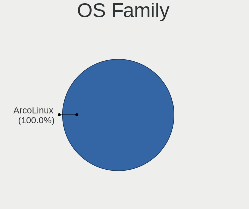
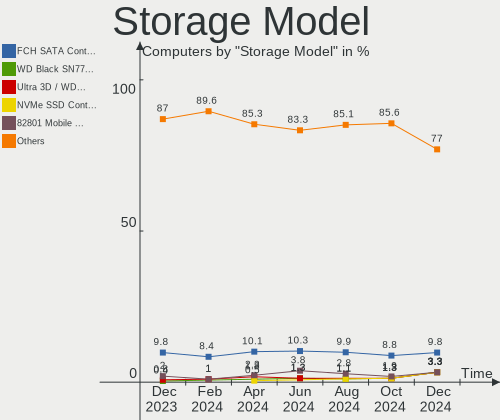
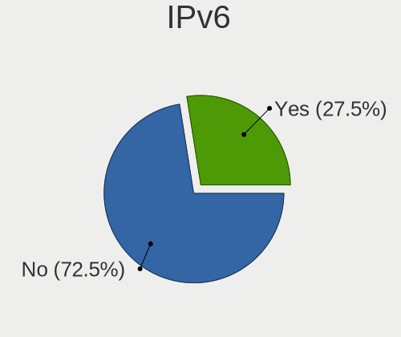

ArcoLinux Hardware Trends
-------------------------

A project to identify most popular hardware characteristics and track their change
over time based on data collected by ArcoLinux users at https://Linux-Hardware.org.

Anyone can contribute to this report by the [hw-probe](https://github.com/linuxhw/hw-probe) tool:

    sudo -E hw-probe -all -upload

This is a report for all computer types. See also reports for [desktops](/Dist/ArcoLinux/Desktop/README.md) and [notebooks](/Dist/ArcoLinux/Notebook/README.md).

Full-feature report is available here: https://linux-hardware.org/?view=trends

Period: Dec, 2021.

Contents
--------

* [ System ](#system)
  - [ OS                       ](#os)
  - [ OS Family                ](#os-family)
  - [ Kernel                   ](#kernel)
  - [ Kernel Family            ](#kernel-family)
  - [ Kernel Major Ver.        ](#kernel-major-ver)
  - [ Arch                     ](#arch)
  - [ DE                       ](#de)
  - [ Display Server           ](#display-server)
  - [ Display Manager          ](#display-manager)
  - [ OS Lang                  ](#os-lang)
  - [ Boot Mode                ](#boot-mode)
  - [ Filesystem               ](#filesystem)
  - [ Part. scheme             ](#part-scheme)
  - [ Dual Boot with Linux/BSD ](#dual-boot-with-linuxbsd)
  - [ Dual Boot (Win)          ](#dual-boot-win)

* [ Board ](#board)
  - [ Vendor                   ](#vendor)
  - [ Model                    ](#model)
  - [ Model Family             ](#model-family)
  - [ MFG Year                 ](#mfg-year)
  - [ Form Factor              ](#form-factor)
  - [ Secure Boot              ](#secure-boot)
  - [ Coreboot                 ](#coreboot)
  - [ RAM Size                 ](#ram-size)
  - [ RAM Used                 ](#ram-used)
  - [ Total Drives             ](#total-drives)
  - [ Has CD-ROM               ](#has-cd-rom)
  - [ Has Ethernet             ](#has-ethernet)
  - [ Has WiFi                 ](#has-wifi)
  - [ Has Bluetooth            ](#has-bluetooth)

* [ Location ](#location)
  - [ Country                  ](#country)
  - [ City                     ](#city)

* [ Drives ](#drives)
  - [ Drive Vendor             ](#drive-vendor)
  - [ Drive Model              ](#drive-model)
  - [ HDD Vendor               ](#hdd-vendor)
  - [ SSD Vendor               ](#ssd-vendor)
  - [ Drive Kind               ](#drive-kind)
  - [ Drive Connector          ](#drive-connector)
  - [ Drive Size               ](#drive-size)
  - [ Space Total              ](#space-total)
  - [ Space Used               ](#space-used)
  - [ Malfunc. Drives          ](#malfunc-drives)
  - [ Malfunc. Drive Vendor    ](#malfunc-drive-vendor)
  - [ Malfunc. HDD Vendor      ](#malfunc-hdd-vendor)
  - [ Malfunc. Drive Kind      ](#malfunc-drive-kind)
  - [ Failed Drives            ](#failed-drives)
  - [ Failed Drive Vendor      ](#failed-drive-vendor)
  - [ Drive Status             ](#drive-status)

* [ Storage controller ](#storage-controller)
  - [ Storage Vendor           ](#storage-vendor)
  - [ Storage Model            ](#storage-model)
  - [ Storage Kind             ](#storage-kind)

* [ Processor ](#processor)
  - [ CPU Vendor               ](#cpu-vendor)
  - [ CPU Model                ](#cpu-model)
  - [ CPU Model Family         ](#cpu-model-family)
  - [ CPU Cores                ](#cpu-cores)
  - [ CPU Sockets              ](#cpu-sockets)
  - [ CPU Threads              ](#cpu-threads)
  - [ CPU Op-Modes             ](#cpu-op-modes)
  - [ CPU Microcode            ](#cpu-microcode)
  - [ CPU Microarch            ](#cpu-microarch)

* [ Graphics ](#graphics)
  - [ GPU Vendor               ](#gpu-vendor)
  - [ GPU Model                ](#gpu-model)
  - [ GPU Combo                ](#gpu-combo)
  - [ GPU Driver               ](#gpu-driver)
  - [ GPU Memory               ](#gpu-memory)

* [ Monitor ](#monitor)
  - [ Monitor Vendor           ](#monitor-vendor)
  - [ Monitor Model            ](#monitor-model)
  - [ Monitor Resolution       ](#monitor-resolution)
  - [ Monitor Diagonal         ](#monitor-diagonal)
  - [ Monitor Width            ](#monitor-width)
  - [ Aspect Ratio             ](#aspect-ratio)
  - [ Monitor Area             ](#monitor-area)
  - [ Pixel Density            ](#pixel-density)
  - [ Multiple Monitors        ](#multiple-monitors)

* [ Network ](#network)
  - [ Net Controller Vendor    ](#net-controller-vendor)
  - [ Net Controller Model     ](#net-controller-model)
  - [ Wireless Vendor          ](#wireless-vendor)
  - [ Wireless Model           ](#wireless-model)
  - [ Ethernet Vendor          ](#ethernet-vendor)
  - [ Ethernet Model           ](#ethernet-model)
  - [ Net Controller Kind      ](#net-controller-kind)
  - [ Used Controller          ](#used-controller)
  - [ NICs                     ](#nics)
  - [ IPv6                     ](#ipv6)

* [ Bluetooth ](#bluetooth)
  - [ Bluetooth Vendor         ](#bluetooth-vendor)
  - [ Bluetooth Model          ](#bluetooth-model)

* [ Sound ](#sound)
  - [ Sound Vendor             ](#sound-vendor)
  - [ Sound Model              ](#sound-model)

* [ Memory ](#memory)
  - [ Memory Vendor            ](#memory-vendor)
  - [ Memory Model             ](#memory-model)
  - [ Memory Kind              ](#memory-kind)
  - [ Memory Form Factor       ](#memory-form-factor)
  - [ Memory Size              ](#memory-size)
  - [ Memory Speed             ](#memory-speed)

* [ Printers & scanners ](#printers--scanners)
  - [ Printer Vendor           ](#printer-vendor)
  - [ Printer Model            ](#printer-model)
  - [ Scanner Vendor           ](#scanner-vendor)
  - [ Scanner Model            ](#scanner-model)

* [ Camera ](#camera)
  - [ Camera Vendor            ](#camera-vendor)
  - [ Camera Model             ](#camera-model)

* [ Security ](#security)
  - [ Fingerprint Vendor       ](#fingerprint-vendor)
  - [ Fingerprint Model        ](#fingerprint-model)
  - [ Chipcard Vendor          ](#chipcard-vendor)
  - [ Chipcard Model           ](#chipcard-model)

* [ Unsupported ](#unsupported)
  - [ Unsupported Devices      ](#unsupported-devices)
  - [ Unsupported Device Types ](#unsupported-device-types)

System
------

OS
--

Installed operating systems

| Name              | Computers | Percent |
|-------------------|-----------|---------|
| ArcoLinux Rolling | 161       | 97.58%  |
| ArcoLinux         | 2         | 1.21%   |
| ArcoLinux 20.7.5  | 1         | 0.61%   |
| ArcoLinux 20.6.5  | 1         | 0.61%   |

OS Family
---------

OS without a version

| Name      | Computers | Percent |
|-----------|-----------|---------|
| ArcoLinux | 165       | 100%    |

Kernel
------

Version of the Linux kernel

| Version                     | Computers | Percent |
|-----------------------------|-----------|---------|
| 5.15.7-arch1-1              | 51        | 30.91%  |
| 5.15.10-arch1-1             | 18        | 10.91%  |
| 5.10.84-1-lts               | 14        | 8.48%   |
| 5.15.6-arch2-1              | 12        | 7.27%   |
| 5.15.11-arch2-1             | 12        | 7.27%   |
| 5.15.7-zen1-1-zen           | 9         | 5.45%   |
| 5.14.14-arch1-1             | 6         | 3.64%   |
| 5.15.5-arch1-1              | 5         | 3.03%   |
| 5.10.88-2-lts               | 5         | 3.03%   |
| 5.15.8-arch1-1              | 4         | 2.42%   |
| 5.15.6-zen2-1-zen           | 3         | 1.82%   |
| 5.15.12-arch1-1             | 3         | 1.82%   |
| 5.10.87-1-lts               | 3         | 1.82%   |
| 5.10.85-1-lts               | 3         | 1.82%   |
| 5.10.83-1-lts               | 3         | 1.82%   |
| 5.15.8-zen1-1-zen           | 2         | 1.21%   |
| 5.10.79-1-lts               | 2         | 1.21%   |
| 5.15.7-xanmod1-1            | 1         | 0.61%   |
| 5.15.7-hardened1-1-hardened | 1         | 0.61%   |
| 5.15.5-zen1-1-zen           | 1         | 0.61%   |
| 5.15.11-zen1-1-zen          | 1         | 0.61%   |
| 5.15.10-zen1-1-zen          | 1         | 0.61%   |
| 5.15.10-xanmod1-1           | 1         | 0.61%   |
| 5.14.2-arch1-1              | 1         | 0.61%   |
| 5.14.16-arch1-1             | 1         | 0.61%   |
| 5.13.13-arch1-1             | 1         | 0.61%   |
| 5.10.75-1-lts               | 1         | 0.61%   |

Kernel Family
-------------

Linux kernel without a distro release

| Version | Computers | Percent |
|---------|-----------|---------|
| 5.15.7  | 62        | 37.58%  |
| 5.15.10 | 20        | 12.12%  |
| 5.15.6  | 15        | 9.09%   |
| 5.10.84 | 14        | 8.48%   |
| 5.15.11 | 13        | 7.88%   |
| 5.15.8  | 6         | 3.64%   |
| 5.15.5  | 6         | 3.64%   |
| 5.14.14 | 6         | 3.64%   |
| 5.10.88 | 5         | 3.03%   |
| 5.15.12 | 3         | 1.82%   |
| 5.10.87 | 3         | 1.82%   |
| 5.10.85 | 3         | 1.82%   |
| 5.10.83 | 3         | 1.82%   |
| 5.10.79 | 2         | 1.21%   |
| 5.14.2  | 1         | 0.61%   |
| 5.14.16 | 1         | 0.61%   |
| 5.13.13 | 1         | 0.61%   |
| 5.10.75 | 1         | 0.61%   |

Kernel Major Ver.
-----------------

Linux kernel major version

| Version | Computers | Percent |
|---------|-----------|---------|
| 5.15    | 125       | 75.76%  |
| 5.10    | 31        | 18.79%  |
| 5.14    | 8         | 4.85%   |
| 5.13    | 1         | 0.61%   |

Arch
----

OS architecture (x86_64, i586, etc.)

| Name   | Computers | Percent |
|--------|-----------|---------|
| x86_64 | 165       | 100%    |

DE
--

Desktop Environment

| Name           | Computers | Percent |
|----------------|-----------|---------|
| XFCE           | 49        | 29.7%   |
| KDE5           | 42        | 25.45%  |
| LeftWM         | 9         | 5.45%   |
| i3             | 9         | 5.45%   |
| GNOME          | 9         | 5.45%   |
| qtile          | 8         | 4.85%   |
| xmonad         | 7         | 4.24%   |
| X-Cinnamon     | 6         | 3.64%   |
| awesome        | 6         | 3.64%   |
| Deepin         | 4         | 2.42%   |
| bspwm          | 4         | 2.42%   |
| Budgie         | 2         | 1.21%   |
| Unity          | 1         | 0.61%   |
| sway           | 1         | 0.61%   |
| openbox        | 1         | 0.61%   |
| MATE           | 1         | 0.61%   |
| ICEWM          | 1         | 0.61%   |
| i3-with-shmlog | 1         | 0.61%   |
| dwm            | 1         | 0.61%   |
| dusk           | 1         | 0.61%   |
| Cutefish       | 1         | 0.61%   |
| Cinnamon       | 1         | 0.61%   |

Display Server
--------------

X11 or Wayland

| Name    | Computers | Percent |
|---------|-----------|---------|
| X11     | 143       | 86.67%  |
| Tty     | 18        | 10.91%  |
| Wayland | 3         | 1.82%   |
| Unknown | 1         | 0.61%   |

Display Manager
---------------

SDDM, LightDM, etc.

| Name    | Computers | Percent |
|---------|-----------|---------|
| SDDM    | 111       | 67.27%  |
| LightDM | 48        | 29.09%  |
| GDM     | 3         | 1.82%   |
| Unknown | 3         | 1.82%   |

OS Lang
-------

Language

| Lang    | Computers | Percent |
|---------|-----------|---------|
| en_US   | 95        | 57.58%  |
| en_GB   | 17        | 10.3%   |
| en_AU   | 7         | 4.24%   |
| en_CA   | 6         | 3.64%   |
| en_IN   | 5         | 3.03%   |
| de_DE   | 4         | 2.42%   |
| ru_UA   | 2         | 1.21%   |
| ru_RU   | 2         | 1.21%   |
| fr_FR   | 2         | 1.21%   |
| es_ES   | 2         | 1.21%   |
| en_SG   | 2         | 1.21%   |
| en_IE   | 2         | 1.21%   |
| sv_SE   | 1         | 0.61%   |
| ro_RO   | 1         | 0.61%   |
| pt_PT   | 1         | 0.61%   |
| pt_BR   | 1         | 0.61%   |
| nl_NL   | 1         | 0.61%   |
| nl_BE   | 1         | 0.61%   |
| it_IT   | 1         | 0.61%   |
| hu_HU   | 1         | 0.61%   |
| fr_CH   | 1         | 0.61%   |
| fr_CA   | 1         | 0.61%   |
| fi_FI   | 1         | 0.61%   |
| es_MX   | 1         | 0.61%   |
| es_AR   | 1         | 0.61%   |
| en_ZA   | 1         | 0.61%   |
| en_NZ   | 1         | 0.61%   |
| en_IL   | 1         | 0.61%   |
| cs_CZ   | 1         | 0.61%   |
| bg_BG   | 1         | 0.61%   |
| Unknown | 1         | 0.61%   |

Boot Mode
---------

EFI or BIOS

| Mode | Computers | Percent |
|------|-----------|---------|
| EFI  | 120       | 72.73%  |
| BIOS | 45        | 27.27%  |

Filesystem
----------

Type of filesystem

| Type    | Computers | Percent |
|---------|-----------|---------|
| Ext4    | 122       | 73.94%  |
| Btrfs   | 35        | 21.21%  |
| Overlay | 3         | 1.82%   |
| F2fs    | 2         | 1.21%   |
| Xfs     | 1         | 0.61%   |
| Jfs     | 1         | 0.61%   |
| Unknown | 1         | 0.61%   |

Part. scheme
------------

Scheme of partitioning

| Type    | Computers | Percent |
|---------|-----------|---------|
| GPT     | 133       | 80.61%  |
| MBR     | 30        | 18.18%  |
| Unknown | 2         | 1.21%   |

Dual Boot with Linux/BSD
------------------------

Hosting more than one Linux/BSD

| Dual boot | Computers | Percent |
|-----------|-----------|---------|
| No        | 124       | 75.15%  |
| Yes       | 41        | 24.85%  |

Dual Boot (Win)
---------------

Hosting Linux and Windows

| Dual boot | Computers | Percent |
|-----------|-----------|---------|
| No        | 84        | 50.91%  |
| Yes       | 81        | 49.09%  |

Board
-----

Vendor
------

Motherboard manufacturer

| Name                | Computers | Percent |
|---------------------|-----------|---------|
| ASUSTek Computer    | 42        | 25.45%  |
| Lenovo              | 29        | 17.58%  |
| Dell                | 17        | 10.3%   |
| MSI                 | 13        | 7.88%   |
| Acer                | 13        | 7.88%   |
| Gigabyte Technology | 12        | 7.27%   |
| Hewlett-Packard     | 10        | 6.06%   |
| ASRock              | 6         | 3.64%   |
| System76            | 2         | 1.21%   |
| Medion              | 2         | 1.21%   |
| Intel               | 2         | 1.21%   |
| Unknown             | 2         | 1.21%   |
| Toshiba             | 1         | 0.61%   |
| Timi                | 1         | 0.61%   |
| Teclast             | 1         | 0.61%   |
| SYWZ                | 1         | 0.61%   |
| Razer               | 1         | 0.61%   |
| Packard Bell        | 1         | 0.61%   |
| Notebook            | 1         | 0.61%   |
| Monster             | 1         | 0.61%   |
| Fujitsu             | 1         | 0.61%   |
| Foxconn             | 1         | 0.61%   |
| EVGA                | 1         | 0.61%   |
| ECS                 | 1         | 0.61%   |
| Biostar             | 1         | 0.61%   |
| Apple               | 1         | 0.61%   |
| Alienware           | 1         | 0.61%   |

Model
-----

Motherboard model

| Name                                  | Computers | Percent |
|---------------------------------------|-----------|---------|
| ASUS ROG STRIX B550-F GAMING          | 4         | 2.42%   |
| MSI MS-7C91                           | 2         | 1.21%   |
| MSI MS-7B85                           | 2         | 1.21%   |
| Dell OptiPlex 7010                    | 2         | 1.21%   |
| ASUS ROG STRIX X570-E GAMING          | 2         | 1.21%   |
| ASUS ROG STRIX B450-F GAMING II       | 2         | 1.21%   |
| ASUS CROSSHAIR VI HERO                | 2         | 1.21%   |
| ASRock B450M Steel Legend             | 2         | 1.21%   |
| Acer Aspire E5-575G                   | 2         | 1.21%   |
| Unknown                               | 2         | 1.21%   |
| Toshiba Satellite C50-B               | 1         | 0.61%   |
| Timi TM1701                           | 1         | 0.61%   |
| Teclast F15S                          | 1         | 0.61%   |
| SYWZ S210H Series                     | 1         | 0.61%   |
| System76 Galago Pro                   | 1         | 0.61%   |
| System76 Darter Pro                   | 1         | 0.61%   |
| Razer Blade Stealth                   | 1         | 0.61%   |
| Packard Bell IMEDIA S2185             | 1         | 0.61%   |
| Notebook NH5xAx                       | 1         | 0.61%   |
| MSI Summit E13FlipEvo A11MT           | 1         | 0.61%   |
| MSI MS-AA1511                         | 1         | 0.61%   |
| MSI MS-7C84                           | 1         | 0.61%   |
| MSI MS-7C37                           | 1         | 0.61%   |
| MSI MS-7B79                           | 1         | 0.61%   |
| MSI MS-7A40                           | 1         | 0.61%   |
| MSI GE72 6QC                          | 1         | 0.61%   |
| MSI GE63 Raider RGB 8RE               | 1         | 0.61%   |
| MSI B250 Gaming Infinite A(MS-B915)   | 1         | 0.61%   |
| Monster ABRA A5 V11.1                 | 1         | 0.61%   |
| Medion E62009                         | 1         | 0.61%   |
| Medion E4213 MD99329                  | 1         | 0.61%   |
| Lenovo Yoga 7 15ITL5 82BJ             | 1         | 0.61%   |
| Lenovo XiaoXin-15ARE 2020 81YR        | 1         | 0.61%   |
| Lenovo V14-ADA 82C6                   | 1         | 0.61%   |
| Lenovo ThinkPad X250 20CLS2XA00       | 1         | 0.61%   |
| Lenovo ThinkPad X220 42912WA          | 1         | 0.61%   |
| Lenovo ThinkPad X201 3680KC5          | 1         | 0.61%   |
| Lenovo ThinkPad X201 3323LWA          | 1         | 0.61%   |
| Lenovo ThinkPad X200 2024AY7          | 1         | 0.61%   |
| Lenovo ThinkPad W540 20BG0011US       | 1         | 0.61%   |
| Lenovo ThinkPad T550 20CJS0S800       | 1         | 0.61%   |
| Lenovo ThinkPad T540p 20BFS31F00      | 1         | 0.61%   |
| Lenovo ThinkPad T470 W10DG 20JNS0QC0F | 1         | 0.61%   |
| Lenovo ThinkPad T460 20FMS80M0C       | 1         | 0.61%   |
| Lenovo ThinkPad T430 2349DG5          | 1         | 0.61%   |
| Lenovo ThinkPad T410 2522E38          | 1         | 0.61%   |
| Lenovo ThinkPad T410 2522AC1          | 1         | 0.61%   |
| Lenovo ThinkCentre M93p 10AAS0QF00    | 1         | 0.61%   |
| Lenovo ThinkCentre M92p 3238A6G       | 1         | 0.61%   |
| Lenovo Legion 5 Pro 16ACH6H 82JQ      | 1         | 0.61%   |
| Lenovo IdeaPad Yoga 13 20175          | 1         | 0.61%   |
| Lenovo IdeaPad S340-15IWL 81N8        | 1         | 0.61%   |
| Lenovo IdeaPad S340-14API 81NB        | 1         | 0.61%   |
| Lenovo IdeaPad 510S-14ISK 80TK        | 1         | 0.61%   |
| Lenovo IdeaPad 510-15ISK 80SR         | 1         | 0.61%   |
| Lenovo IdeaPad 5 14ARE05 81YM         | 1         | 0.61%   |
| Lenovo IdeaPad 320-15ABR 80XS         | 1         | 0.61%   |
| Lenovo IdeaPad 310-15IKB 80TV         | 1         | 0.61%   |
| Lenovo G40-45 80E1                    | 1         | 0.61%   |
| Lenovo C20-30 F0B20086ID              | 1         | 0.61%   |

Model Family
------------

Motherboard model prefix

| Name                 | Computers | Percent |
|----------------------|-----------|---------|
| Lenovo ThinkPad      | 13        | 7.88%   |
| ASUS ROG             | 12        | 7.27%   |
| Acer Aspire          | 10        | 6.06%   |
| Lenovo IdeaPad       | 8         | 4.85%   |
| ASUS PRIME           | 7         | 4.24%   |
| Dell Inspiron        | 6         | 3.64%   |
| ASUS TUF             | 6         | 3.64%   |
| Dell XPS             | 3         | 1.82%   |
| Dell OptiPlex        | 3         | 1.82%   |
| MSI MS-7C91          | 2         | 1.21%   |
| MSI MS-7B85          | 2         | 1.21%   |
| Lenovo ThinkCentre   | 2         | 1.21%   |
| HP Pavilion          | 2         | 1.21%   |
| HP Laptop            | 2         | 1.21%   |
| Dell Precision       | 2         | 1.21%   |
| Dell Latitude        | 2         | 1.21%   |
| ASUS VivoBook        | 2         | 1.21%   |
| ASUS CROSSHAIR       | 2         | 1.21%   |
| ASRock B450M         | 2         | 1.21%   |
| Unknown              | 2         | 1.21%   |
| Toshiba Satellite    | 1         | 0.61%   |
| Timi TM1701          | 1         | 0.61%   |
| Teclast F15S         | 1         | 0.61%   |
| SYWZ S210H           | 1         | 0.61%   |
| System76 Galago      | 1         | 0.61%   |
| System76 Darter      | 1         | 0.61%   |
| Razer Blade          | 1         | 0.61%   |
| Packard Bell IMEDIA  | 1         | 0.61%   |
| Notebook NH5xAx      | 1         | 0.61%   |
| MSI Summit           | 1         | 0.61%   |
| MSI MS-AA1511        | 1         | 0.61%   |
| MSI MS-7C84          | 1         | 0.61%   |
| MSI MS-7C37          | 1         | 0.61%   |
| MSI MS-7B79          | 1         | 0.61%   |
| MSI MS-7A40          | 1         | 0.61%   |
| MSI GE72             | 1         | 0.61%   |
| MSI GE63             | 1         | 0.61%   |
| MSI B250             | 1         | 0.61%   |
| Monster ABRA         | 1         | 0.61%   |
| Medion E62009        | 1         | 0.61%   |
| Medion E4213         | 1         | 0.61%   |
| Lenovo Yoga          | 1         | 0.61%   |
| Lenovo XiaoXin-15ARE | 1         | 0.61%   |
| Lenovo V14-ADA       | 1         | 0.61%   |
| Lenovo Legion        | 1         | 0.61%   |
| Lenovo G40-45        | 1         | 0.61%   |
| Lenovo C20-30        | 1         | 0.61%   |
| Intel NUC5i7RYB      | 1         | 0.61%   |
| Intel DH67BL         | 1         | 0.61%   |
| HP Z210              | 1         | 0.61%   |
| HP Notebook          | 1         | 0.61%   |
| HP ENVY              | 1         | 0.61%   |
| HP EliteDesk         | 1         | 0.61%   |
| HP Desktop           | 1         | 0.61%   |
| HP Compaq            | 1         | 0.61%   |
| Gigabyte Z97X-Gaming | 1         | 0.61%   |
| Gigabyte Z87X-UD3H   | 1         | 0.61%   |
| Gigabyte Z77X-D3H    | 1         | 0.61%   |
| Gigabyte Z77-D3H     | 1         | 0.61%   |
| Gigabyte Z370M       | 1         | 0.61%   |

MFG Year
--------

Motherboard manufacture year

| Year | Computers | Percent |
|------|-----------|---------|
| 2021 | 47        | 28.48%  |
| 2020 | 26        | 15.76%  |
| 2018 | 17        | 10.3%   |
| 2015 | 13        | 7.88%   |
| 2019 | 11        | 6.67%   |
| 2012 | 11        | 6.67%   |
| 2017 | 10        | 6.06%   |
| 2016 | 8         | 4.85%   |
| 2013 | 8         | 4.85%   |
| 2014 | 4         | 2.42%   |
| 2009 | 4         | 2.42%   |
| 2011 | 3         | 1.82%   |
| 2010 | 2         | 1.21%   |
| 2006 | 1         | 0.61%   |

Form Factor
-----------

Physical design of the computer

| Name        | Computers | Percent |
|-------------|-----------|---------|
| Desktop     | 82        | 49.7%   |
| Notebook    | 77        | 46.67%  |
| Convertible | 2         | 1.21%   |
| All in one  | 2         | 1.21%   |
| Other       | 1         | 0.61%   |
| Mini pc     | 1         | 0.61%   |

Secure Boot
-----------

Enabled or disabled

| State    | Computers | Percent |
|----------|-----------|---------|
| Disabled | 165       | 100%    |

Coreboot
--------

Have coreboot on board

| Used | Computers | Percent |
|------|-----------|---------|
| No   | 164       | 99.39%  |
| Yes  | 1         | 0.61%   |

RAM Size
--------

Total RAM memory

| Size in GB  | Computers | Percent |
|-------------|-----------|---------|
| 4.01-8.0    | 42        | 25.45%  |
| 16.01-24.0  | 38        | 23.03%  |
| 32.01-64.0  | 31        | 18.79%  |
| 8.01-16.0   | 25        | 15.15%  |
| 3.01-4.0    | 19        | 11.52%  |
| 24.01-32.0  | 4         | 2.42%   |
| 64.01-256.0 | 4         | 2.42%   |
| 2.01-3.0    | 1         | 0.61%   |
| 1.01-2.0    | 1         | 0.61%   |

RAM Used
--------

Used RAM memory

| Used GB   | Computers | Percent |
|-----------|-----------|---------|
| 1.01-2.0  | 47        | 28.48%  |
| 2.01-3.0  | 35        | 21.21%  |
| 4.01-8.0  | 32        | 19.39%  |
| 3.01-4.0  | 23        | 13.94%  |
| 0.51-1.0  | 15        | 9.09%   |
| 0.01-0.5  | 7         | 4.24%   |
| 8.01-16.0 | 6         | 3.64%   |

Total Drives
------------

Number of drives on board

| Drives | Computers | Percent |
|--------|-----------|---------|
| 1      | 77        | 46.67%  |
| 2      | 41        | 24.85%  |
| 3      | 24        | 14.55%  |
| 4      | 11        | 6.67%   |
| 6      | 6         | 3.64%   |
| 5      | 4         | 2.42%   |
| 9      | 1         | 0.61%   |
| 7      | 1         | 0.61%   |

Has CD-ROM
----------

Has CD-ROM on board

| Presented | Computers | Percent |
|-----------|-----------|---------|
| No        | 120       | 72.73%  |
| Yes       | 45        | 27.27%  |

Has Ethernet
------------

Has Ethernet on board

| Presented | Computers | Percent |
|-----------|-----------|---------|
| Yes       | 150       | 90.91%  |
| No        | 15        | 9.09%   |

Has WiFi
--------

Has WiFi module

| Presented | Computers | Percent |
|-----------|-----------|---------|
| Yes       | 119       | 72.12%  |
| No        | 46        | 27.88%  |

Has Bluetooth
-------------

Has Bluetooth module

| Presented | Computers | Percent |
|-----------|-----------|---------|
| Yes       | 103       | 62.42%  |
| No        | 62        | 37.58%  |

Location
--------

Country
-------

Geographic location (country)

| Country                          | Computers | Percent |
|----------------------------------|-----------|---------|
| USA                              | 32        | 19.39%  |
| UK                               | 14        | 8.48%   |
| Belgium                          | 10        | 6.06%   |
| Canada                           | 8         | 4.85%   |
| India                            | 7         | 4.24%   |
| Australia                        | 7         | 4.24%   |
| Ukraine                          | 6         | 3.64%   |
| Netherlands                      | 5         | 3.03%   |
| Germany                          | 5         | 3.03%   |
| France                           | 5         | 3.03%   |
| Russia                           | 4         | 2.42%   |
| Finland                          | 4         | 2.42%   |
| Norway                           | 3         | 1.82%   |
| Ireland                          | 3         | 1.82%   |
| Indonesia                        | 3         | 1.82%   |
| Brazil                           | 3         | 1.82%   |
| Bangladesh                       | 3         | 1.82%   |
| Algeria                          | 3         | 1.82%   |
| Switzerland                      | 2         | 1.21%   |
| Sweden                           | 2         | 1.21%   |
| Spain                            | 2         | 1.21%   |
| Morocco                          | 2         | 1.21%   |
| Malaysia                         | 2         | 1.21%   |
| Italy                            | 2         | 1.21%   |
| Hungary                          | 2         | 1.21%   |
| Czechia                          | 2         | 1.21%   |
| Colombia                         | 2         | 1.21%   |
| Bulgaria                         | 2         | 1.21%   |
| Turkey                           | 1         | 0.61%   |
| South Africa                     | 1         | 0.61%   |
| Singapore                        | 1         | 0.61%   |
| Saudi Arabia                     | 1         | 0.61%   |
| Saint Vincent and the Grenadines | 1         | 0.61%   |
| Romania                          | 1         | 0.61%   |
| Portugal                         | 1         | 0.61%   |
| Paraguay                         | 1         | 0.61%   |
| New Zealand                      | 1         | 0.61%   |
| Mexico                           | 1         | 0.61%   |
| Lebanon                          | 1         | 0.61%   |
| Latvia                           | 1         | 0.61%   |
| Israel                           | 1         | 0.61%   |
| Honduras                         | 1         | 0.61%   |
| China                            | 1         | 0.61%   |
| Cambodia                         | 1         | 0.61%   |
| Bosnia and Herzegovina           | 1         | 0.61%   |
| Barbados                         | 1         | 0.61%   |
| Austria                          | 1         | 0.61%   |
| Argentina                        | 1         | 0.61%   |

City
----

Geographic location (city)

| City                  | Computers | Percent |
|-----------------------|-----------|---------|
| Wilrijk               | 4         | 2.42%   |
| Sydney                | 4         | 2.42%   |
| Paris                 | 3         | 1.82%   |
| London                | 3         | 1.82%   |
| West Covina           | 2         | 1.21%   |
| Tongi                 | 2         | 1.21%   |
| St Petersburg         | 2         | 1.21%   |
| Rabat                 | 2         | 1.21%   |
| Oslo                  | 2         | 1.21%   |
| New Delhi             | 2         | 1.21%   |
| Melbourne             | 2         | 1.21%   |
| Lokeren               | 2         | 1.21%   |
| Kyiv                  | 2         | 1.21%   |
| Kuala Lumpur          | 2         | 1.21%   |
| Karlsruhe             | 2         | 1.21%   |
| Ennis                 | 2         | 1.21%   |
| Dnipro                | 2         | 1.21%   |
| Bogot??               | 2         | 1.21%   |
| Amsterdam             | 2         | 1.21%   |
| Algiers               | 2         | 1.21%   |
| Wolverhampton         | 1         | 0.61%   |
| Wittenbach            | 1         | 0.61%   |
| Winterthur            | 1         | 0.61%   |
| Windsor               | 1         | 0.61%   |
| Wicklow               | 1         | 0.61%   |
| Westhill              | 1         | 0.61%   |
| Washington            | 1         | 0.61%   |
| Walsall               | 1         | 0.61%   |
| Vyazniki              | 1         | 0.61%   |
| Vienna                | 1         | 0.61%   |
| Vaasa                 | 1         | 0.61%   |
| Trento                | 1         | 0.61%   |
| Toccoa                | 1         | 0.61%   |
| Thornhill             | 1         | 0.61%   |
| Tel Aviv              | 1         | 0.61%   |
| Tegucigalpa           | 1         | 0.61%   |
| Tarvasjoki            | 1         | 0.61%   |
| Sz?©kesfeh?©rv??r     | 1         | 0.61%   |
| Stevenage             | 1         | 0.61%   |
| Stavanger             | 1         | 0.61%   |
| Sofia                 | 1         | 0.61%   |
| Sloviansk             | 1         | 0.61%   |
| Sleman                | 1         | 0.61%   |
| Singapore             | 1         | 0.61%   |
| Sicklerville          | 1         | 0.61%   |
| Shenzhen              | 1         | 0.61%   |
| Selby                 | 1         | 0.61%   |
| Sein?¤joki            | 1         | 0.61%   |
| S??o Lu?­s            | 1         | 0.61%   |
| San Tan Valley        | 1         | 0.61%   |
| San Jose              | 1         | 0.61%   |
| Rybinsk               | 1         | 0.61%   |
| Royal Tunbridge Wells | 1         | 0.61%   |
| Revelstoke            | 1         | 0.61%   |
| Puyallup              | 1         | 0.61%   |
| Prague                | 1         | 0.61%   |
| Plano                 | 1         | 0.61%   |
| Pickering             | 1         | 0.61%   |
| Phnom Penh            | 1         | 0.61%   |
| Petrolina             | 1         | 0.61%   |

Drives
------

Drive Vendor
------------

Hard drive vendors

| Vendor              | Computers | Drives | Percent |
|---------------------|-----------|--------|---------|
| WDC                 | 63        | 73     | 21.5%   |
| Samsung Electronics | 56        | 75     | 19.11%  |
| Seagate             | 44        | 58     | 15.02%  |
| Toshiba             | 16        | 16     | 5.46%   |
| Crucial             | 13        | 15     | 4.44%   |
| Kingston            | 12        | 13     | 4.1%    |
| SanDisk             | 11        | 13     | 3.75%   |
| SK Hynix            | 8         | 9      | 2.73%   |
| Corsair             | 6         | 7      | 2.05%   |
| A-DATA Technology   | 6         | 7      | 2.05%   |
| HGST                | 5         | 5      | 1.71%   |
| Hitachi             | 4         | 4      | 1.37%   |
| China               | 4         | 6      | 1.37%   |
| XPG                 | 3         | 3      | 1.02%   |
| PNY                 | 3         | 3      | 1.02%   |
| Phison              | 3         | 3      | 1.02%   |
| Intel               | 3         | 3      | 1.02%   |
| Unknown             | 2         | 2      | 0.68%   |
| Transcend           | 2         | 2      | 0.68%   |
| Micron Technology   | 2         | 3      | 0.68%   |
| LITEON              | 2         | 2      | 0.68%   |
| Hewlett-Packard     | 2         | 2      | 0.68%   |
| WD MediaMax         | 1         | 1      | 0.34%   |
| V-GeN               | 1         | 2      | 0.34%   |
| TO Exter            | 1         | 1      | 0.34%   |
| tigo                | 1         | 1      | 0.34%   |
| SPCC                | 1         | 1      | 0.34%   |
| Silicon Motion      | 1         | 1      | 0.34%   |
| OCZ                 | 1         | 1      | 0.34%   |
| Mushkin             | 1         | 1      | 0.34%   |
| LITEONIT            | 1         | 1      | 0.34%   |
| KIOXIA              | 1         | 1      | 0.34%   |
| KingSpec            | 1         | 1      | 0.34%   |
| KingFast            | 1         | 1      | 0.34%   |
| JMicron             | 1         | 1      | 0.34%   |
| Intenso             | 1         | 1      | 0.34%   |
| INTEL SS            | 1         | 1      | 0.34%   |
| HS-SSD-E100         | 1         | 1      | 0.34%   |
| HS-SSD-C100         | 1         | 1      | 0.34%   |
| GOODRAM             | 1         | 1      | 0.34%   |
| Gigabyte Technology | 1         | 1      | 0.34%   |
| Fantom              | 1         | 1      | 0.34%   |
| Apple               | 1         | 1      | 0.34%   |
| 1TB                 | 1         | 1      | 0.34%   |
| Unknown             | 1         | 1      | 0.34%   |

Drive Model
-----------

Hard drive models

| Model                                | Computers | Percent |
|--------------------------------------|-----------|---------|
| Seagate ST1000DM010-2EP102 1TB       | 5         | 1.47%   |
| Kingston SA400S37240G 240GB SSD      | 5         | 1.47%   |
| Seagate ST1000LM035-1RK172 1TB       | 4         | 1.18%   |
| Samsung SSD 860 EVO 500GB            | 4         | 1.18%   |
| Samsung SSD 840 EVO 250GB            | 4         | 1.18%   |
| Toshiba MQ04ABF100 1TB               | 3         | 0.88%   |
| Seagate ST2000DM008-2FR102 2TB       | 3         | 0.88%   |
| Samsung SSD 970 EVO Plus 500GB       | 3         | 0.88%   |
| Samsung SSD 970 EVO Plus 1TB         | 3         | 0.88%   |
| Samsung SSD 970 EVO 500GB            | 3         | 0.88%   |
| Samsung SSD 860 EVO 250GB            | 3         | 0.88%   |
| Samsung SSD 850 EVO 500GB            | 3         | 0.88%   |
| Samsung SSD 850 EVO 250GB            | 3         | 0.88%   |
| Crucial CT500MX500SSD1 500GB         | 3         | 0.88%   |
| A-DATA SX8200PNP 1TB                 | 3         | 0.88%   |
| WDC WD3200AAJS-00L7A0 320GB          | 2         | 0.59%   |
| WDC WD10SPZX-21Z10T0 1TB             | 2         | 0.59%   |
| WDC PC SN520 SDAPNUW-512G-1014 512GB | 2         | 0.59%   |
| Toshiba MQ01ABD100 1TB               | 2         | 0.59%   |
| Toshiba HDWD110 1TB                  | 2         | 0.59%   |
| Toshiba DT01ACA100 1TB               | 2         | 0.59%   |
| Seagate ST500LT012-1DG142 500GB      | 2         | 0.59%   |
| Seagate ST4000DM004-2CV104 4TB       | 2         | 0.59%   |
| Seagate ST31000528AS 1TB             | 2         | 0.59%   |
| Seagate ST31000524AS 1TB             | 2         | 0.59%   |
| Seagate ST2000LM007-1R8174 2TB       | 2         | 0.59%   |
| Seagate ST1000LM048-2E7172 1TB       | 2         | 0.59%   |
| Seagate ST1000DM003-1SB10C 1TB       | 2         | 0.59%   |
| Seagate Expansion 1TB                | 2         | 0.59%   |
| Seagate BUP Slim BK 2TB              | 2         | 0.59%   |
| SanDisk SSD PLUS 1000GB              | 2         | 0.59%   |
| SanDisk SDSSDH31024G 1TB             | 2         | 0.59%   |
| Samsung SSD 970 EVO 1TB              | 2         | 0.59%   |
| Samsung SSD 870 QVO 2TB              | 2         | 0.59%   |
| Samsung SSD 860 EVO 1TB              | 2         | 0.59%   |
| Samsung SSD 850 PRO 256GB            | 2         | 0.59%   |
| Samsung SSD 840 EVO 120GB            | 2         | 0.59%   |
| Samsung MZALQ512HALU-000L2 512GB     | 2         | 0.59%   |
| HGST HTS721010A9E630 1TB             | 2         | 0.59%   |
| Crucial CT240BX500SSD1 240GB         | 2         | 0.59%   |
| Crucial CT1000P1SSD8 1TB             | 2         | 0.59%   |
| Crucial CT1000MX500SSD1 1TB          | 2         | 0.59%   |
| Corsair Force MP600 500GB            | 2         | 0.59%   |
| XPG GAMMIX S70 BLADE 1TB             | 1         | 0.29%   |
| XPG GAMMIX S5 256GB                  | 1         | 0.29%   |
| XPG GAMMIX S11 Pro 1TB               | 1         | 0.29%   |
| WDC WDS500G3XHC-00SJG0 500GB         | 1         | 0.29%   |
| WDC WDS500G2B0B-00YS70 500GB SSD     | 1         | 0.29%   |
| WDC WDS500G2B0A-00SM50 500GB SSD     | 1         | 0.29%   |
| WDC WDS500G1X0E-00AFY0 500GB         | 1         | 0.29%   |
| WDC WDS480G2G0A-00JH30 480GB SSD     | 1         | 0.29%   |
| WDC WDS250G2B0C-00PXH0 250GB         | 1         | 0.29%   |
| WDC WDS240G2G0B-00EPW0 240GB SSD     | 1         | 0.29%   |
| WDC WDS240G2G0A-00JH30 240GB SSD     | 1         | 0.29%   |
| WDC WDS200T2B0B-00YS70 2TB SSD       | 1         | 0.29%   |
| WDC WDS100T2G0A-00JH30 1TB SSD       | 1         | 0.29%   |
| WDC WDS100T2B0B-00YS70 1TB SSD       | 1         | 0.29%   |
| WDC WDS100T1X0E-00AFY0 1TB           | 1         | 0.29%   |
| WDC WDBRPG0010BNC-WRSN 1TB           | 1         | 0.29%   |
| WDC WDBNCE0010PNC 1TB SSD            | 1         | 0.29%   |

HDD Vendor
----------

Hard disk drive vendors

| Vendor              | Computers | Drives | Percent |
|---------------------|-----------|--------|---------|
| WDC                 | 44        | 51     | 38.6%   |
| Seagate             | 42        | 54     | 36.84%  |
| Toshiba             | 13        | 13     | 11.4%   |
| HGST                | 5         | 5      | 4.39%   |
| Hitachi             | 4         | 4      | 3.51%   |
| Samsung Electronics | 2         | 2      | 1.75%   |
| WD MediaMax         | 1         | 1      | 0.88%   |
| TO Exter            | 1         | 1      | 0.88%   |
| Hewlett-Packard     | 1         | 1      | 0.88%   |
| Fantom              | 1         | 1      | 0.88%   |

SSD Vendor
----------

Solid state drive vendors

| Vendor              | Computers | Drives | Percent |
|---------------------|-----------|--------|---------|
| Samsung Electronics | 38        | 45     | 32.76%  |
| SanDisk             | 11        | 13     | 9.48%   |
| Crucial             | 11        | 12     | 9.48%   |
| Kingston            | 10        | 10     | 8.62%   |
| WDC                 | 9         | 9      | 7.76%   |
| China               | 4         | 6      | 3.45%   |
| SK Hynix            | 3         | 3      | 2.59%   |
| PNY                 | 3         | 3      | 2.59%   |
| Transcend           | 2         | 2      | 1.72%   |
| Micron Technology   | 2         | 3      | 1.72%   |
| LITEON              | 2         | 2      | 1.72%   |
| Corsair             | 2         | 2      | 1.72%   |
| A-DATA Technology   | 2         | 2      | 1.72%   |
| V-GeN               | 1         | 2      | 0.86%   |
| Toshiba             | 1         | 1      | 0.86%   |
| SPCC                | 1         | 1      | 0.86%   |
| OCZ                 | 1         | 1      | 0.86%   |
| LITEONIT            | 1         | 1      | 0.86%   |
| KingSpec            | 1         | 1      | 0.86%   |
| KingFast            | 1         | 1      | 0.86%   |
| Intenso             | 1         | 1      | 0.86%   |
| INTEL SS            | 1         | 1      | 0.86%   |
| Intel               | 1         | 1      | 0.86%   |
| HS-SSD-E100         | 1         | 1      | 0.86%   |
| HS-SSD-C100         | 1         | 1      | 0.86%   |
| Hewlett-Packard     | 1         | 1      | 0.86%   |
| GOODRAM             | 1         | 1      | 0.86%   |
| Gigabyte Technology | 1         | 1      | 0.86%   |
| Apple               | 1         | 1      | 0.86%   |
| 1TB                 | 1         | 1      | 0.86%   |

Drive Kind
----------

HDD or SSD

| Kind    | Computers | Drives | Percent |
|---------|-----------|--------|---------|
| SSD     | 95        | 130    | 36.26%  |
| HDD     | 94        | 133    | 35.88%  |
| NVMe    | 68        | 80     | 25.95%  |
| MMC     | 3         | 3      | 1.15%   |
| Unknown | 2         | 2      | 0.76%   |

Drive Connector
---------------

SATA, SAS, NVMe, etc.

| Type | Computers | Drives | Percent |
|------|-----------|--------|---------|
| SATA | 134       | 249    | 60.91%  |
| NVMe | 68        | 80     | 30.91%  |
| SAS  | 15        | 16     | 6.82%   |
| MMC  | 3         | 3      | 1.36%   |

Drive Size
----------

Size of hard drive

| Size in TB | Computers | Drives | Percent |
|------------|-----------|--------|---------|
| 0.01-0.5   | 98        | 130    | 46.89%  |
| 0.51-1.0   | 70        | 85     | 33.49%  |
| 1.01-2.0   | 25        | 31     | 11.96%  |
| 3.01-4.0   | 8         | 8      | 3.83%   |
| 2.01-3.0   | 4         | 5      | 1.91%   |
| 4.01-10.0  | 4         | 4      | 1.91%   |

Space Total
-----------

Amount of disk space available on the file system

| Size in GB     | Computers | Percent |
|----------------|-----------|---------|
| 101-250        | 38        | 23.03%  |
| 251-500        | 33        | 20%     |
| 1001-2000      | 29        | 17.58%  |
| 501-1000       | 22        | 13.33%  |
| More than 3000 | 20        | 12.12%  |
| 2001-3000      | 7         | 4.24%   |
| 51-100         | 6         | 3.64%   |
| 1-20           | 4         | 2.42%   |
| Unknown        | 4         | 2.42%   |
| 21-50          | 2         | 1.21%   |

Space Used
----------

Amount of used disk space

| Used GB        | Computers | Percent |
|----------------|-----------|---------|
| 21-50          | 32        | 19.39%  |
| 1-20           | 30        | 18.18%  |
| 101-250        | 27        | 16.36%  |
| 51-100         | 20        | 12.12%  |
| 251-500        | 18        | 10.91%  |
| 501-1000       | 14        | 8.48%   |
| 2001-3000      | 7         | 4.24%   |
| 1001-2000      | 7         | 4.24%   |
| More than 3000 | 6         | 3.64%   |
| Unknown        | 4         | 2.42%   |

Malfunc. Drives
---------------

Drive models with a malfunction

| Model                                          | Computers | Drives | Percent |
|------------------------------------------------|-----------|--------|---------|
| WDC WD3200AAJS-00L7A0 320GB                    | 2         | 2      | 4.35%   |
| Seagate ST500LT012-1DG142 500GB                | 2         | 2      | 4.35%   |
| Seagate ST31000528AS 1TB                       | 2         | 2      | 4.35%   |
| SanDisk SSD PLUS 1000GB                        | 2         | 2      | 4.35%   |
| WDC WD6400BEVT-60A0RT0 640GB                   | 1         | 1      | 2.17%   |
| WDC WD5000L 500GB                              | 1         | 1      | 2.17%   |
| WDC WD5000BEVT-35A0RT0 500GB                   | 1         | 1      | 2.17%   |
| WDC WD5000AVCS-632DY1 500GB                    | 1         | 1      | 2.17%   |
| WDC WD5000AAKX-75U6AA0 500GB                   | 1         | 1      | 2.17%   |
| WDC WD5000AAKX-08U6AA0 500GB                   | 1         | 1      | 2.17%   |
| WDC WD5000AAKX-00ERMA0 500GB                   | 1         | 1      | 2.17%   |
| WDC WD3200BPVT-00JJ5T0 320GB                   | 1         | 1      | 2.17%   |
| WDC WD3200BEVT-22ZCT0 320GB                    | 1         | 1      | 2.17%   |
| WDC WD3200BEKT-75PVMT0 320GB                   | 1         | 1      | 2.17%   |
| WDC WD2500AAKX-603CA0 250GB                    | 1         | 1      | 2.17%   |
| WDC WD2001FASS-00W2B0 2TB                      | 1         | 1      | 2.17%   |
| WDC WD2000JD-00HBB0 200GB                      | 1         | 1      | 2.17%   |
| WDC WD1600AVVS-63L2B0 160GB                    | 1         | 1      | 2.17%   |
| WDC WD10EZRZ-22HTKB0 1TB                       | 1         | 1      | 2.17%   |
| WDC WD10EARS-00Y5B1 1TB                        | 1         | 1      | 2.17%   |
| Toshiba MK1252GSX 120GB                        | 1         | 1      | 2.17%   |
| Seagate ST9320325AS 320GB                      | 1         | 1      | 2.17%   |
| Seagate ST9250315AS 250GB                      | 1         | 1      | 2.17%   |
| Seagate ST8000DM004-2CX188 8TB                 | 1         | 1      | 2.17%   |
| Seagate ST500LM021-1KJ152 500GB                | 1         | 1      | 2.17%   |
| Seagate ST4000VN008-2DR166 4TB                 | 1         | 1      | 2.17%   |
| Seagate ST3500312CS 500GB                      | 1         | 1      | 2.17%   |
| Seagate ST31000524AS 1TB                       | 1         | 1      | 2.17%   |
| Seagate ST2000DM008-2FR102 2TB                 | 1         | 3      | 2.17%   |
| Seagate ST2000DM001-1ER164 2TB                 | 1         | 1      | 2.17%   |
| Seagate ST1000LM035-1RK172 1TB                 | 1         | 1      | 2.17%   |
| Seagate ST1000DM010-2EP102 1TB                 | 1         | 1      | 2.17%   |
| SanDisk SDSSDA240G 240GB                       | 1         | 1      | 2.17%   |
| Samsung Electronics SSD 870 EVO 1TB            | 1         | 1      | 2.17%   |
| Samsung Electronics SSD 840 EVO 250GB          | 1         | 1      | 2.17%   |
| Micron Technology 1100_MTFDDAV256TBN 256GB SSD | 1         | 1      | 2.17%   |
| LITEONIT LAT-256M3S 256GB SSD                  | 1         | 1      | 2.17%   |
| Intel SSDSA2M160G2GC 160GB                     | 1         | 1      | 2.17%   |
| Hitachi HUA723020ALA640 2TB                    | 1         | 1      | 2.17%   |
| Hewlett-Packard SSD S600 120GB                 | 1         | 1      | 2.17%   |
| Crucial CT1050MX300SSD1 1050GB                 | 1         | 1      | 2.17%   |
| Corsair Neutron XT SSD 240GB                   | 1         | 1      | 2.17%   |

Malfunc. Drive Vendor
---------------------

Vendors of faulty drives

| Vendor              | Computers | Drives | Percent |
|---------------------|-----------|--------|---------|
| WDC                 | 16        | 18     | 37.21%  |
| Seagate             | 14        | 17     | 32.56%  |
| SanDisk             | 3         | 3      | 6.98%   |
| Samsung Electronics | 2         | 2      | 4.65%   |
| Toshiba             | 1         | 1      | 2.33%   |
| Micron Technology   | 1         | 1      | 2.33%   |
| LITEONIT            | 1         | 1      | 2.33%   |
| Intel               | 1         | 1      | 2.33%   |
| Hitachi             | 1         | 1      | 2.33%   |
| Hewlett-Packard     | 1         | 1      | 2.33%   |
| Crucial             | 1         | 1      | 2.33%   |
| Corsair             | 1         | 1      | 2.33%   |

Malfunc. HDD Vendor
-------------------

Vendors of faulty HDD drives

| Vendor  | Computers | Drives | Percent |
|---------|-----------|--------|---------|
| WDC     | 16        | 18     | 50%     |
| Seagate | 14        | 17     | 43.75%  |
| Toshiba | 1         | 1      | 3.13%   |
| Hitachi | 1         | 1      | 3.13%   |

Malfunc. Drive Kind
-------------------

Kinds of faulty drives

| Kind | Computers | Drives | Percent |
|------|-----------|--------|---------|
| HDD  | 29        | 37     | 72.5%   |
| SSD  | 11        | 11     | 27.5%   |

Failed Drives
-------------

Failed drive models

Zero info for selected period =(

Failed Drive Vendor
-------------------

Failed drive vendors

Zero info for selected period =(

Drive Status
------------

Number of failed and malfunc. drives

| Status   | Computers | Drives | Percent |
|----------|-----------|--------|---------|
| Works    | 140       | 274    | 70.71%  |
| Malfunc  | 38        | 48     | 19.19%  |
| Detected | 20        | 26     | 10.1%   |

Storage controller
------------------

Storage Vendor
--------------

Storage controller vendors

| Vendor                       | Computers | Percent |
|------------------------------|-----------|---------|
| Intel                        | 100       | 42.74%  |
| AMD                          | 47        | 20.09%  |
| Samsung Electronics          | 27        | 11.54%  |
| Sandisk                      | 13        | 5.56%   |
| Phison Electronics           | 8         | 3.42%   |
| SK Hynix                     | 6         | 2.56%   |
| Marvell Technology Group     | 5         | 2.14%   |
| ASMedia Technology           | 4         | 1.71%   |
| ADATA Technology             | 4         | 1.71%   |
| Silicon Motion               | 3         | 1.28%   |
| Seagate Technology           | 3         | 1.28%   |
| Micron/Crucial Technology    | 3         | 1.28%   |
| Kingston Technology Company  | 3         | 1.28%   |
| Realtek Semiconductor        | 2         | 0.85%   |
| Nvidia                       | 2         | 0.85%   |
| KIOXIA                       | 2         | 0.85%   |
| Unknown                      | 1         | 0.43%   |
| Toshiba America Info Systems | 1         | 0.43%   |

Storage Model
-------------

Storage controller models

| Model                                                                                   | Computers | Percent |
|-----------------------------------------------------------------------------------------|-----------|---------|
| AMD FCH SATA Controller [AHCI mode]                                                     | 26        | 10.08%  |
| Samsung NVMe SSD Controller SM981/PM981/PM983                                           | 14        | 5.43%   |
| Intel Sunrise Point-LP SATA Controller [AHCI mode]                                      | 13        | 5.04%   |
| AMD 400 Series Chipset SATA Controller                                                  | 13        | 5.04%   |
| AMD Starship/Matisse Chipset SATA Controller [AHCI mode]                                | 9         | 3.49%   |
| Intel 8 Series/C220 Series Chipset Family 6-port SATA Controller 1 [AHCI mode]          | 7         | 2.71%   |
| Intel 200 Series PCH SATA controller [AHCI mode]                                        | 7         | 2.71%   |
| Intel 7 Series/C210 Series Chipset Family 6-port SATA Controller [AHCI mode]            | 6         | 2.33%   |
| Samsung NVMe SSD Controller 980                                                         | 5         | 1.94%   |
| Intel Cannon Lake PCH SATA AHCI Controller                                              | 5         | 1.94%   |
| Intel 82801 Mobile SATA Controller [RAID mode]                                          | 5         | 1.94%   |
| Sandisk WD Blue SN500 / PC SN520 NVMe SSD                                               | 4         | 1.55%   |
| Samsung NVMe SSD Controller SM961/PM961/SM963                                           | 4         | 1.55%   |
| Samsung NVMe SSD Controller PM9A1/PM9A3/980PRO                                          | 4         | 1.55%   |
| Phison E12 NVMe Controller                                                              | 4         | 1.55%   |
| Intel Wildcat Point-LP SATA Controller [AHCI Mode]                                      | 4         | 1.55%   |
| Intel Q170/Q150/B150/H170/H110/Z170/CM236 Chipset SATA Controller [AHCI Mode]           | 4         | 1.55%   |
| Intel 5 Series/3400 Series Chipset 6 port SATA AHCI Controller                          | 4         | 1.55%   |
| ASMedia ASM1062 Serial ATA Controller                                                   | 4         | 1.55%   |
| ADATA XPG SX8200 Pro PCIe Gen3x4 M.2 2280 Solid State Drive                             | 4         | 1.55%   |
| Sandisk WD Blue SN550 NVMe SSD                                                          | 3         | 1.16%   |
| Phison E16 PCIe4 NVMe Controller                                                        | 3         | 1.16%   |
| Marvell Group 88SE9172 SATA 6Gb/s Controller                                            | 3         | 1.16%   |
| Intel SATA Controller [RAID mode]                                                       | 3         | 1.16%   |
| Intel HM170/QM170 Chipset SATA Controller [AHCI Mode]                                   | 3         | 1.16%   |
| Intel Atom/Celeron/Pentium Processor x5-E8000/J3xxx/N3xxx Series SATA Controller        | 3         | 1.16%   |
| Intel 82801IBM/IEM (ICH9M/ICH9M-E) 4 port SATA Controller [AHCI mode]                   | 3         | 1.16%   |
| Intel 7 Series Chipset Family 6-port SATA Controller [AHCI mode]                        | 3         | 1.16%   |
| Intel 6 Series/C200 Series Chipset Family Desktop SATA Controller (IDE mode, ports 4-5) | 3         | 1.16%   |
| Intel 6 Series/C200 Series Chipset Family Desktop SATA Controller (IDE mode, ports 0-3) | 3         | 1.16%   |
| Intel 6 Series/C200 Series Chipset Family 6 port Desktop SATA AHCI Controller           | 3         | 1.16%   |
| AMD SB7x0/SB8x0/SB9x0 SATA Controller [IDE mode]                                        | 3         | 1.16%   |
| AMD SB7x0/SB8x0/SB9x0 IDE Controller                                                    | 3         | 1.16%   |
| SK Hynix Gold P31 SSD                                                                   | 2         | 0.78%   |
| SK Hynix BC501 NVMe Solid State Drive                                                   | 2         | 0.78%   |
| Silicon Motion SM2263EN/SM2263XT SSD Controller                                         | 2         | 0.78%   |
| Seagate FireCuda 510 SSD                                                                | 2         | 0.78%   |
| Sandisk WD PC SN810 / Black SN850 NVMe SSD                                              | 2         | 0.78%   |
| Realtek Realtek Non-Volatile memory controller                                          | 2         | 0.78%   |
| Intel SSD 660P Series                                                                   | 2         | 0.78%   |
| Intel Cannon Point-LP SATA Controller [AHCI Mode]                                       | 2         | 0.78%   |
| Intel Cannon Lake Mobile PCH SATA AHCI Controller                                       | 2         | 0.78%   |
| Intel Atom Processor E3800 Series SATA AHCI Controller                                  | 2         | 0.78%   |
| Intel 8 Series SATA Controller 1 [AHCI mode]                                            | 2         | 0.78%   |
| Intel 7 Series/C210 Series Chipset Family 4-port SATA Controller [IDE mode]             | 2         | 0.78%   |
| Intel 7 Series/C210 Series Chipset Family 2-port SATA Controller [IDE mode]             | 2         | 0.78%   |
| Intel 6 Series/C200 Series Chipset Family 6 port Mobile SATA AHCI Controller            | 2         | 0.78%   |
| AMD X370 Series Chipset SATA Controller                                                 | 2         | 0.78%   |
| AMD 300 Series Chipset SATA Controller                                                  | 2         | 0.78%   |
| Unknown Non-Volatile memory controller                                                  | 1         | 0.39%   |
| Toshiba America Info Systems Toshiba America Info Non-Volatile memory controller        | 1         | 0.39%   |
| SK Hynix PC300 NVMe Solid State Drive 1TB                                               | 1         | 0.39%   |
| SK Hynix BC511                                                                          | 1         | 0.39%   |
| Silicon Motion SM2262/SM2262EN SSD Controller                                           | 1         | 0.39%   |
| Seagate Non-Volatile memory controller                                                  | 1         | 0.39%   |
| Sandisk WD Black SN750 / PC SN730 NVMe SSD                                              | 1         | 0.39%   |
| Sandisk WD Black 2018/SN750 / PC SN720 NVMe SSD                                         | 1         | 0.39%   |
| Sandisk PC SN520 NVMe SSD                                                               | 1         | 0.39%   |
| Sandisk Non-Volatile memory controller                                                  | 1         | 0.39%   |
| Samsung Apple PCIe SSD                                                                  | 1         | 0.39%   |

Storage Kind
------------

Kind of storage controller (IDE, SATA, NVMe, SAS, ...)

| Kind | Computers | Percent |
|------|-----------|---------|
| SATA | 132       | 59.19%  |
| NVMe | 68        | 30.49%  |
| IDE  | 13        | 5.83%   |
| RAID | 10        | 4.48%   |

Processor
---------

CPU Vendor
----------

Processor vendors

| Vendor | Computers | Percent |
|--------|-----------|---------|
| Intel  | 110       | 66.67%  |
| AMD    | 55        | 33.33%  |

CPU Model
---------

Processor models

| Model                                         | Computers | Percent |
|-----------------------------------------------|-----------|---------|
| Intel Core i5-8250U CPU @ 1.60GHz             | 5         | 3.03%   |
| AMD Ryzen 9 5900X 12-Core Processor           | 5         | 3.03%   |
| AMD Ryzen 7 5800X 8-Core Processor            | 5         | 3.03%   |
| Intel Core i5-7200U CPU @ 2.50GHz             | 4         | 2.42%   |
| AMD Ryzen 5 3600X 6-Core Processor            | 4         | 2.42%   |
| Intel Core i7-7700HQ CPU @ 2.80GHz            | 3         | 1.82%   |
| Intel Core i5-3570 CPU @ 3.40GHz              | 3         | 1.82%   |
| AMD Ryzen 5 5600X 6-Core Processor            | 3         | 1.82%   |
| AMD Ryzen 5 3600 6-Core Processor             | 3         | 1.82%   |
| Intel Core i7-9750H CPU @ 2.60GHz             | 2         | 1.21%   |
| Intel Core i7-8565U CPU @ 1.80GHz             | 2         | 1.21%   |
| Intel Core i7-7700K CPU @ 4.20GHz             | 2         | 1.21%   |
| Intel Core i7-6500U CPU @ 2.50GHz             | 2         | 1.21%   |
| Intel Core i7-4790 CPU @ 3.60GHz              | 2         | 1.21%   |
| Intel Core i7-3770 CPU @ 3.40GHz              | 2         | 1.21%   |
| Intel Core i7-2600 CPU @ 3.40GHz              | 2         | 1.21%   |
| Intel Core i5-9400 CPU @ 2.90GHz              | 2         | 1.21%   |
| Intel Core i5-8265U CPU @ 1.60GHz             | 2         | 1.21%   |
| Intel Core i5-6300U CPU @ 2.40GHz             | 2         | 1.21%   |
| Intel Core i5-6200U CPU @ 2.30GHz             | 2         | 1.21%   |
| Intel Core i5-5300U CPU @ 2.30GHz             | 2         | 1.21%   |
| Intel Core i5-4210U CPU @ 1.70GHz             | 2         | 1.21%   |
| Intel Core i5-2400 CPU @ 3.10GHz              | 2         | 1.21%   |
| Intel Core i5-10400 CPU @ 2.90GHz             | 2         | 1.21%   |
| Intel Core i5 CPU M 560 @ 2.67GHz             | 2         | 1.21%   |
| Intel Core i5 CPU M 520 @ 2.40GHz             | 2         | 1.21%   |
| Intel Celeron CPU N2840 @ 2.16GHz             | 2         | 1.21%   |
| Intel 11th Gen Core i9-11900H @ 2.50GHz       | 2         | 1.21%   |
| Intel 11th Gen Core i7-1165G7 @ 2.80GHz       | 2         | 1.21%   |
| AMD Ryzen 7 5700G with Radeon Graphics        | 2         | 1.21%   |
| AMD Ryzen 7 3700X 8-Core Processor            | 2         | 1.21%   |
| AMD Ryzen 5 3500U with Radeon Vega Mobile Gfx | 2         | 1.21%   |
| Intel Xeon E-2176M CPU @ 2.70GHz              | 1         | 0.61%   |
| Intel Pentium Dual-Core CPU T4500 @ 2.30GHz   | 1         | 0.61%   |
| Intel Pentium Dual-Core CPU T4300 @ 2.10GHz   | 1         | 0.61%   |
| Intel Pentium CPU N4200 @ 1.10GHz             | 1         | 0.61%   |
| Intel Pentium CPU N3710 @ 1.60GHz             | 1         | 0.61%   |
| Intel Pentium CPU N3700 @ 1.60GHz             | 1         | 0.61%   |
| Intel Pentium CPU G2030T @ 2.60GHz            | 1         | 0.61%   |
| Intel Pentium CPU G2020 @ 2.90GHz             | 1         | 0.61%   |
| Intel Core i7-8750H CPU @ 2.20GHz             | 1         | 0.61%   |
| Intel Core i7-8700K CPU @ 3.70GHz             | 1         | 0.61%   |
| Intel Core i7-8550U CPU @ 1.80GHz             | 1         | 0.61%   |
| Intel Core i7-7700 CPU @ 3.60GHz              | 1         | 0.61%   |
| Intel Core i7-7500U CPU @ 2.70GHz             | 1         | 0.61%   |
| Intel Core i7-6700K CPU @ 4.00GHz             | 1         | 0.61%   |
| Intel Core i7-6700HQ CPU @ 2.60GHz            | 1         | 0.61%   |
| Intel Core i7-5930K CPU @ 3.50GHz             | 1         | 0.61%   |
| Intel Core i7-5557U CPU @ 3.10GHz             | 1         | 0.61%   |
| Intel Core i7-4910MQ CPU @ 2.90GHz            | 1         | 0.61%   |
| Intel Core i7-4765T CPU @ 2.00GHz             | 1         | 0.61%   |
| Intel Core i7-4750HQ CPU @ 2.00GHz            | 1         | 0.61%   |
| Intel Core i7-4710MQ CPU @ 2.50GHz            | 1         | 0.61%   |
| Intel Core i7-4700MQ CPU @ 2.40GHz            | 1         | 0.61%   |
| Intel Core i7-3820 CPU @ 3.60GHz              | 1         | 0.61%   |
| Intel Core i7-3610QM CPU @ 2.30GHz            | 1         | 0.61%   |
| Intel Core i7-10850H CPU @ 2.70GHz            | 1         | 0.61%   |
| Intel Core i7-10700K CPU @ 3.80GHz            | 1         | 0.61%   |
| Intel Core i7 CPU M 620 @ 2.67GHz             | 1         | 0.61%   |
| Intel Core i5-9600KF CPU @ 3.70GHz            | 1         | 0.61%   |

CPU Model Family
----------------

Processor model prefix

| Model                   | Computers | Percent |
|-------------------------|-----------|---------|
| Intel Core i5           | 52        | 31.52%  |
| Intel Core i7           | 36        | 21.82%  |
| AMD Ryzen 5             | 23        | 13.94%  |
| AMD Ryzen 7             | 15        | 9.09%   |
| AMD Ryzen 9             | 6         | 3.64%   |
| Other                   | 5         | 3.03%   |
| Intel Pentium           | 5         | 3.03%   |
| Intel Celeron           | 4         | 2.42%   |
| Intel Core 2 Duo        | 3         | 1.82%   |
| Intel Pentium Dual-Core | 2         | 1.21%   |
| Intel Core i3           | 2         | 1.21%   |
| AMD Ryzen 3             | 2         | 1.21%   |
| AMD FX                  | 2         | 1.21%   |
| AMD A6                  | 2         | 1.21%   |
| Intel Xeon              | 1         | 0.61%   |
| AMD Athlon II X3        | 1         | 0.61%   |
| AMD Athlon II X2        | 1         | 0.61%   |
| AMD Athlon 64 X2        | 1         | 0.61%   |
| AMD A4                  | 1         | 0.61%   |
| AMD A12                 | 1         | 0.61%   |

CPU Cores
---------

Number of processor cores

| Number | Computers | Percent |
|--------|-----------|---------|
| 4      | 62        | 37.58%  |
| 2      | 48        | 29.09%  |
| 6      | 31        | 18.79%  |
| 8      | 17        | 10.3%   |
| 12     | 6         | 3.64%   |
| 3      | 1         | 0.61%   |

CPU Sockets
-----------

Number of sockets

| Number | Computers | Percent |
|--------|-----------|---------|
| 1      | 165       | 100%    |

CPU Threads
-----------

Threads per core (Hyper-Threading)

| Number | Computers | Percent |
|--------|-----------|---------|
| 2      | 123       | 74.55%  |
| 1      | 42        | 25.45%  |

CPU Op-Modes
------------

CPU Operation Modes (32-bit, 64-bit)

| Op mode        | Computers | Percent |
|----------------|-----------|---------|
| 32-bit, 64-bit | 165       | 100%    |

CPU Microcode
-------------

Microcode number

| Number     | Computers | Percent |
|------------|-----------|---------|
| 0x306a9    | 12        | 7.27%   |
| 0x08701021 | 10        | 6.06%   |
| 0x0a201016 | 9         | 5.45%   |
| 0x306c3    | 8         | 4.85%   |
| Unknown    | 8         | 4.85%   |
| 0x906ea    | 7         | 4.24%   |
| 0x406e3    | 7         | 4.24%   |
| 0x906e9    | 6         | 3.64%   |
| 0x806ea    | 6         | 3.64%   |
| 0x206a7    | 6         | 3.64%   |
| 0x806e9    | 5         | 3.03%   |
| 0x20655    | 5         | 3.03%   |
| 0x306d4    | 4         | 2.42%   |
| 0x1067a    | 4         | 2.42%   |
| 0x0a201009 | 4         | 2.42%   |
| 0x08600106 | 4         | 2.42%   |
| 0x806ec    | 3         | 1.82%   |
| 0x506e3    | 3         | 1.82%   |
| 0x0a50000c | 3         | 1.82%   |
| 0x08108109 | 3         | 1.82%   |
| 0x08108102 | 3         | 1.82%   |
| 0xa0653    | 2         | 1.21%   |
| 0x906ed    | 2         | 1.21%   |
| 0x806eb    | 2         | 1.21%   |
| 0x806d1    | 2         | 1.21%   |
| 0x806c1    | 2         | 1.21%   |
| 0x406c4    | 2         | 1.21%   |
| 0x40651    | 2         | 1.21%   |
| 0x30678    | 2         | 1.21%   |
| 0x0800820d | 2         | 1.21%   |
| 0x08001138 | 2         | 1.21%   |
| 0xa0655    | 1         | 0.61%   |
| 0xa0652    | 1         | 0.61%   |
| 0x906ec    | 1         | 0.61%   |
| 0x906eb    | 1         | 0.61%   |
| 0x706a8    | 1         | 0.61%   |
| 0x506c9    | 1         | 0.61%   |
| 0x406c3    | 1         | 0.61%   |
| 0x40661    | 1         | 0.61%   |
| 0x306f2    | 1         | 0.61%   |
| 0x206d7    | 1         | 0.61%   |
| 0x20652    | 1         | 0.61%   |
| 0x10676    | 1         | 0.61%   |
| 0x0a50000b | 1         | 0.61%   |
| 0x08701013 | 1         | 0.61%   |
| 0x08608103 | 1         | 0.61%   |
| 0x08101016 | 1         | 0.61%   |
| 0x0810100b | 1         | 0.61%   |
| 0x07030105 | 1         | 0.61%   |
| 0x0700010b | 1         | 0.61%   |
| 0x06006705 | 1         | 0.61%   |
| 0x06006118 | 1         | 0.61%   |
| 0x06000822 | 1         | 0.61%   |
| 0x06000623 | 1         | 0.61%   |
| 0x010000c6 | 1         | 0.61%   |
| 0x010000b6 | 1         | 0.61%   |

CPU Microarch
-------------

Microarchitecture

| Name          | Computers | Percent |
|---------------|-----------|---------|
| KabyLake      | 34        | 20.61%  |
| Zen 3         | 17        | 10.3%   |
| Zen 2         | 15        | 9.09%   |
| IvyBridge     | 13        | 7.88%   |
| Haswell       | 13        | 7.88%   |
| Skylake       | 11        | 6.67%   |
| Zen+          | 9         | 5.45%   |
| SandyBridge   | 8         | 4.85%   |
| Westmere      | 6         | 3.64%   |
| Silvermont    | 5         | 3.03%   |
| Penryn        | 5         | 3.03%   |
| Zen           | 4         | 2.42%   |
| CometLake     | 4         | 2.42%   |
| Broadwell     | 4         | 2.42%   |
| TigerLake     | 3         | 1.82%   |
| K10           | 2         | 1.21%   |
| Icelake       | 2         | 1.21%   |
| Excavator     | 2         | 1.21%   |
| Puma          | 1         | 0.61%   |
| Piledriver    | 1         | 0.61%   |
| K8 Hammer     | 1         | 0.61%   |
| Jaguar        | 1         | 0.61%   |
| Goldmont plus | 1         | 0.61%   |
| Goldmont      | 1         | 0.61%   |
| Bulldozer     | 1         | 0.61%   |
| Unknown       | 1         | 0.61%   |

Graphics
--------

GPU Vendor
----------

Vendors of graphics cards

| Vendor | Computers | Percent |
|--------|-----------|---------|
| Intel  | 85        | 41.46%  |
| Nvidia | 79        | 38.54%  |
| AMD    | 41        | 20%     |

GPU Model
---------

Graphics card models

| Model                                                                                    | Computers | Percent |
|------------------------------------------------------------------------------------------|-----------|---------|
| AMD Picasso/Raven 2 [Radeon Vega Series / Radeon Vega Mobile Series]                     | 7         | 3.4%    |
| Intel UHD Graphics 620                                                                   | 6         | 2.91%   |
| Intel Skylake GT2 [HD Graphics 520]                                                      | 6         | 2.91%   |
| Intel Xeon E3-1200 v2/3rd Gen Core processor Graphics Controller                         | 5         | 2.43%   |
| Intel HD Graphics 630                                                                    | 5         | 2.43%   |
| Intel HD Graphics 620                                                                    | 5         | 2.43%   |
| Intel Core Processor Integrated Graphics Controller                                      | 5         | 2.43%   |
| AMD Navi 21 [Radeon RX 6800/6800 XT / 6900 XT]                                           | 5         | 2.43%   |
| Intel WhiskeyLake-U GT2 [UHD Graphics 620]                                               | 4         | 1.94%   |
| Intel CoffeeLake-S GT2 [UHD Graphics 630]                                                | 4         | 1.94%   |
| AMD Renoir                                                                               | 4         | 1.94%   |
| Nvidia TU117 [GeForce GTX 1650]                                                          | 3         | 1.46%   |
| Nvidia TU116 [GeForce GTX 1660 SUPER]                                                    | 3         | 1.46%   |
| Nvidia GP102 [GeForce GTX 1080 Ti]                                                       | 3         | 1.46%   |
| Nvidia GM108M [GeForce 940MX]                                                            | 3         | 1.46%   |
| Nvidia GK208B [GeForce GT 710]                                                           | 3         | 1.46%   |
| Intel TigerLake-LP GT2 [Iris Xe Graphics]                                                | 3         | 1.46%   |
| Intel HD Graphics 5500                                                                   | 3         | 1.46%   |
| Intel CoffeeLake-H GT2 [UHD Graphics 630]                                                | 3         | 1.46%   |
| Intel Atom/Celeron/Pentium Processor x5-E8000/J3xxx/N3xxx Integrated Graphics Controller | 3         | 1.46%   |
| Intel 4th Gen Core Processor Integrated Graphics Controller                              | 3         | 1.46%   |
| Intel 2nd Generation Core Processor Family Integrated Graphics Controller                | 3         | 1.46%   |
| AMD Lexa PRO [Radeon 540/540X/550/550X / RX 540X/550/550X]                               | 3         | 1.46%   |
| AMD Ellesmere [Radeon RX 470/480/570/570X/580/580X/590]                                  | 3         | 1.46%   |
| AMD Cezanne                                                                              | 3         | 1.46%   |
| Nvidia TU117M [GeForce GTX 1650 Mobile / Max-Q]                                          | 2         | 0.97%   |
| Nvidia TU117M                                                                            | 2         | 0.97%   |
| Nvidia TU116M [GeForce GTX 1660 Ti Mobile]                                               | 2         | 0.97%   |
| Nvidia GP107 [GeForce GTX 1050 Ti]                                                       | 2         | 0.97%   |
| Nvidia GP106 [GeForce GTX 1060 6GB]                                                      | 2         | 0.97%   |
| Nvidia GP104 [GeForce GTX 1080]                                                          | 2         | 0.97%   |
| Nvidia GP104 [GeForce GTX 1070]                                                          | 2         | 0.97%   |
| Nvidia GM107M [GeForce GTX 950M]                                                         | 2         | 0.97%   |
| Nvidia GK208BM [GeForce 920M]                                                            | 2         | 0.97%   |
| Nvidia GK107GLM [Quadro K1100M]                                                          | 2         | 0.97%   |
| Nvidia GF108 [GeForce GT 630]                                                            | 2         | 0.97%   |
| Intel Xeon E3-1200 v3/4th Gen Core Processor Integrated Graphics Controller              | 2         | 0.97%   |
| Intel TigerLake-H GT1 [UHD Graphics]                                                     | 2         | 0.97%   |
| Intel Mobile 4 Series Chipset Integrated Graphics Controller                             | 2         | 0.97%   |
| Intel IvyBridge GT2 [HD Graphics 4000]                                                   | 2         | 0.97%   |
| Intel HD Graphics 530                                                                    | 2         | 0.97%   |
| Intel Haswell-ULT Integrated Graphics Controller                                         | 2         | 0.97%   |
| Intel CometLake-S GT2 [UHD Graphics 630]                                                 | 2         | 0.97%   |
| Intel Atom Processor Z36xxx/Z37xxx Series Graphics & Display                             | 2         | 0.97%   |
| Intel 3rd Gen Core processor Graphics Controller                                         | 2         | 0.97%   |
| Nvidia TU117GLM [Quadro T1000 Mobile]                                                    | 1         | 0.49%   |
| Nvidia TU116 [GeForce GTX 1660 Ti]                                                       | 1         | 0.49%   |
| Nvidia TU106 [GeForce RTX 2060 SUPER]                                                    | 1         | 0.49%   |
| Nvidia TU106 [GeForce RTX 2060 Rev. A]                                                   | 1         | 0.49%   |
| Nvidia TU104 [GeForce RTX 2080]                                                          | 1         | 0.49%   |
| Nvidia TU104 [GeForce RTX 2080 SUPER]                                                    | 1         | 0.49%   |
| Nvidia TU104 [GeForce RTX 2070 SUPER]                                                    | 1         | 0.49%   |
| Nvidia GP108M [GeForce MX250]                                                            | 1         | 0.49%   |
| Nvidia GP108M [GeForce MX150]                                                            | 1         | 0.49%   |
| Nvidia GP108 [GeForce GT 1030]                                                           | 1         | 0.49%   |
| Nvidia GP107M [GeForce GTX 1050 Ti Mobile]                                               | 1         | 0.49%   |
| Nvidia GP107M [GeForce GTX 1050 Mobile]                                                  | 1         | 0.49%   |
| Nvidia GP107 [GeForce GTX 1050]                                                          | 1         | 0.49%   |
| Nvidia GP106M [GeForce GTX 1060 Mobile]                                                  | 1         | 0.49%   |
| Nvidia GP104BM [GeForce GTX 1070 Mobile]                                                 | 1         | 0.49%   |

GPU Combo
---------

Combinations of graphics cards

| Name           | Computers | Percent |
|----------------|-----------|---------|
| 1 x Intel      | 49        | 29.7%   |
| 1 x Nvidia     | 47        | 28.48%  |
| 1 x AMD        | 35        | 21.21%  |
| Intel + Nvidia | 27        | 16.36%  |
| AMD + Nvidia   | 4         | 2.42%   |
| Intel + AMD    | 2         | 1.21%   |
| 2 x Nvidia     | 1         | 0.61%   |

GPU Driver
----------

Free vs proprietary

| Driver      | Computers | Percent |
|-------------|-----------|---------|
| Free        | 108       | 65.45%  |
| Proprietary | 50        | 30.3%   |
| Unknown     | 7         | 4.24%   |

GPU Memory
----------

Total video memory

| Size in GB | Computers | Percent |
|------------|-----------|---------|
| Unknown    | 83        | 50.3%   |
| 1.01-2.0   | 19        | 11.52%  |
| 0.01-0.5   | 16        | 9.7%    |
| 3.01-4.0   | 12        | 7.27%   |
| 7.01-8.0   | 11        | 6.67%   |
| 8.01-16.0  | 11        | 6.67%   |
| 5.01-6.0   | 6         | 3.64%   |
| 0.51-1.0   | 6         | 3.64%   |
| 2.01-3.0   | 1         | 0.61%   |

Monitor
-------

Monitor Vendor
--------------

Monitor vendors

| Vendor                  | Computers | Percent |
|-------------------------|-----------|---------|
| Samsung Electronics     | 27        | 13.92%  |
| Chimei Innolux          | 18        | 9.28%   |
| Dell                    | 16        | 8.25%   |
| LG Display              | 14        | 7.22%   |
| Goldstar                | 14        | 7.22%   |
| BOE                     | 11        | 5.67%   |
| BenQ                    | 10        | 5.15%   |
| AU Optronics            | 10        | 5.15%   |
| Sharp                   | 7         | 3.61%   |
| AOC                     | 7         | 3.61%   |
| Lenovo                  | 6         | 3.09%   |
| Acer                    | 6         | 3.09%   |
| Hewlett-Packard         | 5         | 2.58%   |
| Ancor Communications    | 5         | 2.58%   |
| ViewSonic               | 3         | 1.55%   |
| Sceptre Tech            | 3         | 1.55%   |
| PANDA                   | 3         | 1.55%   |
| MSI                     | 3         | 1.55%   |
| ASUSTek Computer        | 3         | 1.55%   |
| Vizio                   | 2         | 1.03%   |
| Philips                 | 2         | 1.03%   |
| Gigabyte Technology     | 2         | 1.03%   |
| Vestel Elektronik       | 1         | 0.52%   |
| Unknown                 | 1         | 0.52%   |
| Toshiba                 | 1         | 0.52%   |
| Sony                    | 1         | 0.52%   |
| PRISM+                  | 1         | 0.52%   |
| Panasonic               | 1         | 0.52%   |
| ONN                     | 1         | 0.52%   |
| Nixeus                  | 1         | 0.52%   |
| MiTAC                   | 1         | 0.52%   |
| InfoVision              | 1         | 0.52%   |
| Iiyama                  | 1         | 0.52%   |
| HPN                     | 1         | 0.52%   |
| Denver                  | 1         | 0.52%   |
| CSO                     | 1         | 0.52%   |
| Chi Mei Optoelectronics | 1         | 0.52%   |
| Belinea                 | 1         | 0.52%   |
| Apple                   | 1         | 0.52%   |

Monitor Model
-------------

Monitor models

| Model                                                                   | Computers | Percent |
|-------------------------------------------------------------------------|-----------|---------|
| Sharp LCD Monitor SHP14D1 1920x1200 336x210mm 15.6-inch                 | 2         | 0.99%   |
| Samsung Electronics C24F390 SAM0D2C 1920x1080 520x290mm 23.4-inch       | 2         | 0.99%   |
| Lenovo LCD Monitor LEN4011 1280x800 261x163mm 12.1-inch                 | 2         | 0.99%   |
| Dell U2312HM DEL4072 1920x1080 510x290mm 23.1-inch                      | 2         | 0.99%   |
| Chimei Innolux LCD Monitor CMN15F5 1920x1080 344x193mm 15.5-inch        | 2         | 0.99%   |
| Chimei Innolux LCD Monitor CMN15CA 1366x768 340x190mm 15.3-inch         | 2         | 0.99%   |
| AU Optronics LCD Monitor AUO403D 1920x1080 309x173mm 13.9-inch          | 2         | 0.99%   |
| Ancor Communications ROG PG279Q ACI27EC 2560x1440 598x336mm 27.0-inch   | 2         | 0.99%   |
| Vizio D43n-E1 VIZ1009 1920x1080 953x543mm 43.2-inch                     | 1         | 0.5%    |
| Vizio D28h-C1 VIZ0095 1360x768 607x345mm 27.5-inch                      | 1         | 0.5%    |
| ViewSonic VX2270 SERIES VSCE02C 1920x1080 476x267mm 21.5-inch           | 1         | 0.5%    |
| ViewSonic VG932 SERIES VSCD427 1280x1024 380x300mm 19.1-inch            | 1         | 0.5%    |
| ViewSonic VA2719 Series VSCC132 1920x1080 598x336mm 27.0-inch           | 1         | 0.5%    |
| Vestel Elektronik 50UHD_LCD_TV VES3700 3840x2160 1872x1053mm 84.6-inch  | 1         | 0.5%    |
| Unknown LCD Monitor SAMSUNG 5760x2160                                   | 1         | 0.5%    |
| Toshiba TV TSB0108 1920x1080 890x500mm 40.2-inch                        | 1         | 0.5%    |
| Sony TV SNYE903 1920x1080 1600x900mm 72.3-inch                          | 1         | 0.5%    |
| Sharp LQ134N1JW53 SHP1521 1920x1200 288x180mm 13.4-inch                 | 1         | 0.5%    |
| Sharp LL-193A-B SHP2141 1280x1024 376x301mm 19.0-inch                   | 1         | 0.5%    |
| Sharp LCD Monitor SHP1518 1920x1200 366x229mm 17.0-inch                 | 1         | 0.5%    |
| Sharp LCD Monitor SHP14B8 1920x1080 294x165mm 13.3-inch                 | 1         | 0.5%    |
| Sharp LCD Monitor SHP148B 3840x2160 294x165mm 13.3-inch                 | 1         | 0.5%    |
| Sceptre Tech Sceptre M27 SPT0ACD 1920x1080 598x336mm 27.0-inch          | 1         | 0.5%    |
| Sceptre Tech Sceptre C35 SPT0DB7 3440x1440 820x350mm 35.1-inch          | 1         | 0.5%    |
| Sceptre Tech E248W-1920 SPT099D 1920x1080 443x249mm 20.0-inch           | 1         | 0.5%    |
| Samsung Electronics SyncMaster SAM052A 1920x1080 510x287mm 23.0-inch    | 1         | 0.5%    |
| Samsung Electronics SyncMaster SAM043F 1920x1200 518x324mm 24.1-inch    | 1         | 0.5%    |
| Samsung Electronics SyncMaster SAM0370 1680x1050 459x296mm 21.5-inch    | 1         | 0.5%    |
| Samsung Electronics SyncMaster SAM036E 1280x1024 376x301mm 19.0-inch    | 1         | 0.5%    |
| Samsung Electronics SyncMaster SAM010B 1280x1024 338x270mm 17.0-inch    | 1         | 0.5%    |
| Samsung Electronics SMT22A300 SAM087B 1920x1080 477x268mm 21.5-inch     | 1         | 0.5%    |
| Samsung Electronics SMBX2031 SAM076A 1600x900 443x249mm 20.0-inch       | 1         | 0.5%    |
| Samsung Electronics S24F350 SAM0D20 1920x1080 521x293mm 23.5-inch       | 1         | 0.5%    |
| Samsung Electronics S23B550 SAM0919 1920x1080 510x287mm 23.0-inch       | 1         | 0.5%    |
| Samsung Electronics S23B350 SAM08D6 1920x1080 510x287mm 23.0-inch       | 1         | 0.5%    |
| Samsung Electronics S22E310 SAM0C2D 1920x1080 477x268mm 21.5-inch       | 1         | 0.5%    |
| Samsung Electronics S22C450 SAM09C6 1680x1050 473x291mm 21.9-inch       | 1         | 0.5%    |
| Samsung Electronics S19B150 SAM0980 1366x768 410x230mm 18.5-inch        | 1         | 0.5%    |
| Samsung Electronics LCD Monitor SEC5441 1366x768 344x194mm 15.5-inch    | 1         | 0.5%    |
| Samsung Electronics LCD Monitor SEC3050 1366x768 309x174mm 14.0-inch    | 1         | 0.5%    |
| Samsung Electronics LCD Monitor SDC3150 1920x1080 344x194mm 15.5-inch   | 1         | 0.5%    |
| Samsung Electronics LCD Monitor SAM0F09 3840x2160 1872x1053mm 84.6-inch | 1         | 0.5%    |
| Samsung Electronics LCD Monitor SAM0DFA 3840x2160 890x500mm 40.2-inch   | 1         | 0.5%    |
| Samsung Electronics LCD Monitor SAM0D4F 1920x1080 1210x680mm 54.6-inch  | 1         | 0.5%    |
| Samsung Electronics LCD Monitor SAM0B60 1920x1080 1060x590mm 47.8-inch  | 1         | 0.5%    |
| Samsung Electronics LCD Monitor SAM0B5C 1920x1080 1212x682mm 54.8-inch  | 1         | 0.5%    |
| Samsung Electronics LCD Monitor SAM090B 1920x1080 1020x570mm 46.0-inch  | 1         | 0.5%    |
| Samsung Electronics LCD Monitor SAM0344 1440x900 410x260mm 19.1-inch    | 1         | 0.5%    |
| Samsung Electronics C49HG9x SAM0E5D 3840x1080 1200x340mm 49.1-inch      | 1         | 0.5%    |
| Samsung Electronics C34H89x SAM0E25 3440x1440 797x333mm 34.0-inch       | 1         | 0.5%    |
| Samsung Electronics C27F398 SAM0D45 1920x1080 600x340mm 27.2-inch       | 1         | 0.5%    |
| Samsung Electronics C27F390 SAM0D32 1920x1080 600x340mm 27.2-inch       | 1         | 0.5%    |
| PRISM+ X315 INN3200 2560x1440 697x393mm 31.5-inch                       | 1         | 0.5%    |
| Philips PHL 243V7 PHLC155 1920x1080 530x300mm 24.0-inch                 | 1         | 0.5%    |
| Philips PHL 242V8 PHLC219 1920x1080 527x296mm 23.8-inch                 | 1         | 0.5%    |
| PANDA LCD Monitor NCP004D 1920x1080 344x194mm 15.5-inch                 | 1         | 0.5%    |
| PANDA LCD Monitor NCP002D 1920x1080 344x194mm 15.5-inch                 | 1         | 0.5%    |
| PANDA LCD Monitor NCP002B 1920x1080 309x174mm 14.0-inch                 | 1         | 0.5%    |
| Panasonic VVX13F009G00 MEI96A2 1920x1080 290x170mm 13.2-inch            | 1         | 0.5%    |
| ONN ONA18HO015 ONN0101 1920x1080 470x290mm 21.7-inch                    | 1         | 0.5%    |

Monitor Resolution
------------------

Monitor screen resolution

| Resolution         | Computers | Percent |
|--------------------|-----------|---------|
| 1920x1080 (FHD)    | 96        | 52.46%  |
| 1366x768 (WXGA)    | 22        | 12.02%  |
| 2560x1440 (QHD)    | 12        | 6.56%   |
| 3840x2160 (4K)     | 9         | 4.92%   |
| 1920x1200 (WUXGA)  | 7         | 3.83%   |
| 1280x1024 (SXGA)   | 7         | 3.83%   |
| 3440x1440          | 6         | 3.28%   |
| 1600x900 (HD+)     | 4         | 2.19%   |
| 1440x900 (WXGA+)   | 4         | 2.19%   |
| 1280x800 (WXGA)    | 4         | 2.19%   |
| 2560x1080          | 3         | 1.64%   |
| 3840x1080          | 2         | 1.09%   |
| 1920x540           | 2         | 1.09%   |
| 5760x2160          | 1         | 0.55%   |
| 2880x1800          | 1         | 0.55%   |
| 2560x1600          | 1         | 0.55%   |
| 1680x1050 (WSXGA+) | 1         | 0.55%   |
| Unknown            | 1         | 0.55%   |

Monitor Diagonal
----------------

Diagonal size in inches

| Inches  | Computers | Percent |
|---------|-----------|---------|
| 15      | 42        | 21.76%  |
| 24      | 21        | 10.88%  |
| 27      | 19        | 9.84%   |
| 23      | 17        | 8.81%   |
| 21      | 16        | 8.29%   |
| 14      | 12        | 6.22%   |
| 13      | 10        | 5.18%   |
| 34      | 8         | 4.15%   |
| 17      | 8         | 4.15%   |
| 19      | 6         | 3.11%   |
| 31      | 5         | 2.59%   |
| 12      | 5         | 2.59%   |
| 54      | 4         | 2.07%   |
| 84      | 3         | 1.55%   |
| 72      | 3         | 1.55%   |
| Unknown | 3         | 1.55%   |
| 26      | 2         | 1.04%   |
| 18      | 2         | 1.04%   |
| 49      | 1         | 0.52%   |
| 43      | 1         | 0.52%   |
| 39      | 1         | 0.52%   |
| 35      | 1         | 0.52%   |
| 25      | 1         | 0.52%   |
| 20      | 1         | 0.52%   |
| 16      | 1         | 0.52%   |

Monitor Width
-------------

Physical width

| Width in mm | Computers | Percent |
|-------------|-----------|---------|
| 301-350     | 63        | 33.69%  |
| 501-600     | 53        | 28.34%  |
| 401-500     | 21        | 11.23%  |
| 201-300     | 10        | 5.35%   |
| 701-800     | 8         | 4.28%   |
| 351-400     | 8         | 4.28%   |
| 601-700     | 7         | 3.74%   |
| 1501-2000   | 6         | 3.21%   |
| 1001-1500   | 5         | 2.67%   |
| Unknown     | 3         | 1.6%    |
| 801-900     | 2         | 1.07%   |
| 901-1000    | 1         | 0.53%   |

Aspect Ratio
------------

Proportional relationship between the width and the height

| Ratio   | Computers | Percent |
|---------|-----------|---------|
| 16/9    | 128       | 74.85%  |
| 16/10   | 21        | 12.28%  |
| 21/9    | 9         | 5.26%   |
| 5/4     | 7         | 4.09%   |
| Unknown | 3         | 1.75%   |
| 3/2     | 2         | 1.17%   |
| 32/9    | 1         | 0.58%   |

Monitor Area
------------

Area in inch²

| Area in inch² | Computers | Percent |
|----------------|-----------|---------|
| 101-110        | 42        | 22.22%  |
| 201-250        | 39        | 20.63%  |
| 301-350        | 20        | 10.58%  |
| 81-90          | 16        | 8.47%   |
| 351-500        | 13        | 6.88%   |
| 151-200        | 13        | 6.88%   |
| More than 1000 | 10        | 5.29%   |
| 251-300        | 8         | 4.23%   |
| 141-150        | 6         | 3.17%   |
| 71-80          | 5         | 2.65%   |
| 61-70          | 5         | 2.65%   |
| 121-130        | 4         | 2.12%   |
| 501-1000       | 3         | 1.59%   |
| Unknown        | 3         | 1.59%   |
| 111-120        | 1         | 0.53%   |
| 91-100         | 1         | 0.53%   |

Pixel Density
-------------

Pixels per inch

| Density       | Computers | Percent |
|---------------|-----------|---------|
| 51-100        | 71        | 38.8%   |
| 121-160       | 49        | 26.78%  |
| 101-120       | 45        | 24.59%  |
| 1-50          | 7         | 3.83%   |
| 161-240       | 6         | 3.28%   |
| Unknown       | 3         | 1.64%   |
| More than 240 | 2         | 1.09%   |

Multiple Monitors
-----------------

Total monitors connected

| Total | Computers | Percent |
|-------|-----------|---------|
| 1     | 111       | 67.27%  |
| 2     | 42        | 25.45%  |
| 0     | 7         | 4.24%   |
| 3     | 5         | 3.03%   |

Network
-------

Net Controller Vendor
---------------------

Controller vendors

| Vendor                   | Computers | Percent |
|--------------------------|-----------|---------|
| Intel                    | 95        | 40.77%  |
| Realtek Semiconductor    | 86        | 36.91%  |
| Qualcomm Atheros         | 29        | 12.45%  |
| Broadcom                 | 6         | 2.58%   |
| ASIX Electronics         | 4         | 1.72%   |
| Ralink Technology        | 2         | 0.86%   |
| Qualcomm                 | 2         | 0.86%   |
| Samsung Electronics      | 1         | 0.43%   |
| Ralink                   | 1         | 0.43%   |
| Oculus VR                | 1         | 0.43%   |
| Motorola                 | 1         | 0.43%   |
| Marvell Technology Group | 1         | 0.43%   |
| Lenovo                   | 1         | 0.43%   |
| DisplayLink              | 1         | 0.43%   |
| Dell                     | 1         | 0.43%   |
| D-Link System            | 1         | 0.43%   |

Net Controller Model
--------------------

Controller models

| Model                                                             | Computers | Percent |
|-------------------------------------------------------------------|-----------|---------|
| Realtek RTL8111/8168/8411 PCI Express Gigabit Ethernet Controller | 58        | 20.28%  |
| Intel I211 Gigabit Network Connection                             | 15        | 5.24%   |
| Intel Wi-Fi 6 AX200                                               | 14        | 4.9%    |
| Qualcomm Atheros QCA9377 802.11ac Wireless Network Adapter        | 11        | 3.85%   |
| Realtek RTL810xE PCI Express Fast Ethernet controller             | 10        | 3.5%    |
| Realtek RTL8125 2.5GbE Controller                                 | 8         | 2.8%    |
| Intel 82579LM Gigabit Network Connection (Lewisville)             | 8         | 2.8%    |
| Intel Ethernet Connection (2) I219-V                              | 7         | 2.45%   |
| Realtek RTL8822CE 802.11ac PCIe Wireless Network Adapter          | 6         | 2.1%    |
| Intel Wireless 7265                                               | 6         | 2.1%    |
| Intel Ethernet Controller I225-V                                  | 5         | 1.75%   |
| Intel Ethernet Connection I217-LM                                 | 5         | 1.75%   |
| Intel 82577LM Gigabit Network Connection                          | 5         | 1.75%   |
| Realtek RTL8723BE PCIe Wireless Network Adapter                   | 4         | 1.4%    |
| Intel Wireless-AC 9260                                            | 4         | 1.4%    |
| Intel Wireless 8260                                               | 4         | 1.4%    |
| Intel Dual Band Wireless-AC 3168NGW [Stone Peak]                  | 4         | 1.4%    |
| Intel Cannon Lake PCH CNVi WiFi                                   | 4         | 1.4%    |
| Qualcomm Atheros QCA6174 802.11ac Wireless Network Adapter        | 3         | 1.05%   |
| Qualcomm Atheros AR9485 Wireless Network Adapter                  | 3         | 1.05%   |
| Intel Wireless 8265 / 8275                                        | 3         | 1.05%   |
| Intel Wireless 7260                                               | 3         | 1.05%   |
| Intel Wireless 3165                                               | 3         | 1.05%   |
| Intel Ethernet Connection (7) I219-V                              | 3         | 1.05%   |
| Intel Centrino Advanced-N 6205 [Taylor Peak]                      | 3         | 1.05%   |
| Intel Centrino Advanced-N 6200                                    | 3         | 1.05%   |
| Broadcom BCM4360 802.11ac Wireless Network Adapter                | 3         | 1.05%   |
| ASIX AX88179 Gigabit Ethernet                                     | 3         | 1.05%   |
| Realtek RTL8821AE 802.11ac PCIe Wireless Network Adapter          | 2         | 0.7%    |
| Realtek RTL8153 Gigabit Ethernet Adapter                          | 2         | 0.7%    |
| Qualcomm SDM636-QRD _SN:494F4540                                  | 2         | 0.7%    |
| Qualcomm Atheros QCA9565 / AR9565 Wireless Network Adapter        | 2         | 0.7%    |
| Qualcomm Atheros QCA8171 Gigabit Ethernet                         | 2         | 0.7%    |
| Qualcomm Atheros Killer E2500 Gigabit Ethernet Controller         | 2         | 0.7%    |
| Qualcomm Atheros AR9462 Wireless Network Adapter                  | 2         | 0.7%    |
| Qualcomm Atheros AR8161 Gigabit Ethernet                          | 2         | 0.7%    |
| Qualcomm Atheros AR8151 v2.0 Gigabit Ethernet                     | 2         | 0.7%    |
| Qualcomm Atheros AR8131 Gigabit Ethernet                          | 2         | 0.7%    |
| Intel Wi-Fi 6 AX201                                               | 2         | 0.7%    |
| Intel Tiger Lake PCH CNVi WiFi                                    | 2         | 0.7%    |
| Intel Ethernet Connection I219-LM                                 | 2         | 0.7%    |
| Intel Ethernet Connection I217-V                                  | 2         | 0.7%    |
| Intel Ethernet Connection (3) I218-LM                             | 2         | 0.7%    |
| Intel Dual Band Wireless-AC 3165 Plus Bluetooth                   | 2         | 0.7%    |
| Intel Cannon Point-LP CNVi [Wireless-AC]                          | 2         | 0.7%    |
| Samsung GT-I9070 (network tethering, USB debugging enabled)       | 1         | 0.35%   |
| Realtek RTL88x2bu [AC1200 Techkey]                                | 1         | 0.35%   |
| Realtek RTL8821CE 802.11ac PCIe Wireless Network Adapter          | 1         | 0.35%   |
| Realtek RTL8723DE Wireless Network Adapter                        | 1         | 0.35%   |
| Realtek RTL8723BU 802.11b/g/n WLAN Adapter                        | 1         | 0.35%   |
| Realtek RTL8723AU 802.11n WLAN Adapter                            | 1         | 0.35%   |
| Realtek RTL8192EE PCIe Wireless Network Adapter                   | 1         | 0.35%   |
| Realtek RTL8191SEvB Wireless LAN Controller                       | 1         | 0.35%   |
| Realtek RTL8191SEvA Wireless LAN Controller                       | 1         | 0.35%   |
| Realtek RTL8188EUS 802.11n Wireless Network Adapter               | 1         | 0.35%   |
| Realtek RTL8188CE 802.11b/g/n WiFi Adapter                        | 1         | 0.35%   |
| Realtek RTL-8100/8101L/8139 PCI Fast Ethernet Adapter             | 1         | 0.35%   |
| Realtek 802.11ac NIC                                              | 1         | 0.35%   |
| Ralink RT2870/RT3070 Wireless Adapter                             | 1         | 0.35%   |
| Ralink MT7601U Wireless Adapter                                   | 1         | 0.35%   |

Wireless Vendor
---------------

Wireless vendors

| Vendor                | Computers | Percent |
|-----------------------|-----------|---------|
| Intel                 | 67        | 55.37%  |
| Realtek Semiconductor | 23        | 19.01%  |
| Qualcomm Atheros      | 22        | 18.18%  |
| Broadcom              | 5         | 4.13%   |
| Ralink Technology     | 2         | 1.65%   |
| Ralink                | 1         | 0.83%   |
| D-Link System         | 1         | 0.83%   |

Wireless Model
--------------

Wireless models

| Model                                                          | Computers | Percent |
|----------------------------------------------------------------|-----------|---------|
| Intel Wi-Fi 6 AX200                                            | 14        | 11.57%  |
| Qualcomm Atheros QCA9377 802.11ac Wireless Network Adapter     | 11        | 9.09%   |
| Realtek RTL8822CE 802.11ac PCIe Wireless Network Adapter       | 6         | 4.96%   |
| Intel Wireless 7265                                            | 6         | 4.96%   |
| Realtek RTL8723BE PCIe Wireless Network Adapter                | 4         | 3.31%   |
| Intel Wireless-AC 9260                                         | 4         | 3.31%   |
| Intel Wireless 8260                                            | 4         | 3.31%   |
| Intel Dual Band Wireless-AC 3168NGW [Stone Peak]               | 4         | 3.31%   |
| Intel Cannon Lake PCH CNVi WiFi                                | 4         | 3.31%   |
| Qualcomm Atheros QCA6174 802.11ac Wireless Network Adapter     | 3         | 2.48%   |
| Qualcomm Atheros AR9485 Wireless Network Adapter               | 3         | 2.48%   |
| Intel Wireless 8265 / 8275                                     | 3         | 2.48%   |
| Intel Wireless 7260                                            | 3         | 2.48%   |
| Intel Wireless 3165                                            | 3         | 2.48%   |
| Intel Centrino Advanced-N 6205 [Taylor Peak]                   | 3         | 2.48%   |
| Intel Centrino Advanced-N 6200                                 | 3         | 2.48%   |
| Broadcom BCM4360 802.11ac Wireless Network Adapter             | 3         | 2.48%   |
| Realtek RTL8821AE 802.11ac PCIe Wireless Network Adapter       | 2         | 1.65%   |
| Qualcomm Atheros QCA9565 / AR9565 Wireless Network Adapter     | 2         | 1.65%   |
| Qualcomm Atheros AR9462 Wireless Network Adapter               | 2         | 1.65%   |
| Intel Wi-Fi 6 AX201                                            | 2         | 1.65%   |
| Intel Tiger Lake PCH CNVi WiFi                                 | 2         | 1.65%   |
| Intel Dual Band Wireless-AC 3165 Plus Bluetooth                | 2         | 1.65%   |
| Intel Cannon Point-LP CNVi [Wireless-AC]                       | 2         | 1.65%   |
| Realtek RTL88x2bu [AC1200 Techkey]                             | 1         | 0.83%   |
| Realtek RTL8821CE 802.11ac PCIe Wireless Network Adapter       | 1         | 0.83%   |
| Realtek RTL8723DE Wireless Network Adapter                     | 1         | 0.83%   |
| Realtek RTL8723BU 802.11b/g/n WLAN Adapter                     | 1         | 0.83%   |
| Realtek RTL8723AU 802.11n WLAN Adapter                         | 1         | 0.83%   |
| Realtek RTL8192EE PCIe Wireless Network Adapter                | 1         | 0.83%   |
| Realtek RTL8191SEvB Wireless LAN Controller                    | 1         | 0.83%   |
| Realtek RTL8191SEvA Wireless LAN Controller                    | 1         | 0.83%   |
| Realtek RTL8188EUS 802.11n Wireless Network Adapter            | 1         | 0.83%   |
| Realtek RTL8188CE 802.11b/g/n WiFi Adapter                     | 1         | 0.83%   |
| Realtek 802.11ac NIC                                           | 1         | 0.83%   |
| Ralink RT2870/RT3070 Wireless Adapter                          | 1         | 0.83%   |
| Ralink MT7601U Wireless Adapter                                | 1         | 0.83%   |
| Ralink RT3090 Wireless 802.11n 1T/1R PCIe                      | 1         | 0.83%   |
| Qualcomm Atheros AR9285 Wireless Network Adapter (PCI-Express) | 1         | 0.83%   |
| Intel Wireless 3160                                            | 1         | 0.83%   |
| Intel WiFi Link 5100                                           | 1         | 0.83%   |
| Intel Wi-Fi 6 AX210/AX211/AX411 160MHz                         | 1         | 0.83%   |
| Intel Ultimate N WiFi Link 5300                                | 1         | 0.83%   |
| Intel Comet Lake PCH CNVi WiFi                                 | 1         | 0.83%   |
| Intel Centrino Wireless-N 1030 [Rainbow Peak]                  | 1         | 0.83%   |
| Intel Centrino Ultimate-N 6300                                 | 1         | 0.83%   |
| Intel Centrino Advanced-N + WiMAX 6250 [Kilmer Peak]           | 1         | 0.83%   |
| D-Link System WUA-1340                                         | 1         | 0.83%   |
| Broadcom BCM4352 802.11ac Wireless Network Adapter             | 1         | 0.83%   |
| Broadcom BCM4331 802.11a/b/g/n                                 | 1         | 0.83%   |

Ethernet Vendor
---------------

Ethernet vendors

| Vendor                   | Computers | Percent |
|--------------------------|-----------|---------|
| Realtek Semiconductor    | 78        | 49.37%  |
| Intel                    | 58        | 36.71%  |
| Qualcomm Atheros         | 11        | 6.96%   |
| ASIX Electronics         | 4         | 2.53%   |
| Qualcomm                 | 2         | 1.27%   |
| Samsung Electronics      | 1         | 0.63%   |
| Marvell Technology Group | 1         | 0.63%   |
| Lenovo                   | 1         | 0.63%   |
| DisplayLink              | 1         | 0.63%   |
| Broadcom                 | 1         | 0.63%   |

Ethernet Model
--------------

Ethernet models

| Model                                                             | Computers | Percent |
|-------------------------------------------------------------------|-----------|---------|
| Realtek RTL8111/8168/8411 PCI Express Gigabit Ethernet Controller | 58        | 35.8%   |
| Intel I211 Gigabit Network Connection                             | 15        | 9.26%   |
| Realtek RTL810xE PCI Express Fast Ethernet controller             | 10        | 6.17%   |
| Realtek RTL8125 2.5GbE Controller                                 | 8         | 4.94%   |
| Intel 82579LM Gigabit Network Connection (Lewisville)             | 8         | 4.94%   |
| Intel Ethernet Connection (2) I219-V                              | 7         | 4.32%   |
| Intel Ethernet Controller I225-V                                  | 5         | 3.09%   |
| Intel Ethernet Connection I217-LM                                 | 5         | 3.09%   |
| Intel 82577LM Gigabit Network Connection                          | 5         | 3.09%   |
| Intel Ethernet Connection (7) I219-V                              | 3         | 1.85%   |
| ASIX AX88179 Gigabit Ethernet                                     | 3         | 1.85%   |
| Realtek RTL8153 Gigabit Ethernet Adapter                          | 2         | 1.23%   |
| Qualcomm SDM636-QRD _SN:494F4540                                  | 2         | 1.23%   |
| Qualcomm Atheros QCA8171 Gigabit Ethernet                         | 2         | 1.23%   |
| Qualcomm Atheros Killer E2500 Gigabit Ethernet Controller         | 2         | 1.23%   |
| Qualcomm Atheros AR8161 Gigabit Ethernet                          | 2         | 1.23%   |
| Qualcomm Atheros AR8151 v2.0 Gigabit Ethernet                     | 2         | 1.23%   |
| Qualcomm Atheros AR8131 Gigabit Ethernet                          | 2         | 1.23%   |
| Intel Ethernet Connection I219-LM                                 | 2         | 1.23%   |
| Intel Ethernet Connection I217-V                                  | 2         | 1.23%   |
| Intel Ethernet Connection (3) I218-LM                             | 2         | 1.23%   |
| Samsung GT-I9070 (network tethering, USB debugging enabled)       | 1         | 0.62%   |
| Realtek RTL-8100/8101L/8139 PCI Fast Ethernet Adapter             | 1         | 0.62%   |
| Qualcomm Atheros Killer E220x Gigabit Ethernet Controller         | 1         | 0.62%   |
| Marvell Group 88E8056 PCI-E Gigabit Ethernet Controller           | 1         | 0.62%   |
| Lenovo ThinkPad Lan                                               | 1         | 0.62%   |
| Intel Ethernet Connection I219-V                                  | 1         | 0.62%   |
| Intel Ethernet Connection (3) I218-V                              | 1         | 0.62%   |
| Intel Ethernet Connection (2) I218-V                              | 1         | 0.62%   |
| Intel Ethernet Connection (12) I219-V                             | 1         | 0.62%   |
| Intel Centrino Advanced-N + WiMAX 6250                            | 1         | 0.62%   |
| Intel 82579V Gigabit Network Connection                           | 1         | 0.62%   |
| Intel 82567LM Gigabit Network Connection                          | 1         | 0.62%   |
| DisplayLink Plugable UD-3900                                      | 1         | 0.62%   |
| Broadcom NetLink BCM57780 Gigabit Ethernet PCIe                   | 1         | 0.62%   |
| ASIX AX88772B                                                     | 1         | 0.62%   |

Net Controller Kind
-------------------

Ethernet, WiFi or modem

| Kind     | Computers | Percent |
|----------|-----------|---------|
| Ethernet | 150       | 54.95%  |
| WiFi     | 120       | 43.96%  |
| Modem    | 3         | 1.1%    |

Used Controller
---------------

Currently used network controller

| Kind     | Computers | Percent |
|----------|-----------|---------|
| WiFi     | 91        | 51.12%  |
| Ethernet | 87        | 48.88%  |

NICs
----

Total network controllers on board

| Total | Computers | Percent |
|-------|-----------|---------|
| 2     | 90        | 54.55%  |
| 1     | 70        | 42.42%  |
| 3     | 4         | 2.42%   |
| 0     | 1         | 0.61%   |

IPv6
----

IPv6 vs IPv4

| Used | Computers | Percent |
|------|-----------|---------|
| No   | 121       | 73.33%  |
| Yes  | 44        | 26.67%  |

Bluetooth
---------

Bluetooth Vendor
----------------

Controller vendors

| Vendor                          | Computers | Percent |
|---------------------------------|-----------|---------|
| Intel                           | 54        | 52.43%  |
| Realtek Semiconductor           | 13        | 12.62%  |
| Lite-On Technology              | 7         | 6.8%    |
| Broadcom                        | 7         | 6.8%    |
| Qualcomm Atheros Communications | 5         | 4.85%   |
| Cambridge Silicon Radio         | 5         | 4.85%   |
| IMC Networks                    | 3         | 2.91%   |
| Foxconn / Hon Hai               | 2         | 1.94%   |
| Edimax Technology               | 2         | 1.94%   |
| ASUSTek Computer                | 2         | 1.94%   |
| Toshiba                         | 1         | 0.97%   |
| Dell                            | 1         | 0.97%   |
| Apple                           | 1         | 0.97%   |

Bluetooth Model
---------------

Controller models

| Model                                               | Computers | Percent |
|-----------------------------------------------------|-----------|---------|
| Intel Bluetooth Device                              | 18        | 17.48%  |
| Intel Bluetooth wireless interface                  | 14        | 13.59%  |
| Intel AX200 Bluetooth                               | 14        | 13.59%  |
| Realtek Bluetooth Radio                             | 9         | 8.74%   |
| Qualcomm Atheros  Bluetooth Device                  | 5         | 4.85%   |
| Lite-On Qualcomm Atheros QCA9377 Bluetooth          | 5         | 4.85%   |
| Cambridge Silicon Radio Bluetooth Dongle (HCI mode) | 5         | 4.85%   |
| Intel Wireless-AC 9260 Bluetooth Adapter            | 4         | 3.88%   |
| Intel Wireless-AC 3168 Bluetooth                    | 3         | 2.91%   |
| Broadcom BCM2045B (BDC-2.1)                         | 3         | 2.91%   |
| Realtek RTL8723B Bluetooth                          | 2         | 1.94%   |
| Realtek  Bluetooth 4.2 Adapter                      | 2         | 1.94%   |
| Lite-On Bluetooth Device                            | 2         | 1.94%   |
| Foxconn / Hon Hai Bluetooth Device                  | 2         | 1.94%   |
| Edimax Bluetooth Adapter                            | 2         | 1.94%   |
| ASUS ASUS USB-BT500                                 | 2         | 1.94%   |
| Toshiba Bluetooth Device                            | 1         | 0.97%   |
| Intel Centrino Advanced-N 6230 Bluetooth adapter    | 1         | 0.97%   |
| IMC Networks Bluetooth Radio                        | 1         | 0.97%   |
| IMC Networks Bluetooth Device                       | 1         | 0.97%   |
| IMC Networks Atheros AR3012 Bluetooth 4.0 Adapter   | 1         | 0.97%   |
| Dell DW375 Bluetooth Module                         | 1         | 0.97%   |
| Broadcom Bluetooth                                  | 1         | 0.97%   |
| Broadcom BCM20702A0 Bluetooth 4.0                   | 1         | 0.97%   |
| Broadcom BCM20702 Bluetooth 4.0 [ThinkPad]          | 1         | 0.97%   |
| Broadcom BCM2045B (BDC-2.1) [Bluetooth Controller]  | 1         | 0.97%   |
| Apple Bluetooth Host Controller                     | 1         | 0.97%   |

Sound
-----

Sound Vendor
------------

Sound card vendors

| Vendor                     | Computers | Percent |
|----------------------------|-----------|---------|
| Intel                      | 108       | 39.71%  |
| Nvidia                     | 62        | 22.79%  |
| AMD                        | 60        | 22.06%  |
| Kingston Technology        | 5         | 1.84%   |
| Logitech                   | 4         | 1.47%   |
| JMTek                      | 4         | 1.47%   |
| C-Media Electronics        | 3         | 1.1%    |
| VIA Technologies           | 2         | 0.74%   |
| SteelSeries ApS            | 2         | 0.74%   |
| SAVITECH                   | 2         | 0.74%   |
| RODE Microphones           | 2         | 0.74%   |
| GN Netcom                  | 2         | 0.74%   |
| Focusrite-Novation         | 2         | 0.74%   |
| Blue Microphones           | 2         | 0.74%   |
| XMOS                       | 1         | 0.37%   |
| Realtek Semiconductor      | 1         | 0.37%   |
| Razer USA                  | 1         | 0.37%   |
| Project                    | 1         | 0.37%   |
| PreSonus Audio Electronics | 1         | 0.37%   |
| Philips (or NXP)           | 1         | 0.37%   |
| Creative Technology        | 1         | 0.37%   |
| Creative Labs              | 1         | 0.37%   |
| Corsair                    | 1         | 0.37%   |
| Cambridge Silicon Radio    | 1         | 0.37%   |
| ASUSTek Computer           | 1         | 0.37%   |
| Arturia                    | 1         | 0.37%   |

Sound Model
-----------

Sound card models

| Model                                                                                             | Computers | Percent |
|---------------------------------------------------------------------------------------------------|-----------|---------|
| AMD Starship/Matisse HD Audio Controller                                                          | 24        | 7.55%   |
| Intel Sunrise Point-LP HD Audio                                                                   | 18        | 5.66%   |
| AMD Family 17h (Models 10h-1fh) HD Audio Controller                                               | 18        | 5.66%   |
| Intel 7 Series/C216 Chipset Family High Definition Audio Controller                               | 12        | 3.77%   |
| Intel 8 Series/C220 Series Chipset High Definition Audio Controller                               | 9         | 2.83%   |
| Intel 6 Series/C200 Series Chipset Family High Definition Audio Controller                        | 9         | 2.83%   |
| Intel Cannon Lake PCH cAVS                                                                        | 8         | 2.52%   |
| Nvidia TU107 GeForce GTX 1650 High Definition Audio Controller                                    | 7         | 2.2%    |
| AMD Renoir Radeon High Definition Audio Controller                                                | 7         | 2.2%    |
| AMD Raven/Raven2/Fenghuang HDMI/DP Audio Controller                                               | 7         | 2.2%    |
| Nvidia TU116 High Definition Audio Controller                                                     | 6         | 1.89%   |
| Intel Xeon E3-1200 v3/4th Gen Core Processor HD Audio Controller                                  | 6         | 1.89%   |
| Intel 5 Series/3400 Series Chipset High Definition Audio                                          | 6         | 1.89%   |
| Intel 200 Series PCH HD Audio                                                                     | 6         | 1.89%   |
| AMD Navi 21 HDMI Audio [Radeon RX 6800/6800 XT / 6900 XT]                                         | 6         | 1.89%   |
| Nvidia GP107GL High Definition Audio Controller                                                   | 5         | 1.57%   |
| Nvidia GP104 High Definition Audio Controller                                                     | 5         | 1.57%   |
| Nvidia GK208 HDMI/DP Audio Controller                                                             | 5         | 1.57%   |
| Nvidia GK107 HDMI Audio Controller                                                                | 4         | 1.26%   |
| Kingston Technology HyperX 7.1 Audio                                                              | 4         | 1.26%   |
| Intel Wildcat Point-LP High Definition Audio Controller                                           | 4         | 1.26%   |
| Intel Cannon Point-LP High Definition Audio Controller                                            | 4         | 1.26%   |
| Intel Broadwell-U Audio Controller                                                                | 4         | 1.26%   |
| Intel 100 Series/C230 Series Chipset Family HD Audio Controller                                   | 4         | 1.26%   |
| AMD SBx00 Azalia (Intel HDA)                                                                      | 4         | 1.26%   |
| AMD Family 17h (Models 00h-0fh) HD Audio Controller                                               | 4         | 1.26%   |
| Nvidia TU104 HD Audio Controller                                                                  | 3         | 0.94%   |
| Nvidia GP106 High Definition Audio Controller                                                     | 3         | 0.94%   |
| Nvidia GP102 HDMI Audio Controller                                                                | 3         | 0.94%   |
| Nvidia GF108 High Definition Audio Controller                                                     | 3         | 0.94%   |
| JMTek USB PnP Audio Device                                                                        | 3         | 0.94%   |
| Intel Tiger Lake-LP Smart Sound Technology Audio Controller                                       | 3         | 0.94%   |
| Intel CM238 HD Audio Controller                                                                   | 3         | 0.94%   |
| Intel Atom/Celeron/Pentium Processor x5-E8000/J3xxx/N3xxx Series High Definition Audio Controller | 3         | 0.94%   |
| Intel 82801I (ICH9 Family) HD Audio Controller                                                    | 3         | 0.94%   |
| AMD Kabini HDMI/DP Audio                                                                          | 3         | 0.94%   |
| AMD Ellesmere HDMI Audio [Radeon RX 470/480 / 570/580/590]                                        | 3         | 0.94%   |
| AMD Baffin HDMI/DP Audio [Radeon RX 550 640SP / RX 560/560X]                                      | 3         | 0.94%   |
| RODE Microphones RODE NT-USB                                                                      | 2         | 0.63%   |
| Nvidia TU106 High Definition Audio Controller                                                     | 2         | 0.63%   |
| Nvidia GM206 High Definition Audio Controller                                                     | 2         | 0.63%   |
| Nvidia GA104 High Definition Audio Controller                                                     | 2         | 0.63%   |
| Nvidia GA102 High Definition Audio Controller                                                     | 2         | 0.63%   |
| Nvidia Audio device                                                                               | 2         | 0.63%   |
| Intel Tiger Lake-H HD Audio Controller                                                            | 2         | 0.63%   |
| Intel Haswell-ULT HD Audio Controller                                                             | 2         | 0.63%   |
| Intel Comet Lake PCH-V cAVS                                                                       | 2         | 0.63%   |
| Intel Comet Lake PCH cAVS                                                                         | 2         | 0.63%   |
| Intel Atom Processor Z36xxx/Z37xxx Series High Definition Audio Controller                        | 2         | 0.63%   |
| Intel 8 Series HD Audio Controller                                                                | 2         | 0.63%   |
| Blue Microphones Yeti Stereo Microphone                                                           | 2         | 0.63%   |
| AMD Navi 10 HDMI Audio                                                                            | 2         | 0.63%   |
| AMD FCH Azalia Controller                                                                         | 2         | 0.63%   |
| AMD Family 15h (Models 60h-6fh) Audio Controller                                                  | 2         | 0.63%   |
| XMOS iFi (by AMR) HD USB Audio                                                                    | 1         | 0.31%   |
| VIA Technologies VT1720/24 [Envy24PT/HT] PCI Multi-Channel Audio Controller                       | 1         | 0.31%   |
| VIA Technologies Audio-gd                                                                         | 1         | 0.31%   |
| SteelSeries ApS SteelSeries Arctis 7                                                              | 1         | 0.31%   |
| SteelSeries ApS SteelSeries Arctis 5                                                              | 1         | 0.31%   |
| SAVITECH SA9023 Audio Streaming Controller                                                        | 1         | 0.31%   |

Memory
------

Memory Vendor
-------------

Memory module vendors

| Vendor              | Computers | Percent |
|---------------------|-----------|---------|
| Samsung Electronics | 34        | 17.71%  |
| SK Hynix            | 27        | 14.06%  |
| Corsair             | 23        | 11.98%  |
| Micron Technology   | 22        | 11.46%  |
| Kingston            | 22        | 11.46%  |
| Crucial             | 14        | 7.29%   |
| G.Skill             | 13        | 6.77%   |
| Unknown             | 8         | 4.17%   |
| A-DATA Technology   | 6         | 3.13%   |
| Ramaxel Technology  | 4         | 2.08%   |
| Elpida              | 4         | 2.08%   |
| Team                | 3         | 1.56%   |
| Nanya Technology    | 3         | 1.56%   |
| Transcend           | 2         | 1.04%   |
| Unknown             | 2         | 1.04%   |
| Unknown (ABCD)      | 1         | 0.52%   |
| Patriot             | 1         | 0.52%   |
| Lexar Co Limited    | 1         | 0.52%   |
| Goldkey             | 1         | 0.52%   |
| ASint Technology    | 1         | 0.52%   |

Memory Model
------------

Memory module models

| Model                                                            | Computers | Percent |
|------------------------------------------------------------------|-----------|---------|
| SK Hynix RAM HMT351S6BFR8C-H9 4GB SODIMM DDR3 1334MT/s           | 3         | 1.46%   |
| Corsair RAM CMK16GX4M2B3200C16 8GB DIMM DDR4 3600MT/s            | 3         | 1.46%   |
| SK Hynix RAM HMA851S6AFR6N-UH 4GB SODIMM DDR4 2400MT/s           | 2         | 0.98%   |
| SK Hynix RAM HMA81GS6AFR8N-UH 8GB SODIMM DDR4 2667MT/s           | 2         | 0.98%   |
| Samsung RAM M471B1G73DB0-YK0 8192MB SODIMM DDR3 1600MT/s         | 2         | 0.98%   |
| Samsung RAM M471A5244CB0-CRC 4096MB SODIMM DDR4 2667MT/s         | 2         | 0.98%   |
| Samsung RAM M471A2K43DB1-CWE 16384MB SODIMM DDR4 3200MT/s        | 2         | 0.98%   |
| Samsung RAM M471A2G43AB2-CWE 16GB SODIMM DDR4 3200MT/s           | 2         | 0.98%   |
| Samsung RAM M471A1K43CB1-CTD 8192MB SODIMM DDR4 2667MT/s         | 2         | 0.98%   |
| Nanya RAM NT4GC64B8HG0NS-CG 4GB SODIMM DDR3 1334MT/s             | 2         | 0.98%   |
| Micron RAM 8ATF1G64HZ-3G2J1 8GB SODIMM DDR4 3200MT/s             | 2         | 0.98%   |
| Micron RAM 4ATF51264HZ-2G6E1 4GB SODIMM DDR4 2667MT/s            | 2         | 0.98%   |
| Micron RAM 4ATF1G64HZ-3G2E1 8GB SODIMM DDR4 3200MT/s             | 2         | 0.98%   |
| Micron RAM 4ATF1G64HZ-3G2E1 8GB Row Of Chips DDR4 3200MT/s       | 2         | 0.98%   |
| Micron RAM 16KTF1G64HZ-1G6E1 8GB SODIMM DDR3 1600MT/s            | 2         | 0.98%   |
| Kingston RAM KHX3200C16D4/16GX 16GB DIMM DDR4 3600MT/s           | 2         | 0.98%   |
| Kingston RAM KHX2666C16/8G 8GB DIMM DDR4 3200MT/s                | 2         | 0.98%   |
| G.Skill RAM F4-3600C16-16GVKC 16GB DIMM DDR4 3866MT/s            | 2         | 0.98%   |
| G.Skill RAM F4-3200C16-8GTZR 8GB DIMM DDR4 3200MT/s              | 2         | 0.98%   |
| G.Skill RAM F4-3200C16-16GVK 16GB DIMM DDR4 3600MT/s             | 2         | 0.98%   |
| Elpida RAM Module 4GB SODIMM DDR3 1600MT/s                       | 2         | 0.98%   |
| Corsair RAM CMK32GX4M2B3200C16 16GB DIMM DDR4 3400MT/s           | 2         | 0.98%   |
| Unknown                                                          | 2         | 0.98%   |
| Unknown RAM Module 8GB SODIMM DDR3 1600MT/s                      | 1         | 0.49%   |
| Unknown RAM Module 8GB DIMM DDR3 1333MT/s                        | 1         | 0.49%   |
| Unknown RAM Module 4GB SODIMM DDR3 1600MT/s                      | 1         | 0.49%   |
| Unknown RAM Module 4GB DIMM DDR3 1333MT/s                        | 1         | 0.49%   |
| Unknown RAM Module 4GB DIMM 800MT/s                              | 1         | 0.49%   |
| Unknown RAM Module 4GB DIMM 1600MT/s                             | 1         | 0.49%   |
| Unknown RAM Module 2GB SODIMM 800MT/s                            | 1         | 0.49%   |
| Unknown RAM Module 1GB SODIMM 800MT/s                            | 1         | 0.49%   |
| Unknown RAM Module 1GB DIMM                                      | 1         | 0.49%   |
| Unknown (ABCD) RAM 123456789012345678 2GB SODIMM LPDDR4 2400MT/s | 1         | 0.49%   |
| Transcend RAM JM800QSU-2G 2GB SODIMM DDR2 975MT/s                | 1         | 0.49%   |
| Transcend RAM JM2666HSG-8G 8GB SODIMM DDR4 2667MT/s              | 1         | 0.49%   |
| Team RAM TEAMGROUP-UD4-3200 16GB DIMM DDR4 3200MT/s              | 1         | 0.49%   |
| Team RAM TEAMGROUP-UD4-3200 16384MB DIMM DDR4 3200MT/s           | 1         | 0.49%   |
| Team RAM TEAMGROUP-SD4-2666 32GB SODIMM DDR4 2667MT/s            | 1         | 0.49%   |
| SK Hynix RAM Module 2GB DIMM DDR3 1333MT/s                       | 1         | 0.49%   |
| SK Hynix RAM Module 16GB DIMM DDR4 3200MT/s                      | 1         | 0.49%   |
| SK Hynix RAM HYMP125S64CP8-S6 2GB DIMM SDRAM 2048MT/s            | 1         | 0.49%   |
| SK Hynix RAM HYMP112S64CP6-S6 1GB DIMM SDRAM 2048MT/s            | 1         | 0.49%   |
| SK Hynix RAM HMT451U6BFR8A-PB 4GB DIMM DDR3 1600MT/s             | 1         | 0.49%   |
| SK Hynix RAM HMT451U6AFR8C-PB 4GB DIMM DDR3 1600MT/s             | 1         | 0.49%   |
| SK Hynix RAM HMT451S6BFR8A-PB 4GB SODIMM DDR3 1600MT/s           | 1         | 0.49%   |
| SK Hynix RAM HMT451S6BFR8A-PB 4096MB SODIMM DDR3 1600MT/s        | 1         | 0.49%   |
| SK Hynix RAM HMT451S6AFR8A-PB 4GB SODIMM DDR3 1600MT/s           | 1         | 0.49%   |
| SK Hynix RAM HMT425S6CFR6A-PB 2GB SODIMM DDR3 1600MT/s           | 1         | 0.49%   |
| SK Hynix RAM HMT41GS6BFR8A-PB 8GB SODIMM DDR3 1600MT/s           | 1         | 0.49%   |
| SK Hynix RAM HMT41GS6AFR8A-PB 8192MB SODIMM DDR3 1600MT/s        | 1         | 0.49%   |
| SK Hynix RAM HMT351S6EFR8A-PB 4GB SODIMM DDR3 1600MT/s           | 1         | 0.49%   |
| SK Hynix RAM HMT351S6CFR8C-PB 4GB SODIMM DDR3 1600MT/s           | 1         | 0.49%   |
| SK Hynix RAM HMT351S6CFR8C-H9 4GB SODIMM DDR3 1334MT/s           | 1         | 0.49%   |
| SK Hynix RAM HMAA2GS6CJR8N-XN 16384MB SODIMM DDR4 3200MT/s       | 1         | 0.49%   |
| SK Hynix RAM HMA851S6JJR6N-VK 4GB SODIMM DDR4 2667MT/s           | 1         | 0.49%   |
| SK Hynix RAM HMA851S6DJR6N-XN 4GB Row Of Chips DDR4 3200MT/s     | 1         | 0.49%   |
| SK Hynix RAM HMA851S6CJR6N-VK 4GB SODIMM DDR4 2667MT/s           | 1         | 0.49%   |
| SK Hynix RAM HMA851S6AFR6N-UH 4096MB SODIMM DDR4 2667MT/s        | 1         | 0.49%   |
| SK Hynix RAM HMA81GS6AFR8N-UH 8192MB SODIMM DDR4 2400MT/s        | 1         | 0.49%   |
| SK Hynix RAM HMA425S6BJR6N-UH 2GB SODIMM DDR4 2667MT/s           | 1         | 0.49%   |

Memory Kind
-----------

Memory module kinds

| Kind    | Computers | Percent |
|---------|-----------|---------|
| DDR4    | 94        | 57.67%  |
| DDR3    | 55        | 33.74%  |
| Unknown | 4         | 2.45%   |
| SDRAM   | 3         | 1.84%   |
| LPDDR4  | 3         | 1.84%   |
| LPDDR3  | 3         | 1.84%   |
| DDR2    | 1         | 0.61%   |

Memory Form Factor
------------------

Physical design of the memory module

| Name         | Computers | Percent |
|--------------|-----------|---------|
| SODIMM       | 78        | 47.85%  |
| DIMM         | 78        | 47.85%  |
| Row Of Chips | 7         | 4.29%   |

Memory Size
-----------

Memory module size

| Size  | Computers | Percent |
|-------|-----------|---------|
| 8192  | 65        | 36.52%  |
| 4096  | 53        | 29.78%  |
| 16384 | 35        | 19.66%  |
| 2048  | 16        | 8.99%   |
| 32768 | 5         | 2.81%   |
| 1024  | 3         | 1.69%   |
| 16    | 1         | 0.56%   |

Memory Speed
------------

Memory module speed

| Speed   | Computers | Percent |
|---------|-----------|---------|
| 1600    | 38        | 21.23%  |
| 3200    | 34        | 18.99%  |
| 2667    | 25        | 13.97%  |
| 2400    | 15        | 8.38%   |
| 3600    | 10        | 5.59%   |
| 2133    | 10        | 5.59%   |
| 1333    | 8         | 4.47%   |
| 1334    | 6         | 3.35%   |
| 2666    | 4         | 2.23%   |
| 3866    | 2         | 1.12%   |
| 3800    | 2         | 1.12%   |
| 3400    | 2         | 1.12%   |
| 3000    | 2         | 1.12%   |
| 2800    | 2         | 1.12%   |
| 1867    | 2         | 1.12%   |
| 1067    | 2         | 1.12%   |
| 800     | 2         | 1.12%   |
| 52217   | 1         | 0.56%   |
| 4267    | 1         | 0.56%   |
| 4199    | 1         | 0.56%   |
| 3733    | 1         | 0.56%   |
| 3466    | 1         | 0.56%   |
| 3266    | 1         | 0.56%   |
| 2933    | 1         | 0.56%   |
| 2200    | 1         | 0.56%   |
| 2048    | 1         | 0.56%   |
| 1639    | 1         | 0.56%   |
| 1066    | 1         | 0.56%   |
| 975     | 1         | 0.56%   |
| Unknown | 1         | 0.56%   |

Printers & scanners
-------------------

Printer Vendor
--------------

Printer device vendors

| Vendor             | Computers | Percent |
|--------------------|-----------|---------|
| Hewlett-Packard    | 3         | 42.86%  |
| Brother Industries | 3         | 42.86%  |
| Seiko Epson        | 1         | 14.29%  |

Printer Model
-------------

Printer device models

| Model                      | Computers | Percent |
|----------------------------|-----------|---------|
| Seiko Epson ET-4700 Series | 1         | 14.29%  |
| HP OfficeJet 4650 series   | 1         | 14.29%  |
| HP LaserJet M203-M206      | 1         | 14.29%  |
| HP DeskJet 2700 series     | 1         | 14.29%  |
| Brother MFC-L3770CDW       | 1         | 14.29%  |
| Brother MFC-J497DW         | 1         | 14.29%  |
| Brother HL-3140CW series   | 1         | 14.29%  |

Scanner Vendor
--------------

Scanner device vendors

| Vendor      | Computers | Percent |
|-------------|-----------|---------|
| Seiko Epson | 1         | 100%    |

Scanner Model
-------------

Scanner device models

| Model                                                   | Computers | Percent |
|---------------------------------------------------------|-----------|---------|
| Seiko Epson GT-F730 [GT-S630/Perfection V33/V330 Photo] | 1         | 100%    |

Camera
------

Camera Vendor
-------------

Camera device vendors

| Vendor                                 | Computers | Percent |
|----------------------------------------|-----------|---------|
| Chicony Electronics                    | 24        | 25.53%  |
| Realtek Semiconductor                  | 10        | 10.64%  |
| IMC Networks                           | 9         | 9.57%   |
| Logitech                               | 8         | 8.51%   |
| Microdia                               | 7         | 7.45%   |
| Acer                                   | 6         | 6.38%   |
| Sunplus Innovation Technology          | 5         | 5.32%   |
| Quanta                                 | 5         | 5.32%   |
| Lenovo                                 | 4         | 4.26%   |
| Suyin                                  | 3         | 3.19%   |
| Syntek                                 | 2         | 2.13%   |
| Hewlett-Packard                        | 2         | 2.13%   |
| Cheng Uei Precision Industry (Foxlink) | 2         | 2.13%   |
| Samsung Electronics                    | 1         | 1.06%   |
| Razer USA                              | 1         | 1.06%   |
| Primax Electronics                     | 1         | 1.06%   |
| Microsoft                              | 1         | 1.06%   |
| Lite-On Technology                     | 1         | 1.06%   |
| Apple                                  | 1         | 1.06%   |
| Alcor Micro                            | 1         | 1.06%   |

Camera Model
------------

Camera device models

| Model                                                        | Computers | Percent |
|--------------------------------------------------------------|-----------|---------|
| Chicony Integrated Camera                                    | 6         | 6.32%   |
| Realtek Integrated_Webcam_HD                                 | 4         | 4.21%   |
| Microdia Integrated_Webcam_HD                                | 4         | 4.21%   |
| IMC Networks Integrated Camera                               | 4         | 4.21%   |
| Chicony USB2.0 Camera                                        | 4         | 4.21%   |
| Chicony HD WebCam                                            | 4         | 4.21%   |
| Chicony USB2.0 VGA UVC WebCam                                | 3         | 3.16%   |
| Acer Integrated Camera                                       | 3         | 3.16%   |
| Suyin Acer/HP Integrated Webcam [CN0314]                     | 2         | 2.11%   |
| Sunplus Integrated_Webcam_HD                                 | 2         | 2.11%   |
| Realtek EasyCamera                                           | 2         | 2.11%   |
| Logitech Webcam C270                                         | 2         | 2.11%   |
| Logitech HD Pro Webcam C920                                  | 2         | 2.11%   |
| Lenovo Integrated Webcam [R5U877]                            | 2         | 2.11%   |
| Lenovo Integrated Webcam                                     | 2         | 2.11%   |
| Syntek Integrated Camera                                     | 1         | 1.05%   |
| Syntek EasyCamera                                            | 1         | 1.05%   |
| Suyin 1.3M WebCam (notebook emachines E730, Acer sub-brand)  | 1         | 1.05%   |
| Sunplus USB 2.0 Camera                                       | 1         | 1.05%   |
| Sunplus Full HD webcam                                       | 1         | 1.05%   |
| Sunplus ASUS Webcam                                          | 1         | 1.05%   |
| Samsung Galaxy A5 (MTP)                                      | 1         | 1.05%   |
| Realtek LENOVO LBG 720P CAM                                  | 1         | 1.05%   |
| Realtek Integrated Webcam HD                                 | 1         | 1.05%   |
| Realtek HD WebCam                                            | 1         | 1.05%   |
| Realtek Full HD webcam                                       | 1         | 1.05%   |
| Razer USA Gaming Webcam [Kiyo]                               | 1         | 1.05%   |
| Quanta VGA WebCam                                            | 1         | 1.05%   |
| Quanta HP TrueVision HD Camera                               | 1         | 1.05%   |
| Quanta HP 5M Camera                                          | 1         | 1.05%   |
| Quanta HD Webcam                                             | 1         | 1.05%   |
| Quanta HD User Facing                                        | 1         | 1.05%   |
| Primax Dell Laptop Integrated Webcam 2Mpix                   | 1         | 1.05%   |
| Microsoft LifeCam HD-3000                                    | 1         | 1.05%   |
| Microdia USB 2.0 Camera                                      | 1         | 1.05%   |
| Microdia Integrated Webcam                                   | 1         | 1.05%   |
| Microdia Integrated Camera                                   | 1         | 1.05%   |
| Logitech Webcam C930e                                        | 1         | 1.05%   |
| Logitech Webcam C310                                         | 1         | 1.05%   |
| Logitech Webcam C170                                         | 1         | 1.05%   |
| Logitech HD Webcam C615                                      | 1         | 1.05%   |
| Lite-On Integrated Camera                                    | 1         | 1.05%   |
| IMC Networks USB2.0 HD UVC WebCam                            | 1         | 1.05%   |
| IMC Networks USB2.0 HD IR UVC WebCam                         | 1         | 1.05%   |
| IMC Networks USB 2.0 Camera                                  | 1         | 1.05%   |
| IMC Networks Lenovo EasyCamera                               | 1         | 1.05%   |
| IMC Networks HP TrueVision HD Camera                         | 1         | 1.05%   |
| HP Webcam HD 2300                                            | 1         | 1.05%   |
| HP Webcam 3110                                               | 1         | 1.05%   |
| Chicony TOSHIBA Web Camera - HD                              | 1         | 1.05%   |
| Chicony thinkpad t430s camera                                | 1         | 1.05%   |
| Chicony Lenovo Integrated Camera (0.3MP)                     | 1         | 1.05%   |
| Chicony Lenovo EasyCamera                                    | 1         | 1.05%   |
| Chicony HP TrueVision HD Camera                              | 1         | 1.05%   |
| Chicony HP TrueVision HD                                     | 1         | 1.05%   |
| Chicony HD User Facing                                       | 1         | 1.05%   |
| Cheng Uei Precision Industry (Foxlink) XiaoMi USB 2.0 Webcam | 1         | 1.05%   |
| Cheng Uei Precision Industry (Foxlink) HP TrueVision HD      | 1         | 1.05%   |
| Cheng Uei Precision Industry (Foxlink) HP IR Camera          | 1         | 1.05%   |
| Apple iPhone 5/5C/5S/6/SE                                    | 1         | 1.05%   |

Security
--------

Fingerprint Vendor
------------------

Fingerprint sensor vendors

| Vendor                     | Computers | Percent |
|----------------------------|-----------|---------|
| Validity Sensors           | 3         | 33.33%  |
| Shenzhen Goodix Technology | 2         | 22.22%  |
| Upek                       | 1         | 11.11%  |
| LighTuning Technology      | 1         | 11.11%  |
| Elan Microelectronics      | 1         | 11.11%  |
| AuthenTec                  | 1         | 11.11%  |

Fingerprint Model
-----------------

Fingerprint sensor models

| Model                                                  | Computers | Percent |
|--------------------------------------------------------|-----------|---------|
| Validity Sensors VFS 5011 fingerprint sensor           | 2         | 22.22%  |
| Validity Sensors Swipe Fingerprint Sensor              | 1         | 11.11%  |
| Upek Biometric Touchchip/Touchstrip Fingerprint Sensor | 1         | 11.11%  |
| Shenzhen Goodix  FingerPrint Device                    | 1         | 11.11%  |
| Shenzhen Goodix FingerPrint                            | 1         | 11.11%  |
| LighTuning EgisTec Touch Fingerprint Sensor            | 1         | 11.11%  |
| Elan ELAN:Fingerprint                                  | 1         | 11.11%  |
| AuthenTec AES1600                                      | 1         | 11.11%  |

Chipcard Vendor
---------------

Chipcard module vendors

| Vendor                | Computers | Percent |
|-----------------------|-----------|---------|
| Broadcom              | 2         | 28.57%  |
| Upek                  | 1         | 14.29%  |
| SCM Microsystems      | 1         | 14.29%  |
| O2 Micro              | 1         | 14.29%  |
| Gemalto (was Gemplus) | 1         | 14.29%  |
| Alcor Micro           | 1         | 14.29%  |

Chipcard Model
--------------

Chipcard module models

| Model                                                                        | Computers | Percent |
|------------------------------------------------------------------------------|-----------|---------|
| Upek TouchChip Fingerprint Coprocessor (WBF advanced mode)                   | 1         | 14.29%  |
| SCM Microsystems SCR3500 A Contact Reader                                    | 1         | 14.29%  |
| O2 Micro OZ776 CCID Smartcard Reader                                         | 1         | 14.29%  |
| Gemalto (was Gemplus) GemPC Twin SmartCard Reader                            | 1         | 14.29%  |
| Broadcom BCM5880 Secure Applications Processor with fingerprint swipe sensor | 1         | 14.29%  |
| Broadcom BCM5880 Secure Applications Processor                               | 1         | 14.29%  |
| Alcor Micro AU9540 Smartcard Reader                                          | 1         | 14.29%  |

Unsupported
-----------

Unsupported Devices
-------------------

Total unsupported devices on board

| Total | Computers | Percent |
|-------|-----------|---------|
| 0     | 132       | 80%     |
| 1     | 23        | 13.94%  |
| 2     | 10        | 6.06%   |

Unsupported Device Types
------------------------

Types of unsupported devices

| Type                  | Computers | Percent |
|-----------------------|-----------|---------|
| Graphics card         | 15        | 36.59%  |
| Fingerprint reader    | 9         | 21.95%  |
| Chipcard              | 6         | 14.63%  |
| Net/wireless          | 3         | 7.32%   |
| Camera                | 2         | 4.88%   |
| Unassigned class      | 1         | 2.44%   |
| Network               | 1         | 2.44%   |
| Multimedia controller | 1         | 2.44%   |
| Modem                 | 1         | 2.44%   |
| Dvb card              | 1         | 2.44%   |
| Card reader           | 1         | 2.44%   |

