BlackPanther - Hardware Trends
------------------------------

A project to identify most popular hardware characteristics and track their change
over time based on data collected by Linux users at https://Linux-Hardware.org.

Anyone can contribute to this report by the [hw-probe](https://github.com/linuxhw/hw-probe) tool:

    sudo -E hw-probe -all -upload

This is a report for all computer types. See also reports for [desktops](/Dist/BlackPanther/Desktop/README.md) and [notebooks](/Dist/BlackPanther/Notebook/README.md).

This report is for one last month. Overall report since the beginning of time: [TestDays](https://github.com/linuxhw/TestDays)

Period: Dec, 2025.

Contents
--------

* [ System ](#system)
  - [ OS                       ](#os)
  - [ OS Family                ](#os-family)
  - [ Kernel                   ](#kernel)
  - [ Kernel Family            ](#kernel-family)
  - [ Kernel Major Ver.        ](#kernel-major-ver)
  - [ Arch                     ](#arch)
  - [ DE                       ](#de)
  - [ Display Server           ](#display-server)
  - [ Display Manager          ](#display-manager)
  - [ OS Lang                  ](#os-lang)
  - [ Boot Mode                ](#boot-mode)
  - [ Filesystem               ](#filesystem)
  - [ Part. scheme             ](#part-scheme)
  - [ Dual Boot with Linux/BSD ](#dual-boot-with-linuxbsd)
  - [ Dual Boot (Win)          ](#dual-boot-win)

* [ Board ](#board)
  - [ Vendor                   ](#vendor)
  - [ Model                    ](#model)
  - [ Model Family             ](#model-family)
  - [ MFG Year                 ](#mfg-year)
  - [ Form Factor              ](#form-factor)
  - [ Secure Boot              ](#secure-boot)
  - [ Coreboot                 ](#coreboot)
  - [ RAM Size                 ](#ram-size)
  - [ RAM Used                 ](#ram-used)
  - [ Total Drives             ](#total-drives)
  - [ Has CD-ROM               ](#has-cd-rom)
  - [ Has Ethernet             ](#has-ethernet)
  - [ Has WiFi                 ](#has-wifi)
  - [ Has Bluetooth            ](#has-bluetooth)

* [ Location ](#location)
  - [ Country                  ](#country)
  - [ City                     ](#city)

* [ Drives ](#drives)
  - [ Drive Vendor             ](#drive-vendor)
  - [ Drive Model              ](#drive-model)
  - [ HDD Vendor               ](#hdd-vendor)
  - [ SSD Vendor               ](#ssd-vendor)
  - [ Drive Kind               ](#drive-kind)
  - [ Drive Connector          ](#drive-connector)
  - [ Drive Size               ](#drive-size)
  - [ Space Total              ](#space-total)
  - [ Space Used               ](#space-used)
  - [ Malfunc. Drives          ](#malfunc-drives)
  - [ Malfunc. Drive Vendor    ](#malfunc-drive-vendor)
  - [ Malfunc. HDD Vendor      ](#malfunc-hdd-vendor)
  - [ Malfunc. Drive Kind      ](#malfunc-drive-kind)
  - [ Failed Drives            ](#failed-drives)
  - [ Failed Drive Vendor      ](#failed-drive-vendor)
  - [ Drive Status             ](#drive-status)

* [ Storage controller ](#storage-controller)
  - [ Storage Vendor           ](#storage-vendor)
  - [ Storage Model            ](#storage-model)
  - [ Storage Kind             ](#storage-kind)

* [ Processor ](#processor)
  - [ CPU Vendor               ](#cpu-vendor)
  - [ CPU Model                ](#cpu-model)
  - [ CPU Model Family         ](#cpu-model-family)
  - [ CPU Cores                ](#cpu-cores)
  - [ CPU Sockets              ](#cpu-sockets)
  - [ CPU Threads              ](#cpu-threads)
  - [ CPU Op-Modes             ](#cpu-op-modes)
  - [ CPU Microcode            ](#cpu-microcode)
  - [ CPU Microarch            ](#cpu-microarch)

* [ Graphics ](#graphics)
  - [ GPU Vendor               ](#gpu-vendor)
  - [ GPU Model                ](#gpu-model)
  - [ GPU Combo                ](#gpu-combo)
  - [ GPU Driver               ](#gpu-driver)
  - [ GPU Memory               ](#gpu-memory)

* [ Monitor ](#monitor)
  - [ Monitor Vendor           ](#monitor-vendor)
  - [ Monitor Model            ](#monitor-model)
  - [ Monitor Resolution       ](#monitor-resolution)
  - [ Monitor Diagonal         ](#monitor-diagonal)
  - [ Monitor Width            ](#monitor-width)
  - [ Aspect Ratio             ](#aspect-ratio)
  - [ Monitor Area             ](#monitor-area)
  - [ Pixel Density            ](#pixel-density)
  - [ Multiple Monitors        ](#multiple-monitors)

* [ Network ](#network)
  - [ Net Controller Vendor    ](#net-controller-vendor)
  - [ Net Controller Model     ](#net-controller-model)
  - [ Wireless Vendor          ](#wireless-vendor)
  - [ Wireless Model           ](#wireless-model)
  - [ Ethernet Vendor          ](#ethernet-vendor)
  - [ Ethernet Model           ](#ethernet-model)
  - [ Net Controller Kind      ](#net-controller-kind)
  - [ Used Controller          ](#used-controller)
  - [ NICs                     ](#nics)
  - [ IPv6                     ](#ipv6)

* [ Bluetooth ](#bluetooth)
  - [ Bluetooth Vendor         ](#bluetooth-vendor)
  - [ Bluetooth Model          ](#bluetooth-model)

* [ Sound ](#sound)
  - [ Sound Vendor             ](#sound-vendor)
  - [ Sound Model              ](#sound-model)

* [ Memory ](#memory)
  - [ Memory Vendor            ](#memory-vendor)
  - [ Memory Model             ](#memory-model)
  - [ Memory Kind              ](#memory-kind)
  - [ Memory Form Factor       ](#memory-form-factor)
  - [ Memory Size              ](#memory-size)
  - [ Memory Speed             ](#memory-speed)

* [ Printers & scanners ](#printers--scanners)
  - [ Printer Vendor           ](#printer-vendor)
  - [ Printer Model            ](#printer-model)
  - [ Scanner Vendor           ](#scanner-vendor)
  - [ Scanner Model            ](#scanner-model)

* [ Camera ](#camera)
  - [ Camera Vendor            ](#camera-vendor)
  - [ Camera Model             ](#camera-model)

* [ Security ](#security)
  - [ Fingerprint Vendor       ](#fingerprint-vendor)
  - [ Fingerprint Model        ](#fingerprint-model)
  - [ Chipcard Vendor          ](#chipcard-vendor)
  - [ Chipcard Model           ](#chipcard-model)

* [ Unsupported ](#unsupported)
  - [ Unsupported Devices      ](#unsupported-devices)
  - [ Unsupported Device Types ](#unsupported-device-types)

System
------

OS
--

Installed operating systems

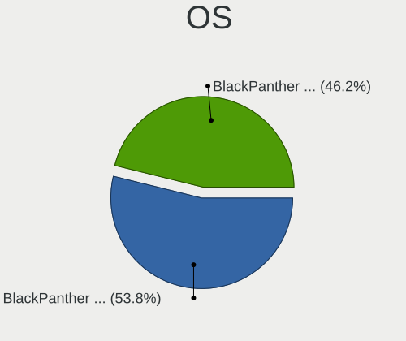

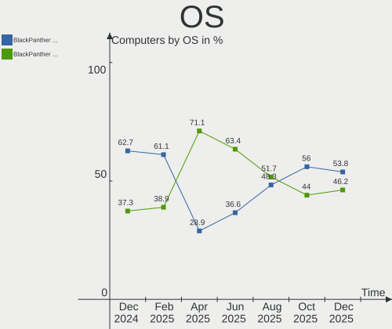

| Name              | Computers | Percent |
|-------------------|-----------|---------|
| BlackPanther 18.1 | 21        | 53.85%  |
| BlackPanther 22.1 | 18        | 46.15%  |

OS Family
---------

OS without a version

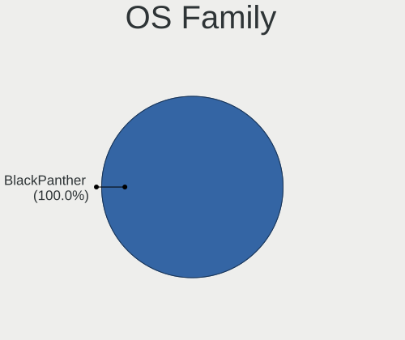

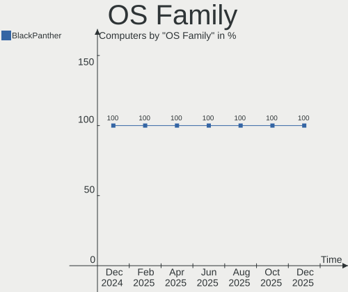

| Name         | Computers | Percent |
|--------------|-----------|---------|
| BlackPanther | 39        | 100%    |

Kernel
------

Version of the Linux kernel

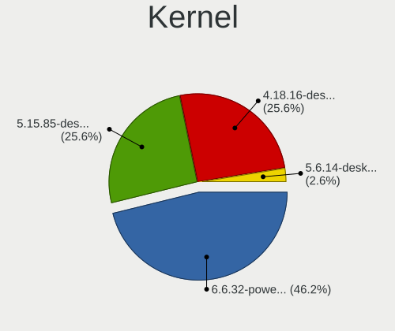

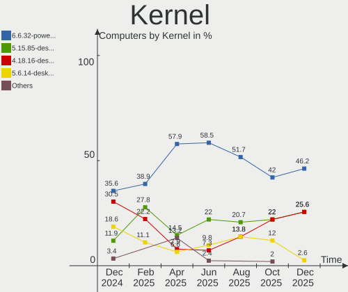

| Version             | Computers | Percent |
|---------------------|-----------|---------|
| 6.6.32-power-1bP    | 18        | 46.15%  |
| 5.15.85-desktop-1bP | 10        | 25.64%  |
| 4.18.16-desktop-1bP | 10        | 25.64%  |
| 5.6.14-desktop-2bP  | 1         | 2.56%   |

Kernel Family
-------------

Linux kernel without a distro release

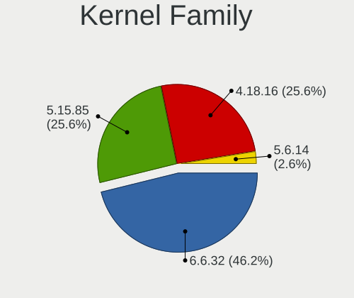

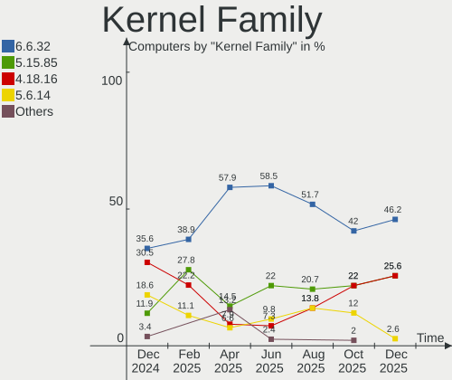

| Version | Computers | Percent |
|---------|-----------|---------|
| 6.6.32  | 18        | 46.15%  |
| 5.15.85 | 10        | 25.64%  |
| 4.18.16 | 10        | 25.64%  |
| 5.6.14  | 1         | 2.56%   |

Kernel Major Ver.
-----------------

Linux kernel major version

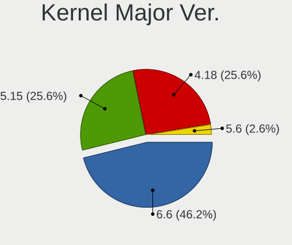

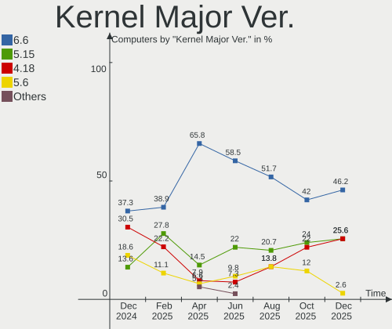

| Version | Computers | Percent |
|---------|-----------|---------|
| 6.6     | 18        | 46.15%  |
| 5.15    | 10        | 25.64%  |
| 4.18    | 10        | 25.64%  |
| 5.6     | 1         | 2.56%   |

Arch
----

OS architecture (x86_64, i586, etc.)

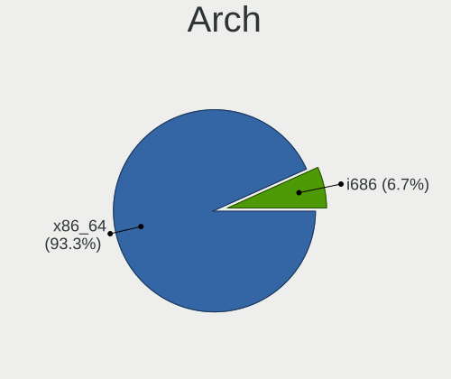

| Name   | Computers | Percent |
|--------|-----------|---------|
| x86_64 | 39        | 100%    |

DE
--

Desktop Environment

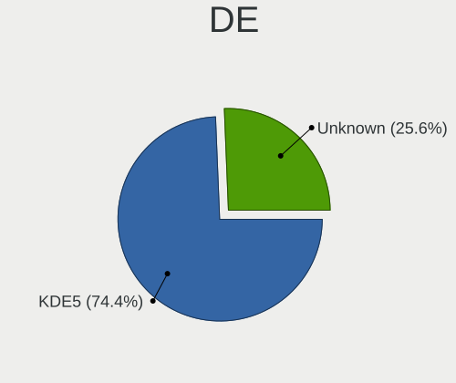

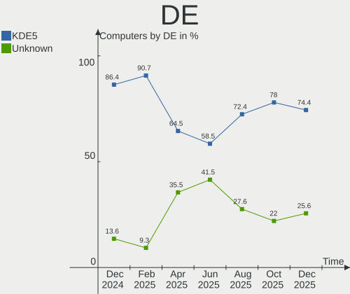

| Name    | Computers | Percent |
|---------|-----------|---------|
| KDE5    | 29        | 74.36%  |
| Unknown | 10        | 25.64%  |

Display Server
--------------

X11 or Wayland

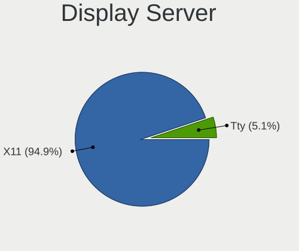

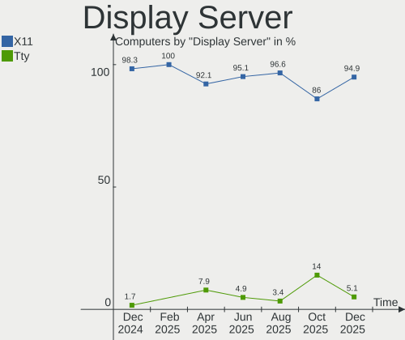

| Name | Computers | Percent |
|------|-----------|---------|
| X11  | 37        | 94.87%  |
| Tty  | 2         | 5.13%   |

Display Manager
---------------

SDDM, LightDM, etc.

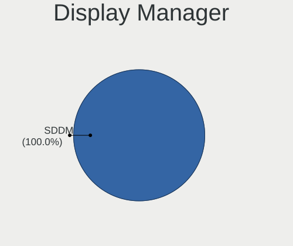

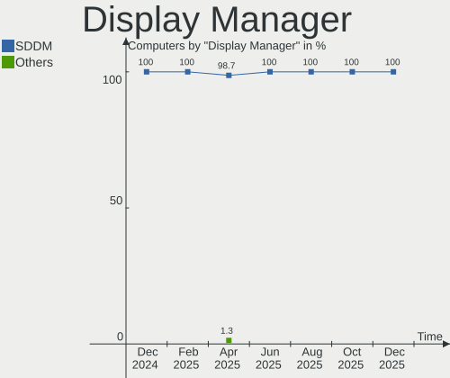

| Name | Computers | Percent |
|------|-----------|---------|
| SDDM | 39        | 100%    |

OS Lang
-------

Language

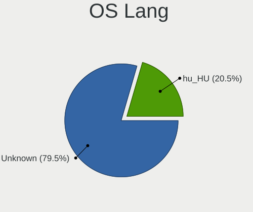

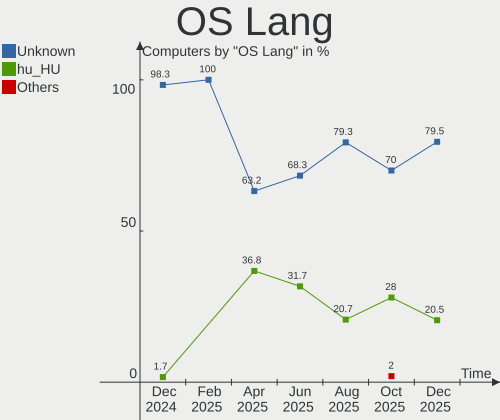

| Lang    | Computers | Percent |
|---------|-----------|---------|
| Unknown | 31        | 79.49%  |
| hu_HU   | 8         | 20.51%  |

Boot Mode
---------

EFI or BIOS

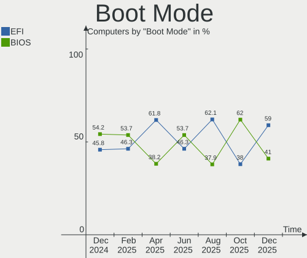

| Mode | Computers | Percent |
|------|-----------|---------|
| EFI  | 23        | 58.97%  |
| BIOS | 16        | 41.03%  |

Filesystem
----------

Type of filesystem

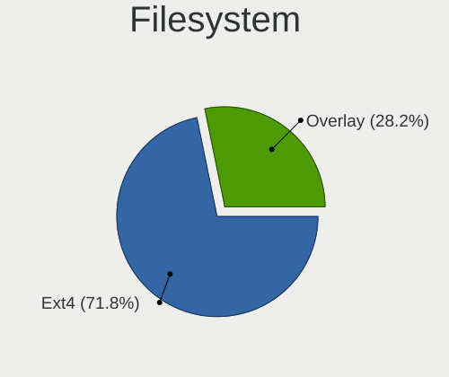

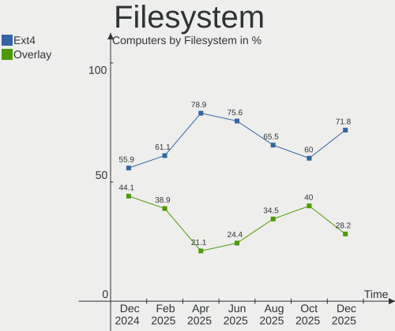

| Type    | Computers | Percent |
|---------|-----------|---------|
| Ext4    | 28        | 71.79%  |
| Overlay | 11        | 28.21%  |

Part. scheme
------------

Scheme of partitioning

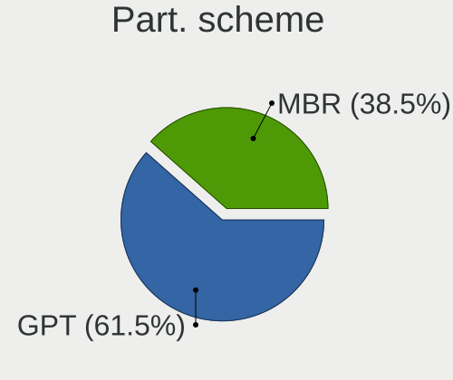

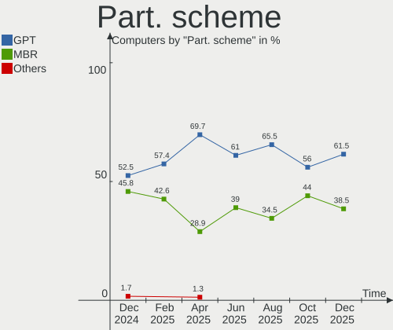

| Type | Computers | Percent |
|------|-----------|---------|
| GPT  | 24        | 61.54%  |
| MBR  | 15        | 38.46%  |

Dual Boot with Linux/BSD
------------------------

Hosting more than one Linux/BSD

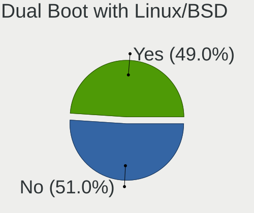

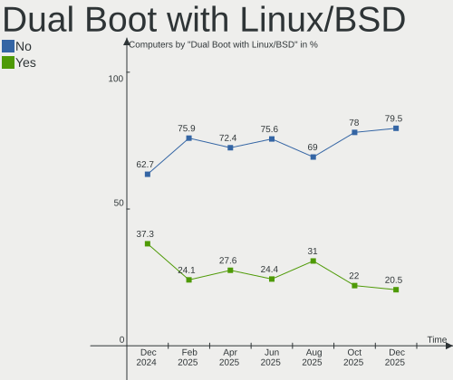

| Dual boot | Computers | Percent |
|-----------|-----------|---------|
| No        | 31        | 79.49%  |
| Yes       | 8         | 20.51%  |

Dual Boot (Win)
---------------

Hosting Linux and Windows

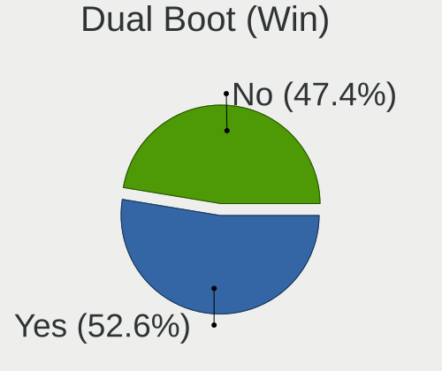

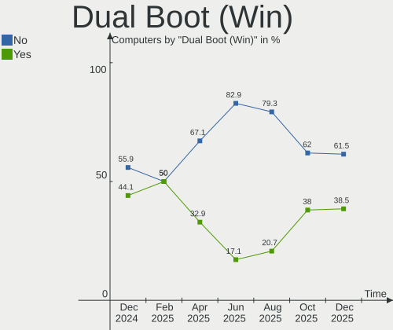

| Dual boot | Computers | Percent |
|-----------|-----------|---------|
| No        | 24        | 61.54%  |
| Yes       | 15        | 38.46%  |

Board
-----

Vendor
------

Motherboard manufacturer

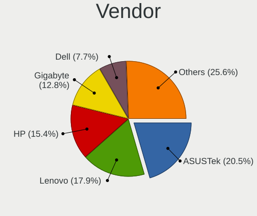

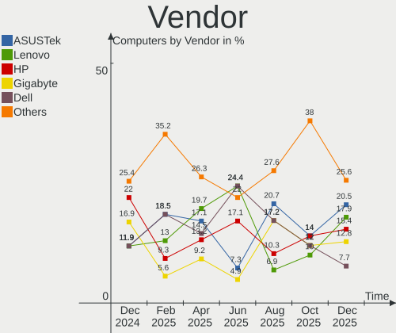

| Name                | Computers | Percent |
|---------------------|-----------|---------|
| ASUSTek Computer    | 8         | 20.51%  |
| Lenovo              | 7         | 17.95%  |
| Hewlett-Packard     | 6         | 15.38%  |
| Gigabyte Technology | 5         | 12.82%  |
| Dell                | 3         | 7.69%   |
| ASRock              | 3         | 7.69%   |
| Medion              | 2         | 5.13%   |
| Samsung Electronics | 1         | 2.56%   |
| MSI                 | 1         | 2.56%   |
| Fujitsu             | 1         | 2.56%   |
| AZW                 | 1         | 2.56%   |
| Acer                | 1         | 2.56%   |

Model
-----

Motherboard model

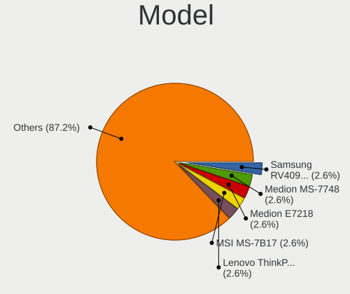

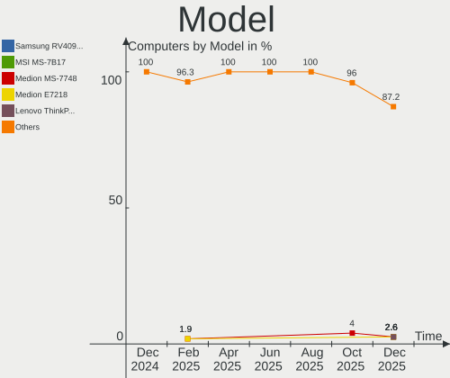

| Name                                | Computers | Percent |
|-------------------------------------|-----------|---------|
| Samsung RV409/RV509/RV709           | 1         | 2.56%   |
| MSI MS-7B17                         | 1         | 2.56%   |
| Medion MS-7748                      | 1         | 2.56%   |
| Medion E7218                        | 1         | 2.56%   |
| Lenovo ThinkPad X390 20Q1S17N0A     | 1         | 2.56%   |
| Lenovo ThinkPad T590 20N5S8LT00     | 1         | 2.56%   |
| Lenovo ThinkPad T460 20FMS0HG0G     | 1         | 2.56%   |
| Lenovo ThinkPad T450 20BUS06E00     | 1         | 2.56%   |
| Lenovo ThinkPad T450 20BUA0AEHV     | 1         | 2.56%   |
| Lenovo ThinkPad P1 Gen 2 20QUS07T00 | 1         | 2.56%   |
| Lenovo ThinkCentre M58 7373Y2M      | 1         | 2.56%   |
| HP ProDesk 600 G2 SFF               | 1         | 2.56%   |
| HP ProDesk 400 G3 SFF               | 1         | 2.56%   |
| HP Pavilion Gaming Laptop 15-ec1xxx | 1         | 2.56%   |
| HP Pavilion dv6                     | 1         | 2.56%   |
| HP Laptop 15-bs1xx                  | 1         | 2.56%   |
| HP 250 G5 Notebook PC               | 1         | 2.56%   |
| Gigabyte P55-UD3                    | 1         | 2.56%   |
| Gigabyte H61M-S1                    | 1         | 2.56%   |
| Gigabyte H610M S2H V2               | 1         | 2.56%   |
| Gigabyte B150M-D3H                  | 1         | 2.56%   |
| Gigabyte A520M K V2                 | 1         | 2.56%   |
| Fujitsu LIFEBOOK S710               | 1         | 2.56%   |
| Dell OptiPlex 9010                  | 1         | 2.56%   |
| Dell Latitude E6410                 | 1         | 2.56%   |
| Dell Inspiron 1090                  | 1         | 2.56%   |
| AZW Gemini J45                      | 1         | 2.56%   |
| ASUS X555LJ                         | 1         | 2.56%   |
| ASUS X550CA                         | 1         | 2.56%   |
| ASUS TUF Gaming B450-PLUS II        | 1         | 2.56%   |
| ASUS PRIME H610M-K D4               | 1         | 2.56%   |
| ASUS PRIME A320M-R                  | 1         | 2.56%   |
| ASUS M5A78L-M PLUS/USB3             | 1         | 2.56%   |
| ASUS H110M-A/M.2                    | 1         | 2.56%   |
| ASUS GL552JX                        | 1         | 2.56%   |
| ASRock X299 Extreme4                | 1         | 2.56%   |
| ASRock N68C-S UCC                   | 1         | 2.56%   |
| ASRock H81M-HDS                     | 1         | 2.56%   |
| Acer Aspire E1-532                  | 1         | 2.56%   |

Model Family
------------

Motherboard model prefix

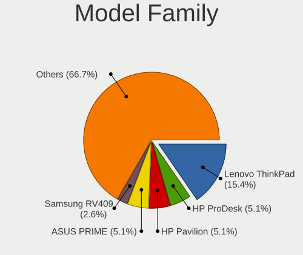

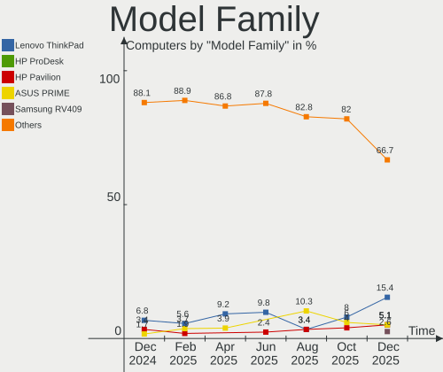

| Name               | Computers | Percent |
|--------------------|-----------|---------|
| Lenovo ThinkPad    | 6         | 15.38%  |
| HP ProDesk         | 2         | 5.13%   |
| HP Pavilion        | 2         | 5.13%   |
| ASUS PRIME         | 2         | 5.13%   |
| Samsung RV409      | 1         | 2.56%   |
| MSI MS-7B17        | 1         | 2.56%   |
| Medion MS-7748     | 1         | 2.56%   |
| Medion E7218       | 1         | 2.56%   |
| Lenovo ThinkCentre | 1         | 2.56%   |
| HP Laptop          | 1         | 2.56%   |
| HP 250             | 1         | 2.56%   |
| Gigabyte P55-UD3   | 1         | 2.56%   |
| Gigabyte H61M-S1   | 1         | 2.56%   |
| Gigabyte H610M     | 1         | 2.56%   |
| Gigabyte B150M-D3H | 1         | 2.56%   |
| Gigabyte A520M     | 1         | 2.56%   |
| Fujitsu LIFEBOOK   | 1         | 2.56%   |
| Dell OptiPlex      | 1         | 2.56%   |
| Dell Latitude      | 1         | 2.56%   |
| Dell Inspiron      | 1         | 2.56%   |
| AZW Gemini         | 1         | 2.56%   |
| ASUS X555LJ        | 1         | 2.56%   |
| ASUS X550CA        | 1         | 2.56%   |
| ASUS TUF           | 1         | 2.56%   |
| ASUS M5A78L-M      | 1         | 2.56%   |
| ASUS H110M-A       | 1         | 2.56%   |
| ASUS GL552JX       | 1         | 2.56%   |
| ASRock X299        | 1         | 2.56%   |
| ASRock N68C-S      | 1         | 2.56%   |
| ASRock H81M-HDS    | 1         | 2.56%   |
| Acer Aspire        | 1         | 2.56%   |

MFG Year
--------

Motherboard manufacture year

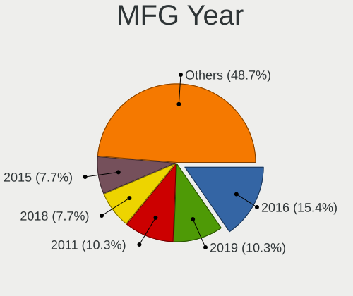

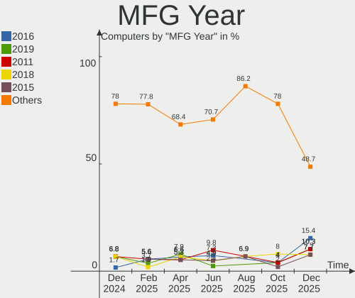

| Year | Computers | Percent |
|------|-----------|---------|
| 2016 | 6         | 15.38%  |
| 2019 | 4         | 10.26%  |
| 2011 | 4         | 10.26%  |
| 2018 | 3         | 7.69%   |
| 2015 | 3         | 7.69%   |
| 2013 | 3         | 7.69%   |
| 2010 | 3         | 7.69%   |
| 2020 | 2         | 5.13%   |
| 2014 | 2         | 5.13%   |
| 2012 | 2         | 5.13%   |
| 2008 | 2         | 5.13%   |
| 2024 | 1         | 2.56%   |
| 2022 | 1         | 2.56%   |
| 2021 | 1         | 2.56%   |
| 2017 | 1         | 2.56%   |
| 2009 | 1         | 2.56%   |

Form Factor
-----------

Physical design of the computer

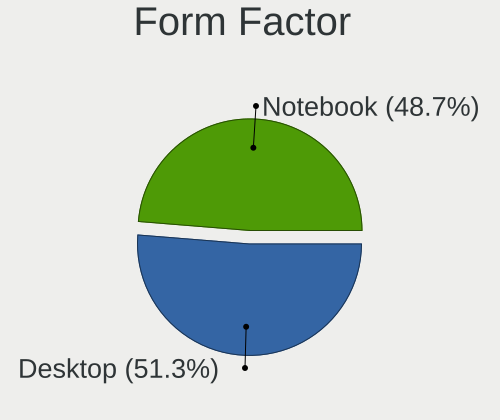

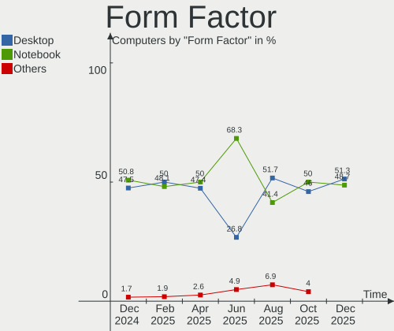

| Name     | Computers | Percent |
|----------|-----------|---------|
| Desktop  | 20        | 51.28%  |
| Notebook | 19        | 48.72%  |

Secure Boot
-----------

Enabled or disabled

| State    | Computers | Percent |
|----------|-----------|---------|
| Disabled | 39        | 100%    |

Coreboot
--------

Have coreboot on board

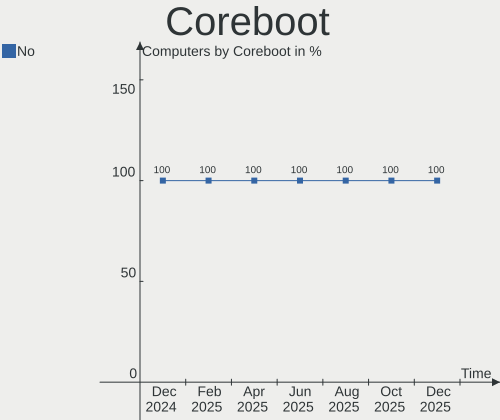

| Used | Computers | Percent |
|------|-----------|---------|
| No   | 39        | 100%    |

RAM Size
--------

Total RAM memory

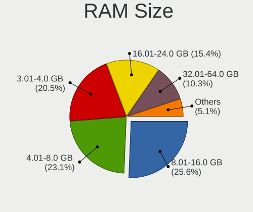

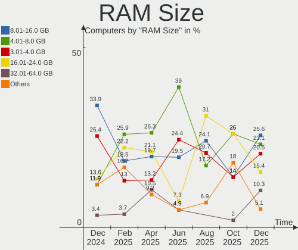

| Size in GB | Computers | Percent |
|------------|-----------|---------|
| 8.01-16.0  | 10        | 25.64%  |
| 4.01-8.0   | 9         | 23.08%  |
| 3.01-4.0   | 8         | 20.51%  |
| 16.01-24.0 | 6         | 15.38%  |
| 32.01-64.0 | 4         | 10.26%  |
| 24.01-32.0 | 1         | 2.56%   |
| 1.01-2.0   | 1         | 2.56%   |

RAM Used
--------

Used RAM memory

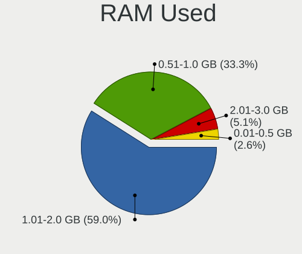

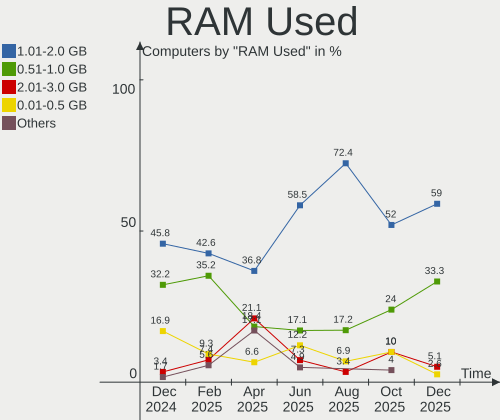

| Used GB  | Computers | Percent |
|----------|-----------|---------|
| 1.01-2.0 | 23        | 58.97%  |
| 0.51-1.0 | 13        | 33.33%  |
| 2.01-3.0 | 2         | 5.13%   |
| 0.01-0.5 | 1         | 2.56%   |

Total Drives
------------

Number of drives on board

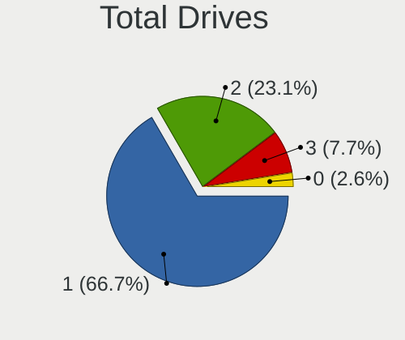

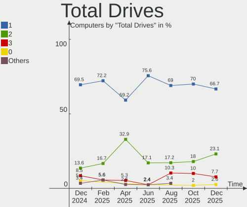

| Drives | Computers | Percent |
|--------|-----------|---------|
| 1      | 26        | 66.67%  |
| 2      | 9         | 23.08%  |
| 3      | 3         | 7.69%   |
| 0      | 1         | 2.56%   |

Has CD-ROM
----------

Has CD-ROM on board

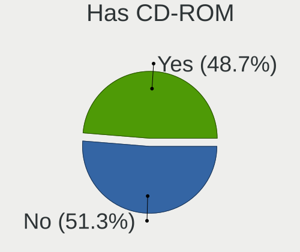

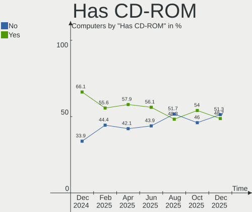

| Presented | Computers | Percent |
|-----------|-----------|---------|
| No        | 20        | 51.28%  |
| Yes       | 19        | 48.72%  |

Has Ethernet
------------

Has Ethernet on board

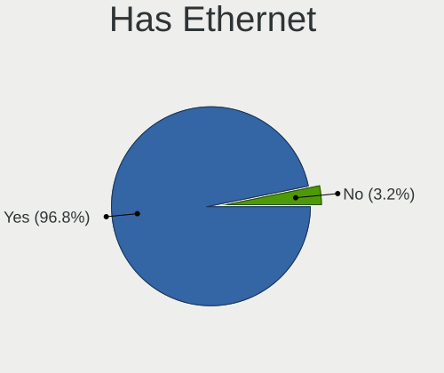

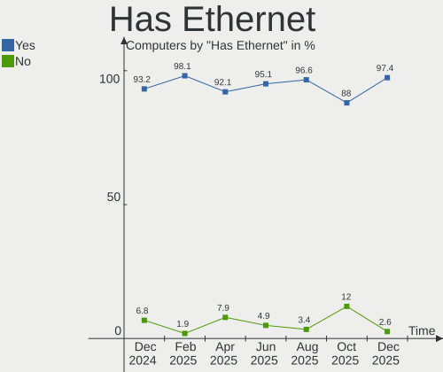

| Presented | Computers | Percent |
|-----------|-----------|---------|
| Yes       | 38        | 97.44%  |
| No        | 1         | 2.56%   |

Has WiFi
--------

Has WiFi module

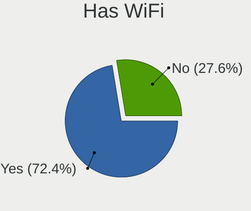

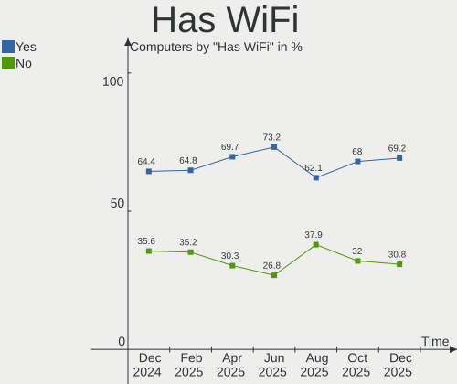

| Presented | Computers | Percent |
|-----------|-----------|---------|
| Yes       | 27        | 69.23%  |
| No        | 12        | 30.77%  |

Has Bluetooth
-------------

Has Bluetooth module

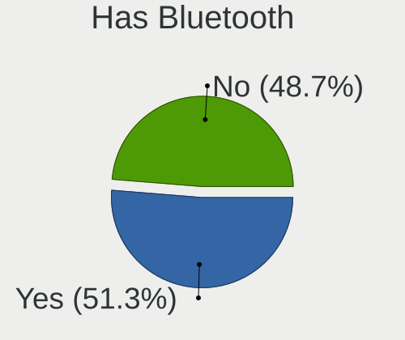

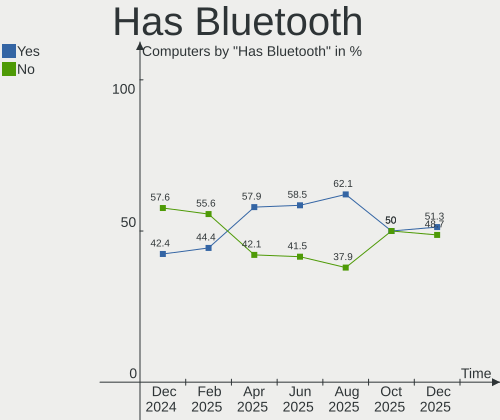

| Presented | Computers | Percent |
|-----------|-----------|---------|
| Yes       | 20        | 51.28%  |
| No        | 19        | 48.72%  |

Location
--------

Country
-------

Geographic location (country)

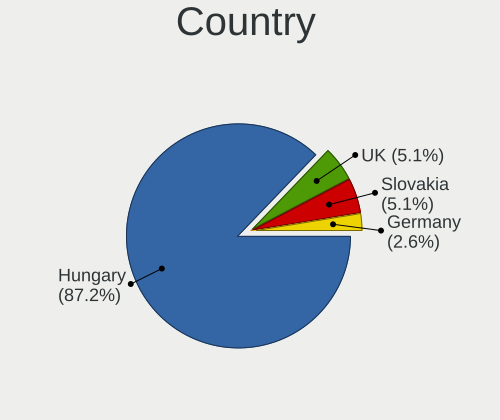

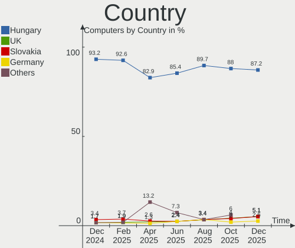

| Country  | Computers | Percent |
|----------|-----------|---------|
| Hungary  | 34        | 87.18%  |
| UK       | 2         | 5.13%   |
| Slovakia | 2         | 5.13%   |
| Germany  | 1         | 2.56%   |

City
----

Geographic location (city)

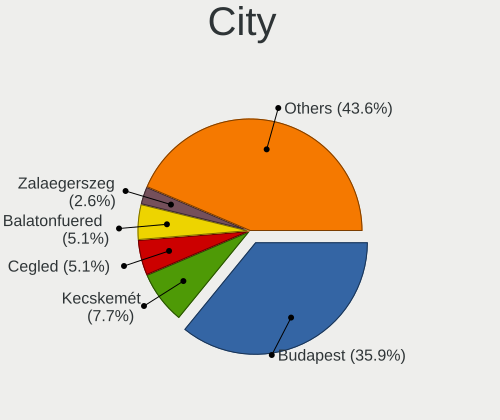

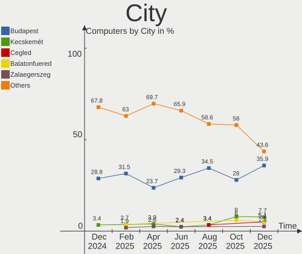

| City                    | Computers | Percent |
|-------------------------|-----------|---------|
| Budapest                | 14        | 35.9%   |
| Kecskemét              | 3         | 7.69%   |
| Cegled                  | 2         | 5.13%   |
| Balatonfuered           | 2         | 5.13%   |
| Zalaegerszeg            | 1         | 2.56%   |
| Tamasi                  | 1         | 2.56%   |
| Szigetszentmiklos       | 1         | 2.56%   |
| Szentes                 | 1         | 2.56%   |
| Se                      | 1         | 2.56%   |
| Sarospatak              | 1         | 2.56%   |
| Pontypool               | 1         | 2.56%   |
| Pfaffenhofen an der Ilm | 1         | 2.56%   |
| Oroshaza                | 1         | 2.56%   |
| Nitra                   | 1         | 2.56%   |
| Mosonmagyaróvár       | 1         | 2.56%   |
| Morahalom               | 1         | 2.56%   |
| Lehnice                 | 1         | 2.56%   |
| Islington               | 1         | 2.56%   |
| Inarcs                  | 1         | 2.56%   |
| Győr                   | 1         | 2.56%   |
| Boly                    | 1         | 2.56%   |
| Aporka                  | 1         | 2.56%   |

Drives
------

Drive Vendor
------------

Hard drive vendors

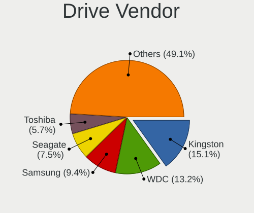

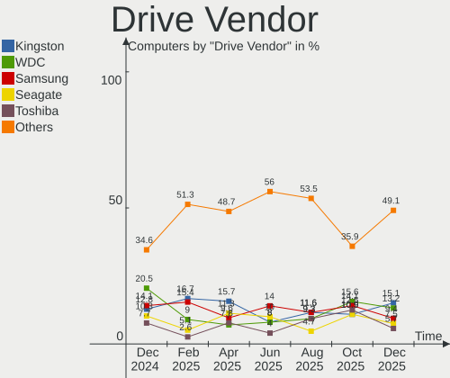

| Vendor                      | Computers | Drives | Percent |
|-----------------------------|-----------|--------|---------|
| Kingston                    | 8         | 9      | 15.09%  |
| WDC                         | 7         | 8      | 13.21%  |
| Samsung Electronics         | 5         | 5      | 9.43%   |
| Seagate                     | 4         | 4      | 7.55%   |
| Toshiba                     | 3         | 3      | 5.66%   |
| Sandisk                     | 3         | 3      | 5.66%   |
| A-DATA Technology           | 3         | 3      | 5.66%   |
| Kingston Technology Company | 2         | 2      | 3.77%   |
| GOODRAM                     | 2         | 2      | 3.77%   |
| Team                        | 1         | 1      | 1.89%   |
| SSSTC                       | 1         | 1      | 1.89%   |
| SPCC Sol                    | 1         | 1      | 1.89%   |
| PNY                         | 1         | 1      | 1.89%   |
| Patriot                     | 1         | 1      | 1.89%   |
| OV                          | 1         | 1      | 1.89%   |
| Netac                       | 1         | 1      | 1.89%   |
| Micron Technology           | 1         | 1      | 1.89%   |
| KIOXIA-EXCERIA              | 1         | 1      | 1.89%   |
| Intenso                     | 1         | 1      | 1.89%   |
| Integral                    | 1         | 1      | 1.89%   |
| INNOVATION IT               | 1         | 1      | 1.89%   |
| Hitachi                     | 1         | 1      | 1.89%   |
| Apacer                      | 1         | 1      | 1.89%   |
| Acer                        | 1         | 1      | 1.89%   |
| Unknown                     | 1         | 1      | 1.89%   |

Drive Model
-----------

Hard drive models

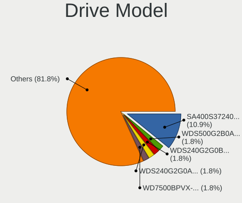

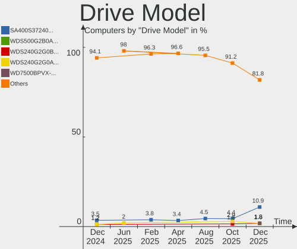

| Model                                             | Computers | Percent |
|---------------------------------------------------|-----------|---------|
| Kingston SA400S37240G 240GB SSD                   | 6         | 10.91%  |
| WDC WDS500G2B0A-00SM50 500GB                      | 1         | 1.82%   |
| WDC WDS240G2G0B-00EPW0 240GB SSD                  | 1         | 1.82%   |
| WDC WDS240G2G0A-00JH30 240GB SSD                  | 1         | 1.82%   |
| WDC WD7500BPVX-60JC3T0 752GB                      | 1         | 1.82%   |
| WDC WD5000LPVX-80V0TT0 500GB                      | 1         | 1.82%   |
| WDC WD5000BUCT-63PUZY0 500GB                      | 1         | 1.82%   |
| WDC WD2500AAKX-08U6AA0 250GB                      | 1         | 1.82%   |
| WDC WD10EZEX-08M2NA0 1TB                          | 1         | 1.82%   |
| Toshiba DT01ACA100 1TB                            | 1         | 1.82%   |
| Toshiba DT01ACA050 LENOVO 500GB                   | 1         | 1.82%   |
| Toshiba BG3 NVMe SSD Controller 256GB             | 1         | 1.82%   |
| Team TM8FPD001T 1TB                               | 1         | 1.82%   |
| SSSTC CA5-8D256-Q79 256GB                         | 1         | 1.82%   |
| SPCC Sol id State Disk 256GB SSD                  | 1         | 1.82%   |
| Seagate ST500LM000-1EJ162 500GB                   | 1         | 1.82%   |
| Seagate ST2000VN004-2E4164 2TB                    | 1         | 1.82%   |
| Seagate ST2000DL003-9VT166 2TB                    | 1         | 1.82%   |
| Seagate Basic 5TB                                 | 1         | 1.82%   |
| Sandisk WD Black SN750 / PC SN730 NVMe SSD 500GB  | 1         | 1.82%   |
| SanDisk SDSSDH3512G 512GB                         | 1         | 1.82%   |
| SanDisk SDSSDA120G 120GB                          | 1         | 1.82%   |
| Samsung SSD 970 EVO 500GB                         | 1         | 1.82%   |
| Samsung SSD 860 EVO 250GB                         | 1         | 1.82%   |
| Samsung SSD 850 EVO 250GB                         | 1         | 1.82%   |
| Samsung NVMe SSD Controller SM981/PM981/PM983 1TB | 1         | 1.82%   |
| Samsung HD103SJ 1TB                               | 1         | 1.82%   |
| PNY CS900 120GB SSD                               | 1         | 1.82%   |
| Patriot Burst Elite 960GB SSD                     | 1         | 1.82%   |
| OV SSD 256GB S600                                 | 1         | 1.82%   |
| Netac SSD 256GB                                   | 1         | 1.82%   |
| Micron MTFDDAV256TBN-1AR1ZABHA 256GB SSD          | 1         | 1.82%   |
| KIOXIA-EXCERIA SATA SSD 480GB                     | 1         | 1.82%   |
| Kingston Company SNV3S2000G 2TB                   | 1         | 1.82%   |
| Kingston Company SNV2S2000G 2TB                   | 1         | 1.82%   |
| Kingston SV300S37A60G 64GB SSD                    | 1         | 1.82%   |
| Kingston SV300S37A120G 120GB SSD                  | 1         | 1.82%   |
| Kingston SKC3000S512G 512GB                       | 1         | 1.82%   |
| Intenso SSD SATAIII 512GB                         | 1         | 1.82%   |
| Integral V Series SATA SSD 120GB                  | 1         | 1.82%   |

HDD Vendor
----------

Hard disk drive vendors

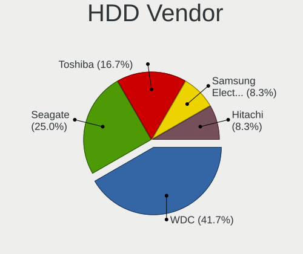

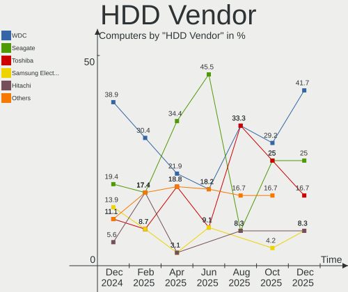

| Vendor              | Computers | Drives | Percent |
|---------------------|-----------|--------|---------|
| WDC                 | 5         | 5      | 41.67%  |
| Seagate             | 3         | 3      | 25%     |
| Toshiba             | 2         | 2      | 16.67%  |
| Samsung Electronics | 1         | 1      | 8.33%   |
| Hitachi             | 1         | 1      | 8.33%   |

SSD Vendor
----------

Solid state drive vendors

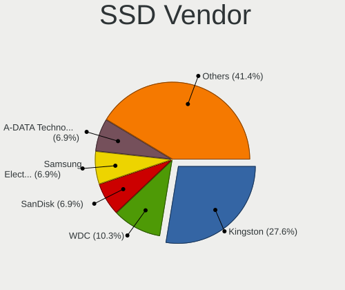

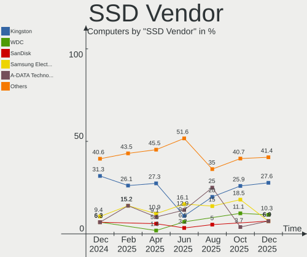

| Vendor              | Computers | Drives | Percent |
|---------------------|-----------|--------|---------|
| Kingston            | 8         | 8      | 27.59%  |
| WDC                 | 3         | 3      | 10.34%  |
| SanDisk             | 2         | 2      | 6.9%    |
| Samsung Electronics | 2         | 2      | 6.9%    |
| A-DATA Technology   | 2         | 2      | 6.9%    |
| SPCC Sol            | 1         | 1      | 3.45%   |
| PNY                 | 1         | 1      | 3.45%   |
| Patriot             | 1         | 1      | 3.45%   |
| OV                  | 1         | 1      | 3.45%   |
| Netac               | 1         | 1      | 3.45%   |
| Micron Technology   | 1         | 1      | 3.45%   |
| KIOXIA-EXCERIA      | 1         | 1      | 3.45%   |
| Intenso             | 1         | 1      | 3.45%   |
| Integral            | 1         | 1      | 3.45%   |
| GOODRAM             | 1         | 1      | 3.45%   |
| Apacer              | 1         | 1      | 3.45%   |
| Acer                | 1         | 1      | 3.45%   |

Drive Kind
----------

HDD or SSD

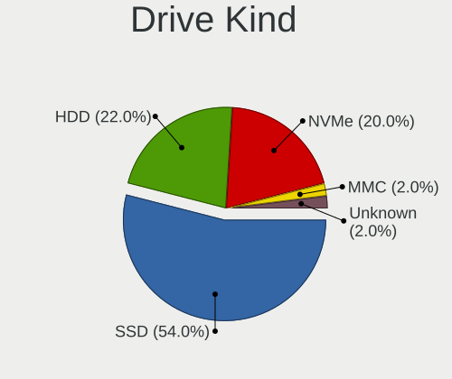

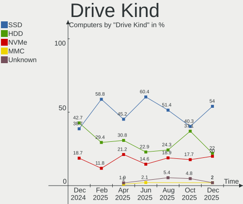

| Kind    | Computers | Drives | Percent |
|---------|-----------|--------|---------|
| SSD     | 27        | 29     | 54%     |
| HDD     | 11        | 12     | 22%     |
| NVMe    | 10        | 12     | 20%     |
| MMC     | 1         | 1      | 2%      |
| Unknown | 1         | 1      | 2%      |

Drive Connector
---------------

SATA, SAS, NVMe, etc.

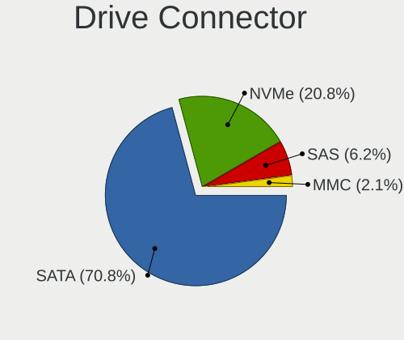

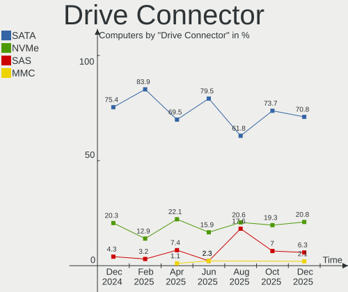

| Type | Computers | Drives | Percent |
|------|-----------|--------|---------|
| SATA | 34        | 39     | 70.83%  |
| NVMe | 10        | 12     | 20.83%  |
| SAS  | 3         | 3      | 6.25%   |
| MMC  | 1         | 1      | 2.08%   |

Drive Size
----------

Size of hard drive

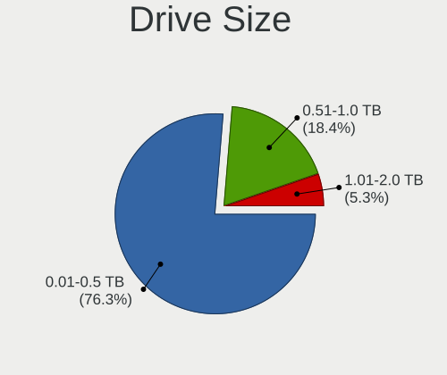

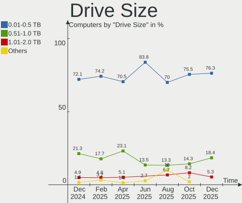

| Size in TB | Computers | Drives | Percent |
|------------|-----------|--------|---------|
| 0.01-0.5   | 29        | 32     | 76.32%  |
| 0.51-1.0   | 7         | 7      | 18.42%  |
| 1.01-2.0   | 2         | 2      | 5.26%   |

Space Total
-----------

Amount of disk space available on the file system

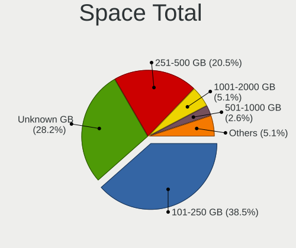

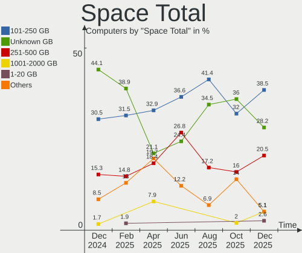

| Size in GB | Computers | Percent |
|------------|-----------|---------|
| 101-250    | 15        | 38.46%  |
| Unknown    | 11        | 28.21%  |
| 251-500    | 8         | 20.51%  |
| 1001-2000  | 2         | 5.13%   |
| 1-20       | 1         | 2.56%   |
| 501-1000   | 1         | 2.56%   |
| 51-100     | 1         | 2.56%   |

Space Used
----------

Amount of used disk space

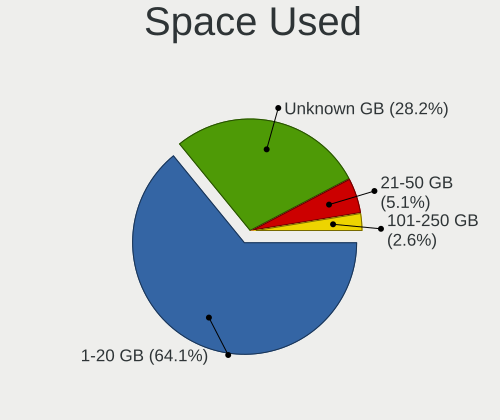

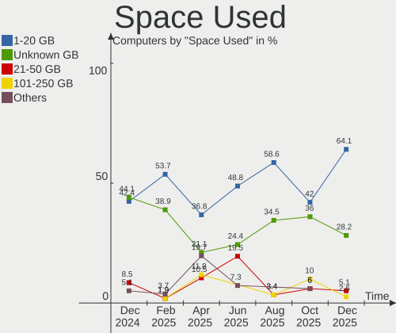

| Used GB | Computers | Percent |
|---------|-----------|---------|
| 1-20    | 25        | 64.1%   |
| Unknown | 11        | 28.21%  |
| 21-50   | 2         | 5.13%   |
| 101-250 | 1         | 2.56%   |

Malfunc. Drives
---------------

Drive models with a malfunction

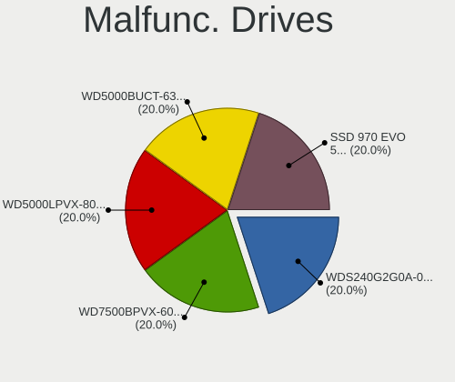

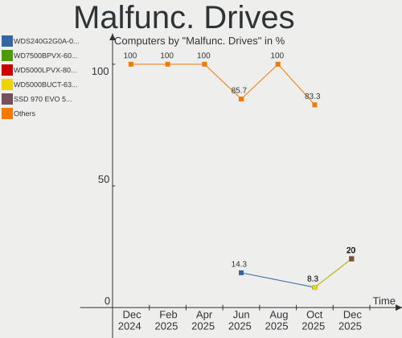

| Model                                 | Computers | Drives | Percent |
|---------------------------------------|-----------|--------|---------|
| WDC WDS240G2G0A-00JH30 240GB SSD      | 1         | 1      | 20%     |
| WDC WD7500BPVX-60JC3T0 752GB          | 1         | 1      | 20%     |
| WDC WD5000LPVX-80V0TT0 500GB          | 1         | 1      | 20%     |
| WDC WD5000BUCT-63PUZY0 500GB          | 1         | 1      | 20%     |
| Samsung Electronics SSD 970 EVO 500GB | 1         | 1      | 20%     |

Malfunc. Drive Vendor
---------------------

Vendors of faulty drives

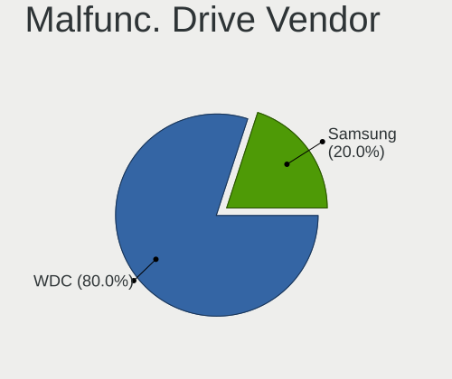

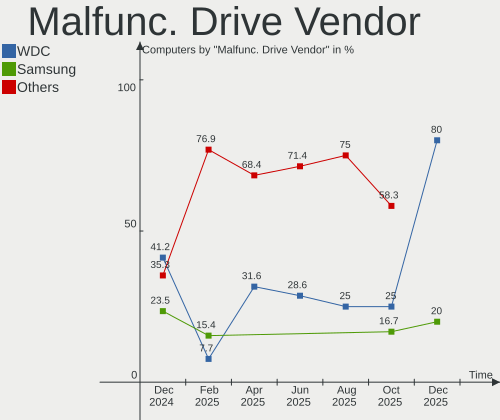

| Vendor              | Computers | Drives | Percent |
|---------------------|-----------|--------|---------|
| WDC                 | 4         | 4      | 80%     |
| Samsung Electronics | 1         | 1      | 20%     |

Malfunc. HDD Vendor
-------------------

Vendors of faulty HDD drives

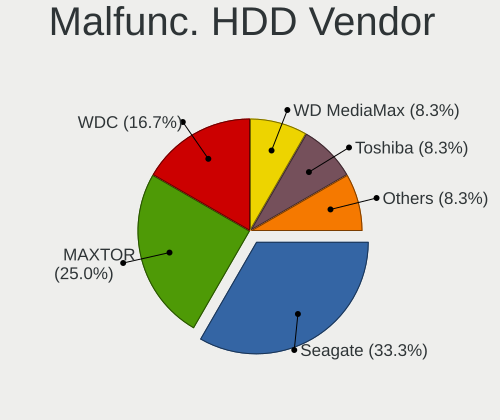

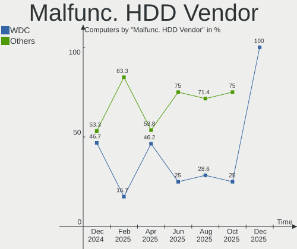

| Vendor | Computers | Drives | Percent |
|--------|-----------|--------|---------|
| WDC    | 3         | 3      | 100%    |

Malfunc. Drive Kind
-------------------

Kinds of faulty drives

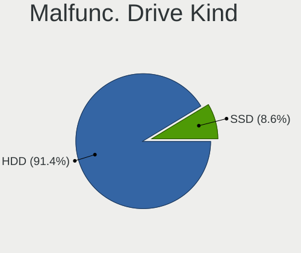

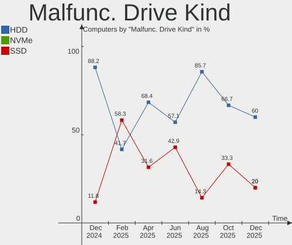

| Kind | Computers | Drives | Percent |
|------|-----------|--------|---------|
| HDD  | 3         | 3      | 60%     |
| NVMe | 1         | 1      | 20%     |
| SSD  | 1         | 1      | 20%     |

Failed Drives
-------------

Failed drive models

Zero info for selected period =(

Failed Drive Vendor
-------------------

Failed drive vendors

Zero info for selected period =(

Drive Status
------------

Number of failed and malfunc. drives

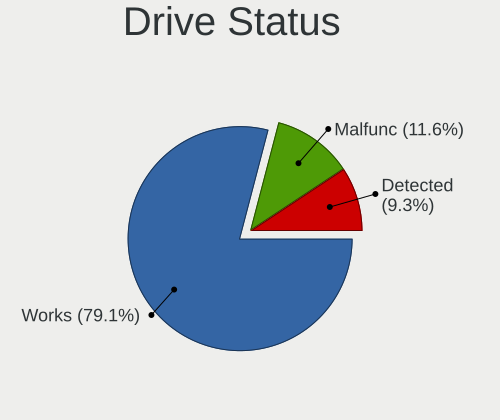

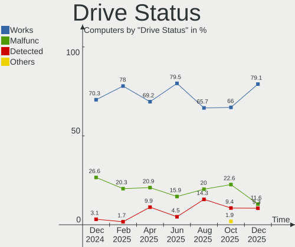

| Status   | Computers | Drives | Percent |
|----------|-----------|--------|---------|
| Works    | 34        | 46     | 79.07%  |
| Malfunc  | 5         | 5      | 11.63%  |
| Detected | 4         | 4      | 9.3%    |

Storage controller
------------------

Storage Vendor
--------------

Storage controller vendors

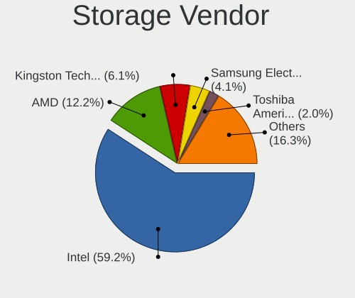

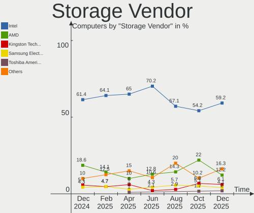

| Vendor                         | Computers | Percent |
|--------------------------------|-----------|---------|
| Intel                          | 29        | 59.18%  |
| AMD                            | 6         | 12.24%  |
| Kingston Technology Company    | 3         | 6.12%   |
| Samsung Electronics            | 2         | 4.08%   |
| Toshiba America Info Systems   | 1         | 2.04%   |
| Solid State Storage Technology | 1         | 2.04%   |
| Silicon Motion                 | 1         | 2.04%   |
| SanDisk                        | 1         | 2.04%   |
| Realtek Semiconductor          | 1         | 2.04%   |
| Nvidia                         | 1         | 2.04%   |
| MAXIO Technology (Hangzhou)    | 1         | 2.04%   |
| JMicron Technology             | 1         | 2.04%   |
| INNOGRIT                       | 1         | 2.04%   |

Storage Model
-------------

Storage controller models

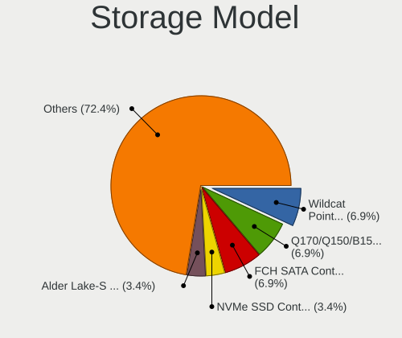

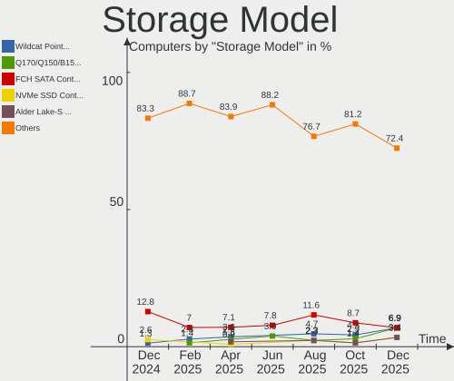

| Model                                                                                   | Computers | Percent |
|-----------------------------------------------------------------------------------------|-----------|---------|
| Intel Wildcat Point-LP SATA Controller [AHCI Mode]                                      | 4         | 6.9%    |
| Intel Q170/Q150/B150/H170/H110/Z170/CM236 Chipset SATA Controller [AHCI Mode]           | 4         | 6.9%    |
| AMD FCH SATA Controller [AHCI mode]                                                     | 4         | 6.9%    |
| Samsung NVMe SSD Controller SM981/PM981/PM983                                           | 2         | 3.45%   |
| Intel Alder Lake-S PCH SATA Controller [AHCI Mode]                                      | 2         | 3.45%   |
| Intel 8 Series/C220 Series Chipset Family 6-port SATA Controller 1 [AHCI mode]          | 2         | 3.45%   |
| Intel 5 Series/3400 Series Chipset 4 port SATA AHCI Controller                          | 2         | 3.45%   |
| Toshiba America Info Systems BG3 x2 NVMe SSD Controller (DRAM-less)                     | 1         | 1.72%   |
| Solid State Storage CA5-8D256 NVMe SSD M.2                                              | 1         | 1.72%   |
| Silicon Motion SM2263EN/SM2263XT (DRAM-less) NVMe SSD Controllers                       | 1         | 1.72%   |
| SanDisk Extreme Pro / WD Black SN750 / PC SN730 / Red SN700 NVMe SSD                    | 1         | 1.72%   |
| Realtek RTS5762 NVMe SSD Controller                                                     | 1         | 1.72%   |
| Nvidia MCP61 SATA Controller                                                            | 1         | 1.72%   |
| Nvidia MCP61 IDE                                                                        | 1         | 1.72%   |
| MAXIO (Hangzhou) NVMe SSD Controller MAP1202 (DRAM-less)                                | 1         | 1.72%   |
| Kingston Company NV3 NVMe SSD [SM2268XT2] (DRAM-less)                                   | 1         | 1.72%   |
| Kingston Company NV2 NVMe SSD [SM2267XT] (DRAM-less)                                    | 1         | 1.72%   |
| Kingston Company KC3000/FURY Renegade NVMe SSD [E18]                                    | 1         | 1.72%   |
| JMicron JMB363 SATA/IDE Controller                                                      | 1         | 1.72%   |
| Intel Volume Management Device NVMe RAID Controller                                     | 1         | 1.72%   |
| Intel Sunrise Point-LP SATA Controller [AHCI mode]                                      | 1         | 1.72%   |
| Intel SATA Controller [RAID mode]                                                       | 1         | 1.72%   |
| Intel NM10/ICH7 Family SATA Controller [AHCI mode]                                      | 1         | 1.72%   |
| Intel Celeron N3350/Pentium N4200/Atom E3900 Series SATA AHCI Controller                | 1         | 1.72%   |
| Intel Cannon Lake PCH SATA AHCI Controller                                              | 1         | 1.72%   |
| Intel Atom/Celeron/Pentium Processor x5-E8000/J3xxx/N3xxx Series SATA Controller        | 1         | 1.72%   |
| Intel 82801JD/DO (ICH10 Family) SATA AHCI Controller                                    | 1         | 1.72%   |
| Intel 82801 Mobile SATA Controller [RAID mode]                                          | 1         | 1.72%   |
| Intel 8 Series SATA Controller 1 [AHCI mode]                                            | 1         | 1.72%   |
| Intel 7 Series Chipset Family 6-port SATA Controller [AHCI mode]                        | 1         | 1.72%   |
| Intel 6 Series/C200 Series Chipset Family Desktop SATA Controller (IDE mode, ports 4-5) | 1         | 1.72%   |
| Intel 6 Series/C200 Series Chipset Family Desktop SATA Controller (IDE mode, ports 0-3) | 1         | 1.72%   |
| Intel 6 Series/C200 Series Chipset Family 6 port Mobile SATA AHCI Controller            | 1         | 1.72%   |
| Intel 5 Series/3400 Series Chipset PT IDER Controller                                   | 1         | 1.72%   |
| Intel 5 Series/3400 Series Chipset 6 port SATA AHCI Controller                          | 1         | 1.72%   |
| Intel 5 Series/3400 Series Chipset 4 port SATA IDE Controller                           | 1         | 1.72%   |
| Intel 5 Series/3400 Series Chipset 2 port SATA IDE Controller                           | 1         | 1.72%   |
| Intel 4 Series Chipset PT IDER Controller                                               | 1         | 1.72%   |
| Intel 200 Series PCH SATA controller [AHCI mode]                                        | 1         | 1.72%   |
| INNOGRIT NVMe SSD Controller IG5220 [RainierQX] (DRAM-less)                             | 1         | 1.72%   |

Storage Kind
------------

Kind of storage controller (IDE, SATA, NVMe, SAS, ...)

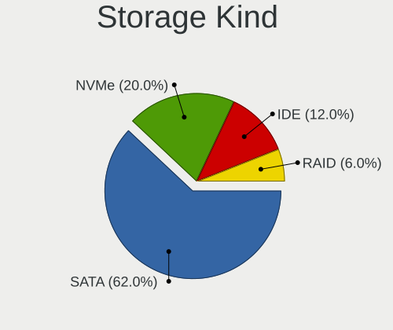

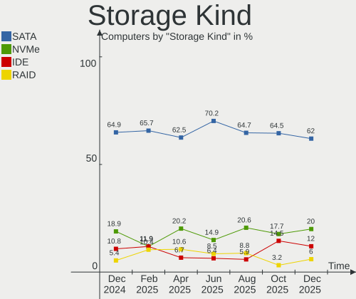

| Kind | Computers | Percent |
|------|-----------|---------|
| SATA | 31        | 62%     |
| NVMe | 10        | 20%     |
| IDE  | 6         | 12%     |
| RAID | 3         | 6%      |

Processor
---------

CPU Vendor
----------

Processor vendors

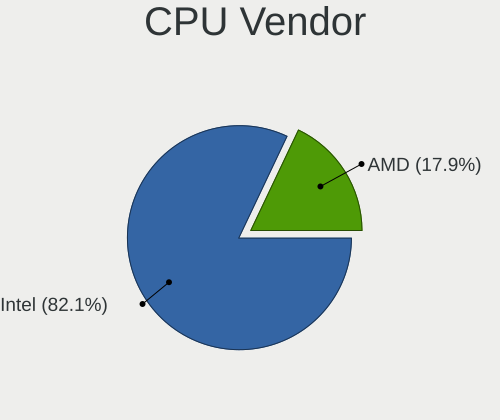

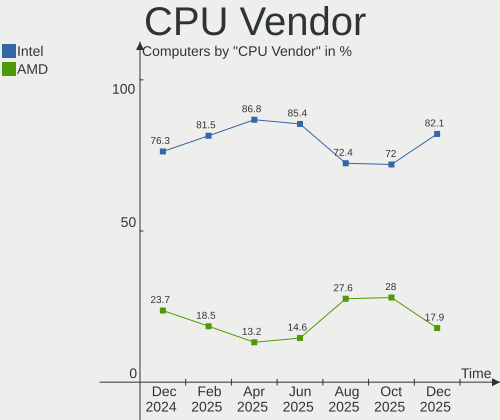

| Vendor | Computers | Percent |
|--------|-----------|---------|
| Intel  | 32        | 82.05%  |
| AMD    | 7         | 17.95%  |

CPU Model
---------

Processor models

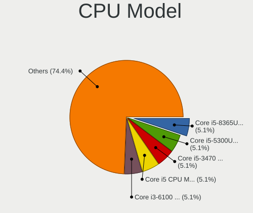

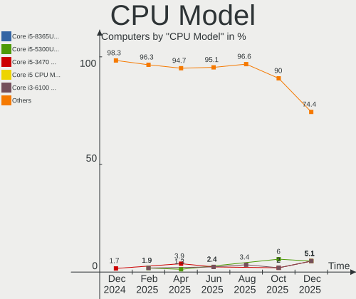

| Model                                       | Computers | Percent |
|---------------------------------------------|-----------|---------|
| Intel Core i5-8365U CPU @ 1.60GHz           | 2         | 5.13%   |
| Intel Core i5-5300U CPU @ 2.30GHz           | 2         | 5.13%   |
| Intel Core i5-3470 CPU @ 3.20GHz            | 2         | 5.13%   |
| Intel Core i5 CPU M 540 @ 2.53GHz           | 2         | 5.13%   |
| Intel Core i3-6100 CPU @ 3.70GHz            | 2         | 5.13%   |
| Intel Pentium CPU J4205 @ 1.50GHz           | 1         | 2.56%   |
| Intel Core i7-9850H CPU @ 2.60GHz           | 1         | 2.56%   |
| Intel Core i7-9700K CPU @ 3.60GHz           | 1         | 2.56%   |
| Intel Core i7-7800X CPU @ 3.50GHz           | 1         | 2.56%   |
| Intel Core i7-4750HQ CPU @ 2.00GHz          | 1         | 2.56%   |
| Intel Core i5-7600K CPU @ 3.80GHz           | 1         | 2.56%   |
| Intel Core i5-6300U CPU @ 2.40GHz           | 1         | 2.56%   |
| Intel Core i5 CPU M 560 @ 2.67GHz           | 1         | 2.56%   |
| Intel Core i5 CPU 750 @ 2.67GHz             | 1         | 2.56%   |
| Intel Core i3-7100 CPU @ 3.90GHz            | 1         | 2.56%   |
| Intel Core i3-5010U CPU @ 2.10GHz           | 1         | 2.56%   |
| Intel Core i3-5005U CPU @ 2.00GHz           | 1         | 2.56%   |
| Intel Core i3-4130 CPU @ 3.40GHz            | 1         | 2.56%   |
| Intel Core i3-3217U CPU @ 1.80GHz           | 1         | 2.56%   |
| Intel Core i3-2310M CPU @ 2.10GHz           | 1         | 2.56%   |
| Intel Core i3 CPU M 350 @ 2.27GHz           | 1         | 2.56%   |
| Intel Core 2 Duo CPU E7500 @ 2.93GHz        | 1         | 2.56%   |
| Intel Celeron CPU N3060 @ 1.60GHz           | 1         | 2.56%   |
| Intel Celeron 2955U @ 1.40GHz               | 1         | 2.56%   |
| Intel Atom CPU N570 @ 1.66GHz               | 1         | 2.56%   |
| Intel 12th Gen Core i5-12400F               | 1         | 2.56%   |
| Intel 12th Gen Core i5-12400                | 1         | 2.56%   |
| AMD Ryzen 5 5600 6-Core Processor           | 1         | 2.56%   |
| AMD Ryzen 5 4600H with Radeon Graphics      | 1         | 2.56%   |
| AMD Ryzen 5 2600 Six-Core Processor         | 1         | 2.56%   |
| AMD Ryzen 3 2200G with Radeon Vega Graphics | 1         | 2.56%   |
| AMD Phenom II X4 B45 Processor              | 1         | 2.56%   |
| AMD Phenom II X4 840 Processor              | 1         | 2.56%   |
| AMD A8-3800 APU with Radeon HD Graphics     | 1         | 2.56%   |

CPU Model Family
----------------

Processor model prefix

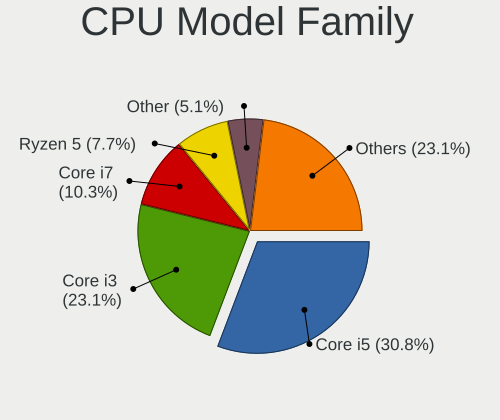

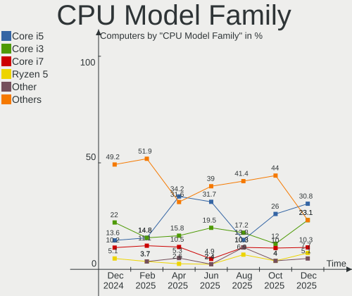

| Model            | Computers | Percent |
|------------------|-----------|---------|
| Intel Core i5    | 12        | 30.77%  |
| Intel Core i3    | 9         | 23.08%  |
| Intel Core i7    | 4         | 10.26%  |
| AMD Ryzen 5      | 3         | 7.69%   |
| Other            | 2         | 5.13%   |
| Intel Celeron    | 2         | 5.13%   |
| AMD Phenom II X4 | 2         | 5.13%   |
| Intel Pentium    | 1         | 2.56%   |
| Intel Core 2 Duo | 1         | 2.56%   |
| Intel Atom       | 1         | 2.56%   |
| AMD Ryzen 3      | 1         | 2.56%   |
| AMD A8           | 1         | 2.56%   |

CPU Cores
---------

Number of processor cores

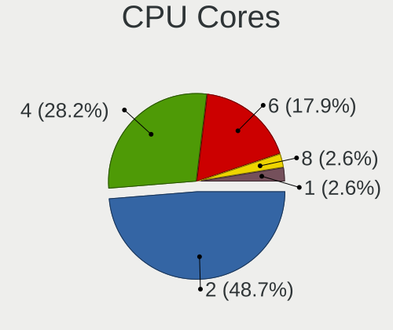

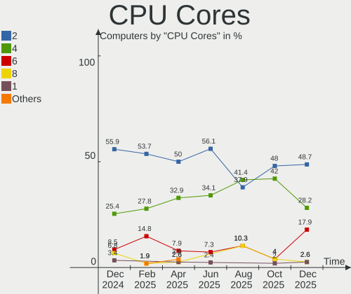

| Number | Computers | Percent |
|--------|-----------|---------|
| 2      | 19        | 48.72%  |
| 4      | 11        | 28.21%  |
| 6      | 7         | 17.95%  |
| 8      | 1         | 2.56%   |
| 1      | 1         | 2.56%   |

CPU Sockets
-----------

Number of sockets

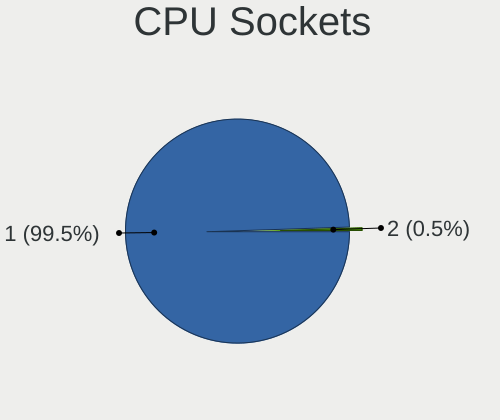

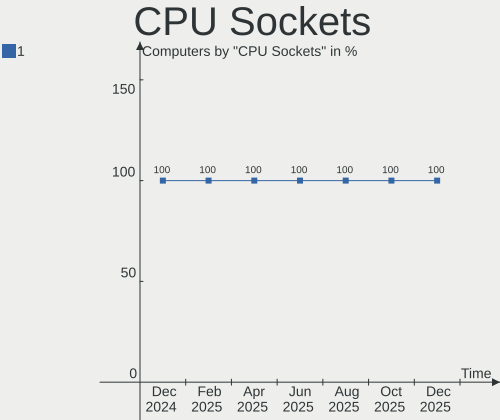

| Number | Computers | Percent |
|--------|-----------|---------|
| 1      | 39        | 100%    |

CPU Threads
-----------

Threads per core (Hyper-Threading)

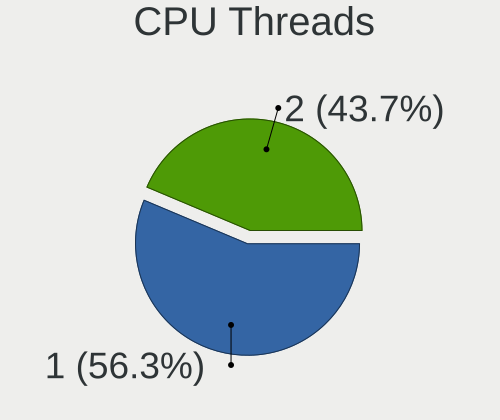

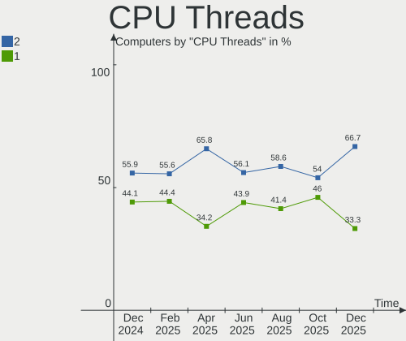

| Number | Computers | Percent |
|--------|-----------|---------|
| 2      | 26        | 66.67%  |
| 1      | 13        | 33.33%  |

CPU Op-Modes
------------

CPU Operation Modes (32-bit, 64-bit)

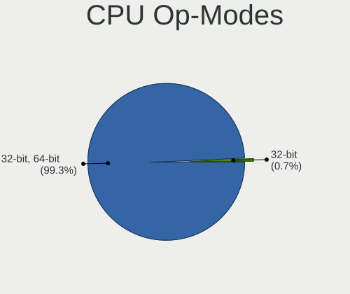

| Op mode        | Computers | Percent |
|----------------|-----------|---------|
| 32-bit, 64-bit | 39        | 100%    |

CPU Microcode
-------------

Microcode number

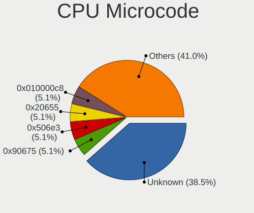

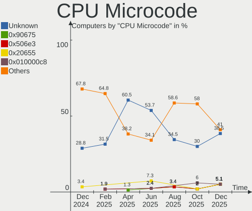

| Number     | Computers | Percent |
|------------|-----------|---------|
| Unknown    | 15        | 38.46%  |
| 0x90675    | 2         | 5.13%   |
| 0x506e3    | 2         | 5.13%   |
| 0x20655    | 2         | 5.13%   |
| 0x010000c8 | 2         | 5.13%   |
| 0x906ed    | 1         | 2.56%   |
| 0x906e9    | 1         | 2.56%   |
| 0x506c9    | 1         | 2.56%   |
| 0x50654    | 1         | 2.56%   |
| 0x406c4    | 1         | 2.56%   |
| 0x40661    | 1         | 2.56%   |
| 0x40651    | 1         | 2.56%   |
| 0x306d4    | 1         | 2.56%   |
| 0x20652    | 1         | 2.56%   |
| 0x106e5    | 1         | 2.56%   |
| 0x106ca    | 1         | 2.56%   |
| 0x0a20120e | 1         | 2.56%   |
| 0x0860010d | 1         | 2.56%   |
| 0x08101016 | 1         | 2.56%   |
| 0x0800820d | 1         | 2.56%   |
| 0x03000014 | 1         | 2.56%   |

CPU Microarch
-------------

Microarchitecture

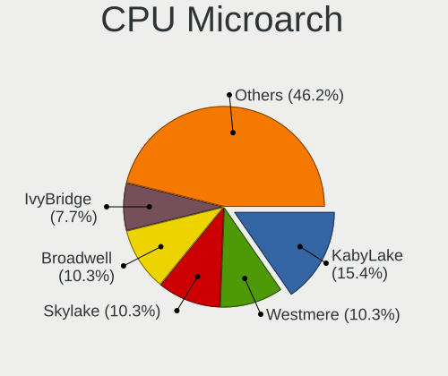

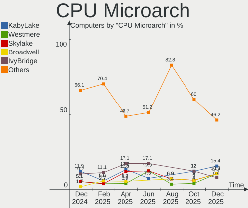

| Name             | Computers | Percent |
|------------------|-----------|---------|
| KabyLake         | 6         | 15.38%  |
| Westmere         | 4         | 10.26%  |
| Skylake          | 4         | 10.26%  |
| Broadwell        | 4         | 10.26%  |
| IvyBridge        | 3         | 7.69%   |
| Haswell          | 3         | 7.69%   |
| K10              | 2         | 5.13%   |
| Alderlake Hybrid | 2         | 5.13%   |
| Zen+             | 1         | 2.56%   |
| Zen 3            | 1         | 2.56%   |
| Zen 2            | 1         | 2.56%   |
| Zen              | 1         | 2.56%   |
| Silvermont       | 1         | 2.56%   |
| SandyBridge      | 1         | 2.56%   |
| Penryn           | 1         | 2.56%   |
| Nehalem          | 1         | 2.56%   |
| K10 Llano        | 1         | 2.56%   |
| Goldmont         | 1         | 2.56%   |
| Bonnell          | 1         | 2.56%   |

Graphics
--------

GPU Vendor
----------

Vendors of graphics cards

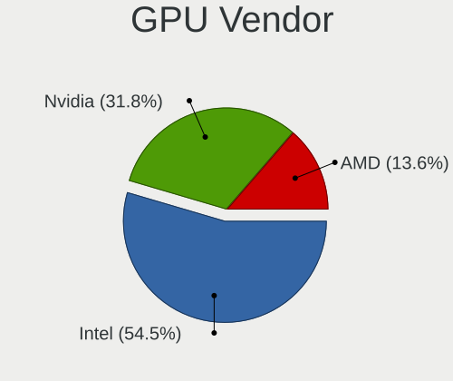

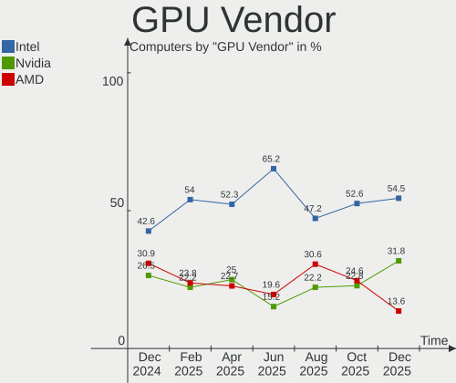

| Vendor | Computers | Percent |
|--------|-----------|---------|
| Intel  | 24        | 54.55%  |
| Nvidia | 14        | 31.82%  |
| AMD    | 6         | 13.64%  |

GPU Model
---------

Graphics card models

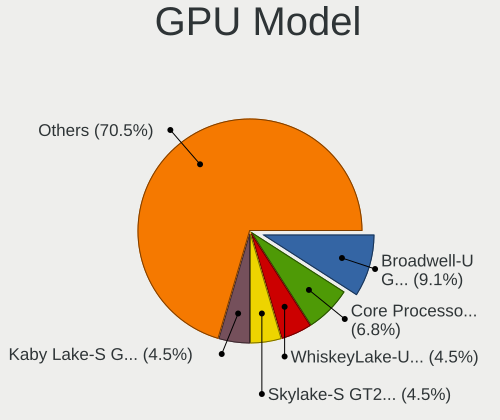

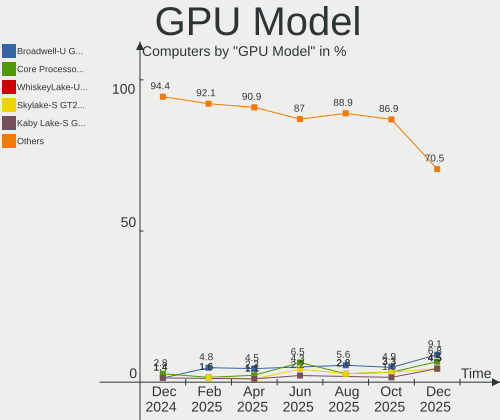

| Model                                                                                    | Computers | Percent |
|------------------------------------------------------------------------------------------|-----------|---------|
| Intel Broadwell-U GT2 [HD Graphics 5500]                                                 | 4         | 9.09%   |
| Intel Core Processor Integrated Graphics Controller                                      | 3         | 6.82%   |
| Intel WhiskeyLake-U GT2 [UHD Graphics 620]                                               | 2         | 4.55%   |
| Intel Skylake-S GT2 [HD Graphics 530]                                                    | 2         | 4.55%   |
| Intel Kaby Lake-S GT2 [HD Graphics 630]                                                  | 2         | 4.55%   |
| Nvidia TU117M [GeForce GTX 1650 Ti Mobile]                                               | 1         | 2.27%   |
| Nvidia TU117GLM [Quadro T2000 Mobile / Max-Q]                                            | 1         | 2.27%   |
| Nvidia TU106 [GeForce RTX 2060 Rev. A]                                                   | 1         | 2.27%   |
| Nvidia TU104 [GeForce RTX 2060]                                                          | 1         | 2.27%   |
| Nvidia GT218M [GeForce 315M]                                                             | 1         | 2.27%   |
| Nvidia GT218 [GeForce 210]                                                               | 1         | 2.27%   |
| Nvidia GP107 [GeForce GTX 1050 Ti]                                                       | 1         | 2.27%   |
| Nvidia GM107M [GeForce GTX 950M]                                                         | 1         | 2.27%   |
| Nvidia GK208BM [GeForce 920M]                                                            | 1         | 2.27%   |
| Nvidia GK208B [GeForce GT 730]                                                           | 1         | 2.27%   |
| Nvidia GK104 [GeForce GTX 760]                                                           | 1         | 2.27%   |
| Nvidia GF116 [GeForce GTX 550 Ti]                                                        | 1         | 2.27%   |
| Nvidia GF108 [GeForce GT 630]                                                            | 1         | 2.27%   |
| Nvidia GA106 [GeForce RTX 3060]                                                          | 1         | 2.27%   |
| Intel Xeon E3-1200 v2/3rd Gen Core processor Graphics Controller                         | 1         | 2.27%   |
| Intel Skylake-U GT2 [HD Graphics 520]                                                    | 1         | 2.27%   |
| Intel Haswell-ULT Integrated Graphics Controller                                         | 1         | 2.27%   |
| Intel Crystal Well Integrated Graphics Controller                                        | 1         | 2.27%   |
| Intel CoffeeLake-H GT2 [UHD Graphics 630]                                                | 1         | 2.27%   |
| Intel Atom/Celeron/Pentium Processor x5-E8000/J3xxx/N3xxx Integrated Graphics Controller | 1         | 2.27%   |
| Intel Atom Processor D4xx/D5xx/N4xx/N5xx Integrated Graphics Controller                  | 1         | 2.27%   |
| Intel Apollo Lake [HD Graphics 505]                                                      | 1         | 2.27%   |
| Intel Alder Lake-S GT1 [UHD Graphics 730]                                                | 1         | 2.27%   |
| Intel 3rd Gen Core processor Graphics Controller                                         | 1         | 2.27%   |
| Intel 2nd Generation Core Processor Family Integrated Graphics Controller                | 1         | 2.27%   |
| AMD Turks XT [Radeon HD 6670/7670]                                                       | 1         | 2.27%   |
| AMD Sumo [Radeon HD 6550D]                                                               | 1         | 2.27%   |
| AMD Renoir [Radeon Vega Series / Radeon Vega Mobile Series]                              | 1         | 2.27%   |
| AMD Navi 23 [Radeon RX 6600/6600 XT/6600M]                                               | 1         | 2.27%   |
| AMD Madison [Mobility Radeon HD 5650/5750 / 6530M/6550M]                                 | 1         | 2.27%   |
| AMD Juniper PRO [Radeon HD 5750]                                                         | 1         | 2.27%   |

GPU Combo
---------

Combinations of graphics cards

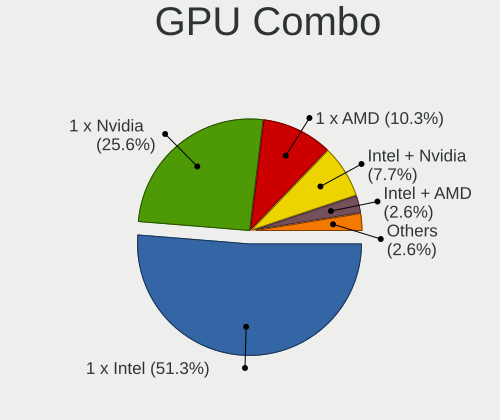

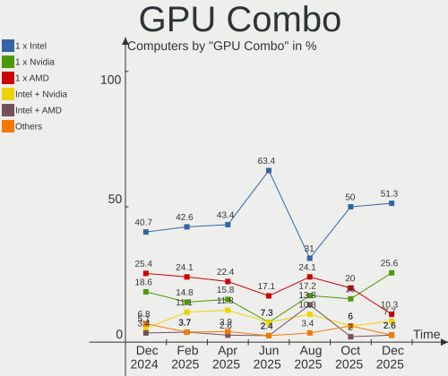

| Name           | Computers | Percent |
|----------------|-----------|---------|
| 1 x Intel      | 20        | 51.28%  |
| 1 x Nvidia     | 10        | 25.64%  |
| 1 x AMD        | 4         | 10.26%  |
| Intel + Nvidia | 3         | 7.69%   |
| Intel + AMD    | 1         | 2.56%   |
| AMD + Nvidia   | 1         | 2.56%   |

GPU Driver
----------

Free vs proprietary

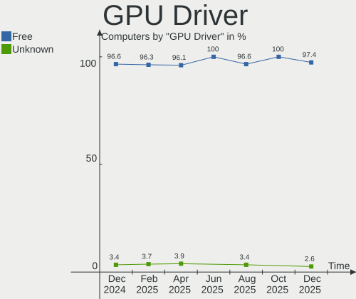

| Driver  | Computers | Percent |
|---------|-----------|---------|
| Free    | 38        | 97.44%  |
| Unknown | 1         | 2.56%   |

GPU Memory
----------

Total video memory

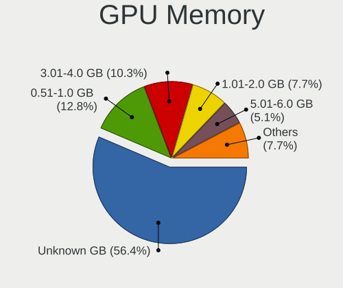

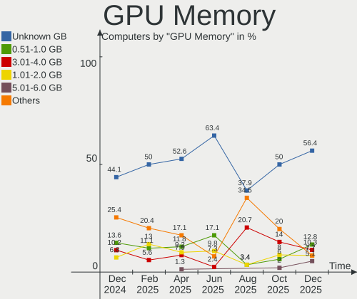

| Size in GB | Computers | Percent |
|------------|-----------|---------|
| Unknown    | 22        | 56.41%  |
| 0.51-1.0   | 5         | 12.82%  |
| 3.01-4.0   | 4         | 10.26%  |
| 1.01-2.0   | 3         | 7.69%   |
| 5.01-6.0   | 2         | 5.13%   |
| 0.01-0.5   | 2         | 5.13%   |
| 7.01-8.0   | 1         | 2.56%   |

Monitor
-------

Monitor Vendor
--------------

Monitor vendors

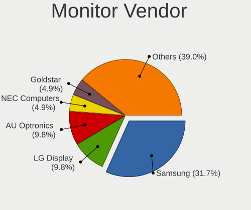

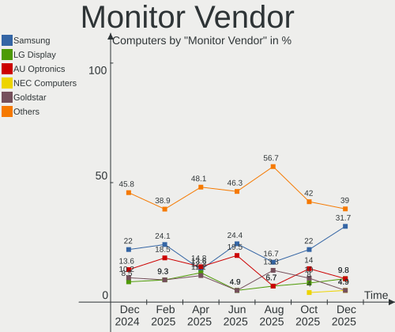

| Vendor               | Computers | Percent |
|----------------------|-----------|---------|
| Samsung Electronics  | 13        | 31.71%  |
| LG Display           | 4         | 9.76%   |
| AU Optronics         | 4         | 9.76%   |
| NEC Computers        | 2         | 4.88%   |
| Goldstar             | 2         | 4.88%   |
| Chimei Innolux       | 2         | 4.88%   |
| Ancor Communications | 2         | 4.88%   |
| TCL                  | 1         | 2.44%   |
| Sony                 | 1         | 2.44%   |
| SKG                  | 1         | 2.44%   |
| Philips              | 1         | 2.44%   |
| PANDA                | 1         | 2.44%   |
| OEM                  | 1         | 2.44%   |
| Medion               | 1         | 2.44%   |
| Lenovo               | 1         | 2.44%   |
| Dell                 | 1         | 2.44%   |
| BOE                  | 1         | 2.44%   |
| BenQ                 | 1         | 2.44%   |
| Acer                 | 1         | 2.44%   |

Monitor Model
-------------

Monitor models

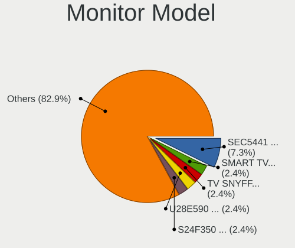

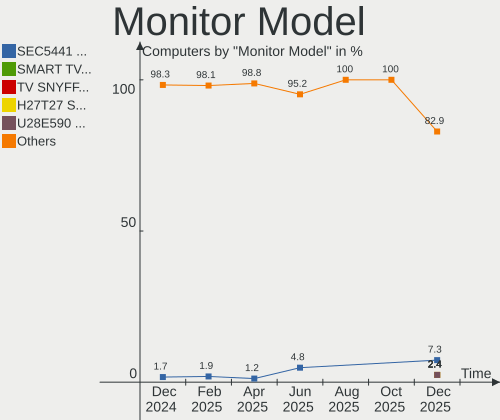

| Model                                                                  | Computers | Percent |
|------------------------------------------------------------------------|-----------|---------|
| Samsung Electronics LCD Monitor SEC5441 1280x800 331x207mm 15.4-inch   | 3         | 7.32%   |
| TCL SMART TV TCL6586 3840x2160 1209x680mm 54.6-inch                    | 1         | 2.44%   |
| Sony TV SNYFF00 1360x768                                               | 1         | 2.44%   |
| SKG H27T27 SKG2752 2560x1440 531x298mm 24.0-inch                       | 1         | 2.44%   |
| Samsung Electronics U28E590 SAM0C4E 3840x2160 608x345mm 27.5-inch      | 1         | 2.44%   |
| Samsung Electronics S24F350 SAM0D20 1920x1080 521x293mm 23.5-inch      | 1         | 2.44%   |
| Samsung Electronics S24C31x SAM7311 1920x1080 527x296mm 23.8-inch      | 1         | 2.44%   |
| Samsung Electronics LS32CG51x SAM72FE 2560x1440 697x392mm 31.5-inch    | 1         | 2.44%   |
| Samsung Electronics LS27AG30x SAM717A 1920x1080 597x336mm 27.0-inch    | 1         | 2.44%   |
| Samsung Electronics LCD Monitor SEC3051 1366x768 344x194mm 15.5-inch   | 1         | 2.44%   |
| Samsung Electronics LCD Monitor SDC4141 1366x768 344x194mm 15.5-inch   | 1         | 2.44%   |
| Samsung Electronics LCD Monitor SDC354A 1366x768 344x194mm 15.5-inch   | 1         | 2.44%   |
| Samsung Electronics LCD Monitor SAM07DE 1920x1080 1120x630mm 50.6-inch | 1         | 2.44%   |
| Samsung Electronics LCD Monitor SAM04FB 1920x1080                      | 1         | 2.44%   |
| Philips 221TE PHLC062 1920x1080 476x268mm 21.5-inch                    | 1         | 2.44%   |
| PANDA LCD Monitor NCP0058 1920x1080 344x194mm 15.5-inch                | 1         | 2.44%   |
| OEM 32W_LCD_TV OEM3700 1920x540                                        | 1         | 2.44%   |
| NEC Computers EA231WMi NEC677A 1920x1080 510x287mm 23.0-inch           | 1         | 2.44%   |
| NEC Computers EA223WM NEC6891 1680x1050 474x296mm 22.0-inch            | 1         | 2.44%   |
| Medion MD20328 MED3941 1600x900 462x272mm 21.1-inch                    | 1         | 2.44%   |
| LG Display LCD Monitor LGD060A 1920x1080 294x165mm 13.3-inch           | 1         | 2.44%   |
| LG Display LCD Monitor LGD04F9 1920x1080 309x174mm 14.0-inch           | 1         | 2.44%   |
| LG Display LCD Monitor LGD046F 1920x1080 344x194mm 15.5-inch           | 1         | 2.44%   |
| LG Display LCD Monitor LGD01B5 1366x768 310x174mm 14.0-inch            | 1         | 2.44%   |
| Lenovo LCD Monitor LEN40BA 1920x1080 344x194mm 15.5-inch               | 1         | 2.44%   |
| Goldstar FHD GSM5C66 1920x1080 527x296mm 23.8-inch                     | 1         | 2.44%   |
| Goldstar 34GL750 GSM773B 2560x1080 798x334mm 34.1-inch                 | 1         | 2.44%   |
| Dell P2219H DELA115 1920x1080 476x267mm 21.5-inch                      | 1         | 2.44%   |
| Chimei Innolux LCD Monitor CMN15BF 1366x768 344x194mm 15.5-inch        | 1         | 2.44%   |
| Chimei Innolux LCD Monitor CMN1482 1600x900 309x174mm 14.0-inch        | 1         | 2.44%   |
| BOE LCD Monitor BOE0687 1920x1080 344x193mm 15.5-inch                  | 1         | 2.44%   |
| BenQ GW2760 BNQ78C6 1920x1080 598x336mm 27.0-inch                      | 1         | 2.44%   |
| AU Optronics LCD Monitor AUO71EC 1366x768 344x193mm 15.5-inch          | 1         | 2.44%   |
| AU Optronics LCD Monitor AUO43EC 1366x768 344x193mm 15.5-inch          | 1         | 2.44%   |
| AU Optronics LCD Monitor AUO303E 1600x900 309x174mm 14.0-inch          | 1         | 2.44%   |
| AU Optronics LCD Monitor AUO129E 1600x900 382x214mm 17.2-inch          | 1         | 2.44%   |
| Ancor Communications VX228 ACI22C1 1920x1080 476x268mm 21.5-inch       | 1         | 2.44%   |
| Ancor Communications VC279 ACI27C4 1920x1080 598x336mm 27.0-inch       | 1         | 2.44%   |
| Acer V226HQL B ACR0620 1920x1080 477x268mm 21.5-inch                   | 1         | 2.44%   |

Monitor Resolution
------------------

Monitor screen resolution

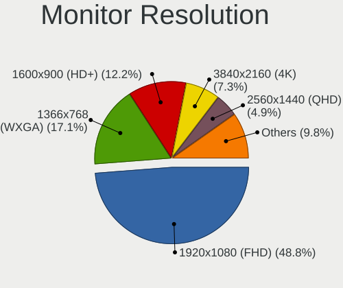

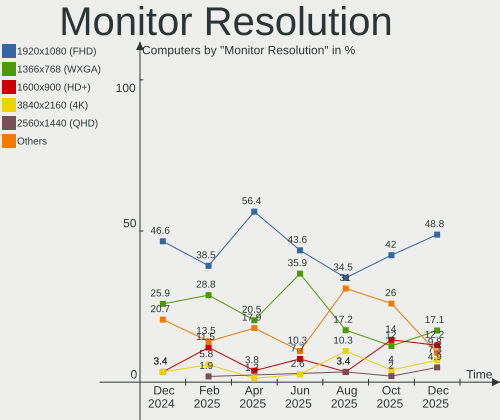

| Resolution         | Computers | Percent |
|--------------------|-----------|---------|
| 1920x1080 (FHD)    | 20        | 48.78%  |
| 1366x768 (WXGA)    | 7         | 17.07%  |
| 1600x900 (HD+)     | 5         | 12.2%   |
| 3840x2160 (4K)     | 3         | 7.32%   |
| 2560x1440 (QHD)    | 2         | 4.88%   |
| 2560x1080          | 1         | 2.44%   |
| 1920x540           | 1         | 2.44%   |
| 1680x1050 (WSXGA+) | 1         | 2.44%   |
| 1360x768           | 1         | 2.44%   |

Monitor Diagonal
----------------

Diagonal size in inches

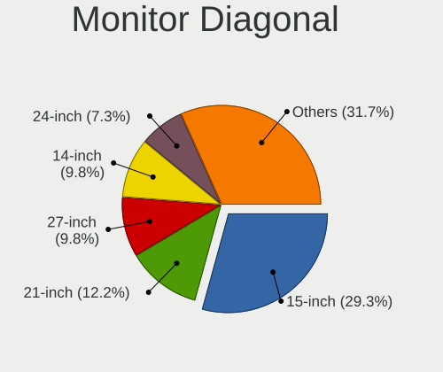

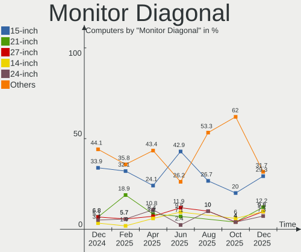

| Inches  | Computers | Percent |
|---------|-----------|---------|
| 15      | 12        | 29.27%  |
| 21      | 5         | 12.2%   |
| 27      | 4         | 9.76%   |
| 14      | 4         | 9.76%   |
| 24      | 3         | 7.32%   |
| 23      | 2         | 4.88%   |
| 72      | 1         | 2.44%   |
| 54      | 1         | 2.44%   |
| 50      | 1         | 2.44%   |
| 34      | 1         | 2.44%   |
| 31      | 1         | 2.44%   |
| 28      | 1         | 2.44%   |
| 22      | 1         | 2.44%   |
| 18      | 1         | 2.44%   |
| 17      | 1         | 2.44%   |
| 13      | 1         | 2.44%   |
| Unknown | 1         | 2.44%   |

Monitor Width
-------------

Physical width

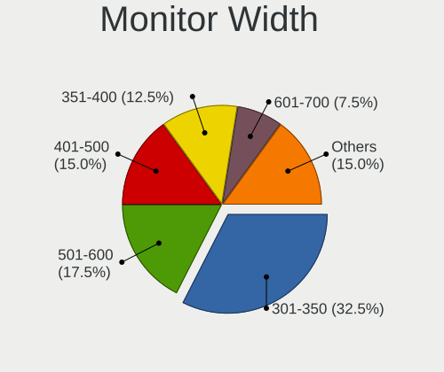

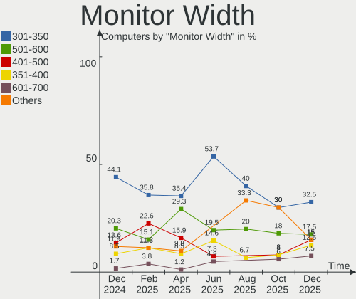

| Width in mm | Computers | Percent |
|-------------|-----------|---------|
| 301-350     | 13        | 32.5%   |
| 501-600     | 7         | 17.5%   |
| 401-500     | 6         | 15%     |
| 351-400     | 5         | 12.5%   |
| 601-700     | 3         | 7.5%    |
| 1001-1500   | 2         | 5%      |
| 701-800     | 1         | 2.5%    |
| 201-300     | 1         | 2.5%    |
| 1501-2000   | 1         | 2.5%    |
| Unknown     | 1         | 2.5%    |

Aspect Ratio
------------

Proportional relationship between the width and the height

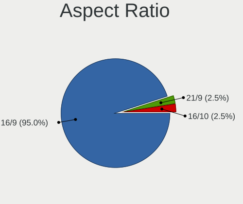

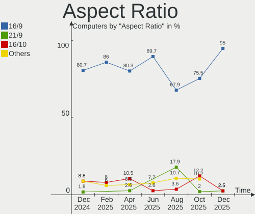

| Ratio | Computers | Percent |
|-------|-----------|---------|
| 16/9  | 38        | 95%     |
| 21/9  | 1         | 2.5%    |
| 16/10 | 1         | 2.5%    |

Monitor Area
------------

Area in inch²

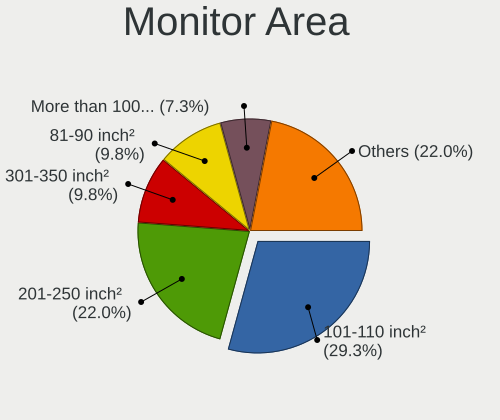

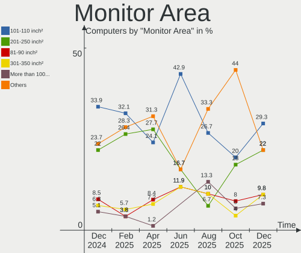

| Area in inch² | Computers | Percent |
|----------------|-----------|---------|
| 101-110        | 12        | 29.27%  |
| 201-250        | 9         | 21.95%  |
| 81-90          | 4         | 9.76%   |
| 301-350        | 4         | 9.76%   |
| More than 1000 | 3         | 7.32%   |
| 351-500        | 3         | 7.32%   |
| 151-200        | 2         | 4.88%   |
| 71-80          | 1         | 2.44%   |
| 141-150        | 1         | 2.44%   |
| 121-130        | 1         | 2.44%   |
| Unknown        | 1         | 2.44%   |

Pixel Density
-------------

Pixels per inch

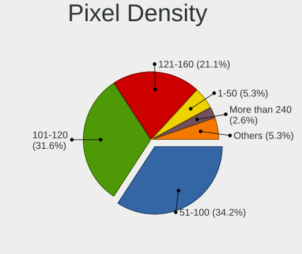

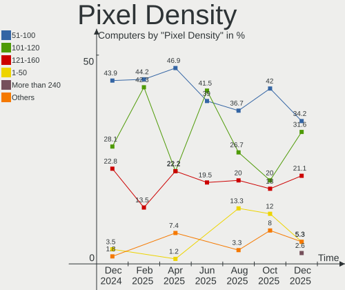

| Density       | Computers | Percent |
|---------------|-----------|---------|
| 51-100        | 13        | 34.21%  |
| 101-120       | 12        | 31.58%  |
| 121-160       | 8         | 21.05%  |
| 1-50          | 2         | 5.26%   |
| More than 240 | 1         | 2.63%   |
| 161-240       | 1         | 2.63%   |
| Unknown       | 1         | 2.63%   |

Multiple Monitors
-----------------

Total monitors connected

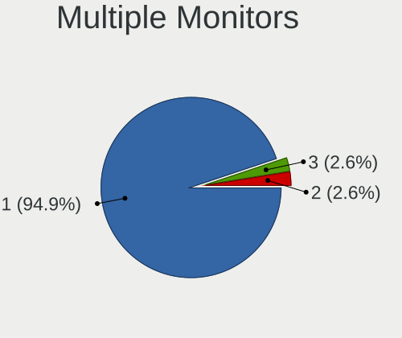

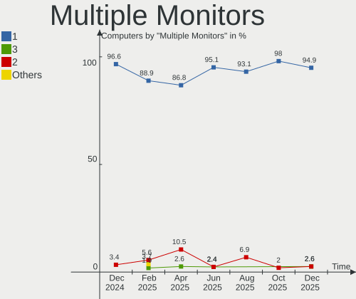

| Total | Computers | Percent |
|-------|-----------|---------|
| 1     | 37        | 94.87%  |
| 3     | 1         | 2.56%   |
| 2     | 1         | 2.56%   |

Network
-------

Net Controller Vendor
---------------------

Controller vendors

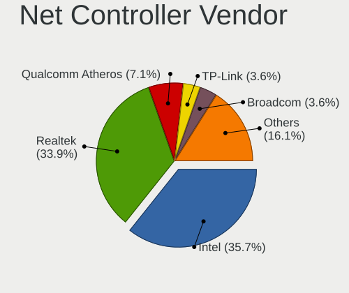

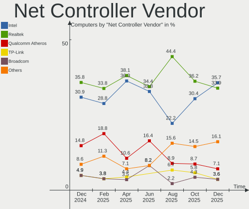

| Vendor                          | Computers | Percent |
|---------------------------------|-----------|---------|
| Intel                           | 20        | 35.71%  |
| Realtek Semiconductor           | 19        | 33.93%  |
| Qualcomm Atheros                | 4         | 7.14%   |
| TP-Link                         | 2         | 3.57%   |
| Broadcom                        | 2         | 3.57%   |
| T & A Mobile Phones             | 1         | 1.79%   |
| Ralink Technology               | 1         | 1.79%   |
| Ralink                          | 1         | 1.79%   |
| Qualcomm Atheros Communications | 1         | 1.79%   |
| Nvidia                          | 1         | 1.79%   |
| NetGear                         | 1         | 1.79%   |
| MediaTek                        | 1         | 1.79%   |
| IMC Networks                    | 1         | 1.79%   |
| Fibocom                         | 1         | 1.79%   |

Net Controller Model
--------------------

Controller models

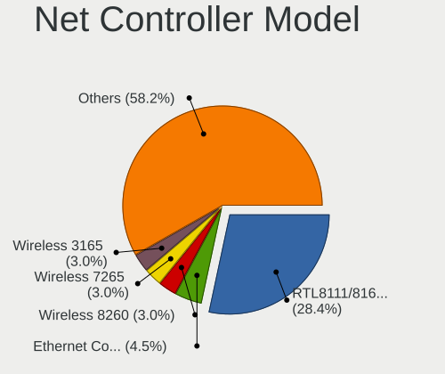

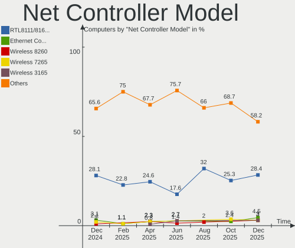

| Model                                                                         | Computers | Percent |
|-------------------------------------------------------------------------------|-----------|---------|
| Realtek RTL8111/8168/8211/8411 PCI Express Gigabit Ethernet Controller        | 19        | 28.36%  |
| Intel Ethernet Connection (2) I219-V                                          | 3         | 4.48%   |
| Intel Wireless 8260                                                           | 2         | 2.99%   |
| Intel Wireless 7265                                                           | 2         | 2.99%   |
| Intel Wireless 3165                                                           | 2         | 2.99%   |
| Intel Ethernet Connection (6) I219-LM                                         | 2         | 2.99%   |
| Intel Ethernet Connection (3) I218-LM                                         | 2         | 2.99%   |
| Intel Centrino Advanced-N 6200                                                | 2         | 2.99%   |
| Intel Cannon Point-LP CNVi [Wireless-AC]                                      | 2         | 2.99%   |
| Intel 82577LM Gigabit Network Connection                                      | 2         | 2.99%   |
| TP-Link TL-WN823N v2/v3 [Realtek RTL8192EU]                                   | 1         | 1.49%   |
| TP-Link 802.11ac WLAN Adapter                                                 | 1         | 1.49%   |
| T & A Mobile Phones AQUOS V6                                                  | 1         | 1.49%   |
| Realtek RTL8822CE 802.11ac PCIe Wireless Network Adapter                      | 1         | 1.49%   |
| Realtek RTL8723DE Wireless Network Adapter                                    | 1         | 1.49%   |
| Ralink RT5372 Wireless Adapter                                                | 1         | 1.49%   |
| Ralink RT5390 Wireless 802.11n 1T/1R PCIe                                     | 1         | 1.49%   |
| Qualcomm Atheros QCA9565 / AR9565 Wireless Network Adapter                    | 1         | 1.49%   |
| Qualcomm Atheros AR9271 802.11n                                               | 1         | 1.49%   |
| Qualcomm Atheros AR9285 Wireless Network Adapter (PCI-Express)                | 1         | 1.49%   |
| Qualcomm Atheros AR8151 v2.0 Gigabit Ethernet                                 | 1         | 1.49%   |
| Qualcomm Atheros AR2413/AR2414 Wireless Network Adapter [AR5005G(S) 802.11bg] | 1         | 1.49%   |
| Nvidia MCP61 Ethernet                                                         | 1         | 1.49%   |
| NetGear WNA3100(v1) Wireless-N 300 [Broadcom BCM43231]                        | 1         | 1.49%   |
| MediaTek MT7630e 802.11bgn Wireless Network Adapter                           | 1         | 1.49%   |
| Intel Wi-Fi 6 AX200                                                           | 1         | 1.49%   |
| Intel Ethernet Connection I219-LM                                             | 1         | 1.49%   |
| Intel Ethernet Connection (7) I219-V                                          | 1         | 1.49%   |
| Intel Ethernet Connection (7) I219-LM                                         | 1         | 1.49%   |
| Intel Ethernet Connection (2) I219-LM                                         | 1         | 1.49%   |
| Intel Centrino Wireless-N 1030 [Rainbow Peak]                                 | 1         | 1.49%   |
| Intel Centrino Advanced-N 6205 [Taylor Peak]                                  | 1         | 1.49%   |
| Intel Cannon Lake PCH CNVi WiFi                                               | 1         | 1.49%   |
| Intel 82579LM Gigabit Network Connection (Lewisville)                         | 1         | 1.49%   |
| Intel 82567LM-3 Gigabit Network Connection                                    | 1         | 1.49%   |
| IMC Networks Mediao 802.11n WLAN [Realtek RTL8191SU]                          | 1         | 1.49%   |
| Fibocom L830-EB-00 LTE WWAN Modem                                             | 1         | 1.49%   |
| Broadcom NetXtreme BCM57786 Gigabit Ethernet PCIe                             | 1         | 1.49%   |
| Broadcom BCM4313 802.11bgn Wireless Network Adapter                           | 1         | 1.49%   |

Wireless Vendor
---------------

Wireless vendors

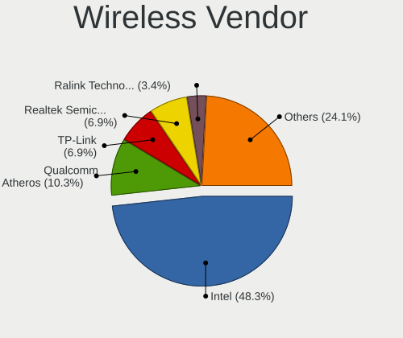

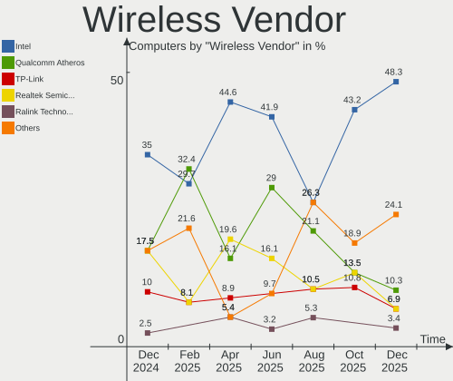

| Vendor                          | Computers | Percent |
|---------------------------------|-----------|---------|
| Intel                           | 14        | 48.28%  |
| Qualcomm Atheros                | 3         | 10.34%  |
| TP-Link                         | 2         | 6.9%    |
| Realtek Semiconductor           | 2         | 6.9%    |
| Ralink Technology               | 1         | 3.45%   |
| Ralink                          | 1         | 3.45%   |
| Qualcomm Atheros Communications | 1         | 3.45%   |
| NetGear                         | 1         | 3.45%   |
| MediaTek                        | 1         | 3.45%   |
| IMC Networks                    | 1         | 3.45%   |
| Fibocom                         | 1         | 3.45%   |
| Broadcom                        | 1         | 3.45%   |

Wireless Model
--------------

Wireless models

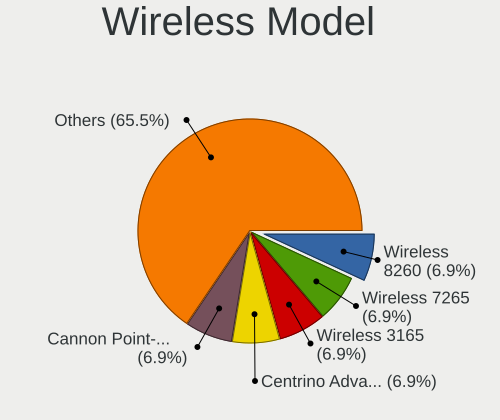

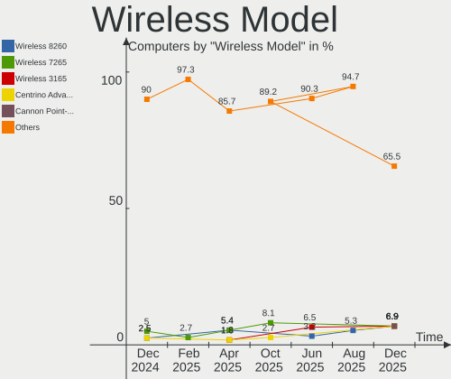

| Model                                                                         | Computers | Percent |
|-------------------------------------------------------------------------------|-----------|---------|
| Intel Wireless 8260                                                           | 2         | 6.9%    |
| Intel Wireless 7265                                                           | 2         | 6.9%    |
| Intel Wireless 3165                                                           | 2         | 6.9%    |
| Intel Centrino Advanced-N 6200                                                | 2         | 6.9%    |
| Intel Cannon Point-LP CNVi [Wireless-AC]                                      | 2         | 6.9%    |
| TP-Link TL-WN823N v2/v3 [Realtek RTL8192EU]                                   | 1         | 3.45%   |
| TP-Link 802.11ac WLAN Adapter                                                 | 1         | 3.45%   |
| Realtek RTL8822CE 802.11ac PCIe Wireless Network Adapter                      | 1         | 3.45%   |
| Realtek RTL8723DE Wireless Network Adapter                                    | 1         | 3.45%   |
| Ralink RT5372 Wireless Adapter                                                | 1         | 3.45%   |
| Ralink RT5390 Wireless 802.11n 1T/1R PCIe                                     | 1         | 3.45%   |
| Qualcomm Atheros QCA9565 / AR9565 Wireless Network Adapter                    | 1         | 3.45%   |
| Qualcomm Atheros AR9271 802.11n                                               | 1         | 3.45%   |
| Qualcomm Atheros AR9285 Wireless Network Adapter (PCI-Express)                | 1         | 3.45%   |
| Qualcomm Atheros AR2413/AR2414 Wireless Network Adapter [AR5005G(S) 802.11bg] | 1         | 3.45%   |
| NetGear WNA3100(v1) Wireless-N 300 [Broadcom BCM43231]                        | 1         | 3.45%   |
| MediaTek MT7630e 802.11bgn Wireless Network Adapter                           | 1         | 3.45%   |
| Intel Wi-Fi 6 AX200                                                           | 1         | 3.45%   |
| Intel Centrino Wireless-N 1030 [Rainbow Peak]                                 | 1         | 3.45%   |
| Intel Centrino Advanced-N 6205 [Taylor Peak]                                  | 1         | 3.45%   |
| Intel Cannon Lake PCH CNVi WiFi                                               | 1         | 3.45%   |
| IMC Networks Mediao 802.11n WLAN [Realtek RTL8191SU]                          | 1         | 3.45%   |
| Fibocom L830-EB-00 LTE WWAN Modem                                             | 1         | 3.45%   |
| Broadcom BCM4313 802.11bgn Wireless Network Adapter                           | 1         | 3.45%   |

Ethernet Vendor
---------------

Ethernet vendors

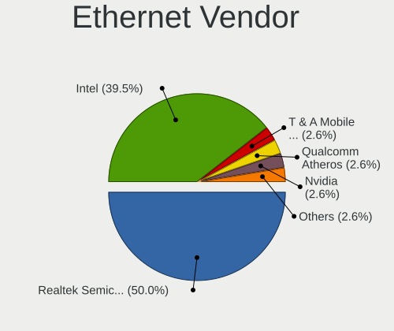

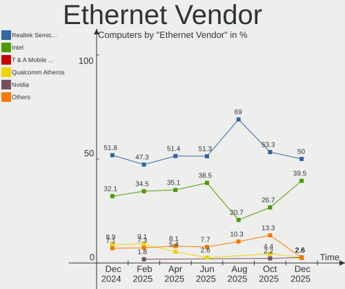

| Vendor                | Computers | Percent |
|-----------------------|-----------|---------|
| Realtek Semiconductor | 19        | 50%     |
| Intel                 | 15        | 39.47%  |
| T & A Mobile Phones   | 1         | 2.63%   |
| Qualcomm Atheros      | 1         | 2.63%   |
| Nvidia                | 1         | 2.63%   |
| Broadcom              | 1         | 2.63%   |

Ethernet Model
--------------

Ethernet models

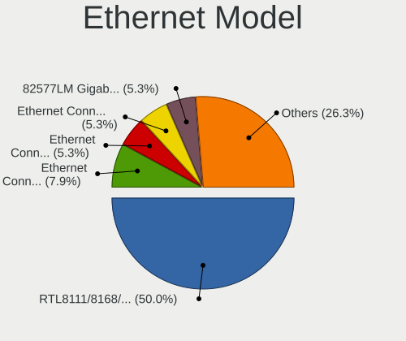

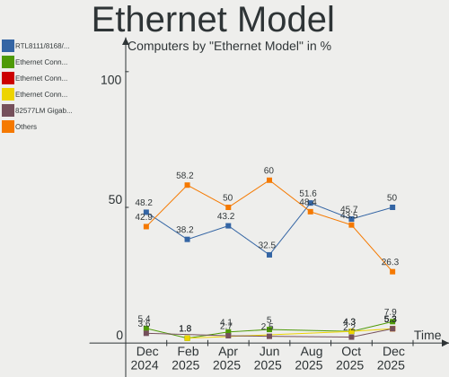

| Model                                                                  | Computers | Percent |
|------------------------------------------------------------------------|-----------|---------|
| Realtek RTL8111/8168/8211/8411 PCI Express Gigabit Ethernet Controller | 19        | 50%     |
| Intel Ethernet Connection (2) I219-V                                   | 3         | 7.89%   |
| Intel Ethernet Connection (6) I219-LM                                  | 2         | 5.26%   |
| Intel Ethernet Connection (3) I218-LM                                  | 2         | 5.26%   |
| Intel 82577LM Gigabit Network Connection                               | 2         | 5.26%   |
| T & A Mobile Phones AQUOS V6                                           | 1         | 2.63%   |
| Qualcomm Atheros AR8151 v2.0 Gigabit Ethernet                          | 1         | 2.63%   |
| Nvidia MCP61 Ethernet                                                  | 1         | 2.63%   |
| Intel Ethernet Connection I219-LM                                      | 1         | 2.63%   |
| Intel Ethernet Connection (7) I219-V                                   | 1         | 2.63%   |
| Intel Ethernet Connection (7) I219-LM                                  | 1         | 2.63%   |
| Intel Ethernet Connection (2) I219-LM                                  | 1         | 2.63%   |
| Intel 82579LM Gigabit Network Connection (Lewisville)                  | 1         | 2.63%   |
| Intel 82567LM-3 Gigabit Network Connection                             | 1         | 2.63%   |
| Broadcom NetXtreme BCM57786 Gigabit Ethernet PCIe                      | 1         | 2.63%   |

Net Controller Kind
-------------------

Ethernet, WiFi or modem

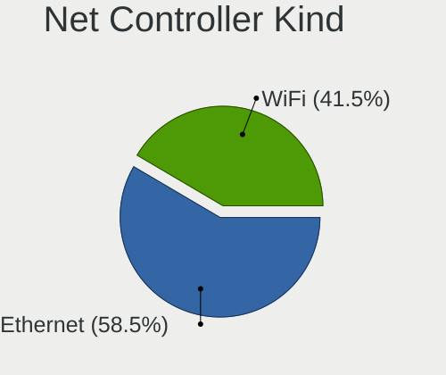

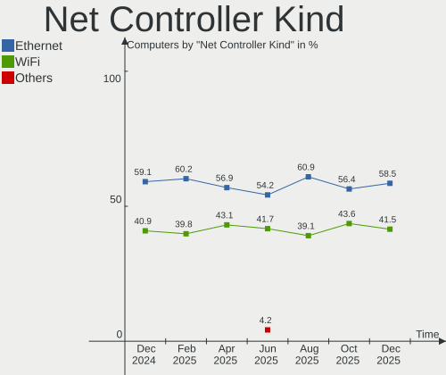

| Kind     | Computers | Percent |
|----------|-----------|---------|
| Ethernet | 38        | 58.46%  |
| WiFi     | 27        | 41.54%  |

Used Controller
---------------

Currently used network controller

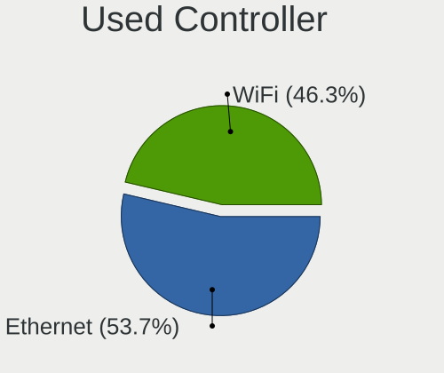

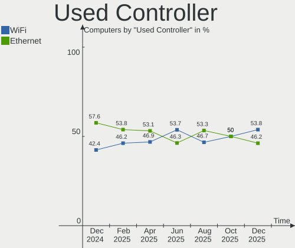

| Kind     | Computers | Percent |
|----------|-----------|---------|
| WiFi     | 21        | 53.85%  |
| Ethernet | 18        | 46.15%  |

NICs
----

Total network controllers on board

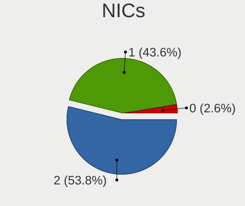

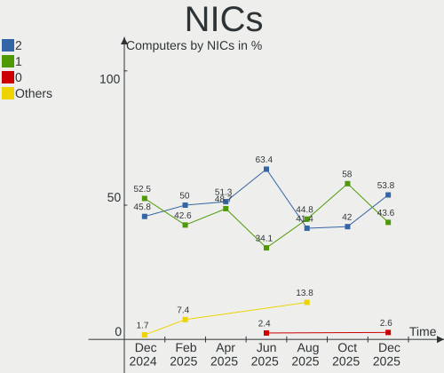

| Total | Computers | Percent |
|-------|-----------|---------|
| 2     | 21        | 53.85%  |
| 1     | 17        | 43.59%  |
| 0     | 1         | 2.56%   |

IPv6
----

IPv6 vs IPv4

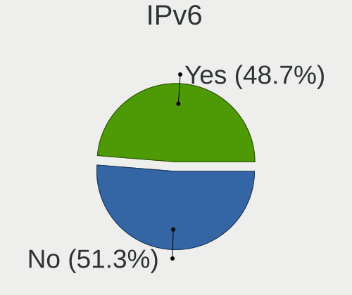

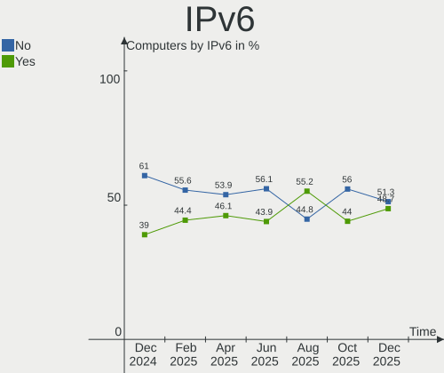

| Used | Computers | Percent |
|------|-----------|---------|
| No   | 20        | 51.28%  |
| Yes  | 19        | 48.72%  |

Bluetooth
---------

Bluetooth Vendor
----------------

Controller vendors

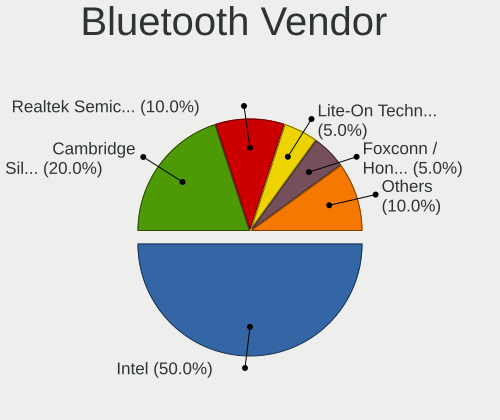

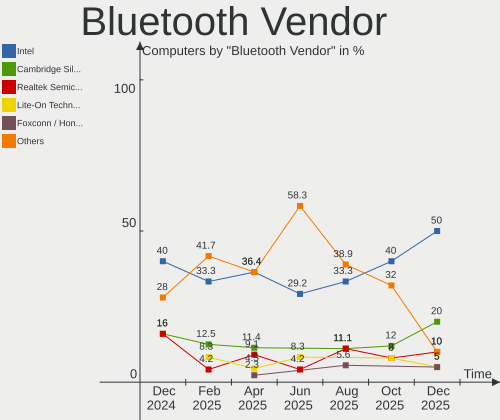

| Vendor                  | Computers | Percent |
|-------------------------|-----------|---------|
| Intel                   | 10        | 50%     |
| Cambridge Silicon Radio | 4         | 20%     |
| Realtek Semiconductor   | 2         | 10%     |
| Lite-On Technology      | 1         | 5%      |
| Foxconn / Hon Hai       | 1         | 5%      |
| Dell                    | 1         | 5%      |
| Askey Computer          | 1         | 5%      |

Bluetooth Model
---------------

Controller models

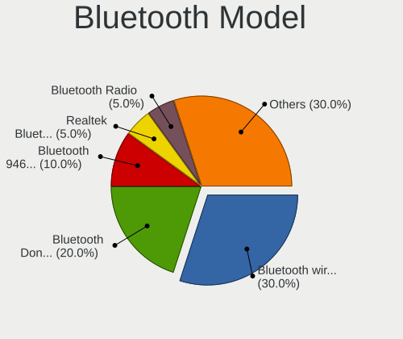

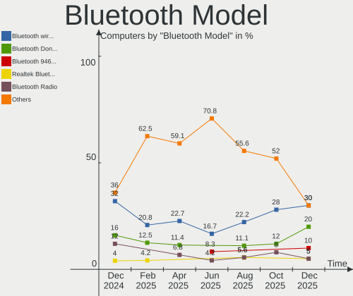

| Model                                               | Computers | Percent |
|-----------------------------------------------------|-----------|---------|
| Intel Bluetooth wireless interface                  | 6         | 30%     |
| Cambridge Silicon Radio Bluetooth Dongle (HCI mode) | 4         | 20%     |
| Intel Bluetooth 9460/9560 Jefferson Peak (JfP)      | 2         | 10%     |
| Realtek  Bluetooth 4.2 Adapter                      | 1         | 5%      |
| Realtek Bluetooth Radio                             | 1         | 5%      |
| Lite-On Atheros AR3012 Bluetooth                    | 1         | 5%      |
| Intel Centrino Advanced-N 6230 Bluetooth adapter    | 1         | 5%      |
| Intel AX200 Bluetooth                               | 1         | 5%      |
| Foxconn / Hon Hai BT                                | 1         | 5%      |
| Dell DW375 Bluetooth Module                         | 1         | 5%      |
| Askey Bluetooth Device                              | 1         | 5%      |

Sound
-----

Sound Vendor
------------

Sound card vendors

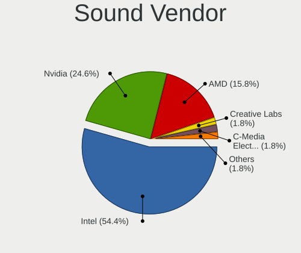

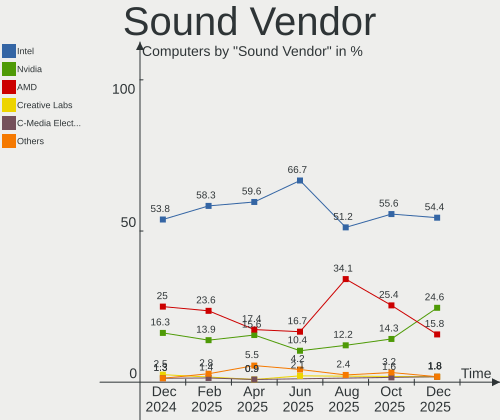

| Vendor              | Computers | Percent |
|---------------------|-----------|---------|
| Intel               | 31        | 54.39%  |
| Nvidia              | 14        | 24.56%  |
| AMD                 | 9         | 15.79%  |
| Creative Labs       | 1         | 1.75%   |
| C-Media Electronics | 1         | 1.75%   |
| ASUSTek Computer    | 1         | 1.75%   |

Sound Model
-----------

Sound card models

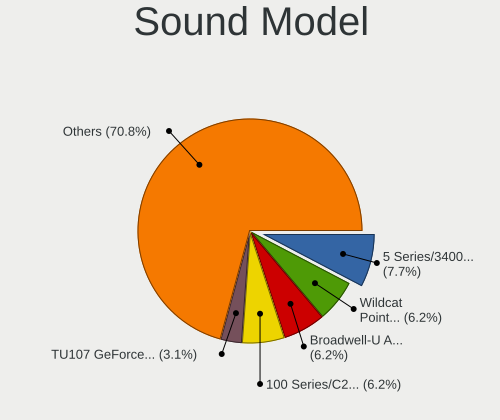

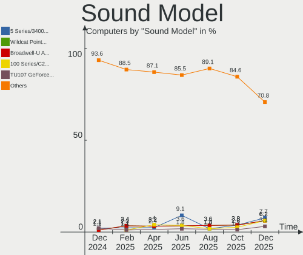

| Model                                                                                             | Computers | Percent |
|---------------------------------------------------------------------------------------------------|-----------|---------|
| Intel 5 Series/3400 Series Chipset High Definition Audio                                          | 5         | 7.69%   |
| Intel Wildcat Point-LP High Definition Audio Controller                                           | 4         | 6.15%   |
| Intel Broadwell-U Audio Controller                                                                | 4         | 6.15%   |
| Intel 100 Series/C230 Series Chipset Family HD Audio Controller                                   | 4         | 6.15%   |
| Nvidia TU107 GeForce GTX 1650 High Definition Audio Controller                                    | 2         | 3.08%   |
| Nvidia High Definition Audio Controller                                                           | 2         | 3.08%   |
| Nvidia GK208 HDMI/DP Audio Controller                                                             | 2         | 3.08%   |
| Intel Cannon Point-LP High Definition Audio Controller                                            | 2         | 3.08%   |
| Intel Cannon Lake PCH cAVS                                                                        | 2         | 3.08%   |
| Intel Alder Lake-S HD Audio Controller                                                            | 2         | 3.08%   |
| Intel 8 Series/C220 Series Chipset High Definition Audio Controller                               | 2         | 3.08%   |
| Intel 7 Series/C216 Chipset Family High Definition Audio Controller                               | 2         | 3.08%   |
| Intel 6 Series/C200 Series Chipset Family High Definition Audio Controller                        | 2         | 3.08%   |
| AMD Ryzen HD Audio Controller                                                                     | 2         | 3.08%   |
| Nvidia TU106 High Definition Audio Controller                                                     | 1         | 1.54%   |
| Nvidia TU104 HD Audio Controller                                                                  | 1         | 1.54%   |
| Nvidia MCP61 High Definition Audio                                                                | 1         | 1.54%   |
| Nvidia GP107GL High Definition Audio Controller                                                   | 1         | 1.54%   |
| Nvidia GK104 HDMI Audio Controller                                                                | 1         | 1.54%   |
| Nvidia GF116 High Definition Audio Controller                                                     | 1         | 1.54%   |
| Nvidia GF108 High Definition Audio Controller                                                     | 1         | 1.54%   |
| Nvidia GA106 High Definition Audio Controller                                                     | 1         | 1.54%   |
| Intel Sunrise Point-LP HD Audio                                                                   | 1         | 1.54%   |
| Intel NM10/ICH7 Family High Definition Audio Controller                                           | 1         | 1.54%   |
| Intel Haswell-ULT HD Audio Controller                                                             | 1         | 1.54%   |
| Intel Crystal Well HD Audio Controller                                                            | 1         | 1.54%   |
| Intel Celeron N3350/Pentium N4200/Atom E3900 Series Audio Cluster                                 | 1         | 1.54%   |
| Intel Atom/Celeron/Pentium Processor x5-E8000/J3xxx/N3xxx Series High Definition Audio Controller | 1         | 1.54%   |
| Intel 82801JD/DO (ICH10 Family) HD Audio Controller                                               | 1         | 1.54%   |
| Intel 8 Series HD Audio Controller                                                                | 1         | 1.54%   |
| Creative Labs CA0132 Sound Core3D [Sound Blaster Recon3D / Z-Series / Sound BlasterX AE-5 Plus]   | 1         | 1.54%   |
| C-Media Electronics CM106 Like Sound Device                                                       | 1         | 1.54%   |
| ASUSTek Computer ASUS ROG Spitfire                                                                | 1         | 1.54%   |
| AMD Turks HDMI Audio [Radeon HD 6500/6600 / 6700M Series]                                         | 1         | 1.54%   |
| AMD Starship/Matisse HD Audio Controller                                                          | 1         | 1.54%   |
| AMD SBx00 Azalia (Intel HDA)                                                                      | 1         | 1.54%   |
| AMD Redwood HDMI Audio [Radeon HD 5000 Series]                                                    | 1         | 1.54%   |
| AMD Navi 21/23 HDMI/DP Audio Controller                                                           | 1         | 1.54%   |
| AMD Juniper HDMI Audio [Radeon HD 5700 Series]                                                    | 1         | 1.54%   |
| AMD FCH Azalia Controller                                                                         | 1         | 1.54%   |

Memory
------

Memory Vendor
-------------

Memory module vendors

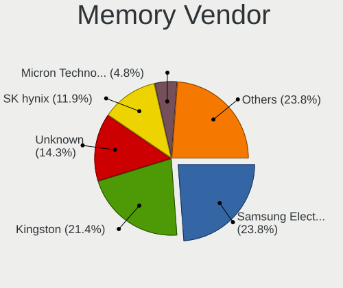

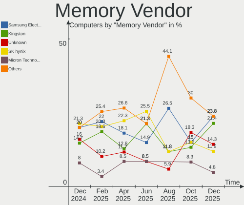

| Vendor              | Computers | Percent |
|---------------------|-----------|---------|
| Samsung Electronics | 10        | 23.81%  |
| Kingston            | 9         | 21.43%  |
| Unknown             | 6         | 14.29%  |
| SK hynix            | 5         | 11.9%   |
| Micron Technology   | 2         | 4.76%   |
| Corsair             | 2         | 4.76%   |
| A-DATA Technology   | 2         | 4.76%   |
| Unknown (AB)        | 1         | 2.38%   |
| Nanya Technology    | 1         | 2.38%   |
| Hikvision           | 1         | 2.38%   |
| Gigabyte Technology | 1         | 2.38%   |
| G.Skill             | 1         | 2.38%   |
| Crucial             | 1         | 2.38%   |

Memory Model
------------

Memory module models

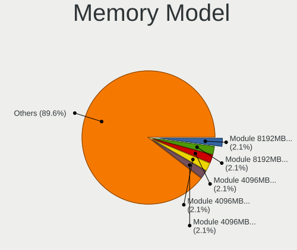

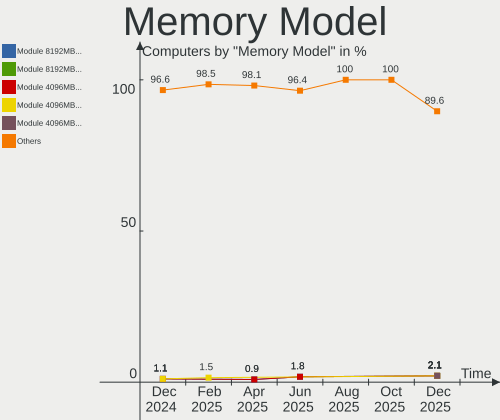

| Model                                                                     | Computers | Percent |
|---------------------------------------------------------------------------|-----------|---------|
| Unknown RAM Module 8192MB DIMM DDR4 2133MT/s                              | 1         | 2.08%   |
| Unknown RAM Module 8192MB DIMM 1333MT/s                                   | 1         | 2.08%   |
| Unknown RAM Module 4096MB DIMM DDR4 2133MT/s                              | 1         | 2.08%   |
| Unknown RAM Module 4096MB DIMM DDR3 1333MT/s                              | 1         | 2.08%   |
| Unknown RAM Module 4096MB DIMM 400MT/s                                    | 1         | 2.08%   |
| Unknown RAM Module 2GB DIMM DDR2 1067MT/s                                 | 1         | 2.08%   |
| Unknown RAM Module 16384MB DIMM DDR4 3200MT/s                             | 1         | 2.08%   |
| Unknown (AB) RAM Module 8192MB SODIMM LPDDR4 1600MT/s                     | 1         | 2.08%   |
| SK hynix RAM HMT41GS6DFR8A-PB 8GB SODIMM DDR3 1600MT/s                    | 1         | 2.08%   |
| SK hynix RAM HMT41GS6AFR8A-PB 8GiB SODIMM DDR3 2667MT/s                   | 1         | 2.08%   |
| SK hynix RAM HMT351S6EFR8A 4GB SODIMM DDR3 1600MT/s                       | 1         | 2.08%   |
| SK hynix RAM HMAB2GS6AMR6N-XN 16GB SODIMM DDR4 3200MT/s                   | 1         | 2.08%   |
| SK hynix RAM HMA81GS6CJR8N-XN 8GB SODIMM DDR4 3200MT/s                    | 1         | 2.08%   |
| SK hynix RAM HMA81GS6AFR8N-UH 8GB SODIMM DDR4 3200MT/s                    | 1         | 2.08%   |
| Samsung RAM Module 8192MB DIMM DDR4 2133MT/s                              | 1         | 2.08%   |
| Samsung RAM M471B5673FH0-CH9 2048MB SODIMM DDR3 1600MT/s                  | 1         | 2.08%   |
| Samsung RAM M471B5273CH0-CH9 4GB SODIMM DDR3 1334MT/s                     | 1         | 2.08%   |
| Samsung RAM M471B5273BH1-CF8 4096MB SODIMM 1067MT/s                       | 1         | 2.08%   |
| Samsung RAM M471B5173DB0-YK0 4GB SODIMM DDR3 1600MT/s                     | 1         | 2.08%   |
| Samsung RAM M471B1G73EB0-YK0 8192MB SODIMM DDR3 1600MT/s                  | 1         | 2.08%   |
| Samsung RAM M471A2K43DB1-CTD 16GB SODIMM DDR4 2667MT/s                    | 1         | 2.08%   |
| Samsung RAM M378B5273DH0-CK0 4GB DIMM DDR3 2200MT/s                       | 1         | 2.08%   |
| Samsung RAM M378B5273DH0-CH9 4GB DIMM DDR3 2133MT/s                       | 1         | 2.08%   |
| Samsung RAM M378B5273CH0-CK0 4GB DIMM DDR3 2000MT/s                       | 1         | 2.08%   |
| Samsung RAM M378A5143DB0-CPB 4GB DIMM DDR4 2400MT/s                       | 1         | 2.08%   |
| Samsung RAM 4D34373142353737334448302D43483920 2048MB SODIMM DDR3 667MT/s | 1         | 2.08%   |
| Nanya RAM NT2GC64B88B0NS-CG 2048MB SODIMM DDR3 1334MT/s                   | 1         | 2.08%   |
| Micron RAM 4ATS1G64HZ-2G6E1 8GB SODIMM DDR4 2667MT/s                      | 1         | 2.08%   |
| Micron RAM 16KTF1G64HZ-1G6E2 8192MB SODIMM DDR3 1867MT/s                  | 1         | 2.08%   |
| Kingston RAM KP223C-ELD 2GB DIMM DDR3 1600MT/s                            | 1         | 2.08%   |
| Kingston RAM KHX1600C9D3/4GX 4GB DIMM DDR3 1867MT/s                       | 1         | 2.08%   |
| Kingston RAM KF556C40-8 8192MB DIMM 5600MT/s                              | 1         | 2.08%   |
| Kingston RAM KF3200C16D4/8GX 8GiB DIMM DDR4 3600MT/s                      | 1         | 2.08%   |
| Kingston RAM ACR16D3LS1NBG/4G 4GB SODIMM DDR3 1600MT/s                    | 1         | 2.08%   |
| Kingston RAM 99U5584-009.A00LF 4GB DIMM DDR3 1600MT/s                     | 1         | 2.08%   |
| Kingston RAM 99U5584-001.A00LF 4GB DIMM DDR3 1600MT/s                     | 1         | 2.08%   |
| Kingston RAM 9905744-023.A00G 16GB SODIMM DDR4 2400MT/s                   | 1         | 2.08%   |
| Kingston RAM 9905584-049.A00LF 4GB DIMM DDR3 1333MT/s                     | 1         | 2.08%   |
| Kingston RAM 9905469-144.A00LF 4GB SODIMM DDR3 1333MT/s                   | 1         | 2.08%   |
| Kingston RAM 9905469-143.A00LF 4096MB SODIMM DDR3 1600MT/s                | 1         | 2.08%   |

Memory Kind
-----------

Memory module kinds

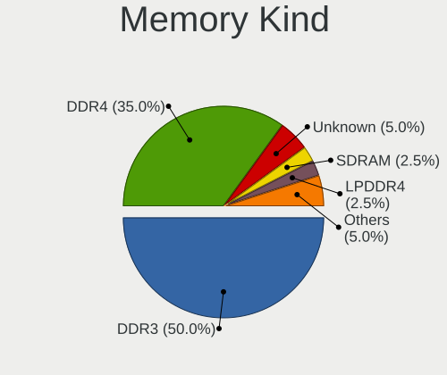

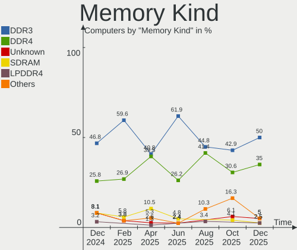

| Kind    | Computers | Percent |
|---------|-----------|---------|
| DDR3    | 20        | 50%     |
| DDR4    | 14        | 35%     |
| Unknown | 2         | 5%      |
| SDRAM   | 1         | 2.5%    |
| LPDDR4  | 1         | 2.5%    |
| DDR5    | 1         | 2.5%    |
| DDR2    | 1         | 2.5%    |

Memory Form Factor
------------------

Physical design of the memory module

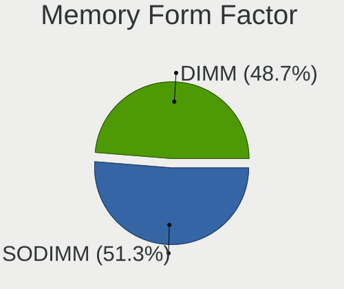

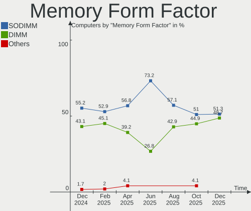

| Name   | Computers | Percent |
|--------|-----------|---------|
| SODIMM | 20        | 51.28%  |
| DIMM   | 19        | 48.72%  |

Memory Size
-----------

Memory module size

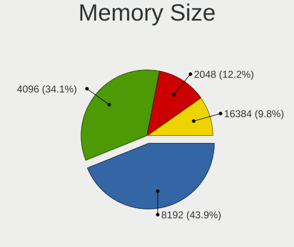

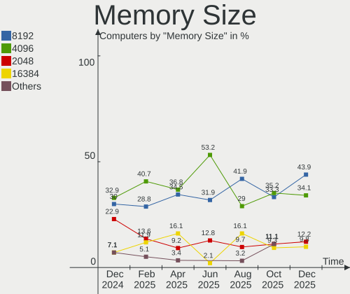

| Size  | Computers | Percent |
|-------|-----------|---------|
| 8192  | 18        | 43.9%   |
| 4096  | 14        | 34.15%  |
| 2048  | 5         | 12.2%   |
| 16384 | 4         | 9.76%   |

Memory Speed
------------

Memory module speed

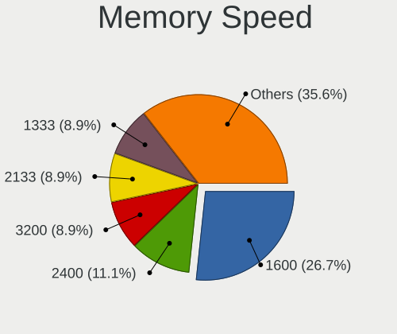

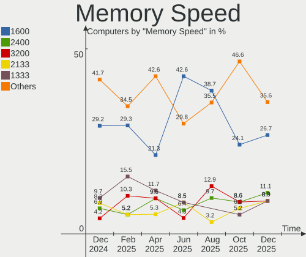

| Speed | Computers | Percent |
|-------|-----------|---------|
| 1600  | 12        | 26.67%  |
| 2400  | 5         | 11.11%  |
| 3200  | 4         | 8.89%   |
| 2133  | 4         | 8.89%   |
| 1333  | 4         | 8.89%   |
| 2667  | 3         | 6.67%   |
| 1334  | 2         | 4.44%   |
| 1067  | 2         | 4.44%   |
| 5600  | 1         | 2.22%   |
| 4200  | 1         | 2.22%   |
| 3600  | 1         | 2.22%   |
| 3066  | 1         | 2.22%   |
| 2200  | 1         | 2.22%   |
| 2000  | 1         | 2.22%   |
| 1867  | 1         | 2.22%   |
| 667   | 1         | 2.22%   |
| 400   | 1         | 2.22%   |

Printers & scanners
-------------------

Printer Vendor
--------------

Printer device vendors

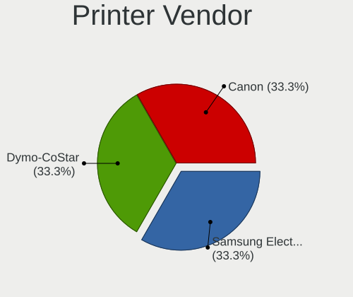

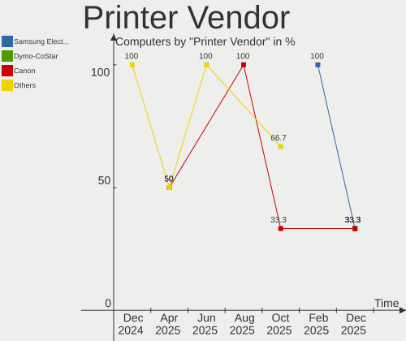

| Vendor              | Computers | Percent |
|---------------------|-----------|---------|
| Samsung Electronics | 1         | 33.33%  |
| Dymo-CoStar         | 1         | 33.33%  |
| Canon               | 1         | 33.33%  |

Printer Model
-------------

Printer device models

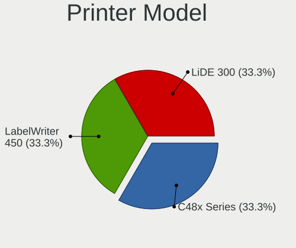

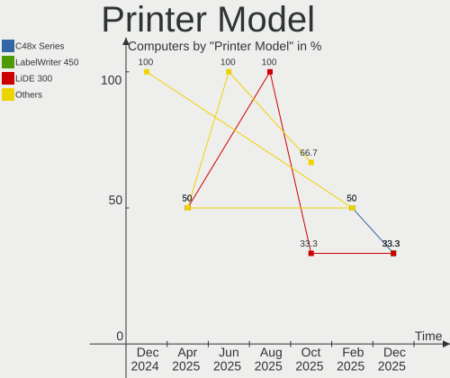

| Model                       | Computers | Percent |
|-----------------------------|-----------|---------|
| Samsung C48x Series         | 1         | 33.33%  |
| Dymo-CoStar LabelWriter 450 | 1         | 33.33%  |
| Canon LiDE 300              | 1         | 33.33%  |

Scanner Vendor
--------------

Scanner device vendors

Zero info for selected period =(

Scanner Model
-------------

Scanner device models

Zero info for selected period =(

Camera
------

Camera Vendor
-------------

Camera device vendors

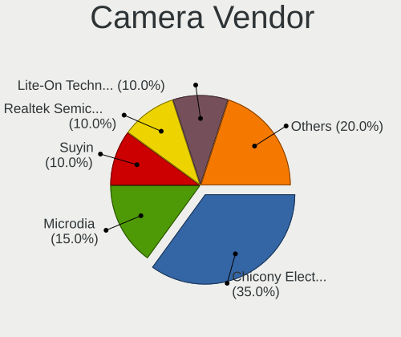

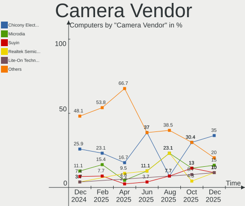

| Vendor                | Computers | Percent |
|-----------------------|-----------|---------|
| Chicony Electronics   | 7         | 35%     |
| Microdia              | 3         | 15%     |
| Suyin                 | 2         | 10%     |
| Realtek Semiconductor | 2         | 10%     |
| Lite-On Technology    | 2         | 10%     |
| Silicon Motion        | 1         | 5%      |
| Ricoh                 | 1         | 5%      |
| Quanta                | 1         | 5%      |
| Acer                  | 1         | 5%      |

Camera Model
------------

Camera device models

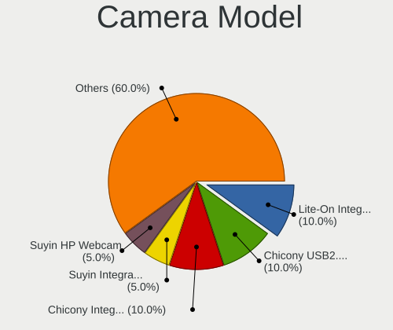

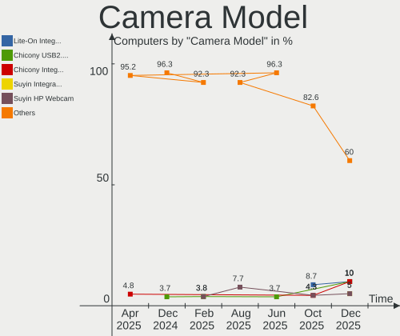

| Model                             | Computers | Percent |
|-----------------------------------|-----------|---------|
| Lite-On Integrated Camera         | 2         | 10%     |
| Chicony USB2.0 HD UVC WebCam      | 2         | 10%     |
| Chicony Integrated Camera         | 2         | 10%     |
| Suyin Integrated Webcam           | 1         | 5%      |
| Suyin HP Webcam                   | 1         | 5%      |
| Silicon Motion WebCam SC-0311139N | 1         | 5%      |
| Ricoh HD Webcam                   | 1         | 5%      |
| Realtek USB Camera                | 1         | 5%      |
| Realtek HP Webcam                 | 1         | 5%      |
| Quanta USB Webcam                 | 1         | 5%      |
| Microdia Sonix USB 2.0 Camera     | 1         | 5%      |
| Microdia HP Webcam                | 1         | 5%      |
| Microdia Camera                   | 1         | 5%      |
| Chicony ThinkPad T490 Webcam      | 1         | 5%      |
| Chicony HP TrueVision HD Camera   | 1         | 5%      |
| Chicony HD WebCam (Acer)          | 1         | 5%      |
| Acer Integrated Camera            | 1         | 5%      |

Security
--------

Fingerprint Vendor
------------------

Fingerprint sensor vendors

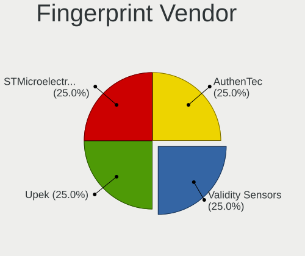

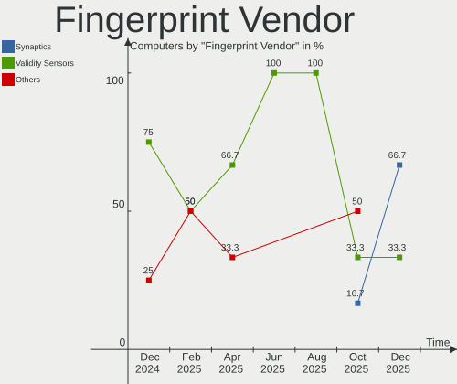

| Vendor           | Computers | Percent |
|------------------|-----------|---------|
| Synaptics        | 2         | 66.67%  |
| Validity Sensors | 1         | 33.33%  |

Fingerprint Model
-----------------

Fingerprint sensor models

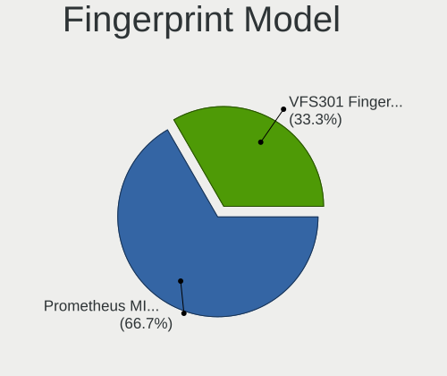

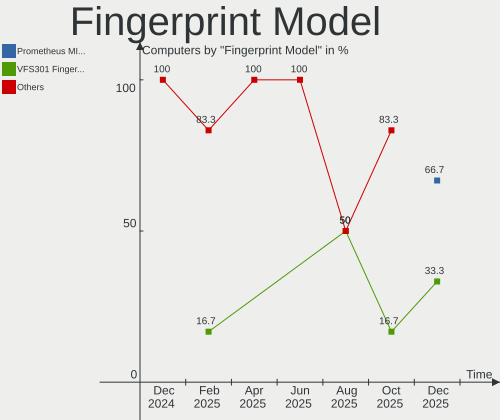

| Model                                             | Computers | Percent |
|---------------------------------------------------|-----------|---------|
| Synaptics Prometheus MIS Touch Fingerprint Reader | 2         | 66.67%  |
| Validity Sensors VFS301 Fingerprint Reader        | 1         | 33.33%  |

Chipcard Vendor
---------------

Chipcard module vendors

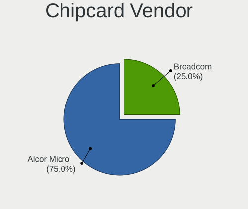

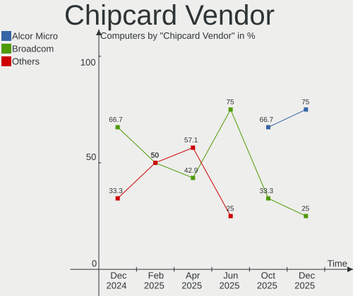

| Vendor      | Computers | Percent |
|-------------|-----------|---------|
| Alcor Micro | 3         | 75%     |
| Broadcom    | 1         | 25%     |

Chipcard Model
--------------

Chipcard module models

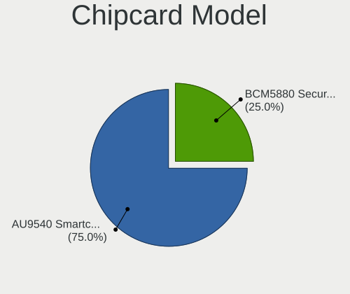

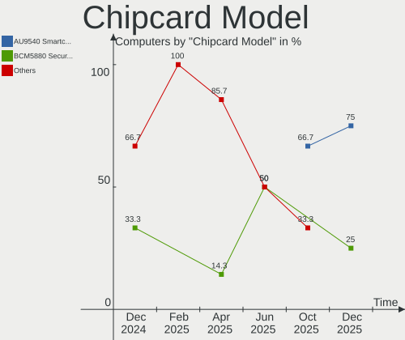

| Model                                          | Computers | Percent |
|------------------------------------------------|-----------|---------|
| Alcor Micro AU9540 Smartcard Reader            | 3         | 75%     |
| Broadcom BCM5880 Secure Applications Processor | 1         | 25%     |

Unsupported
-----------

Unsupported Devices
-------------------

Total unsupported devices on board

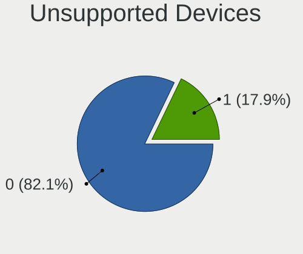

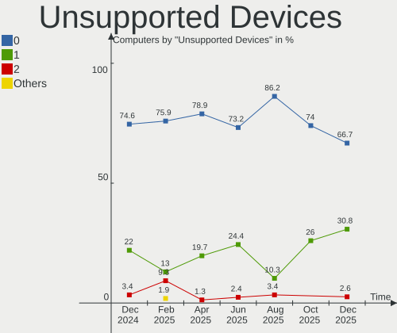

| Total | Computers | Percent |
|-------|-----------|---------|
| 0     | 26        | 66.67%  |
| 1     | 12        | 30.77%  |
| 2     | 1         | 2.56%   |

Unsupported Device Types
------------------------

Types of unsupported devices

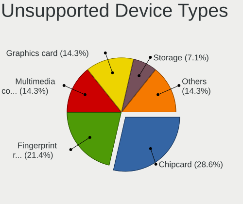

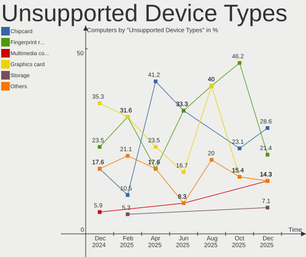

| Type                  | Computers | Percent |
|-----------------------|-----------|---------|
| Chipcard              | 4         | 28.57%  |
| Fingerprint reader    | 3         | 21.43%  |
| Multimedia controller | 2         | 14.29%  |
| Graphics card         | 2         | 14.29%  |
| Storage               | 1         | 7.14%   |
| Net/wireless          | 1         | 7.14%   |
| Bluetooth             | 1         | 7.14%   |

