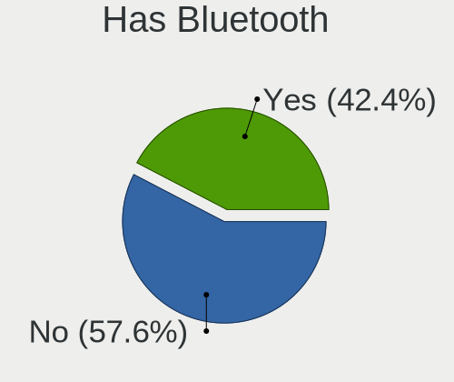
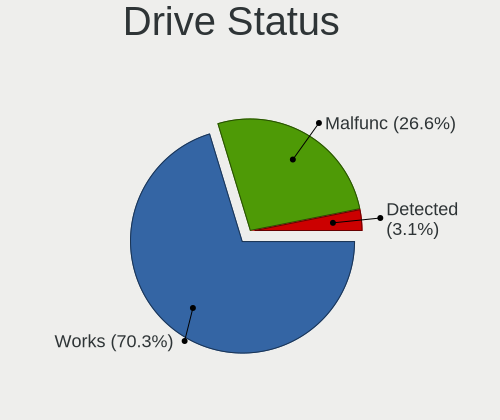
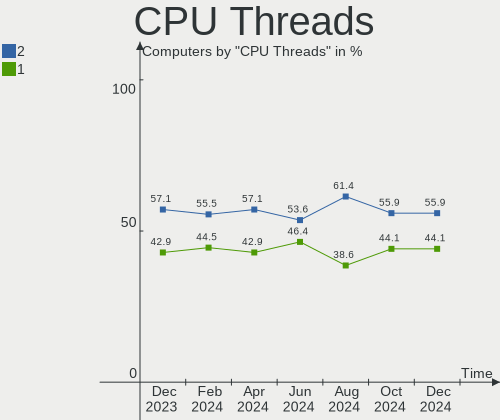
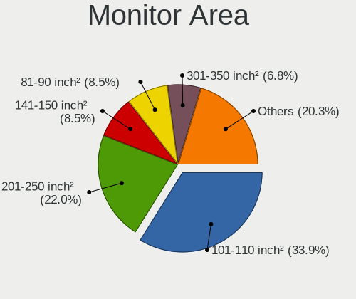
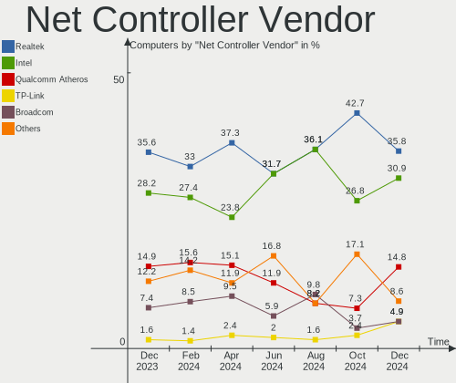

BlackPanther Hardware Trends
----------------------------

A project to identify most popular hardware characteristics and track their change
over time based on data collected by BlackPanther users at https://Linux-Hardware.org.

Anyone can contribute to the study by uploading probes of their computers by
the [hw-probe](https://github.com/linuxhw/hw-probe) tool:

    sudo -E hw-probe -all -upload

This is a report for all computer types. See also reports for [desktops](/Dist/BlackPanther/Desktop/README.md) and [notebooks](/Dist/BlackPanther/Notebook/README.md).

Full-feature report is available here: https://linux-hardware.org/?view=trends

Period: Jun, 2021.

Contents
--------

- [ OS                       ](#os)
- [ OS Family                ](#os-family)
- [ Kernel                   ](#kernel)
- [ Kernel Family            ](#kernel-family)
- [ Kernel Major Ver.        ](#kernel-major-ver)
- [ Arch                     ](#arch)
- [ DE                       ](#de)
- [ Display Server           ](#display-server)
- [ Display Manager          ](#display-manager)
- [ OS Lang                  ](#os-lang)
- [ Boot Mode                ](#boot-mode)
- [ Filesystem               ](#filesystem)
- [ Part. scheme             ](#part-scheme)
- [ Dual Boot with Linux/BSD ](#dual-boot-with-linux/bsd)
- [ Dual Boot (Win)          ](#dual-boot-win)
- [ Country                  ](#country)
- [ City                     ](#city)
- [ Vendor                   ](#vendor)
- [ Model                    ](#model)
- [ Model Family             ](#model-family)
- [ MFG Year                 ](#mfg-year)
- [ Form Factor              ](#form-factor)
- [ Secure Boot              ](#secure-boot)
- [ Coreboot                 ](#coreboot)
- [ RAM Size                 ](#ram-size)
- [ RAM Used                 ](#ram-used)
- [ Has CD-ROM               ](#has-cd-rom)
- [ Total Drives             ](#total-drives)
- [ Has Ethernet             ](#has-ethernet)
- [ Has WiFi                 ](#has-wifi)
- [ Has Bluetooth            ](#has-bluetooth)
- [ Drive Vendor             ](#drive-vendor)
- [ Drive Model              ](#drive-model)
- [ HDD Vendor               ](#hdd-vendor)
- [ SSD Vendor               ](#ssd-vendor)
- [ Drive Kind               ](#drive-kind)
- [ Drive Connector          ](#drive-connector)
- [ Drive Size               ](#drive-size)
- [ Space Total              ](#space-total)
- [ Space Used               ](#space-used)
- [ Malfunc. Drives          ](#malfunc-drives)
- [ Malfunc. Drive Vendor    ](#malfunc-drive-vendor)
- [ Malfunc. HDD Vendor      ](#malfunc-hdd-vendor)
- [ Malfunc. Drive Kind      ](#malfunc-drive-kind)
- [ Failed Drives            ](#failed-drives)
- [ Failed Drive Vendor      ](#failed-drive-vendor)
- [ Drive Status             ](#drive-status)
- [ Storage Vendor           ](#storage-vendor)
- [ Storage Model            ](#storage-model)
- [ Storage Kind             ](#storage-kind)
- [ CPU Vendor               ](#cpu-vendor)
- [ CPU Model                ](#cpu-model)
- [ CPU Model Family         ](#cpu-model-family)
- [ CPU Cores                ](#cpu-cores)
- [ CPU Sockets              ](#cpu-sockets)
- [ CPU Threads              ](#cpu-threads)
- [ CPU Op-Modes             ](#cpu-op-modes)
- [ CPU Microcode            ](#cpu-microcode)
- [ CPU Microarch            ](#cpu-microarch)
- [ GPU Vendor               ](#gpu-vendor)
- [ GPU Model                ](#gpu-model)
- [ GPU Combo                ](#gpu-combo)
- [ GPU Driver               ](#gpu-driver)
- [ GPU Memory               ](#gpu-memory)
- [ Monitor Vendor           ](#monitor-vendor)
- [ Monitor Model            ](#monitor-model)
- [ Monitor Resolution       ](#monitor-resolution)
- [ Monitor Diagonal         ](#monitor-diagonal)
- [ Monitor Width            ](#monitor-width)
- [ Aspect Ratio             ](#aspect-ratio)
- [ Monitor Area             ](#monitor-area)
- [ Pixel Density            ](#pixel-density)
- [ Multiple Monitors        ](#multiple-monitors)
- [ Net Controller Vendor    ](#net-controller-vendor)
- [ Net Controller Model     ](#net-controller-model)
- [ Wireless Vendor          ](#wireless-vendor)
- [ Wireless Model           ](#wireless-model)
- [ Ethernet Vendor          ](#ethernet-vendor)
- [ Ethernet Model           ](#ethernet-model)
- [ Net Controller Kind      ](#net-controller-kind)
- [ Used Controller          ](#used-controller)
- [ NICs                     ](#nics)
- [ IPv6                     ](#ipv6)
- [ Memory Vendor            ](#memory-vendor)
- [ Memory Model             ](#memory-model)
- [ Memory Kind              ](#memory-kind)
- [ Memory Form Factor       ](#memory-form-factor)
- [ Memory Size              ](#memory-size)
- [ Memory Speed             ](#memory-speed)
- [ Sound Vendor             ](#sound-vendor)
- [ Sound Model              ](#sound-model)
- [ Camera Vendor            ](#camera-vendor)
- [ Camera Model             ](#camera-model)
- [ Fingerprint Vendor       ](#fingerprint-vendor)
- [ Fingerprint Model        ](#fingerprint-model)
- [ Chipcard Vendor          ](#chipcard-vendor)
- [ Chipcard Model           ](#chipcard-model)
- [ Printer Vendor           ](#printer-vendor)
- [ Printer Model            ](#printer-model)
- [ Scanner Vendor           ](#scanner-vendor)
- [ Scanner Model            ](#scanner-model)
- [ Bluetooth Vendor         ](#bluetooth-vendor)
- [ Bluetooth Model          ](#bluetooth-model)
- [ Unsupported Devices      ](#unsupported-devices)
- [ Unsupported Device Types ](#unsupported-device-types)

OS
--

Installed operating systems

| Name              | Computers | Percent |
|-------------------|-----------|---------|
| BlackPanther 18.1 | 127       | 100%    |

OS Family
---------

OS without a version

| Name         | Computers | Percent |
|--------------|-----------|---------|
| BlackPanther | 127       | 100%    |

Kernel
------

Version of the Linux kernel

| Version             | Computers | Percent |
|---------------------|-----------|---------|
| 5.6.14-desktop-2bP  | 97        | 76.38%  |
| 4.18.16-desktop-1bP | 30        | 23.62%  |

Kernel Family
-------------

Linux kernel without a distro release

| Version | Computers | Percent |
|---------|-----------|---------|
| 5.6.14  | 97        | 76.38%  |
| 4.18.16 | 30        | 23.62%  |

Kernel Major Ver.
-----------------

Linux kernel major version

| Version | Computers | Percent |
|---------|-----------|---------|
| 5.6     | 97        | 76.38%  |
| 4.18    | 30        | 23.62%  |

Arch
----

OS architecture (x86_64, i586, etc.)

| Name   | Computers | Percent |
|--------|-----------|---------|
| x86_64 | 127       | 100%    |

DE
--

Desktop Environment

| Name | Computers | Percent |
|------|-----------|---------|
| KDE5 | 127       | 100%    |

Display Server
--------------

X11 or Wayland

| Name    | Computers | Percent |
|---------|-----------|---------|
| X11     | 126       | 99.21%  |
| Wayland | 1         | 0.79%   |

Display Manager
---------------

SDDM, LightDM, etc.

| Name | Computers | Percent |
|------|-----------|---------|
| SDDM | 127       | 100%    |

OS Lang
-------

Language

| Lang    | Computers | Percent |
|---------|-----------|---------|
| Unknown | 127       | 100%    |

Boot Mode
---------

EFI or BIOS

| Mode | Computers | Percent |
|------|-----------|---------|
| BIOS | 80        | 62.99%  |
| EFI  | 47        | 37.01%  |

Filesystem
----------

Type of filesystem

| Type    | Computers | Percent |
|---------|-----------|---------|
| Overlay | 110       | 86.61%  |
| Ext4    | 17        | 13.39%  |

Part. scheme
------------

Scheme of partitioning

| Type    | Computers | Percent |
|---------|-----------|---------|
| MBR     | 76        | 59.84%  |
| GPT     | 50        | 39.37%  |
| Unknown | 1         | 0.79%   |

Dual Boot with Linux/BSD
------------------------

Hosting more than one Linux/BSD

| Dual boot | Computers | Percent |
|-----------|-----------|---------|
| No        | 67        | 52.76%  |
| Yes       | 60        | 47.24%  |

Dual Boot (Win)
---------------

Hosting Linux and Windows

| Dual boot | Computers | Percent |
|-----------|-----------|---------|
| Yes       | 74        | 58.27%  |
| No        | 53        | 41.73%  |

Country
-------

Geographic location (country)

| Country   | Computers | Percent |
|-----------|-----------|---------|
| Hungary   | 85        | 66.93%  |
| USA       | 10        | 7.87%   |
| Germany   | 9         | 7.09%   |
| Romania   | 2         | 1.57%   |
| Canada    | 2         | 1.57%   |
| Austria   | 2         | 1.57%   |
| Ukraine   | 1         | 0.79%   |
| UK        | 1         | 0.79%   |
| Tanzania  | 1         | 0.79%   |
| Spain     | 1         | 0.79%   |
| Slovenia  | 1         | 0.79%   |
| Slovakia  | 1         | 0.79%   |
| Russia    | 1         | 0.79%   |
| Japan     | 1         | 0.79%   |
| Jamaica   | 1         | 0.79%   |
| India     | 1         | 0.79%   |
| Greece    | 1         | 0.79%   |
| France    | 1         | 0.79%   |
| Egypt     | 1         | 0.79%   |
| Denmark   | 1         | 0.79%   |
| Brazil    | 1         | 0.79%   |
| Belarus   | 1         | 0.79%   |
| Australia | 1         | 0.79%   |

City
----

Geographic location (city)

| City              | Computers | Percent |
|-------------------|-----------|---------|
| Budapest          | 19        | 14.96%  |
| Pécs             | 5         | 3.94%   |
| Szekszárd        | 3         | 2.36%   |
| Sajolad           | 3         | 2.36%   |
| Miskolc           | 3         | 2.36%   |
| Wernberg-Koblitz  | 2         | 1.57%   |
| Vienna            | 2         | 1.57%   |
| Târgu Mureş     | 2         | 1.57%   |
| Ocsa              | 2         | 1.57%   |
| Mosonszentmiklos  | 2         | 1.57%   |
| Monor             | 2         | 1.57%   |
| Kunszentmiklos    | 2         | 1.57%   |
| Jonesboro         | 2         | 1.57%   |
| Frankfurt am Main | 2         | 1.57%   |
| Eger              | 2         | 1.57%   |
| Csolyospalos      | 2         | 1.57%   |
| Berlin            | 2         | 1.57%   |
| Ajka              | 2         | 1.57%   |
| Érd              | 1         | 0.79%   |
| Zirc              | 1         | 0.79%   |
| Zichyujfalu       | 1         | 0.79%   |
| Zhukovskiy        | 1         | 0.79%   |
| Wiesloch          | 1         | 0.79%   |
| Veszprém         | 1         | 0.79%   |
| Valley Village    | 1         | 0.79%   |
| Uzhhorod          | 1         | 0.79%   |
| Uberlândia       | 1         | 0.79%   |
| Trenčín         | 1         | 0.79%   |
| Toltestava        | 1         | 0.79%   |
| Thessaloniki      | 1         | 0.79%   |
| Tamasi            | 1         | 0.79%   |
| Szentlorinc       | 1         | 0.79%   |
| Szentes           | 1         | 0.79%   |
| Szabadszentkiraly | 1         | 0.79%   |
| Sydney            | 1         | 0.79%   |
| Sopron            | 1         | 0.79%   |
| Somogyszob        | 1         | 0.79%   |
| Sokoropatka       | 1         | 0.79%   |
| Skjern            | 1         | 0.79%   |
| Roszke            | 1         | 0.79%   |
| Riesa             | 1         | 0.79%   |
| Puerto Lumbreras  | 1         | 0.79%   |
| Puducherry        | 1         | 0.79%   |
| Papa              | 1         | 0.79%   |
| Pakozd            | 1         | 0.79%   |
| Ozd               | 1         | 0.79%   |
| Nyiregyhaza       | 1         | 0.79%   |
| New York          | 1         | 0.79%   |
| New Windsor       | 1         | 0.79%   |
| Nerima            | 1         | 0.79%   |
| Nagykoros         | 1         | 0.79%   |
| Nagykanizsa       | 1         | 0.79%   |
| Mosonmagyaróvár | 1         | 0.79%   |
| Moose Jaw         | 1         | 0.79%   |
| Mesquite          | 1         | 0.79%   |
| Maglod            | 1         | 0.79%   |
| Louvres           | 1         | 0.79%   |
| Lenexa            | 1         | 0.79%   |
| Leesburg          | 1         | 0.79%   |
| Koper             | 1         | 0.79%   |

Vendor
------

Motherboard manufacturer

| Name                | Computers | Percent |
|---------------------|-----------|---------|
| Lenovo              | 23        | 18.11%  |
| ASUSTek Computer    | 20        | 15.75%  |
| Hewlett-Packard     | 19        | 14.96%  |
| Dell                | 14        | 11.02%  |
| Gigabyte Technology | 8         | 6.3%    |
| ASRock              | 8         | 6.3%    |
| Toshiba             | 5         | 3.94%   |
| Acer                | 5         | 3.94%   |
| Fujitsu             | 4         | 3.15%   |
| Sony                | 3         | 2.36%   |
| Medion              | 3         | 2.36%   |
| Pegatron            | 2         | 1.57%   |
| MSI                 | 2         | 1.57%   |
| W550SU2             | 1         | 0.79%   |
| Timi                | 1         | 0.79%   |
| Samsung Electronics | 1         | 0.79%   |
| Packard Bell        | 1         | 0.79%   |
| Itautec             | 1         | 0.79%   |
| Hungaro Flotta Kft  | 1         | 0.79%   |
| Gateway             | 1         | 0.79%   |
| Fujitsu Siemens     | 1         | 0.79%   |
| Biostar             | 1         | 0.79%   |
| Apple               | 1         | 0.79%   |
| Alcor               | 1         | 0.79%   |

Model
-----

Motherboard model

| Name                                         | Computers | Percent |
|----------------------------------------------|-----------|---------|
| ASRock G41M-VS3                              | 3         | 2.36%   |
| HP Compaq Pro 6300 SFF                       | 2         | 1.57%   |
| HP 250 G1                                    | 2         | 1.57%   |
| Toshiba Satellite PRO C850-1LZ               | 1         | 0.79%   |
| Toshiba Satellite M50D-A                     | 1         | 0.79%   |
| Toshiba Satellite L300                       | 1         | 0.79%   |
| Toshiba Satellite C660                       | 1         | 0.79%   |
| Toshiba Satellite A200                       | 1         | 0.79%   |
| Timi Mi Gaming Laptop 15.6                   | 1         | 0.79%   |
| Sony VPCEB3L1E                               | 1         | 0.79%   |
| Sony VGN-FZ31S                               | 1         | 0.79%   |
| Sony VGN-CR42S_W                             | 1         | 0.79%   |
| Samsung N150/N210/N220                       | 1         | 0.79%   |
| Pegatron VC980AA-ABD p6140de                 | 1         | 0.79%   |
| Pegatron Compaq dx2400 Microtower            | 1         | 0.79%   |
| Packard Bell EasyNote TM86                   | 1         | 0.79%   |
| MSI MS-7369                                  | 1         | 0.79%   |
| MSI EX620                                    | 1         | 0.79%   |
| Medion MS-7646                               | 1         | 0.79%   |
| Medion E6220                                 | 1         | 0.79%   |
| Medion AKOYA THE TOUCH 10                    | 1         | 0.79%   |
| Lenovo Yoga 310-11IAP 80U2                   | 1         | 0.79%   |
| Lenovo V145-15AST 81MT                       | 1         | 0.79%   |
| Lenovo ThinkStation S30 4351D32              | 1         | 0.79%   |
| Lenovo ThinkStation P330 Tiny 30CFCTO1WW     | 1         | 0.79%   |
| Lenovo ThinkPad X230 2325AC7                 | 1         | 0.79%   |
| Lenovo ThinkPad T440 20B7S27U00              | 1         | 0.79%   |
| Lenovo ThinkPad T410 2537KR6                 | 1         | 0.79%   |
| Lenovo ThinkPad T400 6474W66                 | 1         | 0.79%   |
| Lenovo ThinkCentre M93z 10AES0Y700           | 1         | 0.79%   |
| Lenovo ThinkCentre M81 5048BC8               | 1         | 0.79%   |
| Lenovo ThinkCentre M73 10B6001SUS            | 1         | 0.79%   |
| Lenovo ThinkCentre M57e 9488Y25              | 1         | 0.79%   |
| Lenovo ThinkCentre A57 98517HG               | 1         | 0.79%   |
| Lenovo S10-3                                 | 1         | 0.79%   |
| Lenovo IdeaPad S145-15AST 81N3               | 1         | 0.79%   |
| Lenovo IdeaPad Flex Pro-13IKB 81TF           | 1         | 0.79%   |
| Lenovo IdeaPad 330-15IKB 81DE                | 1         | 0.79%   |
| Lenovo IdeaPad 320-15IKB 81BG                | 1         | 0.79%   |
| Lenovo IdeaPad 110-15IBR 80T7                | 1         | 0.79%   |
| Lenovo IdeaCentre 700-25ISH 90ED0009US       | 1         | 0.79%   |
| Lenovo G580 20150                            | 1         | 0.79%   |
| Lenovo G550 20023                            | 1         | 0.79%   |
| Lenovo 7052-A9G                              | 1         | 0.79%   |
| Itautec Infoway ST-4254                      | 1         | 0.79%   |
| Hungaro Flotta Kft Navon Stark NX14 PRO 2018 | 1         | 0.79%   |
| HP xw4400 Workstation                        | 1         | 0.79%   |
| HP ProBook 6470b                             | 1         | 0.79%   |
| HP Presario CQ56                             | 1         | 0.79%   |
| HP Pavilion Laptop 15-cc5xx                  | 1         | 0.79%   |
| HP Laptop 15-bs0xx                           | 1         | 0.79%   |
| HP EliteDesk 800 G2 SFF                      | 1         | 0.79%   |
| HP EliteDesk 800 G1 SFF                      | 1         | 0.79%   |
| HP Compaq Pro 6305 SFF                       | 1         | 0.79%   |
| HP Compaq Pro 6305 MT                        | 1         | 0.79%   |
| HP Compaq dc5850 Microtower                  | 1         | 0.79%   |
| HP Compaq 6710b (GR684EA#AKC)                | 1         | 0.79%   |
| HP Compaq 6000 Pro SFF PC                    | 1         | 0.79%   |
| HP 650                                       | 1         | 0.79%   |
| HP 290 G3 MT Business PC                     | 1         | 0.79%   |

Model Family
------------

Motherboard model prefix

| Name                     | Computers | Percent |
|--------------------------|-----------|---------|
| HP Compaq                | 7         | 5.51%   |
| Dell Latitude            | 6         | 4.72%   |
| Toshiba Satellite        | 5         | 3.94%   |
| Lenovo ThinkCentre       | 5         | 3.94%   |
| Lenovo IdeaPad           | 5         | 3.94%   |
| Acer Aspire              | 5         | 3.94%   |
| Lenovo ThinkPad          | 4         | 3.15%   |
| Dell OptiPlex            | 4         | 3.15%   |
| ASUS PRIME               | 3         | 2.36%   |
| ASRock G41M-VS3          | 3         | 2.36%   |
| Lenovo ThinkStation      | 2         | 1.57%   |
| HP EliteDesk             | 2         | 1.57%   |
| HP 250                   | 2         | 1.57%   |
| Fujitsu LIFEBOOK         | 2         | 1.57%   |
| ASUS TUF                 | 2         | 1.57%   |
| Timi Mi                  | 1         | 0.79%   |
| Sony VPCEB3L1E           | 1         | 0.79%   |
| Sony VGN-FZ31S           | 1         | 0.79%   |
| Sony VGN-CR42S           | 1         | 0.79%   |
| Samsung N150             | 1         | 0.79%   |
| Pegatron VC980AA-ABD     | 1         | 0.79%   |
| Pegatron Compaq          | 1         | 0.79%   |
| Packard Bell EasyNote    | 1         | 0.79%   |
| MSI MS-7369              | 1         | 0.79%   |
| MSI EX620                | 1         | 0.79%   |
| Medion MS-7646           | 1         | 0.79%   |
| Medion E6220             | 1         | 0.79%   |
| Medion AKOYA             | 1         | 0.79%   |
| Lenovo Yoga              | 1         | 0.79%   |
| Lenovo V145-15AST        | 1         | 0.79%   |
| Lenovo S10-3             | 1         | 0.79%   |
| Lenovo IdeaCentre        | 1         | 0.79%   |
| Lenovo G580              | 1         | 0.79%   |
| Lenovo G550              | 1         | 0.79%   |
| Lenovo 7052-A9G          | 1         | 0.79%   |
| Itautec Infoway          | 1         | 0.79%   |
| Hungaro Flotta Kft Navon | 1         | 0.79%   |
| HP xw4400                | 1         | 0.79%   |
| HP ProBook               | 1         | 0.79%   |
| HP Presario              | 1         | 0.79%   |
| HP Pavilion              | 1         | 0.79%   |
| HP Laptop                | 1         | 0.79%   |
| HP 650                   | 1         | 0.79%   |
| HP 290                   | 1         | 0.79%   |
| HP 2000                  | 1         | 0.79%   |
| Gigabyte P67A-D3-B3      | 1         | 0.79%   |
| Gigabyte P55-US3L        | 1         | 0.79%   |
| Gigabyte GA-78LMT-USB3   | 1         | 0.79%   |
| Gigabyte G41MT-S2PT      | 1         | 0.79%   |
| Gigabyte EP45-UD3        | 1         | 0.79%   |
| Gigabyte B450M           | 1         | 0.79%   |
| Gigabyte 945GCM-S2L      | 1         | 0.79%   |
| Gigabyte 945GCM-S2C      | 1         | 0.79%   |
| Gateway SX2110G          | 1         | 0.79%   |
| Fujitsu Siemens ESPRIMO  | 1         | 0.79%   |
| Fujitsu ESPRIMO          | 1         | 0.79%   |
| Fujitsu CELSIUS          | 1         | 0.79%   |
| Dell Vostro              | 1         | 0.79%   |
| Dell Studio              | 1         | 0.79%   |
| Dell Inspiron            | 1         | 0.79%   |

MFG Year
--------

Motherboard manufacture year

| Year | Computers | Percent |
|------|-----------|---------|
| 2013 | 18        | 14.17%  |
| 2011 | 15        | 11.81%  |
| 2010 | 14        | 11.02%  |
| 2019 | 11        | 8.66%   |
| 2018 | 11        | 8.66%   |
| 2009 | 10        | 7.87%   |
| 2012 | 9         | 7.09%   |
| 2020 | 8         | 6.3%    |
| 2014 | 6         | 4.72%   |
| 2008 | 6         | 4.72%   |
| 2016 | 5         | 3.94%   |
| 2021 | 4         | 3.15%   |
| 2007 | 4         | 3.15%   |
| 2015 | 3         | 2.36%   |
| 2017 | 2         | 1.57%   |
| 2006 | 1         | 0.79%   |

Form Factor
-----------

Physical design of the computer

| Name        | Computers | Percent |
|-------------|-----------|---------|
| Notebook    | 64        | 50.39%  |
| Desktop     | 60        | 47.24%  |
| Convertible | 2         | 1.57%   |
| Mini pc     | 1         | 0.79%   |

Secure Boot
-----------

Enabled or disabled

| State    | Computers | Percent |
|----------|-----------|---------|
| Disabled | 127       | 100%    |

Coreboot
--------

Have coreboot on board

| Used | Computers | Percent |
|------|-----------|---------|
| No   | 127       | 100%    |

RAM Size
--------

Total RAM memory

| Size in GB | Computers | Percent |
|------------|-----------|---------|
| 3.01-4.0   | 47        | 37.01%  |
| 4.01-8.0   | 31        | 24.41%  |
| 8.01-16.0  | 25        | 19.69%  |
| 1.01-2.0   | 13        | 10.24%  |
| 16.01-24.0 | 8         | 6.3%    |
| 32.01-64.0 | 1         | 0.79%   |
| 24.01-32.0 | 1         | 0.79%   |
| 2.01-3.0   | 1         | 0.79%   |

RAM Used
--------

Used RAM memory

| Used GB  | Computers | Percent |
|----------|-----------|---------|
| 0.01-0.5 | 53        | 41.73%  |
| 0.51-1.0 | 46        | 36.22%  |
| 1.01-2.0 | 28        | 22.05%  |

Has CD-ROM
----------

Has CD-ROM on board

| Presented | Computers | Percent |
|-----------|-----------|---------|
| Yes       | 77        | 60.63%  |
| No        | 50        | 39.37%  |

Total Drives
------------

Number of drives on board

| Drives | Computers | Percent |
|--------|-----------|---------|
| 1      | 76        | 59.84%  |
| 2      | 39        | 30.71%  |
| 3      | 8         | 6.3%    |
| 5      | 2         | 1.57%   |
| 4      | 1         | 0.79%   |
| 0      | 1         | 0.79%   |

Has Ethernet
------------

Has Ethernet on board

| Presented | Computers | Percent |
|-----------|-----------|---------|
| Yes       | 123       | 96.85%  |
| No        | 4         | 3.15%   |

Has WiFi
--------

Has WiFi module

| Presented | Computers | Percent |
|-----------|-----------|---------|
| Yes       | 78        | 61.42%  |
| No        | 49        | 38.58%  |

Has Bluetooth
-------------

Has Bluetooth module

| Presented | Computers | Percent |
|-----------|-----------|---------|
| No        | 74        | 58.27%  |
| Yes       | 53        | 41.73%  |

Drive Vendor
------------

Hard drive vendors

| Vendor              | Computers | Drives | Percent |
|---------------------|-----------|--------|---------|
| WDC                 | 33        | 38     | 17.93%  |
| Seagate             | 32        | 32     | 17.39%  |
| Samsung Electronics | 21        | 23     | 11.41%  |
| Kingston            | 18        | 19     | 9.78%   |
| Toshiba             | 16        | 19     | 8.7%    |
| Hitachi             | 9         | 10     | 4.89%   |
| SanDisk             | 5         | 5      | 2.72%   |
| HGST                | 5         | 5      | 2.72%   |
| PNY                 | 4         | 4      | 2.17%   |
| Maxtor              | 4         | 4      | 2.17%   |
| Intel               | 4         | 4      | 2.17%   |
| SK Hynix            | 3         | 3      | 1.63%   |
| Micron Technology   | 3         | 3      | 1.63%   |
| A-DATA Technology   | 3         | 3      | 1.63%   |
| Verbatim            | 2         | 2      | 1.09%   |
| Unknown             | 2         | 2      | 1.09%   |
| SPCC                | 2         | 2      | 1.09%   |
| ZTE                 | 1         | 1      | 0.54%   |
| StoreJet            | 1         | 1      | 0.54%   |
| sobetter            | 1         | 1      | 0.54%   |
| Patriot             | 1         | 1      | 0.54%   |
| OCZ                 | 1         | 1      | 0.54%   |
| Mushkin             | 1         | 1      | 0.54%   |
| LITEONIT            | 1         | 2      | 0.54%   |
| KingSpec            | 1         | 1      | 0.54%   |
| JMicron             | 1         | 1      | 0.54%   |
| Intenso             | 1         | 1      | 0.54%   |
| HS-SSD-C100         | 1         | 1      | 0.54%   |
| Hewlett-Packard     | 1         | 1      | 0.54%   |
| Gigabyte Technology | 1         | 1      | 0.54%   |
| EMTEC               | 1         | 1      | 0.54%   |
| Emphase             | 1         | 1      | 0.54%   |
| Crucial             | 1         | 1      | 0.54%   |
| China               | 1         | 1      | 0.54%   |
| Apacer              | 1         | 1      | 0.54%   |

Drive Model
-----------

Hard drive models

| Model                            | Computers | Percent |
|----------------------------------|-----------|---------|
| Seagate ST1000LM035-1RK172 1TB   | 5         | 2.56%   |
| Kingston SA400S37120G 120GB SSD  | 5         | 2.56%   |
| Toshiba DT01ACA100 1TB           | 4         | 2.05%   |
| Kingston SV300S37A120G 120GB SSD | 4         | 2.05%   |
| Kingston SA400S37240G 240GB SSD  | 4         | 2.05%   |
| Seagate ST9500325AS 500GB        | 3         | 1.54%   |
| Seagate ST500LT012-1DG142 500GB  | 3         | 1.54%   |
| Seagate ST500DM002-1BD142 500GB  | 3         | 1.54%   |
| WDC WD3200BUDT-63DPZY0 320GB     | 2         | 1.03%   |
| Toshiba MQ01ABF050 500GB         | 2         | 1.03%   |
| Toshiba DT01ACA200 2TB           | 2         | 1.03%   |
| Toshiba DT01ACA050 500GB         | 2         | 1.03%   |
| Seagate ST500LT012-9WS142 500GB  | 2         | 1.03%   |
| Seagate ST500LM000-1EJ162 500GB  | 2         | 1.03%   |
| Seagate ST31000524AS 1TB         | 2         | 1.03%   |
| Samsung HD502HJ 500GB            | 2         | 1.03%   |
| PNY CS900 120GB SSD              | 2         | 1.03%   |
| Micron 2210_MTFDHBA512QFD 512GB  | 2         | 1.03%   |
| Hitachi HDS721010CLA330 1TB      | 2         | 1.03%   |
| Hitachi HDP725016GLA380 160GB    | 2         | 1.03%   |
| ZTE MMC Storage 8GB              | 1         | 0.51%   |
| WDC WDS512G1X0C-00ENX0 512GB     | 1         | 0.51%   |
| WDC WDS500G2B0A-00SM50 500GB SSD | 1         | 0.51%   |
| WDC WDS250G2B0A 250GB SSD        | 1         | 0.51%   |
| WDC WDS120G1G0A-00SS50 120GB SSD | 1         | 0.51%   |
| WDC WDS100T1B0A-00H9H0 1TB SSD   | 1         | 0.51%   |
| WDC WD800JD-75MSA3 80GB          | 1         | 0.51%   |
| WDC WD800BD-22LRA0 80GB          | 1         | 0.51%   |
| WDC WD7500BPVT-80HXZT3 752GB     | 1         | 0.51%   |
| WDC WD5001ABYS-01YNA0 500GB      | 1         | 0.51%   |
| WDC WD5000LPCX-24VHAT0 500GB     | 1         | 0.51%   |
| WDC WD5000LPCX-24C6HT0 500GB     | 1         | 0.51%   |
| WDC WD5000BEVT-22A0RT0 500GB     | 1         | 0.51%   |
| WDC WD5000AZRX-00L4HB0 500GB     | 1         | 0.51%   |
| WDC WD5000AAKX-75U6AA0 500GB     | 1         | 0.51%   |
| WDC WD5000AAKX-22ERMA0 500GB     | 1         | 0.51%   |
| WDC WD5000AAKX-07U6AA0 500GB     | 1         | 0.51%   |
| WDC WD5000AADS-00S9B0 500GB      | 1         | 0.51%   |
| WDC WD4000YS-01MPB1 400GB        | 1         | 0.51%   |
| WDC WD3200AVBS-63TAA0 320GB      | 1         | 0.51%   |
| WDC WD30EZRZ-00GXCB0 3TB         | 1         | 0.51%   |
| WDC WD30EZRX-00DC0B0 3TB         | 1         | 0.51%   |
| WDC WD30EFRX-68EUZN0 3TB         | 1         | 0.51%   |
| WDC WD2500BEVT-22ZCT0 250GB      | 1         | 0.51%   |
| WDC WD2500BEVT-22A23T0 250GB     | 1         | 0.51%   |
| WDC WD2500BEKT-60V5T1 250GB      | 1         | 0.51%   |
| WDC WD2500AAKX-603CA0 250GB      | 1         | 0.51%   |
| WDC WD2500AAJS-07M0A0 250GB      | 1         | 0.51%   |
| WDC WD20EZRX-00D8PB0 2TB         | 1         | 0.51%   |
| WDC WD1600BEVT-22ZCT0 160GB      | 1         | 0.51%   |
| WDC WD1600AAJB-56WRA0 160GB      | 1         | 0.51%   |
| WDC WD15EARS-00MVWB0 1TB         | 1         | 0.51%   |
| WDC WD10SPZX-24Z10 1TB           | 1         | 0.51%   |
| WDC WD10JPVX-22JC3T0 1TB         | 1         | 0.51%   |
| WDC WD10EZEX-60M2NA0 1TB         | 1         | 0.51%   |
| WDC WD10EARS-00Y5B1 1TB          | 1         | 0.51%   |
| WDC WD10EARS-00MVWB0 1TB         | 1         | 0.51%   |
| Verbatim Vi550 S3 SSD 128GB      | 1         | 0.51%   |
| Verbatim Vi500 S3 120GB SSD      | 1         | 0.51%   |
| Unknown SD2GB                    | 1         | 0.51%   |

HDD Vendor
----------

Hard disk drive vendors

| Vendor              | Computers | Drives | Percent |
|---------------------|-----------|--------|---------|
| Seagate             | 32        | 32     | 31.07%  |
| WDC                 | 29        | 33     | 28.16%  |
| Toshiba             | 14        | 17     | 13.59%  |
| Samsung Electronics | 9         | 9      | 8.74%   |
| Hitachi             | 9         | 10     | 8.74%   |
| HGST                | 5         | 5      | 4.85%   |
| Maxtor              | 4         | 4      | 3.88%   |
| Emphase             | 1         | 1      | 0.97%   |

SSD Vendor
----------

Solid state drive vendors

| Vendor              | Computers | Drives | Percent |
|---------------------|-----------|--------|---------|
| Kingston            | 17        | 18     | 26.56%  |
| Samsung Electronics | 9         | 10     | 14.06%  |
| WDC                 | 4         | 4      | 6.25%   |
| PNY                 | 4         | 4      | 6.25%   |
| SanDisk             | 3         | 3      | 4.69%   |
| Intel               | 3         | 3      | 4.69%   |
| A-DATA Technology   | 3         | 3      | 4.69%   |
| Verbatim            | 2         | 2      | 3.13%   |
| SPCC                | 2         | 2      | 3.13%   |
| SK Hynix            | 2         | 2      | 3.13%   |
| Toshiba             | 1         | 1      | 1.56%   |
| StoreJet            | 1         | 1      | 1.56%   |
| Patriot             | 1         | 1      | 1.56%   |
| OCZ                 | 1         | 1      | 1.56%   |
| Mushkin             | 1         | 1      | 1.56%   |
| Micron Technology   | 1         | 1      | 1.56%   |
| LITEONIT            | 1         | 2      | 1.56%   |
| KingSpec            | 1         | 1      | 1.56%   |
| Intenso             | 1         | 1      | 1.56%   |
| HS-SSD-C100         | 1         | 1      | 1.56%   |
| Hewlett-Packard     | 1         | 1      | 1.56%   |
| Gigabyte Technology | 1         | 1      | 1.56%   |
| EMTEC               | 1         | 1      | 1.56%   |
| China               | 1         | 1      | 1.56%   |
| Apacer              | 1         | 1      | 1.56%   |

Drive Kind
----------

HDD or SSD

| Kind    | Computers | Drives | Percent |
|---------|-----------|--------|---------|
| HDD     | 88        | 111    | 53.01%  |
| SSD     | 61        | 67     | 36.75%  |
| NVMe    | 11        | 13     | 6.63%   |
| MMC     | 4         | 4      | 2.41%   |
| Unknown | 2         | 2      | 1.2%    |

Drive Connector
---------------

SATA, SAS, NVMe, etc.

| Type | Computers | Drives | Percent |
|------|-----------|--------|---------|
| SATA | 119       | 175    | 85.61%  |
| NVMe | 10        | 12     | 7.19%   |
| SAS  | 6         | 6      | 4.32%   |
| MMC  | 4         | 4      | 2.88%   |

Drive Size
----------

Size of hard drive

| Size in TB | Computers | Drives | Percent |
|------------|-----------|--------|---------|
| 0.01-0.5   | 106       | 137    | 74.65%  |
| 0.51-1.0   | 28        | 32     | 19.72%  |
| 1.01-2.0   | 5         | 5      | 3.52%   |
| 2.01-3.0   | 2         | 3      | 1.41%   |
| 3.01-4.0   | 1         | 1      | 0.7%    |

Space Total
-----------

Amount of disk space available on the file system

| Size in GB | Computers | Percent |
|------------|-----------|---------|
| Unknown    | 108       | 85.04%  |
| 101-250    | 10        | 7.87%   |
| 251-500    | 6         | 4.72%   |
| 51-100     | 2         | 1.57%   |
| 501-1000   | 1         | 0.79%   |

Space Used
----------

Amount of used disk space

| Used GB | Computers | Percent |
|---------|-----------|---------|
| Unknown | 108       | 85.04%  |
| 1-20    | 18        | 14.17%  |
| 21-50   | 1         | 0.79%   |

Malfunc. Drives
---------------

Drive models with a malfunction

| Model                                 | Computers | Drives | Percent |
|---------------------------------------|-----------|--------|---------|
| Seagate ST500DM002-1BD142 500GB       | 3         | 3      | 4.55%   |
| Toshiba MQ01ABF050 500GB              | 2         | 2      | 3.03%   |
| Toshiba DT01ACA100 1TB                | 2         | 2      | 3.03%   |
| Seagate ST9500325AS 500GB             | 2         | 2      | 3.03%   |
| Seagate ST500LT012-9WS142 500GB       | 2         | 2      | 3.03%   |
| Seagate ST500LT012-1DG142 500GB       | 2         | 2      | 3.03%   |
| Seagate ST1000LM035-1RK172 1TB        | 2         | 2      | 3.03%   |
| Samsung Electronics HD502HJ 500GB     | 2         | 2      | 3.03%   |
| WDC WD5001ABYS-01YNA0 500GB           | 1         | 1      | 1.52%   |
| WDC WD5000BEVT-22A0RT0 500GB          | 1         | 1      | 1.52%   |
| WDC WD5000AZRX-00L4HB0 500GB          | 1         | 1      | 1.52%   |
| WDC WD5000AAKX-07U6AA0 500GB          | 1         | 1      | 1.52%   |
| WDC WD5000AADS-00S9B0 500GB           | 1         | 1      | 1.52%   |
| WDC WD3200BUDT-63DPZY0 320GB          | 1         | 1      | 1.52%   |
| WDC WD3200AVBS-63TAA0 320GB           | 1         | 1      | 1.52%   |
| WDC WD2500BEVT-22A23T0 250GB          | 1         | 1      | 1.52%   |
| WDC WD2500BEKT-60V5T1 250GB           | 1         | 1      | 1.52%   |
| WDC WD2500AAJS-07M0A0 250GB           | 1         | 1      | 1.52%   |
| WDC WD1600AAJB-56WRA0 160GB           | 1         | 1      | 1.52%   |
| WDC WD15EARS-00MVWB0 1TB              | 1         | 1      | 1.52%   |
| WDC WD10JPVX-22JC3T0 1TB              | 1         | 1      | 1.52%   |
| WDC WD10EARS-00Y5B1 1TB               | 1         | 1      | 1.52%   |
| WDC WD10EARS-00MVWB0 1TB              | 1         | 1      | 1.52%   |
| Toshiba THNSFJ256GCSU 256GB SSD       | 1         | 1      | 1.52%   |
| SK Hynix HFS128G39MNC-2300A 128GB SSD | 1         | 1      | 1.52%   |
| Seagate ST9320325AS 320GB             | 1         | 1      | 1.52%   |
| Seagate ST9250315AS 250GB             | 1         | 1      | 1.52%   |
| Seagate ST500LM000-1EJ162 500GB       | 1         | 1      | 1.52%   |
| Seagate ST3500312CS 500GB             | 1         | 1      | 1.52%   |
| Seagate ST3320413AS 320GB             | 1         | 1      | 1.52%   |
| Seagate ST3160815AS 160GB             | 1         | 1      | 1.52%   |
| Seagate ST31000524AS 1TB              | 1         | 1      | 1.52%   |
| Seagate ST250LM004 HN-M250MBB 250GB   | 1         | 1      | 1.52%   |
| Seagate ST1000LX015-1U7172 1TB        | 1         | 1      | 1.52%   |
| SanDisk SDSSDP128G 128GB              | 1         | 1      | 1.52%   |
| Samsung Electronics HD502IJ 500GB     | 1         | 1      | 1.52%   |
| Samsung Electronics HD103SI 1TB       | 1         | 1      | 1.52%   |
| Samsung Electronics HD082GJ 80GB      | 1         | 1      | 1.52%   |
| Samsung Electronics HD080HJ 80GB      | 1         | 1      | 1.52%   |
| OCZ AGILITY3 64GB SSD                 | 1         | 1      | 1.52%   |
| Maxtor 6Y080L0 81GB                   | 1         | 1      | 1.52%   |
| Maxtor 6V250F0 256GB                  | 1         | 1      | 1.52%   |
| Maxtor 6B200P0 208GB                  | 1         | 1      | 1.52%   |
| Maxtor 2B020H1 20GB                   | 1         | 1      | 1.52%   |
| LITEONIT CMT-64L3M 64GB SSD           | 1         | 2      | 1.52%   |
| Kingston SV300S37A120G 120GB SSD      | 1         | 1      | 1.52%   |
| Intel SSDSCKKF256H6 SATA 256GB        | 1         | 1      | 1.52%   |
| Hitachi HTS547550A9E384 500GB         | 1         | 1      | 1.52%   |
| Hitachi HTS545050A7E380 500GB         | 1         | 1      | 1.52%   |
| Hitachi HTS543232L9A300 320GB         | 1         | 1      | 1.52%   |
| Hitachi HTS542512K9SA00 120GB         | 1         | 1      | 1.52%   |
| Hitachi HDS721010CLA330 1TB           | 1         | 1      | 1.52%   |
| Hitachi HDP725025GLA380 250GB         | 1         | 1      | 1.52%   |
| Hitachi HDP725016GLA380 160GB         | 1         | 1      | 1.52%   |
| HGST HTS545050A7E380 500GB            | 1         | 1      | 1.52%   |
| HGST HTS545032A7E380 320GB            | 1         | 1      | 1.52%   |
| A-DATA Technology SP550 120GB SSD     | 1         | 1      | 1.52%   |

Malfunc. Drive Vendor
---------------------

Vendors of faulty drives

| Vendor              | Computers | Drives | Percent |
|---------------------|-----------|--------|---------|
| Seagate             | 20        | 20     | 30.77%  |
| WDC                 | 15        | 15     | 23.08%  |
| Samsung Electronics | 6         | 6      | 9.23%   |
| Hitachi             | 6         | 7      | 9.23%   |
| Toshiba             | 5         | 5      | 7.69%   |
| Maxtor              | 4         | 4      | 6.15%   |
| HGST                | 2         | 2      | 3.08%   |
| SK Hynix            | 1         | 1      | 1.54%   |
| SanDisk             | 1         | 1      | 1.54%   |
| OCZ                 | 1         | 1      | 1.54%   |
| LITEONIT            | 1         | 2      | 1.54%   |
| Kingston            | 1         | 1      | 1.54%   |
| Intel               | 1         | 1      | 1.54%   |
| A-DATA Technology   | 1         | 1      | 1.54%   |

Malfunc. HDD Vendor
-------------------

Vendors of faulty HDD drives

| Vendor              | Computers | Drives | Percent |
|---------------------|-----------|--------|---------|
| Seagate             | 20        | 20     | 35.09%  |
| WDC                 | 15        | 15     | 26.32%  |
| Samsung Electronics | 6         | 6      | 10.53%  |
| Hitachi             | 6         | 7      | 10.53%  |
| Toshiba             | 4         | 4      | 7.02%   |
| Maxtor              | 4         | 4      | 7.02%   |
| HGST                | 2         | 2      | 3.51%   |

Malfunc. Drive Kind
-------------------

Kinds of faulty drives

| Kind | Computers | Drives | Percent |
|------|-----------|--------|---------|
| HDD  | 52        | 58     | 86.67%  |
| SSD  | 8         | 9      | 13.33%  |

Failed Drives
-------------

Failed drive models

| Model                   | Computers | Drives | Percent |
|-------------------------|-----------|--------|---------|
| Toshiba MK3275GSX 320GB | 1         | 1      | 100%    |

Failed Drive Vendor
-------------------

Failed drive vendors

| Vendor  | Computers | Drives | Percent |
|---------|-----------|--------|---------|
| Toshiba | 1         | 1      | 100%    |

Drive Status
------------

Number of failed and malfunc. drives

| Status   | Computers | Drives | Percent |
|----------|-----------|--------|---------|
| Works    | 88        | 118    | 56.05%  |
| Malfunc  | 58        | 67     | 36.94%  |
| Detected | 10        | 11     | 6.37%   |
| Failed   | 1         | 1      | 0.64%   |

Storage Vendor
--------------

Storage controller vendors

| Vendor                      | Computers | Percent |
|-----------------------------|-----------|---------|
| Intel                       | 100       | 70.42%  |
| AMD                         | 21        | 14.79%  |
| Samsung Electronics         | 4         | 2.82%   |
| JMicron Technology          | 4         | 2.82%   |
| Nvidia                      | 3         | 2.11%   |
| Micron Technology           | 2         | 1.41%   |
| VIA Technologies            | 1         | 0.7%    |
| SK Hynix                    | 1         | 0.7%    |
| Sandisk                     | 1         | 0.7%    |
| Micron/Crucial Technology   | 1         | 0.7%    |
| Marvell Technology Group    | 1         | 0.7%    |
| KIOXIA                      | 1         | 0.7%    |
| Kingston Technology Company | 1         | 0.7%    |
| ASMedia Technology          | 1         | 0.7%    |

Storage Model
-------------

Storage controller models

| Model                                                                                   | Computers | Percent |
|-----------------------------------------------------------------------------------------|-----------|---------|
| Intel NM10/ICH7 Family SATA Controller [IDE mode]                                       | 12        | 6.45%   |
| AMD FCH SATA Controller [AHCI mode]                                                     | 12        | 6.45%   |
| Intel 82801G (ICH7 Family) IDE Controller                                               | 10        | 5.38%   |
| Intel 7 Series Chipset Family 6-port SATA Controller [AHCI mode]                        | 8         | 4.3%    |
| Intel 82801IBM/IEM (ICH9M/ICH9M-E) 4 port SATA Controller [AHCI mode]                   | 6         | 3.23%   |
| Intel Sunrise Point-LP SATA Controller [AHCI mode]                                      | 5         | 2.69%   |
| Intel 82801 Mobile SATA Controller [RAID mode]                                          | 5         | 2.69%   |
| Intel 8 Series SATA Controller 1 [AHCI mode]                                            | 5         | 2.69%   |
| AMD SB7x0/SB8x0/SB9x0 IDE Controller                                                    | 5         | 2.69%   |
| Intel SATA Controller [RAID mode]                                                       | 4         | 2.15%   |
| Intel 82801HM/HEM (ICH8M/ICH8M-E) SATA Controller [AHCI mode]                           | 4         | 2.15%   |
| Intel 82801HM/HEM (ICH8M/ICH8M-E) IDE Controller                                        | 4         | 2.15%   |
| Intel 5 Series/3400 Series Chipset 4 port SATA IDE Controller                           | 4         | 2.15%   |
| Intel 5 Series/3400 Series Chipset 4 port SATA AHCI Controller                          | 4         | 2.15%   |
| Intel 5 Series/3400 Series Chipset 2 port SATA IDE Controller                           | 4         | 2.15%   |
| AMD SB7x0/SB8x0/SB9x0 SATA Controller [IDE mode]                                        | 4         | 2.15%   |
| JMicron JMB363 SATA/IDE Controller                                                      | 3         | 1.61%   |
| Intel Q170/Q150/B150/H170/H110/Z170/CM236 Chipset SATA Controller [AHCI Mode]           | 3         | 1.61%   |
| Intel Cannon Lake Mobile PCH SATA AHCI Controller                                       | 3         | 1.61%   |
| Intel 8 Series/C220 Series Chipset Family 6-port SATA Controller 1 [AHCI mode]          | 3         | 1.61%   |
| Intel 6 Series/C200 Series Chipset Family Desktop SATA Controller (IDE mode, ports 4-5) | 3         | 1.61%   |
| Intel 6 Series/C200 Series Chipset Family Desktop SATA Controller (IDE mode, ports 0-3) | 3         | 1.61%   |
| Intel 6 Series/C200 Series Chipset Family 6 port Mobile SATA AHCI Controller            | 3         | 1.61%   |
| Intel 6 Series/C200 Series Chipset Family 6 port Desktop SATA AHCI Controller           | 3         | 1.61%   |
| Intel 5 Series/3400 Series Chipset 6 port SATA AHCI Controller                          | 3         | 1.61%   |
| Intel 200 Series PCH SATA controller [AHCI mode]                                        | 3         | 1.61%   |
| AMD SB7x0/SB8x0/SB9x0 SATA Controller [AHCI mode]                                       | 3         | 1.61%   |
| Samsung NVMe SSD Controller SM981/PM981/PM983                                           | 2         | 1.08%   |
| Micron Non-Volatile memory controller                                                   | 2         | 1.08%   |
| Intel NM10/ICH7 Family SATA Controller [AHCI mode]                                      | 2         | 1.08%   |
| AMD 400 Series Chipset SATA Controller                                                  | 2         | 1.08%   |
| VIA VT6415 PATA IDE Host Controller                                                     | 1         | 0.54%   |
| SK Hynix Non-Volatile memory controller                                                 | 1         | 0.54%   |
| Sandisk WD Black NVMe SSD                                                               | 1         | 0.54%   |
| Samsung NVMe SSD Controller SM961/PM961/SM963                                           | 1         | 0.54%   |
| Samsung NVMe SSD Controller PM9A1/PM9A3/980PRO                                          | 1         | 0.54%   |
| Nvidia MCP78S [GeForce 8200] SATA Controller (non-AHCI mode)                            | 1         | 0.54%   |
| Nvidia MCP78S [GeForce 8200] IDE                                                        | 1         | 0.54%   |
| Nvidia MCP65 SATA Controller                                                            | 1         | 0.54%   |
| Nvidia MCP65 IDE                                                                        | 1         | 0.54%   |
| Nvidia MCP61 SATA Controller                                                            | 1         | 0.54%   |
| Nvidia MCP61 IDE                                                                        | 1         | 0.54%   |
| Micron/Crucial NVMe Controller                                                          | 1         | 0.54%   |
| Marvell Group 88SE914D SATA-600 Controller                                              | 1         | 0.54%   |
| KIOXIA Non-Volatile memory controller                                                   | 1         | 0.54%   |
| Kingston Company A2000 NVMe SSD                                                         | 1         | 0.54%   |
| JMicron JMB368 IDE controller                                                           | 1         | 0.54%   |
| JMicron JMB361 AHCI/IDE                                                                 | 1         | 0.54%   |
| Intel Wildcat Point-LP SATA Controller [AHCI Mode]                                      | 1         | 0.54%   |
| Intel SSD 660P Series                                                                   | 1         | 0.54%   |
| Intel Mobile 4 Series Chipset PT IDER Controller                                        | 1         | 0.54%   |
| Intel Celeron N3350/Pentium N4200/Atom E3900 Series SATA AHCI Controller                | 1         | 0.54%   |
| Intel Cannon Lake PCH SATA AHCI Controller                                              | 1         | 0.54%   |
| Intel C602 chipset 4-Port SATA Storage Control Unit                                     | 1         | 0.54%   |
| Intel C600/X79 series chipset 6-Port SATA AHCI Controller                               | 1         | 0.54%   |
| Intel Atom/Celeron/Pentium Processor x5-E8000/J3xxx/N3xxx Series SATA Controller        | 1         | 0.54%   |
| Intel Atom Processor E3800 Series SATA AHCI Controller                                  | 1         | 0.54%   |
| Intel 82801JI (ICH10 Family) SATA AHCI Controller                                       | 1         | 0.54%   |
| Intel 82801JI (ICH10 Family) 4 port SATA IDE Controller #1                              | 1         | 0.54%   |
| Intel 82801JI (ICH10 Family) 2 port SATA IDE Controller #2                              | 1         | 0.54%   |

Storage Kind
------------

Kind of storage controller (IDE, SATA, NVMe, SAS, ...)

| Kind | Computers | Percent |
|------|-----------|---------|
| SATA | 86        | 58.11%  |
| IDE  | 42        | 28.38%  |
| NVMe | 10        | 6.76%   |
| RAID | 9         | 6.08%   |
| SAS  | 1         | 0.68%   |

CPU Vendor
----------

Processor vendors

| Vendor | Computers | Percent |
|--------|-----------|---------|
| Intel  | 103       | 81.1%   |
| AMD    | 24        | 18.9%   |

CPU Model
---------

Processor models

| Model                                       | Computers | Percent |
|---------------------------------------------|-----------|---------|
| Intel Core i5 CPU M 520 @ 2.40GHz           | 4         | 3.15%   |
| Intel Pentium Dual CPU E2180 @ 2.00GHz      | 3         | 2.36%   |
| Intel Celeron CPU 1000M @ 1.80GHz           | 3         | 2.36%   |
| Intel Pentium Dual-Core CPU T4500 @ 2.30GHz | 2         | 1.57%   |
| Intel Pentium Dual-Core CPU E5800 @ 3.20GHz | 2         | 1.57%   |
| Intel Core i5-8250U CPU @ 1.60GHz           | 2         | 1.57%   |
| Intel Core i5-6500 CPU @ 3.20GHz            | 2         | 1.57%   |
| Intel Core i5-3470 CPU @ 3.20GHz            | 2         | 1.57%   |
| Intel Core i5-3340M CPU @ 2.70GHz           | 2         | 1.57%   |
| Intel Core i5-2400 CPU @ 3.10GHz            | 2         | 1.57%   |
| Intel Core i3-6006U CPU @ 2.00GHz           | 2         | 1.57%   |
| Intel Core i3-4005U CPU @ 1.70GHz           | 2         | 1.57%   |
| Intel Core 2 Duo CPU T8100 @ 2.10GHz        | 2         | 1.57%   |
| Intel Atom x5-Z8350 CPU @ 1.44GHz           | 2         | 1.57%   |
| AMD Athlon II X2 250 Processor              | 2         | 1.57%   |
| Intel Xeon CPU X5472 @ 3.00GHz              | 1         | 0.79%   |
| Intel Xeon CPU W3550 @ 3.07GHz              | 1         | 0.79%   |
| Intel Xeon CPU E5-1620 v2 @ 3.70GHz         | 1         | 0.79%   |
| Intel Pentium Dual-Core CPU T4400 @ 2.20GHz | 1         | 0.79%   |
| Intel Pentium Dual-Core CPU T4200 @ 2.00GHz | 1         | 0.79%   |
| Intel Pentium Dual-Core CPU E5400 @ 2.70GHz | 1         | 0.79%   |
| Intel Pentium CPU P6100 @ 2.00GHz           | 1         | 0.79%   |
| Intel Pentium CPU G850 @ 2.90GHz            | 1         | 0.79%   |
| Intel Pentium CPU G630 @ 2.70GHz            | 1         | 0.79%   |
| Intel Pentium CPU B960 @ 2.20GHz            | 1         | 0.79%   |
| Intel Pentium CPU B940 @ 2.00GHz            | 1         | 0.79%   |
| Intel Pentium 3558U @ 1.70GHz               | 1         | 0.79%   |
| Intel Core i7-9750H CPU @ 2.60GHz           | 1         | 0.79%   |
| Intel Core i7-8750H CPU @ 2.20GHz           | 1         | 0.79%   |
| Intel Core i7-8700T CPU @ 2.40GHz           | 1         | 0.79%   |
| Intel Core i7-8700K CPU @ 3.70GHz           | 1         | 0.79%   |
| Intel Core i7-6500U CPU @ 2.50GHz           | 1         | 0.79%   |
| Intel Core i7-10870H CPU @ 2.20GHz          | 1         | 0.79%   |
| Intel Core i5-9500 CPU @ 3.00GHz            | 1         | 0.79%   |
| Intel Core i5-8300H CPU @ 2.30GHz           | 1         | 0.79%   |
| Intel Core i5-7200U CPU @ 2.50GHz           | 1         | 0.79%   |
| Intel Core i5-6600 CPU @ 3.30GHz            | 1         | 0.79%   |
| Intel Core i5-6400 CPU @ 2.70GHz            | 1         | 0.79%   |
| Intel Core i5-6300U CPU @ 2.40GHz           | 1         | 0.79%   |
| Intel Core i5-5200U CPU @ 2.20GHz           | 1         | 0.79%   |
| Intel Core i5-4590S CPU @ 3.00GHz           | 1         | 0.79%   |
| Intel Core i5-4590 CPU @ 3.30GHz            | 1         | 0.79%   |
| Intel Core i5-4570 CPU @ 3.20GHz            | 1         | 0.79%   |
| Intel Core i5-4300U CPU @ 1.90GHz           | 1         | 0.79%   |
| Intel Core i5-4210U CPU @ 1.70GHz           | 1         | 0.79%   |
| Intel Core i5-3320M CPU @ 2.60GHz           | 1         | 0.79%   |
| Intel Core i5-3317U CPU @ 1.70GHz           | 1         | 0.79%   |
| Intel Core i5-3230M CPU @ 2.60GHz           | 1         | 0.79%   |
| Intel Core i5-3210M CPU @ 2.50GHz           | 1         | 0.79%   |
| Intel Core i5-2540M CPU @ 2.60GHz           | 1         | 0.79%   |
| Intel Core i5-2520M CPU @ 2.50GHz           | 1         | 0.79%   |
| Intel Core i5-2300 CPU @ 2.80GHz            | 1         | 0.79%   |
| Intel Core i5 CPU M 540 @ 2.53GHz           | 1         | 0.79%   |
| Intel Core i5 CPU M 430 @ 2.27GHz           | 1         | 0.79%   |
| Intel Core i5 CPU 750 @ 2.67GHz             | 1         | 0.79%   |
| Intel Core i5 CPU 660 @ 3.33GHz             | 1         | 0.79%   |
| Intel Core i3-9100F CPU @ 3.60GHz           | 1         | 0.79%   |
| Intel Core i3-8130U CPU @ 2.20GHz           | 1         | 0.79%   |
| Intel Core i3-3240 CPU @ 3.40GHz            | 1         | 0.79%   |
| Intel Core i3-3220 CPU @ 3.30GHz            | 1         | 0.79%   |

CPU Model Family
----------------

Processor model prefix

| Model                   | Computers | Percent |
|-------------------------|-----------|---------|
| Intel Core i5           | 37        | 29.13%  |
| Intel Core i3           | 14        | 11.02%  |
| Intel Core 2 Duo        | 12        | 9.45%   |
| Intel Pentium Dual-Core | 7         | 5.51%   |
| Intel Pentium           | 6         | 4.72%   |
| Intel Core i7           | 6         | 4.72%   |
| Intel Celeron           | 6         | 4.72%   |
| Intel Atom              | 4         | 3.15%   |
| AMD A4                  | 4         | 3.15%   |
| Intel Xeon              | 3         | 2.36%   |
| Intel Pentium Dual      | 3         | 2.36%   |
| Intel Core 2 Quad       | 3         | 2.36%   |
| AMD Ryzen 7             | 2         | 1.57%   |
| AMD Ryzen 5             | 2         | 1.57%   |
| AMD FX                  | 2         | 1.57%   |
| AMD Athlon II X2        | 2         | 1.57%   |
| AMD A8                  | 2         | 1.57%   |
| AMD A6                  | 2         | 1.57%   |
| Intel Core 2            | 1         | 0.79%   |
| Intel Celeron D         | 1         | 0.79%   |
| AMD Sempron             | 1         | 0.79%   |
| AMD Ryzen 3             | 1         | 0.79%   |
| AMD Phenom II X6        | 1         | 0.79%   |
| AMD Phenom              | 1         | 0.79%   |
| AMD E1                  | 1         | 0.79%   |
| AMD Athlon II X4        | 1         | 0.79%   |
| AMD Athlon 64 X2        | 1         | 0.79%   |
| AMD Athlon              | 1         | 0.79%   |

CPU Cores
---------

Number of processor cores

| Number | Computers | Percent |
|--------|-----------|---------|
| 2      | 79        | 62.2%   |
| 4      | 33        | 25.98%  |
| 6      | 7         | 5.51%   |
| 1      | 5         | 3.94%   |
| 8      | 3         | 2.36%   |

CPU Sockets
-----------

Number of sockets

| Number | Computers | Percent |
|--------|-----------|---------|
| 1      | 127       | 100%    |

CPU Threads
-----------

Threads per core (Hyper-Threading)

| Number | Computers | Percent |
|--------|-----------|---------|
| 1      | 74        | 58.27%  |
| 2      | 53        | 41.73%  |

CPU Op-Modes
------------

CPU Operation Modes (32-bit, 64-bit)

| Op mode        | Computers | Percent |
|----------------|-----------|---------|
| 32-bit, 64-bit | 127       | 100%    |

CPU Microcode
-------------

Microcode number

| Number     | Computers | Percent |
|------------|-----------|---------|
| 0x306a9    | 13        | 10.24%  |
| 0x206a7    | 12        | 9.45%   |
| 0x1067a    | 10        | 7.87%   |
| 0x906ea    | 7         | 5.51%   |
| 0x10676    | 7         | 5.51%   |
| 0x20655    | 6         | 4.72%   |
| 0x6fd      | 5         | 3.94%   |
| 0x40651    | 5         | 3.94%   |
| 0x506e3    | 4         | 3.15%   |
| 0x20652    | 4         | 3.15%   |
| Unknown    | 4         | 3.15%   |
| 0x806ea    | 3         | 2.36%   |
| 0x6fb      | 3         | 2.36%   |
| 0x406e3    | 3         | 2.36%   |
| 0x406c4    | 3         | 2.36%   |
| 0x306c3    | 3         | 2.36%   |
| 0x06001119 | 3         | 2.36%   |
| 0x106ca    | 2         | 1.57%   |
| 0x0700010f | 2         | 1.57%   |
| 0x06006705 | 2         | 1.57%   |
| 0x01000095 | 2         | 1.57%   |
| 0xf65      | 1         | 0.79%   |
| 0xa0652    | 1         | 0.79%   |
| 0x806e9    | 1         | 0.79%   |
| 0x6f6      | 1         | 0.79%   |
| 0x506c9    | 1         | 0.79%   |
| 0x306e4    | 1         | 0.79%   |
| 0x306d4    | 1         | 0.79%   |
| 0x30678    | 1         | 0.79%   |
| 0x106e5    | 1         | 0.79%   |
| 0x106a5    | 1         | 0.79%   |
| 0x10677    | 1         | 0.79%   |
| 0x08701021 | 1         | 0.79%   |
| 0x08600104 | 1         | 0.79%   |
| 0x08108109 | 1         | 0.79%   |
| 0x0810100b | 1         | 0.79%   |
| 0x08001138 | 1         | 0.79%   |
| 0x0600111f | 1         | 0.79%   |
| 0x06000852 | 1         | 0.79%   |
| 0x0600063e | 1         | 0.79%   |
| 0x05000119 | 1         | 0.79%   |
| 0x03000027 | 1         | 0.79%   |
| 0x010000dc | 1         | 0.79%   |
| 0x010000db | 1         | 0.79%   |
| 0x010000c8 | 1         | 0.79%   |

CPU Microarch
-------------

Microarchitecture

| Name        | Computers | Percent |
|-------------|-----------|---------|
| Penryn      | 18        | 14.17%  |
| IvyBridge   | 14        | 11.02%  |
| SandyBridge | 13        | 10.24%  |
| KabyLake    | 11        | 8.66%   |
| Westmere    | 10        | 7.87%   |
| Core        | 9         | 7.09%   |
| Skylake     | 8         | 6.3%    |
| Haswell     | 8         | 6.3%    |
| K10         | 6         | 4.72%   |
| Piledriver  | 5         | 3.94%   |
| Silvermont  | 4         | 3.15%   |
| Zen 2       | 2         | 1.57%   |
| Zen         | 2         | 1.57%   |
| Nehalem     | 2         | 1.57%   |
| Jaguar      | 2         | 1.57%   |
| Excavator   | 2         | 1.57%   |
| Bonnell     | 2         | 1.57%   |
| Zen+        | 1         | 0.79%   |
| NetBurst    | 1         | 0.79%   |
| K8 Hammer   | 1         | 0.79%   |
| K10 Llano   | 1         | 0.79%   |
| Goldmont    | 1         | 0.79%   |
| CometLake   | 1         | 0.79%   |
| Bulldozer   | 1         | 0.79%   |
| Broadwell   | 1         | 0.79%   |
| Bobcat      | 1         | 0.79%   |

GPU Vendor
----------

Vendors of graphics cards

| Vendor | Computers | Percent |
|--------|-----------|---------|
| Intel  | 71        | 50.71%  |
| Nvidia | 35        | 25%     |
| AMD    | 34        | 24.29%  |

GPU Model
---------

Graphics card models

| Model                                                                                    | Computers | Percent |
|------------------------------------------------------------------------------------------|-----------|---------|
| Intel 2nd Generation Core Processor Family Integrated Graphics Controller                | 10        | 6.85%   |
| Intel 3rd Gen Core processor Graphics Controller                                         | 9         | 6.16%   |
| Intel Core Processor Integrated Graphics Controller                                      | 6         | 4.11%   |
| Intel Mobile 4 Series Chipset Integrated Graphics Controller                             | 5         | 3.42%   |
| Intel Haswell-ULT Integrated Graphics Controller                                         | 5         | 3.42%   |
| Intel Skylake GT2 [HD Graphics 520]                                                      | 4         | 2.74%   |
| Intel Xeon E3-1200 v3/4th Gen Core Processor Integrated Graphics Controller              | 3         | 2.05%   |
| Intel Xeon E3-1200 v2/3rd Gen Core processor Graphics Controller                         | 3         | 2.05%   |
| Intel UHD Graphics 620                                                                   | 3         | 2.05%   |
| Intel CometLake-S GT2 [UHD Graphics 630]                                                 | 3         | 2.05%   |
| Intel CoffeeLake-H GT2 [UHD Graphics 630]                                                | 3         | 2.05%   |
| Intel Atom/Celeron/Pentium Processor x5-E8000/J3xxx/N3xxx Integrated Graphics Controller | 3         | 2.05%   |
| AMD Redwood XT [Radeon HD 5670/5690/5730]                                                | 3         | 2.05%   |
| Nvidia TU116M [GeForce GTX 1660 Ti Mobile]                                               | 2         | 1.37%   |
| Nvidia GK208BM [GeForce 920M]                                                            | 2         | 1.37%   |
| Nvidia GK208B [GeForce GT 710]                                                           | 2         | 1.37%   |
| Intel Mobile GM965/GL960 Integrated Graphics Controller (secondary)                      | 2         | 1.37%   |
| Intel Mobile GM965/GL960 Integrated Graphics Controller (primary)                        | 2         | 1.37%   |
| Intel HD Graphics 530                                                                    | 2         | 1.37%   |
| Intel Atom Processor D4xx/D5xx/N4xx/N5xx Integrated Graphics Controller                  | 2         | 1.37%   |
| Intel 4 Series Chipset Integrated Graphics Controller                                    | 2         | 1.37%   |
| AMD Stoney [Radeon R2/R3/R4/R5 Graphics]                                                 | 2         | 1.37%   |
| AMD Oland PRO [Radeon R7 240/340]                                                        | 2         | 1.37%   |
| Nvidia TU117 [GeForce GTX 1650]                                                          | 1         | 0.68%   |
| Nvidia TU106M [GeForce RTX 2060 Mobile]                                                  | 1         | 0.68%   |
| Nvidia GT218M [GeForce 315M]                                                             | 1         | 0.68%   |
| Nvidia GT218 [GeForce 210]                                                               | 1         | 0.68%   |
| Nvidia GT216M [GeForce GT 330M]                                                          | 1         | 0.68%   |
| Nvidia GP107M [GeForce GTX 1050 Ti Mobile]                                               | 1         | 0.68%   |
| Nvidia GP107M [GeForce GTX 1050 Mobile]                                                  | 1         | 0.68%   |
| Nvidia GP107GL [Quadro P1000]                                                            | 1         | 0.68%   |
| Nvidia GP107 [GeForce GTX 1050 Ti]                                                       | 1         | 0.68%   |
| Nvidia GP106 [GeForce GTX 1060 6GB]                                                      | 1         | 0.68%   |
| Nvidia GP102 [GeForce GTX 1080 Ti]                                                       | 1         | 0.68%   |
| Nvidia GM108M [GeForce 940MX]                                                            | 1         | 0.68%   |
| Nvidia GM107M [GeForce GTX 950M]                                                         | 1         | 0.68%   |
| Nvidia GM107GL [Quadro K620]                                                             | 1         | 0.68%   |
| Nvidia GK208B [GeForce GT 730]                                                           | 1         | 0.68%   |
| Nvidia GK107 [GeForce GT 630 OEM]                                                        | 1         | 0.68%   |
| Nvidia GK106GL [Quadro K4000]                                                            | 1         | 0.68%   |
| Nvidia GK104 [GeForce GTX 760]                                                           | 1         | 0.68%   |
| Nvidia GF119 [GeForce 605]                                                               | 1         | 0.68%   |
| Nvidia GF116 [GeForce GTX 550 Ti]                                                        | 1         | 0.68%   |
| Nvidia GF108 [GeForce GT 630]                                                            | 1         | 0.68%   |
| Nvidia GF108 [GeForce GT 440]                                                            | 1         | 0.68%   |
| Nvidia GF106 [GeForce GTS 450]                                                           | 1         | 0.68%   |
| Nvidia GF104 [GeForce GTX 460]                                                           | 1         | 0.68%   |
| Nvidia G96CM [GeForce GT 130M]                                                           | 1         | 0.68%   |
| Nvidia G96C [GeForce 9500 GT]                                                            | 1         | 0.68%   |
| Nvidia G94 [GeForce 9600 GT]                                                             | 1         | 0.68%   |
| Nvidia G86M [GeForce 8600M GS]                                                           | 1         | 0.68%   |
| Nvidia C61 [GeForce 7025 / nForce 630a]                                                  | 1         | 0.68%   |
| Intel HD Graphics 620                                                                    | 1         | 0.68%   |
| Intel HD Graphics 5500                                                                   | 1         | 0.68%   |
| Intel HD Graphics 500                                                                    | 1         | 0.68%   |
| Intel CometLake-H GT2 [UHD Graphics]                                                     | 1         | 0.68%   |
| Intel Atom Processor Z36xxx/Z37xxx Series Graphics & Display                             | 1         | 0.68%   |
| Intel 82G33/G31 Express Integrated Graphics Controller                                   | 1         | 0.68%   |
| AMD Wrestler [Radeon HD 7310]                                                            | 1         | 0.68%   |
| AMD Whistler [Radeon HD 6630M/6650M/6750M/7670M/7690M]                                   | 1         | 0.68%   |

GPU Combo
---------

Combinations of graphics cards

| Name           | Computers | Percent |
|----------------|-----------|---------|
| 1 x Intel      | 60        | 47.24%  |
| 1 x AMD        | 28        | 22.05%  |
| 1 x Nvidia     | 24        | 18.9%   |
| Intel + Nvidia | 9         | 7.09%   |
| 2 x AMD        | 4         | 3.15%   |
| AMD + Nvidia   | 2         | 1.57%   |

GPU Driver
----------

Free vs proprietary

| Driver  | Computers | Percent |
|---------|-----------|---------|
| Free    | 126       | 99.21%  |
| Unknown | 1         | 0.79%   |

GPU Memory
----------

Total video memory

| Size in GB | Computers | Percent |
|------------|-----------|---------|
| Unknown    | 62        | 48.82%  |
| 0.01-0.5   | 25        | 19.69%  |
| 0.51-1.0   | 16        | 12.6%   |
| 1.01-2.0   | 12        | 9.45%   |
| 3.01-4.0   | 5         | 3.94%   |
| 5.01-6.0   | 4         | 3.15%   |
| 7.01-8.0   | 1         | 0.79%   |
| 2.01-3.0   | 1         | 0.79%   |
| 8.01-16.0  | 1         | 0.79%   |

Monitor Vendor
--------------

Monitor vendors

| Vendor                  | Computers | Percent |
|-------------------------|-----------|---------|
| Samsung Electronics     | 15        | 12.1%   |
| LG Display              | 15        | 12.1%   |
| AU Optronics            | 13        | 10.48%  |
| Chimei Innolux          | 10        | 8.06%   |
| Goldstar                | 8         | 6.45%   |
| BOE                     | 7         | 5.65%   |
| Hewlett-Packard         | 6         | 4.84%   |
| AOC                     | 6         | 4.84%   |
| Dell                    | 5         | 4.03%   |
| BenQ                    | 5         | 4.03%   |
| Ancor Communications    | 5         | 4.03%   |
| Fujitsu Siemens         | 4         | 3.23%   |
| Lenovo                  | 3         | 2.42%   |
| Acer                    | 3         | 2.42%   |
| Philips                 | 2         | 1.61%   |
| LG Philips              | 2         | 1.61%   |
| ZLS                     | 1         | 0.81%   |
| Videoseven              | 1         | 0.81%   |
| Sony                    | 1         | 0.81%   |
| Sceptre Tech            | 1         | 0.81%   |
| PANDA                   | 1         | 0.81%   |
| NEC Computers           | 1         | 0.81%   |
| MStar                   | 1         | 0.81%   |
| InnoLux Display         | 1         | 0.81%   |
| Eizo                    | 1         | 0.81%   |
| Daewoo                  | 1         | 0.81%   |
| Compaq Computer         | 1         | 0.81%   |
| Chi Mei Optoelectronics | 1         | 0.81%   |
| Belinea                 | 1         | 0.81%   |
| BBK                     | 1         | 0.81%   |
| Apple                   | 1         | 0.81%   |

Monitor Model
-------------

Monitor models

| Model                                                                   | Computers | Percent |
|-------------------------------------------------------------------------|-----------|---------|
| LG Display LCD Monitor LGD0395 1366x768 344x194mm 15.5-inch             | 2         | 1.6%    |
| LG Display LCD Monitor LGD02DC 1366x768 344x194mm 15.5-inch             | 2         | 1.6%    |
| AOC 2436 AOC2436 1920x1080 521x293mm 23.5-inch                          | 2         | 1.6%    |
| Ancor Communications ASUS VS228 ACI22FD 1920x1080 476x268mm 21.5-inch   | 2         | 1.6%    |
| ZLS VMD-1951 ZLS1950 1600x900                                           | 1         | 0.8%    |
| Videoseven L17FM IGM0508 1280x1024 338x270mm 17.0-inch                  | 1         | 0.8%    |
| Sony Nvidia Defaul SNY05FA 1366x768 290x170mm 13.2-inch                 | 1         | 0.8%    |
| Sceptre Tech Sceptre L24 SPT098C 1920x1080 530x300mm 24.0-inch          | 1         | 0.8%    |
| Samsung Electronics SyncMaster SAM0373 1680x1050 459x296mm 21.5-inch    | 1         | 0.8%    |
| Samsung Electronics SMS24A450/460 SAM0837 1920x1080 531x299mm 24.0-inch | 1         | 0.8%    |
| Samsung Electronics S27E500 SAM0D0D 1920x1080 600x340mm 27.2-inch       | 1         | 0.8%    |
| Samsung Electronics S27B350 SAM08DB 1920x1080 598x336mm 27.0-inch       | 1         | 0.8%    |
| Samsung Electronics S24R35x SAM100E 1920x1080 530x300mm 24.0-inch       | 1         | 0.8%    |
| Samsung Electronics LCD Monitor SEC544B 1600x900 382x214mm 17.2-inch    | 1         | 0.8%    |
| Samsung Electronics LCD Monitor SEC5441 1366x768 344x194mm 15.5-inch    | 1         | 0.8%    |
| Samsung Electronics LCD Monitor SEC4245 1280x800 331x207mm 15.4-inch    | 1         | 0.8%    |
| Samsung Electronics LCD Monitor SEC3754 1366x768 293x165mm 13.2-inch    | 1         | 0.8%    |
| Samsung Electronics LCD Monitor SEC325A 1366x768 344x194mm 15.5-inch    | 1         | 0.8%    |
| Samsung Electronics LCD Monitor SEC3250 1680x1050 331x207mm 15.4-inch   | 1         | 0.8%    |
| Samsung Electronics LCD Monitor SDC4E51 1366x768 340x190mm 15.3-inch    | 1         | 0.8%    |
| Samsung Electronics LCD Monitor SDC4751 1366x768 344x194mm 15.5-inch    | 1         | 0.8%    |
| Samsung Electronics LCD Monitor SDC4147 1366x768 344x194mm 15.5-inch    | 1         | 0.8%    |
| Samsung Electronics LCD Monitor SAM0921 1920x1080 1120x630mm 50.6-inch  | 1         | 0.8%    |
| Samsung Electronics LCD Monitor SAM0518 1920x1080                       | 1         | 0.8%    |
| Philips LCD Monitor PHLC0B1 1920x1080 480x270mm 21.7-inch               | 1         | 0.8%    |
| Philips 222E PHLC051 1920x1080 476x268mm 21.5-inch                      | 1         | 0.8%    |
| PANDA LCD Monitor NCP004D 1920x1080 344x194mm 15.5-inch                 | 1         | 0.8%    |
| NEC Computers M40 NEC66DC 1920x1080 885x498mm 40.0-inch                 | 1         | 0.8%    |
| MStar TV_MONITOR MST0030 1440x900 1150x650mm 52.0-inch                  | 1         | 0.8%    |
| LG Philips LP154WX4-TLC8 LPL0120 1280x800 331x207mm 15.4-inch           | 1         | 0.8%    |
| LG Philips LCD Monitor LPLDC00 1280x800 331x207mm 15.4-inch             | 1         | 0.8%    |
| LG Display LP156WH2-TLAA LGD0230 1366x768 344x194mm 15.5-inch           | 1         | 0.8%    |
| LG Display LCD Monitor LGDD801 1366x768 344x194mm 15.5-inch             | 1         | 0.8%    |
| LG Display LCD Monitor LGD04FC 1366x768 344x194mm 15.5-inch             | 1         | 0.8%    |
| LG Display LCD Monitor LGD03FC 1600x900 309x174mm 14.0-inch             | 1         | 0.8%    |
| LG Display LCD Monitor LGD0384 1366x768 344x194mm 15.5-inch             | 1         | 0.8%    |
| LG Display LCD Monitor LGD036C 1366x768 277x156mm 12.5-inch             | 1         | 0.8%    |
| LG Display LCD Monitor LGD033E 1366x768 309x174mm 14.0-inch             | 1         | 0.8%    |
| LG Display LCD Monitor LGD0311 1366x768 293x165mm 13.2-inch             | 1         | 0.8%    |
| LG Display LCD Monitor LGD02D8 1366x768 277x156mm 12.5-inch             | 1         | 0.8%    |
| LG Display LCD Monitor LGD02AC 1366x768 344x194mm 15.5-inch             | 1         | 0.8%    |
| LG Display LCD Monitor LGD01CA 1600x900 382x215mm 17.3-inch             | 1         | 0.8%    |
| Lenovo LEN-E92I-C LEN0093 1920x1080 509x286mm 23.0-inch                 | 1         | 0.8%    |
| Lenovo LCD Monitor LEN4035 1280x800 304x190mm 14.1-inch                 | 1         | 0.8%    |
| Lenovo LCD Monitor LEN4031 1280x800 303x190mm 14.1-inch                 | 1         | 0.8%    |
| InnoLux Display BT101IW03V1 INL000D 1024x600 222x125mm 10.0-inch        | 1         | 0.8%    |
| Hewlett-Packard w2207 HWP26A9 1680x1050 473x296mm 22.0-inch             | 1         | 0.8%    |
| Hewlett-Packard Pavilion32 HWP3337 2560x1440 708x399mm 32.0-inch        | 1         | 0.8%    |
| Hewlett-Packard LP2065 HWP0A72 1600x1200 408x306mm 20.1-inch            | 1         | 0.8%    |
| Hewlett-Packard L1950 HWP26E7 1280x1024 380x300mm 19.1-inch             | 1         | 0.8%    |
| Hewlett-Packard 2309 HWP2821 1920x1080 510x287mm 23.0-inch              | 1         | 0.8%    |
| Hewlett-Packard 22uh HWP324F 1920x1080 496x292mm 22.7-inch              | 1         | 0.8%    |
| Goldstar W1934 GSM4B7A 1440x900 410x260mm 19.1-inch                     | 1         | 0.8%    |
| Goldstar ULTRAWIDE GSM76F9 2560x1080 531x298mm 24.0-inch                | 1         | 0.8%    |
| Goldstar T710BH GSM4366 1152x864 310x230mm 15.2-inch                    | 1         | 0.8%    |
| Goldstar L1942 GSM4B85 1280x1024 376x301mm 19.0-inch                    | 1         | 0.8%    |
| Goldstar IPS FULLHD GSM5AB6 1920x1080 480x270mm 21.7-inch               | 1         | 0.8%    |
| Goldstar FULL HD GSM5B55 1920x1080 480x270mm 21.7-inch                  | 1         | 0.8%    |
| Goldstar E2350 GSM5790 1920x1080 510x290mm 23.1-inch                    | 1         | 0.8%    |
| Goldstar 2D FHD LG TV GSM59C4 1680x1050 510x290mm 23.1-inch             | 1         | 0.8%    |

Monitor Resolution
------------------

Monitor screen resolution

| Resolution         | Computers | Percent |
|--------------------|-----------|---------|
| 1920x1080 (FHD)    | 41        | 33.06%  |
| 1366x768 (WXGA)    | 35        | 28.23%  |
| 1680x1050 (WSXGA+) | 8         | 6.45%   |
| 1280x800 (WXGA)    | 7         | 5.65%   |
| 3840x2160 (4K)     | 6         | 4.84%   |
| 1600x900 (HD+)     | 6         | 4.84%   |
| 1440x900 (WXGA+)   | 6         | 4.84%   |
| 1280x1024 (SXGA)   | 6         | 4.84%   |
| 1280x720 (HD)      | 2         | 1.61%   |
| 1024x600           | 2         | 1.61%   |
| 2560x1440 (QHD)    | 1         | 0.81%   |
| 2560x1080          | 1         | 0.81%   |
| 2288x1287          | 1         | 0.81%   |
| 1600x1200          | 1         | 0.81%   |
| 1152x864           | 1         | 0.81%   |

Monitor Diagonal
----------------

Diagonal size in inches

| Inches  | Computers | Percent |
|---------|-----------|---------|
| 15      | 42        | 33.87%  |
| 21      | 9         | 7.26%   |
| 19      | 9         | 7.26%   |
| 24      | 7         | 5.65%   |
| 23      | 7         | 5.65%   |
| 14      | 7         | 5.65%   |
| 27      | 6         | 4.84%   |
| 22      | 6         | 4.84%   |
| 13      | 6         | 4.84%   |
| 17      | 4         | 3.23%   |
| 18      | 3         | 2.42%   |
| 10      | 3         | 2.42%   |
| 20      | 2         | 1.61%   |
| 12      | 2         | 1.61%   |
| 11      | 2         | 1.61%   |
| Unknown | 2         | 1.61%   |
| 52      | 1         | 0.81%   |
| 50      | 1         | 0.81%   |
| 40      | 1         | 0.81%   |
| 34      | 1         | 0.81%   |
| 32      | 1         | 0.81%   |
| 31      | 1         | 0.81%   |
| 26      | 1         | 0.81%   |

Monitor Width
-------------

Physical width

| Width in mm | Computers | Percent |
|-------------|-----------|---------|
| 301-350     | 53        | 42.74%  |
| 401-500     | 24        | 19.35%  |
| 501-600     | 20        | 16.13%  |
| 201-300     | 10        | 8.06%   |
| 351-400     | 8         | 6.45%   |
| 701-800     | 2         | 1.61%   |
| 601-700     | 2         | 1.61%   |
| 1001-1500   | 2         | 1.61%   |
| Unknown     | 2         | 1.61%   |
| 801-900     | 1         | 0.81%   |

Aspect Ratio
------------

Proportional relationship between the width and the height

| Ratio | Computers | Percent |
|-------|-----------|---------|
| 16/9  | 90        | 75%     |
| 16/10 | 19        | 15.83%  |
| 5/4   | 7         | 5.83%   |
| 4/3   | 2         | 1.67%   |
| 3/2   | 1         | 0.83%   |
| 21/9  | 1         | 0.83%   |

Monitor Area
------------

Area in inch²

| Area in inch² | Computers | Percent |
|----------------|-----------|---------|
| 101-110        | 40        | 32.26%  |
| 201-250        | 24        | 19.35%  |
| 151-200        | 14        | 11.29%  |
| 81-90          | 10        | 8.06%   |
| 301-350        | 6         | 4.84%   |
| 251-300        | 4         | 3.23%   |
| 141-150        | 4         | 3.23%   |
| 71-80          | 3         | 2.42%   |
| 351-500        | 3         | 2.42%   |
| 41-50          | 3         | 2.42%   |
| More than 1000 | 2         | 1.61%   |
| 61-70          | 2         | 1.61%   |
| 51-60          | 2         | 1.61%   |
| 121-130        | 2         | 1.61%   |
| Unknown        | 2         | 1.61%   |
| 111-120        | 1         | 0.81%   |
| 501-1000       | 1         | 0.81%   |
| 91-100         | 1         | 0.81%   |

Pixel Density
-------------

Pixels per inch

| Density | Computers | Percent |
|---------|-----------|---------|
| 51-100  | 52        | 42.28%  |
| 101-120 | 44        | 35.77%  |
| 121-160 | 21        | 17.07%  |
| 1-50    | 2         | 1.63%   |
| 161-240 | 2         | 1.63%   |
| Unknown | 2         | 1.63%   |

Multiple Monitors
-----------------

Total monitors connected

| Total | Computers | Percent |
|-------|-----------|---------|
| 1     | 117       | 92.13%  |
| 2     | 9         | 7.09%   |
| 0     | 1         | 0.79%   |

Net Controller Vendor
---------------------

Controller vendors

| Vendor                          | Computers | Percent |
|---------------------------------|-----------|---------|
| Realtek Semiconductor           | 77        | 40.53%  |
| Intel                           | 41        | 21.58%  |
| Qualcomm Atheros                | 28        | 14.74%  |
| Broadcom                        | 10        | 5.26%   |
| Broadcom Limited                | 7         | 3.68%   |
| Ralink                          | 6         | 3.16%   |
| Marvell Technology Group        | 6         | 3.16%   |
| TP-Link                         | 3         | 1.58%   |
| Ralink Technology               | 3         | 1.58%   |
| Nvidia                          | 2         | 1.05%   |
| ZTE WCDMA Technologies MSM      | 1         | 0.53%   |
| Spreadtrum Communications       | 1         | 0.53%   |
| Sierra Wireless                 | 1         | 0.53%   |
| Samsung Electronics             | 1         | 0.53%   |
| Qualcomm Atheros Communications | 1         | 0.53%   |
| IMC Networks                    | 1         | 0.53%   |
| D-Link System                   | 1         | 0.53%   |

Net Controller Model
--------------------

Controller models

| Model                                                                          | Computers | Percent |
|--------------------------------------------------------------------------------|-----------|---------|
| Realtek RTL8111/8168/8411 PCI Express Gigabit Ethernet Controller              | 56        | 26.67%  |
| Realtek RTL810xE PCI Express Fast Ethernet controller                          | 12        | 5.71%   |
| Intel 82579LM Gigabit Network Connection (Lewisville)                          | 12        | 5.71%   |
| Qualcomm Atheros AR9285 Wireless Network Adapter (PCI-Express)                 | 7         | 3.33%   |
| Ralink RT3290 Wireless 802.11n 1T/1R PCIe                                      | 4         | 1.9%    |
| Intel Cannon Lake PCH CNVi WiFi                                                | 4         | 1.9%    |
| Qualcomm Atheros QCA9565 / AR9565 Wireless Network Adapter                     | 3         | 1.43%   |
| Qualcomm Atheros QCA9377 802.11ac Wireless Network Adapter                     | 3         | 1.43%   |
| Qualcomm Atheros AR8152 v2.0 Fast Ethernet                                     | 3         | 1.43%   |
| Intel Ethernet Connection (2) I219-LM                                          | 3         | 1.43%   |
| Intel Centrino Advanced-N 6205 [Taylor Peak]                                   | 3         | 1.43%   |
| Broadcom Limited NetXtreme BCM5761 Gigabit Ethernet PCIe                       | 3         | 1.43%   |
| Broadcom BCM4313 802.11bgn Wireless Network Adapter                            | 3         | 1.43%   |
| TP-Link TL-WN722N v2                                                           | 2         | 0.95%   |
| Realtek RTL8821CE 802.11ac PCIe Wireless Network Adapter                       | 2         | 0.95%   |
| Realtek RTL8188EUS 802.11n Wireless Network Adapter                            | 2         | 0.95%   |
| Realtek RTL8169 PCI Gigabit Ethernet Controller                                | 2         | 0.95%   |
| Realtek RTL8152 Fast Ethernet Adapter                                          | 2         | 0.95%   |
| Ralink MT7610U ("Archer T2U" 2.4G+5G WLAN Adapter                              | 2         | 0.95%   |
| Qualcomm Atheros QCA6174 802.11ac Wireless Network Adapter                     | 2         | 0.95%   |
| Qualcomm Atheros AR9287 Wireless Network Adapter (PCI-Express)                 | 2         | 0.95%   |
| Qualcomm Atheros AR242x / AR542x Wireless Network Adapter (PCI-Express)        | 2         | 0.95%   |
| Marvell Group 88E8056 PCI-E Gigabit Ethernet Controller                        | 2         | 0.95%   |
| Intel Wireless 7265                                                            | 2         | 0.95%   |
| Intel Wireless 3160                                                            | 2         | 0.95%   |
| Intel PRO/Wireless 4965 AG or AGN [Kedron] Network Connection                  | 2         | 0.95%   |
| Intel PRO/Wireless 3945ABG [Golan] Network Connection                          | 2         | 0.95%   |
| Intel Ethernet Connection I217-LM                                              | 2         | 0.95%   |
| Intel Dual Band Wireless-AC 3168NGW [Stone Peak]                               | 2         | 0.95%   |
| Intel 82577LM Gigabit Network Connection                                       | 2         | 0.95%   |
| Broadcom NetXtreme BCM5761 Gigabit Ethernet PCIe                               | 2         | 0.95%   |
| Broadcom NetLink BCM5784M Gigabit Ethernet PCIe                                | 2         | 0.95%   |
| Broadcom NetLink BCM57780 Gigabit Ethernet PCIe                                | 2         | 0.95%   |
| ZTE WCDMA MSM ZTE Mobile Broadband                                             | 1         | 0.48%   |
| TP-Link TL WN823N RTL8192EU                                                    | 1         | 0.48%   |
| Spreadtrum Spreadtrum Phone                                                    | 1         | 0.48%   |
| Sierra Wireless MC8305                                                         | 1         | 0.48%   |
| Samsung Galaxy series, misc. (tethering mode)                                  | 1         | 0.48%   |
| Realtek RTL8822CE 802.11ac PCIe Wireless Network Adapter                       | 1         | 0.48%   |
| Realtek RTL8821AE 802.11ac PCIe Wireless Network Adapter                       | 1         | 0.48%   |
| Realtek RTL8723BE PCIe Wireless Network Adapter                                | 1         | 0.48%   |
| Realtek RTL8192SE Wireless LAN Controller                                      | 1         | 0.48%   |
| Realtek RTL8191SEvB Wireless LAN Controller                                    | 1         | 0.48%   |
| Realtek RTL8188EE Wireless Network Adapter                                     | 1         | 0.48%   |
| Realtek RTL-8100/8101L/8139 PCI Fast Ethernet Adapter                          | 1         | 0.48%   |
| Ralink RT5370 Wireless Adapter                                                 | 1         | 0.48%   |
| Ralink RT3090 Wireless 802.11n 1T/1R PCIe                                      | 1         | 0.48%   |
| Ralink RT2561/RT61 802.11g PCI                                                 | 1         | 0.48%   |
| Qualcomm Atheros AR9271 802.11n                                                | 1         | 0.48%   |
| Qualcomm Atheros AR9462 Wireless Network Adapter                               | 1         | 0.48%   |
| Qualcomm Atheros AR928X Wireless Network Adapter (PCI-Express)                 | 1         | 0.48%   |
| Qualcomm Atheros AR8162 Fast Ethernet                                          | 1         | 0.48%   |
| Qualcomm Atheros AR8131 Gigabit Ethernet                                       | 1         | 0.48%   |
| Qualcomm Atheros AR5413/AR5414 Wireless Network Adapter [AR5006X(S) 802.11abg] | 1         | 0.48%   |
| Qualcomm Atheros AR5212/5213/2414 Wireless Network Adapter                     | 1         | 0.48%   |
| Nvidia MCP77 Ethernet                                                          | 1         | 0.48%   |
| Nvidia MCP61 Ethernet                                                          | 1         | 0.48%   |
| Marvell Group Yukon Optima 88E8059 [PCIe Gigabit Ethernet Controller with AVB] | 1         | 0.48%   |
| Marvell Group 88E8055 PCI-E Gigabit Ethernet Controller                        | 1         | 0.48%   |
| Marvell Group 88E8040 PCI-E Fast Ethernet Controller                           | 1         | 0.48%   |

Wireless Vendor
---------------

Wireless vendors

| Vendor                          | Computers | Percent |
|---------------------------------|-----------|---------|
| Intel                           | 25        | 31.25%  |
| Qualcomm Atheros                | 23        | 28.75%  |
| Realtek Semiconductor           | 10        | 12.5%   |
| Ralink                          | 6         | 7.5%    |
| Broadcom                        | 6         | 7.5%    |
| TP-Link                         | 3         | 3.75%   |
| Ralink Technology               | 3         | 3.75%   |
| Sierra Wireless                 | 1         | 1.25%   |
| Qualcomm Atheros Communications | 1         | 1.25%   |
| IMC Networks                    | 1         | 1.25%   |
| Broadcom Limited                | 1         | 1.25%   |

Wireless Model
--------------

Wireless models

| Model                                                                          | Computers | Percent |
|--------------------------------------------------------------------------------|-----------|---------|
| Qualcomm Atheros AR9285 Wireless Network Adapter (PCI-Express)                 | 7         | 8.75%   |
| Ralink RT3290 Wireless 802.11n 1T/1R PCIe                                      | 4         | 5%      |
| Intel Cannon Lake PCH CNVi WiFi                                                | 4         | 5%      |
| Qualcomm Atheros QCA9565 / AR9565 Wireless Network Adapter                     | 3         | 3.75%   |
| Qualcomm Atheros QCA9377 802.11ac Wireless Network Adapter                     | 3         | 3.75%   |
| Intel Centrino Advanced-N 6205 [Taylor Peak]                                   | 3         | 3.75%   |
| Broadcom BCM4313 802.11bgn Wireless Network Adapter                            | 3         | 3.75%   |
| TP-Link TL-WN722N v2                                                           | 2         | 2.5%    |
| Realtek RTL8821CE 802.11ac PCIe Wireless Network Adapter                       | 2         | 2.5%    |
| Realtek RTL8188EUS 802.11n Wireless Network Adapter                            | 2         | 2.5%    |
| Ralink MT7610U ("Archer T2U" 2.4G+5G WLAN Adapter                              | 2         | 2.5%    |
| Qualcomm Atheros QCA6174 802.11ac Wireless Network Adapter                     | 2         | 2.5%    |
| Qualcomm Atheros AR9287 Wireless Network Adapter (PCI-Express)                 | 2         | 2.5%    |
| Qualcomm Atheros AR242x / AR542x Wireless Network Adapter (PCI-Express)        | 2         | 2.5%    |
| Intel Wireless 7265                                                            | 2         | 2.5%    |
| Intel Wireless 3160                                                            | 2         | 2.5%    |
| Intel PRO/Wireless 4965 AG or AGN [Kedron] Network Connection                  | 2         | 2.5%    |
| Intel PRO/Wireless 3945ABG [Golan] Network Connection                          | 2         | 2.5%    |
| Intel Dual Band Wireless-AC 3168NGW [Stone Peak]                               | 2         | 2.5%    |
| TP-Link TL WN823N RTL8192EU                                                    | 1         | 1.25%   |
| Sierra Wireless MC8305                                                         | 1         | 1.25%   |
| Realtek RTL8822CE 802.11ac PCIe Wireless Network Adapter                       | 1         | 1.25%   |
| Realtek RTL8821AE 802.11ac PCIe Wireless Network Adapter                       | 1         | 1.25%   |
| Realtek RTL8723BE PCIe Wireless Network Adapter                                | 1         | 1.25%   |
| Realtek RTL8192SE Wireless LAN Controller                                      | 1         | 1.25%   |
| Realtek RTL8191SEvB Wireless LAN Controller                                    | 1         | 1.25%   |
| Realtek RTL8188EE Wireless Network Adapter                                     | 1         | 1.25%   |
| Ralink RT5370 Wireless Adapter                                                 | 1         | 1.25%   |
| Ralink RT3090 Wireless 802.11n 1T/1R PCIe                                      | 1         | 1.25%   |
| Ralink RT2561/RT61 802.11g PCI                                                 | 1         | 1.25%   |
| Qualcomm Atheros AR9271 802.11n                                                | 1         | 1.25%   |
| Qualcomm Atheros AR9462 Wireless Network Adapter                               | 1         | 1.25%   |
| Qualcomm Atheros AR928X Wireless Network Adapter (PCI-Express)                 | 1         | 1.25%   |
| Qualcomm Atheros AR5413/AR5414 Wireless Network Adapter [AR5006X(S) 802.11abg] | 1         | 1.25%   |
| Qualcomm Atheros AR5212/5213/2414 Wireless Network Adapter                     | 1         | 1.25%   |
| Intel Wireless 8260                                                            | 1         | 1.25%   |
| Intel Wireless 7260                                                            | 1         | 1.25%   |
| Intel Wireless 3165                                                            | 1         | 1.25%   |
| Intel WiFi Link 5100                                                           | 1         | 1.25%   |
| Intel PRO/Wireless 5100 AGN [Shiloh] Network Connection                        | 1         | 1.25%   |
| Intel Comet Lake PCH CNVi WiFi                                                 | 1         | 1.25%   |
| Intel Centrino Ultimate-N 6300                                                 | 1         | 1.25%   |
| Intel Centrino Advanced-N 6200                                                 | 1         | 1.25%   |
| IMC Networks Mediao 802.11n WLAN [Realtek RTL8191SU]                           | 1         | 1.25%   |
| Broadcom Limited BCM4313 802.11bgn Wireless Network Adapter                    | 1         | 1.25%   |
| Broadcom BCM43228 802.11a/b/g/n                                                | 1         | 1.25%   |
| Broadcom BCM43224 802.11a/b/g/n                                                | 1         | 1.25%   |
| Broadcom BCM4312 802.11b/g LP-PHY                                              | 1         | 1.25%   |

Ethernet Vendor
---------------

Ethernet vendors

| Vendor                    | Computers | Percent |
|---------------------------|-----------|---------|
| Realtek Semiconductor     | 72        | 56.25%  |
| Intel                     | 25        | 19.53%  |
| Broadcom                  | 9         | 7.03%   |
| Marvell Technology Group  | 6         | 4.69%   |
| Broadcom Limited          | 6         | 4.69%   |
| Qualcomm Atheros          | 5         | 3.91%   |
| Nvidia                    | 2         | 1.56%   |
| Spreadtrum Communications | 1         | 0.78%   |
| Samsung Electronics       | 1         | 0.78%   |
| D-Link System             | 1         | 0.78%   |

Ethernet Model
--------------

Ethernet models

| Model                                                                          | Computers | Percent |
|--------------------------------------------------------------------------------|-----------|---------|
| Realtek RTL8111/8168/8411 PCI Express Gigabit Ethernet Controller              | 56        | 43.41%  |
| Realtek RTL810xE PCI Express Fast Ethernet controller                          | 12        | 9.3%    |
| Intel 82579LM Gigabit Network Connection (Lewisville)                          | 12        | 9.3%    |
| Qualcomm Atheros AR8152 v2.0 Fast Ethernet                                     | 3         | 2.33%   |
| Intel Ethernet Connection (2) I219-LM                                          | 3         | 2.33%   |
| Broadcom Limited NetXtreme BCM5761 Gigabit Ethernet PCIe                       | 3         | 2.33%   |
| Realtek RTL8169 PCI Gigabit Ethernet Controller                                | 2         | 1.55%   |
| Realtek RTL8152 Fast Ethernet Adapter                                          | 2         | 1.55%   |
| Marvell Group 88E8056 PCI-E Gigabit Ethernet Controller                        | 2         | 1.55%   |
| Intel Ethernet Connection I217-LM                                              | 2         | 1.55%   |
| Intel 82577LM Gigabit Network Connection                                       | 2         | 1.55%   |
| Broadcom NetXtreme BCM5761 Gigabit Ethernet PCIe                               | 2         | 1.55%   |
| Broadcom NetLink BCM5784M Gigabit Ethernet PCIe                                | 2         | 1.55%   |
| Broadcom NetLink BCM57780 Gigabit Ethernet PCIe                                | 2         | 1.55%   |
| Spreadtrum Spreadtrum Phone                                                    | 1         | 0.78%   |
| Samsung Galaxy series, misc. (tethering mode)                                  | 1         | 0.78%   |
| Realtek RTL-8100/8101L/8139 PCI Fast Ethernet Adapter                          | 1         | 0.78%   |
| Qualcomm Atheros AR8162 Fast Ethernet                                          | 1         | 0.78%   |
| Qualcomm Atheros AR8131 Gigabit Ethernet                                       | 1         | 0.78%   |
| Nvidia MCP77 Ethernet                                                          | 1         | 0.78%   |
| Nvidia MCP61 Ethernet                                                          | 1         | 0.78%   |
| Marvell Group Yukon Optima 88E8059 [PCIe Gigabit Ethernet Controller with AVB] | 1         | 0.78%   |
| Marvell Group 88E8055 PCI-E Gigabit Ethernet Controller                        | 1         | 0.78%   |
| Marvell Group 88E8040 PCI-E Fast Ethernet Controller                           | 1         | 0.78%   |
| Marvell Group 88E8036 PCI-E Fast Ethernet Controller                           | 1         | 0.78%   |
| Intel Ethernet Connection I219-LM                                              | 1         | 0.78%   |
| Intel Ethernet Connection I218-LM                                              | 1         | 0.78%   |
| Intel Ethernet Connection (7) I219-LM                                          | 1         | 0.78%   |
| Intel Ethernet Connection (2) I219-V                                           | 1         | 0.78%   |
| Intel 82567LM-3 Gigabit Network Connection                                     | 1         | 0.78%   |
| Intel 82567LM Gigabit Network Connection                                       | 1         | 0.78%   |
| D-Link System DL10050 Sundance Ethernet                                        | 1         | 0.78%   |
| Broadcom NetXtreme BCM5764M Gigabit Ethernet PCIe                              | 1         | 0.78%   |
| Broadcom NetXtreme BCM5755 Gigabit Ethernet PCI Express                        | 1         | 0.78%   |
| Broadcom NetLink BCM5906M Fast Ethernet PCI Express                            | 1         | 0.78%   |
| Broadcom Limited NetXtreme BCM5754 Gigabit Ethernet PCI Express                | 1         | 0.78%   |
| Broadcom Limited NetLink BCM5787M Gigabit Ethernet PCI Express                 | 1         | 0.78%   |
| Broadcom Limited NetLink BCM57780 Gigabit Ethernet PCIe                        | 1         | 0.78%   |

Net Controller Kind
-------------------

Ethernet, WiFi or modem

| Kind     | Computers | Percent |
|----------|-----------|---------|
| Ethernet | 123       | 60.89%  |
| WiFi     | 78        | 38.61%  |
| Modem    | 1         | 0.5%    |

Used Controller
---------------

Currently used network controller

| Kind     | Computers | Percent |
|----------|-----------|---------|
| Ethernet | 75        | 56.39%  |
| WiFi     | 58        | 43.61%  |

NICs
----

Total network controllers on board

| Total | Computers | Percent |
|-------|-----------|---------|
| 2     | 67        | 52.76%  |
| 1     | 58        | 45.67%  |
| 0     | 2         | 1.57%   |

IPv6
----

IPv6 vs IPv4

| Used | Computers | Percent |
|------|-----------|---------|
| No   | 101       | 79.53%  |
| Yes  | 26        | 20.47%  |

Memory Vendor
-------------

Memory module vendors

| Vendor              | Computers | Percent |
|---------------------|-----------|---------|
| Samsung Electronics | 36        | 23.84%  |
| Unknown             | 35        | 23.18%  |
| SK Hynix            | 25        | 16.56%  |
| Kingston            | 15        | 9.93%   |
| Micron Technology   | 12        | 7.95%   |
| ELPIDA              | 5         | 3.31%   |
| Nanya Technology    | 4         | 2.65%   |
| Ramaxel Technology  | 3         | 1.99%   |
| Crucial             | 3         | 1.99%   |
| Corsair             | 3         | 1.99%   |
| A-DATA Technology   | 3         | 1.99%   |
| Kingmax             | 2         | 1.32%   |
| G.Skill             | 2         | 1.32%   |
| H                   | 1         | 0.66%   |
| CSX                 | 1         | 0.66%   |
| 48spaces            | 1         | 0.66%   |

Memory Model
------------

Memory module models

| Model                                                     | Computers | Percent |
|-----------------------------------------------------------|-----------|---------|
| Samsung RAM M471B5273DH0-CH9 4096MB SODIMM DDR3 1334MT/s  | 4         | 2.35%   |
| Unknown RAM Module 2048MB SODIMM DDR2 667MT/s             | 3         | 1.76%   |
| Unknown RAM Module 2048MB SODIMM DDR2                     | 3         | 1.76%   |
| Unknown RAM Module 2048MB DIMM SDRAM                      | 3         | 1.76%   |
| Unknown RAM Module 2048MB DIMM 1333MT/s                   | 3         | 1.76%   |
| SK Hynix RAM HMT451S6AFR8A-PB 4096MB SODIMM DDR3 1600MT/s | 3         | 1.76%   |
| Unknown RAM Module 4096MB SODIMM DDR3 1333MT/s            | 2         | 1.18%   |
| Unknown RAM Module 4096MB DIMM SDRAM                      | 2         | 1.18%   |
| Unknown RAM Module 2048MB DIMM 667MT/s                    | 2         | 1.18%   |
| Unknown RAM Module 1024MB SODIMM DDR2 667MT/s             | 2         | 1.18%   |
| Unknown RAM Module 1024MB DIMM DDR2 667MT/s               | 2         | 1.18%   |
| SK Hynix RAM HMT351U6CFR8C-H9 4096MB DIMM DDR3 1600MT/s   | 2         | 1.18%   |
| SK Hynix RAM HMT325S6CFR8A-PB 2048MB SODIMM DDR3 1600MT/s | 2         | 1.18%   |
| SK Hynix RAM HMT112U6TFR8C-H9 1024MB DIMM DDR3 1333MT/s   | 2         | 1.18%   |
| Samsung RAM M471B5773CHS-CH9 2048MB SODIMM DDR3 4199MT/s  | 2         | 1.18%   |
| Samsung RAM M471B5173QH0-YK0 4096MB SODIMM DDR3 1600MT/s  | 2         | 1.18%   |
| Samsung RAM M471B5173EB0-YK0 4096MB SODIMM DDR3 1600MT/s  | 2         | 1.18%   |
| Samsung RAM M471A5244CB0-CTD 4096MB SODIMM DDR4 2667MT/s  | 2         | 1.18%   |
| Samsung RAM M471A5244CB0-CRC 4096MB SODIMM DDR4 2667MT/s  | 2         | 1.18%   |
| Samsung RAM M3 78T5663EH3-CF7 2048MB DIMM DDR2 2048MT/s   | 2         | 1.18%   |
| Micron RAM 4ATF1G64HZ-3G2E1 8192MB SODIMM DDR4 3200MT/s   | 2         | 1.18%   |
| Kingston RAM KHX1600C9D3/4GX 4096MB DIMM DDR3 2400MT/s    | 2         | 1.18%   |
| Unknown RAM Module 4096MB SODIMM DDR2 667MT/s             | 1         | 0.59%   |
| Unknown RAM Module 4096MB DIMM DDR3 800MT/s               | 1         | 0.59%   |
| Unknown RAM Module 4096MB DIMM DDR 1333MT/s               | 1         | 0.59%   |
| Unknown RAM Module 4096MB DIMM 1600MT/s                   | 1         | 0.59%   |
| Unknown RAM Module 2048MB SODIMM DDR3 1600MT/s            | 1         | 0.59%   |
| Unknown RAM Module 2048MB SODIMM DDR3                     | 1         | 0.59%   |
| Unknown RAM Module 2048MB SODIMM 800MT/s                  | 1         | 0.59%   |
| Unknown RAM Module 2048MB DIMM DDR3 800MT/s               | 1         | 0.59%   |
| Unknown RAM Module 2048MB DIMM DDR3 1600MT/s              | 1         | 0.59%   |
| Unknown RAM Module 2048MB DIMM DDR3 1333MT/s              | 1         | 0.59%   |
| Unknown RAM Module 2048MB DIMM DDR2 400MT/s               | 1         | 0.59%   |
| Unknown RAM Module 2048MB DIMM DDR2 1066MT/s              | 1         | 0.59%   |
| Unknown RAM Module 2048MB DIMM DDR2                       | 1         | 0.59%   |
| Unknown RAM Module 2048MB DIMM DDR 1333MT/s               | 1         | 0.59%   |
| Unknown RAM Module 2048MB DIMM 800MT/s                    | 1         | 0.59%   |
| Unknown RAM Module 2048MB DIMM 400MT/s                    | 1         | 0.59%   |
| Unknown RAM Module 1024MB DIMM SDRAM                      | 1         | 0.59%   |
| Unknown RAM Module 1024MB DIMM 800MT/s                    | 1         | 0.59%   |
| SK Hynix RAM Module 8192MB DIMM DDR4 2133MT/s             | 1         | 0.59%   |
| SK Hynix RAM Module 4096MB DIMM DDR3 1066MT/s             | 1         | 0.59%   |
| SK Hynix RAM Module 2048MB DIMM DDR3 800MT/s              | 1         | 0.59%   |
| SK Hynix RAM HYMP512S64CP8-Y5 1GB SODIMM DDR2 1639MT/s    | 1         | 0.59%   |
| SK Hynix RAM HMT451S6CFR6A-PB 4096MB SODIMM DDR3 1600MT/s | 1         | 0.59%   |
| SK Hynix RAM HMT41GU6BFR8A-PB 8GB DIMM DDR3 2000MT/s      | 1         | 0.59%   |
| SK Hynix RAM HMT41GS6BFR8A-PB 8GB SODIMM DDR3 1600MT/s    | 1         | 0.59%   |
| SK Hynix RAM HMT351S6EFR8A-PB 4096MB SODIMM DDR3 1600MT/s | 1         | 0.59%   |
| SK Hynix RAM HMT351S6CFR8A-PB 4096MB SODIMM DDR3 1600MT/s | 1         | 0.59%   |
| SK Hynix RAM HMT351S6BFR8C-H9 4096MB SODIMM DDR3 1334MT/s | 1         | 0.59%   |
| SK Hynix RAM HMT325S6EFR8A-PB 2048MB SODIMM DDR3 1600MT/s | 1         | 0.59%   |
| SK Hynix RAM HMT325S6CFR8A-PB 2048MB SODIMM 1600MT/s      | 1         | 0.59%   |
| SK Hynix RAM HMT325S6BFR8C-H9 2048MB SODIMM DDR3 1333MT/s | 1         | 0.59%   |
| SK Hynix RAM HMT125U7TFR8C-H9 2048MB DIMM DDR3 1333MT/s   | 1         | 0.59%   |
| SK Hynix RAM HMA851S6CJR6N-VK 4GB SODIMM DDR4 2667MT/s    | 1         | 0.59%   |
| SK Hynix RAM HMA82GS6CJR8N-VK 16GB SODIMM DDR4 2667MT/s   | 1         | 0.59%   |
| SK Hynix RAM HMA81GS6CJR8N-VK 8192MB SODIMM DDR4 2667MT/s | 1         | 0.59%   |
| SK Hynix RAM HMA451U6AFR8N-TF 4096MB DIMM DDR4 2133MT/s   | 1         | 0.59%   |
| SK Hynix RAM HMA41GS6AFR8N-TF 8192MB SODIMM DDR4 2133MT/s | 1         | 0.59%   |
| Samsung RAM Module 4096MB SODIMM DDR3 1600MT/s            | 1         | 0.59%   |

Memory Kind
-----------

Memory module kinds

| Kind    | Computers | Percent |
|---------|-----------|---------|
| DDR3    | 64        | 47.76%  |
| DDR4    | 26        | 19.4%   |
| DDR2    | 17        | 12.69%  |
| SDRAM   | 14        | 10.45%  |
| Unknown | 11        | 8.21%   |
| DDR     | 2         | 1.49%   |

Memory Form Factor
------------------

Physical design of the memory module

| Name   | Computers | Percent |
|--------|-----------|---------|
| SODIMM | 66        | 51.97%  |
| DIMM   | 61        | 48.03%  |

Memory Size
-----------

Memory module size

| Size  | Computers | Percent |
|-------|-----------|---------|
| 4096  | 58        | 40%     |
| 2048  | 55        | 37.93%  |
| 8192  | 18        | 12.41%  |
| 1024  | 11        | 7.59%   |
| 16384 | 3         | 2.07%   |

Memory Speed
------------

Memory module speed

| Speed   | Computers | Percent |
|---------|-----------|---------|
| 1600    | 37        | 24.83%  |
| 1333    | 19        | 12.75%  |
| 667     | 13        | 8.72%   |
| 2667    | 11        | 7.38%   |
| 1334    | 10        | 6.71%   |
| Unknown | 10        | 6.71%   |
| 2133    | 8         | 5.37%   |
| 800     | 8         | 5.37%   |
| 2400    | 5         | 3.36%   |
| 3200    | 4         | 2.68%   |
| 4199    | 3         | 2.01%   |
| 1067    | 3         | 2.01%   |
| 1066    | 3         | 2.01%   |
| 2048    | 2         | 1.34%   |
| 400     | 2         | 1.34%   |
| 3600    | 1         | 0.67%   |
| 3533    | 1         | 0.67%   |
| 3400    | 1         | 0.67%   |
| 3000    | 1         | 0.67%   |
| 2448    | 1         | 0.67%   |
| 2000    | 1         | 0.67%   |
| 1866    | 1         | 0.67%   |
| 1776    | 1         | 0.67%   |
| 1639    | 1         | 0.67%   |
| 1400    | 1         | 0.67%   |
| 533     | 1         | 0.67%   |

Sound Vendor
------------

Sound card vendors

| Vendor              | Computers | Percent |
|---------------------|-----------|---------|
| Intel               | 101       | 60.84%  |
| AMD                 | 35        | 21.08%  |
| Nvidia              | 28        | 16.87%  |
| Creative Labs       | 1         | 0.6%    |
| C-Media Electronics | 1         | 0.6%    |

Sound Model
-----------

Sound card models

| Model                                                                                             | Computers | Percent |
|---------------------------------------------------------------------------------------------------|-----------|---------|
| Intel 7 Series/C216 Chipset Family High Definition Audio Controller                               | 15        | 7.81%   |
| Intel NM10/ICH7 Family High Definition Audio Controller                                           | 14        | 7.29%   |
| Intel 6 Series/C200 Series Chipset Family High Definition Audio Controller                        | 11        | 5.73%   |
| Intel 5 Series/3400 Series Chipset High Definition Audio                                          | 11        | 5.73%   |
| Intel 82801I (ICH9 Family) HD Audio Controller                                                    | 9         | 4.69%   |
| Intel Sunrise Point-LP HD Audio                                                                   | 8         | 4.17%   |
| AMD SBx00 Azalia (Intel HDA)                                                                      | 7         | 3.65%   |
| AMD FCH Azalia Controller                                                                         | 6         | 3.13%   |
| Nvidia GK208 HDMI/DP Audio Controller                                                             | 5         | 2.6%    |
| Intel Haswell-ULT HD Audio Controller                                                             | 5         | 2.6%    |
| Intel 82801H (ICH8 Family) HD Audio Controller                                                    | 5         | 2.6%    |
| Intel 8 Series HD Audio Controller                                                                | 5         | 2.6%    |
| Intel Cannon Lake PCH cAVS                                                                        | 4         | 2.08%   |
| Intel 100 Series/C230 Series Chipset Family HD Audio Controller                                   | 4         | 2.08%   |
| AMD Redwood HDMI Audio [Radeon HD 5000 Series]                                                    | 4         | 2.08%   |
| Nvidia GP107GL High Definition Audio Controller                                                   | 3         | 1.56%   |
| Intel Xeon E3-1200 v3/4th Gen Core Processor HD Audio Controller                                  | 3         | 1.56%   |
| Intel 8 Series/C220 Series Chipset High Definition Audio Controller                               | 3         | 1.56%   |
| Intel 200 Series PCH HD Audio                                                                     | 3         | 1.56%   |
| AMD Trinity HDMI Audio Controller                                                                 | 3         | 1.56%   |
| AMD Family 17h (Models 10h-1fh) HD Audio Controller                                               | 3         | 1.56%   |
| Nvidia TU116 High Definition Audio Controller                                                     | 2         | 1.04%   |
| Nvidia High Definition Audio Controller                                                           | 2         | 1.04%   |
| Nvidia GF108 High Definition Audio Controller                                                     | 2         | 1.04%   |
| Intel 82801JI (ICH10 Family) HD Audio Controller                                                  | 2         | 1.04%   |
| AMD RV710/730 HDMI Audio [Radeon HD 4000 series]                                                  | 2         | 1.04%   |
| AMD RV630 HDMI Audio [Radeon HD 2600 PRO/XT / HD 3610]                                            | 2         | 1.04%   |
| AMD Raven/Raven2/Fenghuang HDMI/DP Audio Controller                                               | 2         | 1.04%   |
| AMD Oland/Hainan/Cape Verde/Pitcairn HDMI Audio [Radeon HD 7000 Series]                           | 2         | 1.04%   |
| AMD Kabini HDMI/DP Audio                                                                          | 2         | 1.04%   |
| AMD High Definition Audio Controller                                                              | 2         | 1.04%   |
| AMD Family 15h (Models 60h-6fh) Audio Controller                                                  | 2         | 1.04%   |
| AMD Cedar HDMI Audio [Radeon HD 5400/6300/7300 Series]                                            | 2         | 1.04%   |
| AMD Caicos HDMI Audio [Radeon HD 6450 / 7450/8450/8490 OEM / R5 230/235/235X OEM]                 | 2         | 1.04%   |
| Nvidia TU107 GeForce GTX 1650 High Definition Audio Controller                                    | 1         | 0.52%   |
| Nvidia TU106 High Definition Audio Controller                                                     | 1         | 0.52%   |
| Nvidia MCP72XE/MCP72P/MCP78U/MCP78S High Definition Audio                                         | 1         | 0.52%   |
| Nvidia MCP65 High Definition Audio                                                                | 1         | 0.52%   |
| Nvidia GT216 HDMI Audio Controller                                                                | 1         | 0.52%   |
| Nvidia GP106 High Definition Audio Controller                                                     | 1         | 0.52%   |
| Nvidia GP102 HDMI Audio Controller                                                                | 1         | 0.52%   |
| Nvidia GM107 High Definition Audio Controller [GeForce 940MX]                                     | 1         | 0.52%   |
| Nvidia GK107 HDMI Audio Controller                                                                | 1         | 0.52%   |
| Nvidia GK106 HDMI Audio Controller                                                                | 1         | 0.52%   |
| Nvidia GK104 HDMI Audio Controller                                                                | 1         | 0.52%   |
| Nvidia GF119 HDMI Audio Controller                                                                | 1         | 0.52%   |
| Nvidia GF116 High Definition Audio Controller                                                     | 1         | 0.52%   |
| Nvidia GF106 High Definition Audio Controller                                                     | 1         | 0.52%   |
| Nvidia GF104 High Definition Audio Controller                                                     | 1         | 0.52%   |
| Intel Wildcat Point-LP High Definition Audio Controller                                           | 1         | 0.52%   |
| Intel Comet Lake PCH cAVS                                                                         | 1         | 0.52%   |
| Intel Celeron N3350/Pentium N4200/Atom E3900 Series Audio Cluster                                 | 1         | 0.52%   |
| Intel C600/X79 series chipset High Definition Audio Controller                                    | 1         | 0.52%   |
| Intel Broadwell-U Audio Controller                                                                | 1         | 0.52%   |
| Intel Atom/Celeron/Pentium Processor x5-E8000/J3xxx/N3xxx Series High Definition Audio Controller | 1         | 0.52%   |
| Intel Atom Processor Z36xxx/Z37xxx Series High Definition Audio Controller                        | 1         | 0.52%   |
| Intel 82801JD/DO (ICH10 Family) HD Audio Controller                                               | 1         | 0.52%   |
| Creative Labs EMU20k1 [Sound Blaster X-Fi Series]                                                 | 1         | 0.52%   |
| C-Media Electronics CMI8738/CMI8768 PCI Audio                                                     | 1         | 0.52%   |
| AMD Wrestler HDMI Audio                                                                           | 1         | 0.52%   |

Camera Vendor
-------------

Camera device vendors

| Vendor                                 | Computers | Percent |
|----------------------------------------|-----------|---------|
| Chicony Electronics                    | 12        | 20.34%  |
| IMC Networks                           | 7         | 11.86%  |
| Realtek Semiconductor                  | 5         | 8.47%   |
| Microdia                               | 5         | 8.47%   |
| Suyin                                  | 4         | 6.78%   |
| Acer                                   | 4         | 6.78%   |
| Sunplus Innovation Technology          | 2         | 3.39%   |
| Silicon Motion                         | 2         | 3.39%   |
| Ricoh                                  | 2         | 3.39%   |
| Logitech                               | 2         | 3.39%   |
| Alcor Micro                            | 2         | 3.39%   |
| Z-Star Microelectronics                | 1         | 1.69%   |
| Syntek                                 | 1         | 1.69%   |
| Quanta                                 | 1         | 1.69%   |
| Primax Electronics                     | 1         | 1.69%   |
| Lenovo                                 | 1         | 1.69%   |
| KYE Systems (Mouse Systems)            | 1         | 1.69%   |
| Importek                               | 1         | 1.69%   |
| Hewlett-Packard                        | 1         | 1.69%   |
| GEMBIRD                                | 1         | 1.69%   |
| Cheng Uei Precision Industry (Foxlink) | 1         | 1.69%   |
| Apple                                  | 1         | 1.69%   |
| ALi                                    | 1         | 1.69%   |

Camera Model
------------

Camera device models

| Model                                                   | Computers | Percent |
|---------------------------------------------------------|-----------|---------|
| IMC Networks USB2.0 HD UVC WebCam                       | 3         | 5.08%   |
| IMC Networks EasyCamera                                 | 3         | 5.08%   |
| Z-Star Webcam                                           | 1         | 1.69%   |
| Syntek EasyCamera                                       | 1         | 1.69%   |
| Suyin WebCam                                            | 1         | 1.69%   |
| Suyin Integrated_Webcam_HD                              | 1         | 1.69%   |
| Suyin HD WebCam                                         | 1         | 1.69%   |
| Suyin HD Video WebCam                                   | 1         | 1.69%   |
| Sunplus Integrated_Webcam_HD                            | 1         | 1.69%   |
| Sunplus HP Truevision HD                                | 1         | 1.69%   |
| Silicon Motion Lenovo EasyCamera                        | 1         | 1.69%   |
| Silicon Motion HP Webcam-101 Integrated Camera          | 1         | 1.69%   |
| Ricoh Visual Communication Camera VGP-VCC8 [R5U870]     | 1         | 1.69%   |
| Ricoh Visual Communication Camera VGP-VCC6 [R5U870]     | 1         | 1.69%   |
| Realtek USB2.0 VGA UVC WebCam                           | 1         | 1.69%   |
| Realtek Integrated_Webcam_HD                            | 1         | 1.69%   |
| Realtek Integrated Webcam                               | 1         | 1.69%   |
| Realtek HP Truevision HD                                | 1         | 1.69%   |
| Realtek FULL HD 1080P Webcam                            | 1         | 1.69%   |
| Quanta HP Webcam                                        | 1         | 1.69%   |
| Primax HP HD Webcam [Fixed]                             | 1         | 1.69%   |
| Microdia Webcam                                         | 1         | 1.69%   |
| Microdia Sonix USB 2.0 Camera                           | 1         | 1.69%   |
| Microdia Laptop_Integrated_Webcam_E4HD                  | 1         | 1.69%   |
| Microdia Laptop_Integrated_Webcam_2M                    | 1         | 1.69%   |
| Microdia Dell Integrated HD Webcam                      | 1         | 1.69%   |
| Logitech QuickCam Communicate Deluxe/S7500              | 1         | 1.69%   |
| Logitech HD Pro Webcam C920                             | 1         | 1.69%   |
| Lenovo Integrated Webcam [R5U877]                       | 1         | 1.69%   |
| KYE Systems (Mouse Systems) iSlim 321R                  | 1         | 1.69%   |
| Importek Webcam HD                                      | 1         | 1.69%   |
| IMC Networks Integrated Camera                          | 1         | 1.69%   |
| HP Webcam HD 4310                                       | 1         | 1.69%   |
| GEMBIRD USB2.0 PC CAMERA                                | 1         | 1.69%   |
| Chicony XiaoMi USB 2.0 Webcam                           | 1         | 1.69%   |
| Chicony USB2.0 VGA UVC WebCam                           | 1         | 1.69%   |
| Chicony TOSHIBA Web Camera - HD                         | 1         | 1.69%   |
| Chicony Integrated Camera                               | 1         | 1.69%   |
| Chicony HP Wide Vision HD Camera                        | 1         | 1.69%   |
| Chicony HP Truevision HD                                | 1         | 1.69%   |
| Chicony HD WebCam                                       | 1         | 1.69%   |
| Chicony FJ Camera                                       | 1         | 1.69%   |
| Chicony EasyCamera                                      | 1         | 1.69%   |
| Chicony CNF9055 Toshiba Webcam                          | 1         | 1.69%   |
| Chicony Camera                                          | 1         | 1.69%   |
| Chicony 1.3M Webcam                                     | 1         | 1.69%   |
| Cheng Uei Precision Industry (Foxlink) HP Truevision HD | 1         | 1.69%   |
| Apple Built-in iSight                                   | 1         | 1.69%   |
| ALi Gateway Webcam                                      | 1         | 1.69%   |
| Alcor Micro USB 2.0 Camera                              | 1         | 1.69%   |
| Alcor Micro ASUS USB2.0 WebCam                          | 1         | 1.69%   |
| Acer SunplusIT INC. Integrated Camera                   | 1         | 1.69%   |
| Acer Lenovo Integrated Webcam                           | 1         | 1.69%   |
| Acer Lenovo EasyCamera                                  | 1         | 1.69%   |
| Acer EasyCamera                                         | 1         | 1.69%   |

Fingerprint Vendor
------------------

Fingerprint sensor vendors

| Vendor                | Computers | Percent |
|-----------------------|-----------|---------|
| AuthenTec             | 2         | 40%     |
| Validity Sensors      | 1         | 20%     |
| Synaptics             | 1         | 20%     |
| LighTuning Technology | 1         | 20%     |

Fingerprint Model
-----------------

Fingerprint sensor models

| Model                                | Computers | Percent |
|--------------------------------------|-----------|---------|
| Validity Sensors VFS491              | 1         | 20%     |
| Synaptics  WBDI                      | 1         | 20%     |
| LighTuning Fingerprint Reader        | 1         | 20%     |
| AuthenTec Fingerprint Sensor         | 1         | 20%     |
| AuthenTec AES2501 Fingerprint Sensor | 1         | 20%     |

Chipcard Vendor
---------------

Chipcard module vendors

| Vendor   | Computers | Percent |
|----------|-----------|---------|
| Lenovo   | 1         | 50%     |
| Broadcom | 1         | 50%     |

Chipcard Model
--------------

Chipcard module models

| Model                               | Computers | Percent |
|-------------------------------------|-----------|---------|
| Lenovo Integrated Smart Card Reader | 1         | 50%     |
| Broadcom 5880                       | 1         | 50%     |

Printer Vendor
--------------

Printer device vendors

| Vendor              | Computers | Percent |
|---------------------|-----------|---------|
| Hewlett-Packard     | 2         | 40%     |
| Samsung Electronics | 1         | 20%     |
| Canon               | 1         | 20%     |
| Brother Industries  | 1         | 20%     |

Printer Model
-------------

Printer device models

| Model                    | Computers | Percent |
|--------------------------|-----------|---------|
| Samsung ML-1660 Series   | 1         | 20%     |
| HP OfficeJet Pro 69      | 1         | 20%     |
| HP Deskjet F2280 series  | 1         | 20%     |
| Canon PIXMA MP280        | 1         | 20%     |
| Brother HL-L2300D series | 1         | 20%     |

Scanner Vendor
--------------

Scanner device vendors

Zero info for selected period =(

Scanner Model
-------------

Scanner device models

Zero info for selected period =(

Bluetooth Vendor
----------------

Controller vendors

| Vendor                          | Computers | Percent |
|---------------------------------|-----------|---------|
| Intel                           | 14        | 26.42%  |
| Qualcomm Atheros Communications | 8         | 15.09%  |
| Realtek Semiconductor           | 4         | 7.55%   |
| Ralink                          | 4         | 7.55%   |
| Foxconn / Hon Hai               | 4         | 7.55%   |
| Dell                            | 4         | 7.55%   |
| Cambridge Silicon Radio         | 4         | 7.55%   |
| Broadcom                        | 4         | 7.55%   |
| Toshiba                         | 1         | 1.89%   |
| Ralink Technology               | 1         | 1.89%   |
| Lite-On Technology              | 1         | 1.89%   |
| IMC Networks                    | 1         | 1.89%   |
| Hewlett-Packard                 | 1         | 1.89%   |
| Apple                           | 1         | 1.89%   |
| Alps Electric                   | 1         | 1.89%   |

Bluetooth Model
---------------

Controller models

| Model                                                                               | Computers | Percent |
|-------------------------------------------------------------------------------------|-----------|---------|
| Intel Bluetooth wireless interface                                                  | 7         | 13.21%  |
| Realtek Bluetooth Radio                                                             | 4         | 7.55%   |
| Ralink RT3290 Bluetooth                                                             | 4         | 7.55%   |
| Qualcomm Atheros  Bluetooth Device                                                  | 4         | 7.55%   |
| Intel Bluetooth 9460/9560 Jefferson Peak (JfP)                                      | 4         | 7.55%   |
| Cambridge Silicon Radio Bluetooth Dongle (HCI mode)                                 | 4         | 7.55%   |
| Qualcomm Atheros QCA61x4 Bluetooth 4.0                                              | 2         | 3.77%   |
| Qualcomm Atheros AR3011 Bluetooth                                                   | 2         | 3.77%   |
| Intel Wireless-AC 3168 Bluetooth                                                    | 2         | 3.77%   |
| Dell BCM20702A0 Bluetooth Module                                                    | 2         | 3.77%   |
| Toshiba Bluetooth Device                                                            | 1         | 1.89%   |
| Ralink Motorola BC4 Bluetooth 3.0+HS Adapter                                        | 1         | 1.89%   |
| Lite-On Bluetooth Radio                                                             | 1         | 1.89%   |
| Intel Bluetooth Device                                                              | 1         | 1.89%   |
| IMC Networks Bluetooth Device                                                       | 1         | 1.89%   |
| HP Bluetooth 2.0 Interface [Broadcom BCM2045]                                       | 1         | 1.89%   |
| Foxconn / Hon Hai Foxconn T77H114 BCM2070 [Single-Chip Bluetooth 2.1 + EDR Adapter] | 1         | 1.89%   |
| Foxconn / Hon Hai Broadcom BCM20702 Bluetooth                                       | 1         | 1.89%   |
| Foxconn / Hon Hai Bluetooth Device                                                  | 1         | 1.89%   |
| Foxconn / Hon Hai Acer Bluetooth module                                             | 1         | 1.89%   |
| Dell Wireless 370 Bluetooth Mini-card                                               | 1         | 1.89%   |
| Dell DW375 Bluetooth Module                                                         | 1         | 1.89%   |
| Broadcom HP Portable SoftSailing                                                    | 1         | 1.89%   |
| Broadcom Bluetooth 2.1 Device                                                       | 1         | 1.89%   |
| Broadcom Bluetooth                                                                  | 1         | 1.89%   |
| Broadcom BCM2046 Bluetooth Device                                                   | 1         | 1.89%   |
| Apple Bluetooth Host Controller                                                     | 1         | 1.89%   |
| Alps Electric Bluetooth Adapter                                                     | 1         | 1.89%   |

Unsupported Devices
-------------------

Total unsupported devices on board

| Total | Computers | Percent |
|-------|-----------|---------|
| 0     | 106       | 83.46%  |
| 1     | 20        | 15.75%  |
| 2     | 1         | 0.79%   |

Unsupported Device Types
------------------------

Types of unsupported devices

| Type                     | Computers | Percent |
|--------------------------|-----------|---------|
| Graphics card            | 6         | 28.57%  |
| Fingerprint reader       | 5         | 23.81%  |
| Bluetooth                | 4         | 19.05%  |
| Storage                  | 2         | 9.52%   |
| Chipcard                 | 2         | 9.52%   |
| Multimedia controller    | 1         | 4.76%   |
| Communication controller | 1         | 4.76%   |

