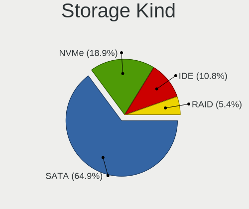

BlackPanther Hardware Trends
----------------------------

A project to identify most popular hardware characteristics and track their change
over time based on data collected by BlackPanther users at https://Linux-Hardware.org.

Anyone can contribute to the study by uploading probes of their computers by
the [hw-probe](https://github.com/linuxhw/hw-probe) tool:

    sudo hw-probe -all -upload

This is a report for all computer types. See also reports for [desktops](/Dist/BlackPanther/Desktop/README.md) and [notebooks](/Dist/BlackPanther/Notebook/README.md).

Full-feature report is available here: https://linux-hardware.org/?view=trends

Period: Jan, 2020.

Contents
--------

- [ OS                       ](#os)
- [ OS Family                ](#os-family)
- [ Kernel                   ](#kernel)
- [ Kernel Family            ](#kernel-family)
- [ Kernel Major Ver.        ](#kernel-major-ver)
- [ Arch                     ](#arch)
- [ DE                       ](#de)
- [ Display Server           ](#display-server)
- [ OS Lang                  ](#os-lang)
- [ Boot Mode                ](#boot-mode)
- [ Filesystem               ](#filesystem)
- [ Dual Boot with Linux     ](#dual-boot-with-linux)
- [ Dual Boot (Win)          ](#dual-boot-win)
- [ Country                  ](#country)
- [ City                     ](#city)
- [ Vendor                   ](#vendor)
- [ Model                    ](#model)
- [ Model Family             ](#model-family)
- [ MFG Year                 ](#mfg-year)
- [ Form Factor              ](#form-factor)
- [ Secure Boot              ](#secure-boot)
- [ Coreboot                 ](#coreboot)
- [ RAM Size                 ](#ram-size)
- [ RAM Used                 ](#ram-used)
- [ Drive Vendor             ](#drive-vendor)
- [ Drive Model              ](#drive-model)
- [ Drive Kind               ](#drive-kind)
- [ Drive Connector          ](#drive-connector)
- [ Drive Size               ](#drive-size)
- [ Space Total              ](#space-total)
- [ Space Used               ](#space-used)
- [ Malfunc. Drives          ](#malfunc-drives)
- [ Malfunc. Drive Vendor    ](#malfunc-drive-vendor)
- [ Malfunc. Drive Kind      ](#malfunc-drive-kind)
- [ Failed Drives            ](#failed-drives)
- [ Failed Drive Vendor      ](#failed-drive-vendor)
- [ Drive Status             ](#drive-status)
- [ Storage Vendor           ](#storage-vendor)
- [ Storage Model            ](#storage-model)
- [ Storage Kind             ](#storage-kind)
- [ CPU Vendor               ](#cpu-vendor)
- [ CPU Model                ](#cpu-model)
- [ CPU Model Family         ](#cpu-model-family)
- [ CPU Cores                ](#cpu-cores)
- [ CPU Sockets              ](#cpu-sockets)
- [ CPU Threads              ](#cpu-threads)
- [ CPU Op-Modes             ](#cpu-op-modes)
- [ CPU Microarch            ](#cpu-microarch)
- [ CPU Microcode            ](#cpu-microcode)
- [ GPU Vendor               ](#gpu-vendor)
- [ GPU Model                ](#gpu-model)
- [ GPU Combo                ](#gpu-combo)
- [ GPU Driver               ](#gpu-driver)
- [ GPU Memory               ](#gpu-memory)
- [ Monitor Vendor           ](#monitor-vendor)
- [ Monitor Model            ](#monitor-model)
- [ Monitor Resolution       ](#monitor-resolution)
- [ Monitor Diagonal         ](#monitor-diagonal)
- [ Monitor Width            ](#monitor-width)
- [ Aspect Ratio             ](#aspect-ratio)
- [ Monitor Area             ](#monitor-area)
- [ Pixel Density            ](#pixel-density)
- [ Multiple Monitors        ](#multiple-monitors)
- [ Net Controller Vendor    ](#net-controller-vendor)
- [ Net Controller Model     ](#net-controller-model)
- [ Net Controller Kind      ](#net-controller-kind)
- [ Used Controller          ](#used-controller)
- [ NICs                     ](#nics)
- [ Unsupported Devices      ](#unsupported-devices)
- [ Unsupported Device Types ](#unsupported-device-types)

OS
--

Installed operating systems

| Name              | Computers | Percent |
|-------------------|-----------|---------|
| BlackPanther 18.1 | 232       | 72.5%   |
| BlackPanther 16.2 | 88        | 27.5%   |

OS Family
---------

OS without a version

| Name         | Computers | Percent |
|--------------|-----------|---------|
| BlackPanther | 320       | 100%    |

Kernel
------

Version of the Linux kernel

| Version                 | Computers | Percent |
|-------------------------|-----------|---------|
| 4.18.16-desktop-1bP     | 205       | 64.06%  |
| 4.9.20-desktop-pae-1bP  | 83        | 25.94%  |
| 5.1.15-desktop-1bP      | 26        | 8.13%   |
| 4.14.14-desktop-pae-1bP | 3         | 0.94%   |
| 4.9.20-desktop-1bP      | 2         | 0.63%   |
| 5.1.15-server-1bP       | 1         | 0.31%   |

Kernel Family
-------------

Linux kernel without a distro release

| Version | Computers | Percent |
|---------|-----------|---------|
| 4.18.16 | 205       | 64.06%  |
| 4.9.20  | 85        | 26.56%  |
| 5.1.15  | 27        | 8.44%   |
| 4.14.14 | 3         | 0.94%   |

Kernel Major Ver.
-----------------

Linux kernel major version

| Version | Computers | Percent |
|---------|-----------|---------|
| 4.18    | 205       | 64.06%  |
| 4.9     | 85        | 26.56%  |
| 5.1     | 27        | 8.44%   |
| 4.14    | 3         | 0.94%   |

Arch
----

OS architecture (x86_64, i586, etc.)

| Name   | Computers | Percent |
|--------|-----------|---------|
| x86_64 | 232       | 72.5%   |
| i686   | 88        | 27.5%   |

DE
--

Desktop Environment

| Name | Computers | Percent |
|------|-----------|---------|
| KDE5 | 320       | 100%    |

Display Server
--------------

X11 or Wayland

| Name | Computers | Percent |
|------|-----------|---------|
| X11  | 320       | 100%    |

OS Lang
-------

Language

| Lang    | Computers | Percent |
|---------|-----------|---------|
| Unknown | 320       | 100%    |

Boot Mode
---------

EFI or BIOS

| Mode | Computers | Percent |
|------|-----------|---------|
| BIOS | 245       | 76.56%  |
| EFI  | 75        | 23.44%  |

Filesystem
----------

Type of filesystem

| Type    | Computers | Percent |
|---------|-----------|---------|
| Ext4    | 286       | 89.38%  |
| Overlay | 29        | 9.06%   |
| Btrfs   | 3         | 0.94%   |
| Ext2    | 2         | 0.63%   |

Dual Boot with Linux
--------------------

Hosting more than one Linux

| Dual boot | Computers | Percent |
|-----------|-----------|---------|
| No        | 253       | 79.06%  |
| Yes       | 67        | 20.94%  |

Dual Boot (Win)
---------------

Hosting Linux and Windows

| Dual boot | Computers | Percent |
|-----------|-----------|---------|
| No        | 200       | 62.5%   |
| Yes       | 120       | 37.5%   |

Country
-------

Geographic location (country)

| Country      | Computers | Percent |
|--------------|-----------|---------|
| Hungary      | 242       | 75.63%  |
| Germany      | 22        | 6.88%   |
| Romania      | 15        | 4.69%   |
| France       | 9         | 2.81%   |
| USA          | 6         | 1.88%   |
| Switzerland  | 3         | 0.94%   |
| Spain        | 3         | 0.94%   |
| Canada       | 3         | 0.94%   |
| Poland       | 2         | 0.63%   |
| Italy        | 2         | 0.63%   |
| Brazil       | 2         | 0.63%   |
| Austria      | 2         | 0.63%   |
| Sweden       | 1         | 0.31%   |
| South Africa | 1         | 0.31%   |
| Slovakia     | 1         | 0.31%   |
| Portugal     | 1         | 0.31%   |
| Pakistan     | 1         | 0.31%   |
| Mexico       | 1         | 0.31%   |
| Greece       | 1         | 0.31%   |
| Belgium      | 1         | 0.31%   |
| Australia    | 1         | 0.31%   |

City
----

Geographic location (city)

| City                | Computers | Percent |
|---------------------|-----------|---------|
| Budapest            | 55        | 17.19%  |
| Eger                | 16        | 5%      |
| Miskolc             | 8         | 2.5%    |
| Győr               | 6         | 1.88%   |
| Székesfehérvár   | 5         | 1.56%   |
| Nyirtelek           | 5         | 1.56%   |
| Debrecen            | 5         | 1.56%   |
| Zalaegerszeg        | 4         | 1.25%   |
| Veresegyhaz         | 4         | 1.25%   |
| Szeged              | 4         | 1.25%   |
| Pécs               | 4         | 1.25%   |
| Nyiregyhaza         | 4         | 1.25%   |
| Gyomro              | 4         | 1.25%   |
| Târgu Mureş       | 3         | 0.94%   |
| Tata                | 3         | 0.94%   |
| Odorheiu Secuiesc   | 3         | 0.94%   |
| Kecskemét          | 3         | 0.94%   |
| Hatvan              | 3         | 0.94%   |
| Cegled              | 3         | 0.94%   |
| Zurich              | 2         | 0.63%   |
| Wysokie Mazowieckie | 2         | 0.63%   |
| Vienna              | 2         | 0.63%   |
| Vicovu de Sus       | 2         | 0.63%   |
| Veszprém           | 2         | 0.63%   |
| Vecses              | 2         | 0.63%   |
| Ujkigyos            | 2         | 0.63%   |
| Terre Haute         | 2         | 0.63%   |
| Szombathely         | 2         | 0.63%   |
| Szentgyorgyvolgy    | 2         | 0.63%   |
| Szekszárd          | 2         | 0.63%   |
| Sarospatak          | 2         | 0.63%   |
| Regensburg          | 2         | 0.63%   |
| Oroshaza            | 2         | 0.63%   |
| Nuremberg           | 2         | 0.63%   |
| Nagyszenas          | 2         | 0.63%   |
| Lappersdorf         | 2         | 0.63%   |
| Kiskunfelegyhaza    | 2         | 0.63%   |
| Hemau               | 2         | 0.63%   |
| Gyongyos            | 2         | 0.63%   |
| Gyal                | 2         | 0.63%   |
| Dunaújváros       | 2         | 0.63%   |
| Clichy              | 2         | 0.63%   |
| Balatonboglar       | 2         | 0.63%   |
| Érd                | 1         | 0.31%   |
| Zirc                | 1         | 0.31%   |
| Zaragoza            | 1         | 0.31%   |
| Zamardi             | 1         | 0.31%   |
| Zalalovo            | 1         | 0.31%   |
| Wolnzach            | 1         | 0.31%   |
| Velem               | 1         | 0.31%   |
| Vancouver           | 1         | 0.31%   |
| Vallaj              | 1         | 0.31%   |
| Tura                | 1         | 0.31%   |
| Toronto             | 1         | 0.31%   |
| Torokszentmiklos    | 1         | 0.31%   |
| Tiszafured          | 1         | 0.31%   |
| Tarjan              | 1         | 0.31%   |
| Taby                | 1         | 0.31%   |
| São Borja          | 1         | 0.31%   |
| Szigetszentmiklos   | 1         | 0.31%   |

Vendor
------

Motherboard manufacturer

| Name                | Computers | Percent |
|---------------------|-----------|---------|
| Hewlett-Packard     | 60        | 18.75%  |
| Dell                | 59        | 18.44%  |
| ASUSTek Computer    | 46        | 14.38%  |
| Lenovo              | 40        | 12.5%   |
| Gigabyte Technology | 23        | 7.19%   |
| ASRock              | 23        | 7.19%   |
| Acer                | 20        | 6.25%   |
| Toshiba             | 13        | 4.06%   |
| MSI                 | 9         | 2.81%   |
| Fujitsu Siemens     | 7         | 2.19%   |
| Medion              | 3         | 0.94%   |
| Sony                | 2         | 0.63%   |
| Samsung Electronics | 2         | 0.63%   |
| Packard Bell        | 2         | 0.63%   |
| Intel               | 2         | 0.63%   |
| Fujitsu             | 2         | 0.63%   |
| eMachines           | 2         | 0.63%   |
| Panasonic           | 1         | 0.31%   |
| Gateway             | 1         | 0.31%   |
| Foxconn             | 1         | 0.31%   |
| Biostar             | 1         | 0.31%   |
| Alcor               | 1         | 0.31%   |

Model
-----

Motherboard model

| Name                                  | Computers | Percent |
|---------------------------------------|-----------|---------|
| Dell OptiPlex 3020                    | 9         | 2.81%   |
| Lenovo IdeaPad 100-15IBD 80QQ         | 6         | 1.88%   |
| HP 250 G1                             | 6         | 1.88%   |
| Gigabyte H61M-S1                      | 5         | 1.56%   |
| Dell Latitude E6410                   | 5         | 1.56%   |
| ASRock G41M-VS3                       | 4         | 1.25%   |
| HP ProBook 6450b                      | 3         | 0.94%   |
| Dell OptiPlex 760                     | 3         | 0.94%   |
| Dell OptiPlex 755                     | 3         | 0.94%   |
| Dell OptiPlex 7010                    | 3         | 0.94%   |
| Dell Inspiron 5558                    | 3         | 0.94%   |
| ASUS X541NA                           | 3         | 0.94%   |
| Toshiba Satellite C660                | 2         | 0.63%   |
| Toshiba PORTEGE R830                  | 2         | 0.63%   |
| Lenovo ThinkPad W510 431924G          | 2         | 0.63%   |
| Lenovo IdeaPad 320-15ISK 80XH         | 2         | 0.63%   |
| HP Pavilion g6                        | 2         | 0.63%   |
| HP Pavilion dv7                       | 2         | 0.63%   |
| HP Pavilion dv6                       | 2         | 0.63%   |
| HP EliteBook 6930p                    | 2         | 0.63%   |
| HP Compaq Elite 8300 CMT              | 2         | 0.63%   |
| HP 650                                | 2         | 0.63%   |
| HP 635                                | 2         | 0.63%   |
| HP 250 G5 Notebook PC                 | 2         | 0.63%   |
| Gigabyte G31M-ES2L                    | 2         | 0.63%   |
| Gigabyte B85M-DS3H-A                  | 2         | 0.63%   |
| Gigabyte 970A-DS3P                    | 2         | 0.63%   |
| Dell OptiPlex 780                     | 2         | 0.63%   |
| ASUS P5KPL-AM SE                      | 2         | 0.63%   |
| ASRock G31M-GS                        | 2         | 0.63%   |
| Unknown                               | 2         | 0.63%   |
| Toshiba TECRA A11                     | 1         | 0.31%   |
| Toshiba Satellite Pro R50-B           | 1         | 0.31%   |
| Toshiba Satellite L650                | 1         | 0.31%   |
| Toshiba Satellite C855-112            | 1         | 0.31%   |
| Toshiba Satellite C75-A               | 1         | 0.31%   |
| Toshiba Satellite C55D-A              | 1         | 0.31%   |
| Toshiba Satellite C50-A-1G1           | 1         | 0.31%   |
| Toshiba Satellite                     | 1         | 0.31%   |
| Sony VPCEH3H1E                        | 1         | 0.31%   |
| Sony VGN-FW21M                        | 1         | 0.31%   |
| Samsung Electronics RV409/RV509/RV709 | 1         | 0.31%   |
| Samsung Electronics N145P/N250P/N260P | 1         | 0.31%   |
| Panasonic CF-W8EWEZZAM                | 1         | 0.31%   |
| Packard Bell EasyNote TV43HC          | 1         | 0.31%   |
| Packard Bell EasyNote TK81            | 1         | 0.31%   |
| MSI MS-A61311                         | 1         | 0.31%   |
| MSI MS-7A74                           | 1         | 0.31%   |
| MSI MS-7996                           | 1         | 0.31%   |
| MSI MS-7883                           | 1         | 0.31%   |
| MSI MS-7817                           | 1         | 0.31%   |
| MSI MS-7680                           | 1         | 0.31%   |
| MSI MS-7512                           | 1         | 0.31%   |
| MSI MS-7309                           | 1         | 0.31%   |
| MSI MS-7235                           | 1         | 0.31%   |
| Medion P6612                          | 1         | 0.31%   |
| Medion MS-7748                        | 1         | 0.31%   |
| Medion E7214                          | 1         | 0.31%   |
| Lenovo Z50-75 80EC                    | 1         | 0.31%   |
| Lenovo Yoga 310-11IAP 80U2            | 1         | 0.31%   |

Model Family
------------

Motherboard model prefix

| Name                      | Computers | Percent |
|---------------------------|-----------|---------|
| Dell OptiPlex             | 24        | 7.5%    |
| Acer Aspire               | 18        | 5.63%   |
| Lenovo IdeaPad            | 16        | 5%      |
| Dell Latitude             | 16        | 5%      |
| HP Compaq                 | 15        | 4.69%   |
| Dell Inspiron             | 14        | 4.38%   |
| Lenovo ThinkPad           | 12        | 3.75%   |
| HP Pavilion               | 10        | 3.13%   |
| Toshiba Satellite         | 9         | 2.81%   |
| HP 250                    | 8         | 2.5%    |
| HP EliteBook              | 5         | 1.56%   |
| Gigabyte H61M-S1          | 5         | 1.56%   |
| HP ProBook                | 4         | 1.25%   |
| Fujitsu Siemens ESPRIMO   | 4         | 1.25%   |
| ASUS VivoBook             | 4         | 1.25%   |
| ASRock G41M-VS3           | 4         | 1.25%   |
| Lenovo ThinkCentre        | 3         | 0.94%   |
| Dell XPS                  | 3         | 0.94%   |
| ASUS X541NA               | 3         | 0.94%   |
| ASUS P5KPL-AM             | 3         | 0.94%   |
| Toshiba PORTEGE           | 2         | 0.63%   |
| Packard Bell EasyNote     | 2         | 0.63%   |
| Lenovo ThinkStation       | 2         | 0.63%   |
| HP Laptop                 | 2         | 0.63%   |
| HP 650                    | 2         | 0.63%   |
| HP 635                    | 2         | 0.63%   |
| Gigabyte G31M-ES2L        | 2         | 0.63%   |
| Gigabyte B85M-DS3H-A      | 2         | 0.63%   |
| Gigabyte 970A-DS3P        | 2         | 0.63%   |
| Fujitsu Siemens AMILO     | 2         | 0.63%   |
| Fujitsu ESPRIMO           | 2         | 0.63%   |
| ASUS ROG                  | 2         | 0.63%   |
| ASUS Rampage              | 2         | 0.63%   |
| ASRock G31M-GS            | 2         | 0.63%   |
| Unknown                   | 2         | 0.63%   |
| Toshiba TECRA             | 1         | 0.31%   |
| Sony VPCEH3H1E            | 1         | 0.31%   |
| Sony VGN-FW21M            | 1         | 0.31%   |
| Samsung Electronics RV409 | 1         | 0.31%   |
| Samsung Electronics N145P | 1         | 0.31%   |
| Panasonic CF-W8EWEZZAM    | 1         | 0.31%   |
| MSI MS-A61311             | 1         | 0.31%   |
| MSI MS-7A74               | 1         | 0.31%   |
| MSI MS-7996               | 1         | 0.31%   |
| MSI MS-7883               | 1         | 0.31%   |
| MSI MS-7817               | 1         | 0.31%   |
| MSI MS-7680               | 1         | 0.31%   |
| MSI MS-7512               | 1         | 0.31%   |
| MSI MS-7309               | 1         | 0.31%   |
| MSI MS-7235               | 1         | 0.31%   |
| Medion P6612              | 1         | 0.31%   |
| Medion MS-7748            | 1         | 0.31%   |
| Medion E7214              | 1         | 0.31%   |
| Lenovo Z50-75             | 1         | 0.31%   |
| Lenovo Yoga               | 1         | 0.31%   |
| Lenovo G70-70             | 1         | 0.31%   |
| Lenovo G550               | 1         | 0.31%   |
| Lenovo G50-45             | 1         | 0.31%   |
| Lenovo G50-30             | 1         | 0.31%   |
| Lenovo 3000               | 1         | 0.31%   |

MFG Year
--------

Motherboard manufacture year

| Year | Computers | Percent |
|------|-----------|---------|
| 2011 | 38        | 11.88%  |
| 2018 | 34        | 10.63%  |
| 2013 | 34        | 10.63%  |
| 2012 | 31        | 9.69%   |
| 2010 | 30        | 9.38%   |
| 2015 | 27        | 8.44%   |
| 2009 | 26        | 8.13%   |
| 2016 | 21        | 6.56%   |
| 2008 | 21        | 6.56%   |
| 2014 | 17        | 5.31%   |
| 2019 | 16        | 5%      |
| 2017 | 11        | 3.44%   |
| 2007 | 11        | 3.44%   |
| 2006 | 1         | 0.31%   |
| 2005 | 1         | 0.31%   |
| 2003 | 1         | 0.31%   |

Form Factor
-----------

Physical design of the computer

| Name        | Computers | Percent |
|-------------|-----------|---------|
| Notebook    | 184       | 57.5%   |
| Desktop     | 131       | 40.94%  |
| All in one  | 2         | 0.63%   |
| Tablet      | 1         | 0.31%   |
| Convertible | 1         | 0.31%   |
| Server      | 1         | 0.31%   |

Secure Boot
-----------

Enabled or disabled

| State    | Computers | Percent |
|----------|-----------|---------|
| Disabled | 320       | 100%    |

Coreboot
--------

Have coreboot on board

| Used | Computers | Percent |
|------|-----------|---------|
| No   | 320       | 100%    |

RAM Size
--------

Total RAM memory

| Size in GB  | Computers | Percent |
|-------------|-----------|---------|
| 3.01-4.0    | 127       | 39.69%  |
| 4.01-8.0    | 58        | 18.13%  |
| 8.01-16.0   | 50        | 15.63%  |
| 1.01-2.0    | 38        | 11.88%  |
| 2.01-3.0    | 21        | 6.56%   |
| 16.01-24.0  | 19        | 5.94%   |
| 32.01-64.0  | 3         | 0.94%   |
| 0.01-1.0    | 2         | 0.63%   |
| 24.01-32.0  | 1         | 0.31%   |
| 64.01-256.0 | 1         | 0.31%   |

RAM Used
--------

Used RAM memory

| Used GB  | Computers | Percent |
|----------|-----------|---------|
| 0.01-1.0 | 163       | 50.94%  |
| 1.01-2.0 | 134       | 41.88%  |
| 2.01-3.0 | 20        | 6.25%   |
| 3.01-4.0 | 2         | 0.63%   |
| 4.01-8.0 | 1         | 0.31%   |

Drive Vendor
------------

Hard drive vendors

| Vendor              | Computers | Drives  | Percent |
|---------------------|-----------|---------|---------|
| Seagate             | 88        | 99      | 21.31%  |
| WDC                 | 85        | 96      | 20.58%  |
| Samsung Electronics | 45        | 45      | 10.9%   |
| Kingston            | 35        | 41      | 8.47%   |
| Toshiba             | 31        | 31      | 7.51%   |
| Hitachi             | 23        | 23      | 5.57%   |
| HGST                | 19        | 19      | 4.6%    |
| SanDisk             | 15        | 15      | 3.63%   |
| Unknown             | 8         | 8       | 1.94%   |
| MAXTOR              | 7         | 7       | 1.69%   |
| A-DATA Technology   | 7         | 7       | 1.69%   |
| Crucial             | 6         | 9       | 1.45%   |
| Intel               | 5         | 5       | 1.21%   |
| HL-DT-ST            | 5         | Unknown | 1.21%   |
| SPCC                | 3         | 3       | 0.73%   |
| SK Hynix            | 3         | 3       | 0.73%   |
| Intenso             | 3         | 3       | 0.73%   |
| Fujitsu             | 3         | 3       | 0.73%   |
| Apacer              | 3         | 3       | 0.73%   |
| Patriot             | 2         | 2       | 0.48%   |
| KINGMAX             | 2         | 2       | 0.48%   |
| Corsair             | 2         | 3       | 0.48%   |
| China               | 2         | 2       | 0.48%   |
| XPG                 | 1         | 1       | 0.24%   |
| PNY                 | 1         | 1       | 0.24%   |
| OCZ                 | 1         | 1       | 0.24%   |
| Netac               | 1         | 1       | 0.24%   |
| LITEONIT            | 1         | 1       | 0.24%   |
| JMicron             | 1         | 1       | 0.24%   |
| Hewlett-Packard     | 1         | Unknown | 0.24%   |
| Gigabyte Technology | 1         | 1       | 0.24%   |
| Generic             | 1         | 1       | 0.24%   |
| BIWIN               | 1         | 1       | 0.24%   |
| AMD                 | 1         | 1       | 0.24%   |

Drive Model
-----------

Hard drive models

| Model                        | Computers | Percent |
|------------------------------|-----------|---------|
| ST500DM002-1BD142 500GB      | 11        | 2.51%   |
| SA400S37240G 240GB SSD       | 9         | 2.05%   |
| ST500LT012-1DG142 500GB      | 6         | 1.37%   |
| SA400S37120G 120GB SSD       | 6         | 1.37%   |
| MQ01ABF050 500GB             | 6         | 1.37%   |
| SV300S37A120G 120GB SSD      | 5         | 1.14%   |
| ST9320325AS 320GB            | 5         | 1.14%   |
| SDSSDH3250G 250GB            | 5         | 1.14%   |
| HTS545032A7E380 320GB        | 5         | 1.14%   |
| HTS541010A9E680 1TB          | 5         | 1.14%   |
| DVDRAM GUC0N 1GB             | 5         | 1.14%   |
| WD5000AAKX-001CA0 500GB      | 4         | 0.91%   |
| ST380815AS 80GB              | 4         | 0.91%   |
| ST3250318AS 250GB            | 4         | 0.91%   |
| HDS721050CLA360 500GB        | 4         | 0.91%   |
| WD5000LPVX-22V0TT0 500GB     | 3         | 0.68%   |
| WD10EZEX-08WN4A0 1TB         | 3         | 0.68%   |
| SV300S37A240G 240GB SSD      | 3         | 0.68%   |
| SUV400S37120G 120GB SSD      | 3         | 0.68%   |
| ST3160318AS 160GB            | 3         | 0.68%   |
| ST1000LM035-1RK172 1TB       | 3         | 0.68%   |
| ST1000LM024 HN-M101MBB 1TB   | 3         | 0.68%   |
| SHFS37A120G 120GB SSD        | 3         | 0.68%   |
| MQ04ABF100 1TB               | 3         | 0.68%   |
| MQ01ACF032 320GB             | 3         | 0.68%   |
| HTS541075A9E680 752GB        | 3         | 0.68%   |
| DT01ACA100 1TB               | 3         | 0.68%   |
| CT120BX500SSD1 120GB         | 3         | 0.68%   |
| WDS240G2G0B-00EPW0 240GB SSD | 2         | 0.46%   |
| WD5000LPCX-24VHAT0 500GB     | 2         | 0.46%   |
| WD5000AVCS-632DY1 500GB      | 2         | 0.46%   |
| WD5000AAKX-22ERMA0 500GB     | 2         | 0.46%   |
| WD5000AAKS-00UU3A0 500GB     | 2         | 0.46%   |
| WD5000AADS-00S9B0 500GB      | 2         | 0.46%   |
| WD2500BEVS-22UST0 250GB      | 2         | 0.46%   |
| WD2500BEKT-60PVMT0 250GB     | 2         | 0.46%   |
| WD2500AAKX-60U6AA0 250GB     | 2         | 0.46%   |
| WD1600BEVS-22RST0 160GB      | 2         | 0.46%   |
| SU700 120GB SSD              | 2         | 0.46%   |
| STM3160813AS 160GB           | 2         | 0.46%   |
| ST9500420AS 500GB            | 2         | 0.46%   |
| ST9500325AS 500GB            | 2         | 0.46%   |
| ST9160821AS 160GB            | 2         | 0.46%   |
| ST3160815AS 160GB            | 2         | 0.46%   |
| ST250DM000-1BC141 250GB      | 2         | 0.46%   |
| ST1000LX015-1U7172 1TB       | 2         | 0.46%   |
| ST1000DM003-1SB10C 1TB       | 2         | 0.46%   |
| ST1000DM003-1CH162 1TB       | 2         | 0.46%   |
| SSD 860 EVO 250GB            | 2         | 0.46%   |
| SSD 128GB                    | 2         | 0.46%   |
| SSD 120GB                    | 2         | 0.46%   |
| Solid State Disk 120GB       | 2         | 0.46%   |
| SATA SSD 120GB               | 2         | 0.46%   |
| SATA III SSD 480GB           | 2         | 0.46%   |
| MQ01ABD100 1TB               | 2         | 0.46%   |
| MQ01ABD050 500GB             | 2         | 0.46%   |
| HTS725050A7E630 500GB        | 2         | 0.46%   |
| HTS723232A7A364 320GB        | 2         | 0.46%   |
| HTS547550A9E384 500GB        | 2         | 0.46%   |
| HTS545050A7E680 500GB        | 2         | 0.46%   |

Drive Kind
----------

HDD or SSD

| Kind    | Computers | Drives | Percent |
|---------|-----------|--------|---------|
| HDD     | 250       | 290    | 64.77%  |
| SSD     | 105       | 124    | 27.2%   |
| MMC     | 11        | 11     | 2.85%   |
| NVMe    | 11        | 11     | 2.85%   |
| Unknown | 9         | 3      | 2.33%   |

Drive Connector
---------------

SATA, SAS, NVMe, etc.

| Type | Computers | Drives | Percent |
|------|-----------|--------|---------|
| SATA | 313       | 410    | 89.94%  |
| SAS  | 13        | 7      | 3.74%   |
| NVMe | 11        | 11     | 3.16%   |
| MMC  | 11        | 11     | 3.16%   |

Drive Size
----------

Size of hard drive

| Size in TB | Computers | Drives | Percent |
|------------|-----------|--------|---------|
| 0.01-0.5   | 285       | 350    | 79.17%  |
| 0.51-1.0   | 64        | 72     | 17.78%  |
| 1.01-2.0   | 9         | 14     | 2.5%    |
| 3.01-4.0   | 2         | 3      | 0.56%   |

Space Total
-----------

Amount of disk space available on the file system

| Size in GB     | Computers | Percent |
|----------------|-----------|---------|
| 101-250        | 118       | 36.88%  |
| 251-500        | 73        | 22.81%  |
| 51-100         | 38        | 11.88%  |
| 501-1000       | 26        | 8.13%   |
| 21-50          | 24        | 7.5%    |
| Unknown        | 23        | 7.19%   |
| 1-20           | 9         | 2.81%   |
| 1001-2000      | 6         | 1.88%   |
| 2001-3000      | 2         | 0.63%   |
| More than 3000 | 1         | 0.31%   |

Space Used
----------

Amount of used disk space

| Used GB   | Computers | Percent |
|-----------|-----------|---------|
| 1-20      | 220       | 68.75%  |
| 21-50     | 35        | 10.94%  |
| Unknown   | 23        | 7.19%   |
| 51-100    | 16        | 5%      |
| 101-250   | 13        | 4.06%   |
| 251-500   | 7         | 2.19%   |
| 501-1000  | 3         | 0.94%   |
| 1001-2000 | 2         | 0.63%   |
| 2001-3000 | 1         | 0.31%   |

Malfunc. Drives
---------------

Drive models with a malfunction

| Model                    | Computers | Drives | Percent |
|--------------------------|-----------|--------|---------|
| HTS545032A7E380 320GB    | 5         | 5      | 4.13%   |
| WD5000AAKX-001CA0 500GB  | 4         | 4      | 3.31%   |
| ST500DM002-1BD142 500GB  | 4         | 4      | 3.31%   |
| ST500LT012-1DG142 500GB  | 3         | 3      | 2.48%   |
| WD2500BEKT-60PVMT0 250GB | 2         | 2      | 1.65%   |
| ST9500420AS 500GB        | 2         | 2      | 1.65%   |
| ST9320325AS 320GB        | 2         | 2      | 1.65%   |
| ST3250318AS 250GB        | 2         | 2      | 1.65%   |
| HTS723232A7A364 320GB    | 2         | 2      | 1.65%   |
| HTS547550A9E384 500GB    | 2         | 2      | 1.65%   |
| HTS545050A7E680 500GB    | 2         | 2      | 1.65%   |
| HTS541010A9E680 1TB      | 2         | 2      | 1.65%   |
| HM160HI 160GB            | 2         | 2      | 1.65%   |
| HDS721032CLA362 320GB    | 2         | 2      | 1.65%   |
| HD103UJ 1TB              | 2         | 2      | 1.65%   |
| 6Y080M0 81GB             | 2         | 2      | 1.65%   |
| WD800JD-00HKA0 80GB      | 1         | 1      | 0.83%   |
| WD800JB-00JJC0 80GB      | 1         | 1      | 0.83%   |
| WD6400BEVT-22A0RT0 640GB | 1         | 1      | 0.83%   |
| WD6400AAKS-75A7B2 640GB  | 1         | 1      | 0.83%   |
| WD5003ABYZ-011FA0 500GB  | 1         | 1      | 0.83%   |
| WD5000LPCX-24VHAT0 500GB | 1         | 1      | 0.83%   |
| WD5000BPKT-75PK4T0 500GB | 1         | 1      | 0.83%   |
| WD5000BPKT-60PK4T0 500GB | 1         | 1      | 0.83%   |
| WD5000AVCS-632DY1 500GB  | 1         | 1      | 0.83%   |
| WD5000AAKX-22ERMA0 500GB | 1         | 1      | 0.83%   |
| WD5000AAKX-083CA1 500GB  | 1         | 1      | 0.83%   |
| WD5000AAKS-00UU3A0 500GB | 1         | 1      | 0.83%   |
| WD5000AAKS-007AA0 500GB  | 1         | 1      | 0.83%   |
| WD5000AAJS-00YFA0 500GB  | 1         | 1      | 0.83%   |
| WD5000AADS-00S9B0 500GB  | 1         | 1      | 0.83%   |
| WD3200BEVT-75ZCT2 320GB  | 1         | 1      | 0.83%   |
| WD3200AVVS-63L2B0 320GB  | 1         | 1      | 0.83%   |
| WD2500BEVT-22ZCT0 250GB  | 1         | 1      | 0.83%   |
| WD2500BEKT-75A25T0 250GB | 1         | 1      | 0.83%   |
| WD2500AVJS-63B6A0 250GB  | 1         | 1      | 0.83%   |
| WD20EARS-60MVWB0 2TB     | 1         | 1      | 0.83%   |
| WD20EARS-00J2GB0 2TB     | 1         | 1      | 0.83%   |
| WD2000JB-00GVA0 200GB    | 1         | 1      | 0.83%   |
| WD1600BEVS-22RST0 160GB  | 1         | 1      | 0.83%   |
| WD10EZEX-75WN4A0 1TB     | 1         | 1      | 0.83%   |
| WD10EZEX-08WN4A0 1TB     | 1         | 1      | 0.83%   |
| WD10EARS-00Y5B1 1TB      | 1         | 1      | 0.83%   |
| SV300S37A120G 120GB SSD  | 1         | 1      | 0.83%   |
| SV1021D 10GB             | 1         | 1      | 0.83%   |
| SUV400S37240G 240GB SSD  | 1         | 1      | 0.83%   |
| SU700 120GB SSD          | 1         | 1      | 0.83%   |
| ST980811AS 80GB          | 1         | 1      | 0.83%   |
| ST9750423AS 752GB        | 1         | 1      | 0.83%   |
| ST9500325AS 500GB        | 1         | 1      | 0.83%   |
| ST9250410AS 250GB        | 1         | 1      | 0.83%   |
| ST9250315AS 250GB        | 1         | 1      | 0.83%   |
| ST9160412AS 160GB        | 1         | 1      | 0.83%   |
| ST3500418AS 500GB        | 1         | 1      | 0.83%   |
| ST3320820AS 320GB        | 1         | 1      | 0.83%   |
| ST320LT009-9WC142 320GB  | 1         | 1      | 0.83%   |
| ST3160815AS 160GB        | 1         | 1      | 0.83%   |
| ST3160023AS 160GB        | 1         | 1      | 0.83%   |
| ST3120026AS 120GB        | 1         | 1      | 0.83%   |
| ST250DM000-1BD141 250GB  | 1         | 1      | 0.83%   |

Malfunc. Drive Vendor
---------------------

Vendors of faulty drives

| Vendor              | Computers | Drives | Percent |
|---------------------|-----------|--------|---------|
| WDC                 | 30        | 33     | 25.64%  |
| Seagate             | 27        | 28     | 23.08%  |
| Hitachi             | 15        | 15     | 12.82%  |
| Samsung Electronics | 11        | 11     | 9.4%    |
| HGST                | 11        | 11     | 9.4%    |
| Toshiba             | 9         | 9      | 7.69%   |
| Maxtor              | 3         | 3      | 2.56%   |
| Kingston            | 3         | 3      | 2.56%   |
| SK Hynix            | 2         | 2      | 1.71%   |
| Intel               | 2         | 2      | 1.71%   |
| SanDisk             | 1         | 1      | 0.85%   |
| Intenso             | 1         | 1      | 0.85%   |
| Fujitsu             | 1         | 1      | 0.85%   |
| A-DATA Technology   | 1         | 1      | 0.85%   |

Malfunc. Drive Kind
-------------------

Kinds of faulty drives

| Kind | Computers | Drives | Percent |
|------|-----------|--------|---------|
| HDD  | 102       | 110    | 90.27%  |
| SSD  | 11        | 11     | 9.73%   |

Failed Drives
-------------

Failed drive models

| Model                   | Computers | Drives | Percent |
|-------------------------|-----------|--------|---------|
| WD1600BEVT-22ZCT0 160GB | 1         | 1      | 100%    |

Failed Drive Vendor
-------------------

Failed drive vendors

| Vendor | Computers | Drives | Percent |
|--------|-----------|--------|---------|
| WDC    | 1         | 1      | 100%    |

Drive Status
------------

Number of failed and malfunc. drives

| Status   | Computers | Drives | Percent |
|----------|-----------|--------|---------|
| Works    | 216       | 269    | 58.54%  |
| Malfunc  | 112       | 121    | 30.35%  |
| Detected | 40        | 48     | 10.84%  |
| Failed   | 1         | 1      | 0.27%   |

Storage Vendor
--------------

Storage controller vendors

| Vendor                       | Computers | Percent |
|------------------------------|-----------|---------|
| Intel                        | 261       | 75.65%  |
| AMD                          | 47        | 13.62%  |
| Nvidia                       | 7         | 2.03%   |
| Marvell Technology Group     | 7         | 2.03%   |
| JMicron Technology           | 7         | 2.03%   |
| Samsung Electronics          | 5         | 1.45%   |
| ASMedia Technology           | 3         | 0.87%   |
| VIA Technologies             | 2         | 0.58%   |
| Kingston Technology Company  | 2         | 0.58%   |
| Unknown                      | 1         | 0.29%   |
| Toshiba America Info Systems | 1         | 0.29%   |
| Sandisk                      | 1         | 0.29%   |
| Realtek Semiconductor        | 1         | 0.29%   |

Storage Model
-------------

Storage controller models

| Model                                                                             | Computers | Percent |
|-----------------------------------------------------------------------------------|-----------|---------|
| FCH SATA Controller [AHCI mode]                                                   | 28        | 6.22%   |
| 7 Series Chipset Family 6-port SATA Controller [AHCI mode]                        | 20        | 4.44%   |
| NM10/ICH7 Family SATA Controller [IDE mode]                                       | 19        | 4.22%   |
| 82801IBM/IEM (ICH9M/ICH9M-E) 4 port SATA Controller [AHCI mode]                   | 18        | 4%      |
| 82801HM/HEM (ICH8M/ICH8M-E) IDE Controller                                        | 17        | 3.78%   |
| 82801G (ICH7 Family) IDE Controller                                               | 15        | 3.33%   |
| 8 Series/C220 Series Chipset Family 6-port SATA Controller 1 [AHCI mode]          | 14        | 3.11%   |
| SB7x0/SB8x0/SB9x0 SATA Controller [AHCI mode]                                     | 13        | 2.89%   |
| 6 Series/C200 Series Chipset Family 6 port Mobile SATA AHCI Controller            | 13        | 2.89%   |
| Sunrise Point-LP SATA Controller [AHCI mode]                                      | 11        | 2.44%   |
| 82801HM/HEM (ICH8M/ICH8M-E) SATA Controller [AHCI mode]                           | 11        | 2.44%   |
| Wildcat Point-LP SATA Controller [AHCI Mode]                                      | 10        | 2.22%   |
| 8 Series SATA Controller 1 [AHCI mode]                                            | 9         | 2%      |
| 6 Series/C200 Series Chipset Family 6 port Desktop SATA AHCI Controller           | 9         | 2%      |
| 5 Series/3400 Series Chipset 6 port SATA AHCI Controller                          | 9         | 2%      |
| 82801 Mobile SATA Controller [RAID mode]                                          | 8         | 1.78%   |
| 7 Series/C210 Series Chipset Family 6-port SATA Controller [AHCI mode]            | 8         | 1.78%   |
| 5 Series/3400 Series Chipset 4 port SATA AHCI Controller                          | 8         | 1.78%   |
| SB7x0/SB8x0/SB9x0 IDE Controller                                                  | 7         | 1.56%   |
| 6 Series/C200 Series Chipset Family Desktop SATA Controller (IDE mode, ports 4-5) | 7         | 1.56%   |
| 6 Series/C200 Series Chipset Family Desktop SATA Controller (IDE mode, ports 0-3) | 7         | 1.56%   |
| 4 Series Chipset PT IDER Controller                                               | 7         | 1.56%   |
| 82801I (ICH9 Family) 2 port SATA Controller [IDE mode]                            | 6         | 1.33%   |
| 82801HM/HEM (ICH8M/ICH8M-E) SATA Controller [IDE mode]                            | 6         | 1.33%   |
| 5 Series/3400 Series Chipset 4 port SATA IDE Controller                           | 6         | 1.33%   |
| 5 Series/3400 Series Chipset 2 port SATA IDE Controller                           | 6         | 1.33%   |
| Celeron N3350/Pentium N4200/Atom E3900 Series SATA AHCI Controller                | 5         | 1.11%   |
| 82Q35 Express PT IDER Controller                                                  | 5         | 1.11%   |
| 82801JD/DO (ICH10 Family) SATA AHCI Controller                                    | 5         | 1.11%   |
| 82801IR/IO/IH (ICH9R/DO/DH) 4 port SATA Controller [IDE mode]                     | 5         | 1.11%   |
| 200 Series PCH SATA controller [AHCI mode]                                        | 5         | 1.11%   |
| SB7x0/SB8x0/SB9x0 SATA Controller [IDE mode]                                      | 4         | 0.89%   |
| Q170/Q150/B150/H170/H110/Z170/CM236 Chipset SATA Controller [AHCI Mode]           | 4         | 0.89%   |
| Cannon Lake PCH SATA AHCI Controller                                              | 4         | 0.89%   |
| Atom/Celeron/Pentium Processor x5-E8000/J3xxx/N3xxx Series SATA Controller        | 4         | 0.89%   |
| SATA Controller [RAID mode]                                                       | 3         | 0.67%   |
| NVMe SSD Controller SM981/PM981/PM983                                             | 3         | 0.67%   |
| NM10/ICH7 Family SATA Controller [AHCI mode]                                      | 3         | 0.67%   |
| MCP61 SATA Controller                                                             | 3         | 0.67%   |
| MCP61 IDE                                                                         | 3         | 0.67%   |
| JMB363 SATA/IDE Controller                                                        | 3         | 0.67%   |
| FCH IDE Controller                                                                | 3         | 0.67%   |
| C600/X79 series chipset 6-Port SATA AHCI Controller                               | 3         | 0.67%   |
| Atom Processor E3800 Series SATA AHCI Controller                                  | 3         | 0.67%   |
| ASM1062 Serial ATA Controller                                                     | 3         | 0.67%   |
| 82801JI (ICH10 Family) SATA AHCI Controller                                       | 3         | 0.67%   |
| 82801JI (ICH10 Family) 4 port SATA IDE Controller #1                              | 3         | 0.67%   |
| 82801JI (ICH10 Family) 2 port SATA IDE Controller #2                              | 3         | 0.67%   |
| 82801JD/DO (ICH10 Family) 4-port SATA IDE Controller                              | 3         | 0.67%   |
| 82801JD/DO (ICH10 Family) 2-port SATA IDE Controller                              | 3         | 0.67%   |
| 82801HR/HO/HH (ICH8R/DO/DH) 2 port SATA Controller [IDE mode]                     | 3         | 0.67%   |
| 82801H (ICH8 Family) 4 port SATA Controller [IDE mode]                            | 3         | 0.67%   |
| 82801GBM/GHM (ICH7-M Family) SATA Controller [IDE mode]                           | 3         | 0.67%   |
| NVMe SSD Controller SM961/PM961                                                   | 2         | 0.44%   |
| Mobile PM965/GM965 PT IDER Controller                                             | 2         | 0.44%   |
| Mobile 4 Series Chipset PT IDER Controller                                        | 2         | 0.44%   |
| JMB368 IDE controller                                                             | 2         | 0.44%   |
| 88SE6111/6121 SATA II / PATA Controller                                           | 2         | 0.44%   |
| 82801IR/IO/IH (ICH9R/DO/DH) 6 port SATA Controller [AHCI mode]                    | 2         | 0.44%   |
| 82801IBM/IEM (ICH9M/ICH9M-E) 2 port SATA Controller [IDE mode]                    | 2         | 0.44%   |

Storage Kind
------------

Kind of storage controller (IDE, SATA, NVMe, SAS, ...)

| Kind | Computers | Percent |
|------|-----------|---------|
| SATA | 235       | 64.74%  |
| IDE  | 104       | 28.65%  |
| RAID | 12        | 3.31%   |
| NVMe | 11        | 3.03%   |
| SAS  | 1         | 0.28%   |

CPU Vendor
----------

Processor vendors

| Vendor       | Computers | Percent |
|--------------|-----------|---------|
| Intel        | 265       | 82.81%  |
| AMD          | 54        | 16.88%  |
| CentaurHauls | 1         | 0.31%   |

CPU Model
---------

Processor models

| Model                                          | Computers | Percent |
|------------------------------------------------|-----------|---------|
| Intel Core i3-4160 CPU @ 3.60GHz               | 9         | 2.81%   |
| Intel Core i3-5005U CPU @ 2.00GHz              | 8         | 2.5%    |
| Intel Core 2 Duo CPU E8400 @ 3.00GHz           | 6         | 1.88%   |
| Intel Celeron CPU 1000M @ 1.80GHz              | 6         | 1.88%   |
| Intel Pentium CPU G840 @ 2.80GHz               | 5         | 1.56%   |
| Intel Core i5 CPU M 520 @ 2.40GHz              | 4         | 1.25%   |
| Intel Core 2 Duo CPU P8600 @ 2.40GHz           | 4         | 1.25%   |
| Intel Core 2 Duo CPU E7500 @ 2.93GHz           | 4         | 1.25%   |
| Intel Celeron CPU N3350 @ 1.10GHz              | 4         | 1.25%   |
| Intel Pentium Dual-Core CPU T4200 @ 2.00GHz    | 3         | 0.94%   |
| Intel Pentium Dual-Core CPU E5700 @ 3.00GHz    | 3         | 0.94%   |
| Intel Pentium Dual-Core CPU E5400 @ 2.70GHz    | 3         | 0.94%   |
| Intel Core i7-3770 CPU @ 3.40GHz               | 3         | 0.94%   |
| Intel Core i5-3470 CPU @ 3.20GHz               | 3         | 0.94%   |
| Intel Core i5 CPU M 560 @ 2.67GHz              | 3         | 0.94%   |
| Intel Core i3-4005U CPU @ 1.70GHz              | 3         | 0.94%   |
| Intel Core i3-3220 CPU @ 3.30GHz               | 3         | 0.94%   |
| Intel Core i3 CPU M 350 @ 2.27GHz              | 3         | 0.94%   |
| Intel Core 2 Duo CPU T7500 @ 2.20GHz           | 3         | 0.94%   |
| Intel Pentium Gold G5400 CPU @ 3.70GHz         | 2         | 0.63%   |
| Intel Pentium Dual-Core CPU T4500 @ 2.30GHz    | 2         | 0.63%   |
| Intel Pentium CPU N3700 @ 1.60GHz              | 2         | 0.63%   |
| Intel Pentium CPU G3220 @ 3.00GHz              | 2         | 0.63%   |
| Intel Pentium CPU 2117U @ 1.80GHz              | 2         | 0.63%   |
| Intel Pentium CPU 2020M @ 2.40GHz              | 2         | 0.63%   |
| Intel Core i7-8700 CPU @ 3.20GHz               | 2         | 0.63%   |
| Intel Core i7-6500U CPU @ 2.50GHz              | 2         | 0.63%   |
| Intel Core i7-2670QM CPU @ 2.20GHz             | 2         | 0.63%   |
| Intel Core i7-2620M CPU @ 2.70GHz              | 2         | 0.63%   |
| Intel Core i7 CPU Q 720 @ 1.60GHz              | 2         | 0.63%   |
| Intel Core i5-8250U CPU @ 1.60GHz              | 2         | 0.63%   |
| Intel Core i5-6200U CPU @ 2.30GHz              | 2         | 0.63%   |
| Intel Core i5-5300U CPU @ 2.30GHz              | 2         | 0.63%   |
| Intel Core i5-4460 CPU @ 3.20GHz               | 2         | 0.63%   |
| Intel Core i5-4210U CPU @ 1.70GHz              | 2         | 0.63%   |
| Intel Core i5-2520M CPU @ 2.50GHz              | 2         | 0.63%   |
| Intel Core i5-2450M CPU @ 2.50GHz              | 2         | 0.63%   |
| Intel Core i3-7020U CPU @ 2.30GHz              | 2         | 0.63%   |
| Intel Core i3-6006U CPU @ 2.00GHz              | 2         | 0.63%   |
| Intel Core i3-4030U CPU @ 1.90GHz              | 2         | 0.63%   |
| Intel Core i3-2350M CPU @ 2.30GHz              | 2         | 0.63%   |
| Intel Core 2 Quad CPU Q8200 @ 2.33GHz          | 2         | 0.63%   |
| Intel Core 2 Quad CPU Q6600 @ 2.40GHz          | 2         | 0.63%   |
| Intel Core 2 Duo CPU T8300 @ 2.40GHz           | 2         | 0.63%   |
| Intel Core 2 Duo CPU T8100 @ 2.10GHz           | 2         | 0.63%   |
| Intel Core 2 Duo CPU T7300 @ 2.00GHz           | 2         | 0.63%   |
| Intel Core 2 Duo CPU T7250 @ 2.00GHz           | 2         | 0.63%   |
| Intel Core 2 Duo CPU E7400 @ 2.80GHz           | 2         | 0.63%   |
| Intel Core 2 CPU 6300 @ 1.86GHz                | 2         | 0.63%   |
| Intel Celeron CPU 540 @ 1.86GHz                | 2         | 0.63%   |
| Intel Atom x5-Z8350 CPU @ 1.44GHz              | 2         | 0.63%   |
| Intel Atom CPU N450 @ 1.66GHz                  | 2         | 0.63%   |
| AMD FX-8350 Eight-Core Processor               | 2         | 0.63%   |
| AMD E2-9000e RADEON R2, 4 COMPUTE CORES 2C+2G  | 2         | 0.63%   |
| AMD E-350 Processor                            | 2         | 0.63%   |
| AMD Athlon X4 860K Quad Core Processor         | 2         | 0.63%   |
| AMD Athlon 64 X2 Dual Core Processor 5000+     | 2         | 0.63%   |
| AMD A6-6310 APU with AMD Radeon R4 Graphics    | 2         | 0.63%   |
| AMD A10-7300 Radeon R6, 10 Compute Cores 4C+6G | 2         | 0.63%   |
| Intel Xeon CPU X5677 @ 3.47GHz                 | 1         | 0.31%   |

CPU Model Family
----------------

Processor model prefix

| Model                   | Computers | Percent |
|-------------------------|-----------|---------|
| Intel Core i5           | 47        | 14.69%  |
| Intel Core i3           | 45        | 14.06%  |
| Intel Core 2 Duo        | 43        | 13.44%  |
| Intel Celeron           | 29        | 9.06%   |
| Intel Core i7           | 27        | 8.44%   |
| Intel Pentium           | 24        | 7.5%    |
| Intel Pentium Dual-Core | 15        | 4.69%   |
| Intel Atom              | 7         | 2.19%   |
| AMD A8                  | 7         | 2.19%   |
| Intel Xeon              | 5         | 1.56%   |
| AMD FX                  | 5         | 1.56%   |
| AMD A10                 | 5         | 1.56%   |
| Intel Pentium Dual      | 4         | 1.25%   |
| Intel Genuine           | 4         | 1.25%   |
| Intel Core 2 Quad       | 4         | 1.25%   |
| AMD E                   | 4         | 1.25%   |
| AMD Athlon 64 X2        | 4         | 1.25%   |
| AMD A6                  | 4         | 1.25%   |
| Intel Core 2            | 3         | 0.94%   |
| AMD Athlon X4           | 3         | 0.94%   |
| AMD A4                  | 3         | 0.94%   |
| Intel Pentium Gold      | 2         | 0.63%   |
| Intel Pentium 4         | 2         | 0.63%   |
| AMD Ryzen 3             | 2         | 0.63%   |
| AMD E2                  | 2         | 0.63%   |
| AMD E1                  | 2         | 0.63%   |
| AMD Athlon II X2        | 2         | 0.63%   |
| AMD Athlon              | 2         | 0.63%   |
| Intel Pentium Silver    | 1         | 0.31%   |
| Intel Pentium D         | 1         | 0.31%   |
| Intel Core 2 Solo       | 1         | 0.31%   |
| Intel Celeron M         | 1         | 0.31%   |
| CentaurHauls VIA C7     | 1         | 0.31%   |
| AMD Sempron             | 1         | 0.31%   |
| AMD Ryzen 5             | 1         | 0.31%   |
| AMD Phenom II X4        | 1         | 0.31%   |
| AMD C-60                | 1         | 0.31%   |
| AMD Athlon II X4        | 1         | 0.31%   |
| AMD Athlon II           | 1         | 0.31%   |
| AMD Athlon Dual Core    | 1         | 0.31%   |
| AMD Athlon 64           | 1         | 0.31%   |
| AMD A12                 | 1         | 0.31%   |

CPU Cores
---------

Number of processor cores

| Number | Computers | Percent |
|--------|-----------|---------|
| 2      | 224       | 70%     |
| 4      | 63        | 19.69%  |
| 1      | 24        | 7.5%    |
| 6      | 7         | 2.19%   |
| 16     | 1         | 0.31%   |
| 3      | 1         | 0.31%   |

CPU Sockets
-----------

Number of sockets

| Number | Computers | Percent |
|--------|-----------|---------|
| 1      | 318       | 99.38%  |
| 2      | 2         | 0.63%   |

CPU Threads
-----------

Threads per core (Hyper-Threading)

| Number | Computers | Percent |
|--------|-----------|---------|
| 1      | 185       | 57.81%  |
| 2      | 135       | 42.19%  |

CPU Op-Modes
------------

CPU Operation Modes (32-bit, 64-bit)

| Op mode        | Computers | Percent |
|----------------|-----------|---------|
| 32-bit, 64-bit | 313       | 97.81%  |
| 32-bit         | 7         | 2.19%   |

CPU Microarch
-------------

Microarchitecture

| Name          | Computers | Percent |
|---------------|-----------|---------|
| Core          | 76        | 23.75%  |
| SandyBridge   | 37        | 11.56%  |
| Skylake       | 29        | 9.06%   |
| IvyBridge     | 27        | 8.44%   |
| Haswell       | 26        | 8.13%   |
| Westmere      | 22        | 6.88%   |
| Piledriver    | 12        | 3.75%   |
| Broadwell     | 11        | 3.44%   |
| Silvermont    | 10        | 3.13%   |
| K10           | 8         | 2.5%    |
| K8 Hammer     | 7         | 2.19%   |
| Puma          | 6         | 1.88%   |
| Bobcat        | 6         | 1.88%   |
| Penryn        | 5         | 1.56%   |
| Goldmont      | 5         | 1.56%   |
| Bonnell       | 5         | 1.56%   |
| Steamroller   | 4         | 1.25%   |
| P6            | 4         | 1.25%   |
| NetBurst      | 4         | 1.25%   |
| Excavator     | 4         | 1.25%   |
| Zen           | 3         | 0.94%   |
| Nehalem       | 3         | 0.94%   |
| K10 Llano     | 2         | 0.63%   |
| Jaguar        | 2         | 0.63%   |
| Goldmont plus | 1         | 0.31%   |
| Unknown       | 1         | 0.31%   |

CPU Microcode
-------------

Microcode number

| Number     | Computers | Percent |
|------------|-----------|---------|
| 0x1067a    | 38        | 11.88%  |
| 0x206a7    | 34        | 10.63%  |
| 0x306a9    | 26        | 8.13%   |
| Unknown    | 26        | 8.13%   |
| 0x306c3    | 15        | 4.69%   |
| 0x20655    | 13        | 4.06%   |
| 0x6fd      | 11        | 3.44%   |
| 0x10676    | 10        | 3.13%   |
| 0x40651    | 9         | 2.81%   |
| 0x306d4    | 9         | 2.81%   |
| 0x906ea    | 7         | 2.19%   |
| 0x6fb      | 7         | 2.19%   |
| 0x406e3    | 6         | 1.88%   |
| 0x20652    | 6         | 1.88%   |
| 0x07030105 | 6         | 1.88%   |
| 0x06001119 | 6         | 1.88%   |
| 0x906e9    | 5         | 1.56%   |
| 0x10661    | 5         | 1.56%   |
| 0x06000852 | 5         | 1.56%   |
| 0x106ca    | 4         | 1.25%   |
| 0x06003106 | 4         | 1.25%   |
| 0x806e9    | 3         | 0.94%   |
| 0x506e3    | 3         | 0.94%   |
| 0x506c9    | 3         | 0.94%   |
| 0x406c4    | 3         | 0.94%   |
| 0x406c3    | 3         | 0.94%   |
| 0x206d7    | 3         | 0.94%   |
| 0x106e5    | 3         | 0.94%   |
| 0x010000c8 | 3         | 0.94%   |
| 0x806ea    | 2         | 0.63%   |
| 0x6f2      | 2         | 0.63%   |
| 0x6e8      | 2         | 0.63%   |
| 0x30678    | 2         | 0.63%   |
| 0x06006705 | 2         | 0.63%   |
| 0x05000119 | 2         | 0.63%   |
| 0x05000101 | 2         | 0.63%   |
| 0x05000029 | 2         | 0.63%   |
| 0x03000027 | 2         | 0.63%   |
| 0xf64      | 1         | 0.31%   |
| 0xf49      | 1         | 0.31%   |
| 0xf43      | 1         | 0.31%   |
| 0xf29      | 1         | 0.31%   |
| 0x906ec    | 1         | 0.31%   |
| 0x906eb    | 1         | 0.31%   |
| 0x806ec    | 1         | 0.31%   |
| 0x706a1    | 1         | 0.31%   |
| 0x6fa      | 1         | 0.31%   |
| 0x6ec      | 1         | 0.31%   |
| 0x6d8      | 1         | 0.31%   |
| 0x306f2    | 1         | 0.31%   |
| 0x30673    | 1         | 0.31%   |
| 0x206c2    | 1         | 0.31%   |
| 0x106c2    | 1         | 0.31%   |
| 0x10677    | 1         | 0.31%   |
| 0x0810100b | 1         | 0.31%   |
| 0x08001137 | 1         | 0.31%   |
| 0x0700010f | 1         | 0.31%   |
| 0x07000106 | 1         | 0.31%   |
| 0x0600611a | 1         | 0.31%   |
| 0x06006118 | 1         | 0.31%   |

GPU Vendor
----------

Vendors of graphics cards

| Vendor                     | Computers | Percent |
|----------------------------|-----------|---------|
| Intel                      | 195       | 56.36%  |
| Nvidia                     | 77        | 22.25%  |
| AMD                        | 71        | 20.52%  |
| VIA Technologies           | 2         | 0.58%   |
| Matrox Electronics Systems | 1         | 0.29%   |

GPU Model
---------

Graphics card models

| Model                                                                              | Computers | Percent |
|------------------------------------------------------------------------------------|-----------|---------|
| 2nd Generation Core Processor Family Integrated Graphics Controller                | 23        | 6.15%   |
| Core Processor Integrated Graphics Controller                                      | 17        | 4.55%   |
| Mobile 4 Series Chipset Integrated Graphics Controller                             | 16        | 4.28%   |
| 3rd Gen Core processor Graphics Controller                                         | 16        | 4.28%   |
| 4 Series Chipset Integrated Graphics Controller                                    | 14        | 3.74%   |
| Mobile GM965/GL960 Integrated Graphics Controller (secondary)                      | 12        | 3.21%   |
| Mobile GM965/GL960 Integrated Graphics Controller (primary)                        | 12        | 3.21%   |
| HD Graphics 5500                                                                   | 10        | 2.67%   |
| Haswell-ULT Integrated Graphics Controller                                         | 10        | 2.67%   |
| 4th Generation Core Processor Family Integrated Graphics Controller                | 9         | 2.41%   |
| 82G33/G31 Express Integrated Graphics Controller                                   | 8         | 2.14%   |
| Atom/Celeron/Pentium Processor x5-E8000/J3xxx/N3xxx Integrated Graphics Controller | 7         | 1.87%   |
| Seymour [Radeon HD 6400M/7400M Series]                                             | 5         | 1.34%   |
| Mullins [Radeon R4/R5 Graphics]                                                    | 5         | 1.34%   |
| Mobile 945GM/GMS/GME, 943/940GML Express Integrated Graphics Controller            | 5         | 1.34%   |
| Xeon E3-1200 v2/3rd Gen Core processor Graphics Controller                         | 4         | 1.07%   |
| Skylake GT2 [HD Graphics 520]                                                      | 4         | 1.07%   |
| Mobile 945GM/GMS, 943/940GML Express Integrated Graphics Controller                | 4         | 1.07%   |
| HD Graphics 500                                                                    | 4         | 1.07%   |
| GK208BM [GeForce 920M]                                                             | 4         | 1.07%   |
| GF119 [GeForce GT 610]                                                             | 4         | 1.07%   |
| Atom Processor D4xx/D5xx/N4xx/N5xx Integrated Graphics Controller                  | 4         | 1.07%   |
| Xeon E3-1200 v3/4th Gen Core Processor Integrated Graphics Controller              | 3         | 0.8%    |
| Wrestler [Radeon HD 6310]                                                          | 3         | 0.8%    |
| Thames [Radeon HD 7500M/7600M Series]                                              | 3         | 0.8%    |
| RV710/M92 [Mobility Radeon HD 4530/4570/545v]                                      | 3         | 0.8%    |
| GT218 [GeForce 210]                                                                | 3         | 0.8%    |
| GP107 [GeForce GTX 1050]                                                           | 3         | 0.8%    |
| GF117M [GeForce 610M/710M/810M/820M / GT 620M/625M/630M/720M]                      | 3         | 0.8%    |
| GF108 [GeForce GT 730]                                                             | 3         | 0.8%    |
| Caicos [Radeon HD 6450/7450/8450 / R5 230 OEM]                                     | 3         | 0.8%    |
| Atom Processor Z36xxx/Z37xxx Series Graphics & Display                             | 3         | 0.8%    |
| 82Q35 Express Integrated Graphics Controller                                       | 3         | 0.8%    |
| Wani [Radeon R5/R6/R7 Graphics]                                                    | 2         | 0.53%   |
| UHD Graphics 630 (Mobile)                                                          | 2         | 0.53%   |
| UHD Graphics 620                                                                   | 2         | 0.53%   |
| Topaz XT [Radeon R7 M260/M265 / M340/M360 / M440/M445 / 530/535 / 620/625 Mobile]  | 2         | 0.53%   |
| Sun XT [Radeon HD 8670A/8670M/8690M / R5 M330 / M430 / Radeon 520 Mobile]          | 2         | 0.53%   |
| Stoney [Radeon R2/R3/R4/R5 Graphics]                                               | 2         | 0.53%   |
| Raven Ridge [Radeon Vega Series / Radeon Vega Mobile Series]                       | 2         | 0.53%   |
| Park [Mobility Radeon HD 5430/5450/5470]                                           | 2         | 0.53%   |
| Oland PRO [Radeon R7 240/340]                                                      | 2         | 0.53%   |
| Kaveri [Radeon R6 Graphics]                                                        | 2         | 0.53%   |
| Kaby Lake-U GT2f Integrated Graphics Controller                                    | 2         | 0.53%   |
| Kabini [Radeon HD 8330]                                                            | 2         | 0.53%   |
| HD Graphics 530                                                                    | 2         | 0.53%   |
| HD Graphics 520                                                                    | 2         | 0.53%   |
| GT216GLM [Quadro FX 880M]                                                          | 2         | 0.53%   |
| GP108 [GeForce GT 1030]                                                            | 2         | 0.53%   |
| GM200 [GeForce GTX 980 Ti]                                                         | 2         | 0.53%   |
| GK208B [GeForce GT 710]                                                            | 2         | 0.53%   |
| GF119 [GeForce GT 520]                                                             | 2         | 0.53%   |
| GF108M [GeForce GT 540M]                                                           | 2         | 0.53%   |
| GF108 [GeForce GT 630]                                                             | 2         | 0.53%   |
| G96CM [GeForce 9600M GT]                                                           | 2         | 0.53%   |
| G84M [GeForce 8600M GT]                                                            | 2         | 0.53%   |
| G84 [GeForce 8600 GT]                                                              | 2         | 0.53%   |
| 82Q963/Q965 Integrated Graphics Controller                                         | 2         | 0.53%   |
| 82945G/GZ Integrated Graphics Controller                                           | 2         | 0.53%   |
| 4th Gen Core Processor Integrated Graphics Controller                              | 2         | 0.53%   |

GPU Combo
---------

Combinations of graphics cards

| Name           | Computers | Percent |
|----------------|-----------|---------|
| 1 x Intel      | 169       | 52.81%  |
| 1 x Nvidia     | 58        | 18.13%  |
| 1 x AMD        | 54        | 16.88%  |
| Intel + Nvidia | 19        | 5.94%   |
| 2 x AMD        | 10        | 3.13%   |
| Intel + AMD    | 7         | 2.19%   |
| 1 x VIA        | 2         | 0.63%   |
| 1 x Matrox     | 1         | 0.31%   |

GPU Driver
----------

Free vs proprietary

| Driver      | Computers | Percent |
|-------------|-----------|---------|
| Free        | 315       | 98.44%  |
| Proprietary | 3         | 0.94%   |
| Unknown     | 2         | 0.63%   |

GPU Memory
----------

Total video memory

| Size in GB | Computers | Percent |
|------------|-----------|---------|
| Unknown    | 132       | 41.25%  |
| 0.01-0.5   | 67        | 20.94%  |
| 1.01-2.0   | 61        | 19.06%  |
| 0.51-1.0   | 49        | 15.31%  |
| 3.01-4.0   | 5         | 1.56%   |
| 5.01-6.0   | 3         | 0.94%   |
| 7.01-8.0   | 1         | 0.31%   |
| 2.01-3.0   | 1         | 0.31%   |
| 8.01-16.0  | 1         | 0.31%   |

Monitor Vendor
--------------

Monitor vendors

| Vendor                  | Computers | Percent |
|-------------------------|-----------|---------|
| Samsung Electronics     | 56        | 17.61%  |
| LG Display              | 40        | 12.58%  |
| AU Optronics            | 32        | 10.06%  |
| Goldstar                | 28        | 8.81%   |
| Chimei Innolux          | 21        | 6.6%    |
| Chi Mei Optoelectronics | 17        | 5.35%   |
| BOE                     | 16        | 5.03%   |
| Hewlett-Packard         | 10        | 3.14%   |
| Lenovo                  | 9         | 2.83%   |
| HKC                     | 9         | 2.83%   |
| Dell                    | 9         | 2.83%   |
| Philips                 | 7         | 2.2%    |
| Acer                    | 7         | 2.2%    |
| LG Philips              | 6         | 1.89%   |
| BenQ                    | 6         | 1.89%   |
| Fujitsu Siemens         | 5         | 1.57%   |
| AOC                     | 5         | 1.57%   |
| Ancor Communications    | 5         | 1.57%   |
| HannStar                | 4         | 1.26%   |
| ViewSonic               | 3         | 0.94%   |
| Eizo                    | 3         | 0.94%   |
| Sony                    | 2         | 0.63%   |
| Videoseven              | 1         | 0.31%   |
| Vestel Elektronik       | 1         | 0.31%   |
| Toshiba                 | 1         | 0.31%   |
| STD                     | 1         | 0.31%   |
| NXG                     | 1         | 0.31%   |
| NUL                     | 1         | 0.31%   |
| Medion                  | 1         | 0.31%   |
| LLL                     | 1         | 0.31%   |
| KTC                     | 1         | 0.31%   |
| ITE                     | 1         | 0.31%   |
| InnoLux Display         | 1         | 0.31%   |
| InfoVision              | 1         | 0.31%   |
| IMP                     | 1         | 0.31%   |
| Iiyama                  | 1         | 0.31%   |
| GDH                     | 1         | 0.31%   |
| CPT                     | 1         | 0.31%   |
| Belinea                 | 1         | 0.31%   |
| Arnos Instruments       | 1         | 0.31%   |

Monitor Model
-------------

Monitor models

| Model                                                       | Computers | Percent |
|-------------------------------------------------------------|-----------|---------|
| Checksum: 0x8a (valid) HKC1850 1360x768 304x228mm 15.0-inch | 8         | 2.49%   |
| LCD Monitor LGD0395 1366x768 344x194mm 15.5-inch            | 6         | 1.87%   |
| S19B150 SAM08A2 1366x768 410x230mm 18.5-inch                | 5         | 1.56%   |
| LCD Monitor CMO15A7 1366x768 350x190mm 15.7-inch            | 5         | 1.56%   |
| LCD Monitor LGD02DC 1366x768 344x194mm 15.5-inch            | 4         | 1.25%   |
| LCD Monitor CMN15C6 1366x768 340x190mm 15.3-inch            | 4         | 1.25%   |
| LP156WH2-TLAA LGD0230 1366x768 344x194mm 15.5-inch          | 3         | 0.93%   |
| LCD Monitor SEC5441 1366x768 344x194mm 15.5-inch            | 3         | 0.93%   |
| LCD Monitor BOE06A5 1366x768 344x194mm 15.5-inch            | 3         | 0.93%   |
| LCD Monitor AUO38ED 1920x1080 340x190mm 15.3-inch           | 3         | 0.93%   |
| SyncMaster SAM055D 1920x1080 510x290mm 23.1-inch            | 2         | 0.62%   |
| SyncMaster SAM01E1 1280x1024 376x301mm 19.0-inch            | 2         | 0.62%   |
| SyncMaster SAM011E 1280x1024 338x270mm 17.0-inch            | 2         | 0.62%   |
| LCD Monitor SEC4251 1366x768 344x194mm 15.5-inch            | 2         | 0.62%   |
| LCD Monitor SEC3358 1280x800 331x207mm 15.4-inch            | 2         | 0.62%   |
| LCD Monitor SEC3046 1366x768 340x190mm 15.3-inch            | 2         | 0.62%   |
| LCD Monitor LGD0468 1366x768 340x190mm 15.3-inch            | 2         | 0.62%   |
| LCD Monitor LGD0396 1600x900 382x215mm 17.3-inch            | 2         | 0.62%   |
| LCD Monitor LEN40B1 1600x900 344x194mm 15.5-inch            | 2         | 0.62%   |
| LCD Monitor LEN4011 1280x800 261x163mm 12.1-inch            | 2         | 0.62%   |
| LCD Monitor HSD03E9 1024x600 220x129mm 10.0-inch            | 2         | 0.62%   |
| LCD Monitor CMO1526 1280x800 331x207mm 15.4-inch            | 2         | 0.62%   |
| LCD Monitor CMN1734 1600x900 382x214mm 17.2-inch            | 2         | 0.62%   |
| LCD Monitor CMN15DB 1366x768 344x193mm 15.5-inch            | 2         | 0.62%   |
| LCD Monitor BOE0675 1366x768 344x194mm 15.5-inch            | 2         | 0.62%   |
| LCD Monitor AUO5544 1280x800 303x189mm 14.1-inch            | 2         | 0.62%   |
| LCD Monitor AUO22EC 1366x768 344x193mm 15.5-inch            | 2         | 0.62%   |
| LCD Monitor AUO105C 1366x768 256x144mm 11.6-inch            | 2         | 0.62%   |
| HD GSM5ACB 1366x768 410x230mm 18.5-inch                     | 2         | 0.62%   |
| GL951A BNQ7897 1440x900 408x255mm 18.9-inch                 | 2         | 0.62%   |
| FULL HD GSM5B54 1920x1080 480x270mm 21.7-inch               | 2         | 0.62%   |
| Z22i HWP308C 1920x1080 477x268mm 21.5-inch                  | 1         | 0.31%   |
| W2252 GSM567E 1680x1050 474x296mm 22.0-inch                 | 1         | 0.31%   |
| W2243 GSM56FE 1920x1080 477x269mm 21.6-inch                 | 1         | 0.31%   |
| W2240 GSM57A0 1920x1080 477x268mm 21.5-inch                 | 1         | 0.31%   |
| W2234 GSM56B8 1680x1050 474x296mm 22.0-inch                 | 1         | 0.31%   |
| w2216 HWP280B 1680x1050 465x291mm 21.6-inch                 | 1         | 0.31%   |
| W1946 GSM4BCD 1360x768 406x229mm 18.4-inch                  | 1         | 0.31%   |
| W1943 GSM4BAD 1024x768 410x230mm 18.5-inch                  | 1         | 0.31%   |
| W1934 GSM4B7A 1440x900 410x260mm 19.1-inch                  | 1         | 0.31%   |
| VE175 VSCF419 1280x1024 338x270mm 17.0-inch                 | 1         | 0.31%   |
| VC279 ACI27C4 1920x1080 598x336mm 27.0-inch                 | 1         | 0.31%   |
| VA926 Series VSC7D20 1280x1024 376x301mm 19.0-inch          | 1         | 0.31%   |
| VA2037 SERIES VSCCC2C 1600x900 432x240mm 19.5-inch          | 1         | 0.31%   |
| U2312HM DEL4071 1920x1080 510x287mm 23.0-inch               | 1         | 0.31%   |
| TV SNYFF00 1360x768 1600x900mm 72.3-inch                    | 1         | 0.31%   |
| TV SNY4803 1920x1080 1107x623mm 50.0-inch                   | 1         | 0.31%   |
| TFT1780 AOC1780 1280x1024 304x228mm 15.0-inch               | 1         | 0.31%   |
| T90X BNQ76AF 1280x1024 376x301mm 19.0-inch                  | 1         | 0.31%   |
| T24C300 SAM0A9B 1920x1080 531x299mm 24.0-inch               | 1         | 0.31%   |
| T2200HD BNQ7726 1920x1080 477x268mm 21.5-inch               | 1         | 0.31%   |
| SyncMaster SAM0440 1920x1200 518x324mm 24.1-inch            | 1         | 0.31%   |
| SyncMaster SAM021D 1680x1050 433x271mm 20.1-inch            | 1         | 0.31%   |
| SyncMaster SAM01AE 1600x1200 408x306mm 20.1-inch            | 1         | 0.31%   |
| SMEX2220 SAM0685 1920x1080 477x268mm 21.5-inch              | 1         | 0.31%   |
| SMBX2231 SAM076D 1920x1080 477x268mm 21.5-inch              | 1         | 0.31%   |
| SMB2220N SAM06A2 1920x1080 477x268mm 21.5-inch              | 1         | 0.31%   |
| SL22W-1 LED FUS07E1 1680x1050 474x296mm 22.0-inch           | 1         | 0.31%   |
| SE197FP DELF002 1280x1024 380x305mm 19.2-inch               | 1         | 0.31%   |
| S27F350 SAM0D22 1920x1080 598x336mm 27.0-inch               | 1         | 0.31%   |

Monitor Resolution
------------------

Monitor screen resolution

| Resolution         | Computers | Percent |
|--------------------|-----------|---------|
| 1366x768 (WXGA)    | 104       | 33.12%  |
| 1920x1080 (FHD)    | 71        | 22.61%  |
| 1280x1024 (SXGA)   | 28        | 8.92%   |
| 1280x800 (WXGA)    | 27        | 8.6%    |
| 1440x900 (WXGA+)   | 21        | 6.69%   |
| 1600x900 (HD+)     | 18        | 5.73%   |
| 1680x1050 (WSXGA+) | 14        | 4.46%   |
| 1360x768           | 13        | 4.14%   |
| 1024x600           | 6         | 1.91%   |
| 1024x768 (XGA)     | 5         | 1.59%   |
| 1600x1200          | 2         | 0.64%   |
| 3840x2160 (4K)     | 1         | 0.32%   |
| 2560x1440 (QHD)    | 1         | 0.32%   |
| 2560x1080          | 1         | 0.32%   |
| 1920x1200 (WUXGA)  | 1         | 0.32%   |
| 1680x945           | 1         | 0.32%   |

Monitor Diagonal
----------------

Diagonal size in inches

| Inches  | Computers | Percent |
|---------|-----------|---------|
| 15      | 128       | 40.13%  |
| 21      | 27        | 8.46%   |
| 17      | 25        | 7.84%   |
| 19      | 22        | 6.9%    |
| 18      | 20        | 6.27%   |
| 14      | 20        | 6.27%   |
| 23      | 13        | 4.08%   |
| 22      | 11        | 3.45%   |
| 13      | 9         | 2.82%   |
| 12      | 8         | 2.51%   |
| 10      | 7         | 2.19%   |
| 27      | 6         | 1.88%   |
| 20      | 5         | 1.57%   |
| 24      | 3         | 0.94%   |
| 11      | 3         | 0.94%   |
| 40      | 2         | 0.63%   |
| Unknown | 2         | 0.63%   |
| 72      | 1         | 0.31%   |
| 55      | 1         | 0.31%   |
| 54      | 1         | 0.31%   |
| 39      | 1         | 0.31%   |
| 34      | 1         | 0.31%   |
| 32      | 1         | 0.31%   |
| 31      | 1         | 0.31%   |
| 8       | 1         | 0.31%   |

Monitor Width
-------------

Physical width

| Width in mm | Computers | Percent |
|-------------|-----------|---------|
| 301-350     | 166       | 52.37%  |
| 401-500     | 69        | 21.77%  |
| 351-400     | 27        | 8.52%   |
| 501-600     | 22        | 6.94%   |
| 201-300     | 21        | 6.62%   |
| 801-900     | 3         | 0.95%   |
| 701-800     | 2         | 0.63%   |
| 1001-1500   | 2         | 0.63%   |
| Unknown     | 2         | 0.63%   |
| 601-700     | 1         | 0.32%   |
| 1501-2000   | 1         | 0.32%   |
| 101-200     | 1         | 0.32%   |

Aspect Ratio
------------

Proportional relationship between the width and the height

| Ratio   | Computers | Percent |
|---------|-----------|---------|
| 16/9    | 201       | 65.47%  |
| 16/10   | 62        | 20.2%   |
| 5/4     | 27        | 8.79%   |
| 4/3     | 15        | 4.89%   |
| 21/9    | 1         | 0.33%   |
| Unknown | 1         | 0.33%   |

Monitor Area
------------

Area in inch²

| Area in inch² | Computers | Percent |
|----------------|-----------|---------|
| 101-110        | 125       | 39.31%  |
| 151-200        | 55        | 17.3%   |
| 201-250        | 32        | 10.06%  |
| 81-90          | 27        | 8.49%   |
| 141-150        | 25        | 7.86%   |
| 121-130        | 10        | 3.14%   |
| 61-70          | 7         | 2.2%    |
| 41-50          | 7         | 2.2%    |
| 301-350        | 6         | 1.89%   |
| More than 1000 | 3         | 0.94%   |
| 71-80          | 3         | 0.94%   |
| 51-60          | 3         | 0.94%   |
| 351-500        | 3         | 0.94%   |
| 501-1000       | 3         | 0.94%   |
| 91-100         | 3         | 0.94%   |
| 131-140        | 2         | 0.63%   |
| Unknown        | 2         | 0.63%   |
| 1-40           | 1         | 0.31%   |
| 251-300        | 1         | 0.31%   |

Pixel Density
-------------

Pixels per inch

| Density | Computers | Percent |
|---------|-----------|---------|
| 101-120 | 151       | 48.55%  |
| 51-100  | 113       | 36.33%  |
| 121-160 | 42        | 13.5%   |
| 1-50    | 3         | 0.96%   |
| Unknown | 2         | 0.64%   |

Multiple Monitors
-----------------

Total monitors connected

| Total | Computers | Percent |
|-------|-----------|---------|
| 1     | 294       | 91.88%  |
| 2     | 25        | 7.81%   |
| 0     | 1         | 0.31%   |

Net Controller Vendor
---------------------

Controller vendors

| Vendor                            | Computers | Percent |
|-----------------------------------|-----------|---------|
| Intel                             | 70        | 76.92%  |
| Realtek Semiconductor             | 4         | 4.4%    |
| Nvidia                            | 4         | 4.4%    |
| Hewlett-Packard                   | 2         | 2.2%    |
| Ericsson Business Mobile Networks | 2         | 2.2%    |
| Westell                           | 1         | 1.1%    |
| VIA Technologies                  | 1         | 1.1%    |
| Toshiba                           | 1         | 1.1%    |
| Samsung Electronics               | 1         | 1.1%    |
| Huawei Technologies               | 1         | 1.1%    |
| Edimax Technology                 | 1         | 1.1%    |
| Broadcom Limited                  | 1         | 1.1%    |
| Broadcom Inc. and subsidiaries    | 1         | 1.1%    |
| Android                           | 1         | 1.1%    |

Net Controller Model
--------------------

Controller models

| Model                                                     | Computers | Percent |
|-----------------------------------------------------------|-----------|---------|
| 82579LM Gigabit Network Connection (Lewisville)           | 19        | 17.59%  |
| Centrino Advanced-N 6200                                  | 9         | 8.33%   |
| 82577LM Gigabit Network Connection                        | 9         | 8.33%   |
| 82567LM-3 Gigabit Network Connection                      | 9         | 8.33%   |
| 82567LM Gigabit Network Connection                        | 8         | 7.41%   |
| Centrino Advanced-N 6205 [Taylor Peak]                    | 6         | 5.56%   |
| 82579V Gigabit Network Connection                         | 5         | 4.63%   |
| 82577LC Gigabit Network Connection                        | 4         | 3.7%    |
| 82566MM Gigabit Network Connection                        | 4         | 3.7%    |
| 82566DM-2 Gigabit Network Connection                      | 4         | 3.7%    |
| MCP61 Ethernet                                            | 3         | 2.78%   |
| F5521gw                                                   | 2         | 1.85%   |
| Centrino Ultimate-N 6300                                  | 2         | 1.85%   |
| Centrino Advanced-N 6230 [Rainbow Peak]                   | 2         | 1.85%   |
| BCM4401-B0 100Base-TX                                     | 2         | 1.85%   |
| 82574L Gigabit Network Connection                         | 2         | 1.85%   |
| WireSpeed Dual Connect Modem                              | 1         | 0.93%   |
| VT6102/VT6103 [Rhine-II]                                  | 1         | 0.93%   |
| SDM636-MTP _SN:5F93851E                                   | 1         | 0.93%   |
| RTL8811AU AC600 USB                                       | 1         | 0.93%   |
| RTL8723DE Wireless Network Adapter                        | 1         | 0.93%   |
| RTL8153 Gigabit Ethernet Adapter                          | 1         | 0.93%   |
| RTL8152 Fast Ethernet Adapter                             | 1         | 0.93%   |
| RTL8111/8168/8411 PCI Express Gigabit Ethernet Controller | 1         | 0.93%   |
| hs2350 HSPA+ MobileBroadband                              | 1         | 0.93%   |
| hs2340 HSPA+ mobile broadband                             | 1         | 0.93%   |
| GT-I9070 (network tethering, USB debugging enabled)       | 1         | 0.93%   |
| F3507g Mobile Broadband Module                            | 1         | 0.93%   |
| DLI-TL20                                                  | 1         | 0.93%   |
| CK8S Ethernet Controller                                  | 1         | 0.93%   |
| AC'97 Modem Controller                                    | 1         | 0.93%   |
| 82583V Gigabit Network Connection                         | 1         | 0.93%   |
| 82567LF-3 Gigabit Network Connection                      | 1         | 0.93%   |
| 82566DM Gigabit Network Connection                        | 1         | 0.93%   |

Net Controller Kind
-------------------

Ethernet, WiFi or modem

| Kind     | Computers | Percent |
|----------|-----------|---------|
| Ethernet | 77        | 74.04%  |
| WiFi     | 21        | 20.19%  |
| Modem    | 6         | 5.77%   |

Used Controller
---------------

Currently used network controller

| Kind     | Computers | Percent |
|----------|-----------|---------|
| Ethernet | 37        | 71.15%  |
| WiFi     | 15        | 28.85%  |

NICs
----

Total network controllers on board

| Total | Computers | Percent |
|-------|-----------|---------|
| 2     | 191       | 59.69%  |
| 1     | 124       | 38.75%  |
| 3     | 3         | 0.94%   |
| 4     | 1         | 0.31%   |
| 0     | 1         | 0.31%   |

Unsupported Devices
-------------------

Total unsupported devices on board

| Total | Computers | Percent |
|-------|-----------|---------|
| 0     | 256       | 80%     |
| 1     | 58        | 18.13%  |
| 2     | 6         | 1.88%   |

Unsupported Device Types
------------------------

Types of unsupported devices

| Type                     | Computers | Percent |
|--------------------------|-----------|---------|
| Fingerprint reader       | 26        | 39.39%  |
| Chipcard                 | 15        | 22.73%  |
| Bluetooth                | 8         | 12.12%  |
| Graphics card            | 5         | 7.58%   |
| Multimedia controller    | 3         | 4.55%   |
| Flash memory             | 3         | 4.55%   |
| Communication controller | 2         | 3.03%   |
| Unassigned class         | 1         | 1.52%   |
| Storage                  | 1         | 1.52%   |
| Net/wireless             | 1         | 1.52%   |
| Card reader              | 1         | 1.52%   |

