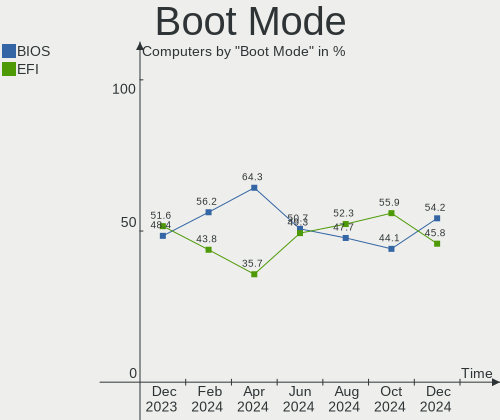
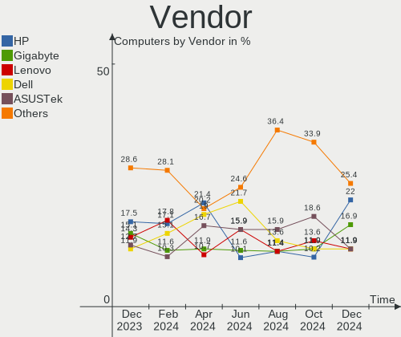
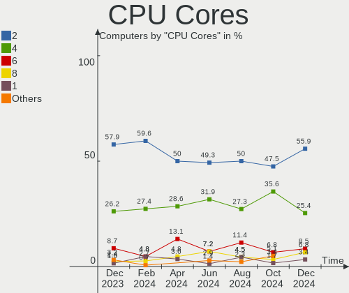
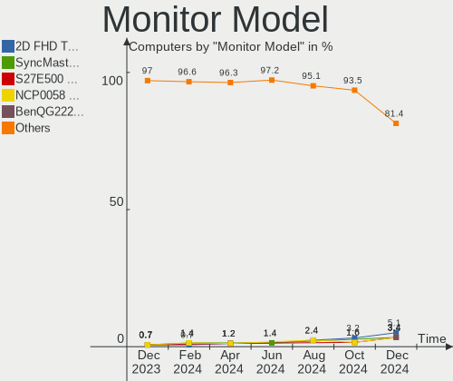

BlackPanther Hardware Trends
----------------------------

A project to identify most popular hardware characteristics and track their change
over time based on data collected by BlackPanther users at https://Linux-Hardware.org.

Anyone can contribute to the study by uploading probes of their computers by
the [hw-probe](https://github.com/linuxhw/hw-probe) tool:

    sudo -E hw-probe -all -upload

This is a report for all computer types. See also reports for [desktops](/Dist/BlackPanther/Desktop/README.md) and [notebooks](/Dist/BlackPanther/Notebook/README.md).

Full-feature report is available here: https://linux-hardware.org/?view=trends

Period: May, 2020.

Contents
--------

- [ OS                       ](#os)
- [ OS Family                ](#os-family)
- [ Kernel                   ](#kernel)
- [ Kernel Family            ](#kernel-family)
- [ Kernel Major Ver.        ](#kernel-major-ver)
- [ Arch                     ](#arch)
- [ DE                       ](#de)
- [ Display Server           ](#display-server)
- [ Display Manager          ](#display-manager)
- [ OS Lang                  ](#os-lang)
- [ Boot Mode                ](#boot-mode)
- [ Filesystem               ](#filesystem)
- [ Part. scheme             ](#part-scheme)
- [ Dual Boot with Linux/BSD ](#dual-boot-with-linux/bsd)
- [ Dual Boot (Win)          ](#dual-boot-win)
- [ Country                  ](#country)
- [ City                     ](#city)
- [ Vendor                   ](#vendor)
- [ Model                    ](#model)
- [ Model Family             ](#model-family)
- [ MFG Year                 ](#mfg-year)
- [ Form Factor              ](#form-factor)
- [ Secure Boot              ](#secure-boot)
- [ Coreboot                 ](#coreboot)
- [ RAM Size                 ](#ram-size)
- [ RAM Used                 ](#ram-used)
- [ Drive Vendor             ](#drive-vendor)
- [ Drive Model              ](#drive-model)
- [ Drive Kind               ](#drive-kind)
- [ Drive Connector          ](#drive-connector)
- [ Drive Size               ](#drive-size)
- [ Space Total              ](#space-total)
- [ Space Used               ](#space-used)
- [ Malfunc. Drives          ](#malfunc-drives)
- [ Malfunc. Drive Vendor    ](#malfunc-drive-vendor)
- [ Malfunc. Drive Kind      ](#malfunc-drive-kind)
- [ Failed Drives            ](#failed-drives)
- [ Failed Drive Vendor      ](#failed-drive-vendor)
- [ Drive Status             ](#drive-status)
- [ Storage Vendor           ](#storage-vendor)
- [ Storage Model            ](#storage-model)
- [ Storage Kind             ](#storage-kind)
- [ CPU Vendor               ](#cpu-vendor)
- [ CPU Model                ](#cpu-model)
- [ CPU Model Family         ](#cpu-model-family)
- [ CPU Cores                ](#cpu-cores)
- [ CPU Sockets              ](#cpu-sockets)
- [ CPU Threads              ](#cpu-threads)
- [ CPU Op-Modes             ](#cpu-op-modes)
- [ CPU Microcode            ](#cpu-microcode)
- [ CPU Microarch            ](#cpu-microarch)
- [ GPU Vendor               ](#gpu-vendor)
- [ GPU Model                ](#gpu-model)
- [ GPU Combo                ](#gpu-combo)
- [ GPU Driver               ](#gpu-driver)
- [ GPU Memory               ](#gpu-memory)
- [ Monitor Vendor           ](#monitor-vendor)
- [ Monitor Model            ](#monitor-model)
- [ Monitor Resolution       ](#monitor-resolution)
- [ Monitor Diagonal         ](#monitor-diagonal)
- [ Monitor Width            ](#monitor-width)
- [ Aspect Ratio             ](#aspect-ratio)
- [ Monitor Area             ](#monitor-area)
- [ Pixel Density            ](#pixel-density)
- [ Multiple Monitors        ](#multiple-monitors)
- [ Net Controller Vendor    ](#net-controller-vendor)
- [ Net Controller Model     ](#net-controller-model)
- [ Net Controller Kind      ](#net-controller-kind)
- [ Used Controller          ](#used-controller)
- [ NICs                     ](#nics)
- [ Unsupported Devices      ](#unsupported-devices)
- [ Unsupported Device Types ](#unsupported-device-types)

OS
--

Installed operating systems

| Name              | Computers | Percent |
|-------------------|-----------|---------|
| BlackPanther 18.1 | 186       | 87.32%  |
| BlackPanther 16.2 | 27        | 12.68%  |

OS Family
---------

OS without a version

| Name         | Computers | Percent |
|--------------|-----------|---------|
| BlackPanther | 213       | 100%    |

Kernel
------

Version of the Linux kernel

| Version                | Computers | Percent |
|------------------------|-----------|---------|
| 4.18.16-desktop-1bP    | 145       | 68.08%  |
| 5.1.15-desktop-1bP     | 39        | 18.31%  |
| 4.9.20-desktop-pae-1bP | 27        | 12.68%  |
| 5.1.15-server-1bP      | 2         | 0.94%   |

Kernel Family
-------------

Linux kernel without a distro release

| Version | Computers | Percent |
|---------|-----------|---------|
| 4.18.16 | 145       | 68.08%  |
| 5.1.15  | 41        | 19.25%  |
| 4.9.20  | 27        | 12.68%  |

Kernel Major Ver.
-----------------

Linux kernel major version

| Version | Computers | Percent |
|---------|-----------|---------|
| 4.18    | 145       | 68.08%  |
| 5.1     | 41        | 19.25%  |
| 4.9     | 27        | 12.68%  |

Arch
----

OS architecture (x86_64, i586, etc.)

| Name   | Computers | Percent |
|--------|-----------|---------|
| x86_64 | 186       | 87.32%  |
| i686   | 27        | 12.68%  |

DE
--

Desktop Environment

| Name    | Computers | Percent |
|---------|-----------|---------|
| KDE5    | 212       | 99.53%  |
| Unknown | 1         | 0.47%   |

Display Server
--------------

X11 or Wayland

| Name | Computers | Percent |
|------|-----------|---------|
| X11  | 213       | 100%    |

Display Manager
---------------

SDDM, LightDM, etc.

| Name | Computers | Percent |
|------|-----------|---------|
| SDDM | 213       | 100%    |

OS Lang
-------

Language

| Lang    | Computers | Percent |
|---------|-----------|---------|
| Unknown | 213       | 100%    |

Boot Mode
---------

EFI or BIOS

| Mode | Computers | Percent |
|------|-----------|---------|
| BIOS | 156       | 73.24%  |
| EFI  | 57        | 26.76%  |

Filesystem
----------

Type of filesystem

| Type    | Computers | Percent |
|---------|-----------|---------|
| Ext4    | 145       | 68.08%  |
| Overlay | 66        | 30.99%  |
| Ext2    | 1         | 0.47%   |
| Btrfs   | 1         | 0.47%   |

Part. scheme
------------

Scheme of partitioning

| Type    | Computers | Percent |
|---------|-----------|---------|
| Unknown | 135       | 63.38%  |
| MBR     | 52        | 24.41%  |
| GPT     | 26        | 12.21%  |

Dual Boot with Linux/BSD
------------------------

Hosting more than one Linux/BSD

| Dual boot | Computers | Percent |
|-----------|-----------|---------|
| No        | 146       | 68.54%  |
| Yes       | 67        | 31.46%  |

Dual Boot (Win)
---------------

Hosting Linux and Windows

| Dual boot | Computers | Percent |
|-----------|-----------|---------|
| Yes       | 110       | 51.64%  |
| No        | 103       | 48.36%  |

Country
-------

Geographic location (country)

| Country     | Computers | Percent |
|-------------|-----------|---------|
| Hungary     | 171       | 80.28%  |
| Germany     | 15        | 7.04%   |
| Romania     | 5         | 2.35%   |
| USA         | 4         | 1.88%   |
| UK          | 3         | 1.41%   |
| Slovakia    | 3         | 1.41%   |
| Philippines | 3         | 1.41%   |
| Poland      | 2         | 0.94%   |
| Spain       | 1         | 0.47%   |
| Russia      | 1         | 0.47%   |
| Greece      | 1         | 0.47%   |
| France      | 1         | 0.47%   |
| Cyprus      | 1         | 0.47%   |
| Brazil      | 1         | 0.47%   |
| Australia   | 1         | 0.47%   |

City
----

Geographic location (city)

| City                | Computers | Percent |
|---------------------|-----------|---------|
| Budapest            | 50        | 23.47%  |
| Miskolc             | 8         | 3.76%   |
| Eger                | 5         | 2.35%   |
| Szombathely         | 4         | 1.88%   |
| Kecskemét          | 4         | 1.88%   |
| Gödöllő          | 4         | 1.88%   |
| Debrecen            | 4         | 1.88%   |
| Csesztreg           | 4         | 1.88%   |
| Érd                | 3         | 1.41%   |
| Tarnok              | 3         | 1.41%   |
| Szeged              | 3         | 1.41%   |
| Salgotarjan         | 3         | 1.41%   |
| Osnabrück          | 3         | 1.41%   |
| Munich              | 3         | 1.41%   |
| Mezokovesd          | 3         | 1.41%   |
| Győr               | 3         | 1.41%   |
| Zalaegerszeg        | 2         | 0.94%   |
| Vác                | 2         | 0.94%   |
| Szigetszentmiklos   | 2         | 0.94%   |
| Szekszárd          | 2         | 0.94%   |
| Sarvar              | 2         | 0.94%   |
| Paks                | 2         | 0.94%   |
| Oroshaza            | 2         | 0.94%   |
| Karcag              | 2         | 0.94%   |
| Hévíz             | 2         | 0.94%   |
| Ehingen             | 2         | 0.94%   |
| Donaustauf          | 2         | 0.94%   |
| Cagayan de Oro      | 2         | 0.94%   |
| Békéscsaba        | 2         | 0.94%   |
| Alsozsolca          | 2         | 0.94%   |
| Alcsutdoboz         | 2         | 0.94%   |
| Zvolen              | 1         | 0.47%   |
| Zamboanga City      | 1         | 0.47%   |
| Wysokie Mazowieckie | 1         | 0.47%   |
| Weiden              | 1         | 0.47%   |
| Veszprém           | 1         | 0.47%   |
| Vecses              | 1         | 0.47%   |
| Târgu Mureş       | 1         | 0.47%   |
| Tura                | 1         | 0.47%   |
| Tornaľa            | 1         | 0.47%   |
| Tomorkeny           | 1         | 0.47%   |
| Toekoel             | 1         | 0.47%   |
| Tiszafured          | 1         | 0.47%   |
| Tet                 | 1         | 0.47%   |
| Tatabánya          | 1         | 0.47%   |
| Tata                | 1         | 0.47%   |
| Székesfehérvár   | 1         | 0.47%   |
| Szolnok             | 1         | 0.47%   |
| Szob                | 1         | 0.47%   |
| Szigethalom         | 1         | 0.47%   |
| Southall            | 1         | 0.47%   |
| Sibiu               | 1         | 0.47%   |
| Satu Mare           | 1         | 0.47%   |
| Sarospatak          | 1         | 0.47%   |
| Sarisap             | 1         | 0.47%   |
| Rzgow               | 1         | 0.47%   |
| Rimavska Sec        | 1         | 0.47%   |
| Ribeirão Preto     | 1         | 0.47%   |
| Rackeve             | 1         | 0.47%   |
| Pécs               | 1         | 0.47%   |

Vendor
------

Motherboard manufacturer

| Name                | Computers | Percent |
|---------------------|-----------|---------|
| Dell                | 33        | 15.49%  |
| Hewlett-Packard     | 32        | 15.02%  |
| ASUSTek Computer    | 31        | 14.55%  |
| Lenovo              | 29        | 13.62%  |
| Gigabyte Technology | 24        | 11.27%  |
| Acer                | 18        | 8.45%   |
| ASRock              | 16        | 7.51%   |
| Fujitsu             | 6         | 2.82%   |
| Toshiba             | 3         | 1.41%   |
| MSI                 | 3         | 1.41%   |
| Medion              | 3         | 1.41%   |
| Sony                | 2         | 0.94%   |
| Samsung Electronics | 2         | 0.94%   |
| Packard Bell        | 2         | 0.94%   |
| Intel               | 2         | 0.94%   |
| Fujitsu Siemens     | 2         | 0.94%   |
| Nvidia              | 1         | 0.47%   |
| Hungaro Flotta Kft  | 1         | 0.47%   |
| eMachines           | 1         | 0.47%   |
| Chuwi               | 1         | 0.47%   |
| AOpen               | 1         | 0.47%   |

Model
-----

Motherboard model

| Name                                                       | Computers | Percent |
|------------------------------------------------------------|-----------|---------|
| Gigabyte B85M-DS3H-A                                       | 4         | 1.88%   |
| Packard Bell EasyNote TE11HC                               | 2         | 0.94%   |
| Lenovo G50-45 80E3                                         | 2         | 0.94%   |
| HP Pavilion g6                                             | 2         | 0.94%   |
| HP 620                                                     | 2         | 0.94%   |
| Gigabyte H61M-S1                                           | 2         | 0.94%   |
| Dell OptiPlex 790                                          | 2         | 0.94%   |
| Dell OptiPlex 760                                          | 2         | 0.94%   |
| Dell OptiPlex 745                                          | 2         | 0.94%   |
| Dell Latitude E6430                                        | 2         | 0.94%   |
| Dell Latitude E6410                                        | 2         | 0.94%   |
| Dell Latitude E4310                                        | 2         | 0.94%   |
| Dell Latitude D630                                         | 2         | 0.94%   |
| ASRock FM2A75M Pro4+                                       | 2         | 0.94%   |
| Acer TravelMate B117-M                                     | 2         | 0.94%   |
| Acer Aspire 5742G                                          | 2         | 0.94%   |
| Toshiba Satellite L300                                     | 1         | 0.47%   |
| Toshiba Satellite L20                                      | 1         | 0.47%   |
| Sony VPCYB3V1E                                             | 1         | 0.47%   |
| Sony SVE1512W1ESI                                          | 1         | 0.47%   |
| Samsung Electronics 350V5C/351V5C/3540VC/3440VC            | 1         | 0.47%   |
| Samsung Electronics 300E5EV/300E4EV/270E5EV/270E4EV/2470EV | 1         | 0.47%   |
| Nvidia MCP68                                               | 1         | 0.47%   |
| MSI MS-7A74                                                | 1         | 0.47%   |
| MSI MS-7788                                                | 1         | 0.47%   |
| MSI MS-7309                                                | 1         | 0.47%   |
| Medion E7214                                               | 1         | 0.47%   |
| Medion BTDD-LT                                             | 1         | 0.47%   |
| Medion AKOYA E1317T                                        | 1         | 0.47%   |
| Lenovo Z51-70 80K6                                         | 1         | 0.47%   |
| Lenovo Y520-15IKBN 80WK                                    | 1         | 0.47%   |
| Lenovo V110-15IAP 80TG                                     | 1         | 0.47%   |
| Lenovo ThinkStation C30 1097A34                            | 1         | 0.47%   |
| Lenovo ThinkPad X61 7673BW3                                | 1         | 0.47%   |
| Lenovo ThinkPad X200 74595FG                               | 1         | 0.47%   |
| Lenovo ThinkPad X1 Carbon 34608G1                          | 1         | 0.47%   |
| Lenovo ThinkPad W510 431924G                               | 1         | 0.47%   |
| Lenovo ThinkPad T60 1952VYF                                | 1         | 0.47%   |
| Lenovo ThinkPad T450 20BUS09Y0E                            | 1         | 0.47%   |
| Lenovo ThinkPad T420 4236Z9U                               | 1         | 0.47%   |
| Lenovo ThinkPad T410 2537CS0                               | 1         | 0.47%   |
| Lenovo ThinkPad L520 5016BK3                               | 1         | 0.47%   |
| Lenovo ThinkCentre M92P 32371L5                            | 1         | 0.47%   |
| Lenovo ThinkCentre M91p 7005A97                            | 1         | 0.47%   |
| Lenovo IdeaPad 700-15ISK 80RU                              | 1         | 0.47%   |
| Lenovo IdeaPad 330-15IKB 81DE                              | 1         | 0.47%   |
| Lenovo IdeaPad 330-15IKB 81DC                              | 1         | 0.47%   |
| Lenovo IdeaPad 320-15ISK 80XH                              | 1         | 0.47%   |
| Lenovo IdeaPad 110-15IBR 80T7                              | 1         | 0.47%   |
| Lenovo IdeaPad 100-15IBY 80MJ                              | 1         | 0.47%   |
| Lenovo G70-70 80HW                                         | 1         | 0.47%   |
| Lenovo G580 20150                                          | 1         | 0.47%   |
| Lenovo G550 20023                                          | 1         | 0.47%   |
| Lenovo G50-80 80E5                                         | 1         | 0.47%   |
| Lenovo B50-80 80EW                                         | 1         | 0.47%   |
| Lenovo 3000 N500 423338G                                   | 1         | 0.47%   |
| Intel DH55TC AAE70932-302                                  | 1         | 0.47%   |
| Intel D2700MUD AAG32419-602                                | 1         | 0.47%   |
| Hungaro Flotta Kft Navon Vision Book                       | 1         | 0.47%   |
| HP t520 Flexible Series TC                                 | 1         | 0.47%   |

Model Family
------------

Motherboard model prefix

| Name                        | Computers | Percent |
|-----------------------------|-----------|---------|
| Acer Aspire                 | 14        | 6.57%   |
| Dell Latitude               | 13        | 6.1%    |
| Lenovo ThinkPad             | 9         | 4.23%   |
| Dell OptiPlex               | 9         | 4.23%   |
| HP Compaq                   | 7         | 3.29%   |
| Dell Inspiron               | 7         | 3.29%   |
| Lenovo IdeaPad              | 6         | 2.82%   |
| HP EliteBook                | 6         | 2.82%   |
| HP ProBook                  | 5         | 2.35%   |
| HP Pavilion                 | 4         | 1.88%   |
| Gigabyte B85M-DS3H-A        | 4         | 1.88%   |
| Fujitsu LIFEBOOK            | 3         | 1.41%   |
| Acer TravelMate             | 3         | 1.41%   |
| Toshiba Satellite           | 2         | 0.94%   |
| Packard Bell EasyNote       | 2         | 0.94%   |
| Lenovo ThinkCentre          | 2         | 0.94%   |
| Lenovo G50-45               | 2         | 0.94%   |
| HP 620                      | 2         | 0.94%   |
| Gigabyte H61M-S1            | 2         | 0.94%   |
| Fujitsu Siemens AMILO       | 2         | 0.94%   |
| Fujitsu ESPRIMO             | 2         | 0.94%   |
| ASUS VivoBook               | 2         | 0.94%   |
| ASUS PRIME                  | 2         | 0.94%   |
| ASRock FM2A75M              | 2         | 0.94%   |
| Sony VPCYB3V1E              | 1         | 0.47%   |
| Sony SVE1512W1ESI           | 1         | 0.47%   |
| Samsung Electronics 350V5C  | 1         | 0.47%   |
| Samsung Electronics 300E5EV | 1         | 0.47%   |
| Nvidia MCP68                | 1         | 0.47%   |
| MSI MS-7A74                 | 1         | 0.47%   |
| MSI MS-7788                 | 1         | 0.47%   |
| MSI MS-7309                 | 1         | 0.47%   |
| Medion E7214                | 1         | 0.47%   |
| Medion BTDD-LT              | 1         | 0.47%   |
| Medion AKOYA                | 1         | 0.47%   |
| Lenovo Z51-70               | 1         | 0.47%   |
| Lenovo Y520-15IKBN          | 1         | 0.47%   |
| Lenovo V110-15IAP           | 1         | 0.47%   |
| Lenovo ThinkStation         | 1         | 0.47%   |
| Lenovo G70-70               | 1         | 0.47%   |
| Lenovo G580                 | 1         | 0.47%   |
| Lenovo G550                 | 1         | 0.47%   |
| Lenovo G50-80               | 1         | 0.47%   |
| Lenovo B50-80               | 1         | 0.47%   |
| Lenovo 3000                 | 1         | 0.47%   |
| Intel DH55TC                | 1         | 0.47%   |
| Intel D2700MUD              | 1         | 0.47%   |
| Hungaro Flotta Kft Navon    | 1         | 0.47%   |
| HP t520                     | 1         | 0.47%   |
| HP Slim                     | 1         | 0.47%   |
| HP ProDesk                  | 1         | 0.47%   |
| HP Notebook                 | 1         | 0.47%   |
| HP Laptop                   | 1         | 0.47%   |
| HP 250                      | 1         | 0.47%   |
| HP 22-3160na                | 1         | 0.47%   |
| HP 15                       | 1         | 0.47%   |
| Gigabyte Z270-HD3P          | 1         | 0.47%   |
| Gigabyte Q1580L             | 1         | 0.47%   |
| Gigabyte H81M-S2PV          | 1         | 0.47%   |
| Gigabyte GA-MA770-UD3       | 1         | 0.47%   |

MFG Year
--------

Motherboard manufacture year

| Year | Computers | Percent |
|------|-----------|---------|
| 2015 | 25        | 11.74%  |
| 2018 | 20        | 9.39%   |
| 2013 | 19        | 8.92%   |
| 2012 | 19        | 8.92%   |
| 2014 | 18        | 8.45%   |
| 2010 | 18        | 8.45%   |
| 2009 | 18        | 8.45%   |
| 2011 | 17        | 7.98%   |
| 2019 | 15        | 7.04%   |
| 2016 | 13        | 6.1%    |
| 2008 | 11        | 5.16%   |
| 2017 | 10        | 4.69%   |
| 2007 | 5         | 2.35%   |
| 2020 | 2         | 0.94%   |
| 2006 | 1         | 0.47%   |
| 2005 | 1         | 0.47%   |
| 2004 | 1         | 0.47%   |

Form Factor
-----------

Physical design of the computer

| Name       | Computers | Percent |
|------------|-----------|---------|
| Notebook   | 123       | 57.75%  |
| Desktop    | 88        | 41.31%  |
| Tablet     | 1         | 0.47%   |
| All in one | 1         | 0.47%   |

Secure Boot
-----------

Enabled or disabled

| State    | Computers | Percent |
|----------|-----------|---------|
| Disabled | 213       | 100%    |

Coreboot
--------

Have coreboot on board

| Used | Computers | Percent |
|------|-----------|---------|
| No   | 213       | 100%    |

RAM Size
--------

Total RAM memory

| Size in GB | Computers | Percent |
|------------|-----------|---------|
| 3.01-4.0   | 80        | 37.56%  |
| 8.01-16.0  | 42        | 19.72%  |
| 4.01-8.0   | 39        | 18.31%  |
| 1.01-2.0   | 19        | 8.92%   |
| 16.01-24.0 | 14        | 6.57%   |
| 2.01-3.0   | 12        | 5.63%   |
| 0.01-1.0   | 4         | 1.88%   |
| 24.01-32.0 | 2         | 0.94%   |
| 32.01-64.0 | 1         | 0.47%   |

RAM Used
--------

Used RAM memory

| Used GB  | Computers | Percent |
|----------|-----------|---------|
| 0.01-1.0 | 130       | 61.03%  |
| 1.01-2.0 | 64        | 30.05%  |
| 2.01-3.0 | 15        | 7.04%   |
| 3.01-4.0 | 4         | 1.88%   |

Drive Vendor
------------

Hard drive vendors

| Vendor              | Computers | Drives  | Percent |
|---------------------|-----------|---------|---------|
| WDC                 | 59        | 67      | 19.41%  |
| Seagate             | 48        | 52      | 15.79%  |
| Kingston            | 35        | 38      | 11.51%  |
| Toshiba             | 28        | 30      | 9.21%   |
| Samsung Electronics | 25        | 27      | 8.22%   |
| Hitachi             | 17        | 17      | 5.59%   |
| SanDisk             | 11        | 14      | 3.62%   |
| HGST                | 9         | 9       | 2.96%   |
| A-DATA Technology   | 9         | 10      | 2.96%   |
| Unknown             | 5         | 5       | 1.64%   |
| Fujitsu             | 5         | 5       | 1.64%   |
| Crucial             | 5         | 5       | 1.64%   |
| SPCC                | 4         | 4       | 1.32%   |
| Intel               | 4         | 4       | 1.32%   |
| HL-DT-ST            | 4         | Unknown | 1.32%   |
| Gigabyte Technology | 4         | 4       | 1.32%   |
| Maxtor              | 3         | 3       | 0.99%   |
| China               | 3         | 3       | 0.99%   |
| Patriot             | 2         | 2       | 0.66%   |
| OCZ                 | 2         | 2       | 0.66%   |
| KINGMAX             | 2         | 2       | 0.66%   |
| Generic             | 2         | 2       | 0.66%   |
| Apacer              | 2         | 2       | 0.66%   |
| Vi550               | 1         | 1       | 0.33%   |
| USB3.0              | 1         | 1       | 0.33%   |
| Transcend           | 1         | 1       | 0.33%   |
| SK Hynix            | 1         | 1       | 0.33%   |
| QUANTUM             | 1         | 1       | 0.33%   |
| Netac               | 1         | 1       | 0.33%   |
| Micron Technology   | 1         | 1       | 0.33%   |
| LITEON              | 1         | 1       | 0.33%   |
| KingSpec            | 1         | 1       | 0.33%   |
| JMicron             | 1         | 1       | 0.33%   |
| Intenso             | 1         | 1       | 0.33%   |
| HGST HTS            | 1         | 1       | 0.33%   |
| Hewlett-Packard     | 1         | 1       | 0.33%   |
| GOODRAM             | 1         | 1       | 0.33%   |
| BIWIN               | 1         | 1       | 0.33%   |
| BHT                 | 1         | 1       | 0.33%   |

Drive Model
-----------

Hard drive models

| Model                         | Computers | Percent |
|-------------------------------|-----------|---------|
| SA400S37240G 240GB SSD        | 7         | 2.14%   |
| SA400S37120G 120GB SSD        | 7         | 2.14%   |
| SV300S37A240G 240GB SSD       | 5         | 1.53%   |
| SV300S37A120G 120GB SSD       | 5         | 1.53%   |
| SUV400S37120G 120GB SSD       | 5         | 1.53%   |
| ST9320423AS 320GB             | 4         | 1.22%   |
| ST500DM002-1BD142 500GB       | 4         | 1.22%   |
| MQ01ABF050 500GB              | 4         | 1.22%   |
| DT01ACA100 1TB                | 4         | 1.22%   |
| ST1000LM024 HN-M101MBB 1TB    | 3         | 0.92%   |
| SSD PLUS 240GB                | 3         | 0.92%   |
| MQ04ABF100 1TB                | 3         | 0.92%   |
| HTS545050A7E680 500GB         | 3         | 0.92%   |
| GP-GSTFS31120GNTD 120GB SSD   | 3         | 0.92%   |
| DT01ACA200 2TB                | 3         | 0.92%   |
| DT01ACA050 500GB              | 3         | 0.92%   |
| WDS240G2G0A-00JH30 240GB SSD  | 2         | 0.61%   |
| WDS120G2G0A-00JH30 120GB SSD  | 2         | 0.61%   |
| WD5000LPCX-21VHAT0 500GB      | 2         | 0.61%   |
| WD5000AAKS-00UU3A0 500GB      | 2         | 0.61%   |
| WD3200BEVT-22A23T0 320GB      | 2         | 0.61%   |
| WD10JPVX-22JC3T0 1TB          | 2         | 0.61%   |
| WD10EZEX-08WN4A0 1TB          | 2         | 0.61%   |
| WD10EZEX-00BN5A0 1TB          | 2         | 0.61%   |
| SU700 120GB SSD               | 2         | 0.61%   |
| ST9500420AS 500GB             | 2         | 0.61%   |
| ST9500325AS 500GB             | 2         | 0.61%   |
| ST9320325AS 320GB             | 2         | 0.61%   |
| ST9250315AS 250GB             | 2         | 0.61%   |
| ST500LT012-9WS142 500GB       | 2         | 0.61%   |
| ST500LT012-1DG142 500GB       | 2         | 0.61%   |
| ST3500418AS 500GB             | 2         | 0.61%   |
| ST3320311CS 320GB             | 2         | 0.61%   |
| ST1000LM035-1RK172 1TB        | 2         | 0.61%   |
| SSD 850 PRO 256GB             | 2         | 0.61%   |
| SSD 750 EVO 250GB             | 2         | 0.61%   |
| SSD 128GB                     | 2         | 0.61%   |
| SP580 120GB SSD               | 2         | 0.61%   |
| Solid State Disk 120GB        | 2         | 0.61%   |
| SDSSDH3 500G                  | 2         | 0.61%   |
| SDSSDA240G 240GB              | 2         | 0.61%   |
| SD/MMC/MS PRO 4GB             | 2         | 0.61%   |
| SATA SSD 120GB                | 2         | 0.61%   |
| MQ01ABD100 1TB                | 2         | 0.61%   |
| HTS725050A7E635 500GB         | 2         | 0.61%   |
| HTS725025A9A364 250GB         | 2         | 0.61%   |
| HTS547575A9E384 752GB         | 2         | 0.61%   |
| HD642JJ 640GB                 | 2         | 0.61%   |
| HD502HJ 500GB                 | 2         | 0.61%   |
| DVDRAM GUE1N 3GB              | 2         | 0.61%   |
| DVDRAM GUC0N 1GB              | 2         | 0.61%   |
| CT1000MX500SSD1 1TB           | 2         | 0.61%   |
| WR202I0064G E70245F5 64GB SSD | 1         | 0.31%   |
| WDS500G2X0C-00L350 500GB      | 1         | 0.31%   |
| WDS500G2B0A-00SM50 500GB SSD  | 1         | 0.31%   |
| WDS250G2B0A-00SM50 250GB SSD  | 1         | 0.31%   |
| WDS250G2B0A 250GB SSD         | 1         | 0.31%   |
| WD800BB-00JHC0 80GB           | 1         | 0.31%   |
| WD7500BPVT-80HXZT3 752GB      | 1         | 0.31%   |
| WD7500BPVT-22HXZT3 752GB      | 1         | 0.31%   |

Drive Kind
----------

HDD or SSD

| Kind    | Computers | Drives | Percent |
|---------|-----------|--------|---------|
| HDD     | 150       | 185    | 55.35%  |
| SSD     | 97        | 114    | 35.79%  |
| NVMe    | 10        | 13     | 3.69%   |
| Unknown | 9         | 5      | 3.32%   |
| MMC     | 5         | 6      | 1.85%   |

Drive Connector
---------------

SATA, SAS, NVMe, etc.

| Type | Computers | Drives | Percent |
|------|-----------|--------|---------|
| SATA | 209       | 296    | 88.56%  |
| SAS  | 12        | 8      | 5.08%   |
| NVMe | 10        | 13     | 4.24%   |
| MMC  | 5         | 6      | 2.12%   |

Drive Size
----------

Size of hard drive

| Size in TB | Computers | Drives | Percent |
|------------|-----------|--------|---------|
| 0.01-0.5   | 188       | 238    | 71.48%  |
| 0.51-1.0   | 59        | 66     | 22.43%  |
| 1.01-2.0   | 10        | 13     | 3.8%    |
| 2.01-3.0   | 4         | 4      | 1.52%   |
| 4.01-10.0  | 2         | 2      | 0.76%   |

Space Total
-----------

Amount of disk space available on the file system

| Size in GB     | Computers | Percent |
|----------------|-----------|---------|
| Unknown        | 62        | 29.11%  |
| 101-250        | 58        | 27.23%  |
| 251-500        | 29        | 13.62%  |
| 51-100         | 25        | 11.74%  |
| 501-1000       | 17        | 7.98%   |
| 21-50          | 12        | 5.63%   |
| More than 3000 | 3         | 1.41%   |
| 1001-2000      | 3         | 1.41%   |
| 1-20           | 3         | 1.41%   |
| 2001-3000      | 1         | 0.47%   |

Space Used
----------

Amount of used disk space

| Used GB        | Computers | Percent |
|----------------|-----------|---------|
| 1-20           | 86        | 40.38%  |
| Unknown        | 62        | 29.11%  |
| 21-50          | 24        | 11.27%  |
| 101-250        | 15        | 7.04%   |
| 51-100         | 15        | 7.04%   |
| 251-500        | 6         | 2.82%   |
| More than 3000 | 2         | 0.94%   |
| 501-1000       | 2         | 0.94%   |
| 1001-2000      | 1         | 0.47%   |

Malfunc. Drives
---------------

Drive models with a malfunction

| Model                    | Computers | Drives | Percent |
|--------------------------|-----------|--------|---------|
| ST9320423AS 320GB        | 3         | 3      | 3.33%   |
| ST500DM002-1BD142 500GB  | 3         | 3      | 3.33%   |
| HTS545050A7E680 500GB    | 3         | 3      | 3.33%   |
| SV300S37A120G 120GB SSD  | 2         | 2      | 2.22%   |
| ST9500325AS 500GB        | 2         | 2      | 2.22%   |
| ST9320325AS 320GB        | 2         | 2      | 2.22%   |
| ST500LT012-9WS142 500GB  | 2         | 2      | 2.22%   |
| MQ01ABF050 500GB         | 2         | 2      | 2.22%   |
| HTS725050A7E635 500GB    | 2         | 2      | 2.22%   |
| HTS725025A9A364 250GB    | 2         | 2      | 2.22%   |
| HTS547575A9E384 752GB    | 2         | 2      | 2.22%   |
| DT01ACA050 500GB         | 2         | 2      | 2.22%   |
| WD800BB-00JHC0 80GB      | 1         | 1      | 1.11%   |
| WD7500AYPS-01ZKB0 752GB  | 1         | 1      | 1.11%   |
| WD6400BEVT-22A0RT0 640GB | 1         | 1      | 1.11%   |
| WD6400AAKS-00A7B0 640GB  | 1         | 1      | 1.11%   |
| WD5000AAKX-75U6AA0 500GB | 1         | 1      | 1.11%   |
| WD5000AAKX-00ERMA0 500GB | 1         | 1      | 1.11%   |
| WD5000AAKS-75V0A0 500GB  | 1         | 1      | 1.11%   |
| WD5000AAKS-00UU3A0 500GB | 1         | 1      | 1.11%   |
| WD3200BEVT-22A23T0 320GB | 1         | 1      | 1.11%   |
| WD3200AAJS-56B4A0 320GB  | 1         | 1      | 1.11%   |
| WD30EFRX-68EUZN0 3TB     | 1         | 1      | 1.11%   |
| WD2500JB-00REA0 250GB    | 1         | 1      | 1.11%   |
| WD2500BEKT-60PVMT0 250GB | 1         | 1      | 1.11%   |
| WD20EFRX-68EUZN0 2TB     | 1         | 1      | 1.11%   |
| WD20EARS-60MVWB0 2TB     | 1         | 1      | 1.11%   |
| WD2000JB-00GVA0 200GB    | 1         | 1      | 1.11%   |
| WD1600BMVS-11F9S0 160GB  | 1         | 1      | 1.11%   |
| WD15EARS-00Z5B1 1TB      | 1         | 1      | 1.11%   |
| WD1500ADFD-00NLR1 150GB  | 1         | 1      | 1.11%   |
| WD10JPVX-22JC3T0 1TB     | 1         | 1      | 1.11%   |
| WD10EZEX-75WN4A0 1TB     | 1         | 1      | 1.11%   |
| WD10EZEX-08WN4A0 1TB     | 1         | 1      | 1.11%   |
| WD10EARS-00MVWB0 1TB     | 1         | 1      | 1.11%   |
| VERTEX 32GB SSD          | 1         | 1      | 1.11%   |
| SX6000NP 128GB           | 1         | 1      | 1.11%   |
| SUV400S37120G 120GB SSD  | 1         | 1      | 1.11%   |
| SU700 120GB SSD          | 1         | 1      | 1.11%   |
| SU630 240GB SSD          | 1         | 1      | 1.11%   |
| ST9500420AS 500GB        | 1         | 1      | 1.11%   |
| ST9250315AS 250GB        | 1         | 1      | 1.11%   |
| ST500LT012-1DG142 500GB  | 1         | 1      | 1.11%   |
| ST340016A 40GB           | 1         | 1      | 1.11%   |
| ST320LT020-9YG142 320GB  | 1         | 1      | 1.11%   |
| ST3160318AS 160GB        | 1         | 1      | 1.11%   |
| ST31000322CS 1TB         | 1         | 1      | 1.11%   |
| ST2000LM007-1R8174 2TB   | 1         | 1      | 1.11%   |
| ST1000LM048-2E7172 1TB   | 1         | 1      | 1.11%   |
| ST1000LM035-1RK172 1TB   | 1         | 1      | 1.11%   |
| ST1000DM010-2EP102 1TB   | 1         | 1      | 1.11%   |
| SSD 60GB                 | 1         | 1      | 1.11%   |
| SP920SS 256GB SSD        | 1         | 1      | 1.11%   |
| SP1614C 160GB            | 1         | 1      | 1.11%   |
| SP0411C 40GB             | 1         | 1      | 1.11%   |
| SA400S37120G 120GB SSD   | 1         | 1      | 1.11%   |
| MQ01ABD100 1TB           | 1         | 1      | 1.11%   |
| MQ01ABD050 500GB         | 1         | 1      | 1.11%   |
| MK2561GSYN 250GB         | 1         | 1      | 1.11%   |
| MHV2060AH 64GB           | 1         | 1      | 1.11%   |

Malfunc. Drive Vendor
---------------------

Vendors of faulty drives

| Vendor              | Computers | Drives | Percent |
|---------------------|-----------|--------|---------|
| Seagate             | 22        | 23     | 25.58%  |
| WDC                 | 21        | 23     | 24.42%  |
| Hitachi             | 11        | 11     | 12.79%  |
| Toshiba             | 8         | 8      | 9.3%    |
| HGST                | 6         | 6      | 6.98%   |
| Samsung Electronics | 5         | 6      | 5.81%   |
| Kingston            | 4         | 4      | 4.65%   |
| A-DATA Technology   | 4         | 4      | 4.65%   |
| OCZ                 | 1         | 1      | 1.16%   |
| Maxtor              | 1         | 1      | 1.16%   |
| KINGMAX             | 1         | 1      | 1.16%   |
| Fujitsu             | 1         | 1      | 1.16%   |
| Apacer              | 1         | 1      | 1.16%   |

Malfunc. Drive Kind
-------------------

Kinds of faulty drives

| Kind | Computers | Drives | Percent |
|------|-----------|--------|---------|
| HDD  | 70        | 78     | 85.37%  |
| SSD  | 11        | 11     | 13.41%  |
| NVMe | 1         | 1      | 1.22%   |

Failed Drives
-------------

Failed drive models

Zero info for selected period =(

Failed Drive Vendor
-------------------

Failed drive vendors

Zero info for selected period =(

Drive Status
------------

Number of failed and malfunc. drives

| Status   | Computers | Drives | Percent |
|----------|-----------|--------|---------|
| Works    | 155       | 219    | 61.26%  |
| Malfunc  | 81        | 90     | 32.02%  |
| Detected | 17        | 14     | 6.72%   |

Storage Vendor
--------------

Storage controller vendors

| Vendor                           | Computers | Percent |
|----------------------------------|-----------|---------|
| Intel                            | 164       | 70.09%  |
| AMD                              | 38        | 16.24%  |
| JMicron Technology               | 7         | 2.99%   |
| Nvidia                           | 6         | 2.56%   |
| Samsung Electronics              | 3         | 1.28%   |
| ASMedia Technology               | 3         | 1.28%   |
| VIA Technologies                 | 2         | 0.85%   |
| Silicon Image                    | 2         | 0.85%   |
| Kingston Technology Company      | 2         | 0.85%   |
| Silicon Motion                   | 1         | 0.43%   |
| Silicon Integrated Systems [SiS] | 1         | 0.43%   |
| Sandisk                          | 1         | 0.43%   |
| Realtek Semiconductor            | 1         | 0.43%   |
| Phison Electronics               | 1         | 0.43%   |
| Marvell Technology Group         | 1         | 0.43%   |
| KIOXIA                           | 1         | 0.43%   |

Storage Model
-------------

Storage controller models

| Model                                                                             | Computers | Percent |
|-----------------------------------------------------------------------------------|-----------|---------|
| FCH SATA Controller [AHCI mode]                                                   | 23        | 7.74%   |
| 7 Series Chipset Family 6-port SATA Controller [AHCI mode]                        | 11        | 3.7%    |
| Wildcat Point-LP SATA Controller [AHCI Mode]                                      | 10        | 3.37%   |
| 82801IBM/IEM (ICH9M/ICH9M-E) 4 port SATA Controller [AHCI mode]                   | 10        | 3.37%   |
| 5 Series/3400 Series Chipset 6 port SATA AHCI Controller                          | 10        | 3.37%   |
| 82801G (ICH7 Family) IDE Controller                                               | 9         | 3.03%   |
| 8 Series/C220 Series Chipset Family 6-port SATA Controller 1 [AHCI mode]          | 9         | 3.03%   |
| 6 Series/C200 Series Chipset Family 6 port Mobile SATA AHCI Controller            | 9         | 3.03%   |
| SB7x0/SB8x0/SB9x0 SATA Controller [AHCI mode]                                     | 8         | 2.69%   |
| NM10/ICH7 Family SATA Controller [IDE mode]                                       | 8         | 2.69%   |
| 200 Series PCH SATA controller [AHCI mode]                                        | 8         | 2.69%   |
| 82801 Mobile SATA Controller [RAID mode]                                          | 7         | 2.36%   |
| SB7x0/SB8x0/SB9x0 IDE Controller                                                  | 6         | 2.02%   |
| Atom/Celeron/Pentium Processor x5-E8000/J3xxx/N3xxx Series SATA Controller        | 6         | 2.02%   |
| 6 Series/C200 Series Chipset Family Desktop SATA Controller (IDE mode, ports 4-5) | 6         | 2.02%   |
| 6 Series/C200 Series Chipset Family Desktop SATA Controller (IDE mode, ports 0-3) | 6         | 2.02%   |
| Sunrise Point-LP SATA Controller [AHCI mode]                                      | 5         | 1.68%   |
| FCH IDE Controller                                                                | 5         | 1.68%   |
| Atom Processor E3800 Series SATA AHCI Controller                                  | 5         | 1.68%   |
| 82801HM/HEM (ICH8M/ICH8M-E) IDE Controller                                        | 5         | 1.68%   |
| SB7x0/SB8x0/SB9x0 SATA Controller [IDE mode]                                      | 4         | 1.35%   |
| SATA Controller [RAID mode]                                                       | 4         | 1.35%   |
| JMB368 IDE controller                                                             | 4         | 1.35%   |
| JMB363 SATA/IDE Controller                                                        | 4         | 1.35%   |
| HM170/QM170 Chipset SATA Controller [AHCI Mode]                                   | 4         | 1.35%   |
| 82801JI (ICH10 Family) 4 port SATA IDE Controller #1                              | 4         | 1.35%   |
| 82801JI (ICH10 Family) 2 port SATA IDE Controller #2                              | 4         | 1.35%   |
| 5 Series/3400 Series Chipset 4 port SATA AHCI Controller                          | 4         | 1.35%   |
| Non-Volatile memory controller                                                    | 3         | 1.01%   |
| NM10/ICH7 Family SATA Controller [AHCI mode]                                      | 3         | 1.01%   |
| MCP61 SATA Controller                                                             | 3         | 1.01%   |
| FCH SATA Controller [IDE mode]                                                    | 3         | 1.01%   |
| ASM1062 Serial ATA Controller                                                     | 3         | 1.01%   |
| 82801HM/HEM (ICH8M/ICH8M-E) SATA Controller [IDE mode]                            | 3         | 1.01%   |
| 82801GBM/GHM (ICH7-M Family) SATA Controller [IDE mode]                           | 3         | 1.01%   |
| 8 Series SATA Controller 1 [AHCI mode]                                            | 3         | 1.01%   |
| 6 Series/C200 Series Chipset Family 6 port Desktop SATA AHCI Controller           | 3         | 1.01%   |
| SSD 660P Series                                                                   | 2         | 0.67%   |
| Q170/Q150/B150/H170/H110/Z170/CM236 Chipset SATA Controller [AHCI Mode]           | 2         | 0.67%   |
| NVMe SSD Controller SM981/PM981/PM983                                             | 2         | 0.67%   |
| MCP61 IDE                                                                         | 2         | 0.67%   |
| Celeron N3350/Pentium N4200/Atom E3900 Series SATA AHCI Controller                | 2         | 0.67%   |
| Cannon Lake PCH SATA AHCI Controller                                              | 2         | 0.67%   |
| 82801IBM/IEM (ICH9M/ICH9M-E) 2 port SATA Controller [IDE mode]                    | 2         | 0.67%   |
| 82801IB (ICH9) 2 port SATA Controller [IDE mode]                                  | 2         | 0.67%   |
| 82801I (ICH9 Family) 2 port SATA Controller [IDE mode]                            | 2         | 0.67%   |
| 82801HR/HO/HH (ICH8R/DO/DH) 2 port SATA Controller [IDE mode]                     | 2         | 0.67%   |
| 82801HM/HEM (ICH8M/ICH8M-E) SATA Controller [AHCI mode]                           | 2         | 0.67%   |
| 82801H (ICH8 Family) 4 port SATA Controller [IDE mode]                            | 2         | 0.67%   |
| 82801GBM/GHM (ICH7-M Family) SATA Controller [AHCI mode]                          | 2         | 0.67%   |
| 7 Series/C210 Series Chipset Family 6-port SATA Controller [AHCI mode]            | 2         | 0.67%   |
| 5 Series/3400 Series Chipset PT IDER Controller                                   | 2         | 0.67%   |
| 5 Series/3400 Series Chipset 4 port SATA IDE Controller                           | 2         | 0.67%   |
| 5 Series/3400 Series Chipset 2 port SATA IDE Controller                           | 2         | 0.67%   |
| 400 Series Chipset SATA Controller                                                | 2         | 0.67%   |
| 4 Series Chipset PT IDER Controller                                               | 2         | 0.67%   |
| X370 Series Chipset SATA Controller                                               | 1         | 0.34%   |
| WD Black 2018/PC SN720 NVMe SSD                                                   | 1         | 0.34%   |
| VT82C586A/B/VT82C686/A/B/VT823x/A/C PIPC Bus Master IDE                           | 1         | 0.34%   |
| VT8237A SATA 2-Port Controller                                                    | 1         | 0.34%   |

Storage Kind
------------

Kind of storage controller (IDE, SATA, NVMe, SAS, ...)

| Kind | Computers | Percent |
|------|-----------|---------|
| SATA | 155       | 63.27%  |
| IDE  | 65        | 26.53%  |
| RAID | 14        | 5.71%   |
| NVMe | 10        | 4.08%   |
| SAS  | 1         | 0.41%   |

CPU Vendor
----------

Processor vendors

| Vendor | Computers | Percent |
|--------|-----------|---------|
| Intel  | 169       | 79.34%  |
| AMD    | 44        | 20.66%  |

CPU Model
---------

Processor models

| Model                                       | Computers | Percent |
|---------------------------------------------|-----------|---------|
| Intel Core i5-5200U CPU @ 2.20GHz           | 4         | 1.88%   |
| Intel Core i5-4460 CPU @ 3.20GHz            | 4         | 1.88%   |
| Intel Core i5-3210M CPU @ 2.50GHz           | 4         | 1.88%   |
| Intel Core 2 Duo CPU E7500 @ 2.93GHz        | 4         | 1.88%   |
| Intel Pentium CPU B960 @ 2.20GHz            | 3         | 1.41%   |
| Intel Celeron CPU N3060 @ 1.60GHz           | 3         | 1.41%   |
| Intel Pentium Dual-Core CPU T4400 @ 2.20GHz | 2         | 0.94%   |
| Intel Pentium Dual-Core CPU E5400 @ 2.70GHz | 2         | 0.94%   |
| Intel Pentium Dual CPU E2180 @ 2.00GHz      | 2         | 0.94%   |
| Intel Pentium CPU N3710 @ 1.60GHz           | 2         | 0.94%   |
| Intel Pentium CPU G4560 @ 3.50GHz           | 2         | 0.94%   |
| Intel Core i7 CPU M 620 @ 2.67GHz           | 2         | 0.94%   |
| Intel Core i5-8265U CPU @ 1.60GHz           | 2         | 0.94%   |
| Intel Core i5-7300HQ CPU @ 2.50GHz          | 2         | 0.94%   |
| Intel Core i5-2520M CPU @ 2.50GHz           | 2         | 0.94%   |
| Intel Core i5-2400 CPU @ 3.10GHz            | 2         | 0.94%   |
| Intel Core i5 CPU M 560 @ 2.67GHz           | 2         | 0.94%   |
| Intel Core i5 CPU M 540 @ 2.53GHz           | 2         | 0.94%   |
| Intel Core i5 CPU M 520 @ 2.40GHz           | 2         | 0.94%   |
| Intel Core i3-6006U CPU @ 2.00GHz           | 2         | 0.94%   |
| Intel Core i3-5005U CPU @ 2.00GHz           | 2         | 0.94%   |
| Intel Core i3-2350M CPU @ 2.30GHz           | 2         | 0.94%   |
| Intel Core i3-2310M CPU @ 2.10GHz           | 2         | 0.94%   |
| Intel Core i3-2120 CPU @ 3.30GHz            | 2         | 0.94%   |
| Intel Core 2 Quad CPU Q8300 @ 2.50GHz       | 2         | 0.94%   |
| Intel Core 2 Duo CPU T7500 @ 2.20GHz        | 2         | 0.94%   |
| Intel Core 2 Duo CPU E7300 @ 2.66GHz        | 2         | 0.94%   |
| Intel Core 2 CPU T5500 @ 1.66GHz            | 2         | 0.94%   |
| Intel Core 2 CPU 6300 @ 1.86GHz             | 2         | 0.94%   |
| Intel Atom x5-Z8350 CPU @ 1.44GHz           | 2         | 0.94%   |
| Intel Atom CPU N270 @ 1.60GHz               | 2         | 0.94%   |
| AMD A8-6600K APU with Radeon HD Graphics    | 2         | 0.94%   |
| AMD A6-6310 APU with AMD Radeon R4 Graphics | 2         | 0.94%   |
| AMD A4-3300M APU with Radeon HD Graphics    | 2         | 0.94%   |
| Intel Xeon CPU W3565 @ 3.20GHz              | 1         | 0.47%   |
| Intel Xeon CPU W3550 @ 3.07GHz              | 1         | 0.47%   |
| Intel Xeon CPU E5-2620 0 @ 2.00GHz          | 1         | 0.47%   |
| Intel Processor 5Y10 CPU @ 0.80GHz          | 1         | 0.47%   |
| Intel Pentium Silver N5000 CPU @ 1.10GHz    | 1         | 0.47%   |
| Intel Pentium M processor 1.86GHz           | 1         | 0.47%   |
| Intel Pentium M processor 1.73GHz           | 1         | 0.47%   |
| Intel Pentium Gold G5400 CPU @ 3.70GHz      | 1         | 0.47%   |
| Intel Pentium Dual-Core CPU T4200 @ 2.00GHz | 1         | 0.47%   |
| Intel Pentium Dual-Core CPU E6700 @ 3.20GHz | 1         | 0.47%   |
| Intel Pentium Dual-Core CPU E5800 @ 3.20GHz | 1         | 0.47%   |
| Intel Pentium Dual-Core CPU E5700 @ 3.00GHz | 1         | 0.47%   |
| Intel Pentium Dual-Core CPU E5200 @ 2.50GHz | 1         | 0.47%   |
| Intel Pentium Dual CPU T3400 @ 2.16GHz      | 1         | 0.47%   |
| Intel Pentium Dual CPU T3200 @ 2.00GHz      | 1         | 0.47%   |
| Intel Pentium CPU P6100 @ 2.00GHz           | 1         | 0.47%   |
| Intel Pentium CPU N4200 @ 1.10GHz           | 1         | 0.47%   |
| Intel Pentium CPU N3700 @ 1.60GHz           | 1         | 0.47%   |
| Intel Pentium CPU N3540 @ 2.16GHz           | 1         | 0.47%   |
| Intel Pentium CPU J2900 @ 2.41GHz           | 1         | 0.47%   |
| Intel Pentium CPU G840 @ 2.80GHz            | 1         | 0.47%   |
| Intel Pentium CPU G630 @ 2.70GHz            | 1         | 0.47%   |
| Intel Pentium CPU G3220 @ 3.00GHz           | 1         | 0.47%   |
| Intel Pentium CPU G2120 @ 3.10GHz           | 1         | 0.47%   |
| Intel Pentium CPU 3825U @ 1.90GHz           | 1         | 0.47%   |
| Intel Pentium CPU 2127U @ 1.90GHz           | 1         | 0.47%   |

CPU Model Family
----------------

Processor model prefix

| Model                                | Computers | Percent |
|--------------------------------------|-----------|---------|
| Intel Core i5                        | 47        | 22.07%  |
| Intel Core i3                        | 20        | 9.39%   |
| Intel Pentium                        | 18        | 8.45%   |
| Intel Core 2 Duo                     | 18        | 8.45%   |
| Intel Core i7                        | 15        | 7.04%   |
| Intel Celeron                        | 13        | 6.1%    |
| Intel Pentium Dual-Core              | 9         | 4.23%   |
| Intel Atom                           | 7         | 3.29%   |
| AMD FX                               | 7         | 3.29%   |
| AMD A8                               | 5         | 2.35%   |
| AMD A6                               | 5         | 2.35%   |
| Intel Pentium Dual                   | 4         | 1.88%   |
| Intel Core 2                         | 4         | 1.88%   |
| AMD A4                               | 4         | 1.88%   |
| Intel Xeon                           | 3         | 1.41%   |
| Intel Core 2 Quad                    | 3         | 1.41%   |
| AMD Athlon II X2                     | 3         | 1.41%   |
| Other                                | 2         | 0.94%   |
| Intel Pentium M                      | 2         | 0.94%   |
| AMD Ryzen 5                          | 2         | 0.94%   |
| AMD E2                               | 2         | 0.94%   |
| AMD Athlon X4                        | 2         | 0.94%   |
| Intel Pentium Silver                 | 1         | 0.47%   |
| Intel Pentium Gold                   | 1         | 0.47%   |
| Intel Genuine                        | 1         | 0.47%   |
| Intel Core 2 Solo                    | 1         | 0.47%   |
| Intel Celeron Dual-Core              | 1         | 0.47%   |
| AMD Turion X2 Ultra Dual-Core Mobile | 1         | 0.47%   |
| AMD Turion 64 X2 Mobile              | 1         | 0.47%   |
| AMD Ryzen 7                          | 1         | 0.47%   |
| AMD Ryzen 3                          | 1         | 0.47%   |
| AMD Phenom II X2                     | 1         | 0.47%   |
| AMD GX                               | 1         | 0.47%   |
| AMD E1                               | 1         | 0.47%   |
| AMD E                                | 1         | 0.47%   |
| AMD C-50                             | 1         | 0.47%   |
| AMD Athlon II X4                     | 1         | 0.47%   |
| AMD Athlon 64 X2                     | 1         | 0.47%   |
| AMD Athlon 64                        | 1         | 0.47%   |
| AMD A10                              | 1         | 0.47%   |

CPU Cores
---------

Number of processor cores

| Number | Computers | Percent |
|--------|-----------|---------|
| 2      | 136       | 63.85%  |
| 4      | 53        | 24.88%  |
| 1      | 16        | 7.51%   |
| 6      | 4         | 1.88%   |
| 3      | 2         | 0.94%   |
| 12     | 1         | 0.47%   |
| 8      | 1         | 0.47%   |

CPU Sockets
-----------

Number of sockets

| Number | Computers | Percent |
|--------|-----------|---------|
| 1      | 212       | 99.53%  |
| 2      | 1         | 0.47%   |

CPU Threads
-----------

Threads per core (Hyper-Threading)

| Number | Computers | Percent |
|--------|-----------|---------|
| 1      | 120       | 56.34%  |
| 2      | 93        | 43.66%  |

CPU Op-Modes
------------

CPU Operation Modes (32-bit, 64-bit)

| Op mode        | Computers | Percent |
|----------------|-----------|---------|
| 32-bit, 64-bit | 206       | 96.71%  |
| 32-bit         | 7         | 3.29%   |

CPU Microcode
-------------

Microcode number

| Number     | Computers | Percent |
|------------|-----------|---------|
| 0x1067a    | 20        | 9.39%   |
| 0x206a7    | 19        | 8.92%   |
| Unknown    | 16        | 7.51%   |
| 0x306a9    | 14        | 6.57%   |
| 0x20655    | 9         | 4.23%   |
| 0x306d4    | 8         | 3.76%   |
| 0x306c3    | 7         | 3.29%   |
| 0x906e9    | 6         | 2.82%   |
| 0x406c4    | 6         | 2.82%   |
| 0x10676    | 6         | 2.82%   |
| 0x06001119 | 6         | 2.82%   |
| 0x6fd      | 5         | 2.35%   |
| 0x20652    | 5         | 2.35%   |
| 0x03000027 | 5         | 2.35%   |
| 0x906ea    | 4         | 1.88%   |
| 0x506e3    | 4         | 1.88%   |
| 0x40651    | 4         | 1.88%   |
| 0x30678    | 4         | 1.88%   |
| 0x6fb      | 3         | 1.41%   |
| 0x106e5    | 3         | 1.41%   |
| 0x106c2    | 3         | 1.41%   |
| 0x06000852 | 3         | 1.41%   |
| 0x010000c8 | 3         | 1.41%   |
| 0x806e9    | 2         | 0.94%   |
| 0x6f6      | 2         | 0.94%   |
| 0x6f2      | 2         | 0.94%   |
| 0x6d8      | 2         | 0.94%   |
| 0x506c9    | 2         | 0.94%   |
| 0x406e3    | 2         | 0.94%   |
| 0x406c3    | 2         | 0.94%   |
| 0x106a5    | 2         | 0.94%   |
| 0x07030105 | 2         | 0.94%   |
| 0x07030104 | 2         | 0.94%   |
| 0x06006705 | 2         | 0.94%   |
| 0x0600063e | 2         | 0.94%   |
| 0xf29      | 1         | 0.47%   |
| 0x906eb    | 1         | 0.47%   |
| 0x806ec    | 1         | 0.47%   |
| 0x806eb    | 1         | 0.47%   |
| 0x806ea    | 1         | 0.47%   |
| 0x706a1    | 1         | 0.47%   |
| 0x6fa      | 1         | 0.47%   |
| 0x6ec      | 1         | 0.47%   |
| 0x30661    | 1         | 0.47%   |
| 0x206d7    | 1         | 0.47%   |
| 0x106ca    | 1         | 0.47%   |
| 0x10661    | 1         | 0.47%   |
| 0x08108109 | 1         | 0.47%   |
| 0x0810100b | 1         | 0.47%   |
| 0x0800820d | 1         | 0.47%   |
| 0x08001137 | 1         | 0.47%   |
| 0x07030106 | 1         | 0.47%   |
| 0x0700010f | 1         | 0.47%   |
| 0x06003106 | 1         | 0.47%   |
| 0x06003104 | 1         | 0.47%   |
| 0x0600084f | 1         | 0.47%   |
| 0x05000119 | 1         | 0.47%   |
| 0x05000029 | 1         | 0.47%   |
| 0x02000057 | 1         | 0.47%   |
| 0x010000db | 1         | 0.47%   |

CPU Microarch
-------------

Microarchitecture

| Name            | Computers | Percent |
|-----------------|-----------|---------|
| Core            | 39        | 18.31%  |
| Skylake         | 24        | 11.27%  |
| SandyBridge     | 21        | 9.86%   |
| Westmere        | 14        | 6.57%   |
| Silvermont      | 14        | 6.57%   |
| IvyBridge       | 14        | 6.57%   |
| Haswell         | 13        | 6.1%    |
| Piledriver      | 10        | 4.69%   |
| Broadwell       | 10        | 4.69%   |
| K10             | 6         | 2.82%   |
| Puma            | 5         | 2.35%   |
| Nehalem         | 5         | 2.35%   |
| K10 Llano       | 5         | 2.35%   |
| Bonnell         | 5         | 2.35%   |
| Steamroller     | 3         | 1.41%   |
| Penryn          | 3         | 1.41%   |
| P6              | 3         | 1.41%   |
| K8 Hammer       | 3         | 1.41%   |
| Zen+            | 2         | 0.94%   |
| Zen             | 2         | 0.94%   |
| Goldmont        | 2         | 0.94%   |
| Excavator       | 2         | 0.94%   |
| Bulldozer       | 2         | 0.94%   |
| Bobcat          | 2         | 0.94%   |
| NetBurst        | 1         | 0.47%   |
| K8 & K10 hybrid | 1         | 0.47%   |
| Jaguar          | 1         | 0.47%   |
| Goldmont plus   | 1         | 0.47%   |

GPU Vendor
----------

Vendors of graphics cards

| Vendor           | Computers | Percent |
|------------------|-----------|---------|
| Intel            | 123       | 53.95%  |
| Nvidia           | 58        | 25.44%  |
| AMD              | 46        | 20.18%  |
| VIA Technologies | 1         | 0.44%   |

GPU Model
---------

Graphics card models

| Model                                                                              | Computers | Percent |
|------------------------------------------------------------------------------------|-----------|---------|
| Mobile 4 Series Chipset Integrated Graphics Controller                             | 12        | 4.88%   |
| 2nd Generation Core Processor Family Integrated Graphics Controller                | 12        | 4.88%   |
| Core Processor Integrated Graphics Controller                                      | 10        | 4.07%   |
| Atom/Celeron/Pentium Processor x5-E8000/J3xxx/N3xxx Integrated Graphics Controller | 9         | 3.66%   |
| 3rd Gen Core processor Graphics Controller                                         | 9         | 3.66%   |
| HD Graphics 5500                                                                   | 8         | 3.25%   |
| Xeon E3-1200 v3/4th Gen Core Processor Integrated Graphics Controller              | 5         | 2.03%   |
| Mobile 945GM/GMS/GME, 943/940GML Express Integrated Graphics Controller            | 5         | 2.03%   |
| Atom Processor Z36xxx/Z37xxx Series Graphics & Display                             | 5         | 2.03%   |
| 4 Series Chipset Integrated Graphics Controller                                    | 5         | 2.03%   |
| Mobile GM965/GL960 Integrated Graphics Controller (secondary)                      | 4         | 1.63%   |
| Mobile GM965/GL960 Integrated Graphics Controller (primary)                        | 4         | 1.63%   |
| HD Graphics 530                                                                    | 4         | 1.63%   |
| Haswell-ULT Integrated Graphics Controller                                         | 4         | 1.63%   |
| GF117M [GeForce 610M/710M/810M/820M / GT 620M/625M/630M/720M]                      | 4         | 1.63%   |
| Xeon E3-1200 v2/3rd Gen Core processor Graphics Controller                         | 3         | 1.22%   |
| Whistler [Radeon HD 6630M/6650M/6750M/7670M/7690M]                                 | 3         | 1.22%   |
| Seymour [Radeon HD 6400M/7400M Series]                                             | 3         | 1.22%   |
| Park [Mobility Radeon HD 5430/5450/5470]                                           | 3         | 1.22%   |
| Mobile 945GM/GMS, 943/940GML Express Integrated Graphics Controller                | 3         | 1.22%   |
| UHD Graphics 620 (Whiskey Lake)                                                    | 2         | 0.81%   |
| Thames [Radeon HD 7500M/7600M Series]                                              | 2         | 0.81%   |
| Sun XT [Radeon HD 8670A/8670M/8690M / R5 M330 / M430 / Radeon 520 Mobile]          | 2         | 0.81%   |
| Sumo [Radeon HD 6480G]                                                             | 2         | 0.81%   |
| Stoney [Radeon R2/R3/R4/R5 Graphics]                                               | 2         | 0.81%   |
| Skylake GT2 [HD Graphics 520]                                                      | 2         | 0.81%   |
| Richland [Radeon HD 8570D]                                                         | 2         | 0.81%   |
| Mullins [Radeon R4/R5 Graphics]                                                    | 2         | 0.81%   |
| Mobile 945GSE Express Integrated Graphics Controller                               | 2         | 0.81%   |
| Mobile 915GM/GMS/910GML Express Graphics Controller                                | 2         | 0.81%   |
| Kaveri [Radeon R7 Graphics]                                                        | 2         | 0.81%   |
| HD Graphics 630                                                                    | 2         | 0.81%   |
| HD Graphics 620                                                                    | 2         | 0.81%   |
| GT218 [GeForce 210]                                                                | 2         | 0.81%   |
| GP108 [GeForce GT 1030]                                                            | 2         | 0.81%   |
| GP107M [GeForce GTX 1050 Mobile]                                                   | 2         | 0.81%   |
| GP107 [GeForce GTX 1050 Ti]                                                        | 2         | 0.81%   |
| GM107M [GeForce GTX 950M]                                                          | 2         | 0.81%   |
| GK208BM [GeForce 920M]                                                             | 2         | 0.81%   |
| GK208B [GeForce GT 710]                                                            | 2         | 0.81%   |
| GF108M [GeForce GT 540M]                                                           | 2         | 0.81%   |
| GF108 [GeForce GT 630]                                                             | 2         | 0.81%   |
| GF108 [GeForce GT 430]                                                             | 2         | 0.81%   |
| GF104 [GeForce GTX 460]                                                            | 2         | 0.81%   |
| G84 [GeForce 8600 GT]                                                              | 2         | 0.81%   |
| Caicos [Radeon HD 6450/7450/8450 / R5 230 OEM]                                     | 2         | 0.81%   |
| 82G33/G31 Express Integrated Graphics Controller                                   | 2         | 0.81%   |
| 4th Generation Core Processor Family Integrated Graphics Controller                | 2         | 0.81%   |
| 4th Gen Core Processor Integrated Graphics Controller                              | 2         | 0.81%   |
| Wrestler [Radeon HD 6320]                                                          | 1         | 0.41%   |
| Venus XTX [Radeon HD 8890M / R9 M275X/M375X]                                       | 1         | 0.41%   |
| US15W/US15X SCH [Poulsbo] Graphics Controller                                      | 1         | 0.41%   |
| UHD Graphics 620                                                                   | 1         | 0.41%   |
| UHD Graphics 605                                                                   | 1         | 0.41%   |
| Trinity [Radeon HD 7640G]                                                          | 1         | 0.41%   |
| Trinity 2 [Radeon HD 7520G]                                                        | 1         | 0.41%   |
| Thames [Radeon HD 7550M/7570M/7650M]                                               | 1         | 0.41%   |
| Tahiti XT [Radeon HD 7970/8970 OEM / R9 280X]                                      | 1         | 0.41%   |
| SuperSumo [Radeon HD 6480G]                                                        | 1         | 0.41%   |
| Sumo [Radeon HD 6620G]                                                             | 1         | 0.41%   |

GPU Combo
---------

Combinations of graphics cards

| Name           | Computers | Percent |
|----------------|-----------|---------|
| 1 x Intel      | 103       | 48.36%  |
| 1 x Nvidia     | 42        | 19.72%  |
| 1 x AMD        | 37        | 17.37%  |
| Intel + Nvidia | 17        | 7.98%   |
| 2 x AMD        | 8         | 3.76%   |
| Intel + AMD    | 4         | 1.88%   |
| 2 x Nvidia     | 1         | 0.47%   |
| 1 x VIA        | 1         | 0.47%   |

GPU Driver
----------

Free vs proprietary

| Driver      | Computers | Percent |
|-------------|-----------|---------|
| Free        | 209       | 98.12%  |
| Proprietary | 2         | 0.94%   |
| Unknown     | 2         | 0.94%   |

GPU Memory
----------

Total video memory

| Size in GB | Computers | Percent |
|------------|-----------|---------|
| Unknown    | 98        | 46.01%  |
| 0.01-0.5   | 41        | 19.25%  |
| 1.01-2.0   | 34        | 15.96%  |
| 0.51-1.0   | 30        | 14.08%  |
| 3.01-4.0   | 4         | 1.88%   |
| 7.01-8.0   | 2         | 0.94%   |
| 2.01-3.0   | 2         | 0.94%   |
| 5.01-6.0   | 1         | 0.47%   |
| 8.01-16.0  | 1         | 0.47%   |

Monitor Vendor
--------------

Monitor vendors

| Vendor                  | Computers | Percent |
|-------------------------|-----------|---------|
| Samsung Electronics     | 39        | 18.75%  |
| AU Optronics            | 23        | 11.06%  |
| LG Display              | 17        | 8.17%   |
| Goldstar                | 17        | 8.17%   |
| BOE                     | 15        | 7.21%   |
| Chimei Innolux          | 14        | 6.73%   |
| Hewlett-Packard         | 8         | 3.85%   |
| Chi Mei Optoelectronics | 8         | 3.85%   |
| Lenovo                  | 7         | 3.37%   |
| Dell                    | 7         | 3.37%   |
| Acer                    | 5         | 2.4%    |
| LG Philips              | 4         | 1.92%   |
| HannStar                | 4         | 1.92%   |
| BenQ                    | 4         | 1.92%   |
| Ancor Communications    | 4         | 1.92%   |
| Vestel Elektronik       | 3         | 1.44%   |
| AOC                     | 3         | 1.44%   |
| Philips                 | 2         | 0.96%   |
| InfoVision              | 2         | 0.96%   |
| Fujitsu Siemens         | 2         | 0.96%   |
| ASUSTek Computer        | 2         | 0.96%   |
| WYT                     | 1         | 0.48%   |
| Vizio                   | 1         | 0.48%   |
| ViewSonic               | 1         | 0.48%   |
| UMC                     | 1         | 0.48%   |
| Toshiba                 | 1         | 0.48%   |
| Sony                    | 1         | 0.48%   |
| Panasonic               | 1         | 0.48%   |
| Medion                  | 1         | 0.48%   |
| KTC                     | 1         | 0.48%   |
| InnoLux Display         | 1         | 0.48%   |
| HKC                     | 1         | 0.48%   |
| Gericom                 | 1         | 0.48%   |
| GABA                    | 1         | 0.48%   |
| Eizo                    | 1         | 0.48%   |
| CVT                     | 1         | 0.48%   |
| CTV                     | 1         | 0.48%   |
| CPT                     | 1         | 0.48%   |
| Belinea                 | 1         | 0.48%   |

Monitor Model
-------------

Monitor models

| Model                                                | Computers | Percent |
|------------------------------------------------------|-----------|---------|
| LCD Monitor BOE0675 1366x768 344x194mm 15.5-inch     | 3         | 1.44%   |
| LCD Monitor AUO46EC 1366x768 344x193mm 15.5-inch     | 3         | 1.44%   |
| LCD Monitor AUO22EC 1366x768 344x193mm 15.5-inch     | 3         | 1.44%   |
| 50UHD_LCD_TV VES3700 3840x2160 1872x1053mm 84.6-inch | 3         | 1.44%   |
| VG245 AUS24A1 1920x1080 531x299mm 24.0-inch          | 2         | 0.96%   |
| U2312HM DEL4071 1920x1080 510x287mm 23.0-inch        | 2         | 0.96%   |
| S22D300 SAM0B3B 1920x1080 477x268mm 21.5-inch        | 2         | 0.96%   |
| LG TV GSM2412 1920x1080 940x530mm 42.5-inch          | 2         | 0.96%   |
| LCD Monitor SEC5441 1366x768 344x194mm 15.5-inch     | 2         | 0.96%   |
| LCD Monitor SEC3157 1280x800 300x190mm 14.0-inch     | 2         | 0.96%   |
| LCD Monitor LPL1E01 1280x800 330x210mm 15.4-inch     | 2         | 0.96%   |
| LCD Monitor LEN40B1 1600x900 344x194mm 15.5-inch     | 2         | 0.96%   |
| LCD Monitor HSD03E9 1024x600 220x129mm 10.0-inch     | 2         | 0.96%   |
| LCD Monitor CMO15A3 1366x768 344x193mm 15.5-inch     | 2         | 0.96%   |
| LCD Monitor CMN1734 1600x900 382x214mm 17.2-inch     | 2         | 0.96%   |
| LCD Monitor CMN1132 1366x768 260x140mm 11.6-inch     | 2         | 0.96%   |
| LCD Monitor BOE06A5 1366x768 344x194mm 15.5-inch     | 2         | 0.96%   |
| LCD Monitor AUO5544 1280x800 303x189mm 14.1-inch     | 2         | 0.96%   |
| LCD Monitor AUO38ED 1920x1080 340x190mm 15.3-inch    | 2         | 0.96%   |
| FULL HD GSM5B54 1920x1080 480x270mm 21.7-inch        | 2         | 0.96%   |
| EW277HDR BNQ7948 1920x1080 598x336mm 27.0-inch       | 2         | 0.96%   |
| ASUS VW193D ACI19D5 1440x900 408x255mm 18.9-inch     | 2         | 0.96%   |
| XB252Q ACR0563 1920x1080 544x303mm 24.5-inch         | 1         | 0.48%   |
| W9009S KTC1992 1440x900 410x256mm 19.0-inch          | 1         | 0.48%   |
| VE175 VSCF419 1280x1024 338x270mm 17.0-inch          | 1         | 0.48%   |
| U24E590 SAM0CD4 3840x2160 521x293mm 23.5-inch        | 1         | 0.48%   |
| TV SNYE903 1920x1080 1600x900mm 72.3-inch            | 1         | 0.48%   |
| TV MEIA096 1920x1080 698x392mm 31.5-inch             | 1         | 0.48%   |
| T2200HD BNQ7726 1920x1080 477x268mm 21.5-inch        | 1         | 0.48%   |
| SyncMaster SAM1156 1280x1024 312x234mm 15.4-inch     | 1         | 0.48%   |
| SyncMaster SAM0420 1680x1050 474x296mm 22.0-inch     | 1         | 0.48%   |
| SyncMaster SAM021D 1680x1050 433x271mm 20.1-inch     | 1         | 0.48%   |
| SyncMaster SAM011F 1280x1024 376x301mm 19.0-inch     | 1         | 0.48%   |
| SyncMaster SAM0115 1280x1024 376x301mm 19.0-inch     | 1         | 0.48%   |
| SP2208WFP DEL403A 1680x1050 473x296mm 22.0-inch      | 1         | 0.48%   |
| SMEX2220 SAM0685 1920x1080 477x268mm 21.5-inch       | 1         | 0.48%   |
| SE55UET CTV1086 3840x2160 708x398mm 32.0-inch        | 1         | 0.48%   |
| S27E500 SAM0D0D 1920x1080 600x340mm 27.2-inch        | 1         | 0.48%   |
| S24D330 SAM0D92 1920x1080 531x299mm 24.0-inch        | 1         | 0.48%   |
| S24D300 SAM0B45 1920x1080 521x293mm 23.5-inch        | 1         | 0.48%   |
| S24B300 SAM08B2 1920x1080 531x299mm 24.0-inch        | 1         | 0.48%   |
| S240HL ACR0289 1920x1080 531x299mm 24.0-inch         | 1         | 0.48%   |
| S22F350 SAM0D1B 1920x1080 477x268mm 21.5-inch        | 1         | 0.48%   |
| S22C150 SAM0AE5 1920x1080 477x268mm 21.5-inch        | 1         | 0.48%   |
| S20B300 SAM08A8 1600x900 443x249mm 20.0-inch         | 1         | 0.48%   |
| S200HQL ACR0359 1600x900 432x239mm 19.4-inch         | 1         | 0.48%   |
| S19B150 SAM08A2 1366x768 410x230mm 18.5-inch         | 1         | 0.48%   |
| S1921 ENC1831 1280x1024 376x301mm 19.0-inch          | 1         | 0.48%   |
| Q24 QMX2421 1920x1080 521x293mm 23.5-inch            | 1         | 0.48%   |
| Pavilion32 HWP3337 2560x1440 708x399mm 32.0-inch     | 1         | 0.48%   |
| P246HL ACR023F 1920x1080 530x300mm 24.0-inch         | 1         | 0.48%   |
| P2317H DEL40F3 1920x1080 509x286mm 23.0-inch         | 1         | 0.48%   |
| P225HQ ACR00E6 1920x1080 477x268mm 21.5-inch         | 1         | 0.48%   |
| P1913 DELA089 1440x900 408x255mm 18.9-inch           | 1         | 0.48%   |
| MP59G GSM5B35 1920x1080 480x270mm 21.7-inch          | 1         | 0.48%   |
| MP59G GSM5B34 1920x1080 480x270mm 21.7-inch          | 1         | 0.48%   |
| MP59G GSM5B33 1920x1080 480x270mm 21.7-inch          | 1         | 0.48%   |
| MNT-ANALOG19W WYT1113 1440x900 410x256mm 19.0-inch   | 1         | 0.48%   |
| MD 20144 MED3636 1920x1080 510x287mm 23.0-inch       | 1         | 0.48%   |
| M320NV VIZ0070 1920x1080 700x390mm 31.5-inch         | 1         | 0.48%   |

Monitor Resolution
------------------

Monitor screen resolution

| Resolution         | Computers | Percent |
|--------------------|-----------|---------|
| 1366x768 (WXGA)    | 66        | 32.51%  |
| 1920x1080 (FHD)    | 65        | 32.02%  |
| 1600x900 (HD+)     | 14        | 6.9%    |
| 1280x800 (WXGA)    | 12        | 5.91%   |
| 1280x1024 (SXGA)   | 12        | 5.91%   |
| 1680x1050 (WSXGA+) | 9         | 4.43%   |
| 1440x900 (WXGA+)   | 7         | 3.45%   |
| 1360x768           | 4         | 1.97%   |
| 3840x2160 (4K)     | 3         | 1.48%   |
| 1024x768 (XGA)     | 3         | 1.48%   |
| 1024x600           | 3         | 1.48%   |
| 1920x1200 (WUXGA)  | 2         | 0.99%   |
| 2560x1440 (QHD)    | 1         | 0.49%   |
| 2560x1080          | 1         | 0.49%   |
| 1680x945           | 1         | 0.49%   |

Monitor Diagonal
----------------

Diagonal size in inches

| Inches  | Computers | Percent |
|---------|-----------|---------|
| 15      | 69        | 33.33%  |
| 21      | 18        | 8.7%    |
| 23      | 13        | 6.28%   |
| 14      | 13        | 6.28%   |
| 19      | 12        | 5.8%    |
| 13      | 10        | 4.83%   |
| 22      | 9         | 4.35%   |
| 17      | 9         | 4.35%   |
| 24      | 7         | 3.38%   |
| 18      | 7         | 3.38%   |
| 11      | 6         | 2.9%    |
| 27      | 5         | 2.42%   |
| 12      | 5         | 2.42%   |
| 31      | 4         | 1.93%   |
| 32      | 3         | 1.45%   |
| 20      | 3         | 1.45%   |
| 10      | 3         | 1.45%   |
| 42      | 2         | 0.97%   |
| 37      | 2         | 0.97%   |
| 84      | 1         | 0.48%   |
| 72      | 1         | 0.48%   |
| 40      | 1         | 0.48%   |
| 34      | 1         | 0.48%   |
| 26      | 1         | 0.48%   |
| 8       | 1         | 0.48%   |
| Unknown | 1         | 0.48%   |

Monitor Width
-------------

Physical width

| Width in mm | Computers | Percent |
|-------------|-----------|---------|
| 301-350     | 90        | 43.69%  |
| 401-500     | 40        | 19.42%  |
| 501-600     | 26        | 12.62%  |
| 201-300     | 19        | 9.22%   |
| 351-400     | 14        | 6.8%    |
| 701-800     | 4         | 1.94%   |
| 601-700     | 4         | 1.94%   |
| 801-900     | 3         | 1.46%   |
| 1501-2000   | 2         | 0.97%   |
| 901-1000    | 2         | 0.97%   |
| 101-200     | 1         | 0.49%   |
| Unknown     | 1         | 0.49%   |

Aspect Ratio
------------

Proportional relationship between the width and the height

| Ratio   | Computers | Percent |
|---------|-----------|---------|
| 16/9    | 152       | 76.38%  |
| 16/10   | 29        | 14.57%  |
| 5/4     | 11        | 5.53%   |
| 4/3     | 5         | 2.51%   |
| 21/9    | 1         | 0.5%    |
| Unknown | 1         | 0.5%    |

Monitor Area
------------

Area in inch²

| Area in inch² | Computers | Percent |
|----------------|-----------|---------|
| 101-110        | 69        | 33.5%   |
| 201-250        | 34        | 16.5%   |
| 151-200        | 30        | 14.56%  |
| 81-90          | 18        | 8.74%   |
| 351-500        | 8         | 3.88%   |
| 71-80          | 6         | 2.91%   |
| 51-60          | 6         | 2.91%   |
| 141-150        | 6         | 2.91%   |
| 301-350        | 5         | 2.43%   |
| 501-1000       | 5         | 2.43%   |
| 121-130        | 4         | 1.94%   |
| 61-70          | 3         | 1.46%   |
| 41-50          | 3         | 1.46%   |
| More than 1000 | 2         | 0.97%   |
| 251-300        | 2         | 0.97%   |
| 131-140        | 2         | 0.97%   |
| 1-40           | 1         | 0.49%   |
| 91-100         | 1         | 0.49%   |
| Unknown        | 1         | 0.49%   |

Pixel Density
-------------

Pixels per inch

| Density | Computers | Percent |
|---------|-----------|---------|
| 101-120 | 97        | 48.02%  |
| 51-100  | 70        | 34.65%  |
| 121-160 | 30        | 14.85%  |
| 1-50    | 3         | 1.49%   |
| 161-240 | 1         | 0.5%    |
| Unknown | 1         | 0.5%    |

Multiple Monitors
-----------------

Total monitors connected

| Total | Computers | Percent |
|-------|-----------|---------|
| 1     | 203       | 95.31%  |
| 2     | 9         | 4.23%   |
| 3     | 1         | 0.47%   |

Net Controller Vendor
---------------------

Controller vendors

| Vendor                         | Computers | Percent |
|--------------------------------|-----------|---------|
| Intel                          | 37        | 66.07%  |
| Nvidia                         | 4         | 7.14%   |
| Hewlett-Packard                | 3         | 5.36%   |
| Samsung Electronics            | 2         | 3.57%   |
| Realtek Semiconductor          | 2         | 3.57%   |
| Huawei Technologies            | 2         | 3.57%   |
| Xiaomi                         | 1         | 1.79%   |
| Westell                        | 1         | 1.79%   |
| VIA Technologies               | 1         | 1.79%   |
| Sierra Wireless                | 1         | 1.79%   |
| Broadcom Limited               | 1         | 1.79%   |
| Broadcom Inc. and subsidiaries | 1         | 1.79%   |

Net Controller Model
--------------------

Controller models

| Model                                                      | Computers | Percent |
|------------------------------------------------------------|-----------|---------|
| 82579LM Gigabit Network Connection (Lewisville)            | 13        | 19.4%   |
| 82577LM Gigabit Network Connection                         | 8         | 11.94%  |
| Centrino Advanced-N 6205 [Taylor Peak]                     | 7         | 10.45%  |
| Centrino Advanced-N 6200                                   | 6         | 8.96%   |
| MCP61 Ethernet                                             | 3         | 4.48%   |
| 82566DM-2 Gigabit Network Connection                       | 3         | 4.48%   |
| un2430 Mobile Broadband Module                             | 2         | 2.99%   |
| FIG-LX1                                                    | 2         | 2.99%   |
| BCM4401-B0 100Base-TX                                      | 2         | 2.99%   |
| 82801FB/FBM/FR/FW/FRW (ICH6 Family) AC'97 Modem Controller | 2         | 2.99%   |
| 82567LM-3 Gigabit Network Connection                       | 2         | 2.99%   |
| 82567LM Gigabit Network Connection                         | 2         | 2.99%   |
| WireSpeed Dual Connect Modem                               | 1         | 1.49%   |
| VT6102/VT6103 [Rhine-II]                                   | 1         | 1.49%   |
| RTL8723DE Wireless Network Adapter                         | 1         | 1.49%   |
| RTL810xE PCI Express Fast Ethernet controller              | 1         | 1.49%   |
| Mi/Redmi series (RNDIS)                                    | 1         | 1.49%   |
| lt4112 Gobi 4G Module Network Device                       | 1         | 1.49%   |
| I211 Gigabit Network Connection                            | 1         | 1.49%   |
| GT-I9070 (network tethering, USB debugging enabled)        | 1         | 1.49%   |
| Galaxy series, misc. (tethering mode)                      | 1         | 1.49%   |
| EM7305                                                     | 1         | 1.49%   |
| CK8S Ethernet Controller                                   | 1         | 1.49%   |
| Centrino Advanced-N 6230 [Rainbow Peak]                    | 1         | 1.49%   |
| 82578DC Gigabit Network Connection                         | 1         | 1.49%   |
| 82574L Gigabit Network Connection                          | 1         | 1.49%   |
| 82566MM Gigabit Network Connection                         | 1         | 1.49%   |

Net Controller Kind
-------------------

Ethernet, WiFi or modem

| Kind     | Computers | Percent |
|----------|-----------|---------|
| Ethernet | 44        | 69.84%  |
| WiFi     | 17        | 26.98%  |
| Modem    | 2         | 3.17%   |

Used Controller
---------------

Currently used network controller

| Kind     | Computers | Percent |
|----------|-----------|---------|
| Ethernet | 26        | 76.47%  |
| WiFi     | 8         | 23.53%  |

NICs
----

Total network controllers on board

| Total | Computers | Percent |
|-------|-----------|---------|
| 2     | 124       | 58.22%  |
| 1     | 84        | 39.44%  |
| 0     | 5         | 2.35%   |

Unsupported Devices
-------------------

Total unsupported devices on board

| Total | Computers | Percent |
|-------|-----------|---------|
| 0     | 171       | 80.28%  |
| 1     | 37        | 17.37%  |
| 2     | 5         | 2.35%   |

Unsupported Device Types
------------------------

Types of unsupported devices

| Type                     | Computers | Percent |
|--------------------------|-----------|---------|
| Chipcard                 | 14        | 29.79%  |
| Fingerprint reader       | 13        | 27.66%  |
| Graphics card            | 9         | 19.15%  |
| Storage                  | 2         | 4.26%   |
| Net/wireless             | 2         | 4.26%   |
| Multimedia controller    | 2         | 4.26%   |
| Communication controller | 2         | 4.26%   |
| Bluetooth                | 2         | 4.26%   |
| Camera                   | 1         | 2.13%   |

