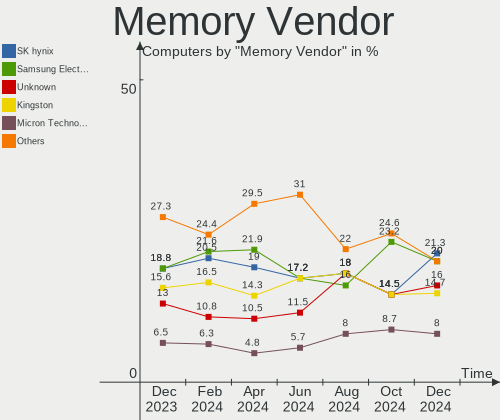
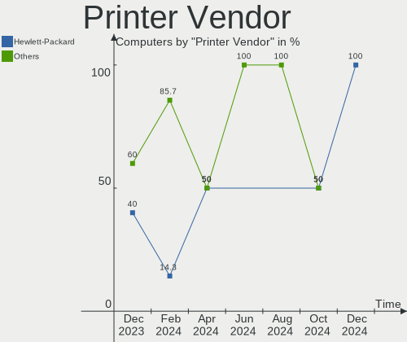

BlackPanther Hardware Trends
----------------------------

A project to identify most popular hardware characteristics and track their change
over time based on data collected by BlackPanther users at https://Linux-Hardware.org.

Anyone can contribute to the study by uploading probes of their computers by
the [hw-probe](https://github.com/linuxhw/hw-probe) tool:

    sudo -E hw-probe -all -upload

This is a report for all computer types. See also reports for [desktops](/Dist/BlackPanther/Desktop/README.md) and [notebooks](/Dist/BlackPanther/Notebook/README.md).

Full-feature report is available here: https://linux-hardware.org/?view=trends

Period: May, 2021.

Contents
--------

- [ OS                       ](#os)
- [ OS Family                ](#os-family)
- [ Kernel                   ](#kernel)
- [ Kernel Family            ](#kernel-family)
- [ Kernel Major Ver.        ](#kernel-major-ver)
- [ Arch                     ](#arch)
- [ DE                       ](#de)
- [ Display Server           ](#display-server)
- [ Display Manager          ](#display-manager)
- [ OS Lang                  ](#os-lang)
- [ Boot Mode                ](#boot-mode)
- [ Filesystem               ](#filesystem)
- [ Part. scheme             ](#part-scheme)
- [ Dual Boot with Linux/BSD ](#dual-boot-with-linux/bsd)
- [ Dual Boot (Win)          ](#dual-boot-win)
- [ Country                  ](#country)
- [ City                     ](#city)
- [ Vendor                   ](#vendor)
- [ Model                    ](#model)
- [ Model Family             ](#model-family)
- [ MFG Year                 ](#mfg-year)
- [ Form Factor              ](#form-factor)
- [ Secure Boot              ](#secure-boot)
- [ Coreboot                 ](#coreboot)
- [ RAM Size                 ](#ram-size)
- [ RAM Used                 ](#ram-used)
- [ Has CD-ROM               ](#has-cd-rom)
- [ Total Drives             ](#total-drives)
- [ Has Ethernet             ](#has-ethernet)
- [ Has WiFi                 ](#has-wifi)
- [ Has Bluetooth            ](#has-bluetooth)
- [ Drive Vendor             ](#drive-vendor)
- [ Drive Model              ](#drive-model)
- [ HDD Vendor               ](#hdd-vendor)
- [ SSD Vendor               ](#ssd-vendor)
- [ Drive Kind               ](#drive-kind)
- [ Drive Connector          ](#drive-connector)
- [ Drive Size               ](#drive-size)
- [ Space Total              ](#space-total)
- [ Space Used               ](#space-used)
- [ Malfunc. Drives          ](#malfunc-drives)
- [ Malfunc. Drive Vendor    ](#malfunc-drive-vendor)
- [ Malfunc. HDD Vendor      ](#malfunc-hdd-vendor)
- [ Malfunc. Drive Kind      ](#malfunc-drive-kind)
- [ Failed Drives            ](#failed-drives)
- [ Failed Drive Vendor      ](#failed-drive-vendor)
- [ Drive Status             ](#drive-status)
- [ Storage Vendor           ](#storage-vendor)
- [ Storage Model            ](#storage-model)
- [ Storage Kind             ](#storage-kind)
- [ CPU Vendor               ](#cpu-vendor)
- [ CPU Model                ](#cpu-model)
- [ CPU Model Family         ](#cpu-model-family)
- [ CPU Cores                ](#cpu-cores)
- [ CPU Sockets              ](#cpu-sockets)
- [ CPU Threads              ](#cpu-threads)
- [ CPU Op-Modes             ](#cpu-op-modes)
- [ CPU Microcode            ](#cpu-microcode)
- [ CPU Microarch            ](#cpu-microarch)
- [ GPU Vendor               ](#gpu-vendor)
- [ GPU Model                ](#gpu-model)
- [ GPU Combo                ](#gpu-combo)
- [ GPU Driver               ](#gpu-driver)
- [ GPU Memory               ](#gpu-memory)
- [ Monitor Vendor           ](#monitor-vendor)
- [ Monitor Model            ](#monitor-model)
- [ Monitor Resolution       ](#monitor-resolution)
- [ Monitor Diagonal         ](#monitor-diagonal)
- [ Monitor Width            ](#monitor-width)
- [ Aspect Ratio             ](#aspect-ratio)
- [ Monitor Area             ](#monitor-area)
- [ Pixel Density            ](#pixel-density)
- [ Multiple Monitors        ](#multiple-monitors)
- [ Net Controller Vendor    ](#net-controller-vendor)
- [ Net Controller Model     ](#net-controller-model)
- [ Wireless Vendor          ](#wireless-vendor)
- [ Wireless Model           ](#wireless-model)
- [ Ethernet Vendor          ](#ethernet-vendor)
- [ Ethernet Model           ](#ethernet-model)
- [ Net Controller Kind      ](#net-controller-kind)
- [ Used Controller          ](#used-controller)
- [ NICs                     ](#nics)
- [ IPv6                     ](#ipv6)
- [ Memory Vendor            ](#memory-vendor)
- [ Memory Model             ](#memory-model)
- [ Memory Kind              ](#memory-kind)
- [ Memory Form Factor       ](#memory-form-factor)
- [ Memory Size              ](#memory-size)
- [ Memory Speed             ](#memory-speed)
- [ Sound Vendor             ](#sound-vendor)
- [ Sound Model              ](#sound-model)
- [ Camera Vendor            ](#camera-vendor)
- [ Camera Model             ](#camera-model)
- [ Fingerprint Vendor       ](#fingerprint-vendor)
- [ Fingerprint Model        ](#fingerprint-model)
- [ Chipcard Vendor          ](#chipcard-vendor)
- [ Chipcard Model           ](#chipcard-model)
- [ Printer Vendor           ](#printer-vendor)
- [ Printer Model            ](#printer-model)
- [ Scanner Vendor           ](#scanner-vendor)
- [ Scanner Model            ](#scanner-model)
- [ Bluetooth Vendor         ](#bluetooth-vendor)
- [ Bluetooth Model          ](#bluetooth-model)
- [ Unsupported Devices      ](#unsupported-devices)
- [ Unsupported Device Types ](#unsupported-device-types)

OS
--

Installed operating systems

| Name              | Computers | Percent |
|-------------------|-----------|---------|
| BlackPanther 18.1 | 150       | 97.4%   |
| BlackPanther 16.2 | 4         | 2.6%    |

OS Family
---------

OS without a version

| Name         | Computers | Percent |
|--------------|-----------|---------|
| BlackPanther | 154       | 100%    |

Kernel
------

Version of the Linux kernel

| Version                | Computers | Percent |
|------------------------|-----------|---------|
| 5.6.14-desktop-2bP     | 116       | 75.32%  |
| 4.18.16-desktop-1bP    | 34        | 22.08%  |
| 4.9.20-desktop-pae-1bP | 4         | 2.6%    |

Kernel Family
-------------

Linux kernel without a distro release

| Version | Computers | Percent |
|---------|-----------|---------|
| 5.6.14  | 116       | 75.32%  |
| 4.18.16 | 34        | 22.08%  |
| 4.9.20  | 4         | 2.6%    |

Kernel Major Ver.
-----------------

Linux kernel major version

| Version | Computers | Percent |
|---------|-----------|---------|
| 5.6     | 116       | 75.32%  |
| 4.18    | 34        | 22.08%  |
| 4.9     | 4         | 2.6%    |

Arch
----

OS architecture (x86_64, i586, etc.)

| Name   | Computers | Percent |
|--------|-----------|---------|
| x86_64 | 150       | 97.4%   |
| i686   | 4         | 2.6%    |

DE
--

Desktop Environment

| Name | Computers | Percent |
|------|-----------|---------|
| KDE5 | 153       | 99.35%  |
| KDE  | 1         | 0.65%   |

Display Server
--------------

X11 or Wayland

| Name | Computers | Percent |
|------|-----------|---------|
| X11  | 154       | 100%    |

Display Manager
---------------

SDDM, LightDM, etc.

| Name    | Computers | Percent |
|---------|-----------|---------|
| SDDM    | 153       | 99.35%  |
| Unknown | 1         | 0.65%   |

OS Lang
-------

Language

| Lang    | Computers | Percent |
|---------|-----------|---------|
| Unknown | 153       | 99.35%  |
| hu_HU   | 1         | 0.65%   |

Boot Mode
---------

EFI or BIOS

| Mode | Computers | Percent |
|------|-----------|---------|
| BIOS | 101       | 65.58%  |
| EFI  | 53        | 34.42%  |

Filesystem
----------

Type of filesystem

| Type    | Computers | Percent |
|---------|-----------|---------|
| Overlay | 128       | 83.12%  |
| Ext4    | 24        | 15.58%  |
| Ext3    | 1         | 0.65%   |
| Btrfs   | 1         | 0.65%   |

Part. scheme
------------

Scheme of partitioning

| Type    | Computers | Percent |
|---------|-----------|---------|
| MBR     | 92        | 59.74%  |
| GPT     | 61        | 39.61%  |
| Unknown | 1         | 0.65%   |

Dual Boot with Linux/BSD
------------------------

Hosting more than one Linux/BSD

| Dual boot | Computers | Percent |
|-----------|-----------|---------|
| Yes       | 80        | 51.95%  |
| No        | 74        | 48.05%  |

Dual Boot (Win)
---------------

Hosting Linux and Windows

| Dual boot | Computers | Percent |
|-----------|-----------|---------|
| Yes       | 81        | 52.6%   |
| No        | 73        | 47.4%   |

Country
-------

Geographic location (country)

| Country     | Computers | Percent |
|-------------|-----------|---------|
| Hungary     | 107       | 69.48%  |
| USA         | 8         | 5.19%   |
| Germany     | 7         | 4.55%   |
| Slovakia    | 4         | 2.6%    |
| Turkey      | 2         | 1.3%    |
| Spain       | 2         | 1.3%    |
| Russia      | 2         | 1.3%    |
| Romania     | 2         | 1.3%    |
| Japan       | 2         | 1.3%    |
| Cyprus      | 2         | 1.3%    |
| China       | 2         | 1.3%    |
| UK          | 1         | 0.65%   |
| Thailand    | 1         | 0.65%   |
| Slovenia    | 1         | 0.65%   |
| Philippines | 1         | 0.65%   |
| Netherlands | 1         | 0.65%   |
| Martinique  | 1         | 0.65%   |
| Ireland     | 1         | 0.65%   |
| India       | 1         | 0.65%   |
| Greece      | 1         | 0.65%   |
| Costa Rica  | 1         | 0.65%   |
| Canada      | 1         | 0.65%   |
| Austria     | 1         | 0.65%   |
| Argentina   | 1         | 0.65%   |
| Algeria     | 1         | 0.65%   |

City
----

Geographic location (city)

| City               | Computers | Percent |
|--------------------|-----------|---------|
| Budapest           | 30        | 19.48%  |
| Pécs              | 5         | 3.25%   |
| Szekszárd         | 4         | 2.6%    |
| Veszprém          | 3         | 1.95%   |
| Zichyujfalu        | 2         | 1.3%    |
| Vecses             | 2         | 1.3%    |
| Szombathely        | 2         | 1.3%    |
| Szigetszentmiklos  | 2         | 1.3%    |
| Szeged             | 2         | 1.3%    |
| Stuttgart          | 2         | 1.3%    |
| Rezi               | 2         | 1.3%    |
| Retkozberencs      | 2         | 1.3%    |
| Pakozd             | 2         | 1.3%    |
| Nyiregyhaza        | 2         | 1.3%    |
| Nagykanizsa        | 2         | 1.3%    |
| Mohács            | 2         | 1.3%    |
| Limassol           | 2         | 1.3%    |
| Kecskemét         | 2         | 1.3%    |
| Izmir              | 2         | 1.3%    |
| Hatvan             | 2         | 1.3%    |
| Eger               | 2         | 1.3%    |
| Debrecen           | 2         | 1.3%    |
| Dalian             | 2         | 1.3%    |
| Štúrovo          | 1         | 0.65%   |
| Érd               | 1         | 0.65%   |
| Velky Meder        | 1         | 0.65%   |
| Tribuswinkel       | 1         | 0.65%   |
| Totszentmarton     | 1         | 0.65%   |
| Tarnok             | 1         | 0.65%   |
| Tapioszele         | 1         | 0.65%   |
| Szolnok            | 1         | 0.65%   |
| Szabadszentkiraly  | 1         | 0.65%   |
| Soporna            | 1         | 0.65%   |
| Sierra Vista       | 1         | 0.65%   |
| Schoelcher         | 1         | 0.65%   |
| Salgotarjan        | 1         | 0.65%   |
| Rozsaszentmarton   | 1         | 0.65%   |
| Roszke             | 1         | 0.65%   |
| Puntarenas         | 1         | 0.65%   |
| Pittsburgh         | 1         | 0.65%   |
| Pazit              | 1         | 0.65%   |
| Oroshaza           | 1         | 0.65%   |
| Oradea             | 1         | 0.65%   |
| Offenbach-Hundheim | 1         | 0.65%   |
| Odorheiu Secuiesc  | 1         | 0.65%   |
| Nyergesujfalu      | 1         | 0.65%   |
| Novosibirsk        | 1         | 0.65%   |
| North Hollywood    | 1         | 0.65%   |
| Neuenhagen         | 1         | 0.65%   |
| Nerima             | 1         | 0.65%   |
| Nagyvazsony        | 1         | 0.65%   |
| Nagykoros          | 1         | 0.65%   |
| Nagyigmand         | 1         | 0.65%   |
| Mosonszentmiklos   | 1         | 0.65%   |
| Moscow             | 1         | 0.65%   |
| Miskolc            | 1         | 0.65%   |
| Mezobereny         | 1         | 0.65%   |
| Mateszalka         | 1         | 0.65%   |
| Madrid             | 1         | 0.65%   |
| Maastricht         | 1         | 0.65%   |

Vendor
------

Motherboard manufacturer

| Name                             | Computers | Percent |
|----------------------------------|-----------|---------|
| Hewlett-Packard                  | 29        | 18.83%  |
| ASUSTek Computer                 | 22        | 14.29%  |
| Lenovo                           | 19        | 12.34%  |
| Dell                             | 15        | 9.74%   |
| Acer                             | 14        | 9.09%   |
| Gigabyte Technology              | 13        | 8.44%   |
| ASRock                           | 7         | 4.55%   |
| MSI                              | 6         | 3.9%    |
| Toshiba                          | 4         | 2.6%    |
| Intel                            | 3         | 1.95%   |
| Fujitsu                          | 3         | 1.95%   |
| Sapphire                         | 2         | 1.3%    |
| Jumper                           | 2         | 1.3%    |
| Fujitsu Siemens                  | 2         | 1.3%    |
| eMachines                        | 2         | 1.3%    |
| Timi                             | 1         | 0.65%   |
| Sony                             | 1         | 0.65%   |
| Pegatron                         | 1         | 0.65%   |
| Panasonic                        | 1         | 0.65%   |
| Packard Bell                     | 1         | 0.65%   |
| ONE-NETBOOK TECHNOLOGY           | 1         | 0.65%   |
| HUAWEI                           | 1         | 0.65%   |
| FUJITSU CLIENT COMPUTING LIMITED | 1         | 0.65%   |
| Datto                            | 1         | 0.65%   |
| Alcor                            | 1         | 0.65%   |
| Unknown                          | 1         | 0.65%   |

Model
-----

Motherboard model

| Name                                      | Computers | Percent |
|-------------------------------------------|-----------|---------|
| HP 250 G1                                 | 3         | 1.95%   |
| Sapphire PI-AM3RS785G                     | 2         | 1.3%    |
| Jumper EZbook                             | 2         | 1.3%    |
| HP 620                                    | 2         | 1.3%    |
| Gigabyte P67A-D3-B3                       | 2         | 1.3%    |
| ASUS All Series                           | 2         | 1.3%    |
| Toshiba Satellite L750                    | 1         | 0.65%   |
| Toshiba Satellite L500                    | 1         | 0.65%   |
| Toshiba Satellite L300                    | 1         | 0.65%   |
| Toshiba Satellite C50D-A-133              | 1         | 0.65%   |
| Timi Mi Gaming Laptop 15.6                | 1         | 0.65%   |
| Sony VPCYB3V1E                            | 1         | 0.65%   |
| Pegatron CQ2728LA                         | 1         | 0.65%   |
| Panasonic CF-19KDR80SH                    | 1         | 0.65%   |
| Packard Bell DOT S                        | 1         | 0.65%   |
| ONE-NETBOOK TECHNOLOGY ONE-GX             | 1         | 0.65%   |
| MSI MS-7B98                               | 1         | 0.65%   |
| MSI MS-7A38                               | 1         | 0.65%   |
| MSI MS-7A36                               | 1         | 0.65%   |
| MSI MS-7994                               | 1         | 0.65%   |
| MSI MS-7972                               | 1         | 0.65%   |
| MSI MS-7312                               | 1         | 0.65%   |
| Lenovo Yoga 310-11IAP 80U2                | 1         | 0.65%   |
| Lenovo Yoga 2 11 20332                    | 1         | 0.65%   |
| Lenovo V330-15IKB 81AX                    | 1         | 0.65%   |
| Lenovo V145-15AST 81MT                    | 1         | 0.65%   |
| Lenovo ThinkPad X220 4293ER9              | 1         | 0.65%   |
| Lenovo ThinkPad W510 431924G              | 1         | 0.65%   |
| Lenovo ThinkPad SL510 2847D8G             | 1         | 0.65%   |
| Lenovo ThinkCentre M73 10B6001SUS         | 1         | 0.65%   |
| Lenovo ThinkCentre M72e 36622M1           | 1         | 0.65%   |
| Lenovo ThinkCentre M72e 32671M2           | 1         | 0.65%   |
| Lenovo S10-3                              | 1         | 0.65%   |
| Lenovo IdeaPad S145-15IGM 81MX            | 1         | 0.65%   |
| Lenovo IdeaPad S145-15AST 81N3            | 1         | 0.65%   |
| Lenovo IdeaPad 120S-11IAP 81A4            | 1         | 0.65%   |
| Lenovo IdeaCentre T540-15ICK G 90LW00ATUS | 1         | 0.65%   |
| Lenovo G580 20150                         | 1         | 0.65%   |
| Lenovo G550 20023                         | 1         | 0.65%   |
| Lenovo G505s 20255                        | 1         | 0.65%   |
| Lenovo B590 62743BG                       | 1         | 0.65%   |
| Intel NUC7CJYH                            | 1         | 0.65%   |
| Intel DQ77MK                              | 1         | 0.65%   |
| Intel DH55TC AAE70932-302                 | 1         | 0.65%   |
| HUAWEI HVY-WXX9                           | 1         | 0.65%   |
| HP xw4400 Workstation                     | 1         | 0.65%   |
| HP Stream Laptop 14-ax0XX                 | 1         | 0.65%   |
| HP ProBook 6470b                          | 1         | 0.65%   |
| HP ProBook 645 G1                         | 1         | 0.65%   |
| HP ProBook 4740s                          | 1         | 0.65%   |
| HP ProBook 4730s                          | 1         | 0.65%   |
| HP ProBook 470 G1                         | 1         | 0.65%   |
| HP ProBook 455 G4                         | 1         | 0.65%   |
| HP Pavilion g7                            | 1         | 0.65%   |
| HP Pavilion dv7                           | 1         | 0.65%   |
| HP Pavilion dv6                           | 1         | 0.65%   |
| HP Laptop 15-da0xxx                       | 1         | 0.65%   |
| HP Laptop 15-bw0xx                        | 1         | 0.65%   |
| HP EliteBook 8460p                        | 1         | 0.65%   |
| HP EliteBook 820 G1                       | 1         | 0.65%   |

Model Family
------------

Motherboard model prefix

| Name                          | Computers | Percent |
|-------------------------------|-----------|---------|
| Acer Aspire                   | 11        | 7.14%   |
| HP ProBook                    | 6         | 3.9%    |
| Dell Inspiron                 | 6         | 3.9%    |
| Dell Latitude                 | 5         | 3.25%   |
| Toshiba Satellite             | 4         | 2.6%    |
| HP Compaq                     | 4         | 2.6%    |
| HP 250                        | 4         | 2.6%    |
| Lenovo ThinkPad               | 3         | 1.95%   |
| Lenovo ThinkCentre            | 3         | 1.95%   |
| Lenovo IdeaPad                | 3         | 1.95%   |
| HP Pavilion                   | 3         | 1.95%   |
| HP EliteBook                  | 3         | 1.95%   |
| Sapphire PI-AM3RS785G         | 2         | 1.3%    |
| Lenovo Yoga                   | 2         | 1.3%    |
| Jumper EZbook                 | 2         | 1.3%    |
| HP Laptop                     | 2         | 1.3%    |
| HP 620                        | 2         | 1.3%    |
| Gigabyte P67A-D3-B3           | 2         | 1.3%    |
| Dell OptiPlex                 | 2         | 1.3%    |
| ASUS All                      | 2         | 1.3%    |
| Timi Mi                       | 1         | 0.65%   |
| Sony VPCYB3V1E                | 1         | 0.65%   |
| Pegatron CQ2728LA             | 1         | 0.65%   |
| Panasonic CF-19KDR80SH        | 1         | 0.65%   |
| Packard Bell DOT              | 1         | 0.65%   |
| ONE-NETBOOK TECHNOLOGY ONE-GX | 1         | 0.65%   |
| MSI MS-7B98                   | 1         | 0.65%   |
| MSI MS-7A38                   | 1         | 0.65%   |
| MSI MS-7A36                   | 1         | 0.65%   |
| MSI MS-7994                   | 1         | 0.65%   |
| MSI MS-7972                   | 1         | 0.65%   |
| MSI MS-7312                   | 1         | 0.65%   |
| Lenovo V330-15IKB             | 1         | 0.65%   |
| Lenovo V145-15AST             | 1         | 0.65%   |
| Lenovo S10-3                  | 1         | 0.65%   |
| Lenovo IdeaCentre             | 1         | 0.65%   |
| Lenovo G580                   | 1         | 0.65%   |
| Lenovo G550                   | 1         | 0.65%   |
| Lenovo G505s                  | 1         | 0.65%   |
| Lenovo B590                   | 1         | 0.65%   |
| Intel NUC7CJYH                | 1         | 0.65%   |
| Intel DQ77MK                  | 1         | 0.65%   |
| Intel DH55TC                  | 1         | 0.65%   |
| HUAWEI HVY-WXX9               | 1         | 0.65%   |
| HP xw4400                     | 1         | 0.65%   |
| HP Stream                     | 1         | 0.65%   |
| HP All-in-One                 | 1         | 0.65%   |
| HP 2000                       | 1         | 0.65%   |
| HP 15                         | 1         | 0.65%   |
| Gigabyte Z68X-UD3H-B3         | 1         | 0.65%   |
| Gigabyte M57SLI-S4            | 1         | 0.65%   |
| Gigabyte H61M-DS2             | 1         | 0.65%   |
| Gigabyte H61M-D2-B3           | 1         | 0.65%   |
| Gigabyte H170-D3HP            | 1         | 0.65%   |
| Gigabyte GA-MA770-UD3         | 1         | 0.65%   |
| Gigabyte G41MT-S2PT           | 1         | 0.65%   |
| Gigabyte G31M-ES2L            | 1         | 0.65%   |
| Gigabyte G31M-ES2C            | 1         | 0.65%   |
| Gigabyte F2A88XN-WIFI         | 1         | 0.65%   |
| Gigabyte EP31-DS3L            | 1         | 0.65%   |

MFG Year
--------

Motherboard manufacture year

| Year | Computers | Percent |
|------|-----------|---------|
| 2013 | 21        | 13.64%  |
| 2018 | 20        | 12.99%  |
| 2011 | 14        | 9.09%   |
| 2009 | 14        | 9.09%   |
| 2010 | 12        | 7.79%   |
| 2014 | 11        | 7.14%   |
| 2019 | 10        | 6.49%   |
| 2015 | 10        | 6.49%   |
| 2012 | 9         | 5.84%   |
| 2020 | 8         | 5.19%   |
| 2016 | 6         | 3.9%    |
| 2008 | 5         | 3.25%   |
| 2021 | 4         | 2.6%    |
| 2017 | 4         | 2.6%    |
| 2007 | 3         | 1.95%   |
| 2006 | 3         | 1.95%   |

Form Factor
-----------

Physical design of the computer

| Name        | Computers | Percent |
|-------------|-----------|---------|
| Notebook    | 93        | 60.39%  |
| Desktop     | 57        | 37.01%  |
| Tablet      | 1         | 0.65%   |
| Convertible | 1         | 0.65%   |
| Mini pc     | 1         | 0.65%   |
| All in one  | 1         | 0.65%   |

Secure Boot
-----------

Enabled or disabled

| State    | Computers | Percent |
|----------|-----------|---------|
| Disabled | 154       | 100%    |

Coreboot
--------

Have coreboot on board

| Used | Computers | Percent |
|------|-----------|---------|
| No   | 154       | 100%    |

RAM Size
--------

Total RAM memory

| Size in GB | Computers | Percent |
|------------|-----------|---------|
| 3.01-4.0   | 73        | 47.4%   |
| 4.01-8.0   | 28        | 18.18%  |
| 8.01-16.0  | 20        | 12.99%  |
| 1.01-2.0   | 15        | 9.74%   |
| 16.01-24.0 | 12        | 7.79%   |
| 32.01-64.0 | 2         | 1.3%    |
| 2.01-3.0   | 2         | 1.3%    |
| 24.01-32.0 | 1         | 0.65%   |
| 0.51-1.0   | 1         | 0.65%   |

RAM Used
--------

Used RAM memory

| Used GB  | Computers | Percent |
|----------|-----------|---------|
| 0.51-1.0 | 60        | 38.96%  |
| 0.01-0.5 | 52        | 33.77%  |
| 1.01-2.0 | 41        | 26.62%  |
| 3.01-4.0 | 1         | 0.65%   |

Has CD-ROM
----------

Has CD-ROM on board

| Presented | Computers | Percent |
|-----------|-----------|---------|
| Yes       | 94        | 61.04%  |
| No        | 60        | 38.96%  |

Total Drives
------------

Number of drives on board

| Drives | Computers | Percent |
|--------|-----------|---------|
| 1      | 110       | 71.43%  |
| 2      | 25        | 16.23%  |
| 3      | 10        | 6.49%   |
| 5      | 4         | 2.6%    |
| 4      | 2         | 1.3%    |
| 0      | 2         | 1.3%    |
| 6      | 1         | 0.65%   |

Has Ethernet
------------

Has Ethernet on board

| Presented | Computers | Percent |
|-----------|-----------|---------|
| Yes       | 140       | 90.91%  |
| No        | 14        | 9.09%   |

Has WiFi
--------

Has WiFi module

| Presented | Computers | Percent |
|-----------|-----------|---------|
| Yes       | 115       | 74.68%  |
| No        | 39        | 25.32%  |

Has Bluetooth
-------------

Has Bluetooth module

| Presented | Computers | Percent |
|-----------|-----------|---------|
| Yes       | 79        | 51.3%   |
| No        | 75        | 48.7%   |

Drive Vendor
------------

Hard drive vendors

| Vendor              | Computers | Drives | Percent |
|---------------------|-----------|--------|---------|
| Seagate             | 39        | 42     | 19.31%  |
| WDC                 | 29        | 37     | 14.36%  |
| Samsung Electronics | 26        | 33     | 12.87%  |
| Kingston            | 23        | 25     | 11.39%  |
| Toshiba             | 11        | 11     | 5.45%   |
| Hitachi             | 11        | 11     | 5.45%   |
| Unknown             | 6         | 6      | 2.97%   |
| HGST                | 6         | 6      | 2.97%   |
| SanDisk             | 5         | 5      | 2.48%   |
| Intel               | 4         | 4      | 1.98%   |
| A-DATA Technology   | 4         | 4      | 1.98%   |
| SK Hynix            | 3         | 3      | 1.49%   |
| PNY                 | 3         | 3      | 1.49%   |
| Maxtor              | 3         | 3      | 1.49%   |
| Crucial             | 3         | 3      | 1.49%   |
| Apacer              | 3         | 3      | 1.49%   |
| WD MediaMax         | 2         | 2      | 0.99%   |
| SPCC                | 2         | 2      | 0.99%   |
| Patriot             | 2         | 3      | 0.99%   |
| Micron Technology   | 2         | 2      | 0.99%   |
| HS-SSD-C100         | 2         | 2      | 0.99%   |
| Gigabyte Technology | 2         | 2      | 0.99%   |
| Fujitsu             | 2         | 2      | 0.99%   |
| Union Memory        | 1         | 1      | 0.5%    |
| Phison              | 1         | 1      | 0.5%    |
| OCZ                 | 1         | 1      | 0.5%    |
| LITEONIT            | 1         | 1      | 0.5%    |
| KingSpec            | 1         | 1      | 0.5%    |
| Kingmax             | 1         | 1      | 0.5%    |
| JMicron             | 1         | 1      | 0.5%    |
| EMTEC               | 1         | 1      | 0.5%    |
| China               | 1         | 1      | 0.5%    |

Drive Model
-----------

Hard drive models

| Model                            | Computers | Percent |
|----------------------------------|-----------|---------|
| Kingston SA400S37240G 240GB SSD  | 7         | 3.17%   |
| Kingston SA400S37120G 120GB SSD  | 7         | 3.17%   |
| Seagate ST500LT012-1DG142 500GB  | 5         | 2.26%   |
| Kingston SV300S37A120G 120GB SSD | 4         | 1.81%   |
| Seagate ST9500325AS 500GB        | 3         | 1.36%   |
| Seagate ST500DM002-1BD142 500GB  | 3         | 1.36%   |
| Seagate ST1000LM035-1RK172 1TB   | 3         | 1.36%   |
| PNY CS900 120GB SSD              | 3         | 1.36%   |
| HGST HTS545032A7E380 320GB       | 3         | 1.36%   |
| WDC WD30EZRZ-00GXCB0 3TB         | 2         | 0.9%    |
| WDC WD30EFRX-68EUZN0 3TB         | 2         | 0.9%    |
| WDC WD20EZRX-00D8PB0 2TB         | 2         | 0.9%    |
| WD MediaMax WL1500GSA6454G 1TB   | 2         | 0.9%    |
| Toshiba MQ01ABF050 500GB         | 2         | 0.9%    |
| Toshiba MQ01ABD100 1TB           | 2         | 0.9%    |
| Seagate ST9320325AS 320GB        | 2         | 0.9%    |
| Seagate ST3320413AS 320GB        | 2         | 0.9%    |
| Seagate ST1000DM010-2EP102 1TB   | 2         | 0.9%    |
| Samsung SSD 870 EVO 250GB        | 2         | 0.9%    |
| Samsung SSD 830 Series 64GB      | 2         | 0.9%    |
| Samsung HD502IJ 500GB            | 2         | 0.9%    |
| Samsung HD154UI 1TB              | 2         | 0.9%    |
| Patriot P210 256GB SSD           | 2         | 0.9%    |
| Kingston SHFS37A120G 120GB SSD   | 2         | 0.9%    |
| HS-SSD-C100 SSD 120G             | 2         | 0.9%    |
| HGST HTS545050A7E680 500GB       | 2         | 0.9%    |
| Gigabyte GP-GSTFS31120GNTD 120GB | 2         | 0.9%    |
| WDC WUH721414ALE6L4 14TB         | 1         | 0.45%   |
| WDC WDS120G2G0A-00JH30 120GB SSD | 1         | 0.45%   |
| WDC WD800JD-75MSA3 80GB          | 1         | 0.45%   |
| WDC WD800JD-55MUA1 80GB          | 1         | 0.45%   |
| WDC WD800AAJS-75M0A0 80GB        | 1         | 0.45%   |
| WDC WD5000LPVT-24G33T1 500GB     | 1         | 0.45%   |
| WDC WD5000LPCX-22VHAT1 500GB     | 1         | 0.45%   |
| WDC WD5000AAKX-001CA0 500GB      | 1         | 0.45%   |
| WDC WD5000AAKS-55V0A0 500GB      | 1         | 0.45%   |
| WDC WD4000YS-01MPB1 400GB        | 1         | 0.45%   |
| WDC WD3200BUCT-62TWBY0 320GB     | 1         | 0.45%   |
| WDC WD3200BPVT-80JJ5T0 320GB     | 1         | 0.45%   |
| WDC WD3200BPVT-22JJ5T0 320GB     | 1         | 0.45%   |
| WDC WD3200BEVT-22A23T0 320GB     | 1         | 0.45%   |
| WDC WD3200BEKT-60PVMT0 320GB     | 1         | 0.45%   |
| WDC WD3200AAKS-00SBA0 320GB      | 1         | 0.45%   |
| WDC WD30EZRX-00MMMB0 3TB         | 1         | 0.45%   |
| WDC WD2500BEVS-22UST0 250GB      | 1         | 0.45%   |
| WDC WD2500AAKX-60U6AA0 250GB     | 1         | 0.45%   |
| WDC WD20PURX-64P6ZY0 2TB         | 1         | 0.45%   |
| WDC WD20EZRZ-00Z5HB0 2TB         | 1         | 0.45%   |
| WDC WD20EZRX-00DC0B0 2TB         | 1         | 0.45%   |
| WDC WD2000FYYZ-01UL1B2 2TB       | 1         | 0.45%   |
| WDC WD1600AVVS-63L2B0 160GB      | 1         | 0.45%   |
| WDC WD1600AAJS-60WAA0 160GB      | 1         | 0.45%   |
| WDC WD1600AAJB-56WRA0 160GB      | 1         | 0.45%   |
| WDC WD10JPVX-22JC3T0 1TB         | 1         | 0.45%   |
| WDC WD10EZEX-75WN4A0 1TB         | 1         | 0.45%   |
| WDC WD10EZEX-60WN4A0 1TB         | 1         | 0.45%   |
| WDC WD10EZEX-22BN5A0 1TB         | 1         | 0.45%   |
| WDC WD10EZEX-08WN4A0 1TB         | 1         | 0.45%   |
| Unknown SLD128  128GB            | 1         | 0.45%   |
| Unknown SD/MMC/MS PRO 8GB        | 1         | 0.45%   |

HDD Vendor
----------

Hard disk drive vendors

| Vendor              | Computers | Drives | Percent |
|---------------------|-----------|--------|---------|
| Seagate             | 39        | 42     | 34.51%  |
| WDC                 | 28        | 36     | 24.78%  |
| Samsung Electronics | 13        | 13     | 11.5%   |
| Hitachi             | 11        | 11     | 9.73%   |
| Toshiba             | 9         | 9      | 7.96%   |
| HGST                | 6         | 6      | 5.31%   |
| Maxtor              | 3         | 3      | 2.65%   |
| WD MediaMax         | 2         | 2      | 1.77%   |
| Fujitsu             | 2         | 2      | 1.77%   |

SSD Vendor
----------

Solid state drive vendors

| Vendor              | Computers | Drives | Percent |
|---------------------|-----------|--------|---------|
| Kingston            | 23        | 25     | 29.87%  |
| Samsung Electronics | 15        | 17     | 19.48%  |
| A-DATA Technology   | 4         | 4      | 5.19%   |
| PNY                 | 3         | 3      | 3.9%    |
| Crucial             | 3         | 3      | 3.9%    |
| Apacer              | 3         | 3      | 3.9%    |
| SPCC                | 2         | 2      | 2.6%    |
| SK Hynix            | 2         | 2      | 2.6%    |
| SanDisk             | 2         | 2      | 2.6%    |
| Patriot             | 2         | 3      | 2.6%    |
| Micron Technology   | 2         | 2      | 2.6%    |
| Intel               | 2         | 2      | 2.6%    |
| HS-SSD-C100         | 2         | 2      | 2.6%    |
| Gigabyte Technology | 2         | 2      | 2.6%    |
| WDC                 | 1         | 1      | 1.3%    |
| Union Memory        | 1         | 1      | 1.3%    |
| Toshiba             | 1         | 1      | 1.3%    |
| OCZ                 | 1         | 1      | 1.3%    |
| LITEONIT            | 1         | 1      | 1.3%    |
| KingSpec            | 1         | 1      | 1.3%    |
| Kingmax             | 1         | 1      | 1.3%    |
| JMicron             | 1         | 1      | 1.3%    |
| EMTEC               | 1         | 1      | 1.3%    |
| China               | 1         | 1      | 1.3%    |

Drive Kind
----------

HDD or SSD

| Kind    | Computers | Drives | Percent |
|---------|-----------|--------|---------|
| HDD     | 92        | 124    | 51.11%  |
| SSD     | 73        | 82     | 40.56%  |
| MMC     | 8         | 9      | 4.44%   |
| NVMe    | 6         | 7      | 3.33%   |
| Unknown | 1         | 1      | 0.56%   |

Drive Connector
---------------

SATA, SAS, NVMe, etc.

| Type | Computers | Drives | Percent |
|------|-----------|--------|---------|
| SATA | 139       | 200    | 86.88%  |
| MMC  | 8         | 9      | 5%      |
| SAS  | 7         | 7      | 4.38%   |
| NVMe | 6         | 7      | 3.75%   |

Drive Size
----------

Size of hard drive

| Size in TB | Computers | Drives | Percent |
|------------|-----------|--------|---------|
| 0.01-0.5   | 123       | 160    | 76.4%   |
| 0.51-1.0   | 28        | 31     | 17.39%  |
| 1.01-2.0   | 6         | 9      | 3.73%   |
| 2.01-3.0   | 3         | 5      | 1.86%   |
| 10.01-20.0 | 1         | 1      | 0.62%   |

Space Total
-----------

Amount of disk space available on the file system

| Size in GB | Computers | Percent |
|------------|-----------|---------|
| Unknown    | 127       | 82.47%  |
| 21-50      | 8         | 5.19%   |
| 101-250    | 7         | 4.55%   |
| 251-500    | 4         | 2.6%    |
| 501-1000   | 4         | 2.6%    |
| 51-100     | 3         | 1.95%   |
| 1001-2000  | 1         | 0.65%   |

Space Used
----------

Amount of used disk space

| Used GB | Computers | Percent |
|---------|-----------|---------|
| Unknown | 127       | 82.47%  |
| 1-20    | 25        | 16.23%  |
| 251-500 | 1         | 0.65%   |
| 101-250 | 1         | 0.65%   |

Malfunc. Drives
---------------

Drive models with a malfunction

| Model                                 | Computers | Drives | Percent |
|---------------------------------------|-----------|--------|---------|
| Seagate ST500LT012-1DG142 500GB       | 3         | 3      | 4.92%   |
| Seagate ST500DM002-1BD142 500GB       | 3         | 3      | 4.92%   |
| HGST HTS545032A7E380 320GB            | 3         | 3      | 4.92%   |
| WD MediaMax WL1500GSA6454G 1TB        | 2         | 2      | 3.28%   |
| Seagate ST9500325AS 500GB             | 2         | 2      | 3.28%   |
| Seagate ST3320413AS 320GB             | 2         | 2      | 3.28%   |
| WDC WDS120G2G0A-00JH30 120GB SSD      | 1         | 1      | 1.64%   |
| WDC WD800JD-55MUA1 80GB               | 1         | 1      | 1.64%   |
| WDC WD5000LPVT-24G33T1 500GB          | 1         | 1      | 1.64%   |
| WDC WD5000AAKX-001CA0 500GB           | 1         | 1      | 1.64%   |
| WDC WD5000AAKS-55V0A0 500GB           | 1         | 1      | 1.64%   |
| WDC WD3200BEVT-22A23T0 320GB          | 1         | 1      | 1.64%   |
| WDC WD30EZRX-00MMMB0 3TB              | 1         | 1      | 1.64%   |
| WDC WD20PURX-64P6ZY0 2TB              | 1         | 1      | 1.64%   |
| WDC WD2000FYYZ-01UL1B2 2TB            | 1         | 1      | 1.64%   |
| WDC WD1600AAJB-56WRA0 160GB           | 1         | 1      | 1.64%   |
| WDC WD10EZEX-08WN4A0 1TB              | 1         | 1      | 1.64%   |
| Toshiba THNSFJ256GCSU 256GB SSD       | 1         | 1      | 1.64%   |
| Toshiba MQ02ABF050H 500GB             | 1         | 1      | 1.64%   |
| Toshiba MQ01ABF050 500GB              | 1         | 1      | 1.64%   |
| Toshiba MQ01ABD050 500GB              | 1         | 1      | 1.64%   |
| SK Hynix HFS128G32MND-2200A 128GB SSD | 1         | 1      | 1.64%   |
| Seagate STM3250318AS 250GB            | 1         | 1      | 1.64%   |
| Seagate ST9320327AS 320GB             | 1         | 1      | 1.64%   |
| Seagate ST9320325AS 320GB             | 1         | 1      | 1.64%   |
| Seagate ST9250315AS 250GB             | 1         | 1      | 1.64%   |
| Seagate ST9200420ASG 200GB            | 1         | 1      | 1.64%   |
| Seagate ST500LT012-9WS142 500GB       | 1         | 1      | 1.64%   |
| Seagate ST500LM012 HN-M500MBB 500GB   | 1         | 1      | 1.64%   |
| Seagate ST500DM005 HD502HJ 500GB      | 1         | 1      | 1.64%   |
| Seagate ST3160812AS 160GB             | 1         | 1      | 1.64%   |
| Seagate ST1000DM010-2EP102 1TB        | 1         | 1      | 1.64%   |
| SanDisk SD9SN8W-128G-1006 128GB SSD   | 1         | 1      | 1.64%   |
| Samsung Electronics SP1603C 160GB     | 1         | 1      | 1.64%   |
| Samsung Electronics SP0411C 40GB      | 1         | 1      | 1.64%   |
| Samsung Electronics HD502HJ 500GB     | 1         | 1      | 1.64%   |
| OCZ ARC100 240GB SSD                  | 1         | 1      | 1.64%   |
| Maxtor 6Y080L0 81GB                   | 1         | 1      | 1.64%   |
| Maxtor 6V250F0 256GB                  | 1         | 1      | 1.64%   |
| Maxtor 4D040H2 41GB                   | 1         | 1      | 1.64%   |
| Kingston SV300S37A120G 120GB SSD      | 1         | 1      | 1.64%   |
| Kingston SA400S37120G 120GB SSD       | 1         | 1      | 1.64%   |
| Intel SSDSA1M160G2HP 160GB            | 1         | 1      | 1.64%   |
| Hitachi HTS543232A7A384 320GB         | 1         | 1      | 1.64%   |
| Hitachi HTS542512K9SA00 120GB         | 1         | 1      | 1.64%   |
| Hitachi HTS541640J9SA00 40GB          | 1         | 1      | 1.64%   |
| Hitachi HDT721032SLA360 320GB         | 1         | 1      | 1.64%   |
| Hitachi HDS721050CLA362 500GB         | 1         | 1      | 1.64%   |
| Hitachi HCC543232A7A380 320GB         | 1         | 1      | 1.64%   |
| HGST HTS541010A9E680 1TB              | 1         | 1      | 1.64%   |
| Fujitsu MHW2060BH 64GB                | 1         | 1      | 1.64%   |
| A-DATA Technology SP550 120GB SSD     | 1         | 1      | 1.64%   |

Malfunc. Drive Vendor
---------------------

Vendors of faulty drives

| Vendor              | Computers | Drives | Percent |
|---------------------|-----------|--------|---------|
| Seagate             | 20        | 20     | 33.9%   |
| WDC                 | 9         | 11     | 15.25%  |
| Hitachi             | 6         | 6      | 10.17%  |
| Toshiba             | 4         | 4      | 6.78%   |
| HGST                | 4         | 4      | 6.78%   |
| Samsung Electronics | 3         | 3      | 5.08%   |
| Maxtor              | 3         | 3      | 5.08%   |
| WD MediaMax         | 2         | 2      | 3.39%   |
| Kingston            | 2         | 2      | 3.39%   |
| SK Hynix            | 1         | 1      | 1.69%   |
| SanDisk             | 1         | 1      | 1.69%   |
| OCZ                 | 1         | 1      | 1.69%   |
| Intel               | 1         | 1      | 1.69%   |
| Fujitsu             | 1         | 1      | 1.69%   |
| A-DATA Technology   | 1         | 1      | 1.69%   |

Malfunc. HDD Vendor
-------------------

Vendors of faulty HDD drives

| Vendor              | Computers | Drives | Percent |
|---------------------|-----------|--------|---------|
| Seagate             | 20        | 20     | 40%     |
| WDC                 | 8         | 10     | 16%     |
| Hitachi             | 6         | 6      | 12%     |
| HGST                | 4         | 4      | 8%      |
| Toshiba             | 3         | 3      | 6%      |
| Samsung Electronics | 3         | 3      | 6%      |
| Maxtor              | 3         | 3      | 6%      |
| WD MediaMax         | 2         | 2      | 4%      |
| Fujitsu             | 1         | 1      | 2%      |

Malfunc. Drive Kind
-------------------

Kinds of faulty drives

| Kind | Computers | Drives | Percent |
|------|-----------|--------|---------|
| HDD  | 45        | 52     | 83.33%  |
| SSD  | 9         | 9      | 16.67%  |

Failed Drives
-------------

Failed drive models

Zero info for selected period =(

Failed Drive Vendor
-------------------

Failed drive vendors

Zero info for selected period =(

Drive Status
------------

Number of failed and malfunc. drives

| Status   | Computers | Drives | Percent |
|----------|-----------|--------|---------|
| Works    | 109       | 144    | 62.29%  |
| Malfunc  | 52        | 61     | 29.71%  |
| Detected | 14        | 18     | 8%      |

Storage Vendor
--------------

Storage controller vendors

| Vendor                   | Computers | Percent |
|--------------------------|-----------|---------|
| Intel                    | 114       | 73.08%  |
| AMD                      | 30        | 19.23%  |
| Nvidia                   | 3         | 1.92%   |
| Samsung Electronics      | 2         | 1.28%   |
| Marvell Technology Group | 2         | 1.28%   |
| VIA Technologies         | 1         | 0.64%   |
| Silicon Image            | 1         | 0.64%   |
| Phison Electronics       | 1         | 0.64%   |
| KIOXIA                   | 1         | 0.64%   |
| JMicron Technology       | 1         | 0.64%   |

Storage Model
-------------

Storage controller models

| Model                                                                                   | Computers | Percent |
|-----------------------------------------------------------------------------------------|-----------|---------|
| AMD FCH SATA Controller [AHCI mode]                                                     | 18        | 9.28%   |
| Intel 7 Series Chipset Family 6-port SATA Controller [AHCI mode]                        | 11        | 5.67%   |
| Intel NM10/ICH7 Family SATA Controller [IDE mode]                                       | 10        | 5.15%   |
| Intel 82801G (ICH7 Family) IDE Controller                                               | 10        | 5.15%   |
| Intel 82801IBM/IEM (ICH9M/ICH9M-E) 4 port SATA Controller [AHCI mode]                   | 9         | 4.64%   |
| Intel Sunrise Point-LP SATA Controller [AHCI mode]                                      | 7         | 3.61%   |
| Intel Q170/Q150/B150/H170/H110/Z170/CM236 Chipset SATA Controller [AHCI Mode]           | 6         | 3.09%   |
| Intel 82801 Mobile SATA Controller [RAID mode]                                          | 6         | 3.09%   |
| Intel 6 Series/C200 Series Chipset Family 6 port Mobile SATA AHCI Controller            | 6         | 3.09%   |
| AMD SB7x0/SB8x0/SB9x0 SATA Controller [AHCI mode]                                       | 6         | 3.09%   |
| Intel Celeron/Pentium Silver Processor SATA Controller                                  | 5         | 2.58%   |
| Intel Celeron N3350/Pentium N4200/Atom E3900 Series SATA AHCI Controller                | 5         | 2.58%   |
| AMD SB7x0/SB8x0/SB9x0 SATA Controller [IDE mode]                                        | 5         | 2.58%   |
| AMD SB7x0/SB8x0/SB9x0 IDE Controller                                                    | 5         | 2.58%   |
| Intel NM10/ICH7 Family SATA Controller [AHCI mode]                                      | 4         | 2.06%   |
| Intel 8 Series/C220 Series Chipset Family 6-port SATA Controller 1 [AHCI mode]          | 4         | 2.06%   |
| Intel 6 Series/C200 Series Chipset Family Desktop SATA Controller (IDE mode, ports 4-5) | 4         | 2.06%   |
| Intel 6 Series/C200 Series Chipset Family Desktop SATA Controller (IDE mode, ports 0-3) | 4         | 2.06%   |
| Intel 5 Series/3400 Series Chipset 4 port SATA AHCI Controller                          | 4         | 2.06%   |
| Intel Wildcat Point-LP SATA Controller [AHCI Mode]                                      | 3         | 1.55%   |
| Intel 8 Series SATA Controller 1 [AHCI mode]                                            | 3         | 1.55%   |
| Intel 6 Series/C200 Series Chipset Family 6 port Desktop SATA AHCI Controller           | 3         | 1.55%   |
| Intel 5 Series/3400 Series Chipset 6 port SATA AHCI Controller                          | 3         | 1.55%   |
| Nvidia MCP55 SATA Controller                                                            | 2         | 1.03%   |
| Nvidia MCP55 IDE                                                                        | 2         | 1.03%   |
| Intel SSD 660P Series                                                                   | 2         | 1.03%   |
| Intel Cannon Lake Mobile PCH SATA AHCI Controller                                       | 2         | 1.03%   |
| Intel 82801JD/DO (ICH10 Family) 4-port SATA IDE Controller                              | 2         | 1.03%   |
| Intel 82801JD/DO (ICH10 Family) 2-port SATA IDE Controller                              | 2         | 1.03%   |
| Intel 82801IBM/IEM (ICH9M/ICH9M-E) 2 port SATA Controller [IDE mode]                    | 2         | 1.03%   |
| Intel 82801HM/HEM (ICH8M/ICH8M-E) SATA Controller [AHCI mode]                           | 2         | 1.03%   |
| Intel 82801HM/HEM (ICH8M/ICH8M-E) IDE Controller                                        | 2         | 1.03%   |
| Intel 82801GBM/GHM (ICH7-M Family) SATA Controller [IDE mode]                           | 2         | 1.03%   |
| AMD FCH IDE Controller                                                                  | 2         | 1.03%   |
| VIA VT82C586A/B/VT82C686/A/B/VT823x/A/C PIPC Bus Master IDE                             | 1         | 0.52%   |
| VIA VIA VT6420 SATA RAID Controller                                                     | 1         | 0.52%   |
| Silicon Image SiI 3114 [SATALink/SATARaid] Serial ATA Controller                        | 1         | 0.52%   |
| Samsung NVMe SSD Controller SM981/PM981/PM983                                           | 1         | 0.52%   |
| Samsung NVMe SSD Controller PM9A1/PM9A3/980PRO                                          | 1         | 0.52%   |
| Samsung NVMe Controller                                                                 | 1         | 0.52%   |
| Phison PS5013 E13 NVMe Controller                                                       | 1         | 0.52%   |
| Nvidia MCP61 SATA Controller                                                            | 1         | 0.52%   |
| Nvidia MCP61 IDE                                                                        | 1         | 0.52%   |
| Marvell Group 88SE9215 PCIe 2.0 x1 4-port SATA 6 Gb/s Controller                        | 1         | 0.52%   |
| Marvell Group 88SE9172 SATA 6Gb/s Controller                                            | 1         | 0.52%   |
| KIOXIA Non-Volatile memory controller                                                   | 1         | 0.52%   |
| JMicron JMB363 SATA/IDE Controller                                                      | 1         | 0.52%   |
| Intel SATA Controller [RAID mode]                                                       | 1         | 0.52%   |
| Intel Cannon Lake PCH SATA AHCI Controller                                              | 1         | 0.52%   |
| Intel Atom/Celeron/Pentium Processor x5-E8000/J3xxx/N3xxx Series SATA Controller        | 1         | 0.52%   |
| Intel Atom Processor E3800 Series SATA IDE Controller                                   | 1         | 0.52%   |
| Intel Atom Processor E3800 Series SATA AHCI Controller                                  | 1         | 0.52%   |
| Intel 82801IR/IO/IH (ICH9R/DO/DH) 6 port SATA Controller [AHCI mode]                    | 1         | 0.52%   |
| Intel 82801HM/HEM (ICH8M/ICH8M-E) SATA Controller [IDE mode]                            | 1         | 0.52%   |
| Intel 7 Series/C210 Series Chipset Family 4-port SATA Controller [IDE mode]             | 1         | 0.52%   |
| Intel 7 Series/C210 Series Chipset Family 2-port SATA Controller [IDE mode]             | 1         | 0.52%   |
| Intel 7 Series Chipset Family 4-port SATA Controller [IDE mode]                         | 1         | 0.52%   |
| Intel 7 Series Chipset Family 2-port SATA Controller [IDE mode]                         | 1         | 0.52%   |
| Intel 5 Series/3400 Series Chipset PT IDER Controller                                   | 1         | 0.52%   |
| Intel 5 Series/3400 Series Chipset 4 port SATA IDE Controller                           | 1         | 0.52%   |

Storage Kind
------------

Kind of storage controller (IDE, SATA, NVMe, SAS, ...)

| Kind | Computers | Percent |
|------|-----------|---------|
| SATA | 113       | 68.07%  |
| IDE  | 40        | 24.1%   |
| RAID | 7         | 4.22%   |
| NVMe | 6         | 3.61%   |

CPU Vendor
----------

Processor vendors

| Vendor | Computers | Percent |
|--------|-----------|---------|
| Intel  | 119       | 77.27%  |
| AMD    | 35        | 22.73%  |

CPU Model
---------

Processor models

| Model                                       | Computers | Percent |
|---------------------------------------------|-----------|---------|
| Intel Celeron CPU N3350 @ 1.10GHz           | 4         | 2.6%    |
| Intel Celeron CPU 1000M @ 1.80GHz           | 4         | 2.6%    |
| Intel Pentium Dual-Core CPU T4400 @ 2.20GHz | 3         | 1.95%   |
| Intel Celeron N4000 CPU @ 1.10GHz           | 3         | 1.95%   |
| Intel Pentium CPU 2117U @ 1.80GHz           | 2         | 1.3%    |
| Intel Core i7-3610QM CPU @ 2.30GHz          | 2         | 1.3%    |
| Intel Core i5-8250U CPU @ 1.60GHz           | 2         | 1.3%    |
| Intel Core i5-7200U CPU @ 2.50GHz           | 2         | 1.3%    |
| Intel Core i5-3340M CPU @ 2.70GHz           | 2         | 1.3%    |
| Intel Core i5-3230M CPU @ 2.60GHz           | 2         | 1.3%    |
| Intel Core i5-2520M CPU @ 2.50GHz           | 2         | 1.3%    |
| Intel Core i5-2300 CPU @ 2.80GHz            | 2         | 1.3%    |
| Intel Core 2 Quad CPU Q9400 @ 2.66GHz       | 2         | 1.3%    |
| Intel Core 2 Quad CPU Q6600 @ 2.40GHz       | 2         | 1.3%    |
| Intel Core 2 Duo CPU T6670 @ 2.20GHz        | 2         | 1.3%    |
| Intel Core 2 Duo CPU E7300 @ 2.66GHz        | 2         | 1.3%    |
| Intel Atom x5-Z8350 CPU @ 1.44GHz           | 2         | 1.3%    |
| Intel Atom CPU N455 @ 1.66GHz               | 2         | 1.3%    |
| AMD E2-1800 APU with Radeon HD Graphics     | 2         | 1.3%    |
| AMD E1-2100 APU with Radeon HD Graphics     | 2         | 1.3%    |
| AMD Athlon II X2 255 Processor              | 2         | 1.3%    |
| AMD A8-5550M APU with Radeon HD Graphics    | 2         | 1.3%    |
| Intel Pentium Silver N5000 CPU @ 1.10GHz    | 1         | 0.65%   |
| Intel Pentium Dual-Core CPU T4300 @ 2.10GHz | 1         | 0.65%   |
| Intel Pentium Dual-Core CPU E6700 @ 3.20GHz | 1         | 0.65%   |
| Intel Pentium Dual-Core CPU E5700 @ 3.00GHz | 1         | 0.65%   |
| Intel Pentium Dual-Core CPU E5300 @ 2.60GHz | 1         | 0.65%   |
| Intel Pentium Dual CPU T3400 @ 2.16GHz      | 1         | 0.65%   |
| Intel Pentium CPU N3700 @ 1.60GHz           | 1         | 0.65%   |
| Intel Pentium CPU N3520 @ 2.16GHz           | 1         | 0.65%   |
| Intel Pentium CPU G840 @ 2.80GHz            | 1         | 0.65%   |
| Intel Pentium CPU G3420 @ 3.20GHz           | 1         | 0.65%   |
| Intel Pentium CPU B960 @ 2.20GHz            | 1         | 0.65%   |
| Intel Core i7-9750H CPU @ 2.60GHz           | 1         | 0.65%   |
| Intel Core i7-9700K CPU @ 3.60GHz           | 1         | 0.65%   |
| Intel Core i7-9700 CPU @ 3.00GHz            | 1         | 0.65%   |
| Intel Core i7-7700 CPU @ 3.60GHz            | 1         | 0.65%   |
| Intel Core i7-6700 CPU @ 3.40GHz            | 1         | 0.65%   |
| Intel Core i7-3540M CPU @ 3.00GHz           | 1         | 0.65%   |
| Intel Core i7-2720QM CPU @ 2.20GHz          | 1         | 0.65%   |
| Intel Core i7-2670QM CPU @ 2.20GHz          | 1         | 0.65%   |
| Intel Core i7-2600 CPU @ 3.40GHz            | 1         | 0.65%   |
| Intel Core i7 CPU Q 720 @ 1.60GHz           | 1         | 0.65%   |
| Intel Core i7 CPU L 640 @ 2.13GHz           | 1         | 0.65%   |
| Intel Core i5-9300H CPU @ 2.40GHz           | 1         | 0.65%   |
| Intel Core i5-8300H CPU @ 2.30GHz           | 1         | 0.65%   |
| Intel Core i5-6600K CPU @ 3.50GHz           | 1         | 0.65%   |
| Intel Core i5-6500 CPU @ 3.20GHz            | 1         | 0.65%   |
| Intel Core i5-5200U CPU @ 2.20GHz           | 1         | 0.65%   |
| Intel Core i5-4590 CPU @ 3.30GHz            | 1         | 0.65%   |
| Intel Core i5-4300U CPU @ 1.90GHz           | 1         | 0.65%   |
| Intel Core i5-4210U CPU @ 1.70GHz           | 1         | 0.65%   |
| Intel Core i5-4200M CPU @ 2.50GHz           | 1         | 0.65%   |
| Intel Core i5-3437U CPU @ 1.90GHz           | 1         | 0.65%   |
| Intel Core i5-2500K CPU @ 3.30GHz           | 1         | 0.65%   |
| Intel Core i5-2430M CPU @ 2.40GHz           | 1         | 0.65%   |
| Intel Core i5-2320 CPU @ 3.00GHz            | 1         | 0.65%   |
| Intel Core i5-10210Y CPU @ 1.00GHz          | 1         | 0.65%   |
| Intel Core i5 CPU M 560 @ 2.67GHz           | 1         | 0.65%   |
| Intel Core i5 CPU M 460 @ 2.53GHz           | 1         | 0.65%   |

CPU Model Family
----------------

Processor model prefix

| Model                   | Computers | Percent |
|-------------------------|-----------|---------|
| Intel Core i5           | 30        | 19.48%  |
| Intel Celeron           | 17        | 11.04%  |
| Intel Core i3           | 16        | 10.39%  |
| Intel Core i7           | 13        | 8.44%   |
| Intel Core 2 Duo        | 11        | 7.14%   |
| Intel Pentium Dual-Core | 7         | 4.55%   |
| Intel Pentium           | 7         | 4.55%   |
| Intel Core 2 Quad       | 6         | 3.9%    |
| Intel Atom              | 6         | 3.9%    |
| AMD A8                  | 5         | 3.25%   |
| AMD Ryzen 5             | 4         | 2.6%    |
| AMD Athlon II X2        | 4         | 2.6%    |
| Other                   | 3         | 1.95%   |
| Intel Core 2            | 3         | 1.95%   |
| AMD A6                  | 3         | 1.95%   |
| AMD Phenom              | 2         | 1.3%    |
| AMD FX                  | 2         | 1.3%    |
| AMD E2                  | 2         | 1.3%    |
| AMD E1                  | 2         | 1.3%    |
| AMD A4                  | 2         | 1.3%    |
| AMD A10                 | 2         | 1.3%    |
| Intel Pentium Silver    | 1         | 0.65%   |
| Intel Pentium Dual      | 1         | 0.65%   |
| Intel Celeron Dual-Core | 1         | 0.65%   |
| AMD Sempron             | 1         | 0.65%   |
| AMD Phenom II X4        | 1         | 0.65%   |
| AMD E                   | 1         | 0.65%   |
| AMD Athlon 64 X2        | 1         | 0.65%   |

CPU Cores
---------

Number of processor cores

| Number | Computers | Percent |
|--------|-----------|---------|
| 2      | 100       | 64.94%  |
| 4      | 41        | 26.62%  |
| 1      | 8         | 5.19%   |
| 6      | 3         | 1.95%   |
| 8      | 2         | 1.3%    |

CPU Sockets
-----------

Number of sockets

| Number | Computers | Percent |
|--------|-----------|---------|
| 1      | 154       | 100%    |

CPU Threads
-----------

Threads per core (Hyper-Threading)

| Number | Computers | Percent |
|--------|-----------|---------|
| 1      | 88        | 57.14%  |
| 2      | 66        | 42.86%  |

CPU Op-Modes
------------

CPU Operation Modes (32-bit, 64-bit)

| Op mode        | Computers | Percent |
|----------------|-----------|---------|
| 32-bit, 64-bit | 154       | 100%    |

CPU Microcode
-------------

Microcode number

| Number     | Computers | Percent |
|------------|-----------|---------|
| 0x306a9    | 17        | 11.04%  |
| 0x1067a    | 15        | 9.74%   |
| 0x206a7    | 14        | 9.09%   |
| 0x706a1    | 5         | 3.25%   |
| 0x10676    | 5         | 3.25%   |
| Unknown    | 5         | 3.25%   |
| 0x806e9    | 4         | 2.6%    |
| 0x506e3    | 4         | 2.6%    |
| 0x40651    | 4         | 2.6%    |
| 0x306c3    | 4         | 2.6%    |
| 0x20655    | 4         | 2.6%    |
| 0x06001119 | 4         | 2.6%    |
| 0x906ea    | 3         | 1.95%   |
| 0x6fb      | 3         | 1.95%   |
| 0x506c9    | 3         | 1.95%   |
| 0x406c4    | 3         | 1.95%   |
| 0x306d4    | 3         | 1.95%   |
| 0x20652    | 3         | 1.95%   |
| 0x06006705 | 3         | 1.95%   |
| 0x05000119 | 3         | 1.95%   |
| 0x906ed    | 2         | 1.3%    |
| 0x906e9    | 2         | 1.3%    |
| 0x806ea    | 2         | 1.3%    |
| 0x6fd      | 2         | 1.3%    |
| 0x6f6      | 2         | 1.3%    |
| 0x506ca    | 2         | 1.3%    |
| 0x30678    | 2         | 1.3%    |
| 0x106ca    | 2         | 1.3%    |
| 0x0600111f | 2         | 1.3%    |
| 0x06000852 | 2         | 1.3%    |
| 0x010000c8 | 2         | 1.3%    |
| 0x806ec    | 1         | 0.65%   |
| 0x6f2      | 1         | 0.65%   |
| 0x406e3    | 1         | 0.65%   |
| 0x406c3    | 1         | 0.65%   |
| 0x30673    | 1         | 0.65%   |
| 0x30661    | 1         | 0.65%   |
| 0x106e5    | 1         | 0.65%   |
| 0x10677    | 1         | 0.65%   |
| 0x10661    | 1         | 0.65%   |
| 0x08600106 | 1         | 0.65%   |
| 0x08200103 | 1         | 0.65%   |
| 0x0810100b | 1         | 0.65%   |
| 0x08101007 | 1         | 0.65%   |
| 0x08001138 | 1         | 0.65%   |
| 0x07030106 | 1         | 0.65%   |
| 0x0700010f | 1         | 0.65%   |
| 0x0700010b | 1         | 0.65%   |
| 0x06006118 | 1         | 0.65%   |
| 0x06003106 | 1         | 0.65%   |
| 0x03000027 | 1         | 0.65%   |
| 0x010000db | 1         | 0.65%   |
| 0x01000095 | 1         | 0.65%   |
| 0x01000083 | 1         | 0.65%   |

CPU Microarch
-------------

Microarchitecture

| Name          | Computers | Percent |
|---------------|-----------|---------|
| Penryn        | 21        | 13.64%  |
| IvyBridge     | 17        | 11.04%  |
| SandyBridge   | 14        | 9.09%   |
| KabyLake      | 14        | 9.09%   |
| Core          | 9         | 5.84%   |
| Piledriver    | 8         | 5.19%   |
| Haswell       | 8         | 5.19%   |
| Westmere      | 7         | 4.55%   |
| Silvermont    | 7         | 4.55%   |
| K10           | 7         | 4.55%   |
| Skylake       | 5         | 3.25%   |
| Goldmont plus | 5         | 3.25%   |
| Goldmont      | 5         | 3.25%   |
| Zen           | 4         | 2.6%    |
| Excavator     | 4         | 2.6%    |
| K8 Hammer     | 3         | 1.95%   |
| Broadwell     | 3         | 1.95%   |
| Bonnell       | 3         | 1.95%   |
| Bobcat        | 3         | 1.95%   |
| Jaguar        | 2         | 1.3%    |
| Zen 2         | 1         | 0.65%   |
| Steamroller   | 1         | 0.65%   |
| Puma          | 1         | 0.65%   |
| Nehalem       | 1         | 0.65%   |
| K10 Llano     | 1         | 0.65%   |

GPU Vendor
----------

Vendors of graphics cards

| Vendor           | Computers | Percent |
|------------------|-----------|---------|
| Intel            | 92        | 51.69%  |
| AMD              | 53        | 29.78%  |
| Nvidia           | 32        | 17.98%  |
| VIA Technologies | 1         | 0.56%   |

GPU Model
---------

Graphics card models

| Model                                                                                    | Computers | Percent |
|------------------------------------------------------------------------------------------|-----------|---------|
| Intel 3rd Gen Core processor Graphics Controller                                         | 15        | 7.98%   |
| Intel Mobile 4 Series Chipset Integrated Graphics Controller                             | 10        | 5.32%   |
| Intel 2nd Generation Core Processor Family Integrated Graphics Controller                | 8         | 4.26%   |
| Intel Core Processor Integrated Graphics Controller                                      | 6         | 3.19%   |
| Intel HD Graphics 500                                                                    | 5         | 2.66%   |
| AMD Cedar [Radeon HD 5000/6000/7350/8350 Series]                                         | 5         | 2.66%   |
| Intel Haswell-ULT Integrated Graphics Controller                                         | 4         | 2.13%   |
| Intel GeminiLake [UHD Graphics 600]                                                      | 4         | 2.13%   |
| Intel Atom/Celeron/Pentium Processor x5-E8000/J3xxx/N3xxx Integrated Graphics Controller | 4         | 2.13%   |
| Intel 82G33/G31 Express Integrated Graphics Controller                                   | 4         | 2.13%   |
| Intel HD Graphics 620                                                                    | 3         | 1.6%    |
| Intel HD Graphics 5500                                                                   | 3         | 1.6%    |
| Intel CoffeeLake-H GT2 [UHD Graphics 630]                                                | 3         | 1.6%    |
| Intel Atom Processor Z36xxx/Z37xxx Series Graphics & Display                             | 3         | 1.6%    |
| AMD Topaz XT [Radeon R7 M260/M265 / M340/M360 / M440/M445 / 530/535 / 620/625 Mobile]    | 3         | 1.6%    |
| AMD Stoney [Radeon R2/R3/R4/R5 Graphics]                                                 | 3         | 1.6%    |
| AMD Seymour [Radeon HD 6400M/7400M Series]                                               | 3         | 1.6%    |
| AMD Redwood XT [Radeon HD 5670/5690/5730]                                                | 3         | 1.6%    |
| Nvidia GT218 [GeForce 210]                                                               | 2         | 1.06%   |
| Nvidia GM107 [GeForce GTX 750 Ti]                                                        | 2         | 1.06%   |
| Nvidia GF117M [GeForce 610M/710M/810M/820M / GT 620M/625M/630M/720M]                     | 2         | 1.06%   |
| Intel Xeon E3-1200 v3/4th Gen Core Processor Integrated Graphics Controller              | 2         | 1.06%   |
| Intel UHD Graphics 620                                                                   | 2         | 1.06%   |
| Intel Mobile GM965/GL960 Integrated Graphics Controller (secondary)                      | 2         | 1.06%   |
| Intel Mobile GM965/GL960 Integrated Graphics Controller (primary)                        | 2         | 1.06%   |
| Intel Atom Processor D4xx/D5xx/N4xx/N5xx Integrated Graphics Controller                  | 2         | 1.06%   |
| AMD Wrestler [Radeon HD 7340]                                                            | 2         | 1.06%   |
| AMD RV730 PRO [Radeon HD 4650]                                                           | 2         | 1.06%   |
| AMD RV630 XT [Radeon HD 2600 XT]                                                         | 2         | 1.06%   |
| AMD RS780C [Radeon 3100]                                                                 | 2         | 1.06%   |
| AMD Richland [Radeon HD 8550G]                                                           | 2         | 1.06%   |
| AMD Raven Ridge [Radeon Vega Series / Radeon Vega Mobile Series]                         | 2         | 1.06%   |
| AMD Kabini [Radeon HD 8210]                                                              | 2         | 1.06%   |
| AMD Jet PRO [Radeon R5 M230 / R7 M260DX / Radeon 520 Mobile]                             | 2         | 1.06%   |
| VIA Technologies K8M800/K8N800/K8N800A [S3 UniChrome Pro]                                | 1         | 0.53%   |
| Nvidia TU117M [GeForce GTX 1650 Mobile / Max-Q]                                          | 1         | 0.53%   |
| Nvidia TU116 [GeForce GTX 1660]                                                          | 1         | 0.53%   |
| Nvidia TU106M [GeForce RTX 2060 Mobile]                                                  | 1         | 0.53%   |
| Nvidia GT216GLM [Quadro FX 880M]                                                         | 1         | 0.53%   |
| Nvidia GP108M [GeForce MX150]                                                            | 1         | 0.53%   |
| Nvidia GP107M [GeForce GTX 1050 Mobile]                                                  | 1         | 0.53%   |
| Nvidia GP106 [GeForce GTX 1060 6GB]                                                      | 1         | 0.53%   |
| Nvidia GP106 [GeForce GTX 1060 3GB]                                                      | 1         | 0.53%   |
| Nvidia GP104 [GeForce GTX 1070]                                                          | 1         | 0.53%   |
| Nvidia GM108M [GeForce MX130]                                                            | 1         | 0.53%   |
| Nvidia GM108M [GeForce 940MX]                                                            | 1         | 0.53%   |
| Nvidia GM107 [GeForce GTX 750]                                                           | 1         | 0.53%   |
| Nvidia GK208M [GeForce GT 720M]                                                          | 1         | 0.53%   |
| Nvidia GK208BM [GeForce 920M]                                                            | 1         | 0.53%   |
| Nvidia GK208B [GeForce GT 710]                                                           | 1         | 0.53%   |
| Nvidia GK107M [GeForce GT 650M]                                                          | 1         | 0.53%   |
| Nvidia GK107 [GeForce GT 740]                                                            | 1         | 0.53%   |
| Nvidia GK106GL [Quadro K4000]                                                            | 1         | 0.53%   |
| Nvidia GK104 [GeForce GTX 760]                                                           | 1         | 0.53%   |
| Nvidia GF108M [GeForce GT 525M]                                                          | 1         | 0.53%   |
| Nvidia GF108GLM [Quadro 1000M]                                                           | 1         | 0.53%   |
| Nvidia GF108GLM [NVS 5200M]                                                              | 1         | 0.53%   |
| Nvidia GF104 [GeForce GTX 460]                                                           | 1         | 0.53%   |
| Nvidia G92 [GeForce GTS 250]                                                             | 1         | 0.53%   |
| Nvidia G86M [GeForce 8400M G]                                                            | 1         | 0.53%   |

GPU Combo
---------

Combinations of graphics cards

| Name           | Computers | Percent |
|----------------|-----------|---------|
| 1 x Intel      | 69        | 44.81%  |
| 1 x AMD        | 37        | 24.03%  |
| 1 x Nvidia     | 19        | 12.34%  |
| Intel + Nvidia | 13        | 8.44%   |
| Intel + AMD    | 8         | 5.19%   |
| 2 x AMD        | 7         | 4.55%   |
| 1 x VIA        | 1         | 0.65%   |

GPU Driver
----------

Free vs proprietary

| Driver  | Computers | Percent |
|---------|-----------|---------|
| Free    | 152       | 98.7%   |
| Unknown | 2         | 1.3%    |

GPU Memory
----------

Total video memory

| Size in GB | Computers | Percent |
|------------|-----------|---------|
| Unknown    | 72        | 46.75%  |
| 0.01-0.5   | 30        | 19.48%  |
| 0.51-1.0   | 24        | 15.58%  |
| 1.01-2.0   | 18        | 11.69%  |
| 3.01-4.0   | 4         | 2.6%    |
| 5.01-6.0   | 3         | 1.95%   |
| 2.01-3.0   | 2         | 1.3%    |
| 7.01-8.0   | 1         | 0.65%   |

Monitor Vendor
--------------

Monitor vendors

| Vendor                  | Computers | Percent |
|-------------------------|-----------|---------|
| Samsung Electronics     | 20        | 13.33%  |
| LG Display              | 20        | 13.33%  |
| AU Optronics            | 18        | 12%     |
| BOE                     | 16        | 10.67%  |
| Chimei Innolux          | 14        | 9.33%   |
| Goldstar                | 12        | 8%      |
| Dell                    | 8         | 5.33%   |
| Hewlett-Packard         | 7         | 4.67%   |
| Ancor Communications    | 5         | 3.33%   |
| Philips                 | 4         | 2.67%   |
| BenQ                    | 4         | 2.67%   |
| Lenovo                  | 3         | 2%      |
| Chi Mei Optoelectronics | 3         | 2%      |
| Sony                    | 2         | 1.33%   |
| Acer                    | 2         | 1.33%   |
| Vestel Elektronik       | 1         | 0.67%   |
| Unknown                 | 1         | 0.67%   |
| Sharp                   | 1         | 0.67%   |
| Quanta Display          | 1         | 0.67%   |
| PANDA                   | 1         | 0.67%   |
| Panasonic               | 1         | 0.67%   |
| OEM                     | 1         | 0.67%   |
| LG Philips              | 1         | 0.67%   |
| InfoVision              | 1         | 0.67%   |
| HannStar                | 1         | 0.67%   |
| BBK                     | 1         | 0.67%   |
| AOC                     | 1         | 0.67%   |

Monitor Model
-------------

Monitor models

| Model                                                                    | Computers | Percent |
|--------------------------------------------------------------------------|-----------|---------|
| Chimei Innolux LCD Monitor CMN15DB 1366x768 344x193mm 15.5-inch          | 4         | 2.67%   |
| LG Display LCD Monitor LGD0395 1366x768 344x194mm 15.5-inch              | 3         | 2%      |
| LG Display LCD Monitor LGD027A 1600x900 380x210mm 17.1-inch              | 3         | 2%      |
| Samsung Electronics S24D330 SAM0D92 1920x1080 531x299mm 24.0-inch        | 2         | 1.33%   |
| Philips 191V PHL0887 1366x768 409x230mm 18.5-inch                        | 2         | 1.33%   |
| LG Display LCD Monitor LGD02AD 1366x768 344x194mm 15.5-inch              | 2         | 1.33%   |
| Goldstar L1730S GSM438D 1280x1024 338x270mm 17.0-inch                    | 2         | 1.33%   |
| Goldstar E2350 GSM5790 1920x1080 510x290mm 23.1-inch                     | 2         | 1.33%   |
| Chimei Innolux LCD Monitor CMN1728 1600x900 382x215mm 17.3-inch          | 2         | 1.33%   |
| Chimei Innolux LCD Monitor CMN15AB 1366x768 350x190mm 15.7-inch          | 2         | 1.33%   |
| Chi Mei Optoelectronics LCD Monitor CMO15A7 1366x768 350x190mm 15.7-inch | 2         | 1.33%   |
| AU Optronics LCD Monitor AUO70EC 1366x768 340x190mm 15.3-inch            | 2         | 1.33%   |
| AU Optronics LCD Monitor AUO38ED 1920x1080 340x190mm 15.3-inch           | 2         | 1.33%   |
| Vestel Elektronik 50UHD_LCD_TV VES3700 3840x2160 1872x1053mm 84.6-inch   | 1         | 0.67%   |
| Unknown LCD Monitor FFFF 2288x1287 2550x2550mm 142.0-inch                | 1         | 0.67%   |
| Sony LG TV SNY050B 1920x1080 1317x741mm 59.5-inch                        | 1         | 0.67%   |
| Sony BW8 MS_9001 1600x2560 113x181mm 8.4-inch                            | 1         | 0.67%   |
| Sharp LCD Monitor SHP13C1 1920x1200 366x229mm 17.0-inch                  | 1         | 0.67%   |
| Samsung Electronics SyncMaster SAM01F9 1280x1024 376x301mm 19.0-inch     | 1         | 0.67%   |
| Samsung Electronics SMS24A450/460 SAM0837 1920x1080 531x299mm 24.0-inch  | 1         | 0.67%   |
| Samsung Electronics S24R35x SAM100E 1920x1080 530x300mm 24.0-inch        | 1         | 0.67%   |
| Samsung Electronics PDP SAM007B 1024x768 920x518mm 41.6-inch             | 1         | 0.67%   |
| Samsung Electronics LCD Monitor SEC5541 1366x768 344x193mm 15.5-inch     | 1         | 0.67%   |
| Samsung Electronics LCD Monitor SEC5441 1366x768 344x194mm 15.5-inch     | 1         | 0.67%   |
| Samsung Electronics LCD Monitor SEC5341 1366x768 340x190mm 15.3-inch     | 1         | 0.67%   |
| Samsung Electronics LCD Monitor SEC4B41 1280x800 261x163mm 12.1-inch     | 1         | 0.67%   |
| Samsung Electronics LCD Monitor SEC4945 1280x800 330x210mm 15.4-inch     | 1         | 0.67%   |
| Samsung Electronics LCD Monitor SEC3358 1280x800 331x207mm 15.4-inch     | 1         | 0.67%   |
| Samsung Electronics LCD Monitor SEC3142 1366x768 256x144mm 11.6-inch     | 1         | 0.67%   |
| Samsung Electronics LCD Monitor SEC3047 1366x768 277x156mm 12.5-inch     | 1         | 0.67%   |
| Samsung Electronics LCD Monitor SEC3046 1366x768 340x190mm 15.3-inch     | 1         | 0.67%   |
| Samsung Electronics LCD Monitor SDC4951 1366x768 344x194mm 15.5-inch     | 1         | 0.67%   |
| Samsung Electronics LCD Monitor SDC4652 1366x768 344x194mm 15.5-inch     | 1         | 0.67%   |
| Samsung Electronics LCD Monitor SAM0D49 1920x1080 480x270mm 21.7-inch    | 1         | 0.67%   |
| Samsung Electronics LCD Monitor SAM0B7C 1920x1080 886x498mm 40.0-inch    | 1         | 0.67%   |
| Samsung Electronics C24F390 SAM0D2C 1920x1080 520x290mm 23.4-inch        | 1         | 0.67%   |
| Quanta Display LCD Monitor QDS0027 1280x800 331x207mm 15.4-inch          | 1         | 0.67%   |
| Philips WXGA TV (3) PHL1E52 1360x768 708x398mm 32.0-inch                 | 1         | 0.67%   |
| Philips 197EL PHLC08B 1366x768 410x230mm 18.5-inch                       | 1         | 0.67%   |
| PANDA LCD Monitor NCP0036 1920x1080 344x194mm 15.5-inch                  | 1         | 0.67%   |
| Panasonic TV MEIA0A9 1280x720 698x392mm 31.5-inch                        | 1         | 0.67%   |
| OEM 32W_LCD_TV OEM3700 1920x1080                                         | 1         | 0.67%   |
| LG Philips LP154WX4-TLC8 LPL0120 1280x800 331x207mm 15.4-inch            | 1         | 0.67%   |
| LG Display LP156WH2-TLE1 LGDCF01 1366x768 344x194mm 15.5-inch            | 1         | 0.67%   |
| LG Display LP156WH2-TLAA LGD0230 1366x768 344x194mm 15.5-inch            | 1         | 0.67%   |
| LG Display LCD Monitor LGD045E 1366x768 309x174mm 14.0-inch              | 1         | 0.67%   |
| LG Display LCD Monitor LGD0456 1366x768 344x194mm 15.5-inch              | 1         | 0.67%   |
| LG Display LCD Monitor LGD038C 1366x768 256x144mm 11.6-inch              | 1         | 0.67%   |
| LG Display LCD Monitor LGD0384 1366x768 344x194mm 15.5-inch              | 1         | 0.67%   |
| LG Display LCD Monitor LGD036C 1366x768 277x156mm 12.5-inch              | 1         | 0.67%   |
| LG Display LCD Monitor LGD033A 1366x768 340x190mm 15.3-inch              | 1         | 0.67%   |
| LG Display LCD Monitor LGD02EE 1366x768 309x174mm 14.0-inch              | 1         | 0.67%   |
| LG Display LCD Monitor LGD02D9 1920x1080 350x190mm 15.7-inch             | 1         | 0.67%   |
| LG Display LCD Monitor LGD0250 1366x768 345x194mm 15.6-inch              | 1         | 0.67%   |
| LG Display LCD Monitor LGD01E8 1366x768 340x190mm 15.3-inch              | 1         | 0.67%   |
| Lenovo LT1952p Wide LEN0990 1440x900 408x255mm 18.9-inch                 | 1         | 0.67%   |
| Lenovo LCD Monitor LEN40B1 1600x900 344x194mm 15.5-inch                  | 1         | 0.67%   |
| Lenovo LCD Monitor LEN40B0 1366x768 344x194mm 15.5-inch                  | 1         | 0.67%   |
| InfoVision LCD Monitor IVO0533 1366x768 293x164mm 13.2-inch              | 1         | 0.67%   |
| Hewlett-Packard LA2205 HWP2847 1680x1050 473x296mm 22.0-inch             | 1         | 0.67%   |

Monitor Resolution
------------------

Monitor screen resolution

| Resolution         | Computers | Percent |
|--------------------|-----------|---------|
| 1366x768 (WXGA)    | 59        | 39.6%   |
| 1920x1080 (FHD)    | 39        | 26.17%  |
| 1280x1024 (SXGA)   | 10        | 6.71%   |
| 1600x900 (HD+)     | 9         | 6.04%   |
| 1280x800 (WXGA)    | 6         | 4.03%   |
| 3840x2160 (4K)     | 5         | 3.36%   |
| 1440x900 (WXGA+)   | 5         | 3.36%   |
| 1680x1050 (WSXGA+) | 4         | 2.68%   |
| 1024x600           | 3         | 2.01%   |
| 1920x1200 (WUXGA)  | 2         | 1.34%   |
| 2560x1600          | 1         | 0.67%   |
| 2560x1080          | 1         | 0.67%   |
| 2288x1287          | 1         | 0.67%   |
| 1920x540           | 1         | 0.67%   |
| 1600x1200          | 1         | 0.67%   |
| 1280x720 (HD)      | 1         | 0.67%   |
| 1024x768 (XGA)     | 1         | 0.67%   |

Monitor Diagonal
----------------

Diagonal size in inches

| Inches | Computers | Percent |
|--------|-----------|---------|
| 15     | 57        | 38%     |
| 17     | 12        | 8%      |
| 19     | 8         | 5.33%   |
| 23     | 7         | 4.67%   |
| 14     | 7         | 4.67%   |
| 27     | 6         | 4%      |
| 24     | 6         | 4%      |
| 18     | 6         | 4%      |
| 13     | 6         | 4%      |
| 22     | 5         | 3.33%   |
| 21     | 5         | 3.33%   |
| 12     | 4         | 2.67%   |
| 11     | 4         | 2.67%   |
| 10     | 3         | 2%      |
| 40     | 2         | 1.33%   |
| 142    | 1         | 0.67%   |
| 84     | 1         | 0.67%   |
| 59     | 1         | 0.67%   |
| 41     | 1         | 0.67%   |
| 34     | 1         | 0.67%   |
| 32     | 1         | 0.67%   |
| 31     | 1         | 0.67%   |
| 26     | 1         | 0.67%   |
| 25     | 1         | 0.67%   |
| 20     | 1         | 0.67%   |
| 16     | 1         | 0.67%   |
| 8      | 1         | 0.67%   |

Monitor Width
-------------

Physical width

| Width in mm    | Computers | Percent |
|----------------|-----------|---------|
| 301-350        | 70        | 46.98%  |
| 401-500        | 20        | 13.42%  |
| 501-600        | 19        | 12.75%  |
| 351-400        | 16        | 10.74%  |
| 201-300        | 13        | 8.72%   |
| 801-900        | 2         | 1.34%   |
| 701-800        | 2         | 1.34%   |
| 601-700        | 2         | 1.34%   |
| More than 2000 | 1         | 0.67%   |
| 1501-2000      | 1         | 0.67%   |
| 101-200        | 1         | 0.67%   |
| 1001-1500      | 1         | 0.67%   |
| 901-1000       | 1         | 0.67%   |

Aspect Ratio
------------

Proportional relationship between the width and the height

| Ratio | Computers | Percent |
|-------|-----------|---------|
| 16/9  | 114       | 78.08%  |
| 16/10 | 18        | 12.33%  |
| 5/4   | 10        | 6.85%   |
| 4/3   | 1         | 0.68%   |
| 21/9  | 1         | 0.68%   |
| 1.00  | 1         | 0.68%   |
| 0.62  | 1         | 0.68%   |

Monitor Area
------------

Area in inch²

| Area in inch² | Computers | Percent |
|----------------|-----------|---------|
| 101-110        | 58        | 38.93%  |
| 201-250        | 20        | 13.42%  |
| 151-200        | 12        | 8.05%   |
| 81-90          | 11        | 7.38%   |
| 141-150        | 9         | 6.04%   |
| 301-350        | 6         | 4.03%   |
| 61-70          | 4         | 2.68%   |
| 51-60          | 4         | 2.68%   |
| 131-140        | 4         | 2.68%   |
| 121-130        | 4         | 2.68%   |
| More than 1000 | 3         | 2.01%   |
| 351-500        | 3         | 2.01%   |
| 41-50          | 3         | 2.01%   |
| 501-1000       | 3         | 2.01%   |
| 71-80          | 2         | 1.34%   |
| 251-300        | 2         | 1.34%   |
| 1-40           | 1         | 0.67%   |

Pixel Density
-------------

Pixels per inch

| Density       | Computers | Percent |
|---------------|-----------|---------|
| 51-100        | 57        | 39.04%  |
| 101-120       | 56        | 38.36%  |
| 121-160       | 26        | 17.81%  |
| 1-50          | 4         | 2.74%   |
| 161-240       | 2         | 1.37%   |
| More than 240 | 1         | 0.68%   |

Multiple Monitors
-----------------

Total monitors connected

| Total | Computers | Percent |
|-------|-----------|---------|
| 1     | 146       | 94.81%  |
| 2     | 7         | 4.55%   |
| 0     | 1         | 0.65%   |

Net Controller Vendor
---------------------

Controller vendors

| Vendor                          | Computers | Percent |
|---------------------------------|-----------|---------|
| Realtek Semiconductor           | 92        | 40.17%  |
| Intel                           | 49        | 21.4%   |
| Qualcomm Atheros                | 42        | 18.34%  |
| Broadcom                        | 10        | 4.37%   |
| Broadcom Limited                | 9         | 3.93%   |
| Ralink                          | 7         | 3.06%   |
| Qualcomm Atheros Communications | 5         | 2.18%   |
| Nvidia                          | 3         | 1.31%   |
| Ralink Technology               | 2         | 0.87%   |
| Marvell Technology Group        | 2         | 0.87%   |
| ASUSTek Computer                | 2         | 0.87%   |
| VIA Technologies                | 1         | 0.44%   |
| Shenzhen Goodix Technology      | 1         | 0.44%   |
| JMicron Technology              | 1         | 0.44%   |
| Huawei Technologies             | 1         | 0.44%   |
| D-Link                          | 1         | 0.44%   |
| ASIX Electronics                | 1         | 0.44%   |

Net Controller Model
--------------------

Controller models

| Model                                                                         | Computers | Percent |
|-------------------------------------------------------------------------------|-----------|---------|
| Realtek RTL8111/8168/8411 PCI Express Gigabit Ethernet Controller             | 63        | 23.95%  |
| Realtek RTL810xE PCI Express Fast Ethernet controller                         | 17        | 6.46%   |
| Qualcomm Atheros QCA9377 802.11ac Wireless Network Adapter                    | 9         | 3.42%   |
| Qualcomm Atheros AR9285 Wireless Network Adapter (PCI-Express)                | 9         | 3.42%   |
| Intel 82579LM Gigabit Network Connection (Lewisville)                         | 8         | 3.04%   |
| Intel Centrino Advanced-N 6205 [Taylor Peak]                                  | 7         | 2.66%   |
| Qualcomm Atheros QCA9565 / AR9565 Wireless Network Adapter                    | 6         | 2.28%   |
| Qualcomm Atheros AR9485 Wireless Network Adapter                              | 6         | 2.28%   |
| Realtek RTL8821CE 802.11ac PCIe Wireless Network Adapter                      | 5         | 1.9%    |
| Realtek RTL8169 PCI Gigabit Ethernet Controller                               | 4         | 1.52%   |
| Ralink RT3290 Wireless 802.11n 1T/1R PCIe                                     | 4         | 1.52%   |
| Intel Ethernet Connection (2) I219-V                                          | 4         | 1.52%   |
| Realtek RTL8188EUS 802.11n Wireless Network Adapter                           | 3         | 1.14%   |
| Qualcomm Atheros AR9271 802.11n                                               | 3         | 1.14%   |
| Intel Wireless 7265                                                           | 3         | 1.14%   |
| Intel Wireless 7260                                                           | 3         | 1.14%   |
| Intel Wi-Fi 6 AX200                                                           | 3         | 1.14%   |
| Intel PRO/Wireless 3945ABG [Golan] Network Connection                         | 3         | 1.14%   |
| Intel Centrino Advanced-N 6200                                                | 3         | 1.14%   |
| Intel 82577LM Gigabit Network Connection                                      | 3         | 1.14%   |
| Realtek RTL8723BE PCIe Wireless Network Adapter                               | 2         | 0.76%   |
| Realtek RTL8188CE 802.11b/g/n WiFi Adapter                                    | 2         | 0.76%   |
| Realtek RTL8152 Fast Ethernet Adapter                                         | 2         | 0.76%   |
| Ralink RT5370 Wireless Adapter                                                | 2         | 0.76%   |
| Ralink RT3090 Wireless 802.11n 1T/1R PCIe                                     | 2         | 0.76%   |
| Qualcomm Atheros QCA8172 Fast Ethernet                                        | 2         | 0.76%   |
| Qualcomm Atheros TP-Link TL-WN322G v3 / TL-WN422G v2 802.11g [Atheros AR9271] | 2         | 0.76%   |
| Qualcomm Atheros AR8121/AR8113/AR8114 Gigabit or Fast Ethernet                | 2         | 0.76%   |
| Nvidia MCP55 Ethernet                                                         | 2         | 0.76%   |
| Intel Wireless 3160                                                           | 2         | 0.76%   |
| Intel Gemini Lake PCH CNVi WiFi                                               | 2         | 0.76%   |
| Intel Ethernet Connection I218-LM                                             | 2         | 0.76%   |
| Intel Dual Band Wireless-AC 3168NGW [Stone Peak]                              | 2         | 0.76%   |
| Intel Centrino Ultimate-N 6300                                                | 2         | 0.76%   |
| Intel Cannon Lake PCH CNVi WiFi                                               | 2         | 0.76%   |
| Intel 82567LF-3 Gigabit Network Connection                                    | 2         | 0.76%   |
| Broadcom NetLink BCM57780 Gigabit Ethernet PCIe                               | 2         | 0.76%   |
| Broadcom Limited NetXtreme BCM5754 Gigabit Ethernet PCI Express               | 2         | 0.76%   |
| ASUS USB-N13 802.11n Network Adapter (rev. B1) [Realtek RTL8192CU]            | 2         | 0.76%   |
| VIA VT6102/VT6103 [Rhine-II]                                                  | 1         | 0.38%   |
| Shenzhen Goodix Unknow device                                                 | 1         | 0.38%   |
| Realtek RTL8822CE 802.11ac PCIe Wireless Network Adapter                      | 1         | 0.38%   |
| Realtek RTL8822BE 802.11a/b/g/n/ac WiFi adapter                               | 1         | 0.38%   |
| Realtek RTL8723DE Wireless Network Adapter                                    | 1         | 0.38%   |
| Realtek RTL8192CU 802.11n WLAN Adapter                                        | 1         | 0.38%   |
| Realtek RTL8187B Wireless Adapter                                             | 1         | 0.38%   |
| Realtek RTL8187 Wireless Adapter                                              | 1         | 0.38%   |
| Ralink RT2561/RT61 802.11g PCI                                                | 1         | 0.38%   |
| Qualcomm Atheros Attansic L1 Gigabit Ethernet                                 | 1         | 0.38%   |
| Qualcomm Atheros AR9462 Wireless Network Adapter                              | 1         | 0.38%   |
| Qualcomm Atheros AR928X Wireless Network Adapter (PCI-Express)                | 1         | 0.38%   |
| Qualcomm Atheros AR922X Wireless Network Adapter                              | 1         | 0.38%   |
| Qualcomm Atheros AR9227 Wireless Network Adapter                              | 1         | 0.38%   |
| Qualcomm Atheros AR8162 Fast Ethernet                                         | 1         | 0.38%   |
| Qualcomm Atheros AR8152 v2.0 Fast Ethernet                                    | 1         | 0.38%   |
| Qualcomm Atheros AR8151 v2.0 Gigabit Ethernet                                 | 1         | 0.38%   |
| Qualcomm Atheros AR8151 v1.0 Gigabit Ethernet                                 | 1         | 0.38%   |
| Qualcomm Atheros AR8132 Fast Ethernet                                         | 1         | 0.38%   |
| Qualcomm Atheros AR8131 Gigabit Ethernet                                      | 1         | 0.38%   |
| Qualcomm Atheros AR242x / AR542x Wireless Network Adapter (PCI-Express)       | 1         | 0.38%   |

Wireless Vendor
---------------

Wireless vendors

| Vendor                          | Computers | Percent |
|---------------------------------|-----------|---------|
| Intel                           | 39        | 33.33%  |
| Qualcomm Atheros                | 36        | 30.77%  |
| Realtek Semiconductor           | 18        | 15.38%  |
| Ralink                          | 7         | 5.98%   |
| Qualcomm Atheros Communications | 5         | 4.27%   |
| Broadcom                        | 5         | 4.27%   |
| Ralink Technology               | 2         | 1.71%   |
| Broadcom Limited                | 2         | 1.71%   |
| ASUSTek Computer                | 2         | 1.71%   |
| D-Link                          | 1         | 0.85%   |

Wireless Model
--------------

Wireless models

| Model                                                                         | Computers | Percent |
|-------------------------------------------------------------------------------|-----------|---------|
| Qualcomm Atheros QCA9377 802.11ac Wireless Network Adapter                    | 9         | 7.69%   |
| Qualcomm Atheros AR9285 Wireless Network Adapter (PCI-Express)                | 9         | 7.69%   |
| Intel Centrino Advanced-N 6205 [Taylor Peak]                                  | 7         | 5.98%   |
| Qualcomm Atheros QCA9565 / AR9565 Wireless Network Adapter                    | 6         | 5.13%   |
| Qualcomm Atheros AR9485 Wireless Network Adapter                              | 6         | 5.13%   |
| Realtek RTL8821CE 802.11ac PCIe Wireless Network Adapter                      | 5         | 4.27%   |
| Ralink RT3290 Wireless 802.11n 1T/1R PCIe                                     | 4         | 3.42%   |
| Realtek RTL8188EUS 802.11n Wireless Network Adapter                           | 3         | 2.56%   |
| Qualcomm Atheros AR9271 802.11n                                               | 3         | 2.56%   |
| Intel Wireless 7265                                                           | 3         | 2.56%   |
| Intel Wireless 7260                                                           | 3         | 2.56%   |
| Intel Wi-Fi 6 AX200                                                           | 3         | 2.56%   |
| Intel PRO/Wireless 3945ABG [Golan] Network Connection                         | 3         | 2.56%   |
| Intel Centrino Advanced-N 6200                                                | 3         | 2.56%   |
| Realtek RTL8723BE PCIe Wireless Network Adapter                               | 2         | 1.71%   |
| Realtek RTL8188CE 802.11b/g/n WiFi Adapter                                    | 2         | 1.71%   |
| Ralink RT5370 Wireless Adapter                                                | 2         | 1.71%   |
| Ralink RT3090 Wireless 802.11n 1T/1R PCIe                                     | 2         | 1.71%   |
| Qualcomm Atheros TP-Link TL-WN322G v3 / TL-WN422G v2 802.11g [Atheros AR9271] | 2         | 1.71%   |
| Intel Wireless 3160                                                           | 2         | 1.71%   |
| Intel Gemini Lake PCH CNVi WiFi                                               | 2         | 1.71%   |
| Intel Dual Band Wireless-AC 3168NGW [Stone Peak]                              | 2         | 1.71%   |
| Intel Centrino Ultimate-N 6300                                                | 2         | 1.71%   |
| Intel Cannon Lake PCH CNVi WiFi                                               | 2         | 1.71%   |
| ASUS USB-N13 802.11n Network Adapter (rev. B1) [Realtek RTL8192CU]            | 2         | 1.71%   |
| Realtek RTL8822CE 802.11ac PCIe Wireless Network Adapter                      | 1         | 0.85%   |
| Realtek RTL8822BE 802.11a/b/g/n/ac WiFi adapter                               | 1         | 0.85%   |
| Realtek RTL8723DE Wireless Network Adapter                                    | 1         | 0.85%   |
| Realtek RTL8192CU 802.11n WLAN Adapter                                        | 1         | 0.85%   |
| Realtek RTL8187B Wireless Adapter                                             | 1         | 0.85%   |
| Realtek RTL8187 Wireless Adapter                                              | 1         | 0.85%   |
| Ralink RT2561/RT61 802.11g PCI                                                | 1         | 0.85%   |
| Qualcomm Atheros AR9462 Wireless Network Adapter                              | 1         | 0.85%   |
| Qualcomm Atheros AR928X Wireless Network Adapter (PCI-Express)                | 1         | 0.85%   |
| Qualcomm Atheros AR922X Wireless Network Adapter                              | 1         | 0.85%   |
| Qualcomm Atheros AR9227 Wireless Network Adapter                              | 1         | 0.85%   |
| Qualcomm Atheros AR242x / AR542x Wireless Network Adapter (PCI-Express)       | 1         | 0.85%   |
| Qualcomm Atheros AR2417 Wireless Network Adapter [AR5007G 802.11bg]           | 1         | 0.85%   |
| Intel Wireless 8265 / 8275                                                    | 1         | 0.85%   |
| Intel WiFi Link 5100                                                          | 1         | 0.85%   |
| Intel Ultimate N WiFi Link 5300                                               | 1         | 0.85%   |
| Intel PRO/Wireless 4965 AG or AGN [Kedron] Network Connection                 | 1         | 0.85%   |
| Intel PRO/Wireless 2200BG [Calexico2] Network Connection                      | 1         | 0.85%   |
| Intel Dual Band Wireless-AC 3165 Plus Bluetooth                               | 1         | 0.85%   |
| Intel Centrino Wireless-N 1000 [Condor Peak]                                  | 1         | 0.85%   |
| D-Link Wireless N Nano USB Adapter                                            | 1         | 0.85%   |
| Broadcom Limited BCM43142 802.11b/g/n                                         | 1         | 0.85%   |
| Broadcom Limited BCM4313 802.11bgn Wireless Network Adapter                   | 1         | 0.85%   |
| Broadcom BCM43228 802.11a/b/g/n                                               | 1         | 0.85%   |
| Broadcom BCM43225 802.11b/g/n                                                 | 1         | 0.85%   |
| Broadcom BCM43142 802.11b/g/n                                                 | 1         | 0.85%   |
| Broadcom BCM4313 802.11bgn Wireless Network Adapter                           | 1         | 0.85%   |
| Broadcom BCM4312 802.11b/g LP-PHY                                             | 1         | 0.85%   |

Ethernet Vendor
---------------

Ethernet vendors

| Vendor                   | Computers | Percent |
|--------------------------|-----------|---------|
| Realtek Semiconductor    | 86        | 60.14%  |
| Intel                    | 25        | 17.48%  |
| Qualcomm Atheros         | 11        | 7.69%   |
| Broadcom Limited         | 7         | 4.9%    |
| Broadcom                 | 6         | 4.2%    |
| Nvidia                   | 3         | 2.1%    |
| Marvell Technology Group | 2         | 1.4%    |
| VIA Technologies         | 1         | 0.7%    |
| JMicron Technology       | 1         | 0.7%    |
| ASIX Electronics         | 1         | 0.7%    |

Ethernet Model
--------------

Ethernet models

| Model                                                             | Computers | Percent |
|-------------------------------------------------------------------|-----------|---------|
| Realtek RTL8111/8168/8411 PCI Express Gigabit Ethernet Controller | 63        | 43.75%  |
| Realtek RTL810xE PCI Express Fast Ethernet controller             | 17        | 11.81%  |
| Intel 82579LM Gigabit Network Connection (Lewisville)             | 8         | 5.56%   |
| Realtek RTL8169 PCI Gigabit Ethernet Controller                   | 4         | 2.78%   |
| Intel Ethernet Connection (2) I219-V                              | 4         | 2.78%   |
| Intel 82577LM Gigabit Network Connection                          | 3         | 2.08%   |
| Realtek RTL8152 Fast Ethernet Adapter                             | 2         | 1.39%   |
| Qualcomm Atheros QCA8172 Fast Ethernet                            | 2         | 1.39%   |
| Qualcomm Atheros AR8121/AR8113/AR8114 Gigabit or Fast Ethernet    | 2         | 1.39%   |
| Nvidia MCP55 Ethernet                                             | 2         | 1.39%   |
| Intel Ethernet Connection I218-LM                                 | 2         | 1.39%   |
| Intel 82567LF-3 Gigabit Network Connection                        | 2         | 1.39%   |
| Broadcom NetLink BCM57780 Gigabit Ethernet PCIe                   | 2         | 1.39%   |
| Broadcom Limited NetXtreme BCM5754 Gigabit Ethernet PCI Express   | 2         | 1.39%   |
| VIA VT6102/VT6103 [Rhine-II]                                      | 1         | 0.69%   |
| Qualcomm Atheros Attansic L1 Gigabit Ethernet                     | 1         | 0.69%   |
| Qualcomm Atheros AR8162 Fast Ethernet                             | 1         | 0.69%   |
| Qualcomm Atheros AR8152 v2.0 Fast Ethernet                        | 1         | 0.69%   |
| Qualcomm Atheros AR8151 v2.0 Gigabit Ethernet                     | 1         | 0.69%   |
| Qualcomm Atheros AR8151 v1.0 Gigabit Ethernet                     | 1         | 0.69%   |
| Qualcomm Atheros AR8132 Fast Ethernet                             | 1         | 0.69%   |
| Qualcomm Atheros AR8131 Gigabit Ethernet                          | 1         | 0.69%   |
| Nvidia MCP61 Ethernet                                             | 1         | 0.69%   |
| Marvell Group 88E8055 PCI-E Gigabit Ethernet Controller           | 1         | 0.69%   |
| Marvell Group 88E8053 PCI-E Gigabit Ethernet Controller           | 1         | 0.69%   |
| JMicron JMC250 PCI Express Gigabit Ethernet Controller            | 1         | 0.69%   |
| Intel Ethernet Connection I217-LM                                 | 1         | 0.69%   |
| Intel Ethernet Connection (7) I219-V                              | 1         | 0.69%   |
| Intel 82579V Gigabit Network Connection                           | 1         | 0.69%   |
| Intel 82578DC Gigabit Network Connection                          | 1         | 0.69%   |
| Intel 82574L Gigabit Network Connection                           | 1         | 0.69%   |
| Intel 82567LM Gigabit Network Connection                          | 1         | 0.69%   |
| Intel 82566DM-2 Gigabit Network Connection                        | 1         | 0.69%   |
| Broadcom NetXtreme BCM57786 Gigabit Ethernet PCIe                 | 1         | 0.69%   |
| Broadcom NetXtreme BCM5755 Gigabit Ethernet PCI Express           | 1         | 0.69%   |
| Broadcom NetLink BCM5906M Fast Ethernet PCI Express               | 1         | 0.69%   |
| Broadcom Limited NetXtreme BCM5761 Gigabit Ethernet PCIe          | 1         | 0.69%   |
| Broadcom Limited NetXtreme BCM5755M Gigabit Ethernet PCI Express  | 1         | 0.69%   |
| Broadcom Limited NetLink BCM5787M Gigabit Ethernet PCI Express    | 1         | 0.69%   |
| Broadcom Limited NetLink BCM5787 Gigabit Ethernet PCI Express     | 1         | 0.69%   |
| Broadcom Limited BCM4401-B0 100Base-TX                            | 1         | 0.69%   |
| Broadcom BCM4401-B0 100Base-TX                                    | 1         | 0.69%   |
| ASIX AX88179 Gigabit Ethernet                                     | 1         | 0.69%   |

Net Controller Kind
-------------------

Ethernet, WiFi or modem

| Kind     | Computers | Percent |
|----------|-----------|---------|
| Ethernet | 140       | 54.47%  |
| WiFi     | 115       | 44.75%  |
| Modem    | 1         | 0.39%   |
| Unknown  | 1         | 0.39%   |

Used Controller
---------------

Currently used network controller

| Kind     | Computers | Percent |
|----------|-----------|---------|
| WiFi     | 87        | 53.05%  |
| Ethernet | 77        | 46.95%  |

NICs
----

Total network controllers on board

| Total | Computers | Percent |
|-------|-----------|---------|
| 2     | 95        | 61.69%  |
| 1     | 53        | 34.42%  |
| 0     | 6         | 3.9%    |

IPv6
----

IPv6 vs IPv4

| Used | Computers | Percent |
|------|-----------|---------|
| No   | 108       | 70.13%  |
| Yes  | 46        | 29.87%  |

Memory Vendor
-------------

Memory module vendors

| Vendor              | Computers | Percent |
|---------------------|-----------|---------|
| SK Hynix            | 36        | 20.57%  |
| Samsung Electronics | 33        | 18.86%  |
| Unknown             | 32        | 18.29%  |
| Kingston            | 26        | 14.86%  |
| Micron Technology   | 13        | 7.43%   |
| Corsair             | 6         | 3.43%   |
| ELPIDA              | 5         | 2.86%   |
| Crucial             | 4         | 2.29%   |
| Ramaxel Technology  | 3         | 1.71%   |
| Unknown (ABCD)      | 2         | 1.14%   |
| Toshiba             | 2         | 1.14%   |
| Nanya Technology    | 2         | 1.14%   |
| CSX                 | 2         | 1.14%   |
| A-DATA Technology   | 2         | 1.14%   |
| Unifosa             | 1         | 0.57%   |
| Team                | 1         | 0.57%   |
| OCZ                 | 1         | 0.57%   |
| Kingmax             | 1         | 0.57%   |
| Carry               | 1         | 0.57%   |
| Apacer              | 1         | 0.57%   |
| AMI                 | 1         | 0.57%   |

Memory Model
------------

Memory module models

| Model                                                            | Computers | Percent |
|------------------------------------------------------------------|-----------|---------|
| Unknown RAM Module 2048MB SODIMM DDR2 667MT/s                    | 3         | 1.56%   |
| Unknown RAM Module 2048MB DIMM SDRAM                             | 3         | 1.56%   |
| Unknown RAM Module 2048MB DIMM 1333MT/s                          | 3         | 1.56%   |
| SK Hynix RAM HMT451S6BFR8A-PB 4GB SODIMM DDR3 1600MT/s           | 3         | 1.56%   |
| SK Hynix RAM HMT451S6AFR8A-PB 4096MB SODIMM DDR3 1600MT/s        | 3         | 1.56%   |
| SK Hynix RAM HMT325S6CFR8A-PB 2GB SODIMM DDR3 1600MT/s           | 3         | 1.56%   |
| SK Hynix RAM HMA851S6AFR6N-UH 4GB SODIMM DDR4 2667MT/s           | 3         | 1.56%   |
| Samsung RAM M471A5244CB0-CTD 4GB SODIMM DDR4 2667MT/s            | 3         | 1.56%   |
| Samsung RAM M471A5244BB0-CRC 4096MB SODIMM DDR4 2400MT/s         | 3         | 1.56%   |
| Kingston RAM KHX1600C10D3/8G 8GB DIMM DDR3 1867MT/s              | 3         | 1.56%   |
| Unknown RAM Module 4096MB DIMM 1333MT/s                          | 2         | 1.04%   |
| Unknown RAM Module 2048MB DIMM 800MT/s                           | 2         | 1.04%   |
| Unknown RAM Module 2048MB DIMM 667MT/s                           | 2         | 1.04%   |
| Unknown RAM Module 1024MB DIMM 800MT/s                           | 2         | 1.04%   |
| Unknown RAM Module 1024MB DIMM 667MT/s                           | 2         | 1.04%   |
| Unknown (ABCD) RAM 123456789012345678 4GB SODIMM LPDDR4 2400MT/s | 2         | 1.04%   |
| SK Hynix RAM HMT451S6BFR8A-PB 4096MB SODIMM DDR3 1600MT/s        | 2         | 1.04%   |
| SK Hynix RAM HMT451S6AFR8A-PB 4GB SODIMM DDR3 1600MT/s           | 2         | 1.04%   |
| SK Hynix RAM HMT351S6CFR8C-PB 4GB SODIMM DDR3 1600MT/s           | 2         | 1.04%   |
| SK Hynix RAM HMT325S6BFR8C-H9 2048MB SODIMM DDR3 1600MT/s        | 2         | 1.04%   |
| Samsung RAM M471B5673EH1-CF8 2048MB SODIMM 4199MT/s              | 2         | 1.04%   |
| Samsung RAM M471B5273DH0-CK0 4GB SODIMM DDR3 1600MT/s            | 2         | 1.04%   |
| Samsung RAM M471B5173QH0-YK0 4GB SODIMM DDR3 1600MT/s            | 2         | 1.04%   |
| Micron RAM 8KTF51264HZ-1G6N1 4096MB SODIMM DDR3 1600MT/s         | 2         | 1.04%   |
| Kingston RAM 99U5584-005.A00LF 4096MB DIMM DDR3 1600MT/s         | 2         | 1.04%   |
| Unknown RAM MSC3S2G1333B2-HFPB 2048MB SODIMM DDR3 1067MT/s       | 1         | 0.52%   |
| Unknown RAM MS3S2G133B2-HFPB 2048MB SODIMM DDR3 1067MT/s         | 1         | 0.52%   |
| Unknown RAM Module 4096MB SODIMM DDR3 800MT/s                    | 1         | 0.52%   |
| Unknown RAM Module 4096MB SODIMM DDR3 1600MT/s                   | 1         | 0.52%   |
| Unknown RAM Module 4096MB SODIMM DDR2                            | 1         | 0.52%   |
| Unknown RAM Module 4096MB DIMM DDR3 1333MT/s                     | 1         | 0.52%   |
| Unknown RAM Module 2048MB SODIMM DDR3 1600MT/s                   | 1         | 0.52%   |
| Unknown RAM Module 2048MB SODIMM DDR3 1333MT/s                   | 1         | 0.52%   |
| Unknown RAM Module 2048MB SODIMM DDR2                            | 1         | 0.52%   |
| Unknown RAM Module 2048MB SODIMM 800MT/s                         | 1         | 0.52%   |
| Unknown RAM Module 2048MB DIMM DDR3 1600MT/s                     | 1         | 0.52%   |
| Unknown RAM Module 2048MB DIMM DDR3 1333MT/s                     | 1         | 0.52%   |
| Unknown RAM Module 2048MB DIMM DDR2 800MT/s                      | 1         | 0.52%   |
| Unknown RAM Module 2048MB DIMM DDR2 1066MT/s                     | 1         | 0.52%   |
| Unknown RAM Module 2048MB DIMM DDR 667MT/s                       | 1         | 0.52%   |
| Unknown RAM Module 2048MB DIMM 400MT/s                           | 1         | 0.52%   |
| Unknown RAM Module 1024MB SODIMM DDR2                            | 1         | 0.52%   |
| Unknown RAM Module 1024MB DIMM SDRAM                             | 1         | 0.52%   |
| Unknown RAM Module 1024MB DIMM DDR 667MT/s                       | 1         | 0.52%   |
| Unknown RAM Module 1024MB DIMM                                   | 1         | 0.52%   |
| Unifosa RAM GU672203EP0200 1024MB SODIMM DDR3 1333MT/s           | 1         | 0.52%   |
| Toshiba RAM KHX1600C9D3/4GX 4096MB DIMM DDR3 1067MT/s            | 1         | 0.52%   |
| Toshiba RAM 8HTF12864HDY-800G1 4GB SODIMM 1066MT/s               | 1         | 0.52%   |
| Toshiba RAM 64T128020EDL2.5C2 4GB SODIMM 1066MT/s                | 1         | 0.52%   |
| Team RAM TEAMGROUP-UD4-3200 8GB DIMM DDR4 3200MT/s               | 1         | 0.52%   |
| SK Hynix RAM Module 8192MB Row Of Chips LPDDR3 1600MT/s          | 1         | 0.52%   |
| SK Hynix RAM Module 4096MB DIMM DDR3 1066MT/s                    | 1         | 0.52%   |
| SK Hynix RAM Module 2048MB SODIMM DDR3 1333MT/s                  | 1         | 0.52%   |
| SK Hynix RAM HYMP125S64CP8-Y5 2GB SODIMM DDR 667MT/s             | 1         | 0.52%   |
| SK Hynix RAM HMT351S6EFR8C-PB 4096MB SODIMM DDR3 1600MT/s        | 1         | 0.52%   |
| SK Hynix RAM HMT351S6EFR8A-PB 4096MB SODIMM DDR3 1600MT/s        | 1         | 0.52%   |
| SK Hynix RAM HMT351S6BFR8C-H9 4096MB SODIMM DDR3 1333MT/s        | 1         | 0.52%   |
| SK Hynix RAM HMT351S6AFR8C-G7 4096MB SODIMM 1067MT/s             | 1         | 0.52%   |
| SK Hynix RAM HMT325S6CFR8C-PB 2048MB SODIMM DDR3 1600MT/s        | 1         | 0.52%   |
| SK Hynix RAM HMT125S6TFR8C-H9 2048MB SODIMM DDR3 1334MT/s        | 1         | 0.52%   |

Memory Kind
-----------

Memory module kinds

| Kind    | Computers | Percent |
|---------|-----------|---------|
| DDR3    | 76        | 49.35%  |
| DDR4    | 28        | 18.18%  |
| DDR2    | 17        | 11.04%  |
| Unknown | 13        | 8.44%   |
| SDRAM   | 11        | 7.14%   |
| LPDDR4  | 7         | 4.55%   |
| LPDDR3  | 1         | 0.65%   |
| DDR     | 1         | 0.65%   |

Memory Form Factor
------------------

Physical design of the memory module

| Name         | Computers | Percent |
|--------------|-----------|---------|
| SODIMM       | 94        | 63.09%  |
| DIMM         | 53        | 35.57%  |
| Row Of Chips | 2         | 1.34%   |

Memory Size
-----------

Memory module size

| Size  | Computers | Percent |
|-------|-----------|---------|
| 4096  | 68        | 39.31%  |
| 2048  | 58        | 33.53%  |
| 8192  | 29        | 16.76%  |
| 1024  | 14        | 8.09%   |
| 16384 | 3         | 1.73%   |
| 32768 | 1         | 0.58%   |

Memory Speed
------------

Memory module speed

| Speed   | Computers | Percent |
|---------|-----------|---------|
| 1600    | 50        | 30.12%  |
| 1333    | 18        | 10.84%  |
| 2667    | 15        | 9.04%   |
| 2400    | 15        | 9.04%   |
| 800     | 11        | 6.63%   |
| 667     | 10        | 6.02%   |
| Unknown | 8         | 4.82%   |
| 1334    | 7         | 4.22%   |
| 1067    | 6         | 3.61%   |
| 4199    | 4         | 2.41%   |
| 2133    | 3         | 1.81%   |
| 1867    | 3         | 1.81%   |
| 1066    | 3         | 1.81%   |
| 3200    | 2         | 1.2%    |
| 2048    | 2         | 1.2%    |
| 4333    | 1         | 0.6%    |
| 3600    | 1         | 0.6%    |
| 2933    | 1         | 0.6%    |
| 2800    | 1         | 0.6%    |
| 2448    | 1         | 0.6%    |
| 1639    | 1         | 0.6%    |
| 975     | 1         | 0.6%    |
| 533     | 1         | 0.6%    |
| 400     | 1         | 0.6%    |

Sound Vendor
------------

Sound card vendors

| Vendor              | Computers | Percent |
|---------------------|-----------|---------|
| Intel               | 116       | 59.49%  |
| AMD                 | 47        | 24.1%   |
| Nvidia              | 24        | 12.31%  |
| Syntek              | 2         | 1.03%   |
| Creative Labs       | 2         | 1.03%   |
| C-Media Electronics | 2         | 1.03%   |
| VIA Technologies    | 1         | 0.51%   |
| Trust               | 1         | 0.51%   |

Sound Model
-----------

Sound card models

| Model                                                                                             | Computers | Percent |
|---------------------------------------------------------------------------------------------------|-----------|---------|
| Intel 7 Series/C216 Chipset Family High Definition Audio Controller                               | 17        | 7.39%   |
| Intel NM10/ICH7 Family High Definition Audio Controller                                           | 16        | 6.96%   |
| Intel 6 Series/C200 Series Chipset Family High Definition Audio Controller                        | 14        | 6.09%   |
| Intel 82801I (ICH9 Family) HD Audio Controller                                                    | 12        | 5.22%   |
| AMD FCH Azalia Controller                                                                         | 11        | 4.78%   |
| AMD SBx00 Azalia (Intel HDA)                                                                      | 10        | 4.35%   |
| Intel Sunrise Point-LP HD Audio                                                                   | 8         | 3.48%   |
| Intel 5 Series/3400 Series Chipset High Definition Audio                                          | 8         | 3.48%   |
| Intel 100 Series/C230 Series Chipset Family HD Audio Controller                                   | 6         | 2.61%   |
| AMD Cedar HDMI Audio [Radeon HD 5400/6300/7300 Series]                                            | 6         | 2.61%   |
| Intel Celeron/Pentium Silver Processor High Definition Audio                                      | 5         | 2.17%   |
| Intel Celeron N3350/Pentium N4200/Atom E3900 Series Audio Cluster                                 | 5         | 2.17%   |
| AMD Redwood HDMI Audio [Radeon HD 5000 Series]                                                    | 5         | 2.17%   |
| Intel Haswell-ULT HD Audio Controller                                                             | 4         | 1.74%   |
| Intel Cannon Lake PCH cAVS                                                                        | 4         | 1.74%   |
| Intel 8 Series/C220 Series Chipset High Definition Audio Controller                               | 4         | 1.74%   |
| Intel 8 Series HD Audio Controller                                                                | 4         | 1.74%   |
| AMD Trinity HDMI Audio Controller                                                                 | 4         | 1.74%   |
| AMD Kabini HDMI/DP Audio                                                                          | 4         | 1.74%   |
| AMD Family 17h (Models 10h-1fh) HD Audio Controller                                               | 4         | 1.74%   |
| AMD Family 15h (Models 60h-6fh) Audio Controller                                                  | 4         | 1.74%   |
| Nvidia GK208 HDMI/DP Audio Controller                                                             | 3         | 1.3%    |
| Nvidia GF108 High Definition Audio Controller                                                     | 3         | 1.3%    |
| Intel Xeon E3-1200 v3/4th Gen Core Processor HD Audio Controller                                  | 3         | 1.3%    |
| Intel Broadwell-U Audio Controller                                                                | 3         | 1.3%    |
| Intel 82801H (ICH8 Family) HD Audio Controller                                                    | 3         | 1.3%    |
| AMD RV710/730 HDMI Audio [Radeon HD 4000 series]                                                  | 3         | 1.3%    |
| AMD Raven/Raven2/Fenghuang HDMI/DP Audio Controller                                               | 3         | 1.3%    |
| AMD High Definition Audio Controller                                                              | 3         | 1.3%    |
| Syntek STK1160 Video Capture Device                                                               | 2         | 0.87%   |
| Nvidia MCP55 High Definition Audio                                                                | 2         | 0.87%   |
| Nvidia High Definition Audio Controller                                                           | 2         | 0.87%   |
| Nvidia GP106 High Definition Audio Controller                                                     | 2         | 0.87%   |
| Nvidia GM107 High Definition Audio Controller [GeForce 940MX]                                     | 2         | 0.87%   |
| Intel Wildcat Point-LP High Definition Audio Controller                                           | 2         | 0.87%   |
| Intel Atom/Celeron/Pentium Processor x5-E8000/J3xxx/N3xxx Series High Definition Audio Controller | 2         | 0.87%   |
| Intel Atom Processor Z36xxx/Z37xxx Series High Definition Audio Controller                        | 2         | 0.87%   |
| Intel 82801JD/DO (ICH10 Family) HD Audio Controller                                               | 2         | 0.87%   |
| AMD Wrestler HDMI Audio                                                                           | 2         | 0.87%   |
| AMD RV630 HDMI Audio [Radeon HD 2600 PRO/XT / HD 3610]                                            | 2         | 0.87%   |
| AMD Oland/Hainan/Cape Verde/Pitcairn HDMI Audio [Radeon HD 7000 Series]                           | 2         | 0.87%   |
| AMD Juniper HDMI Audio [Radeon HD 5700 Series]                                                    | 2         | 0.87%   |
| VIA Technologies VT8233/A/8235/8237 AC97 Audio Controller                                         | 1         | 0.43%   |
| Trust USB Sound Device                                                                            | 1         | 0.43%   |
| Nvidia TU116 High Definition Audio Controller                                                     | 1         | 0.43%   |
| Nvidia TU107 GeForce GTX 1650 High Definition Audio Controller                                    | 1         | 0.43%   |
| Nvidia TU106 High Definition Audio Controller                                                     | 1         | 0.43%   |
| Nvidia GT216 HDMI Audio Controller                                                                | 1         | 0.43%   |
| Nvidia GP107GL High Definition Audio Controller                                                   | 1         | 0.43%   |
| Nvidia GP104 High Definition Audio Controller                                                     | 1         | 0.43%   |
| Nvidia GK107 HDMI Audio Controller                                                                | 1         | 0.43%   |
| Nvidia GK106 HDMI Audio Controller                                                                | 1         | 0.43%   |
| Nvidia GK104 HDMI Audio Controller                                                                | 1         | 0.43%   |
| Nvidia GF116 High Definition Audio Controller                                                     | 1         | 0.43%   |
| Nvidia GF104 High Definition Audio Controller                                                     | 1         | 0.43%   |
| Intel 200 Series PCH HD Audio                                                                     | 1         | 0.43%   |
| Creative Labs EMU20k1 [Sound Blaster X-Fi Series]                                                 | 1         | 0.43%   |
| Creative Labs CA0106/CA0111 [SB Live!/Audigy/X-Fi Series]                                         | 1         | 0.43%   |
| C-Media Electronics CMI8738/CMI8768 PCI Audio                                                     | 1         | 0.43%   |
| C-Media Electronics CM108 Audio Controller                                                        | 1         | 0.43%   |

Camera Vendor
-------------

Camera device vendors

| Vendor                                 | Computers | Percent |
|----------------------------------------|-----------|---------|
| Chicony Electronics                    | 27        | 29.35%  |
| Realtek Semiconductor                  | 10        | 10.87%  |
| Cheng Uei Precision Industry (Foxlink) | 8         | 8.7%    |
| Sunplus Innovation Technology          | 7         | 7.61%   |
| Acer                                   | 5         | 5.43%   |
| Suyin                                  | 4         | 4.35%   |
| Microdia                               | 4         | 4.35%   |
| IMC Networks                           | 4         | 4.35%   |
| Primax Electronics                     | 3         | 3.26%   |
| Lite-On Technology                     | 3         | 3.26%   |
| Z-Star Microelectronics                | 2         | 2.17%   |
| Quanta                                 | 2         | 2.17%   |
| Nebraska Furniture Mart                | 2         | 2.17%   |
| Lenovo                                 | 2         | 2.17%   |
| GEMBIRD                                | 2         | 2.17%   |
| ALi                                    | 2         | 2.17%   |
| Syntek                                 | 1         | 1.09%   |
| Silicon Motion                         | 1         | 1.09%   |
| PC-LM1E                                | 1         | 1.09%   |
| KYE Systems (Mouse Systems)            | 1         | 1.09%   |
| Arkmicro Technologies                  | 1         | 1.09%   |

Camera Model
------------

Camera device models

| Model                                               | Computers | Percent |
|-----------------------------------------------------|-----------|---------|
| Sunplus HP Truevision HD                            | 3         | 3.26%   |
| Chicony HD WebCam                                   | 3         | 3.26%   |
| Chicony FJ Camera                                   | 3         | 3.26%   |
| Suyin Integrated_Webcam_HD                          | 2         | 2.17%   |
| Realtek USB Camera                                  | 2         | 2.17%   |
| Realtek Integrated Webcam                           | 2         | 2.17%   |
| Primax HP HD Webcam [Fixed]                         | 2         | 2.17%   |
| Nebraska Furniture Mart USB 2.0 PC cam              | 2         | 2.17%   |
| Chicony Integrated HP HD Webcam                     | 2         | 2.17%   |
| Cheng Uei Precision Industry (Foxlink) HP HD Webcam | 2         | 2.17%   |
| Acer Integrated Camera                              | 2         | 2.17%   |
| Z-Star Vimicro USB Camera (Altair)                  | 1         | 1.09%   |
| Z-Star Venus USB2.0 Camera                          | 1         | 1.09%   |
| Syntek Integrated Camera                            | 1         | 1.09%   |
| Suyin Acer/HP Integrated Webcam [CN0314]            | 1         | 1.09%   |
| Suyin Acer CrystalEye Webcam                        | 1         | 1.09%   |
| Sunplus Lenovo EasyCamera                           | 1         | 1.09%   |
| Sunplus Integrated Webcam                           | 1         | 1.09%   |
| Sunplus ASUS USB2.0 Webcam                          | 1         | 1.09%   |
| Sunplus 1.3M HD WebCam                              | 1         | 1.09%   |
| Silicon Motion Lenovo EasyCamera                    | 1         | 1.09%   |
| Realtek VGA WebCam                                  | 1         | 1.09%   |
| Realtek USB2.0 HD UVC WebCam                        | 1         | 1.09%   |
| Realtek Lenovo EasyCamera                           | 1         | 1.09%   |
| Realtek Integrated_Webcam_HD                        | 1         | 1.09%   |
| Realtek HP Truevision HD                            | 1         | 1.09%   |
| Realtek Acer 640 x 480 laptop camera                | 1         | 1.09%   |
| Quanta VGA WebCam                                   | 1         | 1.09%   |
| Quanta HP Webcam                                    | 1         | 1.09%   |
| Primax Villem                                       | 1         | 1.09%   |
| PC-LM1E PC-LM1E                                     | 1         | 1.09%   |
| Microdia Sony Visual Communication Camera           | 1         | 1.09%   |
| Microdia Sonix USB 2.0 Camera                       | 1         | 1.09%   |
| Microdia Laptop_Integrated_Webcam_HD                | 1         | 1.09%   |
| Microdia Dell Integrated HD Webcam                  | 1         | 1.09%   |
| Lite-On TOSHIBA Web Camera - HD                     | 1         | 1.09%   |
| Lite-On HP TrueVision HD Camera                     | 1         | 1.09%   |
| Lite-On HP HD Camera                                | 1         | 1.09%   |
| Lenovo Integrated Webcam [R5U877]                   | 1         | 1.09%   |
| Lenovo Integrated Webcam                            | 1         | 1.09%   |
| KYE Systems (Mouse Systems) iSlim 321R              | 1         | 1.09%   |
| IMC Networks USB2.0 VGA UVC WebCam                  | 1         | 1.09%   |
| IMC Networks Integrated Webcam                      | 1         | 1.09%   |
| IMC Networks Integrated Camera                      | 1         | 1.09%   |
| IMC Networks EasyCamera                             | 1         | 1.09%   |
| GEMBIRD USB2.0 PC CAMERA                            | 1         | 1.09%   |
| GEMBIRD Generic UVC 1.00 camera [AppoTech AX2311]   | 1         | 1.09%   |
| Chicony XiaoMi USB 2.0 Webcam                       | 1         | 1.09%   |
| Chicony USB2.0 VGA UVC WebCam                       | 1         | 1.09%   |
| Chicony USB2.0 UVC WebCam                           | 1         | 1.09%   |
| Chicony USB2.0 HD UVC WebCam                        | 1         | 1.09%   |
| Chicony TOSHIBA Web Camera                          | 1         | 1.09%   |
| Chicony Lenovo Integrated Camera (0.3MP)            | 1         | 1.09%   |
| Chicony Laptop_Integrated_Webcam_0.3M               | 1         | 1.09%   |
| Chicony HP TrueVision HD Camera                     | 1         | 1.09%   |
| Chicony HP Truevision HD                            | 1         | 1.09%   |
| Chicony HP Integrated Webcam                        | 1         | 1.09%   |
| Chicony HP HD Webcam                                | 1         | 1.09%   |
| Chicony HD WebCam (Acer)                            | 1         | 1.09%   |
| Chicony HD User Facing                              | 1         | 1.09%   |

Fingerprint Vendor
------------------

Fingerprint sensor vendors

| Vendor           | Computers | Percent |
|------------------|-----------|---------|
| Validity Sensors | 7         | 58.33%  |
| AuthenTec        | 3         | 25%     |
| Upek             | 1         | 8.33%   |
| Synaptics        | 1         | 8.33%   |

Fingerprint Model
-----------------

Fingerprint sensor models

| Model                                                  | Computers | Percent |
|--------------------------------------------------------|-----------|---------|
| Validity Sensors VFS495 Fingerprint Reader             | 2         | 16.67%  |
| Validity Sensors Fingerprint scanner                   | 2         | 16.67%  |
| Validity Sensors VFS491                                | 1         | 8.33%   |
| Validity Sensors VFS471 Fingerprint Reader             | 1         | 8.33%   |
| Validity Sensors VFS451 Fingerprint Reader             | 1         | 8.33%   |
| Upek Biometric Touchchip/Touchstrip Fingerprint Sensor | 1         | 8.33%   |
| Synaptics  WBDI                                        | 1         | 8.33%   |
| AuthenTec Fingerprint Sensor                           | 1         | 8.33%   |
| AuthenTec AES2501 Fingerprint Sensor                   | 1         | 8.33%   |
| AuthenTec AES1600                                      | 1         | 8.33%   |

Chipcard Vendor
---------------

Chipcard module vendors

| Vendor   | Computers | Percent |
|----------|-----------|---------|
| Broadcom | 3         | 50%     |
| O2 Micro | 2         | 33.33%  |
| Lenovo   | 1         | 16.67%  |

Chipcard Model
--------------

Chipcard module models

| Model                                                                        | Computers | Percent |
|------------------------------------------------------------------------------|-----------|---------|
| O2 Micro OZ776 CCID Smartcard Reader                                         | 2         | 33.33%  |
| Broadcom BCM5880 Secure Applications Processor                               | 2         | 33.33%  |
| Lenovo Integrated Smart Card Reader                                          | 1         | 16.67%  |
| Broadcom BCM5880 Secure Applications Processor with fingerprint swipe sensor | 1         | 16.67%  |

Printer Vendor
--------------

Printer device vendors

| Vendor             | Computers | Percent |
|--------------------|-----------|---------|
| Hewlett-Packard    | 2         | 50%     |
| Brother Industries | 2         | 50%     |

Printer Model
-------------

Printer device models

| Model                    | Computers | Percent |
|--------------------------|-----------|---------|
| HP Deskjet F2280 series  | 1         | 25%     |
| HP DeskJet 5000 series   | 1         | 25%     |
| Brother HL-L2300D series | 1         | 25%     |
| Brother DCP-1610W        | 1         | 25%     |

Scanner Vendor
--------------

Scanner device vendors

Zero info for selected period =(

Scanner Model
-------------

Scanner device models

Zero info for selected period =(

Bluetooth Vendor
----------------

Controller vendors

| Vendor                          | Computers | Percent |
|---------------------------------|-----------|---------|
| Intel                           | 19        | 24.05%  |
| Qualcomm Atheros Communications | 11        | 13.92%  |
| Realtek Semiconductor           | 8         | 10.13%  |
| Lite-On Technology              | 7         | 8.86%   |
| Cambridge Silicon Radio         | 7         | 8.86%   |
| Broadcom                        | 7         | 8.86%   |
| Foxconn / Hon Hai               | 5         | 6.33%   |
| Ralink                          | 4         | 5.06%   |
| IMC Networks                    | 3         | 3.8%    |
| Hewlett-Packard                 | 2         | 2.53%   |
| Toshiba                         | 1         | 1.27%   |
| Ralink Technology               | 1         | 1.27%   |
| Fujitsu                         | 1         | 1.27%   |
| Foxconn International           | 1         | 1.27%   |
| Dell                            | 1         | 1.27%   |
| Alps Electric                   | 1         | 1.27%   |

Bluetooth Model
---------------

Controller models

| Model                                                                               | Computers | Percent |
|-------------------------------------------------------------------------------------|-----------|---------|
| Realtek Bluetooth Radio                                                             | 7         | 8.86%   |
| Cambridge Silicon Radio Bluetooth Dongle (HCI mode)                                 | 7         | 8.86%   |
| Qualcomm Atheros  Bluetooth Device                                                  | 6         | 7.59%   |
| Intel Bluetooth wireless interface                                                  | 6         | 7.59%   |
| Ralink RT3290 Bluetooth                                                             | 4         | 5.06%   |
| Intel Bluetooth Device                                                              | 4         | 5.06%   |
| Intel Bluetooth 9460/9560 Jefferson Peak (JfP)                                      | 4         | 5.06%   |
| Lite-On Qualcomm Atheros QCA9377 Bluetooth                                          | 3         | 3.8%    |
| Lite-On Atheros AR3012 Bluetooth                                                    | 3         | 3.8%    |
| Intel AX200 Bluetooth                                                               | 3         | 3.8%    |
| Broadcom BCM2045B (BDC-2.1)                                                         | 3         | 3.8%    |
| Qualcomm Atheros AR3011 Bluetooth                                                   | 2         | 2.53%   |
| Intel Wireless-AC 3168 Bluetooth                                                    | 2         | 2.53%   |
| Foxconn / Hon Hai BCM20702A0                                                        | 2         | 2.53%   |
| Toshiba Bluetooth Device                                                            | 1         | 1.27%   |
| Realtek  Bluetooth 4.2 Adapter                                                      | 1         | 1.27%   |
| Ralink Motorola BC4 Bluetooth 3.0+HS Adapter                                        | 1         | 1.27%   |
| Qualcomm Atheros Bluetooth                                                          | 1         | 1.27%   |
| Qualcomm Atheros AR3012 Bluetooth 4.0                                               | 1         | 1.27%   |
| Qualcomm Atheros AR3012 Bluetooth                                                   | 1         | 1.27%   |
| Lite-On Broadcom BCM43142A0 Bluetooth Device                                        | 1         | 1.27%   |
| IMC Networks Bluetooth Radio                                                        | 1         | 1.27%   |
| IMC Networks Bluetooth Device                                                       | 1         | 1.27%   |
| IMC Networks Atheros AR3012 Bluetooth 4.0 Adapter                                   | 1         | 1.27%   |
| HP Broadcom 2070 Bluetooth Combo                                                    | 1         | 1.27%   |
| HP Bluetooth 2.0 Interface [Broadcom BCM2045]                                       | 1         | 1.27%   |
| Fujitsu Bluetooth Radio                                                             | 1         | 1.27%   |
| Foxconn International BCM43142A0 Bluetooth module                                   | 1         | 1.27%   |
| Foxconn / Hon Hai Foxconn T77H114 BCM2070 [Single-Chip Bluetooth 2.1 + EDR Adapter] | 1         | 1.27%   |
| Foxconn / Hon Hai Broadcom BCM20702 Bluetooth                                       | 1         | 1.27%   |
| Foxconn / Hon Hai Acer Bluetooth module                                             | 1         | 1.27%   |
| Dell BCM20702A0                                                                     | 1         | 1.27%   |
| Broadcom HP Portable SoftSailing                                                    | 1         | 1.27%   |
| Broadcom HP Portable Bumble Bee                                                     | 1         | 1.27%   |
| Broadcom BCM20702A0 Bluetooth 4.0                                                   | 1         | 1.27%   |
| Broadcom BCM2046 Bluetooth Device                                                   | 1         | 1.27%   |
| Alps Electric UGTZ4 Bluetooth                                                       | 1         | 1.27%   |

Unsupported Devices
-------------------

Total unsupported devices on board

| Total | Computers | Percent |
|-------|-----------|---------|
| 0     | 123       | 79.87%  |
| 1     | 25        | 16.23%  |
| 2     | 6         | 3.9%    |

Unsupported Device Types
------------------------

Types of unsupported devices

| Type                     | Computers | Percent |
|--------------------------|-----------|---------|
| Fingerprint reader       | 12        | 34.29%  |
| Chipcard                 | 6         | 17.14%  |
| Graphics card            | 5         | 14.29%  |
| Bluetooth                | 4         | 11.43%  |
| Net/wireless             | 3         | 8.57%   |
| Storage                  | 2         | 5.71%   |
| Network                  | 1         | 2.86%   |
| Flash memory             | 1         | 2.86%   |
| Communication controller | 1         | 2.86%   |

