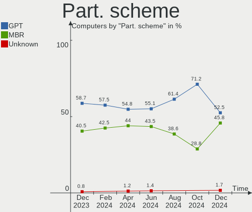
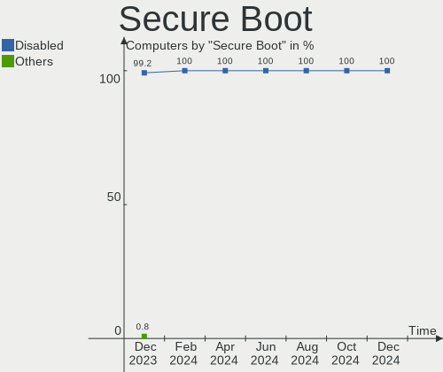
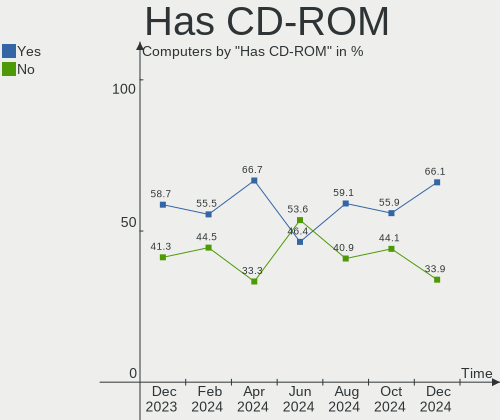
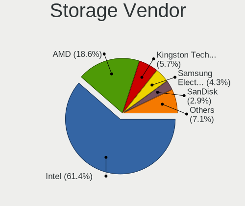
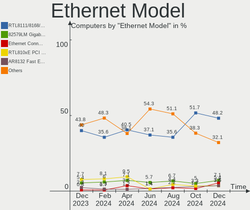

BlackPanther Hardware Trends
----------------------------

A project to identify most popular hardware characteristics and track their change
over time based on data collected by BlackPanther users at https://Linux-Hardware.org.

Anyone can contribute to this report by the [hw-probe](https://github.com/linuxhw/hw-probe) tool:

    sudo -E hw-probe -all -upload

This is a report for all computer types. See also reports for [desktops](/Dist/BlackPanther/Desktop/README.md) and [notebooks](/Dist/BlackPanther/Notebook/README.md).

Full-feature report is available here: https://linux-hardware.org/?view=trends

Period: Aug, 2021.

Contents
--------

* [ System ](#system)
  - [ OS                       ](#os)
  - [ OS Family                ](#os-family)
  - [ Kernel                   ](#kernel)
  - [ Kernel Family            ](#kernel-family)
  - [ Kernel Major Ver.        ](#kernel-major-ver)
  - [ Arch                     ](#arch)
  - [ DE                       ](#de)
  - [ Display Server           ](#display-server)
  - [ Display Manager          ](#display-manager)
  - [ OS Lang                  ](#os-lang)
  - [ Boot Mode                ](#boot-mode)
  - [ Filesystem               ](#filesystem)
  - [ Part. scheme             ](#part-scheme)
  - [ Dual Boot with Linux/BSD ](#dual-boot-with-linuxbsd)
  - [ Dual Boot (Win)          ](#dual-boot-win)

* [ Board ](#board)
  - [ Vendor                   ](#vendor)
  - [ Model                    ](#model)
  - [ Model Family             ](#model-family)
  - [ MFG Year                 ](#mfg-year)
  - [ Form Factor              ](#form-factor)
  - [ Secure Boot              ](#secure-boot)
  - [ Coreboot                 ](#coreboot)
  - [ RAM Size                 ](#ram-size)
  - [ RAM Used                 ](#ram-used)
  - [ Total Drives             ](#total-drives)
  - [ Has CD-ROM               ](#has-cd-rom)
  - [ Has Ethernet             ](#has-ethernet)
  - [ Has WiFi                 ](#has-wifi)
  - [ Has Bluetooth            ](#has-bluetooth)

* [ Location ](#location)
  - [ Country                  ](#country)
  - [ City                     ](#city)

* [ Drives ](#drives)
  - [ Drive Vendor             ](#drive-vendor)
  - [ Drive Model              ](#drive-model)
  - [ HDD Vendor               ](#hdd-vendor)
  - [ SSD Vendor               ](#ssd-vendor)
  - [ Drive Kind               ](#drive-kind)
  - [ Drive Connector          ](#drive-connector)
  - [ Drive Size               ](#drive-size)
  - [ Space Total              ](#space-total)
  - [ Space Used               ](#space-used)
  - [ Malfunc. Drives          ](#malfunc-drives)
  - [ Malfunc. Drive Vendor    ](#malfunc-drive-vendor)
  - [ Malfunc. HDD Vendor      ](#malfunc-hdd-vendor)
  - [ Malfunc. Drive Kind      ](#malfunc-drive-kind)
  - [ Failed Drives            ](#failed-drives)
  - [ Failed Drive Vendor      ](#failed-drive-vendor)
  - [ Drive Status             ](#drive-status)

* [ Storage controller ](#storage-controller)
  - [ Storage Vendor           ](#storage-vendor)
  - [ Storage Model            ](#storage-model)
  - [ Storage Kind             ](#storage-kind)

* [ Processor ](#processor)
  - [ CPU Vendor               ](#cpu-vendor)
  - [ CPU Model                ](#cpu-model)
  - [ CPU Model Family         ](#cpu-model-family)
  - [ CPU Cores                ](#cpu-cores)
  - [ CPU Sockets              ](#cpu-sockets)
  - [ CPU Threads              ](#cpu-threads)
  - [ CPU Op-Modes             ](#cpu-op-modes)
  - [ CPU Microcode            ](#cpu-microcode)
  - [ CPU Microarch            ](#cpu-microarch)

* [ Graphics ](#graphics)
  - [ GPU Vendor               ](#gpu-vendor)
  - [ GPU Model                ](#gpu-model)
  - [ GPU Combo                ](#gpu-combo)
  - [ GPU Driver               ](#gpu-driver)
  - [ GPU Memory               ](#gpu-memory)

* [ Monitor ](#monitor)
  - [ Monitor Vendor           ](#monitor-vendor)
  - [ Monitor Model            ](#monitor-model)
  - [ Monitor Resolution       ](#monitor-resolution)
  - [ Monitor Diagonal         ](#monitor-diagonal)
  - [ Monitor Width            ](#monitor-width)
  - [ Aspect Ratio             ](#aspect-ratio)
  - [ Monitor Area             ](#monitor-area)
  - [ Pixel Density            ](#pixel-density)
  - [ Multiple Monitors        ](#multiple-monitors)

* [ Network ](#network)
  - [ Net Controller Vendor    ](#net-controller-vendor)
  - [ Net Controller Model     ](#net-controller-model)
  - [ Wireless Vendor          ](#wireless-vendor)
  - [ Wireless Model           ](#wireless-model)
  - [ Ethernet Vendor          ](#ethernet-vendor)
  - [ Ethernet Model           ](#ethernet-model)
  - [ Net Controller Kind      ](#net-controller-kind)
  - [ Used Controller          ](#used-controller)
  - [ NICs                     ](#nics)
  - [ IPv6                     ](#ipv6)

* [ Bluetooth ](#bluetooth)
  - [ Bluetooth Vendor         ](#bluetooth-vendor)
  - [ Bluetooth Model          ](#bluetooth-model)

* [ Sound ](#sound)
  - [ Sound Vendor             ](#sound-vendor)
  - [ Sound Model              ](#sound-model)

* [ Memory ](#memory)
  - [ Memory Vendor            ](#memory-vendor)
  - [ Memory Model             ](#memory-model)
  - [ Memory Kind              ](#memory-kind)
  - [ Memory Form Factor       ](#memory-form-factor)
  - [ Memory Size              ](#memory-size)
  - [ Memory Speed             ](#memory-speed)

* [ Printers & scanners ](#printers--scanners)
  - [ Printer Vendor           ](#printer-vendor)
  - [ Printer Model            ](#printer-model)
  - [ Scanner Vendor           ](#scanner-vendor)
  - [ Scanner Model            ](#scanner-model)

* [ Camera ](#camera)
  - [ Camera Vendor            ](#camera-vendor)
  - [ Camera Model             ](#camera-model)

* [ Security ](#security)
  - [ Fingerprint Vendor       ](#fingerprint-vendor)
  - [ Fingerprint Model        ](#fingerprint-model)
  - [ Chipcard Vendor          ](#chipcard-vendor)
  - [ Chipcard Model           ](#chipcard-model)

* [ Unsupported ](#unsupported)
  - [ Unsupported Devices      ](#unsupported-devices)
  - [ Unsupported Device Types ](#unsupported-device-types)

System
------

OS
--

Installed operating systems

| Name              | Computers | Percent |
|-------------------|-----------|---------|
| BlackPanther 18.1 | 80        | 94.12%  |
| BlackPanther 16.2 | 5         | 5.88%   |

OS Family
---------

OS without a version

| Name         | Computers | Percent |
|--------------|-----------|---------|
| BlackPanther | 85        | 100%    |

Kernel
------

Version of the Linux kernel

| Version                | Computers | Percent |
|------------------------|-----------|---------|
| 5.6.14-desktop-2bP     | 58        | 68.24%  |
| 4.18.16-desktop-1bP    | 21        | 24.71%  |
| 4.9.20-desktop-pae-1bP | 5         | 5.88%   |
| 5.10.1-desktop-2bP     | 1         | 1.18%   |

Kernel Family
-------------

Linux kernel without a distro release

| Version | Computers | Percent |
|---------|-----------|---------|
| 5.6.14  | 58        | 68.24%  |
| 4.18.16 | 21        | 24.71%  |
| 4.9.20  | 5         | 5.88%   |
| 5.10.1  | 1         | 1.18%   |

Kernel Major Ver.
-----------------

Linux kernel major version

| Version | Computers | Percent |
|---------|-----------|---------|
| 5.6     | 58        | 68.24%  |
| 4.18    | 21        | 24.71%  |
| 4.9     | 5         | 5.88%   |
| 5.10    | 1         | 1.18%   |

Arch
----

OS architecture (x86_64, i586, etc.)

| Name   | Computers | Percent |
|--------|-----------|---------|
| x86_64 | 80        | 94.12%  |
| i686   | 5         | 5.88%   |

DE
--

Desktop Environment

| Name | Computers | Percent |
|------|-----------|---------|
| KDE5 | 84        | 98.82%  |
| KDE  | 1         | 1.18%   |

Display Server
--------------

X11 or Wayland

| Name | Computers | Percent |
|------|-----------|---------|
| X11  | 85        | 100%    |

Display Manager
---------------

SDDM, LightDM, etc.

| Name    | Computers | Percent |
|---------|-----------|---------|
| SDDM    | 84        | 98.82%  |
| Unknown | 1         | 1.18%   |

OS Lang
-------

Language

| Lang    | Computers | Percent |
|---------|-----------|---------|
| Unknown | 84        | 98.82%  |
| hu_HU   | 1         | 1.18%   |

Boot Mode
---------

EFI or BIOS

| Mode | Computers | Percent |
|------|-----------|---------|
| BIOS | 61        | 71.76%  |
| EFI  | 24        | 28.24%  |

Filesystem
----------

Type of filesystem

| Type    | Computers | Percent |
|---------|-----------|---------|
| Overlay | 70        | 82.35%  |
| Ext4    | 15        | 17.65%  |

Part. scheme
------------

Scheme of partitioning

| Type    | Computers | Percent |
|---------|-----------|---------|
| MBR     | 52        | 61.18%  |
| GPT     | 30        | 35.29%  |
| Unknown | 3         | 3.53%   |

Dual Boot with Linux/BSD
------------------------

Hosting more than one Linux/BSD

| Dual boot | Computers | Percent |
|-----------|-----------|---------|
| No        | 43        | 50.59%  |
| Yes       | 42        | 49.41%  |

Dual Boot (Win)
---------------

Hosting Linux and Windows

| Dual boot | Computers | Percent |
|-----------|-----------|---------|
| No        | 45        | 52.94%  |
| Yes       | 40        | 47.06%  |

Board
-----

Vendor
------

Motherboard manufacturer

| Name                | Computers | Percent |
|---------------------|-----------|---------|
| Lenovo              | 15        | 17.65%  |
| Dell                | 14        | 16.47%  |
| ASUSTek Computer    | 14        | 16.47%  |
| Hewlett-Packard     | 10        | 11.76%  |
| Gigabyte Technology | 7         | 8.24%   |
| ASRock              | 5         | 5.88%   |
| MSI                 | 4         | 4.71%   |
| Samsung Electronics | 3         | 3.53%   |
| Toshiba             | 2         | 2.35%   |
| Packard Bell        | 2         | 2.35%   |
| Insyde              | 2         | 2.35%   |
| Fujitsu Siemens     | 2         | 2.35%   |
| Acer                | 2         | 2.35%   |
| Fujitsu             | 1         | 1.18%   |
| Foxconn             | 1         | 1.18%   |
| Apple               | 1         | 1.18%   |

Model
-----

Motherboard model

| Name                                       | Computers | Percent |
|--------------------------------------------|-----------|---------|
| ASUS PRIME B365M-A                         | 3         | 3.53%   |
| Insyde Braswell                            | 2         | 2.35%   |
| HP Compaq Pro 6300 SFF                     | 2         | 2.35%   |
| ASUS All Series                            | 2         | 2.35%   |
| Toshiba Satellite L750                     | 1         | 1.18%   |
| Toshiba Satellite C55-A-19D                | 1         | 1.18%   |
| Samsung R540/R580/R780/SA41/E452/E852      | 1         | 1.18%   |
| Samsung NC210/NC110                        | 1         | 1.18%   |
| Samsung 300E4A/300E5A/300E7A/3430EA/3530EA | 1         | 1.18%   |
| Packard Bell EasyNote TK36                 | 1         | 1.18%   |
| Packard Bell DOT S                         | 1         | 1.18%   |
| MSI U-100                                  | 1         | 1.18%   |
| MSI MS-7C02                                | 1         | 1.18%   |
| MSI M670                                   | 1         | 1.18%   |
| MSI GP70 2OD                               | 1         | 1.18%   |
| Lenovo Yoga 310-11IAP 80U2                 | 1         | 1.18%   |
| Lenovo V145-15AST 81MT                     | 1         | 1.18%   |
| Lenovo ThinkStation P330 Tiny 30CFCTO1WW   | 1         | 1.18%   |
| Lenovo ThinkStation D20 4158AF8            | 1         | 1.18%   |
| Lenovo ThinkStation C30 1097A34            | 1         | 1.18%   |
| Lenovo ThinkPad X60 1706GMG                | 1         | 1.18%   |
| Lenovo ThinkPad T430 2349KQ3               | 1         | 1.18%   |
| Lenovo ThinkPad T420 4236Z9U               | 1         | 1.18%   |
| Lenovo ThinkPad L420 78544UG               | 1         | 1.18%   |
| Lenovo ThinkCentre A57 98517HG             | 1         | 1.18%   |
| Lenovo IdeaPad L340-17IRH Gaming 81LL      | 1         | 1.18%   |
| Lenovo IdeaPad Flex 15 20309               | 1         | 1.18%   |
| Lenovo IdeaPad 330-15IGM 81D1              | 1         | 1.18%   |
| Lenovo IdeaPad 320-15IAP 80XR              | 1         | 1.18%   |
| Lenovo Flex 2-14D 20376                    | 1         | 1.18%   |
| HP ProBook 6470b                           | 1         | 1.18%   |
| HP ProBook 6450b                           | 1         | 1.18%   |
| HP G62                                     | 1         | 1.18%   |
| HP Compaq nc6400 (RM100AW#ABU)             | 1         | 1.18%   |
| HP 630                                     | 1         | 1.18%   |
| HP 250 G6 Notebook PC                      | 1         | 1.18%   |
| HP 250 G5 Notebook PC                      | 1         | 1.18%   |
| HP 2000                                    | 1         | 1.18%   |
| Gigabyte P67A-D3-B3                        | 1         | 1.18%   |
| Gigabyte H61M-S1                           | 1         | 1.18%   |
| Gigabyte H310M S2H 2.0                     | 1         | 1.18%   |
| Gigabyte GA-MA790X-UD4P                    | 1         | 1.18%   |
| Gigabyte G41MT-S2PT                        | 1         | 1.18%   |
| Gigabyte G41MT-S2                          | 1         | 1.18%   |
| Gigabyte EP45-UD3                          | 1         | 1.18%   |
| Fujitsu Siemens ESPRIMO Mobile D9500       | 1         | 1.18%   |
| Fujitsu Siemens AMILO PRO V3515            | 1         | 1.18%   |
| Fujitsu ESPRIMO P7936                      | 1         | 1.18%   |
| Foxconn Pro 3500 Series                    | 1         | 1.18%   |
| Dell Precision 5520                        | 1         | 1.18%   |
| Dell OptiPlex 990                          | 1         | 1.18%   |
| Dell OptiPlex 780                          | 1         | 1.18%   |
| Dell OptiPlex 755                          | 1         | 1.18%   |
| Dell OptiPlex 380                          | 1         | 1.18%   |
| Dell OptiPlex 330                          | 1         | 1.18%   |
| Dell OptiPlex 3010                         | 1         | 1.18%   |
| Dell Latitude E7450                        | 1         | 1.18%   |
| Dell Latitude E6400                        | 1         | 1.18%   |
| Dell Latitude E6320                        | 1         | 1.18%   |
| Dell Latitude D630                         | 1         | 1.18%   |

Model Family
------------

Motherboard model prefix

| Name                    | Computers | Percent |
|-------------------------|-----------|---------|
| Dell OptiPlex           | 6         | 7.06%   |
| Dell Latitude           | 5         | 5.88%   |
| Lenovo ThinkPad         | 4         | 4.71%   |
| Lenovo IdeaPad          | 4         | 4.71%   |
| ASUS PRIME              | 4         | 4.71%   |
| Lenovo ThinkStation     | 3         | 3.53%   |
| HP Compaq               | 3         | 3.53%   |
| Toshiba Satellite       | 2         | 2.35%   |
| Insyde Braswell         | 2         | 2.35%   |
| HP ProBook              | 2         | 2.35%   |
| HP 250                  | 2         | 2.35%   |
| ASUS ROG                | 2         | 2.35%   |
| ASUS All                | 2         | 2.35%   |
| Acer Aspire             | 2         | 2.35%   |
| Samsung R540            | 1         | 1.18%   |
| Samsung NC210           | 1         | 1.18%   |
| Samsung 300E4A          | 1         | 1.18%   |
| Packard Bell EasyNote   | 1         | 1.18%   |
| Packard Bell DOT        | 1         | 1.18%   |
| MSI U-100               | 1         | 1.18%   |
| MSI MS-7C02             | 1         | 1.18%   |
| MSI M670                | 1         | 1.18%   |
| MSI GP70                | 1         | 1.18%   |
| Lenovo Yoga             | 1         | 1.18%   |
| Lenovo V145-15AST       | 1         | 1.18%   |
| Lenovo ThinkCentre      | 1         | 1.18%   |
| Lenovo Flex             | 1         | 1.18%   |
| HP G62                  | 1         | 1.18%   |
| HP 630                  | 1         | 1.18%   |
| HP 2000                 | 1         | 1.18%   |
| Gigabyte P67A-D3-B3     | 1         | 1.18%   |
| Gigabyte H61M-S1        | 1         | 1.18%   |
| Gigabyte H310M          | 1         | 1.18%   |
| Gigabyte GA-MA790X-UD4P | 1         | 1.18%   |
| Gigabyte G41MT-S2PT     | 1         | 1.18%   |
| Gigabyte G41MT-S2       | 1         | 1.18%   |
| Gigabyte EP45-UD3       | 1         | 1.18%   |
| Fujitsu Siemens ESPRIMO | 1         | 1.18%   |
| Fujitsu Siemens AMILO   | 1         | 1.18%   |
| Fujitsu ESPRIMO         | 1         | 1.18%   |
| Foxconn Pro             | 1         | 1.18%   |
| Dell Precision          | 1         | 1.18%   |
| Dell Inspiron           | 1         | 1.18%   |
| Dell G3                 | 1         | 1.18%   |
| ASUS P6T7               | 1         | 1.18%   |
| ASUS H110M-K            | 1         | 1.18%   |
| ASUS B75M-A             | 1         | 1.18%   |
| ASUS ASUS               | 1         | 1.18%   |
| ASUS A8N-SLI            | 1         | 1.18%   |
| ASUS A7U                | 1         | 1.18%   |
| ASRock G31M-GS          | 1         | 1.18%   |
| ASRock FM2A75M          | 1         | 1.18%   |
| ASRock FM2A55M-DGS      | 1         | 1.18%   |
| ASRock B85M             | 1         | 1.18%   |
| ASRock 4CoreDual-SATA2  | 1         | 1.18%   |
| Apple MacBookPro5       | 1         | 1.18%   |

MFG Year
--------

Motherboard manufacture year

| Year | Computers | Percent |
|------|-----------|---------|
| 2013 | 11        | 12.94%  |
| 2020 | 9         | 10.59%  |
| 2012 | 9         | 10.59%  |
| 2010 | 9         | 10.59%  |
| 2011 | 7         | 8.24%   |
| 2008 | 7         | 8.24%   |
| 2021 | 5         | 5.88%   |
| 2018 | 5         | 5.88%   |
| 2014 | 5         | 5.88%   |
| 2019 | 4         | 4.71%   |
| 2016 | 4         | 4.71%   |
| 2009 | 4         | 4.71%   |
| 2007 | 4         | 4.71%   |
| 2017 | 1         | 1.18%   |
| 2005 | 1         | 1.18%   |

Form Factor
-----------

Physical design of the computer

| Name        | Computers | Percent |
|-------------|-----------|---------|
| Notebook    | 45        | 52.94%  |
| Desktop     | 38        | 44.71%  |
| Convertible | 1         | 1.18%   |
| Mini pc     | 1         | 1.18%   |

Secure Boot
-----------

Enabled or disabled

| State    | Computers | Percent |
|----------|-----------|---------|
| Disabled | 85        | 100%    |

Coreboot
--------

Have coreboot on board

| Used | Computers | Percent |
|------|-----------|---------|
| No   | 85        | 100%    |

RAM Size
--------

Total RAM memory

| Size in GB | Computers | Percent |
|------------|-----------|---------|
| 3.01-4.0   | 33        | 38.82%  |
| 4.01-8.0   | 15        | 17.65%  |
| 8.01-16.0  | 11        | 12.94%  |
| 16.01-24.0 | 9         | 10.59%  |
| 1.01-2.0   | 8         | 9.41%   |
| 2.01-3.0   | 5         | 5.88%   |
| 32.01-64.0 | 3         | 3.53%   |
| 24.01-32.0 | 1         | 1.18%   |

RAM Used
--------

Used RAM memory

| Used GB  | Computers | Percent |
|----------|-----------|---------|
| 0.51-1.0 | 44        | 51.76%  |
| 0.01-0.5 | 29        | 34.12%  |
| 1.01-2.0 | 11        | 12.94%  |
| 2.01-3.0 | 1         | 1.18%   |

Total Drives
------------

Number of drives on board

| Drives | Computers | Percent |
|--------|-----------|---------|
| 1      | 49        | 57.65%  |
| 2      | 21        | 24.71%  |
| 3      | 6         | 7.06%   |
| 4      | 4         | 4.71%   |
| 0      | 3         | 3.53%   |
| 6      | 1         | 1.18%   |
| 5      | 1         | 1.18%   |

Has CD-ROM
----------

Has CD-ROM on board

| Presented | Computers | Percent |
|-----------|-----------|---------|
| Yes       | 51        | 60%     |
| No        | 34        | 40%     |

Has Ethernet
------------

Has Ethernet on board

| Presented | Computers | Percent |
|-----------|-----------|---------|
| Yes       | 82        | 96.47%  |
| No        | 3         | 3.53%   |

Has WiFi
--------

Has WiFi module

| Presented | Computers | Percent |
|-----------|-----------|---------|
| Yes       | 58        | 68.24%  |
| No        | 27        | 31.76%  |

Has Bluetooth
-------------

Has Bluetooth module

| Presented | Computers | Percent |
|-----------|-----------|---------|
| No        | 46        | 54.12%  |
| Yes       | 39        | 45.88%  |

Location
--------

Country
-------

Geographic location (country)

| Country     | Computers | Percent |
|-------------|-----------|---------|
| Hungary     | 67        | 78.82%  |
| Germany     | 5         | 5.88%   |
| USA         | 3         | 3.53%   |
| UK          | 2         | 2.35%   |
| Switzerland | 1         | 1.18%   |
| Slovenia    | 1         | 1.18%   |
| Slovakia    | 1         | 1.18%   |
| Serbia      | 1         | 1.18%   |
| Romania     | 1         | 1.18%   |
| Italy       | 1         | 1.18%   |
| Australia   | 1         | 1.18%   |
| Argentina   | 1         | 1.18%   |

City
----

Geographic location (city)

| City              | Computers | Percent |
|-------------------|-----------|---------|
| Budapest          | 10        | 11.76%  |
| Szeksz??rd        | 5         | 5.88%   |
| Oroshaza          | 5         | 5.88%   |
| Eger              | 3         | 3.53%   |
| Zichyujfalu       | 2         | 2.35%   |
| Tarnok            | 2         | 2.35%   |
| P?©cs             | 2         | 2.35%   |
| Kenderes          | 2         | 2.35%   |
| Karcag            | 2         | 2.35%   |
| Esztergom         | 2         | 2.35%   |
| Debrecen          | 2         | 2.35%   |
| Baja              | 2         | 2.35%   |
| Zurich            | 1         | 1.18%   |
| Zalaegerszeg      | 1         | 1.18%   |
| Wernberg-Koblitz  | 1         | 1.18%   |
| Vecses            | 1         | 1.18%   |
| V??c              | 1         | 1.18%   |
| Szentes           | 1         | 1.18%   |
| Szeged            | 1         | 1.18%   |
| Sz?©kesfeh?©rv??r | 1         | 1.18%   |
| Sydney            | 1         | 1.18%   |
| Southend-on-Sea   | 1         | 1.18%   |
| Senta             | 1         | 1.18%   |
| Sarospatak        | 1         | 1.18%   |
| Sarbogard         | 1         | 1.18%   |
| Sajobabony        | 1         | 1.18%   |
| Roszke            | 1         | 1.18%   |
| Petershagen       | 1         | 1.18%   |
| Pap               | 1         | 1.18%   |
| Nyiregyhaza       | 1         | 1.18%   |
| North Hollywood   | 1         | 1.18%   |
| New Windsor       | 1         | 1.18%   |
| Nagyvisnyo        | 1         | 1.18%   |
| Nagykanizsa       | 1         | 1.18%   |
| Munro             | 1         | 1.18%   |
| Miskolc           | 1         | 1.18%   |
| Miercurea-Ciuc    | 1         | 1.18%   |
| Mezokovesd        | 1         | 1.18%   |
| Memmelsdorf       | 1         | 1.18%   |
| Littleton         | 1         | 1.18%   |
| Kunszentmiklos    | 1         | 1.18%   |
| Koper             | 1         | 1.18%   |
| Kecskem?©t        | 1         | 1.18%   |
| Kazincbarcika     | 1         | 1.18%   |
| Kal               | 1         | 1.18%   |
| Hodmezovasarhely  | 1         | 1.18%   |
| Hnusta            | 1         | 1.18%   |
| Heves             | 1         | 1.18%   |
| Hegyfalu          | 1         | 1.18%   |
| Harlow            | 1         | 1.18%   |
| Hajduszoboszlo    | 1         | 1.18%   |
| Gy?‘r             | 1         | 1.18%   |
| Gotha             | 1         | 1.18%   |
| G?¶d?¶ll?‘        | 1         | 1.18%   |
| Frankfurt am Main | 1         | 1.18%   |
| Foggia            | 1         | 1.18%   |
| Beretty????jfalu  | 1         | 1.18%   |
| B?©k?©scsaba      | 1         | 1.18%   |

Drives
------

Drive Vendor
------------

Hard drive vendors

| Vendor              | Computers | Drives | Percent |
|---------------------|-----------|--------|---------|
| WDC                 | 31        | 35     | 26.05%  |
| Toshiba             | 19        | 20     | 15.97%  |
| Samsung Electronics | 17        | 22     | 14.29%  |
| Seagate             | 12        | 13     | 10.08%  |
| Kingston            | 7         | 9      | 5.88%   |
| Hitachi             | 6         | 6      | 5.04%   |
| Zheino              | 3         | 3      | 2.52%   |
| Unknown             | 3         | 3      | 2.52%   |
| Maxtor              | 3         | 3      | 2.52%   |
| Crucial             | 3         | 3      | 2.52%   |
| Micron Technology   | 2         | 2      | 1.68%   |
| China               | 2         | 2      | 1.68%   |
| XPG                 | 1         | 1      | 0.84%   |
| SK Hynix            | 1         | 1      | 0.84%   |
| SATAFIRM            | 1         | 1      | 0.84%   |
| SanDisk             | 1         | 1      | 0.84%   |
| PNY                 | 1         | 1      | 0.84%   |
| Patriot             | 1         | 1      | 0.84%   |
| Netac               | 1         | 1      | 0.84%   |
| KingSpec            | 1         | 1      | 0.84%   |
| Intenso             | 1         | 1      | 0.84%   |
| Apacer              | 1         | 1      | 0.84%   |
| A-DATA Technology   | 1         | 1      | 0.84%   |

Drive Model
-----------

Hard drive models

| Model                                   | Computers | Percent |
|-----------------------------------------|-----------|---------|
| Samsung HD103UJ 1TB                     | 4         | 3.08%   |
| Zheino CHN-NGFFNV2280-256 256GB         | 3         | 2.31%   |
| WDC WDS240G2G0B-00EPW0 240GB SSD        | 3         | 2.31%   |
| Toshiba MQ01ABF050 500GB                | 3         | 2.31%   |
| Toshiba DT01ACA100 1TB                  | 3         | 2.31%   |
| Kingston SA400S37240G 240GB SSD         | 3         | 2.31%   |
| Hitachi HTS543232A7A384 320GB           | 3         | 2.31%   |
| WDC WD10SPZX-24Z10 1TB                  | 2         | 1.54%   |
| WDC WD10JPVX-22JC3T0 1TB                | 2         | 1.54%   |
| Unknown HCG4a2  64GB                    | 2         | 1.54%   |
| Seagate ST500LT012-1DG142 500GB         | 2         | 1.54%   |
| Seagate ST500LM000-1EJ162 500GB         | 2         | 1.54%   |
| Samsung SSD 870 EVO 250GB               | 2         | 1.54%   |
| Kingston SA400S37120G 120GB SSD         | 2         | 1.54%   |
| Hitachi HTS541680J9SA00 80GB            | 2         | 1.54%   |
| XPG GAMMIX S11 Pro 512GB                | 1         | 0.77%   |
| WDC WDS500G3X0C-00SJG0 500GB            | 1         | 0.77%   |
| WDC WDS500G2B0A-00SM50 500GB SSD        | 1         | 0.77%   |
| WDC WDS120G2G0B-00EPW0 120GB SSD        | 1         | 0.77%   |
| WDC WD800JD-55MUA1 80GB                 | 1         | 0.77%   |
| WDC WD5000LPCX-24C6HT0 500GB            | 1         | 0.77%   |
| WDC WD5000AAKX-22ERMA0 500GB            | 1         | 0.77%   |
| WDC WD5000AAKX-08U6AA0 500GB            | 1         | 0.77%   |
| WDC WD5000AAKX-001CA0 500GB             | 1         | 0.77%   |
| WDC WD5000AACS-00G8B1 500GB             | 1         | 0.77%   |
| WDC WD3200BPVT-22JJ5T0 320GB            | 1         | 0.77%   |
| WDC WD30EZRZ-00GXCB0 3TB                | 1         | 0.77%   |
| WDC WD30EFRX-68EUZN0 3TB                | 1         | 0.77%   |
| WDC WD2500BEVT-75A23T0 250GB            | 1         | 0.77%   |
| WDC WD2500AAKX-603CA0 250GB             | 1         | 0.77%   |
| WDC WD2500AAJS-75B4A0 250GB             | 1         | 0.77%   |
| WDC WD20PURX-64P6ZY0 2TB                | 1         | 0.77%   |
| WDC WD1600BEVT-75A23T0 160GB            | 1         | 0.77%   |
| WDC WD1600BEVT-22ZCT0 160GB             | 1         | 0.77%   |
| WDC WD1600AAJS-60WAA0 160GB             | 1         | 0.77%   |
| WDC WD1600AAJB-56WRA0 160GB             | 1         | 0.77%   |
| WDC WD10SPZX-00Z10T0 1TB                | 1         | 0.77%   |
| WDC WD10EZEX-75WN4A0 1TB                | 1         | 0.77%   |
| WDC WD10EZEX-60M2NA0 1TB                | 1         | 0.77%   |
| WDC WD10EZEX-08WN4A0 1TB                | 1         | 0.77%   |
| WDC WD10EZEX-00KUWA0 1TB                | 1         | 0.77%   |
| WDC WD10EZEX-00BN5A0 1TB                | 1         | 0.77%   |
| WDC WD10EFRX-68PJCN0 1TB                | 1         | 0.77%   |
| WDC WD10 EZEX-08WN4A0 1TB               | 1         | 0.77%   |
| Unknown SC16G  16GB                     | 1         | 0.77%   |
| Toshiba TR200 240GB SSD                 | 1         | 0.77%   |
| Toshiba TL100 120GB SSD                 | 1         | 0.77%   |
| Toshiba THNSFJ256GCSU 256GB SSD         | 1         | 0.77%   |
| Toshiba MQ04ABF100 1TB                  | 1         | 0.77%   |
| Toshiba MQ01ABD100 1TB                  | 1         | 0.77%   |
| Toshiba MQ01ABD075 752GB                | 1         | 0.77%   |
| Toshiba MQ01ABD050 500GB                | 1         | 0.77%   |
| Toshiba MK5076GSX 500GB                 | 1         | 0.77%   |
| Toshiba MK1646GSX 160GB                 | 1         | 0.77%   |
| Toshiba KXG50ZNV1T02 NVMe 1024GB        | 1         | 0.77%   |
| Toshiba KSG60ZMV256G M.2 2280 256GB SSD | 1         | 0.77%   |
| Toshiba KBG40ZNS256G NVMe 256GB         | 1         | 0.77%   |
| Toshiba HDWL120 2TB                     | 1         | 0.77%   |
| Toshiba DT01ACA050 500GB                | 1         | 0.77%   |
| SK Hynix SKHynix_HFS001TD9TNI-L2B0B 1TB | 1         | 0.77%   |

HDD Vendor
----------

Hard disk drive vendors

| Vendor              | Computers | Drives | Percent |
|---------------------|-----------|--------|---------|
| WDC                 | 27        | 29     | 36.49%  |
| Toshiba             | 13        | 14     | 17.57%  |
| Seagate             | 12        | 13     | 16.22%  |
| Samsung Electronics | 12        | 14     | 16.22%  |
| Hitachi             | 6         | 6      | 8.11%   |
| Maxtor              | 3         | 3      | 4.05%   |
| SATAFIRM            | 1         | 1      | 1.35%   |

SSD Vendor
----------

Solid state drive vendors

| Vendor              | Computers | Drives | Percent |
|---------------------|-----------|--------|---------|
| Kingston            | 7         | 8      | 21.21%  |
| Samsung Electronics | 5         | 6      | 15.15%  |
| WDC                 | 4         | 5      | 12.12%  |
| Toshiba             | 4         | 4      | 12.12%  |
| Crucial             | 3         | 3      | 9.09%   |
| China               | 2         | 2      | 6.06%   |
| PNY                 | 1         | 1      | 3.03%   |
| Patriot             | 1         | 1      | 3.03%   |
| Netac               | 1         | 1      | 3.03%   |
| Micron Technology   | 1         | 1      | 3.03%   |
| KingSpec            | 1         | 1      | 3.03%   |
| Intenso             | 1         | 1      | 3.03%   |
| Apacer              | 1         | 1      | 3.03%   |
| A-DATA Technology   | 1         | 1      | 3.03%   |

Drive Kind
----------

HDD or SSD

| Kind | Computers | Drives | Percent |
|------|-----------|--------|---------|
| HDD  | 63        | 80     | 60%     |
| SSD  | 28        | 36     | 26.67%  |
| NVMe | 10        | 12     | 9.52%   |
| MMC  | 4         | 4      | 3.81%   |

Drive Connector
---------------

SATA, SAS, NVMe, etc.

| Type | Computers | Drives | Percent |
|------|-----------|--------|---------|
| SATA | 77        | 114    | 82.8%   |
| NVMe | 10        | 12     | 10.75%  |
| MMC  | 4         | 4      | 4.3%    |
| SAS  | 2         | 2      | 2.15%   |

Drive Size
----------

Size of hard drive

| Size in TB | Computers | Drives | Percent |
|------------|-----------|--------|---------|
| 0.01-0.5   | 63        | 82     | 68.48%  |
| 0.51-1.0   | 25        | 29     | 27.17%  |
| 1.01-2.0   | 3         | 3      | 3.26%   |
| 2.01-3.0   | 1         | 2      | 1.09%   |

Space Total
-----------

Amount of disk space available on the file system

| Size in GB | Computers | Percent |
|------------|-----------|---------|
| Unknown    | 68        | 80%     |
| 101-250    | 6         | 7.06%   |
| 251-500    | 4         | 4.71%   |
| 51-100     | 3         | 3.53%   |
| 1001-2000  | 2         | 2.35%   |
| 21-50      | 1         | 1.18%   |
| 1-20       | 1         | 1.18%   |

Space Used
----------

Amount of used disk space

| Used GB | Computers | Percent |
|---------|-----------|---------|
| Unknown | 68        | 80%     |
| 1-20    | 12        | 14.12%  |
| 21-50   | 3         | 3.53%   |
| 251-500 | 1         | 1.18%   |
| 101-250 | 1         | 1.18%   |

Malfunc. Drives
---------------

Drive models with a malfunction

| Model                             | Computers | Drives | Percent |
|-----------------------------------|-----------|--------|---------|
| Samsung Electronics HD103UJ 1TB   | 4         | 4      | 10.26%  |
| Toshiba MQ01ABF050 500GB          | 2         | 2      | 5.13%   |
| Toshiba DT01ACA100 1TB            | 2         | 2      | 5.13%   |
| Seagate ST500LT012-1DG142 500GB   | 2         | 2      | 5.13%   |
| Hitachi HTS541680J9SA00 80GB      | 2         | 2      | 5.13%   |
| WDC WD800JD-55MUA1 80GB           | 1         | 1      | 2.56%   |
| WDC WD5000AAKX-08U6AA0 500GB      | 1         | 1      | 2.56%   |
| WDC WD5000AAKX-001CA0 500GB       | 1         | 1      | 2.56%   |
| WDC WD2500AAJS-75B4A0 250GB       | 1         | 1      | 2.56%   |
| WDC WD20PURX-64P6ZY0 2TB          | 1         | 1      | 2.56%   |
| WDC WD1600BEVT-22ZCT0 160GB       | 1         | 1      | 2.56%   |
| WDC WD1600AAJB-56WRA0 160GB       | 1         | 1      | 2.56%   |
| WDC WD10JPVX-22JC3T0 1TB          | 1         | 1      | 2.56%   |
| WDC WD10EZEX-60M2NA0 1TB          | 1         | 1      | 2.56%   |
| WDC WD10EZEX-08WN4A0 1TB          | 1         | 1      | 2.56%   |
| WDC WD10 EZEX-08WN4A0 1TB         | 1         | 1      | 2.56%   |
| Toshiba THNSFJ256GCSU 256GB SSD   | 1         | 1      | 2.56%   |
| Toshiba MQ01ABD100 1TB            | 1         | 1      | 2.56%   |
| Toshiba MQ01ABD075 752GB          | 1         | 1      | 2.56%   |
| Toshiba MK1646GSX 160GB           | 1         | 1      | 2.56%   |
| Toshiba DT01ACA050 500GB          | 1         | 1      | 2.56%   |
| Seagate ST9120821AS 120GB         | 1         | 1      | 2.56%   |
| Seagate ST500DM002-1BD142 500GB   | 1         | 2      | 2.56%   |
| Seagate ST31500341AS 1TB          | 1         | 1      | 2.56%   |
| Samsung Electronics SP2004C 200GB | 1         | 1      | 2.56%   |
| Samsung Electronics HM321HI 320GB | 1         | 1      | 2.56%   |
| Samsung Electronics HM160HI 160GB | 1         | 1      | 2.56%   |
| Samsung Electronics HD204UI 2TB   | 1         | 1      | 2.56%   |
| Maxtor 6V250F0 256GB              | 1         | 1      | 2.56%   |
| Maxtor 2B020H1 20GB               | 1         | 1      | 2.56%   |
| Hitachi HTS545016B9SA02 160GB     | 1         | 1      | 2.56%   |
| Hitachi HTS543232A7A384 320GB     | 1         | 1      | 2.56%   |

Malfunc. Drive Vendor
---------------------

Vendors of faulty drives

| Vendor              | Computers | Drives | Percent |
|---------------------|-----------|--------|---------|
| WDC                 | 10        | 11     | 27.03%  |
| Toshiba             | 9         | 9      | 24.32%  |
| Samsung Electronics | 7         | 8      | 18.92%  |
| Seagate             | 5         | 6      | 13.51%  |
| Hitachi             | 4         | 4      | 10.81%  |
| Maxtor              | 2         | 2      | 5.41%   |

Malfunc. HDD Vendor
-------------------

Vendors of faulty HDD drives

| Vendor              | Computers | Drives | Percent |
|---------------------|-----------|--------|---------|
| WDC                 | 10        | 11     | 27.78%  |
| Toshiba             | 8         | 8      | 22.22%  |
| Samsung Electronics | 7         | 8      | 19.44%  |
| Seagate             | 5         | 6      | 13.89%  |
| Hitachi             | 4         | 4      | 11.11%  |
| Maxtor              | 2         | 2      | 5.56%   |

Malfunc. Drive Kind
-------------------

Kinds of faulty drives

| Kind | Computers | Drives | Percent |
|------|-----------|--------|---------|
| HDD  | 30        | 39     | 96.77%  |
| SSD  | 1         | 1      | 3.23%   |

Failed Drives
-------------

Failed drive models

Zero info for selected period =(

Failed Drive Vendor
-------------------

Failed drive vendors

Zero info for selected period =(

Drive Status
------------

Number of failed and malfunc. drives

| Status   | Computers | Drives | Percent |
|----------|-----------|--------|---------|
| Works    | 55        | 84     | 59.78%  |
| Malfunc  | 30        | 40     | 32.61%  |
| Detected | 7         | 8      | 7.61%   |

Storage controller
------------------

Storage Vendor
--------------

Storage controller vendors

| Vendor                       | Computers | Percent |
|------------------------------|-----------|---------|
| Intel                        | 65        | 64.36%  |
| AMD                          | 13        | 12.87%  |
| Silicon Motion               | 3         | 2.97%   |
| Nvidia                       | 3         | 2.97%   |
| JMicron Technology           | 3         | 2.97%   |
| VIA Technologies             | 2         | 1.98%   |
| Samsung Electronics          | 2         | 1.98%   |
| Toshiba America Info Systems | 1         | 0.99%   |
| SK Hynix                     | 1         | 0.99%   |
| Silicon Image                | 1         | 0.99%   |
| Sandisk                      | 1         | 0.99%   |
| Micron Technology            | 1         | 0.99%   |
| KIOXIA                       | 1         | 0.99%   |
| Kingston Technology Company  | 1         | 0.99%   |
| ADATA Technology             | 1         | 0.99%   |
| Adaptec                      | 1         | 0.99%   |
| 3ware                        | 1         | 0.99%   |

Storage Model
-------------

Storage controller models

| Model                                                                                   | Computers | Percent |
|-----------------------------------------------------------------------------------------|-----------|---------|
| AMD FCH SATA Controller [AHCI mode]                                                     | 9         | 6.87%   |
| Intel 82801G (ICH7 Family) IDE Controller                                               | 7         | 5.34%   |
| Intel NM10/ICH7 Family SATA Controller [IDE mode]                                       | 6         | 4.58%   |
| Intel 7 Series Chipset Family 6-port SATA Controller [AHCI mode]                        | 4         | 3.05%   |
| Intel 6 Series/C200 Series Chipset Family 6 port Mobile SATA AHCI Controller            | 4         | 3.05%   |
| Intel 200 Series PCH SATA controller [AHCI mode]                                        | 4         | 3.05%   |
| Silicon Motion SM2263EN/SM2263XT SSD Controller                                         | 3         | 2.29%   |
| Intel 82801HM/HEM (ICH8M/ICH8M-E) IDE Controller                                        | 3         | 2.29%   |
| Intel 8 Series/C220 Series Chipset Family 6-port SATA Controller 1 [AHCI mode]          | 3         | 2.29%   |
| Intel 5 Series/3400 Series Chipset 4 port SATA AHCI Controller                          | 3         | 2.29%   |
| AMD 400 Series Chipset SATA Controller                                                  | 3         | 2.29%   |
| VIA VT82C586A/B/VT82C686/A/B/VT823x/A/C PIPC Bus Master IDE                             | 2         | 1.53%   |
| JMicron JMB363 SATA/IDE Controller                                                      | 2         | 1.53%   |
| Intel SATA Controller [RAID mode]                                                       | 2         | 1.53%   |
| Intel NM10/ICH7 Family SATA Controller [AHCI mode]                                      | 2         | 1.53%   |
| Intel Celeron/Pentium Silver Processor SATA Controller                                  | 2         | 1.53%   |
| Intel Celeron N3350/Pentium N4200/Atom E3900 Series SATA AHCI Controller                | 2         | 1.53%   |
| Intel Cannon Lake Mobile PCH SATA AHCI Controller                                       | 2         | 1.53%   |
| Intel 82801JI (ICH10 Family) 4 port SATA IDE Controller #1                              | 2         | 1.53%   |
| Intel 82801JI (ICH10 Family) 2 port SATA IDE Controller #2                              | 2         | 1.53%   |
| Intel 82801JD/DO (ICH10 Family) SATA AHCI Controller                                    | 2         | 1.53%   |
| Intel 82801IBM/IEM (ICH9M/ICH9M-E) 4 port SATA Controller [AHCI mode]                   | 2         | 1.53%   |
| Intel 82801HM/HEM (ICH8M/ICH8M-E) SATA Controller [AHCI mode]                           | 2         | 1.53%   |
| Intel 82801GBM/GHM (ICH7-M Family) SATA Controller [AHCI mode]                          | 2         | 1.53%   |
| Intel 82801 Mobile SATA Controller [RAID mode]                                          | 2         | 1.53%   |
| Intel 7 Series/C210 Series Chipset Family 6-port SATA Controller [AHCI mode]            | 2         | 1.53%   |
| Intel 6 Series/C200 Series Chipset Family Desktop SATA Controller (IDE mode, ports 4-5) | 2         | 1.53%   |
| Intel 6 Series/C200 Series Chipset Family Desktop SATA Controller (IDE mode, ports 0-3) | 2         | 1.53%   |
| Intel 6 Series/C200 Series Chipset Family 6 port Desktop SATA AHCI Controller           | 2         | 1.53%   |
| AMD FCH IDE Controller                                                                  | 2         | 1.53%   |
| VIA VT8237A SATA 2-Port Controller                                                      | 1         | 0.76%   |
| VIA VT8237/8251 Serial ATA Controller                                                   | 1         | 0.76%   |
| Toshiba America Info Systems Toshiba America Info Non-Volatile memory controller        | 1         | 0.76%   |
| SK Hynix Non-Volatile memory controller                                                 | 1         | 0.76%   |
| Silicon Image SiI 3114 [SATALink/SATARaid] Serial ATA Controller                        | 1         | 0.76%   |
| Sandisk WD Black SN750 / PC SN730 NVMe SSD                                              | 1         | 0.76%   |
| Samsung NVMe SSD Controller SM981/PM981/PM983                                           | 1         | 0.76%   |
| Samsung NVMe SSD Controller PM9A1/PM9A3/980PRO                                          | 1         | 0.76%   |
| Nvidia MCP79 AHCI Controller                                                            | 1         | 0.76%   |
| Nvidia MCP51 Serial ATA Controller                                                      | 1         | 0.76%   |
| Nvidia MCP51 IDE                                                                        | 1         | 0.76%   |
| Nvidia CK804 Serial ATA Controller                                                      | 1         | 0.76%   |
| Nvidia CK804 IDE                                                                        | 1         | 0.76%   |
| Micron Non-Volatile memory controller                                                   | 1         | 0.76%   |
| KIOXIA Non-Volatile memory controller                                                   | 1         | 0.76%   |
| Kingston Company A2000 NVMe SSD                                                         | 1         | 0.76%   |
| JMicron JMB360 AHCI Controller                                                          | 1         | 0.76%   |
| Intel Sunrise Point-LP SATA Controller [AHCI mode]                                      | 1         | 0.76%   |
| Intel Q170/Q150/B150/H170/H110/Z170/CM236 Chipset SATA Controller [AHCI Mode]           | 1         | 0.76%   |
| Intel Cannon Lake PCH SATA AHCI Controller                                              | 1         | 0.76%   |
| Intel C602 chipset 4-Port SATA Storage Control Unit                                     | 1         | 0.76%   |
| Intel C600/X79 series chipset IDE-r Controller                                          | 1         | 0.76%   |
| Intel C600/X79 series chipset 6-Port SATA AHCI Controller                               | 1         | 0.76%   |
| Intel Atom/Celeron/Pentium Processor x5-E8000/J3xxx/N3xxx Series SATA Controller        | 1         | 0.76%   |
| Intel 82801JI (ICH10 Family) SATA AHCI Controller                                       | 1         | 0.76%   |
| Intel 82801IR/IO/IH (ICH9R/DO/DH) 6 port SATA Controller [AHCI mode]                    | 1         | 0.76%   |
| Intel 82801HM/HEM (ICH8M/ICH8M-E) SATA Controller [IDE mode]                            | 1         | 0.76%   |
| Intel 82801GBM/GHM (ICH7-M Family) SATA Controller [IDE mode]                           | 1         | 0.76%   |
| Intel 8 Series SATA Controller 1 [AHCI mode]                                            | 1         | 0.76%   |
| Intel 7 Series/C210 Series Chipset Family 4-port SATA Controller [IDE mode]             | 1         | 0.76%   |

Storage Kind
------------

Kind of storage controller (IDE, SATA, NVMe, SAS, ...)

| Kind | Computers | Percent |
|------|-----------|---------|
| SATA | 61        | 56.48%  |
| IDE  | 29        | 26.85%  |
| NVMe | 10        | 9.26%   |
| RAID | 6         | 5.56%   |
| SAS  | 1         | 0.93%   |
| SCSI | 1         | 0.93%   |

Processor
---------

CPU Vendor
----------

Processor vendors

| Vendor | Computers | Percent |
|--------|-----------|---------|
| Intel  | 70        | 82.35%  |
| AMD    | 15        | 17.65%  |

CPU Model
---------

Processor models

| Model                                       | Computers | Percent |
|---------------------------------------------|-----------|---------|
| Intel Core i5-2520M CPU @ 2.50GHz           | 3         | 3.53%   |
| Intel Core i3-8100 CPU @ 3.60GHz            | 3         | 3.53%   |
| Intel Pentium Dual-Core CPU E5700 @ 3.00GHz | 2         | 2.35%   |
| Intel Core i3-2120 CPU @ 3.30GHz            | 2         | 2.35%   |
| Intel Core 2 Quad CPU Q9400 @ 2.66GHz       | 2         | 2.35%   |
| Intel Core 2 Duo CPU T7250 @ 2.00GHz        | 2         | 2.35%   |
| Intel Core 2 Duo CPU E8400 @ 3.00GHz        | 2         | 2.35%   |
| Intel Celeron N4000 CPU @ 1.10GHz           | 2         | 2.35%   |
| Intel Celeron CPU N3350 @ 1.10GHz           | 2         | 2.35%   |
| Intel Celeron CPU N3050 @ 1.60GHz           | 2         | 2.35%   |
| Intel Xeon CPU X5677 @ 3.47GHz              | 1         | 1.18%   |
| Intel Xeon CPU X5472 @ 3.00GHz              | 1         | 1.18%   |
| Intel Xeon CPU E5-2620 0 @ 2.00GHz          | 1         | 1.18%   |
| Intel Pentium CPU G3430 @ 3.30GHz           | 1         | 1.18%   |
| Intel Pentium CPU G3240 @ 3.10GHz           | 1         | 1.18%   |
| Intel Core i7-8700T CPU @ 2.40GHz           | 1         | 1.18%   |
| Intel Core i7-7820HQ CPU @ 2.90GHz          | 1         | 1.18%   |
| Intel Core i7-6700K CPU @ 4.00GHz           | 1         | 1.18%   |
| Intel Core i7-4700MQ CPU @ 2.40GHz          | 1         | 1.18%   |
| Intel Core i7 CPU X 980 @ 3.33GHz           | 1         | 1.18%   |
| Intel Core i5-9300H CPU @ 2.40GHz           | 1         | 1.18%   |
| Intel Core i5-8400 CPU @ 2.80GHz            | 1         | 1.18%   |
| Intel Core i5-8300H CPU @ 2.30GHz           | 1         | 1.18%   |
| Intel Core i5-7300U CPU @ 2.60GHz           | 1         | 1.18%   |
| Intel Core i5-7200U CPU @ 2.50GHz           | 1         | 1.18%   |
| Intel Core i5-5300U CPU @ 2.30GHz           | 1         | 1.18%   |
| Intel Core i5-4200U CPU @ 1.60GHz           | 1         | 1.18%   |
| Intel Core i5-3470 CPU @ 3.20GHz            | 1         | 1.18%   |
| Intel Core i5-3340M CPU @ 2.70GHz           | 1         | 1.18%   |
| Intel Core i5-3320M CPU @ 2.60GHz           | 1         | 1.18%   |
| Intel Core i5-2430M CPU @ 2.40GHz           | 1         | 1.18%   |
| Intel Core i5-2400 CPU @ 3.10GHz            | 1         | 1.18%   |
| Intel Core i5-2300 CPU @ 2.80GHz            | 1         | 1.18%   |
| Intel Core i3-3225 CPU @ 3.30GHz            | 1         | 1.18%   |
| Intel Core i3-3220 CPU @ 3.30GHz            | 1         | 1.18%   |
| Intel Core i3-3110M CPU @ 2.40GHz           | 1         | 1.18%   |
| Intel Core i3-2350M CPU @ 2.30GHz           | 1         | 1.18%   |
| Intel Core i3 CPU M 380 @ 2.53GHz           | 1         | 1.18%   |
| Intel Core i3 CPU M 370 @ 2.40GHz           | 1         | 1.18%   |
| Intel Core i3 CPU M 330 @ 2.13GHz           | 1         | 1.18%   |
| Intel Core 2 Quad CPU Q9300 @ 2.50GHz       | 1         | 1.18%   |
| Intel Core 2 Duo CPU T9300 @ 2.50GHz        | 1         | 1.18%   |
| Intel Core 2 Duo CPU T8300 @ 2.40GHz        | 1         | 1.18%   |
| Intel Core 2 Duo CPU T5250 @ 1.50GHz        | 1         | 1.18%   |
| Intel Core 2 Duo CPU P7550 @ 2.26GHz        | 1         | 1.18%   |
| Intel Core 2 Duo CPU E7500 @ 2.93GHz        | 1         | 1.18%   |
| Intel Core 2 Duo CPU E6550 @ 2.33GHz        | 1         | 1.18%   |
| Intel Core 2 CPU T7200 @ 2.00GHz            | 1         | 1.18%   |
| Intel Core 2 CPU T5600 @ 1.83GHz            | 1         | 1.18%   |
| Intel Celeron M CPU 450 @ 2.00GHz           | 1         | 1.18%   |
| Intel Celeron CPU P4500 @ 1.87GHz           | 1         | 1.18%   |
| Intel Celeron CPU N3060 @ 1.60GHz           | 1         | 1.18%   |
| Intel Celeron CPU G1610 @ 2.60GHz           | 1         | 1.18%   |
| Intel Celeron CPU 430 @ 1.80GHz             | 1         | 1.18%   |
| Intel Celeron CPU 1000M @ 1.80GHz           | 1         | 1.18%   |
| Intel Atom CPU N570 @ 1.66GHz               | 1         | 1.18%   |
| Intel Atom CPU N270 @ 1.60GHz               | 1         | 1.18%   |
| Intel Atom CPU N2600 @ 1.60GHz              | 1         | 1.18%   |
| AMD Sempron 3850 APU with Radeon R3         | 1         | 1.18%   |
| AMD Ryzen 7 4800H with Radeon Graphics      | 1         | 1.18%   |

CPU Model Family
----------------

Processor model prefix

| Model                   | Computers | Percent |
|-------------------------|-----------|---------|
| Intel Core i5           | 16        | 18.82%  |
| Intel Core i3           | 12        | 14.12%  |
| Intel Celeron           | 11        | 12.94%  |
| Intel Core 2 Duo        | 10        | 11.76%  |
| Intel Core i7           | 5         | 5.88%   |
| Intel Xeon              | 3         | 3.53%   |
| Intel Core 2 Quad       | 3         | 3.53%   |
| Intel Atom              | 3         | 3.53%   |
| Intel Pentium Dual-Core | 2         | 2.35%   |
| Intel Pentium           | 2         | 2.35%   |
| Intel Core 2            | 2         | 2.35%   |
| AMD Ryzen 5             | 2         | 2.35%   |
| AMD Ryzen 3             | 2         | 2.35%   |
| AMD A4                  | 2         | 2.35%   |
| Intel Celeron M         | 1         | 1.18%   |
| AMD Sempron             | 1         | 1.18%   |
| AMD Ryzen 7             | 1         | 1.18%   |
| AMD Phenom II X4        | 1         | 1.18%   |
| AMD Mobile Sempron      | 1         | 1.18%   |
| AMD Athlon II           | 1         | 1.18%   |
| AMD Athlon 64 X2        | 1         | 1.18%   |
| AMD Athlon 64           | 1         | 1.18%   |
| AMD A8                  | 1         | 1.18%   |
| AMD A6                  | 1         | 1.18%   |

CPU Cores
---------

Number of processor cores

| Number | Computers | Percent |
|--------|-----------|---------|
| 2      | 51        | 60%     |
| 4      | 20        | 23.53%  |
| 1      | 6         | 7.06%   |
| 6      | 5         | 5.88%   |
| 8      | 2         | 2.35%   |
| 12     | 1         | 1.18%   |

CPU Sockets
-----------

Number of sockets

| Number | Computers | Percent |
|--------|-----------|---------|
| 1      | 83        | 97.65%  |
| 2      | 2         | 2.35%   |

CPU Threads
-----------

Threads per core (Hyper-Threading)

| Number | Computers | Percent |
|--------|-----------|---------|
| 1      | 49        | 57.65%  |
| 2      | 36        | 42.35%  |

CPU Op-Modes
------------

CPU Operation Modes (32-bit, 64-bit)

| Op mode        | Computers | Percent |
|----------------|-----------|---------|
| 32-bit, 64-bit | 83        | 97.65%  |
| 32-bit         | 2         | 2.35%   |

CPU Microcode
-------------

Microcode number

| Number     | Computers | Percent |
|------------|-----------|---------|
| 0x206a7    | 9         | 10.59%  |
| 0x306a9    | 8         | 9.41%   |
| 0x1067a    | 8         | 9.41%   |
| 0x906ea    | 4         | 4.71%   |
| 0x906eb    | 3         | 3.53%   |
| 0x6fd      | 3         | 3.53%   |
| 0x306c3    | 3         | 3.53%   |
| 0x10676    | 3         | 3.53%   |
| Unknown    | 3         | 3.53%   |
| 0x806e9    | 2         | 2.35%   |
| 0x706a1    | 2         | 2.35%   |
| 0x506c9    | 2         | 2.35%   |
| 0x406c3    | 2         | 2.35%   |
| 0x206c2    | 2         | 2.35%   |
| 0x20655    | 2         | 2.35%   |
| 0x20652    | 2         | 2.35%   |
| 0x06001119 | 2         | 2.35%   |
| 0x906e9    | 1         | 1.18%   |
| 0x6fb      | 1         | 1.18%   |
| 0x6f6      | 1         | 1.18%   |
| 0x6f2      | 1         | 1.18%   |
| 0x6ec      | 1         | 1.18%   |
| 0x506e3    | 1         | 1.18%   |
| 0x406c4    | 1         | 1.18%   |
| 0x40651    | 1         | 1.18%   |
| 0x306d4    | 1         | 1.18%   |
| 0x30661    | 1         | 1.18%   |
| 0x206d7    | 1         | 1.18%   |
| 0x106ca    | 1         | 1.18%   |
| 0x106c2    | 1         | 1.18%   |
| 0x10677    | 1         | 1.18%   |
| 0x10661    | 1         | 1.18%   |
| 0x08701021 | 1         | 1.18%   |
| 0x08701013 | 1         | 1.18%   |
| 0x08600104 | 1         | 1.18%   |
| 0x08108109 | 1         | 1.18%   |
| 0x0810100b | 1         | 1.18%   |
| 0x07030104 | 1         | 1.18%   |
| 0x0700010f | 1         | 1.18%   |
| 0x06006705 | 1         | 1.18%   |
| 0x010000db | 1         | 1.18%   |
| 0x010000c8 | 1         | 1.18%   |

CPU Microarch
-------------

Microarchitecture

| Name          | Computers | Percent |
|---------------|-----------|---------|
| Penryn        | 12        | 14.12%  |
| SandyBridge   | 10        | 11.76%  |
| KabyLake      | 10        | 11.76%  |
| IvyBridge     | 8         | 9.41%   |
| Core          | 7         | 8.24%   |
| Westmere      | 6         | 7.06%   |
| Haswell       | 4         | 4.71%   |
| Zen 2         | 3         | 3.53%   |
| Silvermont    | 3         | 3.53%   |
| K8 Hammer     | 3         | 3.53%   |
| Bonnell       | 3         | 3.53%   |
| Piledriver    | 2         | 2.35%   |
| K10           | 2         | 2.35%   |
| Goldmont plus | 2         | 2.35%   |
| Goldmont      | 2         | 2.35%   |
| Zen+          | 1         | 1.18%   |
| Zen           | 1         | 1.18%   |
| Skylake       | 1         | 1.18%   |
| Puma          | 1         | 1.18%   |
| P6            | 1         | 1.18%   |
| Jaguar        | 1         | 1.18%   |
| Excavator     | 1         | 1.18%   |
| Broadwell     | 1         | 1.18%   |

Graphics
--------

GPU Vendor
----------

Vendors of graphics cards

| Vendor           | Computers | Percent |
|------------------|-----------|---------|
| Intel            | 51        | 54.84%  |
| Nvidia           | 24        | 25.81%  |
| AMD              | 17        | 18.28%  |
| VIA Technologies | 1         | 1.08%   |

GPU Model
---------

Graphics card models

| Model                                                                                    | Computers | Percent |
|------------------------------------------------------------------------------------------|-----------|---------|
| Intel 2nd Generation Core Processor Family Integrated Graphics Controller                | 6         | 5.94%   |
| Intel 3rd Gen Core processor Graphics Controller                                         | 4         | 3.96%   |
| Intel Mobile GM965/GL960 Integrated Graphics Controller (secondary)                      | 3         | 2.97%   |
| Intel Mobile GM965/GL960 Integrated Graphics Controller (primary)                        | 3         | 2.97%   |
| Intel Mobile 945GM/GMS/GME, 943/940GML Express Integrated Graphics Controller            | 3         | 2.97%   |
| Intel Core Processor Integrated Graphics Controller                                      | 3         | 2.97%   |
| Intel CoffeeLake-S GT2 [UHD Graphics 630]                                                | 3         | 2.97%   |
| Intel Atom/Celeron/Pentium Processor x5-E8000/J3xxx/N3xxx Integrated Graphics Controller | 3         | 2.97%   |
| Intel 4 Series Chipset Integrated Graphics Controller                                    | 3         | 2.97%   |
| Nvidia GP108 [GeForce GT 1030]                                                           | 2         | 1.98%   |
| Intel Xeon E3-1200 v3/4th Gen Core Processor Integrated Graphics Controller              | 2         | 1.98%   |
| Intel Mobile 945GM/GMS, 943/940GML Express Integrated Graphics Controller                | 2         | 1.98%   |
| Intel Mobile 4 Series Chipset Integrated Graphics Controller                             | 2         | 1.98%   |
| Intel HD Graphics 620                                                                    | 2         | 1.98%   |
| Intel HD Graphics 500                                                                    | 2         | 1.98%   |
| Intel GeminiLake [UHD Graphics 600]                                                      | 2         | 1.98%   |
| Intel CoffeeLake-H GT2 [UHD Graphics 630]                                                | 2         | 1.98%   |
| Intel 82G33/G31 Express Integrated Graphics Controller                                   | 2         | 1.98%   |
| VIA Technologies CN896/VN896/P4M900 [Chrome 9 HC]                                        | 1         | 0.99%   |
| Nvidia TU116M [GeForce GTX 1660 Ti Mobile]                                               | 1         | 0.99%   |
| Nvidia TU116 [GeForce GTX 1660 SUPER]                                                    | 1         | 0.99%   |
| Nvidia NV43 [GeForce 6600 GT]                                                            | 1         | 0.99%   |
| Nvidia GT218 [GeForce 210]                                                               | 1         | 0.99%   |
| Nvidia GP107M [GeForce GTX 1050 Mobile]                                                  | 1         | 0.99%   |
| Nvidia GP107M [GeForce GTX 1050 3 GB Max-Q]                                              | 1         | 0.99%   |
| Nvidia GP107GL [Quadro P1000]                                                            | 1         | 0.99%   |
| Nvidia GP107 [GeForce GTX 1050 Ti]                                                       | 1         | 0.99%   |
| Nvidia GP106 [GeForce GTX 1060 6GB]                                                      | 1         | 0.99%   |
| Nvidia GM107GLM [Quadro M1200 Mobile]                                                    | 1         | 0.99%   |
| Nvidia GK208M [GeForce GT 740M]                                                          | 1         | 0.99%   |
| Nvidia GK208B [GeForce GT 730]                                                           | 1         | 0.99%   |
| Nvidia GK208B [GeForce GT 710]                                                           | 1         | 0.99%   |
| Nvidia GK107GL [Quadro K2000]                                                            | 1         | 0.99%   |
| Nvidia GK107 [GeForce GTX 650]                                                           | 1         | 0.99%   |
| Nvidia GF119M [GeForce GT 520M]                                                          | 1         | 0.99%   |
| Nvidia GF119M [GeForce GT 520MX]                                                         | 1         | 0.99%   |
| Nvidia GF108 [GeForce GT 630]                                                            | 1         | 0.99%   |
| Nvidia G96C [GeForce 9500 GT]                                                            | 1         | 0.99%   |
| Nvidia G73 [GeForce 7300 GT]                                                             | 1         | 0.99%   |
| Nvidia C79 [GeForce 9400M]                                                               | 1         | 0.99%   |
| Nvidia C51 [GeForce Go 6100]                                                             | 1         | 0.99%   |
| Intel Mobile 945GSE Express Integrated Graphics Controller                               | 1         | 0.99%   |
| Intel HD Graphics 630                                                                    | 1         | 0.99%   |
| Intel HD Graphics 5500                                                                   | 1         | 0.99%   |
| Intel HD Graphics 530                                                                    | 1         | 0.99%   |
| Intel Haswell-ULT Integrated Graphics Controller                                         | 1         | 0.99%   |
| Intel CometLake-S GT2 [UHD Graphics 630]                                                 | 1         | 0.99%   |
| Intel Atom Processor D4xx/D5xx/N4xx/N5xx Integrated Graphics Controller                  | 1         | 0.99%   |
| Intel Atom Processor D2xxx/N2xxx Integrated Graphics Controller                          | 1         | 0.99%   |
| Intel 82Q35 Express Integrated Graphics Controller                                       | 1         | 0.99%   |
| Intel 4th Gen Core Processor Integrated Graphics Controller                              | 1         | 0.99%   |
| AMD Trinity 2 [Radeon HD 7480D]                                                          | 1         | 0.99%   |
| AMD Stoney [Radeon R2/R3/R4/R5 Graphics]                                                 | 1         | 0.99%   |
| AMD RV770 [Radeon HD 4850]                                                               | 1         | 0.99%   |
| AMD RV710/M92 [Mobility Radeon HD 4530/4570/545v]                                        | 1         | 0.99%   |
| AMD RV630 XT [Radeon HD 2600 XT]                                                         | 1         | 0.99%   |
| AMD RS880M [Mobility Radeon HD 4225/4250]                                                | 1         | 0.99%   |
| AMD RS690M [Radeon Xpress 1200/1250/1270]                                                | 1         | 0.99%   |
| AMD Richland [Radeon HD 8570D]                                                           | 1         | 0.99%   |
| AMD Renoir                                                                               | 1         | 0.99%   |

GPU Combo
---------

Combinations of graphics cards

| Name           | Computers | Percent |
|----------------|-----------|---------|
| 1 x Intel      | 45        | 52.94%  |
| 1 x Nvidia     | 17        | 20%     |
| 1 x AMD        | 13        | 15.29%  |
| Intel + Nvidia | 5         | 5.88%   |
| 2 x AMD        | 2         | 2.35%   |
| AMD + Nvidia   | 2         | 2.35%   |
| 1 x VIA        | 1         | 1.18%   |

GPU Driver
----------

Free vs proprietary

| Driver  | Computers | Percent |
|---------|-----------|---------|
| Free    | 84        | 98.82%  |
| Unknown | 1         | 1.18%   |

GPU Memory
----------

Total video memory

| Size in GB | Computers | Percent |
|------------|-----------|---------|
| Unknown    | 44        | 51.76%  |
| 0.01-0.5   | 15        | 17.65%  |
| 0.51-1.0   | 11        | 12.94%  |
| 1.01-2.0   | 7         | 8.24%   |
| 3.01-4.0   | 4         | 4.71%   |
| 5.01-6.0   | 3         | 3.53%   |
| 2.01-3.0   | 1         | 1.18%   |

Monitor
-------

Monitor Vendor
--------------

Monitor vendors

| Vendor                  | Computers | Percent |
|-------------------------|-----------|---------|
| Samsung Electronics     | 18        | 19.57%  |
| AU Optronics            | 8         | 8.7%    |
| LG Display              | 6         | 6.52%   |
| BOE                     | 5         | 5.43%   |
| Lenovo                  | 4         | 4.35%   |
| Goldstar                | 4         | 4.35%   |
| Dell                    | 4         | 4.35%   |
| Chimei Innolux          | 4         | 4.35%   |
| PANDA                   | 3         | 3.26%   |
| Ancor Communications    | 3         | 3.26%   |
| Vestel Elektronik       | 2         | 2.17%   |
| LG Philips              | 2         | 2.17%   |
| Iiyama                  | 2         | 2.17%   |
| Chi Mei Optoelectronics | 2         | 2.17%   |
| BenQ                    | 2         | 2.17%   |
| AOC                     | 2         | 2.17%   |
| Acer                    | 2         | 2.17%   |
| ZLS                     | 1         | 1.09%   |
| ViewSonic               | 1         | 1.09%   |
| Toshiba                 | 1         | 1.09%   |
| Sharp                   | 1         | 1.09%   |
| Quanta Display          | 1         | 1.09%   |
| Plain Tree Systems      | 1         | 1.09%   |
| Philips                 | 1         | 1.09%   |
| Panasonic               | 1         | 1.09%   |
| MStar                   | 1         | 1.09%   |
| MiTAC                   | 1         | 1.09%   |
| Hewlett-Packard         | 1         | 1.09%   |
| HannStar                | 1         | 1.09%   |
| Gericom                 | 1         | 1.09%   |
| Fujitsu Siemens         | 1         | 1.09%   |
| CVT                     | 1         | 1.09%   |
| CPT                     | 1         | 1.09%   |
| CHD                     | 1         | 1.09%   |
| ASUSTek Computer        | 1         | 1.09%   |
| Apple                   | 1         | 1.09%   |

Monitor Model
-------------

Monitor models

| Model                                                                  | Computers | Percent |
|------------------------------------------------------------------------|-----------|---------|
| Lenovo LEN L171p LEN24C9 1280x1024 338x270mm 17.0-inch                 | 3         | 3.23%   |
| Vestel Elektronik 50UHD_LCD_TV VES3700 3840x2160 1872x1053mm 84.6-inch | 2         | 2.15%   |
| Samsung Electronics LCD Monitor SEC3245 1366x768 344x194mm 15.5-inch   | 2         | 2.15%   |
| PANDA LM156LF1L03 NCP001C 1920x1080 344x194mm 15.5-inch                | 2         | 2.15%   |
| Chimei Innolux LCD Monitor CMN15DB 1366x768 344x193mm 15.5-inch        | 2         | 2.15%   |
| BOE LCD Monitor BOE0675 1366x768 344x194mm 15.5-inch                   | 2         | 2.15%   |
| AU Optronics LCD Monitor AUO193C 1366x768 309x173mm 13.9-inch          | 2         | 2.15%   |
| ZLS VMD-1951 ZLS1950 1600x900                                          | 1         | 1.08%   |
| ViewSonic VA702 VSC1C1C 1280x1024 338x270mm 17.0-inch                  | 1         | 1.08%   |
| Toshiba TV TSB0108 1920x1080 890x500mm 40.2-inch                       | 1         | 1.08%   |
| Sharp LCD Monitor SHP1476 3840x2160 346x194mm 15.6-inch                | 1         | 1.08%   |
| Samsung Electronics SyncMaster SAM011E 1280x1024 338x270mm 17.0-inch   | 1         | 1.08%   |
| Samsung Electronics SMS24A850 SAM0825 1920x1200 518x324mm 24.1-inch    | 1         | 1.08%   |
| Samsung Electronics S24D330 SAM0D92 1920x1080 531x299mm 24.0-inch      | 1         | 1.08%   |
| Samsung Electronics S22C300 SAM0A1F 1920x1080 477x268mm 21.5-inch      | 1         | 1.08%   |
| Samsung Electronics S19B150 SAM08A2 1366x768 410x230mm 18.5-inch       | 1         | 1.08%   |
| Samsung Electronics LCD Monitor SEC5541 1366x768 344x193mm 15.5-inch   | 1         | 1.08%   |
| Samsung Electronics LCD Monitor SEC5441 1366x768 344x194mm 15.5-inch   | 1         | 1.08%   |
| Samsung Electronics LCD Monitor SEC4245 1280x800 331x207mm 15.4-inch   | 1         | 1.08%   |
| Samsung Electronics LCD Monitor SEC3945 1280x800 331x207mm 15.4-inch   | 1         | 1.08%   |
| Samsung Electronics LCD Monitor SEC3345 1280x800 331x207mm 15.4-inch   | 1         | 1.08%   |
| Samsung Electronics LCD Monitor SEC324A 1366x768 344x194mm 15.5-inch   | 1         | 1.08%   |
| Samsung Electronics LCD Monitor SEC3242 1920x1080 230x130mm 10.4-inch  | 1         | 1.08%   |
| Samsung Electronics LCD Monitor SEC3157 1280x800 300x190mm 14.0-inch   | 1         | 1.08%   |
| Samsung Electronics LCD Monitor SDC4C48 1920x1080 409x230mm 18.5-inch  | 1         | 1.08%   |
| Samsung Electronics LCD Monitor SAM025D 1360x768 885x498mm 40.0-inch   | 1         | 1.08%   |
| Samsung Electronics EPSON PJ     SECA114 1600x1200                     | 1         | 1.08%   |
| Quanta Display LCD Monitor QDS0053 1280x800 304x190mm 14.1-inch        | 1         | 1.08%   |
| Plain Tree Systems YakumoTFT19SL PTS03D6 1280x1024 376x301mm 19.0-inch | 1         | 1.08%   |
| Philips 196V4 PHLC0AF 1366x768 410x230mm 18.5-inch                     | 1         | 1.08%   |
| PANDA LCD Monitor NCP004D 1920x1080 344x194mm 15.5-inch                | 1         | 1.08%   |
| Panasonic TV MEIC0FD 1920x540 1434x806mm 64.8-inch                     | 1         | 1.08%   |
| MStar TV_MONITOR MST0030 1440x900 1150x650mm 52.0-inch                 | 1         | 1.08%   |
| MiTAC MTC26T42 MTC0B01 1920x1080 700x390mm 31.5-inch                   | 1         | 1.08%   |
| LG Philips LCD Monitor LPLA002 1440x900 367x230mm 17.1-inch            | 1         | 1.08%   |
| LG Philips LCD Monitor LPL0140 1440x900 304x190mm 14.1-inch            | 1         | 1.08%   |
| LG Display LCD Monitor LGD05B9 1920x1080 380x210mm 17.1-inch           | 1         | 1.08%   |
| LG Display LCD Monitor LGD0589 1920x1080 294x165mm 13.3-inch           | 1         | 1.08%   |
| LG Display LCD Monitor LGD038E 1366x768 340x190mm 15.3-inch            | 1         | 1.08%   |
| LG Display LCD Monitor LGD0384 1366x768 344x194mm 15.5-inch            | 1         | 1.08%   |
| LG Display LCD Monitor LGD033A 1366x768 340x190mm 15.3-inch            | 1         | 1.08%   |
| LG Display LCD Monitor LGD0250 1366x768 345x194mm 15.6-inch            | 1         | 1.08%   |
| Lenovo LCD Monitor LEN4000 1024x768 246x185mm 12.1-inch                | 1         | 1.08%   |
| Iiyama PL2473HD IVM6107 1920x1080 521x293mm 23.5-inch                  | 1         | 1.08%   |
| Iiyama PL2294H IVM563B 1920x1080 476x268mm 21.5-inch                   | 1         | 1.08%   |
| Hewlett-Packard Pavilion32 HWP3337 2560x1440 708x399mm 32.0-inch       | 1         | 1.08%   |
| HannStar HX191D HSD15C6 1280x1024 376x301mm 19.0-inch                  | 1         | 1.08%   |
| Goldstar MP59G GSM5B34 1920x1080 480x270mm 21.7-inch                   | 1         | 1.08%   |
| Goldstar L1953TR GSM4B43 1280x1024 338x270mm 17.0-inch                 | 1         | 1.08%   |
| Goldstar L1919S GSM4AF2 1280x1024 380x300mm 19.1-inch                  | 1         | 1.08%   |
| Goldstar HDR WFHD GSM7715 2560x1080 798x334mm 34.1-inch                | 1         | 1.08%   |
| Goldstar E2350 GSM5790 1920x1080 510x290mm 23.1-inch                   | 1         | 1.08%   |
| Gericom Q19 QMX52C6 1440x900 410x257mm 19.1-inch                       | 1         | 1.08%   |
| Fujitsu Siemens B22W-5 ECO FUS07C4 1680x1050 474x296mm 22.0-inch       | 1         | 1.08%   |
| Dell P2213 DELF041 1680x1050 473x296mm 22.0-inch                       | 1         | 1.08%   |
| Dell M783p DEL700D 1280x1024 306x230mm 15.1-inch                       | 1         | 1.08%   |
| Dell 2209WA DELF010 1680x1050 470x300mm 22.0-inch                      | 1         | 1.08%   |
| Dell 2208WFP DEL403B 1680x1050 473x296mm 22.0-inch                     | 1         | 1.08%   |
| CVT CVTE TV CVT0003 1920x1080 575x323mm 26.0-inch                      | 1         | 1.08%   |
| CPT LCD Monitor CPT04C4 1024x600 222x130mm 10.1-inch                   | 1         | 1.08%   |

Monitor Resolution
------------------

Monitor screen resolution

| Resolution         | Computers | Percent |
|--------------------|-----------|---------|
| 1366x768 (WXGA)    | 24        | 26.37%  |
| 1920x1080 (FHD)    | 21        | 23.08%  |
| 1280x1024 (SXGA)   | 8         | 8.79%   |
| 1440x900 (WXGA+)   | 6         | 6.59%   |
| 3840x2160 (4K)     | 5         | 5.49%   |
| 1680x1050 (WSXGA+) | 5         | 5.49%   |
| 1600x900 (HD+)     | 5         | 5.49%   |
| 1280x800 (WXGA)    | 5         | 5.49%   |
| 1920x540           | 3         | 3.3%    |
| 2560x1440 (QHD)    | 2         | 2.2%    |
| 1920x1200 (WUXGA)  | 2         | 2.2%    |
| 1024x600           | 2         | 2.2%    |
| 2560x1080          | 1         | 1.1%    |
| 1600x1200          | 1         | 1.1%    |
| 1360x768           | 1         | 1.1%    |

Monitor Diagonal
----------------

Diagonal size in inches

| Inches  | Computers | Percent |
|---------|-----------|---------|
| 15      | 27        | 29.67%  |
| 17      | 8         | 8.79%   |
| 14      | 6         | 6.59%   |
| 24      | 5         | 5.49%   |
| 22      | 5         | 5.49%   |
| 19      | 5         | 5.49%   |
| 13      | 5         | 5.49%   |
| 23      | 4         | 4.4%    |
| 21      | 3         | 3.3%    |
| 18      | 3         | 3.3%    |
| 10      | 3         | 3.3%    |
| 84      | 2         | 2.2%    |
| 32      | 2         | 2.2%    |
| 31      | 2         | 2.2%    |
| Unknown | 2         | 2.2%    |
| 72      | 1         | 1.1%    |
| 64      | 1         | 1.1%    |
| 52      | 1         | 1.1%    |
| 40      | 1         | 1.1%    |
| 34      | 1         | 1.1%    |
| 27      | 1         | 1.1%    |
| 26      | 1         | 1.1%    |
| 20      | 1         | 1.1%    |
| 11      | 1         | 1.1%    |

Monitor Width
-------------

Physical width

| Width in mm | Computers | Percent |
|-------------|-----------|---------|
| 301-350     | 40        | 43.96%  |
| 401-500     | 15        | 16.48%  |
| 501-600     | 11        | 12.09%  |
| 351-400     | 6         | 6.59%   |
| 201-300     | 6         | 6.59%   |
| 701-800     | 3         | 3.3%    |
| 1501-2000   | 3         | 3.3%    |
| 601-700     | 2         | 2.2%    |
| 1001-1500   | 2         | 2.2%    |
| Unknown     | 2         | 2.2%    |
| 801-900     | 1         | 1.1%    |

Aspect Ratio
------------

Proportional relationship between the width and the height

| Ratio | Computers | Percent |
|-------|-----------|---------|
| 16/9  | 59        | 67.82%  |
| 16/10 | 18        | 20.69%  |
| 5/4   | 7         | 8.05%   |
| 4/3   | 2         | 2.3%    |
| 21/9  | 1         | 1.15%   |

Monitor Area
------------

Area in inch²

| Area in inch² | Computers | Percent |
|----------------|-----------|---------|
| 101-110        | 27        | 29.67%  |
| 201-250        | 13        | 14.29%  |
| 81-90          | 10        | 10.99%  |
| 151-200        | 8         | 8.79%   |
| 141-150        | 8         | 8.79%   |
| More than 1000 | 5         | 5.49%   |
| 351-500        | 5         | 5.49%   |
| 41-50          | 3         | 3.3%    |
| 251-300        | 3         | 3.3%    |
| 121-130        | 2         | 2.2%    |
| Unknown        | 2         | 2.2%    |
| 71-80          | 1         | 1.1%    |
| 51-60          | 1         | 1.1%    |
| 301-350        | 1         | 1.1%    |
| 131-140        | 1         | 1.1%    |
| 501-1000       | 1         | 1.1%    |

Pixel Density
-------------

Pixels per inch

| Density       | Computers | Percent |
|---------------|-----------|---------|
| 51-100        | 39        | 44.32%  |
| 101-120       | 31        | 35.23%  |
| 121-160       | 9         | 10.23%  |
| 1-50          | 4         | 4.55%   |
| 161-240       | 2         | 2.27%   |
| Unknown       | 2         | 2.27%   |
| More than 240 | 1         | 1.14%   |

Multiple Monitors
-----------------

Total monitors connected

| Total | Computers | Percent |
|-------|-----------|---------|
| 1     | 78        | 91.76%  |
| 2     | 6         | 7.06%   |
| 3     | 1         | 1.18%   |

Network
-------

Net Controller Vendor
---------------------

Controller vendors

| Vendor                            | Computers | Percent |
|-----------------------------------|-----------|---------|
| Realtek Semiconductor             | 47        | 35.88%  |
| Intel                             | 28        | 21.37%  |
| Qualcomm Atheros                  | 19        | 14.5%   |
| Broadcom                          | 12        | 9.16%   |
| Ralink                            | 4         | 3.05%   |
| Broadcom Limited                  | 4         | 3.05%   |
| TP-Link                           | 3         | 2.29%   |
| Nvidia                            | 3         | 2.29%   |
| VIA Technologies                  | 2         | 1.53%   |
| Marvell Technology Group          | 2         | 1.53%   |
| Ericsson Business Mobile Networks | 2         | 1.53%   |
| Qualcomm                          | 1         | 0.76%   |
| NetGear                           | 1         | 0.76%   |
| Dell                              | 1         | 0.76%   |
| D-Link                            | 1         | 0.76%   |
| ASUSTek Computer                  | 1         | 0.76%   |

Net Controller Model
--------------------

Controller models

| Model                                                                                 | Computers | Percent |
|---------------------------------------------------------------------------------------|-----------|---------|
| Realtek RTL8111/8168/8411 PCI Express Gigabit Ethernet Controller                     | 31        | 21.09%  |
| Realtek RTL810xE PCI Express Fast Ethernet controller                                 | 9         | 6.12%   |
| Intel 82579LM Gigabit Network Connection (Lewisville)                                 | 8         | 5.44%   |
| Broadcom BCM4313 802.11bgn Wireless Network Adapter                                   | 6         | 4.08%   |
| Intel Centrino Advanced-N 6205 [Taylor Peak]                                          | 4         | 2.72%   |
| TP-Link TL-WN821N Version 5 RTL8192EU                                                 | 3         | 2.04%   |
| Qualcomm Atheros QCA9565 / AR9565 Wireless Network Adapter                            | 3         | 2.04%   |
| Intel PRO/Wireless 3945ABG [Golan] Network Connection                                 | 3         | 2.04%   |
| VIA VT6102/VT6103 [Rhine-II]                                                          | 2         | 1.36%   |
| Realtek RTL8821CE 802.11ac PCIe Wireless Network Adapter                              | 2         | 1.36%   |
| Realtek 802.11n WLAN Adapter                                                          | 2         | 1.36%   |
| Qualcomm Atheros QCA9377 802.11ac Wireless Network Adapter                            | 2         | 1.36%   |
| Qualcomm Atheros QCA8171 Gigabit Ethernet                                             | 2         | 1.36%   |
| Qualcomm Atheros AR9285 Wireless Network Adapter (PCI-Express)                        | 2         | 1.36%   |
| Qualcomm Atheros AR922X Wireless Network Adapter                                      | 2         | 1.36%   |
| Qualcomm Atheros AR242x / AR542x Wireless Network Adapter (PCI-Express)               | 2         | 1.36%   |
| Intel Wireless 8265 / 8275                                                            | 2         | 1.36%   |
| Intel I211 Gigabit Network Connection                                                 | 2         | 1.36%   |
| Intel Cannon Lake PCH CNVi WiFi                                                       | 2         | 1.36%   |
| Intel 82567LM-3 Gigabit Network Connection                                            | 2         | 1.36%   |
| Realtek RTL8822CE 802.11ac PCIe Wireless Network Adapter                              | 1         | 0.68%   |
| Realtek RTL8821AE 802.11ac PCIe Wireless Network Adapter                              | 1         | 0.68%   |
| Realtek RTL8723AE PCIe Wireless Network Adapter                                       | 1         | 0.68%   |
| Realtek RTL8188CUS 802.11n WLAN Adapter                                               | 1         | 0.68%   |
| Realtek RTL8169 PCI Gigabit Ethernet Controller                                       | 1         | 0.68%   |
| Realtek RTL8153 Gigabit Ethernet Adapter                                              | 1         | 0.68%   |
| Realtek RTL-8110SC/8169SC Gigabit Ethernet                                            | 1         | 0.68%   |
| Realtek RTL-8100/8101L/8139 PCI Fast Ethernet Adapter                                 | 1         | 0.68%   |
| Ralink RT2790 Wireless 802.11n 1T/2R PCIe                                             | 1         | 0.68%   |
| Ralink RT2760 Wireless 802.11n 1T/2R                                                  | 1         | 0.68%   |
| Ralink RT2561/RT61 rev B 802.11g                                                      | 1         | 0.68%   |
| Ralink RT2561/RT61 802.11g PCI                                                        | 1         | 0.68%   |
| Qualcomm Mobile Router                                                                | 1         | 0.68%   |
| Qualcomm Atheros QCA8172 Fast Ethernet                                                | 1         | 0.68%   |
| Qualcomm Atheros AR928X Wireless Network Adapter (PCI-Express)                        | 1         | 0.68%   |
| Qualcomm Atheros AR8161 Gigabit Ethernet                                              | 1         | 0.68%   |
| Qualcomm Atheros AR8152 v2.0 Fast Ethernet                                            | 1         | 0.68%   |
| Qualcomm Atheros AR8151 v1.0 Gigabit Ethernet                                         | 1         | 0.68%   |
| Qualcomm Atheros AR5418 Wireless Network Adapter [AR5008E 802.11(a)bgn] (PCI-Express) | 1         | 0.68%   |
| Qualcomm Atheros AR5413/AR5414 Wireless Network Adapter [AR5006X(S) 802.11abg]        | 1         | 0.68%   |
| Qualcomm Atheros AR2413/AR2414 Wireless Network Adapter [AR5005G(S) 802.11bg]         | 1         | 0.68%   |
| Nvidia MCP79 Ethernet                                                                 | 1         | 0.68%   |
| Nvidia MCP51 Ethernet Controller                                                      | 1         | 0.68%   |
| Nvidia CK804 Ethernet Controller                                                      | 1         | 0.68%   |
| NetGear WG111v3 54 Mbps Wireless [realtek RTL8187B]                                   | 1         | 0.68%   |
| Marvell Group 88E8056 PCI-E Gigabit Ethernet Controller                               | 1         | 0.68%   |
| Marvell Group 88E8055 PCI-E Gigabit Ethernet Controller                               | 1         | 0.68%   |
| Intel Wireless 7265                                                                   | 1         | 0.68%   |
| Intel Wireless 7260                                                                   | 1         | 0.68%   |
| Intel Wireless 3165                                                                   | 1         | 0.68%   |
| Intel Ultimate N WiFi Link 5300                                                       | 1         | 0.68%   |
| Intel Gemini Lake PCH CNVi WiFi                                                       | 1         | 0.68%   |
| Intel Ethernet Connection (7) I219-LM                                                 | 1         | 0.68%   |
| Intel Ethernet Connection (4) I219-LM                                                 | 1         | 0.68%   |
| Intel Ethernet Connection (3) I218-LM                                                 | 1         | 0.68%   |
| Intel Dual Band Wireless-AC 3168NGW [Stone Peak]                                      | 1         | 0.68%   |
| Intel Centrino Wireless-N 130                                                         | 1         | 0.68%   |
| Intel 82577LC Gigabit Network Connection                                              | 1         | 0.68%   |
| Intel 82573L Gigabit Ethernet Controller                                              | 1         | 0.68%   |
| Intel 82567LM Gigabit Network Connection                                              | 1         | 0.68%   |

Wireless Vendor
---------------

Wireless vendors

| Vendor                | Computers | Percent |
|-----------------------|-----------|---------|
| Intel                 | 18        | 30%     |
| Qualcomm Atheros      | 15        | 25%     |
| Realtek Semiconductor | 8         | 13.33%  |
| Broadcom              | 7         | 11.67%  |
| Ralink                | 4         | 6.67%   |
| TP-Link               | 3         | 5%      |
| NetGear               | 1         | 1.67%   |
| Dell                  | 1         | 1.67%   |
| D-Link                | 1         | 1.67%   |
| Broadcom Limited      | 1         | 1.67%   |
| ASUSTek Computer      | 1         | 1.67%   |

Wireless Model
--------------

Wireless models

| Model                                                                                 | Computers | Percent |
|---------------------------------------------------------------------------------------|-----------|---------|
| Broadcom BCM4313 802.11bgn Wireless Network Adapter                                   | 6         | 10%     |
| Intel Centrino Advanced-N 6205 [Taylor Peak]                                          | 4         | 6.67%   |
| TP-Link TL-WN821N Version 5 RTL8192EU                                                 | 3         | 5%      |
| Qualcomm Atheros QCA9565 / AR9565 Wireless Network Adapter                            | 3         | 5%      |
| Intel PRO/Wireless 3945ABG [Golan] Network Connection                                 | 3         | 5%      |
| Realtek RTL8821CE 802.11ac PCIe Wireless Network Adapter                              | 2         | 3.33%   |
| Realtek 802.11n WLAN Adapter                                                          | 2         | 3.33%   |
| Qualcomm Atheros QCA9377 802.11ac Wireless Network Adapter                            | 2         | 3.33%   |
| Qualcomm Atheros AR9285 Wireless Network Adapter (PCI-Express)                        | 2         | 3.33%   |
| Qualcomm Atheros AR922X Wireless Network Adapter                                      | 2         | 3.33%   |
| Qualcomm Atheros AR242x / AR542x Wireless Network Adapter (PCI-Express)               | 2         | 3.33%   |
| Intel Wireless 8265 / 8275                                                            | 2         | 3.33%   |
| Intel Cannon Lake PCH CNVi WiFi                                                       | 2         | 3.33%   |
| Realtek RTL8822CE 802.11ac PCIe Wireless Network Adapter                              | 1         | 1.67%   |
| Realtek RTL8821AE 802.11ac PCIe Wireless Network Adapter                              | 1         | 1.67%   |
| Realtek RTL8723AE PCIe Wireless Network Adapter                                       | 1         | 1.67%   |
| Realtek RTL8188CUS 802.11n WLAN Adapter                                               | 1         | 1.67%   |
| Ralink RT2790 Wireless 802.11n 1T/2R PCIe                                             | 1         | 1.67%   |
| Ralink RT2760 Wireless 802.11n 1T/2R                                                  | 1         | 1.67%   |
| Ralink RT2561/RT61 rev B 802.11g                                                      | 1         | 1.67%   |
| Ralink RT2561/RT61 802.11g PCI                                                        | 1         | 1.67%   |
| Qualcomm Atheros AR928X Wireless Network Adapter (PCI-Express)                        | 1         | 1.67%   |
| Qualcomm Atheros AR5418 Wireless Network Adapter [AR5008E 802.11(a)bgn] (PCI-Express) | 1         | 1.67%   |
| Qualcomm Atheros AR5413/AR5414 Wireless Network Adapter [AR5006X(S) 802.11abg]        | 1         | 1.67%   |
| Qualcomm Atheros AR2413/AR2414 Wireless Network Adapter [AR5005G(S) 802.11bg]         | 1         | 1.67%   |
| NetGear WG111v3 54 Mbps Wireless [realtek RTL8187B]                                   | 1         | 1.67%   |
| Intel Wireless 7265                                                                   | 1         | 1.67%   |
| Intel Wireless 7260                                                                   | 1         | 1.67%   |
| Intel Wireless 3165                                                                   | 1         | 1.67%   |
| Intel Ultimate N WiFi Link 5300                                                       | 1         | 1.67%   |
| Intel Gemini Lake PCH CNVi WiFi                                                       | 1         | 1.67%   |
| Intel Dual Band Wireless-AC 3168NGW [Stone Peak]                                      | 1         | 1.67%   |
| Intel Centrino Wireless-N 130                                                         | 1         | 1.67%   |
| Dell Wireless 5809e Gobi???„?? 4G LTE Mobile Broadband Card                           | 1         | 1.67%   |
| D-Link GO-USB-N150 N Adapter                                                          | 1         | 1.67%   |
| Broadcom Limited BCM4312 802.11b/g LP-PHY                                             | 1         | 1.67%   |
| Broadcom BCM4322 802.11a/b/g/n Wireless LAN Controller                                | 1         | 1.67%   |
| ASUS N10 Nano 802.11n Network Adapter [Realtek RTL8192CU]                             | 1         | 1.67%   |

Ethernet Vendor
---------------

Ethernet vendors

| Vendor                   | Computers | Percent |
|--------------------------|-----------|---------|
| Realtek Semiconductor    | 44        | 51.76%  |
| Intel                    | 19        | 22.35%  |
| Qualcomm Atheros         | 6         | 7.06%   |
| Broadcom                 | 5         | 5.88%   |
| Nvidia                   | 3         | 3.53%   |
| Broadcom Limited         | 3         | 3.53%   |
| VIA Technologies         | 2         | 2.35%   |
| Marvell Technology Group | 2         | 2.35%   |
| Qualcomm                 | 1         | 1.18%   |

Ethernet Model
--------------

Ethernet models

| Model                                                             | Computers | Percent |
|-------------------------------------------------------------------|-----------|---------|
| Realtek RTL8111/8168/8411 PCI Express Gigabit Ethernet Controller | 31        | 36.47%  |
| Realtek RTL810xE PCI Express Fast Ethernet controller             | 9         | 10.59%  |
| Intel 82579LM Gigabit Network Connection (Lewisville)             | 8         | 9.41%   |
| VIA VT6102/VT6103 [Rhine-II]                                      | 2         | 2.35%   |
| Qualcomm Atheros QCA8171 Gigabit Ethernet                         | 2         | 2.35%   |
| Intel I211 Gigabit Network Connection                             | 2         | 2.35%   |
| Intel 82567LM-3 Gigabit Network Connection                        | 2         | 2.35%   |
| Realtek RTL8169 PCI Gigabit Ethernet Controller                   | 1         | 1.18%   |
| Realtek RTL8153 Gigabit Ethernet Adapter                          | 1         | 1.18%   |
| Realtek RTL-8110SC/8169SC Gigabit Ethernet                        | 1         | 1.18%   |
| Realtek RTL-8100/8101L/8139 PCI Fast Ethernet Adapter             | 1         | 1.18%   |
| Qualcomm Mobile Router                                            | 1         | 1.18%   |
| Qualcomm Atheros QCA8172 Fast Ethernet                            | 1         | 1.18%   |
| Qualcomm Atheros AR8161 Gigabit Ethernet                          | 1         | 1.18%   |
| Qualcomm Atheros AR8152 v2.0 Fast Ethernet                        | 1         | 1.18%   |
| Qualcomm Atheros AR8151 v1.0 Gigabit Ethernet                     | 1         | 1.18%   |
| Nvidia MCP79 Ethernet                                             | 1         | 1.18%   |
| Nvidia MCP51 Ethernet Controller                                  | 1         | 1.18%   |
| Nvidia CK804 Ethernet Controller                                  | 1         | 1.18%   |
| Marvell Group 88E8056 PCI-E Gigabit Ethernet Controller           | 1         | 1.18%   |
| Marvell Group 88E8055 PCI-E Gigabit Ethernet Controller           | 1         | 1.18%   |
| Intel Ethernet Connection (7) I219-LM                             | 1         | 1.18%   |
| Intel Ethernet Connection (4) I219-LM                             | 1         | 1.18%   |
| Intel Ethernet Connection (3) I218-LM                             | 1         | 1.18%   |
| Intel 82577LC Gigabit Network Connection                          | 1         | 1.18%   |
| Intel 82573L Gigabit Ethernet Controller                          | 1         | 1.18%   |
| Intel 82567LM Gigabit Network Connection                          | 1         | 1.18%   |
| Intel 82566DM-2 Gigabit Network Connection                        | 1         | 1.18%   |
| Broadcom NetXtreme BCM5755M Gigabit Ethernet PCI Express          | 1         | 1.18%   |
| Broadcom NetXtreme BCM5754 Gigabit Ethernet PCI Express           | 1         | 1.18%   |
| Broadcom NetXtreme BCM5753M Gigabit Ethernet PCI Express          | 1         | 1.18%   |
| Broadcom NetLink BCM5906M Fast Ethernet PCI Express               | 1         | 1.18%   |
| Broadcom NetLink BCM57780 Gigabit Ethernet PCIe                   | 1         | 1.18%   |
| Broadcom Limited NetXtreme BCM5755 Gigabit Ethernet PCI Express   | 1         | 1.18%   |
| Broadcom Limited NetLink BCM5787 Gigabit Ethernet PCI Express     | 1         | 1.18%   |
| Broadcom Limited NetLink BCM57780 Gigabit Ethernet PCIe           | 1         | 1.18%   |

Net Controller Kind
-------------------

Ethernet, WiFi or modem

| Kind     | Computers | Percent |
|----------|-----------|---------|
| Ethernet | 81        | 57.45%  |
| WiFi     | 58        | 41.13%  |
| Modem    | 2         | 1.42%   |

Used Controller
---------------

Currently used network controller

| Kind     | Computers | Percent |
|----------|-----------|---------|
| Ethernet | 47        | 53.41%  |
| WiFi     | 41        | 46.59%  |

NICs
----

Total network controllers on board

| Total | Computers | Percent |
|-------|-----------|---------|
| 2     | 51        | 60%     |
| 1     | 32        | 37.65%  |
| 0     | 2         | 2.35%   |

IPv6
----

IPv6 vs IPv4

| Used | Computers | Percent |
|------|-----------|---------|
| No   | 62        | 72.94%  |
| Yes  | 23        | 27.06%  |

Bluetooth
---------

Bluetooth Vendor
----------------

Controller vendors

| Vendor                          | Computers | Percent |
|---------------------------------|-----------|---------|
| Intel                           | 10        | 25.64%  |
| Broadcom                        | 7         | 17.95%  |
| Qualcomm Atheros Communications | 6         | 15.38%  |
| Realtek Semiconductor           | 3         | 7.69%   |
| Dell                            | 3         | 7.69%   |
| Hewlett-Packard                 | 2         | 5.13%   |
| Cambridge Silicon Radio         | 2         | 5.13%   |
| Toshiba                         | 1         | 2.56%   |
| Micro Star International        | 1         | 2.56%   |
| Lite-On Technology              | 1         | 2.56%   |
| IMC Networks                    | 1         | 2.56%   |
| ASUSTek Computer                | 1         | 2.56%   |
| Apple                           | 1         | 2.56%   |

Bluetooth Model
---------------

Controller models

| Model                                               | Computers | Percent |
|-----------------------------------------------------|-----------|---------|
| Intel Bluetooth wireless interface                  | 5         | 12.5%   |
| Realtek Bluetooth Radio                             | 3         | 7.5%    |
| Qualcomm Atheros  Bluetooth Device                  | 3         | 7.5%    |
| Intel Bluetooth 9460/9560 Jefferson Peak (JfP)      | 3         | 7.5%    |
| Broadcom BCM2070 Bluetooth Device                   | 3         | 7.5%    |
| Qualcomm Atheros AR3011 Bluetooth                   | 2         | 5%      |
| Cambridge Silicon Radio Bluetooth Dongle (HCI mode) | 2         | 5%      |
| Broadcom BCM2045B (BDC-2.1)                         | 2         | 5%      |
| Toshiba Bluetooth Device                            | 1         | 2.5%    |
| Qualcomm Atheros AR3012 Bluetooth 4.0               | 1         | 2.5%    |
| Micro Star International Bluetooth EDR Device       | 1         | 2.5%    |
| Lite-On Bluetooth Radio                             | 1         | 2.5%    |
| Intel Wireless-AC 3168 Bluetooth                    | 1         | 2.5%    |
| Intel Centrino Advanced-N 6230 Bluetooth adapter    | 1         | 2.5%    |
| IMC Networks Bluetooth                              | 1         | 2.5%    |
| HP Broadcom 2070 Bluetooth Combo                    | 1         | 2.5%    |
| HP Bluetooth 2.0 Interface [Broadcom BCM2045]       | 1         | 2.5%    |
| Dell Wireless 370 Bluetooth Mini-card               | 1         | 2.5%    |
| Dell Wireless 365 Bluetooth                         | 1         | 2.5%    |
| Dell Wireless 360 Bluetooth                         | 1         | 2.5%    |
| Broadcom HP Portable SoftSailing                    | 1         | 2.5%    |
| Broadcom BCM20702 Bluetooth 4.0 [ThinkPad]          | 1         | 2.5%    |
| Broadcom BCM2045B (BDC-2) [Bluetooth Controller]    | 1         | 2.5%    |
| ASUS BT-183 Bluetooth 2.0+EDR adapter               | 1         | 2.5%    |
| Apple Bluetooth Host Controller                     | 1         | 2.5%    |

Sound
-----

Sound Vendor
------------

Sound card vendors

| Vendor              | Computers | Percent |
|---------------------|-----------|---------|
| Intel               | 66        | 58.41%  |
| Nvidia              | 19        | 16.81%  |
| AMD                 | 19        | 16.81%  |
| VIA Technologies    | 2         | 1.77%   |
| Texas Instruments   | 2         | 1.77%   |
| C-Media Electronics | 2         | 1.77%   |
| Promethean Limited  | 1         | 0.88%   |
| Kingston Technology | 1         | 0.88%   |
| Bose                | 1         | 0.88%   |

Sound Model
-----------

Sound card models

| Model                                                                                             | Computers | Percent |
|---------------------------------------------------------------------------------------------------|-----------|---------|
| Intel NM10/ICH7 Family High Definition Audio Controller                                           | 10        | 7.69%   |
| Intel 6 Series/C200 Series Chipset Family High Definition Audio Controller                        | 10        | 7.69%   |
| Intel 7 Series/C216 Chipset Family High Definition Audio Controller                               | 7         | 5.38%   |
| Nvidia GP107GL High Definition Audio Controller                                                   | 4         | 3.08%   |
| Intel 5 Series/3400 Series Chipset High Definition Audio                                          | 4         | 3.08%   |
| Intel 200 Series PCH HD Audio                                                                     | 4         | 3.08%   |
| AMD FCH Azalia Controller                                                                         | 4         | 3.08%   |
| Intel Cannon Lake PCH cAVS                                                                        | 3         | 2.31%   |
| Intel Atom/Celeron/Pentium Processor x5-E8000/J3xxx/N3xxx Series High Definition Audio Controller | 3         | 2.31%   |
| Intel 82801JI (ICH10 Family) HD Audio Controller                                                  | 3         | 2.31%   |
| Intel 82801I (ICH9 Family) HD Audio Controller                                                    | 3         | 2.31%   |
| Intel 82801H (ICH8 Family) HD Audio Controller                                                    | 3         | 2.31%   |
| Intel 8 Series/C220 Series Chipset High Definition Audio Controller                               | 3         | 2.31%   |
| AMD SBx00 Azalia (Intel HDA)                                                                      | 3         | 2.31%   |
| AMD Family 17h (Models 10h-1fh) HD Audio Controller                                               | 3         | 2.31%   |
| VIA Technologies VX900/VT8xxx High Definition Audio Controller                                    | 2         | 1.54%   |
| Texas Instruments PCM2902 Audio Codec                                                             | 2         | 1.54%   |
| Nvidia TU116 High Definition Audio Controller                                                     | 2         | 1.54%   |
| Nvidia GP108 High Definition Audio Controller                                                     | 2         | 1.54%   |
| Nvidia GK208 HDMI/DP Audio Controller                                                             | 2         | 1.54%   |
| Nvidia GK107 HDMI Audio Controller                                                                | 2         | 1.54%   |
| Intel Xeon E3-1200 v3/4th Gen Core Processor HD Audio Controller                                  | 2         | 1.54%   |
| Intel Sunrise Point-LP HD Audio                                                                   | 2         | 1.54%   |
| Intel Celeron/Pentium Silver Processor High Definition Audio                                      | 2         | 1.54%   |
| Intel Celeron N3350/Pentium N4200/Atom E3900 Series Audio Cluster                                 | 2         | 1.54%   |
| Intel 82801JD/DO (ICH10 Family) HD Audio Controller                                               | 2         | 1.54%   |
| AMD Trinity HDMI Audio Controller                                                                 | 2         | 1.54%   |
| AMD Starship/Matisse HD Audio Controller                                                          | 2         | 1.54%   |
| AMD Raven/Raven2/Fenghuang HDMI/DP Audio Controller                                               | 2         | 1.54%   |
| AMD Oland/Hainan/Cape Verde/Pitcairn HDMI Audio [Radeon HD 7000 Series]                           | 2         | 1.54%   |
| AMD Kabini HDMI/DP Audio                                                                          | 2         | 1.54%   |
| Promethean Limited Audio                                                                          | 1         | 0.77%   |
| Nvidia MCP79 High Definition Audio                                                                | 1         | 0.77%   |
| Nvidia MCP51 High Definition Audio                                                                | 1         | 0.77%   |
| Nvidia High Definition Audio Controller                                                           | 1         | 0.77%   |
| Nvidia GP106 High Definition Audio Controller                                                     | 1         | 0.77%   |
| Nvidia GF119 HDMI Audio Controller                                                                | 1         | 0.77%   |
| Nvidia GF108 High Definition Audio Controller                                                     | 1         | 0.77%   |
| Nvidia CK804 AC'97 Audio Controller                                                               | 1         | 0.77%   |
| Kingston Technology HyperX 7.1 Audio                                                              | 1         | 0.77%   |
| Intel Wildcat Point-LP High Definition Audio Controller                                           | 1         | 0.77%   |
| Intel Haswell-ULT HD Audio Controller                                                             | 1         | 0.77%   |
| Intel CM238 HD Audio Controller                                                                   | 1         | 0.77%   |
| Intel C600/X79 series chipset High Definition Audio Controller                                    | 1         | 0.77%   |
| Intel Broadwell-U Audio Controller                                                                | 1         | 0.77%   |
| Intel 8 Series HD Audio Controller                                                                | 1         | 0.77%   |
| Intel 100 Series/C230 Series Chipset Family HD Audio Controller                                   | 1         | 0.77%   |
| C-Media Electronics CMI8788 [Oxygen HD Audio]                                                     | 1         | 0.77%   |
| C-Media Electronics CM108 Audio Controller                                                        | 1         | 0.77%   |
| Bose USB Audio                                                                                    | 1         | 0.77%   |
| AMD RV770 HDMI Audio [Radeon HD 4850/4870]                                                        | 1         | 0.77%   |
| AMD RV710/730 HDMI Audio [Radeon HD 4000 series]                                                  | 1         | 0.77%   |
| AMD RV630 HDMI Audio [Radeon HD 2600 PRO/XT / HD 3610]                                            | 1         | 0.77%   |
| AMD RS880 HDMI Audio [Radeon HD 4200 Series]                                                      | 1         | 0.77%   |
| AMD RS690 HDMI Audio [Radeon Xpress 1200 Series]                                                  | 1         | 0.77%   |
| AMD Renoir Radeon High Definition Audio Controller                                                | 1         | 0.77%   |
| AMD Redwood HDMI Audio [Radeon HD 5000 Series]                                                    | 1         | 0.77%   |
| AMD High Definition Audio Controller                                                              | 1         | 0.77%   |
| AMD Family 15h (Models 60h-6fh) Audio Controller                                                  | 1         | 0.77%   |
| AMD Cypress HDMI Audio [Radeon HD 5830/5850/5870 / 6850/6870 Rebrand]                             | 1         | 0.77%   |

Memory
------

Memory Vendor
-------------

Memory module vendors

| Vendor              | Computers | Percent |
|---------------------|-----------|---------|
| Unknown             | 22        | 22%     |
| Kingston            | 19        | 19%     |
| Samsung Electronics | 18        | 18%     |
| SK Hynix            | 16        | 16%     |
| Kingmax             | 5         | 5%      |
| Micron Technology   | 4         | 4%      |
| Crucial             | 3         | 3%      |
| Corsair             | 3         | 3%      |
| Ramaxel Technology  | 2         | 2%      |
| Nanya Technology    | 2         | 2%      |
| A-DATA Technology   | 2         | 2%      |
| SHARETRONIC         | 1         | 1%      |
| Patriot             | 1         | 1%      |
| Intersil            | 1         | 1%      |
| 48spaces            | 1         | 1%      |

Memory Model
------------

Memory module models

| Model                                                      | Computers | Percent |
|------------------------------------------------------------|-----------|---------|
| Unknown RAM Module 2048MB SODIMM DDR3 1600MT/s             | 3         | 2.68%   |
| Kingmax RAM GLAG42F-18--------- 8192MB DIMM DDR4 2400MT/s  | 3         | 2.68%   |
| Kingmax RAM GLAF62F-D8--------- 4096MB DIMM DDR4 2400MT/s  | 3         | 2.68%   |
| Unknown RAM Module 2048MB DIMM SDRAM                       | 2         | 1.79%   |
| Unknown RAM Module 2048MB DIMM 800MT/s                     | 2         | 1.79%   |
| Unknown RAM Module 2048MB DIMM 400MT/s                     | 2         | 1.79%   |
| Unknown RAM Module 1024MB SODIMM DDR2 333MT/s              | 2         | 1.79%   |
| SK Hynix RAM HYMP125S64CP8-Y5 2048MB SODIMM DDR2 667MT/s   | 2         | 1.79%   |
| Samsung RAM M471B5273DH0-CH9 4GB SODIMM DDR3 1334MT/s      | 2         | 1.79%   |
| Samsung RAM M471B5273CH0-CH9 4096MB SODIMM DDR3 1334MT/s   | 2         | 1.79%   |
| Samsung RAM M471B5173QH0-YK0 4GB SODIMM DDR3 1600MT/s      | 2         | 1.79%   |
| Kingston RAM KHX3200C16D4/8GX 8GB DIMM DDR4 3533MT/s       | 2         | 1.79%   |
| Kingston RAM K821PJ-MIH 16384MB SODIMM DDR4 2400MT/s       | 2         | 1.79%   |
| Unknown RAM V02L3L84GB52852816 4096MB DIMM DDR3 1333MT/s   | 1         | 0.89%   |
| Unknown RAM Module DIMM DDR2                               | 1         | 0.89%   |
| Unknown RAM Module 8192MB DIMM 1333MT/s                    | 1         | 0.89%   |
| Unknown RAM Module 512MB SODIMM DDR2 333MT/s               | 1         | 0.89%   |
| Unknown RAM Module 4096MB SODIMM 800MT/s                   | 1         | 0.89%   |
| Unknown RAM Module 4096MB DIMM DDR3 800MT/s                | 1         | 0.89%   |
| Unknown RAM Module 2048MB SODIMM DDR2 667MT/s              | 1         | 0.89%   |
| Unknown RAM Module 2048MB DIMM 1333MT/s                    | 1         | 0.89%   |
| Unknown RAM Module 1024MB SODIMM DRAM 533MT/s              | 1         | 0.89%   |
| Unknown RAM Module 1024MB SODIMM DDR2                      | 1         | 0.89%   |
| Unknown RAM Module 1024MB SODIMM 800MT/s                   | 1         | 0.89%   |
| Unknown RAM Module 1024MB DIMM DDR2 667MT/s                | 1         | 0.89%   |
| Unknown RAM Module 1024MB DIMM 800MT/s                     | 1         | 0.89%   |
| Unknown RAM Module 1024MB DIMM 400MT/s                     | 1         | 0.89%   |
| SK Hynix RAM Module 1024MB SODIMM DDR3 1067MT/s            | 1         | 0.89%   |
| SK Hynix RAM HYMP125S64CP8-S6 2048MB SODIMM DDR 975MT/s    | 1         | 0.89%   |
| SK Hynix RAM HMT451U6AFR8C 4096MB DIMM DDR3 1600MT/s       | 1         | 0.89%   |
| SK Hynix RAM HMT451S6BFR8A-PB 4096MB SODIMM DDR3 1600MT/s  | 1         | 0.89%   |
| SK Hynix RAM HMT41GU6AFR8A-PB 8GB DIMM DDR3 1600MT/s       | 1         | 0.89%   |
| SK Hynix RAM HMT41GS6AFR8A-PB 8GB SODIMM DDR3 1600MT/s     | 1         | 0.89%   |
| SK Hynix RAM HMT41GR7BFR4A-PB 8192MB DIMM DDR3 1333MT/s    | 1         | 0.89%   |
| SK Hynix RAM HMT41GR7AFR4A-PB 8192MB DIMM DDR3 1600MT/s    | 1         | 0.89%   |
| SK Hynix RAM HMT351S6EFR8A-PB 4096MB SODIMM DDR3 1600MT/s  | 1         | 0.89%   |
| SK Hynix RAM HMT351S6CFR8C-PB 4096MB SODIMM DDR3 1333MT/s  | 1         | 0.89%   |
| SK Hynix RAM HMT325S6CFR8C-H9 2GB SODIMM DDR3 1334MT/s     | 1         | 0.89%   |
| SK Hynix RAM HMT151R7BFR4C-H9 4096MB DIMM DDR3 1333MT/s    | 1         | 0.89%   |
| SK Hynix RAM HMT125S6BFR8C-G7 2048MB SODIMM DDR3 1067MT/s  | 1         | 0.89%   |
| SK Hynix RAM HMA82GS6CJR8N-VK 16GB SODIMM DDR4 2667MT/s    | 1         | 0.89%   |
| SK Hynix RAM HMA81GS6CJR8N-VK 8GB SODIMM DDR4 2667MT/s     | 1         | 0.89%   |
| SK Hynix RAM DMT451E6AFR8C-PB 4096MB DIMM DDR3 1600MT/s    | 1         | 0.89%   |
| SHARETRONIC RAM Module 8192MB SODIMM DDR3 1600MT/s         | 1         | 0.89%   |
| Samsung RAM M471B5773CHS-CH9 2048MB SODIMM DDR3 4199MT/s   | 1         | 0.89%   |
| Samsung RAM M471B5673FH0-CH9 2048MB SODIMM DDR3 1334MT/s   | 1         | 0.89%   |
| Samsung RAM M471B5673FH0-CF8 2GB SODIMM DDR3 1067MT/s      | 1         | 0.89%   |
| Samsung RAM M471B5673EH1-CF8 2048MB SODIMM DDR3 4199MT/s   | 1         | 0.89%   |
| Samsung RAM M471B5173BH0-CK0 4096MB SODIMM DDR3 1600MT/s   | 1         | 0.89%   |
| Samsung RAM M471B2873FHS-CF8 1024MB SODIMM DDR3 1067MT/s   | 1         | 0.89%   |
| Samsung RAM M471A5244CB0-CTD 4096MB SODIMM DDR4 2667MT/s   | 1         | 0.89%   |
| Samsung RAM M471A5244BB0-CRC 4096MB SODIMM DDR4 2667MT/s   | 1         | 0.89%   |
| Samsung RAM M471A1K43DB1-CTD 8192MB SODIMM DDR4 2667MT/s   | 1         | 0.89%   |
| Samsung RAM M4 70T2864EH3-CF7 1024MB SODIMM DDR2 2048MT/s  | 1         | 0.89%   |
| Samsung RAM M378B5773CH0-CH9 2048MB DIMM DDR3 1867MT/s     | 1         | 0.89%   |
| Samsung RAM M378B5273DH0-CH9 4GB DIMM DDR3 2133MT/s        | 1         | 0.89%   |
| Samsung RAM M378B5273CH0-CK0 4096MB DIMM DDR3 2000MT/s     | 1         | 0.89%   |
| Samsung RAM M378B5173QH0-CK0 4GB DIMM DDR3 1866MT/s        | 1         | 0.89%   |
| Samsung RAM M3 78T5663QZ3-CF7 2048MB DIMM DDR2 1639MT/s    | 1         | 0.89%   |
| Ramaxel RAM RMT3020EC58E9F1333 4096MB SODIMM DDR3 4199MT/s | 1         | 0.89%   |

Memory Kind
-----------

Memory module kinds

| Kind    | Computers | Percent |
|---------|-----------|---------|
| DDR3    | 43        | 47.78%  |
| DDR4    | 18        | 20%     |
| DDR2    | 11        | 12.22%  |
| SDRAM   | 9         | 10%     |
| Unknown | 8         | 8.89%   |
| DRAM    | 1         | 1.11%   |

Memory Form Factor
------------------

Physical design of the memory module

| Name   | Computers | Percent |
|--------|-----------|---------|
| SODIMM | 46        | 54.12%  |
| DIMM   | 39        | 45.88%  |

Memory Size
-----------

Memory module size

| Size    | Computers | Percent |
|---------|-----------|---------|
| 4096    | 33        | 32.67%  |
| 2048    | 29        | 28.71%  |
| 8192    | 20        | 19.8%   |
| 1024    | 14        | 13.86%  |
| 16384   | 3         | 2.97%   |
| 512     | 1         | 0.99%   |
| Unknown | 1         | 0.99%   |

Memory Speed
------------

Memory module speed

| Speed   | Computers | Percent |
|---------|-----------|---------|
| 1600    | 24        | 23.76%  |
| 1333    | 10        | 9.9%    |
| 2400    | 8         | 7.92%   |
| 667     | 7         | 6.93%   |
| 1334    | 6         | 5.94%   |
| 2667    | 5         | 4.95%   |
| 1067    | 5         | 4.95%   |
| 800     | 5         | 4.95%   |
| 4199    | 4         | 3.96%   |
| Unknown | 4         | 3.96%   |
| 1866    | 3         | 2.97%   |
| 400     | 3         | 2.97%   |
| 3533    | 2         | 1.98%   |
| 3200    | 2         | 1.98%   |
| 2133    | 2         | 1.98%   |
| 2048    | 2         | 1.98%   |
| 333     | 2         | 1.98%   |
| 3600    | 1         | 0.99%   |
| 2000    | 1         | 0.99%   |
| 1867    | 1         | 0.99%   |
| 1639    | 1         | 0.99%   |
| 1400    | 1         | 0.99%   |
| 975     | 1         | 0.99%   |
| 533     | 1         | 0.99%   |

Printers & scanners
-------------------

Printer Vendor
--------------

Printer device vendors

| Vendor              | Computers | Percent |
|---------------------|-----------|---------|
| Hewlett-Packard     | 7         | 87.5%   |
| QinHeng Electronics | 1         | 12.5%   |

Printer Model
-------------

Printer device models

| Model                  | Computers | Percent |
|------------------------|-----------|---------|
| HP DeskJet 2600 series | 3         | 37.5%   |
| QinHeng CH340S         | 1         | 12.5%   |
| HP LaserJet 1020       | 1         | 12.5%   |
| HP DeskJet 959c        | 1         | 12.5%   |
| HP DeskJet 2130 series | 1         | 12.5%   |
| HP Deskjet 1050 J410   | 1         | 12.5%   |

Scanner Vendor
--------------

Scanner device vendors

Zero info for selected period =(

Scanner Model
-------------

Scanner device models

Zero info for selected period =(

Camera
------

Camera Vendor
-------------

Camera device vendors

| Vendor                                 | Computers | Percent |
|----------------------------------------|-----------|---------|
| Microdia                               | 9         | 20.93%  |
| Realtek Semiconductor                  | 6         | 13.95%  |
| Chicony Electronics                    | 4         | 9.3%    |
| Sunplus Innovation Technology          | 3         | 6.98%   |
| IMC Networks                           | 3         | 6.98%   |
| Acer                                   | 3         | 6.98%   |
| Syntek                                 | 2         | 4.65%   |
| Z-Star Microelectronics                | 1         | 2.33%   |
| Suyin                                  | 1         | 2.33%   |
| Silicon Motion                         | 1         | 2.33%   |
| Quanta                                 | 1         | 2.33%   |
| Primax Electronics                     | 1         | 2.33%   |
| Lite-On Technology                     | 1         | 2.33%   |
| KYE Systems (Mouse Systems)            | 1         | 2.33%   |
| Hewlett-Packard                        | 1         | 2.33%   |
| DigiTech                               | 1         | 2.33%   |
| Cubeternet                             | 1         | 2.33%   |
| Cheng Uei Precision Industry (Foxlink) | 1         | 2.33%   |
| Apple                                  | 1         | 2.33%   |
| ALi                                    | 1         | 2.33%   |

Camera Model
------------

Camera device models

| Model                                                   | Computers | Percent |
|---------------------------------------------------------|-----------|---------|
| Microdia Camera                                         | 5         | 11.63%  |
| Realtek USB Camera                                      | 4         | 9.3%    |
| IMC Networks EasyCamera                                 | 2         | 4.65%   |
| Chicony integrated camera                               | 2         | 4.65%   |
| Z-Star WebCam SC-03FFL11739P                            | 1         | 2.33%   |
| Syntek Lenovo EasyCamera                                | 1         | 2.33%   |
| Syntek EasyCamera                                       | 1         | 2.33%   |
| Suyin Acer CrystalEye Webcam                            | 1         | 2.33%   |
| Sunplus Laptop Integrated Webcam HD                     | 1         | 2.33%   |
| Sunplus Integrated_Webcam_HD                            | 1         | 2.33%   |
| Sunplus 1.3M HD WebCam                                  | 1         | 2.33%   |
| Silicon Motion WebCam SCB-0385N                         | 1         | 2.33%   |
| Realtek Integrated Webcam                               | 1         | 2.33%   |
| Realtek Acer 640 x 480 laptop camera                    | 1         | 2.33%   |
| Quanta HP Webcam                                        | 1         | 2.33%   |
| Primax HP HD Webcam [Fixed]                             | 1         | 2.33%   |
| Microdia Sonix Integrated Webcam                        | 1         | 2.33%   |
| Microdia Laptop Integrated Webcam HD (Composite Device) | 1         | 2.33%   |
| Microdia Integrated_Webcam_HD                           | 1         | 2.33%   |
| Microdia 1.3 MPixel Integrated Webcam                   | 1         | 2.33%   |
| Lite-On TOSHIBA Web Camera - HD                         | 1         | 2.33%   |
| KYE Systems (Mouse Systems) iSlim 321R                  | 1         | 2.33%   |
| IMC Networks USB2.0 HD UVC WebCam                       | 1         | 2.33%   |
| HP Webcam HD 4310                                       | 1         | 2.33%   |
| DigiTech USB 2.0 PC Camera                              | 1         | 2.33%   |
| Cubeternet USB2.0 Camera                                | 1         | 2.33%   |
| Chicony HP Webcam                                       | 1         | 2.33%   |
| Chicony HP Integrated Webcam                            | 1         | 2.33%   |
| Cheng Uei Precision Industry (Foxlink) HP Truevision HD | 1         | 2.33%   |
| Apple Built-in iSight                                   | 1         | 2.33%   |
| ALi Gateway Webcam                                      | 1         | 2.33%   |
| Acer Lenovo EasyCamera                                  | 1         | 2.33%   |
| Acer Integrated Camera                                  | 1         | 2.33%   |
| Acer EasyCamera                                         | 1         | 2.33%   |

Security
--------

Fingerprint Vendor
------------------

Fingerprint sensor vendors

| Vendor             | Computers | Percent |
|--------------------|-----------|---------|
| Validity Sensors   | 1         | 25%     |
| Upek               | 1         | 25%     |
| STMicroelectronics | 1         | 25%     |
| AuthenTec          | 1         | 25%     |

Fingerprint Model
-----------------

Fingerprint sensor models

| Model                                                  | Computers | Percent |
|--------------------------------------------------------|-----------|---------|
| Validity Sensors VFS491                                | 1         | 25%     |
| Upek Biometric Touchchip/Touchstrip Fingerprint Sensor | 1         | 25%     |
| STMicroelectronics Fingerprint Reader                  | 1         | 25%     |
| AuthenTec AES2501 Fingerprint Sensor                   | 1         | 25%     |

Chipcard Vendor
---------------

Chipcard module vendors

| Vendor   | Computers | Percent |
|----------|-----------|---------|
| Broadcom | 2         | 50%     |
| O2 Micro | 1         | 25%     |
| Lenovo   | 1         | 25%     |

Chipcard Model
--------------

Chipcard module models

| Model                                          | Computers | Percent |
|------------------------------------------------|-----------|---------|
| Broadcom BCM5880 Secure Applications Processor | 2         | 50%     |
| O2 Micro OZ776 CCID Smartcard Reader           | 1         | 25%     |
| Lenovo Integrated Smart Card Reader            | 1         | 25%     |

Unsupported
-----------

Unsupported Devices
-------------------

Total unsupported devices on board

| Total | Computers | Percent |
|-------|-----------|---------|
| 0     | 67        | 78.82%  |
| 1     | 15        | 17.65%  |
| 2     | 3         | 3.53%   |

Unsupported Device Types
------------------------

Types of unsupported devices

| Type                     | Computers | Percent |
|--------------------------|-----------|---------|
| Graphics card            | 4         | 21.05%  |
| Fingerprint reader       | 4         | 21.05%  |
| Chipcard                 | 4         | 21.05%  |
| Net/wireless             | 3         | 15.79%  |
| Communication controller | 3         | 15.79%  |
| Storage                  | 1         | 5.26%   |

