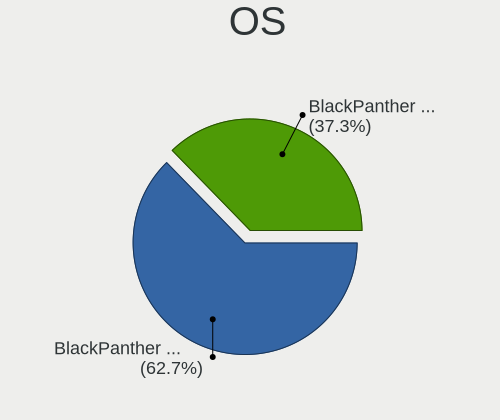
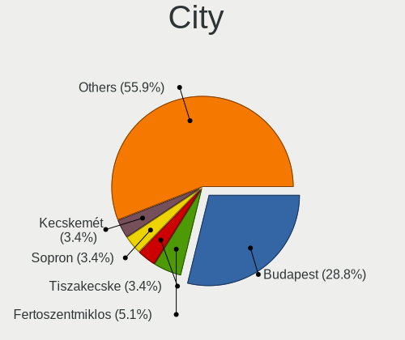
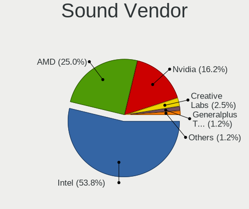
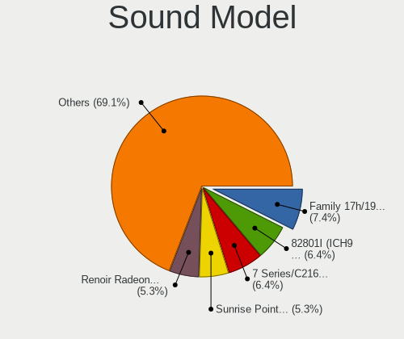

BlackPanther - Hardware Trends
------------------------------

A project to identify most popular hardware characteristics and track their change
over time based on data collected by Linux users at https://Linux-Hardware.org.

Anyone can contribute to this report by the [hw-probe](https://github.com/linuxhw/hw-probe) tool:

    sudo -E hw-probe -all -upload

This is a report for all computer types. See also reports for [desktops](/Dist/BlackPanther/Desktop/README.md) and [notebooks](/Dist/BlackPanther/Notebook/README.md).

This report is for one last month. Overall report since the beginning of time: [TestDays](https://github.com/linuxhw/TestDays)

Period: Nov, 2023.

Contents
--------

* [ System ](#system)
  - [ OS                       ](#os)
  - [ OS Family                ](#os-family)
  - [ Kernel                   ](#kernel)
  - [ Kernel Family            ](#kernel-family)
  - [ Kernel Major Ver.        ](#kernel-major-ver)
  - [ Arch                     ](#arch)
  - [ DE                       ](#de)
  - [ Display Server           ](#display-server)
  - [ Display Manager          ](#display-manager)
  - [ OS Lang                  ](#os-lang)
  - [ Boot Mode                ](#boot-mode)
  - [ Filesystem               ](#filesystem)
  - [ Part. scheme             ](#part-scheme)
  - [ Dual Boot with Linux/BSD ](#dual-boot-with-linuxbsd)
  - [ Dual Boot (Win)          ](#dual-boot-win)

* [ Board ](#board)
  - [ Vendor                   ](#vendor)
  - [ Model                    ](#model)
  - [ Model Family             ](#model-family)
  - [ MFG Year                 ](#mfg-year)
  - [ Form Factor              ](#form-factor)
  - [ Secure Boot              ](#secure-boot)
  - [ Coreboot                 ](#coreboot)
  - [ RAM Size                 ](#ram-size)
  - [ RAM Used                 ](#ram-used)
  - [ Total Drives             ](#total-drives)
  - [ Has CD-ROM               ](#has-cd-rom)
  - [ Has Ethernet             ](#has-ethernet)
  - [ Has WiFi                 ](#has-wifi)
  - [ Has Bluetooth            ](#has-bluetooth)

* [ Location ](#location)
  - [ Country                  ](#country)
  - [ City                     ](#city)

* [ Drives ](#drives)
  - [ Drive Vendor             ](#drive-vendor)
  - [ Drive Model              ](#drive-model)
  - [ HDD Vendor               ](#hdd-vendor)
  - [ SSD Vendor               ](#ssd-vendor)
  - [ Drive Kind               ](#drive-kind)
  - [ Drive Connector          ](#drive-connector)
  - [ Drive Size               ](#drive-size)
  - [ Space Total              ](#space-total)
  - [ Space Used               ](#space-used)
  - [ Malfunc. Drives          ](#malfunc-drives)
  - [ Malfunc. Drive Vendor    ](#malfunc-drive-vendor)
  - [ Malfunc. HDD Vendor      ](#malfunc-hdd-vendor)
  - [ Malfunc. Drive Kind      ](#malfunc-drive-kind)
  - [ Failed Drives            ](#failed-drives)
  - [ Failed Drive Vendor      ](#failed-drive-vendor)
  - [ Drive Status             ](#drive-status)

* [ Storage controller ](#storage-controller)
  - [ Storage Vendor           ](#storage-vendor)
  - [ Storage Model            ](#storage-model)
  - [ Storage Kind             ](#storage-kind)

* [ Processor ](#processor)
  - [ CPU Vendor               ](#cpu-vendor)
  - [ CPU Model                ](#cpu-model)
  - [ CPU Model Family         ](#cpu-model-family)
  - [ CPU Cores                ](#cpu-cores)
  - [ CPU Sockets              ](#cpu-sockets)
  - [ CPU Threads              ](#cpu-threads)
  - [ CPU Op-Modes             ](#cpu-op-modes)
  - [ CPU Microcode            ](#cpu-microcode)
  - [ CPU Microarch            ](#cpu-microarch)

* [ Graphics ](#graphics)
  - [ GPU Vendor               ](#gpu-vendor)
  - [ GPU Model                ](#gpu-model)
  - [ GPU Combo                ](#gpu-combo)
  - [ GPU Driver               ](#gpu-driver)
  - [ GPU Memory               ](#gpu-memory)

* [ Monitor ](#monitor)
  - [ Monitor Vendor           ](#monitor-vendor)
  - [ Monitor Model            ](#monitor-model)
  - [ Monitor Resolution       ](#monitor-resolution)
  - [ Monitor Diagonal         ](#monitor-diagonal)
  - [ Monitor Width            ](#monitor-width)
  - [ Aspect Ratio             ](#aspect-ratio)
  - [ Monitor Area             ](#monitor-area)
  - [ Pixel Density            ](#pixel-density)
  - [ Multiple Monitors        ](#multiple-monitors)

* [ Network ](#network)
  - [ Net Controller Vendor    ](#net-controller-vendor)
  - [ Net Controller Model     ](#net-controller-model)
  - [ Wireless Vendor          ](#wireless-vendor)
  - [ Wireless Model           ](#wireless-model)
  - [ Ethernet Vendor          ](#ethernet-vendor)
  - [ Ethernet Model           ](#ethernet-model)
  - [ Net Controller Kind      ](#net-controller-kind)
  - [ Used Controller          ](#used-controller)
  - [ NICs                     ](#nics)
  - [ IPv6                     ](#ipv6)

* [ Bluetooth ](#bluetooth)
  - [ Bluetooth Vendor         ](#bluetooth-vendor)
  - [ Bluetooth Model          ](#bluetooth-model)

* [ Sound ](#sound)
  - [ Sound Vendor             ](#sound-vendor)
  - [ Sound Model              ](#sound-model)

* [ Memory ](#memory)
  - [ Memory Vendor            ](#memory-vendor)
  - [ Memory Model             ](#memory-model)
  - [ Memory Kind              ](#memory-kind)
  - [ Memory Form Factor       ](#memory-form-factor)
  - [ Memory Size              ](#memory-size)
  - [ Memory Speed             ](#memory-speed)

* [ Printers & scanners ](#printers--scanners)
  - [ Printer Vendor           ](#printer-vendor)
  - [ Printer Model            ](#printer-model)
  - [ Scanner Vendor           ](#scanner-vendor)
  - [ Scanner Model            ](#scanner-model)

* [ Camera ](#camera)
  - [ Camera Vendor            ](#camera-vendor)
  - [ Camera Model             ](#camera-model)

* [ Security ](#security)
  - [ Fingerprint Vendor       ](#fingerprint-vendor)
  - [ Fingerprint Model        ](#fingerprint-model)
  - [ Chipcard Vendor          ](#chipcard-vendor)
  - [ Chipcard Model           ](#chipcard-model)

* [ Unsupported ](#unsupported)
  - [ Unsupported Devices      ](#unsupported-devices)
  - [ Unsupported Device Types ](#unsupported-device-types)

System
------

OS
--

Installed operating systems

| Name              | Computers | Percent |
|-------------------|-----------|---------|
| BlackPanther 18.1 | 103       | 88.79%  |
| BlackPanther 22.1 | 12        | 10.34%  |
| BlackPanther 16.2 | 1         | 0.86%   |

OS Family
---------

OS without a version

| Name         | Computers | Percent |
|--------------|-----------|---------|
| BlackPanther | 116       | 100%    |

Kernel
------

Version of the Linux kernel

| Version                | Computers | Percent |
|------------------------|-----------|---------|
| 5.15.85-desktop-1bP    | 39        | 33.62%  |
| 5.6.14-desktop-2bP     | 36        | 31.03%  |
| 4.18.16-desktop-1bP    | 23        | 19.83%  |
| 6.3.8-desktop-1bP      | 10        | 8.62%   |
| 6.5.7-power-1bP        | 2         | 1.72%   |
| 6.4.3-desktop-1bP      | 2         | 1.72%   |
| 6.5.3-power-1bP        | 1         | 0.86%   |
| 6.3.3-desktop-1bP      | 1         | 0.86%   |
| 5.6.14-server-2bP      | 1         | 0.86%   |
| 4.9.20-desktop-pae-1bP | 1         | 0.86%   |

Kernel Family
-------------

Linux kernel without a distro release

| Version | Computers | Percent |
|---------|-----------|---------|
| 5.15.85 | 39        | 33.62%  |
| 5.6.14  | 37        | 31.9%   |
| 4.18.16 | 23        | 19.83%  |
| 6.3.8   | 10        | 8.62%   |
| 6.5.7   | 2         | 1.72%   |
| 6.4.3   | 2         | 1.72%   |
| 6.5.3   | 1         | 0.86%   |
| 6.3.3   | 1         | 0.86%   |
| 4.9.20  | 1         | 0.86%   |

Kernel Major Ver.
-----------------

Linux kernel major version

| Version | Computers | Percent |
|---------|-----------|---------|
| 5.15    | 39        | 33.62%  |
| 5.6     | 37        | 31.9%   |
| 4.18    | 23        | 19.83%  |
| 6.3     | 11        | 9.48%   |
| 6.5     | 3         | 2.59%   |
| 6.4     | 2         | 1.72%   |
| 4.9     | 1         | 0.86%   |

Arch
----

OS architecture (x86_64, i586, etc.)

| Name   | Computers | Percent |
|--------|-----------|---------|
| x86_64 | 115       | 99.14%  |
| i686   | 1         | 0.86%   |

DE
--

Desktop Environment

| Name    | Computers | Percent |
|---------|-----------|---------|
| KDE5    | 108       | 93.1%   |
| Unknown | 8         | 6.9%    |

Display Server
--------------

X11 or Wayland

| Name | Computers | Percent |
|------|-----------|---------|
| X11  | 116       | 100%    |

Display Manager
---------------

SDDM, LightDM, etc.

| Name | Computers | Percent |
|------|-----------|---------|
| SDDM | 116       | 100%    |

OS Lang
-------

Language

| Lang    | Computers | Percent |
|---------|-----------|---------|
| Unknown | 116       | 100%    |

Boot Mode
---------

EFI or BIOS

| Mode | Computers | Percent |
|------|-----------|---------|
| EFI  | 60        | 51.72%  |
| BIOS | 56        | 48.28%  |

Filesystem
----------

Type of filesystem

| Type    | Computers | Percent |
|---------|-----------|---------|
| Ext4    | 73        | 62.93%  |
| Overlay | 42        | 36.21%  |
| Btrfs   | 1         | 0.86%   |

Part. scheme
------------

Scheme of partitioning

| Type | Computers | Percent |
|------|-----------|---------|
| GPT  | 72        | 62.07%  |
| MBR  | 44        | 37.93%  |

Dual Boot with Linux/BSD
------------------------

Hosting more than one Linux/BSD

| Dual boot | Computers | Percent |
|-----------|-----------|---------|
| No        | 79        | 68.1%   |
| Yes       | 37        | 31.9%   |

Dual Boot (Win)
---------------

Hosting Linux and Windows

| Dual boot | Computers | Percent |
|-----------|-----------|---------|
| No        | 68        | 58.62%  |
| Yes       | 48        | 41.38%  |

Board
-----

Vendor
------

Motherboard manufacturer

| Name                | Computers | Percent |
|---------------------|-----------|---------|
| Dell                | 23        | 19.83%  |
| Lenovo              | 19        | 16.38%  |
| Hewlett-Packard     | 19        | 16.38%  |
| Gigabyte Technology | 15        | 12.93%  |
| ASUSTek Computer    | 10        | 8.62%   |
| Fujitsu             | 6         | 5.17%   |
| MSI                 | 4         | 3.45%   |
| Acer                | 4         | 3.45%   |
| Samsung Electronics | 3         | 2.59%   |
| ASRock              | 3         | 2.59%   |
| eMachines           | 2         | 1.72%   |
| Apple               | 2         | 1.72%   |
| Sony                | 1         | 0.86%   |
| Microsoft           | 1         | 0.86%   |
| Medion              | 1         | 0.86%   |
| Intel               | 1         | 0.86%   |
| GPU Company         | 1         | 0.86%   |
| AWOW                | 1         | 0.86%   |

Model
-----

Motherboard model

| Name                                       | Computers | Percent |
|--------------------------------------------|-----------|---------|
| HP 250 G1                                  | 3         | 2.59%   |
| Samsung RV415/RV515/E3415                  | 2         | 1.72%   |
| Lenovo IdeaPad 330-15IKB 81DE              | 2         | 1.72%   |
| HP ProBook 640 G8 Notebook PC              | 2         | 1.72%   |
| Gigabyte H61M-S1                           | 2         | 1.72%   |
| eMachines E725                             | 2         | 1.72%   |
| Dell Latitude 7390                         | 2         | 1.72%   |
| ASUS K54HR                                 | 2         | 1.72%   |
| Sony SVS13118GBB                           | 1         | 0.86%   |
| Samsung 300E4C/300E5C/300E7C               | 1         | 0.86%   |
| MSI MS-7680                                | 1         | 0.86%   |
| MSI MS-7519                                | 1         | 0.86%   |
| MSI GT60 2OC/2OD                           | 1         | 0.86%   |
| MSI GP75 Leopard 9SE                       | 1         | 0.86%   |
| Microsoft Surface Pro                      | 1         | 0.86%   |
| Medion E7220                               | 1         | 0.86%   |
| Lenovo V15-ADA 82C7                        | 1         | 0.86%   |
| Lenovo ThinkStation P520 30BFS44D04        | 1         | 0.86%   |
| Lenovo ThinkStation D20 4158AF8            | 1         | 0.86%   |
| Lenovo ThinkPad X250 20CLS1JN00            | 1         | 0.86%   |
| Lenovo ThinkPad X230 2333A91               | 1         | 0.86%   |
| Lenovo ThinkPad T420 4236B87               | 1         | 0.86%   |
| Lenovo ThinkPad T410 2537VFQ               | 1         | 0.86%   |
| Lenovo ThinkCentre M78 10BNS02900          | 1         | 0.86%   |
| Lenovo ThinkCentre M73 10B6001SUS          | 1         | 0.86%   |
| Lenovo ThinkCentre M58 9960ALU             | 1         | 0.86%   |
| Lenovo IdeaPad Y700-15ISK 80NV             | 1         | 0.86%   |
| Lenovo IdeaPad 700-15ISK 80RU              | 1         | 0.86%   |
| Lenovo IdeaPad 110-15ACL 80TJ              | 1         | 0.86%   |
| Lenovo IdeaCentre AIO 300-23ACL F0BC002MAU | 1         | 0.86%   |
| Lenovo G550 20023                          | 1         | 0.86%   |
| Lenovo G50-45 80E3                         | 1         | 0.86%   |
| Lenovo Flex 2-15D 20377                    | 1         | 0.86%   |
| Intel S5500HCV                             | 1         | 0.86%   |
| HP ProBook 650 G2                          | 1         | 0.86%   |
| HP Presario CQ57                           | 1         | 0.86%   |
| HP Pavilion Gaming Laptop 15-ec1xxx        | 1         | 0.86%   |
| HP Pavilion dv6                            | 1         | 0.86%   |
| HP Pavilion dv5                            | 1         | 0.86%   |
| HP Notebook                                | 1         | 0.86%   |

Model Family
------------

Motherboard model prefix

| Name                | Computers | Percent |
|---------------------|-----------|---------|
| Dell Latitude       | 10        | 8.62%   |
| Dell Inspiron       | 6         | 5.17%   |
| Lenovo IdeaPad      | 5         | 4.31%   |
| Lenovo ThinkPad     | 4         | 3.45%   |
| Lenovo ThinkCentre  | 3         | 2.59%   |
| HP ProBook          | 3         | 2.59%   |
| HP Pavilion         | 3         | 2.59%   |
| HP 250              | 3         | 2.59%   |
| Dell Vostro         | 3         | 2.59%   |
| Samsung RV415       | 2         | 1.72%   |
| Lenovo ThinkStation | 2         | 1.72%   |
| HP EliteBook        | 2         | 1.72%   |
| HP Compaq           | 2         | 1.72%   |
| Gigabyte H61M-S1    | 2         | 1.72%   |
| Fujitsu LIFEBOOK    | 2         | 1.72%   |
| Fujitsu ESPRIMO     | 2         | 1.72%   |
| Fujitsu CELSIUS     | 2         | 1.72%   |
| eMachines E725      | 2         | 1.72%   |
| Dell Precision      | 2         | 1.72%   |
| Dell OptiPlex       | 2         | 1.72%   |
| ASUS PRIME          | 2         | 1.72%   |
| ASUS K54HR          | 2         | 1.72%   |
| Acer Aspire         | 2         | 1.72%   |
| Sony SVS13118GBB    | 1         | 0.86%   |
| Samsung 300E4C      | 1         | 0.86%   |
| MSI MS-7680         | 1         | 0.86%   |
| MSI MS-7519         | 1         | 0.86%   |
| MSI GT60            | 1         | 0.86%   |
| MSI GP75            | 1         | 0.86%   |
| Microsoft Surface   | 1         | 0.86%   |
| Medion E7220        | 1         | 0.86%   |
| Lenovo V15-ADA      | 1         | 0.86%   |
| Lenovo IdeaCentre   | 1         | 0.86%   |
| Lenovo G550         | 1         | 0.86%   |
| Lenovo G50-45       | 1         | 0.86%   |
| Lenovo Flex         | 1         | 0.86%   |
| Intel S5500HCV      | 1         | 0.86%   |
| HP Presario         | 1         | 0.86%   |
| HP Notebook         | 1         | 0.86%   |
| HP HDX              | 1         | 0.86%   |

MFG Year
--------

Motherboard manufacture year

| Year | Computers | Percent |
|------|-----------|---------|
| 2011 | 14        | 12.07%  |
| 2012 | 12        | 10.34%  |
| 2014 | 11        | 9.48%   |
| 2013 | 11        | 9.48%   |
| 2010 | 10        | 8.62%   |
| 2015 | 9         | 7.76%   |
| 2018 | 8         | 6.9%    |
| 2020 | 7         | 6.03%   |
| 2008 | 7         | 6.03%   |
| 2017 | 6         | 5.17%   |
| 2016 | 6         | 5.17%   |
| 2009 | 6         | 5.17%   |
| 2021 | 3         | 2.59%   |
| 2019 | 2         | 1.72%   |
| 2007 | 2         | 1.72%   |
| 2022 | 1         | 0.86%   |
| 2006 | 1         | 0.86%   |

Form Factor
-----------

Physical design of the computer

| Name       | Computers | Percent |
|------------|-----------|---------|
| Notebook   | 68        | 58.62%  |
| Desktop    | 41        | 35.34%  |
| All in one | 4         | 3.45%   |
| Tablet     | 1         | 0.86%   |
| Mini pc    | 1         | 0.86%   |
| Server     | 1         | 0.86%   |

Secure Boot
-----------

Enabled or disabled

| State    | Computers | Percent |
|----------|-----------|---------|
| Disabled | 116       | 100%    |

Coreboot
--------

Have coreboot on board

| Used | Computers | Percent |
|------|-----------|---------|
| No   | 116       | 100%    |

RAM Size
--------

Total RAM memory

| Size in GB | Computers | Percent |
|------------|-----------|---------|
| 3.01-4.0   | 32        | 27.59%  |
| 8.01-16.0  | 32        | 27.59%  |
| 4.01-8.0   | 28        | 24.14%  |
| 16.01-24.0 | 11        | 9.48%   |
| 1.01-2.0   | 5         | 4.31%   |
| 32.01-64.0 | 3         | 2.59%   |
| 2.01-3.0   | 3         | 2.59%   |
| 24.01-32.0 | 2         | 1.72%   |

RAM Used
--------

Used RAM memory

| Used GB    | Computers | Percent |
|------------|-----------|---------|
| 1.01-2.0   | 49        | 42.24%  |
| 0.51-1.0   | 34        | 29.31%  |
| 0.01-0.5   | 12        | 10.34%  |
| 4.01-8.0   | 7         | 6.03%   |
| 2.01-3.0   | 7         | 6.03%   |
| 3.01-4.0   | 6         | 5.17%   |
| 16.01-24.0 | 1         | 0.86%   |

Total Drives
------------

Number of drives on board

| Drives | Computers | Percent |
|--------|-----------|---------|
| 1      | 75        | 64.66%  |
| 2      | 31        | 26.72%  |
| 3      | 6         | 5.17%   |
| 4      | 3         | 2.59%   |
| 0      | 1         | 0.86%   |

Has CD-ROM
----------

Has CD-ROM on board

| Presented | Computers | Percent |
|-----------|-----------|---------|
| Yes       | 67        | 57.76%  |
| No        | 49        | 42.24%  |

Has Ethernet
------------

Has Ethernet on board

| Presented | Computers | Percent |
|-----------|-----------|---------|
| Yes       | 113       | 97.41%  |
| No        | 3         | 2.59%   |

Has WiFi
--------

Has WiFi module

| Presented | Computers | Percent |
|-----------|-----------|---------|
| Yes       | 86        | 74.14%  |
| No        | 30        | 25.86%  |

Has Bluetooth
-------------

Has Bluetooth module

| Presented | Computers | Percent |
|-----------|-----------|---------|
| Yes       | 67        | 57.76%  |
| No        | 49        | 42.24%  |

Location
--------

Country
-------

Geographic location (country)

| Country   | Computers | Percent |
|-----------|-----------|---------|
| Hungary   | 99        | 85.34%  |
| Slovakia  | 5         | 4.31%   |
| UK        | 3         | 2.59%   |
| Romania   | 2         | 1.72%   |
| Germany   | 2         | 1.72%   |
| Austria   | 2         | 1.72%   |
| USA       | 1         | 0.86%   |
| Canada    | 1         | 0.86%   |
| Australia | 1         | 0.86%   |

City
----

Geographic location (city)

| City                    | Computers | Percent |
|-------------------------|-----------|---------|
| Budapest                | 30        | 25.86%  |
| Zalaegerszeg            | 5         | 4.31%   |
| Szigetszentmiklos       | 5         | 4.31%   |
| Szombathely             | 3         | 2.59%   |
| Szentendre              | 3         | 2.59%   |
| Oroshaza                | 3         | 2.59%   |
| Kiskunmajsa             | 3         | 2.59%   |
| Kiskunhalas             | 3         | 2.59%   |
| Csongrad                | 3         | 2.59%   |
| Berettyóújfalu        | 3         | 2.59%   |
| Vienna                  | 2         | 1.72%   |
| Tatabánya              | 2         | 1.72%   |
| Miskolc                 | 2         | 1.72%   |
| Karcag                  | 2         | 1.72%   |
| Harlow                  | 2         | 1.72%   |
| Fertoszentmiklos        | 2         | 1.72%   |
| Debrecen                | 2         | 1.72%   |
| Cegled                  | 2         | 1.72%   |
| Agfalva                 | 2         | 1.72%   |
| Zalău                  | 1         | 0.86%   |
| Tornaľa                | 1         | 0.86%   |
| Tarnamera               | 1         | 0.86%   |
| Tamasi                  | 1         | 0.86%   |
| Szeghalom               | 1         | 0.86%   |
| Senec                   | 1         | 0.86%   |
| Salgotarjan             | 1         | 0.86%   |
| Rockland                | 1         | 0.86%   |
| Pomaz                   | 1         | 0.86%   |
| Pfaffenhofen an der Ilm | 1         | 0.86%   |
| Perth                   | 1         | 0.86%   |
| Pécs                   | 1         | 0.86%   |
| Nyiregyhaza             | 1         | 0.86%   |
| Nagykanizsa             | 1         | 0.86%   |
| Miercurea-Ciuc          | 1         | 0.86%   |
| Mezokovesd              | 1         | 0.86%   |
| Marcali                 | 1         | 0.86%   |
| Mandok                  | 1         | 0.86%   |
| Mako                    | 1         | 0.86%   |
| Majoshaza               | 1         | 0.86%   |
| Lučenec                | 1         | 0.86%   |

Drives
------

Drive Vendor
------------

Hard drive vendors

| Vendor                    | Computers | Drives | Percent |
|---------------------------|-----------|--------|---------|
| WDC                       | 27        | 31     | 16.17%  |
| Kingston                  | 22        | 26     | 13.17%  |
| Samsung Electronics       | 21        | 21     | 12.57%  |
| Seagate                   | 16        | 16     | 9.58%   |
| Toshiba                   | 9         | 11     | 5.39%   |
| HGST                      | 8         | 9      | 4.79%   |
| A-DATA Technology         | 8         | 8      | 4.79%   |
| Intenso                   | 6         | 6      | 3.59%   |
| Unknown                   | 4         | 4      | 2.4%    |
| SPCC                      | 4         | 4      | 2.4%    |
| SK hynix                  | 4         | 4      | 2.4%    |
| Intel                     | 4         | 4      | 2.4%    |
| Hitachi                   | 4         | 4      | 2.4%    |
| Sandisk                   | 3         | 3      | 1.8%    |
| SSSTC                     | 2         | 2      | 1.2%    |
| Patriot                   | 2         | 2      | 1.2%    |
| Micron Technology         | 2         | 2      | 1.2%    |
| LITEON                    | 2         | 2      | 1.2%    |
| Kingmax                   | 2         | 2      | 1.2%    |
| Gigabyte Technology       | 2         | 2      | 1.2%    |
| Crucial                   | 2         | 2      | 1.2%    |
| Apacer                    | 2         | 2      | 1.2%    |
| Zheino                    | 1         | 1      | 0.6%    |
| Wibtek                    | 1         | 1      | 0.6%    |
| Transcend                 | 1         | 1      | 0.6%    |
| Timetec                   | 1         | 1      | 0.6%    |
| Solid                     | 1         | 1      | 0.6%    |
| Realtek Semiconductor     | 1         | 1      | 0.6%    |
| PNY                       | 1         | 1      | 0.6%    |
| Micron/Crucial Technology | 1         | 1      | 0.6%    |
| LITEONIT                  | 1         | 1      | 0.6%    |
| Apple                     | 1         | 1      | 0.6%    |
| Unknown                   | 1         | 1      | 0.6%    |

Drive Model
-----------

Hard drive models

| Model                                | Computers | Percent |
|--------------------------------------|-----------|---------|
| Kingston SA400S37480G 480GB SSD      | 9         | 5.14%   |
| Kingston SA400S37240G 240GB SSD      | 5         | 2.86%   |
| Kingston SA400S37120G 120GB SSD      | 4         | 2.29%   |
| SPCC Solid State Disk 256GB          | 3         | 1.71%   |
| WDC WD7500BPKX-60HPJT0 752GB         | 2         | 1.14%   |
| SSSTC CL1-8D256-HP 256GB             | 2         | 1.14%   |
| Seagate ST9320325AS 320GB            | 2         | 1.14%   |
| Samsung SSD 750 EVO 250GB            | 2         | 1.14%   |
| Kingston SUV400S37120G 120GB SSD     | 2         | 1.14%   |
| Kingston SA400S37960G 960GB SSD      | 2         | 1.14%   |
| HGST HTS545032A7E380 320GB           | 2         | 1.14%   |
| Gigabyte GP-GSTFS31120GNTD 120GB SSD | 2         | 1.14%   |
| A-DATA SU650 120GB SSD               | 2         | 1.14%   |
| A-DATA SU630 240GB SSD               | 2         | 1.14%   |
| Zheino CHN-NGFFNV2280-256 256GB      | 1         | 0.57%   |
| Wibtek W800S 128GB SSD               | 1         | 0.57%   |
| WDC WDS240G2G0B-00EPW0 240GB SSD     | 1         | 0.57%   |
| WDC WDS240G2G0A-00JH30 240GB SSD     | 1         | 0.57%   |
| WDC WD6400BPVT-22HXZT3 640GB         | 1         | 0.57%   |
| WDC WD5003AZEX-00MK2A0 500GB         | 1         | 0.57%   |
| WDC WD5000LPLX-75ZNTT0 500GB         | 1         | 0.57%   |
| WDC WD5000LPCX-24VHAT0 500GB         | 1         | 0.57%   |
| WDC WD5000BPKT-75PK4T0 500GB         | 1         | 0.57%   |
| WDC WD5000BEKT-22KA9T0 500GB         | 1         | 0.57%   |
| WDC WD5000AAKX-08U6AA0 500GB         | 1         | 0.57%   |
| WDC WD3200BEVT-08A23T1 320GB         | 1         | 0.57%   |
| WDC WD3200BEKT-60V5T1 320GB          | 1         | 0.57%   |
| WDC WD30EZRX-00DC0B0 3TB             | 1         | 0.57%   |
| WDC WD30EFRX-68EUZN0 3TB             | 1         | 0.57%   |
| WDC WD30 PURX-64PFUY0 3TB            | 1         | 0.57%   |
| WDC WD2500BEVT-00ZCT0 250GB          | 1         | 0.57%   |
| WDC WD20EARX-00PASB0 2TB             | 1         | 0.57%   |
| WDC WD10SPCX-24HWST1 1TB             | 1         | 0.57%   |
| WDC WD10PURZ-85U8XY0 1TB             | 1         | 0.57%   |
| WDC WD10JPVX-75JC3T0 1TB             | 1         | 0.57%   |
| WDC WD10JPVX-60JC3T0 1TB             | 1         | 0.57%   |
| WDC WD10JPVX-22JC3T0 1TB             | 1         | 0.57%   |
| WDC WD10JPLX-00MBPT0 1TB             | 1         | 0.57%   |
| WDC WD10EZRX-00L4HB0 1TB             | 1         | 0.57%   |
| WDC WD10EZEX-00KUWA0 1TB             | 1         | 0.57%   |

HDD Vendor
----------

Hard disk drive vendors

| Vendor              | Computers | Drives | Percent |
|---------------------|-----------|--------|---------|
| WDC                 | 25        | 29     | 39.06%  |
| Seagate             | 16        | 16     | 25%     |
| HGST                | 8         | 9      | 12.5%   |
| Toshiba             | 7         | 9      | 10.94%  |
| Hitachi             | 4         | 4      | 6.25%   |
| Samsung Electronics | 3         | 3      | 4.69%   |
| Unknown             | 1         | 1      | 1.56%   |

SSD Vendor
----------

Solid state drive vendors

| Vendor              | Computers | Drives | Percent |
|---------------------|-----------|--------|---------|
| Kingston            | 19        | 23     | 24.36%  |
| Samsung Electronics | 14        | 14     | 17.95%  |
| A-DATA Technology   | 8         | 8      | 10.26%  |
| Intenso             | 6         | 6      | 7.69%   |
| SPCC                | 4         | 4      | 5.13%   |
| Intel               | 3         | 3      | 3.85%   |
| WDC                 | 2         | 2      | 2.56%   |
| SK hynix            | 2         | 2      | 2.56%   |
| Patriot             | 2         | 2      | 2.56%   |
| Micron Technology   | 2         | 2      | 2.56%   |
| Kingmax             | 2         | 2      | 2.56%   |
| Gigabyte Technology | 2         | 2      | 2.56%   |
| Crucial             | 2         | 2      | 2.56%   |
| Wibtek              | 1         | 1      | 1.28%   |
| Toshiba             | 1         | 1      | 1.28%   |
| Timetec             | 1         | 1      | 1.28%   |
| Solid               | 1         | 1      | 1.28%   |
| SanDisk             | 1         | 1      | 1.28%   |
| PNY                 | 1         | 1      | 1.28%   |
| LITEONIT            | 1         | 1      | 1.28%   |
| LITEON              | 1         | 1      | 1.28%   |
| Apple               | 1         | 1      | 1.28%   |
| Apacer              | 1         | 1      | 1.28%   |

Drive Kind
----------

HDD or SSD

| Kind | Computers | Drives | Percent |
|------|-----------|--------|---------|
| SSD  | 68        | 82     | 45.03%  |
| HDD  | 59        | 71     | 39.07%  |
| NVMe | 20        | 21     | 13.25%  |
| MMC  | 4         | 4      | 2.65%   |

Drive Connector
---------------

SATA, SAS, NVMe, etc.

| Type | Computers | Drives | Percent |
|------|-----------|--------|---------|
| SATA | 103       | 149    | 78.63%  |
| NVMe | 20        | 21     | 15.27%  |
| SAS  | 4         | 4      | 3.05%   |
| MMC  | 4         | 4      | 3.05%   |

Drive Size
----------

Size of hard drive

| Size in TB | Computers | Drives | Percent |
|------------|-----------|--------|---------|
| 0.01-0.5   | 83        | 105    | 65.87%  |
| 0.51-1.0   | 32        | 35     | 25.4%   |
| 1.01-2.0   | 5         | 5      | 3.97%   |
| 3.01-4.0   | 3         | 4      | 2.38%   |
| 2.01-3.0   | 3         | 4      | 2.38%   |

Space Total
-----------

Amount of disk space available on the file system

| Size in GB     | Computers | Percent |
|----------------|-----------|---------|
| Unknown        | 42        | 36.21%  |
| 101-250        | 24        | 20.69%  |
| 251-500        | 17        | 14.66%  |
| 501-1000       | 10        | 8.62%   |
| 51-100         | 8         | 6.9%    |
| 1001-2000      | 6         | 5.17%   |
| More than 3000 | 3         | 2.59%   |
| 21-50          | 3         | 2.59%   |
| 2001-3000      | 2         | 1.72%   |
| 1-20           | 1         | 0.86%   |

Space Used
----------

Amount of used disk space

| Used GB        | Computers | Percent |
|----------------|-----------|---------|
| Unknown        | 42        | 36.21%  |
| 21-50          | 22        | 18.97%  |
| 1-20           | 20        | 17.24%  |
| 101-250        | 12        | 10.34%  |
| 51-100         | 8         | 6.9%    |
| 251-500        | 5         | 4.31%   |
| 1001-2000      | 3         | 2.59%   |
| More than 3000 | 2         | 1.72%   |
| 2001-3000      | 1         | 0.86%   |
| 501-1000       | 1         | 0.86%   |

Malfunc. Drives
---------------

Drive models with a malfunction

| Model                                 | Computers | Drives | Percent |
|---------------------------------------|-----------|--------|---------|
| WDC WD7500BPKX-60HPJT0 752GB          | 2         | 2      | 4.88%   |
| Seagate ST9320325AS 320GB             | 2         | 2      | 4.88%   |
| HGST HTS545032A7E380 320GB            | 2         | 2      | 4.88%   |
| A-DATA Technology SU630 240GB SSD     | 2         | 2      | 4.88%   |
| WDC WD5000BEKT-22KA9T0 500GB          | 1         | 1      | 2.44%   |
| WDC WD5000AAKX-08U6AA0 500GB          | 1         | 1      | 2.44%   |
| WDC WD3200BEVT-08A23T1 320GB          | 1         | 1      | 2.44%   |
| WDC WD2500BEVT-00ZCT0 250GB           | 1         | 1      | 2.44%   |
| WDC WD20EARX-00PASB0 2TB              | 1         | 1      | 2.44%   |
| WDC WD10PURZ-85U8XY0 1TB              | 1         | 1      | 2.44%   |
| WDC WD10JPLX-00MBPT0 1TB              | 1         | 1      | 2.44%   |
| WDC WD10EARS-00Y5B1 1TB               | 1         | 1      | 2.44%   |
| WDC WD10EALX-009BA0 1TB               | 1         | 1      | 2.44%   |
| Toshiba MQ01ABF050 500GB              | 1         | 1      | 2.44%   |
| Toshiba DT01ACA100 1TB                | 1         | 1      | 2.44%   |
| Toshiba DT01ACA050 500GB              | 1         | 1      | 2.44%   |
| Timetec SD08 512GB                    | 1         | 1      | 2.44%   |
| Seagate ST9500420AS 500GB             | 1         | 1      | 2.44%   |
| Seagate ST9500325AS 500GB             | 1         | 1      | 2.44%   |
| Seagate ST9160310AS 160GB             | 1         | 1      | 2.44%   |
| Seagate ST500LT012-9WS142 500GB       | 1         | 1      | 2.44%   |
| Seagate ST500LT012-1DG142 500GB       | 1         | 1      | 2.44%   |
| Seagate ST1000LM035-1RK172 1TB        | 1         | 1      | 2.44%   |
| Seagate ST1000LM024 HN-M101MBB 1TB    | 1         | 1      | 2.44%   |
| Samsung Electronics SSD 750 EVO 250GB | 1         | 1      | 2.44%   |
| Samsung Electronics HD103UJ 1TB       | 1         | 1      | 2.44%   |
| Kingston SA400S37480G 480GB SSD       | 1         | 1      | 2.44%   |
| Intel SSDSC2BF180A4L 180GB            | 1         | 1      | 2.44%   |
| Intel SSDSC2BF180A4H 180GB            | 1         | 1      | 2.44%   |
| Hitachi HTS547550A9E384 500GB         | 1         | 1      | 2.44%   |
| Hitachi HTS545050A7E380 500GB         | 1         | 1      | 2.44%   |
| Hitachi HDT725032VLA360 320GB         | 1         | 1      | 2.44%   |
| HGST HTS545050A7E380 500GB            | 1         | 1      | 2.44%   |
| HGST HTS541010A9E680 1TB              | 1         | 1      | 2.44%   |
| HGST HEJ423220H9E300 200GB            | 1         | 1      | 2.44%   |
| Apple SSD TS064E 64GB                 | 1         | 1      | 2.44%   |
| A-DATA Technology SP600 64GB SSD      | 1         | 1      | 2.44%   |

Malfunc. Drive Vendor
---------------------

Vendors of faulty drives

| Vendor              | Computers | Drives | Percent |
|---------------------|-----------|--------|---------|
| WDC                 | 10        | 11     | 25.64%  |
| Seagate             | 9         | 9      | 23.08%  |
| HGST                | 5         | 5      | 12.82%  |
| Hitachi             | 3         | 3      | 7.69%   |
| A-DATA Technology   | 3         | 3      | 7.69%   |
| Toshiba             | 2         | 3      | 5.13%   |
| Samsung Electronics | 2         | 2      | 5.13%   |
| Intel               | 2         | 2      | 5.13%   |
| Timetec             | 1         | 1      | 2.56%   |
| Kingston            | 1         | 1      | 2.56%   |
| Apple               | 1         | 1      | 2.56%   |

Malfunc. HDD Vendor
-------------------

Vendors of faulty HDD drives

| Vendor              | Computers | Drives | Percent |
|---------------------|-----------|--------|---------|
| WDC                 | 10        | 11     | 33.33%  |
| Seagate             | 9         | 9      | 30%     |
| HGST                | 5         | 5      | 16.67%  |
| Hitachi             | 3         | 3      | 10%     |
| Toshiba             | 2         | 3      | 6.67%   |
| Samsung Electronics | 1         | 1      | 3.33%   |

Malfunc. Drive Kind
-------------------

Kinds of faulty drives

| Kind | Computers | Drives | Percent |
|------|-----------|--------|---------|
| HDD  | 30        | 32     | 76.92%  |
| SSD  | 9         | 9      | 23.08%  |

Failed Drives
-------------

Failed drive models

Zero info for selected period =(

Failed Drive Vendor
-------------------

Failed drive vendors

Zero info for selected period =(

Drive Status
------------

Number of failed and malfunc. drives

| Status   | Computers | Drives | Percent |
|----------|-----------|--------|---------|
| Works    | 94        | 130    | 67.63%  |
| Malfunc  | 38        | 41     | 27.34%  |
| Detected | 7         | 7      | 5.04%   |

Storage controller
------------------

Storage Vendor
--------------

Storage controller vendors

| Vendor                         | Computers | Percent |
|--------------------------------|-----------|---------|
| Intel                          | 86        | 63.24%  |
| AMD                            | 28        | 20.59%  |
| Samsung Electronics            | 4         | 2.94%   |
| Kingston Technology Company    | 3         | 2.21%   |
| Solid State Storage Technology | 2         | 1.47%   |
| SK hynix                       | 2         | 1.47%   |
| Silicon Motion                 | 2         | 1.47%   |
| SanDisk                        | 2         | 1.47%   |
| Toshiba America Info Systems   | 1         | 0.74%   |
| Realtek Semiconductor          | 1         | 0.74%   |
| Phison Electronics             | 1         | 0.74%   |
| Micron/Crucial Technology      | 1         | 0.74%   |
| Lite-On Technology             | 1         | 0.74%   |
| JMicron Technology             | 1         | 0.74%   |
| ASMedia Technology             | 1         | 0.74%   |

Storage Model
-------------

Storage controller models

| Model                                                                                   | Computers | Percent |
|-----------------------------------------------------------------------------------------|-----------|---------|
| AMD FCH SATA Controller [AHCI mode]                                                     | 14        | 8.81%   |
| Intel 7 Series Chipset Family 6-port SATA Controller [AHCI mode]                        | 9         | 5.66%   |
| AMD SB7x0/SB8x0/SB9x0 SATA Controller [AHCI mode]                                       | 8         | 5.03%   |
| Intel 82801IBM/IEM (ICH9M/ICH9M-E) 4 port SATA Controller [AHCI mode]                   | 6         | 3.77%   |
| Intel 8 Series/C220 Series Chipset Family 6-port SATA Controller 1 [AHCI mode]          | 6         | 3.77%   |
| AMD SB7x0/SB8x0/SB9x0 IDE Controller                                                    | 6         | 3.77%   |
| Intel 82801 Mobile SATA Controller [RAID mode]                                          | 5         | 3.14%   |
| Intel Wildcat Point-LP SATA Controller [AHCI Mode]                                      | 4         | 2.52%   |
| Intel HM170/QM170 Chipset SATA Controller [AHCI Mode]                                   | 4         | 2.52%   |
| Intel 82801JI (ICH10 Family) SATA AHCI Controller                                       | 4         | 2.52%   |
| Intel 8 Series SATA Controller 1 [AHCI mode]                                            | 4         | 2.52%   |
| Intel 6 Series/C200 Series Chipset Family Desktop SATA Controller (IDE mode, ports 4-5) | 4         | 2.52%   |
| Intel 6 Series/C200 Series Chipset Family Desktop SATA Controller (IDE mode, ports 0-3) | 4         | 2.52%   |
| Intel 6 Series/C200 Series Chipset Family 6 port Mobile SATA AHCI Controller            | 4         | 2.52%   |
| Intel Volume Management Device NVMe RAID Controller                                     | 3         | 1.89%   |
| Intel Sunrise Point-LP SATA Controller [AHCI mode]                                      | 3         | 1.89%   |
| Intel NM10/ICH7 Family SATA Controller [IDE mode]                                       | 3         | 1.89%   |
| Intel Celeron/Pentium Silver Processor SATA Controller                                  | 3         | 1.89%   |
| Intel 5 Series/3400 Series Chipset 6 port SATA AHCI Controller                          | 3         | 1.89%   |
| Solid State Storage CL1-3D256-Q11 NVMe SSD M.2                                          | 2         | 1.26%   |
| Silicon Motion SM2263EN/SM2263XT (DRAM-less) NVMe SSD Controllers                       | 2         | 1.26%   |
| Samsung NVMe SSD Controller SM981/PM981/PM983                                           | 2         | 1.26%   |
| Intel Tiger Lake-LP SATA Controller                                                     | 2         | 1.26%   |
| Intel Q170/Q150/B150/H170/H110/Z170/CM236 Chipset SATA Controller [AHCI Mode]           | 2         | 1.26%   |
| Intel 9 Series Chipset Family SATA Controller [AHCI Mode]                               | 2         | 1.26%   |
| Intel 82801JI (ICH10 Family) 4 port SATA IDE Controller #1                              | 2         | 1.26%   |
| Intel 82801JI (ICH10 Family) 2 port SATA IDE Controller #2                              | 2         | 1.26%   |
| Intel 200 Series PCH SATA controller [AHCI mode]                                        | 2         | 1.26%   |
| AMD SB7x0/SB8x0/SB9x0 SATA Controller [IDE mode]                                        | 2         | 1.26%   |
| AMD 500 Series Chipset SATA Controller                                                  | 2         | 1.26%   |
| AMD 300 Series Chipset SATA Controller                                                  | 2         | 1.26%   |
| Toshiba America Info Systems XG5 NVMe SSD Controller                                    | 1         | 0.63%   |
| SK hynix Gold P31/BC711/PC711 NVMe Solid State Drive                                    | 1         | 0.63%   |
| SK hynix BC501 NVMe Solid State Drive                                                   | 1         | 0.63%   |
| SanDisk WD Blue SN570 NVMe SSD 2TB                                                      | 1         | 0.63%   |
| SanDisk Ultra 3D / WD Blue SN570 NVMe SSD (DRAM-less)                                   | 1         | 0.63%   |
| Samsung NVMe SSD Controller SM961/PM961/SM963                                           | 1         | 0.63%   |
| Samsung NVMe SSD Controller 980 (DRAM-less)                                             | 1         | 0.63%   |
| Realtek RTS5762 NVMe SSD Controller                                                     | 1         | 0.63%   |
| Phison PS5015-E15 PCIe3 NVMe Controller (DRAM-less)                                     | 1         | 0.63%   |

Storage Kind
------------

Kind of storage controller (IDE, SATA, NVMe, SAS, ...)

| Kind | Computers | Percent |
|------|-----------|---------|
| SATA | 93        | 64.14%  |
| IDE  | 24        | 16.55%  |
| NVMe | 20        | 13.79%  |
| RAID | 8         | 5.52%   |

Processor
---------

CPU Vendor
----------

Processor vendors

| Vendor | Computers | Percent |
|--------|-----------|---------|
| Intel  | 88        | 75.86%  |
| AMD    | 28        | 24.14%  |

CPU Model
---------

Processor models

| Model                                       | Computers | Percent |
|---------------------------------------------|-----------|---------|
| Intel Core i5-8250U CPU @ 1.60GHz           | 3         | 2.59%   |
| Intel Core i5-2540M CPU @ 2.60GHz           | 3         | 2.59%   |
| Intel Celeron CPU 1000M @ 1.80GHz           | 3         | 2.59%   |
| Intel Pentium Dual-Core CPU T4400 @ 2.20GHz | 2         | 1.72%   |
| Intel Core i5-7300U CPU @ 2.60GHz           | 2         | 1.72%   |
| Intel Core i5-2520M CPU @ 2.50GHz           | 2         | 1.72%   |
| Intel Core i3-2120 CPU @ 3.30GHz            | 2         | 1.72%   |
| Intel 11th Gen Core i5-1135G7 @ 2.40GHz     | 2         | 1.72%   |
| Intel 11th Gen Core i3-1115G4 @ 3.00GHz     | 2         | 1.72%   |
| AMD Ryzen 5 3400G with Radeon Vega Graphics | 2         | 1.72%   |
| AMD FX-8350 Eight-Core Processor            | 2         | 1.72%   |
| AMD E-450 APU with Radeon HD Graphics       | 2         | 1.72%   |
| AMD A8-6410 APU with AMD Radeon R5 Graphics | 2         | 1.72%   |
| Intel Xeon W-2135 CPU @ 3.70GHz             | 1         | 0.86%   |
| Intel Xeon CPU X5677 @ 3.47GHz              | 1         | 0.86%   |
| Intel Xeon CPU X5670 @ 2.93GHz              | 1         | 0.86%   |
| Intel Xeon CPU X5650 @ 2.67GHz              | 1         | 0.86%   |
| Intel Xeon CPU W3550 @ 3.07GHz              | 1         | 0.86%   |
| Intel Xeon CPU W3540 @ 2.93GHz              | 1         | 0.86%   |
| Intel Xeon CPU E5440 @ 2.83GHz              | 1         | 0.86%   |
| Intel Xeon CPU E5-2696 v3 @ 2.30GHz         | 1         | 0.86%   |
| Intel Pentium Silver J5040 CPU @ 2.00GHz    | 1         | 0.86%   |
| Intel Pentium Dual-Core CPU T4500 @ 2.30GHz | 1         | 0.86%   |
| Intel Pentium Dual-Core CPU T4300 @ 2.10GHz | 1         | 0.86%   |
| Intel Pentium CPU G3430 @ 3.30GHz           | 1         | 0.86%   |
| Intel Pentium CPU B970 @ 2.30GHz            | 1         | 0.86%   |
| Intel Core i7-9750H CPU @ 2.60GHz           | 1         | 0.86%   |
| Intel Core i7-7700HQ CPU @ 2.80GHz          | 1         | 0.86%   |
| Intel Core i7-6820HQ CPU @ 2.70GHz          | 1         | 0.86%   |
| Intel Core i7-6700HQ CPU @ 2.60GHz          | 1         | 0.86%   |
| Intel Core i7-6600U CPU @ 2.60GHz           | 1         | 0.86%   |
| Intel Core i7-5500U CPU @ 2.40GHz           | 1         | 0.86%   |
| Intel Core i7-4790 CPU @ 3.60GHz            | 1         | 0.86%   |
| Intel Core i7-4700MQ CPU @ 2.40GHz          | 1         | 0.86%   |
| Intel Core i7-4600U CPU @ 2.10GHz           | 1         | 0.86%   |
| Intel Core i7-4510U CPU @ 2.00GHz           | 1         | 0.86%   |
| Intel Core i7-3720QM CPU @ 2.60GHz          | 1         | 0.86%   |
| Intel Core i7 CPU M 620 @ 2.67GHz           | 1         | 0.86%   |
| Intel Core i5-7200U CPU @ 2.50GHz           | 1         | 0.86%   |
| Intel Core i5-6300HQ CPU @ 2.30GHz          | 1         | 0.86%   |

CPU Model Family
----------------

Processor model prefix

| Model                   | Computers | Percent |
|-------------------------|-----------|---------|
| Intel Core i5           | 27        | 23.28%  |
| Intel Core i3           | 13        | 11.21%  |
| Intel Core i7           | 12        | 10.34%  |
| Intel Xeon              | 8         | 6.9%    |
| Intel Core 2 Duo        | 7         | 6.03%   |
| Intel Celeron           | 7         | 6.03%   |
| Other                   | 5         | 4.31%   |
| AMD Ryzen 5             | 5         | 4.31%   |
| Intel Pentium Dual-Core | 4         | 3.45%   |
| AMD A8                  | 4         | 3.45%   |
| AMD FX                  | 3         | 2.59%   |
| AMD E                   | 3         | 2.59%   |
| Intel Pentium           | 2         | 1.72%   |
| AMD Ryzen 3             | 2         | 1.72%   |
| AMD Athlon II X2        | 2         | 1.72%   |
| AMD A10                 | 2         | 1.72%   |
| Intel Pentium Silver    | 1         | 0.86%   |
| Intel Core 2 Quad       | 1         | 0.86%   |
| Intel Core 2 Extreme    | 1         | 0.86%   |
| Intel Core 2            | 1         | 0.86%   |
| AMD Ryzen 7             | 1         | 0.86%   |
| AMD E2                  | 1         | 0.86%   |
| AMD E1                  | 1         | 0.86%   |
| AMD C-50                | 1         | 0.86%   |
| AMD Athlon X2           | 1         | 0.86%   |
| AMD A4                  | 1         | 0.86%   |

CPU Cores
---------

Number of processor cores

| Number | Computers | Percent |
|--------|-----------|---------|
| 2      | 68        | 58.62%  |
| 4      | 34        | 29.31%  |
| 6      | 5         | 4.31%   |
| 1      | 4         | 3.45%   |
| 8      | 2         | 1.72%   |
| 18     | 1         | 0.86%   |
| 12     | 1         | 0.86%   |
| 3      | 1         | 0.86%   |

CPU Sockets
-----------

Number of sockets

| Number | Computers | Percent |
|--------|-----------|---------|
| 1      | 114       | 98.28%  |
| 2      | 2         | 1.72%   |

CPU Threads
-----------

Threads per core (Hyper-Threading)

| Number | Computers | Percent |
|--------|-----------|---------|
| 2      | 68        | 58.62%  |
| 1      | 48        | 41.38%  |

CPU Op-Modes
------------

CPU Operation Modes (32-bit, 64-bit)

| Op mode        | Computers | Percent |
|----------------|-----------|---------|
| 32-bit, 64-bit | 116       | 100%    |

CPU Microcode
-------------

Microcode number

| Number     | Computers | Percent |
|------------|-----------|---------|
| Unknown    | 21        | 18.1%   |
| 0x206a7    | 11        | 9.48%   |
| 0x1067a    | 9         | 7.76%   |
| 0x306c3    | 8         | 6.9%    |
| 0x306a9    | 8         | 6.9%    |
| 0x506e3    | 4         | 3.45%   |
| 0x6fb      | 3         | 2.59%   |
| 0x40651    | 3         | 2.59%   |
| 0x20655    | 3         | 2.59%   |
| 0x08108109 | 3         | 2.59%   |
| 0x806ea    | 2         | 1.72%   |
| 0x806c1    | 2         | 1.72%   |
| 0x706a1    | 2         | 1.72%   |
| 0x306d4    | 2         | 1.72%   |
| 0x206c2    | 2         | 1.72%   |
| 0x07030105 | 2         | 1.72%   |
| 0x06003106 | 2         | 1.72%   |
| 0x05000119 | 2         | 1.72%   |
| 0x05000101 | 2         | 1.72%   |
| 0x010000c8 | 2         | 1.72%   |
| 0x906eb    | 1         | 0.86%   |
| 0x906e9    | 1         | 0.86%   |
| 0x806ec    | 1         | 0.86%   |
| 0x806e9    | 1         | 0.86%   |
| 0x706a8    | 1         | 0.86%   |
| 0x6f2      | 1         | 0.86%   |
| 0x506c9    | 1         | 0.86%   |
| 0x406e3    | 1         | 0.86%   |
| 0x20652    | 1         | 0.86%   |
| 0x106a5    | 1         | 0.86%   |
| 0x10676    | 1         | 0.86%   |
| 0x0a50000c | 1         | 0.86%   |
| 0x0a20120a | 1         | 0.86%   |
| 0x08600106 | 1         | 0.86%   |
| 0x08600103 | 1         | 0.86%   |
| 0x0810100b | 1         | 0.86%   |
| 0x0600611a | 1         | 0.86%   |
| 0x06003109 | 1         | 0.86%   |
| 0x06001119 | 1         | 0.86%   |
| 0x06000852 | 1         | 0.86%   |

CPU Microarch
-------------

Microarchitecture

| Name            | Computers | Percent |
|-----------------|-----------|---------|
| Haswell         | 13        | 11.21%  |
| SandyBridge     | 12        | 10.34%  |
| Penryn          | 11        | 9.48%   |
| KabyLake        | 10        | 8.62%   |
| IvyBridge       | 10        | 8.62%   |
| Westmere        | 7         | 6.03%   |
| Skylake         | 7         | 6.03%   |
| Bobcat          | 5         | 4.31%   |
| TigerLake       | 4         | 3.45%   |
| Puma            | 4         | 3.45%   |
| Piledriver      | 4         | 3.45%   |
| Core            | 4         | 3.45%   |
| Broadwell       | 4         | 3.45%   |
| Zen+            | 3         | 2.59%   |
| Steamroller     | 3         | 2.59%   |
| Goldmont plus   | 3         | 2.59%   |
| Zen 3           | 2         | 1.72%   |
| Zen 2           | 2         | 1.72%   |
| Nehalem         | 2         | 1.72%   |
| K10             | 2         | 1.72%   |
| Zen             | 1         | 0.86%   |
| K8 & K10 hybrid | 1         | 0.86%   |
| Goldmont        | 1         | 0.86%   |
| Excavator       | 1         | 0.86%   |

Graphics
--------

GPU Vendor
----------

Vendors of graphics cards

| Vendor | Computers | Percent |
|--------|-----------|---------|
| Intel  | 67        | 50%     |
| AMD    | 36        | 26.87%  |
| Nvidia | 31        | 23.13%  |

GPU Model
---------

Graphics card models

| Model                                                                         | Computers | Percent |
|-------------------------------------------------------------------------------|-----------|---------|
| Intel 2nd Generation Core Processor Family Integrated Graphics Controller     | 9         | 6.52%   |
| Intel 3rd Gen Core processor Graphics Controller                              | 7         | 5.07%   |
| Intel Mobile 4 Series Chipset Integrated Graphics Controller                  | 5         | 3.62%   |
| Intel HD Graphics 530                                                         | 5         | 3.62%   |
| Intel Xeon E3-1200 v3/4th Gen Core Processor Integrated Graphics Controller   | 4         | 2.9%    |
| Intel HD Graphics 5500                                                        | 4         | 2.9%    |
| Intel Haswell-ULT Integrated Graphics Controller                              | 4         | 2.9%    |
| AMD Seymour [Radeon HD 6400M/7400M Series]                                    | 4         | 2.9%    |
| Intel UHD Graphics 620                                                        | 3         | 2.17%   |
| Intel HD Graphics 620                                                         | 3         | 2.17%   |
| Intel Core Processor Integrated Graphics Controller                           | 3         | 2.17%   |
| AMD Mullins [Radeon R4/R5 Graphics]                                           | 3         | 2.17%   |
| Nvidia GT218 [GeForce 210]                                                    | 2         | 1.45%   |
| Nvidia GK208B [GeForce GT 710]                                                | 2         | 1.45%   |
| Intel TigerLake-LP GT2 [Iris Xe Graphics]                                     | 2         | 1.45%   |
| Intel Tiger Lake-LP GT2 [UHD Graphics G4]                                     | 2         | 1.45%   |
| Intel GeminiLake [UHD Graphics 600]                                           | 2         | 1.45%   |
| Intel 4th Generation Core Processor Family Integrated Graphics Controller     | 2         | 1.45%   |
| Intel 4th Gen Core Processor Integrated Graphics Controller                   | 2         | 1.45%   |
| AMD Sun XT [Radeon HD 8670A/8670M/8690M / R5 M330 / M430 / Radeon 520 Mobile] | 2         | 1.45%   |
| AMD Renoir [Radeon RX Vega 6 (Ryzen 4000/5000 Mobile Series)]                 | 2         | 1.45%   |
| AMD Picasso/Raven 2 [Radeon Vega Series / Radeon Vega Mobile Series]          | 2         | 1.45%   |
| AMD Kaveri [Radeon R7 Graphics]                                               | 2         | 1.45%   |
| Nvidia TU117M [GeForce GTX 1650 Ti Mobile]                                    | 1         | 0.72%   |
| Nvidia TU106M [GeForce RTX 2060 Mobile]                                       | 1         | 0.72%   |
| Nvidia NV43 [GeForce 6600 GT]                                                 | 1         | 0.72%   |
| Nvidia GT216M [GeForce GT 240M]                                               | 1         | 0.72%   |
| Nvidia GP108 [GeForce GT 1030]                                                | 1         | 0.72%   |
| Nvidia GP107M [GeForce GTX 1050 Ti Mobile]                                    | 1         | 0.72%   |
| Nvidia GP107 [GeForce GTX 1050 Ti]                                            | 1         | 0.72%   |
| Nvidia GP106 [GeForce GTX 1060 6GB]                                           | 1         | 0.72%   |
| Nvidia GM204 [GeForce GTX 970]                                                | 1         | 0.72%   |
| Nvidia GM108M [GeForce 930MX]                                                 | 1         | 0.72%   |
| Nvidia GM108M [GeForce 845M]                                                  | 1         | 0.72%   |
| Nvidia GM107M [GeForce GTX 960M]                                              | 1         | 0.72%   |
| Nvidia GM107M [GeForce GTX 950M]                                              | 1         | 0.72%   |
| Nvidia GM107 [GeForce GTX 750]                                                | 1         | 0.72%   |
| Nvidia GM107 [GeForce GTX 750 Ti]                                             | 1         | 0.72%   |
| Nvidia GK208BM [GeForce 920M]                                                 | 1         | 0.72%   |
| Nvidia GK107M [GeForce GT 750M]                                               | 1         | 0.72%   |

GPU Combo
---------

Combinations of graphics cards

| Name           | Computers | Percent |
|----------------|-----------|---------|
| 1 x Intel      | 51        | 43.97%  |
| 1 x AMD        | 30        | 25.86%  |
| 1 x Nvidia     | 15        | 12.93%  |
| Intel + Nvidia | 14        | 12.07%  |
| 2 x AMD        | 3         | 2.59%   |
| Intel + AMD    | 2         | 1.72%   |
| AMD + Nvidia   | 1         | 0.86%   |

GPU Driver
----------

Free vs proprietary

| Driver  | Computers | Percent |
|---------|-----------|---------|
| Free    | 112       | 96.55%  |
| Unknown | 4         | 3.45%   |

GPU Memory
----------

Total video memory

| Size in GB | Computers | Percent |
|------------|-----------|---------|
| Unknown    | 60        | 51.72%  |
| 0.01-0.5   | 19        | 16.38%  |
| 0.51-1.0   | 18        | 15.52%  |
| 1.01-2.0   | 8         | 6.9%    |
| 3.01-4.0   | 6         | 5.17%   |
| 8.01-16.0  | 2         | 1.72%   |
| 7.01-8.0   | 1         | 0.86%   |
| 5.01-6.0   | 1         | 0.86%   |
| 2.01-3.0   | 1         | 0.86%   |

Monitor
-------

Monitor Vendor
--------------

Monitor vendors

| Vendor                  | Computers | Percent |
|-------------------------|-----------|---------|
| LG Display              | 22        | 18.33%  |
| AU Optronics            | 18        | 15%     |
| Samsung Electronics     | 12        | 10%     |
| Chimei Innolux          | 9         | 7.5%    |
| Goldstar                | 6         | 5%      |
| Dell                    | 5         | 4.17%   |
| BenQ                    | 5         | 4.17%   |
| Ancor Communications    | 4         | 3.33%   |
| Philips                 | 3         | 2.5%    |
| PANDA                   | 3         | 2.5%    |
| Lenovo                  | 3         | 2.5%    |
| Chi Mei Optoelectronics | 3         | 2.5%    |
| BOE                     | 3         | 2.5%    |
| Acer                    | 3         | 2.5%    |
| LG Electronics          | 2         | 1.67%   |
| Hewlett-Packard         | 2         | 1.67%   |
| Apple                   | 2         | 1.67%   |
| ViewSonic               | 1         | 0.83%   |
| Vestel Elektronik       | 1         | 0.83%   |
| Sony                    | 1         | 0.83%   |
| SKM                     | 1         | 0.83%   |
| S2-Tek                  | 1         | 0.83%   |
| MStar                   | 1         | 0.83%   |
| InnoLux Display         | 1         | 0.83%   |
| Hitachi                 | 1         | 0.83%   |
| Grundig                 | 1         | 0.83%   |
| Fujitsu Siemens         | 1         | 0.83%   |
| Eizo                    | 1         | 0.83%   |
| CVTE                    | 1         | 0.83%   |
| CVT                     | 1         | 0.83%   |
| AOC                     | 1         | 0.83%   |
| AGO                     | 1         | 0.83%   |

Monitor Model
-------------

Monitor models

| Model                                                                  | Computers | Percent |
|------------------------------------------------------------------------|-----------|---------|
| LG Display LCD Monitor LGD0395 1366x768 344x194mm 15.5-inch            | 3         | 2.42%   |
| Samsung Electronics S22B370 SAM08BD 1920x1080 477x268mm 21.5-inch      | 2         | 1.61%   |
| PANDA LCD Monitor NCP0065 1920x1080 309x174mm 14.0-inch                | 2         | 1.61%   |
| LG Display LCD Monitor LGD0589 1920x1080 294x165mm 13.3-inch           | 2         | 1.61%   |
| LG Display LCD Monitor LGD0259 1920x1080 345x194mm 15.6-inch           | 2         | 1.61%   |
| Chimei Innolux LCD Monitor CMN15D5 1920x1080 344x193mm 15.5-inch       | 2         | 1.61%   |
| BOE LCD Monitor BOE06D3 1366x768 344x194mm 15.5-inch                   | 2         | 1.61%   |
| BenQ EW277HDR BNQ7948 1920x1080 598x336mm 27.0-inch                    | 2         | 1.61%   |
| AU Optronics LCD Monitor AUO61ED 1920x1080 344x194mm 15.5-inch         | 2         | 1.61%   |
| AU Optronics LCD Monitor AUO23EC 1366x768 344x193mm 15.5-inch          | 2         | 1.61%   |
| Ancor Communications SAMSUNG ACI27C4 1920x1080 598x336mm 27.0-inch     | 2         | 1.61%   |
| ViewSonic VG2236 SERIES VSCE726 1920x1080 477x268mm 21.5-inch          | 1         | 0.81%   |
| Vestel Elektronik 32W_LCD_TV VES3700 1920x1080 706x398mm 31.9-inch     | 1         | 0.81%   |
| Sony TV *00 SNY7C04 3840x2160 1085x610mm 49.0-inch                     | 1         | 0.81%   |
| SKM T24 Air SKM9322 1920x1080 519x324mm 24.1-inch                      | 1         | 0.81%   |
| Samsung Electronics SyncMaster SAM02DB 1680x1050 474x296mm 22.0-inch   | 1         | 0.81%   |
| Samsung Electronics SyncMaster SAM0258 1280x1024 376x301mm 19.0-inch   | 1         | 0.81%   |
| Samsung Electronics SA300/SA350 SAM0849 1920x1080 477x268mm 21.5-inch  | 1         | 0.81%   |
| Samsung Electronics S24D330 SAM0D92 1920x1080 531x299mm 24.0-inch      | 1         | 0.81%   |
| Samsung Electronics S24D300 SAM0B45 1920x1080 521x293mm 23.5-inch      | 1         | 0.81%   |
| Samsung Electronics LCD Monitor SEC5441 1366x768 309x174mm 14.0-inch   | 1         | 0.81%   |
| Samsung Electronics LCD Monitor SEC314D 1920x1080 353x198mm 15.9-inch  | 1         | 0.81%   |
| Samsung Electronics LCD Monitor SEC3051 1600x900 398x232mm 18.1-inch   | 1         | 0.81%   |
| Samsung Electronics LCD Monitor SEC3046 1366x768 344x193mm 15.5-inch   | 1         | 0.81%   |
| Samsung Electronics LCD Monitor SDC3752 1920x1080 344x194mm 15.5-inch  | 1         | 0.81%   |
| Samsung Electronics LCD Monitor SAM735A 3840x2160 950x540mm 43.0-inch  | 1         | 0.81%   |
| Samsung Electronics LCD Monitor SAM0DF6 3840x2160 1110x620mm 50.1-inch | 1         | 0.81%   |
| S2-Tek TV STK531A 1920x1080 930x530mm 42.1-inch                        | 1         | 0.81%   |
| Philips PHL 243V7 PHLC155 1920x1080 527x296mm 23.8-inch                | 1         | 0.81%   |
| Philips 226V4 PHLC0B1 1920x1080 477x268mm 21.5-inch                    | 1         | 0.81%   |
| Philips 221B PHL08A1 1920x1080 477x268mm 21.5-inch                     | 1         | 0.81%   |
| PANDA LCD Monitor NCP0058 1920x1080 344x194mm 15.5-inch                | 1         | 0.81%   |
| MStar Demo MST0030 1920x1080 708x398mm 32.0-inch                       | 1         | 0.81%   |
| LG Electronics LCD Monitor LG TV 1920x1080                             | 1         | 0.81%   |
| LG Electronics LCD Monitor LG HDR WFHD 1920x1080                       | 1         | 0.81%   |
| LG Display LP156WH2-TLAA LGD0230 1366x768 344x194mm 15.5-inch          | 1         | 0.81%   |
| LG Display LCD Monitor LGD6616 1366x768 277x156mm 12.5-inch            | 1         | 0.81%   |
| LG Display LCD Monitor LGD0555 2736x1824 260x173mm 12.3-inch           | 1         | 0.81%   |
| LG Display LCD Monitor LGD054F 1920x1080 344x194mm 15.5-inch           | 1         | 0.81%   |
| LG Display LCD Monitor LGD0525 1366x768 344x194mm 15.5-inch            | 1         | 0.81%   |

Monitor Resolution
------------------

Monitor screen resolution

| Resolution         | Computers | Percent |
|--------------------|-----------|---------|
| 1920x1080 (FHD)    | 49        | 42.24%  |
| 1366x768 (WXGA)    | 31        | 26.72%  |
| 3840x2160 (4K)     | 9         | 7.76%   |
| 1600x900 (HD+)     | 8         | 6.9%    |
| 1280x1024 (SXGA)   | 5         | 4.31%   |
| 1680x1050 (WSXGA+) | 4         | 3.45%   |
| 1440x900 (WXGA+)   | 4         | 3.45%   |
| 1920x1200 (WUXGA)  | 2         | 1.72%   |
| 2736x1824          | 1         | 0.86%   |
| 2560x1440 (QHD)    | 1         | 0.86%   |
| 1360x768           | 1         | 0.86%   |
| 1024x768 (XGA)     | 1         | 0.86%   |

Monitor Diagonal
----------------

Diagonal size in inches

| Inches  | Computers | Percent |
|---------|-----------|---------|
| 15      | 39        | 31.71%  |
| 21      | 13        | 10.57%  |
| 27      | 8         | 6.5%    |
| 17      | 8         | 6.5%    |
| 14      | 8         | 6.5%    |
| 23      | 6         | 4.88%   |
| 13      | 6         | 4.88%   |
| 12      | 6         | 4.88%   |
| 84      | 4         | 3.25%   |
| 24      | 4         | 3.25%   |
| Unknown | 4         | 3.25%   |
| 22      | 3         | 2.44%   |
| 19      | 3         | 2.44%   |
| 18      | 2         | 1.63%   |
| 65      | 1         | 0.81%   |
| 54      | 1         | 0.81%   |
| 52      | 1         | 0.81%   |
| 44      | 1         | 0.81%   |
| 42      | 1         | 0.81%   |
| 31      | 1         | 0.81%   |
| 26      | 1         | 0.81%   |
| 25      | 1         | 0.81%   |
| 20      | 1         | 0.81%   |

Monitor Width
-------------

Physical width

| Width in mm | Computers | Percent |
|-------------|-----------|---------|
| 301-350     | 48        | 39.67%  |
| 501-600     | 19        | 15.7%   |
| 401-500     | 17        | 14.05%  |
| 351-400     | 12        | 9.92%   |
| 201-300     | 11        | 9.09%   |
| 1501-2000   | 4         | 3.31%   |
| Unknown     | 4         | 3.31%   |
| 1001-1500   | 3         | 2.48%   |
| 901-1000    | 2         | 1.65%   |
| 601-700     | 1         | 0.83%   |

Aspect Ratio
------------

Proportional relationship between the width and the height

| Ratio   | Computers | Percent |
|---------|-----------|---------|
| 16/9    | 92        | 80%     |
| 16/10   | 10        | 8.7%    |
| 5/4     | 5         | 4.35%   |
| Unknown | 4         | 3.48%   |
| 4/3     | 2         | 1.74%   |
| 3/2     | 2         | 1.74%   |

Monitor Area
------------

Area in inch²

| Area in inch² | Computers | Percent |
|----------------|-----------|---------|
| 101-110        | 40        | 32.79%  |
| 201-250        | 18        | 14.75%  |
| 81-90          | 10        | 8.2%    |
| 151-200        | 10        | 8.2%    |
| 301-350        | 8         | 6.56%   |
| More than 1000 | 7         | 5.74%   |
| 61-70          | 5         | 4.1%    |
| 121-130        | 5         | 4.1%    |
| 71-80          | 4         | 3.28%   |
| 251-300        | 4         | 3.28%   |
| Unknown        | 4         | 3.28%   |
| 141-150        | 3         | 2.46%   |
| 501-1000       | 2         | 1.64%   |
| 351-500        | 1         | 0.82%   |
| 131-140        | 1         | 0.82%   |

Pixel Density
-------------

Pixels per inch

| Density | Computers | Percent |
|---------|-----------|---------|
| 101-120 | 40        | 33.61%  |
| 51-100  | 38        | 31.93%  |
| 121-160 | 32        | 26.89%  |
| Unknown | 4         | 3.36%   |
| 161-240 | 3         | 2.52%   |
| 1-50    | 2         | 1.68%   |

Multiple Monitors
-----------------

Total monitors connected

| Total | Computers | Percent |
|-------|-----------|---------|
| 1     | 105       | 90.52%  |
| 2     | 8         | 6.9%    |
| 4     | 1         | 0.86%   |
| 3     | 1         | 0.86%   |
| 0     | 1         | 0.86%   |

Network
-------

Net Controller Vendor
---------------------

Controller vendors

| Vendor                   | Computers | Percent |
|--------------------------|-----------|---------|
| Realtek Semiconductor    | 68        | 38.64%  |
| Intel                    | 44        | 25%     |
| Qualcomm Atheros         | 27        | 15.34%  |
| Broadcom                 | 14        | 7.95%   |
| Ralink                   | 5         | 2.84%   |
| Ralink Technology        | 4         | 2.27%   |
| Broadcom Limited         | 3         | 1.7%    |
| TP-Link                  | 2         | 1.14%   |
| Marvell Technology Group | 2         | 1.14%   |
| DisplayLink              | 2         | 1.14%   |
| ZyXEL Communications     | 1         | 0.57%   |
| TOMTOM                   | 1         | 0.57%   |
| D-Link System            | 1         | 0.57%   |
| D-Link                   | 1         | 0.57%   |
| ASIX Electronics         | 1         | 0.57%   |

Net Controller Model
--------------------

Controller models

| Model                                                             | Computers | Percent |
|-------------------------------------------------------------------|-----------|---------|
| Realtek RTL8111/8168/8411 PCI Express Gigabit Ethernet Controller | 57        | 27.27%  |
| Realtek RTL810xE PCI Express Fast Ethernet controller             | 8         | 3.83%   |
| Intel 82579LM Gigabit Network Connection (Lewisville)             | 8         | 3.83%   |
| Intel Wireless 7260                                               | 6         | 2.87%   |
| Qualcomm Atheros QCA9377 802.11ac Wireless Network Adapter        | 5         | 2.39%   |
| Qualcomm Atheros AR9285 Wireless Network Adapter (PCI-Express)    | 4         | 1.91%   |
| Intel Wireless 7265                                               | 4         | 1.91%   |
| Intel Centrino Ultimate-N 6300                                    | 4         | 1.91%   |
| Ralink RT3290 Wireless 802.11n 1T/1R PCIe                         | 3         | 1.44%   |
| Qualcomm Atheros AR8151 v2.0 Gigabit Ethernet                     | 3         | 1.44%   |
| Intel Wireless 8265 / 8275                                        | 3         | 1.44%   |
| Intel Wi-Fi 6 AX201                                               | 3         | 1.44%   |
| Intel Ethernet Connection I217-V                                  | 3         | 1.44%   |
| Intel Ethernet Connection (4) I219-LM                             | 3         | 1.44%   |
| Intel Ethernet Connection (13) I219-V                             | 3         | 1.44%   |
| Broadcom BCM4313 802.11bgn Wireless Network Adapter               | 3         | 1.44%   |
| Realtek RTL8821AE 802.11ac PCIe Wireless Network Adapter          | 2         | 0.96%   |
| Realtek RTL8723BE PCIe Wireless Network Adapter                   | 2         | 0.96%   |
| Ralink MT7601U Wireless Adapter                                   | 2         | 0.96%   |
| Ralink RT5390 Wireless 802.11n 1T/1R PCIe                         | 2         | 0.96%   |
| Qualcomm Atheros QCA9565 / AR9565 Wireless Network Adapter        | 2         | 0.96%   |
| Qualcomm Atheros QCA6174 802.11ac Wireless Network Adapter        | 2         | 0.96%   |
| Qualcomm Atheros Killer E220x Gigabit Ethernet Controller         | 2         | 0.96%   |
| Qualcomm Atheros AR9485 Wireless Network Adapter                  | 2         | 0.96%   |
| Qualcomm Atheros AR9462 Wireless Network Adapter                  | 2         | 0.96%   |
| Qualcomm Atheros AR8152 v2.0 Fast Ethernet                        | 2         | 0.96%   |
| Qualcomm Atheros AR8132 Fast Ethernet                             | 2         | 0.96%   |
| Intel Wireless 8260                                               | 2         | 0.96%   |
| Intel Ethernet Connection I218-LM                                 | 2         | 0.96%   |
| Intel Ethernet Connection (2) I219-LM                             | 2         | 0.96%   |
| Intel Centrino Advanced-N 6205 [Taylor Peak]                      | 2         | 0.96%   |
| Intel 82577LM Gigabit Network Connection                          | 2         | 0.96%   |
| DisplayLink Comsol CMDL32D                                        | 2         | 0.96%   |
| Broadcom NetXtreme BCM5761 Gigabit Ethernet PCIe                  | 2         | 0.96%   |
| Broadcom Limited BCM4312 802.11b/g LP-PHY                         | 2         | 0.96%   |
| ZyXEL NWD-270N Wireless N-lite USB Adapter                        | 1         | 0.48%   |
| TP-Link TL-WN821N v5/v6 [RTL8192EU]                               | 1         | 0.48%   |
| TP-Link 802.11ac WLAN Adapter                                     | 1         | 0.48%   |
| TOMTOM GO Expert                                                  | 1         | 0.48%   |
| Realtek RTL8822CE 802.11ac PCIe Wireless Network Adapter          | 1         | 0.48%   |

Wireless Vendor
---------------

Wireless vendors

| Vendor                   | Computers | Percent |
|--------------------------|-----------|---------|
| Intel                    | 35        | 39.33%  |
| Qualcomm Atheros         | 19        | 21.35%  |
| Realtek Semiconductor    | 10        | 11.24%  |
| Broadcom                 | 9         | 10.11%  |
| Ralink                   | 5         | 5.62%   |
| Ralink Technology        | 4         | 4.49%   |
| TP-Link                  | 2         | 2.25%   |
| Broadcom Limited         | 2         | 2.25%   |
| ZyXEL Communications     | 1         | 1.12%   |
| Marvell Technology Group | 1         | 1.12%   |
| D-Link                   | 1         | 1.12%   |

Wireless Model
--------------

Wireless models

| Model                                                                   | Computers | Percent |
|-------------------------------------------------------------------------|-----------|---------|
| Intel Wireless 7260                                                     | 6         | 6.74%   |
| Qualcomm Atheros QCA9377 802.11ac Wireless Network Adapter              | 5         | 5.62%   |
| Qualcomm Atheros AR9285 Wireless Network Adapter (PCI-Express)          | 4         | 4.49%   |
| Intel Wireless 7265                                                     | 4         | 4.49%   |
| Intel Centrino Ultimate-N 6300                                          | 4         | 4.49%   |
| Ralink RT3290 Wireless 802.11n 1T/1R PCIe                               | 3         | 3.37%   |
| Intel Wireless 8265 / 8275                                              | 3         | 3.37%   |
| Intel Wi-Fi 6 AX201                                                     | 3         | 3.37%   |
| Broadcom BCM4313 802.11bgn Wireless Network Adapter                     | 3         | 3.37%   |
| Realtek RTL8821AE 802.11ac PCIe Wireless Network Adapter                | 2         | 2.25%   |
| Realtek RTL8723BE PCIe Wireless Network Adapter                         | 2         | 2.25%   |
| Ralink MT7601U Wireless Adapter                                         | 2         | 2.25%   |
| Ralink RT5390 Wireless 802.11n 1T/1R PCIe                               | 2         | 2.25%   |
| Qualcomm Atheros QCA9565 / AR9565 Wireless Network Adapter              | 2         | 2.25%   |
| Qualcomm Atheros QCA6174 802.11ac Wireless Network Adapter              | 2         | 2.25%   |
| Qualcomm Atheros AR9485 Wireless Network Adapter                        | 2         | 2.25%   |
| Qualcomm Atheros AR9462 Wireless Network Adapter                        | 2         | 2.25%   |
| Intel Wireless 8260                                                     | 2         | 2.25%   |
| Intel Centrino Advanced-N 6205 [Taylor Peak]                            | 2         | 2.25%   |
| Broadcom Limited BCM4312 802.11b/g LP-PHY                               | 2         | 2.25%   |
| ZyXEL NWD-270N Wireless N-lite USB Adapter                              | 1         | 1.12%   |
| TP-Link TL-WN821N v5/v6 [RTL8192EU]                                     | 1         | 1.12%   |
| TP-Link 802.11ac WLAN Adapter                                           | 1         | 1.12%   |
| Realtek RTL8822CE 802.11ac PCIe Wireless Network Adapter                | 1         | 1.12%   |
| Realtek RTL8192EE PCIe Wireless Network Adapter                         | 1         | 1.12%   |
| Realtek RTL8191SEvA Wireless LAN Controller                             | 1         | 1.12%   |
| Realtek RTL8188EUS 802.11n Wireless Network Adapter                     | 1         | 1.12%   |
| Realtek RTL8188CUS 802.11n WLAN Adapter                                 | 1         | 1.12%   |
| Realtek RTL8187 Wireless Adapter                                        | 1         | 1.12%   |
| Ralink RT5372 Wireless Adapter                                          | 1         | 1.12%   |
| Ralink MT7610U ("Archer T2U" 2.4G+5G WLAN Adapter                       | 1         | 1.12%   |
| Qualcomm Atheros AR9287 Wireless Network Adapter (PCI-Express)          | 1         | 1.12%   |
| Qualcomm Atheros AR242x / AR542x Wireless Network Adapter (PCI-Express) | 1         | 1.12%   |
| Marvell Group 88W8897 [AVASTAR] 802.11ac Wireless                       | 1         | 1.12%   |
| Intel Wireless 3165                                                     | 1         | 1.12%   |
| Intel Wireless 3160                                                     | 1         | 1.12%   |
| Intel WiFi Link 5100                                                    | 1         | 1.12%   |
| Intel Wi-Fi 6 AX200                                                     | 1         | 1.12%   |
| Intel PRO/Wireless 5100 AGN [Shiloh] Network Connection                 | 1         | 1.12%   |
| Intel PRO/Wireless 3945ABG [Golan] Network Connection                   | 1         | 1.12%   |

Ethernet Vendor
---------------

Ethernet vendors

| Vendor                   | Computers | Percent |
|--------------------------|-----------|---------|
| Realtek Semiconductor    | 65        | 54.62%  |
| Intel                    | 28        | 23.53%  |
| Qualcomm Atheros         | 12        | 10.08%  |
| Broadcom                 | 7         | 5.88%   |
| DisplayLink              | 2         | 1.68%   |
| TOMTOM                   | 1         | 0.84%   |
| Marvell Technology Group | 1         | 0.84%   |
| D-Link System            | 1         | 0.84%   |
| Broadcom Limited         | 1         | 0.84%   |
| ASIX Electronics         | 1         | 0.84%   |

Ethernet Model
--------------

Ethernet models

| Model                                                             | Computers | Percent |
|-------------------------------------------------------------------|-----------|---------|
| Realtek RTL8111/8168/8411 PCI Express Gigabit Ethernet Controller | 57        | 47.5%   |
| Realtek RTL810xE PCI Express Fast Ethernet controller             | 8         | 6.67%   |
| Intel 82579LM Gigabit Network Connection (Lewisville)             | 8         | 6.67%   |
| Qualcomm Atheros AR8151 v2.0 Gigabit Ethernet                     | 3         | 2.5%    |
| Intel Ethernet Connection I217-V                                  | 3         | 2.5%    |
| Intel Ethernet Connection (4) I219-LM                             | 3         | 2.5%    |
| Intel Ethernet Connection (13) I219-V                             | 3         | 2.5%    |
| Qualcomm Atheros Killer E220x Gigabit Ethernet Controller         | 2         | 1.67%   |
| Qualcomm Atheros AR8152 v2.0 Fast Ethernet                        | 2         | 1.67%   |
| Qualcomm Atheros AR8132 Fast Ethernet                             | 2         | 1.67%   |
| Intel Ethernet Connection I218-LM                                 | 2         | 1.67%   |
| Intel Ethernet Connection (2) I219-LM                             | 2         | 1.67%   |
| Intel 82577LM Gigabit Network Connection                          | 2         | 1.67%   |
| DisplayLink Comsol CMDL32D                                        | 2         | 1.67%   |
| Broadcom NetXtreme BCM5761 Gigabit Ethernet PCIe                  | 2         | 1.67%   |
| TOMTOM GO Expert                                                  | 1         | 0.83%   |
| Realtek RTL8153 Gigabit Ethernet Adapter                          | 1         | 0.83%   |
| Qualcomm Atheros QCA8171 Gigabit Ethernet                         | 1         | 0.83%   |
| Qualcomm Atheros Killer E2400 Gigabit Ethernet Controller         | 1         | 0.83%   |
| Qualcomm Atheros AR8161 Gigabit Ethernet                          | 1         | 0.83%   |
| Marvell Group 88E8058 PCI-E Gigabit Ethernet Controller           | 1         | 0.83%   |
| Intel Ethernet Connection I217-LM                                 | 1         | 0.83%   |
| Intel Ethernet Connection (3) I218-LM                             | 1         | 0.83%   |
| Intel 82575EB Gigabit Network Connection                          | 1         | 0.83%   |
| Intel 82567LM-3 Gigabit Network Connection                        | 1         | 0.83%   |
| Intel 82562V-2 10/100 Network Connection                          | 1         | 0.83%   |
| D-Link System DL10050 Sundance Ethernet                           | 1         | 0.83%   |
| Broadcom NetXtreme BCM5762 Gigabit Ethernet PCIe                  | 1         | 0.83%   |
| Broadcom NetXtreme BCM5754 Gigabit Ethernet PCI Express           | 1         | 0.83%   |
| Broadcom NetLink BCM5906M Fast Ethernet PCI Express               | 1         | 0.83%   |
| Broadcom NetLink BCM5784M Gigabit Ethernet PCIe                   | 1         | 0.83%   |
| Broadcom Limited NetXtreme BCM5755 Gigabit Ethernet PCI Express   | 1         | 0.83%   |
| Broadcom BCM4401-B0 100Base-TX                                    | 1         | 0.83%   |
| ASIX AX88179 Gigabit Ethernet                                     | 1         | 0.83%   |

Net Controller Kind
-------------------

Ethernet, WiFi or modem

| Kind     | Computers | Percent |
|----------|-----------|---------|
| Ethernet | 113       | 56.78%  |
| WiFi     | 86        | 43.22%  |

Used Controller
---------------

Currently used network controller

| Kind     | Computers | Percent |
|----------|-----------|---------|
| WiFi     | 63        | 51.64%  |
| Ethernet | 59        | 48.36%  |

NICs
----

Total network controllers on board

| Total | Computers | Percent |
|-------|-----------|---------|
| 2     | 79        | 68.1%   |
| 1     | 37        | 31.9%   |

IPv6
----

IPv6 vs IPv4

| Used | Computers | Percent |
|------|-----------|---------|
| No   | 79        | 68.1%   |
| Yes  | 37        | 31.9%   |

Bluetooth
---------

Bluetooth Vendor
----------------

Controller vendors

| Vendor                          | Computers | Percent |
|---------------------------------|-----------|---------|
| Intel                           | 23        | 33.82%  |
| Qualcomm Atheros Communications | 11        | 16.18%  |
| Broadcom                        | 7         | 10.29%  |
| Cambridge Silicon Radio         | 6         | 8.82%   |
| Realtek Semiconductor           | 5         | 7.35%   |
| Dell                            | 4         | 5.88%   |
| Ralink                          | 3         | 4.41%   |
| Lite-On Technology              | 2         | 2.94%   |
| Apple                           | 2         | 2.94%   |
| TP-Link                         | 1         | 1.47%   |
| Marvell Semiconductor           | 1         | 1.47%   |
| Hewlett-Packard                 | 1         | 1.47%   |
| Foxconn International           | 1         | 1.47%   |
| Foxconn / Hon Hai               | 1         | 1.47%   |

Bluetooth Model
---------------

Controller models

| Model                                               | Computers | Percent |
|-----------------------------------------------------|-----------|---------|
| Intel Bluetooth wireless interface                  | 15        | 22.06%  |
| Cambridge Silicon Radio Bluetooth Dongle (HCI mode) | 6         | 8.82%   |
| Qualcomm Atheros  Bluetooth Device                  | 5         | 7.35%   |
| Intel AX201 Bluetooth                               | 4         | 5.88%   |
| Realtek Bluetooth Radio                             | 3         | 4.41%   |
| Ralink RT3290 Bluetooth                             | 3         | 4.41%   |
| Dell DW375 Bluetooth Module                         | 3         | 4.41%   |
| Qualcomm Atheros AR3012 Bluetooth 4.0               | 2         | 2.94%   |
| Intel Bluetooth 9460/9560 Jefferson Peak (JfP)      | 2         | 2.94%   |
| Broadcom BCM2070 Bluetooth Device                   | 2         | 2.94%   |
| Broadcom BCM2045B (BDC-2.1)                         | 2         | 2.94%   |
| TP-Link TP-Cdj+ UB5A Adapter                        | 1         | 1.47%   |
| Realtek RTL8723B Bluetooth                          | 1         | 1.47%   |
| Realtek 802.11ac WLAN Adapter                       | 1         | 1.47%   |
| Qualcomm Atheros QCA61x4 Bluetooth 4.0              | 1         | 1.47%   |
| Qualcomm Atheros AR9462 Bluetooth                   | 1         | 1.47%   |
| Qualcomm Atheros AR3012 Bluetooth                   | 1         | 1.47%   |
| Qualcomm Atheros AR3011 Bluetooth                   | 1         | 1.47%   |
| Marvell Bluetooth and Wireless LAN Composite        | 1         | 1.47%   |
| Lite-On Qualcomm Atheros QCA9377 Bluetooth          | 1         | 1.47%   |
| Lite-On Bluetooth Device                            | 1         | 1.47%   |
| Intel Centrino Advanced-N 6230 Bluetooth adapter    | 1         | 1.47%   |
| Intel AX200 Bluetooth                               | 1         | 1.47%   |
| HP Broadcom 2070 Bluetooth Combo                    | 1         | 1.47%   |
| Foxconn International BCM43142A0 Bluetooth module   | 1         | 1.47%   |
| Foxconn / Hon Hai Bluetooth USB Host Controller     | 1         | 1.47%   |
| Dell Wireless 360 Bluetooth                         | 1         | 1.47%   |
| Broadcom HP Portable SoftSailing                    | 1         | 1.47%   |
| Broadcom BCM20702 Bluetooth 4.0 [ThinkPad]          | 1         | 1.47%   |
| Broadcom BCM2046 Bluetooth Device                   | 1         | 1.47%   |
| Apple Built-in Bluetooth 2.0+EDR HCI                | 1         | 1.47%   |
| Apple Bluetooth HCI                                 | 1         | 1.47%   |

Sound
-----

Sound Vendor
------------

Sound card vendors

| Vendor              | Computers | Percent |
|---------------------|-----------|---------|
| Intel               | 87        | 58%     |
| AMD                 | 37        | 24.67%  |
| Nvidia              | 20        | 13.33%  |
| C-Media Electronics | 2         | 1.33%   |
| Texas Instruments   | 1         | 0.67%   |
| Logitech            | 1         | 0.67%   |
| Creative Technology | 1         | 0.67%   |
| Creative Labs       | 1         | 0.67%   |

Sound Model
-----------

Sound card models

| Model                                                                             | Computers | Percent |
|-----------------------------------------------------------------------------------|-----------|---------|
| Intel 6 Series/C200 Series Chipset Family High Definition Audio Controller        | 12        | 6.42%   |
| Intel 7 Series/C216 Chipset Family High Definition Audio Controller               | 10        | 5.35%   |
| AMD SBx00 Azalia (Intel HDA)                                                      | 10        | 5.35%   |
| AMD FCH Azalia Controller                                                         | 9         | 4.81%   |
| Intel 82801I (ICH9 Family) HD Audio Controller                                    | 8         | 4.28%   |
| Intel Xeon E3-1200 v3/4th Gen Core Processor HD Audio Controller                  | 7         | 3.74%   |
| Intel Sunrise Point-LP HD Audio                                                   | 7         | 3.74%   |
| AMD Family 17h/19h HD Audio Controller                                            | 7         | 3.74%   |
| Intel 8 Series/C220 Series Chipset High Definition Audio Controller               | 6         | 3.21%   |
| Intel 82801JI (ICH10 Family) HD Audio Controller                                  | 5         | 2.67%   |
| Intel 100 Series/C230 Series Chipset Family HD Audio Controller                   | 5         | 2.67%   |
| AMD Kabini HDMI/DP Audio                                                          | 5         | 2.67%   |
| AMD Caicos HDMI Audio [Radeon HD 6450 / 7450/8450/8490 OEM / R5 230/235/235X OEM] | 5         | 2.67%   |
| Intel Wildcat Point-LP High Definition Audio Controller                           | 4         | 2.14%   |
| Intel Tiger Lake-LP Smart Sound Technology Audio Controller                       | 4         | 2.14%   |
| Intel NM10/ICH7 Family High Definition Audio Controller                           | 4         | 2.14%   |
| Intel Haswell-ULT HD Audio Controller                                             | 4         | 2.14%   |
| Intel Broadwell-U Audio Controller                                                | 4         | 2.14%   |
| Intel 8 Series HD Audio Controller                                                | 4         | 2.14%   |
| Intel 5 Series/3400 Series Chipset High Definition Audio                          | 4         | 2.14%   |
| Nvidia GK208 HDMI/DP Audio Controller                                             | 3         | 1.6%    |
| Intel Celeron/Pentium Silver Processor High Definition Audio                      | 3         | 1.6%    |
| AMD Kaveri HDMI/DP Audio Controller                                               | 3         | 1.6%    |
| Nvidia High Definition Audio Controller                                           | 2         | 1.07%   |
| Nvidia GP107GL High Definition Audio Controller                                   | 2         | 1.07%   |
| Nvidia GM107 High Definition Audio Controller [GeForce 940MX]                     | 2         | 1.07%   |
| Intel 9 Series Chipset Family HD Audio Controller                                 | 2         | 1.07%   |
| Intel 200 Series PCH HD Audio                                                     | 2         | 1.07%   |
| C-Media Electronics USB Audio Device                                              | 2         | 1.07%   |
| AMD Wrestler HDMI Audio                                                           | 2         | 1.07%   |
| AMD RS780 HDMI Audio [Radeon 3000/3100 / HD 3200/3300]                            | 2         | 1.07%   |
| AMD Renoir Radeon High Definition Audio Controller                                | 2         | 1.07%   |
| AMD Redwood HDMI Audio [Radeon HD 5000 Series]                                    | 2         | 1.07%   |
| AMD Raven/Raven2/Fenghuang HDMI/DP Audio Controller                               | 2         | 1.07%   |
| AMD Navi 21/23 HDMI/DP Audio Controller                                           | 2         | 1.07%   |
| Texas Instruments PCM2900 Audio Codec                                             | 1         | 0.53%   |
| Nvidia TU107 GeForce GTX 1650 High Definition Audio Controller                    | 1         | 0.53%   |
| Nvidia TU106 High Definition Audio Controller                                     | 1         | 0.53%   |
| Nvidia GT216 HDMI Audio Controller                                                | 1         | 0.53%   |
| Nvidia GP108 High Definition Audio Controller                                     | 1         | 0.53%   |

Memory
------

Memory Vendor
-------------

Memory module vendors

| Vendor              | Computers | Percent |
|---------------------|-----------|---------|
| Samsung Electronics | 35        | 24.48%  |
| SK hynix            | 30        | 20.98%  |
| Kingston            | 24        | 16.78%  |
| Micron Technology   | 14        | 9.79%   |
| Unknown             | 12        | 8.39%   |
| Ramaxel Technology  | 3         | 2.1%    |
| Nanya Technology    | 3         | 2.1%    |
| Kingmax             | 3         | 2.1%    |
| G.Skill             | 3         | 2.1%    |
| A-DATA Technology   | 3         | 2.1%    |
| Elpida              | 2         | 1.4%    |
| Crucial             | 2         | 1.4%    |
| Corsair             | 2         | 1.4%    |
| Unknown (ABCD)      | 1         | 0.7%    |
| Silicon Power       | 1         | 0.7%    |
| Hikvision           | 1         | 0.7%    |
| CSX                 | 1         | 0.7%    |
| ASint Technology    | 1         | 0.7%    |
| Apacer              | 1         | 0.7%    |
| Unknown             | 1         | 0.7%    |

Memory Model
------------

Memory module models

| Model                                                            | Computers | Percent |
|------------------------------------------------------------------|-----------|---------|
| Samsung RAM M471B5173QH0-YK0 4GB SODIMM DDR3 1600MT/s            | 4         | 2.58%   |
| SK hynix RAM HMT41GS6BFR8A-PB 8GB SODIMM DDR3 1600MT/s           | 3         | 1.94%   |
| Samsung RAM M471B5773DH0-CH9 2GB SODIMM DDR3 1600MT/s            | 3         | 1.94%   |
| Samsung RAM M471B5273CH0-CH9 4GB SODIMM DDR3 1334MT/s            | 3         | 1.94%   |
| Unknown RAM Module 1024MB DIMM 667MT/s                           | 2         | 1.29%   |
| SK hynix RAM HYMP125S64CP8-S6 2GB SODIMM DDR2 975MT/s            | 2         | 1.29%   |
| SK hynix RAM HMT41GS6AFR8A-PB 8GB SODIMM DDR3 1600MT/s           | 2         | 1.29%   |
| SK hynix RAM HMT351S6CFR8C-PB 4GB SODIMM DDR3 1600MT/s           | 2         | 1.29%   |
| SK hynix RAM HMT151R7BFR4C-H9 4GB DIMM DDR3 1333MT/s             | 2         | 1.29%   |
| Samsung RAM Module 8192MB SODIMM DDR4 3200MT/s                   | 2         | 1.29%   |
| Samsung RAM M471B5273CH0-CK0 4GB SODIMM DDR3 1600MT/s            | 2         | 1.29%   |
| Samsung RAM M471B5173EB0-YK0 4GB SODIMM DDR3 1600MT/s            | 2         | 1.29%   |
| Samsung RAM M471A5244CB0-CRC 4096MB SODIMM DDR4 2667MT/s         | 2         | 1.29%   |
| Micron RAM 8KTF25664HZ-1G6M1 2GB SODIMM DDR3 1600MT/s            | 2         | 1.29%   |
| Kingston RAM KMKYF9-MIB 8192MB SODIMM DDR4 2400MT/s              | 2         | 1.29%   |
| Unknown RAM V02D4S84GB5285282400 4096MB SODIMM DDR4 2133MT/s     | 1         | 0.65%   |
| Unknown RAM Module 4096MB SODIMM DDR3 1600MT/s                   | 1         | 0.65%   |
| Unknown RAM Module 4096MB SODIMM DDR3                            | 1         | 0.65%   |
| Unknown RAM Module 4096MB DIMM SDRAM                             | 1         | 0.65%   |
| Unknown RAM Module 4096MB DIMM DDR3 1333MT/s                     | 1         | 0.65%   |
| Unknown RAM Module 2048MB SODIMM 800MT/s                         | 1         | 0.65%   |
| Unknown RAM Module 2048MB DIMM SDRAM 1333MT/s                    | 1         | 0.65%   |
| Unknown RAM Module 2048MB DIMM DDR2 1067MT/s                     | 1         | 0.65%   |
| Unknown RAM Module 2048MB DIMM 800MT/s                           | 1         | 0.65%   |
| Unknown RAM Module 2048MB DIMM 667MT/s                           | 1         | 0.65%   |
| Unknown RAM Module 2048MB DIMM 1066MT/s                          | 1         | 0.65%   |
| Unknown (ABCD) RAM 123456789012345678 2GB SODIMM LPDDR4 2400MT/s | 1         | 0.65%   |
| SK hynix RAM Module 8GB DIMM DDR4 2933MT/s                       | 1         | 0.65%   |
| SK hynix RAM Module 2048MB SODIMM DDR3 1333MT/s                  | 1         | 0.65%   |
| SK hynix RAM HYMP164U64CP6-Y5 512MB DIMM DDR2 667MT/s            | 1         | 0.65%   |
| SK hynix RAM HMT451S6BFR8A-PB 4GB SODIMM DDR3 1600MT/s           | 1         | 0.65%   |
| SK hynix RAM HMT451S6AFR8A-PB 4GB SODIMM DDR3 1600MT/s           | 1         | 0.65%   |
| SK hynix RAM HMT351S6EFR8C-PB 4096MB SODIMM DDR3 1600MT/s        | 1         | 0.65%   |
| SK hynix RAM HMT351S6EFR8A-PB 4096MB SODIMM DDR3 1600MT/s        | 1         | 0.65%   |
| SK hynix RAM HMT351S6CFR8C-H9 4GB SODIMM DDR3 1333MT/s           | 1         | 0.65%   |
| SK hynix RAM HMT351S6AFR8C-G7 4096MB SODIMM DDR3 1067MT/s        | 1         | 0.65%   |
| SK hynix RAM HMT325S6EFR8A-PB 2048MB SODIMM DDR3 1600MT/s        | 1         | 0.65%   |
| SK hynix RAM HMT325S6CFR8A-PB 2048MB SODIMM DDR3 1600MT/s        | 1         | 0.65%   |
| SK hynix RAM HMT325S6BFR8C-H9 2048MB SODIMM DDR3 1333MT/s        | 1         | 0.65%   |
| SK hynix RAM HMT325S6BFR8C-H9 2048MB DIMM DDR3 1333MT/s          | 1         | 0.65%   |

Memory Kind
-----------

Memory module kinds

| Kind    | Computers | Percent |
|---------|-----------|---------|
| DDR3    | 66        | 55.46%  |
| DDR4    | 32        | 26.89%  |
| DDR2    | 8         | 6.72%   |
| Unknown | 5         | 4.2%    |
| SDRAM   | 4         | 3.36%   |
| LPDDR4  | 2         | 1.68%   |
| LPDDR3  | 1         | 0.84%   |
| DDR     | 1         | 0.84%   |

Memory Form Factor
------------------

Physical design of the memory module

| Name         | Computers | Percent |
|--------------|-----------|---------|
| SODIMM       | 73        | 62.93%  |
| DIMM         | 40        | 34.48%  |
| Row Of Chips | 2         | 1.72%   |
| RIMM         | 1         | 0.86%   |

Memory Size
-----------

Memory module size

| Size  | Computers | Percent |
|-------|-----------|---------|
| 4096  | 57        | 41.91%  |
| 8192  | 37        | 27.21%  |
| 2048  | 28        | 20.59%  |
| 1024  | 7         | 5.15%   |
| 16384 | 5         | 3.68%   |
| 32768 | 1         | 0.74%   |
| 512   | 1         | 0.74%   |

Memory Speed
------------

Memory module speed

| Speed   | Computers | Percent |
|---------|-----------|---------|
| 1600    | 42        | 31.34%  |
| 2400    | 16        | 11.94%  |
| 1333    | 15        | 11.19%  |
| 3200    | 9         | 6.72%   |
| 1334    | 8         | 5.97%   |
| 2133    | 7         | 5.22%   |
| 2667    | 6         | 4.48%   |
| 667     | 6         | 4.48%   |
| 800     | 4         | 2.99%   |
| 1067    | 3         | 2.24%   |
| 4199    | 2         | 1.49%   |
| 3600    | 2         | 1.49%   |
| 2666    | 2         | 1.49%   |
| 1066    | 2         | 1.49%   |
| 975     | 2         | 1.49%   |
| Unknown | 2         | 1.49%   |
| 3266    | 1         | 0.75%   |
| 2933    | 1         | 0.75%   |
| 1867    | 1         | 0.75%   |
| 1866    | 1         | 0.75%   |
| 1648    | 1         | 0.75%   |
| 1400    | 1         | 0.75%   |

Printers & scanners
-------------------

Printer Vendor
--------------

Printer device vendors

| Vendor                | Computers | Percent |
|-----------------------|-----------|---------|
| Samsung Electronics   | 3         | 42.86%  |
| Hewlett-Packard       | 3         | 42.86%  |
| Lexmark International | 1         | 14.29%  |

Printer Model
-------------

Printer device models

| Model                                                 | Computers | Percent |
|-------------------------------------------------------|-----------|---------|
| Samsung ML-1640 Series Laser Printer                  | 1         | 14.29%  |
| Samsung M2070 Series                                  | 1         | 14.29%  |
| Samsung C48x Series Color Laser Multifunction Printer | 1         | 14.29%  |
| Lexmark International Z35 Printer                     | 1         | 14.29%  |
| HP OfficeJet 6950                                     | 1         | 14.29%  |
| HP DeskJet D1360                                      | 1         | 14.29%  |
| HP DeskJet 2620 All-in-One Printer                    | 1         | 14.29%  |

Scanner Vendor
--------------

Scanner device vendors

Zero info for selected period =(

Scanner Model
-------------

Scanner device models

Zero info for selected period =(

Camera
------

Camera Vendor
-------------

Camera device vendors

| Vendor                                 | Computers | Percent |
|----------------------------------------|-----------|---------|
| Chicony Electronics                    | 15        | 20%     |
| Microdia                               | 11        | 14.67%  |
| Suyin                                  | 6         | 8%      |
| Sunplus Innovation Technology          | 4         | 5.33%   |
| Realtek Semiconductor                  | 4         | 5.33%   |
| Cheng Uei Precision Industry (Foxlink) | 4         | 5.33%   |
| Alcor Micro                            | 4         | 5.33%   |
| Syntek                                 | 3         | 4%      |
| Silicon Motion                         | 3         | 4%      |
| Quanta                                 | 3         | 4%      |
| IMC Networks                           | 3         | 4%      |
| Logitech                               | 2         | 2.67%   |
| KYE Systems (Mouse Systems)            | 2         | 2.67%   |
| Apple                                  | 2         | 2.67%   |
| Acer                                   | 2         | 2.67%   |
| Z-Star Microelectronics                | 1         | 1.33%   |
| Ricoh                                  | 1         | 1.33%   |
| Primax Electronics                     | 1         | 1.33%   |
| MacroSilicon                           | 1         | 1.33%   |
| Lenovo                                 | 1         | 1.33%   |
| Intel                                  | 1         | 1.33%   |
| Bison Electronics                      | 1         | 1.33%   |

Camera Model
------------

Camera device models

| Model                                      | Computers | Percent |
|--------------------------------------------|-----------|---------|
| Microdia Integrated_Webcam_HD              | 3         | 4%      |
| Microdia Camera                            | 3         | 4%      |
| Chicony Integrated Camera                  | 3         | 4%      |
| Chicony HP Truevision HD                   | 3         | 4%      |
| Syntek Integrated Camera                   | 2         | 2.67%   |
| Silicon Motion WebCam SCB-0385N            | 2         | 2.67%   |
| Quanta HP HD Camera                        | 2         | 2.67%   |
| Microdia Integrated HD Webcam              | 2         | 2.67%   |
| IMC Networks EasyCamera                    | 2         | 2.67%   |
| Alcor Micro Asus Integrated Webcam         | 2         | 2.67%   |
| Acer Lenovo EasyCamera                     | 2         | 2.67%   |
| Z-Star Saturn USB 2.0 Camera               | 1         | 1.33%   |
| Syntek Lenovo EasyCamera                   | 1         | 1.33%   |
| Suyin Integrated_Webcam_HD                 | 1         | 1.33%   |
| Suyin Integrated_Webcam_2M                 | 1         | 1.33%   |
| Suyin HP webcam [dv6-1190en]               | 1         | 1.33%   |
| Suyin HP Webcam                            | 1         | 1.33%   |
| Suyin HD Video WebCam                      | 1         | 1.33%   |
| Suyin Acer/HP Integrated Webcam [CN0314]   | 1         | 1.33%   |
| Sunplus Laptop_Integrated_Webcam_HD        | 1         | 1.33%   |
| Sunplus Integrated_Webcam_HD               | 1         | 1.33%   |
| Sunplus FHD Camera Microphone              | 1         | 1.33%   |
| Sunplus Asus Webcam                        | 1         | 1.33%   |
| Silicon Motion WebCam SC-13HDL11939N       | 1         | 1.33%   |
| Ricoh Laptop_Integrated_Webcam_FHD         | 1         | 1.33%   |
| Realtek Lenovo EasyCamera                  | 1         | 1.33%   |
| Realtek Integrated Webcam_HD               | 1         | 1.33%   |
| Realtek Integrated Webcam HD               | 1         | 1.33%   |
| Realtek HD WebCam                          | 1         | 1.33%   |
| Quanta HP Webcam                           | 1         | 1.33%   |
| Primax HP HD Webcam [Fixed]                | 1         | 1.33%   |
| Microdia Sonix USB 2.0 Camera              | 1         | 1.33%   |
| Microdia Integrated Webcam                 | 1         | 1.33%   |
| Microdia Dell Integrated HD Webcam         | 1         | 1.33%   |
| MacroSilicon USB Video                     | 1         | 1.33%   |
| Logitech QuickCam Communicate Deluxe/S7500 | 1         | 1.33%   |
| Logitech C920 PRO HD Webcam                | 1         | 1.33%   |
| Lenovo Integrated Webcam [R5U877]          | 1         | 1.33%   |
| KYE Systems (Mouse Systems) Genius Webcam  | 1         | 1.33%   |
| KYE Systems (Mouse Systems) FaceCam 320X   | 1         | 1.33%   |

Security
--------

Fingerprint Vendor
------------------

Fingerprint sensor vendors

| Vendor                | Computers | Percent |
|-----------------------|-----------|---------|
| Validity Sensors      | 4         | 57.14%  |
| Upek                  | 1         | 14.29%  |
| LighTuning Technology | 1         | 14.29%  |
| AuthenTec             | 1         | 14.29%  |

Fingerprint Model
-----------------

Fingerprint sensor models

| Model                                                  | Computers | Percent |
|--------------------------------------------------------|-----------|---------|
| Validity Sensors VFS491                                | 2         | 28.57%  |
| Validity Sensors VFS301 Fingerprint Reader             | 1         | 14.29%  |
| Validity Sensors VFS101 Fingerprint Reader             | 1         | 14.29%  |
| Upek Biometric Touchchip/Touchstrip Fingerprint Sensor | 1         | 14.29%  |
| LighTuning Fingerprint Reader                          | 1         | 14.29%  |
| AuthenTec AES1660 Fingerprint Sensor                   | 1         | 14.29%  |

Chipcard Vendor
---------------

Chipcard module vendors

| Vendor   | Computers | Percent |
|----------|-----------|---------|
| Broadcom | 4         | 66.67%  |
| O2 Micro | 1         | 16.67%  |
| Lenovo   | 1         | 16.67%  |

Chipcard Model
--------------

Chipcard module models

| Model                                          | Computers | Percent |
|------------------------------------------------|-----------|---------|
| Broadcom BCM5880 Secure Applications Processor | 4         | 66.67%  |
| O2 Micro OZ776 CCID Smartcard Reader           | 1         | 16.67%  |
| Lenovo Integrated Smart Card Reader            | 1         | 16.67%  |

Unsupported
-----------

Unsupported Devices
-------------------

Total unsupported devices on board

| Total | Computers | Percent |
|-------|-----------|---------|
| 0     | 86        | 74.14%  |
| 1     | 26        | 22.41%  |
| 2     | 4         | 3.45%   |

Unsupported Device Types
------------------------

Types of unsupported devices

| Type                     | Computers | Percent |
|--------------------------|-----------|---------|
| Fingerprint reader       | 7         | 21.21%  |
| Chipcard                 | 6         | 18.18%  |
| Net/wireless             | 5         | 15.15%  |
| Graphics card            | 5         | 15.15%  |
| Storage                  | 3         | 9.09%   |
| Bluetooth                | 3         | 9.09%   |
| Unassigned class         | 1         | 3.03%   |
| Multimedia controller    | 1         | 3.03%   |
| Dvb card                 | 1         | 3.03%   |
| Communication controller | 1         | 3.03%   |

