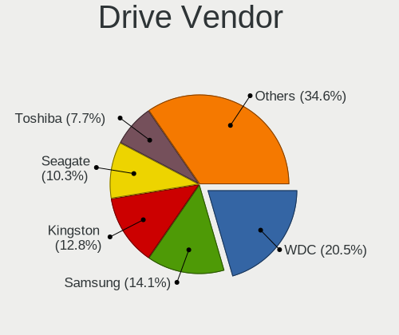
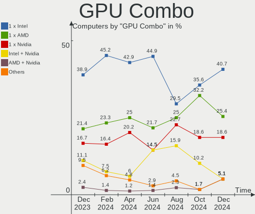
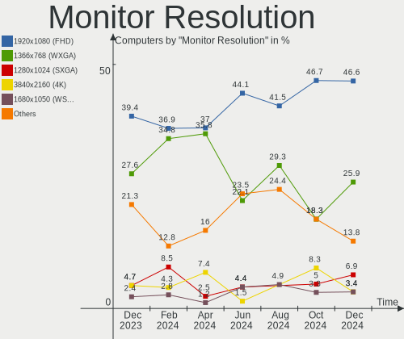

BlackPanther Hardware Trends
----------------------------

A project to identify most popular hardware characteristics and track their change
over time based on data collected by BlackPanther users at https://Linux-Hardware.org.

Anyone can contribute to this report by the [hw-probe](https://github.com/linuxhw/hw-probe) tool:

    sudo -E hw-probe -all -upload

This is a report for all computer types. See also reports for [desktops](/Dist/BlackPanther/Desktop/README.md) and [notebooks](/Dist/BlackPanther/Notebook/README.md).

Full-feature report is available here: https://linux-hardware.org/?view=trends

Period: Oct, 2021.

Contents
--------

* [ System ](#system)
  - [ OS                       ](#os)
  - [ OS Family                ](#os-family)
  - [ Kernel                   ](#kernel)
  - [ Kernel Family            ](#kernel-family)
  - [ Kernel Major Ver.        ](#kernel-major-ver)
  - [ Arch                     ](#arch)
  - [ DE                       ](#de)
  - [ Display Server           ](#display-server)
  - [ Display Manager          ](#display-manager)
  - [ OS Lang                  ](#os-lang)
  - [ Boot Mode                ](#boot-mode)
  - [ Filesystem               ](#filesystem)
  - [ Part. scheme             ](#part-scheme)
  - [ Dual Boot with Linux/BSD ](#dual-boot-with-linuxbsd)
  - [ Dual Boot (Win)          ](#dual-boot-win)

* [ Board ](#board)
  - [ Vendor                   ](#vendor)
  - [ Model                    ](#model)
  - [ Model Family             ](#model-family)
  - [ MFG Year                 ](#mfg-year)
  - [ Form Factor              ](#form-factor)
  - [ Secure Boot              ](#secure-boot)
  - [ Coreboot                 ](#coreboot)
  - [ RAM Size                 ](#ram-size)
  - [ RAM Used                 ](#ram-used)
  - [ Total Drives             ](#total-drives)
  - [ Has CD-ROM               ](#has-cd-rom)
  - [ Has Ethernet             ](#has-ethernet)
  - [ Has WiFi                 ](#has-wifi)
  - [ Has Bluetooth            ](#has-bluetooth)

* [ Location ](#location)
  - [ Country                  ](#country)
  - [ City                     ](#city)

* [ Drives ](#drives)
  - [ Drive Vendor             ](#drive-vendor)
  - [ Drive Model              ](#drive-model)
  - [ HDD Vendor               ](#hdd-vendor)
  - [ SSD Vendor               ](#ssd-vendor)
  - [ Drive Kind               ](#drive-kind)
  - [ Drive Connector          ](#drive-connector)
  - [ Drive Size               ](#drive-size)
  - [ Space Total              ](#space-total)
  - [ Space Used               ](#space-used)
  - [ Malfunc. Drives          ](#malfunc-drives)
  - [ Malfunc. Drive Vendor    ](#malfunc-drive-vendor)
  - [ Malfunc. HDD Vendor      ](#malfunc-hdd-vendor)
  - [ Malfunc. Drive Kind      ](#malfunc-drive-kind)
  - [ Failed Drives            ](#failed-drives)
  - [ Failed Drive Vendor      ](#failed-drive-vendor)
  - [ Drive Status             ](#drive-status)

* [ Storage controller ](#storage-controller)
  - [ Storage Vendor           ](#storage-vendor)
  - [ Storage Model            ](#storage-model)
  - [ Storage Kind             ](#storage-kind)

* [ Processor ](#processor)
  - [ CPU Vendor               ](#cpu-vendor)
  - [ CPU Model                ](#cpu-model)
  - [ CPU Model Family         ](#cpu-model-family)
  - [ CPU Cores                ](#cpu-cores)
  - [ CPU Sockets              ](#cpu-sockets)
  - [ CPU Threads              ](#cpu-threads)
  - [ CPU Op-Modes             ](#cpu-op-modes)
  - [ CPU Microcode            ](#cpu-microcode)
  - [ CPU Microarch            ](#cpu-microarch)

* [ Graphics ](#graphics)
  - [ GPU Vendor               ](#gpu-vendor)
  - [ GPU Model                ](#gpu-model)
  - [ GPU Combo                ](#gpu-combo)
  - [ GPU Driver               ](#gpu-driver)
  - [ GPU Memory               ](#gpu-memory)

* [ Monitor ](#monitor)
  - [ Monitor Vendor           ](#monitor-vendor)
  - [ Monitor Model            ](#monitor-model)
  - [ Monitor Resolution       ](#monitor-resolution)
  - [ Monitor Diagonal         ](#monitor-diagonal)
  - [ Monitor Width            ](#monitor-width)
  - [ Aspect Ratio             ](#aspect-ratio)
  - [ Monitor Area             ](#monitor-area)
  - [ Pixel Density            ](#pixel-density)
  - [ Multiple Monitors        ](#multiple-monitors)

* [ Network ](#network)
  - [ Net Controller Vendor    ](#net-controller-vendor)
  - [ Net Controller Model     ](#net-controller-model)
  - [ Wireless Vendor          ](#wireless-vendor)
  - [ Wireless Model           ](#wireless-model)
  - [ Ethernet Vendor          ](#ethernet-vendor)
  - [ Ethernet Model           ](#ethernet-model)
  - [ Net Controller Kind      ](#net-controller-kind)
  - [ Used Controller          ](#used-controller)
  - [ NICs                     ](#nics)
  - [ IPv6                     ](#ipv6)

* [ Bluetooth ](#bluetooth)
  - [ Bluetooth Vendor         ](#bluetooth-vendor)
  - [ Bluetooth Model          ](#bluetooth-model)

* [ Sound ](#sound)
  - [ Sound Vendor             ](#sound-vendor)
  - [ Sound Model              ](#sound-model)

* [ Memory ](#memory)
  - [ Memory Vendor            ](#memory-vendor)
  - [ Memory Model             ](#memory-model)
  - [ Memory Kind              ](#memory-kind)
  - [ Memory Form Factor       ](#memory-form-factor)
  - [ Memory Size              ](#memory-size)
  - [ Memory Speed             ](#memory-speed)

* [ Printers & scanners ](#printers--scanners)
  - [ Printer Vendor           ](#printer-vendor)
  - [ Printer Model            ](#printer-model)
  - [ Scanner Vendor           ](#scanner-vendor)
  - [ Scanner Model            ](#scanner-model)

* [ Camera ](#camera)
  - [ Camera Vendor            ](#camera-vendor)
  - [ Camera Model             ](#camera-model)

* [ Security ](#security)
  - [ Fingerprint Vendor       ](#fingerprint-vendor)
  - [ Fingerprint Model        ](#fingerprint-model)
  - [ Chipcard Vendor          ](#chipcard-vendor)
  - [ Chipcard Model           ](#chipcard-model)

* [ Unsupported ](#unsupported)
  - [ Unsupported Devices      ](#unsupported-devices)
  - [ Unsupported Device Types ](#unsupported-device-types)

System
------

OS
--

Installed operating systems

| Name              | Computers | Percent |
|-------------------|-----------|---------|
| BlackPanther 18.1 | 86        | 95.56%  |
| BlackPanther 16.2 | 4         | 4.44%   |

OS Family
---------

OS without a version

| Name         | Computers | Percent |
|--------------|-----------|---------|
| BlackPanther | 90        | 100%    |

Kernel
------

Version of the Linux kernel

| Version                | Computers | Percent |
|------------------------|-----------|---------|
| 5.6.14-desktop-2bP     | 54        | 60%     |
| 4.18.16-desktop-1bP    | 32        | 35.56%  |
| 4.9.20-desktop-pae-1bP | 3         | 3.33%   |
| 4.9.20-desktop-1bP     | 1         | 1.11%   |

Kernel Family
-------------

Linux kernel without a distro release

| Version | Computers | Percent |
|---------|-----------|---------|
| 5.6.14  | 54        | 60%     |
| 4.18.16 | 32        | 35.56%  |
| 4.9.20  | 4         | 4.44%   |

Kernel Major Ver.
-----------------

Linux kernel major version

| Version | Computers | Percent |
|---------|-----------|---------|
| 5.6     | 54        | 60%     |
| 4.18    | 32        | 35.56%  |
| 4.9     | 4         | 4.44%   |

Arch
----

OS architecture (x86_64, i586, etc.)

| Name   | Computers | Percent |
|--------|-----------|---------|
| x86_64 | 86        | 95.56%  |
| i686   | 4         | 4.44%   |

DE
--

Desktop Environment

| Name | Computers | Percent |
|------|-----------|---------|
| KDE5 | 90        | 100%    |

Display Server
--------------

X11 or Wayland

| Name    | Computers | Percent |
|---------|-----------|---------|
| X11     | 89        | 98.89%  |
| Wayland | 1         | 1.11%   |

Display Manager
---------------

SDDM, LightDM, etc.

| Name | Computers | Percent |
|------|-----------|---------|
| SDDM | 90        | 100%    |

OS Lang
-------

Language

| Lang    | Computers | Percent |
|---------|-----------|---------|
| Unknown | 90        | 100%    |

Boot Mode
---------

EFI or BIOS

| Mode | Computers | Percent |
|------|-----------|---------|
| BIOS | 56        | 62.22%  |
| EFI  | 34        | 37.78%  |

Filesystem
----------

Type of filesystem

| Type    | Computers | Percent |
|---------|-----------|---------|
| Overlay | 74        | 82.22%  |
| Ext4    | 15        | 16.67%  |
| Ext2    | 1         | 1.11%   |

Part. scheme
------------

Scheme of partitioning

| Type    | Computers | Percent |
|---------|-----------|---------|
| MBR     | 54        | 60%     |
| GPT     | 35        | 38.89%  |
| Unknown | 1         | 1.11%   |

Dual Boot with Linux/BSD
------------------------

Hosting more than one Linux/BSD

| Dual boot | Computers | Percent |
|-----------|-----------|---------|
| No        | 48        | 53.33%  |
| Yes       | 42        | 46.67%  |

Dual Boot (Win)
---------------

Hosting Linux and Windows

| Dual boot | Computers | Percent |
|-----------|-----------|---------|
| Yes       | 53        | 58.89%  |
| No        | 37        | 41.11%  |

Board
-----

Vendor
------

Motherboard manufacturer

| Name                | Computers | Percent |
|---------------------|-----------|---------|
| Hewlett-Packard     | 18        | 20%     |
| Gigabyte Technology | 11        | 12.22%  |
| Dell                | 10        | 11.11%  |
| ASUSTek Computer    | 10        | 11.11%  |
| ASRock              | 10        | 11.11%  |
| Lenovo              | 9         | 10%     |
| Fujitsu             | 5         | 5.56%   |
| Acer                | 4         | 4.44%   |
| Fujitsu Siemens     | 3         | 3.33%   |
| Medion              | 2         | 2.22%   |
| Toshiba             | 1         | 1.11%   |
| speedmaster         | 1         | 1.11%   |
| Sony                | 1         | 1.11%   |
| Samsung Electronics | 1         | 1.11%   |
| Packard Bell        | 1         | 1.11%   |
| MSI                 | 1         | 1.11%   |
| MITSUSHIBA          | 1         | 1.11%   |
| HUAWEI              | 1         | 1.11%   |

Model
-----

Motherboard model

| Name                                      | Computers | Percent |
|-------------------------------------------|-----------|---------|
| ASRock FM2A75M Pro4+                      | 3         | 3.33%   |
| HP 250 G1                                 | 2         | 2.22%   |
| Gigabyte H61M-S1                          | 2         | 2.22%   |
| Toshiba Satellite C55D-A                  | 1         | 1.11%   |
| speedmaster E131x series                  | 1         | 1.11%   |
| Sony VPCEH2J1E                            | 1         | 1.11%   |
| Samsung 300E4Z/300E5Z/300E7Z              | 1         | 1.11%   |
| Packard Bell IMEDIA S1350                 | 1         | 1.11%   |
| MSI MS-7693                               | 1         | 1.11%   |
| MITSUSHIBA Intel NUC I3 BP-011F / BP-013F | 1         | 1.11%   |
| Medion Pentino G-Series                   | 1         | 1.11%   |
| Medion MS-7646                            | 1         | 1.11%   |
| Lenovo Z710 20250                         | 1         | 1.11%   |
| Lenovo Yoga C740-14IML 81TC               | 1         | 1.11%   |
| Lenovo Yoga 310-11IAP 80U2                | 1         | 1.11%   |
| Lenovo ThinkPad R500 27147KG              | 1         | 1.11%   |
| Lenovo ThinkCentre M57 6066A11            | 1         | 1.11%   |
| Lenovo IdeaPad S145-15IWL 81MV            | 1         | 1.11%   |
| Lenovo G70-70 80HW                        | 1         | 1.11%   |
| Lenovo G570 20079                         | 1         | 1.11%   |
| Lenovo E50-80 80J2                        | 1         | 1.11%   |
| HUAWEI HVY-WXX9                           | 1         | 1.11%   |
| HP Z1 Workstation                         | 1         | 1.11%   |
| HP ProBook 6475b                          | 1         | 1.11%   |
| HP ProBook 6470b                          | 1         | 1.11%   |
| HP ProBook 645 G1                         | 1         | 1.11%   |
| HP Presario CQ58                          | 1         | 1.11%   |
| HP Presario CQ57                          | 1         | 1.11%   |
| HP Pavilion Gaming Laptop 15-ec1xxx       | 1         | 1.11%   |
| HP Pavilion dv6                           | 1         | 1.11%   |
| HP Pavilion 15                            | 1         | 1.11%   |
| HP OMEN by Laptop 17-an0xx                | 1         | 1.11%   |
| HP EliteBook 6930p                        | 1         | 1.11%   |
| HP Compaq Pro 6305 MT                     | 1         | 1.11%   |
| HP Compaq 6000 Pro SFF PC                 | 1         | 1.11%   |
| HP 650                                    | 1         | 1.11%   |
| HP 255 G5 Notebook PC                     | 1         | 1.11%   |
| HP 250 G6 Notebook PC                     | 1         | 1.11%   |
| Gigabyte Z590 AORUS ELITE AX              | 1         | 1.11%   |
| Gigabyte P67A-D3-B3                       | 1         | 1.11%   |
| Gigabyte GA-MA790X-UD4P                   | 1         | 1.11%   |
| Gigabyte GA-78LMT-USB3 R2                 | 1         | 1.11%   |
| Gigabyte G41MT-S2PT                       | 1         | 1.11%   |
| Gigabyte EX58-UD3R                        | 1         | 1.11%   |
| Gigabyte EP41-UD3L                        | 1         | 1.11%   |
| Gigabyte B560M H                          | 1         | 1.11%   |
| Gigabyte B450M GAMING                     | 1         | 1.11%   |
| Fujitsu Siemens AMILO Xi 3650             | 1         | 1.11%   |
| Fujitsu Siemens AMILO Pro Edition V3505   | 1         | 1.11%   |
| Fujitsu Siemens AMILO Li1705              | 1         | 1.11%   |
| Fujitsu LIFEBOOK AH531                    | 1         | 1.11%   |
| Fujitsu LIFEBOOK A530                     | 1         | 1.11%   |
| Fujitsu LIFEBOOK A512                     | 1         | 1.11%   |
| Fujitsu ESPRIMO P910                      | 1         | 1.11%   |
| Fujitsu ESPRIMO P5635                     | 1         | 1.11%   |
| Dell Vostro 3681                          | 1         | 1.11%   |
| Dell Vostro 1700                          | 1         | 1.11%   |
| Dell Studio XPS 1340                      | 1         | 1.11%   |
| Dell OptiPlex GX620                       | 1         | 1.11%   |
| Dell OptiPlex 3020                        | 1         | 1.11%   |

Model Family
------------

Motherboard model prefix

| Name                    | Computers | Percent |
|-------------------------|-----------|---------|
| ASUS PRIME              | 4         | 4.44%   |
| HP ProBook              | 3         | 3.33%   |
| HP Pavilion             | 3         | 3.33%   |
| HP 250                  | 3         | 3.33%   |
| Fujitsu Siemens AMILO   | 3         | 3.33%   |
| Fujitsu LIFEBOOK        | 3         | 3.33%   |
| Dell OptiPlex           | 3         | 3.33%   |
| ASRock FM2A75M          | 3         | 3.33%   |
| Acer Aspire             | 3         | 3.33%   |
| Lenovo Yoga             | 2         | 2.22%   |
| HP Presario             | 2         | 2.22%   |
| HP Compaq               | 2         | 2.22%   |
| Gigabyte H61M-S1        | 2         | 2.22%   |
| Fujitsu ESPRIMO         | 2         | 2.22%   |
| Dell Vostro             | 2         | 2.22%   |
| Dell Latitude           | 2         | 2.22%   |
| Dell Inspiron           | 2         | 2.22%   |
| Toshiba Satellite       | 1         | 1.11%   |
| speedmaster E131x       | 1         | 1.11%   |
| Sony VPCEH2J1E          | 1         | 1.11%   |
| Samsung 300E4Z          | 1         | 1.11%   |
| Packard Bell IMEDIA     | 1         | 1.11%   |
| MSI MS-7693             | 1         | 1.11%   |
| MITSUSHIBA Intel        | 1         | 1.11%   |
| Medion Pentino          | 1         | 1.11%   |
| Medion MS-7646          | 1         | 1.11%   |
| Lenovo Z710             | 1         | 1.11%   |
| Lenovo ThinkPad         | 1         | 1.11%   |
| Lenovo ThinkCentre      | 1         | 1.11%   |
| Lenovo IdeaPad          | 1         | 1.11%   |
| Lenovo G70-70           | 1         | 1.11%   |
| Lenovo G570             | 1         | 1.11%   |
| Lenovo E50-80           | 1         | 1.11%   |
| HUAWEI HVY-WXX9         | 1         | 1.11%   |
| HP Z1                   | 1         | 1.11%   |
| HP OMEN                 | 1         | 1.11%   |
| HP EliteBook            | 1         | 1.11%   |
| HP 650                  | 1         | 1.11%   |
| HP 255                  | 1         | 1.11%   |
| Gigabyte Z590           | 1         | 1.11%   |
| Gigabyte P67A-D3-B3     | 1         | 1.11%   |
| Gigabyte GA-MA790X-UD4P | 1         | 1.11%   |
| Gigabyte GA-78LMT-USB3  | 1         | 1.11%   |
| Gigabyte G41MT-S2PT     | 1         | 1.11%   |
| Gigabyte EX58-UD3R      | 1         | 1.11%   |
| Gigabyte EP41-UD3L      | 1         | 1.11%   |
| Gigabyte B560M          | 1         | 1.11%   |
| Gigabyte B450M          | 1         | 1.11%   |
| Dell Studio             | 1         | 1.11%   |
| ASUS P5KPL-AM           | 1         | 1.11%   |
| ASUS P5K-E              | 1         | 1.11%   |
| ASUS P5G41T-M           | 1         | 1.11%   |
| ASUS N50Vn              | 1         | 1.11%   |
| ASUS Crosshair          | 1         | 1.11%   |
| ASUS All                | 1         | 1.11%   |
| ASRock QC5000-ITX       | 1         | 1.11%   |
| ASRock M3A785GXH        | 1         | 1.11%   |
| ASRock G31M-GS          | 1         | 1.11%   |
| ASRock FM2A78M-ITX+     | 1         | 1.11%   |
| ASRock FM2A68M-DG3+     | 1         | 1.11%   |

MFG Year
--------

Motherboard manufacture year

| Year | Computers | Percent |
|------|-----------|---------|
| 2012 | 12        | 13.33%  |
| 2014 | 10        | 11.11%  |
| 2019 | 9         | 10%     |
| 2013 | 8         | 8.89%   |
| 2010 | 8         | 8.89%   |
| 2018 | 7         | 7.78%   |
| 2011 | 7         | 7.78%   |
| 2021 | 5         | 5.56%   |
| 2009 | 5         | 5.56%   |
| 2008 | 5         | 5.56%   |
| 2020 | 4         | 4.44%   |
| 2015 | 3         | 3.33%   |
| 2017 | 2         | 2.22%   |
| 2016 | 2         | 2.22%   |
| 2007 | 2         | 2.22%   |
| 2006 | 1         | 1.11%   |

Form Factor
-----------

Physical design of the computer

| Name        | Computers | Percent |
|-------------|-----------|---------|
| Desktop     | 44        | 48.89%  |
| Notebook    | 42        | 46.67%  |
| Convertible | 2         | 2.22%   |
| Mini pc     | 1         | 1.11%   |
| All in one  | 1         | 1.11%   |

Secure Boot
-----------

Enabled or disabled

| State    | Computers | Percent |
|----------|-----------|---------|
| Disabled | 90        | 100%    |

Coreboot
--------

Have coreboot on board

| Used | Computers | Percent |
|------|-----------|---------|
| No   | 90        | 100%    |

RAM Size
--------

Total RAM memory

| Size in GB | Computers | Percent |
|------------|-----------|---------|
| 3.01-4.0   | 29        | 32.22%  |
| 8.01-16.0  | 24        | 26.67%  |
| 4.01-8.0   | 22        | 24.44%  |
| 16.01-24.0 | 6         | 6.67%   |
| 1.01-2.0   | 6         | 6.67%   |
| 32.01-64.0 | 2         | 2.22%   |
| 0.51-1.0   | 1         | 1.11%   |

RAM Used
--------

Used RAM memory

| Used GB  | Computers | Percent |
|----------|-----------|---------|
| 0.51-1.0 | 41        | 45.56%  |
| 0.01-0.5 | 33        | 36.67%  |
| 1.01-2.0 | 15        | 16.67%  |
| 2.01-3.0 | 1         | 1.11%   |

Total Drives
------------

Number of drives on board

| Drives | Computers | Percent |
|--------|-----------|---------|
| 1      | 57        | 63.33%  |
| 2      | 22        | 24.44%  |
| 3      | 5         | 5.56%   |
| 4      | 4         | 4.44%   |
| 6      | 1         | 1.11%   |
| 5      | 1         | 1.11%   |

Has CD-ROM
----------

Has CD-ROM on board

| Presented | Computers | Percent |
|-----------|-----------|---------|
| Yes       | 56        | 62.22%  |
| No        | 34        | 37.78%  |

Has Ethernet
------------

Has Ethernet on board

| Presented | Computers | Percent |
|-----------|-----------|---------|
| Yes       | 87        | 96.67%  |
| No        | 3         | 3.33%   |

Has WiFi
--------

Has WiFi module

| Presented | Computers | Percent |
|-----------|-----------|---------|
| Yes       | 55        | 61.11%  |
| No        | 35        | 38.89%  |

Has Bluetooth
-------------

Has Bluetooth module

| Presented | Computers | Percent |
|-----------|-----------|---------|
| Yes       | 46        | 51.11%  |
| No        | 44        | 48.89%  |

Location
--------

Country
-------

Geographic location (country)

| Country   | Computers | Percent |
|-----------|-----------|---------|
| Hungary   | 70        | 77.78%  |
| Germany   | 7         | 7.78%   |
| Slovakia  | 4         | 4.44%   |
| Brazil    | 2         | 2.22%   |
| USA       | 1         | 1.11%   |
| Serbia    | 1         | 1.11%   |
| Italy     | 1         | 1.11%   |
| Egypt     | 1         | 1.11%   |
| Canada    | 1         | 1.11%   |
| Austria   | 1         | 1.11%   |
| Argentina | 1         | 1.11%   |

City
----

Geographic location (city)

| City              | Computers | Percent |
|-------------------|-----------|---------|
| Budapest          | 15        | 16.67%  |
| Salgotarjan       | 3         | 3.33%   |
| Regensburg        | 3         | 3.33%   |
| Karcag            | 3         | 3.33%   |
| Wernberg-Koblitz  | 2         | 2.22%   |
| Tiszafured        | 2         | 2.22%   |
| Teresopolis       | 2         | 2.22%   |
| Szombathely       | 2         | 2.22%   |
| Szigetszentmiklos | 2         | 2.22%   |
| Sokoropatka       | 2         | 2.22%   |
| Hnusta            | 2         | 2.22%   |
| Gy?‘r             | 2         | 2.22%   |
| Debrecen          | 2         | 2.22%   |
| Zichyujfalu       | 1         | 1.11%   |
| Vienna            | 1         | 1.11%   |
| Tyukod            | 1         | 1.11%   |
| Tatab??nya        | 1         | 1.11%   |
| Tar               | 1         | 1.11%   |
| Szeged            | 1         | 1.11%   |
| Sz?©kesfeh?©rv??r | 1         | 1.11%   |
| Straubing         | 1         | 1.11%   |
| Roszke            | 1         | 1.11%   |
| Pecovska Nova Ves | 1         | 1.11%   |
| P?©cs             | 1         | 1.11%   |
| Oroshaza          | 1         | 1.11%   |
| Nyiregyhaza       | 1         | 1.11%   |
| Nagykoros         | 1         | 1.11%   |
| Nagyatad          | 1         | 1.11%   |
| Mosonszentmiklos  | 1         | 1.11%   |
| Miskolc           | 1         | 1.11%   |
| Mesa              | 1         | 1.11%   |
| Marsciano         | 1         | 1.11%   |
| Marrtown          | 1         | 1.11%   |
| Markaz            | 1         | 1.11%   |
| Magyarlak         | 1         | 1.11%   |
| Levice            | 1         | 1.11%   |
| Lebeny            | 1         | 1.11%   |
| Kurityan          | 1         | 1.11%   |
| Kunszentmiklos    | 1         | 1.11%   |
| Kismaros          | 1         | 1.11%   |
| Kenderes          | 1         | 1.11%   |
| Hodmezovasarhely  | 1         | 1.11%   |
| Heves             | 1         | 1.11%   |
| Hajduboszormeny   | 1         | 1.11%   |
| Gyorszemere       | 1         | 1.11%   |
| Gyongyos          | 1         | 1.11%   |
| Gyal              | 1         | 1.11%   |
| Fuzesabony        | 1         | 1.11%   |
| Felcsut           | 1         | 1.11%   |
| Etyek             | 1         | 1.11%   |
| Encs              | 1         | 1.11%   |
| Dormagen          | 1         | 1.11%   |
| C??rdoba          | 1         | 1.11%   |
| Cairo             | 1         | 1.11%   |
| Budakeszi         | 1         | 1.11%   |
| Bicske            | 1         | 1.11%   |
| Bicserd           | 1         | 1.11%   |
| Belgrade          | 1         | 1.11%   |
| B?©k?©scsaba      | 1         | 1.11%   |
| Aporka            | 1         | 1.11%   |

Drives
------

Drive Vendor
------------

Hard drive vendors

| Vendor              | Computers | Drives | Percent |
|---------------------|-----------|--------|---------|
| WDC                 | 24        | 29     | 17.91%  |
| Kingston            | 21        | 24     | 15.67%  |
| Samsung Electronics | 20        | 26     | 14.93%  |
| Seagate             | 17        | 17     | 12.69%  |
| Toshiba             | 11        | 11     | 8.21%   |
| SanDisk             | 6         | 6      | 4.48%   |
| A-DATA Technology   | 6         | 6      | 4.48%   |
| HGST                | 5         | 5      | 3.73%   |
| Hitachi             | 4         | 4      | 2.99%   |
| MAXTOR              | 3         | 3      | 2.24%   |
| Patriot             | 2         | 2      | 1.49%   |
| Intel               | 2         | 2      | 1.49%   |
| China               | 2         | 2      | 1.49%   |
| Apacer              | 2         | 2      | 1.49%   |
| Zheino              | 1         | 1      | 0.75%   |
| Verbatim            | 1         | 1      | 0.75%   |
| Unknown             | 1         | 1      | 0.75%   |
| SPCC                | 1         | 1      | 0.75%   |
| OCZ                 | 1         | 1      | 0.75%   |
| Micron Technology   | 1         | 1      | 0.75%   |
| JMicron             | 1         | 1      | 0.75%   |
| Intenso             | 1         | 1      | 0.75%   |
| Hewlett-Packard     | 1         | 1      | 0.75%   |

Drive Model
-----------

Hard drive models

| Model                            | Computers | Percent |
|----------------------------------|-----------|---------|
| Kingston SA400S37120G 120GB SSD  | 6         | 4.11%   |
| SanDisk SDSSDH3 500G             | 4         | 2.74%   |
| Kingston SV300S37A120G 120GB SSD | 4         | 2.74%   |
| Samsung HD103UJ 1TB              | 3         | 2.05%   |
| Kingston SA400S37480G 480GB SSD  | 3         | 2.05%   |
| Kingston SA400S37240G 240GB SSD  | 3         | 2.05%   |
| A-DATA SU630 240GB SSD           | 3         | 2.05%   |
| WDC WD5000AAKX-08U6AA0 500GB     | 2         | 1.37%   |
| WDC WD20EZRX-00D8PB0 2TB         | 2         | 1.37%   |
| WDC WD1600AAJB-56WRA0 160GB      | 2         | 1.37%   |
| Toshiba MQ04ABF100 1TB           | 2         | 1.37%   |
| Toshiba MQ01ACF032 320GB         | 2         | 1.37%   |
| Seagate ST1000DM010-2EP102 1TB   | 2         | 1.37%   |
| Samsung HD502IJ 500GB            | 2         | 1.37%   |
| Kingston SA2000M8250G 250GB      | 2         | 1.37%   |
| Hitachi HTS547550A9E384 500GB    | 2         | 1.37%   |
| HGST HTS545032A7E380 320GB       | 2         | 1.37%   |
| HGST HTS541010B7E610 1TB         | 2         | 1.37%   |
| China SATA SSD 120GB             | 2         | 1.37%   |
| Zheino CHN-NGFFNV2280-256 256GB  | 1         | 0.68%   |
| WDC WDS240G2G0B-00EPW0 240GB SSD | 1         | 0.68%   |
| WDC WD800JD-55MUA1 80GB          | 1         | 0.68%   |
| WDC WD7500BPVT-80HXZT3 752GB     | 1         | 0.68%   |
| WDC WD5000BEVT-22A0RT0 500GB     | 1         | 0.68%   |
| WDC WD3200AAKX-083CA0 320GB      | 1         | 0.68%   |
| WDC WD30EZRZ-00GXCB0 3TB         | 1         | 0.68%   |
| WDC WD30EFRX-68EUZN0 3TB         | 1         | 0.68%   |
| WDC WD2500AVVS-62L2B0 250GB      | 1         | 0.68%   |
| WDC WD2500AAKX-083CA1 250GB      | 1         | 0.68%   |
| WDC WD20PURX-64P6ZY0 2TB         | 1         | 0.68%   |
| WDC WD1600AAJS-75M0A0 160GB      | 1         | 0.68%   |
| WDC WD1600AAJS-00L7A0 160GB      | 1         | 0.68%   |
| WDC WD10SPCX-24HWST1 1TB         | 1         | 0.68%   |
| WDC WD10PURX-64E5EY0 1TB         | 1         | 0.68%   |
| WDC WD10JPVX-60JC3T0 1TB         | 1         | 0.68%   |
| WDC WD10JPVX-22JC3T0 1TB         | 1         | 0.68%   |
| WDC WD10JPLX-00MBPT0 1TB         | 1         | 0.68%   |
| WDC WD10EZRZ-00HTKB0 1TB         | 1         | 0.68%   |
| WDC WD10EZEX-60M2NA0 1TB         | 1         | 0.68%   |
| WDC WD10EZEX-22MFCA0 1TB         | 1         | 0.68%   |
| WDC WD10EZEX-21WN4A0 1TB         | 1         | 0.68%   |
| WDC WD10EZEX-21M2NA0 1TB         | 1         | 0.68%   |
| WDC WD10EZEX-00KUWA0 1TB         | 1         | 0.68%   |
| Verbatim Vi550 S3 SSD 256GB      | 1         | 0.68%   |
| Unknown Mit-SSD128A 128GB        | 1         | 0.68%   |
| Toshiba THNSFJ256GCSU 256GB SSD  | 1         | 0.68%   |
| Toshiba MQ01ABF050 500GB         | 1         | 0.68%   |
| Toshiba MQ01ABD100 1TB           | 1         | 0.68%   |
| Toshiba MK5059GSXP 500GB         | 1         | 0.68%   |
| Toshiba MK1637GSX 160GB          | 1         | 0.68%   |
| Toshiba DT01ACA100 1TB           | 1         | 0.68%   |
| Toshiba DT01ACA050 500GB         | 1         | 0.68%   |
| SPCC Solid State Disk 128GB      | 1         | 0.68%   |
| Seagate ST9500420ASG 500GB       | 1         | 0.68%   |
| Seagate ST9160827AS 160GB        | 1         | 0.68%   |
| Seagate ST9120822AS 120GB        | 1         | 0.68%   |
| Seagate ST500LT012-9WS142 500GB  | 1         | 0.68%   |
| Seagate ST500LT012-1DG142 500GB  | 1         | 0.68%   |
| Seagate ST500DM002-1BD142 500GB  | 1         | 0.68%   |
| Seagate ST3500418AS 500GB        | 1         | 0.68%   |

HDD Vendor
----------

Hard disk drive vendors

| Vendor              | Computers | Drives | Percent |
|---------------------|-----------|--------|---------|
| WDC                 | 23        | 28     | 32.39%  |
| Seagate             | 16        | 16     | 22.54%  |
| Toshiba             | 10        | 10     | 14.08%  |
| Samsung Electronics | 10        | 12     | 14.08%  |
| HGST                | 5         | 5      | 7.04%   |
| Hitachi             | 4         | 4      | 5.63%   |
| MAXTOR              | 3         | 3      | 4.23%   |

SSD Vendor
----------

Solid state drive vendors

| Vendor              | Computers | Drives | Percent |
|---------------------|-----------|--------|---------|
| Kingston            | 18        | 21     | 35.29%  |
| Samsung Electronics | 7         | 8      | 13.73%  |
| A-DATA Technology   | 6         | 6      | 11.76%  |
| SanDisk             | 5         | 5      | 9.8%    |
| Patriot             | 2         | 2      | 3.92%   |
| China               | 2         | 2      | 3.92%   |
| Apacer              | 2         | 2      | 3.92%   |
| WDC                 | 1         | 1      | 1.96%   |
| Verbatim            | 1         | 1      | 1.96%   |
| Unknown             | 1         | 1      | 1.96%   |
| Toshiba             | 1         | 1      | 1.96%   |
| SPCC                | 1         | 1      | 1.96%   |
| OCZ                 | 1         | 1      | 1.96%   |
| Micron Technology   | 1         | 1      | 1.96%   |
| Intenso             | 1         | 1      | 1.96%   |
| Intel               | 1         | 1      | 1.96%   |

Drive Kind
----------

HDD or SSD

| Kind    | Computers | Drives | Percent |
|---------|-----------|--------|---------|
| HDD     | 62        | 78     | 50%     |
| SSD     | 49        | 55     | 39.52%  |
| NVMe    | 10        | 12     | 8.06%   |
| Unknown | 2         | 2      | 1.61%   |
| MMC     | 1         | 1      | 0.81%   |

Drive Connector
---------------

SATA, SAS, NVMe, etc.

| Type | Computers | Drives | Percent |
|------|-----------|--------|---------|
| SATA | 84        | 132    | 85.71%  |
| NVMe | 10        | 12     | 10.2%   |
| SAS  | 3         | 3      | 3.06%   |
| MMC  | 1         | 1      | 1.02%   |

Drive Size
----------

Size of hard drive

| Size in TB | Computers | Drives | Percent |
|------------|-----------|--------|---------|
| 0.01-0.5   | 73        | 96     | 68.87%  |
| 0.51-1.0   | 27        | 30     | 25.47%  |
| 1.01-2.0   | 5         | 5      | 4.72%   |
| 2.01-3.0   | 1         | 2      | 0.94%   |

Space Total
-----------

Amount of disk space available on the file system

| Size in GB | Computers | Percent |
|------------|-----------|---------|
| Unknown    | 74        | 82.22%  |
| 101-250    | 7         | 7.78%   |
| 251-500    | 3         | 3.33%   |
| 21-50      | 3         | 3.33%   |
| 1001-2000  | 1         | 1.11%   |
| 501-1000   | 1         | 1.11%   |
| 51-100     | 1         | 1.11%   |

Space Used
----------

Amount of used disk space

| Used GB  | Computers | Percent |
|----------|-----------|---------|
| Unknown  | 74        | 82.22%  |
| 1-20     | 15        | 16.67%  |
| 501-1000 | 1         | 1.11%   |

Malfunc. Drives
---------------

Drive models with a malfunction

| Model                                | Computers | Drives | Percent |
|--------------------------------------|-----------|--------|---------|
| Samsung Electronics HD103UJ 1TB      | 3         | 3      | 7.69%   |
| A-DATA Technology SU630 240GB SSD    | 3         | 3      | 7.69%   |
| WDC WD5000AAKX-08U6AA0 500GB         | 2         | 2      | 5.13%   |
| HGST HTS545032A7E380 320GB           | 2         | 2      | 5.13%   |
| WDC WD800JD-55MUA1 80GB              | 1         | 1      | 2.56%   |
| WDC WD7500BPVT-80HXZT3 752GB         | 1         | 1      | 2.56%   |
| WDC WD20PURX-64P6ZY0 2TB             | 1         | 1      | 2.56%   |
| WDC WD1600AAJS-00L7A0 160GB          | 1         | 1      | 2.56%   |
| WDC WD1600AAJB-56WRA0 160GB          | 1         | 1      | 2.56%   |
| WDC WD10PURX-64E5EY0 1TB             | 1         | 1      | 2.56%   |
| WDC WD10JPVX-22JC3T0 1TB             | 1         | 1      | 2.56%   |
| WDC WD10EZEX-60M2NA0 1TB             | 1         | 1      | 2.56%   |
| WDC WD10EZEX-22MFCA0 1TB             | 1         | 1      | 2.56%   |
| Toshiba THNSFJ256GCSU 256GB SSD      | 1         | 1      | 2.56%   |
| Toshiba MQ01ABF050 500GB             | 1         | 1      | 2.56%   |
| Toshiba MK1637GSX 160GB              | 1         | 1      | 2.56%   |
| Seagate ST9160827AS 160GB            | 1         | 1      | 2.56%   |
| Seagate ST9120822AS 120GB            | 1         | 1      | 2.56%   |
| Seagate ST500LT012-9WS142 500GB      | 1         | 1      | 2.56%   |
| Seagate ST500LT012-1DG142 500GB      | 1         | 1      | 2.56%   |
| Seagate ST500DM002-1BD142 500GB      | 1         | 1      | 2.56%   |
| Seagate ST320LT000-9VL142 320GB      | 1         | 1      | 2.56%   |
| Seagate ST1000LM014-1EJ164-SSHD 1TB  | 1         | 1      | 2.56%   |
| Samsung Electronics HN-M500MBB 500GB | 1         | 1      | 2.56%   |
| Samsung Electronics HM160HI 160GB    | 1         | 1      | 2.56%   |
| Samsung Electronics HD503HI 500GB    | 1         | 1      | 2.56%   |
| MAXTOR 6V250F0 256GB                 | 1         | 1      | 2.56%   |
| MAXTOR 4D040H2 41GB                  | 1         | 1      | 2.56%   |
| Kingston SV300S37A120G 120GB SSD     | 1         | 1      | 2.56%   |
| Hitachi HTS725016A9A364 160GB        | 1         | 1      | 2.56%   |
| Hitachi HTS547550A9E384 500GB        | 1         | 1      | 2.56%   |
| HGST HTS541010A9E680 1TB             | 1         | 1      | 2.56%   |
| A-DATA Technology SU700 120GB SSD    | 1         | 1      | 2.56%   |

Malfunc. Drive Vendor
---------------------

Vendors of faulty drives

| Vendor              | Computers | Drives | Percent |
|---------------------|-----------|--------|---------|
| WDC                 | 10        | 11     | 26.32%  |
| Seagate             | 7         | 7      | 18.42%  |
| Samsung Electronics | 6         | 6      | 15.79%  |
| A-DATA Technology   | 4         | 4      | 10.53%  |
| Toshiba             | 3         | 3      | 7.89%   |
| HGST                | 3         | 3      | 7.89%   |
| MAXTOR              | 2         | 2      | 5.26%   |
| Hitachi             | 2         | 2      | 5.26%   |
| Kingston            | 1         | 1      | 2.63%   |

Malfunc. HDD Vendor
-------------------

Vendors of faulty HDD drives

| Vendor              | Computers | Drives | Percent |
|---------------------|-----------|--------|---------|
| WDC                 | 10        | 11     | 31.25%  |
| Seagate             | 7         | 7      | 21.88%  |
| Samsung Electronics | 6         | 6      | 18.75%  |
| HGST                | 3         | 3      | 9.38%   |
| Toshiba             | 2         | 2      | 6.25%   |
| MAXTOR              | 2         | 2      | 6.25%   |
| Hitachi             | 2         | 2      | 6.25%   |

Malfunc. Drive Kind
-------------------

Kinds of faulty drives

| Kind | Computers | Drives | Percent |
|------|-----------|--------|---------|
| HDD  | 28        | 33     | 82.35%  |
| SSD  | 6         | 6      | 17.65%  |

Failed Drives
-------------

Failed drive models

| Model                           | Computers | Drives | Percent |
|---------------------------------|-----------|--------|---------|
| Samsung Electronics HD204UI 2TB | 1         | 1      | 100%    |

Failed Drive Vendor
-------------------

Failed drive vendors

| Vendor              | Computers | Drives | Percent |
|---------------------|-----------|--------|---------|
| Samsung Electronics | 1         | 1      | 100%    |

Drive Status
------------

Number of failed and malfunc. drives

| Status   | Computers | Drives | Percent |
|----------|-----------|--------|---------|
| Works    | 67        | 102    | 63.81%  |
| Malfunc  | 31        | 39     | 29.52%  |
| Detected | 6         | 6      | 5.71%   |
| Failed   | 1         | 1      | 0.95%   |

Storage controller
------------------

Storage Vendor
--------------

Storage controller vendors

| Vendor                      | Computers | Percent |
|-----------------------------|-----------|---------|
| Intel                       | 58        | 54.21%  |
| AMD                         | 28        | 26.17%  |
| Samsung Electronics         | 5         | 4.67%   |
| JMicron Technology          | 4         | 3.74%   |
| Nvidia                      | 3         | 2.8%    |
| Kingston Technology Company | 3         | 2.8%    |
| Silicon Motion              | 2         | 1.87%   |
| ASMedia Technology          | 2         | 1.87%   |
| VIA Technologies            | 1         | 0.93%   |
| Silicon Image               | 1         | 0.93%   |

Storage Model
-------------

Storage controller models

| Model                                                                                   | Computers | Percent |
|-----------------------------------------------------------------------------------------|-----------|---------|
| AMD FCH SATA Controller [AHCI mode]                                                     | 19        | 13.48%  |
| Intel 82801G (ICH7 Family) IDE Controller                                               | 7         | 4.96%   |
| Intel NM10/ICH7 Family SATA Controller [IDE mode]                                       | 6         | 4.26%   |
| Intel 7 Series Chipset Family 6-port SATA Controller [AHCI mode]                        | 5         | 3.55%   |
| AMD SB7x0/SB8x0/SB9x0 SATA Controller [AHCI mode]                                       | 5         | 3.55%   |
| AMD SB7x0/SB8x0/SB9x0 IDE Controller                                                    | 5         | 3.55%   |
| JMicron JMB363 SATA/IDE Controller                                                      | 4         | 2.84%   |
| Intel 82801IBM/IEM (ICH9M/ICH9M-E) 4 port SATA Controller [AHCI mode]                   | 4         | 2.84%   |
| Intel 6 Series/C200 Series Chipset Family 6 port Mobile SATA AHCI Controller            | 4         | 2.84%   |
| Samsung NVMe SSD Controller SM981/PM981/PM983                                           | 3         | 2.13%   |
| Intel 8 Series/C220 Series Chipset Family 6-port SATA Controller 1 [AHCI mode]          | 3         | 2.13%   |
| Intel 8 Series SATA Controller 1 [AHCI mode]                                            | 3         | 2.13%   |
| Intel 7 Series/C210 Series Chipset Family 6-port SATA Controller [AHCI mode]            | 3         | 2.13%   |
| Intel 6 Series/C200 Series Chipset Family Desktop SATA Controller (IDE mode, ports 4-5) | 3         | 2.13%   |
| Intel 6 Series/C200 Series Chipset Family Desktop SATA Controller (IDE mode, ports 0-3) | 3         | 2.13%   |
| AMD SB7x0/SB8x0/SB9x0 SATA Controller [IDE mode]                                        | 3         | 2.13%   |
| AMD FCH IDE Controller                                                                  | 3         | 2.13%   |
| Silicon Motion SM2263EN/SM2263XT SSD Controller                                         | 2         | 1.42%   |
| Samsung NVMe SSD Controller PM9A1/PM9A3/980PRO                                          | 2         | 1.42%   |
| Kingston Company A2000 NVMe SSD                                                         | 2         | 1.42%   |
| Intel Wildcat Point-LP SATA Controller [AHCI Mode]                                      | 2         | 1.42%   |
| Intel 82801HM/HEM (ICH8M/ICH8M-E) SATA Controller [IDE mode]                            | 2         | 1.42%   |
| Intel 82801HM/HEM (ICH8M/ICH8M-E) IDE Controller                                        | 2         | 1.42%   |
| Intel 82801 Mobile SATA Controller [RAID mode]                                          | 2         | 1.42%   |
| Intel 500 Series Chipset Family SATA AHCI Controller                                    | 2         | 1.42%   |
| Intel 5 Series/3400 Series Chipset 4 port SATA AHCI Controller                          | 2         | 1.42%   |
| Intel 200 Series PCH SATA controller [AHCI mode]                                        | 2         | 1.42%   |
| ASMedia ASM1062 Serial ATA Controller                                                   | 2         | 1.42%   |
| AMD FCH SATA Controller D                                                               | 2         | 1.42%   |
| AMD 400 Series Chipset SATA Controller                                                  | 2         | 1.42%   |
| VIA VT82C586A/B/VT82C686/A/B/VT823x/A/C PIPC Bus Master IDE                             | 1         | 0.71%   |
| VIA VT8237A SATA 2-Port Controller                                                      | 1         | 0.71%   |
| Silicon Image SiI 3114 [SATALink/SATARaid] Serial ATA Controller                        | 1         | 0.71%   |
| Samsung NVMe SSD Controller SM961/PM961/SM963                                           | 1         | 0.71%   |
| Nvidia MCP79 AHCI Controller                                                            | 1         | 0.71%   |
| Nvidia MCP78S [GeForce 8200] SATA Controller (non-AHCI mode)                            | 1         | 0.71%   |
| Nvidia MCP61 SATA Controller                                                            | 1         | 0.71%   |
| Nvidia MCP61 IDE                                                                        | 1         | 0.71%   |
| Kingston Company KC2000 NVMe SSD                                                        | 1         | 0.71%   |
| Intel Sunrise Point-LP SATA Controller [AHCI mode]                                      | 1         | 0.71%   |
| Intel SSD 660P Series                                                                   | 1         | 0.71%   |
| Intel SATA Controller [RAID mode]                                                       | 1         | 0.71%   |
| Intel Mobile 4 Series Chipset PT IDER Controller                                        | 1         | 0.71%   |
| Intel HM170/QM170 Chipset SATA Controller [AHCI Mode]                                   | 1         | 0.71%   |
| Intel Comet Lake SATA AHCI Controller                                                   | 1         | 0.71%   |
| Intel Celeron/Pentium Silver Processor SATA Controller                                  | 1         | 0.71%   |
| Intel Celeron N3350/Pentium N4200/Atom E3900 Series SATA AHCI Controller                | 1         | 0.71%   |
| Intel Cannon Point-LP SATA Controller [AHCI Mode]                                       | 1         | 0.71%   |
| Intel 82Q35 Express PT IDER Controller                                                  | 1         | 0.71%   |
| Intel 82801JI (ICH10 Family) SATA AHCI Controller                                       | 1         | 0.71%   |
| Intel 82801JD/DO (ICH10 Family) SATA AHCI Controller                                    | 1         | 0.71%   |
| Intel 82801IR/IO/IH (ICH9R/DO/DH) 6 port SATA Controller [AHCI mode]                    | 1         | 0.71%   |
| Intel 82801IR/IO/IH (ICH9R/DO/DH) 4 port SATA Controller [IDE mode]                     | 1         | 0.71%   |
| Intel 82801I (ICH9 Family) 2 port SATA Controller [IDE mode]                            | 1         | 0.71%   |
| Intel 82801GBM/GHM (ICH7-M Family) SATA Controller [AHCI mode]                          | 1         | 0.71%   |
| Intel 7 Series/C210 Series Chipset Family 4-port SATA Controller [IDE mode]             | 1         | 0.71%   |
| Intel 7 Series/C210 Series Chipset Family 2-port SATA Controller [IDE mode]             | 1         | 0.71%   |
| Intel 6 Series/C200 Series Chipset Family IDE-r Controller                              | 1         | 0.71%   |
| Intel 6 Series/C200 Series Chipset Family 6 port Desktop SATA AHCI Controller           | 1         | 0.71%   |
| Intel 400 Series Chipset Family SATA AHCI Controller                                    | 1         | 0.71%   |

Storage Kind
------------

Kind of storage controller (IDE, SATA, NVMe, SAS, ...)

| Kind | Computers | Percent |
|------|-----------|---------|
| SATA | 71        | 61.74%  |
| IDE  | 30        | 26.09%  |
| NVMe | 10        | 8.7%    |
| RAID | 4         | 3.48%   |

Processor
---------

CPU Vendor
----------

Processor vendors

| Vendor | Computers | Percent |
|--------|-----------|---------|
| Intel  | 59        | 65.56%  |
| AMD    | 31        | 34.44%  |

CPU Model
---------

Processor models

| Model                                           | Computers | Percent |
|-------------------------------------------------|-----------|---------|
| AMD A8-6600K APU with Radeon HD Graphics        | 3         | 3.33%   |
| Intel Core i5-3470 CPU @ 3.20GHz                | 2         | 2.22%   |
| Intel Core i5-3340M CPU @ 2.70GHz               | 2         | 2.22%   |
| Intel Core i3-8100 CPU @ 3.60GHz                | 2         | 2.22%   |
| Intel Core i3-2330M CPU @ 2.20GHz               | 2         | 2.22%   |
| Intel Celeron CPU 1000M @ 1.80GHz               | 2         | 2.22%   |
| AMD Ryzen 5 4600H with Radeon Graphics          | 2         | 2.22%   |
| AMD Ryzen 3 2200G with Radeon Vega Graphics     | 2         | 2.22%   |
| AMD A10-7870K Radeon R7, 12 Compute Cores 4C+8G | 2         | 2.22%   |
| Intel Xeon CPU X5670 @ 2.93GHz                  | 1         | 1.11%   |
| Intel Xeon CPU E31245 @ 3.30GHz                 | 1         | 1.11%   |
| Intel Pentium Dual-Core CPU E6500 @ 2.93GHz     | 1         | 1.11%   |
| Intel Pentium Dual-Core CPU E5700 @ 3.00GHz     | 1         | 1.11%   |
| Intel Pentium D CPU 3.40GHz                     | 1         | 1.11%   |
| Intel Pentium CPU G645 @ 2.90GHz                | 1         | 1.11%   |
| Intel Pentium CPU G3240 @ 3.10GHz               | 1         | 1.11%   |
| Intel Pentium CPU B950 @ 2.10GHz                | 1         | 1.11%   |
| Intel Core i7-4700MQ CPU @ 2.40GHz              | 1         | 1.11%   |
| Intel Core i7-4500U CPU @ 1.80GHz               | 1         | 1.11%   |
| Intel Core i5-7300HQ CPU @ 2.50GHz              | 1         | 1.11%   |
| Intel Core i5-5200U CPU @ 2.20GHz               | 1         | 1.11%   |
| Intel Core i5-4210U CPU @ 1.70GHz               | 1         | 1.11%   |
| Intel Core i5-4200U CPU @ 1.60GHz               | 1         | 1.11%   |
| Intel Core i5-2500K CPU @ 3.30GHz               | 1         | 1.11%   |
| Intel Core i5-2300 CPU @ 2.80GHz                | 1         | 1.11%   |
| Intel Core i5-10600K CPU @ 4.10GHz              | 1         | 1.11%   |
| Intel Core i5-10400F CPU @ 2.90GHz              | 1         | 1.11%   |
| Intel Core i5-10210U CPU @ 1.60GHz              | 1         | 1.11%   |
| Intel Core i5 CPU M 430 @ 2.27GHz               | 1         | 1.11%   |
| Intel Core i3-7020U CPU @ 2.30GHz               | 1         | 1.11%   |
| Intel Core i3-5005U CPU @ 2.00GHz               | 1         | 1.11%   |
| Intel Core i3-4160 CPU @ 3.60GHz                | 1         | 1.11%   |
| Intel Core i3-3220 CPU @ 3.30GHz                | 1         | 1.11%   |
| Intel Core i3-3110M CPU @ 2.40GHz               | 1         | 1.11%   |
| Intel Core i3-2350M CPU @ 2.30GHz               | 1         | 1.11%   |
| Intel Core i3-10100 CPU @ 3.60GHz               | 1         | 1.11%   |
| Intel Core i3 CPU M 350 @ 2.27GHz               | 1         | 1.11%   |
| Intel Core Duo CPU T2450 @ 2.00GHz              | 1         | 1.11%   |
| Intel Core 2 Quad CPU Q9300 @ 2.50GHz           | 1         | 1.11%   |
| Intel Core 2 Quad CPU Q6600 @ 2.40GHz           | 1         | 1.11%   |
| Intel Core 2 Duo CPU U9400 @ 1.40GHz            | 1         | 1.11%   |
| Intel Core 2 Duo CPU T9600 @ 2.80GHz            | 1         | 1.11%   |
| Intel Core 2 Duo CPU T9400 @ 2.53GHz            | 1         | 1.11%   |
| Intel Core 2 Duo CPU T8300 @ 2.40GHz            | 1         | 1.11%   |
| Intel Core 2 Duo CPU T7250 @ 2.00GHz            | 1         | 1.11%   |
| Intel Core 2 Duo CPU T6600 @ 2.20GHz            | 1         | 1.11%   |
| Intel Core 2 Duo CPU T5870 @ 2.00GHz            | 1         | 1.11%   |
| Intel Core 2 Duo CPU P8400 @ 2.26GHz            | 1         | 1.11%   |
| Intel Core 2 Duo CPU E8200 @ 2.66GHz            | 1         | 1.11%   |
| Intel Core 2 Duo CPU E7500 @ 2.93GHz            | 1         | 1.11%   |
| Intel Core 2 Duo CPU E6850 @ 3.00GHz            | 1         | 1.11%   |
| Intel Core 2 Duo CPU E4600 @ 2.40GHz            | 1         | 1.11%   |
| Intel Celeron N4000 CPU @ 1.10GHz               | 1         | 1.11%   |
| Intel Celeron M CPU 520 @ 1.60GHz               | 1         | 1.11%   |
| Intel Celeron CPU N3350 @ 1.10GHz               | 1         | 1.11%   |
| Intel Celeron CPU G1610 @ 2.60GHz               | 1         | 1.11%   |
| Intel Celeron CPU B830 @ 1.80GHz                | 1         | 1.11%   |
| Intel Celeron CPU 4205U @ 1.80GHz               | 1         | 1.11%   |
| AMD Ryzen 7 3700X 8-Core Processor              | 1         | 1.11%   |
| AMD Ryzen 5 3400G with Radeon Vega Graphics     | 1         | 1.11%   |

CPU Model Family
----------------

Processor model prefix

| Model                   | Computers | Percent |
|-------------------------|-----------|---------|
| Intel Core i5           | 14        | 15.56%  |
| Intel Core i3           | 12        | 13.33%  |
| Intel Core 2 Duo        | 12        | 13.33%  |
| Intel Celeron           | 7         | 7.78%   |
| AMD Ryzen 5             | 4         | 4.44%   |
| AMD A8                  | 4         | 4.44%   |
| AMD A4                  | 4         | 4.44%   |
| Intel Pentium           | 3         | 3.33%   |
| AMD Athlon II X2        | 3         | 3.33%   |
| Intel Xeon              | 2         | 2.22%   |
| Intel Pentium Dual-Core | 2         | 2.22%   |
| Intel Core i7           | 2         | 2.22%   |
| Intel Core 2 Quad       | 2         | 2.22%   |
| AMD Ryzen 3             | 2         | 2.22%   |
| AMD Phenom II X4        | 2         | 2.22%   |
| AMD E                   | 2         | 2.22%   |
| AMD A6                  | 2         | 2.22%   |
| AMD A10                 | 2         | 2.22%   |
| Intel Pentium D         | 1         | 1.11%   |
| Intel Core Duo          | 1         | 1.11%   |
| Intel Celeron M         | 1         | 1.11%   |
| AMD Ryzen 7             | 1         | 1.11%   |
| AMD Phenom II X6        | 1         | 1.11%   |
| AMD FX                  | 1         | 1.11%   |
| AMD E1                  | 1         | 1.11%   |
| AMD C-50                | 1         | 1.11%   |
| AMD Athlon II X4        | 1         | 1.11%   |

CPU Cores
---------

Number of processor cores

| Number | Computers | Percent |
|--------|-----------|---------|
| 2      | 56        | 62.22%  |
| 4      | 22        | 24.44%  |
| 6      | 6         | 6.67%   |
| 1      | 5         | 5.56%   |
| 8      | 1         | 1.11%   |

CPU Sockets
-----------

Number of sockets

| Number | Computers | Percent |
|--------|-----------|---------|
| 1      | 90        | 100%    |

CPU Threads
-----------

Threads per core (Hyper-Threading)

| Number | Computers | Percent |
|--------|-----------|---------|
| 1      | 55        | 61.11%  |
| 2      | 35        | 38.89%  |

CPU Op-Modes
------------

CPU Operation Modes (32-bit, 64-bit)

| Op mode        | Computers | Percent |
|----------------|-----------|---------|
| 32-bit, 64-bit | 89        | 98.89%  |
| 32-bit         | 1         | 1.11%   |

CPU Microcode
-------------

Microcode number

| Number     | Computers | Percent |
|------------|-----------|---------|
| 0x306a9    | 9         | 10%     |
| 0x206a7    | 9         | 10%     |
| 0x1067a    | 6         | 6.67%   |
| 0x10676    | 4         | 4.44%   |
| 0x06001119 | 4         | 4.44%   |
| 0x6fd      | 3         | 3.33%   |
| 0x40651    | 3         | 3.33%   |
| 0x306c3    | 3         | 3.33%   |
| 0x05000119 | 3         | 3.33%   |
| 0x010000c8 | 3         | 3.33%   |
| 0xa0653    | 2         | 2.22%   |
| 0x906eb    | 2         | 2.22%   |
| 0x6fb      | 2         | 2.22%   |
| 0x306d4    | 2         | 2.22%   |
| 0x20652    | 2         | 2.22%   |
| 0x08600106 | 2         | 2.22%   |
| 0x0810100b | 2         | 2.22%   |
| 0x0700010f | 2         | 2.22%   |
| 0x06003106 | 2         | 2.22%   |
| 0x0600111f | 2         | 2.22%   |
| 0x010000db | 2         | 2.22%   |
| 0xf65      | 1         | 1.11%   |
| 0xa0655    | 1         | 1.11%   |
| 0x906e9    | 1         | 1.11%   |
| 0x806ec    | 1         | 1.11%   |
| 0x806eb    | 1         | 1.11%   |
| 0x806ea    | 1         | 1.11%   |
| 0x706a1    | 1         | 1.11%   |
| 0x6f6      | 1         | 1.11%   |
| 0x6ec      | 1         | 1.11%   |
| 0x506c9    | 1         | 1.11%   |
| 0x206c2    | 1         | 1.11%   |
| 0x10677    | 1         | 1.11%   |
| 0x08701013 | 1         | 1.11%   |
| 0x08108109 | 1         | 1.11%   |
| 0x08101016 | 1         | 1.11%   |
| 0x07030105 | 1         | 1.11%   |
| 0x06006704 | 1         | 1.11%   |
| 0x06000852 | 1         | 1.11%   |
| 0x05000028 | 1         | 1.11%   |
| 0x010000dc | 1         | 1.11%   |
| Unknown    | 1         | 1.11%   |

CPU Microarch
-------------

Microarchitecture

| Name          | Computers | Percent |
|---------------|-----------|---------|
| Penryn        | 11        | 12.22%  |
| SandyBridge   | 9         | 10%     |
| IvyBridge     | 9         | 10%     |
| Piledriver    | 7         | 7.78%   |
| K10           | 7         | 7.78%   |
| KabyLake      | 6         | 6.67%   |
| Haswell       | 6         | 6.67%   |
| Core          | 6         | 6.67%   |
| Bobcat        | 4         | 4.44%   |
| Zen 2         | 3         | 3.33%   |
| Zen           | 3         | 3.33%   |
| Westmere      | 3         | 3.33%   |
| CometLake     | 3         | 3.33%   |
| Steamroller   | 2         | 2.22%   |
| Jaguar        | 2         | 2.22%   |
| Broadwell     | 2         | 2.22%   |
| Zen+          | 1         | 1.11%   |
| Puma          | 1         | 1.11%   |
| P6            | 1         | 1.11%   |
| NetBurst      | 1         | 1.11%   |
| Goldmont plus | 1         | 1.11%   |
| Goldmont      | 1         | 1.11%   |
| Excavator     | 1         | 1.11%   |

Graphics
--------

GPU Vendor
----------

Vendors of graphics cards

| Vendor           | Computers | Percent |
|------------------|-----------|---------|
| Intel            | 38        | 38.38%  |
| AMD              | 36        | 36.36%  |
| Nvidia           | 24        | 24.24%  |
| VIA Technologies | 1         | 1.01%   |

GPU Model
---------

Graphics card models

| Model                                                                         | Computers | Percent |
|-------------------------------------------------------------------------------|-----------|---------|
| Intel 3rd Gen Core processor Graphics Controller                              | 5         | 4.85%   |
| Intel 2nd Generation Core Processor Family Integrated Graphics Controller     | 5         | 4.85%   |
| Nvidia GP107 [GeForce GTX 1050 Ti]                                            | 3         | 2.91%   |
| Intel Mobile 4 Series Chipset Integrated Graphics Controller                  | 3         | 2.91%   |
| Intel Haswell-ULT Integrated Graphics Controller                              | 3         | 2.91%   |
| AMD Richland [Radeon HD 8570D]                                                | 3         | 2.91%   |
| Nvidia GT218 [GeForce 210]                                                    | 2         | 1.94%   |
| Nvidia GF108 [GeForce GT 630]                                                 | 2         | 1.94%   |
| Intel HD Graphics 5500                                                        | 2         | 1.94%   |
| Intel Core Processor Integrated Graphics Controller                           | 2         | 1.94%   |
| Intel CoffeeLake-S GT2 [UHD Graphics 630]                                     | 2         | 1.94%   |
| Intel 4 Series Chipset Integrated Graphics Controller                         | 2         | 1.94%   |
| AMD Renoir                                                                    | 2         | 1.94%   |
| AMD Raven Ridge [Radeon Vega Series / Radeon Vega Mobile Series]              | 2         | 1.94%   |
| AMD Oland PRO [Radeon R7 240/340]                                             | 2         | 1.94%   |
| AMD Kaveri [Radeon R7 Graphics]                                               | 2         | 1.94%   |
| AMD Ellesmere [Radeon RX 470/480/570/570X/580/580X/590]                       | 2         | 1.94%   |
| VIA Technologies CN896/VN896/P4M900 [Chrome 9 HC]                             | 1         | 0.97%   |
| Nvidia TU117M [GeForce GTX 1650 Ti Mobile]                                    | 1         | 0.97%   |
| Nvidia GP107M [GeForce GTX 1050 Mobile]                                       | 1         | 0.97%   |
| Nvidia GP104 [GeForce GTX 1080]                                               | 1         | 0.97%   |
| Nvidia GM108M [GeForce MX130]                                                 | 1         | 0.97%   |
| Nvidia GK208M [GeForce GT 740M]                                               | 1         | 0.97%   |
| Nvidia GK107M [GeForce GT 745M]                                               | 1         | 0.97%   |
| Nvidia GK104GLM [Quadro K3000M]                                               | 1         | 0.97%   |
| Nvidia GF119M [GeForce 410M]                                                  | 1         | 0.97%   |
| Nvidia GF119 [GeForce GT 520]                                                 | 1         | 0.97%   |
| Nvidia GF114 [GeForce GTX 560]                                                | 1         | 0.97%   |
| Nvidia GF108GL [Quadro 600]                                                   | 1         | 0.97%   |
| Nvidia GF108 [GeForce GT 530]                                                 | 1         | 0.97%   |
| Nvidia G96CM [GeForce 9650M GT]                                               | 1         | 0.97%   |
| Nvidia G96CM [GeForce 9600M GT]                                               | 1         | 0.97%   |
| Nvidia G94 [GeForce 9600 GT]                                                  | 1         | 0.97%   |
| Nvidia G84M [GeForce 8600M GT]                                                | 1         | 0.97%   |
| Nvidia C79 [GeForce 9400M G]                                                  | 1         | 0.97%   |
| Intel Xeon E3-1200 v3/4th Gen Core Processor Integrated Graphics Controller   | 1         | 0.97%   |
| Intel Xeon E3-1200 v2/3rd Gen Core processor Graphics Controller              | 1         | 0.97%   |
| Intel Mobile GM965/GL960 Integrated Graphics Controller (secondary)           | 1         | 0.97%   |
| Intel Mobile GM965/GL960 Integrated Graphics Controller (primary)             | 1         | 0.97%   |
| Intel Mobile 945GM/GMS/GME, 943/940GML Express Integrated Graphics Controller | 1         | 0.97%   |
| Intel Mobile 945GM/GMS, 943/940GML Express Integrated Graphics Controller     | 1         | 0.97%   |
| Intel HD Graphics 630                                                         | 1         | 0.97%   |
| Intel HD Graphics 620                                                         | 1         | 0.97%   |
| Intel HD Graphics 500                                                         | 1         | 0.97%   |
| Intel GeminiLake [UHD Graphics 600]                                           | 1         | 0.97%   |
| Intel CometLake-U GT2 [UHD Graphics]                                          | 1         | 0.97%   |
| Intel CometLake-S GT2 [UHD Graphics 630]                                      | 1         | 0.97%   |
| Intel Coffee Lake UHD 610 Graphics Controller                                 | 1         | 0.97%   |
| Intel 82Q35 Express Integrated Graphics Controller                            | 1         | 0.97%   |
| Intel 4th Generation Core Processor Family Integrated Graphics Controller     | 1         | 0.97%   |
| Intel 4th Gen Core Processor Integrated Graphics Controller                   | 1         | 0.97%   |
| AMD Wrestler [Radeon HD 7310]                                                 | 1         | 0.97%   |
| AMD Wrestler [Radeon HD 6320]                                                 | 1         | 0.97%   |
| AMD Wrestler [Radeon HD 6310]                                                 | 1         | 0.97%   |
| AMD Wrestler [Radeon HD 6250]                                                 | 1         | 0.97%   |
| AMD Venus PRO [Radeon HD 8850M / R9 M265X]                                    | 1         | 0.97%   |
| AMD Trinity [Radeon HD 7560D]                                                 | 1         | 0.97%   |
| AMD Trinity 2 [Radeon HD 7520G]                                               | 1         | 0.97%   |
| AMD Sun XT [Radeon HD 8670A/8670M/8690M / R5 M330 / M430 / Radeon 520 Mobile] | 1         | 0.97%   |
| AMD Stoney [Radeon R2/R3/R4/R5 Graphics]                                      | 1         | 0.97%   |

GPU Combo
---------

Combinations of graphics cards

| Name           | Computers | Percent |
|----------------|-----------|---------|
| 1 x Intel      | 30        | 33.33%  |
| 1 x AMD        | 30        | 33.33%  |
| 1 x Nvidia     | 19        | 21.11%  |
| Intel + Nvidia | 4         | 4.44%   |
| Intel + AMD    | 3         | 3.33%   |
| 2 x AMD        | 2         | 2.22%   |
| 1 x VIA        | 1         | 1.11%   |
| AMD + Nvidia   | 1         | 1.11%   |

GPU Driver
----------

Free vs proprietary

| Driver  | Computers | Percent |
|---------|-----------|---------|
| Free    | 88        | 97.78%  |
| Unknown | 2         | 2.22%   |

GPU Memory
----------

Total video memory

| Size in GB | Computers | Percent |
|------------|-----------|---------|
| Unknown    | 31        | 34.44%  |
| 0.51-1.0   | 20        | 22.22%  |
| 0.01-0.5   | 19        | 21.11%  |
| 1.01-2.0   | 11        | 12.22%  |
| 3.01-4.0   | 7         | 7.78%   |
| 7.01-8.0   | 2         | 2.22%   |

Monitor
-------

Monitor Vendor
--------------

Monitor vendors

| Vendor                  | Computers | Percent |
|-------------------------|-----------|---------|
| Samsung Electronics     | 16        | 18.6%   |
| LG Display              | 9         | 10.47%  |
| Chimei Innolux          | 9         | 10.47%  |
| Dell                    | 8         | 9.3%    |
| Goldstar                | 6         | 6.98%   |
| AU Optronics            | 6         | 6.98%   |
| Chi Mei Optoelectronics | 3         | 3.49%   |
| BOE                     | 3         | 3.49%   |
| BenQ                    | 3         | 3.49%   |
| AOC                     | 3         | 3.49%   |
| Philips                 | 2         | 2.33%   |
| Lenovo                  | 2         | 2.33%   |
| Hewlett-Packard         | 2         | 2.33%   |
| Fujitsu Siemens         | 2         | 2.33%   |
| Ancor Communications    | 2         | 2.33%   |
| Acer                    | 2         | 2.33%   |
| Toshiba                 | 1         | 1.16%   |
| S2-Tek                  | 1         | 1.16%   |
| Plain Tree Systems      | 1         | 1.16%   |
| PANDA                   | 1         | 1.16%   |
| MStar                   | 1         | 1.16%   |
| InfoVision              | 1         | 1.16%   |
| HannStar                | 1         | 1.16%   |
| CVT                     | 1         | 1.16%   |

Monitor Model
-------------

Monitor models

| Model                                                                  | Computers | Percent |
|------------------------------------------------------------------------|-----------|---------|
| BenQ EW277HDR BNQ7948 1920x1080 598x336mm 27.0-inch                    | 3         | 3.49%   |
| LG Display LCD Monitor LGD0395 1366x768 344x194mm 15.5-inch            | 2         | 2.33%   |
| LG Display LCD Monitor LGD02DC 1366x768 344x194mm 15.5-inch            | 2         | 2.33%   |
| Dell P2219H DELA115 1920x1080 476x267mm 21.5-inch                      | 2         | 2.33%   |
| AOC 2041 AOC2041 1600x900 443x249mm 20.0-inch                          | 2         | 2.33%   |
| Acer K242HQL ACR0446 1920x1080 521x293mm 23.5-inch                     | 2         | 2.33%   |
| Toshiba TV TSB0108 1920x1080 890x500mm 40.2-inch                       | 1         | 1.16%   |
| Samsung Electronics SMBX2250 SAM071B 1920x1080 477x268mm 21.5-inch     | 1         | 1.16%   |
| Samsung Electronics SA300/SA350 SAM078E 1680x1050 480x270mm 21.7-inch  | 1         | 1.16%   |
| Samsung Electronics S27E500 SAM0D0D 1920x1080 600x340mm 27.2-inch      | 1         | 1.16%   |
| Samsung Electronics S27D360 SAM0B27 1920x1080 598x336mm 27.0-inch      | 1         | 1.16%   |
| Samsung Electronics S24D330 SAM0D92 1920x1080 531x299mm 24.0-inch      | 1         | 1.16%   |
| Samsung Electronics S24C450 SAM09CA 1920x1080 531x299mm 24.0-inch      | 1         | 1.16%   |
| Samsung Electronics LCD Monitor SEC5441 1366x768 344x194mm 15.5-inch   | 1         | 1.16%   |
| Samsung Electronics LCD Monitor SEC5341 1366x768 340x190mm 15.3-inch   | 1         | 1.16%   |
| Samsung Electronics LCD Monitor SEC4251 1366x768 344x194mm 15.5-inch   | 1         | 1.16%   |
| Samsung Electronics LCD Monitor SEC3542 2160x1440 250x170mm 11.9-inch  | 1         | 1.16%   |
| Samsung Electronics LCD Monitor SEC3245 1366x768 344x194mm 15.5-inch   | 1         | 1.16%   |
| Samsung Electronics LCD Monitor SEC315A 1366x768 344x194mm 15.5-inch   | 1         | 1.16%   |
| Samsung Electronics LCD Monitor SEC3157 1280x800 300x190mm 14.0-inch   | 1         | 1.16%   |
| Samsung Electronics LCD Monitor SEC3051 1600x900 398x232mm 18.1-inch   | 1         | 1.16%   |
| Samsung Electronics LCD Monitor SEC304A 1920x1080 367x230mm 17.1-inch  | 1         | 1.16%   |
| Samsung Electronics LCD Monitor SDC4347 1366x768 340x190mm 15.3-inch   | 1         | 1.16%   |
| S2-Tek TV STK531A 1920x1080 930x530mm 42.1-inch                        | 1         | 1.16%   |
| Plain Tree Systems YakumoTFT19SL PTS03D6 1280x1024 376x301mm 19.0-inch | 1         | 1.16%   |
| Philips PHL 223V5 PHLC0CF 1920x1080 480x270mm 21.7-inch                | 1         | 1.16%   |
| Philips FTV PHL01EA 1920x1080 1440x810mm 65.0-inch                     | 1         | 1.16%   |
| PANDA LCD Monitor NCP0058 1920x1080 344x194mm 15.5-inch                | 1         | 1.16%   |
| MStar TV_MONITOR MST0030 1440x900 1150x650mm 52.0-inch                 | 1         | 1.16%   |
| LG Display LCD Monitor LGD04C0 1366x768 309x174mm 14.0-inch            | 1         | 1.16%   |
| LG Display LCD Monitor LGD03AB 1366x768 344x194mm 15.5-inch            | 1         | 1.16%   |
| LG Display LCD Monitor LGD036C 1366x768 277x156mm 12.5-inch            | 1         | 1.16%   |
| LG Display LCD Monitor LGD0348 1920x1080 383x215mm 17.3-inch           | 1         | 1.16%   |
| LG Display LCD Monitor LGD027F 1280x800 304x190mm 14.1-inch            | 1         | 1.16%   |
| Lenovo LEN L171p LEN24C9 1280x1024 338x270mm 17.0-inch                 | 1         | 1.16%   |
| Lenovo LCD Monitor LEN4050 1280x800 331x207mm 15.4-inch                | 1         | 1.16%   |
| InfoVision LCD Monitor IVO03FA 1366x768 220x130mm 10.1-inch            | 1         | 1.16%   |
| Hewlett-Packard Z1 HWP3561 2560x1440 597x336mm 27.0-inch               | 1         | 1.16%   |
| Hewlett-Packard w2207 HWP26A8 1680x1050 473x296mm 22.0-inch            | 1         | 1.16%   |
| HannStar Hanns.G HX191 HSD0013 1280x1024 376x301mm 19.0-inch           | 1         | 1.16%   |
| Goldstar W1942 GSM4B6F 1440x900 408x255mm 18.9-inch                    | 1         | 1.16%   |
| Goldstar M228WA GSM563C 1680x1050 434x270mm 20.1-inch                  | 1         | 1.16%   |
| Goldstar HDR WFHD GSM7749 2560x1080 798x334mm 34.1-inch                | 1         | 1.16%   |
| Goldstar FULL HD GSM5ABA 1920x1080 480x270mm 21.7-inch                 | 1         | 1.16%   |
| Goldstar E2350 GSM5790 1920x1080 510x290mm 23.1-inch                   | 1         | 1.16%   |
| Goldstar 27MP55 GSM5A1D 1920x1080 510x290mm 23.1-inch                  | 1         | 1.16%   |
| Fujitsu Siemens B22W-7 LED FUS0836 1680x1050 474x296mm 22.0-inch       | 1         | 1.16%   |
| Fujitsu Siemens B22W-5 ECO FUS07C4 1680x1050 474x296mm 22.0-inch       | 1         | 1.16%   |
| Dell U2412M DELA079 1920x1200 518x324mm 24.1-inch                      | 1         | 1.16%   |
| Dell S2719DGF DELD0E5 2560x1440 597x336mm 27.0-inch                    | 1         | 1.16%   |
| Dell P2412H DELA07D 1920x1080 531x299mm 24.0-inch                      | 1         | 1.16%   |
| Dell IN2020 DELF028 1600x900 443x249mm 20.0-inch                       | 1         | 1.16%   |
| Dell E173FP DELA00B 1280x1024 338x270mm 17.0-inch                      | 1         | 1.16%   |
| Dell 2209WA DELF011 1680x1050 474x296mm 22.0-inch                      | 1         | 1.16%   |
| CVT CVTE TV CVT0003 1920x1080 575x323mm 26.0-inch                      | 1         | 1.16%   |
| Chimei Innolux LCD Monitor CMN1738 1920x1080 381x214mm 17.2-inch       | 1         | 1.16%   |
| Chimei Innolux LCD Monitor CMN1734 1600x900 382x214mm 17.2-inch        | 1         | 1.16%   |
| Chimei Innolux LCD Monitor CMN1604 1920x1080 355x199mm 16.0-inch       | 1         | 1.16%   |
| Chimei Innolux LCD Monitor CMN15DC 1366x768 344x193mm 15.5-inch        | 1         | 1.16%   |
| Chimei Innolux LCD Monitor CMN15DB 1366x768 344x193mm 15.5-inch        | 1         | 1.16%   |

Monitor Resolution
------------------

Monitor screen resolution

| Resolution         | Computers | Percent |
|--------------------|-----------|---------|
| 1920x1080 (FHD)    | 30        | 34.88%  |
| 1366x768 (WXGA)    | 26        | 30.23%  |
| 1680x1050 (WSXGA+) | 6         | 6.98%   |
| 1600x900 (HD+)     | 6         | 6.98%   |
| 1440x900 (WXGA+)   | 4         | 4.65%   |
| 1280x800 (WXGA)    | 4         | 4.65%   |
| 1280x1024 (SXGA)   | 3         | 3.49%   |
| 2560x1440 (QHD)    | 2         | 2.33%   |
| 3840x2160 (4K)     | 1         | 1.16%   |
| 2560x1080          | 1         | 1.16%   |
| 2160x1440          | 1         | 1.16%   |
| 1920x540           | 1         | 1.16%   |
| 1920x1200 (WUXGA)  | 1         | 1.16%   |

Monitor Diagonal
----------------

Diagonal size in inches

| Inches | Computers | Percent |
|--------|-----------|---------|
| 15     | 26        | 30.23%  |
| 27     | 8         | 9.3%    |
| 21     | 7         | 8.14%   |
| 17     | 7         | 8.14%   |
| 22     | 5         | 5.81%   |
| 24     | 4         | 4.65%   |
| 23     | 4         | 4.65%   |
| 20     | 4         | 4.65%   |
| 14     | 4         | 4.65%   |
| 19     | 3         | 3.49%   |
| 13     | 3         | 3.49%   |
| 72     | 1         | 1.16%   |
| 65     | 1         | 1.16%   |
| 52     | 1         | 1.16%   |
| 42     | 1         | 1.16%   |
| 34     | 1         | 1.16%   |
| 26     | 1         | 1.16%   |
| 18     | 1         | 1.16%   |
| 16     | 1         | 1.16%   |
| 12     | 1         | 1.16%   |
| 11     | 1         | 1.16%   |
| 10     | 1         | 1.16%   |

Monitor Width
-------------

Physical width

| Width in mm | Computers | Percent |
|-------------|-----------|---------|
| 301-350     | 33        | 38.37%  |
| 501-600     | 17        | 19.77%  |
| 401-500     | 17        | 19.77%  |
| 351-400     | 10        | 11.63%  |
| 201-300     | 4         | 4.65%   |
| 1001-1500   | 2         | 2.33%   |
| 701-800     | 1         | 1.16%   |
| 1501-2000   | 1         | 1.16%   |
| 901-1000    | 1         | 1.16%   |

Aspect Ratio
------------

Proportional relationship between the width and the height

| Ratio | Computers | Percent |
|-------|-----------|---------|
| 16/9  | 66        | 76.74%  |
| 16/10 | 15        | 17.44%  |
| 5/4   | 4         | 4.65%   |
| 21/9  | 1         | 1.16%   |

Monitor Area
------------

Area in inch²

| Area in inch² | Computers | Percent |
|----------------|-----------|---------|
| 101-110        | 27        | 31.4%   |
| 201-250        | 18        | 20.93%  |
| 301-350        | 8         | 9.3%    |
| 151-200        | 8         | 9.3%    |
| 81-90          | 7         | 8.14%   |
| More than 1000 | 3         | 3.49%   |
| 141-150        | 3         | 3.49%   |
| 121-130        | 3         | 3.49%   |
| 251-300        | 2         | 2.33%   |
| 131-140        | 2         | 2.33%   |
| 61-70          | 1         | 1.16%   |
| 51-60          | 1         | 1.16%   |
| 351-500        | 1         | 1.16%   |
| 41-50          | 1         | 1.16%   |
| 501-1000       | 1         | 1.16%   |

Pixel Density
-------------

Pixels per inch

| Density | Computers | Percent |
|---------|-----------|---------|
| 101-120 | 36        | 42.35%  |
| 51-100  | 36        | 42.35%  |
| 121-160 | 10        | 11.76%  |
| 1-50    | 3         | 3.53%   |

Multiple Monitors
-----------------

Total monitors connected

| Total | Computers | Percent |
|-------|-----------|---------|
| 1     | 87        | 96.67%  |
| 2     | 2         | 2.22%   |
| 0     | 1         | 1.11%   |

Network
-------

Net Controller Vendor
---------------------

Controller vendors

| Vendor                     | Computers | Percent |
|----------------------------|-----------|---------|
| Realtek Semiconductor      | 59        | 43.07%  |
| Intel                      | 30        | 21.9%   |
| Qualcomm Atheros           | 18        | 13.14%  |
| Broadcom                   | 9         | 6.57%   |
| Ralink                     | 4         | 2.92%   |
| Broadcom Limited           | 4         | 2.92%   |
| Marvell Technology Group   | 3         | 2.19%   |
| Nvidia                     | 2         | 1.46%   |
| VIA Technologies           | 1         | 0.73%   |
| TP-Link                    | 1         | 0.73%   |
| Shenzhen Goodix Technology | 1         | 0.73%   |
| Samsung Electronics        | 1         | 0.73%   |
| Ralink Technology          | 1         | 0.73%   |
| Qualcomm                   | 1         | 0.73%   |
| IMC Networks               | 1         | 0.73%   |
| Huawei Technologies        | 1         | 0.73%   |

Net Controller Model
--------------------

Controller models

| Model                                                                          | Computers | Percent |
|--------------------------------------------------------------------------------|-----------|---------|
| Realtek RTL8111/8168/8411 PCI Express Gigabit Ethernet Controller              | 49        | 33.11%  |
| Realtek RTL810xE PCI Express Fast Ethernet controller                          | 8         | 5.41%   |
| Qualcomm Atheros QCA8171 Gigabit Ethernet                                      | 5         | 3.38%   |
| Intel 82579LM Gigabit Network Connection (Lewisville)                          | 4         | 2.7%    |
| Ralink RT3290 Wireless 802.11n 1T/1R PCIe                                      | 3         | 2.03%   |
| Qualcomm Atheros QCA9377 802.11ac Wireless Network Adapter                     | 3         | 2.03%   |
| Qualcomm Atheros AR9285 Wireless Network Adapter (PCI-Express)                 | 3         | 2.03%   |
| Intel WiFi Link 5100                                                           | 3         | 2.03%   |
| Intel PRO/Wireless 3945ABG [Golan] Network Connection                          | 3         | 2.03%   |
| Realtek RTL8188EE Wireless Network Adapter                                     | 2         | 1.35%   |
| Qualcomm Atheros QCA9565 / AR9565 Wireless Network Adapter                     | 2         | 1.35%   |
| Intel Wireless 7260                                                            | 2         | 1.35%   |
| Intel Wireless 3165                                                            | 2         | 1.35%   |
| Intel Wi-Fi 6 AX200                                                            | 2         | 1.35%   |
| Intel Centrino Advanced-N 6205 [Taylor Peak]                                   | 2         | 1.35%   |
| Broadcom BCM43228 802.11a/b/g/n                                                | 2         | 1.35%   |
| Broadcom BCM4313 802.11bgn Wireless Network Adapter                            | 2         | 1.35%   |
| VIA VT6102/VT6103 [Rhine-II]                                                   | 1         | 0.68%   |
| TP-Link TL-WN821N v5/v6 [RTL8192EU]                                            | 1         | 0.68%   |
| Shenzhen Goodix Unknow device                                                  | 1         | 0.68%   |
| Samsung GT-I9070 (network tethering, USB debugging enabled)                    | 1         | 0.68%   |
| Realtek RTL8822CE 802.11ac PCIe Wireless Network Adapter                       | 1         | 0.68%   |
| Realtek RTL8723BE PCIe Wireless Network Adapter                                | 1         | 0.68%   |
| Realtek RTL8190 802.11n PCI Wireless Network Adapter                           | 1         | 0.68%   |
| Realtek RTL8188CUS 802.11n WLAN Adapter                                        | 1         | 0.68%   |
| Realtek RTL8169 PCI Gigabit Ethernet Controller                                | 1         | 0.68%   |
| Realtek RTL8125 2.5GbE Controller                                              | 1         | 0.68%   |
| Ralink RT2501/RT2573 Wireless Adapter                                          | 1         | 0.68%   |
| Ralink RT2760 Wireless 802.11n 1T/2R                                           | 1         | 0.68%   |
| Qualcomm Mobile Router                                                         | 1         | 0.68%   |
| Qualcomm Atheros Killer E220x Gigabit Ethernet Controller                      | 1         | 0.68%   |
| Qualcomm Atheros AR9485 Wireless Network Adapter                               | 1         | 0.68%   |
| Qualcomm Atheros AR8152 v2.0 Fast Ethernet                                     | 1         | 0.68%   |
| Qualcomm Atheros AR8131 Gigabit Ethernet                                       | 1         | 0.68%   |
| Qualcomm Atheros AR2413/AR2414 Wireless Network Adapter [AR5005G(S) 802.11bg]  | 1         | 0.68%   |
| Nvidia MCP79 Ethernet                                                          | 1         | 0.68%   |
| Nvidia MCP61 Ethernet                                                          | 1         | 0.68%   |
| Marvell Group Yukon Optima 88E8059 [PCIe Gigabit Ethernet Controller with AVB] | 1         | 0.68%   |
| Marvell Group 88E8056 PCI-E Gigabit Ethernet Controller                        | 1         | 0.68%   |
| Marvell Group 88E8055 PCI-E Gigabit Ethernet Controller                        | 1         | 0.68%   |
| Intel Wireless-AC 9260                                                         | 1         | 0.68%   |
| Intel Wireless 7265                                                            | 1         | 0.68%   |
| Intel Wireless 3160                                                            | 1         | 0.68%   |
| Intel Ultimate N WiFi Link 5300                                                | 1         | 0.68%   |
| Intel Tiger Lake PCH CNVi WiFi                                                 | 1         | 0.68%   |
| Intel PRO/Wireless 5100 AGN [Shiloh] Network Connection                        | 1         | 0.68%   |
| Intel Gemini Lake PCH CNVi WiFi                                                | 1         | 0.68%   |
| Intel Comet Lake PCH-LP CNVi WiFi                                              | 1         | 0.68%   |
| Intel Centrino Wireless-N 2230                                                 | 1         | 0.68%   |
| Intel Centrino Wireless-N 130                                                  | 1         | 0.68%   |
| Intel Centrino Advanced-N 6230 [Rainbow Peak]                                  | 1         | 0.68%   |
| Intel Cannon Point-LP CNVi [Wireless-AC]                                       | 1         | 0.68%   |
| Intel 82579V Gigabit Network Connection                                        | 1         | 0.68%   |
| Intel 82567LM-3 Gigabit Network Connection                                     | 1         | 0.68%   |
| Intel 82567LM Gigabit Network Connection                                       | 1         | 0.68%   |
| Intel 82567LF Gigabit Network Connection                                       | 1         | 0.68%   |
| Intel 82566DM-2 Gigabit Network Connection                                     | 1         | 0.68%   |
| IMC Networks Mediao 802.11n WLAN [Realtek RTL8191SU]                           | 1         | 0.68%   |
| Huawei BLA-L29                                                                 | 1         | 0.68%   |
| Broadcom NetXtreme BCM5755M Gigabit Ethernet PCI Express                       | 1         | 0.68%   |

Wireless Vendor
---------------

Wireless vendors

| Vendor                | Computers | Percent |
|-----------------------|-----------|---------|
| Intel                 | 26        | 46.43%  |
| Qualcomm Atheros      | 10        | 17.86%  |
| Realtek Semiconductor | 6         | 10.71%  |
| Broadcom              | 5         | 8.93%   |
| Ralink                | 4         | 7.14%   |
| Broadcom Limited      | 2         | 3.57%   |
| TP-Link               | 1         | 1.79%   |
| Ralink Technology     | 1         | 1.79%   |
| IMC Networks          | 1         | 1.79%   |

Wireless Model
--------------

Wireless models

| Model                                                                         | Computers | Percent |
|-------------------------------------------------------------------------------|-----------|---------|
| Ralink RT3290 Wireless 802.11n 1T/1R PCIe                                     | 3         | 5.36%   |
| Qualcomm Atheros QCA9377 802.11ac Wireless Network Adapter                    | 3         | 5.36%   |
| Qualcomm Atheros AR9285 Wireless Network Adapter (PCI-Express)                | 3         | 5.36%   |
| Intel WiFi Link 5100                                                          | 3         | 5.36%   |
| Intel PRO/Wireless 3945ABG [Golan] Network Connection                         | 3         | 5.36%   |
| Realtek RTL8188EE Wireless Network Adapter                                    | 2         | 3.57%   |
| Qualcomm Atheros QCA9565 / AR9565 Wireless Network Adapter                    | 2         | 3.57%   |
| Intel Wireless 7260                                                           | 2         | 3.57%   |
| Intel Wireless 3165                                                           | 2         | 3.57%   |
| Intel Wi-Fi 6 AX200                                                           | 2         | 3.57%   |
| Intel Centrino Advanced-N 6205 [Taylor Peak]                                  | 2         | 3.57%   |
| Broadcom BCM43228 802.11a/b/g/n                                               | 2         | 3.57%   |
| Broadcom BCM4313 802.11bgn Wireless Network Adapter                           | 2         | 3.57%   |
| TP-Link TL-WN821N v5/v6 [RTL8192EU]                                           | 1         | 1.79%   |
| Realtek RTL8822CE 802.11ac PCIe Wireless Network Adapter                      | 1         | 1.79%   |
| Realtek RTL8723BE PCIe Wireless Network Adapter                               | 1         | 1.79%   |
| Realtek RTL8190 802.11n PCI Wireless Network Adapter                          | 1         | 1.79%   |
| Realtek RTL8188CUS 802.11n WLAN Adapter                                       | 1         | 1.79%   |
| Ralink RT2501/RT2573 Wireless Adapter                                         | 1         | 1.79%   |
| Ralink RT2760 Wireless 802.11n 1T/2R                                          | 1         | 1.79%   |
| Qualcomm Atheros AR9485 Wireless Network Adapter                              | 1         | 1.79%   |
| Qualcomm Atheros AR2413/AR2414 Wireless Network Adapter [AR5005G(S) 802.11bg] | 1         | 1.79%   |
| Intel Wireless-AC 9260                                                        | 1         | 1.79%   |
| Intel Wireless 7265                                                           | 1         | 1.79%   |
| Intel Wireless 3160                                                           | 1         | 1.79%   |
| Intel Ultimate N WiFi Link 5300                                               | 1         | 1.79%   |
| Intel Tiger Lake PCH CNVi WiFi                                                | 1         | 1.79%   |
| Intel PRO/Wireless 5100 AGN [Shiloh] Network Connection                       | 1         | 1.79%   |
| Intel Gemini Lake PCH CNVi WiFi                                               | 1         | 1.79%   |
| Intel Comet Lake PCH-LP CNVi WiFi                                             | 1         | 1.79%   |
| Intel Centrino Wireless-N 2230                                                | 1         | 1.79%   |
| Intel Centrino Wireless-N 130                                                 | 1         | 1.79%   |
| Intel Centrino Advanced-N 6230 [Rainbow Peak]                                 | 1         | 1.79%   |
| Intel Cannon Point-LP CNVi [Wireless-AC]                                      | 1         | 1.79%   |
| IMC Networks Mediao 802.11n WLAN [Realtek RTL8191SU]                          | 1         | 1.79%   |
| Broadcom Limited BCM4313 802.11bgn Wireless Network Adapter                   | 1         | 1.79%   |
| Broadcom Limited BCM4312 802.11b/g LP-PHY                                     | 1         | 1.79%   |
| Broadcom BCM43142 802.11b/g/n                                                 | 1         | 1.79%   |

Ethernet Vendor
---------------

Ethernet vendors

| Vendor                   | Computers | Percent |
|--------------------------|-----------|---------|
| Realtek Semiconductor    | 59        | 64.84%  |
| Intel                    | 9         | 9.89%   |
| Qualcomm Atheros         | 8         | 8.79%   |
| Broadcom                 | 4         | 4.4%    |
| Marvell Technology Group | 3         | 3.3%    |
| Nvidia                   | 2         | 2.2%    |
| Broadcom Limited         | 2         | 2.2%    |
| VIA Technologies         | 1         | 1.1%    |
| Samsung Electronics      | 1         | 1.1%    |
| Qualcomm                 | 1         | 1.1%    |
| Huawei Technologies      | 1         | 1.1%    |

Ethernet Model
--------------

Ethernet models

| Model                                                                          | Computers | Percent |
|--------------------------------------------------------------------------------|-----------|---------|
| Realtek RTL8111/8168/8411 PCI Express Gigabit Ethernet Controller              | 49        | 53.85%  |
| Realtek RTL810xE PCI Express Fast Ethernet controller                          | 8         | 8.79%   |
| Qualcomm Atheros QCA8171 Gigabit Ethernet                                      | 5         | 5.49%   |
| Intel 82579LM Gigabit Network Connection (Lewisville)                          | 4         | 4.4%    |
| VIA VT6102/VT6103 [Rhine-II]                                                   | 1         | 1.1%    |
| Samsung GT-I9070 (network tethering, USB debugging enabled)                    | 1         | 1.1%    |
| Realtek RTL8169 PCI Gigabit Ethernet Controller                                | 1         | 1.1%    |
| Realtek RTL8125 2.5GbE Controller                                              | 1         | 1.1%    |
| Qualcomm Mobile Router                                                         | 1         | 1.1%    |
| Qualcomm Atheros Killer E220x Gigabit Ethernet Controller                      | 1         | 1.1%    |
| Qualcomm Atheros AR8152 v2.0 Fast Ethernet                                     | 1         | 1.1%    |
| Qualcomm Atheros AR8131 Gigabit Ethernet                                       | 1         | 1.1%    |
| Nvidia MCP79 Ethernet                                                          | 1         | 1.1%    |
| Nvidia MCP61 Ethernet                                                          | 1         | 1.1%    |
| Marvell Group Yukon Optima 88E8059 [PCIe Gigabit Ethernet Controller with AVB] | 1         | 1.1%    |
| Marvell Group 88E8056 PCI-E Gigabit Ethernet Controller                        | 1         | 1.1%    |
| Marvell Group 88E8055 PCI-E Gigabit Ethernet Controller                        | 1         | 1.1%    |
| Intel 82579V Gigabit Network Connection                                        | 1         | 1.1%    |
| Intel 82567LM-3 Gigabit Network Connection                                     | 1         | 1.1%    |
| Intel 82567LM Gigabit Network Connection                                       | 1         | 1.1%    |
| Intel 82567LF Gigabit Network Connection                                       | 1         | 1.1%    |
| Intel 82566DM-2 Gigabit Network Connection                                     | 1         | 1.1%    |
| Huawei BLA-L29                                                                 | 1         | 1.1%    |
| Broadcom NetXtreme BCM5755M Gigabit Ethernet PCI Express                       | 1         | 1.1%    |
| Broadcom NetXtreme BCM5751 Gigabit Ethernet PCI Express                        | 1         | 1.1%    |
| Broadcom NetLink BCM5787M Gigabit Ethernet PCI Express                         | 1         | 1.1%    |
| Broadcom NetLink BCM5787 Gigabit Ethernet PCI Express                          | 1         | 1.1%    |
| Broadcom Limited NetXtreme BCM5761 Gigabit Ethernet PCIe                       | 1         | 1.1%    |
| Broadcom Limited BCM4401-B0 100Base-TX                                         | 1         | 1.1%    |

Net Controller Kind
-------------------

Ethernet, WiFi or modem

| Kind     | Computers | Percent |
|----------|-----------|---------|
| Ethernet | 87        | 60.84%  |
| WiFi     | 55        | 38.46%  |
| Unknown  | 1         | 0.7%    |

Used Controller
---------------

Currently used network controller

| Kind     | Computers | Percent |
|----------|-----------|---------|
| Ethernet | 51        | 54.84%  |
| WiFi     | 42        | 45.16%  |

NICs
----

Total network controllers on board

| Total | Computers | Percent |
|-------|-----------|---------|
| 2     | 50        | 55.56%  |
| 1     | 40        | 44.44%  |

IPv6
----

IPv6 vs IPv4

| Used | Computers | Percent |
|------|-----------|---------|
| No   | 68        | 75.56%  |
| Yes  | 22        | 24.44%  |

Bluetooth
---------

Bluetooth Vendor
----------------

Controller vendors

| Vendor                          | Computers | Percent |
|---------------------------------|-----------|---------|
| Intel                           | 16        | 34.78%  |
| Broadcom                        | 6         | 13.04%  |
| Qualcomm Atheros Communications | 5         | 10.87%  |
| Cambridge Silicon Radio         | 4         | 8.7%    |
| Ralink                          | 3         | 6.52%   |
| Lite-On Technology              | 2         | 4.35%   |
| Foxconn / Hon Hai               | 2         | 4.35%   |
| Dell                            | 2         | 4.35%   |
| Realtek Semiconductor           | 1         | 2.17%   |
| IMC Networks                    | 1         | 2.17%   |
| Hewlett-Packard                 | 1         | 2.17%   |
| Foxconn International           | 1         | 2.17%   |
| ASUSTek Computer                | 1         | 2.17%   |
| Askey Computer                  | 1         | 2.17%   |

Bluetooth Model
---------------

Controller models

| Model                                               | Computers | Percent |
|-----------------------------------------------------|-----------|---------|
| Intel Bluetooth wireless interface                  | 6         | 13.04%  |
| Cambridge Silicon Radio Bluetooth Dongle (HCI mode) | 4         | 8.7%    |
| Ralink RT3290 Bluetooth                             | 3         | 6.52%   |
| Intel Bluetooth Device                              | 3         | 6.52%   |
| Lite-On Bluetooth Device                            | 2         | 4.35%   |
| Intel Bluetooth 9460/9560 Jefferson Peak (JfP)      | 2         | 4.35%   |
| Intel AX201 Bluetooth                               | 2         | 4.35%   |
| Intel AX200 Bluetooth                               | 2         | 4.35%   |
| Broadcom HP Portable SoftSailing                    | 2         | 4.35%   |
| Realtek Bluetooth Radio                             | 1         | 2.17%   |
| Qualcomm Atheros  Bluetooth Device                  | 1         | 2.17%   |
| Qualcomm Atheros Bluetooth USB Host Controller      | 1         | 2.17%   |
| Qualcomm Atheros AR9462 Bluetooth                   | 1         | 2.17%   |
| Qualcomm Atheros AR3012 Bluetooth                   | 1         | 2.17%   |
| Qualcomm Atheros AR3011 Bluetooth                   | 1         | 2.17%   |
| Intel Wireless-AC 9260 Bluetooth Adapter            | 1         | 2.17%   |
| IMC Networks Bluetooth Radio                        | 1         | 2.17%   |
| HP Bluetooth 2.0 Interface [Broadcom BCM2045]       | 1         | 2.17%   |
| Foxconn International BCM43142A0 Bluetooth module   | 1         | 2.17%   |
| Foxconn / Hon Hai Broadcom Bluetooth 2.1 Device     | 1         | 2.17%   |
| Foxconn / Hon Hai Acer Bluetooth module             | 1         | 2.17%   |
| Dell Wireless 360 Bluetooth                         | 1         | 2.17%   |
| Dell Wireless 355 Bluetooth                         | 1         | 2.17%   |
| Broadcom HP Portable Valentine                      | 1         | 2.17%   |
| Broadcom HP Portable Bumble Bee                     | 1         | 2.17%   |
| Broadcom BCM2070 Bluetooth 2.1 + EDR                | 1         | 2.17%   |
| Broadcom BCM2045B (BDC-2.1) [Bluetooth Controller]  | 1         | 2.17%   |
| ASUS BT-253 Bluetooth Adapter                       | 1         | 2.17%   |
| Askey Bluetooth Device                              | 1         | 2.17%   |

Sound
-----

Sound Vendor
------------

Sound card vendors

| Vendor              | Computers | Percent |
|---------------------|-----------|---------|
| Intel               | 57        | 47.9%   |
| AMD                 | 38        | 31.93%  |
| Nvidia              | 17        | 14.29%  |
| C-Media Electronics | 2         | 1.68%   |
| VIA Technologies    | 1         | 0.84%   |
| Tenx Technology     | 1         | 0.84%   |
| JMTek               | 1         | 0.84%   |
| Focusrite-Novation  | 1         | 0.84%   |
| Creative Technology | 1         | 0.84%   |

Sound Model
-----------

Sound card models

| Model                                                                      | Computers | Percent |
|----------------------------------------------------------------------------|-----------|---------|
| AMD FCH Azalia Controller                                                  | 13        | 8.72%   |
| Intel 7 Series/C216 Chipset Family High Definition Audio Controller        | 9         | 6.04%   |
| Intel 6 Series/C200 Series Chipset Family High Definition Audio Controller | 9         | 6.04%   |
| AMD SBx00 Azalia (Intel HDA)                                               | 8         | 5.37%   |
| Intel 82801I (ICH9 Family) HD Audio Controller                             | 7         | 4.7%    |
| Intel NM10/ICH7 Family High Definition Audio Controller                    | 6         | 4.03%   |
| AMD Trinity HDMI Audio Controller                                          | 6         | 4.03%   |
| AMD Family 17h (Models 10h-1fh) HD Audio Controller                        | 6         | 4.03%   |
| Nvidia GP107GL High Definition Audio Controller                            | 4         | 2.68%   |
| Nvidia GF108 High Definition Audio Controller                              | 4         | 2.68%   |
| AMD Oland/Hainan/Cape Verde/Pitcairn HDMI Audio [Radeon HD 7000 Series]    | 4         | 2.68%   |
| Intel Haswell-ULT HD Audio Controller                                      | 3         | 2.01%   |
| Intel 8 Series/C220 Series Chipset High Definition Audio Controller        | 3         | 2.01%   |
| Intel 8 Series HD Audio Controller                                         | 3         | 2.01%   |
| AMD Wrestler HDMI Audio                                                    | 3         | 2.01%   |
| AMD Kabini HDMI/DP Audio                                                   | 3         | 2.01%   |
| Nvidia High Definition Audio Controller                                    | 2         | 1.34%   |
| Nvidia GF119 HDMI Audio Controller                                         | 2         | 1.34%   |
| Intel Xeon E3-1200 v3/4th Gen Core Processor HD Audio Controller           | 2         | 1.34%   |
| Intel Wildcat Point-LP High Definition Audio Controller                    | 2         | 1.34%   |
| Intel Broadwell-U Audio Controller                                         | 2         | 1.34%   |
| Intel Audio device                                                         | 2         | 1.34%   |
| Intel 82801H (ICH8 Family) HD Audio Controller                             | 2         | 1.34%   |
| Intel 5 Series/3400 Series Chipset High Definition Audio                   | 2         | 1.34%   |
| AMD Redwood HDMI Audio [Radeon HD 5000 Series]                             | 2         | 1.34%   |
| AMD Raven/Raven2/Fenghuang HDMI/DP Audio Controller                        | 2         | 1.34%   |
| AMD Ellesmere HDMI Audio [Radeon RX 470/480 / 570/580/590]                 | 2         | 1.34%   |
| AMD Cedar HDMI Audio [Radeon HD 5400/6300/7300 Series]                     | 2         | 1.34%   |
| VIA Technologies VX900/VT8xxx High Definition Audio Controller             | 1         | 0.67%   |
| Tenx Technology USB AUDIO                                                  | 1         | 0.67%   |
| Nvidia TU107 GeForce GTX 1650 High Definition Audio Controller             | 1         | 0.67%   |
| Nvidia MCP79 High Definition Audio                                         | 1         | 0.67%   |
| Nvidia MCP72XE/MCP72P/MCP78U/MCP78S High Definition Audio                  | 1         | 0.67%   |
| Nvidia MCP61 High Definition Audio                                         | 1         | 0.67%   |
| Nvidia GP104 High Definition Audio Controller                              | 1         | 0.67%   |
| Nvidia GK104 HDMI Audio Controller                                         | 1         | 0.67%   |
| Nvidia GF114 HDMI Audio Controller                                         | 1         | 0.67%   |
| JMTek USB PnP Audio Device                                                 | 1         | 0.67%   |
| Intel USB PnP Sound Device                                                 | 1         | 0.67%   |
| Intel Sunrise Point-LP HD Audio                                            | 1         | 0.67%   |
| Intel Comet Lake PCH-V Smart Sound Technology Audio Controller             | 1         | 0.67%   |
| Intel Comet Lake PCH-LP cAVS                                               | 1         | 0.67%   |
| Intel CM238 HD Audio Controller                                            | 1         | 0.67%   |
| Intel Celeron/Pentium Silver Processor High Definition Audio               | 1         | 0.67%   |
| Intel Celeron N3350/Pentium N4200/Atom E3900 Series Audio Cluster          | 1         | 0.67%   |
| Intel Cannon Point-LP High Definition Audio Controller                     | 1         | 0.67%   |
| Intel 82801JI (ICH10 Family) HD Audio Controller                           | 1         | 0.67%   |
| Intel 82801JD/DO (ICH10 Family) HD Audio Controller                        | 1         | 0.67%   |
| Intel 82801G (ICH7 Family) AC'97 Audio Controller                          | 1         | 0.67%   |
| Intel 200 Series PCH HD Audio                                              | 1         | 0.67%   |
| Focusrite-Novation Scarlett Solo USB                                       | 1         | 0.67%   |
| Creative Technology Sound Blaster Play!                                    | 1         | 0.67%   |
| C-Media Electronics CMI8788 [Oxygen HD Audio]                              | 1         | 0.67%   |
| C-Media Electronics CMI8738/CMI8768 PCI Audio                              | 1         | 0.67%   |
| AMD Starship/Matisse HD Audio Controller                                   | 1         | 0.67%   |
| AMD RV770 HDMI Audio [Radeon HD 4850/4870]                                 | 1         | 0.67%   |
| AMD RV710/730 HDMI Audio [Radeon HD 4000 series]                           | 1         | 0.67%   |
| AMD RV630 HDMI Audio [Radeon HD 2600 PRO/XT / HD 3610]                     | 1         | 0.67%   |
| AMD Renoir Radeon High Definition Audio Controller                         | 1         | 0.67%   |
| AMD Kaveri HDMI/DP Audio Controller                                        | 1         | 0.67%   |

Memory
------

Memory Vendor
-------------

Memory module vendors

| Vendor              | Computers | Percent |
|---------------------|-----------|---------|
| Unknown             | 26        | 26%     |
| SK Hynix            | 16        | 16%     |
| Samsung Electronics | 14        | 14%     |
| Kingston            | 12        | 12%     |
| Micron Technology   | 10        | 10%     |
| G.Skill             | 5         | 5%      |
| Kingmax             | 3         | 3%      |
| Corsair             | 3         | 3%      |
| Nanya Technology    | 2         | 2%      |
| CSX                 | 2         | 2%      |
| Team                | 1         | 1%      |
| OCZ                 | 1         | 1%      |
| Elpida              | 1         | 1%      |
| Crucial             | 1         | 1%      |
| AXIOM               | 1         | 1%      |
| Apacer              | 1         | 1%      |
| A-DATA Technology   | 1         | 1%      |

Memory Model
------------

Memory module models

| Model                                                                      | Computers | Percent |
|----------------------------------------------------------------------------|-----------|---------|
| Unknown RAM Module 2048MB DIMM 800MT/s                                     | 3         | 2.61%   |
| Kingston RAM KHX1600C10D3/4G 4096MB DIMM DDR3 1866MT/s                     | 3         | 2.61%   |
| Unknown RAM Module 4096MB DIMM DDR3 1333MT/s                               | 2         | 1.74%   |
| Unknown RAM Module 2048MB DIMM DDR3 1333MT/s                               | 2         | 1.74%   |
| Unknown RAM Module 2048MB DIMM 400MT/s                                     | 2         | 1.74%   |
| SK Hynix RAM HYMP125S64CP8-Y5 2048MB SODIMM DDR 667MT/s                    | 2         | 1.74%   |
| Samsung RAM M471B5273DH0-CK0 4GB SODIMM DDR3 1600MT/s                      | 2         | 1.74%   |
| Micron RAM 8KTF51264HZ-1G6E1 4096MB SODIMM DDR3 1600MT/s                   | 2         | 1.74%   |
| Micron RAM 16JSF25664HZ-1G1F1 2048MB SODIMM DDR3 1067MT/s                  | 2         | 1.74%   |
| Kingston RAM KHX1600C9D3/4GX 4096MB DIMM DDR3 2400MT/s                     | 2         | 1.74%   |
| G.Skill RAM F3-17000CL9-4GBXM 4096MB DIMM DDR3 1600MT/s                    | 2         | 1.74%   |
| Unknown SODIMM 2048MB SODIMM DDR2 667MT/s                                  | 1         | 0.87%   |
| Unknown RAM TS512MLK64V6H 4GB DIMM DDR3 1600MT/s                           | 1         | 0.87%   |
| Unknown RAM Module 8192MB SODIMM DDR3 1600MT/s                             | 1         | 0.87%   |
| Unknown RAM Module 8192MB SODIMM DDR3                                      | 1         | 0.87%   |
| Unknown RAM Module 8192MB DIMM 800MT/s                                     | 1         | 0.87%   |
| Unknown RAM Module 512MB SODIMM DDR2                                       | 1         | 0.87%   |
| Unknown RAM Module 4096MB SODIMM 800MT/s                                   | 1         | 0.87%   |
| Unknown RAM Module 4096MB DIMM 667MT/s                                     | 1         | 0.87%   |
| Unknown RAM Module 2048MB SODIMM DDR3 1600MT/s                             | 1         | 0.87%   |
| Unknown RAM Module 2048MB SODIMM DDR2 800MT/s                              | 1         | 0.87%   |
| Unknown RAM Module 2048MB DIMM SDRAM                                       | 1         | 0.87%   |
| Unknown RAM Module 2048MB DIMM DDR3 1600MT/s                               | 1         | 0.87%   |
| Unknown RAM Module 2048MB DIMM DDR2 800MT/s                                | 1         | 0.87%   |
| Unknown RAM Module 2048MB DIMM DDR2                                        | 1         | 0.87%   |
| Unknown RAM Module 2048MB DIMM 200MT/s                                     | 1         | 0.87%   |
| Unknown RAM Module 2048MB DIMM 1333MT/s                                    | 1         | 0.87%   |
| Unknown RAM Module 2048MB DIMM 1066MT/s                                    | 1         | 0.87%   |
| Unknown RAM Module 2048MB DIMM                                             | 1         | 0.87%   |
| Unknown RAM Module 1024MB SODIMM DDR2 533MT/s                              | 1         | 0.87%   |
| Unknown RAM Module 1024MB DIMM DDR2 800MT/s                                | 1         | 0.87%   |
| Unknown RAM Module 1024MB DIMM DDR2                                        | 1         | 0.87%   |
| Unknown RAM Module 1024MB DIMM DDR 800MT/s                                 | 1         | 0.87%   |
| Unknown RAM Module 1024MB DIMM 800MT/s                                     | 1         | 0.87%   |
| Unknown RAM 75.A73C1.G00...... 2048MB DIMM 533MT/s                         | 1         | 0.87%   |
| Unknown RAM 160C0 V3 Series 8192MB DIMM DDR3 1333MT/s                      | 1         | 0.87%   |
| Team RAM TEAMGROUP-UD4-2400 8192MB DIMM DDR4 2400MT/s                      | 1         | 0.87%   |
| SK Hynix RAM Module 4096MB DIMM DDR3 1333MT/s                              | 1         | 0.87%   |
| SK Hynix RAM HYMP125S64CP8-S6 2048MB SODIMM DDR2 800MT/s                   | 1         | 0.87%   |
| SK Hynix RAM HMT451S6BFR8A-PB 4096MB SODIMM DDR3 1600MT/s                  | 1         | 0.87%   |
| SK Hynix RAM HMT425S6AFR6A-PB 2048MB SODIMM DDR3 1600MT/s                  | 1         | 0.87%   |
| SK Hynix RAM HMT351S6EFR8A-PB 4096MB SODIMM DDR3 1600MT/s                  | 1         | 0.87%   |
| SK Hynix RAM HMT351S6CFR8C-PB 4096MB SODIMM DDR3 1600MT/s                  | 1         | 0.87%   |
| SK Hynix RAM HMT325S6EFR8A-PB 2GB SODIMM DDR3 1600MT/s                     | 1         | 0.87%   |
| SK Hynix RAM HMT325S6CFR8A-PB 2048MB SODIMM DDR3 1600MT/s                  | 1         | 0.87%   |
| SK Hynix RAM HMT125S6TFR8C-H9 2048MB SODIMM DDR3 1333MT/s                  | 1         | 0.87%   |
| SK Hynix RAM HMA851S6AFR6N-UH 4GB SODIMM DDR4 2667MT/s                     | 1         | 0.87%   |
| SK Hynix RAM HMA82GS6AFR8N-UH 16GB SODIMM DDR4 2667MT/s                    | 1         | 0.87%   |
| SK Hynix RAM HMA81GS6CJR8N-XN 8GB SODIMM DDR4 3200MT/s                     | 1         | 0.87%   |
| SK Hynix RAM DMT451E6AFR8C-PB 4096MB DIMM DDR3 1600MT/s                    | 1         | 0.87%   |
| SK Hynix RAM 48594D503132355536344350382D53362020 2048MB DIMM DDR2 800MT/s | 1         | 0.87%   |
| Samsung RAM M471B5673FH0-CH9 2048MB SODIMM DDR3 1334MT/s                   | 1         | 0.87%   |
| Samsung RAM M471B5273DH0-CH9 4GB SODIMM DDR3 1334MT/s                      | 1         | 0.87%   |
| Samsung RAM M471B5273CM0-CH9 4GB SODIMM DDR3 1334MT/s                      | 1         | 0.87%   |
| Samsung RAM M471B5173QH0-YK0 4GB SODIMM DDR3 1600MT/s                      | 1         | 0.87%   |
| Samsung RAM M471B5173EB0-YK0 4GB SODIMM DDR3 1600MT/s                      | 1         | 0.87%   |
| Samsung RAM M471B5173DB0-YK0 4GB SODIMM DDR3 1600MT/s                      | 1         | 0.87%   |
| Samsung RAM M471B5173BH0-CK0 4096MB SODIMM DDR3 1600MT/s                   | 1         | 0.87%   |
| Samsung RAM M471B5173BH0-CH9 4096MB SODIMM DDR3 1334MT/s                   | 1         | 0.87%   |
| Samsung RAM M471B1G73EB0-YK0 8192MB SODIMM DDR3 1600MT/s                   | 1         | 0.87%   |

Memory Kind
-----------

Memory module kinds

| Kind    | Computers | Percent |
|---------|-----------|---------|
| DDR3    | 47        | 51.09%  |
| DDR4    | 17        | 18.48%  |
| Unknown | 12        | 13.04%  |
| DDR2    | 11        | 11.96%  |
| SDRAM   | 2         | 2.17%   |
| DDR     | 2         | 2.17%   |
| LPDDR4  | 1         | 1.09%   |

Memory Form Factor
------------------

Physical design of the memory module

| Name         | Computers | Percent |
|--------------|-----------|---------|
| DIMM         | 45        | 50%     |
| SODIMM       | 43        | 47.78%  |
| Row Of Chips | 2         | 2.22%   |

Memory Size
-----------

Memory module size

| Size  | Computers | Percent |
|-------|-----------|---------|
| 4096  | 41        | 39.42%  |
| 2048  | 31        | 29.81%  |
| 8192  | 21        | 20.19%  |
| 1024  | 7         | 6.73%   |
| 16384 | 3         | 2.88%   |
| 512   | 1         | 0.96%   |

Memory Speed
------------

Memory module speed

| Speed   | Computers | Percent |
|---------|-----------|---------|
| 1600    | 29        | 28.16%  |
| 800     | 12        | 11.65%  |
| 1333    | 9         | 8.74%   |
| 667     | 8         | 7.77%   |
| 2400    | 6         | 5.83%   |
| 3200    | 5         | 4.85%   |
| 2667    | 5         | 4.85%   |
| 1334    | 5         | 4.85%   |
| Unknown | 5         | 4.85%   |
| 2666    | 3         | 2.91%   |
| 1866    | 3         | 2.91%   |
| 533     | 3         | 2.91%   |
| 1067    | 2         | 1.94%   |
| 1066    | 2         | 1.94%   |
| 400     | 2         | 1.94%   |
| 3600    | 1         | 0.97%   |
| 3466    | 1         | 0.97%   |
| 2133    | 1         | 0.97%   |
| 200     | 1         | 0.97%   |

Printers & scanners
-------------------

Printer Vendor
--------------

Printer device vendors

| Vendor          | Computers | Percent |
|-----------------|-----------|---------|
| Hewlett-Packard | 1         | 100%    |

Printer Model
-------------

Printer device models

| Model                | Computers | Percent |
|----------------------|-----------|---------|
| HP Deskjet 1050 J410 | 1         | 100%    |

Scanner Vendor
--------------

Scanner device vendors

Zero info for selected period =(

Scanner Model
-------------

Scanner device models

Zero info for selected period =(

Camera
------

Camera Vendor
-------------

Camera device vendors

| Vendor                                 | Computers | Percent |
|----------------------------------------|-----------|---------|
| Chicony Electronics                    | 14        | 33.33%  |
| Microdia                               | 5         | 11.9%   |
| Acer                                   | 4         | 9.52%   |
| Realtek Semiconductor                  | 3         | 7.14%   |
| Quanta                                 | 3         | 7.14%   |
| IMC Networks                           | 2         | 4.76%   |
| Cheng Uei Precision Industry (Foxlink) | 2         | 4.76%   |
| Suyin                                  | 1         | 2.38%   |
| Sunplus Innovation Technology          | 1         | 2.38%   |
| Silicon Motion                         | 1         | 2.38%   |
| Ricoh                                  | 1         | 2.38%   |
| Primax Electronics                     | 1         | 2.38%   |
| OmniVision Technologies                | 1         | 2.38%   |
| Microsoft                              | 1         | 2.38%   |
| KYE Systems (Mouse Systems)            | 1         | 2.38%   |
| Importek                               | 1         | 2.38%   |

Camera Model
------------

Camera device models

| Model                                                   | Computers | Percent |
|---------------------------------------------------------|-----------|---------|
| Chicony HP Truevision HD                                | 3         | 7.14%   |
| Microdia Camera                                         | 2         | 4.76%   |
| IMC Networks Integrated Camera                          | 2         | 4.76%   |
| Suyin HP Webcam                                         | 1         | 2.38%   |
| Sunplus HP HD Webcam [Fixed]                            | 1         | 2.38%   |
| Silicon Motion WebCam SC-0311139N                       | 1         | 2.38%   |
| Ricoh Integrated Webcam                                 | 1         | 2.38%   |
| Realtek VGA WebCam                                      | 1         | 2.38%   |
| Realtek USB Camera                                      | 1         | 2.38%   |
| Realtek Integrated Webcam                               | 1         | 2.38%   |
| Quanta VGA WebCam                                       | 1         | 2.38%   |
| Quanta USB Webcam                                       | 1         | 2.38%   |
| Quanta HP Webcam                                        | 1         | 2.38%   |
| Primax HP HD Webcam [Fixed]                             | 1         | 2.38%   |
| OmniVision OV2640 Webcam                                | 1         | 2.38%   |
| Microsoft LifeCam HD-3000                               | 1         | 2.38%   |
| Microdia Lenovo EasyCamera                              | 1         | 2.38%   |
| Microdia Dell Laptop Integrated Webcam HD               | 1         | 2.38%   |
| Microdia Dell Integrated HD Webcam                      | 1         | 2.38%   |
| KYE Systems (Mouse Systems) iSlim 321R                  | 1         | 2.38%   |
| Importek TOSHIBA Web Camera - HD                        | 1         | 2.38%   |
| Chicony Webcam                                          | 1         | 2.38%   |
| Chicony Lenovo EasyCamera                               | 1         | 2.38%   |
| Chicony HP Wide Vision HD Camera                        | 1         | 2.38%   |
| Chicony HP Webcam-50                                    | 1         | 2.38%   |
| Chicony HP Webcam-101                                   | 1         | 2.38%   |
| Chicony HP Webcam                                       | 1         | 2.38%   |
| Chicony HP TrueVision HD Camera                         | 1         | 2.38%   |
| Chicony HP High Definition Webcam                       | 1         | 2.38%   |
| Chicony Fujitsu Integrated Camera                       | 1         | 2.38%   |
| Chicony FJ Camera                                       | 1         | 2.38%   |
| Chicony CNF7246                                         | 1         | 2.38%   |
| Cheng Uei Precision Industry (Foxlink) HP Truevision HD | 1         | 2.38%   |
| Cheng Uei Precision Industry (Foxlink) HD Camera        | 1         | 2.38%   |
| Acer Sony Visual Communication Camera                   | 1         | 2.38%   |
| Acer Lenovo Integrated Webcam                           | 1         | 2.38%   |
| Acer Lenovo EasyCamera                                  | 1         | 2.38%   |
| Acer EasyCamera                                         | 1         | 2.38%   |

Security
--------

Fingerprint Vendor
------------------

Fingerprint sensor vendors

| Vendor                     | Computers | Percent |
|----------------------------|-----------|---------|
| Validity Sensors           | 2         | 28.57%  |
| AuthenTec                  | 2         | 28.57%  |
| Upek                       | 1         | 14.29%  |
| Shenzhen Goodix Technology | 1         | 14.29%  |
| LighTuning Technology      | 1         | 14.29%  |

Fingerprint Model
-----------------

Fingerprint sensor models

| Model                                                  | Computers | Percent |
|--------------------------------------------------------|-----------|---------|
| AuthenTec AES2810                                      | 2         | 28.57%  |
| Validity Sensors VFS491                                | 1         | 14.29%  |
| Validity Sensors VFS301 Fingerprint Reader             | 1         | 14.29%  |
| Upek Biometric Touchchip/Touchstrip Fingerprint Sensor | 1         | 14.29%  |
| Shenzhen Goodix Fingerprint Reader                     | 1         | 14.29%  |
| LighTuning Fingerprint Reader                          | 1         | 14.29%  |

Chipcard Vendor
---------------

Chipcard module vendors

| Vendor   | Computers | Percent |
|----------|-----------|---------|
| O2 Micro | 1         | 100%    |

Chipcard Model
--------------

Chipcard module models

| Model                                | Computers | Percent |
|--------------------------------------|-----------|---------|
| O2 Micro OZ776 CCID Smartcard Reader | 1         | 100%    |

Unsupported
-----------

Unsupported Devices
-------------------

Total unsupported devices on board

| Total | Computers | Percent |
|-------|-----------|---------|
| 0     | 68        | 75.56%  |
| 1     | 20        | 22.22%  |
| 2     | 2         | 2.22%   |

Unsupported Device Types
------------------------

Types of unsupported devices

| Type                     | Computers | Percent |
|--------------------------|-----------|---------|
| Fingerprint reader       | 7         | 31.82%  |
| Graphics card            | 4         | 18.18%  |
| Communication controller | 3         | 13.64%  |
| Bluetooth                | 3         | 13.64%  |
| Net/wireless             | 2         | 9.09%   |
| Network                  | 1         | 4.55%   |
| Flash memory             | 1         | 4.55%   |
| Chipcard                 | 1         | 4.55%   |

