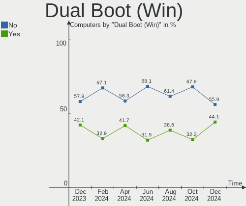
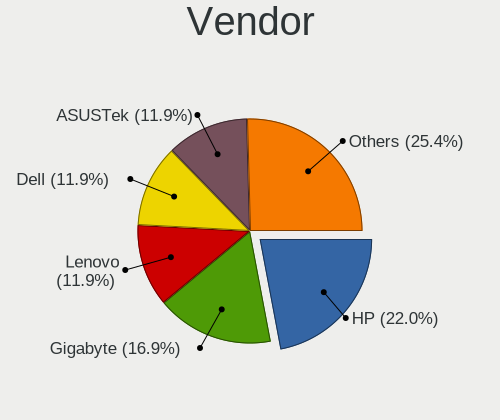
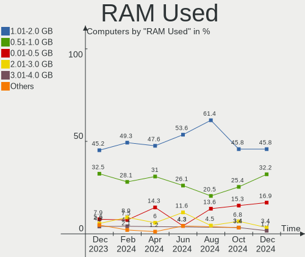
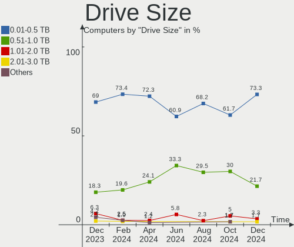
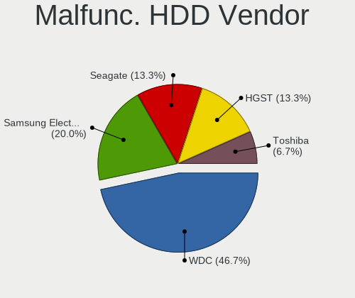
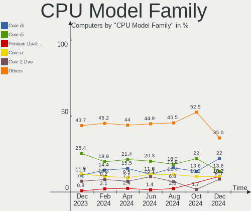
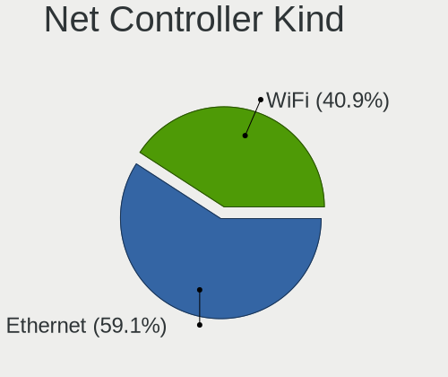
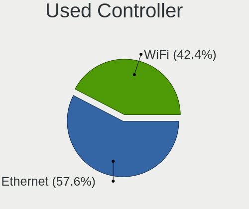
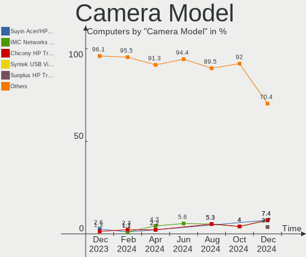

BlackPanther Hardware Trends
----------------------------

A project to identify most popular hardware characteristics and track their change
over time based on data collected by BlackPanther users at https://Linux-Hardware.org.

Anyone can contribute to the study by uploading probes of their computers by
the [hw-probe](https://github.com/linuxhw/hw-probe) tool:

    sudo -E hw-probe -all -upload

This is a report for all computer types. See also reports for [desktops](/Dist/BlackPanther/Desktop/README.md) and [notebooks](/Dist/BlackPanther/Notebook/README.md).

Full-feature report is available here: https://linux-hardware.org/?view=trends

Period: Feb, 2021.

Contents
--------

- [ OS                       ](#os)
- [ OS Family                ](#os-family)
- [ Kernel                   ](#kernel)
- [ Kernel Family            ](#kernel-family)
- [ Kernel Major Ver.        ](#kernel-major-ver)
- [ Arch                     ](#arch)
- [ DE                       ](#de)
- [ Display Server           ](#display-server)
- [ Display Manager          ](#display-manager)
- [ OS Lang                  ](#os-lang)
- [ Boot Mode                ](#boot-mode)
- [ Filesystem               ](#filesystem)
- [ Part. scheme             ](#part-scheme)
- [ Dual Boot with Linux/BSD ](#dual-boot-with-linux/bsd)
- [ Dual Boot (Win)          ](#dual-boot-win)
- [ Country                  ](#country)
- [ City                     ](#city)
- [ Vendor                   ](#vendor)
- [ Model                    ](#model)
- [ Model Family             ](#model-family)
- [ MFG Year                 ](#mfg-year)
- [ Form Factor              ](#form-factor)
- [ Secure Boot              ](#secure-boot)
- [ Coreboot                 ](#coreboot)
- [ RAM Size                 ](#ram-size)
- [ RAM Used                 ](#ram-used)
- [ Has CD-ROM               ](#has-cd-rom)
- [ Total Drives             ](#total-drives)
- [ Has Ethernet             ](#has-ethernet)
- [ Drive Vendor             ](#drive-vendor)
- [ Drive Model              ](#drive-model)
- [ HDD Vendor               ](#hdd-vendor)
- [ SSD Vendor               ](#ssd-vendor)
- [ Drive Kind               ](#drive-kind)
- [ Drive Connector          ](#drive-connector)
- [ Drive Size               ](#drive-size)
- [ Space Total              ](#space-total)
- [ Space Used               ](#space-used)
- [ Malfunc. Drives          ](#malfunc-drives)
- [ Malfunc. Drive Vendor    ](#malfunc-drive-vendor)
- [ Malfunc. HDD Vendor      ](#malfunc-hdd-vendor)
- [ Malfunc. Drive Kind      ](#malfunc-drive-kind)
- [ Failed Drives            ](#failed-drives)
- [ Failed Drive Vendor      ](#failed-drive-vendor)
- [ Drive Status             ](#drive-status)
- [ Storage Vendor           ](#storage-vendor)
- [ Storage Model            ](#storage-model)
- [ Storage Kind             ](#storage-kind)
- [ CPU Vendor               ](#cpu-vendor)
- [ CPU Model                ](#cpu-model)
- [ CPU Model Family         ](#cpu-model-family)
- [ CPU Cores                ](#cpu-cores)
- [ CPU Sockets              ](#cpu-sockets)
- [ CPU Threads              ](#cpu-threads)
- [ CPU Op-Modes             ](#cpu-op-modes)
- [ CPU Microcode            ](#cpu-microcode)
- [ CPU Microarch            ](#cpu-microarch)
- [ GPU Vendor               ](#gpu-vendor)
- [ GPU Model                ](#gpu-model)
- [ GPU Combo                ](#gpu-combo)
- [ GPU Driver               ](#gpu-driver)
- [ GPU Memory               ](#gpu-memory)
- [ Monitor Vendor           ](#monitor-vendor)
- [ Monitor Model            ](#monitor-model)
- [ Monitor Resolution       ](#monitor-resolution)
- [ Monitor Diagonal         ](#monitor-diagonal)
- [ Monitor Width            ](#monitor-width)
- [ Aspect Ratio             ](#aspect-ratio)
- [ Monitor Area             ](#monitor-area)
- [ Pixel Density            ](#pixel-density)
- [ Multiple Monitors        ](#multiple-monitors)
- [ Net Controller Vendor    ](#net-controller-vendor)
- [ Net Controller Model     ](#net-controller-model)
- [ Wireless Vendor          ](#wireless-vendor)
- [ Wireless Model           ](#wireless-model)
- [ Ethernet Vendor          ](#ethernet-vendor)
- [ Ethernet Model           ](#ethernet-model)
- [ Net Controller Kind      ](#net-controller-kind)
- [ Used Controller          ](#used-controller)
- [ NICs                     ](#nics)
- [ Memory Vendor            ](#memory-vendor)
- [ Memory Model             ](#memory-model)
- [ Memory Kind              ](#memory-kind)
- [ Memory Form Factor       ](#memory-form-factor)
- [ Memory Size              ](#memory-size)
- [ Memory Speed             ](#memory-speed)
- [ Sound Vendor             ](#sound-vendor)
- [ Sound Model              ](#sound-model)
- [ Camera Vendor            ](#camera-vendor)
- [ Camera Model             ](#camera-model)
- [ Fingerprint Vendor       ](#fingerprint-vendor)
- [ Fingerprint Model        ](#fingerprint-model)
- [ Chipcard Vendor          ](#chipcard-vendor)
- [ Chipcard Model           ](#chipcard-model)
- [ Printer Vendor           ](#printer-vendor)
- [ Printer Model            ](#printer-model)
- [ Scanner Vendor           ](#scanner-vendor)
- [ Scanner Model            ](#scanner-model)
- [ Bluetooth Vendor         ](#bluetooth-vendor)
- [ Bluetooth Model          ](#bluetooth-model)
- [ Unsupported Devices      ](#unsupported-devices)
- [ Unsupported Device Types ](#unsupported-device-types)

OS
--

Installed operating systems

| Name              | Computers | Percent |
|-------------------|-----------|---------|
| BlackPanther 18.1 | 208       | 93.27%  |
| BlackPanther 16.2 | 15        | 6.73%   |

OS Family
---------

OS without a version

| Name         | Computers | Percent |
|--------------|-----------|---------|
| BlackPanther | 223       | 100%    |

Kernel
------

Version of the Linux kernel

| Version                | Computers | Percent |
|------------------------|-----------|---------|
| 4.18.16-desktop-1bP    | 167       | 74.89%  |
| 5.6.14-desktop-2bP     | 41        | 18.39%  |
| 4.9.20-desktop-pae-1bP | 13        | 5.83%   |
| 4.7.0-desktop-1bP      | 1         | 0.45%   |
| 3.13.0-35-generic      | 1         | 0.45%   |

Kernel Family
-------------

Linux kernel without a distro release

| Version | Computers | Percent |
|---------|-----------|---------|
| 4.18.16 | 167       | 74.89%  |
| 5.6.14  | 41        | 18.39%  |
| 4.9.20  | 13        | 5.83%   |
| 4.7.0   | 1         | 0.45%   |
| 3.13.0  | 1         | 0.45%   |

Kernel Major Ver.
-----------------

Linux kernel major version

| Version | Computers | Percent |
|---------|-----------|---------|
| 4.18    | 167       | 74.89%  |
| 5.6     | 41        | 18.39%  |
| 4.9     | 13        | 5.83%   |
| 4.7     | 1         | 0.45%   |
| 3.13    | 1         | 0.45%   |

Arch
----

OS architecture (x86_64, i586, etc.)

| Name   | Computers | Percent |
|--------|-----------|---------|
| x86_64 | 209       | 93.72%  |
| i686   | 14        | 6.28%   |

DE
--

Desktop Environment

| Name | Computers | Percent |
|------|-----------|---------|
| KDE5 | 223       | 100%    |

Display Server
--------------

X11 or Wayland

| Name    | Computers | Percent |
|---------|-----------|---------|
| X11     | 219       | 98.21%  |
| Wayland | 4         | 1.79%   |

Display Manager
---------------

SDDM, LightDM, etc.

| Name | Computers | Percent |
|------|-----------|---------|
| SDDM | 223       | 100%    |

OS Lang
-------

Language

| Lang    | Computers | Percent |
|---------|-----------|---------|
| Unknown | 223       | 100%    |

Boot Mode
---------

EFI or BIOS

| Mode | Computers | Percent |
|------|-----------|---------|
| BIOS | 161       | 72.2%   |
| EFI  | 62        | 27.8%   |

Filesystem
----------

Type of filesystem

| Type      | Computers | Percent |
|-----------|-----------|---------|
| Overlay   | 171       | 76.68%  |
| Ext4      | 50        | 22.42%  |
| Overlayfs | 1         | 0.45%   |
| Ext3      | 1         | 0.45%   |

Part. scheme
------------

Scheme of partitioning

| Type | Computers | Percent |
|------|-----------|---------|
| MBR  | 147       | 65.92%  |
| GPT  | 76        | 34.08%  |

Dual Boot with Linux/BSD
------------------------

Hosting more than one Linux/BSD

| Dual boot | Computers | Percent |
|-----------|-----------|---------|
| No        | 124       | 55.61%  |
| Yes       | 99        | 44.39%  |

Dual Boot (Win)
---------------

Hosting Linux and Windows

| Dual boot | Computers | Percent |
|-----------|-----------|---------|
| Yes       | 126       | 56.5%   |
| No        | 97        | 43.5%   |

Country
-------

Geographic location (country)

| Country        | Computers | Percent |
|----------------|-----------|---------|
| Hungary        | 167       | 74.89%  |
| USA            | 11        | 4.93%   |
| Germany        | 8         | 3.59%   |
| Brazil         | 4         | 1.79%   |
| Slovakia       | 3         | 1.35%   |
| Netherlands    | 3         | 1.35%   |
| France         | 3         | 1.35%   |
| Austria        | 3         | 1.35%   |
| Spain          | 2         | 0.9%    |
| Serbia         | 2         | 0.9%    |
| Russia         | 2         | 0.9%    |
| Australia      | 2         | 0.9%    |
| Ukraine        | 1         | 0.45%   |
| UK             | 1         | 0.45%   |
| Thailand       | 1         | 0.45%   |
| Switzerland    | 1         | 0.45%   |
| Slovenia       | 1         | 0.45%   |
| Poland         | 1         | 0.45%   |
| Italy          | 1         | 0.45%   |
| Indonesia      | 1         | 0.45%   |
| Greece         | 1         | 0.45%   |
| Czech Republic | 1         | 0.45%   |
| Canada         | 1         | 0.45%   |
| Argentina      | 1         | 0.45%   |
| Algeria        | 1         | 0.45%   |

City
----

Geographic location (city)

| City                      | Computers | Percent |
|---------------------------|-----------|---------|
| Budapest                  | 61        | 27.35%  |
| Tatabánya                | 5         | 2.24%   |
| Szekszárd                | 4         | 1.79%   |
| Kecskemét                | 4         | 1.79%   |
| Zalaegerszeg              | 3         | 1.35%   |
| Vienna                    | 3         | 1.35%   |
| Szentendre                | 3         | 1.35%   |
| Siófok                   | 3         | 1.35%   |
| Pécs                     | 3         | 1.35%   |
| Pomaz                     | 3         | 1.35%   |
| Győr                     | 3         | 1.35%   |
| Érd                      | 2         | 0.9%    |
| Veszprém                 | 2         | 0.9%    |
| Tiszaujvaros              | 2         | 0.9%    |
| Székesfehérvár         | 2         | 0.9%    |
| Szolnok                   | 2         | 0.9%    |
| Szigetszentmiklos         | 2         | 0.9%    |
| Szentes                   | 2         | 0.9%    |
| Szabadszallas             | 2         | 0.9%    |
| Salgotarjan               | 2         | 0.9%    |
| Nizhniy Novgorod          | 2         | 0.9%    |
| Miskolc                   | 2         | 0.9%    |
| Melbourne                 | 2         | 0.9%    |
| Madrid                    | 2         | 0.9%    |
| Karcag                    | 2         | 0.9%    |
| Kaposvár                 | 2         | 0.9%    |
| Hajdunanas                | 2         | 0.9%    |
| Gyomro                    | 2         | 0.9%    |
| Frankfurt am Main         | 2         | 0.9%    |
| Esztergom                 | 2         | 0.9%    |
| Debrecen                  | 2         | 0.9%    |
| De Rijp                   | 2         | 0.9%    |
| Bokony                    | 2         | 0.9%    |
| Belgrade                  | 2         | 0.9%    |
| Znojmo                    | 1         | 0.45%   |
| Zalaszentgrot             | 1         | 0.45%   |
| Yale                      | 1         | 0.45%   |
| Wysokie Mazowieckie       | 1         | 0.45%   |
| Winschoten                | 1         | 0.45%   |
| Willoughby                | 1         | 0.45%   |
| Uzhhorod                  | 1         | 0.45%   |
| Ujfeherto                 | 1         | 0.45%   |
| Ubstadt-Weiher            | 1         | 0.45%   |
| Topoľčany               | 1         | 0.45%   |
| Toeroekbalint             | 1         | 0.45%   |
| Tenyo                     | 1         | 0.45%   |
| Tatarszentgyorgy          | 1         | 0.45%   |
| Tapioszentmarton          | 1         | 0.45%   |
| Tap                       | 1         | 0.45%   |
| São Paulo                | 1         | 0.45%   |
| Szeged                    | 1         | 0.45%   |
| Sidcup                    | 1         | 0.45%   |
| Satorhely                 | 1         | 0.45%   |
| Santa Margherita Ligure   | 1         | 0.45%   |
| Saint-Sauveur-le-Vicomte  | 1         | 0.45%   |
| Saint-Gilles-Croix-de-Vie | 1         | 0.45%   |
| Ravazd                    | 1         | 0.45%   |
| Pátrai                   | 1         | 0.45%   |
| Paris                     | 1         | 0.45%   |
| Oran                      | 1         | 0.45%   |

Vendor
------

Motherboard manufacturer

| Name                | Computers | Percent |
|---------------------|-----------|---------|
| ASUSTek Computer    | 41        | 18.39%  |
| Hewlett-Packard     | 34        | 15.25%  |
| Lenovo              | 31        | 13.9%   |
| Dell                | 25        | 11.21%  |
| Gigabyte Technology | 18        | 8.07%   |
| Acer                | 17        | 7.62%   |
| ASRock              | 16        | 7.17%   |
| Samsung Electronics | 6         | 2.69%   |
| Toshiba             | 5         | 2.24%   |
| MSI                 | 4         | 1.79%   |
| Packard Bell        | 3         | 1.35%   |
| Medion              | 3         | 1.35%   |
| Intel               | 3         | 1.35%   |
| Fujitsu Siemens     | 3         | 1.35%   |
| Fujitsu             | 3         | 1.35%   |
| eMachines           | 3         | 1.35%   |
| Sony                | 2         | 0.9%    |
| Foxconn             | 2         | 0.9%    |
| Qbex                | 1         | 0.45%   |
| NEC Computers       | 1         | 0.45%   |
| ECS                 | 1         | 0.45%   |
| Apple               | 1         | 0.45%   |

Model
-----

Motherboard model

| Name                                  | Computers | Percent |
|---------------------------------------|-----------|---------|
| eMachines E525                        | 3         | 1.35%   |
| Samsung R540/R580/R780/SA41/E452/E852 | 2         | 0.9%    |
| Medion Pentino G-Series               | 2         | 0.9%    |
| Lenovo G550 20023                     | 2         | 0.9%    |
| HP Compaq dc5850 Small Form Factor    | 2         | 0.9%    |
| HP 250 G4                             | 2         | 0.9%    |
| Dell Latitude E5420                   | 2         | 0.9%    |
| ASUS P5K-VM                           | 2         | 0.9%    |
| ASUS All Series                       | 2         | 0.9%    |
| ASUS 1011PX                           | 2         | 0.9%    |
| Acer Aspire ES1-511                   | 2         | 0.9%    |
| Acer Aspire E1-530G                   | 2         | 0.9%    |
| Toshiba Satellite P870                | 1         | 0.45%   |
| Toshiba Satellite L750                | 1         | 0.45%   |
| Toshiba Satellite L655                | 1         | 0.45%   |
| Toshiba Satellite L500                | 1         | 0.45%   |
| Toshiba Satellite C855D-12N           | 1         | 0.45%   |
| Sony VPCEH2J1E                        | 1         | 0.45%   |
| Sony VPCEB4M1E                        | 1         | 0.45%   |
| Samsung NC210/NC110                   | 1         | 0.45%   |
| Samsung 730U3E/740U3E                 | 1         | 0.45%   |
| Samsung 500A2M                        | 1         | 0.45%   |
| Samsung 350V5C/351V5C/3540VC/3440VC   | 1         | 0.45%   |
| Qbex QBEX-G41T-M7                     | 1         | 0.45%   |
| Packard Bell EasyNote TS44HR          | 1         | 0.45%   |
| Packard Bell EasyNote TK81            | 1         | 0.45%   |
| Packard Bell EasyNote TE11HC          | 1         | 0.45%   |
| NEC Computers IMEDIA 9320             | 1         | 0.45%   |
| MSI MS-7A38                           | 1         | 0.45%   |
| MSI MS-7592                           | 1         | 0.45%   |
| MSI MEGA BOOK GX620                   | 1         | 0.45%   |
| MSI Elite 7100 Microtower PC          | 1         | 0.45%   |
| Medion P6678 MD61550                  | 1         | 0.45%   |
| Lenovo Z50-75 80EC                    | 1         | 0.45%   |
| Lenovo Z50-70 20354                   | 1         | 0.45%   |
| Lenovo Y520-15IKBA 80WY               | 1         | 0.45%   |
| Lenovo V15-ADA 82C7                   | 1         | 0.45%   |
| Lenovo V145-15AST 81MT                | 1         | 0.45%   |
| Lenovo ThinkStation D20 4158AF8       | 1         | 0.45%   |
| Lenovo ThinkPad Yoga 11e 20D90027US   | 1         | 0.45%   |
| Lenovo ThinkPad X240 20AMA0YDHV       | 1         | 0.45%   |
| Lenovo ThinkPad X230 Tablet 3434CTO   | 1         | 0.45%   |
| Lenovo ThinkPad X201 3680AQ1          | 1         | 0.45%   |
| Lenovo ThinkPad X200 Tablet 7453WRX   | 1         | 0.45%   |
| Lenovo ThinkPad T61 6458WK6           | 1         | 0.45%   |
| Lenovo ThinkPad T440p 20AWS16U02      | 1         | 0.45%   |
| Lenovo ThinkPad T410 2522A92          | 1         | 0.45%   |
| Lenovo ThinkPad T400 6474Y32          | 1         | 0.45%   |
| Lenovo ThinkPad T400 6474E18          | 1         | 0.45%   |
| Lenovo ThinkPad L420 78544UG          | 1         | 0.45%   |
| Lenovo ThinkPad Edge 02212SG          | 1         | 0.45%   |
| Lenovo ThinkPad E520 1143GZG          | 1         | 0.45%   |
| Lenovo ThinkCentre M81 0385BE3        | 1         | 0.45%   |
| Lenovo ThinkCentre A57 98517HG        | 1         | 0.45%   |
| Lenovo IdeaPad Z460 20059             | 1         | 0.45%   |
| Lenovo IdeaPad L340-15IWL 81LG        | 1         | 0.45%   |
| Lenovo IdeaPad Flex 10 20324          | 1         | 0.45%   |
| Lenovo IdeaPad 330-15IKB 81DE         | 1         | 0.45%   |
| Lenovo IdeaPad 320-17ABR 80YN         | 1         | 0.45%   |
| Lenovo G585 20137                     | 1         | 0.45%   |

Model Family
------------

Motherboard model prefix

| Name                  | Computers | Percent |
|-----------------------|-----------|---------|
| Acer Aspire           | 15        | 6.73%   |
| Lenovo ThinkPad       | 13        | 5.83%   |
| Dell Latitude         | 12        | 5.38%   |
| Dell OptiPlex         | 9         | 4.04%   |
| HP Compaq             | 8         | 3.59%   |
| Toshiba Satellite     | 5         | 2.24%   |
| Lenovo IdeaPad        | 5         | 2.24%   |
| HP ProBook            | 4         | 1.79%   |
| HP EliteBook          | 4         | 1.79%   |
| HP 250                | 4         | 1.79%   |
| Packard Bell EasyNote | 3         | 1.35%   |
| eMachines E525        | 3         | 1.35%   |
| Dell Inspiron         | 3         | 1.35%   |
| ASUS PRIME            | 3         | 1.35%   |
| Samsung R540          | 2         | 0.9%    |
| Medion Pentino        | 2         | 0.9%    |
| Lenovo ThinkCentre    | 2         | 0.9%    |
| Lenovo G550           | 2         | 0.9%    |
| Gigabyte Z390         | 2         | 0.9%    |
| Fujitsu ESPRIMO       | 2         | 0.9%    |
| ASUS ROG              | 2         | 0.9%    |
| ASUS P8H61-M          | 2         | 0.9%    |
| ASUS P5K-VM           | 2         | 0.9%    |
| ASUS P5K              | 2         | 0.9%    |
| ASUS M5A97            | 2         | 0.9%    |
| ASUS All              | 2         | 0.9%    |
| ASUS 1011PX           | 2         | 0.9%    |
| ASRock Z77            | 2         | 0.9%    |
| Sony VPCEH2J1E        | 1         | 0.45%   |
| Sony VPCEB4M1E        | 1         | 0.45%   |
| Samsung NC210         | 1         | 0.45%   |
| Samsung 730U3E        | 1         | 0.45%   |
| Samsung 500A2M        | 1         | 0.45%   |
| Samsung 350V5C        | 1         | 0.45%   |
| Qbex QBEX-G41T-M7     | 1         | 0.45%   |
| NEC Computers IMEDIA  | 1         | 0.45%   |
| MSI MS-7A38           | 1         | 0.45%   |
| MSI MS-7592           | 1         | 0.45%   |
| MSI MEGA              | 1         | 0.45%   |
| MSI Elite             | 1         | 0.45%   |
| Medion P6678          | 1         | 0.45%   |
| Lenovo Z50-75         | 1         | 0.45%   |
| Lenovo Z50-70         | 1         | 0.45%   |
| Lenovo Y520-15IKBA    | 1         | 0.45%   |
| Lenovo V15-ADA        | 1         | 0.45%   |
| Lenovo V145-15AST     | 1         | 0.45%   |
| Lenovo ThinkStation   | 1         | 0.45%   |
| Lenovo G585           | 1         | 0.45%   |
| Lenovo B51-80         | 1         | 0.45%   |
| Lenovo 0385-BE3       | 1         | 0.45%   |
| Intel DG33BU          | 1         | 0.45%   |
| Intel D510MO          | 1         | 0.45%   |
| Intel 945             | 1         | 0.45%   |
| HP Z600               | 1         | 0.45%   |
| HP t610               | 1         | 0.45%   |
| HP ProLiant           | 1         | 0.45%   |
| HP Pro                | 1         | 0.45%   |
| HP Pavilion           | 1         | 0.45%   |
| HP Notebook           | 1         | 0.45%   |
| HP Mini               | 1         | 0.45%   |

MFG Year
--------

Motherboard manufacture year

| Year | Computers | Percent |
|------|-----------|---------|
| 2011 | 27        | 12.11%  |
| 2013 | 22        | 9.87%   |
| 2012 | 21        | 9.42%   |
| 2010 | 19        | 8.52%   |
| 2019 | 18        | 8.07%   |
| 2018 | 18        | 8.07%   |
| 2014 | 15        | 6.73%   |
| 2015 | 14        | 6.28%   |
| 2008 | 13        | 5.83%   |
| 2020 | 12        | 5.38%   |
| 2009 | 12        | 5.38%   |
| 2017 | 11        | 4.93%   |
| 2007 | 10        | 4.48%   |
| 2016 | 8         | 3.59%   |
| 2006 | 2         | 0.9%    |
| 2005 | 1         | 0.45%   |

Form Factor
-----------

Physical design of the computer

| Name       | Computers | Percent |
|------------|-----------|---------|
| Notebook   | 126       | 56.5%   |
| Desktop    | 94        | 42.15%  |
| All in one | 2         | 0.9%    |
| Mini pc    | 1         | 0.45%   |

Secure Boot
-----------

Enabled or disabled

| State    | Computers | Percent |
|----------|-----------|---------|
| Disabled | 223       | 100%    |

Coreboot
--------

Have coreboot on board

| Used | Computers | Percent |
|------|-----------|---------|
| No   | 223       | 100%    |

RAM Size
--------

Total RAM memory

| Size in GB | Computers | Percent |
|------------|-----------|---------|
| 3.01-4.0   | 80        | 35.87%  |
| 4.01-8.0   | 48        | 21.52%  |
| 8.01-16.0  | 43        | 19.28%  |
| 1.01-2.0   | 24        | 10.76%  |
| 16.01-24.0 | 15        | 6.73%   |
| 32.01-64.0 | 7         | 3.14%   |
| 2.01-3.0   | 3         | 1.35%   |
| 24.01-32.0 | 2         | 0.9%    |
| 0.51-1.0   | 1         | 0.45%   |

RAM Used
--------

Used RAM memory

| Used GB  | Computers | Percent |
|----------|-----------|---------|
| 0.51-1.0 | 105       | 47.09%  |
| 0.01-0.5 | 70        | 31.39%  |
| 1.01-2.0 | 47        | 21.08%  |
| Unknown  | 1         | 0.45%   |

Has CD-ROM
----------

Has CD-ROM on board

| Presented | Computers | Percent |
|-----------|-----------|---------|
| Yes       | 151       | 67.71%  |
| No        | 72        | 32.29%  |

Total Drives
------------

Number of drives on board

| Drives | Computers | Percent |
|--------|-----------|---------|
| 1      | 160       | 71.75%  |
| 2      | 38        | 17.04%  |
| 3      | 13        | 5.83%   |
| 4      | 6         | 2.69%   |
| 10     | 2         | 0.9%    |
| 5      | 2         | 0.9%    |
| 6      | 1         | 0.45%   |
| 0      | 1         | 0.45%   |

Has Ethernet
------------

Has Ethernet on board

| Presented | Computers | Percent |
|-----------|-----------|---------|
| Yes       | 216       | 96.86%  |
| No        | 7         | 3.14%   |

Drive Vendor
------------

Hard drive vendors

| Vendor              | Computers | Drives | Percent |
|---------------------|-----------|--------|---------|
| WDC                 | 58        | 76     | 18.35%  |
| Seagate             | 53        | 56     | 16.77%  |
| Kingston            | 41        | 44     | 12.97%  |
| Samsung Electronics | 33        | 39     | 10.44%  |
| Toshiba             | 28        | 35     | 8.86%   |
| Hitachi             | 25        | 26     | 7.91%   |
| HGST                | 13        | 13     | 4.11%   |
| SanDisk             | 9         | 10     | 2.85%   |
| Crucial             | 8         | 8      | 2.53%   |
| A-DATA Technology   | 7         | 7      | 2.22%   |
| MAXTOR              | 5         | 5      | 1.58%   |
| PNY                 | 4         | 4      | 1.27%   |
| Micron Technology   | 3         | 3      | 0.95%   |
| JMicron             | 3         | 3      | 0.95%   |
| Intenso             | 3         | 3      | 0.95%   |
| Fujitsu             | 3         | 3      | 0.95%   |
| Intel               | 2         | 2      | 0.63%   |
| China               | 2         | 2      | 0.63%   |
| Apacer              | 2         | 2      | 0.63%   |
| WD MediaMax         | 1         | 1      | 0.32%   |
| Verbatim            | 1         | 1      | 0.32%   |
| Unknown             | 1         | 1      | 0.32%   |
| Transcend           | 1         | 1      | 0.32%   |
| Team                | 1         | 1      | 0.32%   |
| SK Hynix            | 1         | 1      | 0.32%   |
| PNY USB             | 1         | 1      | 0.32%   |
| LITEONIT            | 1         | 1      | 0.32%   |
| LITEON              | 1         | 1      | 0.32%   |
| ICY BOX             | 1         | 1      | 0.32%   |
| IBM/Hitachi         | 1         | 1      | 0.32%   |
| GOODRAM             | 1         | 1      | 0.32%   |
| BHT                 | 1         | 1      | 0.32%   |
| Apple               | 1         | 1      | 0.32%   |

Drive Model
-----------

Hard drive models

| Model                              | Computers | Percent |
|------------------------------------|-----------|---------|
| Kingston SA400S37120G 120GB SSD    | 12        | 3.47%   |
| Kingston SV300S37A120G 120GB SSD   | 8         | 2.31%   |
| Kingston SA400S37240G 240GB SSD    | 7         | 2.02%   |
| Seagate ST500LT012-1DG142 500GB    | 6         | 1.73%   |
| Toshiba DT01ACA200 2TB             | 4         | 1.16%   |
| Seagate ST1000LM035-1RK172 1TB     | 4         | 1.16%   |
| HGST HTS545050A7E680 500GB         | 4         | 1.16%   |
| WDC WD10EZEX-22MFCA0 1TB           | 3         | 0.87%   |
| Toshiba MQ04ABF100 1TB             | 3         | 0.87%   |
| Toshiba MQ01ABF050 500GB           | 3         | 0.87%   |
| Seagate ST500DM002-1BD142 500GB    | 3         | 0.87%   |
| Seagate ST1000LM024 HN-M101MBB 1TB | 3         | 0.87%   |
| PNY CS900 120GB SSD                | 3         | 0.87%   |
| Kingston SV300S37A240G 240GB SSD   | 3         | 0.87%   |
| Kingston SUV400S37120G 120GB SSD   | 3         | 0.87%   |
| JMicron Generic 320GB              | 3         | 0.87%   |
| Hitachi HTS545050B9A300 500GB      | 3         | 0.87%   |
| HGST HTS725050A7E630 500GB         | 3         | 0.87%   |
| WDC WDS500G2B0A-00SM50 500GB SSD   | 2         | 0.58%   |
| WDC WDS240G2G0A-00JH30 240GB SSD   | 2         | 0.58%   |
| WDC WD20EARX-00PASB0 2TB           | 2         | 0.58%   |
| WDC WD10EZEX-21M2NA0 1TB           | 2         | 0.58%   |
| WDC WD10EZEX-00BN5A0 1TB           | 2         | 0.58%   |
| Toshiba MQ01ABD100 1TB             | 2         | 0.58%   |
| Toshiba DT01ACA300 3TB             | 2         | 0.58%   |
| Toshiba DT01ACA100 1TB             | 2         | 0.58%   |
| Seagate ST9320325AS 320GB          | 2         | 0.58%   |
| Seagate ST3160812AS 160GB          | 2         | 0.58%   |
| Seagate ST1000DM003-1CH162 1TB     | 2         | 0.58%   |
| SanDisk SSD PLUS 240GB             | 2         | 0.58%   |
| SanDisk SDSSDHP128G 128GB          | 2         | 0.58%   |
| Samsung SSD 860 EVO 500GB          | 2         | 0.58%   |
| Samsung SSD 850 EVO 250GB          | 2         | 0.58%   |
| Samsung HD154UI 1TB                | 2         | 0.58%   |
| Kingston SUV500240G 240GB SSD      | 2         | 0.58%   |
| Kingston SH103S3120G 120GB SSD     | 2         | 0.58%   |
| Kingston SA2000M8250G 250GB        | 2         | 0.58%   |
| Intenso SSD 120GB                  | 2         | 0.58%   |
| Hitachi HTS545025B9A300 250GB      | 2         | 0.58%   |
| Hitachi HTS543225L9A300 250GB      | 2         | 0.58%   |
| HGST HTS541010B7E610 1TB           | 2         | 0.58%   |
| Crucial CT240BX500SSD1 240GB       | 2         | 0.58%   |
| Crucial CT120BX500SSD1 120GB       | 2         | 0.58%   |
| A-DATA SU700 120GB SSD             | 2         | 0.58%   |
| WDC WDS500G2X0C-00L350 500GB       | 1         | 0.29%   |
| WDC WDS500G2B0B-00YS70 500GB SSD   | 1         | 0.29%   |
| WDC WDS250G2B0A-00SM50 250GB SSD   | 1         | 0.29%   |
| WDC WDS120G2G0B-00EPW0 120GB SSD   | 1         | 0.29%   |
| WDC WD800JD-75MSA3 80GB            | 1         | 0.29%   |
| WDC WD800JD-08MSA1 80GB            | 1         | 0.29%   |
| WDC WD800AAJS-00WAA0 80GB          | 1         | 0.29%   |
| WDC WD7500BPVT-80HXZT3 752GB       | 1         | 0.29%   |
| WDC WD7500BPVT-75HXZT3 752GB       | 1         | 0.29%   |
| WDC WD7500BPVT-22HXZT3 752GB       | 1         | 0.29%   |
| WDC WD7500AYPS-01ZKB0 752GB        | 1         | 0.29%   |
| WDC WD5000LPVX-22V0TT0 500GB       | 1         | 0.29%   |
| WDC WD5000LPCX-22VHAT1 500GB       | 1         | 0.29%   |
| WDC WD5000BPVT-24HXZT1 500GB       | 1         | 0.29%   |
| WDC WD5000BPVT-22HXZT3 500GB       | 1         | 0.29%   |
| WDC WD5000BPVT-08HXZT1 500GB       | 1         | 0.29%   |

HDD Vendor
----------

Hard disk drive vendors

| Vendor              | Computers | Drives | Percent |
|---------------------|-----------|--------|---------|
| WDC                 | 52        | 67     | 26.67%  |
| Seagate             | 52        | 55     | 26.67%  |
| Toshiba             | 27        | 34     | 13.85%  |
| Hitachi             | 25        | 26     | 12.82%  |
| Samsung Electronics | 15        | 15     | 7.69%   |
| HGST                | 13        | 13     | 6.67%   |
| Maxtor              | 5         | 5      | 2.56%   |
| Fujitsu             | 3         | 3      | 1.54%   |
| WD MediaMax         | 1         | 1      | 0.51%   |
| ICY BOX             | 1         | 1      | 0.51%   |
| IBM/Hitachi         | 1         | 1      | 0.51%   |

SSD Vendor
----------

Solid state drive vendors

| Vendor              | Computers | Drives | Percent |
|---------------------|-----------|--------|---------|
| Kingston            | 39        | 42     | 34.51%  |
| Samsung Electronics | 16        | 17     | 14.16%  |
| SanDisk             | 9         | 10     | 7.96%   |
| Crucial             | 8         | 8      | 7.08%   |
| WDC                 | 6         | 7      | 5.31%   |
| A-DATA Technology   | 6         | 6      | 5.31%   |
| PNY                 | 4         | 4      | 3.54%   |
| JMicron             | 3         | 3      | 2.65%   |
| Intenso             | 3         | 3      | 2.65%   |
| Micron Technology   | 2         | 2      | 1.77%   |
| China               | 2         | 2      | 1.77%   |
| Apacer              | 2         | 2      | 1.77%   |
| Verbatim            | 1         | 1      | 0.88%   |
| Unknown             | 1         | 1      | 0.88%   |
| Transcend           | 1         | 1      | 0.88%   |
| Toshiba             | 1         | 1      | 0.88%   |
| Team                | 1         | 1      | 0.88%   |
| SK Hynix            | 1         | 1      | 0.88%   |
| PNY USB             | 1         | 1      | 0.88%   |
| LITEONIT            | 1         | 1      | 0.88%   |
| LITEON              | 1         | 1      | 0.88%   |
| Intel               | 1         | 1      | 0.88%   |
| GOODRAM             | 1         | 1      | 0.88%   |
| BHT                 | 1         | 1      | 0.88%   |
| Apple               | 1         | 1      | 0.88%   |

Drive Kind
----------

HDD or SSD

| Kind    | Computers | Drives | Percent |
|---------|-----------|--------|---------|
| HDD     | 163       | 221    | 58.21%  |
| SSD     | 105       | 119    | 37.5%   |
| NVMe    | 11        | 14     | 3.93%   |
| Unknown | 1         | 1      | 0.36%   |

Drive Connector
---------------

SATA, SAS, NVMe, etc.

| Type | Computers | Drives | Percent |
|------|-----------|--------|---------|
| SATA | 219       | 334    | 92.41%  |
| NVMe | 11        | 14     | 4.64%   |
| SAS  | 7         | 7      | 2.95%   |

Drive Size
----------

Size of hard drive

| Size in TB | Computers | Drives | Percent |
|------------|-----------|--------|---------|
| 0.01-0.5   | 191       | 240    | 71.27%  |
| 0.51-1.0   | 53        | 62     | 19.78%  |
| 1.01-2.0   | 16        | 25     | 5.97%   |
| 2.01-3.0   | 5         | 10     | 1.87%   |
| 3.01-4.0   | 2         | 2      | 0.75%   |
| 4.01-10.0  | 1         | 1      | 0.37%   |

Space Total
-----------

Amount of disk space available on the file system

| Size in GB | Computers | Percent |
|------------|-----------|---------|
| Unknown    | 164       | 73.54%  |
| 101-250    | 17        | 7.62%   |
| 251-500    | 15        | 6.73%   |
| 51-100     | 11        | 4.93%   |
| 501-1000   | 10        | 4.48%   |
| 21-50      | 4         | 1.79%   |
| 1-20       | 2         | 0.9%    |

Space Used
----------

Amount of used disk space

| Used GB | Computers | Percent |
|---------|-----------|---------|
| Unknown | 164       | 73.54%  |
| 1-20    | 50        | 22.42%  |
| 101-250 | 5         | 2.24%   |
| 21-50   | 2         | 0.9%    |
| 251-500 | 1         | 0.45%   |
| 51-100  | 1         | 0.45%   |

Malfunc. Drives
---------------

Drive models with a malfunction

| Model                                          | Computers | Drives | Percent |
|------------------------------------------------|-----------|--------|---------|
| HGST HTS545050A7E680 500GB                     | 4         | 4      | 4.44%   |
| Seagate ST500DM002-1BD142 500GB                | 3         | 3      | 3.33%   |
| Kingston SV300S37A120G 120GB SSD               | 3         | 3      | 3.33%   |
| WDC WD10EZEX-00BN5A0 1TB                       | 2         | 2      | 2.22%   |
| Toshiba MQ01ABF050 500GB                       | 2         | 2      | 2.22%   |
| Toshiba MQ01ABD100 1TB                         | 2         | 2      | 2.22%   |
| Seagate ST500LT012-1DG142 500GB                | 2         | 2      | 2.22%   |
| Seagate ST3160812AS 160GB                      | 2         | 2      | 2.22%   |
| Hitachi HTS545025B9A300 250GB                  | 2         | 2      | 2.22%   |
| WDC WD800JD-75MSA3 80GB                        | 1         | 1      | 1.11%   |
| WDC WD5000AAKX-08U6AA0 500GB                   | 1         | 1      | 1.11%   |
| WDC WD5000AAKX-08ERMA0 500GB                   | 1         | 1      | 1.11%   |
| WDC WD5000AAKX-07U6AA0 500GB                   | 1         | 1      | 1.11%   |
| WDC WD5000AAKS-00UU3A0 500GB                   | 1         | 1      | 1.11%   |
| WDC WD5000AAKS-00M9A0 500GB                    | 1         | 1      | 1.11%   |
| WDC WD5000AAKS-007AA0 500GB                    | 1         | 1      | 1.11%   |
| WDC WD5000AADS-00S9B0 500GB                    | 1         | 1      | 1.11%   |
| WDC WD3200BEVT-60A23T0 320GB                   | 1         | 1      | 1.11%   |
| WDC WD3200BEKT-60V5T1 320GB                    | 1         | 1      | 1.11%   |
| WDC WD2500AAJS-75B4A0 250GB                    | 1         | 1      | 1.11%   |
| WDC WD20EFRX-68EUZN0 2TB                       | 1         | 2      | 1.11%   |
| WDC WD20EARS-60MVWB0 2TB                       | 1         | 1      | 1.11%   |
| WDC WD20EARS-00J2GB0 2TB                       | 1         | 1      | 1.11%   |
| WDC WD1200BB-00GUC0 120GB                      | 1         | 1      | 1.11%   |
| WDC WD10EARS-00MVWB0 1TB                       | 1         | 1      | 1.11%   |
| WD MediaMax WL250GSA1672 250GB                 | 1         | 1      | 1.11%   |
| Toshiba MQ01ABF032 320GB                       | 1         | 1      | 1.11%   |
| Toshiba MQ01ABD050 500GB                       | 1         | 1      | 1.11%   |
| Toshiba MK8009GAH 80GB                         | 1         | 1      | 1.11%   |
| Toshiba MK3261GSYN 320GB                       | 1         | 1      | 1.11%   |
| Toshiba MK1229GSGF 80GB                        | 1         | 1      | 1.11%   |
| Toshiba HDWD130 3TB                            | 1         | 1      | 1.11%   |
| Toshiba DT01ACA100 1TB                         | 1         | 1      | 1.11%   |
| Seagate ST9500325AS 500GB                      | 1         | 1      | 1.11%   |
| Seagate ST9320423AS 320GB                      | 1         | 1      | 1.11%   |
| Seagate ST9320325AS 320GB                      | 1         | 1      | 1.11%   |
| Seagate ST9250827AS 250GB                      | 1         | 1      | 1.11%   |
| Seagate ST500LM021-1KJ152 500GB                | 1         | 1      | 1.11%   |
| Seagate ST500LM000-1EJ162 500GB                | 1         | 1      | 1.11%   |
| Seagate ST4000LM024-2AN17V 4TB                 | 1         | 1      | 1.11%   |
| Seagate ST3250823AS 250GB                      | 1         | 1      | 1.11%   |
| Seagate ST320LT007-9ZV142 320GB                | 1         | 1      | 1.11%   |
| Seagate ST31500341AS 1TB                       | 1         | 1      | 1.11%   |
| Seagate ST250LM004 HN-M250MBB 250GB            | 1         | 1      | 1.11%   |
| Seagate ST2000VN004-2E4164 2TB                 | 1         | 1      | 1.11%   |
| Seagate ST1000LX015-1U7172 1TB                 | 1         | 1      | 1.11%   |
| Seagate ST1000LM024 HN-M101MBB 1TB             | 1         | 1      | 1.11%   |
| Seagate ST1000LM014-SSHD-8GB                   | 1         | 1      | 1.11%   |
| Seagate ST1000LM014-1EJ164-SSHD 1TB            | 1         | 1      | 1.11%   |
| SanDisk SDSSDXPS480G 480GB                     | 1         | 1      | 1.11%   |
| SanDisk SD7SB3Q128G1001 128GB SSD              | 1         | 1      | 1.11%   |
| Samsung Electronics SP2004C 200GB              | 1         | 1      | 1.11%   |
| Samsung Electronics HM321HI 320GB              | 1         | 1      | 1.11%   |
| Samsung Electronics HD501LJ 500GB              | 1         | 1      | 1.11%   |
| Samsung Electronics HD320KJ 320GB              | 1         | 1      | 1.11%   |
| Samsung Electronics HD103UJ 1TB                | 1         | 1      | 1.11%   |
| Samsung Electronics HD080HJ 80GB               | 1         | 1      | 1.11%   |
| Micron Technology MTFDDAK256MAM-1K12 256GB SSD | 1         | 1      | 1.11%   |
| Maxtor 6B200P0 208GB                           | 1         | 1      | 1.11%   |
| Maxtor 2B020H1 20GB                            | 1         | 1      | 1.11%   |

Malfunc. Drive Vendor
---------------------

Vendors of faulty drives

| Vendor              | Computers | Drives | Percent |
|---------------------|-----------|--------|---------|
| Seagate             | 23        | 23     | 26.14%  |
| WDC                 | 16        | 19     | 18.18%  |
| Toshiba             | 11        | 11     | 12.5%   |
| Hitachi             | 9         | 9      | 10.23%  |
| HGST                | 8         | 8      | 9.09%   |
| Samsung Electronics | 6         | 6      | 6.82%   |
| Kingston            | 6         | 6      | 6.82%   |
| SanDisk             | 2         | 2      | 2.27%   |
| Maxtor              | 2         | 2      | 2.27%   |
| WD MediaMax         | 1         | 1      | 1.14%   |
| Micron Technology   | 1         | 1      | 1.14%   |
| Intel               | 1         | 1      | 1.14%   |
| Apple               | 1         | 1      | 1.14%   |
| Apacer              | 1         | 1      | 1.14%   |

Malfunc. HDD Vendor
-------------------

Vendors of faulty HDD drives

| Vendor              | Computers | Drives | Percent |
|---------------------|-----------|--------|---------|
| Seagate             | 23        | 23     | 30.26%  |
| WDC                 | 16        | 19     | 21.05%  |
| Toshiba             | 11        | 11     | 14.47%  |
| Hitachi             | 9         | 9      | 11.84%  |
| HGST                | 8         | 8      | 10.53%  |
| Samsung Electronics | 6         | 6      | 7.89%   |
| Maxtor              | 2         | 2      | 2.63%   |
| WD MediaMax         | 1         | 1      | 1.32%   |

Malfunc. Drive Kind
-------------------

Kinds of faulty drives

| Kind | Computers | Drives | Percent |
|------|-----------|--------|---------|
| HDD  | 71        | 79     | 85.54%  |
| SSD  | 12        | 12     | 14.46%  |

Failed Drives
-------------

Failed drive models

Zero info for selected period =(

Failed Drive Vendor
-------------------

Failed drive vendors

Zero info for selected period =(

Drive Status
------------

Number of failed and malfunc. drives

| Status   | Computers | Drives | Percent |
|----------|-----------|--------|---------|
| Works    | 173       | 257    | 65.78%  |
| Malfunc  | 83        | 91     | 31.56%  |
| Detected | 7         | 7      | 2.66%   |

Storage Vendor
--------------

Storage controller vendors

| Vendor                           | Computers | Percent |
|----------------------------------|-----------|---------|
| Intel                            | 180       | 70.87%  |
| AMD                              | 38        | 14.96%  |
| JMicron Technology               | 7         | 2.76%   |
| Samsung Electronics              | 6         | 2.36%   |
| Marvell Technology Group         | 6         | 2.36%   |
| ASMedia Technology               | 6         | 2.36%   |
| Nvidia                           | 3         | 1.18%   |
| Sandisk                          | 2         | 0.79%   |
| Kingston Technology Company      | 2         | 0.79%   |
| Silicon Integrated Systems [SiS] | 1         | 0.39%   |
| Silicon Image                    | 1         | 0.39%   |
| Micron Technology                | 1         | 0.39%   |
| ADATA Technology                 | 1         | 0.39%   |

Storage Model
-------------

Storage controller models

| Model                                                                                   | Computers | Percent |
|-----------------------------------------------------------------------------------------|-----------|---------|
| AMD FCH SATA Controller [AHCI mode]                                                     | 20        | 6.39%   |
| Intel NM10/ICH7 Family SATA Controller [IDE mode]                                       | 17        | 5.43%   |
| Intel 7 Series Chipset Family 6-port SATA Controller [AHCI mode]                        | 17        | 5.43%   |
| Intel 82801G (ICH7 Family) IDE Controller                                               | 13        | 4.15%   |
| Intel 82801IBM/IEM (ICH9M/ICH9M-E) 4 port SATA Controller [AHCI mode]                   | 10        | 3.19%   |
| AMD SB7x0/SB8x0/SB9x0 SATA Controller [IDE mode]                                        | 10        | 3.19%   |
| Intel Sunrise Point-LP SATA Controller [AHCI mode]                                      | 9         | 2.88%   |
| Intel 82801 Mobile SATA Controller [RAID mode]                                          | 9         | 2.88%   |
| Intel 8 Series/C220 Series Chipset Family 6-port SATA Controller 1 [AHCI mode]          | 9         | 2.88%   |
| Intel 6 Series/C200 Series Chipset Family 6 port Mobile SATA AHCI Controller            | 9         | 2.88%   |
| Intel Atom Processor E3800 Series SATA AHCI Controller                                  | 8         | 2.56%   |
| Intel 82801HM/HEM (ICH8M/ICH8M-E) IDE Controller                                        | 7         | 2.24%   |
| Intel 5 Series/3400 Series Chipset 4 port SATA AHCI Controller                          | 7         | 2.24%   |
| AMD SB7x0/SB8x0/SB9x0 IDE Controller                                                    | 7         | 2.24%   |
| Intel 8 Series SATA Controller 1 [AHCI mode]                                            | 6         | 1.92%   |
| Intel 7 Series/C210 Series Chipset Family 6-port SATA Controller [AHCI mode]            | 6         | 1.92%   |
| Intel 6 Series/C200 Series Chipset Family Desktop SATA Controller (IDE mode, ports 4-5) | 6         | 1.92%   |
| Intel 6 Series/C200 Series Chipset Family Desktop SATA Controller (IDE mode, ports 0-3) | 6         | 1.92%   |
| Intel 5 Series/3400 Series Chipset 6 port SATA AHCI Controller                          | 6         | 1.92%   |
| AMD SB7x0/SB8x0/SB9x0 SATA Controller [AHCI mode]                                       | 6         | 1.92%   |
| Intel NM10/ICH7 Family SATA Controller [AHCI mode]                                      | 5         | 1.6%    |
| Intel 82801I (ICH9 Family) 2 port SATA Controller [IDE mode]                            | 5         | 1.6%    |
| Intel 82801HM/HEM (ICH8M/ICH8M-E) SATA Controller [AHCI mode]                           | 5         | 1.6%    |
| Intel 200 Series PCH SATA controller [AHCI mode]                                        | 5         | 1.6%    |
| ASMedia ASM1062 Serial ATA Controller                                                   | 5         | 1.6%    |
| Samsung NVMe SSD Controller SM981/PM981/PM983                                           | 4         | 1.28%   |
| JMicron JMB363 SATA/IDE Controller                                                      | 4         | 1.28%   |
| Intel Wildcat Point-LP SATA Controller [AHCI Mode]                                      | 4         | 1.28%   |
| Intel 82801IB (ICH9) 2 port SATA Controller [IDE mode]                                  | 4         | 1.28%   |
| Nvidia MCP61 SATA Controller                                                            | 3         | 0.96%   |
| JMicron JMB368 IDE controller                                                           | 3         | 0.96%   |
| Intel SATA Controller [RAID mode]                                                       | 3         | 0.96%   |
| Intel Q170/Q150/B150/H170/H110/Z170/CM236 Chipset SATA Controller [AHCI Mode]           | 3         | 0.96%   |
| Intel HM170/QM170 Chipset SATA Controller [AHCI Mode]                                   | 3         | 0.96%   |
| Intel Cannon Lake PCH SATA AHCI Controller                                              | 3         | 0.96%   |
| Intel 6 Series/C200 Series Chipset Family Mobile SATA Controller (IDE mode, ports 0-3)  | 3         | 0.96%   |
| Intel 6 Series/C200 Series Chipset Family 6 port Desktop SATA AHCI Controller           | 3         | 0.96%   |
| Intel 5 Series/3400 Series Chipset 4 port SATA IDE Controller                           | 3         | 0.96%   |
| Intel 5 Series/3400 Series Chipset 2 port SATA IDE Controller                           | 3         | 0.96%   |
| AMD 400 Series Chipset SATA Controller                                                  | 3         | 0.96%   |
| Samsung NVMe SSD Controller SM961/PM961/SM963                                           | 2         | 0.64%   |
| Nvidia MCP61 IDE                                                                        | 2         | 0.64%   |
| Kingston Company A2000 NVMe SSD                                                         | 2         | 0.64%   |
| Intel Mobile PM965/GM965 PT IDER Controller                                             | 2         | 0.64%   |
| Intel 82801IBM/IEM (ICH9M/ICH9M-E) 2 port SATA Controller [IDE mode]                    | 2         | 0.64%   |
| Intel 82801HM/HEM (ICH8M/ICH8M-E) SATA Controller [IDE mode]                            | 2         | 0.64%   |
| Intel 6 Series/C200 Series Chipset Family Mobile SATA Controller (IDE mode, ports 4-5)  | 2         | 0.64%   |
| Intel 4 Series Chipset PT IDER Controller                                               | 2         | 0.64%   |
| AMD FCH IDE Controller                                                                  | 2         | 0.64%   |
| Silicon Integrated Systems [SiS] SATA Controller / IDE mode                             | 1         | 0.32%   |
| Silicon Integrated Systems [SiS] 5513 IDE Controller                                    | 1         | 0.32%   |
| Silicon Image SiI 3114 [SATALink/SATARaid] Serial ATA Controller                        | 1         | 0.32%   |
| Sandisk WD Black 2018/SN750 / PC SN720 NVMe SSD                                         | 1         | 0.32%   |
| Sandisk PC SN520 NVMe SSD                                                               | 1         | 0.32%   |
| Samsung Electronics Non-Volatile memory controller                                      | 1         | 0.32%   |
| Micron Non-Volatile memory controller                                                   | 1         | 0.32%   |
| Marvell Group MV64460/64461/64462 System Controller, Revision B                         | 1         | 0.32%   |
| Marvell Group 88SE9215 PCIe 2.0 x1 4-port SATA 6 Gb/s Controller                        | 1         | 0.32%   |
| Marvell Group 88SE9128 PCIe SATA 6 Gb/s RAID controller with HyperDuo                   | 1         | 0.32%   |
| Marvell Group 88SE9120 SATA 6Gb/s Controller                                            | 1         | 0.32%   |

Storage Kind
------------

Kind of storage controller (IDE, SATA, NVMe, SAS, ...)

| Kind | Computers | Percent |
|------|-----------|---------|
| SATA | 165       | 64.71%  |
| IDE  | 65        | 25.49%  |
| RAID | 14        | 5.49%   |
| NVMe | 11        | 4.31%   |

CPU Vendor
----------

Processor vendors

| Vendor | Computers | Percent |
|--------|-----------|---------|
| Intel  | 182       | 81.61%  |
| AMD    | 41        | 18.39%  |

CPU Model
---------

Processor models

| Model                                       | Computers | Percent |
|---------------------------------------------|-----------|---------|
| Intel Core 2 Duo CPU E8400 @ 3.00GHz        | 6         | 2.69%   |
| Intel Core i5-2520M CPU @ 2.50GHz           | 5         | 2.24%   |
| Intel Atom CPU N455 @ 1.66GHz               | 4         | 1.79%   |
| Intel Pentium CPU 2117U @ 1.80GHz           | 3         | 1.35%   |
| Intel Core i7-3520M CPU @ 2.90GHz           | 3         | 1.35%   |
| Intel Core i3 CPU M 370 @ 2.40GHz           | 3         | 1.35%   |
| Intel Pentium Dual-Core CPU E5500 @ 2.80GHz | 2         | 0.9%    |
| Intel Pentium CPU G630 @ 2.70GHz            | 2         | 0.9%    |
| Intel Pentium CPU B960 @ 2.20GHz            | 2         | 0.9%    |
| Intel Core i7-6700HQ CPU @ 2.60GHz          | 2         | 0.9%    |
| Intel Core i5-7500 CPU @ 3.40GHz            | 2         | 0.9%    |
| Intel Core i5-7400 CPU @ 3.00GHz            | 2         | 0.9%    |
| Intel Core i5-7200U CPU @ 2.50GHz           | 2         | 0.9%    |
| Intel Core i5-5200U CPU @ 2.20GHz           | 2         | 0.9%    |
| Intel Core i5-4300U CPU @ 1.90GHz           | 2         | 0.9%    |
| Intel Core i5-3340M CPU @ 2.70GHz           | 2         | 0.9%    |
| Intel Core i5-2500K CPU @ 3.30GHz           | 2         | 0.9%    |
| Intel Core i5-2400 CPU @ 3.10GHz            | 2         | 0.9%    |
| Intel Core i5 CPU M 540 @ 2.53GHz           | 2         | 0.9%    |
| Intel Core i5 CPU M 520 @ 2.40GHz           | 2         | 0.9%    |
| Intel Core i5 CPU 760 @ 2.80GHz             | 2         | 0.9%    |
| Intel Core i3-8100 CPU @ 3.60GHz            | 2         | 0.9%    |
| Intel Core i3-6006U CPU @ 2.00GHz           | 2         | 0.9%    |
| Intel Core i3-2330M CPU @ 2.20GHz           | 2         | 0.9%    |
| Intel Core i3 CPU M 350 @ 2.27GHz           | 2         | 0.9%    |
| Intel Core 2 Duo CPU T7500 @ 2.20GHz        | 2         | 0.9%    |
| Intel Core 2 Duo CPU T7300 @ 2.00GHz        | 2         | 0.9%    |
| Intel Core 2 Duo CPU T7250 @ 2.00GHz        | 2         | 0.9%    |
| Intel Core 2 Duo CPU T6600 @ 2.20GHz        | 2         | 0.9%    |
| Intel Core 2 Duo CPU P8600 @ 2.40GHz        | 2         | 0.9%    |
| Intel Core 2 Duo CPU E7300 @ 2.66GHz        | 2         | 0.9%    |
| Intel Core 2 Duo CPU E6550 @ 2.33GHz        | 2         | 0.9%    |
| Intel Celeron CPU N2940 @ 1.83GHz           | 2         | 0.9%    |
| Intel Celeron CPU N2930 @ 1.83GHz           | 2         | 0.9%    |
| Intel Celeron CPU E3400 @ 2.60GHz           | 2         | 0.9%    |
| Intel Celeron CPU B815 @ 1.60GHz            | 2         | 0.9%    |
| Intel Celeron CPU 900 @ 2.20GHz             | 2         | 0.9%    |
| Intel Celeron CPU 1000M @ 1.80GHz           | 2         | 0.9%    |
| AMD Athlon Dual Core Processor 4450B        | 2         | 0.9%    |
| AMD A6-5400K APU with Radeon HD Graphics    | 2         | 0.9%    |
| Intel Xeon CPU X5677 @ 3.47GHz              | 1         | 0.45%   |
| Intel Xeon CPU X5560 @ 2.80GHz              | 1         | 0.45%   |
| Intel Processor 5Y10 CPU @ 0.80GHz          | 1         | 0.45%   |
| Intel Pentium Silver N5000 CPU @ 1.10GHz    | 1         | 0.45%   |
| Intel Pentium Dual-Core CPU T4400 @ 2.20GHz | 1         | 0.45%   |
| Intel Pentium Dual-Core CPU T4300 @ 2.10GHz | 1         | 0.45%   |
| Intel Pentium Dual-Core CPU E5700 @ 3.00GHz | 1         | 0.45%   |
| Intel Pentium Dual CPU T2390 @ 1.86GHz      | 1         | 0.45%   |
| Intel Pentium Dual CPU T2370 @ 1.73GHz      | 1         | 0.45%   |
| Intel Pentium Dual CPU E2200 @ 2.20GHz      | 1         | 0.45%   |
| Intel Pentium Dual CPU E2180 @ 2.00GHz      | 1         | 0.45%   |
| Intel Pentium D CPU 3.00GHz                 | 1         | 0.45%   |
| Intel Pentium D CPU 2.66GHz                 | 1         | 0.45%   |
| Intel Pentium CPU P6200 @ 2.13GHz           | 1         | 0.45%   |
| Intel Pentium CPU G860 @ 3.00GHz            | 1         | 0.45%   |
| Intel Pentium CPU G620 @ 2.60GHz            | 1         | 0.45%   |
| Intel Pentium CPU G3258 @ 3.20GHz           | 1         | 0.45%   |
| Intel Pentium CPU B950 @ 2.10GHz            | 1         | 0.45%   |
| Intel Pentium CPU 3825U @ 1.90GHz           | 1         | 0.45%   |
| Intel Genuine CPU 2140 @ 1.60GHz            | 1         | 0.45%   |

CPU Model Family
----------------

Processor model prefix

| Model                   | Computers | Percent |
|-------------------------|-----------|---------|
| Intel Core i5           | 46        | 20.63%  |
| Intel Core 2 Duo        | 28        | 12.56%  |
| Intel Celeron           | 25        | 11.21%  |
| Intel Core i3           | 24        | 10.76%  |
| Intel Core i7           | 20        | 8.97%   |
| Intel Pentium           | 13        | 5.83%   |
| Intel Atom              | 6         | 2.69%   |
| Intel Pentium Dual-Core | 5         | 2.24%   |
| AMD Ryzen 5             | 5         | 2.24%   |
| AMD FX                  | 5         | 2.24%   |
| Intel Pentium Dual      | 4         | 1.79%   |
| AMD Athlon II X2        | 3         | 1.35%   |
| AMD A8                  | 3         | 1.35%   |
| AMD A6                  | 3         | 1.35%   |
| Other                   | 2         | 0.9%    |
| Intel Xeon              | 2         | 0.9%    |
| Intel Pentium D         | 2         | 0.9%    |
| Intel Core 2            | 2         | 0.9%    |
| AMD Ryzen 7             | 2         | 0.9%    |
| AMD Athlon X2           | 2         | 0.9%    |
| AMD Athlon II           | 2         | 0.9%    |
| AMD Athlon Dual Core    | 2         | 0.9%    |
| AMD A4                  | 2         | 0.9%    |
| Intel Pentium Silver    | 1         | 0.45%   |
| Intel Genuine           | 1         | 0.45%   |
| Intel Core 2 Quad       | 1         | 0.45%   |
| Intel Celeron Dual-Core | 1         | 0.45%   |
| AMD Turion II Neo       | 1         | 0.45%   |
| AMD Ryzen 3             | 1         | 0.45%   |
| AMD Phenom II X4        | 1         | 0.45%   |
| AMD Phenom II X2        | 1         | 0.45%   |
| AMD G                   | 1         | 0.45%   |
| AMD E2                  | 1         | 0.45%   |
| AMD E1                  | 1         | 0.45%   |
| AMD Athlon II Neo       | 1         | 0.45%   |
| AMD Athlon 64 X2        | 1         | 0.45%   |
| AMD A12                 | 1         | 0.45%   |
| AMD A10                 | 1         | 0.45%   |

CPU Cores
---------

Number of processor cores

| Number | Computers | Percent |
|--------|-----------|---------|
| 2      | 149       | 66.82%  |
| 4      | 45        | 20.18%  |
| 1      | 18        | 8.07%   |
| 6      | 6         | 2.69%   |
| 8      | 4         | 1.79%   |
| 3      | 1         | 0.45%   |

CPU Sockets
-----------

Number of sockets

| Number | Computers | Percent |
|--------|-----------|---------|
| 1      | 221       | 99.1%   |
| 2      | 2         | 0.9%    |

CPU Threads
-----------

Threads per core (Hyper-Threading)

| Number | Computers | Percent |
|--------|-----------|---------|
| 1      | 133       | 59.64%  |
| 2      | 90        | 40.36%  |

CPU Op-Modes
------------

CPU Operation Modes (32-bit, 64-bit)

| Op mode        | Computers | Percent |
|----------------|-----------|---------|
| 32-bit, 64-bit | 223       | 100%    |

CPU Microcode
-------------

Microcode number

| Number     | Computers | Percent |
|------------|-----------|---------|
| 0x206a7    | 28        | 12.56%  |
| 0x1067a    | 22        | 9.87%   |
| 0x306a9    | 19        | 8.52%   |
| 0x306c3    | 10        | 4.48%   |
| 0x20655    | 10        | 4.48%   |
| 0x6fd      | 9         | 4.04%   |
| 0x40651    | 7         | 3.14%   |
| 0x010000c8 | 7         | 3.14%   |
| 0x106ca    | 6         | 2.69%   |
| Unknown    | 6         | 2.69%   |
| 0x906ea    | 5         | 2.24%   |
| 0x906e9    | 5         | 2.24%   |
| 0x30678    | 5         | 2.24%   |
| 0x10676    | 5         | 2.24%   |
| 0x806e9    | 4         | 1.79%   |
| 0x6fb      | 4         | 1.79%   |
| 0x506e3    | 4         | 1.79%   |
| 0x306d4    | 4         | 1.79%   |
| 0x20652    | 4         | 1.79%   |
| 0x06001119 | 4         | 1.79%   |
| 0x906eb    | 3         | 1.35%   |
| 0x30673    | 3         | 1.35%   |
| 0x106e5    | 3         | 1.35%   |
| 0x0600084f | 3         | 1.35%   |
| 0x806ea    | 2         | 0.9%    |
| 0x6fa      | 2         | 0.9%    |
| 0x6f6      | 2         | 0.9%    |
| 0x406e3    | 2         | 0.9%    |
| 0x08108109 | 2         | 0.9%    |
| 0x0810100b | 2         | 0.9%    |
| 0x07030105 | 2         | 0.9%    |
| 0x06006705 | 2         | 0.9%    |
| 0x06003106 | 2         | 0.9%    |
| 0x05000119 | 2         | 0.9%    |
| 0xf47      | 1         | 0.45%   |
| 0xf44      | 1         | 0.45%   |
| 0x806ec    | 1         | 0.45%   |
| 0x806eb    | 1         | 0.45%   |
| 0x706a1    | 1         | 0.45%   |
| 0x6f2      | 1         | 0.45%   |
| 0x406c4    | 1         | 0.45%   |
| 0x206d7    | 1         | 0.45%   |
| 0x206c2    | 1         | 0.45%   |
| 0x106a5    | 1         | 0.45%   |
| 0x10661    | 1         | 0.45%   |
| 0x08701013 | 1         | 0.45%   |
| 0x08600104 | 1         | 0.45%   |
| 0x0800820d | 1         | 0.45%   |
| 0x08001138 | 1         | 0.45%   |
| 0x06006704 | 1         | 0.45%   |
| 0x06006118 | 1         | 0.45%   |
| 0x0600111f | 1         | 0.45%   |
| 0x0600063e | 1         | 0.45%   |
| 0x02000032 | 1         | 0.45%   |
| 0x010000db | 1         | 0.45%   |
| 0x010000c7 | 1         | 0.45%   |
| 0x010000b6 | 1         | 0.45%   |

CPU Microarch
-------------

Microarchitecture

| Name            | Computers | Percent |
|-----------------|-----------|---------|
| SandyBridge     | 29        | 13%     |
| Penryn          | 27        | 12.11%  |
| KabyLake        | 21        | 9.42%   |
| IvyBridge       | 20        | 8.97%   |
| Core            | 20        | 8.97%   |
| Haswell         | 17        | 7.62%   |
| Westmere        | 15        | 6.73%   |
| K10             | 10        | 4.48%   |
| Silvermont      | 9         | 4.04%   |
| Piledriver      | 8         | 3.59%   |
| Skylake         | 7         | 3.14%   |
| Bonnell         | 6         | 2.69%   |
| Nehalem         | 4         | 1.79%   |
| Excavator       | 4         | 1.79%   |
| Broadwell       | 4         | 1.79%   |
| Zen+            | 3         | 1.35%   |
| Zen             | 3         | 1.35%   |
| K8 Hammer       | 3         | 1.35%   |
| Zen 2           | 2         | 0.9%    |
| Steamroller     | 2         | 0.9%    |
| Puma            | 2         | 0.9%    |
| NetBurst        | 2         | 0.9%    |
| Bobcat          | 2         | 0.9%    |
| K8 & K10 hybrid | 1         | 0.45%   |
| Goldmont plus   | 1         | 0.45%   |
| Bulldozer       | 1         | 0.45%   |

GPU Vendor
----------

Vendors of graphics cards

| Vendor                           | Computers | Percent |
|----------------------------------|-----------|---------|
| Intel                            | 128       | 50.39%  |
| AMD                              | 70        | 27.56%  |
| Nvidia                           | 55        | 21.65%  |
| Silicon Integrated Systems [SiS] | 1         | 0.39%   |

GPU Model
---------

Graphics card models

| Model                                                                       | Computers | Percent |
|-----------------------------------------------------------------------------|-----------|---------|
| Intel 2nd Generation Core Processor Family Integrated Graphics Controller   | 21        | 7.87%   |
| Intel 3rd Gen Core processor Graphics Controller                            | 16        | 5.99%   |
| Intel Mobile 4 Series Chipset Integrated Graphics Controller                | 10        | 3.75%   |
| Intel Atom Processor Z36xxx/Z37xxx Series Graphics & Display                | 8         | 3%      |
| Intel Core Processor Integrated Graphics Controller                         | 7         | 2.62%   |
| Intel Haswell-ULT Integrated Graphics Controller                            | 6         | 2.25%   |
| Intel Atom Processor D4xx/D5xx/N4xx/N5xx Integrated Graphics Controller     | 6         | 2.25%   |
| Intel 4 Series Chipset Integrated Graphics Controller                       | 6         | 2.25%   |
| AMD Ellesmere [Radeon RX 470/480/570/570X/580/580X/590]                     | 6         | 2.25%   |
| Nvidia GF117M [GeForce 610M/710M/810M/820M / GT 620M/625M/630M/720M]        | 5         | 1.87%   |
| Intel Xeon E3-1200 v3/4th Gen Core Processor Integrated Graphics Controller | 5         | 1.87%   |
| AMD RV710/M92 [Mobility Radeon HD 4530/4570/545v]                           | 4         | 1.5%    |
| Nvidia GK208B [GeForce GT 710]                                              | 3         | 1.12%   |
| Nvidia GF108 [GeForce GT 630]                                               | 3         | 1.12%   |
| Intel Skylake GT2 [HD Graphics 520]                                         | 3         | 1.12%   |
| Intel Mobile GM965/GL960 Integrated Graphics Controller (secondary)         | 3         | 1.12%   |
| Intel Mobile GM965/GL960 Integrated Graphics Controller (primary)           | 3         | 1.12%   |
| Intel HD Graphics 620                                                       | 3         | 1.12%   |
| Intel HD Graphics 530                                                       | 3         | 1.12%   |
| Intel CoffeeLake-S GT2 [UHD Graphics 630]                                   | 3         | 1.12%   |
| Intel 82G33/G31 Express Integrated Graphics Controller                      | 3         | 1.12%   |
| AMD Stoney [Radeon R2/R3/R4/R5 Graphics]                                    | 3         | 1.12%   |
| AMD RS880M [Mobility Radeon HD 4225/4250]                                   | 3         | 1.12%   |
| AMD Park [Mobility Radeon HD 5430/5450/5470]                                | 3         | 1.12%   |
| AMD Jet PRO [Radeon R5 M230 / R7 M260DX / Radeon 520 Mobile]                | 3         | 1.12%   |
| AMD Caicos [Radeon HD 6450/7450/8450 / R5 230 OEM]                          | 3         | 1.12%   |
| Nvidia GP107 [GeForce GTX 1050 Ti]                                          | 2         | 0.75%   |
| Nvidia GP106 [GeForce GTX 1060 3GB]                                         | 2         | 0.75%   |
| Nvidia GM108M [GeForce 940MX]                                               | 2         | 0.75%   |
| Nvidia GM108M [GeForce 840M]                                                | 2         | 0.75%   |
| Nvidia GM107M [GeForce GTX 950M]                                            | 2         | 0.75%   |
| Nvidia GF108M [GeForce GT 620M/630M/635M/640M LE]                           | 2         | 0.75%   |
| Intel Xeon E3-1200 v2/3rd Gen Core processor Graphics Controller            | 2         | 0.75%   |
| Intel UHD Graphics 620                                                      | 2         | 0.75%   |
| Intel HD Graphics 630                                                       | 2         | 0.75%   |
| Intel HD Graphics 5500                                                      | 2         | 0.75%   |
| Intel CoffeeLake-H GT2 [UHD Graphics 630]                                   | 2         | 0.75%   |
| Intel 82945G/GZ Integrated Graphics Controller                              | 2         | 0.75%   |
| Intel 4th Gen Core Processor Integrated Graphics Controller                 | 2         | 0.75%   |
| AMD Turks PRO [Radeon HD 6570/7570/8550]                                    | 2         | 0.75%   |
| AMD Thames [Radeon HD 7500M/7600M Series]                                   | 2         | 0.75%   |
| AMD RS780C [Radeon 3100]                                                    | 2         | 0.75%   |
| AMD Picasso                                                                 | 2         | 0.75%   |
| AMD Oland PRO [Radeon R7 240/340]                                           | 2         | 0.75%   |
| AMD Cedar [Radeon HD 5000/6000/7350/8350 Series]                            | 2         | 0.75%   |
| AMD Cape Verde XT [Radeon HD 7770/8760 / R7 250X]                           | 2         | 0.75%   |
| AMD Baffin [Radeon RX 460/560D / Pro 450/455/460/555/555X/560/560X]         | 2         | 0.75%   |
| Silicon Integrated Systems [SiS] 771/671 PCIE VGA Display Adapter           | 1         | 0.37%   |
| Nvidia TU116M [GeForce GTX 1660 Ti Mobile]                                  | 1         | 0.37%   |
| Nvidia TU116 [GeForce GTX 1660 SUPER]                                       | 1         | 0.37%   |
| Nvidia GT218M [GeForce G210M]                                               | 1         | 0.37%   |
| Nvidia GT218M [GeForce 310M]                                                | 1         | 0.37%   |
| Nvidia GT216M [GeForce GT 320M]                                             | 1         | 0.37%   |
| Nvidia GP108M [GeForce MX150]                                               | 1         | 0.37%   |
| Nvidia GP107M [GeForce GTX 1050 Ti Mobile]                                  | 1         | 0.37%   |
| Nvidia GP107M [GeForce GTX 1050 Mobile]                                     | 1         | 0.37%   |
| Nvidia GP106 [GeForce GTX 1060 6GB]                                         | 1         | 0.37%   |
| Nvidia GP104 [GeForce GTX 1080]                                             | 1         | 0.37%   |
| Nvidia GM108M [GeForce MX110]                                               | 1         | 0.37%   |
| Nvidia GM108M [GeForce 940M]                                                | 1         | 0.37%   |

GPU Combo
---------

Combinations of graphics cards

| Name           | Computers | Percent |
|----------------|-----------|---------|
| 1 x Intel      | 101       | 45.29%  |
| 1 x AMD        | 56        | 25.11%  |
| 1 x Nvidia     | 32        | 14.35%  |
| Intel + Nvidia | 20        | 8.97%   |
| 2 x AMD        | 7         | 3.14%   |
| Intel + AMD    | 5         | 2.24%   |
| 1 x SiS        | 1         | 0.45%   |
| AMD + Nvidia   | 1         | 0.45%   |

GPU Driver
----------

Free vs proprietary

| Driver  | Computers | Percent |
|---------|-----------|---------|
| Free    | 218       | 97.76%  |
| Unknown | 5         | 2.24%   |

GPU Memory
----------

Total video memory

| Size in GB | Computers | Percent |
|------------|-----------|---------|
| Unknown    | 109       | 48.88%  |
| 0.51-1.0   | 39        | 17.49%  |
| 0.01-0.5   | 36        | 16.14%  |
| 1.01-2.0   | 19        | 8.52%   |
| 3.01-4.0   | 14        | 6.28%   |
| 7.01-8.0   | 3         | 1.35%   |
| 5.01-6.0   | 2         | 0.9%    |
| 2.01-3.0   | 1         | 0.45%   |

Monitor Vendor
--------------

Monitor vendors

| Vendor                  | Computers | Percent |
|-------------------------|-----------|---------|
| Samsung Electronics     | 42        | 19%     |
| AU Optronics            | 33        | 14.93%  |
| LG Display              | 19        | 8.6%    |
| Goldstar                | 16        | 7.24%   |
| Chimei Innolux          | 13        | 5.88%   |
| BOE                     | 12        | 5.43%   |
| Chi Mei Optoelectronics | 10        | 4.52%   |
| Philips                 | 8         | 3.62%   |
| Lenovo                  | 7         | 3.17%   |
| Hewlett-Packard         | 6         | 2.71%   |
| Dell                    | 6         | 2.71%   |
| Acer                    | 6         | 2.71%   |
| BenQ                    | 5         | 2.26%   |
| Ancor Communications    | 5         | 2.26%   |
| InfoVision              | 4         | 1.81%   |
| Fujitsu Siemens         | 3         | 1.36%   |
| Plain Tree Systems      | 2         | 0.9%    |
| InnoLux Display         | 2         | 0.9%    |
| Belinea                 | 2         | 0.9%    |
| AOC                     | 2         | 0.9%    |
| ViewSonic               | 1         | 0.45%   |
| Unknown                 | 1         | 0.45%   |
| UMC                     | 1         | 0.45%   |
| Sony                    | 1         | 0.45%   |
| RTD                     | 1         | 0.45%   |
| PANDA                   | 1         | 0.45%   |
| ONN                     | 1         | 0.45%   |
| OEM                     | 1         | 0.45%   |
| MStar                   | 1         | 0.45%   |
| Mitsubishi              | 1         | 0.45%   |
| Iiyama                  | 1         | 0.45%   |
| IBM                     | 1         | 0.45%   |
| HKC                     | 1         | 0.45%   |
| Eizo                    | 1         | 0.45%   |
| CVT                     | 1         | 0.45%   |
| CPT                     | 1         | 0.45%   |
| ASUSTek Computer        | 1         | 0.45%   |
| Apple                   | 1         | 0.45%   |

Monitor Model
-------------

Monitor models

| Model                                                                    | Computers | Percent |
|--------------------------------------------------------------------------|-----------|---------|
| AU Optronics LCD Monitor AUO22EC 1366x768 344x193mm 15.5-inch            | 7         | 3.14%   |
| Samsung Electronics C24F390 SAM0D2D 1920x1080 521x293mm 23.5-inch        | 3         | 1.35%   |
| BOE LCD Monitor BOE0610 1920x1080 344x193mm 15.5-inch                    | 3         | 1.35%   |
| AU Optronics LCD Monitor AUO26EC 1366x768 344x193mm 15.5-inch            | 3         | 1.35%   |
| AU Optronics LCD Monitor AUO20EC 1366x768 344x193mm 15.5-inch            | 3         | 1.35%   |
| AU Optronics LCD Monitor AUO193C 1366x768 309x173mm 13.9-inch            | 3         | 1.35%   |
| Samsung Electronics S19B150 SAM08A2 1366x768 410x230mm 18.5-inch         | 2         | 0.9%    |
| Samsung Electronics LCD Monitor SEC5441 1366x768 344x194mm 15.5-inch     | 2         | 0.9%    |
| Plain Tree Systems CY-465 PTS0214 1024x768 285x214mm 14.0-inch           | 2         | 0.9%    |
| Philips PHL 243V7 PHLC155 1920x1080 530x300mm 24.0-inch                  | 2         | 0.9%    |
| LG Display LCD Monitor LGD0395 1366x768 344x194mm 15.5-inch              | 2         | 0.9%    |
| Lenovo LCD Monitor LEN4011 1280x800 261x163mm 12.1-inch                  | 2         | 0.9%    |
| Goldstar W1942 GSM4B6F 1440x900 408x255mm 18.9-inch                      | 2         | 0.9%    |
| Goldstar FULL HD GSM5ABA 1920x1080 480x270mm 21.7-inch                   | 2         | 0.9%    |
| Fujitsu Siemens LL 3190W FUS07A9 1440x900 410x256mm 19.0-inch            | 2         | 0.9%    |
| Chimei Innolux LCD Monitor CMN15CA 1366x768 340x190mm 15.3-inch          | 2         | 0.9%    |
| Chi Mei Optoelectronics LCD Monitor CMO15A3 1366x768 344x193mm 15.5-inch | 2         | 0.9%    |
| AU Optronics LCD Monitor AUO61ED 1920x1080 340x190mm 15.3-inch           | 2         | 0.9%    |
| AU Optronics LCD Monitor AUO48EC 1366x768 344x193mm 15.5-inch            | 2         | 0.9%    |
| AU Optronics LCD Monitor AUO23EC 1366x768 344x193mm 15.5-inch            | 2         | 0.9%    |
| AU Optronics LCD Monitor AUO206C 1366x768 277x156mm 12.5-inch            | 2         | 0.9%    |
| ViewSonic VG2236 SERIES VSCE726 1920x1080 477x268mm 21.5-inch            | 1         | 0.45%   |
| Unknown 1780 07E7 1280x1024 337x270mm 17.0-inch                          | 1         | 0.45%   |
| UMC 24'TV UMC2400 1360x768 708x398mm 32.0-inch                           | 1         | 0.45%   |
| Sony Nvidia Defaul SNY05FA 1366x768 290x170mm 13.2-inch                  | 1         | 0.45%   |
| Samsung Electronics T24B300 SAM092E 1920x1080 521x293mm 23.5-inch        | 1         | 0.45%   |
| Samsung Electronics T22C300 SAM0AB1 1920x1080 477x268mm 21.5-inch        | 1         | 0.45%   |
| Samsung Electronics SyncMaster SAM036F 1440x900 428x255mm 19.6-inch      | 1         | 0.45%   |
| Samsung Electronics SyncMaster SAM0217 1280x1024 376x301mm 19.0-inch     | 1         | 0.45%   |
| Samsung Electronics SyncMaster SAM020D 1280x1024 338x270mm 17.0-inch     | 1         | 0.45%   |
| Samsung Electronics SyncMaster SAM01D3 1440x900 410x260mm 19.1-inch      | 1         | 0.45%   |
| Samsung Electronics SyncMaster SAM0191 1280x1024 338x270mm 17.0-inch     | 1         | 0.45%   |
| Samsung Electronics SyncMaster SAM011E 1280x1024 338x270mm 17.0-inch     | 1         | 0.45%   |
| Samsung Electronics SyncMaster SAM0027 1280x1024 320x240mm 15.7-inch     | 1         | 0.45%   |
| Samsung Electronics SME1920NR SAM06A4 1280x1024 376x301mm 19.0-inch      | 1         | 0.45%   |
| Samsung Electronics SMBX2250 SAM071B 1920x1080 477x268mm 21.5-inch       | 1         | 0.45%   |
| Samsung Electronics SEC-500A2MI SEM2217 1920x1080 477x268mm 21.5-inch    | 1         | 0.45%   |
| Samsung Electronics S27E500 SAM0D0D 1920x1080 600x340mm 27.2-inch        | 1         | 0.45%   |
| Samsung Electronics PDP SAM007B 1024x768 920x518mm 41.6-inch             | 1         | 0.45%   |
| Samsung Electronics LCD Monitor SEC5541 1366x768 344x193mm 15.5-inch     | 1         | 0.45%   |
| Samsung Electronics LCD Monitor SEC504B 1600x900 382x215mm 17.3-inch     | 1         | 0.45%   |
| Samsung Electronics LCD Monitor SEC4745 1280x800 331x207mm 15.4-inch     | 1         | 0.45%   |
| Samsung Electronics LCD Monitor SEC4149 1366x768 292x174mm 13.4-inch     | 1         | 0.45%   |
| Samsung Electronics LCD Monitor SEC3747 1440x900 367x230mm 17.1-inch     | 1         | 0.45%   |
| Samsung Electronics LCD Monitor SEC3651 1366x768 344x194mm 15.5-inch     | 1         | 0.45%   |
| Samsung Electronics LCD Monitor SEC3446 1680x1050 330x210mm 15.4-inch    | 1         | 0.45%   |
| Samsung Electronics LCD Monitor SEC3245 1366x768 344x194mm 15.5-inch     | 1         | 0.45%   |
| Samsung Electronics LCD Monitor SEC3242 1920x1080 230x130mm 10.4-inch    | 1         | 0.45%   |
| Samsung Electronics LCD Monitor SEC3157 1280x800 300x190mm 14.0-inch     | 1         | 0.45%   |
| Samsung Electronics LCD Monitor SEC3150 1366x768 344x193mm 15.5-inch     | 1         | 0.45%   |
| Samsung Electronics LCD Monitor SEC314C 1920x1080 344x194mm 15.5-inch    | 1         | 0.45%   |
| Samsung Electronics LCD Monitor SEC3130 1024x600 223x125mm 10.1-inch     | 1         | 0.45%   |
| Samsung Electronics LCD Monitor SEC3052 1366x768 256x144mm 11.6-inch     | 1         | 0.45%   |
| Samsung Electronics LCD Monitor SEC3046 1366x768 340x190mm 15.3-inch     | 1         | 0.45%   |
| Samsung Electronics LCD Monitor SDC4C51 1366x768 344x194mm 15.5-inch     | 1         | 0.45%   |
| Samsung Electronics LCD Monitor SAM0E90 1366x768 609x347mm 27.6-inch     | 1         | 0.45%   |
| Samsung Electronics LCD Monitor SAM0C45 3840x2160 1050x590mm 47.4-inch   | 1         | 0.45%   |
| Samsung Electronics LCD Monitor SAM0B32 1920x1080 890x500mm 40.2-inch    | 1         | 0.45%   |
| Samsung Electronics LCD Monitor SAM07D0 1920x1080 700x390mm 31.5-inch    | 1         | 0.45%   |
| Samsung Electronics LCD Monitor SAM02D7 1360x768 1102x620mm 49.8-inch    | 1         | 0.45%   |

Monitor Resolution
------------------

Monitor screen resolution

| Resolution         | Computers | Percent |
|--------------------|-----------|---------|
| 1366x768 (WXGA)    | 79        | 35.75%  |
| 1920x1080 (FHD)    | 62        | 28.05%  |
| 1280x1024 (SXGA)   | 13        | 5.88%   |
| 1280x800 (WXGA)    | 12        | 5.43%   |
| 1680x1050 (WSXGA+) | 11        | 4.98%   |
| 1600x900 (HD+)     | 11        | 4.98%   |
| 1440x900 (WXGA+)   | 11        | 4.98%   |
| 1024x768 (XGA)     | 6         | 2.71%   |
| 3840x2160 (4K)     | 4         | 1.81%   |
| 2560x1440 (QHD)    | 4         | 1.81%   |
| 1360x768           | 3         | 1.36%   |
| 1920x1200 (WUXGA)  | 2         | 0.9%    |
| 1024x600           | 2         | 0.9%    |
| 1920x540           | 1         | 0.45%   |

Monitor Diagonal
----------------

Diagonal size in inches

| Inches  | Computers | Percent |
|---------|-----------|---------|
| 15      | 81        | 36.49%  |
| 21      | 18        | 8.11%   |
| 14      | 14        | 6.31%   |
| 12      | 13        | 5.86%   |
| 19      | 12        | 5.41%   |
| 27      | 11        | 4.95%   |
| 23      | 11        | 4.95%   |
| 17      | 11        | 4.95%   |
| 13      | 11        | 4.95%   |
| 22      | 10        | 4.5%    |
| 24      | 6         | 2.7%    |
| 31      | 4         | 1.8%    |
| 10      | 4         | 1.8%    |
| 20      | 3         | 1.35%   |
| 18      | 3         | 1.35%   |
| Unknown | 2         | 0.9%    |
| 52      | 1         | 0.45%   |
| 49      | 1         | 0.45%   |
| 47      | 1         | 0.45%   |
| 41      | 1         | 0.45%   |
| 40      | 1         | 0.45%   |
| 32      | 1         | 0.45%   |
| 26      | 1         | 0.45%   |
| 11      | 1         | 0.45%   |

Monitor Width
-------------

Physical width

| Width in mm | Computers | Percent |
|-------------|-----------|---------|
| 301-350     | 101       | 45.5%   |
| 401-500     | 42        | 18.92%  |
| 501-600     | 29        | 13.06%  |
| 201-300     | 26        | 11.71%  |
| 351-400     | 12        | 5.41%   |
| 601-700     | 4         | 1.8%    |
| 1001-1500   | 3         | 1.35%   |
| Unknown     | 2         | 0.9%    |
| 801-900     | 1         | 0.45%   |
| 701-800     | 1         | 0.45%   |
| 901-1000    | 1         | 0.45%   |

Aspect Ratio
------------

Proportional relationship between the width and the height

| Ratio | Computers | Percent |
|-------|-----------|---------|
| 16/9  | 164       | 75.23%  |
| 16/10 | 32        | 14.68%  |
| 5/4   | 11        | 5.05%   |
| 4/3   | 8         | 3.67%   |
| 3/2   | 2         | 0.92%   |
| 32/9  | 1         | 0.46%   |

Monitor Area
------------

Area in inch²

| Area in inch² | Computers | Percent |
|----------------|-----------|---------|
| 101-110        | 79        | 35.75%  |
| 201-250        | 37        | 16.74%  |
| 151-200        | 23        | 10.41%  |
| 81-90          | 18        | 8.14%   |
| 61-70          | 13        | 5.88%   |
| 301-350        | 11        | 4.98%   |
| 141-150        | 9         | 4.07%   |
| 71-80          | 5         | 2.26%   |
| 351-500        | 5         | 2.26%   |
| 41-50          | 4         | 1.81%   |
| 121-130        | 3         | 1.36%   |
| 501-1000       | 3         | 1.36%   |
| 91-100         | 3         | 1.36%   |
| More than 1000 | 2         | 0.9%    |
| Unknown        | 2         | 0.9%    |
| 51-60          | 1         | 0.45%   |
| 251-300        | 1         | 0.45%   |
| 131-140        | 1         | 0.45%   |
| 111-120        | 1         | 0.45%   |

Pixel Density
-------------

Pixels per inch

| Density | Computers | Percent |
|---------|-----------|---------|
| 101-120 | 93        | 42.47%  |
| 51-100  | 76        | 34.7%   |
| 121-160 | 37        | 16.89%  |
| 1-50    | 7         | 3.2%    |
| 161-240 | 4         | 1.83%   |
| Unknown | 2         | 0.91%   |

Multiple Monitors
-----------------

Total monitors connected

| Total | Computers | Percent |
|-------|-----------|---------|
| 1     | 207       | 92.83%  |
| 2     | 14        | 6.28%   |
| 0     | 2         | 0.9%    |

Net Controller Vendor
---------------------

Controller vendors

| Vendor                            | Computers | Percent |
|-----------------------------------|-----------|---------|
| Realtek Semiconductor             | 115       | 34.23%  |
| Intel                             | 71        | 21.13%  |
| Qualcomm Atheros                  | 59        | 17.56%  |
| Broadcom Inc. and subsidiaries    | 35        | 10.42%  |
| Broadcom Limited                  | 10        | 2.98%   |
| Marvell Technology Group          | 7         | 2.08%   |
| Ralink                            | 5         | 1.49%   |
| Ralink Technology                 | 4         | 1.19%   |
| JMicron Technology                | 4         | 1.19%   |
| Nvidia                            | 3         | 0.89%   |
| Hewlett-Packard                   | 3         | 0.89%   |
| Ericsson Business Mobile Networks | 3         | 0.89%   |
| Dell                              | 3         | 0.89%   |
| TP-Link                           | 2         | 0.6%    |
| Qualcomm Atheros Communications   | 2         | 0.6%    |
| Attansic Technology               | 2         | 0.6%    |
| Xiaomi                            | 1         | 0.3%    |
| Silicon Integrated Systems [SiS]  | 1         | 0.3%    |
| Sierra Wireless                   | 1         | 0.3%    |
| Microsoft                         | 1         | 0.3%    |
| MediaTek                          | 1         | 0.3%    |
| Huawei Technologies               | 1         | 0.3%    |
| D-Link System                     | 1         | 0.3%    |
| ASIX Electronics                  | 1         | 0.3%    |

Net Controller Model
--------------------

Controller models

| Model                                                                     | Computers | Percent |
|---------------------------------------------------------------------------|-----------|---------|
| Realtek RTL8111/8168/8411 PCI Express Gigabit Ethernet Controller         | 83        | 21.61%  |
| Realtek RTL810xE PCI Express Fast Ethernet controller                     | 20        | 5.21%   |
| Intel 82579LM Gigabit Network Connection (Lewisville)                     | 14        | 3.65%   |
| Qualcomm Atheros QCA9565 / AR9565 Wireless Network Adapter                | 11        | 2.86%   |
| Qualcomm Atheros AR9285 Wireless Network Adapter (PCI-Express)            | 10        | 2.6%    |
| Qualcomm Atheros QCA9377 802.11ac Wireless Network Adapter                | 9         | 2.34%   |
| Intel Wireless 7260                                                       | 9         | 2.34%   |
| Broadcom Inc. and subsidiaries BCM4313 802.11bgn Wireless Network Adapter | 9         | 2.34%   |
| Intel Centrino Advanced-N 6205 [Taylor Peak]                              | 8         | 2.08%   |
| Qualcomm Atheros AR9485 Wireless Network Adapter                          | 5         | 1.3%    |
| Intel PRO/Wireless 5100 AGN [Shiloh] Network Connection                   | 5         | 1.3%    |
| Intel 82577LM Gigabit Network Connection                                  | 5         | 1.3%    |
| Realtek RTL8169 PCI Gigabit Ethernet Controller                           | 4         | 1.04%   |
| Qualcomm Atheros AR8132 Fast Ethernet                                     | 4         | 1.04%   |
| JMicron JMC250 PCI Express Gigabit Ethernet Controller                    | 4         | 1.04%   |
| Intel PRO/Wireless 4965 AG or AGN [Kedron] Network Connection             | 4         | 1.04%   |
| Intel PRO/Wireless 3945ABG [Golan] Network Connection                     | 4         | 1.04%   |
| Intel Ethernet Connection I218-LM                                         | 4         | 1.04%   |
| Intel Centrino Ultimate-N 6300                                            | 4         | 1.04%   |
| Intel 82567LM Gigabit Network Connection                                  | 4         | 1.04%   |
| Broadcom Inc. and subsidiaries BCM43142 802.11b/g/n                       | 4         | 1.04%   |
| Realtek RTL8821AE 802.11ac PCIe Wireless Network Adapter                  | 3         | 0.78%   |
| Realtek RTL8188CE 802.11b/g/n WiFi Adapter                                | 3         | 0.78%   |
| Qualcomm Atheros AR9462 Wireless Network Adapter                          | 3         | 0.78%   |
| Qualcomm Atheros AR242x / AR542x Wireless Network Adapter (PCI-Express)   | 3         | 0.78%   |
| Nvidia MCP61 Ethernet                                                     | 3         | 0.78%   |
| Marvell Group 88E8056 PCI-E Gigabit Ethernet Controller                   | 3         | 0.78%   |
| Intel WiFi Link 5100                                                      | 3         | 0.78%   |
| Intel I211 Gigabit Network Connection                                     | 3         | 0.78%   |
| Intel Ethernet Connection I217-V                                          | 3         | 0.78%   |
| Intel 82579V Gigabit Network Connection                                   | 3         | 0.78%   |
| Intel 82566MM Gigabit Network Connection                                  | 3         | 0.78%   |
| Broadcom Limited NetXtreme BCM5761 Gigabit Ethernet PCIe                  | 3         | 0.78%   |
| TP-Link TL-WN722N v2/v3 [Realtek RTL8188EUS]                              | 2         | 0.52%   |
| Realtek RTL8821CE 802.11ac PCIe Wireless Network Adapter                  | 2         | 0.52%   |
| Realtek RTL8723BE PCIe Wireless Network Adapter                           | 2         | 0.52%   |
| Realtek RTL8188EUS 802.11n Wireless Network Adapter                       | 2         | 0.52%   |
| Realtek RTL-8100/8101L/8139 PCI Fast Ethernet Adapter                     | 2         | 0.52%   |
| Ralink RT2870/RT3070 Wireless Adapter                                     | 2         | 0.52%   |
| Ralink RT3090 Wireless 802.11n 1T/1R PCIe                                 | 2         | 0.52%   |
| Qualcomm Atheros AR9271 802.11n                                           | 2         | 0.52%   |
| Qualcomm Atheros Attansic L1 Gigabit Ethernet                             | 2         | 0.52%   |
| Qualcomm Atheros AR8152 v2.0 Fast Ethernet                                | 2         | 0.52%   |
| Qualcomm Atheros AR8151 v2.0 Gigabit Ethernet                             | 2         | 0.52%   |
| Marvell Group 88E8040 PCI-E Fast Ethernet Controller                      | 2         | 0.52%   |
| Intel Wireless-AC 9560 [Jefferson Peak]                                   | 2         | 0.52%   |
| Intel Wireless 7265                                                       | 2         | 0.52%   |
| Intel Ethernet Connection I217-LM                                         | 2         | 0.52%   |
| Intel Ethernet Connection (7) I219-V                                      | 2         | 0.52%   |
| Intel Ethernet Connection (2) I219-V                                      | 2         | 0.52%   |
| Intel Centrino Advanced-N 6200                                            | 2         | 0.52%   |
| Intel 82567LM-3 Gigabit Network Connection                                | 2         | 0.52%   |
| Broadcom Limited NetXtreme BCM5754 Gigabit Ethernet PCI Express           | 2         | 0.52%   |
| Broadcom Inc. and subsidiaries NetXtreme BCM57786 Gigabit Ethernet PCIe   | 2         | 0.52%   |
| Broadcom Inc. and subsidiaries NetLink BCM5906M Fast Ethernet PCI Express | 2         | 0.52%   |
| Broadcom Inc. and subsidiaries NetLink BCM57785 Gigabit Ethernet PCIe     | 2         | 0.52%   |
| Broadcom Inc. and subsidiaries NetLink BCM57781 Gigabit Ethernet PCIe     | 2         | 0.52%   |
| Broadcom Inc. and subsidiaries NetLink BCM57780 Gigabit Ethernet PCIe     | 2         | 0.52%   |
| Broadcom Inc. and subsidiaries BCM43224 802.11a/b/g/n                     | 2         | 0.52%   |
| Broadcom Inc. and subsidiaries BCM4312 802.11b/g LP-PHY                   | 2         | 0.52%   |

Wireless Vendor
---------------

Wireless vendors

| Vendor                          | Computers | Percent |
|---------------------------------|-----------|---------|
| Intel                           | 50        | 32.47%  |
| Qualcomm Atheros                | 46        | 29.87%  |
| Broadcom Inc. and subsidiaries  | 20        | 12.99%  |
| Realtek Semiconductor           | 19        | 12.34%  |
| Ralink                          | 5         | 3.25%   |
| Ralink Technology               | 4         | 2.6%    |
| TP-Link                         | 2         | 1.3%    |
| Qualcomm Atheros Communications | 2         | 1.3%    |
| Sierra Wireless                 | 1         | 0.65%   |
| Microsoft                       | 1         | 0.65%   |
| Hewlett-Packard                 | 1         | 0.65%   |
| Dell                            | 1         | 0.65%   |
| D-Link System                   | 1         | 0.65%   |
| Broadcom Limited                | 1         | 0.65%   |

Wireless Model
--------------

Wireless models

| Model                                                                      | Computers | Percent |
|----------------------------------------------------------------------------|-----------|---------|
| Qualcomm Atheros QCA9565 / AR9565 Wireless Network Adapter                 | 11        | 7.14%   |
| Qualcomm Atheros AR9285 Wireless Network Adapter (PCI-Express)             | 10        | 6.49%   |
| Qualcomm Atheros QCA9377 802.11ac Wireless Network Adapter                 | 9         | 5.84%   |
| Intel Wireless 7260                                                        | 9         | 5.84%   |
| Broadcom Inc. and subsidiaries BCM4313 802.11bgn Wireless Network Adapter  | 9         | 5.84%   |
| Intel Centrino Advanced-N 6205 [Taylor Peak]                               | 8         | 5.19%   |
| Qualcomm Atheros AR9485 Wireless Network Adapter                           | 5         | 3.25%   |
| Intel PRO/Wireless 5100 AGN [Shiloh] Network Connection                    | 5         | 3.25%   |
| Intel PRO/Wireless 4965 AG or AGN [Kedron] Network Connection              | 4         | 2.6%    |
| Intel PRO/Wireless 3945ABG [Golan] Network Connection                      | 4         | 2.6%    |
| Intel Centrino Ultimate-N 6300                                             | 4         | 2.6%    |
| Broadcom Inc. and subsidiaries BCM43142 802.11b/g/n                        | 4         | 2.6%    |
| Realtek RTL8821AE 802.11ac PCIe Wireless Network Adapter                   | 3         | 1.95%   |
| Realtek RTL8188CE 802.11b/g/n WiFi Adapter                                 | 3         | 1.95%   |
| Qualcomm Atheros AR9462 Wireless Network Adapter                           | 3         | 1.95%   |
| Qualcomm Atheros AR242x / AR542x Wireless Network Adapter (PCI-Express)    | 3         | 1.95%   |
| Intel WiFi Link 5100                                                       | 3         | 1.95%   |
| TP-Link TL-WN722N v2/v3 [Realtek RTL8188EUS]                               | 2         | 1.3%    |
| Realtek RTL8821CE 802.11ac PCIe Wireless Network Adapter                   | 2         | 1.3%    |
| Realtek RTL8723BE PCIe Wireless Network Adapter                            | 2         | 1.3%    |
| Realtek RTL8188EUS 802.11n Wireless Network Adapter                        | 2         | 1.3%    |
| Ralink RT2870/RT3070 Wireless Adapter                                      | 2         | 1.3%    |
| Ralink RT3090 Wireless 802.11n 1T/1R PCIe                                  | 2         | 1.3%    |
| Qualcomm Atheros AR9271 802.11n                                            | 2         | 1.3%    |
| Intel Wireless-AC 9560 [Jefferson Peak]                                    | 2         | 1.3%    |
| Intel Wireless 7265                                                        | 2         | 1.3%    |
| Intel Centrino Advanced-N 6200                                             | 2         | 1.3%    |
| Broadcom Inc. and subsidiaries BCM43224 802.11a/b/g/n                      | 2         | 1.3%    |
| Broadcom Inc. and subsidiaries BCM4312 802.11b/g LP-PHY                    | 2         | 1.3%    |
| Sierra Wireless MC7700                                                     | 1         | 0.65%   |
| Realtek RTL8822CE 802.11ac PCIe Wireless Network Adapter                   | 1         | 0.65%   |
| Realtek RTL8822BE 802.11a/b/g/n/ac WiFi adapter                            | 1         | 0.65%   |
| Realtek RTL8723DE Wireless Network Adapter                                 | 1         | 0.65%   |
| Realtek RTL8723AE PCIe Wireless Network Adapter                            | 1         | 0.65%   |
| Realtek RTL8192EU 802.11b/g/n WLAN Adapter                                 | 1         | 0.65%   |
| Realtek RTL8188EE Wireless Network Adapter                                 | 1         | 0.65%   |
| Realtek RTL8187B Wireless Adapter                                          | 1         | 0.65%   |
| Ralink RT5372 Wireless Adapter                                             | 1         | 0.65%   |
| Ralink RT5370 Wireless Adapter                                             | 1         | 0.65%   |
| Ralink RT5390 Wireless 802.11n 1T/1R PCIe                                  | 1         | 0.65%   |
| Ralink RT3290 Wireless 802.11n 1T/1R PCIe                                  | 1         | 0.65%   |
| Ralink RT2561/RT61 802.11g PCI                                             | 1         | 0.65%   |
| Qualcomm Atheros QCA6174 802.11ac Wireless Network Adapter                 | 1         | 0.65%   |
| Qualcomm Atheros QCA6164 802.11ac Wireless Network Adapter                 | 1         | 0.65%   |
| Qualcomm Atheros AR928X Wireless Network Adapter (PCI-Express)             | 1         | 0.65%   |
| Qualcomm Atheros AR9287 Wireless Network Adapter (PCI-Express)             | 1         | 0.65%   |
| Qualcomm Atheros AR9227 Wireless Network Adapter                           | 1         | 0.65%   |
| Microsoft Xbox 360 Wireless Adapter                                        | 1         | 0.65%   |
| Intel Wireless 8265 / 8275                                                 | 1         | 0.65%   |
| Intel Wireless 3165                                                        | 1         | 0.65%   |
| Intel Wireless 3160                                                        | 1         | 0.65%   |
| Intel Dual Band Wireless-AC 3168NGW [Stone Peak]                           | 1         | 0.65%   |
| Intel Dual Band Wireless-AC 3165 Plus Bluetooth                            | 1         | 0.65%   |
| Intel Centrino Wireless-N 2230                                             | 1         | 0.65%   |
| Intel Centrino Advanced-N 6235                                             | 1         | 0.65%   |
| HP lt4112 Gobi 4G Module Network Device                                    | 1         | 0.65%   |
| Dell Wireless 5570 HSPA+ (42Mbps) Mobile Broadband Card                    | 1         | 0.65%   |
| D-Link System AirPlus G DWL-G122 Wireless Adapter(rev.C1) [Ralink RT2571W] | 1         | 0.65%   |
| Broadcom Limited BCM43225 802.11b/g/n                                      | 1         | 0.65%   |
| Broadcom Inc. and subsidiaries BCM4360 802.11ac Wireless Network Adapter   | 1         | 0.65%   |

Ethernet Vendor
---------------

Ethernet vendors

| Vendor                           | Computers | Percent |
|----------------------------------|-----------|---------|
| Realtek Semiconductor            | 110       | 49.77%  |
| Intel                            | 49        | 22.17%  |
| Qualcomm Atheros                 | 16        | 7.24%   |
| Broadcom Inc. and subsidiaries   | 16        | 7.24%   |
| Broadcom Limited                 | 10        | 4.52%   |
| Marvell Technology Group         | 7         | 3.17%   |
| JMicron Technology               | 4         | 1.81%   |
| Nvidia                           | 3         | 1.36%   |
| Attansic Technology              | 2         | 0.9%    |
| Xiaomi                           | 1         | 0.45%   |
| Silicon Integrated Systems [SiS] | 1         | 0.45%   |
| MediaTek                         | 1         | 0.45%   |
| ASIX Electronics                 | 1         | 0.45%   |

Ethernet Model
--------------

Ethernet models

| Model                                                                          | Computers | Percent |
|--------------------------------------------------------------------------------|-----------|---------|
| Realtek RTL8111/8168/8411 PCI Express Gigabit Ethernet Controller              | 83        | 37.39%  |
| Realtek RTL810xE PCI Express Fast Ethernet controller                          | 20        | 9.01%   |
| Intel 82579LM Gigabit Network Connection (Lewisville)                          | 14        | 6.31%   |
| Intel 82577LM Gigabit Network Connection                                       | 5         | 2.25%   |
| Realtek RTL8169 PCI Gigabit Ethernet Controller                                | 4         | 1.8%    |
| Qualcomm Atheros AR8132 Fast Ethernet                                          | 4         | 1.8%    |
| JMicron JMC250 PCI Express Gigabit Ethernet Controller                         | 4         | 1.8%    |
| Intel Ethernet Connection I218-LM                                              | 4         | 1.8%    |
| Intel 82567LM Gigabit Network Connection                                       | 4         | 1.8%    |
| Nvidia MCP61 Ethernet                                                          | 3         | 1.35%   |
| Marvell Group 88E8056 PCI-E Gigabit Ethernet Controller                        | 3         | 1.35%   |
| Intel I211 Gigabit Network Connection                                          | 3         | 1.35%   |
| Intel Ethernet Connection I217-V                                               | 3         | 1.35%   |
| Intel 82579V Gigabit Network Connection                                        | 3         | 1.35%   |
| Intel 82566MM Gigabit Network Connection                                       | 3         | 1.35%   |
| Broadcom Limited NetXtreme BCM5761 Gigabit Ethernet PCIe                       | 3         | 1.35%   |
| Realtek RTL-8100/8101L/8139 PCI Fast Ethernet Adapter                          | 2         | 0.9%    |
| Qualcomm Atheros Attansic L1 Gigabit Ethernet                                  | 2         | 0.9%    |
| Qualcomm Atheros AR8152 v2.0 Fast Ethernet                                     | 2         | 0.9%    |
| Qualcomm Atheros AR8151 v2.0 Gigabit Ethernet                                  | 2         | 0.9%    |
| Marvell Group 88E8040 PCI-E Fast Ethernet Controller                           | 2         | 0.9%    |
| Intel Ethernet Connection I217-LM                                              | 2         | 0.9%    |
| Intel Ethernet Connection (7) I219-V                                           | 2         | 0.9%    |
| Intel Ethernet Connection (2) I219-V                                           | 2         | 0.9%    |
| Intel 82567LM-3 Gigabit Network Connection                                     | 2         | 0.9%    |
| Broadcom Limited NetXtreme BCM5754 Gigabit Ethernet PCI Express                | 2         | 0.9%    |
| Broadcom Inc. and subsidiaries NetXtreme BCM57786 Gigabit Ethernet PCIe        | 2         | 0.9%    |
| Broadcom Inc. and subsidiaries NetLink BCM5906M Fast Ethernet PCI Express      | 2         | 0.9%    |
| Broadcom Inc. and subsidiaries NetLink BCM57785 Gigabit Ethernet PCIe          | 2         | 0.9%    |
| Broadcom Inc. and subsidiaries NetLink BCM57781 Gigabit Ethernet PCIe          | 2         | 0.9%    |
| Broadcom Inc. and subsidiaries NetLink BCM57780 Gigabit Ethernet PCIe          | 2         | 0.9%    |
| Attansic AR8152 v2.0 Fast Ethernet                                             | 2         | 0.9%    |
| Xiaomi Mi/Redmi series (RNDIS)                                                 | 1         | 0.45%   |
| Silicon Integrated Systems [SiS] 191 Gigabit Ethernet Adapter                  | 1         | 0.45%   |
| Realtek RTL8152 Fast Ethernet Adapter                                          | 1         | 0.45%   |
| Qualcomm Atheros QCA8171 Gigabit Ethernet                                      | 1         | 0.45%   |
| Qualcomm Atheros Killer E220x Gigabit Ethernet Controller                      | 1         | 0.45%   |
| Qualcomm Atheros AR8161 Gigabit Ethernet                                       | 1         | 0.45%   |
| Qualcomm Atheros AR8152 v1.1 Fast Ethernet                                     | 1         | 0.45%   |
| Qualcomm Atheros AR8131 Gigabit Ethernet                                       | 1         | 0.45%   |
| Qualcomm Atheros AR8121/AR8113/AR8114 Gigabit or Fast Ethernet                 | 1         | 0.45%   |
| MediaTek TECNO CAMON 15 Air                                                    | 1         | 0.45%   |
| Marvell Group Yukon Optima 88E8059 [PCIe Gigabit Ethernet Controller with AVB] | 1         | 0.45%   |
| Marvell Group 88E8042 PCI-E Fast Ethernet Controller                           | 1         | 0.45%   |
| Intel 82577LC Gigabit Network Connection                                       | 1         | 0.45%   |
| Intel 82566DC-2 Gigabit Network Connection                                     | 1         | 0.45%   |
| Intel 82562GT 10/100 Network Connection                                        | 1         | 0.45%   |
| Broadcom Limited NetXtreme BCM5755 Gigabit Ethernet PCI Express                | 1         | 0.45%   |
| Broadcom Limited NetLink BCM5787M Gigabit Ethernet PCI Express                 | 1         | 0.45%   |
| Broadcom Limited NetLink BCM5787 Gigabit Ethernet PCI Express                  | 1         | 0.45%   |
| Broadcom Limited NetLink BCM57780 Gigabit Ethernet PCIe                        | 1         | 0.45%   |
| Broadcom Limited BCM4401-B0 100Base-TX                                         | 1         | 0.45%   |
| Broadcom Inc. and subsidiaries NetXtreme BCM5764M Gigabit Ethernet PCIe        | 1         | 0.45%   |
| Broadcom Inc. and subsidiaries NetXtreme BCM5755M Gigabit Ethernet PCI Express | 1         | 0.45%   |
| Broadcom Inc. and subsidiaries NetXtreme BCM5754 Gigabit Ethernet PCI Express  | 1         | 0.45%   |
| Broadcom Inc. and subsidiaries NetXtreme BCM5723 Gigabit Ethernet PCIe         | 1         | 0.45%   |
| Broadcom Inc. and subsidiaries NetLink BCM5784M Gigabit Ethernet PCIe          | 1         | 0.45%   |
| Broadcom Inc. and subsidiaries BCM4401-B0 100Base-TX                           | 1         | 0.45%   |
| ASIX AX88179 Gigabit Ethernet                                                  | 1         | 0.45%   |

Net Controller Kind
-------------------

Ethernet, WiFi or modem

| Kind     | Computers | Percent |
|----------|-----------|---------|
| Ethernet | 216       | 57.91%  |
| WiFi     | 149       | 39.95%  |
| Modem    | 8         | 2.14%   |

Used Controller
---------------

Currently used network controller

| Kind     | Computers | Percent |
|----------|-----------|---------|
| Ethernet | 128       | 53.78%  |
| WiFi     | 110       | 46.22%  |

NICs
----

Total network controllers on board

| Total | Computers | Percent |
|-------|-----------|---------|
| 2     | 131       | 58.74%  |
| 1     | 89        | 39.91%  |
| 0     | 2         | 0.9%    |
| 3     | 1         | 0.45%   |

Memory Vendor
-------------

Memory module vendors

| Vendor                       | Computers | Percent |
|------------------------------|-----------|---------|
| Samsung Electronics          | 63        | 22.83%  |
| SK Hynix                     | 54        | 19.57%  |
| Unknown                      | 48        | 17.39%  |
| Kingston                     | 43        | 15.58%  |
| Micron Technology            | 12        | 4.35%   |
| Elpida                       | 12        | 4.35%   |
| Nanya Technology             | 9         | 3.26%   |
| Corsair                      | 8         | 2.9%    |
| CSX                          | 5         | 1.81%   |
| Crucial                      | 5         | 1.81%   |
| Ramaxel Technology           | 3         | 1.09%   |
| Kingmax                      | 3         | 1.09%   |
| G.Skill                      | 2         | 0.72%   |
| Unknown (0x7F7F7F8300000000) | 1         | 0.36%   |
| Toshiba                      | 1         | 0.36%   |
| Smart                        | 1         | 0.36%   |
| OCZ                          | 1         | 0.36%   |
| Kingmax Semiconductor        | 1         | 0.36%   |
| Intersil                     | 1         | 0.36%   |
| GOODRAM                      | 1         | 0.36%   |
| A-DATA Technology            | 1         | 0.36%   |
| 48spaces                     | 1         | 0.36%   |

Memory Model
------------

Memory module models

| Model                                                      | Computers | Percent |
|------------------------------------------------------------|-----------|---------|
| SK Hynix RAM HMT451S6BFR8A-PB 4GB SODIMM DDR3 1600MT/s     | 9         | 2.93%   |
| Samsung RAM M471B5273DH0-CK0 4GB SODIMM DDR3 1600MT/s      | 5         | 1.63%   |
| SK Hynix RAM HMT351S6CFR8C-PB 4096MB SODIMM DDR3 1600MT/s  | 4         | 1.3%    |
| Samsung RAM M471B5673FH0-CF8 2GB SODIMM DDR3 1067MT/s      | 4         | 1.3%    |
| Samsung RAM M471A5244CB0-CTD 4GB SODIMM DDR4 2667MT/s      | 4         | 1.3%    |
| Unknown RAM Module 4096MB DIMM DDR3 1333MT/s               | 3         | 0.98%   |
| Unknown RAM Module 2048MB DIMM SDRAM                       | 3         | 0.98%   |
| Unknown RAM Module 2048MB DIMM DDR2 667MT/s                | 3         | 0.98%   |
| Unknown RAM Module 2048MB DIMM 1333MT/s                    | 3         | 0.98%   |
| Unknown RAM Module 1024MB DIMM DDR2 667MT/s                | 3         | 0.98%   |
| Samsung RAM Module 4096MB SODIMM DDR3 1600MT/s             | 3         | 0.98%   |
| Samsung RAM M471B5273DH0-CH9 4096MB SODIMM DDR3 1334MT/s   | 3         | 0.98%   |
| Samsung RAM M471B5273CH0-CH9 4096MB SODIMM DDR3 1334MT/s   | 3         | 0.98%   |
| Samsung RAM M471B5173DB0-YK0 4GB SODIMM DDR3 1600MT/s      | 3         | 0.98%   |
| Samsung RAM M471A5244CB0-CRC 4GB SODIMM DDR4 2667MT/s      | 3         | 0.98%   |
| Kingston RAM KHX3200C16D4/8GX 8192MB DIMM DDR4 3533MT/s    | 3         | 0.98%   |
| Kingston RAM KHX1600C10D3/8G 8GB DIMM DDR3 1867MT/s        | 3         | 0.98%   |
| Kingston RAM KHX1600C10D3/4G 4GB DIMM DDR3 1866MT/s        | 3         | 0.98%   |
| Elpida RAM EBJ21UE8BFU0-DJ-F 2048MB SODIMM DDR3 1334MT/s   | 3         | 0.98%   |
| CSX RAM V01D3LF4GB26826813 4096MB DIMM DDR3 1333MT/s       | 3         | 0.98%   |
| Unknown RAM Module 8192MB SODIMM DDR3 1333MT/s             | 2         | 0.65%   |
| Unknown RAM Module 4096MB DIMM SDRAM                       | 2         | 0.65%   |
| Unknown RAM Module 4096MB DIMM 400MT/s                     | 2         | 0.65%   |
| Unknown RAM Module 2048MB SODIMM DDR3                      | 2         | 0.65%   |
| Unknown RAM Module 2048MB SODIMM 667MT/s                   | 2         | 0.65%   |
| Unknown RAM Module 2048MB DIMM 667MT/s                     | 2         | 0.65%   |
| Unknown RAM Module 2048MB DIMM 400MT/s                     | 2         | 0.65%   |
| SK Hynix RAM Module 4096MB DIMM DDR3 1333MT/s              | 2         | 0.65%   |
| SK Hynix RAM HYMP564U64CP8-Y5 512MB DIMM DDR2 667MT/s      | 2         | 0.65%   |
| SK Hynix RAM HYMP125S64CP8-Y5 2048MB SODIMM DDR2 667MT/s   | 2         | 0.65%   |
| SK Hynix RAM HMT351S6EFR8A-PB 4096MB SODIMM DDR3 1600MT/s  | 2         | 0.65%   |
| SK Hynix RAM HMT351S6CFR8C-H9 4096MB SODIMM DDR3 1333MT/s  | 2         | 0.65%   |
| SK Hynix RAM HMT325S6CFR8C-H9 2048MB SODIMM DDR3 1333MT/s  | 2         | 0.65%   |
| SK Hynix RAM HMT125S6BFR8C-G7 2GB SODIMM DDR3 1067MT/s     | 2         | 0.65%   |
| SK Hynix RAM HMA81GS6CJR8N-VK 8192MB SODIMM DDR4 2667MT/s  | 2         | 0.65%   |
| Samsung RAM M471B5773CHS-CH9 2GB SODIMM DDR3 4199MT/s      | 2         | 0.65%   |
| Samsung RAM M471B5273CH0-CK0 4GB SODIMM DDR3 1600MT/s      | 2         | 0.65%   |
| Samsung RAM M471B5173EB0-YK0 4096MB SODIMM DDR3 1600MT/s   | 2         | 0.65%   |
| Samsung RAM M471B1G73QH0-YK0 8192MB SODIMM DDR3 1600MT/s   | 2         | 0.65%   |
| Samsung RAM M471A1K43CB1-CRC 8192MB SODIMM DDR4 2667MT/s   | 2         | 0.65%   |
| Samsung RAM M378B5673FH0-CH9 2048MB DIMM DDR3 1600MT/s     | 2         | 0.65%   |
| Samsung RAM M378B5173QH0-CK0 4GB DIMM DDR3 1866MT/s        | 2         | 0.65%   |
| Samsung RAM M3 78T2953EZ3-CE6 1024MB DIMM DDR 667MT/s      | 2         | 0.65%   |
| Ramaxel RAM RMR1870EC58E9F1333 4096MB DIMM DDR3 1333MT/s   | 2         | 0.65%   |
| Nanya RAM NT2GC64B88G0NS-CG 2048MB SODIMM DDR3 1600MT/s    | 2         | 0.65%   |
| Kingston RAM KNWMX1-ETB 4GB SODIMM DDR3 1600MT/s           | 2         | 0.65%   |
| Kingston RAM KHX2666C16/8G 8192MB DIMM DDR4 3000MT/s       | 2         | 0.65%   |
| Kingston RAM 9905469-143.A00LF 4096MB SODIMM DDR3 1600MT/s | 2         | 0.65%   |
| Kingston RAM 9905428-123.A00LF 8GB SODIMM DDR3 1600MT/s    | 2         | 0.65%   |
| Elpida RAM EBJ40UG8BBU0-GN-F 4096MB SODIMM DDR3 1600MT/s   | 2         | 0.65%   |
| ELPIDA RAM EBJ21UE8BDS0-DJ-F 2048MB SODIMM DDR3 1334MT/s   | 2         | 0.65%   |
| Unknown SODIMM 2048MB SODIMM DDR2 533MT/s                  | 1         | 0.33%   |
| Unknown SODIMM 1024MB SODIMM DDR2 533MT/s                  | 1         | 0.33%   |
| Unknown RAM QDEC3U004G1658HEC 4GB DIMM DDR3 1333MT/s       | 1         | 0.33%   |
| Unknown RAM Module 8192MB SODIMM DDR3                      | 1         | 0.33%   |
| Unknown RAM Module 8192MB DIMM DDR 1333MT/s                | 1         | 0.33%   |
| Unknown RAM Module 512MB DIMM SDRAM                        | 1         | 0.33%   |
| Unknown RAM Module 512MB DIMM DDR                          | 1         | 0.33%   |
| Unknown RAM Module 4096MB DIMM 800MT/s                     | 1         | 0.33%   |
| Unknown RAM Module 4096MB DIMM 1600MT/s                    | 1         | 0.33%   |

Memory Kind
-----------

Memory module kinds

| Kind    | Computers | Percent |
|---------|-----------|---------|
| DDR3    | 123       | 54.19%  |
| DDR4    | 38        | 16.74%  |
| DDR2    | 28        | 12.33%  |
| Unknown | 16        | 7.05%   |
| SDRAM   | 15        | 6.61%   |
| DDR     | 4         | 1.76%   |
| LPDDR4  | 1         | 0.44%   |
| LPDDR3  | 1         | 0.44%   |
| DRAM    | 1         | 0.44%   |

Memory Form Factor
------------------

Physical design of the memory module

| Name         | Computers | Percent |
|--------------|-----------|---------|
| SODIMM       | 128       | 57.66%  |
| DIMM         | 93        | 41.89%  |
| Row Of Chips | 1         | 0.45%   |

Memory Size
-----------

Memory module size

| Size  | Computers | Percent |
|-------|-----------|---------|
| 4096  | 104       | 40.94%  |
| 2048  | 78        | 30.71%  |
| 8192  | 39        | 15.35%  |
| 1024  | 23        | 9.06%   |
| 16384 | 5         | 1.97%   |
| 512   | 4         | 1.57%   |
| 256   | 1         | 0.39%   |

Memory Speed
------------

Memory module speed

| Speed   | Computers | Percent |
|---------|-----------|---------|
| 1600    | 69        | 26.85%  |
| 1333    | 39        | 15.18%  |
| 667     | 22        | 8.56%   |
| 1334    | 18        | 7%      |
| 800     | 16        | 6.23%   |
| 2667    | 14        | 5.45%   |
| 2400    | 14        | 5.45%   |
| Unknown | 12        | 4.67%   |
| 1067    | 11        | 4.28%   |
| 1866    | 5         | 1.95%   |
| 3200    | 4         | 1.56%   |
| 1867    | 4         | 1.56%   |
| 4199    | 3         | 1.17%   |
| 3533    | 3         | 1.17%   |
| 3000    | 3         | 1.17%   |
| 2133    | 3         | 1.17%   |
| 533     | 3         | 1.17%   |
| 2048    | 2         | 0.78%   |
| 1639    | 2         | 0.78%   |
| 1066    | 2         | 0.78%   |
| 400     | 2         | 0.78%   |
| 333     | 2         | 0.78%   |
| 3600    | 1         | 0.39%   |
| 3100    | 1         | 0.39%   |
| 1800    | 1         | 0.39%   |
| 1200    | 1         | 0.39%   |

Sound Vendor
------------

Sound card vendors

| Vendor                           | Computers | Percent |
|----------------------------------|-----------|---------|
| Intel                            | 179       | 62.15%  |
| AMD                              | 64        | 22.22%  |
| Nvidia                           | 28        | 9.72%   |
| Creative Labs                    | 5         | 1.74%   |
| Creative Technology              | 2         | 0.69%   |
| C-Media Electronics              | 2         | 0.69%   |
| Trust                            | 1         | 0.35%   |
| Silicon Integrated Systems [SiS] | 1         | 0.35%   |
| Plantronics                      | 1         | 0.35%   |
| Logitech                         | 1         | 0.35%   |
| Kingston Technology              | 1         | 0.35%   |
| Focusrite-Novation               | 1         | 0.35%   |
| Blue Microphones                 | 1         | 0.35%   |
| BEHRINGER International          | 1         | 0.35%   |

Sound Model
-----------

Sound card models

| Model                                                                                             | Computers | Percent |
|---------------------------------------------------------------------------------------------------|-----------|---------|
| Intel 7 Series/C216 Chipset Family High Definition Audio Controller                               | 25        | 7.42%   |
| Intel 6 Series/C200 Series Chipset Family High Definition Audio Controller                        | 23        | 6.82%   |
| Intel NM10/ICH7 Family High Definition Audio Controller                                           | 22        | 6.53%   |
| Intel 82801I (ICH9 Family) HD Audio Controller                                                    | 19        | 5.64%   |
| Intel 5 Series/3400 Series Chipset High Definition Audio                                          | 17        | 5.04%   |
| AMD SBx00 Azalia (Intel HDA)                                                                      | 15        | 4.45%   |
| AMD FCH Azalia Controller                                                                         | 10        | 2.97%   |
| Intel Sunrise Point-LP HD Audio                                                                   | 9         | 2.67%   |
| Intel 82801H (ICH8 Family) HD Audio Controller                                                    | 9         | 2.67%   |
| Intel 8 Series/C220 Series Chipset High Definition Audio Controller                               | 9         | 2.67%   |
| Intel Atom Processor Z36xxx/Z37xxx Series High Definition Audio Controller                        | 8         | 2.37%   |
| Intel Haswell-ULT HD Audio Controller                                                             | 7         | 2.08%   |
| Intel 8 Series HD Audio Controller                                                                | 7         | 2.08%   |
| Intel Xeon E3-1200 v3/4th Gen Core Processor HD Audio Controller                                  | 6         | 1.78%   |
| Intel 200 Series PCH HD Audio                                                                     | 6         | 1.78%   |
| AMD Ellesmere HDMI Audio [Radeon RX 470/480 / 570/580/590]                                        | 6         | 1.78%   |
| Intel Cannon Lake PCH cAVS                                                                        | 5         | 1.48%   |
| Intel 100 Series/C230 Series Chipset Family HD Audio Controller                                   | 5         | 1.48%   |
| AMD Family 17h (Models 10h-1fh) HD Audio Controller                                               | 5         | 1.48%   |
| AMD Cedar HDMI Audio [Radeon HD 5400/6300/7300 Series]                                            | 5         | 1.48%   |
| Nvidia GK208 HDMI/DP Audio Controller                                                             | 4         | 1.19%   |
| Nvidia GF119 HDMI Audio Controller                                                                | 4         | 1.19%   |
| Nvidia GF108 High Definition Audio Controller                                                     | 4         | 1.19%   |
| Intel Wildcat Point-LP High Definition Audio Controller                                           | 4         | 1.19%   |
| Intel Broadwell-U Audio Controller                                                                | 4         | 1.19%   |
| AMD Turks HDMI Audio [Radeon HD 6500/6600 / 6700M Series]                                         | 4         | 1.19%   |
| AMD Trinity HDMI Audio Controller                                                                 | 4         | 1.19%   |
| AMD RV710/730 HDMI Audio [Radeon HD 4000 series]                                                  | 4         | 1.19%   |
| AMD Oland/Hainan/Cape Verde/Pitcairn HDMI Audio [Radeon HD 7000 Series]                           | 4         | 1.19%   |
| AMD Family 15h (Models 60h-6fh) Audio Controller                                                  | 4         | 1.19%   |
| AMD Caicos HDMI Audio [Radeon HD 6450 / 7450/8450/8490 OEM / R5 230/235/235X OEM]                 | 4         | 1.19%   |
| Nvidia MCP61 High Definition Audio                                                                | 3         | 0.89%   |
| Nvidia GP107GL High Definition Audio Controller                                                   | 3         | 0.89%   |
| Nvidia GP106 High Definition Audio Controller                                                     | 3         | 0.89%   |
| AMD RS880 HDMI Audio [Radeon HD 4200 Series]                                                      | 3         | 0.89%   |
| AMD Raven/Raven2/Fenghuang HDMI/DP Audio Controller                                               | 3         | 0.89%   |
| AMD Kabini HDMI/DP Audio                                                                          | 3         | 0.89%   |
| AMD High Definition Audio Controller                                                              | 3         | 0.89%   |
| Nvidia TU116 High Definition Audio Controller                                                     | 2         | 0.59%   |
| Nvidia High Definition Audio Controller                                                           | 2         | 0.59%   |
| Intel Cannon Point-LP High Definition Audio Controller                                            | 2         | 0.59%   |
| Intel 82801JD/DO (ICH10 Family) HD Audio Controller                                               | 2         | 0.59%   |
| AMD Wrestler HDMI Audio                                                                           | 2         | 0.59%   |
| AMD Kaveri HDMI/DP Audio Controller                                                               | 2         | 0.59%   |
| AMD Juniper HDMI Audio [Radeon HD 5700 Series]                                                    | 2         | 0.59%   |
| AMD Family 17h (Models 00h-0fh) HD Audio Controller                                               | 2         | 0.59%   |
| AMD Baffin HDMI/DP Audio [Radeon RX 550 640SP / RX 560/560X]                                      | 2         | 0.59%   |
| Trust USB Sound Device                                                                            | 1         | 0.3%    |
| Silicon Integrated Systems [SiS] Azalia Audio Controller                                          | 1         | 0.3%    |
| Plantronics RIG                                                                                   | 1         | 0.3%    |
| Nvidia GT216 HDMI Audio Controller                                                                | 1         | 0.3%    |
| Nvidia GP104 High Definition Audio Controller                                                     | 1         | 0.3%    |
| Nvidia GM107 High Definition Audio Controller [GeForce 940MX]                                     | 1         | 0.3%    |
| Nvidia GF116 High Definition Audio Controller                                                     | 1         | 0.3%    |
| Logitech Speaker                                                                                  | 1         | 0.3%    |
| Kingston Technology HyperX Virtual Surround Sound                                                 | 1         | 0.3%    |
| Intel CM238 HD Audio Controller                                                                   | 1         | 0.3%    |
| Intel Celeron/Pentium Silver Processor High Definition Audio                                      | 1         | 0.3%    |
| Intel C600/X79 series chipset High Definition Audio Controller                                    | 1         | 0.3%    |
| Intel Atom/Celeron/Pentium Processor x5-E8000/J3xxx/N3xxx Series High Definition Audio Controller | 1         | 0.3%    |

Camera Vendor
-------------

Camera device vendors

| Vendor                                 | Computers | Percent |
|----------------------------------------|-----------|---------|
| Chicony Electronics                    | 30        | 25.64%  |
| IMC Networks                           | 13        | 11.11%  |
| Microdia                               | 11        | 9.4%    |
| Acer                                   | 10        | 8.55%   |
| Suyin                                  | 8         | 6.84%   |
| Realtek Semiconductor                  | 7         | 5.98%   |
| Logitech                               | 5         | 4.27%   |
| Cheng Uei Precision Industry (Foxlink) | 5         | 4.27%   |
| Syntek                                 | 4         | 3.42%   |
| Sunplus Innovation Technology          | 4         | 3.42%   |
| Lenovo                                 | 3         | 2.56%   |
| Silicon Motion                         | 2         | 1.71%   |
| Quanta                                 | 2         | 1.71%   |
| DigiTech                               | 2         | 1.71%   |
| Apple                                  | 2         | 1.71%   |
| ALi                                    | 2         | 1.71%   |
| Ricoh                                  | 1         | 0.85%   |
| Primax Electronics                     | 1         | 0.85%   |
| Microsoft                              | 1         | 0.85%   |
| KYE Systems (Mouse Systems)            | 1         | 0.85%   |
| Importek                               | 1         | 0.85%   |
| Aveo Technology                        | 1         | 0.85%   |
| Alcor Micro                            | 1         | 0.85%   |

Camera Model
------------

Camera device models

| Model                                                   | Computers | Percent |
|---------------------------------------------------------|-----------|---------|
| Suyin Acer/HP Integrated Webcam [CN0314]                | 4         | 3.39%   |
| Chicony HP Truevision HD                                | 4         | 3.39%   |
| Acer Lenovo EasyCamera                                  | 4         | 3.39%   |
| Acer Integrated Camera                                  | 4         | 3.39%   |
| Microdia Integrated Webcam                              | 3         | 2.54%   |
| IMC Networks USB2.0 HD UVC WebCam                       | 3         | 2.54%   |
| IMC Networks Integrated Webcam                          | 3         | 2.54%   |
| IMC Networks EasyCamera                                 | 3         | 2.54%   |
| Chicony USB2.0 HD UVC WebCam                            | 3         | 2.54%   |
| Chicony HD WebCam                                       | 3         | 2.54%   |
| Syntek Integrated Camera                                | 2         | 1.69%   |
| Quanta VGA WebCam                                       | 2         | 1.69%   |
| Microdia Camera                                         | 2         | 1.69%   |
| Logitech Webcam C270                                    | 2         | 1.69%   |
| Logitech HD Pro Webcam C920                             | 2         | 1.69%   |
| Lenovo Integrated Webcam [R5U877]                       | 2         | 1.69%   |
| IMC Networks UVC VGA Webcam                             | 2         | 1.69%   |
| DigiTech USB 2.0 PC Camera                              | 2         | 1.69%   |
| Chicony VGA Webcam                                      | 2         | 1.69%   |
| Chicony HP Webcam [2 MP Macro]                          | 2         | 1.69%   |
| Chicony HD WebCam (Acer)                                | 2         | 1.69%   |
| Cheng Uei Precision Industry (Foxlink) HP TrueVision HD | 2         | 1.69%   |
| ALi Gateway Webcam                                      | 2         | 1.69%   |
| Syntek Lenovo EasyCamera                                | 1         | 0.85%   |
| Syntek EasyCamera                                       | 1         | 0.85%   |
| Suyin Lenovo EasyCamera                                 | 1         | 0.85%   |
| Suyin HP Truevision HD                                  | 1         | 0.85%   |
| Suyin HD WebCam                                         | 1         | 0.85%   |
| Suyin Asus Integrated Webcam                            | 1         | 0.85%   |
| Sunplus Laptop_Integrated_Webcam_HD                     | 1         | 0.85%   |
| Sunplus HP Universal Camera                             | 1         | 0.85%   |
| Sunplus HD WebCam                                       | 1         | 0.85%   |
| Sunplus ASUS Webcam                                     | 1         | 0.85%   |
| Silicon Motion WebCam SC-10HDP12631N                    | 1         | 0.85%   |
| Silicon Motion WebCam SC-0311139N                       | 1         | 0.85%   |
| Ricoh Laptop_Integrated_Webcam_FHD                      | 1         | 0.85%   |
| Realtek VGA WebCam                                      | 1         | 0.85%   |
| Realtek USB2.0 VGA UVC WebCam                           | 1         | 0.85%   |
| Realtek USB2.0 HD UVC WebCam                            | 1         | 0.85%   |
| Realtek Integrated_Webcam_HD                            | 1         | 0.85%   |
| Realtek Integrated Webcam                               | 1         | 0.85%   |
| Realtek HD WebCam                                       | 1         | 0.85%   |
| Realtek 2SF022                                          | 1         | 0.85%   |
| Primax HP HD Webcam [Fixed]                             | 1         | 0.85%   |
| Microsoft LifeCam HD-5000                               | 1         | 0.85%   |
| Microdia WebCam SC-13HDL12639P                          | 1         | 0.85%   |
| Microdia Webcam                                         | 1         | 0.85%   |
| Microdia Laptop_Integrated_Webcam_HD                    | 1         | 0.85%   |
| Microdia Integrated_Webcam_HD                           | 1         | 0.85%   |
| Microdia HP Webcam                                      | 1         | 0.85%   |
| Microdia Dell Integrated HD Webcam                      | 1         | 0.85%   |
| Logitech Fujitsu Webcam                                 | 1         | 0.85%   |
| Lenovo Integrated Webcam                                | 1         | 0.85%   |
| KYE Systems (Mouse Systems) FaceCam 320X                | 1         | 0.85%   |
| Importek TOSHIBA Web Camera - HD                        | 1         | 0.85%   |
| IMC Networks USB2.0 VGA UVC WebCam                      | 1         | 0.85%   |
| IMC Networks USB2.0 UVC VGA WebCam                      | 1         | 0.85%   |
| Chicony USB2.0 VGA UVC WebCam                           | 1         | 0.85%   |
| Chicony USB2.0 UVC WebCam                               | 1         | 0.85%   |
| Chicony TOSHIBA Web Camera - HD                         | 1         | 0.85%   |

Fingerprint Vendor
------------------

Fingerprint sensor vendors

| Vendor           | Computers | Percent |
|------------------|-----------|---------|
| Upek             | 3         | 37.5%   |
| AuthenTec        | 3         | 37.5%   |
| Validity Sensors | 2         | 25%     |

Fingerprint Model
-----------------

Fingerprint sensor models

| Model                                                  | Computers | Percent |
|--------------------------------------------------------|-----------|---------|
| Upek Biometric Touchchip/Touchstrip Fingerprint Sensor | 3         | 37.5%   |
| AuthenTec AES2501 Fingerprint Sensor                   | 2         | 25%     |
| Validity Sensors VFS495 Fingerprint Reader             | 1         | 12.5%   |
| Validity Sensors VFS451 Fingerprint Reader             | 1         | 12.5%   |
| AuthenTec Fingerprint Sensor                           | 1         | 12.5%   |

Chipcard Vendor
---------------

Chipcard module vendors

| Vendor                | Computers | Percent |
|-----------------------|-----------|---------|
| Broadcom              | 5         | 45.45%  |
| O2 Micro              | 2         | 18.18%  |
| Alcor Micro           | 2         | 18.18%  |
| Lenovo                | 1         | 9.09%   |
| Gemalto (was Gemplus) | 1         | 9.09%   |

Chipcard Model
--------------

Chipcard module models

| Model                                                                        | Computers | Percent |
|------------------------------------------------------------------------------|-----------|---------|
| Broadcom BCM5880 Secure Applications Processor                               | 4         | 36.36%  |
| O2 Micro OZ776 CCID Smartcard Reader                                         | 2         | 18.18%  |
| Alcor Micro AU9540 Smartcard Reader                                          | 2         | 18.18%  |
| Lenovo Integrated Smart Card Reader                                          | 1         | 9.09%   |
| Gemalto (was Gemplus) GemPC Twin SmartCard Reader                            | 1         | 9.09%   |
| Broadcom BCM5880 Secure Applications Processor with fingerprint swipe sensor | 1         | 9.09%   |

Printer Vendor
--------------

Printer device vendors

| Vendor          | Computers | Percent |
|-----------------|-----------|---------|
| Hewlett-Packard | 1         | 50%     |
| Canon           | 1         | 50%     |

Printer Model
-------------

Printer device models

| Model                     | Computers | Percent |
|---------------------------|-----------|---------|
| HP Deskjet D1500 series   | 1         | 50%     |
| Canon PIXMA MG3500 Series | 1         | 50%     |

Scanner Vendor
--------------

Scanner device vendors

| Vendor | Computers | Percent |
|--------|-----------|---------|
| Canon  | 1         | 100%    |

Scanner Model
-------------

Scanner device models

| Model                              | Computers | Percent |
|------------------------------------|-----------|---------|
| Canon CanoScan N670U/N676U/LiDE 20 | 1         | 100%    |

Bluetooth Vendor
----------------

Controller vendors

| Vendor                          | Computers | Percent |
|---------------------------------|-----------|---------|
| Intel                           | 19        | 17.59%  |
| Broadcom                        | 19        | 17.59%  |
| Qualcomm Atheros Communications | 17        | 15.74%  |
| Lite-On Technology              | 12        | 11.11%  |
| Hewlett-Packard                 | 8         | 7.41%   |
| Realtek Semiconductor           | 7         | 6.48%   |
| Dell                            | 7         | 6.48%   |
| Foxconn / Hon Hai               | 4         | 3.7%    |
| Cambridge Silicon Radio         | 4         | 3.7%    |
| IMC Networks                    | 2         | 1.85%   |
| Apple                           | 2         | 1.85%   |
| Toshiba                         | 1         | 0.93%   |
| Taiyo Yuden                     | 1         | 0.93%   |
| Realtek                         | 1         | 0.93%   |
| Ralink Technology               | 1         | 0.93%   |
| Ralink                          | 1         | 0.93%   |
| Micro Star International        | 1         | 0.93%   |
| ASUSTek Computer                | 1         | 0.93%   |

Bluetooth Model
---------------

Controller models

| Model                                                                               | Computers | Percent |
|-------------------------------------------------------------------------------------|-----------|---------|
| Intel Bluetooth wireless interface                                                  | 14        | 12.96%  |
| Qualcomm Atheros  Bluetooth Device                                                  | 7         | 6.48%   |
| Realtek Bluetooth Radio                                                             | 5         | 4.63%   |
| Lite-On Qualcomm Atheros QCA9377 Bluetooth                                          | 5         | 4.63%   |
| Lite-On Atheros AR3012 Bluetooth                                                    | 5         | 4.63%   |
| HP Broadcom 2070 Bluetooth Combo                                                    | 5         | 4.63%   |
| Broadcom BCM2045B (BDC-2.1)                                                         | 5         | 4.63%   |
| Cambridge Silicon Radio Bluetooth Dongle (HCI mode)                                 | 4         | 3.7%    |
| Qualcomm Atheros AR3012 Bluetooth 4.0                                               | 3         | 2.78%   |
| Qualcomm Atheros AR3011 Bluetooth                                                   | 3         | 2.78%   |
| HP Bluetooth 2.0 Interface [Broadcom BCM2045]                                       | 3         | 2.78%   |
| Dell DW375 Bluetooth Module                                                         | 3         | 2.78%   |
| Broadcom BCM2070 Bluetooth Device                                                   | 3         | 2.78%   |
| Realtek  Bluetooth 4.2 Adapter                                                      | 2         | 1.85%   |
| Qualcomm Atheros QCA61x4 Bluetooth 4.0                                              | 2         | 1.85%   |
| Intel Centrino Bluetooth Wireless Transceiver                                       | 2         | 1.85%   |
| Intel Bluetooth 9460/9560 Jefferson Peak (JfP)                                      | 2         | 1.85%   |
| Dell BCM20702A0 Bluetooth Module                                                    | 2         | 1.85%   |
| Broadcom HP Portable SoftSailing                                                    | 2         | 1.85%   |
| Broadcom BCM43142A0 Bluetooth 4.0                                                   | 2         | 1.85%   |
| Broadcom BCM2046 Bluetooth Device                                                   | 2         | 1.85%   |
| Toshiba RT Bluetooth Radio                                                          | 1         | 0.93%   |
| Taiyo Yuden Bluetooth Device (V2.0+EDR)                                             | 1         | 0.93%   |
| Realtek Bluetooth Radio                                                             | 1         | 0.93%   |
| Ralink Motorola BC4 Bluetooth 3.0+HS Adapter                                        | 1         | 0.93%   |
| Ralink RT3290 Bluetooth                                                             | 1         | 0.93%   |
| Qualcomm Atheros Bluetooth USB Host Controller                                      | 1         | 0.93%   |
| Qualcomm Atheros AR3012 Bluetooth                                                   | 1         | 0.93%   |
| Micro Star International Bluetooth EDR Device                                       | 1         | 0.93%   |
| Lite-On Bluetooth Radio                                                             | 1         | 0.93%   |
| Lite-On Bluetooth Device                                                            | 1         | 0.93%   |
| Intel Wireless-AC 3168 Bluetooth                                                    | 1         | 0.93%   |
| IMC Networks Bluetooth Device                                                       | 1         | 0.93%   |
| IMC Networks Atheros AR3012 Bluetooth                                               | 1         | 0.93%   |
| Foxconn / Hon Hai Foxconn T77H114 BCM2070 [Single-Chip Bluetooth 2.1 + EDR Adapter] | 1         | 0.93%   |
| Foxconn / Hon Hai Bluetooth Device                                                  | 1         | 0.93%   |
| Foxconn / Hon Hai BCM43142A0 broadcom bluetooth                                     | 1         | 0.93%   |
| Foxconn / Hon Hai BCM20702A0                                                        | 1         | 0.93%   |
| Dell Wireless 365 Bluetooth                                                         | 1         | 0.93%   |
| Dell Wireless 360 Bluetooth                                                         | 1         | 0.93%   |
| Broadcom BCM43142A0 Bluetooth Device                                                | 1         | 0.93%   |
| Broadcom BCM2070 Bluetooth 2.1 + EDR                                                | 1         | 0.93%   |
| Broadcom BCM2045B (BDC-2.1) [Bluetooth Controller]                                  | 1         | 0.93%   |
| Broadcom BCM2045B (BDC-2) [Bluetooth Controller]                                    | 1         | 0.93%   |
| Broadcom BCM2045 Bluetooth                                                          | 1         | 0.93%   |
| ASUS Bluetooth Radio                                                                | 1         | 0.93%   |
| Apple Built-in Bluetooth 2.0+EDR HCI                                                | 1         | 0.93%   |
| Apple Bluetooth USB Host Controller                                                 | 1         | 0.93%   |

Unsupported Devices
-------------------

Total unsupported devices on board

| Total | Computers | Percent |
|-------|-----------|---------|
| 0     | 176       | 78.92%  |
| 1     | 40        | 17.94%  |
| 2     | 6         | 2.69%   |
| 4     | 1         | 0.45%   |

Unsupported Device Types
------------------------

Types of unsupported devices

| Type                  | Computers | Percent |
|-----------------------|-----------|---------|
| Graphics card         | 20        | 37.74%  |
| Chipcard              | 11        | 20.75%  |
| Fingerprint reader    | 8         | 15.09%  |
| Storage               | 5         | 9.43%   |
| Net/wireless          | 4         | 7.55%   |
| Sound                 | 1         | 1.89%   |
| Multimedia controller | 1         | 1.89%   |
| Flash memory          | 1         | 1.89%   |
| Camera                | 1         | 1.89%   |
| Bluetooth             | 1         | 1.89%   |

