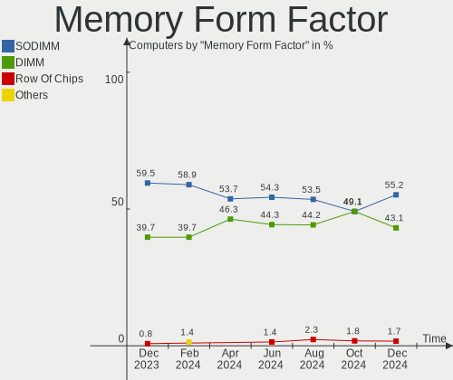
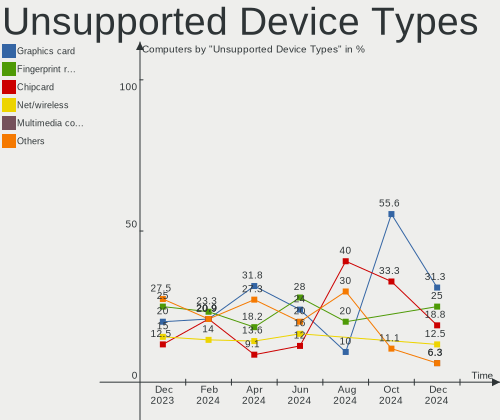

BlackPanther Hardware Trends
----------------------------

A project to identify most popular hardware characteristics and track their change
over time based on data collected by BlackPanther users at https://Linux-Hardware.org.

Anyone can contribute to this report by the [hw-probe](https://github.com/linuxhw/hw-probe) tool:

    sudo -E hw-probe -all -upload

This is a report for all computer types. See also reports for [desktops](/Dist/BlackPanther/Desktop/README.md) and [notebooks](/Dist/BlackPanther/Notebook/README.md).

Full-feature report is available here: https://linux-hardware.org/?view=trends

Period: Mar, 2022.

Contents
--------

* [ System ](#system)
  - [ OS                       ](#os)
  - [ OS Family                ](#os-family)
  - [ Kernel                   ](#kernel)
  - [ Kernel Family            ](#kernel-family)
  - [ Kernel Major Ver.        ](#kernel-major-ver)
  - [ Arch                     ](#arch)
  - [ DE                       ](#de)
  - [ Display Server           ](#display-server)
  - [ Display Manager          ](#display-manager)
  - [ OS Lang                  ](#os-lang)
  - [ Boot Mode                ](#boot-mode)
  - [ Filesystem               ](#filesystem)
  - [ Part. scheme             ](#part-scheme)
  - [ Dual Boot with Linux/BSD ](#dual-boot-with-linuxbsd)
  - [ Dual Boot (Win)          ](#dual-boot-win)

* [ Board ](#board)
  - [ Vendor                   ](#vendor)
  - [ Model                    ](#model)
  - [ Model Family             ](#model-family)
  - [ MFG Year                 ](#mfg-year)
  - [ Form Factor              ](#form-factor)
  - [ Secure Boot              ](#secure-boot)
  - [ Coreboot                 ](#coreboot)
  - [ RAM Size                 ](#ram-size)
  - [ RAM Used                 ](#ram-used)
  - [ Total Drives             ](#total-drives)
  - [ Has CD-ROM               ](#has-cd-rom)
  - [ Has Ethernet             ](#has-ethernet)
  - [ Has WiFi                 ](#has-wifi)
  - [ Has Bluetooth            ](#has-bluetooth)

* [ Location ](#location)
  - [ Country                  ](#country)
  - [ City                     ](#city)

* [ Drives ](#drives)
  - [ Drive Vendor             ](#drive-vendor)
  - [ Drive Model              ](#drive-model)
  - [ HDD Vendor               ](#hdd-vendor)
  - [ SSD Vendor               ](#ssd-vendor)
  - [ Drive Kind               ](#drive-kind)
  - [ Drive Connector          ](#drive-connector)
  - [ Drive Size               ](#drive-size)
  - [ Space Total              ](#space-total)
  - [ Space Used               ](#space-used)
  - [ Malfunc. Drives          ](#malfunc-drives)
  - [ Malfunc. Drive Vendor    ](#malfunc-drive-vendor)
  - [ Malfunc. HDD Vendor      ](#malfunc-hdd-vendor)
  - [ Malfunc. Drive Kind      ](#malfunc-drive-kind)
  - [ Failed Drives            ](#failed-drives)
  - [ Failed Drive Vendor      ](#failed-drive-vendor)
  - [ Drive Status             ](#drive-status)

* [ Storage controller ](#storage-controller)
  - [ Storage Vendor           ](#storage-vendor)
  - [ Storage Model            ](#storage-model)
  - [ Storage Kind             ](#storage-kind)

* [ Processor ](#processor)
  - [ CPU Vendor               ](#cpu-vendor)
  - [ CPU Model                ](#cpu-model)
  - [ CPU Model Family         ](#cpu-model-family)
  - [ CPU Cores                ](#cpu-cores)
  - [ CPU Sockets              ](#cpu-sockets)
  - [ CPU Threads              ](#cpu-threads)
  - [ CPU Op-Modes             ](#cpu-op-modes)
  - [ CPU Microcode            ](#cpu-microcode)
  - [ CPU Microarch            ](#cpu-microarch)

* [ Graphics ](#graphics)
  - [ GPU Vendor               ](#gpu-vendor)
  - [ GPU Model                ](#gpu-model)
  - [ GPU Combo                ](#gpu-combo)
  - [ GPU Driver               ](#gpu-driver)
  - [ GPU Memory               ](#gpu-memory)

* [ Monitor ](#monitor)
  - [ Monitor Vendor           ](#monitor-vendor)
  - [ Monitor Model            ](#monitor-model)
  - [ Monitor Resolution       ](#monitor-resolution)
  - [ Monitor Diagonal         ](#monitor-diagonal)
  - [ Monitor Width            ](#monitor-width)
  - [ Aspect Ratio             ](#aspect-ratio)
  - [ Monitor Area             ](#monitor-area)
  - [ Pixel Density            ](#pixel-density)
  - [ Multiple Monitors        ](#multiple-monitors)

* [ Network ](#network)
  - [ Net Controller Vendor    ](#net-controller-vendor)
  - [ Net Controller Model     ](#net-controller-model)
  - [ Wireless Vendor          ](#wireless-vendor)
  - [ Wireless Model           ](#wireless-model)
  - [ Ethernet Vendor          ](#ethernet-vendor)
  - [ Ethernet Model           ](#ethernet-model)
  - [ Net Controller Kind      ](#net-controller-kind)
  - [ Used Controller          ](#used-controller)
  - [ NICs                     ](#nics)
  - [ IPv6                     ](#ipv6)

* [ Bluetooth ](#bluetooth)
  - [ Bluetooth Vendor         ](#bluetooth-vendor)
  - [ Bluetooth Model          ](#bluetooth-model)

* [ Sound ](#sound)
  - [ Sound Vendor             ](#sound-vendor)
  - [ Sound Model              ](#sound-model)

* [ Memory ](#memory)
  - [ Memory Vendor            ](#memory-vendor)
  - [ Memory Model             ](#memory-model)
  - [ Memory Kind              ](#memory-kind)
  - [ Memory Form Factor       ](#memory-form-factor)
  - [ Memory Size              ](#memory-size)
  - [ Memory Speed             ](#memory-speed)

* [ Printers & scanners ](#printers--scanners)
  - [ Printer Vendor           ](#printer-vendor)
  - [ Printer Model            ](#printer-model)
  - [ Scanner Vendor           ](#scanner-vendor)
  - [ Scanner Model            ](#scanner-model)

* [ Camera ](#camera)
  - [ Camera Vendor            ](#camera-vendor)
  - [ Camera Model             ](#camera-model)

* [ Security ](#security)
  - [ Fingerprint Vendor       ](#fingerprint-vendor)
  - [ Fingerprint Model        ](#fingerprint-model)
  - [ Chipcard Vendor          ](#chipcard-vendor)
  - [ Chipcard Model           ](#chipcard-model)

* [ Unsupported ](#unsupported)
  - [ Unsupported Devices      ](#unsupported-devices)
  - [ Unsupported Device Types ](#unsupported-device-types)

System
------

OS
--

Installed operating systems

| Name              | Computers | Percent |
|-------------------|-----------|---------|
| BlackPanther 18.1 | 56        | 100%    |

OS Family
---------

OS without a version

| Name         | Computers | Percent |
|--------------|-----------|---------|
| BlackPanther | 56        | 100%    |

Kernel
------

Version of the Linux kernel

| Version             | Computers | Percent |
|---------------------|-----------|---------|
| 5.6.14-desktop-2bP  | 35        | 62.5%   |
| 4.18.16-desktop-1bP | 21        | 37.5%   |

Kernel Family
-------------

Linux kernel without a distro release

| Version | Computers | Percent |
|---------|-----------|---------|
| 5.6.14  | 35        | 62.5%   |
| 4.18.16 | 21        | 37.5%   |

Kernel Major Ver.
-----------------

Linux kernel major version

| Version | Computers | Percent |
|---------|-----------|---------|
| 5.6     | 35        | 62.5%   |
| 4.18    | 21        | 37.5%   |

Arch
----

OS architecture (x86_64, i586, etc.)

| Name   | Computers | Percent |
|--------|-----------|---------|
| x86_64 | 56        | 100%    |

DE
--

Desktop Environment

| Name | Computers | Percent |
|------|-----------|---------|
| KDE5 | 56        | 100%    |

Display Server
--------------

X11 or Wayland

| Name | Computers | Percent |
|------|-----------|---------|
| X11  | 56        | 100%    |

Display Manager
---------------

SDDM, LightDM, etc.

| Name | Computers | Percent |
|------|-----------|---------|
| SDDM | 56        | 100%    |

OS Lang
-------

Language

| Lang    | Computers | Percent |
|---------|-----------|---------|
| Unknown | 56        | 100%    |

Boot Mode
---------

EFI or BIOS

| Mode | Computers | Percent |
|------|-----------|---------|
| BIOS | 36        | 64.29%  |
| EFI  | 20        | 35.71%  |

Filesystem
----------

Type of filesystem

| Type    | Computers | Percent |
|---------|-----------|---------|
| Overlay | 49        | 87.5%   |
| Ext4    | 7         | 12.5%   |

Part. scheme
------------

Scheme of partitioning

| Type    | Computers | Percent |
|---------|-----------|---------|
| MBR     | 31        | 55.36%  |
| GPT     | 24        | 42.86%  |
| Unknown | 1         | 1.79%   |

Dual Boot with Linux/BSD
------------------------

Hosting more than one Linux/BSD

| Dual boot | Computers | Percent |
|-----------|-----------|---------|
| No        | 32        | 57.14%  |
| Yes       | 24        | 42.86%  |

Dual Boot (Win)
---------------

Hosting Linux and Windows

| Dual boot | Computers | Percent |
|-----------|-----------|---------|
| Yes       | 32        | 57.14%  |
| No        | 24        | 42.86%  |

Board
-----

Vendor
------

Motherboard manufacturer

| Name                | Computers | Percent |
|---------------------|-----------|---------|
| Hewlett-Packard     | 13        | 23.21%  |
| ASUSTek Computer    | 9         | 16.07%  |
| Lenovo              | 8         | 14.29%  |
| Gigabyte Technology | 5         | 8.93%   |
| Dell                | 4         | 7.14%   |
| Apple               | 3         | 5.36%   |
| Toshiba             | 2         | 3.57%   |
| Sony                | 2         | 3.57%   |
| MSI                 | 2         | 3.57%   |
| Fujitsu             | 2         | 3.57%   |
| ASRock              | 2         | 3.57%   |
| Acer                | 2         | 3.57%   |
| Fujitsu Siemens     | 1         | 1.79%   |
| eMachines           | 1         | 1.79%   |

Model
-----

Motherboard model

| Name                                     | Computers | Percent |
|------------------------------------------|-----------|---------|
| HP Pavilion 17                           | 2         | 3.57%   |
| Toshiba Satellite Pro C50-A-1E5          | 1         | 1.79%   |
| Toshiba dynabook RX3 SN240Y/3HD          | 1         | 1.79%   |
| Sony VPCEH2J1E                           | 1         | 1.79%   |
| Sony SVS13118GBB                         | 1         | 1.79%   |
| MSI MS-7B78                              | 1         | 1.79%   |
| MSI GP75 Leopard 9SE                     | 1         | 1.79%   |
| Lenovo ThinkPad W530 2463A58             | 1         | 1.79%   |
| Lenovo ThinkPad T60 6370A55              | 1         | 1.79%   |
| Lenovo ThinkCentre M77 1996AB8           | 1         | 1.79%   |
| Lenovo ThinkCentre M70e 0832A26          | 1         | 1.79%   |
| Lenovo IdeaPad 330-15IKB 81DE            | 1         | 1.79%   |
| Lenovo IdeaPad 320-17ABR 80YN            | 1         | 1.79%   |
| Lenovo G580 20150                        | 1         | 1.79%   |
| Lenovo G505s 20255                       | 1         | 1.79%   |
| HP ProDesk 600 G1 SFF                    | 1         | 1.79%   |
| HP ProBook 640 G8 Notebook PC            | 1         | 1.79%   |
| HP Pavilion dv8000 (EP409UA#ABA)         | 1         | 1.79%   |
| HP G60                                   | 1         | 1.79%   |
| HP Compaq Pro 6300 MT                    | 1         | 1.79%   |
| HP Compaq nx6125 (PZ896UA#ABA)           | 1         | 1.79%   |
| HP Compaq dc7800p Small Form Factor      | 1         | 1.79%   |
| HP Compaq CQ58                           | 1         | 1.79%   |
| HP Compaq 6720s                          | 1         | 1.79%   |
| HP Compaq 6710b (GB890EA#AKC)            | 1         | 1.79%   |
| HP 650                                   | 1         | 1.79%   |
| Gigabyte H61M-S2PV                       | 1         | 1.79%   |
| Gigabyte H61M-D2-B3                      | 1         | 1.79%   |
| Gigabyte GA-78LMT-USB3 R2                | 1         | 1.79%   |
| Gigabyte G41MT-S2PT                      | 1         | 1.79%   |
| Gigabyte B450M GAMING                    | 1         | 1.79%   |
| Fujitsu Siemens AMILO Desktop Pi3620A    | 1         | 1.79%   |
| Fujitsu LIFEBOOK U745                    | 1         | 1.79%   |
| Fujitsu ESPRIMO P710                     | 1         | 1.79%   |
| eMachines E725                           | 1         | 1.79%   |
| Dell OptiPlex 755                        | 1         | 1.79%   |
| Dell Latitude E6230                      | 1         | 1.79%   |
| Dell Latitude E5540                      | 1         | 1.79%   |
| Dell Inspiron M5030                      | 1         | 1.79%   |
| ASUS X541UVK                             | 1         | 1.79%   |
| ASUS X201EP                              | 1         | 1.79%   |
| ASUS T101HA                              | 1         | 1.79%   |
| ASUS Strix 15 GL503GE                    | 1         | 1.79%   |
| ASUS ROG STRIX X370-F GAMING             | 1         | 1.79%   |
| ASUS Rampage III Extreme                 | 1         | 1.79%   |
| ASUS PRIME B365M-A                       | 1         | 1.79%   |
| ASUS M5A78L-M PLUS/USB3                  | 1         | 1.79%   |
| ASUS ASUS TUF Gaming A15 FA506IU_FX506IU | 1         | 1.79%   |
| ASRock FM2A75M Pro4+                     | 1         | 1.79%   |
| ASRock B75 Pro3                          | 1         | 1.79%   |
| Apple MacPro2,1                          | 1         | 1.79%   |
| Apple MacBookPro6,2                      | 1         | 1.79%   |
| Apple iMac8,1                            | 1         | 1.79%   |
| Acer Veriton M4610G                      | 1         | 1.79%   |
| Acer TravelMate P238-G2-M                | 1         | 1.79%   |

Model Family
------------

Motherboard model prefix

| Name                   | Computers | Percent |
|------------------------|-----------|---------|
| HP Compaq              | 6         | 10.71%  |
| HP Pavilion            | 3         | 5.36%   |
| Lenovo ThinkPad        | 2         | 3.57%   |
| Lenovo ThinkCentre     | 2         | 3.57%   |
| Lenovo IdeaPad         | 2         | 3.57%   |
| Dell Latitude          | 2         | 3.57%   |
| Toshiba Satellite      | 1         | 1.79%   |
| Toshiba dynabook       | 1         | 1.79%   |
| Sony VPCEH2J1E         | 1         | 1.79%   |
| Sony SVS13118GBB       | 1         | 1.79%   |
| MSI MS-7B78            | 1         | 1.79%   |
| MSI GP75               | 1         | 1.79%   |
| Lenovo G580            | 1         | 1.79%   |
| Lenovo G505s           | 1         | 1.79%   |
| HP ProDesk             | 1         | 1.79%   |
| HP ProBook             | 1         | 1.79%   |
| HP G60                 | 1         | 1.79%   |
| HP 650                 | 1         | 1.79%   |
| Gigabyte H61M-S2PV     | 1         | 1.79%   |
| Gigabyte H61M-D2-B3    | 1         | 1.79%   |
| Gigabyte GA-78LMT-USB3 | 1         | 1.79%   |
| Gigabyte G41MT-S2PT    | 1         | 1.79%   |
| Gigabyte B450M         | 1         | 1.79%   |
| Fujitsu Siemens AMILO  | 1         | 1.79%   |
| Fujitsu LIFEBOOK       | 1         | 1.79%   |
| Fujitsu ESPRIMO        | 1         | 1.79%   |
| eMachines E725         | 1         | 1.79%   |
| Dell OptiPlex          | 1         | 1.79%   |
| Dell Inspiron          | 1         | 1.79%   |
| ASUS X541UVK           | 1         | 1.79%   |
| ASUS X201EP            | 1         | 1.79%   |
| ASUS T101HA            | 1         | 1.79%   |
| ASUS Strix             | 1         | 1.79%   |
| ASUS ROG               | 1         | 1.79%   |
| ASUS Rampage           | 1         | 1.79%   |
| ASUS PRIME             | 1         | 1.79%   |
| ASUS M5A78L-M          | 1         | 1.79%   |
| ASUS ASUS              | 1         | 1.79%   |
| ASRock FM2A75M         | 1         | 1.79%   |
| ASRock B75             | 1         | 1.79%   |
| Apple MacPro2          | 1         | 1.79%   |
| Apple MacBookPro6      | 1         | 1.79%   |
| Apple iMac8            | 1         | 1.79%   |
| Acer Veriton           | 1         | 1.79%   |
| Acer TravelMate        | 1         | 1.79%   |

MFG Year
--------

Motherboard manufacture year

| Year | Computers | Percent |
|------|-----------|---------|
| 2012 | 13        | 23.21%  |
| 2018 | 5         | 8.93%   |
| 2013 | 5         | 8.93%   |
| 2007 | 5         | 8.93%   |
| 2017 | 4         | 7.14%   |
| 2011 | 4         | 7.14%   |
| 2010 | 4         | 7.14%   |
| 2019 | 3         | 5.36%   |
| 2014 | 3         | 5.36%   |
| 2008 | 3         | 5.36%   |
| 2006 | 2         | 3.57%   |
| 2021 | 1         | 1.79%   |
| 2020 | 1         | 1.79%   |
| 2016 | 1         | 1.79%   |
| 2009 | 1         | 1.79%   |
| 2005 | 1         | 1.79%   |

Form Factor
-----------

Physical design of the computer

| Name       | Computers | Percent |
|------------|-----------|---------|
| Notebook   | 32        | 57.14%  |
| Desktop    | 22        | 39.29%  |
| Tablet     | 1         | 1.79%   |
| All in one | 1         | 1.79%   |

Secure Boot
-----------

Enabled or disabled

| State    | Computers | Percent |
|----------|-----------|---------|
| Disabled | 56        | 100%    |

Coreboot
--------

Have coreboot on board

| Used | Computers | Percent |
|------|-----------|---------|
| No   | 56        | 100%    |

RAM Size
--------

Total RAM memory

| Size in GB | Computers | Percent |
|------------|-----------|---------|
| 3.01-4.0   | 17        | 30.36%  |
| 8.01-16.0  | 14        | 25%     |
| 4.01-8.0   | 11        | 19.64%  |
| 1.01-2.0   | 5         | 8.93%   |
| 16.01-24.0 | 4         | 7.14%   |
| 24.01-32.0 | 2         | 3.57%   |
| 0.51-1.0   | 2         | 3.57%   |
| 32.01-64.0 | 1         | 1.79%   |

RAM Used
--------

Used RAM memory

| Used GB  | Computers | Percent |
|----------|-----------|---------|
| 0.01-0.5 | 23        | 41.07%  |
| 0.51-1.0 | 22        | 39.29%  |
| 1.01-2.0 | 11        | 19.64%  |

Total Drives
------------

Number of drives on board

| Drives | Computers | Percent |
|--------|-----------|---------|
| 1      | 34        | 60.71%  |
| 2      | 13        | 23.21%  |
| 3      | 5         | 8.93%   |
| 5      | 2         | 3.57%   |
| 6      | 1         | 1.79%   |
| 0      | 1         | 1.79%   |

Has CD-ROM
----------

Has CD-ROM on board

| Presented | Computers | Percent |
|-----------|-----------|---------|
| Yes       | 35        | 62.5%   |
| No        | 21        | 37.5%   |

Has Ethernet
------------

Has Ethernet on board

| Presented | Computers | Percent |
|-----------|-----------|---------|
| Yes       | 55        | 98.21%  |
| No        | 1         | 1.79%   |

Has WiFi
--------

Has WiFi module

| Presented | Computers | Percent |
|-----------|-----------|---------|
| Yes       | 36        | 64.29%  |
| No        | 20        | 35.71%  |

Has Bluetooth
-------------

Has Bluetooth module

| Presented | Computers | Percent |
|-----------|-----------|---------|
| Yes       | 28        | 50%     |
| No        | 28        | 50%     |

Location
--------

Country
-------

Geographic location (country)

| Country    | Computers | Percent |
|------------|-----------|---------|
| Hungary    | 42        | 75%     |
| USA        | 5         | 8.93%   |
| UK         | 2         | 3.57%   |
| Romania    | 2         | 3.57%   |
| Austria    | 2         | 3.57%   |
| Madagascar | 1         | 1.79%   |
| Japan      | 1         | 1.79%   |
| Argentina  | 1         | 1.79%   |

City
----

Geographic location (city)

| City              | Computers | Percent |
|-------------------|-----------|---------|
| Budapest          | 12        | 21.43%  |
| Szombathely       | 3         | 5.36%   |
| North Hollywood   | 3         | 5.36%   |
| Vienna            | 2         | 3.57%   |
| Tatabánya        | 2         | 3.57%   |
| Pécs             | 2         | 3.57%   |
| Miskolc           | 2         | 3.57%   |
| Kapuvar           | 2         | 3.57%   |
| Zalaszentgrot     | 1         | 1.79%   |
| Zalaegerszeg      | 1         | 1.79%   |
| Veszprém         | 1         | 1.79%   |
| Toltestava        | 1         | 1.79%   |
| Tapioszele        | 1         | 1.79%   |
| Szekszárd        | 1         | 1.79%   |
| Szada             | 1         | 1.79%   |
| Roszke            | 1         | 1.79%   |
| Randolph Township | 1         | 1.79%   |
| Oroshaza          | 1         | 1.79%   |
| Odorheiu Secuiesc | 1         | 1.79%   |
| Nagykoros         | 1         | 1.79%   |
| Milton Keynes     | 1         | 1.79%   |
| Mezotur           | 1         | 1.79%   |
| Kisvarda          | 1         | 1.79%   |
| Kisarazu          | 1         | 1.79%   |
| Karcag            | 1         | 1.79%   |
| Hove              | 1         | 1.79%   |
| Hort              | 1         | 1.79%   |
| Hodmezovasarhely  | 1         | 1.79%   |
| Harsany           | 1         | 1.79%   |
| Győr             | 1         | 1.79%   |
| Fot               | 1         | 1.79%   |
| Eger              | 1         | 1.79%   |
| Daytona Beach     | 1         | 1.79%   |
| Bucharest         | 1         | 1.79%   |
| Avellaneda        | 1         | 1.79%   |
| Ambilobe          | 1         | 1.79%   |

Drives
------

Drive Vendor
------------

Hard drive vendors

| Vendor              | Computers | Drives | Percent |
|---------------------|-----------|--------|---------|
| WDC                 | 15        | 18     | 18.07%  |
| Samsung Electronics | 12        | 13     | 14.46%  |
| Seagate             | 9         | 12     | 10.84%  |
| Kingston            | 9         | 12     | 10.84%  |
| Toshiba             | 5         | 6      | 6.02%   |
| Hitachi             | 4         | 4      | 4.82%   |
| HGST                | 3         | 3      | 3.61%   |
| Unknown             | 2         | 2      | 2.41%   |
| SanDisk             | 2         | 2      | 2.41%   |
| Apacer              | 2         | 2      | 2.41%   |
| Zheino              | 1         | 1      | 1.2%    |
| WD MediaMax         | 1         | 1      | 1.2%    |
| SSSTC               | 1         | 1      | 1.2%    |
| Solid               | 1         | 1      | 1.2%    |
| SK Hynix            | 1         | 1      | 1.2%    |
| Silicon Motion      | 1         | 1      | 1.2%    |
| SATAFIRM            | 1         | 1      | 1.2%    |
| PNY                 | 1         | 1      | 1.2%    |
| OCZ                 | 1         | 1      | 1.2%    |
| Micron Technology   | 1         | 1      | 1.2%    |
| MAXTOR              | 1         | 1      | 1.2%    |
| Kingmax             | 1         | 1      | 1.2%    |
| Intenso             | 1         | 1      | 1.2%    |
| Intel               | 1         | 1      | 1.2%    |
| Gigabyte Technology | 1         | 1      | 1.2%    |
| Fujitsu             | 1         | 1      | 1.2%    |
| Crucial             | 1         | 1      | 1.2%    |
| China               | 1         | 1      | 1.2%    |
| AS25                | 1         | 1      | 1.2%    |
| A-DATA Technology   | 1         | 1      | 1.2%    |

Drive Model
-----------

Hard drive models

| Model                                 | Computers | Percent |
|---------------------------------------|-----------|---------|
| Kingston SA400S37240G 240GB SSD       | 3         | 3.26%   |
| Samsung SSD 860 EVO 250GB             | 2         | 2.17%   |
| Kingston SUV400S37120G 120GB SSD      | 2         | 2.17%   |
| Kingston SA400S37480G 480GB SSD       | 2         | 2.17%   |
| Kingston SA400S37120G 120GB SSD       | 2         | 2.17%   |
| Kingston SA2000M8250G 250GB           | 2         | 2.17%   |
| Zheino CHN-NGFFNV2280-256 256GB       | 1         | 1.09%   |
| WDC WDS240G2G0B-00EPW0 240GB SSD      | 1         | 1.09%   |
| WDC WD7500BPVT-60HXZT3 752GB          | 1         | 1.09%   |
| WDC WD6400AAKS-07A7B0 640GB           | 1         | 1.09%   |
| WDC WD5000LPVX-22V0TT0 500GB          | 1         | 1.09%   |
| WDC WD5000LPCX-22VHAT1 500GB          | 1         | 1.09%   |
| WDC WD5000BPVT-35HXZT1 500GB          | 1         | 1.09%   |
| WDC WD5000BEVT-22A0RT0 500GB          | 1         | 1.09%   |
| WDC WD5000AZRX-00A8LB0 500GB          | 1         | 1.09%   |
| WDC WD5000AAKX-753CA1 500GB           | 1         | 1.09%   |
| WDC WD5000AAKS-40YGA1 500GB           | 1         | 1.09%   |
| WDC WD50 00BEVT-22A0RT0 500GB         | 1         | 1.09%   |
| WDC WD40EZRZ-00GXCB0 4TB              | 1         | 1.09%   |
| WDC WD3200BPVT-75ZEST0 320GB          | 1         | 1.09%   |
| WDC WD1600AAJS-60WAA0 160GB           | 1         | 1.09%   |
| WDC WD1600AAJB-56WRA0 160GB           | 1         | 1.09%   |
| WDC WD10EZRX-00A8LB0 1TB              | 1         | 1.09%   |
| WDC WD10EZEX-00BN5A0 1TB              | 1         | 1.09%   |
| WDC WD10EARX-00N0YB0 1TB              | 1         | 1.09%   |
| WD MediaMax WL160GSA872B 160GB        | 1         | 1.09%   |
| Unknown SSD0128S00 128GB              | 1         | 1.09%   |
| Unknown 00000  64GB                   | 1         | 1.09%   |
| Toshiba MQ01ABF032 320GB              | 1         | 1.09%   |
| Toshiba MK6037GSX 64GB                | 1         | 1.09%   |
| Toshiba MK1661GSYFN 160GB             | 1         | 1.09%   |
| Toshiba MK1031GAS 100GB               | 1         | 1.09%   |
| Toshiba HDWL120 2TB                   | 1         | 1.09%   |
| SSSTC CL1-8D256-HP 256GB              | 1         | 1.09%   |
| Solid SSD0240S00 240GB                | 1         | 1.09%   |
| SK Hynix HFS256G39TND-N210A 256GB SSD | 1         | 1.09%   |
| Silicon Motion BW-NV1 128GB           | 1         | 1.09%   |
| Seagate ST9160310AS 160GB             | 1         | 1.09%   |
| Seagate ST500LT012-9WS142 500GB       | 1         | 1.09%   |
| Seagate ST500DM002-1BD142 500GB       | 1         | 1.09%   |
| Seagate ST3500418AS 500GB             | 1         | 1.09%   |
| Seagate ST3320418AS 320GB             | 1         | 1.09%   |
| Seagate ST3160815AS 160GB             | 1         | 1.09%   |
| Seagate ST3120026AS 120GB             | 1         | 1.09%   |
| Seagate ST3000DM001-1ER166 3TB        | 1         | 1.09%   |
| Seagate ST2000LM003 HN-M201RAD 2TB    | 1         | 1.09%   |
| Seagate ST1000LX015-1U7172 1TB        | 1         | 1.09%   |
| Seagate ST1000LM014-1EJ164-SSHD 1TB   | 1         | 1.09%   |
| SATAFIRM S11 240GB SSD                | 1         | 1.09%   |
| SanDisk SD9TB8W1T001001 1TB SSD       | 1         | 1.09%   |
| SanDisk DF4128  128GB                 | 1         | 1.09%   |
| Samsung SSD 970 EVO Plus 2TB          | 1         | 1.09%   |
| Samsung SSD 870 EVO 250GB             | 1         | 1.09%   |
| Samsung SSD 860 QVO 2TB               | 1         | 1.09%   |
| Samsung SSD 860 EVO 500GB             | 1         | 1.09%   |
| Samsung SSD 830 Series 128GB          | 1         | 1.09%   |
| Samsung SSD 750 EVO 250GB             | 1         | 1.09%   |
| Samsung MZVLW256HEHP-00000 256GB      | 1         | 1.09%   |
| Samsung MZVLB512HBJQ-000L7 512GB      | 1         | 1.09%   |
| Samsung MZ7LN256HCHP-00000 256GB SSD  | 1         | 1.09%   |

HDD Vendor
----------

Hard disk drive vendors

| Vendor              | Computers | Drives | Percent |
|---------------------|-----------|--------|---------|
| WDC                 | 14        | 17     | 35%     |
| Seagate             | 9         | 12     | 22.5%   |
| Toshiba             | 5         | 6      | 12.5%   |
| Hitachi             | 4         | 4      | 10%     |
| HGST                | 3         | 3      | 7.5%    |
| Samsung Electronics | 2         | 2      | 5%      |
| WD MediaMax         | 1         | 1      | 2.5%    |
| MAXTOR              | 1         | 1      | 2.5%    |
| Fujitsu             | 1         | 1      | 2.5%    |

SSD Vendor
----------

Solid state drive vendors

| Vendor              | Computers | Drives | Percent |
|---------------------|-----------|--------|---------|
| Kingston            | 8         | 10     | 24.24%  |
| Samsung Electronics | 7         | 8      | 21.21%  |
| Apacer              | 2         | 2      | 6.06%   |
| WDC                 | 1         | 1      | 3.03%   |
| Unknown             | 1         | 1      | 3.03%   |
| Solid               | 1         | 1      | 3.03%   |
| SK Hynix            | 1         | 1      | 3.03%   |
| SATAFIRM            | 1         | 1      | 3.03%   |
| SanDisk             | 1         | 1      | 3.03%   |
| PNY                 | 1         | 1      | 3.03%   |
| OCZ                 | 1         | 1      | 3.03%   |
| Kingmax             | 1         | 1      | 3.03%   |
| Intenso             | 1         | 1      | 3.03%   |
| Intel               | 1         | 1      | 3.03%   |
| Gigabyte Technology | 1         | 1      | 3.03%   |
| Crucial             | 1         | 1      | 3.03%   |
| China               | 1         | 1      | 3.03%   |
| AS25                | 1         | 1      | 3.03%   |
| A-DATA Technology   | 1         | 1      | 3.03%   |

Drive Kind
----------

HDD or SSD

| Kind | Computers | Drives | Percent |
|------|-----------|--------|---------|
| HDD  | 36        | 47     | 50%     |
| SSD  | 28        | 36     | 38.89%  |
| NVMe | 7         | 9      | 9.72%   |
| MMC  | 1         | 2      | 1.39%   |

Drive Connector
---------------

SATA, SAS, NVMe, etc.

| Type | Computers | Drives | Percent |
|------|-----------|--------|---------|
| SATA | 53        | 82     | 85.48%  |
| NVMe | 7         | 9      | 11.29%  |
| SAS  | 1         | 1      | 1.61%   |
| MMC  | 1         | 2      | 1.61%   |

Drive Size
----------

Size of hard drive

| Size in TB | Computers | Drives | Percent |
|------------|-----------|--------|---------|
| 0.01-0.5   | 45        | 64     | 72.58%  |
| 0.51-1.0   | 12        | 13     | 19.35%  |
| 1.01-2.0   | 3         | 3      | 4.84%   |
| 3.01-4.0   | 1         | 1      | 1.61%   |
| 2.01-3.0   | 1         | 2      | 1.61%   |

Space Total
-----------

Amount of disk space available on the file system

| Size in GB | Computers | Percent |
|------------|-----------|---------|
| Unknown    | 46        | 82.14%  |
| 101-250    | 4         | 7.14%   |
| 251-500    | 2         | 3.57%   |
| 51-100     | 2         | 3.57%   |
| 2001-3000  | 1         | 1.79%   |
| 501-1000   | 1         | 1.79%   |

Space Used
----------

Amount of used disk space

| Used GB | Computers | Percent |
|---------|-----------|---------|
| Unknown | 46        | 82.14%  |
| 1-20    | 8         | 14.29%  |
| 251-500 | 1         | 1.79%   |
| 101-250 | 1         | 1.79%   |

Malfunc. Drives
---------------

Drive models with a malfunction

| Model                                 | Computers | Drives | Percent |
|---------------------------------------|-----------|--------|---------|
| WDC WD7500BPVT-60HXZT3 752GB          | 1         | 1      | 4%      |
| WDC WD6400AAKS-07A7B0 640GB           | 1         | 1      | 4%      |
| WDC WD10EZRX-00A8LB0 1TB              | 1         | 1      | 4%      |
| WDC WD10EARX-00N0YB0 1TB              | 1         | 1      | 4%      |
| WD MediaMax WL160GSA872B 160GB        | 1         | 1      | 4%      |
| Toshiba MQ01ABF032 320GB              | 1         | 1      | 4%      |
| Toshiba MK6037GSX 64GB                | 1         | 1      | 4%      |
| Toshiba MK1031GAS 100GB               | 1         | 2      | 4%      |
| SK Hynix HFS256G39TND-N210A 256GB SSD | 1         | 1      | 4%      |
| Seagate ST9160310AS 160GB             | 1         | 1      | 4%      |
| Seagate ST500LT012-9WS142 500GB       | 1         | 1      | 4%      |
| Seagate ST500DM002-1BD142 500GB       | 1         | 1      | 4%      |
| Seagate ST3320418AS 320GB             | 1         | 1      | 4%      |
| Seagate ST3120026AS 120GB             | 1         | 1      | 4%      |
| Seagate ST3000DM001-1ER166 3TB        | 1         | 2      | 4%      |
| Seagate ST1000LX015-1U7172 1TB        | 1         | 1      | 4%      |
| Seagate ST1000LM014-1EJ164-SSHD 1TB   | 1         | 1      | 4%      |
| SATAFIRM S11 240GB SSD                | 1         | 1      | 4%      |
| Samsung Electronics HD154UI 1TB       | 1         | 1      | 4%      |
| Samsung Electronics HD103UJ 1TB       | 1         | 1      | 4%      |
| MAXTOR 6V250F0 256GB                  | 1         | 1      | 4%      |
| Hitachi HTS725025A9A364 250GB         | 1         | 1      | 4%      |
| Hitachi HTS545050B9A300 500GB         | 1         | 1      | 4%      |
| HGST HTS725050A7E630 500GB            | 1         | 1      | 4%      |
| HGST HTS541010A9E680 1TB              | 1         | 1      | 4%      |

Malfunc. Drive Vendor
---------------------

Vendors of faulty drives

| Vendor              | Computers | Drives | Percent |
|---------------------|-----------|--------|---------|
| Seagate             | 7         | 9      | 29.17%  |
| WDC                 | 4         | 4      | 16.67%  |
| Toshiba             | 3         | 4      | 12.5%   |
| Samsung Electronics | 2         | 2      | 8.33%   |
| Hitachi             | 2         | 2      | 8.33%   |
| HGST                | 2         | 2      | 8.33%   |
| WD MediaMax         | 1         | 1      | 4.17%   |
| SK Hynix            | 1         | 1      | 4.17%   |
| SATAFIRM            | 1         | 1      | 4.17%   |
| MAXTOR              | 1         | 1      | 4.17%   |

Malfunc. HDD Vendor
-------------------

Vendors of faulty HDD drives

| Vendor              | Computers | Drives | Percent |
|---------------------|-----------|--------|---------|
| Seagate             | 7         | 9      | 31.82%  |
| WDC                 | 4         | 4      | 18.18%  |
| Toshiba             | 3         | 4      | 13.64%  |
| Samsung Electronics | 2         | 2      | 9.09%   |
| Hitachi             | 2         | 2      | 9.09%   |
| HGST                | 2         | 2      | 9.09%   |
| WD MediaMax         | 1         | 1      | 4.55%   |
| MAXTOR              | 1         | 1      | 4.55%   |

Malfunc. Drive Kind
-------------------

Kinds of faulty drives

| Kind | Computers | Drives | Percent |
|------|-----------|--------|---------|
| HDD  | 20        | 25     | 90.91%  |
| SSD  | 2         | 2      | 9.09%   |

Failed Drives
-------------

Failed drive models

| Model                        | Computers | Drives | Percent |
|------------------------------|-----------|--------|---------|
| WDC WD5000BEVT-22A0RT0 500GB | 1         | 1      | 100%    |

Failed Drive Vendor
-------------------

Failed drive vendors

| Vendor | Computers | Drives | Percent |
|--------|-----------|--------|---------|
| WDC    | 1         | 1      | 100%    |

Drive Status
------------

Number of failed and malfunc. drives

| Status   | Computers | Drives | Percent |
|----------|-----------|--------|---------|
| Works    | 41        | 63     | 62.12%  |
| Malfunc  | 22        | 27     | 33.33%  |
| Detected | 2         | 3      | 3.03%   |
| Failed   | 1         | 1      | 1.52%   |

Storage controller
------------------

Storage Vendor
--------------

Storage controller vendors

| Vendor                         | Computers | Percent |
|--------------------------------|-----------|---------|
| Intel                          | 39        | 57.35%  |
| AMD                            | 15        | 22.06%  |
| Samsung Electronics            | 3         | 4.41%   |
| Silicon Motion                 | 2         | 2.94%   |
| Kingston Technology Company    | 2         | 2.94%   |
| VIA Technologies               | 1         | 1.47%   |
| Solid State Storage Technology | 1         | 1.47%   |
| Nvidia                         | 1         | 1.47%   |
| Micron Technology              | 1         | 1.47%   |
| Marvell Technology Group       | 1         | 1.47%   |
| JMicron Technology             | 1         | 1.47%   |
| ASMedia Technology             | 1         | 1.47%   |

Storage Model
-------------

Storage controller models

| Model                                                                                   | Computers | Percent |
|-----------------------------------------------------------------------------------------|-----------|---------|
| AMD FCH SATA Controller [AHCI mode]                                                     | 7         | 8.05%   |
| Intel 7 Series Chipset Family 6-port SATA Controller [AHCI mode]                        | 6         | 6.9%    |
| Intel Sunrise Point-LP SATA Controller [AHCI mode]                                      | 3         | 3.45%   |
| Intel 82801HM/HEM (ICH8M/ICH8M-E) SATA Controller [AHCI mode]                           | 3         | 3.45%   |
| Intel 82801HM/HEM (ICH8M/ICH8M-E) IDE Controller                                        | 3         | 3.45%   |
| Intel 7 Series/C210 Series Chipset Family 6-port SATA Controller [AHCI mode]            | 3         | 3.45%   |
| Intel 6 Series/C200 Series Chipset Family 6 port Desktop SATA AHCI Controller           | 3         | 3.45%   |
| AMD SB7x0/SB8x0/SB9x0 SATA Controller [IDE mode]                                        | 3         | 3.45%   |
| AMD SB7x0/SB8x0/SB9x0 IDE Controller                                                    | 3         | 3.45%   |
| Silicon Motion SM2263EN/SM2263XT SSD Controller                                         | 2         | 2.3%    |
| Samsung NVMe SSD Controller SM981/PM981/PM983                                           | 2         | 2.3%    |
| Kingston Company A2000 NVMe SSD                                                         | 2         | 2.3%    |
| Intel NM10/ICH7 Family SATA Controller [IDE mode]                                       | 2         | 2.3%    |
| Intel Cannon Lake Mobile PCH SATA AHCI Controller                                       | 2         | 2.3%    |
| Intel 82801IBM/IEM (ICH9M/ICH9M-E) 4 port SATA Controller [AHCI mode]                   | 2         | 2.3%    |
| Intel 82801G (ICH7 Family) IDE Controller                                               | 2         | 2.3%    |
| Intel 82801 Mobile SATA Controller [RAID mode]                                          | 2         | 2.3%    |
| Intel 5 Series/3400 Series Chipset 4 port SATA AHCI Controller                          | 2         | 2.3%    |
| AMD SB7x0/SB8x0/SB9x0 SATA Controller [AHCI mode]                                       | 2         | 2.3%    |
| AMD IXP SB4x0 IDE Controller                                                            | 2         | 2.3%    |
| AMD 400 Series Chipset SATA Controller                                                  | 2         | 2.3%    |
| VIA VT6421 IDE/SATA Controller                                                          | 1         | 1.15%   |
| Solid State Storage Non-Volatile memory controller                                      | 1         | 1.15%   |
| Samsung NVMe SSD Controller SM961/PM961/SM963                                           | 1         | 1.15%   |
| Nvidia MCP73 SATA Controller (IDE mode)                                                 | 1         | 1.15%   |
| Micron Non-Volatile memory controller                                                   | 1         | 1.15%   |
| Marvell Group 88SE91A3 SATA-600 Controller                                              | 1         | 1.15%   |
| JMicron JMB363 SATA/IDE Controller                                                      | 1         | 1.15%   |
| Intel Wildcat Point-LP SATA Controller [AHCI Mode]                                      | 1         | 1.15%   |
| Intel Volume Management Device NVMe RAID Controller                                     | 1         | 1.15%   |
| Intel 82Q35 Express PT IDER Controller                                                  | 1         | 1.15%   |
| Intel 82801JI (ICH10 Family) 4 port SATA IDE Controller #1                              | 1         | 1.15%   |
| Intel 82801JI (ICH10 Family) 2 port SATA IDE Controller #2                              | 1         | 1.15%   |
| Intel 82801IR/IO/IH (ICH9R/DO/DH) 6 port SATA Controller [AHCI mode]                    | 1         | 1.15%   |
| Intel 82801IR/IO/IH (ICH9R/DO/DH) 4 port SATA Controller [IDE mode]                     | 1         | 1.15%   |
| Intel 82801I (ICH9 Family) 2 port SATA Controller [IDE mode]                            | 1         | 1.15%   |
| Intel 82801HM/HEM (ICH8M/ICH8M-E) SATA Controller [IDE mode]                            | 1         | 1.15%   |
| Intel 82801GBM/GHM (ICH7-M Family) SATA Controller [IDE mode]                           | 1         | 1.15%   |
| Intel 8 Series/C220 Series Chipset Family 6-port SATA Controller 1 [AHCI mode]          | 1         | 1.15%   |
| Intel 8 Series SATA Controller 1 [AHCI mode]                                            | 1         | 1.15%   |
| Intel 631xESB/632xESB/3100 Chipset SATA IDE Controller                                  | 1         | 1.15%   |
| Intel 631xESB/632xESB IDE Controller                                                    | 1         | 1.15%   |
| Intel 6 Series/C200 Series Chipset Family IDE-r Controller                              | 1         | 1.15%   |
| Intel 6 Series/C200 Series Chipset Family Desktop SATA Controller (IDE mode, ports 4-5) | 1         | 1.15%   |
| Intel 6 Series/C200 Series Chipset Family Desktop SATA Controller (IDE mode, ports 0-3) | 1         | 1.15%   |
| Intel 6 Series/C200 Series Chipset Family 6 port Mobile SATA AHCI Controller            | 1         | 1.15%   |
| Intel 200 Series PCH SATA controller [AHCI mode]                                        | 1         | 1.15%   |
| ASMedia ASM1062 Serial ATA Controller                                                   | 1         | 1.15%   |
| AMD X370 Series Chipset SATA Controller                                                 | 1         | 1.15%   |
| AMD FCH IDE Controller                                                                  | 1         | 1.15%   |

Storage Kind
------------

Kind of storage controller (IDE, SATA, NVMe, SAS, ...)

| Kind | Computers | Percent |
|------|-----------|---------|
| SATA | 43        | 59.72%  |
| IDE  | 18        | 25%     |
| NVMe | 7         | 9.72%   |
| RAID | 4         | 5.56%   |

Processor
---------

CPU Vendor
----------

Processor vendors

| Vendor | Computers | Percent |
|--------|-----------|---------|
| Intel  | 41        | 73.21%  |
| AMD    | 15        | 26.79%  |

CPU Model
---------

Processor models

| Model                                           | Computers | Percent |
|-------------------------------------------------|-----------|---------|
| Intel Core i3-2120 CPU @ 3.30GHz                | 3         | 5.36%   |
| Intel Core i5-3340M CPU @ 2.70GHz               | 2         | 3.57%   |
| Intel Core i3-4030U CPU @ 1.90GHz               | 2         | 3.57%   |
| Intel Xeon CPU X5355 @ 2.66GHz                  | 1         | 1.79%   |
| Intel Pentium Dual-Core CPU T4400 @ 2.20GHz     | 1         | 1.79%   |
| Intel Pentium Dual-Core CPU T4200 @ 2.00GHz     | 1         | 1.79%   |
| Intel Pentium CPU G840 @ 2.80GHz                | 1         | 1.79%   |
| Intel Pentium CPU B960 @ 2.20GHz                | 1         | 1.79%   |
| Intel Core i7-9750H CPU @ 2.60GHz               | 1         | 1.79%   |
| Intel Core i7-8750H CPU @ 2.20GHz               | 1         | 1.79%   |
| Intel Core i7-5600U CPU @ 2.60GHz               | 1         | 1.79%   |
| Intel Core i7-3740QM CPU @ 2.70GHz              | 1         | 1.79%   |
| Intel Core i7 CPU X 980 @ 3.33GHz               | 1         | 1.79%   |
| Intel Core i7 CPU M 620 @ 2.67GHz               | 1         | 1.79%   |
| Intel Core i5-8250U CPU @ 1.60GHz               | 1         | 1.79%   |
| Intel Core i5-7200U CPU @ 2.50GHz               | 1         | 1.79%   |
| Intel Core i5-3470 CPU @ 3.20GHz                | 1         | 1.79%   |
| Intel Core i5-3210M CPU @ 2.50GHz               | 1         | 1.79%   |
| Intel Core i5-2400 CPU @ 3.10GHz                | 1         | 1.79%   |
| Intel Core i3-8100 CPU @ 3.60GHz                | 1         | 1.79%   |
| Intel Core i3-6006U CPU @ 2.00GHz               | 1         | 1.79%   |
| Intel Core i3-2348M CPU @ 2.30GHz               | 1         | 1.79%   |
| Intel Core i3-2330M CPU @ 2.20GHz               | 1         | 1.79%   |
| Intel Core i3 CPU M 370 @ 2.40GHz               | 1         | 1.79%   |
| Intel Core 2 Quad CPU Q9400 @ 2.66GHz           | 1         | 1.79%   |
| Intel Core 2 Quad CPU Q9300 @ 2.50GHz           | 1         | 1.79%   |
| Intel Core 2 Quad CPU Q8200 @ 2.33GHz           | 1         | 1.79%   |
| Intel Core 2 Quad CPU Q6600 @ 2.40GHz           | 1         | 1.79%   |
| Intel Core 2 Duo CPU T7300 @ 2.00GHz            | 1         | 1.79%   |
| Intel Core 2 Duo CPU T5270 @ 1.40GHz            | 1         | 1.79%   |
| Intel Core 2 Duo CPU E8500 @ 3.16GHz            | 1         | 1.79%   |
| Intel Core 2 Duo CPU E8335 @ 2.66GHz            | 1         | 1.79%   |
| Intel Core 2 CPU T5600 @ 1.83GHz                | 1         | 1.79%   |
| Intel Celeron CPU G1840 @ 2.80GHz               | 1         | 1.79%   |
| Intel Celeron CPU 847 @ 1.10GHz                 | 1         | 1.79%   |
| Intel Atom x5-Z8350 CPU @ 1.44GHz               | 1         | 1.79%   |
| Intel 11th Gen Core i3-1115G4 @ 3.00GHz         | 1         | 1.79%   |
| AMD V160 Processor                              | 1         | 1.79%   |
| AMD Turion 64 Mobile Technology ML-37           | 1         | 1.79%   |
| AMD Turion 64 Mobile ML-40                      | 1         | 1.79%   |
| AMD Ryzen 7 4800H with Radeon Graphics          | 1         | 1.79%   |
| AMD Ryzen 7 1700 Eight-Core Processor           | 1         | 1.79%   |
| AMD Ryzen 5 3400G with Radeon Vega Graphics     | 1         | 1.79%   |
| AMD Ryzen 5 1600 Six-Core Processor             | 1         | 1.79%   |
| AMD FX-8350 Eight-Core Processor                | 1         | 1.79%   |
| AMD FX-4100 Quad-Core Processor                 | 1         | 1.79%   |
| AMD C-60 APU with Radeon HD Graphics            | 1         | 1.79%   |
| AMD Athlon II X2 240e Processor                 | 1         | 1.79%   |
| AMD A8-6600K APU with Radeon HD Graphics        | 1         | 1.79%   |
| AMD A8-4500M APU with Radeon HD Graphics        | 1         | 1.79%   |
| AMD A4-5000 APU with Radeon HD Graphics         | 1         | 1.79%   |
| AMD A12-9720P RADEON R7, 12 COMPUTE CORES 4C+8G | 1         | 1.79%   |

CPU Model Family
----------------

Processor model prefix

| Model                   | Computers | Percent |
|-------------------------|-----------|---------|
| Intel Core i3           | 10        | 17.86%  |
| Intel Core i5           | 7         | 12.5%   |
| Intel Core i7           | 6         | 10.71%  |
| Intel Core 2 Quad       | 4         | 7.14%   |
| Intel Core 2 Duo        | 4         | 7.14%   |
| Intel Pentium Dual-Core | 2         | 3.57%   |
| Intel Pentium           | 2         | 3.57%   |
| Intel Celeron           | 2         | 3.57%   |
| AMD Turion 64 Mobile    | 2         | 3.57%   |
| AMD Ryzen 7             | 2         | 3.57%   |
| AMD Ryzen 5             | 2         | 3.57%   |
| AMD FX                  | 2         | 3.57%   |
| AMD A8                  | 2         | 3.57%   |
| Other                   | 1         | 1.79%   |
| Intel Xeon              | 1         | 1.79%   |
| Intel Core 2            | 1         | 1.79%   |
| Intel Atom              | 1         | 1.79%   |
| AMD V160                | 1         | 1.79%   |
| AMD C-60                | 1         | 1.79%   |
| AMD Athlon II X2        | 1         | 1.79%   |
| AMD A4                  | 1         | 1.79%   |
| AMD A12                 | 1         | 1.79%   |

CPU Cores
---------

Number of processor cores

| Number | Computers | Percent |
|--------|-----------|---------|
| 2      | 31        | 55.36%  |
| 4      | 13        | 23.21%  |
| 1      | 6         | 10.71%  |
| 8      | 3         | 5.36%   |
| 6      | 3         | 5.36%   |

CPU Sockets
-----------

Number of sockets

| Number | Computers | Percent |
|--------|-----------|---------|
| 1      | 55        | 98.21%  |
| 2      | 1         | 1.79%   |

CPU Threads
-----------

Threads per core (Hyper-Threading)

| Number | Computers | Percent |
|--------|-----------|---------|
| 1      | 30        | 53.57%  |
| 2      | 26        | 46.43%  |

CPU Op-Modes
------------

CPU Operation Modes (32-bit, 64-bit)

| Op mode        | Computers | Percent |
|----------------|-----------|---------|
| 32-bit, 64-bit | 56        | 100%    |

CPU Microcode
-------------

Microcode number

| Number     | Computers | Percent |
|------------|-----------|---------|
| 0x206a7    | 9         | 16.07%  |
| 0x306a9    | 5         | 8.93%   |
| 0x1067a    | 4         | 7.14%   |
| Unknown    | 3         | 5.36%   |
| 0x40651    | 2         | 3.57%   |
| 0x20655    | 2         | 3.57%   |
| 0x10677    | 2         | 3.57%   |
| 0x08001138 | 2         | 3.57%   |
| 0x06001119 | 2         | 3.57%   |
| 0x010000c8 | 2         | 3.57%   |
| 0x906ed    | 1         | 1.79%   |
| 0x906eb    | 1         | 1.79%   |
| 0x906ea    | 1         | 1.79%   |
| 0x806ea    | 1         | 1.79%   |
| 0x806e9    | 1         | 1.79%   |
| 0x806c1    | 1         | 1.79%   |
| 0x6fd      | 1         | 1.79%   |
| 0x6fb      | 1         | 1.79%   |
| 0x6fa      | 1         | 1.79%   |
| 0x6f7      | 1         | 1.79%   |
| 0x6f2      | 1         | 1.79%   |
| 0x406c4    | 1         | 1.79%   |
| 0x306d4    | 1         | 1.79%   |
| 0x306c3    | 1         | 1.79%   |
| 0x206c2    | 1         | 1.79%   |
| 0x10676    | 1         | 1.79%   |
| 0x08600104 | 1         | 1.79%   |
| 0x08108109 | 1         | 1.79%   |
| 0x0700010f | 1         | 1.79%   |
| 0x06006118 | 1         | 1.79%   |
| 0x06000852 | 1         | 1.79%   |
| 0x0600063e | 1         | 1.79%   |
| 0x05000119 | 1         | 1.79%   |

CPU Microarch
-------------

Microarchitecture

| Name        | Computers | Percent |
|-------------|-----------|---------|
| SandyBridge | 9         | 16.07%  |
| Penryn      | 7         | 12.5%   |
| KabyLake    | 5         | 8.93%   |
| IvyBridge   | 5         | 8.93%   |
| Core        | 5         | 8.93%   |
| Westmere    | 3         | 5.36%   |
| Piledriver  | 3         | 5.36%   |
| Haswell     | 3         | 5.36%   |
| Zen         | 2         | 3.57%   |
| K8 Hammer   | 2         | 3.57%   |
| K10         | 2         | 3.57%   |
| Zen+        | 1         | 1.79%   |
| Zen 2       | 1         | 1.79%   |
| TigerLake   | 1         | 1.79%   |
| Skylake     | 1         | 1.79%   |
| Silvermont  | 1         | 1.79%   |
| Jaguar      | 1         | 1.79%   |
| Excavator   | 1         | 1.79%   |
| Bulldozer   | 1         | 1.79%   |
| Broadwell   | 1         | 1.79%   |
| Bobcat      | 1         | 1.79%   |

Graphics
--------

GPU Vendor
----------

Vendors of graphics cards

| Vendor | Computers | Percent |
|--------|-----------|---------|
| Intel  | 31        | 48.44%  |
| Nvidia | 17        | 26.56%  |
| AMD    | 16        | 25%     |

GPU Model
---------

Graphics card models

| Model                                                                                    | Computers | Percent |
|------------------------------------------------------------------------------------------|-----------|---------|
| Intel 3rd Gen Core processor Graphics Controller                                         | 4         | 5.88%   |
| Intel 2nd Generation Core Processor Family Integrated Graphics Controller                | 4         | 5.88%   |
| Nvidia GT218 [GeForce 210]                                                               | 2         | 2.94%   |
| Intel Mobile 4 Series Chipset Integrated Graphics Controller                             | 2         | 2.94%   |
| Intel Haswell-ULT Integrated Graphics Controller                                         | 2         | 2.94%   |
| Intel Core Processor Integrated Graphics Controller                                      | 2         | 2.94%   |
| Intel CoffeeLake-H GT2 [UHD Graphics 630]                                                | 2         | 2.94%   |
| Intel 82Q35 Express Integrated Graphics Controller                                       | 2         | 2.94%   |
| AMD Topaz XT [Radeon R7 M260/M265 / M340/M360 / M440/M445 / 530/535 / 620/625 Mobile]    | 2         | 2.94%   |
| AMD RS480M [Mobility Radeon Xpress 200]                                                  | 2         | 2.94%   |
| Nvidia TU116M [GeForce GTX 1660 Ti Mobile]                                               | 1         | 1.47%   |
| Nvidia TU106M [GeForce RTX 2060 Mobile]                                                  | 1         | 1.47%   |
| Nvidia GT218 [GeForce G210]                                                              | 1         | 1.47%   |
| Nvidia GT216M [GeForce GT 330M]                                                          | 1         | 1.47%   |
| Nvidia GP108 [GeForce GT 1030]                                                           | 1         | 1.47%   |
| Nvidia GP107M [GeForce GTX 1050 Ti Mobile]                                               | 1         | 1.47%   |
| Nvidia GP106 [GeForce GTX 1060 3GB]                                                      | 1         | 1.47%   |
| Nvidia GP102 [GeForce GTX 1080 Ti]                                                       | 1         | 1.47%   |
| Nvidia GM108M [GeForce 920MX]                                                            | 1         | 1.47%   |
| Nvidia GK107M [GeForce GT 640M LE]                                                       | 1         | 1.47%   |
| Nvidia GK107GLM [Quadro K1000M]                                                          | 1         | 1.47%   |
| Nvidia GK107 [GeForce GT 640]                                                            | 1         | 1.47%   |
| Nvidia GF119M [GeForce 410M]                                                             | 1         | 1.47%   |
| Nvidia GF119 [GeForce GT 610]                                                            | 1         | 1.47%   |
| Nvidia G96 [GeForce 9500 GS]                                                             | 1         | 1.47%   |
| Intel Xeon E3-1200 v3/4th Gen Core Processor Integrated Graphics Controller              | 1         | 1.47%   |
| Intel Xeon E3-1200 v2/3rd Gen Core processor Graphics Controller                         | 1         | 1.47%   |
| Intel UHD Graphics 620                                                                   | 1         | 1.47%   |
| Intel Tiger Lake UHD Graphics                                                            | 1         | 1.47%   |
| Intel Skylake GT2 [HD Graphics 520]                                                      | 1         | 1.47%   |
| Intel Mobile GME965/GLE960 Integrated Graphics Controller                                | 1         | 1.47%   |
| Intel Mobile GM965/GL960 Integrated Graphics Controller (secondary)                      | 1         | 1.47%   |
| Intel Mobile GM965/GL960 Integrated Graphics Controller (primary)                        | 1         | 1.47%   |
| Intel Mobile 945GM/GMS/GME, 943/940GML Express Integrated Graphics Controller            | 1         | 1.47%   |
| Intel Mobile 945GM/GMS, 943/940GML Express Integrated Graphics Controller                | 1         | 1.47%   |
| Intel HD Graphics 620                                                                    | 1         | 1.47%   |
| Intel HD Graphics 5500                                                                   | 1         | 1.47%   |
| Intel CoffeeLake-S GT2 [UHD Graphics 630]                                                | 1         | 1.47%   |
| Intel Atom/Celeron/Pentium Processor x5-E8000/J3xxx/N3xxx Integrated Graphics Controller | 1         | 1.47%   |
| Intel 4 Series Chipset Integrated Graphics Controller                                    | 1         | 1.47%   |
| AMD Wrestler [Radeon HD 6290]                                                            | 1         | 1.47%   |
| AMD Wani [Radeon R5/R6/R7 Graphics]                                                      | 1         | 1.47%   |
| AMD Trinity [Radeon HD 7640G]                                                            | 1         | 1.47%   |
| AMD Sun PRO [Radeon HD 8570A/8570M]                                                      | 1         | 1.47%   |
| AMD RV630/M76 [Mobility Radeon HD 2600 XT/2700]                                          | 1         | 1.47%   |
| AMD RV630 XT [Radeon HD 2600 XT]                                                         | 1         | 1.47%   |
| AMD RS880M [Mobility Radeon HD 4225/4250]                                                | 1         | 1.47%   |
| AMD RS880 [Radeon HD 4250]                                                               | 1         | 1.47%   |
| AMD Richland [Radeon HD 8570D]                                                           | 1         | 1.47%   |
| AMD Renoir                                                                               | 1         | 1.47%   |
| AMD Picasso/Raven 2 [Radeon Vega Series / Radeon Vega Mobile Series]                     | 1         | 1.47%   |
| AMD Oland XT [Radeon HD 8670 / R5 340X OEM / R7 250/350/350X OEM]                        | 1         | 1.47%   |
| AMD Kabini [Radeon HD 8330]                                                              | 1         | 1.47%   |
| AMD Cypress XT [Radeon HD 5870]                                                          | 1         | 1.47%   |

GPU Combo
---------

Combinations of graphics cards

| Name           | Computers | Percent |
|----------------|-----------|---------|
| 1 x Intel      | 24        | 42.86%  |
| 1 x AMD        | 12        | 21.43%  |
| 1 x Nvidia     | 10        | 17.86%  |
| Intel + Nvidia | 6         | 10.71%  |
| 2 x AMD        | 2         | 3.57%   |
| Intel + AMD    | 1         | 1.79%   |
| AMD + Nvidia   | 1         | 1.79%   |

GPU Driver
----------

Free vs proprietary

| Driver  | Computers | Percent |
|---------|-----------|---------|
| Free    | 55        | 98.21%  |
| Unknown | 1         | 1.79%   |

GPU Memory
----------

Total video memory

| Size in GB | Computers | Percent |
|------------|-----------|---------|
| Unknown    | 27        | 48.21%  |
| 0.01-0.5   | 12        | 21.43%  |
| 0.51-1.0   | 9         | 16.07%  |
| 1.01-2.0   | 4         | 7.14%   |
| 5.01-6.0   | 2         | 3.57%   |
| 2.01-3.0   | 1         | 1.79%   |
| 8.01-16.0  | 1         | 1.79%   |

Monitor
-------

Monitor Vendor
--------------

Monitor vendors

| Vendor                  | Computers | Percent |
|-------------------------|-----------|---------|
| Samsung Electronics     | 10        | 17.24%  |
| AU Optronics            | 7         | 12.07%  |
| Chimei Innolux          | 6         | 10.34%  |
| Goldstar                | 5         | 8.62%   |
| Dell                    | 5         | 8.62%   |
| Ancor Communications    | 5         | 8.62%   |
| BOE                     | 3         | 5.17%   |
| LG Display              | 2         | 3.45%   |
| Lenovo                  | 2         | 3.45%   |
| Hewlett-Packard         | 2         | 3.45%   |
| Chi Mei Optoelectronics | 2         | 3.45%   |
| Apple                   | 2         | 3.45%   |
| AOC                     | 2         | 3.45%   |
| Philips                 | 1         | 1.72%   |
| PANDA                   | 1         | 1.72%   |
| NEC Computers           | 1         | 1.72%   |
| Eizo                    | 1         | 1.72%   |
| BenQ                    | 1         | 1.72%   |

Monitor Model
-------------

Monitor models

| Model                                                                    | Computers | Percent |
|--------------------------------------------------------------------------|-----------|---------|
| Goldstar L1918S GSM4B31 1280x1024 376x301mm 19.0-inch                    | 2         | 3.45%   |
| Ancor Communications VC279 ACI27C4 1920x1080 598x336mm 27.0-inch         | 2         | 3.45%   |
| Samsung Electronics SyncMaster SAM036F 1440x900 428x255mm 19.6-inch      | 1         | 1.72%   |
| Samsung Electronics S27E500 SAM0D0D 1920x1080 598x336mm 27.0-inch        | 1         | 1.72%   |
| Samsung Electronics LCD Monitor SEC5441 1366x768 256x144mm 11.6-inch     | 1         | 1.72%   |
| Samsung Electronics LCD Monitor SEC4445 1280x800 331x207mm 15.4-inch     | 1         | 1.72%   |
| Samsung Electronics LCD Monitor SEC354C 1366x768 353x198mm 15.9-inch     | 1         | 1.72%   |
| Samsung Electronics LCD Monitor SEC3447 1440x900 367x230mm 17.1-inch     | 1         | 1.72%   |
| Samsung Electronics LCD Monitor SEC325A 1366x768 344x194mm 15.5-inch     | 1         | 1.72%   |
| Samsung Electronics LCD Monitor SDC4652 1366x768 344x194mm 15.5-inch     | 1         | 1.72%   |
| Samsung Electronics LCD Monitor SDC4347 1366x768 344x193mm 15.5-inch     | 1         | 1.72%   |
| Samsung Electronics LCD Monitor SDC3654 1600x900 382x215mm 17.3-inch     | 1         | 1.72%   |
| Philips PHL 436M6VBP PHLC179 3840x2160 941x529mm 42.5-inch               | 1         | 1.72%   |
| PANDA LCD Monitor NCP004D 1920x1080 344x194mm 15.5-inch                  | 1         | 1.72%   |
| NEC Computers NP-M230X NEC79BD 1600x900                                  | 1         | 1.72%   |
| LG Display LCD Monitor LGD0384 1366x768 344x194mm 15.5-inch              | 1         | 1.72%   |
| LG Display LCD Monitor LGD036C 1366x768 277x156mm 12.5-inch              | 1         | 1.72%   |
| Lenovo LEN L171 LEN24C9 1280x1024 337x270mm 17.0-inch                    | 1         | 1.72%   |
| Lenovo LCD Monitor LEN4050 1280x800 331x207mm 15.4-inch                  | 1         | 1.72%   |
| Hewlett-Packard w2207 HWP26A8 1680x1050 473x296mm 22.0-inch              | 1         | 1.72%   |
| Hewlett-Packard S2031 HWP2903 1600x900 443x249mm 20.0-inch               | 1         | 1.72%   |
| Goldstar ULTRAWIDE GSM76FA 2560x1080 531x298mm 24.0-inch                 | 1         | 1.72%   |
| Goldstar ULTRAWIDE GSM76F9 2560x1080 531x298mm 24.0-inch                 | 1         | 1.72%   |
| Goldstar L1750SQ GSM43E8 1280x1024 338x270mm 17.0-inch                   | 1         | 1.72%   |
| Eizo EV2316W ENC2395 1920x1080 510x287mm 23.0-inch                       | 1         | 1.72%   |
| Dell U2312HM DEL4072 1920x1080 510x287mm 23.0-inch                       | 1         | 1.72%   |
| Dell SE2717H/HX DELD0A1 1920x1080 598x336mm 27.0-inch                    | 1         | 1.72%   |
| Dell S2340L DELD058 1920x1080 509x286mm 23.0-inch                        | 1         | 1.72%   |
| Dell M783p DEL700D 1280x1024 306x230mm 15.1-inch                         | 1         | 1.72%   |
| Dell IN2020 DELF028 1600x900 443x249mm 20.0-inch                         | 1         | 1.72%   |
| Chimei Innolux LCD Monitor CMN1760 1920x1080 381x214mm 17.2-inch         | 1         | 1.72%   |
| Chimei Innolux LCD Monitor CMN15F4 1920x1080 344x193mm 15.5-inch         | 1         | 1.72%   |
| Chimei Innolux LCD Monitor CMN15D5 1920x1080 344x193mm 15.5-inch         | 1         | 1.72%   |
| Chimei Innolux LCD Monitor CMN14C3 1366x768 309x173mm 13.9-inch          | 1         | 1.72%   |
| Chimei Innolux LCD Monitor CMN1340 1600x900 294x165mm 13.3-inch          | 1         | 1.72%   |
| Chimei Innolux LCD Monitor CMN1119 1366x768 256x144mm 11.6-inch          | 1         | 1.72%   |
| Chi Mei Optoelectronics LCD Monitor CMO15A7 1366x768 344x193mm 15.5-inch | 1         | 1.72%   |
| Chi Mei Optoelectronics L01 CMO1508 1400x1050 304x228mm 15.0-inch        | 1         | 1.72%   |
| BOE LCD Monitor BOE09F0 1920x1080 309x174mm 14.0-inch                    | 1         | 1.72%   |
| BOE LCD Monitor BOE06A5 1366x768 344x194mm 15.5-inch                     | 1         | 1.72%   |
| BOE LCD Monitor BOE0685 1600x900 382x215mm 17.3-inch                     | 1         | 1.72%   |
| BenQ EW277HDR BNQ7948 1920x1080 598x336mm 27.0-inch                      | 1         | 1.72%   |
| AU Optronics LCD Monitor AUO46EC 1366x768 344x193mm 15.5-inch            | 1         | 1.72%   |
| AU Optronics LCD Monitor AUO442D 1920x1080 293x165mm 13.2-inch           | 1         | 1.72%   |
| AU Optronics LCD Monitor AUO21EC 1366x768 344x193mm 15.5-inch            | 1         | 1.72%   |
| AU Optronics LCD Monitor AUO2074 1280x800 331x207mm 15.4-inch            | 1         | 1.72%   |
| AU Optronics LCD Monitor AUO159E 1600x900 382x214mm 17.2-inch            | 1         | 1.72%   |
| AU Optronics LCD Monitor AUO11ED 1920x1080 344x193mm 15.5-inch           | 1         | 1.72%   |
| AU Optronics LCD Monitor AUO10EC 1366x768 344x193mm 15.5-inch            | 1         | 1.72%   |
| Apple LCD Monitor APP9CA3 1440x900 331x207mm 15.4-inch                   | 1         | 1.72%   |
| Apple Color LCD APP9C6B 1680x1050 433x270mm 20.1-inch                    | 1         | 1.72%   |
| AOC 32G1WG4 AOC3201 1920x1080 697x392mm 31.5-inch                        | 1         | 1.72%   |
| AOC 2770 AOC2770 1920x1080 598x336mm 27.0-inch                           | 1         | 1.72%   |
| Ancor Communications VW195 ACI19AB 1440x900 408x255mm 18.9-inch          | 1         | 1.72%   |
| Ancor Communications ASUS VW198 ACI19AA 1680x1050 450x300mm 21.3-inch    | 1         | 1.72%   |
| Ancor Communications ASUS VH192 ACI19E4 1366x768 410x230mm 18.5-inch     | 1         | 1.72%   |

Monitor Resolution
------------------

Monitor screen resolution

| Resolution         | Computers | Percent |
|--------------------|-----------|---------|
| 1366x768 (WXGA)    | 15        | 26.79%  |
| 1920x1080 (FHD)    | 13        | 23.21%  |
| 1600x900 (HD+)     | 7         | 12.5%   |
| 1280x1024 (SXGA)   | 5         | 8.93%   |
| 1440x900 (WXGA+)   | 4         | 7.14%   |
| 1680x1050 (WSXGA+) | 3         | 5.36%   |
| 1280x800 (WXGA)    | 3         | 5.36%   |
| 3840x2160 (4K)     | 2         | 3.57%   |
| 2560x1080          | 2         | 3.57%   |
| 2560x1440 (QHD)    | 1         | 1.79%   |
| 1400x1050          | 1         | 1.79%   |

Monitor Diagonal
----------------

Diagonal size in inches

| Inches  | Computers | Percent |
|---------|-----------|---------|
| 15      | 21        | 36.21%  |
| 17      | 7         | 12.07%  |
| 27      | 6         | 10.34%  |
| 19      | 4         | 6.9%    |
| 23      | 3         | 5.17%   |
| 20      | 3         | 5.17%   |
| 13      | 3         | 5.17%   |
| 34      | 2         | 3.45%   |
| 42      | 1         | 1.72%   |
| 31      | 1         | 1.72%   |
| 22      | 1         | 1.72%   |
| 21      | 1         | 1.72%   |
| 18      | 1         | 1.72%   |
| 14      | 1         | 1.72%   |
| 12      | 1         | 1.72%   |
| 11      | 1         | 1.72%   |
| Unknown | 1         | 1.72%   |

Monitor Width
-------------

Physical width

| Width in mm | Computers | Percent |
|-------------|-----------|---------|
| 301-350     | 23        | 39.66%  |
| 501-600     | 9         | 15.52%  |
| 351-400     | 9         | 15.52%  |
| 401-500     | 8         | 13.79%  |
| 201-300     | 4         | 6.9%    |
| 701-800     | 2         | 3.45%   |
| 601-700     | 1         | 1.72%   |
| 901-1000    | 1         | 1.72%   |
| Unknown     | 1         | 1.72%   |

Aspect Ratio
------------

Proportional relationship between the width and the height

| Ratio | Computers | Percent |
|-------|-----------|---------|
| 16/9  | 36        | 67.92%  |
| 16/10 | 8         | 15.09%  |
| 5/4   | 4         | 7.55%   |
| 4/3   | 2         | 3.77%   |
| 21/9  | 2         | 3.77%   |
| 3/2   | 1         | 1.89%   |

Monitor Area
------------

Area in inch²

| Area in inch² | Computers | Percent |
|----------------|-----------|---------|
| 101-110        | 21        | 36.21%  |
| 151-200        | 7         | 12.07%  |
| 301-350        | 6         | 10.34%  |
| 201-250        | 5         | 8.62%   |
| 121-130        | 4         | 6.9%    |
| 351-500        | 3         | 5.17%   |
| 141-150        | 3         | 5.17%   |
| 81-90          | 2         | 3.45%   |
| 71-80          | 2         | 3.45%   |
| 61-70          | 1         | 1.72%   |
| 51-60          | 1         | 1.72%   |
| 131-140        | 1         | 1.72%   |
| 501-1000       | 1         | 1.72%   |
| Unknown        | 1         | 1.72%   |

Pixel Density
-------------

Pixels per inch

| Density | Computers | Percent |
|---------|-----------|---------|
| 51-100  | 30        | 52.63%  |
| 101-120 | 16        | 28.07%  |
| 121-160 | 9         | 15.79%  |
| 161-240 | 1         | 1.75%   |
| Unknown | 1         | 1.75%   |

Multiple Monitors
-----------------

Total monitors connected

| Total | Computers | Percent |
|-------|-----------|---------|
| 1     | 49        | 87.5%   |
| 2     | 6         | 10.71%  |
| 0     | 1         | 1.79%   |

Network
-------

Net Controller Vendor
---------------------

Controller vendors

| Vendor                   | Computers | Percent |
|--------------------------|-----------|---------|
| Realtek Semiconductor    | 22        | 28.57%  |
| Intel                    | 22        | 28.57%  |
| Qualcomm Atheros         | 15        | 19.48%  |
| Broadcom                 | 5         | 6.49%   |
| Broadcom Limited         | 4         | 5.19%   |
| Ralink                   | 2         | 2.6%    |
| Marvell Technology Group | 2         | 2.6%    |
| AMD                      | 2         | 2.6%    |
| TP-Link                  | 1         | 1.3%    |
| Nvidia                   | 1         | 1.3%    |
| IMC Networks             | 1         | 1.3%    |

Net Controller Model
--------------------

Controller models

| Model                                                                       | Computers | Percent |
|-----------------------------------------------------------------------------|-----------|---------|
| Realtek RTL8111/8168/8411 PCI Express Gigabit Ethernet Controller           | 16        | 17.2%   |
| Realtek RTL810xE PCI Express Fast Ethernet controller                       | 5         | 5.38%   |
| Intel 82579LM Gigabit Network Connection (Lewisville)                       | 4         | 4.3%    |
| Qualcomm Atheros QCA9565 / AR9565 Wireless Network Adapter                  | 3         | 3.23%   |
| Intel PRO/Wireless 3945ABG [Golan] Network Connection                       | 3         | 3.23%   |
| Ralink RT3290 Wireless 802.11n 1T/1R PCIe                                   | 2         | 2.15%   |
| Qualcomm Atheros QCA9377 802.11ac Wireless Network Adapter                  | 2         | 2.15%   |
| Qualcomm Atheros QCA8171 Gigabit Ethernet                                   | 2         | 2.15%   |
| Qualcomm Atheros AR9485 Wireless Network Adapter                            | 2         | 2.15%   |
| Qualcomm Atheros AR9285 Wireless Network Adapter (PCI-Express)              | 2         | 2.15%   |
| Qualcomm Atheros AR8162 Fast Ethernet                                       | 2         | 2.15%   |
| Intel Wireless 7265                                                         | 2         | 2.15%   |
| Intel I211 Gigabit Network Connection                                       | 2         | 2.15%   |
| Intel Centrino Advanced-N 6205 [Taylor Peak]                                | 2         | 2.15%   |
| Intel Cannon Lake PCH CNVi WiFi                                             | 2         | 2.15%   |
| Intel 82566DM-2 Gigabit Network Connection                                  | 2         | 2.15%   |
| AMD IXP SB400 AC'97 Modem Controller                                        | 2         | 2.15%   |
| TP-Link TL-WN821N v5/v6 [RTL8192EU]                                         | 1         | 1.08%   |
| Realtek RTL8822CE 802.11ac PCIe Wireless Network Adapter                    | 1         | 1.08%   |
| Realtek RTL8821AE 802.11ac PCIe Wireless Network Adapter                    | 1         | 1.08%   |
| Realtek RTL8723BE PCIe Wireless Network Adapter                             | 1         | 1.08%   |
| Realtek RTL8188EE Wireless Network Adapter                                  | 1         | 1.08%   |
| Realtek RTL-8100/8101L/8139 PCI Fast Ethernet Adapter                       | 1         | 1.08%   |
| Qualcomm Atheros QCA8172 Fast Ethernet                                      | 1         | 1.08%   |
| Qualcomm Atheros Killer E2400 Gigabit Ethernet Controller                   | 1         | 1.08%   |
| Qualcomm Atheros AR928X Wireless Network Adapter (PCI-Express)              | 1         | 1.08%   |
| Qualcomm Atheros AR8152 v2.0 Fast Ethernet                                  | 1         | 1.08%   |
| Qualcomm Atheros AR8132 Fast Ethernet                                       | 1         | 1.08%   |
| Qualcomm Atheros AR242x / AR542x Wireless Network Adapter (PCI-Express)     | 1         | 1.08%   |
| Nvidia MCP73 Ethernet                                                       | 1         | 1.08%   |
| Marvell Group 88E8058 PCI-E Gigabit Ethernet Controller                     | 1         | 1.08%   |
| Marvell Group 88E8057 PCI-E Gigabit Ethernet Controller                     | 1         | 1.08%   |
| Intel Wireless 7260                                                         | 1         | 1.08%   |
| Intel Wi-Fi 6 AX201                                                         | 1         | 1.08%   |
| Intel Ethernet Connection I218-LM                                           | 1         | 1.08%   |
| Intel Ethernet Connection I217-LM                                           | 1         | 1.08%   |
| Intel Ethernet Connection (3) I218-LM                                       | 1         | 1.08%   |
| Intel Ethernet Connection (13) I219-V                                       | 1         | 1.08%   |
| Intel 82579V Gigabit Network Connection                                     | 1         | 1.08%   |
| Intel 82577LC Gigabit Network Connection                                    | 1         | 1.08%   |
| Intel 82573L Gigabit Ethernet Controller                                    | 1         | 1.08%   |
| Intel 82567V-2 Gigabit Network Connection                                   | 1         | 1.08%   |
| Intel 82562GT 10/100 Network Connection                                     | 1         | 1.08%   |
| Intel 80003ES2LAN Gigabit Ethernet Controller (Copper)                      | 1         | 1.08%   |
| IMC Networks AW-NU222 802.11bgn Wireless Module [Ralink RT2770+RT2720]      | 1         | 1.08%   |
| Broadcom NetXtreme BCM5788 Gigabit Ethernet                                 | 1         | 1.08%   |
| Broadcom NetXtreme BCM5764M Gigabit Ethernet PCIe                           | 1         | 1.08%   |
| Broadcom NetXtreme BCM5761 Gigabit Ethernet PCIe                            | 1         | 1.08%   |
| Broadcom Limited NetLink BCM5787M Gigabit Ethernet PCI Express              | 1         | 1.08%   |
| Broadcom Limited BCM4318 [AirForce 54g] 802.11a/b/g PCI Express Transceiver | 1         | 1.08%   |
| Broadcom Limited BCM4313 802.11bgn Wireless Network Adapter                 | 1         | 1.08%   |
| Broadcom Limited BCM4312 802.11b/g LP-PHY                                   | 1         | 1.08%   |
| Broadcom BCM43224 802.11a/b/g/n                                             | 1         | 1.08%   |
| Broadcom BCM4321 802.11a/b/g/n                                              | 1         | 1.08%   |
| Broadcom BCM4318 [AirForce One 54g] 802.11g Wireless LAN Controller         | 1         | 1.08%   |

Wireless Vendor
---------------

Wireless vendors

| Vendor                | Computers | Percent |
|-----------------------|-----------|---------|
| Qualcomm Atheros      | 11        | 30.56%  |
| Intel                 | 11        | 30.56%  |
| Realtek Semiconductor | 4         | 11.11%  |
| Broadcom Limited      | 3         | 8.33%   |
| Broadcom              | 3         | 8.33%   |
| Ralink                | 2         | 5.56%   |
| TP-Link               | 1         | 2.78%   |
| IMC Networks          | 1         | 2.78%   |

Wireless Model
--------------

Wireless models

| Model                                                                       | Computers | Percent |
|-----------------------------------------------------------------------------|-----------|---------|
| Qualcomm Atheros QCA9565 / AR9565 Wireless Network Adapter                  | 3         | 8.33%   |
| Intel PRO/Wireless 3945ABG [Golan] Network Connection                       | 3         | 8.33%   |
| Ralink RT3290 Wireless 802.11n 1T/1R PCIe                                   | 2         | 5.56%   |
| Qualcomm Atheros QCA9377 802.11ac Wireless Network Adapter                  | 2         | 5.56%   |
| Qualcomm Atheros AR9485 Wireless Network Adapter                            | 2         | 5.56%   |
| Qualcomm Atheros AR9285 Wireless Network Adapter (PCI-Express)              | 2         | 5.56%   |
| Intel Wireless 7265                                                         | 2         | 5.56%   |
| Intel Centrino Advanced-N 6205 [Taylor Peak]                                | 2         | 5.56%   |
| Intel Cannon Lake PCH CNVi WiFi                                             | 2         | 5.56%   |
| TP-Link TL-WN821N v5/v6 [RTL8192EU]                                         | 1         | 2.78%   |
| Realtek RTL8822CE 802.11ac PCIe Wireless Network Adapter                    | 1         | 2.78%   |
| Realtek RTL8821AE 802.11ac PCIe Wireless Network Adapter                    | 1         | 2.78%   |
| Realtek RTL8723BE PCIe Wireless Network Adapter                             | 1         | 2.78%   |
| Realtek RTL8188EE Wireless Network Adapter                                  | 1         | 2.78%   |
| Qualcomm Atheros AR928X Wireless Network Adapter (PCI-Express)              | 1         | 2.78%   |
| Qualcomm Atheros AR242x / AR542x Wireless Network Adapter (PCI-Express)     | 1         | 2.78%   |
| Intel Wireless 7260                                                         | 1         | 2.78%   |
| Intel Wi-Fi 6 AX201                                                         | 1         | 2.78%   |
| IMC Networks AW-NU222 802.11bgn Wireless Module [Ralink RT2770+RT2720]      | 1         | 2.78%   |
| Broadcom Limited BCM4318 [AirForce 54g] 802.11a/b/g PCI Express Transceiver | 1         | 2.78%   |
| Broadcom Limited BCM4313 802.11bgn Wireless Network Adapter                 | 1         | 2.78%   |
| Broadcom Limited BCM4312 802.11b/g LP-PHY                                   | 1         | 2.78%   |
| Broadcom BCM43224 802.11a/b/g/n                                             | 1         | 2.78%   |
| Broadcom BCM4321 802.11a/b/g/n                                              | 1         | 2.78%   |
| Broadcom BCM4318 [AirForce One 54g] 802.11g Wireless LAN Controller         | 1         | 2.78%   |

Ethernet Vendor
---------------

Ethernet vendors

| Vendor                   | Computers | Percent |
|--------------------------|-----------|---------|
| Realtek Semiconductor    | 22        | 40%     |
| Intel                    | 18        | 32.73%  |
| Qualcomm Atheros         | 8         | 14.55%  |
| Broadcom                 | 3         | 5.45%   |
| Marvell Technology Group | 2         | 3.64%   |
| Nvidia                   | 1         | 1.82%   |
| Broadcom Limited         | 1         | 1.82%   |

Ethernet Model
--------------

Ethernet models

| Model                                                             | Computers | Percent |
|-------------------------------------------------------------------|-----------|---------|
| Realtek RTL8111/8168/8411 PCI Express Gigabit Ethernet Controller | 16        | 29.09%  |
| Realtek RTL810xE PCI Express Fast Ethernet controller             | 5         | 9.09%   |
| Intel 82579LM Gigabit Network Connection (Lewisville)             | 4         | 7.27%   |
| Qualcomm Atheros QCA8171 Gigabit Ethernet                         | 2         | 3.64%   |
| Qualcomm Atheros AR8162 Fast Ethernet                             | 2         | 3.64%   |
| Intel I211 Gigabit Network Connection                             | 2         | 3.64%   |
| Intel 82566DM-2 Gigabit Network Connection                        | 2         | 3.64%   |
| Realtek RTL-8100/8101L/8139 PCI Fast Ethernet Adapter             | 1         | 1.82%   |
| Qualcomm Atheros QCA8172 Fast Ethernet                            | 1         | 1.82%   |
| Qualcomm Atheros Killer E2400 Gigabit Ethernet Controller         | 1         | 1.82%   |
| Qualcomm Atheros AR8152 v2.0 Fast Ethernet                        | 1         | 1.82%   |
| Qualcomm Atheros AR8132 Fast Ethernet                             | 1         | 1.82%   |
| Nvidia MCP73 Ethernet                                             | 1         | 1.82%   |
| Marvell Group 88E8058 PCI-E Gigabit Ethernet Controller           | 1         | 1.82%   |
| Marvell Group 88E8057 PCI-E Gigabit Ethernet Controller           | 1         | 1.82%   |
| Intel Ethernet Connection I218-LM                                 | 1         | 1.82%   |
| Intel Ethernet Connection I217-LM                                 | 1         | 1.82%   |
| Intel Ethernet Connection (3) I218-LM                             | 1         | 1.82%   |
| Intel Ethernet Connection (13) I219-V                             | 1         | 1.82%   |
| Intel 82579V Gigabit Network Connection                           | 1         | 1.82%   |
| Intel 82577LC Gigabit Network Connection                          | 1         | 1.82%   |
| Intel 82573L Gigabit Ethernet Controller                          | 1         | 1.82%   |
| Intel 82567V-2 Gigabit Network Connection                         | 1         | 1.82%   |
| Intel 82562GT 10/100 Network Connection                           | 1         | 1.82%   |
| Intel 80003ES2LAN Gigabit Ethernet Controller (Copper)            | 1         | 1.82%   |
| Broadcom NetXtreme BCM5788 Gigabit Ethernet                       | 1         | 1.82%   |
| Broadcom NetXtreme BCM5764M Gigabit Ethernet PCIe                 | 1         | 1.82%   |
| Broadcom NetXtreme BCM5761 Gigabit Ethernet PCIe                  | 1         | 1.82%   |
| Broadcom Limited NetLink BCM5787M Gigabit Ethernet PCI Express    | 1         | 1.82%   |

Net Controller Kind
-------------------

Ethernet, WiFi or modem

| Kind     | Computers | Percent |
|----------|-----------|---------|
| Ethernet | 55        | 59.14%  |
| WiFi     | 36        | 38.71%  |
| Modem    | 2         | 2.15%   |

Used Controller
---------------

Currently used network controller

| Kind     | Computers | Percent |
|----------|-----------|---------|
| Ethernet | 31        | 50.82%  |
| WiFi     | 30        | 49.18%  |

NICs
----

Total network controllers on board

| Total | Computers | Percent |
|-------|-----------|---------|
| 2     | 34        | 60.71%  |
| 1     | 22        | 39.29%  |

IPv6
----

IPv6 vs IPv4

| Used | Computers | Percent |
|------|-----------|---------|
| No   | 43        | 76.79%  |
| Yes  | 13        | 23.21%  |

Bluetooth
---------

Bluetooth Vendor
----------------

Controller vendors

| Vendor                          | Computers | Percent |
|---------------------------------|-----------|---------|
| Intel                           | 6         | 21.43%  |
| Qualcomm Atheros Communications | 3         | 10.71%  |
| Realtek Semiconductor           | 2         | 7.14%   |
| Ralink                          | 2         | 7.14%   |
| Lite-On Technology              | 2         | 7.14%   |
| Hewlett-Packard                 | 2         | 7.14%   |
| Foxconn / Hon Hai               | 2         | 7.14%   |
| Broadcom                        | 2         | 7.14%   |
| Apple                           | 2         | 7.14%   |
| TP-Link                         | 1         | 3.57%   |
| Toshiba                         | 1         | 3.57%   |
| IMC Networks                    | 1         | 3.57%   |
| Dell                            | 1         | 3.57%   |
| Cambridge Silicon Radio         | 1         | 3.57%   |

Bluetooth Model
---------------

Controller models

| Model                                               | Computers | Percent |
|-----------------------------------------------------|-----------|---------|
| Intel Bluetooth wireless interface                  | 3         | 10.71%  |
| Ralink RT3290 Bluetooth                             | 2         | 7.14%   |
| Intel Bluetooth 9460/9560 Jefferson Peak (JfP)      | 2         | 7.14%   |
| HP Bluetooth 2.0 Interface [Broadcom BCM2045]       | 2         | 7.14%   |
| TP-Link UB500 Adapter                               | 1         | 3.57%   |
| Toshiba Bluetooth Device                            | 1         | 3.57%   |
| Realtek RTL8821A Bluetooth                          | 1         | 3.57%   |
| Realtek Bluetooth Radio                             | 1         | 3.57%   |
| Qualcomm Atheros  Bluetooth Device                  | 1         | 3.57%   |
| Qualcomm Atheros AR3012 Bluetooth 4.0               | 1         | 3.57%   |
| Qualcomm Atheros AR3011 Bluetooth                   | 1         | 3.57%   |
| Lite-On Bluetooth Radio                             | 1         | 3.57%   |
| Lite-On Atheros AR3012 Bluetooth                    | 1         | 3.57%   |
| Intel AX201 Bluetooth                               | 1         | 3.57%   |
| IMC Networks Bluetooth Device                       | 1         | 3.57%   |
| Foxconn / Hon Hai Broadcom BCM20702 Bluetooth       | 1         | 3.57%   |
| Foxconn / Hon Hai Bluetooth USB Host Controller     | 1         | 3.57%   |
| Dell Wireless 365 Bluetooth                         | 1         | 3.57%   |
| Cambridge Silicon Radio Bluetooth Dongle (HCI mode) | 1         | 3.57%   |
| Broadcom BCM20702 Bluetooth 4.0 [ThinkPad]          | 1         | 3.57%   |
| Broadcom BCM2045B (BDC-2) [Bluetooth Controller]    | 1         | 3.57%   |
| Apple Bluetooth Host Controller                     | 1         | 3.57%   |
| Apple Bluetooth HCI                                 | 1         | 3.57%   |

Sound
-----

Sound Vendor
------------

Sound card vendors

| Vendor              | Computers | Percent |
|---------------------|-----------|---------|
| Intel               | 38        | 52.05%  |
| AMD                 | 18        | 24.66%  |
| Nvidia              | 13        | 17.81%  |
| Logitech            | 1         | 1.37%   |
| Creative Technology | 1         | 1.37%   |
| Creative Labs       | 1         | 1.37%   |
| ASUSTek Computer    | 1         | 1.37%   |

Sound Model
-----------

Sound card models

| Model                                                                      | Computers | Percent |
|----------------------------------------------------------------------------|-----------|---------|
| Intel 7 Series/C216 Chipset Family High Definition Audio Controller        | 10        | 12.05%  |
| AMD SBx00 Azalia (Intel HDA)                                               | 5         | 6.02%   |
| Intel 82801I (ICH9 Family) HD Audio Controller                             | 4         | 4.82%   |
| Intel 6 Series/C200 Series Chipset Family High Definition Audio Controller | 4         | 4.82%   |
| Nvidia High Definition Audio Controller                                    | 3         | 3.61%   |
| Intel Sunrise Point-LP HD Audio                                            | 3         | 3.61%   |
| Intel NM10/ICH7 Family High Definition Audio Controller                    | 3         | 3.61%   |
| Intel 82801H (ICH8 Family) HD Audio Controller                             | 3         | 3.61%   |
| AMD FCH Azalia Controller                                                  | 3         | 3.61%   |
| Nvidia GF119 HDMI Audio Controller                                         | 2         | 2.41%   |
| Intel Haswell-ULT HD Audio Controller                                      | 2         | 2.41%   |
| Intel Cannon Lake PCH cAVS                                                 | 2         | 2.41%   |
| Intel 8 Series HD Audio Controller                                         | 2         | 2.41%   |
| Intel 5 Series/3400 Series Chipset High Definition Audio                   | 2         | 2.41%   |
| AMD Trinity HDMI Audio Controller                                          | 2         | 2.41%   |
| AMD Kabini HDMI/DP Audio                                                   | 2         | 2.41%   |
| AMD IXP SB400 AC'97 Audio Controller                                       | 2         | 2.41%   |
| AMD Family 17h/19h HD Audio Controller                                     | 2         | 2.41%   |
| AMD Family 17h (Models 00h-0fh) HD Audio Controller                        | 2         | 2.41%   |
| Nvidia TU116 High Definition Audio Controller                              | 1         | 1.2%    |
| Nvidia TU106 High Definition Audio Controller                              | 1         | 1.2%    |
| Nvidia MCP73 High Definition Audio                                         | 1         | 1.2%    |
| Nvidia GT216 HDMI Audio Controller                                         | 1         | 1.2%    |
| Nvidia GP108 High Definition Audio Controller                              | 1         | 1.2%    |
| Nvidia GP106 High Definition Audio Controller                              | 1         | 1.2%    |
| Nvidia GP102 HDMI Audio Controller                                         | 1         | 1.2%    |
| Nvidia GK107 HDMI Audio Controller                                         | 1         | 1.2%    |
| Logitech Logitech USB Microphone                                           | 1         | 1.2%    |
| Intel Xeon E3-1200 v3/4th Gen Core Processor HD Audio Controller           | 1         | 1.2%    |
| Intel Wildcat Point-LP High Definition Audio Controller                    | 1         | 1.2%    |
| Intel Tiger Lake-LP Smart Sound Technology Audio Controller                | 1         | 1.2%    |
| Intel Broadwell-U Audio Controller                                         | 1         | 1.2%    |
| Intel 82801JI (ICH10 Family) HD Audio Controller                           | 1         | 1.2%    |
| Intel 8 Series/C220 Series Chipset High Definition Audio Controller        | 1         | 1.2%    |
| Intel 631xESB/632xESB High Definition Audio Controller                     | 1         | 1.2%    |
| Creative Technology Sound Blaster Play!                                    | 1         | 1.2%    |
| Creative Labs EMU20k2 [Sound Blaster X-Fi Titanium Series]                 | 1         | 1.2%    |
| ASUSTek Computer Xonar U7 MKII                                             | 1         | 1.2%    |
| AMD RV630 HDMI Audio [Radeon HD 2600 PRO/XT / HD 3610]                     | 1         | 1.2%    |
| AMD Renoir Radeon High Definition Audio Controller                         | 1         | 1.2%    |
| AMD Raven/Raven2/Fenghuang HDMI/DP Audio Controller                        | 1         | 1.2%    |
| AMD Oland/Hainan/Cape Verde/Pitcairn HDMI Audio [Radeon HD 7000 Series]    | 1         | 1.2%    |
| AMD Family 15h (Models 60h-6fh) Audio Controller                           | 1         | 1.2%    |
| AMD Cypress HDMI Audio [Radeon HD 5830/5850/5870 / 6850/6870 Rebrand]      | 1         | 1.2%    |

Memory
------

Memory Vendor
-------------

Memory module vendors

| Vendor                | Computers | Percent |
|-----------------------|-----------|---------|
| Unknown               | 13        | 17.81%  |
| Samsung Electronics   | 13        | 17.81%  |
| SK Hynix              | 11        | 15.07%  |
| Nanya Technology      | 8         | 10.96%  |
| Micron Technology     | 8         | 10.96%  |
| Kingston              | 8         | 10.96%  |
| Qimonda               | 3         | 4.11%   |
| Kingmax               | 3         | 4.11%   |
| A-DATA Technology     | 2         | 2.74%   |
| Ramaxel Technology    | 1         | 1.37%   |
| Patriot               | 1         | 1.37%   |
| Kingmax Semiconductor | 1         | 1.37%   |
| G.Skill               | 1         | 1.37%   |

Memory Model
------------

Memory module models

| Model                                                        | Computers | Percent |
|--------------------------------------------------------------|-----------|---------|
| SK Hynix RAM HMT451S6BFR8A-PB 4GB SODIMM DDR3 1600MT/s       | 2         | 2.44%   |
| SK Hynix RAM HMT351S6CFR8C-PB 4096MB SODIMM DDR3 1600MT/s    | 2         | 2.44%   |
| Samsung RAM M471A5244CB0-CRC 4GB SODIMM DDR4 2667MT/s        | 2         | 2.44%   |
| Samsung RAM M378B5273CH0-CH9 4096MB DIMM DDR3 1867MT/s       | 2         | 2.44%   |
| Unknown RAM V02D4S84GB5285282400 4096MB SODIMM DDR4 2133MT/s | 1         | 1.22%   |
| Unknown RAM Module 8192MB SODIMM DDR3                        | 1         | 1.22%   |
| Unknown RAM Module 8192MB DIMM 1333MT/s                      | 1         | 1.22%   |
| Unknown RAM Module 512MB SODIMM DRAM                         | 1         | 1.22%   |
| Unknown RAM Module 4096MB SODIMM DDR3 1600MT/s               | 1         | 1.22%   |
| Unknown RAM Module 4096MB SODIMM DDR3                        | 1         | 1.22%   |
| Unknown RAM Module 4096MB DIMM DDR3 1333MT/s                 | 1         | 1.22%   |
| Unknown RAM Module 4096MB DIMM 1333MT/s                      | 1         | 1.22%   |
| Unknown RAM Module 2048MB SODIMM DDR2                        | 1         | 1.22%   |
| Unknown RAM Module 2048MB SODIMM 800MT/s                     | 1         | 1.22%   |
| Unknown RAM Module 2048MB DIMM SDRAM 1066MT/s                | 1         | 1.22%   |
| Unknown RAM Module 2048MB DIMM 400MT/s                       | 1         | 1.22%   |
| Unknown RAM Module 2048MB DIMM 1066MT/s                      | 1         | 1.22%   |
| SK Hynix RAM Module 4096MB FB-DIMM DDR2 667MT/s              | 1         | 1.22%   |
| SK Hynix RAM Module 4096MB DIMM DDR3 1333MT/s                | 1         | 1.22%   |
| SK Hynix RAM Module 1024MB FB-DIMM DDR2 667MT/s              | 1         | 1.22%   |
| SK Hynix RAM HYMP512S64CP8-Y5 1024MB SODIMM DDR2 1639MT/s    | 1         | 1.22%   |
| SK Hynix RAM HYMD512M646CFP8J 1024MB SODIMM DDR 333MT/s      | 1         | 1.22%   |
| SK Hynix RAM HMT451S6BFR8A-PB 4096MB SODIMM DDR3 1600MT/s    | 1         | 1.22%   |
| SK Hynix RAM HMT425S6AFR6A-PB 2048MB SODIMM DDR3 1600MT/s    | 1         | 1.22%   |
| SK Hynix RAM HMT351U6CFR8C-PBA 8192MB SODIMM DDR3 1600MT/s   | 1         | 1.22%   |
| SK Hynix RAM HMT351S6EFR8C-PB 4096MB SODIMM DDR3 1600MT/s    | 1         | 1.22%   |
| SK Hynix RAM HMT351S6EFR8A-PB 4096MB SODIMM DDR3 1600MT/s    | 1         | 1.22%   |
| SK Hynix RAM HMT125S6TFR8C-H9 2048MB SODIMM DDR3 1334MT/s    | 1         | 1.22%   |
| Samsung RAM Module 8192MB SODIMM DDR4 3200MT/s               | 1         | 1.22%   |
| Samsung RAM Module 2048MB SODIMM DDR2 800MT/s                | 1         | 1.22%   |
| Samsung RAM M471B5273DH0-YK0 4096MB SODIMM DDR3 1600MT/s     | 1         | 1.22%   |
| Samsung RAM M471B5273DH0-CK0 4GB SODIMM DDR3 1600MT/s        | 1         | 1.22%   |
| Samsung RAM M471A5143EB0-CPB 4096MB SODIMM DDR4 2133MT/s     | 1         | 1.22%   |
| Samsung RAM M471A2K43CB1-CTD 16384MB SODIMM DDR4 2667MT/s    | 1         | 1.22%   |
| Samsung RAM M471A1K43CB1-CTD 8192MB SODIMM DDR4 2667MT/s     | 1         | 1.22%   |
| Samsung RAM M378B2873FHS-CH9 1024MB DIMM DDR3 1333MT/s       | 1         | 1.22%   |
| Samsung RAM M3 78T5663QZ3-CF7 2048MB DIMM DDR2 1639MT/s      | 1         | 1.22%   |
| Ramaxel RAM RMR1810EC58E8F1333 2048MB DIMM DDR3 1333MT/s     | 1         | 1.22%   |
| Qimonda RAM 64T256020EU2.5C2 2048MB DIMM SDRAM               | 1         | 1.22%   |
| Qimonda RAM 64T128021EDL3SB2 1024MB SODIMM DDR2 667MT/s      | 1         | 1.22%   |
| Qimonda RAM 64T128020HU3SB 1024MB DIMM DDR2 667MT/s          | 1         | 1.22%   |
| Patriot RAM PSA22GICDS 2048MB SODIMM DDR2 667MT/s            | 1         | 1.22%   |
| Nanya RAM NT4GC64C88B1NS-DI 4096MB SODIMM DDR3 1600MT/s      | 1         | 1.22%   |
| Nanya RAM NT4GC64B8HG0NS-CG 4096MB SODIMM DDR3 1334MT/s      | 1         | 1.22%   |
| Nanya RAM NT2GC64B8HC0NS-CG 2GB SODIMM DDR3 1334MT/s         | 1         | 1.22%   |
| Nanya RAM NT1GT64U8HB0BY-3C 1024MB DIMM DDR2 667MT/s         | 1         | 1.22%   |
| Nanya RAM Module 4096MB SODIMM DDR3 1067MT/s                 | 1         | 1.22%   |
| Nanya RAM Module 4096MB FB-DIMM DDR2 667MT/s                 | 1         | 1.22%   |
| Nanya RAM Module 2048MB DIMM DDR3 1333MT/s                   | 1         | 1.22%   |
| Nanya RAM M2Y2G64TU8HD6B-AC 2048MB DIMM DDR2 800MT/s         | 1         | 1.22%   |
| Nanya RAM M2N2G64TU8HD0B-3C 2048MB SODIMM DDR2 667MT/s       | 1         | 1.22%   |
| Micron RAM Module 4096MB SODIMM DDR3 1600MT/s                | 1         | 1.22%   |
| Micron RAM 8JTF25664AZ-1G4M1 2048MB DIMM DDR3 1333MT/s       | 1         | 1.22%   |
| Micron RAM 8JTF12864AZ-1G1F1 1024MB DIMM DDR3 1067MT/s       | 1         | 1.22%   |
| Micron RAM 8JSF25664HZ-1G4D1 2048MB SODIMM DDR3 1334MT/s     | 1         | 1.22%   |
| Micron RAM 4KTF25664HZ-1G4E1 2048MB SODIMM DDR3 1333MT/s     | 1         | 1.22%   |
| Micron RAM 4ATF1G64HZ-3G2E1 8GB SODIMM DDR4 3200MT/s         | 1         | 1.22%   |
| Micron RAM 16JTF51264AZ-1G4D1 4GB DIMM DDR3 1333MT/s         | 1         | 1.22%   |
| Micron RAM 16JTF25664AZ-1G4G1 2048MB DIMM DDR3 1400MT/s      | 1         | 1.22%   |
| Micron RAM 16HTF25664HY-800E1 2048MB SODIMM DDR2 975MT/s     | 1         | 1.22%   |

Memory Kind
-----------

Memory module kinds

| Kind    | Computers | Percent |
|---------|-----------|---------|
| DDR3    | 28        | 48.28%  |
| DDR4    | 11        | 18.97%  |
| DDR2    | 8         | 13.79%  |
| Unknown | 5         | 8.62%   |
| SDRAM   | 4         | 6.9%    |
| DRAM    | 1         | 1.72%   |
| DDR     | 1         | 1.72%   |

Memory Form Factor
------------------

Physical design of the memory module

| Name    | Computers | Percent |
|---------|-----------|---------|
| SODIMM  | 34        | 60.71%  |
| DIMM    | 21        | 37.5%   |
| FB-DIMM | 1         | 1.79%   |

Memory Size
-----------

Memory module size

| Size  | Computers | Percent |
|-------|-----------|---------|
| 4096  | 27        | 40.3%   |
| 2048  | 21        | 31.34%  |
| 8192  | 9         | 13.43%  |
| 1024  | 7         | 10.45%  |
| 16384 | 2         | 2.99%   |
| 512   | 1         | 1.49%   |

Memory Speed
------------

Memory module speed

| Speed   | Computers | Percent |
|---------|-----------|---------|
| 1600    | 14        | 20.59%  |
| 1333    | 10        | 14.71%  |
| 1334    | 5         | 7.35%   |
| 3200    | 4         | 5.88%   |
| 2667    | 4         | 5.88%   |
| 800     | 4         | 5.88%   |
| 667     | 4         | 5.88%   |
| Unknown | 4         | 5.88%   |
| 2400    | 2         | 2.94%   |
| 1867    | 2         | 2.94%   |
| 1639    | 2         | 2.94%   |
| 1067    | 2         | 2.94%   |
| 1066    | 2         | 2.94%   |
| 3334    | 1         | 1.47%   |
| 2666    | 1         | 1.47%   |
| 2133    | 1         | 1.47%   |
| 2048    | 1         | 1.47%   |
| 1866    | 1         | 1.47%   |
| 1400    | 1         | 1.47%   |
| 975     | 1         | 1.47%   |
| 400     | 1         | 1.47%   |
| 333     | 1         | 1.47%   |

Printers & scanners
-------------------

Printer Vendor
--------------

Printer device vendors

| Vendor          | Computers | Percent |
|-----------------|-----------|---------|
| Hewlett-Packard | 1         | 100%    |

Printer Model
-------------

Printer device models

| Model                              | Computers | Percent |
|------------------------------------|-----------|---------|
| HP DeskJet 2620 All-in-One Printer | 1         | 100%    |

Scanner Vendor
--------------

Scanner device vendors

| Vendor | Computers | Percent |
|--------|-----------|---------|
| Canon  | 1         | 100%    |

Scanner Model
-------------

Scanner device models

| Model                              | Computers | Percent |
|------------------------------------|-----------|---------|
| Canon CanoScan N670U/N676U/LiDE 20 | 1         | 100%    |

Camera
------

Camera Vendor
-------------

Camera device vendors

| Vendor                                 | Computers | Percent |
|----------------------------------------|-----------|---------|
| Chicony Electronics                    | 7         | 22.58%  |
| IMC Networks                           | 6         | 19.35%  |
| Microdia                               | 4         | 12.9%   |
| Suyin                                  | 2         | 6.45%   |
| Realtek Semiconductor                  | 2         | 6.45%   |
| Apple                                  | 2         | 6.45%   |
| Acer                                   | 2         | 6.45%   |
| Unknown                                | 1         | 3.23%   |
| Sunplus Innovation Technology          | 1         | 3.23%   |
| Quanta                                 | 1         | 3.23%   |
| Logitech                               | 1         | 3.23%   |
| KYE Systems (Mouse Systems)            | 1         | 3.23%   |
| Cheng Uei Precision Industry (Foxlink) | 1         | 3.23%   |

Camera Model
------------

Camera device models

| Model                                                   | Computers | Percent |
|---------------------------------------------------------|-----------|---------|
| IMC Networks USB2.0 HD UVC WebCam                       | 2         | 6.45%   |
| IMC Networks EasyCamera                                 | 2         | 6.45%   |
| Chicony HP Truevision HD                                | 2         | 6.45%   |
| Chicony HD WebCam                                       | 2         | 6.45%   |
| Apple Built-in iSight                                   | 2         | 6.45%   |
| Unknown HD camera                                       | 1         | 3.23%   |
| Suyin HP Truevision HD                                  | 1         | 3.23%   |
| Suyin Acer/HP Integrated Webcam [CN0314]                | 1         | 3.23%   |
| Sunplus USB2.0 Camera                                   | 1         | 3.23%   |
| Realtek Lenovo EasyCamera                               | 1         | 3.23%   |
| Realtek FJ Camera                                       | 1         | 3.23%   |
| Quanta HP HD Camera                                     | 1         | 3.23%   |
| Microdia Laptop_Integrated_Webcam_HD                    | 1         | 3.23%   |
| Microdia HP Integrated Webcam                           | 1         | 3.23%   |
| Microdia Dell Integrated HD Webcam                      | 1         | 3.23%   |
| Microdia Camera                                         | 1         | 3.23%   |
| Logitech HD Webcam C525                                 | 1         | 3.23%   |
| KYE Systems (Mouse Systems) iSlim 321R                  | 1         | 3.23%   |
| IMC Networks USB2.0 VGA UVC WebCam                      | 1         | 3.23%   |
| IMC Networks USB2.0 UVC HD Webcam                       | 1         | 3.23%   |
| Chicony Webcam                                          | 1         | 3.23%   |
| Chicony TOSHIBA Web Camera - HD                         | 1         | 3.23%   |
| Chicony Integrated Camera [ThinkPad]                    | 1         | 3.23%   |
| Cheng Uei Precision Industry (Foxlink) HP Truevision HD | 1         | 3.23%   |
| Acer Sony Visual Communication Camera                   | 1         | 3.23%   |
| Acer Lenovo EasyCamera                                  | 1         | 3.23%   |

Security
--------

Fingerprint Vendor
------------------

Fingerprint sensor vendors

| Vendor    | Computers | Percent |
|-----------|-----------|---------|
| AuthenTec | 4         | 100%    |

Fingerprint Model
-----------------

Fingerprint sensor models

| Model                                | Computers | Percent |
|--------------------------------------|-----------|---------|
| AuthenTec AES2501 Fingerprint Sensor | 2         | 50%     |
| AuthenTec Fingerprint Sensor         | 1         | 25%     |
| AuthenTec AES1660 Fingerprint Sensor | 1         | 25%     |

Chipcard Vendor
---------------

Chipcard module vendors

| Vendor   | Computers | Percent |
|----------|-----------|---------|
| O2 Micro | 1         | 100%    |

Chipcard Model
--------------

Chipcard module models

| Model                                | Computers | Percent |
|--------------------------------------|-----------|---------|
| O2 Micro OZ776 CCID Smartcard Reader | 1         | 100%    |

Unsupported
-----------

Unsupported Devices
-------------------

Total unsupported devices on board

| Total | Computers | Percent |
|-------|-----------|---------|
| 0     | 43        | 76.79%  |
| 1     | 13        | 23.21%  |

Unsupported Device Types
------------------------

Types of unsupported devices

| Type               | Computers | Percent |
|--------------------|-----------|---------|
| Graphics card      | 5         | 38.46%  |
| Fingerprint reader | 4         | 30.77%  |
| Bluetooth          | 2         | 15.38%  |
| Net/wireless       | 1         | 7.69%   |
| Chipcard           | 1         | 7.69%   |

