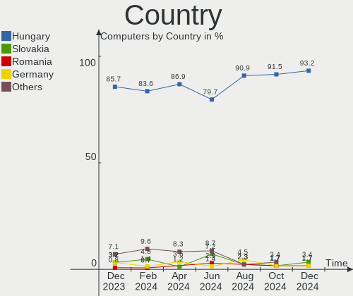
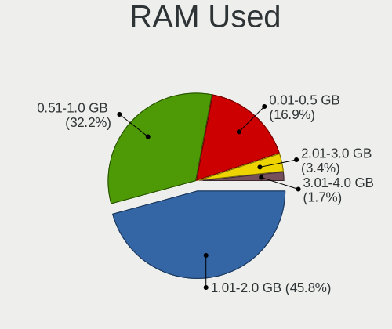
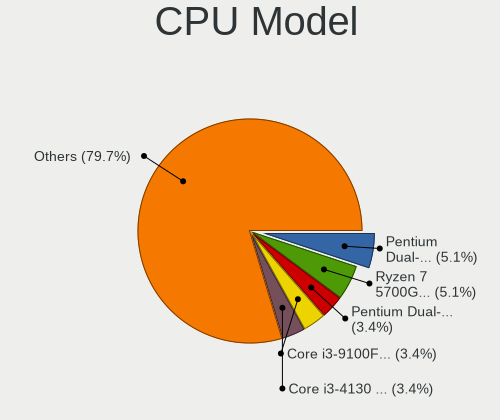
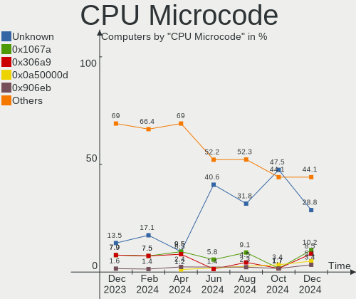
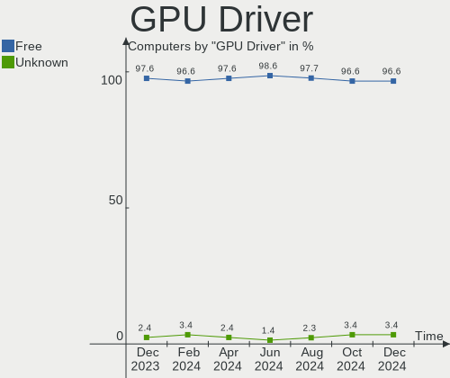
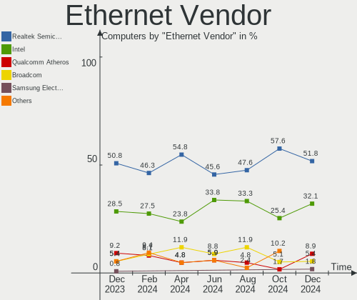
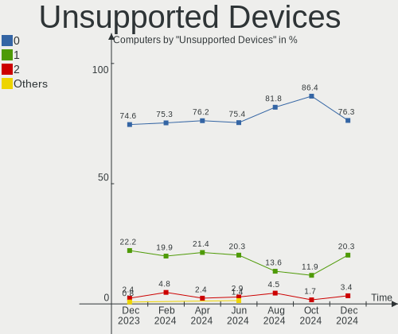

BlackPanther Hardware Trends
----------------------------

A project to identify most popular hardware characteristics and track their change
over time based on data collected by BlackPanther users at https://Linux-Hardware.org.

Anyone can contribute to the study by uploading probes of their computers by
the [hw-probe](https://github.com/linuxhw/hw-probe) tool:

    sudo -E hw-probe -all -upload

This is a report for all computer types. See also reports for [desktops](/Dist/BlackPanther/Desktop/README.md) and [notebooks](/Dist/BlackPanther/Notebook/README.md).

Full-feature report is available here: https://linux-hardware.org/?view=trends

Period: Mar, 2021.

Contents
--------

- [ OS                       ](#os)
- [ OS Family                ](#os-family)
- [ Kernel                   ](#kernel)
- [ Kernel Family            ](#kernel-family)
- [ Kernel Major Ver.        ](#kernel-major-ver)
- [ Arch                     ](#arch)
- [ DE                       ](#de)
- [ Display Server           ](#display-server)
- [ Display Manager          ](#display-manager)
- [ OS Lang                  ](#os-lang)
- [ Boot Mode                ](#boot-mode)
- [ Filesystem               ](#filesystem)
- [ Part. scheme             ](#part-scheme)
- [ Dual Boot with Linux/BSD ](#dual-boot-with-linux/bsd)
- [ Dual Boot (Win)          ](#dual-boot-win)
- [ Country                  ](#country)
- [ City                     ](#city)
- [ Vendor                   ](#vendor)
- [ Model                    ](#model)
- [ Model Family             ](#model-family)
- [ MFG Year                 ](#mfg-year)
- [ Form Factor              ](#form-factor)
- [ Secure Boot              ](#secure-boot)
- [ Coreboot                 ](#coreboot)
- [ RAM Size                 ](#ram-size)
- [ RAM Used                 ](#ram-used)
- [ Has CD-ROM               ](#has-cd-rom)
- [ Total Drives             ](#total-drives)
- [ Has Ethernet             ](#has-ethernet)
- [ Has WiFi                 ](#has-wifi)
- [ Has Bluetooth            ](#has-bluetooth)
- [ Drive Vendor             ](#drive-vendor)
- [ Drive Model              ](#drive-model)
- [ HDD Vendor               ](#hdd-vendor)
- [ SSD Vendor               ](#ssd-vendor)
- [ Drive Kind               ](#drive-kind)
- [ Drive Connector          ](#drive-connector)
- [ Drive Size               ](#drive-size)
- [ Space Total              ](#space-total)
- [ Space Used               ](#space-used)
- [ Malfunc. Drives          ](#malfunc-drives)
- [ Malfunc. Drive Vendor    ](#malfunc-drive-vendor)
- [ Malfunc. HDD Vendor      ](#malfunc-hdd-vendor)
- [ Malfunc. Drive Kind      ](#malfunc-drive-kind)
- [ Failed Drives            ](#failed-drives)
- [ Failed Drive Vendor      ](#failed-drive-vendor)
- [ Drive Status             ](#drive-status)
- [ Storage Vendor           ](#storage-vendor)
- [ Storage Model            ](#storage-model)
- [ Storage Kind             ](#storage-kind)
- [ CPU Vendor               ](#cpu-vendor)
- [ CPU Model                ](#cpu-model)
- [ CPU Model Family         ](#cpu-model-family)
- [ CPU Cores                ](#cpu-cores)
- [ CPU Sockets              ](#cpu-sockets)
- [ CPU Threads              ](#cpu-threads)
- [ CPU Op-Modes             ](#cpu-op-modes)
- [ CPU Microcode            ](#cpu-microcode)
- [ CPU Microarch            ](#cpu-microarch)
- [ GPU Vendor               ](#gpu-vendor)
- [ GPU Model                ](#gpu-model)
- [ GPU Combo                ](#gpu-combo)
- [ GPU Driver               ](#gpu-driver)
- [ GPU Memory               ](#gpu-memory)
- [ Monitor Vendor           ](#monitor-vendor)
- [ Monitor Model            ](#monitor-model)
- [ Monitor Resolution       ](#monitor-resolution)
- [ Monitor Diagonal         ](#monitor-diagonal)
- [ Monitor Width            ](#monitor-width)
- [ Aspect Ratio             ](#aspect-ratio)
- [ Monitor Area             ](#monitor-area)
- [ Pixel Density            ](#pixel-density)
- [ Multiple Monitors        ](#multiple-monitors)
- [ Net Controller Vendor    ](#net-controller-vendor)
- [ Net Controller Model     ](#net-controller-model)
- [ Wireless Vendor          ](#wireless-vendor)
- [ Wireless Model           ](#wireless-model)
- [ Ethernet Vendor          ](#ethernet-vendor)
- [ Ethernet Model           ](#ethernet-model)
- [ Net Controller Kind      ](#net-controller-kind)
- [ Used Controller          ](#used-controller)
- [ NICs                     ](#nics)
- [ IPv6                     ](#ipv6)
- [ Memory Vendor            ](#memory-vendor)
- [ Memory Model             ](#memory-model)
- [ Memory Kind              ](#memory-kind)
- [ Memory Form Factor       ](#memory-form-factor)
- [ Memory Size              ](#memory-size)
- [ Memory Speed             ](#memory-speed)
- [ Sound Vendor             ](#sound-vendor)
- [ Sound Model              ](#sound-model)
- [ Camera Vendor            ](#camera-vendor)
- [ Camera Model             ](#camera-model)
- [ Fingerprint Vendor       ](#fingerprint-vendor)
- [ Fingerprint Model        ](#fingerprint-model)
- [ Chipcard Vendor          ](#chipcard-vendor)
- [ Chipcard Model           ](#chipcard-model)
- [ Printer Vendor           ](#printer-vendor)
- [ Printer Model            ](#printer-model)
- [ Scanner Vendor           ](#scanner-vendor)
- [ Scanner Model            ](#scanner-model)
- [ Bluetooth Vendor         ](#bluetooth-vendor)
- [ Bluetooth Model          ](#bluetooth-model)
- [ Unsupported Devices      ](#unsupported-devices)
- [ Unsupported Device Types ](#unsupported-device-types)

OS
--

Installed operating systems

| Name              | Computers | Percent |
|-------------------|-----------|---------|
| BlackPanther 18.1 | 205       | 97.16%  |
| BlackPanther 16.2 | 6         | 2.84%   |

OS Family
---------

OS without a version

| Name         | Computers | Percent |
|--------------|-----------|---------|
| BlackPanther | 211       | 100%    |

Kernel
------

Version of the Linux kernel

| Version                | Computers | Percent |
|------------------------|-----------|---------|
| 5.6.14-desktop-2bP     | 134       | 63.51%  |
| 4.18.16-desktop-1bP    | 70        | 33.18%  |
| 4.9.20-desktop-pae-1bP | 6         | 2.84%   |
| 5.10.1-desktop-1bP     | 1         | 0.47%   |

Kernel Family
-------------

Linux kernel without a distro release

| Version | Computers | Percent |
|---------|-----------|---------|
| 5.6.14  | 134       | 63.51%  |
| 4.18.16 | 70        | 33.18%  |
| 4.9.20  | 6         | 2.84%   |
| 5.10.1  | 1         | 0.47%   |

Kernel Major Ver.
-----------------

Linux kernel major version

| Version | Computers | Percent |
|---------|-----------|---------|
| 5.6     | 134       | 63.51%  |
| 4.18    | 70        | 33.18%  |
| 4.9     | 6         | 2.84%   |
| 5.10    | 1         | 0.47%   |

Arch
----

OS architecture (x86_64, i586, etc.)

| Name   | Computers | Percent |
|--------|-----------|---------|
| x86_64 | 205       | 97.16%  |
| i686   | 6         | 2.84%   |

DE
--

Desktop Environment

| Name    | Computers | Percent |
|---------|-----------|---------|
| KDE5    | 208       | 98.58%  |
| Unknown | 2         | 0.95%   |
| KDE     | 1         | 0.47%   |

Display Server
--------------

X11 or Wayland

| Name    | Computers | Percent |
|---------|-----------|---------|
| X11     | 210       | 99.53%  |
| Wayland | 1         | 0.47%   |

Display Manager
---------------

SDDM, LightDM, etc.

| Name    | Computers | Percent |
|---------|-----------|---------|
| SDDM    | 210       | 99.53%  |
| Unknown | 1         | 0.47%   |

OS Lang
-------

Language

| Lang    | Computers | Percent |
|---------|-----------|---------|
| Unknown | 210       | 99.53%  |
| hu_HU   | 1         | 0.47%   |

Boot Mode
---------

EFI or BIOS

| Mode | Computers | Percent |
|------|-----------|---------|
| BIOS | 122       | 57.82%  |
| EFI  | 89        | 42.18%  |

Filesystem
----------

Type of filesystem

| Type    | Computers | Percent |
|---------|-----------|---------|
| Overlay | 159       | 75.36%  |
| Ext4    | 51        | 24.17%  |
| Ext3    | 1         | 0.47%   |

Part. scheme
------------

Scheme of partitioning

| Type    | Computers | Percent |
|---------|-----------|---------|
| MBR     | 120       | 56.87%  |
| GPT     | 90        | 42.65%  |
| Unknown | 1         | 0.47%   |

Dual Boot with Linux/BSD
------------------------

Hosting more than one Linux/BSD

| Dual boot | Computers | Percent |
|-----------|-----------|---------|
| No        | 115       | 54.5%   |
| Yes       | 96        | 45.5%   |

Dual Boot (Win)
---------------

Hosting Linux and Windows

| Dual boot | Computers | Percent |
|-----------|-----------|---------|
| Yes       | 109       | 51.66%  |
| No        | 102       | 48.34%  |

Country
-------

Geographic location (country)

| Country     | Computers | Percent |
|-------------|-----------|---------|
| Hungary     | 156       | 73.93%  |
| Slovakia    | 5         | 2.37%   |
| Serbia      | 5         | 2.37%   |
| Romania     | 5         | 2.37%   |
| Germany     | 5         | 2.37%   |
| USA         | 3         | 1.42%   |
| Poland      | 3         | 1.42%   |
| Canada      | 3         | 1.42%   |
| Brazil      | 3         | 1.42%   |
| Netherlands | 2         | 0.95%   |
| Italy       | 2         | 0.95%   |
| Belgium     | 2         | 0.95%   |
| Austria     | 2         | 0.95%   |
| UK          | 1         | 0.47%   |
| UAE         | 1         | 0.47%   |
| Thailand    | 1         | 0.47%   |
| Spain       | 1         | 0.47%   |
| Slovenia    | 1         | 0.47%   |
| Puerto Rico | 1         | 0.47%   |
| Morocco     | 1         | 0.47%   |
| Moldova     | 1         | 0.47%   |
| Mexico      | 1         | 0.47%   |
| Jordan      | 1         | 0.47%   |
| Ireland     | 1         | 0.47%   |
| Greece      | 1         | 0.47%   |
| France      | 1         | 0.47%   |
| Czechia     | 1         | 0.47%   |
| Algeria     | 1         | 0.47%   |

City
----

Geographic location (city)

| City              | Computers | Percent |
|-------------------|-----------|---------|
| Budapest          | 40        | 18.96%  |
| Debrecen          | 6         | 2.84%   |
| Tatabánya        | 5         | 2.37%   |
| Miskolc           | 5         | 2.37%   |
| Érd              | 4         | 1.9%    |
| Szolnok           | 3         | 1.42%   |
| Marcali           | 3         | 1.42%   |
| Győr             | 3         | 1.42%   |
| Esztergom         | 3         | 1.42%   |
| Belgrade          | 3         | 1.42%   |
| Zsira             | 2         | 0.95%   |
| Warsaw            | 2         | 0.95%   |
| Veszprém         | 2         | 0.95%   |
| Vaja              | 2         | 0.95%   |
| Târgu Mureş     | 2         | 0.95%   |
| Székesfehérvár | 2         | 0.95%   |
| Szigetszentmiklos | 2         | 0.95%   |
| Szigethalom       | 2         | 0.95%   |
| Szentes           | 2         | 0.95%   |
| Pécs             | 2         | 0.95%   |
| Niš              | 2         | 0.95%   |
| Mosonszentmiklos  | 2         | 0.95%   |
| Maastricht        | 2         | 0.95%   |
| Linz              | 2         | 0.95%   |
| Keszthely         | 2         | 0.95%   |
| Kecskemét        | 2         | 0.95%   |
| Karcag            | 2         | 0.95%   |
| Hajduszoboszlo    | 2         | 0.95%   |
| Dunaújváros     | 2         | 0.95%   |
| Darnozseli        | 2         | 0.95%   |
| Celldomolk        | 2         | 0.95%   |
| Bratislava        | 2         | 0.95%   |
| Zirc              | 1         | 0.47%   |
| Velbert           | 1         | 0.47%   |
| Valley Village    | 1         | 0.47%   |
| Tura              | 1         | 0.47%   |
| Tredegar          | 1         | 0.47%   |
| Tokod             | 1         | 0.47%   |
| Tiszaujvaros      | 1         | 0.47%   |
| Tiszafured        | 1         | 0.47%   |
| Tihany            | 1         | 0.47%   |
| Thessaloniki      | 1         | 0.47%   |
| Teresopolis       | 1         | 0.47%   |
| Tar               | 1         | 0.47%   |
| Tapioszentmarton  | 1         | 0.47%   |
| Taktaszada        | 1         | 0.47%   |
| Szugy             | 1         | 0.47%   |
| Szombathely       | 1         | 0.47%   |
| Szerencs          | 1         | 0.47%   |
| Szentendre        | 1         | 0.47%   |
| Szekszárd        | 1         | 0.47%   |
| Szazhalombatta    | 1         | 0.47%   |
| Szabadszentkiraly | 1         | 0.47%   |
| Sterrebeek        | 1         | 0.47%   |
| Sopron            | 1         | 0.47%   |
| Schwetzingen      | 1         | 0.47%   |
| Sapucaia          | 1         | 0.47%   |
| Rome              | 1         | 0.47%   |
| Rimavská Sobota  | 1         | 0.47%   |
| Ribeirão Preto   | 1         | 0.47%   |

Vendor
------

Motherboard manufacturer

| Name                | Computers | Percent |
|---------------------|-----------|---------|
| Hewlett-Packard     | 37        | 17.54%  |
| ASUSTek Computer    | 36        | 17.06%  |
| Dell                | 34        | 16.11%  |
| Lenovo              | 28        | 13.27%  |
| Acer                | 14        | 6.64%   |
| MSI                 | 13        | 6.16%   |
| Gigabyte Technology | 13        | 6.16%   |
| ASRock              | 12        | 5.69%   |
| Fujitsu             | 5         | 2.37%   |
| Toshiba             | 4         | 1.9%    |
| Medion              | 3         | 1.42%   |
| Sony                | 2         | 0.95%   |
| Samsung Electronics | 2         | 0.95%   |
| Intel               | 2         | 0.95%   |
| Packard Bell        | 1         | 0.47%   |
| Fujitsu Siemens     | 1         | 0.47%   |
| eMachines           | 1         | 0.47%   |
| Alcor               | 1         | 0.47%   |
| A15HV01             | 1         | 0.47%   |
| Unknown             | 1         | 0.47%   |

Model
-----

Motherboard model

| Name                                       | Computers | Percent |
|--------------------------------------------|-----------|---------|
| HP 250 G1                                  | 5         | 2.37%   |
| Lenovo IdeaPad 330-15IKB 81DE              | 3         | 1.42%   |
| HP Notebook                                | 3         | 1.42%   |
| Dell OptiPlex 7010                         | 3         | 1.42%   |
| MSI MS-7721                                | 2         | 0.95%   |
| Medion AKOYA E1317T                        | 2         | 0.95%   |
| HP Laptop 17-ak0xx                         | 2         | 0.95%   |
| HP Compaq dc5850 Microtower                | 2         | 0.95%   |
| HP 250 G4                                  | 2         | 0.95%   |
| Gigabyte P61-USB3-B3                       | 2         | 0.95%   |
| Dell OptiPlex 380                          | 2         | 0.95%   |
| Dell OptiPlex 330                          | 2         | 0.95%   |
| Dell Latitude D630                         | 2         | 0.95%   |
| ASUS X550CC                                | 2         | 0.95%   |
| ASUS VivoBook 15_ASUS Laptop X540UBR       | 2         | 0.95%   |
| ASRock G31M-S                              | 2         | 0.95%   |
| Acer Aspire 5755G                          | 2         | 0.95%   |
| Unknown                                    | 2         | 0.95%   |
| Toshiba Satellite C650                     | 1         | 0.47%   |
| Toshiba Satellite C55D-A                   | 1         | 0.47%   |
| Toshiba Satellite C50-A-14G                | 1         | 0.47%   |
| Toshiba Satellite A300                     | 1         | 0.47%   |
| Sony VPCSB21FD                             | 1         | 0.47%   |
| Sony SVF1521B1EW                           | 1         | 0.47%   |
| Samsung 350V5C/351V5C/3540VC/3440VC        | 1         | 0.47%   |
| Samsung 300E4A/300E5A/300E7A/3430EA/3530EA | 1         | 0.47%   |
| Packard Bell EasyNote TS44HR               | 1         | 0.47%   |
| MSI MS-7B89                                | 1         | 0.47%   |
| MSI MS-7A72                                | 1         | 0.47%   |
| MSI MS-7A40                                | 1         | 0.47%   |
| MSI MS-7A36                                | 1         | 0.47%   |
| MSI MS-7846                                | 1         | 0.47%   |
| MSI MS-7680                                | 1         | 0.47%   |
| MSI MS-7267                                | 1         | 0.47%   |
| MSI GP72 2QE                               | 1         | 0.47%   |
| MSI GF65 Thin 10SDR                        | 1         | 0.47%   |
| MSI Elite 7100 Microtower PC               | 1         | 0.47%   |
| MSI 09AC                                   | 1         | 0.47%   |
| Medion Pentino G-Series                    | 1         | 0.47%   |
| Lenovo V330-15IKB 81AX                     | 1         | 0.47%   |
| Lenovo V15-ADA 82C7                        | 1         | 0.47%   |
| Lenovo ThinkStation D20 4158AF8            | 1         | 0.47%   |
| Lenovo ThinkPad X201 Tablet 3239A33        | 1         | 0.47%   |
| Lenovo ThinkPad X201 3680AQ1               | 1         | 0.47%   |
| Lenovo ThinkPad X100e 287627G              | 1         | 0.47%   |
| Lenovo ThinkPad W510 4876A46               | 1         | 0.47%   |
| Lenovo ThinkPad W510 431924G               | 1         | 0.47%   |
| Lenovo ThinkPad T61 6458WK6                | 1         | 0.47%   |
| Lenovo ThinkPad T400 6475VZZ               | 1         | 0.47%   |
| Lenovo ThinkCentre M81 0385BE3             | 1         | 0.47%   |
| Lenovo ThinkCentre M720t 10SRS76500        | 1         | 0.47%   |
| Lenovo ThinkBook 15 G2 ITL 20VE            | 1         | 0.47%   |
| Lenovo Legion Y540-15IRH-PG0 81SY          | 1         | 0.47%   |
| Lenovo IdeaPad L340-17IRH Gaming 81LL      | 1         | 0.47%   |
| Lenovo IdeaPad 700-15ISK 80RU              | 1         | 0.47%   |
| Lenovo IdeaPad 510-15IKB 80SV              | 1         | 0.47%   |
| Lenovo IdeaPad 320-17IKB 80XM              | 1         | 0.47%   |
| Lenovo IdeaPad 320-17ABR 80YN              | 1         | 0.47%   |
| Lenovo IdeaPad 310-15ISK 80SM              | 1         | 0.47%   |
| Lenovo G550 20023                          | 1         | 0.47%   |

Model Family
------------

Motherboard model prefix

| Name                  | Computers | Percent |
|-----------------------|-----------|---------|
| Dell OptiPlex         | 13        | 6.16%   |
| Dell Latitude         | 12        | 5.69%   |
| Acer Aspire           | 10        | 4.74%   |
| Lenovo IdeaPad        | 9         | 4.27%   |
| HP Compaq             | 9         | 4.27%   |
| Lenovo ThinkPad       | 7         | 3.32%   |
| HP 250                | 7         | 3.32%   |
| Dell Inspiron         | 6         | 2.84%   |
| HP EliteBook          | 5         | 2.37%   |
| Toshiba Satellite     | 4         | 1.9%    |
| HP ProBook            | 4         | 1.9%    |
| Fujitsu ESPRIMO       | 4         | 1.9%    |
| HP Notebook           | 3         | 1.42%   |
| ASUS VivoBook         | 3         | 1.42%   |
| Acer TravelMate       | 3         | 1.42%   |
| MSI MS-7721           | 2         | 0.95%   |
| Medion AKOYA          | 2         | 0.95%   |
| Lenovo ThinkCentre    | 2         | 0.95%   |
| HP Pavilion           | 2         | 0.95%   |
| HP Laptop             | 2         | 0.95%   |
| Gigabyte P61-USB3-B3  | 2         | 0.95%   |
| Gigabyte B450M        | 2         | 0.95%   |
| ASUS X550CC           | 2         | 0.95%   |
| ASUS M5A97            | 2         | 0.95%   |
| ASRock G31M-S         | 2         | 0.95%   |
| Unknown               | 2         | 0.95%   |
| Sony VPCSB21FD        | 1         | 0.47%   |
| Sony SVF1521B1EW      | 1         | 0.47%   |
| Samsung 350V5C        | 1         | 0.47%   |
| Samsung 300E4A        | 1         | 0.47%   |
| Packard Bell EasyNote | 1         | 0.47%   |
| MSI MS-7B89           | 1         | 0.47%   |
| MSI MS-7A72           | 1         | 0.47%   |
| MSI MS-7A40           | 1         | 0.47%   |
| MSI MS-7A36           | 1         | 0.47%   |
| MSI MS-7846           | 1         | 0.47%   |
| MSI MS-7680           | 1         | 0.47%   |
| MSI MS-7267           | 1         | 0.47%   |
| MSI GP72              | 1         | 0.47%   |
| MSI GF65              | 1         | 0.47%   |
| MSI Elite             | 1         | 0.47%   |
| MSI 09AC              | 1         | 0.47%   |
| Medion Pentino        | 1         | 0.47%   |
| Lenovo V330-15IKB     | 1         | 0.47%   |
| Lenovo V15-ADA        | 1         | 0.47%   |
| Lenovo ThinkStation   | 1         | 0.47%   |
| Lenovo ThinkBook      | 1         | 0.47%   |
| Lenovo Legion         | 1         | 0.47%   |
| Lenovo G550           | 1         | 0.47%   |
| Lenovo G500           | 1         | 0.47%   |
| Lenovo G50-45         | 1         | 0.47%   |
| Lenovo E50-80         | 1         | 0.47%   |
| Lenovo 3000           | 1         | 0.47%   |
| Intel NUC7CJYH        | 1         | 0.47%   |
| Intel 945             | 1         | 0.47%   |
| HP xw4400             | 1         | 0.47%   |
| HP EliteOne           | 1         | 0.47%   |
| HP EliteDesk          | 1         | 0.47%   |
| HP 650                | 1         | 0.47%   |
| HP 2000               | 1         | 0.47%   |

MFG Year
--------

Motherboard manufacture year

| Year | Computers | Percent |
|------|-----------|---------|
| 2013 | 29        | 13.74%  |
| 2010 | 21        | 9.95%   |
| 2011 | 20        | 9.48%   |
| 2019 | 17        | 8.06%   |
| 2020 | 15        | 7.11%   |
| 2014 | 15        | 7.11%   |
| 2018 | 14        | 6.64%   |
| 2015 | 14        | 6.64%   |
| 2012 | 13        | 6.16%   |
| 2017 | 12        | 5.69%   |
| 2016 | 10        | 4.74%   |
| 2009 | 9         | 4.27%   |
| 2007 | 8         | 3.79%   |
| 2006 | 6         | 2.84%   |
| 2008 | 5         | 2.37%   |
| 2021 | 2         | 0.95%   |
| 2005 | 1         | 0.47%   |

Form Factor
-----------

Physical design of the computer

| Name       | Computers | Percent |
|------------|-----------|---------|
| Notebook   | 122       | 57.82%  |
| Desktop    | 86        | 40.76%  |
| Mini pc    | 2         | 0.95%   |
| All in one | 1         | 0.47%   |

Secure Boot
-----------

Enabled or disabled

| State    | Computers | Percent |
|----------|-----------|---------|
| Disabled | 211       | 100%    |

Coreboot
--------

Have coreboot on board

| Used | Computers | Percent |
|------|-----------|---------|
| No   | 211       | 100%    |

RAM Size
--------

Total RAM memory

| Size in GB | Computers | Percent |
|------------|-----------|---------|
| 3.01-4.0   | 73        | 34.6%   |
| 4.01-8.0   | 52        | 24.64%  |
| 8.01-16.0  | 38        | 18.01%  |
| 1.01-2.0   | 19        | 9%      |
| 16.01-24.0 | 17        | 8.06%   |
| 32.01-64.0 | 5         | 2.37%   |
| 2.01-3.0   | 4         | 1.9%    |
| 0.51-1.0   | 3         | 1.42%   |

RAM Used
--------

Used RAM memory

| Used GB  | Computers | Percent |
|----------|-----------|---------|
| 0.51-1.0 | 86        | 40.76%  |
| 0.01-0.5 | 74        | 35.07%  |
| 1.01-2.0 | 48        | 22.75%  |
| 2.01-3.0 | 3         | 1.42%   |

Has CD-ROM
----------

Has CD-ROM on board

| Presented | Computers | Percent |
|-----------|-----------|---------|
| Yes       | 134       | 63.51%  |
| No        | 77        | 36.49%  |

Total Drives
------------

Number of drives on board

| Drives | Computers | Percent |
|--------|-----------|---------|
| 1      | 141       | 66.82%  |
| 2      | 47        | 22.27%  |
| 3      | 15        | 7.11%   |
| 0      | 4         | 1.9%    |
| 4      | 2         | 0.95%   |
| 8      | 1         | 0.47%   |
| 5      | 1         | 0.47%   |

Has Ethernet
------------

Has Ethernet on board

| Presented | Computers | Percent |
|-----------|-----------|---------|
| Yes       | 204       | 96.68%  |
| No        | 7         | 3.32%   |

Has WiFi
--------

Has WiFi module

| Presented | Computers | Percent |
|-----------|-----------|---------|
| Yes       | 150       | 71.09%  |
| No        | 61        | 28.91%  |

Has Bluetooth
-------------

Has Bluetooth module

| Presented | Computers | Percent |
|-----------|-----------|---------|
| Yes       | 111       | 52.61%  |
| No        | 100       | 47.39%  |

Drive Vendor
------------

Hard drive vendors

| Vendor              | Computers | Drives | Percent |
|---------------------|-----------|--------|---------|
| Seagate             | 54        | 59     | 18.88%  |
| WDC                 | 48        | 58     | 16.78%  |
| Kingston            | 31        | 34     | 10.84%  |
| Samsung Electronics | 30        | 35     | 10.49%  |
| Toshiba             | 29        | 29     | 10.14%  |
| Hitachi             | 18        | 19     | 6.29%   |
| HGST                | 14        | 14     | 4.9%    |
| Crucial             | 8         | 9      | 2.8%    |
| A-DATA Technology   | 6         | 7      | 2.1%    |
| SanDisk             | 5         | 5      | 1.75%   |
| Maxtor              | 5         | 5      | 1.75%   |
| Intel               | 4         | 4      | 1.4%    |
| SK Hynix            | 3         | 3      | 1.05%   |
| PNY                 | 3         | 3      | 1.05%   |
| Fujitsu             | 3         | 3      | 1.05%   |
| Unknown             | 2         | 2      | 0.7%    |
| SPCC                | 2         | 2      | 0.7%    |
| OCZ                 | 2         | 2      | 0.7%    |
| Kingmax             | 2         | 2      | 0.7%    |
| JMicron             | 2         | 2      | 0.7%    |
| Intenso             | 2         | 2      | 0.7%    |
| GOODRAM             | 2         | 2      | 0.7%    |
| Verbatim            | 1         | 1      | 0.35%   |
| USB2.0              | 1         | 1      | 0.35%   |
| Team                | 1         | 1      | 0.35%   |
| Patriot             | 1         | 1      | 0.35%   |
| Micron Technology   | 1         | 1      | 0.35%   |
| LITEON              | 1         | 1      | 0.35%   |
| IBM/Hitachi         | 1         | 1      | 0.35%   |
| Gigabyte Technology | 1         | 1      | 0.35%   |
| GALAX               | 1         | 1      | 0.35%   |
| Apple               | 1         | 1      | 0.35%   |
| Apacer              | 1         | 1      | 0.35%   |

Drive Model
-----------

Hard drive models

| Model                              | Computers | Percent |
|------------------------------------|-----------|---------|
| Kingston SA400S37120G 120GB SSD    | 12        | 3.88%   |
| Toshiba MQ01ABF050 500GB           | 6         | 1.94%   |
| Seagate ST500LT012-1DG142 500GB    | 6         | 1.94%   |
| Kingston SA400S37240G 240GB SSD    | 6         | 1.94%   |
| HGST HTS545050A7E680 500GB         | 5         | 1.62%   |
| Toshiba DT01ACA100 1TB             | 4         | 1.29%   |
| Seagate ST1000LM035-1RK172 1TB     | 4         | 1.29%   |
| Kingston SV300S37A120G 120GB SSD   | 4         | 1.29%   |
| HGST HTS545032A7E380 320GB         | 4         | 1.29%   |
| WDC WDS240G2G0A-00JH30 240GB SSD   | 3         | 0.97%   |
| WDC WD10SPCX-24HWST1 1TB           | 3         | 0.97%   |
| Seagate ST1000LM024 HN-M101MBB 1TB | 3         | 0.97%   |
| PNY CS900 120GB SSD                | 3         | 0.97%   |
| Kingston SUV400S37120G 120GB SSD   | 3         | 0.97%   |
| Crucial CT120BX500SSD1 120GB       | 3         | 0.97%   |
| WDC WD800JD-75MSA3 80GB            | 2         | 0.65%   |
| WDC WD5000BPVT-00HXZT3 500GB       | 2         | 0.65%   |
| WDC WD5000AAKX-001CA0 500GB        | 2         | 0.65%   |
| WDC WD10EZEX-08WN4A0 1TB           | 2         | 0.65%   |
| Toshiba MQ01ACF032 320GB           | 2         | 0.65%   |
| Toshiba MQ01ABD050 500GB           | 2         | 0.65%   |
| Seagate ST500LT012-9WS142 500GB    | 2         | 0.65%   |
| Seagate ST500DM002-1BD142 500GB    | 2         | 0.65%   |
| Seagate ST3160815AS 160GB          | 2         | 0.65%   |
| Seagate ST2000DM008-2FR102 2TB     | 2         | 0.65%   |
| Seagate ST1000LM048-2E7172 1TB     | 2         | 0.65%   |
| Seagate ST1000DM010-2EP102 1TB     | 2         | 0.65%   |
| Seagate ST1000DM003-1SB102 1TB     | 2         | 0.65%   |
| SanDisk SSD PLUS 240GB             | 2         | 0.65%   |
| SanDisk DF4064  64GB               | 2         | 0.65%   |
| Samsung SSD 860 EVO 250GB          | 2         | 0.65%   |
| Samsung HD502HJ 500GB              | 2         | 0.65%   |
| Samsung HD154UI 1TB                | 2         | 0.65%   |
| Samsung HD103SI 1TB                | 2         | 0.65%   |
| Kingston SA2000M8250G 250GB        | 2         | 0.65%   |
| Hitachi HTS725032A9A364 320GB      | 2         | 0.65%   |
| Hitachi HTS545025B9A300 250GB      | 2         | 0.65%   |
| Hitachi HTS543216L9A300 160GB      | 2         | 0.65%   |
| HGST HTS721010A9E630 1TB           | 2         | 0.65%   |
| A-DATA SU700 120GB SSD             | 2         | 0.65%   |
| A-DATA SU630 240GB SSD             | 2         | 0.65%   |
| WDC WDS500G2B0B-00YS70 500GB SSD   | 1         | 0.32%   |
| WDC WDS120G2G0B-00EPW0 120GB SSD   | 1         | 0.32%   |
| WDC WD800JD-75LSA0 80GB            | 1         | 0.32%   |
| WDC WD800JD-08LSA0 80GB            | 1         | 0.32%   |
| WDC WD800BEVT-75ZCT2 80GB          | 1         | 0.32%   |
| WDC WD800AAJS-75M0A0 80GB          | 1         | 0.32%   |
| WDC WD5003ABYX-01WERA2 500GB       | 1         | 0.32%   |
| WDC WD5002ABYS-01B1B0 500GB        | 1         | 0.32%   |
| WDC WD5000LPCX-24C6HT0 500GB       | 1         | 0.32%   |
| WDC WD5000LPCX-22VHAT1 500GB       | 1         | 0.32%   |
| WDC WD5000BEVT-22A0RT0 500GB       | 1         | 0.32%   |
| WDC WD5000AVCS-982DY1 500GB        | 1         | 0.32%   |
| WDC WD5000AAKX-08ERMA0 500GB       | 1         | 0.32%   |
| WDC WD5000AAKS-00D2B0 500GB        | 1         | 0.32%   |
| WDC WD40PURZ-85TTDY0 4TB           | 1         | 0.32%   |
| WDC WD40PURZ-85AKKY0 4TB           | 1         | 0.32%   |
| WDC WD400BD-75MRA1 40GB            | 1         | 0.32%   |
| WDC WD3200BPVT-26JJ5T0 320GB       | 1         | 0.32%   |
| WDC WD3200BPVT-22ZEST0 320GB       | 1         | 0.32%   |

HDD Vendor
----------

Hard disk drive vendors

| Vendor              | Computers | Drives | Percent |
|---------------------|-----------|--------|---------|
| Seagate             | 53        | 58     | 29.61%  |
| WDC                 | 43        | 51     | 24.02%  |
| Toshiba             | 26        | 26     | 14.53%  |
| Hitachi             | 18        | 19     | 10.06%  |
| Samsung Electronics | 15        | 17     | 8.38%   |
| HGST                | 14        | 14     | 7.82%   |
| Maxtor              | 5         | 5      | 2.79%   |
| Fujitsu             | 3         | 3      | 1.68%   |
| IBM/Hitachi         | 1         | 1      | 0.56%   |
| Apple               | 1         | 1      | 0.56%   |

SSD Vendor
----------

Solid state drive vendors

| Vendor              | Computers | Drives | Percent |
|---------------------|-----------|--------|---------|
| Kingston            | 28        | 31     | 32.18%  |
| Samsung Electronics | 11        | 12     | 12.64%  |
| Crucial             | 7         | 7      | 8.05%   |
| A-DATA Technology   | 6         | 7      | 6.9%    |
| WDC                 | 5         | 5      | 5.75%   |
| Intel               | 4         | 4      | 4.6%    |
| SanDisk             | 3         | 3      | 3.45%   |
| PNY                 | 3         | 3      | 3.45%   |
| SK Hynix            | 2         | 2      | 2.3%    |
| OCZ                 | 2         | 2      | 2.3%    |
| Kingmax             | 2         | 2      | 2.3%    |
| Intenso             | 2         | 2      | 2.3%    |
| GOODRAM             | 2         | 2      | 2.3%    |
| Verbatim            | 1         | 1      | 1.15%   |
| Toshiba             | 1         | 1      | 1.15%   |
| Team                | 1         | 1      | 1.15%   |
| SPCC                | 1         | 1      | 1.15%   |
| Patriot             | 1         | 1      | 1.15%   |
| LITEON              | 1         | 1      | 1.15%   |
| JMicron             | 1         | 1      | 1.15%   |
| Gigabyte Technology | 1         | 1      | 1.15%   |
| GALAX               | 1         | 1      | 1.15%   |
| Apacer              | 1         | 1      | 1.15%   |

Drive Kind
----------

HDD or SSD

| Kind    | Computers | Drives | Percent |
|---------|-----------|--------|---------|
| HDD     | 158       | 195    | 59.85%  |
| SSD     | 82        | 92     | 31.06%  |
| NVMe    | 17        | 18     | 6.44%   |
| MMC     | 4         | 4      | 1.52%   |
| Unknown | 3         | 3      | 1.14%   |

Drive Connector
---------------

SATA, SAS, NVMe, etc.

| Type | Computers | Drives | Percent |
|------|-----------|--------|---------|
| SATA | 198       | 280    | 86.46%  |
| NVMe | 17        | 18     | 7.42%   |
| SAS  | 10        | 10     | 4.37%   |
| MMC  | 4         | 4      | 1.75%   |

Drive Size
----------

Size of hard drive

| Size in TB | Computers | Drives | Percent |
|------------|-----------|--------|---------|
| 0.01-0.5   | 173       | 215    | 73.62%  |
| 0.51-1.0   | 49        | 56     | 20.85%  |
| 1.01-2.0   | 7         | 7      | 2.98%   |
| 3.01-4.0   | 3         | 5      | 1.28%   |
| 2.01-3.0   | 3         | 4      | 1.28%   |

Space Total
-----------

Amount of disk space available on the file system

| Size in GB | Computers | Percent |
|------------|-----------|---------|
| Unknown    | 154       | 72.99%  |
| 251-500    | 18        | 8.53%   |
| 101-250    | 18        | 8.53%   |
| 51-100     | 12        | 5.69%   |
| 21-50      | 4         | 1.9%    |
| 501-1000   | 4         | 1.9%    |
| 1-20       | 1         | 0.47%   |

Space Used
----------

Amount of used disk space

| Used GB | Computers | Percent |
|---------|-----------|---------|
| Unknown | 154       | 72.99%  |
| 1-20    | 47        | 22.27%  |
| 21-50   | 5         | 2.37%   |
| 101-250 | 3         | 1.42%   |
| 51-100  | 2         | 0.95%   |

Malfunc. Drives
---------------

Drive models with a malfunction

| Model                               | Computers | Drives | Percent |
|-------------------------------------|-----------|--------|---------|
| HGST HTS545050A7E680 500GB          | 5         | 5      | 5.49%   |
| HGST HTS545032A7E380 320GB          | 4         | 4      | 4.4%    |
| Toshiba MQ01ABF050 500GB            | 3         | 3      | 3.3%    |
| Seagate ST500LT012-1DG142 500GB     | 3         | 3      | 3.3%    |
| Toshiba MQ01ABD050 500GB            | 2         | 2      | 2.2%    |
| Seagate ST500LT012-9WS142 500GB     | 2         | 2      | 2.2%    |
| Hitachi HTS545025B9A300 250GB       | 2         | 2      | 2.2%    |
| Hitachi HTS543216L9A300 160GB       | 2         | 2      | 2.2%    |
| WDC WD800JD-75LSA0 80GB             | 1         | 1      | 1.1%    |
| WDC WD800AAJS-75M0A0 80GB           | 1         | 1      | 1.1%    |
| WDC WD5003ABYX-01WERA2 500GB        | 1         | 1      | 1.1%    |
| WDC WD5002ABYS-01B1B0 500GB         | 1         | 1      | 1.1%    |
| WDC WD5000LPCX-24C6HT0 500GB        | 1         | 1      | 1.1%    |
| WDC WD5000BPVT-00HXZT3 500GB        | 1         | 1      | 1.1%    |
| WDC WD5000AAKX-08ERMA0 500GB        | 1         | 1      | 1.1%    |
| WDC WD5000AAKS-00D2B0 500GB         | 1         | 1      | 1.1%    |
| WDC WD3200BEVT-80A0RT0 320GB        | 1         | 1      | 1.1%    |
| WDC WD3200BEKT-60V5T1 320GB         | 1         | 1      | 1.1%    |
| WDC WD3200AAJS-00L7A0 320GB         | 1         | 1      | 1.1%    |
| WDC WD30PURX-64P6ZY0 3TB            | 1         | 1      | 1.1%    |
| WDC WD1600BEVT-00A23T0 160GB        | 1         | 1      | 1.1%    |
| WDC WD1600BB-55GUA0 160GB           | 1         | 1      | 1.1%    |
| WDC WD1600AAJS-07M0A0 160GB         | 1         | 1      | 1.1%    |
| WDC WD10SPCX-24HWST1 1TB            | 1         | 1      | 1.1%    |
| WDC WD10EZEX-08WN4A0 1TB            | 1         | 1      | 1.1%    |
| Toshiba MK5061GSYN 500GB            | 1         | 1      | 1.1%    |
| Toshiba MK1637GSX 160GB             | 1         | 1      | 1.1%    |
| Toshiba MK1059GSM 1TB               | 1         | 1      | 1.1%    |
| Toshiba HDWD130 3TB                 | 1         | 1      | 1.1%    |
| Toshiba DT01ACA100 1TB              | 1         | 1      | 1.1%    |
| Seagate ST980811AS 80GB             | 1         | 1      | 1.1%    |
| Seagate ST9320325AS 320GB           | 1         | 1      | 1.1%    |
| Seagate ST9160821AS 160GB           | 1         | 1      | 1.1%    |
| Seagate ST750LM022 HN-M750MBB 752GB | 1         | 1      | 1.1%    |
| Seagate ST500NM0011 500GB           | 1         | 1      | 1.1%    |
| Seagate ST500DM002-9YN14C 500GB     | 1         | 1      | 1.1%    |
| Seagate ST500DM002-1BD142 500GB     | 1         | 1      | 1.1%    |
| Seagate ST4000DM000-1F2168 4TB      | 1         | 1      | 1.1%    |
| Seagate ST380815AS 80GB             | 1         | 1      | 1.1%    |
| Seagate ST3500418AS 500GB           | 1         | 1      | 1.1%    |
| Seagate ST340016A 40GB              | 1         | 1      | 1.1%    |
| Seagate ST3320418AS 320GB           | 1         | 1      | 1.1%    |
| Seagate ST3320413AS 320GB           | 1         | 1      | 1.1%    |
| Seagate ST3160310CS 160GB           | 1         | 1      | 1.1%    |
| Seagate ST250LM004 HN-M250MBB 250GB | 1         | 1      | 1.1%    |
| Seagate ST1000LX015-1U7172 1TB      | 1         | 1      | 1.1%    |
| Seagate ST1000LM024 HN-M101MBB 1TB  | 1         | 1      | 1.1%    |
| Samsung Electronics SP0842N 80GB    | 1         | 1      | 1.1%    |
| Samsung Electronics SP0812C 80GB    | 1         | 1      | 1.1%    |
| Samsung Electronics HD642JJ 640GB   | 1         | 1      | 1.1%    |
| Samsung Electronics HD502IJ 500GB   | 1         | 1      | 1.1%    |
| Samsung Electronics HD502HJ 500GB   | 1         | 1      | 1.1%    |
| Samsung Electronics HD322GJ 320GB   | 1         | 1      | 1.1%    |
| Samsung Electronics HD254GJ 250GB   | 1         | 1      | 1.1%    |
| Samsung Electronics HD161GJ 160GB   | 1         | 1      | 1.1%    |
| Samsung Electronics HD154UI 1TB     | 1         | 1      | 1.1%    |
| Samsung Electronics HD103SI 1TB     | 1         | 1      | 1.1%    |
| OCZ VERTEX3 120GB SSD               | 1         | 1      | 1.1%    |
| MAXTOR STM3160215AS 160GB           | 1         | 1      | 1.1%    |
| Maxtor 6Y120P0 128GB                | 1         | 1      | 1.1%    |

Malfunc. Drive Vendor
---------------------

Vendors of faulty drives

| Vendor              | Computers | Drives | Percent |
|---------------------|-----------|--------|---------|
| Seagate             | 22        | 22     | 25%     |
| WDC                 | 16        | 17     | 18.18%  |
| HGST                | 11        | 11     | 12.5%   |
| Toshiba             | 10        | 10     | 11.36%  |
| Hitachi             | 9         | 9      | 10.23%  |
| Samsung Electronics | 8         | 10     | 9.09%   |
| Maxtor              | 4         | 4      | 4.55%   |
| Kingston            | 2         | 2      | 2.27%   |
| Intel               | 2         | 2      | 2.27%   |
| OCZ                 | 1         | 1      | 1.14%   |
| Fujitsu             | 1         | 1      | 1.14%   |
| Crucial             | 1         | 1      | 1.14%   |
| A-DATA Technology   | 1         | 1      | 1.14%   |

Malfunc. HDD Vendor
-------------------

Vendors of faulty HDD drives

| Vendor              | Computers | Drives | Percent |
|---------------------|-----------|--------|---------|
| Seagate             | 22        | 22     | 27.16%  |
| WDC                 | 16        | 17     | 19.75%  |
| HGST                | 11        | 11     | 13.58%  |
| Toshiba             | 10        | 10     | 12.35%  |
| Hitachi             | 9         | 9      | 11.11%  |
| Samsung Electronics | 8         | 10     | 9.88%   |
| Maxtor              | 4         | 4      | 4.94%   |
| Fujitsu             | 1         | 1      | 1.23%   |

Malfunc. Drive Kind
-------------------

Kinds of faulty drives

| Kind | Computers | Drives | Percent |
|------|-----------|--------|---------|
| HDD  | 74        | 84     | 91.36%  |
| SSD  | 7         | 7      | 8.64%   |

Failed Drives
-------------

Failed drive models

| Model                           | Computers | Drives | Percent |
|---------------------------------|-----------|--------|---------|
| Samsung Electronics HD103SJ 1TB | 1         | 1      | 100%    |

Failed Drive Vendor
-------------------

Failed drive vendors

| Vendor              | Computers | Drives | Percent |
|---------------------|-----------|--------|---------|
| Samsung Electronics | 1         | 1      | 100%    |

Drive Status
------------

Number of failed and malfunc. drives

| Status   | Computers | Drives | Percent |
|----------|-----------|--------|---------|
| Works    | 146       | 204    | 60.58%  |
| Malfunc  | 80        | 91     | 33.2%   |
| Detected | 14        | 16     | 5.81%   |
| Failed   | 1         | 1      | 0.41%   |

Storage Vendor
--------------

Storage controller vendors

| Vendor                      | Computers | Percent |
|-----------------------------|-----------|---------|
| Intel                       | 161       | 69.1%   |
| AMD                         | 47        | 20.17%  |
| Samsung Electronics         | 6         | 2.58%   |
| Kingston Technology Company | 3         | 1.29%   |
| JMicron Technology          | 3         | 1.29%   |
| Sandisk                     | 2         | 0.86%   |
| Micron Technology           | 2         | 0.86%   |
| Marvell Technology Group    | 2         | 0.86%   |
| KIOXIA                      | 2         | 0.86%   |
| ASMedia Technology          | 2         | 0.86%   |
| SK Hynix                    | 1         | 0.43%   |
| Silicon Motion              | 1         | 0.43%   |
| Micron/Crucial Technology   | 1         | 0.43%   |

Storage Model
-------------

Storage controller models

| Model                                                                                   | Computers | Percent |
|-----------------------------------------------------------------------------------------|-----------|---------|
| AMD FCH SATA Controller [AHCI mode]                                                     | 28        | 9.59%   |
| Intel 7 Series Chipset Family 6-port SATA Controller [AHCI mode]                        | 18        | 6.16%   |
| Intel 82801G (ICH7 Family) IDE Controller                                               | 16        | 5.48%   |
| Intel NM10/ICH7 Family SATA Controller [IDE mode]                                       | 14        | 4.79%   |
| Intel Sunrise Point-LP SATA Controller [AHCI mode]                                      | 13        | 4.45%   |
| Intel 82801 Mobile SATA Controller [RAID mode]                                          | 9         | 3.08%   |
| Intel 6 Series/C200 Series Chipset Family 6 port Mobile SATA AHCI Controller            | 9         | 3.08%   |
| AMD SB7x0/SB8x0/SB9x0 SATA Controller [AHCI mode]                                       | 7         | 2.4%    |
| Intel 8 Series/C220 Series Chipset Family 6-port SATA Controller 1 [AHCI mode]          | 6         | 2.05%   |
| Intel 6 Series/C200 Series Chipset Family Desktop SATA Controller (IDE mode, ports 4-5) | 6         | 2.05%   |
| Intel 6 Series/C200 Series Chipset Family Desktop SATA Controller (IDE mode, ports 0-3) | 6         | 2.05%   |
| AMD SB7x0/SB8x0/SB9x0 SATA Controller [IDE mode]                                        | 6         | 2.05%   |
| Intel Atom/Celeron/Pentium Processor x5-E8000/J3xxx/N3xxx Series SATA Controller        | 5         | 1.71%   |
| Intel 82801IBM/IEM (ICH9M/ICH9M-E) 4 port SATA Controller [AHCI mode]                   | 5         | 1.71%   |
| Intel 82801HM/HEM (ICH8M/ICH8M-E) IDE Controller                                        | 5         | 1.71%   |
| Intel 7 Series/C210 Series Chipset Family 6-port SATA Controller [AHCI mode]            | 5         | 1.71%   |
| Intel 6 Series/C200 Series Chipset Family 6 port Desktop SATA AHCI Controller           | 5         | 1.71%   |
| Intel 5 Series/3400 Series Chipset 6 port SATA AHCI Controller                          | 5         | 1.71%   |
| AMD SB7x0/SB8x0/SB9x0 IDE Controller                                                    | 5         | 1.71%   |
| AMD 400 Series Chipset SATA Controller                                                  | 5         | 1.71%   |
| Intel Wildcat Point-LP SATA Controller [AHCI Mode]                                      | 4         | 1.37%   |
| Intel NM10/ICH7 Family SATA Controller [AHCI mode]                                      | 4         | 1.37%   |
| Intel Cannon Lake Mobile PCH SATA AHCI Controller                                       | 4         | 1.37%   |
| Intel 82801HM/HEM (ICH8M/ICH8M-E) SATA Controller [AHCI mode]                           | 4         | 1.37%   |
| AMD FCH IDE Controller                                                                  | 4         | 1.37%   |
| Kingston Company A2000 NVMe SSD                                                         | 3         | 1.03%   |
| JMicron JMB363 SATA/IDE Controller                                                      | 3         | 1.03%   |
| Intel HM170/QM170 Chipset SATA Controller [AHCI Mode]                                   | 3         | 1.03%   |
| Intel 82801IBM/IEM (ICH9M/ICH9M-E) 2 port SATA Controller [IDE mode]                    | 3         | 1.03%   |
| Intel 82801GBM/GHM (ICH7-M Family) SATA Controller [IDE mode]                           | 3         | 1.03%   |
| Intel 8 Series SATA Controller 1 [AHCI mode]                                            | 3         | 1.03%   |
| Intel 5 Series/3400 Series Chipset 4 port SATA IDE Controller                           | 3         | 1.03%   |
| Intel 5 Series/3400 Series Chipset 4 port SATA AHCI Controller                          | 3         | 1.03%   |
| Intel 4 Series Chipset PT IDER Controller                                               | 3         | 1.03%   |
| Intel 200 Series PCH SATA controller [AHCI mode]                                        | 3         | 1.03%   |
| Samsung NVMe SSD Controller SM981/PM981/PM983                                           | 2         | 0.68%   |
| Samsung NVMe SSD Controller SM961/PM961/SM963                                           | 2         | 0.68%   |
| Samsung NVMe Controller                                                                 | 2         | 0.68%   |
| Micron Non-Volatile memory controller                                                   | 2         | 0.68%   |
| KIOXIA Non-Volatile memory controller                                                   | 2         | 0.68%   |
| Intel Q170/Q150/B150/H170/H110/Z170/CM236 Chipset SATA Controller [AHCI Mode]           | 2         | 0.68%   |
| Intel Celeron/Pentium Silver Processor SATA Controller                                  | 2         | 0.68%   |
| Intel Cannon Lake PCH SATA AHCI Controller                                              | 2         | 0.68%   |
| Intel 82801JI (ICH10 Family) SATA AHCI Controller                                       | 2         | 0.68%   |
| Intel 82801JD/DO (ICH10 Family) SATA AHCI Controller                                    | 2         | 0.68%   |
| Intel 82801JD/DO (ICH10 Family) 4-port SATA IDE Controller                              | 2         | 0.68%   |
| Intel 82801JD/DO (ICH10 Family) 2-port SATA IDE Controller                              | 2         | 0.68%   |
| Intel 82801GBM/GHM (ICH7-M Family) SATA Controller [AHCI mode]                          | 2         | 0.68%   |
| Intel 7 Series/C210 Series Chipset Family 4-port SATA Controller [IDE mode]             | 2         | 0.68%   |
| Intel 7 Series/C210 Series Chipset Family 2-port SATA Controller [IDE mode]             | 2         | 0.68%   |
| Intel 5 Series/3400 Series Chipset 2 port SATA IDE Controller                           | 2         | 0.68%   |
| ASMedia ASM1062 Serial ATA Controller                                                   | 2         | 0.68%   |
| AMD FCH SATA Controller [IDE mode]                                                      | 2         | 0.68%   |
| AMD 300 Series Chipset SATA Controller                                                  | 2         | 0.68%   |
| SK Hynix PC401 NVMe Solid State Drive 256GB                                             | 1         | 0.34%   |
| Silicon Motion SM2262/SM2262EN SSD Controller                                           | 1         | 0.34%   |
| Sandisk WD Blue SN550 NVMe SSD                                                          | 1         | 0.34%   |
| Sandisk WD Black SN750 / PC SN730 NVMe SSD                                              | 1         | 0.34%   |
| Micron/Crucial P1 NVMe PCIe SSD                                                         | 1         | 0.34%   |
| Marvell Group MV64460/64461/64462 System Controller, Revision B                         | 1         | 0.34%   |

Storage Kind
------------

Kind of storage controller (IDE, SATA, NVMe, SAS, ...)

| Kind | Computers | Percent |
|------|-----------|---------|
| SATA | 159       | 63.6%   |
| IDE  | 62        | 24.8%   |
| NVMe | 17        | 6.8%    |
| RAID | 12        | 4.8%    |

CPU Vendor
----------

Processor vendors

| Vendor | Computers | Percent |
|--------|-----------|---------|
| Intel  | 164       | 77.73%  |
| AMD    | 47        | 22.27%  |

CPU Model
---------

Processor models

| Model                                         | Computers | Percent |
|-----------------------------------------------|-----------|---------|
| Intel Core i5-2520M CPU @ 2.50GHz             | 7         | 3.32%   |
| Intel Celeron CPU 1000M @ 1.80GHz             | 6         | 2.84%   |
| Intel Core i3-2120 CPU @ 3.30GHz              | 5         | 2.37%   |
| Intel Core i5-7200U CPU @ 2.50GHz             | 3         | 1.42%   |
| Intel Core i5-2300 CPU @ 2.80GHz              | 3         | 1.42%   |
| Intel Core i3-7020U CPU @ 2.30GHz             | 3         | 1.42%   |
| Intel Core i3-6006U CPU @ 2.00GHz             | 3         | 1.42%   |
| Intel Core 2 Duo CPU E8400 @ 3.00GHz          | 3         | 1.42%   |
| AMD Ryzen 3 2200G with Radeon Vega Graphics   | 3         | 1.42%   |
| Intel Core i7-6700HQ CPU @ 2.60GHz            | 2         | 0.95%   |
| Intel Core i5-9300H CPU @ 2.40GHz             | 2         | 0.95%   |
| Intel Core i5-8250U CPU @ 1.60GHz             | 2         | 0.95%   |
| Intel Core i5-5200U CPU @ 2.20GHz             | 2         | 0.95%   |
| Intel Core i5-4300U CPU @ 1.90GHz             | 2         | 0.95%   |
| Intel Core i5-3470 CPU @ 3.20GHz              | 2         | 0.95%   |
| Intel Core i5-3337U CPU @ 1.80GHz             | 2         | 0.95%   |
| Intel Core i5-3320M CPU @ 2.60GHz             | 2         | 0.95%   |
| Intel Core i5 CPU M 540 @ 2.53GHz             | 2         | 0.95%   |
| Intel Core i3-8130U CPU @ 2.20GHz             | 2         | 0.95%   |
| Intel Core i3-3217U CPU @ 1.80GHz             | 2         | 0.95%   |
| Intel Core i3 CPU M 350 @ 2.27GHz             | 2         | 0.95%   |
| Intel Core 2 Quad CPU Q9550 @ 2.83GHz         | 2         | 0.95%   |
| Intel Core 2 Duo CPU T7300 @ 2.00GHz          | 2         | 0.95%   |
| Intel Core 2 Duo CPU P8600 @ 2.40GHz          | 2         | 0.95%   |
| Intel Core 2 Duo CPU E7500 @ 2.93GHz          | 2         | 0.95%   |
| Intel Core 2 CPU T5500 @ 1.66GHz              | 2         | 0.95%   |
| Intel Celeron CPU N3060 @ 1.60GHz             | 2         | 0.95%   |
| Intel Celeron CPU 430 @ 1.80GHz               | 2         | 0.95%   |
| AMD Ryzen 5 3500U with Radeon Vega Mobile Gfx | 2         | 0.95%   |
| AMD FX-8350 Eight-Core Processor              | 2         | 0.95%   |
| AMD E2-9000e RADEON R2, 4 COMPUTE CORES 2C+2G | 2         | 0.95%   |
| AMD A4-1200 APU with Radeon HD Graphics       | 2         | 0.95%   |
| Intel Xeon CPU X5677 @ 3.47GHz                | 1         | 0.47%   |
| Intel Xeon CPU X5670 @ 2.93GHz                | 1         | 0.47%   |
| Intel Xeon CPU X3330 @ 2.66GHz                | 1         | 0.47%   |
| Intel Xeon CPU E31220 @ 3.10GHz               | 1         | 0.47%   |
| Intel Pentium Dual-Core CPU T4400 @ 2.20GHz   | 1         | 0.47%   |
| Intel Pentium Dual-Core CPU T4200 @ 2.00GHz   | 1         | 0.47%   |
| Intel Pentium Dual-Core CPU E5500 @ 2.80GHz   | 1         | 0.47%   |
| Intel Pentium Dual-Core CPU E5400 @ 2.70GHz   | 1         | 0.47%   |
| Intel Pentium Dual-Core CPU E5300 @ 2.60GHz   | 1         | 0.47%   |
| Intel Pentium Dual CPU T2310 @ 1.46GHz        | 1         | 0.47%   |
| Intel Pentium Dual CPU E2200 @ 2.20GHz        | 1         | 0.47%   |
| Intel Pentium Dual CPU E2140 @ 1.60GHz        | 1         | 0.47%   |
| Intel Pentium D CPU 3.40GHz                   | 1         | 0.47%   |
| Intel Pentium CPU N3710 @ 1.60GHz             | 1         | 0.47%   |
| Intel Pentium CPU N3700 @ 1.60GHz             | 1         | 0.47%   |
| Intel Pentium CPU G630 @ 2.70GHz              | 1         | 0.47%   |
| Intel Pentium CPU G3420 @ 3.20GHz             | 1         | 0.47%   |
| Intel Pentium CPU G2030 @ 3.00GHz             | 1         | 0.47%   |
| Intel Pentium CPU 987 @ 1.50GHz               | 1         | 0.47%   |
| Intel Pentium CPU 3825U @ 1.90GHz             | 1         | 0.47%   |
| Intel Pentium CPU 2020M @ 2.40GHz             | 1         | 0.47%   |
| Intel Pentium 4 CPU 3.20GHz                   | 1         | 0.47%   |
| Intel Genuine CPU 2140 @ 1.60GHz              | 1         | 0.47%   |
| Intel Core i7-9700 CPU @ 3.00GHz              | 1         | 0.47%   |
| Intel Core i7-8750H CPU @ 2.20GHz             | 1         | 0.47%   |
| Intel Core i7-8700 CPU @ 3.20GHz              | 1         | 0.47%   |
| Intel Core i7-5700HQ CPU @ 2.70GHz            | 1         | 0.47%   |
| Intel Core i7-4810MQ CPU @ 2.80GHz            | 1         | 0.47%   |

CPU Model Family
----------------

Processor model prefix

| Model                                | Computers | Percent |
|--------------------------------------|-----------|---------|
| Intel Core i5                        | 48        | 22.75%  |
| Intel Core i3                        | 26        | 12.32%  |
| Intel Celeron                        | 20        | 9.48%   |
| Intel Core 2 Duo                     | 17        | 8.06%   |
| Intel Core i7                        | 16        | 7.58%   |
| Intel Pentium                        | 8         | 3.79%   |
| Intel Core 2                         | 6         | 2.84%   |
| AMD A4                               | 6         | 2.84%   |
| Intel Pentium Dual-Core              | 5         | 2.37%   |
| AMD Ryzen 3                          | 5         | 2.37%   |
| Intel Xeon                           | 4         | 1.9%    |
| AMD Ryzen 7                          | 4         | 1.9%    |
| AMD FX                               | 4         | 1.9%    |
| AMD A8                               | 4         | 1.9%    |
| Intel Pentium Dual                   | 3         | 1.42%   |
| Intel Atom                           | 3         | 1.42%   |
| AMD Ryzen 5                          | 3         | 1.42%   |
| Intel Core 2 Quad                    | 2         | 0.95%   |
| AMD E2                               | 2         | 0.95%   |
| AMD Athlon II X2                     | 2         | 0.95%   |
| AMD A6                               | 2         | 0.95%   |
| AMD A10                              | 2         | 0.95%   |
| Other                                | 1         | 0.47%   |
| Intel Pentium D                      | 1         | 0.47%   |
| Intel Pentium 4                      | 1         | 0.47%   |
| Intel Genuine                        | 1         | 0.47%   |
| Intel Core Duo                       | 1         | 0.47%   |
| Intel Celeron M                      | 1         | 0.47%   |
| AMD Turion X2 Ultra Dual-Core Mobile | 1         | 0.47%   |
| AMD Sempron                          | 1         | 0.47%   |
| AMD Ryzen 5 PRO                      | 1         | 0.47%   |
| AMD Phenom II X4                     | 1         | 0.47%   |
| AMD Phenom II X3                     | 1         | 0.47%   |
| AMD E1                               | 1         | 0.47%   |
| AMD E                                | 1         | 0.47%   |
| AMD Athlon X4                        | 1         | 0.47%   |
| AMD Athlon X2                        | 1         | 0.47%   |
| AMD Athlon Neo                       | 1         | 0.47%   |
| AMD Athlon II X4                     | 1         | 0.47%   |
| AMD Athlon 64                        | 1         | 0.47%   |
| AMD A12                              | 1         | 0.47%   |

CPU Cores
---------

Number of processor cores

| Number | Computers | Percent |
|--------|-----------|---------|
| 2      | 132       | 62.56%  |
| 4      | 53        | 25.12%  |
| 1      | 14        | 6.64%   |
| 8      | 6         | 2.84%   |
| 6      | 4         | 1.9%    |
| 3      | 2         | 0.95%   |

CPU Sockets
-----------

Number of sockets

| Number | Computers | Percent |
|--------|-----------|---------|
| 1      | 210       | 99.53%  |
| 2      | 1         | 0.47%   |

CPU Threads
-----------

Threads per core (Hyper-Threading)

| Number | Computers | Percent |
|--------|-----------|---------|
| 1      | 111       | 52.61%  |
| 2      | 100       | 47.39%  |

CPU Op-Modes
------------

CPU Operation Modes (32-bit, 64-bit)

| Op mode        | Computers | Percent |
|----------------|-----------|---------|
| 32-bit, 64-bit | 210       | 99.53%  |
| 32-bit         | 1         | 0.47%   |

CPU Microcode
-------------

Microcode number

| Number     | Computers | Percent |
|------------|-----------|---------|
| 0x206a7    | 26        | 12.32%  |
| 0x306a9    | 24        | 11.37%  |
| 0x1067a    | 19        | 9%      |
| Unknown    | 8         | 3.79%   |
| 0x806ea    | 6         | 2.84%   |
| 0x6fd      | 6         | 2.84%   |
| 0x306c3    | 6         | 2.84%   |
| 0x20655    | 6         | 2.84%   |
| 0x06001119 | 6         | 2.84%   |
| 0x906ea    | 5         | 2.37%   |
| 0x6f6      | 5         | 2.37%   |
| 0x506e3    | 4         | 1.9%    |
| 0x406e3    | 4         | 1.9%    |
| 0x406c4    | 4         | 1.9%    |
| 0x40651    | 4         | 1.9%    |
| 0x306d4    | 4         | 1.9%    |
| 0x0700010f | 4         | 1.9%    |
| 0x906e9    | 3         | 1.42%   |
| 0x806e9    | 3         | 1.42%   |
| 0x20652    | 3         | 1.42%   |
| 0x10661    | 3         | 1.42%   |
| 0x06000852 | 3         | 1.42%   |
| 0x706a1    | 2         | 0.95%   |
| 0x6fa      | 2         | 0.95%   |
| 0x6f2      | 2         | 0.95%   |
| 0x406c3    | 2         | 0.95%   |
| 0x206c2    | 2         | 0.95%   |
| 0x106e5    | 2         | 0.95%   |
| 0x106ca    | 2         | 0.95%   |
| 0x08108109 | 2         | 0.95%   |
| 0x08101016 | 2         | 0.95%   |
| 0x0810100b | 2         | 0.95%   |
| 0x0800820d | 2         | 0.95%   |
| 0x07030106 | 2         | 0.95%   |
| 0x06006704 | 2         | 0.95%   |
| 0x02000032 | 2         | 0.95%   |
| 0x010000c8 | 2         | 0.95%   |
| 0xf65      | 1         | 0.47%   |
| 0xf43      | 1         | 0.47%   |
| 0xa0652    | 1         | 0.47%   |
| 0x906ed    | 1         | 0.47%   |
| 0x906eb    | 1         | 0.47%   |
| 0x806ec    | 1         | 0.47%   |
| 0x806c1    | 1         | 0.47%   |
| 0x6fb      | 1         | 0.47%   |
| 0x506c9    | 1         | 0.47%   |
| 0x40671    | 1         | 0.47%   |
| 0x10676    | 1         | 0.47%   |
| 0x08701021 | 1         | 0.47%   |
| 0x08600104 | 1         | 0.47%   |
| 0x08600103 | 1         | 0.47%   |
| 0x08108102 | 1         | 0.47%   |
| 0x08001138 | 1         | 0.47%   |
| 0x07030105 | 1         | 0.47%   |
| 0x06006118 | 1         | 0.47%   |
| 0x06003106 | 1         | 0.47%   |
| 0x06003104 | 1         | 0.47%   |
| 0x0600111f | 1         | 0.47%   |
| 0x0600084f | 1         | 0.47%   |
| 0x05000119 | 1         | 0.47%   |

CPU Microarch
-------------

Microarchitecture

| Name            | Computers | Percent |
|-----------------|-----------|---------|
| SandyBridge     | 26        | 12.32%  |
| IvyBridge       | 25        | 11.85%  |
| KabyLake        | 21        | 9.95%   |
| Penryn          | 20        | 9.48%   |
| Core            | 19        | 9%      |
| Westmere        | 11        | 5.21%   |
| Piledriver      | 11        | 5.21%   |
| Haswell         | 10        | 4.74%   |
| Skylake         | 8         | 3.79%   |
| Silvermont      | 6         | 2.84%   |
| Zen+            | 5         | 2.37%   |
| Zen             | 5         | 2.37%   |
| K10             | 5         | 2.37%   |
| Broadwell       | 5         | 2.37%   |
| Jaguar          | 4         | 1.9%    |
| Zen 2           | 3         | 1.42%   |
| Puma            | 3         | 1.42%   |
| Nehalem         | 3         | 1.42%   |
| Excavator       | 3         | 1.42%   |
| Steamroller     | 2         | 0.95%   |
| NetBurst        | 2         | 0.95%   |
| K8 Hammer       | 2         | 0.95%   |
| K8 & K10 hybrid | 2         | 0.95%   |
| Goldmont plus   | 2         | 0.95%   |
| Bonnell         | 2         | 0.95%   |
| Bobcat          | 2         | 0.95%   |
| TigerLake       | 1         | 0.47%   |
| P6              | 1         | 0.47%   |
| Goldmont        | 1         | 0.47%   |
| CometLake       | 1         | 0.47%   |

GPU Vendor
----------

Vendors of graphics cards

| Vendor | Computers | Percent |
|--------|-----------|---------|
| Intel  | 123       | 50%     |
| AMD    | 73        | 29.67%  |
| Nvidia | 50        | 20.33%  |

GPU Model
---------

Graphics card models

| Model                                                                                    | Computers | Percent |
|------------------------------------------------------------------------------------------|-----------|---------|
| Intel 2nd Generation Core Processor Family Integrated Graphics Controller                | 20        | 7.72%   |
| Intel 3rd Gen Core processor Graphics Controller                                         | 19        | 7.34%   |
| Intel 4 Series Chipset Integrated Graphics Controller                                    | 7         | 2.7%    |
| Intel Mobile 4 Series Chipset Integrated Graphics Controller                             | 6         | 2.32%   |
| Intel Core Processor Integrated Graphics Controller                                      | 6         | 2.32%   |
| Intel Atom/Celeron/Pentium Processor x5-E8000/J3xxx/N3xxx Integrated Graphics Controller | 6         | 2.32%   |
| Intel HD Graphics 620                                                                    | 5         | 1.93%   |
| Intel 82G33/G31 Express Integrated Graphics Controller                                   | 5         | 1.93%   |
| Nvidia GM107M [GeForce GTX 950M]                                                         | 4         | 1.54%   |
| Nvidia GK208B [GeForce GT 710]                                                           | 4         | 1.54%   |
| Intel UHD Graphics 620                                                                   | 4         | 1.54%   |
| Intel Skylake GT2 [HD Graphics 520]                                                      | 4         | 1.54%   |
| Intel Mobile 945GM/GMS/GME, 943/940GML Express Integrated Graphics Controller            | 4         | 1.54%   |
| Intel Mobile 945GM/GMS, 943/940GML Express Integrated Graphics Controller                | 4         | 1.54%   |
| Intel HD Graphics 530                                                                    | 4         | 1.54%   |
| Intel Haswell-ULT Integrated Graphics Controller                                         | 4         | 1.54%   |
| AMD Raven Ridge [Radeon Vega Series / Radeon Vega Mobile Series]                         | 4         | 1.54%   |
| AMD Ellesmere [Radeon RX 470/480/570/570X/580/580X/590]                                  | 4         | 1.54%   |
| Nvidia GK208BM [GeForce 920M]                                                            | 3         | 1.16%   |
| Intel Mobile GM965/GL960 Integrated Graphics Controller (secondary)                      | 3         | 1.16%   |
| Intel Mobile GM965/GL960 Integrated Graphics Controller (primary)                        | 3         | 1.16%   |
| Intel HD Graphics 5500                                                                   | 3         | 1.16%   |
| AMD Topaz XT [Radeon R7 M260/M265 / M340/M360 / M440/M445 / 530/535 / 620/625 Mobile]    | 3         | 1.16%   |
| AMD Sun XT [Radeon HD 8670A/8670M/8690M / R5 M330 / M430 / Radeon 520 Mobile]            | 3         | 1.16%   |
| AMD Redwood XT [Radeon HD 5670/5690/5730]                                                | 3         | 1.16%   |
| AMD Picasso                                                                              | 3         | 1.16%   |
| Nvidia TU116M [GeForce GTX 1660 Ti Mobile]                                               | 2         | 0.77%   |
| Nvidia GT216GLM [Quadro FX 880M]                                                         | 2         | 0.77%   |
| Nvidia GM108M [GeForce MX110]                                                            | 2         | 0.77%   |
| Nvidia GF108M [GeForce GT 620M/630M/635M/640M LE]                                        | 2         | 0.77%   |
| Intel Xeon E3-1200 v3/4th Gen Core Processor Integrated Graphics Controller              | 2         | 0.77%   |
| Intel Xeon E3-1200 v2/3rd Gen Core processor Graphics Controller                         | 2         | 0.77%   |
| Intel GeminiLake [UHD Graphics 600]                                                      | 2         | 0.77%   |
| Intel CoffeeLake-H GT2 [UHD Graphics 630]                                                | 2         | 0.77%   |
| Intel Atom Processor D4xx/D5xx/N4xx/N5xx Integrated Graphics Controller                  | 2         | 0.77%   |
| Intel 82945G/GZ Integrated Graphics Controller                                           | 2         | 0.77%   |
| Intel 4th Gen Core Processor Integrated Graphics Controller                              | 2         | 0.77%   |
| AMD Stoney [Radeon R2/R3/R4/R5 Graphics]                                                 | 2         | 0.77%   |
| AMD RV620/M82 [Mobility Radeon HD 3450/3470]                                             | 2         | 0.77%   |
| AMD RV515/M54 [Mobility Radeon X1400]                                                    | 2         | 0.77%   |
| AMD RS780M [Mobility Radeon HD 3200]                                                     | 2         | 0.77%   |
| AMD RS780C [Radeon 3100]                                                                 | 2         | 0.77%   |
| AMD Renoir                                                                               | 2         | 0.77%   |
| AMD Oland PRO [Radeon R7 240/340]                                                        | 2         | 0.77%   |
| AMD Mullins [Radeon R3 Graphics]                                                         | 2         | 0.77%   |
| AMD Lexa PRO [Radeon 540/540X/550/550X / RX 540X/550/550X]                               | 2         | 0.77%   |
| AMD Kabini [Radeon HD 8180]                                                              | 2         | 0.77%   |
| AMD Cedar [Radeon HD 5000/6000/7350/8350 Series]                                         | 2         | 0.77%   |
| Nvidia TU117M [GeForce GTX 1650 Mobile / Max-Q]                                          | 1         | 0.39%   |
| Nvidia TU117 [GeForce GTX 1650]                                                          | 1         | 0.39%   |
| Nvidia TU104 [GeForce RTX 2070 SUPER]                                                    | 1         | 0.39%   |
| Nvidia GT218 [GeForce 210]                                                               | 1         | 0.39%   |
| Nvidia GT216M [NVS 5100M]                                                                | 1         | 0.39%   |
| Nvidia GT215 [GeForce GT 240]                                                            | 1         | 0.39%   |
| Nvidia GP108M [GeForce MX150]                                                            | 1         | 0.39%   |
| Nvidia GP108 [GeForce GT 1030]                                                           | 1         | 0.39%   |
| Nvidia GP107M [GeForce GTX 1050 Mobile]                                                  | 1         | 0.39%   |
| Nvidia GP107M [GeForce GTX 1050 3 GB Max-Q]                                              | 1         | 0.39%   |
| Nvidia GP107 [GeForce GTX 1050 Ti]                                                       | 1         | 0.39%   |
| Nvidia GP104BM [GeForce GTX 1070 Mobile]                                                 | 1         | 0.39%   |

GPU Combo
---------

Combinations of graphics cards

| Name           | Computers | Percent |
|----------------|-----------|---------|
| 1 x Intel      | 89        | 42.18%  |
| 1 x AMD        | 58        | 27.49%  |
| 1 x Nvidia     | 25        | 11.85%  |
| Intel + Nvidia | 24        | 11.37%  |
| Intel + AMD    | 8         | 3.79%   |
| 2 x AMD        | 6         | 2.84%   |
| AMD + Nvidia   | 1         | 0.47%   |

GPU Driver
----------

Free vs proprietary

| Driver      | Computers | Percent |
|-------------|-----------|---------|
| Free        | 209       | 99.05%  |
| Proprietary | 1         | 0.47%   |
| Unknown     | 1         | 0.47%   |

GPU Memory
----------

Total video memory

| Size in GB | Computers | Percent |
|------------|-----------|---------|
| Unknown    | 89        | 42.18%  |
| 0.01-0.5   | 36        | 17.06%  |
| 1.01-2.0   | 34        | 16.11%  |
| 0.51-1.0   | 32        | 15.17%  |
| 3.01-4.0   | 14        | 6.64%   |
| 7.01-8.0   | 4         | 1.9%    |
| 5.01-6.0   | 1         | 0.47%   |
| 2.01-3.0   | 1         | 0.47%   |

Monitor Vendor
--------------

Monitor vendors

| Vendor                  | Computers | Percent |
|-------------------------|-----------|---------|
| Samsung Electronics     | 33        | 16.5%   |
| LG Display              | 27        | 13.5%   |
| AU Optronics            | 25        | 12.5%   |
| BOE                     | 18        | 9%      |
| Hewlett-Packard         | 11        | 5.5%    |
| Goldstar                | 11        | 5.5%    |
| Chimei Innolux          | 11        | 5.5%    |
| Chi Mei Optoelectronics | 10        | 5%      |
| Lenovo                  | 7         | 3.5%    |
| Philips                 | 5         | 2.5%    |
| Dell                    | 5         | 2.5%    |
| BenQ                    | 4         | 2%      |
| AOC                     | 3         | 1.5%    |
| Acer                    | 3         | 1.5%    |
| PANDA                   | 2         | 1%      |
| InfoVision              | 2         | 1%      |
| Iiyama                  | 2         | 1%      |
| Fujitsu Siemens         | 2         | 1%      |
| ASUSTek Computer        | 2         | 1%      |
| Ancor Communications    | 2         | 1%      |
| ZLS                     | 1         | 0.5%    |
| ViewSonic               | 1         | 0.5%    |
| Vestel Elektronik       | 1         | 0.5%    |
| Unknown                 | 1         | 0.5%    |
| Sony                    | 1         | 0.5%    |
| Sharp                   | 1         | 0.5%    |
| ONN                     | 1         | 0.5%    |
| LLL                     | 1         | 0.5%    |
| LG Philips              | 1         | 0.5%    |
| Lenovo Group Limited    | 1         | 0.5%    |
| InnoLux Display         | 1         | 0.5%    |
| IBM                     | 1         | 0.5%    |
| DENON                   | 1         | 0.5%    |
| CTT                     | 1         | 0.5%    |
| CPT                     | 1         | 0.5%    |

Monitor Model
-------------

Monitor models

| Model                                                                    | Computers | Percent |
|--------------------------------------------------------------------------|-----------|---------|
| LG Display LCD Monitor LGD0395 1366x768 344x194mm 15.5-inch              | 5         | 2.48%   |
| Samsung Electronics LCD Monitor SEC5441 1366x768 344x194mm 15.5-inch     | 4         | 1.98%   |
| AU Optronics LCD Monitor AUO38ED 1920x1080 340x190mm 15.3-inch           | 4         | 1.98%   |
| BOE LCD Monitor BOE069C 1920x1080 344x193mm 15.5-inch                    | 3         | 1.49%   |
| Samsung Electronics SyncMaster SAM036F 1440x900 428x255mm 19.6-inch      | 2         | 0.99%   |
| LG Display LP156WH2-TLAA LGD0230 1366x768 344x194mm 15.5-inch            | 2         | 0.99%   |
| LG Display LCD Monitor LGD033A 1366x768 340x190mm 15.3-inch              | 2         | 0.99%   |
| LG Display LCD Monitor LGD0258 1600x900 345x194mm 15.6-inch              | 2         | 0.99%   |
| Lenovo LCD Monitor LEN4011 1280x800 261x163mm 12.1-inch                  | 2         | 0.99%   |
| InfoVision LCD Monitor IVO03FA 1366x768 220x130mm 10.1-inch              | 2         | 0.99%   |
| Hewlett-Packard L1950 HWP26E7 1280x1024 380x300mm 19.1-inch              | 2         | 0.99%   |
| Goldstar FULL HD GSM5B55 1920x1080 480x270mm 21.7-inch                   | 2         | 0.99%   |
| Chimei Innolux LCD Monitor CMN1735 1920x1080 382x215mm 17.3-inch         | 2         | 0.99%   |
| Chimei Innolux LCD Monitor CMN15CA 1366x768 340x190mm 15.3-inch          | 2         | 0.99%   |
| Chi Mei Optoelectronics LCD Monitor CMO1592 1366x768 344x193mm 15.5-inch | 2         | 0.99%   |
| BOE LCD Monitor BOE07A3 1920x1080 344x193mm 15.5-inch                    | 2         | 0.99%   |
| BOE LCD Monitor BOE069B 1600x900 382x215mm 17.3-inch                     | 2         | 0.99%   |
| BenQ G2420HD BNQ783F 1920x1080 530x300mm 24.0-inch                       | 2         | 0.99%   |
| AU Optronics LCD Monitor AUO46EC 1366x768 344x193mm 15.5-inch            | 2         | 0.99%   |
| AU Optronics LCD Monitor AUO23EC 1366x768 344x193mm 15.5-inch            | 2         | 0.99%   |
| AU Optronics LCD Monitor AUO21ED 1920x1080 344x194mm 15.5-inch           | 2         | 0.99%   |
| AU Optronics LCD Monitor AUO20EC 1366x768 344x193mm 15.5-inch            | 2         | 0.99%   |
| ZLS VMD-1951 ZLS1950 1600x900                                            | 1         | 0.5%    |
| ViewSonic VG2236 SERIES VSCE726 1920x1080 477x268mm 21.5-inch            | 1         | 0.5%    |
| Vestel Elektronik 50UHD_LCD_TV VES3700 3840x2160 1872x1053mm 84.6-inch   | 1         | 0.5%    |
| Unknown LCD Monitor FFFF 2288x1287 2550x2550mm 142.0-inch                | 1         | 0.5%    |
| Sony SDM-M81 SNY0480 1280x1024 359x287mm 18.1-inch                       | 1         | 0.5%    |
| Sharp LCD Monitor SHP13C1 1920x1200 366x229mm 17.0-inch                  | 1         | 0.5%    |
| Samsung Electronics T24B300 SAM0930 1920x1080 521x293mm 23.5-inch        | 1         | 0.5%    |
| Samsung Electronics T24B300 SAM092E 1920x1080 521x293mm 23.5-inch        | 1         | 0.5%    |
| Samsung Electronics T22C300 SAM0AB3 1920x1080 477x268mm 21.5-inch        | 1         | 0.5%    |
| Samsung Electronics T22C300 SAM0AB1 1920x1080 477x268mm 21.5-inch        | 1         | 0.5%    |
| Samsung Electronics SyncMaster SAM01E1 1280x1024 376x301mm 19.0-inch     | 1         | 0.5%    |
| Samsung Electronics SyncMaster SAM01B8 1280x1024 338x270mm 17.0-inch     | 1         | 0.5%    |
| Samsung Electronics SyncMaster SAM0191 1280x1024 338x270mm 17.0-inch     | 1         | 0.5%    |
| Samsung Electronics SyncMaster SAM011E 1280x1024 338x270mm 17.0-inch     | 1         | 0.5%    |
| Samsung Electronics SyncMaster SAM010C 1280x1024 338x270mm 17.0-inch     | 1         | 0.5%    |
| Samsung Electronics SyncMaster SAM0107 1280x1024 312x234mm 15.4-inch     | 1         | 0.5%    |
| Samsung Electronics SyncMaster SAM0014 1280x1024 376x301mm 19.0-inch     | 1         | 0.5%    |
| Samsung Electronics SME1920 SAM06B7 1366x768 410x230mm 18.5-inch         | 1         | 0.5%    |
| Samsung Electronics SMB1920NW SAM06A5 1920x1080 410x260mm 19.1-inch      | 1         | 0.5%    |
| Samsung Electronics SA300/SA350 SAM078E 1680x1050 480x270mm 21.7-inch    | 1         | 0.5%    |
| Samsung Electronics S27E500 SAM0D0D 1920x1080 600x340mm 27.2-inch        | 1         | 0.5%    |
| Samsung Electronics PDP SAM007B 1024x768 920x518mm 41.6-inch             | 1         | 0.5%    |
| Samsung Electronics LCD Monitor SEC4B41 1280x800 261x163mm 12.1-inch     | 1         | 0.5%    |
| Samsung Electronics LCD Monitor SEC324A 1366x768 344x194mm 15.5-inch     | 1         | 0.5%    |
| Samsung Electronics LCD Monitor SEC3157 1280x800 300x190mm 14.0-inch     | 1         | 0.5%    |
| Samsung Electronics LCD Monitor SEC3051 1600x900 398x232mm 18.1-inch     | 1         | 0.5%    |
| Samsung Electronics LCD Monitor SDC4851 1366x768 344x194mm 15.5-inch     | 1         | 0.5%    |
| Samsung Electronics LCD Monitor SDC4347 1366x768 340x190mm 15.3-inch     | 1         | 0.5%    |
| Samsung Electronics LCD Monitor SAM0DF6 3840x2160 890x500mm 40.2-inch    | 1         | 0.5%    |
| Samsung Electronics LCD Monitor SAM0992 1920x1080 1020x570mm 46.0-inch   | 1         | 0.5%    |
| Samsung Electronics LCD Monitor SAM03D3 1360x768 410x256mm 19.0-inch     | 1         | 0.5%    |
| Samsung Electronics LCD Monitor SAM02EA 1360x768 885x498mm 40.0-inch     | 1         | 0.5%    |
| Samsung Electronics C24F390 SAM0D2D 1920x1080 521x293mm 23.5-inch        | 1         | 0.5%    |
| Samsung Electronics C24F390 SAM0D2C 1920x1080 520x290mm 23.4-inch        | 1         | 0.5%    |
| Philips PHL 243V7 PHLC155 1920x1080 530x300mm 24.0-inch                  | 1         | 0.5%    |
| Philips PHL 223V5 PHLC0CF 1920x1080 480x270mm 21.7-inch                  | 1         | 0.5%    |
| Philips FTV PHL0AC2 1920x1080 1440x810mm 65.0-inch                       | 1         | 0.5%    |
| Philips FTV PHL04C3 1920x1080 1440x810mm 65.0-inch                       | 1         | 0.5%    |

Monitor Resolution
------------------

Monitor screen resolution

| Resolution         | Computers | Percent |
|--------------------|-----------|---------|
| 1920x1080 (FHD)    | 64        | 32.65%  |
| 1366x768 (WXGA)    | 61        | 31.12%  |
| 1600x900 (HD+)     | 14        | 7.14%   |
| 1280x1024 (SXGA)   | 14        | 7.14%   |
| 1440x900 (WXGA+)   | 11        | 5.61%   |
| 1280x800 (WXGA)    | 11        | 5.61%   |
| 3840x2160 (4K)     | 6         | 3.06%   |
| 1680x1050 (WSXGA+) | 4         | 2.04%   |
| 1920x1200 (WUXGA)  | 2         | 1.02%   |
| 1360x768           | 2         | 1.02%   |
| 1024x768 (XGA)     | 2         | 1.02%   |
| 800x600            | 1         | 0.51%   |
| 2560x1080          | 1         | 0.51%   |
| 2288x1287          | 1         | 0.51%   |
| 1920x540           | 1         | 0.51%   |
| 1024x600           | 1         | 0.51%   |

Monitor Diagonal
----------------

Diagonal size in inches

| Inches  | Computers | Percent |
|---------|-----------|---------|
| 15      | 80        | 40%     |
| 17      | 16        | 8%      |
| 19      | 14        | 7%      |
| 21      | 12        | 6%      |
| 23      | 10        | 5%      |
| 24      | 9         | 4.5%    |
| 14      | 9         | 4.5%    |
| 18      | 7         | 3.5%    |
| 12      | 6         | 3%      |
| 27      | 5         | 2.5%    |
| 13      | 4         | 2%      |
| 11      | 4         | 2%      |
| 22      | 3         | 1.5%    |
| 10      | 3         | 1.5%    |
| Unknown | 3         | 1.5%    |
| 84      | 2         | 1%      |
| 72      | 2         | 1%      |
| 65      | 2         | 1%      |
| 31      | 2         | 1%      |
| 142     | 1         | 0.5%    |
| 46      | 1         | 0.5%    |
| 41      | 1         | 0.5%    |
| 40      | 1         | 0.5%    |
| 39      | 1         | 0.5%    |
| 34      | 1         | 0.5%    |
| 20      | 1         | 0.5%    |

Monitor Width
-------------

Physical width

| Width in mm    | Computers | Percent |
|----------------|-----------|---------|
| 301-350        | 95        | 47.74%  |
| 401-500        | 28        | 14.07%  |
| 501-600        | 24        | 12.06%  |
| 351-400        | 22        | 11.06%  |
| 201-300        | 13        | 6.53%   |
| 1501-2000      | 4         | 2.01%   |
| 1001-1500      | 3         | 1.51%   |
| Unknown        | 3         | 1.51%   |
| 801-900        | 2         | 1.01%   |
| 601-700        | 2         | 1.01%   |
| More than 2000 | 1         | 0.5%    |
| 701-800        | 1         | 0.5%    |
| 901-1000       | 1         | 0.5%    |

Aspect Ratio
------------

Proportional relationship between the width and the height

| Ratio   | Computers | Percent |
|---------|-----------|---------|
| 16/9    | 146       | 76.04%  |
| 16/10   | 25        | 13.02%  |
| 5/4     | 12        | 6.25%   |
| 4/3     | 3         | 1.56%   |
| 3/2     | 2         | 1.04%   |
| 6/5     | 1         | 0.52%   |
| 21/9    | 1         | 0.52%   |
| 1.00    | 1         | 0.52%   |
| Unknown | 1         | 0.52%   |

Monitor Area
------------

Area in inch²

| Area in inch² | Computers | Percent |
|----------------|-----------|---------|
| 101-110        | 79        | 39.9%   |
| 201-250        | 28        | 14.14%  |
| 151-200        | 21        | 10.61%  |
| 81-90          | 13        | 6.57%   |
| 141-150        | 10        | 5.05%   |
| 121-130        | 10        | 5.05%   |
| More than 1000 | 7         | 3.54%   |
| 61-70          | 6         | 3.03%   |
| 301-350        | 5         | 2.53%   |
| 51-60          | 4         | 2.02%   |
| 501-1000       | 4         | 2.02%   |
| 351-500        | 3         | 1.52%   |
| 41-50          | 3         | 1.52%   |
| Unknown        | 3         | 1.52%   |
| 251-300        | 1         | 0.51%   |
| 111-120        | 1         | 0.51%   |

Pixel Density
-------------

Pixels per inch

| Density | Computers | Percent |
|---------|-----------|---------|
| 51-100  | 77        | 39.09%  |
| 101-120 | 63        | 31.98%  |
| 121-160 | 47        | 23.86%  |
| 1-50    | 7         | 3.55%   |
| Unknown | 3         | 1.52%   |

Multiple Monitors
-----------------

Total monitors connected

| Total | Computers | Percent |
|-------|-----------|---------|
| 1     | 196       | 92.89%  |
| 2     | 14        | 6.64%   |
| 0     | 1         | 0.47%   |

Net Controller Vendor
---------------------

Controller vendors

| Vendor                          | Computers | Percent |
|---------------------------------|-----------|---------|
| Realtek Semiconductor           | 117       | 36.56%  |
| Intel                           | 85        | 26.56%  |
| Qualcomm Atheros                | 48        | 15%     |
| Broadcom Inc. and subsidiaries  | 25        | 7.81%   |
| Broadcom Limited                | 13        | 4.06%   |
| Ralink                          | 7         | 2.19%   |
| Qualcomm Atheros Communications | 5         | 1.56%   |
| Ralink Technology               | 4         | 1.25%   |
| JMicron Technology              | 3         | 0.94%   |
| TP-Link                         | 2         | 0.63%   |
| D-Link System                   | 2         | 0.63%   |
| Samsung Electronics             | 1         | 0.31%   |
| NetGear                         | 1         | 0.31%   |
| Marvell Technology Group        | 1         | 0.31%   |
| Hewlett-Packard                 | 1         | 0.31%   |
| Dell                            | 1         | 0.31%   |
| D-Link                          | 1         | 0.31%   |
| Broadcom                        | 1         | 0.31%   |
| ASUSTek Computer                | 1         | 0.31%   |
| Accton Technology               | 1         | 0.31%   |

Net Controller Model
--------------------

Controller models

| Model                                                                          | Computers | Percent |
|--------------------------------------------------------------------------------|-----------|---------|
| Realtek RTL8111/8168/8411 PCI Express Gigabit Ethernet Controller              | 84        | 22.83%  |
| Realtek RTL810xE PCI Express Fast Ethernet controller                          | 24        | 6.52%   |
| Intel 82579LM Gigabit Network Connection (Lewisville)                          | 13        | 3.53%   |
| Qualcomm Atheros QCA9565 / AR9565 Wireless Network Adapter                     | 11        | 2.99%   |
| Qualcomm Atheros QCA9377 802.11ac Wireless Network Adapter                     | 8         | 2.17%   |
| Intel Centrino Advanced-N 6205 [Taylor Peak]                                   | 8         | 2.17%   |
| Intel PRO/Wireless 3945ABG [Golan] Network Connection                          | 7         | 1.9%    |
| Intel Centrino Advanced-N 6200                                                 | 7         | 1.9%    |
| Intel 82577LM Gigabit Network Connection                                       | 7         | 1.9%    |
| Realtek RTL8723BE PCIe Wireless Network Adapter                                | 6         | 1.63%   |
| Qualcomm Atheros AR9285 Wireless Network Adapter (PCI-Express)                 | 6         | 1.63%   |
| Ralink RT3290 Wireless 802.11n 1T/1R PCIe                                      | 5         | 1.36%   |
| Broadcom Inc. and subsidiaries BCM43142 802.11b/g/n                            | 5         | 1.36%   |
| Realtek RTL-8100/8101L/8139 PCI Fast Ethernet Adapter                          | 4         | 1.09%   |
| Qualcomm Atheros AR9271 802.11n                                                | 4         | 1.09%   |
| Qualcomm Atheros AR242x / AR542x Wireless Network Adapter (PCI-Express)        | 4         | 1.09%   |
| Intel Wireless-AC 9560 [Jefferson Peak]                                        | 4         | 1.09%   |
| Intel Wireless 8265 / 8275                                                     | 4         | 1.09%   |
| Intel Wireless 7260                                                            | 4         | 1.09%   |
| Intel 82579V Gigabit Network Connection                                        | 4         | 1.09%   |
| Intel 82567LM-3 Gigabit Network Connection                                     | 4         | 1.09%   |
| Qualcomm Atheros QCA8171 Gigabit Ethernet                                      | 3         | 0.82%   |
| Qualcomm Atheros AR9485 Wireless Network Adapter                               | 3         | 0.82%   |
| JMicron JMC250 PCI Express Gigabit Ethernet Controller                         | 3         | 0.82%   |
| Intel Wireless 7265                                                            | 3         | 0.82%   |
| Intel Wireless 3165                                                            | 3         | 0.82%   |
| Intel I211 Gigabit Network Connection                                          | 3         | 0.82%   |
| Intel Ethernet Connection I218-LM                                              | 3         | 0.82%   |
| Intel Ethernet Connection I217-V                                               | 3         | 0.82%   |
| Intel Centrino Ultimate-N 6300                                                 | 3         | 0.82%   |
| Broadcom Inc. and subsidiaries NetLink BCM57785 Gigabit Ethernet PCIe          | 3         | 0.82%   |
| TP-Link TL-WN722N v2/v3 [Realtek RTL8188EUS]                                   | 2         | 0.54%   |
| Realtek RTL8821AE 802.11ac PCIe Wireless Network Adapter                       | 2         | 0.54%   |
| Realtek RTL8723DE Wireless Network Adapter                                     | 2         | 0.54%   |
| Realtek RTL8191SEvB Wireless LAN Controller                                    | 2         | 0.54%   |
| Realtek RTL8169 PCI Gigabit Ethernet Controller                                | 2         | 0.54%   |
| Qualcomm Atheros QCA8172 Fast Ethernet                                         | 2         | 0.54%   |
| Qualcomm Atheros AR8152 v1.1 Fast Ethernet                                     | 2         | 0.54%   |
| Qualcomm Atheros AR8151 v2.0 Gigabit Ethernet                                  | 2         | 0.54%   |
| Intel Wireless 3160                                                            | 2         | 0.54%   |
| Intel Wi-Fi 6 AX200                                                            | 2         | 0.54%   |
| Intel Ultimate N WiFi Link 5300                                                | 2         | 0.54%   |
| Intel PRO/Wireless 4965 AG or AGN [Kedron] Network Connection                  | 2         | 0.54%   |
| Intel Ethernet Connection (7) I219-V                                           | 2         | 0.54%   |
| Intel Ethernet Connection (2) I219-V                                           | 2         | 0.54%   |
| Intel Dual Band Wireless-AC 3165 Plus Bluetooth                                | 2         | 0.54%   |
| Intel Centrino Advanced-N 6235                                                 | 2         | 0.54%   |
| Intel AC 1550i Wireless                                                        | 2         | 0.54%   |
| Intel 82567LM Gigabit Network Connection                                       | 2         | 0.54%   |
| Broadcom Limited NetXtreme BCM5761 Gigabit Ethernet PCIe                       | 2         | 0.54%   |
| Broadcom Limited NetXtreme BCM5754 Gigabit Ethernet PCI Express                | 2         | 0.54%   |
| Broadcom Limited NetLink BCM5787M Gigabit Ethernet PCI Express                 | 2         | 0.54%   |
| Broadcom Limited NetLink BCM5787 Gigabit Ethernet PCI Express                  | 2         | 0.54%   |
| Broadcom Limited BCM4401-B0 100Base-TX                                         | 2         | 0.54%   |
| Broadcom Inc. and subsidiaries NetXtreme BCM5761 Gigabit Ethernet PCIe         | 2         | 0.54%   |
| Broadcom Inc. and subsidiaries NetXtreme BCM5755M Gigabit Ethernet PCI Express | 2         | 0.54%   |
| Broadcom Inc. and subsidiaries NetLink BCM57780 Gigabit Ethernet PCIe          | 2         | 0.54%   |
| Broadcom Inc. and subsidiaries BCM4401-B0 100Base-TX                           | 2         | 0.54%   |
| Broadcom Inc. and subsidiaries BCM4312 802.11b/g LP-PHY                        | 2         | 0.54%   |
| Samsung Galaxy series, misc. (tethering mode)                                  | 1         | 0.27%   |

Wireless Vendor
---------------

Wireless vendors

| Vendor                          | Computers | Percent |
|---------------------------------|-----------|---------|
| Intel                           | 66        | 43.14%  |
| Qualcomm Atheros                | 39        | 25.49%  |
| Realtek Semiconductor           | 16        | 10.46%  |
| Broadcom Inc. and subsidiaries  | 9         | 5.88%   |
| Ralink                          | 7         | 4.58%   |
| Qualcomm Atheros Communications | 5         | 3.27%   |
| Ralink Technology               | 4         | 2.61%   |
| TP-Link                         | 2         | 1.31%   |
| D-Link System                   | 2         | 1.31%   |
| NetGear                         | 1         | 0.65%   |
| Broadcom Limited                | 1         | 0.65%   |
| ASUSTek Computer                | 1         | 0.65%   |

Wireless Model
--------------

Wireless models

| Model                                                                         | Computers | Percent |
|-------------------------------------------------------------------------------|-----------|---------|
| Qualcomm Atheros QCA9565 / AR9565 Wireless Network Adapter                    | 11        | 7.19%   |
| Qualcomm Atheros QCA9377 802.11ac Wireless Network Adapter                    | 8         | 5.23%   |
| Intel Centrino Advanced-N 6205 [Taylor Peak]                                  | 8         | 5.23%   |
| Intel PRO/Wireless 3945ABG [Golan] Network Connection                         | 7         | 4.58%   |
| Intel Centrino Advanced-N 6200                                                | 7         | 4.58%   |
| Realtek RTL8723BE PCIe Wireless Network Adapter                               | 6         | 3.92%   |
| Qualcomm Atheros AR9285 Wireless Network Adapter (PCI-Express)                | 6         | 3.92%   |
| Ralink RT3290 Wireless 802.11n 1T/1R PCIe                                     | 5         | 3.27%   |
| Broadcom Inc. and subsidiaries BCM43142 802.11b/g/n                           | 5         | 3.27%   |
| Qualcomm Atheros AR9271 802.11n                                               | 4         | 2.61%   |
| Qualcomm Atheros AR242x / AR542x Wireless Network Adapter (PCI-Express)       | 4         | 2.61%   |
| Intel Wireless-AC 9560 [Jefferson Peak]                                       | 4         | 2.61%   |
| Intel Wireless 8265 / 8275                                                    | 4         | 2.61%   |
| Intel Wireless 7260                                                           | 4         | 2.61%   |
| Qualcomm Atheros AR9485 Wireless Network Adapter                              | 3         | 1.96%   |
| Intel Wireless 7265                                                           | 3         | 1.96%   |
| Intel Wireless 3165                                                           | 3         | 1.96%   |
| Intel Centrino Ultimate-N 6300                                                | 3         | 1.96%   |
| TP-Link TL-WN722N v2/v3 [Realtek RTL8188EUS]                                  | 2         | 1.31%   |
| Realtek RTL8821AE 802.11ac PCIe Wireless Network Adapter                      | 2         | 1.31%   |
| Realtek RTL8723DE Wireless Network Adapter                                    | 2         | 1.31%   |
| Realtek RTL8191SEvB Wireless LAN Controller                                   | 2         | 1.31%   |
| Intel Wireless 3160                                                           | 2         | 1.31%   |
| Intel Wi-Fi 6 AX200                                                           | 2         | 1.31%   |
| Intel Ultimate N WiFi Link 5300                                               | 2         | 1.31%   |
| Intel PRO/Wireless 4965 AG or AGN [Kedron] Network Connection                 | 2         | 1.31%   |
| Intel Dual Band Wireless-AC 3165 Plus Bluetooth                               | 2         | 1.31%   |
| Intel Centrino Advanced-N 6235                                                | 2         | 1.31%   |
| Intel AC 1550i Wireless                                                       | 2         | 1.31%   |
| Broadcom Inc. and subsidiaries BCM4312 802.11b/g LP-PHY                       | 2         | 1.31%   |
| Realtek RTL8822CE 802.11ac PCIe Wireless Network Adapter                      | 1         | 0.65%   |
| Realtek RTL8821CE 802.11ac PCIe Wireless Network Adapter                      | 1         | 0.65%   |
| Realtek RTL8188EE Wireless Network Adapter                                    | 1         | 0.65%   |
| Realtek 802.11n WLAN Adapter                                                  | 1         | 0.65%   |
| Ralink RT5372 Wireless Adapter                                                | 1         | 0.65%   |
| Ralink RT5370 Wireless Adapter                                                | 1         | 0.65%   |
| Ralink MT7610U ("Archer T2U" 2.4G+5G WLAN Adapter                             | 1         | 0.65%   |
| Ralink MT7601U Wireless Adapter                                               | 1         | 0.65%   |
| Ralink RT2561/RT61 rev B 802.11g                                              | 1         | 0.65%   |
| Ralink RT2561/RT61 802.11g PCI                                                | 1         | 0.65%   |
| Qualcomm Atheros QCA6174 802.11ac Wireless Network Adapter                    | 1         | 0.65%   |
| Qualcomm Atheros TP-Link TL-WN322G v3 / TL-WN422G v2 802.11g [Atheros AR9271] | 1         | 0.65%   |
| Qualcomm Atheros AR9462 Wireless Network Adapter                              | 1         | 0.65%   |
| Qualcomm Atheros AR928X Wireless Network Adapter (PCI-Express)                | 1         | 0.65%   |
| Qualcomm Atheros AR9287 Wireless Network Adapter (PCI-Express)                | 1         | 0.65%   |
| Qualcomm Atheros AR922X Wireless Network Adapter                              | 1         | 0.65%   |
| Qualcomm Atheros AR9227 Wireless Network Adapter                              | 1         | 0.65%   |
| Qualcomm Atheros AR5212/5213/2414 Wireless Network Adapter                    | 1         | 0.65%   |
| NetGear A6210                                                                 | 1         | 0.65%   |
| Intel WiFi Link 5100                                                          | 1         | 0.65%   |
| Intel Wi-Fi 6 AX201                                                           | 1         | 0.65%   |
| Intel PRO/Wireless 5100 AGN [Shiloh] Network Connection                       | 1         | 0.65%   |
| Intel Dual Band Wireless-AC 3168NGW [Stone Peak]                              | 1         | 0.65%   |
| Intel Comet Lake PCH-LP CNVi WiFi                                             | 1         | 0.65%   |
| Intel Comet Lake PCH CNVi WiFi                                                | 1         | 0.65%   |
| Intel Centrino Wireless-N 130                                                 | 1         | 0.65%   |
| Intel Centrino Wireless-N 1000 [Condor Peak]                                  | 1         | 0.65%   |
| Intel Centrino Wireless-N 100                                                 | 1         | 0.65%   |
| D-Link System DWA-125 Wireless N 150 Adapter(rev.A2) [Ralink RT3070]          | 1         | 0.65%   |
| D-Link System AirPlus G DWL-G122 Wireless Adapter(rev.C1) [Ralink RT2571W]    | 1         | 0.65%   |

Ethernet Vendor
---------------

Ethernet vendors

| Vendor                         | Computers | Percent |
|--------------------------------|-----------|---------|
| Realtek Semiconductor          | 115       | 54.5%   |
| Intel                          | 45        | 21.33%  |
| Broadcom Inc. and subsidiaries | 18        | 8.53%   |
| Qualcomm Atheros               | 13        | 6.16%   |
| Broadcom Limited               | 12        | 5.69%   |
| JMicron Technology             | 3         | 1.42%   |
| Samsung Electronics            | 1         | 0.47%   |
| Marvell Technology Group       | 1         | 0.47%   |
| D-Link                         | 1         | 0.47%   |
| Broadcom                       | 1         | 0.47%   |
| Accton Technology              | 1         | 0.47%   |

Ethernet Model
--------------

Ethernet models

| Model                                                                          | Computers | Percent |
|--------------------------------------------------------------------------------|-----------|---------|
| Realtek RTL8111/8168/8411 PCI Express Gigabit Ethernet Controller              | 84        | 39.44%  |
| Realtek RTL810xE PCI Express Fast Ethernet controller                          | 24        | 11.27%  |
| Intel 82579LM Gigabit Network Connection (Lewisville)                          | 13        | 6.1%    |
| Intel 82577LM Gigabit Network Connection                                       | 7         | 3.29%   |
| Realtek RTL-8100/8101L/8139 PCI Fast Ethernet Adapter                          | 4         | 1.88%   |
| Intel 82579V Gigabit Network Connection                                        | 4         | 1.88%   |
| Intel 82567LM-3 Gigabit Network Connection                                     | 4         | 1.88%   |
| Qualcomm Atheros QCA8171 Gigabit Ethernet                                      | 3         | 1.41%   |
| JMicron JMC250 PCI Express Gigabit Ethernet Controller                         | 3         | 1.41%   |
| Intel I211 Gigabit Network Connection                                          | 3         | 1.41%   |
| Intel Ethernet Connection I218-LM                                              | 3         | 1.41%   |
| Intel Ethernet Connection I217-V                                               | 3         | 1.41%   |
| Broadcom Inc. and subsidiaries NetLink BCM57785 Gigabit Ethernet PCIe          | 3         | 1.41%   |
| Realtek RTL8169 PCI Gigabit Ethernet Controller                                | 2         | 0.94%   |
| Qualcomm Atheros QCA8172 Fast Ethernet                                         | 2         | 0.94%   |
| Qualcomm Atheros AR8152 v1.1 Fast Ethernet                                     | 2         | 0.94%   |
| Qualcomm Atheros AR8151 v2.0 Gigabit Ethernet                                  | 2         | 0.94%   |
| Intel Ethernet Connection (7) I219-V                                           | 2         | 0.94%   |
| Intel Ethernet Connection (2) I219-V                                           | 2         | 0.94%   |
| Intel 82567LM Gigabit Network Connection                                       | 2         | 0.94%   |
| Broadcom Limited NetXtreme BCM5761 Gigabit Ethernet PCIe                       | 2         | 0.94%   |
| Broadcom Limited NetXtreme BCM5754 Gigabit Ethernet PCI Express                | 2         | 0.94%   |
| Broadcom Limited NetLink BCM5787M Gigabit Ethernet PCI Express                 | 2         | 0.94%   |
| Broadcom Limited NetLink BCM5787 Gigabit Ethernet PCI Express                  | 2         | 0.94%   |
| Broadcom Limited BCM4401-B0 100Base-TX                                         | 2         | 0.94%   |
| Broadcom Inc. and subsidiaries NetXtreme BCM5761 Gigabit Ethernet PCIe         | 2         | 0.94%   |
| Broadcom Inc. and subsidiaries NetXtreme BCM5755M Gigabit Ethernet PCI Express | 2         | 0.94%   |
| Broadcom Inc. and subsidiaries NetLink BCM57780 Gigabit Ethernet PCIe          | 2         | 0.94%   |
| Broadcom Inc. and subsidiaries BCM4401-B0 100Base-TX                           | 2         | 0.94%   |
| Samsung Galaxy series, misc. (tethering mode)                                  | 1         | 0.47%   |
| Realtek RTL8152 Fast Ethernet Adapter                                          | 1         | 0.47%   |
| Realtek RTL8125 2.5GbE Controller                                              | 1         | 0.47%   |
| Qualcomm Atheros Killer E220x Gigabit Ethernet Controller                      | 1         | 0.47%   |
| Qualcomm Atheros AR8132 Fast Ethernet                                          | 1         | 0.47%   |
| Qualcomm Atheros AR8131 Gigabit Ethernet                                       | 1         | 0.47%   |
| Qualcomm Atheros AR8121/AR8113/AR8114 Gigabit or Fast Ethernet                 | 1         | 0.47%   |
| Marvell Group 88E8055 PCI-E Gigabit Ethernet Controller                        | 1         | 0.47%   |
| Intel Ethernet Connection I217-LM                                              | 1         | 0.47%   |
| Intel Ethernet Connection (5) I219-LM                                          | 1         | 0.47%   |
| Intel 82566MM Gigabit Network Connection                                       | 1         | 0.47%   |
| D-Link DUB-E100 Fast Ethernet Adapter(rev.C1) [ASIX AX88772]                   | 1         | 0.47%   |
| Broadcom NetXtreme BCM5751 Gigabit Ethernet PCI Express                        | 1         | 0.47%   |
| Broadcom Limited NetXtreme BCM5761e Gigabit Ethernet PCIe                      | 1         | 0.47%   |
| Broadcom Limited NetXtreme BCM5755 Gigabit Ethernet PCI Express                | 1         | 0.47%   |
| Broadcom Inc. and subsidiaries NetXtreme BCM5762 Gigabit Ethernet PCIe         | 1         | 0.47%   |
| Broadcom Inc. and subsidiaries NetXtreme BCM5755 Gigabit Ethernet PCI Express  | 1         | 0.47%   |
| Broadcom Inc. and subsidiaries NetXtreme BCM5754 Gigabit Ethernet PCI Express  | 1         | 0.47%   |
| Broadcom Inc. and subsidiaries NetXtreme BCM5751 Gigabit Ethernet PCI Express  | 1         | 0.47%   |
| Broadcom Inc. and subsidiaries NetLink BCM5906M Fast Ethernet PCI Express      | 1         | 0.47%   |
| Broadcom Inc. and subsidiaries NetLink BCM5787M Gigabit Ethernet PCI Express   | 1         | 0.47%   |
| Broadcom Inc. and subsidiaries NetLink BCM5784M Gigabit Ethernet PCIe          | 1         | 0.47%   |
| Accton SMC2-1211TX                                                             | 1         | 0.47%   |

Net Controller Kind
-------------------

Ethernet, WiFi or modem

| Kind     | Computers | Percent |
|----------|-----------|---------|
| Ethernet | 204       | 57.3%   |
| WiFi     | 150       | 42.13%  |
| Modem    | 2         | 0.56%   |

Used Controller
---------------

Currently used network controller

| Kind     | Computers | Percent |
|----------|-----------|---------|
| Ethernet | 112       | 50.22%  |
| WiFi     | 111       | 49.78%  |

NICs
----

Total network controllers on board

| Total | Computers | Percent |
|-------|-----------|---------|
| 2     | 133       | 63.03%  |
| 1     | 74        | 35.07%  |
| 3     | 2         | 0.95%   |
| 0     | 2         | 0.95%   |

IPv6
----

IPv6 vs IPv4

| Used | Computers | Percent |
|------|-----------|---------|
| No   | 147       | 69.67%  |
| Yes  | 64        | 30.33%  |

Memory Vendor
-------------

Memory module vendors

| Vendor              | Computers | Percent |
|---------------------|-----------|---------|
| SK Hynix            | 60        | 24.19%  |
| Samsung Electronics | 54        | 21.77%  |
| Kingston            | 40        | 16.13%  |
| Unknown             | 33        | 13.31%  |
| Micron Technology   | 15        | 6.05%   |
| Elpida              | 8         | 3.23%   |
| Nanya Technology    | 7         | 2.82%   |
| Corsair             | 7         | 2.82%   |
| Ramaxel Technology  | 6         | 2.42%   |
| G.Skill             | 5         | 2.02%   |
| Crucial             | 3         | 1.21%   |
| CSX                 | 2         | 0.81%   |
| ASint Technology    | 2         | 0.81%   |
| Team                | 1         | 0.4%    |
| OCZ                 | 1         | 0.4%    |
| Kreton              | 1         | 0.4%    |
| Kingmax             | 1         | 0.4%    |
| AXIOM               | 1         | 0.4%    |
| A-DATA Technology   | 1         | 0.4%    |

Memory Model
------------

Memory module models

| Model                                                     | Computers | Percent |
|-----------------------------------------------------------|-----------|---------|
| Samsung RAM M471A5244CB0-CRC 4GB SODIMM DDR4 2667MT/s     | 7         | 2.58%   |
| SK Hynix RAM HMT451S6BFR8A-PB 4096MB SODIMM DDR3 1600MT/s | 5         | 1.85%   |
| SK Hynix RAM HMT351S6CFR8C-PB 4GB SODIMM DDR3 1600MT/s    | 4         | 1.48%   |
| SK Hynix RAM HMA851S6AFR6N-UH 4GB SODIMM DDR4 2667MT/s    | 4         | 1.48%   |
| Samsung RAM M378B5173QH0-CK0 4096MB DIMM DDR3 1866MT/s    | 4         | 1.48%   |
| Unknown RAM Module 2048MB DIMM SDRAM                      | 3         | 1.11%   |
| SK Hynix RAM HYMP125S64CP8-Y5 2048MB SODIMM DDR 667MT/s   | 3         | 1.11%   |
| SK Hynix RAM HMA41GS6AFR8N-TF 8192MB SODIMM DDR4 2133MT/s | 3         | 1.11%   |
| Samsung RAM M471B5273DH0-CK0 4GB SODIMM DDR3 1600MT/s     | 3         | 1.11%   |
| Samsung RAM M471B5173DB0-YK0 4GB SODIMM DDR3 1600MT/s     | 3         | 1.11%   |
| Samsung RAM M4 70T5663QZ3-CF7 2048MB SODIMM DDR2 2048MT/s | 3         | 1.11%   |
| Kingston RAM KHX1600C10D3/8G 8192MB DIMM DDR3 1867MT/s    | 3         | 1.11%   |
| Unknown RAM Module 8192MB DIMM 1333MT/s                   | 2         | 0.74%   |
| Unknown RAM Module 4096MB SODIMM DDR3                     | 2         | 0.74%   |
| Unknown RAM Module 2048MB SODIMM DDR2                     | 2         | 0.74%   |
| Unknown RAM Module 2048MB DIMM DDR3 1333MT/s              | 2         | 0.74%   |
| Unknown RAM Module 2048MB DIMM DDR2 800MT/s               | 2         | 0.74%   |
| Unknown RAM Module 2048MB DIMM 1333MT/s                   | 2         | 0.74%   |
| Unknown RAM Module 1024MB SODIMM DDR2                     | 2         | 0.74%   |
| Unknown RAM Module 1024MB DIMM DDR2 800MT/s               | 2         | 0.74%   |
| SK Hynix RAM HMT425S6AFR6A-PB 2GB SODIMM DDR3 1600MT/s    | 2         | 0.74%   |
| SK Hynix RAM HMT351U6EFR8C-PB 4GB DIMM DDR3 1800MT/s      | 2         | 0.74%   |
| SK Hynix RAM HMT351S6EFR8A-PB 4096MB SODIMM DDR3 1600MT/s | 2         | 0.74%   |
| SK Hynix RAM HMT351S6CFR8C-H9 4GB SODIMM DDR3 1334MT/s    | 2         | 0.74%   |
| SK Hynix RAM HMT325S6EFR8A-PB 2048MB SODIMM DDR3 1600MT/s | 2         | 0.74%   |
| SK Hynix RAM HMT325S6CFR8A-PB 2048MB SODIMM DDR3 1600MT/s | 2         | 0.74%   |
| SK Hynix RAM HMT325S6BFR8C-H9 2048MB SODIMM DDR3 1334MT/s | 2         | 0.74%   |
| SK Hynix RAM HMA851S6AFR6N-UH 4096MB SODIMM DDR4 2400MT/s | 2         | 0.74%   |
| Samsung RAM M471B5673FH0-CH9 2GB SODIMM DDR3 1334MT/s     | 2         | 0.74%   |
| Samsung RAM M471B5273DH0-CH9 4096MB SODIMM DDR3 1334MT/s  | 2         | 0.74%   |
| Samsung RAM M471B5173EB0-YK0 4GB SODIMM DDR3 1600MT/s     | 2         | 0.74%   |
| Samsung RAM M471A5244CB0-CTD 4096MB SODIMM DDR4 2667MT/s  | 2         | 0.74%   |
| Samsung RAM M378B5173DB0-CK0 4GB DIMM DDR3 1600MT/s       | 2         | 0.74%   |
| Samsung RAM M3 78T2953EZ3-CE6 1024MB DIMM DDR 667MT/s     | 2         | 0.74%   |
| Micron RAM MT8KTF51264HZ-1G6 4GB SODIMM DDR3 1600MT/s     | 2         | 0.74%   |
| Micron RAM 8JTF51264AZ-1G6E1 4GB DIMM DDR3 1600MT/s       | 2         | 0.74%   |
| Kingston RAM KHX2666C16/8G 8192MB DIMM DDR4 3200MT/s      | 2         | 0.74%   |
| Kingston RAM KHX1600C9D3/4GX 4GB DIMM DDR3 2400MT/s       | 2         | 0.74%   |
| Kingston RAM KHX1600C10D3/4G 4096MB DIMM DDR3 1866MT/s    | 2         | 0.74%   |
| Kingston RAM 99U5584-014.A00LF 4096MB DIMM DDR3 1600MT/s  | 2         | 0.74%   |
| G.Skill RAM F4-3000C16-8GISB 8192MB DIMM DDR4 3200MT/s    | 2         | 0.74%   |
| Unknown RAM Module 512MB SODIMM DDR2                      | 1         | 0.37%   |
| Unknown RAM Module 512MB DIMM DDR                         | 1         | 0.37%   |
| Unknown RAM Module 4096MB SODIMM DDR3 1600MT/s            | 1         | 0.37%   |
| Unknown RAM Module 4096MB DIMM DDR4 2400MT/s              | 1         | 0.37%   |
| Unknown RAM Module 4096MB DIMM DDR3 1333MT/s              | 1         | 0.37%   |
| Unknown RAM Module 4096MB DIMM DDR2 1067MT/s              | 1         | 0.37%   |
| Unknown RAM Module 4096MB DIMM 400MT/s                    | 1         | 0.37%   |
| Unknown RAM Module 4096MB DIMM 1600MT/s                   | 1         | 0.37%   |
| Unknown RAM Module 4096MB DIMM 1333MT/s                   | 1         | 0.37%   |
| Unknown RAM Module 256MB DIMM DDR 266MT/s                 | 1         | 0.37%   |
| Unknown RAM Module 2048MB SODIMM DDR2 667MT/s             | 1         | 0.37%   |
| Unknown RAM Module 2048MB DIMM DDR3 1600MT/s              | 1         | 0.37%   |
| Unknown RAM Module 2048MB DIMM DDR2 667MT/s               | 1         | 0.37%   |
| Unknown RAM Module 2048MB DIMM DDR 533MT/s                | 1         | 0.37%   |
| Unknown RAM Module 2048MB DIMM DDR 1333MT/s               | 1         | 0.37%   |
| Unknown RAM Module 2048MB DIMM 800MT/s                    | 1         | 0.37%   |
| Unknown RAM Module 2048MB DIMM 400MT/s                    | 1         | 0.37%   |
| Unknown RAM Module 128MB DIMM DDR 266MT/s                 | 1         | 0.37%   |
| Unknown RAM Module 1024MB DIMM SDRAM                      | 1         | 0.37%   |

Memory Kind
-----------

Memory module kinds

| Kind    | Computers | Percent |
|---------|-----------|---------|
| DDR3    | 106       | 49.07%  |
| DDR4    | 45        | 20.83%  |
| DDR2    | 28        | 12.96%  |
| SDRAM   | 16        | 7.41%   |
| Unknown | 9         | 4.17%   |
| DDR     | 7         | 3.24%   |
| LPDDR4  | 5         | 2.31%   |

Memory Form Factor
------------------

Physical design of the memory module

| Name         | Computers | Percent |
|--------------|-----------|---------|
| SODIMM       | 119       | 57.77%  |
| DIMM         | 85        | 41.26%  |
| Row Of Chips | 2         | 0.97%   |

Memory Size
-----------

Memory module size

| Size  | Computers | Percent |
|-------|-----------|---------|
| 4096  | 97        | 41.81%  |
| 2048  | 66        | 28.45%  |
| 8192  | 40        | 17.24%  |
| 1024  | 18        | 7.76%   |
| 16384 | 6         | 2.59%   |
| 512   | 3         | 1.29%   |
| 256   | 1         | 0.43%   |
| 128   | 1         | 0.43%   |

Memory Speed
------------

Memory module speed

| Speed   | Computers | Percent |
|---------|-----------|---------|
| 1600    | 64        | 27.71%  |
| 1333    | 23        | 9.96%   |
| 2667    | 20        | 8.66%   |
| 800     | 15        | 6.49%   |
| 667     | 14        | 6.06%   |
| 2400    | 12        | 5.19%   |
| 1334    | 12        | 5.19%   |
| 3200    | 11        | 4.76%   |
| Unknown | 11        | 4.76%   |
| 2133    | 9         | 3.9%    |
| 1866    | 7         | 3.03%   |
| 1867    | 5         | 2.16%   |
| 4199    | 4         | 1.73%   |
| 2048    | 4         | 1.73%   |
| 1067    | 3         | 1.3%    |
| 1800    | 2         | 0.87%   |
| 1066    | 2         | 0.87%   |
| 533     | 2         | 0.87%   |
| 49926   | 1         | 0.43%   |
| 4333    | 1         | 0.43%   |
| 3733    | 1         | 0.43%   |
| 3600    | 1         | 0.43%   |
| 3066    | 1         | 0.43%   |
| 3007    | 1         | 0.43%   |
| 1648    | 1         | 0.43%   |
| 1639    | 1         | 0.43%   |
| 400     | 1         | 0.43%   |
| 333     | 1         | 0.43%   |
| 266     | 1         | 0.43%   |

Sound Vendor
------------

Sound card vendors

| Vendor                  | Computers | Percent |
|-------------------------|-----------|---------|
| Intel                   | 162       | 58.48%  |
| AMD                     | 65        | 23.47%  |
| Nvidia                  | 33        | 11.91%  |
| C-Media Electronics     | 5         | 1.81%   |
| Trust                   | 1         | 0.36%   |
| Tenx Technology         | 1         | 0.36%   |
| Sunplus Technology      | 1         | 0.36%   |
| MCS                     | 1         | 0.36%   |
| Logitech                | 1         | 0.36%   |
| KORG                    | 1         | 0.36%   |
| JMTek                   | 1         | 0.36%   |
| Hewlett-Packard         | 1         | 0.36%   |
| Ensoniq                 | 1         | 0.36%   |
| Creative Labs           | 1         | 0.36%   |
| BEHRINGER International | 1         | 0.36%   |
| Barco Display Systems   | 1         | 0.36%   |

Sound Model
-----------

Sound card models

| Model                                                                                             | Computers | Percent |
|---------------------------------------------------------------------------------------------------|-----------|---------|
| Intel 7 Series/C216 Chipset Family High Definition Audio Controller                               | 28        | 8.54%   |
| Intel 6 Series/C200 Series Chipset Family High Definition Audio Controller                        | 23        | 7.01%   |
| Intel NM10/ICH7 Family High Definition Audio Controller                                           | 22        | 6.71%   |
| AMD FCH Azalia Controller                                                                         | 17        | 5.18%   |
| Intel Sunrise Point-LP HD Audio                                                                   | 14        | 4.27%   |
| AMD SBx00 Azalia (Intel HDA)                                                                      | 14        | 4.27%   |
| Intel 5 Series/3400 Series Chipset High Definition Audio                                          | 12        | 3.66%   |
| Nvidia GK208 HDMI/DP Audio Controller                                                             | 9         | 2.74%   |
| Intel 82801I (ICH9 Family) HD Audio Controller                                                    | 9         | 2.74%   |
| AMD Family 17h (Models 10h-1fh) HD Audio Controller                                               | 9         | 2.74%   |
| AMD Kabini HDMI/DP Audio                                                                          | 8         | 2.44%   |
| Intel 8 Series/C220 Series Chipset High Definition Audio Controller                               | 7         | 2.13%   |
| AMD Raven/Raven2/Fenghuang HDMI/DP Audio Controller                                               | 7         | 2.13%   |
| Intel Cannon Lake PCH cAVS                                                                        | 6         | 1.83%   |
| Nvidia GF108 High Definition Audio Controller                                                     | 5         | 1.52%   |
| Intel Broadwell-U Audio Controller                                                                | 5         | 1.52%   |
| Intel Atom/Celeron/Pentium Processor x5-E8000/J3xxx/N3xxx Series High Definition Audio Controller | 5         | 1.52%   |
| Intel 82801H (ICH8 Family) HD Audio Controller                                                    | 5         | 1.52%   |
| Intel 100 Series/C230 Series Chipset Family HD Audio Controller                                   | 5         | 1.52%   |
| AMD Trinity HDMI Audio Controller                                                                 | 5         | 1.52%   |
| AMD Oland/Hainan/Cape Verde/Pitcairn HDMI Audio [Radeon HD 7000 Series]                           | 5         | 1.52%   |
| Intel Xeon E3-1200 v3/4th Gen Core Processor HD Audio Controller                                  | 4         | 1.22%   |
| Intel Wildcat Point-LP High Definition Audio Controller                                           | 4         | 1.22%   |
| Intel Haswell-ULT HD Audio Controller                                                             | 4         | 1.22%   |
| Intel 82801JD/DO (ICH10 Family) HD Audio Controller                                               | 4         | 1.22%   |
| Intel 8 Series HD Audio Controller                                                                | 4         | 1.22%   |
| AMD Redwood HDMI Audio [Radeon HD 5000 Series]                                                    | 4         | 1.22%   |
| AMD Ellesmere HDMI Audio [Radeon RX 470/480 / 570/580/590]                                        | 4         | 1.22%   |
| Nvidia GT216 HDMI Audio Controller                                                                | 3         | 0.91%   |
| Intel 82801JI (ICH10 Family) HD Audio Controller                                                  | 3         | 0.91%   |
| Intel 200 Series PCH HD Audio                                                                     | 3         | 0.91%   |
| AMD RV710/730 HDMI Audio [Radeon HD 4000 series]                                                  | 3         | 0.91%   |
| AMD Family 15h (Models 60h-6fh) Audio Controller                                                  | 3         | 0.91%   |
| AMD Cedar HDMI Audio [Radeon HD 5400/6300/7300 Series]                                            | 3         | 0.91%   |
| AMD Baffin HDMI/DP Audio [Radeon RX 550 640SP / RX 560/560X]                                      | 3         | 0.91%   |
| Nvidia TU116 High Definition Audio Controller                                                     | 2         | 0.61%   |
| Nvidia TU107 GeForce GTX 1650 High Definition Audio Controller                                    | 2         | 0.61%   |
| Nvidia High Definition Audio Controller                                                           | 2         | 0.61%   |
| Nvidia GP107GL High Definition Audio Controller                                                   | 2         | 0.61%   |
| Nvidia GP104 High Definition Audio Controller                                                     | 2         | 0.61%   |
| Intel Celeron/Pentium Silver Processor High Definition Audio                                      | 2         | 0.61%   |
| Intel 82801G (ICH7 Family) AC'97 Audio Controller                                                 | 2         | 0.61%   |
| C-Media Electronics USB Advanced Audio Device                                                     | 2         | 0.61%   |
| AMD Wrestler HDMI Audio                                                                           | 2         | 0.61%   |
| AMD Turks HDMI Audio [Radeon HD 6500/6600 / 6700M Series]                                         | 2         | 0.61%   |
| AMD Renoir Radeon High Definition Audio Controller                                                | 2         | 0.61%   |
| AMD High Definition Audio Controller                                                              | 2         | 0.61%   |
| AMD Family 17h (Models 00h-0fh) HD Audio Controller                                               | 2         | 0.61%   |
| AMD Caicos HDMI Audio [Radeon HD 6450 / 7450/8450/8490 OEM / R5 230/235/235X OEM]                 | 2         | 0.61%   |
| Trust USB Sound Device                                                                            | 1         | 0.3%    |
| Tenx Technology USB AUDIO                                                                         | 1         | 0.3%    |
| Sunplus Technology USB to Midi Adapter                                                            | 1         | 0.3%    |
| Nvidia TU104 HD Audio Controller                                                                  | 1         | 0.3%    |
| Nvidia GP108 High Definition Audio Controller                                                     | 1         | 0.3%    |
| Nvidia GM204 High Definition Audio Controller                                                     | 1         | 0.3%    |
| Nvidia GM107 High Definition Audio Controller [GeForce 940MX]                                     | 1         | 0.3%    |
| Nvidia GK107 HDMI Audio Controller                                                                | 1         | 0.3%    |
| Nvidia GF119 HDMI Audio Controller                                                                | 1         | 0.3%    |
| MCS NuPrime uDSD                                                                                  | 1         | 0.3%    |
| Logitech Speaker                                                                                  | 1         | 0.3%    |

Camera Vendor
-------------

Camera device vendors

| Vendor                                 | Computers | Percent |
|----------------------------------------|-----------|---------|
| Chicony Electronics                    | 27        | 25.71%  |
| IMC Networks                           | 13        | 12.38%  |
| Realtek Semiconductor                  | 12        | 11.43%  |
| Sunplus Innovation Technology          | 9         | 8.57%   |
| Suyin                                  | 8         | 7.62%   |
| Microdia                               | 8         | 7.62%   |
| Acer                                   | 7         | 6.67%   |
| Cheng Uei Precision Industry (Foxlink) | 5         | 4.76%   |
| Z-Star Microelectronics                | 2         | 1.9%    |
| Lenovo                                 | 2         | 1.9%    |
| Importek                               | 2         | 1.9%    |
| Syntek                                 | 1         | 0.95%   |
| SHENZHEN Fullhan                       | 1         | 0.95%   |
| Samsung Electronics                    | 1         | 0.95%   |
| Ricoh                                  | 1         | 0.95%   |
| Quanta                                 | 1         | 0.95%   |
| Microsoft                              | 1         | 0.95%   |
| Logitech                               | 1         | 0.95%   |
| KYE Systems (Mouse Systems)            | 1         | 0.95%   |
| GEMBIRD                                | 1         | 0.95%   |
| Apple                                  | 1         | 0.95%   |

Camera Model
------------

Camera device models

| Model                                                   | Computers | Percent |
|---------------------------------------------------------|-----------|---------|
| Sunplus HP Truevision HD                                | 4         | 3.81%   |
| IMC Networks USB2.0 VGA UVC WebCam                      | 4         | 3.81%   |
| IMC Networks USB2.0 HD UVC WebCam                       | 4         | 3.81%   |
| Chicony USB2.0 VGA UVC WebCam                           | 4         | 3.81%   |
| Chicony HP TrueVision HD                                | 4         | 3.81%   |
| Acer Lenovo EasyCamera                                  | 3         | 2.86%   |
| Suyin HP Webcam                                         | 2         | 1.9%    |
| Suyin Acer/HP Integrated Webcam [CN0314]                | 2         | 1.9%    |
| Suyin 1.3M HD WebCam                                    | 2         | 1.9%    |
| Sunplus HD WebCam                                       | 2         | 1.9%    |
| Sunplus Dell Integrated Webcam                          | 2         | 1.9%    |
| Realtek USB Camera                                      | 2         | 1.9%    |
| Realtek Lenovo EasyCamera                               | 2         | 1.9%    |
| Realtek EasyCamera                                      | 2         | 1.9%    |
| Microdia Laptop_Integrated_Webcam_HD                    | 2         | 1.9%    |
| Chicony USB2.0 HD UVC WebCam                            | 2         | 1.9%    |
| Chicony USB 2.0 Camera                                  | 2         | 1.9%    |
| Chicony HP HD Webcam                                    | 2         | 1.9%    |
| Chicony EasyCamera                                      | 2         | 1.9%    |
| Cheng Uei Precision Industry (Foxlink) HP Webcam        | 2         | 1.9%    |
| Cheng Uei Precision Industry (Foxlink) HP Truevision HD | 2         | 1.9%    |
| Acer Integrated Camera                                  | 2         | 1.9%    |
| Z-Star WebCam SC-03FFL11739P                            | 1         | 0.95%   |
| Z-Star SVBONY SV105                                     | 1         | 0.95%   |
| Syntek EasyCamera                                       | 1         | 0.95%   |
| Suyin Lenovo Integrated Webcam                          | 1         | 0.95%   |
| Suyin Acer CrystalEye Webcam                            | 1         | 0.95%   |
| Sunplus Laptop_Integrated_Webcam_HD                     | 1         | 0.95%   |
| SHENZHEN Fullhan webcam                                 | 1         | 0.95%   |
| Samsung Galaxy A5 (MTP)                                 | 1         | 0.95%   |
| Ricoh Laptop_Integrated_Webcam_FHD                      | 1         | 0.95%   |
| Realtek USB2.0 VGA UVC WebCam                           | 1         | 0.95%   |
| Realtek USB2.0 HD UVC WebCam                            | 1         | 0.95%   |
| Realtek Integrated Webcam                               | 1         | 0.95%   |
| Realtek HP 2.0MP High Definition Webcam                 | 1         | 0.95%   |
| Realtek HD WebCam                                       | 1         | 0.95%   |
| Realtek Acer 640 x 480 laptop camera                    | 1         | 0.95%   |
| Quanta HD User Facing                                   | 1         | 0.95%   |
| Microsoft LifeCam VX-2000                               | 1         | 0.95%   |
| Microdia WebCam SC-13HDL12639P                          | 1         | 0.95%   |
| Microdia USB 2.0 Camera                                 | 1         | 0.95%   |
| Microdia Laptop Integrated Webcam HD (Composite Device) | 1         | 0.95%   |
| Microdia Integrated_Webcam_HD                           | 1         | 0.95%   |
| Microdia Integrated Webcam                              | 1         | 0.95%   |
| Microdia Dell Integrated HD Webcam                      | 1         | 0.95%   |
| Logitech Webcam C600                                    | 1         | 0.95%   |
| Lenovo Integrated Webcam [R5U877]                       | 1         | 0.95%   |
| Lenovo Integrated Webcam                                | 1         | 0.95%   |
| KYE Systems (Mouse Systems) FaceCam 320X                | 1         | 0.95%   |
| Importek TOSHIBA Web Camera - HD                        | 1         | 0.95%   |
| Importek Laptop Integrated Webcam                       | 1         | 0.95%   |
| IMC Networks USB2.0 UVC VGA WebCam                      | 1         | 0.95%   |
| IMC Networks USB2.0 UVC HD Webcam                       | 1         | 0.95%   |
| IMC Networks Integrated Webcam                          | 1         | 0.95%   |
| IMC Networks Integrated Camera                          | 1         | 0.95%   |
| IMC Networks EasyCamera                                 | 1         | 0.95%   |
| GEMBIRD Generic UVC 1.00 camera [AppoTech AX2311]       | 1         | 0.95%   |
| Chicony TOSHIBA Web Camera - HD                         | 1         | 0.95%   |
| Chicony Integrated Camera                               | 1         | 0.95%   |
| Chicony HP Webcam                                       | 1         | 0.95%   |

Fingerprint Vendor
------------------

Fingerprint sensor vendors

| Vendor                     | Computers | Percent |
|----------------------------|-----------|---------|
| Validity Sensors           | 2         | 22.22%  |
| Upek                       | 2         | 22.22%  |
| AuthenTec                  | 2         | 22.22%  |
| Synaptics                  | 1         | 11.11%  |
| Shenzhen Goodix Technology | 1         | 11.11%  |
| Elan Microelectronics      | 1         | 11.11%  |

Fingerprint Model
-----------------

Fingerprint sensor models

| Model                                                  | Computers | Percent |
|--------------------------------------------------------|-----------|---------|
| Upek Biometric Touchchip/Touchstrip Fingerprint Sensor | 2         | 22.22%  |
| Validity Sensors VFS301 Fingerprint Reader             | 1         | 11.11%  |
| Validity Sensors VFS101 Fingerprint Reader             | 1         | 11.11%  |
| Synaptics  WBDI                                        | 1         | 11.11%  |
| Shenzhen Goodix  FingerPrint Device                    | 1         | 11.11%  |
| Elan ELAN:Fingerprint                                  | 1         | 11.11%  |
| AuthenTec AES2810                                      | 1         | 11.11%  |
| AuthenTec AES2501 Fingerprint Sensor                   | 1         | 11.11%  |

Chipcard Vendor
---------------

Chipcard module vendors

| Vendor   | Computers | Percent |
|----------|-----------|---------|
| Broadcom | 5         | 55.56%  |
| O2 Micro | 2         | 22.22%  |
| Lenovo   | 2         | 22.22%  |

Chipcard Model
--------------

Chipcard module models

| Model                                                                        | Computers | Percent |
|------------------------------------------------------------------------------|-----------|---------|
| Broadcom BCM5880 Secure Applications Processor                               | 3         | 33.33%  |
| O2 Micro OZ776 CCID Smartcard Reader                                         | 2         | 22.22%  |
| Lenovo Integrated Smart Card Reader                                          | 2         | 22.22%  |
| Broadcom BCM5880 Secure Applications Processor with fingerprint swipe sensor | 2         | 22.22%  |

Printer Vendor
--------------

Printer device vendors

| Vendor              | Computers | Percent |
|---------------------|-----------|---------|
| Samsung Electronics | 3         | 42.86%  |
| Hewlett-Packard     | 2         | 28.57%  |
| Canon               | 1         | 14.29%  |
| Brother Industries  | 1         | 14.29%  |

Printer Model
-------------

Printer device models

| Model                     | Computers | Percent |
|---------------------------|-----------|---------|
| Samsung ML-1630 Series    | 1         | 14.29%  |
| Samsung M2020 Series      | 1         | 14.29%  |
| Samsung C48x Series       | 1         | 14.29%  |
| HP LaserJet 1018          | 1         | 14.29%  |
| HP LaserJet 1010          | 1         | 14.29%  |
| Canon PIXMA MG2500 Series | 1         | 14.29%  |
| Brother HL-1110 series    | 1         | 14.29%  |

Scanner Vendor
--------------

Scanner device vendors

Zero info for selected period =(

Scanner Model
-------------

Scanner device models

Zero info for selected period =(

Bluetooth Vendor
----------------

Controller vendors

| Vendor                          | Computers | Percent |
|---------------------------------|-----------|---------|
| Intel                           | 32        | 28.83%  |
| Qualcomm Atheros Communications | 13        | 11.71%  |
| Broadcom                        | 13        | 11.71%  |
| Realtek Semiconductor           | 9         | 8.11%   |
| Cambridge Silicon Radio         | 9         | 8.11%   |
| Dell                            | 8         | 7.21%   |
| IMC Networks                    | 7         | 6.31%   |
| Ralink                          | 5         | 4.5%    |
| Foxconn / Hon Hai               | 5         | 4.5%    |
| Lite-On Technology              | 4         | 3.6%    |
| Hewlett-Packard                 | 3         | 2.7%    |
| Toshiba                         | 2         | 1.8%    |
| Foxconn International           | 1         | 0.9%    |

Bluetooth Model
---------------

Controller models

| Model                                                                               | Computers | Percent |
|-------------------------------------------------------------------------------------|-----------|---------|
| Intel Bluetooth wireless interface                                                  | 17        | 15.32%  |
| Cambridge Silicon Radio Bluetooth Dongle (HCI mode)                                 | 9         | 8.11%   |
| Qualcomm Atheros  Bluetooth Device                                                  | 8         | 7.21%   |
| Realtek Bluetooth Radio                                                             | 7         | 6.31%   |
| Intel Bluetooth 9460/9560 Jefferson Peak (JfP)                                      | 6         | 5.41%   |
| Ralink RT3290 Bluetooth                                                             | 5         | 4.5%    |
| Intel Bluetooth Device                                                              | 4         | 3.6%    |
| Dell DW375 Bluetooth Module                                                         | 4         | 3.6%    |
| Broadcom BCM2045B (BDC-2.1)                                                         | 4         | 3.6%    |
| IMC Networks Bluetooth Device                                                       | 3         | 2.7%    |
| HP Broadcom 2070 Bluetooth Combo                                                    | 3         | 2.7%    |
| Realtek 802.11n WLAN Adapter                                                        | 2         | 1.8%    |
| Qualcomm Atheros AR3012 Bluetooth 4.0                                               | 2         | 1.8%    |
| Intel Centrino Bluetooth Wireless Transceiver                                       | 2         | 1.8%    |
| Intel AX200 Bluetooth                                                               | 2         | 1.8%    |
| IMC Networks Atheros AR3012 Bluetooth 4.0 Adapter                                   | 2         | 1.8%    |
| IMC Networks 802.11n WLAN Adapter                                                   | 2         | 1.8%    |
| Foxconn / Hon Hai Bluetooth Device                                                  | 2         | 1.8%    |
| Dell BCM20702A0 Bluetooth Module                                                    | 2         | 1.8%    |
| Broadcom BCM43142A0 Bluetooth 4.0                                                   | 2         | 1.8%    |
| Toshiba Integrated Bluetooth (Taiyo Yuden)                                          | 1         | 0.9%    |
| Toshiba Bluetooth Device                                                            | 1         | 0.9%    |
| Qualcomm Atheros QCA61x4 Bluetooth 4.0                                              | 1         | 0.9%    |
| Qualcomm Atheros AR9462 Bluetooth                                                   | 1         | 0.9%    |
| Qualcomm Atheros AR3012 Bluetooth                                                   | 1         | 0.9%    |
| Lite-On Qualcomm Atheros QCA9377 Bluetooth                                          | 1         | 0.9%    |
| Lite-On Bluetooth Radio                                                             | 1         | 0.9%    |
| Lite-On Bluetooth Device                                                            | 1         | 0.9%    |
| Lite-On Atheros AR3012 Bluetooth                                                    | 1         | 0.9%    |
| Intel Centrino Advanced-N 6230 Bluetooth adapter                                    | 1         | 0.9%    |
| Foxconn International BCM43142A0 Bluetooth module                                   | 1         | 0.9%    |
| Foxconn / Hon Hai Foxconn T77H114 BCM2070 [Single-Chip Bluetooth 2.1 + EDR Adapter] | 1         | 0.9%    |
| Foxconn / Hon Hai Bluetooth USB Host Controller                                     | 1         | 0.9%    |
| Foxconn / Hon Hai BCM43142A0                                                        | 1         | 0.9%    |
| Dell Wireless 360 Bluetooth                                                         | 1         | 0.9%    |
| Dell Wireless 355 Bluetooth                                                         | 1         | 0.9%    |
| Broadcom HP Portable SoftSailing                                                    | 1         | 0.9%    |
| Broadcom HP Portable Bumble Bee                                                     | 1         | 0.9%    |
| Broadcom BCM43142 Bluetooth 4.0                                                     | 1         | 0.9%    |
| Broadcom BCM2046 Bluetooth Device                                                   | 1         | 0.9%    |
| Broadcom BCM2045B (BDC-2.1) [Bluetooth Controller]                                  | 1         | 0.9%    |
| Broadcom BCM2045B (BDC-2) [Bluetooth Controller]                                    | 1         | 0.9%    |
| Broadcom BCM2045 Bluetooth                                                          | 1         | 0.9%    |

Unsupported Devices
-------------------

Total unsupported devices on board

| Total | Computers | Percent |
|-------|-----------|---------|
| 0     | 172       | 81.52%  |
| 1     | 31        | 14.69%  |
| 2     | 6         | 2.84%   |
| 5     | 1         | 0.47%   |
| 3     | 1         | 0.47%   |

Unsupported Device Types
------------------------

Types of unsupported devices

| Type                     | Computers | Percent |
|--------------------------|-----------|---------|
| Fingerprint reader       | 9         | 19.15%  |
| Chipcard                 | 9         | 19.15%  |
| Net/wireless             | 6         | 12.77%  |
| Graphics card            | 5         | 10.64%  |
| Bluetooth                | 5         | 10.64%  |
| Storage                  | 4         | 8.51%   |
| Flash memory             | 3         | 6.38%   |
| Camera                   | 2         | 4.26%   |
| Storage/raid             | 1         | 2.13%   |
| Sound                    | 1         | 2.13%   |
| Multimedia controller    | 1         | 2.13%   |
| Communication controller | 1         | 2.13%   |

