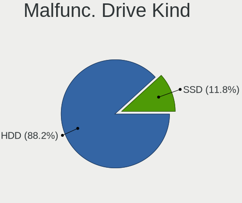
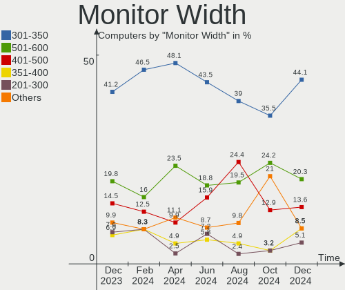
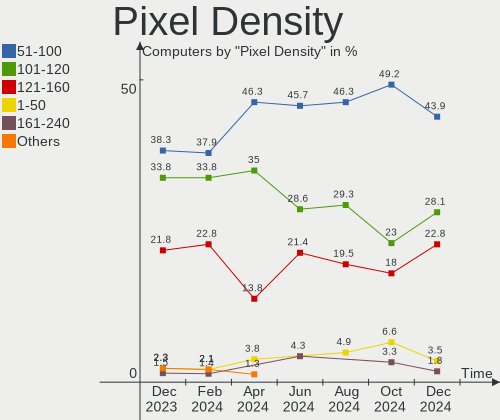
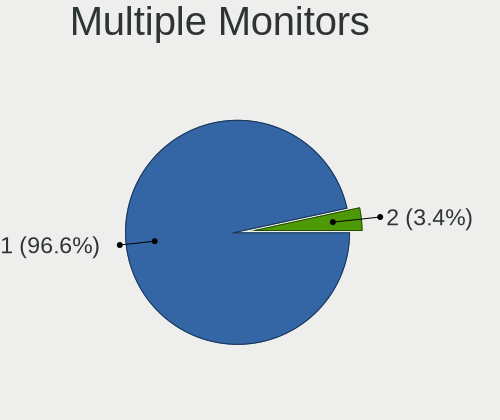

BlackPanther - Hardware Trends
------------------------------

A project to identify most popular hardware characteristics and track their change
over time based on data collected by Linux users at https://Linux-Hardware.org.

Anyone can contribute to this report by the [hw-probe](https://github.com/linuxhw/hw-probe) tool:

    sudo -E hw-probe -all -upload

This is a report for all computer types. See also reports for [desktops](/Dist/BlackPanther/Desktop/README.md) and [notebooks](/Dist/BlackPanther/Notebook/README.md).

This report is for one last month. Overall report since the beginning of time: [TestDays](https://github.com/linuxhw/TestDays)

Period: Sep, 2023.

Contents
--------

* [ System ](#system)
  - [ OS                       ](#os)
  - [ OS Family                ](#os-family)
  - [ Kernel                   ](#kernel)
  - [ Kernel Family            ](#kernel-family)
  - [ Kernel Major Ver.        ](#kernel-major-ver)
  - [ Arch                     ](#arch)
  - [ DE                       ](#de)
  - [ Display Server           ](#display-server)
  - [ Display Manager          ](#display-manager)
  - [ OS Lang                  ](#os-lang)
  - [ Boot Mode                ](#boot-mode)
  - [ Filesystem               ](#filesystem)
  - [ Part. scheme             ](#part-scheme)
  - [ Dual Boot with Linux/BSD ](#dual-boot-with-linuxbsd)
  - [ Dual Boot (Win)          ](#dual-boot-win)

* [ Board ](#board)
  - [ Vendor                   ](#vendor)
  - [ Model                    ](#model)
  - [ Model Family             ](#model-family)
  - [ MFG Year                 ](#mfg-year)
  - [ Form Factor              ](#form-factor)
  - [ Secure Boot              ](#secure-boot)
  - [ Coreboot                 ](#coreboot)
  - [ RAM Size                 ](#ram-size)
  - [ RAM Used                 ](#ram-used)
  - [ Total Drives             ](#total-drives)
  - [ Has CD-ROM               ](#has-cd-rom)
  - [ Has Ethernet             ](#has-ethernet)
  - [ Has WiFi                 ](#has-wifi)
  - [ Has Bluetooth            ](#has-bluetooth)

* [ Location ](#location)
  - [ Country                  ](#country)
  - [ City                     ](#city)

* [ Drives ](#drives)
  - [ Drive Vendor             ](#drive-vendor)
  - [ Drive Model              ](#drive-model)
  - [ HDD Vendor               ](#hdd-vendor)
  - [ SSD Vendor               ](#ssd-vendor)
  - [ Drive Kind               ](#drive-kind)
  - [ Drive Connector          ](#drive-connector)
  - [ Drive Size               ](#drive-size)
  - [ Space Total              ](#space-total)
  - [ Space Used               ](#space-used)
  - [ Malfunc. Drives          ](#malfunc-drives)
  - [ Malfunc. Drive Vendor    ](#malfunc-drive-vendor)
  - [ Malfunc. HDD Vendor      ](#malfunc-hdd-vendor)
  - [ Malfunc. Drive Kind      ](#malfunc-drive-kind)
  - [ Failed Drives            ](#failed-drives)
  - [ Failed Drive Vendor      ](#failed-drive-vendor)
  - [ Drive Status             ](#drive-status)

* [ Storage controller ](#storage-controller)
  - [ Storage Vendor           ](#storage-vendor)
  - [ Storage Model            ](#storage-model)
  - [ Storage Kind             ](#storage-kind)

* [ Processor ](#processor)
  - [ CPU Vendor               ](#cpu-vendor)
  - [ CPU Model                ](#cpu-model)
  - [ CPU Model Family         ](#cpu-model-family)
  - [ CPU Cores                ](#cpu-cores)
  - [ CPU Sockets              ](#cpu-sockets)
  - [ CPU Threads              ](#cpu-threads)
  - [ CPU Op-Modes             ](#cpu-op-modes)
  - [ CPU Microcode            ](#cpu-microcode)
  - [ CPU Microarch            ](#cpu-microarch)

* [ Graphics ](#graphics)
  - [ GPU Vendor               ](#gpu-vendor)
  - [ GPU Model                ](#gpu-model)
  - [ GPU Combo                ](#gpu-combo)
  - [ GPU Driver               ](#gpu-driver)
  - [ GPU Memory               ](#gpu-memory)

* [ Monitor ](#monitor)
  - [ Monitor Vendor           ](#monitor-vendor)
  - [ Monitor Model            ](#monitor-model)
  - [ Monitor Resolution       ](#monitor-resolution)
  - [ Monitor Diagonal         ](#monitor-diagonal)
  - [ Monitor Width            ](#monitor-width)
  - [ Aspect Ratio             ](#aspect-ratio)
  - [ Monitor Area             ](#monitor-area)
  - [ Pixel Density            ](#pixel-density)
  - [ Multiple Monitors        ](#multiple-monitors)

* [ Network ](#network)
  - [ Net Controller Vendor    ](#net-controller-vendor)
  - [ Net Controller Model     ](#net-controller-model)
  - [ Wireless Vendor          ](#wireless-vendor)
  - [ Wireless Model           ](#wireless-model)
  - [ Ethernet Vendor          ](#ethernet-vendor)
  - [ Ethernet Model           ](#ethernet-model)
  - [ Net Controller Kind      ](#net-controller-kind)
  - [ Used Controller          ](#used-controller)
  - [ NICs                     ](#nics)
  - [ IPv6                     ](#ipv6)

* [ Bluetooth ](#bluetooth)
  - [ Bluetooth Vendor         ](#bluetooth-vendor)
  - [ Bluetooth Model          ](#bluetooth-model)

* [ Sound ](#sound)
  - [ Sound Vendor             ](#sound-vendor)
  - [ Sound Model              ](#sound-model)

* [ Memory ](#memory)
  - [ Memory Vendor            ](#memory-vendor)
  - [ Memory Model             ](#memory-model)
  - [ Memory Kind              ](#memory-kind)
  - [ Memory Form Factor       ](#memory-form-factor)
  - [ Memory Size              ](#memory-size)
  - [ Memory Speed             ](#memory-speed)

* [ Printers & scanners ](#printers--scanners)
  - [ Printer Vendor           ](#printer-vendor)
  - [ Printer Model            ](#printer-model)
  - [ Scanner Vendor           ](#scanner-vendor)
  - [ Scanner Model            ](#scanner-model)

* [ Camera ](#camera)
  - [ Camera Vendor            ](#camera-vendor)
  - [ Camera Model             ](#camera-model)

* [ Security ](#security)
  - [ Fingerprint Vendor       ](#fingerprint-vendor)
  - [ Fingerprint Model        ](#fingerprint-model)
  - [ Chipcard Vendor          ](#chipcard-vendor)
  - [ Chipcard Model           ](#chipcard-model)

* [ Unsupported ](#unsupported)
  - [ Unsupported Devices      ](#unsupported-devices)
  - [ Unsupported Device Types ](#unsupported-device-types)

System
------

OS
--

Installed operating systems

| Name              | Computers | Percent |
|-------------------|-----------|---------|
| BlackPanther 18.1 | 108       | 93.1%   |
| BlackPanther 22.1 | 8         | 6.9%    |

OS Family
---------

OS without a version

| Name         | Computers | Percent |
|--------------|-----------|---------|
| BlackPanther | 116       | 100%    |

Kernel
------

Version of the Linux kernel

| Version             | Computers | Percent |
|---------------------|-----------|---------|
| 5.6.14-desktop-2bP  | 46        | 39.66%  |
| 5.15.85-desktop-1bP | 31        | 26.72%  |
| 4.18.16-desktop-1bP | 27        | 23.28%  |
| 6.3.8-desktop-1bP   | 5         | 4.31%   |
| 6.3.3-desktop-1bP   | 3         | 2.59%   |
| 6.4.3-desktop-1bP   | 2         | 1.72%   |
| 6.1.0-1bP           | 1         | 0.86%   |
| 5.6.14-server-2bP   | 1         | 0.86%   |

Kernel Family
-------------

Linux kernel without a distro release

| Version | Computers | Percent |
|---------|-----------|---------|
| 5.6.14  | 47        | 40.52%  |
| 5.15.85 | 31        | 26.72%  |
| 4.18.16 | 27        | 23.28%  |
| 6.3.8   | 5         | 4.31%   |
| 6.3.3   | 3         | 2.59%   |
| 6.4.3   | 2         | 1.72%   |
| 6.1.0   | 1         | 0.86%   |

Kernel Major Ver.
-----------------

Linux kernel major version

| Version | Computers | Percent |
|---------|-----------|---------|
| 5.6     | 47        | 40.52%  |
| 5.15    | 31        | 26.72%  |
| 4.18    | 27        | 23.28%  |
| 6.3     | 8         | 6.9%    |
| 6.4     | 2         | 1.72%   |
| 6.1     | 1         | 0.86%   |

Arch
----

OS architecture (x86_64, i586, etc.)

| Name   | Computers | Percent |
|--------|-----------|---------|
| x86_64 | 116       | 100%    |

DE
--

Desktop Environment

| Name    | Computers | Percent |
|---------|-----------|---------|
| KDE5    | 112       | 96.55%  |
| Unknown | 4         | 3.45%   |

Display Server
--------------

X11 or Wayland

| Name    | Computers | Percent |
|---------|-----------|---------|
| X11     | 115       | 99.14%  |
| Wayland | 1         | 0.86%   |

Display Manager
---------------

SDDM, LightDM, etc.

| Name | Computers | Percent |
|------|-----------|---------|
| SDDM | 116       | 100%    |

OS Lang
-------

Language

| Lang    | Computers | Percent |
|---------|-----------|---------|
| Unknown | 116       | 100%    |

Boot Mode
---------

EFI or BIOS

| Mode | Computers | Percent |
|------|-----------|---------|
| EFI  | 65        | 56.03%  |
| BIOS | 51        | 43.97%  |

Filesystem
----------

Type of filesystem

| Type    | Computers | Percent |
|---------|-----------|---------|
| Ext4    | 78        | 67.24%  |
| Overlay | 37        | 31.9%   |
| Ntfs    | 1         | 0.86%   |

Part. scheme
------------

Scheme of partitioning

| Type | Computers | Percent |
|------|-----------|---------|
| GPT  | 71        | 61.21%  |
| MBR  | 45        | 38.79%  |

Dual Boot with Linux/BSD
------------------------

Hosting more than one Linux/BSD

| Dual boot | Computers | Percent |
|-----------|-----------|---------|
| No        | 85        | 73.28%  |
| Yes       | 31        | 26.72%  |

Dual Boot (Win)
---------------

Hosting Linux and Windows

| Dual boot | Computers | Percent |
|-----------|-----------|---------|
| No        | 75        | 64.66%  |
| Yes       | 41        | 35.34%  |

Board
-----

Vendor
------

Motherboard manufacturer

| Name                | Computers | Percent |
|---------------------|-----------|---------|
| Hewlett-Packard     | 23        | 19.83%  |
| Dell                | 20        | 17.24%  |
| Gigabyte Technology | 17        | 14.66%  |
| Lenovo              | 12        | 10.34%  |
| ASUSTek Computer    | 12        | 10.34%  |
| ASRock              | 7         | 6.03%   |
| MSI                 | 5         | 4.31%   |
| Fujitsu             | 3         | 2.59%   |
| Acer                | 3         | 2.59%   |
| Microsoft           | 2         | 1.72%   |
| Fujitsu Siemens     | 2         | 1.72%   |
| Apple               | 2         | 1.72%   |
| Toshiba             | 1         | 0.86%   |
| Sony                | 1         | 0.86%   |
| Samsung Electronics | 1         | 0.86%   |
| Intel               | 1         | 0.86%   |
| Insyde              | 1         | 0.86%   |
| Huanan              | 1         | 0.86%   |
| Gateway             | 1         | 0.86%   |
| eMachines           | 1         | 0.86%   |

Model
-----

Motherboard model

| Name                                | Computers | Percent |
|-------------------------------------|-----------|---------|
| HP 250 G1                           | 3         | 2.59%   |
| Gigabyte H61M-S1                    | 3         | 2.59%   |
| HP Compaq 6200 Pro MT PC            | 2         | 1.72%   |
| Gigabyte F2A88XM-D3HP               | 2         | 1.72%   |
| Dell Vostro 1015                    | 2         | 1.72%   |
| Dell Inspiron 15-3567               | 2         | 1.72%   |
| ASUS X200MA                         | 2         | 1.72%   |
| Toshiba Satellite C55-A-1NV         | 1         | 0.86%   |
| Sony VPCEH2J1E                      | 1         | 0.86%   |
| Samsung 300E4C/300E5C/300E7C        | 1         | 0.86%   |
| MSI MS-7817                         | 1         | 0.86%   |
| MSI MS-7680                         | 1         | 0.86%   |
| MSI MS-7309                         | 1         | 0.86%   |
| MSI GT60 2OC/2OD                    | 1         | 0.86%   |
| MSI GP75 Leopard 9SE                | 1         | 0.86%   |
| Microsoft Surface Pro               | 1         | 0.86%   |
| Microsoft Surface Go 2              | 1         | 0.86%   |
| Lenovo ThinkPad X250 20CLS1JN00     | 1         | 0.86%   |
| Lenovo ThinkPad T540p 20BE003YUK    | 1         | 0.86%   |
| Lenovo ThinkPad T410 2537VFQ        | 1         | 0.86%   |
| Lenovo ThinkPad T400 2768WGB        | 1         | 0.86%   |
| Lenovo ThinkCentre M73 10B6001SUS   | 1         | 0.86%   |
| Lenovo IdeaPad Y700-15ISK 80NV      | 1         | 0.86%   |
| Lenovo IdeaPad Gaming 3 15ACH6 82K2 | 1         | 0.86%   |
| Lenovo IdeaPad 700-15ISK 80RU       | 1         | 0.86%   |
| Lenovo IdeaPad 330-15IKB 81DE       | 1         | 0.86%   |
| Lenovo IdeaPad 110-15ACL 80TJ       | 1         | 0.86%   |
| Lenovo Flex 2-15D 20377             | 1         | 0.86%   |
| Lenovo 1730-A1G                     | 1         | 0.86%   |
| Intel S5500HCV                      | 1         | 0.86%   |
| Insyde Braswell                     | 1         | 0.86%   |
| Huanan X99-QD4 V1.0                 | 1         | 0.86%   |
| HP Z400 Workstation                 | 1         | 0.86%   |
| HP ProBook 650 G2                   | 1         | 0.86%   |
| HP ProBook 640 G8 Notebook PC       | 1         | 0.86%   |
| HP Pavilion x2 Detachable           | 1         | 0.86%   |
| HP Pavilion Gaming Laptop 15-ec1xxx | 1         | 0.86%   |
| HP Pavilion dv6                     | 1         | 0.86%   |
| HP Notebook                         | 1         | 0.86%   |
| HP Laptop 15-dw1xxx                 | 1         | 0.86%   |

Model Family
------------

Motherboard model prefix

| Name                  | Computers | Percent |
|-----------------------|-----------|---------|
| HP Compaq             | 9         | 7.76%   |
| Dell Inspiron         | 7         | 6.03%   |
| Lenovo IdeaPad        | 5         | 4.31%   |
| Dell Latitude         | 5         | 4.31%   |
| Lenovo ThinkPad       | 4         | 3.45%   |
| HP 250                | 4         | 3.45%   |
| Dell OptiPlex         | 4         | 3.45%   |
| HP Pavilion           | 3         | 2.59%   |
| Gigabyte H61M-S1      | 3         | 2.59%   |
| Acer Aspire           | 3         | 2.59%   |
| Microsoft Surface     | 2         | 1.72%   |
| HP ProBook            | 2         | 1.72%   |
| Gigabyte F2A88XM-D3HP | 2         | 1.72%   |
| Fujitsu ESPRIMO       | 2         | 1.72%   |
| Dell Vostro           | 2         | 1.72%   |
| Dell Precision        | 2         | 1.72%   |
| ASUS X200MA           | 2         | 1.72%   |
| ASUS PRIME            | 2         | 1.72%   |
| Toshiba Satellite     | 1         | 0.86%   |
| Sony VPCEH2J1E        | 1         | 0.86%   |
| Samsung 300E4C        | 1         | 0.86%   |
| MSI MS-7817           | 1         | 0.86%   |
| MSI MS-7680           | 1         | 0.86%   |
| MSI MS-7309           | 1         | 0.86%   |
| MSI GT60              | 1         | 0.86%   |
| MSI GP75              | 1         | 0.86%   |
| Lenovo ThinkCentre    | 1         | 0.86%   |
| Lenovo Flex           | 1         | 0.86%   |
| Lenovo 1730-A1G       | 1         | 0.86%   |
| Intel S5500HCV        | 1         | 0.86%   |
| Insyde Braswell       | 1         | 0.86%   |
| Huanan X99-QD4        | 1         | 0.86%   |
| HP Z400               | 1         | 0.86%   |
| HP Notebook           | 1         | 0.86%   |
| HP Laptop             | 1         | 0.86%   |
| HP EliteDesk          | 1         | 0.86%   |
| HP 650                | 1         | 0.86%   |
| Gigabyte Z390         | 1         | 0.86%   |
| Gigabyte P67A-D3-B3   | 1         | 0.86%   |
| Gigabyte J4005ND2P-CF | 1         | 0.86%   |

MFG Year
--------

Motherboard manufacture year

| Year | Computers | Percent |
|------|-----------|---------|
| 2013 | 14        | 12.07%  |
| 2011 | 12        | 10.34%  |
| 2015 | 11        | 9.48%   |
| 2009 | 10        | 8.62%   |
| 2018 | 9         | 7.76%   |
| 2016 | 9         | 7.76%   |
| 2012 | 9         | 7.76%   |
| 2014 | 8         | 6.9%    |
| 2010 | 8         | 6.9%    |
| 2008 | 6         | 5.17%   |
| 2017 | 5         | 4.31%   |
| 2020 | 4         | 3.45%   |
| 2019 | 4         | 3.45%   |
| 2021 | 3         | 2.59%   |
| 2006 | 2         | 1.72%   |
| 2022 | 1         | 0.86%   |
| 2005 | 1         | 0.86%   |

Form Factor
-----------

Physical design of the computer

| Name       | Computers | Percent |
|------------|-----------|---------|
| Desktop    | 56        | 48.28%  |
| Notebook   | 54        | 46.55%  |
| All in one | 3         | 2.59%   |
| Tablet     | 2         | 1.72%   |
| Server     | 1         | 0.86%   |

Secure Boot
-----------

Enabled or disabled

| State    | Computers | Percent |
|----------|-----------|---------|
| Disabled | 116       | 100%    |

Coreboot
--------

Have coreboot on board

| Used | Computers | Percent |
|------|-----------|---------|
| No   | 116       | 100%    |

RAM Size
--------

Total RAM memory

| Size in GB  | Computers | Percent |
|-------------|-----------|---------|
| 3.01-4.0    | 38        | 32.76%  |
| 4.01-8.0    | 27        | 23.28%  |
| 8.01-16.0   | 25        | 21.55%  |
| 16.01-24.0  | 9         | 7.76%   |
| 1.01-2.0    | 9         | 7.76%   |
| 32.01-64.0  | 4         | 3.45%   |
| 24.01-32.0  | 2         | 1.72%   |
| 2.01-3.0    | 1         | 0.86%   |
| 64.01-256.0 | 1         | 0.86%   |

RAM Used
--------

Used RAM memory

| Used GB   | Computers | Percent |
|-----------|-----------|---------|
| 1.01-2.0  | 50        | 43.1%   |
| 0.51-1.0  | 36        | 31.03%  |
| 0.01-0.5  | 12        | 10.34%  |
| 2.01-3.0  | 9         | 7.76%   |
| 3.01-4.0  | 5         | 4.31%   |
| 4.01-8.0  | 3         | 2.59%   |
| 8.01-16.0 | 1         | 0.86%   |

Total Drives
------------

Number of drives on board

| Drives | Computers | Percent |
|--------|-----------|---------|
| 1      | 72        | 62.07%  |
| 2      | 33        | 28.45%  |
| 3      | 6         | 5.17%   |
| 4      | 3         | 2.59%   |
| 5      | 1         | 0.86%   |
| 0      | 1         | 0.86%   |

Has CD-ROM
----------

Has CD-ROM on board

| Presented | Computers | Percent |
|-----------|-----------|---------|
| Yes       | 69        | 59.48%  |
| No        | 47        | 40.52%  |

Has Ethernet
------------

Has Ethernet on board

| Presented | Computers | Percent |
|-----------|-----------|---------|
| Yes       | 110       | 94.83%  |
| No        | 6         | 5.17%   |

Has WiFi
--------

Has WiFi module

| Presented | Computers | Percent |
|-----------|-----------|---------|
| Yes       | 71        | 61.21%  |
| No        | 45        | 38.79%  |

Has Bluetooth
-------------

Has Bluetooth module

| Presented | Computers | Percent |
|-----------|-----------|---------|
| Yes       | 59        | 50.86%  |
| No        | 57        | 49.14%  |

Location
--------

Country
-------

Geographic location (country)

| Country  | Computers | Percent |
|----------|-----------|---------|
| Hungary  | 93        | 80.17%  |
| Slovakia | 4         | 3.45%   |
| Germany  | 4         | 3.45%   |
| Austria  | 4         | 3.45%   |
| UK       | 3         | 2.59%   |
| Spain    | 1         | 0.86%   |
| Serbia   | 1         | 0.86%   |
| Romania  | 1         | 0.86%   |
| Italy    | 1         | 0.86%   |
| India    | 1         | 0.86%   |
| Greece   | 1         | 0.86%   |
| France   | 1         | 0.86%   |
| Canada   | 1         | 0.86%   |

City
----

Geographic location (city)

| City                    | Computers | Percent |
|-------------------------|-----------|---------|
| Budapest                | 28        | 24.14%  |
| Zalaegerszeg            | 5         | 4.31%   |
| Vienna                  | 4         | 3.45%   |
| Szombathely             | 4         | 3.45%   |
| Szeghalom               | 3         | 2.59%   |
| Pécs                   | 3         | 2.59%   |
| Miskolc                 | 3         | 2.59%   |
| Debrecen                | 3         | 2.59%   |
| Csongrad                | 3         | 2.59%   |
| Tatabánya              | 2         | 1.72%   |
| Tamasi                  | 2         | 1.72%   |
| Szekszárd              | 2         | 1.72%   |
| Szazhalombatta          | 2         | 1.72%   |
| Pfaffenhofen an der Ilm | 2         | 1.72%   |
| Nagykanizsa             | 2         | 1.72%   |
| Nagyatad                | 2         | 1.72%   |
| Győr                   | 2         | 1.72%   |
| Filderstadt             | 2         | 1.72%   |
| Eger                    | 2         | 1.72%   |
| Dunaharaszti            | 2         | 1.72%   |
| Berettyóújfalu        | 2         | 1.72%   |
| Vonock                  | 1         | 0.86%   |
| Veszprém               | 1         | 0.86%   |
| Velky Meder             | 1         | 0.86%   |
| Tornaľa                | 1         | 0.86%   |
| Szigetszentmiklos       | 1         | 0.86%   |
| Szentmartonkata         | 1         | 0.86%   |
| Szentendre              | 1         | 0.86%   |
| Salerno                 | 1         | 0.86%   |
| Pomaz                   | 1         | 0.86%   |
| Papa                    | 1         | 0.86%   |
| Oroshaza                | 1         | 0.86%   |
| Nyul                    | 1         | 0.86%   |
| Nyiregyhaza             | 1         | 0.86%   |
| Nagykoroes              | 1         | 0.86%   |
| Miercurea-Ciuc          | 1         | 0.86%   |
| Martin                  | 1         | 0.86%   |
| Marcali                 | 1         | 0.86%   |
| Levice                  | 1         | 0.86%   |
| Kiskunhalas             | 1         | 0.86%   |

Drives
------

Drive Vendor
------------

Hard drive vendors

| Vendor                    | Computers | Drives | Percent |
|---------------------------|-----------|--------|---------|
| WDC                       | 29        | 37     | 17.06%  |
| Kingston                  | 23        | 24     | 13.53%  |
| Samsung Electronics       | 20        | 24     | 11.76%  |
| Toshiba                   | 15        | 15     | 8.82%   |
| Seagate                   | 15        | 15     | 8.82%   |
| SanDisk                   | 8         | 8      | 4.71%   |
| HGST                      | 7         | 8      | 4.12%   |
| Unknown                   | 6         | 7      | 3.53%   |
| Hitachi                   | 5         | 5      | 2.94%   |
| A-DATA Technology         | 5         | 5      | 2.94%   |
| Intenso                   | 4         | 4      | 2.35%   |
| SPCC                      | 3         | 3      | 1.76%   |
| SK hynix                  | 2         | 2      | 1.18%   |
| Patriot                   | 2         | 2      | 1.18%   |
| Micron Technology         | 2         | 2      | 1.18%   |
| Crucial                   | 2         | 2      | 1.18%   |
| Apacer                    | 2         | 2      | 1.18%   |
| Zheino                    | 1         | 1      | 0.59%   |
| XPG                       | 1         | 1      | 0.59%   |
| Transcend                 | 1         | 1      | 0.59%   |
| Timetec                   | 1         | 1      | 0.59%   |
| Team                      | 1         | 1      | 0.59%   |
| SSSTC                     | 1         | 1      | 0.59%   |
| PNY                       | 1         | 1      | 0.59%   |
| Micron/Crucial Technology | 1         | 1      | 0.59%   |
| Maxtor                    | 1         | 1      | 0.59%   |
| LITEONIT                  | 1         | 1      | 0.59%   |
| LITEON                    | 1         | 1      | 0.59%   |
| KIOXIA                    | 1         | 1      | 0.59%   |
| Kingmax                   | 1         | 1      | 0.59%   |
| JMicron Technology        | 1         | 1      | 0.59%   |
| Intel                     | 1         | 1      | 0.59%   |
| Gigabyte Technology       | 1         | 1      | 0.59%   |
| Fujitsu                   | 1         | 1      | 0.59%   |
| ASENNO                    | 1         | 1      | 0.59%   |
| Apple                     | 1         | 1      | 0.59%   |
| 2-Power                   | 1         | 1      | 0.59%   |

Drive Model
-----------

Hard drive models

| Model                            | Computers | Percent |
|----------------------------------|-----------|---------|
| Kingston SA400S37480G 480GB SSD  | 6         | 3.31%   |
| Toshiba DT01ACA100 1TB           | 4         | 2.21%   |
| WDC WD30EFRX-68EUZN0 3TB         | 3         | 1.66%   |
| SPCC Solid State Disk 256GB      | 3         | 1.66%   |
| Kingston SUV400S37120G 120GB SSD | 3         | 1.66%   |
| Kingston SA400S37240G 240GB SSD  | 3         | 1.66%   |
| WDC WD5000BPKT-75PK4T0 500GB     | 2         | 1.1%    |
| Seagate ST500LT012-1DG142 500GB  | 2         | 1.1%    |
| Seagate ST500DM002-1BD142 500GB  | 2         | 1.1%    |
| Samsung SSD 970 EVO Plus 2TB     | 2         | 1.1%    |
| Samsung SSD 850 EVO 250GB        | 2         | 1.1%    |
| Samsung SSD 830 Series 64GB      | 2         | 1.1%    |
| Kingston SV300S37A60G 64GB SSD   | 2         | 1.1%    |
| Kingston SA400S37120G 120GB SSD  | 2         | 1.1%    |
| Intenso SSD 120GB                | 2         | 1.1%    |
| Hitachi HDS721050CLA662 500GB    | 2         | 1.1%    |
| HGST HTS545032A7E380 320GB       | 2         | 1.1%    |
| Zheino CHN-NGFFNV2280-256 256GB  | 1         | 0.55%   |
| XPG SPECTRIX S40G 1TB            | 1         | 0.55%   |
| WDC WDS256G1X0C-00ENX0 256GB     | 1         | 0.55%   |
| WDC WDS240G2G0B-00EPW0 240GB SSD | 1         | 0.55%   |
| WDC WDS240G2G0A-00JH30 240GB SSD | 1         | 0.55%   |
| WDC WD800JD-75MSA3 80GB          | 1         | 0.55%   |
| WDC WD5000LPVX-80V0TT0 500GB     | 1         | 0.55%   |
| WDC WD5000LPCX-24VHAT0 500GB     | 1         | 0.55%   |
| WDC WD5000BPVT-24HXZT3 500GB     | 1         | 0.55%   |
| WDC WD5000BPVT-22HXZT3 500GB     | 1         | 0.55%   |
| WDC WD5000AAKX-60U6AA0 500GB     | 1         | 0.55%   |
| WDC WD5000AAKX-08U6AA0 500GB     | 1         | 0.55%   |
| WDC WD5000AAKS-00UU3A0 500GB     | 1         | 0.55%   |
| WDC WD5000AAKS-007AA0 500GB      | 1         | 0.55%   |
| WDC WD3200BEVT-75ZCT2 320GB      | 1         | 0.55%   |
| WDC WD30EZRZ-00GXCB0 3TB         | 1         | 0.55%   |
| WDC WD30EZRX-00DC0B0 3TB         | 1         | 0.55%   |
| WDC WD30 PURX-64PFUY0 3TB        | 1         | 0.55%   |
| WDC WD2500BEVT-00ZCT0 250GB      | 1         | 0.55%   |
| WDC WD2500AAJS-75M0A0 250GB      | 1         | 0.55%   |
| WDC WD20EZBX-00AYRA0 2TB         | 1         | 0.55%   |
| WDC WD10SPCX-24HWST1 1TB         | 1         | 0.55%   |
| WDC WD10PURZ-85U8XY0 1TB         | 1         | 0.55%   |

HDD Vendor
----------

Hard disk drive vendors

| Vendor              | Computers | Drives | Percent |
|---------------------|-----------|--------|---------|
| WDC                 | 26        | 33     | 35.62%  |
| Seagate             | 15        | 15     | 20.55%  |
| Toshiba             | 13        | 13     | 17.81%  |
| HGST                | 7         | 8      | 9.59%   |
| Samsung Electronics | 5         | 5      | 6.85%   |
| Hitachi             | 5         | 5      | 6.85%   |
| Maxtor              | 1         | 1      | 1.37%   |
| Fujitsu             | 1         | 1      | 1.37%   |

SSD Vendor
----------

Solid state drive vendors

| Vendor              | Computers | Drives | Percent |
|---------------------|-----------|--------|---------|
| Kingston            | 20        | 21     | 28.17%  |
| Samsung Electronics | 9         | 10     | 12.68%  |
| SanDisk             | 6         | 6      | 8.45%   |
| A-DATA Technology   | 5         | 5      | 7.04%   |
| Intenso             | 4         | 4      | 5.63%   |
| WDC                 | 3         | 3      | 4.23%   |
| SPCC                | 3         | 3      | 4.23%   |
| Patriot             | 2         | 2      | 2.82%   |
| Micron Technology   | 2         | 2      | 2.82%   |
| Crucial             | 2         | 2      | 2.82%   |
| Apacer              | 2         | 2      | 2.82%   |
| Timetec             | 1         | 1      | 1.41%   |
| Team                | 1         | 1      | 1.41%   |
| SK hynix            | 1         | 1      | 1.41%   |
| PNY                 | 1         | 1      | 1.41%   |
| LITEONIT            | 1         | 1      | 1.41%   |
| LITEON              | 1         | 1      | 1.41%   |
| Kingmax             | 1         | 1      | 1.41%   |
| JMicron Technology  | 1         | 1      | 1.41%   |
| Intel               | 1         | 1      | 1.41%   |
| Gigabyte Technology | 1         | 1      | 1.41%   |
| ASENNO              | 1         | 1      | 1.41%   |
| Apple               | 1         | 1      | 1.41%   |
| 2-Power             | 1         | 1      | 1.41%   |

Drive Kind
----------

HDD or SSD

| Kind | Computers | Drives | Percent |
|------|-----------|--------|---------|
| HDD  | 67        | 81     | 42.95%  |
| SSD  | 62        | 73     | 39.74%  |
| NVMe | 20        | 23     | 12.82%  |
| MMC  | 7         | 8      | 4.49%   |

Drive Connector
---------------

SATA, SAS, NVMe, etc.

| Type | Computers | Drives | Percent |
|------|-----------|--------|---------|
| SATA | 103       | 151    | 77.44%  |
| NVMe | 20        | 23     | 15.04%  |
| MMC  | 7         | 8      | 5.26%   |
| SAS  | 3         | 3      | 2.26%   |

Drive Size
----------

Size of hard drive

| Size in TB | Computers | Drives | Percent |
|------------|-----------|--------|---------|
| 0.01-0.5   | 87        | 106    | 67.97%  |
| 0.51-1.0   | 30        | 33     | 23.44%  |
| 2.01-3.0   | 6         | 9      | 4.69%   |
| 3.01-4.0   | 3         | 4      | 2.34%   |
| 1.01-2.0   | 2         | 2      | 1.56%   |

Space Total
-----------

Amount of disk space available on the file system

| Size in GB     | Computers | Percent |
|----------------|-----------|---------|
| Unknown        | 36        | 31.03%  |
| 101-250        | 26        | 22.41%  |
| 251-500        | 18        | 15.52%  |
| 501-1000       | 12        | 10.34%  |
| 51-100         | 9         | 7.76%   |
| 21-50          | 4         | 3.45%   |
| 1001-2000      | 4         | 3.45%   |
| More than 3000 | 3         | 2.59%   |
| 2001-3000      | 3         | 2.59%   |
| 1-20           | 1         | 0.86%   |

Space Used
----------

Amount of used disk space

| Used GB        | Computers | Percent |
|----------------|-----------|---------|
| Unknown        | 36        | 31.03%  |
| 1-20           | 31        | 26.72%  |
| 21-50          | 19        | 16.38%  |
| 51-100         | 11        | 9.48%   |
| 101-250        | 9         | 7.76%   |
| 1001-2000      | 3         | 2.59%   |
| 251-500        | 2         | 1.72%   |
| 2001-3000      | 2         | 1.72%   |
| 501-1000       | 2         | 1.72%   |
| More than 3000 | 1         | 0.86%   |

Malfunc. Drives
---------------

Drive models with a malfunction

| Model                             | Computers | Drives | Percent |
|-----------------------------------|-----------|--------|---------|
| HGST HTS545032A7E380 320GB        | 2         | 2      | 5.88%   |
| WDC WD5000LPVX-80V0TT0 500GB      | 1         | 1      | 2.94%   |
| WDC WD5000AAKX-08U6AA0 500GB      | 1         | 1      | 2.94%   |
| WDC WD5000AAKS-00UU3A0 500GB      | 1         | 1      | 2.94%   |
| WDC WD5000AAKS-007AA0 500GB       | 1         | 1      | 2.94%   |
| WDC WD3200BEVT-75ZCT2 320GB       | 1         | 1      | 2.94%   |
| WDC WD2500BEVT-00ZCT0 250GB       | 1         | 1      | 2.94%   |
| WDC WD10PURZ-85U8XY0 1TB          | 1         | 1      | 2.94%   |
| WDC WD10JPLX-00MBPT0 1TB          | 1         | 1      | 2.94%   |
| WDC WD10EARS-00Y5B1 1TB           | 1         | 1      | 2.94%   |
| Toshiba MQ01ABF050 500GB          | 1         | 1      | 2.94%   |
| Toshiba HDWD130 3TB               | 1         | 1      | 2.94%   |
| Toshiba DT01ACA100 1TB            | 1         | 1      | 2.94%   |
| Toshiba DT01ACA050 500GB          | 1         | 1      | 2.94%   |
| Timetec SD08 512GB SSD            | 1         | 1      | 2.94%   |
| Seagate ST9500420AS 500GB         | 1         | 1      | 2.94%   |
| Seagate ST9500325AS 500GB         | 1         | 1      | 2.94%   |
| Seagate ST500LT012-9WS142 500GB   | 1         | 1      | 2.94%   |
| Seagate ST500LT012-1DG142 500GB   | 1         | 1      | 2.94%   |
| Seagate ST500DM002-1BD142 500GB   | 1         | 1      | 2.94%   |
| Seagate ST3500418AS 500GB         | 1         | 1      | 2.94%   |
| Seagate ST3160815AS 160GB         | 1         | 1      | 2.94%   |
| Seagate ST1000LM048-2E7172 1TB    | 1         | 1      | 2.94%   |
| Samsung Electronics HD103UJ 1TB   | 1         | 1      | 2.94%   |
| Samsung Electronics HD080HJ 80GB  | 1         | 1      | 2.94%   |
| Kingston SV300S37A120G 120GB SSD  | 1         | 1      | 2.94%   |
| Kingston SUV400S37120G 120GB SSD  | 1         | 1      | 2.94%   |
| Hitachi HTS547550A9E384 500GB     | 1         | 1      | 2.94%   |
| Hitachi HTS543225L9A300 250GB     | 1         | 1      | 2.94%   |
| HGST HTS541010A9E680 1TB          | 1         | 1      | 2.94%   |
| Fujitsu MHW2060BH 64GB            | 1         | 1      | 2.94%   |
| Apple SSD TS064E 64GB             | 1         | 1      | 2.94%   |
| A-DATA Technology SU630 240GB SSD | 1         | 1      | 2.94%   |

Malfunc. Drive Vendor
---------------------

Vendors of faulty drives

| Vendor              | Computers | Drives | Percent |
|---------------------|-----------|--------|---------|
| WDC                 | 9         | 9      | 26.47%  |
| Seagate             | 8         | 8      | 23.53%  |
| Toshiba             | 4         | 4      | 11.76%  |
| HGST                | 3         | 3      | 8.82%   |
| Samsung Electronics | 2         | 2      | 5.88%   |
| Kingston            | 2         | 2      | 5.88%   |
| Hitachi             | 2         | 2      | 5.88%   |
| Timetec             | 1         | 1      | 2.94%   |
| Fujitsu             | 1         | 1      | 2.94%   |
| Apple               | 1         | 1      | 2.94%   |
| A-DATA Technology   | 1         | 1      | 2.94%   |

Malfunc. HDD Vendor
-------------------

Vendors of faulty HDD drives

| Vendor              | Computers | Drives | Percent |
|---------------------|-----------|--------|---------|
| WDC                 | 9         | 9      | 31.03%  |
| Seagate             | 8         | 8      | 27.59%  |
| Toshiba             | 4         | 4      | 13.79%  |
| HGST                | 3         | 3      | 10.34%  |
| Samsung Electronics | 2         | 2      | 6.9%    |
| Hitachi             | 2         | 2      | 6.9%    |
| Fujitsu             | 1         | 1      | 3.45%   |

Malfunc. Drive Kind
-------------------

Kinds of faulty drives

| Kind | Computers | Drives | Percent |
|------|-----------|--------|---------|
| HDD  | 28        | 29     | 84.85%  |
| SSD  | 5         | 5      | 15.15%  |

Failed Drives
-------------

Failed drive models

| Model                             | Computers | Drives | Percent |
|-----------------------------------|-----------|--------|---------|
| Samsung Electronics HD502HJ 500GB | 1         | 1      | 100%    |

Failed Drive Vendor
-------------------

Failed drive vendors

| Vendor              | Computers | Drives | Percent |
|---------------------|-----------|--------|---------|
| Samsung Electronics | 1         | 1      | 100%    |

Drive Status
------------

Number of failed and malfunc. drives

| Status   | Computers | Drives | Percent |
|----------|-----------|--------|---------|
| Works    | 90        | 138    | 67.16%  |
| Malfunc  | 32        | 34     | 23.88%  |
| Detected | 11        | 12     | 8.21%   |
| Failed   | 1         | 1      | 0.75%   |

Storage controller
------------------

Storage Vendor
--------------

Storage controller vendors

| Vendor                         | Computers | Percent |
|--------------------------------|-----------|---------|
| Intel                          | 92        | 68.15%  |
| AMD                            | 16        | 11.85%  |
| Samsung Electronics            | 7         | 5.19%   |
| SanDisk                        | 3         | 2.22%   |
| Nvidia                         | 3         | 2.22%   |
| Kingston Technology Company    | 3         | 2.22%   |
| Toshiba America Info Systems   | 2         | 1.48%   |
| Silicon Motion                 | 2         | 1.48%   |
| Solid State Storage Technology | 1         | 0.74%   |
| Silicon Image                  | 1         | 0.74%   |
| Realtek Semiconductor          | 1         | 0.74%   |
| Micron/Crucial Technology      | 1         | 0.74%   |
| KIOXIA                         | 1         | 0.74%   |
| JMicron Technology             | 1         | 0.74%   |
| ASMedia Technology             | 1         | 0.74%   |

Storage Model
-------------

Storage controller models

| Model                                                                                   | Computers | Percent |
|-----------------------------------------------------------------------------------------|-----------|---------|
| AMD FCH SATA Controller [AHCI mode]                                                     | 10        | 6.25%   |
| Intel 7 Series Chipset Family 6-port SATA Controller [AHCI mode]                        | 9         | 5.63%   |
| Intel Sunrise Point-LP SATA Controller [AHCI mode]                                      | 8         | 5%      |
| Intel 8 Series/C220 Series Chipset Family 6-port SATA Controller 1 [AHCI mode]          | 8         | 5%      |
| Intel NM10/ICH7 Family SATA Controller [IDE mode]                                       | 6         | 3.75%   |
| Intel 6 Series/C200 Series Chipset Family Desktop SATA Controller (IDE mode, ports 4-5) | 6         | 3.75%   |
| Intel 6 Series/C200 Series Chipset Family Desktop SATA Controller (IDE mode, ports 0-3) | 6         | 3.75%   |
| Intel 6 Series/C200 Series Chipset Family 6 port Desktop SATA AHCI Controller           | 5         | 3.13%   |
| Intel Q170/Q150/B150/H170/H110/Z170/CM236 Chipset SATA Controller [AHCI Mode]           | 4         | 2.5%    |
| Intel 82801G (ICH7 Family) IDE Controller                                               | 4         | 2.5%    |
| Intel 82801 Mobile SATA Controller [RAID mode]                                          | 4         | 2.5%    |
| Samsung NVMe SSD Controller SM981/PM981/PM983                                           | 3         | 1.88%   |
| Intel SATA Controller [RAID mode]                                                       | 3         | 1.88%   |
| Intel HM170/QM170 Chipset SATA Controller [AHCI Mode]                                   | 3         | 1.88%   |
| Intel 82801IBM/IEM (ICH9M/ICH9M-E) 4 port SATA Controller [AHCI mode]                   | 3         | 1.88%   |
| Intel 6 Series/C200 Series Chipset Family 6 port Mobile SATA AHCI Controller            | 3         | 1.88%   |
| Intel 4 Series Chipset PT IDER Controller                                               | 3         | 1.88%   |
| Intel 200 Series PCH SATA controller [AHCI mode]                                        | 3         | 1.88%   |
| Silicon Motion SM2263EN/SM2263XT (DRAM-less) NVMe SSD Controllers                       | 2         | 1.25%   |
| Samsung NVMe SSD Controller 980                                                         | 2         | 1.25%   |
| Intel Wildcat Point-LP SATA Controller [AHCI Mode]                                      | 2         | 1.25%   |
| Intel Volume Management Device NVMe RAID Controller                                     | 2         | 1.25%   |
| Intel Atom Processor E3800 Series SATA AHCI Controller                                  | 2         | 1.25%   |
| Intel 82801JI (ICH10 Family) SATA AHCI Controller                                       | 2         | 1.25%   |
| Intel 82801IBM/IEM (ICH9M/ICH9M-E) 2 port SATA Controller [IDE mode]                    | 2         | 1.25%   |
| Intel 8 Series SATA Controller 1 [AHCI mode]                                            | 2         | 1.25%   |
| Intel 7 Series/C210 Series Chipset Family 6-port SATA Controller [AHCI mode]            | 2         | 1.25%   |
| Intel 5 Series/3400 Series Chipset 6 port SATA AHCI Controller                          | 2         | 1.25%   |
| AMD SB7x0/SB8x0/SB9x0 SATA Controller [AHCI mode]                                       | 2         | 1.25%   |
| AMD 500 Series Chipset SATA Controller                                                  | 2         | 1.25%   |
| AMD 400 Series Chipset SATA Controller                                                  | 2         | 1.25%   |
| AMD 300 Series Chipset SATA Controller                                                  | 2         | 1.25%   |
| Toshiba America Info Systems XG6 NVMe SSD Controller                                    | 1         | 0.63%   |
| Toshiba America Info Systems XG5 NVMe SSD Controller                                    | 1         | 0.63%   |
| Solid State Storage CL1-3D256-Q11 NVMe SSD M.2                                          | 1         | 0.63%   |
| Silicon Image SiI 3512 [SATALink/SATARaid] Serial ATA Controller                        | 1         | 0.63%   |
| SanDisk WD Blue SN570 NVMe SSD 2TB                                                      | 1         | 0.63%   |
| SanDisk WD Blue SN570 NVMe SSD 1TB                                                      | 1         | 0.63%   |
| SanDisk WD Black NVMe SSD                                                               | 1         | 0.63%   |
| Samsung NVMe SSD SM0032L                                                                | 1         | 0.63%   |

Storage Kind
------------

Kind of storage controller (IDE, SATA, NVMe, SAS, ...)

| Kind | Computers | Percent |
|------|-----------|---------|
| SATA | 84        | 60.87%  |
| IDE  | 24        | 17.39%  |
| NVMe | 20        | 14.49%  |
| RAID | 10        | 7.25%   |

Processor
---------

CPU Vendor
----------

Processor vendors

| Vendor | Computers | Percent |
|--------|-----------|---------|
| Intel  | 97        | 83.62%  |
| AMD    | 19        | 16.38%  |

CPU Model
---------

Processor models

| Model                                           | Computers | Percent |
|-------------------------------------------------|-----------|---------|
| Intel Core i5-2400 CPU @ 3.10GHz                | 4         | 3.45%   |
| Intel Core i3-2120 CPU @ 3.30GHz                | 4         | 3.45%   |
| Intel Core i5-7200U CPU @ 2.50GHz               | 3         | 2.59%   |
| Intel Celeron CPU 1000M @ 1.80GHz               | 3         | 2.59%   |
| Intel Core i7-4700MQ CPU @ 2.40GHz              | 2         | 1.72%   |
| Intel Core i5-8250U CPU @ 1.60GHz               | 2         | 1.72%   |
| Intel Core i5-6200U CPU @ 2.30GHz               | 2         | 1.72%   |
| Intel Core i3-6100 CPU @ 3.70GHz                | 2         | 1.72%   |
| Intel Core i3-4130 CPU @ 3.40GHz                | 2         | 1.72%   |
| Intel Core 2 Duo CPU T6570 @ 2.10GHz            | 2         | 1.72%   |
| AMD Ryzen 5 3400G with Radeon Vega Graphics     | 2         | 1.72%   |
| AMD A10-7850K Radeon R7, 12 Compute Cores 4C+8G | 2         | 1.72%   |
| Intel Xeon CPU X5670 @ 2.93GHz                  | 1         | 0.86%   |
| Intel Xeon CPU X3330 @ 2.66GHz                  | 1         | 0.86%   |
| Intel Xeon CPU W3550 @ 3.07GHz                  | 1         | 0.86%   |
| Intel Xeon CPU L5640 @ 2.27GHz                  | 1         | 0.86%   |
| Intel Xeon CPU E5530 @ 2.40GHz                  | 1         | 0.86%   |
| Intel Xeon CPU E5-2696 v3 @ 2.30GHz             | 1         | 0.86%   |
| Intel Xeon CPU E5-1660 v3 @ 3.00GHz             | 1         | 0.86%   |
| Intel Pentium Dual-Core CPU T4500 @ 2.30GHz     | 1         | 0.86%   |
| Intel Pentium Dual-Core CPU T4300 @ 2.10GHz     | 1         | 0.86%   |
| Intel Pentium Dual-Core CPU E5400 @ 2.70GHz     | 1         | 0.86%   |
| Intel Pentium CPU N3530 @ 2.16GHz               | 1         | 0.86%   |
| Intel Pentium CPU G3430 @ 3.30GHz               | 1         | 0.86%   |
| Intel Pentium CPU G3220 @ 3.00GHz               | 1         | 0.86%   |
| Intel Pentium CPU B970 @ 2.30GHz                | 1         | 0.86%   |
| Intel Pentium CPU B960 @ 2.20GHz                | 1         | 0.86%   |
| Intel Pentium CPU 4425Y @ 1.70GHz               | 1         | 0.86%   |
| Intel Pentium CPU 2117U @ 1.80GHz               | 1         | 0.86%   |
| Intel Pentium 4 CPU 3.20GHz                     | 1         | 0.86%   |
| Intel Core i7-9750H CPU @ 2.60GHz               | 1         | 0.86%   |
| Intel Core i7-6820HQ CPU @ 2.70GHz              | 1         | 0.86%   |
| Intel Core i7-6700HQ CPU @ 2.60GHz              | 1         | 0.86%   |
| Intel Core i7-4810MQ CPU @ 2.80GHz              | 1         | 0.86%   |
| Intel Core i7-4510U CPU @ 2.00GHz               | 1         | 0.86%   |
| Intel Core i5-9400F CPU @ 2.90GHz               | 1         | 0.86%   |
| Intel Core i5-9400 CPU @ 2.90GHz                | 1         | 0.86%   |
| Intel Core i5-7300U CPU @ 2.60GHz               | 1         | 0.86%   |
| Intel Core i5-6500 CPU @ 3.20GHz                | 1         | 0.86%   |
| Intel Core i5-6300HQ CPU @ 2.30GHz              | 1         | 0.86%   |

CPU Model Family
----------------

Processor model prefix

| Model                   | Computers | Percent |
|-------------------------|-----------|---------|
| Intel Core i5           | 30        | 25.86%  |
| Intel Core i3           | 20        | 17.24%  |
| Intel Celeron           | 9         | 7.76%   |
| Intel Core 2 Duo        | 8         | 6.9%    |
| Intel Xeon              | 7         | 6.03%   |
| Intel Pentium           | 7         | 6.03%   |
| Intel Core i7           | 7         | 6.03%   |
| AMD Ryzen 5             | 6         | 5.17%   |
| Other                   | 3         | 2.59%   |
| Intel Pentium Dual-Core | 3         | 2.59%   |
| AMD Ryzen 7             | 2         | 1.72%   |
| AMD A8                  | 2         | 1.72%   |
| AMD A10                 | 2         | 1.72%   |
| Intel Pentium 4         | 1         | 0.86%   |
| Intel Core 2            | 1         | 0.86%   |
| Intel Celeron D         | 1         | 0.86%   |
| Intel Atom              | 1         | 0.86%   |
| AMD Phenom II X4        | 1         | 0.86%   |
| AMD FX                  | 1         | 0.86%   |
| AMD E1                  | 1         | 0.86%   |
| AMD Athlon II X2        | 1         | 0.86%   |
| AMD Athlon Dual Core    | 1         | 0.86%   |
| AMD Athlon 64           | 1         | 0.86%   |

CPU Cores
---------

Number of processor cores

| Number | Computers | Percent |
|--------|-----------|---------|
| 2      | 65        | 56.03%  |
| 4      | 31        | 26.72%  |
| 6      | 8         | 6.9%    |
| 1      | 6         | 5.17%   |
| 8      | 3         | 2.59%   |
| 18     | 1         | 0.86%   |
| 12     | 1         | 0.86%   |
| 3      | 1         | 0.86%   |

CPU Sockets
-----------

Number of sockets

| Number | Computers | Percent |
|--------|-----------|---------|
| 1      | 115       | 99.14%  |
| 2      | 1         | 0.86%   |

CPU Threads
-----------

Threads per core (Hyper-Threading)

| Number | Computers | Percent |
|--------|-----------|---------|
| 2      | 62        | 53.45%  |
| 1      | 54        | 46.55%  |

CPU Op-Modes
------------

CPU Operation Modes (32-bit, 64-bit)

| Op mode        | Computers | Percent |
|----------------|-----------|---------|
| 32-bit, 64-bit | 116       | 100%    |

CPU Microcode
-------------

Microcode number

| Number     | Computers | Percent |
|------------|-----------|---------|
| Unknown    | 17        | 14.66%  |
| 0x206a7    | 13        | 11.21%  |
| 0x1067a    | 10        | 8.62%   |
| 0x306c3    | 9         | 7.76%   |
| 0x306a9    | 9         | 7.76%   |
| 0x506e3    | 6         | 5.17%   |
| 0x806e9    | 4         | 3.45%   |
| 0x806ea    | 3         | 2.59%   |
| 0x406e3    | 3         | 2.59%   |
| 0x906eb    | 2         | 1.72%   |
| 0x406c3    | 2         | 1.72%   |
| 0x206c2    | 2         | 1.72%   |
| 0x10676    | 2         | 1.72%   |
| 0x08108109 | 2         | 1.72%   |
| 0x06003106 | 2         | 1.72%   |
| 0xf65      | 1         | 0.86%   |
| 0xf4a      | 1         | 0.86%   |
| 0x906ed    | 1         | 0.86%   |
| 0x906ea    | 1         | 0.86%   |
| 0x806ec    | 1         | 0.86%   |
| 0x806c1    | 1         | 0.86%   |
| 0x706a1    | 1         | 0.86%   |
| 0x6fb      | 1         | 0.86%   |
| 0x6f2      | 1         | 0.86%   |
| 0x506c9    | 1         | 0.86%   |
| 0x40651    | 1         | 0.86%   |
| 0x306f2    | 1         | 0.86%   |
| 0x306d4    | 1         | 0.86%   |
| 0x30678    | 1         | 0.86%   |
| 0x30673    | 1         | 0.86%   |
| 0x20655    | 1         | 0.86%   |
| 0x20652    | 1         | 0.86%   |
| 0x106a5    | 1         | 0.86%   |
| 0x0a50000d | 1         | 0.86%   |
| 0x0a50000c | 1         | 0.86%   |
| 0x0a20120a | 1         | 0.86%   |
| 0x08600106 | 1         | 0.86%   |
| 0x0800820d | 1         | 0.86%   |
| 0x08001137 | 1         | 0.86%   |
| 0x07030105 | 1         | 0.86%   |

CPU Microarch
-------------

Microarchitecture

| Name          | Computers | Percent |
|---------------|-----------|---------|
| SandyBridge   | 16        | 13.79%  |
| KabyLake      | 14        | 12.07%  |
| Haswell       | 14        | 12.07%  |
| Penryn        | 12        | 10.34%  |
| Skylake       | 10        | 8.62%   |
| IvyBridge     | 10        | 8.62%   |
| Westmere      | 5         | 4.31%   |
| Silvermont    | 4         | 3.45%   |
| Zen+          | 3         | 2.59%   |
| Zen 3         | 3         | 2.59%   |
| Steamroller   | 3         | 2.59%   |
| TigerLake     | 2         | 1.72%   |
| Puma          | 2         | 1.72%   |
| NetBurst      | 2         | 1.72%   |
| Nehalem       | 2         | 1.72%   |
| K8 Hammer     | 2         | 1.72%   |
| K10           | 2         | 1.72%   |
| Core          | 2         | 1.72%   |
| Broadwell     | 2         | 1.72%   |
| Zen 2         | 1         | 0.86%   |
| Zen           | 1         | 0.86%   |
| Piledriver    | 1         | 0.86%   |
| Goldmont plus | 1         | 0.86%   |
| Goldmont      | 1         | 0.86%   |
| Excavator     | 1         | 0.86%   |

Graphics
--------

GPU Vendor
----------

Vendors of graphics cards

| Vendor | Computers | Percent |
|--------|-----------|---------|
| Intel  | 72        | 52.55%  |
| Nvidia | 33        | 24.09%  |
| AMD    | 32        | 23.36%  |

GPU Model
---------

Graphics card models

| Model                                                                                    | Computers | Percent |
|------------------------------------------------------------------------------------------|-----------|---------|
| Intel 2nd Generation Core Processor Family Integrated Graphics Controller                | 9         | 6.43%   |
| Intel HD Graphics 530                                                                    | 6         | 4.29%   |
| Intel 3rd Gen Core processor Graphics Controller                                         | 6         | 4.29%   |
| Nvidia GF108 [GeForce GT 630]                                                            | 4         | 2.86%   |
| Intel Xeon E3-1200 v3/4th Gen Core Processor Integrated Graphics Controller              | 4         | 2.86%   |
| Intel Mobile 4 Series Chipset Integrated Graphics Controller                             | 4         | 2.86%   |
| Intel HD Graphics 620                                                                    | 4         | 2.86%   |
| Intel 4th Gen Core Processor Integrated Graphics Controller                              | 4         | 2.86%   |
| Intel 4 Series Chipset Integrated Graphics Controller                                    | 4         | 2.86%   |
| Intel UHD Graphics 620                                                                   | 3         | 2.14%   |
| Intel Skylake GT2 [HD Graphics 520]                                                      | 3         | 2.14%   |
| AMD Sun XT [Radeon HD 8670A/8670M/8690M / R5 M330 / M430 / Radeon 520 Mobile]            | 3         | 2.14%   |
| Nvidia GK208B [GeForce GT 710]                                                           | 2         | 1.43%   |
| Nvidia GF117M [GeForce 610M/710M/810M/820M / GT 620M/625M/630M/720M]                     | 2         | 1.43%   |
| Nvidia GA104 [GeForce RTX 3060 Ti Lite Hash Rate]                                        | 2         | 1.43%   |
| Intel HD Graphics 5500                                                                   | 2         | 1.43%   |
| Intel Haswell-ULT Integrated Graphics Controller                                         | 2         | 1.43%   |
| Intel Core Processor Integrated Graphics Controller                                      | 2         | 1.43%   |
| Intel CoffeeLake-S GT2 [UHD Graphics 630]                                                | 2         | 1.43%   |
| Intel Atom/Celeron/Pentium Processor x5-E8000/J3xxx/N3xxx Integrated Graphics Controller | 2         | 1.43%   |
| Intel Atom Processor Z36xxx/Z37xxx Series Graphics & Display                             | 2         | 1.43%   |
| Intel 82945G/GZ Integrated Graphics Controller                                           | 2         | 1.43%   |
| Intel 4th Generation Core Processor Family Integrated Graphics Controller                | 2         | 1.43%   |
| AMD Kaveri [Radeon R7 Graphics]                                                          | 2         | 1.43%   |
| AMD Cezanne [Radeon Vega Series / Radeon Vega Mobile Series]                             | 2         | 1.43%   |
| AMD Cedar [Radeon HD 5000/6000/7350/8350 Series]                                         | 2         | 1.43%   |
| Nvidia TU117M [GeForce GTX 1650 Ti Mobile]                                               | 1         | 0.71%   |
| Nvidia TU117M [GeForce GTX 1650 Mobile / Max-Q]                                          | 1         | 0.71%   |
| Nvidia TU106M [GeForce RTX 2060 Mobile]                                                  | 1         | 0.71%   |
| Nvidia TU106 [GeForce RTX 2070]                                                          | 1         | 0.71%   |
| Nvidia GT216 [GeForce GT 220]                                                            | 1         | 0.71%   |
| Nvidia GP108 [GeForce GT 1030]                                                           | 1         | 0.71%   |
| Nvidia GP104 [GeForce GTX 1080]                                                          | 1         | 0.71%   |
| Nvidia GM107M [GeForce GTX 960M]                                                         | 1         | 0.71%   |
| Nvidia GM107M [GeForce GTX 950M]                                                         | 1         | 0.71%   |
| Nvidia GM107GL [Quadro K620]                                                             | 1         | 0.71%   |
| Nvidia GM107 [GeForce GTX 750]                                                           | 1         | 0.71%   |
| Nvidia GM107 [GeForce GTX 750 Ti]                                                        | 1         | 0.71%   |
| Nvidia GM107 [GeForce 940MX]                                                             | 1         | 0.71%   |
| Nvidia GK208M [GeForce GT 730M]                                                          | 1         | 0.71%   |

GPU Combo
---------

Combinations of graphics cards

| Name           | Computers | Percent |
|----------------|-----------|---------|
| 1 x Intel      | 55        | 47.41%  |
| 1 x AMD        | 21        | 18.1%   |
| 1 x Nvidia     | 19        | 16.38%  |
| Intel + Nvidia | 11        | 9.48%   |
| Intel + AMD    | 5         | 4.31%   |
| AMD + Nvidia   | 3         | 2.59%   |
| 2 x AMD        | 2         | 1.72%   |

GPU Driver
----------

Free vs proprietary

| Driver  | Computers | Percent |
|---------|-----------|---------|
| Free    | 113       | 97.41%  |
| Unknown | 3         | 2.59%   |

GPU Memory
----------

Total video memory

| Size in GB | Computers | Percent |
|------------|-----------|---------|
| Unknown    | 63        | 54.31%  |
| 0.51-1.0   | 20        | 17.24%  |
| 1.01-2.0   | 12        | 10.34%  |
| 0.01-0.5   | 8         | 6.9%    |
| 3.01-4.0   | 7         | 6.03%   |
| 7.01-8.0   | 4         | 3.45%   |
| 2.01-3.0   | 1         | 0.86%   |
| 8.01-16.0  | 1         | 0.86%   |

Monitor
-------

Monitor Vendor
--------------

Monitor vendors

| Vendor                  | Computers | Percent |
|-------------------------|-----------|---------|
| LG Display              | 17        | 14.78%  |
| Samsung Electronics     | 14        | 12.17%  |
| AU Optronics            | 11        | 9.57%   |
| Goldstar                | 7         | 6.09%   |
| Ancor Communications    | 7         | 6.09%   |
| Hewlett-Packard         | 6         | 5.22%   |
| Chimei Innolux          | 6         | 5.22%   |
| Philips                 | 5         | 4.35%   |
| Dell                    | 5         | 4.35%   |
| BOE                     | 5         | 4.35%   |
| PANDA                   | 3         | 2.61%   |
| Lenovo                  | 3         | 2.61%   |
| Chi Mei Optoelectronics | 3         | 2.61%   |
| Acer                    | 3         | 2.61%   |
| NEC Computers           | 2         | 1.74%   |
| InnoLux Display         | 2         | 1.74%   |
| Iiyama                  | 2         | 1.74%   |
| BenQ                    | 2         | 1.74%   |
| Apple                   | 2         | 1.74%   |
| AOC                     | 2         | 1.74%   |
| Xiaomi                  | 1         | 0.87%   |
| ViewSonic               | 1         | 0.87%   |
| Vestel Elektronik       | 1         | 0.87%   |
| Sony                    | 1         | 0.87%   |
| S2-Tek                  | 1         | 0.87%   |
| RTD                     | 1         | 0.87%   |
| Fujitsu Siemens         | 1         | 0.87%   |
| Eizo                    | 1         | 0.87%   |

Monitor Model
-------------

Monitor models

| Model                                                                    | Computers | Percent |
|--------------------------------------------------------------------------|-----------|---------|
| LG Display LCD Monitor LGD0395 1366x768 344x194mm 15.5-inch              | 3         | 2.5%    |
| Samsung Electronics SyncMaster SAM01B7 1280x1024 338x270mm 17.0-inch     | 2         | 1.67%   |
| Samsung Electronics S24D300 SAM0B45 1920x1080 521x293mm 23.5-inch        | 2         | 1.67%   |
| Samsung Electronics S22B370 SAM08BD 1920x1080 477x268mm 21.5-inch        | 2         | 1.67%   |
| Lenovo LCD Monitor LEN4036 1440x900 303x190mm 14.1-inch                  | 2         | 1.67%   |
| InnoLux Display LCD Monitor INL0006 1366x768 344x194mm 15.5-inch         | 2         | 1.67%   |
| Hewlett-Packard LP2475w HWP26F9 1920x1200 546x352mm 25.6-inch            | 2         | 1.67%   |
| Chimei Innolux LCD Monitor CMN1119 1366x768 256x144mm 11.6-inch          | 2         | 1.67%   |
| Chi Mei Optoelectronics LCD Monitor CMO15A7 1366x768 344x193mm 15.5-inch | 2         | 1.67%   |
| BOE LCD Monitor BOE0690 1920x1080 344x193mm 15.5-inch                    | 2         | 1.67%   |
| Ancor Communications VX228 ACI22C1 1920x1080 476x268mm 21.5-inch         | 2         | 1.67%   |
| Xiaomi Mi TV XMD0076 3840x2160 800x450mm 36.1-inch                       | 1         | 0.83%   |
| ViewSonic VG2236 SERIES VSCE726 1920x1080 477x268mm 21.5-inch            | 1         | 0.83%   |
| Vestel Elektronik 32W_LCD_TV VES3700 1920x1080 710x400mm 32.1-inch       | 1         | 0.83%   |
| Sony TV *00 SNY7C04 3840x2160 1085x610mm 49.0-inch                       | 1         | 0.83%   |
| Samsung Electronics SyncMaster SAM02DB 1680x1050 474x296mm 22.0-inch     | 1         | 0.83%   |
| Samsung Electronics SyncMaster SAM01B8 1280x1024 338x270mm 17.0-inch     | 1         | 0.83%   |
| Samsung Electronics S27E500 SAM0D0D 1920x1080 598x336mm 27.0-inch        | 1         | 0.83%   |
| Samsung Electronics S24R35x SAM100E 1920x1080 527x296mm 23.8-inch        | 1         | 0.83%   |
| Samsung Electronics S24D330 SAM0D92 1920x1080 531x299mm 24.0-inch        | 1         | 0.83%   |
| Samsung Electronics LCD Monitor SEC314B 1680x945 409x230mm 18.5-inch     | 1         | 0.83%   |
| Samsung Electronics LCD Monitor SEC3051 1366x768 344x194mm 15.5-inch     | 1         | 0.83%   |
| Samsung Electronics LCD Monitor SEC3046 1366x768 344x193mm 15.5-inch     | 1         | 0.83%   |
| Samsung Electronics LCD Monitor SDC4C48 1920x1080 239x134mm 10.8-inch    | 1         | 0.83%   |
| Samsung Electronics LCD Monitor SDC3752 1920x1080 344x194mm 15.5-inch    | 1         | 0.83%   |
| S2-Tek TV STK531A 1920x1080 930x530mm 42.1-inch                          | 1         | 0.83%   |
| RTD LCD VGA RTD2205 1024x600                                             | 1         | 0.83%   |
| Philips PHL 223V5 PHLC0CF 1920x1080 477x268mm 21.5-inch                  | 1         | 0.83%   |
| Philips LCD Monitor 221TE 1920x1080                                      | 1         | 0.83%   |
| Philips 221B PHL08A1 1920x1080 477x268mm 21.5-inch                       | 1         | 0.83%   |
| Philips 190WV PHLC014 1440x900 408x255mm 18.9-inch                       | 1         | 0.83%   |
| Philips 190C PHLC037 1440x900 408x255mm 18.9-inch                        | 1         | 0.83%   |
| PANDA LM156LF1L03 NCP001C 1920x1080 344x194mm 15.5-inch                  | 1         | 0.83%   |
| PANDA LCD Monitor NCP0065 1920x1080 309x174mm 14.0-inch                  | 1         | 0.83%   |
| PANDA LCD Monitor NCP0058 1920x1080 344x194mm 15.5-inch                  | 1         | 0.83%   |
| NEC Computers EA223WM NEC6891 1680x1050 474x296mm 22.0-inch              | 1         | 0.83%   |
| NEC Computers EA223WM NEC6890 1680x1050 474x296mm 22.0-inch              | 1         | 0.83%   |
| LG Display LCD Monitor LGD6616 1366x768 277x156mm 12.5-inch              | 1         | 0.83%   |
| LG Display LCD Monitor LGD06F5 1920x1080 344x194mm 15.5-inch             | 1         | 0.83%   |
| LG Display LCD Monitor LGD0589 1920x1080 294x165mm 13.3-inch             | 1         | 0.83%   |

Monitor Resolution
------------------

Monitor screen resolution

| Resolution         | Computers | Percent |
|--------------------|-----------|---------|
| 1920x1080 (FHD)    | 47        | 40.52%  |
| 1366x768 (WXGA)    | 25        | 21.55%  |
| 1280x1024 (SXGA)   | 10        | 8.62%   |
| 1680x1050 (WSXGA+) | 8         | 6.9%    |
| 1440x900 (WXGA+)   | 6         | 5.17%   |
| 3840x2160 (4K)     | 5         | 4.31%   |
| 1600x900 (HD+)     | 4         | 3.45%   |
| 2560x1440 (QHD)    | 2         | 1.72%   |
| 1920x1200 (WUXGA)  | 2         | 1.72%   |
| 1280x800 (WXGA)    | 2         | 1.72%   |
| 2736x1824          | 1         | 0.86%   |
| 1920x1280          | 1         | 0.86%   |
| 1680x945           | 1         | 0.86%   |
| 1360x768           | 1         | 0.86%   |
| 1024x600           | 1         | 0.86%   |

Monitor Diagonal
----------------

Diagonal size in inches

| Inches  | Computers | Percent |
|---------|-----------|---------|
| 15      | 34        | 28.33%  |
| 21      | 13        | 10.83%  |
| 17      | 10        | 8.33%   |
| 23      | 9         | 7.5%    |
| 27      | 7         | 5.83%   |
| 22      | 7         | 5.83%   |
| 18      | 6         | 5%      |
| 19      | 5         | 4.17%   |
| 12      | 4         | 3.33%   |
| Unknown | 4         | 3.33%   |
| 14      | 3         | 2.5%    |
| 13      | 3         | 2.5%    |
| 25      | 2         | 1.67%   |
| 24      | 2         | 1.67%   |
| 11      | 2         | 1.67%   |
| 10      | 2         | 1.67%   |
| 84      | 1         | 0.83%   |
| 65      | 1         | 0.83%   |
| 54      | 1         | 0.83%   |
| 44      | 1         | 0.83%   |
| 42      | 1         | 0.83%   |
| 31      | 1         | 0.83%   |
| 20      | 1         | 0.83%   |

Monitor Width
-------------

Physical width

| Width in mm | Computers | Percent |
|-------------|-----------|---------|
| 301-350     | 45        | 37.82%  |
| 401-500     | 27        | 22.69%  |
| 501-600     | 20        | 16.81%  |
| 201-300     | 10        | 8.4%    |
| 351-400     | 7         | 5.88%   |
| Unknown     | 4         | 3.36%   |
| 1001-1500   | 2         | 1.68%   |
| 901-1000    | 2         | 1.68%   |
| 601-700     | 1         | 0.84%   |
| 1501-2000   | 1         | 0.84%   |

Aspect Ratio
------------

Proportional relationship between the width and the height

| Ratio   | Computers | Percent |
|---------|-----------|---------|
| 16/9    | 80        | 70.8%   |
| 16/10   | 18        | 15.93%  |
| 5/4     | 10        | 8.85%   |
| Unknown | 3         | 2.65%   |
| 3/2     | 2         | 1.77%   |

Monitor Area
------------

Area in inch²

| Area in inch² | Computers | Percent |
|----------------|-----------|---------|
| 101-110        | 34        | 28.57%  |
| 201-250        | 26        | 21.85%  |
| 151-200        | 12        | 10.08%  |
| 141-150        | 11        | 9.24%   |
| 301-350        | 7         | 5.88%   |
| 81-90          | 5         | 4.2%    |
| Unknown        | 4         | 3.36%   |
| More than 1000 | 3         | 2.52%   |
| 61-70          | 3         | 2.52%   |
| 51-60          | 3         | 2.52%   |
| 71-80          | 2         | 1.68%   |
| 251-300        | 2         | 1.68%   |
| 121-130        | 2         | 1.68%   |
| 501-1000       | 2         | 1.68%   |
| 351-500        | 1         | 0.84%   |
| 41-50          | 1         | 0.84%   |
| 131-140        | 1         | 0.84%   |

Pixel Density
-------------

Pixels per inch

| Density | Computers | Percent |
|---------|-----------|---------|
| 51-100  | 47        | 40.17%  |
| 101-120 | 36        | 30.77%  |
| 121-160 | 26        | 22.22%  |
| Unknown | 4         | 3.42%   |
| 161-240 | 3         | 2.56%   |
| 1-50    | 1         | 0.85%   |

Multiple Monitors
-----------------

Total monitors connected

| Total | Computers | Percent |
|-------|-----------|---------|
| 1     | 107       | 92.24%  |
| 2     | 7         | 6.03%   |
| 4     | 1         | 0.86%   |
| 0     | 1         | 0.86%   |

Network
-------

Net Controller Vendor
---------------------

Controller vendors

| Vendor                          | Computers | Percent |
|---------------------------------|-----------|---------|
| Realtek Semiconductor           | 65        | 40.12%  |
| Intel                           | 40        | 24.69%  |
| Qualcomm Atheros                | 27        | 16.67%  |
| Broadcom                        | 9         | 5.56%   |
| Broadcom Limited                | 4         | 2.47%   |
| Ralink Technology               | 3         | 1.85%   |
| Ralink                          | 3         | 1.85%   |
| TP-Link                         | 2         | 1.23%   |
| Qualcomm Atheros Communications | 2         | 1.23%   |
| Nvidia                          | 2         | 1.23%   |
| D-Link System                   | 2         | 1.23%   |
| Samsung Electronics             | 1         | 0.62%   |
| Marvell Technology Group        | 1         | 0.62%   |
| Huawei Technologies             | 1         | 0.62%   |

Net Controller Model
--------------------

Controller models

| Model                                                             | Computers | Percent |
|-------------------------------------------------------------------|-----------|---------|
| Realtek RTL8111/8168/8411 PCI Express Gigabit Ethernet Controller | 48        | 25.81%  |
| Realtek RTL810xE PCI Express Fast Ethernet controller             | 12        | 6.45%   |
| Intel 82579LM Gigabit Network Connection (Lewisville)             | 9         | 4.84%   |
| Qualcomm Atheros QCA9377 802.11ac Wireless Network Adapter        | 5         | 2.69%   |
| Qualcomm Atheros AR9485 Wireless Network Adapter                  | 4         | 2.15%   |
| Qualcomm Atheros AR9285 Wireless Network Adapter (PCI-Express)    | 4         | 2.15%   |
| Intel Wireless 3165                                               | 4         | 2.15%   |
| Ralink MT7601U Wireless Adapter                                   | 3         | 1.61%   |
| Ralink RT3290 Wireless 802.11n 1T/1R PCIe                         | 3         | 1.61%   |
| Intel Wireless 7260                                               | 3         | 1.61%   |
| Intel Ethernet Connection I217-LM                                 | 3         | 1.61%   |
| Intel 82567LM-3 Gigabit Network Connection                        | 3         | 1.61%   |
| Broadcom NetXtreme BCM5761 Gigabit Ethernet PCIe                  | 3         | 1.61%   |
| Realtek RTL8822CE 802.11ac PCIe Wireless Network Adapter          | 2         | 1.08%   |
| Realtek RTL8153 Gigabit Ethernet Adapter                          | 2         | 1.08%   |
| Qualcomm Atheros QCA9565 / AR9565 Wireless Network Adapter        | 2         | 1.08%   |
| Qualcomm Atheros AR928X Wireless Network Adapter (PCI-Express)    | 2         | 1.08%   |
| Qualcomm Atheros AR8152 v2.0 Fast Ethernet                        | 2         | 1.08%   |
| Intel Wireless 8260                                               | 2         | 1.08%   |
| Intel Wireless 3160                                               | 2         | 1.08%   |
| Intel Wi-Fi 6 AX201                                               | 2         | 1.08%   |
| Intel Ethernet Connection (2) I219-V                              | 2         | 1.08%   |
| Intel Ethernet Connection (13) I219-V                             | 2         | 1.08%   |
| Intel Dual Band Wireless-AC 3168NGW [Stone Peak]                  | 2         | 1.08%   |
| Broadcom Limited BCM4312 802.11b/g LP-PHY                         | 2         | 1.08%   |
| TP-Link TL-WN821N Version 5 RTL8192EU                             | 1         | 0.54%   |
| TP-Link 802.11ac WLAN Adapter                                     | 1         | 0.54%   |
| Samsung Galaxy series, misc. (tethering mode)                     | 1         | 0.54%   |
| Realtek RTL8852AE 802.11ax PCIe Wireless Network Adapter          | 1         | 0.54%   |
| Realtek RTL8821AE 802.11ac PCIe Wireless Network Adapter          | 1         | 0.54%   |
| Realtek RTL8723BE PCIe Wireless Network Adapter                   | 1         | 0.54%   |
| Realtek RTL8192EE PCIe Wireless Network Adapter                   | 1         | 0.54%   |
| Realtek RTL8188EUS 802.11n Wireless Network Adapter               | 1         | 0.54%   |
| Realtek RTL8169 PCI Gigabit Ethernet Controller                   | 1         | 0.54%   |
| Realtek RTL-8100/8101L/8139 PCI Fast Ethernet Adapter             | 1         | 0.54%   |
| Realtek 802.11n WLAN Adapter                                      | 1         | 0.54%   |
| Qualcomm Atheros QCA8172 Fast Ethernet                            | 1         | 0.54%   |
| Qualcomm Atheros QCA8171 Gigabit Ethernet                         | 1         | 0.54%   |
| Qualcomm Atheros Killer E2400 Gigabit Ethernet Controller         | 1         | 0.54%   |
| Qualcomm Atheros Killer E220x Gigabit Ethernet Controller         | 1         | 0.54%   |

Wireless Vendor
---------------

Wireless vendors

| Vendor                          | Computers | Percent |
|---------------------------------|-----------|---------|
| Intel                           | 24        | 33.33%  |
| Qualcomm Atheros                | 22        | 30.56%  |
| Realtek Semiconductor           | 8         | 11.11%  |
| Broadcom                        | 4         | 5.56%   |
| Ralink Technology               | 3         | 4.17%   |
| Ralink                          | 3         | 4.17%   |
| TP-Link                         | 2         | 2.78%   |
| Qualcomm Atheros Communications | 2         | 2.78%   |
| Broadcom Limited                | 2         | 2.78%   |
| Marvell Technology Group        | 1         | 1.39%   |
| D-Link System                   | 1         | 1.39%   |

Wireless Model
--------------

Wireless models

| Model                                                                         | Computers | Percent |
|-------------------------------------------------------------------------------|-----------|---------|
| Qualcomm Atheros QCA9377 802.11ac Wireless Network Adapter                    | 5         | 6.94%   |
| Qualcomm Atheros AR9485 Wireless Network Adapter                              | 4         | 5.56%   |
| Qualcomm Atheros AR9285 Wireless Network Adapter (PCI-Express)                | 4         | 5.56%   |
| Intel Wireless 3165                                                           | 4         | 5.56%   |
| Ralink MT7601U Wireless Adapter                                               | 3         | 4.17%   |
| Ralink RT3290 Wireless 802.11n 1T/1R PCIe                                     | 3         | 4.17%   |
| Intel Wireless 7260                                                           | 3         | 4.17%   |
| Realtek RTL8822CE 802.11ac PCIe Wireless Network Adapter                      | 2         | 2.78%   |
| Qualcomm Atheros QCA9565 / AR9565 Wireless Network Adapter                    | 2         | 2.78%   |
| Qualcomm Atheros AR928X Wireless Network Adapter (PCI-Express)                | 2         | 2.78%   |
| Intel Wireless 8260                                                           | 2         | 2.78%   |
| Intel Wireless 3160                                                           | 2         | 2.78%   |
| Intel Wi-Fi 6 AX201                                                           | 2         | 2.78%   |
| Intel Dual Band Wireless-AC 3168NGW [Stone Peak]                              | 2         | 2.78%   |
| Broadcom Limited BCM4312 802.11b/g LP-PHY                                     | 2         | 2.78%   |
| TP-Link TL-WN821N Version 5 RTL8192EU                                         | 1         | 1.39%   |
| TP-Link 802.11ac WLAN Adapter                                                 | 1         | 1.39%   |
| Realtek RTL8852AE 802.11ax PCIe Wireless Network Adapter                      | 1         | 1.39%   |
| Realtek RTL8821AE 802.11ac PCIe Wireless Network Adapter                      | 1         | 1.39%   |
| Realtek RTL8723BE PCIe Wireless Network Adapter                               | 1         | 1.39%   |
| Realtek RTL8192EE PCIe Wireless Network Adapter                               | 1         | 1.39%   |
| Realtek RTL8188EUS 802.11n Wireless Network Adapter                           | 1         | 1.39%   |
| Realtek 802.11n WLAN Adapter                                                  | 1         | 1.39%   |
| Qualcomm Atheros TP-Link TL-WN322G v3 / TL-WN422G v2 802.11g [Atheros AR9271] | 1         | 1.39%   |
| Qualcomm Atheros AR9271 802.11n                                               | 1         | 1.39%   |
| Qualcomm Atheros AR9462 Wireless Network Adapter                              | 1         | 1.39%   |
| Qualcomm Atheros AR9287 Wireless Network Adapter (PCI-Express)                | 1         | 1.39%   |
| Qualcomm Atheros AR9227 Wireless Network Adapter                              | 1         | 1.39%   |
| Qualcomm Atheros AR242x / AR542x Wireless Network Adapter (PCI-Express)       | 1         | 1.39%   |
| Qualcomm Atheros AR2413/AR2414 Wireless Network Adapter [AR5005G(S) 802.11bg] | 1         | 1.39%   |
| Marvell Group 88W8897 [AVASTAR] 802.11ac Wireless                             | 1         | 1.39%   |
| Intel Wireless 8265 / 8275                                                    | 1         | 1.39%   |
| Intel Wireless 7265                                                           | 1         | 1.39%   |
| Intel Wi-Fi 6 AX200                                                           | 1         | 1.39%   |
| Intel PRO/Wireless 5100 AGN [Shiloh] Network Connection                       | 1         | 1.39%   |
| Intel PRO/Wireless 3945ABG [Golan] Network Connection                         | 1         | 1.39%   |
| Intel Centrino Advanced-N 6235                                                | 1         | 1.39%   |
| Intel Centrino Advanced-N 6205 [Taylor Peak]                                  | 1         | 1.39%   |
| Intel Centrino Advanced-N 6200                                                | 1         | 1.39%   |
| Intel Cannon Lake PCH CNVi WiFi                                               | 1         | 1.39%   |

Ethernet Vendor
---------------

Ethernet vendors

| Vendor                | Computers | Percent |
|-----------------------|-----------|---------|
| Realtek Semiconductor | 63        | 55.75%  |
| Intel                 | 28        | 24.78%  |
| Qualcomm Atheros      | 9         | 7.96%   |
| Broadcom              | 6         | 5.31%   |
| Nvidia                | 2         | 1.77%   |
| Broadcom Limited      | 2         | 1.77%   |
| Samsung Electronics   | 1         | 0.88%   |
| Huawei Technologies   | 1         | 0.88%   |
| D-Link System         | 1         | 0.88%   |

Ethernet Model
--------------

Ethernet models

| Model                                                             | Computers | Percent |
|-------------------------------------------------------------------|-----------|---------|
| Realtek RTL8111/8168/8411 PCI Express Gigabit Ethernet Controller | 48        | 42.11%  |
| Realtek RTL810xE PCI Express Fast Ethernet controller             | 12        | 10.53%  |
| Intel 82579LM Gigabit Network Connection (Lewisville)             | 9         | 7.89%   |
| Intel Ethernet Connection I217-LM                                 | 3         | 2.63%   |
| Intel 82567LM-3 Gigabit Network Connection                        | 3         | 2.63%   |
| Broadcom NetXtreme BCM5761 Gigabit Ethernet PCIe                  | 3         | 2.63%   |
| Realtek RTL8153 Gigabit Ethernet Adapter                          | 2         | 1.75%   |
| Qualcomm Atheros AR8152 v2.0 Fast Ethernet                        | 2         | 1.75%   |
| Intel Ethernet Connection (2) I219-V                              | 2         | 1.75%   |
| Intel Ethernet Connection (13) I219-V                             | 2         | 1.75%   |
| Samsung Galaxy series, misc. (tethering mode)                     | 1         | 0.88%   |
| Realtek RTL8169 PCI Gigabit Ethernet Controller                   | 1         | 0.88%   |
| Realtek RTL-8100/8101L/8139 PCI Fast Ethernet Adapter             | 1         | 0.88%   |
| Qualcomm Atheros QCA8172 Fast Ethernet                            | 1         | 0.88%   |
| Qualcomm Atheros QCA8171 Gigabit Ethernet                         | 1         | 0.88%   |
| Qualcomm Atheros Killer E2400 Gigabit Ethernet Controller         | 1         | 0.88%   |
| Qualcomm Atheros Killer E220x Gigabit Ethernet Controller         | 1         | 0.88%   |
| Qualcomm Atheros AR8151 v2.0 Gigabit Ethernet                     | 1         | 0.88%   |
| Qualcomm Atheros AR8132 Fast Ethernet                             | 1         | 0.88%   |
| Qualcomm Atheros AR8121/AR8113/AR8114 Gigabit or Fast Ethernet    | 1         | 0.88%   |
| Nvidia MCP79 Ethernet                                             | 1         | 0.88%   |
| Nvidia MCP61 Ethernet                                             | 1         | 0.88%   |
| Intel I211 Gigabit Network Connection                             | 1         | 0.88%   |
| Intel Ethernet Connection I218-LM                                 | 1         | 0.88%   |
| Intel Ethernet Connection I217-V                                  | 1         | 0.88%   |
| Intel Ethernet Connection (4) I219-LM                             | 1         | 0.88%   |
| Intel Ethernet Connection (3) I218-LM                             | 1         | 0.88%   |
| Intel Ethernet Connection (2) I219-LM                             | 1         | 0.88%   |
| Intel 82577LM Gigabit Network Connection                          | 1         | 0.88%   |
| Intel 82575EB Gigabit Network Connection                          | 1         | 0.88%   |
| Intel 82567LM Gigabit Network Connection                          | 1         | 0.88%   |
| Huawei JKM-LX1                                                    | 1         | 0.88%   |
| D-Link System DL10050 Sundance Ethernet                           | 1         | 0.88%   |
| Broadcom NetXtreme BCM5764M Gigabit Ethernet PCIe                 | 1         | 0.88%   |
| Broadcom NetXtreme BCM5762 Gigabit Ethernet PCIe                  | 1         | 0.88%   |
| Broadcom NetLink BCM5787 Gigabit Ethernet PCI Express             | 1         | 0.88%   |
| Broadcom Limited NetXtreme BCM5752 Gigabit Ethernet PCI Express   | 1         | 0.88%   |
| Broadcom Limited NetLink BCM5787M Gigabit Ethernet PCI Express    | 1         | 0.88%   |

Net Controller Kind
-------------------

Ethernet, WiFi or modem

| Kind     | Computers | Percent |
|----------|-----------|---------|
| Ethernet | 110       | 60.77%  |
| WiFi     | 71        | 39.23%  |

Used Controller
---------------

Currently used network controller

| Kind     | Computers | Percent |
|----------|-----------|---------|
| WiFi     | 59        | 50.43%  |
| Ethernet | 58        | 49.57%  |

NICs
----

Total network controllers on board

| Total | Computers | Percent |
|-------|-----------|---------|
| 1     | 58        | 50%     |
| 2     | 56        | 48.28%  |
| 3     | 1         | 0.86%   |
| 0     | 1         | 0.86%   |

IPv6
----

IPv6 vs IPv4

| Used | Computers | Percent |
|------|-----------|---------|
| No   | 66        | 56.9%   |
| Yes  | 50        | 43.1%   |

Bluetooth
---------

Bluetooth Vendor
----------------

Controller vendors

| Vendor                          | Computers | Percent |
|---------------------------------|-----------|---------|
| Intel                           | 19        | 32.2%   |
| Cambridge Silicon Radio         | 9         | 15.25%  |
| Qualcomm Atheros Communications | 8         | 13.56%  |
| Realtek Semiconductor           | 5         | 8.47%   |
| Ralink                          | 3         | 5.08%   |
| Dell                            | 3         | 5.08%   |
| TP-Link                         | 2         | 3.39%   |
| Lite-On Technology              | 2         | 3.39%   |
| Broadcom                        | 2         | 3.39%   |
| Apple                           | 2         | 3.39%   |
| Toshiba                         | 1         | 1.69%   |
| Marvell Semiconductor           | 1         | 1.69%   |
| Hewlett-Packard                 | 1         | 1.69%   |
| Foxconn International           | 1         | 1.69%   |

Bluetooth Model
---------------

Controller models

| Model                                               | Computers | Percent |
|-----------------------------------------------------|-----------|---------|
| Intel Bluetooth wireless interface                  | 12        | 20.34%  |
| Cambridge Silicon Radio Bluetooth Dongle (HCI mode) | 9         | 15.25%  |
| Realtek Bluetooth Radio                             | 4         | 6.78%   |
| Ralink RT3290 Bluetooth                             | 3         | 5.08%   |
| Qualcomm Atheros  Bluetooth Device                  | 3         | 5.08%   |
| TP-Link UB5A Adapter                                | 2         | 3.39%   |
| Qualcomm Atheros AR3012 Bluetooth 4.0               | 2         | 3.39%   |
| Qualcomm Atheros AR3011 Bluetooth                   | 2         | 3.39%   |
| Lite-On Qualcomm Atheros QCA9377 Bluetooth          | 2         | 3.39%   |
| Intel Wireless-AC 3168 Bluetooth                    | 2         | 3.39%   |
| Intel AX201 Bluetooth                               | 2         | 3.39%   |
| Dell Wireless 360 Bluetooth                         | 2         | 3.39%   |
| Apple Built-in Bluetooth 2.0+EDR HCI                | 2         | 3.39%   |
| Toshiba Bluetooth Device                            | 1         | 1.69%   |
| Realtek RTL8821A Bluetooth                          | 1         | 1.69%   |
| Qualcomm Atheros AR3012 Bluetooth                   | 1         | 1.69%   |
| Marvell Bluetooth and Wireless LAN Composite        | 1         | 1.69%   |
| Intel Centrino Bluetooth Wireless Transceiver       | 1         | 1.69%   |
| Intel Bluetooth 9460/9560 Jefferson Peak (JfP)      | 1         | 1.69%   |
| Intel AX200 Bluetooth                               | 1         | 1.69%   |
| HP Bluetooth 2.0 Interface [Broadcom BCM2045]       | 1         | 1.69%   |
| Foxconn International BCM43142A0 Bluetooth module   | 1         | 1.69%   |
| Dell DW375 Bluetooth Module                         | 1         | 1.69%   |
| Broadcom Bluetooth 3.0 Device                       | 1         | 1.69%   |
| Broadcom BCM2045B (BDC-2.1)                         | 1         | 1.69%   |

Sound
-----

Sound Vendor
------------

Sound card vendors

| Vendor              | Computers | Percent |
|---------------------|-----------|---------|
| Intel               | 94        | 60.65%  |
| AMD                 | 29        | 18.71%  |
| Nvidia              | 26        | 16.77%  |
| Creative Labs       | 2         | 1.29%   |
| Texas Instruments   | 1         | 0.65%   |
| Logitech            | 1         | 0.65%   |
| Creative Technology | 1         | 0.65%   |
| C-Media Electronics | 1         | 0.65%   |

Sound Model
-----------

Sound card models

| Model                                                                             | Computers | Percent |
|-----------------------------------------------------------------------------------|-----------|---------|
| Intel 6 Series/C200 Series Chipset Family High Definition Audio Controller        | 15        | 8.24%   |
| Intel Sunrise Point-LP HD Audio                                                   | 11        | 6.04%   |
| Intel 7 Series/C216 Chipset Family High Definition Audio Controller               | 11        | 6.04%   |
| Intel 8 Series/C220 Series Chipset High Definition Audio Controller               | 10        | 5.49%   |
| Intel Xeon E3-1200 v3/4th Gen Core Processor HD Audio Controller                  | 9         | 4.95%   |
| Intel 100 Series/C230 Series Chipset Family HD Audio Controller                   | 7         | 3.85%   |
| Intel NM10/ICH7 Family High Definition Audio Controller                           | 6         | 3.3%    |
| Intel 82801I (ICH9 Family) HD Audio Controller                                    | 5         | 2.75%   |
| AMD FCH Azalia Controller                                                         | 5         | 2.75%   |
| AMD Family 17h/19h HD Audio Controller                                            | 5         | 2.75%   |
| Nvidia GM107 High Definition Audio Controller [GeForce 940MX]                     | 4         | 2.2%    |
| Nvidia GF108 High Definition Audio Controller                                     | 4         | 2.2%    |
| Nvidia GK208 HDMI/DP Audio Controller                                             | 3         | 1.65%   |
| Intel 82801JI (ICH10 Family) HD Audio Controller                                  | 3         | 1.65%   |
| Intel 82801JD/DO (ICH10 Family) HD Audio Controller                               | 3         | 1.65%   |
| Intel 5 Series/3400 Series Chipset High Definition Audio                          | 3         | 1.65%   |
| Intel 200 Series PCH HD Audio                                                     | 3         | 1.65%   |
| AMD SBx00 Azalia (Intel HDA)                                                      | 3         | 1.65%   |
| AMD Kaveri HDMI/DP Audio Controller                                               | 3         | 1.65%   |
| AMD Kabini HDMI/DP Audio                                                          | 3         | 1.65%   |
| Nvidia TU106 High Definition Audio Controller                                     | 2         | 1.1%    |
| Nvidia GK106 HDMI Audio Controller                                                | 2         | 1.1%    |
| Nvidia GA104 High Definition Audio Controller                                     | 2         | 1.1%    |
| Intel Wildcat Point-LP High Definition Audio Controller                           | 2         | 1.1%    |
| Intel Tiger Lake-LP Smart Sound Technology Audio Controller                       | 2         | 1.1%    |
| Intel Haswell-ULT HD Audio Controller                                             | 2         | 1.1%    |
| Intel Cannon Lake PCH cAVS                                                        | 2         | 1.1%    |
| Intel Broadwell-U Audio Controller                                                | 2         | 1.1%    |
| Intel Atom Processor Z36xxx/Z37xxx Series High Definition Audio Controller        | 2         | 1.1%    |
| Intel 8 Series HD Audio Controller                                                | 2         | 1.1%    |
| AMD RV710/730 HDMI Audio [Radeon HD 4000 series]                                  | 2         | 1.1%    |
| AMD Renoir Radeon High Definition Audio Controller                                | 2         | 1.1%    |
| AMD Redwood HDMI Audio [Radeon HD 5000 Series]                                    | 2         | 1.1%    |
| AMD Oland/Hainan/Cape Verde/Pitcairn HDMI Audio [Radeon HD 7000 Series]           | 2         | 1.1%    |
| AMD Navi 21/23 HDMI/DP Audio Controller                                           | 2         | 1.1%    |
| AMD Family 17h (Models 00h-0fh) HD Audio Controller                               | 2         | 1.1%    |
| AMD Cedar HDMI Audio [Radeon HD 5400/6300/7300 Series]                            | 2         | 1.1%    |
| AMD Caicos HDMI Audio [Radeon HD 6450 / 7450/8450/8490 OEM / R5 230/235/235X OEM] | 2         | 1.1%    |
| AMD Baffin HDMI/DP Audio [Radeon RX 550 640SP / RX 560/560X]                      | 2         | 1.1%    |
| Texas Instruments PCM2900 Audio Codec                                             | 1         | 0.55%   |

Memory
------

Memory Vendor
-------------

Memory module vendors

| Vendor              | Computers | Percent |
|---------------------|-----------|---------|
| SK hynix            | 32        | 23.7%   |
| Samsung Electronics | 28        | 20.74%  |
| Kingston            | 22        | 16.3%   |
| Unknown             | 14        | 10.37%  |
| Micron Technology   | 9         | 6.67%   |
| Crucial             | 5         | 3.7%    |
| Kingmax             | 4         | 2.96%   |
| G.Skill             | 4         | 2.96%   |
| Elpida              | 4         | 2.96%   |
| Nanya Technology    | 3         | 2.22%   |
| Ramaxel Technology  | 2         | 1.48%   |
| Apacer              | 2         | 1.48%   |
| A-DATA Technology   | 2         | 1.48%   |
| Silicon Power       | 1         | 0.74%   |
| Patriot             | 1         | 0.74%   |
| Exceleram           | 1         | 0.74%   |
| Corsair             | 1         | 0.74%   |

Memory Model
------------

Memory module models

| Model                                                     | Computers | Percent |
|-----------------------------------------------------------|-----------|---------|
| SK hynix RAM HMA851S6AFR6N-UH 4GB SODIMM DDR4 2667MT/s    | 3         | 1.97%   |
| Samsung RAM M378B5273DH0-CH9 4GB DIMM DDR3 2133MT/s       | 3         | 1.97%   |
| Unknown RAM Module 2048MB DIMM SDRAM                      | 2         | 1.32%   |
| Unknown RAM Module 2048MB DIMM 1333MT/s                   | 2         | 1.32%   |
| Unknown RAM Module 1024MB DIMM DDR2                       | 2         | 1.32%   |
| SK hynix RAM HYMP125S64CP8-S6 2GB SODIMM DDR2 975MT/s     | 2         | 1.32%   |
| SK hynix RAM HMT41GS6BFR8A-PB 8GB SODIMM DDR3 1600MT/s    | 2         | 1.32%   |
| Samsung RAM M471B5173QH0-YK0 4GB SODIMM DDR3 1600MT/s     | 2         | 1.32%   |
| Samsung RAM M471B5173EB0-YK0 4GB SODIMM DDR3 1600MT/s     | 2         | 1.32%   |
| Micron RAM Module 2048MB DIMM DDR3 1333MT/s               | 2         | 1.32%   |
| Kingston RAM Module 4096MB DIMM DDR3 1333MT/s             | 2         | 1.32%   |
| Kingston RAM KHX1600C9D3/4GX 4GB DIMM DDR3 1600MT/s       | 2         | 1.32%   |
| Kingston RAM KHX1600C10D3/ 8GB DIMM DDR3 1600MT/s         | 2         | 1.32%   |
| G.Skill RAM F4-3000C16-8GISB 8192MB DIMM DDR4 3200MT/s    | 2         | 1.32%   |
| Apacer RAM 78.AYG86.ATA 2048MB SODIMM DDR 800MT/s         | 2         | 1.32%   |
| Unknown RAM Module 8192MB SODIMM DDR3                     | 1         | 0.66%   |
| Unknown RAM Module 4096MB DIMM DDR3 1600MT/s              | 1         | 0.66%   |
| Unknown RAM Module 4096MB DIMM DDR3 1333MT/s              | 1         | 0.66%   |
| Unknown RAM Module 2048MB SODIMM DDR3 1600MT/s            | 1         | 0.66%   |
| Unknown RAM Module 2048MB SODIMM DDR2 667MT/s             | 1         | 0.66%   |
| Unknown RAM Module 2048MB DIMM DDR2 800MT/s               | 1         | 0.66%   |
| Unknown RAM Module 2048MB DIMM DDR2                       | 1         | 0.66%   |
| Unknown RAM Module 2048MB DIMM 800MT/s                    | 1         | 0.66%   |
| Unknown RAM Module 2048MB DIMM 667MT/s                    | 1         | 0.66%   |
| Unknown RAM Module 1024MB DIMM SDRAM                      | 1         | 0.66%   |
| Unknown RAM Module 1024MB DIMM 667MT/s                    | 1         | 0.66%   |
| SK hynix RAM Module 2048MB SODIMM DDR3 1333MT/s           | 1         | 0.66%   |
| SK hynix RAM HYMP125U64CP8-S6 2GB DIMM DDR2 49926MT/s     | 1         | 0.66%   |
| SK hynix RAM HMT451S6BFR8A-PB 4GB SODIMM DDR3 1600MT/s    | 1         | 0.66%   |
| SK hynix RAM HMT451S6BFR8A-PB 4096MB SODIMM DDR3 1600MT/s | 1         | 0.66%   |
| SK hynix RAM HMT451S6AFR8C-PB 4096MB SODIMM DDR3 1600MT/s | 1         | 0.66%   |
| SK hynix RAM HMT451S6AFR8A-PB 4GB SODIMM DDR3 1600MT/s    | 1         | 0.66%   |
| SK hynix RAM HMT451S6AFR6R-PB 4096MB SODIMM DDR3 1333MT/s | 1         | 0.66%   |
| SK hynix RAM HMT41GS6AFR8A-PB 8192MB SODIMM DDR3 1600MT/s | 1         | 0.66%   |
| SK hynix RAM HMT351U6EFR8C-PB 4GB DIMM DDR3 1800MT/s      | 1         | 0.66%   |
| SK hynix RAM HMT351S6CFR8C-H9 4GB SODIMM DDR3 1333MT/s    | 1         | 0.66%   |
| SK hynix RAM HMT325S6EFR8A-PB 2048MB SODIMM DDR3 1600MT/s | 1         | 0.66%   |
| SK hynix RAM HMT325S6CFR8A-PB 2048MB SODIMM DDR3 1600MT/s | 1         | 0.66%   |
| SK hynix RAM HMT325S6BFR8C-H9 2048MB SODIMM DDR3 1333MT/s | 1         | 0.66%   |
| SK hynix RAM HMT325S6BFR8C-H9 2048MB DIMM DDR3 1333MT/s   | 1         | 0.66%   |

Memory Kind
-----------

Memory module kinds

| Kind    | Computers | Percent |
|---------|-----------|---------|
| DDR3    | 61        | 50%     |
| DDR4    | 33        | 27.05%  |
| DDR2    | 11        | 9.02%   |
| SDRAM   | 5         | 4.1%    |
| Unknown | 5         | 4.1%    |
| LPDDR4  | 3         | 2.46%   |
| LPDDR3  | 2         | 1.64%   |
| DDR     | 2         | 1.64%   |

Memory Form Factor
------------------

Physical design of the memory module

| Name         | Computers | Percent |
|--------------|-----------|---------|
| SODIMM       | 57        | 49.57%  |
| DIMM         | 55        | 47.83%  |
| Row Of Chips | 2         | 1.74%   |
| RIMM         | 1         | 0.87%   |

Memory Size
-----------

Memory module size

| Size  | Computers | Percent |
|-------|-----------|---------|
| 4096  | 47        | 37.3%   |
| 2048  | 36        | 28.57%  |
| 8192  | 33        | 26.19%  |
| 16384 | 6         | 4.76%   |
| 1024  | 4         | 3.17%   |

Memory Speed
------------

Memory module speed

| Speed   | Computers | Percent |
|---------|-----------|---------|
| 1600    | 35        | 25.55%  |
| 1333    | 20        | 14.6%   |
| 2400    | 12        | 8.76%   |
| 2133    | 11        | 8.03%   |
| 3200    | 8         | 5.84%   |
| 2667    | 8         | 5.84%   |
| 800     | 7         | 5.11%   |
| Unknown | 5         | 3.65%   |
| 1334    | 4         | 2.92%   |
| 667     | 4         | 2.92%   |
| 3600    | 3         | 2.19%   |
| 2666    | 3         | 2.19%   |
| 4199    | 2         | 1.46%   |
| 1867    | 2         | 1.46%   |
| 1067    | 2         | 1.46%   |
| 1066    | 2         | 1.46%   |
| 975     | 2         | 1.46%   |
| 49926   | 1         | 0.73%   |
| 3066    | 1         | 0.73%   |
| 2933    | 1         | 0.73%   |
| 1866    | 1         | 0.73%   |
| 1800    | 1         | 0.73%   |
| 1648    | 1         | 0.73%   |
| 1400    | 1         | 0.73%   |

Printers & scanners
-------------------

Printer Vendor
--------------

Printer device vendors

| Vendor              | Computers | Percent |
|---------------------|-----------|---------|
| Samsung Electronics | 1         | 50%     |
| Hewlett-Packard     | 1         | 50%     |

Printer Model
-------------

Printer device models

| Model                  | Computers | Percent |
|------------------------|-----------|---------|
| Samsung C48x Series    | 1         | 50%     |
| HP DeskJet 2600 series | 1         | 50%     |

Scanner Vendor
--------------

Scanner device vendors

Zero info for selected period =(

Scanner Model
-------------

Scanner device models

Zero info for selected period =(

Camera
------

Camera Vendor
-------------

Camera device vendors

| Vendor                                 | Computers | Percent |
|----------------------------------------|-----------|---------|
| Chicony Electronics                    | 13        | 20.97%  |
| Microdia                               | 8         | 12.9%   |
| Suyin                                  | 6         | 9.68%   |
| Sunplus Innovation Technology          | 4         | 6.45%   |
| Realtek Semiconductor                  | 3         | 4.84%   |
| KYE Systems (Mouse Systems)            | 3         | 4.84%   |
| IMC Networks                           | 3         | 4.84%   |
| Cheng Uei Precision Industry (Foxlink) | 3         | 4.84%   |
| Acer                                   | 3         | 4.84%   |
| Z-Star Microelectronics                | 2         | 3.23%   |
| Lenovo                                 | 2         | 3.23%   |
| Apple                                  | 2         | 3.23%   |
| Alcor Micro                            | 2         | 3.23%   |
| Syntek                                 | 1         | 1.61%   |
| Silicon Motion                         | 1         | 1.61%   |
| Quanta                                 | 1         | 1.61%   |
| Luxvisions Innotech Limited            | 1         | 1.61%   |
| Logitech                               | 1         | 1.61%   |
| Intel                                  | 1         | 1.61%   |
| Generalplus Technology                 | 1         | 1.61%   |
| Bison Electronics                      | 1         | 1.61%   |

Camera Model
------------

Camera device models

| Model                                               | Computers | Percent |
|-----------------------------------------------------|-----------|---------|
| Chicony USB2.0 HD UVC WebCam                        | 4         | 6.45%   |
| Chicony HP Truevision HD                            | 3         | 4.84%   |
| Suyin Integrated_Webcam_HD                          | 2         | 3.23%   |
| Suyin Integrated_Webcam_2M                          | 2         | 3.23%   |
| Sunplus Integrated_Webcam_HD                        | 2         | 3.23%   |
| Microdia Integrated Webcam                          | 2         | 3.23%   |
| Microdia Camera                                     | 2         | 3.23%   |
| Z-Star Venus USB2.0 Camera                          | 1         | 1.61%   |
| Z-Star Saturn USB 2.0 Camera                        | 1         | 1.61%   |
| Syntek Lenovo EasyCamera                            | 1         | 1.61%   |
| Suyin HP Webcam                                     | 1         | 1.61%   |
| Suyin Acer/HP Integrated Webcam [CN0314]            | 1         | 1.61%   |
| Sunplus Laptop_Integrated_Webcam_HD                 | 1         | 1.61%   |
| Sunplus HD WebCam                                   | 1         | 1.61%   |
| Silicon Motion WebCam SC-13HDL11939N                | 1         | 1.61%   |
| Realtek Integrated Webcam_HD                        | 1         | 1.61%   |
| Realtek HD WebCam                                   | 1         | 1.61%   |
| Realtek 2SF022                                      | 1         | 1.61%   |
| Quanta HP HD Camera                                 | 1         | 1.61%   |
| Microdia Sonix USB 2.0 Camera                       | 1         | 1.61%   |
| Microdia Integrated_Webcam_HD                       | 1         | 1.61%   |
| Microdia Integrated HD Webcam                       | 1         | 1.61%   |
| Microdia HP Webcam                                  | 1         | 1.61%   |
| Luxvisions Innotech Limited HP TrueVision HD Camera | 1         | 1.61%   |
| Logitech QuickCam Communicate Deluxe/S7500          | 1         | 1.61%   |
| Lenovo Integrated Webcam [R5U877]                   | 1         | 1.61%   |
| Lenovo Integrated Webcam                            | 1         | 1.61%   |
| KYE Systems (Mouse Systems) PC-LM1E Camera          | 1         | 1.61%   |
| KYE Systems (Mouse Systems) FaceCam 320X            | 1         | 1.61%   |
| KYE Systems (Mouse Systems) FaceCam 1000X           | 1         | 1.61%   |
| Intel RealSense 3D Camera (Front F200)              | 1         | 1.61%   |
| IMC Networks USB2.0 HD UVC WebCam                   | 1         | 1.61%   |
| IMC Networks Integrated Camera                      | 1         | 1.61%   |
| IMC Networks EasyCamera                             | 1         | 1.61%   |
| Generalplus CAMERA - UVC                            | 1         | 1.61%   |
| Chicony VGA WebCam                                  | 1         | 1.61%   |
| Chicony TOSHIBA Web Camera - HD                     | 1         | 1.61%   |
| Chicony Integrated Camera                           | 1         | 1.61%   |
| Chicony HP TrueVision HD Camera                     | 1         | 1.61%   |
| Chicony HD Webcam                                   | 1         | 1.61%   |

Security
--------

Fingerprint Vendor
------------------

Fingerprint sensor vendors

| Vendor           | Computers | Percent |
|------------------|-----------|---------|
| Validity Sensors | 2         | 50%     |
| Upek             | 1         | 25%     |
| AuthenTec        | 1         | 25%     |

Fingerprint Model
-----------------

Fingerprint sensor models

| Model                                                  | Computers | Percent |
|--------------------------------------------------------|-----------|---------|
| Validity Sensors VFS301 Fingerprint Reader             | 1         | 25%     |
| Validity Sensors VFS 5011 fingerprint sensor           | 1         | 25%     |
| Upek Biometric Touchchip/Touchstrip Fingerprint Sensor | 1         | 25%     |
| AuthenTec AES2501 Fingerprint Sensor                   | 1         | 25%     |

Chipcard Vendor
---------------

Chipcard module vendors

| Vendor   | Computers | Percent |
|----------|-----------|---------|
| Broadcom | 3         | 75%     |
| Lenovo   | 1         | 25%     |

Chipcard Model
--------------

Chipcard module models

| Model                                                                        | Computers | Percent |
|------------------------------------------------------------------------------|-----------|---------|
| Broadcom BCM5880 Secure Applications Processor                               | 2         | 50%     |
| Lenovo Integrated Smart Card Reader                                          | 1         | 25%     |
| Broadcom BCM5880 Secure Applications Processor with fingerprint swipe sensor | 1         | 25%     |

Unsupported
-----------

Unsupported Devices
-------------------

Total unsupported devices on board

| Total | Computers | Percent |
|-------|-----------|---------|
| 0     | 90        | 77.59%  |
| 1     | 22        | 18.97%  |
| 3     | 2         | 1.72%   |
| 2     | 2         | 1.72%   |

Unsupported Device Types
------------------------

Types of unsupported devices

| Type                     | Computers | Percent |
|--------------------------|-----------|---------|
| Graphics card            | 7         | 24.14%  |
| Multimedia controller    | 4         | 13.79%  |
| Fingerprint reader       | 4         | 13.79%  |
| Chipcard                 | 4         | 13.79%  |
| Bluetooth                | 3         | 10.34%  |
| Storage                  | 2         | 6.9%    |
| Net/wireless             | 2         | 6.9%    |
| Unassigned class         | 1         | 3.45%   |
| Dvb card                 | 1         | 3.45%   |
| Communication controller | 1         | 3.45%   |

