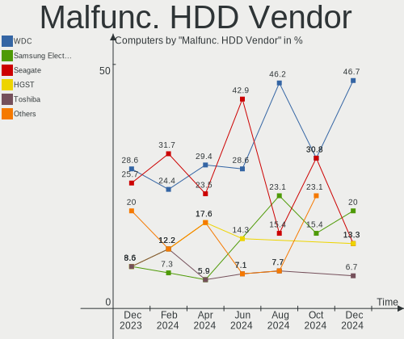
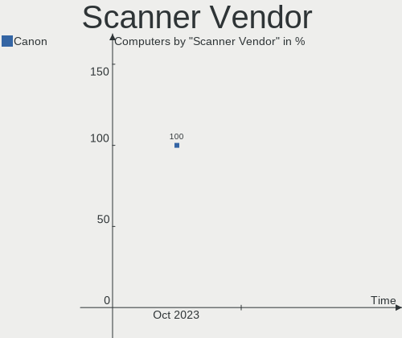

BlackPanther Hardware Trends
----------------------------

A project to identify most popular hardware characteristics and track their change
over time based on data collected by BlackPanther users at https://Linux-Hardware.org.

Anyone can contribute to the study by uploading probes of their computers by
the [hw-probe](https://github.com/linuxhw/hw-probe) tool:

    sudo -E hw-probe -all -upload

This is a report for all computer types. See also reports for [desktops](/Dist/BlackPanther/Desktop/README.md) and [notebooks](/Dist/BlackPanther/Notebook/README.md).

Full-feature report is available here: https://linux-hardware.org/?view=trends

Period: Jan, 2021.

Contents
--------

- [ OS                       ](#os)
- [ OS Family                ](#os-family)
- [ Kernel                   ](#kernel)
- [ Kernel Family            ](#kernel-family)
- [ Kernel Major Ver.        ](#kernel-major-ver)
- [ Arch                     ](#arch)
- [ DE                       ](#de)
- [ Display Server           ](#display-server)
- [ Display Manager          ](#display-manager)
- [ OS Lang                  ](#os-lang)
- [ Boot Mode                ](#boot-mode)
- [ Filesystem               ](#filesystem)
- [ Part. scheme             ](#part-scheme)
- [ Dual Boot with Linux/BSD ](#dual-boot-with-linux/bsd)
- [ Dual Boot (Win)          ](#dual-boot-win)
- [ Country                  ](#country)
- [ City                     ](#city)
- [ Vendor                   ](#vendor)
- [ Model                    ](#model)
- [ Model Family             ](#model-family)
- [ MFG Year                 ](#mfg-year)
- [ Form Factor              ](#form-factor)
- [ Secure Boot              ](#secure-boot)
- [ Coreboot                 ](#coreboot)
- [ RAM Size                 ](#ram-size)
- [ RAM Used                 ](#ram-used)
- [ Has CD-ROM               ](#has-cd-rom)
- [ Total Drives             ](#total-drives)
- [ Has Ethernet             ](#has-ethernet)
- [ Drive Vendor             ](#drive-vendor)
- [ Drive Model              ](#drive-model)
- [ HDD Vendor               ](#hdd-vendor)
- [ SSD Vendor               ](#ssd-vendor)
- [ Drive Kind               ](#drive-kind)
- [ Drive Connector          ](#drive-connector)
- [ Drive Size               ](#drive-size)
- [ Space Total              ](#space-total)
- [ Space Used               ](#space-used)
- [ Malfunc. Drives          ](#malfunc-drives)
- [ Malfunc. Drive Vendor    ](#malfunc-drive-vendor)
- [ Malfunc. HDD Vendor      ](#malfunc-hdd-vendor)
- [ Malfunc. Drive Kind      ](#malfunc-drive-kind)
- [ Failed Drives            ](#failed-drives)
- [ Failed Drive Vendor      ](#failed-drive-vendor)
- [ Drive Status             ](#drive-status)
- [ Storage Vendor           ](#storage-vendor)
- [ Storage Model            ](#storage-model)
- [ Storage Kind             ](#storage-kind)
- [ CPU Vendor               ](#cpu-vendor)
- [ CPU Model                ](#cpu-model)
- [ CPU Model Family         ](#cpu-model-family)
- [ CPU Cores                ](#cpu-cores)
- [ CPU Sockets              ](#cpu-sockets)
- [ CPU Threads              ](#cpu-threads)
- [ CPU Op-Modes             ](#cpu-op-modes)
- [ CPU Microcode            ](#cpu-microcode)
- [ CPU Microarch            ](#cpu-microarch)
- [ GPU Vendor               ](#gpu-vendor)
- [ GPU Model                ](#gpu-model)
- [ GPU Combo                ](#gpu-combo)
- [ GPU Driver               ](#gpu-driver)
- [ GPU Memory               ](#gpu-memory)
- [ Monitor Vendor           ](#monitor-vendor)
- [ Monitor Model            ](#monitor-model)
- [ Monitor Resolution       ](#monitor-resolution)
- [ Monitor Diagonal         ](#monitor-diagonal)
- [ Monitor Width            ](#monitor-width)
- [ Aspect Ratio             ](#aspect-ratio)
- [ Monitor Area             ](#monitor-area)
- [ Pixel Density            ](#pixel-density)
- [ Multiple Monitors        ](#multiple-monitors)
- [ Net Controller Vendor    ](#net-controller-vendor)
- [ Net Controller Model     ](#net-controller-model)
- [ Wireless Vendor          ](#wireless-vendor)
- [ Wireless Model           ](#wireless-model)
- [ Ethernet Vendor          ](#ethernet-vendor)
- [ Ethernet Model           ](#ethernet-model)
- [ Net Controller Kind      ](#net-controller-kind)
- [ Used Controller          ](#used-controller)
- [ NICs                     ](#nics)
- [ Memory Vendor            ](#memory-vendor)
- [ Memory Model             ](#memory-model)
- [ Memory Kind              ](#memory-kind)
- [ Memory Form Factor       ](#memory-form-factor)
- [ Memory Size              ](#memory-size)
- [ Memory Speed             ](#memory-speed)
- [ Sound Vendor             ](#sound-vendor)
- [ Sound Model              ](#sound-model)
- [ Camera Vendor            ](#camera-vendor)
- [ Camera Model             ](#camera-model)
- [ Fingerprint Vendor       ](#fingerprint-vendor)
- [ Fingerprint Model        ](#fingerprint-model)
- [ Chipcard Vendor          ](#chipcard-vendor)
- [ Chipcard Model           ](#chipcard-model)
- [ Printer Vendor           ](#printer-vendor)
- [ Printer Model            ](#printer-model)
- [ Scanner Vendor           ](#scanner-vendor)
- [ Scanner Model            ](#scanner-model)
- [ Bluetooth Vendor         ](#bluetooth-vendor)
- [ Bluetooth Model          ](#bluetooth-model)
- [ Unsupported Devices      ](#unsupported-devices)
- [ Unsupported Device Types ](#unsupported-device-types)

OS
--

Installed operating systems

| Name              | Computers | Percent |
|-------------------|-----------|---------|
| BlackPanther 18.1 | 217       | 94.76%  |
| BlackPanther 16.2 | 11        | 4.8%    |
| BlackPanther 16.1 | 1         | 0.44%   |

OS Family
---------

OS without a version

| Name         | Computers | Percent |
|--------------|-----------|---------|
| BlackPanther | 229       | 100%    |

Kernel
------

Version of the Linux kernel

| Version                | Computers | Percent |
|------------------------|-----------|---------|
| 4.18.16-desktop-1bP    | 200       | 87.34%  |
| 5.6.14-desktop-2bP     | 16        | 6.99%   |
| 4.9.20-desktop-pae-1bP | 10        | 4.37%   |
| 4.7.0-desktop-1bP      | 2         | 0.87%   |
| 5.10.1-desktop-1bP     | 1         | 0.44%   |

Kernel Family
-------------

Linux kernel without a distro release

| Version | Computers | Percent |
|---------|-----------|---------|
| 4.18.16 | 200       | 87.34%  |
| 5.6.14  | 16        | 6.99%   |
| 4.9.20  | 10        | 4.37%   |
| 4.7.0   | 2         | 0.87%   |
| 5.10.1  | 1         | 0.44%   |

Kernel Major Ver.
-----------------

Linux kernel major version

| Version | Computers | Percent |
|---------|-----------|---------|
| 4.18    | 200       | 87.34%  |
| 5.6     | 16        | 6.99%   |
| 4.9     | 10        | 4.37%   |
| 4.7     | 2         | 0.87%   |
| 5.10    | 1         | 0.44%   |

Arch
----

OS architecture (x86_64, i586, etc.)

| Name   | Computers | Percent |
|--------|-----------|---------|
| x86_64 | 217       | 94.76%  |
| i686   | 12        | 5.24%   |

DE
--

Desktop Environment

| Name    | Computers | Percent |
|---------|-----------|---------|
| KDE5    | 228       | 99.56%  |
| Unknown | 1         | 0.44%   |

Display Server
--------------

X11 or Wayland

| Name | Computers | Percent |
|------|-----------|---------|
| X11  | 229       | 100%    |

Display Manager
---------------

SDDM, LightDM, etc.

| Name | Computers | Percent |
|------|-----------|---------|
| SDDM | 229       | 100%    |

OS Lang
-------

Language

| Lang    | Computers | Percent |
|---------|-----------|---------|
| Unknown | 229       | 100%    |

Boot Mode
---------

EFI or BIOS

| Mode | Computers | Percent |
|------|-----------|---------|
| BIOS | 152       | 66.38%  |
| EFI  | 77        | 33.62%  |

Filesystem
----------

Type of filesystem

| Type    | Computers | Percent |
|---------|-----------|---------|
| Overlay | 187       | 81.66%  |
| Ext4    | 42        | 18.34%  |

Part. scheme
------------

Scheme of partitioning

| Type | Computers | Percent |
|------|-----------|---------|
| MBR  | 135       | 58.95%  |
| GPT  | 94        | 41.05%  |

Dual Boot with Linux/BSD
------------------------

Hosting more than one Linux/BSD

| Dual boot | Computers | Percent |
|-----------|-----------|---------|
| No        | 123       | 53.71%  |
| Yes       | 106       | 46.29%  |

Dual Boot (Win)
---------------

Hosting Linux and Windows

| Dual boot | Computers | Percent |
|-----------|-----------|---------|
| Yes       | 125       | 54.59%  |
| No        | 104       | 45.41%  |

Country
-------

Geographic location (country)

| Country     | Computers | Percent |
|-------------|-----------|---------|
| Hungary     | 173       | 75.55%  |
| Germany     | 9         | 3.93%   |
| Slovakia    | 7         | 3.06%   |
| USA         | 4         | 1.75%   |
| Italy       | 4         | 1.75%   |
| Romania     | 3         | 1.31%   |
| Canada      | 3         | 1.31%   |
| Austria     | 3         | 1.31%   |
| Sweden      | 2         | 0.87%   |
| Spain       | 2         | 0.87%   |
| Slovenia    | 2         | 0.87%   |
| Poland      | 2         | 0.87%   |
| France      | 2         | 0.87%   |
| Brazil      | 2         | 0.87%   |
| Argentina   | 2         | 0.87%   |
| Ukraine     | 1         | 0.44%   |
| UK          | 1         | 0.44%   |
| Switzerland | 1         | 0.44%   |
| Ecuador     | 1         | 0.44%   |
| Denmark     | 1         | 0.44%   |
| Bulgaria    | 1         | 0.44%   |
| Belgium     | 1         | 0.44%   |
| Australia   | 1         | 0.44%   |
| Unknown     | 1         | 0.44%   |

City
----

Geographic location (city)

| City                      | Computers | Percent |
|---------------------------|-----------|---------|
| Budapest                  | 60        | 26.2%   |
| Debrecen                  | 12        | 5.24%   |
| Zalaegerszeg              | 5         | 2.18%   |
| Szigetszentmiklos         | 4         | 1.75%   |
| Miskolc                   | 4         | 1.75%   |
| Győr                     | 4         | 1.75%   |
| Vienna                    | 3         | 1.31%   |
| Szeged                    | 3         | 1.31%   |
| Nyiregyhaza               | 3         | 1.31%   |
| Karcag                    | 3         | 1.31%   |
| Frankfurt am Main         | 3         | 1.31%   |
| Veszprém                 | 2         | 0.87%   |
| Toronto                   | 2         | 0.87%   |
| Tiszafoldvar              | 2         | 0.87%   |
| Tatabánya                | 2         | 0.87%   |
| Székesfehérvár         | 2         | 0.87%   |
| Szekszárd                | 2         | 0.87%   |
| Sajokeresztur             | 2         | 0.87%   |
| Rome                      | 2         | 0.87%   |
| Pecsvarad                 | 2         | 0.87%   |
| Oroshaza                  | 2         | 0.87%   |
| Nitra                     | 2         | 0.87%   |
| Mezokovesd                | 2         | 0.87%   |
| Krakow                    | 2         | 0.87%   |
| Kecskemét                | 2         | 0.87%   |
| Hlinik nad Hronom         | 2         | 0.87%   |
| Esztergom                 | 2         | 0.87%   |
| Dorog                     | 2         | 0.87%   |
| Cegled                    | 2         | 0.87%   |
| Baja                      | 2         | 0.87%   |
| Štúrovo                 | 1         | 0.44%   |
| Zsombo                    | 1         | 0.44%   |
| Zalaszentgrot             | 1         | 0.44%   |
| Worms                     | 1         | 0.44%   |
| Wettingen                 | 1         | 0.44%   |
| Varpalota                 | 1         | 0.44%   |
| Vagovce                   | 1         | 0.44%   |
| Uzhhorod                  | 1         | 0.44%   |
| Totkomlos                 | 1         | 0.44%   |
| Tostado                   | 1         | 0.44%   |
| Toeroekbalint             | 1         | 0.44%   |
| Tatarusi                  | 1         | 0.44%   |
| Tata                      | 1         | 0.44%   |
| Tarcal                    | 1         | 0.44%   |
| Tar                       | 1         | 0.44%   |
| Szolosgyorok              | 1         | 0.44%   |
| Szodliget                 | 1         | 0.44%   |
| Sutton                    | 1         | 0.44%   |
| Sutto                     | 1         | 0.44%   |
| Stuttgart                 | 1         | 0.44%   |
| Souffelweyersheim         | 1         | 0.44%   |
| Sopron                    | 1         | 0.44%   |
| Solna                     | 1         | 0.44%   |
| Sollentuna                | 1         | 0.44%   |
| Sistov                    | 1         | 0.44%   |
| Sfantu Gheorghe           | 1         | 0.44%   |
| Sempeter pri Gorici       | 1         | 0.44%   |
| Sarospatak                | 1         | 0.44%   |
| Santiago de Compostela    | 1         | 0.44%   |
| Saint-Gilles-Croix-de-Vie | 1         | 0.44%   |

Vendor
------

Motherboard manufacturer

| Name                | Computers | Percent |
|---------------------|-----------|---------|
| Hewlett-Packard     | 45        | 19.65%  |
| ASUSTek Computer    | 35        | 15.28%  |
| Dell                | 30        | 13.1%   |
| Lenovo              | 29        | 12.66%  |
| Gigabyte Technology | 17        | 7.42%   |
| ASRock              | 13        | 5.68%   |
| Acer                | 12        | 5.24%   |
| MSI                 | 7         | 3.06%   |
| Fujitsu             | 7         | 3.06%   |
| Packard Bell        | 5         | 2.18%   |
| Samsung Electronics | 3         | 1.31%   |
| Sony                | 2         | 0.87%   |
| Medion              | 2         | 0.87%   |
| Intel               | 2         | 0.87%   |
| IBM                 | 2         | 0.87%   |
| Fujitsu Siemens     | 2         | 0.87%   |
| Foxconn             | 2         | 0.87%   |
| ViewSonic Crop.     | 1         | 0.44%   |
| TYAN Computer       | 1         | 0.44%   |
| Toshiba             | 1         | 0.44%   |
| Shuttle             | 1         | 0.44%   |
| Pegatron            | 1         | 0.44%   |
| Notebook            | 1         | 0.44%   |
| Login Informatica   | 1         | 0.44%   |
| Lex                 | 1         | 0.44%   |
| Google              | 1         | 0.44%   |
| eMachines           | 1         | 0.44%   |
| BANGHO              | 1         | 0.44%   |
| Apple               | 1         | 0.44%   |
| Alcor               | 1         | 0.44%   |
| Unknown             | 1         | 0.44%   |

Model
-----

Motherboard model

| Name                                       | Computers | Percent |
|--------------------------------------------|-----------|---------|
| HP 250 G1                                  | 3         | 1.31%   |
| ASUS P5KPL-AM EPU                          | 3         | 1.31%   |
| Lenovo G580 20150                          | 2         | 0.87%   |
| HP Notebook                                | 2         | 0.87%   |
| HP Compaq Pro 6305 MT                      | 2         | 0.87%   |
| HP Compaq dc5800 Microtower                | 2         | 0.87%   |
| Gigabyte P67A-D3-B3                        | 2         | 0.87%   |
| Dell OptiPlex 320                          | 2         | 0.87%   |
| Dell Latitude E6530                        | 2         | 0.87%   |
| Dell Inspiron N5050                        | 2         | 0.87%   |
| ASUS All Series                            | 2         | 0.87%   |
| Unknown                                    | 2         | 0.87%   |
| ViewSonic Crop. VPC221                     | 1         | 0.44%   |
| TYAN S2925                                 | 1         | 0.44%   |
| Toshiba Satellite L750                     | 1         | 0.44%   |
| Sony VPCEH2J1E                             | 1         | 0.44%   |
| Sony VPCEB4Z1E                             | 1         | 0.44%   |
| Shuttle XS35V4                             | 1         | 0.44%   |
| Samsung RV410/RV510/S3510/E3510            | 1         | 0.44%   |
| Samsung R540/R580/R780/SA41/E452/E852      | 1         | 0.44%   |
| Samsung 300E4A/300E5A/300E7A/3430EA/3530EA | 1         | 0.44%   |
| Pegatron 2A73                              | 1         | 0.44%   |
| Packard Bell iPower X9975                  | 1         | 0.44%   |
| Packard Bell EasyNote TS13SB               | 1         | 0.44%   |
| Packard Bell EasyNote TK85                 | 1         | 0.44%   |
| Packard Bell EasyNote TK36                 | 1         | 0.44%   |
| Packard Bell EasyNote LE69KB               | 1         | 0.44%   |
| Notebook Satori                            | 1         | 0.44%   |
| MSI MS-7B79                                | 1         | 0.44%   |
| MSI MS-7A32                                | 1         | 0.44%   |
| MSI MS-7817                                | 1         | 0.44%   |
| MSI MS-7721                                | 1         | 0.44%   |
| MSI MS-7693                                | 1         | 0.44%   |
| MSI MS-7418                                | 1         | 0.44%   |
| MSI CR500                                  | 1         | 0.44%   |
| Medion MS-7728                             | 1         | 0.44%   |
| Medion E122X                               | 1         | 0.44%   |
| Login Informatica LOG-H310C-M              | 1         | 0.44%   |
| Lex CedarView                              | 1         | 0.44%   |
| Lenovo Z50-75 80EC                         | 1         | 0.44%   |
| Lenovo ThinkStation S10 6483AS4            | 1         | 0.44%   |
| Lenovo ThinkPad X260 20F5S5VD00            | 1         | 0.44%   |
| Lenovo ThinkPad W510 4876A46               | 1         | 0.44%   |
| Lenovo ThinkPad W510 431924G               | 1         | 0.44%   |
| Lenovo ThinkPad T460s 20FAS0P901           | 1         | 0.44%   |
| Lenovo ThinkPad T420 4236WCS               | 1         | 0.44%   |
| Lenovo ThinkPad T420 4236S3T               | 1         | 0.44%   |
| Lenovo ThinkPad T400 6475ZFX               | 1         | 0.44%   |
| Lenovo ThinkPad T400 6474E18               | 1         | 0.44%   |
| Lenovo ThinkCentre M93p 10A8S07N0T         | 1         | 0.44%   |
| Lenovo ThinkCentre M81 5049PF4             | 1         | 0.44%   |
| Lenovo ThinkCentre M73 10B6001SUS          | 1         | 0.44%   |
| Lenovo ThinkCentre M70e 00P5607            | 1         | 0.44%   |
| Lenovo ThinkCentre M58p 6138DK1            | 1         | 0.44%   |
| Lenovo ThinkCentre M58 7373A25             | 1         | 0.44%   |
| Lenovo ThinkCentre A57 98517HG             | 1         | 0.44%   |
| Lenovo IdeaPad 330-15IKB 81DE              | 1         | 0.44%   |
| Lenovo IdeaPad 320-17ABR 80YN              | 1         | 0.44%   |
| Lenovo IdeaPad 320-15ISK 80XH              | 1         | 0.44%   |
| Lenovo IdeaPad 320-15AST 80XV              | 1         | 0.44%   |

Model Family
------------

Motherboard model prefix

| Name                          | Computers | Percent |
|-------------------------------|-----------|---------|
| HP Compaq                     | 15        | 6.55%   |
| Dell Latitude                 | 10        | 4.37%   |
| Dell Inspiron                 | 9         | 3.93%   |
| Lenovo ThinkPad               | 8         | 3.49%   |
| Lenovo ThinkCentre            | 7         | 3.06%   |
| Dell OptiPlex                 | 7         | 3.06%   |
| HP EliteBook                  | 6         | 2.62%   |
| Acer Aspire                   | 6         | 2.62%   |
| Lenovo IdeaPad                | 5         | 2.18%   |
| Packard Bell EasyNote         | 4         | 1.75%   |
| HP 250                        | 4         | 1.75%   |
| Fujitsu ESPRIMO               | 4         | 1.75%   |
| ASUS PRIME                    | 4         | 1.75%   |
| ASUS P5KPL-AM                 | 3         | 1.31%   |
| Lenovo G580                   | 2         | 0.87%   |
| HP ProBook                    | 2         | 0.87%   |
| HP Pavilion                   | 2         | 0.87%   |
| HP Notebook                   | 2         | 0.87%   |
| HP Laptop                     | 2         | 0.87%   |
| Gigabyte P67A-D3-B3           | 2         | 0.87%   |
| Fujitsu LIFEBOOK              | 2         | 0.87%   |
| ASUS H110M-A                  | 2         | 0.87%   |
| ASUS All                      | 2         | 0.87%   |
| Acer Veriton                  | 2         | 0.87%   |
| Unknown                       | 2         | 0.87%   |
| ViewSonic Crop. VPC221        | 1         | 0.44%   |
| TYAN S2925                    | 1         | 0.44%   |
| Toshiba Satellite             | 1         | 0.44%   |
| Sony VPCEH2J1E                | 1         | 0.44%   |
| Sony VPCEB4Z1E                | 1         | 0.44%   |
| Shuttle XS35V4                | 1         | 0.44%   |
| Samsung RV410                 | 1         | 0.44%   |
| Samsung R540                  | 1         | 0.44%   |
| Samsung 300E4A                | 1         | 0.44%   |
| Pegatron 2A73                 | 1         | 0.44%   |
| Packard Bell iPower           | 1         | 0.44%   |
| Notebook Satori               | 1         | 0.44%   |
| MSI MS-7B79                   | 1         | 0.44%   |
| MSI MS-7A32                   | 1         | 0.44%   |
| MSI MS-7817                   | 1         | 0.44%   |
| MSI MS-7721                   | 1         | 0.44%   |
| MSI MS-7693                   | 1         | 0.44%   |
| MSI MS-7418                   | 1         | 0.44%   |
| MSI CR500                     | 1         | 0.44%   |
| Medion MS-7728                | 1         | 0.44%   |
| Medion E122X                  | 1         | 0.44%   |
| Login Informatica LOG-H310C-M | 1         | 0.44%   |
| Lex CedarView                 | 1         | 0.44%   |
| Lenovo Z50-75                 | 1         | 0.44%   |
| Lenovo ThinkStation           | 1         | 0.44%   |
| Lenovo IdeaCentre             | 1         | 0.44%   |
| Lenovo G550                   | 1         | 0.44%   |
| Lenovo G505s                  | 1         | 0.44%   |
| Lenovo G50-45                 | 1         | 0.44%   |
| Lenovo 3000                   | 1         | 0.44%   |
| Intel NUC6i7KYB               | 1         | 0.44%   |
| Intel DQ67SW                  | 1         | 0.44%   |
| IBM 8114WGW                   | 1         | 0.44%   |
| HP ZBook                      | 1         | 0.44%   |
| HP Z600                       | 1         | 0.44%   |

MFG Year
--------

Motherboard manufacture year

| Year | Computers | Percent |
|------|-----------|---------|
| 2012 | 26        | 11.35%  |
| 2011 | 26        | 11.35%  |
| 2014 | 22        | 9.61%   |
| 2013 | 21        | 9.17%   |
| 2010 | 19        | 8.3%    |
| 2019 | 17        | 7.42%   |
| 2017 | 16        | 6.99%   |
| 2008 | 15        | 6.55%   |
| 2015 | 14        | 6.11%   |
| 2016 | 13        | 5.68%   |
| 2018 | 12        | 5.24%   |
| 2009 | 12        | 5.24%   |
| 2020 | 7         | 3.06%   |
| 2007 | 6         | 2.62%   |
| 2006 | 3         | 1.31%   |

Form Factor
-----------

Physical design of the computer

| Name       | Computers | Percent |
|------------|-----------|---------|
| Notebook   | 114       | 49.78%  |
| Desktop    | 113       | 49.34%  |
| Mini pc    | 1         | 0.44%   |
| All in one | 1         | 0.44%   |

Secure Boot
-----------

Enabled or disabled

| State    | Computers | Percent |
|----------|-----------|---------|
| Disabled | 229       | 100%    |

Coreboot
--------

Have coreboot on board

| Used | Computers | Percent |
|------|-----------|---------|
| No   | 228       | 99.56%  |
| Yes  | 1         | 0.44%   |

RAM Size
--------

Total RAM memory

| Size in GB | Computers | Percent |
|------------|-----------|---------|
| 3.01-4.0   | 79        | 34.5%   |
| 8.01-16.0  | 51        | 22.27%  |
| 4.01-8.0   | 49        | 21.4%   |
| 1.01-2.0   | 18        | 7.86%   |
| 16.01-24.0 | 17        | 7.42%   |
| 2.01-3.0   | 9         | 3.93%   |
| 32.01-64.0 | 2         | 0.87%   |
| 24.01-32.0 | 2         | 0.87%   |
| 0.51-1.0   | 2         | 0.87%   |

RAM Used
--------

Used RAM memory

| Used GB  | Computers | Percent |
|----------|-----------|---------|
| 0.51-1.0 | 97        | 42.36%  |
| 0.01-0.5 | 95        | 41.48%  |
| 1.01-2.0 | 36        | 15.72%  |
| 3.01-4.0 | 1         | 0.44%   |

Has CD-ROM
----------

Has CD-ROM on board

| Presented | Computers | Percent |
|-----------|-----------|---------|
| Yes       | 154       | 67.25%  |
| No        | 75        | 32.75%  |

Total Drives
------------

Number of drives on board

| Drives | Computers | Percent |
|--------|-----------|---------|
| 1      | 150       | 65.5%   |
| 2      | 48        | 20.96%  |
| 3      | 20        | 8.73%   |
| 4      | 7         | 3.06%   |
| 5      | 3         | 1.31%   |
| 6      | 1         | 0.44%   |

Has Ethernet
------------

Has Ethernet on board

| Presented | Computers | Percent |
|-----------|-----------|---------|
| Yes       | 223       | 97.38%  |
| No        | 6         | 2.62%   |

Drive Vendor
------------

Hard drive vendors

| Vendor              | Computers | Drives | Percent |
|---------------------|-----------|--------|---------|
| WDC                 | 60        | 75     | 18.4%   |
| Seagate             | 60        | 64     | 18.4%   |
| Kingston            | 40        | 46     | 12.27%  |
| Samsung Electronics | 35        | 43     | 10.74%  |
| Toshiba             | 31        | 32     | 9.51%   |
| Hitachi             | 17        | 18     | 5.21%   |
| SanDisk             | 13        | 15     | 3.99%   |
| HGST                | 11        | 11     | 3.37%   |
| A-DATA Technology   | 8         | 8      | 2.45%   |
| Crucial             | 5         | 5      | 1.53%   |
| Unknown             | 4         | 6      | 1.23%   |
| OCZ                 | 4         | 4      | 1.23%   |
| Intenso             | 4         | 4      | 1.23%   |
| Intel               | 4         | 4      | 1.23%   |
| SPCC                | 3         | 3      | 0.92%   |
| Micron Technology   | 3         | 3      | 0.92%   |
| MAXTOR              | 3         | 3      | 0.92%   |
| Fujitsu             | 3         | 3      | 0.92%   |
| Apacer              | 3         | 4      | 0.92%   |
| Patriot             | 2         | 3      | 0.61%   |
| China               | 2         | 2      | 0.61%   |
| Zheino              | 1         | 1      | 0.31%   |
| WD MediaMax         | 1         | 1      | 0.31%   |
| SK Hynix            | 1         | 1      | 0.31%   |
| ShanDianZhe         | 1         | 1      | 0.31%   |
| PNY                 | 1         | 1      | 0.31%   |
| PLEXTOR             | 1         | 1      | 0.31%   |
| LITEON              | 1         | 1      | 0.31%   |
| JMicron             | 1         | 1      | 0.31%   |
| HUAWEI              | 1         | 1      | 0.31%   |
| Gigabyte Technology | 1         | 1      | 0.31%   |
| EMTEC               | 1         | 1      | 0.31%   |

Drive Model
-----------

Hard drive models

| Model                               | Computers | Percent |
|-------------------------------------|-----------|---------|
| Kingston SA400S37120G 120GB SSD     | 12        | 3.33%   |
| Kingston SA400S37240G 240GB SSD     | 9         | 2.5%    |
| Seagate ST500DM002-1BD142 500GB     | 6         | 1.67%   |
| Toshiba MQ01ABF050 500GB            | 5         | 1.39%   |
| Seagate ST380815AS 80GB             | 5         | 1.39%   |
| Kingston SV300S37A120G 120GB SSD    | 5         | 1.39%   |
| Toshiba DT01ACA100 1TB              | 4         | 1.11%   |
| Seagate ST1000LM035-1RK172 1TB      | 4         | 1.11%   |
| Kingston SUV400S37120G 120GB SSD    | 4         | 1.11%   |
| Kingston SA400S37480G 480GB SSD     | 4         | 1.11%   |
| WDC WD10EZRZ-00HTKB0 1TB            | 3         | 0.83%   |
| WDC WD10EZEX-08WN4A0 1TB            | 3         | 0.83%   |
| Toshiba MQ01ABD100 1TB              | 3         | 0.83%   |
| Seagate ST9320325AS 320GB           | 3         | 0.83%   |
| Seagate ST500LT012-1DG142 500GB     | 3         | 0.83%   |
| Seagate ST500LM012 HN-M500MBB 500GB | 3         | 0.83%   |
| Seagate ST1000LM024 HN-M101MBB 1TB  | 3         | 0.83%   |
| Samsung SSD 850 EVO 250GB           | 3         | 0.83%   |
| A-DATA SU630 240GB SSD              | 3         | 0.83%   |
| WDC WDS240G2G0B-00EPW0 240GB SSD    | 2         | 0.56%   |
| WDC WD5000BEVT-22A0RT0 500GB        | 2         | 0.56%   |
| WDC WD5000AAKX-22ERMA0 500GB        | 2         | 0.56%   |
| WDC WD5000AAKX-07U6AA0 500GB        | 2         | 0.56%   |
| WDC WD30EZRZ-00GXCB0 3TB            | 2         | 0.56%   |
| WDC WD30EFRX-68EUZN0 3TB            | 2         | 0.56%   |
| Toshiba MQ04ABF100 1TB              | 2         | 0.56%   |
| Toshiba MK5061GSYN 500GB            | 2         | 0.56%   |
| Toshiba DT01ACA050 500GB            | 2         | 0.56%   |
| SPCC Solid State Disk 128GB         | 2         | 0.56%   |
| Seagate ST9500325AS 500GB           | 2         | 0.56%   |
| Seagate ST380811AS 80GB             | 2         | 0.56%   |
| Seagate ST3250620AS 250GB           | 2         | 0.56%   |
| Seagate ST1000DM010-2EP102 1TB      | 2         | 0.56%   |
| SanDisk SSD PLUS 240GB              | 2         | 0.56%   |
| SanDisk SDSSDA120G 120GB            | 2         | 0.56%   |
| Samsung SSD 860 EVO 250GB           | 2         | 0.56%   |
| Samsung SSD 840 EVO 120GB           | 2         | 0.56%   |
| Samsung SSD 830 Series 64GB         | 2         | 0.56%   |
| Samsung HD154UI 1TB                 | 2         | 0.56%   |
| Samsung HD103SI 1TB                 | 2         | 0.56%   |
| Intenso SSD SATAIII 960GB           | 2         | 0.56%   |
| Hitachi HTS547550A9E384 500GB       | 2         | 0.56%   |
| Hitachi HDS721050CLA662 500GB       | 2         | 0.56%   |
| HGST HTS721010A9E630 1TB            | 2         | 0.56%   |
| HGST HTS545050A7E680 500GB          | 2         | 0.56%   |
| HGST HTS545032A7E380 320GB          | 2         | 0.56%   |
| HGST HTS541010B7E610 1TB            | 2         | 0.56%   |
| Crucial CT240BX500SSD1 240GB        | 2         | 0.56%   |
| Zheino CHN-NGFFNV2280-256 256GB     | 1         | 0.28%   |
| WDC WDS500G2X0C-00L350 500GB        | 1         | 0.28%   |
| WDC WDS500G2B0B-00YS70 500GB SSD    | 1         | 0.28%   |
| WDC WDS500G2B0A-00SM50 500GB SSD    | 1         | 0.28%   |
| WDC WDS240G2G0A-00JH30 240GB SSD    | 1         | 0.28%   |
| WDC WDS120G2G0B-00EPW0 120GB SSD    | 1         | 0.28%   |
| WDC WDS120G2G0A-00JH30 120GB SSD    | 1         | 0.28%   |
| WDC WD800JD-60LSA5 80GB             | 1         | 0.28%   |
| WDC WD800BEVS-22RST0 80GB           | 1         | 0.28%   |
| WDC WD800AAJS-75M0A0 80GB           | 1         | 0.28%   |
| WDC WD800AAJS-60PSA0 80GB           | 1         | 0.28%   |
| WDC WD5003AZEX-00K1GA0 500GB        | 1         | 0.28%   |

HDD Vendor
----------

Hard disk drive vendors

| Vendor              | Computers | Drives | Percent |
|---------------------|-----------|--------|---------|
| Seagate             | 59        | 63     | 30.89%  |
| WDC                 | 54        | 67     | 28.27%  |
| Toshiba             | 27        | 28     | 14.14%  |
| Hitachi             | 17        | 18     | 8.9%    |
| Samsung Electronics | 16        | 17     | 8.38%   |
| HGST                | 11        | 11     | 5.76%   |
| Maxtor              | 3         | 3      | 1.57%   |
| Fujitsu             | 3         | 3      | 1.57%   |
| WD MediaMax         | 1         | 1      | 0.52%   |

SSD Vendor
----------

Solid state drive vendors

| Vendor              | Computers | Drives | Percent |
|---------------------|-----------|--------|---------|
| Kingston            | 38        | 44     | 31.15%  |
| Samsung Electronics | 20        | 23     | 16.39%  |
| SanDisk             | 13        | 14     | 10.66%  |
| WDC                 | 7         | 7      | 5.74%   |
| A-DATA Technology   | 7         | 7      | 5.74%   |
| Crucial             | 5         | 5      | 4.1%    |
| OCZ                 | 4         | 4      | 3.28%   |
| Intenso             | 4         | 4      | 3.28%   |
| SPCC                | 3         | 3      | 2.46%   |
| Apacer              | 3         | 4      | 2.46%   |
| Toshiba             | 2         | 2      | 1.64%   |
| Patriot             | 2         | 3      | 1.64%   |
| Micron Technology   | 2         | 2      | 1.64%   |
| Intel               | 2         | 2      | 1.64%   |
| China               | 2         | 2      | 1.64%   |
| Unknown             | 1         | 1      | 0.82%   |
| SK Hynix            | 1         | 1      | 0.82%   |
| ShanDianZhe         | 1         | 1      | 0.82%   |
| PNY                 | 1         | 1      | 0.82%   |
| LITEON              | 1         | 1      | 0.82%   |
| JMicron             | 1         | 1      | 0.82%   |
| Gigabyte Technology | 1         | 1      | 0.82%   |
| EMTEC               | 1         | 1      | 0.82%   |

Drive Kind
----------

HDD or SSD

| Kind    | Computers | Drives | Percent |
|---------|-----------|--------|---------|
| HDD     | 166       | 211    | 56.46%  |
| SSD     | 110       | 134    | 37.41%  |
| NVMe    | 11        | 14     | 3.74%   |
| MMC     | 5         | 6      | 1.7%    |
| Unknown | 2         | 2      | 0.68%   |

Drive Connector
---------------

SATA, SAS, NVMe, etc.

| Type | Computers | Drives | Percent |
|------|-----------|--------|---------|
| SATA | 228       | 342    | 91.57%  |
| NVMe | 11        | 14     | 4.42%   |
| SAS  | 5         | 5      | 2.01%   |
| MMC  | 5         | 6      | 2.01%   |

Drive Size
----------

Size of hard drive

| Size in TB | Computers | Drives | Percent |
|------------|-----------|--------|---------|
| 0.01-0.5   | 201       | 261    | 74.44%  |
| 0.51-1.0   | 58        | 68     | 21.48%  |
| 1.01-2.0   | 7         | 10     | 2.59%   |
| 2.01-3.0   | 2         | 4      | 0.74%   |
| 3.01-4.0   | 1         | 1      | 0.37%   |
| 4.01-10.0  | 1         | 1      | 0.37%   |

Space Total
-----------

Amount of disk space available on the file system

| Size in GB | Computers | Percent |
|------------|-----------|---------|
| Unknown    | 181       | 79.04%  |
| 101-250    | 23        | 10.04%  |
| 251-500    | 8         | 3.49%   |
| 51-100     | 8         | 3.49%   |
| 21-50      | 2         | 0.87%   |
| 1001-2000  | 2         | 0.87%   |
| 1-20       | 2         | 0.87%   |
| 501-1000   | 2         | 0.87%   |
| 2001-3000  | 1         | 0.44%   |

Space Used
----------

Amount of used disk space

| Used GB   | Computers | Percent |
|-----------|-----------|---------|
| Unknown   | 181       | 79.04%  |
| 1-20      | 42        | 18.34%  |
| 21-50     | 2         | 0.87%   |
| 1001-2000 | 2         | 0.87%   |
| 101-250   | 1         | 0.44%   |
| 501-1000  | 1         | 0.44%   |

Malfunc. Drives
---------------

Drive models with a malfunction

| Model                                   | Computers | Drives | Percent |
|-----------------------------------------|-----------|--------|---------|
| Seagate ST500LM012 HN-M500MBB 500GB     | 3         | 3      | 3.19%   |
| Seagate ST500DM002-1BD142 500GB         | 3         | 3      | 3.19%   |
| Seagate ST1000LM024 HN-M101MBB 1TB      | 3         | 3      | 3.19%   |
| WDC WD5000AAKX-07U6AA0 500GB            | 2         | 2      | 2.13%   |
| Toshiba MQ01ABF050 500GB                | 2         | 2      | 2.13%   |
| Toshiba MK5061GSYN 500GB                | 2         | 2      | 2.13%   |
| Toshiba DT01ACA050 500GB                | 2         | 2      | 2.13%   |
| Seagate ST9320325AS 320GB               | 2         | 2      | 2.13%   |
| Seagate ST500LT012-1DG142 500GB         | 2         | 2      | 2.13%   |
| Seagate ST380811AS 80GB                 | 2         | 2      | 2.13%   |
| HGST HTS545050A7E680 500GB              | 2         | 2      | 2.13%   |
| HGST HTS545032A7E380 320GB              | 2         | 2      | 2.13%   |
| WDC WDS120G2G0A-00JH30 120GB SSD        | 1         | 1      | 1.06%   |
| WDC WD800BEVS-22RST0 80GB               | 1         | 1      | 1.06%   |
| WDC WD800AAJS-75M0A0 80GB               | 1         | 1      | 1.06%   |
| WDC WD5000LPCX-24VHAT0 500GB            | 1         | 1      | 1.06%   |
| WDC WD5000AAKX-22ERMA0 500GB            | 1         | 1      | 1.06%   |
| WDC WD5000AAKX-08U6AA0 500GB            | 1         | 1      | 1.06%   |
| WDC WD5000AAKS-00UU3A0 500GB            | 1         | 1      | 1.06%   |
| WDC WD5000AAKS-007AA0 500GB             | 1         | 1      | 1.06%   |
| WDC WD5000AADS-00S9B0 500GB             | 1         | 1      | 1.06%   |
| WDC WD3200AAJS-22B4A0 320GB             | 1         | 1      | 1.06%   |
| WDC WD2500BEVT-75A23T0 250GB            | 1         | 1      | 1.06%   |
| WDC WD2500AVJS-63WDA0 250GB             | 1         | 1      | 1.06%   |
| WDC WD20EARS-60MVWB0 2TB                | 1         | 1      | 1.06%   |
| WDC WD2000FYYZ-01UL1B2 2TB              | 1         | 1      | 1.06%   |
| WDC WD1600BEVT-22ZCT0 160GB             | 1         | 1      | 1.06%   |
| WDC WD1600AAJS-22PSA0 160GB             | 1         | 1      | 1.06%   |
| WDC WD10EZEX-08WN4A0 1TB                | 1         | 1      | 1.06%   |
| WD MediaMax WL1000GSA6472B 1TB          | 1         | 1      | 1.06%   |
| Toshiba MQ01ABD075 752GB                | 1         | 1      | 1.06%   |
| Toshiba MK5076GSX 500GB                 | 1         | 1      | 1.06%   |
| Toshiba MK5059GSXP 500GB                | 1         | 1      | 1.06%   |
| Toshiba MK2565GSX 250GB                 | 1         | 1      | 1.06%   |
| Toshiba MK1665GSX 160GB                 | 1         | 1      | 1.06%   |
| Toshiba MK1646GSX 160GB                 | 1         | 1      | 1.06%   |
| Toshiba KSG60ZMV256G M.2 2280 256GB SSD | 1         | 1      | 1.06%   |
| Toshiba DT01ACA100 1TB                  | 1         | 1      | 1.06%   |
| SK Hynix SC210 2.5 7MM 128GB SSD        | 1         | 1      | 1.06%   |
| Seagate ST9320328CS 320GB               | 1         | 1      | 1.06%   |
| Seagate ST9320320AS 320GB               | 1         | 1      | 1.06%   |
| Seagate ST9250315AS 250GB               | 1         | 1      | 1.06%   |
| Seagate ST500NM0011 500GB               | 1         | 1      | 1.06%   |
| Seagate ST380815AS 80GB                 | 1         | 1      | 1.06%   |
| Seagate ST3160812AS 41N3268 LEN 160GB   | 1         | 1      | 1.06%   |
| Seagate ST3160811AS 160GB               | 1         | 1      | 1.06%   |
| Seagate ST2000DM006-2DM164 2TB          | 1         | 1      | 1.06%   |
| Seagate ST1000LM035-1RK172 1TB          | 1         | 1      | 1.06%   |
| Seagate ST1000LM014-1EJ164-SSHD 1TB     | 1         | 1      | 1.06%   |
| Samsung Electronics SP1203N 120GB       | 1         | 1      | 1.06%   |
| Samsung Electronics HM160HI 160GB       | 1         | 1      | 1.06%   |
| Samsung Electronics HM080II 80GB        | 1         | 1      | 1.06%   |
| Samsung Electronics HD501LJ 500GB       | 1         | 1      | 1.06%   |
| Samsung Electronics HD161HJ 160GB       | 1         | 1      | 1.06%   |
| Samsung Electronics HD103UJ 1TB         | 1         | 1      | 1.06%   |
| Samsung Electronics HD103SI 1TB         | 1         | 1      | 1.06%   |
| OCZ AGILITY3 64GB SSD                   | 1         | 1      | 1.06%   |
| OCZ AGILITY3 120GB SSD                  | 1         | 1      | 1.06%   |
| MAXTOR STM3250820AS 250GB               | 1         | 1      | 1.06%   |
| Maxtor 6Y080L0 82GB                     | 1         | 1      | 1.06%   |

Malfunc. Drive Vendor
---------------------

Vendors of faulty drives

| Vendor              | Computers | Drives | Percent |
|---------------------|-----------|--------|---------|
| Seagate             | 23        | 25     | 25.27%  |
| WDC                 | 18        | 19     | 19.78%  |
| Toshiba             | 14        | 14     | 15.38%  |
| Samsung Electronics | 7         | 7      | 7.69%   |
| Hitachi             | 7         | 7      | 7.69%   |
| HGST                | 6         | 6      | 6.59%   |
| Kingston            | 4         | 4      | 4.4%    |
| MAXTOR              | 3         | 3      | 3.3%    |
| OCZ                 | 2         | 2      | 2.2%    |
| Intenso             | 2         | 2      | 2.2%    |
| Intel               | 2         | 2      | 2.2%    |
| WD MediaMax         | 1         | 1      | 1.1%    |
| SK Hynix            | 1         | 1      | 1.1%    |
| A-DATA Technology   | 1         | 1      | 1.1%    |

Malfunc. HDD Vendor
-------------------

Vendors of faulty HDD drives

| Vendor              | Computers | Drives | Percent |
|---------------------|-----------|--------|---------|
| Seagate             | 23        | 25     | 29.87%  |
| WDC                 | 17        | 18     | 22.08%  |
| Toshiba             | 13        | 13     | 16.88%  |
| Samsung Electronics | 7         | 7      | 9.09%   |
| Hitachi             | 7         | 7      | 9.09%   |
| HGST                | 6         | 6      | 7.79%   |
| MAXTOR              | 3         | 3      | 3.9%    |
| WD MediaMax         | 1         | 1      | 1.3%    |

Malfunc. Drive Kind
-------------------

Kinds of faulty drives

| Kind | Computers | Drives | Percent |
|------|-----------|--------|---------|
| HDD  | 71        | 80     | 84.52%  |
| SSD  | 13        | 14     | 15.48%  |

Failed Drives
-------------

Failed drive models

| Model                       | Computers | Drives | Percent |
|-----------------------------|-----------|--------|---------|
| Hitachi HDS721010DLE630 1TB | 1         | 1      | 100%    |

Failed Drive Vendor
-------------------

Failed drive vendors

| Vendor  | Computers | Drives | Percent |
|---------|-----------|--------|---------|
| Hitachi | 1         | 1      | 100%    |

Drive Status
------------

Number of failed and malfunc. drives

| Status   | Computers | Drives | Percent |
|----------|-----------|--------|---------|
| Works    | 175       | 260    | 64.81%  |
| Malfunc  | 84        | 94     | 31.11%  |
| Detected | 10        | 12     | 3.7%    |
| Failed   | 1         | 1      | 0.37%   |

Storage Vendor
--------------

Storage controller vendors

| Vendor                       | Computers | Percent |
|------------------------------|-----------|---------|
| Intel                        | 172       | 67.45%  |
| AMD                          | 50        | 19.61%  |
| Nvidia                       | 7         | 2.75%   |
| JMicron Technology           | 5         | 1.96%   |
| ASMedia Technology           | 5         | 1.96%   |
| Samsung Electronics          | 3         | 1.18%   |
| Silicon Motion               | 2         | 0.78%   |
| Marvell Technology Group     | 2         | 0.78%   |
| Kingston Technology Company  | 2         | 0.78%   |
| Toshiba America Info Systems | 1         | 0.39%   |
| Silicon Image                | 1         | 0.39%   |
| Sandisk                      | 1         | 0.39%   |
| Micron Technology            | 1         | 0.39%   |
| LSI Logic / Symbios Logic    | 1         | 0.39%   |
| Lite-On Technology           | 1         | 0.39%   |
| KIOXIA                       | 1         | 0.39%   |

Storage Model
-------------

Storage controller models

| Model                                                                                   | Computers | Percent |
|-----------------------------------------------------------------------------------------|-----------|---------|
| AMD FCH SATA Controller [AHCI mode]                                                     | 34        | 10.24%  |
| Intel 8 Series/C220 Series Chipset Family 6-port SATA Controller 1 [AHCI mode]          | 17        | 5.12%   |
| Intel 7 Series Chipset Family 6-port SATA Controller [AHCI mode]                        | 14        | 4.22%   |
| Intel NM10/ICH7 Family SATA Controller [IDE mode]                                       | 12        | 3.61%   |
| Intel 82801G (ICH7 Family) IDE Controller                                               | 12        | 3.61%   |
| Intel 6 Series/C200 Series Chipset Family 6 port Mobile SATA AHCI Controller            | 12        | 3.61%   |
| Intel Sunrise Point-LP SATA Controller [AHCI mode]                                      | 11        | 3.31%   |
| Intel 82801IBM/IEM (ICH9M/ICH9M-E) 4 port SATA Controller [AHCI mode]                   | 9         | 2.71%   |
| Intel 82801 Mobile SATA Controller [RAID mode]                                          | 9         | 2.71%   |
| Intel 82801I (ICH9 Family) 2 port SATA Controller [IDE mode]                            | 7         | 2.11%   |
| Intel 4 Series Chipset PT IDER Controller                                               | 7         | 2.11%   |
| Intel 6 Series/C200 Series Chipset Family Desktop SATA Controller (IDE mode, ports 4-5) | 6         | 1.81%   |
| Intel 6 Series/C200 Series Chipset Family Desktop SATA Controller (IDE mode, ports 0-3) | 6         | 1.81%   |
| AMD SB7x0/SB8x0/SB9x0 SATA Controller [AHCI mode]                                       | 6         | 1.81%   |
| Intel 82801IB (ICH9) 2 port SATA Controller [IDE mode]                                  | 5         | 1.51%   |
| Intel 8 Series SATA Controller 1 [AHCI mode]                                            | 5         | 1.51%   |
| Intel 7 Series/C210 Series Chipset Family 6-port SATA Controller [AHCI mode]            | 5         | 1.51%   |
| Intel 6 Series/C200 Series Chipset Family 6 port Desktop SATA AHCI Controller           | 5         | 1.51%   |
| ASMedia ASM1062 Serial ATA Controller                                                   | 5         | 1.51%   |
| AMD FCH IDE Controller                                                                  | 5         | 1.51%   |
| Intel NM10/ICH7 Family SATA Controller [AHCI mode]                                      | 4         | 1.2%    |
| Intel 82801JD/DO (ICH10 Family) SATA AHCI Controller                                    | 4         | 1.2%    |
| Intel 82801JD/DO (ICH10 Family) 4-port SATA IDE Controller                              | 4         | 1.2%    |
| Intel 82801JD/DO (ICH10 Family) 2-port SATA IDE Controller                              | 4         | 1.2%    |
| Intel 5 Series/3400 Series Chipset 6 port SATA AHCI Controller                          | 4         | 1.2%    |
| Intel 5 Series/3400 Series Chipset 4 port SATA IDE Controller                           | 4         | 1.2%    |
| AMD 400 Series Chipset SATA Controller                                                  | 4         | 1.2%    |
| JMicron JMB368 IDE controller                                                           | 3         | 0.9%    |
| Intel Wildcat Point-LP SATA Controller [AHCI Mode]                                      | 3         | 0.9%    |
| Intel SATA Controller [RAID mode]                                                       | 3         | 0.9%    |
| Intel Q170/Q150/B150/H170/H110/Z170/CM236 Chipset SATA Controller [AHCI Mode]           | 3         | 0.9%    |
| Intel Atom Processor E3800 Series SATA AHCI Controller                                  | 3         | 0.9%    |
| Intel 5 Series/3400 Series Chipset 4 port SATA AHCI Controller                          | 3         | 0.9%    |
| Intel 200 Series PCH SATA controller [AHCI mode]                                        | 3         | 0.9%    |
| AMD SB7x0/SB8x0/SB9x0 SATA Controller [IDE mode]                                        | 3         | 0.9%    |
| AMD SB7x0/SB8x0/SB9x0 IDE Controller                                                    | 3         | 0.9%    |
| AMD SB600 Non-Raid-5 SATA                                                               | 3         | 0.9%    |
| AMD SB600 IDE                                                                           | 3         | 0.9%    |
| AMD FCH SATA Controller [IDE mode]                                                      | 3         | 0.9%    |
| Samsung NVMe SSD Controller SM981/PM981/PM983                                           | 2         | 0.6%    |
| Nvidia MCP79 AHCI Controller                                                            | 2         | 0.6%    |
| Nvidia MCP61 SATA Controller                                                            | 2         | 0.6%    |
| Nvidia MCP61 IDE                                                                        | 2         | 0.6%    |
| Nvidia MCP55 SATA Controller                                                            | 2         | 0.6%    |
| Nvidia MCP55 IDE                                                                        | 2         | 0.6%    |
| JMicron JMB363 SATA/IDE Controller                                                      | 2         | 0.6%    |
| Intel HM170/QM170 Chipset SATA Controller [AHCI Mode]                                   | 2         | 0.6%    |
| Intel Cannon Lake PCH SATA AHCI Controller                                              | 2         | 0.6%    |
| Intel Atom/Celeron/Pentium Processor x5-E8000/J3xxx/N3xxx Series SATA Controller        | 2         | 0.6%    |
| Intel 9 Series Chipset Family SATA Controller [AHCI Mode]                               | 2         | 0.6%    |
| Intel 82801JI (ICH10 Family) 4 port SATA IDE Controller #1                              | 2         | 0.6%    |
| Intel 82801JI (ICH10 Family) 2 port SATA IDE Controller #2                              | 2         | 0.6%    |
| Intel 82801IR/IO/IH (ICH9R/DO/DH) 4 port SATA Controller [IDE mode]                     | 2         | 0.6%    |
| Intel 82801HM/HEM (ICH8M/ICH8M-E) IDE Controller                                        | 2         | 0.6%    |
| Intel 82801H (ICH8 Family) 4 port SATA Controller [IDE mode]                            | 2         | 0.6%    |
| Intel 82801GBM/GHM (ICH7-M Family) SATA Controller [AHCI mode]                          | 2         | 0.6%    |
| Intel 7 Series Chipset Family 4-port SATA Controller [IDE mode]                         | 2         | 0.6%    |
| Intel 7 Series Chipset Family 2-port SATA Controller [IDE mode]                         | 2         | 0.6%    |
| Intel 5 Series/3400 Series Chipset 2 port SATA IDE Controller                           | 2         | 0.6%    |
| AMD X370 Series Chipset SATA Controller                                                 | 2         | 0.6%    |

Storage Kind
------------

Kind of storage controller (IDE, SATA, NVMe, SAS, ...)

| Kind | Computers | Percent |
|------|-----------|---------|
| SATA | 170       | 64.39%  |
| IDE  | 69        | 26.14%  |
| RAID | 13        | 4.92%   |
| NVMe | 11        | 4.17%   |
| SCSI | 1         | 0.38%   |

CPU Vendor
----------

Processor vendors

| Vendor | Computers | Percent |
|--------|-----------|---------|
| Intel  | 177       | 77.29%  |
| AMD    | 52        | 22.71%  |

CPU Model
---------

Processor models

| Model                                         | Computers | Percent |
|-----------------------------------------------|-----------|---------|
| Intel Core i5-7200U CPU @ 2.50GHz             | 5         | 2.18%   |
| Intel Celeron CPU 1000M @ 1.80GHz             | 4         | 1.75%   |
| Intel Core i5-4590 CPU @ 3.30GHz              | 3         | 1.31%   |
| Intel Core i5-2520M CPU @ 2.50GHz             | 3         | 1.31%   |
| Intel Core 2 Duo CPU E8400 @ 3.00GHz          | 3         | 1.31%   |
| Intel Pentium Dual-Core CPU T4400 @ 2.20GHz   | 2         | 0.87%   |
| Intel Pentium Dual-Core CPU E5500 @ 2.80GHz   | 2         | 0.87%   |
| Intel Pentium CPU G3220 @ 3.00GHz             | 2         | 0.87%   |
| Intel Pentium CPU B960 @ 2.20GHz              | 2         | 0.87%   |
| Intel Core i7-4510U CPU @ 2.00GHz             | 2         | 0.87%   |
| Intel Core i5-6300U CPU @ 2.40GHz             | 2         | 0.87%   |
| Intel Core i5-4570 CPU @ 3.20GHz              | 2         | 0.87%   |
| Intel Core i5-2450M CPU @ 2.50GHz             | 2         | 0.87%   |
| Intel Core i5-2430M CPU @ 2.40GHz             | 2         | 0.87%   |
| Intel Core i5-2400 CPU @ 3.10GHz              | 2         | 0.87%   |
| Intel Core i5-2300 CPU @ 2.80GHz              | 2         | 0.87%   |
| Intel Core i5 CPU M 540 @ 2.53GHz             | 2         | 0.87%   |
| Intel Core i3-8100 CPU @ 3.60GHz              | 2         | 0.87%   |
| Intel Core i3-4170 CPU @ 3.70GHz              | 2         | 0.87%   |
| Intel Core i3-4130 CPU @ 3.40GHz              | 2         | 0.87%   |
| Intel Core i3-2120 CPU @ 3.30GHz              | 2         | 0.87%   |
| Intel Core 2 Quad CPU Q9300 @ 2.50GHz         | 2         | 0.87%   |
| Intel Core 2 Quad CPU Q6600 @ 2.40GHz         | 2         | 0.87%   |
| Intel Core 2 Duo CPU P8700 @ 2.53GHz          | 2         | 0.87%   |
| Intel Core 2 Duo CPU E8500 @ 3.16GHz          | 2         | 0.87%   |
| Intel Core 2 CPU 4300 @ 1.80GHz               | 2         | 0.87%   |
| Intel Celeron CPU N3060 @ 1.60GHz             | 2         | 0.87%   |
| Intel Celeron CPU J1900 @ 1.99GHz             | 2         | 0.87%   |
| Intel Celeron CPU G1610 @ 2.60GHz             | 2         | 0.87%   |
| Intel Atom CPU N455 @ 1.66GHz                 | 2         | 0.87%   |
| Intel Atom CPU N450 @ 1.66GHz                 | 2         | 0.87%   |
| AMD Ryzen 5 3400G with Radeon Vega Graphics   | 2         | 0.87%   |
| AMD Ryzen 5 2500U with Radeon Vega Mobile Gfx | 2         | 0.87%   |
| AMD FX-6300 Six-Core Processor                | 2         | 0.87%   |
| AMD E-450 APU with Radeon HD Graphics         | 2         | 0.87%   |
| AMD A8-7410 APU with AMD Radeon R5 Graphics   | 2         | 0.87%   |
| AMD A8-5500B APU with Radeon HD Graphics      | 2         | 0.87%   |
| AMD A8-4500M APU with Radeon HD Graphics      | 2         | 0.87%   |
| AMD A4-5300 APU with Radeon HD Graphics       | 2         | 0.87%   |
| Intel Xeon CPU X5560 @ 2.80GHz                | 1         | 0.44%   |
| Intel Xeon CPU E5440 @ 2.83GHz                | 1         | 0.44%   |
| Intel Xeon CPU E3-1225 v3 @ 3.20GHz           | 1         | 0.44%   |
| Intel Processor 5Y10 CPU @ 0.80GHz            | 1         | 0.44%   |
| Intel Pentium M processor 1.86GHz             | 1         | 0.44%   |
| Intel Pentium Gold G5400 CPU @ 3.70GHz        | 1         | 0.44%   |
| Intel Pentium Dual-Core CPU T4500 @ 2.30GHz   | 1         | 0.44%   |
| Intel Pentium Dual-Core CPU E6500 @ 2.93GHz   | 1         | 0.44%   |
| Intel Pentium Dual-Core CPU E5800 @ 3.20GHz   | 1         | 0.44%   |
| Intel Pentium Dual-Core CPU E5300 @ 2.60GHz   | 1         | 0.44%   |
| Intel Pentium D CPU 3.00GHz                   | 1         | 0.44%   |
| Intel Pentium CPU P6200 @ 2.13GHz             | 1         | 0.44%   |
| Intel Pentium CPU G6960 @ 2.93GHz             | 1         | 0.44%   |
| Intel Pentium CPU G630 @ 2.70GHz              | 1         | 0.44%   |
| Intel Pentium CPU G2030 @ 3.00GHz             | 1         | 0.44%   |
| Intel Pentium CPU B940 @ 2.00GHz              | 1         | 0.44%   |
| Intel Pentium CPU 3825U @ 1.90GHz             | 1         | 0.44%   |
| Intel Pentium 4 CPU 3.40GHz                   | 1         | 0.44%   |
| Intel Pentium 4 CPU 3.00GHz                   | 1         | 0.44%   |
| Intel Genuine CPU 2140 @ 1.60GHz              | 1         | 0.44%   |
| Intel Core i7-8750H CPU @ 2.20GHz             | 1         | 0.44%   |

CPU Model Family
----------------

Processor model prefix

| Model                   | Computers | Percent |
|-------------------------|-----------|---------|
| Intel Core i5           | 42        | 18.34%  |
| Intel Core i7           | 26        | 11.35%  |
| Intel Core i3           | 23        | 10.04%  |
| Intel Core 2 Duo        | 21        | 9.17%   |
| Intel Celeron           | 16        | 6.99%   |
| AMD A8                  | 11        | 4.8%    |
| Intel Pentium           | 10        | 4.37%   |
| AMD Ryzen 5             | 9         | 3.93%   |
| Intel Pentium Dual-Core | 8         | 3.49%   |
| Intel Core 2 Quad       | 7         | 3.06%   |
| Intel Atom              | 6         | 2.62%   |
| Intel Core 2            | 5         | 2.18%   |
| AMD A6                  | 5         | 2.18%   |
| Other                   | 3         | 1.31%   |
| Intel Xeon              | 3         | 1.31%   |
| AMD FX                  | 3         | 1.31%   |
| AMD Athlon 64 X2        | 3         | 1.31%   |
| AMD A4                  | 3         | 1.31%   |
| Intel Pentium 4         | 2         | 0.87%   |
| Intel Celeron Dual-Core | 2         | 0.87%   |
| AMD E2                  | 2         | 0.87%   |
| AMD E1                  | 2         | 0.87%   |
| AMD E                   | 2         | 0.87%   |
| AMD Athlon II X2        | 2         | 0.87%   |
| AMD A12                 | 2         | 0.87%   |
| Intel Pentium M         | 1         | 0.44%   |
| Intel Pentium Gold      | 1         | 0.44%   |
| Intel Pentium D         | 1         | 0.44%   |
| Intel Genuine           | 1         | 0.44%   |
| Intel Core Duo          | 1         | 0.44%   |
| AMD Sempron             | 1         | 0.44%   |
| AMD Ryzen 7             | 1         | 0.44%   |
| AMD Ryzen 3             | 1         | 0.44%   |
| AMD Phenom II X2        | 1         | 0.44%   |
| AMD Athlon Dual Core    | 1         | 0.44%   |
| AMD A10                 | 1         | 0.44%   |

CPU Cores
---------

Number of processor cores

| Number | Computers | Percent |
|--------|-----------|---------|
| 2      | 144       | 62.88%  |
| 4      | 57        | 24.89%  |
| 1      | 18        | 7.86%   |
| 6      | 6         | 2.62%   |
| 8      | 2         | 0.87%   |
| 3      | 2         | 0.87%   |

CPU Sockets
-----------

Number of sockets

| Number | Computers | Percent |
|--------|-----------|---------|
| 1      | 228       | 99.56%  |
| 2      | 1         | 0.44%   |

CPU Threads
-----------

Threads per core (Hyper-Threading)

| Number | Computers | Percent |
|--------|-----------|---------|
| 1      | 123       | 53.71%  |
| 2      | 106       | 46.29%  |

CPU Op-Modes
------------

CPU Operation Modes (32-bit, 64-bit)

| Op mode        | Computers | Percent |
|----------------|-----------|---------|
| 32-bit, 64-bit | 226       | 98.69%  |
| 32-bit         | 2         | 0.87%   |
| Unknown        | 1         | 0.44%   |

CPU Microcode
-------------

Microcode number

| Number     | Computers | Percent |
|------------|-----------|---------|
| 0x206a7    | 28        | 12.23%  |
| 0x1067a    | 27        | 11.79%  |
| 0x306c3    | 21        | 9.17%   |
| 0x306a9    | 20        | 8.73%   |
| 0x20655    | 10        | 4.37%   |
| Unknown    | 10        | 4.37%   |
| 0x06001119 | 9         | 3.93%   |
| 0x406e3    | 6         | 2.62%   |
| 0x906ea    | 5         | 2.18%   |
| 0x806e9    | 4         | 1.75%   |
| 0x6f2      | 4         | 1.75%   |
| 0x40651    | 4         | 1.75%   |
| 0x10676    | 4         | 1.75%   |
| 0x0810100b | 4         | 1.75%   |
| 0x07030105 | 4         | 1.75%   |
| 0x6fd      | 3         | 1.31%   |
| 0x6fb      | 3         | 1.31%   |
| 0x506e3    | 3         | 1.31%   |
| 0x306d4    | 3         | 1.31%   |
| 0x106ca    | 3         | 1.31%   |
| 0x05000119 | 3         | 1.31%   |
| 0x03000027 | 3         | 1.31%   |
| 0x010000c8 | 3         | 1.31%   |
| 0x906eb    | 2         | 0.87%   |
| 0x906e9    | 2         | 0.87%   |
| 0x406c4    | 2         | 0.87%   |
| 0x30678    | 2         | 0.87%   |
| 0x106e5    | 2         | 0.87%   |
| 0x10677    | 2         | 0.87%   |
| 0x08108109 | 2         | 0.87%   |
| 0x06006704 | 2         | 0.87%   |
| 0x0600084f | 2         | 0.87%   |
| 0xf65      | 1         | 0.44%   |
| 0xf64      | 1         | 0.44%   |
| 0xf43      | 1         | 0.44%   |
| 0x806ea    | 1         | 0.44%   |
| 0x6f6      | 1         | 0.44%   |
| 0x6ec      | 1         | 0.44%   |
| 0x6d8      | 1         | 0.44%   |
| 0x506c9    | 1         | 0.44%   |
| 0x30673    | 1         | 0.44%   |
| 0x30661    | 1         | 0.44%   |
| 0x106c2    | 1         | 0.44%   |
| 0x106a5    | 1         | 0.44%   |
| 0x10661    | 1         | 0.44%   |
| 0x08701013 | 1         | 0.44%   |
| 0x08600104 | 1         | 0.44%   |
| 0x0800820d | 1         | 0.44%   |
| 0x08008206 | 1         | 0.44%   |
| 0x08001138 | 1         | 0.44%   |
| 0x07030106 | 1         | 0.44%   |
| 0x0700010f | 1         | 0.44%   |
| 0x0600611a | 1         | 0.44%   |
| 0x06006118 | 1         | 0.44%   |
| 0x06003106 | 1         | 0.44%   |
| 0x06003104 | 1         | 0.44%   |
| 0x0600111f | 1         | 0.44%   |
| 0x06000852 | 1         | 0.44%   |
| 0x0500010d | 1         | 0.44%   |

CPU Microarch
-------------

Microarchitecture

| Name        | Computers | Percent |
|-------------|-----------|---------|
| Penryn      | 33        | 14.41%  |
| SandyBridge | 28        | 12.23%  |
| Haswell     | 26        | 11.35%  |
| IvyBridge   | 20        | 8.73%   |
| KabyLake    | 15        | 6.55%   |
| Piledriver  | 13        | 5.68%   |
| Core        | 13        | 5.68%   |
| Westmere    | 10        | 4.37%   |
| Skylake     | 9         | 3.93%   |
| K8 Hammer   | 6         | 2.62%   |
| Bonnell     | 6         | 2.62%   |
| Zen         | 5         | 2.18%   |
| Silvermont  | 5         | 2.18%   |
| Puma        | 5         | 2.18%   |
| Zen+        | 4         | 1.75%   |
| Excavator   | 4         | 1.75%   |
| Bobcat      | 4         | 1.75%   |
| NetBurst    | 3         | 1.31%   |
| Nehalem     | 3         | 1.31%   |
| K10 Llano   | 3         | 1.31%   |
| K10         | 3         | 1.31%   |
| Broadwell   | 3         | 1.31%   |
| Zen 2       | 2         | 0.87%   |
| Steamroller | 2         | 0.87%   |
| P6          | 2         | 0.87%   |
| Jaguar      | 1         | 0.44%   |
| Goldmont    | 1         | 0.44%   |

GPU Vendor
----------

Vendors of graphics cards

| Vendor                                       | Computers | Percent |
|----------------------------------------------|-----------|---------|
| Intel                                        | 123       | 48.24%  |
| Nvidia                                       | 67        | 26.27%  |
| AMD                                          | 64        | 25.1%   |
| XGI Technology (eXtreme Graphics Innovation) | 1         | 0.39%   |

GPU Model
---------

Graphics card models

| Model                                                                                    | Computers | Percent |
|------------------------------------------------------------------------------------------|-----------|---------|
| Intel 2nd Generation Core Processor Family Integrated Graphics Controller                | 19        | 6.99%   |
| Intel 3rd Gen Core processor Graphics Controller                                         | 14        | 5.15%   |
| Intel Xeon E3-1200 v3/4th Gen Core Processor Integrated Graphics Controller              | 9         | 3.31%   |
| Intel Mobile 4 Series Chipset Integrated Graphics Controller                             | 9         | 3.31%   |
| Intel 4 Series Chipset Integrated Graphics Controller                                    | 7         | 2.57%   |
| Intel Core Processor Integrated Graphics Controller                                      | 6         | 2.21%   |
| Intel Skylake GT2 [HD Graphics 520]                                                      | 5         | 1.84%   |
| Intel HD Graphics 620                                                                    | 5         | 1.84%   |
| Intel 82G33/G31 Express Integrated Graphics Controller                                   | 5         | 1.84%   |
| AMD Mullins [Radeon R4/R5 Graphics]                                                      | 5         | 1.84%   |
| Intel Haswell-ULT Integrated Graphics Controller                                         | 4         | 1.47%   |
| Intel Atom Processor D4xx/D5xx/N4xx/N5xx Integrated Graphics Controller                  | 4         | 1.47%   |
| Nvidia GT218 [GeForce 210]                                                               | 3         | 1.1%    |
| Nvidia GP107 [GeForce GTX 1050 Ti]                                                       | 3         | 1.1%    |
| Intel Mobile 945GM/GMS/GME, 943/940GML Express Integrated Graphics Controller            | 3         | 1.1%    |
| Intel Atom Processor Z36xxx/Z37xxx Series Graphics & Display                             | 3         | 1.1%    |
| Intel 4th Gen Core Processor Integrated Graphics Controller                              | 3         | 1.1%    |
| AMD Topaz XT [Radeon R7 M260/M265 / M340/M360 / M440/M445 / 530/535 / 620/625 Mobile]    | 3         | 1.1%    |
| AMD Redwood XT [Radeon HD 5670/5690/5730]                                                | 3         | 1.1%    |
| AMD Raven Ridge [Radeon Vega Series / Radeon Vega Mobile Series]                         | 3         | 1.1%    |
| AMD Oland PRO [Radeon R7 240/340]                                                        | 3         | 1.1%    |
| AMD Lexa PRO [Radeon 540/540X/550/550X / RX 540X/550/550X]                               | 3         | 1.1%    |
| Nvidia TU117 [GeForce GTX 1650]                                                          | 2         | 0.74%   |
| Nvidia GT216GLM [Quadro FX 880M]                                                         | 2         | 0.74%   |
| Nvidia GP108 [GeForce GT 1030]                                                           | 2         | 0.74%   |
| Nvidia GP107M [GeForce GTX 1050 Mobile]                                                  | 2         | 0.74%   |
| Nvidia GK208B [GeForce GT 710]                                                           | 2         | 0.74%   |
| Nvidia GK107M [GeForce GT 750M]                                                          | 2         | 0.74%   |
| Nvidia GK107 [GeForce GTX 650]                                                           | 2         | 0.74%   |
| Nvidia GF119M [GeForce GT 520M]                                                          | 2         | 0.74%   |
| Nvidia GF119M [GeForce GT 520MX]                                                         | 2         | 0.74%   |
| Nvidia GF119 [GeForce GT 610]                                                            | 2         | 0.74%   |
| Nvidia GF108GLM [NVS 5200M]                                                              | 2         | 0.74%   |
| Intel Xeon E3-1200 v2/3rd Gen Core processor Graphics Controller                         | 2         | 0.74%   |
| Intel UHD Graphics 630 (Mobile)                                                          | 2         | 0.74%   |
| Intel Mobile 945GM/GMS, 943/940GML Express Integrated Graphics Controller                | 2         | 0.74%   |
| Intel Atom/Celeron/Pentium Processor x5-E8000/J3xxx/N3xxx Integrated Graphics Controller | 2         | 0.74%   |
| Intel 82Q33 Express Integrated Graphics Controller                                       | 2         | 0.74%   |
| Intel 82945G/GZ Integrated Graphics Controller                                           | 2         | 0.74%   |
| Intel 4th Generation Core Processor Family Integrated Graphics Controller                | 2         | 0.74%   |
| AMD Wrestler [Radeon HD 6320]                                                            | 2         | 0.74%   |
| AMD Wani [Radeon R5/R6/R7 Graphics]                                                      | 2         | 0.74%   |
| AMD Trinity [Radeon HD 7640G]                                                            | 2         | 0.74%   |
| AMD Trinity [Radeon HD 7560D]                                                            | 2         | 0.74%   |
| AMD Sun XT [Radeon HD 8670A/8670M/8690M / R5 M330 / M430 / Radeon 520 Mobile]            | 2         | 0.74%   |
| AMD Sun LE [Radeon HD 8550M / R5 M230]                                                   | 2         | 0.74%   |
| AMD Stoney [Radeon R2/R3/R4/R5 Graphics]                                                 | 2         | 0.74%   |
| AMD Juniper XT [Radeon HD 5770]                                                          | 2         | 0.74%   |
| AMD Ellesmere [Radeon RX 470/480/570/570X/580/580X/590]                                  | 2         | 0.74%   |
| AMD Cedar [Radeon HD 5000/6000/7350/8350 Series]                                         | 2         | 0.74%   |
| AMD Caicos [Radeon HD 6450/7450/8450 / R5 230 OEM]                                       | 2         | 0.74%   |
| XGI Technology (eXtreme Graphics Innovation) Z7/Z9 (XG20 core)                           | 1         | 0.37%   |
| Nvidia TU116M [GeForce GTX 1660 Ti Mobile]                                               | 1         | 0.37%   |
| Nvidia TU116 [GeForce GTX 1660]                                                          | 1         | 0.37%   |
| Nvidia MCP79 [GeForce 8200M G]                                                           | 1         | 0.37%   |
| Nvidia GT218M [GeForce 310M]                                                             | 1         | 0.37%   |
| Nvidia GT216M [NVS 5100M]                                                                | 1         | 0.37%   |
| Nvidia GT216 [GeForce GT 220]                                                            | 1         | 0.37%   |
| Nvidia GP107 [GeForce GTX 1050 3GB]                                                      | 1         | 0.37%   |
| Nvidia GP106BM [GeForce GTX 1060 Mobile 6GB]                                             | 1         | 0.37%   |

GPU Combo
---------

Combinations of graphics cards

| Name           | Computers | Percent |
|----------------|-----------|---------|
| 1 x Intel      | 98        | 42.79%  |
| 1 x AMD        | 47        | 20.52%  |
| 1 x Nvidia     | 46        | 20.09%  |
| Intel + Nvidia | 20        | 8.73%   |
| 2 x AMD        | 12        | 5.24%   |
| Intel + AMD    | 4         | 1.75%   |
| 1 x XGI        | 1         | 0.44%   |
| AMD + Nvidia   | 1         | 0.44%   |

GPU Driver
----------

Free vs proprietary

| Driver      | Computers | Percent |
|-------------|-----------|---------|
| Free        | 224       | 97.82%  |
| Unknown     | 4         | 1.75%   |
| Proprietary | 1         | 0.44%   |

GPU Memory
----------

Total video memory

| Size in GB | Computers | Percent |
|------------|-----------|---------|
| Unknown    | 102       | 44.54%  |
| 0.51-1.0   | 41        | 17.9%   |
| 0.01-0.5   | 39        | 17.03%  |
| 1.01-2.0   | 25        | 10.92%  |
| 3.01-4.0   | 13        | 5.68%   |
| 2.01-3.0   | 4         | 1.75%   |
| 7.01-8.0   | 3         | 1.31%   |
| 5.01-6.0   | 2         | 0.87%   |

Monitor Vendor
--------------

Monitor vendors

| Vendor                  | Computers | Percent |
|-------------------------|-----------|---------|
| Samsung Electronics     | 43        | 18.45%  |
| LG Display              | 28        | 12.02%  |
| AU Optronics            | 27        | 11.59%  |
| Goldstar                | 20        | 8.58%   |
| Dell                    | 13        | 5.58%   |
| Hewlett-Packard         | 12        | 5.15%   |
| Chimei Innolux          | 12        | 5.15%   |
| BOE                     | 12        | 5.15%   |
| Acer                    | 8         | 3.43%   |
| Lenovo                  | 6         | 2.58%   |
| BenQ                    | 6         | 2.58%   |
| Ancor Communications    | 5         | 2.15%   |
| Sony                    | 4         | 1.72%   |
| Chi Mei Optoelectronics | 4         | 1.72%   |
| Philips                 | 3         | 1.29%   |
| InfoVision              | 3         | 1.29%   |
| Iiyama                  | 3         | 1.29%   |
| Fujitsu Siemens         | 3         | 1.29%   |
| Medion                  | 2         | 0.86%   |
| AOC                     | 2         | 0.86%   |
| ___                     | 1         | 0.43%   |
| Videoseven              | 1         | 0.43%   |
| Unknown                 | 1         | 0.43%   |
| Sharp                   | 1         | 0.43%   |
| Quanta Display          | 1         | 0.43%   |
| PANDA                   | 1         | 0.43%   |
| OEM                     | 1         | 0.43%   |
| LG Philips              | 1         | 0.43%   |
| KTC                     | 1         | 0.43%   |
| Impression              | 1         | 0.43%   |
| IBM                     | 1         | 0.43%   |
| Hitachi                 | 1         | 0.43%   |
| Eizo                    | 1         | 0.43%   |
| Daewoo                  | 1         | 0.43%   |
| CVT                     | 1         | 0.43%   |
| CPT                     | 1         | 0.43%   |
| Apple                   | 1         | 0.43%   |

Monitor Model
-------------

Monitor models

| Model                                                                 | Computers | Percent |
|-----------------------------------------------------------------------|-----------|---------|
| Samsung Electronics S19B150 SAM08A2 1366x768 410x230mm 18.5-inch      | 3         | 1.28%   |
| Samsung Electronics LCD Monitor SEC5441 1366x768 344x194mm 15.5-inch  | 3         | 1.28%   |
| LG Display LCD Monitor LGD02DC 1366x768 344x194mm 15.5-inch           | 3         | 1.28%   |
| Goldstar 2D HD LG TV GSM59CA 1920x1080 510x290mm 23.1-inch            | 3         | 1.28%   |
| Sony TV  *00 SNY9D03 1920x1080 1220x680mm 55.0-inch                   | 2         | 0.85%   |
| Samsung Electronics LCD Monitor SEC325A 1366x768 344x194mm 15.5-inch  | 2         | 0.85%   |
| Samsung Electronics LCD Monitor SEC3157 1280x800 300x190mm 14.0-inch  | 2         | 0.85%   |
| Philips 220E PHLC02E 1920x1080 476x268mm 21.5-inch                    | 2         | 0.85%   |
| LG Display LCD Monitor LGD0395 1366x768 344x194mm 15.5-inch           | 2         | 0.85%   |
| LG Display LCD Monitor LGD0250 1366x768 345x194mm 15.6-inch           | 2         | 0.85%   |
| Lenovo LCD Monitor LEN40B1 1600x900 344x194mm 15.5-inch               | 2         | 0.85%   |
| Lenovo LCD Monitor LEN4035 1280x800 304x190mm 14.1-inch               | 2         | 0.85%   |
| Hewlett-Packard P222va HWP322B 1920x1080 476x268mm 21.5-inch          | 2         | 0.85%   |
| Goldstar HD GSM5ACB 1366x768 410x230mm 18.5-inch                      | 2         | 0.85%   |
| Goldstar E2350 GSM5790 1920x1080 510x290mm 23.1-inch                  | 2         | 0.85%   |
| Fujitsu Siemens XE17-4 FUS0674 1280x1024 338x270mm 17.0-inch          | 2         | 0.85%   |
| Dell P2213 DELF041 1680x1050 473x296mm 22.0-inch                      | 2         | 0.85%   |
| Dell 1908FP DEL4025 1280x1024 380x300mm 19.1-inch                     | 2         | 0.85%   |
| Chimei Innolux LCD Monitor CMN15AB 1366x768 350x190mm 15.7-inch       | 2         | 0.85%   |
| BOE LCD Monitor BOE0687 1920x1080 344x193mm 15.5-inch                 | 2         | 0.85%   |
| BOE LCD Monitor BOE0675 1366x768 344x194mm 15.5-inch                  | 2         | 0.85%   |
| BenQ EW277HDR BNQ7948 1920x1080 598x336mm 27.0-inch                   | 2         | 0.85%   |
| AU Optronics LCD Monitor AUO26EC 1366x768 344x193mm 15.5-inch         | 2         | 0.85%   |
| AU Optronics LCD Monitor AUO22EC 1366x768 344x193mm 15.5-inch         | 2         | 0.85%   |
| AU Optronics LCD Monitor AUO21ED 1920x1080 344x194mm 15.5-inch        | 2         | 0.85%   |
| AU Optronics LCD Monitor AUO21EC 1366x768 340x190mm 15.3-inch         | 2         | 0.85%   |
| AU Optronics LCD Monitor AUO106C 1366x768 277x156mm 12.5-inch         | 2         | 0.85%   |
| ___ LCDTV16 ___0101 1600x1200 1600x900mm 72.3-inch                    | 1         | 0.43%   |
| Videoseven V7 L15R VSN0501 1024x768 304x228mm 15.0-inch               | 1         | 0.43%   |
| Unknown LCD TV 0101 1920x1080 1600x900mm 72.3-inch                    | 1         | 0.43%   |
| Sony TV SNY4803 1920x1080 1107x623mm 50.0-inch                        | 1         | 0.43%   |
| Sony Nvidia Defaul SNY05FA 1366x768 290x170mm 13.2-inch               | 1         | 0.43%   |
| Sharp HDMI SHP1009 1280x720 820x460mm 37.0-inch                       | 1         | 0.43%   |
| Samsung Electronics T24B300 SAM092E 1920x1080 521x293mm 23.5-inch     | 1         | 0.43%   |
| Samsung Electronics T22C300 SAM0AB3 1920x1080 477x268mm 21.5-inch     | 1         | 0.43%   |
| Samsung Electronics SyncMaster SAM05F7 1920x1080 510x287mm 23.0-inch  | 1         | 0.43%   |
| Samsung Electronics SyncMaster SAM0564 1024x768 410x230mm 18.5-inch   | 1         | 0.43%   |
| Samsung Electronics SyncMaster SAM0560 1440x900 408x255mm 18.9-inch   | 1         | 0.43%   |
| Samsung Electronics SyncMaster SAM0453 1280x1024 376x301mm 19.0-inch  | 1         | 0.43%   |
| Samsung Electronics SyncMaster SAM0352 1680x1050 459x296mm 21.5-inch  | 1         | 0.43%   |
| Samsung Electronics SyncMaster SAM01D3 1440x900 410x260mm 19.1-inch   | 1         | 0.43%   |
| Samsung Electronics SyncMaster SAM01B8 1280x1024 338x270mm 17.0-inch  | 1         | 0.43%   |
| Samsung Electronics SyncMaster SAM0161 1280x1024 338x270mm 17.0-inch  | 1         | 0.43%   |
| Samsung Electronics SyncMaster SAM011E 1280x1024 338x270mm 17.0-inch  | 1         | 0.43%   |
| Samsung Electronics SME1920N SAM06A3 1366x768 410x230mm 18.5-inch     | 1         | 0.43%   |
| Samsung Electronics SMBX2250 SAM071B 1920x1080 477x268mm 21.5-inch    | 1         | 0.43%   |
| Samsung Electronics SMB1920NW SAM06A5 1920x1080 410x260mm 19.1-inch   | 1         | 0.43%   |
| Samsung Electronics S27E500 SAM0D0D 1920x1080 600x340mm 27.2-inch     | 1         | 0.43%   |
| Samsung Electronics S24D390 SAM0B65 1920x1080 520x290mm 23.4-inch     | 1         | 0.43%   |
| Samsung Electronics S24D330 SAM0D92 1920x1080 531x299mm 24.0-inch     | 1         | 0.43%   |
| Samsung Electronics S22F350 SAM0D1A 1920x1080 480x270mm 21.7-inch     | 1         | 0.43%   |
| Samsung Electronics LCD Monitor SEC5641 1366x768 344x193mm 15.5-inch  | 1         | 0.43%   |
| Samsung Electronics LCD Monitor SEC5541 1366x768 344x193mm 15.5-inch  | 1         | 0.43%   |
| Samsung Electronics LCD Monitor SEC5341 1366x768 340x190mm 15.3-inch  | 1         | 0.43%   |
| Samsung Electronics LCD Monitor SEC4252 1366x768 344x194mm 15.5-inch  | 1         | 0.43%   |
| Samsung Electronics LCD Monitor SEC4251 1366x768 344x194mm 15.5-inch  | 1         | 0.43%   |
| Samsung Electronics LCD Monitor SEC324A 1366x768 344x194mm 15.5-inch  | 1         | 0.43%   |
| Samsung Electronics LCD Monitor SEC3245 1366x768 344x194mm 15.5-inch  | 1         | 0.43%   |
| Samsung Electronics LCD Monitor SEC314C 1920x1080 344x194mm 15.5-inch | 1         | 0.43%   |
| Samsung Electronics LCD Monitor SEC304A 1920x1080 367x230mm 17.1-inch | 1         | 0.43%   |

Monitor Resolution
------------------

Monitor screen resolution

| Resolution         | Computers | Percent |
|--------------------|-----------|---------|
| 1920x1080 (FHD)    | 78        | 33.91%  |
| 1366x768 (WXGA)    | 68        | 29.57%  |
| 1280x1024 (SXGA)   | 20        | 8.7%    |
| 1600x900 (HD+)     | 18        | 7.83%   |
| 1680x1050 (WSXGA+) | 12        | 5.22%   |
| 1440x900 (WXGA+)   | 10        | 4.35%   |
| 1280x800 (WXGA)    | 6         | 2.61%   |
| 1024x768 (XGA)     | 5         | 2.17%   |
| 1360x768           | 3         | 1.3%    |
| 3840x2160 (4K)     | 2         | 0.87%   |
| 1024x600           | 2         | 0.87%   |
| 3200x1800 (QHD+)   | 1         | 0.43%   |
| 2560x1440 (QHD)    | 1         | 0.43%   |
| 2560x1080          | 1         | 0.43%   |
| 1920x540           | 1         | 0.43%   |
| 1920x1200 (WUXGA)  | 1         | 0.43%   |
| 1600x1200          | 1         | 0.43%   |

Monitor Diagonal
----------------

Diagonal size in inches

| Inches  | Computers | Percent |
|---------|-----------|---------|
| 15      | 78        | 33.19%  |
| 23      | 19        | 8.09%   |
| 21      | 19        | 8.09%   |
| 17      | 19        | 8.09%   |
| 19      | 18        | 7.66%   |
| 18      | 12        | 5.11%   |
| 14      | 9         | 3.83%   |
| 22      | 8         | 3.4%    |
| 20      | 8         | 3.4%    |
| 27      | 7         | 2.98%   |
| 13      | 7         | 2.98%   |
| 12      | 6         | 2.55%   |
| 24      | 5         | 2.13%   |
| 55      | 3         | 1.28%   |
| 40      | 2         | 0.85%   |
| 31      | 2         | 0.85%   |
| 26      | 2         | 0.85%   |
| 11      | 2         | 0.85%   |
| 10      | 2         | 0.85%   |
| Unknown | 2         | 0.85%   |
| 84      | 1         | 0.43%   |
| 72      | 1         | 0.43%   |
| 52      | 1         | 0.43%   |
| 37      | 1         | 0.43%   |
| 34      | 1         | 0.43%   |

Monitor Width
-------------

Physical width

| Width in mm | Computers | Percent |
|-------------|-----------|---------|
| 301-350     | 93        | 39.91%  |
| 401-500     | 52        | 22.32%  |
| 501-600     | 33        | 14.16%  |
| 351-400     | 27        | 11.59%  |
| 201-300     | 14        | 6.01%   |
| 1001-1500   | 4         | 1.72%   |
| 801-900     | 3         | 1.29%   |
| 601-700     | 2         | 0.86%   |
| 1501-2000   | 2         | 0.86%   |
| Unknown     | 2         | 0.86%   |
| 701-800     | 1         | 0.43%   |

Aspect Ratio
------------

Proportional relationship between the width and the height

| Ratio | Computers | Percent |
|-------|-----------|---------|
| 16/9  | 167       | 74.55%  |
| 16/10 | 29        | 12.95%  |
| 5/4   | 17        | 7.59%   |
| 4/3   | 8         | 3.57%   |
| 6/5   | 1         | 0.45%   |
| 32/9  | 1         | 0.45%   |
| 21/9  | 1         | 0.45%   |

Monitor Area
------------

Area in inch²

| Area in inch² | Computers | Percent |
|----------------|-----------|---------|
| 101-110        | 76        | 32.34%  |
| 201-250        | 42        | 17.87%  |
| 151-200        | 34        | 14.47%  |
| 141-150        | 20        | 8.51%   |
| 81-90          | 12        | 5.11%   |
| 301-350        | 8         | 3.4%    |
| 121-130        | 8         | 3.4%    |
| More than 1000 | 6         | 2.55%   |
| 61-70          | 6         | 2.55%   |
| 71-80          | 4         | 1.7%    |
| 351-500        | 3         | 1.28%   |
| 131-140        | 3         | 1.28%   |
| 501-1000       | 3         | 1.28%   |
| 51-60          | 2         | 0.85%   |
| 41-50          | 2         | 0.85%   |
| 251-300        | 2         | 0.85%   |
| Unknown        | 2         | 0.85%   |
| 111-120        | 1         | 0.43%   |
| 91-100         | 1         | 0.43%   |

Pixel Density
-------------

Pixels per inch

| Density       | Computers | Percent |
|---------------|-----------|---------|
| 51-100        | 101       | 43.91%  |
| 101-120       | 83        | 36.09%  |
| 121-160       | 33        | 14.35%  |
| 1-50          | 8         | 3.48%   |
| 161-240       | 2         | 0.87%   |
| Unknown       | 2         | 0.87%   |
| More than 240 | 1         | 0.43%   |

Multiple Monitors
-----------------

Total monitors connected

| Total | Computers | Percent |
|-------|-----------|---------|
| 1     | 209       | 91.27%  |
| 2     | 18        | 7.86%   |
| 3     | 1         | 0.44%   |
| 0     | 1         | 0.44%   |

Net Controller Vendor
---------------------

Controller vendors

| Vendor                          | Computers | Percent |
|---------------------------------|-----------|---------|
| Realtek Semiconductor           | 116       | 35.15%  |
| Intel                           | 83        | 25.15%  |
| Qualcomm Atheros                | 51        | 15.45%  |
| Broadcom Inc. and subsidiaries  | 20        | 6.06%   |
| Broadcom Limited                | 15        | 4.55%   |
| Ralink                          | 7         | 2.12%   |
| Marvell Technology Group        | 7         | 2.12%   |
| Nvidia                          | 6         | 1.82%   |
| Ralink Technology               | 4         | 1.21%   |
| TP-Link                         | 2         | 0.61%   |
| Sierra Wireless                 | 2         | 0.61%   |
| Huawei Technologies             | 2         | 0.61%   |
| Dell                            | 2         | 0.61%   |
| Xiaomi                          | 1         | 0.3%    |
| Wacom                           | 1         | 0.3%    |
| VIA Technologies                | 1         | 0.3%    |
| Qualcomm Atheros Communications | 1         | 0.3%    |
| NetGear                         | 1         | 0.3%    |
| Linksys                         | 1         | 0.3%    |
| JMicron Technology              | 1         | 0.3%    |
| IMC Networks                    | 1         | 0.3%    |
| Hewlett-Packard                 | 1         | 0.3%    |
| D-Link                          | 1         | 0.3%    |
| Broadcom                        | 1         | 0.3%    |
| Attansic Technology             | 1         | 0.3%    |
| ASIX Electronics                | 1         | 0.3%    |

Net Controller Model
--------------------

Controller models

| Model                                                                        | Computers | Percent |
|------------------------------------------------------------------------------|-----------|---------|
| Realtek RTL8111/8168/8411 PCI Express Gigabit Ethernet Controller            | 86        | 22.75%  |
| Realtek RTL810xE PCI Express Fast Ethernet controller                        | 16        | 4.23%   |
| Intel 82579LM Gigabit Network Connection (Lewisville)                        | 14        | 3.7%    |
| Qualcomm Atheros AR9285 Wireless Network Adapter (PCI-Express)               | 11        | 2.91%   |
| Qualcomm Atheros QCA9565 / AR9565 Wireless Network Adapter                   | 8         | 2.12%   |
| Intel Wireless 7260                                                          | 8         | 2.12%   |
| Qualcomm Atheros AR9485 Wireless Network Adapter                             | 7         | 1.85%   |
| Intel 82567LM-3 Gigabit Network Connection                                   | 7         | 1.85%   |
| Intel Centrino Advanced-N 6205 [Taylor Peak]                                 | 6         | 1.59%   |
| Intel 82577LM Gigabit Network Connection                                     | 6         | 1.59%   |
| Intel Ethernet Connection I217-V                                             | 5         | 1.32%   |
| Intel Centrino Ultimate-N 6300                                               | 5         | 1.32%   |
| Realtek RTL8152 Fast Ethernet Adapter                                        | 4         | 1.06%   |
| Ralink RT3290 Wireless 802.11n 1T/1R PCIe                                    | 4         | 1.06%   |
| Qualcomm Atheros QCA9377 802.11ac Wireless Network Adapter                   | 4         | 1.06%   |
| Qualcomm Atheros AR8121/AR8113/AR8114 Gigabit or Fast Ethernet               | 4         | 1.06%   |
| Marvell Group 88E8056 PCI-E Gigabit Ethernet Controller                      | 4         | 1.06%   |
| Intel PRO/Wireless 3945ABG [Golan] Network Connection                        | 4         | 1.06%   |
| Intel Centrino Advanced-N 6200                                               | 4         | 1.06%   |
| Broadcom Limited NetXtreme BCM5761 Gigabit Ethernet PCIe                     | 4         | 1.06%   |
| Broadcom Inc. and subsidiaries BCM4313 802.11bgn Wireless Network Adapter    | 4         | 1.06%   |
| Realtek RTL8169 PCI Gigabit Ethernet Controller                              | 3         | 0.79%   |
| Qualcomm Atheros AR928X Wireless Network Adapter (PCI-Express)               | 3         | 0.79%   |
| Intel Wireless 8260                                                          | 3         | 0.79%   |
| Intel Wireless 7265                                                          | 3         | 0.79%   |
| Intel Wireless 3165                                                          | 3         | 0.79%   |
| Intel Ethernet Connection I217-LM                                            | 3         | 0.79%   |
| Intel Dual Band Wireless-AC 3165 Plus Bluetooth                              | 3         | 0.79%   |
| Realtek RTL8821AE 802.11ac PCIe Wireless Network Adapter                     | 2         | 0.53%   |
| Realtek RTL8723DE Wireless Network Adapter                                   | 2         | 0.53%   |
| Realtek RTL8723BE PCIe Wireless Network Adapter                              | 2         | 0.53%   |
| Realtek RTL8191SEvB Wireless LAN Controller                                  | 2         | 0.53%   |
| Realtek RTL8188EUS 802.11n Wireless Network Adapter                          | 2         | 0.53%   |
| Ralink RT2870/RT3070 Wireless Adapter                                        | 2         | 0.53%   |
| Qualcomm Atheros QCA8171 Gigabit Ethernet                                    | 2         | 0.53%   |
| Qualcomm Atheros AR9462 Wireless Network Adapter                             | 2         | 0.53%   |
| Qualcomm Atheros AR8162 Fast Ethernet                                        | 2         | 0.53%   |
| Qualcomm Atheros AR8152 v2.0 Fast Ethernet                                   | 2         | 0.53%   |
| Qualcomm Atheros AR8151 v2.0 Gigabit Ethernet                                | 2         | 0.53%   |
| Qualcomm Atheros AR8132 Fast Ethernet                                        | 2         | 0.53%   |
| Qualcomm Atheros AR8131 Gigabit Ethernet                                     | 2         | 0.53%   |
| Nvidia MCP79 Ethernet                                                        | 2         | 0.53%   |
| Nvidia MCP55 Ethernet                                                        | 2         | 0.53%   |
| Intel WiFi Link 5100                                                         | 2         | 0.53%   |
| Intel I211 Gigabit Network Connection                                        | 2         | 0.53%   |
| Intel Ethernet Connection I219-LM                                            | 2         | 0.53%   |
| Intel Ethernet Connection I218-LM                                            | 2         | 0.53%   |
| Intel Ethernet Connection (2) I219-V                                         | 2         | 0.53%   |
| Intel Dual Band Wireless-AC 3168NGW [Stone Peak]                             | 2         | 0.53%   |
| Intel 82579V Gigabit Network Connection                                      | 2         | 0.53%   |
| Intel 82567LM Gigabit Network Connection                                     | 2         | 0.53%   |
| Intel 82567LF Gigabit Network Connection                                     | 2         | 0.53%   |
| Intel 82566DM-2 Gigabit Network Connection                                   | 2         | 0.53%   |
| Broadcom Limited NetLink BCM57780 Gigabit Ethernet PCIe                      | 2         | 0.53%   |
| Broadcom Limited BCM4401-B0 100Base-TX                                       | 2         | 0.53%   |
| Broadcom Inc. and subsidiaries NetLink BCM57780 Gigabit Ethernet PCIe        | 2         | 0.53%   |
| Broadcom Inc. and subsidiaries BCM4322 802.11a/b/g/n Wireless LAN Controller | 2         | 0.53%   |
| Broadcom Inc. and subsidiaries BCM43142 802.11b/g/n                          | 2         | 0.53%   |
| Xiaomi Mi/Redmi series (RNDIS)                                               | 1         | 0.26%   |
| Wacom Wireless adapter for Bamboo tablets                                    | 1         | 0.26%   |

Wireless Vendor
---------------

Wireless vendors

| Vendor                          | Computers | Percent |
|---------------------------------|-----------|---------|
| Intel                           | 52        | 36.11%  |
| Qualcomm Atheros                | 39        | 27.08%  |
| Realtek Semiconductor           | 17        | 11.81%  |
| Broadcom Inc. and subsidiaries  | 12        | 8.33%   |
| Ralink                          | 7         | 4.86%   |
| Ralink Technology               | 4         | 2.78%   |
| TP-Link                         | 2         | 1.39%   |
| Sierra Wireless                 | 2         | 1.39%   |
| Wacom                           | 1         | 0.69%   |
| Qualcomm Atheros Communications | 1         | 0.69%   |
| NetGear                         | 1         | 0.69%   |
| Linksys                         | 1         | 0.69%   |
| IMC Networks                    | 1         | 0.69%   |
| Hewlett-Packard                 | 1         | 0.69%   |
| Dell                            | 1         | 0.69%   |
| D-Link                          | 1         | 0.69%   |
| Broadcom Limited                | 1         | 0.69%   |

Wireless Model
--------------

Wireless models

| Model                                                                         | Computers | Percent |
|-------------------------------------------------------------------------------|-----------|---------|
| Qualcomm Atheros AR9285 Wireless Network Adapter (PCI-Express)                | 11        | 7.64%   |
| Qualcomm Atheros QCA9565 / AR9565 Wireless Network Adapter                    | 8         | 5.56%   |
| Intel Wireless 7260                                                           | 8         | 5.56%   |
| Qualcomm Atheros AR9485 Wireless Network Adapter                              | 7         | 4.86%   |
| Intel Centrino Advanced-N 6205 [Taylor Peak]                                  | 6         | 4.17%   |
| Intel Centrino Ultimate-N 6300                                                | 5         | 3.47%   |
| Ralink RT3290 Wireless 802.11n 1T/1R PCIe                                     | 4         | 2.78%   |
| Qualcomm Atheros QCA9377 802.11ac Wireless Network Adapter                    | 4         | 2.78%   |
| Intel PRO/Wireless 3945ABG [Golan] Network Connection                         | 4         | 2.78%   |
| Intel Centrino Advanced-N 6200                                                | 4         | 2.78%   |
| Broadcom Inc. and subsidiaries BCM4313 802.11bgn Wireless Network Adapter     | 4         | 2.78%   |
| Qualcomm Atheros AR928X Wireless Network Adapter (PCI-Express)                | 3         | 2.08%   |
| Intel Wireless 8260                                                           | 3         | 2.08%   |
| Intel Wireless 7265                                                           | 3         | 2.08%   |
| Intel Wireless 3165                                                           | 3         | 2.08%   |
| Intel Dual Band Wireless-AC 3165 Plus Bluetooth                               | 3         | 2.08%   |
| Realtek RTL8821AE 802.11ac PCIe Wireless Network Adapter                      | 2         | 1.39%   |
| Realtek RTL8723DE Wireless Network Adapter                                    | 2         | 1.39%   |
| Realtek RTL8723BE PCIe Wireless Network Adapter                               | 2         | 1.39%   |
| Realtek RTL8191SEvB Wireless LAN Controller                                   | 2         | 1.39%   |
| Realtek RTL8188EUS 802.11n Wireless Network Adapter                           | 2         | 1.39%   |
| Ralink RT2870/RT3070 Wireless Adapter                                         | 2         | 1.39%   |
| Qualcomm Atheros AR9462 Wireless Network Adapter                              | 2         | 1.39%   |
| Intel WiFi Link 5100                                                          | 2         | 1.39%   |
| Intel Dual Band Wireless-AC 3168NGW [Stone Peak]                              | 2         | 1.39%   |
| Broadcom Inc. and subsidiaries BCM4322 802.11a/b/g/n Wireless LAN Controller  | 2         | 1.39%   |
| Broadcom Inc. and subsidiaries BCM43142 802.11b/g/n                           | 2         | 1.39%   |
| Wacom Wireless adapter for Bamboo tablets                                     | 1         | 0.69%   |
| TP-Link TL-WN821N Version 5 RTL8192EU                                         | 1         | 0.69%   |
| TP-Link TL-WN722N v2                                                          | 1         | 0.69%   |
| Sierra Wireless MC7710                                                        | 1         | 0.69%   |
| Sierra Wireless EM7455                                                        | 1         | 0.69%   |
| Realtek RTL8822CE 802.11ac PCIe Wireless Network Adapter                      | 1         | 0.69%   |
| Realtek RTL8822BE 802.11a/b/g/n/ac WiFi adapter                               | 1         | 0.69%   |
| Realtek RTL8821CE 802.11ac PCIe Wireless Network Adapter                      | 1         | 0.69%   |
| Realtek RTL8723BU 802.11b/g/n WLAN Adapter                                    | 1         | 0.69%   |
| Realtek RTL8192SE Wireless LAN Controller                                     | 1         | 0.69%   |
| Realtek RTL8188EE Wireless Network Adapter                                    | 1         | 0.69%   |
| Realtek RTL8188CE 802.11b/g/n WiFi Adapter                                    | 1         | 0.69%   |
| Ralink RT5372 Wireless Adapter                                                | 1         | 0.69%   |
| Ralink MT7601U Wireless Adapter                                               | 1         | 0.69%   |
| Ralink RT3062 Wireless 802.11n 2T/2R                                          | 1         | 0.69%   |
| Ralink RT2790 Wireless 802.11n 1T/2R PCIe                                     | 1         | 0.69%   |
| Ralink RT2561/RT61 802.11g PCI                                                | 1         | 0.69%   |
| Qualcomm Atheros AR9271 802.11n                                               | 1         | 0.69%   |
| Qualcomm Atheros AR9287 Wireless Network Adapter (PCI-Express)                | 1         | 0.69%   |
| Qualcomm Atheros AR922X Wireless Network Adapter                              | 1         | 0.69%   |
| Qualcomm Atheros AR242x / AR542x Wireless Network Adapter (PCI-Express)       | 1         | 0.69%   |
| Qualcomm Atheros AR2413/AR2414 Wireless Network Adapter [AR5005G(S) 802.11bg] | 1         | 0.69%   |
| NetGear WG111v3 54 Mbps Wireless [realtek RTL8187B]                           | 1         | 0.69%   |
| Linksys WUSB600N v2 Dual-Band Wireless-N Network Adapter [Ralink RT3572]      | 1         | 0.69%   |
| Intel Wireless-AC 9560 [Jefferson Peak]                                       | 1         | 0.69%   |
| Intel Wireless 8265 / 8275                                                    | 1         | 0.69%   |
| Intel Ultimate N WiFi Link 5300                                               | 1         | 0.69%   |
| Intel PRO/Wireless 5100 AGN [Shiloh] Network Connection                       | 1         | 0.69%   |
| Intel PRO/Wireless 4965 AG or AGN [Kedron] Network Connection                 | 1         | 0.69%   |
| Intel PRO/Wireless 2200BG [Calexico2] Network Connection                      | 1         | 0.69%   |
| Intel Centrino Wireless-N 2230                                                | 1         | 0.69%   |
| Intel Centrino Wireless-N 130                                                 | 1         | 0.69%   |
| Intel Centrino Wireless-N 1030 [Rainbow Peak]                                 | 1         | 0.69%   |

Ethernet Vendor
---------------

Ethernet vendors

| Vendor                         | Computers | Percent |
|--------------------------------|-----------|---------|
| Realtek Semiconductor          | 109       | 47.6%   |
| Intel                          | 58        | 25.33%  |
| Qualcomm Atheros               | 18        | 7.86%   |
| Broadcom Limited               | 14        | 6.11%   |
| Broadcom Inc. and subsidiaries | 10        | 4.37%   |
| Marvell Technology Group       | 7         | 3.06%   |
| Nvidia                         | 6         | 2.62%   |
| Xiaomi                         | 1         | 0.44%   |
| VIA Technologies               | 1         | 0.44%   |
| JMicron Technology             | 1         | 0.44%   |
| Huawei Technologies            | 1         | 0.44%   |
| Broadcom                       | 1         | 0.44%   |
| Attansic Technology            | 1         | 0.44%   |
| ASIX Electronics               | 1         | 0.44%   |

Ethernet Model
--------------

Ethernet models

| Model                                                                          | Computers | Percent |
|--------------------------------------------------------------------------------|-----------|---------|
| Realtek RTL8111/8168/8411 PCI Express Gigabit Ethernet Controller              | 86        | 37.23%  |
| Realtek RTL810xE PCI Express Fast Ethernet controller                          | 16        | 6.93%   |
| Intel 82579LM Gigabit Network Connection (Lewisville)                          | 14        | 6.06%   |
| Intel 82567LM-3 Gigabit Network Connection                                     | 7         | 3.03%   |
| Intel 82577LM Gigabit Network Connection                                       | 6         | 2.6%    |
| Intel Ethernet Connection I217-V                                               | 5         | 2.16%   |
| Realtek RTL8152 Fast Ethernet Adapter                                          | 4         | 1.73%   |
| Qualcomm Atheros AR8121/AR8113/AR8114 Gigabit or Fast Ethernet                 | 4         | 1.73%   |
| Marvell Group 88E8056 PCI-E Gigabit Ethernet Controller                        | 4         | 1.73%   |
| Broadcom Limited NetXtreme BCM5761 Gigabit Ethernet PCIe                       | 4         | 1.73%   |
| Realtek RTL8169 PCI Gigabit Ethernet Controller                                | 3         | 1.3%    |
| Intel Ethernet Connection I217-LM                                              | 3         | 1.3%    |
| Qualcomm Atheros QCA8171 Gigabit Ethernet                                      | 2         | 0.87%   |
| Qualcomm Atheros AR8162 Fast Ethernet                                          | 2         | 0.87%   |
| Qualcomm Atheros AR8152 v2.0 Fast Ethernet                                     | 2         | 0.87%   |
| Qualcomm Atheros AR8151 v2.0 Gigabit Ethernet                                  | 2         | 0.87%   |
| Qualcomm Atheros AR8132 Fast Ethernet                                          | 2         | 0.87%   |
| Qualcomm Atheros AR8131 Gigabit Ethernet                                       | 2         | 0.87%   |
| Nvidia MCP79 Ethernet                                                          | 2         | 0.87%   |
| Nvidia MCP55 Ethernet                                                          | 2         | 0.87%   |
| Intel I211 Gigabit Network Connection                                          | 2         | 0.87%   |
| Intel Ethernet Connection I219-LM                                              | 2         | 0.87%   |
| Intel Ethernet Connection I218-LM                                              | 2         | 0.87%   |
| Intel Ethernet Connection (2) I219-V                                           | 2         | 0.87%   |
| Intel 82579V Gigabit Network Connection                                        | 2         | 0.87%   |
| Intel 82567LM Gigabit Network Connection                                       | 2         | 0.87%   |
| Intel 82567LF Gigabit Network Connection                                       | 2         | 0.87%   |
| Intel 82566DM-2 Gigabit Network Connection                                     | 2         | 0.87%   |
| Broadcom Limited NetLink BCM57780 Gigabit Ethernet PCIe                        | 2         | 0.87%   |
| Broadcom Limited BCM4401-B0 100Base-TX                                         | 2         | 0.87%   |
| Broadcom Inc. and subsidiaries NetLink BCM57780 Gigabit Ethernet PCIe          | 2         | 0.87%   |
| Xiaomi Mi/Redmi series (RNDIS)                                                 | 1         | 0.43%   |
| VIA VT6102/VT6103 [Rhine-II]                                                   | 1         | 0.43%   |
| Realtek RTL-8100/8101L/8139 PCI Fast Ethernet Adapter                          | 1         | 0.43%   |
| Qualcomm Atheros QCA8172 Fast Ethernet                                         | 1         | 0.43%   |
| Qualcomm Atheros Killer E220x Gigabit Ethernet Controller                      | 1         | 0.43%   |
| Nvidia MCP61 Ethernet                                                          | 1         | 0.43%   |
| Nvidia MCP51 Ethernet Controller                                               | 1         | 0.43%   |
| Marvell Group Yukon Optima 88E8059 [PCIe Gigabit Ethernet Controller with AVB] | 1         | 0.43%   |
| Marvell Group 88E8057 PCI-E Gigabit Ethernet Controller                        | 1         | 0.43%   |
| Marvell Group 88E8040 PCI-E Fast Ethernet Controller                           | 1         | 0.43%   |
| JMicron JMC250 PCI Express Gigabit Ethernet Controller                         | 1         | 0.43%   |
| Intel Ethernet Connection (4) I219-LM                                          | 1         | 0.43%   |
| Intel Ethernet Connection (2) I219-LM                                          | 1         | 0.43%   |
| Intel 82574L Gigabit Network Connection                                        | 1         | 0.43%   |
| Intel 82573E Gigabit Ethernet Controller (Copper)                              | 1         | 0.43%   |
| Intel 82567LF-3 Gigabit Network Connection                                     | 1         | 0.43%   |
| Intel 82566DM Gigabit Network Connection                                       | 1         | 0.43%   |
| Intel 82562ET/EZ/GT/GZ - PRO/100 VE (LOM) Ethernet Controller Mobile           | 1         | 0.43%   |
| Huawei SNE-LX1                                                                 | 1         | 0.43%   |
| Broadcom Limited NetXtreme BCM5788 Gigabit Ethernet                            | 1         | 0.43%   |
| Broadcom Limited NetXtreme BCM5755 Gigabit Ethernet PCI Express                | 1         | 0.43%   |
| Broadcom Limited NetXtreme BCM5754 Gigabit Ethernet PCI Express                | 1         | 0.43%   |
| Broadcom Limited NetXtreme BCM5751 Gigabit Ethernet PCI Express                | 1         | 0.43%   |
| Broadcom Limited NetLink BCM5787 Gigabit Ethernet PCI Express                  | 1         | 0.43%   |
| Broadcom Limited NetLink BCM57785 Gigabit Ethernet PCIe                        | 1         | 0.43%   |
| Broadcom Inc. and subsidiaries NetXtreme BCM5764M Gigabit Ethernet PCIe        | 1         | 0.43%   |
| Broadcom Inc. and subsidiaries NetXtreme BCM5755M Gigabit Ethernet PCI Express | 1         | 0.43%   |
| Broadcom Inc. and subsidiaries NetXtreme BCM5755 Gigabit Ethernet PCI Express  | 1         | 0.43%   |
| Broadcom Inc. and subsidiaries NetXtreme BCM5754 Gigabit Ethernet PCI Express  | 1         | 0.43%   |

Net Controller Kind
-------------------

Ethernet, WiFi or modem

| Kind     | Computers | Percent |
|----------|-----------|---------|
| Ethernet | 223       | 61.1%   |
| WiFi     | 139       | 38.08%  |
| Modem    | 3         | 0.82%   |

Used Controller
---------------

Currently used network controller

| Kind     | Computers | Percent |
|----------|-----------|---------|
| Ethernet | 156       | 60.94%  |
| WiFi     | 100       | 39.06%  |

NICs
----

Total network controllers on board

| Total | Computers | Percent |
|-------|-----------|---------|
| 2     | 124       | 54.15%  |
| 1     | 103       | 44.98%  |
| 0     | 2         | 0.87%   |

Memory Vendor
-------------

Memory module vendors

| Vendor                     | Computers | Percent |
|----------------------------|-----------|---------|
| Samsung Electronics        | 56        | 20.66%  |
| Unknown                    | 53        | 19.56%  |
| Kingston                   | 46        | 16.97%  |
| SK Hynix                   | 42        | 15.5%   |
| Micron Technology          | 19        | 7.01%   |
| Elpida                     | 10        | 3.69%   |
| Nanya Technology           | 9         | 3.32%   |
| Corsair                    | 8         | 2.95%   |
| Ramaxel Technology         | 4         | 1.48%   |
| G.Skill                    | 4         | 1.48%   |
| Crucial                    | 4         | 1.48%   |
| A-DATA Technology          | 4         | 1.48%   |
| Unknown (7F7F7F8300000000) | 2         | 0.74%   |
| Kingmax                    | 2         | 0.74%   |
| Unknown (ABCD)             | 1         | 0.37%   |
| Team                       | 1         | 0.37%   |
| Qimonda                    | 1         | 0.37%   |
| Princeton                  | 1         | 0.37%   |
| Patriot                    | 1         | 0.37%   |
| Multilaser                 | 1         | 0.37%   |
| Kingmax Semiconductor      | 1         | 0.37%   |
| H                          | 1         | 0.37%   |

Memory Model
------------

Memory module models

| Model                                                          | Computers | Percent |
|----------------------------------------------------------------|-----------|---------|
| Unknown RAM Module 2048MB DIMM DDR2 800MT/s                    | 4         | 1.32%   |
| Samsung RAM M471B5273CH0-CH9 4096MB SODIMM DDR3 1334MT/s       | 4         | 1.32%   |
| Kingston RAM KHX1600C10D3/4G 4096MB DIMM DDR3 1866MT/s         | 4         | 1.32%   |
| Unknown RAM Module 1024MB DIMM 667MT/s                         | 3         | 0.99%   |
| Samsung RAM M471B5673FH0-CF8 2GB SODIMM DDR3 1067MT/s          | 3         | 0.99%   |
| Samsung RAM M471A5244CB0-CRC 4096MB SODIMM DDR4 2667MT/s       | 3         | 0.99%   |
| Samsung RAM M471A1K43BB0-CPB 8192MB SODIMM DDR4 2133MT/s       | 3         | 0.99%   |
| Kingston RAM KHX1600C9D3/4GX 4GB DIMM DDR3 2400MT/s            | 3         | 0.99%   |
| Elpida RAM EBE10UE8ACWA-8G-E 1024MB DIMM DDR2 800MT/s          | 3         | 0.99%   |
| Unknown SODIMM 2048MB SODIMM 800MT/s                           | 2         | 0.66%   |
| Unknown RAM Module 2048MB DIMM SDRAM                           | 2         | 0.66%   |
| Unknown RAM Module 2048MB DIMM DDR3 1333MT/s                   | 2         | 0.66%   |
| Unknown RAM Module 2048MB DIMM DDR2                            | 2         | 0.66%   |
| Unknown RAM Module 2048MB DIMM 1333MT/s                        | 2         | 0.66%   |
| Unknown RAM Module 1024MB DIMM 800MT/s                         | 2         | 0.66%   |
| Unknown (7F7F7F8300000000) RAM Module 1024MB DIMM DDR2 533MT/s | 2         | 0.66%   |
| SK Hynix RAM HMT451S6BFR8A-PB 4GB SODIMM DDR3 1600MT/s         | 2         | 0.66%   |
| SK Hynix RAM HMT451S6AFR8A-PB 4096MB SODIMM DDR3 1600MT/s      | 2         | 0.66%   |
| SK Hynix RAM HMT351S6EFR8A-PB 4096MB SODIMM DDR3 1600MT/s      | 2         | 0.66%   |
| SK Hynix RAM HMT351S6CFR8C-PB 4096MB SODIMM DDR3 1600MT/s      | 2         | 0.66%   |
| SK Hynix RAM HMT351S6BFR8C-H9 4096MB SODIMM DDR3 1333MT/s      | 2         | 0.66%   |
| SK Hynix RAM HMT325S6CFR8A-PB 2048MB SODIMM DDR3 1600MT/s      | 2         | 0.66%   |
| SK Hynix RAM HMT125U6TFR8C-H9 2048MB DIMM DDR3 1333MT/s        | 2         | 0.66%   |
| Samsung RAM M471B5773DH0-CH9 2048MB SODIMM DDR3 1600MT/s       | 2         | 0.66%   |
| Samsung RAM M471B5773CHS-CH9 2048MB SODIMM DDR3 4199MT/s       | 2         | 0.66%   |
| Samsung RAM M471B5273DH0-CK0 4096MB SODIMM DDR3 1600MT/s       | 2         | 0.66%   |
| Samsung RAM M471B2873FHS-CH9 1024MB SODIMM 1334MT/s            | 2         | 0.66%   |
| Samsung RAM M471B1G73QH0-YK0 8GB SODIMM DDR3 1600MT/s          | 2         | 0.66%   |
| Samsung RAM M471B1G73EB0-YK0 8192MB SODIMM DDR3 1600MT/s       | 2         | 0.66%   |
| Samsung RAM M378B5173QH0-CK0 4096MB DIMM DDR3 1866MT/s         | 2         | 0.66%   |
| Samsung RAM M378B5173DB0-CK0 4096MB DIMM DDR3 1600MT/s         | 2         | 0.66%   |
| Samsung RAM M3 78T5663QZ3-CF7 2048MB DIMM DDR2 1639MT/s        | 2         | 0.66%   |
| Ramaxel RAM RMT3170MN68F9F1600 4096MB SODIMM DDR3 1600MT/s     | 2         | 0.66%   |
| Nanya RAM NT4GC64B8HB0NS-CG 4096MB SODIMM DDR3 1334MT/s        | 2         | 0.66%   |
| Nanya RAM NT2GC64B88B0NS-CG 2048MB SODIMM DDR3 1334MT/s        | 2         | 0.66%   |
| Micron RAM 8KTF51264HZ-1G6E1 4GB SODIMM DDR3 1600MT/s          | 2         | 0.66%   |
| Kingston RAM KNWMX1-ETB 4096MB SODIMM DDR3 1600MT/s            | 2         | 0.66%   |
| Kingston RAM KHX2666C16/8G 8192MB DIMM DDR4 2800MT/s           | 2         | 0.66%   |
| Kingston RAM KHX1600C10D3/8G 4096MB DIMM DDR3 1867MT/s         | 2         | 0.66%   |
| Kingston RAM 99U5584-005.A00LF 4096MB DIMM DDR3 1600MT/s       | 2         | 0.66%   |
| Elpida RAM EBJ41UF8BCS0-DJ-F 4GB SODIMM DDR3 1334MT/s          | 2         | 0.66%   |
| Corsair RAM CMZ8GX3M2A1600C9 4096MB DIMM DDR3 1600MT/s         | 2         | 0.66%   |
| Unknown SODIMM 2048MB SODIMM DDR2 800MT/s                      | 1         | 0.33%   |
| Unknown SODIMM 2048MB SODIMM DDR2 667MT/s                      | 1         | 0.33%   |
| Unknown SODIMM 1024MB SODIMM 800MT/s                           | 1         | 0.33%   |
| Unknown RAM V02L3L84GB52852816 4096MB DIMM DDR3 1333MT/s       | 1         | 0.33%   |
| Unknown RAM V02D2LF2GB1881880 2048MB DIMM DDR2 800MT/s         | 1         | 0.33%   |
| Unknown RAM Module 8192MB SODIMM DDR3                          | 1         | 0.33%   |
| Unknown RAM Module 8192MB DIMM DDR3 1866MT/s                   | 1         | 0.33%   |
| Unknown RAM Module 512MB DIMM DDR 400MT/s                      | 1         | 0.33%   |
| Unknown RAM Module 4096MB SODIMM DDR4 1866MT/s                 | 1         | 0.33%   |
| Unknown RAM Module 4096MB SODIMM DDR3 1334MT/s                 | 1         | 0.33%   |
| Unknown RAM Module 4096MB SODIMM DDR3 1333MT/s                 | 1         | 0.33%   |
| Unknown RAM Module 4096MB SODIMM 800MT/s                       | 1         | 0.33%   |
| Unknown RAM Module 4096MB DIMM SDRAM 1066MT/s                  | 1         | 0.33%   |
| Unknown RAM Module 4096MB DIMM SDRAM                           | 1         | 0.33%   |
| Unknown RAM Module 4096MB DIMM DDR3 800MT/s                    | 1         | 0.33%   |
| Unknown RAM Module 4096MB DIMM DDR3 1600MT/s                   | 1         | 0.33%   |
| Unknown RAM Module 4096MB DIMM DDR3 1333MT/s                   | 1         | 0.33%   |
| Unknown RAM Module 4096MB DIMM DDR2 1067MT/s                   | 1         | 0.33%   |

Memory Kind
-----------

Memory module kinds

| Kind    | Computers | Percent |
|---------|-----------|---------|
| DDR3    | 125       | 54.11%  |
| DDR4    | 37        | 16.02%  |
| DDR2    | 31        | 13.42%  |
| SDRAM   | 15        | 6.49%   |
| Unknown | 14        | 6.06%   |
| DDR     | 5         | 2.16%   |
| LPDDR3  | 3         | 1.3%    |
| LPDDR4  | 1         | 0.43%   |

Memory Form Factor
------------------

Physical design of the memory module

| Name         | Computers | Percent |
|--------------|-----------|---------|
| SODIMM       | 111       | 49.55%  |
| DIMM         | 111       | 49.55%  |
| Row Of Chips | 1         | 0.45%   |
| Chip         | 1         | 0.45%   |

Memory Size
-----------

Memory module size

| Size  | Computers | Percent |
|-------|-----------|---------|
| 4096  | 100       | 40.16%  |
| 2048  | 73        | 29.32%  |
| 8192  | 47        | 18.88%  |
| 1024  | 25        | 10.04%  |
| 16384 | 3         | 1.2%    |
| 512   | 1         | 0.4%    |

Memory Speed
------------

Memory module speed

| Speed   | Computers | Percent |
|---------|-----------|---------|
| 1600    | 72        | 28.35%  |
| 1333    | 29        | 11.42%  |
| 800     | 27        | 10.63%  |
| 1334    | 18        | 7.09%   |
| 667     | 16        | 6.3%    |
| 2400    | 13        | 5.12%   |
| 2667    | 10        | 3.94%   |
| 2133    | 10        | 3.94%   |
| 1067    | 9         | 3.54%   |
| Unknown | 9         | 3.54%   |
| 1866    | 8         | 3.15%   |
| 1867    | 5         | 1.97%   |
| 4199    | 4         | 1.57%   |
| 3200    | 4         | 1.57%   |
| 1639    | 4         | 1.57%   |
| 533     | 4         | 1.57%   |
| 1066    | 3         | 1.18%   |
| 2800    | 2         | 0.79%   |
| 3600    | 1         | 0.39%   |
| 3333    | 1         | 0.39%   |
| 2933    | 1         | 0.39%   |
| 2048    | 1         | 0.39%   |
| 1400    | 1         | 0.39%   |
| 975     | 1         | 0.39%   |
| 400     | 1         | 0.39%   |

Sound Vendor
------------

Sound card vendors

| Vendor                  | Computers | Percent |
|-------------------------|-----------|---------|
| Intel                   | 170       | 58.22%  |
| AMD                     | 68        | 23.29%  |
| Nvidia                  | 43        | 14.73%  |
| Creative Technology     | 2         | 0.68%   |
| Creative Labs           | 2         | 0.68%   |
| C-Media Electronics     | 2         | 0.68%   |
| Texas Instruments       | 1         | 0.34%   |
| Plantronics             | 1         | 0.34%   |
| Ensoniq                 | 1         | 0.34%   |
| Elite Silicon           | 1         | 0.34%   |
| BEHRINGER International | 1         | 0.34%   |

Sound Model
-----------

Sound card models

| Model                                                                                             | Computers | Percent |
|---------------------------------------------------------------------------------------------------|-----------|---------|
| Intel 6 Series/C200 Series Chipset Family High Definition Audio Controller                        | 25        | 7.08%   |
| Intel 7 Series/C216 Chipset Family High Definition Audio Controller                               | 23        | 6.52%   |
| AMD FCH Azalia Controller                                                                         | 23        | 6.52%   |
| Intel NM10/ICH7 Family High Definition Audio Controller                                           | 19        | 5.38%   |
| Intel 8 Series/C220 Series Chipset High Definition Audio Controller                               | 18        | 5.1%    |
| Intel 82801I (ICH9 Family) HD Audio Controller                                                    | 17        | 4.82%   |
| Intel Sunrise Point-LP HD Audio                                                                   | 12        | 3.4%    |
| Intel 5 Series/3400 Series Chipset High Definition Audio                                          | 12        | 3.4%    |
| AMD SBx00 Azalia (Intel HDA)                                                                      | 12        | 3.4%    |
| Intel Xeon E3-1200 v3/4th Gen Core Processor HD Audio Controller                                  | 11        | 3.12%   |
| Intel 82801JD/DO (ICH10 Family) HD Audio Controller                                               | 8         | 2.27%   |
| AMD Trinity HDMI Audio Controller                                                                 | 8         | 2.27%   |
| AMD Kabini HDMI/DP Audio                                                                          | 8         | 2.27%   |
| AMD Family 17h (Models 10h-1fh) HD Audio Controller                                               | 7         | 1.98%   |
| Intel Haswell-ULT HD Audio Controller                                                             | 5         | 1.42%   |
| Intel 8 Series HD Audio Controller                                                                | 5         | 1.42%   |
| AMD Oland/Hainan/Cape Verde/Pitcairn HDMI Audio [Radeon HD 7000 Series]                           | 5         | 1.42%   |
| Nvidia GT216 HDMI Audio Controller                                                                | 4         | 1.13%   |
| Nvidia GF119 HDMI Audio Controller                                                                | 4         | 1.13%   |
| Nvidia GF108 High Definition Audio Controller                                                     | 4         | 1.13%   |
| Intel Cannon Lake PCH cAVS                                                                        | 4         | 1.13%   |
| Intel 82801H (ICH8 Family) HD Audio Controller                                                    | 4         | 1.13%   |
| Intel 100 Series/C230 Series Chipset Family HD Audio Controller                                   | 4         | 1.13%   |
| AMD Redwood HDMI Audio [Radeon HD 5000 Series]                                                    | 4         | 1.13%   |
| AMD Raven/Raven2/Fenghuang HDMI/DP Audio Controller                                               | 4         | 1.13%   |
| AMD Family 15h (Models 60h-6fh) Audio Controller                                                  | 4         | 1.13%   |
| Nvidia High Definition Audio Controller                                                           | 3         | 0.85%   |
| Nvidia GP107GL High Definition Audio Controller                                                   | 3         | 0.85%   |
| Nvidia GK208 HDMI/DP Audio Controller                                                             | 3         | 0.85%   |
| Nvidia GK107 HDMI Audio Controller                                                                | 3         | 0.85%   |
| Nvidia GK106 HDMI Audio Controller                                                                | 3         | 0.85%   |
| Intel Wildcat Point-LP High Definition Audio Controller                                           | 3         | 0.85%   |
| Intel Broadwell-U Audio Controller                                                                | 3         | 0.85%   |
| Intel Atom Processor Z36xxx/Z37xxx Series High Definition Audio Controller                        | 3         | 0.85%   |
| Intel 200 Series PCH HD Audio                                                                     | 3         | 0.85%   |
| AMD Wrestler HDMI Audio                                                                           | 3         | 0.85%   |
| AMD Family 17h (Models 00h-0fh) HD Audio Controller                                               | 3         | 0.85%   |
| AMD Baffin HDMI/DP Audio [Radeon RX 550 640SP / RX 560/560X]                                      | 3         | 0.85%   |
| Nvidia TU116 High Definition Audio Controller                                                     | 2         | 0.57%   |
| Nvidia TU107 GeForce GTX 1650 High Definition Audio Controller                                    | 2         | 0.57%   |
| Nvidia MCP79 High Definition Audio                                                                | 2         | 0.57%   |
| Nvidia MCP61 High Definition Audio                                                                | 2         | 0.57%   |
| Nvidia GP108 High Definition Audio Controller                                                     | 2         | 0.57%   |
| Nvidia GP106 High Definition Audio Controller                                                     | 2         | 0.57%   |
| Nvidia GF116 High Definition Audio Controller                                                     | 2         | 0.57%   |
| Intel Atom/Celeron/Pentium Processor x5-E8000/J3xxx/N3xxx Series High Definition Audio Controller | 2         | 0.57%   |
| Intel 9 Series Chipset Family HD Audio Controller                                                 | 2         | 0.57%   |
| Intel 82801JI (ICH10 Family) HD Audio Controller                                                  | 2         | 0.57%   |
| Intel 82801FB/FBM/FR/FW/FRW (ICH6 Family) AC'97 Audio Controller                                  | 2         | 0.57%   |
| AMD Turks HDMI Audio [Radeon HD 6500/6600 / 6700M Series]                                         | 2         | 0.57%   |
| AMD Kaveri HDMI/DP Audio Controller                                                               | 2         | 0.57%   |
| AMD Juniper HDMI Audio [Radeon HD 5700 Series]                                                    | 2         | 0.57%   |
| AMD High Definition Audio Controller                                                              | 2         | 0.57%   |
| AMD Ellesmere HDMI Audio [Radeon RX 470/480 / 570/580/590]                                        | 2         | 0.57%   |
| AMD Cedar HDMI Audio [Radeon HD 5400/6300/7300 Series]                                            | 2         | 0.57%   |
| AMD Caicos HDMI Audio [Radeon HD 6450 / 7450/8450/8490 OEM / R5 230/235/235X OEM]                 | 2         | 0.57%   |
| AMD BeaverCreek HDMI Audio [Radeon HD 6500D and 6400G-6600G series]                               | 2         | 0.57%   |
| Texas Instruments PCM2902 Audio Codec                                                             | 1         | 0.28%   |
| Plantronics RIG                                                                                   | 1         | 0.28%   |
| Nvidia MCP55 High Definition Audio                                                                | 1         | 0.28%   |

Camera Vendor
-------------

Camera device vendors

| Vendor                                 | Computers | Percent |
|----------------------------------------|-----------|---------|
| Chicony Electronics                    | 29        | 24.58%  |
| Realtek Semiconductor                  | 15        | 12.71%  |
| Microdia                               | 12        | 10.17%  |
| Suyin                                  | 8         | 6.78%   |
| Acer                                   | 8         | 6.78%   |
| IMC Networks                           | 7         | 5.93%   |
| Sunplus Innovation Technology          | 6         | 5.08%   |
| Cheng Uei Precision Industry (Foxlink) | 5         | 4.24%   |
| Syntek                                 | 3         | 2.54%   |
| ALi                                    | 3         | 2.54%   |
| Z-Star Microelectronics                | 2         | 1.69%   |
| Logitech                               | 2         | 1.69%   |
| Lite-On Technology                     | 2         | 1.69%   |
| Aveo Technology                        | 2         | 1.69%   |
| Apple                                  | 2         | 1.69%   |
| Alcor Micro                            | 2         | 1.69%   |
| Silicon Motion                         | 1         | 0.85%   |
| Ricoh                                  | 1         | 0.85%   |
| Primax Electronics                     | 1         | 0.85%   |
| Microsoft                              | 1         | 0.85%   |
| Lenovo                                 | 1         | 0.85%   |
| Genesys Logic                          | 1         | 0.85%   |
| GEMBIRD                                | 1         | 0.85%   |
| DigiTech                               | 1         | 0.85%   |
| Arkmicro Technologies                  | 1         | 0.85%   |
| Alpha Imaging Technology               | 1         | 0.85%   |

Camera Model
------------

Camera device models

| Model                                                   | Computers | Percent |
|---------------------------------------------------------|-----------|---------|
| Realtek Integrated Webcam                               | 3         | 2.54%   |
| Chicony Integrated Camera                               | 3         | 2.54%   |
| Chicony HP Webcam [2 MP Macro]                          | 3         | 2.54%   |
| Chicony HP TrueVision HD                                | 3         | 2.54%   |
| ALi Gateway Webcam                                      | 3         | 2.54%   |
| Acer Integrated Camera                                  | 3         | 2.54%   |
| Suyin Acer/HP Integrated Webcam [CN0314]                | 2         | 1.69%   |
| Sunplus HP Truevision HD                                | 2         | 1.69%   |
| Sunplus HD WebCam                                       | 2         | 1.69%   |
| Realtek Integrated_Webcam_HD                            | 2         | 1.69%   |
| Realtek Acer 640 x 480 laptop camera                    | 2         | 1.69%   |
| Microdia Laptop_Integrated_Webcam_0.3M                  | 2         | 1.69%   |
| Microdia Integrated Webcam                              | 2         | 1.69%   |
| Microdia Camera                                         | 2         | 1.69%   |
| IMC Networks USB2.0 HD UVC WebCam                       | 2         | 1.69%   |
| IMC Networks EasyCamera                                 | 2         | 1.69%   |
| Chicony WebCam                                          | 2         | 1.69%   |
| Chicony USB2.0 HD UVC WebCam                            | 2         | 1.69%   |
| Chicony Integrated HP HD Webcam                         | 2         | 1.69%   |
| Chicony HP Wide Vision HD Camera                        | 2         | 1.69%   |
| Chicony HP Webcam                                       | 2         | 1.69%   |
| Chicony FJ Camera                                       | 2         | 1.69%   |
| Cheng Uei Precision Industry (Foxlink) HP Truevision HD | 2         | 1.69%   |
| Acer Lenovo EasyCamera                                  | 2         | 1.69%   |
| Acer BisonCam, NB Pro                                   | 2         | 1.69%   |
| Z-Star WebCam SC-03FFL11739P                            | 1         | 0.85%   |
| Z-Star Venus USB2.0 Camera                              | 1         | 0.85%   |
| Syntek Lenovo EasyCamera                                | 1         | 0.85%   |
| Syntek Integrated Webcam                                | 1         | 0.85%   |
| Syntek EasyCamera                                       | 1         | 0.85%   |
| Suyin USB 2.0 UVC 1.3M WebCam                           | 1         | 0.85%   |
| Suyin HP TrueVision HD Integrated Webcam                | 1         | 0.85%   |
| Suyin HP Truevision HD                                  | 1         | 0.85%   |
| Suyin HD WebCam                                         | 1         | 0.85%   |
| Suyin Asus Integrated Webcam                            | 1         | 0.85%   |
| Suyin 1.3M HD WebCam                                    | 1         | 0.85%   |
| Sunplus Laptop_Integrated_Webcam_HD                     | 1         | 0.85%   |
| Sunplus Dell Integrated Webcam                          | 1         | 0.85%   |
| Silicon Motion WebCam SCB-0355N                         | 1         | 0.85%   |
| Ricoh Laptop_Integrated_Webcam_FHD                      | 1         | 0.85%   |
| Realtek USB2.0-Camera                                   | 1         | 0.85%   |
| Realtek USB2.0 HD UVC WebCam                            | 1         | 0.85%   |
| Realtek USB Camera                                      | 1         | 0.85%   |
| Realtek Lenovo EasyCamera                               | 1         | 0.85%   |
| Realtek Integrated Webcam HD                            | 1         | 0.85%   |
| Realtek HP Truevision HD                                | 1         | 0.85%   |
| Realtek HD WebCam                                       | 1         | 0.85%   |
| Realtek EasyCamera                                      | 1         | 0.85%   |
| Primax Laptop_Integrated_Webcam_2M                      | 1         | 0.85%   |
| Microsoft LifeCam HD-5000                               | 1         | 0.85%   |
| Microdia Webcam Vitade AF                               | 1         | 0.85%   |
| Microdia USB 2.0 Camera                                 | 1         | 0.85%   |
| Microdia Sonix USB 2.0 Camera                           | 1         | 0.85%   |
| Microdia Integrated_Webcam_2M                           | 1         | 0.85%   |
| Microdia Integrated HD Webcam                           | 1         | 0.85%   |
| Microdia Dell Integrated HD Webcam                      | 1         | 0.85%   |
| Logitech Portable Webcam C905                           | 1         | 0.85%   |
| Logitech 1.3M WebCam                                    | 1         | 0.85%   |
| Lite-On Integrated Camera                               | 1         | 0.85%   |
| Lite-On HP HD Webcam                                    | 1         | 0.85%   |

Fingerprint Vendor
------------------

Fingerprint sensor vendors

| Vendor                | Computers | Percent |
|-----------------------|-----------|---------|
| Validity Sensors      | 6         | 46.15%  |
| AuthenTec             | 3         | 23.08%  |
| LighTuning Technology | 2         | 15.38%  |
| Upek                  | 1         | 7.69%   |
| STMicroelectronics    | 1         | 7.69%   |

Fingerprint Model
-----------------

Fingerprint sensor models

| Model                                                  | Computers | Percent |
|--------------------------------------------------------|-----------|---------|
| Validity Sensors VFS451 Fingerprint Reader             | 2         | 15.38%  |
| Validity Sensors VFS7500 Touch Fingerprint Sensor      | 1         | 7.69%   |
| Validity Sensors VFS5011 Fingerprint Reader            | 1         | 7.69%   |
| Validity Sensors VFS495 Fingerprint Reader             | 1         | 7.69%   |
| Validity Sensors VFS471 Fingerprint Reader             | 1         | 7.69%   |
| Upek Biometric Touchchip/Touchstrip Fingerprint Sensor | 1         | 7.69%   |
| STMicroelectronics Fingerprint Reader                  | 1         | 7.69%   |
| LighTuning Fingerprint Reader                          | 1         | 7.69%   |
| LighTuning ES603 Swipe Fingerprint Sensor              | 1         | 7.69%   |
| AuthenTec Fingerprint Sensor                           | 1         | 7.69%   |
| AuthenTec AES2810                                      | 1         | 7.69%   |
| AuthenTec AES2501 Fingerprint Sensor                   | 1         | 7.69%   |

Chipcard Vendor
---------------

Chipcard module vendors

| Vendor      | Computers | Percent |
|-------------|-----------|---------|
| Broadcom    | 5         | 38.46%  |
| Lenovo      | 4         | 30.77%  |
| O2 Micro    | 2         | 15.38%  |
| Alcor Micro | 2         | 15.38%  |

Chipcard Model
--------------

Chipcard module models

| Model                                                                        | Computers | Percent |
|------------------------------------------------------------------------------|-----------|---------|
| Lenovo Integrated Smart Card Reader                                          | 4         | 30.77%  |
| Broadcom BCM5880 Secure Applications Processor                               | 3         | 23.08%  |
| O2 Micro OZ776 CCID Smartcard Reader                                         | 2         | 15.38%  |
| Broadcom BCM5880 Secure Applications Processor with fingerprint swipe sensor | 2         | 15.38%  |
| Alcor Micro AU9540 Smartcard Reader                                          | 2         | 15.38%  |

Printer Vendor
--------------

Printer device vendors

| Vendor              | Computers | Percent |
|---------------------|-----------|---------|
| Hewlett-Packard     | 7         | 58.33%  |
| Samsung Electronics | 2         | 16.67%  |
| Dymo-CoStar         | 1         | 8.33%   |
| Canon               | 1         | 8.33%   |
| Brother Industries  | 1         | 8.33%   |

Printer Model
-------------

Printer device models

| Model                                   | Computers | Percent |
|-----------------------------------------|-----------|---------|
| HP DeskJet 2620 All-in-One Printer      | 3         | 25%     |
| Samsung Xerox Phaser 3117 Laser Printer | 1         | 8.33%   |
| Samsung M2020 Series                    | 1         | 8.33%   |
| HP ENVY 4520 series                     | 1         | 8.33%   |
| HP DeskJet 845c                         | 1         | 8.33%   |
| HP DeskJet 5650c                        | 1         | 8.33%   |
| HP DeskJet 2130 series                  | 1         | 8.33%   |
| Dymo-CoStar LabelWriter 450             | 1         | 8.33%   |
| Canon CAPT USB Device                   | 1         | 8.33%   |
| Brother HL-5380DN series                | 1         | 8.33%   |

Scanner Vendor
--------------

Scanner device vendors

| Vendor          | Computers | Percent |
|-----------------|-----------|---------|
| Hewlett-Packard | 1         | 50%     |
| Canon           | 1         | 50%     |

Scanner Model
-------------

Scanner device models

| Model                  | Computers | Percent |
|------------------------|-----------|---------|
| HP ScanJet 3670        | 1         | 50%     |
| Canon CanoScan LIDE 25 | 1         | 50%     |

Bluetooth Vendor
----------------

Controller vendors

| Vendor                          | Computers | Percent |
|---------------------------------|-----------|---------|
| Intel                           | 27        | 27.84%  |
| Qualcomm Atheros Communications | 13        | 13.4%   |
| Broadcom                        | 12        | 12.37%  |
| Dell                            | 7         | 7.22%   |
| Realtek Semiconductor           | 6         | 6.19%   |
| IMC Networks                    | 6         | 6.19%   |
| Foxconn / Hon Hai               | 6         | 6.19%   |
| Cambridge Silicon Radio         | 6         | 6.19%   |
| Ralink                          | 4         | 4.12%   |
| Lite-On Technology              | 4         | 4.12%   |
| Hewlett-Packard                 | 3         | 3.09%   |
| Logitech                        | 1         | 1.03%   |
| ASUSTek Computer                | 1         | 1.03%   |
| Apple                           | 1         | 1.03%   |

Bluetooth Model
---------------

Controller models

| Model                                                                               | Computers | Percent |
|-------------------------------------------------------------------------------------|-----------|---------|
| Intel Bluetooth wireless interface                                                  | 21        | 21.65%  |
| Cambridge Silicon Radio Bluetooth Dongle (HCI mode)                                 | 6         | 6.19%   |
| Qualcomm Atheros AR3011 Bluetooth                                                   | 5         | 5.15%   |
| Ralink RT3290 Bluetooth                                                             | 4         | 4.12%   |
| Qualcomm Atheros  Bluetooth Device                                                  | 4         | 4.12%   |
| Realtek Bluetooth Radio                                                             | 3         | 3.09%   |
| Qualcomm Atheros AR3012 Bluetooth 4.0                                               | 3         | 3.09%   |
| Dell BCM20702A0 Bluetooth Module                                                    | 3         | 3.09%   |
| Broadcom BCM2045B (BDC-2.1)                                                         | 3         | 3.09%   |
| Realtek 802.11n WLAN Adapter                                                        | 2         | 2.06%   |
| Lite-On Qualcomm Atheros QCA9377 Bluetooth                                          | 2         | 2.06%   |
| Intel Wireless-AC 3168 Bluetooth                                                    | 2         | 2.06%   |
| Intel Centrino Advanced-N 6230 Bluetooth adapter                                    | 2         | 2.06%   |
| IMC Networks Bluetooth Device                                                       | 2         | 2.06%   |
| HP Broadcom 2070 Bluetooth Combo                                                    | 2         | 2.06%   |
| Foxconn / Hon Hai Bluetooth Device                                                  | 2         | 2.06%   |
| Dell DW375 Bluetooth Module                                                         | 2         | 2.06%   |
| Broadcom HP Portable SoftSailing                                                    | 2         | 2.06%   |
| Realtek RTL8723B Bluetooth                                                          | 1         | 1.03%   |
| Qualcomm Atheros AR3012 Bluetooth                                                   | 1         | 1.03%   |
| Logitech BT Mini-Receiver (HCI mode)                                                | 1         | 1.03%   |
| Lite-On Bluetooth Radio                                                             | 1         | 1.03%   |
| Lite-On Atheros AR3012 Bluetooth                                                    | 1         | 1.03%   |
| Intel Bluetooth Device                                                              | 1         | 1.03%   |
| Intel Bluetooth 9460/9560 Jefferson Peak (JfP)                                      | 1         | 1.03%   |
| IMC Networks Bluetooth USB Host Controller                                          | 1         | 1.03%   |
| IMC Networks Bluetooth Radio                                                        | 1         | 1.03%   |
| IMC Networks Bluetooth Module                                                       | 1         | 1.03%   |
| IMC Networks Atheros AR3012 Bluetooth 4.0 Adapter                                   | 1         | 1.03%   |
| HP Bluetooth 2.0 Interface [Broadcom BCM2045]                                       | 1         | 1.03%   |
| Foxconn / Hon Hai Foxconn T77H114 BCM2070 [Single-Chip Bluetooth 2.1 + EDR Adapter] | 1         | 1.03%   |
| Foxconn / Hon Hai Broadcom BCM20702 Bluetooth                                       | 1         | 1.03%   |
| Foxconn / Hon Hai BCM20702A0                                                        | 1         | 1.03%   |
| Foxconn / Hon Hai Acer Bluetooth module                                             | 1         | 1.03%   |
| Dell Wireless 365 Bluetooth                                                         | 1         | 1.03%   |
| Dell Wireless 360 Bluetooth                                                         | 1         | 1.03%   |
| Broadcom IBM Integrated Bluetooth IV                                                | 1         | 1.03%   |
| Broadcom HP Portable Valentine                                                      | 1         | 1.03%   |
| Broadcom HP Portable Bumble Bee                                                     | 1         | 1.03%   |
| Broadcom BCM43142A0 Bluetooth Device                                                | 1         | 1.03%   |
| Broadcom BCM43142A0 Bluetooth 4.0                                                   | 1         | 1.03%   |
| Broadcom BCM2070 Bluetooth Device                                                   | 1         | 1.03%   |
| Broadcom BCM2046 Bluetooth Device                                                   | 1         | 1.03%   |
| ASUS Bluetooth Radio                                                                | 1         | 1.03%   |
| Apple Bluetooth Host Controller                                                     | 1         | 1.03%   |

Unsupported Devices
-------------------

Total unsupported devices on board

| Total | Computers | Percent |
|-------|-----------|---------|
| 0     | 184       | 80.35%  |
| 1     | 39        | 17.03%  |
| 2     | 6         | 2.62%   |

Unsupported Device Types
------------------------

Types of unsupported devices

| Type                     | Computers | Percent |
|--------------------------|-----------|---------|
| Graphics card            | 14        | 27.45%  |
| Fingerprint reader       | 13        | 25.49%  |
| Chipcard                 | 13        | 25.49%  |
| Bluetooth                | 4         | 7.84%   |
| Net/wireless             | 3         | 5.88%   |
| Storage                  | 1         | 1.96%   |
| Multimedia controller    | 1         | 1.96%   |
| Communication controller | 1         | 1.96%   |
| Camera                   | 1         | 1.96%   |

