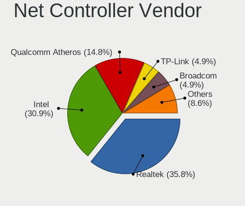
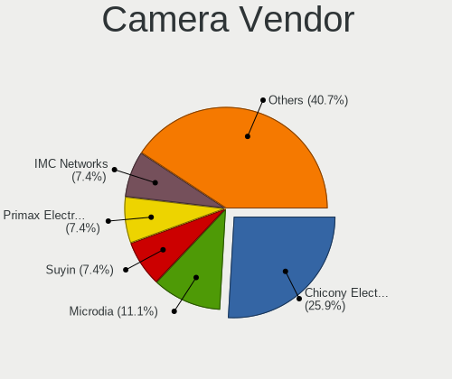

BlackPanther - Hardware Trends
------------------------------

A project to identify most popular hardware characteristics and track their change
over time based on data collected by Linux users at https://Linux-Hardware.org.

Anyone can contribute to this report by the [hw-probe](https://github.com/linuxhw/hw-probe) tool:

    sudo -E hw-probe -all -upload

This is a report for all computer types. See also reports for [desktops](/Dist/BlackPanther/Desktop/README.md) and [notebooks](/Dist/BlackPanther/Notebook/README.md).

This report is for one last month. Overall report since the beginning of time: [TestCoverage](https://github.com/linuxhw/TestCoverage)

Period: Dec, 2022.

Contents
--------

* [ System ](#system)
  - [ OS                       ](#os)
  - [ OS Family                ](#os-family)
  - [ Kernel                   ](#kernel)
  - [ Kernel Family            ](#kernel-family)
  - [ Kernel Major Ver.        ](#kernel-major-ver)
  - [ Arch                     ](#arch)
  - [ DE                       ](#de)
  - [ Display Server           ](#display-server)
  - [ Display Manager          ](#display-manager)
  - [ OS Lang                  ](#os-lang)
  - [ Boot Mode                ](#boot-mode)
  - [ Filesystem               ](#filesystem)
  - [ Part. scheme             ](#part-scheme)
  - [ Dual Boot with Linux/BSD ](#dual-boot-with-linuxbsd)
  - [ Dual Boot (Win)          ](#dual-boot-win)

* [ Board ](#board)
  - [ Vendor                   ](#vendor)
  - [ Model                    ](#model)
  - [ Model Family             ](#model-family)
  - [ MFG Year                 ](#mfg-year)
  - [ Form Factor              ](#form-factor)
  - [ Secure Boot              ](#secure-boot)
  - [ Coreboot                 ](#coreboot)
  - [ RAM Size                 ](#ram-size)
  - [ RAM Used                 ](#ram-used)
  - [ Total Drives             ](#total-drives)
  - [ Has CD-ROM               ](#has-cd-rom)
  - [ Has Ethernet             ](#has-ethernet)
  - [ Has WiFi                 ](#has-wifi)
  - [ Has Bluetooth            ](#has-bluetooth)

* [ Location ](#location)
  - [ Country                  ](#country)
  - [ City                     ](#city)

* [ Drives ](#drives)
  - [ Drive Vendor             ](#drive-vendor)
  - [ Drive Model              ](#drive-model)
  - [ HDD Vendor               ](#hdd-vendor)
  - [ SSD Vendor               ](#ssd-vendor)
  - [ Drive Kind               ](#drive-kind)
  - [ Drive Connector          ](#drive-connector)
  - [ Drive Size               ](#drive-size)
  - [ Space Total              ](#space-total)
  - [ Space Used               ](#space-used)
  - [ Malfunc. Drives          ](#malfunc-drives)
  - [ Malfunc. Drive Vendor    ](#malfunc-drive-vendor)
  - [ Malfunc. HDD Vendor      ](#malfunc-hdd-vendor)
  - [ Malfunc. Drive Kind      ](#malfunc-drive-kind)
  - [ Failed Drives            ](#failed-drives)
  - [ Failed Drive Vendor      ](#failed-drive-vendor)
  - [ Drive Status             ](#drive-status)

* [ Storage controller ](#storage-controller)
  - [ Storage Vendor           ](#storage-vendor)
  - [ Storage Model            ](#storage-model)
  - [ Storage Kind             ](#storage-kind)

* [ Processor ](#processor)
  - [ CPU Vendor               ](#cpu-vendor)
  - [ CPU Model                ](#cpu-model)
  - [ CPU Model Family         ](#cpu-model-family)
  - [ CPU Cores                ](#cpu-cores)
  - [ CPU Sockets              ](#cpu-sockets)
  - [ CPU Threads              ](#cpu-threads)
  - [ CPU Op-Modes             ](#cpu-op-modes)
  - [ CPU Microcode            ](#cpu-microcode)
  - [ CPU Microarch            ](#cpu-microarch)

* [ Graphics ](#graphics)
  - [ GPU Vendor               ](#gpu-vendor)
  - [ GPU Model                ](#gpu-model)
  - [ GPU Combo                ](#gpu-combo)
  - [ GPU Driver               ](#gpu-driver)
  - [ GPU Memory               ](#gpu-memory)

* [ Monitor ](#monitor)
  - [ Monitor Vendor           ](#monitor-vendor)
  - [ Monitor Model            ](#monitor-model)
  - [ Monitor Resolution       ](#monitor-resolution)
  - [ Monitor Diagonal         ](#monitor-diagonal)
  - [ Monitor Width            ](#monitor-width)
  - [ Aspect Ratio             ](#aspect-ratio)
  - [ Monitor Area             ](#monitor-area)
  - [ Pixel Density            ](#pixel-density)
  - [ Multiple Monitors        ](#multiple-monitors)

* [ Network ](#network)
  - [ Net Controller Vendor    ](#net-controller-vendor)
  - [ Net Controller Model     ](#net-controller-model)
  - [ Wireless Vendor          ](#wireless-vendor)
  - [ Wireless Model           ](#wireless-model)
  - [ Ethernet Vendor          ](#ethernet-vendor)
  - [ Ethernet Model           ](#ethernet-model)
  - [ Net Controller Kind      ](#net-controller-kind)
  - [ Used Controller          ](#used-controller)
  - [ NICs                     ](#nics)
  - [ IPv6                     ](#ipv6)

* [ Bluetooth ](#bluetooth)
  - [ Bluetooth Vendor         ](#bluetooth-vendor)
  - [ Bluetooth Model          ](#bluetooth-model)

* [ Sound ](#sound)
  - [ Sound Vendor             ](#sound-vendor)
  - [ Sound Model              ](#sound-model)

* [ Memory ](#memory)
  - [ Memory Vendor            ](#memory-vendor)
  - [ Memory Model             ](#memory-model)
  - [ Memory Kind              ](#memory-kind)
  - [ Memory Form Factor       ](#memory-form-factor)
  - [ Memory Size              ](#memory-size)
  - [ Memory Speed             ](#memory-speed)

* [ Printers & scanners ](#printers--scanners)
  - [ Printer Vendor           ](#printer-vendor)
  - [ Printer Model            ](#printer-model)
  - [ Scanner Vendor           ](#scanner-vendor)
  - [ Scanner Model            ](#scanner-model)

* [ Camera ](#camera)
  - [ Camera Vendor            ](#camera-vendor)
  - [ Camera Model             ](#camera-model)

* [ Security ](#security)
  - [ Fingerprint Vendor       ](#fingerprint-vendor)
  - [ Fingerprint Model        ](#fingerprint-model)
  - [ Chipcard Vendor          ](#chipcard-vendor)
  - [ Chipcard Model           ](#chipcard-model)

* [ Unsupported ](#unsupported)
  - [ Unsupported Devices      ](#unsupported-devices)
  - [ Unsupported Device Types ](#unsupported-device-types)

System
------

OS
--

Installed operating systems

| Name              | Computers | Percent |
|-------------------|-----------|---------|
| BlackPanther 18.1 | 29        | 100%    |

OS Family
---------

OS without a version

| Name         | Computers | Percent |
|--------------|-----------|---------|
| BlackPanther | 29        | 100%    |

Kernel
------

Version of the Linux kernel

| Version             | Computers | Percent |
|---------------------|-----------|---------|
| 5.6.14-desktop-2bP  | 20        | 68.97%  |
| 4.18.16-desktop-1bP | 8         | 27.59%  |
| 5.15.83-1-lts       | 1         | 3.45%   |

Kernel Family
-------------

Linux kernel without a distro release

| Version | Computers | Percent |
|---------|-----------|---------|
| 5.6.14  | 20        | 68.97%  |
| 4.18.16 | 8         | 27.59%  |
| 5.15.83 | 1         | 3.45%   |

Kernel Major Ver.
-----------------

Linux kernel major version

| Version | Computers | Percent |
|---------|-----------|---------|
| 5.6     | 20        | 68.97%  |
| 4.18    | 8         | 27.59%  |
| 5.15    | 1         | 3.45%   |

Arch
----

OS architecture (x86_64, i586, etc.)

| Name   | Computers | Percent |
|--------|-----------|---------|
| x86_64 | 29        | 100%    |

DE
--

Desktop Environment

| Name | Computers | Percent |
|------|-----------|---------|
| KDE5 | 29        | 100%    |

Display Server
--------------

X11 or Wayland

| Name | Computers | Percent |
|------|-----------|---------|
| X11  | 29        | 100%    |

Display Manager
---------------

SDDM, LightDM, etc.

| Name | Computers | Percent |
|------|-----------|---------|
| SDDM | 29        | 100%    |

OS Lang
-------

Language

| Lang    | Computers | Percent |
|---------|-----------|---------|
| Unknown | 29        | 100%    |

Boot Mode
---------

EFI or BIOS

| Mode | Computers | Percent |
|------|-----------|---------|
| EFI  | 16        | 55.17%  |
| BIOS | 13        | 44.83%  |

Filesystem
----------

Type of filesystem

| Type    | Computers | Percent |
|---------|-----------|---------|
| Overlay | 22        | 75.86%  |
| Ext4    | 7         | 24.14%  |

Part. scheme
------------

Scheme of partitioning

| Type | Computers | Percent |
|------|-----------|---------|
| GPT  | 24        | 82.76%  |
| MBR  | 5         | 17.24%  |

Dual Boot with Linux/BSD
------------------------

Hosting more than one Linux/BSD

| Dual boot | Computers | Percent |
|-----------|-----------|---------|
| Yes       | 15        | 51.72%  |
| No        | 14        | 48.28%  |

Dual Boot (Win)
---------------

Hosting Linux and Windows

| Dual boot | Computers | Percent |
|-----------|-----------|---------|
| Yes       | 19        | 65.52%  |
| No        | 10        | 34.48%  |

Board
-----

Vendor
------

Motherboard manufacturer

| Name                | Computers | Percent |
|---------------------|-----------|---------|
| ASUSTek Computer    | 8         | 27.59%  |
| Hewlett-Packard     | 5         | 17.24%  |
| Dell                | 4         | 13.79%  |
| Acer                | 4         | 13.79%  |
| Lenovo              | 3         | 10.34%  |
| Gigabyte Technology | 3         | 10.34%  |
| ASRock              | 2         | 6.9%    |

Model
-----

Motherboard model

| Name                                | Computers | Percent |
|-------------------------------------|-----------|---------|
| Lenovo IdeaPadFlex 15 20309         | 1         | 3.45%   |
| Lenovo IdeaPad 330-15IKB 81DE       | 1         | 3.45%   |
| Lenovo E50-80 80J2                  | 1         | 3.45%   |
| HP Pavilion Gaming Laptop 15-ec1xxx | 1         | 3.45%   |
| HP Laptop 17-ak0xx                  | 1         | 3.45%   |
| HP Laptop 15-db0xxx                 | 1         | 3.45%   |
| HP Compaq 610                       | 1         | 3.45%   |
| HP 650                              | 1         | 3.45%   |
| Gigabyte Z690 UD AX                 | 1         | 3.45%   |
| Gigabyte F2A88XM-HD3                | 1         | 3.45%   |
| Gigabyte B450M GAMING               | 1         | 3.45%   |
| Dell OptiPlex 7010                  | 1         | 3.45%   |
| Dell Latitude E6230                 | 1         | 3.45%   |
| Dell Latitude 5480                  | 1         | 3.45%   |
| Dell Inspiron M5030                 | 1         | 3.45%   |
| ASUS X540SA                         | 1         | 3.45%   |
| ASUS X200MA                         | 1         | 3.45%   |
| ASUS ROG Strix GL10DH_GL10DH        | 1         | 3.45%   |
| ASUS ROG STRIX B550-A GAMING        | 1         | 3.45%   |
| ASUS Pentino_H-Series A_SFF_B85-2   | 1         | 3.45%   |
| ASUS M5A97 EVO R2.0                 | 1         | 3.45%   |
| ASUS K54HR                          | 1         | 3.45%   |
| ASUS H110M-A                        | 1         | 3.45%   |
| ASRock Z370 Extreme4                | 1         | 3.45%   |
| ASRock N68C-S UCC                   | 1         | 3.45%   |
| Acer TravelMate 8571                | 1         | 3.45%   |
| Acer Nitro AN515-51                 | 1         | 3.45%   |
| Acer E1-510                         | 1         | 3.45%   |
| Acer Aspire A515-51G                | 1         | 3.45%   |

Model Family
------------

Motherboard model prefix

| Name                 | Computers | Percent |
|----------------------|-----------|---------|
| HP Laptop            | 2         | 6.9%    |
| Dell Latitude        | 2         | 6.9%    |
| ASUS ROG             | 2         | 6.9%    |
| Lenovo IdeaPadFlex   | 1         | 3.45%   |
| Lenovo IdeaPad       | 1         | 3.45%   |
| Lenovo E50-80        | 1         | 3.45%   |
| HP Pavilion          | 1         | 3.45%   |
| HP Compaq            | 1         | 3.45%   |
| HP 650               | 1         | 3.45%   |
| Gigabyte Z690        | 1         | 3.45%   |
| Gigabyte F2A88XM-HD3 | 1         | 3.45%   |
| Gigabyte B450M       | 1         | 3.45%   |
| Dell OptiPlex        | 1         | 3.45%   |
| Dell Inspiron        | 1         | 3.45%   |
| ASUS X540SA          | 1         | 3.45%   |
| ASUS X200MA          | 1         | 3.45%   |
| ASUS Pentino         | 1         | 3.45%   |
| ASUS M5A97           | 1         | 3.45%   |
| ASUS K54HR           | 1         | 3.45%   |
| ASUS H110M-A         | 1         | 3.45%   |
| ASRock Z370          | 1         | 3.45%   |
| ASRock N68C-S        | 1         | 3.45%   |
| Acer TravelMate      | 1         | 3.45%   |
| Acer Nitro           | 1         | 3.45%   |
| Acer E1-510          | 1         | 3.45%   |
| Acer Aspire          | 1         | 3.45%   |

MFG Year
--------

Motherboard manufacture year

| Year | Computers | Percent |
|------|-----------|---------|
| 2017 | 5         | 17.24%  |
| 2015 | 4         | 13.79%  |
| 2013 | 4         | 13.79%  |
| 2018 | 3         | 10.34%  |
| 2012 | 3         | 10.34%  |
| 2020 | 2         | 6.9%    |
| 2010 | 2         | 6.9%    |
| 2009 | 2         | 6.9%    |
| 2021 | 1         | 3.45%   |
| 2019 | 1         | 3.45%   |
| 2014 | 1         | 3.45%   |
| 2011 | 1         | 3.45%   |

Form Factor
-----------

Physical design of the computer

| Name     | Computers | Percent |
|----------|-----------|---------|
| Notebook | 18        | 62.07%  |
| Desktop  | 11        | 37.93%  |

Secure Boot
-----------

Enabled or disabled

| State    | Computers | Percent |
|----------|-----------|---------|
| Disabled | 29        | 100%    |

Coreboot
--------

Have coreboot on board

| Used | Computers | Percent |
|------|-----------|---------|
| No   | 29        | 100%    |

RAM Size
--------

Total RAM memory

| Size in GB | Computers | Percent |
|------------|-----------|---------|
| 3.01-4.0   | 9         | 31.03%  |
| 8.01-16.0  | 7         | 24.14%  |
| 4.01-8.0   | 5         | 17.24%  |
| 16.01-24.0 | 5         | 17.24%  |
| 32.01-64.0 | 2         | 6.9%    |
| 1.01-2.0   | 1         | 3.45%   |

RAM Used
--------

Used RAM memory

| Used GB  | Computers | Percent |
|----------|-----------|---------|
| 0.51-1.0 | 15        | 51.72%  |
| 1.01-2.0 | 8         | 27.59%  |
| 0.01-0.5 | 6         | 20.69%  |

Total Drives
------------

Number of drives on board

| Drives | Computers | Percent |
|--------|-----------|---------|
| 1      | 14        | 48.28%  |
| 2      | 12        | 41.38%  |
| 8      | 1         | 3.45%   |
| 3      | 1         | 3.45%   |
| 0      | 1         | 3.45%   |

Has CD-ROM
----------

Has CD-ROM on board

| Presented | Computers | Percent |
|-----------|-----------|---------|
| No        | 16        | 55.17%  |
| Yes       | 13        | 44.83%  |

Has Ethernet
------------

Has Ethernet on board

| Presented | Computers | Percent |
|-----------|-----------|---------|
| Yes       | 29        | 100%    |

Has WiFi
--------

Has WiFi module

| Presented | Computers | Percent |
|-----------|-----------|---------|
| Yes       | 21        | 72.41%  |
| No        | 8         | 27.59%  |

Has Bluetooth
-------------

Has Bluetooth module

| Presented | Computers | Percent |
|-----------|-----------|---------|
| Yes       | 16        | 55.17%  |
| No        | 13        | 44.83%  |

Location
--------

Country
-------

Geographic location (country)

| Country | Computers | Percent |
|---------|-----------|---------|
| Hungary | 26        | 89.66%  |
| Italy   | 1         | 3.45%   |
| Germany | 1         | 3.45%   |
| France  | 1         | 3.45%   |

City
----

Geographic location (city)

| City             | Computers | Percent |
|------------------|-----------|---------|
| Budapest         | 3         | 10.34%  |
| Veszprém        | 2         | 6.9%    |
| Rackeve          | 2         | 6.9%    |
| Miskolc          | 2         | 6.9%    |
| Győr            | 2         | 6.9%    |
| Fertoszentmiklos | 2         | 6.9%    |
| Dedestapolcsany  | 2         | 6.9%    |
| Bonyhad          | 2         | 6.9%    |
| Tiszaalpar       | 1         | 3.45%   |
| Tatabánya       | 1         | 3.45%   |
| Szombathely      | 1         | 3.45%   |
| Szekszárd       | 1         | 3.45%   |
| Pécs            | 1         | 3.45%   |
| Nice             | 1         | 3.45%   |
| Nagysap          | 1         | 3.45%   |
| Mestre           | 1         | 3.45%   |
| Kiskunhalas      | 1         | 3.45%   |
| Decs             | 1         | 3.45%   |
| Debrecen         | 1         | 3.45%   |
| Berlin           | 1         | 3.45%   |

Drives
------

Drive Vendor
------------

Hard drive vendors

| Vendor              | Computers | Drives | Percent |
|---------------------|-----------|--------|---------|
| WDC                 | 9         | 9      | 20.93%  |
| Toshiba             | 6         | 10     | 13.95%  |
| Samsung Electronics | 6         | 7      | 13.95%  |
| Kingston            | 5         | 7      | 11.63%  |
| Seagate             | 3         | 3      | 6.98%   |
| Patriot             | 2         | 2      | 4.65%   |
| Intel               | 2         | 2      | 4.65%   |
| Hitachi             | 2         | 2      | 4.65%   |
| A-DATA Technology   | 2         | 2      | 4.65%   |
| Verbatim            | 1         | 1      | 2.33%   |
| Team                | 1         | 1      | 2.33%   |
| SPCC                | 1         | 1      | 2.33%   |
| KingFast            | 1         | 1      | 2.33%   |
| Intenso             | 1         | 1      | 2.33%   |
| Gigabyte Technology | 1         | 1      | 2.33%   |

Drive Model
-----------

Hard drive models

| Model                                   | Computers | Percent |
|-----------------------------------------|-----------|---------|
| Kingston SA400S37240G 240GB SSD         | 3         | 6.25%   |
| Toshiba MQ01ABD100 1TB                  | 2         | 4.17%   |
| Toshiba HDWD130 3TB                     | 2         | 4.17%   |
| Seagate ST1000LM035-1RK172 1TB          | 2         | 4.17%   |
| Samsung SSD 860 EVO 500GB               | 2         | 4.17%   |
| WDC WD5000AAKS-00UU3A0 500GB            | 1         | 2.08%   |
| WDC WD3200BPVT-75ZEST0 320GB            | 1         | 2.08%   |
| WDC WD3200BEVT-08A23T1 320GB            | 1         | 2.08%   |
| WDC WD3200BEKT-60F3T1 320GB             | 1         | 2.08%   |
| WDC WD3200AAJS-56B4A0 320GB             | 1         | 2.08%   |
| WDC WD30PURX-64PFUY0 3TB                | 1         | 2.08%   |
| WDC WD15EADS-00S2B0 1TB                 | 1         | 2.08%   |
| WDC WD10SPCX-24HWST1 1TB                | 1         | 2.08%   |
| WDC WD10EZRX-00L4HB0 1TB                | 1         | 2.08%   |
| Verbatim Vi550 S3 SSD 512GB             | 1         | 2.08%   |
| Toshiba KSG60ZMV256G M.2 2280 256GB SSD | 1         | 2.08%   |
| Toshiba HDWD260 6TB                     | 1         | 2.08%   |
| Toshiba DT01ACA300 3TB                  | 1         | 2.08%   |
| Toshiba DT01ACA100 1TB                  | 1         | 2.08%   |
| Team T253X1120G 120GB SSD               | 1         | 2.08%   |
| SPCC Solid State Disk 256GB             | 1         | 2.08%   |
| Seagate ST2000LM007-1R8174 2TB          | 1         | 2.08%   |
| Samsung SSD 980 PRO 500GB               | 1         | 2.08%   |
| Samsung SSD 980 500GB                   | 1         | 2.08%   |
| Samsung SSD 970 PRO 512GB               | 1         | 2.08%   |
| Samsung SSD 970 EVO Plus 250GB          | 1         | 2.08%   |
| Samsung SSD 830 Series 128GB            | 1         | 2.08%   |
| Patriot P210 128GB SSD                  | 1         | 2.08%   |
| Patriot Burst 960GB SSD                 | 1         | 2.08%   |
| Kingston SNV425S264GB SSD               | 1         | 2.08%   |
| Kingston SKC600256G 256GB SSD           | 1         | 2.08%   |
| Kingston SA400S37480G 480GB SSD         | 1         | 2.08%   |
| Kingston SA2000M8250G 250GB             | 1         | 2.08%   |
| KingFast SSD 32GB                       | 1         | 2.08%   |
| Intenso SSD SATAIII 128GB               | 1         | 2.08%   |
| Intel SSDPEKNW512G8 512GB               | 1         | 2.08%   |
| Intel SSDPEKKW256G7 256GB               | 1         | 2.08%   |
| Hitachi HTS547550A9E384 500GB           | 1         | 2.08%   |
| Hitachi HDS5C3020BLE630 2TB             | 1         | 2.08%   |
| Gigabyte GP-GSTFS31120GNTD 120GB SSD    | 1         | 2.08%   |

HDD Vendor
----------

Hard disk drive vendors

| Vendor  | Computers | Drives | Percent |
|---------|-----------|--------|---------|
| WDC     | 9         | 9      | 47.37%  |
| Toshiba | 5         | 9      | 26.32%  |
| Seagate | 3         | 3      | 15.79%  |
| Hitachi | 2         | 2      | 10.53%  |

SSD Vendor
----------

Solid state drive vendors

| Vendor              | Computers | Drives | Percent |
|---------------------|-----------|--------|---------|
| Kingston            | 4         | 6      | 23.53%  |
| Samsung Electronics | 3         | 3      | 17.65%  |
| Patriot             | 2         | 2      | 11.76%  |
| Verbatim            | 1         | 1      | 5.88%   |
| Toshiba             | 1         | 1      | 5.88%   |
| Team                | 1         | 1      | 5.88%   |
| SPCC                | 1         | 1      | 5.88%   |
| KingFast            | 1         | 1      | 5.88%   |
| Intenso             | 1         | 1      | 5.88%   |
| Gigabyte Technology | 1         | 1      | 5.88%   |
| A-DATA Technology   | 1         | 1      | 5.88%   |

Drive Kind
----------

HDD or SSD

| Kind | Computers | Drives | Percent |
|------|-----------|--------|---------|
| HDD  | 18        | 23     | 45%     |
| SSD  | 15        | 19     | 37.5%   |
| NVMe | 7         | 8      | 17.5%   |

Drive Connector
---------------

SATA, SAS, NVMe, etc.

| Type | Computers | Drives | Percent |
|------|-----------|--------|---------|
| SATA | 27        | 42     | 79.41%  |
| NVMe | 7         | 8      | 20.59%  |

Drive Size
----------

Size of hard drive

| Size in TB | Computers | Drives | Percent |
|------------|-----------|--------|---------|
| 0.01-0.5   | 18        | 23     | 56.25%  |
| 0.51-1.0   | 8         | 10     | 25%     |
| 2.01-3.0   | 3         | 6      | 9.38%   |
| 1.01-2.0   | 2         | 2      | 6.25%   |
| 4.01-10.0  | 1         | 1      | 3.13%   |

Space Total
-----------

Amount of disk space available on the file system

| Size in GB | Computers | Percent |
|------------|-----------|---------|
| Unknown    | 22        | 75.86%  |
| 101-250    | 3         | 10.34%  |
| 21-50      | 2         | 6.9%    |
| 251-500    | 1         | 3.45%   |
| 51-100     | 1         | 3.45%   |

Space Used
----------

Amount of used disk space

| Used GB | Computers | Percent |
|---------|-----------|---------|
| Unknown | 22        | 75.86%  |
| 1-20    | 7         | 24.14%  |

Malfunc. Drives
---------------

Drive models with a malfunction

| Model                                   | Computers | Drives | Percent |
|-----------------------------------------|-----------|--------|---------|
| WDC WD5000AAKS-00UU3A0 500GB            | 1         | 1      | 9.09%   |
| WDC WD3200BEVT-08A23T1 320GB            | 1         | 1      | 9.09%   |
| WDC WD3200BEKT-60F3T1 320GB             | 1         | 1      | 9.09%   |
| Toshiba KSG60ZMV256G M.2 2280 256GB SSD | 1         | 1      | 9.09%   |
| Toshiba HDWD260 6TB                     | 1         | 1      | 9.09%   |
| Toshiba HDWD130 3TB                     | 1         | 1      | 9.09%   |
| Seagate ST2000LM007-1R8174 2TB          | 1         | 1      | 9.09%   |
| Seagate ST1000LM035-1RK172 1TB          | 1         | 1      | 9.09%   |
| Kingston SNV425S264GB SSD               | 1         | 1      | 9.09%   |
| Intel SSDPEKKW256G7 256GB               | 1         | 1      | 9.09%   |
| Hitachi HTS547550A9E384 500GB           | 1         | 1      | 9.09%   |

Malfunc. Drive Vendor
---------------------

Vendors of faulty drives

| Vendor   | Computers | Drives | Percent |
|----------|-----------|--------|---------|
| WDC      | 3         | 3      | 27.27%  |
| Toshiba  | 3         | 3      | 27.27%  |
| Seagate  | 2         | 2      | 18.18%  |
| Kingston | 1         | 1      | 9.09%   |
| Intel    | 1         | 1      | 9.09%   |
| Hitachi  | 1         | 1      | 9.09%   |

Malfunc. HDD Vendor
-------------------

Vendors of faulty HDD drives

| Vendor  | Computers | Drives | Percent |
|---------|-----------|--------|---------|
| WDC     | 3         | 3      | 37.5%   |
| Toshiba | 2         | 2      | 25%     |
| Seagate | 2         | 2      | 25%     |
| Hitachi | 1         | 1      | 12.5%   |

Malfunc. Drive Kind
-------------------

Kinds of faulty drives

| Kind | Computers | Drives | Percent |
|------|-----------|--------|---------|
| HDD  | 8         | 8      | 72.73%  |
| SSD  | 2         | 2      | 18.18%  |
| NVMe | 1         | 1      | 9.09%   |

Failed Drives
-------------

Failed drive models

Zero info for selected period =(

Failed Drive Vendor
-------------------

Failed drive vendors

Zero info for selected period =(

Drive Status
------------

Number of failed and malfunc. drives

| Status  | Computers | Drives | Percent |
|---------|-----------|--------|---------|
| Works   | 23        | 39     | 71.88%  |
| Malfunc | 9         | 11     | 28.13%  |

Storage controller
------------------

Storage Vendor
--------------

Storage controller vendors

| Vendor                      | Computers | Percent |
|-----------------------------|-----------|---------|
| Intel                       | 20        | 52.63%  |
| AMD                         | 9         | 23.68%  |
| Samsung Electronics         | 3         | 7.89%   |
| ASMedia Technology          | 3         | 7.89%   |
| Nvidia                      | 1         | 2.63%   |
| MAXIO Technology (Hangzhou) | 1         | 2.63%   |
| Kingston Technology Company | 1         | 2.63%   |

Storage Model
-------------

Storage controller models

| Model                                                                            | Computers | Percent |
|----------------------------------------------------------------------------------|-----------|---------|
| AMD FCH SATA Controller [AHCI mode]                                              | 5         | 11.11%  |
| Intel 82801 Mobile SATA Controller [RAID mode]                                   | 3         | 6.67%   |
| ASMedia ASM1062 Serial ATA Controller                                            | 3         | 6.67%   |
| Samsung NVMe SSD Controller SM981/PM981/PM983                                    | 2         | 4.44%   |
| Intel Atom Processor E3800 Series SATA AHCI Controller                           | 2         | 4.44%   |
| AMD 400 Series Chipset SATA Controller                                           | 2         | 4.44%   |
| Samsung NVMe SSD Controller PM9A1/PM9A3/980PRO                                   | 1         | 2.22%   |
| Samsung NVMe SSD Controller 980                                                  | 1         | 2.22%   |
| Nvidia MCP61 SATA Controller                                                     | 1         | 2.22%   |
| Nvidia MCP61 IDE                                                                 | 1         | 2.22%   |
| MAXIO (Hangzhou) NVMe SSD Controller MAP1002                                     | 1         | 2.22%   |
| Kingston Company A2000 NVMe SSD                                                  | 1         | 2.22%   |
| Intel Wildcat Point-LP SATA Controller [AHCI Mode]                               | 1         | 2.22%   |
| Intel Sunrise Point-LP SATA Controller [AHCI mode]                               | 1         | 2.22%   |
| Intel SSD 660P Series                                                            | 1         | 2.22%   |
| Intel SSD 600P Series                                                            | 1         | 2.22%   |
| Intel SATA Controller [RAID mode]                                                | 1         | 2.22%   |
| Intel Q170/Q150/B150/H170/H110/Z170/CM236 Chipset SATA Controller [AHCI Mode]    | 1         | 2.22%   |
| Intel HM170/QM170 Chipset SATA Controller [AHCI Mode]                            | 1         | 2.22%   |
| Intel Atom/Celeron/Pentium Processor x5-E8000/J3xxx/N3xxx Series SATA Controller | 1         | 2.22%   |
| Intel Alder Lake-S PCH SATA Controller [AHCI Mode]                               | 1         | 2.22%   |
| Intel 82801IBM/IEM (ICH9M/ICH9M-E) 4 port SATA Controller [AHCI mode]            | 1         | 2.22%   |
| Intel 82801HM/HEM (ICH8M/ICH8M-E) SATA Controller [AHCI mode]                    | 1         | 2.22%   |
| Intel 82801HM/HEM (ICH8M/ICH8M-E) IDE Controller                                 | 1         | 2.22%   |
| Intel 8 Series/C220 Series Chipset Family 6-port SATA Controller 1 [AHCI mode]   | 1         | 2.22%   |
| Intel 8 Series SATA Controller 1 [AHCI mode]                                     | 1         | 2.22%   |
| Intel 7 Series/C210 Series Chipset Family 6-port SATA Controller [AHCI mode]     | 1         | 2.22%   |
| Intel 7 Series Chipset Family 6-port SATA Controller [AHCI mode]                 | 1         | 2.22%   |
| Intel 6 Series/C200 Series Chipset Family 6 port Mobile SATA AHCI Controller     | 1         | 2.22%   |
| ASMedia ASM1166 Serial ATA Controller                                            | 1         | 2.22%   |
| AMD SB7x0/SB8x0/SB9x0 SATA Controller [IDE mode]                                 | 1         | 2.22%   |
| AMD SB7x0/SB8x0/SB9x0 SATA Controller [AHCI mode]                                | 1         | 2.22%   |
| AMD SB7x0/SB8x0/SB9x0 IDE Controller                                             | 1         | 2.22%   |
| AMD 500 Series Chipset SATA Controller                                           | 1         | 2.22%   |

Storage Kind
------------

Kind of storage controller (IDE, SATA, NVMe, SAS, ...)

| Kind | Computers | Percent |
|------|-----------|---------|
| SATA | 25        | 64.1%   |
| NVMe | 7         | 17.95%  |
| RAID | 4         | 10.26%  |
| IDE  | 3         | 7.69%   |

Processor
---------

CPU Vendor
----------

Processor vendors

| Vendor | Computers | Percent |
|--------|-----------|---------|
| Intel  | 19        | 65.52%  |
| AMD    | 10        | 34.48%  |

CPU Model
---------

Processor models

| Model                                         | Computers | Percent |
|-----------------------------------------------|-----------|---------|
| Intel Pentium CPU N3700 @ 1.60GHz             | 1         | 3.45%   |
| Intel Core i7-7700HQ CPU @ 2.80GHz            | 1         | 3.45%   |
| Intel Core i7-6600U CPU @ 2.60GHz             | 1         | 3.45%   |
| Intel Core i5-8500 CPU @ 3.00GHz              | 1         | 3.45%   |
| Intel Core i5-8250U CPU @ 1.60GHz             | 1         | 3.45%   |
| Intel Core i5-7200U CPU @ 2.50GHz             | 1         | 3.45%   |
| Intel Core i5-6500 CPU @ 3.20GHz              | 1         | 3.45%   |
| Intel Core i5-5200U CPU @ 2.20GHz             | 1         | 3.45%   |
| Intel Core i5-4430 CPU @ 3.00GHz              | 1         | 3.45%   |
| Intel Core i5-4200U CPU @ 1.60GHz             | 1         | 3.45%   |
| Intel Core i5-3470S CPU @ 2.90GHz             | 1         | 3.45%   |
| Intel Core i5-3340M CPU @ 2.70GHz             | 1         | 3.45%   |
| Intel Core 2 Duo CPU U9400 @ 1.40GHz          | 1         | 3.45%   |
| Intel Core 2 Duo CPU T5870 @ 2.00GHz          | 1         | 3.45%   |
| Intel Celeron CPU N2920 @ 1.86GHz             | 1         | 3.45%   |
| Intel Celeron CPU N2815 @ 1.86GHz             | 1         | 3.45%   |
| Intel Celeron CPU B830 @ 1.80GHz              | 1         | 3.45%   |
| Intel Celeron CPU B815 @ 1.60GHz              | 1         | 3.45%   |
| Intel 12th Gen Core i5-12600K                 | 1         | 3.45%   |
| AMD V160 Processor                            | 1         | 3.45%   |
| AMD Ryzen 7 5700G with Radeon Graphics        | 1         | 3.45%   |
| AMD Ryzen 5 4600H with Radeon Graphics        | 1         | 3.45%   |
| AMD Ryzen 5 3400G with Radeon Vega Graphics   | 1         | 3.45%   |
| AMD Ryzen 5 2600X Six-Core Processor          | 1         | 3.45%   |
| AMD Ryzen 3 2200U with Radeon Vega Mobile Gfx | 1         | 3.45%   |
| AMD FX-6300 Six-Core Processor                | 1         | 3.45%   |
| AMD Athlon II X4 640 Processor                | 1         | 3.45%   |
| AMD A9-9420 RADEON R5, 5 COMPUTE CORES 2C+3G  | 1         | 3.45%   |
| AMD A8-7600 Radeon R7, 10 Compute Cores 4C+6G | 1         | 3.45%   |

CPU Model Family
----------------

Processor model prefix

| Model            | Computers | Percent |
|------------------|-----------|---------|
| Intel Core i5    | 9         | 31.03%  |
| Intel Celeron    | 4         | 13.79%  |
| AMD Ryzen 5      | 3         | 10.34%  |
| Other            | 2         | 6.9%    |
| Intel Core i7    | 2         | 6.9%    |
| Intel Core 2 Duo | 2         | 6.9%    |
| Intel Pentium    | 1         | 3.45%   |
| AMD V160         | 1         | 3.45%   |
| AMD Ryzen 7      | 1         | 3.45%   |
| AMD Ryzen 3      | 1         | 3.45%   |
| AMD FX           | 1         | 3.45%   |
| AMD Athlon II X4 | 1         | 3.45%   |
| AMD A8           | 1         | 3.45%   |

CPU Cores
---------

Number of processor cores

| Number | Computers | Percent |
|--------|-----------|---------|
| 2      | 13        | 44.83%  |
| 4      | 9         | 31.03%  |
| 6      | 3         | 10.34%  |
| 1      | 2         | 6.9%    |
| 10     | 1         | 3.45%   |
| 3      | 1         | 3.45%   |

CPU Sockets
-----------

Number of sockets

| Number | Computers | Percent |
|--------|-----------|---------|
| 1      | 29        | 100%    |

CPU Threads
-----------

Threads per core (Hyper-Threading)

| Number | Computers | Percent |
|--------|-----------|---------|
| 1      | 16        | 55.17%  |
| 2      | 13        | 44.83%  |

CPU Op-Modes
------------

CPU Operation Modes (32-bit, 64-bit)

| Op mode        | Computers | Percent |
|----------------|-----------|---------|
| 32-bit, 64-bit | 29        | 100%    |

CPU Microcode
-------------

Microcode number

| Number     | Computers | Percent |
|------------|-----------|---------|
| 0x306a9    | 2         | 6.9%    |
| 0x30673    | 2         | 6.9%    |
| 0x206a7    | 2         | 6.9%    |
| 0x010000c8 | 2         | 6.9%    |
| 0x906ea    | 1         | 3.45%   |
| 0x906e9    | 1         | 3.45%   |
| 0x90672    | 1         | 3.45%   |
| 0x806ea    | 1         | 3.45%   |
| 0x806e9    | 1         | 3.45%   |
| 0x6fd      | 1         | 3.45%   |
| 0x506e3    | 1         | 3.45%   |
| 0x406e3    | 1         | 3.45%   |
| 0x406c3    | 1         | 3.45%   |
| 0x40651    | 1         | 3.45%   |
| 0x306d4    | 1         | 3.45%   |
| 0x306c3    | 1         | 3.45%   |
| 0x1067a    | 1         | 3.45%   |
| 0x0a50000c | 1         | 3.45%   |
| 0x08600106 | 1         | 3.45%   |
| 0x08108109 | 1         | 3.45%   |
| 0x08101007 | 1         | 3.45%   |
| 0x0800820d | 1         | 3.45%   |
| 0x06006705 | 1         | 3.45%   |
| 0x06003106 | 1         | 3.45%   |
| 0x06000852 | 1         | 3.45%   |

CPU Microarch
-------------

Microarchitecture

| Name             | Computers | Percent |
|------------------|-----------|---------|
| KabyLake         | 4         | 13.79%  |
| Silvermont       | 3         | 10.34%  |
| Zen+             | 2         | 6.9%    |
| Skylake          | 2         | 6.9%    |
| SandyBridge      | 2         | 6.9%    |
| K10              | 2         | 6.9%    |
| IvyBridge        | 2         | 6.9%    |
| Haswell          | 2         | 6.9%    |
| Zen 3            | 1         | 3.45%   |
| Zen 2            | 1         | 3.45%   |
| Zen              | 1         | 3.45%   |
| Steamroller      | 1         | 3.45%   |
| Piledriver       | 1         | 3.45%   |
| Penryn           | 1         | 3.45%   |
| Excavator        | 1         | 3.45%   |
| Core             | 1         | 3.45%   |
| Broadwell        | 1         | 3.45%   |
| Alderlake Hybrid | 1         | 3.45%   |

Graphics
--------

GPU Vendor
----------

Vendors of graphics cards

| Vendor | Computers | Percent |
|--------|-----------|---------|
| Intel  | 14        | 36.84%  |
| Nvidia | 13        | 34.21%  |
| AMD    | 11        | 28.95%  |

GPU Model
---------

Graphics card models

| Model                                                                                    | Computers | Percent |
|------------------------------------------------------------------------------------------|-----------|---------|
| Intel Atom Processor Z36xxx/Z37xxx Series Graphics & Display                             | 2         | 5.13%   |
| AMD Topaz XT [Radeon R7 M260/M265 / M340/M360 / M440/M445 / 530/535 / 620/625 Mobile]    | 2         | 5.13%   |
| Nvidia TU117M [GeForce GTX 1650 Ti Mobile]                                               | 1         | 2.56%   |
| Nvidia GP108M [GeForce MX150]                                                            | 1         | 2.56%   |
| Nvidia GP108 [GeForce GT 1030]                                                           | 1         | 2.56%   |
| Nvidia GP107M [GeForce GTX 1050 Ti Mobile]                                               | 1         | 2.56%   |
| Nvidia GM108M [GeForce 930MX]                                                            | 1         | 2.56%   |
| Nvidia GM107GL [Quadro K620]                                                             | 1         | 2.56%   |
| Nvidia GM107 [GeForce GTX 750]                                                           | 1         | 2.56%   |
| Nvidia GK208B [GeForce GT 730]                                                           | 1         | 2.56%   |
| Nvidia GK208B [GeForce GT 710]                                                           | 1         | 2.56%   |
| Nvidia GK106GL [Quadro K4000]                                                            | 1         | 2.56%   |
| Nvidia GF117M [GeForce 610M/710M/810M/820M / GT 620M/625M/630M/720M]                     | 1         | 2.56%   |
| Nvidia GA104 [GeForce RTX 3060 Ti Lite Hash Rate]                                        | 1         | 2.56%   |
| Nvidia C61 [GeForce 7025 / nForce 630a]                                                  | 1         | 2.56%   |
| Intel UHD Graphics 620                                                                   | 1         | 2.56%   |
| Intel Skylake GT2 [HD Graphics 520]                                                      | 1         | 2.56%   |
| Intel Mobile GME965/GLE960 Integrated Graphics Controller                                | 1         | 2.56%   |
| Intel Mobile 4 Series Chipset Integrated Graphics Controller                             | 1         | 2.56%   |
| Intel HD Graphics 630                                                                    | 1         | 2.56%   |
| Intel HD Graphics 620                                                                    | 1         | 2.56%   |
| Intel HD Graphics 5500                                                                   | 1         | 2.56%   |
| Intel Haswell-ULT Integrated Graphics Controller                                         | 1         | 2.56%   |
| Intel Atom/Celeron/Pentium Processor x5-E8000/J3xxx/N3xxx Integrated Graphics Controller | 1         | 2.56%   |
| Intel AlderLake-S GT1                                                                    | 1         | 2.56%   |
| Intel 3rd Gen Core processor Graphics Controller                                         | 1         | 2.56%   |
| Intel 2nd Generation Core Processor Family Integrated Graphics Controller                | 1         | 2.56%   |
| AMD Sun XT [Radeon HD 8670A/8670M/8690M / R5 M330 / M430 / Radeon 520 Mobile]            | 1         | 2.56%   |
| AMD Stoney [Radeon R2/R3/R4/R5 Graphics]                                                 | 1         | 2.56%   |
| AMD Seymour [Radeon HD 6400M/7400M Series]                                               | 1         | 2.56%   |
| AMD RS880M [Mobility Radeon HD 4225/4250]                                                | 1         | 2.56%   |
| AMD Renoir                                                                               | 1         | 2.56%   |
| AMD Raven Ridge [Radeon Vega Series / Radeon Vega Mobile Series]                         | 1         | 2.56%   |
| AMD Picasso/Raven 2 [Radeon Vega Series / Radeon Vega Mobile Series]                     | 1         | 2.56%   |
| AMD Kaveri [Radeon R7 Graphics]                                                          | 1         | 2.56%   |
| AMD Ellesmere [Radeon RX 470/480/570/570X/580/580X/590]                                  | 1         | 2.56%   |
| AMD Cypress XT [Radeon HD 5870]                                                          | 1         | 2.56%   |

GPU Combo
---------

Combinations of graphics cards

| Name           | Computers | Percent |
|----------------|-----------|---------|
| 1 x Intel      | 7         | 24.14%  |
| 1 x Nvidia     | 6         | 20.69%  |
| 1 x AMD        | 6         | 20.69%  |
| Intel + Nvidia | 5         | 17.24%  |
| Intel + AMD    | 2         | 6.9%    |
| AMD + Nvidia   | 2         | 6.9%    |
| 2 x AMD        | 1         | 3.45%   |

GPU Driver
----------

Free vs proprietary

| Driver  | Computers | Percent |
|---------|-----------|---------|
| Free    | 28        | 96.55%  |
| Unknown | 1         | 3.45%   |

GPU Memory
----------

Total video memory

| Size in GB | Computers | Percent |
|------------|-----------|---------|
| 1.01-2.0   | 11        | 37.93%  |
| Unknown    | 8         | 27.59%  |
| 3.01-4.0   | 3         | 10.34%  |
| 0.51-1.0   | 3         | 10.34%  |
| 0.01-0.5   | 3         | 10.34%  |
| 2.01-3.0   | 1         | 3.45%   |

Monitor
-------

Monitor Vendor
--------------

Monitor vendors

| Vendor               | Computers | Percent |
|----------------------|-----------|---------|
| AU Optronics         | 6         | 22.22%  |
| Samsung Electronics  | 5         | 18.52%  |
| Chimei Innolux       | 4         | 14.81%  |
| LG Display           | 2         | 7.41%   |
| BOE                  | 2         | 7.41%   |
| Vestel Elektronik    | 1         | 3.7%    |
| PANDA                | 1         | 3.7%    |
| InnoLux Display      | 1         | 3.7%    |
| Iiyama               | 1         | 3.7%    |
| ASUSTek Computer     | 1         | 3.7%    |
| AOC                  | 1         | 3.7%    |
| Ancor Communications | 1         | 3.7%    |
| Acer                 | 1         | 3.7%    |

Monitor Model
-------------

Monitor models

| Model                                                                | Computers | Percent |
|----------------------------------------------------------------------|-----------|---------|
| Vestel Elektronik 40UHD_LCD_TV VES3700 3840x2160 890x500mm 40.2-inch | 1         | 3.7%    |
| Samsung Electronics T22B300 SAM092B 1920x1080 477x268mm 21.5-inch    | 1         | 3.7%    |
| Samsung Electronics S27E500 SAM0D0D 1920x1080 598x336mm 27.0-inch    | 1         | 3.7%    |
| Samsung Electronics S24R35x SAM100E 1920x1080 527x296mm 23.8-inch    | 1         | 3.7%    |
| Samsung Electronics LCD Monitor SEC5441 1366x768 344x194mm 15.5-inch | 1         | 3.7%    |
| Samsung Electronics C49J89x SAM0F21 3840x1080 1196x336mm 48.9-inch   | 1         | 3.7%    |
| PANDA LCD Monitor NCP0058 1920x1080 344x194mm 15.5-inch              | 1         | 3.7%    |
| LG Display LCD Monitor LGD0430 1366x768 345x194mm 15.6-inch          | 1         | 3.7%    |
| LG Display LCD Monitor LGD036C 1366x768 277x156mm 12.5-inch          | 1         | 3.7%    |
| InnoLux Display BT156GW01 INL0007 1366x768 344x194mm 15.5-inch       | 1         | 3.7%    |
| Iiyama PLX2783H IVM6648 1920x1080 598x336mm 27.0-inch                | 1         | 3.7%    |
| Chimei Innolux LCD Monitor CMN15D5 1920x1080 344x193mm 15.5-inch     | 1         | 3.7%    |
| Chimei Innolux LCD Monitor CMN15CA 1366x768 344x193mm 15.5-inch      | 1         | 3.7%    |
| Chimei Innolux LCD Monitor CMN15BD 1366x768 344x193mm 15.5-inch      | 1         | 3.7%    |
| Chimei Innolux LCD Monitor CMN1119 1366x768 256x144mm 11.6-inch      | 1         | 3.7%    |
| BOE LCD Monitor BOE06E2 1920x1080 309x173mm 13.9-inch                | 1         | 3.7%    |
| BOE LCD Monitor BOE06C6 1920x1080 344x194mm 15.5-inch                | 1         | 3.7%    |
| AU Optronics LCD Monitor AUO61ED 1920x1080 344x194mm 15.5-inch       | 1         | 3.7%    |
| AU Optronics LCD Monitor AUO38ED 1920x1080 344x193mm 15.5-inch       | 1         | 3.7%    |
| AU Optronics LCD Monitor AUO32EC 1366x768 344x193mm 15.5-inch        | 1         | 3.7%    |
| AU Optronics LCD Monitor AUO23EC 1366x768 344x193mm 15.5-inch        | 1         | 3.7%    |
| AU Optronics LCD Monitor AUO219E 1600x900 382x214mm 17.2-inch        | 1         | 3.7%    |
| AU Optronics LCD Monitor AUO10EC 1366x768 344x193mm 15.5-inch        | 1         | 3.7%    |
| ASUSTek Computer VG289Q1A AUS28CA 3840x2160 621x341mm 27.9-inch      | 1         | 3.7%    |
| AOC 2770M AOC2770 1920x1080 598x336mm 27.0-inch                      | 1         | 3.7%    |
| Ancor Communications VC279 ACI27C4 1920x1080 598x336mm 27.0-inch     | 1         | 3.7%    |
| Acer X193HQL ACR0159 1366x768 410x230mm 18.5-inch                    | 1         | 3.7%    |

Monitor Resolution
------------------

Monitor screen resolution

| Resolution      | Computers | Percent |
|-----------------|-----------|---------|
| 1920x1080 (FHD) | 11        | 40.74%  |
| 1366x768 (WXGA) | 11        | 40.74%  |
| 3840x2160 (4K)  | 2         | 7.41%   |
| 3840x1080       | 1         | 3.7%    |
| 2560x1440 (QHD) | 1         | 3.7%    |
| 1600x900 (HD+)  | 1         | 3.7%    |

Monitor Diagonal
----------------

Diagonal size in inches

| Inches | Computers | Percent |
|--------|-----------|---------|
| 15     | 13        | 48.15%  |
| 27     | 5         | 18.52%  |
| 84     | 1         | 3.7%    |
| 49     | 1         | 3.7%    |
| 24     | 1         | 3.7%    |
| 21     | 1         | 3.7%    |
| 18     | 1         | 3.7%    |
| 17     | 1         | 3.7%    |
| 13     | 1         | 3.7%    |
| 12     | 1         | 3.7%    |
| 11     | 1         | 3.7%    |

Monitor Width
-------------

Physical width

| Width in mm | Computers | Percent |
|-------------|-----------|---------|
| 301-350     | 13        | 48.15%  |
| 501-600     | 5         | 18.52%  |
| 401-500     | 2         | 7.41%   |
| 351-400     | 2         | 7.41%   |
| 201-300     | 2         | 7.41%   |
| 601-700     | 1         | 3.7%    |
| 1501-2000   | 1         | 3.7%    |
| 1001-1500   | 1         | 3.7%    |

Aspect Ratio
------------

Proportional relationship between the width and the height

| Ratio | Computers | Percent |
|-------|-----------|---------|
| 16/9  | 25        | 96.15%  |
| 32/9  | 1         | 3.85%   |

Monitor Area
------------

Area in inch²

| Area in inch² | Computers | Percent |
|----------------|-----------|---------|
| 101-110        | 13        | 48.15%  |
| 301-350        | 5         | 18.52%  |
| More than 1000 | 1         | 3.7%    |
| 81-90          | 1         | 3.7%    |
| 61-70          | 1         | 3.7%    |
| 51-60          | 1         | 3.7%    |
| 201-250        | 1         | 3.7%    |
| 151-200        | 1         | 3.7%    |
| 141-150        | 1         | 3.7%    |
| 121-130        | 1         | 3.7%    |
| 501-1000       | 1         | 3.7%    |

Pixel Density
-------------

Pixels per inch

| Density | Computers | Percent |
|---------|-----------|---------|
| 51-100  | 10        | 37.04%  |
| 121-160 | 9         | 33.33%  |
| 101-120 | 8         | 29.63%  |

Multiple Monitors
-----------------

Total monitors connected

| Total | Computers | Percent |
|-------|-----------|---------|
| 1     | 27        | 93.1%   |
| 2     | 1         | 3.45%   |
| 0     | 1         | 3.45%   |

Network
-------

Net Controller Vendor
---------------------

Controller vendors

| Vendor                   | Computers | Percent |
|--------------------------|-----------|---------|
| Realtek Semiconductor    | 20        | 45.45%  |
| Intel                    | 11        | 25%     |
| Qualcomm Atheros         | 8         | 18.18%  |
| Xiaomi                   | 1         | 2.27%   |
| Ralink Technology        | 1         | 2.27%   |
| Ralink                   | 1         | 2.27%   |
| Nvidia                   | 1         | 2.27%   |
| Marvell Technology Group | 1         | 2.27%   |

Net Controller Model
--------------------

Controller models

| Model                                                             | Computers | Percent |
|-------------------------------------------------------------------|-----------|---------|
| Realtek RTL8111/8168/8411 PCI Express Gigabit Ethernet Controller | 16        | 30.77%  |
| Realtek RTL810xE PCI Express Fast Ethernet controller             | 3         | 5.77%   |
| Realtek RTL8822CE 802.11ac PCIe Wireless Network Adapter          | 2         | 3.85%   |
| Qualcomm Atheros QCA9565 / AR9565 Wireless Network Adapter        | 2         | 3.85%   |
| Qualcomm Atheros AR9485 Wireless Network Adapter                  | 2         | 3.85%   |
| Intel 82579LM Gigabit Network Connection (Lewisville)             | 2         | 3.85%   |
| Xiaomi Mi/Redmi series (RNDIS)                                    | 1         | 1.92%   |
| Realtek RTL8822BE 802.11a/b/g/n/ac WiFi adapter                   | 1         | 1.92%   |
| Realtek RTL8723DE Wireless Network Adapter                        | 1         | 1.92%   |
| Realtek RTL8188EUS 802.11n Wireless Network Adapter               | 1         | 1.92%   |
| Realtek RTL8125 2.5GbE Controller                                 | 1         | 1.92%   |
| Ralink RT5370 Wireless Adapter                                    | 1         | 1.92%   |
| Ralink RT5390 Wireless 802.11n 1T/1R PCIe                         | 1         | 1.92%   |
| Qualcomm Atheros QCA9377 802.11ac Wireless Network Adapter        | 1         | 1.92%   |
| Qualcomm Atheros QCA6174 802.11ac Wireless Network Adapter        | 1         | 1.92%   |
| Qualcomm Atheros AR9285 Wireless Network Adapter (PCI-Express)    | 1         | 1.92%   |
| Qualcomm Atheros AR8152 v2.0 Fast Ethernet                        | 1         | 1.92%   |
| Qualcomm Atheros AR8151 v2.0 Gigabit Ethernet                     | 1         | 1.92%   |
| Nvidia MCP61 Ethernet                                             | 1         | 1.92%   |
| Marvell Group 88E8042 PCI-E Fast Ethernet Controller              | 1         | 1.92%   |
| Intel Wireless 8265 / 8275                                        | 1         | 1.92%   |
| Intel Wireless 7260                                               | 1         | 1.92%   |
| Intel Wireless 3160                                               | 1         | 1.92%   |
| Intel WiFi Link 5100                                              | 1         | 1.92%   |
| Intel PRO/Wireless 5100 AGN [Shiloh] Network Connection           | 1         | 1.92%   |
| Intel Ethernet Controller I225-V                                  | 1         | 1.92%   |
| Intel Ethernet Connection (4) I219-LM                             | 1         | 1.92%   |
| Intel Ethernet Connection (2) I219-V                              | 1         | 1.92%   |
| Intel Dual Band Wireless-AC 3168NGW [Stone Peak]                  | 1         | 1.92%   |
| Intel Centrino Advanced-N 6205 [Taylor Peak]                      | 1         | 1.92%   |
| Intel Alder Lake-S PCH CNVi WiFi                                  | 1         | 1.92%   |

Wireless Vendor
---------------

Wireless vendors

| Vendor                | Computers | Percent |
|-----------------------|-----------|---------|
| Intel                 | 8         | 38.1%   |
| Qualcomm Atheros      | 7         | 33.33%  |
| Realtek Semiconductor | 4         | 19.05%  |
| Ralink Technology     | 1         | 4.76%   |
| Ralink                | 1         | 4.76%   |

Wireless Model
--------------

Wireless models

| Model                                                          | Computers | Percent |
|----------------------------------------------------------------|-----------|---------|
| Realtek RTL8822CE 802.11ac PCIe Wireless Network Adapter       | 2         | 9.09%   |
| Qualcomm Atheros QCA9565 / AR9565 Wireless Network Adapter     | 2         | 9.09%   |
| Qualcomm Atheros AR9485 Wireless Network Adapter               | 2         | 9.09%   |
| Realtek RTL8822BE 802.11a/b/g/n/ac WiFi adapter                | 1         | 4.55%   |
| Realtek RTL8723DE Wireless Network Adapter                     | 1         | 4.55%   |
| Realtek RTL8188EUS 802.11n Wireless Network Adapter            | 1         | 4.55%   |
| Ralink RT5370 Wireless Adapter                                 | 1         | 4.55%   |
| Ralink RT5390 Wireless 802.11n 1T/1R PCIe                      | 1         | 4.55%   |
| Qualcomm Atheros QCA9377 802.11ac Wireless Network Adapter     | 1         | 4.55%   |
| Qualcomm Atheros QCA6174 802.11ac Wireless Network Adapter     | 1         | 4.55%   |
| Qualcomm Atheros AR9285 Wireless Network Adapter (PCI-Express) | 1         | 4.55%   |
| Intel Wireless 8265 / 8275                                     | 1         | 4.55%   |
| Intel Wireless 7260                                            | 1         | 4.55%   |
| Intel Wireless 3160                                            | 1         | 4.55%   |
| Intel WiFi Link 5100                                           | 1         | 4.55%   |
| Intel PRO/Wireless 5100 AGN [Shiloh] Network Connection        | 1         | 4.55%   |
| Intel Dual Band Wireless-AC 3168NGW [Stone Peak]               | 1         | 4.55%   |
| Intel Centrino Advanced-N 6205 [Taylor Peak]                   | 1         | 4.55%   |
| Intel Alder Lake-S PCH CNVi WiFi                               | 1         | 4.55%   |

Ethernet Vendor
---------------

Ethernet vendors

| Vendor                   | Computers | Percent |
|--------------------------|-----------|---------|
| Realtek Semiconductor    | 20        | 66.67%  |
| Intel                    | 5         | 16.67%  |
| Qualcomm Atheros         | 2         | 6.67%   |
| Xiaomi                   | 1         | 3.33%   |
| Nvidia                   | 1         | 3.33%   |
| Marvell Technology Group | 1         | 3.33%   |

Ethernet Model
--------------

Ethernet models

| Model                                                             | Computers | Percent |
|-------------------------------------------------------------------|-----------|---------|
| Realtek RTL8111/8168/8411 PCI Express Gigabit Ethernet Controller | 16        | 53.33%  |
| Realtek RTL810xE PCI Express Fast Ethernet controller             | 3         | 10%     |
| Intel 82579LM Gigabit Network Connection (Lewisville)             | 2         | 6.67%   |
| Xiaomi Mi/Redmi series (RNDIS)                                    | 1         | 3.33%   |
| Realtek RTL8125 2.5GbE Controller                                 | 1         | 3.33%   |
| Qualcomm Atheros AR8152 v2.0 Fast Ethernet                        | 1         | 3.33%   |
| Qualcomm Atheros AR8151 v2.0 Gigabit Ethernet                     | 1         | 3.33%   |
| Nvidia MCP61 Ethernet                                             | 1         | 3.33%   |
| Marvell Group 88E8042 PCI-E Fast Ethernet Controller              | 1         | 3.33%   |
| Intel Ethernet Controller I225-V                                  | 1         | 3.33%   |
| Intel Ethernet Connection (4) I219-LM                             | 1         | 3.33%   |
| Intel Ethernet Connection (2) I219-V                              | 1         | 3.33%   |

Net Controller Kind
-------------------

Ethernet, WiFi or modem

| Kind     | Computers | Percent |
|----------|-----------|---------|
| Ethernet | 29        | 58%     |
| WiFi     | 21        | 42%     |

Used Controller
---------------

Currently used network controller

| Kind     | Computers | Percent |
|----------|-----------|---------|
| WiFi     | 14        | 50%     |
| Ethernet | 14        | 50%     |

NICs
----

Total network controllers on board

| Total | Computers | Percent |
|-------|-----------|---------|
| 2     | 20        | 68.97%  |
| 1     | 9         | 31.03%  |

IPv6
----

IPv6 vs IPv4

| Used | Computers | Percent |
|------|-----------|---------|
| No   | 23        | 79.31%  |
| Yes  | 6         | 20.69%  |

Bluetooth
---------

Bluetooth Vendor
----------------

Controller vendors

| Vendor                          | Computers | Percent |
|---------------------------------|-----------|---------|
| Intel                           | 5         | 31.25%  |
| Realtek Semiconductor           | 3         | 18.75%  |
| Qualcomm Atheros Communications | 2         | 12.5%   |
| Foxconn / Hon Hai               | 2         | 12.5%   |
| Lite-On Technology              | 1         | 6.25%   |
| IMC Networks                    | 1         | 6.25%   |
| Hewlett-Packard                 | 1         | 6.25%   |
| Dell                            | 1         | 6.25%   |

Bluetooth Model
---------------

Controller models

| Model                                   | Computers | Percent |
|-----------------------------------------|-----------|---------|
| Intel Bluetooth wireless interface      | 3         | 18.75%  |
| Realtek  Bluetooth 4.2 Adapter          | 2         | 12.5%   |
| Realtek Bluetooth Radio                 | 1         | 6.25%   |
| Qualcomm Atheros  Bluetooth Device      | 1         | 6.25%   |
| Qualcomm Atheros AR3012 Bluetooth       | 1         | 6.25%   |
| Lite-On Bluetooth Device                | 1         | 6.25%   |
| Intel Wireless-AC 3168 Bluetooth        | 1         | 6.25%   |
| Intel AX201 Bluetooth                   | 1         | 6.25%   |
| IMC Networks Bluetooth Radio            | 1         | 6.25%   |
| HP Broadcom 2070 Bluetooth Combo        | 1         | 6.25%   |
| Foxconn / Hon Hai Bluetooth Device      | 1         | 6.25%   |
| Foxconn / Hon Hai Acer Bluetooth module | 1         | 6.25%   |
| Dell Wireless 365 Bluetooth             | 1         | 6.25%   |

Sound
-----

Sound Vendor
------------

Sound card vendors

| Vendor | Computers | Percent |
|--------|-----------|---------|
| Intel  | 19        | 46.34%  |
| AMD    | 11        | 26.83%  |
| Nvidia | 10        | 24.39%  |
| BR25   | 1         | 2.44%   |

Sound Model
-----------

Sound card models

| Model                                                                                             | Computers | Percent |
|---------------------------------------------------------------------------------------------------|-----------|---------|
| AMD Family 17h/19h HD Audio Controller                                                            | 4         | 8.16%   |
| Intel Sunrise Point-LP HD Audio                                                                   | 3         | 6.12%   |
| Intel 7 Series/C216 Chipset Family High Definition Audio Controller                               | 3         | 6.12%   |
| Nvidia GM107 High Definition Audio Controller [GeForce 940MX]                                     | 2         | 4.08%   |
| Nvidia GK208 HDMI/DP Audio Controller                                                             | 2         | 4.08%   |
| Intel Atom Processor Z36xxx/Z37xxx Series High Definition Audio Controller                        | 2         | 4.08%   |
| AMD SBx00 Azalia (Intel HDA)                                                                      | 2         | 4.08%   |
| AMD Raven/Raven2/Fenghuang HDMI/DP Audio Controller                                               | 2         | 4.08%   |
| Nvidia TU107 GeForce GTX 1650 High Definition Audio Controller                                    | 1         | 2.04%   |
| Nvidia MCP61 High Definition Audio                                                                | 1         | 2.04%   |
| Nvidia GP108 High Definition Audio Controller                                                     | 1         | 2.04%   |
| Nvidia GP107GL High Definition Audio Controller                                                   | 1         | 2.04%   |
| Nvidia GK106 HDMI Audio Controller                                                                | 1         | 2.04%   |
| Nvidia GA104 High Definition Audio Controller                                                     | 1         | 2.04%   |
| Intel Wildcat Point-LP High Definition Audio Controller                                           | 1         | 2.04%   |
| Intel Haswell-ULT HD Audio Controller                                                             | 1         | 2.04%   |
| Intel CM238 HD Audio Controller                                                                   | 1         | 2.04%   |
| Intel Broadwell-U Audio Controller                                                                | 1         | 2.04%   |
| Intel Atom/Celeron/Pentium Processor x5-E8000/J3xxx/N3xxx Series High Definition Audio Controller | 1         | 2.04%   |
| Intel Alder Lake-S HD Audio Controller                                                            | 1         | 2.04%   |
| Intel 82801I (ICH9 Family) HD Audio Controller                                                    | 1         | 2.04%   |
| Intel 82801H (ICH8 Family) HD Audio Controller                                                    | 1         | 2.04%   |
| Intel 8 Series/C220 Series Chipset High Definition Audio Controller                               | 1         | 2.04%   |
| Intel 8 Series HD Audio Controller                                                                | 1         | 2.04%   |
| Intel 6 Series/C200 Series Chipset Family High Definition Audio Controller                        | 1         | 2.04%   |
| Intel 200 Series PCH HD Audio                                                                     | 1         | 2.04%   |
| Intel 100 Series/C230 Series Chipset Family HD Audio Controller                                   | 1         | 2.04%   |
| BR25 UACDemoV1.0                                                                                  | 1         | 2.04%   |
| AMD Renoir Radeon High Definition Audio Controller                                                | 1         | 2.04%   |
| AMD Kaveri HDMI/DP Audio Controller                                                               | 1         | 2.04%   |
| AMD High Definition Audio Controller                                                              | 1         | 2.04%   |
| AMD FCH Azalia Controller                                                                         | 1         | 2.04%   |
| AMD Family 17h (Models 00h-0fh) HD Audio Controller                                               | 1         | 2.04%   |
| AMD Family 15h (Models 60h-6fh) Audio Controller                                                  | 1         | 2.04%   |
| AMD Ellesmere HDMI Audio [Radeon RX 470/480 / 570/580/590]                                        | 1         | 2.04%   |
| AMD Cypress HDMI Audio [Radeon HD 5830/5850/5870 / 6850/6870 Rebrand]                             | 1         | 2.04%   |
| AMD Caicos HDMI Audio [Radeon HD 6450 / 7450/8450/8490 OEM / R5 230/235/235X OEM]                 | 1         | 2.04%   |

Memory
------

Memory Vendor
-------------

Memory module vendors

| Vendor              | Computers | Percent |
|---------------------|-----------|---------|
| SK hynix            | 10        | 27.03%  |
| Kingston            | 6         | 16.22%  |
| Samsung Electronics | 4         | 10.81%  |
| Corsair             | 4         | 10.81%  |
| Micron Technology   | 3         | 8.11%   |
| Unknown             | 2         | 5.41%   |
| Nanya Technology    | 2         | 5.41%   |
| Crucial             | 2         | 5.41%   |
| Transcend           | 1         | 2.7%    |
| OCZ                 | 1         | 2.7%    |
| G.Skill             | 1         | 2.7%    |
| Elpida              | 1         | 2.7%    |

Memory Model
------------

Memory module models

| Model                                                        | Computers | Percent |
|--------------------------------------------------------------|-----------|---------|
| Unknown RAM V02D4S84GB5285282400 4096MB SODIMM DDR4 2133MT/s | 1         | 2.7%    |
| Unknown RAM Module 2048MB DIMM 400MT/s                       | 1         | 2.7%    |
| Transcend RAM JM800QSU-2G 2048MB SODIMM DDR2 975MT/s         | 1         | 2.7%    |
| SK hynix RAM HMT451S6CFR6A-PB 4096MB SODIMM DDR3 1600MT/s    | 1         | 2.7%    |
| SK hynix RAM HMT451S6AFR6R-PB 4096MB SODIMM DDR3 1333MT/s    | 1         | 2.7%    |
| SK hynix RAM HMT351U6EFR8C-PB 4GB DIMM DDR3 1800MT/s         | 1         | 2.7%    |
| SK hynix RAM HMT351S6EFR8A-PB 4096MB SODIMM DDR3 1600MT/s    | 1         | 2.7%    |
| SK hynix RAM HMP125S6EFR8C-S6 2048MB SODIMM DDR2 2048MT/s    | 1         | 2.7%    |
| SK hynix RAM HMA851S6CJR6N-VK 4GB SODIMM DDR4 2667MT/s       | 1         | 2.7%    |
| SK hynix RAM HMA851S6AFR6N-UH 4GB SODIMM DDR4 2400MT/s       | 1         | 2.7%    |
| SK hynix RAM HMA851S6AFR6N-UH 2GB SODIMM LPDDR4 2667MT/s     | 1         | 2.7%    |
| SK hynix RAM HMA82GU6CJR8N-VK 16384MB DIMM DDR4 2667MT/s     | 1         | 2.7%    |
| SK hynix RAM HMA81GS6CJR8N-XN 8192MB SODIMM DDR4 3200MT/s    | 1         | 2.7%    |
| Samsung RAM M471B5273DH0-CK0 4GB SODIMM DDR3 1600MT/s        | 1         | 2.7%    |
| Samsung RAM M471B1G73DB0-YK0 8GB SODIMM DDR3 1600MT/s        | 1         | 2.7%    |
| Samsung RAM M471A5244CB0-CRC 4GB SODIMM DDR4 2667MT/s        | 1         | 2.7%    |
| Samsung RAM M378B5173QH0-CK0 4GB DIMM DDR3 1600MT/s          | 1         | 2.7%    |
| OCZ RAM OCZ3BE1600C8LV2G 2048MB DIMM DDR3 1066MT/s           | 1         | 2.7%    |
| Nanya RAM NT4GC64C88B1NS-DI 4096MB SODIMM DDR3 1600MT/s      | 1         | 2.7%    |
| Nanya RAM NT4GC64B8HG0NS-CG 4096MB SODIMM DDR3 1334MT/s      | 1         | 2.7%    |
| Micron RAM CT8G4DFD8213.16FA11 8192MB DIMM DDR4 2133MT/s     | 1         | 2.7%    |
| Micron RAM 8JSF25664HZ-1G4D1 2GB SODIMM DDR3 1334MT/s        | 1         | 2.7%    |
| Micron RAM 4ATF51264HZ-2G3B1 4GB SODIMM DDR4 2400MT/s        | 1         | 2.7%    |
| Kingston RAM KMKYF9-MIB 8192MB SODIMM DDR4 2400MT/s          | 1         | 2.7%    |
| Kingston RAM KHX3200C16D4/8GX 8GB DIMM DDR4 3600MT/s         | 1         | 2.7%    |
| Kingston RAM KHX1600C10D3/8G 8192MB DIMM DDR3 1600MT/s       | 1         | 2.7%    |
| Kingston RAM KF548C38-16 16GB DIMM DDR5 4800MT/s             | 1         | 2.7%    |
| Kingston RAM KF2666C15S4/8G 8192MB SODIMM DDR4 2667MT/s      | 1         | 2.7%    |
| Kingston RAM ACR16D3LS1KFG/4G 4096MB SODIMM DDR3 1600MT/s    | 1         | 2.7%    |
| G.Skill RAM F4-3200C16-8GIS 8192MB DIMM DDR4 3200MT/s        | 1         | 2.7%    |
| Elpida RAM EBJ40UG8EFU0-GN-F 4096MB SODIMM DDR3 1600MT/s     | 1         | 2.7%    |
| Crucial RAM BLS8G4D240FSBK.8FD 8192MB DIMM DDR4 2448MT/s     | 1         | 2.7%    |
| Crucial RAM BLS4G3D1609DS 4096MB DIMM DDR3 1600MT/s          | 1         | 2.7%    |
| Corsair RAM CMW16GX4M2C3600C18 8192MB DIMM DDR4 3600MT/s     | 1         | 2.7%    |
| Corsair RAM CMV4GX3M1B1600C11 4GB DIMM DDR3 1600MT/s         | 1         | 2.7%    |
| Corsair RAM CMSX8GX3M2A1866C10 4096MB SODIMM 800MT/s         | 1         | 2.7%    |
| Corsair RAM CML16GX3M2A1600C9 8192MB DIMM DDR3 2133MT/s      | 1         | 2.7%    |

Memory Kind
-----------

Memory module kinds

| Kind    | Computers | Percent |
|---------|-----------|---------|
| DDR3    | 14        | 45.16%  |
| DDR4    | 12        | 38.71%  |
| Unknown | 2         | 6.45%   |
| SDRAM   | 1         | 3.23%   |
| LPDDR4  | 1         | 3.23%   |
| DDR5    | 1         | 3.23%   |

Memory Form Factor
------------------

Physical design of the memory module

| Name   | Computers | Percent |
|--------|-----------|---------|
| SODIMM | 18        | 60%     |
| DIMM   | 12        | 40%     |

Memory Size
-----------

Memory module size

| Size  | Computers | Percent |
|-------|-----------|---------|
| 4096  | 15        | 48.39%  |
| 8192  | 10        | 32.26%  |
| 2048  | 4         | 12.9%   |
| 16384 | 2         | 6.45%   |

Memory Speed
------------

Memory module speed

| Speed | Computers | Percent |
|-------|-----------|---------|
| 1600  | 8         | 22.86%  |
| 2667  | 4         | 11.43%  |
| 2400  | 4         | 11.43%  |
| 3600  | 2         | 5.71%   |
| 3200  | 2         | 5.71%   |
| 2133  | 2         | 5.71%   |
| 1334  | 2         | 5.71%   |
| 4800  | 1         | 2.86%   |
| 2448  | 1         | 2.86%   |
| 2048  | 1         | 2.86%   |
| 1867  | 1         | 2.86%   |
| 1866  | 1         | 2.86%   |
| 1800  | 1         | 2.86%   |
| 1333  | 1         | 2.86%   |
| 1066  | 1         | 2.86%   |
| 975   | 1         | 2.86%   |
| 800   | 1         | 2.86%   |
| 400   | 1         | 2.86%   |

Printers & scanners
-------------------

Printer Vendor
--------------

Printer device vendors

| Vendor              | Computers | Percent |
|---------------------|-----------|---------|
| Samsung Electronics | 1         | 100%    |

Printer Model
-------------

Printer device models

| Model               | Computers | Percent |
|---------------------|-----------|---------|
| Samsung C48x Series | 1         | 100%    |

Scanner Vendor
--------------

Scanner device vendors

Zero info for selected period =(

Scanner Model
-------------

Scanner device models

Zero info for selected period =(

Camera
------

Camera Vendor
-------------

Camera device vendors

| Vendor                                 | Computers | Percent |
|----------------------------------------|-----------|---------|
| Chicony Electronics                    | 5         | 27.78%  |
| Realtek Semiconductor                  | 3         | 16.67%  |
| Cheng Uei Precision Industry (Foxlink) | 3         | 16.67%  |
| Microdia                               | 2         | 11.11%  |
| Acer                                   | 2         | 11.11%  |
| Sunplus Innovation Technology          | 1         | 5.56%   |
| IMC Networks                           | 1         | 5.56%   |
| Alcor Micro                            | 1         | 5.56%   |

Camera Model
------------

Camera device models

| Model                                                          | Computers | Percent |
|----------------------------------------------------------------|-----------|---------|
| Sunplus HD WebCam                                              | 1         | 5.56%   |
| Realtek USB2.0 VGA UVC WebCam                                  | 1         | 5.56%   |
| Realtek Integrated_Webcam_HD                                   | 1         | 5.56%   |
| Realtek HD WebCam                                              | 1         | 5.56%   |
| Microdia USB 2.0 Camera                                        | 1         | 5.56%   |
| Microdia Dell Integrated HD Webcam                             | 1         | 5.56%   |
| IMC Networks EasyCamera                                        | 1         | 5.56%   |
| Chicony Webcam                                                 | 1         | 5.56%   |
| Chicony USB2.0 HD UVC WebCam                                   | 1         | 5.56%   |
| Chicony HP TrueVision HD Camera                                | 1         | 5.56%   |
| Chicony HD WebCam                                              | 1         | 5.56%   |
| Chicony CNF8243 Webcam                                         | 1         | 5.56%   |
| Cheng Uei Precision Industry (Foxlink) HP Webcam               | 1         | 5.56%   |
| Cheng Uei Precision Industry (Foxlink) HP TrueVision HD Camera | 1         | 5.56%   |
| Cheng Uei Precision Industry (Foxlink) HP Truevision HD        | 1         | 5.56%   |
| Alcor Micro Asus Integrated Webcam                             | 1         | 5.56%   |
| Acer Lenovo Integrated Webcam                                  | 1         | 5.56%   |
| Acer Lenovo EasyCamera                                         | 1         | 5.56%   |

Security
--------

Fingerprint Vendor
------------------

Fingerprint sensor vendors

| Vendor                | Computers | Percent |
|-----------------------|-----------|---------|
| LighTuning Technology | 1         | 100%    |

Fingerprint Model
-----------------

Fingerprint sensor models

| Model                         | Computers | Percent |
|-------------------------------|-----------|---------|
| LighTuning Fingerprint Reader | 1         | 100%    |

Chipcard Vendor
---------------

Chipcard module vendors

Zero info for selected period =(

Chipcard Model
--------------

Chipcard module models

Zero info for selected period =(

Unsupported
-----------

Unsupported Devices
-------------------

Total unsupported devices on board

| Total | Computers | Percent |
|-------|-----------|---------|
| 0     | 26        | 89.66%  |
| 1     | 2         | 6.9%    |
| 5     | 1         | 3.45%   |

Unsupported Device Types
------------------------

Types of unsupported devices

| Type                     | Computers | Percent |
|--------------------------|-----------|---------|
| Sound                    | 1         | 16.67%  |
| Net/wireless             | 1         | 16.67%  |
| Graphics card            | 1         | 16.67%  |
| Fingerprint reader       | 1         | 16.67%  |
| Communication controller | 1         | 16.67%  |
| Bluetooth                | 1         | 16.67%  |

