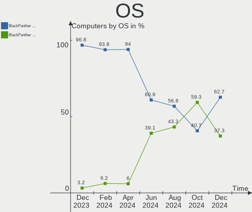
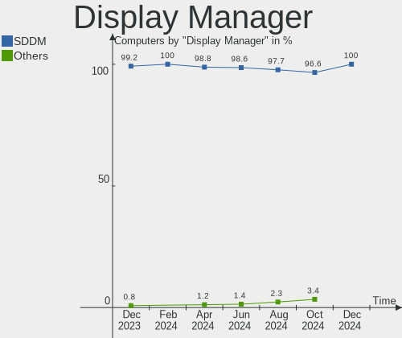
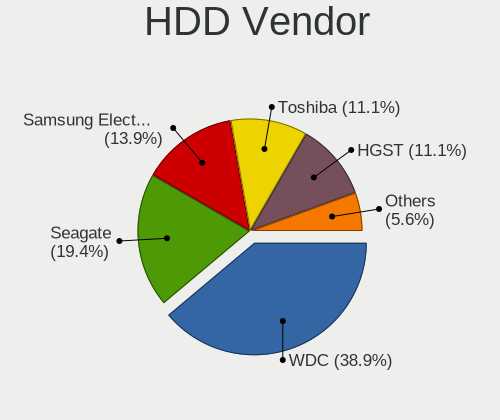
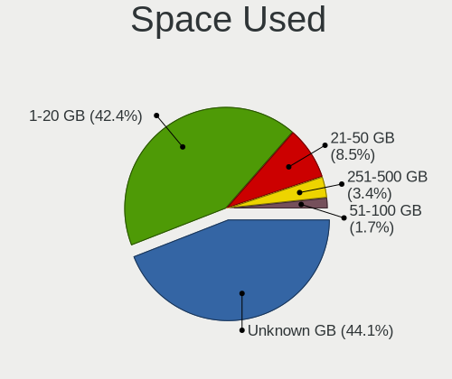
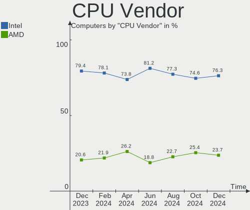

BlackPanther - Hardware Trends
------------------------------

A project to identify most popular hardware characteristics and track their change
over time based on data collected by Linux users at https://Linux-Hardware.org.

Anyone can contribute to this report by the [hw-probe](https://github.com/linuxhw/hw-probe) tool:

    sudo -E hw-probe -all -upload

This is a report for all computer types. See also reports for [desktops](/Dist/BlackPanther/Desktop/README.md) and [notebooks](/Dist/BlackPanther/Notebook/README.md).

This report is for one last month. Overall report since the beginning of time: [TestDays](https://github.com/linuxhw/TestDays)

Period: Dec, 2024.

Contents
--------

* [ System ](#system)
  - [ OS                       ](#os)
  - [ OS Family                ](#os-family)
  - [ Kernel                   ](#kernel)
  - [ Kernel Family            ](#kernel-family)
  - [ Kernel Major Ver.        ](#kernel-major-ver)
  - [ Arch                     ](#arch)
  - [ DE                       ](#de)
  - [ Display Server           ](#display-server)
  - [ Display Manager          ](#display-manager)
  - [ OS Lang                  ](#os-lang)
  - [ Boot Mode                ](#boot-mode)
  - [ Filesystem               ](#filesystem)
  - [ Part. scheme             ](#part-scheme)
  - [ Dual Boot with Linux/BSD ](#dual-boot-with-linuxbsd)
  - [ Dual Boot (Win)          ](#dual-boot-win)

* [ Board ](#board)
  - [ Vendor                   ](#vendor)
  - [ Model                    ](#model)
  - [ Model Family             ](#model-family)
  - [ MFG Year                 ](#mfg-year)
  - [ Form Factor              ](#form-factor)
  - [ Secure Boot              ](#secure-boot)
  - [ Coreboot                 ](#coreboot)
  - [ RAM Size                 ](#ram-size)
  - [ RAM Used                 ](#ram-used)
  - [ Total Drives             ](#total-drives)
  - [ Has CD-ROM               ](#has-cd-rom)
  - [ Has Ethernet             ](#has-ethernet)
  - [ Has WiFi                 ](#has-wifi)
  - [ Has Bluetooth            ](#has-bluetooth)

* [ Location ](#location)
  - [ Country                  ](#country)
  - [ City                     ](#city)

* [ Drives ](#drives)
  - [ Drive Vendor             ](#drive-vendor)
  - [ Drive Model              ](#drive-model)
  - [ HDD Vendor               ](#hdd-vendor)
  - [ SSD Vendor               ](#ssd-vendor)
  - [ Drive Kind               ](#drive-kind)
  - [ Drive Connector          ](#drive-connector)
  - [ Drive Size               ](#drive-size)
  - [ Space Total              ](#space-total)
  - [ Space Used               ](#space-used)
  - [ Malfunc. Drives          ](#malfunc-drives)
  - [ Malfunc. Drive Vendor    ](#malfunc-drive-vendor)
  - [ Malfunc. HDD Vendor      ](#malfunc-hdd-vendor)
  - [ Malfunc. Drive Kind      ](#malfunc-drive-kind)
  - [ Failed Drives            ](#failed-drives)
  - [ Failed Drive Vendor      ](#failed-drive-vendor)
  - [ Drive Status             ](#drive-status)

* [ Storage controller ](#storage-controller)
  - [ Storage Vendor           ](#storage-vendor)
  - [ Storage Model            ](#storage-model)
  - [ Storage Kind             ](#storage-kind)

* [ Processor ](#processor)
  - [ CPU Vendor               ](#cpu-vendor)
  - [ CPU Model                ](#cpu-model)
  - [ CPU Model Family         ](#cpu-model-family)
  - [ CPU Cores                ](#cpu-cores)
  - [ CPU Sockets              ](#cpu-sockets)
  - [ CPU Threads              ](#cpu-threads)
  - [ CPU Op-Modes             ](#cpu-op-modes)
  - [ CPU Microcode            ](#cpu-microcode)
  - [ CPU Microarch            ](#cpu-microarch)

* [ Graphics ](#graphics)
  - [ GPU Vendor               ](#gpu-vendor)
  - [ GPU Model                ](#gpu-model)
  - [ GPU Combo                ](#gpu-combo)
  - [ GPU Driver               ](#gpu-driver)
  - [ GPU Memory               ](#gpu-memory)

* [ Monitor ](#monitor)
  - [ Monitor Vendor           ](#monitor-vendor)
  - [ Monitor Model            ](#monitor-model)
  - [ Monitor Resolution       ](#monitor-resolution)
  - [ Monitor Diagonal         ](#monitor-diagonal)
  - [ Monitor Width            ](#monitor-width)
  - [ Aspect Ratio             ](#aspect-ratio)
  - [ Monitor Area             ](#monitor-area)
  - [ Pixel Density            ](#pixel-density)
  - [ Multiple Monitors        ](#multiple-monitors)

* [ Network ](#network)
  - [ Net Controller Vendor    ](#net-controller-vendor)
  - [ Net Controller Model     ](#net-controller-model)
  - [ Wireless Vendor          ](#wireless-vendor)
  - [ Wireless Model           ](#wireless-model)
  - [ Ethernet Vendor          ](#ethernet-vendor)
  - [ Ethernet Model           ](#ethernet-model)
  - [ Net Controller Kind      ](#net-controller-kind)
  - [ Used Controller          ](#used-controller)
  - [ NICs                     ](#nics)
  - [ IPv6                     ](#ipv6)

* [ Bluetooth ](#bluetooth)
  - [ Bluetooth Vendor         ](#bluetooth-vendor)
  - [ Bluetooth Model          ](#bluetooth-model)

* [ Sound ](#sound)
  - [ Sound Vendor             ](#sound-vendor)
  - [ Sound Model              ](#sound-model)

* [ Memory ](#memory)
  - [ Memory Vendor            ](#memory-vendor)
  - [ Memory Model             ](#memory-model)
  - [ Memory Kind              ](#memory-kind)
  - [ Memory Form Factor       ](#memory-form-factor)
  - [ Memory Size              ](#memory-size)
  - [ Memory Speed             ](#memory-speed)

* [ Printers & scanners ](#printers--scanners)
  - [ Printer Vendor           ](#printer-vendor)
  - [ Printer Model            ](#printer-model)
  - [ Scanner Vendor           ](#scanner-vendor)
  - [ Scanner Model            ](#scanner-model)

* [ Camera ](#camera)
  - [ Camera Vendor            ](#camera-vendor)
  - [ Camera Model             ](#camera-model)

* [ Security ](#security)
  - [ Fingerprint Vendor       ](#fingerprint-vendor)
  - [ Fingerprint Model        ](#fingerprint-model)
  - [ Chipcard Vendor          ](#chipcard-vendor)
  - [ Chipcard Model           ](#chipcard-model)

* [ Unsupported ](#unsupported)
  - [ Unsupported Devices      ](#unsupported-devices)
  - [ Unsupported Device Types ](#unsupported-device-types)

System
------

OS
--

Installed operating systems

| Name              | Computers | Percent |
|-------------------|-----------|---------|
| BlackPanther 18.1 | 37        | 62.71%  |
| BlackPanther 22.1 | 22        | 37.29%  |

OS Family
---------

OS without a version

| Name         | Computers | Percent |
|--------------|-----------|---------|
| BlackPanther | 59        | 100%    |

Kernel
------

Version of the Linux kernel

| Version              | Computers | Percent |
|----------------------|-----------|---------|
| 6.6.32-power-1bP     | 21        | 35.59%  |
| 4.18.16-desktop-1bP  | 18        | 30.51%  |
| 5.6.14-desktop-2bP   | 11        | 18.64%  |
| 5.15.85-desktop-1bP  | 7         | 11.86%  |
| 6.6.34-power-1bP     | 1         | 1.69%   |
| 5.15.160-desktop-1bP | 1         | 1.69%   |

Kernel Family
-------------

Linux kernel without a distro release

| Version  | Computers | Percent |
|----------|-----------|---------|
| 6.6.32   | 21        | 35.59%  |
| 4.18.16  | 18        | 30.51%  |
| 5.6.14   | 11        | 18.64%  |
| 5.15.85  | 7         | 11.86%  |
| 6.6.34   | 1         | 1.69%   |
| 5.15.160 | 1         | 1.69%   |

Kernel Major Ver.
-----------------

Linux kernel major version

| Version | Computers | Percent |
|---------|-----------|---------|
| 6.6     | 22        | 37.29%  |
| 4.18    | 18        | 30.51%  |
| 5.6     | 11        | 18.64%  |
| 5.15    | 8         | 13.56%  |

Arch
----

OS architecture (x86_64, i586, etc.)

| Name   | Computers | Percent |
|--------|-----------|---------|
| x86_64 | 59        | 100%    |

DE
--

Desktop Environment

| Name    | Computers | Percent |
|---------|-----------|---------|
| KDE5    | 51        | 86.44%  |
| Unknown | 8         | 13.56%  |

Display Server
--------------

X11 or Wayland

| Name | Computers | Percent |
|------|-----------|---------|
| X11  | 58        | 98.31%  |
| Tty  | 1         | 1.69%   |

Display Manager
---------------

SDDM, LightDM, etc.

| Name | Computers | Percent |
|------|-----------|---------|
| SDDM | 59        | 100%    |

OS Lang
-------

Language

| Lang    | Computers | Percent |
|---------|-----------|---------|
| Unknown | 58        | 98.31%  |
| hu_HU   | 1         | 1.69%   |

Boot Mode
---------

EFI or BIOS

| Mode | Computers | Percent |
|------|-----------|---------|
| BIOS | 32        | 54.24%  |
| EFI  | 27        | 45.76%  |

Filesystem
----------

Type of filesystem

| Type    | Computers | Percent |
|---------|-----------|---------|
| Ext4    | 33        | 55.93%  |
| Overlay | 26        | 44.07%  |

Part. scheme
------------

Scheme of partitioning

| Type    | Computers | Percent |
|---------|-----------|---------|
| GPT     | 31        | 52.54%  |
| MBR     | 27        | 45.76%  |
| Unknown | 1         | 1.69%   |

Dual Boot with Linux/BSD
------------------------

Hosting more than one Linux/BSD

| Dual boot | Computers | Percent |
|-----------|-----------|---------|
| No        | 37        | 62.71%  |
| Yes       | 22        | 37.29%  |

Dual Boot (Win)
---------------

Hosting Linux and Windows

| Dual boot | Computers | Percent |
|-----------|-----------|---------|
| No        | 33        | 55.93%  |
| Yes       | 26        | 44.07%  |

Board
-----

Vendor
------

Motherboard manufacturer

| Name                | Computers | Percent |
|---------------------|-----------|---------|
| Hewlett-Packard     | 13        | 22.03%  |
| Gigabyte Technology | 10        | 16.95%  |
| Lenovo              | 7         | 11.86%  |
| Dell                | 7         | 11.86%  |
| ASUSTek Computer    | 7         | 11.86%  |
| ASRock              | 5         | 8.47%   |
| MSI                 | 2         | 3.39%   |
| Acer                | 2         | 3.39%   |
| Toshiba             | 1         | 1.69%   |
| Microsoft           | 1         | 1.69%   |
| Fujitsu Siemens     | 1         | 1.69%   |
| Fujitsu             | 1         | 1.69%   |
| Foxconn             | 1         | 1.69%   |
| eMachines           | 1         | 1.69%   |

Model
-----

Motherboard model

| Name                                | Computers | Percent |
|-------------------------------------|-----------|---------|
| HP Pavilion Gaming Laptop 15-ec1xxx | 2         | 3.39%   |
| HP Compaq 8000 Elite SFF PC         | 2         | 3.39%   |
| Gigabyte H310M A 2.0                | 2         | 3.39%   |
| Gigabyte B450M GAMING               | 2         | 3.39%   |
| Toshiba Satellite Pro A120          | 1         | 1.69%   |
| MSI MS-7817                         | 1         | 1.69%   |
| MSI CR610                           | 1         | 1.69%   |
| Microsoft Surface Go 2              | 1         | 1.69%   |
| Lenovo Z710 20250                   | 1         | 1.69%   |
| Lenovo ThinkPad T520 4242A25        | 1         | 1.69%   |
| Lenovo ThinkPad T410 2537KR6        | 1         | 1.69%   |
| Lenovo ThinkPad L430 246834G        | 1         | 1.69%   |
| Lenovo ThinkPad E550 20DF007YRI     | 1         | 1.69%   |
| Lenovo G550 20023                   | 1         | 1.69%   |
| Lenovo 1730-A1G                     | 1         | 1.69%   |
| HP Z400 Workstation                 | 1         | 1.69%   |
| HP ProBook 4535s                    | 1         | 1.69%   |
| HP ProBook 440 G5                   | 1         | 1.69%   |
| HP Laptop 15-bs0xx                  | 1         | 1.69%   |
| HP HDX 16                           | 1         | 1.69%   |
| HP EliteBook 850 G3                 | 1         | 1.69%   |
| HP Compaq Elite 8300 SFF            | 1         | 1.69%   |
| HP 620                              | 1         | 1.69%   |
| HP 250 G1                           | 1         | 1.69%   |
| Gigabyte H61M-S1                    | 1         | 1.69%   |
| Gigabyte G41M-Combo                 | 1         | 1.69%   |
| Gigabyte F2A88XM-HD3                | 1         | 1.69%   |
| Gigabyte F2A68HM-DS2                | 1         | 1.69%   |
| Gigabyte B75M-D3H                   | 1         | 1.69%   |
| Gigabyte 945GCM-S2L                 | 1         | 1.69%   |
| Fujitsu Siemens AMILO Li 2727       | 1         | 1.69%   |
| Fujitsu ESPRIMO E520                | 1         | 1.69%   |
| Foxconn Pro3500 Series              | 1         | 1.69%   |
| eMachines E725                      | 1         | 1.69%   |
| Dell Vostro 1015                    | 1         | 1.69%   |
| Dell Precision WorkStation T5500    | 1         | 1.69%   |
| Dell OptiPlex 3050                  | 1         | 1.69%   |
| Dell Latitude E6410                 | 1         | 1.69%   |
| Dell Latitude E6230                 | 1         | 1.69%   |
| Dell Latitude 5590                  | 1         | 1.69%   |

Model Family
------------

Motherboard model prefix

| Name                  | Computers | Percent |
|-----------------------|-----------|---------|
| Lenovo ThinkPad       | 4         | 6.78%   |
| HP Compaq             | 3         | 5.08%   |
| Dell Latitude         | 3         | 5.08%   |
| HP ProBook            | 2         | 3.39%   |
| HP Pavilion           | 2         | 3.39%   |
| Gigabyte H310M        | 2         | 3.39%   |
| Gigabyte B450M        | 2         | 3.39%   |
| Acer Aspire           | 2         | 3.39%   |
| Toshiba Satellite     | 1         | 1.69%   |
| MSI MS-7817           | 1         | 1.69%   |
| MSI CR610             | 1         | 1.69%   |
| Microsoft Surface     | 1         | 1.69%   |
| Lenovo Z710           | 1         | 1.69%   |
| Lenovo G550           | 1         | 1.69%   |
| Lenovo 1730-A1G       | 1         | 1.69%   |
| HP Z400               | 1         | 1.69%   |
| HP Laptop             | 1         | 1.69%   |
| HP HDX                | 1         | 1.69%   |
| HP EliteBook          | 1         | 1.69%   |
| HP 620                | 1         | 1.69%   |
| HP 250                | 1         | 1.69%   |
| Gigabyte H61M-S1      | 1         | 1.69%   |
| Gigabyte G41M-Combo   | 1         | 1.69%   |
| Gigabyte F2A88XM-HD3  | 1         | 1.69%   |
| Gigabyte F2A68HM-DS2  | 1         | 1.69%   |
| Gigabyte B75M-D3H     | 1         | 1.69%   |
| Gigabyte 945GCM-S2L   | 1         | 1.69%   |
| Fujitsu Siemens AMILO | 1         | 1.69%   |
| Fujitsu ESPRIMO       | 1         | 1.69%   |
| Foxconn Pro3500       | 1         | 1.69%   |
| eMachines E725        | 1         | 1.69%   |
| Dell Vostro           | 1         | 1.69%   |
| Dell Precision        | 1         | 1.69%   |
| Dell OptiPlex         | 1         | 1.69%   |
| Dell Inspiron         | 1         | 1.69%   |
| ASUS ZenBook          | 1         | 1.69%   |
| ASUS X200MA           | 1         | 1.69%   |
| ASUS VivoBook         | 1         | 1.69%   |
| ASUS Pro              | 1         | 1.69%   |
| ASUS PRIME            | 1         | 1.69%   |

MFG Year
--------

Motherboard manufacture year

| Year | Computers | Percent |
|------|-----------|---------|
| 2009 | 8         | 13.56%  |
| 2012 | 7         | 11.86%  |
| 2014 | 6         | 10.17%  |
| 2013 | 6         | 10.17%  |
| 2010 | 6         | 10.17%  |
| 2020 | 4         | 6.78%   |
| 2019 | 4         | 6.78%   |
| 2018 | 4         | 6.78%   |
| 2011 | 4         | 6.78%   |
| 2017 | 3         | 5.08%   |
| 2021 | 2         | 3.39%   |
| 2007 | 2         | 3.39%   |
| 2016 | 1         | 1.69%   |
| 2008 | 1         | 1.69%   |
| 2006 | 1         | 1.69%   |

Form Factor
-----------

Physical design of the computer

| Name     | Computers | Percent |
|----------|-----------|---------|
| Notebook | 30        | 50.85%  |
| Desktop  | 28        | 47.46%  |
| Tablet   | 1         | 1.69%   |

Secure Boot
-----------

Enabled or disabled

| State    | Computers | Percent |
|----------|-----------|---------|
| Disabled | 59        | 100%    |

Coreboot
--------

Have coreboot on board

| Used | Computers | Percent |
|------|-----------|---------|
| No   | 59        | 100%    |

RAM Size
--------

Total RAM memory

| Size in GB | Computers | Percent |
|------------|-----------|---------|
| 8.01-16.0  | 20        | 33.9%   |
| 3.01-4.0   | 15        | 25.42%  |
| 16.01-24.0 | 8         | 13.56%  |
| 4.01-8.0   | 7         | 11.86%  |
| 24.01-32.0 | 3         | 5.08%   |
| 1.01-2.0   | 3         | 5.08%   |
| 32.01-64.0 | 2         | 3.39%   |
| 2.01-3.0   | 1         | 1.69%   |

RAM Used
--------

Used RAM memory

| Used GB  | Computers | Percent |
|----------|-----------|---------|
| 1.01-2.0 | 27        | 45.76%  |
| 0.51-1.0 | 19        | 32.2%   |
| 0.01-0.5 | 10        | 16.95%  |
| 2.01-3.0 | 2         | 3.39%   |
| 3.01-4.0 | 1         | 1.69%   |

Total Drives
------------

Number of drives on board

| Drives | Computers | Percent |
|--------|-----------|---------|
| 1      | 40        | 67.8%   |
| 2      | 9         | 15.25%  |
| 3      | 5         | 8.47%   |
| 0      | 3         | 5.08%   |
| 4      | 2         | 3.39%   |

Has CD-ROM
----------

Has CD-ROM on board

| Presented | Computers | Percent |
|-----------|-----------|---------|
| Yes       | 39        | 66.1%   |
| No        | 20        | 33.9%   |

Has Ethernet
------------

Has Ethernet on board

| Presented | Computers | Percent |
|-----------|-----------|---------|
| Yes       | 55        | 93.22%  |
| No        | 4         | 6.78%   |

Has WiFi
--------

Has WiFi module

| Presented | Computers | Percent |
|-----------|-----------|---------|
| Yes       | 38        | 64.41%  |
| No        | 21        | 35.59%  |

Has Bluetooth
-------------

Has Bluetooth module

| Presented | Computers | Percent |
|-----------|-----------|---------|
| No        | 34        | 57.63%  |
| Yes       | 25        | 42.37%  |

Location
--------

Country
-------

Geographic location (country)

| Country  | Computers | Percent |
|----------|-----------|---------|
| Hungary  | 55        | 93.22%  |
| Slovakia | 2         | 3.39%   |
| Romania  | 1         | 1.69%   |
| Germany  | 1         | 1.69%   |

City
----

Geographic location (city)

| City                    | Computers | Percent |
|-------------------------|-----------|---------|
| Budapest                | 17        | 28.81%  |
| Fertoszentmiklos        | 3         | 5.08%   |
| Tiszakecske             | 2         | 3.39%   |
| Sopron                  | 2         | 3.39%   |
| Kecskemét              | 2         | 3.39%   |
| Dombegyhaz              | 2         | 3.39%   |
| Berettyóújfalu        | 2         | 3.39%   |
| Zbehy                   | 1         | 1.69%   |
| Tiszaujvaros            | 1         | 1.69%   |
| Tamasi                  | 1         | 1.69%   |
| Szentes                 | 1         | 1.69%   |
| Szeged                  | 1         | 1.69%   |
| Pomaz                   | 1         | 1.69%   |
| Pfaffenhofen an der Ilm | 1         | 1.69%   |
| Pecel                   | 1         | 1.69%   |
| Ozd                     | 1         | 1.69%   |
| Oroszlany               | 1         | 1.69%   |
| Oroshaza                | 1         | 1.69%   |
| Nyergesujfalu           | 1         | 1.69%   |
| Nagykoroes              | 1         | 1.69%   |
| Miskolc                 | 1         | 1.69%   |
| Miercurea-Ciuc          | 1         | 1.69%   |
| Kisvarda                | 1         | 1.69%   |
| Kazincbarcika           | 1         | 1.69%   |
| Karcag                  | 1         | 1.69%   |
| Kaposfo                 | 1         | 1.69%   |
| Ikervar                 | 1         | 1.69%   |
| Győr                   | 1         | 1.69%   |
| Encs                    | 1         | 1.69%   |
| Eger                    | 1         | 1.69%   |
| Dombovar                | 1         | 1.69%   |
| Chotin                  | 1         | 1.69%   |
| Biatorbagy              | 1         | 1.69%   |
| Balassagyarmat          | 1         | 1.69%   |
| Baja                    | 1         | 1.69%   |
| Abony                   | 1         | 1.69%   |

Drives
------

Drive Vendor
------------

Hard drive vendors

| Vendor              | Computers | Drives | Percent |
|---------------------|-----------|--------|---------|
| WDC                 | 16        | 16     | 20.51%  |
| Samsung Electronics | 11        | 12     | 14.1%   |
| Kingston            | 10        | 14     | 12.82%  |
| Seagate             | 8         | 8      | 10.26%  |
| Toshiba             | 6         | 6      | 7.69%   |
| SanDisk             | 4         | 4      | 5.13%   |
| HGST                | 4         | 4      | 5.13%   |
| Intenso             | 3         | 3      | 3.85%   |
| PNY                 | 2         | 2      | 2.56%   |
| Hitachi             | 2         | 2      | 2.56%   |
| A-DATA Technology   | 2         | 3      | 2.56%   |
| Zheino              | 1         | 1      | 1.28%   |
| Verbatim            | 1         | 1      | 1.28%   |
| Unknown             | 1         | 1      | 1.28%   |
| Team                | 1         | 1      | 1.28%   |
| SK hynix            | 1         | 1      | 1.28%   |
| SATA SSD            | 1         | 1      | 1.28%   |
| Micron Technology   | 1         | 1      | 1.28%   |
| GOODRAM             | 1         | 1      | 1.28%   |
| Apacer              | 1         | 1      | 1.28%   |
| AMD                 | 1         | 3      | 1.28%   |

Drive Model
-----------

Hard drive models

| Model                                        | Computers | Percent |
|----------------------------------------------|-----------|---------|
| Toshiba DT01ACA100 1TB                       | 3         | 3.53%   |
| Kingston SNV2S500G 500GB                     | 3         | 3.53%   |
| Kingston SA400S37480G 480GB SSD              | 3         | 3.53%   |
| Kingston SA400S37240G 240GB SSD              | 3         | 3.53%   |
| WDC WD5000AZLX-75K2TA0 500GB                 | 2         | 2.35%   |
| WDC WD20EZBX-00AYRA0 2TB                     | 2         | 2.35%   |
| HGST HTS545032A7E380 320GB                   | 2         | 2.35%   |
| HGST HTS541010B7E610 1TB                     | 2         | 2.35%   |
| Zheino CHN-NGFFNV2280-256 256GB              | 1         | 1.18%   |
| WDC WDS240G2G0B-00EPW0 240GB SSD             | 1         | 1.18%   |
| WDC WDS240G2G0A-00JH30 240GB SSD             | 1         | 1.18%   |
| WDC WD5000LPLX-08ZNTT0 500GB                 | 1         | 1.18%   |
| WDC WD5000LPCX-24C6HT0 500GB                 | 1         | 1.18%   |
| WDC WD5000AAKX-329BA0 500GB                  | 1         | 1.18%   |
| WDC WD5000AAKS-00UU3A0 500GB                 | 1         | 1.18%   |
| WDC WD5000AAKS-007AA0 500GB                  | 1         | 1.18%   |
| WDC WD5000AACS-00G8B0 500GB                  | 1         | 1.18%   |
| WDC WD30 PURX-64PFUY0 3TB                    | 1         | 1.18%   |
| WDC WD2500BEVT-08A23T1 250GB                 | 1         | 1.18%   |
| WDC WD10JPLX-00MBPT0 1TB                     | 1         | 1.18%   |
| WDC WD10EURX-63UY4Y0 1TB                     | 1         | 1.18%   |
| Verbatim Vi550 S3 1TB SSD                    | 1         | 1.18%   |
| Unknown NVMe SSD Drive 512GB                 | 1         | 1.18%   |
| Toshiba MK2556GSY 250GB                      | 1         | 1.18%   |
| Toshiba KSG60ZSE256G SATA 256GB SSD          | 1         | 1.18%   |
| Toshiba KBG40ZPZ128G MEMORY 128GB            | 1         | 1.18%   |
| Team T253X1120G 120GB SSD                    | 1         | 1.18%   |
| SK hynix HFM512GD3JX013N 512GB               | 1         | 1.18%   |
| Seagate ST9500423AS 500GB                    | 1         | 1.18%   |
| Seagate ST750LM022 HN-M750MBB 752GB          | 1         | 1.18%   |
| Seagate ST500LT012-1DG142 500GB              | 1         | 1.18%   |
| Seagate ST3500418AS 500GB                    | 1         | 1.18%   |
| Seagate ST3500312CS 500GB                    | 1         | 1.18%   |
| Seagate ST3160318AS 160GB                    | 1         | 1.18%   |
| Seagate ST1000LM014-1EJ164 1TB               | 1         | 1.18%   |
| Seagate BarraCuda 120 SSD ZA250CM10003 250GB | 1         | 1.18%   |
| SATA SSD Disk 120GB SSD                      | 1         | 1.18%   |
| Sandisk WD Blue SN570 2TB                    | 1         | 1.18%   |
| SanDisk SDSSDH3512G 512GB                    | 1         | 1.18%   |
| SanDisk SD8SN8U-256G-1006 256GB SSD          | 1         | 1.18%   |

HDD Vendor
----------

Hard disk drive vendors

| Vendor              | Computers | Drives | Percent |
|---------------------|-----------|--------|---------|
| WDC                 | 14        | 14     | 38.89%  |
| Seagate             | 7         | 7      | 19.44%  |
| Samsung Electronics | 5         | 6      | 13.89%  |
| Toshiba             | 4         | 4      | 11.11%  |
| HGST                | 4         | 4      | 11.11%  |
| Hitachi             | 2         | 2      | 5.56%   |

SSD Vendor
----------

Solid state drive vendors

| Vendor              | Computers | Drives | Percent |
|---------------------|-----------|--------|---------|
| Kingston            | 10        | 10     | 31.25%  |
| Samsung Electronics | 3         | 3      | 9.38%   |
| Intenso             | 3         | 3      | 9.38%   |
| WDC                 | 2         | 2      | 6.25%   |
| SanDisk             | 2         | 2      | 6.25%   |
| PNY                 | 2         | 2      | 6.25%   |
| A-DATA Technology   | 2         | 3      | 6.25%   |
| Verbatim            | 1         | 1      | 3.13%   |
| Toshiba             | 1         | 1      | 3.13%   |
| Team                | 1         | 1      | 3.13%   |
| Seagate             | 1         | 1      | 3.13%   |
| SATA SSD            | 1         | 1      | 3.13%   |
| Micron Technology   | 1         | 1      | 3.13%   |
| GOODRAM             | 1         | 1      | 3.13%   |
| Apacer              | 1         | 1      | 3.13%   |

Drive Kind
----------

HDD or SSD

| Kind | Computers | Drives | Percent |
|------|-----------|--------|---------|
| HDD  | 32        | 37     | 42.67%  |
| SSD  | 29        | 33     | 38.67%  |
| NVMe | 14        | 16     | 18.67%  |

Drive Connector
---------------

SATA, SAS, NVMe, etc.

| Type | Computers | Drives | Percent |
|------|-----------|--------|---------|
| SATA | 52        | 67     | 75.36%  |
| NVMe | 14        | 16     | 20.29%  |
| SAS  | 3         | 3      | 4.35%   |

Drive Size
----------

Size of hard drive

| Size in TB | Computers | Drives | Percent |
|------------|-----------|--------|---------|
| 0.01-0.5   | 44        | 53     | 73.33%  |
| 0.51-1.0   | 13        | 14     | 21.67%  |
| 1.01-2.0   | 2         | 2      | 3.33%   |
| 2.01-3.0   | 1         | 1      | 1.67%   |

Space Total
-----------

Amount of disk space available on the file system

| Size in GB | Computers | Percent |
|------------|-----------|---------|
| Unknown    | 26        | 44.07%  |
| 101-250    | 18        | 30.51%  |
| 251-500    | 9         | 15.25%  |
| 501-1000   | 3         | 5.08%   |
| 51-100     | 2         | 3.39%   |
| 1001-2000  | 1         | 1.69%   |

Space Used
----------

Amount of used disk space

| Used GB | Computers | Percent |
|---------|-----------|---------|
| Unknown | 26        | 44.07%  |
| 1-20    | 25        | 42.37%  |
| 21-50   | 5         | 8.47%   |
| 251-500 | 2         | 3.39%   |
| 51-100  | 1         | 1.69%   |

Malfunc. Drives
---------------

Drive models with a malfunction

| Model                                 | Computers | Drives | Percent |
|---------------------------------------|-----------|--------|---------|
| WDC WD5000AZLX-75K2TA0 500GB          | 2         | 2      | 11.76%  |
| HGST HTS545032A7E380 320GB            | 2         | 2      | 11.76%  |
| WDC WD5000LPLX-08ZNTT0 500GB          | 1         | 1      | 5.88%   |
| WDC WD5000LPCX-24C6HT0 500GB          | 1         | 1      | 5.88%   |
| WDC WD5000AAKS-00UU3A0 500GB          | 1         | 1      | 5.88%   |
| WDC WD5000AAKS-007AA0 500GB           | 1         | 1      | 5.88%   |
| WDC WD5000AACS-00G8B0 500GB           | 1         | 1      | 5.88%   |
| Toshiba DT01ACA100 1TB                | 1         | 1      | 5.88%   |
| Seagate ST750LM022 HN-M750MBB 752GB   | 1         | 1      | 5.88%   |
| Seagate ST500LT012-1DG142 500GB       | 1         | 1      | 5.88%   |
| Samsung Electronics SSD 750 EVO 250GB | 1         | 1      | 5.88%   |
| Samsung Electronics HM321HI 320GB     | 1         | 1      | 5.88%   |
| Samsung Electronics HD753LJ 752GB     | 1         | 1      | 5.88%   |
| Samsung Electronics HD200HJ 200GB     | 1         | 1      | 5.88%   |
| A-DATA Technology SU630 240GB SSD     | 1         | 1      | 5.88%   |

Malfunc. Drive Vendor
---------------------

Vendors of faulty drives

| Vendor              | Computers | Drives | Percent |
|---------------------|-----------|--------|---------|
| WDC                 | 7         | 7      | 41.18%  |
| Samsung Electronics | 4         | 4      | 23.53%  |
| Seagate             | 2         | 2      | 11.76%  |
| HGST                | 2         | 2      | 11.76%  |
| Toshiba             | 1         | 1      | 5.88%   |
| A-DATA Technology   | 1         | 1      | 5.88%   |

Malfunc. HDD Vendor
-------------------

Vendors of faulty HDD drives

| Vendor              | Computers | Drives | Percent |
|---------------------|-----------|--------|---------|
| WDC                 | 7         | 7      | 46.67%  |
| Samsung Electronics | 3         | 3      | 20%     |
| Seagate             | 2         | 2      | 13.33%  |
| HGST                | 2         | 2      | 13.33%  |
| Toshiba             | 1         | 1      | 6.67%   |

Malfunc. Drive Kind
-------------------

Kinds of faulty drives

| Kind | Computers | Drives | Percent |
|------|-----------|--------|---------|
| HDD  | 15        | 15     | 88.24%  |
| SSD  | 2         | 2      | 11.76%  |

Failed Drives
-------------

Failed drive models

Zero info for selected period =(

Failed Drive Vendor
-------------------

Failed drive vendors

Zero info for selected period =(

Drive Status
------------

Number of failed and malfunc. drives

| Status   | Computers | Drives | Percent |
|----------|-----------|--------|---------|
| Works    | 45        | 66     | 70.31%  |
| Malfunc  | 17        | 17     | 26.56%  |
| Detected | 2         | 3      | 3.13%   |

Storage controller
------------------

Storage Vendor
--------------

Storage controller vendors

| Vendor                      | Computers | Percent |
|-----------------------------|-----------|---------|
| Intel                       | 43        | 61.43%  |
| AMD                         | 13        | 18.57%  |
| Kingston Technology Company | 4         | 5.71%   |
| Samsung Electronics         | 3         | 4.29%   |
| SanDisk                     | 2         | 2.86%   |
| SK hynix                    | 1         | 1.43%   |
| Silicon Motion              | 1         | 1.43%   |
| Nvidia                      | 1         | 1.43%   |
| KIOXIA                      | 1         | 1.43%   |
| INNOGRIT                    | 1         | 1.43%   |

Storage Model
-------------

Storage controller models

| Model                                                                                   | Computers | Percent |
|-----------------------------------------------------------------------------------------|-----------|---------|
| AMD FCH SATA Controller [AHCI mode]                                                     | 10        | 12.82%  |
| Intel 82801IBM/IEM (ICH9M/ICH9M-E) 4 port SATA Controller [AHCI mode]                   | 6         | 7.69%   |
| Intel Sunrise Point-LP SATA Controller [AHCI mode]                                      | 4         | 5.13%   |
| Intel 8 Series/C220 Series Chipset Family 6-port SATA Controller 1 [AHCI mode]          | 4         | 5.13%   |
| Intel 200 Series PCH SATA controller [AHCI mode]                                        | 4         | 5.13%   |
| Intel SATA Controller [RAID mode]                                                       | 3         | 3.85%   |
| Intel 7 Series Chipset Family 6-port SATA Controller [AHCI mode]                        | 3         | 3.85%   |
| SanDisk WD Blue SN570 NVMe SSD 2TB                                                      | 2         | 2.56%   |
| Samsung NVMe SSD Controller SM981/PM981/PM983                                           | 2         | 2.56%   |
| Kingston Company NV2 NVMe SSD [SM2267XT] (DRAM-less)                                    | 2         | 2.56%   |
| Intel NM10/ICH7 Family SATA Controller [IDE mode]                                       | 2         | 2.56%   |
| Intel 82801JD/DO (ICH10 Family) SATA AHCI Controller                                    | 2         | 2.56%   |
| Intel 8 Series SATA Controller 1 [AHCI mode]                                            | 2         | 2.56%   |
| Intel 7 Series/C210 Series Chipset Family 6-port SATA Controller [AHCI mode]            | 2         | 2.56%   |
| Intel 6 Series/C200 Series Chipset Family 6 port Desktop SATA AHCI Controller           | 2         | 2.56%   |
| AMD SB7x0/SB8x0/SB9x0 SATA Controller [AHCI mode]                                       | 2         | 2.56%   |
| AMD SB7x0/SB8x0/SB9x0 IDE Controller                                                    | 2         | 2.56%   |
| AMD 400 Series Chipset SATA Controller                                                  | 2         | 2.56%   |
| SK hynix Gold P31/BC711/PC711 NVMe Solid State Drive                                    | 1         | 1.28%   |
| Silicon Motion SM2263EN/SM2263XT (DRAM-less) NVMe SSD Controllers                       | 1         | 1.28%   |
| Samsung NVMe SSD Controller PM9A1/PM9A3/980PRO                                          | 1         | 1.28%   |
| Nvidia MCP79 AHCI Controller                                                            | 1         | 1.28%   |
| KIOXIA NVMe SSD Controller BG4 (DRAM-less)                                              | 1         | 1.28%   |
| Kingston Company NV2 NVMe SSD [E19T] (DRAM-less)                                        | 1         | 1.28%   |
| Kingston Company KC3000/FURY Renegade NVMe SSD [E18]                                    | 1         | 1.28%   |
| Intel Wildcat Point-LP SATA Controller [AHCI Mode]                                      | 1         | 1.28%   |
| Intel Atom Processor E3800 Series SATA AHCI Controller                                  | 1         | 1.28%   |
| Intel 82801HM/HEM (ICH8M/ICH8M-E) SATA Controller [AHCI mode]                           | 1         | 1.28%   |
| Intel 82801HM/HEM (ICH8M/ICH8M-E) IDE Controller                                        | 1         | 1.28%   |
| Intel 82801GBM/GHM (ICH7-M Family) SATA Controller [IDE mode]                           | 1         | 1.28%   |
| Intel 82801 Mobile SATA Controller [RAID mode]                                          | 1         | 1.28%   |
| Intel 7 Series/C210 Series Chipset Family 4-port SATA Controller [IDE mode]             | 1         | 1.28%   |
| Intel 7 Series/C210 Series Chipset Family 2-port SATA Controller [IDE mode]             | 1         | 1.28%   |
| Intel 6 Series/C200 Series Chipset Family Desktop SATA Controller (IDE mode, ports 4-5) | 1         | 1.28%   |
| Intel 6 Series/C200 Series Chipset Family Desktop SATA Controller (IDE mode, ports 0-3) | 1         | 1.28%   |
| Intel 6 Series/C200 Series Chipset Family 6 port Mobile SATA AHCI Controller            | 1         | 1.28%   |
| Intel 5 Series/3400 Series Chipset 6 port SATA AHCI Controller                          | 1         | 1.28%   |
| INNOGRIT NVMe SSD Controller IG5220 (DRAM-less)                                         | 1         | 1.28%   |
| AMD RAID Bottom Device                                                                  | 1         | 1.28%   |
| AMD FCH SATA Controller [IDE mode]                                                      | 1         | 1.28%   |

Storage Kind
------------

Kind of storage controller (IDE, SATA, NVMe, SAS, ...)

| Kind | Computers | Percent |
|------|-----------|---------|
| SATA | 48        | 64.86%  |
| NVMe | 14        | 18.92%  |
| IDE  | 8         | 10.81%  |
| RAID | 4         | 5.41%   |

Processor
---------

CPU Vendor
----------

Processor vendors

| Vendor | Computers | Percent |
|--------|-----------|---------|
| Intel  | 45        | 76.27%  |
| AMD    | 14        | 23.73%  |

CPU Model
---------

Processor models

| Model                                       | Computers | Percent |
|---------------------------------------------|-----------|---------|
| Intel Pentium Dual-Core CPU T4500 @ 2.30GHz | 3         | 5.08%   |
| AMD Ryzen 7 5700G with Radeon Graphics      | 3         | 5.08%   |
| Intel Pentium Dual-Core CPU T4400 @ 2.20GHz | 2         | 3.39%   |
| Intel Core i3-9100F CPU @ 3.60GHz           | 2         | 3.39%   |
| Intel Core i3-4130 CPU @ 3.40GHz            | 2         | 3.39%   |
| Intel Core i3-4005U CPU @ 1.70GHz           | 2         | 3.39%   |
| Intel Core 2 Duo CPU E8400 @ 3.00GHz        | 2         | 3.39%   |
| AMD Ryzen 5 4600H with Radeon Graphics      | 2         | 3.39%   |
| Intel Xeon CPU L5640 @ 2.27GHz              | 1         | 1.69%   |
| Intel Xeon CPU E5530 @ 2.40GHz              | 1         | 1.69%   |
| Intel Pentium Dual-Core CPU E5200 @ 2.50GHz | 1         | 1.69%   |
| Intel Pentium CPU 4425Y @ 1.70GHz           | 1         | 1.69%   |
| Intel Genuine CPU T1400 @ 1.73GHz           | 1         | 1.69%   |
| Intel Core i7-7800X CPU @ 3.50GHz           | 1         | 1.69%   |
| Intel Core i7-5500U CPU @ 2.40GHz           | 1         | 1.69%   |
| Intel Core i7-4790 CPU @ 3.60GHz            | 1         | 1.69%   |
| Intel Core i7-4700MQ CPU @ 2.40GHz          | 1         | 1.69%   |
| Intel Core i7-3770K CPU @ 3.50GHz           | 1         | 1.69%   |
| Intel Core i7-2630QM CPU @ 2.00GHz          | 1         | 1.69%   |
| Intel Core i5-8250U CPU @ 1.60GHz           | 1         | 1.69%   |
| Intel Core i5-6300U CPU @ 2.40GHz           | 1         | 1.69%   |
| Intel Core i5-3470 CPU @ 3.20GHz            | 1         | 1.69%   |
| Intel Core i5-3340M CPU @ 2.70GHz           | 1         | 1.69%   |
| Intel Core i5-2400S CPU @ 2.50GHz           | 1         | 1.69%   |
| Intel Core i5-2320 CPU @ 3.00GHz            | 1         | 1.69%   |
| Intel Core i5 CPU M 560 @ 2.67GHz           | 1         | 1.69%   |
| Intel Core i5 CPU M 520 @ 2.40GHz           | 1         | 1.69%   |
| Intel Core i3-8100 CPU @ 3.60GHz            | 1         | 1.69%   |
| Intel Core i3-7100U CPU @ 2.40GHz           | 1         | 1.69%   |
| Intel Core i3-7100T CPU @ 3.40GHz           | 1         | 1.69%   |
| Intel Core i3-6006U CPU @ 2.00GHz           | 1         | 1.69%   |
| Intel Core i3-3250 CPU @ 3.50GHz            | 1         | 1.69%   |
| Intel Core i3-3240 CPU @ 3.40GHz            | 1         | 1.69%   |
| Intel Core i3-2370M CPU @ 2.40GHz           | 1         | 1.69%   |
| Intel Core 2 Duo CPU T6670 @ 2.20GHz        | 1         | 1.69%   |
| Intel Core 2 Duo CPU P8700 @ 2.53GHz        | 1         | 1.69%   |
| Intel Core 2 Duo CPU E8500 @ 3.16GHz        | 1         | 1.69%   |
| Intel Core 2 CPU T5500 @ 1.66GHz            | 1         | 1.69%   |
| Intel Celeron CPU N2815 @ 1.86GHz           | 1         | 1.69%   |
| Intel Celeron CPU 1000M @ 1.80GHz           | 1         | 1.69%   |

CPU Model Family
----------------

Processor model prefix

| Model                   | Computers | Percent |
|-------------------------|-----------|---------|
| Intel Core i3           | 13        | 22.03%  |
| Intel Core i5           | 8         | 13.56%  |
| Intel Pentium Dual-Core | 6         | 10.17%  |
| Intel Core i7           | 6         | 10.17%  |
| Intel Core 2 Duo        | 5         | 8.47%   |
| AMD Ryzen 7             | 4         | 6.78%   |
| AMD Ryzen 5             | 3         | 5.08%   |
| Intel Xeon              | 2         | 3.39%   |
| Intel Celeron           | 2         | 3.39%   |
| Intel Pentium           | 1         | 1.69%   |
| Intel Genuine           | 1         | 1.69%   |
| Intel Core 2            | 1         | 1.69%   |
| AMD Sempron             | 1         | 1.69%   |
| AMD Ryzen Embedded      | 1         | 1.69%   |
| AMD FX                  | 1         | 1.69%   |
| AMD Athlon X4           | 1         | 1.69%   |
| AMD Athlon II X4        | 1         | 1.69%   |
| AMD A8                  | 1         | 1.69%   |
| AMD A4                  | 1         | 1.69%   |

CPU Cores
---------

Number of processor cores

| Number | Computers | Percent |
|--------|-----------|---------|
| 2      | 33        | 55.93%  |
| 4      | 15        | 25.42%  |
| 6      | 5         | 8.47%   |
| 8      | 4         | 6.78%   |
| 1      | 2         | 3.39%   |

CPU Sockets
-----------

Number of sockets

| Number | Computers | Percent |
|--------|-----------|---------|
| 1      | 59        | 100%    |

CPU Threads
-----------

Threads per core (Hyper-Threading)

| Number | Computers | Percent |
|--------|-----------|---------|
| 2      | 33        | 55.93%  |
| 1      | 26        | 44.07%  |

CPU Op-Modes
------------

CPU Operation Modes (32-bit, 64-bit)

| Op mode        | Computers | Percent |
|----------------|-----------|---------|
| 32-bit, 64-bit | 59        | 100%    |

CPU Microcode
-------------

Microcode number

| Number     | Computers | Percent |
|------------|-----------|---------|
| Unknown    | 17        | 28.81%  |
| 0x1067a    | 6         | 10.17%  |
| 0x306a9    | 5         | 8.47%   |
| 0x0a50000d | 3         | 5.08%   |
| 0x906eb    | 2         | 3.39%   |
| 0x306c3    | 2         | 3.39%   |
| 0x206a7    | 2         | 3.39%   |
| 0x20655    | 2         | 3.39%   |
| 0x10676    | 2         | 3.39%   |
| 0x0860010c | 2         | 3.39%   |
| 0x06003106 | 2         | 3.39%   |
| 0x03000014 | 2         | 3.39%   |
| 0x806e9    | 1         | 1.69%   |
| 0x6fd      | 1         | 1.69%   |
| 0x6f6      | 1         | 1.69%   |
| 0x50654    | 1         | 1.69%   |
| 0x406e3    | 1         | 1.69%   |
| 0x40651    | 1         | 1.69%   |
| 0x206c2    | 1         | 1.69%   |
| 0x106a5    | 1         | 1.69%   |
| 0x0a50000f | 1         | 1.69%   |
| 0x08608103 | 1         | 1.69%   |
| 0x08101016 | 1         | 1.69%   |
| 0x0600063e | 1         | 1.69%   |

CPU Microarch
-------------

Microarchitecture

| Name        | Computers | Percent |
|-------------|-----------|---------|
| Penryn      | 11        | 18.64%  |
| KabyLake    | 7         | 11.86%  |
| IvyBridge   | 6         | 10.17%  |
| Haswell     | 6         | 10.17%  |
| Zen 3       | 4         | 6.78%   |
| SandyBridge | 4         | 6.78%   |
| Westmere    | 3         | 5.08%   |
| Skylake     | 3         | 5.08%   |
| Zen 2       | 2         | 3.39%   |
| Steamroller | 2         | 3.39%   |
| K10 Llano   | 2         | 3.39%   |
| Core        | 2         | 3.39%   |
| Zen         | 1         | 1.69%   |
| Silvermont  | 1         | 1.69%   |
| Nehalem     | 1         | 1.69%   |
| K10         | 1         | 1.69%   |
| Bulldozer   | 1         | 1.69%   |
| Broadwell   | 1         | 1.69%   |
| Unknown     | 1         | 1.69%   |

Graphics
--------

GPU Vendor
----------

Vendors of graphics cards

| Vendor | Computers | Percent |
|--------|-----------|---------|
| Intel  | 29        | 42.65%  |
| AMD    | 21        | 30.88%  |
| Nvidia | 18        | 26.47%  |

GPU Model
---------

Graphics card models

| Model                                                                         | Computers | Percent |
|-------------------------------------------------------------------------------|-----------|---------|
| Intel Mobile 4 Series Chipset Integrated Graphics Controller                  | 4         | 5.63%   |
| AMD Cezanne [Radeon Vega Series / Radeon Vega Mobile Series]                  | 4         | 5.63%   |
| Nvidia GF108 [GeForce GT 630]                                                 | 3         | 4.23%   |
| Intel 2nd Generation Core Processor Family Integrated Graphics Controller     | 3         | 4.23%   |
| Nvidia TU117M [GeForce GTX 1650 Ti Mobile]                                    | 2         | 2.82%   |
| Intel Xeon E3-1200 v2/3rd Gen Core processor Graphics Controller              | 2         | 2.82%   |
| Intel Skylake GT2 [HD Graphics 520]                                           | 2         | 2.82%   |
| Intel Haswell-ULT Integrated Graphics Controller                              | 2         | 2.82%   |
| Intel Core Processor Integrated Graphics Controller                           | 2         | 2.82%   |
| Intel 3rd Gen Core processor Graphics Controller                              | 2         | 2.82%   |
| AMD Renoir [Radeon Vega Series / Radeon Vega Mobile Series]                   | 2         | 2.82%   |
| AMD Lexa PRO [Radeon 540/540X/550/550X / RX 540X/550/550X]                    | 2         | 2.82%   |
| AMD Caicos [Radeon HD 6450/7450/8450 / R5 230 OEM]                            | 2         | 2.82%   |
| Nvidia TU116 [GeForce GTX 1650 SUPER]                                         | 1         | 1.41%   |
| Nvidia GT218M [GeForce 310M]                                                  | 1         | 1.41%   |
| Nvidia GT218 [GeForce 210]                                                    | 1         | 1.41%   |
| Nvidia GT216 [GeForce GT 220]                                                 | 1         | 1.41%   |
| Nvidia GM108M [GeForce 845M]                                                  | 1         | 1.41%   |
| Nvidia GK208B [GeForce GT 730]                                                | 1         | 1.41%   |
| Nvidia GK208B [GeForce GT 720]                                                | 1         | 1.41%   |
| Nvidia GK208B [GeForce GT 710]                                                | 1         | 1.41%   |
| Nvidia GK107M [GeForce GT 745M]                                               | 1         | 1.41%   |
| Nvidia GF119 [NVS 310]                                                        | 1         | 1.41%   |
| Nvidia GF117M [GeForce 610M/710M/810M/820M / GT 620M/625M/630M/720M]          | 1         | 1.41%   |
| Nvidia G96CM [GeForce 9600M GT]                                               | 1         | 1.41%   |
| Nvidia G96CGL [Quadro FX 580]                                                 | 1         | 1.41%   |
| Intel Xeon E3-1200 v3/4th Gen Core Processor Integrated Graphics Controller   | 1         | 1.41%   |
| Intel UHD Graphics 620                                                        | 1         | 1.41%   |
| Intel UHD Graphics 615                                                        | 1         | 1.41%   |
| Intel Mobile GM965/GL960 Integrated Graphics Controller (secondary)           | 1         | 1.41%   |
| Intel Mobile GM965/GL960 Integrated Graphics Controller (primary)             | 1         | 1.41%   |
| Intel Mobile 945GM/GMS/GME, 943/940GML Express Integrated Graphics Controller | 1         | 1.41%   |
| Intel Mobile 945GM/GMS, 943/940GML Express Integrated Graphics Controller     | 1         | 1.41%   |
| Intel HD Graphics 630                                                         | 1         | 1.41%   |
| Intel HD Graphics 620                                                         | 1         | 1.41%   |
| Intel HD Graphics 5500                                                        | 1         | 1.41%   |
| Intel CoffeeLake-S GT2 [UHD Graphics 630]                                     | 1         | 1.41%   |
| Intel Atom Processor Z36xxx/Z37xxx Series Graphics & Display                  | 1         | 1.41%   |
| Intel 82945G/GZ Integrated Graphics Controller                                | 1         | 1.41%   |
| Intel 4th Gen Core Processor Integrated Graphics Controller                   | 1         | 1.41%   |

GPU Combo
---------

Combinations of graphics cards

| Name           | Computers | Percent |
|----------------|-----------|---------|
| 1 x Intel      | 24        | 40.68%  |
| 1 x AMD        | 15        | 25.42%  |
| 1 x Nvidia     | 11        | 18.64%  |
| Intel + Nvidia | 3         | 5.08%   |
| AMD + Nvidia   | 3         | 5.08%   |
| Intel + AMD    | 2         | 3.39%   |
| 2 x AMD        | 1         | 1.69%   |

GPU Driver
----------

Free vs proprietary

| Driver  | Computers | Percent |
|---------|-----------|---------|
| Free    | 57        | 96.61%  |
| Unknown | 2         | 3.39%   |

GPU Memory
----------

Total video memory

| Size in GB | Computers | Percent |
|------------|-----------|---------|
| Unknown    | 26        | 44.07%  |
| 0.01-0.5   | 15        | 25.42%  |
| 0.51-1.0   | 8         | 13.56%  |
| 3.01-4.0   | 6         | 10.17%  |
| 1.01-2.0   | 4         | 6.78%   |

Monitor
-------

Monitor Vendor
--------------

Monitor vendors

| Vendor                  | Computers | Percent |
|-------------------------|-----------|---------|
| Samsung Electronics     | 13        | 22.03%  |
| AU Optronics            | 8         | 13.56%  |
| Goldstar                | 6         | 10.17%  |
| LG Display              | 5         | 8.47%   |
| BenQ                    | 5         | 8.47%   |
| BOE                     | 4         | 6.78%   |
| Chimei Innolux          | 3         | 5.08%   |
| PANDA                   | 2         | 3.39%   |
| Lenovo                  | 2         | 3.39%   |
| Dell                    | 2         | 3.39%   |
| ViewSonic               | 1         | 1.69%   |
| Unknown (XXX)           | 1         | 1.69%   |
| Sony                    | 1         | 1.69%   |
| MiTAC                   | 1         | 1.69%   |
| Hewlett-Packard         | 1         | 1.69%   |
| HannStar                | 1         | 1.69%   |
| CVT                     | 1         | 1.69%   |
| Chi Mei Optoelectronics | 1         | 1.69%   |
| Ancor Communications    | 1         | 1.69%   |

Monitor Model
-------------

Monitor models

| Model                                                                    | Computers | Percent |
|--------------------------------------------------------------------------|-----------|---------|
| Goldstar 2D FHD TV GSM59C6 1920x1080 509x286mm 23.0-inch                 | 3         | 5.08%   |
| Samsung Electronics SyncMaster SAM01B7 1280x1024 338x270mm 17.0-inch     | 2         | 3.39%   |
| Samsung Electronics S27E500 SAM0D0D 1920x1080 598x336mm 27.0-inch        | 2         | 3.39%   |
| PANDA LCD Monitor NCP0058 1920x1080 344x194mm 15.5-inch                  | 2         | 3.39%   |
| BenQ BenQG2222HDL BNQ785A 1920x1080 478x269mm 21.6-inch                  | 2         | 3.39%   |
| AU Optronics LCD Monitor AUO22EC 1366x768 344x193mm 15.5-inch            | 2         | 3.39%   |
| ViewSonic VA702 VSC1C1C 1280x1024 338x270mm 17.0-inch                    | 1         | 1.69%   |
| Unknown (XXX) Beyond TV XXX2851 3840x2160 1210x680mm 54.6-inch           | 1         | 1.69%   |
| Sony TV *00 SNYA003 1920x1080 952x535mm 43.0-inch                        | 1         | 1.69%   |
| Samsung Electronics SyncMaster SAM05CC 1920x1080 530x300mm 24.0-inch     | 1         | 1.69%   |
| Samsung Electronics SyncMaster SAM04DF 1360x768 410x230mm 18.5-inch      | 1         | 1.69%   |
| Samsung Electronics S24D330 SAM0D92 1920x1080 531x299mm 24.0-inch        | 1         | 1.69%   |
| Samsung Electronics LS27AG30x SAM717A 1920x1080 597x336mm 27.0-inch      | 1         | 1.69%   |
| Samsung Electronics LCD Monitor SEC5441 1280x800 286x179mm 13.3-inch     | 1         | 1.69%   |
| Samsung Electronics LCD Monitor SEC524D 1366x768 353x198mm 15.9-inch     | 1         | 1.69%   |
| Samsung Electronics LCD Monitor SEC4545 1280x800 331x207mm 15.4-inch     | 1         | 1.69%   |
| Samsung Electronics LCD Monitor SEC314D 1920x1080 353x198mm 15.9-inch    | 1         | 1.69%   |
| Samsung Electronics LCD Monitor SDC4161 1920x1080 344x194mm 15.5-inch    | 1         | 1.69%   |
| MiTAC TV MTC9527 1920x1080 1150x650mm 52.0-inch                          | 1         | 1.69%   |
| LG Display LP156WH2-TLAA LGD0230 1366x768 344x194mm 15.5-inch            | 1         | 1.69%   |
| LG Display LP156WH1-TLA3 LGD01C2 1366x768 344x194mm 15.5-inch            | 1         | 1.69%   |
| LG Display LCD Monitor LGD0395 1366x768 344x194mm 15.5-inch              | 1         | 1.69%   |
| LG Display LCD Monitor LGD036C 1366x768 277x156mm 12.5-inch              | 1         | 1.69%   |
| LG Display LCD Monitor LGD0348 1920x1080 383x215mm 17.3-inch             | 1         | 1.69%   |
| Lenovo LCD Monitor LEN40B1 1600x900 344x193mm 15.5-inch                  | 1         | 1.69%   |
| Lenovo LCD Monitor LEN4035 1280x800 304x190mm 14.1-inch                  | 1         | 1.69%   |
| Hewlett-Packard L2245w HWP26FB 1680x1050 473x296mm 22.0-inch             | 1         | 1.69%   |
| HannStar AG172 HSDC017 1280x1024 340x270mm 17.1-inch                     | 1         | 1.69%   |
| Goldstar ULTRAWIDE GSM7770 2560x1080 798x334mm 34.1-inch                 | 1         | 1.69%   |
| Goldstar MP59G GSM5B34 1920x1080 480x270mm 21.7-inch                     | 1         | 1.69%   |
| Goldstar FULL HD GSM5B55 1920x1080 480x270mm 21.7-inch                   | 1         | 1.69%   |
| Dell P2210 DEL404E 1680x1050 474x296mm 22.0-inch                         | 1         | 1.69%   |
| Dell IN2030M DELF03C 1600x900 443x249mm 20.0-inch                        | 1         | 1.69%   |
| CVT CVTE TV CVT0003 1440x900                                             | 1         | 1.69%   |
| Chimei Innolux LCD Monitor CMN15BF 1366x768 344x193mm 15.5-inch          | 1         | 1.69%   |
| Chimei Innolux LCD Monitor CMN14D5 1920x1080 309x173mm 13.9-inch         | 1         | 1.69%   |
| Chimei Innolux LCD Monitor CMN1119 1366x768 256x144mm 11.6-inch          | 1         | 1.69%   |
| Chi Mei Optoelectronics LCD Monitor CMO15A1 1366x768 344x193mm 15.5-inch | 1         | 1.69%   |
| BOE LCD Monitor BOE088B 1920x1280 222x148mm 10.5-inch                    | 1         | 1.69%   |
| BOE LCD Monitor BOE06CB 1920x1080 344x194mm 15.5-inch                    | 1         | 1.69%   |

Monitor Resolution
------------------

Monitor screen resolution

| Resolution         | Computers | Percent |
|--------------------|-----------|---------|
| 1920x1080 (FHD)    | 27        | 46.55%  |
| 1366x768 (WXGA)    | 15        | 25.86%  |
| 1280x1024 (SXGA)   | 4         | 6.9%    |
| 3840x2160 (4K)     | 2         | 3.45%   |
| 1680x1050 (WSXGA+) | 2         | 3.45%   |
| 1600x900 (HD+)     | 2         | 3.45%   |
| 1280x800 (WXGA)    | 2         | 3.45%   |
| 2560x1080          | 1         | 1.72%   |
| 1920x1280          | 1         | 1.72%   |
| 1440x900 (WXGA+)   | 1         | 1.72%   |
| 1360x768           | 1         | 1.72%   |

Monitor Diagonal
----------------

Diagonal size in inches

| Inches | Computers | Percent |
|--------|-----------|---------|
| 15     | 20        | 33.9%   |
| 17     | 6         | 10.17%  |
| 27     | 4         | 6.78%   |
| 23     | 4         | 6.78%   |
| 21     | 4         | 6.78%   |
| 24     | 3         | 5.08%   |
| 13     | 3         | 5.08%   |
| 22     | 2         | 3.39%   |
| 14     | 2         | 3.39%   |
| 55     | 1         | 1.69%   |
| 54     | 1         | 1.69%   |
| 52     | 1         | 1.69%   |
| 34     | 1         | 1.69%   |
| 31     | 1         | 1.69%   |
| 26     | 1         | 1.69%   |
| 20     | 1         | 1.69%   |
| 18     | 1         | 1.69%   |
| 12     | 1         | 1.69%   |
| 11     | 1         | 1.69%   |
| 10     | 1         | 1.69%   |

Monitor Width
-------------

Physical width

| Width in mm | Computers | Percent |
|-------------|-----------|---------|
| 301-350     | 26        | 44.07%  |
| 501-600     | 12        | 20.34%  |
| 401-500     | 8         | 13.56%  |
| 351-400     | 5         | 8.47%   |
| 201-300     | 3         | 5.08%   |
| 1001-1500   | 3         | 5.08%   |
| 701-800     | 1         | 1.69%   |
| 601-700     | 1         | 1.69%   |

Aspect Ratio
------------

Proportional relationship between the width and the height

| Ratio | Computers | Percent |
|-------|-----------|---------|
| 16/9  | 46        | 80.7%   |
| 16/10 | 5         | 8.77%   |
| 5/4   | 4         | 7.02%   |
| 3/2   | 1         | 1.75%   |
| 21/9  | 1         | 1.75%   |

Monitor Area
------------

Area in inch²

| Area in inch² | Computers | Percent |
|----------------|-----------|---------|
| 101-110        | 20        | 33.9%   |
| 201-250        | 13        | 22.03%  |
| 81-90          | 5         | 8.47%   |
| 141-150        | 5         | 8.47%   |
| 301-350        | 4         | 6.78%   |
| More than 1000 | 3         | 5.08%   |
| 51-60          | 2         | 3.39%   |
| 351-500        | 2         | 3.39%   |
| 121-130        | 2         | 3.39%   |
| 61-70          | 1         | 1.69%   |
| 251-300        | 1         | 1.69%   |
| 151-200        | 1         | 1.69%   |

Pixel Density
-------------

Pixels per inch

| Density | Computers | Percent |
|---------|-----------|---------|
| 51-100  | 25        | 43.86%  |
| 101-120 | 16        | 28.07%  |
| 121-160 | 13        | 22.81%  |
| 1-50    | 2         | 3.51%   |
| 161-240 | 1         | 1.75%   |

Multiple Monitors
-----------------

Total monitors connected

| Total | Computers | Percent |
|-------|-----------|---------|
| 1     | 57        | 96.61%  |
| 2     | 2         | 3.39%   |

Network
-------

Net Controller Vendor
---------------------

Controller vendors

| Vendor                          | Computers | Percent |
|---------------------------------|-----------|---------|
| Realtek Semiconductor           | 29        | 35.8%   |
| Intel                           | 25        | 30.86%  |
| Qualcomm Atheros                | 12        | 14.81%  |
| TP-Link                         | 4         | 4.94%   |
| Broadcom                        | 4         | 4.94%   |
| Samsung Electronics             | 1         | 1.23%   |
| Ralink Technology               | 1         | 1.23%   |
| Ralink                          | 1         | 1.23%   |
| Qualcomm Atheros Communications | 1         | 1.23%   |
| MediaTek                        | 1         | 1.23%   |
| Broadcom Limited                | 1         | 1.23%   |
| ASUSTek Computer                | 1         | 1.23%   |

Net Controller Model
--------------------

Controller models

| Model                                                                   | Computers | Percent |
|-------------------------------------------------------------------------|-----------|---------|
| Realtek RTL8111/8168/8211/8411 PCI Express Gigabit Ethernet Controller  | 27        | 28.13%  |
| Intel 82579LM Gigabit Network Connection (Lewisville)                   | 4         | 4.17%   |
| Qualcomm Atheros AR9285 Wireless Network Adapter (PCI-Express)          | 3         | 3.13%   |
| Intel Ethernet Connection (2) I219-V                                    | 3         | 3.13%   |
| Realtek RTL8822CE 802.11ac PCIe Wireless Network Adapter                | 2         | 2.08%   |
| Realtek RTL810xE PCI Express Fast Ethernet controller                   | 2         | 2.08%   |
| Qualcomm Atheros AR9287 Wireless Network Adapter (PCI-Express)          | 2         | 2.08%   |
| Qualcomm Atheros AR8132 Fast Ethernet                                   | 2         | 2.08%   |
| Intel Wireless 8265 / 8275                                              | 2         | 2.08%   |
| Intel Wireless 7265                                                     | 2         | 2.08%   |
| Intel Wireless 7260                                                     | 2         | 2.08%   |
| Intel Ethernet Connection I217-V                                        | 2         | 2.08%   |
| Intel 82577LM Gigabit Network Connection                                | 2         | 2.08%   |
| Intel 82567LM-3 Gigabit Network Connection                              | 2         | 2.08%   |
| TP-Link TL-WN823N v2/v3 [Realtek RTL8192EU]                             | 1         | 1.04%   |
| TP-Link TL-WN822N Version 4 RTL8192EU                                   | 1         | 1.04%   |
| TP-Link TL-WN821N v5/v6 [RTL8192EU]                                     | 1         | 1.04%   |
| TP-Link Archer T3U [Realtek RTL8812BU]                                  | 1         | 1.04%   |
| Samsung Galaxy series, misc. (tethering mode)                           | 1         | 1.04%   |
| Realtek RTL8822BE 802.11a/b/g/n/ac WiFi adapter                         | 1         | 1.04%   |
| Realtek RTL8723BE PCIe Wireless Network Adapter                         | 1         | 1.04%   |
| Realtek RTL8191SEvA Wireless LAN Controller                             | 1         | 1.04%   |
| Realtek RTL8188CUS 802.11n WLAN Adapter                                 | 1         | 1.04%   |
| Realtek RTL8188CE 802.11b/g/n WiFi Adapter                              | 1         | 1.04%   |
| Ralink MT7601U Wireless Adapter                                         | 1         | 1.04%   |
| Ralink RT3290 Wireless 802.11n 1T/1R PCIe                               | 1         | 1.04%   |
| Qualcomm Atheros QCA8171 Gigabit Ethernet                               | 1         | 1.04%   |
| Qualcomm Atheros AR9271 802.11n                                         | 1         | 1.04%   |
| Qualcomm Atheros AR9485 Wireless Network Adapter                        | 1         | 1.04%   |
| Qualcomm Atheros AR8151 v2.0 Gigabit Ethernet                           | 1         | 1.04%   |
| Qualcomm Atheros AR8151 v1.0 Gigabit Ethernet                           | 1         | 1.04%   |
| Qualcomm Atheros AR242x / AR542x Wireless Network Adapter (PCI-Express) | 1         | 1.04%   |
| MediaTek MT7921 802.11ax PCI Express Wireless Network Adapter           | 1         | 1.04%   |
| Intel Wireless 8260                                                     | 1         | 1.04%   |
| Intel Wireless 3160                                                     | 1         | 1.04%   |
| Intel Wi-Fi 6 AX200                                                     | 1         | 1.04%   |
| Intel PRO/Wireless 5100 AGN [Shiloh] Network Connection                 | 1         | 1.04%   |
| Intel PRO/Wireless 3945ABG [Golan] Network Connection                   | 1         | 1.04%   |
| Intel I211 Gigabit Network Connection                                   | 1         | 1.04%   |
| Intel Ethernet Connection I219-LM                                       | 1         | 1.04%   |

Wireless Vendor
---------------

Wireless vendors

| Vendor                          | Computers | Percent |
|---------------------------------|-----------|---------|
| Intel                           | 14        | 35%     |
| Realtek Semiconductor           | 7         | 17.5%   |
| Qualcomm Atheros                | 7         | 17.5%   |
| TP-Link                         | 4         | 10%     |
| Broadcom                        | 2         | 5%      |
| Ralink Technology               | 1         | 2.5%    |
| Ralink                          | 1         | 2.5%    |
| Qualcomm Atheros Communications | 1         | 2.5%    |
| MediaTek                        | 1         | 2.5%    |
| Broadcom Limited                | 1         | 2.5%    |
| ASUSTek Computer                | 1         | 2.5%    |

Wireless Model
--------------

Wireless models

| Model                                                                   | Computers | Percent |
|-------------------------------------------------------------------------|-----------|---------|
| Qualcomm Atheros AR9285 Wireless Network Adapter (PCI-Express)          | 3         | 7.5%    |
| Realtek RTL8822CE 802.11ac PCIe Wireless Network Adapter                | 2         | 5%      |
| Qualcomm Atheros AR9287 Wireless Network Adapter (PCI-Express)          | 2         | 5%      |
| Intel Wireless 8265 / 8275                                              | 2         | 5%      |
| Intel Wireless 7265                                                     | 2         | 5%      |
| Intel Wireless 7260                                                     | 2         | 5%      |
| TP-Link TL-WN823N v2/v3 [Realtek RTL8192EU]                             | 1         | 2.5%    |
| TP-Link TL-WN822N Version 4 RTL8192EU                                   | 1         | 2.5%    |
| TP-Link TL-WN821N v5/v6 [RTL8192EU]                                     | 1         | 2.5%    |
| TP-Link Archer T3U [Realtek RTL8812BU]                                  | 1         | 2.5%    |
| Realtek RTL8822BE 802.11a/b/g/n/ac WiFi adapter                         | 1         | 2.5%    |
| Realtek RTL8723BE PCIe Wireless Network Adapter                         | 1         | 2.5%    |
| Realtek RTL8191SEvA Wireless LAN Controller                             | 1         | 2.5%    |
| Realtek RTL8188CUS 802.11n WLAN Adapter                                 | 1         | 2.5%    |
| Realtek RTL8188CE 802.11b/g/n WiFi Adapter                              | 1         | 2.5%    |
| Ralink MT7601U Wireless Adapter                                         | 1         | 2.5%    |
| Ralink RT3290 Wireless 802.11n 1T/1R PCIe                               | 1         | 2.5%    |
| Qualcomm Atheros AR9271 802.11n                                         | 1         | 2.5%    |
| Qualcomm Atheros AR9485 Wireless Network Adapter                        | 1         | 2.5%    |
| Qualcomm Atheros AR242x / AR542x Wireless Network Adapter (PCI-Express) | 1         | 2.5%    |
| MediaTek MT7921 802.11ax PCI Express Wireless Network Adapter           | 1         | 2.5%    |
| Intel Wireless 8260                                                     | 1         | 2.5%    |
| Intel Wireless 3160                                                     | 1         | 2.5%    |
| Intel Wi-Fi 6 AX200                                                     | 1         | 2.5%    |
| Intel PRO/Wireless 5100 AGN [Shiloh] Network Connection                 | 1         | 2.5%    |
| Intel PRO/Wireless 3945ABG [Golan] Network Connection                   | 1         | 2.5%    |
| Intel Dual Band Wireless-AC 3168NGW [Stone Peak]                        | 1         | 2.5%    |
| Intel Centrino Ultimate-N 6300                                          | 1         | 2.5%    |
| Intel Centrino Advanced-N 6200                                          | 1         | 2.5%    |
| Broadcom Limited BCM4312 802.11b/g LP-PHY                               | 1         | 2.5%    |
| Broadcom BCM43225 802.11b/g/n                                           | 1         | 2.5%    |
| Broadcom BCM4312 802.11b/g LP-PHY                                       | 1         | 2.5%    |
| ASUS WL-167G v1 802.11g Adapter [Ralink RT2571]                         | 1         | 2.5%    |

Ethernet Vendor
---------------

Ethernet vendors

| Vendor                | Computers | Percent |
|-----------------------|-----------|---------|
| Realtek Semiconductor | 29        | 51.79%  |
| Intel                 | 18        | 32.14%  |
| Qualcomm Atheros      | 5         | 8.93%   |
| Broadcom              | 3         | 5.36%   |
| Samsung Electronics   | 1         | 1.79%   |

Ethernet Model
--------------

Ethernet models

| Model                                                                  | Computers | Percent |
|------------------------------------------------------------------------|-----------|---------|
| Realtek RTL8111/8168/8211/8411 PCI Express Gigabit Ethernet Controller | 27        | 48.21%  |
| Intel 82579LM Gigabit Network Connection (Lewisville)                  | 4         | 7.14%   |
| Intel Ethernet Connection (2) I219-V                                   | 3         | 5.36%   |
| Realtek RTL810xE PCI Express Fast Ethernet controller                  | 2         | 3.57%   |
| Qualcomm Atheros AR8132 Fast Ethernet                                  | 2         | 3.57%   |
| Intel Ethernet Connection I217-V                                       | 2         | 3.57%   |
| Intel 82577LM Gigabit Network Connection                               | 2         | 3.57%   |
| Intel 82567LM-3 Gigabit Network Connection                             | 2         | 3.57%   |
| Samsung Galaxy series, misc. (tethering mode)                          | 1         | 1.79%   |
| Qualcomm Atheros QCA8171 Gigabit Ethernet                              | 1         | 1.79%   |
| Qualcomm Atheros AR8151 v2.0 Gigabit Ethernet                          | 1         | 1.79%   |
| Qualcomm Atheros AR8151 v1.0 Gigabit Ethernet                          | 1         | 1.79%   |
| Intel I211 Gigabit Network Connection                                  | 1         | 1.79%   |
| Intel Ethernet Connection I219-LM                                      | 1         | 1.79%   |
| Intel Ethernet Connection I218-V                                       | 1         | 1.79%   |
| Intel Ethernet Connection (4) I219-LM                                  | 1         | 1.79%   |
| Intel 82573L Gigabit Ethernet Controller                               | 1         | 1.79%   |
| Broadcom NetXtreme BCM5764M Gigabit Ethernet PCIe                      | 1         | 1.79%   |
| Broadcom NetXtreme BCM5761 Gigabit Ethernet PCIe                       | 1         | 1.79%   |
| Broadcom NetLink BCM5906M Fast Ethernet PCI Express                    | 1         | 1.79%   |

Net Controller Kind
-------------------

Ethernet, WiFi or modem

| Kind     | Computers | Percent |
|----------|-----------|---------|
| Ethernet | 55        | 59.14%  |
| WiFi     | 38        | 40.86%  |

Used Controller
---------------

Currently used network controller

| Kind     | Computers | Percent |
|----------|-----------|---------|
| Ethernet | 34        | 57.63%  |
| WiFi     | 25        | 42.37%  |

NICs
----

Total network controllers on board

| Total | Computers | Percent |
|-------|-----------|---------|
| 1     | 31        | 52.54%  |
| 2     | 27        | 45.76%  |
| 3     | 1         | 1.69%   |

IPv6
----

IPv6 vs IPv4

| Used | Computers | Percent |
|------|-----------|---------|
| No   | 36        | 61.02%  |
| Yes  | 23        | 38.98%  |

Bluetooth
---------

Bluetooth Vendor
----------------

Controller vendors

| Vendor                          | Computers | Percent |
|---------------------------------|-----------|---------|
| Intel                           | 10        | 40%     |
| Realtek Semiconductor           | 4         | 16%     |
| Cambridge Silicon Radio         | 4         | 16%     |
| Qualcomm Atheros Communications | 2         | 8%      |
| Broadcom                        | 2         | 8%      |
| Ralink                          | 1         | 4%      |
| IMC Networks                    | 1         | 4%      |
| Hewlett-Packard                 | 1         | 4%      |

Bluetooth Model
---------------

Controller models

| Model                                               | Computers | Percent |
|-----------------------------------------------------|-----------|---------|
| Intel Bluetooth wireless interface                  | 8         | 32%     |
| Cambridge Silicon Radio Bluetooth Dongle (HCI mode) | 4         | 16%     |
| Realtek Bluetooth Radio                             | 3         | 12%     |
| Qualcomm Atheros AR3011 Bluetooth                   | 2         | 8%      |
| Realtek  Bluetooth 4.2 Adapter                      | 1         | 4%      |
| Ralink RT3290 Bluetooth                             | 1         | 4%      |
| Intel Wireless-AC 3168 Bluetooth                    | 1         | 4%      |
| Intel AX200 Bluetooth                               | 1         | 4%      |
| IMC Networks Wireless_Device                        | 1         | 4%      |
| HP Broadcom 2070 Bluetooth Combo                    | 1         | 4%      |
| Broadcom BCM20702 Bluetooth 4.0 [ThinkPad]          | 1         | 4%      |
| Broadcom BCM2045B (BDC-2.1)                         | 1         | 4%      |

Sound
-----

Sound Vendor
------------

Sound card vendors

| Vendor                 | Computers | Percent |
|------------------------|-----------|---------|
| Intel                  | 43        | 53.75%  |
| AMD                    | 20        | 25%     |
| Nvidia                 | 13        | 16.25%  |
| Creative Labs          | 2         | 2.5%    |
| Generalplus Technology | 1         | 1.25%   |
| C-Media Electronics    | 1         | 1.25%   |

Sound Model
-----------

Sound card models

| Model                                                                                           | Computers | Percent |
|-------------------------------------------------------------------------------------------------|-----------|---------|
| AMD Family 17h/19h/1ah HD Audio Controller                                                      | 7         | 7.45%   |
| Intel 82801I (ICH9 Family) HD Audio Controller                                                  | 6         | 6.38%   |
| Intel 7 Series/C216 Chipset Family High Definition Audio Controller                             | 6         | 6.38%   |
| Intel Sunrise Point-LP HD Audio                                                                 | 5         | 5.32%   |
| AMD Renoir Radeon High Definition Audio Controller                                              | 5         | 5.32%   |
| Intel 8 Series/C220 Series Chipset High Definition Audio Controller                             | 4         | 4.26%   |
| Intel 6 Series/C200 Series Chipset Family High Definition Audio Controller                      | 4         | 4.26%   |
| Intel 200 Series PCH HD Audio                                                                   | 4         | 4.26%   |
| AMD FCH Azalia Controller                                                                       | 4         | 4.26%   |
| Nvidia GK208 HDMI/DP Audio Controller                                                           | 3         | 3.19%   |
| Nvidia GF108 High Definition Audio Controller                                                   | 3         | 3.19%   |
| Intel NM10/ICH7 Family High Definition Audio Controller                                         | 3         | 3.19%   |
| Nvidia TU107 GeForce GTX 1650 High Definition Audio Controller                                  | 2         | 2.13%   |
| Nvidia High Definition Audio Controller                                                         | 2         | 2.13%   |
| Intel Xeon E3-1200 v3/4th Gen Core Processor HD Audio Controller                                | 2         | 2.13%   |
| Intel Haswell-ULT HD Audio Controller                                                           | 2         | 2.13%   |
| Intel 82801JI (ICH10 Family) HD Audio Controller                                                | 2         | 2.13%   |
| Intel 82801JD/DO (ICH10 Family) HD Audio Controller                                             | 2         | 2.13%   |
| Intel 8 Series HD Audio Controller                                                              | 2         | 2.13%   |
| Intel 5 Series/3400 Series Chipset High Definition Audio                                        | 2         | 2.13%   |
| AMD Caicos HDMI Audio [Radeon HD 6450 / 7450/8450/8490 OEM / R5 230/235/235X OEM]               | 2         | 2.13%   |
| AMD Baffin HDMI/DP Audio [Radeon RX 550 640SP / RX 560/560X]                                    | 2         | 2.13%   |
| Nvidia TU116 High Definition Audio Controller                                                   | 1         | 1.06%   |
| Nvidia MCP79 High Definition Audio                                                              | 1         | 1.06%   |
| Nvidia GT216 HDMI Audio Controller                                                              | 1         | 1.06%   |
| Nvidia GF119 HDMI Audio Controller                                                              | 1         | 1.06%   |
| Intel Wildcat Point-LP High Definition Audio Controller                                         | 1         | 1.06%   |
| Intel Broadwell-U Audio Controller                                                              | 1         | 1.06%   |
| Intel Atom Processor Z36xxx/Z37xxx Series High Definition Audio Controller                      | 1         | 1.06%   |
| Intel 82801H (ICH8 Family) HD Audio Controller                                                  | 1         | 1.06%   |
| Generalplus Technology USB Audio Device                                                         | 1         | 1.06%   |
| Creative Labs EMU20k1 [Sound Blaster X-Fi Series]                                               | 1         | 1.06%   |
| Creative Labs CA0132 Sound Core3D [Sound Blaster Recon3D / Z-Series / Sound BlasterX AE-5 Plus] | 1         | 1.06%   |
| C-Media Electronics CMI8788 [Oxygen HD Audio]                                                   | 1         | 1.06%   |
| AMD SBx00 Azalia (Intel HDA)                                                                    | 1         | 1.06%   |
| AMD RV710/730 HDMI Audio [Radeon HD 4000 series]                                                | 1         | 1.06%   |
| AMD RS880 HDMI Audio [Radeon HD 4200 Series]                                                    | 1         | 1.06%   |
| AMD Raven/Raven2/Fenghuang HDMI/DP Audio Controller                                             | 1         | 1.06%   |
| AMD Oland/Hainan/Cape Verde/Pitcairn HDMI Audio [Radeon HD 7000 Series]                         | 1         | 1.06%   |
| AMD Kaveri HDMI/DP Audio Controller                                                             | 1         | 1.06%   |

Memory
------

Memory Vendor
-------------

Memory module vendors

| Vendor              | Computers | Percent |
|---------------------|-----------|---------|
| SK hynix            | 16        | 21.33%  |
| Samsung Electronics | 15        | 20%     |
| Unknown             | 12        | 16%     |
| Kingston            | 11        | 14.67%  |
| Micron Technology   | 6         | 8%      |
| Nanya Technology    | 3         | 4%      |
| Crucial             | 3         | 4%      |
| Patriot             | 2         | 2.67%   |
| Hikvision           | 2         | 2.67%   |
| G.Skill             | 2         | 2.67%   |
| Ramaxel Technology  | 1         | 1.33%   |
| Kingmax             | 1         | 1.33%   |
| Unknown             | 1         | 1.33%   |

Memory Model
------------

Memory module models

| Model                                                            | Computers | Percent |
|------------------------------------------------------------------|-----------|---------|
| Unknown RAM Module 4096MB DIMM DDR3 1600MT/s                     | 2         | 2.27%   |
| Unknown RAM Module 2048MB SODIMM 800MT/s                         | 2         | 2.27%   |
| SK hynix RAM HMA81GU6AFR8N-UH 8GB DIMM DDR4 2400MT/s             | 2         | 2.27%   |
| SK hynix RAM HMA81GS6CJR8N-XN 8GB SODIMM DDR4 3200MT/s           | 2         | 2.27%   |
| Samsung RAM M471B5173DB0-YK0 4GB SODIMM DDR3 1600MT/s            | 2         | 2.27%   |
| Samsung RAM M378B5273DH0-CH9 4GB DIMM DDR3 2133MT/s              | 2         | 2.27%   |
| Samsung RAM M378B5173DB0-CK0 4096MB DIMM DDR3 1600MT/s           | 2         | 2.27%   |
| Patriot RAM PSD416G24002 16384MB DIMM DDR4 2400MT/s              | 2         | 2.27%   |
| Micron RAM 8ATF1G64HZ-2G3E1 8GB SODIMM DDR4 2400MT/s             | 2         | 2.27%   |
| Micron RAM 16JTF51264AZ-1G4M1 4096MB DIMM DDR3 1333MT/s          | 2         | 2.27%   |
| Kingston RAM 99U5458-002.A00LF 2GB DIMM DDR3 1333MT/s            | 2         | 2.27%   |
| Kingston RAM 99U5458-001.A00LF 2GB DIMM DDR3 1600MT/s            | 2         | 2.27%   |
| G.Skill RAM F4-3200C16-8GIS 8GB DIMM DDR4 3200MT/s               | 2         | 2.27%   |
| Unknown RAM Module 8GB SODIMM DDR4 2667MT/s                      | 1         | 1.14%   |
| Unknown RAM Module 8GB SODIMM DDR3 1600MT/s                      | 1         | 1.14%   |
| Unknown RAM Module 8192MB DIMM DDR4 2133MT/s                     | 1         | 1.14%   |
| Unknown RAM Module 4096MB DIMM DDR4 2133MT/s                     | 1         | 1.14%   |
| Unknown RAM Module 4096MB DIMM DDR3 1333MT/s                     | 1         | 1.14%   |
| Unknown RAM Module 2048MB SODIMM DDR2 533MT/s                    | 1         | 1.14%   |
| Unknown RAM Module 2048MB SODIMM DDR2 400MT/s                    | 1         | 1.14%   |
| Unknown RAM Module 2048MB DIMM 667MT/s                           | 1         | 1.14%   |
| Unknown RAM Module 2048MB DIMM 400MT/s                           | 1         | 1.14%   |
| Unknown RAM Module 1024MB SODIMM DDR2 533MT/s                    | 1         | 1.14%   |
| Unknown RAM Module 1024MB SODIMM DDR2 400MT/s                    | 1         | 1.14%   |
| Unknown RAM Module 1024MB DIMM 667MT/s                           | 1         | 1.14%   |
| SK hynix RAM HYMP125S64CP8-S6 2048MB SODIMM DDR2 975MT/s         | 1         | 1.14%   |
| SK hynix RAM HMT451U6AFR8C-PB 4GB DIMM DDR3 1600MT/s             | 1         | 1.14%   |
| SK hynix RAM HMT451S6AFR6R-PB 4GB SODIMM DDR3 1333MT/s           | 1         | 1.14%   |
| SK hynix RAM HMT41GS6BFR8A-PB 8GB SODIMM DDR3 1600MT/s           | 1         | 1.14%   |
| SK hynix RAM HMT351S6EFR8A-PB 4GB SODIMM DDR3 1600MT/s           | 1         | 1.14%   |
| SK hynix RAM HMT351S6CFR8C-PB 4GB SODIMM SDRAM 4199MT/s          | 1         | 1.14%   |
| SK hynix RAM HMT351S6CFR8C-PB 4GB SODIMM DDR3 1600MT/s           | 1         | 1.14%   |
| SK hynix RAM HMT325S6CFR8C-H9 2GB SODIMM SDRAM 4199MT/s          | 1         | 1.14%   |
| SK hynix RAM HMT325S6CFR8A-PB 2048MB SODIMM DDR3 1600MT/s        | 1         | 1.14%   |
| SK hynix RAM HMT325S6BFR8C-H9 2048MB SODIMM DDR3 1600MT/s        | 1         | 1.14%   |
| SK hynix RAM HMA851S6AFR6N-UH 4GB SODIMM DDR4 2667MT/s           | 1         | 1.14%   |
| SK hynix RAM H9HCNNNCPMMLXR-NEE 8GB SODIMM LPDDR4 4266MT/s       | 1         | 1.14%   |
| SK hynix RAM H9CCNNNCPTALBR-NUD 4GB Row Of Chips LPDDR3 1867MT/s | 1         | 1.14%   |
| Samsung RAM Module 4096MB SODIMM DDR4 2133MT/s                   | 1         | 1.14%   |
| Samsung RAM M471B5773DH0-CK0 2GB SODIMM DDR3 1600MT/s            | 1         | 1.14%   |

Memory Kind
-----------

Memory module kinds

| Kind    | Computers | Percent |
|---------|-----------|---------|
| DDR3    | 29        | 48.33%  |
| DDR4    | 16        | 26.67%  |
| Unknown | 5         | 8.33%   |
| DDR2    | 4         | 6.67%   |
| SDRAM   | 3         | 5%      |
| LPDDR4  | 2         | 3.33%   |
| LPDDR3  | 1         | 1.67%   |

Memory Form Factor
------------------

Physical design of the memory module

| Name         | Computers | Percent |
|--------------|-----------|---------|
| SODIMM       | 32        | 55.17%  |
| DIMM         | 25        | 43.1%   |
| Row Of Chips | 1         | 1.72%   |

Memory Size
-----------

Memory module size

| Size  | Computers | Percent |
|-------|-----------|---------|
| 4096  | 22        | 31.43%  |
| 8192  | 21        | 30%     |
| 2048  | 17        | 24.29%  |
| 16384 | 5         | 7.14%   |
| 1024  | 4         | 5.71%   |
| 512   | 1         | 1.43%   |

Memory Speed
------------

Memory module speed

| Speed   | Computers | Percent |
|---------|-----------|---------|
| 1600    | 20        | 28.17%  |
| 1333    | 7         | 9.86%   |
| 3200    | 6         | 8.45%   |
| 2400    | 5         | 7.04%   |
| 2133    | 5         | 7.04%   |
| 1334    | 4         | 5.63%   |
| 2667    | 3         | 4.23%   |
| 1867    | 3         | 4.23%   |
| 4199    | 2         | 2.82%   |
| 1866    | 2         | 2.82%   |
| 800     | 2         | 2.82%   |
| 667     | 2         | 2.82%   |
| 400     | 2         | 2.82%   |
| 4266    | 1         | 1.41%   |
| 2666    | 1         | 1.41%   |
| 2200    | 1         | 1.41%   |
| 1066    | 1         | 1.41%   |
| 975     | 1         | 1.41%   |
| 533     | 1         | 1.41%   |
| 333     | 1         | 1.41%   |
| Unknown | 1         | 1.41%   |

Printers & scanners
-------------------

Printer Vendor
--------------

Printer device vendors

| Vendor          | Computers | Percent |
|-----------------|-----------|---------|
| Hewlett-Packard | 1         | 100%    |

Printer Model
-------------

Printer device models

| Model                              | Computers | Percent |
|------------------------------------|-----------|---------|
| HP DeskJet 2620 All-in-One Printer | 1         | 100%    |

Scanner Vendor
--------------

Scanner device vendors

Zero info for selected period =(

Scanner Model
-------------

Scanner device models

Zero info for selected period =(

Camera
------

Camera Vendor
-------------

Camera device vendors

| Vendor                                 | Computers | Percent |
|----------------------------------------|-----------|---------|
| Chicony Electronics                    | 7         | 25.93%  |
| Microdia                               | 3         | 11.11%  |
| Suyin                                  | 2         | 7.41%   |
| Primax Electronics                     | 2         | 7.41%   |
| IMC Networks                           | 2         | 7.41%   |
| Acer                                   | 2         | 7.41%   |
| Syntek                                 | 1         | 3.7%    |
| Sunplus Innovation Technology          | 1         | 3.7%    |
| Realtek Semiconductor                  | 1         | 3.7%    |
| Quanta                                 | 1         | 3.7%    |
| Lite-On Technology                     | 1         | 3.7%    |
| Lenovo                                 | 1         | 3.7%    |
| GEMBIRD                                | 1         | 3.7%    |
| Cheng Uei Precision Industry (Foxlink) | 1         | 3.7%    |
| Bison Electronics                      | 1         | 3.7%    |

Camera Model
------------

Camera device models

| Model                                             | Computers | Percent |
|---------------------------------------------------|-----------|---------|
| Suyin Acer/HP Integrated Webcam [CN0314]          | 2         | 7.41%   |
| IMC Networks USB2.0 HD UVC WebCam                 | 2         | 7.41%   |
| Chicony HP TrueVision HD Camera                   | 2         | 7.41%   |
| Syntek USB Video Device                           | 1         | 3.7%    |
| Sunplus HP TrueVision HD Camera                   | 1         | 3.7%    |
| Realtek Integrated Webcam_HD                      | 1         | 3.7%    |
| Quanta HP Webcam                                  | 1         | 3.7%    |
| Primax Villem                                     | 1         | 3.7%    |
| Primax HP HD Webcam [Fixed]                       | 1         | 3.7%    |
| Microdia Sonix USB 2.0 Camera                     | 1         | 3.7%    |
| Microdia Integrated HD Webcam                     | 1         | 3.7%    |
| Microdia Camera                                   | 1         | 3.7%    |
| Lite-On HP HD Webcam                              | 1         | 3.7%    |
| Lenovo Integrated Webcam [R5U877]                 | 1         | 3.7%    |
| GEMBIRD Generic UVC 1.00 camera [AppoTech AX2311] | 1         | 3.7%    |
| Chicony USB2.0 HD UVC WebCam                      | 1         | 3.7%    |
| Chicony Lenovo Integrated Camera (0.3MP)          | 1         | 3.7%    |
| Chicony Integrated Camera [ThinkPad]              | 1         | 3.7%    |
| Chicony HP Truevision HD                          | 1         | 3.7%    |
| Chicony HD WebCam                                 | 1         | 3.7%    |
| Cheng Uei Precision Industry (Foxlink) Webcam     | 1         | 3.7%    |
| Bison Lenovo Integrated Webcam                    | 1         | 3.7%    |
| Acer Lenovo EasyCamera                            | 1         | 3.7%    |
| Acer Laptop_Integrated_Webcam_2M                  | 1         | 3.7%    |

Security
--------

Fingerprint Vendor
------------------

Fingerprint sensor vendors

| Vendor           | Computers | Percent |
|------------------|-----------|---------|
| Validity Sensors | 3         | 75%     |
| Upek             | 1         | 25%     |

Fingerprint Model
-----------------

Fingerprint sensor models

| Model                                                  | Computers | Percent |
|--------------------------------------------------------|-----------|---------|
| Validity Sensors VFS5011 Fingerprint Reader            | 1         | 25%     |
| Validity Sensors VFS495 Fingerprint Reader             | 1         | 25%     |
| Validity Sensors VFS101 Fingerprint Reader             | 1         | 25%     |
| Upek Biometric Touchchip/Touchstrip Fingerprint Sensor | 1         | 25%     |

Chipcard Vendor
---------------

Chipcard module vendors

| Vendor   | Computers | Percent |
|----------|-----------|---------|
| Broadcom | 2         | 66.67%  |
| Lenovo   | 1         | 33.33%  |

Chipcard Model
--------------

Chipcard module models

| Model                                          | Computers | Percent |
|------------------------------------------------|-----------|---------|
| Lenovo Integrated Smart Card Reader            | 1         | 33.33%  |
| Broadcom BCM5880 Secure Applications Processor | 1         | 33.33%  |
| Broadcom 5880                                  | 1         | 33.33%  |

Unsupported
-----------

Unsupported Devices
-------------------

Total unsupported devices on board

| Total | Computers | Percent |
|-------|-----------|---------|
| 0     | 45        | 76.27%  |
| 1     | 12        | 20.34%  |
| 2     | 2         | 3.39%   |

Unsupported Device Types
------------------------

Types of unsupported devices

| Type                  | Computers | Percent |
|-----------------------|-----------|---------|
| Graphics card         | 5         | 31.25%  |
| Fingerprint reader    | 4         | 25%     |
| Chipcard              | 3         | 18.75%  |
| Net/wireless          | 2         | 12.5%   |
| Multimedia controller | 1         | 6.25%   |
| Bluetooth             | 1         | 6.25%   |

