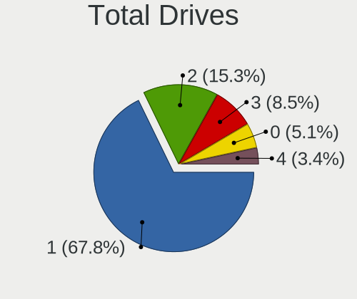
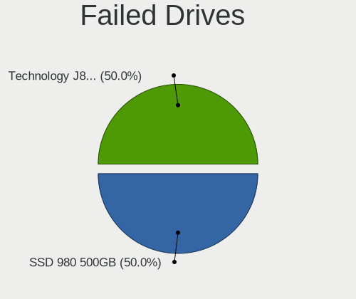
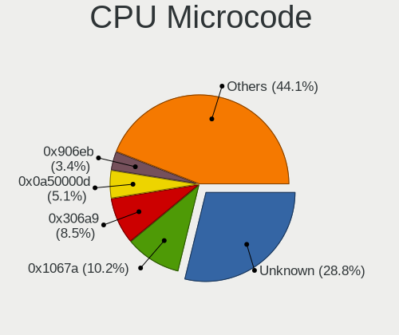

BlackPanther Hardware Trends
----------------------------

A project to identify most popular hardware characteristics and track their change
over time based on data collected by BlackPanther users at https://Linux-Hardware.org.

Anyone can contribute to the study by uploading probes of their computers by
the [hw-probe](https://github.com/linuxhw/hw-probe) tool:

    sudo -E hw-probe -all -upload

This is a report for all computer types. See also reports for [desktops](/Dist/BlackPanther/Desktop/README.md) and [notebooks](/Dist/BlackPanther/Notebook/README.md).

Full-feature report is available here: https://linux-hardware.org/?view=trends

Period: Apr, 2021.

Contents
--------

- [ OS                       ](#os)
- [ OS Family                ](#os-family)
- [ Kernel                   ](#kernel)
- [ Kernel Family            ](#kernel-family)
- [ Kernel Major Ver.        ](#kernel-major-ver)
- [ Arch                     ](#arch)
- [ DE                       ](#de)
- [ Display Server           ](#display-server)
- [ Display Manager          ](#display-manager)
- [ OS Lang                  ](#os-lang)
- [ Boot Mode                ](#boot-mode)
- [ Filesystem               ](#filesystem)
- [ Part. scheme             ](#part-scheme)
- [ Dual Boot with Linux/BSD ](#dual-boot-with-linux/bsd)
- [ Dual Boot (Win)          ](#dual-boot-win)
- [ Country                  ](#country)
- [ City                     ](#city)
- [ Vendor                   ](#vendor)
- [ Model                    ](#model)
- [ Model Family             ](#model-family)
- [ MFG Year                 ](#mfg-year)
- [ Form Factor              ](#form-factor)
- [ Secure Boot              ](#secure-boot)
- [ Coreboot                 ](#coreboot)
- [ RAM Size                 ](#ram-size)
- [ RAM Used                 ](#ram-used)
- [ Has CD-ROM               ](#has-cd-rom)
- [ Total Drives             ](#total-drives)
- [ Has Ethernet             ](#has-ethernet)
- [ Has WiFi                 ](#has-wifi)
- [ Has Bluetooth            ](#has-bluetooth)
- [ Drive Vendor             ](#drive-vendor)
- [ Drive Model              ](#drive-model)
- [ HDD Vendor               ](#hdd-vendor)
- [ SSD Vendor               ](#ssd-vendor)
- [ Drive Kind               ](#drive-kind)
- [ Drive Connector          ](#drive-connector)
- [ Drive Size               ](#drive-size)
- [ Space Total              ](#space-total)
- [ Space Used               ](#space-used)
- [ Malfunc. Drives          ](#malfunc-drives)
- [ Malfunc. Drive Vendor    ](#malfunc-drive-vendor)
- [ Malfunc. HDD Vendor      ](#malfunc-hdd-vendor)
- [ Malfunc. Drive Kind      ](#malfunc-drive-kind)
- [ Failed Drives            ](#failed-drives)
- [ Failed Drive Vendor      ](#failed-drive-vendor)
- [ Drive Status             ](#drive-status)
- [ Storage Vendor           ](#storage-vendor)
- [ Storage Model            ](#storage-model)
- [ Storage Kind             ](#storage-kind)
- [ CPU Vendor               ](#cpu-vendor)
- [ CPU Model                ](#cpu-model)
- [ CPU Model Family         ](#cpu-model-family)
- [ CPU Cores                ](#cpu-cores)
- [ CPU Sockets              ](#cpu-sockets)
- [ CPU Threads              ](#cpu-threads)
- [ CPU Op-Modes             ](#cpu-op-modes)
- [ CPU Microcode            ](#cpu-microcode)
- [ CPU Microarch            ](#cpu-microarch)
- [ GPU Vendor               ](#gpu-vendor)
- [ GPU Model                ](#gpu-model)
- [ GPU Combo                ](#gpu-combo)
- [ GPU Driver               ](#gpu-driver)
- [ GPU Memory               ](#gpu-memory)
- [ Monitor Vendor           ](#monitor-vendor)
- [ Monitor Model            ](#monitor-model)
- [ Monitor Resolution       ](#monitor-resolution)
- [ Monitor Diagonal         ](#monitor-diagonal)
- [ Monitor Width            ](#monitor-width)
- [ Aspect Ratio             ](#aspect-ratio)
- [ Monitor Area             ](#monitor-area)
- [ Pixel Density            ](#pixel-density)
- [ Multiple Monitors        ](#multiple-monitors)
- [ Net Controller Vendor    ](#net-controller-vendor)
- [ Net Controller Model     ](#net-controller-model)
- [ Wireless Vendor          ](#wireless-vendor)
- [ Wireless Model           ](#wireless-model)
- [ Ethernet Vendor          ](#ethernet-vendor)
- [ Ethernet Model           ](#ethernet-model)
- [ Net Controller Kind      ](#net-controller-kind)
- [ Used Controller          ](#used-controller)
- [ NICs                     ](#nics)
- [ IPv6                     ](#ipv6)
- [ Memory Vendor            ](#memory-vendor)
- [ Memory Model             ](#memory-model)
- [ Memory Kind              ](#memory-kind)
- [ Memory Form Factor       ](#memory-form-factor)
- [ Memory Size              ](#memory-size)
- [ Memory Speed             ](#memory-speed)
- [ Sound Vendor             ](#sound-vendor)
- [ Sound Model              ](#sound-model)
- [ Camera Vendor            ](#camera-vendor)
- [ Camera Model             ](#camera-model)
- [ Fingerprint Vendor       ](#fingerprint-vendor)
- [ Fingerprint Model        ](#fingerprint-model)
- [ Chipcard Vendor          ](#chipcard-vendor)
- [ Chipcard Model           ](#chipcard-model)
- [ Printer Vendor           ](#printer-vendor)
- [ Printer Model            ](#printer-model)
- [ Scanner Vendor           ](#scanner-vendor)
- [ Scanner Model            ](#scanner-model)
- [ Bluetooth Vendor         ](#bluetooth-vendor)
- [ Bluetooth Model          ](#bluetooth-model)
- [ Unsupported Devices      ](#unsupported-devices)
- [ Unsupported Device Types ](#unsupported-device-types)

OS
--

Installed operating systems

| Name              | Computers | Percent |
|-------------------|-----------|---------|
| BlackPanther 18.1 | 152       | 97.44%  |
| BlackPanther 16.2 | 4         | 2.56%   |

OS Family
---------

OS without a version

| Name         | Computers | Percent |
|--------------|-----------|---------|
| BlackPanther | 156       | 100%    |

Kernel
------

Version of the Linux kernel

| Version                | Computers | Percent |
|------------------------|-----------|---------|
| 5.6.14-desktop-2bP     | 98        | 62.82%  |
| 4.18.16-desktop-1bP    | 54        | 34.62%  |
| 4.9.20-desktop-pae-1bP | 4         | 2.56%   |

Kernel Family
-------------

Linux kernel without a distro release

| Version | Computers | Percent |
|---------|-----------|---------|
| 5.6.14  | 98        | 62.82%  |
| 4.18.16 | 54        | 34.62%  |
| 4.9.20  | 4         | 2.56%   |

Kernel Major Ver.
-----------------

Linux kernel major version

| Version | Computers | Percent |
|---------|-----------|---------|
| 5.6     | 98        | 62.82%  |
| 4.18    | 54        | 34.62%  |
| 4.9     | 4         | 2.56%   |

Arch
----

OS architecture (x86_64, i586, etc.)

| Name   | Computers | Percent |
|--------|-----------|---------|
| x86_64 | 152       | 97.44%  |
| i686   | 4         | 2.56%   |

DE
--

Desktop Environment

| Name | Computers | Percent |
|------|-----------|---------|
| KDE5 | 156       | 100%    |

Display Server
--------------

X11 or Wayland

| Name    | Computers | Percent |
|---------|-----------|---------|
| X11     | 155       | 99.36%  |
| Wayland | 1         | 0.64%   |

Display Manager
---------------

SDDM, LightDM, etc.

| Name | Computers | Percent |
|------|-----------|---------|
| SDDM | 156       | 100%    |

OS Lang
-------

Language

| Lang    | Computers | Percent |
|---------|-----------|---------|
| Unknown | 156       | 100%    |

Boot Mode
---------

EFI or BIOS

| Mode | Computers | Percent |
|------|-----------|---------|
| BIOS | 109       | 69.87%  |
| EFI  | 47        | 30.13%  |

Filesystem
----------

Type of filesystem

| Type    | Computers | Percent |
|---------|-----------|---------|
| Overlay | 126       | 80.77%  |
| Ext4    | 27        | 17.31%  |
| Ext3    | 2         | 1.28%   |
| Ext2    | 1         | 0.64%   |

Part. scheme
------------

Scheme of partitioning

| Type    | Computers | Percent |
|---------|-----------|---------|
| MBR     | 98        | 62.82%  |
| GPT     | 57        | 36.54%  |
| Unknown | 1         | 0.64%   |

Dual Boot with Linux/BSD
------------------------

Hosting more than one Linux/BSD

| Dual boot | Computers | Percent |
|-----------|-----------|---------|
| No        | 87        | 55.77%  |
| Yes       | 69        | 44.23%  |

Dual Boot (Win)
---------------

Hosting Linux and Windows

| Dual boot | Computers | Percent |
|-----------|-----------|---------|
| Yes       | 85        | 54.49%  |
| No        | 71        | 45.51%  |

Country
-------

Geographic location (country)

| Country     | Computers | Percent |
|-------------|-----------|---------|
| Hungary     | 114       | 73.08%  |
| USA         | 9         | 5.77%   |
| Germany     | 6         | 3.85%   |
| Romania     | 5         | 3.21%   |
| UK          | 3         | 1.92%   |
| Slovakia    | 2         | 1.28%   |
| Ireland     | 2         | 1.28%   |
| France      | 2         | 1.28%   |
| Austria     | 2         | 1.28%   |
| Argentina   | 2         | 1.28%   |
| Taiwan      | 1         | 0.64%   |
| Slovenia    | 1         | 0.64%   |
| Poland      | 1         | 0.64%   |
| Philippines | 1         | 0.64%   |
| Mexico      | 1         | 0.64%   |
| Japan       | 1         | 0.64%   |
| Canada      | 1         | 0.64%   |
| Brazil      | 1         | 0.64%   |
| Bangladesh  | 1         | 0.64%   |

City
----

Geographic location (city)

| City                      | Computers | Percent |
|---------------------------|-----------|---------|
| Budapest                  | 32        | 20.51%  |
| Szekszárd                | 4         | 2.56%   |
| Papa                      | 4         | 2.56%   |
| Debrecen                  | 4         | 2.56%   |
| Érd                      | 3         | 1.92%   |
| Mezobereny                | 3         | 1.92%   |
| Alcsutdoboz               | 3         | 1.92%   |
| Zichyujfalu               | 2         | 1.28%   |
| Veszprém                 | 2         | 1.28%   |
| Târgu Mureş             | 2         | 1.28%   |
| Telford                   | 2         | 1.28%   |
| Tapioszele                | 2         | 1.28%   |
| Székesfehérvár         | 2         | 1.28%   |
| Pécs                     | 2         | 1.28%   |
| Pittsburgh                | 2         | 1.28%   |
| Nagykanizsa               | 2         | 1.28%   |
| Keszthely                 | 2         | 1.28%   |
| Eger                      | 2         | 1.28%   |
| Dublin                    | 2         | 1.28%   |
| Ypsilanti                 | 1         | 0.64%   |
| Wysokie Mazowieckie       | 1         | 0.64%   |
| Williford                 | 1         | 0.64%   |
| Waren                     | 1         | 0.64%   |
| Vienna                    | 1         | 0.64%   |
| Uberlândia               | 1         | 0.64%   |
| Tsukubamirai              | 1         | 0.64%   |
| Tornaľa                  | 1         | 0.64%   |
| Tinnye                    | 1         | 0.64%   |
| Tarnok                    | 1         | 0.64%   |
| Szombathely               | 1         | 0.64%   |
| Szolnok                   | 1         | 0.64%   |
| Szigetszentmiklos         | 1         | 0.64%   |
| Szentendre                | 1         | 0.64%   |
| Szazhalombatta            | 1         | 0.64%   |
| Szarvas                   | 1         | 0.64%   |
| Szabadszentkiraly         | 1         | 0.64%   |
| Somerset                  | 1         | 0.64%   |
| Solingen                  | 1         | 0.64%   |
| Sfantu Gheorghe           | 1         | 0.64%   |
| Saint-Gilles-Croix-de-Vie | 1         | 0.64%   |
| Retkozberencs             | 1         | 0.64%   |
| Pocking                   | 1         | 0.64%   |
| Pilisvorosvar             | 1         | 0.64%   |
| Petervasara               | 1         | 0.64%   |
| Oswestry                  | 1         | 0.64%   |
| Odorheiu Secuiesc         | 1         | 0.64%   |
| NIA Valencia              | 1         | 0.64%   |
| New Windsor               | 1         | 0.64%   |
| New Taipei                | 1         | 0.64%   |
| Nagykoros                 | 1         | 0.64%   |
| Nagyatad                  | 1         | 0.64%   |
| Nadudvar                  | 1         | 0.64%   |
| Mosonszentmiklos          | 1         | 0.64%   |
| Mosonmagyaróvár         | 1         | 0.64%   |
| Miskolc                   | 1         | 0.64%   |
| Miguel Hidalgo            | 1         | 0.64%   |
| Merritt                   | 1         | 0.64%   |
| Megyaszo                  | 1         | 0.64%   |
| Maza                      | 1         | 0.64%   |
| Marcali                   | 1         | 0.64%   |

Vendor
------

Motherboard manufacturer

| Name                   | Computers | Percent |
|------------------------|-----------|---------|
| Lenovo                 | 26        | 16.67%  |
| Dell                   | 24        | 15.38%  |
| ASUSTek Computer       | 22        | 14.1%   |
| Hewlett-Packard        | 19        | 12.18%  |
| Gigabyte Technology    | 14        | 8.97%   |
| ASRock                 | 12        | 7.69%   |
| Acer                   | 12        | 7.69%   |
| MSI                    | 5         | 3.21%   |
| Toshiba                | 4         | 2.56%   |
| Fujitsu Siemens        | 3         | 1.92%   |
| Fujitsu                | 3         | 1.92%   |
| Sapphire               | 1         | 0.64%   |
| Pegatron               | 1         | 0.64%   |
| Packard Bell           | 1         | 0.64%   |
| ONE-NETBOOK TECHNOLOGY | 1         | 0.64%   |
| NOBLEX                 | 1         | 0.64%   |
| Medion                 | 1         | 0.64%   |
| Intel                  | 1         | 0.64%   |
| IBM                    | 1         | 0.64%   |
| eMachines              | 1         | 0.64%   |
| Apple                  | 1         | 0.64%   |
| Alcor                  | 1         | 0.64%   |
| Unknown                | 1         | 0.64%   |

Model
-----

Motherboard model

| Name                                  | Computers | Percent |
|---------------------------------------|-----------|---------|
| HP Compaq dc5850 Microtower           | 2         | 1.28%   |
| HP 250 G1                             | 2         | 1.28%   |
| Gigabyte P35-S3G                      | 2         | 1.28%   |
| Gigabyte H61M-S1                      | 2         | 1.28%   |
| Dell Latitude E6530                   | 2         | 1.28%   |
| ASUS ROG STRIX B450-F GAMING          | 2         | 1.28%   |
| ASUS M5A78L/USB3                      | 2         | 1.28%   |
| ASUS All Series                       | 2         | 1.28%   |
| ASRock FM2A75M Pro4+                  | 2         | 1.28%   |
| Toshiba Satellite L505                | 1         | 0.64%   |
| Toshiba Satellite C650                | 1         | 0.64%   |
| Toshiba NB550D                        | 1         | 0.64%   |
| Toshiba dynabook BX/33M               | 1         | 0.64%   |
| Sapphire PCDM3H4H                     | 1         | 0.64%   |
| Pegatron Elite 7200 MT Business PC    | 1         | 0.64%   |
| Packard Bell EasyNote TX86            | 1         | 0.64%   |
| ONE-NETBOOK TECHNOLOGY ONE-GX         | 1         | 0.64%   |
| NOBLEX SF20BA                         | 1         | 0.64%   |
| MSI MS-7B89                           | 1         | 0.64%   |
| MSI MS-7917                           | 1         | 0.64%   |
| MSI MS-7808                           | 1         | 0.64%   |
| MSI MS-7721                           | 1         | 0.64%   |
| MSI EX620                             | 1         | 0.64%   |
| Medion Pentino G-Series               | 1         | 0.64%   |
| Lenovo Yoga 310-11IAP 80U2            | 1         | 0.64%   |
| Lenovo V145-15AST 81MT                | 1         | 0.64%   |
| Lenovo ThinkPad X201 3626F9G          | 1         | 0.64%   |
| Lenovo ThinkPad X130e 0627A17         | 1         | 0.64%   |
| Lenovo ThinkPad T61 6458Y56           | 1         | 0.64%   |
| Lenovo ThinkPad T420 4236S3T          | 1         | 0.64%   |
| Lenovo ThinkPad T400 64741EG          | 1         | 0.64%   |
| Lenovo ThinkCentre M78 10BNS02900     | 1         | 0.64%   |
| Lenovo ThinkCentre M72e 36622M1       | 1         | 0.64%   |
| Lenovo ThinkCentre M72e 3655A79       | 1         | 0.64%   |
| Lenovo ThinkCentre A58 751577G        | 1         | 0.64%   |
| Lenovo ThinkCentre A57 98517HG        | 1         | 0.64%   |
| Lenovo IdeaPad S145-15IGM 81MX        | 1         | 0.64%   |
| Lenovo IdeaPad L340-17IRH Gaming 81LL | 1         | 0.64%   |
| Lenovo IdeaPad Flex 3 11IGL05 82B2    | 1         | 0.64%   |
| Lenovo IdeaPad C340-14IML 81TK        | 1         | 0.64%   |
| Lenovo IdeaPad 330-15IKB 81DE         | 1         | 0.64%   |
| Lenovo IdeaPad 330-15ICH 81FK         | 1         | 0.64%   |
| Lenovo IdeaPad 320-17ABR 80YN         | 1         | 0.64%   |
| Lenovo IdeaPad 3 17IML05 81WC         | 1         | 0.64%   |
| Lenovo IdeaPad 3 15IML05 81WB         | 1         | 0.64%   |
| Lenovo IdeaPad 100S-14IBR 80R9        | 1         | 0.64%   |
| Lenovo IdeaPad 100-15IBY 80MJ         | 1         | 0.64%   |
| Lenovo IdeaPad 100-15IBD 80QQ         | 1         | 0.64%   |
| Lenovo G580 20150                     | 1         | 0.64%   |
| Lenovo G550 20023                     | 1         | 0.64%   |
| Intel Board                           | 1         | 0.64%   |
| IBM System x3550 M3 -[7042CR6]-       | 1         | 0.64%   |
| HP xw4400 Workstation                 | 1         | 0.64%   |
| HP ProBook 6570b                      | 1         | 0.64%   |
| HP ProBook 6470b                      | 1         | 0.64%   |
| HP Pavilion g6                        | 1         | 0.64%   |
| HP Pavilion 15                        | 1         | 0.64%   |
| HP Laptop 15-db0xxx                   | 1         | 0.64%   |
| HP EliteBook 8570w                    | 1         | 0.64%   |
| HP EliteBook 2530p                    | 1         | 0.64%   |

Model Family
------------

Motherboard model prefix

| Name                          | Computers | Percent |
|-------------------------------|-----------|---------|
| Lenovo IdeaPad                | 12        | 7.69%   |
| Acer Aspire                   | 11        | 7.05%   |
| Dell OptiPlex                 | 9         | 5.77%   |
| Dell Inspiron                 | 8         | 5.13%   |
| Lenovo ThinkPad               | 5         | 3.21%   |
| Lenovo ThinkCentre            | 5         | 3.21%   |
| HP Compaq                     | 5         | 3.21%   |
| HP 250                        | 3         | 1.92%   |
| Dell Latitude                 | 3         | 1.92%   |
| Toshiba Satellite             | 2         | 1.28%   |
| HP ProBook                    | 2         | 1.28%   |
| HP Pavilion                   | 2         | 1.28%   |
| HP EliteBook                  | 2         | 1.28%   |
| Gigabyte P35-S3G              | 2         | 1.28%   |
| Gigabyte H61M-S1              | 2         | 1.28%   |
| Gigabyte B450M                | 2         | 1.28%   |
| Dell Vostro                   | 2         | 1.28%   |
| ASUS ROG                      | 2         | 1.28%   |
| ASUS PRIME                    | 2         | 1.28%   |
| ASUS M5A78L                   | 2         | 1.28%   |
| ASUS All                      | 2         | 1.28%   |
| ASRock FM2A75M                | 2         | 1.28%   |
| Toshiba NB550D                | 1         | 0.64%   |
| Toshiba dynabook              | 1         | 0.64%   |
| Sapphire PCDM3H4H             | 1         | 0.64%   |
| Pegatron Elite                | 1         | 0.64%   |
| Packard Bell EasyNote         | 1         | 0.64%   |
| ONE-NETBOOK TECHNOLOGY ONE-GX | 1         | 0.64%   |
| NOBLEX SF20BA                 | 1         | 0.64%   |
| MSI MS-7B89                   | 1         | 0.64%   |
| MSI MS-7917                   | 1         | 0.64%   |
| MSI MS-7808                   | 1         | 0.64%   |
| MSI MS-7721                   | 1         | 0.64%   |
| MSI EX620                     | 1         | 0.64%   |
| Medion Pentino                | 1         | 0.64%   |
| Lenovo Yoga                   | 1         | 0.64%   |
| Lenovo V145-15AST             | 1         | 0.64%   |
| Lenovo G580                   | 1         | 0.64%   |
| Lenovo G550                   | 1         | 0.64%   |
| Intel Board                   | 1         | 0.64%   |
| IBM System                    | 1         | 0.64%   |
| HP xw4400                     | 1         | 0.64%   |
| HP Laptop                     | 1         | 0.64%   |
| HP All-in-One                 | 1         | 0.64%   |
| HP 650                        | 1         | 0.64%   |
| HP 2000                       | 1         | 0.64%   |
| Gigabyte P67A-D3-B3           | 1         | 0.64%   |
| Gigabyte H81M-S1              | 1         | 0.64%   |
| Gigabyte H61M-DS2             | 1         | 0.64%   |
| Gigabyte H310M                | 1         | 0.64%   |
| Gigabyte GA-MA785GT-UD3H      | 1         | 0.64%   |
| Gigabyte G41M-ES2L            | 1         | 0.64%   |
| Gigabyte EG41MFT-US2H         | 1         | 0.64%   |
| Gigabyte B360M-D3H            | 1         | 0.64%   |
| Fujitsu STYLISTIC             | 1         | 0.64%   |
| Fujitsu Siemens PRIMERGY      | 1         | 0.64%   |
| Fujitsu Siemens P5GD1-FM      | 1         | 0.64%   |
| Fujitsu Siemens AMILO         | 1         | 0.64%   |
| Fujitsu LIFEBOOK              | 1         | 0.64%   |
| Fujitsu ESPRIMO               | 1         | 0.64%   |

MFG Year
--------

Motherboard manufacture year

| Year | Computers | Percent |
|------|-----------|---------|
| 2019 | 16        | 10.26%  |
| 2012 | 15        | 9.62%   |
| 2013 | 14        | 8.97%   |
| 2010 | 14        | 8.97%   |
| 2011 | 13        | 8.33%   |
| 2018 | 12        | 7.69%   |
| 2009 | 12        | 7.69%   |
| 2020 | 11        | 7.05%   |
| 2016 | 11        | 7.05%   |
| 2014 | 10        | 6.41%   |
| 2008 | 7         | 4.49%   |
| 2017 | 5         | 3.21%   |
| 2015 | 5         | 3.21%   |
| 2007 | 5         | 3.21%   |
| 2021 | 3         | 1.92%   |
| 2006 | 2         | 1.28%   |
| 2005 | 1         | 0.64%   |

Form Factor
-----------

Physical design of the computer

| Name        | Computers | Percent |
|-------------|-----------|---------|
| Desktop     | 76        | 48.72%  |
| Notebook    | 73        | 46.79%  |
| Convertible | 3         | 1.92%   |
| All in one  | 2         | 1.28%   |
| Tablet      | 1         | 0.64%   |
| Server      | 1         | 0.64%   |

Secure Boot
-----------

Enabled or disabled

| State    | Computers | Percent |
|----------|-----------|---------|
| Disabled | 156       | 100%    |

Coreboot
--------

Have coreboot on board

| Used | Computers | Percent |
|------|-----------|---------|
| No   | 156       | 100%    |

RAM Size
--------

Total RAM memory

| Size in GB  | Computers | Percent |
|-------------|-----------|---------|
| 3.01-4.0    | 59        | 37.82%  |
| 4.01-8.0    | 31        | 19.87%  |
| 8.01-16.0   | 26        | 16.67%  |
| 16.01-24.0  | 15        | 9.62%   |
| 1.01-2.0    | 13        | 8.33%   |
| 2.01-3.0    | 6         | 3.85%   |
| 32.01-64.0  | 3         | 1.92%   |
| 0.51-1.0    | 2         | 1.28%   |
| 64.01-256.0 | 1         | 0.64%   |

RAM Used
--------

Used RAM memory

| Used GB  | Computers | Percent |
|----------|-----------|---------|
| 0.51-1.0 | 67        | 42.95%  |
| 0.01-0.5 | 58        | 37.18%  |
| 1.01-2.0 | 31        | 19.87%  |

Has CD-ROM
----------

Has CD-ROM on board

| Presented | Computers | Percent |
|-----------|-----------|---------|
| Yes       | 99        | 63.46%  |
| No        | 57        | 36.54%  |

Total Drives
------------

Number of drives on board

| Drives | Computers | Percent |
|--------|-----------|---------|
| 1      | 99        | 63.46%  |
| 2      | 33        | 21.15%  |
| 3      | 11        | 7.05%   |
| 4      | 6         | 3.85%   |
| 0      | 4         | 2.56%   |
| 5      | 2         | 1.28%   |
| 6      | 1         | 0.64%   |

Has Ethernet
------------

Has Ethernet on board

| Presented | Computers | Percent |
|-----------|-----------|---------|
| Yes       | 143       | 91.67%  |
| No        | 13        | 8.33%   |

Has WiFi
--------

Has WiFi module

| Presented | Computers | Percent |
|-----------|-----------|---------|
| Yes       | 97        | 62.18%  |
| No        | 59        | 37.82%  |

Has Bluetooth
-------------

Has Bluetooth module

| Presented | Computers | Percent |
|-----------|-----------|---------|
| No        | 96        | 61.54%  |
| Yes       | 60        | 38.46%  |

Drive Vendor
------------

Hard drive vendors

| Vendor              | Computers | Drives | Percent |
|---------------------|-----------|--------|---------|
| WDC                 | 47        | 57     | 21.86%  |
| Seagate             | 36        | 39     | 16.74%  |
| Samsung Electronics | 22        | 28     | 10.23%  |
| Kingston            | 20        | 22     | 9.3%    |
| Toshiba             | 17        | 17     | 7.91%   |
| Hitachi             | 16        | 17     | 7.44%   |
| SanDisk             | 8         | 8      | 3.72%   |
| HGST                | 8         | 8      | 3.72%   |
| Unknown             | 5         | 7      | 2.33%   |
| SPCC                | 4         | 4      | 1.86%   |
| Crucial             | 4         | 5      | 1.86%   |
| A-DATA Technology   | 4         | 4      | 1.86%   |
| Maxtor              | 3         | 3      | 1.4%    |
| Micron Technology   | 2         | 2      | 0.93%   |
| LITEON              | 2         | 2      | 0.93%   |
| Intel               | 2         | 3      | 0.93%   |
| Fujitsu             | 2         | 2      | 0.93%   |
| China               | 2         | 2      | 0.93%   |
| Apacer              | 2         | 2      | 0.93%   |
| Union Memory        | 1         | 1      | 0.47%   |
| Silicon Motion      | 1         | 2      | 0.47%   |
| PNY                 | 1         | 1      | 0.47%   |
| Phison              | 1         | 1      | 0.47%   |
| Hewlett-Packard     | 1         | 1      | 0.47%   |
| GALAX               | 1         | 1      | 0.47%   |
| FORESEE             | 1         | 1      | 0.47%   |
| ASMT                | 1         | 1      | 0.47%   |
| Asmedia             | 1         | 1      | 0.47%   |

Drive Model
-----------

Hard drive models

| Model                              | Computers | Percent |
|------------------------------------|-----------|---------|
| Kingston SA400S37120G 120GB SSD    | 7         | 2.93%   |
| Kingston SA400S37240G 240GB SSD    | 5         | 2.09%   |
| Seagate ST3160815AS 160GB          | 4         | 1.67%   |
| Seagate ST500LT012-1DG142 500GB    | 3         | 1.26%   |
| Seagate ST1000LM035-1RK172 1TB     | 3         | 1.26%   |
| Seagate ST1000LM024 HN-M101MBB 1TB | 3         | 1.26%   |
| Samsung HD502HJ 500GB              | 3         | 1.26%   |
| Kingston SV300S37A120G 120GB SSD   | 3         | 1.26%   |
| WDC WDS240G2G0A-00JH30 240GB SSD   | 2         | 0.84%   |
| WDC WD10EZEX-22BN5A0 1TB           | 2         | 0.84%   |
| WDC WD10EZEX-08WN4A0 1TB           | 2         | 0.84%   |
| Toshiba MQ01ABF050 500GB           | 2         | 0.84%   |
| Toshiba MQ01ABD050 500GB           | 2         | 0.84%   |
| SPCC Solid State Disk 128GB        | 2         | 0.84%   |
| SPCC M.2 PCIe SSD 256GB            | 2         | 0.84%   |
| Seagate ST3500418AS 500GB          | 2         | 0.84%   |
| Seagate ST3500312CS 500GB          | 2         | 0.84%   |
| Samsung SSD 860 QVO 1TB            | 2         | 0.84%   |
| Samsung SSD 850 EVO 250GB          | 2         | 0.84%   |
| Samsung MZALQ128HBHQ-000L2 128GB   | 2         | 0.84%   |
| Kingston SA2000M8250G 250GB        | 2         | 0.84%   |
| Hitachi HDS721616PLA380 164GB      | 2         | 0.84%   |
| HGST HTS545050A7E380 500GB         | 2         | 0.84%   |
| HGST HTS541010B7E610 1TB           | 2         | 0.84%   |
| Crucial CT120BX500SSD1 120GB       | 2         | 0.84%   |
| China SATA SSD 120GB               | 2         | 0.84%   |
| A-DATA SU700 120GB SSD             | 2         | 0.84%   |
| WDC WDS500G2B0B-00YS70 500GB SSD   | 1         | 0.42%   |
| WDC WDS500G2B0A-00SM50 500GB SSD   | 1         | 0.42%   |
| WDC WDS250G2B0A 250GB SSD          | 1         | 0.42%   |
| WDC WDS240G2G0B-00EPW0 240GB SSD   | 1         | 0.42%   |
| WDC WDS120G2G0B-00EPW0 120GB SSD   | 1         | 0.42%   |
| WDC WD800JD-75MSA3 80GB            | 1         | 0.42%   |
| WDC WD800JD-55MUA1 80GB            | 1         | 0.42%   |
| WDC WD800AAJS-60PSA0 80GB          | 1         | 0.42%   |
| WDC WD7500BPVT-80HXZT3 752GB       | 1         | 0.42%   |
| WDC WD6400AAKS-07A7B0 640GB        | 1         | 0.42%   |
| WDC WD6400AAKS-00A7B2 640GB        | 1         | 0.42%   |
| WDC WD5000LPCX-24VHAT0 500GB       | 1         | 0.42%   |
| WDC WD5000BEVT-00ZAT0 500GB        | 1         | 0.42%   |
| WDC WD5000AAKX-00ERMA0 500GB       | 1         | 0.42%   |
| WDC WD5000AAKS-00UU3A0 500GB       | 1         | 0.42%   |
| WDC WD5000AAKS-00D2B0 500GB        | 1         | 0.42%   |
| WDC WD5000AAKS-007AA0 500GB        | 1         | 0.42%   |
| WDC WD5000AADS-00L4B1 500GB        | 1         | 0.42%   |
| WDC WD400BD-75MRA1 40GB            | 1         | 0.42%   |
| WDC WD3200BEVT-22ZCT0 320GB        | 1         | 0.42%   |
| WDC WD3200BEKX-75B7WT0 320GB       | 1         | 0.42%   |
| WDC WD3200AAKS-00UU3A0 320GB       | 1         | 0.42%   |
| WDC WD3200AAJS-08L7A0 320GB        | 1         | 0.42%   |
| WDC WD32 00BEVT-60A23T0 320GB      | 1         | 0.42%   |
| WDC WD30EZRZ-00GXCB0 3TB           | 1         | 0.42%   |
| WDC WD30EFRX-68EUZN0 3TB           | 1         | 0.42%   |
| WDC WD2500KS-00MJB0 250GB          | 1         | 0.42%   |
| WDC WD2500JS-75NCB1 250GB          | 1         | 0.42%   |
| WDC WD2500AAKX-60U6AA0 250GB       | 1         | 0.42%   |
| WDC WD2500AAKX-603CA0 250GB        | 1         | 0.42%   |
| WDC WD2500AAJS-00VTA0 250GB        | 1         | 0.42%   |
| WDC WD20PURX-64P6ZY0 2TB           | 1         | 0.42%   |
| WDC WD20EARX-00PASB0 2TB           | 1         | 0.42%   |

HDD Vendor
----------

Hard disk drive vendors

| Vendor              | Computers | Drives | Percent |
|---------------------|-----------|--------|---------|
| WDC                 | 42        | 49     | 32.06%  |
| Seagate             | 35        | 38     | 26.72%  |
| Hitachi             | 16        | 17     | 12.21%  |
| Toshiba             | 14        | 14     | 10.69%  |
| Samsung Electronics | 9         | 11     | 6.87%   |
| HGST                | 8         | 8      | 6.11%   |
| Maxtor              | 3         | 3      | 2.29%   |
| Fujitsu             | 2         | 2      | 1.53%   |
| ASMT                | 1         | 1      | 0.76%   |
| Asmedia             | 1         | 1      | 0.76%   |

SSD Vendor
----------

Solid state drive vendors

| Vendor              | Computers | Drives | Percent |
|---------------------|-----------|--------|---------|
| Kingston            | 19        | 20     | 27.54%  |
| Samsung Electronics | 13        | 14     | 18.84%  |
| WDC                 | 6         | 7      | 8.7%    |
| SanDisk             | 6         | 6      | 8.7%    |
| A-DATA Technology   | 4         | 4      | 5.8%    |
| Crucial             | 3         | 4      | 4.35%   |
| Toshiba             | 2         | 2      | 2.9%    |
| SPCC                | 2         | 2      | 2.9%    |
| Micron Technology   | 2         | 2      | 2.9%    |
| LITEON              | 2         | 2      | 2.9%    |
| China               | 2         | 2      | 2.9%    |
| Apacer              | 2         | 2      | 2.9%    |
| Unknown             | 1         | 1      | 1.45%   |
| Union Memory        | 1         | 1      | 1.45%   |
| PNY                 | 1         | 1      | 1.45%   |
| Intel               | 1         | 1      | 1.45%   |
| GALAX               | 1         | 1      | 1.45%   |
| FORESEE             | 1         | 1      | 1.45%   |

Drive Kind
----------

HDD or SSD

| Kind    | Computers | Drives | Percent |
|---------|-----------|--------|---------|
| HDD     | 112       | 144    | 57.44%  |
| SSD     | 62        | 73     | 31.79%  |
| NVMe    | 13        | 16     | 6.67%   |
| MMC     | 6         | 7      | 3.08%   |
| Unknown | 2         | 2      | 1.03%   |

Drive Connector
---------------

SATA, SAS, NVMe, etc.

| Type | Computers | Drives | Percent |
|------|-----------|--------|---------|
| SATA | 143       | 211    | 84.62%  |
| NVMe | 13        | 16     | 7.69%   |
| SAS  | 7         | 8      | 4.14%   |
| MMC  | 6         | 7      | 3.55%   |

Drive Size
----------

Size of hard drive

| Size in TB | Computers | Drives | Percent |
|------------|-----------|--------|---------|
| 0.01-0.5   | 121       | 157    | 69.14%  |
| 0.51-1.0   | 44        | 49     | 25.14%  |
| 1.01-2.0   | 6         | 6      | 3.43%   |
| 3.01-4.0   | 3         | 3      | 1.71%   |
| 2.01-3.0   | 1         | 2      | 0.57%   |

Space Total
-----------

Amount of disk space available on the file system

| Size in GB | Computers | Percent |
|------------|-----------|---------|
| Unknown    | 122       | 78.21%  |
| 101-250    | 17        | 10.9%   |
| 251-500    | 5         | 3.21%   |
| 51-100     | 5         | 3.21%   |
| 21-50      | 2         | 1.28%   |
| 1001-2000  | 2         | 1.28%   |
| 501-1000   | 2         | 1.28%   |
| 1-20       | 1         | 0.64%   |

Space Used
----------

Amount of used disk space

| Used GB  | Computers | Percent |
|----------|-----------|---------|
| Unknown  | 122       | 78.21%  |
| 1-20     | 30        | 19.23%  |
| 501-1000 | 2         | 1.28%   |
| 251-500  | 1         | 0.64%   |
| 21-50    | 1         | 0.64%   |

Malfunc. Drives
---------------

Drive models with a malfunction

| Model                                    | Computers | Drives | Percent |
|------------------------------------------|-----------|--------|---------|
| Seagate ST3160815AS 160GB                | 3         | 3      | 4.17%   |
| Seagate ST500LT012-1DG142 500GB          | 2         | 2      | 2.78%   |
| Seagate ST3500418AS 500GB                | 2         | 2      | 2.78%   |
| Kingston SV300S37A120G 120GB SSD         | 2         | 2      | 2.78%   |
| WDC WD800JD-55MUA1 80GB                  | 1         | 1      | 1.39%   |
| WDC WD6400AAKS-07A7B0 640GB              | 1         | 1      | 1.39%   |
| WDC WD6400AAKS-00A7B2 640GB              | 1         | 1      | 1.39%   |
| WDC WD5000BEVT-00ZAT0 500GB              | 1         | 1      | 1.39%   |
| WDC WD5000AAKS-00D2B0 500GB              | 1         | 1      | 1.39%   |
| WDC WD5000AADS-00L4B1 500GB              | 1         | 1      | 1.39%   |
| WDC WD3200AAKS-00UU3A0 320GB             | 1         | 1      | 1.39%   |
| WDC WD3200AAJS-08L7A0 320GB              | 1         | 1      | 1.39%   |
| WDC WD2000FYYZ-01UL1B2 2TB               | 1         | 1      | 1.39%   |
| WDC WD1602ABKS-18N8A0 160GB              | 1         | 1      | 1.39%   |
| WDC WD1600BJKT-75F4T0 160GB              | 1         | 1      | 1.39%   |
| WDC WD15EARS-00Z5B1 1TB                  | 1         | 1      | 1.39%   |
| WDC WD15EARS-00MVWB0 1TB                 | 1         | 1      | 1.39%   |
| WDC WD10EZEX-22MFCA0 1TB                 | 1         | 1      | 1.39%   |
| Toshiba THNSFJ256GCSU 256GB SSD          | 1         | 1      | 1.39%   |
| Toshiba MQ01ABF050 500GB                 | 1         | 1      | 1.39%   |
| Toshiba MQ01ABD075 752GB                 | 1         | 1      | 1.39%   |
| Toshiba MQ01ABD050 500GB                 | 1         | 1      | 1.39%   |
| Toshiba MK5076GSX 500GB                  | 1         | 1      | 1.39%   |
| Toshiba MK2565GSXN 250GB                 | 1         | 1      | 1.39%   |
| Toshiba MK1665GSX 160GB                  | 1         | 1      | 1.39%   |
| Toshiba MK1652GSX 160GB                  | 1         | 1      | 1.39%   |
| Seagate ST9320325AS 320GB                | 1         | 1      | 1.39%   |
| Seagate ST9250315AS 250GB                | 1         | 1      | 1.39%   |
| Seagate ST9160827AS 160GB                | 1         | 1      | 1.39%   |
| Seagate ST9160821AS 160GB                | 1         | 1      | 1.39%   |
| Seagate ST750LM022 HN-M750MBB 752GB      | 1         | 1      | 1.39%   |
| Seagate ST4000DM000-1F2168 4TB           | 1         | 1      | 1.39%   |
| Seagate ST380815AS 80GB                  | 1         | 1      | 1.39%   |
| Seagate ST3500413AS 500GB                | 1         | 1      | 1.39%   |
| Seagate ST3500312CS 500GB                | 1         | 1      | 1.39%   |
| Seagate ST340014A 40GB                   | 1         | 1      | 1.39%   |
| Seagate ST3320413AS 320GB                | 1         | 1      | 1.39%   |
| Seagate ST1000LM024 HN-M101MBB 1TB       | 1         | 1      | 1.39%   |
| Seagate ST1000DM003-1SB10C 1TB           | 1         | 1      | 1.39%   |
| Samsung Electronics SSD 840 Series 120GB | 1         | 1      | 1.39%   |
| Samsung Electronics SP2504C 250GB        | 1         | 1      | 1.39%   |
| Samsung Electronics SP1213C 120GB        | 1         | 1      | 1.39%   |
| Samsung Electronics HD642JJ 640GB        | 1         | 1      | 1.39%   |
| Samsung Electronics HD502HJ 500GB        | 1         | 1      | 1.39%   |
| Samsung Electronics HD254GJ 250GB        | 1         | 1      | 1.39%   |
| Samsung Electronics HD103UJ 1TB          | 1         | 1      | 1.39%   |
| MAXTOR STM380215A 80GB                   | 1         | 1      | 1.39%   |
| Maxtor 4D040H2 41GB                      | 1         | 1      | 1.39%   |
| Maxtor 2B020H1 20GB                      | 1         | 1      | 1.39%   |
| Intel SSDSA1M080G2LE 80GB                | 1         | 1      | 1.39%   |
| Hitachi HTS723232A7A364 320GB            | 1         | 1      | 1.39%   |
| Hitachi HTS547550A9E384 500GB            | 1         | 1      | 1.39%   |
| Hitachi HTS545050B9A300 500GB            | 1         | 1      | 1.39%   |
| Hitachi HTS545050A7E380 500GB            | 1         | 1      | 1.39%   |
| Hitachi HTS545032B9A300 320GB            | 1         | 1      | 1.39%   |
| Hitachi HTS545025B9A300 250GB            | 1         | 1      | 1.39%   |
| Hitachi HTS543225L9SA00 250GB            | 1         | 1      | 1.39%   |
| Hitachi HTS541660J9SA00 64GB             | 1         | 1      | 1.39%   |
| Hitachi HDT725050VLA380 500GB            | 1         | 1      | 1.39%   |
| Hitachi HDS728080PLA380 80GB             | 1         | 1      | 1.39%   |

Malfunc. Drive Vendor
---------------------

Vendors of faulty drives

| Vendor              | Computers | Drives | Percent |
|---------------------|-----------|--------|---------|
| Seagate             | 20        | 20     | 29.41%  |
| WDC                 | 12        | 14     | 17.65%  |
| Hitachi             | 12        | 12     | 17.65%  |
| Toshiba             | 8         | 8      | 11.76%  |
| Samsung Electronics | 5         | 7      | 7.35%   |
| Maxtor              | 3         | 3      | 4.41%   |
| HGST                | 3         | 3      | 4.41%   |
| Kingston            | 2         | 2      | 2.94%   |
| Intel               | 1         | 1      | 1.47%   |
| Fujitsu             | 1         | 1      | 1.47%   |
| ASMT                | 1         | 1      | 1.47%   |

Malfunc. HDD Vendor
-------------------

Vendors of faulty HDD drives

| Vendor              | Computers | Drives | Percent |
|---------------------|-----------|--------|---------|
| Seagate             | 20        | 20     | 31.75%  |
| WDC                 | 12        | 14     | 19.05%  |
| Hitachi             | 12        | 12     | 19.05%  |
| Toshiba             | 7         | 7      | 11.11%  |
| Samsung Electronics | 4         | 6      | 6.35%   |
| MAXTOR              | 3         | 3      | 4.76%   |
| HGST                | 3         | 3      | 4.76%   |
| Fujitsu             | 1         | 1      | 1.59%   |
| ASMT                | 1         | 1      | 1.59%   |

Malfunc. Drive Kind
-------------------

Kinds of faulty drives

| Kind | Computers | Drives | Percent |
|------|-----------|--------|---------|
| HDD  | 56        | 67     | 91.8%   |
| SSD  | 5         | 5      | 8.2%    |

Failed Drives
-------------

Failed drive models

| Model                           | Computers | Drives | Percent |
|---------------------------------|-----------|--------|---------|
| Toshiba MK6475GSX 640GB         | 1         | 1      | 33.33%  |
| Hitachi HDS721075CLA332 752GB   | 1         | 1      | 33.33%  |
| Hewlett-Packard SSD EX900 250GB | 1         | 1      | 33.33%  |

Failed Drive Vendor
-------------------

Failed drive vendors

| Vendor          | Computers | Drives | Percent |
|-----------------|-----------|--------|---------|
| Toshiba         | 1         | 1      | 33.33%  |
| Hitachi         | 1         | 1      | 33.33%  |
| Hewlett-Packard | 1         | 1      | 33.33%  |

Drive Status
------------

Number of failed and malfunc. drives

| Status   | Computers | Drives | Percent |
|----------|-----------|--------|---------|
| Works    | 109       | 154    | 59.24%  |
| Malfunc  | 60        | 72     | 32.61%  |
| Detected | 12        | 13     | 6.52%   |
| Failed   | 3         | 3      | 1.63%   |

Storage Vendor
--------------

Storage controller vendors

| Vendor                      | Computers | Percent |
|-----------------------------|-----------|---------|
| Intel                       | 118       | 65.92%  |
| AMD                         | 34        | 18.99%  |
| JMicron Technology          | 4         | 2.23%   |
| Samsung Electronics         | 3         | 1.68%   |
| Phison Electronics          | 3         | 1.68%   |
| ASMedia Technology          | 3         | 1.68%   |
| VIA Technologies            | 2         | 1.12%   |
| Silicon Motion              | 2         | 1.12%   |
| Marvell Technology Group    | 2         | 1.12%   |
| Kingston Technology Company | 2         | 1.12%   |
| Silicon Image               | 1         | 0.56%   |
| Sandisk                     | 1         | 0.56%   |
| Nvidia                      | 1         | 0.56%   |
| Micron/Crucial Technology   | 1         | 0.56%   |
| LSI Logic / Symbios Logic   | 1         | 0.56%   |
| KIOXIA                      | 1         | 0.56%   |

Storage Model
-------------

Storage controller models

| Model                                                                                   | Computers | Percent |
|-----------------------------------------------------------------------------------------|-----------|---------|
| AMD FCH SATA Controller [AHCI mode]                                                     | 17        | 7.59%   |
| Intel 7 Series Chipset Family 6-port SATA Controller [AHCI mode]                        | 12        | 5.36%   |
| Intel 82801IBM/IEM (ICH9M/ICH9M-E) 4 port SATA Controller [AHCI mode]                   | 7         | 3.13%   |
| Intel NM10/ICH7 Family SATA Controller [IDE mode]                                       | 6         | 2.68%   |
| Intel 6 Series/C200 Series Chipset Family Desktop SATA Controller (IDE mode, ports 4-5) | 6         | 2.68%   |
| Intel 6 Series/C200 Series Chipset Family Desktop SATA Controller (IDE mode, ports 0-3) | 6         | 2.68%   |
| Intel 6 Series/C200 Series Chipset Family 6 port Mobile SATA AHCI Controller            | 6         | 2.68%   |
| Intel 6 Series/C200 Series Chipset Family 6 port Desktop SATA AHCI Controller           | 6         | 2.68%   |
| AMD SB7x0/SB8x0/SB9x0 SATA Controller [AHCI mode]                                       | 6         | 2.68%   |
| AMD SB7x0/SB8x0/SB9x0 SATA Controller [IDE mode]                                        | 5         | 2.23%   |
| AMD FCH IDE Controller                                                                  | 5         | 2.23%   |
| AMD 400 Series Chipset SATA Controller                                                  | 5         | 2.23%   |
| Intel Wildcat Point-LP SATA Controller [AHCI Mode]                                      | 4         | 1.79%   |
| Intel Atom/Celeron/Pentium Processor x5-E8000/J3xxx/N3xxx Series SATA Controller        | 4         | 1.79%   |
| Intel 82801IBM/IEM (ICH9M/ICH9M-E) 2 port SATA Controller [IDE mode]                    | 4         | 1.79%   |
| Intel 82801G (ICH7 Family) IDE Controller                                               | 4         | 1.79%   |
| Intel 8 Series/C220 Series Chipset Family 6-port SATA Controller 1 [AHCI mode]          | 4         | 1.79%   |
| Intel 7 Series/C210 Series Chipset Family 6-port SATA Controller [AHCI mode]            | 4         | 1.79%   |
| Intel 5 Series/3400 Series Chipset 4 port SATA AHCI Controller                          | 4         | 1.79%   |
| AMD SB7x0/SB8x0/SB9x0 IDE Controller                                                    | 4         | 1.79%   |
| Intel Sunrise Point-LP SATA Controller [AHCI mode]                                      | 3         | 1.34%   |
| Intel Celeron/Pentium Silver Processor SATA Controller                                  | 3         | 1.34%   |
| Intel Cannon Lake Mobile PCH SATA AHCI Controller                                       | 3         | 1.34%   |
| Intel 82801HM/HEM (ICH8M/ICH8M-E) IDE Controller                                        | 3         | 1.34%   |
| Intel 82801 Mobile SATA Controller [RAID mode]                                          | 3         | 1.34%   |
| Intel 5 Series/3400 Series Chipset 6 port SATA AHCI Controller                          | 3         | 1.34%   |
| Intel 5 Series/3400 Series Chipset 4 port SATA IDE Controller                           | 3         | 1.34%   |
| Intel 5 Series/3400 Series Chipset 2 port SATA IDE Controller                           | 3         | 1.34%   |
| ASMedia ASM1062 Serial ATA Controller                                                   | 3         | 1.34%   |
| AMD SB600 Non-Raid-5 SATA                                                               | 3         | 1.34%   |
| AMD SB600 IDE                                                                           | 3         | 1.34%   |
| Silicon Motion SM2263EN/SM2263XT SSD Controller                                         | 2         | 0.89%   |
| Samsung NVMe Controller                                                                 | 2         | 0.89%   |
| Phison PS5013 E13 NVMe Controller                                                       | 2         | 0.89%   |
| Kingston Company A2000 NVMe SSD                                                         | 2         | 0.89%   |
| JMicron JMB368 IDE controller                                                           | 2         | 0.89%   |
| JMicron JMB363 SATA/IDE Controller                                                      | 2         | 0.89%   |
| Intel SATA Controller [RAID mode]                                                       | 2         | 0.89%   |
| Intel Q170/Q150/B150/H170/H110/Z170/CM236 Chipset SATA Controller [AHCI Mode]           | 2         | 0.89%   |
| Intel Comet Lake SATA AHCI Controller                                                   | 2         | 0.89%   |
| Intel Atom Processor E3800 Series SATA AHCI Controller                                  | 2         | 0.89%   |
| Intel 9 Series Chipset Family SATA Controller [AHCI Mode]                               | 2         | 0.89%   |
| Intel 82801JD/DO (ICH10 Family) SATA AHCI Controller                                    | 2         | 0.89%   |
| Intel 82801IR/IO/IH (ICH9R/DO/DH) 6 port SATA Controller [AHCI mode]                    | 2         | 0.89%   |
| Intel 82801IB (ICH9) 2 port SATA Controller [IDE mode]                                  | 2         | 0.89%   |
| Intel 82801I (ICH9 Family) 2 port SATA Controller [IDE mode]                            | 2         | 0.89%   |
| Intel 82801HM/HEM (ICH8M/ICH8M-E) SATA Controller [IDE mode]                            | 2         | 0.89%   |
| Intel 82801HM/HEM (ICH8M/ICH8M-E) SATA Controller [AHCI mode]                           | 2         | 0.89%   |
| Intel 7 Series/C210 Series Chipset Family 4-port SATA Controller [IDE mode]             | 2         | 0.89%   |
| Intel 7 Series/C210 Series Chipset Family 2-port SATA Controller [IDE mode]             | 2         | 0.89%   |
| Intel 200 Series PCH SATA controller [AHCI mode]                                        | 2         | 0.89%   |
| AMD FCH SATA Controller D                                                               | 2         | 0.89%   |
| VIA VT82C586A/B/VT82C686/A/B/VT823x/A/C PIPC Bus Master IDE                             | 1         | 0.45%   |
| VIA VT8237A SATA 2-Port Controller                                                      | 1         | 0.45%   |
| VIA VT6415 PATA IDE Host Controller                                                     | 1         | 0.45%   |
| Silicon Image SiI 3114 [SATALink/SATARaid] Serial ATA Controller                        | 1         | 0.45%   |
| Sandisk PC SN520 NVMe SSD                                                               | 1         | 0.45%   |
| Samsung NVMe SSD Controller SM981/PM981/PM983                                           | 1         | 0.45%   |
| Phison E12 NVMe Controller                                                              | 1         | 0.45%   |
| Nvidia MCP73 SATA Controller (IDE mode)                                                 | 1         | 0.45%   |

Storage Kind
------------

Kind of storage controller (IDE, SATA, NVMe, SAS, ...)

| Kind | Computers | Percent |
|------|-----------|---------|
| SATA | 117       | 62.57%  |
| IDE  | 49        | 26.2%   |
| NVMe | 13        | 6.95%   |
| RAID | 7         | 3.74%   |
| SCSI | 1         | 0.53%   |

CPU Vendor
----------

Processor vendors

| Vendor | Computers | Percent |
|--------|-----------|---------|
| Intel  | 122       | 78.21%  |
| AMD    | 34        | 21.79%  |

CPU Model
---------

Processor models

| Model                                       | Computers | Percent |
|---------------------------------------------|-----------|---------|
| Intel Core i3-2120 CPU @ 3.30GHz            | 4         | 2.56%   |
| Intel Core 2 Duo CPU E8400 @ 3.00GHz        | 4         | 2.56%   |
| Intel Pentium Dual-Core CPU T4400 @ 2.20GHz | 3         | 1.92%   |
| Intel Celeron CPU 1000M @ 1.80GHz           | 3         | 1.92%   |
| Intel Core i5-4590 CPU @ 3.30GHz            | 2         | 1.28%   |
| Intel Core i5-3340M CPU @ 2.70GHz           | 2         | 1.28%   |
| Intel Core i3-5005U CPU @ 2.00GHz           | 2         | 1.28%   |
| Intel Core i3-3240 CPU @ 3.40GHz            | 2         | 1.28%   |
| Intel Core i3-2310M CPU @ 2.10GHz           | 2         | 1.28%   |
| Intel Core i3-2100 CPU @ 3.10GHz            | 2         | 1.28%   |
| Intel Core 2 Duo CPU T8100 @ 2.10GHz        | 2         | 1.28%   |
| Intel Core 2 Duo CPU E4600 @ 2.40GHz        | 2         | 1.28%   |
| Intel Core 2 CPU 6600 @ 2.40GHz             | 2         | 1.28%   |
| Intel Celeron CPU N3060 @ 1.60GHz           | 2         | 1.28%   |
| Intel Celeron CPU G1610 @ 2.60GHz           | 2         | 1.28%   |
| AMD Ryzen 5 3600 6-Core Processor           | 2         | 1.28%   |
| AMD Athlon II X4 620 Processor              | 2         | 1.28%   |
| AMD A8-6600K APU with Radeon HD Graphics    | 2         | 1.28%   |
| AMD A4-5300 APU with Radeon HD Graphics     | 2         | 1.28%   |
| Intel Xeon CPU E5630 @ 2.53GHz              | 1         | 0.64%   |
| Intel Pentium Silver N5000 CPU @ 1.10GHz    | 1         | 0.64%   |
| Intel Pentium Dual-Core CPU T4300 @ 2.10GHz | 1         | 0.64%   |
| Intel Pentium Dual-Core CPU E5700 @ 3.00GHz | 1         | 0.64%   |
| Intel Pentium Dual-Core CPU E5400 @ 2.70GHz | 1         | 0.64%   |
| Intel Pentium Dual CPU T3400 @ 2.16GHz      | 1         | 0.64%   |
| Intel Pentium Dual CPU T2330 @ 1.60GHz      | 1         | 0.64%   |
| Intel Pentium Dual CPU E2220 @ 2.40GHz      | 1         | 0.64%   |
| Intel Pentium CPU P6100 @ 2.00GHz           | 1         | 0.64%   |
| Intel Pentium CPU P6000 @ 1.87GHz           | 1         | 0.64%   |
| Intel Pentium CPU N3710 @ 1.60GHz           | 1         | 0.64%   |
| Intel Pentium CPU G645 @ 2.90GHz            | 1         | 0.64%   |
| Intel Pentium CPU G3250 @ 3.20GHz           | 1         | 0.64%   |
| Intel Pentium CPU G2030 @ 3.00GHz           | 1         | 0.64%   |
| Intel Pentium CPU B960 @ 2.20GHz            | 1         | 0.64%   |
| Intel Pentium 4 CPU 3.40GHz                 | 1         | 0.64%   |
| Intel Genuine CPU 2140 @ 1.60GHz            | 1         | 0.64%   |
| Intel Core i7-8750H CPU @ 2.20GHz           | 1         | 0.64%   |
| Intel Core i7-8565U CPU @ 1.80GHz           | 1         | 0.64%   |
| Intel Core i7-5500U CPU @ 2.40GHz           | 1         | 0.64%   |
| Intel Core i7-4712MQ CPU @ 2.30GHz          | 1         | 0.64%   |
| Intel Core i7-3720QM CPU @ 2.60GHz          | 1         | 0.64%   |
| Intel Core i7-3540M CPU @ 3.00GHz           | 1         | 0.64%   |
| Intel Core i7-2670QM CPU @ 2.20GHz          | 1         | 0.64%   |
| Intel Core i7-2640M CPU @ 2.80GHz           | 1         | 0.64%   |
| Intel Core i7-10510U CPU @ 1.80GHz          | 1         | 0.64%   |
| Intel Core i5-9600K CPU @ 3.70GHz           | 1         | 0.64%   |
| Intel Core i5-9300H CPU @ 2.40GHz           | 1         | 0.64%   |
| Intel Core i5-8600 CPU @ 3.10GHz            | 1         | 0.64%   |
| Intel Core i5-8300H CPU @ 2.30GHz           | 1         | 0.64%   |
| Intel Core i5-8250U CPU @ 1.60GHz           | 1         | 0.64%   |
| Intel Core i5-7200U CPU @ 2.50GHz           | 1         | 0.64%   |
| Intel Core i5-6600 CPU @ 3.30GHz            | 1         | 0.64%   |
| Intel Core i5-6500 CPU @ 3.20GHz            | 1         | 0.64%   |
| Intel Core i5-5200U CPU @ 2.20GHz           | 1         | 0.64%   |
| Intel Core i5-4690K CPU @ 3.50GHz           | 1         | 0.64%   |
| Intel Core i5-4690 CPU @ 3.50GHz            | 1         | 0.64%   |
| Intel Core i5-4440 CPU @ 3.10GHz            | 1         | 0.64%   |
| Intel Core i5-4200U CPU @ 1.60GHz           | 1         | 0.64%   |
| Intel Core i5-3550S CPU @ 3.00GHz           | 1         | 0.64%   |
| Intel Core i5-3437U CPU @ 1.90GHz           | 1         | 0.64%   |

CPU Model Family
----------------

Processor model prefix

| Model                   | Computers | Percent |
|-------------------------|-----------|---------|
| Intel Core i5           | 32        | 20.51%  |
| Intel Core i3           | 23        | 14.74%  |
| Intel Celeron           | 16        | 10.26%  |
| Intel Core 2 Duo        | 14        | 8.97%   |
| Intel Core i7           | 9         | 5.77%   |
| Intel Pentium           | 7         | 4.49%   |
| Intel Pentium Dual-Core | 6         | 3.85%   |
| AMD A4                  | 5         | 3.21%   |
| AMD Ryzen 5             | 4         | 2.56%   |
| AMD Athlon II X4        | 4         | 2.56%   |
| Intel Pentium Dual      | 3         | 1.92%   |
| Intel Core 2 Quad       | 3         | 1.92%   |
| Intel Core 2            | 3         | 1.92%   |
| AMD A8                  | 3         | 1.92%   |
| Intel Atom              | 2         | 1.28%   |
| AMD Ryzen 7             | 2         | 1.28%   |
| AMD Athlon II X2        | 2         | 1.28%   |
| AMD A6                  | 2         | 1.28%   |
| Intel Xeon              | 1         | 0.64%   |
| Intel Pentium Silver    | 1         | 0.64%   |
| Intel Pentium 4         | 1         | 0.64%   |
| Intel Genuine           | 1         | 0.64%   |
| AMD Turion 64 X2 Mobile | 1         | 0.64%   |
| AMD Ryzen 3             | 1         | 0.64%   |
| AMD Phenom II X2        | 1         | 0.64%   |
| AMD FX                  | 1         | 0.64%   |
| AMD E                   | 1         | 0.64%   |
| AMD C-30                | 1         | 0.64%   |
| AMD Athlon X4           | 1         | 0.64%   |
| AMD Athlon X2           | 1         | 0.64%   |
| AMD Athlon 64 X2        | 1         | 0.64%   |
| AMD Athlon 64           | 1         | 0.64%   |
| AMD A12                 | 1         | 0.64%   |
| AMD A10                 | 1         | 0.64%   |

CPU Cores
---------

Number of processor cores

| Number | Computers | Percent |
|--------|-----------|---------|
| 2      | 99        | 63.46%  |
| 4      | 38        | 24.36%  |
| 1      | 11        | 7.05%   |
| 6      | 5         | 3.21%   |
| 8      | 2         | 1.28%   |
| 3      | 1         | 0.64%   |

CPU Sockets
-----------

Number of sockets

| Number | Computers | Percent |
|--------|-----------|---------|
| 1      | 156       | 100%    |

CPU Threads
-----------

Threads per core (Hyper-Threading)

| Number | Computers | Percent |
|--------|-----------|---------|
| 1      | 86        | 55.13%  |
| 2      | 70        | 44.87%  |

CPU Op-Modes
------------

CPU Operation Modes (32-bit, 64-bit)

| Op mode        | Computers | Percent |
|----------------|-----------|---------|
| 32-bit, 64-bit | 155       | 99.36%  |
| 32-bit         | 1         | 0.64%   |

CPU Microcode
-------------

Microcode number

| Number     | Computers | Percent |
|------------|-----------|---------|
| 0x306a9    | 18        | 11.54%  |
| 0x206a7    | 18        | 11.54%  |
| 0x1067a    | 15        | 9.62%   |
| 0x306c3    | 7         | 4.49%   |
| 0x06001119 | 7         | 4.49%   |
| Unknown    | 6         | 3.85%   |
| 0x906ea    | 5         | 3.21%   |
| 0x806ec    | 5         | 3.21%   |
| 0x6fd      | 5         | 3.21%   |
| 0x20655    | 5         | 3.21%   |
| 0x20652    | 5         | 3.21%   |
| 0x406c4    | 4         | 2.56%   |
| 0x306d4    | 4         | 2.56%   |
| 0x10676    | 4         | 2.56%   |
| 0x506e3    | 3         | 1.92%   |
| 0x010000c8 | 3         | 1.92%   |
| 0x806e9    | 2         | 1.28%   |
| 0x706a1    | 2         | 1.28%   |
| 0x6fb      | 2         | 1.28%   |
| 0x6f6      | 2         | 1.28%   |
| 0x6f2      | 2         | 1.28%   |
| 0x30678    | 2         | 1.28%   |
| 0x06006118 | 2         | 1.28%   |
| 0x010000db | 2         | 1.28%   |
| 0xf4a      | 1         | 0.64%   |
| 0xa0653    | 1         | 0.64%   |
| 0x906ed    | 1         | 0.64%   |
| 0x806eb    | 1         | 0.64%   |
| 0x806ea    | 1         | 0.64%   |
| 0x706a8    | 1         | 0.64%   |
| 0x506c9    | 1         | 0.64%   |
| 0x406c3    | 1         | 0.64%   |
| 0x40651    | 1         | 0.64%   |
| 0x206c2    | 1         | 0.64%   |
| 0x106c2    | 1         | 0.64%   |
| 0x10677    | 1         | 0.64%   |
| 0x08701021 | 1         | 0.64%   |
| 0x08701013 | 1         | 0.64%   |
| 0x08108109 | 1         | 0.64%   |
| 0x08101016 | 1         | 0.64%   |
| 0x0800820d | 1         | 0.64%   |
| 0x08001137 | 1         | 0.64%   |
| 0x06006705 | 1         | 0.64%   |
| 0x06003104 | 1         | 0.64%   |
| 0x06001116 | 1         | 0.64%   |
| 0x0600084f | 1         | 0.64%   |
| 0x05000119 | 1         | 0.64%   |
| 0x05000029 | 1         | 0.64%   |
| 0x03000027 | 1         | 0.64%   |
| 0x02000032 | 1         | 0.64%   |

CPU Microarch
-------------

Microarchitecture

| Name            | Computers | Percent |
|-----------------|-----------|---------|
| Penryn          | 20        | 12.82%  |
| SandyBridge     | 18        | 11.54%  |
| IvyBridge       | 18        | 11.54%  |
| KabyLake        | 15        | 9.62%   |
| Westmere        | 11        | 7.05%   |
| Core            | 11        | 7.05%   |
| Piledriver      | 9         | 5.77%   |
| Haswell         | 8         | 5.13%   |
| Silvermont      | 7         | 4.49%   |
| K10             | 7         | 4.49%   |
| Broadwell       | 4         | 2.56%   |
| Zen             | 3         | 1.92%   |
| Skylake         | 3         | 1.92%   |
| K8 Hammer       | 3         | 1.92%   |
| Goldmont plus   | 3         | 1.92%   |
| Excavator       | 3         | 1.92%   |
| Zen+            | 2         | 1.28%   |
| Zen 2           | 2         | 1.28%   |
| Bobcat          | 2         | 1.28%   |
| Steamroller     | 1         | 0.64%   |
| NetBurst        | 1         | 0.64%   |
| K8 & K10 hybrid | 1         | 0.64%   |
| K10 Llano       | 1         | 0.64%   |
| Goldmont        | 1         | 0.64%   |
| CometLake       | 1         | 0.64%   |
| Bonnell         | 1         | 0.64%   |

GPU Vendor
----------

Vendors of graphics cards

| Vendor           | Computers | Percent |
|------------------|-----------|---------|
| Intel            | 88        | 50%     |
| AMD              | 46        | 26.14%  |
| Nvidia           | 40        | 22.73%  |
| VIA Technologies | 1         | 0.57%   |
| ATI Technologies | 1         | 0.57%   |

GPU Model
---------

Graphics card models

| Model                                                                                    | Computers | Percent |
|------------------------------------------------------------------------------------------|-----------|---------|
| Intel 2nd Generation Core Processor Family Integrated Graphics Controller                | 15        | 8.06%   |
| Intel 3rd Gen Core processor Graphics Controller                                         | 10        | 5.38%   |
| Intel Mobile 4 Series Chipset Integrated Graphics Controller                             | 9         | 4.84%   |
| Intel Core Processor Integrated Graphics Controller                                      | 6         | 3.23%   |
| Nvidia GT218 [GeForce 210]                                                               | 5         | 2.69%   |
| Intel Atom/Celeron/Pentium Processor x5-E8000/J3xxx/N3xxx Integrated Graphics Controller | 5         | 2.69%   |
| Intel 4 Series Chipset Integrated Graphics Controller                                    | 5         | 2.69%   |
| AMD Caicos [Radeon HD 6450/7450/8450 / R5 230 OEM]                                       | 5         | 2.69%   |
| Intel HD Graphics 5500                                                                   | 4         | 2.15%   |
| AMD Oland PRO [Radeon R7 240/340]                                                        | 4         | 2.15%   |
| Intel Xeon E3-1200 v2/3rd Gen Core processor Graphics Controller                         | 3         | 1.61%   |
| Intel Mobile GM965/GL960 Integrated Graphics Controller (secondary)                      | 3         | 1.61%   |
| Intel Mobile GM965/GL960 Integrated Graphics Controller (primary)                        | 3         | 1.61%   |
| Intel CometLake-U GT2 [UHD Graphics]                                                     | 3         | 1.61%   |
| Intel CoffeeLake-H GT2 [UHD Graphics 630]                                                | 3         | 1.61%   |
| AMD Cedar [Radeon HD 5000/6000/7350/8350 Series]                                         | 3         | 1.61%   |
| Nvidia TU116 [GeForce GTX 1660 SUPER]                                                    | 2         | 1.08%   |
| Nvidia GP107M [GeForce GTX 1050 Mobile]                                                  | 2         | 1.08%   |
| Nvidia GK208BM [GeForce 920M]                                                            | 2         | 1.08%   |
| Nvidia GK208B [GeForce GT 710]                                                           | 2         | 1.08%   |
| Intel Xeon E3-1200 v3/4th Gen Core Processor Integrated Graphics Controller              | 2         | 1.08%   |
| Intel HD Graphics 620                                                                    | 2         | 1.08%   |
| Intel GeminiLake [UHD Graphics 600]                                                      | 2         | 1.08%   |
| Intel Atom Processor Z36xxx/Z37xxx Series Graphics & Display                             | 2         | 1.08%   |
| AMD Topaz XT [Radeon R7 M260/M265 / M340/M360 / M440/M445 / 530/535 / 620/625 Mobile]    | 2         | 1.08%   |
| AMD RS780C [Radeon 3100]                                                                 | 2         | 1.08%   |
| AMD Richland [Radeon HD 8570D]                                                           | 2         | 1.08%   |
| AMD Redwood XT [Radeon HD 5670/5690/5730]                                                | 2         | 1.08%   |
| AMD Raven Ridge [Radeon Vega Series / Radeon Vega Mobile Series]                         | 2         | 1.08%   |
| AMD Caicos PRO [Radeon HD 7450]                                                          | 2         | 1.08%   |
| VIA Technologies K8M890CE/K8N890CE [Chrome 9]                                            | 1         | 0.54%   |
| Nvidia TU104 [GeForce RTX 2060]                                                          | 1         | 0.54%   |
| Nvidia GP108M [GeForce MX250]                                                            | 1         | 0.54%   |
| Nvidia GP108M [GeForce MX230]                                                            | 1         | 0.54%   |
| Nvidia GP107M [GeForce GTX 1050 3 GB Max-Q]                                              | 1         | 0.54%   |
| Nvidia GP107 [GeForce GTX 1050 Ti]                                                       | 1         | 0.54%   |
| Nvidia GM206 [GeForce GTX 960]                                                           | 1         | 0.54%   |
| Nvidia GM108M [GeForce MX130]                                                            | 1         | 0.54%   |
| Nvidia GM108M [GeForce 940M]                                                             | 1         | 0.54%   |
| Nvidia GM108M [GeForce 840M]                                                             | 1         | 0.54%   |
| Nvidia GM107M [GeForce GTX 950M]                                                         | 1         | 0.54%   |
| Nvidia GK208M [GeForce GT 740M]                                                          | 1         | 0.54%   |
| Nvidia GK208B [GeForce GT 730]                                                           | 1         | 0.54%   |
| Nvidia GK107GLM [Quadro K2000M]                                                          | 1         | 0.54%   |
| Nvidia GK106GL [Quadro K4000]                                                            | 1         | 0.54%   |
| Nvidia GK106 [GeForce GTX 660]                                                           | 1         | 0.54%   |
| Nvidia GK104 [GeForce GTX 760]                                                           | 1         | 0.54%   |
| Nvidia GF119M [GeForce GT 520M]                                                          | 1         | 0.54%   |
| Nvidia GF119 [GeForce 605]                                                               | 1         | 0.54%   |
| Nvidia GF116M [GeForce GT 555M/635M]                                                     | 1         | 0.54%   |
| Nvidia GF108M [GeForce GT 525M]                                                          | 1         | 0.54%   |
| Nvidia GF108GLM [NVS 5200M]                                                              | 1         | 0.54%   |
| Nvidia GF108 [GeForce GT 730]                                                            | 1         | 0.54%   |
| Nvidia GF108 [GeForce GT 630]                                                            | 1         | 0.54%   |
| Nvidia G96CM [GeForce GT 130M]                                                           | 1         | 0.54%   |
| Nvidia G96 [GeForce 9500 GS]                                                             | 1         | 0.54%   |
| Nvidia G86M [Quadro NVS 140M]                                                            | 1         | 0.54%   |
| Nvidia G84M [GeForce 9500M GS]                                                           | 1         | 0.54%   |
| Intel WhiskeyLake-U GT2 [UHD Graphics 620]                                               | 1         | 0.54%   |
| Intel UHD Graphics 620                                                                   | 1         | 0.54%   |

GPU Combo
---------

Combinations of graphics cards

| Name           | Computers | Percent |
|----------------|-----------|---------|
| 1 x Intel      | 68        | 43.59%  |
| 1 x AMD        | 39        | 25%     |
| 1 x Nvidia     | 22        | 14.1%   |
| Intel + Nvidia | 18        | 11.54%  |
| 2 x AMD        | 6         | 3.85%   |
| Intel + AMD    | 2         | 1.28%   |
| 1 x VIA        | 1         | 0.64%   |

GPU Driver
----------

Free vs proprietary

| Driver  | Computers | Percent |
|---------|-----------|---------|
| Free    | 154       | 98.72%  |
| Unknown | 2         | 1.28%   |

GPU Memory
----------

Total video memory

| Size in GB | Computers | Percent |
|------------|-----------|---------|
| Unknown    | 73        | 46.79%  |
| 1.01-2.0   | 27        | 17.31%  |
| 0.51-1.0   | 27        | 17.31%  |
| 0.01-0.5   | 20        | 12.82%  |
| 3.01-4.0   | 6         | 3.85%   |
| 2.01-3.0   | 3         | 1.92%   |

Monitor Vendor
--------------

Monitor vendors

| Vendor                  | Computers | Percent |
|-------------------------|-----------|---------|
| Samsung Electronics     | 23        | 15.23%  |
| LG Display              | 18        | 11.92%  |
| AU Optronics            | 17        | 11.26%  |
| Goldstar                | 15        | 9.93%   |
| BOE                     | 12        | 7.95%   |
| Hewlett-Packard         | 8         | 5.3%    |
| Chimei Innolux          | 8         | 5.3%    |
| Lenovo                  | 5         | 3.31%   |
| BenQ                    | 5         | 3.31%   |
| Acer                    | 5         | 3.31%   |
| Philips                 | 3         | 1.99%   |
| InfoVision              | 3         | 1.99%   |
| Dell                    | 3         | 1.99%   |
| Chi Mei Optoelectronics | 3         | 1.99%   |
| Ancor Communications    | 3         | 1.99%   |
| Vestel Elektronik       | 2         | 1.32%   |
| Sony                    | 2         | 1.32%   |
| HannStar                | 2         | 1.32%   |
| Toshiba                 | 1         | 0.66%   |
| NEX                     | 1         | 0.66%   |
| NEC Computers           | 1         | 0.66%   |
| InnoLux Display         | 1         | 0.66%   |
| IBM                     | 1         | 0.66%   |
| HKC                     | 1         | 0.66%   |
| Hisense                 | 1         | 0.66%   |
| Fujitsu Siemens         | 1         | 0.66%   |
| EMI                     | 1         | 0.66%   |
| DENON                   | 1         | 0.66%   |
| CVT                     | 1         | 0.66%   |
| CPT                     | 1         | 0.66%   |
| Apple                   | 1         | 0.66%   |
| AOC                     | 1         | 0.66%   |

Monitor Model
-------------

Monitor models

| Model                                                                  | Computers | Percent |
|------------------------------------------------------------------------|-----------|---------|
| Vestel Elektronik 50UHD_LCD_TV VES3700 3840x2160 1872x1053mm 84.6-inch | 2         | 1.32%   |
| Samsung Electronics LCD Monitor SEC3046 1366x768 340x190mm 15.3-inch   | 2         | 1.32%   |
| LG Display LP156WH2-TLE1 LGDCF01 1366x768 344x194mm 15.5-inch          | 2         | 1.32%   |
| LG Display LP156WH2-TLAA LGD0230 1366x768 344x194mm 15.5-inch          | 2         | 1.32%   |
| LG Display LCD Monitor LGD0395 1366x768 344x194mm 15.5-inch            | 2         | 1.32%   |
| Lenovo LT1952p Wide LEN0990 1440x900 408x255mm 18.9-inch               | 2         | 1.32%   |
| Hewlett-Packard L1950 HWP26E7 1280x1024 380x300mm 19.1-inch            | 2         | 1.32%   |
| Goldstar L204WT GSM4E48 1680x1050 434x270mm 20.1-inch                  | 2         | 1.32%   |
| Goldstar FULL HD GSM5B54 1920x1080 480x270mm 21.7-inch                 | 2         | 1.32%   |
| Chimei Innolux LCD Monitor CMN15DB 1366x768 344x193mm 15.5-inch        | 2         | 1.32%   |
| BOE LCD Monitor BOE0610 1920x1080 344x193mm 15.5-inch                  | 2         | 1.32%   |
| BenQ EW277HDR BNQ7948 1920x1080 598x336mm 27.0-inch                    | 2         | 1.32%   |
| AU Optronics LCD Monitor AUO8074 1280x800 331x207mm 15.4-inch          | 2         | 1.32%   |
| Toshiba TV TSB0108 1920x1080 890x500mm 40.2-inch                       | 1         | 0.66%   |
| Sony TV SNY6604 1920x1080 1600x900mm 72.3-inch                         | 1         | 0.66%   |
| Sony BW8 MS_9001 1600x2560 113x181mm 8.4-inch                          | 1         | 0.66%   |
| Samsung Electronics T24B300 SAM092E 1920x1080 521x293mm 23.5-inch      | 1         | 0.66%   |
| Samsung Electronics T22B300 SAM092D 1920x1080 477x268mm 21.5-inch      | 1         | 0.66%   |
| Samsung Electronics SyncMaster SAM05B0 1920x1080                       | 1         | 0.66%   |
| Samsung Electronics SyncMaster SAM055D 1920x1080 510x290mm 23.1-inch   | 1         | 0.66%   |
| Samsung Electronics SyncMaster SAM050A 1920x1080 477x268mm 21.5-inch   | 1         | 0.66%   |
| Samsung Electronics SyncMaster SAM036F 1440x900 428x255mm 19.6-inch    | 1         | 0.66%   |
| Samsung Electronics SyncMaster SAM01B8 1280x1024 338x270mm 17.0-inch   | 1         | 0.66%   |
| Samsung Electronics SyncMaster SAM0191 1280x1024 338x270mm 17.0-inch   | 1         | 0.66%   |
| Samsung Electronics SyncMaster SAM011F 1280x1024 376x301mm 19.0-inch   | 1         | 0.66%   |
| Samsung Electronics SyncMaster SAM011E 1280x1024 338x270mm 17.0-inch   | 1         | 0.66%   |
| Samsung Electronics SA300/SA350 SAM0849 1920x1080 477x268mm 21.5-inch  | 1         | 0.66%   |
| Samsung Electronics SA300/SA350 SAM078E 1680x1050 480x270mm 21.7-inch  | 1         | 0.66%   |
| Samsung Electronics S27E500 SAM0D0D 1920x1080 600x340mm 27.2-inch      | 1         | 0.66%   |
| Samsung Electronics S24R35x SAM100E 1920x1080 530x300mm 24.0-inch      | 1         | 0.66%   |
| Samsung Electronics S24D330 SAM0D92 1920x1080 531x299mm 24.0-inch      | 1         | 0.66%   |
| Samsung Electronics S24B350 SAM08D8 1920x1080 521x293mm 23.5-inch      | 1         | 0.66%   |
| Samsung Electronics S22B300 SAM08AB 1920x1080 477x268mm 21.5-inch      | 1         | 0.66%   |
| Samsung Electronics LCD Monitor SEC5441 1366x768 344x194mm 15.5-inch   | 1         | 0.66%   |
| Samsung Electronics LCD Monitor SEC3358 1280x800 331x207mm 15.4-inch   | 1         | 0.66%   |
| Samsung Electronics LCD Monitor SEC304C 1920x1080 353x198mm 15.9-inch  | 1         | 0.66%   |
| Samsung Electronics LCD Monitor SDC5441 1366x768 340x190mm 15.3-inch   | 1         | 0.66%   |
| Samsung Electronics LCD Monitor SDC4A52 1366x768 344x194mm 15.5-inch   | 1         | 0.66%   |
| Philips PHL 323E7 PHLC121 1920x1080 700x390mm 31.5-inch                | 1         | 0.66%   |
| Philips PHL 243V7 PHLC155 1920x1080 530x300mm 24.0-inch                | 1         | 0.66%   |
| Philips 197EL PHLC08B 1366x768 410x230mm 18.5-inch                     | 1         | 0.66%   |
| NEX NEX_T22R02 NEX2202 1680x1050 460x260mm 20.8-inch                   | 1         | 0.66%   |
| NEC Computers EA305WMi NEC2BAB 2560x1600 641x401mm 29.8-inch           | 1         | 0.66%   |
| LG Display LP101WSA-TLN1 LGD0295 1024x600 224x126mm 10.1-inch          | 1         | 0.66%   |
| LG Display LCD Monitor LGD40A0 1366x768 310x174mm 14.0-inch            | 1         | 0.66%   |
| LG Display LCD Monitor LGD2297 1366x768 345x194mm 15.6-inch            | 1         | 0.66%   |
| LG Display LCD Monitor LGD05B9 1920x1080 380x210mm 17.1-inch           | 1         | 0.66%   |
| LG Display LCD Monitor LGD038C 1366x768 256x144mm 11.6-inch            | 1         | 0.66%   |
| LG Display LCD Monitor LGD0384 1366x768 344x194mm 15.5-inch            | 1         | 0.66%   |
| LG Display LCD Monitor LGD0338 1600x900 344x194mm 15.5-inch            | 1         | 0.66%   |
| LG Display LCD Monitor LGD0301 1600x900 382x215mm 17.3-inch            | 1         | 0.66%   |
| LG Display LCD Monitor LGD02E3 1366x768 344x194mm 15.5-inch            | 1         | 0.66%   |
| LG Display LCD Monitor LGD02DC 1366x768 344x194mm 15.5-inch            | 1         | 0.66%   |
| LG Display LCD Monitor LGD0258 1600x900 345x194mm 15.6-inch            | 1         | 0.66%   |
| LG Display LCD Monitor LGD01CA 1600x900 382x215mm 17.3-inch            | 1         | 0.66%   |
| Lenovo LCD Monitor LEN4031 1280x800 303x190mm 14.1-inch                | 1         | 0.66%   |
| Lenovo LCD Monitor LEN4011 1280x800 261x163mm 12.1-inch                | 1         | 0.66%   |
| Lenovo L2251p Wide LEN0A0C 1680x1050 474x296mm 22.0-inch               | 1         | 0.66%   |
| InnoLux Display LCD Monitor INL0006 1366x768 344x194mm 15.5-inch       | 1         | 0.66%   |
| InfoVision LCD Monitor IVO057D 1920x1080 309x174mm 14.0-inch           | 1         | 0.66%   |

Monitor Resolution
------------------

Monitor screen resolution

| Resolution         | Computers | Percent |
|--------------------|-----------|---------|
| 1920x1080 (FHD)    | 55        | 36.91%  |
| 1366x768 (WXGA)    | 42        | 28.19%  |
| 1280x800 (WXGA)    | 9         | 6.04%   |
| 1280x1024 (SXGA)   | 9         | 6.04%   |
| 1440x900 (WXGA+)   | 8         | 5.37%   |
| 1680x1050 (WSXGA+) | 7         | 4.7%    |
| 1600x900 (HD+)     | 7         | 4.7%    |
| 3840x2160 (4K)     | 3         | 2.01%   |
| 2560x1600          | 2         | 1.34%   |
| 1920x540           | 2         | 1.34%   |
| 1024x768 (XGA)     | 2         | 1.34%   |
| 1024x600           | 2         | 1.34%   |
| 1920x1200 (WUXGA)  | 1         | 0.67%   |

Monitor Diagonal
----------------

Diagonal size in inches

| Inches  | Computers | Percent |
|---------|-----------|---------|
| 15      | 50        | 32.89%  |
| 21      | 17        | 11.18%  |
| 19      | 14        | 9.21%   |
| 17      | 12        | 7.89%   |
| 23      | 10        | 6.58%   |
| 27      | 8         | 5.26%   |
| 11      | 7         | 4.61%   |
| 14      | 5         | 3.29%   |
| 24      | 4         | 2.63%   |
| 72      | 3         | 1.97%   |
| 20      | 3         | 1.97%   |
| 18      | 3         | 1.97%   |
| 84      | 2         | 1.32%   |
| 22      | 2         | 1.32%   |
| 13      | 2         | 1.32%   |
| 12      | 2         | 1.32%   |
| 10      | 2         | 1.32%   |
| 42      | 1         | 0.66%   |
| 31      | 1         | 0.66%   |
| 29      | 1         | 0.66%   |
| 26      | 1         | 0.66%   |
| 8       | 1         | 0.66%   |
| Unknown | 1         | 0.66%   |

Monitor Width
-------------

Physical width

| Width in mm | Computers | Percent |
|-------------|-----------|---------|
| 301-350     | 57        | 37.75%  |
| 401-500     | 32        | 21.19%  |
| 501-600     | 21        | 13.91%  |
| 351-400     | 18        | 11.92%  |
| 201-300     | 12        | 7.95%   |
| 1501-2000   | 5         | 3.31%   |
| 601-700     | 3         | 1.99%   |
| 101-200     | 1         | 0.66%   |
| 901-1000    | 1         | 0.66%   |
| Unknown     | 1         | 0.66%   |

Aspect Ratio
------------

Proportional relationship between the width and the height

| Ratio | Computers | Percent |
|-------|-----------|---------|
| 16/9  | 111       | 75.51%  |
| 16/10 | 20        | 13.61%  |
| 5/4   | 10        | 6.8%    |
| 4/3   | 3         | 2.04%   |
| 3/2   | 2         | 1.36%   |
| 0.62  | 1         | 0.68%   |

Monitor Area
------------

Area in inch²

| Area in inch² | Computers | Percent |
|----------------|-----------|---------|
| 101-110        | 50        | 32.89%  |
| 201-250        | 26        | 17.11%  |
| 151-200        | 26        | 17.11%  |
| 301-350        | 8         | 5.26%   |
| 121-130        | 8         | 5.26%   |
| 51-60          | 7         | 4.61%   |
| 81-90          | 6         | 3.95%   |
| More than 1000 | 5         | 3.29%   |
| 141-150        | 5         | 3.29%   |
| 61-70          | 2         | 1.32%   |
| 351-500        | 2         | 1.32%   |
| 41-50          | 2         | 1.32%   |
| 71-80          | 1         | 0.66%   |
| 1-40           | 1         | 0.66%   |
| 251-300        | 1         | 0.66%   |
| 501-1000       | 1         | 0.66%   |
| Unknown        | 1         | 0.66%   |

Pixel Density
-------------

Pixels per inch

| Density       | Computers | Percent |
|---------------|-----------|---------|
| 51-100        | 60        | 40.82%  |
| 101-120       | 58        | 39.46%  |
| 121-160       | 23        | 15.65%  |
| 1-50          | 3         | 2.04%   |
| More than 240 | 1         | 0.68%   |
| 161-240       | 1         | 0.68%   |
| Unknown       | 1         | 0.68%   |

Multiple Monitors
-----------------

Total monitors connected

| Total | Computers | Percent |
|-------|-----------|---------|
| 1     | 148       | 94.87%  |
| 2     | 7         | 4.49%   |
| 3     | 1         | 0.64%   |

Net Controller Vendor
---------------------

Controller vendors

| Vendor                          | Computers | Percent |
|---------------------------------|-----------|---------|
| Realtek Semiconductor           | 85        | 39.91%  |
| Intel                           | 45        | 21.13%  |
| Qualcomm Atheros                | 37        | 17.37%  |
| Broadcom                        | 14        | 6.57%   |
| Broadcom Limited                | 7         | 3.29%   |
| Ralink                          | 4         | 1.88%   |
| Qualcomm Atheros Communications | 4         | 1.88%   |
| Marvell Technology Group        | 4         | 1.88%   |
| TP-Link                         | 2         | 0.94%   |
| Xiaomi                          | 1         | 0.47%   |
| VIA Technologies                | 1         | 0.47%   |
| TRENDnet                        | 1         | 0.47%   |
| Ralink Technology               | 1         | 0.47%   |
| Nvidia                          | 1         | 0.47%   |
| NetGear                         | 1         | 0.47%   |
| JMicron Technology              | 1         | 0.47%   |
| IMC Networks                    | 1         | 0.47%   |
| IBM                             | 1         | 0.47%   |
| D-Link System                   | 1         | 0.47%   |
| Belkin Components               | 1         | 0.47%   |

Net Controller Model
--------------------

Controller models

| Model                                                                                | Computers | Percent |
|--------------------------------------------------------------------------------------|-----------|---------|
| Realtek RTL8111/8168/8411 PCI Express Gigabit Ethernet Controller                    | 66        | 27.16%  |
| Realtek RTL810xE PCI Express Fast Ethernet controller                                | 13        | 5.35%   |
| Intel 82579LM Gigabit Network Connection (Lewisville)                                | 9         | 3.7%    |
| Qualcomm Atheros QCA9377 802.11ac Wireless Network Adapter                           | 8         | 3.29%   |
| Qualcomm Atheros QCA9565 / AR9565 Wireless Network Adapter                           | 6         | 2.47%   |
| Qualcomm Atheros AR9285 Wireless Network Adapter (PCI-Express)                       | 6         | 2.47%   |
| Intel Centrino Advanced-N 6205 [Taylor Peak]                                         | 5         | 2.06%   |
| Realtek RTL8821CE 802.11ac PCIe Wireless Network Adapter                             | 4         | 1.65%   |
| Ralink RT3290 Wireless 802.11n 1T/1R PCIe                                            | 4         | 1.65%   |
| Qualcomm Atheros QCA8171 Gigabit Ethernet                                            | 4         | 1.65%   |
| Intel Comet Lake PCH-LP CNVi WiFi                                                    | 4         | 1.65%   |
| Broadcom BCM4312 802.11b/g LP-PHY                                                    | 4         | 1.65%   |
| Qualcomm Atheros AR928X Wireless Network Adapter (PCI-Express)                       | 3         | 1.23%   |
| Intel 82567LM-3 Gigabit Network Connection                                           | 3         | 1.23%   |
| Realtek RTL8723BE PCIe Wireless Network Adapter                                      | 2         | 0.82%   |
| Realtek RTL8191SEvB Wireless LAN Controller                                          | 2         | 0.82%   |
| Realtek RTL8188EUS 802.11n Wireless Network Adapter                                  | 2         | 0.82%   |
| Qualcomm Atheros AR9271 802.11n                                                      | 2         | 0.82%   |
| Qualcomm Atheros AR8152 v1.1 Fast Ethernet                                           | 2         | 0.82%   |
| Qualcomm Atheros AR8132 Fast Ethernet                                                | 2         | 0.82%   |
| Qualcomm Atheros AR8131 Gigabit Ethernet                                             | 2         | 0.82%   |
| Marvell Group 88E8056 PCI-E Gigabit Ethernet Controller                              | 2         | 0.82%   |
| Intel Wireless-AC 9560 [Jefferson Peak]                                              | 2         | 0.82%   |
| Intel Wireless 3165                                                                  | 2         | 0.82%   |
| Intel WiFi Link 5100                                                                 | 2         | 0.82%   |
| Intel I211 Gigabit Network Connection                                                | 2         | 0.82%   |
| Intel Ethernet Connection (7) I219-V                                                 | 2         | 0.82%   |
| Intel Centrino Wireless-N 1000 [Condor Peak]                                         | 2         | 0.82%   |
| Intel Centrino Ultimate-N 6300                                                       | 2         | 0.82%   |
| Intel AC 1550i Wireless                                                              | 2         | 0.82%   |
| Intel 82579V Gigabit Network Connection                                              | 2         | 0.82%   |
| Intel 82567LM Gigabit Network Connection                                             | 2         | 0.82%   |
| Intel 82566DM-2 Gigabit Network Connection                                           | 2         | 0.82%   |
| Broadcom Limited NetXtreme BCM5754 Gigabit Ethernet PCI Express                      | 2         | 0.82%   |
| Broadcom Limited BCM4312 802.11b/g LP-PHY                                            | 2         | 0.82%   |
| Broadcom BCM4401-B0 100Base-TX                                                       | 2         | 0.82%   |
| Xiaomi Mi/Redmi series (RNDIS)                                                       | 1         | 0.41%   |
| VIA VT6102/VT6103 [Rhine-II]                                                         | 1         | 0.41%   |
| TRENDnet TEW-648UBM 802.11n 150Mbps Micro Wireless N Adapter [Realtek RTL8188CUS]    | 1         | 0.41%   |
| TP-Link TL-WN821N v5/v6 [RTL8192EU]                                                  | 1         | 0.41%   |
| TP-Link TL-WN722N v2                                                                 | 1         | 0.41%   |
| Realtek RTL8821AE 802.11ac PCIe Wireless Network Adapter                             | 1         | 0.41%   |
| Realtek RTL8723DE Wireless Network Adapter                                           | 1         | 0.41%   |
| Realtek RTL8723BU 802.11b/g/n WLAN Adapter                                           | 1         | 0.41%   |
| Realtek RTL8192EU 802.11b/g/n WLAN Adapter                                           | 1         | 0.41%   |
| Realtek RTL8169 PCI Gigabit Ethernet Controller                                      | 1         | 0.41%   |
| Realtek RTL8153 Gigabit Ethernet Adapter                                             | 1         | 0.41%   |
| Ralink RT2070 Wireless Adapter                                                       | 1         | 0.41%   |
| Qualcomm Atheros Killer E220x Gigabit Ethernet Controller                            | 1         | 0.41%   |
| Qualcomm Atheros TP-Link TL-WN821N v3 / TL-WN822N v2 802.11n [Atheros AR7010+AR9287] | 1         | 0.41%   |
| Qualcomm Atheros TP-Link TL-WN322G v3 / TL-WN422G v2 802.11g [Atheros AR9271]        | 1         | 0.41%   |
| Qualcomm Atheros AR9287 Wireless Network Adapter (PCI-Express)                       | 1         | 0.41%   |
| Qualcomm Atheros AR8162 Fast Ethernet                                                | 1         | 0.41%   |
| Qualcomm Atheros AR8151 v2.0 Gigabit Ethernet                                        | 1         | 0.41%   |
| Qualcomm Atheros AR8121/AR8113/AR8114 Gigabit or Fast Ethernet                       | 1         | 0.41%   |
| Qualcomm Atheros AR5212/5213/2414 Wireless Network Adapter                           | 1         | 0.41%   |
| Qualcomm Atheros AR242x / AR542x Wireless Network Adapter (PCI-Express)              | 1         | 0.41%   |
| Qualcomm Atheros AR2413/AR2414 Wireless Network Adapter [AR5005G(S) 802.11bg]        | 1         | 0.41%   |
| Nvidia MCP73 Ethernet                                                                | 1         | 0.41%   |
| NetGear A6210                                                                        | 1         | 0.41%   |

Wireless Vendor
---------------

Wireless vendors

| Vendor                          | Computers | Percent |
|---------------------------------|-----------|---------|
| Intel                           | 29        | 29.59%  |
| Qualcomm Atheros                | 27        | 27.55%  |
| Realtek Semiconductor           | 14        | 14.29%  |
| Broadcom                        | 9         | 9.18%   |
| Ralink                          | 4         | 4.08%   |
| Qualcomm Atheros Communications | 4         | 4.08%   |
| Broadcom Limited                | 3         | 3.06%   |
| TP-Link                         | 2         | 2.04%   |
| TRENDnet                        | 1         | 1.02%   |
| Ralink Technology               | 1         | 1.02%   |
| NetGear                         | 1         | 1.02%   |
| IMC Networks                    | 1         | 1.02%   |
| D-Link System                   | 1         | 1.02%   |
| Belkin Components               | 1         | 1.02%   |

Wireless Model
--------------

Wireless models

| Model                                                                                     | Computers | Percent |
|-------------------------------------------------------------------------------------------|-----------|---------|
| Qualcomm Atheros QCA9377 802.11ac Wireless Network Adapter                                | 8         | 8.16%   |
| Qualcomm Atheros QCA9565 / AR9565 Wireless Network Adapter                                | 6         | 6.12%   |
| Qualcomm Atheros AR9285 Wireless Network Adapter (PCI-Express)                            | 6         | 6.12%   |
| Intel Centrino Advanced-N 6205 [Taylor Peak]                                              | 5         | 5.1%    |
| Realtek RTL8821CE 802.11ac PCIe Wireless Network Adapter                                  | 4         | 4.08%   |
| Ralink RT3290 Wireless 802.11n 1T/1R PCIe                                                 | 4         | 4.08%   |
| Intel Comet Lake PCH-LP CNVi WiFi                                                         | 4         | 4.08%   |
| Broadcom BCM4312 802.11b/g LP-PHY                                                         | 4         | 4.08%   |
| Qualcomm Atheros AR928X Wireless Network Adapter (PCI-Express)                            | 3         | 3.06%   |
| Realtek RTL8723BE PCIe Wireless Network Adapter                                           | 2         | 2.04%   |
| Realtek RTL8191SEvB Wireless LAN Controller                                               | 2         | 2.04%   |
| Realtek RTL8188EUS 802.11n Wireless Network Adapter                                       | 2         | 2.04%   |
| Qualcomm Atheros AR9271 802.11n                                                           | 2         | 2.04%   |
| Intel Wireless-AC 9560 [Jefferson Peak]                                                   | 2         | 2.04%   |
| Intel Wireless 3165                                                                       | 2         | 2.04%   |
| Intel WiFi Link 5100                                                                      | 2         | 2.04%   |
| Intel Centrino Wireless-N 1000 [Condor Peak]                                              | 2         | 2.04%   |
| Intel Centrino Ultimate-N 6300                                                            | 2         | 2.04%   |
| Intel AC 1550i Wireless                                                                   | 2         | 2.04%   |
| Broadcom Limited BCM4312 802.11b/g LP-PHY                                                 | 2         | 2.04%   |
| TRENDnet TEW-648UBM 802.11n 150Mbps Micro Wireless N Adapter [Realtek RTL8188CUS]         | 1         | 1.02%   |
| TP-Link TL-WN821N v5/v6 [RTL8192EU]                                                       | 1         | 1.02%   |
| TP-Link TL-WN722N v2                                                                      | 1         | 1.02%   |
| Realtek RTL8821AE 802.11ac PCIe Wireless Network Adapter                                  | 1         | 1.02%   |
| Realtek RTL8723DE Wireless Network Adapter                                                | 1         | 1.02%   |
| Realtek RTL8723BU 802.11b/g/n WLAN Adapter                                                | 1         | 1.02%   |
| Realtek RTL8192EU 802.11b/g/n WLAN Adapter                                                | 1         | 1.02%   |
| Ralink RT2070 Wireless Adapter                                                            | 1         | 1.02%   |
| Qualcomm Atheros TP-Link TL-WN821N v3 / TL-WN822N v2 802.11n [Atheros AR7010+AR9287]      | 1         | 1.02%   |
| Qualcomm Atheros TP-Link TL-WN322G v3 / TL-WN422G v2 802.11g [Atheros AR9271]             | 1         | 1.02%   |
| Qualcomm Atheros AR9287 Wireless Network Adapter (PCI-Express)                            | 1         | 1.02%   |
| Qualcomm Atheros AR5212/5213/2414 Wireless Network Adapter                                | 1         | 1.02%   |
| Qualcomm Atheros AR242x / AR542x Wireless Network Adapter (PCI-Express)                   | 1         | 1.02%   |
| Qualcomm Atheros AR2413/AR2414 Wireless Network Adapter [AR5005G(S) 802.11bg]             | 1         | 1.02%   |
| NetGear A6210                                                                             | 1         | 1.02%   |
| Intel Wireless-AC 9260                                                                    | 1         | 1.02%   |
| Intel Wireless 3160                                                                       | 1         | 1.02%   |
| Intel Wi-Fi 6 AX200                                                                       | 1         | 1.02%   |
| Intel Ultimate N WiFi Link 5300                                                           | 1         | 1.02%   |
| Intel PRO/Wireless 4965 AG or AGN [Kedron] Network Connection                             | 1         | 1.02%   |
| Intel PRO/Wireless 3945ABG [Golan] Network Connection                                     | 1         | 1.02%   |
| Intel Centrino Advanced-N 6230 [Rainbow Peak]                                             | 1         | 1.02%   |
| Intel Centrino Advanced-N 6200                                                            | 1         | 1.02%   |
| IMC Networks AW-NU222 802.11bgn Wireless Module [Ralink RT2770+RT2720]                    | 1         | 1.02%   |
| D-Link System AirPlus G DWL-G122 Wireless Adapter(rev.C1) [Ralink RT2571W]                | 1         | 1.02%   |
| Broadcom Limited BCM4313 802.11bgn Wireless Network Adapter                               | 1         | 1.02%   |
| Broadcom BCM4331 802.11a/b/g/n                                                            | 1         | 1.02%   |
| Broadcom BCM43225 802.11b/g/n                                                             | 1         | 1.02%   |
| Broadcom BCM43224 802.11a/b/g/n                                                           | 1         | 1.02%   |
| Broadcom BCM4313 802.11bgn Wireless Network Adapter                                       | 1         | 1.02%   |
| Broadcom BCM4311 802.11b/g WLAN                                                           | 1         | 1.02%   |
| Belkin Components F7D2101 802.11n Surf & Share Wireless Adapter v1000 [Realtek RTL8192SU] | 1         | 1.02%   |

Ethernet Vendor
---------------

Ethernet vendors

| Vendor                   | Computers | Percent |
|--------------------------|-----------|---------|
| Realtek Semiconductor    | 81        | 55.86%  |
| Intel                    | 28        | 19.31%  |
| Qualcomm Atheros         | 14        | 9.66%   |
| Broadcom                 | 9         | 6.21%   |
| Marvell Technology Group | 4         | 2.76%   |
| Broadcom Limited         | 4         | 2.76%   |
| Xiaomi                   | 1         | 0.69%   |
| VIA Technologies         | 1         | 0.69%   |
| Nvidia                   | 1         | 0.69%   |
| JMicron Technology       | 1         | 0.69%   |
| IBM                      | 1         | 0.69%   |

Ethernet Model
--------------

Ethernet models

| Model                                                             | Computers | Percent |
|-------------------------------------------------------------------|-----------|---------|
| Realtek RTL8111/8168/8411 PCI Express Gigabit Ethernet Controller | 66        | 45.52%  |
| Realtek RTL810xE PCI Express Fast Ethernet controller             | 13        | 8.97%   |
| Intel 82579LM Gigabit Network Connection (Lewisville)             | 9         | 6.21%   |
| Qualcomm Atheros QCA8171 Gigabit Ethernet                         | 4         | 2.76%   |
| Intel 82567LM-3 Gigabit Network Connection                        | 3         | 2.07%   |
| Qualcomm Atheros AR8152 v1.1 Fast Ethernet                        | 2         | 1.38%   |
| Qualcomm Atheros AR8132 Fast Ethernet                             | 2         | 1.38%   |
| Qualcomm Atheros AR8131 Gigabit Ethernet                          | 2         | 1.38%   |
| Marvell Group 88E8056 PCI-E Gigabit Ethernet Controller           | 2         | 1.38%   |
| Intel I211 Gigabit Network Connection                             | 2         | 1.38%   |
| Intel Ethernet Connection (7) I219-V                              | 2         | 1.38%   |
| Intel 82579V Gigabit Network Connection                           | 2         | 1.38%   |
| Intel 82567LM Gigabit Network Connection                          | 2         | 1.38%   |
| Intel 82566DM-2 Gigabit Network Connection                        | 2         | 1.38%   |
| Broadcom Limited NetXtreme BCM5754 Gigabit Ethernet PCI Express   | 2         | 1.38%   |
| Broadcom BCM4401-B0 100Base-TX                                    | 2         | 1.38%   |
| Xiaomi Mi/Redmi series (RNDIS)                                    | 1         | 0.69%   |
| VIA VT6102/VT6103 [Rhine-II]                                      | 1         | 0.69%   |
| Realtek RTL8169 PCI Gigabit Ethernet Controller                   | 1         | 0.69%   |
| Realtek RTL8153 Gigabit Ethernet Adapter                          | 1         | 0.69%   |
| Qualcomm Atheros Killer E220x Gigabit Ethernet Controller         | 1         | 0.69%   |
| Qualcomm Atheros AR8162 Fast Ethernet                             | 1         | 0.69%   |
| Qualcomm Atheros AR8151 v2.0 Gigabit Ethernet                     | 1         | 0.69%   |
| Qualcomm Atheros AR8121/AR8113/AR8114 Gigabit or Fast Ethernet    | 1         | 0.69%   |
| Nvidia MCP73 Ethernet                                             | 1         | 0.69%   |
| Marvell Group 88E8057 PCI-E Gigabit Ethernet Controller           | 1         | 0.69%   |
| Marvell Group 88E8040 PCI-E Fast Ethernet Controller              | 1         | 0.69%   |
| JMicron JMC250 PCI Express Gigabit Ethernet Controller            | 1         | 0.69%   |
| Intel Ethernet Connection I217-LM                                 | 1         | 0.69%   |
| Intel Ethernet Connection (5) I219-V                              | 1         | 0.69%   |
| Intel Ethernet Connection (2) I219-V                              | 1         | 0.69%   |
| Intel Ethernet Connection (2) I218-V                              | 1         | 0.69%   |
| Intel 82577LM Gigabit Network Connection                          | 1         | 0.69%   |
| Intel 82566MM Gigabit Network Connection                          | 1         | 0.69%   |
| IBM RNDIS/Ethernet Gadget                                         | 1         | 0.69%   |
| Broadcom NetXtreme II BCM5709 Gigabit Ethernet                    | 1         | 0.69%   |
| Broadcom NetXtreme BCM57765 Gigabit Ethernet PCIe                 | 1         | 0.69%   |
| Broadcom NetXtreme BCM5761e Gigabit Ethernet PCIe                 | 1         | 0.69%   |
| Broadcom NetXtreme BCM5755 Gigabit Ethernet PCI Express           | 1         | 0.69%   |
| Broadcom NetXtreme BCM5754 Gigabit Ethernet PCI Express           | 1         | 0.69%   |
| Broadcom NetLink BCM5906M Fast Ethernet PCI Express               | 1         | 0.69%   |
| Broadcom NetLink BCM5784M Gigabit Ethernet PCIe                   | 1         | 0.69%   |
| Broadcom Limited NetLink BCM5787M Gigabit Ethernet PCI Express    | 1         | 0.69%   |
| Broadcom Limited BCM4401-B0 100Base-TX                            | 1         | 0.69%   |

Net Controller Kind
-------------------

Ethernet, WiFi or modem

| Kind     | Computers | Percent |
|----------|-----------|---------|
| Ethernet | 143       | 59.58%  |
| WiFi     | 97        | 40.42%  |

Used Controller
---------------

Currently used network controller

| Kind     | Computers | Percent |
|----------|-----------|---------|
| Ethernet | 89        | 55.97%  |
| WiFi     | 70        | 44.03%  |

NICs
----

Total network controllers on board

| Total | Computers | Percent |
|-------|-----------|---------|
| 1     | 81        | 51.92%  |
| 2     | 71        | 45.51%  |
| 0     | 2         | 1.28%   |
| 4     | 1         | 0.64%   |
| 3     | 1         | 0.64%   |

IPv6
----

IPv6 vs IPv4

| Used | Computers | Percent |
|------|-----------|---------|
| No   | 109       | 69.87%  |
| Yes  | 47        | 30.13%  |

Memory Vendor
-------------

Memory module vendors

| Vendor              | Computers | Percent |
|---------------------|-----------|---------|
| Samsung Electronics | 41        | 21.93%  |
| Unknown             | 33        | 17.65%  |
| SK Hynix            | 31        | 16.58%  |
| Kingston            | 26        | 13.9%   |
| Micron Technology   | 15        | 8.02%   |
| Crucial             | 6         | 3.21%   |
| CSX                 | 5         | 2.67%   |
| Nanya Technology    | 4         | 2.14%   |
| G.Skill             | 4         | 2.14%   |
| ELPIDA              | 4         | 2.14%   |
| Qimonda             | 3         | 1.6%    |
| Corsair             | 3         | 1.6%    |
| Ramaxel Technology  | 2         | 1.07%   |
| A-DATA Technology   | 2         | 1.07%   |
| Transcend           | 1         | 0.53%   |
| Team                | 1         | 0.53%   |
| Kingmax             | 1         | 0.53%   |
| Infineon            | 1         | 0.53%   |
| GOODRAM             | 1         | 0.53%   |
| Goldkey             | 1         | 0.53%   |
| Carry               | 1         | 0.53%   |
| Apacer              | 1         | 0.53%   |

Memory Model
------------

Memory module models

| Model                                                      | Computers | Percent |
|------------------------------------------------------------|-----------|---------|
| Unknown RAM Module 2048MB DIMM 800MT/s                     | 3         | 1.46%   |
| Samsung RAM M471B5673FH0-CF8 2GB SODIMM DDR3 1067MT/s      | 3         | 1.46%   |
| Samsung RAM M471A5244CB0-CRC 4096MB SODIMM DDR4 2667MT/s   | 3         | 1.46%   |
| Kingston RAM KHX1600C10D3/8G 4096MB DIMM DDR3 1867MT/s     | 3         | 1.46%   |
| Unknown RAM Module 4096MB DIMM 1600MT/s                    | 2         | 0.98%   |
| Unknown RAM Module 2048MB DIMM DDR 1333MT/s                | 2         | 0.98%   |
| Unknown RAM Module 2048MB DIMM 400MT/s                     | 2         | 0.98%   |
| Unknown RAM Module 2048MB DIMM 1333MT/s                    | 2         | 0.98%   |
| SK Hynix RAM HMT451S6MFR8C-PB 4GB SODIMM DDR3 1600MT/s     | 2         | 0.98%   |
| SK Hynix RAM HMT351S6BFR8C-H9 4GB SODIMM DDR3 1333MT/s     | 2         | 0.98%   |
| SK Hynix RAM HMT125S6AFP8C-G7 2048MB SODIMM DDR3 1066MT/s  | 2         | 0.98%   |
| Samsung RAM M471A5244CB0-CTD 4GB SODIMM DDR4 2667MT/s      | 2         | 0.98%   |
| Samsung RAM M471A5244BB0-CRC 4096MB SODIMM DDR4 2400MT/s   | 2         | 0.98%   |
| Samsung RAM M471A1K43DB1-CTD 8GB SODIMM DDR4 2667MT/s      | 2         | 0.98%   |
| Samsung RAM M4 70T5663QZ3-CE6 2048MB SODIMM DDR2 667MT/s   | 2         | 0.98%   |
| Samsung RAM M378B5773CH0-CH9 2048MB DIMM DDR3 1867MT/s     | 2         | 0.98%   |
| Ramaxel RAM RMT3020EC58E9F1333 4096MB SODIMM DDR3 4199MT/s | 2         | 0.98%   |
| Qimonda RAM 64T256020EU2.5C2 2048MB DIMM DDR2 800MT/s      | 2         | 0.98%   |
| Micron RAM 8JTF51264AZ-1G6E1 4GB DIMM DDR3 1600MT/s        | 2         | 0.98%   |
| Kingston RAM KHX1600C9D3/4GX 4096MB DIMM DDR3 2400MT/s     | 2         | 0.98%   |
| Kingston RAM KHX1600C10D3/4G 4GB DIMM DDR3 1866MT/s        | 2         | 0.98%   |
| G.Skill RAM F4-3000C16-8GISB 8GB DIMM DDR4 3200MT/s        | 2         | 0.98%   |
| Unknown SODIMM 2048MB SODIMM 800MT/s                       | 1         | 0.49%   |
| Unknown RAM QDEC3U004G1658HEC 4GB DIMM DDR3 1333MT/s       | 1         | 0.49%   |
| Unknown RAM Module 8192MB DIMM DDR3 1600MT/s               | 1         | 0.49%   |
| Unknown RAM Module 512MB DIMM DDR2 533MT/s                 | 1         | 0.49%   |
| Unknown RAM Module 4096MB SODIMM DDR3 1600MT/s             | 1         | 0.49%   |
| Unknown RAM Module 4096MB SODIMM DDR3 1066MT/s             | 1         | 0.49%   |
| Unknown RAM Module 4096MB SODIMM 800MT/s                   | 1         | 0.49%   |
| Unknown RAM Module 4096MB Row Of Chips DDR4 2400MT/s       | 1         | 0.49%   |
| Unknown RAM Module 4096MB DIMM SDRAM                       | 1         | 0.49%   |
| Unknown RAM Module 4096MB DIMM DDR3 1333MT/s               | 1         | 0.49%   |
| Unknown RAM Module 4096MB DIMM DDR 1333MT/s                | 1         | 0.49%   |
| Unknown RAM Module 4096MB DIMM 400MT/s                     | 1         | 0.49%   |
| Unknown RAM Module 4096MB DIMM 1333MT/s                    | 1         | 0.49%   |
| Unknown RAM Module 2048MB SODIMM DRAM                      | 1         | 0.49%   |
| Unknown RAM Module 2048MB SODIMM DDR3 1600MT/s             | 1         | 0.49%   |
| Unknown RAM Module 2048MB SODIMM DDR2 667MT/s              | 1         | 0.49%   |
| Unknown RAM Module 2048MB SODIMM DDR2                      | 1         | 0.49%   |
| Unknown RAM Module 2048MB DIMM SDRAM 800MT/s               | 1         | 0.49%   |
| Unknown RAM Module 2048MB DIMM SDRAM                       | 1         | 0.49%   |
| Unknown RAM Module 2048MB DIMM DDR2 800MT/s                | 1         | 0.49%   |
| Unknown RAM Module 16MB DIMM 667MT/s                       | 1         | 0.49%   |
| Unknown RAM Module 1024MB DIMM SDRAM 400MT/s               | 1         | 0.49%   |
| Unknown RAM Module 1024MB DIMM DDR2 667MT/s                | 1         | 0.49%   |
| Unknown RAM Module 1024MB DIMM DDR 400MT/s                 | 1         | 0.49%   |
| Unknown RAM Module 1024MB DIMM 1333MT/s                    | 1         | 0.49%   |
| Transcend RAM JM1333KLN-4G 4096MB DIMM DDR3 1333MT/s       | 1         | 0.49%   |
| Team RAM TEAMGROUP-UD4-2666 16384MB DIMM DDR4 2667MT/s     | 1         | 0.49%   |
| SK Hynix RAM Module 8192MB Row Of Chips LPDDR3 1600MT/s    | 1         | 0.49%   |
| SK Hynix RAM Module 4096MB DIMM DDR3 1333MT/s              | 1         | 0.49%   |
| SK Hynix RAM HYMP564U64CP8-Y5 512MB DIMM DDR2 667MT/s      | 1         | 0.49%   |
| SK Hynix RAM HYMP125S64CP8-S6 2GB SODIMM DDR2 975MT/s      | 1         | 0.49%   |
| SK Hynix RAM HYMP112U64CP8-S6 1024MB DIMM DDR2 800MT/s     | 1         | 0.49%   |
| SK Hynix RAM HYMP112S64CP6-S6 1GB SODIMM DDR 975MT/s       | 1         | 0.49%   |
| SK Hynix RAM HMT451S6CFR6A-PB 4096MB SODIMM DDR3 1600MT/s  | 1         | 0.49%   |
| SK Hynix RAM HMT451S6AFR8A-PB 4096MB SODIMM DDR3 1600MT/s  | 1         | 0.49%   |
| SK Hynix RAM HMT41GU6BFR8A-PB 8192MB DIMM DDR3 2000MT/s    | 1         | 0.49%   |
| SK Hynix RAM HMT41GS6MFR8C-PB 8192MB SODIMM DDR3 1600MT/s  | 1         | 0.49%   |
| SK Hynix RAM HMT41GS6BFR8A-PB 8GB SODIMM DDR3 1600MT/s     | 1         | 0.49%   |

Memory Kind
-----------

Memory module kinds

| Kind    | Computers | Percent |
|---------|-----------|---------|
| DDR3    | 79        | 48.17%  |
| DDR4    | 29        | 17.68%  |
| DDR2    | 20        | 12.2%   |
| SDRAM   | 14        | 8.54%   |
| Unknown | 14        | 8.54%   |
| DDR     | 5         | 3.05%   |
| LPDDR3  | 2         | 1.22%   |
| DRAM    | 1         | 0.61%   |

Memory Form Factor
------------------

Physical design of the memory module

| Name         | Computers | Percent |
|--------------|-----------|---------|
| DIMM         | 77        | 50%     |
| SODIMM       | 73        | 47.4%   |
| Row Of Chips | 4         | 2.6%    |

Memory Size
-----------

Memory module size

| Size  | Computers | Percent |
|-------|-----------|---------|
| 4096  | 67        | 37.85%  |
| 2048  | 57        | 32.2%   |
| 8192  | 28        | 15.82%  |
| 1024  | 17        | 9.6%    |
| 16384 | 4         | 2.26%   |
| 512   | 3         | 1.69%   |
| 16    | 1         | 0.56%   |

Memory Speed
------------

Memory module speed

| Speed   | Computers | Percent |
|---------|-----------|---------|
| 1600    | 41        | 22.78%  |
| 1333    | 29        | 16.11%  |
| 2667    | 14        | 7.78%   |
| 800     | 13        | 7.22%   |
| 667     | 11        | 6.11%   |
| 3200    | 7         | 3.89%   |
| 2400    | 7         | 3.89%   |
| 1867    | 6         | 3.33%   |
| 1334    | 6         | 3.33%   |
| 1067    | 6         | 3.33%   |
| 4199    | 4         | 2.22%   |
| 1866    | 4         | 2.22%   |
| 1066    | 4         | 2.22%   |
| 400     | 4         | 2.22%   |
| Unknown | 4         | 2.22%   |
| 2133    | 3         | 1.67%   |
| 533     | 3         | 1.67%   |
| 2048    | 2         | 1.11%   |
| 975     | 2         | 1.11%   |
| 49926   | 1         | 0.56%   |
| 3600    | 1         | 0.56%   |
| 3533    | 1         | 0.56%   |
| 2933    | 1         | 0.56%   |
| 2733    | 1         | 0.56%   |
| 2448    | 1         | 0.56%   |
| 2000    | 1         | 0.56%   |
| 1800    | 1         | 0.56%   |
| 1648    | 1         | 0.56%   |
| 333     | 1         | 0.56%   |

Sound Vendor
------------

Sound card vendors

| Vendor              | Computers | Percent |
|---------------------|-----------|---------|
| Intel               | 117       | 57.92%  |
| AMD                 | 48        | 23.76%  |
| Nvidia              | 27        | 13.37%  |
| C-Media Electronics | 3         | 1.49%   |
| Ensoniq             | 2         | 0.99%   |
| Creative Labs       | 2         | 0.99%   |
| VIA Technologies    | 1         | 0.5%    |
| Superlux digit      | 1         | 0.5%    |
| ATI Technologies    | 1         | 0.5%    |

Sound Model
-----------

Sound card models

| Model                                                                                             | Computers | Percent |
|---------------------------------------------------------------------------------------------------|-----------|---------|
| Intel 7 Series/C216 Chipset Family High Definition Audio Controller                               | 18        | 7.69%   |
| Intel 6 Series/C200 Series Chipset Family High Definition Audio Controller                        | 18        | 7.69%   |
| Intel 82801I (ICH9 Family) HD Audio Controller                                                    | 14        | 5.98%   |
| AMD SBx00 Azalia (Intel HDA)                                                                      | 14        | 5.98%   |
| Intel 5 Series/3400 Series Chipset High Definition Audio                                          | 10        | 4.27%   |
| AMD FCH Azalia Controller                                                                         | 10        | 4.27%   |
| AMD Caicos HDMI Audio [Radeon HD 6450 / 7450/8450/8490 OEM / R5 230/235/235X OEM]                 | 8         | 3.42%   |
| Intel NM10/ICH7 Family High Definition Audio Controller                                           | 7         | 2.99%   |
| Nvidia High Definition Audio Controller                                                           | 5         | 2.14%   |
| Nvidia GK208 HDMI/DP Audio Controller                                                             | 5         | 2.14%   |
| Intel Cannon Lake PCH cAVS                                                                        | 5         | 2.14%   |
| Intel 82801H (ICH8 Family) HD Audio Controller                                                    | 5         | 2.14%   |
| Intel 8 Series/C220 Series Chipset High Definition Audio Controller                               | 5         | 2.14%   |
| AMD Trinity HDMI Audio Controller                                                                 | 5         | 2.14%   |
| Nvidia GF108 High Definition Audio Controller                                                     | 4         | 1.71%   |
| Intel Wildcat Point-LP High Definition Audio Controller                                           | 4         | 1.71%   |
| Intel Sunrise Point-LP HD Audio                                                                   | 4         | 1.71%   |
| Intel Comet Lake PCH-LP cAVS                                                                      | 4         | 1.71%   |
| Intel Broadwell-U Audio Controller                                                                | 4         | 1.71%   |
| Intel Atom/Celeron/Pentium Processor x5-E8000/J3xxx/N3xxx Series High Definition Audio Controller | 4         | 1.71%   |
| AMD Oland/Hainan/Cape Verde/Pitcairn HDMI Audio [Radeon HD 7000 Series]                           | 4         | 1.71%   |
| Intel Xeon E3-1200 v3/4th Gen Core Processor HD Audio Controller                                  | 3         | 1.28%   |
| Intel Celeron/Pentium Silver Processor High Definition Audio                                      | 3         | 1.28%   |
| Intel 82801JD/DO (ICH10 Family) HD Audio Controller                                               | 3         | 1.28%   |
| AMD Redwood HDMI Audio [Radeon HD 5000 Series]                                                    | 3         | 1.28%   |
| AMD Raven/Raven2/Fenghuang HDMI/DP Audio Controller                                               | 3         | 1.28%   |
| AMD Family 17h (Models 10h-1fh) HD Audio Controller                                               | 3         | 1.28%   |
| AMD Family 15h (Models 60h-6fh) Audio Controller                                                  | 3         | 1.28%   |
| AMD Cedar HDMI Audio [Radeon HD 5400/6300/7300 Series]                                            | 3         | 1.28%   |
| Nvidia TU116 High Definition Audio Controller                                                     | 2         | 0.85%   |
| Nvidia GP107GL High Definition Audio Controller                                                   | 2         | 0.85%   |
| Nvidia GK106 HDMI Audio Controller                                                                | 2         | 0.85%   |
| Intel Atom Processor Z36xxx/Z37xxx Series High Definition Audio Controller                        | 2         | 0.85%   |
| Intel 9 Series Chipset Family HD Audio Controller                                                 | 2         | 0.85%   |
| Intel 200 Series PCH HD Audio                                                                     | 2         | 0.85%   |
| Intel 100 Series/C230 Series Chipset Family HD Audio Controller                                   | 2         | 0.85%   |
| Ensoniq ES1371/ES1373 / Creative Labs CT2518                                                      | 2         | 0.85%   |
| AMD Wrestler HDMI Audio                                                                           | 2         | 0.85%   |
| AMD Starship/Matisse HD Audio Controller                                                          | 2         | 0.85%   |
| AMD Family 17h (Models 00h-0fh) HD Audio Controller                                               | 2         | 0.85%   |
| AMD Baffin HDMI/DP Audio [Radeon RX 550 640SP / RX 560/560X]                                      | 2         | 0.85%   |
| VIA Technologies VX900/VT8xxx High Definition Audio Controller                                    | 1         | 0.43%   |
| Superlux digit Superlux E205U                                                                     | 1         | 0.43%   |
| Nvidia TU104 HD Audio Controller                                                                  | 1         | 0.43%   |
| Nvidia MCP73 High Definition Audio                                                                | 1         | 0.43%   |
| Nvidia GM206 High Definition Audio Controller                                                     | 1         | 0.43%   |
| Nvidia GK107 HDMI Audio Controller                                                                | 1         | 0.43%   |
| Nvidia GK104 HDMI Audio Controller                                                                | 1         | 0.43%   |
| Nvidia GF119 HDMI Audio Controller                                                                | 1         | 0.43%   |
| Nvidia GF116 High Definition Audio Controller                                                     | 1         | 0.43%   |
| Intel Haswell-ULT HD Audio Controller                                                             | 1         | 0.43%   |
| Intel Comet Lake PCH-V Smart Sound Technology Audio Controller                                    | 1         | 0.43%   |
| Intel Celeron N3350/Pentium N4200/Atom E3900 Series Audio Cluster                                 | 1         | 0.43%   |
| Intel Cannon Point-LP High Definition Audio Controller                                            | 1         | 0.43%   |
| Intel 82801FB/FBM/FR/FW/FRW (ICH6 Family) High Definition Audio Controller                        | 1         | 0.43%   |
| Intel 8 Series HD Audio Controller                                                                | 1         | 0.43%   |
| Creative Labs EMU10k2/CA0100/CA0102/CA10200 [Sound Blaster Audigy Series]                         | 1         | 0.43%   |
| Creative Labs CA0108/CA10300 [Sound Blaster Audigy Series]                                        | 1         | 0.43%   |
| C-Media Electronics USB Audio Device                                                              | 1         | 0.43%   |
| C-Media Electronics CMI8738/CMI8768 PCI Audio                                                     | 1         | 0.43%   |

Camera Vendor
-------------

Camera device vendors

| Vendor                                 | Computers | Percent |
|----------------------------------------|-----------|---------|
| Chicony Electronics                    | 17        | 22.67%  |
| Realtek Semiconductor                  | 7         | 9.33%   |
| IMC Networks                           | 6         | 8%      |
| Syntek                                 | 5         | 6.67%   |
| Microdia                               | 5         | 6.67%   |
| Cheng Uei Precision Industry (Foxlink) | 5         | 6.67%   |
| Acer                                   | 4         | 5.33%   |
| Suyin                                  | 3         | 4%      |
| Sunplus Innovation Technology          | 3         | 4%      |
| Logitech                               | 3         | 4%      |
| Trust                                  | 2         | 2.67%   |
| Primax Electronics                     | 2         | 2.67%   |
| OmniVision Technologies                | 2         | 2.67%   |
| KYE Systems (Mouse Systems)            | 2         | 2.67%   |
| Alcor Micro                            | 2         | 2.67%   |
| Samsung Electronics                    | 1         | 1.33%   |
| Ricoh                                  | 1         | 1.33%   |
| Quanta                                 | 1         | 1.33%   |
| LG Electronics                         | 1         | 1.33%   |
| Jieli Technology                       | 1         | 1.33%   |
| Importek                               | 1         | 1.33%   |
| GEMBIRD                                | 1         | 1.33%   |

Camera Model
------------

Camera device models

| Model                                                       | Computers | Percent |
|-------------------------------------------------------------|-----------|---------|
| Syntek Integrated Camera                                    | 5         | 6.67%   |
| Chicony HD WebCam                                           | 3         | 4%      |
| Cheng Uei Precision Industry (Foxlink) HP Truevision HD     | 3         | 4%      |
| Acer Lenovo EasyCamera                                      | 3         | 4%      |
| Primax HP HD Webcam [Fixed]                                 | 2         | 2.67%   |
| OmniVision OV2640 Webcam                                    | 2         | 2.67%   |
| Logitech Webcam C270                                        | 2         | 2.67%   |
| IMC Networks Lenovo EasyCamera                              | 2         | 2.67%   |
| IMC Networks EasyCamera                                     | 2         | 2.67%   |
| Chicony integrated camera                                   | 2         | 2.67%   |
| Chicony HP Truevision HD                                    | 2         | 2.67%   |
| Chicony EasyCamera                                          | 2         | 2.67%   |
| Trust Webcam                                                | 1         | 1.33%   |
| Trust Full HD Webcam                                        | 1         | 1.33%   |
| Suyin Integrated_Webcam_2M                                  | 1         | 1.33%   |
| Suyin Acer/HP Integrated Webcam [CN0314]                    | 1         | 1.33%   |
| Suyin 1.3M WebCam (notebook emachines E730, Acer sub-brand) | 1         | 1.33%   |
| Sunplus Integrated Webcam                                   | 1         | 1.33%   |
| Sunplus HP Truevision HD                                    | 1         | 1.33%   |
| Sunplus HD WebCam                                           | 1         | 1.33%   |
| Samsung Galaxy A5 (MTP)                                     | 1         | 1.33%   |
| Ricoh Integrated Webcam                                     | 1         | 1.33%   |
| Realtek USB2.0 VGA UVC WebCam                               | 1         | 1.33%   |
| Realtek Integrated_Webcam_HD                                | 1         | 1.33%   |
| Realtek Integrated Webcam HD                                | 1         | 1.33%   |
| Realtek Integrated Webcam                                   | 1         | 1.33%   |
| Realtek HP Webcam-101                                       | 1         | 1.33%   |
| Realtek HD WebCam                                           | 1         | 1.33%   |
| Realtek Acer 640 x 480 laptop camera                        | 1         | 1.33%   |
| Quanta HP Webcam                                            | 1         | 1.33%   |
| Microdia Webcam Vitade AF                                   | 1         | 1.33%   |
| Microdia Sonix USB 2.0 Camera                               | 1         | 1.33%   |
| Microdia Sonix 1.3 MP Laptop Integrated Webcam              | 1         | 1.33%   |
| Microdia Integrated_Webcam_HD                               | 1         | 1.33%   |
| Microdia Camera                                             | 1         | 1.33%   |
| Logitech Webcam C210                                        | 1         | 1.33%   |
| LG LM-X420xxx/G2/G3 Android Phone (MTP/download mode)       | 1         | 1.33%   |
| KYE Systems (Mouse Systems) Genius Webcam                   | 1         | 1.33%   |
| KYE Systems (Mouse Systems) FaceCam 1000X                   | 1         | 1.33%   |
| Jieli USB PHY 2.0                                           | 1         | 1.33%   |
| Importek Laptop Integrated Webcam                           | 1         | 1.33%   |
| IMC Networks USB 2.0 Camera                                 | 1         | 1.33%   |
| IMC Networks Integrated Webcam                              | 1         | 1.33%   |
| GEMBIRD USB2.0 PC CAMERA                                    | 1         | 1.33%   |
| Chicony USB2.0 UVC WebCam                                   | 1         | 1.33%   |
| Chicony Lenovo Integrated Camera UVC                        | 1         | 1.33%   |
| Chicony HP TrueVision HD Camera                             | 1         | 1.33%   |
| Chicony HD camera                                           | 1         | 1.33%   |
| Chicony Fujitsu Integrated Camera                           | 1         | 1.33%   |
| Chicony FJ Camera                                           | 1         | 1.33%   |
| Chicony CNF7148                                             | 1         | 1.33%   |
| Chicony 2.0M UVC Webcam / CNF7129                           | 1         | 1.33%   |
| Cheng Uei Precision Industry (Foxlink) HP Integrated Webcam | 1         | 1.33%   |
| Cheng Uei Precision Industry (Foxlink) FJ 5M Camera         | 1         | 1.33%   |
| Alcor Micro Laptop_Integrated_Webcam_2M                     | 1         | 1.33%   |
| Alcor Micro ASUS USB2.0 WebCam                              | 1         | 1.33%   |
| Acer EasyCamera                                             | 1         | 1.33%   |

Fingerprint Vendor
------------------

Fingerprint sensor vendors

| Vendor                | Computers | Percent |
|-----------------------|-----------|---------|
| Validity Sensors      | 3         | 33.33%  |
| AuthenTec             | 3         | 33.33%  |
| Upek                  | 2         | 22.22%  |
| LighTuning Technology | 1         | 11.11%  |

Fingerprint Model
-----------------

Fingerprint sensor models

| Model                                                  | Computers | Percent |
|--------------------------------------------------------|-----------|---------|
| Validity Sensors VFS491                                | 2         | 22.22%  |
| Upek Biometric Touchchip/Touchstrip Fingerprint Sensor | 2         | 22.22%  |
| Validity Sensors VFS5011 Fingerprint Reader            | 1         | 11.11%  |
| LighTuning Fingerprint Reader                          | 1         | 11.11%  |
| AuthenTec Fingerprint Sensor                           | 1         | 11.11%  |
| AuthenTec AES2810                                      | 1         | 11.11%  |
| AuthenTec AES2501 Fingerprint Sensor                   | 1         | 11.11%  |

Chipcard Vendor
---------------

Chipcard module vendors

| Vendor                    | Computers | Percent |
|---------------------------|-----------|---------|
| Lenovo                    | 2         | 40%     |
| Broadcom                  | 2         | 40%     |
| Aladdin Knowledge Systems | 1         | 20%     |

Chipcard Model
--------------

Chipcard module models

| Model                                                                        | Computers | Percent |
|------------------------------------------------------------------------------|-----------|---------|
| Lenovo Integrated Smart Card Reader                                          | 2         | 40%     |
| Broadcom BCM5880 Secure Applications Processor with fingerprint swipe sensor | 2         | 40%     |
| Aladdin Knowledge Systems Token JC                                           | 1         | 20%     |

Printer Vendor
--------------

Printer device vendors

| Vendor              | Computers | Percent |
|---------------------|-----------|---------|
| Hewlett-Packard     | 2         | 28.57%  |
| Brother Industries  | 2         | 28.57%  |
| Seiko Epson         | 1         | 14.29%  |
| Samsung Electronics | 1         | 14.29%  |
| QinHeng Electronics | 1         | 14.29%  |

Printer Model
-------------

Printer device models

| Model                               | Computers | Percent |
|-------------------------------------|-----------|---------|
| Seiko Epson Printer                 | 1         | 14.29%  |
| Samsung ML-2010P Mono Laser Printer | 1         | 14.29%  |
| QinHeng CH340S                      | 1         | 14.29%  |
| HP LaserJet 1020                    | 1         | 14.29%  |
| HP LaserJet 1018                    | 1         | 14.29%  |
| Brother HL-L2300D series            | 1         | 14.29%  |
| Brother HL-1110 series              | 1         | 14.29%  |

Scanner Vendor
--------------

Scanner device vendors

| Vendor | Computers | Percent |
|--------|-----------|---------|
| Canon  | 1         | 100%    |

Scanner Model
-------------

Scanner device models

| Model                   | Computers | Percent |
|-------------------------|-----------|---------|
| Canon CanoScan LiDE 120 | 1         | 100%    |

Bluetooth Vendor
----------------

Controller vendors

| Vendor                          | Computers | Percent |
|---------------------------------|-----------|---------|
| Intel                           | 14        | 23.33%  |
| Qualcomm Atheros Communications | 9         | 15%     |
| Realtek Semiconductor           | 7         | 11.67%  |
| Broadcom                        | 6         | 10%     |
| Ralink                          | 4         | 6.67%   |
| Lite-On Technology              | 4         | 6.67%   |
| Foxconn / Hon Hai               | 4         | 6.67%   |
| Cambridge Silicon Radio         | 4         | 6.67%   |
| Dell                            | 3         | 5%      |
| IMC Networks                    | 2         | 3.33%   |
| Hewlett-Packard                 | 1         | 1.67%   |
| Chicony Electronics             | 1         | 1.67%   |
| Apple                           | 1         | 1.67%   |

Bluetooth Model
---------------

Controller models

| Model                                               | Computers | Percent |
|-----------------------------------------------------|-----------|---------|
| Intel Bluetooth 9460/9560 Jefferson Peak (JfP)      | 7         | 11.67%  |
| Qualcomm Atheros  Bluetooth Device                  | 6         | 10%     |
| Ralink RT3290 Bluetooth                             | 4         | 6.67%   |
| Cambridge Silicon Radio Bluetooth Dongle (HCI mode) | 4         | 6.67%   |
| Realtek Bluetooth Radio                             | 3         | 5%      |
| Intel Bluetooth Device                              | 3         | 5%      |
| Broadcom HP Portable SoftSailing                    | 3         | 5%      |
| Realtek  Bluetooth 4.2 Adapter                      | 2         | 3.33%   |
| Qualcomm Atheros AR3011 Bluetooth                   | 2         | 3.33%   |
| Lite-On Qualcomm Atheros QCA9377 Bluetooth          | 2         | 3.33%   |
| Intel Bluetooth wireless interface                  | 2         | 3.33%   |
| IMC Networks Bluetooth Device                       | 2         | 3.33%   |
| Foxconn / Hon Hai BCM20702A0                        | 2         | 3.33%   |
| Realtek RTL8821A Bluetooth                          | 1         | 1.67%   |
| Realtek RTL8723B Bluetooth                          | 1         | 1.67%   |
| Qualcomm Atheros AR3012 Bluetooth                   | 1         | 1.67%   |
| Lite-On Qualcomm Atheros Bluetooth                  | 1         | 1.67%   |
| Lite-On Atheros AR3012 Bluetooth                    | 1         | 1.67%   |
| Intel Wireless-AC 9260 Bluetooth Adapter            | 1         | 1.67%   |
| Intel Centrino Advanced-N 6230 Bluetooth adapter    | 1         | 1.67%   |
| HP Bluetooth 2.0 Interface [Broadcom BCM2045]       | 1         | 1.67%   |
| Foxconn / Hon Hai Broadcom BCM20702 Bluetooth       | 1         | 1.67%   |
| Foxconn / Hon Hai Bluetooth Device                  | 1         | 1.67%   |
| Dell Wireless 360 Bluetooth                         | 1         | 1.67%   |
| Dell Wireless 355 Bluetooth                         | 1         | 1.67%   |
| Dell BCM20702A0 Bluetooth Module                    | 1         | 1.67%   |
| Chicony Bluetooth Radio                             | 1         | 1.67%   |
| Broadcom BCM2046 Bluetooth Device                   | 1         | 1.67%   |
| Broadcom BCM2045B (BDC-2.1)                         | 1         | 1.67%   |
| Broadcom BCM2045B (BDC-2) [Bluetooth Controller]    | 1         | 1.67%   |
| Apple Bluetooth Host Controller                     | 1         | 1.67%   |

Unsupported Devices
-------------------

Total unsupported devices on board

| Total | Computers | Percent |
|-------|-----------|---------|
| 0     | 119       | 76.28%  |
| 1     | 36        | 23.08%  |
| 2     | 1         | 0.64%   |

Unsupported Device Types
------------------------

Types of unsupported devices

| Type                     | Computers | Percent |
|--------------------------|-----------|---------|
| Fingerprint reader       | 9         | 24.32%  |
| Net/wireless             | 8         | 21.62%  |
| Chipcard                 | 5         | 13.51%  |
| Bluetooth                | 4         | 10.81%  |
| Graphics card            | 3         | 8.11%   |
| Multimedia controller    | 2         | 5.41%   |
| Camera                   | 2         | 5.41%   |
| Storage/raid             | 1         | 2.7%    |
| Dvb card                 | 1         | 2.7%    |
| Communication controller | 1         | 2.7%    |
| Card reader              | 1         | 2.7%    |

