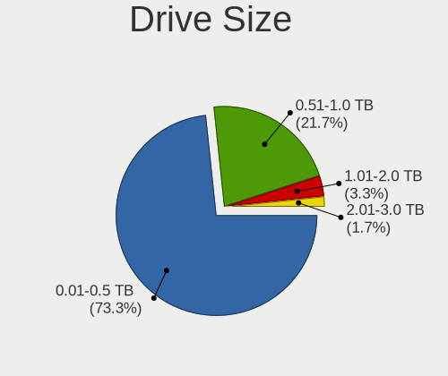
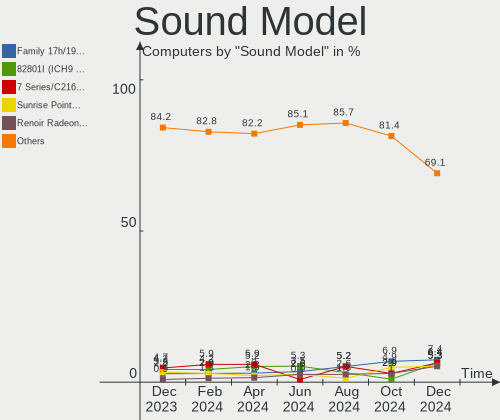

BlackPanther Hardware Trends
----------------------------

A project to identify most popular hardware characteristics and track their change
over time based on data collected by BlackPanther users at https://Linux-Hardware.org.

Anyone can contribute to the study by uploading probes of their computers by
the [hw-probe](https://github.com/linuxhw/hw-probe) tool:

    sudo -E hw-probe -all -upload

This is a report for all computer types. See also reports for [desktops](/Dist/BlackPanther/Desktop/README.md) and [notebooks](/Dist/BlackPanther/Notebook/README.md).

Full-feature report is available here: https://linux-hardware.org/?view=trends

Period: Sep, 2020.

Contents
--------

- [ OS                       ](#os)
- [ OS Family                ](#os-family)
- [ Kernel                   ](#kernel)
- [ Kernel Family            ](#kernel-family)
- [ Kernel Major Ver.        ](#kernel-major-ver)
- [ Arch                     ](#arch)
- [ DE                       ](#de)
- [ Display Server           ](#display-server)
- [ Display Manager          ](#display-manager)
- [ OS Lang                  ](#os-lang)
- [ Boot Mode                ](#boot-mode)
- [ Filesystem               ](#filesystem)
- [ Part. scheme             ](#part-scheme)
- [ Dual Boot with Linux/BSD ](#dual-boot-with-linux/bsd)
- [ Dual Boot (Win)          ](#dual-boot-win)
- [ Country                  ](#country)
- [ City                     ](#city)
- [ Vendor                   ](#vendor)
- [ Model                    ](#model)
- [ Model Family             ](#model-family)
- [ MFG Year                 ](#mfg-year)
- [ Form Factor              ](#form-factor)
- [ Secure Boot              ](#secure-boot)
- [ Coreboot                 ](#coreboot)
- [ RAM Size                 ](#ram-size)
- [ RAM Used                 ](#ram-used)
- [ Has CD-ROM               ](#has-cd-rom)
- [ Total Drives             ](#total-drives)
- [ Has Ethernet             ](#has-ethernet)
- [ Drive Vendor             ](#drive-vendor)
- [ HDD Vendor               ](#hdd-vendor)
- [ SSD Vendor               ](#ssd-vendor)
- [ Drive Model              ](#drive-model)
- [ Drive Kind               ](#drive-kind)
- [ Drive Connector          ](#drive-connector)
- [ Drive Size               ](#drive-size)
- [ Space Total              ](#space-total)
- [ Space Used               ](#space-used)
- [ Malfunc. Drives          ](#malfunc-drives)
- [ Malfunc. Drive Vendor    ](#malfunc-drive-vendor)
- [ Malfunc. HDD Vendor      ](#malfunc-hdd-vendor)
- [ Malfunc. Drive Kind      ](#malfunc-drive-kind)
- [ Failed Drives            ](#failed-drives)
- [ Failed Drive Vendor      ](#failed-drive-vendor)
- [ Drive Status             ](#drive-status)
- [ Storage Vendor           ](#storage-vendor)
- [ Storage Model            ](#storage-model)
- [ Storage Kind             ](#storage-kind)
- [ CPU Vendor               ](#cpu-vendor)
- [ CPU Model                ](#cpu-model)
- [ CPU Model Family         ](#cpu-model-family)
- [ CPU Cores                ](#cpu-cores)
- [ CPU Sockets              ](#cpu-sockets)
- [ CPU Threads              ](#cpu-threads)
- [ CPU Op-Modes             ](#cpu-op-modes)
- [ CPU Microcode            ](#cpu-microcode)
- [ CPU Microarch            ](#cpu-microarch)
- [ GPU Vendor               ](#gpu-vendor)
- [ GPU Model                ](#gpu-model)
- [ GPU Combo                ](#gpu-combo)
- [ GPU Driver               ](#gpu-driver)
- [ GPU Memory               ](#gpu-memory)
- [ Monitor Vendor           ](#monitor-vendor)
- [ Monitor Model            ](#monitor-model)
- [ Monitor Resolution       ](#monitor-resolution)
- [ Monitor Diagonal         ](#monitor-diagonal)
- [ Monitor Width            ](#monitor-width)
- [ Aspect Ratio             ](#aspect-ratio)
- [ Monitor Area             ](#monitor-area)
- [ Pixel Density            ](#pixel-density)
- [ Multiple Monitors        ](#multiple-monitors)
- [ Net Controller Vendor    ](#net-controller-vendor)
- [ Net Controller Model     ](#net-controller-model)
- [ Wireless Vendor          ](#wireless-vendor)
- [ Wireless Model           ](#wireless-model)
- [ Ethernet Vendor          ](#ethernet-vendor)
- [ Ethernet Model           ](#ethernet-model)
- [ Net Controller Kind      ](#net-controller-kind)
- [ Used Controller          ](#used-controller)
- [ NICs                     ](#nics)
- [ Memory Vendor            ](#memory-vendor)
- [ Memory Model             ](#memory-model)
- [ Memory Kind              ](#memory-kind)
- [ Memory Form Factor       ](#memory-form-factor)
- [ Memory Size              ](#memory-size)
- [ Memory Speed             ](#memory-speed)
- [ Sound Vendor             ](#sound-vendor)
- [ Sound Model              ](#sound-model)
- [ Camera Vendor            ](#camera-vendor)
- [ Camera Model             ](#camera-model)
- [ Fingerprint Vendor       ](#fingerprint-vendor)
- [ Fingerprint Model        ](#fingerprint-model)
- [ Chipcard Vendor          ](#chipcard-vendor)
- [ Chipcard Model           ](#chipcard-model)
- [ Printer Vendor           ](#printer-vendor)
- [ Printer Model            ](#printer-model)
- [ Scanner Vendor           ](#scanner-vendor)
- [ Scanner Model            ](#scanner-model)
- [ Bluetooth Vendor         ](#bluetooth-vendor)
- [ Bluetooth Model          ](#bluetooth-model)
- [ Unsupported Devices      ](#unsupported-devices)
- [ Unsupported Device Types ](#unsupported-device-types)

OS
--

Installed operating systems

| Name              | Computers | Percent |
|-------------------|-----------|---------|
| BlackPanther 18.1 | 186       | 96.88%  |
| BlackPanther 16.2 | 6         | 3.13%   |

OS Family
---------

OS without a version

| Name         | Computers | Percent |
|--------------|-----------|---------|
| BlackPanther | 192       | 100%    |

Kernel
------

Version of the Linux kernel

| Version                | Computers | Percent |
|------------------------|-----------|---------|
| 4.18.16-desktop-1bP    | 185       | 96.35%  |
| 4.9.20-desktop-pae-1bP | 6         | 3.13%   |
| 5.1.15-desktop-1bP     | 1         | 0.52%   |

Kernel Family
-------------

Linux kernel without a distro release

| Version | Computers | Percent |
|---------|-----------|---------|
| 4.18.16 | 185       | 96.35%  |
| 4.9.20  | 6         | 3.13%   |
| 5.1.15  | 1         | 0.52%   |

Kernel Major Ver.
-----------------

Linux kernel major version

| Version | Computers | Percent |
|---------|-----------|---------|
| 4.18    | 185       | 96.35%  |
| 4.9     | 6         | 3.13%   |
| 5.1     | 1         | 0.52%   |

Arch
----

OS architecture (x86_64, i586, etc.)

| Name   | Computers | Percent |
|--------|-----------|---------|
| x86_64 | 186       | 96.88%  |
| i686   | 6         | 3.13%   |

DE
--

Desktop Environment

| Name | Computers | Percent |
|------|-----------|---------|
| KDE5 | 191       | 99.48%  |
| KDE  | 1         | 0.52%   |

Display Server
--------------

X11 or Wayland

| Name    | Computers | Percent |
|---------|-----------|---------|
| X11     | 190       | 98.96%  |
| Wayland | 2         | 1.04%   |

Display Manager
---------------

SDDM, LightDM, etc.

| Name    | Computers | Percent |
|---------|-----------|---------|
| SDDM    | 191       | 99.48%  |
| Unknown | 1         | 0.52%   |

OS Lang
-------

Language

| Lang       | Computers | Percent |
|------------|-----------|---------|
| Unknown    | 191       | 99.48%  |
| hu_HU.utf8 | 1         | 0.52%   |

Boot Mode
---------

EFI or BIOS

| Mode | Computers | Percent |
|------|-----------|---------|
| BIOS | 134       | 69.79%  |
| EFI  | 58        | 30.21%  |

Filesystem
----------

Type of filesystem

| Type    | Computers | Percent |
|---------|-----------|---------|
| Overlay | 154       | 80.21%  |
| Ext4    | 37        | 19.27%  |
| Ntfs    | 1         | 0.52%   |

Part. scheme
------------

Scheme of partitioning

| Type    | Computers | Percent |
|---------|-----------|---------|
| MBR     | 127       | 66.15%  |
| GPT     | 62        | 32.29%  |
| Unknown | 3         | 1.56%   |

Dual Boot with Linux/BSD
------------------------

Hosting more than one Linux/BSD

| Dual boot | Computers | Percent |
|-----------|-----------|---------|
| No        | 98        | 51.04%  |
| Yes       | 94        | 48.96%  |

Dual Boot (Win)
---------------

Hosting Linux and Windows

| Dual boot | Computers | Percent |
|-----------|-----------|---------|
| Yes       | 101       | 52.6%   |
| No        | 91        | 47.4%   |

Country
-------

Geographic location (country)

| Country      | Computers | Percent |
|--------------|-----------|---------|
| Hungary      | 124       | 64.58%  |
| USA          | 13        | 6.77%   |
| Germany      | 10        | 5.21%   |
| Canada       | 5         | 2.6%    |
| Italy        | 4         | 2.08%   |
| Spain        | 3         | 1.56%   |
| Romania      | 3         | 1.56%   |
| Brazil       | 3         | 1.56%   |
| Australia    | 3         | 1.56%   |
| UK           | 2         | 1.04%   |
| Slovakia     | 2         | 1.04%   |
| Finland      | 2         | 1.04%   |
| Austria      | 2         | 1.04%   |
| South Africa | 1         | 0.52%   |
| Serbia       | 1         | 0.52%   |
| San Marino   | 1         | 0.52%   |
| Poland       | 1         | 0.52%   |
| Philippines  | 1         | 0.52%   |
| Netherlands  | 1         | 0.52%   |
| Madagascar   | 1         | 0.52%   |
| Kuwait       | 1         | 0.52%   |
| Japan        | 1         | 0.52%   |
| Greece       | 1         | 0.52%   |
| France       | 1         | 0.52%   |
| El Salvador  | 1         | 0.52%   |
| Egypt        | 1         | 0.52%   |
| Ecuador      | 1         | 0.52%   |
| Bangladesh   | 1         | 0.52%   |
| Argentina    | 1         | 0.52%   |

City
----

Geographic location (city)

| City                    | Computers | Percent |
|-------------------------|-----------|---------|
| Budapest                | 32        | 16.67%  |
| Eger                    | 5         | 2.6%    |
| Veszprém               | 4         | 2.08%   |
| Zalaegerszeg            | 3         | 1.56%   |
| Székesfehérvár       | 3         | 1.56%   |
| North Hollywood         | 3         | 1.56%   |
| Győr                   | 3         | 1.56%   |
| Berettyoujfalu          | 3         | 1.56%   |
| Tar                     | 2         | 1.04%   |
| Szombathely             | 2         | 1.04%   |
| Szekszárd              | 2         | 1.04%   |
| Sarkeszi                | 2         | 1.04%   |
| Ottawa                  | 2         | 1.04%   |
| Omaha                   | 2         | 1.04%   |
| Mosonmagyaróvár       | 2         | 1.04%   |
| Milan                   | 2         | 1.04%   |
| Matraszele              | 2         | 1.04%   |
| Madrid                  | 2         | 1.04%   |
| Harrow                  | 2         | 1.04%   |
| Dunaújváros           | 2         | 1.04%   |
| Albertirsa              | 2         | 1.04%   |
| Érd                    | 1         | 0.52%   |
| Wunstorf                | 1         | 0.52%   |
| Vác                    | 1         | 0.52%   |
| Vassurany               | 1         | 0.52%   |
| Vacha                   | 1         | 0.52%   |
| Ulles                   | 1         | 0.52%   |
| Târgu Mureş           | 1         | 0.52%   |
| Trois-Rivières         | 1         | 0.52%   |
| Toronto                 | 1         | 0.52%   |
| Toeroekbalint           | 1         | 0.52%   |
| Tiszafured              | 1         | 0.52%   |
| Thessaloniki            | 1         | 0.52%   |
| Tet                     | 1         | 0.52%   |
| Teresopolis             | 1         | 0.52%   |
| Tejgaon                 | 1         | 0.52%   |
| Tatabánya              | 1         | 0.52%   |
| Tarnok                  | 1         | 0.52%   |
| Szolnok                 | 1         | 0.52%   |
| Szentgotthard           | 1         | 0.52%   |
| Szentendre              | 1         | 0.52%   |
| Szeged                  | 1         | 0.52%   |
| Sydney                  | 1         | 0.52%   |
| Sohag                   | 1         | 0.52%   |
| Sarszentmihaly          | 1         | 0.52%   |
| Sarisap                 | 1         | 0.52%   |
| San Miguel              | 1         | 0.52%   |
| Salgotarjan             | 1         | 0.52%   |
| Sajokeresztur           | 1         | 0.52%   |
| Russellville            | 1         | 0.52%   |
| Rosu                    | 1         | 0.52%   |
| Rieseby                 | 1         | 0.52%   |
| Richmond                | 1         | 0.52%   |
| Pécs                   | 1         | 0.52%   |
| Pusztaszabolcs          | 1         | 0.52%   |
| Prato                   | 1         | 0.52%   |
| Pilis                   | 1         | 0.52%   |
| Phoenix                 | 1         | 0.52%   |
| Pfaffenhofen an der Ilm | 1         | 0.52%   |
| Paris                   | 1         | 0.52%   |

Vendor
------

Motherboard manufacturer

| Name                           | Computers | Percent |
|--------------------------------|-----------|---------|
| Hewlett-Packard                | 36        | 18.75%  |
| Dell                           | 30        | 15.63%  |
| ASUSTek Computer               | 26        | 13.54%  |
| Lenovo                         | 24        | 12.5%   |
| ASRock                         | 17        | 8.85%   |
| Acer                           | 14        | 7.29%   |
| Gigabyte Technology            | 11        | 5.73%   |
| Samsung Electronics            | 4         | 2.08%   |
| MSI                            | 3         | 1.56%   |
| Fujitsu                        | 3         | 1.56%   |
| Toshiba                        | 2         | 1.04%   |
| Sony                           | 2         | 1.04%   |
| Fujitsu Siemens                | 2         | 1.04%   |
| ABIT                           | 2         | 1.04%   |
| ZOTAC                          | 1         | 0.52%   |
| Positivo                       | 1         | 0.52%   |
| Notebook                       | 1         | 0.52%   |
| Medion                         | 1         | 0.52%   |
| Matsushita Electric Industrial | 1         | 0.52%   |
| LG Electronics                 | 1         | 0.52%   |
| Hungaro Flotta Kft             | 1         | 0.52%   |
| Gateway                        | 1         | 0.52%   |
| Foxconn                        | 1         | 0.52%   |
| eMachines                      | 1         | 0.52%   |
| ECS                            | 1         | 0.52%   |
| CEVEN                          | 1         | 0.52%   |
| Biostar                        | 1         | 0.52%   |
| Alienware                      | 1         | 0.52%   |
| Alcor                          | 1         | 0.52%   |
| Unknown                        | 1         | 0.52%   |

Model
-----

Motherboard model

| Name                                                              | Computers | Percent |
|-------------------------------------------------------------------|-----------|---------|
| Dell Inspiron N5110                                               | 4         | 2.08%   |
| HP ProBook 4540s                                                  | 2         | 1.04%   |
| HP Notebook                                                       | 2         | 1.04%   |
| HP EliteBook 2560p                                                | 2         | 1.04%   |
| HP 250 G5 Notebook PC                                             | 2         | 1.04%   |
| HP 250 G1                                                         | 2         | 1.04%   |
| Gigabyte H61M-S1                                                  | 2         | 1.04%   |
| Dell OptiPlex 760                                                 | 2         | 1.04%   |
| Dell OptiPlex 755                                                 | 2         | 1.04%   |
| Dell Latitude E6400                                               | 2         | 1.04%   |
| ASUS All Series                                                   | 2         | 1.04%   |
| Unknown                                                           | 2         | 1.04%   |
| Toshiba Satellite L50-B                                           | 1         | 0.52%   |
| Toshiba Satellite C55D-A                                          | 1         | 0.52%   |
| Sony VGN-NW50JB                                                   | 1         | 0.52%   |
| Sony SVE15113FDW                                                  | 1         | 0.52%   |
| Samsung Electronics RV411/RV511/E3511/S3511/RV711/E3411           | 1         | 0.52%   |
| Samsung Electronics 300E5EV/300E4EV/270E5EV/270E4EV/2470EV/2470EE | 1         | 0.52%   |
| Samsung Electronics 300E4Z/300E5Z/300E7Z                          | 1         | 0.52%   |
| Samsung Electronics 300E4A/300E5A/300E7A/3430EA/3530EA            | 1         | 0.52%   |
| Positivo H14BT58                                                  | 1         | 0.52%   |
| Notebook N2x0LU                                                   | 1         | 0.52%   |
| MSI MS-7A32                                                       | 1         | 0.52%   |
| MSI MS-7680                                                       | 1         | 0.52%   |
| MSI MS-7529                                                       | 1         | 0.52%   |
| Medion Akoya P7818                                                | 1         | 0.52%   |
| Matsushita Electric Industrial CF-52CD402NW                       | 1         | 0.52%   |
| LG Electronics P310-S.CBRAG                                       | 1         | 0.52%   |
| Lenovo Y50-70 20378                                               | 1         | 0.52%   |
| Lenovo V145-15AST 81MT                                            | 1         | 0.52%   |
| Lenovo V110-15ISK 80TL                                            | 1         | 0.52%   |
| Lenovo ThinkStation D20 4158AF8                                   | 1         | 0.52%   |
| Lenovo ThinkPad W510 431924G                                      | 1         | 0.52%   |
| Lenovo ThinkPad T61 6458Y56                                       | 1         | 0.52%   |
| Lenovo ThinkPad T500 20828WG                                      | 1         | 0.52%   |
| Lenovo ThinkPad T440p 20AWS1DA0F                                  | 1         | 0.52%   |
| Lenovo ThinkPad T420 4236A26                                      | 1         | 0.52%   |
| Lenovo ThinkPad T400 2768WGB                                      | 1         | 0.52%   |
| Lenovo ThinkPad L540 20AUA128HV                                   | 1         | 0.52%   |
| Lenovo ThinkCentre M92P 32371L5                                   | 1         | 0.52%   |
| Lenovo ThinkCentre M91p 7034BN4                                   | 1         | 0.52%   |
| Lenovo ThinkCentre M58p 6138DK1                                   | 1         | 0.52%   |
| Lenovo ThinkCentre A55 96417RG                                    | 1         | 0.52%   |
| Lenovo IdeaPad 330-15AST 81D6                                     | 1         | 0.52%   |
| Lenovo IdeaPad 320-17ABR 80YN                                     | 1         | 0.52%   |
| Lenovo IdeaPad 320-15ABR 80XS                                     | 1         | 0.52%   |
| Lenovo IdeaPad 110-15ACL 80TJ                                     | 1         | 0.52%   |
| Lenovo G710 20252                                                 | 1         | 0.52%   |
| Lenovo G580 20150                                                 | 1         | 0.52%   |
| Lenovo G560 0679                                                  | 1         | 0.52%   |
| Lenovo G505 20240                                                 | 1         | 0.52%   |
| Lenovo 70A0S06500 ThinkServer TS140                               | 1         | 0.52%   |
| Hungaro Flotta Kft Navon Loop 360                                 | 1         | 0.52%   |
| HP ProLiant MicroServer                                           | 1         | 0.52%   |
| HP ProDesk 400 G3 MT                                              | 1         | 0.52%   |
| HP ProBook 645 G1                                                 | 1         | 0.52%   |
| HP ProBook 5330m                                                  | 1         | 0.52%   |
| HP Presario CQ57                                                  | 1         | 0.52%   |
| HP Pavilion dv2500                                                | 1         | 0.52%   |
| HP Laptop 15-bs0xx                                                | 1         | 0.52%   |

Model Family
------------

Motherboard model prefix

| Name                                        | Computers | Percent |
|---------------------------------------------|-----------|---------|
| Acer Aspire                                 | 12        | 6.25%   |
| Dell OptiPlex                               | 11        | 5.73%   |
| HP Compaq                                   | 10        | 5.21%   |
| Dell Inspiron                               | 10        | 5.21%   |
| Lenovo ThinkPad                             | 7         | 3.65%   |
| HP EliteBook                                | 5         | 2.6%    |
| Dell Latitude                               | 5         | 2.6%    |
| Lenovo ThinkCentre                          | 4         | 2.08%   |
| Lenovo IdeaPad                              | 4         | 2.08%   |
| HP ProBook                                  | 4         | 2.08%   |
| HP 250                                      | 4         | 2.08%   |
| Toshiba Satellite                           | 2         | 1.04%   |
| HP Notebook                                 | 2         | 1.04%   |
| Gigabyte H61M-S1                            | 2         | 1.04%   |
| Fujitsu LIFEBOOK                            | 2         | 1.04%   |
| Dell XPS                                    | 2         | 1.04%   |
| ASUS PRIME                                  | 2         | 1.04%   |
| ASUS P5K                                    | 2         | 1.04%   |
| ASUS All                                    | 2         | 1.04%   |
| Unknown                                     | 2         | 1.04%   |
| Sony VGN-NW50JB                             | 1         | 0.52%   |
| Sony SVE15113FDW                            | 1         | 0.52%   |
| Samsung Electronics RV411                   | 1         | 0.52%   |
| Samsung Electronics 300E5EV                 | 1         | 0.52%   |
| Samsung Electronics 300E4Z                  | 1         | 0.52%   |
| Samsung Electronics 300E4A                  | 1         | 0.52%   |
| Positivo H14BT58                            | 1         | 0.52%   |
| Notebook N2x0LU                             | 1         | 0.52%   |
| MSI MS-7A32                                 | 1         | 0.52%   |
| MSI MS-7680                                 | 1         | 0.52%   |
| MSI MS-7529                                 | 1         | 0.52%   |
| Medion Akoya                                | 1         | 0.52%   |
| Matsushita Electric Industrial CF-52CD402NW | 1         | 0.52%   |
| LG Electronics P310-S.CBRAG                 | 1         | 0.52%   |
| Lenovo Y50-70                               | 1         | 0.52%   |
| Lenovo V145-15AST                           | 1         | 0.52%   |
| Lenovo V110-15ISK                           | 1         | 0.52%   |
| Lenovo ThinkStation                         | 1         | 0.52%   |
| Lenovo G710                                 | 1         | 0.52%   |
| Lenovo G580                                 | 1         | 0.52%   |
| Lenovo G560                                 | 1         | 0.52%   |
| Lenovo G505                                 | 1         | 0.52%   |
| Lenovo 70A0S06500                           | 1         | 0.52%   |
| Hungaro Flotta Kft Navon                    | 1         | 0.52%   |
| HP ProLiant                                 | 1         | 0.52%   |
| HP ProDesk                                  | 1         | 0.52%   |
| HP Presario                                 | 1         | 0.52%   |
| HP Pavilion                                 | 1         | 0.52%   |
| HP Laptop                                   | 1         | 0.52%   |
| HP HDX18                                    | 1         | 0.52%   |
| HP ENVY                                     | 1         | 0.52%   |
| HP 650                                      | 1         | 0.52%   |
| HP 630                                      | 1         | 0.52%   |
| HP 355                                      | 1         | 0.52%   |
| HP 350                                      | 1         | 0.52%   |
| Gigabyte Z390                               | 1         | 0.52%   |
| Gigabyte X570                               | 1         | 0.52%   |
| Gigabyte nForce                             | 1         | 0.52%   |
| Gigabyte H61MA-D3V                          | 1         | 0.52%   |
| Gigabyte H61M-S2V-B3                        | 1         | 0.52%   |

MFG Year
--------

Motherboard manufacture year

| Year | Computers | Percent |
|------|-----------|---------|
| 2012 | 26        | 13.54%  |
| 2013 | 18        | 9.38%   |
| 2014 | 17        | 8.85%   |
| 2008 | 17        | 8.85%   |
| 2011 | 16        | 8.33%   |
| 2009 | 16        | 8.33%   |
| 2019 | 15        | 7.81%   |
| 2016 | 14        | 7.29%   |
| 2018 | 13        | 6.77%   |
| 2015 | 11        | 5.73%   |
| 2010 | 9         | 4.69%   |
| 2017 | 7         | 3.65%   |
| 2007 | 7         | 3.65%   |
| 2020 | 3         | 1.56%   |
| 2006 | 2         | 1.04%   |
| 2005 | 1         | 0.52%   |

Form Factor
-----------

Physical design of the computer

| Name     | Computers | Percent |
|----------|-----------|---------|
| Notebook | 105       | 54.69%  |
| Desktop  | 86        | 44.79%  |
| Other    | 1         | 0.52%   |

Secure Boot
-----------

Enabled or disabled

| State    | Computers | Percent |
|----------|-----------|---------|
| Disabled | 192       | 100%    |

Coreboot
--------

Have coreboot on board

| Used | Computers | Percent |
|------|-----------|---------|
| No   | 192       | 100%    |

RAM Size
--------

Total RAM memory

| Size in GB | Computers | Percent |
|------------|-----------|---------|
| 3.01-4.0   | 86        | 44.79%  |
| 8.01-16.0  | 35        | 18.23%  |
| 4.01-8.0   | 33        | 17.19%  |
| 16.01-24.0 | 14        | 7.29%   |
| 1.01-2.0   | 14        | 7.29%   |
| 32.01-64.0 | 4         | 2.08%   |
| 2.01-3.0   | 4         | 2.08%   |
| 0.01-1.0   | 2         | 1.04%   |

RAM Used
--------

Used RAM memory

| Used GB  | Computers | Percent |
|----------|-----------|---------|
| 0.01-1.0 | 161       | 83.85%  |
| 1.01-2.0 | 29        | 15.1%   |
| 3.01-4.0 | 1         | 0.52%   |
| 2.01-3.0 | 1         | 0.52%   |

Has CD-ROM
----------

Has CD-ROM on board

| Presented | Computers | Percent |
|-----------|-----------|---------|
| Yes       | 130       | 67.71%  |
| No        | 62        | 32.29%  |

Total Drives
------------

Number of drives on board

| Drives | Computers | Percent |
|--------|-----------|---------|
| 1      | 133       | 69.27%  |
| 2      | 36        | 18.75%  |
| 3      | 10        | 5.21%   |
| 5      | 5         | 2.6%    |
| 0      | 4         | 2.08%   |
| 4      | 2         | 1.04%   |
| 7      | 1         | 0.52%   |
| 6      | 1         | 0.52%   |

Has Ethernet
------------

Has Ethernet on board

| Presented | Computers | Percent |
|-----------|-----------|---------|
| Yes       | 185       | 96.35%  |
| No        | 7         | 3.65%   |

Drive Vendor
------------

Hard drive vendors

| Vendor              | Computers | Drives  | Percent |
|---------------------|-----------|---------|---------|
| WDC                 | 56        | 71      | 21.54%  |
| Seagate             | 46        | 54      | 17.69%  |
| Samsung Electronics | 29        | 32      | 11.15%  |
| Kingston            | 23        | 24      | 8.85%   |
| Toshiba             | 19        | 20      | 7.31%   |
| Hitachi             | 13        | 13      | 5%      |
| HGST                | 10        | 10      | 3.85%   |
| SanDisk             | 9         | 10      | 3.46%   |
| A-DATA Technology   | 8         | 8       | 3.08%   |
| SK Hynix            | 5         | 5       | 1.92%   |
| Crucial             | 5         | 5       | 1.92%   |
| Unknown             | 4         | 5       | 1.54%   |
| Maxtor              | 4         | 4       | 1.54%   |
| HL-DT-ST            | 3         | Unknown | 1.15%   |
| Fujitsu             | 3         | 3       | 1.15%   |
| Transcend           | 2         | 2       | 0.77%   |
| SPCC                | 2         | 2       | 0.77%   |
| OCZ                 | 2         | 2       | 0.77%   |
| JMicron             | 2         | 1       | 0.77%   |
| Intel               | 2         | 2       | 0.77%   |
| China               | 2         | 2       | 0.77%   |
| Apacer              | 2         | 2       | 0.77%   |
| Zheino              | 1         | 1       | 0.38%   |
| Verbatim            | 1         | 1       | 0.38%   |
| PNY                 | 1         | 1       | 0.38%   |
| Patriot             | 1         | 1       | 0.38%   |
| KINGMAX             | 1         | 1       | 0.38%   |
| IBM/Hitachi         | 1         | 1       | 0.38%   |
| Hewlett-Packard     | 1         | 1       | 0.38%   |
| FORESEE             | 1         | 1       | 0.38%   |
| Corsair             | 1         | 1       | 0.38%   |

HDD Vendor
----------

Hard disk drive vendors

| Vendor              | Computers | Drives | Percent |
|---------------------|-----------|--------|---------|
| WDC                 | 51        | 63     | 32.28%  |
| Seagate             | 45        | 53     | 28.48%  |
| Toshiba             | 18        | 19     | 11.39%  |
| Hitachi             | 13        | 13     | 8.23%   |
| Samsung Electronics | 12        | 13     | 7.59%   |
| HGST                | 10        | 10     | 6.33%   |
| MAXTOR              | 4         | 4      | 2.53%   |
| Fujitsu             | 3         | 3      | 1.9%    |
| IBM/Hitachi         | 1         | 1      | 0.63%   |
| Hewlett-Packard     | 1         | 1      | 0.63%   |

SSD Vendor
----------

Solid state drive vendors

| Vendor              | Computers | Drives | Percent |
|---------------------|-----------|--------|---------|
| Kingston            | 22        | 23     | 25.88%  |
| Samsung Electronics | 14        | 15     | 16.47%  |
| SanDisk             | 8         | 9      | 9.41%   |
| WDC                 | 7         | 7      | 8.24%   |
| A-DATA Technology   | 7         | 7      | 8.24%   |
| Crucial             | 5         | 5      | 5.88%   |
| SK Hynix            | 4         | 4      | 4.71%   |
| Transcend           | 2         | 2      | 2.35%   |
| SPCC                | 2         | 2      | 2.35%   |
| OCZ                 | 2         | 2      | 2.35%   |
| China               | 2         | 2      | 2.35%   |
| Apacer              | 2         | 2      | 2.35%   |
| Verbatim            | 1         | 1      | 1.18%   |
| PNY                 | 1         | 1      | 1.18%   |
| Patriot             | 1         | 1      | 1.18%   |
| KINGMAX             | 1         | 1      | 1.18%   |
| JMicron             | 1         | 1      | 1.18%   |
| Intel               | 1         | 1      | 1.18%   |
| FORESEE             | 1         | 1      | 1.18%   |
| Corsair             | 1         | 1      | 1.18%   |

Drive Model
-----------

Hard drive models

| Model                        | Computers | Percent |
|------------------------------|-----------|---------|
| SA400S37240G 240GB SSD       | 6         | 2.11%   |
| SA400S37120G 120GB SSD       | 6         | 2.11%   |
| ST500DM002-1BD142 500GB      | 4         | 1.4%    |
| SU630 240GB SSD              | 3         | 1.05%   |
| ST9320325AS 320GB            | 3         | 1.05%   |
| ST3500320AS 500GB            | 3         | 1.05%   |
| ST1000LM035-1RK172 1TB       | 3         | 1.05%   |
| SSD 860 EVO 500GB            | 3         | 1.05%   |
| MQ01ACF032 320GB             | 3         | 1.05%   |
| HTS545050A7E680 500GB        | 3         | 1.05%   |
| WDS240G2G0A-00JH30 240GB SSD | 2         | 0.7%    |
| WDS120G2G0A-00JH30 120GB SSD | 2         | 0.7%    |
| WD10JPCX-24UE4T0 1TB         | 2         | 0.7%    |
| WD10EZRX-00L4HB0 1TB         | 2         | 0.7%    |
| WD10EZEX-08WN4A0 1TB         | 2         | 0.7%    |
| SV300S37A120G 120GB SSD      | 2         | 0.7%    |
| SUV400S37120G 120GB SSD      | 2         | 0.7%    |
| ST9250315AS 250GB            | 2         | 0.7%    |
| ST500LM012 HN-M500MBB 500GB  | 2         | 0.7%    |
| ST31000524AS 1TB             | 2         | 0.7%    |
| ST2000DM001-1CH164 2TB       | 2         | 0.7%    |
| ST1000LM024 HN-M101MBB 1TB   | 2         | 0.7%    |
| ST1000DM010-2EP102 1TB       | 2         | 0.7%    |
| ST1000DM003-1ER162 1TB       | 2         | 0.7%    |
| SSD PLUS 240GB               | 2         | 0.7%    |
| Solid State Disk 256GB       | 2         | 0.7%    |
| SDSSDH3512G 512GB            | 2         | 0.7%    |
| SA400S37480G 480GB SSD       | 2         | 0.7%    |
| MQ01ABD100 1TB               | 2         | 0.7%    |
| MQ01ABD075 752GB             | 2         | 0.7%    |
| HTS545032A7E380 320GB        | 2         | 0.7%    |
| HDWD110 1TB                  | 2         | 0.7%    |
| HDS721050CLA360 500GB        | 2         | 0.7%    |
| HD502HJ 500GB                | 2         | 0.7%    |
| DVDRAM GUC0N 1GB             | 2         | 0.7%    |
| DT01ACA100 1TB               | 2         | 0.7%    |
| DT01ACA050 500GB             | 2         | 0.7%    |
| CT120BX500SSD1 120GB         | 2         | 0.7%    |
| AS350 128GB SSD              | 2         | 0.7%    |
| WDS500G2X0C-00L350 500GB     | 1         | 0.35%   |
| WDS500G2B0A 500GB SSD        | 1         | 0.35%   |
| WDS240G2G0B-00EPW0 240GB SSD | 1         | 0.35%   |
| WDS120G2G0B-00EPW0 120GB SSD | 1         | 0.35%   |
| WD800JD-75MSA3 80GB          | 1         | 0.35%   |
| WD7500BPVX-60JC3T0 752GB     | 1         | 0.35%   |
| WD6400BEVT-22A0RT0 640GB     | 1         | 0.35%   |
| WD6400AAKS-00A7B0 640GB      | 1         | 0.35%   |
| WD60EZRX-00MVLB1 6TB         | 1         | 0.35%   |
| WD6003FZBX-00K5WB0 6TB       | 1         | 0.35%   |
| WD5000LPCX-60VHAT0 500GB     | 1         | 0.35%   |
| WD5000LPCX-24VHAT0 500GB     | 1         | 0.35%   |
| WD5000LPCX-22VHAT0 500GB     | 1         | 0.35%   |
| WD5000BPVT-22HXZT3 500GB     | 1         | 0.35%   |
| WD5000BPVT-22A1YT0 500GB     | 1         | 0.35%   |
| WD5000BPVT-00HXZT1 500GB     | 1         | 0.35%   |
| WD5000BEVT-75A0RT0 500GB     | 1         | 0.35%   |
| WD5000BEVT-16A0RT0 500GB     | 1         | 0.35%   |
| WD5000AZRX-00A8LB0 500GB     | 1         | 0.35%   |
| WD5000AAKX-75U6AA0 500GB     | 1         | 0.35%   |
| WD5000AAKX-60U6AA0 500GB     | 1         | 0.35%   |

Drive Kind
----------

HDD or SSD

| Kind    | Computers | Drives | Percent |
|---------|-----------|--------|---------|
| HDD     | 136       | 180    | 58.87%  |
| SSD     | 75        | 88     | 32.47%  |
| NVMe    | 9         | 10     | 3.9%    |
| MMC     | 6         | 7      | 2.6%    |
| Unknown | 5         | 1      | 2.16%   |

Drive Connector
---------------

SATA, SAS, NVMe, etc.

| Type | Computers | Drives | Percent |
|------|-----------|--------|---------|
| SATA | 181       | 263    | 88.29%  |
| SAS  | 9         | 6      | 4.39%   |
| NVMe | 9         | 10     | 4.39%   |
| MMC  | 6         | 7      | 2.93%   |

Drive Size
----------

Size of hard drive

| Size in TB | Computers | Drives | Percent |
|------------|-----------|--------|---------|
| 0.01-0.5   | 163       | 212    | 73.09%  |
| 0.51-1.0   | 46        | 55     | 20.63%  |
| 1.01-2.0   | 7         | 8      | 3.14%   |
| 4.01-10.0  | 3         | 6      | 1.35%   |
| 3.01-4.0   | 2         | 2      | 0.9%    |
| 2.01-3.0   | 1         | 1      | 0.45%   |
| 10.01-20.0 | 1         | 2      | 0.45%   |

Space Total
-----------

Amount of disk space available on the file system

| Size in GB | Computers | Percent |
|------------|-----------|---------|
| Unknown    | 152       | 79.17%  |
| 101-250    | 13        | 6.77%   |
| 251-500    | 12        | 6.25%   |
| 51-100     | 7         | 3.65%   |
| 21-50      | 4         | 2.08%   |
| 501-1000   | 3         | 1.56%   |
| 1-20       | 1         | 0.52%   |

Space Used
----------

Amount of used disk space

| Used GB | Computers | Percent |
|---------|-----------|---------|
| Unknown | 152       | 79.17%  |
| 1-20    | 31        | 16.15%  |
| 21-50   | 4         | 2.08%   |
| 51-100  | 3         | 1.56%   |
| 251-500 | 1         | 0.52%   |
| 101-250 | 1         | 0.52%   |

Malfunc. Drives
---------------

Drive models with a malfunction

| Model                       | Computers | Drives | Percent |
|-----------------------------|-----------|--------|---------|
| ST9320325AS 320GB           | 2         | 2      | 2.53%   |
| ST9250315AS 250GB           | 2         | 2      | 2.53%   |
| ST500LM012 HN-M500MBB 500GB | 2         | 2      | 2.53%   |
| ST3500320AS 500GB           | 2         | 2      | 2.53%   |
| HTS545032A7E380 320GB       | 2         | 2      | 2.53%   |
| HDS721050CLA360 500GB       | 2         | 2      | 2.53%   |
| DT01ACA050 500GB            | 2         | 2      | 2.53%   |
| WD6400BEVT-22A0RT0 640GB    | 1         | 1      | 1.27%   |
| WD6400AAKS-00A7B0 640GB     | 1         | 1      | 1.27%   |
| WD5000LPCX-22VHAT0 500GB    | 1         | 1      | 1.27%   |
| WD5000BPVT-22HXZT3 500GB    | 1         | 1      | 1.27%   |
| WD5000AAKX-75U6AA0 500GB    | 1         | 1      | 1.27%   |
| WD5000AAKX-60U6AA0 500GB    | 1         | 1      | 1.27%   |
| WD5000AAKX-001CA0 500GB     | 1         | 1      | 1.27%   |
| WD5000AAKS-007AA0 500GB     | 1         | 1      | 1.27%   |
| WD5000AADS-00S9B0 500GB     | 1         | 1      | 1.27%   |
| WD5000AADS-00M2B0 500GB     | 1         | 1      | 1.27%   |
| WD3200BEKT-60PVMT0 320GB    | 1         | 1      | 1.27%   |
| WD3200AAKS-00L9A0 320GB     | 1         | 1      | 1.27%   |
| WD2500JS-60MHB5 250GB       | 1         | 1      | 1.27%   |
| WD2500BEVT-75A23T0 250GB    | 1         | 1      | 1.27%   |
| WD20EARS-60MVWB0 2TB        | 1         | 1      | 1.27%   |
| WD10JPVX-22JC3T0 1TB        | 1         | 1      | 1.27%   |
| WD10JPCX-24UE4T0 1TB        | 1         | 1      | 1.27%   |
| WD10EZRX-00A8LB0 1TB        | 1         | 1      | 1.27%   |
| WD10EZEX-08WN4A0 1TB        | 1         | 1      | 1.27%   |
| WD10EADS-00M2B0 1TB         | 1         | 1      | 1.27%   |
| VERTEX3 120GB SSD           | 1         | 1      | 1.27%   |
| SUV400S37480G 480GB SSD     | 1         | 1      | 1.27%   |
| SU630 240GB SSD             | 1         | 1      | 1.27%   |
| STM3250820AS 250GB          | 1         | 1      | 1.27%   |
| ST980412ASG 80GB            | 1         | 1      | 1.27%   |
| ST9160314AS 160GB           | 1         | 1      | 1.27%   |
| ST9120822AS 120GB           | 1         | 1      | 1.27%   |
| ST500LT012-9WS142 500GB     | 1         | 1      | 1.27%   |
| ST500DM002-1BD142 500GB     | 1         | 1      | 1.27%   |
| ST4000DM000-1F2168 4TB      | 1         | 1      | 1.27%   |
| ST3500641AS 500GB           | 1         | 1      | 1.27%   |
| ST3500410AS 500GB           | 1         | 1      | 1.27%   |
| ST3400620AS 400GB           | 1         | 1      | 1.27%   |
| ST3320820AS 320GB           | 1         | 1      | 1.27%   |
| ST320LT012-9WS14C 320GB     | 1         | 1      | 1.27%   |
| ST1000LX015-1U7172 1TB      | 1         | 1      | 1.27%   |
| SP2014N 34GB                | 1         | 1      | 1.27%   |
| SP1654N 160GB               | 1         | 1      | 1.27%   |
| SP1614C 160GB               | 1         | 1      | 1.27%   |
| SP0802N 80GB                | 1         | 1      | 1.27%   |
| SH910 mSATA 128GB SSD       | 1         | 1      | 1.27%   |
| SC210 2.5 7MM 128GB SSD     | 1         | 1      | 1.27%   |
| MQ01ACF032 320GB            | 1         | 1      | 1.27%   |
| MQ01ABD100 1TB              | 1         | 1      | 1.27%   |
| MQ01ABD075 752GB            | 1         | 1      | 1.27%   |
| MK5076GSX 500GB             | 1         | 1      | 1.27%   |
| MK1633GSG 160GB             | 1         | 1      | 1.27%   |
| MHY2250BH 250GB             | 1         | 1      | 1.27%   |
| IC35L120AVV207-1 128GB      | 1         | 1      | 1.27%   |
| HTS545050A7E680 500GB       | 1         | 1      | 1.27%   |
| HTS545050A7E380 500GB       | 1         | 1      | 1.27%   |
| HTS545032B9A300 320GB       | 1         | 1      | 1.27%   |
| HTS543232L9A300 320GB       | 1         | 1      | 1.27%   |

Malfunc. Drive Vendor
---------------------

Vendors of faulty drives

| Vendor              | Computers | Drives | Percent |
|---------------------|-----------|--------|---------|
| Seagate             | 20        | 20     | 25.97%  |
| WDC                 | 19        | 20     | 24.68%  |
| Samsung Electronics | 9         | 10     | 11.69%  |
| Toshiba             | 8         | 8      | 10.39%  |
| Hitachi             | 8         | 8      | 10.39%  |
| HGST                | 5         | 5      | 6.49%   |
| SK Hynix            | 2         | 2      | 2.6%    |
| OCZ                 | 1         | 1      | 1.3%    |
| MAXTOR              | 1         | 1      | 1.3%    |
| Kingston            | 1         | 1      | 1.3%    |
| IBM/Hitachi         | 1         | 1      | 1.3%    |
| Fujitsu             | 1         | 1      | 1.3%    |
| A-DATA Technology   | 1         | 1      | 1.3%    |

Malfunc. HDD Vendor
-------------------

Vendors of faulty HDD drives

| Vendor              | Computers | Drives | Percent |
|---------------------|-----------|--------|---------|
| Seagate             | 20        | 20     | 27.78%  |
| WDC                 | 19        | 20     | 26.39%  |
| Samsung Electronics | 9         | 10     | 12.5%   |
| Toshiba             | 8         | 8      | 11.11%  |
| Hitachi             | 8         | 8      | 11.11%  |
| HGST                | 5         | 5      | 6.94%   |
| MAXTOR              | 1         | 1      | 1.39%   |
| IBM/Hitachi         | 1         | 1      | 1.39%   |
| Fujitsu             | 1         | 1      | 1.39%   |

Malfunc. Drive Kind
-------------------

Kinds of faulty drives

| Kind | Computers | Drives | Percent |
|------|-----------|--------|---------|
| HDD  | 69        | 74     | 93.24%  |
| SSD  | 5         | 5      | 6.76%   |

Failed Drives
-------------

Failed drive models

| Model                    | Computers | Drives | Percent |
|--------------------------|-----------|--------|---------|
| WD3200BVVT-63A26Y0 320GB | 1         | 1      | 100%    |

Failed Drive Vendor
-------------------

Failed drive vendors

| Vendor | Computers | Drives | Percent |
|--------|-----------|--------|---------|
| WDC    | 1         | 1      | 100%    |

Drive Status
------------

Number of failed and malfunc. drives

| Status   | Computers | Drives | Percent |
|----------|-----------|--------|---------|
| Works    | 134       | 193    | 60.36%  |
| Malfunc  | 73        | 79     | 32.88%  |
| Detected | 14        | 13     | 6.31%   |
| Failed   | 1         | 1      | 0.45%   |

Storage Vendor
--------------

Storage controller vendors

| Vendor                           | Computers | Percent |
|----------------------------------|-----------|---------|
| Intel                            | 148       | 71.15%  |
| AMD                              | 34        | 16.35%  |
| Nvidia                           | 6         | 2.88%   |
| Samsung Electronics              | 4         | 1.92%   |
| Marvell Technology Group         | 4         | 1.92%   |
| Silicon Image                    | 2         | 0.96%   |
| JMicron Technology               | 2         | 0.96%   |
| ASMedia Technology               | 2         | 0.96%   |
| Silicon Motion                   | 1         | 0.48%   |
| Silicon Integrated Systems [SiS] | 1         | 0.48%   |
| Sandisk                          | 1         | 0.48%   |
| KIOXIA                           | 1         | 0.48%   |
| Kingston Technology Company      | 1         | 0.48%   |
| ADATA Technology                 | 1         | 0.48%   |

Storage Model
-------------

Storage controller models

| Model                                                                             | Computers | Percent |
|-----------------------------------------------------------------------------------|-----------|---------|
| FCH SATA Controller [AHCI mode]                                                   | 24        | 8.73%   |
| 7 Series Chipset Family 6-port SATA Controller [AHCI mode]                        | 17        | 6.18%   |
| 6 Series/C200 Series Chipset Family 6 port Mobile SATA AHCI Controller            | 12        | 4.36%   |
| 82801IBM/IEM (ICH9M/ICH9M-E) 4 port SATA Controller [AHCI mode]                   | 9         | 3.27%   |
| 82801G (ICH7 Family) IDE Controller                                               | 9         | 3.27%   |
| 8 Series/C220 Series Chipset Family 6-port SATA Controller 1 [AHCI mode]          | 9         | 3.27%   |
| NM10/ICH7 Family SATA Controller [IDE mode]                                       | 7         | 2.55%   |
| 4 Series Chipset PT IDER Controller                                               | 7         | 2.55%   |
| 82801HM/HEM (ICH8M/ICH8M-E) SATA Controller [AHCI mode]                           | 6         | 2.18%   |
| 82801HM/HEM (ICH8M/ICH8M-E) IDE Controller                                        | 6         | 2.18%   |
| 8 Series SATA Controller 1 [AHCI mode]                                            | 6         | 2.18%   |
| 6 Series/C200 Series Chipset Family 6 port Desktop SATA AHCI Controller           | 6         | 2.18%   |
| FCH IDE Controller                                                                | 5         | 1.82%   |
| Atom/Celeron/Pentium Processor x5-E8000/J3xxx/N3xxx Series SATA Controller        | 5         | 1.82%   |
| 6 Series/C200 Series Chipset Family Desktop SATA Controller (IDE mode, ports 4-5) | 5         | 1.82%   |
| 6 Series/C200 Series Chipset Family Desktop SATA Controller (IDE mode, ports 0-3) | 5         | 1.82%   |
| 5 Series/3400 Series Chipset 4 port SATA AHCI Controller                          | 5         | 1.82%   |
| Sunrise Point-LP SATA Controller [AHCI mode]                                      | 4         | 1.45%   |
| SB7x0/SB8x0/SB9x0 IDE Controller                                                  | 4         | 1.45%   |
| Q170/Q150/B150/H170/H110/Z170/CM236 Chipset SATA Controller [AHCI Mode]           | 4         | 1.45%   |
| 82801JD/DO (ICH10 Family) SATA AHCI Controller                                    | 4         | 1.45%   |
| 82801 Mobile SATA Controller [RAID mode]                                          | 4         | 1.45%   |
| 5 Series/3400 Series Chipset 6 port SATA AHCI Controller                          | 4         | 1.45%   |
| X370 Series Chipset SATA Controller                                               | 3         | 1.09%   |
| Wildcat Point-LP SATA Controller [AHCI Mode]                                      | 3         | 1.09%   |
| SB7x0/SB8x0/SB9x0 SATA Controller [AHCI mode]                                     | 3         | 1.09%   |
| Non-Volatile memory controller                                                    | 3         | 1.09%   |
| NM10/ICH7 Family SATA Controller [AHCI mode]                                      | 3         | 1.09%   |
| FCH SATA Controller [IDE mode]                                                    | 3         | 1.09%   |
| Cannon Lake PCH SATA AHCI Controller                                              | 3         | 1.09%   |
| 82801IR/IO/IH (ICH9R/DO/DH) 6 port SATA Controller [AHCI mode]                    | 3         | 1.09%   |
| 82801I (ICH9 Family) 2 port SATA Controller [IDE mode]                            | 3         | 1.09%   |
| 7 Series/C210 Series Chipset Family 6-port SATA Controller [AHCI mode]            | 3         | 1.09%   |
| 200 Series PCH SATA controller [AHCI mode]                                        | 3         | 1.09%   |
| SB7x0/SB8x0/SB9x0 SATA Controller [IDE mode]                                      | 2         | 0.73%   |
| SB600 Non-Raid-5 SATA                                                             | 2         | 0.73%   |
| SB600 IDE                                                                         | 2         | 0.73%   |
| SATA Controller [RAID mode]                                                       | 2         | 0.73%   |
| NVMe SSD Controller SM981/PM981/PM983                                             | 2         | 0.73%   |
| nForce3 Serial ATA Controller                                                     | 2         | 0.73%   |
| MCP61 SATA Controller                                                             | 2         | 0.73%   |
| MCP61 IDE                                                                         | 2         | 0.73%   |
| CK8S Parallel ATA Controller (v2.5)                                               | 2         | 0.73%   |
| Atom Processor E3800 Series SATA AHCI Controller                                  | 2         | 0.73%   |
| ASM1062 Serial ATA Controller                                                     | 2         | 0.73%   |
| 82Q35 Express PT IDER Controller                                                  | 2         | 0.73%   |
| 82801JI (ICH10 Family) SATA AHCI Controller                                       | 2         | 0.73%   |
| 82801JI (ICH10 Family) 4 port SATA IDE Controller #1                              | 2         | 0.73%   |
| 82801JI (ICH10 Family) 2 port SATA IDE Controller #2                              | 2         | 0.73%   |
| 82801JD/DO (ICH10 Family) 4-port SATA IDE Controller                              | 2         | 0.73%   |
| 82801JD/DO (ICH10 Family) 2-port SATA IDE Controller                              | 2         | 0.73%   |
| 82801IB (ICH9) 2 port SATA Controller [IDE mode]                                  | 2         | 0.73%   |
| 82801GBM/GHM (ICH7-M Family) SATA Controller [AHCI mode]                          | 2         | 0.73%   |
| 5 Series/3400 Series Chipset 4 port SATA IDE Controller                           | 2         | 0.73%   |
| 5 Series/3400 Series Chipset 2 port SATA IDE Controller                           | 2         | 0.73%   |
| XPG SX8200 Pro PCIe Gen3x4 M.2 2280 Solid State Drive                             | 1         | 0.36%   |
| WD Black 2018/PC SN720 NVMe SSD                                                   | 1         | 0.36%   |
| SSD 660P Series                                                                   | 1         | 0.36%   |
| SiI 3512 [SATALink/SATARaid] Serial ATA Controller                                | 1         | 0.36%   |
| SiI 3132 Serial ATA Raid II Controller                                            | 1         | 0.36%   |

Storage Kind
------------

Kind of storage controller (IDE, SATA, NVMe, SAS, ...)

| Kind | Computers | Percent |
|------|-----------|---------|
| SATA | 155       | 66.81%  |
| IDE  | 59        | 25.43%  |
| RAID | 9         | 3.88%   |
| NVMe | 9         | 3.88%   |

CPU Vendor
----------

Processor vendors

| Vendor | Computers | Percent |
|--------|-----------|---------|
| Intel  | 155       | 80.73%  |
| AMD    | 37        | 19.27%  |

CPU Model
---------

Processor models

| Model                                        | Computers | Percent |
|----------------------------------------------|-----------|---------|
| Intel Core 2 Duo CPU E8400 @ 3.00GHz         | 5         | 2.6%    |
| Intel Core i5-2520M CPU @ 2.50GHz            | 4         | 2.08%   |
| Intel Core i3 CPU M 350 @ 2.27GHz            | 4         | 2.08%   |
| Intel Pentium CPU B960 @ 2.20GHz             | 3         | 1.56%   |
| Intel Core i3-2310M CPU @ 2.10GHz            | 3         | 1.56%   |
| Intel Core i3 CPU M 380 @ 2.53GHz            | 3         | 1.56%   |
| Intel Core 2 Quad CPU Q6600 @ 2.40GHz        | 3         | 1.56%   |
| Intel Core 2 Duo CPU P8700 @ 2.53GHz         | 3         | 1.56%   |
| Intel Core 2 Duo CPU E7500 @ 2.93GHz         | 3         | 1.56%   |
| Intel Core 2 Duo CPU E7300 @ 2.66GHz         | 3         | 1.56%   |
| Intel Pentium Dual CPU E2180 @ 2.00GHz       | 2         | 1.04%   |
| Intel Pentium CPU N3710 @ 1.60GHz            | 2         | 1.04%   |
| Intel Core i7-4702MQ CPU @ 2.20GHz           | 2         | 1.04%   |
| Intel Core i5-6500 CPU @ 3.20GHz             | 2         | 1.04%   |
| Intel Core i5-4210U CPU @ 1.70GHz            | 2         | 1.04%   |
| Intel Core i5-4200U CPU @ 1.60GHz            | 2         | 1.04%   |
| Intel Core i5-3470 CPU @ 3.20GHz             | 2         | 1.04%   |
| Intel Core i5-3210M CPU @ 2.50GHz            | 2         | 1.04%   |
| Intel Core i5-2450M CPU @ 2.50GHz            | 2         | 1.04%   |
| Intel Core i3-6006U CPU @ 2.00GHz            | 2         | 1.04%   |
| Intel Core i3-5010U CPU @ 2.10GHz            | 2         | 1.04%   |
| Intel Core i3-3220 CPU @ 3.30GHz             | 2         | 1.04%   |
| Intel Core i3-2350M CPU @ 2.30GHz            | 2         | 1.04%   |
| Intel Core 2 Quad CPU Q9400 @ 2.66GHz        | 2         | 1.04%   |
| Intel Core 2 Duo CPU T7500 @ 2.20GHz         | 2         | 1.04%   |
| Intel Core 2 Duo CPU P8600 @ 2.40GHz         | 2         | 1.04%   |
| Intel Celeron CPU N3060 @ 1.60GHz            | 2         | 1.04%   |
| Intel Celeron CPU G1610 @ 2.60GHz            | 2         | 1.04%   |
| Intel Celeron CPU 1007U @ 1.50GHz            | 2         | 1.04%   |
| Intel Celeron CPU 1000M @ 1.80GHz            | 2         | 1.04%   |
| Intel Atom x5-Z8350 CPU @ 1.44GHz            | 2         | 1.04%   |
| Intel Atom CPU 230 @ 1.60GHz                 | 2         | 1.04%   |
| AMD Phenom II X4 955 Processor               | 2         | 1.04%   |
| AMD A4-9125 RADEON R3, 4 COMPUTE CORES 2C+2G | 2         | 1.04%   |
| Intel Xeon CPU X5677 @ 3.47GHz               | 1         | 0.52%   |
| Intel Xeon CPU E5440 @ 2.83GHz               | 1         | 0.52%   |
| Intel Pentium Silver N5000 CPU @ 1.10GHz     | 1         | 0.52%   |
| Intel Pentium Dual-Core CPU T4400 @ 2.20GHz  | 1         | 0.52%   |
| Intel Pentium Dual-Core CPU T4200 @ 2.00GHz  | 1         | 0.52%   |
| Intel Pentium Dual CPU T2390 @ 1.86GHz       | 1         | 0.52%   |
| Intel Pentium Dual CPU E2140 @ 1.60GHz       | 1         | 0.52%   |
| Intel Pentium D CPU 3.00GHz                  | 1         | 0.52%   |
| Intel Pentium CPU G860 @ 3.00GHz             | 1         | 0.52%   |
| Intel Pentium CPU G840 @ 2.80GHz             | 1         | 0.52%   |
| Intel Pentium CPU B950 @ 2.10GHz             | 1         | 0.52%   |
| Intel Pentium CPU 2117U @ 1.80GHz            | 1         | 0.52%   |
| Intel Genuine CPU T2250 @ 1.73GHz            | 1         | 0.52%   |
| Intel Genuine CPU 2140 @ 1.60GHz             | 1         | 0.52%   |
| Intel Core i7-8750H CPU @ 2.20GHz            | 1         | 0.52%   |
| Intel Core i7-8700K CPU @ 3.70GHz            | 1         | 0.52%   |
| Intel Core i7-8700 CPU @ 3.20GHz             | 1         | 0.52%   |
| Intel Core i7-8550U CPU @ 1.80GHz            | 1         | 0.52%   |
| Intel Core i7-7700HQ CPU @ 2.80GHz           | 1         | 0.52%   |
| Intel Core i7-6700K CPU @ 4.00GHz            | 1         | 0.52%   |
| Intel Core i7-4800MQ CPU @ 2.70GHz           | 1         | 0.52%   |
| Intel Core i7-4790 CPU @ 3.60GHz             | 1         | 0.52%   |
| Intel Core i7-4710HQ CPU @ 2.50GHz           | 1         | 0.52%   |
| Intel Core i7-4700HQ CPU @ 2.40GHz           | 1         | 0.52%   |
| Intel Core i7-3687U CPU @ 2.10GHz            | 1         | 0.52%   |
| Intel Core i7-3630QM CPU @ 2.40GHz           | 1         | 0.52%   |

CPU Model Family
----------------

Processor model prefix

| Model                   | Computers | Percent |
|-------------------------|-----------|---------|
| Intel Core i5           | 31        | 16.15%  |
| Intel Core i3           | 27        | 14.06%  |
| Intel Core 2 Duo        | 25        | 13.02%  |
| Intel Core i7           | 18        | 9.38%   |
| Intel Celeron           | 16        | 8.33%   |
| Intel Pentium           | 9         | 4.69%   |
| Intel Core 2 Quad       | 7         | 3.65%   |
| Intel Atom              | 6         | 3.13%   |
| AMD A4                  | 6         | 3.13%   |
| Intel Pentium Dual      | 4         | 2.08%   |
| AMD A8                  | 4         | 2.08%   |
| Intel Core 2            | 3         | 1.56%   |
| AMD Ryzen 5             | 3         | 1.56%   |
| AMD E1                  | 3         | 1.56%   |
| Intel Xeon              | 2         | 1.04%   |
| Intel Pentium Dual-Core | 2         | 1.04%   |
| Intel Genuine           | 2         | 1.04%   |
| AMD Ryzen 7             | 2         | 1.04%   |
| AMD Phenom II X4        | 2         | 1.04%   |
| AMD Athlon II X2        | 2         | 1.04%   |
| AMD A10                 | 2         | 1.04%   |
| Intel Pentium Silver    | 1         | 0.52%   |
| Intel Pentium D         | 1         | 0.52%   |
| Intel Core 2 Solo       | 1         | 0.52%   |
| AMD Turion II Neo       | 1         | 0.52%   |
| AMD Ryzen 3             | 1         | 0.52%   |
| AMD Phenom II X6        | 1         | 0.52%   |
| AMD FX                  | 1         | 0.52%   |
| AMD C-70                | 1         | 0.52%   |
| AMD Athlon X4           | 1         | 0.52%   |
| AMD Athlon II X4        | 1         | 0.52%   |
| AMD Athlon II X3        | 1         | 0.52%   |
| AMD Athlon Dual Core    | 1         | 0.52%   |
| AMD Athlon 64 X2        | 1         | 0.52%   |
| AMD Athlon              | 1         | 0.52%   |
| AMD A6                  | 1         | 0.52%   |
| AMD A12                 | 1         | 0.52%   |

CPU Cores
---------

Number of processor cores

| Number | Computers | Percent |
|--------|-----------|---------|
| 2      | 125       | 65.1%   |
| 4      | 46        | 23.96%  |
| 1      | 11        | 5.73%   |
| 6      | 6         | 3.13%   |
| 8      | 3         | 1.56%   |
| 3      | 1         | 0.52%   |

CPU Sockets
-----------

Number of sockets

| Number | Computers | Percent |
|--------|-----------|---------|
| 1      | 191       | 99.48%  |
| 2      | 1         | 0.52%   |

CPU Threads
-----------

Threads per core (Hyper-Threading)

| Number | Computers | Percent |
|--------|-----------|---------|
| 1      | 112       | 58.33%  |
| 2      | 80        | 41.67%  |

CPU Op-Modes
------------

CPU Operation Modes (32-bit, 64-bit)

| Op mode        | Computers | Percent |
|----------------|-----------|---------|
| 32-bit, 64-bit | 191       | 99.48%  |
| 32-bit         | 1         | 0.52%   |

CPU Microcode
-------------

Microcode number

| Number     | Computers | Percent |
|------------|-----------|---------|
| 0x206a7    | 24        | 12.5%   |
| 0x306a9    | 21        | 10.94%  |
| 0x1067a    | 17        | 8.85%   |
| 0x10676    | 11        | 5.73%   |
| 0x306c3    | 10        | 5.21%   |
| 0x6fd      | 7         | 3.65%   |
| 0x406c4    | 6         | 3.13%   |
| 0x40651    | 6         | 3.13%   |
| 0x20655    | 6         | 3.13%   |
| Unknown    | 6         | 3.13%   |
| 0x06001119 | 5         | 2.6%    |
| 0x010000c8 | 5         | 2.6%    |
| 0x906ea    | 4         | 2.08%   |
| 0x6fb      | 4         | 2.08%   |
| 0x20652    | 4         | 2.08%   |
| 0x906e9    | 3         | 1.56%   |
| 0x6f2      | 3         | 1.56%   |
| 0x506e3    | 3         | 1.56%   |
| 0x306d4    | 3         | 1.56%   |
| 0x406e3    | 2         | 1.04%   |
| 0x106ca    | 2         | 1.04%   |
| 0x106c2    | 2         | 1.04%   |
| 0x0810100b | 2         | 1.04%   |
| 0x07030105 | 2         | 1.04%   |
| 0x0700010f | 2         | 1.04%   |
| 0x06006705 | 2         | 1.04%   |
| 0x06006118 | 2         | 1.04%   |
| 0x0600111f | 2         | 1.04%   |
| 0x05000119 | 2         | 1.04%   |
| 0xf62      | 1         | 0.52%   |
| 0x906eb    | 1         | 0.52%   |
| 0x806ea    | 1         | 0.52%   |
| 0x806e9    | 1         | 0.52%   |
| 0x706a1    | 1         | 0.52%   |
| 0x6fa      | 1         | 0.52%   |
| 0x6f6      | 1         | 0.52%   |
| 0x6e8      | 1         | 0.52%   |
| 0x406c3    | 1         | 0.52%   |
| 0x30678    | 1         | 0.52%   |
| 0x30673    | 1         | 0.52%   |
| 0x206c2    | 1         | 0.52%   |
| 0x106e5    | 1         | 0.52%   |
| 0x10661    | 1         | 0.52%   |
| 0x08701021 | 1         | 0.52%   |
| 0x08008206 | 1         | 0.52%   |
| 0x08001138 | 1         | 0.52%   |
| 0x08001137 | 1         | 0.52%   |
| 0x07030104 | 1         | 0.52%   |
| 0x06003106 | 1         | 0.52%   |
| 0x06003104 | 1         | 0.52%   |
| 0x03000027 | 1         | 0.52%   |
| 0x010000dc | 1         | 0.52%   |
| 0x010000db | 1         | 0.52%   |

CPU Microarch
-------------

Microarchitecture

| Name          | Computers | Percent |
|---------------|-----------|---------|
| Core          | 45        | 23.44%  |
| SandyBridge   | 24        | 12.5%   |
| IvyBridge     | 21        | 10.94%  |
| Skylake       | 17        | 8.85%   |
| Haswell       | 16        | 8.33%   |
| Westmere      | 11        | 5.73%   |
| Silvermont    | 9         | 4.69%   |
| K10           | 8         | 4.17%   |
| Piledriver    | 7         | 3.65%   |
| Zen           | 4         | 2.08%   |
| Excavator     | 4         | 2.08%   |
| Bonnell       | 4         | 2.08%   |
| Puma          | 3         | 1.56%   |
| Broadwell     | 3         | 1.56%   |
| Steamroller   | 2         | 1.04%   |
| K8 Hammer     | 2         | 1.04%   |
| Jaguar        | 2         | 1.04%   |
| Bobcat        | 2         | 1.04%   |
| Zen+          | 1         | 0.52%   |
| Zen 2         | 1         | 0.52%   |
| P6            | 1         | 0.52%   |
| NetBurst      | 1         | 0.52%   |
| Nehalem       | 1         | 0.52%   |
| K10 Llano     | 1         | 0.52%   |
| Goldmont plus | 1         | 0.52%   |
| Goldmont      | 1         | 0.52%   |

GPU Vendor
----------

Vendors of graphics cards

| Vendor                           | Computers | Percent |
|----------------------------------|-----------|---------|
| Intel                            | 105       | 48.39%  |
| Nvidia                           | 61        | 28.11%  |
| AMD                              | 50        | 23.04%  |
| Silicon Integrated Systems [SiS] | 1         | 0.46%   |

GPU Model
---------

Graphics card models

| Model                                                                              | Computers | Percent |
|------------------------------------------------------------------------------------|-----------|---------|
| 2nd Generation Core Processor Family Integrated Graphics Controller                | 21        | 9.17%   |
| 3rd Gen Core processor Graphics Controller                                         | 12        | 5.24%   |
| Mobile 4 Series Chipset Integrated Graphics Controller                             | 8         | 3.49%   |
| Atom/Celeron/Pentium Processor x5-E8000/J3xxx/N3xxx Integrated Graphics Controller | 7         | 3.06%   |
| 4th Gen Core Processor Integrated Graphics Controller                              | 6         | 2.62%   |
| Haswell-ULT Integrated Graphics Controller                                         | 5         | 2.18%   |
| Core Processor Integrated Graphics Controller                                      | 5         | 2.18%   |
| Sun XT [Radeon HD 8670A/8670M/8690M / R5 M330 / M430 / Radeon 520 Mobile]          | 4         | 1.75%   |
| Oland PRO [Radeon R7 240/340]                                                      | 4         | 1.75%   |
| Mobile GM965/GL960 Integrated Graphics Controller (secondary)                      | 4         | 1.75%   |
| Mobile GM965/GL960 Integrated Graphics Controller (primary)                        | 4         | 1.75%   |
| GP107 [GeForce GTX 1050 Ti]                                                        | 4         | 1.75%   |
| Cedar [Radeon HD 5000/6000/7350/8350 Series]                                       | 4         | 1.75%   |
| 4 Series Chipset Integrated Graphics Controller                                    | 4         | 1.75%   |
| Topaz XT [Radeon R7 M260/M265 / M340/M360 / M440/M445 / 530/535 / 620/625 Mobile]  | 3         | 1.31%   |
| Mobile 945GM/GMS/GME, 943/940GML Express Integrated Graphics Controller            | 3         | 1.31%   |
| Mobile 945GM/GMS, 943/940GML Express Integrated Graphics Controller                | 3         | 1.31%   |
| HD Graphics 630                                                                    | 3         | 1.31%   |
| HD Graphics 5500                                                                   | 3         | 1.31%   |
| G96CM [GeForce 9600M GT]                                                           | 3         | 1.31%   |
| Xeon E3-1200 v2/3rd Gen Core processor Graphics Controller                         | 2         | 0.87%   |
| Wani [Radeon R5/R6/R7 Graphics]                                                    | 2         | 0.87%   |
| Trinity 2 [Radeon HD 7480D]                                                        | 2         | 0.87%   |
| Stoney [Radeon R2/R3/R4/R5 Graphics]                                               | 2         | 0.87%   |
| Skylake GT2 [HD Graphics 520]                                                      | 2         | 0.87%   |
| Mullins [Radeon R4/R5 Graphics]                                                    | 2         | 0.87%   |
| GT215 [GeForce GT 240]                                                             | 2         | 0.87%   |
| GK208BM [GeForce 920M]                                                             | 2         | 0.87%   |
| GK208B [GeForce GT 710]                                                            | 2         | 0.87%   |
| GF117M [GeForce 610M/710M/810M/820M / GT 620M/625M/630M/720M]                      | 2         | 0.87%   |
| GF108 [GeForce GT 630]                                                             | 2         | 0.87%   |
| G86 [GeForce 8500 GT]                                                              | 2         | 0.87%   |
| Atom Processor Z36xxx/Z37xxx Series Graphics & Display                             | 2         | 0.87%   |
| Atom Processor D4xx/D5xx/N4xx/N5xx Integrated Graphics Controller                  | 2         | 0.87%   |
| 82G33/G31 Express Integrated Graphics Controller                                   | 2         | 0.87%   |
| Wrestler [Radeon HD 7310]                                                          | 1         | 0.44%   |
| Wrestler [Radeon HD 7290]                                                          | 1         | 0.44%   |
| UHD Graphics 630 (Mobile)                                                          | 1         | 0.44%   |
| UHD Graphics 620                                                                   | 1         | 0.44%   |
| UHD Graphics 605                                                                   | 1         | 0.44%   |
| Turks XT [Radeon HD 6670/7670]                                                     | 1         | 0.44%   |
| TU116 [GeForce GTX 1660 Ti]                                                        | 1         | 0.44%   |
| TU106 [GeForce RTX 2060 SUPER]                                                     | 1         | 0.44%   |
| Trinity [Radeon HD 7560D]                                                          | 1         | 0.44%   |
| SuperSumo [Radeon HD 6410D]                                                        | 1         | 0.44%   |
| Seymour [Radeon HD 6400M/7400M Series]                                             | 1         | 0.44%   |
| RV730 [Radeon HD 4600 AGP Series]                                                  | 1         | 0.44%   |
| RV710 [Radeon HD 4350/4550]                                                        | 1         | 0.44%   |
| RV635/M86 [Mobility Radeon HD 3650]                                                | 1         | 0.44%   |
| RV635 [Radeon HD 3650/3750/4570/4580]                                              | 1         | 0.44%   |
| RV630/M76 [Mobility Radeon HD 2600]                                                | 1         | 0.44%   |
| RV620/M82 [Mobility Radeon HD 3450/3470]                                           | 1         | 0.44%   |
| RV610 [Radeon HD 2400 PRO/XT]                                                      | 1         | 0.44%   |
| Richland [Radeon HD 8570D]                                                         | 1         | 0.44%   |
| Richland [Radeon HD 8470D]                                                         | 1         | 0.44%   |
| Richland [Radeon HD 8350G]                                                         | 1         | 0.44%   |
| Redwood XT [Radeon HD 5670/5690/5730]                                              | 1         | 0.44%   |
| RC410 [Radeon Xpress 200/1100]                                                     | 1         | 0.44%   |
| Raven Ridge [Radeon Vega Series / Radeon Vega Mobile Series]                       | 1         | 0.44%   |
| Park [Mobility Radeon HD 5430/5450/5470]                                           | 1         | 0.44%   |

GPU Combo
---------

Combinations of graphics cards

| Name           | Computers | Percent |
|----------------|-----------|---------|
| 1 x Intel      | 80        | 41.67%  |
| 1 x Nvidia     | 46        | 23.96%  |
| 1 x AMD        | 37        | 19.27%  |
| Intel + Nvidia | 15        | 7.81%   |
| Intel + AMD    | 8         | 4.17%   |
| 2 x AMD        | 5         | 2.6%    |
| 1 x SiS        | 1         | 0.52%   |

GPU Driver
----------

Free vs proprietary

| Driver  | Computers | Percent |
|---------|-----------|---------|
| Free    | 186       | 96.88%  |
| Unknown | 6         | 3.13%   |

GPU Memory
----------

Total video memory

| Size in GB | Computers | Percent |
|------------|-----------|---------|
| Unknown    | 85        | 44.27%  |
| 0.01-0.5   | 44        | 22.92%  |
| 0.51-1.0   | 29        | 15.1%   |
| 1.01-2.0   | 22        | 11.46%  |
| 3.01-4.0   | 8         | 4.17%   |
| 7.01-8.0   | 2         | 1.04%   |
| 5.01-6.0   | 1         | 0.52%   |
| 2.01-3.0   | 1         | 0.52%   |

Monitor Vendor
--------------

Monitor vendors

| Vendor                  | Computers | Percent |
|-------------------------|-----------|---------|
| Samsung Electronics     | 30        | 16.57%  |
| AU Optronics            | 24        | 13.26%  |
| LG Display              | 19        | 10.5%   |
| Goldstar                | 12        | 6.63%   |
| Chimei Innolux          | 11        | 6.08%   |
| Dell                    | 10        | 5.52%   |
| BOE                     | 10        | 5.52%   |
| Chi Mei Optoelectronics | 9         | 4.97%   |
| Acer                    | 8         | 4.42%   |
| Hewlett-Packard         | 5         | 2.76%   |
| Ancor Communications    | 5         | 2.76%   |
| IBM                     | 4         | 2.21%   |
| Lenovo                  | 3         | 1.66%   |
| Fujitsu Siemens         | 3         | 1.66%   |
| BenQ                    | 3         | 1.66%   |
| Plain Tree Systems      | 2         | 1.1%    |
| Panasonic               | 2         | 1.1%    |
| LG Philips              | 2         | 1.1%    |
| InfoVision              | 2         | 1.1%    |
| Iiyama                  | 2         | 1.1%    |
| AOC                     | 2         | 1.1%    |
| Vestel Elektronik       | 1         | 0.55%   |
| Sony                    | 1         | 0.55%   |
| Sharp                   | 1         | 0.55%   |
| PANDA                   | 1         | 0.55%   |
| Packard Bell            | 1         | 0.55%   |
| Orion                   | 1         | 0.55%   |
| OEM                     | 1         | 0.55%   |
| NEC Computers           | 1         | 0.55%   |
| Medion                  | 1         | 0.55%   |
| KTC                     | 1         | 0.55%   |
| Impression              | 1         | 0.55%   |
| HKC                     | 1         | 0.55%   |
| CVT                     | 1         | 0.55%   |

Monitor Model
-------------

Monitor models

| Model                                              | Computers | Percent |
|----------------------------------------------------|-----------|---------|
| LCD Monitor LGD0395 1366x768 344x194mm 15.5-inch   | 3         | 1.66%   |
| LG ULTRAWIDE GSM59F1 1920x1080 580x240mm 24.7-inch | 2         | 1.1%    |
| LCD Monitor SDC4A51 1366x768 344x194mm 15.5-inch   | 2         | 1.1%    |
| LCD Monitor LGD02DC 1366x768 344x194mm 15.5-inch   | 2         | 1.1%    |
| LCD Monitor LGD01E8 1366x768 340x190mm 15.3-inch   | 2         | 1.1%    |
| LCD Monitor IBM2887 1680x1050 331x207mm 15.4-inch  | 2         | 1.1%    |
| LCD Monitor CMO15A4 1366x768 344x194mm 15.5-inch   | 2         | 1.1%    |
| LCD Monitor CMO1592 1366x768 344x193mm 15.5-inch   | 2         | 1.1%    |
| LCD Monitor CMN15AB 1366x768 350x190mm 15.7-inch   | 2         | 1.1%    |
| LCD Monitor AUO38ED 1920x1080 340x190mm 15.3-inch  | 2         | 1.1%    |
| LCD Monitor AUO206C 1366x768 277x156mm 12.5-inch   | 2         | 1.1%    |
| K242HL ACR040E 1920x1080 531x299mm 24.0-inch       | 2         | 1.1%    |
| XL-775I PTS030C 1280x1024 338x270mm 17.0-inch      | 1         | 0.55%   |
| X163W ACR0015 1366x768 344x193mm 15.5-inch         | 1         | 0.55%   |
| W9009S KTC1992 1440x900 410x256mm 19.0-inch        | 1         | 0.55%   |
| Viseo 190 W PKB00B9 1366x768 410x230mm 18.5-inch   | 1         | 0.55%   |
| VG248 ACI24E1 1680x1050 530x300mm 24.0-inch        | 1         | 0.55%   |
| V203H ACR00C7 1600x900 443x249mm 20.0-inch         | 1         | 0.55%   |
| ULTRAWIDE GSM76FA 2560x1080 798x334mm 34.1-inch    | 1         | 0.55%   |
| TV SNY4803 1920x1080 1107x623mm 50.0-inch          | 1         | 0.55%   |
| TV MEIA0AE 1920x540                                | 1         | 0.55%   |
| TH-50P**7 MEIA027 1600x1200 1100x620mm 49.7-inch   | 1         | 0.55%   |
| T24D390 SAM0B6C 1920x1080 521x293mm 23.5-inch      | 1         | 0.55%   |
| SyncMaster SAM0486 1920x1080                       | 1         | 0.55%   |
| SyncMaster SAM0485 1920x1080 520x320mm 24.0-inch   | 1         | 0.55%   |
| SyncMaster SAM0440 1920x1200 518x324mm 24.1-inch   | 1         | 0.55%   |
| SyncMaster SAM03F5 1920x1200                       | 1         | 0.55%   |
| SyncMaster SAM036F 1440x900 428x255mm 19.6-inch    | 1         | 0.55%   |
| SyncMaster SAM020D 1280x1024 338x270mm 17.0-inch   | 1         | 0.55%   |
| SyncMaster SAM011F 1280x1024 376x301mm 19.0-inch   | 1         | 0.55%   |
| SE2416H DELD082 1920x1080 527x296mm 23.8-inch      | 1         | 0.55%   |
| S27E500 SAM0D0D 1920x1080 600x340mm 27.2-inch      | 1         | 0.55%   |
| S24C450 SAM09CB 1920x1080 531x299mm 24.0-inch      | 1         | 0.55%   |
| S240HL ACR0289 1920x1080 531x299mm 24.0-inch       | 1         | 0.55%   |
| S20B300 SAM08A8 1600x900 443x249mm 20.0-inch       | 1         | 0.55%   |
| S19B150 SAM08A2 1366x768 410x230mm 18.5-inch       | 1         | 0.55%   |
| RL2240H BNQ7F0C 1920x1080 480x270mm 21.7-inch      | 1         | 0.55%   |
| R19W11 IMP1911 1440x900 410x257mm 19.1-inch        | 1         | 0.55%   |
| PL2783Q IVM661F 2560x1440 597x336mm 27.0-inch      | 1         | 0.55%   |
| PL2473HD IVM6107 1920x1080 521x293mm 23.5-inch     | 1         | 0.55%   |
| P246HL ACR023F 1920x1080 530x300mm 24.0-inch       | 1         | 0.55%   |
| P2317H DEL40F2 1920x1080 509x286mm 23.0-inch       | 1         | 0.55%   |
| P2311H DEL4066 1920x1080 509x286mm 23.0-inch       | 1         | 0.55%   |
| P2213 DELF041 1680x1050 473x296mm 22.0-inch        | 1         | 0.55%   |
| P170S DEL4058 1280x1024 338x270mm 17.0-inch        | 1         | 0.55%   |
| ORION ORN0104 1280x720                             | 1         | 0.55%   |
| MP59G GSM5B33 1920x1080 480x270mm 21.7-inch        | 1         | 0.55%   |
| Monitor PTS076D 1280x1024 376x301mm 19.0-inch      | 1         | 0.55%   |
| MD20246 MED3921 1600x900 442x249mm 20.0-inch       | 1         | 0.55%   |
| LP1965 HWP2692 1280x1024 380x300mm 19.1-inch       | 1         | 0.55%   |
| LP156WH2-TLC1 LGD01DF 1366x768 344x194mm 15.5-inch | 1         | 0.55%   |
| LEN L171p LEN24C9 1280x1024 338x270mm 17.0-inch    | 1         | 0.55%   |
| LCD1525V NEC3BA6 1024x768 307x230mm 15.1-inch      | 1         | 0.55%   |
| LCD Monitor SHP13FA 2560x1440 257x145mm 11.6-inch  | 1         | 0.55%   |
| LCD Monitor SEC5441 1366x768 344x194mm 15.5-inch   | 1         | 0.55%   |
| LCD Monitor SEC4256 1600x900 382x215mm 17.3-inch   | 1         | 0.55%   |
| LCD Monitor SEC3945 1280x800 331x207mm 15.4-inch   | 1         | 0.55%   |
| LCD Monitor SEC384A 1366x768 344x194mm 15.5-inch   | 1         | 0.55%   |
| LCD Monitor SEC3645 1280x800 331x207mm 15.4-inch   | 1         | 0.55%   |
| LCD Monitor SEC3542 2160x1440 250x170mm 11.9-inch  | 1         | 0.55%   |

Monitor Resolution
------------------

Monitor screen resolution

| Resolution         | Computers | Percent |
|--------------------|-----------|---------|
| 1366x768 (WXGA)    | 61        | 33.89%  |
| 1920x1080 (FHD)    | 51        | 28.33%  |
| 1280x1024 (SXGA)   | 14        | 7.78%   |
| 1600x900 (HD+)     | 13        | 7.22%   |
| 1440x900 (WXGA+)   | 8         | 4.44%   |
| 1280x800 (WXGA)    | 8         | 4.44%   |
| 1680x1050 (WSXGA+) | 7         | 3.89%   |
| 2560x1080          | 3         | 1.67%   |
| 1920x1200 (WUXGA)  | 3         | 1.67%   |
| 1360x768           | 3         | 1.67%   |
| 2560x1440 (QHD)    | 2         | 1.11%   |
| 1024x768 (XGA)     | 2         | 1.11%   |
| 2160x1440          | 1         | 0.56%   |
| 1680x945           | 1         | 0.56%   |
| 1600x1200          | 1         | 0.56%   |
| 1280x720 (HD)      | 1         | 0.56%   |
| 1024x600           | 1         | 0.56%   |

Monitor Diagonal
----------------

Diagonal size in inches

| Inches  | Computers | Percent |
|---------|-----------|---------|
| 15      | 66        | 36.46%  |
| 17      | 16        | 8.84%   |
| 19      | 11        | 6.08%   |
| 23      | 10        | 5.52%   |
| 21      | 10        | 5.52%   |
| 24      | 9         | 4.97%   |
| 13      | 8         | 4.42%   |
| 18      | 7         | 3.87%   |
| 12      | 7         | 3.87%   |
| 14      | 6         | 3.31%   |
| 20      | 5         | 2.76%   |
| 11      | 5         | 2.76%   |
| 22      | 4         | 2.21%   |
| Unknown | 4         | 2.21%   |
| 27      | 3         | 1.66%   |
| 29      | 2         | 1.1%    |
| 50      | 1         | 0.55%   |
| 49      | 1         | 0.55%   |
| 48      | 1         | 0.55%   |
| 40      | 1         | 0.55%   |
| 32      | 1         | 0.55%   |
| 31      | 1         | 0.55%   |
| 26      | 1         | 0.55%   |
| 10      | 1         | 0.55%   |

Monitor Width
-------------

Physical width

| Width in mm | Computers | Percent |
|-------------|-----------|---------|
| 301-350     | 84        | 46.67%  |
| 401-500     | 30        | 16.67%  |
| 501-600     | 23        | 12.78%  |
| 201-300     | 16        | 8.89%   |
| 351-400     | 15        | 8.33%   |
| Unknown     | 4         | 2.22%   |
| 601-700     | 3         | 1.67%   |
| 1001-1500   | 3         | 1.67%   |
| 801-900     | 1         | 0.56%   |
| 701-800     | 1         | 0.56%   |

Aspect Ratio
------------

Proportional relationship between the width and the height

| Ratio | Computers | Percent |
|-------|-----------|---------|
| 16/9  | 130       | 74.29%  |
| 16/10 | 26        | 14.86%  |
| 5/4   | 14        | 8%      |
| 4/3   | 2         | 1.14%   |
| 21/9  | 2         | 1.14%   |
| 3/2   | 1         | 0.57%   |

Monitor Area
------------

Area in inch²

| Area in inch² | Computers | Percent |
|----------------|-----------|---------|
| 101-110        | 65        | 35.91%  |
| 201-250        | 27        | 14.92%  |
| 151-200        | 22        | 12.15%  |
| 141-150        | 13        | 7.18%   |
| 81-90          | 11        | 6.08%   |
| 61-70          | 7         | 3.87%   |
| 121-130        | 6         | 3.31%   |
| 51-60          | 5         | 2.76%   |
| 301-350        | 5         | 2.76%   |
| Unknown        | 4         | 2.21%   |
| More than 1000 | 3         | 1.66%   |
| 71-80          | 3         | 1.66%   |
| 251-300        | 3         | 1.66%   |
| 351-500        | 2         | 1.1%    |
| 131-140        | 2         | 1.1%    |
| 41-50          | 1         | 0.55%   |
| 501-1000       | 1         | 0.55%   |
| 91-100         | 1         | 0.55%   |

Pixel Density
-------------

Pixels per inch

| Density       | Computers | Percent |
|---------------|-----------|---------|
| 101-120       | 78        | 43.82%  |
| 51-100        | 63        | 35.39%  |
| 121-160       | 25        | 14.04%  |
| 161-240       | 4         | 2.25%   |
| Unknown       | 4         | 2.25%   |
| 1-50          | 3         | 1.69%   |
| More than 240 | 1         | 0.56%   |

Multiple Monitors
-----------------

Total monitors connected

| Total | Computers | Percent |
|-------|-----------|---------|
| 1     | 180       | 93.75%  |
| 2     | 10        | 5.21%   |
| 0     | 2         | 1.04%   |

Net Controller Vendor
---------------------

Controller vendors

| Vendor                            | Computers | Percent |
|-----------------------------------|-----------|---------|
| Realtek Semiconductor             | 96        | 32.76%  |
| Intel                             | 70        | 23.89%  |
| Qualcomm Atheros                  | 46        | 15.7%   |
| Broadcom Inc. and subsidiaries    | 22        | 7.51%   |
| Broadcom Limited                  | 13        | 4.44%   |
| Ralink                            | 8         | 2.73%   |
| Ralink Technology                 | 6         | 2.05%   |
| Nvidia                            | 5         | 1.71%   |
| Marvell Technology Group          | 5         | 1.71%   |
| Qualcomm Atheros Communications   | 3         | 1.02%   |
| D-Link                            | 3         | 1.02%   |
| TP-Link                           | 2         | 0.68%   |
| Huawei Technologies               | 2         | 0.68%   |
| Ericsson Business Mobile Networks | 2         | 0.68%   |
| ASUSTek Computer                  | 2         | 0.68%   |
| Xiaomi                            | 1         | 0.34%   |
| Sierra Wireless                   | 1         | 0.34%   |
| Samsung Electronics               | 1         | 0.34%   |
| JMicron Technology                | 1         | 0.34%   |
| Broadcom                          | 1         | 0.34%   |
| Attansic Technology               | 1         | 0.34%   |
| Aquantia                          | 1         | 0.34%   |
| Accton Technology                 | 1         | 0.34%   |

Net Controller Model
--------------------

Controller models

| Model                                                     | Computers | Percent |
|-----------------------------------------------------------|-----------|---------|
| RTL8111/8168/8411 PCI Express Gigabit Ethernet Controller | 67        | 19.88%  |
| RTL810xE PCI Express Fast Ethernet controller             | 21        | 6.23%   |
| 82579LM Gigabit Network Connection (Lewisville)           | 9         | 2.67%   |
| AR9485 Wireless Network Adapter                           | 8         | 2.37%   |
| AR9285 Wireless Network Adapter (PCI-Express)             | 7         | 2.08%   |
| PRO/Wireless 3945ABG [Golan] Network Connection           | 6         | 1.78%   |
| Centrino Advanced-N 6205 [Taylor Peak]                    | 6         | 1.78%   |
| BCM4313 802.11bgn Wireless Network Adapter                | 6         | 1.78%   |
| I211 Gigabit Network Connection                           | 5         | 1.48%   |
| 82567LM-3 Gigabit Network Connection                      | 5         | 1.48%   |
| Wireless 3165                                             | 4         | 1.19%   |
| RT3290 Wireless 802.11n 1T/1R PCIe                        | 4         | 1.19%   |
| QCA9565 / AR9565 Wireless Network Adapter                 | 4         | 1.19%   |
| QCA9377 802.11ac Wireless Network Adapter                 | 4         | 1.19%   |
| Centrino Advanced-N 6200                                  | 4         | 1.19%   |
| BCM43228 802.11a/b/g/n                                    | 4         | 1.19%   |
| AR8121/AR8113/AR8114 Gigabit or Fast Ethernet             | 4         | 1.19%   |
| Wireless 3160                                             | 3         | 0.89%   |
| WiFi Link 5100                                            | 3         | 0.89%   |
| RTL8821AE 802.11ac PCIe Wireless Network Adapter          | 3         | 0.89%   |
| RTL8723BE PCIe Wireless Network Adapter                   | 3         | 0.89%   |
| RTL8188EUS 802.11n Wireless Network Adapter               | 3         | 0.89%   |
| QCA8171 Gigabit Ethernet                                  | 3         | 0.89%   |
| NetLink BCM57785 Gigabit Ethernet PCIe                    | 3         | 0.89%   |
| Ethernet Connection I217-LM                               | 3         | 0.89%   |
| Ethernet Connection (2) I219-V                            | 3         | 0.89%   |
| AR242x / AR542x Wireless Network Adapter (PCI-Express)    | 3         | 0.89%   |
| 82577LM Gigabit Network Connection                        | 3         | 0.89%   |
| 82567LM Gigabit Network Connection                        | 3         | 0.89%   |
| 82566MM Gigabit Network Connection                        | 3         | 0.89%   |
| 82566DM-2 Gigabit Network Connection                      | 3         | 0.89%   |
| Wireless-AC 9560 [Jefferson Peak]                         | 2         | 0.59%   |
| Wireless 7260                                             | 2         | 0.59%   |
| Ultimate N WiFi Link 5300                                 | 2         | 0.59%   |
| RTL8821CE 802.11ac PCIe Wireless Network Adapter          | 2         | 0.59%   |
| RTL8188EE Wireless Network Adapter                        | 2         | 0.59%   |
| RTL-8100/8101L/8139 PCI Fast Ethernet Adapter             | 2         | 0.59%   |
| RT5370 Wireless Adapter                                   | 2         | 0.59%   |
| QCA8172 Fast Ethernet                                     | 2         | 0.59%   |
| PRO/Wireless 5100 AGN [Shiloh] Network Connection         | 2         | 0.59%   |
| PRO/Wireless 4965 AG or AGN [Kedron] Network Connection   | 2         | 0.59%   |
| NetXtreme BCM5761 Gigabit Ethernet PCIe                   | 2         | 0.59%   |
| NetXtreme BCM5754 Gigabit Ethernet PCI Express            | 2         | 0.59%   |
| NetLink BCM5787M Gigabit Ethernet PCI Express             | 2         | 0.59%   |
| NetLink BCM57788 Gigabit Ethernet PCIe                    | 2         | 0.59%   |
| MT7601U Wireless Adapter                                  | 2         | 0.59%   |
| MCP61 Ethernet                                            | 2         | 0.59%   |
| Killer E2500 Gigabit Ethernet Controller                  | 2         | 0.59%   |
| Ethernet Connection I218-LM                               | 2         | 0.59%   |
| CK8S Ethernet Controller                                  | 2         | 0.59%   |
| Centrino Wireless-N 130                                   | 2         | 0.59%   |
| Centrino Wireless-N 1030 [Rainbow Peak]                   | 2         | 0.59%   |
| BCM4401-B0 100Base-TX                                     | 2         | 0.59%   |
| BCM4352 802.11ac Wireless Network Adapter                 | 2         | 0.59%   |
| BCM43142 802.11b/g/n                                      | 2         | 0.59%   |
| AR9462 Wireless Network Adapter                           | 2         | 0.59%   |
| AR928X Wireless Network Adapter (PCI-Express)             | 2         | 0.59%   |
| AR9271 802.11n                                            | 2         | 0.59%   |
| 82574L Gigabit Network Connection                         | 2         | 0.59%   |
| WLAN controller                                           | 1         | 0.3%    |

Wireless Vendor
---------------

Wireless vendors

| Vendor                            | Computers | Percent |
|-----------------------------------|-----------|---------|
| Intel                             | 42        | 30.66%  |
| Qualcomm Atheros                  | 33        | 24.09%  |
| Realtek Semiconductor             | 19        | 13.87%  |
| Broadcom Inc. and subsidiaries    | 12        | 8.76%   |
| Ralink                            | 8         | 5.84%   |
| Ralink Technology                 | 6         | 4.38%   |
| Broadcom Limited                  | 5         | 3.65%   |
| Qualcomm Atheros Communications   | 3         | 2.19%   |
| D-Link                            | 3         | 2.19%   |
| TP-Link                           | 2         | 1.46%   |
| ASUSTek Computer                  | 2         | 1.46%   |
| Sierra Wireless                   | 1         | 0.73%   |
| Ericsson Business Mobile Networks | 1         | 0.73%   |

Wireless Model
--------------

Wireless models

| Model                                                        | Computers | Percent |
|--------------------------------------------------------------|-----------|---------|
| AR9485 Wireless Network Adapter                              | 8         | 5.8%    |
| AR9285 Wireless Network Adapter (PCI-Express)                | 7         | 5.07%   |
| PRO/Wireless 3945ABG [Golan] Network Connection              | 6         | 4.35%   |
| Centrino Advanced-N 6205 [Taylor Peak]                       | 6         | 4.35%   |
| BCM4313 802.11bgn Wireless Network Adapter                   | 6         | 4.35%   |
| Wireless 3165                                                | 4         | 2.9%    |
| RT3290 Wireless 802.11n 1T/1R PCIe                           | 4         | 2.9%    |
| QCA9565 / AR9565 Wireless Network Adapter                    | 4         | 2.9%    |
| QCA9377 802.11ac Wireless Network Adapter                    | 4         | 2.9%    |
| Centrino Advanced-N 6200                                     | 4         | 2.9%    |
| BCM43228 802.11a/b/g/n                                       | 4         | 2.9%    |
| Wireless 3160                                                | 3         | 2.17%   |
| WiFi Link 5100                                               | 3         | 2.17%   |
| RTL8821AE 802.11ac PCIe Wireless Network Adapter             | 3         | 2.17%   |
| RTL8723BE PCIe Wireless Network Adapter                      | 3         | 2.17%   |
| RTL8188EUS 802.11n Wireless Network Adapter                  | 3         | 2.17%   |
| AR242x / AR542x Wireless Network Adapter (PCI-Express)       | 3         | 2.17%   |
| Wireless-AC 9560 [Jefferson Peak]                            | 2         | 1.45%   |
| Wireless 7260                                                | 2         | 1.45%   |
| Ultimate N WiFi Link 5300                                    | 2         | 1.45%   |
| RTL8821CE 802.11ac PCIe Wireless Network Adapter             | 2         | 1.45%   |
| RTL8188EE Wireless Network Adapter                           | 2         | 1.45%   |
| RT5370 Wireless Adapter                                      | 2         | 1.45%   |
| PRO/Wireless 5100 AGN [Shiloh] Network Connection            | 2         | 1.45%   |
| PRO/Wireless 4965 AG or AGN [Kedron] Network Connection      | 2         | 1.45%   |
| MT7601U Wireless Adapter                                     | 2         | 1.45%   |
| Centrino Wireless-N 130                                      | 2         | 1.45%   |
| Centrino Wireless-N 1030 [Rainbow Peak]                      | 2         | 1.45%   |
| BCM4352 802.11ac Wireless Network Adapter                    | 2         | 1.45%   |
| BCM43142 802.11b/g/n                                         | 2         | 1.45%   |
| AR9462 Wireless Network Adapter                              | 2         | 1.45%   |
| AR928X Wireless Network Adapter (PCI-Express)                | 2         | 1.45%   |
| AR9271 802.11n                                               | 2         | 1.45%   |
| WLAN controller                                              | 1         | 0.72%   |
| TP-Link TL-WN322G v3 / TL-WN422G v2 802.11g [Atheros AR9271] | 1         | 0.72%   |
| TL-WN821N Version 5 RTL8192EU                                | 1         | 0.72%   |
| TL-WN722N v2                                                 | 1         | 0.72%   |
| RTL8822BE 802.11a/b/g/n/ac WiFi adapter                      | 1         | 0.72%   |
| RTL8812AU 802.11a/b/g/n/ac 2T2R DB WLAN Adapter              | 1         | 0.72%   |
| RTL8723BU 802.11b/g/n WLAN Adapter                           | 1         | 0.72%   |
| RTL8192EE PCIe Wireless Network Adapter                      | 1         | 0.72%   |
| RTL8192CU 802.11n WLAN Adapter                               | 1         | 0.72%   |
| RTL8188CUS 802.11n WLAN Adapter                              | 1         | 0.72%   |
| RTL8188CE 802.11b/g/n WiFi Adapter                           | 1         | 0.72%   |
| RT5390R 802.11bgn PCIe Wireless Network Adapter              | 1         | 0.72%   |
| RT5372 Wireless Adapter                                      | 1         | 0.72%   |
| RT3090 Wireless 802.11n 1T/1R PCIe                           | 1         | 0.72%   |
| RT3062 Wireless 802.11n 2T/2R                                | 1         | 0.72%   |
| RT2870/RT3070 Wireless Adapter                               | 1         | 0.72%   |
| RT2561/RT61 802.11g PCI                                      | 1         | 0.72%   |
| QCA6174 802.11ac Wireless Network Adapter                    | 1         | 0.72%   |
| N5321 gw                                                     | 1         | 0.72%   |
| N10 Nano 802.11n Network Adapter [Realtek RTL8192CU]         | 1         | 0.72%   |
| MC8305                                                       | 1         | 0.72%   |
| GO-USB-N150 N Adapter                                        | 1         | 0.72%   |
| DWA-123 11n Adapter                                          | 1         | 0.72%   |
| Dual Band Wireless-AC 3165 Plus Bluetooth                    | 1         | 0.72%   |
| Centrino Advanced-N 6235                                     | 1         | 0.72%   |
| BCM43225 802.11b/g/n                                         | 1         | 0.72%   |
| BCM4322 802.11a/b/g/n Wireless LAN Controller                | 1         | 0.72%   |

Ethernet Vendor
---------------

Ethernet vendors

| Vendor                         | Computers | Percent |
|--------------------------------|-----------|---------|
| Realtek Semiconductor          | 90        | 46.39%  |
| Intel                          | 46        | 23.71%  |
| Qualcomm Atheros               | 19        | 9.79%   |
| Broadcom Inc. and subsidiaries | 12        | 6.19%   |
| Broadcom Limited               | 8         | 4.12%   |
| Nvidia                         | 5         | 2.58%   |
| Marvell Technology Group       | 5         | 2.58%   |
| Huawei Technologies            | 2         | 1.03%   |
| Xiaomi                         | 1         | 0.52%   |
| Samsung Electronics            | 1         | 0.52%   |
| JMicron Technology             | 1         | 0.52%   |
| Broadcom                       | 1         | 0.52%   |
| Attansic Technology            | 1         | 0.52%   |
| Aquantia                       | 1         | 0.52%   |
| Accton Technology              | 1         | 0.52%   |

Ethernet Model
--------------

Ethernet models

| Model                                                     | Computers | Percent |
|-----------------------------------------------------------|-----------|---------|
| RTL8111/8168/8411 PCI Express Gigabit Ethernet Controller | 67        | 33.84%  |
| RTL810xE PCI Express Fast Ethernet controller             | 21        | 10.61%  |
| 82579LM Gigabit Network Connection (Lewisville)           | 9         | 4.55%   |
| I211 Gigabit Network Connection                           | 5         | 2.53%   |
| 82567LM-3 Gigabit Network Connection                      | 5         | 2.53%   |
| AR8121/AR8113/AR8114 Gigabit or Fast Ethernet             | 4         | 2.02%   |
| QCA8171 Gigabit Ethernet                                  | 3         | 1.52%   |
| NetLink BCM57785 Gigabit Ethernet PCIe                    | 3         | 1.52%   |
| Ethernet Connection I217-LM                               | 3         | 1.52%   |
| Ethernet Connection (2) I219-V                            | 3         | 1.52%   |
| 82577LM Gigabit Network Connection                        | 3         | 1.52%   |
| 82567LM Gigabit Network Connection                        | 3         | 1.52%   |
| 82566MM Gigabit Network Connection                        | 3         | 1.52%   |
| 82566DM-2 Gigabit Network Connection                      | 3         | 1.52%   |
| RTL-8100/8101L/8139 PCI Fast Ethernet Adapter             | 2         | 1.01%   |
| QCA8172 Fast Ethernet                                     | 2         | 1.01%   |
| NetXtreme BCM5761 Gigabit Ethernet PCIe                   | 2         | 1.01%   |
| NetXtreme BCM5754 Gigabit Ethernet PCI Express            | 2         | 1.01%   |
| NetLink BCM5787M Gigabit Ethernet PCI Express             | 2         | 1.01%   |
| NetLink BCM57788 Gigabit Ethernet PCIe                    | 2         | 1.01%   |
| MCP61 Ethernet                                            | 2         | 1.01%   |
| Killer E2500 Gigabit Ethernet Controller                  | 2         | 1.01%   |
| Ethernet Connection I218-LM                               | 2         | 1.01%   |
| CK8S Ethernet Controller                                  | 2         | 1.01%   |
| BCM4401-B0 100Base-TX                                     | 2         | 1.01%   |
| 82574L Gigabit Network Connection                         | 2         | 1.01%   |
| RTL8169 PCI Gigabit Ethernet Controller                   | 1         | 0.51%   |
| RTL8152 Fast Ethernet Adapter                             | 1         | 0.51%   |
| NetXtreme BCM57786 Gigabit Ethernet PCIe                  | 1         | 0.51%   |
| NetXtreme BCM5764M Gigabit Ethernet PCIe                  | 1         | 0.51%   |
| NetXtreme BCM5755 Gigabit Ethernet PCI Express            | 1         | 0.51%   |
| NetXtreme BCM5723 Gigabit Ethernet PCIe                   | 1         | 0.51%   |
| NetLink BCM5787 Gigabit Ethernet PCI Express              | 1         | 0.51%   |
| NetLink BCM5786 Gigabit Ethernet PCI Express              | 1         | 0.51%   |
| NetLink BCM5784M Gigabit Ethernet PCIe                    | 1         | 0.51%   |
| NetLink BCM57780 Gigabit Ethernet PCIe                    | 1         | 0.51%   |
| Mi/Redmi series (RNDIS)                                   | 1         | 0.51%   |
| MCP79 Ethernet                                            | 1         | 0.51%   |
| Killer E2400 Gigabit Ethernet Controller                  | 1         | 0.51%   |
| Killer E220x Gigabit Ethernet Controller                  | 1         | 0.51%   |
| JMC250 PCI Express Gigabit Ethernet Controller            | 1         | 0.51%   |
| GT-I9070 (network tethering, USB debugging enabled)       | 1         | 0.51%   |
| FIG-LX1                                                   | 1         | 0.51%   |
| Ethernet Connection I217-V                                | 1         | 0.51%   |
| Ethernet Connection (7) I219-V                            | 1         | 0.51%   |
| EN-1216 Ethernet Adapter                                  | 1         | 0.51%   |
| E353/E3131                                                | 1         | 0.51%   |
| Attansic L2 Fast Ethernet                                 | 1         | 0.51%   |
| Attansic L1 Gigabit Ethernet                              | 1         | 0.51%   |
| AR8162 Fast Ethernet                                      | 1         | 0.51%   |
| AR8152 v2.0 Fast Ethernet                                 | 1         | 0.51%   |
| AR8151 v2.0 Gigabit Ethernet                              | 1         | 0.51%   |
| AR8132 Fast Ethernet                                      | 1         | 0.51%   |
| AR8131 Gigabit Ethernet                                   | 1         | 0.51%   |
| AQC108 NBase-T/IEEE 802.3bz Ethernet Controller [AQtion]  | 1         | 0.51%   |
| 88E8057 PCI-E Gigabit Ethernet Controller                 | 1         | 0.51%   |
| 88E8056 PCI-E Gigabit Ethernet Controller                 | 1         | 0.51%   |
| 88E8055 PCI-E Gigabit Ethernet Controller                 | 1         | 0.51%   |
| 88E8039 PCI-E Fast Ethernet Controller                    | 1         | 0.51%   |
| 88E8001 Gigabit Ethernet Controller                       | 1         | 0.51%   |

Net Controller Kind
-------------------

Ethernet, WiFi or modem

| Kind     | Computers | Percent |
|----------|-----------|---------|
| Ethernet | 185       | 58.36%  |
| WiFi     | 131       | 41.32%  |
| Modem    | 1         | 0.32%   |

Used Controller
---------------

Currently used network controller

| Kind     | Computers | Percent |
|----------|-----------|---------|
| Ethernet | 161       | 55.52%  |
| WiFi     | 128       | 44.14%  |
| Modem    | 1         | 0.34%   |

NICs
----

Total network controllers on board

| Total | Computers | Percent |
|-------|-----------|---------|
| 2     | 110       | 57.29%  |
| 1     | 75        | 39.06%  |
| 3     | 3         | 1.56%   |
| 0     | 3         | 1.56%   |
| 4     | 1         | 0.52%   |

Memory Vendor
-------------

Memory module vendors

| Vendor                 | Computers | Percent |
|------------------------|-----------|---------|
| Samsung Electronics    | 58        | 24.27%  |
| SK Hynix               | 48        | 20.08%  |
| Unknown                | 41        | 17.15%  |
| Kingston               | 29        | 12.13%  |
| Micron Technology      | 12        | 5.02%   |
| Nanya Technology       | 8         | 3.35%   |
| Kingmax                | 6         | 2.51%   |
| Crucial                | 6         | 2.51%   |
| Corsair                | 5         | 2.09%   |
| ELPIDA                 | 4         | 1.67%   |
| G.Skill                | 3         | 1.26%   |
| Transcend              | 2         | 0.84%   |
| Qimonda                | 2         | 0.84%   |
| A-DATA Technology      | 2         | 0.84%   |
| Unknown (ABCD)         | 1         | 0.42%   |
| Unknown (009C0B160000) | 1         | 0.42%   |
| Unifosa                | 1         | 0.42%   |
| Teikon                 | 1         | 0.42%   |
| TakeMS                 | 1         | 0.42%   |
| Smart                  | 1         | 0.42%   |
| Silicon Power          | 1         | 0.42%   |
| Ramaxel Technology     | 1         | 0.42%   |
| Kingmax Semiconductor  | 1         | 0.42%   |
| H                      | 1         | 0.42%   |
| Golden Empire          | 1         | 0.42%   |
| Axiom                  | 1         | 0.42%   |
| ASint Technology       | 1         | 0.42%   |

Memory Model
------------

Memory module models

| Model                                              | Computers | Percent |
|----------------------------------------------------|-----------|---------|
| RAM Module 4096MB DIMM DDR3 1333MT/s               | 4         | 1.52%   |
| RAM M471B5273DH0-CH9 4096MB SODIMM DDR3 1334MT/s   | 4         | 1.52%   |
| RAM M471B5173DB0-YK0 4096MB SODIMM DDR3 1600MT/s   | 4         | 1.52%   |
| RAM M471A5244CB0-CRC 4096MB SODIMM DDR4 2667MT/s   | 4         | 1.52%   |
| RAM Module 2048MB DIMM DDR2 800MT/s                | 3         | 1.14%   |
| RAM Module 2048MB DIMM DDR2 667MT/s                | 3         | 1.14%   |
| RAM Module 2048MB DIMM DDR2                        | 3         | 1.14%   |
| RAM M471B5773DH0-CH9 2GB SODIMM 1600MT/s           | 3         | 1.14%   |
| RAM M471B5673EH1-CF8 2048MB SODIMM DDR3 4199MT/s   | 3         | 1.14%   |
| RAM M471B5273DH0-CK0 4096MB SODIMM DDR3 1600MT/s   | 3         | 1.14%   |
| RAM M471B5173EB0-YK0 4096MB SODIMM DDR3 1600MT/s   | 3         | 1.14%   |
| RAM HMT451S6BFR8A-PB 4096MB SODIMM DDR3 1600MT/s   | 3         | 1.14%   |
| RAM MT8KTF51264HZ-1G6 4096MB SODIMM DDR3 1600MT/s  | 2         | 0.76%   |
| RAM Module 4096MB DIMM DDR3 800MT/s                | 2         | 0.76%   |
| RAM Module 4096MB DIMM DDR3 1600MT/s               | 2         | 0.76%   |
| RAM Module 4096MB DIMM DDR3 1066MT/s               | 2         | 0.76%   |
| RAM Module 4096MB DIMM 400MT/s                     | 2         | 0.76%   |
| RAM Module 4096MB DIMM 1333MT/s                    | 2         | 0.76%   |
| RAM Module 2048MB SODIMM 800MT/s                   | 2         | 0.76%   |
| RAM Module 2048MB DIMM SDRAM                       | 2         | 0.76%   |
| RAM Module 1024MB DIMM SDRAM                       | 2         | 0.76%   |
| RAM Module 1024MB DIMM DDR2 800MT/s                | 2         | 0.76%   |
| RAM M471B5773CHS-CH9 2048MB SODIMM DDR3 4199MT/s   | 2         | 0.76%   |
| RAM M471B5273CH0-CH9 4096MB SODIMM DDR3 1334MT/s   | 2         | 0.76%   |
| RAM M471B5173QH0-YK0 4096MB SODIMM DDR3 1600MT/s   | 2         | 0.76%   |
| RAM M471A5244CB0-CTD 4096MB SODIMM DDR4 2667MT/s   | 2         | 0.76%   |
| RAM M4 70T5663QZ3-CE6 2048MB DIMM DDR 667MT/s      | 2         | 0.76%   |
| RAM M378B5773DH0-CH9 2048MB DIMM DDR3 1333MT/s     | 2         | 0.76%   |
| RAM M3 78T5663QZ3-CF7 2048MB DIMM DDR2 1639MT/s    | 2         | 0.76%   |
| RAM M3 78T2953EZ3-CE6 1024MB DIMM SDRAM 667MT/s    | 2         | 0.76%   |
| RAM M3 78T2863EHS-CF7 1024MB DIMM DDR2 800MT/s     | 2         | 0.76%   |
| RAM KHX1866C10D3/8G 8192MB DIMM DDR3 1904MT/s      | 2         | 0.76%   |
| RAM KHX1600C10D3/4G 4096MB DIMM DDR3 1866MT/s      | 2         | 0.76%   |
| RAM HMT451S6MFR8C-PB 4096MB SODIMM DDR3 1600MT/s   | 2         | 0.76%   |
| RAM HMT351S6EFR8C-PB 4096MB SODIMM DDR3 1600MT/s   | 2         | 0.76%   |
| RAM HMT351S6CFR8C-PB 4GB SODIMM DDR3 1600MT/s      | 2         | 0.76%   |
| RAM HMT351S6CFR8C-PB 4096MB DIMM DDR3 1600MT/s     | 2         | 0.76%   |
| RAM HMT325S6EFR8A-PB 2048MB SODIMM DDR3 1600MT/s   | 2         | 0.76%   |
| RAM HMT325S6BFR8C-H9 2048MB SODIMM DDR3 1333MT/s   | 2         | 0.76%   |
| RAM HMA851S6AFR6N-UH 4096MB SODIMM DDR4 2667MT/s   | 2         | 0.76%   |
| RAM 9905403-447.A00LF 4096MB DIMM DDR3 1333MT/s    | 2         | 0.76%   |
| RAM 8KTF51264HZ-1G6E1 4096MB SODIMM DDR3 1600MT/s  | 2         | 0.76%   |
| RAM 16JSF25664HZ-1G1F1 2GB SODIMM 1067MT/s         | 2         | 0.76%   |
| SODIMM 2048MB SODIMM DDR2 667MT/s                  | 1         | 0.38%   |
| SODIMM 1024MB SODIMM DDR2 667MT/s                  | 1         | 0.38%   |
| RAM TS256MLQ64V6U 2048MB DIMM DDR2 667MT/s         | 1         | 0.38%   |
| RAM TMT325S6EFR8A-PBHJ 2048MB DIMM DDR3 1600MT/s   | 1         | 0.38%   |
| RAM TMS2GB264D081805KQ 2048MB DIMM DDR2 800MT/s    | 1         | 0.38%   |
| RAM SSY3128M8-EDJEF 1024MB SODIMM DDR3 1333MT/s    | 1         | 0.38%   |
| RAM SH564568FH8N6PHSFG 2048MB DIMM DDR3 1333MT/s   | 1         | 0.38%   |
| RAM RMT3170EB68F9W1600 4096MB SODIMM DDR3 1600MT/s | 1         | 0.38%   |
| RAM NT4GC64C88B1NS-DI 4096MB SODIMM DDR3 1600MT/s  | 1         | 0.38%   |
| RAM NT2GT64U8HD0BY-AD 2048MB DIMM DDR2 2048MT/s    | 1         | 0.38%   |
| RAM NT2GT64U8HD0BN-AD 2048MB DIMM DDR 975MT/s      | 1         | 0.38%   |
| RAM NT2GC64B8HC0NF-CG 2048MB DIMM 1333MT/s         | 1         | 0.38%   |
| RAM NT2GC64B88B0NS-CG 2048MB SODIMM DDR3 1334MT/s  | 1         | 0.38%   |
| RAM Module 8192MB SODIMM DDR4 2133MT/s             | 1         | 0.38%   |
| RAM Module 8192MB DIMM DDR3 1600MT/s               | 1         | 0.38%   |
| RAM Module 512MB SODIMM DDR2                       | 1         | 0.38%   |
| RAM Module 512MB DIMM SDRAM                        | 1         | 0.38%   |

Memory Kind
-----------

Memory module kinds

| Kind    | Computers | Percent |
|---------|-----------|---------|
| DDR3    | 111       | 56.63%  |
| DDR2    | 36        | 18.37%  |
| DDR4    | 27        | 13.78%  |
| Unknown | 10        | 5.1%    |
| DDR     | 7         | 3.57%   |
| SDRAM   | 5         | 2.55%   |

Memory Form Factor
------------------

Physical design of the memory module

| Name   | Computers | Percent |
|--------|-----------|---------|
| DIMM   | 104       | 52.79%  |
| SODIMM | 93        | 47.21%  |

Memory Size
-----------

Memory module size

| Size  | Computers | Percent |
|-------|-----------|---------|
| 4096  | 92        | 39.83%  |
| 2048  | 68        | 29.44%  |
| 1024  | 30        | 12.99%  |
| 8192  | 22        | 9.52%   |
| 2000  | 7         | 3.03%   |
| 512   | 5         | 2.16%   |
| 4000  | 3         | 1.3%    |
| 16384 | 2         | 0.87%   |
| 16000 | 1         | 0.43%   |
| 8000  | 1         | 0.43%   |

Memory Speed
------------

Memory module speed

| Speed   | Computers | Percent |
|---------|-----------|---------|
| 1600    | 50        | 22.83%  |
| 1333    | 50        | 22.83%  |
| 667     | 26        | 11.87%  |
| 800     | 25        | 11.42%  |
| 1067    | 13        | 5.94%   |
| 2133    | 10        | 4.57%   |
| 2400    | 9         | 4.11%   |
| Unknown | 9         | 4.11%   |
| 1066    | 7         | 3.2%    |
| 2667    | 5         | 2.28%   |
| 400     | 3         | 1.37%   |
| 333     | 3         | 1.37%   |
| 533     | 2         | 0.91%   |
| 3600    | 1         | 0.46%   |
| 3200    | 1         | 0.46%   |
| 2666    | 1         | 0.46%   |
| 1866    | 1         | 0.46%   |
| 266     | 1         | 0.46%   |
| 166     | 1         | 0.46%   |
| 133     | 1         | 0.46%   |

Sound Vendor
------------

Sound card vendors

| Vendor                           | Computers | Percent |
|----------------------------------|-----------|---------|
| Intel                            | 147       | 59.04%  |
| AMD                              | 49        | 19.68%  |
| Nvidia                           | 37        | 14.86%  |
| C-Media Electronics              | 8         | 3.21%   |
| VIA Technologies                 | 1         | 0.4%    |
| Silicon Integrated Systems [SiS] | 1         | 0.4%    |
| Plantronics                      | 1         | 0.4%    |
| M-Audio                          | 1         | 0.4%    |
| GN Netcom                        | 1         | 0.4%    |
| Generalplus Technology           | 1         | 0.4%    |
| Creative Technology              | 1         | 0.4%    |
| Creative Labs                    | 1         | 0.4%    |

Sound Model
-----------

Sound card models

| Model                                                                                       | Computers | Percent |
|---------------------------------------------------------------------------------------------|-----------|---------|
| 6 Series/C200 Series Chipset Family High Definition Audio Controller                        | 24        | 8.28%   |
| 7 Series/C216 Chipset Family High Definition Audio Controller                               | 21        | 7.24%   |
| 82801I (ICH9 Family) HD Audio Controller                                                    | 17        | 5.86%   |
| FCH Azalia Controller                                                                       | 16        | 5.52%   |
| NM10/ICH7 Family High Definition Audio Controller                                           | 12        | 4.14%   |
| 5 Series/3400 Series Chipset High Definition Audio                                          | 11        | 3.79%   |
| 8 Series/C220 Series Chipset High Definition Audio Controller                               | 9         | 3.1%    |
| Xeon E3-1200 v3/4th Gen Core Processor HD Audio Controller                                  | 7         | 2.41%   |
| Kabini HDMI/DP Audio                                                                        | 7         | 2.41%   |
| High Definition Audio Controller                                                            | 7         | 2.41%   |
| 82801JD/DO (ICH10 Family) HD Audio Controller                                               | 7         | 2.41%   |
| 82801H (ICH8 Family) HD Audio Controller                                                    | 7         | 2.41%   |
| SBx00 Azalia (Intel HDA)                                                                    | 6         | 2.07%   |
| Haswell-ULT HD Audio Controller                                                             | 6         | 2.07%   |
| Cedar HDMI Audio [Radeon HD 5400/6300/7300 Series]                                          | 6         | 2.07%   |
| 8 Series HD Audio Controller                                                                | 6         | 2.07%   |
| Trinity HDMI Audio Controller                                                               | 5         | 1.72%   |
| Sunrise Point-LP HD Audio                                                                   | 5         | 1.72%   |
| Oland/Hainan/Cape Verde/Pitcairn HDMI Audio [Radeon HD 7000 Series]                         | 5         | 1.72%   |
| GP107GL High Definition Audio Controller                                                    | 5         | 1.72%   |
| Atom/Celeron/Pentium Processor x5-E8000/J3xxx/N3xxx Series High Definition Audio Controller | 5         | 1.72%   |
| GK208 HDMI/DP Audio Controller                                                              | 4         | 1.38%   |
| GF108 High Definition Audio Controller                                                      | 4         | 1.38%   |
| Family 15h (Models 60h-6fh) Audio Controller                                                | 4         | 1.38%   |
| CMI8738/CMI8768 PCI Audio                                                                   | 4         | 1.38%   |
| Cannon Lake PCH cAVS                                                                        | 4         | 1.38%   |
| 82801JI (ICH10 Family) HD Audio Controller                                                  | 4         | 1.38%   |
| 100 Series/C230 Series Chipset Family HD Audio Controller                                   | 4         | 1.38%   |
| Wildcat Point-LP High Definition Audio Controller                                           | 3         | 1.03%   |
| Family 17h (Models 00h-0fh) HD Audio Controller                                             | 3         | 1.03%   |
| Caicos HDMI Audio [Radeon HD 6450 / 7450/8450/8490 OEM / R5 230/235/235X OEM]               | 3         | 1.03%   |
| Broadwell-U Audio Controller                                                                | 3         | 1.03%   |
| 200 Series PCH HD Audio                                                                     | 3         | 1.03%   |
| Wrestler HDMI Audio                                                                         | 2         | 0.69%   |
| RV710/730 HDMI Audio [Radeon HD 4000 series]                                                | 2         | 0.69%   |
| MCP61 High Definition Audio                                                                 | 2         | 0.69%   |
| GT216 HDMI Audio Controller                                                                 | 2         | 0.69%   |
| GP104 High Definition Audio Controller                                                      | 2         | 0.69%   |
| GM206 High Definition Audio Controller                                                      | 2         | 0.69%   |
| GK107 HDMI Audio Controller                                                                 | 2         | 0.69%   |
| Family 17h (Models 10h-1fh) HD Audio Controller                                             | 2         | 0.69%   |
| Atom Processor Z36xxx/Z37xxx Series High Definition Audio Controller                        | 2         | 0.69%   |
| VT1720/24 [Envy24PT/HT] PCI Multi-Channel Audio Controller                                  | 1         | 0.34%   |
| USB Audio Device                                                                            | 1         | 0.34%   |
| Turks HDMI Audio [Radeon HD 6500/6600 / 6700M Series]                                       | 1         | 0.34%   |
| TU116 High Definition Audio Controller                                                      | 1         | 0.34%   |
| TU106 High Definition Audio Controller                                                      | 1         | 0.34%   |
| Starship/Matisse HD Audio Controller                                                        | 1         | 0.34%   |
| SB X-Fi Surround 5.1 Pro                                                                    | 1         | 0.34%   |
| RV635 HDMI Audio [Radeon HD 3650/3730/3750]                                                 | 1         | 0.34%   |
| RV630 HDMI Audio [Radeon HD 2600 PRO/XT / HD 3610]                                          | 1         | 0.34%   |
| RV610 HDMI Audio [Radeon HD 2350 PRO / 2400 PRO/XT / HD 3410]                               | 1         | 0.34%   |
| RIG                                                                                         | 1         | 0.34%   |
| Redwood HDMI Audio [Radeon HD 5000 Series]                                                  | 1         | 0.34%   |
| Raven/Raven2/Fenghuang HDMI/DP Audio Controller                                             | 1         | 0.34%   |
| nForce3 250Gb AC'97 Audio Controller                                                        | 1         | 0.34%   |
| MCP79 High Definition Audio                                                                 | 1         | 0.34%   |
| MCP51 High Definition Audio                                                                 | 1         | 0.34%   |
| M-Audio Fast Track                                                                          | 1         | 0.34%   |
| Kaveri HDMI/DP Audio Controller                                                             | 1         | 0.34%   |

Camera Vendor
-------------

Camera device vendors

| Vendor                                 | Computers | Percent |
|----------------------------------------|-----------|---------|
| Chicony Electronics                    | 24        | 23.08%  |
| Microdia                               | 14        | 13.46%  |
| Sunplus Innovation Technology          | 8         | 7.69%   |
| Suyin                                  | 7         | 6.73%   |
| Realtek Semiconductor                  | 7         | 6.73%   |
| Logitech                               | 5         | 4.81%   |
| Syntek                                 | 4         | 3.85%   |
| Silicon Motion                         | 4         | 3.85%   |
| IMC Networks                           | 4         | 3.85%   |
| Cheng Uei Precision Industry (Foxlink) | 4         | 3.85%   |
| Acer                                   | 4         | 3.85%   |
| Primax Electronics                     | 3         | 2.88%   |
| Lenovo                                 | 3         | 2.88%   |
| KYE Systems (Mouse Systems)            | 2         | 1.92%   |
| GEMBIRD                                | 2         | 1.92%   |
| Z-Star Microelectronics                | 1         | 0.96%   |
| Sunplus Technology                     | 1         | 0.96%   |
| SHENZHEN EMEET TECHNOLOGY              | 1         | 0.96%   |
| Ricoh                                  | 1         | 0.96%   |
| Quanta                                 | 1         | 0.96%   |
| Microsoft                              | 1         | 0.96%   |
| Lite-On Technology                     | 1         | 0.96%   |
| Importek                               | 1         | 0.96%   |
| Alcor Micro                            | 1         | 0.96%   |

Camera Model
------------

Camera device models

| Model                                 | Computers | Percent |
|---------------------------------------|-----------|---------|
| HD WebCam                             | 8         | 7.69%   |
| HP Truevision HD                      | 7         | 6.73%   |
| EasyCamera                            | 6         | 5.77%   |
| Lenovo EasyCamera                     | 5         | 4.81%   |
| USB2.0 HD UVC WebCam                  | 4         | 3.85%   |
| Laptop_Integrated_Webcam_HD           | 4         | 3.85%   |
| Integrated_Webcam_HD                  | 4         | 3.85%   |
| Integrated Webcam                     | 4         | 3.85%   |
| HP HD Webcam [Fixed]                  | 4         | 3.85%   |
| WebCam SC-0311139N                    | 2         | 1.92%   |
| Webcam C600                           | 2         | 1.92%   |
| USB2.0 VGA UVC WebCam                 | 2         | 1.92%   |
| USB2.0 PC CAMERA                      | 2         | 1.92%   |
| USB 2.0 Camera                        | 2         | 1.92%   |
| TOSHIBA Web Camera - HD               | 2         | 1.92%   |
| integrated camera                     | 2         | 1.92%   |
| HP Webcam-101                         | 2         | 1.92%   |
| HP Webcam [2 MP Macro]                | 2         | 1.92%   |
| Camera                                | 2         | 1.92%   |
| 2.0M UVC Webcam / CNF7129             | 2         | 1.92%   |
| WebCam SC-10HDD12636N                 | 1         | 0.96%   |
| WebCam SC-03FFL11739P                 | 1         | 0.96%   |
| Webcam C250                           | 1         | 0.96%   |
| Webcam                                | 1         | 0.96%   |
| VGA 30fps UVC Webcam                  | 1         | 0.96%   |
| UVC Camera                            | 1         | 0.96%   |
| USB2.0 Camera                         | 1         | 0.96%   |
| USB Webcam                            | 1         | 0.96%   |
| USB Camera                            | 1         | 0.96%   |
| USB 2.0 UVC VGA WebCam                | 1         | 0.96%   |
| Sony Visual Communication Camera      | 1         | 0.96%   |
| Sonix Integrated Webcam               | 1         | 0.96%   |
| Sonix 1.3 MP Laptop Integrated Webcam | 1         | 0.96%   |
| Slim 1322AF                           | 1         | 0.96%   |
| QuickCam Pro 9000                     | 1         | 0.96%   |
| LifeCam HD-5000                       | 1         | 0.96%   |
| Laptop_Integrated_Webcam_FHD          | 1         | 0.96%   |
| Laptop_Integrated_Webcam_1.3M         | 1         | 0.96%   |
| Integrated Webcam [R5U877]            | 1         | 0.96%   |
| Integrated Webcam HD                  | 1         | 0.96%   |
| HP webcam [dv6-1190en]                | 1         | 0.96%   |
| HP Webcam                             | 1         | 0.96%   |
| HP Universal Camera                   | 1         | 0.96%   |
| HP TrueVision HD Camera               | 1         | 0.96%   |
| HP HD Webcam                          | 1         | 0.96%   |
| HD Webcam eMeet C960                  | 1         | 0.96%   |
| HD Webcam C510                        | 1         | 0.96%   |
| HD Video WebCam                       | 1         | 0.96%   |
| HD Camera                             | 1         | 0.96%   |
| Genius FaceCam 320                    | 1         | 0.96%   |
| FM20FF-142                            | 1         | 0.96%   |
| FJ Camera                             | 1         | 0.96%   |
| Dell Integrated HD Webcam             | 1         | 0.96%   |
| Acer/HP Integrated Webcam [CN0314]    | 1         | 0.96%   |
| Acer HD Crystal Eye webcam            | 1         | 0.96%   |
| 1.3M Webcam                           | 1         | 0.96%   |

Fingerprint Vendor
------------------

Fingerprint sensor vendors

| Vendor           | Computers | Percent |
|------------------|-----------|---------|
| Validity Sensors | 7         | 63.64%  |
| AuthenTec        | 3         | 27.27%  |
| Upek             | 1         | 9.09%   |

Fingerprint Model
-----------------

Fingerprint sensor models

| Model                                             | Computers | Percent |
|---------------------------------------------------|-----------|---------|
| VFS471 Fingerprint Reader                         | 2         | 18.18%  |
| VFS101 Fingerprint Reader                         | 2         | 18.18%  |
| AES2501 Fingerprint Sensor                        | 2         | 18.18%  |
| VFS491                                            | 1         | 9.09%   |
| VFS451 Fingerprint Reader                         | 1         | 9.09%   |
| Swipe Fingerprint Sensor                          | 1         | 9.09%   |
| Biometric Touchchip/Touchstrip Fingerprint Sensor | 1         | 9.09%   |
| AES2810                                           | 1         | 9.09%   |

Chipcard Vendor
---------------

Chipcard module vendors

| Vendor      | Computers | Percent |
|-------------|-----------|---------|
| Lenovo      | 3         | 33.33%  |
| Broadcom    | 3         | 33.33%  |
| O2 Micro    | 2         | 22.22%  |
| Alcor Micro | 1         | 11.11%  |

Chipcard Model
--------------

Chipcard module models

| Model                                 | Computers | Percent |
|---------------------------------------|-----------|---------|
| Integrated Smart Card Reader          | 3         | 33.33%  |
| BCM5880 Secure Applications Processor | 3         | 33.33%  |
| OZ776 CCID Smartcard Reader           | 2         | 22.22%  |
| AU9540 Smartcard Reader               | 1         | 11.11%  |

Printer Vendor
--------------

Printer device vendors

| Vendor              | Computers | Percent |
|---------------------|-----------|---------|
| Samsung Electronics | 1         | 50%     |
| Hewlett-Packard     | 1         | 50%     |

Printer Model
-------------

Printer device models

| Model                           | Computers | Percent |
|---------------------------------|-----------|---------|
| ML-1630 Series                  | 1         | 50%     |
| DeskJet 2620 All-in-One Printer | 1         | 50%     |

Scanner Vendor
--------------

Scanner device vendors

| Vendor      | Computers | Percent |
|-------------|-----------|---------|
| Seiko Epson | 1         | 100%    |

Scanner Model
-------------

Scanner device models

| Model                                       | Computers | Percent |
|---------------------------------------------|-----------|---------|
| GT-F720 [GT-S620/Perfection V30/V300 Photo] | 1         | 100%    |

Bluetooth Vendor
----------------

Controller vendors

| Vendor                          | Computers | Percent |
|---------------------------------|-----------|---------|
| Intel                           | 17        | 19.32%  |
| Broadcom                        | 12        | 13.64%  |
| Qualcomm Atheros Communications | 10        | 11.36%  |
| Realtek Semiconductor           | 9         | 10.23%  |
| Foxconn / Hon Hai               | 7         | 7.95%   |
| Cambridge Silicon Radio         | 5         | 5.68%   |
| Ralink                          | 4         | 4.55%   |
| IMC Networks                    | 4         | 4.55%   |
| Hewlett-Packard                 | 4         | 4.55%   |
| Dell                            | 4         | 4.55%   |
| Lite-On Technology              | 3         | 3.41%   |
| ASUSTek Computer                | 2         | 2.27%   |
| Toshiba                         | 1         | 1.14%   |
| Taiyo Yuden                     | 1         | 1.14%   |
| Logitech                        | 1         | 1.14%   |
| Foxconn International           | 1         | 1.14%   |
| Conwise Technology              | 1         | 1.14%   |
| Askey Computer                  | 1         | 1.14%   |
| Alps Electric                   | 1         | 1.14%   |

Bluetooth Model
---------------

Controller models

| Model                                      | Computers | Percent |
|--------------------------------------------|-----------|---------|
| Bluetooth Device                           | 24        | 27.27%  |
| Bluetooth Radio                            | 10        | 11.36%  |
| Bluetooth Dongle (HCI mode)                | 5         | 5.68%   |
| BCM20702A0                                 | 5         | 5.68%   |
| RT3290 Bluetooth                           | 4         | 4.55%   |
| Qualcomm Atheros Bluetooth Device          | 3         | 3.41%   |
| Bluetooth USB Host Controller              | 3         | 3.41%   |
| AR3012 Bluetooth 4.0                       | 3         | 3.41%   |
| Wireless 370 Bluetooth Mini-card           | 2         | 2.27%   |
| HP Portable Bumble Bee                     | 2         | 2.27%   |
| Broadcom 2070 Bluetooth Combo              | 2         | 2.27%   |
| Bluetooth 2.0 Interface [Broadcom BCM2045] | 2         | 2.27%   |
| BCM2045B (BDC-2.1) [Bluetooth Controller]  | 2         | 2.27%   |
| BCM2045 Bluetooth                          | 2         | 2.27%   |
| AR3011 Bluetooth                           | 2         | 2.27%   |
| Wireless 365 Bluetooth                     | 1         | 1.14%   |
| UGTZ4 Bluetooth                            | 1         | 1.14%   |
| DW375 Bluetooth Module                     | 1         | 1.14%   |
| CW6622                                     | 1         | 1.14%   |
| BT-253 Bluetooth Adapter                   | 1         | 1.14%   |
| BT Mini-Receiver (HCI mode)                | 1         | 1.14%   |
| Broadcom BCM20702 Bluetooth                | 1         | 1.14%   |
| Bluetooth Device (V2.0+EDR)                | 1         | 1.14%   |
| Bluetooth 3.0 Device                       | 1         | 1.14%   |
| BCM43142A0 Bluetooth module                | 1         | 1.14%   |
| BCM43142A0 Bluetooth 4.0                   | 1         | 1.14%   |
| BCM2070 Bluetooth Device                   | 1         | 1.14%   |
| BCM2070 Bluetooth 2.1 + EDR                | 1         | 1.14%   |
| BCM2045B (BDC-2.1)                         | 1         | 1.14%   |
| BCM2045A0                                  | 1         | 1.14%   |
| Atheros AR3012 Bluetooth 4.0 Adapter       | 1         | 1.14%   |
| Atheros AR3012 Bluetooth                   | 1         | 1.14%   |

Unsupported Devices
-------------------

Total unsupported devices on board

| Total | Computers | Percent |
|-------|-----------|---------|
| 0     | 150       | 78.13%  |
| 1     | 36        | 18.75%  |
| 2     | 5         | 2.6%    |
| 3     | 1         | 0.52%   |

Unsupported Device Types
------------------------

Types of unsupported devices

| Type                  | Computers | Percent |
|-----------------------|-----------|---------|
| Graphics card         | 17        | 35.42%  |
| Fingerprint reader    | 11        | 22.92%  |
| Chipcard              | 9         | 18.75%  |
| Bluetooth             | 4         | 8.33%   |
| Storage               | 2         | 4.17%   |
| Net/wireless          | 2         | 4.17%   |
| Multimedia controller | 2         | 4.17%   |
| Flash memory          | 1         | 2.08%   |

