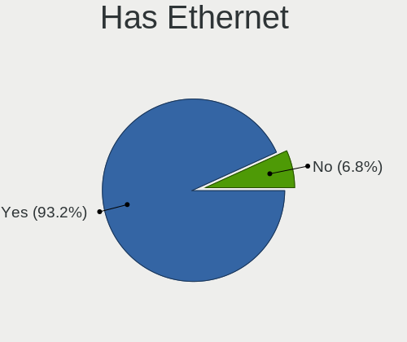
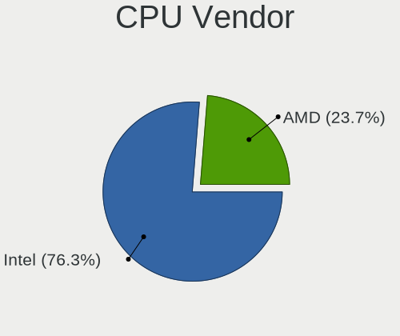
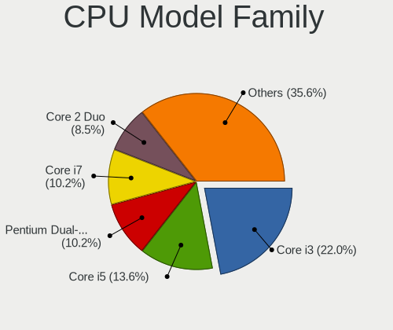
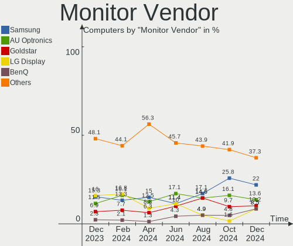

BlackPanther Hardware Trends
----------------------------

A project to identify most popular hardware characteristics and track their change
over time based on data collected by BlackPanther users at https://Linux-Hardware.org.

Anyone can contribute to the study by uploading probes of their computers by
the [hw-probe](https://github.com/linuxhw/hw-probe) tool:

    sudo -E hw-probe -all -upload

This is a report for all computer types. See also reports for [desktops](/Dist/BlackPanther/Desktop/README.md) and [notebooks](/Dist/BlackPanther/Notebook/README.md).

Full-feature report is available here: https://linux-hardware.org/?view=trends

Period: Oct, 2020.

Contents
--------

- [ OS                       ](#os)
- [ OS Family                ](#os-family)
- [ Kernel                   ](#kernel)
- [ Kernel Family            ](#kernel-family)
- [ Kernel Major Ver.        ](#kernel-major-ver)
- [ Arch                     ](#arch)
- [ DE                       ](#de)
- [ Display Server           ](#display-server)
- [ Display Manager          ](#display-manager)
- [ OS Lang                  ](#os-lang)
- [ Boot Mode                ](#boot-mode)
- [ Filesystem               ](#filesystem)
- [ Part. scheme             ](#part-scheme)
- [ Dual Boot with Linux/BSD ](#dual-boot-with-linux/bsd)
- [ Dual Boot (Win)          ](#dual-boot-win)
- [ Country                  ](#country)
- [ City                     ](#city)
- [ Vendor                   ](#vendor)
- [ Model                    ](#model)
- [ Model Family             ](#model-family)
- [ MFG Year                 ](#mfg-year)
- [ Form Factor              ](#form-factor)
- [ Secure Boot              ](#secure-boot)
- [ Coreboot                 ](#coreboot)
- [ RAM Size                 ](#ram-size)
- [ RAM Used                 ](#ram-used)
- [ Has CD-ROM               ](#has-cd-rom)
- [ Total Drives             ](#total-drives)
- [ Has Ethernet             ](#has-ethernet)
- [ Drive Vendor             ](#drive-vendor)
- [ HDD Vendor               ](#hdd-vendor)
- [ SSD Vendor               ](#ssd-vendor)
- [ Drive Model              ](#drive-model)
- [ Drive Kind               ](#drive-kind)
- [ Drive Connector          ](#drive-connector)
- [ Drive Size               ](#drive-size)
- [ Space Total              ](#space-total)
- [ Space Used               ](#space-used)
- [ Malfunc. Drives          ](#malfunc-drives)
- [ Malfunc. Drive Vendor    ](#malfunc-drive-vendor)
- [ Malfunc. HDD Vendor      ](#malfunc-hdd-vendor)
- [ Malfunc. Drive Kind      ](#malfunc-drive-kind)
- [ Failed Drives            ](#failed-drives)
- [ Failed Drive Vendor      ](#failed-drive-vendor)
- [ Drive Status             ](#drive-status)
- [ Storage Vendor           ](#storage-vendor)
- [ Storage Model            ](#storage-model)
- [ Storage Kind             ](#storage-kind)
- [ CPU Vendor               ](#cpu-vendor)
- [ CPU Model                ](#cpu-model)
- [ CPU Model Family         ](#cpu-model-family)
- [ CPU Cores                ](#cpu-cores)
- [ CPU Sockets              ](#cpu-sockets)
- [ CPU Threads              ](#cpu-threads)
- [ CPU Op-Modes             ](#cpu-op-modes)
- [ CPU Microcode            ](#cpu-microcode)
- [ CPU Microarch            ](#cpu-microarch)
- [ GPU Vendor               ](#gpu-vendor)
- [ GPU Model                ](#gpu-model)
- [ GPU Combo                ](#gpu-combo)
- [ GPU Driver               ](#gpu-driver)
- [ GPU Memory               ](#gpu-memory)
- [ Monitor Vendor           ](#monitor-vendor)
- [ Monitor Model            ](#monitor-model)
- [ Monitor Resolution       ](#monitor-resolution)
- [ Monitor Diagonal         ](#monitor-diagonal)
- [ Monitor Width            ](#monitor-width)
- [ Aspect Ratio             ](#aspect-ratio)
- [ Monitor Area             ](#monitor-area)
- [ Pixel Density            ](#pixel-density)
- [ Multiple Monitors        ](#multiple-monitors)
- [ Net Controller Vendor    ](#net-controller-vendor)
- [ Net Controller Model     ](#net-controller-model)
- [ Wireless Vendor          ](#wireless-vendor)
- [ Wireless Model           ](#wireless-model)
- [ Ethernet Vendor          ](#ethernet-vendor)
- [ Ethernet Model           ](#ethernet-model)
- [ Net Controller Kind      ](#net-controller-kind)
- [ Used Controller          ](#used-controller)
- [ NICs                     ](#nics)
- [ Memory Vendor            ](#memory-vendor)
- [ Memory Model             ](#memory-model)
- [ Memory Kind              ](#memory-kind)
- [ Memory Form Factor       ](#memory-form-factor)
- [ Memory Size              ](#memory-size)
- [ Memory Speed             ](#memory-speed)
- [ Sound Vendor             ](#sound-vendor)
- [ Sound Model              ](#sound-model)
- [ Camera Vendor            ](#camera-vendor)
- [ Camera Model             ](#camera-model)
- [ Fingerprint Vendor       ](#fingerprint-vendor)
- [ Fingerprint Model        ](#fingerprint-model)
- [ Chipcard Vendor          ](#chipcard-vendor)
- [ Chipcard Model           ](#chipcard-model)
- [ Printer Vendor           ](#printer-vendor)
- [ Printer Model            ](#printer-model)
- [ Scanner Vendor           ](#scanner-vendor)
- [ Scanner Model            ](#scanner-model)
- [ Bluetooth Vendor         ](#bluetooth-vendor)
- [ Bluetooth Model          ](#bluetooth-model)
- [ Unsupported Devices      ](#unsupported-devices)
- [ Unsupported Device Types ](#unsupported-device-types)

OS
--

Installed operating systems

| Name              | Computers | Percent |
|-------------------|-----------|---------|
| BlackPanther 18.1 | 208       | 93.27%  |
| BlackPanther 16.2 | 14        | 6.28%   |
| BlackPanther 16.1 | 1         | 0.45%   |

OS Family
---------

OS without a version

| Name         | Computers | Percent |
|--------------|-----------|---------|
| BlackPanther | 223       | 100%    |

Kernel
------

Version of the Linux kernel

| Version                | Computers | Percent |
|------------------------|-----------|---------|
| 4.18.16-desktop-1bP    | 207       | 92.83%  |
| 4.9.20-desktop-pae-1bP | 12        | 5.38%   |
| 4.7.0-desktop-1bP      | 2         | 0.9%    |
| 5.1.15-desktop-1bP     | 1         | 0.45%   |
| 4.9.20-desktop-1bP     | 1         | 0.45%   |

Kernel Family
-------------

Linux kernel without a distro release

| Version | Computers | Percent |
|---------|-----------|---------|
| 4.18.16 | 207       | 92.83%  |
| 4.9.20  | 13        | 5.83%   |
| 4.7.0   | 2         | 0.9%    |
| 5.1.15  | 1         | 0.45%   |

Kernel Major Ver.
-----------------

Linux kernel major version

| Version | Computers | Percent |
|---------|-----------|---------|
| 4.18    | 207       | 92.83%  |
| 4.9     | 13        | 5.83%   |
| 4.7     | 2         | 0.9%    |
| 5.1     | 1         | 0.45%   |

Arch
----

OS architecture (x86_64, i586, etc.)

| Name   | Computers | Percent |
|--------|-----------|---------|
| x86_64 | 208       | 93.27%  |
| i686   | 15        | 6.73%   |

DE
--

Desktop Environment

| Name | Computers | Percent |
|------|-----------|---------|
| KDE5 | 222       | 99.55%  |
| KDE  | 1         | 0.45%   |

Display Server
--------------

X11 or Wayland

| Name    | Computers | Percent |
|---------|-----------|---------|
| X11     | 220       | 98.65%  |
| Wayland | 3         | 1.35%   |

Display Manager
---------------

SDDM, LightDM, etc.

| Name    | Computers | Percent |
|---------|-----------|---------|
| SDDM    | 222       | 99.55%  |
| Unknown | 1         | 0.45%   |

OS Lang
-------

Language

| Lang    | Computers | Percent |
|---------|-----------|---------|
| Unknown | 222       | 99.55%  |
| en_AU   | 1         | 0.45%   |

Boot Mode
---------

EFI or BIOS

| Mode | Computers | Percent |
|------|-----------|---------|
| BIOS | 147       | 65.92%  |
| EFI  | 76        | 34.08%  |

Filesystem
----------

Type of filesystem

| Type    | Computers | Percent |
|---------|-----------|---------|
| Overlay | 187       | 83.86%  |
| Ext4    | 35        | 15.7%   |
| Btrfs   | 1         | 0.45%   |

Part. scheme
------------

Scheme of partitioning

| Type    | Computers | Percent |
|---------|-----------|---------|
| MBR     | 141       | 63.23%  |
| GPT     | 77        | 34.53%  |
| Unknown | 5         | 2.24%   |

Dual Boot with Linux/BSD
------------------------

Hosting more than one Linux/BSD

| Dual boot | Computers | Percent |
|-----------|-----------|---------|
| No        | 123       | 55.16%  |
| Yes       | 100       | 44.84%  |

Dual Boot (Win)
---------------

Hosting Linux and Windows

| Dual boot | Computers | Percent |
|-----------|-----------|---------|
| No        | 124       | 55.61%  |
| Yes       | 99        | 44.39%  |

Country
-------

Geographic location (country)

| Country     | Computers | Percent |
|-------------|-----------|---------|
| Hungary     | 138       | 61.88%  |
| Germany     | 16        | 7.17%   |
| USA         | 11        | 4.93%   |
| Slovakia    | 6         | 2.69%   |
| Romania     | 6         | 2.69%   |
| UK          | 5         | 2.24%   |
| Spain       | 4         | 1.79%   |
| Japan       | 4         | 1.79%   |
| Italy       | 4         | 1.79%   |
| Canada      | 4         | 1.79%   |
| Argentina   | 4         | 1.79%   |
| Australia   | 3         | 1.35%   |
| Serbia      | 2         | 0.9%    |
| Philippines | 2         | 0.9%    |
| Kenya       | 2         | 0.9%    |
| Ireland     | 2         | 0.9%    |
| Brazil      | 2         | 0.9%    |
| Israel      | 1         | 0.45%   |
| Hong Kong   | 1         | 0.45%   |
| Greece      | 1         | 0.45%   |
| Finland     | 1         | 0.45%   |
| El Salvador | 1         | 0.45%   |
| Egypt       | 1         | 0.45%   |
| Denmark     | 1         | 0.45%   |
| Austria     | 1         | 0.45%   |

City
----

Geographic location (city)

| City              | Computers | Percent |
|-------------------|-----------|---------|
| Budapest          | 49        | 21.97%  |
| Miskolc           | 5         | 2.24%   |
| Karcag            | 4         | 1.79%   |
| Szigetszentmiklos | 3         | 1.35%   |
| Pécs             | 3         | 1.35%   |
| North Hollywood   | 3         | 1.35%   |
| Mosonmagyaróvár | 3         | 1.35%   |
| Győr             | 3         | 1.35%   |
| Debrecen          | 3         | 1.35%   |
| Cegled            | 3         | 1.35%   |
| Zsombo            | 2         | 0.9%    |
| Ullo              | 2         | 0.9%    |
| Timișoara        | 2         | 0.9%    |
| Rome              | 2         | 0.9%    |
| Pomaz             | 2         | 0.9%    |
| Papa              | 2         | 0.9%    |
| Nyiregyhaza       | 2         | 0.9%    |
| Nairobi           | 2         | 0.9%    |
| Modra             | 2         | 0.9%    |
| Kunhegyes         | 2         | 0.9%    |
| Kanazawa          | 2         | 0.9%    |
| Houston           | 2         | 0.9%    |
| Hantos            | 2         | 0.9%    |
| Hajdusamson       | 2         | 0.9%    |
| Gyomro            | 2         | 0.9%    |
| Eger              | 2         | 0.9%    |
| Dublin            | 2         | 0.9%    |
| Dobšiná         | 2         | 0.9%    |
| Dany              | 2         | 0.9%    |
| Barnesville       | 2         | 0.9%    |
| Backa Topola      | 2         | 0.9%    |
| Ajka              | 2         | 0.9%    |
| Zamboanga City    | 1         | 0.45%   |
| Zalaszentgrot     | 1         | 0.45%   |
| Worcester         | 1         | 0.45%   |
| Wassertrudingen   | 1         | 0.45%   |
| Waren             | 1         | 0.45%   |
| Walsall           | 1         | 0.45%   |
| Vienna            | 1         | 0.45%   |
| Vertesboglar      | 1         | 0.45%   |
| Târgu Mureş     | 1         | 0.45%   |
| Tomorkeny         | 1         | 0.45%   |
| Thessaloniki      | 1         | 0.45%   |
| Tet               | 1         | 0.45%   |
| Teresopolis       | 1         | 0.45%   |
| Tenyo             | 1         | 0.45%   |
| Tel Aviv          | 1         | 0.45%   |
| Tatabánya        | 1         | 0.45%   |
| Tarnok            | 1         | 0.45%   |
| Székesfehérvár | 1         | 0.45%   |
| Szekszárd        | 1         | 0.45%   |
| Szeged            | 1         | 0.45%   |
| Stuttgart         | 1         | 0.45%   |
| Staffordsville    | 1         | 0.45%   |
| Springe           | 1         | 0.45%   |
| Sopron            | 1         | 0.45%   |
| Siófok           | 1         | 0.45%   |
| Signa             | 1         | 0.45%   |
| Seregno           | 1         | 0.45%   |
| Sarkeszi          | 1         | 0.45%   |

Vendor
------

Motherboard manufacturer

| Name                | Computers | Percent |
|---------------------|-----------|---------|
| ASUSTek Computer    | 34        | 15.25%  |
| Dell                | 29        | 13%     |
| Hewlett-Packard     | 28        | 12.56%  |
| Lenovo              | 27        | 12.11%  |
| ASRock              | 23        | 10.31%  |
| Acer                | 14        | 6.28%   |
| Gigabyte Technology | 12        | 5.38%   |
| MSI                 | 8         | 3.59%   |
| Toshiba             | 7         | 3.14%   |
| Fujitsu             | 5         | 2.24%   |
| Apple               | 5         | 2.24%   |
| Samsung Electronics | 4         | 1.79%   |
| Sony                | 2         | 0.9%    |
| Packard Bell        | 2         | 0.9%    |
| Gateway             | 2         | 0.9%    |
| eMachines           | 2         | 0.9%    |
| AMD                 | 2         | 0.9%    |
| Alienware           | 2         | 0.9%    |
| Alcor               | 2         | 0.9%    |
| Unknown             | 2         | 0.9%    |
| TUXEDO              | 1         | 0.45%   |
| Supermicro          | 1         | 0.45%   |
| Shuttle             | 1         | 0.45%   |
| Pegatron            | 1         | 0.45%   |
| MouseComputer       | 1         | 0.45%   |
| Medion              | 1         | 0.45%   |
| Fujitsu Siemens     | 1         | 0.45%   |
| Foxconn             | 1         | 0.45%   |
| ECS                 | 1         | 0.45%   |
| Biostar             | 1         | 0.45%   |
| BANGHO              | 1         | 0.45%   |

Model
-----

Motherboard model

| Name                                                    | Computers | Percent |
|---------------------------------------------------------|-----------|---------|
| ASRock FM2A75M Pro4+                                    | 7         | 3.14%   |
| HP ProBook 4540s                                        | 3         | 1.35%   |
| Toshiba Satellite C55D-A                                | 2         | 0.9%    |
| MSI MS-7309                                             | 2         | 0.9%    |
| Lenovo Z50-70 20354                                     | 2         | 0.9%    |
| Lenovo G50-45 80E3                                      | 2         | 0.9%    |
| HP Notebook                                             | 2         | 0.9%    |
| HP Compaq 8000 Elite SFF PC                             | 2         | 0.9%    |
| Gigabyte H55M-D2H                                       | 2         | 0.9%    |
| Dell OptiPlex 755                                       | 2         | 0.9%    |
| Dell OptiPlex 3050                                      | 2         | 0.9%    |
| ASUS PRIME H310M-R R2.0                                 | 2         | 0.9%    |
| ASUS K50IJ                                              | 2         | 0.9%    |
| ASRock FM2A88M Extreme4+                                | 2         | 0.9%    |
| AMD 970A-DS3                                            | 2         | 0.9%    |
| Unknown                                                 | 2         | 0.9%    |
| TUXEDO N24_25BU                                         | 1         | 0.45%   |
| Toshiba TECRA A10                                       | 1         | 0.45%   |
| Toshiba Satellite L300                                  | 1         | 0.45%   |
| Toshiba Satellite C855-248                              | 1         | 0.45%   |
| Toshiba Satellite C50-B                                 | 1         | 0.45%   |
| Toshiba Satellite A200                                  | 1         | 0.45%   |
| Supermicro H8QM8                                        | 1         | 0.45%   |
| Sony VPCEH2N1E                                          | 1         | 0.45%   |
| Sony VPCEH2J1E                                          | 1         | 0.45%   |
| Shuttle XS35                                            | 1         | 0.45%   |
| Samsung Electronics RV411/RV511/E3511/S3511/RV711/E3411 | 1         | 0.45%   |
| Samsung Electronics R519/R719                           | 1         | 0.45%   |
| Samsung Electronics 300E4A/300E5A/300E7A/3430EA/3530EA  | 1         | 0.45%   |
| Samsung Electronics 300E4A/300E5A/300E7A                | 1         | 0.45%   |
| Pegatron p7-1010a                                       | 1         | 0.45%   |
| Packard Bell EasyNote TK81                              | 1         | 0.45%   |
| Packard Bell EasyNote TK36                              | 1         | 0.45%   |
| MSI VR630                                               | 1         | 0.45%   |
| MSI Pro 3130 Small Form Factor PC                       | 1         | 0.45%   |
| MSI MS-7A32                                             | 1         | 0.45%   |
| MSI MS-7253                                             | 1         | 0.45%   |
| MSI M670                                                | 1         | 0.45%   |
| MSI GP70 2PE                                            | 1         | 0.45%   |
| MouseComputer NG-i670                                   | 1         | 0.45%   |
| Medion B075DE                                           | 1         | 0.45%   |
| Lenovo V145-15AST 81MT                                  | 1         | 0.45%   |
| Lenovo ThinkPad X61 76753BJ                             | 1         | 0.45%   |
| Lenovo ThinkPad X61 7673BW3                             | 1         | 0.45%   |
| Lenovo ThinkPad X230 2325AC7                            | 1         | 0.45%   |
| Lenovo ThinkPad T440s 20ARS0BH00                        | 1         | 0.45%   |
| Lenovo ThinkPad T440p 20AWS16U02                        | 1         | 0.45%   |
| Lenovo ThinkPad SL 2746P3G                              | 1         | 0.45%   |
| Lenovo ThinkPad L540 20AUA128HV                         | 1         | 0.45%   |
| Lenovo ThinkCentre M93p 10A7000LGE                      | 1         | 0.45%   |
| Lenovo ThinkCentre M91p 7034BN4                         | 1         | 0.45%   |
| Lenovo ThinkCentre M70e 0832W2F                         | 1         | 0.45%   |
| Lenovo ThinkCentre M57 6087AG9                          | 1         | 0.45%   |
| Lenovo IdeaPad S145-15AST 81N3                          | 1         | 0.45%   |
| Lenovo IdeaPad 520-15IKB 80YL                           | 1         | 0.45%   |
| Lenovo IdeaPad 330-15IKB 81DE                           | 1         | 0.45%   |
| Lenovo IdeaPad 330-15AST 81D6                           | 1         | 0.45%   |
| Lenovo IdeaPad 305-15IBD 80NJ                           | 1         | 0.45%   |
| Lenovo IdeaPad 110-15IBR 80T7                           | 1         | 0.45%   |
| Lenovo IdeaCentre A340-22IWL F0EB006RRI                 | 1         | 0.45%   |

Model Family
------------

Motherboard model prefix

| Name                       | Computers | Percent |
|----------------------------|-----------|---------|
| Acer Aspire                | 12        | 5.38%   |
| HP Compaq                  | 11        | 4.93%   |
| Dell OptiPlex              | 11        | 4.93%   |
| Lenovo ThinkPad            | 7         | 3.14%   |
| Dell Inspiron              | 7         | 3.14%   |
| ASRock FM2A75M             | 7         | 3.14%   |
| Toshiba Satellite          | 6         | 2.69%   |
| Lenovo IdeaPad             | 6         | 2.69%   |
| Dell Latitude              | 6         | 2.69%   |
| HP ProBook                 | 5         | 2.24%   |
| ASUS PRIME                 | 5         | 2.24%   |
| Lenovo ThinkCentre         | 4         | 1.79%   |
| Fujitsu ESPRIMO            | 3         | 1.35%   |
| Dell Vostro                | 3         | 1.35%   |
| Samsung Electronics 300E4A | 2         | 0.9%    |
| Packard Bell EasyNote      | 2         | 0.9%    |
| MSI MS-7309                | 2         | 0.9%    |
| Lenovo Z50-70              | 2         | 0.9%    |
| Lenovo G50-45              | 2         | 0.9%    |
| Lenovo 3000                | 2         | 0.9%    |
| HP Notebook                | 2         | 0.9%    |
| HP EliteBook               | 2         | 0.9%    |
| Gigabyte H55M-D2H          | 2         | 0.9%    |
| ASUS VivoBook              | 2         | 0.9%    |
| ASUS K50IJ                 | 2         | 0.9%    |
| ASUS H110M-A               | 2         | 0.9%    |
| ASRock FM2A88M             | 2         | 0.9%    |
| AMD 970A-DS3               | 2         | 0.9%    |
| Unknown                    | 2         | 0.9%    |
| TUXEDO N24                 | 1         | 0.45%   |
| Toshiba TECRA              | 1         | 0.45%   |
| Supermicro H8QM8           | 1         | 0.45%   |
| Sony VPCEH2N1E             | 1         | 0.45%   |
| Sony VPCEH2J1E             | 1         | 0.45%   |
| Shuttle XS35               | 1         | 0.45%   |
| Samsung Electronics RV411  | 1         | 0.45%   |
| Samsung Electronics R519   | 1         | 0.45%   |
| Pegatron p7-1010a          | 1         | 0.45%   |
| MSI VR630                  | 1         | 0.45%   |
| MSI Pro                    | 1         | 0.45%   |
| MSI MS-7A32                | 1         | 0.45%   |
| MSI MS-7253                | 1         | 0.45%   |
| MSI M670                   | 1         | 0.45%   |
| MSI GP70                   | 1         | 0.45%   |
| MouseComputer NG-i670      | 1         | 0.45%   |
| Medion B075DE              | 1         | 0.45%   |
| Lenovo V145-15AST          | 1         | 0.45%   |
| Lenovo IdeaCentre          | 1         | 0.45%   |
| Lenovo H50-55              | 1         | 0.45%   |
| Lenovo B50-45              | 1         | 0.45%   |
| HP ProDesk                 | 1         | 0.45%   |
| HP Presario                | 1         | 0.45%   |
| HP Pavilion                | 1         | 0.45%   |
| HP 620                     | 1         | 0.45%   |
| HP 530                     | 1         | 0.45%   |
| HP 255                     | 1         | 0.45%   |
| HP 250                     | 1         | 0.45%   |
| HP 2140                    | 1         | 0.45%   |
| Gigabyte M68M-S2P          | 1         | 0.45%   |
| Gigabyte H81M-S2H          | 1         | 0.45%   |

MFG Year
--------

Motherboard manufacture year

| Year | Computers | Percent |
|------|-----------|---------|
| 2019 | 29        | 13%     |
| 2014 | 20        | 8.97%   |
| 2013 | 19        | 8.52%   |
| 2012 | 19        | 8.52%   |
| 2018 | 18        | 8.07%   |
| 2011 | 16        | 7.17%   |
| 2010 | 16        | 7.17%   |
| 2009 | 16        | 7.17%   |
| 2008 | 16        | 7.17%   |
| 2015 | 15        | 6.73%   |
| 2016 | 14        | 6.28%   |
| 2020 | 8         | 3.59%   |
| 2007 | 8         | 3.59%   |
| 2017 | 6         | 2.69%   |
| 2006 | 3         | 1.35%   |

Form Factor
-----------

Physical design of the computer

| Name        | Computers | Percent |
|-------------|-----------|---------|
| Notebook    | 116       | 52.02%  |
| Desktop     | 103       | 46.19%  |
| All in one  | 3         | 1.35%   |
| Convertible | 1         | 0.45%   |

Secure Boot
-----------

Enabled or disabled

| State    | Computers | Percent |
|----------|-----------|---------|
| Disabled | 223       | 100%    |

Coreboot
--------

Have coreboot on board

| Used | Computers | Percent |
|------|-----------|---------|
| No   | 223       | 100%    |

RAM Size
--------

Total RAM memory

| Size in GB | Computers | Percent |
|------------|-----------|---------|
| 3.01-4.0   | 79        | 35.43%  |
| 8.01-16.0  | 50        | 22.42%  |
| 4.01-8.0   | 32        | 14.35%  |
| 1.01-2.0   | 24        | 10.76%  |
| 16.01-24.0 | 22        | 9.87%   |
| 2.01-3.0   | 8         | 3.59%   |
| 32.01-64.0 | 5         | 2.24%   |
| 24.01-32.0 | 2         | 0.9%    |
| 0.01-1.0   | 1         | 0.45%   |

RAM Used
--------

Used RAM memory

| Used GB  | Computers | Percent |
|----------|-----------|---------|
| 0.01-1.0 | 187       | 83.86%  |
| 1.01-2.0 | 35        | 15.7%   |
| 3.01-4.0 | 1         | 0.45%   |

Has CD-ROM
----------

Has CD-ROM on board

| Presented | Computers | Percent |
|-----------|-----------|---------|
| Yes       | 150       | 67.26%  |
| No        | 73        | 32.74%  |

Total Drives
------------

Number of drives on board

| Drives | Computers | Percent |
|--------|-----------|---------|
| 1      | 153       | 68.61%  |
| 2      | 51        | 22.87%  |
| 3      | 10        | 4.48%   |
| 0      | 5         | 2.24%   |
| 4      | 3         | 1.35%   |
| 5      | 1         | 0.45%   |

Has Ethernet
------------

Has Ethernet on board

| Presented | Computers | Percent |
|-----------|-----------|---------|
| Yes       | 214       | 95.96%  |
| No        | 9         | 4.04%   |

Drive Vendor
------------

Hard drive vendors

| Vendor              | Computers | Drives | Percent |
|---------------------|-----------|--------|---------|
| WDC                 | 56        | 59     | 18.79%  |
| Seagate             | 46        | 52     | 15.44%  |
| Samsung Electronics | 33        | 34     | 11.07%  |
| Kingston            | 32        | 33     | 10.74%  |
| Toshiba             | 19        | 20     | 6.38%   |
| Hitachi             | 17        | 19     | 5.7%    |
| A-DATA Technology   | 15        | 17     | 5.03%   |
| SanDisk             | 11        | 11     | 3.69%   |
| Fujitsu             | 11        | 11     | 3.69%   |
| Intel               | 10        | 10     | 3.36%   |
| Unknown             | 9         | 11     | 3.02%   |
| Crucial             | 5         | 5      | 1.68%   |
| SK Hynix            | 4         | 4      | 1.34%   |
| HGST                | 4         | 4      | 1.34%   |
| Patriot             | 3         | 3      | 1.01%   |
| PNY                 | 2         | 2      | 0.67%   |
| Kingmax             | 2         | 2      | 0.67%   |
| JMicron             | 2         | 2      | 0.67%   |
| Zheino              | 1         | 1      | 0.34%   |
| USB                 | 1         | 1      | 0.34%   |
| SPCC                | 1         | 1      | 0.34%   |
| OCZ                 | 1         | 1      | 0.34%   |
| Micron Technology   | 1         | 1      | 0.34%   |
| MAXTOR              | 1         | 1      | 0.34%   |
| MARSHAL             | 1         | 1      | 0.34%   |
| LITEONIT            | 1         | 1      | 0.34%   |
| LITEON              | 1         | 1      | 0.34%   |
| Leven               | 1         | 1      | 0.34%   |
| KingSpec            | 1         | 1      | 0.34%   |
| Gigabyte Technology | 1         | 1      | 0.34%   |
| ExcelStor           | 1         | 1      | 0.34%   |
| Corsair             | 1         | 1      | 0.34%   |
| BHT                 | 1         | 1      | 0.34%   |
| ASMT                | 1         | 2      | 0.34%   |
| Apple               | 1         | 1      | 0.34%   |

HDD Vendor
----------

Hard disk drive vendors

| Vendor              | Computers | Drives | Percent |
|---------------------|-----------|--------|---------|
| WDC                 | 52        | 54     | 31.71%  |
| Seagate             | 46        | 52     | 28.05%  |
| Toshiba             | 17        | 18     | 10.37%  |
| Hitachi             | 17        | 19     | 10.37%  |
| Samsung Electronics | 12        | 12     | 7.32%   |
| Fujitsu             | 11        | 11     | 6.71%   |
| HGST                | 4         | 4      | 2.44%   |
| MAXTOR              | 1         | 1      | 0.61%   |
| MARSHAL             | 1         | 1      | 0.61%   |
| ExcelStor           | 1         | 1      | 0.61%   |
| ASMT                | 1         | 2      | 0.61%   |
| Apple               | 1         | 1      | 0.61%   |

SSD Vendor
----------

Solid state drive vendors

| Vendor              | Computers | Drives | Percent |
|---------------------|-----------|--------|---------|
| Kingston            | 31        | 32     | 28.97%  |
| Samsung Electronics | 16        | 16     | 14.95%  |
| A-DATA Technology   | 14        | 16     | 13.08%  |
| SanDisk             | 9         | 9      | 8.41%   |
| Intel               | 6         | 6      | 5.61%   |
| WDC                 | 5         | 5      | 4.67%   |
| Crucial             | 5         | 5      | 4.67%   |
| SK Hynix            | 3         | 3      | 2.8%    |
| PNY                 | 2         | 2      | 1.87%   |
| Patriot             | 2         | 2      | 1.87%   |
| Kingmax             | 2         | 2      | 1.87%   |
| Toshiba             | 1         | 1      | 0.93%   |
| SPCC                | 1         | 1      | 0.93%   |
| OCZ                 | 1         | 1      | 0.93%   |
| Micron Technology   | 1         | 1      | 0.93%   |
| LITEONIT            | 1         | 1      | 0.93%   |
| LITEON              | 1         | 1      | 0.93%   |
| Leven               | 1         | 1      | 0.93%   |
| KingSpec            | 1         | 1      | 0.93%   |
| JMicron             | 1         | 1      | 0.93%   |
| Gigabyte Technology | 1         | 1      | 0.93%   |
| Corsair             | 1         | 1      | 0.93%   |
| BHT                 | 1         | 1      | 0.93%   |

Drive Model
-----------

Hard drive models

| Model                         | Computers | Percent |
|-------------------------------|-----------|---------|
| SV300S37A120G 120GB SSD       | 6         | 1.9%    |
| SU630 240GB SSD               | 6         | 1.9%    |
| SA400S37120G 120GB SSD        | 6         | 1.9%    |
| SUV400S37120G 120GB SSD       | 5         | 1.59%   |
| SU700 120GB SSD               | 5         | 1.59%   |
| ST1000LM035-1RK172 1TB        | 5         | 1.59%   |
| MHZ2160BH G2 160GB            | 5         | 1.59%   |
| DT01ACA100 1TB                | 5         | 1.59%   |
| WD10EZRX-00L4HB0 1TB          | 4         | 1.27%   |
| SV300S37A240G 240GB SSD       | 4         | 1.27%   |
| ST9250315AS 250GB             | 4         | 1.27%   |
| ST1000LM024 HN-M101MBB 1TB    | 4         | 1.27%   |
| MQ04ABF100 1TB                | 4         | 1.27%   |
| MQ01ABF050 500GB              | 4         | 1.27%   |
| ST250DM000-1BD141 250GB       | 3         | 0.95%   |
| SSD PLUS 240GB                | 3         | 0.95%   |
| SSD 850 EVO 250GB             | 3         | 0.95%   |
| SA400S37240G 240GB SSD        | 3         | 0.95%   |
| MQ01ACF032 320GB              | 3         | 0.95%   |
| CT120BX500SSD1 120GB          | 3         | 0.95%   |
| WDS120G2G0A-00JH30 120GB SSD  | 2         | 0.63%   |
| WD800BEVS-22RST0 80GB         | 2         | 0.63%   |
| WD3200AVVS-56L2B0 320GB       | 2         | 0.63%   |
| WD2500BEKT-75PVMT0 250GB      | 2         | 0.63%   |
| ST500DM002-1BD142 500GB       | 2         | 0.63%   |
| ST4000DM000-1F2168 4TB        | 2         | 0.63%   |
| ST3250318AS 250GB             | 2         | 0.63%   |
| ST1000LM048-2E7172 1TB        | 2         | 0.63%   |
| ST1000LM 024 HN-M101MBB 1TB   | 2         | 0.63%   |
| SSD 850 EVO 500GB             | 2         | 0.63%   |
| SSD 240GB                     | 2         | 0.63%   |
| SA400S37480G 480GB SSD        | 2         | 0.63%   |
| HDS721050CLA362 500GB         | 2         | 0.63%   |
| CT240BX500SSD1 240GB          | 2         | 0.63%   |
| WR202H0032G E70290F5 32GB SSD | 1         | 0.32%   |
| WDS250G2B0A-00SM50 250GB SSD  | 1         | 0.32%   |
| WDS240G2G0B-00EPW0 240GB SSD  | 1         | 0.32%   |
| WDS240G2G0A-00JH30 240GB SSD  | 1         | 0.32%   |
| WD800JD-75MSA1 80GB           | 1         | 0.32%   |
| WD800AAJS-00WAA0 80GB         | 1         | 0.32%   |
| WD7500BPVT-60HXZT3 752GB      | 1         | 0.32%   |
| WD6003FZBX-00K5WB0 6TB        | 1         | 0.32%   |
| WD5003ABYX-01WERA2 500GB      | 1         | 0.32%   |
| WD5000LPVX-22V0TT0 500GB      | 1         | 0.32%   |
| WD5000LPCX-24VHAT0 500GB      | 1         | 0.32%   |
| WD5000LPCX-21VHAT0 500GB      | 1         | 0.32%   |
| WD5000BEVT-22A0RT0 500GB      | 1         | 0.32%   |
| WD5000AAKX-75U6AA0 500GB      | 1         | 0.32%   |
| WD5000AAKX-22ERMA0 500GB      | 1         | 0.32%   |
| WD5000AAKX-07U6AA0 500GB      | 1         | 0.32%   |
| WD3200BPVT-22JJ5T0 320GB      | 1         | 0.32%   |
| WD3200BEVT-22ZCT0 320GB       | 1         | 0.32%   |
| WD3200AAJS-56M0A0 320GB       | 1         | 0.32%   |
| WD3200AAJS-56B4A0 320GB       | 1         | 0.32%   |
| WD2500JS-60NCB1 250GB         | 1         | 0.32%   |
| WD2500BEVT-75ZCT2 250GB       | 1         | 0.32%   |
| WD2500BEVT-00A23T0 250GB      | 1         | 0.32%   |
| WD2500BEVS-22UST0 250GB       | 1         | 0.32%   |
| WD2500AAKX-603CA0 250GB       | 1         | 0.32%   |
| WD2500AAJS-75M0A0 250GB       | 1         | 0.32%   |

Drive Kind
----------

HDD or SSD

| Kind    | Computers | Drives | Percent |
|---------|-----------|--------|---------|
| HDD     | 148       | 176    | 54.01%  |
| SSD     | 100       | 110    | 36.5%   |
| NVMe    | 14        | 16     | 5.11%   |
| MMC     | 10        | 13     | 3.65%   |
| Unknown | 2         | 2      | 0.73%   |

Drive Connector
---------------

SATA, SAS, NVMe, etc.

| Type | Computers | Drives | Percent |
|------|-----------|--------|---------|
| SATA | 212       | 279    | 86.89%  |
| NVMe | 14        | 16     | 5.74%   |
| MMC  | 10        | 13     | 4.1%    |
| SAS  | 8         | 9      | 3.28%   |

Drive Size
----------

Size of hard drive

| Size in TB | Computers | Drives | Percent |
|------------|-----------|--------|---------|
| 0.01-0.5   | 184       | 221    | 76.03%  |
| 0.51-1.0   | 47        | 53     | 19.42%  |
| 1.01-2.0   | 6         | 7      | 2.48%   |
| 3.01-4.0   | 2         | 2      | 0.83%   |
| 4.01-10.0  | 2         | 2      | 0.83%   |
| 2.01-3.0   | 1         | 1      | 0.41%   |

Space Total
-----------

Amount of disk space available on the file system

| Size in GB | Computers | Percent |
|------------|-----------|---------|
| Unknown    | 181       | 81.17%  |
| 101-250    | 21        | 9.42%   |
| 51-100     | 7         | 3.14%   |
| 251-500    | 6         | 2.69%   |
| 21-50      | 3         | 1.35%   |
| 1-20       | 2         | 0.9%    |
| 501-1000   | 2         | 0.9%    |
| 1001-2000  | 1         | 0.45%   |

Space Used
----------

Amount of used disk space

| Used GB | Computers | Percent |
|---------|-----------|---------|
| Unknown | 181       | 81.17%  |
| 1-20    | 41        | 18.39%  |
| 101-250 | 1         | 0.45%   |

Malfunc. Drives
---------------

Drive models with a malfunction

| Model                        | Computers | Drives | Percent |
|------------------------------|-----------|--------|---------|
| SU630 240GB SSD              | 6         | 6      | 8.22%   |
| ST9250315AS 250GB            | 3         | 3      | 4.11%   |
| WD2500BEKT-75PVMT0 250GB     | 2         | 2      | 2.74%   |
| ST4000DM000-1F2168 4TB       | 2         | 2      | 2.74%   |
| ST1000LM024 HN-M101MBB 1TB   | 2         | 2      | 2.74%   |
| HDS721050CLA362 500GB        | 2         | 2      | 2.74%   |
| WD800BEVS-22RST0 80GB        | 1         | 1      | 1.37%   |
| WD7500BPVT-60HXZT3 752GB     | 1         | 1      | 1.37%   |
| WD5000AAKX-07U6AA0 500GB     | 1         | 1      | 1.37%   |
| WD3200BEVT-22ZCT0 320GB      | 1         | 1      | 1.37%   |
| WD3200AVVS-56L2B0 320GB      | 1         | 1      | 1.37%   |
| WD3200AAJS-56M0A0 320GB      | 1         | 1      | 1.37%   |
| WD2500BEVT-00A23T0 250GB     | 1         | 1      | 1.37%   |
| WD20EARX-00PASB0 2TB         | 1         | 1      | 1.37%   |
| WD2000JD-22HBC0 200GB        | 1         | 1      | 1.37%   |
| WD1600HLHX-60JJPV1 160GB     | 1         | 1      | 1.37%   |
| WD1600AAJS-08L7A0 160GB      | 1         | 1      | 1.37%   |
| WD1600AAJS-00PSA0 160GB      | 1         | 1      | 1.37%   |
| WD10JPCX-24UE4T0 1TB         | 1         | 1      | 1.37%   |
| WD10EARS-00Y5B1 1TB          | 1         | 1      | 1.37%   |
| Technology J8080S 82GB       | 1         | 1      | 1.37%   |
| SV300S37A120G 120GB SSD      | 1         | 1      | 1.37%   |
| SUV400S37120G 120GB SSD      | 1         | 1      | 1.37%   |
| STM3250318AS 250GB           | 1         | 1      | 1.37%   |
| STM3250310AS 250GB           | 1         | 1      | 1.37%   |
| ST9500325AS 500GB            | 1         | 1      | 1.37%   |
| ST9160821AS 160GB            | 1         | 1      | 1.37%   |
| ST9160314AS 160GB            | 1         | 1      | 1.37%   |
| ST500DM002-1BD142 500GB      | 1         | 1      | 1.37%   |
| ST380815AS 80GB              | 1         | 2      | 1.37%   |
| ST3500410AS 500GB            | 1         | 1      | 1.37%   |
| ST340014AS 40GB              | 1         | 1      | 1.37%   |
| ST3250318AS 250GB            | 1         | 1      | 1.37%   |
| ST1000LX015-1U7172 1TB       | 1         | 1      | 1.37%   |
| ST1000LM014-1EJ164-SSHD 1TB  | 1         | 1      | 1.37%   |
| SSDSCKKF256G8H 256GB         | 1         | 1      | 1.37%   |
| SSD 970 EVO 250GB            | 1         | 1      | 1.37%   |
| MQ01ABF050 500GB             | 1         | 1      | 1.37%   |
| MJA2320BH G2 320GB           | 1         | 1      | 1.37%   |
| MHZ2250BH G2 250GB           | 1         | 1      | 1.37%   |
| MHZ2160BH G2 160GB           | 1         | 1      | 1.37%   |
| MHY2120BH 120GB              | 1         | 1      | 1.37%   |
| MHY2080BH 80GB               | 1         | 1      | 1.37%   |
| MHW2160BH PL 160GB           | 1         | 1      | 1.37%   |
| MHW2060BH 64GB               | 1         | 1      | 1.37%   |
| MAL2020SA 80 20GB            | 1         | 1      | 1.37%   |
| HTS725025A9A364 250GB        | 1         | 1      | 1.37%   |
| HTS723232A7A364 320GB        | 1         | 1      | 1.37%   |
| HTS723216L9A360 160GB        | 1         | 1      | 1.37%   |
| HTS545032B9A300 320GB        | 1         | 1      | 1.37%   |
| HTS545032A7E380 320GB        | 1         | 1      | 1.37%   |
| HTS545025B9SA02 250GB        | 1         | 1      | 1.37%   |
| HTS543232L9A300 320GB        | 1         | 1      | 1.37%   |
| HTS542512K9SA00 120GB        | 1         | 1      | 1.37%   |
| HM500JI 500GB                | 1         | 1      | 1.37%   |
| HM160HI 160GB                | 1         | 1      | 1.37%   |
| HFS128G39TND-N210A 128GB SSD | 1         | 1      | 1.37%   |
| HDS721050CLA360 500GB        | 1         | 1      | 1.37%   |
| HDS721010CLA332 1TB          | 1         | 1      | 1.37%   |
| HD501LJ 500GB                | 1         | 1      | 1.37%   |

Malfunc. Drive Vendor
---------------------

Vendors of faulty drives

| Vendor              | Computers | Drives | Percent |
|---------------------|-----------|--------|---------|
| Seagate             | 17        | 19     | 24.29%  |
| WDC                 | 15        | 16     | 21.43%  |
| Hitachi             | 11        | 11     | 15.71%  |
| Fujitsu             | 7         | 7      | 10%     |
| A-DATA Technology   | 6         | 6      | 8.57%   |
| Samsung Electronics | 5         | 6      | 7.14%   |
| Kingston            | 2         | 2      | 2.86%   |
| Toshiba             | 1         | 1      | 1.43%   |
| SK Hynix            | 1         | 1      | 1.43%   |
| MAXTOR              | 1         | 1      | 1.43%   |
| MARSHAL             | 1         | 1      | 1.43%   |
| Intel               | 1         | 1      | 1.43%   |
| HGST                | 1         | 1      | 1.43%   |
| ExcelStor           | 1         | 1      | 1.43%   |

Malfunc. HDD Vendor
-------------------

Vendors of faulty HDD drives

| Vendor              | Computers | Drives | Percent |
|---------------------|-----------|--------|---------|
| Seagate             | 17        | 19     | 28.33%  |
| WDC                 | 15        | 16     | 25%     |
| Hitachi             | 11        | 11     | 18.33%  |
| Fujitsu             | 7         | 7      | 11.67%  |
| Samsung Electronics | 5         | 5      | 8.33%   |
| Toshiba             | 1         | 1      | 1.67%   |
| MAXTOR              | 1         | 1      | 1.67%   |
| MARSHAL             | 1         | 1      | 1.67%   |
| HGST                | 1         | 1      | 1.67%   |
| ExcelStor           | 1         | 1      | 1.67%   |

Malfunc. Drive Kind
-------------------

Kinds of faulty drives

| Kind | Computers | Drives | Percent |
|------|-----------|--------|---------|
| HDD  | 57        | 63     | 83.82%  |
| SSD  | 10        | 10     | 14.71%  |
| NVMe | 1         | 1      | 1.47%   |

Failed Drives
-------------

Failed drive models

| Model                    | Computers | Drives | Percent |
|--------------------------|-----------|--------|---------|
| WD1600BEVT-80A23T0 160GB | 1         | 1      | 100%    |

Failed Drive Vendor
-------------------

Failed drive vendors

| Vendor | Computers | Drives | Percent |
|--------|-----------|--------|---------|
| WDC    | 1         | 1      | 100%    |

Drive Status
------------

Number of failed and malfunc. drives

| Status   | Computers | Drives | Percent |
|----------|-----------|--------|---------|
| Works    | 169       | 213    | 66.27%  |
| Malfunc  | 66        | 74     | 25.88%  |
| Detected | 19        | 29     | 7.45%   |
| Failed   | 1         | 1      | 0.39%   |

Storage Vendor
--------------

Storage controller vendors

| Vendor                      | Computers | Percent |
|-----------------------------|-----------|---------|
| Intel                       | 157       | 63.56%  |
| AMD                         | 50        | 20.24%  |
| Nvidia                      | 10        | 4.05%   |
| Samsung Electronics         | 6         | 2.43%   |
| Silicon Image               | 4         | 1.62%   |
| ASMedia Technology          | 4         | 1.62%   |
| JMicron Technology          | 3         | 1.21%   |
| VIA Technologies            | 2         | 0.81%   |
| Marvell Technology Group    | 2         | 0.81%   |
| Silicon Motion              | 1         | 0.4%    |
| Sandisk                     | 1         | 0.4%    |
| Phison Electronics          | 1         | 0.4%    |
| KIOXIA                      | 1         | 0.4%    |
| Kingston Technology Company | 1         | 0.4%    |
| Apple                       | 1         | 0.4%    |
| ADATA Technology            | 1         | 0.4%    |
| Adaptec                     | 1         | 0.4%    |
| 3ware                       | 1         | 0.4%    |

Storage Model
-------------

Storage controller models

| Model                                                                      | Computers | Percent |
|----------------------------------------------------------------------------|-----------|---------|
| FCH SATA Controller [AHCI mode]                                            | 38        | 11.66%  |
| 82801IBM/IEM (ICH9M/ICH9M-E) 4 port SATA Controller [AHCI mode]            | 13        | 3.99%   |
| 7 Series Chipset Family 6-port SATA Controller [AHCI mode]                 | 13        | 3.99%   |
| 82801G (ICH7 Family) IDE Controller                                        | 12        | 3.68%   |
| FCH IDE Controller                                                         | 10        | 3.07%   |
| 8 Series/C220 Series Chipset Family 6-port SATA Controller 1 [AHCI mode]   | 10        | 3.07%   |
| Sunrise Point-LP SATA Controller [AHCI mode]                               | 9         | 2.76%   |
| 200 Series PCH SATA controller [AHCI mode]                                 | 9         | 2.76%   |
| NM10/ICH7 Family SATA Controller [IDE mode]                                | 8         | 2.45%   |
| 82801HM/HEM (ICH8M/ICH8M-E) SATA Controller [AHCI mode]                    | 8         | 2.45%   |
| 82801HM/HEM (ICH8M/ICH8M-E) IDE Controller                                 | 8         | 2.45%   |
| 6 Series/C200 Series Chipset Family 6 port Mobile SATA AHCI Controller     | 8         | 2.45%   |
| SB7x0/SB8x0/SB9x0 SATA Controller [IDE mode]                               | 7         | 2.15%   |
| SB7x0/SB8x0/SB9x0 IDE Controller                                           | 7         | 2.15%   |
| Q170/Q150/B150/H170/H110/Z170/CM236 Chipset SATA Controller [AHCI Mode]    | 7         | 2.15%   |
| 82801 Mobile SATA Controller [RAID mode]                                   | 7         | 2.15%   |
| Atom/Celeron/Pentium Processor x5-E8000/J3xxx/N3xxx Series SATA Controller | 6         | 1.84%   |
| 4 Series Chipset PT IDER Controller                                        | 6         | 1.84%   |
| 82801I (ICH9 Family) 2 port SATA Controller [IDE mode]                     | 5         | 1.53%   |
| 82801GBM/GHM (ICH7-M Family) SATA Controller [AHCI mode]                   | 5         | 1.53%   |
| NVMe SSD Controller SM981/PM981/PM983                                      | 4         | 1.23%   |
| MCP61 SATA Controller                                                      | 4         | 1.23%   |
| MCP61 IDE                                                                  | 4         | 1.23%   |
| ASM1062 Serial ATA Controller                                              | 4         | 1.23%   |
| 82Q35 Express PT IDER Controller                                           | 4         | 1.23%   |
| 82801JD/DO (ICH10 Family) SATA AHCI Controller                             | 4         | 1.23%   |
| 82801IR/IO/IH (ICH9R/DO/DH) 4 port SATA Controller [IDE mode]              | 4         | 1.23%   |
| 8 Series SATA Controller 1 [AHCI mode]                                     | 4         | 1.23%   |
| 7 Series/C210 Series Chipset Family 6-port SATA Controller [AHCI mode]     | 4         | 1.23%   |
| 6 Series/C200 Series Chipset Family 6 port Desktop SATA AHCI Controller    | 4         | 1.23%   |
| 400 Series Chipset SATA Controller                                         | 4         | 1.23%   |
| SB7x0/SB8x0/SB9x0 SATA Controller [AHCI mode]                              | 3         | 0.92%   |
| SATA Controller [RAID mode]                                                | 3         | 0.92%   |
| JMB368 IDE controller                                                      | 3         | 0.92%   |
| Atom Processor E3800 Series SATA AHCI Controller                           | 3         | 0.92%   |
| 82801JD/DO (ICH10 Family) 4-port SATA IDE Controller                       | 3         | 0.92%   |
| 82801JD/DO (ICH10 Family) 2-port SATA IDE Controller                       | 3         | 0.92%   |
| 5 Series/3400 Series Chipset 6 port SATA AHCI Controller                   | 3         | 0.92%   |
| X370 Series Chipset SATA Controller                                        | 2         | 0.61%   |
| Wildcat Point-LP SATA Controller [AHCI Mode]                               | 2         | 0.61%   |
| VT82C586A/B/VT82C686/A/B/VT823x/A/C PIPC Bus Master IDE                    | 2         | 0.61%   |
| SSD 660P Series                                                            | 2         | 0.61%   |
| SiI 3512 [SATALink/SATARaid] Serial ATA Controller                         | 2         | 0.61%   |
| SiI 3132 Serial ATA Raid II Controller                                     | 2         | 0.61%   |
| NVMe SSD Optane Series Controller                                          | 2         | 0.61%   |
| Non-Volatile memory controller                                             | 2         | 0.61%   |
| Cannon Lake Mobile PCH SATA AHCI Controller                                | 2         | 0.61%   |
| 82801JI (ICH10 Family) SATA AHCI Controller                                | 2         | 0.61%   |
| 82801IBM/IEM (ICH9M/ICH9M-E) 2 port SATA Controller [IDE mode]             | 2         | 0.61%   |
| 82801GBM/GHM (ICH7-M Family) SATA Controller [IDE mode]                    | 2         | 0.61%   |
| 5 Series/3400 Series Chipset 4 port SATA AHCI Controller                   | 2         | 0.61%   |
| XPG SX8200 Pro PCIe Gen3x4 M.2 2280 Solid State Drive                      | 1         | 0.31%   |
| WD Black 2018 / PC SN720 NVMe SSD                                          | 1         | 0.31%   |
| VT8237A SATA 2-Port Controller                                             | 1         | 0.31%   |
| VT8237/8251 Serial ATA Controller                                          | 1         | 0.31%   |
| SB7x0/SB8x0/SB9x0 SATA Controller [Non-RAID5 mode]                         | 1         | 0.31%   |
| SATA controller                                                            | 1         | 0.31%   |
| S1X NVMe Controller                                                        | 1         | 0.31%   |
| NVMe Storage Controller                                                    | 1         | 0.31%   |
| NVMe SSD Controller SM961/PM961                                            | 1         | 0.31%   |

Storage Kind
------------

Kind of storage controller (IDE, SATA, NVMe, SAS, ...)

| Kind | Computers | Percent |
|------|-----------|---------|
| SATA | 174       | 62.82%  |
| IDE  | 72        | 25.99%  |
| RAID | 15        | 5.42%   |
| NVMe | 15        | 5.42%   |
| SCSI | 1         | 0.36%   |

CPU Vendor
----------

Processor vendors

| Vendor | Computers | Percent |
|--------|-----------|---------|
| Intel  | 164       | 73.54%  |
| AMD    | 59        | 26.46%  |

CPU Model
---------

Processor models

| Model                                         | Computers | Percent |
|-----------------------------------------------|-----------|---------|
| AMD A8-6600K APU with Radeon HD Graphics      | 8         | 3.59%   |
| Intel Pentium Dual-Core CPU T4300 @ 2.10GHz   | 5         | 2.24%   |
| Intel Core 2 Duo CPU E8400 @ 3.00GHz          | 4         | 1.79%   |
| Intel Core i5-6500 CPU @ 3.20GHz              | 3         | 1.35%   |
| Intel Core i5-3320M CPU @ 2.60GHz             | 3         | 1.35%   |
| Intel Core i5-2520M CPU @ 2.50GHz             | 3         | 1.35%   |
| Intel Core i3-5005U CPU @ 2.00GHz             | 3         | 1.35%   |
| Intel Core 2 Duo CPU E7500 @ 2.93GHz          | 3         | 1.35%   |
| Intel Pentium Dual-Core CPU E5300 @ 2.60GHz   | 2         | 0.9%    |
| Intel Pentium Dual CPU T3400 @ 2.16GHz        | 2         | 0.9%    |
| Intel Pentium Dual CPU E2160 @ 1.80GHz        | 2         | 0.9%    |
| Intel Pentium CPU N3710 @ 1.60GHz             | 2         | 0.9%    |
| Intel Core i7-8700K CPU @ 3.70GHz             | 2         | 0.9%    |
| Intel Core i7-6700K CPU @ 4.00GHz             | 2         | 0.9%    |
| Intel Core i5-8300H CPU @ 2.30GHz             | 2         | 0.9%    |
| Intel Core i5-7200U CPU @ 2.50GHz             | 2         | 0.9%    |
| Intel Core i5-4210U CPU @ 1.70GHz             | 2         | 0.9%    |
| Intel Core i3-8100 CPU @ 3.60GHz              | 2         | 0.9%    |
| Intel Core i3-7100 CPU @ 3.90GHz              | 2         | 0.9%    |
| Intel Core i3-6006U CPU @ 2.00GHz             | 2         | 0.9%    |
| Intel Core i3-3217U CPU @ 1.80GHz             | 2         | 0.9%    |
| Intel Core 2 Duo CPU T8100 @ 2.10GHz          | 2         | 0.9%    |
| Intel Core 2 Duo CPU T7300 @ 2.00GHz          | 2         | 0.9%    |
| Intel Core 2 Duo CPU T5870 @ 2.00GHz          | 2         | 0.9%    |
| Intel Core 2 CPU T5500 @ 1.66GHz              | 2         | 0.9%    |
| Intel Celeron CPU 900 @ 2.20GHz               | 2         | 0.9%    |
| Intel Celeron CPU 1000M @ 1.80GHz             | 2         | 0.9%    |
| Intel Atom x5-Z8350 CPU @ 1.44GHz             | 2         | 0.9%    |
| AMD Sempron 145 Processor                     | 2         | 0.9%    |
| AMD Ryzen 5 2400G with Radeon Vega Graphics   | 2         | 0.9%    |
| AMD Phenom II X4 965 Processor                | 2         | 0.9%    |
| AMD E1-1200 APU with Radeon HD Graphics       | 2         | 0.9%    |
| AMD Athlon X4 860K Quad Core Processor        | 2         | 0.9%    |
| AMD Athlon 64 Processor 3000+                 | 2         | 0.9%    |
| AMD A8-7600 Radeon R7, 10 Compute Cores 4C+6G | 2         | 0.9%    |
| AMD A8-7410 APU with AMD Radeon R5 Graphics   | 2         | 0.9%    |
| AMD A6-6310 APU with AMD Radeon R4 Graphics   | 2         | 0.9%    |
| AMD A4-9125 RADEON R3, 4 COMPUTE CORES 2C+2G  | 2         | 0.9%    |
| Intel Pentium Silver N5000 CPU @ 1.10GHz      | 1         | 0.45%   |
| Intel Pentium Dual-Core CPU T4500 @ 2.30GHz   | 1         | 0.45%   |
| Intel Pentium Dual-Core CPU E5800 @ 3.20GHz   | 1         | 0.45%   |
| Intel Pentium Dual-Core CPU E5700 @ 3.00GHz   | 1         | 0.45%   |
| Intel Pentium Dual CPU T3200 @ 2.00GHz        | 1         | 0.45%   |
| Intel Pentium Dual CPU T2310 @ 1.46GHz        | 1         | 0.45%   |
| Intel Pentium CPU T4300 @ 2.10GHz             | 1         | 0.45%   |
| Intel Pentium CPU P6200 @ 2.13GHz             | 1         | 0.45%   |
| Intel Pentium CPU N3700 @ 1.60GHz             | 1         | 0.45%   |
| Intel Pentium CPU G3260 @ 3.30GHz             | 1         | 0.45%   |
| Intel Pentium CPU B940 @ 2.00GHz              | 1         | 0.45%   |
| Intel Pentium CPU 2117U @ 1.80GHz             | 1         | 0.45%   |
| Intel Pentium CPU 2020M @ 2.40GHz             | 1         | 0.45%   |
| Intel Pentium 3556U @ 1.70GHz                 | 1         | 0.45%   |
| Intel Genuine CPU T2300 @ 1.66GHz             | 1         | 0.45%   |
| Intel Core i7-8750H CPU @ 2.20GHz             | 1         | 0.45%   |
| Intel Core i7-8550U CPU @ 1.80GHz             | 1         | 0.45%   |
| Intel Core i7-7700HQ CPU @ 2.80GHz            | 1         | 0.45%   |
| Intel Core i7-4900MQ CPU @ 2.80GHz            | 1         | 0.45%   |
| Intel Core i7-4710HQ CPU @ 2.50GHz            | 1         | 0.45%   |
| Intel Core i7-4600U CPU @ 2.10GHz             | 1         | 0.45%   |
| Intel Core i7-3770 CPU @ 3.40GHz              | 1         | 0.45%   |

CPU Model Family
----------------

Processor model prefix

| Model                   | Computers | Percent |
|-------------------------|-----------|---------|
| Intel Core i5           | 37        | 16.59%  |
| Intel Core i3           | 28        | 12.56%  |
| Intel Core 2 Duo        | 23        | 10.31%  |
| Intel Core i7           | 17        | 7.62%   |
| Intel Celeron           | 16        | 7.17%   |
| AMD A8                  | 14        | 6.28%   |
| Intel Pentium Dual-Core | 10        | 4.48%   |
| Intel Pentium           | 10        | 4.48%   |
| Intel Atom              | 7         | 3.14%   |
| Intel Pentium Dual      | 6         | 2.69%   |
| AMD Ryzen 5             | 5         | 2.24%   |
| AMD A4                  | 5         | 2.24%   |
| Intel Core 2            | 4         | 1.79%   |
| AMD Athlon 64           | 3         | 1.35%   |
| AMD A6                  | 3         | 1.35%   |
| Intel Core 2 Quad       | 2         | 0.9%    |
| AMD Sempron             | 2         | 0.9%    |
| AMD Ryzen 7             | 2         | 0.9%    |
| AMD Ryzen 3             | 2         | 0.9%    |
| AMD Phenom II X4        | 2         | 0.9%    |
| AMD FX                  | 2         | 0.9%    |
| AMD E1                  | 2         | 0.9%    |
| AMD Athlon X4           | 2         | 0.9%    |
| AMD Athlon II X2        | 2         | 0.9%    |
| AMD Athlon 64 X2        | 2         | 0.9%    |
| AMD A10                 | 2         | 0.9%    |
| Other                   | 1         | 0.45%   |
| Intel Pentium Silver    | 1         | 0.45%   |
| Intel Genuine           | 1         | 0.45%   |
| Intel Core Duo          | 1         | 0.45%   |
| Intel Celeron M         | 1         | 0.45%   |
| AMD Phenom II X6        | 1         | 0.45%   |
| AMD Phenom II X2        | 1         | 0.45%   |
| AMD Mobile Sempron      | 1         | 0.45%   |
| AMD E2                  | 1         | 0.45%   |
| AMD E                   | 1         | 0.45%   |
| AMD Athlon X2           | 1         | 0.45%   |
| AMD Athlon II           | 1         | 0.45%   |
| AMD Athlon              | 1         | 0.45%   |

CPU Cores
---------

Number of processor cores

| Number | Computers | Percent |
|--------|-----------|---------|
| 2      | 143       | 64.13%  |
| 4      | 58        | 26.01%  |
| 1      | 14        | 6.28%   |
| 6      | 5         | 2.24%   |
| 8      | 3         | 1.35%   |

CPU Sockets
-----------

Number of sockets

| Number | Computers | Percent |
|--------|-----------|---------|
| 1      | 222       | 99.55%  |
| 4      | 1         | 0.45%   |

CPU Threads
-----------

Threads per core (Hyper-Threading)

| Number | Computers | Percent |
|--------|-----------|---------|
| 1      | 134       | 60.09%  |
| 2      | 89        | 39.91%  |

CPU Op-Modes
------------

CPU Operation Modes (32-bit, 64-bit)

| Op mode        | Computers | Percent |
|----------------|-----------|---------|
| 32-bit, 64-bit | 220       | 98.65%  |
| 32-bit         | 3         | 1.35%   |

CPU Microcode
-------------

Microcode number

| Number     | Computers | Percent |
|------------|-----------|---------|
| 0x1067a    | 23        | 10.31%  |
| 0x306a9    | 22        | 9.87%   |
| 0x206a7    | 13        | 5.83%   |
| 0x306c3    | 11        | 4.93%   |
| Unknown    | 11        | 4.93%   |
| 0x6fd      | 10        | 4.48%   |
| 0x06001119 | 10        | 4.48%   |
| 0x506e3    | 7         | 3.14%   |
| 0x010000c8 | 7         | 3.14%   |
| 0x906ea    | 6         | 2.69%   |
| 0x10676    | 6         | 2.69%   |
| 0x906e9    | 5         | 2.24%   |
| 0x406c4    | 5         | 2.24%   |
| 0x20655    | 5         | 2.24%   |
| 0x806e9    | 4         | 1.79%   |
| 0x406c3    | 4         | 1.79%   |
| 0x40651    | 4         | 1.79%   |
| 0x06006705 | 4         | 1.79%   |
| 0x906eb    | 3         | 1.35%   |
| 0x806ea    | 3         | 1.35%   |
| 0x6fb      | 3         | 1.35%   |
| 0x6f2      | 3         | 1.35%   |
| 0x306d4    | 3         | 1.35%   |
| 0x0810100b | 3         | 1.35%   |
| 0x07030105 | 3         | 1.35%   |
| 0x06003106 | 3         | 1.35%   |
| 0x05000119 | 3         | 1.35%   |
| 0x406e3    | 2         | 0.9%    |
| 0x30678    | 2         | 0.9%    |
| 0x106e5    | 2         | 0.9%    |
| 0x106ca    | 2         | 0.9%    |
| 0x106c2    | 2         | 0.9%    |
| 0x07030104 | 2         | 0.9%    |
| 0x0700010f | 2         | 0.9%    |
| 0x06003104 | 2         | 0.9%    |
| 0x0600111f | 2         | 0.9%    |
| 0x806ec    | 1         | 0.45%   |
| 0x806eb    | 1         | 0.45%   |
| 0x706a1    | 1         | 0.45%   |
| 0x6fa      | 1         | 0.45%   |
| 0x6f6      | 1         | 0.45%   |
| 0x6e8      | 1         | 0.45%   |
| 0x30673    | 1         | 0.45%   |
| 0x106a5    | 1         | 0.45%   |
| 0x10677    | 1         | 0.45%   |
| 0x10661    | 1         | 0.45%   |
| 0x0870100a | 1         | 0.45%   |
| 0x08108109 | 1         | 0.45%   |
| 0x08101016 | 1         | 0.45%   |
| 0x0800820d | 1         | 0.45%   |
| 0x08008206 | 1         | 0.45%   |
| 0x08001137 | 1         | 0.45%   |
| 0x06000852 | 1         | 0.45%   |
| 0x0600063d | 1         | 0.45%   |
| 0x02000057 | 1         | 0.45%   |
| 0x010000dc | 1         | 0.45%   |
| 0x010000db | 1         | 0.45%   |

CPU Microarch
-------------

Microarchitecture

| Name            | Computers | Percent |
|-----------------|-----------|---------|
| Penryn          | 31        | 13.9%   |
| KabyLake        | 23        | 10.31%  |
| IvyBridge       | 22        | 9.87%   |
| Core            | 19        | 8.52%   |
| Haswell         | 15        | 6.73%   |
| SandyBridge     | 13        | 5.83%   |
| Piledriver      | 13        | 5.83%   |
| Silvermont      | 12        | 5.38%   |
| Skylake         | 11        | 4.93%   |
| K10             | 9         | 4.04%   |
| K8 Hammer       | 7         | 3.14%   |
| Zen             | 5         | 2.24%   |
| Westmere        | 5         | 2.24%   |
| Steamroller     | 5         | 2.24%   |
| Puma            | 5         | 2.24%   |
| Excavator       | 4         | 1.79%   |
| Bonnell         | 4         | 1.79%   |
| Zen+            | 3         | 1.35%   |
| Nehalem         | 3         | 1.35%   |
| Broadwell       | 3         | 1.35%   |
| Bobcat          | 3         | 1.35%   |
| P6              | 2         | 0.9%    |
| Jaguar          | 2         | 0.9%    |
| Zen 2           | 1         | 0.45%   |
| K8 & K10 hybrid | 1         | 0.45%   |
| Goldmont plus   | 1         | 0.45%   |
| Bulldozer       | 1         | 0.45%   |

GPU Vendor
----------

Vendors of graphics cards

| Vendor | Computers | Percent |
|--------|-----------|---------|
| Intel  | 125       | 50.61%  |
| Nvidia | 65        | 26.32%  |
| AMD    | 57        | 23.08%  |

GPU Model
---------

Graphics card models

| Model                                                                              | Computers | Percent |
|------------------------------------------------------------------------------------|-----------|---------|
| 3rd Gen Core processor Graphics Controller                                         | 16        | 5.95%   |
| Mobile 4 Series Chipset Integrated Graphics Controller                             | 13        | 4.83%   |
| 2nd Generation Core Processor Family Integrated Graphics Controller                | 11        | 4.09%   |
| Atom/Celeron/Pentium Processor x5-E8000/J3xxx/N3xxx Integrated Graphics Controller | 9         | 3.35%   |
| Richland [Radeon HD 8570D]                                                         | 8         | 2.97%   |
| Mobile 945GM/GMS/GME, 943/940GML Express Integrated Graphics Controller            | 7         | 2.6%    |
| Mobile GM965/GL960 Integrated Graphics Controller (secondary)                      | 6         | 2.23%   |
| Mobile GM965/GL960 Integrated Graphics Controller (primary)                        | 6         | 2.23%   |
| 4 Series Chipset Integrated Graphics Controller                                    | 6         | 2.23%   |
| Mullins [Radeon R4/R5 Graphics]                                                    | 5         | 1.86%   |
| Mobile 945GM/GMS, 943/940GML Express Integrated Graphics Controller                | 5         | 1.86%   |
| Caicos [Radeon HD 6450/7450/8450 / R5 230 OEM]                                     | 5         | 1.86%   |
| 4th Gen Core Processor Integrated Graphics Controller                              | 5         | 1.86%   |
| Stoney [Radeon R2/R3/R4/R5 Graphics]                                               | 4         | 1.49%   |
| Oland PRO [Radeon R7 240/340]                                                      | 4         | 1.49%   |
| Haswell-ULT Integrated Graphics Controller                                         | 4         | 1.49%   |
| GK208B [GeForce GT 710]                                                            | 4         | 1.49%   |
| Xeon E3-1200 v2/3rd Gen Core processor Graphics Controller                         | 3         | 1.12%   |
| UHD Graphics 630 (Mobile)                                                          | 3         | 1.12%   |
| UHD Graphics 620                                                                   | 3         | 1.12%   |
| Sun LE [Radeon HD 8550M / R5 M230]                                                 | 3         | 1.12%   |
| Raven Ridge [Radeon Vega Series / Radeon Vega Mobile Series]                       | 3         | 1.12%   |
| HD Graphics 630                                                                    | 3         | 1.12%   |
| HD Graphics 620                                                                    | 3         | 1.12%   |
| HD Graphics 5500                                                                   | 3         | 1.12%   |
| HD Graphics 530                                                                    | 3         | 1.12%   |
| GT218 [GeForce 210]                                                                | 3         | 1.12%   |
| GP108 [GeForce GT 1030]                                                            | 3         | 1.12%   |
| GM108M [GeForce 840M]                                                              | 3         | 1.12%   |
| Core Processor Integrated Graphics Controller                                      | 3         | 1.12%   |
| Atom Processor Z36xxx/Z37xxx Series Graphics & Display                             | 3         | 1.12%   |
| 4th Generation Core Processor Family Integrated Graphics Controller                | 3         | 1.12%   |
| Wrestler [Radeon HD 7310]                                                          | 2         | 0.74%   |
| Sun XT [Radeon HD 8670A/8670M/8690M / R5 M330 / M430 / Radeon 520 Mobile]          | 2         | 0.74%   |
| Skylake GT2 [HD Graphics 520]                                                      | 2         | 0.74%   |
| RV730 PRO [Radeon HD 4650]                                                         | 2         | 0.74%   |
| Mobile 945GSE Express Integrated Graphics Controller                               | 2         | 0.74%   |
| Kaveri [Radeon R7 Graphics]                                                        | 2         | 0.74%   |
| GP107M [GeForce GTX 1050 Mobile]                                                   | 2         | 0.74%   |
| GP106 [GeForce GTX 1060 6GB]                                                       | 2         | 0.74%   |
| GM108M [GeForce 940MX]                                                             | 2         | 0.74%   |
| GK208BM [GeForce 920M]                                                             | 2         | 0.74%   |
| GK208B [GeForce GT 720]                                                            | 2         | 0.74%   |
| GF108 [GeForce GT 630]                                                             | 2         | 0.74%   |
| G73 [GeForce 7300 GT]                                                              | 2         | 0.74%   |
| Ellesmere [Radeon RX 470/480/570/570X/580/580X/590]                                | 2         | 0.74%   |
| C61 [GeForce 7025 / nForce 630a]                                                   | 2         | 0.74%   |
| 8th Gen Core Processor Gaussian Mixture Model                                      | 2         | 0.74%   |
| 82Q35 Express Integrated Graphics Controller                                       | 2         | 0.74%   |
| 82G33/G31 Express Integrated Graphics Controller                                   | 2         | 0.74%   |
| 82945G/GZ Integrated Graphics Controller                                           | 2         | 0.74%   |
| Xeon E3-1200 v3/4th Gen Core Processor Integrated Graphics Controller              | 1         | 0.37%   |
| Wrestler [Radeon HD 6320]                                                          | 1         | 0.37%   |
| Whistler [Radeon HD 6630M/6650M/6750M/7670M/7690M]                                 | 1         | 0.37%   |
| UHD Graphics 620 (Whiskey Lake)                                                    | 1         | 0.37%   |
| UHD Graphics 610                                                                   | 1         | 0.37%   |
| UHD Graphics 605                                                                   | 1         | 0.37%   |
| Turks PRO [Radeon HD 6570/7570/8550]                                               | 1         | 0.37%   |
| Trinity [Radeon HD 7560D]                                                          | 1         | 0.37%   |
| Trinity 2 [Radeon HD 7480D]                                                        | 1         | 0.37%   |

GPU Combo
---------

Combinations of graphics cards

| Name           | Computers | Percent |
|----------------|-----------|---------|
| 1 x Intel      | 102       | 45.74%  |
| 1 x Nvidia     | 46        | 20.63%  |
| 1 x AMD        | 46        | 20.63%  |
| Intel + Nvidia | 18        | 8.07%   |
| 2 x AMD        | 9         | 4.04%   |
| Intel + AMD    | 2         | 0.9%    |

GPU Driver
----------

Free vs proprietary

| Driver      | Computers | Percent |
|-------------|-----------|---------|
| Free        | 219       | 98.21%  |
| Unknown     | 3         | 1.35%   |
| Proprietary | 1         | 0.45%   |

GPU Memory
----------

Total video memory

| Size in GB | Computers | Percent |
|------------|-----------|---------|
| Unknown    | 101       | 45.29%  |
| 0.51-1.0   | 45        | 20.18%  |
| 0.01-0.5   | 35        | 15.7%   |
| 1.01-2.0   | 27        | 12.11%  |
| 3.01-4.0   | 6         | 2.69%   |
| 2.01-3.0   | 3         | 1.35%   |
| 7.01-8.0   | 2         | 0.9%    |
| 5.01-6.0   | 2         | 0.9%    |
| 4.01-5.0   | 1         | 0.45%   |
| 8.01-16.0  | 1         | 0.45%   |

Monitor Vendor
--------------

Monitor vendors

| Vendor                  | Computers | Percent |
|-------------------------|-----------|---------|
| Samsung Electronics     | 40        | 19.14%  |
| AU Optronics            | 24        | 11.48%  |
| LG Display              | 20        | 9.57%   |
| Chimei Innolux          | 18        | 8.61%   |
| BenQ                    | 12        | 5.74%   |
| Dell                    | 11        | 5.26%   |
| BOE                     | 10        | 4.78%   |
| Chi Mei Optoelectronics | 9         | 4.31%   |
| Goldstar                | 8         | 3.83%   |
| Lenovo                  | 6         | 2.87%   |
| Hewlett-Packard         | 6         | 2.87%   |
| Apple                   | 5         | 2.39%   |
| Acer                    | 4         | 1.91%   |
| Philips                 | 3         | 1.44%   |
| LG Philips              | 3         | 1.44%   |
| Vestel Elektronik       | 2         | 0.96%   |
| Quanta Display          | 2         | 0.96%   |
| Plain Tree Systems      | 2         | 0.96%   |
| Iiyama                  | 2         | 0.96%   |
| Fujitsu Siemens         | 2         | 0.96%   |
| CPT                     | 2         | 0.96%   |
| ASUSTek Computer        | 2         | 0.96%   |
| Ancor Communications    | 2         | 0.96%   |
| Yakumo                  | 1         | 0.48%   |
| Unknown (XXX)           | 1         | 0.48%   |
| UMC                     | 1         | 0.48%   |
| PANDA                   | 1         | 0.48%   |
| Panasonic               | 1         | 0.48%   |
| MStar                   | 1         | 0.48%   |
| InfoVision              | 1         | 0.48%   |
| IBM                     | 1         | 0.48%   |
| HannStar                | 1         | 0.48%   |
| GML                     | 1         | 0.48%   |
| CVT                     | 1         | 0.48%   |
| Belinea                 | 1         | 0.48%   |
| Arnos Instruments       | 1         | 0.48%   |
| AOC                     | 1         | 0.48%   |

Monitor Model
-------------

Monitor models

| Model                                                | Computers | Percent |
|------------------------------------------------------|-----------|---------|
| EW277HDR BNQ7948 1920x1080 598x336mm 27.0-inch       | 8         | 3.83%   |
| LCD Monitor AUO38ED 1920x1080 340x190mm 15.3-inch    | 4         | 1.91%   |
| LCD Monitor SEC5441 1366x768 344x194mm 15.5-inch     | 3         | 1.44%   |
| LCD Monitor LGD0395 1366x768 344x194mm 15.5-inch     | 3         | 1.44%   |
| LCD Monitor AUO22EC 1366x768 344x193mm 15.5-inch     | 3         | 1.44%   |
| SyncMaster SAM036F 1440x900 428x255mm 19.6-inch      | 2         | 0.96%   |
| LT1952p Wide LEN0990 1440x900 408x255mm 18.9-inch    | 2         | 0.96%   |
| LCD Monitor SEC304C 1920x1080 353x198mm 15.9-inch    | 2         | 0.96%   |
| LCD Monitor SDC4347 1366x768 340x190mm 15.3-inch     | 2         | 0.96%   |
| LCD Monitor LGD033A 1366x768 340x190mm 15.3-inch     | 2         | 0.96%   |
| LCD Monitor LEN4000 1024x768 246x185mm 12.1-inch     | 2         | 0.96%   |
| LCD Monitor CPT14BF 1366x768 344x193mm 15.5-inch     | 2         | 0.96%   |
| LCD Monitor CMO15A7 1366x768 350x190mm 15.7-inch     | 2         | 0.96%   |
| LCD Monitor CMO15A1 1366x768 344x193mm 15.5-inch     | 2         | 0.96%   |
| LCD Monitor CMO1526 1280x800 331x207mm 15.4-inch     | 2         | 0.96%   |
| LCD Monitor CMN15DB 1366x768 344x193mm 15.5-inch     | 2         | 0.96%   |
| LCD Monitor CMN15B7 1366x768 340x190mm 15.3-inch     | 2         | 0.96%   |
| LCD Monitor BOE0675 1366x768 344x194mm 15.5-inch     | 2         | 0.96%   |
| LCD Monitor AUO47EC 1366x768 344x193mm 15.5-inch     | 2         | 0.96%   |
| LCD Monitor AUO45EC 1366x768 340x190mm 15.3-inch     | 2         | 0.96%   |
| LCD Monitor APP9CCB 1280x800 286x179mm 13.3-inch     | 2         | 0.96%   |
| L1740 HWP2648 1280x1024 337x270mm 17.0-inch          | 2         | 0.96%   |
| L1718S GSM443C 1280x1024 338x270mm 17.0-inch         | 2         | 0.96%   |
| 50UHD_LCD_TV VES3700 3840x2160 1872x1053mm 84.6-inch | 2         | 0.96%   |
| XL-775I PTS030C 1280x1024 338x270mm 17.0-inch        | 1         | 0.48%   |
| w2207 HWP26A8 1680x1050 473x296mm 22.0-inch          | 1         | 0.48%   |
| W1934 GSM4B7A 1440x900 410x260mm 19.1-inch           | 1         | 0.48%   |
| VZ249 AUS24CC 1920x1080 527x296mm 23.8-inch          | 1         | 0.48%   |
| VZ239 AUS23CC 1920x1080 509x286mm 23.0-inch          | 1         | 0.48%   |
| V173 ACR0053 1280x1024 338x270mm 17.0-inch           | 1         | 0.48%   |
| ULTRAWIDE GSM76E4 3440x1440 800x335mm 34.1-inch      | 1         | 0.48%   |
| TV_MONITOR MST0030 1440x900 1150x650mm 52.0-inch     | 1         | 0.48%   |
| TH-50P**7 MEIA027 1600x1200 1100x620mm 49.7-inch     | 1         | 0.48%   |
| T24B300 SAM092E 1920x1080 521x293mm 23.5-inch        | 1         | 0.48%   |
| T22E390 SAM0C1D 1920x1080 477x268mm 21.5-inch        | 1         | 0.48%   |
| T2200HDA BNQ7725 1920x1080 477x268mm 21.5-inch       | 1         | 0.48%   |
| SyncMaster SAM037B 1680x1050 474x296mm 22.0-inch     | 1         | 0.48%   |
| SyncMaster SAM034D 1280x1024 376x301mm 19.0-inch     | 1         | 0.48%   |
| SyncMaster SAM02DB 1680x1050 474x296mm 22.0-inch     | 1         | 0.48%   |
| SyncMaster SAM020D 1280x1024 338x270mm 17.0-inch     | 1         | 0.48%   |
| SyncMaster SAM01B8 1280x1024 338x270mm 17.0-inch     | 1         | 0.48%   |
| SyncMaster SAM0191 1280x1024 338x270mm 17.0-inch     | 1         | 0.48%   |
| SW2700 BNQ7F47 2560x1440 596x335mm 26.9-inch         | 1         | 0.48%   |
| SP2009W DELD01A 1680x1050 430x270mm 20.0-inch        | 1         | 0.48%   |
| SME1920N SAM06A3 1366x768 410x230mm 18.5-inch        | 1         | 0.48%   |
| SMBX2250 SAM071B 1920x1080 477x268mm 21.5-inch       | 1         | 0.48%   |
| S27E500 SAM0D0D 1920x1080 600x340mm 27.2-inch        | 1         | 0.48%   |
| S24F350 SAM0D20 1920x1080 521x293mm 23.5-inch        | 1         | 0.48%   |
| S24C450 SAM0B10 1920x1080 531x299mm 24.0-inch        | 1         | 0.48%   |
| S24C450 SAM09CB 1920x1080 531x299mm 24.0-inch        | 1         | 0.48%   |
| S240HL ACR0289 1920x1080 531x299mm 24.0-inch         | 1         | 0.48%   |
| S22D300 SAM0B3E 1920x1080 477x268mm 21.5-inch        | 1         | 0.48%   |
| S20B300 SAM08A8 1600x900 443x249mm 20.0-inch         | 1         | 0.48%   |
| S19D300 SAM0B34 1280x720 410x230mm 18.5-inch         | 1         | 0.48%   |
| RL2240H BNQ7F0C 1920x1080 480x270mm 21.7-inch        | 1         | 0.48%   |
| PL2875UH IVM710F 3840x2160 621x341mm 27.9-inch       | 1         | 0.48%   |
| PHL BDM3201FD PHLC12E 1920x1080 698x393mm 31.5-inch  | 1         | 0.48%   |
| PHL 273V7 PHLC156 1920x1080 598x336mm 27.0-inch      | 1         | 0.48%   |
| P246HL ACR023F 1920x1080 530x300mm 24.0-inch         | 1         | 0.48%   |
| P2317H DEL40F2 1920x1080 509x286mm 23.0-inch         | 1         | 0.48%   |

Monitor Resolution
------------------

Monitor screen resolution

| Resolution         | Computers | Percent |
|--------------------|-----------|---------|
| 1920x1080 (FHD)    | 67        | 32.21%  |
| 1366x768 (WXGA)    | 64        | 30.77%  |
| 1280x1024 (SXGA)   | 18        | 8.65%   |
| 1440x900 (WXGA+)   | 12        | 5.77%   |
| 1280x800 (WXGA)    | 11        | 5.29%   |
| 1600x900 (HD+)     | 8         | 3.85%   |
| 3840x2160 (4K)     | 7         | 3.37%   |
| 1680x1050 (WSXGA+) | 7         | 3.37%   |
| 1920x1200 (WUXGA)  | 3         | 1.44%   |
| 1024x768 (XGA)     | 3         | 1.44%   |
| 3840x1200          | 1         | 0.48%   |
| 3440x1440          | 1         | 0.48%   |
| 2560x1440 (QHD)    | 1         | 0.48%   |
| 2560x1080          | 1         | 0.48%   |
| 1600x1200          | 1         | 0.48%   |
| 1360x768           | 1         | 0.48%   |
| 1024x600           | 1         | 0.48%   |
| 1024x576           | 1         | 0.48%   |

Monitor Diagonal
----------------

Diagonal size in inches

| Inches | Computers | Percent |
|--------|-----------|---------|
| 15     | 80        | 38.28%  |
| 17     | 20        | 9.57%   |
| 19     | 14        | 6.7%    |
| 27     | 13        | 6.22%   |
| 14     | 11        | 5.26%   |
| 23     | 9         | 4.31%   |
| 21     | 9         | 4.31%   |
| 24     | 8         | 3.83%   |
| 13     | 8         | 3.83%   |
| 22     | 5         | 2.39%   |
| 20     | 5         | 2.39%   |
| 12     | 4         | 1.91%   |
| 84     | 3         | 1.44%   |
| 18     | 3         | 1.44%   |
| 54     | 2         | 0.96%   |
| 40     | 2         | 0.96%   |
| 34     | 2         | 0.96%   |
| 26     | 2         | 0.96%   |
| 11     | 2         | 0.96%   |
| 10     | 2         | 0.96%   |
| 52     | 1         | 0.48%   |
| 49     | 1         | 0.48%   |
| 48     | 1         | 0.48%   |
| 32     | 1         | 0.48%   |
| 31     | 1         | 0.48%   |

Monitor Width
-------------

Physical width

| Width in mm | Computers | Percent |
|-------------|-----------|---------|
| 301-350     | 103       | 49.28%  |
| 501-600     | 31        | 14.83%  |
| 401-500     | 31        | 14.83%  |
| 351-400     | 17        | 8.13%   |
| 201-300     | 12        | 5.74%   |
| 1001-1500   | 5         | 2.39%   |
| 701-800     | 3         | 1.44%   |
| 1501-2000   | 3         | 1.44%   |
| 801-900     | 2         | 0.96%   |
| 601-700     | 2         | 0.96%   |

Aspect Ratio
------------

Proportional relationship between the width and the height

| Ratio | Computers | Percent |
|-------|-----------|---------|
| 16/9  | 151       | 72.95%  |
| 16/10 | 32        | 15.46%  |
| 5/4   | 18        | 8.7%    |
| 4/3   | 3         | 1.45%   |
| 21/9  | 2         | 0.97%   |
| 1.00  | 1         | 0.48%   |

Monitor Area
------------

Area in inch²

| Area in inch² | Computers | Percent |
|----------------|-----------|---------|
| 101-110        | 81        | 38.76%  |
| 201-250        | 25        | 11.96%  |
| 151-200        | 23        | 11%     |
| 81-90          | 15        | 7.18%   |
| 141-150        | 15        | 7.18%   |
| 301-350        | 14        | 6.7%    |
| More than 1000 | 8         | 3.83%   |
| 61-70          | 4         | 1.91%   |
| 351-500        | 4         | 1.91%   |
| 251-300        | 4         | 1.91%   |
| 121-130        | 4         | 1.91%   |
| 71-80          | 3         | 1.44%   |
| 131-140        | 3         | 1.44%   |
| 51-60          | 2         | 0.96%   |
| 41-50          | 2         | 0.96%   |
| 501-1000       | 2         | 0.96%   |

Pixel Density
-------------

Pixels per inch

| Density       | Computers | Percent |
|---------------|-----------|---------|
| 51-100        | 99        | 47.83%  |
| 101-120       | 67        | 32.37%  |
| 121-160       | 32        | 15.46%  |
| 1-50          | 5         | 2.42%   |
| 161-240       | 3         | 1.45%   |
| More than 240 | 1         | 0.48%   |

Multiple Monitors
-----------------

Total monitors connected

| Total | Computers | Percent |
|-------|-----------|---------|
| 1     | 216       | 96.86%  |
| 2     | 7         | 3.14%   |

Net Controller Vendor
---------------------

Controller vendors

| Vendor                            | Computers | Percent |
|-----------------------------------|-----------|---------|
| Realtek Semiconductor             | 123       | 37.61%  |
| Intel                             | 75        | 22.94%  |
| Qualcomm Atheros                  | 55        | 16.82%  |
| Broadcom Inc. and subsidiaries    | 23        | 7.03%   |
| Broadcom Limited                  | 10        | 3.06%   |
| Nvidia                            | 7         | 2.14%   |
| Marvell Technology Group          | 6         | 1.83%   |
| Ralink                            | 5         | 1.53%   |
| Ralink Technology                 | 3         | 0.92%   |
| VIA Technologies                  | 2         | 0.61%   |
| TP-Link                           | 2         | 0.61%   |
| Qualcomm Atheros Communications   | 2         | 0.61%   |
| Dell                              | 2         | 0.61%   |
| D-Link                            | 2         | 0.61%   |
| Broadcom                          | 2         | 0.61%   |
| Samsung Electronics               | 1         | 0.31%   |
| Realtek                           | 1         | 0.31%   |
| JMicron Technology                | 1         | 0.31%   |
| ICS Advent                        | 1         | 0.31%   |
| Huawei Technologies               | 1         | 0.31%   |
| Ericsson Business Mobile Networks | 1         | 0.31%   |
| ASIX Electronics                  | 1         | 0.31%   |
| Aquantia                          | 1         | 0.31%   |

Net Controller Model
--------------------

Controller models

| Model                                                     | Computers | Percent |
|-----------------------------------------------------------|-----------|---------|
| RTL8111/8168/8411 PCI Express Gigabit Ethernet Controller | 82        | 21.64%  |
| RTL810xE PCI Express Fast Ethernet controller             | 22        | 5.8%    |
| 82579LM Gigabit Network Connection (Lewisville)           | 12        | 3.17%   |
| QCA9565 / AR9565 Wireless Network Adapter                 | 10        | 2.64%   |
| QCA9377 802.11ac Wireless Network Adapter                 | 10        | 2.64%   |
| QCA8171 Gigabit Ethernet                                  | 9         | 2.37%   |
| BCM4312 802.11b/g LP-PHY                                  | 8         | 2.11%   |
| PRO/Wireless 3945ABG [Golan] Network Connection           | 7         | 1.85%   |
| AR9285 Wireless Network Adapter (PCI-Express)             | 7         | 1.85%   |
| RTL8188EUS 802.11n Wireless Network Adapter               | 6         | 1.58%   |
| 82567LM-3 Gigabit Network Connection                      | 6         | 1.58%   |
| Wireless 7260                                             | 5         | 1.32%   |
| RTL8723BE PCIe Wireless Network Adapter                   | 5         | 1.32%   |
| Ethernet Connection I217-LM                               | 5         | 1.32%   |
| Ethernet Connection (2) I219-V                            | 5         | 1.32%   |
| AR8121/AR8113/AR8114 Gigabit or Fast Ethernet             | 5         | 1.32%   |
| Wireless 3165                                             | 4         | 1.06%   |
| Wireless 3160                                             | 4         | 1.06%   |
| RTL8821CE 802.11ac PCIe Wireless Network Adapter          | 4         | 1.06%   |
| MCP61 Ethernet                                            | 4         | 1.06%   |
| I211 Gigabit Network Connection                           | 4         | 1.06%   |
| Centrino Ultimate-N 6300                                  | 4         | 1.06%   |
| Centrino Advanced-N 6205 [Taylor Peak]                    | 4         | 1.06%   |
| 82566DM-2 Gigabit Network Connection                      | 4         | 1.06%   |
| Wireless-AC 9560 [Jefferson Peak]                         | 3         | 0.79%   |
| RTL8821AE 802.11ac PCIe Wireless Network Adapter          | 3         | 0.79%   |
| RTL8191SEvA Wireless LAN Controller                       | 3         | 0.79%   |
| RTL8169 PCI Gigabit Ethernet Controller                   | 3         | 0.79%   |
| RT3290 Wireless 802.11n 1T/1R PCIe                        | 3         | 0.79%   |
| PRO/Wireless 4965 AG or AGN [Kedron] Network Connection   | 3         | 0.79%   |
| NetLink BCM5784M Gigabit Ethernet PCIe                    | 3         | 0.79%   |
| AR9485 Wireless Network Adapter                           | 3         | 0.79%   |
| AR8132 Fast Ethernet                                      | 3         | 0.79%   |
| 82566MM Gigabit Network Connection                        | 3         | 0.79%   |
| Wireless 8265 / 8275                                      | 2         | 0.53%   |
| VT6102/VT6103 [Rhine-II]                                  | 2         | 0.53%   |
| TL-WN821N v5/v6 [RTL8192EU]                               | 2         | 0.53%   |
| RTL8188EE Wireless Network Adapter                        | 2         | 0.53%   |
| RTL8152 Fast Ethernet Adapter                             | 2         | 0.53%   |
| RTL-8100/8101L/8139 PCI Fast Ethernet Adapter             | 2         | 0.53%   |
| NetXtreme BCM57786 Gigabit Ethernet PCIe                  | 2         | 0.53%   |
| NetXtreme BCM57765 Gigabit Ethernet PCIe                  | 2         | 0.53%   |
| NetXtreme BCM5761 Gigabit Ethernet PCIe                   | 2         | 0.53%   |
| NetLink BCM57780 Gigabit Ethernet PCIe                    | 2         | 0.53%   |
| Killer E220x Gigabit Ethernet Controller                  | 2         | 0.53%   |
| Ethernet Connection I217-V                                | 2         | 0.53%   |
| Dual Band Wireless-AC 3168NGW [Stone Peak]                | 2         | 0.53%   |
| Centrino Wireless-N 130                                   | 2         | 0.53%   |
| BCM4331 802.11a/b/g/n                                     | 2         | 0.53%   |
| BCM43225 802.11b/g/n                                      | 2         | 0.53%   |
| BCM4313 802.11bgn Wireless Network Adapter                | 2         | 0.53%   |
| AR9271 802.11n                                            | 2         | 0.53%   |
| AR8161 Gigabit Ethernet                                   | 2         | 0.53%   |
| AR242x / AR542x Wireless Network Adapter (PCI-Express)    | 2         | 0.53%   |
| Wireless 7265                                             | 1         | 0.26%   |
| WiFi Link 5100                                            | 1         | 0.26%   |
| VNS-L21                                                   | 1         | 0.26%   |
| RTL8822BE 802.11a/b/g/n/ac WiFi adapter                   | 1         | 0.26%   |
| RTL8723BU 802.11b/g/n WLAN Adapter                        | 1         | 0.26%   |
| RTL8723AE PCIe Wireless Network Adapter                   | 1         | 0.26%   |

Wireless Vendor
---------------

Wireless vendors

| Vendor                          | Computers | Percent |
|---------------------------------|-----------|---------|
| Intel                           | 45        | 29.61%  |
| Qualcomm Atheros                | 37        | 24.34%  |
| Realtek Semiconductor           | 33        | 21.71%  |
| Broadcom Inc. and subsidiaries  | 18        | 11.84%  |
| Ralink                          | 5         | 3.29%   |
| Ralink Technology               | 3         | 1.97%   |
| Broadcom Limited                | 3         | 1.97%   |
| TP-Link                         | 2         | 1.32%   |
| Qualcomm Atheros Communications | 2         | 1.32%   |
| D-Link                          | 2         | 1.32%   |
| Realtek                         | 1         | 0.66%   |
| Broadcom                        | 1         | 0.66%   |

Wireless Model
--------------

Wireless models

| Model                                                                                 | Computers | Percent |
|---------------------------------------------------------------------------------------|-----------|---------|
| QCA9565 / AR9565 Wireless Network Adapter                                             | 10        | 6.54%   |
| QCA9377 802.11ac Wireless Network Adapter                                             | 10        | 6.54%   |
| BCM4312 802.11b/g LP-PHY                                                              | 8         | 5.23%   |
| PRO/Wireless 3945ABG [Golan] Network Connection                                       | 7         | 4.58%   |
| AR9285 Wireless Network Adapter (PCI-Express)                                         | 7         | 4.58%   |
| RTL8188EUS 802.11n Wireless Network Adapter                                           | 6         | 3.92%   |
| Wireless 7260                                                                         | 5         | 3.27%   |
| RTL8723BE PCIe Wireless Network Adapter                                               | 5         | 3.27%   |
| Wireless 3165                                                                         | 4         | 2.61%   |
| Wireless 3160                                                                         | 4         | 2.61%   |
| RTL8821CE 802.11ac PCIe Wireless Network Adapter                                      | 4         | 2.61%   |
| Centrino Ultimate-N 6300                                                              | 4         | 2.61%   |
| Centrino Advanced-N 6205 [Taylor Peak]                                                | 4         | 2.61%   |
| Wireless-AC 9560 [Jefferson Peak]                                                     | 3         | 1.96%   |
| RTL8821AE 802.11ac PCIe Wireless Network Adapter                                      | 3         | 1.96%   |
| RTL8191SEvA Wireless LAN Controller                                                   | 3         | 1.96%   |
| RT3290 Wireless 802.11n 1T/1R PCIe                                                    | 3         | 1.96%   |
| PRO/Wireless 4965 AG or AGN [Kedron] Network Connection                               | 3         | 1.96%   |
| AR9485 Wireless Network Adapter                                                       | 3         | 1.96%   |
| Wireless 8265 / 8275                                                                  | 2         | 1.31%   |
| TL-WN821N v5/v6 [RTL8192EU]                                                           | 2         | 1.31%   |
| RTL8188EE Wireless Network Adapter                                                    | 2         | 1.31%   |
| Dual Band Wireless-AC 3168NGW [Stone Peak]                                            | 2         | 1.31%   |
| Centrino Wireless-N 130                                                               | 2         | 1.31%   |
| BCM4331 802.11a/b/g/n                                                                 | 2         | 1.31%   |
| BCM43225 802.11b/g/n                                                                  | 2         | 1.31%   |
| BCM4313 802.11bgn Wireless Network Adapter                                            | 2         | 1.31%   |
| AR9271 802.11n                                                                        | 2         | 1.31%   |
| AR242x / AR542x Wireless Network Adapter (PCI-Express)                                | 2         | 1.31%   |
| Wireless 7265                                                                         | 1         | 0.65%   |
| WiFi Link 5100                                                                        | 1         | 0.65%   |
| RTL8822BE 802.11a/b/g/n/ac WiFi adapter                                               | 1         | 0.65%   |
| RTL8723BU 802.11b/g/n WLAN Adapter                                                    | 1         | 0.65%   |
| RTL8723AE PCIe Wireless Network Adapter                                               | 1         | 0.65%   |
| RTL8192EU 802.11b/g/n WLAN Adapter                                                    | 1         | 0.65%   |
| RTL8192EE PCIe Wireless Network Adapter                                               | 1         | 0.65%   |
| RTL8191SU 802.11n WLAN Adapter                                                        | 1         | 0.65%   |
| RTL8191SEvB Wireless LAN Controller                                                   | 1         | 0.65%   |
| RTL8188CUS 802.11n WLAN Adapter                                                       | 1         | 0.65%   |
| RTL8187SE Wireless LAN Controller                                                     | 1         | 0.65%   |
| RTL8187B Wireless Adapter                                                             | 1         | 0.65%   |
| RT5572 Wireless Adapter                                                               | 1         | 0.65%   |
| RT5390 Wireless 802.11n 1T/1R PCIe                                                    | 1         | 0.65%   |
| RT5370 Wireless Adapter                                                               | 1         | 0.65%   |
| RT2561/RT61 rev B 802.11g                                                             | 1         | 0.65%   |
| Realtek 8812AU/8821AU 802.11ac WLAN Adapter [USB Wireless Dual-Band Adapter 2.4/5Ghz] | 1         | 0.65%   |
| QCA6174 802.11ac Wireless Network Adapter                                             | 1         | 0.65%   |
| PRO/Wireless 5100 AGN [Shiloh] Network Connection                                     | 1         | 0.65%   |
| MT7601U Wireless Adapter                                                              | 1         | 0.65%   |
| DWA-171 AC600 DB Wireless Adapter(rev.A1) [Realtek RTL8811AU]                         | 1         | 0.65%   |
| DWA-123 Wireless N 150 Adapter (rev.D1)                                               | 1         | 0.65%   |
| Dual Band Wireless-AC 3165 Plus Bluetooth                                             | 1         | 0.65%   |
| Centrino Wireless-N 100                                                               | 1         | 0.65%   |
| BCM43602 802.11ac Wireless LAN SoC                                                    | 1         | 0.65%   |
| BCM4360 802.11ac Wireless Network Adapter                                             | 1         | 0.65%   |
| BCM43228 802.11a/b/g/n                                                                | 1         | 0.65%   |
| BCM43227 802.11b/g/n                                                                  | 1         | 0.65%   |
| BCM43224 802.11a/b/g/n                                                                | 1         | 0.65%   |
| BCM4322 802.11a/b/g/n Wireless LAN Controller                                         | 1         | 0.65%   |
| BCM4321 802.11a/b/g/n                                                                 | 1         | 0.65%   |

Ethernet Vendor
---------------

Ethernet vendors

| Vendor                         | Computers | Percent |
|--------------------------------|-----------|---------|
| Realtek Semiconductor          | 109       | 49.55%  |
| Intel                          | 48        | 21.82%  |
| Qualcomm Atheros               | 23        | 10.45%  |
| Broadcom Inc. and subsidiaries | 11        | 5%      |
| Nvidia                         | 7         | 3.18%   |
| Broadcom Limited               | 7         | 3.18%   |
| Marvell Technology Group       | 6         | 2.73%   |
| VIA Technologies               | 2         | 0.91%   |
| Samsung Electronics            | 1         | 0.45%   |
| JMicron Technology             | 1         | 0.45%   |
| ICS Advent                     | 1         | 0.45%   |
| Huawei Technologies            | 1         | 0.45%   |
| Broadcom                       | 1         | 0.45%   |
| ASIX Electronics               | 1         | 0.45%   |
| Aquantia                       | 1         | 0.45%   |

Ethernet Model
--------------

Ethernet models

| Model                                                          | Computers | Percent |
|----------------------------------------------------------------|-----------|---------|
| RTL8111/8168/8411 PCI Express Gigabit Ethernet Controller      | 82        | 36.77%  |
| RTL810xE PCI Express Fast Ethernet controller                  | 22        | 9.87%   |
| 82579LM Gigabit Network Connection (Lewisville)                | 12        | 5.38%   |
| QCA8171 Gigabit Ethernet                                       | 9         | 4.04%   |
| 82567LM-3 Gigabit Network Connection                           | 6         | 2.69%   |
| Ethernet Connection I217-LM                                    | 5         | 2.24%   |
| Ethernet Connection (2) I219-V                                 | 5         | 2.24%   |
| AR8121/AR8113/AR8114 Gigabit or Fast Ethernet                  | 5         | 2.24%   |
| MCP61 Ethernet                                                 | 4         | 1.79%   |
| I211 Gigabit Network Connection                                | 4         | 1.79%   |
| 82566DM-2 Gigabit Network Connection                           | 4         | 1.79%   |
| RTL8169 PCI Gigabit Ethernet Controller                        | 3         | 1.35%   |
| NetLink BCM5784M Gigabit Ethernet PCIe                         | 3         | 1.35%   |
| AR8132 Fast Ethernet                                           | 3         | 1.35%   |
| 82566MM Gigabit Network Connection                             | 3         | 1.35%   |
| VT6102/VT6103 [Rhine-II]                                       | 2         | 0.9%    |
| RTL8152 Fast Ethernet Adapter                                  | 2         | 0.9%    |
| RTL-8100/8101L/8139 PCI Fast Ethernet Adapter                  | 2         | 0.9%    |
| NetXtreme BCM57786 Gigabit Ethernet PCIe                       | 2         | 0.9%    |
| NetXtreme BCM57765 Gigabit Ethernet PCIe                       | 2         | 0.9%    |
| NetXtreme BCM5761 Gigabit Ethernet PCIe                        | 2         | 0.9%    |
| NetLink BCM57780 Gigabit Ethernet PCIe                         | 2         | 0.9%    |
| Killer E220x Gigabit Ethernet Controller                       | 2         | 0.9%    |
| Ethernet Connection I217-V                                     | 2         | 0.9%    |
| AR8161 Gigabit Ethernet                                        | 2         | 0.9%    |
| VNS-L21                                                        | 1         | 0.45%   |
| NetXtreme BCM5788 Gigabit Ethernet                             | 1         | 0.45%   |
| NetXtreme BCM57766 Gigabit Ethernet PCIe                       | 1         | 0.45%   |
| NetXtreme BCM5761e Gigabit Ethernet PCIe                       | 1         | 0.45%   |
| NetLink BCM5906M Fast Ethernet PCI Express                     | 1         | 0.45%   |
| NetLink BCM5787M Gigabit Ethernet PCI Express                  | 1         | 0.45%   |
| NetLink BCM5787 Gigabit Ethernet PCI Express                   | 1         | 0.45%   |
| NetLink BCM57785 Gigabit Ethernet PCIe                         | 1         | 0.45%   |
| MCP79 Ethernet                                                 | 1         | 0.45%   |
| MCP77 Ethernet                                                 | 1         | 0.45%   |
| MCP51 Ethernet Controller                                      | 1         | 0.45%   |
| Killer E2500 Gigabit Ethernet Controller                       | 1         | 0.45%   |
| JMC260 PCI Express Fast Ethernet Controller                    | 1         | 0.45%   |
| Galaxy series, misc. (tethering mode)                          | 1         | 0.45%   |
| Ethernet Connection I218-LM                                    | 1         | 0.45%   |
| DM9601 Fast Ethernet Adapter                                   | 1         | 0.45%   |
| BCM4401-B0 100Base-TX                                          | 1         | 0.45%   |
| AX88179 Gigabit Ethernet                                       | 1         | 0.45%   |
| AR8131 Gigabit Ethernet                                        | 1         | 0.45%   |
| AQC108 NBase-T/IEEE 802.3bz Ethernet Controller [AQtion]       | 1         | 0.45%   |
| 88E8072 PCI-E Gigabit Ethernet Controller                      | 1         | 0.45%   |
| 88E8058 PCI-E Gigabit Ethernet Controller                      | 1         | 0.45%   |
| 88E8057 PCI-E Gigabit Ethernet Controller                      | 1         | 0.45%   |
| 88E8056 PCI-E Gigabit Ethernet Controller                      | 1         | 0.45%   |
| 88E8055 PCI-E Gigabit Ethernet Controller                      | 1         | 0.45%   |
| 88E8040 PCI-E Fast Ethernet Controller                         | 1         | 0.45%   |
| 82578DM Gigabit Network Connection                             | 1         | 0.45%   |
| 82567V-2 Gigabit Network Connection                            | 1         | 0.45%   |
| 82567V Gigabit Network Connection                              | 1         | 0.45%   |
| 82567LF-3 Gigabit Network Connection                           | 1         | 0.45%   |
| 82562V-2 10/100 Network Connection                             | 1         | 0.45%   |
| 82562ET/EZ/GT/GZ - PRO/100 VE (LOM) Ethernet Controller Mobile | 1         | 0.45%   |
| 82546GB Gigabit Ethernet Controller                            | 1         | 0.45%   |

Net Controller Kind
-------------------

Ethernet, WiFi or modem

| Kind     | Computers | Percent |
|----------|-----------|---------|
| Ethernet | 214       | 58.63%  |
| WiFi     | 148       | 40.55%  |
| Modem    | 3         | 0.82%   |

Used Controller
---------------

Currently used network controller

| Kind     | Computers | Percent |
|----------|-----------|---------|
| Ethernet | 190       | 57.58%  |
| WiFi     | 140       | 42.42%  |

NICs
----

Total network controllers on board

| Total | Computers | Percent |
|-------|-----------|---------|
| 2     | 124       | 55.61%  |
| 1     | 95        | 42.6%   |
| 0     | 2         | 0.9%    |
| 4     | 1         | 0.45%   |
| 3     | 1         | 0.45%   |

Memory Vendor
-------------

Memory module vendors

| Vendor                     | Computers | Percent |
|----------------------------|-----------|---------|
| Samsung Electronics        | 53        | 20.46%  |
| Unknown                    | 48        | 18.53%  |
| SK Hynix                   | 43        | 16.6%   |
| Kingston                   | 38        | 14.67%  |
| Micron Technology          | 22        | 8.49%   |
| Corsair                    | 8         | 3.09%   |
| Nanya Technology           | 5         | 1.93%   |
| ELPIDA                     | 5         | 1.93%   |
| G.Skill                    | 4         | 1.54%   |
| Transcend                  | 3         | 1.16%   |
| Ramaxel Technology         | 3         | 1.16%   |
| Kingmax                    | 3         | 1.16%   |
| Crucial                    | 3         | 1.16%   |
| Team                       | 2         | 0.77%   |
| Patriot                    | 2         | 0.77%   |
| CSX                        | 2         | 0.77%   |
| AXIOM                      | 2         | 0.77%   |
| A-DATA Technology          | 2         | 0.77%   |
| Unknown (7F7F7F7F3B000000) | 1         | 0.39%   |
| Unknown (0x29E)            | 1         | 0.39%   |
| TwinMOS                    | 1         | 0.39%   |
| Smart                      | 1         | 0.39%   |
| Silicon Power              | 1         | 0.39%   |
| Kingmax Semiconductor      | 1         | 0.39%   |
| H                          | 1         | 0.39%   |
| GOODRAM                    | 1         | 0.39%   |
| Golden Empire              | 1         | 0.39%   |
| GeIL                       | 1         | 0.39%   |
| 48spaces                   | 1         | 0.39%   |

Memory Model
------------

Memory module models

| Model                                                | Computers | Percent |
|------------------------------------------------------|-----------|---------|
| RAM KHX1600C10D3/4G 4096MB DIMM DDR3 1866MT/s        | 8         | 2.81%   |
| RAM Module 2048MB SODIMM DDR2 667MT/s                | 6         | 2.11%   |
| RAM M471B5173QH0-YK0 4096MB SODIMM DDR3 1600MT/s     | 5         | 1.75%   |
| RAM M471B5273DH0-CK0 4GB SODIMM DDR3 1600MT/s        | 4         | 1.4%    |
| RAM 99U5584-005.A00LF 4GB DIMM DDR3 1600MT/s         | 4         | 1.4%    |
| RAM Module 8192MB DIMM DDR4 2133MT/s                 | 3         | 1.05%   |
| RAM Module 2048MB DIMM DDR3 1333MT/s                 | 3         | 1.05%   |
| RAM Module 1024MB DIMM DDR2                          | 3         | 1.05%   |
| RAM M471B5273DH0-CH9 4GB SODIMM DDR3 1334MT/s        | 3         | 1.05%   |
| RAM M471B5173EB0-YK0 4GB SODIMM DDR3 1600MT/s        | 3         | 1.05%   |
| RAM M471A5244CB0-CRC 4GB SODIMM DDR4 2667MT/s        | 3         | 1.05%   |
| RAM HMA851S6JJR6N-VK 4096MB SODIMM DDR4 2667MT/s     | 3         | 1.05%   |
| SODIMM 2048MB SODIMM DDR2 667MT/s                    | 2         | 0.7%    |
| RAM V01L3L84GB528 4096MB DIMM DDR3 800MT/s           | 2         | 0.7%    |
| RAM TEAMGROUP-UD4-2400 8192MB DIMM DDR4 3007MT/s     | 2         | 0.7%    |
| RAM Module 8192MB SODIMM DDR3 1600MT/s               | 2         | 0.7%    |
| RAM Module 8192MB DIMM DDR3 1600MT/s                 | 2         | 0.7%    |
| RAM Module 4096MB DIMM 1333MT/s                      | 2         | 0.7%    |
| RAM Module 2048MB SODIMM DDR3 1600MT/s               | 2         | 0.7%    |
| RAM Module 2048MB DIMM SDRAM                         | 2         | 0.7%    |
| RAM Module 1024MB DIMM DDR2 800MT/s                  | 2         | 0.7%    |
| RAM MEMORY 4096MB SODIMM DDR3 1600MT/s               | 2         | 0.7%    |
| RAM M471A5143EB0-CPB 4096MB SODIMM DDR4 2133MT/s     | 2         | 0.7%    |
| RAM M4 70T5663QZ3-CE6 2048MB SODIMM DDR 667MT/s      | 2         | 0.7%    |
| RAM M378B5773CH0-CH9 2048MB DIMM DDR3 1867MT/s       | 2         | 0.7%    |
| RAM M378B5273DH0-CH9 4096MB DIMM DDR3 2133MT/s       | 2         | 0.7%    |
| RAM HMT451S6BFR8A-PB 4GB SODIMM DDR3 1600MT/s        | 2         | 0.7%    |
| RAM HMT41GS6BFR8A-PB 8192MB SODIMM DDR3 1600MT/s     | 2         | 0.7%    |
| RAM HMT351S6CFR8C-PB 4GB SODIMM DDR3 1600MT/s        | 2         | 0.7%    |
| RAM HMT351S6CFR8C-PB 4096MB SODIMM DDR3 1600MT/s     | 2         | 0.7%    |
| RAM HMA851S6AFR6N-UH 4096MB SODIMM DDR4 2667MT/s     | 2         | 0.7%    |
| RAM EBJ21UE8BDS0-DJ-F 2048MB SODIMM DDR3 1334MT/s    | 2         | 0.7%    |
| RAM 99U5584-005.A 4096MB DIMM DDR3 1600MT/s          | 2         | 0.7%    |
| RAM 8KTF51264HZ-1G6E1 4GB SODIMM DDR3 1600MT/s       | 2         | 0.7%    |
| RAM 4ATF51264HZ-2G3E1 4096MB SODIMM DDR4 2667MT/s    | 2         | 0.7%    |
| RAM 18JSF1G72AZ-1G9E1 8192MB DIMM DDR3 1866MT/s      | 2         | 0.7%    |
| RAM 16KTF51264HZ-1G6M1 4096MB SODIMM DDR3 1600MT/s   | 2         | 0.7%    |
| RAM 16HTF25664HY-667E1 2048MB SODIMM DDR2 667MT/s    | 2         | 0.7%    |
| SODIMM 2048MB SODIMM DDR2 800MT/s                    | 1         | 0.35%   |
| SODIMM 2048MB SODIMM 800MT/s                         | 1         | 0.35%   |
| RAM TS256MLQ64V6U 2048MB DIMM DDR2 667MT/s           | 1         | 0.35%   |
| RAM SH564568FH8N6PHSFG 2048MB DIMM DDR3 1333MT/s     | 1         | 0.35%   |
| RAM RMT3170MP68F9F1600 4096MB SODIMM DDR3 1600MT/s   | 1         | 0.35%   |
| RAM RMT3160ED58E9W1600 4096MB SODIMM DDR3 1600MT/s   | 1         | 0.35%   |
| RAM RMSA3270ME86H9F-2666 4096MB SODIMM DDR4 2667MT/s | 1         | 0.35%   |
| RAM PSD48G240081 8192MB DIMM DDR4 2400MT/s           | 1         | 0.35%   |
| RAM NT4GC64B8HB0NS-CG 4096MB SODIMM DDR3 1334MT/s    | 1         | 0.35%   |
| RAM NT2GT64U8HD0BN-AD 2GB SODIMM DDR2 975MT/s        | 1         | 0.35%   |
| RAM MT41K256M16LY 2048MB SODIMM DDR3 1600MT/s        | 1         | 0.35%   |
| RAM Module 8192MB SODIMM DDR3                        | 1         | 0.35%   |
| RAM Module 512MB SODIMM DDR2 533MT/s                 | 1         | 0.35%   |
| RAM Module 512MB SODIMM DDR2 333MT/s                 | 1         | 0.35%   |
| RAM Module 512MB SODIMM DDR                          | 1         | 0.35%   |
| RAM Module 512MB DIMM DDR2 667MT/s                   | 1         | 0.35%   |
| RAM Module 512MB DIMM DDR2 266MT/s                   | 1         | 0.35%   |
| RAM Module 4096MB SODIMM DDR3 1600MT/s               | 1         | 0.35%   |
| RAM Module 4096MB SODIMM DDR3 1333MT/s               | 1         | 0.35%   |
| RAM Module 4096MB SODIMM DDR3 1066MT/s               | 1         | 0.35%   |
| RAM Module 4096MB SODIMM DDR3                        | 1         | 0.35%   |
| RAM Module 4096MB SODIMM 800MT/s                     | 1         | 0.35%   |

Memory Kind
-----------

Memory module kinds

| Kind    | Computers | Percent |
|---------|-----------|---------|
| DDR3    | 104       | 47.93%  |
| DDR2    | 44        | 20.28%  |
| DDR4    | 42        | 19.35%  |
| SDRAM   | 13        | 5.99%   |
| Unknown | 10        | 4.61%   |
| LPDDR4  | 2         | 0.92%   |
| LPDDR3  | 1         | 0.46%   |
| DDR     | 1         | 0.46%   |

Memory Form Factor
------------------

Physical design of the memory module

| Name   | Computers | Percent |
|--------|-----------|---------|
| SODIMM | 118       | 55.4%   |
| DIMM   | 94        | 44.13%  |
| Chip   | 1         | 0.47%   |

Memory Size
-----------

Memory module size

| Size  | Computers | Percent |
|-------|-----------|---------|
| 4096  | 93        | 39.24%  |
| 2048  | 65        | 27.43%  |
| 8192  | 40        | 16.88%  |
| 1024  | 24        | 10.13%  |
| 16384 | 8         | 3.38%   |
| 512   | 6         | 2.53%   |
| 256   | 1         | 0.42%   |

Memory Speed
------------

Memory module speed

| Speed   | Computers | Percent |
|---------|-----------|---------|
| 1600    | 71        | 28.74%  |
| 667     | 23        | 9.31%   |
| 2667    | 21        | 8.5%    |
| 800     | 21        | 8.5%    |
| 1333    | 19        | 7.69%   |
| 2133    | 12        | 4.86%   |
| 2400    | 11        | 4.45%   |
| 1866    | 11        | 4.45%   |
| 1334    | 10        | 4.05%   |
| Unknown | 10        | 4.05%   |
| 3200    | 4         | 1.62%   |
| 2048    | 4         | 1.62%   |
| 1066    | 4         | 1.62%   |
| 975     | 4         | 1.62%   |
| 333     | 4         | 1.62%   |
| 1067    | 3         | 1.21%   |
| 3007    | 2         | 0.81%   |
| 3000    | 2         | 0.81%   |
| 1867    | 2         | 0.81%   |
| 533     | 2         | 0.81%   |
| 49926   | 1         | 0.4%    |
| 4199    | 1         | 0.4%    |
| 3333    | 1         | 0.4%    |
| 2800    | 1         | 0.4%    |
| 1639    | 1         | 0.4%    |
| 400     | 1         | 0.4%    |
| 266     | 1         | 0.4%    |

Sound Vendor
------------

Sound card vendors

| Vendor                 | Computers | Percent |
|------------------------|-----------|---------|
| Intel                  | 158       | 59.18%  |
| AMD                    | 59        | 22.1%   |
| Nvidia                 | 40        | 14.98%  |
| C-Media Electronics    | 3         | 1.12%   |
| VIA Technologies       | 2         | 0.75%   |
| Sony                   | 1         | 0.37%   |
| Plantronics            | 1         | 0.37%   |
| JMTek                  | 1         | 0.37%   |
| Generalplus Technology | 1         | 0.37%   |
| Creative Technology    | 1         | 0.37%   |

Sound Model
-----------

Sound card models

| Model                                                                                       | Computers | Percent |
|---------------------------------------------------------------------------------------------|-----------|---------|
| FCH Azalia Controller                                                                       | 26        | 7.88%   |
| 82801I (ICH9 Family) HD Audio Controller                                                    | 21        | 6.36%   |
| 7 Series/C216 Chipset Family High Definition Audio Controller                               | 21        | 6.36%   |
| NM10/ICH7 Family High Definition Audio Controller                                           | 16        | 4.85%   |
| 6 Series/C200 Series Chipset Family High Definition Audio Controller                        | 14        | 4.24%   |
| Trinity HDMI Audio Controller                                                               | 11        | 3.33%   |
| SBx00 Azalia (Intel HDA)                                                                    | 11        | 3.33%   |
| 8 Series/C220 Series Chipset High Definition Audio Controller                               | 11        | 3.33%   |
| Sunrise Point-LP HD Audio                                                                   | 10        | 3.03%   |
| High Definition Audio Controller                                                            | 10        | 3.03%   |
| 200 Series PCH HD Audio                                                                     | 10        | 3.03%   |
| Xeon E3-1200 v3/4th Gen Core Processor HD Audio Controller                                  | 9         | 2.73%   |
| 82801H (ICH8 Family) HD Audio Controller                                                    | 8         | 2.42%   |
| Oland/Hainan/Cape Verde/Pitcairn HDMI Audio [Radeon HD 7000 Series]                         | 7         | 2.12%   |
| Kabini HDMI/DP Audio                                                                        | 7         | 2.12%   |
| Caicos HDMI Audio [Radeon HD 6450 / 7450/8450/8490 OEM / R5 230/235/235X OEM]               | 7         | 2.12%   |
| 82801JD/DO (ICH10 Family) HD Audio Controller                                               | 7         | 2.12%   |
| 5 Series/3400 Series Chipset High Definition Audio                                          | 7         | 2.12%   |
| 100 Series/C230 Series Chipset Family HD Audio Controller                                   | 7         | 2.12%   |
| GK208 HDMI/DP Audio Controller                                                              | 6         | 1.82%   |
| Atom/Celeron/Pentium Processor x5-E8000/J3xxx/N3xxx Series High Definition Audio Controller | 6         | 1.82%   |
| Family 17h (Models 10h-1fh) HD Audio Controller                                             | 5         | 1.52%   |
| Raven/Raven2/Fenghuang HDMI/DP Audio Controller                                             | 4         | 1.21%   |
| MCP61 High Definition Audio                                                                 | 4         | 1.21%   |
| Haswell-ULT HD Audio Controller                                                             | 4         | 1.21%   |
| GP106 High Definition Audio Controller                                                      | 4         | 1.21%   |
| GF119 HDMI Audio Controller                                                                 | 4         | 1.21%   |
| Family 15h (Models 60h-6fh) Audio Controller                                                | 4         | 1.21%   |
| Cannon Lake PCH cAVS                                                                        | 4         | 1.21%   |
| 8 Series HD Audio Controller                                                                | 4         | 1.21%   |
| Wildcat Point-LP High Definition Audio Controller                                           | 3         | 0.91%   |
| GP108 High Definition Audio Controller                                                      | 3         | 0.91%   |
| Family 17h (Models 00h-0fh) HD Audio Controller                                             | 3         | 0.91%   |
| Broadwell-U Audio Controller                                                                | 3         | 0.91%   |
| Atom Processor Z36xxx/Z37xxx Series High Definition Audio Controller                        | 3         | 0.91%   |
| Wrestler HDMI Audio                                                                         | 2         | 0.61%   |
| VT8237A/VT8251 HDA Controller                                                               | 2         | 0.61%   |
| Turks HDMI Audio [Radeon HD 6500/6600 / 6700M Series]                                       | 2         | 0.61%   |
| RV710/730 HDMI Audio [Radeon HD 4000 series]                                                | 2         | 0.61%   |
| MCP79 High Definition Audio                                                                 | 2         | 0.61%   |
| MCP72XE/MCP72P/MCP78U/MCP78S High Definition Audio                                          | 2         | 0.61%   |
| Kaveri HDMI/DP Audio Controller                                                             | 2         | 0.61%   |
| GF108 High Definition Audio Controller                                                      | 2         | 0.61%   |
| Ellesmere HDMI Audio [Radeon RX 470/480 / 570/580/590]                                      | 2         | 0.61%   |
| Cannon Point-LP High Definition Audio Controller                                            | 2         | 0.61%   |
| 82801JI (ICH10 Family) HD Audio Controller                                                  | 2         | 0.61%   |
| USB PnP Audio Device                                                                        | 1         | 0.3%    |
| USB Audio Device                                                                            | 1         | 0.3%    |
| Starship/Matisse HD Audio Controller                                                        | 1         | 0.3%    |
| Sound Blaster Play!                                                                         | 1         | 0.3%    |
| RV620 HDMI Audio [Radeon HD 3450/3470/3550/3570]                                            | 1         | 0.3%    |
| RS880 HDMI Audio [Radeon HD 4200 Series]                                                    | 1         | 0.3%    |
| RIG                                                                                         | 1         | 0.3%    |
| Redwood HDMI Audio [Radeon HD 5000 Series]                                                  | 1         | 0.3%    |
| MCP51 High Definition Audio                                                                 | 1         | 0.3%    |
| GP107GL High Definition Audio Controller                                                    | 1         | 0.3%    |
| GP104 High Definition Audio Controller                                                      | 1         | 0.3%    |
| GP102 HDMI Audio Controller                                                                 | 1         | 0.3%    |
| GK106 HDMI Audio Controller                                                                 | 1         | 0.3%    |
| GK104 HDMI Audio Controller                                                                 | 1         | 0.3%    |

Camera Vendor
-------------

Camera device vendors

| Vendor                                 | Computers | Percent |
|----------------------------------------|-----------|---------|
| Chicony Electronics                    | 21        | 20.39%  |
| Realtek Semiconductor                  | 12        | 11.65%  |
| Microdia                               | 11        | 10.68%  |
| Acer                                   | 8         | 7.77%   |
| IMC Networks                           | 7         | 6.8%    |
| Sunplus Innovation Technology          | 5         | 4.85%   |
| Apple                                  | 4         | 3.88%   |
| Z-Star Microelectronics                | 3         | 2.91%   |
| Syntek                                 | 3         | 2.91%   |
| Suyin                                  | 3         | 2.91%   |
| Cheng Uei Precision Industry (Foxlink) | 3         | 2.91%   |
| ALi                                    | 3         | 2.91%   |
| Ricoh                                  | 2         | 1.94%   |
| Quanta                                 | 2         | 1.94%   |
| Pixart Imaging                         | 2         | 1.94%   |
| Lite-On Technology                     | 2         | 1.94%   |
| Importek                               | 2         | 1.94%   |
| GEMBIRD                                | 2         | 1.94%   |
| Trust                                  | 1         | 0.97%   |
| Sunplus Technology                     | 1         | 0.97%   |
| Silicon Motion                         | 1         | 0.97%   |
| Primax Electronics                     | 1         | 0.97%   |
| OmniVision Technologies                | 1         | 0.97%   |
| Microsoft                              | 1         | 0.97%   |
| Logitech                               | 1         | 0.97%   |
| Lenovo                                 | 1         | 0.97%   |

Camera Model
------------

Camera device models

| Model                                     | Computers | Percent |
|-------------------------------------------|-----------|---------|
| USB2.0 VGA UVC WebCam                     | 7         | 6.8%    |
| Lenovo EasyCamera                         | 7         | 6.8%    |
| Integrated Webcam                         | 6         | 5.83%   |
| Integrated Camera                         | 5         | 4.85%   |
| EasyCamera                                | 5         | 4.85%   |
| TOSHIBA Web Camera - HD                   | 4         | 3.88%   |
| HP HD Webcam [Fixed]                      | 4         | 3.88%   |
| Webcam                                    | 3         | 2.91%   |
| VGA Webcam                                | 3         | 2.91%   |
| Integrated_Webcam_HD                      | 3         | 2.91%   |
| HD WebCam                                 | 3         | 2.91%   |
| Gateway Webcam                            | 3         | 2.91%   |
| Webcam Vitade AF                          | 2         | 1.94%   |
| USB Camera                                | 2         | 1.94%   |
| Sony Visual Communication Camera          | 2         | 1.94%   |
| HP Truevision HD                          | 2         | 1.94%   |
| HD WebCam (Acer)                          | 2         | 1.94%   |
| Camera                                    | 2         | 1.94%   |
| Built-in iSight                           | 2         | 1.94%   |
| 2.0M UVC Webcam / CNF7129                 | 2         | 1.94%   |
| WebCam SCB-0320N                          | 1         | 0.97%   |
| WebCam SC-03FFL11739P                     | 1         | 0.97%   |
| WebCam SC-0311139N                        | 1         | 0.97%   |
| Vimicro USB Camera (Altair)               | 1         | 0.97%   |
| UVC 1.00 device HD UVC WebCam             | 1         | 0.97%   |
| USB2.0_Camera                             | 1         | 0.97%   |
| USB2.0 UVC HD Webcam                      | 1         | 0.97%   |
| USB2.0 PC CAMERA                          | 1         | 0.97%   |
| USB2.0 HD UVC WebCam                      | 1         | 0.97%   |
| USB2.0 Camera                             | 1         | 0.97%   |
| USB 2.0 Camera                            | 1         | 0.97%   |
| SunplusIT INC. Integrated Camera          | 1         | 0.97%   |
| QuickCam Pro 9000                         | 1         | 0.97%   |
| OV2640 Webcam                             | 1         | 0.97%   |
| Multimedia audio controller               | 1         | 0.97%   |
| LifeCam HD-5000                           | 1         | 0.97%   |
| Laptop_Integrated_Webcam_HD               | 1         | 0.97%   |
| Laptop_Integrated_Webcam_FHD              | 1         | 0.97%   |
| Laptop_Integrated_Webcam_1.3M             | 1         | 0.97%   |
| Integrated Webcam HD                      | 1         | 0.97%   |
| HP Wide Vision HD Camera                  | 1         | 0.97%   |
| HP Webcam                                 | 1         | 0.97%   |
| HP Truevision HD camera                   | 1         | 0.97%   |
| HP Integrated Webcam                      | 1         | 0.97%   |
| HD Camera                                 | 1         | 0.97%   |
| Generic UVC 1.00 camera [AppoTech AX2311] | 1         | 0.97%   |
| FaceTime HD Camera (Built-in)             | 1         | 0.97%   |
| FaceTime HD Camera                        | 1         | 0.97%   |
| CNF8031                                   | 1         | 0.97%   |
| BisonCam, NB Pro                          | 1         | 0.97%   |
| Acer/HP Integrated Webcam [CN0314]        | 1         | 0.97%   |
| Acer CrystalEye Webcam                    | 1         | 0.97%   |
| Acer 640 x 480 laptop camera              | 1         | 0.97%   |
| 1.3M HD WebCam                            | 1         | 0.97%   |

Fingerprint Vendor
------------------

Fingerprint sensor vendors

| Vendor           | Computers | Percent |
|------------------|-----------|---------|
| AuthenTec        | 6         | 66.67%  |
| Validity Sensors | 2         | 22.22%  |
| Upek             | 1         | 11.11%  |

Fingerprint Model
-----------------

Fingerprint sensor models

| Model                                             | Computers | Percent |
|---------------------------------------------------|-----------|---------|
| AES2501 Fingerprint Sensor                        | 5         | 55.56%  |
| VFS5011 Fingerprint Reader                        | 1         | 11.11%  |
| VFS 5011 fingerprint sensor                       | 1         | 11.11%  |
| Biometric Touchchip/Touchstrip Fingerprint Sensor | 1         | 11.11%  |
| AES1600                                           | 1         | 11.11%  |

Chipcard Vendor
---------------

Chipcard module vendors

| Vendor      | Computers | Percent |
|-------------|-----------|---------|
| Broadcom    | 4         | 66.67%  |
| Alcor Micro | 2         | 33.33%  |

Chipcard Model
--------------

Chipcard module models

| Model                                                               | Computers | Percent |
|---------------------------------------------------------------------|-----------|---------|
| BCM5880 Secure Applications Processor                               | 3         | 50%     |
| AU9540 Smartcard Reader                                             | 2         | 33.33%  |
| BCM5880 Secure Applications Processor with fingerprint swipe sensor | 1         | 16.67%  |

Printer Vendor
--------------

Printer device vendors

| Vendor              | Computers | Percent |
|---------------------|-----------|---------|
| Hewlett-Packard     | 3         | 60%     |
| Seiko Epson         | 1         | 20%     |
| Samsung Electronics | 1         | 20%     |

Printer Model
-------------

Printer device models

| Model                           | Computers | Percent |
|---------------------------------|-----------|---------|
| L395 Series                     | 1         | 20%     |
| DeskJet F4100 Printer series    | 1         | 20%     |
| DeskJet F2100 Printer series    | 1         | 20%     |
| DeskJet 2620 All-in-One Printer | 1         | 20%     |
| C48x Series                     | 1         | 20%     |

Scanner Vendor
--------------

Scanner device vendors

Zero info for selected period =(

Scanner Model
-------------

Scanner device models

Zero info for selected period =(

Bluetooth Vendor
----------------

Controller vendors

| Vendor                          | Computers | Percent |
|---------------------------------|-----------|---------|
| Intel                           | 23        | 22.55%  |
| Qualcomm Atheros Communications | 13        | 12.75%  |
| Realtek Semiconductor           | 11        | 10.78%  |
| Lite-On Technology              | 10        | 9.8%    |
| Cambridge Silicon Radio         | 8         | 7.84%   |
| Hewlett-Packard                 | 7         | 6.86%   |
| Dell                            | 7         | 6.86%   |
| Broadcom                        | 5         | 4.9%    |
| Apple                           | 5         | 4.9%    |
| Toshiba                         | 4         | 3.92%   |
| Ralink                          | 3         | 2.94%   |
| IMC Networks                    | 3         | 2.94%   |
| ASUSTek Computer                | 3         | 2.94%   |

Bluetooth Model
---------------

Controller models

| Model                                      | Computers | Percent |
|--------------------------------------------|-----------|---------|
| Bluetooth wireless interface               | 17        | 16.67%  |
| Bluetooth Radio                            | 10        | 9.8%    |
| Bluetooth Dongle (HCI mode)                | 8         | 7.84%   |
| Qualcomm Atheros Bluetooth Device          | 7         | 6.86%   |
| Bluetooth Device                           | 5         | 4.9%    |
| Qualcomm Atheros QCA9377 Bluetooth         | 4         | 3.92%   |
| Bluetooth 2.0 Interface [Broadcom BCM2045] | 4         | 3.92%   |
| Atheros AR3012 Bluetooth                   | 4         | 3.92%   |
| RT3290 Bluetooth                           | 3         | 2.94%   |
| Broadcom 2070 Bluetooth Combo              | 3         | 2.94%   |
| Bluetooth 9460/9560 Jefferson Peak (JfP)   | 3         | 2.94%   |
| BCM20702A0 Bluetooth Module                | 3         | 2.94%   |
| AR3011 Bluetooth                           | 3         | 2.94%   |
| Wireless-AC 3168 Bluetooth                 | 2         | 1.96%   |
| RTL8821A Bluetooth                         | 2         | 1.96%   |
| RTL8723B Bluetooth                         | 2         | 1.96%   |
| Integrated Bluetooth HCI                   | 2         | 1.96%   |
| DW375 Bluetooth Module                     | 2         | 1.96%   |
| Bluetooth USB Host Controller              | 2         | 1.96%   |
| Bluetooth Host Controller                  | 2         | 1.96%   |
| Bluetooth                                  | 2         | 1.96%   |
| Wireless 365 Bluetooth                     | 1         | 0.98%   |
| Wireless 355 Bluetooth                     | 1         | 0.98%   |
| RT Bluetooth Radio                         | 1         | 0.98%   |
| HP Portable SoftSailing                    | 1         | 0.98%   |
| HP Portable Bumble Bee                     | 1         | 0.98%   |
| Centrino Advanced-N 6230 Bluetooth adapter | 1         | 0.98%   |
| BT-270 Bluetooth Adapter                   | 1         | 0.98%   |
| Bluetooth HCI                              | 1         | 0.98%   |
| BCM43142A0 Bluetooth 4.0                   | 1         | 0.98%   |
| BCM2070 Bluetooth Device                   | 1         | 0.98%   |
| BCM2045B (BDC-2) [Bluetooth Controller]    | 1         | 0.98%   |
| AR3012 Bluetooth 4.0                       | 1         | 0.98%   |

Unsupported Devices
-------------------

Total unsupported devices on board

| Total | Computers | Percent |
|-------|-----------|---------|
| 0     | 187       | 83.86%  |
| 1     | 31        | 13.9%   |
| 2     | 5         | 2.24%   |

Unsupported Device Types
------------------------

Types of unsupported devices

| Type                     | Computers | Percent |
|--------------------------|-----------|---------|
| Graphics card            | 12        | 29.27%  |
| Fingerprint reader       | 9         | 21.95%  |
| Chipcard                 | 6         | 14.63%  |
| Storage                  | 4         | 9.76%   |
| Net/wireless             | 3         | 7.32%   |
| Bluetooth                | 3         | 7.32%   |
| Multimedia controller    | 2         | 4.88%   |
| Storage/nvme             | 1         | 2.44%   |
| Communication controller | 1         | 2.44%   |

