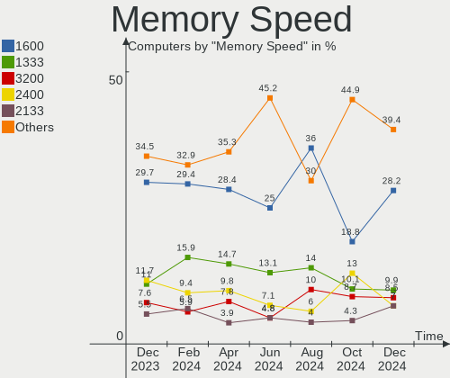

BlackPanther Hardware Trends
----------------------------

A project to identify most popular hardware characteristics and track their change
over time based on data collected by BlackPanther users at https://Linux-Hardware.org.

Anyone can contribute to this report by the [hw-probe](https://github.com/linuxhw/hw-probe) tool:

    sudo -E hw-probe -all -upload

This is a report for all computer types. See also reports for [desktops](/Dist/BlackPanther/Desktop/README.md) and [notebooks](/Dist/BlackPanther/Notebook/README.md).

This report is for one last month. Overall report since the beginning of time: [TestCoverage](https://github.com/linuxhw/TestCoverage)

Period: Apr, 2022.

Contents
--------

* [ System ](#system)
  - [ OS                       ](#os)
  - [ OS Family                ](#os-family)
  - [ Kernel                   ](#kernel)
  - [ Kernel Family            ](#kernel-family)
  - [ Kernel Major Ver.        ](#kernel-major-ver)
  - [ Arch                     ](#arch)
  - [ DE                       ](#de)
  - [ Display Server           ](#display-server)
  - [ Display Manager          ](#display-manager)
  - [ OS Lang                  ](#os-lang)
  - [ Boot Mode                ](#boot-mode)
  - [ Filesystem               ](#filesystem)
  - [ Part. scheme             ](#part-scheme)
  - [ Dual Boot with Linux/BSD ](#dual-boot-with-linuxbsd)
  - [ Dual Boot (Win)          ](#dual-boot-win)

* [ Board ](#board)
  - [ Vendor                   ](#vendor)
  - [ Model                    ](#model)
  - [ Model Family             ](#model-family)
  - [ MFG Year                 ](#mfg-year)
  - [ Form Factor              ](#form-factor)
  - [ Secure Boot              ](#secure-boot)
  - [ Coreboot                 ](#coreboot)
  - [ RAM Size                 ](#ram-size)
  - [ RAM Used                 ](#ram-used)
  - [ Total Drives             ](#total-drives)
  - [ Has CD-ROM               ](#has-cd-rom)
  - [ Has Ethernet             ](#has-ethernet)
  - [ Has WiFi                 ](#has-wifi)
  - [ Has Bluetooth            ](#has-bluetooth)

* [ Location ](#location)
  - [ Country                  ](#country)
  - [ City                     ](#city)

* [ Drives ](#drives)
  - [ Drive Vendor             ](#drive-vendor)
  - [ Drive Model              ](#drive-model)
  - [ HDD Vendor               ](#hdd-vendor)
  - [ SSD Vendor               ](#ssd-vendor)
  - [ Drive Kind               ](#drive-kind)
  - [ Drive Connector          ](#drive-connector)
  - [ Drive Size               ](#drive-size)
  - [ Space Total              ](#space-total)
  - [ Space Used               ](#space-used)
  - [ Malfunc. Drives          ](#malfunc-drives)
  - [ Malfunc. Drive Vendor    ](#malfunc-drive-vendor)
  - [ Malfunc. HDD Vendor      ](#malfunc-hdd-vendor)
  - [ Malfunc. Drive Kind      ](#malfunc-drive-kind)
  - [ Failed Drives            ](#failed-drives)
  - [ Failed Drive Vendor      ](#failed-drive-vendor)
  - [ Drive Status             ](#drive-status)

* [ Storage controller ](#storage-controller)
  - [ Storage Vendor           ](#storage-vendor)
  - [ Storage Model            ](#storage-model)
  - [ Storage Kind             ](#storage-kind)

* [ Processor ](#processor)
  - [ CPU Vendor               ](#cpu-vendor)
  - [ CPU Model                ](#cpu-model)
  - [ CPU Model Family         ](#cpu-model-family)
  - [ CPU Cores                ](#cpu-cores)
  - [ CPU Sockets              ](#cpu-sockets)
  - [ CPU Threads              ](#cpu-threads)
  - [ CPU Op-Modes             ](#cpu-op-modes)
  - [ CPU Microcode            ](#cpu-microcode)
  - [ CPU Microarch            ](#cpu-microarch)

* [ Graphics ](#graphics)
  - [ GPU Vendor               ](#gpu-vendor)
  - [ GPU Model                ](#gpu-model)
  - [ GPU Combo                ](#gpu-combo)
  - [ GPU Driver               ](#gpu-driver)
  - [ GPU Memory               ](#gpu-memory)

* [ Monitor ](#monitor)
  - [ Monitor Vendor           ](#monitor-vendor)
  - [ Monitor Model            ](#monitor-model)
  - [ Monitor Resolution       ](#monitor-resolution)
  - [ Monitor Diagonal         ](#monitor-diagonal)
  - [ Monitor Width            ](#monitor-width)
  - [ Aspect Ratio             ](#aspect-ratio)
  - [ Monitor Area             ](#monitor-area)
  - [ Pixel Density            ](#pixel-density)
  - [ Multiple Monitors        ](#multiple-monitors)

* [ Network ](#network)
  - [ Net Controller Vendor    ](#net-controller-vendor)
  - [ Net Controller Model     ](#net-controller-model)
  - [ Wireless Vendor          ](#wireless-vendor)
  - [ Wireless Model           ](#wireless-model)
  - [ Ethernet Vendor          ](#ethernet-vendor)
  - [ Ethernet Model           ](#ethernet-model)
  - [ Net Controller Kind      ](#net-controller-kind)
  - [ Used Controller          ](#used-controller)
  - [ NICs                     ](#nics)
  - [ IPv6                     ](#ipv6)

* [ Bluetooth ](#bluetooth)
  - [ Bluetooth Vendor         ](#bluetooth-vendor)
  - [ Bluetooth Model          ](#bluetooth-model)

* [ Sound ](#sound)
  - [ Sound Vendor             ](#sound-vendor)
  - [ Sound Model              ](#sound-model)

* [ Memory ](#memory)
  - [ Memory Vendor            ](#memory-vendor)
  - [ Memory Model             ](#memory-model)
  - [ Memory Kind              ](#memory-kind)
  - [ Memory Form Factor       ](#memory-form-factor)
  - [ Memory Size              ](#memory-size)
  - [ Memory Speed             ](#memory-speed)

* [ Printers & scanners ](#printers--scanners)
  - [ Printer Vendor           ](#printer-vendor)
  - [ Printer Model            ](#printer-model)
  - [ Scanner Vendor           ](#scanner-vendor)
  - [ Scanner Model            ](#scanner-model)

* [ Camera ](#camera)
  - [ Camera Vendor            ](#camera-vendor)
  - [ Camera Model             ](#camera-model)

* [ Security ](#security)
  - [ Fingerprint Vendor       ](#fingerprint-vendor)
  - [ Fingerprint Model        ](#fingerprint-model)
  - [ Chipcard Vendor          ](#chipcard-vendor)
  - [ Chipcard Model           ](#chipcard-model)

* [ Unsupported ](#unsupported)
  - [ Unsupported Devices      ](#unsupported-devices)
  - [ Unsupported Device Types ](#unsupported-device-types)

System
------

OS
--

Installed operating systems

| Name              | Computers | Percent |
|-------------------|-----------|---------|
| BlackPanther 18.1 | 38        | 100%    |

OS Family
---------

OS without a version

| Name         | Computers | Percent |
|--------------|-----------|---------|
| BlackPanther | 38        | 100%    |

Kernel
------

Version of the Linux kernel

| Version             | Computers | Percent |
|---------------------|-----------|---------|
| 5.6.14-desktop-2bP  | 21        | 55.26%  |
| 4.18.16-desktop-1bP | 17        | 44.74%  |

Kernel Family
-------------

Linux kernel without a distro release

| Version | Computers | Percent |
|---------|-----------|---------|
| 5.6.14  | 21        | 55.26%  |
| 4.18.16 | 17        | 44.74%  |

Kernel Major Ver.
-----------------

Linux kernel major version

| Version | Computers | Percent |
|---------|-----------|---------|
| 5.6     | 21        | 55.26%  |
| 4.18    | 17        | 44.74%  |

Arch
----

OS architecture (x86_64, i586, etc.)

| Name   | Computers | Percent |
|--------|-----------|---------|
| x86_64 | 38        | 100%    |

DE
--

Desktop Environment

| Name | Computers | Percent |
|------|-----------|---------|
| KDE5 | 38        | 100%    |

Display Server
--------------

X11 or Wayland

| Name | Computers | Percent |
|------|-----------|---------|
| X11  | 38        | 100%    |

Display Manager
---------------

SDDM, LightDM, etc.

| Name | Computers | Percent |
|------|-----------|---------|
| SDDM | 38        | 100%    |

OS Lang
-------

Language

| Lang    | Computers | Percent |
|---------|-----------|---------|
| Unknown | 37        | 97.37%  |
| hu_HU   | 1         | 2.63%   |

Boot Mode
---------

EFI or BIOS

| Mode | Computers | Percent |
|------|-----------|---------|
| BIOS | 29        | 76.32%  |
| EFI  | 9         | 23.68%  |

Filesystem
----------

Type of filesystem

| Type    | Computers | Percent |
|---------|-----------|---------|
| Overlay | 34        | 89.47%  |
| Ext4    | 4         | 10.53%  |

Part. scheme
------------

Scheme of partitioning

| Type    | Computers | Percent |
|---------|-----------|---------|
| MBR     | 20        | 52.63%  |
| GPT     | 17        | 44.74%  |
| Unknown | 1         | 2.63%   |

Dual Boot with Linux/BSD
------------------------

Hosting more than one Linux/BSD

| Dual boot | Computers | Percent |
|-----------|-----------|---------|
| Yes       | 28        | 73.68%  |
| No        | 10        | 26.32%  |

Dual Boot (Win)
---------------

Hosting Linux and Windows

| Dual boot | Computers | Percent |
|-----------|-----------|---------|
| No        | 22        | 57.89%  |
| Yes       | 16        | 42.11%  |

Board
-----

Vendor
------

Motherboard manufacturer

| Name                | Computers | Percent |
|---------------------|-----------|---------|
| Lenovo              | 7         | 18.42%  |
| ASUSTek Computer    | 5         | 13.16%  |
| Hewlett-Packard     | 4         | 10.53%  |
| ASRock              | 4         | 10.53%  |
| Gigabyte Technology | 3         | 7.89%   |
| Dell                | 3         | 7.89%   |
| Hungaro Flotta Kft  | 2         | 5.26%   |
| Fujitsu             | 2         | 5.26%   |
| Acer                | 2         | 5.26%   |
| Toshiba             | 1         | 2.63%   |
| Sony                | 1         | 2.63%   |
| Samsung Electronics | 1         | 2.63%   |
| MSI                 | 1         | 2.63%   |
| Fujitsu Siemens     | 1         | 2.63%   |
| Apple               | 1         | 2.63%   |

Model
-----

Motherboard model

| Name                                       | Computers | Percent |
|--------------------------------------------|-----------|---------|
| Hungaro Flotta Kft Navon Loop 360          | 2         | 5.26%   |
| ASRock FM2A75M Pro4+                       | 2         | 5.26%   |
| Toshiba NB550D                             | 1         | 2.63%   |
| Sony VPCEH2J1E                             | 1         | 2.63%   |
| Samsung RV410/RV510/S3510/E3510            | 1         | 2.63%   |
| MSI EJ276AA-ABD t3285.de                   | 1         | 2.63%   |
| Lenovo ThinkPad T61 6458WK6                | 1         | 2.63%   |
| Lenovo ThinkCentre M70e 0832A26            | 1         | 2.63%   |
| Lenovo ThinkCentre A57 98517HG             | 1         | 2.63%   |
| Lenovo IdeaCentre AIO 300-23ACL F0BC002MAU | 1         | 2.63%   |
| Lenovo G780 20138                          | 1         | 2.63%   |
| Lenovo G580 20150                          | 1         | 2.63%   |
| Lenovo B590 20208                          | 1         | 2.63%   |
| HP ProBook 470 G1                          | 1         | 2.63%   |
| HP Compaq Pro 6300 SFF                     | 1         | 2.63%   |
| HP Compaq dc7800p Small Form Factor        | 1         | 2.63%   |
| Gigabyte H61M-S1                           | 1         | 2.63%   |
| Gigabyte GA-MA74GM-S2                      | 1         | 2.63%   |
| Gigabyte G41MT-S2PT                        | 1         | 2.63%   |
| Fujitsu Siemens ESPRIMO EDITION P2511      | 1         | 2.63%   |
| Fujitsu LIFEBOOK U745                      | 1         | 2.63%   |
| Fujitsu ESPRIMO E7935                      | 1         | 2.63%   |
| Dell OptiPlex 320                          | 1         | 2.63%   |
| Dell Latitude E5420                        | 1         | 2.63%   |
| Dell Inspiron MP061                        | 1         | 2.63%   |
| ASUS X540LA                                | 1         | 2.63%   |
| ASUS TP201SA                               | 1         | 2.63%   |
| ASUS N75SF                                 | 1         | 2.63%   |
| ASUS M4A78 PRO                             | 1         | 2.63%   |
| ASUS All Series                            | 1         | 2.63%   |
| ASRock ConRoe1333-D667                     | 1         | 2.63%   |
| ASRock B85M                                | 1         | 2.63%   |
| Apple MacPro2,1                            | 1         | 2.63%   |
| Acer TravelMate P215-52                    | 1         | 2.63%   |
| Acer Aspire A114-31                        | 1         | 2.63%   |
| Unknown                                    | 1         | 2.63%   |

Model Family
------------

Motherboard model prefix

| Name                     | Computers | Percent |
|--------------------------|-----------|---------|
| Lenovo ThinkCentre       | 2         | 5.26%   |
| Hungaro Flotta Kft Navon | 2         | 5.26%   |
| HP Compaq                | 2         | 5.26%   |
| ASRock FM2A75M           | 2         | 5.26%   |
| Toshiba NB550D           | 1         | 2.63%   |
| Sony VPCEH2J1E           | 1         | 2.63%   |
| Samsung RV410            | 1         | 2.63%   |
| MSI EJ276AA-ABD          | 1         | 2.63%   |
| Lenovo ThinkPad          | 1         | 2.63%   |
| Lenovo IdeaCentre        | 1         | 2.63%   |
| Lenovo G780              | 1         | 2.63%   |
| Lenovo G580              | 1         | 2.63%   |
| Lenovo B590              | 1         | 2.63%   |
| HP ProBook               | 1         | 2.63%   |
| Gigabyte H61M-S1         | 1         | 2.63%   |
| Gigabyte GA-MA74GM-S2    | 1         | 2.63%   |
| Gigabyte G41MT-S2PT      | 1         | 2.63%   |
| Fujitsu Siemens ESPRIMO  | 1         | 2.63%   |
| Fujitsu LIFEBOOK         | 1         | 2.63%   |
| Fujitsu ESPRIMO          | 1         | 2.63%   |
| Dell OptiPlex            | 1         | 2.63%   |
| Dell Latitude            | 1         | 2.63%   |
| Dell Inspiron            | 1         | 2.63%   |
| ASUS X540LA              | 1         | 2.63%   |
| ASUS TP201SA             | 1         | 2.63%   |
| ASUS N75SF               | 1         | 2.63%   |
| ASUS M4A78               | 1         | 2.63%   |
| ASUS All                 | 1         | 2.63%   |
| ASRock ConRoe1333-D667   | 1         | 2.63%   |
| ASRock B85M              | 1         | 2.63%   |
| Apple MacPro2            | 1         | 2.63%   |
| Acer TravelMate          | 1         | 2.63%   |
| Acer Aspire              | 1         | 2.63%   |
| Unknown                  | 1         | 2.63%   |

MFG Year
--------

Motherboard manufacture year

| Year | Computers | Percent |
|------|-----------|---------|
| 2012 | 6         | 15.79%  |
| 2007 | 6         | 15.79%  |
| 2010 | 4         | 10.53%  |
| 2014 | 3         | 7.89%   |
| 2013 | 3         | 7.89%   |
| 2011 | 3         | 7.89%   |
| 2008 | 3         | 7.89%   |
| 2018 | 2         | 5.26%   |
| 2016 | 2         | 5.26%   |
| 2020 | 1         | 2.63%   |
| 2017 | 1         | 2.63%   |
| 2015 | 1         | 2.63%   |
| 2009 | 1         | 2.63%   |
| 2006 | 1         | 2.63%   |
| 2005 | 1         | 2.63%   |

Form Factor
-----------

Physical design of the computer

| Name       | Computers | Percent |
|------------|-----------|---------|
| Notebook   | 19        | 50%     |
| Desktop    | 18        | 47.37%  |
| All in one | 1         | 2.63%   |

Secure Boot
-----------

Enabled or disabled

| State    | Computers | Percent |
|----------|-----------|---------|
| Disabled | 38        | 100%    |

Coreboot
--------

Have coreboot on board

| Used | Computers | Percent |
|------|-----------|---------|
| No   | 38        | 100%    |

RAM Size
--------

Total RAM memory

| Size in GB | Computers | Percent |
|------------|-----------|---------|
| 3.01-4.0   | 14        | 36.84%  |
| 4.01-8.0   | 8         | 21.05%  |
| 1.01-2.0   | 7         | 18.42%  |
| 8.01-16.0  | 5         | 13.16%  |
| 16.01-24.0 | 3         | 7.89%   |
| 2.01-3.0   | 1         | 2.63%   |

RAM Used
--------

Used RAM memory

| Used GB  | Computers | Percent |
|----------|-----------|---------|
| 0.01-0.5 | 20        | 52.63%  |
| 0.51-1.0 | 10        | 26.32%  |
| 1.01-2.0 | 8         | 21.05%  |

Total Drives
------------

Number of drives on board

| Drives | Computers | Percent |
|--------|-----------|---------|
| 1      | 26        | 68.42%  |
| 2      | 8         | 21.05%  |
| 3      | 3         | 7.89%   |
| 5      | 1         | 2.63%   |

Has CD-ROM
----------

Has CD-ROM on board

| Presented | Computers | Percent |
|-----------|-----------|---------|
| Yes       | 25        | 65.79%  |
| No        | 13        | 34.21%  |

Has Ethernet
------------

Has Ethernet on board

| Presented | Computers | Percent |
|-----------|-----------|---------|
| Yes       | 35        | 92.11%  |
| No        | 3         | 7.89%   |

Has WiFi
--------

Has WiFi module

| Presented | Computers | Percent |
|-----------|-----------|---------|
| Yes       | 22        | 57.89%  |
| No        | 16        | 42.11%  |

Has Bluetooth
-------------

Has Bluetooth module

| Presented | Computers | Percent |
|-----------|-----------|---------|
| No        | 20        | 52.63%  |
| Yes       | 18        | 47.37%  |

Location
--------

Country
-------

Geographic location (country)

| Country   | Computers | Percent |
|-----------|-----------|---------|
| Hungary   | 29        | 76.32%  |
| Austria   | 2         | 5.26%   |
| USA       | 1         | 2.63%   |
| Slovakia  | 1         | 2.63%   |
| Romania   | 1         | 2.63%   |
| Italy     | 1         | 2.63%   |
| Germany   | 1         | 2.63%   |
| Belgium   | 1         | 2.63%   |
| Australia | 1         | 2.63%   |

City
----

Geographic location (city)

| City           | Computers | Percent |
|----------------|-----------|---------|
| Budapest       | 8         | 21.05%  |
| Karcag         | 3         | 7.89%   |
| Vienna         | 2         | 5.26%   |
| Veszprém      | 1         | 2.63%   |
| Udine          | 1         | 2.63%   |
| Tolna          | 1         | 2.63%   |
| Szombathely    | 1         | 2.63%   |
| Szada          | 1         | 2.63%   |
| Sarisap        | 1         | 2.63%   |
| Roszke         | 1         | 2.63%   |
| Perth          | 1         | 2.63%   |
| Oroszlany      | 1         | 2.63%   |
| Morahalom      | 1         | 2.63%   |
| Mezokovesd     | 1         | 2.63%   |
| Los Angeles    | 1         | 2.63%   |
| Levice         | 1         | 2.63%   |
| Leipzig        | 1         | 2.63%   |
| Leefdaal       | 1         | 2.63%   |
| Kisvarda       | 1         | 2.63%   |
| Kiskunhalas    | 1         | 2.63%   |
| Kecskemét     | 1         | 2.63%   |
| Hajduszoboszlo | 1         | 2.63%   |
| Gyal           | 1         | 2.63%   |
| Dorog          | 1         | 2.63%   |
| Debrecen       | 1         | 2.63%   |
| Bucharest      | 1         | 2.63%   |
| Békéscsaba   | 1         | 2.63%   |
| Batonyterenye  | 1         | 2.63%   |

Drives
------

Drive Vendor
------------

Hard drive vendors

| Vendor              | Computers | Drives | Percent |
|---------------------|-----------|--------|---------|
| WDC                 | 8         | 8      | 14.04%  |
| Seagate             | 8         | 8      | 14.04%  |
| Kingston            | 6         | 6      | 10.53%  |
| Toshiba             | 5         | 5      | 8.77%   |
| Unknown             | 4         | 5      | 7.02%   |
| Samsung Electronics | 3         | 3      | 5.26%   |
| MAXTOR              | 3         | 3      | 5.26%   |
| Transcend           | 2         | 2      | 3.51%   |
| SanDisk             | 2         | 2      | 3.51%   |
| Hitachi             | 2         | 2      | 3.51%   |
| HGST                | 2         | 2      | 3.51%   |
| Apacer              | 2         | 2      | 3.51%   |
| A-DATA Technology   | 2         | 2      | 3.51%   |
| WD MediaMax         | 1         | 1      | 1.75%   |
| PNY                 | 1         | 1      | 1.75%   |
| Philips             | 1         | 1      | 1.75%   |
| Patriot             | 1         | 1      | 1.75%   |
| Intenso             | 1         | 1      | 1.75%   |
| China               | 1         | 1      | 1.75%   |
| Apple               | 1         | 1      | 1.75%   |
| Unknown             | 1         | 1      | 1.75%   |

Drive Model
-----------

Hard drive models

| Model                                | Computers | Percent |
|--------------------------------------|-----------|---------|
| Kingston SUV400S37120G 120GB SSD     | 3         | 5.17%   |
| Unknown SA16G  16GB                  | 2         | 3.45%   |
| Unknown 032G74  32GB                 | 2         | 3.45%   |
| Transcend TS120GMTS420S 120GB SSD    | 2         | 3.45%   |
| WDC WD800AAJS-00L7A0 80GB            | 1         | 1.72%   |
| WDC WD5000AZRX-00L4HB0 500GB         | 1         | 1.72%   |
| WDC WD5000AAKS-60Z1A0 500GB          | 1         | 1.72%   |
| WDC WD400BD-75MRA1 40GB              | 1         | 1.72%   |
| WDC WD1600BEVT-75ZCT2 160GB          | 1         | 1.72%   |
| WDC WD1600AAJS-00WAA0 160GB          | 1         | 1.72%   |
| WDC WD1600AAJB-56WRA0 160GB          | 1         | 1.72%   |
| WDC WD10EZEX-00KUWA0 1TB             | 1         | 1.72%   |
| WD MediaMax WL160GSA872B 160GB       | 1         | 1.72%   |
| Unknown 032G34  32GB                 | 1         | 1.72%   |
| Toshiba MQ04ABF100 1TB               | 1         | 1.72%   |
| Toshiba MQ01ABF050 500GB             | 1         | 1.72%   |
| Toshiba MK8009GAH 80GB               | 1         | 1.72%   |
| Toshiba MK2565GSX 250GB              | 1         | 1.72%   |
| Toshiba DT01ACA100 1TB               | 1         | 1.72%   |
| Seagate ST9750420AS 752GB            | 1         | 1.72%   |
| Seagate ST500LT012-9WS142 500GB      | 1         | 1.72%   |
| Seagate ST500DM002-1BD142 500GB      | 1         | 1.72%   |
| Seagate ST380815AS 80GB              | 1         | 1.72%   |
| Seagate ST3320418AS 320GB            | 1         | 1.72%   |
| Seagate ST2000DM001-1ER164 2TB       | 1         | 1.72%   |
| Seagate ST1000LM035-1RK172 1TB       | 1         | 1.72%   |
| Seagate ST1000LM014-1EJ164-SSHD 1TB  | 1         | 1.72%   |
| SanDisk SDSSDH3250G 250GB            | 1         | 1.72%   |
| SanDisk SD9TB8W1T001001 1TB SSD      | 1         | 1.72%   |
| Samsung SSD PM871b M.2 2280 256GB    | 1         | 1.72%   |
| Samsung SSD 840 Series 250GB         | 1         | 1.72%   |
| Samsung MZ7LN256HCHP-00000 256GB SSD | 1         | 1.72%   |
| PNY CS900 240GB SSD                  | 1         | 1.72%   |
| Philips SSD 120GB                    | 1         | 1.72%   |
| Patriot Burst 120GB SSD              | 1         | 1.72%   |
| MAXTOR 6Y080L0 82GB                  | 1         | 1.72%   |
| MAXTOR 6V250F0 256GB                 | 1         | 1.72%   |
| MAXTOR 2B020H1 20GB                  | 1         | 1.72%   |
| Kingston SA400S37240G 240GB SSD      | 1         | 1.72%   |
| Kingston SA400S37120G 120GB SSD      | 1         | 1.72%   |
| Kingston SA2000M8500G 500GB          | 1         | 1.72%   |
| Intenso SSD 120GB                    | 1         | 1.72%   |
| Hitachi HTS545025B9SA02 250GB        | 1         | 1.72%   |
| Hitachi HDP725025GLA380 250GB        | 1         | 1.72%   |
| HGST HTS545050A7E680 500GB           | 1         | 1.72%   |
| HGST HTS545050A7E380 500GB           | 1         | 1.72%   |
| China SATA SSD 120GB                 | 1         | 1.72%   |
| Apple HDD ST1000LM024 1TB            | 1         | 1.72%   |
| Apacer AS350 256GB SSD               | 1         | 1.72%   |
| Apacer AS340 240GB SSD               | 1         | 1.72%   |
| A-DATA SU650 120GB SSD               | 1         | 1.72%   |
| A-DATA SU630 240GB SSD               | 1         | 1.72%   |
| Unknown                              | 1         | 1.72%   |

HDD Vendor
----------

Hard disk drive vendors

| Vendor      | Computers | Drives | Percent |
|-------------|-----------|--------|---------|
| WDC         | 8         | 8      | 26.67%  |
| Seagate     | 8         | 8      | 26.67%  |
| Toshiba     | 5         | 5      | 16.67%  |
| MAXTOR      | 3         | 3      | 10%     |
| Hitachi     | 2         | 2      | 6.67%   |
| HGST        | 2         | 2      | 6.67%   |
| WD MediaMax | 1         | 1      | 3.33%   |
| Apple       | 1         | 1      | 3.33%   |

SSD Vendor
----------

Solid state drive vendors

| Vendor              | Computers | Drives | Percent |
|---------------------|-----------|--------|---------|
| Kingston            | 5         | 5      | 23.81%  |
| Samsung Electronics | 3         | 3      | 14.29%  |
| Transcend           | 2         | 2      | 9.52%   |
| SanDisk             | 2         | 2      | 9.52%   |
| Apacer              | 2         | 2      | 9.52%   |
| A-DATA Technology   | 2         | 2      | 9.52%   |
| PNY                 | 1         | 1      | 4.76%   |
| Philips             | 1         | 1      | 4.76%   |
| Patriot             | 1         | 1      | 4.76%   |
| Intenso             | 1         | 1      | 4.76%   |
| China               | 1         | 1      | 4.76%   |

Drive Kind
----------

HDD or SSD

| Kind | Computers | Drives | Percent |
|------|-----------|--------|---------|
| HDD  | 26        | 30     | 50.98%  |
| SSD  | 19        | 21     | 37.25%  |
| MMC  | 5         | 6      | 9.8%    |
| NVMe | 1         | 1      | 1.96%   |

Drive Connector
---------------

SATA, SAS, NVMe, etc.

| Type | Computers | Drives | Percent |
|------|-----------|--------|---------|
| SATA | 37        | 51     | 86.05%  |
| MMC  | 5         | 6      | 11.63%  |
| NVMe | 1         | 1      | 2.33%   |

Drive Size
----------

Size of hard drive

| Size in TB | Computers | Drives | Percent |
|------------|-----------|--------|---------|
| 0.01-0.5   | 34        | 42     | 80.95%  |
| 0.51-1.0   | 7         | 8      | 16.67%  |
| 1.01-2.0   | 1         | 1      | 2.38%   |

Space Total
-----------

Amount of disk space available on the file system

| Size in GB | Computers | Percent |
|------------|-----------|---------|
| Unknown    | 32        | 84.21%  |
| 21-50      | 2         | 5.26%   |
| 101-250    | 1         | 2.63%   |
| 1-20       | 1         | 2.63%   |
| 501-1000   | 1         | 2.63%   |
| 51-100     | 1         | 2.63%   |

Space Used
----------

Amount of used disk space

| Used GB | Computers | Percent |
|---------|-----------|---------|
| Unknown | 32        | 84.21%  |
| 1-20    | 6         | 15.79%  |

Malfunc. Drives
---------------

Drive models with a malfunction

| Model                               | Computers | Drives | Percent |
|-------------------------------------|-----------|--------|---------|
| WDC WD5000AZRX-00L4HB0 500GB        | 1         | 1      | 8.33%   |
| WDC WD5000AAKS-60Z1A0 500GB         | 1         | 1      | 8.33%   |
| WD MediaMax WL160GSA872B 160GB      | 1         | 1      | 8.33%   |
| Toshiba MK8009GAH 80GB              | 1         | 1      | 8.33%   |
| Seagate ST500DM002-1BD142 500GB     | 1         | 1      | 8.33%   |
| Seagate ST3320418AS 320GB           | 1         | 1      | 8.33%   |
| Seagate ST1000LM035-1RK172 1TB      | 1         | 1      | 8.33%   |
| Seagate ST1000LM014-1EJ164-SSHD 1TB | 1         | 1      | 8.33%   |
| MAXTOR 6Y080L0 82GB                 | 1         | 1      | 8.33%   |
| MAXTOR 6V250F0 256GB                | 1         | 1      | 8.33%   |
| MAXTOR 2B020H1 20GB                 | 1         | 1      | 8.33%   |
| HGST HTS545050A7E380 500GB          | 1         | 1      | 8.33%   |

Malfunc. Drive Vendor
---------------------

Vendors of faulty drives

| Vendor      | Computers | Drives | Percent |
|-------------|-----------|--------|---------|
| Seagate     | 4         | 4      | 33.33%  |
| MAXTOR      | 3         | 3      | 25%     |
| WDC         | 2         | 2      | 16.67%  |
| WD MediaMax | 1         | 1      | 8.33%   |
| Toshiba     | 1         | 1      | 8.33%   |
| HGST        | 1         | 1      | 8.33%   |

Malfunc. HDD Vendor
-------------------

Vendors of faulty HDD drives

| Vendor      | Computers | Drives | Percent |
|-------------|-----------|--------|---------|
| Seagate     | 4         | 4      | 33.33%  |
| MAXTOR      | 3         | 3      | 25%     |
| WDC         | 2         | 2      | 16.67%  |
| WD MediaMax | 1         | 1      | 8.33%   |
| Toshiba     | 1         | 1      | 8.33%   |
| HGST        | 1         | 1      | 8.33%   |

Malfunc. Drive Kind
-------------------

Kinds of faulty drives

| Kind | Computers | Drives | Percent |
|------|-----------|--------|---------|
| HDD  | 12        | 12     | 100%    |

Failed Drives
-------------

Failed drive models

Zero info for selected period =(

Failed Drive Vendor
-------------------

Failed drive vendors

Zero info for selected period =(

Drive Status
------------

Number of failed and malfunc. drives

| Status   | Computers | Drives | Percent |
|----------|-----------|--------|---------|
| Works    | 30        | 39     | 63.83%  |
| Malfunc  | 12        | 12     | 25.53%  |
| Detected | 5         | 7      | 10.64%  |

Storage controller
------------------

Storage Vendor
--------------

Storage controller vendors

| Vendor                      | Computers | Percent |
|-----------------------------|-----------|---------|
| Intel                       | 30        | 76.92%  |
| AMD                         | 8         | 20.51%  |
| Kingston Technology Company | 1         | 2.56%   |

Storage Model
-------------

Storage controller models

| Model                                                                                   | Computers | Percent |
|-----------------------------------------------------------------------------------------|-----------|---------|
| Intel NM10/ICH7 Family SATA Controller [IDE mode]                                       | 5         | 8.93%   |
| Intel 82801G (ICH7 Family) IDE Controller                                               | 4         | 7.14%   |
| Intel Celeron N3350/Pentium N4200/Atom E3900 Series SATA AHCI Controller                | 3         | 5.36%   |
| Intel 8 Series/C220 Series Chipset Family 6-port SATA Controller 1 [AHCI mode]          | 3         | 5.36%   |
| Intel 7 Series Chipset Family 6-port SATA Controller [AHCI mode]                        | 3         | 5.36%   |
| Intel 6 Series/C200 Series Chipset Family 6 port Mobile SATA AHCI Controller            | 3         | 5.36%   |
| AMD FCH SATA Controller [AHCI mode]                                                     | 3         | 5.36%   |
| Intel Wildcat Point-LP SATA Controller [AHCI Mode]                                      | 2         | 3.57%   |
| Intel 82801HM/HEM (ICH8M/ICH8M-E) IDE Controller                                        | 2         | 3.57%   |
| AMD SB7x0/SB8x0/SB9x0 SATA Controller [IDE mode]                                        | 2         | 3.57%   |
| AMD SB7x0/SB8x0/SB9x0 IDE Controller                                                    | 2         | 3.57%   |
| AMD FCH IDE Controller                                                                  | 2         | 3.57%   |
| Kingston Company A2000 NVMe SSD                                                         | 1         | 1.79%   |
| Intel Mobile PM965/GM965 PT IDER Controller                                             | 1         | 1.79%   |
| Intel Comet Lake SATA AHCI Controller                                                   | 1         | 1.79%   |
| Intel Atom/Celeron/Pentium Processor x5-E8000/J3xxx/N3xxx Series SATA Controller        | 1         | 1.79%   |
| Intel 82Q35 Express PT IDER Controller                                                  | 1         | 1.79%   |
| Intel 82801JD/DO (ICH10 Family) 4-port SATA IDE Controller                              | 1         | 1.79%   |
| Intel 82801JD/DO (ICH10 Family) 2-port SATA IDE Controller                              | 1         | 1.79%   |
| Intel 82801IR/IO/IH (ICH9R/DO/DH) 4 port SATA Controller [IDE mode]                     | 1         | 1.79%   |
| Intel 82801IBM/IEM (ICH9M/ICH9M-E) 4 port SATA Controller [AHCI mode]                   | 1         | 1.79%   |
| Intel 82801I (ICH9 Family) 2 port SATA Controller [IDE mode]                            | 1         | 1.79%   |
| Intel 82801HM/HEM (ICH8M/ICH8M-E) SATA Controller [AHCI mode]                           | 1         | 1.79%   |
| Intel 82801GBM/GHM (ICH7-M Family) SATA Controller [IDE mode]                           | 1         | 1.79%   |
| Intel 7 Series/C210 Series Chipset Family 6-port SATA Controller [AHCI mode]            | 1         | 1.79%   |
| Intel 631xESB/632xESB/3100 Chipset SATA IDE Controller                                  | 1         | 1.79%   |
| Intel 631xESB/632xESB IDE Controller                                                    | 1         | 1.79%   |
| Intel 6 Series/C200 Series Chipset Family Desktop SATA Controller (IDE mode, ports 4-5) | 1         | 1.79%   |
| Intel 6 Series/C200 Series Chipset Family Desktop SATA Controller (IDE mode, ports 0-3) | 1         | 1.79%   |
| AMD SB7x0/SB8x0/SB9x0 SATA Controller [AHCI mode]                                       | 1         | 1.79%   |
| AMD SB600 Non-Raid-5 SATA                                                               | 1         | 1.79%   |
| AMD SB600 IDE                                                                           | 1         | 1.79%   |
| AMD IXP SB4x0 Serial ATA Controller                                                     | 1         | 1.79%   |
| AMD IXP SB4x0 IDE Controller                                                            | 1         | 1.79%   |

Storage Kind
------------

Kind of storage controller (IDE, SATA, NVMe, SAS, ...)

| Kind | Computers | Percent |
|------|-----------|---------|
| SATA | 26        | 57.78%  |
| IDE  | 18        | 40%     |
| NVMe | 1         | 2.22%   |

Processor
---------

CPU Vendor
----------

Processor vendors

| Vendor | Computers | Percent |
|--------|-----------|---------|
| Intel  | 31        | 81.58%  |
| AMD    | 7         | 18.42%  |

CPU Model
---------

Processor models

| Model                                       | Computers | Percent |
|---------------------------------------------|-----------|---------|
| Intel Celeron CPU N3350 @ 1.10GHz           | 3         | 7.89%   |
| Intel Pentium CPU B960 @ 2.20GHz            | 2         | 5.26%   |
| Intel Core i3-2330M CPU @ 2.20GHz           | 2         | 5.26%   |
| AMD A8-6600K APU with Radeon HD Graphics    | 2         | 5.26%   |
| Intel Xeon CPU X5355 @ 2.66GHz              | 1         | 2.63%   |
| Intel Genuine CPU 2140 @ 1.60GHz            | 1         | 2.63%   |
| Intel Core i7-5600U CPU @ 2.60GHz           | 1         | 2.63%   |
| Intel Core i7-2670QM CPU @ 2.20GHz          | 1         | 2.63%   |
| Intel Core i5-4690 CPU @ 3.50GHz            | 1         | 2.63%   |
| Intel Core i5-4590 CPU @ 3.30GHz            | 1         | 2.63%   |
| Intel Core i5-4200M CPU @ 2.50GHz           | 1         | 2.63%   |
| Intel Core i5-3470 CPU @ 3.20GHz            | 1         | 2.63%   |
| Intel Core i3-5005U CPU @ 2.00GHz           | 1         | 2.63%   |
| Intel Core i3-3225 CPU @ 3.30GHz            | 1         | 2.63%   |
| Intel Core i3-3110M CPU @ 2.40GHz           | 1         | 2.63%   |
| Intel Core i3-10110U CPU @ 2.10GHz          | 1         | 2.63%   |
| Intel Core 2 Quad CPU Q9300 @ 2.50GHz       | 1         | 2.63%   |
| Intel Core 2 Quad CPU Q6600 @ 2.40GHz       | 1         | 2.63%   |
| Intel Core 2 Duo CPU U7600 @ 1.20GHz        | 1         | 2.63%   |
| Intel Core 2 Duo CPU T7500 @ 2.20GHz        | 1         | 2.63%   |
| Intel Core 2 Duo CPU E8500 @ 3.16GHz        | 1         | 2.63%   |
| Intel Core 2 Duo CPU E8200 @ 2.66GHz        | 1         | 2.63%   |
| Intel Core 2 Duo CPU E6550 @ 2.33GHz        | 1         | 2.63%   |
| Intel Core 2 CPU T7400 @ 2.16GHz            | 1         | 2.63%   |
| Intel Core 2 CPU 4300 @ 1.80GHz             | 1         | 2.63%   |
| Intel Celeron Dual-Core CPU T3500 @ 2.10GHz | 1         | 2.63%   |
| Intel Celeron CPU N3060 @ 1.60GHz           | 1         | 2.63%   |
| Intel Celeron CPU 420 @ 1.60GHz             | 1         | 2.63%   |
| AMD Phenom II X4 920 Processor              | 1         | 2.63%   |
| AMD C-30 Processor                          | 1         | 2.63%   |
| AMD Athlon 64 X2 Dual Core Processor 5200+  | 1         | 2.63%   |
| AMD Athlon 64 X2 Dual Core Processor 3800+  | 1         | 2.63%   |
| AMD A8-7410 APU with AMD Radeon R5 Graphics | 1         | 2.63%   |

CPU Model Family
----------------

Processor model prefix

| Model                   | Computers | Percent |
|-------------------------|-----------|---------|
| Intel Core i3           | 6         | 15.79%  |
| Intel Core 2 Duo        | 5         | 13.16%  |
| Intel Celeron           | 5         | 13.16%  |
| Intel Core i5           | 4         | 10.53%  |
| AMD A8                  | 3         | 7.89%   |
| Intel Pentium           | 2         | 5.26%   |
| Intel Core i7           | 2         | 5.26%   |
| Intel Core 2 Quad       | 2         | 5.26%   |
| Intel Core 2            | 2         | 5.26%   |
| AMD Athlon 64 X2        | 2         | 5.26%   |
| Intel Xeon              | 1         | 2.63%   |
| Intel Genuine           | 1         | 2.63%   |
| Intel Celeron Dual-Core | 1         | 2.63%   |
| AMD Phenom II X4        | 1         | 2.63%   |
| AMD C-30                | 1         | 2.63%   |

CPU Cores
---------

Number of processor cores

| Number | Computers | Percent |
|--------|-----------|---------|
| 2      | 26        | 68.42%  |
| 4      | 8         | 21.05%  |
| 1      | 3         | 7.89%   |
| 8      | 1         | 2.63%   |

CPU Sockets
-----------

Number of sockets

| Number | Computers | Percent |
|--------|-----------|---------|
| 1      | 37        | 97.37%  |
| 2      | 1         | 2.63%   |

CPU Threads
-----------

Threads per core (Hyper-Threading)

| Number | Computers | Percent |
|--------|-----------|---------|
| 1      | 27        | 71.05%  |
| 2      | 11        | 28.95%  |

CPU Op-Modes
------------

CPU Operation Modes (32-bit, 64-bit)

| Op mode        | Computers | Percent |
|----------------|-----------|---------|
| 32-bit, 64-bit | 38        | 100%    |

CPU Microcode
-------------

Microcode number

| Number     | Computers | Percent |
|------------|-----------|---------|
| 0x206a7    | 5         | 13.16%  |
| 0x6fb      | 3         | 7.89%   |
| 0x506c9    | 3         | 7.89%   |
| 0x306c3    | 3         | 7.89%   |
| 0x306a9    | 3         | 7.89%   |
| 0x6f2      | 2         | 5.26%   |
| 0x306d4    | 2         | 5.26%   |
| 0x1067a    | 2         | 5.26%   |
| 0x06001119 | 2         | 5.26%   |
| Unknown    | 2         | 5.26%   |
| 0x806ec    | 1         | 2.63%   |
| 0x6fd      | 1         | 2.63%   |
| 0x6f7      | 1         | 2.63%   |
| 0x6f6      | 1         | 2.63%   |
| 0x406c4    | 1         | 2.63%   |
| 0x10677    | 1         | 2.63%   |
| 0x10676    | 1         | 2.63%   |
| 0x10661    | 1         | 2.63%   |
| 0x07030105 | 1         | 2.63%   |
| 0x05000029 | 1         | 2.63%   |
| 0x010000db | 1         | 2.63%   |

CPU Microarch
-------------

Microarchitecture

| Name        | Computers | Percent |
|-------------|-----------|---------|
| Core        | 9         | 23.68%  |
| SandyBridge | 5         | 13.16%  |
| Penryn      | 4         | 10.53%  |
| IvyBridge   | 3         | 7.89%   |
| Haswell     | 3         | 7.89%   |
| Goldmont    | 3         | 7.89%   |
| Piledriver  | 2         | 5.26%   |
| K8 Hammer   | 2         | 5.26%   |
| Broadwell   | 2         | 5.26%   |
| Silvermont  | 1         | 2.63%   |
| Puma        | 1         | 2.63%   |
| KabyLake    | 1         | 2.63%   |
| K10         | 1         | 2.63%   |
| Bobcat      | 1         | 2.63%   |

Graphics
--------

GPU Vendor
----------

Vendors of graphics cards

| Vendor | Computers | Percent |
|--------|-----------|---------|
| Intel  | 22        | 52.38%  |
| AMD    | 12        | 28.57%  |
| Nvidia | 8         | 19.05%  |

GPU Model
---------

Graphics card models

| Model                                                                                    | Computers | Percent |
|------------------------------------------------------------------------------------------|-----------|---------|
| Intel 2nd Generation Core Processor Family Integrated Graphics Controller                | 4         | 9.09%   |
| Intel HD Graphics 500                                                                    | 3         | 6.82%   |
| Intel HD Graphics 5500                                                                   | 2         | 4.55%   |
| Intel 4 Series Chipset Integrated Graphics Controller                                    | 2         | 4.55%   |
| AMD Richland [Radeon HD 8570D]                                                           | 2         | 4.55%   |
| Nvidia GM107 [GeForce GTX 750 Ti]                                                        | 1         | 2.27%   |
| Nvidia GF119M [GeForce 410M]                                                             | 1         | 2.27%   |
| Nvidia GF117M [GeForce 610M/710M/810M/820M / GT 620M/625M/630M/720M]                     | 1         | 2.27%   |
| Nvidia GF116M [GeForce GT 555M/635M]                                                     | 1         | 2.27%   |
| Nvidia GF108M [GeForce GT 635M]                                                          | 1         | 2.27%   |
| Nvidia GF108 [GeForce GT 630]                                                            | 1         | 2.27%   |
| Nvidia G92GL [Quadro FX 3700]                                                            | 1         | 2.27%   |
| Nvidia G86M [Quadro NVS 140M]                                                            | 1         | 2.27%   |
| Intel Xeon E3-1200 v3/4th Gen Core Processor Integrated Graphics Controller              | 1         | 2.27%   |
| Intel Mobile GM965/GL960 Integrated Graphics Controller (secondary)                      | 1         | 2.27%   |
| Intel Mobile GM965/GL960 Integrated Graphics Controller (primary)                        | 1         | 2.27%   |
| Intel Mobile 4 Series Chipset Integrated Graphics Controller                             | 1         | 2.27%   |
| Intel IvyBridge GT2 [HD Graphics 4000]                                                   | 1         | 2.27%   |
| Intel CometLake-U GT2 [UHD Graphics]                                                     | 1         | 2.27%   |
| Intel Atom/Celeron/Pentium Processor x5-E8000/J3xxx/N3xxx Integrated Graphics Controller | 1         | 2.27%   |
| Intel 82Q35 Express Integrated Graphics Controller                                       | 1         | 2.27%   |
| Intel 82G33/G31 Express Integrated Graphics Controller                                   | 1         | 2.27%   |
| Intel 82946GZ/GL Integrated Graphics Controller                                          | 1         | 2.27%   |
| Intel 4th Gen Core Processor Integrated Graphics Controller                              | 1         | 2.27%   |
| Intel 3rd Gen Core processor Graphics Controller                                         | 1         | 2.27%   |
| AMD Wrestler [Radeon HD 6250]                                                            | 1         | 2.27%   |
| AMD Sun XT [Radeon HD 8670A/8670M/8690M / R5 M330 / M430 / Radeon 520 Mobile]            | 1         | 2.27%   |
| AMD RV630 XT [Radeon HD 2600 XT]                                                         | 1         | 2.27%   |
| AMD RV620 LE [Radeon HD 3450]                                                            | 1         | 2.27%   |
| AMD RV515/M54 [Mobility Radeon X1400]                                                    | 1         | 2.27%   |
| AMD RS780 [Radeon HD 3200]                                                               | 1         | 2.27%   |
| AMD RS480 [Radeon Xpress 200 Series]                                                     | 1         | 2.27%   |
| AMD RC410 [Radeon Xpress 200/1100]                                                       | 1         | 2.27%   |
| AMD Mullins [Radeon R4/R5 Graphics]                                                      | 1         | 2.27%   |
| AMD Mars [Radeon HD 8670A/8670M/8750M / R7 M370]                                         | 1         | 2.27%   |
| AMD Cypress XT [Radeon HD 5870]                                                          | 1         | 2.27%   |

GPU Combo
---------

Combinations of graphics cards

| Name           | Computers | Percent |
|----------------|-----------|---------|
| 1 x Intel      | 18        | 47.37%  |
| 1 x AMD        | 10        | 26.32%  |
| 1 x Nvidia     | 5         | 13.16%  |
| Intel + Nvidia | 3         | 7.89%   |
| 2 x AMD        | 1         | 2.63%   |
| Intel + AMD    | 1         | 2.63%   |

GPU Driver
----------

Free vs proprietary

| Driver  | Computers | Percent |
|---------|-----------|---------|
| Free    | 37        | 97.37%  |
| Unknown | 1         | 2.63%   |

GPU Memory
----------

Total video memory

| Size in GB | Computers | Percent |
|------------|-----------|---------|
| Unknown    | 18        | 47.37%  |
| 0.01-0.5   | 9         | 23.68%  |
| 0.51-1.0   | 7         | 18.42%  |
| 1.01-2.0   | 3         | 7.89%   |
| 3.01-4.0   | 1         | 2.63%   |

Monitor
-------

Monitor Vendor
--------------

Monitor vendors

| Vendor                  | Computers | Percent |
|-------------------------|-----------|---------|
| Samsung Electronics     | 6         | 17.14%  |
| AU Optronics            | 5         | 14.29%  |
| Goldstar                | 3         | 8.57%   |
| Chimei Innolux          | 3         | 8.57%   |
| BenQ                    | 3         | 8.57%   |
| LG Display              | 2         | 5.71%   |
| Chi Mei Optoelectronics | 2         | 5.71%   |
| Ancor Communications    | 2         | 5.71%   |
| Sharp                   | 1         | 2.86%   |
| Lenovo                  | 1         | 2.86%   |
| InfoVision              | 1         | 2.86%   |
| IBM                     | 1         | 2.86%   |
| Hewlett-Packard         | 1         | 2.86%   |
| HannStar                | 1         | 2.86%   |
| Fujitsu Siemens         | 1         | 2.86%   |
| Dell                    | 1         | 2.86%   |
| CVT                     | 1         | 2.86%   |

Monitor Model
-------------

Monitor models

| Model                                                                    | Computers | Percent |
|--------------------------------------------------------------------------|-----------|---------|
| Chimei Innolux LCD Monitor CMN14C3 1366x768 309x173mm 13.9-inch          | 2         | 5.71%   |
| BenQ EW277HDR BNQ7948 1920x1080 598x336mm 27.0-inch                      | 2         | 5.71%   |
| Sharp LCD Monitor SHP13C1 1920x1200 366x229mm 17.0-inch                  | 1         | 2.86%   |
| Samsung Electronics SyncMaster SAM036F 1440x900 428x255mm 19.6-inch      | 1         | 2.86%   |
| Samsung Electronics SyncMaster SAM01BA 1280x1024 376x301mm 19.0-inch     | 1         | 2.86%   |
| Samsung Electronics SyncMaster SAM01B8 1280x1024 338x270mm 17.0-inch     | 1         | 2.86%   |
| Samsung Electronics S19B150 SAM08A2 1366x768 410x230mm 18.5-inch         | 1         | 2.86%   |
| Samsung Electronics LCD Monitor SEC3152 1366x768 344x194mm 15.5-inch     | 1         | 2.86%   |
| Samsung Electronics LCD Monitor SAM02D7 1360x768 1102x620mm 49.8-inch    | 1         | 2.86%   |
| LG Display LP101WSA-TLN1 LGD0295 1024x600 224x126mm 10.1-inch            | 1         | 2.86%   |
| LG Display LCD Monitor LGD0384 1366x768 344x194mm 15.5-inch              | 1         | 2.86%   |
| Lenovo LEN-C5130-B LEN5105 1920x1080 477x268mm 21.5-inch                 | 1         | 2.86%   |
| InfoVision LCD Monitor IVO048C 1366x768 256x144mm 11.6-inch              | 1         | 2.86%   |
| IBM LCD Monitor IBM2887 1680x1050 331x207mm 15.4-inch                    | 1         | 2.86%   |
| Hewlett-Packard L1502 HWP2600 1024x768 304x228mm 15.0-inch               | 1         | 2.86%   |
| HannStar HSD173PUW1 HSD06A5 1920x1080 382x215mm 17.3-inch                | 1         | 2.86%   |
| Goldstar W2242 GSM5677 1680x1050 474x296mm 22.0-inch                     | 1         | 2.86%   |
| Goldstar W1934 GSM4B7A 1440x900 410x256mm 19.0-inch                      | 1         | 2.86%   |
| Goldstar L1918S GSM4B31 1280x1024 376x301mm 19.0-inch                    | 1         | 2.86%   |
| Fujitsu Siemens L19W-3 FUS0730 1440x900 410x256mm 19.0-inch              | 1         | 2.86%   |
| Dell U2312HM DEL4072 1920x1080 510x287mm 23.0-inch                       | 1         | 2.86%   |
| CVT CVTE TV CVT0003 1360x768 575x323mm 26.0-inch                         | 1         | 2.86%   |
| Chimei Innolux LCD Monitor CMN15DC 1366x768 344x193mm 15.5-inch          | 1         | 2.86%   |
| Chi Mei Optoelectronics LCD Monitor CMO15A7 1366x768 344x193mm 15.5-inch | 1         | 2.86%   |
| Chi Mei Optoelectronics LCD Monitor CMO1221 1280x800 261x163mm 12.1-inch | 1         | 2.86%   |
| BenQ BenQG2110W BNQ7811 1680x1050 474x296mm 22.0-inch                    | 1         | 2.86%   |
| AU Optronics LCD Monitor AUO21ED 1920x1080 344x194mm 15.5-inch           | 1         | 2.86%   |
| AU Optronics LCD Monitor AUO21EC 1366x768 344x193mm 15.5-inch            | 1         | 2.86%   |
| AU Optronics LCD Monitor AUO193C 1366x768 309x173mm 13.9-inch            | 1         | 2.86%   |
| AU Optronics LCD Monitor AUO159E 1600x900 382x214mm 17.2-inch            | 1         | 2.86%   |
| AU Optronics LCD Monitor AUO149E 1600x900 382x214mm 17.2-inch            | 1         | 2.86%   |
| Ancor Communications VW195 ACI19AB 1440x900 408x255mm 18.9-inch          | 1         | 2.86%   |
| Ancor Communications ASUS VW228 ACI22E2 1920x1080 521x293mm 23.5-inch    | 1         | 2.86%   |

Monitor Resolution
------------------

Monitor screen resolution

| Resolution         | Computers | Percent |
|--------------------|-----------|---------|
| 1366x768 (WXGA)    | 10        | 28.57%  |
| 1920x1080 (FHD)    | 8         | 22.86%  |
| 1440x900 (WXGA+)   | 4         | 11.43%  |
| 1680x1050 (WSXGA+) | 3         | 8.57%   |
| 1280x1024 (SXGA)   | 3         | 8.57%   |
| 1600x900 (HD+)     | 2         | 5.71%   |
| 1920x1200 (WUXGA)  | 1         | 2.86%   |
| 1360x768           | 1         | 2.86%   |
| 1280x800 (WXGA)    | 1         | 2.86%   |
| 1024x768 (XGA)     | 1         | 2.86%   |
| 1024x600           | 1         | 2.86%   |

Monitor Diagonal
----------------

Diagonal size in inches

| Inches | Computers | Percent |
|--------|-----------|---------|
| 15     | 8         | 22.86%  |
| 19     | 6         | 17.14%  |
| 17     | 5         | 14.29%  |
| 23     | 4         | 11.43%  |
| 13     | 3         | 8.57%   |
| 27     | 2         | 5.71%   |
| 49     | 1         | 2.86%   |
| 26     | 1         | 2.86%   |
| 22     | 1         | 2.86%   |
| 18     | 1         | 2.86%   |
| 12     | 1         | 2.86%   |
| 11     | 1         | 2.86%   |
| 10     | 1         | 2.86%   |

Monitor Width
-------------

Physical width

| Width in mm | Computers | Percent |
|-------------|-----------|---------|
| 301-350     | 12        | 34.29%  |
| 401-500     | 7         | 20%     |
| 501-600     | 6         | 17.14%  |
| 351-400     | 6         | 17.14%  |
| 201-300     | 3         | 8.57%   |
| 1001-1500   | 1         | 2.86%   |

Aspect Ratio
------------

Proportional relationship between the width and the height

| Ratio | Computers | Percent |
|-------|-----------|---------|
| 16/9  | 23        | 65.71%  |
| 16/10 | 7         | 20%     |
| 5/4   | 3         | 8.57%   |
| 4/3   | 1         | 2.86%   |
| 3/2   | 1         | 2.86%   |

Monitor Area
------------

Area in inch²

| Area in inch² | Computers | Percent |
|----------------|-----------|---------|
| 101-110        | 8         | 22.86%  |
| 151-200        | 6         | 17.14%  |
| 201-250        | 5         | 14.29%  |
| 121-130        | 4         | 11.43%  |
| 81-90          | 3         | 8.57%   |
| 301-350        | 2         | 5.71%   |
| 141-150        | 2         | 5.71%   |
| More than 1000 | 1         | 2.86%   |
| 61-70          | 1         | 2.86%   |
| 51-60          | 1         | 2.86%   |
| 41-50          | 1         | 2.86%   |
| 251-300        | 1         | 2.86%   |

Pixel Density
-------------

Pixels per inch

| Density | Computers | Percent |
|---------|-----------|---------|
| 51-100  | 18        | 51.43%  |
| 101-120 | 10        | 28.57%  |
| 121-160 | 6         | 17.14%  |
| 1-50    | 1         | 2.86%   |

Multiple Monitors
-----------------

Total monitors connected

| Total | Computers | Percent |
|-------|-----------|---------|
| 1     | 37        | 97.37%  |
| 2     | 1         | 2.63%   |

Network
-------

Net Controller Vendor
---------------------

Controller vendors

| Vendor                          | Computers | Percent |
|---------------------------------|-----------|---------|
| Realtek Semiconductor           | 18        | 34.62%  |
| Qualcomm Atheros                | 13        | 25%     |
| Intel                           | 10        | 19.23%  |
| Broadcom Limited                | 5         | 9.62%   |
| Marvell Technology Group        | 3         | 5.77%   |
| Ralink                          | 1         | 1.92%   |
| Qualcomm Atheros Communications | 1         | 1.92%   |
| Broadcom                        | 1         | 1.92%   |

Net Controller Model
--------------------

Controller models

| Model                                                             | Computers | Percent |
|-------------------------------------------------------------------|-----------|---------|
| Realtek RTL8111/8168/8411 PCI Express Gigabit Ethernet Controller | 10        | 16.95%  |
| Qualcomm Atheros AR9285 Wireless Network Adapter (PCI-Express)    | 4         | 6.78%   |
| Realtek RTL810xE PCI Express Fast Ethernet controller             | 3         | 5.08%   |
| Qualcomm Atheros QCA8171 Gigabit Ethernet                         | 3         | 5.08%   |
| Realtek RTL8723BU 802.11b/g/n WLAN Adapter                        | 2         | 3.39%   |
| Realtek RTL8188EUS 802.11n Wireless Network Adapter               | 2         | 3.39%   |
| Realtek RTL-8100/8101L/8139 PCI Fast Ethernet Adapter             | 2         | 3.39%   |
| Qualcomm Atheros QCA9377 802.11ac Wireless Network Adapter        | 2         | 3.39%   |
| Qualcomm Atheros AR8162 Fast Ethernet                             | 2         | 3.39%   |
| Intel PRO/Wireless 4965 AG or AGN [Kedron] Network Connection     | 2         | 3.39%   |
| Intel 82566MM Gigabit Network Connection                          | 2         | 3.39%   |
| Broadcom Limited BCM4401-B0 100Base-TX                            | 2         | 3.39%   |
| Broadcom Limited BCM4313 802.11bgn Wireless Network Adapter       | 2         | 3.39%   |
| Realtek RTL8821AE 802.11ac PCIe Wireless Network Adapter          | 1         | 1.69%   |
| Realtek RTL8723BE PCIe Wireless Network Adapter                   | 1         | 1.69%   |
| Ralink RT2500 Wireless 802.11bg                                   | 1         | 1.69%   |
| Qualcomm Atheros QCA9565 / AR9565 Wireless Network Adapter        | 1         | 1.69%   |
| Qualcomm Atheros AR9271 802.11n                                   | 1         | 1.69%   |
| Qualcomm Atheros AR8151 v2.0 Gigabit Ethernet                     | 1         | 1.69%   |
| Qualcomm Atheros AR8121/AR8113/AR8114 Gigabit or Fast Ethernet    | 1         | 1.69%   |
| Marvell Group 88E8057 PCI-E Gigabit Ethernet Controller           | 1         | 1.69%   |
| Marvell Group 88E8056 PCI-E Gigabit Ethernet Controller           | 1         | 1.69%   |
| Marvell Group 88E8040 PCI-E Fast Ethernet Controller              | 1         | 1.69%   |
| Intel Wireless 7265                                               | 1         | 1.69%   |
| Intel PRO/Wireless 3945ABG [Golan] Network Connection             | 1         | 1.69%   |
| Intel Ethernet Connection (3) I218-LM                             | 1         | 1.69%   |
| Intel Comet Lake PCH-LP CNVi WiFi                                 | 1         | 1.69%   |
| Intel Centrino Wireless-N 2230                                    | 1         | 1.69%   |
| Intel 82579LM Gigabit Network Connection (Lewisville)             | 1         | 1.69%   |
| Intel 82567LM-3 Gigabit Network Connection                        | 1         | 1.69%   |
| Intel 82566DM-2 Gigabit Network Connection                        | 1         | 1.69%   |
| Intel 80003ES2LAN Gigabit Ethernet Controller (Copper)            | 1         | 1.69%   |
| Broadcom Limited NetXtreme BCM5761 Gigabit Ethernet PCIe          | 1         | 1.69%   |
| Broadcom BCM4313 802.11bgn Wireless Network Adapter               | 1         | 1.69%   |

Wireless Vendor
---------------

Wireless vendors

| Vendor                          | Computers | Percent |
|---------------------------------|-----------|---------|
| Qualcomm Atheros                | 7         | 30.43%  |
| Intel                           | 6         | 26.09%  |
| Realtek Semiconductor           | 5         | 21.74%  |
| Broadcom Limited                | 2         | 8.7%    |
| Ralink                          | 1         | 4.35%   |
| Qualcomm Atheros Communications | 1         | 4.35%   |
| Broadcom                        | 1         | 4.35%   |

Wireless Model
--------------

Wireless models

| Model                                                          | Computers | Percent |
|----------------------------------------------------------------|-----------|---------|
| Qualcomm Atheros AR9285 Wireless Network Adapter (PCI-Express) | 4         | 16.67%  |
| Realtek RTL8723BU 802.11b/g/n WLAN Adapter                     | 2         | 8.33%   |
| Realtek RTL8188EUS 802.11n Wireless Network Adapter            | 2         | 8.33%   |
| Qualcomm Atheros QCA9377 802.11ac Wireless Network Adapter     | 2         | 8.33%   |
| Intel PRO/Wireless 4965 AG or AGN [Kedron] Network Connection  | 2         | 8.33%   |
| Broadcom Limited BCM4313 802.11bgn Wireless Network Adapter    | 2         | 8.33%   |
| Realtek RTL8821AE 802.11ac PCIe Wireless Network Adapter       | 1         | 4.17%   |
| Realtek RTL8723BE PCIe Wireless Network Adapter                | 1         | 4.17%   |
| Ralink RT2500 Wireless 802.11bg                                | 1         | 4.17%   |
| Qualcomm Atheros QCA9565 / AR9565 Wireless Network Adapter     | 1         | 4.17%   |
| Qualcomm Atheros AR9271 802.11n                                | 1         | 4.17%   |
| Intel Wireless 7265                                            | 1         | 4.17%   |
| Intel PRO/Wireless 3945ABG [Golan] Network Connection          | 1         | 4.17%   |
| Intel Comet Lake PCH-LP CNVi WiFi                              | 1         | 4.17%   |
| Intel Centrino Wireless-N 2230                                 | 1         | 4.17%   |
| Broadcom BCM4313 802.11bgn Wireless Network Adapter            | 1         | 4.17%   |

Ethernet Vendor
---------------

Ethernet vendors

| Vendor                   | Computers | Percent |
|--------------------------|-----------|---------|
| Realtek Semiconductor    | 15        | 42.86%  |
| Qualcomm Atheros         | 7         | 20%     |
| Intel                    | 7         | 20%     |
| Marvell Technology Group | 3         | 8.57%   |
| Broadcom Limited         | 3         | 8.57%   |

Ethernet Model
--------------

Ethernet models

| Model                                                             | Computers | Percent |
|-------------------------------------------------------------------|-----------|---------|
| Realtek RTL8111/8168/8411 PCI Express Gigabit Ethernet Controller | 10        | 28.57%  |
| Realtek RTL810xE PCI Express Fast Ethernet controller             | 3         | 8.57%   |
| Qualcomm Atheros QCA8171 Gigabit Ethernet                         | 3         | 8.57%   |
| Realtek RTL-8100/8101L/8139 PCI Fast Ethernet Adapter             | 2         | 5.71%   |
| Qualcomm Atheros AR8162 Fast Ethernet                             | 2         | 5.71%   |
| Intel 82566MM Gigabit Network Connection                          | 2         | 5.71%   |
| Broadcom Limited BCM4401-B0 100Base-TX                            | 2         | 5.71%   |
| Qualcomm Atheros AR8151 v2.0 Gigabit Ethernet                     | 1         | 2.86%   |
| Qualcomm Atheros AR8121/AR8113/AR8114 Gigabit or Fast Ethernet    | 1         | 2.86%   |
| Marvell Group 88E8057 PCI-E Gigabit Ethernet Controller           | 1         | 2.86%   |
| Marvell Group 88E8056 PCI-E Gigabit Ethernet Controller           | 1         | 2.86%   |
| Marvell Group 88E8040 PCI-E Fast Ethernet Controller              | 1         | 2.86%   |
| Intel Ethernet Connection (3) I218-LM                             | 1         | 2.86%   |
| Intel 82579LM Gigabit Network Connection (Lewisville)             | 1         | 2.86%   |
| Intel 82567LM-3 Gigabit Network Connection                        | 1         | 2.86%   |
| Intel 82566DM-2 Gigabit Network Connection                        | 1         | 2.86%   |
| Intel 80003ES2LAN Gigabit Ethernet Controller (Copper)            | 1         | 2.86%   |
| Broadcom Limited NetXtreme BCM5761 Gigabit Ethernet PCIe          | 1         | 2.86%   |

Net Controller Kind
-------------------

Ethernet, WiFi or modem

| Kind     | Computers | Percent |
|----------|-----------|---------|
| Ethernet | 35        | 61.4%   |
| WiFi     | 22        | 38.6%   |

Used Controller
---------------

Currently used network controller

| Kind     | Computers | Percent |
|----------|-----------|---------|
| Ethernet | 27        | 67.5%   |
| WiFi     | 13        | 32.5%   |

NICs
----

Total network controllers on board

| Total | Computers | Percent |
|-------|-----------|---------|
| 2     | 19        | 50%     |
| 1     | 17        | 44.74%  |
| 0     | 2         | 5.26%   |

IPv6
----

IPv6 vs IPv4

| Used | Computers | Percent |
|------|-----------|---------|
| No   | 25        | 65.79%  |
| Yes  | 13        | 34.21%  |

Bluetooth
---------

Bluetooth Vendor
----------------

Controller vendors

| Vendor                          | Computers | Percent |
|---------------------------------|-----------|---------|
| Qualcomm Atheros Communications | 4         | 22.22%  |
| Intel                           | 3         | 16.67%  |
| Realtek Semiconductor           | 2         | 11.11%  |
| Foxconn / Hon Hai               | 2         | 11.11%  |
| Cambridge Silicon Radio         | 2         | 11.11%  |
| Lite-On Technology              | 1         | 5.56%   |
| IMC Networks                    | 1         | 5.56%   |
| Hewlett-Packard                 | 1         | 5.56%   |
| Dell                            | 1         | 5.56%   |
| Broadcom                        | 1         | 5.56%   |

Bluetooth Model
---------------

Controller models

| Model                                               | Computers | Percent |
|-----------------------------------------------------|-----------|---------|
| Qualcomm Atheros AR3011 Bluetooth                   | 3         | 16.67%  |
| Foxconn / Hon Hai Broadcom BCM20702 Bluetooth       | 2         | 11.11%  |
| Cambridge Silicon Radio Bluetooth Dongle (HCI mode) | 2         | 11.11%  |
| Realtek RTL8821A Bluetooth                          | 1         | 5.56%   |
| Realtek Bluetooth Radio                             | 1         | 5.56%   |
| Qualcomm Atheros AR3012 Bluetooth                   | 1         | 5.56%   |
| Lite-On Bluetooth Device                            | 1         | 5.56%   |
| Intel Centrino Bluetooth Wireless Transceiver       | 1         | 5.56%   |
| Intel Bluetooth wireless interface                  | 1         | 5.56%   |
| Intel Bluetooth Device                              | 1         | 5.56%   |
| IMC Networks Bluetooth Device                       | 1         | 5.56%   |
| HP Bluetooth 2.0 Interface [Broadcom BCM2045]       | 1         | 5.56%   |
| Dell DW375 Bluetooth Module                         | 1         | 5.56%   |
| Broadcom BCM2045B (BDC-2) [Bluetooth Controller]    | 1         | 5.56%   |

Sound
-----

Sound Vendor
------------

Sound card vendors

| Vendor              | Computers | Percent |
|---------------------|-----------|---------|
| Intel               | 30        | 63.83%  |
| AMD                 | 10        | 21.28%  |
| Nvidia              | 4         | 8.51%   |
| Focusrite-Novation  | 1         | 2.13%   |
| Creative Technology | 1         | 2.13%   |
| ASUSTek Computer    | 1         | 2.13%   |

Sound Model
-----------

Sound card models

| Model                                                                                             | Computers | Percent |
|---------------------------------------------------------------------------------------------------|-----------|---------|
| Intel NM10/ICH7 Family High Definition Audio Controller                                           | 6         | 10.53%  |
| Intel 7 Series/C216 Chipset Family High Definition Audio Controller                               | 4         | 7.02%   |
| Intel 6 Series/C200 Series Chipset Family High Definition Audio Controller                        | 4         | 7.02%   |
| AMD SBx00 Azalia (Intel HDA)                                                                      | 4         | 7.02%   |
| Intel Celeron N3350/Pentium N4200/Atom E3900 Series Audio Cluster                                 | 3         | 5.26%   |
| Intel 8 Series/C220 Series Chipset High Definition Audio Controller                               | 3         | 5.26%   |
| AMD FCH Azalia Controller                                                                         | 3         | 5.26%   |
| Nvidia GF108 High Definition Audio Controller                                                     | 2         | 3.51%   |
| Intel Xeon E3-1200 v3/4th Gen Core Processor HD Audio Controller                                  | 2         | 3.51%   |
| Intel Wildcat Point-LP High Definition Audio Controller                                           | 2         | 3.51%   |
| Intel Broadwell-U Audio Controller                                                                | 2         | 3.51%   |
| Intel 82801I (ICH9 Family) HD Audio Controller                                                    | 2         | 3.51%   |
| Intel 82801H (ICH8 Family) HD Audio Controller                                                    | 2         | 3.51%   |
| AMD Trinity HDMI Audio Controller                                                                 | 2         | 3.51%   |
| Nvidia GM107 High Definition Audio Controller [GeForce 940MX]                                     | 1         | 1.75%   |
| Nvidia GF119 HDMI Audio Controller                                                                | 1         | 1.75%   |
| Intel Comet Lake PCH-LP cAVS                                                                      | 1         | 1.75%   |
| Intel Atom/Celeron/Pentium Processor x5-E8000/J3xxx/N3xxx Series High Definition Audio Controller | 1         | 1.75%   |
| Intel 82801JD/DO (ICH10 Family) HD Audio Controller                                               | 1         | 1.75%   |
| Intel 631xESB/632xESB High Definition Audio Controller                                            | 1         | 1.75%   |
| Focusrite-Novation Scarlett Solo USB                                                              | 1         | 1.75%   |
| Creative Technology Sound Blaster Play!                                                           | 1         | 1.75%   |
| ASUSTek Computer Xonar U7 MKII                                                                    | 1         | 1.75%   |
| AMD Wrestler HDMI Audio                                                                           | 1         | 1.75%   |
| AMD RV630 HDMI Audio [Radeon HD 2600 PRO/XT / HD 3610]                                            | 1         | 1.75%   |
| AMD RV620 HDMI Audio [Radeon HD 3450/3470/3550/3570]                                              | 1         | 1.75%   |
| AMD RS780 HDMI Audio [Radeon 3000/3100 / HD 3200/3300]                                            | 1         | 1.75%   |
| AMD Kabini HDMI/DP Audio                                                                          | 1         | 1.75%   |
| AMD IXP SB400 AC'97 Audio Controller                                                              | 1         | 1.75%   |
| AMD Cypress HDMI Audio [Radeon HD 5830/5850/5870 / 6850/6870 Rebrand]                             | 1         | 1.75%   |

Memory
------

Memory Vendor
-------------

Memory module vendors

| Vendor              | Computers | Percent |
|---------------------|-----------|---------|
| Unknown             | 12        | 27.27%  |
| SK Hynix            | 11        | 25%     |
| Kingston            | 9         | 20.45%  |
| Samsung Electronics | 3         | 6.82%   |
| Nanya Technology    | 2         | 4.55%   |
| Micron Technology   | 2         | 4.55%   |
| Unknown (ABCD)      | 1         | 2.27%   |
| Qimonda             | 1         | 2.27%   |
| Kingmax             | 1         | 2.27%   |
| Elpida              | 1         | 2.27%   |
| A-DATA Technology   | 1         | 2.27%   |

Memory Model
------------

Memory module models

| Model                                                                     | Computers | Percent |
|---------------------------------------------------------------------------|-----------|---------|
| Kingston RAM KHX1600C10D3/8G 8GB DIMM DDR3 1600MT/s                       | 2         | 3.57%   |
| Kingston RAM KHX1600C10D3/4G 4096MB DIMM DDR3 1866MT/s                    | 2         | 3.57%   |
| Kingston RAM 99U5584-005.A00LF 4096MB DIMM DDR3 1600MT/s                  | 2         | 3.57%   |
| Unknown RAM Module 8192MB SODIMM DDR3                                     | 1         | 1.79%   |
| Unknown RAM Module 512MB DIMM DDR 333MT/s                                 | 1         | 1.79%   |
| Unknown RAM Module 2048MB SODIMM DDR2 800MT/s                             | 1         | 1.79%   |
| Unknown RAM Module 2048MB SODIMM DDR2 667MT/s                             | 1         | 1.79%   |
| Unknown RAM Module 2048MB DIMM SDRAM 1066MT/s                             | 1         | 1.79%   |
| Unknown RAM Module 2048MB DIMM SDRAM                                      | 1         | 1.79%   |
| Unknown RAM Module 2048MB DIMM DDR2 667MT/s                               | 1         | 1.79%   |
| Unknown RAM Module 2048MB DIMM DDR2 333MT/s                               | 1         | 1.79%   |
| Unknown RAM Module 2048MB DIMM 400MT/s                                    | 1         | 1.79%   |
| Unknown RAM Module 1024MB DIMM DDR3 1333MT/s                              | 1         | 1.79%   |
| Unknown RAM Module 1024MB DIMM DDR2 667MT/s                               | 1         | 1.79%   |
| Unknown RAM Module 1024MB DIMM DDR2 333MT/s                               | 1         | 1.79%   |
| Unknown RAM Module 1024MB DIMM DDR 333MT/s                                | 1         | 1.79%   |
| Unknown RAM Module 1024MB DIMM 667MT/s                                    | 1         | 1.79%   |
| Unknown (ABCD) RAM 123456789012345678 2GB DIMM LPDDR3 2400MT/s            | 1         | 1.79%   |
| SK Hynix RAM Module 4096MB FB-DIMM DDR2 667MT/s                           | 1         | 1.79%   |
| SK Hynix RAM Module 2048MB SODIMM DDR3 1333MT/s                           | 1         | 1.79%   |
| SK Hynix RAM Module 1024MB FB-DIMM DDR2 667MT/s                           | 1         | 1.79%   |
| SK Hynix RAM HYMP325S64AMP8-Y5 2048MB SODIMM DDR2 667MT/s                 | 1         | 1.79%   |
| SK Hynix RAM HYMP125S64CP8-Y5 2048MB SODIMM DDR 667MT/s                   | 1         | 1.79%   |
| SK Hynix RAM HMT451S6CFR6A-PB 4096MB SODIMM DDR3 1600MT/s                 | 1         | 1.79%   |
| SK Hynix RAM HMT451S6BFR8A-PB 4096MB SODIMM DDR3 1600MT/s                 | 1         | 1.79%   |
| SK Hynix RAM HMT451S6AFR8A-PB 4GB SODIMM DDR3 1600MT/s                    | 1         | 1.79%   |
| SK Hynix RAM HMT41GS6BFR8A-PB 8192MB SODIMM DDR3 1600MT/s                 | 1         | 1.79%   |
| SK Hynix RAM HMT351U6EFR8C-PB 4096MB DIMM DDR3 1800MT/s                   | 1         | 1.79%   |
| SK Hynix RAM HMT351S6EFR8C-PB 4GB SODIMM DDR3 1600MT/s                    | 1         | 1.79%   |
| SK Hynix RAM HMT351S6CFR8C-PB 4096MB SODIMM DDR3 1600MT/s                 | 1         | 1.79%   |
| SK Hynix RAM HMT351S6BFR8C-H9 4096MB SODIMM DDR3 1333MT/s                 | 1         | 1.79%   |
| SK Hynix RAM HMT325S6BFR8C-H9 2048MB SODIMM DDR3 1333MT/s                 | 1         | 1.79%   |
| Samsung RAM M471B5173QH0-YK0 4GB SODIMM DDR3 1600MT/s                     | 1         | 1.79%   |
| Samsung RAM M471B5173DB0-YK0 4096MB SODIMM DDR3 1600MT/s                  | 1         | 1.79%   |
| Samsung RAM M3 78T2953EZ3-CE6 1024MB DIMM DDR 667MT/s                     | 1         | 1.79%   |
| Samsung RAM 4D332037385435363633515A332D43463720 2048MB DIMM DDR2 800MT/s | 1         | 1.79%   |
| Qimonda RAM 64T128020HU3SB 1024MB DIMM DDR2 667MT/s                       | 1         | 1.79%   |
| Nanya RAM NT1GT64U8HB0BY-3C 1024MB DIMM DDR2 667MT/s                      | 1         | 1.79%   |
| Nanya RAM Module 4096MB FB-DIMM DDR2 667MT/s                              | 1         | 1.79%   |
| Nanya RAM M2Y2G64TU8HD6B-AC 2048MB DIMM DDR2 800MT/s                      | 1         | 1.79%   |
| Micron RAM Module 4096MB SODIMM DDR3 1600MT/s                             | 1         | 1.79%   |
| Micron RAM 8ATF1G64HZ-2G3H1 8GB SODIMM DDR4 2400MT/s                      | 1         | 1.79%   |
| Kingston RAM KPN424-ELJ 1024MB DIMM DDR 667MT/s                           | 1         | 1.79%   |
| Kingston RAM ASU16D3LS1KBGR/4G 4096MB SODIMM DDR3 1600MT/s                | 1         | 1.79%   |
| Kingston RAM ACR26D4S9S1ME-4 4GB SODIMM DDR4 2667MT/s                     | 1         | 1.79%   |
| Kingston RAM 99U5584-009.A00LF 4096MB DIMM DDR3 1600MT/s                  | 1         | 1.79%   |
| Kingston RAM 99U5584-001.A00LF 4096MB DIMM DDR3 1600MT/s                  | 1         | 1.79%   |
| Kingston RAM 9905469-118.A00LF 4096MB SODIMM DDR3 1600MT/s                | 1         | 1.79%   |
| Kingston RAM 9905403-447.A00LF 4096MB DIMM DDR3 1333MT/s                  | 1         | 1.79%   |
| Kingmax RAM FSFE85F-C8KL9 2048MB SODIMM DDR3 1333MT/s                     | 1         | 1.79%   |
| Elpida RAM EBJ21UE8BDF0-DJ-F 2048MB DIMM DDR3 1333MT/s                    | 1         | 1.79%   |
| Elpida RAM EBJ20UF8BCF0-DJ-F 2048MB DIMM DDR3 1333MT/s                    | 1         | 1.79%   |
| A-DATA RAM AD73I1C1674EV 4096MB SODIMM DDR3 1334MT/s                      | 1         | 1.79%   |

Memory Kind
-----------

Memory module kinds

| Kind    | Computers | Percent |
|---------|-----------|---------|
| DDR3    | 20        | 48.78%  |
| DDR2    | 11        | 26.83%  |
| SDRAM   | 5         | 12.2%   |
| Unknown | 2         | 4.88%   |
| LPDDR4  | 1         | 2.44%   |
| DDR4    | 1         | 2.44%   |
| DDR     | 1         | 2.44%   |

Memory Form Factor
------------------

Physical design of the memory module

| Name    | Computers | Percent |
|---------|-----------|---------|
| SODIMM  | 18        | 48.65%  |
| DIMM    | 18        | 48.65%  |
| FB-DIMM | 1         | 2.7%    |

Memory Size
-----------

Memory module size

| Size  | Computers | Percent |
|-------|-----------|---------|
| 4096  | 15        | 33.33%  |
| 2048  | 15        | 33.33%  |
| 1024  | 8         | 17.78%  |
| 8192  | 5         | 11.11%  |
| 16384 | 1         | 2.22%   |
| 512   | 1         | 2.22%   |

Memory Speed
------------

Memory module speed

| Speed   | Computers | Percent |
|---------|-----------|---------|
| 1600    | 11        | 25%     |
| 667     | 9         | 20.45%  |
| 1333    | 6         | 13.64%  |
| 800     | 3         | 6.82%   |
| 2400    | 2         | 4.55%   |
| 1867    | 2         | 4.55%   |
| 1866    | 2         | 4.55%   |
| 333     | 2         | 4.55%   |
| Unknown | 2         | 4.55%   |
| 2667    | 1         | 2.27%   |
| 1800    | 1         | 2.27%   |
| 1334    | 1         | 2.27%   |
| 1066    | 1         | 2.27%   |
| 400     | 1         | 2.27%   |

Printers & scanners
-------------------

Printer Vendor
--------------

Printer device vendors

Zero info for selected period =(

Printer Model
-------------

Printer device models

Zero info for selected period =(

Scanner Vendor
--------------

Scanner device vendors

| Vendor | Computers | Percent |
|--------|-----------|---------|
| Canon  | 1         | 100%    |

Scanner Model
-------------

Scanner device models

| Model                   | Computers | Percent |
|-------------------------|-----------|---------|
| Canon CanoScan LiDE 100 | 1         | 100%    |

Camera
------

Camera Vendor
-------------

Camera device vendors

| Vendor                                 | Computers | Percent |
|----------------------------------------|-----------|---------|
| Acer                                   | 4         | 22.22%  |
| Realtek Semiconductor                  | 3         | 16.67%  |
| Chicony Electronics                    | 2         | 11.11%  |
| Alcor Micro                            | 2         | 11.11%  |
| Syntek                                 | 1         | 5.56%   |
| Sunplus Innovation Technology          | 1         | 5.56%   |
| Silicon Motion                         | 1         | 5.56%   |
| Logitech                               | 1         | 5.56%   |
| KYE Systems (Mouse Systems)            | 1         | 5.56%   |
| IMC Networks                           | 1         | 5.56%   |
| Cheng Uei Precision Industry (Foxlink) | 1         | 5.56%   |

Camera Model
------------

Camera device models

| Model                                               | Computers | Percent |
|-----------------------------------------------------|-----------|---------|
| Acer Lenovo Integrated Webcam                       | 3         | 16.67%  |
| Alcor Micro USB 2.0 Web Camera                      | 2         | 11.11%  |
| Syntek Integrated Camera                            | 1         | 5.56%   |
| Sunplus Asus Webcam                                 | 1         | 5.56%   |
| Silicon Motion WebCam SCB-0355N                     | 1         | 5.56%   |
| Realtek USB2.0 VGA UVC WebCam                       | 1         | 5.56%   |
| Realtek USB Camera                                  | 1         | 5.56%   |
| Realtek FJ Camera                                   | 1         | 5.56%   |
| Logitech Webcam C270                                | 1         | 5.56%   |
| KYE Systems (Mouse Systems) iSlim 321R              | 1         | 5.56%   |
| IMC Networks USB2.0 VGA UVC WebCam                  | 1         | 5.56%   |
| Chicony VGA WebCam                                  | 1         | 5.56%   |
| Chicony HD User Facing                              | 1         | 5.56%   |
| Cheng Uei Precision Industry (Foxlink) HP HD Webcam | 1         | 5.56%   |
| Acer Sony Visual Communication Camera               | 1         | 5.56%   |

Security
--------

Fingerprint Vendor
------------------

Fingerprint sensor vendors

| Vendor    | Computers | Percent |
|-----------|-----------|---------|
| Upek      | 1         | 50%     |
| AuthenTec | 1         | 50%     |

Fingerprint Model
-----------------

Fingerprint sensor models

| Model                                                  | Computers | Percent |
|--------------------------------------------------------|-----------|---------|
| Upek Biometric Touchchip/Touchstrip Fingerprint Sensor | 1         | 50%     |
| AuthenTec AES2501 Fingerprint Sensor                   | 1         | 50%     |

Chipcard Vendor
---------------

Chipcard module vendors

| Vendor   | Computers | Percent |
|----------|-----------|---------|
| O2 Micro | 1         | 50%     |
| Lenovo   | 1         | 50%     |

Chipcard Model
--------------

Chipcard module models

| Model                                | Computers | Percent |
|--------------------------------------|-----------|---------|
| O2 Micro OZ776 CCID Smartcard Reader | 1         | 50%     |
| Lenovo Integrated Smart Card Reader  | 1         | 50%     |

Unsupported
-----------

Unsupported Devices
-------------------

Total unsupported devices on board

| Total | Computers | Percent |
|-------|-----------|---------|
| 0     | 30        | 78.95%  |
| 1     | 8         | 21.05%  |

Unsupported Device Types
------------------------

Types of unsupported devices

| Type               | Computers | Percent |
|--------------------|-----------|---------|
| Fingerprint reader | 2         | 25%     |
| Chipcard           | 2         | 25%     |
| Unassigned class   | 1         | 12.5%   |
| Storage            | 1         | 12.5%   |
| Net/wireless       | 1         | 12.5%   |
| Graphics card      | 1         | 12.5%   |

