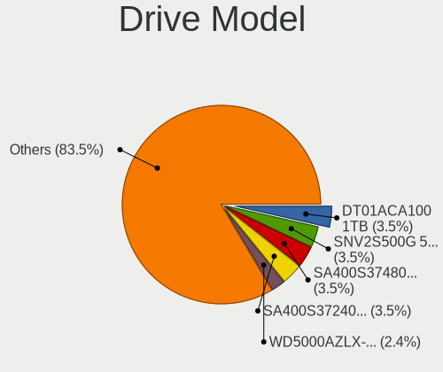
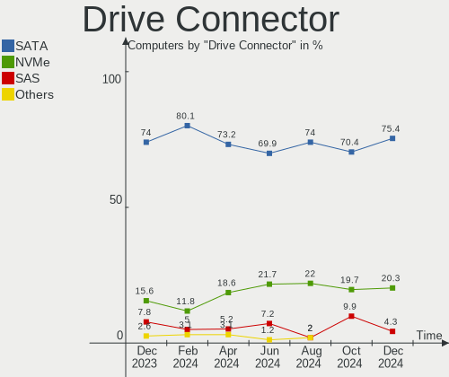
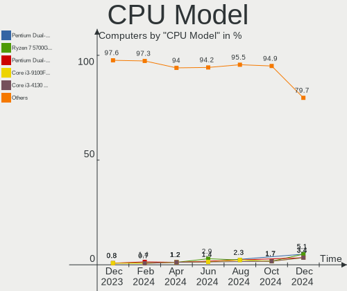
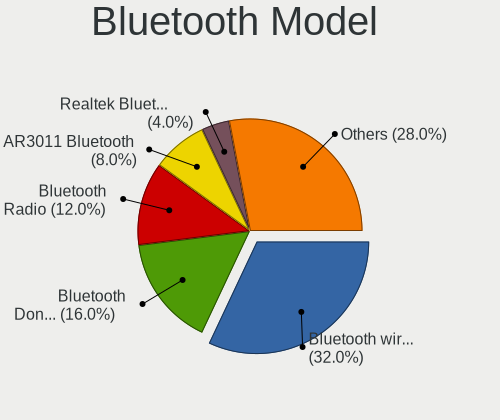

BlackPanther Hardware Trends
----------------------------

A project to identify most popular hardware characteristics and track their change
over time based on data collected by BlackPanther users at https://Linux-Hardware.org.

Anyone can contribute to the study by uploading probes of their computers by
the [hw-probe](https://github.com/linuxhw/hw-probe) tool:

    sudo -E hw-probe -all -upload

This is a report for all computer types. See also reports for [desktops](/Dist/BlackPanther/Desktop/README.md) and [notebooks](/Dist/BlackPanther/Notebook/README.md).

Full-feature report is available here: https://linux-hardware.org/?view=trends

Period: Nov, 2020.

Contents
--------

- [ OS                       ](#os)
- [ OS Family                ](#os-family)
- [ Kernel                   ](#kernel)
- [ Kernel Family            ](#kernel-family)
- [ Kernel Major Ver.        ](#kernel-major-ver)
- [ Arch                     ](#arch)
- [ DE                       ](#de)
- [ Display Server           ](#display-server)
- [ Display Manager          ](#display-manager)
- [ OS Lang                  ](#os-lang)
- [ Boot Mode                ](#boot-mode)
- [ Filesystem               ](#filesystem)
- [ Part. scheme             ](#part-scheme)
- [ Dual Boot with Linux/BSD ](#dual-boot-with-linux/bsd)
- [ Dual Boot (Win)          ](#dual-boot-win)
- [ Country                  ](#country)
- [ City                     ](#city)
- [ Vendor                   ](#vendor)
- [ Model                    ](#model)
- [ Model Family             ](#model-family)
- [ MFG Year                 ](#mfg-year)
- [ Form Factor              ](#form-factor)
- [ Secure Boot              ](#secure-boot)
- [ Coreboot                 ](#coreboot)
- [ RAM Size                 ](#ram-size)
- [ RAM Used                 ](#ram-used)
- [ Has CD-ROM               ](#has-cd-rom)
- [ Total Drives             ](#total-drives)
- [ Has Ethernet             ](#has-ethernet)
- [ Drive Vendor             ](#drive-vendor)
- [ Drive Model              ](#drive-model)
- [ HDD Vendor               ](#hdd-vendor)
- [ SSD Vendor               ](#ssd-vendor)
- [ Drive Kind               ](#drive-kind)
- [ Drive Connector          ](#drive-connector)
- [ Drive Size               ](#drive-size)
- [ Space Total              ](#space-total)
- [ Space Used               ](#space-used)
- [ Malfunc. Drives          ](#malfunc-drives)
- [ Malfunc. Drive Vendor    ](#malfunc-drive-vendor)
- [ Malfunc. HDD Vendor      ](#malfunc-hdd-vendor)
- [ Malfunc. Drive Kind      ](#malfunc-drive-kind)
- [ Failed Drives            ](#failed-drives)
- [ Failed Drive Vendor      ](#failed-drive-vendor)
- [ Drive Status             ](#drive-status)
- [ Storage Vendor           ](#storage-vendor)
- [ Storage Model            ](#storage-model)
- [ Storage Kind             ](#storage-kind)
- [ CPU Vendor               ](#cpu-vendor)
- [ CPU Model                ](#cpu-model)
- [ CPU Model Family         ](#cpu-model-family)
- [ CPU Cores                ](#cpu-cores)
- [ CPU Sockets              ](#cpu-sockets)
- [ CPU Threads              ](#cpu-threads)
- [ CPU Op-Modes             ](#cpu-op-modes)
- [ CPU Microcode            ](#cpu-microcode)
- [ CPU Microarch            ](#cpu-microarch)
- [ GPU Vendor               ](#gpu-vendor)
- [ GPU Model                ](#gpu-model)
- [ GPU Combo                ](#gpu-combo)
- [ GPU Driver               ](#gpu-driver)
- [ GPU Memory               ](#gpu-memory)
- [ Monitor Vendor           ](#monitor-vendor)
- [ Monitor Model            ](#monitor-model)
- [ Monitor Resolution       ](#monitor-resolution)
- [ Monitor Diagonal         ](#monitor-diagonal)
- [ Monitor Width            ](#monitor-width)
- [ Aspect Ratio             ](#aspect-ratio)
- [ Monitor Area             ](#monitor-area)
- [ Pixel Density            ](#pixel-density)
- [ Multiple Monitors        ](#multiple-monitors)
- [ Net Controller Vendor    ](#net-controller-vendor)
- [ Net Controller Model     ](#net-controller-model)
- [ Wireless Vendor          ](#wireless-vendor)
- [ Wireless Model           ](#wireless-model)
- [ Ethernet Vendor          ](#ethernet-vendor)
- [ Ethernet Model           ](#ethernet-model)
- [ Net Controller Kind      ](#net-controller-kind)
- [ Used Controller          ](#used-controller)
- [ NICs                     ](#nics)
- [ Memory Vendor            ](#memory-vendor)
- [ Memory Model             ](#memory-model)
- [ Memory Kind              ](#memory-kind)
- [ Memory Form Factor       ](#memory-form-factor)
- [ Memory Size              ](#memory-size)
- [ Memory Speed             ](#memory-speed)
- [ Sound Vendor             ](#sound-vendor)
- [ Sound Model              ](#sound-model)
- [ Camera Vendor            ](#camera-vendor)
- [ Camera Model             ](#camera-model)
- [ Fingerprint Vendor       ](#fingerprint-vendor)
- [ Fingerprint Model        ](#fingerprint-model)
- [ Chipcard Vendor          ](#chipcard-vendor)
- [ Chipcard Model           ](#chipcard-model)
- [ Printer Vendor           ](#printer-vendor)
- [ Printer Model            ](#printer-model)
- [ Scanner Vendor           ](#scanner-vendor)
- [ Scanner Model            ](#scanner-model)
- [ Bluetooth Vendor         ](#bluetooth-vendor)
- [ Bluetooth Model          ](#bluetooth-model)
- [ Unsupported Devices      ](#unsupported-devices)
- [ Unsupported Device Types ](#unsupported-device-types)

OS
--

Installed operating systems

| Name              | Computers | Percent |
|-------------------|-----------|---------|
| BlackPanther 18.1 | 184       | 93.4%   |
| BlackPanther 16.2 | 13        | 6.6%    |

OS Family
---------

OS without a version

| Name         | Computers | Percent |
|--------------|-----------|---------|
| BlackPanther | 197       | 100%    |

Kernel
------

Version of the Linux kernel

| Version                | Computers | Percent |
|------------------------|-----------|---------|
| 4.18.16-desktop-1bP    | 180       | 91.37%  |
| 4.9.20-desktop-pae-1bP | 12        | 6.09%   |
| 5.6.14-desktop-2bP     | 4         | 2.03%   |
| 4.9.20-desktop-1bP     | 1         | 0.51%   |

Kernel Family
-------------

Linux kernel without a distro release

| Version | Computers | Percent |
|---------|-----------|---------|
| 4.18.16 | 180       | 91.37%  |
| 4.9.20  | 13        | 6.6%    |
| 5.6.14  | 4         | 2.03%   |

Kernel Major Ver.
-----------------

Linux kernel major version

| Version | Computers | Percent |
|---------|-----------|---------|
| 4.18    | 180       | 91.37%  |
| 4.9     | 13        | 6.6%    |
| 5.6     | 4         | 2.03%   |

Arch
----

OS architecture (x86_64, i586, etc.)

| Name   | Computers | Percent |
|--------|-----------|---------|
| x86_64 | 184       | 93.4%   |
| i686   | 13        | 6.6%    |

DE
--

Desktop Environment

| Name | Computers | Percent |
|------|-----------|---------|
| KDE5 | 197       | 100%    |

Display Server
--------------

X11 or Wayland

| Name    | Computers | Percent |
|---------|-----------|---------|
| X11     | 195       | 98.98%  |
| Wayland | 2         | 1.02%   |

Display Manager
---------------

SDDM, LightDM, etc.

| Name | Computers | Percent |
|------|-----------|---------|
| SDDM | 197       | 100%    |

OS Lang
-------

Language

| Lang    | Computers | Percent |
|---------|-----------|---------|
| Unknown | 197       | 100%    |

Boot Mode
---------

EFI or BIOS

| Mode | Computers | Percent |
|------|-----------|---------|
| BIOS | 128       | 64.97%  |
| EFI  | 69        | 35.03%  |

Filesystem
----------

Type of filesystem

| Type    | Computers | Percent |
|---------|-----------|---------|
| Overlay | 159       | 80.71%  |
| Ext4    | 37        | 18.78%  |
| Ext3    | 1         | 0.51%   |

Part. scheme
------------

Scheme of partitioning

| Type    | Computers | Percent |
|---------|-----------|---------|
| MBR     | 117       | 59.39%  |
| GPT     | 79        | 40.1%   |
| Unknown | 1         | 0.51%   |

Dual Boot with Linux/BSD
------------------------

Hosting more than one Linux/BSD

| Dual boot | Computers | Percent |
|-----------|-----------|---------|
| No        | 107       | 54.31%  |
| Yes       | 90        | 45.69%  |

Dual Boot (Win)
---------------

Hosting Linux and Windows

| Dual boot | Computers | Percent |
|-----------|-----------|---------|
| Yes       | 103       | 52.28%  |
| No        | 94        | 47.72%  |

Country
-------

Geographic location (country)

| Country       | Computers | Percent |
|---------------|-----------|---------|
| Hungary       | 132       | 67.01%  |
| Germany       | 12        | 6.09%   |
| USA           | 6         | 3.05%   |
| Slovakia      | 5         | 2.54%   |
| Canada        | 5         | 2.54%   |
| Romania       | 4         | 2.03%   |
| Argentina     | 4         | 2.03%   |
| UK            | 3         | 1.52%   |
| Philippines   | 3         | 1.52%   |
| Italy         | 3         | 1.52%   |
| France        | 3         | 1.52%   |
| Brazil        | 3         | 1.52%   |
| India         | 2         | 1.02%   |
| Thailand      | 1         | 0.51%   |
| Russia        | 1         | 0.51%   |
| Netherlands   | 1         | 0.51%   |
| Liechtenstein | 1         | 0.51%   |
| Japan         | 1         | 0.51%   |
| Israel        | 1         | 0.51%   |
| Finland       | 1         | 0.51%   |
| Colombia      | 1         | 0.51%   |
| Belgium       | 1         | 0.51%   |
| Austria       | 1         | 0.51%   |
| Australia     | 1         | 0.51%   |
| Unknown       | 1         | 0.51%   |

City
----

Geographic location (city)

| City                      | Computers | Percent |
|---------------------------|-----------|---------|
| Budapest                  | 48        | 24.37%  |
| Miskolc                   | 7         | 3.55%   |
| Ajka                      | 5         | 2.54%   |
| Szekszárd                | 4         | 2.03%   |
| Karcag                    | 4         | 2.03%   |
| Győr                     | 4         | 2.03%   |
| Zalaegerszeg              | 3         | 1.52%   |
| Szombathely               | 3         | 1.52%   |
| San Martín de los Andes  | 3         | 1.52%   |
| Eger                      | 3         | 1.52%   |
| Budajeno                  | 3         | 1.52%   |
| Wassertrudingen           | 2         | 1.02%   |
| Székesfehérvár         | 2         | 1.02%   |
| Szeged                    | 2         | 1.02%   |
| Seregno                   | 2         | 1.02%   |
| Retkozberencs             | 2         | 1.02%   |
| Ottawa                    | 2         | 1.02%   |
| Nova Bana                 | 2         | 1.02%   |
| Kisujszallas              | 2         | 1.02%   |
| Cagayan de Oro            | 2         | 1.02%   |
| Békéscsaba              | 2         | 1.02%   |
| Bucharest                 | 2         | 1.02%   |
| Berlin                    | 2         | 1.02%   |
| Bengaluru                 | 2         | 1.02%   |
| Érd                      | 1         | 0.51%   |
| Wagener                   | 1         | 0.51%   |
| Vienna                    | 1         | 0.51%   |
| Valleyford                | 1         | 0.51%   |
| Toronto                   | 1         | 0.51%   |
| Tomsk                     | 1         | 0.51%   |
| Tolna                     | 1         | 0.51%   |
| Tiszafured                | 1         | 0.51%   |
| Tiszafoldvar              | 1         | 0.51%   |
| Timișoara                | 1         | 0.51%   |
| Tet                       | 1         | 0.51%   |
| Tel Aviv                  | 1         | 0.51%   |
| Tata                      | 1         | 0.51%   |
| Tarcal                    | 1         | 0.51%   |
| Tap                       | 1         | 0.51%   |
| Tabajd                    | 1         | 0.51%   |
| Szomod                    | 1         | 0.51%   |
| Szolnok                   | 1         | 0.51%   |
| Szigetszentmiklos         | 1         | 0.51%   |
| Southend-on-Sea           | 1         | 0.51%   |
| Sopron                    | 1         | 0.51%   |
| Solymar                   | 1         | 0.51%   |
| Solingen                  | 1         | 0.51%   |
| Schaan                    | 1         | 0.51%   |
| Sandorfalva               | 1         | 0.51%   |
| Saint-Gilles-Croix-de-Vie | 1         | 0.51%   |
| Rugland                   | 1         | 0.51%   |
| Ruaudin                   | 1         | 0.51%   |
| Québec                   | 1         | 0.51%   |
| Pécs                     | 1         | 0.51%   |
| Portland                  | 1         | 0.51%   |
| Pomaz                     | 1         | 0.51%   |
| Pfaffenhofen an der Ilm   | 1         | 0.51%   |
| Pecel                     | 1         | 0.51%   |
| Osli                      | 1         | 0.51%   |
| Oroshaza                  | 1         | 0.51%   |

Vendor
------

Motherboard manufacturer

| Name                | Computers | Percent |
|---------------------|-----------|---------|
| Hewlett-Packard     | 40        | 20.3%   |
| ASUSTek Computer    | 38        | 19.29%  |
| Lenovo              | 25        | 12.69%  |
| ASRock              | 15        | 7.61%   |
| Gigabyte Technology | 14        | 7.11%   |
| Dell                | 14        | 7.11%   |
| Acer                | 11        | 5.58%   |
| Fujitsu             | 9         | 4.57%   |
| Toshiba             | 4         | 2.03%   |
| MSI                 | 4         | 2.03%   |
| Apple               | 4         | 2.03%   |
| Packard Bell        | 3         | 1.52%   |
| Samsung Electronics | 2         | 1.02%   |
| Pegatron            | 2         | 1.02%   |
| Foxconn             | 2         | 1.02%   |
| Unknown             | 2         | 1.02%   |
| ZOTAC               | 1         | 0.51%   |
| Sony                | 1         | 0.51%   |
| Positivo            | 1         | 0.51%   |
| IBM                 | 1         | 0.51%   |
| Gateway             | 1         | 0.51%   |
| EMAXX TECHNOLOGY    | 1         | 0.51%   |
| eMachines           | 1         | 0.51%   |
| BANGHO              | 1         | 0.51%   |

Model
-----

Motherboard model

| Name                                       | Computers | Percent |
|--------------------------------------------|-----------|---------|
| HP 250 G1                                  | 12        | 6.09%   |
| ASUS All Series                            | 5         | 2.54%   |
| Unknown                                    | 5         | 2.54%   |
| Lenovo G50-30 80G0                         | 2         | 1.02%   |
| HP EliteBook 2540p                         | 2         | 1.02%   |
| HP Compaq dc5800 Small Form Factor         | 2         | 1.02%   |
| Dell OptiPlex 3020                         | 2         | 1.02%   |
| ASUS X550CC                                | 2         | 1.02%   |
| ASUS VivoBook 15_ASUS Laptop X540UBR       | 2         | 1.02%   |
| ASRock FM2A88M Extreme4+                   | 2         | 1.02%   |
| ASRock FM2A75M Pro4+                       | 2         | 1.02%   |
| Apple MacBookPro9,2                        | 2         | 1.02%   |
| Acer Aspire E1-532                         | 2         | 1.02%   |
| Acer Aspire 5745G                          | 2         | 1.02%   |
| Toshiba Satellite Pro L300                 | 1         | 0.51%   |
| Toshiba Satellite L750                     | 1         | 0.51%   |
| Toshiba Satellite C70D-B                   | 1         | 0.51%   |
| Toshiba Satellite C50D-A-11M               | 1         | 0.51%   |
| Sony VPCEH2J1E                             | 1         | 0.51%   |
| Samsung 300V3A/300V4A/300V5A/200A4B/200A5B | 1         | 0.51%   |
| Samsung 300E4A/300E5A/300E7A/3430EA/3530EA | 1         | 0.51%   |
| Positivo C14RV01                           | 1         | 0.51%   |
| Pegatron p6560be                           | 1         | 0.51%   |
| Pegatron Compaq dx7500 Microtower          | 1         | 0.51%   |
| Packard Bell EasyNote TK81                 | 1         | 0.51%   |
| Packard Bell EasyNote TK36                 | 1         | 0.51%   |
| Packard Bell EasyNote MB87                 | 1         | 0.51%   |
| MSI MS-7A32                                | 1         | 0.51%   |
| MSI MS-7970                                | 1         | 0.51%   |
| MSI MS-7358                                | 1         | 0.51%   |
| MSI GP70 2PE                               | 1         | 0.51%   |
| Lenovo ThinkStation P330 Tiny 30CFCTO1WW   | 1         | 0.51%   |
| Lenovo ThinkStation D20 4158AF8            | 1         | 0.51%   |
| Lenovo ThinkPad T61 6458WK6                | 1         | 0.51%   |
| Lenovo ThinkPad T410 253723G               | 1         | 0.51%   |
| Lenovo ThinkPad L450 20DSS1X52L            | 1         | 0.51%   |
| Lenovo ThinkPad 11e 20D90020US             | 1         | 0.51%   |
| Lenovo ThinkCentre M93p 10A7000LGE         | 1         | 0.51%   |
| Lenovo ThinkCentre M91p 4524BL8            | 1         | 0.51%   |
| Lenovo ThinkCentre M82 29293V4             | 1         | 0.51%   |
| Lenovo ThinkCentre M81 5048W6L             | 1         | 0.51%   |
| Lenovo ThinkCentre M72e 36622M1            | 1         | 0.51%   |
| Lenovo ThinkCentre M72e 3578G5M            | 1         | 0.51%   |
| Lenovo ThinkCentre M70e 0832W2F            | 1         | 0.51%   |
| Lenovo ThinkCentre M58p 6138DK1            | 1         | 0.51%   |
| Lenovo ThinkCentre A57 98517HG             | 1         | 0.51%   |
| Lenovo IdeaPad 700-15ISK 80RU              | 1         | 0.51%   |
| Lenovo IdeaPad 330-15IKB 81DE              | 1         | 0.51%   |
| Lenovo IdeaPad 330-15AST 81D6              | 1         | 0.51%   |
| Lenovo IdeaPad 305-15IBD 80NJ              | 1         | 0.51%   |
| Lenovo IdeaPad 100-15IBD 80QQ              | 1         | 0.51%   |
| Lenovo G585 20137                          | 1         | 0.51%   |
| Lenovo G550 20023                          | 1         | 0.51%   |
| Lenovo 3000 G530 444622G                   | 1         | 0.51%   |
| HP ProDesk 400 G3 MT                       | 1         | 0.51%   |
| HP ProBook 6450b                           | 1         | 0.51%   |
| HP ProBook 4510s                           | 1         | 0.51%   |
| HP Presario CQ57                           | 1         | 0.51%   |
| HP Pavilion Notebook                       | 1         | 0.51%   |
| HP Notebook                                | 1         | 0.51%   |

Model Family
------------

Motherboard model prefix

| Name                   | Computers | Percent |
|------------------------|-----------|---------|
| HP 250                 | 13        | 6.6%    |
| HP Compaq              | 10        | 5.08%   |
| Lenovo ThinkCentre     | 9         | 4.57%   |
| Acer Aspire            | 9         | 4.57%   |
| Dell Latitude          | 7         | 3.55%   |
| Lenovo IdeaPad         | 5         | 2.54%   |
| Fujitsu ESPRIMO        | 5         | 2.54%   |
| ASUS All               | 5         | 2.54%   |
| Unknown                | 5         | 2.54%   |
| Toshiba Satellite      | 4         | 2.03%   |
| Lenovo ThinkPad        | 4         | 2.03%   |
| ASUS PRIME             | 4         | 2.03%   |
| Packard Bell EasyNote  | 3         | 1.52%   |
| HP EliteBook           | 3         | 1.52%   |
| Fujitsu LIFEBOOK       | 3         | 1.52%   |
| Dell OptiPlex          | 3         | 1.52%   |
| ASUS VivoBook          | 3         | 1.52%   |
| Lenovo ThinkStation    | 2         | 1.02%   |
| Lenovo G50-30          | 2         | 1.02%   |
| HP ProBook             | 2         | 1.02%   |
| HP Laptop              | 2         | 1.02%   |
| ASUS X550CC            | 2         | 1.02%   |
| ASRock FM2A88M         | 2         | 1.02%   |
| ASRock FM2A75M         | 2         | 1.02%   |
| Apple MacBookPro9      | 2         | 1.02%   |
| Sony VPCEH2J1E         | 1         | 0.51%   |
| Samsung 300V3A         | 1         | 0.51%   |
| Samsung 300E4A         | 1         | 0.51%   |
| Positivo C14RV01       | 1         | 0.51%   |
| Pegatron p6560be       | 1         | 0.51%   |
| Pegatron Compaq        | 1         | 0.51%   |
| MSI MS-7A32            | 1         | 0.51%   |
| MSI MS-7970            | 1         | 0.51%   |
| MSI MS-7358            | 1         | 0.51%   |
| MSI GP70               | 1         | 0.51%   |
| Lenovo G585            | 1         | 0.51%   |
| Lenovo G550            | 1         | 0.51%   |
| Lenovo 3000            | 1         | 0.51%   |
| HP ProDesk             | 1         | 0.51%   |
| HP Presario            | 1         | 0.51%   |
| HP Pavilion            | 1         | 0.51%   |
| HP Notebook            | 1         | 0.51%   |
| HP G42                 | 1         | 0.51%   |
| HP 650                 | 1         | 0.51%   |
| HP 510-p127c           | 1         | 0.51%   |
| HP 255                 | 1         | 0.51%   |
| HP 15                  | 1         | 0.51%   |
| Gigabyte Z390          | 1         | 0.51%   |
| Gigabyte H81M-S2PV     | 1         | 0.51%   |
| Gigabyte H81M-DS2V     | 1         | 0.51%   |
| Gigabyte H61M-S2V-B3   | 1         | 0.51%   |
| Gigabyte H61M-S1       | 1         | 0.51%   |
| Gigabyte H61M-D2-B3    | 1         | 0.51%   |
| Gigabyte GA-78LMT-USB3 | 1         | 0.51%   |
| Gigabyte EP43-S3L      | 1         | 0.51%   |
| Gigabyte B85M-D2V      | 1         | 0.51%   |
| Gigabyte B450M         | 1         | 0.51%   |
| Gigabyte B450          | 1         | 0.51%   |
| Gigabyte B250M-DS3H    | 1         | 0.51%   |
| Gigabyte 990XA-UD3     | 1         | 0.51%   |

MFG Year
--------

Motherboard manufacture year

| Year | Computers | Percent |
|------|-----------|---------|
| 2013 | 26        | 13.2%   |
| 2014 | 21        | 10.66%  |
| 2012 | 19        | 9.64%   |
| 2019 | 17        | 8.63%   |
| 2018 | 17        | 8.63%   |
| 2011 | 17        | 8.63%   |
| 2015 | 14        | 7.11%   |
| 2016 | 13        | 6.6%    |
| 2010 | 12        | 6.09%   |
| 2008 | 12        | 6.09%   |
| 2009 | 11        | 5.58%   |
| 2007 | 6         | 3.05%   |
| 2020 | 5         | 2.54%   |
| 2017 | 4         | 2.03%   |
| 2006 | 3         | 1.52%   |

Form Factor
-----------

Physical design of the computer

| Name       | Computers | Percent |
|------------|-----------|---------|
| Notebook   | 105       | 53.3%   |
| Desktop    | 88        | 44.67%  |
| Mini pc    | 3         | 1.52%   |
| All in one | 1         | 0.51%   |

Secure Boot
-----------

Enabled or disabled

| State    | Computers | Percent |
|----------|-----------|---------|
| Disabled | 197       | 100%    |

Coreboot
--------

Have coreboot on board

| Used | Computers | Percent |
|------|-----------|---------|
| No   | 197       | 100%    |

RAM Size
--------

Total RAM memory

| Size in GB | Computers | Percent |
|------------|-----------|---------|
| 3.01-4.0   | 63        | 31.98%  |
| 8.01-16.0  | 45        | 22.84%  |
| 4.01-8.0   | 38        | 19.29%  |
| 1.01-2.0   | 24        | 12.18%  |
| 16.01-24.0 | 19        | 9.64%   |
| 2.01-3.0   | 4         | 2.03%   |
| 32.01-64.0 | 2         | 1.02%   |
| 24.01-32.0 | 1         | 0.51%   |
| 0.01-1.0   | 1         | 0.51%   |

RAM Used
--------

Used RAM memory

| Used GB  | Computers | Percent |
|----------|-----------|---------|
| 0.01-1.0 | 155       | 78.68%  |
| 1.01-2.0 | 41        | 20.81%  |
| 2.01-3.0 | 1         | 0.51%   |

Has CD-ROM
----------

Has CD-ROM on board

| Presented | Computers | Percent |
|-----------|-----------|---------|
| Yes       | 135       | 68.53%  |
| No        | 62        | 31.47%  |

Total Drives
------------

Number of drives on board

| Drives | Computers | Percent |
|--------|-----------|---------|
| 1      | 140       | 71.07%  |
| 2      | 41        | 20.81%  |
| 3      | 11        | 5.58%   |
| 0      | 3         | 1.52%   |
| 4      | 2         | 1.02%   |

Has Ethernet
------------

Has Ethernet on board

| Presented | Computers | Percent |
|-----------|-----------|---------|
| Yes       | 190       | 96.45%  |
| No        | 7         | 3.55%   |

Drive Vendor
------------

Hard drive vendors

| Vendor              | Computers | Drives | Percent |
|---------------------|-----------|--------|---------|
| Seagate             | 46        | 47     | 17.42%  |
| WDC                 | 43        | 47     | 16.29%  |
| Kingston            | 31        | 33     | 11.74%  |
| Toshiba             | 22        | 24     | 8.33%   |
| Samsung Electronics | 21        | 22     | 7.95%   |
| HGST                | 20        | 20     | 7.58%   |
| Hitachi             | 16        | 16     | 6.06%   |
| Crucial             | 7         | 7      | 2.65%   |
| A-DATA Technology   | 7         | 7      | 2.65%   |
| SanDisk             | 6         | 6      | 2.27%   |
| Maxtor              | 4         | 4      | 1.52%   |
| Intel               | 4         | 4      | 1.52%   |
| Unknown             | 3         | 4      | 1.14%   |
| SK Hynix            | 3         | 3      | 1.14%   |
| Intenso             | 3         | 3      | 1.14%   |
| Patriot             | 2         | 2      | 0.76%   |
| Micron Technology   | 2         | 2      | 0.76%   |
| Kingmax             | 2         | 2      | 0.76%   |
| Zheino              | 1         | 1      | 0.38%   |
| USB3.0              | 1         | 2      | 0.38%   |
| USB                 | 1         | 1      | 0.38%   |
| Team                | 1         | 1      | 0.38%   |
| SPCC                | 1         | 1      | 0.38%   |
| SMI                 | 1         | 1      | 0.38%   |
| ShanDianZhe         | 1         | 1      | 0.38%   |
| QC-FT-D             | 1         | 1      | 0.38%   |
| PNY                 | 1         | 1      | 0.38%   |
| OCZ                 | 1         | 1      | 0.38%   |
| LITEON              | 1         | 1      | 0.38%   |
| Leven               | 1         | 1      | 0.38%   |
| JMicron             | 1         | 1      | 0.38%   |
| Integral            | 1         | 1      | 0.38%   |
| IBM/Hitachi         | 1         | 1      | 0.38%   |
| Hewlett-Packard     | 1         | 1      | 0.38%   |
| Gigabyte Technology | 1         | 1      | 0.38%   |
| Fujitsu             | 1         | 1      | 0.38%   |
| FORESEE             | 1         | 1      | 0.38%   |
| China               | 1         | 1      | 0.38%   |
| Apple               | 1         | 1      | 0.38%   |
| AMD                 | 1         | 1      | 0.38%   |

Drive Model
-----------

Hard drive models

| Model                              | Computers | Percent |
|------------------------------------|-----------|---------|
| HGST HTS545032A7E380 320GB         | 9         | 3.27%   |
| Kingston SA400S37240G 240GB SSD    | 8         | 2.91%   |
| Kingston SV300S37A120G 120GB SSD   | 5         | 1.82%   |
| Kingston SA400S37480G 480GB SSD    | 5         | 1.82%   |
| HGST HTS545050A7E680 500GB         | 5         | 1.82%   |
| Seagate ST500LT012-1DG142 500GB    | 4         | 1.45%   |
| Seagate ST500DM002-1BD142 500GB    | 4         | 1.45%   |
| Kingston SUV400S37120G 120GB SSD   | 4         | 1.45%   |
| Toshiba MQ04ABF100 1TB             | 3         | 1.09%   |
| Toshiba MQ01ABD100 1TB             | 3         | 1.09%   |
| Toshiba DT01ACA050 500GB           | 3         | 1.09%   |
| Seagate ST3250318AS 250GB          | 3         | 1.09%   |
| Kingston SA400S37120G 120GB SSD    | 3         | 1.09%   |
| Hitachi HDS721050CLA362 500GB      | 3         | 1.09%   |
| Crucial CT120BX500SSD1 120GB       | 3         | 1.09%   |
| WDC WDS240G2G0B-00EPW0 240GB SSD   | 2         | 0.73%   |
| WDC WDS240G2G0A-00JH30 240GB SSD   | 2         | 0.73%   |
| WDC WD5000BPVT-00HXZT1 500GB       | 2         | 0.73%   |
| WDC WD5000AAKX-22ERMA0 500GB       | 2         | 0.73%   |
| WDC WD5000AAKX-001CA0 500GB        | 2         | 0.73%   |
| WDC WD10EZEX-08WN4A0 1TB           | 2         | 0.73%   |
| Toshiba MQ01ABF050 500GB           | 2         | 0.73%   |
| Toshiba HDWD110 1TB                | 2         | 0.73%   |
| Toshiba DT01ACA100 1TB             | 2         | 0.73%   |
| Seagate ST980811AS 80GB            | 2         | 0.73%   |
| Seagate ST1000LM035-1RK172 1TB     | 2         | 0.73%   |
| Seagate ST1000LM024 HN-M101MBB 1TB | 2         | 0.73%   |
| Samsung SSD 860 EVO 500GB          | 2         | 0.73%   |
| Samsung SSD 860 EVO 250GB          | 2         | 0.73%   |
| Samsung HD502HJ 500GB              | 2         | 0.73%   |
| Patriot Burst 480GB SSD            | 2         | 0.73%   |
| Maxtor 2B020H1 20GB                | 2         | 0.73%   |
| Kingmax SSD 240GB                  | 2         | 0.73%   |
| Intenso SSD 128GB                  | 2         | 0.73%   |
| HGST HTS541010A9E680 1TB           | 2         | 0.73%   |
| Crucial CT240BX500SSD1 240GB       | 2         | 0.73%   |
| A-DATA SU700 120GB SSD             | 2         | 0.73%   |
| A-DATA SP900 256GB SSD             | 2         | 0.73%   |
| Zheino CHN-NGFFNV2280-256 256GB    | 1         | 0.36%   |
| WDC WDS256G1X0C-00ENX0 256GB       | 1         | 0.36%   |
| WDC WDS120G2G0A-00JH30 120GB SSD   | 1         | 0.36%   |
| WDC WDBNCE5000PNC 500GB SSD        | 1         | 0.36%   |
| WDC WD7500AYPS-01ZKB0 752GB        | 1         | 0.36%   |
| WDC WD5000LPCX-24C6HT0 500GB       | 1         | 0.36%   |
| WDC WD5000LPCX-22VHAT1 500GB       | 1         | 0.36%   |
| WDC WD5000LPCX-21VHAT0 500GB       | 1         | 0.36%   |
| WDC WD5000BEVT-75ZAT0 500GB        | 1         | 0.36%   |
| WDC WD5000BEVT-22ZAT0 500GB        | 1         | 0.36%   |
| WDC WD5000AAKS-007AA0 500GB        | 1         | 0.36%   |
| WDC WD5000AADS-00S9B0 500GB        | 1         | 0.36%   |
| WDC WD5000AACS-00G8B1 500GB        | 1         | 0.36%   |
| WDC WD3200BEVT-08A23T1 320GB       | 1         | 0.36%   |
| WDC WD3200AUDX-56WNHY0 320GB       | 1         | 0.36%   |
| WDC WD3200AAKX-083CA1 320GB        | 1         | 0.36%   |
| WDC WD3200AAKX-001CA0 320GB        | 1         | 0.36%   |
| WDC WD2500BEVS-22UST0 250GB        | 1         | 0.36%   |
| WDC WD2500AAKX-60U6AA0 250GB       | 1         | 0.36%   |
| WDC WD2500AAKX-08U6AA0 250GB       | 1         | 0.36%   |
| WDC WD20EZRX-00D8PB0 2TB           | 1         | 0.36%   |
| WDC WD20EURS-73S48Y0 2TB           | 1         | 0.36%   |

HDD Vendor
----------

Hard disk drive vendors

| Vendor              | Computers | Drives | Percent |
|---------------------|-----------|--------|---------|
| Seagate             | 45        | 46     | 28.13%  |
| WDC                 | 39        | 40     | 24.38%  |
| Toshiba             | 21        | 23     | 13.13%  |
| HGST                | 20        | 20     | 12.5%   |
| Hitachi             | 16        | 16     | 10%     |
| Samsung Electronics | 10        | 11     | 6.25%   |
| Maxtor              | 4         | 4      | 2.5%    |
| QC-FT-D             | 1         | 1      | 0.63%   |
| IBM/Hitachi         | 1         | 1      | 0.63%   |
| Hewlett-Packard     | 1         | 1      | 0.63%   |
| Fujitsu             | 1         | 1      | 0.63%   |
| Apple               | 1         | 1      | 0.63%   |

SSD Vendor
----------

Solid state drive vendors

| Vendor              | Computers | Drives | Percent |
|---------------------|-----------|--------|---------|
| Kingston            | 28        | 30     | 31.46%  |
| Samsung Electronics | 8         | 8      | 8.99%   |
| Crucial             | 7         | 7      | 7.87%   |
| A-DATA Technology   | 7         | 7      | 7.87%   |
| WDC                 | 6         | 6      | 6.74%   |
| SanDisk             | 6         | 6      | 6.74%   |
| Intenso             | 3         | 3      | 3.37%   |
| Patriot             | 2         | 2      | 2.25%   |
| Micron Technology   | 2         | 2      | 2.25%   |
| Kingmax             | 2         | 2      | 2.25%   |
| Intel               | 2         | 2      | 2.25%   |
| Toshiba             | 1         | 1      | 1.12%   |
| Team                | 1         | 1      | 1.12%   |
| SPCC                | 1         | 1      | 1.12%   |
| SMI                 | 1         | 1      | 1.12%   |
| SK Hynix            | 1         | 1      | 1.12%   |
| ShanDianZhe         | 1         | 1      | 1.12%   |
| Seagate             | 1         | 1      | 1.12%   |
| PNY                 | 1         | 1      | 1.12%   |
| OCZ                 | 1         | 1      | 1.12%   |
| LITEON              | 1         | 1      | 1.12%   |
| Leven               | 1         | 1      | 1.12%   |
| Integral            | 1         | 1      | 1.12%   |
| Gigabyte Technology | 1         | 1      | 1.12%   |
| FORESEE             | 1         | 1      | 1.12%   |
| China               | 1         | 1      | 1.12%   |
| AMD                 | 1         | 1      | 1.12%   |

Drive Kind
----------

HDD or SSD

| Kind    | Computers | Drives | Percent |
|---------|-----------|--------|---------|
| HDD     | 144       | 165    | 60%     |
| SSD     | 80        | 91     | 33.33%  |
| NVMe    | 11        | 12     | 4.58%   |
| MMC     | 3         | 5      | 1.25%   |
| Unknown | 2         | 3      | 0.83%   |

Drive Connector
---------------

SATA, SAS, NVMe, etc.

| Type | Computers | Drives | Percent |
|------|-----------|--------|---------|
| SATA | 192       | 252    | 91.43%  |
| NVMe | 10        | 11     | 4.76%   |
| SAS  | 5         | 8      | 2.38%   |
| MMC  | 3         | 5      | 1.43%   |

Drive Size
----------

Size of hard drive

| Size in TB | Computers | Drives | Percent |
|------------|-----------|--------|---------|
| 0.01-0.5   | 163       | 196    | 75.46%  |
| 0.51-1.0   | 46        | 53     | 21.3%   |
| 1.01-2.0   | 5         | 5      | 2.31%   |
| 3.01-4.0   | 1         | 1      | 0.46%   |
| 4.01-10.0  | 1         | 1      | 0.46%   |

Space Total
-----------

Amount of disk space available on the file system

| Size in GB     | Computers | Percent |
|----------------|-----------|---------|
| Unknown        | 156       | 79.19%  |
| 101-250        | 13        | 6.6%    |
| 251-500        | 9         | 4.57%   |
| 51-100         | 6         | 3.05%   |
| 501-1000       | 4         | 2.03%   |
| 21-50          | 3         | 1.52%   |
| 1-20           | 3         | 1.52%   |
| 1001-2000      | 2         | 1.02%   |
| More than 3000 | 1         | 0.51%   |

Space Used
----------

Amount of used disk space

| Used GB   | Computers | Percent |
|-----------|-----------|---------|
| Unknown   | 156       | 79.19%  |
| 1-20      | 32        | 16.24%  |
| 21-50     | 3         | 1.52%   |
| 251-500   | 2         | 1.02%   |
| 101-250   | 2         | 1.02%   |
| 1001-2000 | 1         | 0.51%   |
| 501-1000  | 1         | 0.51%   |

Malfunc. Drives
---------------

Drive models with a malfunction

| Model                               | Computers | Drives | Percent |
|-------------------------------------|-----------|--------|---------|
| HGST HTS545032A7E380 320GB          | 7         | 7      | 8.64%   |
| HGST HTS545050A7E680 500GB          | 4         | 4      | 4.94%   |
| Seagate ST3250318AS 250GB           | 3         | 3      | 3.7%    |
| Hitachi HDS721050CLA362 500GB       | 3         | 3      | 3.7%    |
| Seagate ST980811AS 80GB             | 2         | 2      | 2.47%   |
| Seagate ST500DM002-1BD142 500GB     | 2         | 2      | 2.47%   |
| Maxtor 2B020H1 20GB                 | 2         | 2      | 2.47%   |
| Kingston SV300S37A120G 120GB SSD    | 2         | 2      | 2.47%   |
| HGST HTS541010A9E680 1TB            | 2         | 2      | 2.47%   |
| WDC WD7500AYPS-01ZKB0 752GB         | 1         | 1      | 1.23%   |
| WDC WD5000BEVT-22ZAT0 500GB         | 1         | 1      | 1.23%   |
| WDC WD5000AAKX-001CA0 500GB         | 1         | 1      | 1.23%   |
| WDC WD5000AAKS-007AA0 500GB         | 1         | 1      | 1.23%   |
| WDC WD1600AAJS-08L7A0 160GB         | 1         | 1      | 1.23%   |
| WDC WD1600AAJS-00PSA0 160GB         | 1         | 1      | 1.23%   |
| WDC WD10JPVX-22JC3T0 1TB            | 1         | 1      | 1.23%   |
| WDC WD10JPCX-24UE4T0 1TB            | 1         | 1      | 1.23%   |
| WDC WD10EZEX-08WN4A0 1TB            | 1         | 1      | 1.23%   |
| WDC WD10EARS-00Y5B1 1TB             | 1         | 1      | 1.23%   |
| Toshiba MQ01ABF050 500GB            | 1         | 1      | 1.23%   |
| Toshiba MQ01ABD075 752GB            | 1         | 1      | 1.23%   |
| Toshiba MK8009GAH 80GB              | 1         | 1      | 1.23%   |
| Toshiba MK2576GSX 250GB             | 1         | 1      | 1.23%   |
| Toshiba MK1652GSX 160GB             | 1         | 1      | 1.23%   |
| Toshiba MK1059GSMP 1TB              | 1         | 1      | 1.23%   |
| Toshiba HDWD110 1TB                 | 1         | 1      | 1.23%   |
| Seagate ST95005620AS 500GB          | 1         | 1      | 1.23%   |
| Seagate ST9500420AS 500GB           | 1         | 1      | 1.23%   |
| Seagate ST9320423AS 320GB           | 1         | 1      | 1.23%   |
| Seagate ST9320325AS 320GB           | 1         | 1      | 1.23%   |
| Seagate ST9250315AS 250GB           | 1         | 1      | 1.23%   |
| Seagate ST500LT012-9WS142 500GB     | 1         | 1      | 1.23%   |
| Seagate ST500LT012-1DG142 500GB     | 1         | 1      | 1.23%   |
| Seagate ST500LM012 HN-M500MBB 500GB | 1         | 1      | 1.23%   |
| Seagate ST500LM000-1EJ162 500GB     | 1         | 1      | 1.23%   |
| Seagate ST4000DM000-1F2168 4TB      | 1         | 1      | 1.23%   |
| Seagate ST3500630AS 500GB           | 1         | 1      | 1.23%   |
| Seagate ST3500418AS 500GB           | 1         | 1      | 1.23%   |
| Seagate ST3160815AS 160GB           | 1         | 1      | 1.23%   |
| Seagate ST3160815A 160GB            | 1         | 1      | 1.23%   |
| Seagate ST3160316CS 160GB           | 1         | 1      | 1.23%   |
| Seagate ST31000528AS 1TB            | 1         | 1      | 1.23%   |
| Seagate ST1000LX015-1U7172 1TB      | 1         | 1      | 1.23%   |
| Seagate ST1000LM024 HN-M101MBB 1TB  | 1         | 1      | 1.23%   |
| Seagate ST1000LM014-1EJ164-SSHD 1TB | 1         | 1      | 1.23%   |
| Samsung Electronics HM160HI 160GB   | 1         | 1      | 1.23%   |
| Samsung Electronics HD321KJ 320GB   | 1         | 1      | 1.23%   |
| Samsung Electronics HD161GJ 160GB   | 1         | 1      | 1.23%   |
| Samsung Electronics HD103UJ 1TB     | 1         | 1      | 1.23%   |
| Maxtor 6Y080L0 82GB                 | 1         | 1      | 1.23%   |
| Kingston SUV500120G 120GB SSD       | 1         | 1      | 1.23%   |
| Intel SSDSA1M160G2HP 160GB          | 1         | 1      | 1.23%   |
| IBM/Hitachi IC25N060ATMR04-0 64GB   | 1         | 1      | 1.23%   |
| Hitachi HTS545050B9A300 500GB       | 1         | 1      | 1.23%   |
| Hitachi HTS545032B9A300 320GB       | 1         | 1      | 1.23%   |
| Hitachi HTS541680J9SA00 80GB        | 1         | 1      | 1.23%   |
| Hitachi HTS541660J9SA00 64GB        | 1         | 1      | 1.23%   |
| Hitachi HTS541612J9SA00 120GB       | 1         | 1      | 1.23%   |
| Hitachi HDT721010SLA360 1TB         | 1         | 1      | 1.23%   |
| Hitachi HDP725050GLA360 500GB       | 1         | 1      | 1.23%   |

Malfunc. Drive Vendor
---------------------

Vendors of faulty drives

| Vendor              | Computers | Drives | Percent |
|---------------------|-----------|--------|---------|
| Seagate             | 25        | 26     | 31.25%  |
| HGST                | 15        | 15     | 18.75%  |
| WDC                 | 10        | 10     | 12.5%   |
| Hitachi             | 10        | 10     | 12.5%   |
| Toshiba             | 7         | 7      | 8.75%   |
| Samsung Electronics | 4         | 4      | 5%      |
| Maxtor              | 3         | 3      | 3.75%   |
| Kingston            | 3         | 3      | 3.75%   |
| Intel               | 1         | 1      | 1.25%   |
| IBM/Hitachi         | 1         | 1      | 1.25%   |
| Fujitsu             | 1         | 1      | 1.25%   |

Malfunc. HDD Vendor
-------------------

Vendors of faulty HDD drives

| Vendor              | Computers | Drives | Percent |
|---------------------|-----------|--------|---------|
| Seagate             | 25        | 26     | 32.89%  |
| HGST                | 15        | 15     | 19.74%  |
| WDC                 | 10        | 10     | 13.16%  |
| Hitachi             | 10        | 10     | 13.16%  |
| Toshiba             | 7         | 7      | 9.21%   |
| Samsung Electronics | 4         | 4      | 5.26%   |
| Maxtor              | 3         | 3      | 3.95%   |
| IBM/Hitachi         | 1         | 1      | 1.32%   |
| Fujitsu             | 1         | 1      | 1.32%   |

Malfunc. Drive Kind
-------------------

Kinds of faulty drives

| Kind | Computers | Drives | Percent |
|------|-----------|--------|---------|
| HDD  | 73        | 77     | 94.81%  |
| SSD  | 4         | 4      | 5.19%   |

Failed Drives
-------------

Failed drive models

| Model                             | Computers | Drives | Percent |
|-----------------------------------|-----------|--------|---------|
| WDC WD3200BEVT-08A23T1 320GB      | 1         | 1      | 25%     |
| Toshiba MQ01ABD100 1TB            | 1         | 1      | 25%     |
| Toshiba MK5055GSX 500GB           | 1         | 1      | 25%     |
| Samsung Electronics HD502HJ 500GB | 1         | 1      | 25%     |

Failed Drive Vendor
-------------------

Failed drive vendors

| Vendor              | Computers | Drives | Percent |
|---------------------|-----------|--------|---------|
| Toshiba             | 2         | 2      | 50%     |
| WDC                 | 1         | 1      | 25%     |
| Samsung Electronics | 1         | 1      | 25%     |

Drive Status
------------

Number of failed and malfunc. drives

| Status   | Computers | Drives | Percent |
|----------|-----------|--------|---------|
| Works    | 135       | 178    | 60.27%  |
| Malfunc  | 76        | 81     | 33.93%  |
| Detected | 9         | 13     | 4.02%   |
| Failed   | 4         | 4      | 1.79%   |

Storage Vendor
--------------

Storage controller vendors

| Vendor                      | Computers | Percent |
|-----------------------------|-----------|---------|
| Intel                       | 151       | 69.27%  |
| AMD                         | 41        | 18.81%  |
| JMicron Technology          | 6         | 2.75%   |
| VIA Technologies            | 3         | 1.38%   |
| Samsung Electronics         | 3         | 1.38%   |
| Kingston Technology Company | 3         | 1.38%   |
| Silicon Image               | 2         | 0.92%   |
| Marvell Technology Group    | 2         | 0.92%   |
| ULi Electronics             | 1         | 0.46%   |
| SK Hynix                    | 1         | 0.46%   |
| Silicon Motion              | 1         | 0.46%   |
| Sandisk                     | 1         | 0.46%   |
| ASMedia Technology          | 1         | 0.46%   |
| Adaptec                     | 1         | 0.46%   |
| 3ware                       | 1         | 0.46%   |

Storage Model
-------------

Storage controller models

| Model                                                                                   | Computers | Percent |
|-----------------------------------------------------------------------------------------|-----------|---------|
| AMD FCH SATA Controller [AHCI mode]                                                     | 28        | 10.14%  |
| Intel 7 Series Chipset Family 6-port SATA Controller [AHCI mode]                        | 24        | 8.7%    |
| Intel 8 Series/C220 Series Chipset Family 6-port SATA Controller 1 [AHCI mode]          | 12        | 4.35%   |
| Intel 82801IBM/IEM (ICH9M/ICH9M-E) 4 port SATA Controller [AHCI mode]                   | 9         | 3.26%   |
| Intel 6 Series/C200 Series Chipset Family 6 port Mobile SATA AHCI Controller            | 9         | 3.26%   |
| Intel NM10/ICH7 Family SATA Controller [IDE mode]                                       | 8         | 2.9%    |
| Intel 82801G (ICH7 Family) IDE Controller                                               | 8         | 2.9%    |
| Intel 82801HM/HEM (ICH8M/ICH8M-E) IDE Controller                                        | 7         | 2.54%   |
| Intel 82801 Mobile SATA Controller [RAID mode]                                          | 7         | 2.54%   |
| Intel 6 Series/C200 Series Chipset Family 6 port Desktop SATA AHCI Controller           | 7         | 2.54%   |
| AMD SB7x0/SB8x0/SB9x0 SATA Controller [AHCI mode]                                       | 7         | 2.54%   |
| AMD FCH IDE Controller                                                                  | 7         | 2.54%   |
| Intel Sunrise Point-LP SATA Controller [AHCI mode]                                      | 5         | 1.81%   |
| Intel 82801HM/HEM (ICH8M/ICH8M-E) SATA Controller [AHCI mode]                           | 5         | 1.81%   |
| Intel 5 Series/3400 Series Chipset 6 port SATA AHCI Controller                          | 5         | 1.81%   |
| Intel 5 Series/3400 Series Chipset 4 port SATA AHCI Controller                          | 5         | 1.81%   |
| Intel Q170/Q150/B150/H170/H110/Z170/CM236 Chipset SATA Controller [AHCI Mode]           | 4         | 1.45%   |
| Intel Atom Processor E3800 Series SATA AHCI Controller                                  | 4         | 1.45%   |
| Intel 82801JD/DO (ICH10 Family) 4-port SATA IDE Controller                              | 4         | 1.45%   |
| Intel 82801JD/DO (ICH10 Family) 2-port SATA IDE Controller                              | 4         | 1.45%   |
| Intel 8 Series SATA Controller 1 [AHCI mode]                                            | 4         | 1.45%   |
| Intel 6 Series/C200 Series Chipset Family Desktop SATA Controller (IDE mode, ports 4-5) | 4         | 1.45%   |
| Intel 6 Series/C200 Series Chipset Family Desktop SATA Controller (IDE mode, ports 0-3) | 4         | 1.45%   |
| Intel 200 Series PCH SATA controller [AHCI mode]                                        | 4         | 1.45%   |
| AMD SB7x0/SB8x0/SB9x0 IDE Controller                                                    | 4         | 1.45%   |
| Intel Wildcat Point-LP SATA Controller [AHCI Mode]                                      | 3         | 1.09%   |
| Intel 82801JI (ICH10 Family) 4 port SATA IDE Controller #1                              | 3         | 1.09%   |
| Intel 82801I (ICH9 Family) 2 port SATA Controller [IDE mode]                            | 3         | 1.09%   |
| Intel 82801H (ICH8 Family) 4 port SATA Controller [IDE mode]                            | 3         | 1.09%   |
| Intel 82801GBM/GHM (ICH7-M Family) SATA Controller [AHCI mode]                          | 3         | 1.09%   |
| Intel 4 Series Chipset PT IDER Controller                                               | 3         | 1.09%   |
| AMD 400 Series Chipset SATA Controller                                                  | 3         | 1.09%   |
| VIA Technologies VT82C586A/B/VT82C686/A/B/VT823x/A/C PIPC Bus Master IDE                | 2         | 0.72%   |
| Silicon Image SiI 3132 Serial ATA Raid II Controller                                    | 2         | 0.72%   |
| Samsung Electronics NVMe SSD Controller SM981/PM981/PM983                               | 2         | 0.72%   |
| Kingston Technology Company A2000 NVMe SSD                                              | 2         | 0.72%   |
| JMicron Technology JMB368 IDE controller                                                | 2         | 0.72%   |
| JMicron Technology JMB363 SATA/IDE Controller                                           | 2         | 0.72%   |
| Intel SATA Controller [RAID mode]                                                       | 2         | 0.72%   |
| Intel Cannon Lake PCH SATA AHCI Controller                                              | 2         | 0.72%   |
| Intel Cannon Lake Mobile PCH SATA AHCI Controller                                       | 2         | 0.72%   |
| Intel 82801JI (ICH10 Family) 2 port SATA IDE Controller #2                              | 2         | 0.72%   |
| Intel 82801IB (ICH9) 2 port SATA Controller [IDE mode]                                  | 2         | 0.72%   |
| Intel 82801HR/HO/HH (ICH8R/DO/DH) 2 port SATA Controller [IDE mode]                     | 2         | 0.72%   |
| AMD SB7x0/SB8x0/SB9x0 SATA Controller [IDE mode]                                        | 2         | 0.72%   |
| AMD FCH SATA Controller [IDE mode]                                                      | 2         | 0.72%   |
| AMD 300 Series Chipset SATA Controller                                                  | 2         | 0.72%   |
| VIA Technologies VT8237/8251 Serial ATA Controller                                      | 1         | 0.36%   |
| VIA Technologies VT6415 PATA IDE Host Controller                                        | 1         | 0.36%   |
| VIA Technologies VIA VT6420 SATA RAID Controller                                        | 1         | 0.36%   |
| ULi Electronics ULi M5288 SATA                                                          | 1         | 0.36%   |
| ULi Electronics M5229 IDE                                                               | 1         | 0.36%   |
| SK Hynix Non-Volatile memory controller                                                 | 1         | 0.36%   |
| Silicon Motion Non-Volatile memory controller                                           | 1         | 0.36%   |
| Sandisk WD Black NVMe SSD                                                               | 1         | 0.36%   |
| Samsung Electronics NVMe SSD Controller SM961/PM961                                     | 1         | 0.36%   |
| Marvell Technology Group MV64460/64461/64462 System Controller, Revision B              | 1         | 0.36%   |
| Marvell Technology Group 88SE6111/6121 SATA II / PATA Controller                        | 1         | 0.36%   |
| Kingston Technology Company Non-Volatile memory controller                              | 1         | 0.36%   |
| JMicron Technology JMB362 SATA Controller                                               | 1         | 0.36%   |

Storage Kind
------------

Kind of storage controller (IDE, SATA, NVMe, SAS, ...)

| Kind | Computers | Percent |
|------|-----------|---------|
| SATA | 155       | 66.52%  |
| IDE  | 54        | 23.18%  |
| RAID | 13        | 5.58%   |
| NVMe | 10        | 4.29%   |
| SCSI | 1         | 0.43%   |

CPU Vendor
----------

Processor vendors

| Vendor | Computers | Percent |
|--------|-----------|---------|
| Intel  | 154       | 78.17%  |
| AMD    | 43        | 21.83%  |

CPU Model
---------

Processor models

| Model                                       | Computers | Percent |
|---------------------------------------------|-----------|---------|
| Intel Celeron CPU 1000M @ 1.80GHz           | 12        | 6.09%   |
| Intel Core 2 Duo CPU E8400 @ 3.00GHz        | 5         | 2.54%   |
| Intel Core i5-3210M CPU @ 2.50GHz           | 4         | 2.03%   |
| Intel Core i5-2450M CPU @ 2.50GHz           | 3         | 1.52%   |
| Intel Core i3-3240 CPU @ 3.40GHz            | 3         | 1.52%   |
| Intel Core 2 Duo CPU T7250 @ 2.00GHz        | 3         | 1.52%   |
| Intel Pentium CPU G3220 @ 3.00GHz           | 2         | 1.02%   |
| Intel Core i5-6500 CPU @ 3.20GHz            | 2         | 1.02%   |
| Intel Core i5-4570 CPU @ 3.20GHz            | 2         | 1.02%   |
| Intel Core i5-3470 CPU @ 3.20GHz            | 2         | 1.02%   |
| Intel Core i5-2400 CPU @ 3.10GHz            | 2         | 1.02%   |
| Intel Core i5 CPU M 520 @ 2.40GHz           | 2         | 1.02%   |
| Intel Core i5 CPU M 430 @ 2.27GHz           | 2         | 1.02%   |
| Intel Core i3-5005U CPU @ 2.00GHz           | 2         | 1.02%   |
| Intel Core i3-4130 CPU @ 3.40GHz            | 2         | 1.02%   |
| Intel Core i3-3217U CPU @ 1.80GHz           | 2         | 1.02%   |
| Intel Core i3 CPU M 370 @ 2.40GHz           | 2         | 1.02%   |
| Intel Core 2 Quad CPU Q8300 @ 2.50GHz       | 2         | 1.02%   |
| Intel Core 2 Duo CPU T7500 @ 2.20GHz        | 2         | 1.02%   |
| Intel Core 2 Duo CPU E7500 @ 2.93GHz        | 2         | 1.02%   |
| Intel Core 2 CPU T5500 @ 1.66GHz            | 2         | 1.02%   |
| Intel Celeron CPU N2840 @ 2.16GHz           | 2         | 1.02%   |
| Intel Celeron CPU 900 @ 2.20GHz             | 2         | 1.02%   |
| Intel Celeron 2955U @ 1.40GHz               | 2         | 1.02%   |
| AMD Ryzen 5 3400G with Radeon Vega Graphics | 2         | 1.02%   |
| AMD Ryzen 5 2400G with Radeon Vega Graphics | 2         | 1.02%   |
| AMD E1-1200 APU with Radeon HD Graphics     | 2         | 1.02%   |
| AMD A8-6600K APU with Radeon HD Graphics    | 2         | 1.02%   |
| AMD A4-6210 APU with AMD Radeon R3 Graphics | 2         | 1.02%   |
| Intel Xeon CPU X5677 @ 3.47GHz              | 1         | 0.51%   |
| Intel Pentium M processor 1.86GHz           | 1         | 0.51%   |
| Intel Pentium Dual-Core CPU T4400 @ 2.20GHz | 1         | 0.51%   |
| Intel Pentium Dual-Core CPU T4200 @ 2.00GHz | 1         | 0.51%   |
| Intel Pentium Dual-Core CPU E5800 @ 3.20GHz | 1         | 0.51%   |
| Intel Pentium Dual CPU T3400 @ 2.16GHz      | 1         | 0.51%   |
| Intel Pentium Dual CPU T2390 @ 1.86GHz      | 1         | 0.51%   |
| Intel Pentium Dual CPU E2200 @ 2.20GHz      | 1         | 0.51%   |
| Intel Pentium Dual CPU E2180 @ 2.00GHz      | 1         | 0.51%   |
| Intel Pentium Dual CPU E2160 @ 1.80GHz      | 1         | 0.51%   |
| Intel Pentium CPU G840 @ 2.80GHz            | 1         | 0.51%   |
| Intel Pentium CPU G3240 @ 3.10GHz           | 1         | 0.51%   |
| Intel Pentium CPU 987 @ 1.50GHz             | 1         | 0.51%   |
| Intel Core i7-9750H CPU @ 2.60GHz           | 1         | 0.51%   |
| Intel Core i7-8750H CPU @ 2.20GHz           | 1         | 0.51%   |
| Intel Core i7-8700T CPU @ 2.40GHz           | 1         | 0.51%   |
| Intel Core i7-8700 CPU @ 3.20GHz            | 1         | 0.51%   |
| Intel Core i7-6700HQ CPU @ 2.60GHz          | 1         | 0.51%   |
| Intel Core i7-4810MQ CPU @ 2.80GHz          | 1         | 0.51%   |
| Intel Core i7-4770 CPU @ 3.40GHz            | 1         | 0.51%   |
| Intel Core i7-4710HQ CPU @ 2.50GHz          | 1         | 0.51%   |
| Intel Core i7-4610M CPU @ 3.00GHz           | 1         | 0.51%   |
| Intel Core i7-3517U CPU @ 1.90GHz           | 1         | 0.51%   |
| Intel Core i7-2630QM CPU @ 2.00GHz          | 1         | 0.51%   |
| Intel Core i7-2620M CPU @ 2.70GHz           | 1         | 0.51%   |
| Intel Core i7 CPU L 640 @ 2.13GHz           | 1         | 0.51%   |
| Intel Core i5-9400F CPU @ 2.90GHz           | 1         | 0.51%   |
| Intel Core i5-9400 CPU @ 2.90GHz            | 1         | 0.51%   |
| Intel Core i5-8300H CPU @ 2.30GHz           | 1         | 0.51%   |
| Intel Core i5-8250U CPU @ 1.60GHz           | 1         | 0.51%   |
| Intel Core i5-7500 CPU @ 3.40GHz            | 1         | 0.51%   |

CPU Model Family
----------------

Processor model prefix

| Model                   | Computers | Percent |
|-------------------------|-----------|---------|
| Intel Core i5           | 39        | 19.8%   |
| Intel Celeron           | 30        | 15.23%  |
| Intel Core i3           | 24        | 12.18%  |
| Intel Core 2 Duo        | 21        | 10.66%  |
| Intel Core i7           | 13        | 6.6%    |
| Intel Core 2            | 6         | 3.05%   |
| AMD Ryzen 5             | 6         | 3.05%   |
| Intel Pentium Dual      | 5         | 2.54%   |
| Intel Pentium           | 5         | 2.54%   |
| AMD FX                  | 5         | 2.54%   |
| AMD A8                  | 5         | 2.54%   |
| Intel Core 2 Quad       | 4         | 2.03%   |
| Intel Pentium Dual-Core | 3         | 1.52%   |
| AMD A6                  | 3         | 1.52%   |
| AMD A4                  | 3         | 1.52%   |
| Other                   | 2         | 1.02%   |
| AMD Ryzen 3             | 2         | 1.02%   |
| AMD E1                  | 2         | 1.02%   |
| AMD Athlon 64 X2        | 2         | 1.02%   |
| AMD A10                 | 2         | 1.02%   |
| Intel Xeon              | 1         | 0.51%   |
| Intel Pentium M         | 1         | 0.51%   |
| Intel Celeron Dual-Core | 1         | 0.51%   |
| Intel Atom              | 1         | 0.51%   |
| AMD Sempron             | 1         | 0.51%   |
| AMD Phenom II X6        | 1         | 0.51%   |
| AMD E2                  | 1         | 0.51%   |
| AMD E                   | 1         | 0.51%   |
| AMD C-70                | 1         | 0.51%   |
| AMD C-60                | 1         | 0.51%   |
| AMD Athlon X4           | 1         | 0.51%   |
| AMD Athlon II X4        | 1         | 0.51%   |
| AMD Athlon II           | 1         | 0.51%   |
| AMD Athlon              | 1         | 0.51%   |
| AMD A12                 | 1         | 0.51%   |

CPU Cores
---------

Number of processor cores

| Number | Computers | Percent |
|--------|-----------|---------|
| 2      | 130       | 65.99%  |
| 4      | 47        | 23.86%  |
| 1      | 12        | 6.09%   |
| 6      | 6         | 3.05%   |
| 8      | 1         | 0.51%   |
| 3      | 1         | 0.51%   |

CPU Sockets
-----------

Number of sockets

| Number | Computers | Percent |
|--------|-----------|---------|
| 1      | 196       | 99.49%  |
| 2      | 1         | 0.51%   |

CPU Threads
-----------

Threads per core (Hyper-Threading)

| Number | Computers | Percent |
|--------|-----------|---------|
| 1      | 120       | 60.91%  |
| 2      | 77        | 39.09%  |

CPU Op-Modes
------------

CPU Operation Modes (32-bit, 64-bit)

| Op mode        | Computers | Percent |
|----------------|-----------|---------|
| 32-bit, 64-bit | 196       | 99.49%  |
| 32-bit         | 1         | 0.51%   |

CPU Microcode
-------------

Microcode number

| Number     | Computers | Percent |
|------------|-----------|---------|
| 0x306a9    | 28        | 14.21%  |
| 0x206a7    | 19        | 9.64%   |
| 0x1067a    | 19        | 9.64%   |
| 0x306c3    | 14        | 7.11%   |
| 0x6fd      | 11        | 5.58%   |
| 0x906ea    | 7         | 3.55%   |
| 0x20655    | 7         | 3.55%   |
| 0x40651    | 6         | 3.05%   |
| 0x06001119 | 6         | 3.05%   |
| 0x6f2      | 5         | 2.54%   |
| 0x506e3    | 5         | 2.54%   |
| 0x05000119 | 5         | 2.54%   |
| 0x30678    | 4         | 2.03%   |
| 0x806ea    | 3         | 1.52%   |
| 0x6fb      | 3         | 1.52%   |
| 0x306d4    | 3         | 1.52%   |
| 0x20652    | 3         | 1.52%   |
| 0x10676    | 3         | 1.52%   |
| 0x08108109 | 3         | 1.52%   |
| 0x0810100b | 3         | 1.52%   |
| 0x0700010f | 3         | 1.52%   |
| Unknown    | 3         | 1.52%   |
| 0x906e9    | 2         | 1.02%   |
| 0x07030105 | 2         | 1.02%   |
| 0x06006705 | 2         | 1.02%   |
| 0x06003104 | 2         | 1.02%   |
| 0x0600084f | 2         | 1.02%   |
| 0x906eb    | 1         | 0.51%   |
| 0x806eb    | 1         | 0.51%   |
| 0x806e9    | 1         | 0.51%   |
| 0x706a8    | 1         | 0.51%   |
| 0x6fa      | 1         | 0.51%   |
| 0x6f6      | 1         | 0.51%   |
| 0x6d8      | 1         | 0.51%   |
| 0x406e3    | 1         | 0.51%   |
| 0x406c4    | 1         | 0.51%   |
| 0x406c3    | 1         | 0.51%   |
| 0x206c2    | 1         | 0.51%   |
| 0x10661    | 1         | 0.51%   |
| 0x08001137 | 1         | 0.51%   |
| 0x08001129 | 1         | 0.51%   |
| 0x07030106 | 1         | 0.51%   |
| 0x06006118 | 1         | 0.51%   |
| 0x06003106 | 1         | 0.51%   |
| 0x0600111f | 1         | 0.51%   |
| 0x06000852 | 1         | 0.51%   |
| 0x0600063e | 1         | 0.51%   |
| 0x0600063d | 1         | 0.51%   |
| 0x03000027 | 1         | 0.51%   |
| 0x010000dc | 1         | 0.51%   |
| 0x010000c8 | 1         | 0.51%   |

CPU Microarch
-------------

Microarchitecture

| Name          | Computers | Percent |
|---------------|-----------|---------|
| IvyBridge     | 28        | 14.21%  |
| Penryn        | 22        | 11.17%  |
| Core          | 22        | 11.17%  |
| Haswell       | 20        | 10.15%  |
| SandyBridge   | 19        | 9.64%   |
| KabyLake      | 15        | 7.61%   |
| Westmere      | 11        | 5.58%   |
| Piledriver    | 10        | 5.08%   |
| Skylake       | 6         | 3.05%   |
| Silvermont    | 6         | 3.05%   |
| Zen           | 5         | 2.54%   |
| Bobcat        | 5         | 2.54%   |
| Excavator     | 4         | 2.03%   |
| Zen+          | 3         | 1.52%   |
| Steamroller   | 3         | 1.52%   |
| Puma          | 3         | 1.52%   |
| Jaguar        | 3         | 1.52%   |
| Broadwell     | 3         | 1.52%   |
| K8 Hammer     | 2         | 1.02%   |
| K10           | 2         | 1.02%   |
| Bulldozer     | 2         | 1.02%   |
| P6            | 1         | 0.51%   |
| K10 Llano     | 1         | 0.51%   |
| Goldmont plus | 1         | 0.51%   |

GPU Vendor
----------

Vendors of graphics cards

| Vendor | Computers | Percent |
|--------|-----------|---------|
| Intel  | 114       | 52.29%  |
| Nvidia | 55        | 25.23%  |
| AMD    | 49        | 22.48%  |

GPU Model
---------

Graphics card models

| Model                                                                                    | Computers | Percent |
|------------------------------------------------------------------------------------------|-----------|---------|
| Intel 3rd Gen Core processor Graphics Controller                                         | 22        | 9.57%   |
| Intel 2nd Generation Core Processor Family Integrated Graphics Controller                | 13        | 5.65%   |
| Intel Mobile 4 Series Chipset Integrated Graphics Controller                             | 8         | 3.48%   |
| Intel Core Processor Integrated Graphics Controller                                      | 7         | 3.04%   |
| Intel 4 Series Chipset Integrated Graphics Controller                                    | 7         | 3.04%   |
| Intel Haswell-ULT Integrated Graphics Controller                                         | 6         | 2.61%   |
| Intel Xeon E3-1200 v3/4th Gen Core Processor Integrated Graphics Controller              | 5         | 2.17%   |
| Nvidia GK208B [GeForce GT 710]                                                           | 4         | 1.74%   |
| Intel Mobile GM965/GL960 Integrated Graphics Controller (secondary)                      | 4         | 1.74%   |
| Intel Mobile GM965/GL960 Integrated Graphics Controller (primary)                        | 4         | 1.74%   |
| Intel Atom Processor Z36xxx/Z37xxx Series Graphics & Display                             | 4         | 1.74%   |
| AMD Ellesmere [Radeon RX 470/480/570/570X/580/580X/590]                                  | 4         | 1.74%   |
| Nvidia GT218 [GeForce 210]                                                               | 3         | 1.3%    |
| Intel Xeon E3-1200 v2/3rd Gen Core processor Graphics Controller                         | 3         | 1.3%    |
| Intel UHD Graphics 630 (Mobile)                                                          | 3         | 1.3%    |
| Intel HD Graphics 5500                                                                   | 3         | 1.3%    |
| Intel HD Graphics 530                                                                    | 3         | 1.3%    |
| Intel 4th Gen Core Processor Integrated Graphics Controller                              | 3         | 1.3%    |
| AMD Stoney [Radeon R2/R3/R4/R5 Graphics]                                                 | 3         | 1.3%    |
| AMD Raven Ridge [Radeon Vega Series / Radeon Vega Mobile Series]                         | 3         | 1.3%    |
| AMD Caicos [Radeon HD 6450/7450/8450 / R5 230 OEM]                                       | 3         | 1.3%    |
| Nvidia GM108M [GeForce MX110]                                                            | 2         | 0.87%   |
| Nvidia GK208M [GeForce GT 720M]                                                          | 2         | 0.87%   |
| Nvidia GK208BM [GeForce 920M]                                                            | 2         | 0.87%   |
| Nvidia GF119M [GeForce GT 520MX]                                                         | 2         | 0.87%   |
| Nvidia GF119 [GeForce GT 610]                                                            | 2         | 0.87%   |
| Nvidia G73 [GeForce 7300 GT]                                                             | 2         | 0.87%   |
| Intel UHD Graphics 620                                                                   | 2         | 0.87%   |
| Intel Mobile 945GM/GMS/GME, 943/940GML Express Integrated Graphics Controller            | 2         | 0.87%   |
| Intel Mobile 945GM/GMS, 943/940GML Express Integrated Graphics Controller                | 2         | 0.87%   |
| Intel Atom/Celeron/Pentium Processor x5-E8000/J3xxx/N3xxx Integrated Graphics Controller | 2         | 0.87%   |
| Intel 82Q963/Q965 Integrated Graphics Controller                                         | 2         | 0.87%   |
| Intel 82Q33 Express Integrated Graphics Controller                                       | 2         | 0.87%   |
| Intel 82G33/G31 Express Integrated Graphics Controller                                   | 2         | 0.87%   |
| Intel 4th Generation Core Processor Family Integrated Graphics Controller                | 2         | 0.87%   |
| AMD Wrestler [Radeon HD 7310]                                                            | 2         | 0.87%   |
| AMD Richland [Radeon HD 8570D]                                                           | 2         | 0.87%   |
| AMD Picasso                                                                              | 2         | 0.87%   |
| AMD Oland PRO [Radeon R7 240/340]                                                        | 2         | 0.87%   |
| AMD Mullins [Radeon R3 Graphics]                                                         | 2         | 0.87%   |
| AMD Kabini [Radeon HD 8280 / R3 Series]                                                  | 2         | 0.87%   |
| AMD Cedar [Radeon HD 5000/6000/7350/8350 Series]                                         | 2         | 0.87%   |
| Nvidia TU117 [GeForce GTX 1650]                                                          | 1         | 0.43%   |
| Nvidia TU106M [GeForce RTX 2060 Mobile]                                                  | 1         | 0.43%   |
| Nvidia TU106 [GeForce RTX 2060 SUPER]                                                    | 1         | 0.43%   |
| Nvidia GT218M [NVS 3100M]                                                                | 1         | 0.43%   |
| Nvidia GT216M [GeForce GT 330M]                                                          | 1         | 0.43%   |
| Nvidia GT216 [GeForce GT 220]                                                            | 1         | 0.43%   |
| Nvidia GP108 [GeForce GT 1030]                                                           | 1         | 0.43%   |
| Nvidia GP107M [GeForce GTX 1050 Ti Mobile]                                               | 1         | 0.43%   |
| Nvidia GP107M [GeForce GTX 1050 Mobile]                                                  | 1         | 0.43%   |
| Nvidia GP107GL [Quadro P1000]                                                            | 1         | 0.43%   |
| Nvidia GP104 [GeForce GTX 1080]                                                          | 1         | 0.43%   |
| Nvidia GM204M [GeForce GTX 980M]                                                         | 1         | 0.43%   |
| Nvidia GM108M [GeForce 940MX]                                                            | 1         | 0.43%   |
| Nvidia GM108M [GeForce 840M]                                                             | 1         | 0.43%   |
| Nvidia GM107M [GeForce GTX 950M]                                                         | 1         | 0.43%   |
| Nvidia GK208B [GeForce GT 730]                                                           | 1         | 0.43%   |
| Nvidia GK208B [GeForce GT 720]                                                           | 1         | 0.43%   |
| Nvidia GK107GLM [Quadro K1100M]                                                          | 1         | 0.43%   |

GPU Combo
---------

Combinations of graphics cards

| Name           | Computers | Percent |
|----------------|-----------|---------|
| 1 x Intel      | 93        | 47.21%  |
| 1 x AMD        | 41        | 20.81%  |
| 1 x Nvidia     | 36        | 18.27%  |
| Intel + Nvidia | 19        | 9.64%   |
| 2 x AMD        | 6         | 3.05%   |
| Intel + AMD    | 2         | 1.02%   |

GPU Driver
----------

Free vs proprietary

| Driver  | Computers | Percent |
|---------|-----------|---------|
| Free    | 191       | 96.95%  |
| Unknown | 6         | 3.05%   |

GPU Memory
----------

Total video memory

| Size in GB | Computers | Percent |
|------------|-----------|---------|
| Unknown    | 95        | 48.22%  |
| 0.51-1.0   | 35        | 17.77%  |
| 0.01-0.5   | 31        | 15.74%  |
| 1.01-2.0   | 25        | 12.69%  |
| 3.01-4.0   | 8         | 4.06%   |
| 7.01-8.0   | 3         | 1.52%   |

Monitor Vendor
--------------

Monitor vendors

| Vendor                  | Computers | Percent |
|-------------------------|-----------|---------|
| Samsung Electronics     | 44        | 23.04%  |
| LG Display              | 33        | 17.28%  |
| AU Optronics            | 11        | 5.76%   |
| Goldstar                | 10        | 5.24%   |
| Chimei Innolux          | 9         | 4.71%   |
| Acer                    | 9         | 4.71%   |
| Philips                 | 8         | 4.19%   |
| BOE                     | 8         | 4.19%   |
| Ancor Communications    | 7         | 3.66%   |
| Dell                    | 6         | 3.14%   |
| Chi Mei Optoelectronics | 6         | 3.14%   |
| Lenovo                  | 5         | 2.62%   |
| Hewlett-Packard         | 5         | 2.62%   |
| Fujitsu Siemens         | 3         | 1.57%   |
| BenQ                    | 3         | 1.57%   |
| Apple                   | 3         | 1.57%   |
| InfoVision              | 2         | 1.05%   |
| CVT                     | 2         | 1.05%   |
| ZLS                     | 1         | 0.52%   |
| ViewSonic               | 1         | 0.52%   |
| Sony                    | 1         | 0.52%   |
| Sharp                   | 1         | 0.52%   |
| Quanta Display          | 1         | 0.52%   |
| PANDA                   | 1         | 0.52%   |
| MStar                   | 1         | 0.52%   |
| LG Philips              | 1         | 0.52%   |
| InnoLux Display         | 1         | 0.52%   |
| Iiyama                  | 1         | 0.52%   |
| IBM                     | 1         | 0.52%   |
| HKC                     | 1         | 0.52%   |
| HannStar                | 1         | 0.52%   |
| Eizo                    | 1         | 0.52%   |
| CPT                     | 1         | 0.52%   |
| Arnos Instruments       | 1         | 0.52%   |
| AOC                     | 1         | 0.52%   |

Monitor Model
-------------

Monitor models

| Model                                                                    | Computers | Percent |
|--------------------------------------------------------------------------|-----------|---------|
| LG Display LCD Monitor LGD0395 1366x768 344x194mm 15.5-inch              | 12        | 6.28%   |
| LG Display LCD Monitor LGD02DC 1366x768 344x194mm 15.5-inch              | 3         | 1.57%   |
| Lenovo LT1952p Wide LEN0990 1440x900 408x255mm 18.9-inch                 | 3         | 1.57%   |
| Chi Mei Optoelectronics LCD Monitor CMO15A7 1366x768 350x190mm 15.7-inch | 3         | 1.57%   |
| Samsung Electronics S20B300 SAM08A8 1600x900 443x249mm 20.0-inch         | 2         | 1.05%   |
| Samsung Electronics LCD Monitor SEC3741 1280x800 331x207mm 15.4-inch     | 2         | 1.05%   |
| Samsung Electronics LCD Monitor SEC325A 1366x768 344x194mm 15.5-inch     | 2         | 1.05%   |
| Samsung Electronics LCD Monitor SDC4852 3840x2160 340x190mm 15.3-inch    | 2         | 1.05%   |
| Philips PhilipsTV (5) PHL14CA 1360x768 708x398mm 32.0-inch               | 2         | 1.05%   |
| LG Display LP156WH3-TLA2 LGD0210 1366x768 345x194mm 15.6-inch            | 2         | 1.05%   |
| LG Display LCD Monitor LGD0430 1366x768 345x194mm 15.6-inch              | 2         | 1.05%   |
| LG Display LCD Monitor LGD024F 1280x800 260x160mm 12.0-inch              | 2         | 1.05%   |
| Goldstar M228WA GSM563C 1680x1050 434x270mm 20.1-inch                    | 2         | 1.05%   |
| Dell 2009W DEL4042 1680x1050 433x270mm 20.1-inch                         | 2         | 1.05%   |
| Chimei Innolux LCD Monitor CMN15AB 1366x768 350x190mm 15.7-inch          | 2         | 1.05%   |
| BenQ EW277HDR BNQ7948 1920x1080 598x336mm 27.0-inch                      | 2         | 1.05%   |
| AU Optronics LCD Monitor AUO8174 1280x800 331x207mm 15.4-inch            | 2         | 1.05%   |
| Apple Color LCD APP9CC7 1280x800 290x180mm 13.4-inch                     | 2         | 1.05%   |
| ZLS VMD-1951 ZLS1950 1600x900                                            | 1         | 0.52%   |
| ViewSonic VA2216w-4 VSC2029 1680x1050 495x291mm 22.6-inch                | 1         | 0.52%   |
| Sony TV SNYD301 1360x768 1600x900mm 72.3-inch                            | 1         | 0.52%   |
| Sharp LQ156M1JW09 SHP14D3 1920x1080 344x194mm 15.5-inch                  | 1         | 0.52%   |
| Samsung Electronics SyncMaster SAM1E54 1024x768 304x228mm 15.0-inch      | 1         | 0.52%   |
| Samsung Electronics SyncMaster SAM1156 1280x1024 312x234mm 15.4-inch     | 1         | 0.52%   |
| Samsung Electronics SyncMaster SAM04DF 1360x768 410x230mm 18.5-inch      | 1         | 0.52%   |
| Samsung Electronics SyncMaster SAM0424 1920x1200 518x324mm 24.1-inch     | 1         | 0.52%   |
| Samsung Electronics SyncMaster SAM03E5 1680x1050 470x300mm 22.0-inch     | 1         | 0.52%   |
| Samsung Electronics SyncMaster SAM037B 1680x1050 474x296mm 22.0-inch     | 1         | 0.52%   |
| Samsung Electronics SyncMaster SAM036F 1440x900 428x255mm 19.6-inch      | 1         | 0.52%   |
| Samsung Electronics SyncMaster SAM020D 1280x1024 338x270mm 17.0-inch     | 1         | 0.52%   |
| Samsung Electronics SyncMaster SAM01B8 1280x1024 338x270mm 17.0-inch     | 1         | 0.52%   |
| Samsung Electronics SMS22A450 SAM0835 1680x1050 470x300mm 22.0-inch      | 1         | 0.52%   |
| Samsung Electronics SMBX2250 SAM071B 1920x1080 477x268mm 21.5-inch       | 1         | 0.52%   |
| Samsung Electronics S27E500 SAM0D0D 1920x1080 600x340mm 27.2-inch        | 1         | 0.52%   |
| Samsung Electronics S27E330 SAM0D90 1920x1080 598x336mm 27.0-inch        | 1         | 0.52%   |
| Samsung Electronics S24E650 SAM0CC2 1920x1200 518x324mm 24.1-inch        | 1         | 0.52%   |
| Samsung Electronics S24C350 SAM0A3A 1920x1080 531x299mm 24.0-inch        | 1         | 0.52%   |
| Samsung Electronics S22F350 SAM0D1B 1920x1080 477x268mm 21.5-inch        | 1         | 0.52%   |
| Samsung Electronics S22E390 SAM0C17 1920x1080 477x268mm 21.5-inch        | 1         | 0.52%   |
| Samsung Electronics LCD Monitor SEC5742 1366x768 309x174mm 14.0-inch     | 1         | 0.52%   |
| Samsung Electronics LCD Monitor SEC5541 1366x768 344x193mm 15.5-inch     | 1         | 0.52%   |
| Samsung Electronics LCD Monitor SEC544B 1600x900 382x214mm 17.2-inch     | 1         | 0.52%   |
| Samsung Electronics LCD Monitor SEC5442 1440x900 367x230mm 17.1-inch     | 1         | 0.52%   |
| Samsung Electronics LCD Monitor SEC4C42 1280x800 303x190mm 14.1-inch     | 1         | 0.52%   |
| Samsung Electronics LCD Monitor SEC4347 1680x1050 365x228mm 16.9-inch    | 1         | 0.52%   |
| Samsung Electronics LCD Monitor SEC4256 1600x900 382x215mm 17.3-inch     | 1         | 0.52%   |
| Samsung Electronics LCD Monitor SEC4251 1366x768 344x194mm 15.5-inch     | 1         | 0.52%   |
| Samsung Electronics LCD Monitor SEC3754 1366x768 293x165mm 13.2-inch     | 1         | 0.52%   |
| Samsung Electronics LCD Monitor SEC364D 1600x900 382x214mm 17.2-inch     | 1         | 0.52%   |
| Samsung Electronics LCD Monitor SEC324A 1366x768 344x194mm 15.5-inch     | 1         | 0.52%   |
| Samsung Electronics LCD Monitor SEC3157 1280x800 300x190mm 14.0-inch     | 1         | 0.52%   |
| Samsung Electronics LCD Monitor SEC304F 1680x945 409x230mm 18.5-inch     | 1         | 0.52%   |
| Samsung Electronics LCD Monitor SDC4C51 1366x768 344x194mm 15.5-inch     | 1         | 0.52%   |
| Samsung Electronics LCD Monitor SAM0DF6 3840x2160 890x500mm 40.2-inch    | 1         | 0.52%   |
| Samsung Electronics LCD Monitor SAM0D4F 1920x1080 1210x680mm 54.6-inch   | 1         | 0.52%   |
| Samsung Electronics LCD Monitor SAM0902 1920x1080 1020x570mm 46.0-inch   | 1         | 0.52%   |
| Samsung Electronics LCD Monitor SAM07C0 1920x1080 700x390mm 31.5-inch    | 1         | 0.52%   |
| Samsung Electronics C24F390 SAM0D2C 1920x1080 520x290mm 23.4-inch        | 1         | 0.52%   |
| Quanta Display LCD Monitor QDS0025 1024x768 304x228mm 15.0-inch          | 1         | 0.52%   |
| Philips PHL 273V7 PHLC156 1920x1080 598x336mm 27.0-inch                  | 1         | 0.52%   |

Monitor Resolution
------------------

Monitor screen resolution

| Resolution         | Computers | Percent |
|--------------------|-----------|---------|
| 1366x768 (WXGA)    | 63        | 33.33%  |
| 1920x1080 (FHD)    | 46        | 24.34%  |
| 1680x1050 (WSXGA+) | 14        | 7.41%   |
| 1600x900 (HD+)     | 13        | 6.88%   |
| 1440x900 (WXGA+)   | 13        | 6.88%   |
| 1280x800 (WXGA)    | 12        | 6.35%   |
| 1280x1024 (SXGA)   | 8         | 4.23%   |
| 1360x768           | 7         | 3.7%    |
| 3840x2160 (4K)     | 4         | 2.12%   |
| 1920x1200 (WUXGA)  | 3         | 1.59%   |
| 1024x768 (XGA)     | 3         | 1.59%   |
| 2560x1440 (QHD)    | 2         | 1.06%   |
| 1680x945           | 1         | 0.53%   |

Monitor Diagonal
----------------

Diagonal size in inches

| Inches  | Computers | Percent |
|---------|-----------|---------|
| 15      | 64        | 33.51%  |
| 17      | 19        | 9.95%   |
| 18      | 12        | 6.28%   |
| 23      | 10        | 5.24%   |
| 13      | 10        | 5.24%   |
| 21      | 9         | 4.71%   |
| 20      | 9         | 4.71%   |
| 27      | 8         | 4.19%   |
| 22      | 8         | 4.19%   |
| 19      | 8         | 4.19%   |
| 14      | 8         | 4.19%   |
| 24      | 5         | 2.62%   |
| 12      | 4         | 2.09%   |
| 11      | 4         | 2.09%   |
| 32      | 3         | 1.57%   |
| 84      | 1         | 0.52%   |
| 72      | 1         | 0.52%   |
| 65      | 1         | 0.52%   |
| 54      | 1         | 0.52%   |
| 52      | 1         | 0.52%   |
| 46      | 1         | 0.52%   |
| 40      | 1         | 0.52%   |
| 26      | 1         | 0.52%   |
| 16      | 1         | 0.52%   |
| Unknown | 1         | 0.52%   |

Monitor Width
-------------

Physical width

| Width in mm | Computers | Percent |
|-------------|-----------|---------|
| 301-350     | 84        | 44.21%  |
| 401-500     | 44        | 23.16%  |
| 501-600     | 23        | 12.11%  |
| 351-400     | 15        | 7.89%   |
| 201-300     | 13        | 6.84%   |
| 1001-1500   | 4         | 2.11%   |
| 701-800     | 3         | 1.58%   |
| 1501-2000   | 2         | 1.05%   |
| 801-900     | 1         | 0.53%   |
| Unknown     | 1         | 0.53%   |

Aspect Ratio
------------

Proportional relationship between the width and the height

| Ratio | Computers | Percent |
|-------|-----------|---------|
| 16/9  | 130       | 70.65%  |
| 16/10 | 41        | 22.28%  |
| 5/4   | 8         | 4.35%   |
| 4/3   | 4         | 2.17%   |
| 6/5   | 1         | 0.54%   |

Monitor Area
------------

Area in inch²

| Area in inch² | Computers | Percent |
|----------------|-----------|---------|
| 101-110        | 62        | 32.46%  |
| 201-250        | 26        | 13.61%  |
| 151-200        | 24        | 12.57%  |
| 81-90          | 15        | 7.85%   |
| 141-150        | 15        | 7.85%   |
| 121-130        | 11        | 5.76%   |
| 301-350        | 8         | 4.19%   |
| More than 1000 | 5         | 2.62%   |
| 61-70          | 4         | 2.09%   |
| 51-60          | 4         | 2.09%   |
| 251-300        | 4         | 2.09%   |
| 71-80          | 3         | 1.57%   |
| 351-500        | 3         | 1.57%   |
| 131-140        | 2         | 1.05%   |
| 501-1000       | 2         | 1.05%   |
| 111-120        | 1         | 0.52%   |
| 91-100         | 1         | 0.52%   |
| Unknown        | 1         | 0.52%   |

Pixel Density
-------------

Pixels per inch

| Density | Computers | Percent |
|---------|-----------|---------|
| 51-100  | 85        | 45.21%  |
| 101-120 | 73        | 38.83%  |
| 121-160 | 20        | 10.64%  |
| 1-50    | 7         | 3.72%   |
| 161-240 | 2         | 1.06%   |
| Unknown | 1         | 0.53%   |

Multiple Monitors
-----------------

Total monitors connected

| Total | Computers | Percent |
|-------|-----------|---------|
| 1     | 183       | 92.89%  |
| 2     | 11        | 5.58%   |
| 0     | 3         | 1.52%   |

Net Controller Vendor
---------------------

Controller vendors

| Vendor                          | Computers | Percent |
|---------------------------------|-----------|---------|
| Realtek Semiconductor           | 110       | 37.93%  |
| Intel                           | 71        | 24.48%  |
| Qualcomm Atheros                | 35        | 12.07%  |
| Broadcom Inc. and subsidiaries  | 23        | 7.93%   |
| Ralink                          | 14        | 4.83%   |
| Broadcom Limited                | 10        | 3.45%   |
| Marvell Technology Group        | 8         | 2.76%   |
| Ralink Technology               | 3         | 1.03%   |
| Qualcomm Atheros Communications | 3         | 1.03%   |
| VIA Technologies                | 2         | 0.69%   |
| TP-Link                         | 2         | 0.69%   |
| Broadcom                        | 2         | 0.69%   |
| ASUSTek Computer                | 2         | 0.69%   |
| Qualcomm                        | 1         | 0.34%   |
| JMicron Technology              | 1         | 0.34%   |
| Huawei Technologies             | 1         | 0.34%   |
| Hewlett-Packard                 | 1         | 0.34%   |
| D-Link                          | 1         | 0.34%   |

Net Controller Model
--------------------

Controller models

| Model                                                                         | Computers | Percent |
|-------------------------------------------------------------------------------|-----------|---------|
| Realtek RTL8111/8168/8411 PCI Express Gigabit Ethernet Controller             | 87        | 26.2%   |
| Realtek RTL810xE PCI Express Fast Ethernet controller                         | 17        | 5.12%   |
| Ralink RT3290 Wireless 802.11n 1T/1R PCIe                                     | 13        | 3.92%   |
| Intel 82579LM Gigabit Network Connection (Lewisville)                         | 7         | 2.11%   |
| Qualcomm Atheros AR9485 Wireless Network Adapter                              | 6         | 1.81%   |
| Qualcomm Atheros AR9285 Wireless Network Adapter (PCI-Express)                | 6         | 1.81%   |
| Qualcomm Atheros QCA9565 / AR9565 Wireless Network Adapter                    | 5         | 1.51%   |
| Intel PRO/Wireless 3945ABG [Golan] Network Connection                         | 5         | 1.51%   |
| Intel 82567LM-3 Gigabit Network Connection                                    | 5         | 1.51%   |
| Qualcomm Atheros QCA8171 Gigabit Ethernet                                     | 4         | 1.2%    |
| Intel Wireless-AC 9560 [Jefferson Peak]                                       | 4         | 1.2%    |
| Intel Wireless 7260                                                           | 4         | 1.2%    |
| Intel Wireless 3160                                                           | 4         | 1.2%    |
| Intel WiFi Link 5100                                                          | 4         | 1.2%    |
| Intel 82577LM Gigabit Network Connection                                      | 4         | 1.2%    |
| Broadcom Inc. and subsidiaries BCM4331 802.11a/b/g/n                          | 4         | 1.2%    |
| Broadcom Inc. and subsidiaries BCM4312 802.11b/g LP-PHY                       | 4         | 1.2%    |
| Realtek RTL8821AE 802.11ac PCIe Wireless Network Adapter                      | 3         | 0.9%    |
| Realtek RTL8723BE PCIe Wireless Network Adapter                               | 3         | 0.9%    |
| Qualcomm Atheros AR9271 802.11n                                               | 3         | 0.9%    |
| Intel Wireless 3165                                                           | 3         | 0.9%    |
| Intel PRO/Wireless 4965 AG or AGN [Kedron] Network Connection                 | 3         | 0.9%    |
| Intel I211 Gigabit Network Connection                                         | 3         | 0.9%    |
| Intel Ethernet Connection I217-LM                                             | 3         | 0.9%    |
| Intel Centrino Advanced-N 6235                                                | 3         | 0.9%    |
| Intel Centrino Advanced-N 6205 [Taylor Peak]                                  | 3         | 0.9%    |
| Intel Centrino Advanced-N 6200                                                | 3         | 0.9%    |
| Broadcom Inc. and subsidiaries NetXtreme BCM57765 Gigabit Ethernet PCIe       | 3         | 0.9%    |
| Broadcom Inc. and subsidiaries BCM4313 802.11bgn Wireless Network Adapter     | 3         | 0.9%    |
| Realtek RTL8723DE Wireless Network Adapter                                    | 2         | 0.6%    |
| Realtek RTL8192EE PCIe Wireless Network Adapter                               | 2         | 0.6%    |
| Realtek RTL8188EUS 802.11n Wireless Network Adapter                           | 2         | 0.6%    |
| Qualcomm Atheros QCA9377 802.11ac Wireless Network Adapter                    | 2         | 0.6%    |
| Qualcomm Atheros Killer E220x Gigabit Ethernet Controller                     | 2         | 0.6%    |
| Qualcomm Atheros AR928X Wireless Network Adapter (PCI-Express)                | 2         | 0.6%    |
| Qualcomm Atheros AR9287 Wireless Network Adapter (PCI-Express)                | 2         | 0.6%    |
| Qualcomm Atheros AR8151 v1.0 Gigabit Ethernet                                 | 2         | 0.6%    |
| Qualcomm Atheros AR8121/AR8113/AR8114 Gigabit or Fast Ethernet                | 2         | 0.6%    |
| Qualcomm Atheros AR242x / AR542x Wireless Network Adapter (PCI-Express)       | 2         | 0.6%    |
| Marvell Group 88E8053 PCI-E Gigabit Ethernet Controller                       | 2         | 0.6%    |
| Intel Wireless 8265 / 8275                                                    | 2         | 0.6%    |
| Intel Wireless 7265                                                           | 2         | 0.6%    |
| Intel Ethernet Connection I218-LM                                             | 2         | 0.6%    |
| Intel Centrino Wireless-N 130                                                 | 2         | 0.6%    |
| Intel 82566MM Gigabit Network Connection                                      | 2         | 0.6%    |
| Intel 82566DM-2 Gigabit Network Connection                                    | 2         | 0.6%    |
| Broadcom Limited NetXtreme BCM5761 Gigabit Ethernet PCIe                      | 2         | 0.6%    |
| Broadcom Limited NetLink BCM57780 Gigabit Ethernet PCIe                       | 2         | 0.6%    |
| Broadcom Inc. and subsidiaries NetXtreme BCM57786 Gigabit Ethernet PCIe       | 2         | 0.6%    |
| Broadcom Inc. and subsidiaries NetXtreme BCM5754 Gigabit Ethernet PCI Express | 2         | 0.6%    |
| Broadcom Inc. and subsidiaries NetLink BCM5906M Fast Ethernet PCI Express     | 2         | 0.6%    |
| Broadcom Inc. and subsidiaries BCM43142 802.11b/g/n                           | 2         | 0.6%    |
| VIA VT6102/VT6103 [Rhine-II]                                                  | 1         | 0.3%    |
| VIA AC'97 Modem Controller                                                    | 1         | 0.3%    |
| TP-Link TL-WN823N v2/v3 [Realtek RTL8192EU]                                   | 1         | 0.3%    |
| TP-Link TL-WN821N Version 5 RTL8192EU                                         | 1         | 0.3%    |
| Realtek RTL8821CE 802.11ac PCIe Wireless Network Adapter                      | 1         | 0.3%    |
| Realtek RTL8192EU 802.11b/g/n WLAN Adapter                                    | 1         | 0.3%    |
| Realtek RTL8192CE PCIe Wireless Network Adapter                               | 1         | 0.3%    |
| Realtek RTL8191SU 802.11n WLAN Adapter                                        | 1         | 0.3%    |

Wireless Vendor
---------------

Wireless vendors

| Vendor                          | Computers | Percent |
|---------------------------------|-----------|---------|
| Intel                           | 48        | 35.82%  |
| Qualcomm Atheros                | 26        | 19.4%   |
| Realtek Semiconductor           | 18        | 13.43%  |
| Broadcom Inc. and subsidiaries  | 15        | 11.19%  |
| Ralink                          | 14        | 10.45%  |
| Ralink Technology               | 3         | 2.24%   |
| Qualcomm Atheros Communications | 3         | 2.24%   |
| TP-Link                         | 2         | 1.49%   |
| ASUSTek Computer                | 2         | 1.49%   |
| D-Link                          | 1         | 0.75%   |
| Broadcom Limited                | 1         | 0.75%   |
| Broadcom                        | 1         | 0.75%   |

Wireless Model
--------------

Wireless models

| Model                                                                     | Computers | Percent |
|---------------------------------------------------------------------------|-----------|---------|
| Ralink RT3290 Wireless 802.11n 1T/1R PCIe                                 | 13        | 9.7%    |
| Qualcomm Atheros AR9485 Wireless Network Adapter                          | 6         | 4.48%   |
| Qualcomm Atheros AR9285 Wireless Network Adapter (PCI-Express)            | 6         | 4.48%   |
| Qualcomm Atheros QCA9565 / AR9565 Wireless Network Adapter                | 5         | 3.73%   |
| Intel PRO/Wireless 3945ABG [Golan] Network Connection                     | 5         | 3.73%   |
| Intel Wireless-AC 9560 [Jefferson Peak]                                   | 4         | 2.99%   |
| Intel Wireless 7260                                                       | 4         | 2.99%   |
| Intel Wireless 3160                                                       | 4         | 2.99%   |
| Intel WiFi Link 5100                                                      | 4         | 2.99%   |
| Broadcom Inc. and subsidiaries BCM4331 802.11a/b/g/n                      | 4         | 2.99%   |
| Broadcom Inc. and subsidiaries BCM4312 802.11b/g LP-PHY                   | 4         | 2.99%   |
| Realtek RTL8821AE 802.11ac PCIe Wireless Network Adapter                  | 3         | 2.24%   |
| Realtek RTL8723BE PCIe Wireless Network Adapter                           | 3         | 2.24%   |
| Qualcomm Atheros AR9271 802.11n                                           | 3         | 2.24%   |
| Intel Wireless 3165                                                       | 3         | 2.24%   |
| Intel PRO/Wireless 4965 AG or AGN [Kedron] Network Connection             | 3         | 2.24%   |
| Intel Centrino Advanced-N 6235                                            | 3         | 2.24%   |
| Intel Centrino Advanced-N 6205 [Taylor Peak]                              | 3         | 2.24%   |
| Intel Centrino Advanced-N 6200                                            | 3         | 2.24%   |
| Broadcom Inc. and subsidiaries BCM4313 802.11bgn Wireless Network Adapter | 3         | 2.24%   |
| Realtek RTL8723DE Wireless Network Adapter                                | 2         | 1.49%   |
| Realtek RTL8192EE PCIe Wireless Network Adapter                           | 2         | 1.49%   |
| Realtek RTL8188EUS 802.11n Wireless Network Adapter                       | 2         | 1.49%   |
| Qualcomm Atheros QCA9377 802.11ac Wireless Network Adapter                | 2         | 1.49%   |
| Qualcomm Atheros AR928X Wireless Network Adapter (PCI-Express)            | 2         | 1.49%   |
| Qualcomm Atheros AR9287 Wireless Network Adapter (PCI-Express)            | 2         | 1.49%   |
| Qualcomm Atheros AR242x / AR542x Wireless Network Adapter (PCI-Express)   | 2         | 1.49%   |
| Intel Wireless 8265 / 8275                                                | 2         | 1.49%   |
| Intel Wireless 7265                                                       | 2         | 1.49%   |
| Intel Centrino Wireless-N 130                                             | 2         | 1.49%   |
| Broadcom Inc. and subsidiaries BCM43142 802.11b/g/n                       | 2         | 1.49%   |
| TP-Link TL-WN823N v2/v3 [Realtek RTL8192EU]                               | 1         | 0.75%   |
| TP-Link TL-WN821N Version 5 RTL8192EU                                     | 1         | 0.75%   |
| Realtek RTL8821CE 802.11ac PCIe Wireless Network Adapter                  | 1         | 0.75%   |
| Realtek RTL8192EU 802.11b/g/n WLAN Adapter                                | 1         | 0.75%   |
| Realtek RTL8192CE PCIe Wireless Network Adapter                           | 1         | 0.75%   |
| Realtek RTL8191SU 802.11n WLAN Adapter                                    | 1         | 0.75%   |
| Realtek RTL8188EE Wireless Network Adapter                                | 1         | 0.75%   |
| Realtek RTL8187B Wireless Adapter                                         | 1         | 0.75%   |
| Ralink RT5372 Wireless Adapter                                            | 1         | 0.75%   |
| Ralink RT2870/RT3070 Wireless Adapter                                     | 1         | 0.75%   |
| Ralink MT7601U Wireless Adapter                                           | 1         | 0.75%   |
| Ralink RT3090 Wireless 802.11n 1T/1R PCIe                                 | 1         | 0.75%   |
| Qualcomm Atheros AR9462 Wireless Network Adapter                          | 1         | 0.75%   |
| Intel Wireless-AC 9260                                                    | 1         | 0.75%   |
| Intel Wireless 8260                                                       | 1         | 0.75%   |
| Intel PRO/Wireless 2200BG [Calexico2] Network Connection                  | 1         | 0.75%   |
| Intel Dual Band Wireless-AC 3168NGW [Stone Peak]                          | 1         | 0.75%   |
| Intel Centrino Wireless-N 100                                             | 1         | 0.75%   |
| Intel AC 1550i Wireless                                                   | 1         | 0.75%   |
| D-Link DWL-G132 [Atheros AR5523]                                          | 1         | 0.75%   |
| Broadcom Limited BCM43225 802.11b/g/n                                     | 1         | 0.75%   |
| Broadcom Inc. and subsidiaries BCM43228 802.11a/b/g/n                     | 1         | 0.75%   |
| Broadcom Inc. and subsidiaries BCM43225 802.11b/g/n                       | 1         | 0.75%   |
| Broadcom BCM43142 802.11b/g/n                                             | 1         | 0.75%   |
| ASUS WLAN controller                                                      | 1         | 0.75%   |
| ASUS USB-N53 802.11abgn Network Adapter [Ralink RT3572]                   | 1         | 0.75%   |

Ethernet Vendor
---------------

Ethernet vendors

| Vendor                         | Computers | Percent |
|--------------------------------|-----------|---------|
| Realtek Semiconductor          | 106       | 54.64%  |
| Intel                          | 38        | 19.59%  |
| Qualcomm Atheros               | 14        | 7.22%   |
| Broadcom Inc. and subsidiaries | 14        | 7.22%   |
| Broadcom Limited               | 9         | 4.64%   |
| Marvell Technology Group       | 8         | 4.12%   |
| VIA Technologies               | 1         | 0.52%   |
| Qualcomm                       | 1         | 0.52%   |
| JMicron Technology             | 1         | 0.52%   |
| Huawei Technologies            | 1         | 0.52%   |
| Broadcom                       | 1         | 0.52%   |

Ethernet Model
--------------

Ethernet models

| Model                                                                          | Computers | Percent |
|--------------------------------------------------------------------------------|-----------|---------|
| Realtek RTL8111/8168/8411 PCI Express Gigabit Ethernet Controller              | 87        | 44.62%  |
| Realtek RTL810xE PCI Express Fast Ethernet controller                          | 17        | 8.72%   |
| Intel 82579LM Gigabit Network Connection (Lewisville)                          | 7         | 3.59%   |
| Intel 82567LM-3 Gigabit Network Connection                                     | 5         | 2.56%   |
| Qualcomm Atheros QCA8171 Gigabit Ethernet                                      | 4         | 2.05%   |
| Intel 82577LM Gigabit Network Connection                                       | 4         | 2.05%   |
| Intel I211 Gigabit Network Connection                                          | 3         | 1.54%   |
| Intel Ethernet Connection I217-LM                                              | 3         | 1.54%   |
| Broadcom Inc. and subsidiaries NetXtreme BCM57765 Gigabit Ethernet PCIe        | 3         | 1.54%   |
| Qualcomm Atheros Killer E220x Gigabit Ethernet Controller                      | 2         | 1.03%   |
| Qualcomm Atheros AR8151 v1.0 Gigabit Ethernet                                  | 2         | 1.03%   |
| Qualcomm Atheros AR8121/AR8113/AR8114 Gigabit or Fast Ethernet                 | 2         | 1.03%   |
| Marvell Group 88E8053 PCI-E Gigabit Ethernet Controller                        | 2         | 1.03%   |
| Intel Ethernet Connection I218-LM                                              | 2         | 1.03%   |
| Intel 82566MM Gigabit Network Connection                                       | 2         | 1.03%   |
| Intel 82566DM-2 Gigabit Network Connection                                     | 2         | 1.03%   |
| Broadcom Limited NetXtreme BCM5761 Gigabit Ethernet PCIe                       | 2         | 1.03%   |
| Broadcom Limited NetLink BCM57780 Gigabit Ethernet PCIe                        | 2         | 1.03%   |
| Broadcom Inc. and subsidiaries NetXtreme BCM57786 Gigabit Ethernet PCIe        | 2         | 1.03%   |
| Broadcom Inc. and subsidiaries NetXtreme BCM5754 Gigabit Ethernet PCI Express  | 2         | 1.03%   |
| Broadcom Inc. and subsidiaries NetLink BCM5906M Fast Ethernet PCI Express      | 2         | 1.03%   |
| VIA VT6102/VT6103 [Rhine-II]                                                   | 1         | 0.51%   |
| Realtek RTL8169 PCI Gigabit Ethernet Controller                                | 1         | 0.51%   |
| Realtek RTL-8100/8101L/8139 PCI Fast Ethernet Adapter                          | 1         | 0.51%   |
| Qualcomm Atheros Attansic L2 Fast Ethernet                                     | 1         | 0.51%   |
| Qualcomm Atheros AR8162 Fast Ethernet                                          | 1         | 0.51%   |
| Qualcomm Atheros AR8152 v2.0 Fast Ethernet                                     | 1         | 0.51%   |
| Qualcomm Atheros AR8131 Gigabit Ethernet                                       | 1         | 0.51%   |
| Qualcomm Android                                                               | 1         | 0.51%   |
| Marvell Group Yukon Optima 88E8059 [PCIe Gigabit Ethernet Controller with AVB] | 1         | 0.51%   |
| Marvell Group 88E8072 PCI-E Gigabit Ethernet Controller                        | 1         | 0.51%   |
| Marvell Group 88E8057 PCI-E Gigabit Ethernet Controller                        | 1         | 0.51%   |
| Marvell Group 88E8056 PCI-E Gigabit Ethernet Controller                        | 1         | 0.51%   |
| Marvell Group 88E8055 PCI-E Gigabit Ethernet Controller                        | 1         | 0.51%   |
| Marvell Group 88E8039 PCI-E Fast Ethernet Controller                           | 1         | 0.51%   |
| Marvell Group 88E8001 Gigabit Ethernet Controller                              | 1         | 0.51%   |
| JMicron JMC250 PCI Express Gigabit Ethernet Controller                         | 1         | 0.51%   |
| Intel Ethernet Connection I217-V                                               | 1         | 0.51%   |
| Intel Ethernet Connection (7) I219-LM                                          | 1         | 0.51%   |
| Intel Ethernet Connection (2) I219-V                                           | 1         | 0.51%   |
| Intel Ethernet Connection (2) I218-V                                           | 1         | 0.51%   |
| Intel 82579V Gigabit Network Connection                                        | 1         | 0.51%   |
| Intel 82577LC Gigabit Network Connection                                       | 1         | 0.51%   |
| Intel 82567V-2 Gigabit Network Connection                                      | 1         | 0.51%   |
| Intel 82567LM Gigabit Network Connection                                       | 1         | 0.51%   |
| Intel 82566DM Gigabit Network Connection                                       | 1         | 0.51%   |
| Intel 82566DC-2 Gigabit Network Connection                                     | 1         | 0.51%   |
| Huawei LYA-L09                                                                 | 1         | 0.51%   |
| Broadcom NetLink BCM5784M Gigabit Ethernet PCIe                                | 1         | 0.51%   |
| Broadcom Limited NetXtreme BCM5788 Gigabit Ethernet                            | 1         | 0.51%   |
| Broadcom Limited NetXtreme BCM5761e Gigabit Ethernet PCIe                      | 1         | 0.51%   |
| Broadcom Limited NetXtreme BCM5755 Gigabit Ethernet PCI Express                | 1         | 0.51%   |
| Broadcom Limited NetLink BCM5906M Fast Ethernet PCI Express                    | 1         | 0.51%   |
| Broadcom Limited NetLink BCM5787M Gigabit Ethernet PCI Express                 | 1         | 0.51%   |
| Broadcom Inc. and subsidiaries NetXtreme BCM57766 Gigabit Ethernet PCIe        | 1         | 0.51%   |
| Broadcom Inc. and subsidiaries NetXtreme BCM5755M Gigabit Ethernet PCI Express | 1         | 0.51%   |
| Broadcom Inc. and subsidiaries NetXtreme BCM5751M Gigabit Ethernet PCI Express | 1         | 0.51%   |
| Broadcom Inc. and subsidiaries NetLink BCM5787M Gigabit Ethernet PCI Express   | 1         | 0.51%   |
| Broadcom Inc. and subsidiaries NetLink BCM57785 Gigabit Ethernet PCIe          | 1         | 0.51%   |

Net Controller Kind
-------------------

Ethernet, WiFi or modem

| Kind     | Computers | Percent |
|----------|-----------|---------|
| Ethernet | 190       | 58.46%  |
| WiFi     | 132       | 40.62%  |
| Modem    | 3         | 0.92%   |

Used Controller
---------------

Currently used network controller

| Kind     | Computers | Percent |
|----------|-----------|---------|
| Ethernet | 136       | 52.92%  |
| WiFi     | 121       | 47.08%  |

NICs
----

Total network controllers on board

| Total | Computers | Percent |
|-------|-----------|---------|
| 2     | 113       | 57.36%  |
| 1     | 83        | 42.13%  |
| 3     | 1         | 0.51%   |

Memory Vendor
-------------

Memory module vendors

| Vendor                  | Computers | Percent |
|-------------------------|-----------|---------|
| SK Hynix                | 49        | 21.4%   |
| Unknown                 | 39        | 17.03%  |
| Samsung Electronics     | 38        | 16.59%  |
| Kingston                | 32        | 13.97%  |
| Micron Technology       | 19        | 8.3%    |
| Crucial                 | 7         | 3.06%   |
| Corsair                 | 6         | 2.62%   |
| A-DATA Technology       | 6         | 2.62%   |
| Nanya Technology        | 4         | 1.75%   |
| Elpida                  | 4         | 1.75%   |
| Transcend               | 3         | 1.31%   |
| Ramaxel Technology      | 3         | 1.31%   |
| Kingmax                 | 3         | 1.31%   |
| G.Skill                 | 3         | 1.31%   |
| Patriot                 | 2         | 0.87%   |
| CSX                     | 2         | 0.87%   |
| Uroad                   | 1         | 0.44%   |
| Smart                   | 1         | 0.44%   |
| SHARETRONIC             | 1         | 0.44%   |
| OCZ                     | 1         | 0.44%   |
| Level One Communication | 1         | 0.44%   |
| Kingmax Semiconductor   | 1         | 0.44%   |
| H                       | 1         | 0.44%   |
| GOODRAM                 | 1         | 0.44%   |
| Apacer                  | 1         | 0.44%   |

Memory Model
------------

Memory module models

| Model                                                        | Computers | Percent |
|--------------------------------------------------------------|-----------|---------|
| SK Hynix RAM HMT325S6EFR8A-PB 2048MB SODIMM DDR3 1600MT/s    | 6         | 2.36%   |
| SK Hynix RAM HMT325S6CFR8A-PB 2048MB SODIMM DDR3 1600MT/s    | 6         | 2.36%   |
| Samsung RAM M471B5273CH0-CH9 4GB SODIMM DDR3 1334MT/s        | 5         | 1.97%   |
| Samsung RAM M471B5173EB0-YK0 4096MB SODIMM DDR3 1600MT/s     | 4         | 1.57%   |
| Unknown RAM Module 4096MB DIMM 1333MT/s                      | 3         | 1.18%   |
| Unknown RAM Module 2048MB DIMM 800MT/s                       | 3         | 1.18%   |
| Samsung RAM M471B5173DB0-YK0 4096MB SODIMM DDR3 1600MT/s     | 3         | 1.18%   |
| Kingston RAM 99U5584-005.A00LF 4096MB DIMM DDR3 1600MT/s     | 3         | 1.18%   |
| Unknown SODIMM 2048MB SODIMM DDR2 667MT/s                    | 2         | 0.79%   |
| Unknown RAM Module 2048MB DIMM SDRAM                         | 2         | 0.79%   |
| Unknown RAM Module 2048MB DIMM DDR2 1067MT/s                 | 2         | 0.79%   |
| SK Hynix RAM HYMP125S64CP8-Y5 2048MB SODIMM DDR2 667MT/s     | 2         | 0.79%   |
| SK Hynix RAM HMT451S6BFR8A-PB 4GB SODIMM DDR3 1600MT/s       | 2         | 0.79%   |
| SK Hynix RAM HMT41GS6BFR8A-PB 8192MB SODIMM DDR3 1600MT/s    | 2         | 0.79%   |
| Samsung RAM M471B5673FH0-CH9 2GB SODIMM DDR3 1333MT/s        | 2         | 0.79%   |
| Samsung RAM M471B5273BH1-CF8 4096MB SODIMM DDR3 1067MT/s     | 2         | 0.79%   |
| Samsung RAM M471B5173QH0-YK0 4GB SODIMM DDR3 1600MT/s        | 2         | 0.79%   |
| Samsung RAM M378B5773DH0-CH9 2048MB DIMM DDR3 1333MT/s       | 2         | 0.79%   |
| Samsung RAM M378B5673EH1-CH9 2GB DIMM DDR2 1333MT/s          | 2         | 0.79%   |
| Samsung RAM M378B5173QH0-CK0 4096MB DIMM DDR3 1866MT/s       | 2         | 0.79%   |
| Nanya RAM NT4GC64C88B1NS-DI 4096MB SODIMM DDR3 1600MT/s      | 2         | 0.79%   |
| Micron RAM MT8KTF51264HZ-1G6 4GB SODIMM DDR3 1600MT/s        | 2         | 0.79%   |
| Micron RAM 8KTF51264HZ-1G6E1 4096MB SODIMM DDR3 1600MT/s     | 2         | 0.79%   |
| Kingston RAM KHX1866C11S3L/8G 8192MB SODIMM DDR3 1867MT/s    | 2         | 0.79%   |
| Kingston RAM KHX1600C10D3/4G 4096MB DIMM DDR3 1866MT/s       | 2         | 0.79%   |
| Kingston RAM ACR16D3LS1NBG/4G 4096MB SODIMM DDR3 1600MT/s    | 2         | 0.79%   |
| G.Skill RAM F4-3200C16-8GIS 8GB DIMM DDR4 3200MT/s           | 2         | 0.79%   |
| A-DATA RAM AD73I1C1674EV 4096MB SODIMM DDR3 1334MT/s         | 2         | 0.79%   |
| Uroad RAM WJD8G4M16P12800 8192MB DIMM DDR3 1600MT/s          | 1         | 0.39%   |
| Unknown SODIMM 1024MB SODIMM DDR2 667MT/s                    | 1         | 0.39%   |
| Unknown RAM V02D4S84GB5285282400 4096MB SODIMM DDR4 2133MT/s | 1         | 0.39%   |
| Unknown RAM Module 8192MB SODIMM DDR3 1333MT/s               | 1         | 0.39%   |
| Unknown RAM Module 8192MB SODIMM DDR3                        | 1         | 0.39%   |
| Unknown RAM Module 8192MB DIMM 1333MT/s                      | 1         | 0.39%   |
| Unknown RAM Module 4096MB SODIMM 800MT/s                     | 1         | 0.39%   |
| Unknown RAM Module 4096MB DIMM DDR3 1600MT/s                 | 1         | 0.39%   |
| Unknown RAM Module 4096MB DIMM DDR3 1333MT/s                 | 1         | 0.39%   |
| Unknown RAM Module 4096MB DIMM DDR2 1067MT/s                 | 1         | 0.39%   |
| Unknown RAM Module 2048MB SODIMM DDR2 667MT/s                | 1         | 0.39%   |
| Unknown RAM Module 2048MB SODIMM DDR2 333MT/s                | 1         | 0.39%   |
| Unknown RAM Module 2048MB SODIMM 800MT/s                     | 1         | 0.39%   |
| Unknown RAM Module 2048MB DIMM SDRAM 800MT/s                 | 1         | 0.39%   |
| Unknown RAM Module 2048MB DIMM DDR3 667MT/s                  | 1         | 0.39%   |
| Unknown RAM Module 2048MB DIMM DDR3 1600MT/s                 | 1         | 0.39%   |
| Unknown RAM Module 2048MB DIMM DDR3 1333MT/s                 | 1         | 0.39%   |
| Unknown RAM Module 2048MB DIMM DDR2 800MT/s                  | 1         | 0.39%   |
| Unknown RAM Module 2048MB DIMM DDR2 667MT/s                  | 1         | 0.39%   |
| Unknown RAM Module 2048MB DIMM DDR2 333MT/s                  | 1         | 0.39%   |
| Unknown RAM Module 2048MB DIMM DDR                           | 1         | 0.39%   |
| Unknown RAM Module 2048MB DIMM 1066MT/s                      | 1         | 0.39%   |
| Unknown RAM Module 1024MB SODIMM DDR                         | 1         | 0.39%   |
| Unknown RAM Module 1024MB DIMM DDR2 667MT/s                  | 1         | 0.39%   |
| Unknown RAM Module 1024MB DIMM DDR2                          | 1         | 0.39%   |
| Unknown RAM Module 1024MB DIMM DDR 333MT/s                   | 1         | 0.39%   |
| Unknown RAM Module 1024MB DIMM 800MT/s                       | 1         | 0.39%   |
| Unknown RAM Module 1024MB DIMM 1333MT/s                      | 1         | 0.39%   |
| Unknown RAM GSLG42F-18------- 8192MB SODIMM DDR4 2400MT/s    | 1         | 0.39%   |
| Unknown RAM FSFF65F-C8KM9 4096MB SODIMM DDR3 1067MT/s        | 1         | 0.39%   |
| Unknown RAM 3000 C16 Series 8192MB DIMM DDR4 2133MT/s        | 1         | 0.39%   |
| Unknown RAM 3000 C15 Series 8192MB DIMM DDR4 3000MT/s        | 1         | 0.39%   |

Memory Kind
-----------

Memory module kinds

| Kind    | Computers | Percent |
|---------|-----------|---------|
| DDR3    | 113       | 57.65%  |
| DDR4    | 32        | 16.33%  |
| DDR2    | 29        | 14.8%   |
| Unknown | 10        | 5.1%    |
| SDRAM   | 7         | 3.57%   |
| DDR     | 4         | 2.04%   |
| LPDDR4  | 1         | 0.51%   |

Memory Form Factor
------------------

Physical design of the memory module

| Name   | Computers | Percent |
|--------|-----------|---------|
| SODIMM | 108       | 56.54%  |
| DIMM   | 83        | 43.46%  |

Memory Size
-----------

Memory module size

| Size  | Computers | Percent |
|-------|-----------|---------|
| 4096  | 78        | 36.11%  |
| 2048  | 67        | 31.02%  |
| 8192  | 41        | 18.98%  |
| 1024  | 20        | 9.26%   |
| 16384 | 9         | 4.17%   |
| 512   | 1         | 0.46%   |

Memory Speed
------------

Memory module speed

| Speed   | Computers | Percent |
|---------|-----------|---------|
| 1600    | 69        | 31.36%  |
| 1333    | 31        | 14.09%  |
| 667     | 16        | 7.27%   |
| 800     | 15        | 6.82%   |
| 1334    | 14        | 6.36%   |
| 2667    | 12        | 5.45%   |
| 2400    | 10        | 4.55%   |
| 1067    | 9         | 4.09%   |
| 2133    | 8         | 3.64%   |
| Unknown | 6         | 2.73%   |
| 1866    | 5         | 2.27%   |
| 3200    | 3         | 1.36%   |
| 3000    | 3         | 1.36%   |
| 1867    | 3         | 1.36%   |
| 1066    | 3         | 1.36%   |
| 333     | 3         | 1.36%   |
| 975     | 2         | 0.91%   |
| 533     | 2         | 0.91%   |
| 3333    | 1         | 0.45%   |
| 2800    | 1         | 0.45%   |
| 2267    | 1         | 0.45%   |
| 2048    | 1         | 0.45%   |
| 2000    | 1         | 0.45%   |
| 1639    | 1         | 0.45%   |

Sound Vendor
------------

Sound card vendors

| Vendor                  | Computers | Percent |
|-------------------------|-----------|---------|
| Intel                   | 150       | 61.22%  |
| AMD                     | 46        | 18.78%  |
| Nvidia                  | 31        | 12.65%  |
| Creative Labs           | 3         | 1.22%   |
| VIA Technologies        | 2         | 0.82%   |
| Tenx Technology         | 2         | 0.82%   |
| C-Media Electronics     | 2         | 0.82%   |
| ULi Electronics         | 1         | 0.41%   |
| SM950T Microphone       | 1         | 0.41%   |
| Logitech                | 1         | 0.41%   |
| GN Netcom               | 1         | 0.41%   |
| Creative Technology     | 1         | 0.41%   |
| BEHRINGER International | 1         | 0.41%   |
| Avance Logic            | 1         | 0.41%   |
| AudioQuest              | 1         | 0.41%   |
| ASUSTek Computer        | 1         | 0.41%   |

Sound Model
-----------

Sound card models

| Model                                                                                             | Computers | Percent |
|---------------------------------------------------------------------------------------------------|-----------|---------|
| Intel 7 Series/C216 Chipset Family High Definition Audio Controller                               | 25        | 8.33%   |
| Intel 6 Series/C200 Series Chipset Family High Definition Audio Controller                        | 21        | 7%      |
| AMD FCH Azalia Controller                                                                         | 20        | 6.67%   |
| Intel 82801I (ICH9 Family) HD Audio Controller                                                    | 14        | 4.67%   |
| Intel 8 Series/C220 Series Chipset High Definition Audio Controller                               | 13        | 4.33%   |
| Intel NM10/ICH7 Family High Definition Audio Controller                                           | 11        | 3.67%   |
| Intel 82801H (ICH8 Family) HD Audio Controller                                                    | 10        | 3.33%   |
| Intel 5 Series/3400 Series Chipset High Definition Audio                                          | 10        | 3.33%   |
| Intel Xeon E3-1200 v3/4th Gen Core Processor HD Audio Controller                                  | 9         | 3%      |
| AMD SBx00 Azalia (Intel HDA)                                                                      | 9         | 3%      |
| Nvidia GK208 HDMI/DP Audio Controller                                                             | 6         | 2%      |
| Intel Haswell-ULT HD Audio Controller                                                             | 6         | 2%      |
| Intel 8 Series HD Audio Controller                                                                | 6         | 2%      |
| AMD Kabini HDMI/DP Audio                                                                          | 6         | 2%      |
| AMD Family 17h (Models 10h-1fh) HD Audio Controller                                               | 6         | 2%      |
| Nvidia GF119 HDMI Audio Controller                                                                | 5         | 1.67%   |
| Intel Sunrise Point-LP HD Audio                                                                   | 5         | 1.67%   |
| Intel Cannon Lake PCH cAVS                                                                        | 5         | 1.67%   |
| Intel 82801JD/DO (ICH10 Family) HD Audio Controller                                               | 5         | 1.67%   |
| Intel 200 Series PCH HD Audio                                                                     | 5         | 1.67%   |
| AMD Trinity HDMI Audio Controller                                                                 | 5         | 1.67%   |
| AMD Raven/Raven2/Fenghuang HDMI/DP Audio Controller                                               | 5         | 1.67%   |
| AMD Oland/Hainan/Cape Verde/Pitcairn HDMI Audio [Radeon HD 7000 Series]                           | 5         | 1.67%   |
| Nvidia High Definition Audio Controller                                                           | 4         | 1.33%   |
| Intel Atom Processor Z36xxx/Z37xxx Series High Definition Audio Controller                        | 4         | 1.33%   |
| Intel 82801JI (ICH10 Family) HD Audio Controller                                                  | 4         | 1.33%   |
| Intel 100 Series/C230 Series Chipset Family HD Audio Controller                                   | 4         | 1.33%   |
| AMD Wrestler HDMI Audio                                                                           | 4         | 1.33%   |
| AMD Family 15h (Models 60h-6fh) Audio Controller                                                  | 4         | 1.33%   |
| AMD Ellesmere HDMI Audio [Radeon RX 470/480 / 570/580/590]                                        | 4         | 1.33%   |
| Intel Wildcat Point-LP High Definition Audio Controller                                           | 3         | 1%      |
| Intel Broadwell-U Audio Controller                                                                | 3         | 1%      |
| AMD High Definition Audio Controller                                                              | 3         | 1%      |
| AMD Cedar HDMI Audio [Radeon HD 5400/6300/7300 Series]                                            | 3         | 1%      |
| AMD Caicos HDMI Audio [Radeon HD 6450 / 7450/8450/8490 OEM / R5 230/235/235X OEM]                 | 3         | 1%      |
| Tenx Technology USB AUDIO                                                                         | 2         | 0.67%   |
| Nvidia TU106 High Definition Audio Controller                                                     | 2         | 0.67%   |
| Nvidia GT216 HDMI Audio Controller                                                                | 2         | 0.67%   |
| Nvidia GK107 HDMI Audio Controller                                                                | 2         | 0.67%   |
| Nvidia GF108 High Definition Audio Controller                                                     | 2         | 0.67%   |
| AMD Family 17h (Models 00h-0fh) HD Audio Controller                                               | 2         | 0.67%   |
| VIA Technologies VT8237A/VT8251 HDA Controller                                                    | 1         | 0.33%   |
| VIA Technologies VT8233/A/8235/8237 AC97 Audio Controller                                         | 1         | 0.33%   |
| ULi Electronics HD Audio Controller                                                               | 1         | 0.33%   |
| SM950T Microphone SM950T Microphone                                                               | 1         | 0.33%   |
| Nvidia TU107 GeForce GTX 1650 High Definition Audio Controller                                    | 1         | 0.33%   |
| Nvidia GP108 High Definition Audio Controller                                                     | 1         | 0.33%   |
| Nvidia GP107GL High Definition Audio Controller                                                   | 1         | 0.33%   |
| Nvidia GP104 High Definition Audio Controller                                                     | 1         | 0.33%   |
| Nvidia GM204 High Definition Audio Controller                                                     | 1         | 0.33%   |
| Nvidia GK106 HDMI Audio Controller                                                                | 1         | 0.33%   |
| Nvidia GF114 HDMI Audio Controller                                                                | 1         | 0.33%   |
| Nvidia GF106 High Definition Audio Controller                                                     | 1         | 0.33%   |
| Logitech G633 Gaming Headset                                                                      | 1         | 0.33%   |
| Intel Celeron/Pentium Silver Processor High Definition Audio                                      | 1         | 0.33%   |
| Intel Cannon Point-LP High Definition Audio Controller                                            | 1         | 0.33%   |
| Intel Atom/Celeron/Pentium Processor x5-E8000/J3xxx/N3xxx Series High Definition Audio Controller | 1         | 0.33%   |
| Intel 9 Series Chipset Family HD Audio Controller                                                 | 1         | 0.33%   |
| Intel 82801FB/FBM/FR/FW/FRW (ICH6 Family) AC'97 Audio Controller                                  | 1         | 0.33%   |
| GN Netcom Jabra EVOLVE 30                                                                         | 1         | 0.33%   |

Camera Vendor
-------------

Camera device vendors

| Vendor                                 | Computers | Percent |
|----------------------------------------|-----------|---------|
| Chicony Electronics                    | 30        | 30.61%  |
| Microdia                               | 8         | 8.16%   |
| IMC Networks                           | 8         | 8.16%   |
| Acer                                   | 7         | 7.14%   |
| Suyin                                  | 6         | 6.12%   |
| Sunplus Innovation Technology          | 6         | 6.12%   |
| Realtek Semiconductor                  | 6         | 6.12%   |
| Silicon Motion                         | 4         | 4.08%   |
| Apple                                  | 3         | 3.06%   |
| ALi                                    | 3         | 3.06%   |
| Z-Star Microelectronics                | 2         | 2.04%   |
| Syntek                                 | 2         | 2.04%   |
| Logitech                               | 2         | 2.04%   |
| GEMBIRD                                | 2         | 2.04%   |
| Cheng Uei Precision Industry (Foxlink) | 2         | 2.04%   |
| Sunplus Technology                     | 1         | 1.02%   |
| Samsung Electronics                    | 1         | 1.02%   |
| Ricoh                                  | 1         | 1.02%   |
| Quanta                                 | 1         | 1.02%   |
| Pixart Imaging                         | 1         | 1.02%   |
| Hewlett-Packard                        | 1         | 1.02%   |
| Alcor Micro                            | 1         | 1.02%   |

Camera Model
------------

Camera device models

| Model                                                       | Computers | Percent |
|-------------------------------------------------------------|-----------|---------|
| Chicony HP Truevision HD                                    | 8         | 8.16%   |
| Sunplus HP Truevision HD                                    | 6         | 6.12%   |
| Acer Lenovo EasyCamera                                      | 4         | 4.08%   |
| Realtek USB2.0 HD UVC WebCam                                | 3         | 3.06%   |
| Apple FaceTime HD Camera                                    | 3         | 3.06%   |
| ALi Gateway Webcam                                          | 3         | 3.06%   |
| IMC Networks USB2.0 VGA UVC WebCam                          | 2         | 2.04%   |
| GEMBIRD USB2.0 PC CAMERA                                    | 2         | 2.04%   |
| Chicony USB 2.0 Camera                                      | 2         | 2.04%   |
| Chicony HP Webcam [2 MP Macro]                              | 2         | 2.04%   |
| Chicony HP TrueVision HD Camera                             | 2         | 2.04%   |
| Chicony HD WebCam (Acer)                                    | 2         | 2.04%   |
| Chicony HD WebCam                                           | 2         | 2.04%   |
| Z-Star Venus USB2.0 Camera                                  | 1         | 1.02%   |
| Z-Star Vega USB 2.0 Camera                                  | 1         | 1.02%   |
| Syntek USB Video Device                                     | 1         | 1.02%   |
| Syntek EasyCamera                                           | 1         | 1.02%   |
| Suyin HP Webcam-101                                         | 1         | 1.02%   |
| Suyin HP TrueVision HD Integrated Webcam                    | 1         | 1.02%   |
| Suyin HP Truevision HD                                      | 1         | 1.02%   |
| Suyin HD WebCam                                             | 1         | 1.02%   |
| Suyin Acer HD Crystal Eye webcam                            | 1         | 1.02%   |
| Suyin 1.3M WebCam (notebook emachines E730, Acer sub-brand) | 1         | 1.02%   |
| Sunplus HD Camera                                           | 1         | 1.02%   |
| Silicon Motion WebCam SCB-1100N                             | 1         | 1.02%   |
| Silicon Motion WebCam SC-0311139N                           | 1         | 1.02%   |
| Silicon Motion Lenovo EasyCamera                            | 1         | 1.02%   |
| Silicon Motion HP Webcam-101                                | 1         | 1.02%   |
| Samsung Galaxy A5 (MTP)                                     | 1         | 1.02%   |
| Ricoh Laptop_Integrated_Webcam_FHD                          | 1         | 1.02%   |
| Realtek USB2.0-Camera                                       | 1         | 1.02%   |
| Realtek Lenovo EasyCamera                                   | 1         | 1.02%   |
| Realtek Integrated Webcam                                   | 1         | 1.02%   |
| Quanta USB Webcam                                           | 1         | 1.02%   |
| Pixart Imaging USB2.0_Camera                                | 1         | 1.02%   |
| Microdia Laptop_Integrated_Webcam_HD                        | 1         | 1.02%   |
| Microdia Laptop_Integrated_Webcam_E4HD                      | 1         | 1.02%   |
| Microdia Laptop_Integrated_Webcam_2M                        | 1         | 1.02%   |
| Microdia Laptop_Integrated_Webcam_0.3M                      | 1         | 1.02%   |
| Microdia Integrated Webcam                                  | 1         | 1.02%   |
| Microdia HP Webcam                                          | 1         | 1.02%   |
| Microdia Dell Integrated HD Webcam                          | 1         | 1.02%   |
| Microdia Camera                                             | 1         | 1.02%   |
| Logitech Webcam C310                                        | 1         | 1.02%   |
| Logitech Webcam C170                                        | 1         | 1.02%   |
| IMC Networks UVC VGA Webcam                                 | 1         | 1.02%   |
| IMC Networks USB2.0 UVC VGA WebCam                          | 1         | 1.02%   |
| IMC Networks USB2.0 UVC HD Webcam                           | 1         | 1.02%   |
| IMC Networks USB2.0 HD UVC WebCam                           | 1         | 1.02%   |
| IMC Networks Lenovo EasyCamera                              | 1         | 1.02%   |
| IMC Networks EasyCamera                                     | 1         | 1.02%   |
| HP Webcam HD 4310                                           | 1         | 1.02%   |
| Chicony USB2.0 VGA UVC WebCam                               | 1         | 1.02%   |
| Chicony USB2.0 HD UVC WebCam                                | 1         | 1.02%   |
| Chicony USB 2.0 Webcam                                      | 1         | 1.02%   |
| Chicony TOSHIBA Web Camera - HD                             | 1         | 1.02%   |
| Chicony Lenovo Integrated Webcam                            | 1         | 1.02%   |
| Chicony Lenovo EasyCamera                                   | 1         | 1.02%   |
| Chicony Integrated Camera                                   | 1         | 1.02%   |
| Chicony HP Webcam-101                                       | 1         | 1.02%   |

Fingerprint Vendor
------------------

Fingerprint sensor vendors

| Vendor             | Computers | Percent |
|--------------------|-----------|---------|
| AuthenTec          | 4         | 44.44%  |
| Validity Sensors   | 3         | 33.33%  |
| Upek               | 1         | 11.11%  |
| STMicroelectronics | 1         | 11.11%  |

Fingerprint Model
-----------------

Fingerprint sensor models

| Model                                                  | Computers | Percent |
|--------------------------------------------------------|-----------|---------|
| AuthenTec AES2501 Fingerprint Sensor                   | 3         | 33.33%  |
| Validity Sensors VFS491                                | 1         | 11.11%  |
| Validity Sensors VFS101 Fingerprint Reader             | 1         | 11.11%  |
| Validity Sensors Swipe Fingerprint Sensor              | 1         | 11.11%  |
| Upek Biometric Touchchip/Touchstrip Fingerprint Sensor | 1         | 11.11%  |
| STMicroelectronics Fingerprint Reader                  | 1         | 11.11%  |
| AuthenTec AES2810                                      | 1         | 11.11%  |

Chipcard Vendor
---------------

Chipcard module vendors

| Vendor   | Computers | Percent |
|----------|-----------|---------|
| Broadcom | 3         | 60%     |
| O2 Micro | 1         | 20%     |
| Lenovo   | 1         | 20%     |

Chipcard Model
--------------

Chipcard module models

| Model                                          | Computers | Percent |
|------------------------------------------------|-----------|---------|
| Broadcom BCM5880 Secure Applications Processor | 3         | 60%     |
| O2 Micro OZ776 CCID Smartcard Reader           | 1         | 20%     |
| Lenovo Integrated Smart Card Reader            | 1         | 20%     |

Printer Vendor
--------------

Printer device vendors

| Vendor              | Computers | Percent |
|---------------------|-----------|---------|
| Samsung Electronics | 2         | 40%     |
| Hewlett-Packard     | 2         | 40%     |
| Seiko Epson         | 1         | 20%     |

Printer Model
-------------

Printer device models

| Model                      | Computers | Percent |
|----------------------------|-----------|---------|
| Seiko Epson WF-3010 Series | 1         | 20%     |
| Samsung M2020 Series       | 1         | 20%     |
| Samsung C48x Series        | 1         | 20%     |
| HP Deskjet 3520 series     | 1         | 20%     |
| HP DeskJet 2600 series     | 1         | 20%     |

Scanner Vendor
--------------

Scanner device vendors

| Vendor      | Computers | Percent |
|-------------|-----------|---------|
| Seiko Epson | 1         | 50%     |
| Canon       | 1         | 50%     |

Scanner Model
-------------

Scanner device models

| Model                                 | Computers | Percent |
|---------------------------------------|-----------|---------|
| Seiko Epson GT-F700 [Perfection V350] | 1         | 50%     |
| Canon CanoScan N670U/N676U/LiDE 20    | 1         | 50%     |

Bluetooth Vendor
----------------

Controller vendors

| Vendor                          | Computers | Percent |
|---------------------------------|-----------|---------|
| Intel                           | 28        | 29.17%  |
| Ralink                          | 13        | 13.54%  |
| Qualcomm Atheros Communications | 7         | 7.29%   |
| Hewlett-Packard                 | 7         | 7.29%   |
| Broadcom                        | 7         | 7.29%   |
| Realtek Semiconductor           | 6         | 6.25%   |
| Lite-On Technology              | 5         | 5.21%   |
| ASUSTek Computer                | 5         | 5.21%   |
| Apple                           | 4         | 4.17%   |
| IMC Networks                    | 3         | 3.13%   |
| Cambridge Silicon Radio         | 3         | 3.13%   |
| Toshiba                         | 2         | 2.08%   |
| Foxconn / Hon Hai               | 2         | 2.08%   |
| Dell                            | 2         | 2.08%   |
| Ralink Technology               | 1         | 1.04%   |
| Askey Computer                  | 1         | 1.04%   |

Bluetooth Model
---------------

Controller models

| Model                                               | Computers | Percent |
|-----------------------------------------------------|-----------|---------|
| Intel Bluetooth wireless interface                  | 16        | 16.67%  |
| Ralink RT3290 Bluetooth                             | 13        | 13.54%  |
| Intel Bluetooth 9460/9560 Jefferson Peak (JfP)      | 5         | 5.21%   |
| HP Broadcom 2070 Bluetooth Combo                    | 4         | 4.17%   |
| Qualcomm Atheros AR3011 Bluetooth                   | 3         | 3.13%   |
| Intel Centrino Bluetooth Wireless Transceiver       | 3         | 3.13%   |
| HP Bluetooth 2.0 Interface [Broadcom BCM2045]       | 3         | 3.13%   |
| Cambridge Silicon Radio Bluetooth Dongle (HCI mode) | 3         | 3.13%   |
| Apple Bluetooth USB Host Controller                 | 3         | 3.13%   |
| Realtek RTL8723B Bluetooth                          | 2         | 2.08%   |
| Realtek  Bluetooth 4.2 Adapter                      | 2         | 2.08%   |
| Qualcomm Atheros  Bluetooth Device                  | 2         | 2.08%   |
| Qualcomm Atheros AR3012 Bluetooth 4.0               | 2         | 2.08%   |
| Lite-On Bluetooth Device                            | 2         | 2.08%   |
| Lite-On Atheros AR3012 Bluetooth                    | 2         | 2.08%   |
| Intel Centrino Advanced-N 6230 Bluetooth adapter    | 2         | 2.08%   |
| IMC Networks Atheros AR3012 Bluetooth 4.0 Adapter   | 2         | 2.08%   |
| Broadcom BCM43142A0 Bluetooth 4.0                   | 2         | 2.08%   |
| ASUS Bluetooth Radio                                | 2         | 2.08%   |
| Toshiba Bluetooth Device                            | 1         | 1.04%   |
| Toshiba BCM43142A0                                  | 1         | 1.04%   |
| Realtek RTL8821A Bluetooth                          | 1         | 1.04%   |
| Realtek Bluetooth Radio                             | 1         | 1.04%   |
| Ralink Motorola BC4 Bluetooth 3.0+HS Adapter        | 1         | 1.04%   |
| Lite-On Atheros Bluetooth                           | 1         | 1.04%   |
| Intel Wireless-AC 9260 Bluetooth Adapter            | 1         | 1.04%   |
| Intel Wireless-AC 3168 Bluetooth                    | 1         | 1.04%   |
| IMC Networks Bluetooth Radio                        | 1         | 1.04%   |
| Foxconn / Hon Hai Bluetooth USB Host Controller     | 1         | 1.04%   |
| Foxconn / Hon Hai BCM20702A0                        | 1         | 1.04%   |
| Dell Wireless 360 Bluetooth                         | 1         | 1.04%   |
| Dell DW375 Bluetooth Module                         | 1         | 1.04%   |
| Broadcom IBM Integrated Bluetooth IV                | 1         | 1.04%   |
| Broadcom HP Portable Valentine                      | 1         | 1.04%   |
| Broadcom BCM2046 Bluetooth Device                   | 1         | 1.04%   |
| Broadcom BCM2045B (BDC-2.1)                         | 1         | 1.04%   |
| Broadcom BCM2045 Bluetooth                          | 1         | 1.04%   |
| ASUS BT-270 Bluetooth Adapter                       | 1         | 1.04%   |
| ASUS Broadcom BCM20702A0 Bluetooth                  | 1         | 1.04%   |
| ASUS Bluetooth Adapter                              | 1         | 1.04%   |
| Askey Bluetooth Device                              | 1         | 1.04%   |
| Apple Bluetooth Host Controller                     | 1         | 1.04%   |

Unsupported Devices
-------------------

Total unsupported devices on board

| Total | Computers | Percent |
|-------|-----------|---------|
| 0     | 150       | 76.14%  |
| 1     | 43        | 21.83%  |
| 2     | 4         | 2.03%   |

Unsupported Device Types
------------------------

Types of unsupported devices

| Type                     | Computers | Percent |
|--------------------------|-----------|---------|
| Graphics card            | 13        | 26%     |
| Bluetooth                | 13        | 26%     |
| Fingerprint reader       | 9         | 18%     |
| Chipcard                 | 5         | 10%     |
| Communication controller | 3         | 6%      |
| Storage                  | 2         | 4%      |
| Net/wireless             | 2         | 4%      |
| Multimedia controller    | 2         | 4%      |
| Camera                   | 1         | 2%      |

