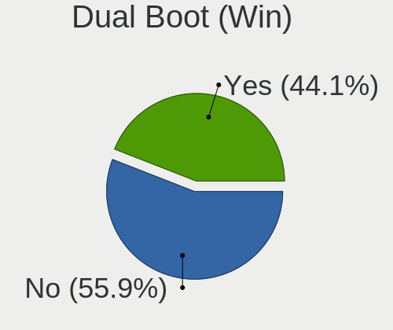
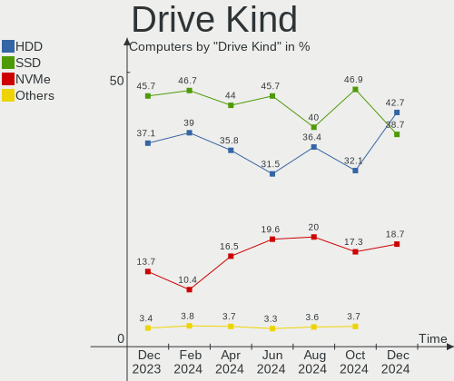
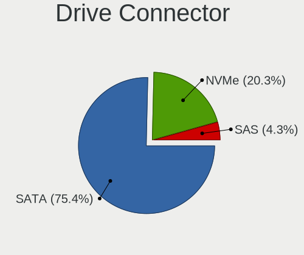
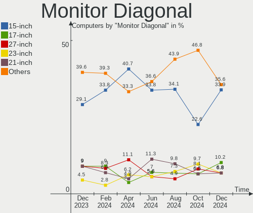

BlackPanther Hardware Trends
----------------------------

A project to identify most popular hardware characteristics and track their change
over time based on data collected by BlackPanther users at https://Linux-Hardware.org.

Anyone can contribute to the study by uploading probes of their computers by
the [hw-probe](https://github.com/linuxhw/hw-probe) tool:

    sudo hw-probe -all -upload

This is a report for all computer types. See also reports for [desktops](/Dist/BlackPanther/Desktop/README.md) and [notebooks](/Dist/BlackPanther/Notebook/README.md).

Full-feature report is available here: https://linux-hardware.org/?view=trends

Period: Apr, 2020.

Contents
--------

- [ OS                       ](#os)
- [ OS Family                ](#os-family)
- [ Kernel                   ](#kernel)
- [ Kernel Family            ](#kernel-family)
- [ Kernel Major Ver.        ](#kernel-major-ver)
- [ Arch                     ](#arch)
- [ DE                       ](#de)
- [ Display Server           ](#display-server)
- [ Display Manager          ](#display-manager)
- [ OS Lang                  ](#os-lang)
- [ Boot Mode                ](#boot-mode)
- [ Filesystem               ](#filesystem)
- [ Dual Boot with Linux/BSD ](#dual-boot-with-linux/bsd)
- [ Dual Boot (Win)          ](#dual-boot-win)
- [ Country                  ](#country)
- [ City                     ](#city)
- [ Vendor                   ](#vendor)
- [ Model                    ](#model)
- [ Model Family             ](#model-family)
- [ MFG Year                 ](#mfg-year)
- [ Form Factor              ](#form-factor)
- [ Secure Boot              ](#secure-boot)
- [ Coreboot                 ](#coreboot)
- [ RAM Size                 ](#ram-size)
- [ RAM Used                 ](#ram-used)
- [ Drive Vendor             ](#drive-vendor)
- [ Drive Model              ](#drive-model)
- [ Drive Kind               ](#drive-kind)
- [ Drive Connector          ](#drive-connector)
- [ Drive Size               ](#drive-size)
- [ Space Total              ](#space-total)
- [ Space Used               ](#space-used)
- [ Malfunc. Drives          ](#malfunc-drives)
- [ Malfunc. Drive Vendor    ](#malfunc-drive-vendor)
- [ Malfunc. Drive Kind      ](#malfunc-drive-kind)
- [ Failed Drives            ](#failed-drives)
- [ Failed Drive Vendor      ](#failed-drive-vendor)
- [ Drive Status             ](#drive-status)
- [ Storage Vendor           ](#storage-vendor)
- [ Storage Model            ](#storage-model)
- [ Storage Kind             ](#storage-kind)
- [ CPU Vendor               ](#cpu-vendor)
- [ CPU Model                ](#cpu-model)
- [ CPU Model Family         ](#cpu-model-family)
- [ CPU Cores                ](#cpu-cores)
- [ CPU Sockets              ](#cpu-sockets)
- [ CPU Threads              ](#cpu-threads)
- [ CPU Op-Modes             ](#cpu-op-modes)
- [ CPU Microarch            ](#cpu-microarch)
- [ CPU Microcode            ](#cpu-microcode)
- [ GPU Vendor               ](#gpu-vendor)
- [ GPU Model                ](#gpu-model)
- [ GPU Combo                ](#gpu-combo)
- [ GPU Driver               ](#gpu-driver)
- [ GPU Memory               ](#gpu-memory)
- [ Monitor Vendor           ](#monitor-vendor)
- [ Monitor Model            ](#monitor-model)
- [ Monitor Resolution       ](#monitor-resolution)
- [ Monitor Diagonal         ](#monitor-diagonal)
- [ Monitor Width            ](#monitor-width)
- [ Aspect Ratio             ](#aspect-ratio)
- [ Monitor Area             ](#monitor-area)
- [ Pixel Density            ](#pixel-density)
- [ Multiple Monitors        ](#multiple-monitors)
- [ Net Controller Vendor    ](#net-controller-vendor)
- [ Net Controller Model     ](#net-controller-model)
- [ Net Controller Kind      ](#net-controller-kind)
- [ Used Controller          ](#used-controller)
- [ NICs                     ](#nics)
- [ Unsupported Devices      ](#unsupported-devices)
- [ Unsupported Device Types ](#unsupported-device-types)

OS
--

Installed operating systems

| Name              | Computers | Percent |
|-------------------|-----------|---------|
| BlackPanther 18.1 | 153       | 86.44%  |
| BlackPanther 16.2 | 24        | 13.56%  |

OS Family
---------

OS without a version

| Name         | Computers | Percent |
|--------------|-----------|---------|
| BlackPanther | 177       | 100%    |

Kernel
------

Version of the Linux kernel

| Version                | Computers | Percent |
|------------------------|-----------|---------|
| 4.18.16-desktop-1bP    | 139       | 78.53%  |
| 4.9.20-desktop-pae-1bP | 22        | 12.43%  |
| 5.1.15-desktop-1bP     | 13        | 7.34%   |
| 5.1.15-server-1bP      | 1         | 0.56%   |
| 4.9.20-desktop-1bP     | 1         | 0.56%   |
| 4.7.0-desktop-1bP      | 1         | 0.56%   |

Kernel Family
-------------

Linux kernel without a distro release

| Version | Computers | Percent |
|---------|-----------|---------|
| 4.18.16 | 139       | 78.53%  |
| 4.9.20  | 23        | 12.99%  |
| 5.1.15  | 14        | 7.91%   |
| 4.7.0   | 1         | 0.56%   |

Kernel Major Ver.
-----------------

Linux kernel major version

| Version | Computers | Percent |
|---------|-----------|---------|
| 4.18    | 139       | 78.53%  |
| 4.9     | 23        | 12.99%  |
| 5.1     | 14        | 7.91%   |
| 4.7     | 1         | 0.56%   |

Arch
----

OS architecture (x86_64, i586, etc.)

| Name   | Computers | Percent |
|--------|-----------|---------|
| x86_64 | 153       | 86.44%  |
| i686   | 24        | 13.56%  |

DE
--

Desktop Environment

| Name | Computers | Percent |
|------|-----------|---------|
| KDE5 | 177       | 100%    |

Display Server
--------------

X11 or Wayland

| Name | Computers | Percent |
|------|-----------|---------|
| X11  | 177       | 100%    |

Display Manager
---------------

SDDM, LightDM, etc.

| Name | Computers | Percent |
|------|-----------|---------|
| SDDM | 177       | 100%    |

OS Lang
-------

Language

| Lang    | Computers | Percent |
|---------|-----------|---------|
| Unknown | 177       | 100%    |

Boot Mode
---------

EFI or BIOS

| Mode | Computers | Percent |
|------|-----------|---------|
| BIOS | 134       | 75.71%  |
| EFI  | 43        | 24.29%  |

Filesystem
----------

Type of filesystem

| Type    | Computers | Percent |
|---------|-----------|---------|
| Ext4    | 144       | 81.36%  |
| Overlay | 31        | 17.51%  |
| Ext3    | 1         | 0.56%   |
| Btrfs   | 1         | 0.56%   |

Dual Boot with Linux/BSD
------------------------

Hosting more than one Linux/BSD

| Dual boot | Computers | Percent |
|-----------|-----------|---------|
| No        | 137       | 77.4%   |
| Yes       | 40        | 22.6%   |

Dual Boot (Win)
---------------

Hosting Linux and Windows

| Dual boot | Computers | Percent |
|-----------|-----------|---------|
| No        | 100       | 56.5%   |
| Yes       | 77        | 43.5%   |

Country
-------

Geographic location (country)

| Country            | Computers | Percent |
|--------------------|-----------|---------|
| Hungary            | 138       | 77.97%  |
| Germany            | 7         | 3.95%   |
| USA                | 6         | 3.39%   |
| Romania            | 4         | 2.26%   |
| Philippines        | 4         | 2.26%   |
| UK                 | 2         | 1.13%   |
| Turkey             | 2         | 1.13%   |
| Slovakia           | 2         | 1.13%   |
| Uruguay            | 1         | 0.56%   |
| Ukraine            | 1         | 0.56%   |
| Switzerland        | 1         | 0.56%   |
| Spain              | 1         | 0.56%   |
| South Africa       | 1         | 0.56%   |
| Serbia             | 1         | 0.56%   |
| Kuwait             | 1         | 0.56%   |
| Korea, Republic of | 1         | 0.56%   |
| France             | 1         | 0.56%   |
| Cyprus             | 1         | 0.56%   |
| Belgium            | 1         | 0.56%   |
| Austria            | 1         | 0.56%   |

City
----

Geographic location (city)

| City              | Computers | Percent |
|-------------------|-----------|---------|
| Budapest          | 39        | 22.03%  |
| Szeged            | 5         | 2.82%   |
| Győr             | 5         | 2.82%   |
| Nyiregyhaza       | 4         | 2.26%   |
| Davao City        | 4         | 2.26%   |
| Veszprém         | 3         | 1.69%   |
| Salgotarjan       | 3         | 1.69%   |
| Regensburg        | 3         | 1.69%   |
| Pécs             | 3         | 1.69%   |
| Nagykanizsa       | 3         | 1.69%   |
| Miskolc           | 3         | 1.69%   |
| Karcag            | 3         | 1.69%   |
| Zalaegerszeg      | 2         | 1.13%   |
| Târgu Mureş     | 2         | 1.13%   |
| Tiszaujvaros      | 2         | 1.13%   |
| Székesfehérvár | 2         | 1.13%   |
| Szombathely       | 2         | 1.13%   |
| Szigetszentmiklos | 2         | 1.13%   |
| Szekszárd        | 2         | 1.13%   |
| Paks              | 2         | 1.13%   |
| Newton            | 2         | 1.13%   |
| Mosonmagyaróvár | 2         | 1.13%   |
| Kistarcsa         | 2         | 1.13%   |
| Kecskemét        | 2         | 1.13%   |
| Jaszbereny        | 2         | 1.13%   |
| Hodmezovasarhely  | 2         | 1.13%   |
| Esztergom         | 2         | 1.13%   |
| Dunaújváros     | 2         | 1.13%   |
| Érd              | 1         | 0.56%   |
| Worcester         | 1         | 0.56%   |
| Vác              | 1         | 0.56%   |
| Vienna            | 1         | 0.56%   |
| Veszto            | 1         | 0.56%   |
| Velence           | 1         | 0.56%   |
| Târgovişte      | 1         | 0.56%   |
| Tura              | 1         | 0.56%   |
| Szolnok           | 1         | 0.56%   |
| Szigetvar         | 1         | 0.56%   |
| Stuttgart         | 1         | 0.56%   |
| Stafa             | 1         | 0.56%   |
| Sopron            | 1         | 0.56%   |
| Sarvar            | 1         | 0.56%   |
| Sarpilis          | 1         | 0.56%   |
| San Bernardino    | 1         | 0.56%   |
| Racalmas          | 1         | 0.56%   |
| Pusztavacs        | 1         | 0.56%   |
| Pilisjaszfalu     | 1         | 0.56%   |
| Pellerd           | 1         | 0.56%   |
| Paris             | 1         | 0.56%   |
| Opusztaszer       | 1         | 0.56%   |
| Odorheiu Secuiesc | 1         | 0.56%   |
| Niš              | 1         | 0.56%   |
| Nicosia           | 1         | 0.56%   |
| Monor             | 1         | 0.56%   |
| Mohács           | 1         | 0.56%   |
| Mlynany           | 1         | 0.56%   |
| Mezohegyes        | 1         | 0.56%   |
| Mechanicsburg     | 1         | 0.56%   |
| Majs              | 1         | 0.56%   |
| Maidenhead        | 1         | 0.56%   |

Vendor
------

Motherboard manufacturer

| Name                | Computers | Percent |
|---------------------|-----------|---------|
| Lenovo              | 31        | 17.51%  |
| Hewlett-Packard     | 25        | 14.12%  |
| Dell                | 24        | 13.56%  |
| ASUSTek Computer    | 17        | 9.6%    |
| Gigabyte Technology | 16        | 9.04%   |
| Acer                | 16        | 9.04%   |
| ASRock              | 13        | 7.34%   |
| MSI                 | 5         | 2.82%   |
| Toshiba             | 4         | 2.26%   |
| Fujitsu Siemens     | 4         | 2.26%   |
| Sony                | 2         | 1.13%   |
| Samsung Electronics | 2         | 1.13%   |
| Medion              | 2         | 1.13%   |
| Foxconn             | 2         | 1.13%   |
| W25BBZ              | 1         | 0.56%   |
| speedmaster         | 1         | 0.56%   |
| Sapphire Tech       | 1         | 0.56%   |
| Packard Bell        | 1         | 0.56%   |
| Intel               | 1         | 0.56%   |
| Insyde              | 1         | 0.56%   |
| Fujitsu             | 1         | 0.56%   |
| EMAXX TECHNOLOGY    | 1         | 0.56%   |
| eMachines           | 1         | 0.56%   |
| ECS                 | 1         | 0.56%   |
| Chuwi               | 1         | 0.56%   |
| Biostar             | 1         | 0.56%   |
| Alcor               | 1         | 0.56%   |
| Unknown             | 1         | 0.56%   |

Model
-----

Motherboard model

| Name                               | Computers | Percent |
|------------------------------------|-----------|---------|
| HP Presario CQ57                   | 2         | 1.13%   |
| HP Pavilion Notebook               | 2         | 1.13%   |
| HP EliteBook 8460p                 | 2         | 1.13%   |
| Dell OptiPlex 790                  | 2         | 1.13%   |
| Dell Latitude E6410                | 2         | 1.13%   |
| ASUS P5KPL-AM SE                   | 2         | 1.13%   |
| ASRock G31M-GS                     | 2         | 1.13%   |
| ASRock FM2A75M Pro4+               | 2         | 1.13%   |
| Unknown                            | 2         | 1.13%   |
| Toshiba Satellite L50-B            | 1         | 0.56%   |
| Toshiba Satellite L300             | 1         | 0.56%   |
| Toshiba Satellite C55-C            | 1         | 0.56%   |
| Toshiba Satellite C50-A-1G1        | 1         | 0.56%   |
| speedmaster E131x series           | 1         | 0.56%   |
| Sony VPCEH2N1E                     | 1         | 0.56%   |
| Sony VPCEB46FX                     | 1         | 0.56%   |
| Sapphire Tech PCDM3H4H             | 1         | 0.56%   |
| Samsung Electronics NC210/NC110    | 1         | 0.56%   |
| Samsung Electronics N150/N210/N220 | 1         | 0.56%   |
| Packard Bell EasyNote TE11HC       | 1         | 0.56%   |
| MSI Pro 3130 Small Form Factor PC  | 1         | 0.56%   |
| MSI MS-7A74                        | 1         | 0.56%   |
| MSI MS-7996                        | 1         | 0.56%   |
| MSI MS-7808                        | 1         | 0.56%   |
| MSI MS-7592                        | 1         | 0.56%   |
| Medion E7214                       | 1         | 0.56%   |
| Medion BTDD-LT                     | 1         | 0.56%   |
| Lenovo Z710 20250                  | 1         | 0.56%   |
| Lenovo Yoga 300-11IBY 80M0         | 1         | 0.56%   |
| Lenovo ThinkStation C30 1097A34    | 1         | 0.56%   |
| Lenovo ThinkServer TS430 044116G   | 1         | 0.56%   |
| Lenovo ThinkPad X61 7673BW3        | 1         | 0.56%   |
| Lenovo ThinkPad Twist 33474HU      | 1         | 0.56%   |
| Lenovo ThinkPad T61 6458WK6        | 1         | 0.56%   |
| Lenovo ThinkPad T500 2056CL8       | 1         | 0.56%   |
| Lenovo ThinkPad T410 2537CS0       | 1         | 0.56%   |
| Lenovo ThinkCentre M92P 32371L5    | 1         | 0.56%   |
| Lenovo ThinkCentre M91p 7034BN4    | 1         | 0.56%   |
| Lenovo ThinkCentre M58e 7408BA5    | 1         | 0.56%   |
| Lenovo ThinkCentre A55 963672G     | 1         | 0.56%   |
| Lenovo IdeaPad S205 10382JG        | 1         | 0.56%   |
| Lenovo IdeaPad S100 20109          | 1         | 0.56%   |
| Lenovo IdeaPad 700-15ISK 80RU      | 1         | 0.56%   |
| Lenovo IdeaPad 330-15IKB 81DE      | 1         | 0.56%   |
| Lenovo IdeaPad 320-15ISK 80XH      | 1         | 0.56%   |
| Lenovo IdeaPad 110-15IBR 80T7      | 1         | 0.56%   |
| Lenovo IdeaPad 110-15ACL 80TJ      | 1         | 0.56%   |
| Lenovo H50-50 90B600BSHV           | 1         | 0.56%   |
| Lenovo G70-70 80HW                 | 1         | 0.56%   |
| Lenovo G550 20023                  | 1         | 0.56%   |
| Lenovo G505s 20255                 | 1         | 0.56%   |
| Lenovo G505 20240                  | 1         | 0.56%   |
| Lenovo G50-80 80E5                 | 1         | 0.56%   |
| Lenovo G50-45 80E3                 | 1         | 0.56%   |
| Lenovo Flex 2-15 20405             | 1         | 0.56%   |
| Lenovo B50-80 80EW                 | 1         | 0.56%   |
| Lenovo 3000 N500 423338G           | 1         | 0.56%   |
| Lenovo 3000 N100 07686VG           | 1         | 0.56%   |
| Intel D945GCLF AAE27042-400        | 1         | 0.56%   |
| Insyde M66xN                       | 1         | 0.56%   |

Model Family
------------

Motherboard model prefix

| Name                      | Computers | Percent |
|---------------------------|-----------|---------|
| Dell Latitude             | 10        | 5.65%   |
| Acer Aspire               | 8         | 4.52%   |
| Lenovo IdeaPad            | 7         | 3.95%   |
| Dell Inspiron             | 7         | 3.95%   |
| Dell OptiPlex             | 6         | 3.39%   |
| Lenovo ThinkPad           | 5         | 2.82%   |
| HP EliteBook              | 5         | 2.82%   |
| Toshiba Satellite         | 4         | 2.26%   |
| Lenovo ThinkCentre        | 4         | 2.26%   |
| HP Pavilion               | 4         | 2.26%   |
| HP Compaq                 | 4         | 2.26%   |
| ASUS P5KPL-AM             | 3         | 1.69%   |
| Lenovo 3000               | 2         | 1.13%   |
| HP Presario               | 2         | 1.13%   |
| HP Laptop                 | 2         | 1.13%   |
| Fujitsu Siemens ESPRIMO   | 2         | 1.13%   |
| Fujitsu Siemens AMILO     | 2         | 1.13%   |
| ASRock G31M-GS            | 2         | 1.13%   |
| ASRock FM2A75M            | 2         | 1.13%   |
| Acer Veriton              | 2         | 1.13%   |
| Acer TravelMate           | 2         | 1.13%   |
| Unknown                   | 2         | 1.13%   |
| speedmaster E131x         | 1         | 0.56%   |
| Sony VPCEH2N1E            | 1         | 0.56%   |
| Sony VPCEB46FX            | 1         | 0.56%   |
| Sapphire Tech PCDM3H4H    | 1         | 0.56%   |
| Samsung Electronics NC210 | 1         | 0.56%   |
| Samsung Electronics N150  | 1         | 0.56%   |
| Packard Bell EasyNote     | 1         | 0.56%   |
| MSI Pro                   | 1         | 0.56%   |
| MSI MS-7A74               | 1         | 0.56%   |
| MSI MS-7996               | 1         | 0.56%   |
| MSI MS-7808               | 1         | 0.56%   |
| MSI MS-7592               | 1         | 0.56%   |
| Medion E7214              | 1         | 0.56%   |
| Medion BTDD-LT            | 1         | 0.56%   |
| Lenovo Z710               | 1         | 0.56%   |
| Lenovo Yoga               | 1         | 0.56%   |
| Lenovo ThinkStation       | 1         | 0.56%   |
| Lenovo ThinkServer        | 1         | 0.56%   |
| Lenovo H50-50             | 1         | 0.56%   |
| Lenovo G70-70             | 1         | 0.56%   |
| Lenovo G550               | 1         | 0.56%   |
| Lenovo G505s              | 1         | 0.56%   |
| Lenovo G505               | 1         | 0.56%   |
| Lenovo G50-80             | 1         | 0.56%   |
| Lenovo G50-45             | 1         | 0.56%   |
| Lenovo Flex               | 1         | 0.56%   |
| Lenovo B50-80             | 1         | 0.56%   |
| Intel D945GCLF            | 1         | 0.56%   |
| Insyde M66xN              | 1         | 0.56%   |
| HP Stream                 | 1         | 0.56%   |
| HP ProLiant               | 1         | 0.56%   |
| HP ProDesk                | 1         | 0.56%   |
| HP ProBook                | 1         | 0.56%   |
| HP ENVY                   | 1         | 0.56%   |
| HP 620                    | 1         | 0.56%   |
| HP 550                    | 1         | 0.56%   |
| HP 255                    | 1         | 0.56%   |
| Gigabyte P55A-UD3         | 1         | 0.56%   |

MFG Year
--------

Motherboard manufacture year

| Year | Computers | Percent |
|------|-----------|---------|
| 2015 | 21        | 11.86%  |
| 2011 | 20        | 11.3%   |
| 2014 | 16        | 9.04%   |
| 2013 | 15        | 8.47%   |
| 2012 | 15        | 8.47%   |
| 2010 | 15        | 8.47%   |
| 2019 | 13        | 7.34%   |
| 2016 | 13        | 7.34%   |
| 2018 | 12        | 6.78%   |
| 2009 | 12        | 6.78%   |
| 2017 | 7         | 3.95%   |
| 2007 | 7         | 3.95%   |
| 2008 | 6         | 3.39%   |
| 2006 | 3         | 1.69%   |
| 2005 | 2         | 1.13%   |

Form Factor
-----------

Physical design of the computer

| Name       | Computers | Percent |
|------------|-----------|---------|
| Notebook   | 103       | 58.19%  |
| Desktop    | 71        | 40.11%  |
| Tablet     | 1         | 0.56%   |
| All in one | 1         | 0.56%   |
| Server     | 1         | 0.56%   |

Secure Boot
-----------

Enabled or disabled

| State    | Computers | Percent |
|----------|-----------|---------|
| Disabled | 177       | 100%    |

Coreboot
--------

Have coreboot on board

| Used | Computers | Percent |
|------|-----------|---------|
| No   | 177       | 100%    |

RAM Size
--------

Total RAM memory

| Size in GB | Computers | Percent |
|------------|-----------|---------|
| 3.01-4.0   | 60        | 33.9%   |
| 8.01-16.0  | 43        | 24.29%  |
| 4.01-8.0   | 27        | 15.25%  |
| 1.01-2.0   | 19        | 10.73%  |
| 16.01-24.0 | 12        | 6.78%   |
| 2.01-3.0   | 9         | 5.08%   |
| 0.01-1.0   | 6         | 3.39%   |
| 32.01-64.0 | 1         | 0.56%   |

RAM Used
--------

Used RAM memory

| Used GB  | Computers | Percent |
|----------|-----------|---------|
| 0.01-1.0 | 101       | 57.06%  |
| 1.01-2.0 | 59        | 33.33%  |
| 2.01-3.0 | 13        | 7.34%   |
| 4.01-8.0 | 2         | 1.13%   |
| 3.01-4.0 | 2         | 1.13%   |

Drive Vendor
------------

Hard drive vendors

| Vendor              | Computers | Drives  | Percent |
|---------------------|-----------|---------|---------|
| WDC                 | 47        | 51      | 19.58%  |
| Seagate             | 41        | 42      | 17.08%  |
| Toshiba             | 28        | 30      | 11.67%  |
| Samsung Electronics | 26        | 27      | 10.83%  |
| Kingston            | 23        | 27      | 9.58%   |
| Hitachi             | 15        | 20      | 6.25%   |
| HGST                | 10        | 10      | 4.17%   |
| SanDisk             | 8         | 9       | 3.33%   |
| Fujitsu             | 7         | 7       | 2.92%   |
| Unknown             | 5         | 5       | 2.08%   |
| HL-DT-ST            | 5         | Unknown | 2.08%   |
| A-DATA Technology   | 4         | 4       | 1.67%   |
| Intel               | 3         | 3       | 1.25%   |
| Intenso             | 2         | 2       | 0.83%   |
| Apacer              | 2         | 2       | 0.83%   |
| Vi550               | 1         | 1       | 0.42%   |
| Verbatim            | 1         | 1       | 0.42%   |
| SK Hynix            | 1         | 1       | 0.42%   |
| Patriot             | 1         | 1       | 0.42%   |
| Netac               | 1         | 1       | 0.42%   |
| Maxtor              | 1         | 1       | 0.42%   |
| LITEONIT            | 1         | 1       | 0.42%   |
| HGST HTS            | 1         | 1       | 0.42%   |
| Hewlett-Packard     | 1         | 1       | 0.42%   |
| Gigabyte Technology | 1         | 1       | 0.42%   |
| Generic             | 1         | 1       | 0.42%   |
| Crucial             | 1         | 1       | 0.42%   |
| China               | 1         | 1       | 0.42%   |
| BIWIN               | 1         | 1       | 0.42%   |

Drive Model
-----------

Hard drive models

| Model                        | Computers | Percent |
|------------------------------|-----------|---------|
| MQ01ABD100 1TB               | 6         | 2.33%   |
| DT01ACA100 1TB               | 6         | 2.33%   |
| ST1000LM024 HN-M101MBB 1TB   | 5         | 1.94%   |
| SA400S37240G 240GB SSD       | 5         | 1.94%   |
| SA400S37120G 120GB SSD       | 4         | 1.55%   |
| DT01ACA050 500GB             | 4         | 1.55%   |
| WDS120G2G0A-00JH30 120GB SSD | 3         | 1.16%   |
| SUV400S37120G 120GB SSD      | 3         | 1.16%   |
| ST9320325AS 320GB            | 3         | 1.16%   |
| MQ01ABF050 500GB             | 3         | 1.16%   |
| HTS543232A7A384 320GB        | 3         | 1.16%   |
| HDS721050CLA362 500GB        | 3         | 1.16%   |
| DVDRAM GUE1N 3GB             | 3         | 1.16%   |
| SV300S37A240G 240GB SSD      | 2         | 0.78%   |
| SV300S37A120G 120GB SSD      | 2         | 0.78%   |
| SU800 256GB SSD              | 2         | 0.78%   |
| ST980811AS 80GB              | 2         | 0.78%   |
| ST9320423AS 320GB            | 2         | 0.78%   |
| ST500VT000-1DK142 500GB      | 2         | 0.78%   |
| ST500LT012-1DG142 500GB      | 2         | 0.78%   |
| ST380815AS 80GB              | 2         | 0.78%   |
| ST3160815AS 160GB            | 2         | 0.78%   |
| ST1000LM035-1RK172 1TB       | 2         | 0.78%   |
| SSD 128GB                    | 2         | 0.78%   |
| MHZ2160BH G2 160GB           | 2         | 0.78%   |
| MHY2120BH 120GB              | 2         | 0.78%   |
| HTS721010A9E630 1TB          | 2         | 0.78%   |
| HTS545050A7E680 500GB        | 2         | 0.78%   |
| HM160HI 160GB                | 2         | 0.78%   |
| HDT725025VLA380 250GB        | 2         | 0.78%   |
| DVDRAM GUC0N 1GB             | 2         | 0.78%   |
| DF4064  64GB                 | 2         | 0.78%   |
| XX.V.3.4.0.0 1GB             | 1         | 0.39%   |
| WDS240G2G0A-00JH30 240GB SSD | 1         | 0.39%   |
| WD800JD-55MUA1 80GB          | 1         | 0.39%   |
| WD800AAJS-60M0A0 80GB        | 1         | 0.39%   |
| WD7500BPVT-80HXZT3 752GB     | 1         | 0.39%   |
| WD7500BPVT-22HXZT3 752GB     | 1         | 0.39%   |
| WD7500AAKS-00RBA0 752GB      | 1         | 0.39%   |
| WD6400AAKS-00A7B0 640GB      | 1         | 0.39%   |
| WD5000LPCX-60VHAT0 500GB     | 1         | 0.39%   |
| WD5000LPCX-24C6HT0 500GB     | 1         | 0.39%   |
| WD5000BPKT-60PK4T0 500GB     | 1         | 0.39%   |
| WD5000BEVT-35A0RT0 500GB     | 1         | 0.39%   |
| WD5000AAKX-75U6AA0 500GB     | 1         | 0.39%   |
| WD5000AAKX-001CA0 500GB      | 1         | 0.39%   |
| WD5000AAKS-75V0A0 500GB      | 1         | 0.39%   |
| WD5000AAKS-007AA0 500GB      | 1         | 0.39%   |
| WD5000AADS-00S9B0 500GB      | 1         | 0.39%   |
| WD3200BPVT-24JJ5T0 320GB     | 1         | 0.39%   |
| WD3200BPVT-22JJ5T0 320GB     | 1         | 0.39%   |
| WD3200BEVT-80A0RT0 320GB     | 1         | 0.39%   |
| WD3200BEVT-75ZCT2 320GB      | 1         | 0.39%   |
| WD3200BEKT-60PVMT0 320GB     | 1         | 0.39%   |
| WD3200AAKS-00L9A0 320GB      | 1         | 0.39%   |
| WD2500YS-01SHB1 256GB        | 1         | 0.39%   |
| WD2500BPVT-22JJ5T0 250GB     | 1         | 0.39%   |
| WD2500BEVS-75UST0 250GB      | 1         | 0.39%   |
| WD2500BEKT-75PVMT0 250GB     | 1         | 0.39%   |
| WD2500AAKX-083CA1 250GB      | 1         | 0.39%   |

Drive Kind
----------

HDD or SSD

| Kind    | Computers | Drives | Percent |
|---------|-----------|--------|---------|
| HDD     | 137       | 167    | 63.72%  |
| SSD     | 58        | 68     | 26.98%  |
| MMC     | 7         | 8      | 3.26%   |
| Unknown | 7         | 2      | 3.26%   |
| NVMe    | 6         | 8      | 2.79%   |

Drive Connector
---------------

SATA, SAS, NVMe, etc.

| Type | Computers | Drives | Percent |
|------|-----------|--------|---------|
| SATA | 167       | 231    | 87.43%  |
| SAS  | 11        | 6      | 5.76%   |
| MMC  | 7         | 8      | 3.66%   |
| NVMe | 6         | 8      | 3.14%   |

Drive Size
----------

Size of hard drive

| Size in TB | Computers | Drives | Percent |
|------------|-----------|--------|---------|
| 0.01-0.5   | 144       | 191    | 70.94%  |
| 0.51-1.0   | 50        | 53     | 24.63%  |
| 1.01-2.0   | 8         | 8      | 3.94%   |
| 4.01-10.0  | 1         | 1      | 0.49%   |

Space Total
-----------

Amount of disk space available on the file system

| Size in GB | Computers | Percent |
|------------|-----------|---------|
| 101-250    | 55        | 31.07%  |
| 251-500    | 32        | 18.08%  |
| Unknown    | 26        | 14.69%  |
| 51-100     | 25        | 14.12%  |
| 501-1000   | 17        | 9.6%    |
| 21-50      | 8         | 4.52%   |
| 1001-2000  | 6         | 3.39%   |
| 1-20       | 5         | 2.82%   |
| 2001-3000  | 3         | 1.69%   |

Space Used
----------

Amount of used disk space

| Used GB   | Computers | Percent |
|-----------|-----------|---------|
| 1-20      | 116       | 65.54%  |
| Unknown   | 26        | 14.69%  |
| 101-250   | 10        | 5.65%   |
| 21-50     | 9         | 5.08%   |
| 51-100    | 7         | 3.95%   |
| 251-500   | 4         | 2.26%   |
| 501-1000  | 3         | 1.69%   |
| 1001-2000 | 2         | 1.13%   |

Malfunc. Drives
---------------

Drive models with a malfunction

| Model                           | Computers | Drives | Percent |
|---------------------------------|-----------|--------|---------|
| HTS543232A7A384 320GB           | 3         | 3      | 4.92%   |
| ST9320423AS 320GB               | 2         | 2      | 3.28%   |
| ST9320325AS 320GB               | 2         | 2      | 3.28%   |
| ST1000LM024 HN-M101MBB 1TB      | 2         | 2      | 3.28%   |
| MQ01ABF050 500GB                | 2         | 2      | 3.28%   |
| MQ01ABD100 1TB                  | 2         | 2      | 3.28%   |
| HM160HI 160GB                   | 2         | 2      | 3.28%   |
| HDS721050CLA362 500GB           | 2         | 2      | 3.28%   |
| WD800JD-55MUA1 80GB             | 1         | 1      | 1.64%   |
| WD800AAJS-60M0A0 80GB           | 1         | 1      | 1.64%   |
| WD6400AAKS-00A7B0 640GB         | 1         | 1      | 1.64%   |
| WD5000BPKT-60PK4T0 500GB        | 1         | 1      | 1.64%   |
| WD5000AAKX-75U6AA0 500GB        | 1         | 1      | 1.64%   |
| WD5000AAKX-001CA0 500GB         | 1         | 1      | 1.64%   |
| WD5000AAKS-75V0A0 500GB         | 1         | 1      | 1.64%   |
| WD3200AAKS-00L9A0 320GB         | 1         | 1      | 1.64%   |
| WD2500YS-01SHB1 256GB           | 1         | 1      | 1.64%   |
| WD2500BEVS-75UST0 250GB         | 1         | 1      | 1.64%   |
| WD2500BEKT-75PVMT0 250GB        | 1         | 1      | 1.64%   |
| WD10EZRX-00A8LB0 1TB            | 1         | 1      | 1.64%   |
| WD10EZEX-08WN4A0 1TB            | 1         | 1      | 1.64%   |
| WD10EZEX-00M2NA0 1TB            | 1         | 1      | 1.64%   |
| SV300S37A120G 120GB SSD         | 1         | 1      | 1.64%   |
| ST980811AS 80GB                 | 1         | 1      | 1.64%   |
| ST96812AS 64GB                  | 1         | 1      | 1.64%   |
| ST9250315AS 250GB               | 1         | 1      | 1.64%   |
| ST500LT012-1DG142 500GB         | 1         | 1      | 1.64%   |
| ST500LM000-1EJ162 500GB         | 1         | 1      | 1.64%   |
| ST500DM002-1BD142 500GB         | 1         | 1      | 1.64%   |
| ST380011A 80GB                  | 1         | 1      | 1.64%   |
| Q-90 90GB SSD                   | 1         | 1      | 1.64%   |
| MQ02ABD100H 1TB                 | 1         | 1      | 1.64%   |
| MK5065GSX 500GB                 | 1         | 1      | 1.64%   |
| MK3252GSX 320GB                 | 1         | 1      | 1.64%   |
| MK1646GSX 160GB                 | 1         | 1      | 1.64%   |
| MK1252GSX 120GB                 | 1         | 1      | 1.64%   |
| MHY2080BH 80GB                  | 1         | 1      | 1.64%   |
| MHV2060AH 64GB                  | 1         | 1      | 1.64%   |
| KSG60ZMV256G M.2 2280 256GB SSD | 1         | 1      | 1.64%   |
| HTS725050A7E635 500GB           | 1         | 1      | 1.64%   |
| HTS725032A7E630 320GB           | 1         | 1      | 1.64%   |
| HTS547575A9E384 752GB           | 1         | 1      | 1.64%   |
| HTS542525K9A300 250GB           | 1         | 1      | 1.64%   |
| HTS541010A9E680 1TB             | 1         | 1      | 1.64%   |
| HM321HI 320GB                   | 1         | 1      | 1.64%   |
| HD322GJ 320GB                   | 1         | 1      | 1.64%   |
| HD321KJ 320GB                   | 1         | 1      | 1.64%   |
| HD160HJ 160GB                   | 1         | 1      | 1.64%   |
| HD103UJ 1TB                     | 1         | 1      | 1.64%   |
| DT01ACA100 1TB                  | 1         | 1      | 1.64%   |
| DT01ACA050 500GB                | 1         | 1      | 1.64%   |
| 6E040L0 41GB                    | 1         | 1      | 1.64%   |

Malfunc. Drive Vendor
---------------------

Vendors of faulty drives

| Vendor              | Computers | Drives | Percent |
|---------------------|-----------|--------|---------|
| WDC                 | 13        | 14     | 22.41%  |
| Seagate             | 13        | 13     | 22.41%  |
| Toshiba             | 12        | 12     | 20.69%  |
| Samsung Electronics | 7         | 7      | 12.07%  |
| Hitachi             | 6         | 8      | 10.34%  |
| HGST                | 2         | 2      | 3.45%   |
| Fujitsu             | 2         | 2      | 3.45%   |
| Unknown             | 1         | 1      | 1.72%   |
| Maxtor              | 1         | 1      | 1.72%   |
| Kingston            | 1         | 1      | 1.72%   |

Malfunc. Drive Kind
-------------------

Kinds of faulty drives

| Kind | Computers | Drives | Percent |
|------|-----------|--------|---------|
| HDD  | 55        | 58     | 94.83%  |
| SSD  | 3         | 3      | 5.17%   |

Failed Drives
-------------

Failed drive models

| Model                    | Computers | Drives | Percent |
|--------------------------|-----------|--------|---------|
| WD3200BPVT-24JJ5T0 320GB | 1         | 1      | 50%     |
| MQ01ABD100 1TB           | 1         | 1      | 50%     |

Failed Drive Vendor
-------------------

Failed drive vendors

| Vendor  | Computers | Drives | Percent |
|---------|-----------|--------|---------|
| WDC     | 1         | 1      | 50%     |
| Toshiba | 1         | 1      | 50%     |

Drive Status
------------

Number of failed and malfunc. drives

| Status   | Computers | Drives | Percent |
|----------|-----------|--------|---------|
| Works    | 127       | 175    | 61.65%  |
| Malfunc  | 58        | 61     | 28.16%  |
| Detected | 19        | 15     | 9.22%   |
| Failed   | 2         | 2      | 0.97%   |

Storage Vendor
--------------

Storage controller vendors

| Vendor                        | Computers | Percent |
|-------------------------------|-----------|---------|
| Intel                         | 136       | 71.96%  |
| AMD                           | 34        | 17.99%  |
| Samsung Electronics           | 3         | 1.59%   |
| ASMedia Technology            | 3         | 1.59%   |
| VIA Technologies              | 2         | 1.06%   |
| Nvidia                        | 2         | 1.06%   |
| Kingston Technology Company   | 2         | 1.06%   |
| JMicron Technology            | 2         | 1.06%   |
| Integrated Technology Express | 2         | 1.06%   |
| Sandisk                       | 1         | 0.53%   |
| Marvell Technology Group      | 1         | 0.53%   |
| Hewlett-Packard               | 1         | 0.53%   |

Storage Model
-------------

Storage controller models

| Model                                                                             | Computers | Percent |
|-----------------------------------------------------------------------------------|-----------|---------|
| FCH SATA Controller [AHCI mode]                                                   | 22        | 9.28%   |
| NM10/ICH7 Family SATA Controller [IDE mode]                                       | 17        | 7.17%   |
| 82801G (ICH7 Family) IDE Controller                                               | 15        | 6.33%   |
| 8 Series/C220 Series Chipset Family 6-port SATA Controller 1 [AHCI mode]          | 10        | 4.22%   |
| Wildcat Point-LP SATA Controller [AHCI Mode]                                      | 8         | 3.38%   |
| SB7x0/SB8x0/SB9x0 SATA Controller [AHCI mode]                                     | 7         | 2.95%   |
| 7 Series Chipset Family 6-port SATA Controller [AHCI mode]                        | 7         | 2.95%   |
| 6 Series/C200 Series Chipset Family 6 port Mobile SATA AHCI Controller            | 7         | 2.95%   |
| 82801IBM/IEM (ICH9M/ICH9M-E) 4 port SATA Controller [AHCI mode]                   | 6         | 2.53%   |
| 82801 Mobile SATA Controller [RAID mode]                                          | 6         | 2.53%   |
| Sunrise Point-LP SATA Controller [AHCI mode]                                      | 5         | 2.11%   |
| Atom/Celeron/Pentium Processor x5-E8000/J3xxx/N3xxx Series SATA Controller        | 5         | 2.11%   |
| 82801HM/HEM (ICH8M/ICH8M-E) IDE Controller                                        | 5         | 2.11%   |
| 82801GBM/GHM (ICH7-M Family) SATA Controller [AHCI mode]                          | 5         | 2.11%   |
| 8 Series SATA Controller 1 [AHCI mode]                                            | 5         | 2.11%   |
| 6 Series/C200 Series Chipset Family 6 port Desktop SATA AHCI Controller           | 5         | 2.11%   |
| SB7x0/SB8x0/SB9x0 IDE Controller                                                  | 4         | 1.69%   |
| NM10/ICH7 Family SATA Controller [AHCI mode]                                      | 4         | 1.69%   |
| 82801HM/HEM (ICH8M/ICH8M-E) SATA Controller [AHCI mode]                           | 4         | 1.69%   |
| 7 Series/C210 Series Chipset Family 6-port SATA Controller [AHCI mode]            | 4         | 1.69%   |
| SB7x0/SB8x0/SB9x0 SATA Controller [IDE mode]                                      | 3         | 1.27%   |
| FCH IDE Controller                                                                | 3         | 1.27%   |
| Cannon Lake PCH SATA AHCI Controller                                              | 3         | 1.27%   |
| ASM1062 Serial ATA Controller                                                     | 3         | 1.27%   |
| 82801JD/DO (ICH10 Family) 4-port SATA IDE Controller                              | 3         | 1.27%   |
| 82801JD/DO (ICH10 Family) 2-port SATA IDE Controller                              | 3         | 1.27%   |
| 82801IBM/IEM (ICH9M/ICH9M-E) 2 port SATA Controller [IDE mode]                    | 3         | 1.27%   |
| 4 Series Chipset PT IDER Controller                                               | 3         | 1.27%   |
| Q170/Q150/B150/H170/H110/Z170/CM236 Chipset SATA Controller [AHCI Mode]           | 2         | 0.84%   |
| NVMe SSD Controller SM981/PM981/PM983                                             | 2         | 0.84%   |
| Mobile PM965/GM965 PT IDER Controller                                             | 2         | 0.84%   |
| HM170/QM170 Chipset SATA Controller [AHCI Mode]                                   | 2         | 0.84%   |
| FCH SATA Controller [IDE mode]                                                    | 2         | 0.84%   |
| 82801GBM/GHM (ICH7-M Family) SATA Controller [IDE mode]                           | 2         | 0.84%   |
| 82801FB/FBM/FR/FW/FRW (ICH6 Family) IDE Controller                                | 2         | 0.84%   |
| 6 Series/C200 Series Chipset Family Desktop SATA Controller (IDE mode, ports 4-5) | 2         | 0.84%   |
| 6 Series/C200 Series Chipset Family Desktop SATA Controller (IDE mode, ports 0-3) | 2         | 0.84%   |
| 5 Series/3400 Series Chipset 6 port SATA AHCI Controller                          | 2         | 0.84%   |
| 5 Series/3400 Series Chipset 4 port SATA AHCI Controller                          | 2         | 0.84%   |
| 200 Series PCH SATA controller [AHCI mode]                                        | 2         | 0.84%   |
| WD Black 2018/PC SN520 NVMe SSD                                                   | 1         | 0.42%   |
| VT82C586A/B/VT82C686/A/B/VT823x/A/C PIPC Bus Master IDE                           | 1         | 0.42%   |
| VT6421 IDE/SATA Controller                                                        | 1         | 0.42%   |
| VIA VT6420 SATA RAID Controller                                                   | 1         | 0.42%   |
| US15W/US15X/US15L/UL11L SCH [Poulsbo] IDE Controller                              | 1         | 0.42%   |
| Technology Company Non-Volatile memory controller                                 | 1         | 0.42%   |
| SSD 660P Series                                                                   | 1         | 0.42%   |
| Smart Array G6 controllers                                                        | 1         | 0.42%   |
| SATA Controller [RAID mode]                                                       | 1         | 0.42%   |
| NVMe SSD Controller SM961/PM961                                                   | 1         | 0.42%   |
| Non-Volatile memory controller                                                    | 1         | 0.42%   |
| MCP79 AHCI Controller                                                             | 1         | 0.42%   |
| JMB368 IDE controller                                                             | 1         | 0.42%   |
| JMB363 SATA/IDE Controller                                                        | 1         | 0.42%   |
| IT8213 IDE Controller                                                             | 1         | 0.42%   |
| IT8212 Dual channel ATA RAID controller                                           | 1         | 0.42%   |
| CK804 Serial ATA Controller                                                       | 1         | 0.42%   |
| CK804 IDE                                                                         | 1         | 0.42%   |
| Celeron N3350/Pentium N4200/Atom E3900 Series SATA AHCI Controller                | 1         | 0.42%   |
| Cannon Point-LP SATA Controller [AHCI Mode]                                       | 1         | 0.42%   |

Storage Kind
------------

Kind of storage controller (IDE, SATA, NVMe, SAS, ...)

| Kind | Computers | Percent |
|------|-----------|---------|
| SATA | 128       | 63.37%  |
| IDE  | 57        | 28.22%  |
| RAID | 10        | 4.95%   |
| NVMe | 6         | 2.97%   |
| SAS  | 1         | 0.5%    |

CPU Vendor
----------

Processor vendors

| Vendor | Computers | Percent |
|--------|-----------|---------|
| Intel  | 142       | 80.23%  |
| AMD    | 35        | 19.77%  |

CPU Model
---------

Processor models

| Model                                           | Computers | Percent |
|-------------------------------------------------|-----------|---------|
| Intel Core i5-5200U CPU @ 2.20GHz               | 4         | 2.26%   |
| Intel Core i5-2520M CPU @ 2.50GHz               | 4         | 2.26%   |
| Intel Core i5-8400 CPU @ 2.80GHz                | 3         | 1.69%   |
| Intel Core i5-2400 CPU @ 3.10GHz                | 3         | 1.69%   |
| Intel Atom CPU N455 @ 1.66GHz                   | 3         | 1.69%   |
| Intel Pentium Dual-Core CPU E5700 @ 3.00GHz     | 2         | 1.13%   |
| Intel Pentium CPU N3710 @ 1.60GHz               | 2         | 1.13%   |
| Intel Pentium CPU G3220 @ 3.00GHz               | 2         | 1.13%   |
| Intel Pentium CPU B960 @ 2.20GHz                | 2         | 1.13%   |
| Intel Pentium 3805U @ 1.90GHz                   | 2         | 1.13%   |
| Intel Core i7-4510U CPU @ 2.00GHz               | 2         | 1.13%   |
| Intel Core i5-6200U CPU @ 2.30GHz               | 2         | 1.13%   |
| Intel Core i5-4210U CPU @ 1.70GHz               | 2         | 1.13%   |
| Intel Core i5-3210M CPU @ 2.50GHz               | 2         | 1.13%   |
| Intel Core i5 CPU M 520 @ 2.40GHz               | 2         | 1.13%   |
| Intel Core i3-2120 CPU @ 3.30GHz                | 2         | 1.13%   |
| Intel Core 2 Duo CPU E8200 @ 2.66GHz            | 2         | 1.13%   |
| Intel Core 2 Duo CPU E7500 @ 2.93GHz            | 2         | 1.13%   |
| Intel Celeron CPU N2840 @ 2.16GHz               | 2         | 1.13%   |
| Intel Atom x5-Z8350 CPU @ 1.44GHz               | 2         | 1.13%   |
| Intel Atom CPU N270 @ 1.60GHz                   | 2         | 1.13%   |
| AMD FX-8350 Eight-Core Processor                | 2         | 1.13%   |
| AMD E-450 APU with Radeon HD Graphics           | 2         | 1.13%   |
| AMD Athlon 5350 APU with Radeon R3              | 2         | 1.13%   |
| AMD A8-6600K APU with Radeon HD Graphics        | 2         | 1.13%   |
| AMD A6-7310 APU with AMD Radeon R4 Graphics     | 2         | 1.13%   |
| AMD A6-6400K APU with Radeon HD Graphics        | 2         | 1.13%   |
| AMD A10-8700P Radeon R6, 10 Compute Cores 4C+6G | 2         | 1.13%   |
| Intel Xeon CPU E5620 @ 2.40GHz                  | 1         | 0.56%   |
| Intel Xeon CPU E5-2620 0 @ 2.00GHz              | 1         | 0.56%   |
| Intel Xeon CPU E31240 @ 3.30GHz                 | 1         | 0.56%   |
| Intel Pentium M processor 1.86GHz               | 1         | 0.56%   |
| Intel Pentium Dual-Core CPU T4400 @ 2.20GHz     | 1         | 0.56%   |
| Intel Pentium Dual-Core CPU T4300 @ 2.10GHz     | 1         | 0.56%   |
| Intel Pentium Dual-Core CPU E5400 @ 2.70GHz     | 1         | 0.56%   |
| Intel Pentium Dual-Core CPU E5300 @ 2.60GHz     | 1         | 0.56%   |
| Intel Pentium Dual-Core CPU E5200 @ 2.50GHz     | 1         | 0.56%   |
| Intel Pentium Dual CPU T3200 @ 2.00GHz          | 1         | 0.56%   |
| Intel Pentium Dual CPU E2180 @ 2.00GHz          | 1         | 0.56%   |
| Intel Pentium D CPU 3.00GHz                     | 1         | 0.56%   |
| Intel Pentium D CPU 2.80GHz                     | 1         | 0.56%   |
| Intel Pentium CPU N3700 @ 1.60GHz               | 1         | 0.56%   |
| Intel Pentium CPU J2900 @ 2.41GHz               | 1         | 0.56%   |
| Intel Pentium CPU G4560 @ 3.50GHz               | 1         | 0.56%   |
| Intel Pentium CPU G3250 @ 3.20GHz               | 1         | 0.56%   |
| Intel Pentium CPU 2020M @ 2.40GHz               | 1         | 0.56%   |
| Intel Pentium 4 CPU 2.80GHz                     | 1         | 0.56%   |
| Intel Genuine CPU T2300 @ 1.66GHz               | 1         | 0.56%   |
| Intel Genuine CPU T2250 @ 1.73GHz               | 1         | 0.56%   |
| Intel Genuine CPU T2080 @ 1.73GHz               | 1         | 0.56%   |
| Intel Core i7-7700K CPU @ 4.20GHz               | 1         | 0.56%   |
| Intel Core i7-6700HQ CPU @ 2.60GHz              | 1         | 0.56%   |
| Intel Core i7-6600U CPU @ 2.60GHz               | 1         | 0.56%   |
| Intel Core i7-6500U CPU @ 2.50GHz               | 1         | 0.56%   |
| Intel Core i7-5500U CPU @ 2.40GHz               | 1         | 0.56%   |
| Intel Core i7-4800MQ CPU @ 2.70GHz              | 1         | 0.56%   |
| Intel Core i7-4700MQ CPU @ 2.40GHz              | 1         | 0.56%   |
| Intel Core i7-3540M CPU @ 3.00GHz               | 1         | 0.56%   |
| Intel Core i7-2620M CPU @ 2.70GHz               | 1         | 0.56%   |
| Intel Core i7-2600 CPU @ 3.40GHz                | 1         | 0.56%   |

CPU Model Family
----------------

Processor model prefix

| Model                   | Computers | Percent |
|-------------------------|-----------|---------|
| Intel Core i5           | 39        | 22.03%  |
| Intel Core 2 Duo        | 20        | 11.3%   |
| Intel Pentium           | 13        | 7.34%   |
| Intel Core i7           | 13        | 7.34%   |
| Intel Core i3           | 11        | 6.21%   |
| Intel Celeron           | 11        | 6.21%   |
| Intel Atom              | 11        | 6.21%   |
| Intel Pentium Dual-Core | 7         | 3.95%   |
| AMD A6                  | 6         | 3.39%   |
| AMD A8                  | 5         | 2.82%   |
| AMD A10                 | 4         | 2.26%   |
| Intel Xeon              | 3         | 1.69%   |
| Intel Genuine           | 3         | 1.69%   |
| AMD FX                  | 3         | 1.69%   |
| AMD E                   | 3         | 1.69%   |
| Intel Pentium Dual      | 2         | 1.13%   |
| Intel Pentium D         | 2         | 1.13%   |
| Intel Core 2 Quad       | 2         | 1.13%   |
| Intel Core 2            | 2         | 1.13%   |
| AMD E1                  | 2         | 1.13%   |
| AMD Athlon              | 2         | 1.13%   |
| AMD A4                  | 2         | 1.13%   |
| Intel Pentium M         | 1         | 0.56%   |
| Intel Pentium 4         | 1         | 0.56%   |
| Intel Celeron M         | 1         | 0.56%   |
| AMD Ryzen 5             | 1         | 0.56%   |
| AMD Phenom II X4        | 1         | 0.56%   |
| AMD E2                  | 1         | 0.56%   |
| AMD C-60                | 1         | 0.56%   |
| AMD Athlon II X4        | 1         | 0.56%   |
| AMD Athlon II X2        | 1         | 0.56%   |
| AMD Athlon Dual Core    | 1         | 0.56%   |
| AMD Athlon 64           | 1         | 0.56%   |

CPU Cores
---------

Number of processor cores

| Number | Computers | Percent |
|--------|-----------|---------|
| 2      | 115       | 64.97%  |
| 4      | 37        | 20.9%   |
| 1      | 18        | 10.17%  |
| 6      | 4         | 2.26%   |
| 12     | 1         | 0.56%   |
| 8      | 1         | 0.56%   |
| 3      | 1         | 0.56%   |

CPU Sockets
-----------

Number of sockets

| Number | Computers | Percent |
|--------|-----------|---------|
| 1      | 175       | 98.87%  |
| 2      | 2         | 1.13%   |

CPU Threads
-----------

Threads per core (Hyper-Threading)

| Number | Computers | Percent |
|--------|-----------|---------|
| 1      | 101       | 57.06%  |
| 2      | 76        | 42.94%  |

CPU Op-Modes
------------

CPU Operation Modes (32-bit, 64-bit)

| Op mode        | Computers | Percent |
|----------------|-----------|---------|
| 32-bit, 64-bit | 169       | 95.48%  |
| 32-bit         | 8         | 4.52%   |

CPU Microarch
-------------

Microarchitecture

| Name        | Computers | Percent |
|-------------|-----------|---------|
| Core        | 34        | 19.21%  |
| SandyBridge | 19        | 10.73%  |
| Haswell     | 17        | 9.6%    |
| Skylake     | 16        | 9.04%   |
| Silvermont  | 10        | 5.65%   |
| Piledriver  | 10        | 5.65%   |
| IvyBridge   | 9         | 5.08%   |
| Bonnell     | 9         | 5.08%   |
| Broadwell   | 8         | 4.52%   |
| Westmere    | 7         | 3.95%   |
| Bobcat      | 6         | 3.39%   |
| P6          | 5         | 2.82%   |
| Jaguar      | 5         | 2.82%   |
| Puma        | 4         | 2.26%   |
| Excavator   | 4         | 2.26%   |
| NetBurst    | 3         | 1.69%   |
| K10         | 3         | 1.69%   |
| Penryn      | 2         | 1.13%   |
| Nehalem     | 2         | 1.13%   |
| K8 Hammer   | 2         | 1.13%   |
| Zen+        | 1         | 0.56%   |
| Goldmont    | 1         | 0.56%   |

CPU Microcode
-------------

Microcode number

| Number     | Computers | Percent |
|------------|-----------|---------|
| 0x206a7    | 17        | 9.6%    |
| 0x1067a    | 17        | 9.6%    |
| 0x306c3    | 11        | 6.21%   |
| Unknown    | 11        | 6.21%   |
| 0x306a9    | 9         | 5.08%   |
| 0x306d4    | 8         | 4.52%   |
| 0x06001119 | 6         | 3.39%   |
| 0x406e3    | 5         | 2.82%   |
| 0x106ca    | 5         | 2.82%   |
| 0x10676    | 5         | 2.82%   |
| 0x6fd      | 4         | 2.26%   |
| 0x6fb      | 4         | 2.26%   |
| 0x40651    | 4         | 2.26%   |
| 0x20655    | 4         | 2.26%   |
| 0x106c2    | 4         | 2.26%   |
| 0x07030105 | 4         | 2.26%   |
| 0x0700010f | 4         | 2.26%   |
| 0x05000119 | 4         | 2.26%   |
| 0x906ea    | 3         | 1.69%   |
| 0x906e9    | 3         | 1.69%   |
| 0x506e3    | 3         | 1.69%   |
| 0x406c4    | 3         | 1.69%   |
| 0x30678    | 3         | 1.69%   |
| 0x010000c8 | 3         | 1.69%   |
| 0x6e8      | 2         | 1.13%   |
| 0x6d8      | 2         | 1.13%   |
| 0x406c3    | 2         | 1.13%   |
| 0x106e5    | 2         | 1.13%   |
| 0x10661    | 2         | 1.13%   |
| 0x06000852 | 2         | 1.13%   |
| 0xf65      | 1         | 0.56%   |
| 0xf47      | 1         | 0.56%   |
| 0xf41      | 1         | 0.56%   |
| 0x806eb    | 1         | 0.56%   |
| 0x806ea    | 1         | 0.56%   |
| 0x6f6      | 1         | 0.56%   |
| 0x6f2      | 1         | 0.56%   |
| 0x6ec      | 1         | 0.56%   |
| 0x506c9    | 1         | 0.56%   |
| 0x206d7    | 1         | 0.56%   |
| 0x206c2    | 1         | 0.56%   |
| 0x20652    | 1         | 0.56%   |
| 0x10677    | 1         | 0.56%   |
| 0x0800820d | 1         | 0.56%   |
| 0x07000106 | 1         | 0.56%   |
| 0x0600611a | 1         | 0.56%   |
| 0x06006118 | 1         | 0.56%   |
| 0x06006110 | 1         | 0.56%   |
| 0x0600084f | 1         | 0.56%   |
| 0x0500010d | 1         | 0.56%   |
| 0x05000029 | 1         | 0.56%   |

GPU Vendor
----------

Vendors of graphics cards

| Vendor           | Computers | Percent |
|------------------|-----------|---------|
| Intel            | 107       | 54.04%  |
| Nvidia           | 46        | 23.23%  |
| AMD              | 44        | 22.22%  |
| VIA Technologies | 1         | 0.51%   |

GPU Model
---------

Graphics card models

| Model                                                                              | Computers | Percent |
|------------------------------------------------------------------------------------|-----------|---------|
| 2nd Generation Core Processor Family Integrated Graphics Controller                | 11        | 5.16%   |
| Mobile 4 Series Chipset Integrated Graphics Controller                             | 8         | 3.76%   |
| Mobile 945GM/GMS/GME, 943/940GML Express Integrated Graphics Controller            | 7         | 3.29%   |
| Atom/Celeron/Pentium Processor x5-E8000/J3xxx/N3xxx Integrated Graphics Controller | 7         | 3.29%   |
| HD Graphics 5500                                                                   | 6         | 2.82%   |
| Haswell-ULT Integrated Graphics Controller                                         | 6         | 2.82%   |
| Core Processor Integrated Graphics Controller                                      | 6         | 2.82%   |
| 82G33/G31 Express Integrated Graphics Controller                                   | 6         | 2.82%   |
| Xeon E3-1200 v3/4th Gen Core Processor Integrated Graphics Controller              | 5         | 2.35%   |
| Mobile 945GM/GMS, 943/940GML Express Integrated Graphics Controller                | 5         | 2.35%   |
| GT218 [GeForce 210]                                                                | 5         | 2.35%   |
| GK208B [GeForce GT 710]                                                            | 5         | 2.35%   |
| Atom Processor D4xx/D5xx/N4xx/N5xx Integrated Graphics Controller                  | 5         | 2.35%   |
| 3rd Gen Core processor Graphics Controller                                         | 5         | 2.35%   |
| Skylake GT2 [HD Graphics 520]                                                      | 4         | 1.88%   |
| Mullins [Radeon R4/R5 Graphics]                                                    | 4         | 1.88%   |
| Caicos [Radeon HD 6450/7450/8450 / R5 230 OEM]                                     | 4         | 1.88%   |
| Wani [Radeon R5/R6/R7 Graphics]                                                    | 3         | 1.41%   |
| Mobile GM965/GL960 Integrated Graphics Controller (secondary)                      | 3         | 1.41%   |
| Mobile GM965/GL960 Integrated Graphics Controller (primary)                        | 3         | 1.41%   |
| GP108 [GeForce GT 1030]                                                            | 3         | 1.41%   |
| Atom Processor Z36xxx/Z37xxx Series Graphics & Display                             | 3         | 1.41%   |
| 4th Gen Core Processor Integrated Graphics Controller                              | 3         | 1.41%   |
| Xeon E3-1200 v2/3rd Gen Core processor Graphics Controller                         | 2         | 0.94%   |
| Wrestler [Radeon HD 6320]                                                          | 2         | 0.94%   |
| Topaz XT [Radeon R7 M260/M265 / M340/M360 / M440/M445 / 530/535 / 620/625 Mobile]  | 2         | 0.94%   |
| Sun XT [Radeon HD 8670A/8670M/8690M / R5 M330 / M430 / Radeon 520 Mobile]          | 2         | 0.94%   |
| Richland [Radeon HD 8570D]                                                         | 2         | 0.94%   |
| Richland [Radeon HD 8470D]                                                         | 2         | 0.94%   |
| Oland PRO [Radeon R7 240/340]                                                      | 2         | 0.94%   |
| Mobile 945GSE Express Integrated Graphics Controller                               | 2         | 0.94%   |
| HD Graphics 530                                                                    | 2         | 0.94%   |
| HD Graphics                                                                        | 2         | 0.94%   |
| GP106 [GeForce GTX 1060 3GB]                                                       | 2         | 0.94%   |
| GM107M [GeForce GTX 950M]                                                          | 2         | 0.94%   |
| GK208BM [GeForce 920M]                                                             | 2         | 0.94%   |
| GK107 [GeForce GT 640]                                                             | 2         | 0.94%   |
| GF119 [GeForce GT 610]                                                             | 2         | 0.94%   |
| Ellesmere [Radeon RX 470/480/570/570X/580/580X/590]                                | 2         | 0.94%   |
| 4th Generation Core Processor Family Integrated Graphics Controller                | 2         | 0.94%   |
| 4 Series Chipset Integrated Graphics Controller                                    | 2         | 0.94%   |
| Wrestler [Radeon HD 7340]                                                          | 1         | 0.47%   |
| Wrestler [Radeon HD 7310]                                                          | 1         | 0.47%   |
| Wrestler [Radeon HD 6310]                                                          | 1         | 0.47%   |
| Wrestler [Radeon HD 6290]                                                          | 1         | 0.47%   |
| Whistler [Radeon HD 6630M/6650M/6750M/7670M/7690M]                                 | 1         | 0.47%   |
| US15W/US15X SCH [Poulsbo] Graphics Controller                                      | 1         | 0.47%   |
| UHD Graphics 630 (Desktop)                                                         | 1         | 0.47%   |
| UHD Graphics 620 (Whiskey Lake)                                                    | 1         | 0.47%   |
| UHD Graphics 620                                                                   | 1         | 0.47%   |
| Trinity [Radeon HD 7620G]                                                          | 1         | 0.47%   |
| Trinity 2 [Radeon HD 7520G]                                                        | 1         | 0.47%   |
| Thames [Radeon HD 7500M/7600M Series]                                              | 1         | 0.47%   |
| Sun PRO [Radeon HD 8570A/8570M]                                                    | 1         | 0.47%   |
| Sun LE [Radeon HD 8550M / R5 M230]                                                 | 1         | 0.47%   |
| Stoney [Radeon R2/R3/R4/R5 Graphics]                                               | 1         | 0.47%   |
| Seymour [Radeon HD 6400M/7400M Series]                                             | 1         | 0.47%   |
| RV635/M86 [Mobility Radeon HD 3650]                                                | 1         | 0.47%   |
| RV630 PRO [Radeon HD 2600 PRO AGP]                                                 | 1         | 0.47%   |
| RS780C [Radeon 3100]                                                               | 1         | 0.47%   |

GPU Combo
---------

Combinations of graphics cards

| Name           | Computers | Percent |
|----------------|-----------|---------|
| 1 x Intel      | 86        | 48.59%  |
| 1 x AMD        | 34        | 19.21%  |
| 1 x Nvidia     | 31        | 17.51%  |
| Intel + Nvidia | 15        | 8.47%   |
| 2 x AMD        | 5         | 2.82%   |
| Intel + AMD    | 5         | 2.82%   |
| 1 x VIA        | 1         | 0.56%   |

GPU Driver
----------

Free vs proprietary

| Driver      | Computers | Percent |
|-------------|-----------|---------|
| Free        | 175       | 98.87%  |
| Proprietary | 1         | 0.56%   |
| Unknown     | 1         | 0.56%   |

GPU Memory
----------

Total video memory

| Size in GB | Computers | Percent |
|------------|-----------|---------|
| Unknown    | 75        | 42.37%  |
| 0.01-0.5   | 35        | 19.77%  |
| 1.01-2.0   | 29        | 16.38%  |
| 0.51-1.0   | 28        | 15.82%  |
| 3.01-4.0   | 5         | 2.82%   |
| 7.01-8.0   | 2         | 1.13%   |
| 2.01-3.0   | 2         | 1.13%   |
| 8.01-16.0  | 1         | 0.56%   |

Monitor Vendor
--------------

Monitor vendors

| Vendor                  | Computers | Percent |
|-------------------------|-----------|---------|
| Samsung Electronics     | 42        | 23.46%  |
| AU Optronics            | 27        | 15.08%  |
| LG Display              | 17        | 9.5%    |
| Goldstar                | 13        | 7.26%   |
| BOE                     | 10        | 5.59%   |
| Chimei Innolux          | 8         | 4.47%   |
| Dell                    | 6         | 3.35%   |
| Acer                    | 5         | 2.79%   |
| Chi Mei Optoelectronics | 4         | 2.23%   |
| Lenovo                  | 3         | 1.68%   |
| InfoVision              | 3         | 1.68%   |
| Hewlett-Packard         | 3         | 1.68%   |
| BenQ                    | 3         | 1.68%   |
| Ancor Communications    | 3         | 1.68%   |
| Toshiba                 | 2         | 1.12%   |
| Sony                    | 2         | 1.12%   |
| NEC Computers           | 2         | 1.12%   |
| LG Philips              | 2         | 1.12%   |
| KTC                     | 2         | 1.12%   |
| HKC                     | 2         | 1.12%   |
| Fujitsu Siemens         | 2         | 1.12%   |
| Eizo                    | 2         | 1.12%   |
| AOC                     | 2         | 1.12%   |
| Videoseven              | 1         | 0.56%   |
| Vestel Elektronik       | 1         | 0.56%   |
| Unknown                 | 1         | 0.56%   |
| Quanta Display          | 1         | 0.56%   |
| Panasonic               | 1         | 0.56%   |
| OEM                     | 1         | 0.56%   |
| NEX                     | 1         | 0.56%   |
| InnoLux Display         | 1         | 0.56%   |
| IBM                     | 1         | 0.56%   |
| HannStar                | 1         | 0.56%   |
| GVT                     | 1         | 0.56%   |
| CPT                     | 1         | 0.56%   |
| BLS                     | 1         | 0.56%   |
| Belinea                 | 1         | 0.56%   |

Monitor Model
-------------

Monitor models

| Model                                                       | Computers | Percent |
|-------------------------------------------------------------|-----------|---------|
| LCD Monitor SEC5441 1366x768 344x194mm 15.5-inch            | 3         | 1.67%   |
| LCD Monitor BOE0672 1366x768 344x194mm 15.5-inch            | 3         | 1.67%   |
| LCD Monitor AUO105C 1366x768 256x144mm 11.6-inch            | 3         | 1.67%   |
| S20B300 SAM08A8 1600x900 443x249mm 20.0-inch                | 2         | 1.11%   |
| LCD Monitor SEC4251 1366x768 344x194mm 15.5-inch            | 2         | 1.11%   |
| LCD Monitor SEC3945 1280x800 331x207mm 15.4-inch            | 2         | 1.11%   |
| LCD Monitor CMO15A7 1366x768 350x190mm 15.7-inch            | 2         | 1.11%   |
| LCD Monitor AUO61D2 1024x600 220x130mm 10.1-inch            | 2         | 1.11%   |
| LCD Monitor AUO46EC 1366x768 344x193mm 15.5-inch            | 2         | 1.11%   |
| LCD Monitor AUO119E 1600x900 382x214mm 17.2-inch            | 2         | 1.11%   |
| FULL HD GSM5B54 1920x1080 480x270mm 21.7-inch               | 2         | 1.11%   |
| EW277HDR BNQ7948 1920x1080 598x336mm 27.0-inch              | 2         | 1.11%   |
| Checksum: 0x8a (valid) HKC1850 1360x768 304x228mm 15.0-inch | 2         | 1.11%   |
| W9009S KTC1992 1440x900 410x256mm 19.0-inch                 | 1         | 0.56%   |
| W2234 GSM56B8 1680x1050 474x296mm 22.0-inch                 | 1         | 0.56%   |
| W1934 GSM4B7A 1440x900 410x260mm 19.1-inch                  | 1         | 0.56%   |
| V32F390 SAM0D5C 1920x1080 700x390mm 31.5-inch               | 1         | 0.56%   |
| V226HQL ACR032D 1920x1080 477x268mm 21.5-inch               | 1         | 0.56%   |
| V223HQV ACR025D 1920x1080 510x287mm 23.0-inch               | 1         | 0.56%   |
| U24E590 SAM0CD4 3840x2160 521x293mm 23.5-inch               | 1         | 0.56%   |
| TV SNY9901 1360x768 1600x900mm 72.3-inch                    | 1         | 0.56%   |
| TV SNY6604 1920x1080 1600x900mm 72.3-inch                   | 1         | 0.56%   |
| TV MEIC303 1920x1080 698x392mm 31.5-inch                    | 1         | 0.56%   |
| SyncMaster SAM0B96 1920x1080 885x498mm 40.0-inch            | 1         | 0.56%   |
| SyncMaster SAM05EC 1920x1080 597x336mm 27.0-inch            | 1         | 0.56%   |
| SyncMaster SAM022B 1280x1024 338x270mm 17.0-inch            | 1         | 0.56%   |
| SyncMaster SAM016A 1280x1024 376x301mm 19.0-inch            | 1         | 0.56%   |
| SyncMaster SAM0109 1280x1024 352x264mm 17.3-inch            | 1         | 0.56%   |
| SMS27A650 SAM082C 1920x1080 598x336mm 27.0-inch             | 1         | 0.56%   |
| SMEX2220 SAM0685 1920x1080 477x268mm 21.5-inch              | 1         | 0.56%   |
| SME1920N SAM06A3 1366x768 410x230mm 18.5-inch               | 1         | 0.56%   |
| SMBX2331 SAM076F 1920x1080 510x290mm 23.1-inch              | 1         | 0.56%   |
| SMB2430HD SAM0711 1920x1080 531x299mm 24.0-inch             | 1         | 0.56%   |
| SA240Y ACR057F 1920x1080 527x296mm 23.8-inch                | 1         | 0.56%   |
| S27E500 SAM0D0D 1920x1080 600x340mm 27.2-inch               | 1         | 0.56%   |
| S27B240 SAM08EA 1920x1080 598x336mm 27.0-inch               | 1         | 0.56%   |
| S24F350 SAM0D20 1920x1080 521x293mm 23.5-inch               | 1         | 0.56%   |
| S24C450 SAM09CB 1920x1080 531x299mm 24.0-inch               | 1         | 0.56%   |
| S22B370 SAM08BD 1920x1080 477x268mm 21.5-inch               | 1         | 0.56%   |
| S2240L DELD054 1920x1080 476x267mm 21.5-inch                | 1         | 0.56%   |
| S1721 ENC1820 1280x1024 338x270mm 17.0-inch                 | 1         | 0.56%   |
| P221 HWP3058 1920x1080 476x268mm 21.5-inch                  | 1         | 0.56%   |
| P1913 DELA089 1440x900 408x255mm 18.9-inch                  | 1         | 0.56%   |
| NEX_T22R02 NEX2202 1680x1050 460x260mm 20.8-inch            | 1         | 0.56%   |
| MS306 0030 1920x1080 708x398mm 32.0-inch                    | 1         | 0.56%   |
| Monitor TV Monitor TV BLS3393 1920x1080 376x301mm 19.0-inch | 1         | 0.56%   |
| Monitor MAX06B5 1280x1024                                   | 1         | 0.56%   |
| LP156WH2-TLAA LGD0230 1366x768 344x194mm 15.5-inch          | 1         | 0.56%   |
| LP154WX4-TLCC LGD0242 1280x800 331x207mm 15.4-inch          | 1         | 0.56%   |
| LP101WSA-TLA1 LGD01B9 1024x600 224x126mm 10.1-inch          | 1         | 0.56%   |
| LL 3190TS FUS07A3 1366x768 430x255mm 19.7-inch              | 1         | 0.56%   |
| LE2002x HWP2963 1600x900 443x249mm 20.0-inch                | 1         | 0.56%   |
| LCD195VXM+ NEC66C1 1280x1024 376x301mm 19.0-inch            | 1         | 0.56%   |
| LCD Monitor SEC5A42 1366x768 309x174mm 14.0-inch            | 1         | 0.56%   |
| LCD Monitor SEC554E 1024x600 223x125mm 10.1-inch            | 1         | 0.56%   |
| LCD Monitor SEC4E45 1280x800 331x207mm 15.4-inch            | 1         | 0.56%   |
| LCD Monitor SEC4944 1024x768 304x228mm 15.0-inch            | 1         | 0.56%   |
| LCD Monitor SEC4149 1366x768 292x174mm 13.4-inch            | 1         | 0.56%   |
| LCD Monitor SEC3853 1366x768 260x140mm 11.6-inch            | 1         | 0.56%   |
| LCD Monitor SEC3242 1920x1080 230x130mm 10.4-inch           | 1         | 0.56%   |

Monitor Resolution
------------------

Monitor screen resolution

| Resolution         | Computers | Percent |
|--------------------|-----------|---------|
| 1366x768 (WXGA)    | 55        | 31.61%  |
| 1920x1080 (FHD)    | 48        | 27.59%  |
| 1280x800 (WXGA)    | 16        | 9.2%    |
| 1600x900 (HD+)     | 11        | 6.32%   |
| 1280x1024 (SXGA)   | 11        | 6.32%   |
| 1680x1050 (WSXGA+) | 7         | 4.02%   |
| 1024x600           | 7         | 4.02%   |
| 1440x900 (WXGA+)   | 5         | 2.87%   |
| 1360x768           | 4         | 2.3%    |
| 1024x768 (XGA)     | 4         | 2.3%    |
| 3840x2160 (4K)     | 1         | 0.57%   |
| 2560x1080          | 1         | 0.57%   |
| 2048x1536          | 1         | 0.57%   |
| 1920x540           | 1         | 0.57%   |
| 1280x960           | 1         | 0.57%   |
| 1152x864           | 1         | 0.57%   |

Monitor Diagonal
----------------

Diagonal size in inches

| Inches  | Computers | Percent |
|---------|-----------|---------|
| 15      | 58        | 32.4%   |
| 17      | 15        | 8.38%   |
| 23      | 10        | 5.59%   |
| 21      | 10        | 5.59%   |
| 19      | 10        | 5.59%   |
| 14      | 10        | 5.59%   |
| 10      | 9         | 5.03%   |
| 13      | 8         | 4.47%   |
| 27      | 7         | 3.91%   |
| 20      | 7         | 3.91%   |
| 18      | 7         | 3.91%   |
| 11      | 7         | 3.91%   |
| 12      | 5         | 2.79%   |
| 22      | 3         | 1.68%   |
| 72      | 2         | 1.12%   |
| 40      | 2         | 1.12%   |
| 32      | 2         | 1.12%   |
| 31      | 2         | 1.12%   |
| 24      | 2         | 1.12%   |
| Unknown | 2         | 1.12%   |
| 34      | 1         | 0.56%   |

Monitor Width
-------------

Physical width

| Width in mm | Computers | Percent |
|-------------|-----------|---------|
| 301-350     | 80        | 45.2%   |
| 401-500     | 30        | 16.95%  |
| 201-300     | 23        | 12.99%  |
| 501-600     | 19        | 10.73%  |
| 351-400     | 14        | 7.91%   |
| 701-800     | 3         | 1.69%   |
| 801-900     | 2         | 1.13%   |
| 601-700     | 2         | 1.13%   |
| 1501-2000   | 2         | 1.13%   |
| Unknown     | 2         | 1.13%   |

Aspect Ratio
------------

Proportional relationship between the width and the height

| Ratio | Computers | Percent |
|-------|-----------|---------|
| 16/9  | 118       | 70.66%  |
| 16/10 | 27        | 16.17%  |
| 5/4   | 12        | 7.19%   |
| 4/3   | 8         | 4.79%   |
| 32/9  | 1         | 0.6%    |
| 21/9  | 1         | 0.6%    |

Monitor Area
------------

Area in inch²

| Area in inch² | Computers | Percent |
|----------------|-----------|---------|
| 101-110        | 57        | 31.84%  |
| 151-200        | 26        | 14.53%  |
| 201-250        | 17        | 9.5%    |
| 81-90          | 16        | 8.94%   |
| 141-150        | 13        | 7.26%   |
| 41-50          | 9         | 5.03%   |
| 51-60          | 7         | 3.91%   |
| 301-350        | 7         | 3.91%   |
| 121-130        | 7         | 3.91%   |
| 351-500        | 5         | 2.79%   |
| 61-70          | 4         | 2.23%   |
| 71-80          | 3         | 1.68%   |
| More than 1000 | 2         | 1.12%   |
| 501-1000       | 2         | 1.12%   |
| Unknown        | 2         | 1.12%   |
| 131-140        | 1         | 0.56%   |
| 111-120        | 1         | 0.56%   |

Pixel Density
-------------

Pixels per inch

| Density | Computers | Percent |
|---------|-----------|---------|
| 101-120 | 75        | 42.86%  |
| 51-100  | 65        | 37.14%  |
| 121-160 | 29        | 16.57%  |
| 1-50    | 2         | 1.14%   |
| 161-240 | 2         | 1.14%   |
| Unknown | 2         | 1.14%   |

Multiple Monitors
-----------------

Total monitors connected

| Total | Computers | Percent |
|-------|-----------|---------|
| 1     | 163       | 92.09%  |
| 2     | 10        | 5.65%   |
| 3     | 3         | 1.69%   |
| 0     | 1         | 0.56%   |

Net Controller Vendor
---------------------

Controller vendors

| Vendor                | Computers | Percent |
|-----------------------|-----------|---------|
| Intel                 | 28        | 63.64%  |
| Realtek Semiconductor | 5         | 11.36%  |
| Samsung Electronics   | 3         | 6.82%   |
| VIA Technologies      | 2         | 4.55%   |
| Hewlett-Packard       | 2         | 4.55%   |
| Dell                  | 2         | 4.55%   |
| Nvidia                | 1         | 2.27%   |
| Accton Technology     | 1         | 2.27%   |

Net Controller Model
--------------------

Controller models

| Model                                                              | Computers | Percent |
|--------------------------------------------------------------------|-----------|---------|
| 82579LM Gigabit Network Connection (Lewisville)                    | 13        | 23.64%  |
| Centrino Advanced-N 6205 [Taylor Peak]                             | 7         | 12.73%  |
| 82577LM Gigabit Network Connection                                 | 3         | 5.45%   |
| RTL8723DE Wireless Network Adapter                                 | 2         | 3.64%   |
| GT-I9500 [Galaxy S4] / GT-I9250 [Galaxy Nexus] (network tethering) | 2         | 3.64%   |
| Centrino Ultimate-N 6300                                           | 2         | 3.64%   |
| 82579V Gigabit Network Connection                                  | 2         | 3.64%   |
| 82567LM-3 Gigabit Network Connection                               | 2         | 3.64%   |
| 82566MM Gigabit Network Connection                                 | 2         | 3.64%   |
| VT6105/VT6106S [Rhine-III]                                         | 1         | 1.82%   |
| VT6102/VT6103 [Rhine-II]                                           | 1         | 1.82%   |
| un2430 Mobile Broadband Module                                     | 1         | 1.82%   |
| SMC2-1211TX                                                        | 1         | 1.82%   |
| RTL8153 Gigabit Ethernet Adapter                                   | 1         | 1.82%   |
| RTL8152 Fast Ethernet Adapter                                      | 1         | 1.82%   |
| RTL8111/8168/8411 PCI Express Gigabit Ethernet Controller          | 1         | 1.82%   |
| Kiera                                                              | 1         | 1.82%   |
| hs2340 HSPA+ mobile broadband                                      | 1         | 1.82%   |
| F3507g Mobile Broadband Module                                     | 1         | 1.82%   |
| DW5811e Snapdragon X7 LTE                                          | 1         | 1.82%   |
| CK804 Ethernet Controller                                          | 1         | 1.82%   |
| Centrino Advanced-N 6200                                           | 1         | 1.82%   |
| AC'97 Modem Controller                                             | 1         | 1.82%   |
| 82801FB/FBM/FR/FW/FRW (ICH6 Family) AC'97 Modem Controller         | 1         | 1.82%   |
| 82574L Gigabit Network Connection                                  | 1         | 1.82%   |
| 82567LM Gigabit Network Connection                                 | 1         | 1.82%   |
| 82567LF-3 Gigabit Network Connection                               | 1         | 1.82%   |
| 82566DM-2 Gigabit Network Connection                               | 1         | 1.82%   |
| 82562GT 10/100 Network Connection                                  | 1         | 1.82%   |

Net Controller Kind
-------------------

Ethernet, WiFi or modem

| Kind     | Computers | Percent |
|----------|-----------|---------|
| Ethernet | 36        | 67.92%  |
| WiFi     | 13        | 24.53%  |
| Modem    | 4         | 7.55%   |

Used Controller
---------------

Currently used network controller

| Kind     | Computers | Percent |
|----------|-----------|---------|
| Ethernet | 14        | 58.33%  |
| WiFi     | 10        | 41.67%  |

NICs
----

Total network controllers on board

| Total | Computers | Percent |
|-------|-----------|---------|
| 2     | 108       | 61.02%  |
| 1     | 63        | 35.59%  |
| 0     | 4         | 2.26%   |
| 4     | 1         | 0.56%   |
| 3     | 1         | 0.56%   |

Unsupported Devices
-------------------

Total unsupported devices on board

| Total | Computers | Percent |
|-------|-----------|---------|
| 0     | 146       | 82.49%  |
| 1     | 28        | 15.82%  |
| 2     | 3         | 1.69%   |

Unsupported Device Types
------------------------

Types of unsupported devices

| Type                     | Computers | Percent |
|--------------------------|-----------|---------|
| Fingerprint reader       | 10        | 31.25%  |
| Chipcard                 | 7         | 21.88%  |
| Graphics card            | 5         | 15.63%  |
| Multimedia controller    | 2         | 6.25%   |
| Flash memory             | 2         | 6.25%   |
| Bluetooth                | 2         | 6.25%   |
| Storage                  | 1         | 3.13%   |
| Net/wireless             | 1         | 3.13%   |
| Communication controller | 1         | 3.13%   |
| Camera                   | 1         | 3.13%   |

