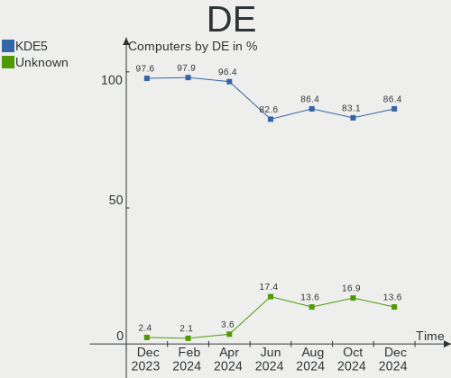
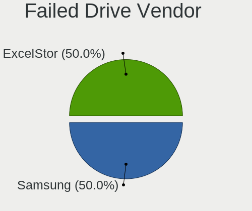
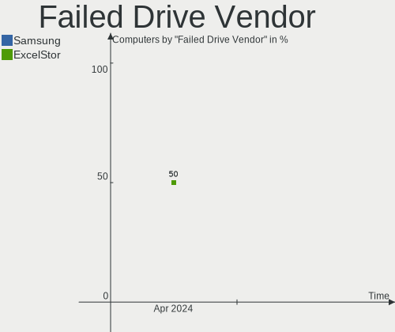
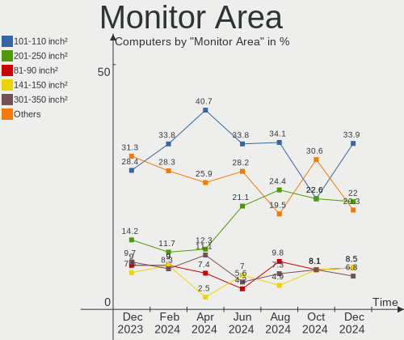
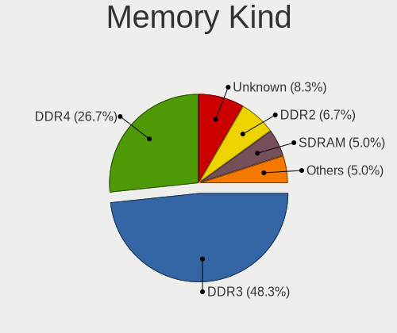
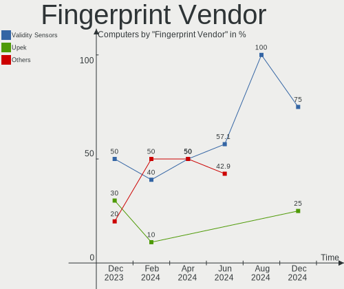

BlackPanther Hardware Trends
----------------------------

A project to identify most popular hardware characteristics and track their change
over time based on data collected by BlackPanther users at https://Linux-Hardware.org.

Anyone can contribute to this report by the [hw-probe](https://github.com/linuxhw/hw-probe) tool:

    sudo -E hw-probe -all -upload

This is a report for all computer types. See also reports for [desktops](/Dist/BlackPanther/Desktop/README.md) and [notebooks](/Dist/BlackPanther/Notebook/README.md).

Full-feature report is available here: https://linux-hardware.org/?view=trends

Period: Feb, 2022.

Contents
--------

* [ System ](#system)
  - [ OS                       ](#os)
  - [ OS Family                ](#os-family)
  - [ Kernel                   ](#kernel)
  - [ Kernel Family            ](#kernel-family)
  - [ Kernel Major Ver.        ](#kernel-major-ver)
  - [ Arch                     ](#arch)
  - [ DE                       ](#de)
  - [ Display Server           ](#display-server)
  - [ Display Manager          ](#display-manager)
  - [ OS Lang                  ](#os-lang)
  - [ Boot Mode                ](#boot-mode)
  - [ Filesystem               ](#filesystem)
  - [ Part. scheme             ](#part-scheme)
  - [ Dual Boot with Linux/BSD ](#dual-boot-with-linuxbsd)
  - [ Dual Boot (Win)          ](#dual-boot-win)

* [ Board ](#board)
  - [ Vendor                   ](#vendor)
  - [ Model                    ](#model)
  - [ Model Family             ](#model-family)
  - [ MFG Year                 ](#mfg-year)
  - [ Form Factor              ](#form-factor)
  - [ Secure Boot              ](#secure-boot)
  - [ Coreboot                 ](#coreboot)
  - [ RAM Size                 ](#ram-size)
  - [ RAM Used                 ](#ram-used)
  - [ Total Drives             ](#total-drives)
  - [ Has CD-ROM               ](#has-cd-rom)
  - [ Has Ethernet             ](#has-ethernet)
  - [ Has WiFi                 ](#has-wifi)
  - [ Has Bluetooth            ](#has-bluetooth)

* [ Location ](#location)
  - [ Country                  ](#country)
  - [ City                     ](#city)

* [ Drives ](#drives)
  - [ Drive Vendor             ](#drive-vendor)
  - [ Drive Model              ](#drive-model)
  - [ HDD Vendor               ](#hdd-vendor)
  - [ SSD Vendor               ](#ssd-vendor)
  - [ Drive Kind               ](#drive-kind)
  - [ Drive Connector          ](#drive-connector)
  - [ Drive Size               ](#drive-size)
  - [ Space Total              ](#space-total)
  - [ Space Used               ](#space-used)
  - [ Malfunc. Drives          ](#malfunc-drives)
  - [ Malfunc. Drive Vendor    ](#malfunc-drive-vendor)
  - [ Malfunc. HDD Vendor      ](#malfunc-hdd-vendor)
  - [ Malfunc. Drive Kind      ](#malfunc-drive-kind)
  - [ Failed Drives            ](#failed-drives)
  - [ Failed Drive Vendor      ](#failed-drive-vendor)
  - [ Drive Status             ](#drive-status)

* [ Storage controller ](#storage-controller)
  - [ Storage Vendor           ](#storage-vendor)
  - [ Storage Model            ](#storage-model)
  - [ Storage Kind             ](#storage-kind)

* [ Processor ](#processor)
  - [ CPU Vendor               ](#cpu-vendor)
  - [ CPU Model                ](#cpu-model)
  - [ CPU Model Family         ](#cpu-model-family)
  - [ CPU Cores                ](#cpu-cores)
  - [ CPU Sockets              ](#cpu-sockets)
  - [ CPU Threads              ](#cpu-threads)
  - [ CPU Op-Modes             ](#cpu-op-modes)
  - [ CPU Microcode            ](#cpu-microcode)
  - [ CPU Microarch            ](#cpu-microarch)

* [ Graphics ](#graphics)
  - [ GPU Vendor               ](#gpu-vendor)
  - [ GPU Model                ](#gpu-model)
  - [ GPU Combo                ](#gpu-combo)
  - [ GPU Driver               ](#gpu-driver)
  - [ GPU Memory               ](#gpu-memory)

* [ Monitor ](#monitor)
  - [ Monitor Vendor           ](#monitor-vendor)
  - [ Monitor Model            ](#monitor-model)
  - [ Monitor Resolution       ](#monitor-resolution)
  - [ Monitor Diagonal         ](#monitor-diagonal)
  - [ Monitor Width            ](#monitor-width)
  - [ Aspect Ratio             ](#aspect-ratio)
  - [ Monitor Area             ](#monitor-area)
  - [ Pixel Density            ](#pixel-density)
  - [ Multiple Monitors        ](#multiple-monitors)

* [ Network ](#network)
  - [ Net Controller Vendor    ](#net-controller-vendor)
  - [ Net Controller Model     ](#net-controller-model)
  - [ Wireless Vendor          ](#wireless-vendor)
  - [ Wireless Model           ](#wireless-model)
  - [ Ethernet Vendor          ](#ethernet-vendor)
  - [ Ethernet Model           ](#ethernet-model)
  - [ Net Controller Kind      ](#net-controller-kind)
  - [ Used Controller          ](#used-controller)
  - [ NICs                     ](#nics)
  - [ IPv6                     ](#ipv6)

* [ Bluetooth ](#bluetooth)
  - [ Bluetooth Vendor         ](#bluetooth-vendor)
  - [ Bluetooth Model          ](#bluetooth-model)

* [ Sound ](#sound)
  - [ Sound Vendor             ](#sound-vendor)
  - [ Sound Model              ](#sound-model)

* [ Memory ](#memory)
  - [ Memory Vendor            ](#memory-vendor)
  - [ Memory Model             ](#memory-model)
  - [ Memory Kind              ](#memory-kind)
  - [ Memory Form Factor       ](#memory-form-factor)
  - [ Memory Size              ](#memory-size)
  - [ Memory Speed             ](#memory-speed)

* [ Printers & scanners ](#printers--scanners)
  - [ Printer Vendor           ](#printer-vendor)
  - [ Printer Model            ](#printer-model)
  - [ Scanner Vendor           ](#scanner-vendor)
  - [ Scanner Model            ](#scanner-model)

* [ Camera ](#camera)
  - [ Camera Vendor            ](#camera-vendor)
  - [ Camera Model             ](#camera-model)

* [ Security ](#security)
  - [ Fingerprint Vendor       ](#fingerprint-vendor)
  - [ Fingerprint Model        ](#fingerprint-model)
  - [ Chipcard Vendor          ](#chipcard-vendor)
  - [ Chipcard Model           ](#chipcard-model)

* [ Unsupported ](#unsupported)
  - [ Unsupported Devices      ](#unsupported-devices)
  - [ Unsupported Device Types ](#unsupported-device-types)

System
------

OS
--

Installed operating systems

| Name              | Computers | Percent |
|-------------------|-----------|---------|
| BlackPanther 18.1 | 74        | 98.67%  |
| BlackPanther 16.2 | 1         | 1.33%   |

OS Family
---------

OS without a version

| Name         | Computers | Percent |
|--------------|-----------|---------|
| BlackPanther | 75        | 100%    |

Kernel
------

Version of the Linux kernel

| Version                | Computers | Percent |
|------------------------|-----------|---------|
| 5.6.14-desktop-2bP     | 51        | 68%     |
| 4.18.16-desktop-1bP    | 23        | 30.67%  |
| 4.9.20-desktop-pae-1bP | 1         | 1.33%   |

Kernel Family
-------------

Linux kernel without a distro release

| Version | Computers | Percent |
|---------|-----------|---------|
| 5.6.14  | 51        | 68%     |
| 4.18.16 | 23        | 30.67%  |
| 4.9.20  | 1         | 1.33%   |

Kernel Major Ver.
-----------------

Linux kernel major version

| Version | Computers | Percent |
|---------|-----------|---------|
| 5.6     | 51        | 68%     |
| 4.18    | 23        | 30.67%  |
| 4.9     | 1         | 1.33%   |

Arch
----

OS architecture (x86_64, i586, etc.)

| Name   | Computers | Percent |
|--------|-----------|---------|
| x86_64 | 74        | 98.67%  |
| i686   | 1         | 1.33%   |

DE
--

Desktop Environment

| Name | Computers | Percent |
|------|-----------|---------|
| KDE5 | 75        | 100%    |

Display Server
--------------

X11 or Wayland

| Name | Computers | Percent |
|------|-----------|---------|
| X11  | 75        | 100%    |

Display Manager
---------------

SDDM, LightDM, etc.

| Name | Computers | Percent |
|------|-----------|---------|
| SDDM | 75        | 100%    |

OS Lang
-------

Language

| Lang    | Computers | Percent |
|---------|-----------|---------|
| Unknown | 75        | 100%    |

Boot Mode
---------

EFI or BIOS

| Mode | Computers | Percent |
|------|-----------|---------|
| BIOS | 42        | 56%     |
| EFI  | 33        | 44%     |

Filesystem
----------

Type of filesystem

| Type    | Computers | Percent |
|---------|-----------|---------|
| Overlay | 67        | 89.33%  |
| Ext4    | 8         | 10.67%  |

Part. scheme
------------

Scheme of partitioning

| Type    | Computers | Percent |
|---------|-----------|---------|
| MBR     | 38        | 50.67%  |
| GPT     | 36        | 48%     |
| Unknown | 1         | 1.33%   |

Dual Boot with Linux/BSD
------------------------

Hosting more than one Linux/BSD

| Dual boot | Computers | Percent |
|-----------|-----------|---------|
| Yes       | 40        | 53.33%  |
| No        | 35        | 46.67%  |

Dual Boot (Win)
---------------

Hosting Linux and Windows

| Dual boot | Computers | Percent |
|-----------|-----------|---------|
| Yes       | 40        | 53.33%  |
| No        | 35        | 46.67%  |

Board
-----

Vendor
------

Motherboard manufacturer

| Name                        | Computers | Percent |
|-----------------------------|-----------|---------|
| Hewlett-Packard             | 12        | 16%     |
| Gigabyte Technology         | 11        | 14.67%  |
| ASUSTek Computer            | 10        | 13.33%  |
| Lenovo                      | 9         | 12%     |
| Dell                        | 8         | 10.67%  |
| Acer                        | 6         | 8%      |
| Fujitsu                     | 4         | 5.33%   |
| MSI                         | 3         | 4%      |
| Sony                        | 2         | 2.67%   |
| Fujitsu Siemens             | 2         | 2.67%   |
| Shenzhen Wangang Technology | 1         | 1.33%   |
| Samsung Electronics         | 1         | 1.33%   |
| Packard Bell                | 1         | 1.33%   |
| Medion                      | 1         | 1.33%   |
| Fanless Mini PC             | 1         | 1.33%   |
| eMachines                   | 1         | 1.33%   |
| ASRock                      | 1         | 1.33%   |
| AMI                         | 1         | 1.33%   |

Model
-----

Motherboard model

| Name                                        | Computers | Percent |
|---------------------------------------------|-----------|---------|
| Sony VPCEH2J1E                              | 1         | 1.33%   |
| Sony SVS13118GBB                            | 1         | 1.33%   |
| Shenzhen Wangang AERO 2                     | 1         | 1.33%   |
| Samsung RV411/RV511/E3511/S3511/RV711/E3411 | 1         | 1.33%   |
| Packard Bell EasyNote ENLG81BA              | 1         | 1.33%   |
| MSI MS-7846                                 | 1         | 1.33%   |
| MSI MS-7788                                 | 1         | 1.33%   |
| MSI MS-7253                                 | 1         | 1.33%   |
| Medion MS-7748                              | 1         | 1.33%   |
| Lenovo ThinkPad T430 2350B58                | 1         | 1.33%   |
| Lenovo ThinkPad T410 2537VFQ                | 1         | 1.33%   |
| Lenovo IdeaPad Y700-15ISK 80NV              | 1         | 1.33%   |
| Lenovo IdeaPad S145-15IGM 81MX              | 1         | 1.33%   |
| Lenovo IdeaPad 330S-15IKB 81F5              | 1         | 1.33%   |
| Lenovo IdeaPad 330-15IKB 81DE               | 1         | 1.33%   |
| Lenovo IdeaPad 320-17ABR 80YN               | 1         | 1.33%   |
| Lenovo IdeaPad 320-15ABR 80XS               | 1         | 1.33%   |
| Lenovo 3000 N500 423332G                    | 1         | 1.33%   |
| HP ProDesk 600 G2 SFF                       | 1         | 1.33%   |
| HP ProBook 6470b                            | 1         | 1.33%   |
| HP Pavilion g6                              | 1         | 1.33%   |
| HP Pavilion 17                              | 1         | 1.33%   |
| HP EliteBook 8570w                          | 1         | 1.33%   |
| HP Compaq Pro 6305 SFF                      | 1         | 1.33%   |
| HP Compaq dc7800p Small Form Factor         | 1         | 1.33%   |
| HP Compaq dc5800 Small Form Factor          | 1         | 1.33%   |
| HP Compaq 6530b (NJ641UC#ABB)               | 1         | 1.33%   |
| HP 650                                      | 1         | 1.33%   |
| HP 255 G6 Notebook PC                       | 1         | 1.33%   |
| HP 250 G1                                   | 1         | 1.33%   |
| Gigabyte Z370 AORUS Gaming 7                | 1         | 1.33%   |
| Gigabyte P67A-D3-B3                         | 1         | 1.33%   |
| Gigabyte H61M-S2PV                          | 1         | 1.33%   |
| Gigabyte H61M-S1                            | 1         | 1.33%   |
| Gigabyte H61M-D2-B3                         | 1         | 1.33%   |
| Gigabyte H310M H 2.0                        | 1         | 1.33%   |
| Gigabyte F2A88XM-HD3                        | 1         | 1.33%   |
| Gigabyte B85M-DS3H-A                        | 1         | 1.33%   |
| Gigabyte B85M-D3H                           | 1         | 1.33%   |
| Gigabyte B450M GAMING                       | 1         | 1.33%   |
| Gigabyte AB350M-D3H                         | 1         | 1.33%   |
| Fujitsu Siemens LIFEBOOK S7110              | 1         | 1.33%   |
| Fujitsu Siemens ESPRIMO P5730               | 1         | 1.33%   |
| Fujitsu LIFEBOOK U745                       | 1         | 1.33%   |
| Fujitsu ESPRIMO P910                        | 1         | 1.33%   |
| Fujitsu ESPRIMO P710                        | 1         | 1.33%   |
| Fujitsu CELSIUS M470                        | 1         | 1.33%   |
| Fanless Mini PC PCG02 GLE                   | 1         | 1.33%   |
| eMachines E725                              | 1         | 1.33%   |
| Dell Latitude E6410                         | 1         | 1.33%   |
| Dell Latitude E6230                         | 1         | 1.33%   |
| Dell Latitude E5540                         | 1         | 1.33%   |
| Dell Latitude E5430 non-vPro                | 1         | 1.33%   |
| Dell Latitude E5420                         | 1         | 1.33%   |
| Dell Latitude D630                          | 1         | 1.33%   |
| Dell Latitude 5480                          | 1         | 1.33%   |
| Dell Inspiron 15-3567                       | 1         | 1.33%   |
| ASUS X550VX                                 | 1         | 1.33%   |
| ASUS X541UVK                                | 1         | 1.33%   |
| ASUS VM40B                                  | 1         | 1.33%   |

Model Family
------------

Motherboard model prefix

| Name                     | Computers | Percent |
|--------------------------|-----------|---------|
| Dell Latitude            | 7         | 9.33%   |
| Lenovo IdeaPad           | 6         | 8%      |
| HP Compaq                | 4         | 5.33%   |
| Acer Aspire              | 3         | 4%      |
| Lenovo ThinkPad          | 2         | 2.67%   |
| HP Pavilion              | 2         | 2.67%   |
| Fujitsu ESPRIMO          | 2         | 2.67%   |
| Sony VPCEH2J1E           | 1         | 1.33%   |
| Sony SVS13118GBB         | 1         | 1.33%   |
| Shenzhen Wangang AERO    | 1         | 1.33%   |
| Samsung RV411            | 1         | 1.33%   |
| Packard Bell EasyNote    | 1         | 1.33%   |
| MSI MS-7846              | 1         | 1.33%   |
| MSI MS-7788              | 1         | 1.33%   |
| MSI MS-7253              | 1         | 1.33%   |
| Medion MS-7748           | 1         | 1.33%   |
| Lenovo 3000              | 1         | 1.33%   |
| HP ProDesk               | 1         | 1.33%   |
| HP ProBook               | 1         | 1.33%   |
| HP EliteBook             | 1         | 1.33%   |
| HP 650                   | 1         | 1.33%   |
| HP 255                   | 1         | 1.33%   |
| HP 250                   | 1         | 1.33%   |
| Gigabyte Z370            | 1         | 1.33%   |
| Gigabyte P67A-D3-B3      | 1         | 1.33%   |
| Gigabyte H61M-S2PV       | 1         | 1.33%   |
| Gigabyte H61M-S1         | 1         | 1.33%   |
| Gigabyte H61M-D2-B3      | 1         | 1.33%   |
| Gigabyte H310M           | 1         | 1.33%   |
| Gigabyte F2A88XM-HD3     | 1         | 1.33%   |
| Gigabyte B85M-DS3H-A     | 1         | 1.33%   |
| Gigabyte B85M-D3H        | 1         | 1.33%   |
| Gigabyte B450M           | 1         | 1.33%   |
| Gigabyte AB350M-D3H      | 1         | 1.33%   |
| Fujitsu Siemens LIFEBOOK | 1         | 1.33%   |
| Fujitsu Siemens ESPRIMO  | 1         | 1.33%   |
| Fujitsu LIFEBOOK         | 1         | 1.33%   |
| Fujitsu CELSIUS          | 1         | 1.33%   |
| Fanless Mini PC PCG02    | 1         | 1.33%   |
| eMachines E725           | 1         | 1.33%   |
| Dell Inspiron            | 1         | 1.33%   |
| ASUS X550VX              | 1         | 1.33%   |
| ASUS X541UVK             | 1         | 1.33%   |
| ASUS VM40B               | 1         | 1.33%   |
| ASUS Vivo                | 1         | 1.33%   |
| ASUS P5KPL-AM            | 1         | 1.33%   |
| ASUS M5A78L-M            | 1         | 1.33%   |
| ASUS K53U                | 1         | 1.33%   |
| ASUS Crosshair           | 1         | 1.33%   |
| ASUS ASUS                | 1         | 1.33%   |
| ASUS All                 | 1         | 1.33%   |
| ASRock B550M             | 1         | 1.33%   |
| AMI Aptio                | 1         | 1.33%   |
| Acer TravelMate          | 1         | 1.33%   |
| Acer Predator            | 1         | 1.33%   |
| Acer F                   | 1         | 1.33%   |

MFG Year
--------

Motherboard manufacture year

| Year | Computers | Percent |
|------|-----------|---------|
| 2012 | 15        | 20%     |
| 2011 | 11        | 14.67%  |
| 2017 | 8         | 10.67%  |
| 2013 | 6         | 8%      |
| 2018 | 5         | 6.67%   |
| 2016 | 5         | 6.67%   |
| 2009 | 5         | 6.67%   |
| 2015 | 4         | 5.33%   |
| 2020 | 3         | 4%      |
| 2014 | 3         | 4%      |
| 2007 | 3         | 4%      |
| 2019 | 2         | 2.67%   |
| 2008 | 2         | 2.67%   |
| 2021 | 1         | 1.33%   |
| 2010 | 1         | 1.33%   |
| 2006 | 1         | 1.33%   |

Form Factor
-----------

Physical design of the computer

| Name       | Computers | Percent |
|------------|-----------|---------|
| Notebook   | 41        | 54.67%  |
| Desktop    | 30        | 40%     |
| Mini pc    | 2         | 2.67%   |
| Stick pc   | 1         | 1.33%   |
| All in one | 1         | 1.33%   |

Secure Boot
-----------

Enabled or disabled

| State    | Computers | Percent |
|----------|-----------|---------|
| Disabled | 75        | 100%    |

Coreboot
--------

Have coreboot on board

| Used | Computers | Percent |
|------|-----------|---------|
| No   | 75        | 100%    |

RAM Size
--------

Total RAM memory

| Size in GB | Computers | Percent |
|------------|-----------|---------|
| 3.01-4.0   | 22        | 29.33%  |
| 4.01-8.0   | 19        | 25.33%  |
| 8.01-16.0  | 17        | 22.67%  |
| 16.01-24.0 | 8         | 10.67%  |
| 1.01-2.0   | 6         | 8%      |
| 2.01-3.0   | 2         | 2.67%   |
| 24.01-32.0 | 1         | 1.33%   |

RAM Used
--------

Used RAM memory

| Used GB  | Computers | Percent |
|----------|-----------|---------|
| 0.01-0.5 | 32        | 42.67%  |
| 0.51-1.0 | 26        | 34.67%  |
| 1.01-2.0 | 17        | 22.67%  |

Total Drives
------------

Number of drives on board

| Drives | Computers | Percent |
|--------|-----------|---------|
| 1      | 50        | 66.67%  |
| 2      | 13        | 17.33%  |
| 3      | 7         | 9.33%   |
| 4      | 3         | 4%      |
| 5      | 1         | 1.33%   |
| 0      | 1         | 1.33%   |

Has CD-ROM
----------

Has CD-ROM on board

| Presented | Computers | Percent |
|-----------|-----------|---------|
| Yes       | 46        | 61.33%  |
| No        | 29        | 38.67%  |

Has Ethernet
------------

Has Ethernet on board

| Presented | Computers | Percent |
|-----------|-----------|---------|
| Yes       | 73        | 97.33%  |
| No        | 2         | 2.67%   |

Has WiFi
--------

Has WiFi module

| Presented | Computers | Percent |
|-----------|-----------|---------|
| Yes       | 46        | 61.33%  |
| No        | 29        | 38.67%  |

Has Bluetooth
-------------

Has Bluetooth module

| Presented | Computers | Percent |
|-----------|-----------|---------|
| Yes       | 41        | 54.67%  |
| No        | 34        | 45.33%  |

Location
--------

Country
-------

Geographic location (country)

| Country    | Computers | Percent |
|------------|-----------|---------|
| Hungary    | 61        | 81.33%  |
| Austria    | 3         | 4%      |
| UK         | 2         | 2.67%   |
| USA        | 1         | 1.33%   |
| Slovakia   | 1         | 1.33%   |
| Romania    | 1         | 1.33%   |
| Poland     | 1         | 1.33%   |
| Luxembourg | 1         | 1.33%   |
| Ghana      | 1         | 1.33%   |
| Canada     | 1         | 1.33%   |
| Australia  | 1         | 1.33%   |
| Argentina  | 1         | 1.33%   |

City
----

Geographic location (city)

| City              | Computers | Percent |
|-------------------|-----------|---------|
| Budapest          | 15        | 20%     |
| Miskolc           | 5         | 6.67%   |
| Vienna            | 3         | 4%      |
| Tatabánya      | 3         | 4%      |
| Szombathely       | 3         | 4%      |
| Pécs           | 2         | 2.67%   |
| Oroshaza          | 2         | 2.67%   |
| Kapuvar           | 2         | 2.67%   |
| Harlow            | 2         | 2.67%   |
| Győr          | 2         | 2.67%   |
| Debrecen          | 2         | 2.67%   |
| Balatonfured      | 2         | 2.67%   |
| Veszprém       | 1         | 1.33%   |
| Valley Village    | 1         | 1.33%   |
| Tapioszentmarton  | 1         | 1.33%   |
| Szentes           | 1         | 1.33%   |
| Szekszárd      | 1         | 1.33%   |
| Sherwood Park     | 1         | 1.33%   |
| Pecel             | 1         | 1.33%   |
| Papa              | 1         | 1.33%   |
| Oberpallen        | 1         | 1.33%   |
| Mezotur           | 1         | 1.33%   |
| Macquarie Park    | 1         | 1.33%   |
| Levice            | 1         | 1.33%   |
| Lenti             | 1         | 1.33%   |
| Krakow            | 1         | 1.33%   |
| Kisvarda          | 1         | 1.33%   |
| Kistarcsa         | 1         | 1.33%   |
| Kiskunhalas       | 1         | 1.33%   |
| Kiskunfelegyhaza  | 1         | 1.33%   |
| Kecskemét      | 1         | 1.33%   |
| Hévíz       | 1         | 1.33%   |
| Gyal              | 1         | 1.33%   |
| Gödöllő | 1         | 1.33%   |
| Fuzesabony        | 1         | 1.33%   |
| Esztergom         | 1         | 1.33%   |
| Csakvar           | 1         | 1.33%   |
| Bucharest         | 1         | 1.33%   |
| Bicske            | 1         | 1.33%   |
| Baja              | 1         | 1.33%   |
| Érd           | 1         | 1.33%   |
| Avellaneda        | 1         | 1.33%   |
| Ajka              | 1         | 1.33%   |
| Accra             | 1         | 1.33%   |

Drives
------

Drive Vendor
------------

Hard drive vendors

| Vendor              | Computers | Drives | Percent |
|---------------------|-----------|--------|---------|
| WDC                 | 20        | 24     | 18.35%  |
| Samsung Electronics | 15        | 19     | 13.76%  |
| Toshiba             | 11        | 14     | 10.09%  |
| Seagate             | 11        | 12     | 10.09%  |
| Kingston            | 10        | 13     | 9.17%   |
| Hitachi             | 6         | 8      | 5.5%    |
| HGST                | 6         | 6      | 5.5%    |
| Crucial             | 4         | 4      | 3.67%   |
| Unknown             | 3         | 3      | 2.75%   |
| Patriot             | 3         | 3      | 2.75%   |
| Intenso             | 2         | 2      | 1.83%   |
| Unknown             | 2         | 2      | 1.83%   |
| WDC WDS             | 1         | 1      | 0.92%   |
| Union Memory        | 1         | 1      | 0.92%   |
| Solid               | 1         | 1      | 0.92%   |
| SK Hynix            | 1         | 1      | 0.92%   |
| PNY                 | 1         | 1      | 0.92%   |
| Micron Technology   | 1         | 1      | 0.92%   |
| MAXTOR              | 1         | 1      | 0.92%   |
| LITEON              | 1         | 1      | 0.92%   |
| Kingmax             | 1         | 1      | 0.92%   |
| Intel               | 1         | 1      | 0.92%   |
| Gigabyte Technology | 1         | 1      | 0.92%   |
| Fujitsu             | 1         | 1      | 0.92%   |
| Corsair             | 1         | 1      | 0.92%   |
| ASMT                | 1         | 1      | 0.92%   |
| AEROFARA            | 1         | 1      | 0.92%   |
| A-DATA Technology   | 1         | 1      | 0.92%   |

Drive Model
-----------

Hard drive models

| Model                                  | Computers | Percent |
|----------------------------------------|-----------|---------|
| Kingston SA400S37480G 480GB SSD        | 3         | 2.42%   |
| WDC WD5000LPCX-21VHAT0 500GB           | 2         | 1.61%   |
| Toshiba MQ04ABF100 1TB                 | 2         | 1.61%   |
| Toshiba MQ01ABF050 500GB               | 2         | 1.61%   |
| Toshiba HDWQ140 4TB                    | 2         | 1.61%   |
| Toshiba DT01ACA200 2TB                 | 2         | 1.61%   |
| Toshiba DT01ACA100 1TB                 | 2         | 1.61%   |
| Seagate ST1000LM035-1RK172 1TB         | 2         | 1.61%   |
| Samsung HD154UI 1TB                    | 2         | 1.61%   |
| Patriot Burst 120GB SSD                | 2         | 1.61%   |
| Kingston SA400S37240G 240GB SSD        | 2         | 1.61%   |
| Kingston SA400S37120G 120GB SSD        | 2         | 1.61%   |
| Hitachi HDP725025GLA380 250GB          | 2         | 1.61%   |
| HGST HTS721010A9E630 1TB               | 2         | 1.61%   |
| HGST HTS541010B7E610 1TB               | 2         | 1.61%   |
| Unknown                                | 2         | 1.61%   |
| WDC WDS240G2G0A-00JH30 240GB SSD       | 1         | 0.81%   |
| WDC WDS 100T2B0B-00YS70 1TB SSD        | 1         | 0.81%   |
| WDC WD7500BPVT-60HXZT3 752GB           | 1         | 0.81%   |
| WDC WD5000LPCX-22VHAT1 500GB           | 1         | 0.81%   |
| WDC WD5000BEVT-22ZAT0 500GB            | 1         | 0.81%   |
| WDC WD5000BEVT-22A0RT0 500GB           | 1         | 0.81%   |
| WDC WD5000AAKS-00UU3A0 500GB           | 1         | 0.81%   |
| WDC WD30EZRZ-00GXCB0 3TB               | 1         | 0.81%   |
| WDC WD30EZRX-00DC0B0 3TB               | 1         | 0.81%   |
| WDC WD30EFRX-68EUZN0 3TB               | 1         | 0.81%   |
| WDC WD2500JS-60NCB1 250GB              | 1         | 0.81%   |
| WDC WD2500AAKX-00ERMA0 250GB           | 1         | 0.81%   |
| WDC WD20EZRX-00D8PB0 2TB               | 1         | 0.81%   |
| WDC WD20EARX-008FB0 2TB                | 1         | 0.81%   |
| WDC WD1200BEVS-22UST0 120GB            | 1         | 0.81%   |
| WDC WD10SPCX-24HWST1 1TB               | 1         | 0.81%   |
| WDC WD10JPVX-60JC3T0 1TB               | 1         | 0.81%   |
| WDC WD10JPVX-22JC3T0 1TB               | 1         | 0.81%   |
| WDC WD10EZRZ-22HTKB0 1TB               | 1         | 0.81%   |
| WDC WD10EZRX-00A8LB0 1TB               | 1         | 0.81%   |
| WDC WD10EZEX-21WN4A0 1TB               | 1         | 0.81%   |
| WDC WD10EZEX-08WN4A0 1TB               | 1         | 0.81%   |
| WDC WD10EZEX-00KUWA0 1TB               | 1         | 0.81%   |
| Unknown SD04G  4GB                     | 1         | 0.81%   |
| Unknown SC32G  32GB                    | 1         | 0.81%   |
| Unknown 032G34  32GB                   | 1         | 0.81%   |
| Union Memory RTOTJ128VGD2EYX 128GB SSD | 1         | 0.81%   |
| Toshiba THNSFJ256GCSU 256GB SSD        | 1         | 0.81%   |
| Toshiba MK1237GSX 120GB                | 1         | 0.81%   |
| Toshiba HDWL120 2TB                    | 1         | 0.81%   |
| Solid SSD0240S00 240GB                 | 1         | 0.81%   |
| SK Hynix HFS256G32MND-2900A 256GB SSD  | 1         | 0.81%   |
| Seagate ST9500420AS 500GB              | 1         | 0.81%   |
| Seagate ST94813AS 40GB                 | 1         | 0.81%   |
| Seagate ST750LM022 HN-M750MBB 752GB    | 1         | 0.81%   |
| Seagate ST4000DM004-2CV104 4TB         | 1         | 0.81%   |
| Seagate ST3160815AS 160GB              | 1         | 0.81%   |
| Seagate ST3160812AS 160GB              | 1         | 0.81%   |
| Seagate ST2000DM008-2FR102 2TB         | 1         | 0.81%   |
| Seagate ST1000LM014-1EJ164-SSHD 1TB    | 1         | 0.81%   |
| Seagate ST1000DM010-2EP102 1TB         | 1         | 0.81%   |
| Seagate ST1000DM003-1CH162 1TB         | 1         | 0.81%   |
| Samsung SSD PM871b M.2 2280 256GB      | 1         | 0.81%   |
| Samsung SSD PM851 mSATA 128GB          | 1         | 0.81%   |

HDD Vendor
----------

Hard disk drive vendors

| Vendor              | Computers | Drives | Percent |
|---------------------|-----------|--------|---------|
| WDC                 | 20        | 23     | 33.33%  |
| Seagate             | 11        | 12     | 18.33%  |
| Toshiba             | 10        | 13     | 16.67%  |
| Hitachi             | 6         | 8      | 10%     |
| HGST                | 6         | 6      | 10%     |
| Samsung Electronics | 5         | 5      | 8.33%   |
| MAXTOR              | 1         | 1      | 1.67%   |
| Fujitsu             | 1         | 1      | 1.67%   |

SSD Vendor
----------

Solid state drive vendors

| Vendor              | Computers | Drives | Percent |
|---------------------|-----------|--------|---------|
| Samsung Electronics | 9         | 12     | 22.5%   |
| Kingston            | 9         | 12     | 22.5%   |
| Patriot             | 3         | 3      | 7.5%    |
| Crucial             | 3         | 3      | 7.5%    |
| Intenso             | 2         | 2      | 5%      |
| WDC WDS             | 1         | 1      | 2.5%    |
| WDC                 | 1         | 1      | 2.5%    |
| Union Memory        | 1         | 1      | 2.5%    |
| Toshiba             | 1         | 1      | 2.5%    |
| Solid               | 1         | 1      | 2.5%    |
| SK Hynix            | 1         | 1      | 2.5%    |
| PNY                 | 1         | 1      | 2.5%    |
| LITEON              | 1         | 1      | 2.5%    |
| Kingmax             | 1         | 1      | 2.5%    |
| Intel               | 1         | 1      | 2.5%    |
| Gigabyte Technology | 1         | 1      | 2.5%    |
| Corsair             | 1         | 1      | 2.5%    |
| AEROFARA            | 1         | 1      | 2.5%    |
| A-DATA Technology   | 1         | 1      | 2.5%    |

Drive Kind
----------

HDD or SSD

| Kind    | Computers | Drives | Percent |
|---------|-----------|--------|---------|
| HDD     | 53        | 69     | 55.21%  |
| SSD     | 33        | 46     | 34.38%  |
| MMC     | 5         | 5      | 5.21%   |
| NVMe    | 4         | 5      | 4.17%   |
| Unknown | 1         | 1      | 1.04%   |

Drive Connector
---------------

SATA, SAS, NVMe, etc.

| Type | Computers | Drives | Percent |
|------|-----------|--------|---------|
| SATA | 71        | 113    | 85.54%  |
| MMC  | 5         | 5      | 6.02%   |
| NVMe | 4         | 5      | 4.82%   |
| SAS  | 3         | 3      | 3.61%   |

Drive Size
----------

Size of hard drive

| Size in TB | Computers | Drives | Percent |
|------------|-----------|--------|---------|
| 0.01-0.5   | 57        | 73     | 60%     |
| 0.51-1.0   | 28        | 30     | 29.47%  |
| 1.01-2.0   | 5         | 6      | 5.26%   |
| 3.01-4.0   | 3         | 3      | 3.16%   |
| 2.01-3.0   | 2         | 3      | 2.11%   |

Space Total
-----------

Amount of disk space available on the file system

| Size in GB | Computers | Percent |
|------------|-----------|---------|
| Unknown    | 65        | 86.67%  |
| 101-250    | 5         | 6.67%   |
| 251-500    | 2         | 2.67%   |
| 21-50      | 1         | 1.33%   |
| 2001-3000  | 1         | 1.33%   |
| 501-1000   | 1         | 1.33%   |

Space Used
----------

Amount of used disk space

| Used GB | Computers | Percent |
|---------|-----------|---------|
| Unknown | 65        | 86.67%  |
| 1-20    | 8         | 10.67%  |
| 101-250 | 1         | 1.33%   |
| 51-100  | 1         | 1.33%   |

Malfunc. Drives
---------------

Drive models with a malfunction

| Model                               | Computers | Drives | Percent |
|-------------------------------------|-----------|--------|---------|
| WDC WD7500BPVT-60HXZT3 752GB        | 1         | 1      | 4.55%   |
| WDC WD5000AAKS-00UU3A0 500GB        | 1         | 1      | 4.55%   |
| WDC WD10JPVX-22JC3T0 1TB            | 1         | 1      | 4.55%   |
| WDC WD10EZRX-00A8LB0 1TB            | 1         | 1      | 4.55%   |
| Toshiba THNSFJ256GCSU 256GB SSD     | 1         | 1      | 4.55%   |
| Toshiba MQ01ABF050 500GB            | 1         | 1      | 4.55%   |
| Toshiba MK1237GSX 120GB             | 1         | 2      | 4.55%   |
| Seagate ST9500420AS 500GB           | 1         | 1      | 4.55%   |
| Seagate ST94813AS 40GB              | 1         | 1      | 4.55%   |
| Seagate ST1000LM014-1EJ164-SSHD 1TB | 1         | 1      | 4.55%   |
| Seagate ST1000DM003-1CH162 1TB      | 1         | 1      | 4.55%   |
| Samsung Electronics HD154UI 1TB     | 1         | 1      | 4.55%   |
| MAXTOR 6V320F0 320GB                | 1         | 1      | 4.55%   |
| Kingston SA400S37240G 240GB SSD     | 1         | 1      | 4.55%   |
| Hitachi HTS725032A9A364 320GB       | 1         | 1      | 4.55%   |
| Hitachi HTS721010G9SA00 100GB       | 1         | 1      | 4.55%   |
| Hitachi HTS547550A9E384 500GB       | 1         | 1      | 4.55%   |
| Hitachi HTS542516K9SA00 160GB       | 1         | 1      | 4.55%   |
| Hitachi HDP725025GLA380 250GB       | 1         | 1      | 4.55%   |
| Hitachi HCS5C3225SLA380 250GB       | 1         | 1      | 4.55%   |
| HGST HTS545050A7E380 500GB          | 1         | 1      | 4.55%   |
| HGST HTS545032A7E380 320GB          | 1         | 1      | 4.55%   |

Malfunc. Drive Vendor
---------------------

Vendors of faulty drives

| Vendor              | Computers | Drives | Percent |
|---------------------|-----------|--------|---------|
| WDC                 | 4         | 4      | 20%     |
| Seagate             | 4         | 4      | 20%     |
| Hitachi             | 4         | 6      | 20%     |
| Toshiba             | 3         | 4      | 15%     |
| HGST                | 2         | 2      | 10%     |
| Samsung Electronics | 1         | 1      | 5%      |
| MAXTOR              | 1         | 1      | 5%      |
| Kingston            | 1         | 1      | 5%      |

Malfunc. HDD Vendor
-------------------

Vendors of faulty HDD drives

| Vendor              | Computers | Drives | Percent |
|---------------------|-----------|--------|---------|
| WDC                 | 4         | 4      | 22.22%  |
| Seagate             | 4         | 4      | 22.22%  |
| Hitachi             | 4         | 6      | 22.22%  |
| Toshiba             | 2         | 3      | 11.11%  |
| HGST                | 2         | 2      | 11.11%  |
| Samsung Electronics | 1         | 1      | 5.56%   |
| MAXTOR              | 1         | 1      | 5.56%   |

Malfunc. Drive Kind
-------------------

Kinds of faulty drives

| Kind | Computers | Drives | Percent |
|------|-----------|--------|---------|
| HDD  | 17        | 21     | 89.47%  |
| SSD  | 2         | 2      | 10.53%  |

Failed Drives
-------------

Failed drive models

| Model                        | Computers | Drives | Percent |
|------------------------------|-----------|--------|---------|
| WDC WD5000BEVT-22ZAT0 500GB  | 1         | 1      | 50%     |
| WDC WD5000BEVT-22A0RT0 500GB | 1         | 1      | 50%     |

Failed Drive Vendor
-------------------

Failed drive vendors

| Vendor | Computers | Drives | Percent |
|--------|-----------|--------|---------|
| WDC    | 2         | 2      | 100%    |

Drive Status
------------

Number of failed and malfunc. drives

| Status   | Computers | Drives | Percent |
|----------|-----------|--------|---------|
| Works    | 60        | 95     | 69.77%  |
| Malfunc  | 18        | 23     | 20.93%  |
| Detected | 6         | 6      | 6.98%   |
| Failed   | 2         | 2      | 2.33%   |

Storage controller
------------------

Storage Vendor
--------------

Storage controller vendors

| Vendor                      | Computers | Percent |
|-----------------------------|-----------|---------|
| Intel                       | 57        | 69.51%  |
| AMD                         | 17        | 20.73%  |
| VIA Technologies            | 2         | 2.44%   |
| Samsung Electronics         | 2         | 2.44%   |
| Micron/Crucial Technology   | 1         | 1.22%   |
| Micron Technology           | 1         | 1.22%   |
| Kingston Technology Company | 1         | 1.22%   |
| JMicron Technology          | 1         | 1.22%   |

Storage Model
-------------

Storage controller models

| Model                                                                                   | Computers | Percent |
|-----------------------------------------------------------------------------------------|-----------|---------|
| AMD FCH SATA Controller [AHCI mode]                                                     | 12        | 12%     |
| Intel 82801 Mobile SATA Controller [RAID mode]                                          | 7         | 7%      |
| Intel 7 Series Chipset Family 6-port SATA Controller [AHCI mode]                        | 7         | 7%      |
| Intel Celeron/Pentium Silver Processor SATA Controller                                  | 4         | 4%      |
| Intel 82801IBM/IEM (ICH9M/ICH9M-E) 4 port SATA Controller [AHCI mode]                   | 4         | 4%      |
| Intel 6 Series/C200 Series Chipset Family Desktop SATA Controller (IDE mode, ports 4-5) | 4         | 4%      |
| Intel 6 Series/C200 Series Chipset Family Desktop SATA Controller (IDE mode, ports 0-3) | 4         | 4%      |
| Intel Sunrise Point-LP SATA Controller [AHCI mode]                                      | 3         | 3%      |
| Intel 8 Series/C220 Series Chipset Family 6-port SATA Controller 1 [AHCI mode]          | 3         | 3%      |
| AMD SB7x0/SB8x0/SB9x0 IDE Controller                                                    | 3         | 3%      |
| Intel Wildcat Point-LP SATA Controller [AHCI Mode]                                      | 2         | 2%      |
| Intel SATA Controller [RAID mode]                                                       | 2         | 2%      |
| Intel HM170/QM170 Chipset SATA Controller [AHCI Mode]                                   | 2         | 2%      |
| Intel Atom/Celeron/Pentium Processor x5-E8000/J3xxx/N3xxx Series SATA Controller        | 2         | 2%      |
| Intel 82801I (ICH9 Family) 2 port SATA Controller [IDE mode]                            | 2         | 2%      |
| Intel 82801G (ICH7 Family) IDE Controller                                               | 2         | 2%      |
| Intel 6 Series/C200 Series Chipset Family 6 port Mobile SATA AHCI Controller            | 2         | 2%      |
| Intel 200 Series PCH SATA controller [AHCI mode]                                        | 2         | 2%      |
| AMD SB7x0/SB8x0/SB9x0 SATA Controller [IDE mode]                                        | 2         | 2%      |
| VIA VT82C586A/B/VT82C686/A/B/VT823x/A/C PIPC Bus Master IDE                             | 1         | 1%      |
| VIA VT8237A SATA 2-Port Controller                                                      | 1         | 1%      |
| VIA VT6421 IDE/SATA Controller                                                          | 1         | 1%      |
| Samsung NVMe SSD Controller SM981/PM981/PM983                                           | 1         | 1%      |
| Samsung NVMe SSD Controller SM961/PM961/SM963                                           | 1         | 1%      |
| Micron/Crucial NVMe Controller                                                          | 1         | 1%      |
| Micron Non-Volatile memory controller                                                   | 1         | 1%      |
| Kingston Company A2000 NVMe SSD                                                         | 1         | 1%      |
| JMicron JMB363 SATA/IDE Controller                                                      | 1         | 1%      |
| Intel Q170/Q150/B150/H170/H110/Z170/CM236 Chipset SATA Controller [AHCI Mode]           | 1         | 1%      |
| Intel NM10/ICH7 Family SATA Controller [IDE mode]                                       | 1         | 1%      |
| Intel Celeron N3350/Pentium N4200/Atom E3900 Series SATA AHCI Controller                | 1         | 1%      |
| Intel 82Q35 Express PT IDER Controller                                                  | 1         | 1%      |
| Intel 82801JI (ICH10 Family) SATA AHCI Controller                                       | 1         | 1%      |
| Intel 82801JD/DO (ICH10 Family) 4-port SATA IDE Controller                              | 1         | 1%      |
| Intel 82801JD/DO (ICH10 Family) 2-port SATA IDE Controller                              | 1         | 1%      |
| Intel 82801IR/IO/IH (ICH9R/DO/DH) 4 port SATA Controller [IDE mode]                     | 1         | 1%      |
| Intel 82801IBM/IEM (ICH9M/ICH9M-E) 2 port SATA Controller [IDE mode]                    | 1         | 1%      |
| Intel 82801IB (ICH9) 2 port SATA Controller [IDE mode]                                  | 1         | 1%      |
| Intel 82801HM/HEM (ICH8M/ICH8M-E) SATA Controller [IDE mode]                            | 1         | 1%      |
| Intel 82801HM/HEM (ICH8M/ICH8M-E) IDE Controller                                        | 1         | 1%      |
| Intel 82801GBM/GHM (ICH7-M Family) SATA Controller [AHCI mode]                          | 1         | 1%      |
| Intel 7 Series/C210 Series Chipset Family 6-port SATA Controller [AHCI mode]            | 1         | 1%      |
| Intel 6 Series/C200 Series Chipset Family 6 port Desktop SATA AHCI Controller           | 1         | 1%      |
| Intel 5 Series/3400 Series Chipset 6 port SATA AHCI Controller                          | 1         | 1%      |
| Intel 5 Series/3400 Series Chipset 4 port SATA AHCI Controller                          | 1         | 1%      |
| Intel 4 Series Chipset PT IDER Controller                                               | 1         | 1%      |
| AMD Starship/Matisse Chipset SATA Controller [AHCI mode]                                | 1         | 1%      |
| AMD SB7x0/SB8x0/SB9x0 SATA Controller [AHCI mode]                                       | 1         | 1%      |
| AMD 400 Series Chipset SATA Controller                                                  | 1         | 1%      |
| AMD 300 Series Chipset SATA Controller                                                  | 1         | 1%      |

Storage Kind
------------

Kind of storage controller (IDE, SATA, NVMe, SAS, ...)

| Kind | Computers | Percent |
|------|-----------|---------|
| SATA | 56        | 65.88%  |
| IDE  | 15        | 17.65%  |
| RAID | 10        | 11.76%  |
| NVMe | 4         | 4.71%   |

Processor
---------

CPU Vendor
----------

Processor vendors

| Vendor | Computers | Percent |
|--------|-----------|---------|
| Intel  | 57        | 76%     |
| AMD    | 18        | 24%     |

CPU Model
---------

Processor models

| Model                                           | Computers | Percent |
|-------------------------------------------------|-----------|---------|
| Intel Core i7-6700HQ CPU @ 2.60GHz              | 2         | 2.67%   |
| Intel Core i7-3740QM CPU @ 2.70GHz              | 2         | 2.67%   |
| Intel Core i5-3470 CPU @ 3.20GHz                | 2         | 2.67%   |
| Intel Core i5-3340M CPU @ 2.70GHz               | 2         | 2.67%   |
| Intel Core i5 CPU M 520 @ 2.40GHz               | 2         | 2.67%   |
| Intel Core i3-2330M CPU @ 2.20GHz               | 2         | 2.67%   |
| Intel Core i3-2120 CPU @ 3.30GHz                | 2         | 2.67%   |
| Intel Core 2 Duo CPU E8400 @ 3.00GHz            | 2         | 2.67%   |
| Intel Celeron J4125 CPU @ 2.00GHz               | 2         | 2.67%   |
| AMD A12-9720P RADEON R7, 12 COMPUTE CORES 4C+8G | 2         | 2.67%   |
| Intel Xeon CPU W3550 @ 3.07GHz                  | 1         | 1.33%   |
| Intel Pentium Silver N5000 CPU @ 1.10GHz        | 1         | 1.33%   |
| Intel Pentium Gold G5400 CPU @ 3.70GHz          | 1         | 1.33%   |
| Intel Pentium Dual-Core CPU T4400 @ 2.20GHz     | 1         | 1.33%   |
| Intel Pentium CPU P6200 @ 2.13GHz               | 1         | 1.33%   |
| Intel Pentium CPU G840 @ 2.80GHz                | 1         | 1.33%   |
| Intel Pentium CPU G630 @ 2.70GHz                | 1         | 1.33%   |
| Intel Pentium CPU G3420 @ 3.20GHz               | 1         | 1.33%   |
| Intel Genuine CPU 575 @ 2.00GHz                 | 1         | 1.33%   |
| Intel Core i7-8750H CPU @ 2.20GHz               | 1         | 1.33%   |
| Intel Core i7-8700K CPU @ 3.70GHz               | 1         | 1.33%   |
| Intel Core i7-6600U CPU @ 2.60GHz               | 1         | 1.33%   |
| Intel Core i7-5600U CPU @ 2.60GHz               | 1         | 1.33%   |
| Intel Core i5-8250U CPU @ 1.60GHz               | 1         | 1.33%   |
| Intel Core i5-6500 CPU @ 3.20GHz                | 1         | 1.33%   |
| Intel Core i5-4570 CPU @ 3.20GHz                | 1         | 1.33%   |
| Intel Core i5-4460 CPU @ 3.20GHz                | 1         | 1.33%   |
| Intel Core i5-3230M CPU @ 2.60GHz               | 1         | 1.33%   |
| Intel Core i5-3210M CPU @ 2.50GHz               | 1         | 1.33%   |
| Intel Core i5-2300 CPU @ 2.80GHz                | 1         | 1.33%   |
| Intel Core i3-8130U CPU @ 2.20GHz               | 1         | 1.33%   |
| Intel Core i3-7100U CPU @ 2.40GHz               | 1         | 1.33%   |
| Intel Core i3-7020U CPU @ 2.30GHz               | 1         | 1.33%   |
| Intel Core i3-5005U CPU @ 2.00GHz               | 1         | 1.33%   |
| Intel Core i3-4030U CPU @ 1.90GHz               | 1         | 1.33%   |
| Intel Core 2 Quad CPU Q6600 @ 2.40GHz           | 1         | 1.33%   |
| Intel Core 2 Duo CPU U9400 @ 1.40GHz            | 1         | 1.33%   |
| Intel Core 2 Duo CPU T7250 @ 2.00GHz            | 1         | 1.33%   |
| Intel Core 2 Duo CPU T5670 @ 1.80GHz            | 1         | 1.33%   |
| Intel Core 2 Duo CPU P7450 @ 2.13GHz            | 1         | 1.33%   |
| Intel Core 2 Duo CPU E7300 @ 2.66GHz            | 1         | 1.33%   |
| Intel Core 2 CPU T5600 @ 1.83GHz                | 1         | 1.33%   |
| Intel Celeron J4005 CPU @ 2.00GHz               | 1         | 1.33%   |
| Intel Celeron CPU N3350 @ 1.10GHz               | 1         | 1.33%   |
| Intel Celeron CPU N3150 @ 1.60GHz               | 1         | 1.33%   |
| Intel Celeron CPU N3060 @ 1.60GHz               | 1         | 1.33%   |
| Intel Celeron CPU B830 @ 1.80GHz                | 1         | 1.33%   |
| Intel Celeron CPU 1017U @ 1.60GHz               | 1         | 1.33%   |
| Intel Celeron CPU 1000M @ 1.80GHz               | 1         | 1.33%   |
| AMD Sempron Processor LE-1100                   | 1         | 1.33%   |
| AMD Sempron 3850 APU with Radeon R3             | 1         | 1.33%   |
| AMD Ryzen 7 4800H with Radeon Graphics          | 1         | 1.33%   |
| AMD Ryzen 7 3700X 8-Core Processor              | 1         | 1.33%   |
| AMD Ryzen 5 3400G with Radeon Vega Graphics     | 1         | 1.33%   |
| AMD Ryzen 5 1500X Quad-Core Processor           | 1         | 1.33%   |
| AMD Phenom II X6 1090T Processor                | 1         | 1.33%   |
| AMD FX-8350 Eight-Core Processor                | 1         | 1.33%   |
| AMD E2-9000e RADEON R2, 4 COMPUTE CORES 2C+2G   | 1         | 1.33%   |
| AMD E-450 APU with Radeon HD Graphics           | 1         | 1.33%   |
| AMD A8-7600 Radeon R7, 10 Compute Cores 4C+6G   | 1         | 1.33%   |

CPU Model Family
----------------

Processor model prefix

| Model                   | Computers | Percent |
|-------------------------|-----------|---------|
| Intel Core i5           | 13        | 17.33%  |
| Intel Core i3           | 9         | 12%     |
| Intel Celeron           | 9         | 12%     |
| Intel Core i7           | 8         | 10.67%  |
| Intel Core 2 Duo        | 7         | 9.33%   |
| Intel Pentium           | 4         | 5.33%   |
| AMD A8                  | 3         | 4%      |
| AMD A4                  | 3         | 4%      |
| AMD Sempron             | 2         | 2.67%   |
| AMD Ryzen 7             | 2         | 2.67%   |
| AMD Ryzen 5             | 2         | 2.67%   |
| AMD A12                 | 2         | 2.67%   |
| Intel Xeon              | 1         | 1.33%   |
| Intel Pentium Silver    | 1         | 1.33%   |
| Intel Pentium Gold      | 1         | 1.33%   |
| Intel Pentium Dual-Core | 1         | 1.33%   |
| Intel Genuine           | 1         | 1.33%   |
| Intel Core 2 Quad       | 1         | 1.33%   |
| Intel Core 2            | 1         | 1.33%   |
| AMD Phenom II X6        | 1         | 1.33%   |
| AMD FX                  | 1         | 1.33%   |
| AMD E2                  | 1         | 1.33%   |
| AMD E                   | 1         | 1.33%   |

CPU Cores
---------

Number of processor cores

| Number | Computers | Percent |
|--------|-----------|---------|
| 2      | 43        | 57.33%  |
| 4      | 24        | 32%     |
| 6      | 3         | 4%      |
| 1      | 3         | 4%      |
| 8      | 2         | 2.67%   |

CPU Sockets
-----------

Number of sockets

| Number | Computers | Percent |
|--------|-----------|---------|
| 1      | 75        | 100%    |

CPU Threads
-----------

Threads per core (Hyper-Threading)

| Number | Computers | Percent |
|--------|-----------|---------|
| 1      | 40        | 53.33%  |
| 2      | 35        | 46.67%  |

CPU Op-Modes
------------

CPU Operation Modes (32-bit, 64-bit)

| Op mode        | Computers | Percent |
|----------------|-----------|---------|
| 32-bit, 64-bit | 75        | 100%    |

CPU Microcode
-------------

Microcode number

| Number     | Computers | Percent |
|------------|-----------|---------|
| 0x306a9    | 10        | 13.33%  |
| 0x206a7    | 8         | 10.67%  |
| 0x1067a    | 5         | 6.67%   |
| 0x906ea    | 3         | 4%      |
| 0x6fd      | 3         | 4%      |
| 0x506e3    | 3         | 4%      |
| 0x306c3    | 3         | 4%      |
| 0x03000027 | 3         | 4%      |
| 0x806ea    | 2         | 2.67%   |
| 0x806e9    | 2         | 2.67%   |
| 0x706a8    | 2         | 2.67%   |
| 0x706a1    | 2         | 2.67%   |
| 0x306d4    | 2         | 2.67%   |
| 0x20655    | 2         | 2.67%   |
| 0x0700010f | 2         | 2.67%   |
| 0x06006118 | 2         | 2.67%   |
| 0x6fb      | 1         | 1.33%   |
| 0x6f2      | 1         | 1.33%   |
| 0x506c9    | 1         | 1.33%   |
| 0x406e3    | 1         | 1.33%   |
| 0x406c4    | 1         | 1.33%   |
| 0x406c3    | 1         | 1.33%   |
| 0x40651    | 1         | 1.33%   |
| 0x20652    | 1         | 1.33%   |
| 0x106a5    | 1         | 1.33%   |
| 0x10676    | 1         | 1.33%   |
| 0x08701021 | 1         | 1.33%   |
| 0x08600104 | 1         | 1.33%   |
| 0x08108109 | 1         | 1.33%   |
| 0x08001138 | 1         | 1.33%   |
| 0x06006705 | 1         | 1.33%   |
| 0x06003106 | 1         | 1.33%   |
| 0x06001119 | 1         | 1.33%   |
| 0x06000852 | 1         | 1.33%   |
| 0x05000119 | 1         | 1.33%   |
| 0x010000dc | 1         | 1.33%   |
| Unknown    | 1         | 1.33%   |

CPU Microarch
-------------

Microarchitecture

| Name          | Computers | Percent |
|---------------|-----------|---------|
| IvyBridge     | 10        | 13.33%  |
| SandyBridge   | 8         | 10.67%  |
| KabyLake      | 7         | 9.33%   |
| Penryn        | 6         | 8%      |
| Core          | 5         | 6.67%   |
| Skylake       | 4         | 5.33%   |
| Haswell       | 4         | 5.33%   |
| Goldmont plus | 4         | 5.33%   |
| Westmere      | 3         | 4%      |
| K10 Llano     | 3         | 4%      |
| Excavator     | 3         | 4%      |
| Zen 2         | 2         | 2.67%   |
| Silvermont    | 2         | 2.67%   |
| Piledriver    | 2         | 2.67%   |
| Jaguar        | 2         | 2.67%   |
| Broadwell     | 2         | 2.67%   |
| Zen+          | 1         | 1.33%   |
| Zen           | 1         | 1.33%   |
| Steamroller   | 1         | 1.33%   |
| Nehalem       | 1         | 1.33%   |
| K8 Hammer     | 1         | 1.33%   |
| K10           | 1         | 1.33%   |
| Goldmont      | 1         | 1.33%   |
| Bobcat        | 1         | 1.33%   |

Graphics
--------

GPU Vendor
----------

Vendors of graphics cards

| Vendor           | Computers | Percent |
|------------------|-----------|---------|
| Intel            | 44        | 51.76%  |
| Nvidia           | 21        | 24.71%  |
| AMD              | 19        | 22.35%  |
| VIA Technologies | 1         | 1.18%   |

GPU Model
---------

Graphics card models

| Model                                                                                    | Computers | Percent |
|------------------------------------------------------------------------------------------|-----------|---------|
| Intel 3rd Gen Core processor Graphics Controller                                         | 7         | 7.69%   |
| Intel Mobile 4 Series Chipset Integrated Graphics Controller                             | 5         | 5.49%   |
| Intel Xeon E3-1200 v3/4th Gen Core Processor Integrated Graphics Controller              | 3         | 3.3%    |
| Intel HD Graphics 530                                                                    | 3         | 3.3%    |
| Intel GeminiLake [UHD Graphics 600]                                                      | 3         | 3.3%    |
| Intel 2nd Generation Core Processor Family Integrated Graphics Controller                | 3         | 3.3%    |
| AMD Topaz XT [Radeon R7 M260/M265 / M340/M360 / M440/M445 / 530/535 / 620/625 Mobile]    | 3         | 3.3%    |
| Nvidia GT218 [GeForce 210]                                                               | 2         | 2.2%    |
| Nvidia GK208B [GeForce GT 710]                                                           | 2         | 2.2%    |
| Nvidia GF108 [GeForce GT 630]                                                            | 2         | 2.2%    |
| Intel UHD Graphics 620                                                                   | 2         | 2.2%    |
| Intel HD Graphics 5500                                                                   | 2         | 2.2%    |
| Intel Core Processor Integrated Graphics Controller                                      | 2         | 2.2%    |
| Intel Atom/Celeron/Pentium Processor x5-E8000/J3xxx/N3xxx Integrated Graphics Controller | 2         | 2.2%    |
| AMD Wani [Radeon R5/R6/R7 Graphics]                                                      | 2         | 2.2%    |
| AMD Sumo [Radeon HD 6550D]                                                               | 2         | 2.2%    |
| VIA Technologies K8M890CE/K8N890CE [Chrome 9]                                            | 1         | 1.1%    |
| Nvidia TU116M [GeForce GTX 1660 Ti Mobile]                                               | 1         | 1.1%    |
| Nvidia GT218M [GeForce 315M]                                                             | 1         | 1.1%    |
| Nvidia GP104BM [GeForce GTX 1070 Mobile]                                                 | 1         | 1.1%    |
| Nvidia GM204 [GeForce GTX 970]                                                           | 1         | 1.1%    |
| Nvidia GM108M [GeForce 930MX]                                                            | 1         | 1.1%    |
| Nvidia GM108M [GeForce 920MX]                                                            | 1         | 1.1%    |
| Nvidia GM107M [GeForce GTX 960M]                                                         | 1         | 1.1%    |
| Nvidia GM107M [GeForce GTX 950M]                                                         | 1         | 1.1%    |
| Nvidia GK208B [GeForce GT 730]                                                           | 1         | 1.1%    |
| Nvidia GK107M [GeForce GT 640M LE]                                                       | 1         | 1.1%    |
| Nvidia GK107GLM [Quadro K1000M]                                                          | 1         | 1.1%    |
| Nvidia GF119M [GeForce 410M]                                                             | 1         | 1.1%    |
| Nvidia GF119 [GeForce GT 610]                                                            | 1         | 1.1%    |
| Nvidia GF114 [GeForce GTX 560]                                                           | 1         | 1.1%    |
| Nvidia G73 [GeForce 7600 GT]                                                             | 1         | 1.1%    |
| Intel Xeon E3-1200 v2/3rd Gen Core processor Graphics Controller                         | 1         | 1.1%    |
| Intel Skylake GT2 [HD Graphics 520]                                                      | 1         | 1.1%    |
| Intel Mobile GM965/GL960 Integrated Graphics Controller (secondary)                      | 1         | 1.1%    |
| Intel Mobile GM965/GL960 Integrated Graphics Controller (primary)                        | 1         | 1.1%    |
| Intel Mobile 945GM/GMS/GME, 943/940GML Express Integrated Graphics Controller            | 1         | 1.1%    |
| Intel Mobile 945GM/GMS, 943/940GML Express Integrated Graphics Controller                | 1         | 1.1%    |
| Intel Kaby Lake-U GT2f HD 620 Graphics Controller                                        | 1         | 1.1%    |
| Intel HD Graphics 620                                                                    | 1         | 1.1%    |
| Intel HD Graphics 500                                                                    | 1         | 1.1%    |
| Intel Haswell-ULT Integrated Graphics Controller                                         | 1         | 1.1%    |
| Intel GeminiLake [UHD Graphics 605]                                                      | 1         | 1.1%    |
| Intel CoffeeLake-S GT2 [UHD Graphics 630]                                                | 1         | 1.1%    |
| Intel 82Q35 Express Integrated Graphics Controller                                       | 1         | 1.1%    |
| Intel 4 Series Chipset Integrated Graphics Controller                                    | 1         | 1.1%    |
| AMD Wrestler [Radeon HD 6320]                                                            | 1         | 1.1%    |
| AMD Trinity 2 [Radeon HD 7480D]                                                          | 1         | 1.1%    |
| AMD Sumo [Radeon HD 6480G]                                                               | 1         | 1.1%    |
| AMD Stoney [Radeon R2/R3/R4/R5 Graphics]                                                 | 1         | 1.1%    |
| AMD RV730/M96-XT [Mobility Radeon HD 4670]                                               | 1         | 1.1%    |
| AMD Renoir                                                                               | 1         | 1.1%    |
| AMD Redwood XT [Radeon HD 5670/5690/5730]                                                | 1         | 1.1%    |
| AMD Picasso/Raven 2 [Radeon Vega Series / Radeon Vega Mobile Series]                     | 1         | 1.1%    |
| AMD Oland XT [Radeon HD 8670 / R5 340X OEM / R7 250/350/350X OEM]                        | 1         | 1.1%    |
| AMD Navi 22 [Radeon RX 6700/6700 XT / 6800M]                                             | 1         | 1.1%    |
| AMD Kaveri [Radeon R7 Graphics]                                                          | 1         | 1.1%    |
| AMD Kabini [Radeon HD 8330]                                                              | 1         | 1.1%    |
| AMD Kabini [Radeon HD 8280 / R3 Series]                                                  | 1         | 1.1%    |
| AMD Cedar [Radeon HD 5000/6000/7350/8350 Series]                                         | 1         | 1.1%    |

GPU Combo
---------

Combinations of graphics cards

| Name           | Computers | Percent |
|----------------|-----------|---------|
| 1 x Intel      | 36        | 48%     |
| 1 x Nvidia     | 13        | 17.33%  |
| 1 x AMD        | 12        | 16%     |
| Intel + Nvidia | 6         | 8%      |
| 2 x AMD        | 3         | 4%      |
| Intel + AMD    | 2         | 2.67%   |
| AMD + Nvidia   | 2         | 2.67%   |
| 1 x VIA        | 1         | 1.33%   |

GPU Driver
----------

Free vs proprietary

| Driver  | Computers | Percent |
|---------|-----------|---------|
| Free    | 74        | 98.67%  |
| Unknown | 1         | 1.33%   |

GPU Memory
----------

Total video memory

| Size in GB | Computers | Percent |
|------------|-----------|---------|
| Unknown    | 37        | 49.33%  |
| 0.01-0.5   | 13        | 17.33%  |
| 0.51-1.0   | 10        | 13.33%  |
| 1.01-2.0   | 8         | 10.67%  |
| 3.01-4.0   | 5         | 6.67%   |
| 7.01-8.0   | 1         | 1.33%   |
| 5.01-6.0   | 1         | 1.33%   |

Monitor
-------

Monitor Vendor
--------------

Monitor vendors

| Vendor                  | Computers | Percent |
|-------------------------|-----------|---------|
| Samsung Electronics     | 11        | 14.1%   |
| AU Optronics            | 10        | 12.82%  |
| Goldstar                | 8         | 10.26%  |
| Chimei Innolux          | 7         | 8.97%   |
| Dell                    | 6         | 7.69%   |
| BOE                     | 6         | 7.69%   |
| LG Display              | 4         | 5.13%   |
| Lenovo                  | 3         | 3.85%   |
| Chi Mei Optoelectronics | 3         | 3.85%   |
| Ancor Communications    | 3         | 3.85%   |
| Philips                 | 2         | 2.56%   |
| HannStar                | 2         | 2.56%   |
| ZLS                     | 1         | 1.28%   |
| Sony                    | 1         | 1.28%   |
| SKY                     | 1         | 1.28%   |
| PANDA                   | 1         | 1.28%   |
| OEM                     | 1         | 1.28%   |
| Medion                  | 1         | 1.28%   |
| InnoLux Display         | 1         | 1.28%   |
| Hewlett-Packard         | 1         | 1.28%   |
| Fujitsu Siemens         | 1         | 1.28%   |
| Eizo                    | 1         | 1.28%   |
| CVT                     | 1         | 1.28%   |
| AOC                     | 1         | 1.28%   |
| Acer                    | 1         | 1.28%   |

Monitor Model
-------------

Monitor models

| Model                                                                     | Computers | Percent |
|---------------------------------------------------------------------------|-----------|---------|
| HannStar HannsG HS191D HSD0013 1280x1024 376x301mm 19.0-inch              | 2         | 2.5%    |
| Chimei Innolux LCD Monitor CMN14C3 1366x768 309x173mm 13.9-inch           | 2         | 2.5%    |
| Chi Mei Optoelectronics LCD Monitor CMO15A7 1366x768 344x193mm 15.5-inch  | 2         | 2.5%    |
| ZLS VMD-1951 ZLS1950 1600x900                                             | 1         | 1.25%   |
| Sony TV SNY5801 1280x720                                                  | 1         | 1.25%   |
| SKY TV-monitor SKY0402 1920x1080 885x498mm 40.0-inch                      | 1         | 1.25%   |
| Samsung Electronics SMB1920NW SAM06A5 1440x900 408x255mm 18.9-inch        | 1         | 1.25%   |
| Samsung Electronics S27E500 SAM0D0D 1920x1080 598x336mm 27.0-inch         | 1         | 1.25%   |
| Samsung Electronics S24D330 SAM0D92 1920x1080 531x299mm 24.0-inch         | 1         | 1.25%   |
| Samsung Electronics S22C150 SAM0AE5 1920x1080 477x268mm 21.5-inch         | 1         | 1.25%   |
| Samsung Electronics S22B350 SAM08D4 1920x1080 477x268mm 21.5-inch         | 1         | 1.25%   |
| Samsung Electronics LCD Monitor SEC5441 1366x768 344x194mm 15.5-inch      | 1         | 1.25%   |
| Samsung Electronics LCD Monitor SEC4C42 1280x800 303x190mm 14.1-inch      | 1         | 1.25%   |
| Samsung Electronics LCD Monitor SEC3741 1280x800 331x207mm 15.4-inch      | 1         | 1.25%   |
| Samsung Electronics LCD Monitor SEC3157 1280x800 303x190mm 14.1-inch      | 1         | 1.25%   |
| Samsung Electronics LCD Monitor SDC3752 1920x1080 344x194mm 15.5-inch     | 1         | 1.25%   |
| Samsung Electronics LCD Monitor SAM0E83 3840x2160 1872x1053mm 84.6-inch   | 1         | 1.25%   |
| Philips FTV PHL0AC2 1920x1080 1440x810mm 65.0-inch                        | 1         | 1.25%   |
| Philips FTV PHL01EA 1920x1080 1440x810mm 65.0-inch                        | 1         | 1.25%   |
| PANDA LCD Monitor NCP004D 1920x1080 344x194mm 15.5-inch                   | 1         | 1.25%   |
| OEM 22_LCD_TV OEM3700 1920x540                                            | 1         | 1.25%   |
| Medion MD20328 MED3941 1600x900 462x272mm 21.1-inch                       | 1         | 1.25%   |
| LG Display LCD Monitor LGD0558 1920x1080 309x174mm 14.0-inch              | 1         | 1.25%   |
| LG Display LCD Monitor LGD0395 1366x768 344x194mm 15.5-inch               | 1         | 1.25%   |
| LG Display LCD Monitor LGD036C 1366x768 277x156mm 12.5-inch               | 1         | 1.25%   |
| LG Display LCD Monitor LGD0259 1920x1080 345x194mm 15.6-inch              | 1         | 1.25%   |
| Lenovo LEN G32qc-10 LEN66A2 2560x1440 698x392mm 31.5-inch                 | 1         | 1.25%   |
| Lenovo LCD Monitor LEN40A3 1920x1080 309x175mm 14.0-inch                  | 1         | 1.25%   |
| Lenovo LCD Monitor LEN4036 1440x900 303x190mm 14.1-inch                   | 1         | 1.25%   |
| InnoLux Display LE2262 INL2262 1680x1050 473x296mm 22.0-inch              | 1         | 1.25%   |
| Hewlett-Packard w2207 HWP26A8 1680x1050 473x296mm 22.0-inch               | 1         | 1.25%   |
| Goldstar MP59G GSM5B33 1920x1080 480x270mm 21.7-inch                      | 1         | 1.25%   |
| Goldstar L1918S GSM4B31 1280x1024 376x301mm 19.0-inch                     | 1         | 1.25%   |
| Goldstar IPS FULLHD GSM5AB8 1920x1080 480x270mm 21.7-inch                 | 1         | 1.25%   |
| Goldstar E2350 GSM5790 1920x1080 510x290mm 23.1-inch                      | 1         | 1.25%   |
| Goldstar 34GK950G GSM7725 3440x1440 797x333mm 34.0-inch                   | 1         | 1.25%   |
| Goldstar 32GK850G GSM7709 2560x1440 697x392mm 31.5-inch                   | 1         | 1.25%   |
| Goldstar 27MP55 GSM5A1D 1920x1080 510x290mm 23.1-inch                     | 1         | 1.25%   |
| Goldstar 24MP76 GSM5A28 1920x1080 530x300mm 24.0-inch                     | 1         | 1.25%   |
| Goldstar 22MP55 GSM5A26 1920x1080 477x268mm 21.5-inch                     | 1         | 1.25%   |
| Fujitsu Siemens LSL 3230T FUS07A7 1920x1080 509x286mm 23.0-inch           | 1         | 1.25%   |
| Eizo EV2216W ENC2440 1680x1050 474x297mm 22.0-inch                        | 1         | 1.25%   |
| Dell SE2717H/HX DELD0A1 1920x1080 598x336mm 27.0-inch                     | 1         | 1.25%   |
| Dell S2721DGF DEL41DA 2560x1440 597x336mm 27.0-inch                       | 1         | 1.25%   |
| Dell E198FP DELA028 1280x1024 376x301mm 19.0-inch                         | 1         | 1.25%   |
| Dell E170S DELA04A 1280x1024 338x270mm 17.0-inch                          | 1         | 1.25%   |
| Dell 2209WA DELF011 1680x1050 474x296mm 22.0-inch                         | 1         | 1.25%   |
| Dell 2208WFP DEL403B 1680x1050 473x296mm 22.0-inch                        | 1         | 1.25%   |
| Dell 1704FPT DEL4005 1280x1024 338x270mm 17.0-inch                        | 1         | 1.25%   |
| CVT CVTE TV CVT0003 1360x768 575x323mm 26.0-inch                          | 1         | 1.25%   |
| Chimei Innolux LCD Monitor CMN15E7 1920x1080 344x193mm 15.5-inch          | 1         | 1.25%   |
| Chimei Innolux LCD Monitor CMN15D5 1920x1080 344x193mm 15.5-inch          | 1         | 1.25%   |
| Chimei Innolux LCD Monitor CMN15C4 1920x1080 344x193mm 15.5-inch          | 1         | 1.25%   |
| Chimei Innolux LCD Monitor CMN1469 1366x768 309x174mm 14.0-inch           | 1         | 1.25%   |
| Chimei Innolux LCD Monitor CMN1340 1600x900 294x165mm 13.3-inch           | 1         | 1.25%   |
| Chi Mei Optoelectronics LCD Monitor CMO1807 1920x1080 408x230mm 18.4-inch | 1         | 1.25%   |
| BOE LCD Monitor BOE0757 1366x768 344x194mm 15.5-inch                      | 1         | 1.25%   |
| BOE LCD Monitor BOE0729 1920x1080 344x193mm 15.5-inch                     | 1         | 1.25%   |
| BOE LCD Monitor BOE06A5 1366x768 344x194mm 15.5-inch                      | 1         | 1.25%   |
| BOE LCD Monitor BOE069C 1920x1080 344x193mm 15.5-inch                     | 1         | 1.25%   |

Monitor Resolution
------------------

Monitor screen resolution

| Resolution         | Computers | Percent |
|--------------------|-----------|---------|
| 1920x1080 (FHD)    | 28        | 36.84%  |
| 1366x768 (WXGA)    | 18        | 23.68%  |
| 1600x900 (HD+)     | 7         | 9.21%   |
| 1440x900 (WXGA+)   | 6         | 7.89%   |
| 1680x1050 (WSXGA+) | 5         | 6.58%   |
| 2560x1440 (QHD)    | 3         | 3.95%   |
| 1280x1024 (SXGA)   | 3         | 3.95%   |
| 3840x2160 (4K)     | 2         | 2.63%   |
| 3440x1440          | 1         | 1.32%   |
| 1920x540           | 1         | 1.32%   |
| 1280x800 (WXGA)    | 1         | 1.32%   |
| 1280x720 (HD)      | 1         | 1.32%   |

Monitor Diagonal
----------------

Diagonal size in inches

| Inches  | Computers | Percent |
|---------|-----------|---------|
| 15      | 21        | 26.25%  |
| 14      | 7         | 8.75%   |
| 21      | 6         | 7.5%    |
| 19      | 6         | 7.5%    |
| 17      | 6         | 7.5%    |
| 27      | 5         | 6.25%   |
| 22      | 5         | 6.25%   |
| 13      | 4         | 5%      |
| 31      | 3         | 3.75%   |
| 24      | 3         | 3.75%   |
| 18      | 3         | 3.75%   |
| 65      | 2         | 2.5%    |
| 23      | 2         | 2.5%    |
| 84      | 1         | 1.25%   |
| 72      | 1         | 1.25%   |
| 40      | 1         | 1.25%   |
| 34      | 1         | 1.25%   |
| 26      | 1         | 1.25%   |
| 12      | 1         | 1.25%   |
| Unknown | 1         | 1.25%   |

Monitor Width
-------------

Physical width

| Width in mm | Computers | Percent |
|-------------|-----------|---------|
| 301-350     | 32        | 40%     |
| 401-500     | 16        | 20%     |
| 501-600     | 11        | 13.75%  |
| 351-400     | 9         | 11.25%  |
| 601-700     | 3         | 3.75%   |
| 201-300     | 2         | 2.5%    |
| 1501-2000   | 2         | 2.5%    |
| 1001-1500   | 2         | 2.5%    |
| 801-900     | 1         | 1.25%   |
| 701-800     | 1         | 1.25%   |
| Unknown     | 1         | 1.25%   |

Aspect Ratio
------------

Proportional relationship between the width and the height

| Ratio | Computers | Percent |
|-------|-----------|---------|
| 16/9  | 55        | 76.39%  |
| 16/10 | 11        | 15.28%  |
| 5/4   | 5         | 6.94%   |
| 21/9  | 1         | 1.39%   |

Monitor Area
------------

Area in inch²

| Area in inch² | Computers | Percent |
|----------------|-----------|---------|
| 101-110        | 21        | 26.58%  |
| 201-250        | 15        | 18.99%  |
| 81-90          | 10        | 12.66%  |
| 151-200        | 8         | 10.13%  |
| 301-350        | 5         | 6.33%   |
| More than 1000 | 4         | 5.06%   |
| 141-150        | 4         | 5.06%   |
| 121-130        | 4         | 5.06%   |
| 351-500        | 3         | 3.8%    |
| 71-80          | 1         | 1.27%   |
| 61-70          | 1         | 1.27%   |
| 251-300        | 1         | 1.27%   |
| 501-1000       | 1         | 1.27%   |
| Unknown        | 1         | 1.27%   |

Pixel Density
-------------

Pixels per inch

| Density | Computers | Percent |
|---------|-----------|---------|
| 51-100  | 33        | 42.31%  |
| 101-120 | 24        | 30.77%  |
| 121-160 | 17        | 21.79%  |
| 1-50    | 3         | 3.85%   |
| Unknown | 1         | 1.28%   |

Multiple Monitors
-----------------

Total monitors connected

| Total | Computers | Percent |
|-------|-----------|---------|
| 1     | 65        | 86.67%  |
| 2     | 8         | 10.67%  |
| 3     | 1         | 1.33%   |
| 0     | 1         | 1.33%   |

Network
-------

Net Controller Vendor
---------------------

Controller vendors

| Vendor                          | Computers | Percent |
|---------------------------------|-----------|---------|
| Realtek Semiconductor           | 45        | 41.28%  |
| Intel                           | 28        | 25.69%  |
| Qualcomm Atheros                | 14        | 12.84%  |
| Broadcom                        | 6         | 5.5%    |
| Broadcom Limited                | 5         | 4.59%   |
| Ralink                          | 2         | 1.83%   |
| Marvell Technology Group        | 2         | 1.83%   |
| VIA Technologies                | 1         | 0.92%   |
| TP-Link                         | 1         | 0.92%   |
| Ralink Technology               | 1         | 0.92%   |
| Qualcomm Atheros Communications | 1         | 0.92%   |
| IMC Networks                    | 1         | 0.92%   |
| D-Link System                   | 1         | 0.92%   |
| ASIX Electronics                | 1         | 0.92%   |

Net Controller Model
--------------------

Controller models

| Model                                                                          | Computers | Percent |
|--------------------------------------------------------------------------------|-----------|---------|
| Realtek RTL8111/8168/8411 PCI Express Gigabit Ethernet Controller              | 37        | 29.6%   |
| Realtek RTL810xE PCI Express Fast Ethernet controller                          | 6         | 4.8%    |
| Intel 82579LM Gigabit Network Connection (Lewisville)                          | 5         | 4%      |
| Realtek RTL8821AE 802.11ac PCIe Wireless Network Adapter                       | 4         | 3.2%    |
| Intel Centrino Advanced-N 6205 [Taylor Peak]                                   | 4         | 3.2%    |
| Qualcomm Atheros QCA9565 / AR9565 Wireless Network Adapter                     | 3         | 2.4%    |
| Qualcomm Atheros QCA9377 802.11ac Wireless Network Adapter                     | 3         | 2.4%    |
| Ralink RT3290 Wireless 802.11n 1T/1R PCIe                                      | 2         | 1.6%    |
| Qualcomm Atheros Killer E2500 Gigabit Ethernet Controller                      | 2         | 1.6%    |
| Qualcomm Atheros AR9485 Wireless Network Adapter                               | 2         | 1.6%    |
| Qualcomm Atheros AR9285 Wireless Network Adapter (PCI-Express)                 | 2         | 1.6%    |
| Intel Wireless 7265                                                            | 2         | 1.6%    |
| Intel Wireless 3165                                                            | 2         | 1.6%    |
| Intel WiFi Link 5100                                                           | 2         | 1.6%    |
| Intel 82577LM Gigabit Network Connection                                       | 2         | 1.6%    |
| Intel 82566DM-2 Gigabit Network Connection                                     | 2         | 1.6%    |
| Broadcom Limited NetXtreme BCM5761 Gigabit Ethernet PCIe                       | 2         | 1.6%    |
| Broadcom BCM4313 802.11bgn Wireless Network Adapter                            | 2         | 1.6%    |
| VIA VT6102/VT6103 [Rhine-II]                                                   | 1         | 0.8%    |
| TP-Link RTL8812AU Archer T4U 802.11ac                                          | 1         | 0.8%    |
| Realtek RTL8822CE 802.11ac PCIe Wireless Network Adapter                       | 1         | 0.8%    |
| Realtek RTL8821CE 802.11ac PCIe Wireless Network Adapter                       | 1         | 0.8%    |
| Realtek RTL8812AU 802.11a/b/g/n/ac 2T2R DB WLAN Adapter                        | 1         | 0.8%    |
| Realtek RTL8723BE PCIe Wireless Network Adapter                                | 1         | 0.8%    |
| Realtek RTL8188CE 802.11b/g/n WiFi Adapter                                     | 1         | 0.8%    |
| Realtek RTL8169 PCI Gigabit Ethernet Controller                                | 1         | 0.8%    |
| Ralink MT7601U Wireless Adapter                                                | 1         | 0.8%    |
| Qualcomm Atheros TP-Link TL-WN322G v3 / TL-WN422G v2 802.11g [Atheros AR9271]  | 1         | 0.8%    |
| Qualcomm Atheros AR8132 Fast Ethernet                                          | 1         | 0.8%    |
| Qualcomm Atheros AR242x / AR542x Wireless Network Adapter (PCI-Express)        | 1         | 0.8%    |
| Marvell Group Yukon Optima 88E8059 [PCIe Gigabit Ethernet Controller with AVB] | 1         | 0.8%    |
| Marvell Group 88E8055 PCI-E Gigabit Ethernet Controller                        | 1         | 0.8%    |
| Intel Wireless 8265 / 8275                                                     | 1         | 0.8%    |
| Intel Wireless 8260                                                            | 1         | 0.8%    |
| Intel Wireless 7260                                                            | 1         | 0.8%    |
| Intel PRO/Wireless 5100 AGN [Shiloh] Network Connection                        | 1         | 0.8%    |
| Intel PRO/Wireless 3945ABG [Golan] Network Connection                          | 1         | 0.8%    |
| Intel Ethernet Connection I218-LM                                              | 1         | 0.8%    |
| Intel Ethernet Connection (4) I219-LM                                          | 1         | 0.8%    |
| Intel Ethernet Connection (3) I218-LM                                          | 1         | 0.8%    |
| Intel Ethernet Connection (2) I219-V                                           | 1         | 0.8%    |
| Intel Ethernet Connection (2) I219-LM                                          | 1         | 0.8%    |
| Intel Dual Band Wireless-AC 3168NGW [Stone Peak]                               | 1         | 0.8%    |
| Intel Dual Band Wireless-AC 3165 Plus Bluetooth                                | 1         | 0.8%    |
| Intel Centrino Ultimate-N 6300                                                 | 1         | 0.8%    |
| Intel Centrino Advanced-N 6200                                                 | 1         | 0.8%    |
| Intel Cannon Lake PCH CNVi WiFi                                                | 1         | 0.8%    |
| Intel 82579V Gigabit Network Connection                                        | 1         | 0.8%    |
| Intel 82567LF-3 Gigabit Network Connection                                     | 1         | 0.8%    |
| IMC Networks Mediao 802.11n WLAN [Realtek RTL8191SU]                           | 1         | 0.8%    |
| D-Link System DL10050 Sundance Ethernet                                        | 1         | 0.8%    |
| Broadcom NetXtreme BCM5761 Gigabit Ethernet PCIe                               | 1         | 0.8%    |
| Broadcom NetXtreme BCM5755M Gigabit Ethernet PCI Express                       | 1         | 0.8%    |
| Broadcom NetLink BCM5906M Fast Ethernet PCI Express                            | 1         | 0.8%    |
| Broadcom Limited NetLink BCM5787M Gigabit Ethernet PCI Express                 | 1         | 0.8%    |
| Broadcom Limited NetLink BCM5784M Gigabit Ethernet PCIe                        | 1         | 0.8%    |
| Broadcom Limited BCM4312 802.11b/g LP-PHY                                      | 1         | 0.8%    |
| Broadcom BCM4312 802.11b/g LP-PHY                                              | 1         | 0.8%    |
| ASIX AX88179 Gigabit Ethernet                                                  | 1         | 0.8%    |

Wireless Vendor
---------------

Wireless vendors

| Vendor                          | Computers | Percent |
|---------------------------------|-----------|---------|
| Intel                           | 20        | 40%     |
| Qualcomm Atheros                | 11        | 22%     |
| Realtek Semiconductor           | 9         | 18%     |
| Broadcom                        | 3         | 6%      |
| Ralink                          | 2         | 4%      |
| TP-Link                         | 1         | 2%      |
| Ralink Technology               | 1         | 2%      |
| Qualcomm Atheros Communications | 1         | 2%      |
| IMC Networks                    | 1         | 2%      |
| Broadcom Limited                | 1         | 2%      |

Wireless Model
--------------

Wireless models

| Model                                                                         | Computers | Percent |
|-------------------------------------------------------------------------------|-----------|---------|
| Realtek RTL8821AE 802.11ac PCIe Wireless Network Adapter                      | 4         | 8%      |
| Intel Centrino Advanced-N 6205 [Taylor Peak]                                  | 4         | 8%      |
| Qualcomm Atheros QCA9565 / AR9565 Wireless Network Adapter                    | 3         | 6%      |
| Qualcomm Atheros QCA9377 802.11ac Wireless Network Adapter                    | 3         | 6%      |
| Ralink RT3290 Wireless 802.11n 1T/1R PCIe                                     | 2         | 4%      |
| Qualcomm Atheros AR9485 Wireless Network Adapter                              | 2         | 4%      |
| Qualcomm Atheros AR9285 Wireless Network Adapter (PCI-Express)                | 2         | 4%      |
| Intel Wireless 7265                                                           | 2         | 4%      |
| Intel Wireless 3165                                                           | 2         | 4%      |
| Intel WiFi Link 5100                                                          | 2         | 4%      |
| Broadcom BCM4313 802.11bgn Wireless Network Adapter                           | 2         | 4%      |
| TP-Link RTL8812AU Archer T4U 802.11ac                                         | 1         | 2%      |
| Realtek RTL8822CE 802.11ac PCIe Wireless Network Adapter                      | 1         | 2%      |
| Realtek RTL8821CE 802.11ac PCIe Wireless Network Adapter                      | 1         | 2%      |
| Realtek RTL8812AU 802.11a/b/g/n/ac 2T2R DB WLAN Adapter                       | 1         | 2%      |
| Realtek RTL8723BE PCIe Wireless Network Adapter                               | 1         | 2%      |
| Realtek RTL8188CE 802.11b/g/n WiFi Adapter                                    | 1         | 2%      |
| Ralink MT7601U Wireless Adapter                                               | 1         | 2%      |
| Qualcomm Atheros TP-Link TL-WN322G v3 / TL-WN422G v2 802.11g [Atheros AR9271] | 1         | 2%      |
| Qualcomm Atheros AR242x / AR542x Wireless Network Adapter (PCI-Express)       | 1         | 2%      |
| Intel Wireless 8265 / 8275                                                    | 1         | 2%      |
| Intel Wireless 8260                                                           | 1         | 2%      |
| Intel Wireless 7260                                                           | 1         | 2%      |
| Intel PRO/Wireless 5100 AGN [Shiloh] Network Connection                       | 1         | 2%      |
| Intel PRO/Wireless 3945ABG [Golan] Network Connection                         | 1         | 2%      |
| Intel Dual Band Wireless-AC 3168NGW [Stone Peak]                              | 1         | 2%      |
| Intel Dual Band Wireless-AC 3165 Plus Bluetooth                               | 1         | 2%      |
| Intel Centrino Ultimate-N 6300                                                | 1         | 2%      |
| Intel Centrino Advanced-N 6200                                                | 1         | 2%      |
| Intel Cannon Lake PCH CNVi WiFi                                               | 1         | 2%      |
| IMC Networks Mediao 802.11n WLAN [Realtek RTL8191SU]                          | 1         | 2%      |
| Broadcom Limited BCM4312 802.11b/g LP-PHY                                     | 1         | 2%      |
| Broadcom BCM4312 802.11b/g LP-PHY                                             | 1         | 2%      |

Ethernet Vendor
---------------

Ethernet vendors

| Vendor                   | Computers | Percent |
|--------------------------|-----------|---------|
| Realtek Semiconductor    | 44        | 58.67%  |
| Intel                    | 16        | 21.33%  |
| Broadcom Limited         | 4         | 5.33%   |
| Qualcomm Atheros         | 3         | 4%      |
| Broadcom                 | 3         | 4%      |
| Marvell Technology Group | 2         | 2.67%   |
| VIA Technologies         | 1         | 1.33%   |
| D-Link System            | 1         | 1.33%   |
| ASIX Electronics         | 1         | 1.33%   |

Ethernet Model
--------------

Ethernet models

| Model                                                                          | Computers | Percent |
|--------------------------------------------------------------------------------|-----------|---------|
| Realtek RTL8111/8168/8411 PCI Express Gigabit Ethernet Controller              | 37        | 49.33%  |
| Realtek RTL810xE PCI Express Fast Ethernet controller                          | 6         | 8%      |
| Intel 82579LM Gigabit Network Connection (Lewisville)                          | 5         | 6.67%   |
| Qualcomm Atheros Killer E2500 Gigabit Ethernet Controller                      | 2         | 2.67%   |
| Intel 82577LM Gigabit Network Connection                                       | 2         | 2.67%   |
| Intel 82566DM-2 Gigabit Network Connection                                     | 2         | 2.67%   |
| Broadcom Limited NetXtreme BCM5761 Gigabit Ethernet PCIe                       | 2         | 2.67%   |
| VIA VT6102/VT6103 [Rhine-II]                                                   | 1         | 1.33%   |
| Realtek RTL8169 PCI Gigabit Ethernet Controller                                | 1         | 1.33%   |
| Qualcomm Atheros AR8132 Fast Ethernet                                          | 1         | 1.33%   |
| Marvell Group Yukon Optima 88E8059 [PCIe Gigabit Ethernet Controller with AVB] | 1         | 1.33%   |
| Marvell Group 88E8055 PCI-E Gigabit Ethernet Controller                        | 1         | 1.33%   |
| Intel Ethernet Connection I218-LM                                              | 1         | 1.33%   |
| Intel Ethernet Connection (4) I219-LM                                          | 1         | 1.33%   |
| Intel Ethernet Connection (3) I218-LM                                          | 1         | 1.33%   |
| Intel Ethernet Connection (2) I219-V                                           | 1         | 1.33%   |
| Intel Ethernet Connection (2) I219-LM                                          | 1         | 1.33%   |
| Intel 82579V Gigabit Network Connection                                        | 1         | 1.33%   |
| Intel 82567LF-3 Gigabit Network Connection                                     | 1         | 1.33%   |
| D-Link System DL10050 Sundance Ethernet                                        | 1         | 1.33%   |
| Broadcom NetXtreme BCM5761 Gigabit Ethernet PCIe                               | 1         | 1.33%   |
| Broadcom NetXtreme BCM5755M Gigabit Ethernet PCI Express                       | 1         | 1.33%   |
| Broadcom NetLink BCM5906M Fast Ethernet PCI Express                            | 1         | 1.33%   |
| Broadcom Limited NetLink BCM5787M Gigabit Ethernet PCI Express                 | 1         | 1.33%   |
| Broadcom Limited NetLink BCM5784M Gigabit Ethernet PCIe                        | 1         | 1.33%   |
| ASIX AX88179 Gigabit Ethernet                                                  | 1         | 1.33%   |

Net Controller Kind
-------------------

Ethernet, WiFi or modem

| Kind     | Computers | Percent |
|----------|-----------|---------|
| Ethernet | 73        | 61.34%  |
| WiFi     | 46        | 38.66%  |

Used Controller
---------------

Currently used network controller

| Kind     | Computers | Percent |
|----------|-----------|---------|
| Ethernet | 49        | 60.49%  |
| WiFi     | 32        | 39.51%  |

NICs
----

Total network controllers on board

| Total | Computers | Percent |
|-------|-----------|---------|
| 2     | 43        | 57.33%  |
| 1     | 31        | 41.33%  |
| 3     | 1         | 1.33%   |

IPv6
----

IPv6 vs IPv4

| Used | Computers | Percent |
|------|-----------|---------|
| No   | 63        | 84%     |
| Yes  | 12        | 16%     |

Bluetooth
---------

Bluetooth Vendor
----------------

Controller vendors

| Vendor                          | Computers | Percent |
|---------------------------------|-----------|---------|
| Intel                           | 10        | 24.39%  |
| Broadcom                        | 7         | 17.07%  |
| Realtek Semiconductor           | 4         | 9.76%   |
| Dell                            | 4         | 9.76%   |
| Qualcomm Atheros Communications | 3         | 7.32%   |
| Lite-On Technology              | 3         | 7.32%   |
| Foxconn / Hon Hai               | 3         | 7.32%   |
| Ralink                          | 2         | 4.88%   |
| Realtek                         | 1         | 2.44%   |
| IMC Networks                    | 1         | 2.44%   |
| Hewlett-Packard                 | 1         | 2.44%   |
| Cambridge Silicon Radio         | 1         | 2.44%   |
| ASUSTek Computer                | 1         | 2.44%   |

Bluetooth Model
---------------

Controller models

| Model                                               | Computers | Percent |
|-----------------------------------------------------|-----------|---------|
| Intel Bluetooth wireless interface                  | 6         | 14.63%  |
| Intel Bluetooth Device                              | 3         | 7.32%   |
| Realtek RTL8821A Bluetooth                          | 2         | 4.88%   |
| Realtek Bluetooth Radio                             | 2         | 4.88%   |
| Ralink RT3290 Bluetooth                             | 2         | 4.88%   |
| Dell DW375 Bluetooth Module                         | 2         | 4.88%   |
| Broadcom HP Portable SoftSailing                    | 2         | 4.88%   |
| Realtek Bluetooth Radio                             | 1         | 2.44%   |
| Qualcomm Atheros  Bluetooth Device                  | 1         | 2.44%   |
| Qualcomm Atheros AR3012 Bluetooth                   | 1         | 2.44%   |
| Qualcomm Atheros AR3011 Bluetooth                   | 1         | 2.44%   |
| Lite-On Qualcomm Atheros Bluetooth                  | 1         | 2.44%   |
| Lite-On Bluetooth Radio                             | 1         | 2.44%   |
| Lite-On Bluetooth Device                            | 1         | 2.44%   |
| Intel Wireless-AC 3168 Bluetooth                    | 1         | 2.44%   |
| IMC Networks Bluetooth Device                       | 1         | 2.44%   |
| HP Bluetooth 2.0 Interface [Broadcom BCM2045]       | 1         | 2.44%   |
| Foxconn / Hon Hai Bluetooth USB Host Controller     | 1         | 2.44%   |
| Foxconn / Hon Hai Bluetooth Device                  | 1         | 2.44%   |
| Foxconn / Hon Hai Acer Bluetooth module             | 1         | 2.44%   |
| Dell Wireless 360 Bluetooth                         | 1         | 2.44%   |
| Dell BCM20702A0                                     | 1         | 2.44%   |
| Cambridge Silicon Radio Bluetooth Dongle (HCI mode) | 1         | 2.44%   |
| Broadcom Bluetooth                                  | 1         | 2.44%   |
| Broadcom BCM20702 Bluetooth 4.0 [ThinkPad]          | 1         | 2.44%   |
| Broadcom BCM2070 Bluetooth Device                   | 1         | 2.44%   |
| Broadcom BCM2046 Bluetooth Device                   | 1         | 2.44%   |
| Broadcom BCM2045B (BDC-2.1)                         | 1         | 2.44%   |
| ASUS Bluetooth Radio                                | 1         | 2.44%   |

Sound
-----

Sound Vendor
------------

Sound card vendors

| Vendor              | Computers | Percent |
|---------------------|-----------|---------|
| Intel               | 57        | 60.64%  |
| AMD                 | 20        | 21.28%  |
| Nvidia              | 15        | 15.96%  |
| VIA Technologies    | 1         | 1.06%   |
| Creative Technology | 1         | 1.06%   |

Sound Model
-----------

Sound card models

| Model                                                                                             | Computers | Percent |
|---------------------------------------------------------------------------------------------------|-----------|---------|
| Intel 7 Series/C216 Chipset Family High Definition Audio Controller                               | 11        | 9.4%    |
| Intel 82801I (ICH9 Family) HD Audio Controller                                                    | 7         | 5.98%   |
| Intel 6 Series/C200 Series Chipset Family High Definition Audio Controller                        | 7         | 5.98%   |
| AMD FCH Azalia Controller                                                                         | 7         | 5.98%   |
| Intel Sunrise Point-LP HD Audio                                                                   | 5         | 4.27%   |
| Intel Celeron/Pentium Silver Processor High Definition Audio                                      | 4         | 3.42%   |
| AMD Kabini HDMI/DP Audio                                                                          | 4         | 3.42%   |
| Nvidia High Definition Audio Controller                                                           | 3         | 2.56%   |
| Nvidia GK208 HDMI/DP Audio Controller                                                             | 3         | 2.56%   |
| Intel Xeon E3-1200 v3/4th Gen Core Processor HD Audio Controller                                  | 3         | 2.56%   |
| Intel 8 Series/C220 Series Chipset High Definition Audio Controller                               | 3         | 2.56%   |
| Intel 5 Series/3400 Series Chipset High Definition Audio                                          | 3         | 2.56%   |
| Intel 100 Series/C230 Series Chipset Family HD Audio Controller                                   | 3         | 2.56%   |
| AMD SBx00 Azalia (Intel HDA)                                                                      | 3         | 2.56%   |
| AMD Family 15h (Models 60h-6fh) Audio Controller                                                  | 3         | 2.56%   |
| AMD BeaverCreek HDMI Audio [Radeon HD 6500D and 6400G-6600G series]                               | 3         | 2.56%   |
| Nvidia GF119 HDMI Audio Controller                                                                | 2         | 1.71%   |
| Nvidia GF108 High Definition Audio Controller                                                     | 2         | 1.71%   |
| Intel Wildcat Point-LP High Definition Audio Controller                                           | 2         | 1.71%   |
| Intel NM10/ICH7 Family High Definition Audio Controller                                           | 2         | 1.71%   |
| Intel Broadwell-U Audio Controller                                                                | 2         | 1.71%   |
| Intel Atom/Celeron/Pentium Processor x5-E8000/J3xxx/N3xxx Series High Definition Audio Controller | 2         | 1.71%   |
| Intel 200 Series PCH HD Audio                                                                     | 2         | 1.71%   |
| AMD Family 17h/19h HD Audio Controller                                                            | 2         | 1.71%   |
| VIA Technologies VX900/VT8xxx High Definition Audio Controller                                    | 1         | 0.85%   |
| Nvidia TU116 High Definition Audio Controller                                                     | 1         | 0.85%   |
| Nvidia GP104 High Definition Audio Controller                                                     | 1         | 0.85%   |
| Nvidia GM204 High Definition Audio Controller                                                     | 1         | 0.85%   |
| Nvidia GK107 HDMI Audio Controller                                                                | 1         | 0.85%   |
| Nvidia GF114 HDMI Audio Controller                                                                | 1         | 0.85%   |
| Intel Haswell-ULT HD Audio Controller                                                             | 1         | 0.85%   |
| Intel Celeron N3350/Pentium N4200/Atom E3900 Series Audio Cluster                                 | 1         | 0.85%   |
| Intel Cannon Lake PCH cAVS                                                                        | 1         | 0.85%   |
| Intel 82801JI (ICH10 Family) HD Audio Controller                                                  | 1         | 0.85%   |
| Intel 82801JD/DO (ICH10 Family) HD Audio Controller                                               | 1         | 0.85%   |
| Intel 82801H (ICH8 Family) HD Audio Controller                                                    | 1         | 0.85%   |
| Intel 8 Series HD Audio Controller                                                                | 1         | 0.85%   |
| Creative Technology Sound Blaster Play!                                                           | 1         | 0.85%   |
| AMD Wrestler HDMI Audio                                                                           | 1         | 0.85%   |
| AMD Trinity HDMI Audio Controller                                                                 | 1         | 0.85%   |
| AMD Tobago HDMI Audio [Radeon R7 360 / R9 360 OEM]                                                | 1         | 0.85%   |
| AMD Starship/Matisse HD Audio Controller                                                          | 1         | 0.85%   |
| AMD RV710/730 HDMI Audio [Radeon HD 4000 series]                                                  | 1         | 0.85%   |
| AMD Renoir Radeon High Definition Audio Controller                                                | 1         | 0.85%   |
| AMD Redwood HDMI Audio [Radeon HD 5000 Series]                                                    | 1         | 0.85%   |
| AMD Raven/Raven2/Fenghuang HDMI/DP Audio Controller                                               | 1         | 0.85%   |
| AMD Oland/Hainan/Cape Verde/Pitcairn HDMI Audio [Radeon HD 7000 Series]                           | 1         | 0.85%   |
| AMD Navi 21 HDMI Audio [Radeon RX 6800/6800 XT / 6900 XT]                                         | 1         | 0.85%   |
| AMD Kaveri HDMI/DP Audio Controller                                                               | 1         | 0.85%   |
| AMD High Definition Audio Controller                                                              | 1         | 0.85%   |
| AMD Family 17h (Models 00h-0fh) HD Audio Controller                                               | 1         | 0.85%   |
| AMD Cedar HDMI Audio [Radeon HD 5400/6300/7300 Series]                                            | 1         | 0.85%   |
| AMD Baffin HDMI/DP Audio [Radeon RX 550 640SP / RX 560/560X]                                      | 1         | 0.85%   |

Memory
------

Memory Vendor
-------------

Memory module vendors

| Vendor                | Computers | Percent |
|-----------------------|-----------|---------|
| Samsung Electronics   | 18        | 20%     |
| Unknown               | 13        | 14.44%  |
| SK Hynix              | 13        | 14.44%  |
| Kingston              | 10        | 11.11%  |
| Micron Technology     | 7         | 7.78%   |
| Crucial               | 4         | 4.44%   |
| A-DATA Technology     | 4         | 4.44%   |
| Kingmax               | 3         | 3.33%   |
| Unknown (ABCD)        | 2         | 2.22%   |
| Ramaxel Technology    | 2         | 2.22%   |
| Nanya Technology      | 2         | 2.22%   |
| G.Skill               | 2         | 2.22%   |
| Elpida                | 2         | 2.22%   |
| Corsair               | 2         | 2.22%   |
| Qimonda               | 1         | 1.11%   |
| OCZ                   | 1         | 1.11%   |
| Kingmax Semiconductor | 1         | 1.11%   |
| H                     | 1         | 1.11%   |
| ASint Technology      | 1         | 1.11%   |
| Unknown               | 1         | 1.11%   |

Memory Model
------------

Memory module models

| Model                                                                     | Computers | Percent |
|---------------------------------------------------------------------------|-----------|---------|
| SK Hynix RAM HMT451S6BFR8A-PB 4096MB SODIMM DDR3 1600MT/s                 | 3         | 2.91%   |
| Samsung RAM M471A5244CB0-CRC 4096MB SODIMM DDR4 2667MT/s                  | 3         | 2.91%   |
| Samsung RAM M471B5773DH0-CH9 2GB SODIMM DDR3 1600MT/s                     | 2         | 1.94%   |
| Samsung RAM M471B5173QH0-YK0 4096MB SODIMM DDR3 1600MT/s                  | 2         | 1.94%   |
| Kingston RAM KHX1600C9D3/4GX 4GB DIMM DDR3 2400MT/s                       | 2         | 1.94%   |
| Unknown RAM V02D4S84GB5285282400 4096MB SODIMM DDR4 2133MT/s              | 1         | 0.97%   |
| Unknown RAM Module 8192MB SODIMM DDR3 1600MT/s                            | 1         | 0.97%   |
| Unknown RAM Module 8192MB SODIMM DDR3                                     | 1         | 0.97%   |
| Unknown RAM Module 512MB SODIMM DDR2 667MT/s                              | 1         | 0.97%   |
| Unknown RAM Module 4096MB SODIMM DDR3                                     | 1         | 0.97%   |
| Unknown RAM Module 4096MB DIMM DDR3 800MT/s                               | 1         | 0.97%   |
| Unknown RAM Module 4096MB DIMM DDR3 1333MT/s                              | 1         | 0.97%   |
| Unknown RAM Module 4096MB DIMM 1333MT/s                                   | 1         | 0.97%   |
| Unknown RAM Module 2048MB SODIMM 800MT/s                                  | 1         | 0.97%   |
| Unknown RAM Module 2048MB SODIMM 1066MT/s                                 | 1         | 0.97%   |
| Unknown RAM Module 2048MB DIMM DDR2 800MT/s                               | 1         | 0.97%   |
| Unknown RAM Module 2048MB DIMM 1333MT/s                                   | 1         | 0.97%   |
| Unknown RAM Module 2048MB DIMM                                            | 1         | 0.97%   |
| Unknown RAM Module 1024MB SODIMM DDR2 667MT/s                             | 1         | 0.97%   |
| Unknown RAM Module 1024MB DIMM DDR2 800MT/s                               | 1         | 0.97%   |
| Unknown (ABCD) RAM 123456789012345678 4GB DIMM DDR4 2400MT/s              | 1         | 0.97%   |
| Unknown (ABCD) RAM 123456789012345678 2GB SODIMM LPDDR4 2400MT/s          | 1         | 0.97%   |
| SK Hynix RAM Module 2048MB SODIMM DDR3 1333MT/s                           | 1         | 0.97%   |
| SK Hynix RAM Module 1024MB DIMM DDR2 800MT/s                              | 1         | 0.97%   |
| SK Hynix RAM HYMP125S64CP8-Y5 2048MB SODIMM DDR 667MT/s                   | 1         | 0.97%   |
| SK Hynix RAM HMT41GS6AFR8A-PB 8192MB DIMM DDR3 1600MT/s                   | 1         | 0.97%   |
| SK Hynix RAM HMT351S6EFR8A-PB 4GB SODIMM DDR3 1600MT/s                    | 1         | 0.97%   |
| SK Hynix RAM HMT351S6CFR8C-PB 4096MB SODIMM DDR3 1600MT/s                 | 1         | 0.97%   |
| SK Hynix RAM HMT325S6CFR8A-PB 2048MB SODIMM DDR3 1600MT/s                 | 1         | 0.97%   |
| SK Hynix RAM HMA851S6AFR6N-UH 4GB SODIMM DDR4 2667MT/s                    | 1         | 0.97%   |
| SK Hynix RAM HMA851S6AFR6N-UH 4GB SODIMM DDR4 2400MT/s                    | 1         | 0.97%   |
| SK Hynix RAM HMA81GS6AFR8N-UH 8192MB SODIMM DDR4 2667MT/s                 | 1         | 0.97%   |
| Samsung RAM M471B5273DH0-CK0 4GB SODIMM DDR3 1600MT/s                     | 1         | 0.97%   |
| Samsung RAM M471B2873GB0-CH9 1024MB SODIMM DDR3 1334MT/s                  | 1         | 0.97%   |
| Samsung RAM M471B2873FHS-CH9 1GB SODIMM DDR3 1334MT/s                     | 1         | 0.97%   |
| Samsung RAM M471B2873FHS-CF8 1024MB SODIMM DDR3 1067MT/s                  | 1         | 0.97%   |
| Samsung RAM M471B1G73QH0-YK0 8GB SODIMM DDR3 2667MT/s                     | 1         | 0.97%   |
| Samsung RAM M471B1G73DB0-YK0 8GB SODIMM DDR3 1600MT/s                     | 1         | 0.97%   |
| Samsung RAM M471B1G73BH0-CK0 8192MB SODIMM DDR3 1600MT/s                  | 1         | 0.97%   |
| Samsung RAM M471A5244CB0-CTD 4096MB SODIMM DDR4 3266MT/s                  | 1         | 0.97%   |
| Samsung RAM M471A5143DB0-CPB 4096MB SODIMM DDR4 2133MT/s                  | 1         | 0.97%   |
| Samsung RAM M471A1K43BB0-CPB 8192MB SODIMM DDR4 2133MT/s                  | 1         | 0.97%   |
| Samsung RAM M378B5273DH0-CH9 4096MB DIMM DDR3 2133MT/s                    | 1         | 0.97%   |
| Samsung RAM M378B5173QH0-CK0 4GB DIMM DDR3 1866MT/s                       | 1         | 0.97%   |
| Samsung RAM M3 78T2863EHS-CF7 1024MB DIMM DDR2 800MT/s                    | 1         | 0.97%   |
| Samsung RAM M3 78T2863DZS-CE6 1GB DIMM DDR2 667MT/s                       | 1         | 0.97%   |
| Samsung RAM 4D332037385435363633515A332D43463720 2048MB DIMM DDR2 800MT/s | 1         | 0.97%   |
| Ramaxel RAM RMT3170ME68F9F1600 4096MB SODIMM DDR3 1600MT/s                | 1         | 0.97%   |
| Ramaxel RAM RMSA3270ME86H9F-2666 4096MB SODIMM DDR4 2667MT/s              | 1         | 0.97%   |
| Qimonda RAM 64T128020HU3SB 1024MB DIMM DDR2 667MT/s                       | 1         | 0.97%   |
| OCZ RAM OCZ3G1333LV2G 2048MB DIMM 1333MT/s                                | 1         | 0.97%   |
| Nanya RAM NT4GC64C88B1NS-DI 4096MB SODIMM DDR3 1600MT/s                   | 1         | 0.97%   |
| Nanya RAM NT1GT64U8HB0BY-3C 1024MB DIMM DDR2 667MT/s                      | 1         | 0.97%   |
| Nanya RAM M2Y2G64TU8HD6B-AC 2048MB DIMM DDR2 800MT/s                      | 1         | 0.97%   |
| Micron RAM Module 4096MB SODIMM DDR3 1600MT/s                             | 1         | 0.97%   |
| Micron RAM 8JTF25664AZ-1G4M1 2GB DIMM DDR3 1333MT/s                       | 1         | 0.97%   |
| Micron RAM 8ATF1G64HZ-2G3H1 8192MB SODIMM DDR4 2400MT/s                   | 1         | 0.97%   |
| Micron RAM 8ATF1G64HZ-2G3B1 8192MB SODIMM DDR4 2400MT/s                   | 1         | 0.97%   |
| Micron RAM 4ATF51264HZ-2G3E1 4GB SODIMM DDR4 2667MT/s                     | 1         | 0.97%   |
| Micron RAM 4ATF1G64HZ-3G2E1 8192MB SODIMM DDR4 3200MT/s                   | 1         | 0.97%   |

Memory Kind
-----------

Memory module kinds

| Kind    | Computers | Percent |
|---------|-----------|---------|
| DDR3    | 38        | 50%     |
| DDR4    | 19        | 25%     |
| DDR2    | 7         | 9.21%   |
| Unknown | 7         | 9.21%   |
| LPDDR4  | 3         | 3.95%   |
| SDRAM   | 2         | 2.63%   |

Memory Form Factor
------------------

Physical design of the memory module

| Name   | Computers | Percent |
|--------|-----------|---------|
| SODIMM | 44        | 59.46%  |
| DIMM   | 30        | 40.54%  |

Memory Size
-----------

Memory module size

| Size  | Computers | Percent |
|-------|-----------|---------|
| 4096  | 43        | 49.43%  |
| 2048  | 18        | 20.69%  |
| 8192  | 16        | 18.39%  |
| 1024  | 8         | 9.2%    |
| 16384 | 1         | 1.15%   |
| 512   | 1         | 1.15%   |

Memory Speed
------------

Memory module speed

| Speed   | Computers | Percent |
|---------|-----------|---------|
| 1600    | 21        | 23.6%   |
| 1333    | 12        | 13.48%  |
| 2667    | 8         | 8.99%   |
| 2400    | 8         | 8.99%   |
| 800     | 7         | 7.87%   |
| 667     | 5         | 5.62%   |
| 2133    | 4         | 4.49%   |
| 1334    | 4         | 4.49%   |
| 3200    | 3         | 3.37%   |
| Unknown | 3         | 3.37%   |
| 1067    | 2         | 2.25%   |
| 4199    | 1         | 1.12%   |
| 3600    | 1         | 1.12%   |
| 3266    | 1         | 1.12%   |
| 3000    | 1         | 1.12%   |
| 2933    | 1         | 1.12%   |
| 2267    | 1         | 1.12%   |
| 2048    | 1         | 1.12%   |
| 1867    | 1         | 1.12%   |
| 1866    | 1         | 1.12%   |
| 1400    | 1         | 1.12%   |
| 1066    | 1         | 1.12%   |
| 200     | 1         | 1.12%   |

Printers & scanners
-------------------

Printer Vendor
--------------

Printer device vendors

| Vendor          | Computers | Percent |
|-----------------|-----------|---------|
| Hewlett-Packard | 3         | 100%    |

Printer Model
-------------

Printer device models

| Model                     | Computers | Percent |
|---------------------------|-----------|---------|
| HP Officejet J4500 series | 1         | 33.33%  |
| HP LaserJet 1300          | 1         | 33.33%  |
| HP Deskjet 1050 J410      | 1         | 33.33%  |

Scanner Vendor
--------------

Scanner device vendors

Zero info for selected period =(

Scanner Model
-------------

Scanner device models

Zero info for selected period =(

Camera
------

Camera Vendor
-------------

Camera device vendors

| Vendor                                 | Computers | Percent |
|----------------------------------------|-----------|---------|
| Chicony Electronics                    | 11        | 25.58%  |
| IMC Networks                           | 7         | 16.28%  |
| Realtek Semiconductor                  | 4         | 9.3%    |
| Microdia                               | 3         | 6.98%   |
| Suyin                                  | 2         | 4.65%   |
| Primax Electronics                     | 2         | 4.65%   |
| Logitech                               | 2         | 4.65%   |
| Cheng Uei Precision Industry (Foxlink) | 2         | 4.65%   |
| Syntek                                 | 1         | 2.33%   |
| Sunplus Innovation Technology          | 1         | 2.33%   |
| Silicon Motion                         | 1         | 2.33%   |
| Quanta                                 | 1         | 2.33%   |
| Microsoft                              | 1         | 2.33%   |
| Lenovo                                 | 1         | 2.33%   |
| Intel                                  | 1         | 2.33%   |
| Hewlett-Packard                        | 1         | 2.33%   |
| HD 2MP WEBCAM                          | 1         | 2.33%   |
| Acer                                   | 1         | 2.33%   |

Camera Model
------------

Camera device models

| Model                                                   | Computers | Percent |
|---------------------------------------------------------|-----------|---------|
| IMC Networks EasyCamera                                 | 3         | 6.98%   |
| Primax HP HD Webcam [Fixed]                             | 2         | 4.65%   |
| Microdia Dell Integrated HD Webcam                      | 2         | 4.65%   |
| IMC Networks USB2.0 HD UVC WebCam                       | 2         | 4.65%   |
| Chicony VGA Webcam                                      | 2         | 4.65%   |
| Chicony HP Truevision HD                                | 2         | 4.65%   |
| Syntek Integrated Camera                                | 1         | 2.33%   |
| Suyin HD Video WebCam                                   | 1         | 2.33%   |
| Suyin Acer/HP Integrated Webcam [CN0314]                | 1         | 2.33%   |
| Sunplus USB2.0 Camera                                   | 1         | 2.33%   |
| Silicon Motion WebCam SC-0311139N                       | 1         | 2.33%   |
| Realtek Integrated_Webcam_HD                            | 1         | 2.33%   |
| Realtek Integrated Webcam HD                            | 1         | 2.33%   |
| Realtek FJ Camera                                       | 1         | 2.33%   |
| Realtek Acer 640 x 480 laptop camera                    | 1         | 2.33%   |
| Quanta HP Webcam                                        | 1         | 2.33%   |
| Microsoft LifeCam HD-3000                               | 1         | 2.33%   |
| Microdia Laptop_Integrated_Webcam_HD                    | 1         | 2.33%   |
| Logitech QuickCam Communicate Deluxe/S7500              | 1         | 2.33%   |
| Logitech HD Webcam C525                                 | 1         | 2.33%   |
| Lenovo Integrated Webcam [R5U877]                       | 1         | 2.33%   |
| Intel RealSense 3D Camera (Front F200)                  | 1         | 2.33%   |
| IMC Networks USB2.0 VGA UVC WebCam                      | 1         | 2.33%   |
| IMC Networks Integrated Camera                          | 1         | 2.33%   |
| HP Webcam 1300                                          | 1         | 2.33%   |
| HD 2MP WEBCAM HD 2MP WEBCAM                             | 1         | 2.33%   |
| Chicony Webcam                                          | 1         | 2.33%   |
| Chicony USB2.0 VGA UVC WebCam                           | 1         | 2.33%   |
| Chicony thinkpad t430s camera                           | 1         | 2.33%   |
| Chicony Lenovo EasyCamera                               | 1         | 2.33%   |
| Chicony HD WebCam                                       | 1         | 2.33%   |
| Chicony CNFA078                                         | 1         | 2.33%   |
| Chicony CKF7037 HP webcam                               | 1         | 2.33%   |
| Cheng Uei Precision Industry (Foxlink) HP Webcam-101    | 1         | 2.33%   |
| Cheng Uei Precision Industry (Foxlink) HP Truevision HD | 1         | 2.33%   |
| Acer Sony Visual Communication Camera                   | 1         | 2.33%   |

Security
--------

Fingerprint Vendor
------------------

Fingerprint sensor vendors

| Vendor                | Computers | Percent |
|-----------------------|-----------|---------|
| LighTuning Technology | 2         | 33.33%  |
| AuthenTec             | 2         | 33.33%  |
| Validity Sensors      | 1         | 16.67%  |
| Upek                  | 1         | 16.67%  |

Fingerprint Model
-----------------

Fingerprint sensor models

| Model                                                  | Computers | Percent |
|--------------------------------------------------------|-----------|---------|
| LighTuning Fingerprint Reader                          | 2         | 33.33%  |
| Validity Sensors VFS491                                | 1         | 16.67%  |
| Upek Biometric Touchchip/Touchstrip Fingerprint Sensor | 1         | 16.67%  |
| AuthenTec AES2810                                      | 1         | 16.67%  |
| AuthenTec AES1660 Fingerprint Sensor                   | 1         | 16.67%  |

Chipcard Vendor
---------------

Chipcard module vendors

| Vendor   | Computers | Percent |
|----------|-----------|---------|
| O2 Micro | 3         | 75%     |
| Broadcom | 1         | 25%     |

Chipcard Model
--------------

Chipcard module models

| Model                                          | Computers | Percent |
|------------------------------------------------|-----------|---------|
| O2 Micro OZ776 CCID Smartcard Reader           | 3         | 75%     |
| Broadcom BCM5880 Secure Applications Processor | 1         | 25%     |

Unsupported
-----------

Unsupported Devices
-------------------

Total unsupported devices on board

| Total | Computers | Percent |
|-------|-----------|---------|
| 0     | 57        | 76%     |
| 1     | 16        | 21.33%  |
| 2     | 2         | 2.67%   |

Unsupported Device Types
------------------------

Types of unsupported devices

| Type               | Computers | Percent |
|--------------------|-----------|---------|
| Fingerprint reader | 6         | 30%     |
| Chipcard           | 4         | 20%     |
| Net/wireless       | 3         | 15%     |
| Graphics card      | 3         | 15%     |
| Storage            | 2         | 10%     |
| Bluetooth          | 2         | 10%     |

