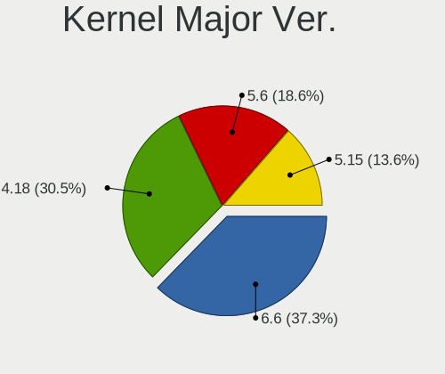
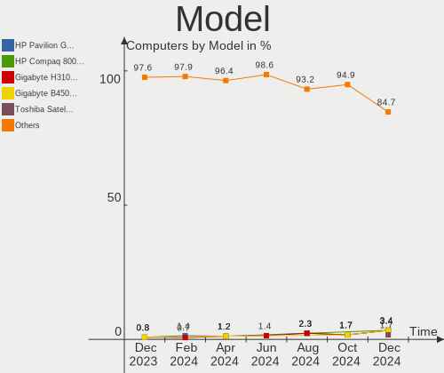
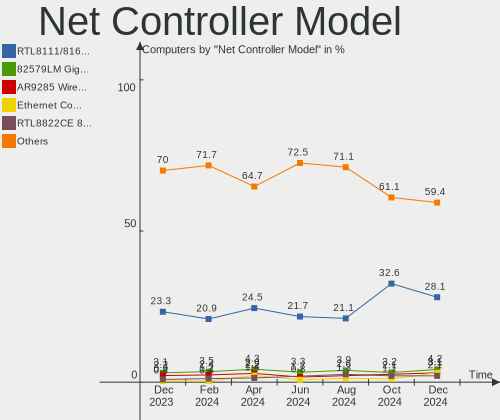

BlackPanther - Hardware Trends
------------------------------

A project to identify most popular hardware characteristics and track their change
over time based on data collected by Linux users at https://Linux-Hardware.org.

Anyone can contribute to this report by the [hw-probe](https://github.com/linuxhw/hw-probe) tool:

    sudo -E hw-probe -all -upload

This is a report for all computer types. See also reports for [desktops](/Dist/BlackPanther/Desktop/README.md) and [notebooks](/Dist/BlackPanther/Notebook/README.md).

This report is for one last month. Overall report since the beginning of time: [TestDays](https://github.com/linuxhw/TestDays)

Period: Mar, 2023.

Contents
--------

* [ System ](#system)
  - [ OS                       ](#os)
  - [ OS Family                ](#os-family)
  - [ Kernel                   ](#kernel)
  - [ Kernel Family            ](#kernel-family)
  - [ Kernel Major Ver.        ](#kernel-major-ver)
  - [ Arch                     ](#arch)
  - [ DE                       ](#de)
  - [ Display Server           ](#display-server)
  - [ Display Manager          ](#display-manager)
  - [ OS Lang                  ](#os-lang)
  - [ Boot Mode                ](#boot-mode)
  - [ Filesystem               ](#filesystem)
  - [ Part. scheme             ](#part-scheme)
  - [ Dual Boot with Linux/BSD ](#dual-boot-with-linuxbsd)
  - [ Dual Boot (Win)          ](#dual-boot-win)

* [ Board ](#board)
  - [ Vendor                   ](#vendor)
  - [ Model                    ](#model)
  - [ Model Family             ](#model-family)
  - [ MFG Year                 ](#mfg-year)
  - [ Form Factor              ](#form-factor)
  - [ Secure Boot              ](#secure-boot)
  - [ Coreboot                 ](#coreboot)
  - [ RAM Size                 ](#ram-size)
  - [ RAM Used                 ](#ram-used)
  - [ Total Drives             ](#total-drives)
  - [ Has CD-ROM               ](#has-cd-rom)
  - [ Has Ethernet             ](#has-ethernet)
  - [ Has WiFi                 ](#has-wifi)
  - [ Has Bluetooth            ](#has-bluetooth)

* [ Location ](#location)
  - [ Country                  ](#country)
  - [ City                     ](#city)

* [ Drives ](#drives)
  - [ Drive Vendor             ](#drive-vendor)
  - [ Drive Model              ](#drive-model)
  - [ HDD Vendor               ](#hdd-vendor)
  - [ SSD Vendor               ](#ssd-vendor)
  - [ Drive Kind               ](#drive-kind)
  - [ Drive Connector          ](#drive-connector)
  - [ Drive Size               ](#drive-size)
  - [ Space Total              ](#space-total)
  - [ Space Used               ](#space-used)
  - [ Malfunc. Drives          ](#malfunc-drives)
  - [ Malfunc. Drive Vendor    ](#malfunc-drive-vendor)
  - [ Malfunc. HDD Vendor      ](#malfunc-hdd-vendor)
  - [ Malfunc. Drive Kind      ](#malfunc-drive-kind)
  - [ Failed Drives            ](#failed-drives)
  - [ Failed Drive Vendor      ](#failed-drive-vendor)
  - [ Drive Status             ](#drive-status)

* [ Storage controller ](#storage-controller)
  - [ Storage Vendor           ](#storage-vendor)
  - [ Storage Model            ](#storage-model)
  - [ Storage Kind             ](#storage-kind)

* [ Processor ](#processor)
  - [ CPU Vendor               ](#cpu-vendor)
  - [ CPU Model                ](#cpu-model)
  - [ CPU Model Family         ](#cpu-model-family)
  - [ CPU Cores                ](#cpu-cores)
  - [ CPU Sockets              ](#cpu-sockets)
  - [ CPU Threads              ](#cpu-threads)
  - [ CPU Op-Modes             ](#cpu-op-modes)
  - [ CPU Microcode            ](#cpu-microcode)
  - [ CPU Microarch            ](#cpu-microarch)

* [ Graphics ](#graphics)
  - [ GPU Vendor               ](#gpu-vendor)
  - [ GPU Model                ](#gpu-model)
  - [ GPU Combo                ](#gpu-combo)
  - [ GPU Driver               ](#gpu-driver)
  - [ GPU Memory               ](#gpu-memory)

* [ Monitor ](#monitor)
  - [ Monitor Vendor           ](#monitor-vendor)
  - [ Monitor Model            ](#monitor-model)
  - [ Monitor Resolution       ](#monitor-resolution)
  - [ Monitor Diagonal         ](#monitor-diagonal)
  - [ Monitor Width            ](#monitor-width)
  - [ Aspect Ratio             ](#aspect-ratio)
  - [ Monitor Area             ](#monitor-area)
  - [ Pixel Density            ](#pixel-density)
  - [ Multiple Monitors        ](#multiple-monitors)

* [ Network ](#network)
  - [ Net Controller Vendor    ](#net-controller-vendor)
  - [ Net Controller Model     ](#net-controller-model)
  - [ Wireless Vendor          ](#wireless-vendor)
  - [ Wireless Model           ](#wireless-model)
  - [ Ethernet Vendor          ](#ethernet-vendor)
  - [ Ethernet Model           ](#ethernet-model)
  - [ Net Controller Kind      ](#net-controller-kind)
  - [ Used Controller          ](#used-controller)
  - [ NICs                     ](#nics)
  - [ IPv6                     ](#ipv6)

* [ Bluetooth ](#bluetooth)
  - [ Bluetooth Vendor         ](#bluetooth-vendor)
  - [ Bluetooth Model          ](#bluetooth-model)

* [ Sound ](#sound)
  - [ Sound Vendor             ](#sound-vendor)
  - [ Sound Model              ](#sound-model)

* [ Memory ](#memory)
  - [ Memory Vendor            ](#memory-vendor)
  - [ Memory Model             ](#memory-model)
  - [ Memory Kind              ](#memory-kind)
  - [ Memory Form Factor       ](#memory-form-factor)
  - [ Memory Size              ](#memory-size)
  - [ Memory Speed             ](#memory-speed)

* [ Printers & scanners ](#printers--scanners)
  - [ Printer Vendor           ](#printer-vendor)
  - [ Printer Model            ](#printer-model)
  - [ Scanner Vendor           ](#scanner-vendor)
  - [ Scanner Model            ](#scanner-model)

* [ Camera ](#camera)
  - [ Camera Vendor            ](#camera-vendor)
  - [ Camera Model             ](#camera-model)

* [ Security ](#security)
  - [ Fingerprint Vendor       ](#fingerprint-vendor)
  - [ Fingerprint Model        ](#fingerprint-model)
  - [ Chipcard Vendor          ](#chipcard-vendor)
  - [ Chipcard Model           ](#chipcard-model)

* [ Unsupported ](#unsupported)
  - [ Unsupported Devices      ](#unsupported-devices)
  - [ Unsupported Device Types ](#unsupported-device-types)

System
------

OS
--

Installed operating systems

| Name              | Computers | Percent |
|-------------------|-----------|---------|
| BlackPanther 18.1 | 41        | 95.35%  |
| BlackPanther 16.2 | 1         | 2.33%   |
| BlackPanther 16.1 | 1         | 2.33%   |

OS Family
---------

OS without a version

| Name         | Computers | Percent |
|--------------|-----------|---------|
| BlackPanther | 43        | 100%    |

Kernel
------

Version of the Linux kernel

| Version                | Computers | Percent |
|------------------------|-----------|---------|
| 5.6.14-desktop-2bP     | 25        | 58.14%  |
| 4.18.16-desktop-1bP    | 16        | 37.21%  |
| 4.9.20-desktop-pae-1bP | 1         | 2.33%   |
| 4.7.0-desktop-1bP      | 1         | 2.33%   |

Kernel Family
-------------

Linux kernel without a distro release

| Version | Computers | Percent |
|---------|-----------|---------|
| 5.6.14  | 25        | 58.14%  |
| 4.18.16 | 16        | 37.21%  |
| 4.9.20  | 1         | 2.33%   |
| 4.7.0   | 1         | 2.33%   |

Kernel Major Ver.
-----------------

Linux kernel major version

| Version | Computers | Percent |
|---------|-----------|---------|
| 5.6     | 25        | 58.14%  |
| 4.18    | 16        | 37.21%  |
| 4.9     | 1         | 2.33%   |
| 4.7     | 1         | 2.33%   |

Arch
----

OS architecture (x86_64, i586, etc.)

| Name   | Computers | Percent |
|--------|-----------|---------|
| x86_64 | 41        | 95.35%  |
| i686   | 2         | 4.65%   |

DE
--

Desktop Environment

| Name | Computers | Percent |
|------|-----------|---------|
| KDE5 | 43        | 100%    |

Display Server
--------------

X11 or Wayland

| Name | Computers | Percent |
|------|-----------|---------|
| X11  | 43        | 100%    |

Display Manager
---------------

SDDM, LightDM, etc.

| Name | Computers | Percent |
|------|-----------|---------|
| SDDM | 43        | 100%    |

OS Lang
-------

Language

| Lang    | Computers | Percent |
|---------|-----------|---------|
| Unknown | 43        | 100%    |

Boot Mode
---------

EFI or BIOS

| Mode | Computers | Percent |
|------|-----------|---------|
| BIOS | 24        | 55.81%  |
| EFI  | 19        | 44.19%  |

Filesystem
----------

Type of filesystem

| Type    | Computers | Percent |
|---------|-----------|---------|
| Overlay | 34        | 79.07%  |
| Ext4    | 9         | 20.93%  |

Part. scheme
------------

Scheme of partitioning

| Type | Computers | Percent |
|------|-----------|---------|
| GPT  | 25        | 58.14%  |
| MBR  | 18        | 41.86%  |

Dual Boot with Linux/BSD
------------------------

Hosting more than one Linux/BSD

| Dual boot | Computers | Percent |
|-----------|-----------|---------|
| Yes       | 27        | 62.79%  |
| No        | 16        | 37.21%  |

Dual Boot (Win)
---------------

Hosting Linux and Windows

| Dual boot | Computers | Percent |
|-----------|-----------|---------|
| Yes       | 23        | 53.49%  |
| No        | 20        | 46.51%  |

Board
-----

Vendor
------

Motherboard manufacturer

| Name                | Computers | Percent |
|---------------------|-----------|---------|
| Hewlett-Packard     | 9         | 20.93%  |
| Dell                | 6         | 13.95%  |
| ASUSTek Computer    | 6         | 13.95%  |
| Gigabyte Technology | 5         | 11.63%  |
| MSI                 | 4         | 9.3%    |
| Lenovo              | 4         | 9.3%    |
| Toshiba             | 3         | 6.98%   |
| THD                 | 1         | 2.33%   |
| Intel               | 1         | 2.33%   |
| Fujitsu             | 1         | 2.33%   |
| eMachines           | 1         | 2.33%   |
| ASRock              | 1         | 2.33%   |
| Alcor               | 1         | 2.33%   |

Model
-----

Motherboard model

| Name                                | Computers | Percent |
|-------------------------------------|-----------|---------|
| Toshiba Satellite L650              | 2         | 4.65%   |
| Toshiba Satellite C50-B             | 1         | 2.33%   |
| THD PX1                             | 1         | 2.33%   |
| MSI MS-7C91                         | 1         | 2.33%   |
| MSI MS-7721                         | 1         | 2.33%   |
| MSI MS-7592                         | 1         | 2.33%   |
| MSI CR500                           | 1         | 2.33%   |
| Lenovo Y50-70 20378                 | 1         | 2.33%   |
| Lenovo ThinkPad T420 4236W8L        | 1         | 2.33%   |
| Lenovo ThinkCentre M93p 10A7003AUK  | 1         | 2.33%   |
| Lenovo G570 20079                   | 1         | 2.33%   |
| Intel DN2820FYK H24582-203          | 1         | 2.33%   |
| HP ProBook 650 G2                   | 1         | 2.33%   |
| HP ProBook 6470b                    | 1         | 2.33%   |
| HP ProBook 640 G8 Notebook PC       | 1         | 2.33%   |
| HP Pavilion Gaming Laptop 15-ec1xxx | 1         | 2.33%   |
| HP Notebook                         | 1         | 2.33%   |
| HP Laptop 17-ak0xx                  | 1         | 2.33%   |
| HP EliteBook 2570p                  | 1         | 2.33%   |
| HP Compaq Pro 6300 SFF              | 1         | 2.33%   |
| HP 650                              | 1         | 2.33%   |
| Gigabyte Z390 UD                    | 1         | 2.33%   |
| Gigabyte H310M A 2.0                | 1         | 2.33%   |
| Gigabyte EG41MFT-US2H               | 1         | 2.33%   |
| Gigabyte B450M GAMING               | 1         | 2.33%   |
| Gigabyte AB350M-DS3H V2             | 1         | 2.33%   |
| Fujitsu LIFEBOOK AH530              | 1         | 2.33%   |
| eMachines E725                      | 1         | 2.33%   |
| Dell Vostro 400                     | 1         | 2.33%   |
| Dell Precision WorkStation T5500    | 1         | 2.33%   |
| Dell Precision Tower 5810           | 1         | 2.33%   |
| Dell OptiPlex 3050                  | 1         | 2.33%   |
| Dell Latitude 5480                  | 1         | 2.33%   |
| Dell Inspiron 5558                  | 1         | 2.33%   |
| ASUS X551CA                         | 1         | 2.33%   |
| ASUS X540SA                         | 1         | 2.33%   |
| ASUS V-P7H55E                       | 1         | 2.33%   |
| ASUS PRIME B365M-A                  | 1         | 2.33%   |
| ASUS P7H55D-M EVO                   | 1         | 2.33%   |
| ASUS All Series                     | 1         | 2.33%   |

Model Family
------------

Motherboard model prefix

| Name                  | Computers | Percent |
|-----------------------|-----------|---------|
| Toshiba Satellite     | 3         | 6.98%   |
| HP ProBook            | 3         | 6.98%   |
| Dell Precision        | 2         | 4.65%   |
| THD PX1               | 1         | 2.33%   |
| MSI MS-7C91           | 1         | 2.33%   |
| MSI MS-7721           | 1         | 2.33%   |
| MSI MS-7592           | 1         | 2.33%   |
| MSI CR500             | 1         | 2.33%   |
| Lenovo Y50-70         | 1         | 2.33%   |
| Lenovo ThinkPad       | 1         | 2.33%   |
| Lenovo ThinkCentre    | 1         | 2.33%   |
| Lenovo G570           | 1         | 2.33%   |
| Intel DN2820FYK       | 1         | 2.33%   |
| HP Pavilion           | 1         | 2.33%   |
| HP Notebook           | 1         | 2.33%   |
| HP Laptop             | 1         | 2.33%   |
| HP EliteBook          | 1         | 2.33%   |
| HP Compaq             | 1         | 2.33%   |
| HP 650                | 1         | 2.33%   |
| Gigabyte Z390         | 1         | 2.33%   |
| Gigabyte H310M        | 1         | 2.33%   |
| Gigabyte EG41MFT-US2H | 1         | 2.33%   |
| Gigabyte B450M        | 1         | 2.33%   |
| Gigabyte AB350M-DS3H  | 1         | 2.33%   |
| Fujitsu LIFEBOOK      | 1         | 2.33%   |
| eMachines E725        | 1         | 2.33%   |
| Dell Vostro           | 1         | 2.33%   |
| Dell OptiPlex         | 1         | 2.33%   |
| Dell Latitude         | 1         | 2.33%   |
| Dell Inspiron         | 1         | 2.33%   |
| ASUS X551CA           | 1         | 2.33%   |
| ASUS X540SA           | 1         | 2.33%   |
| ASUS V-P7H55E         | 1         | 2.33%   |
| ASUS PRIME            | 1         | 2.33%   |
| ASUS P7H55D-M         | 1         | 2.33%   |
| ASUS All              | 1         | 2.33%   |
| ASRock H81M-VG4       | 1         | 2.33%   |
| Alcor SnugBook        | 1         | 2.33%   |

MFG Year
--------

Motherboard manufacture year

| Year | Computers | Percent |
|------|-----------|---------|
| 2014 | 6         | 13.95%  |
| 2010 | 6         | 13.95%  |
| 2018 | 5         | 11.63%  |
| 2012 | 4         | 9.3%    |
| 2009 | 4         | 9.3%    |
| 2017 | 3         | 6.98%   |
| 2013 | 3         | 6.98%   |
| 2011 | 3         | 6.98%   |
| 2020 | 2         | 4.65%   |
| 2019 | 2         | 4.65%   |
| 2015 | 2         | 4.65%   |
| 2021 | 1         | 2.33%   |
| 2016 | 1         | 2.33%   |
| 2007 | 1         | 2.33%   |

Form Factor
-----------

Physical design of the computer

| Name     | Computers | Percent |
|----------|-----------|---------|
| Notebook | 23        | 53.49%  |
| Desktop  | 20        | 46.51%  |

Secure Boot
-----------

Enabled or disabled

| State    | Computers | Percent |
|----------|-----------|---------|
| Disabled | 43        | 100%    |

Coreboot
--------

Have coreboot on board

| Used | Computers | Percent |
|------|-----------|---------|
| No   | 43        | 100%    |

RAM Size
--------

Total RAM memory

| Size in GB | Computers | Percent |
|------------|-----------|---------|
| 3.01-4.0   | 13        | 30.23%  |
| 8.01-16.0  | 10        | 23.26%  |
| 4.01-8.0   | 7         | 16.28%  |
| 1.01-2.0   | 7         | 16.28%  |
| 32.01-64.0 | 4         | 9.3%    |
| 16.01-24.0 | 2         | 4.65%   |

RAM Used
--------

Used RAM memory

| Used GB  | Computers | Percent |
|----------|-----------|---------|
| 0.51-1.0 | 22        | 51.16%  |
| 1.01-2.0 | 12        | 27.91%  |
| 0.01-0.5 | 9         | 20.93%  |

Total Drives
------------

Number of drives on board

| Drives | Computers | Percent |
|--------|-----------|---------|
| 1      | 31        | 72.09%  |
| 2      | 8         | 18.6%   |
| 4      | 3         | 6.98%   |
| 3      | 1         | 2.33%   |

Has CD-ROM
----------

Has CD-ROM on board

| Presented | Computers | Percent |
|-----------|-----------|---------|
| Yes       | 30        | 69.77%  |
| No        | 13        | 30.23%  |

Has Ethernet
------------

Has Ethernet on board

| Presented | Computers | Percent |
|-----------|-----------|---------|
| Yes       | 42        | 97.67%  |
| No        | 1         | 2.33%   |

Has WiFi
--------

Has WiFi module

| Presented | Computers | Percent |
|-----------|-----------|---------|
| Yes       | 29        | 67.44%  |
| No        | 14        | 32.56%  |

Has Bluetooth
-------------

Has Bluetooth module

| Presented | Computers | Percent |
|-----------|-----------|---------|
| Yes       | 23        | 53.49%  |
| No        | 20        | 46.51%  |

Location
--------

Country
-------

Geographic location (country)

| Country  | Computers | Percent |
|----------|-----------|---------|
| Hungary  | 32        | 74.42%  |
| Slovakia | 4         | 9.3%    |
| Germany  | 3         | 6.98%   |
| UK       | 1         | 2.33%   |
| Poland   | 1         | 2.33%   |
| France   | 1         | 2.33%   |
| Canada   | 1         | 2.33%   |

City
----

Geographic location (city)

| City                    | Computers | Percent |
|-------------------------|-----------|---------|
| Budapest                | 11        | 25.58%  |
| Tatabánya              | 2         | 4.65%   |
| Szekszárd              | 2         | 4.65%   |
| Szajol                  | 2         | 4.65%   |
| Morahalom               | 2         | 4.65%   |
| Hajduboszormeny         | 2         | 4.65%   |
| Banská Bystrica        | 2         | 4.65%   |
| Zalaegerszeg            | 1         | 2.33%   |
| Warsaw                  | 1         | 2.33%   |
| Ubstadt-Weiher          | 1         | 2.33%   |
| Tornaľa                | 1         | 2.33%   |
| Szombathely             | 1         | 2.33%   |
| Szolnok                 | 1         | 2.33%   |
| Pfaffenhofen an der Ilm | 1         | 2.33%   |
| Oroshaza                | 1         | 2.33%   |
| Nancy                   | 1         | 2.33%   |
| Kiskunhalas             | 1         | 2.33%   |
| Kecskemét              | 1         | 2.33%   |
| Janoshaza               | 1         | 2.33%   |
| Hodmezovasarhely        | 1         | 2.33%   |
| Harlow                  | 1         | 2.33%   |
| Frankfurt am Main       | 1         | 2.33%   |
| Fertoszentmiklos        | 1         | 2.33%   |
| Debrecen                | 1         | 2.33%   |
| Bratislava              | 1         | 2.33%   |
| Bikal                   | 1         | 2.33%   |
| Barrie                  | 1         | 2.33%   |

Drives
------

Drive Vendor
------------

Hard drive vendors

| Vendor              | Computers | Drives | Percent |
|---------------------|-----------|--------|---------|
| Samsung Electronics | 10        | 11     | 16.13%  |
| WDC                 | 9         | 9      | 14.52%  |
| Kingston            | 8         | 8      | 12.9%   |
| Toshiba             | 5         | 5      | 8.06%   |
| Seagate             | 5         | 6      | 8.06%   |
| Intenso             | 4         | 4      | 6.45%   |
| Hitachi             | 4         | 4      | 6.45%   |
| HGST                | 3         | 4      | 4.84%   |
| Crucial             | 3         | 3      | 4.84%   |
| Zheino              | 1         | 1      | 1.61%   |
| Unknown             | 1         | 1      | 1.61%   |
| Timetec             | 1         | 1      | 1.61%   |
| SSSTC               | 1         | 1      | 1.61%   |
| SanDisk             | 1         | 1      | 1.61%   |
| QUANTUM             | 1         | 1      | 1.61%   |
| Micron Technology   | 1         | 1      | 1.61%   |
| Kingmax             | 1         | 1      | 1.61%   |
| Intel               | 1         | 1      | 1.61%   |
| CSD                 | 1         | 1      | 1.61%   |
| Unknown             | 1         | 1      | 1.61%   |

Drive Model
-----------

Hard drive models

| Model                                   | Computers | Percent |
|-----------------------------------------|-----------|---------|
| Seagate ST500LT012-1DG142 500GB         | 2         | 3.13%   |
| Kingston SA400S37240G 240GB SSD         | 2         | 3.13%   |
| Kingston SA2000M8250G 250GB             | 2         | 3.13%   |
| Intenso SSD 120GB                       | 2         | 3.13%   |
| Hitachi HTS547550A9E384 500GB           | 2         | 3.13%   |
| Zheino CHN-NGFFNV2280-256 256GB         | 1         | 1.56%   |
| WDC WDS240G2G0B-00EPW0 240GB SSD        | 1         | 1.56%   |
| WDC WD5000BEVT-16A0RT0 500GB            | 1         | 1.56%   |
| WDC WD5000AAKS-007AA0 500GB             | 1         | 1.56%   |
| WDC WD5000AADS-00S9B0 500GB             | 1         | 1.56%   |
| WDC WD3200AAKX-00ERMA0 320GB            | 1         | 1.56%   |
| WDC WD3200AAJS-55B4A0 320GB             | 1         | 1.56%   |
| WDC WD20EZRZ-00Z5HB0 2TB                | 1         | 1.56%   |
| WDC WD20EZBX-00AYRA0 2TB                | 1         | 1.56%   |
| WDC WD10JPVX-22JC3T0 1TB                | 1         | 1.56%   |
| Unknown SL16G  16GB                     | 1         | 1.56%   |
| Toshiba MQ01ABF050 500GB                | 1         | 1.56%   |
| Toshiba MQ01ABD100 1TB                  | 1         | 1.56%   |
| Toshiba MK2565GSX 250GB                 | 1         | 1.56%   |
| Toshiba KSG60ZMV256G M.2 2280 256GB SSD | 1         | 1.56%   |
| Toshiba DT01ACA100 1TB                  | 1         | 1.56%   |
| Timetec SD08 512GB SSD                  | 1         | 1.56%   |
| SSSTC CL1-8D256-HP 256GB                | 1         | 1.56%   |
| Seagate ST500DM002-1BD142 500GB         | 1         | 1.56%   |
| Seagate ST3500514NS 500GB               | 1         | 1.56%   |
| Seagate ST310212A 10GB                  | 1         | 1.56%   |
| Seagate ST1000LM035-1RK172 1TB          | 1         | 1.56%   |
| SanDisk SDSSDH3512G 512GB               | 1         | 1.56%   |
| Samsung SSD 970 EVO Plus 500GB          | 1         | 1.56%   |
| Samsung SSD 960 EVO 500GB               | 1         | 1.56%   |
| Samsung SSD 870 EVO 500GB               | 1         | 1.56%   |
| Samsung SSD 860 EVO 500GB               | 1         | 1.56%   |
| Samsung SSD 850 EVO 120GB               | 1         | 1.56%   |
| Samsung SSD 750 EVO 250GB               | 1         | 1.56%   |
| Samsung MZ7TD128HAFV-000L1 128GB SSD    | 1         | 1.56%   |
| Samsung MZ7LN256HMJP-000H1 256GB SSD    | 1         | 1.56%   |
| Samsung HD502HJ 500GB                   | 1         | 1.56%   |
| Samsung HD322HJ 320GB                   | 1         | 1.56%   |
| Samsung HD321KJ 320GB                   | 1         | 1.56%   |
| QUANTUM FIREBALLlct20 20 20GB           | 1         | 1.56%   |

HDD Vendor
----------

Hard disk drive vendors

| Vendor              | Computers | Drives | Percent |
|---------------------|-----------|--------|---------|
| WDC                 | 8         | 8      | 27.59%  |
| Seagate             | 5         | 6      | 17.24%  |
| Toshiba             | 4         | 4      | 13.79%  |
| Hitachi             | 4         | 4      | 13.79%  |
| Samsung Electronics | 3         | 3      | 10.34%  |
| HGST                | 3         | 4      | 10.34%  |
| QUANTUM             | 1         | 1      | 3.45%   |
| CSD                 | 1         | 1      | 3.45%   |

SSD Vendor
----------

Solid state drive vendors

| Vendor              | Computers | Drives | Percent |
|---------------------|-----------|--------|---------|
| Samsung Electronics | 6         | 6      | 24%     |
| Kingston            | 6         | 6      | 24%     |
| Intenso             | 4         | 4      | 16%     |
| Crucial             | 3         | 3      | 12%     |
| WDC                 | 1         | 1      | 4%      |
| Toshiba             | 1         | 1      | 4%      |
| Timetec             | 1         | 1      | 4%      |
| SanDisk             | 1         | 1      | 4%      |
| Micron Technology   | 1         | 1      | 4%      |
| Kingmax             | 1         | 1      | 4%      |

Drive Kind
----------

HDD or SSD

| Kind | Computers | Drives | Percent |
|------|-----------|--------|---------|
| HDD  | 26        | 31     | 44.83%  |
| SSD  | 23        | 25     | 39.66%  |
| NVMe | 7         | 7      | 12.07%  |
| MMC  | 2         | 2      | 3.45%   |

Drive Connector
---------------

SATA, SAS, NVMe, etc.

| Type | Computers | Drives | Percent |
|------|-----------|--------|---------|
| SATA | 41        | 55     | 80.39%  |
| NVMe | 7         | 7      | 13.73%  |
| MMC  | 2         | 2      | 3.92%   |
| SAS  | 1         | 1      | 1.96%   |

Drive Size
----------

Size of hard drive

| Size in TB | Computers | Drives | Percent |
|------------|-----------|--------|---------|
| 0.01-0.5   | 35        | 42     | 74.47%  |
| 0.51-1.0   | 8         | 9      | 17.02%  |
| 1.01-2.0   | 3         | 3      | 6.38%   |
| 3.01-4.0   | 1         | 2      | 2.13%   |

Space Total
-----------

Amount of disk space available on the file system

| Size in GB | Computers | Percent |
|------------|-----------|---------|
| Unknown    | 35        | 81.4%   |
| 101-250    | 4         | 9.3%    |
| 251-500    | 3         | 6.98%   |
| 21-50      | 1         | 2.33%   |

Space Used
----------

Amount of used disk space

| Used GB | Computers | Percent |
|---------|-----------|---------|
| Unknown | 35        | 81.4%   |
| 1-20    | 8         | 18.6%   |

Malfunc. Drives
---------------

Drive models with a malfunction

| Model                                            | Computers | Drives | Percent |
|--------------------------------------------------|-----------|--------|---------|
| WDC WD5000AAKS-007AA0 500GB                      | 1         | 1      | 7.69%   |
| WDC WD3200AAJS-55B4A0 320GB                      | 1         | 1      | 7.69%   |
| Toshiba MQ01ABF050 500GB                         | 1         | 1      | 7.69%   |
| Toshiba MK2565GSX 250GB                          | 1         | 1      | 7.69%   |
| Toshiba KSG60ZMV256G M.2 2280 256GB SSD          | 1         | 1      | 7.69%   |
| Seagate ST500DM002-1BD142 500GB                  | 1         | 1      | 7.69%   |
| Seagate ST3500514NS 500GB                        | 1         | 1      | 7.69%   |
| Seagate ST310212A 10GB                           | 1         | 1      | 7.69%   |
| Samsung Electronics SSD 750 EVO 250GB            | 1         | 1      | 7.69%   |
| Samsung Electronics MZ7LN256HMJP-000H1 256GB SSD | 1         | 1      | 7.69%   |
| QUANTUM FIREBALLlct20 20 20GB                    | 1         | 1      | 7.69%   |
| Hitachi HTS547550A9E384 500GB                    | 1         | 1      | 7.69%   |
| CSD T52SX250 250GB                               | 1         | 1      | 7.69%   |

Malfunc. Drive Vendor
---------------------

Vendors of faulty drives

| Vendor              | Computers | Drives | Percent |
|---------------------|-----------|--------|---------|
| Toshiba             | 3         | 3      | 25%     |
| WDC                 | 2         | 2      | 16.67%  |
| Seagate             | 2         | 3      | 16.67%  |
| Samsung Electronics | 2         | 2      | 16.67%  |
| QUANTUM             | 1         | 1      | 8.33%   |
| Hitachi             | 1         | 1      | 8.33%   |
| CSD                 | 1         | 1      | 8.33%   |

Malfunc. HDD Vendor
-------------------

Vendors of faulty HDD drives

| Vendor  | Computers | Drives | Percent |
|---------|-----------|--------|---------|
| WDC     | 2         | 2      | 22.22%  |
| Toshiba | 2         | 2      | 22.22%  |
| Seagate | 2         | 3      | 22.22%  |
| QUANTUM | 1         | 1      | 11.11%  |
| Hitachi | 1         | 1      | 11.11%  |
| CSD     | 1         | 1      | 11.11%  |

Malfunc. Drive Kind
-------------------

Kinds of faulty drives

| Kind | Computers | Drives | Percent |
|------|-----------|--------|---------|
| HDD  | 7         | 10     | 70%     |
| SSD  | 3         | 3      | 30%     |

Failed Drives
-------------

Failed drive models

Zero info for selected period =(

Failed Drive Vendor
-------------------

Failed drive vendors

Zero info for selected period =(

Drive Status
------------

Number of failed and malfunc. drives

| Status   | Computers | Drives | Percent |
|----------|-----------|--------|---------|
| Works    | 34        | 49     | 72.34%  |
| Malfunc  | 10        | 13     | 21.28%  |
| Detected | 3         | 3      | 6.38%   |

Storage controller
------------------

Storage Vendor
--------------

Storage controller vendors

| Vendor                         | Computers | Percent |
|--------------------------------|-----------|---------|
| Intel                          | 34        | 68%     |
| AMD                            | 8         | 16%     |
| Samsung Electronics            | 2         | 4%      |
| Kingston Technology Company    | 2         | 4%      |
| Solid State Storage Technology | 1         | 2%      |
| Silicon Motion                 | 1         | 2%      |
| Nvidia                         | 1         | 2%      |
| Marvell Technology Group       | 1         | 2%      |

Storage Model
-------------

Storage controller models

| Model                                                                            | Computers | Percent |
|----------------------------------------------------------------------------------|-----------|---------|
| AMD FCH SATA Controller [AHCI mode]                                              | 6         | 10.71%  |
| Intel 7 Series Chipset Family 6-port SATA Controller [AHCI mode]                 | 4         | 7.14%   |
| Intel NM10/ICH7 Family SATA Controller [IDE mode]                                | 3         | 5.36%   |
| Intel 8 Series/C220 Series Chipset Family 6-port SATA Controller 1 [AHCI mode]   | 3         | 5.36%   |
| Intel 5 Series/3400 Series Chipset 4 port SATA AHCI Controller                   | 3         | 5.36%   |
| Kingston Company A2000 NVMe SSD                                                  | 2         | 3.57%   |
| Intel SATA Controller [RAID mode]                                                | 2         | 3.57%   |
| Intel Atom Processor E3800 Series SATA AHCI Controller                           | 2         | 3.57%   |
| Intel 6 Series/C200 Series Chipset Family 6 port Mobile SATA AHCI Controller     | 2         | 3.57%   |
| Intel 200 Series PCH SATA controller [AHCI mode]                                 | 2         | 3.57%   |
| Solid State Storage Non-Volatile memory controller                               | 1         | 1.79%   |
| Silicon Motion SM2263EN/SM2263XT SSD Controller                                  | 1         | 1.79%   |
| Samsung NVMe SSD Controller SM981/PM981/PM983                                    | 1         | 1.79%   |
| Samsung NVMe SSD Controller SM961/PM961/SM963                                    | 1         | 1.79%   |
| Nvidia MCP79 AHCI Controller                                                     | 1         | 1.79%   |
| Marvell Group 88SE6111/6121 SATA II / PATA Controller                            | 1         | 1.79%   |
| Intel Wildcat Point-LP SATA Controller [AHCI Mode]                               | 1         | 1.79%   |
| Intel Volume Management Device NVMe RAID Controller                              | 1         | 1.79%   |
| Intel SSD 660P Series                                                            | 1         | 1.79%   |
| Intel HM170/QM170 Chipset SATA Controller [AHCI Mode]                            | 1         | 1.79%   |
| Intel Cannon Lake PCH SATA AHCI Controller                                       | 1         | 1.79%   |
| Intel C610/X99 series chipset sSATA Controller [AHCI mode]                       | 1         | 1.79%   |
| Intel C600/X79 series chipset SATA RAID Controller                               | 1         | 1.79%   |
| Intel Atom/Celeron/Pentium Processor x5-E8000/J3xxx/N3xxx Series SATA Controller | 1         | 1.79%   |
| Intel 82801IR/IO/IH (ICH9R/DO/DH) 4 port SATA Controller [IDE mode]              | 1         | 1.79%   |
| Intel 82801IBM/IEM (ICH9M/ICH9M-E) 4 port SATA Controller [AHCI mode]            | 1         | 1.79%   |
| Intel 82801I (ICH9 Family) 2 port SATA Controller [IDE mode]                     | 1         | 1.79%   |
| Intel 82801G (ICH7 Family) IDE Controller                                        | 1         | 1.79%   |
| Intel 82801 Mobile SATA Controller [RAID mode]                                   | 1         | 1.79%   |
| Intel 7 Series/C210 Series Chipset Family 6-port SATA Controller [AHCI mode]     | 1         | 1.79%   |
| Intel 5 Series/3400 Series Chipset 6 port SATA AHCI Controller                   | 1         | 1.79%   |
| Intel 5 Series/3400 Series Chipset 4 port SATA IDE Controller                    | 1         | 1.79%   |
| Intel 5 Series/3400 Series Chipset 2 port SATA IDE Controller                    | 1         | 1.79%   |
| AMD FCH IDE Controller                                                           | 1         | 1.79%   |
| AMD 500 Series Chipset SATA Controller                                           | 1         | 1.79%   |
| AMD 400 Series Chipset SATA Controller                                           | 1         | 1.79%   |
| AMD 300 Series Chipset SATA Controller                                           | 1         | 1.79%   |

Storage Kind
------------

Kind of storage controller (IDE, SATA, NVMe, SAS, ...)

| Kind | Computers | Percent |
|------|-----------|---------|
| SATA | 33        | 63.46%  |
| NVMe | 7         | 13.46%  |
| IDE  | 7         | 13.46%  |
| RAID | 5         | 9.62%   |

Processor
---------

CPU Vendor
----------

Processor vendors

| Vendor | Computers | Percent |
|--------|-----------|---------|
| Intel  | 35        | 81.4%   |
| AMD    | 8         | 18.6%   |

CPU Model
---------

Processor models

| Model                                        | Computers | Percent |
|----------------------------------------------|-----------|---------|
| Intel Core i3 CPU M 330 @ 2.13GHz            | 2         | 4.65%   |
| Intel Core i3 CPU 530 @ 2.93GHz              | 2         | 4.65%   |
| AMD Ryzen 5 3400G with Radeon Vega Graphics  | 2         | 4.65%   |
| Intel Xeon CPU E5530 @ 2.40GHz               | 1         | 2.33%   |
| Intel Xeon CPU E5-1620 v3 @ 3.50GHz          | 1         | 2.33%   |
| Intel Pentium Dual-Core CPU T4400 @ 2.20GHz  | 1         | 2.33%   |
| Intel Pentium CPU P6200 @ 2.13GHz            | 1         | 2.33%   |
| Intel Pentium CPU N3700 @ 1.60GHz            | 1         | 2.33%   |
| Intel Core i7-6820HQ CPU @ 2.70GHz           | 1         | 2.33%   |
| Intel Core i7-6600U CPU @ 2.60GHz            | 1         | 2.33%   |
| Intel Core i7-4790 CPU @ 3.60GHz             | 1         | 2.33%   |
| Intel Core i7-4710HQ CPU @ 2.50GHz           | 1         | 2.33%   |
| Intel Core i7-2630QM CPU @ 2.00GHz           | 1         | 2.33%   |
| Intel Core i5-9400 CPU @ 2.90GHz             | 1         | 2.33%   |
| Intel Core i5-7500 CPU @ 3.40GHz             | 1         | 2.33%   |
| Intel Core i5-5200U CPU @ 2.20GHz            | 1         | 2.33%   |
| Intel Core i5-3340M CPU @ 2.70GHz            | 1         | 2.33%   |
| Intel Core i5-2540M CPU @ 2.60GHz            | 1         | 2.33%   |
| Intel Core i3-9100F CPU @ 3.60GHz            | 1         | 2.33%   |
| Intel Core i3-8100 CPU @ 3.60GHz             | 1         | 2.33%   |
| Intel Core i3-4160 CPU @ 3.60GHz             | 1         | 2.33%   |
| Intel Core i3-3225 CPU @ 3.30GHz             | 1         | 2.33%   |
| Intel Core i3-3217U CPU @ 1.80GHz            | 1         | 2.33%   |
| Intel Core i3-3120M CPU @ 2.50GHz            | 1         | 2.33%   |
| Intel Core 2 Duo CPU E8400 @ 3.00GHz         | 1         | 2.33%   |
| Intel Core 2 Duo CPU E6850 @ 3.00GHz         | 1         | 2.33%   |
| Intel Core 2 Duo CPU E6550 @ 2.33GHz         | 1         | 2.33%   |
| Intel Celeron Dual-Core CPU T3100 @ 1.90GHz  | 1         | 2.33%   |
| Intel Celeron CPU N2840 @ 2.16GHz            | 1         | 2.33%   |
| Intel Celeron CPU N2830 @ 2.16GHz            | 1         | 2.33%   |
| Intel Celeron CPU B830 @ 1.80GHz             | 1         | 2.33%   |
| Intel Atom x5-Z8350 CPU @ 1.44GHz            | 1         | 2.33%   |
| Intel Atom CPU N455 @ 1.66GHz                | 1         | 2.33%   |
| Intel 11th Gen Core i3-1115G4 @ 3.00GHz      | 1         | 2.33%   |
| AMD Sempron 3850 APU with Radeon R3          | 1         | 2.33%   |
| AMD Ryzen 7 5800X 8-Core Processor           | 1         | 2.33%   |
| AMD Ryzen 5 4600H with Radeon Graphics       | 1         | 2.33%   |
| AMD A9-9420 RADEON R5, 5 COMPUTE CORES 2C+3G | 1         | 2.33%   |
| AMD A8-7050 Radeon R5, 6 Compute Cores 2C+4G | 1         | 2.33%   |
| AMD A4-6300 APU with Radeon HD Graphics      | 1         | 2.33%   |

CPU Model Family
----------------

Processor model prefix

| Model                   | Computers | Percent |
|-------------------------|-----------|---------|
| Intel Core i3           | 10        | 23.26%  |
| Intel Core i7           | 5         | 11.63%  |
| Intel Core i5           | 5         | 11.63%  |
| Intel Core 2 Duo        | 3         | 6.98%   |
| Intel Celeron           | 3         | 6.98%   |
| AMD Ryzen 5             | 3         | 6.98%   |
| Other                   | 2         | 4.65%   |
| Intel Xeon              | 2         | 4.65%   |
| Intel Pentium           | 2         | 4.65%   |
| Intel Atom              | 2         | 4.65%   |
| Intel Pentium Dual-Core | 1         | 2.33%   |
| Intel Celeron Dual-Core | 1         | 2.33%   |
| AMD Sempron             | 1         | 2.33%   |
| AMD Ryzen 7             | 1         | 2.33%   |
| AMD A8                  | 1         | 2.33%   |
| AMD A4                  | 1         | 2.33%   |

CPU Cores
---------

Number of processor cores

| Number | Computers | Percent |
|--------|-----------|---------|
| 2      | 22        | 51.16%  |
| 4      | 14        | 32.56%  |
| 1      | 4         | 9.3%    |
| 6      | 2         | 4.65%   |
| 8      | 1         | 2.33%   |

CPU Sockets
-----------

Number of sockets

| Number | Computers | Percent |
|--------|-----------|---------|
| 1      | 43        | 100%    |

CPU Threads
-----------

Threads per core (Hyper-Threading)

| Number | Computers | Percent |
|--------|-----------|---------|
| 2      | 22        | 51.16%  |
| 1      | 21        | 48.84%  |

CPU Op-Modes
------------

CPU Operation Modes (32-bit, 64-bit)

| Op mode        | Computers | Percent |
|----------------|-----------|---------|
| 32-bit, 64-bit | 43        | 100%    |

CPU Microcode
-------------

Microcode number

| Number     | Computers | Percent |
|------------|-----------|---------|
| 0x306a9    | 4         | 9.3%    |
| 0x20652    | 4         | 9.3%    |
| 0x306c3    | 3         | 6.98%   |
| 0x206a7    | 3         | 6.98%   |
| 0x1067a    | 3         | 6.98%   |
| 0x906eb    | 2         | 4.65%   |
| 0x6fb      | 2         | 4.65%   |
| 0x30678    | 2         | 4.65%   |
| 0x08108109 | 2         | 4.65%   |
| 0x906ea    | 1         | 2.33%   |
| 0x906e9    | 1         | 2.33%   |
| 0x806c1    | 1         | 2.33%   |
| 0x506e3    | 1         | 2.33%   |
| 0x406e3    | 1         | 2.33%   |
| 0x406c4    | 1         | 2.33%   |
| 0x406c3    | 1         | 2.33%   |
| 0x306f2    | 1         | 2.33%   |
| 0x306d4    | 1         | 2.33%   |
| 0x20655    | 1         | 2.33%   |
| 0x106ca    | 1         | 2.33%   |
| 0x106a5    | 1         | 2.33%   |
| 0x0a20120a | 1         | 2.33%   |
| 0x08600106 | 1         | 2.33%   |
| 0x0700010f | 1         | 2.33%   |
| 0x06006705 | 1         | 2.33%   |
| 0x06003109 | 1         | 2.33%   |
| 0x06001119 | 1         | 2.33%   |

CPU Microarch
-------------

Microarchitecture

| Name        | Computers | Percent |
|-------------|-----------|---------|
| Westmere    | 5         | 11.63%  |
| Silvermont  | 4         | 9.3%    |
| KabyLake    | 4         | 9.3%    |
| IvyBridge   | 4         | 9.3%    |
| Haswell     | 4         | 9.3%    |
| SandyBridge | 3         | 6.98%   |
| Penryn      | 3         | 6.98%   |
| Zen+        | 2         | 4.65%   |
| Skylake     | 2         | 4.65%   |
| Core        | 2         | 4.65%   |
| Zen 3       | 1         | 2.33%   |
| Zen 2       | 1         | 2.33%   |
| TigerLake   | 1         | 2.33%   |
| Steamroller | 1         | 2.33%   |
| Piledriver  | 1         | 2.33%   |
| Nehalem     | 1         | 2.33%   |
| Jaguar      | 1         | 2.33%   |
| Excavator   | 1         | 2.33%   |
| Broadwell   | 1         | 2.33%   |
| Bonnell     | 1         | 2.33%   |

Graphics
--------

GPU Vendor
----------

Vendors of graphics cards

| Vendor | Computers | Percent |
|--------|-----------|---------|
| Intel  | 29        | 60.42%  |
| AMD    | 10        | 20.83%  |
| Nvidia | 9         | 18.75%  |

GPU Model
---------

Graphics card models

| Model                                                                                    | Computers | Percent |
|------------------------------------------------------------------------------------------|-----------|---------|
| Intel Core Processor Integrated Graphics Controller                                      | 5         | 10.2%   |
| Intel 3rd Gen Core processor Graphics Controller                                         | 3         | 6.12%   |
| Intel 2nd Generation Core Processor Family Integrated Graphics Controller                | 3         | 6.12%   |
| Intel Atom/Celeron/Pentium Processor x5-E8000/J3xxx/N3xxx Integrated Graphics Controller | 2         | 4.08%   |
| Intel Atom Processor Z36xxx/Z37xxx Series Graphics & Display                             | 2         | 4.08%   |
| Intel 4 Series Chipset Integrated Graphics Controller                                    | 2         | 4.08%   |
| Nvidia TU117M [GeForce GTX 1650 Ti Mobile]                                               | 1         | 2.04%   |
| Nvidia MCP79 [GeForce 8200M G]                                                           | 1         | 2.04%   |
| Nvidia GP106 [GeForce GTX 1060 6GB]                                                      | 1         | 2.04%   |
| Nvidia GM108M [GeForce 930MX]                                                            | 1         | 2.04%   |
| Nvidia GM107M [GeForce GTX 860M]                                                         | 1         | 2.04%   |
| Nvidia GM107 [GeForce GTX 750 Ti]                                                        | 1         | 2.04%   |
| Nvidia GK208BM [GeForce 920M]                                                            | 1         | 2.04%   |
| Nvidia GA106 [Geforce RTX 3050]                                                          | 1         | 2.04%   |
| Nvidia GA104 [GeForce RTX 3060 Ti Lite Hash Rate]                                        | 1         | 2.04%   |
| Nvidia G96CGL [Quadro FX 580]                                                            | 1         | 2.04%   |
| Intel Xeon E3-1200 v3/4th Gen Core Processor Integrated Graphics Controller              | 1         | 2.04%   |
| Intel Tiger Lake-LP GT2 [UHD Graphics G4]                                                | 1         | 2.04%   |
| Intel Skylake GT2 [HD Graphics 520]                                                      | 1         | 2.04%   |
| Intel Mobile 4 Series Chipset Integrated Graphics Controller                             | 1         | 2.04%   |
| Intel IvyBridge GT2 [HD Graphics 4000]                                                   | 1         | 2.04%   |
| Intel HD Graphics 630                                                                    | 1         | 2.04%   |
| Intel HD Graphics 5500                                                                   | 1         | 2.04%   |
| Intel HD Graphics 530                                                                    | 1         | 2.04%   |
| Intel CoffeeLake-S GT2 [UHD Graphics 630]                                                | 1         | 2.04%   |
| Intel Atom Processor D4xx/D5xx/N4xx/N5xx Integrated Graphics Controller                  | 1         | 2.04%   |
| Intel 82G33/G31 Express Integrated Graphics Controller                                   | 1         | 2.04%   |
| Intel 4th Gen Core Processor Integrated Graphics Controller                              | 1         | 2.04%   |
| AMD Stoney [Radeon R2/R3/R4/R5 Graphics]                                                 | 1         | 2.04%   |
| AMD Renoir                                                                               | 1         | 2.04%   |
| AMD Redwood XT [Radeon HD 5670/5690/5730]                                                | 1         | 2.04%   |
| AMD Picasso/Raven 2 [Radeon Vega Series / Radeon Vega Mobile Series]                     | 1         | 2.04%   |
| AMD Oland PRO [Radeon R7 240/340 / Radeon 520]                                           | 1         | 2.04%   |
| AMD Lexa PRO [Radeon 540/540X/550/550X / RX 540X/550/550X]                               | 1         | 2.04%   |
| AMD Kaveri [Radeon R5 Graphics]                                                          | 1         | 2.04%   |
| AMD Kabini [Radeon HD 8280 / R3 Series]                                                  | 1         | 2.04%   |
| AMD Cedar [Radeon HD 5000/6000/7350/8350 Series]                                         | 1         | 2.04%   |
| AMD Baffin [Radeon RX 550 640SP / RX 560/560X]                                           | 1         | 2.04%   |

GPU Combo
---------

Combinations of graphics cards

| Name           | Computers | Percent |
|----------------|-----------|---------|
| 1 x Intel      | 25        | 58.14%  |
| 1 x AMD        | 9         | 20.93%  |
| 1 x Nvidia     | 4         | 9.3%    |
| Intel + Nvidia | 3         | 6.98%   |
| 2 x Nvidia     | 1         | 2.33%   |
| AMD + Nvidia   | 1         | 2.33%   |

GPU Driver
----------

Free vs proprietary

| Driver  | Computers | Percent |
|---------|-----------|---------|
| Free    | 42        | 97.67%  |
| Unknown | 1         | 2.33%   |

GPU Memory
----------

Total video memory

| Size in GB | Computers | Percent |
|------------|-----------|---------|
| Unknown    | 25        | 58.14%  |
| 0.01-0.5   | 5         | 11.63%  |
| 3.01-4.0   | 4         | 9.3%    |
| 1.01-2.0   | 4         | 9.3%    |
| 0.51-1.0   | 4         | 9.3%    |
| 5.01-6.0   | 1         | 2.33%   |

Monitor
-------

Monitor Vendor
--------------

Monitor vendors

| Vendor                  | Computers | Percent |
|-------------------------|-----------|---------|
| Samsung Electronics     | 8         | 20.51%  |
| AU Optronics            | 7         | 17.95%  |
| LG Display              | 6         | 15.38%  |
| Goldstar                | 5         | 12.82%  |
| Chimei Innolux          | 3         | 7.69%   |
| Dell                    | 2         | 5.13%   |
| PANDA                   | 1         | 2.56%   |
| OEM                     | 1         | 2.56%   |
| Mi                      | 1         | 2.56%   |
| Lenovo                  | 1         | 2.56%   |
| InfoVision              | 1         | 2.56%   |
| Iiyama                  | 1         | 2.56%   |
| Chi Mei Optoelectronics | 1         | 2.56%   |
| Ancor Communications    | 1         | 2.56%   |

Monitor Model
-------------

Monitor models

| Model                                                                    | Computers | Percent |
|--------------------------------------------------------------------------|-----------|---------|
| LG Display LP156WH2-TLAA LGD0230 1366x768 344x194mm 15.5-inch            | 3         | 7.69%   |
| Goldstar L1942 GSM4B85 1280x1024 376x301mm 19.0-inch                     | 2         | 5.13%   |
| Samsung Electronics SyncMaster SAM0191 1280x1024 338x270mm 17.0-inch     | 1         | 2.56%   |
| Samsung Electronics SMS24A450/460 SAM0837 1920x1080 531x299mm 24.0-inch  | 1         | 2.56%   |
| Samsung Electronics S27E500 SAM0D0D 1920x1080 598x336mm 27.0-inch        | 1         | 2.56%   |
| Samsung Electronics S24D330 SAM0D92 1920x1080 531x299mm 24.0-inch        | 1         | 2.56%   |
| Samsung Electronics LS27AG30x SAM717A 1920x1080 597x336mm 27.0-inch      | 1         | 2.56%   |
| Samsung Electronics LCD Monitor SEC4149 1366x768 292x174mm 13.4-inch     | 1         | 2.56%   |
| Samsung Electronics LCD Monitor SDC4852 3840x2160 344x194mm 15.5-inch    | 1         | 2.56%   |
| Samsung Electronics LCD Monitor SDC4347 1366x768 344x193mm 15.5-inch     | 1         | 2.56%   |
| PANDA LCD Monitor NCP0065 1920x1080 309x174mm 14.0-inch                  | 1         | 2.56%   |
| OEM 32W_LCD_TV OEM3700 1920x540                                          | 1         | 2.56%   |
| Mi 27 NFGL XMIB004 1920x1080 598x336mm 27.0-inch                         | 1         | 2.56%   |
| LG Display LCD Monitor LGD038E 1366x768 344x194mm 15.5-inch              | 1         | 2.56%   |
| LG Display LCD Monitor LGD0386 1366x768 309x174mm 14.0-inch              | 1         | 2.56%   |
| LG Display LCD Monitor LGD02DC 1366x768 344x194mm 15.5-inch              | 1         | 2.56%   |
| Lenovo LEN L171 LEN24C9 1280x1024 337x270mm 17.0-inch                    | 1         | 2.56%   |
| InfoVision LCD Monitor IVO057D 1920x1080 309x174mm 14.0-inch             | 1         | 2.56%   |
| Iiyama PL2474H IVM6146 1920x1080 521x293mm 23.5-inch                     | 1         | 2.56%   |
| Goldstar W2242 GSM5678 1680x1050 474x296mm 22.0-inch                     | 1         | 2.56%   |
| Goldstar W2042 GSM4E7E 1680x1050 434x270mm 20.1-inch                     | 1         | 2.56%   |
| Goldstar 2D FHD TV GSM59C6 1920x1080 509x286mm 23.0-inch                 | 1         | 2.56%   |
| Dell S2721D DELA19A 2560x1440 597x336mm 27.0-inch                        | 1         | 2.56%   |
| Dell 1704FPV DEL3015 1280x1024 338x270mm 17.0-inch                       | 1         | 2.56%   |
| Chimei Innolux LCD Monitor CMN1733 1600x900 382x215mm 17.3-inch          | 1         | 2.56%   |
| Chimei Innolux LCD Monitor CMN15CA 1366x768 344x193mm 15.5-inch          | 1         | 2.56%   |
| Chimei Innolux LCD Monitor CMN150D 1920x1080 344x193mm 15.5-inch         | 1         | 2.56%   |
| Chi Mei Optoelectronics LCD Monitor CMO15A7 1366x768 344x193mm 15.5-inch | 1         | 2.56%   |
| AU Optronics LCD Monitor AUO40EC 1366x768 344x193mm 15.5-inch            | 1         | 2.56%   |
| AU Optronics LCD Monitor AUO35ED 1920x1080 344x193mm 15.5-inch           | 1         | 2.56%   |
| AU Optronics LCD Monitor AUO23EC 1366x768 344x193mm 15.5-inch            | 1         | 2.56%   |
| AU Optronics LCD Monitor AUO219E 1600x900 382x214mm 17.2-inch            | 1         | 2.56%   |
| AU Optronics LCD Monitor AUO213E 1600x900 309x174mm 14.0-inch            | 1         | 2.56%   |
| AU Optronics LCD Monitor AUO213D 1920x1080 309x173mm 13.9-inch           | 1         | 2.56%   |
| AU Optronics LCD Monitor AUO10EC 1366x768 344x193mm 15.5-inch            | 1         | 2.56%   |
| Ancor Communications ASUS VS228 ACI22FD 1920x1080 476x268mm 21.5-inch    | 1         | 2.56%   |

Monitor Resolution
------------------

Monitor screen resolution

| Resolution         | Computers | Percent |
|--------------------|-----------|---------|
| 1366x768 (WXGA)    | 13        | 34.21%  |
| 1920x1080 (FHD)    | 12        | 31.58%  |
| 1280x1024 (SXGA)   | 5         | 13.16%  |
| 1600x900 (HD+)     | 3         | 7.89%   |
| 1680x1050 (WSXGA+) | 2         | 5.26%   |
| 3840x2160 (4K)     | 1         | 2.63%   |
| 2560x1440 (QHD)    | 1         | 2.63%   |
| 1920x540           | 1         | 2.63%   |

Monitor Diagonal
----------------

Diagonal size in inches

| Inches | Computers | Percent |
|--------|-----------|---------|
| 15     | 14        | 36.84%  |
| 17     | 5         | 13.16%  |
| 14     | 5         | 13.16%  |
| 27     | 4         | 10.53%  |
| 23     | 3         | 7.89%   |
| 24     | 2         | 5.26%   |
| 19     | 2         | 5.26%   |
| 21     | 1         | 2.63%   |
| 20     | 1         | 2.63%   |
| 13     | 1         | 2.63%   |

Monitor Width
-------------

Physical width

| Width in mm | Computers | Percent |
|-------------|-----------|---------|
| 301-350     | 22        | 57.89%  |
| 501-600     | 8         | 21.05%  |
| 351-400     | 4         | 10.53%  |
| 401-500     | 3         | 7.89%   |
| 201-300     | 1         | 2.63%   |

Aspect Ratio
------------

Proportional relationship between the width and the height

| Ratio | Computers | Percent |
|-------|-----------|---------|
| 16/9  | 30        | 81.08%  |
| 5/4   | 5         | 13.51%  |
| 3/2   | 1         | 2.7%    |
| 16/10 | 1         | 2.7%    |

Monitor Area
------------

Area in inch²

| Area in inch² | Computers | Percent |
|----------------|-----------|---------|
| 101-110        | 14        | 36.84%  |
| 201-250        | 6         | 15.79%  |
| 81-90          | 5         | 13.16%  |
| 301-350        | 4         | 10.53%  |
| 151-200        | 3         | 7.89%   |
| 141-150        | 3         | 7.89%   |
| 71-80          | 1         | 2.63%   |
| 131-140        | 1         | 2.63%   |
| 121-130        | 1         | 2.63%   |

Pixel Density
-------------

Pixels per inch

| Density | Computers | Percent |
|---------|-----------|---------|
| 101-120 | 17        | 44.74%  |
| 51-100  | 15        | 39.47%  |
| 121-160 | 6         | 15.79%  |

Multiple Monitors
-----------------

Total monitors connected

| Total | Computers | Percent |
|-------|-----------|---------|
| 1     | 40        | 93.02%  |
| 2     | 2         | 4.65%   |
| 0     | 1         | 2.33%   |

Network
-------

Net Controller Vendor
---------------------

Controller vendors

| Vendor                            | Computers | Percent |
|-----------------------------------|-----------|---------|
| Realtek Semiconductor             | 27        | 40.91%  |
| Intel                             | 16        | 24.24%  |
| Qualcomm Atheros                  | 10        | 15.15%  |
| Broadcom                          | 5         | 7.58%   |
| Xiaomi                            | 1         | 1.52%   |
| TP-Link                           | 1         | 1.52%   |
| Ralink Technology                 | 1         | 1.52%   |
| Nvidia                            | 1         | 1.52%   |
| Microsoft                         | 1         | 1.52%   |
| Hewlett-Packard                   | 1         | 1.52%   |
| Ericsson Business Mobile Networks | 1         | 1.52%   |
| Broadcom Limited                  | 1         | 1.52%   |

Net Controller Model
--------------------

Controller models

| Model                                                             | Computers | Percent |
|-------------------------------------------------------------------|-----------|---------|
| Realtek RTL8111/8168/8411 PCI Express Gigabit Ethernet Controller | 18        | 23.08%  |
| Realtek RTL810xE PCI Express Fast Ethernet controller             | 5         | 6.41%   |
| Intel 82579LM Gigabit Network Connection (Lewisville)             | 4         | 5.13%   |
| Intel Wireless 7260                                               | 3         | 3.85%   |
| Broadcom BCM4313 802.11bgn Wireless Network Adapter               | 3         | 3.85%   |
| Realtek RTL8188EUS 802.11n Wireless Network Adapter               | 2         | 2.56%   |
| Qualcomm Atheros QCA9565 / AR9565 Wireless Network Adapter        | 2         | 2.56%   |
| Qualcomm Atheros AR9485 Wireless Network Adapter                  | 2         | 2.56%   |
| Qualcomm Atheros AR8152 v1.1 Fast Ethernet                        | 2         | 2.56%   |
| Qualcomm Atheros AR8132 Fast Ethernet                             | 2         | 2.56%   |
| Intel Wireless 8265 / 8275                                        | 2         | 2.56%   |
| Intel Ethernet Connection I217-LM                                 | 2         | 2.56%   |
| Intel Centrino Advanced-N 6205 [Taylor Peak]                      | 2         | 2.56%   |
| Xiaomi Mi/Redmi series (RNDIS)                                    | 1         | 1.28%   |
| TP-Link TL-WN821N v5/v6 [RTL8192EU]                               | 1         | 1.28%   |
| Realtek RTL8822CE 802.11ac PCIe Wireless Network Adapter          | 1         | 1.28%   |
| Realtek RTL8723DE Wireless Network Adapter                        | 1         | 1.28%   |
| Realtek RTL8723BE PCIe Wireless Network Adapter                   | 1         | 1.28%   |
| Realtek RTL8191SEvB Wireless LAN Controller                       | 1         | 1.28%   |
| Realtek RTL8188EE Wireless Network Adapter                        | 1         | 1.28%   |
| Realtek RTL8188CUS 802.11n WLAN Adapter                           | 1         | 1.28%   |
| Realtek RTL8169 PCI Gigabit Ethernet Controller                   | 1         | 1.28%   |
| Realtek RTL8152 Fast Ethernet Adapter                             | 1         | 1.28%   |
| Realtek RTL8125 2.5GbE Controller                                 | 1         | 1.28%   |
| Ralink RT5372 Wireless Adapter                                    | 1         | 1.28%   |
| Qualcomm Atheros AR9285 Wireless Network Adapter (PCI-Express)    | 1         | 1.28%   |
| Qualcomm Atheros AR8152 v2.0 Fast Ethernet                        | 1         | 1.28%   |
| Nvidia MCP79 Ethernet                                             | 1         | 1.28%   |
| Microsoft Xbox 360 Wireless Adapter                               | 1         | 1.28%   |
| Intel Wireless 8260                                               | 1         | 1.28%   |
| Intel Wireless 3160                                               | 1         | 1.28%   |
| Intel Wi-Fi 6 AX201                                               | 1         | 1.28%   |
| Intel Ethernet Connection (4) I219-LM                             | 1         | 1.28%   |
| Intel Ethernet Connection (2) I219-V                              | 1         | 1.28%   |
| Intel Ethernet Connection (2) I219-LM                             | 1         | 1.28%   |
| Intel Ethernet Connection (13) I219-V                             | 1         | 1.28%   |
| Intel 82562V-2 10/100 Network Connection                          | 1         | 1.28%   |
| HP un2430 Mobile Broadband Module                                 | 1         | 1.28%   |
| Ericsson Business Mobile Networks F5521gw                         | 1         | 1.28%   |
| Broadcom NetXtreme BCM5761 Gigabit Ethernet PCIe                  | 1         | 1.28%   |

Wireless Vendor
---------------

Wireless vendors

| Vendor                | Computers | Percent |
|-----------------------|-----------|---------|
| Intel                 | 10        | 33.33%  |
| Realtek Semiconductor | 7         | 23.33%  |
| Qualcomm Atheros      | 5         | 16.67%  |
| Broadcom              | 4         | 13.33%  |
| TP-Link               | 1         | 3.33%   |
| Ralink Technology     | 1         | 3.33%   |
| Microsoft             | 1         | 3.33%   |
| Broadcom Limited      | 1         | 3.33%   |

Wireless Model
--------------

Wireless models

| Model                                                          | Computers | Percent |
|----------------------------------------------------------------|-----------|---------|
| Intel Wireless 7260                                            | 3         | 9.68%   |
| Broadcom BCM4313 802.11bgn Wireless Network Adapter            | 3         | 9.68%   |
| Realtek RTL8188EUS 802.11n Wireless Network Adapter            | 2         | 6.45%   |
| Qualcomm Atheros QCA9565 / AR9565 Wireless Network Adapter     | 2         | 6.45%   |
| Qualcomm Atheros AR9485 Wireless Network Adapter               | 2         | 6.45%   |
| Intel Wireless 8265 / 8275                                     | 2         | 6.45%   |
| Intel Centrino Advanced-N 6205 [Taylor Peak]                   | 2         | 6.45%   |
| TP-Link TL-WN821N v5/v6 [RTL8192EU]                            | 1         | 3.23%   |
| Realtek RTL8822CE 802.11ac PCIe Wireless Network Adapter       | 1         | 3.23%   |
| Realtek RTL8723DE Wireless Network Adapter                     | 1         | 3.23%   |
| Realtek RTL8723BE PCIe Wireless Network Adapter                | 1         | 3.23%   |
| Realtek RTL8191SEvB Wireless LAN Controller                    | 1         | 3.23%   |
| Realtek RTL8188EE Wireless Network Adapter                     | 1         | 3.23%   |
| Realtek RTL8188CUS 802.11n WLAN Adapter                        | 1         | 3.23%   |
| Ralink RT5372 Wireless Adapter                                 | 1         | 3.23%   |
| Qualcomm Atheros AR9285 Wireless Network Adapter (PCI-Express) | 1         | 3.23%   |
| Microsoft Xbox 360 Wireless Adapter                            | 1         | 3.23%   |
| Intel Wireless 8260                                            | 1         | 3.23%   |
| Intel Wireless 3160                                            | 1         | 3.23%   |
| Intel Wi-Fi 6 AX201                                            | 1         | 3.23%   |
| Broadcom Limited BCM4312 802.11b/g LP-PHY                      | 1         | 3.23%   |
| Broadcom BCM43228 802.11a/b/g/n                                | 1         | 3.23%   |

Ethernet Vendor
---------------

Ethernet vendors

| Vendor                | Computers | Percent |
|-----------------------|-----------|---------|
| Realtek Semiconductor | 25        | 56.82%  |
| Intel                 | 11        | 25%     |
| Qualcomm Atheros      | 5         | 11.36%  |
| Xiaomi                | 1         | 2.27%   |
| Nvidia                | 1         | 2.27%   |
| Broadcom              | 1         | 2.27%   |

Ethernet Model
--------------

Ethernet models

| Model                                                             | Computers | Percent |
|-------------------------------------------------------------------|-----------|---------|
| Realtek RTL8111/8168/8411 PCI Express Gigabit Ethernet Controller | 18        | 40%     |
| Realtek RTL810xE PCI Express Fast Ethernet controller             | 5         | 11.11%  |
| Intel 82579LM Gigabit Network Connection (Lewisville)             | 4         | 8.89%   |
| Qualcomm Atheros AR8152 v1.1 Fast Ethernet                        | 2         | 4.44%   |
| Qualcomm Atheros AR8132 Fast Ethernet                             | 2         | 4.44%   |
| Intel Ethernet Connection I217-LM                                 | 2         | 4.44%   |
| Xiaomi Mi/Redmi series (RNDIS)                                    | 1         | 2.22%   |
| Realtek RTL8169 PCI Gigabit Ethernet Controller                   | 1         | 2.22%   |
| Realtek RTL8152 Fast Ethernet Adapter                             | 1         | 2.22%   |
| Realtek RTL8125 2.5GbE Controller                                 | 1         | 2.22%   |
| Qualcomm Atheros AR8152 v2.0 Fast Ethernet                        | 1         | 2.22%   |
| Nvidia MCP79 Ethernet                                             | 1         | 2.22%   |
| Intel Ethernet Connection (4) I219-LM                             | 1         | 2.22%   |
| Intel Ethernet Connection (2) I219-V                              | 1         | 2.22%   |
| Intel Ethernet Connection (2) I219-LM                             | 1         | 2.22%   |
| Intel Ethernet Connection (13) I219-V                             | 1         | 2.22%   |
| Intel 82562V-2 10/100 Network Connection                          | 1         | 2.22%   |
| Broadcom NetXtreme BCM5761 Gigabit Ethernet PCIe                  | 1         | 2.22%   |

Net Controller Kind
-------------------

Ethernet, WiFi or modem

| Kind     | Computers | Percent |
|----------|-----------|---------|
| Ethernet | 42        | 57.53%  |
| WiFi     | 29        | 39.73%  |
| Modem    | 2         | 2.74%   |

Used Controller
---------------

Currently used network controller

| Kind     | Computers | Percent |
|----------|-----------|---------|
| WiFi     | 22        | 50%     |
| Ethernet | 22        | 50%     |

NICs
----

Total network controllers on board

| Total | Computers | Percent |
|-------|-----------|---------|
| 2     | 26        | 60.47%  |
| 1     | 16        | 37.21%  |
| 0     | 1         | 2.33%   |

IPv6
----

IPv6 vs IPv4

| Used | Computers | Percent |
|------|-----------|---------|
| No   | 29        | 67.44%  |
| Yes  | 14        | 32.56%  |

Bluetooth
---------

Bluetooth Vendor
----------------

Controller vendors

| Vendor                          | Computers | Percent |
|---------------------------------|-----------|---------|
| Intel                           | 8         | 34.78%  |
| Cambridge Silicon Radio         | 4         | 17.39%  |
| Toshiba                         | 3         | 13.04%  |
| Realtek Semiconductor           | 3         | 13.04%  |
| Qualcomm Atheros Communications | 1         | 4.35%   |
| Foxconn / Hon Hai               | 1         | 4.35%   |
| Broadcom                        | 1         | 4.35%   |
| Belkin Components               | 1         | 4.35%   |
| Askey Computer                  | 1         | 4.35%   |

Bluetooth Model
---------------

Controller models

| Model                                               | Computers | Percent |
|-----------------------------------------------------|-----------|---------|
| Intel Bluetooth wireless interface                  | 7         | 30.43%  |
| Cambridge Silicon Radio Bluetooth Dongle (HCI mode) | 4         | 17.39%  |
| Toshiba Askey Bluetooth Module                      | 2         | 8.7%    |
| Realtek Bluetooth Radio                             | 2         | 8.7%    |
| Toshiba Bluetooth Device                            | 1         | 4.35%   |
| Realtek  Bluetooth 4.2 Adapter                      | 1         | 4.35%   |
| Qualcomm Atheros AR3012 Bluetooth                   | 1         | 4.35%   |
| Intel AX201 Bluetooth                               | 1         | 4.35%   |
| Foxconn / Hon Hai Broadcom Bluetooth 2.1 Device     | 1         | 4.35%   |
| Broadcom HP Portable SoftSailing                    | 1         | 4.35%   |
| Belkin Components F8T013 Bluetooth Adapter          | 1         | 4.35%   |
| Askey Bluetooth Device                              | 1         | 4.35%   |

Sound
-----

Sound Vendor
------------

Sound card vendors

| Vendor              | Computers | Percent |
|---------------------|-----------|---------|
| Intel               | 33        | 60%     |
| AMD                 | 11        | 20%     |
| Nvidia              | 7         | 12.73%  |
| Creative Labs       | 2         | 3.64%   |
| Texas Instruments   | 1         | 1.82%   |
| C-Media Electronics | 1         | 1.82%   |

Sound Model
-----------

Sound card models

| Model                                                                                             | Computers | Percent |
|---------------------------------------------------------------------------------------------------|-----------|---------|
| Intel 7 Series/C216 Chipset Family High Definition Audio Controller                               | 5         | 7.69%   |
| Intel 5 Series/3400 Series Chipset High Definition Audio                                          | 5         | 7.69%   |
| Intel NM10/ICH7 Family High Definition Audio Controller                                           | 3         | 4.62%   |
| Intel 8 Series/C220 Series Chipset High Definition Audio Controller                               | 3         | 4.62%   |
| Intel 200 Series PCH HD Audio                                                                     | 3         | 4.62%   |
| AMD FCH Azalia Controller                                                                         | 3         | 4.62%   |
| AMD Family 17h/19h HD Audio Controller                                                            | 3         | 4.62%   |
| Nvidia GM107 High Definition Audio Controller [GeForce 940MX]                                     | 2         | 3.08%   |
| Intel Xeon E3-1200 v3/4th Gen Core Processor HD Audio Controller                                  | 2         | 3.08%   |
| Intel Atom Processor Z36xxx/Z37xxx Series High Definition Audio Controller                        | 2         | 3.08%   |
| Intel 82801I (ICH9 Family) HD Audio Controller                                                    | 2         | 3.08%   |
| Intel 6 Series/C200 Series Chipset Family High Definition Audio Controller                        | 2         | 3.08%   |
| AMD Baffin HDMI/DP Audio [Radeon RX 550 640SP / RX 560/560X]                                      | 2         | 3.08%   |
| Texas Instruments PCM2902 Audio Codec                                                             | 1         | 1.54%   |
| Nvidia TU107 GeForce GTX 1650 High Definition Audio Controller                                    | 1         | 1.54%   |
| Nvidia MCP79 High Definition Audio                                                                | 1         | 1.54%   |
| Nvidia GP106 High Definition Audio Controller                                                     | 1         | 1.54%   |
| Nvidia GK208 HDMI/DP Audio Controller                                                             | 1         | 1.54%   |
| Nvidia GA106 High Definition Audio Controller                                                     | 1         | 1.54%   |
| Nvidia GA104 High Definition Audio Controller                                                     | 1         | 1.54%   |
| Intel Wildcat Point-LP High Definition Audio Controller                                           | 1         | 1.54%   |
| Intel Tiger Lake-LP Smart Sound Technology Audio Controller                                       | 1         | 1.54%   |
| Intel Sunrise Point-LP HD Audio                                                                   | 1         | 1.54%   |
| Intel Cannon Lake PCH cAVS                                                                        | 1         | 1.54%   |
| Intel C610/X99 series chipset HD Audio Controller                                                 | 1         | 1.54%   |
| Intel Broadwell-U Audio Controller                                                                | 1         | 1.54%   |
| Intel Atom/Celeron/Pentium Processor x5-E8000/J3xxx/N3xxx Series High Definition Audio Controller | 1         | 1.54%   |
| Intel 82801JI (ICH10 Family) HD Audio Controller                                                  | 1         | 1.54%   |
| Intel 100 Series/C230 Series Chipset Family HD Audio Controller                                   | 1         | 1.54%   |
| Creative Labs EMU10k1 [Sound Blaster Live! Series]                                                | 1         | 1.54%   |
| Creative Labs CA0132 Sound Core3D [Sound Blaster Recon3D / Z-Series / Sound BlasterX AE-5 Plus]   | 1         | 1.54%   |
| C-Media Electronics Blue Snowball                                                                 | 1         | 1.54%   |
| AMD Starship/Matisse HD Audio Controller                                                          | 1         | 1.54%   |
| AMD Redwood HDMI Audio [Radeon HD 5000 Series]                                                    | 1         | 1.54%   |
| AMD Raven/Raven2/Fenghuang HDMI/DP Audio Controller                                               | 1         | 1.54%   |
| AMD Oland/Hainan/Cape Verde/Pitcairn HDMI Audio [Radeon HD 7000 Series]                           | 1         | 1.54%   |
| AMD Kaveri HDMI/DP Audio Controller                                                               | 1         | 1.54%   |
| AMD Kabini HDMI/DP Audio                                                                          | 1         | 1.54%   |
| AMD High Definition Audio Controller                                                              | 1         | 1.54%   |
| AMD Family 15h (Models 60h-6fh) Audio Controller                                                  | 1         | 1.54%   |

Memory
------

Memory Vendor
-------------

Memory module vendors

| Vendor              | Computers | Percent |
|---------------------|-----------|---------|
| Samsung Electronics | 11        | 22.92%  |
| SK hynix            | 9         | 18.75%  |
| Unknown             | 7         | 14.58%  |
| Kingston            | 6         | 12.5%   |
| Ramaxel Technology  | 2         | 4.17%   |
| Micron Technology   | 2         | 4.17%   |
| Kingmax             | 2         | 4.17%   |
| G.Skill             | 2         | 4.17%   |
| Elpida              | 2         | 4.17%   |
| Crucial             | 2         | 4.17%   |
| Patriot             | 1         | 2.08%   |
| Nanya Technology    | 1         | 2.08%   |
| Corsair             | 1         | 2.08%   |

Memory Model
------------

Memory module models

| Model                                                      | Computers | Percent |
|------------------------------------------------------------|-----------|---------|
| Unknown RAM Module 1024MB DIMM DDR 1333MT/s                | 2         | 3.64%   |
| Samsung RAM M471B5673FH0-CF8 2GB SODIMM DDR3 1067MT/s      | 2         | 3.64%   |
| Unknown RAM Module 4096MB DIMM DDR 1333MT/s                | 1         | 1.82%   |
| Unknown RAM Module 4096MB DIMM 400MT/s                     | 1         | 1.82%   |
| Unknown RAM Module 2048MB SODIMM DDR2 667MT/s              | 1         | 1.82%   |
| Unknown RAM Module 2048MB SODIMM 800MT/s                   | 1         | 1.82%   |
| Unknown RAM Module 2048MB DIMM SDRAM 1066MT/s              | 1         | 1.82%   |
| Unknown RAM Module 2048MB DIMM 400MT/s                     | 1         | 1.82%   |
| Unknown RAM DDR3 1600 8G 8192MB DIMM DDR3 1600MT/s         | 1         | 1.82%   |
| SK hynix RAM Module 4096MB DIMM DDR3 1066MT/s              | 1         | 1.82%   |
| SK hynix RAM HYMP164U64CP6-Y5 512MB DIMM DDR2 667MT/s      | 1         | 1.82%   |
| SK hynix RAM HYMP125S64CP8-S6 2048MB SODIMM SDRAM 2048MT/s | 1         | 1.82%   |
| SK hynix RAM HMT451S6CFR6A-PB 4096MB SODIMM DDR3 1600MT/s  | 1         | 1.82%   |
| SK hynix RAM HMT451S6AFR8C-PB 4GB SODIMM DDR3 1600MT/s     | 1         | 1.82%   |
| SK hynix RAM HMT351S6EFR8C-PB 4096MB SODIMM DDR3 1600MT/s  | 1         | 1.82%   |
| SK hynix RAM HMT351S6CFR8C-H9 4096MB SODIMM DDR3 1333MT/s  | 1         | 1.82%   |
| SK hynix RAM HMA851S6AFR6N-UH 4GB SODIMM DDR4 2400MT/s     | 1         | 1.82%   |
| SK hynix RAM HMA41GR7MFR8N-TF 8192MB RIMM DDR4 2133MT/s    | 1         | 1.82%   |
| SK hynix RAM HMA41GR7AFR8N-TF 8192MB RIMM DDR4 2133MT/s    | 1         | 1.82%   |
| Samsung RAM Module 8192MB SODIMM DDR4 3200MT/s             | 1         | 1.82%   |
| Samsung RAM Module 8192MB SODIMM DDR4 2133MT/s             | 1         | 1.82%   |
| Samsung RAM M471B5773CHS-CH9 2GB SODIMM DDR3 4199MT/s      | 1         | 1.82%   |
| Samsung RAM M471B5273DH0-CK0 4GB SODIMM DDR3 1600MT/s      | 1         | 1.82%   |
| Samsung RAM M471B5173QH0-YK0 4GB SODIMM DDR3 1600MT/s      | 1         | 1.82%   |
| Samsung RAM M471B5173EB0-YK0 4GB SODIMM DDR3 1600MT/s      | 1         | 1.82%   |
| Samsung RAM M471B5173DB0-YK0 4GB SODIMM DDR3 1600MT/s      | 1         | 1.82%   |
| Samsung RAM M471B1G73DB0-YK0 8GB SODIMM DDR3 1600MT/s      | 1         | 1.82%   |
| Samsung RAM M393A1G43DB0-CPB 8192MB RIMM DDR4 2133MT/s     | 1         | 1.82%   |
| Samsung RAM M378B5173QH0-CK0 4GB DIMM DDR3 1600MT/s        | 1         | 1.82%   |
| Ramaxel RAM RMT3170ME68F9F1600 4GB SODIMM DDR3 1600MT/s    | 1         | 1.82%   |
| Ramaxel RAM RMT3020EC58E9F1333 4GB SODIMM DDR3 4199MT/s    | 1         | 1.82%   |
| Patriot RAM PSD416G24002 16384MB DIMM DDR4 2400MT/s        | 1         | 1.82%   |
| Nanya RAM NT4GC72B4NA1NL-BE 4096MB DIMM DDR3 1066MT/s      | 1         | 1.82%   |
| Micron RAM 8KTF51264HZ-1G6N1 4096MB SODIMM DDR3 1600MT/s   | 1         | 1.82%   |
| Micron RAM 4ATF1G64HZ-3G2E2 8GB SODIMM DDR4 3200MT/s       | 1         | 1.82%   |
| Kingston RAM M471B1G73BH0-YK0 8192MB SODIMM DDR3 1600MT/s  | 1         | 1.82%   |
| Kingston RAM M378A1K43BB2-CRC 4096MB DIMM DDR4 2400MT/s    | 1         | 1.82%   |
| Kingston RAM KMKYF9-MIB 8192MB SODIMM DDR4 2400MT/s        | 1         | 1.82%   |
| Kingston RAM 99U5469-028.A00LF 4096MB SODIMM DDR3 1600MT/s | 1         | 1.82%   |
| Kingston RAM 9905594-001.A00G 2048MB DIMM DDR3 1600MT/s    | 1         | 1.82%   |

Memory Kind
-----------

Memory module kinds

| Kind    | Computers | Percent |
|---------|-----------|---------|
| DDR3    | 21        | 46.67%  |
| DDR4    | 13        | 28.89%  |
| SDRAM   | 5         | 11.11%  |
| DDR2    | 2         | 4.44%   |
| DDR     | 2         | 4.44%   |
| Unknown | 2         | 4.44%   |

Memory Form Factor
------------------

Physical design of the memory module

| Name   | Computers | Percent |
|--------|-----------|---------|
| SODIMM | 22        | 51.16%  |
| DIMM   | 20        | 46.51%  |
| RIMM   | 1         | 2.33%   |

Memory Size
-----------

Memory module size

| Size  | Computers | Percent |
|-------|-----------|---------|
| 4096  | 19        | 39.58%  |
| 8192  | 12        | 25%     |
| 2048  | 10        | 20.83%  |
| 16384 | 3         | 6.25%   |
| 1024  | 3         | 6.25%   |
| 512   | 1         | 2.08%   |

Memory Speed
------------

Memory module speed

| Speed | Computers | Percent |
|-------|-----------|---------|
| 1600  | 12        | 26.67%  |
| 2400  | 6         | 13.33%  |
| 1333  | 6         | 13.33%  |
| 3200  | 5         | 11.11%  |
| 1066  | 3         | 6.67%   |
| 4199  | 2         | 4.44%   |
| 2133  | 2         | 4.44%   |
| 1067  | 2         | 4.44%   |
| 667   | 2         | 4.44%   |
| 2666  | 1         | 2.22%   |
| 2048  | 1         | 2.22%   |
| 1866  | 1         | 2.22%   |
| 800   | 1         | 2.22%   |
| 400   | 1         | 2.22%   |

Printers & scanners
-------------------

Printer Vendor
--------------

Printer device vendors

| Vendor          | Computers | Percent |
|-----------------|-----------|---------|
| Hewlett-Packard | 1         | 100%    |

Printer Model
-------------

Printer device models

| Model                  | Computers | Percent |
|------------------------|-----------|---------|
| HP DeskJet 2600 series | 1         | 100%    |

Scanner Vendor
--------------

Scanner device vendors

Zero info for selected period =(

Scanner Model
-------------

Scanner device models

Zero info for selected period =(

Camera
------

Camera Vendor
-------------

Camera device vendors

| Vendor                                 | Computers | Percent |
|----------------------------------------|-----------|---------|
| Chicony Electronics                    | 5         | 19.23%  |
| Cheng Uei Precision Industry (Foxlink) | 4         | 15.38%  |
| Realtek Semiconductor                  | 3         | 11.54%  |
| Quanta                                 | 3         | 11.54%  |
| Suyin                                  | 2         | 7.69%   |
| Importek                               | 2         | 7.69%   |
| Samsung Electronics                    | 1         | 3.85%   |
| Microdia                               | 1         | 3.85%   |
| Logitech                               | 1         | 3.85%   |
| IMC Networks                           | 1         | 3.85%   |
| Apple                                  | 1         | 3.85%   |
| Alcor Micro                            | 1         | 3.85%   |
| Acer                                   | 1         | 3.85%   |

Camera Model
------------

Camera device models

| Model                                                   | Computers | Percent |
|---------------------------------------------------------|-----------|---------|
| Importek Laptop Integrated Webcam                       | 2         | 7.69%   |
| Chicony HP HD Webcam [Fixed]                            | 2         | 7.69%   |
| Cheng Uei Precision Industry (Foxlink) HP Webcam        | 2         | 7.69%   |
| Suyin Integrated_Webcam_HD                              | 1         | 3.85%   |
| Suyin Acer/HP Integrated Webcam [CN0314]                | 1         | 3.85%   |
| Samsung Galaxy A5 (MTP)                                 | 1         | 3.85%   |
| Realtek USB2.0-Camera                                   | 1         | 3.85%   |
| Realtek USB2.0 VGA UVC WebCam                           | 1         | 3.85%   |
| Realtek Integrated Webcam HD                            | 1         | 3.85%   |
| Quanta USB Webcam                                       | 1         | 3.85%   |
| Quanta HP TrueVision HD Camera                          | 1         | 3.85%   |
| Quanta HP HD Camera                                     | 1         | 3.85%   |
| Microdia Camera                                         | 1         | 3.85%   |
| Logitech Webcam C270                                    | 1         | 3.85%   |
| IMC Networks TOSHIBA Web Camera - HD                    | 1         | 3.85%   |
| Chicony USB2.0 HD UVC WebCam                            | 1         | 3.85%   |
| Chicony Lenovo EasyCamera                               | 1         | 3.85%   |
| Chicony integrated camera                               | 1         | 3.85%   |
| Cheng Uei Precision Industry (Foxlink) HP Truevision HD | 1         | 3.85%   |
| Cheng Uei Precision Industry (Foxlink) HP HD Camera     | 1         | 3.85%   |
| Apple iPhone 5/5C/5S/6/SE/7/8/X                         | 1         | 3.85%   |
| Alcor Micro USB 2.0 Camera                              | 1         | 3.85%   |
| Acer Lenovo EasyCamera                                  | 1         | 3.85%   |

Security
--------

Fingerprint Vendor
------------------

Fingerprint sensor vendors

| Vendor           | Computers | Percent |
|------------------|-----------|---------|
| Validity Sensors | 2         | 66.67%  |
| Upek             | 1         | 33.33%  |

Fingerprint Model
-----------------

Fingerprint sensor models

| Model                                                  | Computers | Percent |
|--------------------------------------------------------|-----------|---------|
| Validity Sensors VFS495 Fingerprint Reader             | 1         | 33.33%  |
| Validity Sensors VFS491                                | 1         | 33.33%  |
| Upek Biometric Touchchip/Touchstrip Fingerprint Sensor | 1         | 33.33%  |

Chipcard Vendor
---------------

Chipcard module vendors

Zero info for selected period =(

Chipcard Model
--------------

Chipcard module models

Zero info for selected period =(

Unsupported
-----------

Unsupported Devices
-------------------

Total unsupported devices on board

| Total | Computers | Percent |
|-------|-----------|---------|
| 0     | 37        | 86.05%  |
| 1     | 5         | 11.63%  |
| 2     | 1         | 2.33%   |

Unsupported Device Types
------------------------

Types of unsupported devices

| Type               | Computers | Percent |
|--------------------|-----------|---------|
| Fingerprint reader | 3         | 42.86%  |
| Graphics card      | 2         | 28.57%  |
| Unassigned class   | 1         | 14.29%  |
| Camera             | 1         | 14.29%  |

