BlackPanther - Hardware Trends (Desktops)
-----------------------------------------

A project to identify most popular hardware characteristics and track their change
over time based on data collected by Linux users at https://Linux-Hardware.org.

Anyone can contribute to this report by the [hw-probe](https://github.com/linuxhw/hw-probe) tool:

    sudo -E hw-probe -all -upload

This report is for one last month. Overall report since the beginning of time: [TestDays](https://github.com/linuxhw/TestDays)

Period: Dec, 2025.

Contents
--------

* [ System ](#system)
  - [ OS                       ](#os)
  - [ OS Family                ](#os-family)
  - [ Kernel                   ](#kernel)
  - [ Kernel Family            ](#kernel-family)
  - [ Kernel Major Ver.        ](#kernel-major-ver)
  - [ Arch                     ](#arch)
  - [ DE                       ](#de)
  - [ Display Server           ](#display-server)
  - [ Display Manager          ](#display-manager)
  - [ OS Lang                  ](#os-lang)
  - [ Boot Mode                ](#boot-mode)
  - [ Filesystem               ](#filesystem)
  - [ Part. scheme             ](#part-scheme)
  - [ Dual Boot with Linux/BSD ](#dual-boot-with-linuxbsd)
  - [ Dual Boot (Win)          ](#dual-boot-win)

* [ Board ](#board)
  - [ Vendor                   ](#vendor)
  - [ Model                    ](#model)
  - [ Model Family             ](#model-family)
  - [ MFG Year                 ](#mfg-year)
  - [ Form Factor              ](#form-factor)
  - [ Secure Boot              ](#secure-boot)
  - [ Coreboot                 ](#coreboot)
  - [ RAM Size                 ](#ram-size)
  - [ RAM Used                 ](#ram-used)
  - [ Total Drives             ](#total-drives)
  - [ Has CD-ROM               ](#has-cd-rom)
  - [ Has Ethernet             ](#has-ethernet)
  - [ Has WiFi                 ](#has-wifi)
  - [ Has Bluetooth            ](#has-bluetooth)

* [ Location ](#location)
  - [ Country                  ](#country)
  - [ City                     ](#city)

* [ Drives ](#drives)
  - [ Drive Vendor             ](#drive-vendor)
  - [ Drive Model              ](#drive-model)
  - [ HDD Vendor               ](#hdd-vendor)
  - [ SSD Vendor               ](#ssd-vendor)
  - [ Drive Kind               ](#drive-kind)
  - [ Drive Connector          ](#drive-connector)
  - [ Drive Size               ](#drive-size)
  - [ Space Total              ](#space-total)
  - [ Space Used               ](#space-used)
  - [ Malfunc. Drives          ](#malfunc-drives)
  - [ Malfunc. Drive Vendor    ](#malfunc-drive-vendor)
  - [ Malfunc. HDD Vendor      ](#malfunc-hdd-vendor)
  - [ Malfunc. Drive Kind      ](#malfunc-drive-kind)
  - [ Failed Drives            ](#failed-drives)
  - [ Failed Drive Vendor      ](#failed-drive-vendor)
  - [ Drive Status             ](#drive-status)

* [ Storage controller ](#storage-controller)
  - [ Storage Vendor           ](#storage-vendor)
  - [ Storage Model            ](#storage-model)
  - [ Storage Kind             ](#storage-kind)

* [ Processor ](#processor)
  - [ CPU Vendor               ](#cpu-vendor)
  - [ CPU Model                ](#cpu-model)
  - [ CPU Model Family         ](#cpu-model-family)
  - [ CPU Cores                ](#cpu-cores)
  - [ CPU Sockets              ](#cpu-sockets)
  - [ CPU Threads              ](#cpu-threads)
  - [ CPU Op-Modes             ](#cpu-op-modes)
  - [ CPU Microcode            ](#cpu-microcode)
  - [ CPU Microarch            ](#cpu-microarch)

* [ Graphics ](#graphics)
  - [ GPU Vendor               ](#gpu-vendor)
  - [ GPU Model                ](#gpu-model)
  - [ GPU Combo                ](#gpu-combo)
  - [ GPU Driver               ](#gpu-driver)
  - [ GPU Memory               ](#gpu-memory)

* [ Monitor ](#monitor)
  - [ Monitor Vendor           ](#monitor-vendor)
  - [ Monitor Model            ](#monitor-model)
  - [ Monitor Resolution       ](#monitor-resolution)
  - [ Monitor Diagonal         ](#monitor-diagonal)
  - [ Monitor Width            ](#monitor-width)
  - [ Aspect Ratio             ](#aspect-ratio)
  - [ Monitor Area             ](#monitor-area)
  - [ Pixel Density            ](#pixel-density)
  - [ Multiple Monitors        ](#multiple-monitors)

* [ Network ](#network)
  - [ Net Controller Vendor    ](#net-controller-vendor)
  - [ Net Controller Model     ](#net-controller-model)
  - [ Wireless Vendor          ](#wireless-vendor)
  - [ Wireless Model           ](#wireless-model)
  - [ Ethernet Vendor          ](#ethernet-vendor)
  - [ Ethernet Model           ](#ethernet-model)
  - [ Net Controller Kind      ](#net-controller-kind)
  - [ Used Controller          ](#used-controller)
  - [ NICs                     ](#nics)
  - [ IPv6                     ](#ipv6)

* [ Bluetooth ](#bluetooth)
  - [ Bluetooth Vendor         ](#bluetooth-vendor)
  - [ Bluetooth Model          ](#bluetooth-model)

* [ Sound ](#sound)
  - [ Sound Vendor             ](#sound-vendor)
  - [ Sound Model              ](#sound-model)

* [ Memory ](#memory)
  - [ Memory Vendor            ](#memory-vendor)
  - [ Memory Model             ](#memory-model)
  - [ Memory Kind              ](#memory-kind)
  - [ Memory Form Factor       ](#memory-form-factor)
  - [ Memory Size              ](#memory-size)
  - [ Memory Speed             ](#memory-speed)

* [ Printers & scanners ](#printers--scanners)
  - [ Printer Vendor           ](#printer-vendor)
  - [ Printer Model            ](#printer-model)
  - [ Scanner Vendor           ](#scanner-vendor)
  - [ Scanner Model            ](#scanner-model)

* [ Camera ](#camera)
  - [ Camera Vendor            ](#camera-vendor)
  - [ Camera Model             ](#camera-model)

* [ Security ](#security)
  - [ Fingerprint Vendor       ](#fingerprint-vendor)
  - [ Fingerprint Model        ](#fingerprint-model)
  - [ Chipcard Vendor          ](#chipcard-vendor)
  - [ Chipcard Model           ](#chipcard-model)

* [ Unsupported ](#unsupported)
  - [ Unsupported Devices      ](#unsupported-devices)
  - [ Unsupported Device Types ](#unsupported-device-types)

System
------

OS
--

Installed operating systems

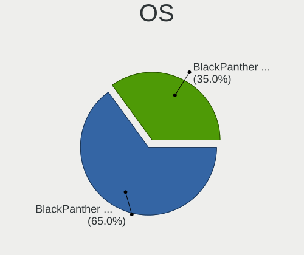

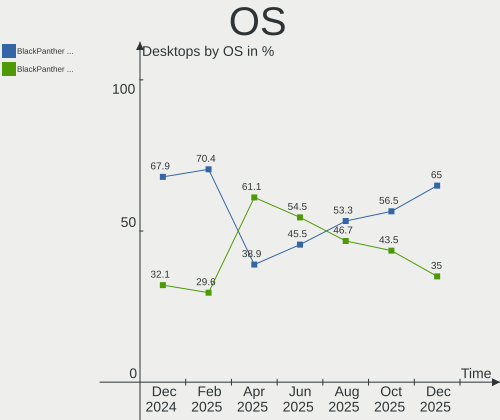

| Name              | Desktops | Percent |
|-------------------|----------|---------|
| BlackPanther 18.1 | 13       | 65%     |
| BlackPanther 22.1 | 7        | 35%     |

OS Family
---------

OS without a version

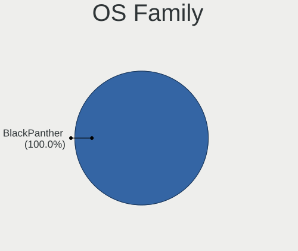

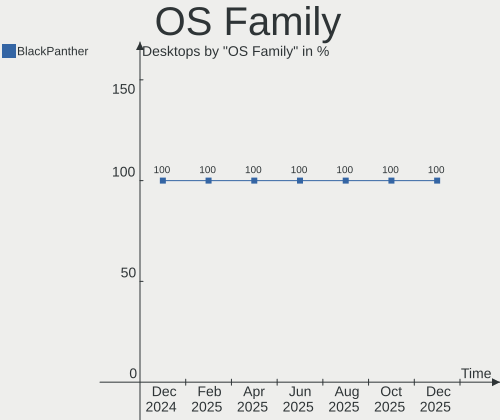

| Name         | Desktops | Percent |
|--------------|----------|---------|
| BlackPanther | 20       | 100%    |

Kernel
------

Version of the Linux kernel

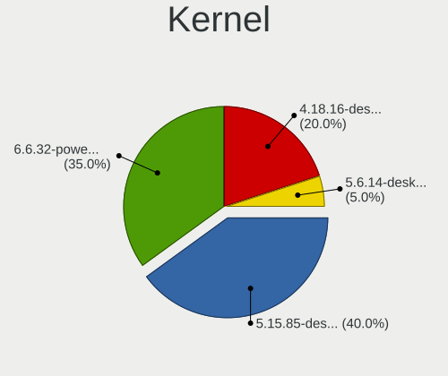

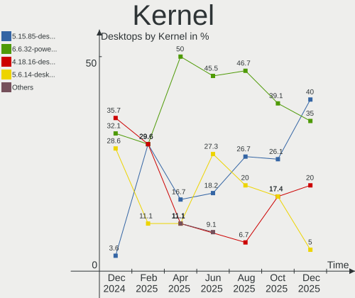

| Version             | Desktops | Percent |
|---------------------|----------|---------|
| 5.15.85-desktop-1bP | 8        | 40%     |
| 6.6.32-power-1bP    | 7        | 35%     |
| 4.18.16-desktop-1bP | 4        | 20%     |
| 5.6.14-desktop-2bP  | 1        | 5%      |

Kernel Family
-------------

Linux kernel without a distro release

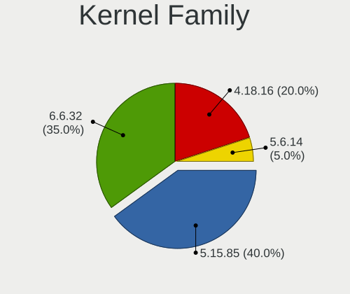

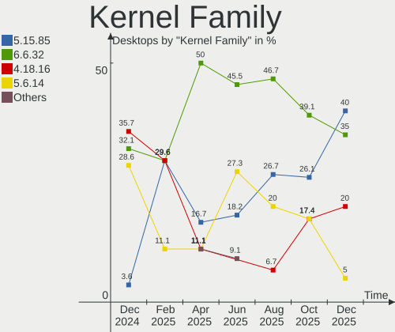

| Version | Desktops | Percent |
|---------|----------|---------|
| 5.15.85 | 8        | 40%     |
| 6.6.32  | 7        | 35%     |
| 4.18.16 | 4        | 20%     |
| 5.6.14  | 1        | 5%      |

Kernel Major Ver.
-----------------

Linux kernel major version

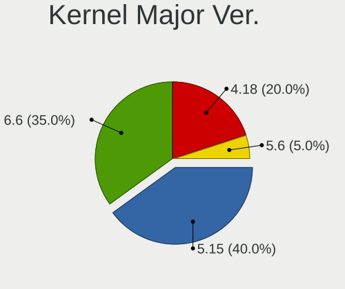

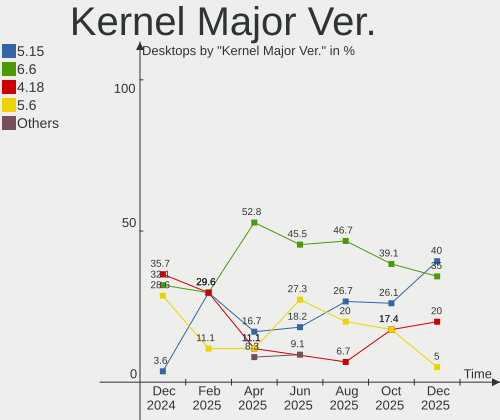

| Version | Desktops | Percent |
|---------|----------|---------|
| 5.15    | 8        | 40%     |
| 6.6     | 7        | 35%     |
| 4.18    | 4        | 20%     |
| 5.6     | 1        | 5%      |

Arch
----

OS architecture (x86_64, i586, etc.)

| Name   | Desktops | Percent |
|--------|----------|---------|
| x86_64 | 20       | 100%    |

DE
--

Desktop Environment

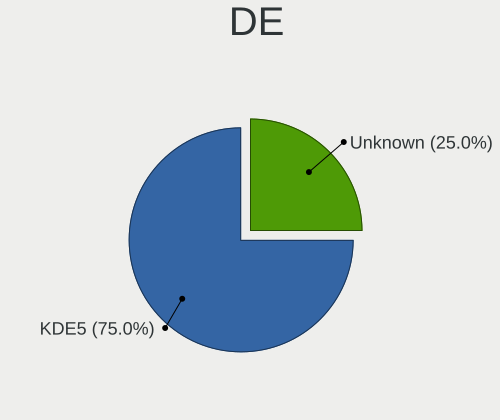

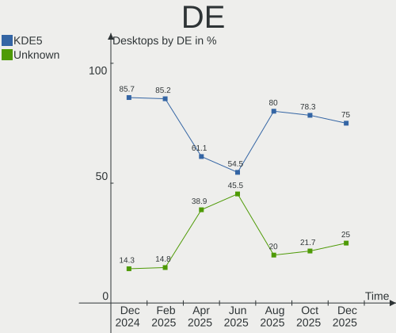

| Name    | Desktops | Percent |
|---------|----------|---------|
| KDE5    | 15       | 75%     |
| Unknown | 5        | 25%     |

Display Server
--------------

X11 or Wayland

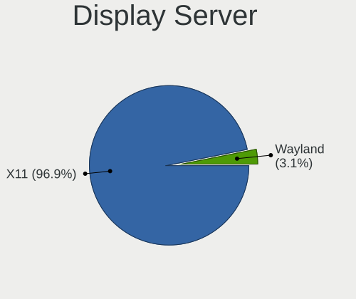

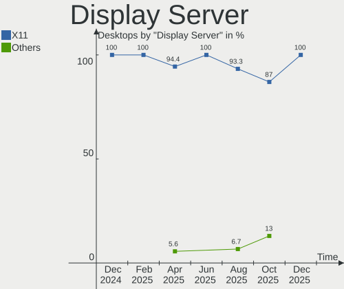

| Name | Desktops | Percent |
|------|----------|---------|
| X11  | 20       | 100%    |

Display Manager
---------------

SDDM, LightDM, etc.

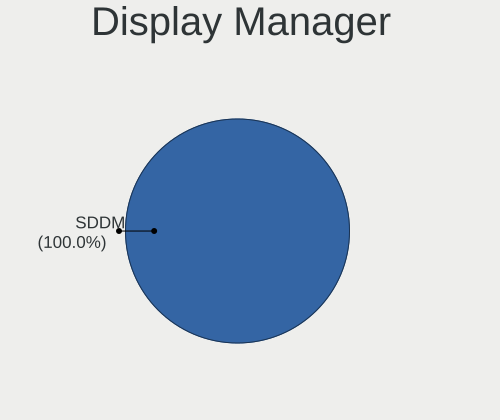

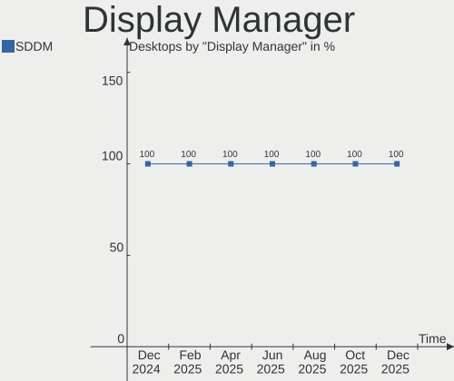

| Name | Desktops | Percent |
|------|----------|---------|
| SDDM | 20       | 100%    |

OS Lang
-------

Language

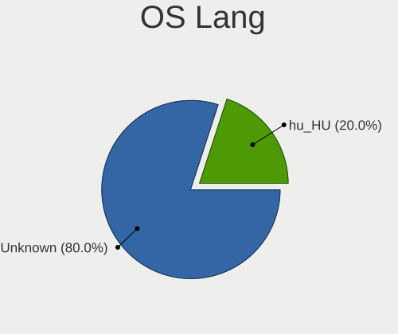

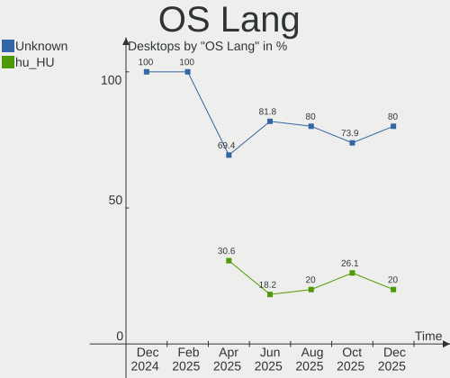

| Lang    | Desktops | Percent |
|---------|----------|---------|
| Unknown | 16       | 80%     |
| hu_HU   | 4        | 20%     |

Boot Mode
---------

EFI or BIOS

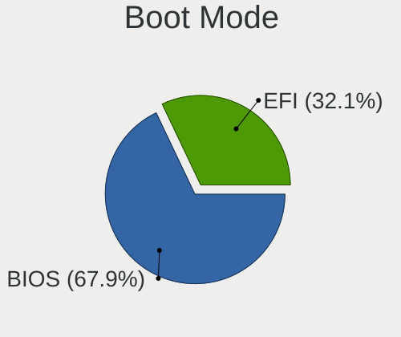

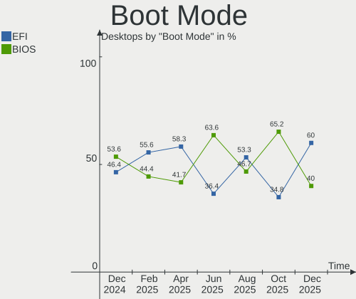

| Mode | Desktops | Percent |
|------|----------|---------|
| EFI  | 12       | 60%     |
| BIOS | 8        | 40%     |

Filesystem
----------

Type of filesystem

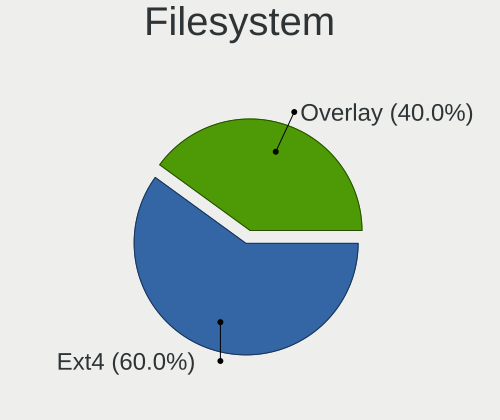

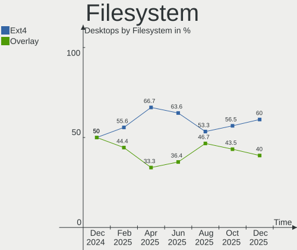

| Type    | Desktops | Percent |
|---------|----------|---------|
| Ext4    | 12       | 60%     |
| Overlay | 8        | 40%     |

Part. scheme
------------

Scheme of partitioning

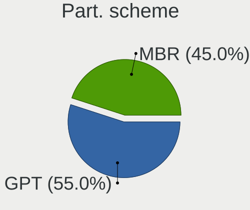

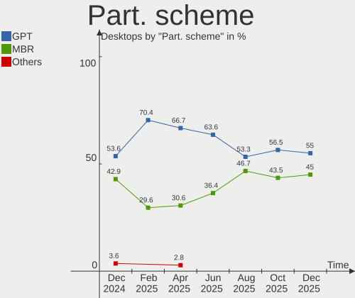

| Type | Desktops | Percent |
|------|----------|---------|
| GPT  | 11       | 55%     |
| MBR  | 9        | 45%     |

Dual Boot with Linux/BSD
------------------------

Hosting more than one Linux/BSD

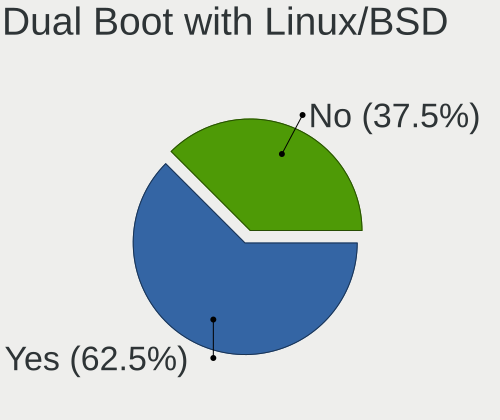

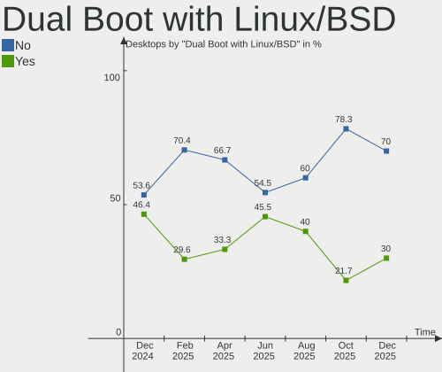

| Dual boot | Desktops | Percent |
|-----------|----------|---------|
| No        | 14       | 70%     |
| Yes       | 6        | 30%     |

Dual Boot (Win)
---------------

Hosting Linux and Windows

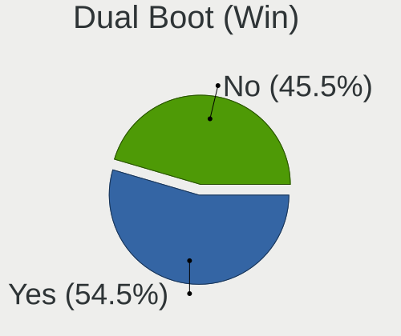

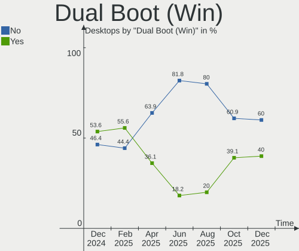

| Dual boot | Desktops | Percent |
|-----------|----------|---------|
| No        | 12       | 60%     |
| Yes       | 8        | 40%     |

Board
-----

Vendor
------

Motherboard manufacturer

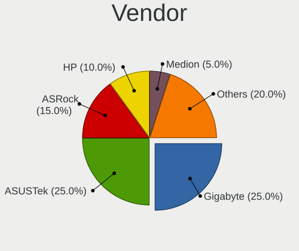

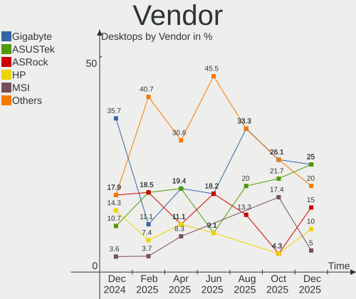

| Name                | Desktops | Percent |
|---------------------|----------|---------|
| Gigabyte Technology | 5        | 25%     |
| ASUSTek Computer    | 5        | 25%     |
| ASRock              | 3        | 15%     |
| Hewlett-Packard     | 2        | 10%     |
| MSI                 | 1        | 5%      |
| Medion              | 1        | 5%      |
| Lenovo              | 1        | 5%      |
| Dell                | 1        | 5%      |
| AZW                 | 1        | 5%      |

Model
-----

Motherboard model

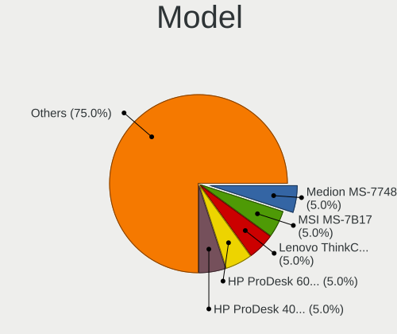

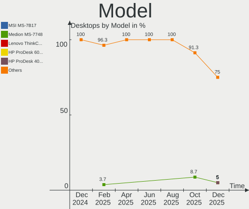

| Name                           | Desktops | Percent |
|--------------------------------|----------|---------|
| MSI MS-7B17                    | 1        | 5%      |
| Medion MS-7748                 | 1        | 5%      |
| Lenovo ThinkCentre M58 7373Y2M | 1        | 5%      |
| HP ProDesk 600 G2 SFF          | 1        | 5%      |
| HP ProDesk 400 G3 SFF          | 1        | 5%      |
| Gigabyte P55-UD3               | 1        | 5%      |
| Gigabyte H61M-S1               | 1        | 5%      |
| Gigabyte H610M S2H V2          | 1        | 5%      |
| Gigabyte B150M-D3H             | 1        | 5%      |
| Gigabyte A520M K V2            | 1        | 5%      |
| Dell OptiPlex 9010             | 1        | 5%      |
| AZW Gemini J45                 | 1        | 5%      |
| ASUS TUF Gaming B450-PLUS II   | 1        | 5%      |
| ASUS PRIME H610M-K D4          | 1        | 5%      |
| ASUS PRIME A320M-R             | 1        | 5%      |
| ASUS M5A78L-M PLUS/USB3        | 1        | 5%      |
| ASUS H110M-A/M.2               | 1        | 5%      |
| ASRock X299 Extreme4           | 1        | 5%      |
| ASRock N68C-S UCC              | 1        | 5%      |
| ASRock H81M-HDS                | 1        | 5%      |

Model Family
------------

Motherboard model prefix

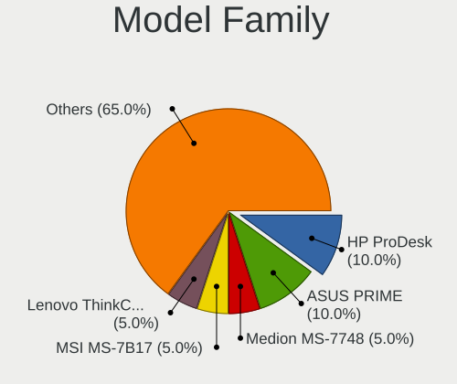

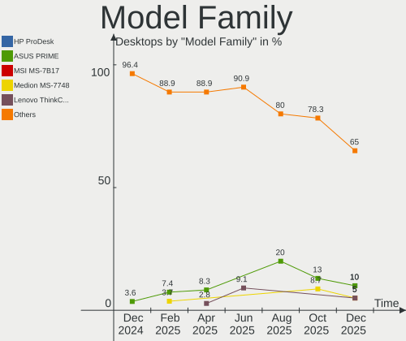

| Name               | Desktops | Percent |
|--------------------|----------|---------|
| HP ProDesk         | 2        | 10%     |
| ASUS PRIME         | 2        | 10%     |
| MSI MS-7B17        | 1        | 5%      |
| Medion MS-7748     | 1        | 5%      |
| Lenovo ThinkCentre | 1        | 5%      |
| Gigabyte P55-UD3   | 1        | 5%      |
| Gigabyte H61M-S1   | 1        | 5%      |
| Gigabyte H610M     | 1        | 5%      |
| Gigabyte B150M-D3H | 1        | 5%      |
| Gigabyte A520M     | 1        | 5%      |
| Dell OptiPlex      | 1        | 5%      |
| AZW Gemini         | 1        | 5%      |
| ASUS TUF           | 1        | 5%      |
| ASUS M5A78L-M      | 1        | 5%      |
| ASUS H110M-A       | 1        | 5%      |
| ASRock X299        | 1        | 5%      |
| ASRock N68C-S      | 1        | 5%      |
| ASRock H81M-HDS    | 1        | 5%      |

MFG Year
--------

Motherboard manufacture year

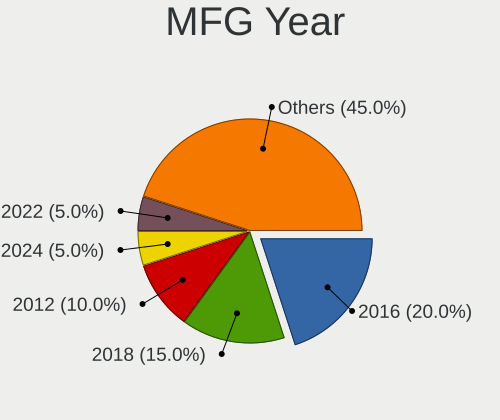

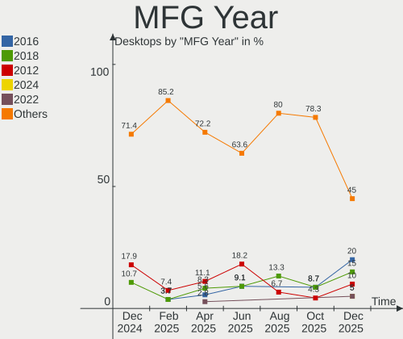

| Year | Desktops | Percent |
|------|----------|---------|
| 2016 | 4        | 20%     |
| 2018 | 3        | 15%     |
| 2012 | 2        | 10%     |
| 2024 | 1        | 5%      |
| 2022 | 1        | 5%      |
| 2021 | 1        | 5%      |
| 2020 | 1        | 5%      |
| 2019 | 1        | 5%      |
| 2015 | 1        | 5%      |
| 2013 | 1        | 5%      |
| 2011 | 1        | 5%      |
| 2010 | 1        | 5%      |
| 2009 | 1        | 5%      |
| 2008 | 1        | 5%      |

Form Factor
-----------

Physical design of the computer

| Name    | Desktops | Percent |
|---------|----------|---------|
| Desktop | 20       | 100%    |

Secure Boot
-----------

Enabled or disabled

| State    | Desktops | Percent |
|----------|----------|---------|
| Disabled | 20       | 100%    |

Coreboot
--------

Have coreboot on board

| Used | Desktops | Percent |
|------|----------|---------|
| No   | 20       | 100%    |

RAM Size
--------

Total RAM memory

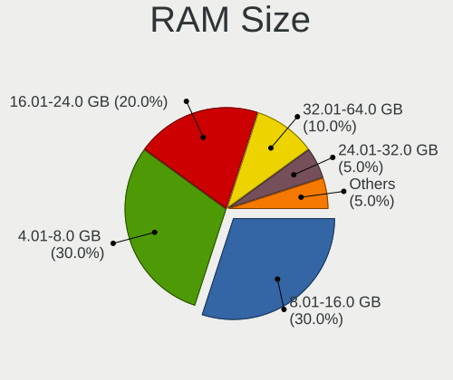

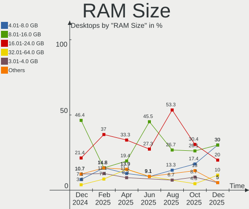

| Size in GB | Desktops | Percent |
|------------|----------|---------|
| 4.01-8.0   | 6        | 30%     |
| 8.01-16.0  | 6        | 30%     |
| 16.01-24.0 | 4        | 20%     |
| 32.01-64.0 | 2        | 10%     |
| 3.01-4.0   | 1        | 5%      |
| 24.01-32.0 | 1        | 5%      |

RAM Used
--------

Used RAM memory

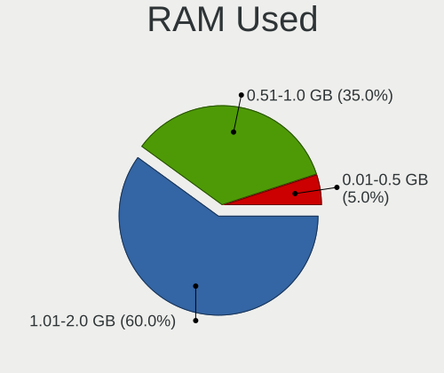

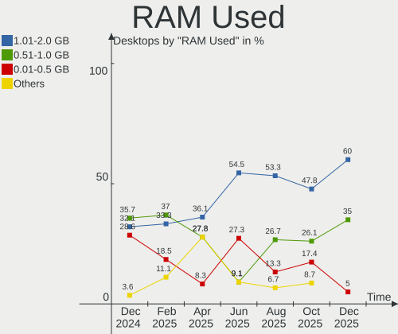

| Used GB  | Desktops | Percent |
|----------|----------|---------|
| 1.01-2.0 | 12       | 60%     |
| 0.51-1.0 | 7        | 35%     |
| 0.01-0.5 | 1        | 5%      |

Total Drives
------------

Number of drives on board

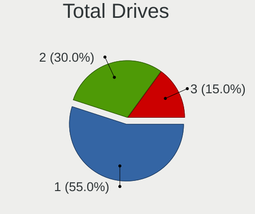

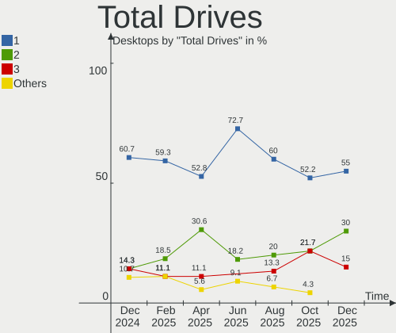

| Drives | Desktops | Percent |
|--------|----------|---------|
| 1      | 11       | 55%     |
| 2      | 6        | 30%     |
| 3      | 3        | 15%     |

Has CD-ROM
----------

Has CD-ROM on board

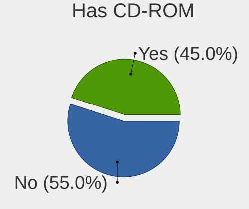

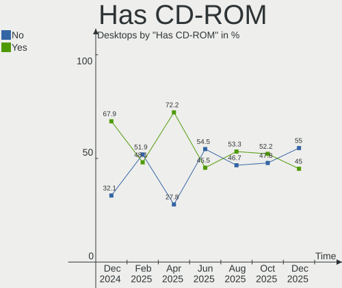

| Presented | Desktops | Percent |
|-----------|----------|---------|
| No        | 11       | 55%     |
| Yes       | 9        | 45%     |

Has Ethernet
------------

Has Ethernet on board

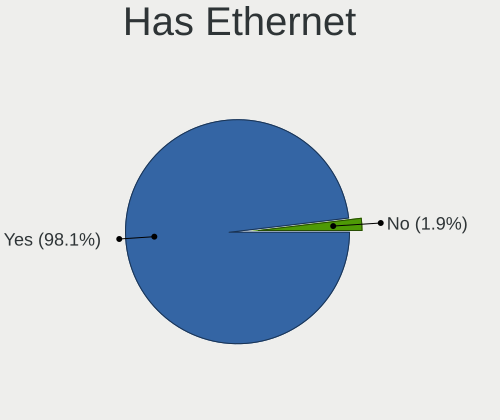

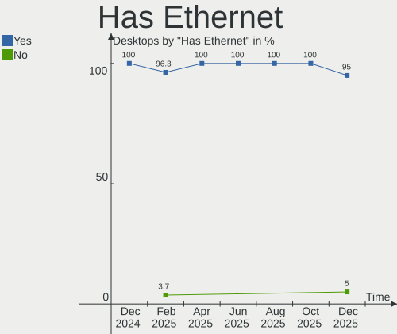

| Presented | Desktops | Percent |
|-----------|----------|---------|
| Yes       | 19       | 95%     |
| No        | 1        | 5%      |

Has WiFi
--------

Has WiFi module

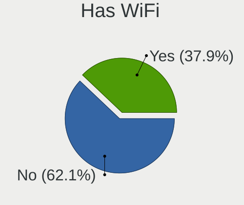

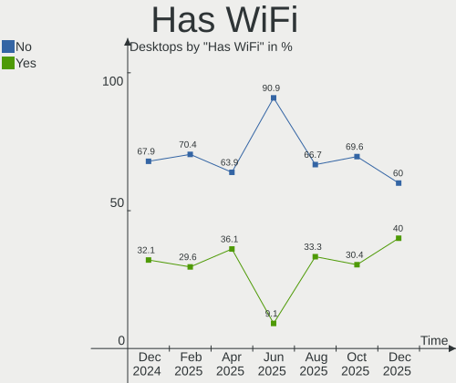

| Presented | Desktops | Percent |
|-----------|----------|---------|
| No        | 12       | 60%     |
| Yes       | 8        | 40%     |

Has Bluetooth
-------------

Has Bluetooth module

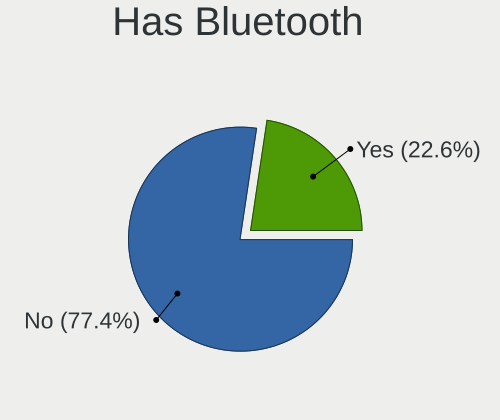

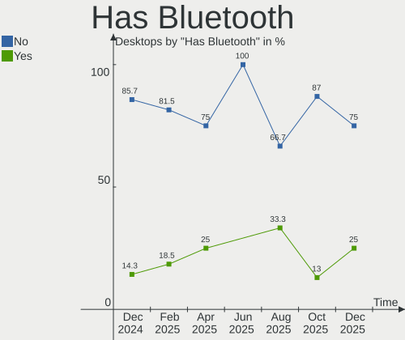

| Presented | Desktops | Percent |
|-----------|----------|---------|
| No        | 15       | 75%     |
| Yes       | 5        | 25%     |

Location
--------

Country
-------

Geographic location (country)

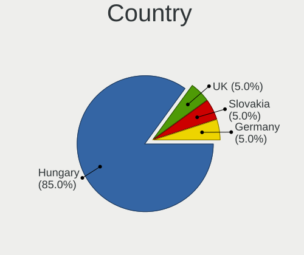

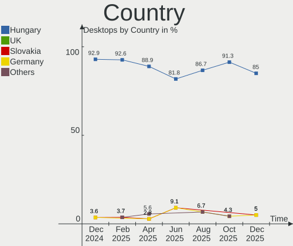

| Country  | Desktops | Percent |
|----------|----------|---------|
| Hungary  | 17       | 85%     |
| UK       | 1        | 5%      |
| Slovakia | 1        | 5%      |
| Germany  | 1        | 5%      |

City
----

Geographic location (city)

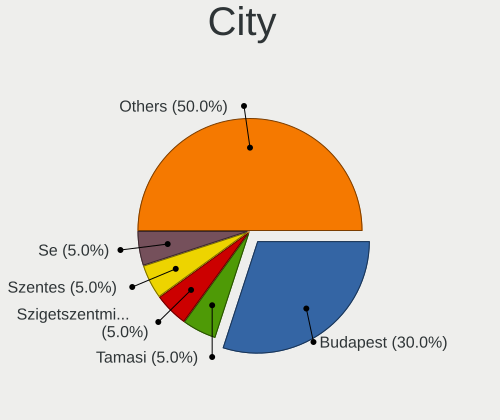

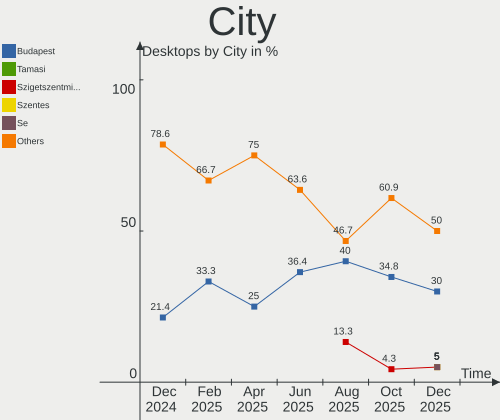

| City                    | Desktops | Percent |
|-------------------------|----------|---------|
| Budapest                | 6        | 30%     |
| Tamasi                  | 1        | 5%      |
| Szigetszentmiklos       | 1        | 5%      |
| Szentes                 | 1        | 5%      |
| Se                      | 1        | 5%      |
| Pfaffenhofen an der Ilm | 1        | 5%      |
| Mosonmagyaróvár       | 1        | 5%      |
| Morahalom               | 1        | 5%      |
| Lehnice                 | 1        | 5%      |
| Kecskemét              | 1        | 5%      |
| Islington               | 1        | 5%      |
| Inarcs                  | 1        | 5%      |
| Boly                    | 1        | 5%      |
| Balatonfuered           | 1        | 5%      |
| Aporka                  | 1        | 5%      |

Drives
------

Drive Vendor
------------

Hard drive vendors

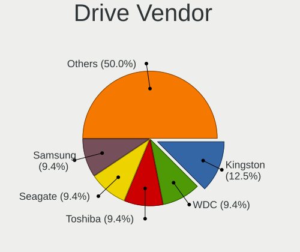

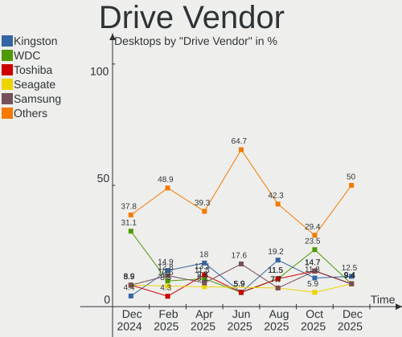

| Vendor                      | Desktops | Drives | Percent |
|-----------------------------|----------|--------|---------|
| Kingston                    | 4        | 4      | 12.5%   |
| WDC                         | 3        | 4      | 9.38%   |
| Toshiba                     | 3        | 3      | 9.38%   |
| Seagate                     | 3        | 3      | 9.38%   |
| Samsung Electronics         | 3        | 3      | 9.38%   |
| A-DATA Technology           | 3        | 3      | 9.38%   |
| GOODRAM                     | 2        | 2      | 6.25%   |
| Team                        | 1        | 1      | 3.13%   |
| SanDisk                     | 1        | 1      | 3.13%   |
| PNY                         | 1        | 1      | 3.13%   |
| Patriot                     | 1        | 1      | 3.13%   |
| KIOXIA-EXCERIA              | 1        | 1      | 3.13%   |
| Kingston Technology Company | 1        | 1      | 3.13%   |
| Intenso                     | 1        | 1      | 3.13%   |
| Integral                    | 1        | 1      | 3.13%   |
| INNOVATION IT               | 1        | 1      | 3.13%   |
| Hitachi                     | 1        | 1      | 3.13%   |
| Apacer                      | 1        | 1      | 3.13%   |

Drive Model
-----------

Hard drive models

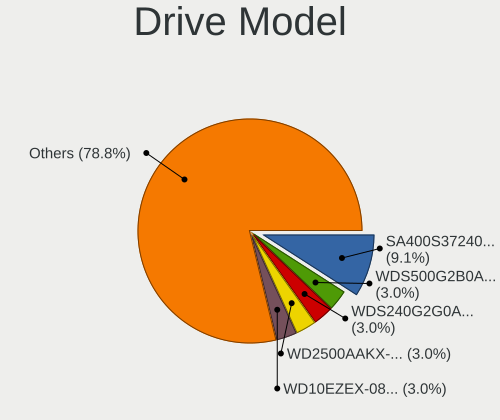

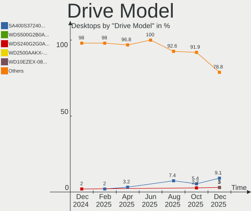

| Model                                          | Desktops | Percent |
|------------------------------------------------|----------|---------|
| Kingston SA400S37240G 240GB SSD                | 3        | 9.09%   |
| WDC WDS500G2B0A-00SM50 500GB                   | 1        | 3.03%   |
| WDC WDS240G2G0A-00JH30 240GB SSD               | 1        | 3.03%   |
| WDC WD2500AAKX-08U6AA0 250GB                   | 1        | 3.03%   |
| WDC WD10EZEX-08M2NA0 1TB                       | 1        | 3.03%   |
| Toshiba DT01ACA100 1TB                         | 1        | 3.03%   |
| Toshiba DT01ACA050 LENOVO 500GB                | 1        | 3.03%   |
| Toshiba BG3 NVMe SSD Controller 256GB          | 1        | 3.03%   |
| Team TM8FPD001T 1TB                            | 1        | 3.03%   |
| Seagate ST2000VN004-2E4164 2TB                 | 1        | 3.03%   |
| Seagate ST2000DL003-9VT166 2TB                 | 1        | 3.03%   |
| Seagate Basic 5TB                              | 1        | 3.03%   |
| SanDisk SDSSDH3512G 512GB                      | 1        | 3.03%   |
| Samsung SSD 970 EVO 500GB                      | 1        | 3.03%   |
| Samsung SSD 850 EVO 250GB                      | 1        | 3.03%   |
| Samsung HD103SJ 1TB                            | 1        | 3.03%   |
| PNY CS900 120GB SSD                            | 1        | 3.03%   |
| Patriot Burst Elite 960GB SSD                  | 1        | 3.03%   |
| KIOXIA-EXCERIA SATA SSD 480GB                  | 1        | 3.03%   |
| Kingston Company SNV3S2000G 2TB                | 1        | 3.03%   |
| Kingston SV300S37A60G 64GB SSD                 | 1        | 3.03%   |
| Intenso SSD SATAIII 512GB                      | 1        | 3.03%   |
| Integral V Series SATA SSD 120GB               | 1        | 3.03%   |
| INNOVATION IT SSD_M.2_PCIe4_512GB_InnovationIT | 1        | 3.03%   |
| Hitachi HDS721016CLA382 160GB                  | 1        | 3.03%   |
| GOODRAM SSDPR-PX500-512-80 512GB               | 1        | 3.03%   |
| GOODRAM SSDPR-CX400-256-G2 256GB               | 1        | 3.03%   |
| Apacer AS340 120GB SSD                         | 1        | 3.03%   |
| A-DATA SX6000PNP 256GB                         | 1        | 3.03%   |
| A-DATA SU650 120GB SSD                         | 1        | 3.03%   |
| A-DATA SP550 240GB SSD                         | 1        | 3.03%   |

HDD Vendor
----------

Hard disk drive vendors

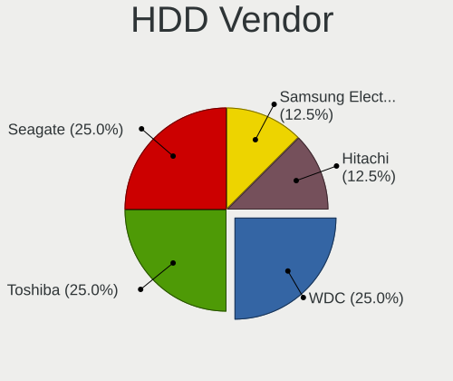

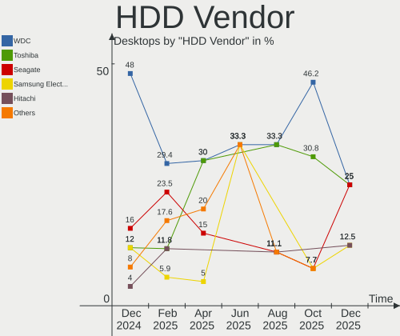

| Vendor              | Desktops | Drives | Percent |
|---------------------|----------|--------|---------|
| WDC                 | 2        | 2      | 25%     |
| Toshiba             | 2        | 2      | 25%     |
| Seagate             | 2        | 2      | 25%     |
| Samsung Electronics | 1        | 1      | 12.5%   |
| Hitachi             | 1        | 1      | 12.5%   |

SSD Vendor
----------

Solid state drive vendors

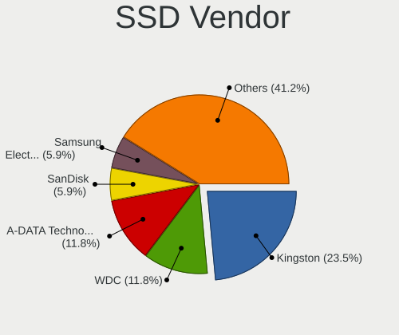

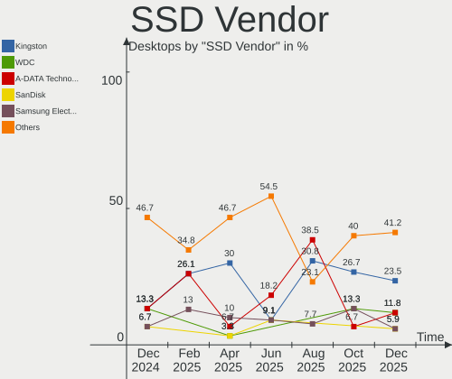

| Vendor              | Desktops | Drives | Percent |
|---------------------|----------|--------|---------|
| Kingston            | 4        | 4      | 23.53%  |
| WDC                 | 2        | 2      | 11.76%  |
| A-DATA Technology   | 2        | 2      | 11.76%  |
| SanDisk             | 1        | 1      | 5.88%   |
| Samsung Electronics | 1        | 1      | 5.88%   |
| PNY                 | 1        | 1      | 5.88%   |
| Patriot             | 1        | 1      | 5.88%   |
| KIOXIA-EXCERIA      | 1        | 1      | 5.88%   |
| Intenso             | 1        | 1      | 5.88%   |
| Integral            | 1        | 1      | 5.88%   |
| GOODRAM             | 1        | 1      | 5.88%   |
| Apacer              | 1        | 1      | 5.88%   |

Drive Kind
----------

HDD or SSD

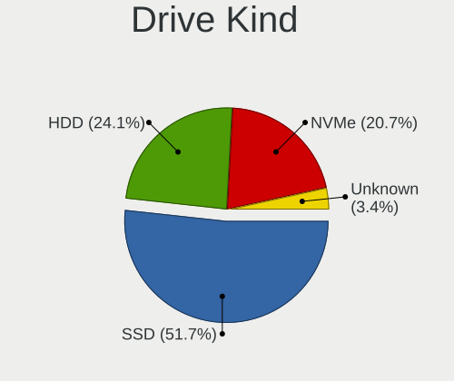

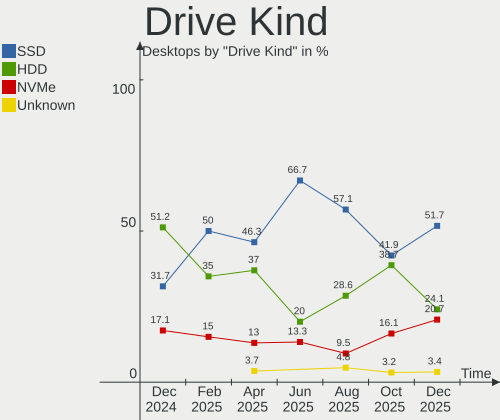

| Kind    | Desktops | Drives | Percent |
|---------|----------|--------|---------|
| SSD     | 15       | 17     | 51.72%  |
| HDD     | 7        | 8      | 24.14%  |
| NVMe    | 6        | 7      | 20.69%  |
| Unknown | 1        | 1      | 3.45%   |

Drive Connector
---------------

SATA, SAS, NVMe, etc.

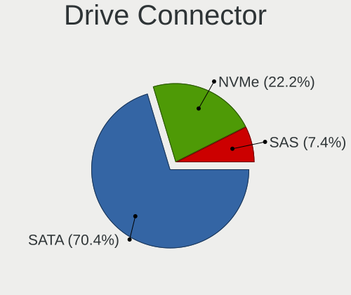

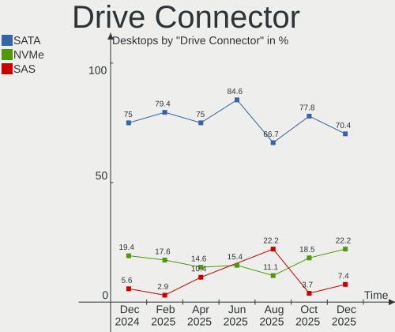

| Type | Desktops | Drives | Percent |
|------|----------|--------|---------|
| SATA | 19       | 24     | 70.37%  |
| NVMe | 6        | 7      | 22.22%  |
| SAS  | 2        | 2      | 7.41%   |

Drive Size
----------

Size of hard drive

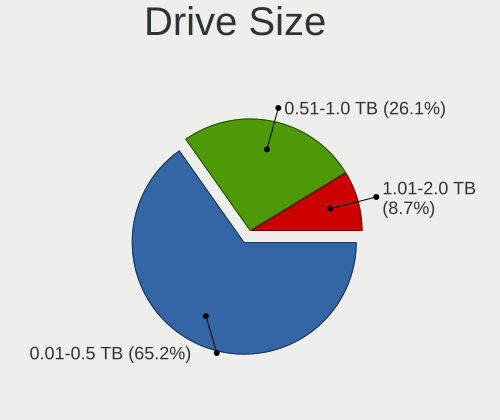

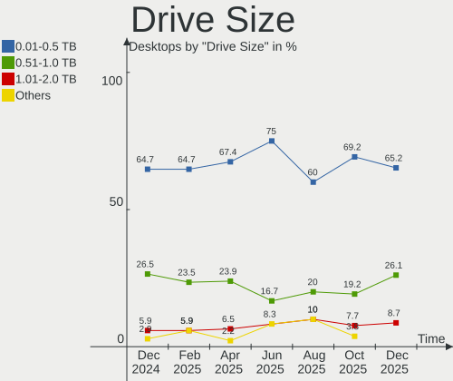

| Size in TB | Desktops | Drives | Percent |
|------------|----------|--------|---------|
| 0.01-0.5   | 15       | 17     | 65.22%  |
| 0.51-1.0   | 6        | 6      | 26.09%  |
| 1.01-2.0   | 2        | 2      | 8.7%    |

Space Total
-----------

Amount of disk space available on the file system

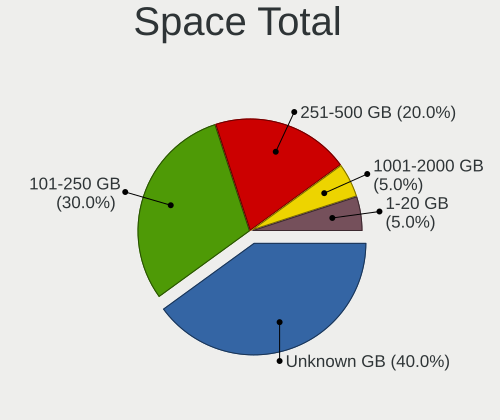

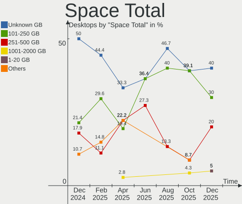

| Size in GB | Desktops | Percent |
|------------|----------|---------|
| Unknown    | 8        | 40%     |
| 101-250    | 6        | 30%     |
| 251-500    | 4        | 20%     |
| 1001-2000  | 1        | 5%      |
| 1-20       | 1        | 5%      |

Space Used
----------

Amount of used disk space

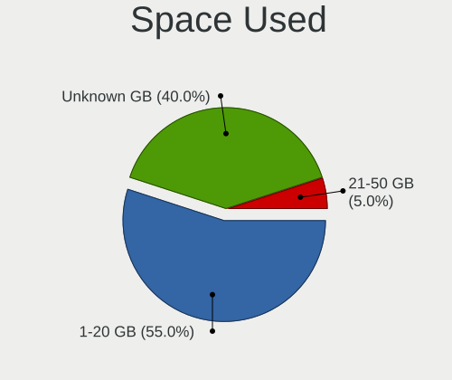

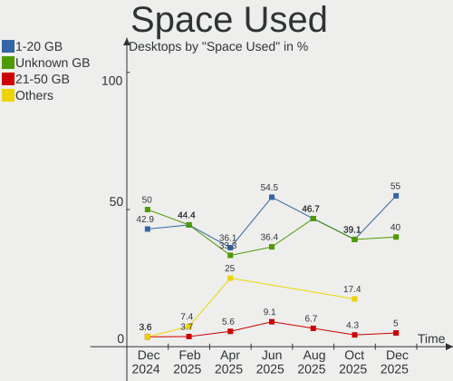

| Used GB | Desktops | Percent |
|---------|----------|---------|
| 1-20    | 11       | 55%     |
| Unknown | 8        | 40%     |
| 21-50   | 1        | 5%      |

Malfunc. Drives
---------------

Drive models with a malfunction

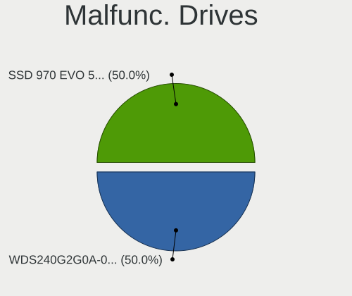

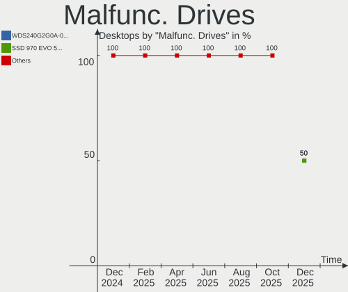

| Model                                 | Desktops | Drives | Percent |
|---------------------------------------|----------|--------|---------|
| WDC WDS240G2G0A-00JH30 240GB SSD      | 1        | 1      | 50%     |
| Samsung Electronics SSD 970 EVO 500GB | 1        | 1      | 50%     |

Malfunc. Drive Vendor
---------------------

Vendors of faulty drives

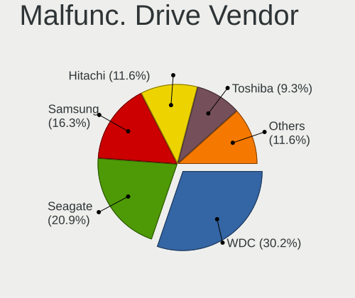

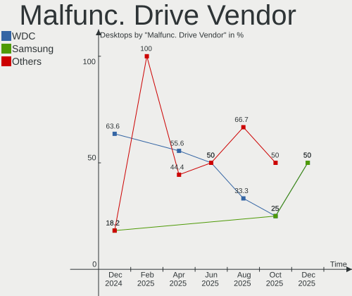

| Vendor              | Desktops | Drives | Percent |
|---------------------|----------|--------|---------|
| WDC                 | 1        | 1      | 50%     |
| Samsung Electronics | 1        | 1      | 50%     |

Malfunc. HDD Vendor
-------------------

Vendors of faulty HDD drives

Zero info for selected period =(

Malfunc. Drive Kind
-------------------

Kinds of faulty drives

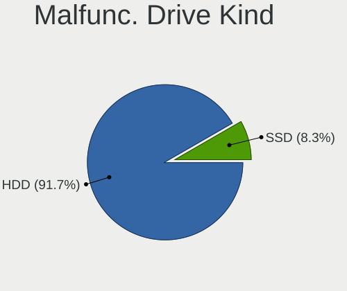

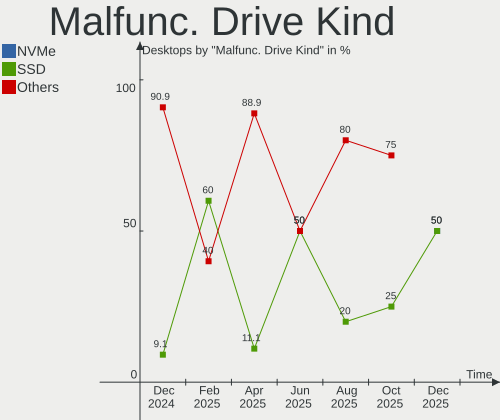

| Kind | Desktops | Drives | Percent |
|------|----------|--------|---------|
| NVMe | 1        | 1      | 50%     |
| SSD  | 1        | 1      | 50%     |

Failed Drives
-------------

Failed drive models

Zero info for selected period =(

Failed Drive Vendor
-------------------

Failed drive vendors

Zero info for selected period =(

Drive Status
------------

Number of failed and malfunc. drives

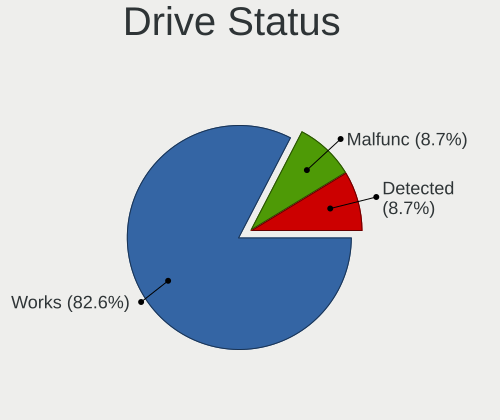

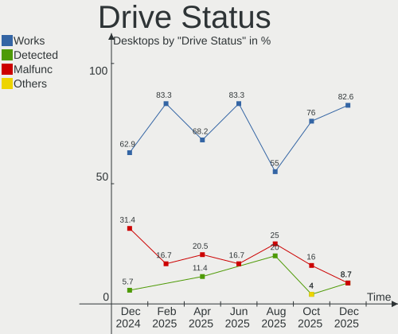

| Status   | Desktops | Drives | Percent |
|----------|----------|--------|---------|
| Works    | 19       | 29     | 82.61%  |
| Detected | 2        | 2      | 8.7%    |
| Malfunc  | 2        | 2      | 8.7%    |

Storage controller
------------------

Storage Vendor
--------------

Storage controller vendors

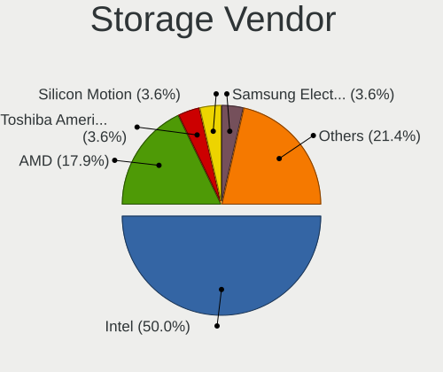

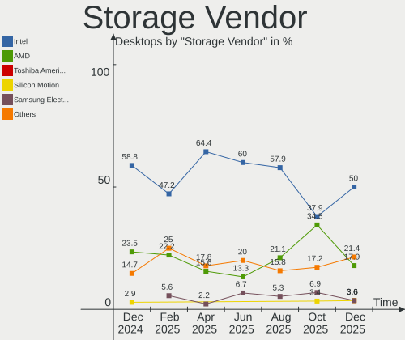

| Vendor                       | Desktops | Percent |
|------------------------------|----------|---------|
| Intel                        | 14       | 50%     |
| AMD                          | 5        | 17.86%  |
| Toshiba America Info Systems | 1        | 3.57%   |
| Silicon Motion               | 1        | 3.57%   |
| Samsung Electronics          | 1        | 3.57%   |
| Realtek Semiconductor        | 1        | 3.57%   |
| Nvidia                       | 1        | 3.57%   |
| MAXIO Technology (Hangzhou)  | 1        | 3.57%   |
| Kingston Technology Company  | 1        | 3.57%   |
| JMicron Technology           | 1        | 3.57%   |
| INNOGRIT                     | 1        | 3.57%   |

Storage Model
-------------

Storage controller models

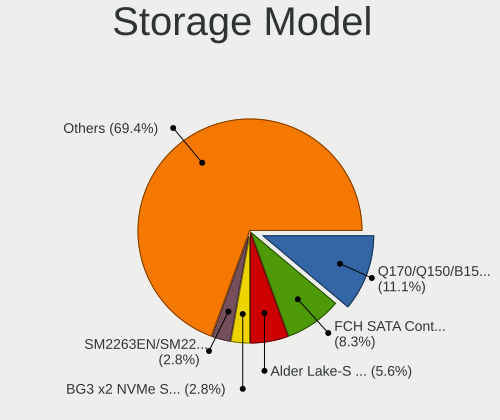

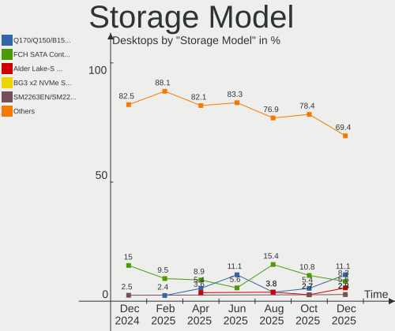

| Model                                                                                   | Desktops | Percent |
|-----------------------------------------------------------------------------------------|----------|---------|
| Intel Q170/Q150/B150/H170/H110/Z170/CM236 Chipset SATA Controller [AHCI Mode]           | 4        | 11.11%  |
| AMD FCH SATA Controller [AHCI mode]                                                     | 3        | 8.33%   |
| Intel Alder Lake-S PCH SATA Controller [AHCI Mode]                                      | 2        | 5.56%   |
| Toshiba America Info Systems BG3 x2 NVMe SSD Controller (DRAM-less)                     | 1        | 2.78%   |
| Silicon Motion SM2263EN/SM2263XT (DRAM-less) NVMe SSD Controllers                       | 1        | 2.78%   |
| Samsung NVMe SSD Controller SM981/PM981/PM983                                           | 1        | 2.78%   |
| Realtek RTS5762 NVMe SSD Controller                                                     | 1        | 2.78%   |
| Nvidia MCP61 SATA Controller                                                            | 1        | 2.78%   |
| Nvidia MCP61 IDE                                                                        | 1        | 2.78%   |
| MAXIO (Hangzhou) NVMe SSD Controller MAP1202 (DRAM-less)                                | 1        | 2.78%   |
| Kingston Company NV3 NVMe SSD [SM2268XT2] (DRAM-less)                                   | 1        | 2.78%   |
| JMicron JMB363 SATA/IDE Controller                                                      | 1        | 2.78%   |
| Intel Volume Management Device NVMe RAID Controller                                     | 1        | 2.78%   |
| Intel SATA Controller [RAID mode]                                                       | 1        | 2.78%   |
| Intel Celeron N3350/Pentium N4200/Atom E3900 Series SATA AHCI Controller                | 1        | 2.78%   |
| Intel Cannon Lake PCH SATA AHCI Controller                                              | 1        | 2.78%   |
| Intel 82801JD/DO (ICH10 Family) SATA AHCI Controller                                    | 1        | 2.78%   |
| Intel 8 Series/C220 Series Chipset Family 6-port SATA Controller 1 [AHCI mode]          | 1        | 2.78%   |
| Intel 6 Series/C200 Series Chipset Family Desktop SATA Controller (IDE mode, ports 4-5) | 1        | 2.78%   |
| Intel 6 Series/C200 Series Chipset Family Desktop SATA Controller (IDE mode, ports 0-3) | 1        | 2.78%   |
| Intel 5 Series/3400 Series Chipset 4 port SATA IDE Controller                           | 1        | 2.78%   |
| Intel 5 Series/3400 Series Chipset 2 port SATA IDE Controller                           | 1        | 2.78%   |
| Intel 4 Series Chipset PT IDER Controller                                               | 1        | 2.78%   |
| Intel 200 Series PCH SATA controller [AHCI mode]                                        | 1        | 2.78%   |
| INNOGRIT NVMe SSD Controller IG5220 [RainierQX] (DRAM-less)                             | 1        | 2.78%   |
| AMD SB7x0/SB8x0/SB9x0 SATA Controller [IDE mode]                                        | 1        | 2.78%   |
| AMD SB7x0/SB8x0/SB9x0 IDE Controller                                                    | 1        | 2.78%   |
| AMD A320 Chipset SATA Controller [AHCI mode]                                            | 1        | 2.78%   |
| AMD 500 Series Chipset SATA Controller                                                  | 1        | 2.78%   |
| AMD 400 Series Chipset SATA Controller                                                  | 1        | 2.78%   |

Storage Kind
------------

Kind of storage controller (IDE, SATA, NVMe, SAS, ...)

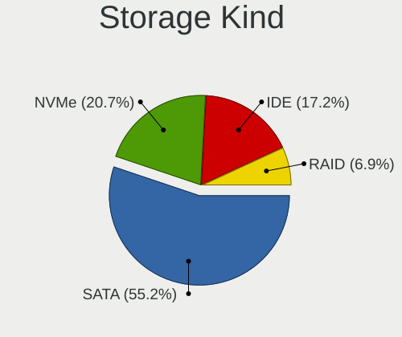

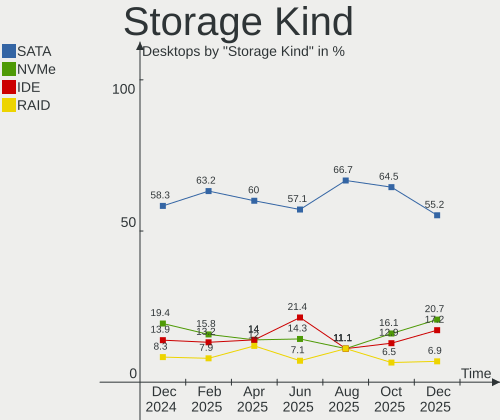

| Kind | Desktops | Percent |
|------|----------|---------|
| SATA | 16       | 55.17%  |
| NVMe | 6        | 20.69%  |
| IDE  | 5        | 17.24%  |
| RAID | 2        | 6.9%    |

Processor
---------

CPU Vendor
----------

Processor vendors

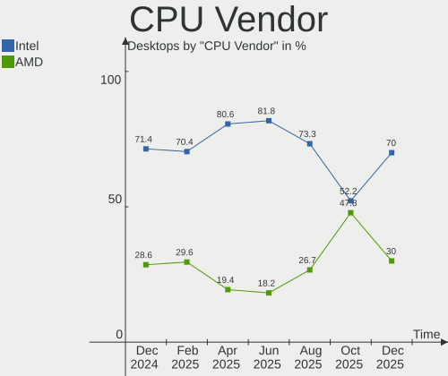

| Vendor | Desktops | Percent |
|--------|----------|---------|
| Intel  | 14       | 70%     |
| AMD    | 6        | 30%     |

CPU Model
---------

Processor models

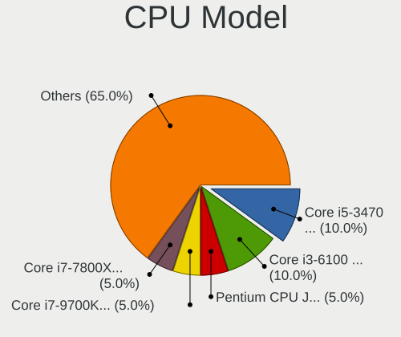

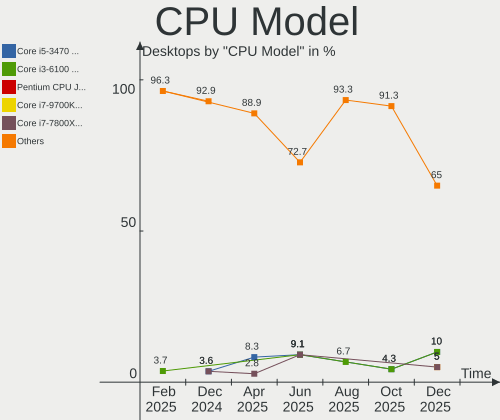

| Model                                       | Desktops | Percent |
|---------------------------------------------|----------|---------|
| Intel Core i5-3470 CPU @ 3.20GHz            | 2        | 10%     |
| Intel Core i3-6100 CPU @ 3.70GHz            | 2        | 10%     |
| Intel Pentium CPU J4205 @ 1.50GHz           | 1        | 5%      |
| Intel Core i7-9700K CPU @ 3.60GHz           | 1        | 5%      |
| Intel Core i7-7800X CPU @ 3.50GHz           | 1        | 5%      |
| Intel Core i5-7600K CPU @ 3.80GHz           | 1        | 5%      |
| Intel Core i5 CPU 750 @ 2.67GHz             | 1        | 5%      |
| Intel Core i3-7100 CPU @ 3.90GHz            | 1        | 5%      |
| Intel Core i3-4130 CPU @ 3.40GHz            | 1        | 5%      |
| Intel Core 2 Duo CPU E7500 @ 2.93GHz        | 1        | 5%      |
| Intel 12th Gen Core i5-12400F               | 1        | 5%      |
| Intel 12th Gen Core i5-12400                | 1        | 5%      |
| AMD Ryzen 5 5600 6-Core Processor           | 1        | 5%      |
| AMD Ryzen 5 2600 Six-Core Processor         | 1        | 5%      |
| AMD Ryzen 3 2200G with Radeon Vega Graphics | 1        | 5%      |
| AMD Phenom II X4 B45 Processor              | 1        | 5%      |
| AMD Phenom II X4 840 Processor              | 1        | 5%      |
| AMD A8-3800 APU with Radeon HD Graphics     | 1        | 5%      |

CPU Model Family
----------------

Processor model prefix

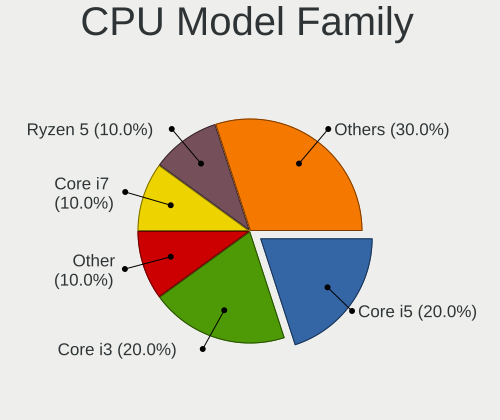

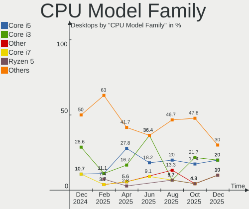

| Model            | Desktops | Percent |
|------------------|----------|---------|
| Intel Core i5    | 4        | 20%     |
| Intel Core i3    | 4        | 20%     |
| Other            | 2        | 10%     |
| Intel Core i7    | 2        | 10%     |
| AMD Ryzen 5      | 2        | 10%     |
| AMD Phenom II X4 | 2        | 10%     |
| Intel Pentium    | 1        | 5%      |
| Intel Core 2 Duo | 1        | 5%      |
| AMD Ryzen 3      | 1        | 5%      |
| AMD A8           | 1        | 5%      |

CPU Cores
---------

Number of processor cores

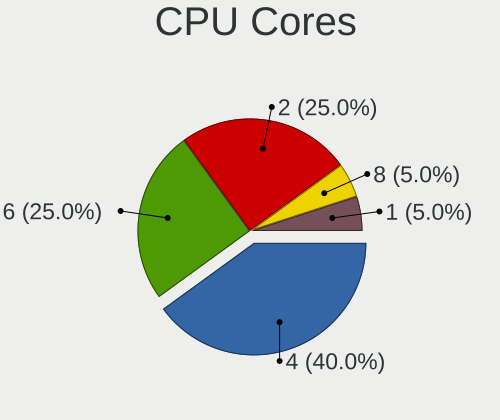

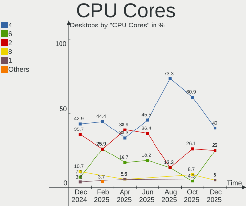

| Number | Desktops | Percent |
|--------|----------|---------|
| 4      | 8        | 40%     |
| 6      | 5        | 25%     |
| 2      | 5        | 25%     |
| 8      | 1        | 5%      |
| 1      | 1        | 5%      |

CPU Sockets
-----------

Number of sockets

| Number | Desktops | Percent |
|--------|----------|---------|
| 1      | 20       | 100%    |

CPU Threads
-----------

Threads per core (Hyper-Threading)

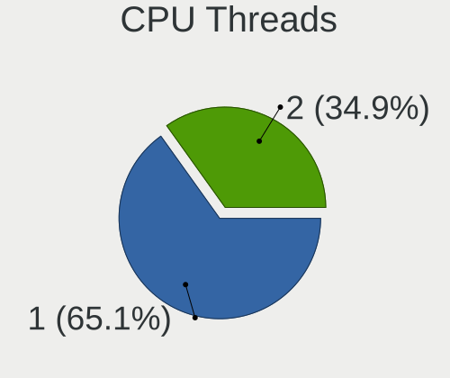

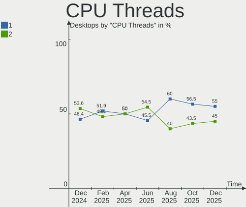

| Number | Desktops | Percent |
|--------|----------|---------|
| 1      | 11       | 55%     |
| 2      | 9        | 45%     |

CPU Op-Modes
------------

CPU Operation Modes (32-bit, 64-bit)

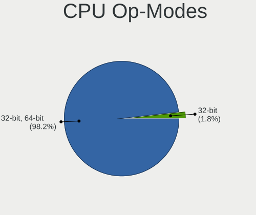

| Op mode        | Desktops | Percent |
|----------------|----------|---------|
| 32-bit, 64-bit | 20       | 100%    |

CPU Microcode
-------------

Microcode number

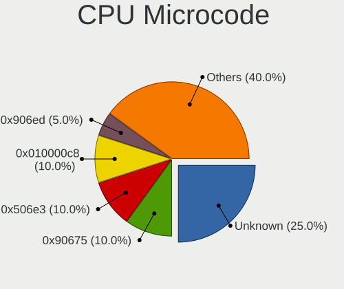

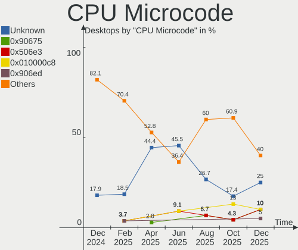

| Number     | Desktops | Percent |
|------------|----------|---------|
| Unknown    | 5        | 25%     |
| 0x90675    | 2        | 10%     |
| 0x506e3    | 2        | 10%     |
| 0x010000c8 | 2        | 10%     |
| 0x906ed    | 1        | 5%      |
| 0x906e9    | 1        | 5%      |
| 0x506c9    | 1        | 5%      |
| 0x50654    | 1        | 5%      |
| 0x106e5    | 1        | 5%      |
| 0x0a20120e | 1        | 5%      |
| 0x08101016 | 1        | 5%      |
| 0x0800820d | 1        | 5%      |
| 0x03000014 | 1        | 5%      |

CPU Microarch
-------------

Microarchitecture

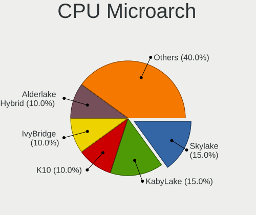

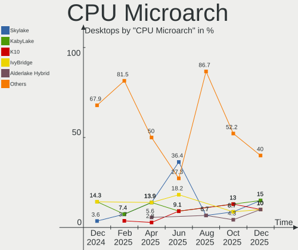

| Name             | Desktops | Percent |
|------------------|----------|---------|
| Skylake          | 3        | 15%     |
| KabyLake         | 3        | 15%     |
| K10              | 2        | 10%     |
| IvyBridge        | 2        | 10%     |
| Alderlake Hybrid | 2        | 10%     |
| Zen+             | 1        | 5%      |
| Zen 3            | 1        | 5%      |
| Zen              | 1        | 5%      |
| Penryn           | 1        | 5%      |
| Nehalem          | 1        | 5%      |
| K10 Llano        | 1        | 5%      |
| Haswell          | 1        | 5%      |
| Goldmont         | 1        | 5%      |

Graphics
--------

GPU Vendor
----------

Vendors of graphics cards

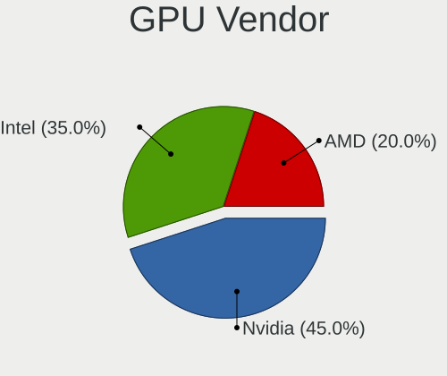

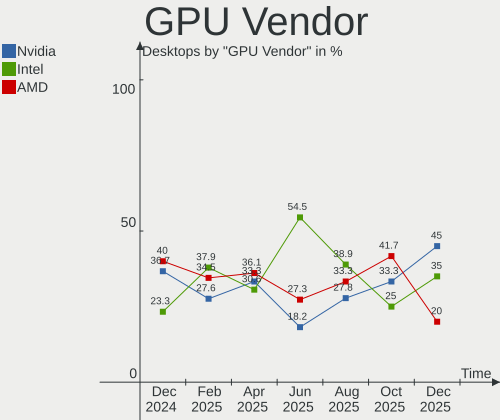

| Vendor | Desktops | Percent |
|--------|----------|---------|
| Nvidia | 9        | 45%     |
| Intel  | 7        | 35%     |
| AMD    | 4        | 20%     |

GPU Model
---------

Graphics card models

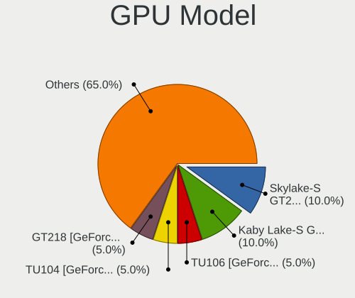

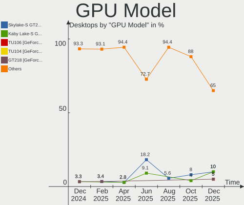

| Model                                                            | Desktops | Percent |
|------------------------------------------------------------------|----------|---------|
| Intel Skylake-S GT2 [HD Graphics 530]                            | 2        | 10%     |
| Intel Kaby Lake-S GT2 [HD Graphics 630]                          | 2        | 10%     |
| Nvidia TU106 [GeForce RTX 2060 Rev. A]                           | 1        | 5%      |
| Nvidia TU104 [GeForce RTX 2060]                                  | 1        | 5%      |
| Nvidia GT218 [GeForce 210]                                       | 1        | 5%      |
| Nvidia GP107 [GeForce GTX 1050 Ti]                               | 1        | 5%      |
| Nvidia GK208B [GeForce GT 730]                                   | 1        | 5%      |
| Nvidia GK104 [GeForce GTX 760]                                   | 1        | 5%      |
| Nvidia GF116 [GeForce GTX 550 Ti]                                | 1        | 5%      |
| Nvidia GF108 [GeForce GT 630]                                    | 1        | 5%      |
| Nvidia GA106 [GeForce RTX 3060]                                  | 1        | 5%      |
| Intel Xeon E3-1200 v2/3rd Gen Core processor Graphics Controller | 1        | 5%      |
| Intel Apollo Lake [HD Graphics 505]                              | 1        | 5%      |
| Intel Alder Lake-S GT1 [UHD Graphics 730]                        | 1        | 5%      |
| AMD Turks XT [Radeon HD 6670/7670]                               | 1        | 5%      |
| AMD Sumo [Radeon HD 6550D]                                       | 1        | 5%      |
| AMD Navi 23 [Radeon RX 6600/6600 XT/6600M]                       | 1        | 5%      |
| AMD Juniper PRO [Radeon HD 5750]                                 | 1        | 5%      |

GPU Combo
---------

Combinations of graphics cards

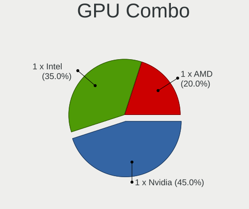

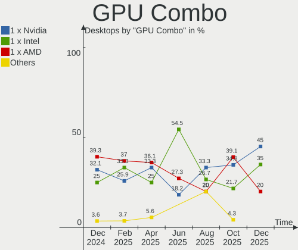

| Name       | Desktops | Percent |
|------------|----------|---------|
| 1 x Nvidia | 9        | 45%     |
| 1 x Intel  | 7        | 35%     |
| 1 x AMD    | 4        | 20%     |

GPU Driver
----------

Free vs proprietary

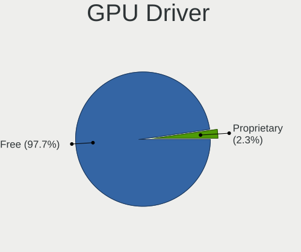

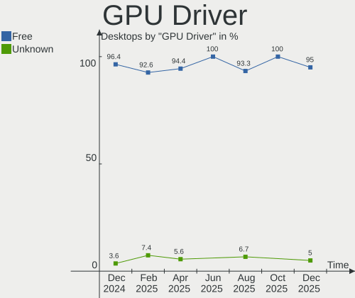

| Driver  | Desktops | Percent |
|---------|----------|---------|
| Free    | 19       | 95%     |
| Unknown | 1        | 5%      |

GPU Memory
----------

Total video memory

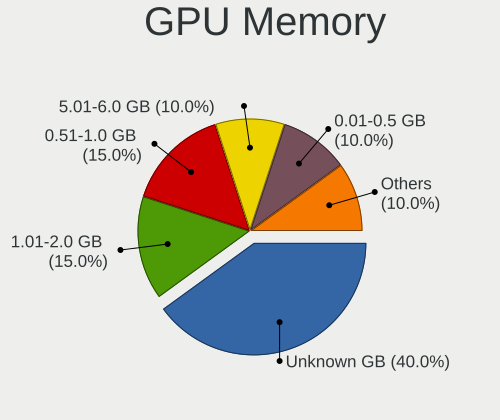

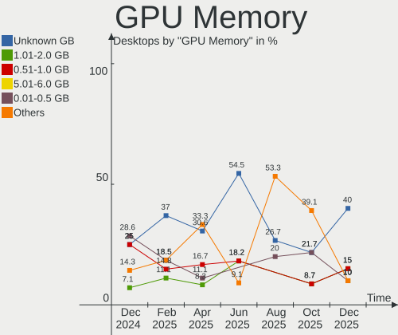

| Size in GB | Desktops | Percent |
|------------|----------|---------|
| Unknown    | 8        | 40%     |
| 1.01-2.0   | 3        | 15%     |
| 0.51-1.0   | 3        | 15%     |
| 5.01-6.0   | 2        | 10%     |
| 0.01-0.5   | 2        | 10%     |
| 7.01-8.0   | 1        | 5%      |
| 3.01-4.0   | 1        | 5%      |

Monitor
-------

Monitor Vendor
--------------

Monitor vendors

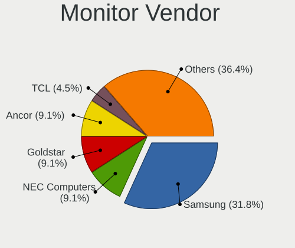

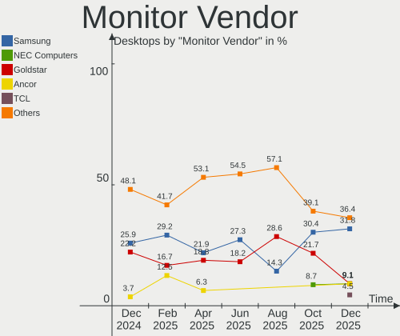

| Vendor               | Desktops | Percent |
|----------------------|----------|---------|
| Samsung Electronics  | 7        | 31.82%  |
| NEC Computers        | 2        | 9.09%   |
| Goldstar             | 2        | 9.09%   |
| Ancor Communications | 2        | 9.09%   |
| TCL                  | 1        | 4.55%   |
| Sony                 | 1        | 4.55%   |
| SKG                  | 1        | 4.55%   |
| Philips              | 1        | 4.55%   |
| OEM                  | 1        | 4.55%   |
| Medion               | 1        | 4.55%   |
| Dell                 | 1        | 4.55%   |
| BenQ                 | 1        | 4.55%   |
| Acer                 | 1        | 4.55%   |

Monitor Model
-------------

Monitor models

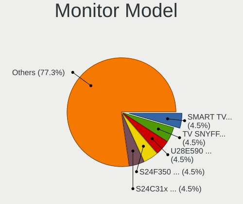

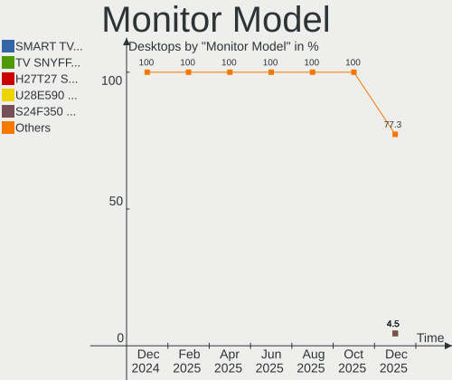

| Model                                                                  | Desktops | Percent |
|------------------------------------------------------------------------|----------|---------|
| TCL SMART TV TCL6586 3840x2160 1209x680mm 54.6-inch                    | 1        | 4.55%   |
| Sony TV SNYFF00 1360x768                                               | 1        | 4.55%   |
| SKG H27T27 SKG2752 2560x1440 531x298mm 24.0-inch                       | 1        | 4.55%   |
| Samsung Electronics U28E590 SAM0C4E 3840x2160 608x345mm 27.5-inch      | 1        | 4.55%   |
| Samsung Electronics S24F350 SAM0D20 1920x1080 521x293mm 23.5-inch      | 1        | 4.55%   |
| Samsung Electronics S24C31x SAM7311 1920x1080 527x296mm 23.8-inch      | 1        | 4.55%   |
| Samsung Electronics LS32CG51x SAM72FE 2560x1440 697x392mm 31.5-inch    | 1        | 4.55%   |
| Samsung Electronics LS27AG30x SAM717A 1920x1080 597x336mm 27.0-inch    | 1        | 4.55%   |
| Samsung Electronics LCD Monitor SAM07DE 1920x1080 1120x630mm 50.6-inch | 1        | 4.55%   |
| Samsung Electronics LCD Monitor SAM04FB 1920x1080                      | 1        | 4.55%   |
| Philips 221TE PHLC062 1920x1080 476x268mm 21.5-inch                    | 1        | 4.55%   |
| OEM 32W_LCD_TV OEM3700 1920x540                                        | 1        | 4.55%   |
| NEC Computers EA231WMi NEC677A 1920x1080 510x287mm 23.0-inch           | 1        | 4.55%   |
| NEC Computers EA223WM NEC6891 1680x1050 474x296mm 22.0-inch            | 1        | 4.55%   |
| Medion MD20328 MED3941 1600x900 462x272mm 21.1-inch                    | 1        | 4.55%   |
| Goldstar FHD GSM5C66 1920x1080 527x296mm 23.8-inch                     | 1        | 4.55%   |
| Goldstar 34GL750 GSM773B 2560x1080 798x334mm 34.1-inch                 | 1        | 4.55%   |
| Dell P2219H DELA115 1920x1080 476x267mm 21.5-inch                      | 1        | 4.55%   |
| BenQ GW2760 BNQ78C6 1920x1080 598x336mm 27.0-inch                      | 1        | 4.55%   |
| Ancor Communications VX228 ACI22C1 1920x1080 476x268mm 21.5-inch       | 1        | 4.55%   |
| Ancor Communications VC279 ACI27C4 1920x1080 598x336mm 27.0-inch       | 1        | 4.55%   |
| Acer V226HQL B ACR0620 1920x1080 477x268mm 21.5-inch                   | 1        | 4.55%   |

Monitor Resolution
------------------

Monitor screen resolution

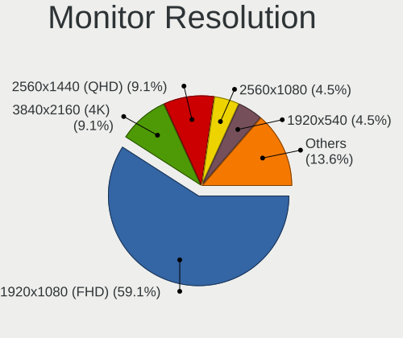

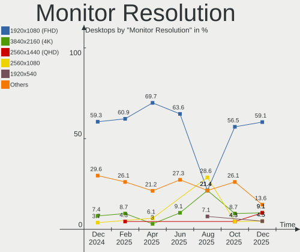

| Resolution         | Desktops | Percent |
|--------------------|----------|---------|
| 1920x1080 (FHD)    | 13       | 59.09%  |
| 3840x2160 (4K)     | 2        | 9.09%   |
| 2560x1440 (QHD)    | 2        | 9.09%   |
| 2560x1080          | 1        | 4.55%   |
| 1920x540           | 1        | 4.55%   |
| 1680x1050 (WSXGA+) | 1        | 4.55%   |
| 1600x900 (HD+)     | 1        | 4.55%   |
| 1360x768           | 1        | 4.55%   |

Monitor Diagonal
----------------

Diagonal size in inches

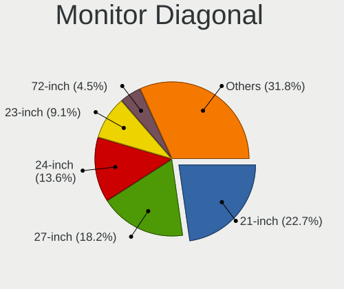

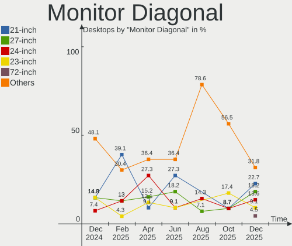

| Inches  | Desktops | Percent |
|---------|----------|---------|
| 21      | 5        | 22.73%  |
| 27      | 4        | 18.18%  |
| 24      | 3        | 13.64%  |
| 23      | 2        | 9.09%   |
| 72      | 1        | 4.55%   |
| 54      | 1        | 4.55%   |
| 50      | 1        | 4.55%   |
| 34      | 1        | 4.55%   |
| 31      | 1        | 4.55%   |
| 28      | 1        | 4.55%   |
| 22      | 1        | 4.55%   |
| Unknown | 1        | 4.55%   |

Monitor Width
-------------

Physical width

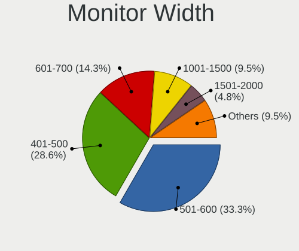

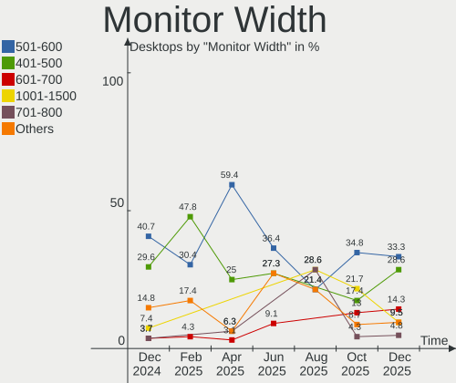

| Width in mm | Desktops | Percent |
|-------------|----------|---------|
| 501-600     | 7        | 33.33%  |
| 401-500     | 6        | 28.57%  |
| 601-700     | 3        | 14.29%  |
| 1001-1500   | 2        | 9.52%   |
| 701-800     | 1        | 4.76%   |
| 1501-2000   | 1        | 4.76%   |
| Unknown     | 1        | 4.76%   |

Aspect Ratio
------------

Proportional relationship between the width and the height

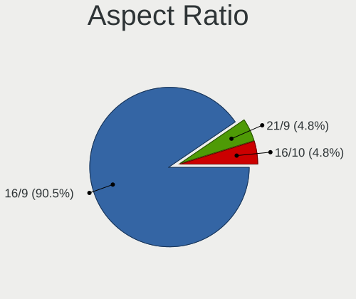

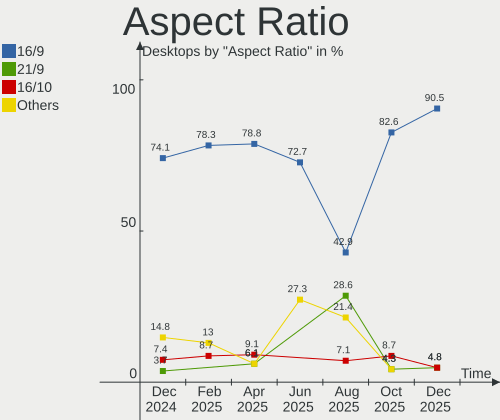

| Ratio | Desktops | Percent |
|-------|----------|---------|
| 16/9  | 19       | 90.48%  |
| 21/9  | 1        | 4.76%   |
| 16/10 | 1        | 4.76%   |

Monitor Area
------------

Area in inch²

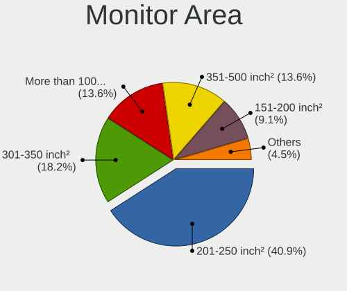

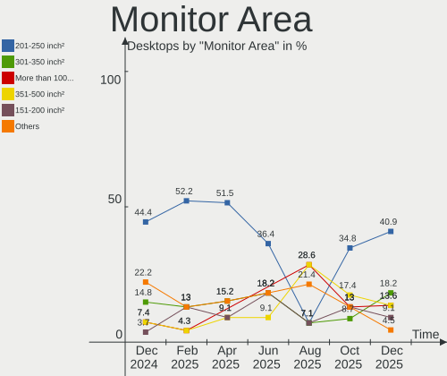

| Area in inch² | Desktops | Percent |
|----------------|----------|---------|
| 201-250        | 9        | 40.91%  |
| 301-350        | 4        | 18.18%  |
| More than 1000 | 3        | 13.64%  |
| 351-500        | 3        | 13.64%  |
| 151-200        | 2        | 9.09%   |
| Unknown        | 1        | 4.55%   |

Pixel Density
-------------

Pixels per inch

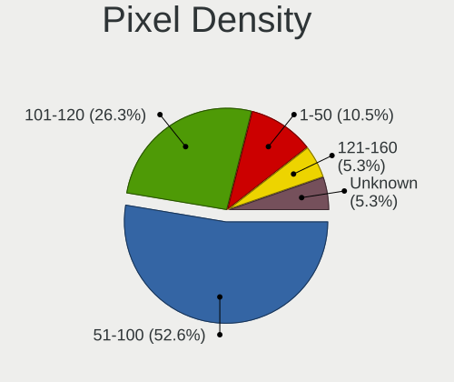

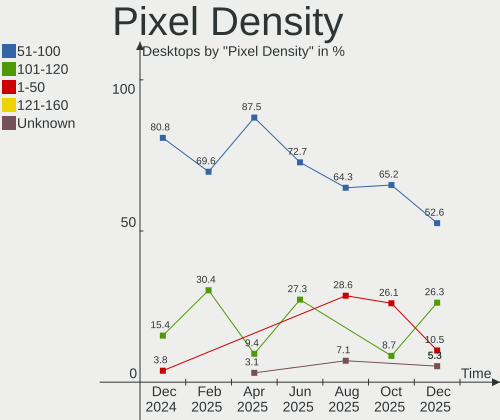

| Density | Desktops | Percent |
|---------|----------|---------|
| 51-100  | 10       | 52.63%  |
| 101-120 | 5        | 26.32%  |
| 1-50    | 2        | 10.53%  |
| 121-160 | 1        | 5.26%   |
| Unknown | 1        | 5.26%   |

Multiple Monitors
-----------------

Total monitors connected

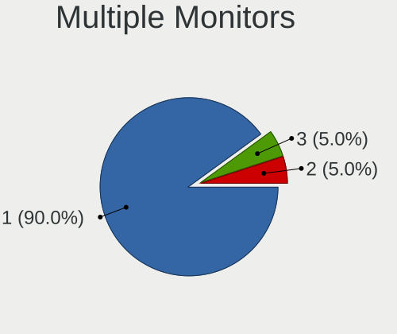

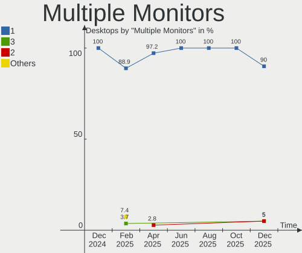

| Total | Desktops | Percent |
|-------|----------|---------|
| 1     | 18       | 90%     |
| 3     | 1        | 5%      |
| 2     | 1        | 5%      |

Network
-------

Net Controller Vendor
---------------------

Controller vendors

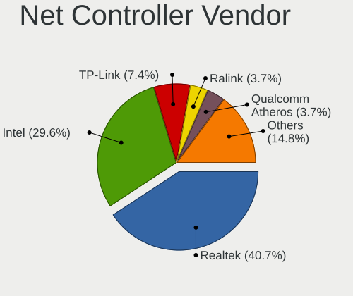

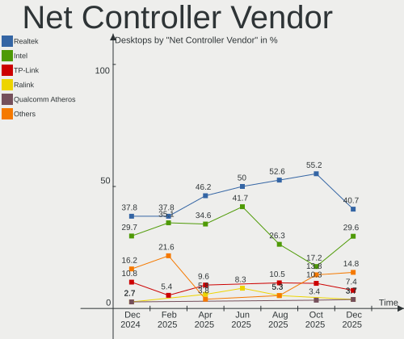

| Vendor                          | Desktops | Percent |
|---------------------------------|----------|---------|
| Realtek Semiconductor           | 11       | 40.74%  |
| Intel                           | 8        | 29.63%  |
| TP-Link                         | 2        | 7.41%   |
| Ralink Technology               | 1        | 3.7%    |
| Qualcomm Atheros Communications | 1        | 3.7%    |
| Qualcomm Atheros                | 1        | 3.7%    |
| Nvidia                          | 1        | 3.7%    |
| NetGear                         | 1        | 3.7%    |
| IMC Networks                    | 1        | 3.7%    |

Net Controller Model
--------------------

Controller models

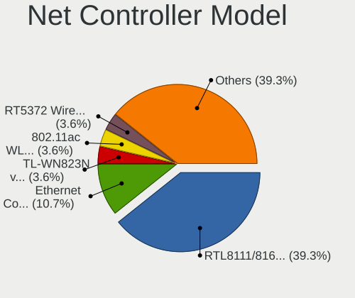

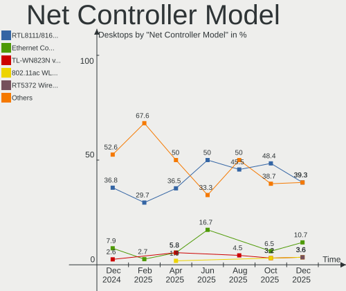

| Model                                                                         | Desktops | Percent |
|-------------------------------------------------------------------------------|----------|---------|
| Realtek RTL8111/8168/8211/8411 PCI Express Gigabit Ethernet Controller        | 11       | 39.29%  |
| Intel Ethernet Connection (2) I219-V                                          | 3        | 10.71%  |
| TP-Link TL-WN823N v2/v3 [Realtek RTL8192EU]                                   | 1        | 3.57%   |
| TP-Link 802.11ac WLAN Adapter                                                 | 1        | 3.57%   |
| Ralink RT5372 Wireless Adapter                                                | 1        | 3.57%   |
| Qualcomm Atheros AR9271 802.11n                                               | 1        | 3.57%   |
| Qualcomm Atheros AR2413/AR2414 Wireless Network Adapter [AR5005G(S) 802.11bg] | 1        | 3.57%   |
| Nvidia MCP61 Ethernet                                                         | 1        | 3.57%   |
| NetGear WNA3100(v1) Wireless-N 300 [Broadcom BCM43231]                        | 1        | 3.57%   |
| Intel Wireless 3165                                                           | 1        | 3.57%   |
| Intel Ethernet Connection (7) I219-V                                          | 1        | 3.57%   |
| Intel Ethernet Connection (2) I219-LM                                         | 1        | 3.57%   |
| Intel Cannon Lake PCH CNVi WiFi                                               | 1        | 3.57%   |
| Intel 82579LM Gigabit Network Connection (Lewisville)                         | 1        | 3.57%   |
| Intel 82567LM-3 Gigabit Network Connection                                    | 1        | 3.57%   |
| IMC Networks Mediao 802.11n WLAN [Realtek RTL8191SU]                          | 1        | 3.57%   |

Wireless Vendor
---------------

Wireless vendors

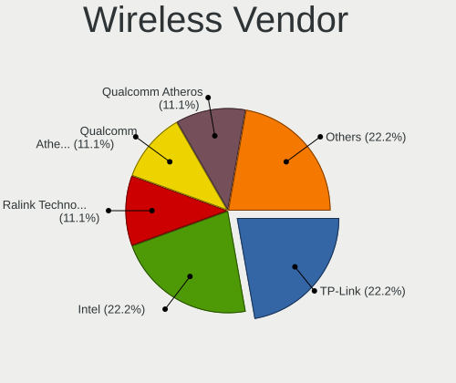

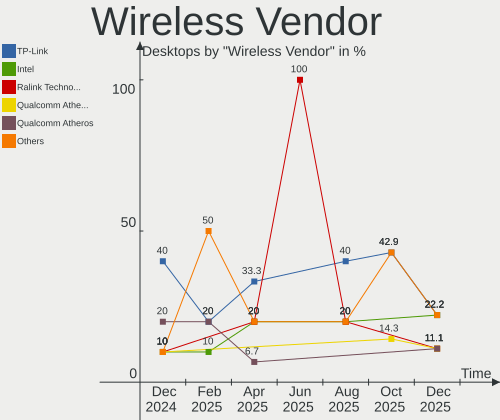

| Vendor                          | Desktops | Percent |
|---------------------------------|----------|---------|
| TP-Link                         | 2        | 22.22%  |
| Intel                           | 2        | 22.22%  |
| Ralink Technology               | 1        | 11.11%  |
| Qualcomm Atheros Communications | 1        | 11.11%  |
| Qualcomm Atheros                | 1        | 11.11%  |
| NetGear                         | 1        | 11.11%  |
| IMC Networks                    | 1        | 11.11%  |

Wireless Model
--------------

Wireless models

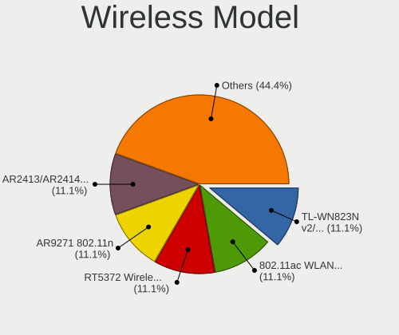

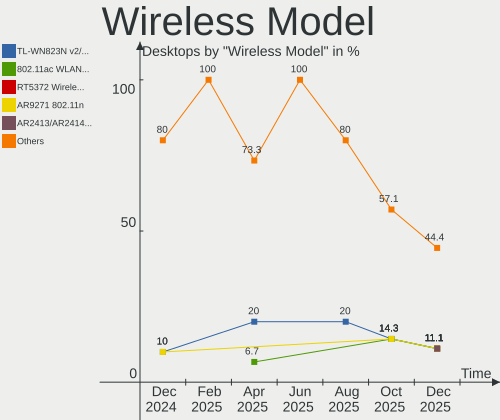

| Model                                                                         | Desktops | Percent |
|-------------------------------------------------------------------------------|----------|---------|
| TP-Link TL-WN823N v2/v3 [Realtek RTL8192EU]                                   | 1        | 11.11%  |
| TP-Link 802.11ac WLAN Adapter                                                 | 1        | 11.11%  |
| Ralink RT5372 Wireless Adapter                                                | 1        | 11.11%  |
| Qualcomm Atheros AR9271 802.11n                                               | 1        | 11.11%  |
| Qualcomm Atheros AR2413/AR2414 Wireless Network Adapter [AR5005G(S) 802.11bg] | 1        | 11.11%  |
| NetGear WNA3100(v1) Wireless-N 300 [Broadcom BCM43231]                        | 1        | 11.11%  |
| Intel Wireless 3165                                                           | 1        | 11.11%  |
| Intel Cannon Lake PCH CNVi WiFi                                               | 1        | 11.11%  |
| IMC Networks Mediao 802.11n WLAN [Realtek RTL8191SU]                          | 1        | 11.11%  |

Ethernet Vendor
---------------

Ethernet vendors

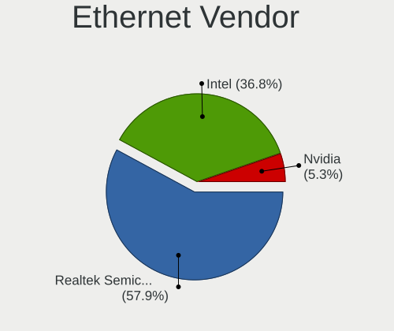

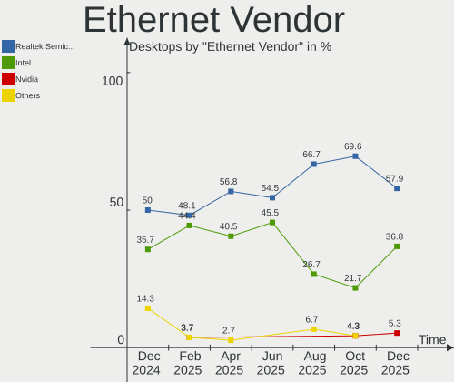

| Vendor                | Desktops | Percent |
|-----------------------|----------|---------|
| Realtek Semiconductor | 11       | 57.89%  |
| Intel                 | 7        | 36.84%  |
| Nvidia                | 1        | 5.26%   |

Ethernet Model
--------------

Ethernet models

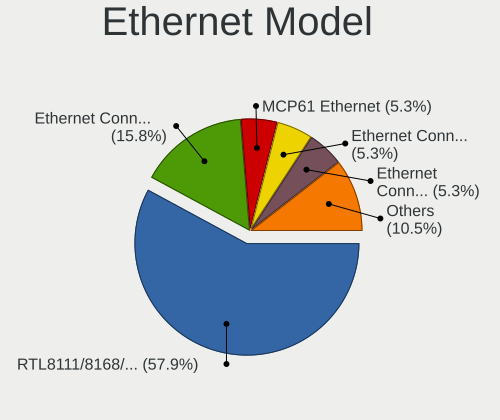

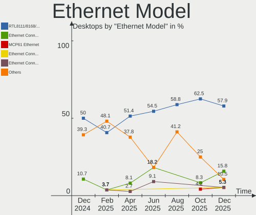

| Model                                                                  | Desktops | Percent |
|------------------------------------------------------------------------|----------|---------|
| Realtek RTL8111/8168/8211/8411 PCI Express Gigabit Ethernet Controller | 11       | 57.89%  |
| Intel Ethernet Connection (2) I219-V                                   | 3        | 15.79%  |
| Nvidia MCP61 Ethernet                                                  | 1        | 5.26%   |
| Intel Ethernet Connection (7) I219-V                                   | 1        | 5.26%   |
| Intel Ethernet Connection (2) I219-LM                                  | 1        | 5.26%   |
| Intel 82579LM Gigabit Network Connection (Lewisville)                  | 1        | 5.26%   |
| Intel 82567LM-3 Gigabit Network Connection                             | 1        | 5.26%   |

Net Controller Kind
-------------------

Ethernet, WiFi or modem

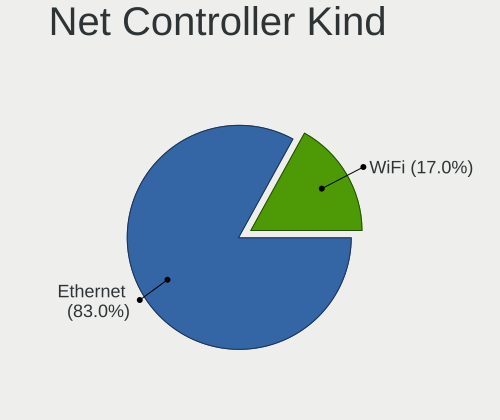

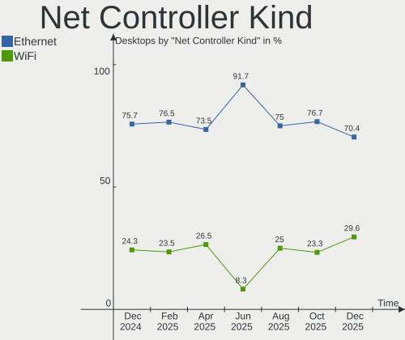

| Kind     | Desktops | Percent |
|----------|----------|---------|
| Ethernet | 19       | 70.37%  |
| WiFi     | 8        | 29.63%  |

Used Controller
---------------

Currently used network controller

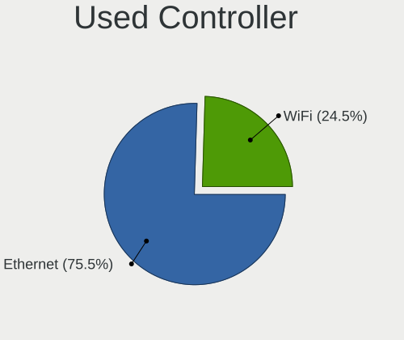

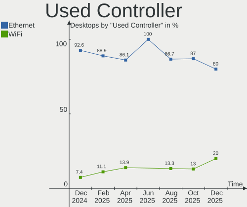

| Kind     | Desktops | Percent |
|----------|----------|---------|
| Ethernet | 16       | 80%     |
| WiFi     | 4        | 20%     |

NICs
----

Total network controllers on board

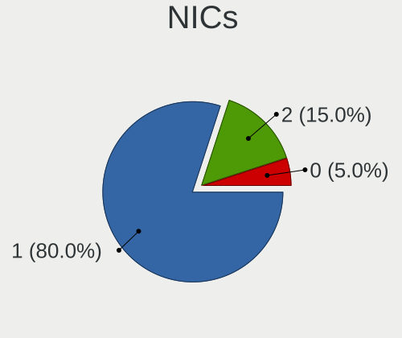

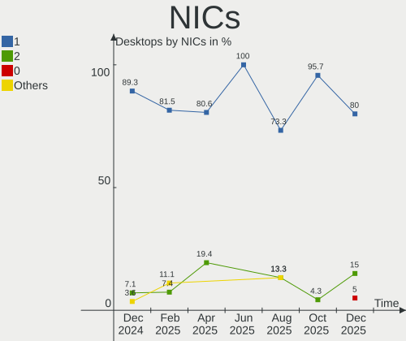

| Total | Desktops | Percent |
|-------|----------|---------|
| 1     | 16       | 80%     |
| 2     | 3        | 15%     |
| 0     | 1        | 5%      |

IPv6
----

IPv6 vs IPv4

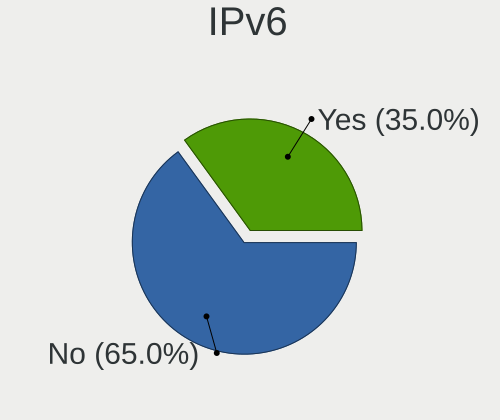

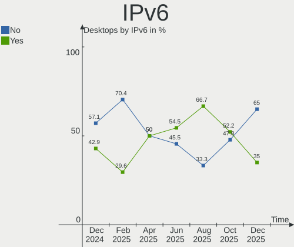

| Used | Desktops | Percent |
|------|----------|---------|
| No   | 13       | 65%     |
| Yes  | 7        | 35%     |

Bluetooth
---------

Bluetooth Vendor
----------------

Controller vendors

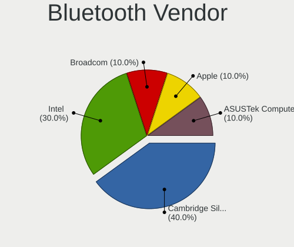

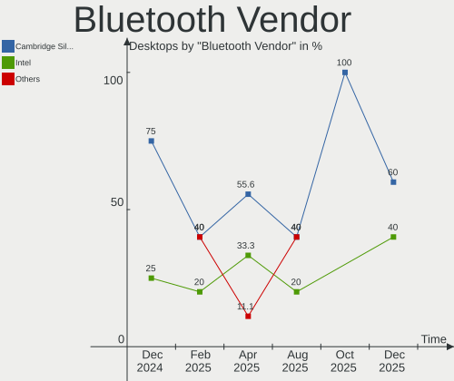

| Vendor                  | Desktops | Percent |
|-------------------------|----------|---------|
| Cambridge Silicon Radio | 3        | 60%     |
| Intel                   | 2        | 40%     |

Bluetooth Model
---------------

Controller models

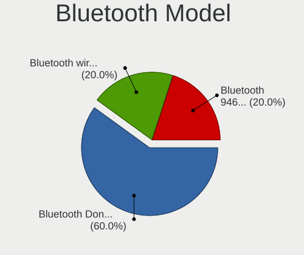

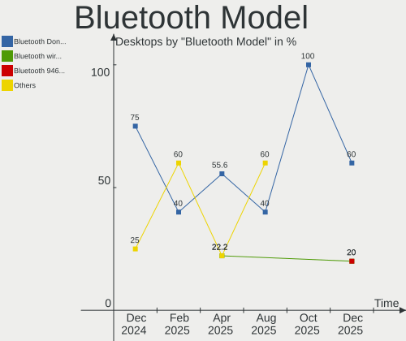

| Model                                               | Desktops | Percent |
|-----------------------------------------------------|----------|---------|
| Cambridge Silicon Radio Bluetooth Dongle (HCI mode) | 3        | 60%     |
| Intel Bluetooth wireless interface                  | 1        | 20%     |
| Intel Bluetooth 9460/9560 Jefferson Peak (JfP)      | 1        | 20%     |

Sound
-----

Sound Vendor
------------

Sound card vendors

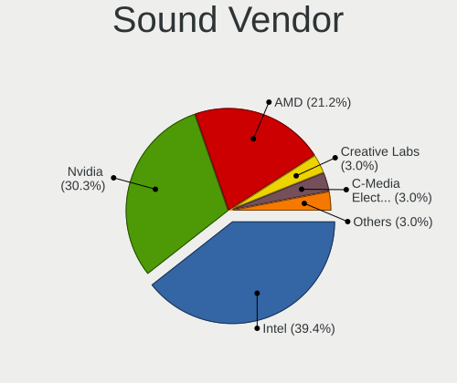

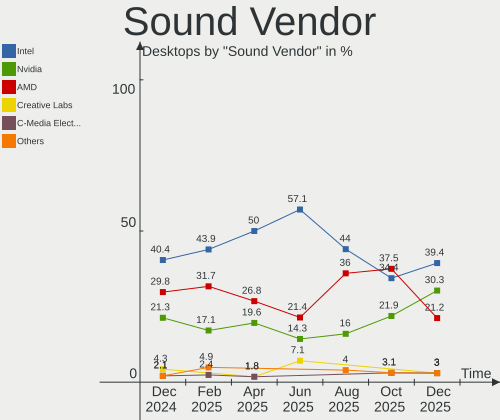

| Vendor              | Desktops | Percent |
|---------------------|----------|---------|
| Intel               | 13       | 39.39%  |
| Nvidia              | 10       | 30.3%   |
| AMD                 | 7        | 21.21%  |
| Creative Labs       | 1        | 3.03%   |
| C-Media Electronics | 1        | 3.03%   |
| ASUSTek Computer    | 1        | 3.03%   |

Sound Model
-----------

Sound card models

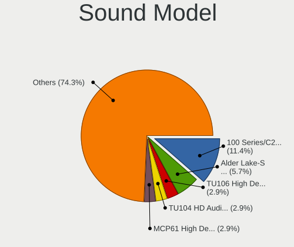

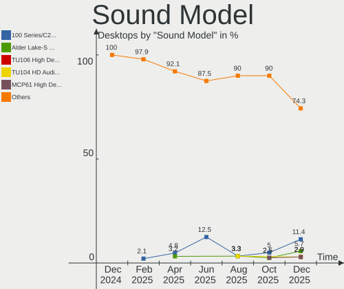

| Model                                                                                           | Desktops | Percent |
|-------------------------------------------------------------------------------------------------|----------|---------|
| Intel 100 Series/C230 Series Chipset Family HD Audio Controller                                 | 4        | 11.43%  |
| Intel Alder Lake-S HD Audio Controller                                                          | 2        | 5.71%   |
| Nvidia TU106 High Definition Audio Controller                                                   | 1        | 2.86%   |
| Nvidia TU104 HD Audio Controller                                                                | 1        | 2.86%   |
| Nvidia MCP61 High Definition Audio                                                              | 1        | 2.86%   |
| Nvidia High Definition Audio Controller                                                         | 1        | 2.86%   |
| Nvidia GP107GL High Definition Audio Controller                                                 | 1        | 2.86%   |
| Nvidia GK208 HDMI/DP Audio Controller                                                           | 1        | 2.86%   |
| Nvidia GK104 HDMI Audio Controller                                                              | 1        | 2.86%   |
| Nvidia GF116 High Definition Audio Controller                                                   | 1        | 2.86%   |
| Nvidia GF108 High Definition Audio Controller                                                   | 1        | 2.86%   |
| Nvidia GA106 High Definition Audio Controller                                                   | 1        | 2.86%   |
| Intel Celeron N3350/Pentium N4200/Atom E3900 Series Audio Cluster                               | 1        | 2.86%   |
| Intel Cannon Lake PCH cAVS                                                                      | 1        | 2.86%   |
| Intel 82801JD/DO (ICH10 Family) HD Audio Controller                                             | 1        | 2.86%   |
| Intel 8 Series/C220 Series Chipset High Definition Audio Controller                             | 1        | 2.86%   |
| Intel 7 Series/C216 Chipset Family High Definition Audio Controller                             | 1        | 2.86%   |
| Intel 6 Series/C200 Series Chipset Family High Definition Audio Controller                      | 1        | 2.86%   |
| Intel 5 Series/3400 Series Chipset High Definition Audio                                        | 1        | 2.86%   |
| Creative Labs CA0132 Sound Core3D [Sound Blaster Recon3D / Z-Series / Sound BlasterX AE-5 Plus] | 1        | 2.86%   |
| C-Media Electronics CM106 Like Sound Device                                                     | 1        | 2.86%   |
| ASUSTek Computer ASUS ROG Spitfire                                                              | 1        | 2.86%   |
| AMD Turks HDMI Audio [Radeon HD 6500/6600 / 6700M Series]                                       | 1        | 2.86%   |
| AMD Starship/Matisse HD Audio Controller                                                        | 1        | 2.86%   |
| AMD SBx00 Azalia (Intel HDA)                                                                    | 1        | 2.86%   |
| AMD Ryzen HD Audio Controller                                                                   | 1        | 2.86%   |
| AMD Navi 21/23 HDMI/DP Audio Controller                                                         | 1        | 2.86%   |
| AMD Juniper HDMI Audio [Radeon HD 5700 Series]                                                  | 1        | 2.86%   |
| AMD FCH Azalia Controller                                                                       | 1        | 2.86%   |
| AMD Family 17h (Models 00h-0fh) HD Audio Controller                                             | 1        | 2.86%   |
| AMD BeaverCreek HDMI Audio [Radeon HD 6500D and 6400G-6600G series]                             | 1        | 2.86%   |

Memory
------

Memory Vendor
-------------

Memory module vendors

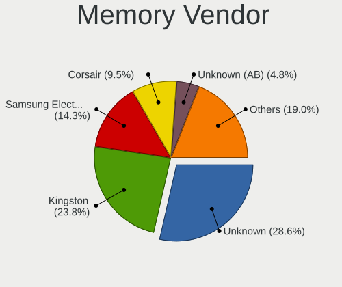

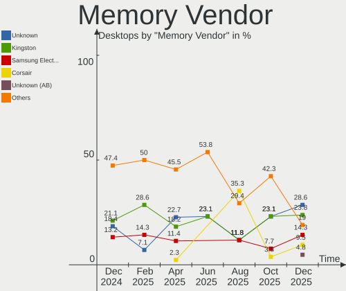

| Vendor              | Desktops | Percent |
|---------------------|----------|---------|
| Unknown             | 6        | 28.57%  |
| Kingston            | 5        | 23.81%  |
| Samsung Electronics | 3        | 14.29%  |
| Corsair             | 2        | 9.52%   |
| Unknown (AB)        | 1        | 4.76%   |
| Gigabyte Technology | 1        | 4.76%   |
| G.Skill             | 1        | 4.76%   |
| Crucial             | 1        | 4.76%   |
| A-DATA Technology   | 1        | 4.76%   |

Memory Model
------------

Memory module models

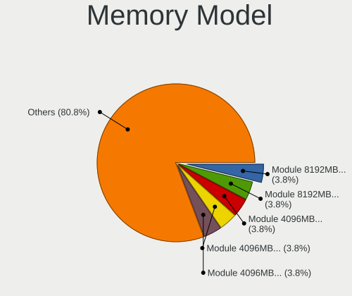

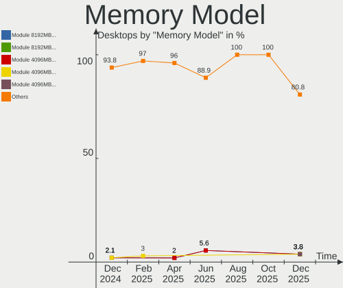

| Model                                                      | Desktops | Percent |
|------------------------------------------------------------|----------|---------|
| Unknown RAM Module 8192MB DIMM DDR4 2133MT/s               | 1        | 3.85%   |
| Unknown RAM Module 8192MB DIMM 1333MT/s                    | 1        | 3.85%   |
| Unknown RAM Module 4096MB DIMM DDR4 2133MT/s               | 1        | 3.85%   |
| Unknown RAM Module 4096MB DIMM DDR3 1333MT/s               | 1        | 3.85%   |
| Unknown RAM Module 4096MB DIMM 400MT/s                     | 1        | 3.85%   |
| Unknown RAM Module 2GB DIMM DDR2 1067MT/s                  | 1        | 3.85%   |
| Unknown RAM Module 16384MB DIMM DDR4 3200MT/s              | 1        | 3.85%   |
| Unknown (AB) RAM Module 8192MB SODIMM LPDDR4 1600MT/s      | 1        | 3.85%   |
| Samsung RAM Module 8192MB DIMM DDR4 2133MT/s               | 1        | 3.85%   |
| Samsung RAM M378B5273DH0-CK0 4GB DIMM DDR3 2200MT/s        | 1        | 3.85%   |
| Samsung RAM M378B5273DH0-CH9 4GB DIMM DDR3 2133MT/s        | 1        | 3.85%   |
| Samsung RAM M378B5273CH0-CK0 4GB DIMM DDR3 2000MT/s        | 1        | 3.85%   |
| Samsung RAM M378A5143DB0-CPB 4GB DIMM DDR4 2400MT/s        | 1        | 3.85%   |
| Kingston RAM KP223C-ELD 2GB DIMM DDR3 1600MT/s             | 1        | 3.85%   |
| Kingston RAM KHX1600C9D3/4GX 4GB DIMM DDR3 1867MT/s        | 1        | 3.85%   |
| Kingston RAM KF556C40-8 8192MB DIMM 5600MT/s               | 1        | 3.85%   |
| Kingston RAM KF3200C16D4/8GX 8GiB DIMM DDR4 3600MT/s       | 1        | 3.85%   |
| Kingston RAM 99U5584-009.A00LF 4GB DIMM DDR3 1600MT/s      | 1        | 3.85%   |
| Kingston RAM 99U5584-001.A00LF 4GB DIMM DDR3 1600MT/s      | 1        | 3.85%   |
| Kingston RAM 9905584-049.A00LF 4GB DIMM DDR3 1333MT/s      | 1        | 3.85%   |
| Gigabyte RAM GP-ARS16G44 8192MB DIMM DDR4 2133MT/s         | 1        | 3.85%   |
| G.Skill RAM F4-4400C18-8GTZR 8192MB DIMM DDR4 4200MT/s     | 1        | 3.85%   |
| Crucial RAM CT8G4DFS8213.C8FDD1 8192MB DIMM DDR4 2400MT/s  | 1        | 3.85%   |
| Corsair RAM CMV8GX4M1A2400C16 8GB DIMM DDR4 2400MT/s       | 1        | 3.85%   |
| Corsair RAM CMK8GX4M1A2400C16 8GB DIMM DDR4 3066MT/s       | 1        | 3.85%   |
| A-DATA RAM AX4U320016G16A-DTBKD 16384MB DIMM DDR4 3200MT/s | 1        | 3.85%   |

Memory Kind
-----------

Memory module kinds

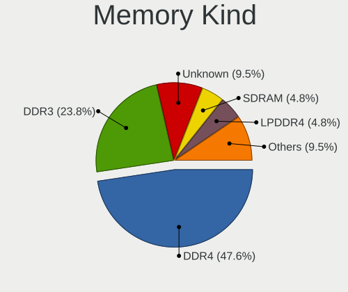

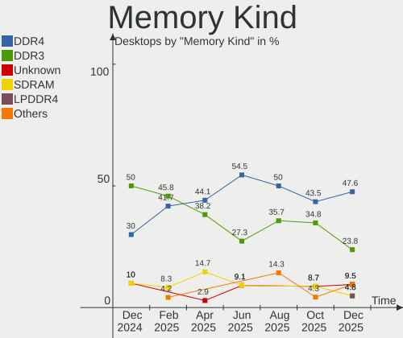

| Kind    | Desktops | Percent |
|---------|----------|---------|
| DDR4    | 10       | 47.62%  |
| DDR3    | 5        | 23.81%  |
| Unknown | 2        | 9.52%   |
| SDRAM   | 1        | 4.76%   |
| LPDDR4  | 1        | 4.76%   |
| DDR5    | 1        | 4.76%   |
| DDR2    | 1        | 4.76%   |

Memory Form Factor
------------------

Physical design of the memory module

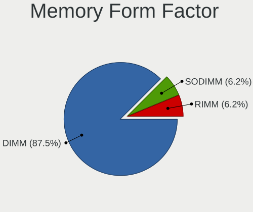

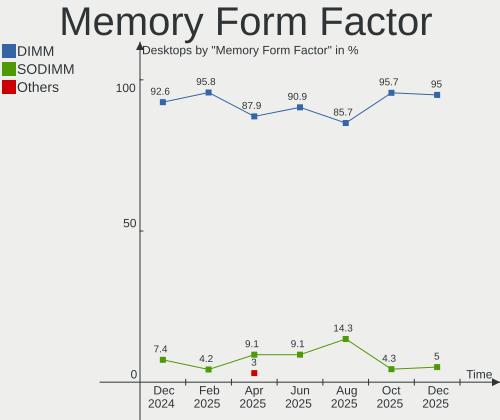

| Name   | Desktops | Percent |
|--------|----------|---------|
| DIMM   | 19       | 95%     |
| SODIMM | 1        | 5%      |

Memory Size
-----------

Memory module size

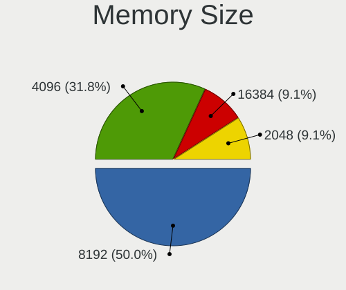

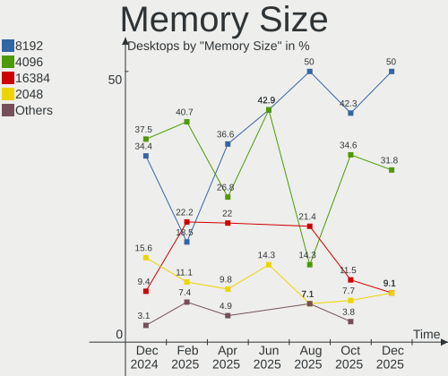

| Size  | Desktops | Percent |
|-------|----------|---------|
| 8192  | 11       | 50%     |
| 4096  | 7        | 31.82%  |
| 16384 | 2        | 9.09%   |
| 2048  | 2        | 9.09%   |

Memory Speed
------------

Memory module speed

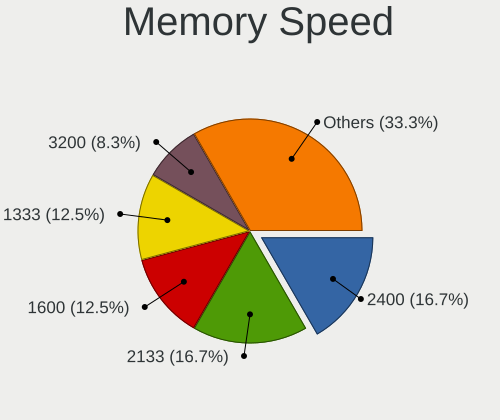

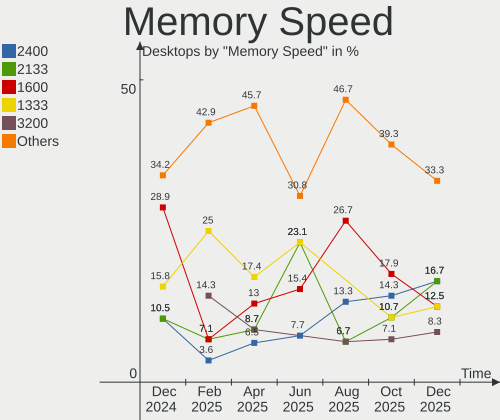

| Speed | Desktops | Percent |
|-------|----------|---------|
| 2400  | 4        | 16.67%  |
| 2133  | 4        | 16.67%  |
| 1600  | 3        | 12.5%   |
| 1333  | 3        | 12.5%   |
| 3200  | 2        | 8.33%   |
| 5600  | 1        | 4.17%   |
| 4200  | 1        | 4.17%   |
| 3600  | 1        | 4.17%   |
| 3066  | 1        | 4.17%   |
| 2200  | 1        | 4.17%   |
| 2000  | 1        | 4.17%   |
| 1067  | 1        | 4.17%   |
| 400   | 1        | 4.17%   |

Printers & scanners
-------------------

Printer Vendor
--------------

Printer device vendors

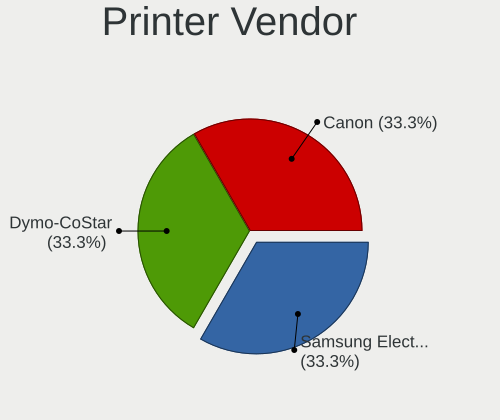

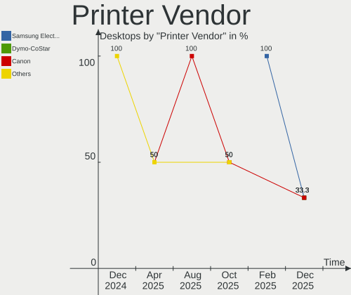

| Vendor              | Desktops | Percent |
|---------------------|----------|---------|
| Samsung Electronics | 1        | 33.33%  |
| Dymo-CoStar         | 1        | 33.33%  |
| Canon               | 1        | 33.33%  |

Printer Model
-------------

Printer device models

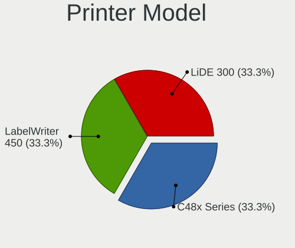

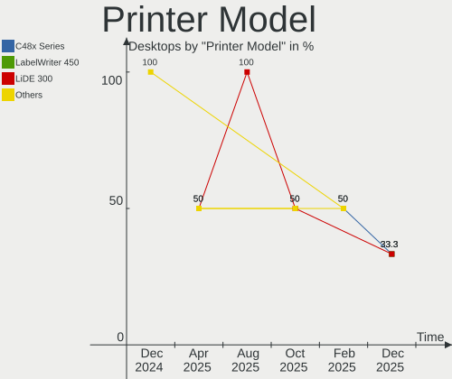

| Model                       | Desktops | Percent |
|-----------------------------|----------|---------|
| Samsung C48x Series         | 1        | 33.33%  |
| Dymo-CoStar LabelWriter 450 | 1        | 33.33%  |
| Canon LiDE 300              | 1        | 33.33%  |

Scanner Vendor
--------------

Scanner device vendors

Zero info for selected period =(

Scanner Model
-------------

Scanner device models

Zero info for selected period =(

Camera
------

Camera Vendor
-------------

Camera device vendors

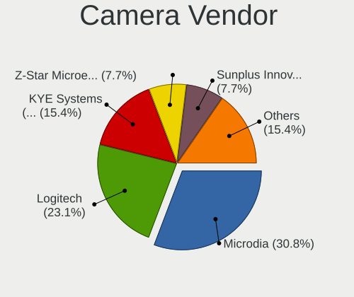

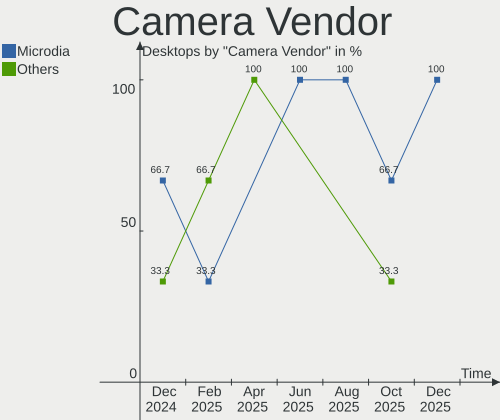

| Vendor   | Desktops | Percent |
|----------|----------|---------|
| Microdia | 2        | 100%    |

Camera Model
------------

Camera device models

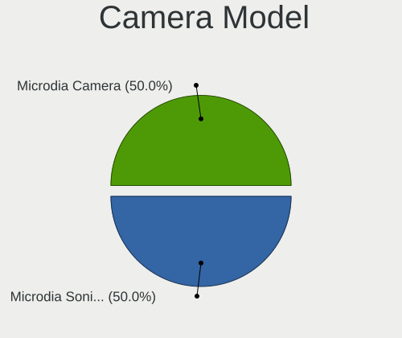

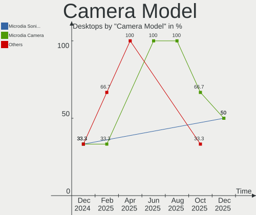

| Model                         | Desktops | Percent |
|-------------------------------|----------|---------|
| Microdia Sonix USB 2.0 Camera | 1        | 50%     |
| Microdia Camera               | 1        | 50%     |

Security
--------

Fingerprint Vendor
------------------

Fingerprint sensor vendors

Zero info for selected period =(

Fingerprint Model
-----------------

Fingerprint sensor models

Zero info for selected period =(

Chipcard Vendor
---------------

Chipcard module vendors

Zero info for selected period =(

Chipcard Model
--------------

Chipcard module models

Zero info for selected period =(

Unsupported
-----------

Unsupported Devices
-------------------

Total unsupported devices on board

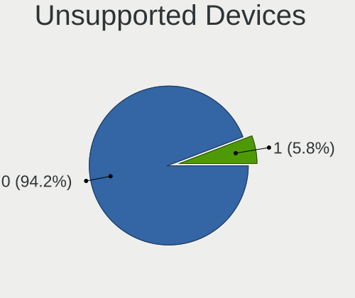

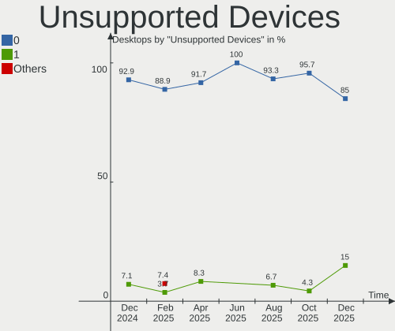

| Total | Desktops | Percent |
|-------|----------|---------|
| 0     | 17       | 85%     |
| 1     | 3        | 15%     |

Unsupported Device Types
------------------------

Types of unsupported devices

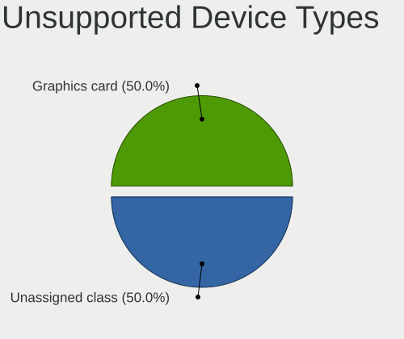

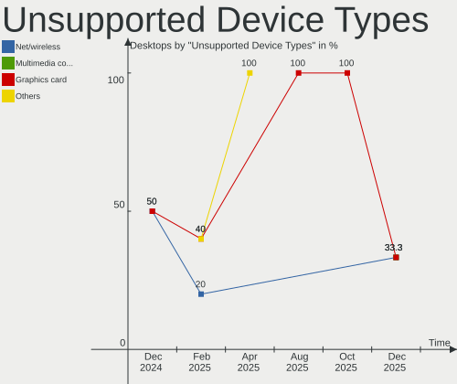

| Type                  | Desktops | Percent |
|-----------------------|----------|---------|
| Net/wireless          | 1        | 33.33%  |
| Multimedia controller | 1        | 33.33%  |
| Graphics card         | 1        | 33.33%  |

