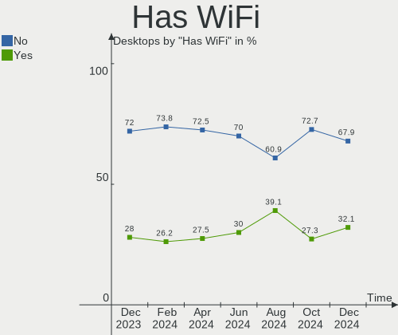
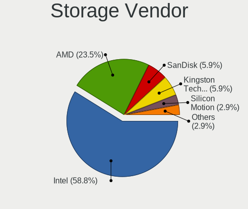

BlackPanther Hardware Trends (Desktops)
---------------------------------------

A project to identify most popular hardware characteristics and track their change
over time based on data collected by BlackPanther users at https://Linux-Hardware.org.

Anyone can contribute to this report by the [hw-probe](https://github.com/linuxhw/hw-probe) tool:

    sudo -E hw-probe -all -upload

Full-feature report is available here: https://linux-hardware.org/?view=trends

Period: Nov, 2021.

Contents
--------

* [ System ](#system)
  - [ OS                       ](#os)
  - [ OS Family                ](#os-family)
  - [ Kernel                   ](#kernel)
  - [ Kernel Family            ](#kernel-family)
  - [ Kernel Major Ver.        ](#kernel-major-ver)
  - [ Arch                     ](#arch)
  - [ DE                       ](#de)
  - [ Display Server           ](#display-server)
  - [ Display Manager          ](#display-manager)
  - [ OS Lang                  ](#os-lang)
  - [ Boot Mode                ](#boot-mode)
  - [ Filesystem               ](#filesystem)
  - [ Part. scheme             ](#part-scheme)
  - [ Dual Boot with Linux/BSD ](#dual-boot-with-linuxbsd)
  - [ Dual Boot (Win)          ](#dual-boot-win)

* [ Board ](#board)
  - [ Vendor                   ](#vendor)
  - [ Model                    ](#model)
  - [ Model Family             ](#model-family)
  - [ MFG Year                 ](#mfg-year)
  - [ Form Factor              ](#form-factor)
  - [ Secure Boot              ](#secure-boot)
  - [ Coreboot                 ](#coreboot)
  - [ RAM Size                 ](#ram-size)
  - [ RAM Used                 ](#ram-used)
  - [ Total Drives             ](#total-drives)
  - [ Has CD-ROM               ](#has-cd-rom)
  - [ Has Ethernet             ](#has-ethernet)
  - [ Has WiFi                 ](#has-wifi)
  - [ Has Bluetooth            ](#has-bluetooth)

* [ Location ](#location)
  - [ Country                  ](#country)
  - [ City                     ](#city)

* [ Drives ](#drives)
  - [ Drive Vendor             ](#drive-vendor)
  - [ Drive Model              ](#drive-model)
  - [ HDD Vendor               ](#hdd-vendor)
  - [ SSD Vendor               ](#ssd-vendor)
  - [ Drive Kind               ](#drive-kind)
  - [ Drive Connector          ](#drive-connector)
  - [ Drive Size               ](#drive-size)
  - [ Space Total              ](#space-total)
  - [ Space Used               ](#space-used)
  - [ Malfunc. Drives          ](#malfunc-drives)
  - [ Malfunc. Drive Vendor    ](#malfunc-drive-vendor)
  - [ Malfunc. HDD Vendor      ](#malfunc-hdd-vendor)
  - [ Malfunc. Drive Kind      ](#malfunc-drive-kind)
  - [ Failed Drives            ](#failed-drives)
  - [ Failed Drive Vendor      ](#failed-drive-vendor)
  - [ Drive Status             ](#drive-status)

* [ Storage controller ](#storage-controller)
  - [ Storage Vendor           ](#storage-vendor)
  - [ Storage Model            ](#storage-model)
  - [ Storage Kind             ](#storage-kind)

* [ Processor ](#processor)
  - [ CPU Vendor               ](#cpu-vendor)
  - [ CPU Model                ](#cpu-model)
  - [ CPU Model Family         ](#cpu-model-family)
  - [ CPU Cores                ](#cpu-cores)
  - [ CPU Sockets              ](#cpu-sockets)
  - [ CPU Threads              ](#cpu-threads)
  - [ CPU Op-Modes             ](#cpu-op-modes)
  - [ CPU Microcode            ](#cpu-microcode)
  - [ CPU Microarch            ](#cpu-microarch)

* [ Graphics ](#graphics)
  - [ GPU Vendor               ](#gpu-vendor)
  - [ GPU Model                ](#gpu-model)
  - [ GPU Combo                ](#gpu-combo)
  - [ GPU Driver               ](#gpu-driver)
  - [ GPU Memory               ](#gpu-memory)

* [ Monitor ](#monitor)
  - [ Monitor Vendor           ](#monitor-vendor)
  - [ Monitor Model            ](#monitor-model)
  - [ Monitor Resolution       ](#monitor-resolution)
  - [ Monitor Diagonal         ](#monitor-diagonal)
  - [ Monitor Width            ](#monitor-width)
  - [ Aspect Ratio             ](#aspect-ratio)
  - [ Monitor Area             ](#monitor-area)
  - [ Pixel Density            ](#pixel-density)
  - [ Multiple Monitors        ](#multiple-monitors)

* [ Network ](#network)
  - [ Net Controller Vendor    ](#net-controller-vendor)
  - [ Net Controller Model     ](#net-controller-model)
  - [ Wireless Vendor          ](#wireless-vendor)
  - [ Wireless Model           ](#wireless-model)
  - [ Ethernet Vendor          ](#ethernet-vendor)
  - [ Ethernet Model           ](#ethernet-model)
  - [ Net Controller Kind      ](#net-controller-kind)
  - [ Used Controller          ](#used-controller)
  - [ NICs                     ](#nics)
  - [ IPv6                     ](#ipv6)

* [ Bluetooth ](#bluetooth)
  - [ Bluetooth Vendor         ](#bluetooth-vendor)
  - [ Bluetooth Model          ](#bluetooth-model)

* [ Sound ](#sound)
  - [ Sound Vendor             ](#sound-vendor)
  - [ Sound Model              ](#sound-model)

* [ Memory ](#memory)
  - [ Memory Vendor            ](#memory-vendor)
  - [ Memory Model             ](#memory-model)
  - [ Memory Kind              ](#memory-kind)
  - [ Memory Form Factor       ](#memory-form-factor)
  - [ Memory Size              ](#memory-size)
  - [ Memory Speed             ](#memory-speed)

* [ Printers & scanners ](#printers--scanners)
  - [ Printer Vendor           ](#printer-vendor)
  - [ Printer Model            ](#printer-model)
  - [ Scanner Vendor           ](#scanner-vendor)
  - [ Scanner Model            ](#scanner-model)

* [ Camera ](#camera)
  - [ Camera Vendor            ](#camera-vendor)
  - [ Camera Model             ](#camera-model)

* [ Security ](#security)
  - [ Fingerprint Vendor       ](#fingerprint-vendor)
  - [ Fingerprint Model        ](#fingerprint-model)
  - [ Chipcard Vendor          ](#chipcard-vendor)
  - [ Chipcard Model           ](#chipcard-model)

* [ Unsupported ](#unsupported)
  - [ Unsupported Devices      ](#unsupported-devices)
  - [ Unsupported Device Types ](#unsupported-device-types)

System
------

OS
--

Installed operating systems

| Name              | Desktops | Percent |
|-------------------|----------|---------|
| BlackPanther 18.1 | 37       | 100%    |

OS Family
---------

OS without a version

| Name         | Desktops | Percent |
|--------------|----------|---------|
| BlackPanther | 37       | 100%    |

Kernel
------

Version of the Linux kernel

| Version             | Desktops | Percent |
|---------------------|----------|---------|
| 5.6.14-desktop-2bP  | 25       | 67.57%  |
| 4.18.16-desktop-1bP | 12       | 32.43%  |

Kernel Family
-------------

Linux kernel without a distro release

| Version | Desktops | Percent |
|---------|----------|---------|
| 5.6.14  | 25       | 67.57%  |
| 4.18.16 | 12       | 32.43%  |

Kernel Major Ver.
-----------------

Linux kernel major version

| Version | Desktops | Percent |
|---------|----------|---------|
| 5.6     | 25       | 67.57%  |
| 4.18    | 12       | 32.43%  |

Arch
----

OS architecture (x86_64, i586, etc.)

| Name   | Desktops | Percent |
|--------|----------|---------|
| x86_64 | 37       | 100%    |

DE
--

Desktop Environment

| Name | Desktops | Percent |
|------|----------|---------|
| KDE5 | 37       | 100%    |

Display Server
--------------

X11 or Wayland

| Name | Desktops | Percent |
|------|----------|---------|
| X11  | 37       | 100%    |

Display Manager
---------------

SDDM, LightDM, etc.

| Name | Desktops | Percent |
|------|----------|---------|
| SDDM | 37       | 100%    |

OS Lang
-------

Language

| Lang    | Desktops | Percent |
|---------|----------|---------|
| Unknown | 37       | 100%    |

Boot Mode
---------

EFI or BIOS

| Mode | Desktops | Percent |
|------|----------|---------|
| BIOS | 24       | 64.86%  |
| EFI  | 13       | 35.14%  |

Filesystem
----------

Type of filesystem

| Type    | Desktops | Percent |
|---------|----------|---------|
| Overlay | 36       | 97.3%   |
| Ext4    | 1        | 2.7%    |

Part. scheme
------------

Scheme of partitioning

| Type | Desktops | Percent |
|------|----------|---------|
| MBR  | 23       | 62.16%  |
| GPT  | 14       | 37.84%  |

Dual Boot with Linux/BSD
------------------------

Hosting more than one Linux/BSD

| Dual boot | Desktops | Percent |
|-----------|----------|---------|
| Yes       | 20       | 54.05%  |
| No        | 17       | 45.95%  |

Dual Boot (Win)
---------------

Hosting Linux and Windows

| Dual boot | Desktops | Percent |
|-----------|----------|---------|
| Yes       | 22       | 59.46%  |
| No        | 15       | 40.54%  |

Board
-----

Vendor
------

Motherboard manufacturer

| Name                           | Desktops | Percent |
|--------------------------------|----------|---------|
| Gigabyte Technology            | 8        | 21.62%  |
| ASUSTek Computer               | 8        | 21.62%  |
| Dell                           | 5        | 13.51%  |
| Hewlett-Packard                | 4        | 10.81%  |
| ASRock                         | 4        | 10.81%  |
| Fujitsu                        | 3        | 8.11%   |
| Medion                         | 2        | 5.41%   |
| Shanghai Zhaoxin Semiconductor | 1        | 2.7%    |
| MSI                            | 1        | 2.7%    |
| Lenovo                         | 1        | 2.7%    |

Model
-----

Motherboard model

| Name                        | Desktops | Percent |
|-----------------------------|----------|---------|
| Shanghai Zhaoxin ZXE CRB    | 1        | 2.7%    |
| MSI PPPPP-CCC#MMMMMMMM      | 1        | 2.7%    |
| Medion MS-7748              | 1        | 2.7%    |
| Medion MS-7646              | 1        | 2.7%    |
| Lenovo 7052-A9G             | 1        | 2.7%    |
| HP ProDesk 600 G2 SFF       | 1        | 2.7%    |
| HP Compaq Pro 6300 MT       | 1        | 2.7%    |
| HP Compaq 8100 Elite CMT PC | 1        | 2.7%    |
| HP Compaq 6005 Pro MT PC    | 1        | 2.7%    |
| Gigabyte P67A-D3-B3         | 1        | 2.7%    |
| Gigabyte J4005ND2P-CF       | 1        | 2.7%    |
| Gigabyte H510M H            | 1        | 2.7%    |
| Gigabyte H110M-S2H          | 1        | 2.7%    |
| Gigabyte GA-E350N           | 1        | 2.7%    |
| Gigabyte G41MT-S2PT         | 1        | 2.7%    |
| Gigabyte B450M S2H          | 1        | 2.7%    |
| Gigabyte B450M GAMING       | 1        | 2.7%    |
| Fujitsu ESPRIMO P720        | 1        | 2.7%    |
| Fujitsu ESPRIMO P710        | 1        | 2.7%    |
| Fujitsu ESPRIMO E910        | 1        | 2.7%    |
| Dell OptiPlex GX620         | 1        | 2.7%    |
| Dell OptiPlex 9020          | 1        | 2.7%    |
| Dell OptiPlex 9010          | 1        | 2.7%    |
| Dell OptiPlex 7010          | 1        | 2.7%    |
| Dell OptiPlex 330           | 1        | 2.7%    |
| ASUS PRIME H270-PLUS        | 1        | 2.7%    |
| ASUS PRIME B450-PLUS        | 1        | 2.7%    |
| ASUS PRIME A320M-R          | 1        | 2.7%    |
| ASUS P6T7 WS SUPERCOMPUTER  | 1        | 2.7%    |
| ASUS P5KPL-AM IN/ROEM/SI    | 1        | 2.7%    |
| ASUS P5B-PLUS Series        | 1        | 2.7%    |
| ASUS H110-PLUS              | 1        | 2.7%    |
| ASUS All Series             | 1        | 2.7%    |
| ASRock ION3D-HT             | 1        | 2.7%    |
| ASRock G31M-GS              | 1        | 2.7%    |
| ASRock FM2A75M Pro4+        | 1        | 2.7%    |
| ASRock B85M Pro4            | 1        | 2.7%    |

Model Family
------------

Motherboard model prefix

| Name                   | Desktops | Percent |
|------------------------|----------|---------|
| Dell OptiPlex          | 5        | 13.51%  |
| HP Compaq              | 3        | 8.11%   |
| Fujitsu ESPRIMO        | 3        | 8.11%   |
| ASUS PRIME             | 3        | 8.11%   |
| Gigabyte B450M         | 2        | 5.41%   |
| Shanghai Zhaoxin ZXE   | 1        | 2.7%    |
| MSI PPPPP-CCC#MMMMMMMM | 1        | 2.7%    |
| Medion MS-7748         | 1        | 2.7%    |
| Medion MS-7646         | 1        | 2.7%    |
| Lenovo 7052-A9G        | 1        | 2.7%    |
| HP ProDesk             | 1        | 2.7%    |
| Gigabyte P67A-D3-B3    | 1        | 2.7%    |
| Gigabyte J4005ND2P-CF  | 1        | 2.7%    |
| Gigabyte H510M         | 1        | 2.7%    |
| Gigabyte H110M-S2H     | 1        | 2.7%    |
| Gigabyte GA-E350N      | 1        | 2.7%    |
| Gigabyte G41MT-S2PT    | 1        | 2.7%    |
| ASUS P6T7              | 1        | 2.7%    |
| ASUS P5KPL-AM          | 1        | 2.7%    |
| ASUS P5B-PLUS          | 1        | 2.7%    |
| ASUS H110-PLUS         | 1        | 2.7%    |
| ASUS All               | 1        | 2.7%    |
| ASRock ION3D-HT        | 1        | 2.7%    |
| ASRock G31M-GS         | 1        | 2.7%    |
| ASRock FM2A75M         | 1        | 2.7%    |
| ASRock B85M            | 1        | 2.7%    |

MFG Year
--------

Motherboard manufacture year

| Year | Desktops | Percent |
|------|----------|---------|
| 2018 | 5        | 13.51%  |
| 2011 | 5        | 13.51%  |
| 2014 | 4        | 10.81%  |
| 2012 | 4        | 10.81%  |
| 2010 | 4        | 10.81%  |
| 2021 | 3        | 8.11%   |
| 2013 | 3        | 8.11%   |
| 2019 | 2        | 5.41%   |
| 2017 | 2        | 5.41%   |
| 2009 | 2        | 5.41%   |
| 2020 | 1        | 2.7%    |
| 2008 | 1        | 2.7%    |
| 2006 | 1        | 2.7%    |

Form Factor
-----------

Physical design of the computer

| Name    | Desktops | Percent |
|---------|----------|---------|
| Desktop | 37       | 100%    |

Secure Boot
-----------

Enabled or disabled

| State    | Desktops | Percent |
|----------|----------|---------|
| Disabled | 37       | 100%    |

Coreboot
--------

Have coreboot on board

| Used | Desktops | Percent |
|------|----------|---------|
| No   | 37       | 100%    |

RAM Size
--------

Total RAM memory

| Size in GB | Desktops | Percent |
|------------|----------|---------|
| 3.01-4.0   | 14       | 37.84%  |
| 8.01-16.0  | 12       | 32.43%  |
| 4.01-8.0   | 5        | 13.51%  |
| 16.01-24.0 | 5        | 13.51%  |
| 24.01-32.0 | 1        | 2.7%    |

RAM Used
--------

Used RAM memory

| Used GB  | Desktops | Percent |
|----------|----------|---------|
| 0.01-0.5 | 27       | 72.97%  |
| 0.51-1.0 | 7        | 18.92%  |
| 1.01-2.0 | 3        | 8.11%   |

Total Drives
------------

Number of drives on board

| Drives | Desktops | Percent |
|--------|----------|---------|
| 1      | 19       | 51.35%  |
| 2      | 13       | 35.14%  |
| 5      | 2        | 5.41%   |
| 3      | 2        | 5.41%   |
| 9      | 1        | 2.7%    |

Has CD-ROM
----------

Has CD-ROM on board

| Presented | Desktops | Percent |
|-----------|----------|---------|
| Yes       | 29       | 78.38%  |
| No        | 8        | 21.62%  |

Has Ethernet
------------

Has Ethernet on board

| Presented | Desktops | Percent |
|-----------|----------|---------|
| Yes       | 37       | 100%    |

Has WiFi
--------

Has WiFi module

| Presented | Desktops | Percent |
|-----------|----------|---------|
| No        | 29       | 78.38%  |
| Yes       | 8        | 21.62%  |

Has Bluetooth
-------------

Has Bluetooth module

| Presented | Desktops | Percent |
|-----------|----------|---------|
| No        | 30       | 81.08%  |
| Yes       | 7        | 18.92%  |

Location
--------

Country
-------

Geographic location (country)

| Country | Desktops | Percent |
|---------|----------|---------|
| Hungary | 34       | 91.89%  |
| Spain   | 1        | 2.7%    |
| China   | 1        | 2.7%    |
| Belgium | 1        | 2.7%    |

City
----

Geographic location (city)

| City                 | Desktops | Percent |
|----------------------|----------|---------|
| Budapest             | 5        | 13.51%  |
| Veresegyhaz          | 2        | 5.41%   |
| P?©cs                | 2        | 5.41%   |
| Debrecen             | 2        | 5.41%   |
| Vemend               | 1        | 2.7%    |
| Turkeve              | 1        | 2.7%    |
| Szolnok              | 1        | 2.7%    |
| Roszke               | 1        | 2.7%    |
| Pilismarot           | 1        | 2.7%    |
| Paszto               | 1        | 2.7%    |
| Nyirtass             | 1        | 2.7%    |
| Mezokovesd           | 1        | 2.7%    |
| Lebeny               | 1        | 2.7%    |
| Koszeg               | 1        | 2.7%    |
| Kecsked              | 1        | 2.7%    |
| Karcag               | 1        | 2.7%    |
| Kal                  | 1        | 2.7%    |
| Jerez de la Frontera | 1        | 2.7%    |
| Jaszdozsa            | 1        | 2.7%    |
| Huy                  | 1        | 2.7%    |
| Hodmezovasarhely     | 1        | 2.7%    |
| G?¶d?¶ll?‘           | 1        | 2.7%    |
| Fuzesabony           | 1        | 2.7%    |
| Farmos               | 1        | 2.7%    |
| Esztergom            | 1        | 2.7%    |
| Dalian               | 1        | 2.7%    |
| Cserepfalu           | 1        | 2.7%    |
| Balatonfured         | 1        | 2.7%    |
| Alsozsolca           | 1        | 2.7%    |
| Ajka                 | 1        | 2.7%    |

Drives
------

Drive Vendor
------------

Hard drive vendors

| Vendor              | Desktops | Drives | Percent |
|---------------------|----------|--------|---------|
| WDC                 | 13       | 16     | 20.63%  |
| Kingston            | 11       | 11     | 17.46%  |
| Samsung Electronics | 9        | 12     | 14.29%  |
| Seagate             | 7        | 10     | 11.11%  |
| Toshiba             | 6        | 6      | 9.52%   |
| A-DATA Technology   | 3        | 3      | 4.76%   |
| Team                | 2        | 2      | 3.17%   |
| China               | 2        | 2      | 3.17%   |
| Transcend           | 1        | 1      | 1.59%   |
| Teclast             | 1        | 1      | 1.59%   |
| SPCC                | 1        | 1      | 1.59%   |
| sobetter            | 1        | 1      | 1.59%   |
| SK Hynix            | 1        | 1      | 1.59%   |
| Hitachi             | 1        | 1      | 1.59%   |
| HGST                | 1        | 1      | 1.59%   |
| Gigabyte Technology | 1        | 1      | 1.59%   |
| Crucial             | 1        | 1      | 1.59%   |
| Apacer              | 1        | 1      | 1.59%   |

Drive Model
-----------

Hard drive models

| Model                             | Desktops | Percent |
|-----------------------------------|----------|---------|
| Kingston SA400S37240G 240GB SSD   | 4        | 5.63%   |
| Kingston SA400S37120G 120GB SSD   | 3        | 4.23%   |
| Seagate ST500DM002-1BD142 500GB   | 2        | 2.82%   |
| WDC WD5000AVCS-982DY1 500GB       | 1        | 1.41%   |
| WDC WD5000AAKX-75U6AA0 500GB      | 1        | 1.41%   |
| WDC WD5000AAKX-60U6AA0 500GB      | 1        | 1.41%   |
| WDC WD5000AAKX-08U6AA0 500GB      | 1        | 1.41%   |
| WDC WD40 EZAZ-00SF3B0 4TB         | 1        | 1.41%   |
| WDC WD3200LPLX-00ZNTT0 320GB      | 1        | 1.41%   |
| WDC WD30EZRZ-00GXCB0 3TB          | 1        | 1.41%   |
| WDC WD30EFRX-68EUZN0 3TB          | 1        | 1.41%   |
| WDC WD2500AAKX-221CA1 250GB       | 1        | 1.41%   |
| WDC WD2500AAJS-07M0A0 250GB       | 1        | 1.41%   |
| WDC WD20EZRZ-00Z5HB0 2TB          | 1        | 1.41%   |
| WDC WD1600BEVT-22ZCT0 160GB       | 1        | 1.41%   |
| WDC WD1600AAJB-56WRA0 160GB       | 1        | 1.41%   |
| WDC WD1500HLFS-01MZUV0 150GB      | 1        | 1.41%   |
| WDC WD10EZRX-00A8LB0 1TB          | 1        | 1.41%   |
| WDC WD10EZEX-08WN4A0 1TB          | 1        | 1.41%   |
| Transcend TS128GMTE110S 128GB     | 1        | 1.41%   |
| Toshiba Q300. 240GB SSD           | 1        | 1.41%   |
| Toshiba MQ04ABF100 1TB            | 1        | 1.41%   |
| Toshiba MQ01ABF050 500GB          | 1        | 1.41%   |
| Toshiba HDWD220 2TB               | 1        | 1.41%   |
| Toshiba HDWD130 3TB               | 1        | 1.41%   |
| Toshiba DT01ACA050 500GB          | 1        | 1.41%   |
| Teclast 256GB A850 SSD            | 1        | 1.41%   |
| Team T253X1240G 240GB SSD         | 1        | 1.41%   |
| Team L7 EVO SSD 60GB              | 1        | 1.41%   |
| SPCC M.2 PCIe SSD 512GB           | 1        | 1.41%   |
| sobetter EXT 1TB                  | 1        | 1.41%   |
| SK Hynix PC300 NVMe 1TB           | 1        | 1.41%   |
| Seagate ST96812AS 64GB            | 1        | 1.41%   |
| Seagate ST9250315AS 250GB         | 1        | 1.41%   |
| Seagate ST4000DM 000-1F2168 4TB   | 1        | 1.41%   |
| Seagate ST3500418AS 500GB         | 1        | 1.41%   |
| Seagate ST3160023AS 160GB         | 1        | 1.41%   |
| Seagate ST31000528AS 1TB          | 1        | 1.41%   |
| Seagate ST1000LM 048-2E7172 1TB   | 1        | 1.41%   |
| Seagate Expansion 1TB             | 1        | 1.41%   |
| Samsung SSD PM871b M.2 2280 256GB | 1        | 1.41%   |
| Samsung SSD 970 EVO Plus 500GB    | 1        | 1.41%   |
| Samsung SSD 960 EVO 250GB         | 1        | 1.41%   |
| Samsung SSD 870 QVO 1TB           | 1        | 1.41%   |
| Samsung SSD 870 EVO 250GB         | 1        | 1.41%   |
| Samsung SSD 840 EVO 120GB         | 1        | 1.41%   |
| Samsung SSD 830 Series 64GB       | 1        | 1.41%   |
| Samsung SP2004C 200GB             | 1        | 1.41%   |
| Samsung HD503HI 500GB             | 1        | 1.41%   |
| Samsung HD501LJ 500GB             | 1        | 1.41%   |
| Samsung HD154UI 1TB               | 1        | 1.41%   |
| Kingston SV300S37A120G 120GB SSD  | 1        | 1.41%   |
| Kingston SUV400S37120G 120GB SSD  | 1        | 1.41%   |
| Kingston SA2000M8250G 250GB       | 1        | 1.41%   |
| Kingston SA1000M8240G 240GB       | 1        | 1.41%   |
| Hitachi HDS721010CLA330 1TB       | 1        | 1.41%   |
| HGST HTS541010B7E610 1TB          | 1        | 1.41%   |
| Gigabyte GP-GSTFS31120GNTD 120GB  | 1        | 1.41%   |
| Crucial CT480BX500SSD1 480GB      | 1        | 1.41%   |
| China T60 64GB SSD                | 1        | 1.41%   |

HDD Vendor
----------

Hard disk drive vendors

| Vendor              | Desktops | Drives | Percent |
|---------------------|----------|--------|---------|
| WDC                 | 13       | 16     | 41.94%  |
| Seagate             | 7        | 10     | 22.58%  |
| Toshiba             | 5        | 5      | 16.13%  |
| Samsung Electronics | 4        | 4      | 12.9%   |
| Hitachi             | 1        | 1      | 3.23%   |
| HGST                | 1        | 1      | 3.23%   |

SSD Vendor
----------

Solid state drive vendors

| Vendor              | Desktops | Drives | Percent |
|---------------------|----------|--------|---------|
| Kingston            | 9        | 9      | 34.62%  |
| Samsung Electronics | 5        | 6      | 19.23%  |
| A-DATA Technology   | 3        | 3      | 11.54%  |
| Team                | 2        | 2      | 7.69%   |
| China               | 2        | 2      | 7.69%   |
| Toshiba             | 1        | 1      | 3.85%   |
| Teclast             | 1        | 1      | 3.85%   |
| Gigabyte Technology | 1        | 1      | 3.85%   |
| Crucial             | 1        | 1      | 3.85%   |
| Apacer              | 1        | 1      | 3.85%   |

Drive Kind
----------

HDD or SSD

| Kind    | Desktops | Drives | Percent |
|---------|----------|--------|---------|
| HDD     | 27       | 37     | 47.37%  |
| SSD     | 24       | 27     | 42.11%  |
| NVMe    | 5        | 7      | 8.77%   |
| Unknown | 1        | 1      | 1.75%   |

Drive Connector
---------------

SATA, SAS, NVMe, etc.

| Type | Desktops | Drives | Percent |
|------|----------|--------|---------|
| SATA | 37       | 60     | 86.05%  |
| NVMe | 5        | 7      | 11.63%  |
| SAS  | 1        | 5      | 2.33%   |

Drive Size
----------

Size of hard drive

| Size in TB | Desktops | Drives | Percent |
|------------|----------|--------|---------|
| 0.01-0.5   | 34       | 47     | 70.83%  |
| 0.51-1.0   | 9        | 10     | 18.75%  |
| 2.01-3.0   | 2        | 3      | 4.17%   |
| 1.01-2.0   | 2        | 2      | 4.17%   |
| 3.01-4.0   | 1        | 2      | 2.08%   |

Space Total
-----------

Amount of disk space available on the file system

| Size in GB | Desktops | Percent |
|------------|----------|---------|
| Unknown    | 36       | 97.3%   |
| 101-250    | 1        | 2.7%    |

Space Used
----------

Amount of used disk space

| Used GB | Desktops | Percent |
|---------|----------|---------|
| Unknown | 36       | 97.3%   |
| 1-20    | 1        | 2.7%    |

Malfunc. Drives
---------------

Drive models with a malfunction

| Model                             | Desktops | Drives | Percent |
|-----------------------------------|----------|--------|---------|
| WDC WD5000AAKX-08U6AA0 500GB      | 1        | 1      | 5.56%   |
| WDC WD2500AAKX-221CA1 250GB       | 1        | 1      | 5.56%   |
| WDC WD2500AAJS-07M0A0 250GB       | 1        | 1      | 5.56%   |
| WDC WD1500HLFS-01MZUV0 150GB      | 1        | 1      | 5.56%   |
| WDC WD10EZRX-00A8LB0 1TB          | 1        | 1      | 5.56%   |
| WDC WD10EZEX-08WN4A0 1TB          | 1        | 1      | 5.56%   |
| Toshiba HDWD130 3TB               | 1        | 1      | 5.56%   |
| Toshiba DT01ACA050 500GB          | 1        | 1      | 5.56%   |
| Seagate ST96812AS 64GB            | 1        | 1      | 5.56%   |
| Seagate ST9250315AS 250GB         | 1        | 1      | 5.56%   |
| Seagate ST500DM002-1BD142 500GB   | 1        | 1      | 5.56%   |
| Seagate ST4000DM 000-1F2168 4TB   | 1        | 1      | 5.56%   |
| Seagate ST3500418AS 500GB         | 1        | 1      | 5.56%   |
| Seagate ST3160023AS 160GB         | 1        | 1      | 5.56%   |
| Samsung Electronics SP2004C 200GB | 1        | 1      | 5.56%   |
| Samsung Electronics HD503HI 500GB | 1        | 1      | 5.56%   |
| Hitachi HDS721010CLA330 1TB       | 1        | 1      | 5.56%   |
| A-DATA Technology SU630 240GB SSD | 1        | 1      | 5.56%   |

Malfunc. Drive Vendor
---------------------

Vendors of faulty drives

| Vendor              | Desktops | Drives | Percent |
|---------------------|----------|--------|---------|
| WDC                 | 6        | 6      | 35.29%  |
| Seagate             | 5        | 6      | 29.41%  |
| Toshiba             | 2        | 2      | 11.76%  |
| Samsung Electronics | 2        | 2      | 11.76%  |
| Hitachi             | 1        | 1      | 5.88%   |
| A-DATA Technology   | 1        | 1      | 5.88%   |

Malfunc. HDD Vendor
-------------------

Vendors of faulty HDD drives

| Vendor              | Desktops | Drives | Percent |
|---------------------|----------|--------|---------|
| WDC                 | 6        | 6      | 37.5%   |
| Seagate             | 5        | 6      | 31.25%  |
| Toshiba             | 2        | 2      | 12.5%   |
| Samsung Electronics | 2        | 2      | 12.5%   |
| Hitachi             | 1        | 1      | 6.25%   |

Malfunc. Drive Kind
-------------------

Kinds of faulty drives

| Kind | Desktops | Drives | Percent |
|------|----------|--------|---------|
| HDD  | 15       | 17     | 93.75%  |
| SSD  | 1        | 1      | 6.25%   |

Failed Drives
-------------

Failed drive models

Zero info for selected period =(

Failed Drive Vendor
-------------------

Failed drive vendors

Zero info for selected period =(

Drive Status
------------

Number of failed and malfunc. drives

| Status   | Desktops | Drives | Percent |
|----------|----------|--------|---------|
| Works    | 28       | 50     | 63.64%  |
| Malfunc  | 15       | 18     | 34.09%  |
| Detected | 1        | 4      | 2.27%   |

Storage controller
------------------

Storage Vendor
--------------

Storage controller vendors

| Vendor                      | Desktops | Percent |
|-----------------------------|----------|---------|
| Intel                       | 27       | 58.7%   |
| AMD                         | 9        | 19.57%  |
| Samsung Electronics         | 2        | 4.35%   |
| Kingston Technology Company | 2        | 4.35%   |
| Zhaoxin                     | 1        | 2.17%   |
| SK Hynix                    | 1        | 2.17%   |
| Silicon Motion              | 1        | 2.17%   |
| Silicon Image               | 1        | 2.17%   |
| Phison Electronics          | 1        | 2.17%   |
| JMicron Technology          | 1        | 2.17%   |

Storage Model
-------------

Storage controller models

| Model                                                                                   | Desktops | Percent |
|-----------------------------------------------------------------------------------------|----------|---------|
| Intel 82801G (ICH7 Family) IDE Controller                                               | 5        | 8.33%   |
| Intel 7 Series/C210 Series Chipset Family 6-port SATA Controller [AHCI mode]            | 5        | 8.33%   |
| AMD FCH SATA Controller [AHCI mode]                                                     | 5        | 8.33%   |
| Intel NM10/ICH7 Family SATA Controller [IDE mode]                                       | 4        | 6.67%   |
| Intel SATA Controller [RAID mode]                                                       | 3        | 5%      |
| Intel Q170/Q150/B150/H170/H110/Z170/CM236 Chipset SATA Controller [AHCI Mode]           | 3        | 5%      |
| Intel 8 Series/C220 Series Chipset Family 6-port SATA Controller 1 [AHCI mode]          | 3        | 5%      |
| AMD 400 Series Chipset SATA Controller                                                  | 3        | 5%      |
| AMD SB7x0/SB8x0/SB9x0 SATA Controller [IDE mode]                                        | 2        | 3.33%   |
| AMD SB7x0/SB8x0/SB9x0 IDE Controller                                                    | 2        | 3.33%   |
| Zhaoxin ZX-100/ZX-200/ZX-E StorX AHCI Controller                                        | 1        | 1.67%   |
| SK Hynix PC300 NVMe Solid State Drive 1TB                                               | 1        | 1.67%   |
| Silicon Motion SM2263EN/SM2263XT SSD Controller                                         | 1        | 1.67%   |
| Silicon Image SiI 3114 [SATALink/SATARaid] Serial ATA Controller                        | 1        | 1.67%   |
| Samsung NVMe SSD Controller SM981/PM981/PM983                                           | 1        | 1.67%   |
| Samsung NVMe SSD Controller SM961/PM961/SM963                                           | 1        | 1.67%   |
| Phison E12 NVMe Controller                                                              | 1        | 1.67%   |
| Kingston Company U-SNS8154P3 NVMe SSD                                                   | 1        | 1.67%   |
| Kingston Company A2000 NVMe SSD                                                         | 1        | 1.67%   |
| JMicron JMB363 SATA/IDE Controller                                                      | 1        | 1.67%   |
| Intel NM10/ICH7 Family SATA Controller [AHCI mode]                                      | 1        | 1.67%   |
| Intel Celeron/Pentium Silver Processor SATA Controller                                  | 1        | 1.67%   |
| Intel 82801JI (ICH10 Family) 4 port SATA IDE Controller #1                              | 1        | 1.67%   |
| Intel 82801JI (ICH10 Family) 2 port SATA IDE Controller #2                              | 1        | 1.67%   |
| Intel 82801HR/HO/HH (ICH8R/DO/DH) 6 port SATA Controller [AHCI mode]                    | 1        | 1.67%   |
| Intel 82801HM/HEM (ICH8M/ICH8M-E) SATA Controller [IDE mode]                            | 1        | 1.67%   |
| Intel 82801HM/HEM (ICH8M/ICH8M-E) IDE Controller                                        | 1        | 1.67%   |
| Intel 6 Series/C200 Series Chipset Family Desktop SATA Controller (IDE mode, ports 4-5) | 1        | 1.67%   |
| Intel 6 Series/C200 Series Chipset Family Desktop SATA Controller (IDE mode, ports 0-3) | 1        | 1.67%   |
| Intel 6 Series/C200 Series Chipset Family 6 port Desktop SATA AHCI Controller           | 1        | 1.67%   |
| Intel 500 Series Chipset Family SATA AHCI Controller                                    | 1        | 1.67%   |
| Intel 5 Series/3400 Series Chipset 6 port SATA AHCI Controller                          | 1        | 1.67%   |
| AMD SB7x0/SB8x0/SB9x0 SATA Controller [AHCI mode]                                       | 1        | 1.67%   |
| AMD FCH SATA Controller D                                                               | 1        | 1.67%   |
| AMD FCH IDE Controller                                                                  | 1        | 1.67%   |

Storage Kind
------------

Kind of storage controller (IDE, SATA, NVMe, SAS, ...)

| Kind | Desktops | Percent |
|------|----------|---------|
| SATA | 27       | 56.25%  |
| IDE  | 12       | 25%     |
| NVMe | 5        | 10.42%  |
| RAID | 4        | 8.33%   |

Processor
---------

CPU Vendor
----------

Processor vendors

| Vendor       | Desktops | Percent |
|--------------|----------|---------|
| Intel        | 27       | 72.97%  |
| AMD          | 9        | 24.32%  |
| CentaurHauls | 1        | 2.7%    |

CPU Model
---------

Processor models

| Model                                          | Desktops | Percent |
|------------------------------------------------|----------|---------|
| Intel Core i5-6500 CPU @ 3.20GHz               | 2        | 5.41%   |
| Intel Core i5-3470 CPU @ 3.20GHz               | 2        | 5.41%   |
| Intel Core i5 CPU 650 @ 3.20GHz                | 2        | 5.41%   |
| Intel Pentium Dual-Core CPU E6500 @ 2.93GHz    | 1        | 2.7%    |
| Intel Pentium Dual-Core CPU E5700 @ 3.00GHz    | 1        | 2.7%    |
| Intel Pentium D CPU 3.40GHz                    | 1        | 2.7%    |
| Intel Pentium CPU G4560 @ 3.50GHz              | 1        | 2.7%    |
| Intel Pentium CPU G3420 @ 3.20GHz              | 1        | 2.7%    |
| Intel Core i7 CPU X 980 @ 3.33GHz              | 1        | 2.7%    |
| Intel Core i5-4670 CPU @ 3.40GHz               | 1        | 2.7%    |
| Intel Core i5-4590 CPU @ 3.30GHz               | 1        | 2.7%    |
| Intel Core i5-3470S CPU @ 2.90GHz              | 1        | 2.7%    |
| Intel Core i5-2400 CPU @ 3.10GHz               | 1        | 2.7%    |
| Intel Core i5-2300 CPU @ 2.80GHz               | 1        | 2.7%    |
| Intel Core i3-7100 CPU @ 3.90GHz               | 1        | 2.7%    |
| Intel Core i3-4130 CPU @ 3.40GHz               | 1        | 2.7%    |
| Intel Core i3-3220 CPU @ 3.30GHz               | 1        | 2.7%    |
| Intel Core i3-2120 CPU @ 3.30GHz               | 1        | 2.7%    |
| Intel Core i3-10100 CPU @ 3.60GHz              | 1        | 2.7%    |
| Intel Core 2 Quad CPU Q9300 @ 2.50GHz          | 1        | 2.7%    |
| Intel Core 2 CPU 6320 @ 1.86GHz                | 1        | 2.7%    |
| Intel Celeron J4005 CPU @ 2.00GHz              | 1        | 2.7%    |
| Intel Celeron CPU 430 @ 1.80GHz                | 1        | 2.7%    |
| Intel Atom CPU D525 @ 1.80GHz                  | 1        | 2.7%    |
| CentaurHauls ZHAOXIN KaiXian KX-6640MA@2.2+GHz | 1        | 2.7%    |
| AMD Ryzen 5 3400G with Radeon Vega Graphics    | 1        | 2.7%    |
| AMD Ryzen 5 2600 Six-Core Processor            | 1        | 2.7%    |
| AMD Ryzen 5 2400G with Radeon Vega Graphics    | 1        | 2.7%    |
| AMD Ryzen 3 2200G with Radeon Vega Graphics    | 1        | 2.7%    |
| AMD E-350D APU with Radeon HD Graphics         | 1        | 2.7%    |
| AMD Athlon II X4 620 Processor                 | 1        | 2.7%    |
| AMD Athlon II X2 B26 Processor                 | 1        | 2.7%    |
| AMD A8-6600K APU with Radeon HD Graphics       | 1        | 2.7%    |
| AMD A8-3800 APU with Radeon HD Graphics        | 1        | 2.7%    |

CPU Model Family
----------------

Processor model prefix

| Model                   | Desktops | Percent |
|-------------------------|----------|---------|
| Intel Core i5           | 11       | 29.73%  |
| Intel Core i3           | 5        | 13.51%  |
| AMD Ryzen 5             | 3        | 8.11%   |
| Intel Pentium Dual-Core | 2        | 5.41%   |
| Intel Pentium           | 2        | 5.41%   |
| Intel Celeron           | 2        | 5.41%   |
| AMD A8                  | 2        | 5.41%   |
| Other                   | 1        | 2.7%    |
| Intel Pentium D         | 1        | 2.7%    |
| Intel Core i7           | 1        | 2.7%    |
| Intel Core 2 Quad       | 1        | 2.7%    |
| Intel Core 2            | 1        | 2.7%    |
| Intel Atom              | 1        | 2.7%    |
| AMD Ryzen 3             | 1        | 2.7%    |
| AMD E                   | 1        | 2.7%    |
| AMD Athlon II X4        | 1        | 2.7%    |
| AMD Athlon II X2        | 1        | 2.7%    |

CPU Cores
---------

Number of processor cores

| Number | Desktops | Percent |
|--------|----------|---------|
| 4      | 17       | 45.95%  |
| 2      | 17       | 45.95%  |
| 6      | 2        | 5.41%   |
| 1      | 1        | 2.7%    |

CPU Sockets
-----------

Number of sockets

| Number | Desktops | Percent |
|--------|----------|---------|
| 1      | 37       | 100%    |

CPU Threads
-----------

Threads per core (Hyper-Threading)

| Number | Desktops | Percent |
|--------|----------|---------|
| 1      | 23       | 62.16%  |
| 2      | 14       | 37.84%  |

CPU Op-Modes
------------

CPU Operation Modes (32-bit, 64-bit)

| Op mode        | Desktops | Percent |
|----------------|----------|---------|
| 32-bit, 64-bit | 37       | 100%    |

CPU Microcode
-------------

Microcode number

| Number     | Desktops | Percent |
|------------|----------|---------|
| 0x306c3    | 4        | 10.81%  |
| 0x306a9    | 4        | 10.81%  |
| 0x206a7    | 3        | 8.11%   |
| 0x906e9    | 2        | 5.41%   |
| 0x506e3    | 2        | 5.41%   |
| 0x20652    | 2        | 5.41%   |
| 0x1067a    | 2        | 5.41%   |
| 0x0810100b | 2        | 5.41%   |
| 0xf65      | 1        | 2.7%    |
| 0xa0653    | 1        | 2.7%    |
| 0x706a1    | 1        | 2.7%    |
| 0x6f6      | 1        | 2.7%    |
| 0x206c2    | 1        | 2.7%    |
| 0x106ca    | 1        | 2.7%    |
| 0x10677    | 1        | 2.7%    |
| 0x10661    | 1        | 2.7%    |
| 0x08108109 | 1        | 2.7%    |
| 0x0800820d | 1        | 2.7%    |
| 0x06001119 | 1        | 2.7%    |
| 0x05000119 | 1        | 2.7%    |
| 0x03000027 | 1        | 2.7%    |
| 0x010000db | 1        | 2.7%    |
| 0x010000b6 | 1        | 2.7%    |
| Unknown    | 1        | 2.7%    |

CPU Microarch
-------------

Microarchitecture

| Name          | Desktops | Percent |
|---------------|----------|---------|
| IvyBridge     | 4        | 10.81%  |
| Haswell       | 4        | 10.81%  |
| Westmere      | 3        | 8.11%   |
| SandyBridge   | 3        | 8.11%   |
| Penryn        | 3        | 8.11%   |
| Zen+          | 2        | 5.41%   |
| Zen           | 2        | 5.41%   |
| Skylake       | 2        | 5.41%   |
| KabyLake      | 2        | 5.41%   |
| K10           | 2        | 5.41%   |
| Core          | 2        | 5.41%   |
| Piledriver    | 1        | 2.7%    |
| NetBurst      | 1        | 2.7%    |
| K10 Llano     | 1        | 2.7%    |
| Goldmont plus | 1        | 2.7%    |
| CometLake     | 1        | 2.7%    |
| Bonnell       | 1        | 2.7%    |
| Bobcat        | 1        | 2.7%    |
| Unknown       | 1        | 2.7%    |

Graphics
--------

GPU Vendor
----------

Vendors of graphics cards

| Vendor  | Desktops | Percent |
|---------|----------|---------|
| AMD     | 17       | 44.74%  |
| Intel   | 11       | 28.95%  |
| Nvidia  | 9        | 23.68%  |
| Zhaoxin | 1        | 2.63%   |

GPU Model
---------

Graphics card models

| Model                                                                       | Desktops | Percent |
|-----------------------------------------------------------------------------|----------|---------|
| Nvidia GF108 [GeForce GT 630]                                               | 2        | 5%      |
| Intel Xeon E3-1200 v3/4th Gen Core Processor Integrated Graphics Controller | 2        | 5%      |
| Intel Xeon E3-1200 v2/3rd Gen Core processor Graphics Controller            | 2        | 5%      |
| AMD Cedar [Radeon HD 5000/6000/7350/8350 Series]                            | 2        | 5%      |
| Zhaoxin ZX-E C-960 GPU                                                      | 1        | 2.5%    |
| Nvidia GT218 [ION]                                                          | 1        | 2.5%    |
| Nvidia GP107 [GeForce GTX 1050 Ti]                                          | 1        | 2.5%    |
| Nvidia GP104 [GeForce GTX 1060 6GB]                                         | 1        | 2.5%    |
| Nvidia GM107GL [Quadro K620]                                                | 1        | 2.5%    |
| Nvidia GK208B [GeForce GT 720]                                              | 1        | 2.5%    |
| Nvidia GF119 [GeForce GT 610]                                               | 1        | 2.5%    |
| Nvidia GF119 [GeForce GT 520]                                               | 1        | 2.5%    |
| Intel HD Graphics 630                                                       | 1        | 2.5%    |
| Intel HD Graphics 530                                                       | 1        | 2.5%    |
| Intel GeminiLake [UHD Graphics 600]                                         | 1        | 2.5%    |
| Intel Core Processor Integrated Graphics Controller                         | 1        | 2.5%    |
| Intel CometLake-S GT2 [UHD Graphics 630]                                    | 1        | 2.5%    |
| Intel 82G33/G31 Express Integrated Graphics Controller                      | 1        | 2.5%    |
| Intel 2nd Generation Core Processor Family Integrated Graphics Controller   | 1        | 2.5%    |
| AMD Wrestler [Radeon HD 6310]                                               | 1        | 2.5%    |
| AMD Turks XT [Radeon HD 6670/7670]                                          | 1        | 2.5%    |
| AMD Sumo [Radeon HD 6550D]                                                  | 1        | 2.5%    |
| AMD RV630 XT [Radeon HD 2600 XT]                                            | 1        | 2.5%    |
| AMD RV610 [Radeon HD 2400 PRO]                                              | 1        | 2.5%    |
| AMD RV370 [Radeon X300]                                                     | 1        | 2.5%    |
| AMD RV370 [Radeon X300 SE]                                                  | 1        | 2.5%    |
| AMD RS880 [Radeon HD 4200]                                                  | 1        | 2.5%    |
| AMD Richland [Radeon HD 8570D]                                              | 1        | 2.5%    |
| AMD Redwood XT [Radeon HD 5670/5690/5730]                                   | 1        | 2.5%    |
| AMD Picasso/Raven 2 [Radeon Vega Series / Radeon Vega Mobile Series]        | 1        | 2.5%    |
| AMD Park [Mobility Radeon HD 5430]                                          | 1        | 2.5%    |
| AMD Oland PRO [Radeon R7 240/340]                                           | 1        | 2.5%    |
| AMD Ellesmere [Radeon RX 470/480/570/570X/580/580X/590]                     | 1        | 2.5%    |
| AMD Cypress XT [Radeon HD 5870]                                             | 1        | 2.5%    |
| AMD Bonaire XTX [Radeon R7 260X/360]                                        | 1        | 2.5%    |
| AMD Baffin [Radeon RX 550 640SP / RX 560/560X]                              | 1        | 2.5%    |

GPU Combo
---------

Combinations of graphics cards

| Name           | Desktops | Percent |
|----------------|----------|---------|
| 1 x AMD        | 15       | 40.54%  |
| 1 x Intel      | 10       | 27.03%  |
| 1 x Nvidia     | 8        | 21.62%  |
| 2 x AMD        | 2        | 5.41%   |
| 1 x Zhaoxin    | 1        | 2.7%    |
| Intel + Nvidia | 1        | 2.7%    |

GPU Driver
----------

Free vs proprietary

| Driver  | Desktops | Percent |
|---------|----------|---------|
| Free    | 33       | 89.19%  |
| Unknown | 4        | 10.81%  |

GPU Memory
----------

Total video memory

| Size in GB | Desktops | Percent |
|------------|----------|---------|
| Unknown    | 12       | 32.43%  |
| 0.51-1.0   | 8        | 21.62%  |
| 0.01-0.5   | 7        | 18.92%  |
| 3.01-4.0   | 4        | 10.81%  |
| 1.01-2.0   | 4        | 10.81%  |
| 7.01-8.0   | 1        | 2.7%    |
| 5.01-6.0   | 1        | 2.7%    |

Monitor
-------

Monitor Vendor
--------------

Monitor vendors

| Vendor               | Desktops | Percent |
|----------------------|----------|---------|
| Samsung Electronics  | 6        | 18.75%  |
| Hewlett-Packard      | 3        | 9.38%   |
| Goldstar             | 3        | 9.38%   |
| Dell                 | 3        | 9.38%   |
| Vestel Elektronik    | 2        | 6.25%   |
| Philips              | 2        | 6.25%   |
| Ancor Communications | 2        | 6.25%   |
| Acer                 | 2        | 6.25%   |
| MStar                | 1        | 3.13%   |
| MiTAC                | 1        | 3.13%   |
| Medion               | 1        | 3.13%   |
| Iiyama               | 1        | 3.13%   |
| HKC                  | 1        | 3.13%   |
| Daewoo               | 1        | 3.13%   |
| BenQ                 | 1        | 3.13%   |
| Belinea              | 1        | 3.13%   |
| AOC                  | 1        | 3.13%   |

Monitor Model
-------------

Monitor models

| Model                                                                   | Desktops | Percent |
|-------------------------------------------------------------------------|----------|---------|
| Vestel Elektronik 50UHD_LCD_TV VES3700 3840x2160 1872x1053mm 84.6-inch  | 2        | 6.06%   |
| Samsung Electronics T24B301 SAM098E 1920x1080 521x293mm 23.5-inch       | 1        | 3.03%   |
| Samsung Electronics S27E500 SAM0D0D 1920x1080 600x340mm 27.2-inch       | 1        | 3.03%   |
| Samsung Electronics S27C450 SAM09D1 1920x1080 598x336mm 27.0-inch       | 1        | 3.03%   |
| Samsung Electronics LF27T35 SAM707F 1920x1080 600x340mm 27.2-inch       | 1        | 3.03%   |
| Samsung Electronics LCD Monitor SAM7016 3840x2160 950x540mm 43.0-inch   | 1        | 3.03%   |
| Samsung Electronics LCD Monitor SAM0FA2 3840x2160 1872x1053mm 84.6-inch | 1        | 3.03%   |
| Philips PHL 223V5 PHLC0CF 1920x1080 480x270mm 21.7-inch                 | 1        | 3.03%   |
| Philips FTV PHL01EA 1920x1080 1440x810mm 65.0-inch                      | 1        | 3.03%   |
| MStar TV_MONITOR MST0030 1440x900 1150x650mm 52.0-inch                  | 1        | 3.03%   |
| MiTAC MTC26T42 MTC0B01 1920x1080 700x390mm 31.5-inch                    | 1        | 3.03%   |
| Medion MD20328 MED3941 1600x900 462x272mm 21.1-inch                     | 1        | 3.03%   |
| Iiyama PLX2783H IVM6648 1920x1080 598x336mm 27.0-inch                   | 1        | 3.03%   |
| HKC LCD MONITOR HKC03D7 1440x900 410x256mm 19.0-inch                    | 1        | 3.03%   |
| Hewlett-Packard w2207 HWP26A9 1680x1050 473x296mm 22.0-inch             | 1        | 3.03%   |
| Hewlett-Packard LP2065 HWP0A72 1600x1200 408x306mm 20.1-inch            | 1        | 3.03%   |
| Hewlett-Packard E221c HWP3093 1920x1080 497x292mm 22.7-inch             | 1        | 3.03%   |
| Hewlett-Packard 7500 HWP2603 1280x1024 312x234mm 15.4-inch              | 1        | 3.03%   |
| Goldstar LG ULTRAWIDE GSM59F1 1920x1080 580x240mm 24.7-inch             | 1        | 3.03%   |
| Goldstar FULL HD GSM5B54 1920x1080 480x270mm 21.7-inch                  | 1        | 3.03%   |
| Goldstar E2350 GSM5790 1920x1080 510x290mm 23.1-inch                    | 1        | 3.03%   |
| Dell P2213 DELF041 1680x1050 473x296mm 22.0-inch                        | 1        | 3.03%   |
| Dell E198FP DELA028 1280x1024 380x305mm 19.2-inch                       | 1        | 3.03%   |
| Dell 2208WFP DEL403B 1680x1050 473x296mm 22.0-inch                      | 1        | 3.03%   |
| Daewoo LM1710 (VGA) DWE1710 1280x1024 337x270mm 17.0-inch               | 1        | 3.03%   |
| BenQ EW277HDR BNQ7948 1920x1080 598x336mm 27.0-inch                     | 1        | 3.03%   |
| Belinea B101935 MAX0787 1280x1024 376x301mm 19.0-inch                   | 1        | 3.03%   |
| AOC 2041 AOC2041 1600x900 443x249mm 20.0-inch                           | 1        | 3.03%   |
| Ancor Communications VW195 ACI19AB 1440x900 410x260mm 19.1-inch         | 1        | 3.03%   |
| Ancor Communications ASUS VH192 ACI19E4 1366x768 410x230mm 18.5-inch    | 1        | 3.03%   |
| Acer KA220HQ ACR0497 1920x1080 477x268mm 21.5-inch                      | 1        | 3.03%   |
| Acer AL1717 A ACRAD46 1280x1024 338x270mm 17.0-inch                     | 1        | 3.03%   |

Monitor Resolution
------------------

Monitor screen resolution

| Resolution         | Desktops | Percent |
|--------------------|----------|---------|
| 1920x1080 (FHD)    | 12       | 36.36%  |
| 3840x2160 (4K)     | 5        | 15.15%  |
| 1280x1024 (SXGA)   | 5        | 15.15%  |
| 1680x1050 (WSXGA+) | 3        | 9.09%   |
| 1600x900 (HD+)     | 2        | 6.06%   |
| 1440x900 (WXGA+)   | 2        | 6.06%   |
| 2560x1080          | 1        | 3.03%   |
| 1920x540           | 1        | 3.03%   |
| 1600x1200          | 1        | 3.03%   |
| 1366x768 (WXGA)    | 1        | 3.03%   |

Monitor Diagonal
----------------

Diagonal size in inches

| Inches | Desktops | Percent |
|--------|----------|---------|
| 27     | 5        | 15.15%  |
| 84     | 4        | 12.12%  |
| 22     | 4        | 12.12%  |
| 21     | 4        | 12.12%  |
| 19     | 4        | 12.12%  |
| 23     | 2        | 6.06%   |
| 20     | 2        | 6.06%   |
| 17     | 2        | 6.06%   |
| 65     | 1        | 3.03%   |
| 52     | 1        | 3.03%   |
| 34     | 1        | 3.03%   |
| 32     | 1        | 3.03%   |
| 18     | 1        | 3.03%   |
| 15     | 1        | 3.03%   |

Monitor Width
-------------

Physical width

| Width in mm | Desktops | Percent |
|-------------|----------|---------|
| 401-500     | 13       | 39.39%  |
| 501-600     | 7        | 21.21%  |
| 1501-2000   | 4        | 12.12%  |
| 301-350     | 3        | 9.09%   |
| 701-800     | 2        | 6.06%   |
| 351-400     | 2        | 6.06%   |
| 1001-1500   | 2        | 6.06%   |

Aspect Ratio
------------

Proportional relationship between the width and the height

| Ratio | Desktops | Percent |
|-------|----------|---------|
| 16/9  | 21       | 63.64%  |
| 16/10 | 5        | 15.15%  |
| 5/4   | 4        | 12.12%  |
| 4/3   | 2        | 6.06%   |
| 21/9  | 1        | 3.03%   |

Monitor Area
------------

Area in inch²

| Area in inch² | Desktops | Percent |
|----------------|----------|---------|
| 201-250        | 9        | 27.27%  |
| 151-200        | 7        | 21.21%  |
| More than 1000 | 6        | 18.18%  |
| 301-350        | 5        | 15.15%  |
| 141-150        | 3        | 9.09%   |
| 351-500        | 2        | 6.06%   |
| 111-120        | 1        | 3.03%   |

Pixel Density
-------------

Pixels per inch

| Density | Desktops | Percent |
|---------|----------|---------|
| 51-100  | 26       | 81.25%  |
| 101-120 | 4        | 12.5%   |
| 1-50    | 2        | 6.25%   |

Multiple Monitors
-----------------

Total monitors connected

| Total | Desktops | Percent |
|-------|----------|---------|
| 1     | 33       | 89.19%  |
| 0     | 3        | 8.11%   |
| 2     | 1        | 2.7%    |

Network
-------

Net Controller Vendor
---------------------

Controller vendors

| Vendor                          | Desktops | Percent |
|---------------------------------|----------|---------|
| Realtek Semiconductor           | 22       | 51.16%  |
| Intel                           | 12       | 27.91%  |
| Qualcomm Atheros                | 3        | 6.98%   |
| IMC Networks                    | 2        | 4.65%   |
| Broadcom                        | 2        | 4.65%   |
| Qualcomm Atheros Communications | 1        | 2.33%   |
| Broadcom Limited                | 1        | 2.33%   |

Net Controller Model
--------------------

Controller models

| Model                                                             | Desktops | Percent |
|-------------------------------------------------------------------|----------|---------|
| Realtek RTL8111/8168/8411 PCI Express Gigabit Ethernet Controller | 19       | 42.22%  |
| Intel 82579LM Gigabit Network Connection (Lewisville)             | 5        | 11.11%  |
| Intel Ethernet Connection I217-V                                  | 2        | 4.44%   |
| IMC Networks Mediao 802.11n WLAN [Realtek RTL8191SU]              | 2        | 4.44%   |
| Realtek RTL88x2bu [AC1200 Techkey]                                | 1        | 2.22%   |
| Realtek RTL8191SU 802.11n WLAN Adapter                            | 1        | 2.22%   |
| Realtek RTL8188EUS 802.11n Wireless Network Adapter               | 1        | 2.22%   |
| Realtek RTL8169 PCI Gigabit Ethernet Controller                   | 1        | 2.22%   |
| Realtek RTL810xE PCI Express Fast Ethernet controller             | 1        | 2.22%   |
| Qualcomm Atheros QCA8171 Gigabit Ethernet                         | 1        | 2.22%   |
| Qualcomm Atheros AR9271 802.11n                                   | 1        | 2.22%   |
| Qualcomm Atheros Attansic L1 Gigabit Ethernet                     | 1        | 2.22%   |
| Qualcomm Atheros AR922X Wireless Network Adapter                  | 1        | 2.22%   |
| Intel Wireless 7265                                               | 1        | 2.22%   |
| Intel Ethernet Connection I217-LM                                 | 1        | 2.22%   |
| Intel Ethernet Connection (2) I219-LM                             | 1        | 2.22%   |
| Intel 82579V Gigabit Network Connection                           | 1        | 2.22%   |
| Intel 82578DM Gigabit Network Connection                          | 1        | 2.22%   |
| Broadcom NetXtreme BCM5761 Gigabit Ethernet PCIe                  | 1        | 2.22%   |
| Broadcom NetXtreme BCM5751 Gigabit Ethernet PCI Express           | 1        | 2.22%   |
| Broadcom Limited NetLink BCM5787 Gigabit Ethernet PCI Express     | 1        | 2.22%   |

Wireless Vendor
---------------

Wireless vendors

| Vendor                          | Desktops | Percent |
|---------------------------------|----------|---------|
| Realtek Semiconductor           | 3        | 37.5%   |
| IMC Networks                    | 2        | 25%     |
| Qualcomm Atheros Communications | 1        | 12.5%   |
| Qualcomm Atheros                | 1        | 12.5%   |
| Intel                           | 1        | 12.5%   |

Wireless Model
--------------

Wireless models

| Model                                                | Desktops | Percent |
|------------------------------------------------------|----------|---------|
| IMC Networks Mediao 802.11n WLAN [Realtek RTL8191SU] | 2        | 25%     |
| Realtek RTL88x2bu [AC1200 Techkey]                   | 1        | 12.5%   |
| Realtek RTL8191SU 802.11n WLAN Adapter               | 1        | 12.5%   |
| Realtek RTL8188EUS 802.11n Wireless Network Adapter  | 1        | 12.5%   |
| Qualcomm Atheros AR9271 802.11n                      | 1        | 12.5%   |
| Qualcomm Atheros AR922X Wireless Network Adapter     | 1        | 12.5%   |
| Intel Wireless 7265                                  | 1        | 12.5%   |

Ethernet Vendor
---------------

Ethernet vendors

| Vendor                | Desktops | Percent |
|-----------------------|----------|---------|
| Realtek Semiconductor | 21       | 56.76%  |
| Intel                 | 11       | 29.73%  |
| Qualcomm Atheros      | 2        | 5.41%   |
| Broadcom              | 2        | 5.41%   |
| Broadcom Limited      | 1        | 2.7%    |

Ethernet Model
--------------

Ethernet models

| Model                                                             | Desktops | Percent |
|-------------------------------------------------------------------|----------|---------|
| Realtek RTL8111/8168/8411 PCI Express Gigabit Ethernet Controller | 19       | 51.35%  |
| Intel 82579LM Gigabit Network Connection (Lewisville)             | 5        | 13.51%  |
| Intel Ethernet Connection I217-V                                  | 2        | 5.41%   |
| Realtek RTL8169 PCI Gigabit Ethernet Controller                   | 1        | 2.7%    |
| Realtek RTL810xE PCI Express Fast Ethernet controller             | 1        | 2.7%    |
| Qualcomm Atheros QCA8171 Gigabit Ethernet                         | 1        | 2.7%    |
| Qualcomm Atheros Attansic L1 Gigabit Ethernet                     | 1        | 2.7%    |
| Intel Ethernet Connection I217-LM                                 | 1        | 2.7%    |
| Intel Ethernet Connection (2) I219-LM                             | 1        | 2.7%    |
| Intel 82579V Gigabit Network Connection                           | 1        | 2.7%    |
| Intel 82578DM Gigabit Network Connection                          | 1        | 2.7%    |
| Broadcom NetXtreme BCM5761 Gigabit Ethernet PCIe                  | 1        | 2.7%    |
| Broadcom NetXtreme BCM5751 Gigabit Ethernet PCI Express           | 1        | 2.7%    |
| Broadcom Limited NetLink BCM5787 Gigabit Ethernet PCI Express     | 1        | 2.7%    |

Net Controller Kind
-------------------

Ethernet, WiFi or modem

| Kind     | Desktops | Percent |
|----------|----------|---------|
| Ethernet | 37       | 82.22%  |
| WiFi     | 8        | 17.78%  |

Used Controller
---------------

Currently used network controller

| Kind     | Desktops | Percent |
|----------|----------|---------|
| Ethernet | 33       | 91.67%  |
| WiFi     | 3        | 8.33%   |

NICs
----

Total network controllers on board

| Total | Desktops | Percent |
|-------|----------|---------|
| 1     | 34       | 91.89%  |
| 2     | 3        | 8.11%   |

IPv6
----

IPv6 vs IPv4

| Used | Desktops | Percent |
|------|----------|---------|
| No   | 31       | 83.78%  |
| Yes  | 6        | 16.22%  |

Bluetooth
---------

Bluetooth Vendor
----------------

Controller vendors

| Vendor                     | Desktops | Percent |
|----------------------------|----------|---------|
| Cambridge Silicon Radio    | 5        | 71.43%  |
| Intel                      | 1        | 14.29%  |
| Integrated System Solution | 1        | 14.29%  |

Bluetooth Model
---------------

Controller models

| Model                                               | Desktops | Percent |
|-----------------------------------------------------|----------|---------|
| Cambridge Silicon Radio Bluetooth Dongle (HCI mode) | 5        | 71.43%  |
| Intel Bluetooth wireless interface                  | 1        | 14.29%  |
| Integrated System Solution Bluetooth Device         | 1        | 14.29%  |

Sound
-----

Sound Vendor
------------

Sound card vendors

| Vendor              | Desktops | Percent |
|---------------------|----------|---------|
| Intel               | 26       | 47.27%  |
| AMD                 | 18       | 32.73%  |
| Nvidia              | 9        | 16.36%  |
| Zhaoxin             | 1        | 1.82%   |
| C-Media Electronics | 1        | 1.82%   |

Sound Model
-----------

Sound card models

| Model                                                                      | Desktops | Percent |
|----------------------------------------------------------------------------|----------|---------|
| Intel 7 Series/C216 Chipset Family High Definition Audio Controller        | 5        | 7.69%   |
| Intel NM10/ICH7 Family High Definition Audio Controller                    | 4        | 6.15%   |
| Intel 8 Series/C220 Series Chipset High Definition Audio Controller        | 4        | 6.15%   |
| Intel 100 Series/C230 Series Chipset Family HD Audio Controller            | 3        | 4.62%   |
| AMD SBx00 Azalia (Intel HDA)                                               | 3        | 4.62%   |
| AMD Family 17h (Models 10h-1fh) HD Audio Controller                        | 3        | 4.62%   |
| AMD Cedar HDMI Audio [Radeon HD 5400/6300/7300 Series]                     | 3        | 4.62%   |
| Nvidia GF119 HDMI Audio Controller                                         | 2        | 3.08%   |
| Nvidia GF108 High Definition Audio Controller                              | 2        | 3.08%   |
| Intel Xeon E3-1200 v3/4th Gen Core Processor HD Audio Controller           | 2        | 3.08%   |
| Intel 82801H (ICH8 Family) HD Audio Controller                             | 2        | 3.08%   |
| Intel 6 Series/C200 Series Chipset Family High Definition Audio Controller | 2        | 3.08%   |
| Intel 5 Series/3400 Series Chipset High Definition Audio                   | 2        | 3.08%   |
| AMD FCH Azalia Controller                                                  | 2        | 3.08%   |
| Zhaoxin ZX-E High Definition Audio Controller                              | 1        | 1.54%   |
| Zhaoxin ZX-100/ZX-D/ZX-E High Definition Audio Controller                  | 1        | 1.54%   |
| Nvidia High Definition Audio Controller                                    | 1        | 1.54%   |
| Nvidia GP107GL High Definition Audio Controller                            | 1        | 1.54%   |
| Nvidia GP104 High Definition Audio Controller                              | 1        | 1.54%   |
| Nvidia GM107 High Definition Audio Controller [GeForce 940MX]              | 1        | 1.54%   |
| Nvidia GK208 HDMI/DP Audio Controller                                      | 1        | 1.54%   |
| Intel Celeron/Pentium Silver Processor High Definition Audio               | 1        | 1.54%   |
| Intel Audio device                                                         | 1        | 1.54%   |
| Intel 82801JI (ICH10 Family) HD Audio Controller                           | 1        | 1.54%   |
| Intel 82801G (ICH7 Family) AC'97 Audio Controller                          | 1        | 1.54%   |
| C-Media Electronics CMI8788 [Oxygen HD Audio]                              | 1        | 1.54%   |
| AMD Wrestler HDMI Audio                                                    | 1        | 1.54%   |
| AMD Turks HDMI Audio [Radeon HD 6500/6600 / 6700M Series]                  | 1        | 1.54%   |
| AMD Trinity HDMI Audio Controller                                          | 1        | 1.54%   |
| AMD Tobago HDMI Audio [Radeon R7 360 / R9 360 OEM]                         | 1        | 1.54%   |
| AMD RV630 HDMI Audio [Radeon HD 2600 PRO/XT / HD 3610]                     | 1        | 1.54%   |
| AMD RV610 HDMI Audio [Radeon HD 2350 PRO / 2400 PRO/XT / HD 3410]          | 1        | 1.54%   |
| AMD Redwood HDMI Audio [Radeon HD 5000 Series]                             | 1        | 1.54%   |
| AMD Raven/Raven2/Fenghuang HDMI/DP Audio Controller                        | 1        | 1.54%   |
| AMD Oland/Hainan/Cape Verde/Pitcairn HDMI Audio [Radeon HD 7000 Series]    | 1        | 1.54%   |
| AMD Family 17h (Models 00h-0fh) HD Audio Controller                        | 1        | 1.54%   |
| AMD Ellesmere HDMI Audio [Radeon RX 470/480 / 570/580/590]                 | 1        | 1.54%   |
| AMD Cypress HDMI Audio [Radeon HD 5830/5850/5870 / 6850/6870 Rebrand]      | 1        | 1.54%   |
| AMD BeaverCreek HDMI Audio [Radeon HD 6500D and 6400G-6600G series]        | 1        | 1.54%   |
| AMD Baffin HDMI/DP Audio [Radeon RX 550 640SP / RX 560/560X]               | 1        | 1.54%   |

Memory
------

Memory Vendor
-------------

Memory module vendors

| Vendor              | Desktops | Percent |
|---------------------|----------|---------|
| Kingston            | 10       | 23.26%  |
| Unknown             | 9        | 20.93%  |
| Samsung Electronics | 7        | 16.28%  |
| SK Hynix            | 4        | 9.3%    |
| Micron Technology   | 3        | 6.98%   |
| Corsair             | 2        | 4.65%   |
| Team                | 1        | 2.33%   |
| Silicon Power       | 1        | 2.33%   |
| Nanya Technology    | 1        | 2.33%   |
| Kingmax             | 1        | 2.33%   |
| J&A Information     | 1        | 2.33%   |
| G.Skill             | 1        | 2.33%   |
| Elpida              | 1        | 2.33%   |
| Crucial             | 1        | 2.33%   |

Memory Model
------------

Memory module models

| Model                                                        | Desktops | Percent |
|--------------------------------------------------------------|----------|---------|
| Samsung RAM M378B5173QH0-CK0 4GB DIMM DDR3 1866MT/s          | 2        | 4.26%   |
| Samsung RAM M378B5173DB0-CK0 4GB DIMM DDR3 1600MT/s          | 2        | 4.26%   |
| Kingston RAM KHX1600C9D3/4GX 4096MB DIMM DDR3 2400MT/s       | 2        | 4.26%   |
| Unknown RAM Module 8192MB DIMM DDR3 1600MT/s                 | 1        | 2.13%   |
| Unknown RAM Module 8192MB DIMM 1333MT/s                      | 1        | 2.13%   |
| Unknown RAM Module 2048MB SODIMM DDR2 800MT/s                | 1        | 2.13%   |
| Unknown RAM Module 2048MB DIMM SDRAM                         | 1        | 2.13%   |
| Unknown RAM Module 2048MB DIMM DDR2 800MT/s                  | 1        | 2.13%   |
| Unknown RAM Module 2048MB DIMM 400MT/s                       | 1        | 2.13%   |
| Unknown RAM Module 2048MB DIMM 1333MT/s                      | 1        | 2.13%   |
| Unknown RAM Module 2048MB DIMM 1066MT/s                      | 1        | 2.13%   |
| Unknown RAM Module 1024MB DIMM SDRAM 800MT/s                 | 1        | 2.13%   |
| Unknown RAM Module 1024MB DIMM DDR2 800MT/s                  | 1        | 2.13%   |
| Team RAM TEAMGROUP-UD4-2400 8GB DIMM DDR4 2400MT/s           | 1        | 2.13%   |
| SK Hynix RAM Module 4096MB DIMM DDR4 2133MT/s                | 1        | 2.13%   |
| SK Hynix RAM HMT351U6EFR8C-PB 4096MB DIMM DDR3 1800MT/s      | 1        | 2.13%   |
| SK Hynix RAM HMT351U6CFR8C-PB 4GB DIMM DDR3 1800MT/s         | 1        | 2.13%   |
| SK Hynix RAM HMT125U7TFR8C-H9 2048MB DIMM DDR3 1333MT/s      | 1        | 2.13%   |
| Silicon Power RAM SP004GBLFU240C02 4096MB DIMM DDR4 2400MT/s | 1        | 2.13%   |
| Samsung RAM Module 8192MB DIMM DDR4 2666MT/s                 | 1        | 2.13%   |
| Samsung RAM M378B5773DH0-CH9 2048MB DIMM DDR3 1333MT/s       | 1        | 2.13%   |
| Samsung RAM M378B5673FH0-CH9 2048MB DIMM 1600MT/s            | 1        | 2.13%   |
| Samsung RAM M378B5673EH1-CH9 2048MB DIMM DDR3 1333MT/s       | 1        | 2.13%   |
| Nanya RAM NT2GC64B8HA0NF-BE 2048MB DIMM 533MT/s              | 1        | 2.13%   |
| Micron RAM 8JTF25664AZ-1G4M1 2048MB DIMM DDR3 1333MT/s       | 1        | 2.13%   |
| Micron RAM 4JTF25664AZ-1G6E1 2048MB DIMM DDR3 1600MT/s       | 1        | 2.13%   |
| Micron RAM 16JTF25664AZ-1G4G1 2048MB DIMM 1400MT/s           | 1        | 2.13%   |
| Micron RAM 16ATF1G64AZ-2G1A2 8192MB DIMM DDR4 2400MT/s       | 1        | 2.13%   |
| Kingston RAM KHX2133C14/8G 8GB DIMM DDR4 2400MT/s            | 1        | 2.13%   |
| Kingston RAM KHX1600C10D3/8G 8192MB DIMM DDR3 1867MT/s       | 1        | 2.13%   |
| Kingston RAM KHX1600C10D3/4G 4096MB DIMM DDR3 1866MT/s       | 1        | 2.13%   |
| Kingston RAM K531R8-HYA 4096MB DIMM DDR3 1600MT/s            | 1        | 2.13%   |
| Kingston RAM 99U5429-007.A00LF 2048MB DIMM DDR2 800MT/s      | 1        | 2.13%   |
| Kingston RAM 9905743-140.A00G 8192MB DIMM DDR4 2666MT/s      | 1        | 2.13%   |
| Kingston RAM 9905595-010.A00LF 4096MB DIMM 1600MT/s          | 1        | 2.13%   |
| Kingston RAM 9905584-049.A00LF 4096MB DIMM DDR3 1333MT/s     | 1        | 2.13%   |
| Kingmax RAM KLDE88F-B8KY6 2048MB DIMM DDR 800MT/s            | 1        | 2.13%   |
| Kingmax RAM KLDE88F-B8KW6 2048MB DIMM DDR 667MT/s            | 1        | 2.13%   |
| J&A Information RAM Module 16384MB DIMM DDR4 2400MT/s        | 1        | 2.13%   |
| G.Skill RAM F4-3200C16-8GIS 8GB DIMM DDR4 3200MT/s           | 1        | 2.13%   |
| Elpida RAM EBJ21UE8BDF0-DJ-F 2048MB DIMM DDR3 1333MT/s       | 1        | 2.13%   |
| Crucial RAM CT4G4DFS8213.C8FAR2 4GB DIMM DDR4 2133MT/s       | 1        | 2.13%   |
| Corsair RAM CMZ16GX3M2A1600C10 8GB DIMM DDR3 1600MT/s        | 1        | 2.13%   |
| Corsair RAM CMV8GX4M1A2400C16 8192MB DIMM DDR4 2400MT/s      | 1        | 2.13%   |

Memory Kind
-----------

Memory module kinds

| Kind    | Desktops | Percent |
|---------|----------|---------|
| DDR3    | 14       | 35.9%   |
| DDR4    | 11       | 28.21%  |
| SDRAM   | 6        | 15.38%  |
| Unknown | 5        | 12.82%  |
| DDR2    | 3        | 7.69%   |

Memory Form Factor
------------------

Physical design of the memory module

| Name   | Desktops | Percent |
|--------|----------|---------|
| DIMM   | 36       | 97.3%   |
| SODIMM | 1        | 2.7%    |

Memory Size
-----------

Memory module size

| Size  | Desktops | Percent |
|-------|----------|---------|
| 2048  | 15       | 35.71%  |
| 4096  | 13       | 30.95%  |
| 8192  | 10       | 23.81%  |
| 16384 | 2        | 4.76%   |
| 1024  | 2        | 4.76%   |

Memory Speed
------------

Memory module speed

| Speed   | Desktops | Percent |
|---------|----------|---------|
| 2400    | 8        | 18.18%  |
| 1333    | 8        | 18.18%  |
| 1600    | 6        | 13.64%  |
| 800     | 5        | 11.36%  |
| 1866    | 3        | 6.82%   |
| 2666    | 2        | 4.55%   |
| 2133    | 2        | 4.55%   |
| 1800    | 2        | 4.55%   |
| 3200    | 1        | 2.27%   |
| 1867    | 1        | 2.27%   |
| 1400    | 1        | 2.27%   |
| 1066    | 1        | 2.27%   |
| 667     | 1        | 2.27%   |
| 533     | 1        | 2.27%   |
| 400     | 1        | 2.27%   |
| Unknown | 1        | 2.27%   |

Printers & scanners
-------------------

Printer Vendor
--------------

Printer device vendors

| Vendor              | Desktops | Percent |
|---------------------|----------|---------|
| Samsung Electronics | 1        | 100%    |

Printer Model
-------------

Printer device models

| Model                   | Desktops | Percent |
|-------------------------|----------|---------|
| Samsung SCX-3400 Series | 1        | 100%    |

Scanner Vendor
--------------

Scanner device vendors

| Vendor | Desktops | Percent |
|--------|----------|---------|
| Canon  | 1        | 100%    |

Scanner Model
-------------

Scanner device models

| Model                  | Desktops | Percent |
|------------------------|----------|---------|
| Canon CanoScan LIDE 25 | 1        | 100%    |

Camera
------

Camera Vendor
-------------

Camera device vendors

| Vendor                      | Desktops | Percent |
|-----------------------------|----------|---------|
| Microsoft                   | 2        | 28.57%  |
| Microdia                    | 2        | 28.57%  |
| Realtek Semiconductor       | 1        | 14.29%  |
| MACROSIL                    | 1        | 14.29%  |
| KYE Systems (Mouse Systems) | 1        | 14.29%  |

Camera Model
------------

Camera device models

| Model                                  | Desktops | Percent |
|----------------------------------------|----------|---------|
| Microdia Camera                        | 2        | 28.57%  |
| Realtek USB Camera                     | 1        | 14.29%  |
| Microsoft LifeCam VX-2000              | 1        | 14.29%  |
| Microsoft LifeCam HD-3000              | 1        | 14.29%  |
| MACROSIL AV TO USB2.0                  | 1        | 14.29%  |
| KYE Systems (Mouse Systems) iSlim 321R | 1        | 14.29%  |

Security
--------

Fingerprint Vendor
------------------

Fingerprint sensor vendors

Zero info for selected period =(

Fingerprint Model
-----------------

Fingerprint sensor models

Zero info for selected period =(

Chipcard Vendor
---------------

Chipcard module vendors

Zero info for selected period =(

Chipcard Model
--------------

Chipcard module models

Zero info for selected period =(

Unsupported
-----------

Unsupported Devices
-------------------

Total unsupported devices on board

| Total | Desktops | Percent |
|-------|----------|---------|
| 0     | 31       | 83.78%  |
| 1     | 4        | 10.81%  |
| 2     | 2        | 5.41%   |

Unsupported Device Types
------------------------

Types of unsupported devices

| Type                     | Desktops | Percent |
|--------------------------|----------|---------|
| Graphics card            | 5        | 62.5%   |
| Sound                    | 1        | 12.5%   |
| Net/wireless             | 1        | 12.5%   |
| Communication controller | 1        | 12.5%   |

