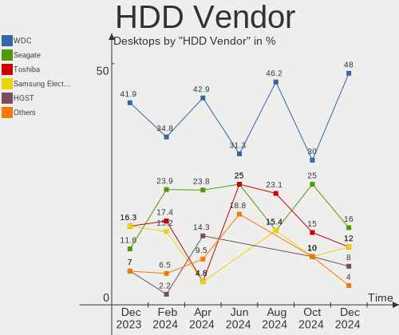
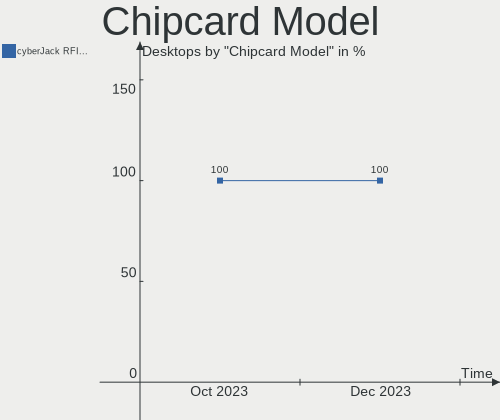

BlackPanther Hardware Trends (Desktop)
--------------------------------------

A project to identify most popular hardware characteristics and track their change
over time based on data collected by BlackPanther users at https://Linux-Hardware.org.

Anyone can contribute to the study by uploading probes of their computers by
the [hw-probe](https://github.com/linuxhw/hw-probe) tool:

    sudo -E hw-probe -all -upload

Full-feature report is available here: https://linux-hardware.org/?view=trends&formfactor=desktop

Period: Feb, 2021.

Contents
--------

- [ OS                       ](#os)
- [ OS Family                ](#os-family)
- [ Kernel                   ](#kernel)
- [ Kernel Family            ](#kernel-family)
- [ Kernel Major Ver.        ](#kernel-major-ver)
- [ Arch                     ](#arch)
- [ DE                       ](#de)
- [ Display Server           ](#display-server)
- [ Display Manager          ](#display-manager)
- [ OS Lang                  ](#os-lang)
- [ Boot Mode                ](#boot-mode)
- [ Filesystem               ](#filesystem)
- [ Part. scheme             ](#part-scheme)
- [ Dual Boot with Linux/BSD ](#dual-boot-with-linux/bsd)
- [ Dual Boot (Win)          ](#dual-boot-win)
- [ Country                  ](#country)
- [ City                     ](#city)
- [ Vendor                   ](#vendor)
- [ Model                    ](#model)
- [ Model Family             ](#model-family)
- [ MFG Year                 ](#mfg-year)
- [ Form Factor              ](#form-factor)
- [ Secure Boot              ](#secure-boot)
- [ Coreboot                 ](#coreboot)
- [ RAM Size                 ](#ram-size)
- [ RAM Used                 ](#ram-used)
- [ Has CD-ROM               ](#has-cd-rom)
- [ Total Drives             ](#total-drives)
- [ Has Ethernet             ](#has-ethernet)
- [ Drive Vendor             ](#drive-vendor)
- [ Drive Model              ](#drive-model)
- [ HDD Vendor               ](#hdd-vendor)
- [ SSD Vendor               ](#ssd-vendor)
- [ Drive Kind               ](#drive-kind)
- [ Drive Connector          ](#drive-connector)
- [ Drive Size               ](#drive-size)
- [ Space Total              ](#space-total)
- [ Space Used               ](#space-used)
- [ Malfunc. Drives          ](#malfunc-drives)
- [ Malfunc. Drive Vendor    ](#malfunc-drive-vendor)
- [ Malfunc. HDD Vendor      ](#malfunc-hdd-vendor)
- [ Malfunc. Drive Kind      ](#malfunc-drive-kind)
- [ Failed Drives            ](#failed-drives)
- [ Failed Drive Vendor      ](#failed-drive-vendor)
- [ Drive Status             ](#drive-status)
- [ Storage Vendor           ](#storage-vendor)
- [ Storage Model            ](#storage-model)
- [ Storage Kind             ](#storage-kind)
- [ CPU Vendor               ](#cpu-vendor)
- [ CPU Model                ](#cpu-model)
- [ CPU Model Family         ](#cpu-model-family)
- [ CPU Cores                ](#cpu-cores)
- [ CPU Sockets              ](#cpu-sockets)
- [ CPU Threads              ](#cpu-threads)
- [ CPU Op-Modes             ](#cpu-op-modes)
- [ CPU Microcode            ](#cpu-microcode)
- [ CPU Microarch            ](#cpu-microarch)
- [ GPU Vendor               ](#gpu-vendor)
- [ GPU Model                ](#gpu-model)
- [ GPU Combo                ](#gpu-combo)
- [ GPU Driver               ](#gpu-driver)
- [ GPU Memory               ](#gpu-memory)
- [ Monitor Vendor           ](#monitor-vendor)
- [ Monitor Model            ](#monitor-model)
- [ Monitor Resolution       ](#monitor-resolution)
- [ Monitor Diagonal         ](#monitor-diagonal)
- [ Monitor Width            ](#monitor-width)
- [ Aspect Ratio             ](#aspect-ratio)
- [ Monitor Area             ](#monitor-area)
- [ Pixel Density            ](#pixel-density)
- [ Multiple Monitors        ](#multiple-monitors)
- [ Net Controller Vendor    ](#net-controller-vendor)
- [ Net Controller Model     ](#net-controller-model)
- [ Wireless Vendor          ](#wireless-vendor)
- [ Wireless Model           ](#wireless-model)
- [ Ethernet Vendor          ](#ethernet-vendor)
- [ Ethernet Model           ](#ethernet-model)
- [ Net Controller Kind      ](#net-controller-kind)
- [ Used Controller          ](#used-controller)
- [ NICs                     ](#nics)
- [ Memory Vendor            ](#memory-vendor)
- [ Memory Model             ](#memory-model)
- [ Memory Kind              ](#memory-kind)
- [ Memory Form Factor       ](#memory-form-factor)
- [ Memory Size              ](#memory-size)
- [ Memory Speed             ](#memory-speed)
- [ Sound Vendor             ](#sound-vendor)
- [ Sound Model              ](#sound-model)
- [ Camera Vendor            ](#camera-vendor)
- [ Camera Model             ](#camera-model)
- [ Fingerprint Vendor       ](#fingerprint-vendor)
- [ Fingerprint Model        ](#fingerprint-model)
- [ Chipcard Vendor          ](#chipcard-vendor)
- [ Chipcard Model           ](#chipcard-model)
- [ Printer Vendor           ](#printer-vendor)
- [ Printer Model            ](#printer-model)
- [ Scanner Vendor           ](#scanner-vendor)
- [ Scanner Model            ](#scanner-model)
- [ Bluetooth Vendor         ](#bluetooth-vendor)
- [ Bluetooth Model          ](#bluetooth-model)
- [ Unsupported Devices      ](#unsupported-devices)
- [ Unsupported Device Types ](#unsupported-device-types)

OS
--

Installed operating systems

| Name              | Desktops | Percent |
|-------------------|----------|---------|
| BlackPanther 18.1 | 89       | 94.68%  |
| BlackPanther 16.2 | 5        | 5.32%   |

OS Family
---------

OS without a version

| Name         | Desktops | Percent |
|--------------|----------|---------|
| BlackPanther | 94       | 100%    |

Kernel
------

Version of the Linux kernel

| Version                | Desktops | Percent |
|------------------------|----------|---------|
| 4.18.16-desktop-1bP    | 70       | 74.47%  |
| 5.6.14-desktop-2bP     | 19       | 20.21%  |
| 4.9.20-desktop-pae-1bP | 3        | 3.19%   |
| 4.7.0-desktop-1bP      | 1        | 1.06%   |
| 3.13.0-35-generic      | 1        | 1.06%   |

Kernel Family
-------------

Linux kernel without a distro release

| Version | Desktops | Percent |
|---------|----------|---------|
| 4.18.16 | 70       | 74.47%  |
| 5.6.14  | 19       | 20.21%  |
| 4.9.20  | 3        | 3.19%   |
| 4.7.0   | 1        | 1.06%   |
| 3.13.0  | 1        | 1.06%   |

Kernel Major Ver.
-----------------

Linux kernel major version

| Version | Desktops | Percent |
|---------|----------|---------|
| 4.18    | 70       | 74.47%  |
| 5.6     | 19       | 20.21%  |
| 4.9     | 3        | 3.19%   |
| 4.7     | 1        | 1.06%   |
| 3.13    | 1        | 1.06%   |

Arch
----

OS architecture (x86_64, i586, etc.)

| Name   | Desktops | Percent |
|--------|----------|---------|
| x86_64 | 90       | 95.74%  |
| i686   | 4        | 4.26%   |

DE
--

Desktop Environment

| Name | Desktops | Percent |
|------|----------|---------|
| KDE5 | 94       | 100%    |

Display Server
--------------

X11 or Wayland

| Name    | Desktops | Percent |
|---------|----------|---------|
| X11     | 90       | 95.74%  |
| Wayland | 4        | 4.26%   |

Display Manager
---------------

SDDM, LightDM, etc.

| Name | Desktops | Percent |
|------|----------|---------|
| SDDM | 94       | 100%    |

OS Lang
-------

Language

| Lang    | Desktops | Percent |
|---------|----------|---------|
| Unknown | 94       | 100%    |

Boot Mode
---------

EFI or BIOS

| Mode | Desktops | Percent |
|------|----------|---------|
| BIOS | 72       | 76.6%   |
| EFI  | 22       | 23.4%   |

Filesystem
----------

Type of filesystem

| Type      | Desktops | Percent |
|-----------|----------|---------|
| Overlay   | 80       | 85.11%  |
| Ext4      | 12       | 12.77%  |
| Overlayfs | 1        | 1.06%   |
| Ext3      | 1        | 1.06%   |

Part. scheme
------------

Scheme of partitioning

| Type | Desktops | Percent |
|------|----------|---------|
| MBR  | 61       | 64.89%  |
| GPT  | 33       | 35.11%  |

Dual Boot with Linux/BSD
------------------------

Hosting more than one Linux/BSD

| Dual boot | Desktops | Percent |
|-----------|----------|---------|
| No        | 52       | 55.32%  |
| Yes       | 42       | 44.68%  |

Dual Boot (Win)
---------------

Hosting Linux and Windows

| Dual boot | Desktops | Percent |
|-----------|----------|---------|
| Yes       | 62       | 65.96%  |
| No        | 32       | 34.04%  |

Country
-------

Geographic location (country)

| Country     | Desktops | Percent |
|-------------|----------|---------|
| Hungary     | 68       | 72.34%  |
| Germany     | 6        | 6.38%   |
| USA         | 4        | 4.26%   |
| Brazil      | 3        | 3.19%   |
| Slovakia    | 2        | 2.13%   |
| Serbia      | 2        | 2.13%   |
| Netherlands | 2        | 2.13%   |
| Ukraine     | 1        | 1.06%   |
| UK          | 1        | 1.06%   |
| Poland      | 1        | 1.06%   |
| Greece      | 1        | 1.06%   |
| Canada      | 1        | 1.06%   |
| Australia   | 1        | 1.06%   |
| Argentina   | 1        | 1.06%   |

City
----

Geographic location (city)

| City                | Desktops | Percent |
|---------------------|----------|---------|
| Budapest            | 22       | 23.4%   |
| Kecskemét          | 3        | 3.19%   |
| Tiszaujvaros        | 2        | 2.13%   |
| Szabadszallas       | 2        | 2.13%   |
| Pécs               | 2        | 2.13%   |
| Miskolc             | 2        | 2.13%   |
| Karcag              | 2        | 2.13%   |
| Hajdunanas          | 2        | 2.13%   |
| De Rijp             | 2        | 2.13%   |
| Belgrade            | 2        | 2.13%   |
| Érd                | 1        | 1.06%   |
| Yale                | 1        | 1.06%   |
| Wysokie Mazowieckie | 1        | 1.06%   |
| Veszprém           | 1        | 1.06%   |
| Uzhhorod            | 1        | 1.06%   |
| Ujfeherto           | 1        | 1.06%   |
| Ubstadt-Weiher      | 1        | 1.06%   |
| Topoľčany         | 1        | 1.06%   |
| Toeroekbalint       | 1        | 1.06%   |
| Tatabánya          | 1        | 1.06%   |
| Tapioszentmarton    | 1        | 1.06%   |
| Székesfehérvár   | 1        | 1.06%   |
| Szentes             | 1        | 1.06%   |
| Szentendre          | 1        | 1.06%   |
| Sidcup              | 1        | 1.06%   |
| Satorhely           | 1        | 1.06%   |
| Salgotarjan         | 1        | 1.06%   |
| Pátrai             | 1        | 1.06%   |
| Pomaz               | 1        | 1.06%   |
| Okoritofulpos       | 1        | 1.06%   |
| Nyirad              | 1        | 1.06%   |
| Novo Gama           | 1        | 1.06%   |
| North Hollywood     | 1        | 1.06%   |
| Nagymagocs          | 1        | 1.06%   |
| Nagykoros           | 1        | 1.06%   |
| Muhlacker           | 1        | 1.06%   |
| Mount Vernon        | 1        | 1.06%   |
| Melbourne           | 1        | 1.06%   |
| Mar del Plata       | 1        | 1.06%   |
| Leipzig             | 1        | 1.06%   |
| Kunhegyes           | 1        | 1.06%   |
| Kozarmisleny        | 1        | 1.06%   |
| Kiskunhalas         | 1        | 1.06%   |
| Kaposvár           | 1        | 1.06%   |
| Itaquaquecetuba     | 1        | 1.06%   |
| Ilmmunster          | 1        | 1.06%   |
| Hlinik nad Hronom   | 1        | 1.06%   |
| Hamburg             | 1        | 1.06%   |
| Győr               | 1        | 1.06%   |
| Frankfurt am Main   | 1        | 1.06%   |
| Evansville          | 1        | 1.06%   |
| Esztergom           | 1        | 1.06%   |
| Ersekcsanad         | 1        | 1.06%   |
| Dunaújváros       | 1        | 1.06%   |
| Detk                | 1        | 1.06%   |
| Delegyhaza          | 1        | 1.06%   |
| Debrecen            | 1        | 1.06%   |
| Daka                | 1        | 1.06%   |
| Csurgo              | 1        | 1.06%   |
| Csabaszabadi        | 1        | 1.06%   |

Vendor
------

Motherboard manufacturer

| Name                | Desktops | Percent |
|---------------------|----------|---------|
| ASUSTek Computer    | 23       | 24.47%  |
| Gigabyte Technology | 18       | 19.15%  |
| ASRock              | 16       | 17.02%  |
| Dell                | 9        | 9.57%   |
| Hewlett-Packard     | 7        | 7.45%   |
| Lenovo              | 4        | 4.26%   |
| MSI                 | 3        | 3.19%   |
| Intel               | 3        | 3.19%   |
| Medion              | 2        | 2.13%   |
| Fujitsu             | 2        | 2.13%   |
| Foxconn             | 2        | 2.13%   |
| Acer                | 2        | 2.13%   |
| Qbex                | 1        | 1.06%   |
| NEC Computers       | 1        | 1.06%   |
| ECS                 | 1        | 1.06%   |

Model
-----

Motherboard model

| Name                               | Desktops | Percent |
|------------------------------------|----------|---------|
| Medion Pentino G-Series            | 2        | 2.13%   |
| HP Compaq dc5850 Small Form Factor | 2        | 2.13%   |
| ASUS P5K-VM                        | 2        | 2.13%   |
| ASUS All Series                    | 2        | 2.13%   |
| Qbex QBEX-G41T-M7                  | 1        | 1.06%   |
| NEC Computers IMEDIA 9320          | 1        | 1.06%   |
| MSI MS-7A38                        | 1        | 1.06%   |
| MSI MS-7592                        | 1        | 1.06%   |
| MSI Elite 7100 Microtower PC       | 1        | 1.06%   |
| Lenovo ThinkStation D20 4158AF8    | 1        | 1.06%   |
| Lenovo ThinkCentre M81 0385BE3     | 1        | 1.06%   |
| Lenovo ThinkCentre A57 98517HG     | 1        | 1.06%   |
| Lenovo 0385-BE3                    | 1        | 1.06%   |
| Intel DG33BU AAD79951-407          | 1        | 1.06%   |
| Intel D510MO AAE76523-403          | 1        | 1.06%   |
| Intel 945                          | 1        | 1.06%   |
| HP Z600 Workstation                | 1        | 1.06%   |
| HP ProLiant MicroServer            | 1        | 1.06%   |
| HP Compaq Pro 6305 MT              | 1        | 1.06%   |
| HP Compaq Pro 6300 MT              | 1        | 1.06%   |
| HP Compaq 8200 Elite MT PC         | 1        | 1.06%   |
| Gigabyte Z390 UD                   | 1        | 1.06%   |
| Gigabyte Z390 M GAMING             | 1        | 1.06%   |
| Gigabyte Z270-HD3P                 | 1        | 1.06%   |
| Gigabyte Z170-HD3 DDR3-CF          | 1        | 1.06%   |
| Gigabyte P67A-D3-B3                | 1        | 1.06%   |
| Gigabyte P35-DS3R                  | 1        | 1.06%   |
| Gigabyte M61PME-S2P                | 1        | 1.06%   |
| Gigabyte H61M-S1                   | 1        | 1.06%   |
| Gigabyte H55M-UD2H                 | 1        | 1.06%   |
| Gigabyte GA-MA770-UD3              | 1        | 1.06%   |
| Gigabyte GA-890GPA-UD3H            | 1        | 1.06%   |
| Gigabyte G31M-ES2L                 | 1        | 1.06%   |
| Gigabyte F2A88XM-HD3               | 1        | 1.06%   |
| Gigabyte EG41MFT-US2H              | 1        | 1.06%   |
| Gigabyte B85M-DS3H                 | 1        | 1.06%   |
| Gigabyte B450M GAMING              | 1        | 1.06%   |
| Gigabyte B365M DS3H                | 1        | 1.06%   |
| Gigabyte 945GCM-S2L                | 1        | 1.06%   |
| Fujitsu ESPRIMO P7936              | 1        | 1.06%   |
| Fujitsu ESPRIMO P720               | 1        | 1.06%   |
| Foxconn Pro 3500 Series            | 1        | 1.06%   |
| Foxconn G41MXP/G41MXP-V            | 1        | 1.06%   |
| ECS KE620AA-ABA a6347c             | 1        | 1.06%   |
| Dell OptiPlex 9020M                | 1        | 1.06%   |
| Dell OptiPlex 780                  | 1        | 1.06%   |
| Dell OptiPlex 745                  | 1        | 1.06%   |
| Dell OptiPlex 7010                 | 1        | 1.06%   |
| Dell OptiPlex 390                  | 1        | 1.06%   |
| Dell OptiPlex 380                  | 1        | 1.06%   |
| Dell OptiPlex 330                  | 1        | 1.06%   |
| Dell OptiPlex 320                  | 1        | 1.06%   |
| Dell OptiPlex 3050                 | 1        | 1.06%   |
| ASUS TERRA_PC                      | 1        | 1.06%   |
| ASUS ROG STRIX Z370-G GAMING       | 1        | 1.06%   |
| ASUS ROG STRIX B450-F GAMING       | 1        | 1.06%   |
| ASUS PRIME H310M-E R2.0            | 1        | 1.06%   |
| ASUS PRIME B250M-A                 | 1        | 1.06%   |
| ASUS PRIME A320M-R                 | 1        | 1.06%   |
| ASUS P8H61-M LX3 PLUS R2.0         | 1        | 1.06%   |

Model Family
------------

Motherboard model prefix

| Name                    | Desktops | Percent |
|-------------------------|----------|---------|
| Dell OptiPlex           | 9        | 9.57%   |
| HP Compaq               | 5        | 5.32%   |
| ASUS PRIME              | 3        | 3.19%   |
| Medion Pentino          | 2        | 2.13%   |
| Lenovo ThinkCentre      | 2        | 2.13%   |
| Gigabyte Z390           | 2        | 2.13%   |
| Fujitsu ESPRIMO         | 2        | 2.13%   |
| ASUS ROG                | 2        | 2.13%   |
| ASUS P8H61-M            | 2        | 2.13%   |
| ASUS P5K-VM             | 2        | 2.13%   |
| ASUS P5K                | 2        | 2.13%   |
| ASUS M5A97              | 2        | 2.13%   |
| ASUS All                | 2        | 2.13%   |
| ASRock Z77              | 2        | 2.13%   |
| Qbex QBEX-G41T-M7       | 1        | 1.06%   |
| NEC Computers IMEDIA    | 1        | 1.06%   |
| MSI MS-7A38             | 1        | 1.06%   |
| MSI MS-7592             | 1        | 1.06%   |
| MSI Elite               | 1        | 1.06%   |
| Lenovo ThinkStation     | 1        | 1.06%   |
| Lenovo 0385-BE3         | 1        | 1.06%   |
| Intel DG33BU            | 1        | 1.06%   |
| Intel D510MO            | 1        | 1.06%   |
| Intel 945               | 1        | 1.06%   |
| HP Z600                 | 1        | 1.06%   |
| HP ProLiant             | 1        | 1.06%   |
| Gigabyte Z270-HD3P      | 1        | 1.06%   |
| Gigabyte Z170-HD3       | 1        | 1.06%   |
| Gigabyte P67A-D3-B3     | 1        | 1.06%   |
| Gigabyte P35-DS3R       | 1        | 1.06%   |
| Gigabyte M61PME-S2P     | 1        | 1.06%   |
| Gigabyte H61M-S1        | 1        | 1.06%   |
| Gigabyte H55M-UD2H      | 1        | 1.06%   |
| Gigabyte GA-MA770-UD3   | 1        | 1.06%   |
| Gigabyte GA-890GPA-UD3H | 1        | 1.06%   |
| Gigabyte G31M-ES2L      | 1        | 1.06%   |
| Gigabyte F2A88XM-HD3    | 1        | 1.06%   |
| Gigabyte EG41MFT-US2H   | 1        | 1.06%   |
| Gigabyte B85M-DS3H      | 1        | 1.06%   |
| Gigabyte B450M          | 1        | 1.06%   |
| Gigabyte B365M          | 1        | 1.06%   |
| Gigabyte 945GCM-S2L     | 1        | 1.06%   |
| Foxconn Pro             | 1        | 1.06%   |
| Foxconn G41MXP          | 1        | 1.06%   |
| ECS KE620AA-ABA         | 1        | 1.06%   |
| ASUS TERRA              | 1        | 1.06%   |
| ASUS P7P55D-E           | 1        | 1.06%   |
| ASUS P5KPL-CM           | 1        | 1.06%   |
| ASUS M5A78L             | 1        | 1.06%   |
| ASUS H110M-A            | 1        | 1.06%   |
| ASUS ET1610PT           | 1        | 1.06%   |
| ASUS CROSSHAIR          | 1        | 1.06%   |
| ASUS B5LD2-TVM          | 1        | 1.06%   |
| ASRock N68C-S           | 1        | 1.06%   |
| ASRock H81M-VG4         | 1        | 1.06%   |
| ASRock H81M-HDS         | 1        | 1.06%   |
| ASRock H370M-ITX        | 1        | 1.06%   |
| ASRock G41M-VS3         | 1        | 1.06%   |
| ASRock FM2A88X+         | 1        | 1.06%   |
| ASRock FM2A75M          | 1        | 1.06%   |

MFG Year
--------

Motherboard manufacture year

| Year | Desktops | Percent |
|------|----------|---------|
| 2011 | 12       | 12.77%  |
| 2013 | 10       | 10.64%  |
| 2010 | 10       | 10.64%  |
| 2019 | 8        | 8.51%   |
| 2008 | 8        | 8.51%   |
| 2015 | 7        | 7.45%   |
| 2014 | 6        | 6.38%   |
| 2012 | 6        | 6.38%   |
| 2007 | 6        | 6.38%   |
| 2018 | 5        | 5.32%   |
| 2016 | 5        | 5.32%   |
| 2020 | 4        | 4.26%   |
| 2009 | 4        | 4.26%   |
| 2017 | 1        | 1.06%   |
| 2006 | 1        | 1.06%   |
| 2005 | 1        | 1.06%   |

Form Factor
-----------

Physical design of the computer

| Name    | Desktops | Percent |
|---------|----------|---------|
| Desktop | 94       | 100%    |

Secure Boot
-----------

Enabled or disabled

| State    | Desktops | Percent |
|----------|----------|---------|
| Disabled | 94       | 100%    |

Coreboot
--------

Have coreboot on board

| Used | Desktops | Percent |
|------|----------|---------|
| No   | 94       | 100%    |

RAM Size
--------

Total RAM memory

| Size in GB | Desktops | Percent |
|------------|----------|---------|
| 3.01-4.0   | 30       | 31.91%  |
| 8.01-16.0  | 21       | 22.34%  |
| 4.01-8.0   | 18       | 19.15%  |
| 1.01-2.0   | 9        | 9.57%   |
| 16.01-24.0 | 8        | 8.51%   |
| 32.01-64.0 | 7        | 7.45%   |
| 24.01-32.0 | 1        | 1.06%   |

RAM Used
--------

Used RAM memory

| Used GB  | Desktops | Percent |
|----------|----------|---------|
| 0.01-0.5 | 52       | 55.32%  |
| 0.51-1.0 | 35       | 37.23%  |
| 1.01-2.0 | 6        | 6.38%   |
| Unknown  | 1        | 1.06%   |

Has CD-ROM
----------

Has CD-ROM on board

| Presented | Desktops | Percent |
|-----------|----------|---------|
| Yes       | 70       | 74.47%  |
| No        | 24       | 25.53%  |

Total Drives
------------

Number of drives on board

| Drives | Desktops | Percent |
|--------|----------|---------|
| 1      | 48       | 51.06%  |
| 2      | 22       | 23.4%   |
| 3      | 12       | 12.77%  |
| 4      | 6        | 6.38%   |
| 10     | 2        | 2.13%   |
| 5      | 2        | 2.13%   |
| 6      | 1        | 1.06%   |
| 0      | 1        | 1.06%   |

Has Ethernet
------------

Has Ethernet on board

| Presented | Desktops | Percent |
|-----------|----------|---------|
| Yes       | 93       | 98.94%  |
| No        | 1        | 1.06%   |

Drive Vendor
------------

Hard drive vendors

| Vendor              | Desktops | Drives | Percent |
|---------------------|----------|--------|---------|
| WDC                 | 40       | 57     | 25.16%  |
| Seagate             | 24       | 27     | 15.09%  |
| Kingston            | 24       | 27     | 15.09%  |
| Samsung Electronics | 20       | 26     | 12.58%  |
| Toshiba             | 14       | 21     | 8.81%   |
| Hitachi             | 9        | 10     | 5.66%   |
| A-DATA Technology   | 6        | 6      | 3.77%   |
| Maxtor              | 5        | 5      | 3.14%   |
| SanDisk             | 3        | 4      | 1.89%   |
| Crucial             | 2        | 2      | 1.26%   |
| WD MediaMax         | 1        | 1      | 0.63%   |
| Verbatim            | 1        | 1      | 0.63%   |
| Unknown             | 1        | 1      | 0.63%   |
| PNY                 | 1        | 1      | 0.63%   |
| Intenso             | 1        | 1      | 0.63%   |
| Intel               | 1        | 1      | 0.63%   |
| ICY BOX             | 1        | 1      | 0.63%   |
| HGST                | 1        | 1      | 0.63%   |
| GOODRAM             | 1        | 1      | 0.63%   |
| Fujitsu             | 1        | 1      | 0.63%   |
| China               | 1        | 1      | 0.63%   |
| Apacer              | 1        | 1      | 0.63%   |

Drive Model
-----------

Hard drive models

| Model                            | Desktops | Percent |
|----------------------------------|----------|---------|
| Kingston SA400S37120G 120GB SSD  | 7        | 3.72%   |
| Kingston SV300S37A120G 120GB SSD | 6        | 3.19%   |
| Toshiba DT01ACA200 2TB           | 4        | 2.13%   |
| WDC WD10EZEX-22MFCA0 1TB         | 3        | 1.6%    |
| Seagate ST500DM002-1BD142 500GB  | 3        | 1.6%    |
| Kingston SUV400S37120G 120GB SSD | 3        | 1.6%    |
| Kingston SA400S37240G 240GB SSD  | 3        | 1.6%    |
| WDC WDS500G2B0A-00SM50 500GB SSD | 2        | 1.06%   |
| WDC WD20EARX-00PASB0 2TB         | 2        | 1.06%   |
| WDC WD10EZEX-21M2NA0 1TB         | 2        | 1.06%   |
| WDC WD10EZEX-00BN5A0 1TB         | 2        | 1.06%   |
| Toshiba DT01ACA300 3TB           | 2        | 1.06%   |
| Toshiba DT01ACA100 1TB           | 2        | 1.06%   |
| Seagate ST3160812AS 160GB        | 2        | 1.06%   |
| Seagate ST1000DM003-1CH162 1TB   | 2        | 1.06%   |
| Samsung HD154UI 1TB              | 2        | 1.06%   |
| Kingston SA2000M8250G 250GB      | 2        | 1.06%   |
| WDC WDS500G2X0C-00L350 500GB     | 1        | 0.53%   |
| WDC WDS240G2G0A-00JH30 240GB SSD | 1        | 0.53%   |
| WDC WDS120G2G0B-00EPW0 120GB SSD | 1        | 0.53%   |
| WDC WD800JD-75MSA3 80GB          | 1        | 0.53%   |
| WDC WD800JD-08MSA1 80GB          | 1        | 0.53%   |
| WDC WD800AAJS-00WAA0 80GB        | 1        | 0.53%   |
| WDC WD7500AYPS-01ZKB0 752GB      | 1        | 0.53%   |
| WDC WD5000AAKX-753CA1 500GB      | 1        | 0.53%   |
| WDC WD5000AAKX-221CA1 500GB      | 1        | 0.53%   |
| WDC WD5000AAKX-08U6AA0 500GB     | 1        | 0.53%   |
| WDC WD5000AAKX-08ERMA0 500GB     | 1        | 0.53%   |
| WDC WD5000AAKX-07U6AA0 500GB     | 1        | 0.53%   |
| WDC WD5000AAKS-00UU3A0 500GB     | 1        | 0.53%   |
| WDC WD5000AAKS-00M9A0 500GB      | 1        | 0.53%   |
| WDC WD5000AAKS-007AA0 500GB      | 1        | 0.53%   |
| WDC WD5000AADS-00S9B0 500GB      | 1        | 0.53%   |
| WDC WD4003FZEX-00Z4SA0 4TB       | 1        | 0.53%   |
| WDC WD3200AAJS-00G0A0 320GB      | 1        | 0.53%   |
| WDC WD30EZRZ-00GXCB0 3TB         | 1        | 0.53%   |
| WDC WD30EZRX-22D8PB0 3TB         | 1        | 0.53%   |
| WDC WD30EZRX-00MMMB0 3TB         | 1        | 0.53%   |
| WDC WD30EFRX-68EUZN0 3TB         | 1        | 0.53%   |
| WDC WD2500KS-00MJB0 250GB        | 1        | 0.53%   |
| WDC WD2500JS-75NCB3 250GB        | 1        | 0.53%   |
| WDC WD2500AAKS-00L9A0 250GB      | 1        | 0.53%   |
| WDC WD2500AAJS-75B4A0 250GB      | 1        | 0.53%   |
| WDC WD20EZRX-00D8PB0 2TB         | 1        | 0.53%   |
| WDC WD20EZAZ-00GGJB0 2TB         | 1        | 0.53%   |
| WDC WD20EFRX-68EUZN0 2TB         | 1        | 0.53%   |
| WDC WD20EARS-60MVWB0 2TB         | 1        | 0.53%   |
| WDC WD20EARS-00J2GB0 2TB         | 1        | 0.53%   |
| WDC WD2005FBYZ-01YCBB2 2TB       | 1        | 0.53%   |
| WDC WD2001FASS-00W2B0 2TB        | 1        | 0.53%   |
| WDC WD1200BB-00GUC0 120GB        | 1        | 0.53%   |
| WDC WD10JPVX-22JC3T0 1TB         | 1        | 0.53%   |
| WDC WD10EZRZ-00HTKB0 1TB         | 1        | 0.53%   |
| WDC WD10EZEX-08WN4A0 1TB         | 1        | 0.53%   |
| WDC WD10EZEX-08M2NA0 1TB         | 1        | 0.53%   |
| WDC WD10EZEX-00KUWA0 1TB         | 1        | 0.53%   |
| WDC WD10EFRX-68FYTN0 1TB         | 1        | 0.53%   |
| WDC WD10EARS-00MVWB0 1TB         | 1        | 0.53%   |
| WDC WD1003FBYZ-010FB0 1TB        | 1        | 0.53%   |
| WD MediaMax WL250GSA1672 250GB   | 1        | 0.53%   |

HDD Vendor
----------

Hard disk drive vendors

| Vendor              | Desktops | Drives | Percent |
|---------------------|----------|--------|---------|
| WDC                 | 37       | 52     | 34.58%  |
| Seagate             | 24       | 27     | 22.43%  |
| Toshiba             | 14       | 21     | 13.08%  |
| Samsung Electronics | 14       | 14     | 13.08%  |
| Hitachi             | 9        | 10     | 8.41%   |
| Maxtor              | 5        | 5      | 4.67%   |
| WD MediaMax         | 1        | 1      | 0.93%   |
| ICY BOX             | 1        | 1      | 0.93%   |
| HGST                | 1        | 1      | 0.93%   |
| Fujitsu             | 1        | 1      | 0.93%   |

SSD Vendor
----------

Solid state drive vendors

| Vendor              | Desktops | Drives | Percent |
|---------------------|----------|--------|---------|
| Kingston            | 22       | 25     | 44%     |
| Samsung Electronics | 8        | 9      | 16%     |
| A-DATA Technology   | 5        | 5      | 10%     |
| WDC                 | 3        | 4      | 6%      |
| SanDisk             | 3        | 4      | 6%      |
| Crucial             | 2        | 2      | 4%      |
| Verbatim            | 1        | 1      | 2%      |
| Unknown             | 1        | 1      | 2%      |
| PNY                 | 1        | 1      | 2%      |
| Intenso             | 1        | 1      | 2%      |
| GOODRAM             | 1        | 1      | 2%      |
| China               | 1        | 1      | 2%      |
| Apacer              | 1        | 1      | 2%      |

Drive Kind
----------

HDD or SSD

| Kind | Desktops | Drives | Percent |
|------|----------|--------|---------|
| HDD  | 78       | 133    | 60.47%  |
| SSD  | 45       | 56     | 34.88%  |
| NVMe | 6        | 8      | 4.65%   |

Drive Connector
---------------

SATA, SAS, NVMe, etc.

| Type | Desktops | Drives | Percent |
|------|----------|--------|---------|
| SATA | 92       | 187    | 92%     |
| NVMe | 6        | 8      | 6%      |
| SAS  | 2        | 2      | 2%      |

Drive Size
----------

Size of hard drive

| Size in TB | Desktops | Drives | Percent |
|------------|----------|--------|---------|
| 0.01-0.5   | 80       | 116    | 61.54%  |
| 0.51-1.0   | 28       | 37     | 21.54%  |
| 1.01-2.0   | 14       | 23     | 10.77%  |
| 2.01-3.0   | 5        | 10     | 3.85%   |
| 3.01-4.0   | 2        | 2      | 1.54%   |
| 4.01-10.0  | 1        | 1      | 0.77%   |

Space Total
-----------

Amount of disk space available on the file system

| Size in GB | Desktops | Percent |
|------------|----------|---------|
| Unknown    | 79       | 84.04%  |
| 51-100     | 5        | 5.32%   |
| 101-250    | 4        | 4.26%   |
| 501-1000   | 4        | 4.26%   |
| 251-500    | 1        | 1.06%   |
| 21-50      | 1        | 1.06%   |

Space Used
----------

Amount of used disk space

| Used GB | Desktops | Percent |
|---------|----------|---------|
| Unknown | 79       | 84.04%  |
| 1-20    | 13       | 13.83%  |
| 251-500 | 1        | 1.06%   |
| 21-50   | 1        | 1.06%   |

Malfunc. Drives
---------------

Drive models with a malfunction

| Model                             | Desktops | Drives | Percent |
|-----------------------------------|----------|--------|---------|
| Seagate ST500DM002-1BD142 500GB   | 3        | 3      | 6.98%   |
| WDC WD10EZEX-00BN5A0 1TB          | 2        | 2      | 4.65%   |
| Seagate ST3160812AS 160GB         | 2        | 2      | 4.65%   |
| Kingston SV300S37A120G 120GB SSD  | 2        | 2      | 4.65%   |
| WDC WD800JD-75MSA3 80GB           | 1        | 1      | 2.33%   |
| WDC WD5000AAKX-08U6AA0 500GB      | 1        | 1      | 2.33%   |
| WDC WD5000AAKX-08ERMA0 500GB      | 1        | 1      | 2.33%   |
| WDC WD5000AAKX-07U6AA0 500GB      | 1        | 1      | 2.33%   |
| WDC WD5000AAKS-00UU3A0 500GB      | 1        | 1      | 2.33%   |
| WDC WD5000AAKS-00M9A0 500GB       | 1        | 1      | 2.33%   |
| WDC WD5000AAKS-007AA0 500GB       | 1        | 1      | 2.33%   |
| WDC WD5000AADS-00S9B0 500GB       | 1        | 1      | 2.33%   |
| WDC WD2500AAJS-75B4A0 250GB       | 1        | 1      | 2.33%   |
| WDC WD20EFRX-68EUZN0 2TB          | 1        | 2      | 2.33%   |
| WDC WD20EARS-60MVWB0 2TB          | 1        | 1      | 2.33%   |
| WDC WD20EARS-00J2GB0 2TB          | 1        | 1      | 2.33%   |
| WDC WD1200BB-00GUC0 120GB         | 1        | 1      | 2.33%   |
| WDC WD10EARS-00MVWB0 1TB          | 1        | 1      | 2.33%   |
| WD MediaMax WL250GSA1672 250GB    | 1        | 1      | 2.33%   |
| Toshiba MQ01ABD050 500GB          | 1        | 1      | 2.33%   |
| Toshiba HDWD130 3TB               | 1        | 1      | 2.33%   |
| Toshiba DT01ACA100 1TB            | 1        | 1      | 2.33%   |
| Seagate ST9500325AS 500GB         | 1        | 1      | 2.33%   |
| Seagate ST4000LM024-2AN17V 4TB    | 1        | 1      | 2.33%   |
| Seagate ST3250823AS 250GB         | 1        | 1      | 2.33%   |
| Seagate ST31500341AS 1TB          | 1        | 1      | 2.33%   |
| Seagate ST2000VN004-2E4164 2TB    | 1        | 1      | 2.33%   |
| SanDisk SDSSDXPS480G 480GB        | 1        | 1      | 2.33%   |
| Samsung Electronics SP2004C 200GB | 1        | 1      | 2.33%   |
| Samsung Electronics HD501LJ 500GB | 1        | 1      | 2.33%   |
| Samsung Electronics HD320KJ 320GB | 1        | 1      | 2.33%   |
| Samsung Electronics HD103UJ 1TB   | 1        | 1      | 2.33%   |
| Samsung Electronics HD080HJ 80GB  | 1        | 1      | 2.33%   |
| Maxtor 6B200P0 208GB              | 1        | 1      | 2.33%   |
| Maxtor 2B020H1 20GB               | 1        | 1      | 2.33%   |
| Kingston SUV400S37480G 480GB SSD  | 1        | 1      | 2.33%   |
| Kingston SUV400S37240G 240GB SSD  | 1        | 1      | 2.33%   |
| Kingston SUV400S37120G 120GB SSD  | 1        | 1      | 2.33%   |

Malfunc. Drive Vendor
---------------------

Vendors of faulty drives

| Vendor              | Desktops | Drives | Percent |
|---------------------|----------|--------|---------|
| WDC                 | 14       | 17     | 34.15%  |
| Seagate             | 10       | 10     | 24.39%  |
| Samsung Electronics | 5        | 5      | 12.2%   |
| Kingston            | 5        | 5      | 12.2%   |
| Toshiba             | 3        | 3      | 7.32%   |
| Maxtor              | 2        | 2      | 4.88%   |
| WD MediaMax         | 1        | 1      | 2.44%   |
| SanDisk             | 1        | 1      | 2.44%   |

Malfunc. HDD Vendor
-------------------

Vendors of faulty HDD drives

| Vendor              | Desktops | Drives | Percent |
|---------------------|----------|--------|---------|
| WDC                 | 14       | 17     | 40%     |
| Seagate             | 10       | 10     | 28.57%  |
| Samsung Electronics | 5        | 5      | 14.29%  |
| Toshiba             | 3        | 3      | 8.57%   |
| Maxtor              | 2        | 2      | 5.71%   |
| WD MediaMax         | 1        | 1      | 2.86%   |

Malfunc. Drive Kind
-------------------

Kinds of faulty drives

| Kind | Desktops | Drives | Percent |
|------|----------|--------|---------|
| HDD  | 31       | 38     | 83.78%  |
| SSD  | 6        | 6      | 16.22%  |

Failed Drives
-------------

Failed drive models

Zero info for selected period =(

Failed Drive Vendor
-------------------

Failed drive vendors

Zero info for selected period =(

Drive Status
------------

Number of failed and malfunc. drives

| Status   | Desktops | Drives | Percent |
|----------|----------|--------|---------|
| Works    | 76       | 152    | 66.67%  |
| Malfunc  | 37       | 44     | 32.46%  |
| Detected | 1        | 1      | 0.88%   |

Storage Vendor
--------------

Storage controller vendors

| Vendor                      | Desktops | Percent |
|-----------------------------|----------|---------|
| Intel                       | 69       | 57.5%   |
| AMD                         | 22       | 18.33%  |
| JMicron Technology          | 7        | 5.83%   |
| Marvell Technology Group    | 6        | 5%      |
| ASMedia Technology          | 6        | 5%      |
| Nvidia                      | 3        | 2.5%    |
| Samsung Electronics         | 2        | 1.67%   |
| Kingston Technology Company | 2        | 1.67%   |
| Silicon Image               | 1        | 0.83%   |
| Sandisk                     | 1        | 0.83%   |
| ADATA Technology            | 1        | 0.83%   |

Storage Model
-------------

Storage controller models

| Model                                                                                   | Desktops | Percent |
|-----------------------------------------------------------------------------------------|----------|---------|
| Intel NM10/ICH7 Family SATA Controller [IDE mode]                                       | 16       | 9.76%   |
| Intel 82801G (ICH7 Family) IDE Controller                                               | 12       | 7.32%   |
| AMD FCH SATA Controller [AHCI mode]                                                     | 9        | 5.49%   |
| Intel 8 Series/C220 Series Chipset Family 6-port SATA Controller 1 [AHCI mode]          | 7        | 4.27%   |
| AMD SB7x0/SB8x0/SB9x0 SATA Controller [IDE mode]                                        | 7        | 4.27%   |
| Intel 7 Series/C210 Series Chipset Family 6-port SATA Controller [AHCI mode]            | 6        | 3.66%   |
| Intel 6 Series/C200 Series Chipset Family Desktop SATA Controller (IDE mode, ports 4-5) | 6        | 3.66%   |
| Intel 6 Series/C200 Series Chipset Family Desktop SATA Controller (IDE mode, ports 0-3) | 6        | 3.66%   |
| AMD SB7x0/SB8x0/SB9x0 IDE Controller                                                    | 6        | 3.66%   |
| Intel 82801I (ICH9 Family) 2 port SATA Controller [IDE mode]                            | 5        | 3.05%   |
| Intel 200 Series PCH SATA controller [AHCI mode]                                        | 5        | 3.05%   |
| ASMedia ASM1062 Serial ATA Controller                                                   | 5        | 3.05%   |
| JMicron JMB363 SATA/IDE Controller                                                      | 4        | 2.44%   |
| Intel 82801IB (ICH9) 2 port SATA Controller [IDE mode]                                  | 4        | 2.44%   |
| AMD SB7x0/SB8x0/SB9x0 SATA Controller [AHCI mode]                                       | 4        | 2.44%   |
| Nvidia MCP61 SATA Controller                                                            | 3        | 1.83%   |
| JMicron JMB368 IDE controller                                                           | 3        | 1.83%   |
| Intel SATA Controller [RAID mode]                                                       | 3        | 1.83%   |
| Intel Q170/Q150/B150/H170/H110/Z170/CM236 Chipset SATA Controller [AHCI Mode]           | 3        | 1.83%   |
| Intel Cannon Lake PCH SATA AHCI Controller                                              | 3        | 1.83%   |
| Intel 6 Series/C200 Series Chipset Family 6 port Desktop SATA AHCI Controller           | 3        | 1.83%   |
| AMD 400 Series Chipset SATA Controller                                                  | 3        | 1.83%   |
| Samsung NVMe SSD Controller SM981/PM981/PM983                                           | 2        | 1.22%   |
| Nvidia MCP61 IDE                                                                        | 2        | 1.22%   |
| Kingston Company A2000 NVMe SSD                                                         | 2        | 1.22%   |
| Intel NM10/ICH7 Family SATA Controller [AHCI mode]                                      | 2        | 1.22%   |
| Intel 5 Series/3400 Series Chipset 6 port SATA AHCI Controller                          | 2        | 1.22%   |
| Intel 4 Series Chipset PT IDER Controller                                               | 2        | 1.22%   |
| AMD FCH IDE Controller                                                                  | 2        | 1.22%   |
| Silicon Image SiI 3114 [SATALink/SATARaid] Serial ATA Controller                        | 1        | 0.61%   |
| Sandisk WD Black 2018/SN750 / PC SN720 NVMe SSD                                         | 1        | 0.61%   |
| Samsung NVMe SSD Controller SM961/PM961/SM963                                           | 1        | 0.61%   |
| Marvell Group MV64460/64461/64462 System Controller, Revision B                         | 1        | 0.61%   |
| Marvell Group 88SE9215 PCIe 2.0 x1 4-port SATA 6 Gb/s Controller                        | 1        | 0.61%   |
| Marvell Group 88SE9128 PCIe SATA 6 Gb/s RAID controller with HyperDuo                   | 1        | 0.61%   |
| Marvell Group 88SE9120 SATA 6Gb/s Controller                                            | 1        | 0.61%   |
| Marvell Group 88SE6111/6121 SATA II / PATA Controller                                   | 1        | 0.61%   |
| Marvell Group 88SE6101/6102 single-port PATA133 interface                               | 1        | 0.61%   |
| Intel SSD 660P Series                                                                   | 1        | 0.61%   |
| Intel C600/X79 series chipset 6-Port SATA AHCI Controller                               | 1        | 0.61%   |
| Intel Atom Processor E3800 Series SATA AHCI Controller                                  | 1        | 0.61%   |
| Intel 9 Series Chipset Family SATA Controller [AHCI Mode]                               | 1        | 0.61%   |
| Intel 82801JI (ICH10 Family) SATA AHCI Controller                                       | 1        | 0.61%   |
| Intel 82801JD/DO (ICH10 Family) SATA AHCI Controller                                    | 1        | 0.61%   |
| Intel 82801IR/IO/IH (ICH9R/DO/DH) 6 port SATA Controller [AHCI mode]                    | 1        | 0.61%   |
| Intel 82801IR/IO/IH (ICH9R/DO/DH) 4 port SATA Controller [IDE mode]                     | 1        | 0.61%   |
| Intel 82801HR/HO/HH (ICH8R/DO/DH) 2 port SATA Controller [IDE mode]                     | 1        | 0.61%   |
| Intel 82801H (ICH8 Family) 4 port SATA Controller [IDE mode]                            | 1        | 0.61%   |
| Intel 5 Series/3400 Series Chipset 4 port SATA IDE Controller                           | 1        | 0.61%   |
| Intel 5 Series/3400 Series Chipset 2 port SATA IDE Controller                           | 1        | 0.61%   |
| ASMedia ASM1061 SATA IDE Controller                                                     | 1        | 0.61%   |
| AMD X370 Series Chipset SATA Controller                                                 | 1        | 0.61%   |
| AMD SB600 Non-Raid-5 SATA                                                               | 1        | 0.61%   |
| AMD SB600 IDE                                                                           | 1        | 0.61%   |
| AMD FCH SATA Controller D                                                               | 1        | 0.61%   |
| ADATA XPG SX8200 Pro PCIe Gen3x4 M.2 2280 Solid State Drive                             | 1        | 0.61%   |

Storage Kind
------------

Kind of storage controller (IDE, SATA, NVMe, SAS, ...)

| Kind | Desktops | Percent |
|------|----------|---------|
| SATA | 59       | 50.86%  |
| IDE  | 46       | 39.66%  |
| NVMe | 6        | 5.17%   |
| RAID | 5        | 4.31%   |

CPU Vendor
----------

Processor vendors

| Vendor | Desktops | Percent |
|--------|----------|---------|
| Intel  | 70       | 74.47%  |
| AMD    | 24       | 25.53%  |

CPU Model
---------

Processor models

| Model                                       | Desktops | Percent |
|---------------------------------------------|----------|---------|
| Intel Core 2 Duo CPU E8400 @ 3.00GHz        | 6        | 6.38%   |
| Intel Pentium Dual-Core CPU E5500 @ 2.80GHz | 2        | 2.13%   |
| Intel Pentium CPU G630 @ 2.70GHz            | 2        | 2.13%   |
| Intel Core i5-7500 CPU @ 3.40GHz            | 2        | 2.13%   |
| Intel Core i5-7400 CPU @ 3.00GHz            | 2        | 2.13%   |
| Intel Core i5-2500K CPU @ 3.30GHz           | 2        | 2.13%   |
| Intel Core i5-2400 CPU @ 3.10GHz            | 2        | 2.13%   |
| Intel Core i5 CPU 760 @ 2.80GHz             | 2        | 2.13%   |
| Intel Core i3-8100 CPU @ 3.60GHz            | 2        | 2.13%   |
| Intel Core 2 Duo CPU E7300 @ 2.66GHz        | 2        | 2.13%   |
| Intel Core 2 Duo CPU E6550 @ 2.33GHz        | 2        | 2.13%   |
| Intel Celeron CPU E3400 @ 2.60GHz           | 2        | 2.13%   |
| AMD Athlon Dual Core Processor 4450B        | 2        | 2.13%   |
| AMD A6-5400K APU with Radeon HD Graphics    | 2        | 2.13%   |
| Intel Xeon CPU X5677 @ 3.47GHz              | 1        | 1.06%   |
| Intel Xeon CPU X5560 @ 2.80GHz              | 1        | 1.06%   |
| Intel Pentium Dual-Core CPU E5700 @ 3.00GHz | 1        | 1.06%   |
| Intel Pentium Dual CPU E2200 @ 2.20GHz      | 1        | 1.06%   |
| Intel Pentium Dual CPU E2180 @ 2.00GHz      | 1        | 1.06%   |
| Intel Pentium D CPU 3.00GHz                 | 1        | 1.06%   |
| Intel Pentium D CPU 2.66GHz                 | 1        | 1.06%   |
| Intel Pentium CPU G860 @ 3.00GHz            | 1        | 1.06%   |
| Intel Pentium CPU G620 @ 2.60GHz            | 1        | 1.06%   |
| Intel Pentium CPU G3258 @ 3.20GHz           | 1        | 1.06%   |
| Intel Genuine CPU 2140 @ 1.60GHz            | 1        | 1.06%   |
| Intel Core i7-8700K CPU @ 3.70GHz           | 1        | 1.06%   |
| Intel Core i7-8700 CPU @ 3.20GHz            | 1        | 1.06%   |
| Intel Core i7-6700 CPU @ 3.40GHz            | 1        | 1.06%   |
| Intel Core i7-4790T CPU @ 2.70GHz           | 1        | 1.06%   |
| Intel Core i7-4790 CPU @ 3.60GHz            | 1        | 1.06%   |
| Intel Core i7-3930K CPU @ 3.20GHz           | 1        | 1.06%   |
| Intel Core i7-2600 CPU @ 3.40GHz            | 1        | 1.06%   |
| Intel Core i5-9400 CPU @ 2.90GHz            | 1        | 1.06%   |
| Intel Core i5-4590T CPU @ 2.00GHz           | 1        | 1.06%   |
| Intel Core i5-4460 CPU @ 3.20GHz            | 1        | 1.06%   |
| Intel Core i5-3470S CPU @ 2.90GHz           | 1        | 1.06%   |
| Intel Core i5-3470 CPU @ 3.20GHz            | 1        | 1.06%   |
| Intel Core i5-2300 CPU @ 2.80GHz            | 1        | 1.06%   |
| Intel Core i5 CPU 750 @ 2.67GHz             | 1        | 1.06%   |
| Intel Core i3-9100 CPU @ 3.60GHz            | 1        | 1.06%   |
| Intel Core i3-6100 CPU @ 3.70GHz            | 1        | 1.06%   |
| Intel Core i3-4130 CPU @ 3.40GHz            | 1        | 1.06%   |
| Intel Core i3-3220 CPU @ 3.30GHz            | 1        | 1.06%   |
| Intel Core i3-2120 CPU @ 3.30GHz            | 1        | 1.06%   |
| Intel Core 2 Quad CPU Q6600 @ 2.40GHz       | 1        | 1.06%   |
| Intel Core 2 Duo CPU E8200 @ 2.66GHz        | 1        | 1.06%   |
| Intel Core 2 Duo CPU E7400 @ 2.80GHz        | 1        | 1.06%   |
| Intel Core 2 Duo CPU E4500 @ 2.20GHz        | 1        | 1.06%   |
| Intel Core 2 CPU 6300 @ 1.86GHz             | 1        | 1.06%   |
| Intel Celeron CPU J1800 @ 2.41GHz           | 1        | 1.06%   |
| Intel Celeron CPU G1840 @ 2.80GHz           | 1        | 1.06%   |
| Intel Celeron CPU G1820 @ 2.70GHz           | 1        | 1.06%   |
| Intel Celeron CPU G1610 @ 2.60GHz           | 1        | 1.06%   |
| Intel Celeron CPU 430 @ 1.80GHz             | 1        | 1.06%   |
| Intel Atom CPU D510 @ 1.66GHz               | 1        | 1.06%   |
| Intel Atom CPU D410 @ 1.66GHz               | 1        | 1.06%   |
| AMD Turion II Neo N40L Dual-Core Processor  | 1        | 1.06%   |
| AMD Ryzen 7 1800X Eight-Core Processor      | 1        | 1.06%   |
| AMD Ryzen 5 3600 6-Core Processor           | 1        | 1.06%   |
| AMD Ryzen 5 3400G with Radeon Vega Graphics | 1        | 1.06%   |

CPU Model Family
----------------

Processor model prefix

| Model                   | Desktops | Percent |
|-------------------------|----------|---------|
| Intel Core i5           | 17       | 18.09%  |
| Intel Core 2 Duo        | 13       | 13.83%  |
| Intel Core i7           | 7        | 7.45%   |
| Intel Core i3           | 7        | 7.45%   |
| Intel Celeron           | 7        | 7.45%   |
| Intel Pentium           | 5        | 5.32%   |
| AMD FX                  | 4        | 4.26%   |
| Intel Pentium Dual-Core | 3        | 3.19%   |
| AMD Ryzen 5             | 3        | 3.19%   |
| AMD Athlon II X2        | 3        | 3.19%   |
| Intel Xeon              | 2        | 2.13%   |
| Intel Pentium Dual      | 2        | 2.13%   |
| Intel Pentium D         | 2        | 2.13%   |
| Intel Atom              | 2        | 2.13%   |
| AMD Athlon Dual Core    | 2        | 2.13%   |
| AMD A8                  | 2        | 2.13%   |
| AMD A6                  | 2        | 2.13%   |
| Intel Genuine           | 1        | 1.06%   |
| Intel Core 2 Quad       | 1        | 1.06%   |
| Intel Core 2            | 1        | 1.06%   |
| AMD Turion II Neo       | 1        | 1.06%   |
| AMD Ryzen 7             | 1        | 1.06%   |
| AMD Ryzen 3             | 1        | 1.06%   |
| AMD Phenom II X4        | 1        | 1.06%   |
| AMD Phenom II X2        | 1        | 1.06%   |
| AMD Athlon X2           | 1        | 1.06%   |
| AMD Athlon 64 X2        | 1        | 1.06%   |
| AMD A10                 | 1        | 1.06%   |

CPU Cores
---------

Number of processor cores

| Number | Desktops | Percent |
|--------|----------|---------|
| 2      | 51       | 54.26%  |
| 4      | 28       | 29.79%  |
| 6      | 6        | 6.38%   |
| 1      | 5        | 5.32%   |
| 8      | 3        | 3.19%   |
| 3      | 1        | 1.06%   |

CPU Sockets
-----------

Number of sockets

| Number | Desktops | Percent |
|--------|----------|---------|
| 1      | 92       | 97.87%  |
| 2      | 2        | 2.13%   |

CPU Threads
-----------

Threads per core (Hyper-Threading)

| Number | Desktops | Percent |
|--------|----------|---------|
| 1      | 67       | 71.28%  |
| 2      | 27       | 28.72%  |

CPU Op-Modes
------------

CPU Operation Modes (32-bit, 64-bit)

| Op mode        | Desktops | Percent |
|----------------|----------|---------|
| 32-bit, 64-bit | 94       | 100%    |

CPU Microcode
-------------

Microcode number

| Number     | Desktops | Percent |
|------------|----------|---------|
| 0x206a7    | 11       | 11.7%   |
| 0x1067a    | 11       | 11.7%   |
| 0x306c3    | 8        | 8.51%   |
| 0x010000c8 | 5        | 5.32%   |
| 0x906e9    | 4        | 4.26%   |
| 0x306a9    | 4        | 4.26%   |
| 0x10676    | 4        | 4.26%   |
| 0x906eb    | 3        | 3.19%   |
| 0x906ea    | 3        | 3.19%   |
| 0x6fd      | 3        | 3.19%   |
| 0x6fb      | 3        | 3.19%   |
| 0x106e5    | 3        | 3.19%   |
| 0x06001119 | 3        | 3.19%   |
| 0x0600084f | 3        | 3.19%   |
| Unknown    | 3        | 3.19%   |
| 0x506e3    | 2        | 2.13%   |
| 0x106ca    | 2        | 2.13%   |
| 0xf47      | 1        | 1.06%   |
| 0xf44      | 1        | 1.06%   |
| 0x6f6      | 1        | 1.06%   |
| 0x6f2      | 1        | 1.06%   |
| 0x30678    | 1        | 1.06%   |
| 0x206d7    | 1        | 1.06%   |
| 0x206c2    | 1        | 1.06%   |
| 0x106a5    | 1        | 1.06%   |
| 0x10661    | 1        | 1.06%   |
| 0x08701013 | 1        | 1.06%   |
| 0x08108109 | 1        | 1.06%   |
| 0x0810100b | 1        | 1.06%   |
| 0x0800820d | 1        | 1.06%   |
| 0x08001138 | 1        | 1.06%   |
| 0x06003106 | 1        | 1.06%   |
| 0x0600111f | 1        | 1.06%   |
| 0x0600063e | 1        | 1.06%   |
| 0x010000db | 1        | 1.06%   |
| 0x010000c7 | 1        | 1.06%   |

CPU Microarch
-------------

Microarchitecture

| Name        | Desktops | Percent |
|-------------|----------|---------|
| Penryn      | 15       | 15.96%  |
| SandyBridge | 12       | 12.77%  |
| KabyLake    | 10       | 10.64%  |
| Core        | 9        | 9.57%   |
| Haswell     | 8        | 8.51%   |
| Piledriver  | 7        | 7.45%   |
| K10         | 7        | 7.45%   |
| Nehalem     | 4        | 4.26%   |
| IvyBridge   | 4        | 4.26%   |
| K8 Hammer   | 3        | 3.19%   |
| Zen+        | 2        | 2.13%   |
| Zen         | 2        | 2.13%   |
| Skylake     | 2        | 2.13%   |
| NetBurst    | 2        | 2.13%   |
| Bonnell     | 2        | 2.13%   |
| Zen 2       | 1        | 1.06%   |
| Westmere    | 1        | 1.06%   |
| Steamroller | 1        | 1.06%   |
| Silvermont  | 1        | 1.06%   |
| Bulldozer   | 1        | 1.06%   |

GPU Vendor
----------

Vendors of graphics cards

| Vendor | Desktops | Percent |
|--------|----------|---------|
| AMD    | 40       | 40.82%  |
| Intel  | 33       | 33.67%  |
| Nvidia | 25       | 25.51%  |

GPU Model
---------

Graphics card models

| Model                                                                       | Desktops | Percent |
|-----------------------------------------------------------------------------|----------|---------|
| Intel 4 Series Chipset Integrated Graphics Controller                       | 6        | 5.83%   |
| Intel 2nd Generation Core Processor Family Integrated Graphics Controller   | 6        | 5.83%   |
| AMD Ellesmere [Radeon RX 470/480/570/570X/580/580X/590]                     | 6        | 5.83%   |
| Intel Xeon E3-1200 v3/4th Gen Core Processor Integrated Graphics Controller | 5        | 4.85%   |
| Nvidia GK208B [GeForce GT 710]                                              | 3        | 2.91%   |
| Nvidia GF108 [GeForce GT 630]                                               | 3        | 2.91%   |
| Intel CoffeeLake-S GT2 [UHD Graphics 630]                                   | 3        | 2.91%   |
| Intel 82G33/G31 Express Integrated Graphics Controller                      | 3        | 2.91%   |
| AMD Caicos [Radeon HD 6450/7450/8450 / R5 230 OEM]                          | 3        | 2.91%   |
| Nvidia GP107 [GeForce GTX 1050 Ti]                                          | 2        | 1.94%   |
| Nvidia GP106 [GeForce GTX 1060 3GB]                                         | 2        | 1.94%   |
| Intel Xeon E3-1200 v2/3rd Gen Core processor Graphics Controller            | 2        | 1.94%   |
| Intel Atom Processor D4xx/D5xx/N4xx/N5xx Integrated Graphics Controller     | 2        | 1.94%   |
| Intel 82945G/GZ Integrated Graphics Controller                              | 2        | 1.94%   |
| AMD Turks PRO [Radeon HD 6570/7570/8550]                                    | 2        | 1.94%   |
| AMD RS780C [Radeon 3100]                                                    | 2        | 1.94%   |
| AMD Oland PRO [Radeon R7 240/340]                                           | 2        | 1.94%   |
| AMD Cedar [Radeon HD 5000/6000/7350/8350 Series]                            | 2        | 1.94%   |
| AMD Cape Verde XT [Radeon HD 7770/8760 / R7 250X]                           | 2        | 1.94%   |
| Nvidia TU116 [GeForce GTX 1660 SUPER]                                       | 1        | 0.97%   |
| Nvidia GP106 [GeForce GTX 1060 6GB]                                         | 1        | 0.97%   |
| Nvidia GP104 [GeForce GTX 1080]                                             | 1        | 0.97%   |
| Nvidia GM107GL [Quadro K620]                                                | 1        | 0.97%   |
| Nvidia GK208B [GeForce GT 720]                                              | 1        | 0.97%   |
| Nvidia GF119 [GeForce GT 620 OEM]                                           | 1        | 0.97%   |
| Nvidia GF119 [GeForce GT 610]                                               | 1        | 0.97%   |
| Nvidia GF116 [GeForce GTX 550 Ti]                                           | 1        | 0.97%   |
| Nvidia GF108GL [Quadro 600]                                                 | 1        | 0.97%   |
| Nvidia G96C [GeForce 9400 GT]                                               | 1        | 0.97%   |
| Nvidia G92 [GeForce 9800 GT]                                                | 1        | 0.97%   |
| Nvidia G84 [GeForce 8600 GT]                                                | 1        | 0.97%   |
| Nvidia G84 [GeForce 8600 GTS]                                               | 1        | 0.97%   |
| Nvidia G73 [GeForce 7300 GT]                                                | 1        | 0.97%   |
| Nvidia C61 [GeForce 6150SE nForce 430]                                      | 1        | 0.97%   |
| Intel HD Graphics 630                                                       | 1        | 0.97%   |
| Intel HD Graphics 530                                                       | 1        | 0.97%   |
| Intel CometLake-S GT2 [UHD Graphics 630]                                    | 1        | 0.97%   |
| Intel Atom Processor Z36xxx/Z37xxx Series Graphics & Display                | 1        | 0.97%   |
| AMD Turks XT [Radeon HD 6670/7670]                                          | 1        | 0.97%   |
| AMD Turks PRO [Radeon HD 7570]                                              | 1        | 0.97%   |
| AMD Trinity [Radeon HD 7560D]                                               | 1        | 0.97%   |
| AMD Trinity 2 [Radeon HD 7540D]                                             | 1        | 0.97%   |
| AMD Tonga PRO [Radeon R9 285/380]                                           | 1        | 0.97%   |
| AMD RV635 [Radeon HD 3650/3750/4570/4580]                                   | 1        | 0.97%   |
| AMD RV535 [Radeon X1650 PRO] (Secondary)                                    | 1        | 0.97%   |
| AMD RV535 [Radeon X1650 PRO]                                                | 1        | 0.97%   |
| AMD RV370 [Radeon X300]                                                     | 1        | 0.97%   |
| AMD RV370 [Radeon X300 SE]                                                  | 1        | 0.97%   |
| AMD RS880M [Mobility Radeon HD 4225/4250]                                   | 1        | 0.97%   |
| AMD RS880 [Radeon HD 4290]                                                  | 1        | 0.97%   |
| AMD RS880 [Radeon HD 4250]                                                  | 1        | 0.97%   |
| AMD Richland [Radeon HD 8570D]                                              | 1        | 0.97%   |
| AMD Redwood XT [Radeon HD 5670/5690/5730]                                   | 1        | 0.97%   |
| AMD RC410 [Radeon Xpress 200/1100]                                          | 1        | 0.97%   |
| AMD Picasso                                                                 | 1        | 0.97%   |
| AMD Navi 14 [Radeon RX 5500/5500M / Pro 5500M]                              | 1        | 0.97%   |
| AMD Lexa PRO [Radeon 540/540X/550/550X / RX 540X/550/550X]                  | 1        | 0.97%   |
| AMD Kaveri [Radeon R7 Graphics]                                             | 1        | 0.97%   |
| AMD Juniper XT [Radeon HD 6770]                                             | 1        | 0.97%   |
| AMD Juniper PRO [Radeon HD 5750]                                            | 1        | 0.97%   |

GPU Combo
---------

Combinations of graphics cards

| Name       | Desktops | Percent |
|------------|----------|---------|
| 1 x AMD    | 36       | 38.3%   |
| 1 x Intel  | 31       | 32.98%  |
| 1 x Nvidia | 24       | 25.53%  |
| 2 x AMD    | 3        | 3.19%   |

GPU Driver
----------

Free vs proprietary

| Driver  | Desktops | Percent |
|---------|----------|---------|
| Free    | 90       | 95.74%  |
| Unknown | 4        | 4.26%   |

GPU Memory
----------

Total video memory

| Size in GB | Desktops | Percent |
|------------|----------|---------|
| Unknown    | 35       | 37.23%  |
| 0.51-1.0   | 28       | 29.79%  |
| 0.01-0.5   | 11       | 11.7%   |
| 3.01-4.0   | 10       | 10.64%  |
| 1.01-2.0   | 5        | 5.32%   |
| 7.01-8.0   | 3        | 3.19%   |
| 5.01-6.0   | 1        | 1.06%   |
| 2.01-3.0   | 1        | 1.06%   |

Monitor Vendor
--------------

Monitor vendors

| Vendor               | Desktops | Percent |
|----------------------|----------|---------|
| Samsung Electronics  | 20       | 21.51%  |
| Goldstar             | 16       | 17.2%   |
| Philips              | 7        | 7.53%   |
| Dell                 | 6        | 6.45%   |
| Acer                 | 6        | 6.45%   |
| BenQ                 | 5        | 5.38%   |
| Ancor Communications | 5        | 5.38%   |
| Hewlett-Packard      | 4        | 4.3%    |
| Fujitsu Siemens      | 3        | 3.23%   |
| Plain Tree Systems   | 2        | 2.15%   |
| Belinea              | 2        | 2.15%   |
| AOC                  | 2        | 2.15%   |
| ViewSonic            | 1        | 1.08%   |
| Unknown              | 1        | 1.08%   |
| UMC                  | 1        | 1.08%   |
| RTD                  | 1        | 1.08%   |
| ONN                  | 1        | 1.08%   |
| OEM                  | 1        | 1.08%   |
| MStar                | 1        | 1.08%   |
| Mitsubishi           | 1        | 1.08%   |
| Lenovo               | 1        | 1.08%   |
| InnoLux Display      | 1        | 1.08%   |
| Iiyama               | 1        | 1.08%   |
| HKC                  | 1        | 1.08%   |
| Eizo                 | 1        | 1.08%   |
| CVT                  | 1        | 1.08%   |
| ASUSTek Computer     | 1        | 1.08%   |

Monitor Model
-------------

Monitor models

| Model                                                                  | Desktops | Percent |
|------------------------------------------------------------------------|----------|---------|
| Samsung Electronics C24F390 SAM0D2D 1920x1080 521x293mm 23.5-inch      | 3        | 3.19%   |
| Plain Tree Systems CY-465 PTS0214 1024x768 285x214mm 14.0-inch         | 2        | 2.13%   |
| Philips PHL 243V7 PHLC155 1920x1080 530x300mm 24.0-inch                | 2        | 2.13%   |
| Goldstar W1942 GSM4B6F 1440x900 408x255mm 18.9-inch                    | 2        | 2.13%   |
| Goldstar FULL HD GSM5ABA 1920x1080 480x270mm 21.7-inch                 | 2        | 2.13%   |
| Fujitsu Siemens LL 3190W FUS07A9 1440x900 410x256mm 19.0-inch          | 2        | 2.13%   |
| ViewSonic VG2236 SERIES VSCE726 1920x1080 477x268mm 21.5-inch          | 1        | 1.06%   |
| Unknown 1780 07E7 1280x1024 337x270mm 17.0-inch                        | 1        | 1.06%   |
| UMC 24'TV UMC2400 1360x768 708x398mm 32.0-inch                         | 1        | 1.06%   |
| Samsung Electronics T22C300 SAM0AB1 1920x1080 477x268mm 21.5-inch      | 1        | 1.06%   |
| Samsung Electronics SyncMaster SAM036F 1440x900 428x255mm 19.6-inch    | 1        | 1.06%   |
| Samsung Electronics SyncMaster SAM0217 1280x1024 376x301mm 19.0-inch   | 1        | 1.06%   |
| Samsung Electronics SyncMaster SAM020D 1280x1024 338x270mm 17.0-inch   | 1        | 1.06%   |
| Samsung Electronics SyncMaster SAM01D3 1440x900 410x260mm 19.1-inch    | 1        | 1.06%   |
| Samsung Electronics SyncMaster SAM0191 1280x1024 338x270mm 17.0-inch   | 1        | 1.06%   |
| Samsung Electronics SyncMaster SAM0027 1280x1024 320x240mm 15.7-inch   | 1        | 1.06%   |
| Samsung Electronics SME1920NR SAM06A4 1280x1024 376x301mm 19.0-inch    | 1        | 1.06%   |
| Samsung Electronics SMBX2250 SAM071B 1920x1080 477x268mm 21.5-inch     | 1        | 1.06%   |
| Samsung Electronics S27E500 SAM0D0D 1920x1080 600x340mm 27.2-inch      | 1        | 1.06%   |
| Samsung Electronics S19B150 SAM08A2 1366x768 410x230mm 18.5-inch       | 1        | 1.06%   |
| Samsung Electronics PDP SAM007B 1024x768 920x518mm 41.6-inch           | 1        | 1.06%   |
| Samsung Electronics LCD Monitor SAM0C45 3840x2160 1050x590mm 47.4-inch | 1        | 1.06%   |
| Samsung Electronics LCD Monitor SAM0B32 1920x1080 890x500mm 40.2-inch  | 1        | 1.06%   |
| Samsung Electronics LCD Monitor SAM07D0 1920x1080 700x390mm 31.5-inch  | 1        | 1.06%   |
| Samsung Electronics LCD Monitor SAM02D7 1360x768 1102x620mm 49.8-inch  | 1        | 1.06%   |
| Samsung Electronics C27F390 SAM0D32 1920x1080 600x340mm 27.2-inch      | 1        | 1.06%   |
| Samsung Electronics C24F390 SAM0D2C 1920x1080 520x290mm 23.4-inch      | 1        | 1.06%   |
| RTD LR761 RTD2023 1280x1024 307x230mm 15.1-inch                        | 1        | 1.06%   |
| Philips PHL 275E1 PHLC20C 2560x1440 597x336mm 27.0-inch                | 1        | 1.06%   |
| Philips PHL 273V7 PHLC156 1920x1080 598x336mm 27.0-inch                | 1        | 1.06%   |
| Philips PHL 223V5 PHLC0CF 1920x1080 480x270mm 21.7-inch                | 1        | 1.06%   |
| Philips 220E PHLC02E 1920x1080 476x268mm 21.5-inch                     | 1        | 1.06%   |
| Philips 150P PHL150A 1024x768 304x228mm 15.0-inch                      | 1        | 1.06%   |
| ONN ONA18HO015 ONN0101 1920x1080 698x393mm 31.5-inch                   | 1        | 1.06%   |
| OEM 32W_LCD_TV OEM3700 1920x1080                                       | 1        | 1.06%   |
| MStar TV_MONITOR MST0030 1440x900 1150x650mm 52.0-inch                 | 1        | 1.06%   |
| Mitsubishi RDT1712S MEL4723 1280x1024 338x270mm 17.0-inch              | 1        | 1.06%   |
| Lenovo LEN L220xwC LEN1151 1920x1200 474x296mm 22.0-inch               | 1        | 1.06%   |
| InnoLux Display LE2262 INL2262 1680x1050 473x296mm 22.0-inch           | 1        | 1.06%   |
| Iiyama PLX2783H IVM6648 1920x1080 598x336mm 27.0-inch                  | 1        | 1.06%   |
| HKC Checksum: 0x2a (valid) HKC2160 1920x1080 360x270mm 17.7-inch       | 1        | 1.06%   |
| Hewlett-Packard ZR22w HWP2867 1920x1080 475x267mm 21.5-inch            | 1        | 1.06%   |
| Hewlett-Packard LA2206 HWP2948 1920x1080 476x268mm 21.5-inch           | 1        | 1.06%   |
| Hewlett-Packard L1502 HWP2600 1024x768 304x228mm 15.0-inch             | 1        | 1.06%   |
| Hewlett-Packard 2009 HWP2827 1600x900 442x249mm 20.0-inch              | 1        | 1.06%   |
| Goldstar W2486 GSM5729 1920x1080 531x299mm 24.0-inch                   | 1        | 1.06%   |
| Goldstar W2243 GSM56FE 1920x1080 477x269mm 21.6-inch                   | 1        | 1.06%   |
| Goldstar Ultra HD GSM5B09 3840x2160 600x340mm 27.2-inch                | 1        | 1.06%   |
| Goldstar M2380D GSM57BC 1920x1080 510x290mm 23.1-inch                  | 1        | 1.06%   |
| Goldstar M2294D-PZ GSM56B0 1680x1050 473x296mm 22.0-inch               | 1        | 1.06%   |
| Goldstar L1918S GSM4B31 1280x1024 376x301mm 19.0-inch                  | 1        | 1.06%   |
| Goldstar IPS231 GSM5817 1920x1080 510x290mm 23.1-inch                  | 1        | 1.06%   |
| Goldstar HD GSM5ACB 1366x768 410x230mm 18.5-inch                       | 1        | 1.06%   |
| Goldstar FULL HD GSM5B54 1920x1080 480x270mm 21.7-inch                 | 1        | 1.06%   |
| Goldstar E2350 GSM5790 1920x1080 510x290mm 23.1-inch                   | 1        | 1.06%   |
| Goldstar 32GK850G GSM7708 2560x1440 598x336mm 27.0-inch                | 1        | 1.06%   |
| Goldstar 27MB67 GSM5ADC 1920x1080 477x268mm 21.5-inch                  | 1        | 1.06%   |
| Fujitsu Siemens L20T-3 LED FUS0803 1600x900 442x249mm 20.0-inch        | 1        | 1.06%   |
| Eizo EV2333W ENC2068 1920x1080 510x287mm 23.0-inch                     | 1        | 1.06%   |
| Dell U2414H DELA0A4 1920x1080 530x300mm 24.0-inch                      | 1        | 1.06%   |

Monitor Resolution
------------------

Monitor screen resolution

| Resolution         | Desktops | Percent |
|--------------------|----------|---------|
| 1920x1080 (FHD)    | 40       | 43.48%  |
| 1280x1024 (SXGA)   | 12       | 13.04%  |
| 1680x1050 (WSXGA+) | 8        | 8.7%    |
| 1440x900 (WXGA+)   | 7        | 7.61%   |
| 1024x768 (XGA)     | 5        | 5.43%   |
| 3840x2160 (4K)     | 4        | 4.35%   |
| 2560x1440 (QHD)    | 4        | 4.35%   |
| 1366x768 (WXGA)    | 4        | 4.35%   |
| 1600x900 (HD+)     | 3        | 3.26%   |
| 1360x768           | 3        | 3.26%   |
| 1920x540           | 1        | 1.09%   |
| 1920x1200 (WUXGA)  | 1        | 1.09%   |

Monitor Diagonal
----------------

Diagonal size in inches

| Inches  | Desktops | Percent |
|---------|----------|---------|
| 21      | 16       | 17.2%   |
| 19      | 12       | 12.9%   |
| 27      | 11       | 11.83%  |
| 23      | 10       | 10.75%  |
| 22      | 9        | 9.68%   |
| 24      | 6        | 6.45%   |
| 17      | 6        | 6.45%   |
| 15      | 4        | 4.3%    |
| 31      | 3        | 3.23%   |
| 20      | 3        | 3.23%   |
| 18      | 2        | 2.15%   |
| 14      | 2        | 2.15%   |
| Unknown | 2        | 2.15%   |
| 52      | 1        | 1.08%   |
| 49      | 1        | 1.08%   |
| 47      | 1        | 1.08%   |
| 41      | 1        | 1.08%   |
| 40      | 1        | 1.08%   |
| 32      | 1        | 1.08%   |
| 26      | 1        | 1.08%   |

Monitor Width
-------------

Physical width

| Width in mm | Desktops | Percent |
|-------------|----------|---------|
| 401-500     | 38       | 40.86%  |
| 501-600     | 28       | 30.11%  |
| 301-350     | 9        | 9.68%   |
| 351-400     | 5        | 5.38%   |
| 601-700     | 3        | 3.23%   |
| 1001-1500   | 3        | 3.23%   |
| 201-300     | 2        | 2.15%   |
| Unknown     | 2        | 2.15%   |
| 801-900     | 1        | 1.08%   |
| 701-800     | 1        | 1.08%   |
| 901-1000    | 1        | 1.08%   |

Aspect Ratio
------------

Proportional relationship between the width and the height

| Ratio | Desktops | Percent |
|-------|----------|---------|
| 16/9  | 58       | 63.74%  |
| 16/10 | 15       | 16.48%  |
| 5/4   | 10       | 10.99%  |
| 4/3   | 7        | 7.69%   |
| 32/9  | 1        | 1.1%    |

Monitor Area
------------

Area in inch²

| Area in inch² | Desktops | Percent |
|----------------|----------|---------|
| 201-250        | 35       | 38.04%  |
| 151-200        | 21       | 22.83%  |
| 301-350        | 11       | 11.96%  |
| 141-150        | 7        | 7.61%   |
| 351-500        | 4        | 4.35%   |
| 101-110        | 3        | 3.26%   |
| 501-1000       | 3        | 3.26%   |
| More than 1000 | 2        | 2.17%   |
| 91-100         | 2        | 2.17%   |
| Unknown        | 2        | 2.17%   |
| 251-300        | 1        | 1.09%   |
| 111-120        | 1        | 1.09%   |

Pixel Density
-------------

Pixels per inch

| Density | Desktops | Percent |
|---------|----------|---------|
| 51-100  | 59       | 64.84%  |
| 101-120 | 22       | 24.18%  |
| 1-50    | 6        | 6.59%   |
| Unknown | 2        | 2.2%    |
| 161-240 | 1        | 1.1%    |
| 121-160 | 1        | 1.1%    |

Multiple Monitors
-----------------

Total monitors connected

| Total | Desktops | Percent |
|-------|----------|---------|
| 1     | 85       | 90.43%  |
| 2     | 7        | 7.45%   |
| 0     | 2        | 2.13%   |

Net Controller Vendor
---------------------

Controller vendors

| Vendor                          | Desktops | Percent |
|---------------------------------|----------|---------|
| Realtek Semiconductor           | 56       | 48.28%  |
| Intel                           | 20       | 17.24%  |
| Qualcomm Atheros                | 9        | 7.76%   |
| Broadcom Inc. and subsidiaries  | 7        | 6.03%   |
| Broadcom Limited                | 6        | 5.17%   |
| Ralink Technology               | 3        | 2.59%   |
| Nvidia                          | 3        | 2.59%   |
| Marvell Technology Group        | 3        | 2.59%   |
| TP-Link                         | 2        | 1.72%   |
| Ralink                          | 2        | 1.72%   |
| Qualcomm Atheros Communications | 2        | 1.72%   |
| Microsoft                       | 1        | 0.86%   |
| JMicron Technology              | 1        | 0.86%   |
| D-Link System                   | 1        | 0.86%   |

Net Controller Model
--------------------

Controller models

| Model                                                                         | Desktops | Percent |
|-------------------------------------------------------------------------------|----------|---------|
| Realtek RTL8111/8168/8411 PCI Express Gigabit Ethernet Controller             | 43       | 36.13%  |
| Intel 82579LM Gigabit Network Connection (Lewisville)                         | 5        | 4.2%    |
| Realtek RTL8169 PCI Gigabit Ethernet Controller                               | 4        | 3.36%   |
| Nvidia MCP61 Ethernet                                                         | 3        | 2.52%   |
| Marvell Group 88E8056 PCI-E Gigabit Ethernet Controller                       | 3        | 2.52%   |
| Intel I211 Gigabit Network Connection                                         | 3        | 2.52%   |
| TP-Link TL-WN722N v2/v3 [Realtek RTL8188EUS]                                  | 2        | 1.68%   |
| Realtek RTL8188EUS 802.11n Wireless Network Adapter                           | 2        | 1.68%   |
| Realtek RTL810xE PCI Express Fast Ethernet controller                         | 2        | 1.68%   |
| Realtek RTL-8100/8101L/8139 PCI Fast Ethernet Adapter                         | 2        | 1.68%   |
| Qualcomm Atheros AR9271 802.11n                                               | 2        | 1.68%   |
| Qualcomm Atheros Attansic L1 Gigabit Ethernet                                 | 2        | 1.68%   |
| Intel Wireless 7260                                                           | 2        | 1.68%   |
| Intel Ethernet Connection I217-V                                              | 2        | 1.68%   |
| Intel Ethernet Connection (7) I219-V                                          | 2        | 1.68%   |
| Intel Ethernet Connection (2) I219-V                                          | 2        | 1.68%   |
| Intel 82567LM-3 Gigabit Network Connection                                    | 2        | 1.68%   |
| Broadcom Limited NetXtreme BCM5754 Gigabit Ethernet PCI Express               | 2        | 1.68%   |
| Realtek RTL8822BE 802.11a/b/g/n/ac WiFi adapter                               | 1        | 0.84%   |
| Realtek RTL8192EU 802.11b/g/n WLAN Adapter                                    | 1        | 0.84%   |
| Realtek RTL8152 Fast Ethernet Adapter                                         | 1        | 0.84%   |
| Ralink RT5372 Wireless Adapter                                                | 1        | 0.84%   |
| Ralink RT5370 Wireless Adapter                                                | 1        | 0.84%   |
| Ralink RT2870/RT3070 Wireless Adapter                                         | 1        | 0.84%   |
| Ralink RT3090 Wireless 802.11n 1T/1R PCIe                                     | 1        | 0.84%   |
| Ralink RT2561/RT61 802.11g PCI                                                | 1        | 0.84%   |
| Qualcomm Atheros QCA8171 Gigabit Ethernet                                     | 1        | 0.84%   |
| Qualcomm Atheros Killer E220x Gigabit Ethernet Controller                     | 1        | 0.84%   |
| Qualcomm Atheros AR9227 Wireless Network Adapter                              | 1        | 0.84%   |
| Qualcomm Atheros AR8152 v2.0 Fast Ethernet                                    | 1        | 0.84%   |
| Qualcomm Atheros AR8132 Fast Ethernet                                         | 1        | 0.84%   |
| Qualcomm Atheros AR8131 Gigabit Ethernet                                      | 1        | 0.84%   |
| Qualcomm Atheros AR8121/AR8113/AR8114 Gigabit or Fast Ethernet                | 1        | 0.84%   |
| Microsoft Xbox 360 Wireless Adapter                                           | 1        | 0.84%   |
| JMicron JMC250 PCI Express Gigabit Ethernet Controller                        | 1        | 0.84%   |
| Intel Wireless 7265                                                           | 1        | 0.84%   |
| Intel Ethernet Connection I217-LM                                             | 1        | 0.84%   |
| Intel Dual Band Wireless-AC 3168NGW [Stone Peak]                              | 1        | 0.84%   |
| Intel 82579V Gigabit Network Connection                                       | 1        | 0.84%   |
| Intel 82566DC-2 Gigabit Network Connection                                    | 1        | 0.84%   |
| D-Link System AirPlus G DWL-G122 Wireless Adapter(rev.C1) [Ralink RT2571W]    | 1        | 0.84%   |
| Broadcom Limited NetXtreme BCM5761 Gigabit Ethernet PCIe                      | 1        | 0.84%   |
| Broadcom Limited NetXtreme BCM5755 Gigabit Ethernet PCI Express               | 1        | 0.84%   |
| Broadcom Limited NetLink BCM5787 Gigabit Ethernet PCI Express                 | 1        | 0.84%   |
| Broadcom Limited BCM4401-B0 100Base-TX                                        | 1        | 0.84%   |
| Broadcom Inc. and subsidiaries NetXtreme BCM5764M Gigabit Ethernet PCIe       | 1        | 0.84%   |
| Broadcom Inc. and subsidiaries NetXtreme BCM5754 Gigabit Ethernet PCI Express | 1        | 0.84%   |
| Broadcom Inc. and subsidiaries NetXtreme BCM5723 Gigabit Ethernet PCIe        | 1        | 0.84%   |
| Broadcom Inc. and subsidiaries NetLink BCM57781 Gigabit Ethernet PCIe         | 1        | 0.84%   |
| Broadcom Inc. and subsidiaries NetLink BCM57780 Gigabit Ethernet PCIe         | 1        | 0.84%   |
| Broadcom Inc. and subsidiaries BCM4360 802.11ac Wireless Network Adapter      | 1        | 0.84%   |
| Broadcom Inc. and subsidiaries BCM4312 802.11b/g LP-PHY                       | 1        | 0.84%   |

Wireless Vendor
---------------

Wireless vendors

| Vendor                          | Desktops | Percent |
|---------------------------------|----------|---------|
| Realtek Semiconductor           | 4        | 18.18%  |
| Intel                           | 4        | 18.18%  |
| Ralink Technology               | 3        | 13.64%  |
| TP-Link                         | 2        | 9.09%   |
| Ralink                          | 2        | 9.09%   |
| Qualcomm Atheros Communications | 2        | 9.09%   |
| Broadcom Inc. and subsidiaries  | 2        | 9.09%   |
| Qualcomm Atheros                | 1        | 4.55%   |
| Microsoft                       | 1        | 4.55%   |
| D-Link System                   | 1        | 4.55%   |

Wireless Model
--------------

Wireless models

| Model                                                                      | Desktops | Percent |
|----------------------------------------------------------------------------|----------|---------|
| TP-Link TL-WN722N v2/v3 [Realtek RTL8188EUS]                               | 2        | 9.09%   |
| Realtek RTL8188EUS 802.11n Wireless Network Adapter                        | 2        | 9.09%   |
| Qualcomm Atheros AR9271 802.11n                                            | 2        | 9.09%   |
| Intel Wireless 7260                                                        | 2        | 9.09%   |
| Realtek RTL8822BE 802.11a/b/g/n/ac WiFi adapter                            | 1        | 4.55%   |
| Realtek RTL8192EU 802.11b/g/n WLAN Adapter                                 | 1        | 4.55%   |
| Ralink RT5372 Wireless Adapter                                             | 1        | 4.55%   |
| Ralink RT5370 Wireless Adapter                                             | 1        | 4.55%   |
| Ralink RT2870/RT3070 Wireless Adapter                                      | 1        | 4.55%   |
| Ralink RT3090 Wireless 802.11n 1T/1R PCIe                                  | 1        | 4.55%   |
| Ralink RT2561/RT61 802.11g PCI                                             | 1        | 4.55%   |
| Qualcomm Atheros AR9227 Wireless Network Adapter                           | 1        | 4.55%   |
| Microsoft Xbox 360 Wireless Adapter                                        | 1        | 4.55%   |
| Intel Wireless 7265                                                        | 1        | 4.55%   |
| Intel Dual Band Wireless-AC 3168NGW [Stone Peak]                           | 1        | 4.55%   |
| D-Link System AirPlus G DWL-G122 Wireless Adapter(rev.C1) [Ralink RT2571W] | 1        | 4.55%   |
| Broadcom Inc. and subsidiaries BCM4360 802.11ac Wireless Network Adapter   | 1        | 4.55%   |
| Broadcom Inc. and subsidiaries BCM4312 802.11b/g LP-PHY                    | 1        | 4.55%   |

Ethernet Vendor
---------------

Ethernet vendors

| Vendor                         | Desktops | Percent |
|--------------------------------|----------|---------|
| Realtek Semiconductor          | 52       | 54.17%  |
| Intel                          | 18       | 18.75%  |
| Qualcomm Atheros               | 8        | 8.33%   |
| Broadcom Limited               | 6        | 6.25%   |
| Broadcom Inc. and subsidiaries | 5        | 5.21%   |
| Nvidia                         | 3        | 3.13%   |
| Marvell Technology Group       | 3        | 3.13%   |
| JMicron Technology             | 1        | 1.04%   |

Ethernet Model
--------------

Ethernet models

| Model                                                                         | Desktops | Percent |
|-------------------------------------------------------------------------------|----------|---------|
| Realtek RTL8111/8168/8411 PCI Express Gigabit Ethernet Controller             | 43       | 44.33%  |
| Intel 82579LM Gigabit Network Connection (Lewisville)                         | 5        | 5.15%   |
| Realtek RTL8169 PCI Gigabit Ethernet Controller                               | 4        | 4.12%   |
| Nvidia MCP61 Ethernet                                                         | 3        | 3.09%   |
| Marvell Group 88E8056 PCI-E Gigabit Ethernet Controller                       | 3        | 3.09%   |
| Intel I211 Gigabit Network Connection                                         | 3        | 3.09%   |
| Realtek RTL810xE PCI Express Fast Ethernet controller                         | 2        | 2.06%   |
| Realtek RTL-8100/8101L/8139 PCI Fast Ethernet Adapter                         | 2        | 2.06%   |
| Qualcomm Atheros Attansic L1 Gigabit Ethernet                                 | 2        | 2.06%   |
| Intel Ethernet Connection I217-V                                              | 2        | 2.06%   |
| Intel Ethernet Connection (7) I219-V                                          | 2        | 2.06%   |
| Intel Ethernet Connection (2) I219-V                                          | 2        | 2.06%   |
| Intel 82567LM-3 Gigabit Network Connection                                    | 2        | 2.06%   |
| Broadcom Limited NetXtreme BCM5754 Gigabit Ethernet PCI Express               | 2        | 2.06%   |
| Realtek RTL8152 Fast Ethernet Adapter                                         | 1        | 1.03%   |
| Qualcomm Atheros QCA8171 Gigabit Ethernet                                     | 1        | 1.03%   |
| Qualcomm Atheros Killer E220x Gigabit Ethernet Controller                     | 1        | 1.03%   |
| Qualcomm Atheros AR8152 v2.0 Fast Ethernet                                    | 1        | 1.03%   |
| Qualcomm Atheros AR8132 Fast Ethernet                                         | 1        | 1.03%   |
| Qualcomm Atheros AR8131 Gigabit Ethernet                                      | 1        | 1.03%   |
| Qualcomm Atheros AR8121/AR8113/AR8114 Gigabit or Fast Ethernet                | 1        | 1.03%   |
| JMicron JMC250 PCI Express Gigabit Ethernet Controller                        | 1        | 1.03%   |
| Intel Ethernet Connection I217-LM                                             | 1        | 1.03%   |
| Intel 82579V Gigabit Network Connection                                       | 1        | 1.03%   |
| Intel 82566DC-2 Gigabit Network Connection                                    | 1        | 1.03%   |
| Broadcom Limited NetXtreme BCM5761 Gigabit Ethernet PCIe                      | 1        | 1.03%   |
| Broadcom Limited NetXtreme BCM5755 Gigabit Ethernet PCI Express               | 1        | 1.03%   |
| Broadcom Limited NetLink BCM5787 Gigabit Ethernet PCI Express                 | 1        | 1.03%   |
| Broadcom Limited BCM4401-B0 100Base-TX                                        | 1        | 1.03%   |
| Broadcom Inc. and subsidiaries NetXtreme BCM5764M Gigabit Ethernet PCIe       | 1        | 1.03%   |
| Broadcom Inc. and subsidiaries NetXtreme BCM5754 Gigabit Ethernet PCI Express | 1        | 1.03%   |
| Broadcom Inc. and subsidiaries NetXtreme BCM5723 Gigabit Ethernet PCIe        | 1        | 1.03%   |
| Broadcom Inc. and subsidiaries NetLink BCM57781 Gigabit Ethernet PCIe         | 1        | 1.03%   |
| Broadcom Inc. and subsidiaries NetLink BCM57780 Gigabit Ethernet PCIe         | 1        | 1.03%   |

Net Controller Kind
-------------------

Ethernet, WiFi or modem

| Kind     | Desktops | Percent |
|----------|----------|---------|
| Ethernet | 93       | 81.58%  |
| WiFi     | 21       | 18.42%  |

Used Controller
---------------

Currently used network controller

| Kind     | Desktops | Percent |
|----------|----------|---------|
| Ethernet | 87       | 87%     |
| WiFi     | 13       | 13%     |

NICs
----

Total network controllers on board

| Total | Desktops | Percent |
|-------|----------|---------|
| 1     | 79       | 84.04%  |
| 2     | 12       | 12.77%  |
| 0     | 2        | 2.13%   |
| 3     | 1        | 1.06%   |

Memory Vendor
-------------

Memory module vendors

| Vendor                       | Desktops | Percent |
|------------------------------|----------|---------|
| Unknown                      | 34       | 28.57%  |
| Kingston                     | 23       | 19.33%  |
| SK Hynix                     | 14       | 11.76%  |
| Samsung Electronics          | 9        | 7.56%   |
| Corsair                      | 8        | 6.72%   |
| Micron Technology            | 6        | 5.04%   |
| CSX                          | 4        | 3.36%   |
| Ramaxel Technology           | 3        | 2.52%   |
| Nanya Technology             | 3        | 2.52%   |
| Kingmax                      | 3        | 2.52%   |
| Crucial                      | 3        | 2.52%   |
| G.Skill                      | 2        | 1.68%   |
| Elpida                       | 2        | 1.68%   |
| Unknown (0x7F7F7F8300000000) | 1        | 0.84%   |
| Smart                        | 1        | 0.84%   |
| OCZ                          | 1        | 0.84%   |
| Intersil                     | 1        | 0.84%   |
| GOODRAM                      | 1        | 0.84%   |

Memory Model
------------

Memory module models

| Model                                                            | Desktops | Percent |
|------------------------------------------------------------------|----------|---------|
| Unknown RAM Module 4096MB DIMM DDR3 1333MT/s                     | 3        | 2.19%   |
| Unknown RAM Module 2048MB DIMM SDRAM                             | 3        | 2.19%   |
| Unknown RAM Module 2048MB DIMM DDR2 667MT/s                      | 3        | 2.19%   |
| Unknown RAM Module 2048MB DIMM 1333MT/s                          | 3        | 2.19%   |
| Unknown RAM Module 1024MB DIMM DDR2 667MT/s                      | 3        | 2.19%   |
| Kingston RAM KHX3200C16D4/8GX 8192MB DIMM DDR4 3533MT/s          | 3        | 2.19%   |
| Kingston RAM KHX1600C10D3/8G 8GB DIMM DDR3 1867MT/s              | 3        | 2.19%   |
| Kingston RAM KHX1600C10D3/4G 4GB DIMM DDR3 1866MT/s              | 3        | 2.19%   |
| CSX RAM V01D3LF4GB26826813 4096MB DIMM DDR3 1333MT/s             | 3        | 2.19%   |
| Unknown RAM Module 4096MB DIMM SDRAM                             | 2        | 1.46%   |
| Unknown RAM Module 4096MB DIMM 400MT/s                           | 2        | 1.46%   |
| Unknown RAM Module 2048MB DIMM 667MT/s                           | 2        | 1.46%   |
| Unknown RAM Module 2048MB DIMM 400MT/s                           | 2        | 1.46%   |
| SK Hynix RAM Module 4096MB DIMM DDR3 1333MT/s                    | 2        | 1.46%   |
| SK Hynix RAM HYMP564U64CP8-Y5 512MB DIMM DDR2 667MT/s            | 2        | 1.46%   |
| Samsung RAM M378B5673FH0-CH9 2048MB DIMM DDR3 1600MT/s           | 2        | 1.46%   |
| Samsung RAM M378B5173QH0-CK0 4GB DIMM DDR3 1866MT/s              | 2        | 1.46%   |
| Samsung RAM M3 78T2953EZ3-CE6 1024MB DIMM DDR 667MT/s            | 2        | 1.46%   |
| Ramaxel RAM RMR1870EC58E9F1333 4096MB DIMM DDR3 1333MT/s         | 2        | 1.46%   |
| Kingston RAM KHX2666C16/8G 8192MB DIMM DDR4 3000MT/s             | 2        | 1.46%   |
| Unknown RAM QDEC3U004G1658HEC 4GB DIMM DDR3 1333MT/s             | 1        | 0.73%   |
| Unknown RAM Module 8192MB DIMM DDR 1333MT/s                      | 1        | 0.73%   |
| Unknown RAM Module 512MB DIMM SDRAM                              | 1        | 0.73%   |
| Unknown RAM Module 512MB DIMM DDR                                | 1        | 0.73%   |
| Unknown RAM Module 4096MB DIMM 800MT/s                           | 1        | 0.73%   |
| Unknown RAM Module 4096MB DIMM 1600MT/s                          | 1        | 0.73%   |
| Unknown RAM Module 4096MB DIMM 1333MT/s                          | 1        | 0.73%   |
| Unknown RAM Module 256MB DIMM DDR 533MT/s                        | 1        | 0.73%   |
| Unknown RAM Module 2048MB DIMM SDRAM 800MT/s                     | 1        | 0.73%   |
| Unknown RAM Module 2048MB DIMM DDR3 1600MT/s                     | 1        | 0.73%   |
| Unknown RAM Module 2048MB DIMM DDR3 1333MT/s                     | 1        | 0.73%   |
| Unknown RAM Module 2048MB DIMM DDR2 800MT/s                      | 1        | 0.73%   |
| Unknown RAM Module 2048MB DIMM 800MT/s                           | 1        | 0.73%   |
| Unknown RAM Module 1024MB DIMM DDR2 800MT/s                      | 1        | 0.73%   |
| Unknown RAM Module 1024MB DIMM DDR 533MT/s                       | 1        | 0.73%   |
| Unknown RAM Module 1024MB DIMM DDR                               | 1        | 0.73%   |
| Unknown RAM Module 1024MB DIMM 800MT/s                           | 1        | 0.73%   |
| Unknown RAM Module 1024MB DIMM 667MT/s                           | 1        | 0.73%   |
| Unknown RAM Module 1024MB DIMM 1066MT/s                          | 1        | 0.73%   |
| Unknown (0x7F7F7F8300000000) RAM Module 1024MB DIMM DDR2 800MT/s | 1        | 0.73%   |
| Smart RAM SH564568FH8N6PHSFG 2048MB DIMM DDR3 1333MT/s           | 1        | 0.73%   |
| SK Hynix RAM Module 2048MB DIMM DDR2 800MT/s                     | 1        | 0.73%   |
| SK Hynix RAM HYMP112U64CP8-Y5 1024MB DIMM 1639MT/s               | 1        | 0.73%   |
| SK Hynix RAM HMT41GR7BFR4A-PB 8192MB DIMM DDR3 1333MT/s          | 1        | 0.73%   |
| SK Hynix RAM HMT41GR7AFR4A-PB 8192MB DIMM DDR3 1600MT/s          | 1        | 0.73%   |
| SK Hynix RAM HMT351U6EFR8C-PB 4GB DIMM DDR3 1800MT/s             | 1        | 0.73%   |
| SK Hynix RAM HMT351U6CFR8C-H9 4096MB DIMM DDR3 1600MT/s          | 1        | 0.73%   |
| SK Hynix RAM HMT325U7CFR8C-H9 2048MB DIMM DDR3 1333MT/s          | 1        | 0.73%   |
| SK Hynix RAM HMT151R7BFR4C-H9 4096MB DIMM DDR3 1333MT/s          | 1        | 0.73%   |
| SK Hynix RAM HMT125U6TFR8C-H9 2048MB DIMM DDR3 1333MT/s          | 1        | 0.73%   |
| SK Hynix RAM HMT112U6TFR8C-H9 1024MB DIMM DDR3 1333MT/s          | 1        | 0.73%   |
| SK Hynix RAM HMA81GU6AFR8N-UH 8192MB DIMM DDR4 2400MT/s          | 1        | 0.73%   |
| SK Hynix RAM DMT451E6AFR8C-H9 4096MB DIMM DDR3 1333MT/s          | 1        | 0.73%   |
| Samsung RAM M471B5173DB0-YK0 4GB SODIMM DDR3 1600MT/s            | 1        | 0.73%   |
| Samsung RAM M378B5773DH0-CH9 2048MB DIMM DDR3 1333MT/s           | 1        | 0.73%   |
| Samsung RAM M378B5273CH0-CH9 4096MB DIMM DDR3 1867MT/s           | 1        | 0.73%   |
| Samsung RAM M378B5173DB0-CK0 4096MB DIMM DDR3 1600MT/s           | 1        | 0.73%   |
| Ramaxel RAM RMR5030MN68F9F1600 4096MB DIMM DDR3 1600MT/s         | 1        | 0.73%   |
| Ramaxel RAM RMR5030KD68F9F1600 4096MB DIMM DDR3 1600MT/s         | 1        | 0.73%   |
| OCZ RAM OCZ3BE1600C8LV2G 2048MB DIMM DDR3 800MT/s                | 1        | 0.73%   |

Memory Kind
-----------

Memory module kinds

| Kind    | Desktops | Percent |
|---------|----------|---------|
| DDR3    | 40       | 40.82%  |
| DDR4    | 16       | 16.33%  |
| DDR2    | 14       | 14.29%  |
| Unknown | 14       | 14.29%  |
| SDRAM   | 10       | 10.2%   |
| DDR     | 4        | 4.08%   |

Memory Form Factor
------------------

Physical design of the memory module

| Name   | Desktops | Percent |
|--------|----------|---------|
| DIMM   | 92       | 98.92%  |
| SODIMM | 1        | 1.08%   |

Memory Size
-----------

Memory module size

| Size  | Desktops | Percent |
|-------|----------|---------|
| 4096  | 36       | 33.33%  |
| 2048  | 32       | 29.63%  |
| 8192  | 19       | 17.59%  |
| 1024  | 13       | 12.04%  |
| 512   | 4        | 3.7%    |
| 16384 | 3        | 2.78%   |
| 256   | 1        | 0.93%   |

Memory Speed
------------

Memory module speed

| Speed   | Desktops | Percent |
|---------|----------|---------|
| 1333    | 26       | 23.21%  |
| 1600    | 21       | 18.75%  |
| 800     | 12       | 10.71%  |
| 667     | 12       | 10.71%  |
| 2400    | 7        | 6.25%   |
| Unknown | 6        | 5.36%   |
| 1866    | 5        | 4.46%   |
| 1867    | 4        | 3.57%   |
| 3533    | 3        | 2.68%   |
| 3000    | 3        | 2.68%   |
| 3200    | 2        | 1.79%   |
| 533     | 2        | 1.79%   |
| 400     | 2        | 1.79%   |
| 3600    | 1        | 0.89%   |
| 3100    | 1        | 0.89%   |
| 2133    | 1        | 0.89%   |
| 1800    | 1        | 0.89%   |
| 1639    | 1        | 0.89%   |
| 1067    | 1        | 0.89%   |
| 1066    | 1        | 0.89%   |

Sound Vendor
------------

Sound card vendors

| Vendor                  | Desktops | Percent |
|-------------------------|----------|---------|
| Intel                   | 68       | 47.55%  |
| AMD                     | 41       | 28.67%  |
| Nvidia                  | 21       | 14.69%  |
| Creative Labs           | 5        | 3.5%    |
| C-Media Electronics     | 2        | 1.4%    |
| Trust                   | 1        | 0.7%    |
| Plantronics             | 1        | 0.7%    |
| Kingston Technology     | 1        | 0.7%    |
| Creative Technology     | 1        | 0.7%    |
| Blue Microphones        | 1        | 0.7%    |
| BEHRINGER International | 1        | 0.7%    |

Sound Model
-----------

Sound card models

| Model                                                                             | Desktops | Percent |
|-----------------------------------------------------------------------------------|----------|---------|
| Intel NM10/ICH7 Family High Definition Audio Controller                           | 17       | 10.43%  |
| AMD SBx00 Azalia (Intel HDA)                                                      | 10       | 6.13%   |
| Intel 6 Series/C200 Series Chipset Family High Definition Audio Controller        | 9        | 5.52%   |
| Intel 8 Series/C220 Series Chipset High Definition Audio Controller               | 7        | 4.29%   |
| Intel 82801I (ICH9 Family) HD Audio Controller                                    | 6        | 3.68%   |
| Intel 7 Series/C216 Chipset Family High Definition Audio Controller               | 6        | 3.68%   |
| Intel 200 Series PCH HD Audio                                                     | 6        | 3.68%   |
| AMD Ellesmere HDMI Audio [Radeon RX 470/480 / 570/580/590]                        | 6        | 3.68%   |
| AMD FCH Azalia Controller                                                         | 5        | 3.07%   |
| Nvidia GK208 HDMI/DP Audio Controller                                             | 4        | 2.45%   |
| Nvidia GF108 High Definition Audio Controller                                     | 4        | 2.45%   |
| Intel Xeon E3-1200 v3/4th Gen Core Processor HD Audio Controller                  | 4        | 2.45%   |
| AMD Turks HDMI Audio [Radeon HD 6500/6600 / 6700M Series]                         | 4        | 2.45%   |
| AMD Oland/Hainan/Cape Verde/Pitcairn HDMI Audio [Radeon HD 7000 Series]           | 4        | 2.45%   |
| AMD Caicos HDMI Audio [Radeon HD 6450 / 7450/8450/8490 OEM / R5 230/235/235X OEM] | 4        | 2.45%   |
| Nvidia MCP61 High Definition Audio                                                | 3        | 1.84%   |
| Nvidia GP106 High Definition Audio Controller                                     | 3        | 1.84%   |
| Intel Cannon Lake PCH cAVS                                                        | 3        | 1.84%   |
| Intel 5 Series/3400 Series Chipset High Definition Audio                          | 3        | 1.84%   |
| Intel 100 Series/C230 Series Chipset Family HD Audio Controller                   | 3        | 1.84%   |
| AMD Trinity HDMI Audio Controller                                                 | 3        | 1.84%   |
| Nvidia GP107GL High Definition Audio Controller                                   | 2        | 1.23%   |
| Nvidia GF119 HDMI Audio Controller                                                | 2        | 1.23%   |
| Intel 82801JD/DO (ICH10 Family) HD Audio Controller                               | 2        | 1.23%   |
| AMD Juniper HDMI Audio [Radeon HD 5700 Series]                                    | 2        | 1.23%   |
| AMD Family 17h (Models 10h-1fh) HD Audio Controller                               | 2        | 1.23%   |
| AMD Family 17h (Models 00h-0fh) HD Audio Controller                               | 2        | 1.23%   |
| AMD Cedar HDMI Audio [Radeon HD 5400/6300/7300 Series]                            | 2        | 1.23%   |
| AMD Baffin HDMI/DP Audio [Radeon RX 550 640SP / RX 560/560X]                      | 2        | 1.23%   |
| Trust USB Sound Device                                                            | 1        | 0.61%   |
| Plantronics RIG                                                                   | 1        | 0.61%   |
| Nvidia TU116 High Definition Audio Controller                                     | 1        | 0.61%   |
| Nvidia GP104 High Definition Audio Controller                                     | 1        | 0.61%   |
| Nvidia GM107 High Definition Audio Controller [GeForce 940MX]                     | 1        | 0.61%   |
| Nvidia GF116 High Definition Audio Controller                                     | 1        | 0.61%   |
| Kingston Technology HyperX Virtual Surround Sound                                 | 1        | 0.61%   |
| Intel C600/X79 series chipset High Definition Audio Controller                    | 1        | 0.61%   |
| Intel Atom Processor Z36xxx/Z37xxx Series High Definition Audio Controller        | 1        | 0.61%   |
| Intel 9 Series Chipset Family HD Audio Controller                                 | 1        | 0.61%   |
| Intel 82801JI (ICH10 Family) HD Audio Controller                                  | 1        | 0.61%   |
| Intel 82801H (ICH8 Family) HD Audio Controller                                    | 1        | 0.61%   |
| Intel 82801G (ICH7 Family) AC'97 Audio Controller                                 | 1        | 0.61%   |
| Creative Technology SB X-Fi Surround 5.1 Pro                                      | 1        | 0.61%   |
| Creative Labs Sound Core3D [Sound Blaster Recon3D / Z-Series]                     | 1        | 0.61%   |
| Creative Labs EMU20k2 [Sound Blaster X-Fi Titanium Series]                        | 1        | 0.61%   |
| Creative Labs EMU10k2/CA0100/CA0102/CA10200 [Sound Blaster Audigy Series]         | 1        | 0.61%   |
| Creative Labs EMU10k1 [Sound Blaster Live! Series]                                | 1        | 0.61%   |
| Creative Labs CA0108/CA10300 [Sound Blaster Audigy Series]                        | 1        | 0.61%   |
| C-Media Electronics CMI8738/CMI8768 PCI Audio                                     | 1        | 0.61%   |
| C-Media Electronics CM108 Audio Controller                                        | 1        | 0.61%   |
| Blue Microphones Yeti Stereo Microphone                                           | 1        | 0.61%   |
| BEHRINGER International UMC404HD 192k                                             | 1        | 0.61%   |
| AMD Tonga HDMI Audio [Radeon R9 285/380]                                          | 1        | 0.61%   |
| AMD Starship/Matisse HD Audio Controller                                          | 1        | 0.61%   |
| AMD RV635 HDMI Audio [Radeon HD 3650/3730/3750]                                   | 1        | 0.61%   |
| AMD RS880 HDMI Audio [Radeon HD 4200 Series]                                      | 1        | 0.61%   |
| AMD Redwood HDMI Audio [Radeon HD 5000 Series]                                    | 1        | 0.61%   |
| AMD Raven/Raven2/Fenghuang HDMI/DP Audio Controller                               | 1        | 0.61%   |
| AMD Navi 10 HDMI Audio                                                            | 1        | 0.61%   |
| AMD Kaveri HDMI/DP Audio Controller                                               | 1        | 0.61%   |

Camera Vendor
-------------

Camera device vendors

| Vendor                      | Desktops | Percent |
|-----------------------------|----------|---------|
| Logitech                    | 4        | 36.36%  |
| Microdia                    | 2        | 18.18%  |
| Microsoft                   | 1        | 9.09%   |
| KYE Systems (Mouse Systems) | 1        | 9.09%   |
| IMC Networks                | 1        | 9.09%   |
| Aveo Technology             | 1        | 9.09%   |
| Apple                       | 1        | 9.09%   |

Camera Model
------------

Camera device models

| Model                                    | Desktops | Percent |
|------------------------------------------|----------|---------|
| Microdia Camera                          | 2        | 18.18%  |
| Logitech Webcam C270                     | 2        | 18.18%  |
| Logitech HD Pro Webcam C920              | 2        | 18.18%  |
| Microsoft LifeCam HD-5000                | 1        | 9.09%   |
| KYE Systems (Mouse Systems) FaceCam 320X | 1        | 9.09%   |
| IMC Networks USB2.0 UVC VGA WebCam       | 1        | 9.09%   |
| Aveo USB2.0 Camera                       | 1        | 9.09%   |
| Apple iPhone 5/5C/5S/6/SE                | 1        | 9.09%   |

Fingerprint Vendor
------------------

Fingerprint sensor vendors

Zero info for selected period =(

Fingerprint Model
-----------------

Fingerprint sensor models

Zero info for selected period =(

Chipcard Vendor
---------------

Chipcard module vendors

| Vendor                | Desktops | Percent |
|-----------------------|----------|---------|
| Gemalto (was Gemplus) | 1        | 50%     |
| Alcor Micro           | 1        | 50%     |

Chipcard Model
--------------

Chipcard module models

| Model                                             | Desktops | Percent |
|---------------------------------------------------|----------|---------|
| Gemalto (was Gemplus) GemPC Twin SmartCard Reader | 1        | 50%     |
| Alcor Micro AU9540 Smartcard Reader               | 1        | 50%     |

Printer Vendor
--------------

Printer device vendors

| Vendor          | Desktops | Percent |
|-----------------|----------|---------|
| Hewlett-Packard | 1        | 50%     |
| Canon           | 1        | 50%     |

Printer Model
-------------

Printer device models

| Model                     | Desktops | Percent |
|---------------------------|----------|---------|
| HP Deskjet D1500 series   | 1        | 50%     |
| Canon PIXMA MG3500 Series | 1        | 50%     |

Scanner Vendor
--------------

Scanner device vendors

| Vendor | Desktops | Percent |
|--------|----------|---------|
| Canon  | 1        | 100%    |

Scanner Model
-------------

Scanner device models

| Model                              | Desktops | Percent |
|------------------------------------|----------|---------|
| Canon CanoScan N670U/N676U/LiDE 20 | 1        | 100%    |

Bluetooth Vendor
----------------

Controller vendors

| Vendor                  | Desktops | Percent |
|-------------------------|----------|---------|
| Cambridge Silicon Radio | 4        | 40%     |
| Intel                   | 3        | 30%     |
| Broadcom                | 1        | 10%     |
| ASUSTek Computer        | 1        | 10%     |
| Apple                   | 1        | 10%     |

Bluetooth Model
---------------

Controller models

| Model                                               | Desktops | Percent |
|-----------------------------------------------------|----------|---------|
| Cambridge Silicon Radio Bluetooth Dongle (HCI mode) | 4        | 40%     |
| Intel Bluetooth wireless interface                  | 2        | 20%     |
| Intel Wireless-AC 3168 Bluetooth                    | 1        | 10%     |
| Broadcom BCM2045 Bluetooth                          | 1        | 10%     |
| ASUS Bluetooth Radio                                | 1        | 10%     |
| Apple Bluetooth USB Host Controller                 | 1        | 10%     |

Unsupported Devices
-------------------

Total unsupported devices on board

| Total | Desktops | Percent |
|-------|----------|---------|
| 0     | 78       | 82.98%  |
| 1     | 15       | 15.96%  |
| 4     | 1        | 1.06%   |

Unsupported Device Types
------------------------

Types of unsupported devices

| Type          | Desktops | Percent |
|---------------|----------|---------|
| Graphics card | 12       | 66.67%  |
| Net/wireless  | 2        | 11.11%  |
| Chipcard      | 2        | 11.11%  |
| Sound         | 1        | 5.56%   |
| Camera        | 1        | 5.56%   |

