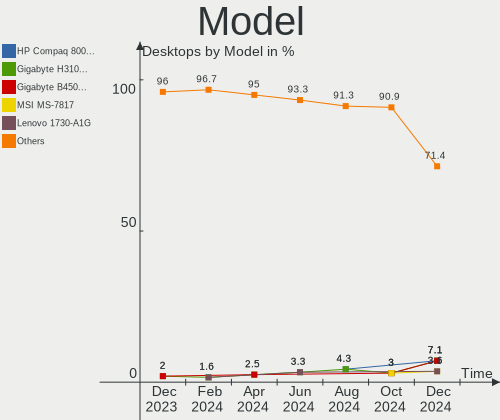
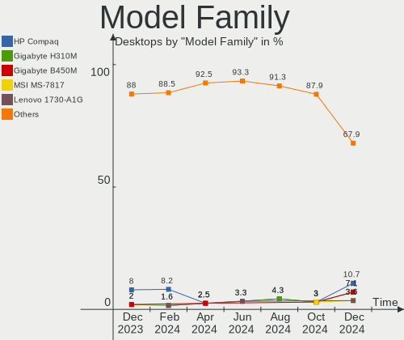
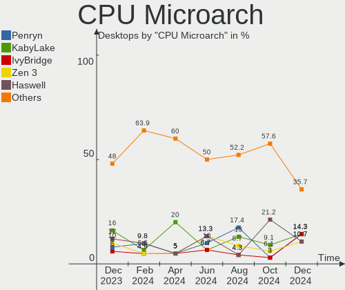
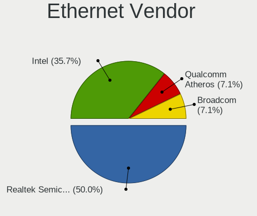
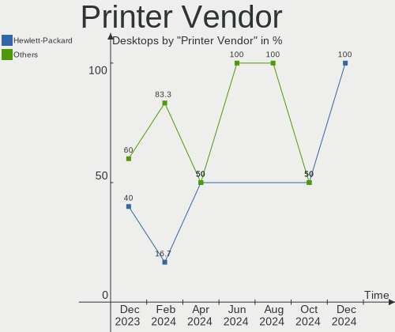

BlackPanther Hardware Trends (Desktop)
--------------------------------------

A project to identify most popular hardware characteristics and track their change
over time based on data collected by BlackPanther users at https://Linux-Hardware.org.

Anyone can contribute to the study by uploading probes of their computers by
the [hw-probe](https://github.com/linuxhw/hw-probe) tool:

    sudo -E hw-probe -all -upload

Full-feature report is available here: https://linux-hardware.org/?view=trends&formfactor=desktop

Period: May, 2021.

Contents
--------

- [ OS                       ](#os)
- [ OS Family                ](#os-family)
- [ Kernel                   ](#kernel)
- [ Kernel Family            ](#kernel-family)
- [ Kernel Major Ver.        ](#kernel-major-ver)
- [ Arch                     ](#arch)
- [ DE                       ](#de)
- [ Display Server           ](#display-server)
- [ Display Manager          ](#display-manager)
- [ OS Lang                  ](#os-lang)
- [ Boot Mode                ](#boot-mode)
- [ Filesystem               ](#filesystem)
- [ Part. scheme             ](#part-scheme)
- [ Dual Boot with Linux/BSD ](#dual-boot-with-linux/bsd)
- [ Dual Boot (Win)          ](#dual-boot-win)
- [ Country                  ](#country)
- [ City                     ](#city)
- [ Vendor                   ](#vendor)
- [ Model                    ](#model)
- [ Model Family             ](#model-family)
- [ MFG Year                 ](#mfg-year)
- [ Form Factor              ](#form-factor)
- [ Secure Boot              ](#secure-boot)
- [ Coreboot                 ](#coreboot)
- [ RAM Size                 ](#ram-size)
- [ RAM Used                 ](#ram-used)
- [ Has CD-ROM               ](#has-cd-rom)
- [ Total Drives             ](#total-drives)
- [ Has Ethernet             ](#has-ethernet)
- [ Has WiFi                 ](#has-wifi)
- [ Has Bluetooth            ](#has-bluetooth)
- [ Drive Vendor             ](#drive-vendor)
- [ Drive Model              ](#drive-model)
- [ HDD Vendor               ](#hdd-vendor)
- [ SSD Vendor               ](#ssd-vendor)
- [ Drive Kind               ](#drive-kind)
- [ Drive Connector          ](#drive-connector)
- [ Drive Size               ](#drive-size)
- [ Space Total              ](#space-total)
- [ Space Used               ](#space-used)
- [ Malfunc. Drives          ](#malfunc-drives)
- [ Malfunc. Drive Vendor    ](#malfunc-drive-vendor)
- [ Malfunc. HDD Vendor      ](#malfunc-hdd-vendor)
- [ Malfunc. Drive Kind      ](#malfunc-drive-kind)
- [ Failed Drives            ](#failed-drives)
- [ Failed Drive Vendor      ](#failed-drive-vendor)
- [ Drive Status             ](#drive-status)
- [ Storage Vendor           ](#storage-vendor)
- [ Storage Model            ](#storage-model)
- [ Storage Kind             ](#storage-kind)
- [ CPU Vendor               ](#cpu-vendor)
- [ CPU Model                ](#cpu-model)
- [ CPU Model Family         ](#cpu-model-family)
- [ CPU Cores                ](#cpu-cores)
- [ CPU Sockets              ](#cpu-sockets)
- [ CPU Threads              ](#cpu-threads)
- [ CPU Op-Modes             ](#cpu-op-modes)
- [ CPU Microcode            ](#cpu-microcode)
- [ CPU Microarch            ](#cpu-microarch)
- [ GPU Vendor               ](#gpu-vendor)
- [ GPU Model                ](#gpu-model)
- [ GPU Combo                ](#gpu-combo)
- [ GPU Driver               ](#gpu-driver)
- [ GPU Memory               ](#gpu-memory)
- [ Monitor Vendor           ](#monitor-vendor)
- [ Monitor Model            ](#monitor-model)
- [ Monitor Resolution       ](#monitor-resolution)
- [ Monitor Diagonal         ](#monitor-diagonal)
- [ Monitor Width            ](#monitor-width)
- [ Aspect Ratio             ](#aspect-ratio)
- [ Monitor Area             ](#monitor-area)
- [ Pixel Density            ](#pixel-density)
- [ Multiple Monitors        ](#multiple-monitors)
- [ Net Controller Vendor    ](#net-controller-vendor)
- [ Net Controller Model     ](#net-controller-model)
- [ Wireless Vendor          ](#wireless-vendor)
- [ Wireless Model           ](#wireless-model)
- [ Ethernet Vendor          ](#ethernet-vendor)
- [ Ethernet Model           ](#ethernet-model)
- [ Net Controller Kind      ](#net-controller-kind)
- [ Used Controller          ](#used-controller)
- [ NICs                     ](#nics)
- [ IPv6                     ](#ipv6)
- [ Memory Vendor            ](#memory-vendor)
- [ Memory Model             ](#memory-model)
- [ Memory Kind              ](#memory-kind)
- [ Memory Form Factor       ](#memory-form-factor)
- [ Memory Size              ](#memory-size)
- [ Memory Speed             ](#memory-speed)
- [ Sound Vendor             ](#sound-vendor)
- [ Sound Model              ](#sound-model)
- [ Camera Vendor            ](#camera-vendor)
- [ Camera Model             ](#camera-model)
- [ Fingerprint Vendor       ](#fingerprint-vendor)
- [ Fingerprint Model        ](#fingerprint-model)
- [ Chipcard Vendor          ](#chipcard-vendor)
- [ Chipcard Model           ](#chipcard-model)
- [ Printer Vendor           ](#printer-vendor)
- [ Printer Model            ](#printer-model)
- [ Scanner Vendor           ](#scanner-vendor)
- [ Scanner Model            ](#scanner-model)
- [ Bluetooth Vendor         ](#bluetooth-vendor)
- [ Bluetooth Model          ](#bluetooth-model)
- [ Unsupported Devices      ](#unsupported-devices)
- [ Unsupported Device Types ](#unsupported-device-types)

OS
--

Installed operating systems

| Name              | Desktops | Percent |
|-------------------|----------|---------|
| BlackPanther 18.1 | 55       | 96.49%  |
| BlackPanther 16.2 | 2        | 3.51%   |

OS Family
---------

OS without a version

| Name         | Desktops | Percent |
|--------------|----------|---------|
| BlackPanther | 57       | 100%    |

Kernel
------

Version of the Linux kernel

| Version                | Desktops | Percent |
|------------------------|----------|---------|
| 5.6.14-desktop-2bP     | 43       | 75.44%  |
| 4.18.16-desktop-1bP    | 12       | 21.05%  |
| 4.9.20-desktop-pae-1bP | 2        | 3.51%   |

Kernel Family
-------------

Linux kernel without a distro release

| Version | Desktops | Percent |
|---------|----------|---------|
| 5.6.14  | 43       | 75.44%  |
| 4.18.16 | 12       | 21.05%  |
| 4.9.20  | 2        | 3.51%   |

Kernel Major Ver.
-----------------

Linux kernel major version

| Version | Desktops | Percent |
|---------|----------|---------|
| 5.6     | 43       | 75.44%  |
| 4.18    | 12       | 21.05%  |
| 4.9     | 2        | 3.51%   |

Arch
----

OS architecture (x86_64, i586, etc.)

| Name   | Desktops | Percent |
|--------|----------|---------|
| x86_64 | 55       | 96.49%  |
| i686   | 2        | 3.51%   |

DE
--

Desktop Environment

| Name | Desktops | Percent |
|------|----------|---------|
| KDE5 | 57       | 100%    |

Display Server
--------------

X11 or Wayland

| Name | Desktops | Percent |
|------|----------|---------|
| X11  | 57       | 100%    |

Display Manager
---------------

SDDM, LightDM, etc.

| Name | Desktops | Percent |
|------|----------|---------|
| SDDM | 57       | 100%    |

OS Lang
-------

Language

| Lang    | Desktops | Percent |
|---------|----------|---------|
| Unknown | 57       | 100%    |

Boot Mode
---------

EFI or BIOS

| Mode | Desktops | Percent |
|------|----------|---------|
| BIOS | 41       | 71.93%  |
| EFI  | 16       | 28.07%  |

Filesystem
----------

Type of filesystem

| Type    | Desktops | Percent |
|---------|----------|---------|
| Overlay | 49       | 85.96%  |
| Ext4    | 6        | 10.53%  |
| Ext3    | 1        | 1.75%   |
| Btrfs   | 1        | 1.75%   |

Part. scheme
------------

Scheme of partitioning

| Type | Desktops | Percent |
|------|----------|---------|
| MBR  | 35       | 61.4%   |
| GPT  | 22       | 38.6%   |

Dual Boot with Linux/BSD
------------------------

Hosting more than one Linux/BSD

| Dual boot | Desktops | Percent |
|-----------|----------|---------|
| Yes       | 32       | 56.14%  |
| No        | 25       | 43.86%  |

Dual Boot (Win)
---------------

Hosting Linux and Windows

| Dual boot | Desktops | Percent |
|-----------|----------|---------|
| Yes       | 38       | 66.67%  |
| No        | 19       | 33.33%  |

Country
-------

Geographic location (country)

| Country     | Desktops | Percent |
|-------------|----------|---------|
| Hungary     | 40       | 70.18%  |
| USA         | 3        | 5.26%   |
| Spain       | 2        | 3.51%   |
| Romania     | 2        | 3.51%   |
| Germany     | 2        | 3.51%   |
| Turkey      | 1        | 1.75%   |
| Russia      | 1        | 1.75%   |
| Philippines | 1        | 1.75%   |
| Netherlands | 1        | 1.75%   |
| India       | 1        | 1.75%   |
| Costa Rica  | 1        | 1.75%   |
| Canada      | 1        | 1.75%   |
| Algeria     | 1        | 1.75%   |

City
----

Geographic location (city)

| City              | Desktops | Percent |
|-------------------|----------|---------|
| Budapest          | 7        | 12.28%  |
| Vecses            | 2        | 3.51%   |
| Stuttgart         | 2        | 3.51%   |
| Retkozberencs     | 2        | 3.51%   |
| Mohács           | 2        | 3.51%   |
| Eger              | 2        | 3.51%   |
| Debrecen          | 2        | 3.51%   |
| Érd              | 1        | 1.75%   |
| Totszentmarton    | 1        | 1.75%   |
| Szombathely       | 1        | 1.75%   |
| Szigetszentmiklos | 1        | 1.75%   |
| Szekszárd        | 1        | 1.75%   |
| Szeged            | 1        | 1.75%   |
| Szabadszentkiraly | 1        | 1.75%   |
| Roszke            | 1        | 1.75%   |
| Pécs             | 1        | 1.75%   |
| Puntarenas        | 1        | 1.75%   |
| Pakozd            | 1        | 1.75%   |
| Oroshaza          | 1        | 1.75%   |
| Oradea            | 1        | 1.75%   |
| Odorheiu Secuiesc | 1        | 1.75%   |
| Nyiregyhaza       | 1        | 1.75%   |
| Novosibirsk       | 1        | 1.75%   |
| Nagykoros         | 1        | 1.75%   |
| Miskolc           | 1        | 1.75%   |
| Mezobereny        | 1        | 1.75%   |
| Mateszalka        | 1        | 1.75%   |
| Madrid            | 1        | 1.75%   |
| Maastricht        | 1        | 1.75%   |
| Los Angeles       | 1        | 1.75%   |
| La Orotava        | 1        | 1.75%   |
| Karcag            | 1        | 1.75%   |
| Izmir             | 1        | 1.75%   |
| Hodmezovasarhely  | 1        | 1.75%   |
| Hajdusamson       | 1        | 1.75%   |
| Glendale          | 1        | 1.75%   |
| Fargo             | 1        | 1.75%   |
| Esztergom         | 1        | 1.75%   |
| Chennai           | 1        | 1.75%   |
| Celldomolk        | 1        | 1.75%   |
| Cagayan de Oro    | 1        | 1.75%   |
| Békéscsaba      | 1        | 1.75%   |
| Biatorbagy        | 1        | 1.75%   |
| Batna City        | 1        | 1.75%   |
| Abbotsford        | 1        | 1.75%   |

Vendor
------

Motherboard manufacturer

| Name                | Desktops | Percent |
|---------------------|----------|---------|
| Gigabyte Technology | 13       | 22.81%  |
| ASUSTek Computer    | 10       | 17.54%  |
| ASRock              | 7        | 12.28%  |
| MSI                 | 6        | 10.53%  |
| Lenovo              | 4        | 7.02%   |
| Hewlett-Packard     | 4        | 7.02%   |
| Sapphire            | 2        | 3.51%   |
| Intel               | 2        | 3.51%   |
| Dell                | 2        | 3.51%   |
| Acer                | 2        | 3.51%   |
| Pegatron            | 1        | 1.75%   |
| Fujitsu Siemens     | 1        | 1.75%   |
| Fujitsu             | 1        | 1.75%   |
| Datto               | 1        | 1.75%   |
| Unknown             | 1        | 1.75%   |

Model
-----

Motherboard model

| Name                                      | Desktops | Percent |
|-------------------------------------------|----------|---------|
| Sapphire PI-AM3RS785G                     | 2        | 3.51%   |
| Gigabyte P67A-D3-B3                       | 2        | 3.51%   |
| ASUS All Series                           | 2        | 3.51%   |
| Pegatron CQ2728LA                         | 1        | 1.75%   |
| MSI MS-7B98                               | 1        | 1.75%   |
| MSI MS-7A38                               | 1        | 1.75%   |
| MSI MS-7A36                               | 1        | 1.75%   |
| MSI MS-7994                               | 1        | 1.75%   |
| MSI MS-7972                               | 1        | 1.75%   |
| MSI MS-7312                               | 1        | 1.75%   |
| Lenovo ThinkCentre M73 10B6001SUS         | 1        | 1.75%   |
| Lenovo ThinkCentre M72e 36622M1           | 1        | 1.75%   |
| Lenovo ThinkCentre M72e 32671M2           | 1        | 1.75%   |
| Lenovo IdeaCentre T540-15ICK G 90LW00ATUS | 1        | 1.75%   |
| Intel DQ77MK                              | 1        | 1.75%   |
| Intel DH55TC AAE70932-302                 | 1        | 1.75%   |
| HP xw4400 Workstation                     | 1        | 1.75%   |
| HP Compaq Pro 6305 MT                     | 1        | 1.75%   |
| HP Compaq dc5850 Small Form Factor        | 1        | 1.75%   |
| HP Compaq dc5850 Microtower               | 1        | 1.75%   |
| Gigabyte Z68X-UD3H-B3                     | 1        | 1.75%   |
| Gigabyte M57SLI-S4                        | 1        | 1.75%   |
| Gigabyte H61M-DS2                         | 1        | 1.75%   |
| Gigabyte H61M-D2-B3                       | 1        | 1.75%   |
| Gigabyte H170-D3HP                        | 1        | 1.75%   |
| Gigabyte GA-MA770-UD3                     | 1        | 1.75%   |
| Gigabyte G41MT-S2PT                       | 1        | 1.75%   |
| Gigabyte G31M-ES2L                        | 1        | 1.75%   |
| Gigabyte G31M-ES2C                        | 1        | 1.75%   |
| Gigabyte F2A88XN-WIFI                     | 1        | 1.75%   |
| Gigabyte EP31-DS3L                        | 1        | 1.75%   |
| Fujitsu Siemens ESPRIMO P5730             | 1        | 1.75%   |
| Fujitsu ESPRIMO P5731                     | 1        | 1.75%   |
| Dell OptiPlex 755                         | 1        | 1.75%   |
| Dell OptiPlex 330                         | 1        | 1.75%   |
| Datto DATTO-SSD                           | 1        | 1.75%   |
| ASUS P5W DH Deluxe                        | 1        | 1.75%   |
| ASUS P5KPL-AM EPU                         | 1        | 1.75%   |
| ASUS M5A97 R2.0                           | 1        | 1.75%   |
| ASUS M5A78L-M PLUS/USB3                   | 1        | 1.75%   |
| ASUS M2N68-AM Plus                        | 1        | 1.75%   |
| ASUS M2N-E                                | 1        | 1.75%   |
| ASUS H110M-D                              | 1        | 1.75%   |
| ASUS H110M-A                              | 1        | 1.75%   |
| ASRock Z170M Extreme4                     | 1        | 1.75%   |
| ASRock G41M-GS                            | 1        | 1.75%   |
| ASRock G31M-GS                            | 1        | 1.75%   |
| ASRock FM2A75 Pro4-M                      | 1        | 1.75%   |
| ASRock FM2A68M-DG3+                       | 1        | 1.75%   |
| ASRock FM2A58M-DG3+                       | 1        | 1.75%   |
| ASRock ConRoe1333-D667                    | 1        | 1.75%   |
| Acer Veriton M430                         | 1        | 1.75%   |
| Acer Predator G3610                       | 1        | 1.75%   |
| Unknown                                   | 1        | 1.75%   |

Model Family
------------

Motherboard model prefix

| Name                    | Desktops | Percent |
|-------------------------|----------|---------|
| Lenovo ThinkCentre      | 3        | 5.26%   |
| HP Compaq               | 3        | 5.26%   |
| Sapphire PI-AM3RS785G   | 2        | 3.51%   |
| Gigabyte P67A-D3-B3     | 2        | 3.51%   |
| Dell OptiPlex           | 2        | 3.51%   |
| ASUS All                | 2        | 3.51%   |
| Pegatron CQ2728LA       | 1        | 1.75%   |
| MSI MS-7B98             | 1        | 1.75%   |
| MSI MS-7A38             | 1        | 1.75%   |
| MSI MS-7A36             | 1        | 1.75%   |
| MSI MS-7994             | 1        | 1.75%   |
| MSI MS-7972             | 1        | 1.75%   |
| MSI MS-7312             | 1        | 1.75%   |
| Lenovo IdeaCentre       | 1        | 1.75%   |
| Intel DQ77MK            | 1        | 1.75%   |
| Intel DH55TC            | 1        | 1.75%   |
| HP xw4400               | 1        | 1.75%   |
| Gigabyte Z68X-UD3H-B3   | 1        | 1.75%   |
| Gigabyte M57SLI-S4      | 1        | 1.75%   |
| Gigabyte H61M-DS2       | 1        | 1.75%   |
| Gigabyte H61M-D2-B3     | 1        | 1.75%   |
| Gigabyte H170-D3HP      | 1        | 1.75%   |
| Gigabyte GA-MA770-UD3   | 1        | 1.75%   |
| Gigabyte G41MT-S2PT     | 1        | 1.75%   |
| Gigabyte G31M-ES2L      | 1        | 1.75%   |
| Gigabyte G31M-ES2C      | 1        | 1.75%   |
| Gigabyte F2A88XN-WIFI   | 1        | 1.75%   |
| Gigabyte EP31-DS3L      | 1        | 1.75%   |
| Fujitsu Siemens ESPRIMO | 1        | 1.75%   |
| Fujitsu ESPRIMO         | 1        | 1.75%   |
| Datto DATTO-SSD         | 1        | 1.75%   |
| ASUS P5W                | 1        | 1.75%   |
| ASUS P5KPL-AM           | 1        | 1.75%   |
| ASUS M5A97              | 1        | 1.75%   |
| ASUS M5A78L-M           | 1        | 1.75%   |
| ASUS M2N68-AM           | 1        | 1.75%   |
| ASUS M2N-E              | 1        | 1.75%   |
| ASUS H110M-D            | 1        | 1.75%   |
| ASUS H110M-A            | 1        | 1.75%   |
| ASRock Z170M            | 1        | 1.75%   |
| ASRock G41M-GS          | 1        | 1.75%   |
| ASRock G31M-GS          | 1        | 1.75%   |
| ASRock FM2A75           | 1        | 1.75%   |
| ASRock FM2A68M-DG3+     | 1        | 1.75%   |
| ASRock FM2A58M-DG3+     | 1        | 1.75%   |
| ASRock ConRoe1333-D667  | 1        | 1.75%   |
| Acer Veriton            | 1        | 1.75%   |
| Acer Predator           | 1        | 1.75%   |
| Unknown                 | 1        | 1.75%   |

MFG Year
--------

Motherboard manufacture year

| Year | Desktops | Percent |
|------|----------|---------|
| 2009 | 9        | 15.79%  |
| 2011 | 8        | 14.04%  |
| 2018 | 6        | 10.53%  |
| 2014 | 6        | 10.53%  |
| 2010 | 4        | 7.02%   |
| 2008 | 4        | 7.02%   |
| 2019 | 3        | 5.26%   |
| 2016 | 3        | 5.26%   |
| 2015 | 3        | 5.26%   |
| 2012 | 3        | 5.26%   |
| 2013 | 2        | 3.51%   |
| 2007 | 2        | 3.51%   |
| 2021 | 1        | 1.75%   |
| 2020 | 1        | 1.75%   |
| 2017 | 1        | 1.75%   |
| 2006 | 1        | 1.75%   |

Form Factor
-----------

Physical design of the computer

| Name    | Desktops | Percent |
|---------|----------|---------|
| Desktop | 57       | 100%    |

Secure Boot
-----------

Enabled or disabled

| State    | Desktops | Percent |
|----------|----------|---------|
| Disabled | 57       | 100%    |

Coreboot
--------

Have coreboot on board

| Used | Desktops | Percent |
|------|----------|---------|
| No   | 57       | 100%    |

RAM Size
--------

Total RAM memory

| Size in GB | Desktops | Percent |
|------------|----------|---------|
| 3.01-4.0   | 23       | 40.35%  |
| 8.01-16.0  | 12       | 21.05%  |
| 4.01-8.0   | 9        | 15.79%  |
| 16.01-24.0 | 7        | 12.28%  |
| 1.01-2.0   | 4        | 7.02%   |
| 32.01-64.0 | 2        | 3.51%   |

RAM Used
--------

Used RAM memory

| Used GB  | Desktops | Percent |
|----------|----------|---------|
| 0.01-0.5 | 30       | 52.63%  |
| 0.51-1.0 | 23       | 40.35%  |
| 1.01-2.0 | 4        | 7.02%   |

Has CD-ROM
----------

Has CD-ROM on board

| Presented | Desktops | Percent |
|-----------|----------|---------|
| Yes       | 39       | 68.42%  |
| No        | 18       | 31.58%  |

Total Drives
------------

Number of drives on board

| Drives | Desktops | Percent |
|--------|----------|---------|
| 1      | 28       | 49.12%  |
| 2      | 12       | 21.05%  |
| 3      | 9        | 15.79%  |
| 5      | 4        | 7.02%   |
| 4      | 2        | 3.51%   |
| 6      | 1        | 1.75%   |
| 0      | 1        | 1.75%   |

Has Ethernet
------------

Has Ethernet on board

| Presented | Desktops | Percent |
|-----------|----------|---------|
| Yes       | 55       | 96.49%  |
| No        | 2        | 3.51%   |

Has WiFi
--------

Has WiFi module

| Presented | Desktops | Percent |
|-----------|----------|---------|
| No        | 37       | 64.91%  |
| Yes       | 20       | 35.09%  |

Has Bluetooth
-------------

Has Bluetooth module

| Presented | Desktops | Percent |
|-----------|----------|---------|
| No        | 48       | 84.21%  |
| Yes       | 9        | 15.79%  |

Drive Vendor
------------

Hard drive vendors

| Vendor              | Desktops | Drives | Percent |
|---------------------|----------|--------|---------|
| Seagate             | 19       | 22     | 19.79%  |
| WDC                 | 18       | 26     | 18.75%  |
| Samsung Electronics | 15       | 21     | 15.63%  |
| Kingston            | 9        | 11     | 9.38%   |
| Hitachi             | 6        | 6      | 6.25%   |
| A-DATA Technology   | 4        | 4      | 4.17%   |
| Toshiba             | 3        | 3      | 3.13%   |
| Maxtor              | 3        | 3      | 3.13%   |
| Apacer              | 3        | 3      | 3.13%   |
| WD MediaMax         | 2        | 2      | 2.08%   |
| SPCC                | 2        | 2      | 2.08%   |
| PNY                 | 2        | 2      | 2.08%   |
| Gigabyte Technology | 2        | 2      | 2.08%   |
| OCZ                 | 1        | 1      | 1.04%   |
| KingSpec            | 1        | 1      | 1.04%   |
| Kingmax             | 1        | 1      | 1.04%   |
| Intel               | 1        | 1      | 1.04%   |
| HS-SSD-C100         | 1        | 1      | 1.04%   |
| EMTEC               | 1        | 1      | 1.04%   |
| Crucial             | 1        | 1      | 1.04%   |
| China               | 1        | 1      | 1.04%   |

Drive Model
-----------

Hard drive models

| Model                               | Desktops | Percent |
|-------------------------------------|----------|---------|
| Seagate ST500DM002-1BD142 500GB     | 3        | 2.65%   |
| Kingston SA400S37240G 240GB SSD     | 3        | 2.65%   |
| WDC WD30EZRZ-00GXCB0 3TB            | 2        | 1.77%   |
| WDC WD30EFRX-68EUZN0 3TB            | 2        | 1.77%   |
| WDC WD20EZRX-00D8PB0 2TB            | 2        | 1.77%   |
| WD MediaMax WL1500GSA6454G 1TB      | 2        | 1.77%   |
| Seagate ST3320413AS 320GB           | 2        | 1.77%   |
| Seagate ST1000DM010-2EP102 1TB      | 2        | 1.77%   |
| Samsung SSD 830 Series 64GB         | 2        | 1.77%   |
| Samsung HD502IJ 500GB               | 2        | 1.77%   |
| Samsung HD154UI 1TB                 | 2        | 1.77%   |
| PNY CS900 120GB SSD                 | 2        | 1.77%   |
| Kingston SHFS37A120G 120GB SSD      | 2        | 1.77%   |
| Kingston SA400S37120G 120GB SSD     | 2        | 1.77%   |
| Gigabyte GP-GSTFS31120GNTD 120GB    | 2        | 1.77%   |
| WDC WUH721414ALE6L4 14TB            | 1        | 0.88%   |
| WDC WD800JD-75MSA3 80GB             | 1        | 0.88%   |
| WDC WD800JD-55MUA1 80GB             | 1        | 0.88%   |
| WDC WD800AAJS-75M0A0 80GB           | 1        | 0.88%   |
| WDC WD5000AAKX-001CA0 500GB         | 1        | 0.88%   |
| WDC WD5000AAKS-55V0A0 500GB         | 1        | 0.88%   |
| WDC WD4000YS-01MPB1 400GB           | 1        | 0.88%   |
| WDC WD3200AAKS-00SBA0 320GB         | 1        | 0.88%   |
| WDC WD30EZRX-00MMMB0 3TB            | 1        | 0.88%   |
| WDC WD2500AAKX-60U6AA0 250GB        | 1        | 0.88%   |
| WDC WD20PURX-64P6ZY0 2TB            | 1        | 0.88%   |
| WDC WD20EZRZ-00Z5HB0 2TB            | 1        | 0.88%   |
| WDC WD20EZRX-00DC0B0 2TB            | 1        | 0.88%   |
| WDC WD2000FYYZ-01UL1B2 2TB          | 1        | 0.88%   |
| WDC WD1600AVVS-63L2B0 160GB         | 1        | 0.88%   |
| WDC WD1600AAJS-60WAA0 160GB         | 1        | 0.88%   |
| WDC WD1600AAJB-56WRA0 160GB         | 1        | 0.88%   |
| WDC WD10EZEX-75WN4A0 1TB            | 1        | 0.88%   |
| WDC WD10EZEX-22BN5A0 1TB            | 1        | 0.88%   |
| WDC WD10EZEX-08WN4A0 1TB            | 1        | 0.88%   |
| Toshiba MQ02ABF050H 500GB           | 1        | 0.88%   |
| Toshiba MQ01ABD050 500GB            | 1        | 0.88%   |
| Toshiba DT01ACA100 1TB              | 1        | 0.88%   |
| SPCC Solid State Disk 1TB           | 1        | 0.88%   |
| SPCC Solid State Disk 128GB         | 1        | 0.88%   |
| Seagate STM3250318AS 250GB          | 1        | 0.88%   |
| Seagate ST9500325AS 500GB           | 1        | 0.88%   |
| Seagate ST500LT012-9WS142 500GB     | 1        | 0.88%   |
| Seagate ST500LM012 HN-M500MBB 500GB | 1        | 0.88%   |
| Seagate ST500DM005 HD502HJ 500GB    | 1        | 0.88%   |
| Seagate ST3500414CS 500GB           | 1        | 0.88%   |
| Seagate ST3500312CS 500GB           | 1        | 0.88%   |
| Seagate ST3250410AS 250GB           | 1        | 0.88%   |
| Seagate ST3250318AS 250GB           | 1        | 0.88%   |
| Seagate ST3160812AS 160GB           | 1        | 0.88%   |
| Seagate ST3120026A 120GB            | 1        | 0.88%   |
| Seagate ST2000DX001-1NS164 2TB      | 1        | 0.88%   |
| Seagate ST1000DM003-1SB102 1TB      | 1        | 0.88%   |
| Seagate ST1000DM003-1ER162 1TB      | 1        | 0.88%   |
| Seagate ST1000DM003-1CH162 1TB      | 1        | 0.88%   |
| Samsung SSD 870 EVO 250GB           | 1        | 0.88%   |
| Samsung SSD 850 EVO 120GB           | 1        | 0.88%   |
| Samsung SSD 840 EVO 120GB           | 1        | 0.88%   |
| Samsung SP1603C 160GB               | 1        | 0.88%   |
| Samsung SP0411C 40GB                | 1        | 0.88%   |

HDD Vendor
----------

Hard disk drive vendors

| Vendor              | Desktops | Drives | Percent |
|---------------------|----------|--------|---------|
| Seagate             | 19       | 22     | 29.69%  |
| WDC                 | 18       | 26     | 28.13%  |
| Samsung Electronics | 13       | 13     | 20.31%  |
| Hitachi             | 6        | 6      | 9.38%   |
| Toshiba             | 3        | 3      | 4.69%   |
| Maxtor              | 3        | 3      | 4.69%   |
| WD MediaMax         | 2        | 2      | 3.13%   |

SSD Vendor
----------

Solid state drive vendors

| Vendor              | Desktops | Drives | Percent |
|---------------------|----------|--------|---------|
| Kingston            | 9        | 11     | 25.71%  |
| Samsung Electronics | 6        | 8      | 17.14%  |
| A-DATA Technology   | 4        | 4      | 11.43%  |
| Apacer              | 3        | 3      | 8.57%   |
| SPCC                | 2        | 2      | 5.71%   |
| PNY                 | 2        | 2      | 5.71%   |
| Gigabyte Technology | 2        | 2      | 5.71%   |
| OCZ                 | 1        | 1      | 2.86%   |
| KingSpec            | 1        | 1      | 2.86%   |
| Kingmax             | 1        | 1      | 2.86%   |
| HS-SSD-C100         | 1        | 1      | 2.86%   |
| EMTEC               | 1        | 1      | 2.86%   |
| Crucial             | 1        | 1      | 2.86%   |
| China               | 1        | 1      | 2.86%   |

Drive Kind
----------

HDD or SSD

| Kind | Desktops | Drives | Percent |
|------|----------|--------|---------|
| HDD  | 44       | 75     | 57.14%  |
| SSD  | 32       | 39     | 41.56%  |
| NVMe | 1        | 1      | 1.3%    |

Drive Connector
---------------

SATA, SAS, NVMe, etc.

| Type | Desktops | Drives | Percent |
|------|----------|--------|---------|
| SATA | 55       | 112    | 94.83%  |
| SAS  | 2        | 2      | 3.45%   |
| NVMe | 1        | 1      | 1.72%   |

Drive Size
----------

Size of hard drive

| Size in TB | Desktops | Drives | Percent |
|------------|----------|--------|---------|
| 0.01-0.5   | 49       | 82     | 67.12%  |
| 0.51-1.0   | 16       | 19     | 21.92%  |
| 1.01-2.0   | 4        | 7      | 5.48%   |
| 2.01-3.0   | 3        | 5      | 4.11%   |
| 10.01-20.0 | 1        | 1      | 1.37%   |

Space Total
-----------

Amount of disk space available on the file system

| Size in GB | Desktops | Percent |
|------------|----------|---------|
| Unknown    | 50       | 87.72%  |
| 21-50      | 4        | 7.02%   |
| 1001-2000  | 1        | 1.75%   |
| 501-1000   | 1        | 1.75%   |
| 51-100     | 1        | 1.75%   |

Space Used
----------

Amount of used disk space

| Used GB | Desktops | Percent |
|---------|----------|---------|
| Unknown | 50       | 87.72%  |
| 1-20    | 7        | 12.28%  |

Malfunc. Drives
---------------

Drive models with a malfunction

| Model                               | Desktops | Drives | Percent |
|-------------------------------------|----------|--------|---------|
| Seagate ST500DM002-1BD142 500GB     | 3        | 3      | 8.33%   |
| WD MediaMax WL1500GSA6454G 1TB      | 2        | 2      | 5.56%   |
| Seagate ST3320413AS 320GB           | 2        | 2      | 5.56%   |
| WDC WD800JD-55MUA1 80GB             | 1        | 1      | 2.78%   |
| WDC WD5000AAKX-001CA0 500GB         | 1        | 1      | 2.78%   |
| WDC WD5000AAKS-55V0A0 500GB         | 1        | 1      | 2.78%   |
| WDC WD30EZRX-00MMMB0 3TB            | 1        | 1      | 2.78%   |
| WDC WD20PURX-64P6ZY0 2TB            | 1        | 1      | 2.78%   |
| WDC WD2000FYYZ-01UL1B2 2TB          | 1        | 1      | 2.78%   |
| WDC WD1600AAJB-56WRA0 160GB         | 1        | 1      | 2.78%   |
| WDC WD10EZEX-08WN4A0 1TB            | 1        | 1      | 2.78%   |
| Toshiba MQ02ABF050H 500GB           | 1        | 1      | 2.78%   |
| Toshiba MQ01ABD050 500GB            | 1        | 1      | 2.78%   |
| Seagate STM3250318AS 250GB          | 1        | 1      | 2.78%   |
| Seagate ST9500325AS 500GB           | 1        | 1      | 2.78%   |
| Seagate ST500LT012-9WS142 500GB     | 1        | 1      | 2.78%   |
| Seagate ST500LM012 HN-M500MBB 500GB | 1        | 1      | 2.78%   |
| Seagate ST500DM005 HD502HJ 500GB    | 1        | 1      | 2.78%   |
| Seagate ST3160812AS 160GB           | 1        | 1      | 2.78%   |
| Seagate ST1000DM010-2EP102 1TB      | 1        | 1      | 2.78%   |
| Samsung Electronics SP1603C 160GB   | 1        | 1      | 2.78%   |
| Samsung Electronics SP0411C 40GB    | 1        | 1      | 2.78%   |
| Samsung Electronics HD502HJ 500GB   | 1        | 1      | 2.78%   |
| OCZ ARC100 240GB SSD                | 1        | 1      | 2.78%   |
| Maxtor 6Y080L0 81GB                 | 1        | 1      | 2.78%   |
| Maxtor 6V250F0 256GB                | 1        | 1      | 2.78%   |
| Maxtor 4D040H2 41GB                 | 1        | 1      | 2.78%   |
| Kingston SV300S37A120G 120GB SSD    | 1        | 1      | 2.78%   |
| Hitachi HTS542512K9SA00 120GB       | 1        | 1      | 2.78%   |
| Hitachi HDT721032SLA360 320GB       | 1        | 1      | 2.78%   |
| Hitachi HDS721050CLA362 500GB       | 1        | 1      | 2.78%   |
| A-DATA Technology SP550 120GB SSD   | 1        | 1      | 2.78%   |

Malfunc. Drive Vendor
---------------------

Vendors of faulty drives

| Vendor              | Desktops | Drives | Percent |
|---------------------|----------|--------|---------|
| Seagate             | 12       | 12     | 35.29%  |
| WDC                 | 6        | 8      | 17.65%  |
| Samsung Electronics | 3        | 3      | 8.82%   |
| Maxtor              | 3        | 3      | 8.82%   |
| Hitachi             | 3        | 3      | 8.82%   |
| WD MediaMax         | 2        | 2      | 5.88%   |
| Toshiba             | 2        | 2      | 5.88%   |
| OCZ                 | 1        | 1      | 2.94%   |
| Kingston            | 1        | 1      | 2.94%   |
| A-DATA Technology   | 1        | 1      | 2.94%   |

Malfunc. HDD Vendor
-------------------

Vendors of faulty HDD drives

| Vendor              | Desktops | Drives | Percent |
|---------------------|----------|--------|---------|
| Seagate             | 12       | 12     | 38.71%  |
| WDC                 | 6        | 8      | 19.35%  |
| Samsung Electronics | 3        | 3      | 9.68%   |
| Maxtor              | 3        | 3      | 9.68%   |
| Hitachi             | 3        | 3      | 9.68%   |
| WD MediaMax         | 2        | 2      | 6.45%   |
| Toshiba             | 2        | 2      | 6.45%   |

Malfunc. Drive Kind
-------------------

Kinds of faulty drives

| Kind | Desktops | Drives | Percent |
|------|----------|--------|---------|
| HDD  | 26       | 33     | 89.66%  |
| SSD  | 3        | 3      | 10.34%  |

Failed Drives
-------------

Failed drive models

Zero info for selected period =(

Failed Drive Vendor
-------------------

Failed drive vendors

Zero info for selected period =(

Drive Status
------------

Number of failed and malfunc. drives

| Status   | Desktops | Drives | Percent |
|----------|----------|--------|---------|
| Works    | 44       | 77     | 60.27%  |
| Malfunc  | 27       | 36     | 36.99%  |
| Detected | 2        | 2      | 2.74%   |

Storage Vendor
--------------

Storage controller vendors

| Vendor                   | Desktops | Percent |
|--------------------------|----------|---------|
| Intel                    | 37       | 60.66%  |
| AMD                      | 16       | 26.23%  |
| Nvidia                   | 3        | 4.92%   |
| Marvell Technology Group | 2        | 3.28%   |
| VIA Technologies         | 1        | 1.64%   |
| Silicon Image            | 1        | 1.64%   |
| JMicron Technology       | 1        | 1.64%   |

Storage Model
-------------

Storage controller models

| Model                                                                                   | Desktops | Percent |
|-----------------------------------------------------------------------------------------|----------|---------|
| Intel NM10/ICH7 Family SATA Controller [IDE mode]                                       | 10       | 10.75%  |
| Intel 82801G (ICH7 Family) IDE Controller                                               | 10       | 10.75%  |
| AMD FCH SATA Controller [AHCI mode]                                                     | 7        | 7.53%   |
| Intel Q170/Q150/B150/H170/H110/Z170/CM236 Chipset SATA Controller [AHCI Mode]           | 6        | 6.45%   |
| AMD SB7x0/SB8x0/SB9x0 SATA Controller [IDE mode]                                        | 5        | 5.38%   |
| Intel 6 Series/C200 Series Chipset Family Desktop SATA Controller (IDE mode, ports 4-5) | 4        | 4.3%    |
| Intel 6 Series/C200 Series Chipset Family Desktop SATA Controller (IDE mode, ports 0-3) | 4        | 4.3%    |
| AMD SB7x0/SB8x0/SB9x0 SATA Controller [AHCI mode]                                       | 4        | 4.3%    |
| AMD SB7x0/SB8x0/SB9x0 IDE Controller                                                    | 4        | 4.3%    |
| Intel 8 Series/C220 Series Chipset Family 6-port SATA Controller 1 [AHCI mode]          | 3        | 3.23%   |
| Intel 6 Series/C200 Series Chipset Family 6 port Desktop SATA AHCI Controller           | 3        | 3.23%   |
| Nvidia MCP55 SATA Controller                                                            | 2        | 2.15%   |
| Nvidia MCP55 IDE                                                                        | 2        | 2.15%   |
| Intel 82801JD/DO (ICH10 Family) 4-port SATA IDE Controller                              | 2        | 2.15%   |
| Intel 82801JD/DO (ICH10 Family) 2-port SATA IDE Controller                              | 2        | 2.15%   |
| AMD FCH IDE Controller                                                                  | 2        | 2.15%   |
| VIA VT82C586A/B/VT82C686/A/B/VT823x/A/C PIPC Bus Master IDE                             | 1        | 1.08%   |
| VIA VIA VT6420 SATA RAID Controller                                                     | 1        | 1.08%   |
| Silicon Image SiI 3114 [SATALink/SATARaid] Serial ATA Controller                        | 1        | 1.08%   |
| Nvidia MCP61 SATA Controller                                                            | 1        | 1.08%   |
| Nvidia MCP61 IDE                                                                        | 1        | 1.08%   |
| Marvell Group 88SE9215 PCIe 2.0 x1 4-port SATA 6 Gb/s Controller                        | 1        | 1.08%   |
| Marvell Group 88SE9172 SATA 6Gb/s Controller                                            | 1        | 1.08%   |
| JMicron JMB363 SATA/IDE Controller                                                      | 1        | 1.08%   |
| Intel Wildcat Point-LP SATA Controller [AHCI Mode]                                      | 1        | 1.08%   |
| Intel SSD 660P Series                                                                   | 1        | 1.08%   |
| Intel SATA Controller [RAID mode]                                                       | 1        | 1.08%   |
| Intel NM10/ICH7 Family SATA Controller [AHCI mode]                                      | 1        | 1.08%   |
| Intel Cannon Lake PCH SATA AHCI Controller                                              | 1        | 1.08%   |
| Intel 82801IR/IO/IH (ICH9R/DO/DH) 6 port SATA Controller [AHCI mode]                    | 1        | 1.08%   |
| Intel 82801IBM/IEM (ICH9M/ICH9M-E) 2 port SATA Controller [IDE mode]                    | 1        | 1.08%   |
| Intel 7 Series/C210 Series Chipset Family 4-port SATA Controller [IDE mode]             | 1        | 1.08%   |
| Intel 7 Series/C210 Series Chipset Family 2-port SATA Controller [IDE mode]             | 1        | 1.08%   |
| Intel 5 Series/3400 Series Chipset PT IDER Controller                                   | 1        | 1.08%   |
| Intel 5 Series/3400 Series Chipset 6 port SATA AHCI Controller                          | 1        | 1.08%   |
| Intel 4 Series Chipset PT IDER Controller                                               | 1        | 1.08%   |
| Intel 200 Series PCH SATA controller [AHCI mode]                                        | 1        | 1.08%   |
| AMD FCH SATA Controller D                                                               | 1        | 1.08%   |
| AMD 400 Series Chipset SATA Controller                                                  | 1        | 1.08%   |

Storage Kind
------------

Kind of storage controller (IDE, SATA, NVMe, SAS, ...)

| Kind | Desktops | Percent |
|------|----------|---------|
| SATA | 34       | 50.75%  |
| IDE  | 30       | 44.78%  |
| RAID | 2        | 2.99%   |
| NVMe | 1        | 1.49%   |

CPU Vendor
----------

Processor vendors

| Vendor | Desktops | Percent |
|--------|----------|---------|
| Intel  | 37       | 64.91%  |
| AMD    | 20       | 35.09%  |

CPU Model
---------

Processor models

| Model                                           | Desktops | Percent |
|-------------------------------------------------|----------|---------|
| Intel Core i5-2300 CPU @ 2.80GHz                | 2        | 3.51%   |
| Intel Core 2 Quad CPU Q9400 @ 2.66GHz           | 2        | 3.51%   |
| Intel Core 2 Quad CPU Q6600 @ 2.40GHz           | 2        | 3.51%   |
| Intel Core 2 Duo CPU E7300 @ 2.66GHz            | 2        | 3.51%   |
| AMD Athlon II X2 255 Processor                  | 2        | 3.51%   |
| Intel Pentium Dual-Core CPU E6700 @ 3.20GHz     | 1        | 1.75%   |
| Intel Pentium Dual-Core CPU E5700 @ 3.00GHz     | 1        | 1.75%   |
| Intel Pentium Dual-Core CPU E5300 @ 2.60GHz     | 1        | 1.75%   |
| Intel Pentium CPU G840 @ 2.80GHz                | 1        | 1.75%   |
| Intel Pentium CPU G3420 @ 3.20GHz               | 1        | 1.75%   |
| Intel Core i7-9700K CPU @ 3.60GHz               | 1        | 1.75%   |
| Intel Core i7-9700 CPU @ 3.00GHz                | 1        | 1.75%   |
| Intel Core i7-7700 CPU @ 3.60GHz                | 1        | 1.75%   |
| Intel Core i7-6700 CPU @ 3.40GHz                | 1        | 1.75%   |
| Intel Core i7-2600 CPU @ 3.40GHz                | 1        | 1.75%   |
| Intel Core i5-6600K CPU @ 3.50GHz               | 1        | 1.75%   |
| Intel Core i5-6500 CPU @ 3.20GHz                | 1        | 1.75%   |
| Intel Core i5-4590 CPU @ 3.30GHz                | 1        | 1.75%   |
| Intel Core i5-2500K CPU @ 3.30GHz               | 1        | 1.75%   |
| Intel Core i5-2320 CPU @ 3.00GHz                | 1        | 1.75%   |
| Intel Core i5 CPU 650 @ 3.20GHz                 | 1        | 1.75%   |
| Intel Core i3-7100 CPU @ 3.90GHz                | 1        | 1.75%   |
| Intel Core i3-6100 CPU @ 3.70GHz                | 1        | 1.75%   |
| Intel Core i3-5005U CPU @ 2.00GHz               | 1        | 1.75%   |
| Intel Core i3-4330 CPU @ 3.50GHz                | 1        | 1.75%   |
| Intel Core i3-3240 CPU @ 3.40GHz                | 1        | 1.75%   |
| Intel Core i3-3210 CPU @ 3.20GHz                | 1        | 1.75%   |
| Intel Core i3-2105 CPU @ 3.10GHz                | 1        | 1.75%   |
| Intel Core 2 Quad CPU Q9300 @ 2.50GHz           | 1        | 1.75%   |
| Intel Core 2 Quad CPU Q8200 @ 2.33GHz           | 1        | 1.75%   |
| Intel Core 2 Duo CPU E7500 @ 2.93GHz            | 1        | 1.75%   |
| Intel Core 2 Duo CPU E7200 @ 2.53GHz            | 1        | 1.75%   |
| Intel Core 2 CPU 6600 @ 2.40GHz                 | 1        | 1.75%   |
| Intel Celeron CPU 430 @ 1.80GHz                 | 1        | 1.75%   |
| AMD Sempron Processor LE-1300                   | 1        | 1.75%   |
| AMD Ryzen 5 2400G with Radeon Vega Graphics     | 1        | 1.75%   |
| AMD Ryzen 5 1600 Six-Core Processor             | 1        | 1.75%   |
| AMD Processor model unknown                     | 1        | 1.75%   |
| AMD Phenom II X4 820 Processor                  | 1        | 1.75%   |
| AMD Phenom 9600B Quad-Core Processor            | 1        | 1.75%   |
| AMD Phenom 9550 Quad-Core Processor             | 1        | 1.75%   |
| AMD FX-8350 Eight-Core Processor                | 1        | 1.75%   |
| AMD FX-4350 Quad-Core Processor                 | 1        | 1.75%   |
| AMD E2-1800 APU with Radeon HD Graphics         | 1        | 1.75%   |
| AMD Athlon II X2 260 Processor                  | 1        | 1.75%   |
| AMD Athlon II X2 250 Processor                  | 1        | 1.75%   |
| AMD Athlon 64 X2 Dual Core Processor 3600+      | 1        | 1.75%   |
| AMD A8-5600K APU with Radeon HD Graphics        | 1        | 1.75%   |
| AMD A8-5500B APU with Radeon HD Graphics        | 1        | 1.75%   |
| AMD A6-6400K APU with Radeon HD Graphics        | 1        | 1.75%   |
| AMD A4-5300 APU with Radeon HD Graphics         | 1        | 1.75%   |
| AMD A10-7890K Radeon R7, 12 Compute Cores 4C+8G | 1        | 1.75%   |

CPU Model Family
----------------

Processor model prefix

| Model                   | Desktops | Percent |
|-------------------------|----------|---------|
| Intel Core i5           | 8        | 14.04%  |
| Intel Core i3           | 7        | 12.28%  |
| Intel Core 2 Quad       | 6        | 10.53%  |
| Intel Core i7           | 5        | 8.77%   |
| Intel Core 2 Duo        | 4        | 7.02%   |
| AMD Athlon II X2        | 4        | 7.02%   |
| Intel Pentium Dual-Core | 3        | 5.26%   |
| Intel Pentium           | 2        | 3.51%   |
| AMD Ryzen 5             | 2        | 3.51%   |
| AMD Phenom              | 2        | 3.51%   |
| AMD FX                  | 2        | 3.51%   |
| AMD A8                  | 2        | 3.51%   |
| Other                   | 1        | 1.75%   |
| Intel Core 2            | 1        | 1.75%   |
| Intel Celeron           | 1        | 1.75%   |
| AMD Sempron             | 1        | 1.75%   |
| AMD Phenom II X4        | 1        | 1.75%   |
| AMD E2                  | 1        | 1.75%   |
| AMD Athlon 64 X2        | 1        | 1.75%   |
| AMD A6                  | 1        | 1.75%   |
| AMD A4                  | 1        | 1.75%   |
| AMD A10                 | 1        | 1.75%   |

CPU Cores
---------

Number of processor cores

| Number | Desktops | Percent |
|--------|----------|---------|
| 2      | 28       | 49.12%  |
| 4      | 21       | 36.84%  |
| 1      | 5        | 8.77%   |
| 8      | 2        | 3.51%   |
| 6      | 1        | 1.75%   |

CPU Sockets
-----------

Number of sockets

| Number | Desktops | Percent |
|--------|----------|---------|
| 1      | 57       | 100%    |

CPU Threads
-----------

Threads per core (Hyper-Threading)

| Number | Desktops | Percent |
|--------|----------|---------|
| 1      | 37       | 64.91%  |
| 2      | 20       | 35.09%  |

CPU Op-Modes
------------

CPU Operation Modes (32-bit, 64-bit)

| Op mode        | Desktops | Percent |
|----------------|----------|---------|
| 32-bit, 64-bit | 57       | 100%    |

CPU Microcode
-------------

Microcode number

| Number     | Desktops | Percent |
|------------|----------|---------|
| 0x206a7    | 7        | 12.28%  |
| 0x1067a    | 7        | 12.28%  |
| Unknown    | 5        | 8.77%   |
| 0x506e3    | 4        | 7.02%   |
| 0x306c3    | 3        | 5.26%   |
| 0x10676    | 3        | 5.26%   |
| 0x06001119 | 3        | 5.26%   |
| 0x906ed    | 2        | 3.51%   |
| 0x906e9    | 2        | 3.51%   |
| 0x6fb      | 2        | 3.51%   |
| 0x306a9    | 2        | 3.51%   |
| 0x06000852 | 2        | 3.51%   |
| 0x010000c8 | 2        | 3.51%   |
| 0x6f6      | 1        | 1.75%   |
| 0x306d4    | 1        | 1.75%   |
| 0x20652    | 1        | 1.75%   |
| 0x10677    | 1        | 1.75%   |
| 0x10661    | 1        | 1.75%   |
| 0x0810100b | 1        | 1.75%   |
| 0x08001138 | 1        | 1.75%   |
| 0x06003106 | 1        | 1.75%   |
| 0x0600111f | 1        | 1.75%   |
| 0x05000119 | 1        | 1.75%   |
| 0x010000db | 1        | 1.75%   |
| 0x01000095 | 1        | 1.75%   |
| 0x01000083 | 1        | 1.75%   |

CPU Microarch
-------------

Microarchitecture

| Name        | Desktops | Percent |
|-------------|----------|---------|
| Penryn      | 11       | 19.3%   |
| SandyBridge | 7        | 12.28%  |
| K10         | 7        | 12.28%  |
| Piledriver  | 6        | 10.53%  |
| Skylake     | 4        | 7.02%   |
| KabyLake    | 4        | 7.02%   |
| Core        | 4        | 7.02%   |
| K8 Hammer   | 3        | 5.26%   |
| Haswell     | 3        | 5.26%   |
| Zen         | 2        | 3.51%   |
| IvyBridge   | 2        | 3.51%   |
| Westmere    | 1        | 1.75%   |
| Steamroller | 1        | 1.75%   |
| Broadwell   | 1        | 1.75%   |
| Bobcat      | 1        | 1.75%   |

GPU Vendor
----------

Vendors of graphics cards

| Vendor           | Desktops | Percent |
|------------------|----------|---------|
| AMD              | 28       | 45.9%   |
| Nvidia           | 16       | 26.23%  |
| Intel            | 16       | 26.23%  |
| VIA Technologies | 1        | 1.64%   |

GPU Model
---------

Graphics card models

| Model                                                                       | Desktops | Percent |
|-----------------------------------------------------------------------------|----------|---------|
| AMD Cedar [Radeon HD 5000/6000/7350/8350 Series]                            | 5        | 7.94%   |
| Intel 82G33/G31 Express Integrated Graphics Controller                      | 4        | 6.35%   |
| AMD Redwood XT [Radeon HD 5670/5690/5730]                                   | 3        | 4.76%   |
| Nvidia GT218 [GeForce 210]                                                  | 2        | 3.17%   |
| Nvidia GM107 [GeForce GTX 750 Ti]                                           | 2        | 3.17%   |
| Intel Xeon E3-1200 v3/4th Gen Core Processor Integrated Graphics Controller | 2        | 3.17%   |
| Intel 2nd Generation Core Processor Family Integrated Graphics Controller   | 2        | 3.17%   |
| AMD RV730 PRO [Radeon HD 4650]                                              | 2        | 3.17%   |
| AMD RV630 XT [Radeon HD 2600 XT]                                            | 2        | 3.17%   |
| AMD RS780C [Radeon 3100]                                                    | 2        | 3.17%   |
| VIA Technologies K8M800/K8N800/K8N800A [S3 UniChrome Pro]                   | 1        | 1.59%   |
| Nvidia TU116 [GeForce GTX 1660]                                             | 1        | 1.59%   |
| Nvidia GP106 [GeForce GTX 1060 6GB]                                         | 1        | 1.59%   |
| Nvidia GP106 [GeForce GTX 1060 3GB]                                         | 1        | 1.59%   |
| Nvidia GP104 [GeForce GTX 1070]                                             | 1        | 1.59%   |
| Nvidia GM107 [GeForce GTX 750]                                              | 1        | 1.59%   |
| Nvidia GK208B [GeForce GT 710]                                              | 1        | 1.59%   |
| Nvidia GK107 [GeForce GT 740]                                               | 1        | 1.59%   |
| Nvidia GK106GL [Quadro K4000]                                               | 1        | 1.59%   |
| Nvidia GK104 [GeForce GTX 760]                                              | 1        | 1.59%   |
| Nvidia GF104 [GeForce GTX 460]                                              | 1        | 1.59%   |
| Nvidia G92 [GeForce GTS 250]                                                | 1        | 1.59%   |
| Nvidia C61 [GeForce 7025 / nForce 630a]                                     | 1        | 1.59%   |
| Intel Xeon E3-1200 v2/3rd Gen Core processor Graphics Controller            | 1        | 1.59%   |
| Intel Mobile 4 Series Chipset Integrated Graphics Controller                | 1        | 1.59%   |
| Intel HD Graphics 630                                                       | 1        | 1.59%   |
| Intel HD Graphics 5500                                                      | 1        | 1.59%   |
| Intel HD Graphics 530                                                       | 1        | 1.59%   |
| Intel Core Processor Integrated Graphics Controller                         | 1        | 1.59%   |
| Intel CoffeeLake-S GT2 [UHD Graphics 630]                                   | 1        | 1.59%   |
| Intel 82Q35 Express Integrated Graphics Controller                          | 1        | 1.59%   |
| AMD Wrestler [Radeon HD 7340]                                               | 1        | 1.59%   |
| AMD Turks PRO [Radeon HD 6570/7570/8550 / R5 230]                           | 1        | 1.59%   |
| AMD Trinity [Radeon HD 7560D]                                               | 1        | 1.59%   |
| AMD RV620 PRO [Radeon HD 3470]                                              | 1        | 1.59%   |
| AMD RS880 [Radeon HD 4250]                                                  | 1        | 1.59%   |
| AMD RS880 [Radeon HD 4200]                                                  | 1        | 1.59%   |
| AMD Richland [Radeon HD 8470D]                                              | 1        | 1.59%   |
| AMD Redwood LE [Radeon HD 5550/5570/5630/6390/6490/7570]                    | 1        | 1.59%   |
| AMD Raven Ridge [Radeon Vega Series / Radeon Vega Mobile Series]            | 1        | 1.59%   |
| AMD Oland XT [Radeon HD 8670 / R5 340X OEM / R7 250/350/350X OEM]           | 1        | 1.59%   |
| AMD Oland PRO [Radeon R7 240/340]                                           | 1        | 1.59%   |
| AMD Kaveri [Radeon R7 Graphics]                                             | 1        | 1.59%   |
| AMD Juniper XT [Radeon HD 6770]                                             | 1        | 1.59%   |
| AMD Juniper XT [Radeon HD 5770]                                             | 1        | 1.59%   |
| AMD Caicos PRO [Radeon HD 7450]                                             | 1        | 1.59%   |
| AMD Baffin [Radeon RX 460/560D / Pro 450/455/460/555/555X/560/560X]         | 1        | 1.59%   |

GPU Combo
---------

Combinations of graphics cards

| Name        | Desktops | Percent |
|-------------|----------|---------|
| 1 x AMD     | 24       | 42.11%  |
| 1 x Nvidia  | 16       | 28.07%  |
| 1 x Intel   | 13       | 22.81%  |
| 2 x AMD     | 2        | 3.51%   |
| 1 x VIA     | 1        | 1.75%   |
| Intel + AMD | 1        | 1.75%   |

GPU Driver
----------

Free vs proprietary

| Driver  | Desktops | Percent |
|---------|----------|---------|
| Free    | 55       | 96.49%  |
| Unknown | 2        | 3.51%   |

GPU Memory
----------

Total video memory

| Size in GB | Desktops | Percent |
|------------|----------|---------|
| 0.51-1.0   | 16       | 28.07%  |
| Unknown    | 15       | 26.32%  |
| 0.01-0.5   | 13       | 22.81%  |
| 1.01-2.0   | 6        | 10.53%  |
| 5.01-6.0   | 2        | 3.51%   |
| 3.01-4.0   | 2        | 3.51%   |
| 2.01-3.0   | 2        | 3.51%   |
| 7.01-8.0   | 1        | 1.75%   |

Monitor Vendor
--------------

Monitor vendors

| Vendor               | Desktops | Percent |
|----------------------|----------|---------|
| Goldstar             | 10       | 19.23%  |
| Samsung Electronics  | 8        | 15.38%  |
| Dell                 | 8        | 15.38%  |
| Hewlett-Packard      | 6        | 11.54%  |
| Ancor Communications | 5        | 9.62%   |
| Philips              | 4        | 7.69%   |
| BenQ                 | 4        | 7.69%   |
| Acer                 | 2        | 3.85%   |
| Sony                 | 1        | 1.92%   |
| OEM                  | 1        | 1.92%   |
| Lenovo               | 1        | 1.92%   |
| HannStar             | 1        | 1.92%   |
| AOC                  | 1        | 1.92%   |

Monitor Model
-------------

Monitor models

| Model                                                                   | Desktops | Percent |
|-------------------------------------------------------------------------|----------|---------|
| Samsung Electronics S24D330 SAM0D92 1920x1080 531x299mm 24.0-inch       | 2        | 3.85%   |
| Philips 191V PHL0887 1366x768 409x230mm 18.5-inch                       | 2        | 3.85%   |
| Goldstar E2350 GSM5790 1920x1080 510x290mm 23.1-inch                    | 2        | 3.85%   |
| Sony LG TV SNY050B 1920x1080 1317x741mm 59.5-inch                       | 1        | 1.92%   |
| Samsung Electronics SyncMaster SAM01F9 1280x1024 376x301mm 19.0-inch    | 1        | 1.92%   |
| Samsung Electronics SMS24A450/460 SAM0837 1920x1080 531x299mm 24.0-inch | 1        | 1.92%   |
| Samsung Electronics S24R35x SAM100E 1920x1080 530x300mm 24.0-inch       | 1        | 1.92%   |
| Samsung Electronics PDP SAM007B 1024x768 920x518mm 41.6-inch            | 1        | 1.92%   |
| Samsung Electronics LCD Monitor SAM0D49 1920x1080 480x270mm 21.7-inch   | 1        | 1.92%   |
| Samsung Electronics C24F390 SAM0D2C 1920x1080 520x290mm 23.4-inch       | 1        | 1.92%   |
| Philips WXGA TV (3) PHL1E52 1360x768 708x398mm 32.0-inch                | 1        | 1.92%   |
| Philips 197EL PHLC08B 1366x768 410x230mm 18.5-inch                      | 1        | 1.92%   |
| OEM 32W_LCD_TV OEM3700 1920x1080                                        | 1        | 1.92%   |
| Lenovo LT1952p Wide LEN0990 1440x900 408x255mm 18.9-inch                | 1        | 1.92%   |
| Hewlett-Packard LA2205 HWP2847 1680x1050 473x296mm 22.0-inch            | 1        | 1.92%   |
| Hewlett-Packard LA1905 HWP2844 1440x900 408x255mm 18.9-inch             | 1        | 1.92%   |
| Hewlett-Packard L1950 HWP26E7 1280x1024 380x300mm 19.1-inch             | 1        | 1.92%   |
| Hewlett-Packard L1702 HWP2601 1280x1024 340x270mm 17.1-inch             | 1        | 1.92%   |
| Hewlett-Packard Compaq W1952a HWP3010 1366x768 410x230mm 18.5-inch      | 1        | 1.92%   |
| Hewlett-Packard 27es HWP3325 1920x1080 600x340mm 27.2-inch              | 1        | 1.92%   |
| HannStar Hanns.G HX191 HSD0013 1280x1024 376x301mm 19.0-inch            | 1        | 1.92%   |
| Goldstar LG ULTRAWIDE GSM59F1 1920x1080 580x240mm 24.7-inch             | 1        | 1.92%   |
| Goldstar L2320A GSM55F5 1600x1200 496x310mm 23.0-inch                   | 1        | 1.92%   |
| Goldstar L1953S GSM4B3E 1280x1024 338x270mm 17.0-inch                   | 1        | 1.92%   |
| Goldstar L1730S GSM438D 1280x1024 338x270mm 17.0-inch                   | 1        | 1.92%   |
| Goldstar IPS FULLHD GSM5AB6 1920x1080 480x270mm 21.7-inch               | 1        | 1.92%   |
| Goldstar FULL HD GSM5B55 1920x1080 480x270mm 21.7-inch                  | 1        | 1.92%   |
| Goldstar 27GN950 GSM5B9A 3840x2160 600x340mm 27.2-inch                  | 1        | 1.92%   |
| Goldstar 24MP55 GSM5A1E 1680x1050 510x290mm 23.1-inch                   | 1        | 1.92%   |
| Dell U2312HM DEL4072 1920x1080 510x290mm 23.1-inch                      | 1        | 1.92%   |
| Dell P2213 DELF041 1680x1050 473x296mm 22.0-inch                        | 1        | 1.92%   |
| Dell M783p DEL700D 1280x1024 306x230mm 15.1-inch                        | 1        | 1.92%   |
| Dell IN2020 DELF028 1600x900 443x249mm 20.0-inch                        | 1        | 1.92%   |
| Dell E198FP DELA028 1280x1024 380x305mm 19.2-inch                       | 1        | 1.92%   |
| Dell E176FP DELA014 1280x1024 340x270mm 17.1-inch                       | 1        | 1.92%   |
| Dell D1918H DEL2005 1366x768 410x230mm 18.5-inch                        | 1        | 1.92%   |
| Dell 2208WFP DEL403B 1680x1050 473x296mm 22.0-inch                      | 1        | 1.92%   |
| BenQ GW2250 BNQ78BA 1920x1080 477x268mm 21.5-inch                       | 1        | 1.92%   |
| BenQ FP91G+ BNQ76A5 1280x1024 376x301mm 19.0-inch                       | 1        | 1.92%   |
| BenQ EW277HDR BNQ7948 1920x1080 598x336mm 27.0-inch                     | 1        | 1.92%   |
| BenQ BL2201 BNQ8004 1680x1050 478x300mm 22.2-inch                       | 1        | 1.92%   |
| AOC 2260WG5 AOC2260 1920x1080 477x268mm 21.5-inch                       | 1        | 1.92%   |
| Ancor Communications VW195 ACI19AB 1440x900 410x260mm 19.1-inch         | 1        | 1.92%   |
| Ancor Communications VC279 ACI27C4 1920x1080 598x336mm 27.0-inch        | 1        | 1.92%   |
| Ancor Communications ASUS VW266H ACI26A4 1920x1200 550x340mm 25.5-inch  | 1        | 1.92%   |
| Ancor Communications ASUS VE276 ACI27F4 1920x1080 600x340mm 27.2-inch   | 1        | 1.92%   |
| Ancor Communications ASUS PB287Q ACI28A3 1920x1080 620x340mm 27.8-inch  | 1        | 1.92%   |
| Acer V226HQL ACR032D 1920x1080 477x268mm 21.5-inch                      | 1        | 1.92%   |
| Acer EK240Y ACR0758 1920x1080 531x299mm 24.0-inch                       | 1        | 1.92%   |

Monitor Resolution
------------------

Monitor screen resolution

| Resolution         | Desktops | Percent |
|--------------------|----------|---------|
| 1920x1080 (FHD)    | 20       | 38.46%  |
| 1280x1024 (SXGA)   | 9        | 17.31%  |
| 1366x768 (WXGA)    | 5        | 9.62%   |
| 3840x2160 (4K)     | 4        | 7.69%   |
| 1680x1050 (WSXGA+) | 4        | 7.69%   |
| 1440x900 (WXGA+)   | 4        | 7.69%   |
| 2560x1080          | 1        | 1.92%   |
| 1920x540           | 1        | 1.92%   |
| 1920x1200 (WUXGA)  | 1        | 1.92%   |
| 1600x900 (HD+)     | 1        | 1.92%   |
| 1600x1200          | 1        | 1.92%   |
| 1024x768 (XGA)     | 1        | 1.92%   |

Monitor Diagonal
----------------

Diagonal size in inches

| Inches | Desktops | Percent |
|--------|----------|---------|
| 19     | 8        | 15.38%  |
| 27     | 6        | 11.54%  |
| 24     | 6        | 11.54%  |
| 23     | 6        | 11.54%  |
| 18     | 6        | 11.54%  |
| 22     | 5        | 9.62%   |
| 21     | 4        | 7.69%   |
| 17     | 3        | 5.77%   |
| 59     | 1        | 1.92%   |
| 41     | 1        | 1.92%   |
| 40     | 1        | 1.92%   |
| 34     | 1        | 1.92%   |
| 32     | 1        | 1.92%   |
| 25     | 1        | 1.92%   |
| 20     | 1        | 1.92%   |
| 15     | 1        | 1.92%   |

Monitor Width
-------------

Physical width

| Width in mm | Desktops | Percent |
|-------------|----------|---------|
| 401-500     | 19       | 36.54%  |
| 501-600     | 17       | 32.69%  |
| 351-400     | 6        | 11.54%  |
| 301-350     | 4        | 7.69%   |
| 701-800     | 2        | 3.85%   |
| 801-900     | 1        | 1.92%   |
| 601-700     | 1        | 1.92%   |
| 1001-1500   | 1        | 1.92%   |
| 901-1000    | 1        | 1.92%   |

Aspect Ratio
------------

Proportional relationship between the width and the height

| Ratio | Desktops | Percent |
|-------|----------|---------|
| 16/9  | 29       | 58%     |
| 16/10 | 10       | 20%     |
| 5/4   | 9        | 18%     |
| 4/3   | 1        | 2%      |
| 21/9  | 1        | 2%      |

Monitor Area
------------

Area in inch²

| Area in inch² | Desktops | Percent |
|----------------|----------|---------|
| 201-250        | 19       | 37.25%  |
| 151-200        | 11       | 21.57%  |
| 141-150        | 8        | 15.69%  |
| 301-350        | 6        | 11.76%  |
| 351-500        | 2        | 3.92%   |
| 501-1000       | 2        | 3.92%   |
| More than 1000 | 1        | 1.96%   |
| 251-300        | 1        | 1.96%   |
| 101-110        | 1        | 1.96%   |

Pixel Density
-------------

Pixels per inch

| Density | Desktops | Percent |
|---------|----------|---------|
| 51-100  | 40       | 81.63%  |
| 101-120 | 5        | 10.2%   |
| 1-50    | 2        | 4.08%   |
| 161-240 | 1        | 2.04%   |
| 121-160 | 1        | 2.04%   |

Multiple Monitors
-----------------

Total monitors connected

| Total | Desktops | Percent |
|-------|----------|---------|
| 1     | 53       | 92.98%  |
| 2     | 3        | 5.26%   |
| 0     | 1        | 1.75%   |

Net Controller Vendor
---------------------

Controller vendors

| Vendor                          | Desktops | Percent |
|---------------------------------|----------|---------|
| Realtek Semiconductor           | 36       | 47.37%  |
| Intel                           | 12       | 15.79%  |
| Qualcomm Atheros                | 7        | 9.21%   |
| Qualcomm Atheros Communications | 5        | 6.58%   |
| Broadcom Limited                | 4        | 5.26%   |
| Nvidia                          | 3        | 3.95%   |
| ASUSTek Computer                | 2        | 2.63%   |
| VIA Technologies                | 1        | 1.32%   |
| Ralink                          | 1        | 1.32%   |
| Marvell Technology Group        | 1        | 1.32%   |
| Huawei Technologies             | 1        | 1.32%   |
| D-Link                          | 1        | 1.32%   |
| Broadcom                        | 1        | 1.32%   |
| ASIX Electronics                | 1        | 1.32%   |

Net Controller Model
--------------------

Controller models

| Model                                                                         | Desktops | Percent |
|-------------------------------------------------------------------------------|----------|---------|
| Realtek RTL8111/8168/8411 PCI Express Gigabit Ethernet Controller             | 27       | 33.75%  |
| Realtek RTL8169 PCI Gigabit Ethernet Controller                               | 4        | 5%      |
| Intel Ethernet Connection (2) I219-V                                          | 4        | 5%      |
| Realtek RTL810xE PCI Express Fast Ethernet controller                         | 3        | 3.75%   |
| Qualcomm Atheros AR9271 802.11n                                               | 3        | 3.75%   |
| Realtek RTL8188EUS 802.11n Wireless Network Adapter                           | 2        | 2.5%    |
| Qualcomm Atheros TP-Link TL-WN322G v3 / TL-WN422G v2 802.11g [Atheros AR9271] | 2        | 2.5%    |
| Nvidia MCP55 Ethernet                                                         | 2        | 2.5%    |
| Intel 82567LF-3 Gigabit Network Connection                                    | 2        | 2.5%    |
| Broadcom Limited NetXtreme BCM5754 Gigabit Ethernet PCI Express               | 2        | 2.5%    |
| ASUS USB-N13 802.11n Network Adapter (rev. B1) [Realtek RTL8192CU]            | 2        | 2.5%    |
| VIA VT6102/VT6103 [Rhine-II]                                                  | 1        | 1.25%   |
| Realtek RTL8192CU 802.11n WLAN Adapter                                        | 1        | 1.25%   |
| Realtek RTL8187 Wireless Adapter                                              | 1        | 1.25%   |
| Ralink RT2561/RT61 802.11g PCI                                                | 1        | 1.25%   |
| Qualcomm Atheros AR9462 Wireless Network Adapter                              | 1        | 1.25%   |
| Qualcomm Atheros AR9285 Wireless Network Adapter (PCI-Express)                | 1        | 1.25%   |
| Qualcomm Atheros AR922X Wireless Network Adapter                              | 1        | 1.25%   |
| Qualcomm Atheros AR9227 Wireless Network Adapter                              | 1        | 1.25%   |
| Qualcomm Atheros AR8152 v2.0 Fast Ethernet                                    | 1        | 1.25%   |
| Qualcomm Atheros AR8121/AR8113/AR8114 Gigabit or Fast Ethernet                | 1        | 1.25%   |
| Qualcomm Atheros AR2417 Wireless Network Adapter [AR5007G 802.11bg]           | 1        | 1.25%   |
| Nvidia MCP61 Ethernet                                                         | 1        | 1.25%   |
| Marvell Group 88E8053 PCI-E Gigabit Ethernet Controller                       | 1        | 1.25%   |
| Intel Wireless 8265 / 8275                                                    | 1        | 1.25%   |
| Intel Wireless 7260                                                           | 1        | 1.25%   |
| Intel Ethernet Connection I217-LM                                             | 1        | 1.25%   |
| Intel Ethernet Connection (7) I219-V                                          | 1        | 1.25%   |
| Intel 82579LM Gigabit Network Connection (Lewisville)                         | 1        | 1.25%   |
| Intel 82578DC Gigabit Network Connection                                      | 1        | 1.25%   |
| Intel 82574L Gigabit Network Connection                                       | 1        | 1.25%   |
| Intel 82566DM-2 Gigabit Network Connection                                    | 1        | 1.25%   |
| Huawei Broadband stick                                                        | 1        | 1.25%   |
| D-Link Wireless N Nano USB Adapter                                            | 1        | 1.25%   |
| Broadcom NetXtreme BCM5755 Gigabit Ethernet PCI Express                       | 1        | 1.25%   |
| Broadcom Limited NetXtreme BCM5761 Gigabit Ethernet PCIe                      | 1        | 1.25%   |
| Broadcom Limited NetLink BCM5787 Gigabit Ethernet PCI Express                 | 1        | 1.25%   |
| ASIX AX88179 Gigabit Ethernet                                                 | 1        | 1.25%   |

Wireless Vendor
---------------

Wireless vendors

| Vendor                          | Desktops | Percent |
|---------------------------------|----------|---------|
| Qualcomm Atheros Communications | 5        | 25%     |
| Qualcomm Atheros                | 5        | 25%     |
| Realtek Semiconductor           | 4        | 20%     |
| Intel                           | 2        | 10%     |
| ASUSTek Computer                | 2        | 10%     |
| Ralink                          | 1        | 5%      |
| D-Link                          | 1        | 5%      |

Wireless Model
--------------

Wireless models

| Model                                                                         | Desktops | Percent |
|-------------------------------------------------------------------------------|----------|---------|
| Qualcomm Atheros AR9271 802.11n                                               | 3        | 15%     |
| Realtek RTL8188EUS 802.11n Wireless Network Adapter                           | 2        | 10%     |
| Qualcomm Atheros TP-Link TL-WN322G v3 / TL-WN422G v2 802.11g [Atheros AR9271] | 2        | 10%     |
| ASUS USB-N13 802.11n Network Adapter (rev. B1) [Realtek RTL8192CU]            | 2        | 10%     |
| Realtek RTL8192CU 802.11n WLAN Adapter                                        | 1        | 5%      |
| Realtek RTL8187 Wireless Adapter                                              | 1        | 5%      |
| Ralink RT2561/RT61 802.11g PCI                                                | 1        | 5%      |
| Qualcomm Atheros AR9462 Wireless Network Adapter                              | 1        | 5%      |
| Qualcomm Atheros AR9285 Wireless Network Adapter (PCI-Express)                | 1        | 5%      |
| Qualcomm Atheros AR922X Wireless Network Adapter                              | 1        | 5%      |
| Qualcomm Atheros AR9227 Wireless Network Adapter                              | 1        | 5%      |
| Qualcomm Atheros AR2417 Wireless Network Adapter [AR5007G 802.11bg]           | 1        | 5%      |
| Intel Wireless 8265 / 8275                                                    | 1        | 5%      |
| Intel Wireless 7260                                                           | 1        | 5%      |
| D-Link Wireless N Nano USB Adapter                                            | 1        | 5%      |

Ethernet Vendor
---------------

Ethernet vendors

| Vendor                   | Desktops | Percent |
|--------------------------|----------|---------|
| Realtek Semiconductor    | 34       | 58.62%  |
| Intel                    | 11       | 18.97%  |
| Broadcom Limited         | 4        | 6.9%    |
| Nvidia                   | 3        | 5.17%   |
| Qualcomm Atheros         | 2        | 3.45%   |
| VIA Technologies         | 1        | 1.72%   |
| Marvell Technology Group | 1        | 1.72%   |
| Broadcom                 | 1        | 1.72%   |
| ASIX Electronics         | 1        | 1.72%   |

Ethernet Model
--------------

Ethernet models

| Model                                                             | Desktops | Percent |
|-------------------------------------------------------------------|----------|---------|
| Realtek RTL8111/8168/8411 PCI Express Gigabit Ethernet Controller | 27       | 45.76%  |
| Realtek RTL8169 PCI Gigabit Ethernet Controller                   | 4        | 6.78%   |
| Intel Ethernet Connection (2) I219-V                              | 4        | 6.78%   |
| Realtek RTL810xE PCI Express Fast Ethernet controller             | 3        | 5.08%   |
| Nvidia MCP55 Ethernet                                             | 2        | 3.39%   |
| Intel 82567LF-3 Gigabit Network Connection                        | 2        | 3.39%   |
| Broadcom Limited NetXtreme BCM5754 Gigabit Ethernet PCI Express   | 2        | 3.39%   |
| VIA VT6102/VT6103 [Rhine-II]                                      | 1        | 1.69%   |
| Qualcomm Atheros AR8152 v2.0 Fast Ethernet                        | 1        | 1.69%   |
| Qualcomm Atheros AR8121/AR8113/AR8114 Gigabit or Fast Ethernet    | 1        | 1.69%   |
| Nvidia MCP61 Ethernet                                             | 1        | 1.69%   |
| Marvell Group 88E8053 PCI-E Gigabit Ethernet Controller           | 1        | 1.69%   |
| Intel Ethernet Connection I217-LM                                 | 1        | 1.69%   |
| Intel Ethernet Connection (7) I219-V                              | 1        | 1.69%   |
| Intel 82579LM Gigabit Network Connection (Lewisville)             | 1        | 1.69%   |
| Intel 82578DC Gigabit Network Connection                          | 1        | 1.69%   |
| Intel 82574L Gigabit Network Connection                           | 1        | 1.69%   |
| Intel 82566DM-2 Gigabit Network Connection                        | 1        | 1.69%   |
| Broadcom NetXtreme BCM5755 Gigabit Ethernet PCI Express           | 1        | 1.69%   |
| Broadcom Limited NetXtreme BCM5761 Gigabit Ethernet PCIe          | 1        | 1.69%   |
| Broadcom Limited NetLink BCM5787 Gigabit Ethernet PCI Express     | 1        | 1.69%   |
| ASIX AX88179 Gigabit Ethernet                                     | 1        | 1.69%   |

Net Controller Kind
-------------------

Ethernet, WiFi or modem

| Kind     | Desktops | Percent |
|----------|----------|---------|
| Ethernet | 55       | 72.37%  |
| WiFi     | 20       | 26.32%  |
| Modem    | 1        | 1.32%   |

Used Controller
---------------

Currently used network controller

| Kind     | Desktops | Percent |
|----------|----------|---------|
| Ethernet | 42       | 73.68%  |
| WiFi     | 15       | 26.32%  |

NICs
----

Total network controllers on board

| Total | Desktops | Percent |
|-------|----------|---------|
| 1     | 41       | 71.93%  |
| 2     | 13       | 22.81%  |
| 0     | 3        | 5.26%   |

IPv6
----

IPv6 vs IPv4

| Used | Desktops | Percent |
|------|----------|---------|
| No   | 40       | 70.18%  |
| Yes  | 17       | 29.82%  |

Memory Vendor
-------------

Memory module vendors

| Vendor              | Desktops | Percent |
|---------------------|----------|---------|
| Unknown             | 21       | 32.81%  |
| Kingston            | 17       | 26.56%  |
| Samsung Electronics | 7        | 10.94%  |
| Corsair             | 6        | 9.38%   |
| Micron Technology   | 3        | 4.69%   |
| Crucial             | 2        | 3.13%   |
| Toshiba             | 1        | 1.56%   |
| Team                | 1        | 1.56%   |
| SK Hynix            | 1        | 1.56%   |
| OCZ                 | 1        | 1.56%   |
| Nanya Technology    | 1        | 1.56%   |
| CSX                 | 1        | 1.56%   |
| Carry               | 1        | 1.56%   |
| AMI                 | 1        | 1.56%   |

Memory Model
------------

Memory module models

| Model                                                                      | Desktops | Percent |
|----------------------------------------------------------------------------|----------|---------|
| Unknown RAM Module 2048MB DIMM SDRAM                                       | 3        | 4%      |
| Unknown RAM Module 2048MB DIMM 1333MT/s                                    | 3        | 4%      |
| Kingston RAM KHX1600C10D3/8G 8GB DIMM DDR3 1867MT/s                        | 3        | 4%      |
| Unknown RAM Module 4096MB DIMM 1333MT/s                                    | 2        | 2.67%   |
| Unknown RAM Module 2048MB DIMM 800MT/s                                     | 2        | 2.67%   |
| Unknown RAM Module 2048MB DIMM 667MT/s                                     | 2        | 2.67%   |
| Unknown RAM Module 1024MB DIMM 800MT/s                                     | 2        | 2.67%   |
| Unknown RAM Module 1024MB DIMM 667MT/s                                     | 2        | 2.67%   |
| Kingston RAM 99U5584-005.A00LF 4096MB DIMM DDR3 1600MT/s                   | 2        | 2.67%   |
| Unknown RAM Module 4096MB SODIMM DDR2                                      | 1        | 1.33%   |
| Unknown RAM Module 4096MB DIMM DDR3 1333MT/s                               | 1        | 1.33%   |
| Unknown RAM Module 2048MB DIMM DDR3 1600MT/s                               | 1        | 1.33%   |
| Unknown RAM Module 2048MB DIMM DDR3 1333MT/s                               | 1        | 1.33%   |
| Unknown RAM Module 2048MB DIMM DDR2 800MT/s                                | 1        | 1.33%   |
| Unknown RAM Module 2048MB DIMM DDR2 1066MT/s                               | 1        | 1.33%   |
| Unknown RAM Module 2048MB DIMM DDR 667MT/s                                 | 1        | 1.33%   |
| Unknown RAM Module 2048MB DIMM 400MT/s                                     | 1        | 1.33%   |
| Unknown RAM Module 1024MB DIMM SDRAM                                       | 1        | 1.33%   |
| Unknown RAM Module 1024MB DIMM DDR 667MT/s                                 | 1        | 1.33%   |
| Unknown RAM Module 1024MB DIMM                                             | 1        | 1.33%   |
| Toshiba RAM KHX1600C9D3/4GX 4096MB DIMM DDR3 1067MT/s                      | 1        | 1.33%   |
| Team RAM TEAMGROUP-UD4-3200 8GB DIMM DDR4 3200MT/s                         | 1        | 1.33%   |
| SK Hynix RAM 48594D503131325536344350382D53362020 1024MB DIMM DDR2 800MT/s | 1        | 1.33%   |
| Samsung RAM Module 4096MB DIMM DDR3 1333MT/s                               | 1        | 1.33%   |
| Samsung RAM M471B5173BH0-YK0 4096MB SODIMM DDR3 1600MT/s                   | 1        | 1.33%   |
| Samsung RAM M378B5773DH0-CH9 2GB DIMM DDR3 1333MT/s                        | 1        | 1.33%   |
| Samsung RAM M378B5673EH1-CH9 2048MB DIMM DDR3 1333MT/s                     | 1        | 1.33%   |
| Samsung RAM M378A1K43DB2-CTD 8192MB DIMM DDR4 4333MT/s                     | 1        | 1.33%   |
| Samsung RAM M3 78T5663QZ3-CF7 2048MB DIMM DDR2 1639MT/s                    | 1        | 1.33%   |
| Samsung RAM M3 78T5663EH3-CF7 2048MB DIMM DDR2 2048MT/s                    | 1        | 1.33%   |
| OCZ RAM OCZ3BE1600C8LV2G 2048MB DIMM DDR3 800MT/s                          | 1        | 1.33%   |
| Nanya RAM Module 2048MB DIMM DDR3 1333MT/s                                 | 1        | 1.33%   |
| Micron RAM CT8G4DFD8213.16FA11 8192MB DIMM DDR4 2133MT/s                   | 1        | 1.33%   |
| Micron RAM 16JTF51264AZ-1G6M1 4GB DIMM DDR3 1600MT/s                       | 1        | 1.33%   |
| Micron RAM 16JTF25664AZ-1G4F1 2048MB DIMM DDR3 1333MT/s                    | 1        | 1.33%   |
| Kingston RAM Module 8192MB DIMM DDR3 1333MT/s                              | 1        | 1.33%   |
| Kingston RAM Module 4096MB DIMM DDR2 800MT/s                               | 1        | 1.33%   |
| Kingston RAM Module 2048MB DIMM DDR2 800MT/s                               | 1        | 1.33%   |
| Kingston RAM KHX2933C15D4/8GX 8192MB DIMM DDR4 2933MT/s                    | 1        | 1.33%   |
| Kingston RAM KHX2800C14D4/4GX 4096MB DIMM DDR4 2667MT/s                    | 1        | 1.33%   |
| Kingston RAM KHX2400C11D3/ 4096MB DIMM DDR3 1600MT/s                       | 1        | 1.33%   |
| Kingston RAM KHX2133C14D4/8G 8192MB DIMM DDR4 2667MT/s                     | 1        | 1.33%   |
| Kingston RAM KHX2133C14/8G 8GB DIMM DDR4 2400MT/s                          | 1        | 1.33%   |
| Kingston RAM KHX1600C9D3/4GX 4096MB DIMM DDR3 2400MT/s                     | 1        | 1.33%   |
| Kingston RAM KCM633-ELC 1024MB DIMM DDR2 2048MT/s                          | 1        | 1.33%   |
| Kingston RAM 99U5471-002.A00LF 2048MB DIMM DDR3 1333MT/s                   | 1        | 1.33%   |
| Kingston RAM 99U5429-007.A00LF 2048MB DIMM DDR2 800MT/s                    | 1        | 1.33%   |
| Kingston RAM 99U5402-455.A00LF 4096MB DIMM DDR3 1333MT/s                   | 1        | 1.33%   |
| Kingston RAM 9905625-065.A00G 16384MB DIMM DDR4 2133MT/s                   | 1        | 1.33%   |
| Kingston RAM 9905584-015.A00LF 4096MB DIMM DDR3 1600MT/s                   | 1        | 1.33%   |
| Kingston RAM 9905402-668.A00LF 4096MB DIMM DDR3 1333MT/s                   | 1        | 1.33%   |
| Kingston RAM 202020202020202020202020202020202020 1024MB DIMM DDR2 800MT/s | 1        | 1.33%   |
| CSX RAM M3 78T5663QZ3-CF7 2048MB DIMM DDR2 667MT/s                         | 1        | 1.33%   |
| Crucial RAM CT51264BF160B.C16F 4GB SODIMM DDR3 1600MT/s                    | 1        | 1.33%   |
| Crucial RAM BLS8G4D240FSBK.8FD 8192MB DIMM DDR4 2448MT/s                   | 1        | 1.33%   |
| Corsair RAM CMY32GX3M4A1600C9 8192MB DIMM DDR3 1600MT/s                    | 1        | 1.33%   |
| Corsair RAM CMV4GX3M1B1600C11 4GB DIMM DDR3 1600MT/s                       | 1        | 1.33%   |
| Corsair RAM CMK8GX4M1A2400C16 8192MB DIMM DDR4 2800MT/s                    | 1        | 1.33%   |
| Corsair RAM CMK16GX4M2B3200C16 8GB DIMM DDR4 3600MT/s                      | 1        | 1.33%   |
| Corsair RAM CMK16GX4M2A2133C13 8192MB DIMM DDR4 2400MT/s                   | 1        | 1.33%   |

Memory Kind
-----------

Memory module kinds

| Kind    | Desktops | Percent |
|---------|----------|---------|
| DDR3    | 20       | 35.71%  |
| Unknown | 11       | 19.64%  |
| DDR4    | 10       | 17.86%  |
| SDRAM   | 7        | 12.5%   |
| DDR2    | 7        | 12.5%   |
| DDR     | 1        | 1.79%   |

Memory Form Factor
------------------

Physical design of the memory module

| Name   | Desktops | Percent |
|--------|----------|---------|
| DIMM   | 52       | 94.55%  |
| SODIMM | 3        | 5.45%   |

Memory Size
-----------

Memory module size

| Size  | Desktops | Percent |
|-------|----------|---------|
| 2048  | 25       | 36.76%  |
| 4096  | 18       | 26.47%  |
| 8192  | 13       | 19.12%  |
| 1024  | 9        | 13.24%  |
| 16384 | 2        | 2.94%   |
| 32768 | 1        | 1.47%   |

Memory Speed
------------

Memory module speed

| Speed   | Desktops | Percent |
|---------|----------|---------|
| 1600    | 11       | 17.46%  |
| 1333    | 11       | 17.46%  |
| 800     | 8        | 12.7%   |
| Unknown | 6        | 9.52%   |
| 2400    | 4        | 6.35%   |
| 667     | 4        | 6.35%   |
| 1867    | 3        | 4.76%   |
| 2667    | 2        | 3.17%   |
| 2133    | 2        | 3.17%   |
| 2048    | 2        | 3.17%   |
| 4333    | 1        | 1.59%   |
| 3600    | 1        | 1.59%   |
| 3200    | 1        | 1.59%   |
| 2933    | 1        | 1.59%   |
| 2800    | 1        | 1.59%   |
| 2448    | 1        | 1.59%   |
| 1639    | 1        | 1.59%   |
| 1067    | 1        | 1.59%   |
| 1066    | 1        | 1.59%   |
| 400     | 1        | 1.59%   |

Sound Vendor
------------

Sound card vendors

| Vendor              | Desktops | Percent |
|---------------------|----------|---------|
| Intel               | 37       | 42.05%  |
| AMD                 | 29       | 32.95%  |
| Nvidia              | 15       | 17.05%  |
| Syntek              | 2        | 2.27%   |
| Creative Labs       | 2        | 2.27%   |
| VIA Technologies    | 1        | 1.14%   |
| Trust               | 1        | 1.14%   |
| C-Media Electronics | 1        | 1.14%   |

Sound Model
-----------

Sound card models

| Model                                                                             | Desktops | Percent |
|-----------------------------------------------------------------------------------|----------|---------|
| Intel NM10/ICH7 Family High Definition Audio Controller                           | 11       | 10.89%  |
| Intel 6 Series/C200 Series Chipset Family High Definition Audio Controller        | 8        | 7.92%   |
| AMD SBx00 Azalia (Intel HDA)                                                      | 8        | 7.92%   |
| Intel 100 Series/C230 Series Chipset Family HD Audio Controller                   | 6        | 5.94%   |
| AMD FCH Azalia Controller                                                         | 5        | 4.95%   |
| AMD Cedar HDMI Audio [Radeon HD 5400/6300/7300 Series]                            | 5        | 4.95%   |
| AMD Redwood HDMI Audio [Radeon HD 5000 Series]                                    | 4        | 3.96%   |
| Intel 8 Series/C220 Series Chipset High Definition Audio Controller               | 3        | 2.97%   |
| Syntek STK1160 Video Capture Device                                               | 2        | 1.98%   |
| Nvidia MCP55 High Definition Audio                                                | 2        | 1.98%   |
| Nvidia High Definition Audio Controller                                           | 2        | 1.98%   |
| Nvidia GP106 High Definition Audio Controller                                     | 2        | 1.98%   |
| Nvidia GM107 High Definition Audio Controller [GeForce 940MX]                     | 2        | 1.98%   |
| Intel Xeon E3-1200 v3/4th Gen Core Processor HD Audio Controller                  | 2        | 1.98%   |
| Intel 82801JD/DO (ICH10 Family) HD Audio Controller                               | 2        | 1.98%   |
| Intel 82801I (ICH9 Family) HD Audio Controller                                    | 2        | 1.98%   |
| AMD Trinity HDMI Audio Controller                                                 | 2        | 1.98%   |
| AMD RV710/730 HDMI Audio [Radeon HD 4000 series]                                  | 2        | 1.98%   |
| AMD RV630 HDMI Audio [Radeon HD 2600 PRO/XT / HD 3610]                            | 2        | 1.98%   |
| AMD Oland/Hainan/Cape Verde/Pitcairn HDMI Audio [Radeon HD 7000 Series]           | 2        | 1.98%   |
| AMD Juniper HDMI Audio [Radeon HD 5700 Series]                                    | 2        | 1.98%   |
| VIA Technologies VT8233/A/8235/8237 AC97 Audio Controller                         | 1        | 0.99%   |
| Trust USB Sound Device                                                            | 1        | 0.99%   |
| Nvidia TU116 High Definition Audio Controller                                     | 1        | 0.99%   |
| Nvidia GP104 High Definition Audio Controller                                     | 1        | 0.99%   |
| Nvidia GK208 HDMI/DP Audio Controller                                             | 1        | 0.99%   |
| Nvidia GK107 HDMI Audio Controller                                                | 1        | 0.99%   |
| Nvidia GK106 HDMI Audio Controller                                                | 1        | 0.99%   |
| Nvidia GK104 HDMI Audio Controller                                                | 1        | 0.99%   |
| Nvidia GF116 High Definition Audio Controller                                     | 1        | 0.99%   |
| Nvidia GF104 High Definition Audio Controller                                     | 1        | 0.99%   |
| Intel Cannon Lake PCH cAVS                                                        | 1        | 0.99%   |
| Intel Broadwell-U Audio Controller                                                | 1        | 0.99%   |
| Intel 7 Series/C216 Chipset Family High Definition Audio Controller               | 1        | 0.99%   |
| Intel 5 Series/3400 Series Chipset High Definition Audio                          | 1        | 0.99%   |
| Intel 200 Series PCH HD Audio                                                     | 1        | 0.99%   |
| Creative Labs EMU20k1 [Sound Blaster X-Fi Series]                                 | 1        | 0.99%   |
| Creative Labs CA0106/CA0111 [SB Live!/Audigy/X-Fi Series]                         | 1        | 0.99%   |
| C-Media Electronics CMI8738/CMI8768 PCI Audio                                     | 1        | 0.99%   |
| AMD Turks HDMI Audio [Radeon HD 6500/6600 / 6700M Series]                         | 1        | 0.99%   |
| AMD Raven/Raven2/Fenghuang HDMI/DP Audio Controller                               | 1        | 0.99%   |
| AMD Kaveri HDMI/DP Audio Controller                                               | 1        | 0.99%   |
| AMD Family 17h (Models 10h-1fh) HD Audio Controller                               | 1        | 0.99%   |
| AMD Family 17h (Models 00h-0fh) HD Audio Controller                               | 1        | 0.99%   |
| AMD Caicos HDMI Audio [Radeon HD 6450 / 7450/8450/8490 OEM / R5 230/235/235X OEM] | 1        | 0.99%   |
| AMD Baffin HDMI/DP Audio [Radeon RX 550 640SP / RX 560/560X]                      | 1        | 0.99%   |

Camera Vendor
-------------

Camera device vendors

| Vendor                      | Desktops | Percent |
|-----------------------------|----------|---------|
| Z-Star Microelectronics     | 2        | 33.33%  |
| Microdia                    | 1        | 16.67%  |
| KYE Systems (Mouse Systems) | 1        | 16.67%  |
| GEMBIRD                     | 1        | 16.67%  |
| Arkmicro Technologies       | 1        | 16.67%  |

Camera Model
------------

Camera device models

| Model                                  | Desktops | Percent |
|----------------------------------------|----------|---------|
| Z-Star Vimicro USB Camera (Altair)     | 1        | 16.67%  |
| Z-Star Venus USB2.0 Camera             | 1        | 16.67%  |
| Microdia Sonix USB 2.0 Camera          | 1        | 16.67%  |
| KYE Systems (Mouse Systems) iSlim 321R | 1        | 16.67%  |
| GEMBIRD USB2.0 PC CAMERA               | 1        | 16.67%  |
| Arkmicro USB2.0 PC CAMERA              | 1        | 16.67%  |

Fingerprint Vendor
------------------

Fingerprint sensor vendors

Zero info for selected period =(

Fingerprint Model
-----------------

Fingerprint sensor models

Zero info for selected period =(

Chipcard Vendor
---------------

Chipcard module vendors

Zero info for selected period =(

Chipcard Model
--------------

Chipcard module models

Zero info for selected period =(

Printer Vendor
--------------

Printer device vendors

| Vendor          | Desktops | Percent |
|-----------------|----------|---------|
| Hewlett-Packard | 2        | 100%    |

Printer Model
-------------

Printer device models

| Model                   | Desktops | Percent |
|-------------------------|----------|---------|
| HP Deskjet F2280 series | 1        | 50%     |
| HP DeskJet 5000 series  | 1        | 50%     |

Scanner Vendor
--------------

Scanner device vendors

Zero info for selected period =(

Scanner Model
-------------

Scanner device models

Zero info for selected period =(

Bluetooth Vendor
----------------

Controller vendors

| Vendor                  | Desktops | Percent |
|-------------------------|----------|---------|
| Cambridge Silicon Radio | 5        | 55.56%  |
| Intel                   | 2        | 22.22%  |
| Lite-On Technology      | 1        | 11.11%  |
| Broadcom                | 1        | 11.11%  |

Bluetooth Model
---------------

Controller models

| Model                                               | Desktops | Percent |
|-----------------------------------------------------|----------|---------|
| Cambridge Silicon Radio Bluetooth Dongle (HCI mode) | 5        | 55.56%  |
| Intel Bluetooth wireless interface                  | 2        | 22.22%  |
| Lite-On Atheros AR3012 Bluetooth                    | 1        | 11.11%  |
| Broadcom BCM20702A0 Bluetooth 4.0                   | 1        | 11.11%  |

Unsupported Devices
-------------------

Total unsupported devices on board

| Total | Desktops | Percent |
|-------|----------|---------|
| 0     | 55       | 96.49%  |
| 1     | 2        | 3.51%   |

Unsupported Device Types
------------------------

Types of unsupported devices

| Type          | Desktops | Percent |
|---------------|----------|---------|
| Graphics card | 2        | 100%    |

