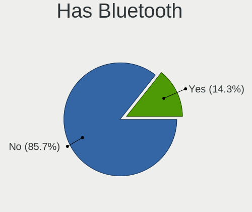

BlackPanther - Hardware Trends (Desktops)
-----------------------------------------

A project to identify most popular hardware characteristics and track their change
over time based on data collected by Linux users at https://Linux-Hardware.org.

Anyone can contribute to this report by the [hw-probe](https://github.com/linuxhw/hw-probe) tool:

    sudo -E hw-probe -all -upload

This report is for one last month. Overall report since the beginning of time: [TestCoverage](https://github.com/linuxhw/TestCoverage)

Period: Jan, 2023.

Contents
--------

* [ System ](#system)
  - [ OS                       ](#os)
  - [ OS Family                ](#os-family)
  - [ Kernel                   ](#kernel)
  - [ Kernel Family            ](#kernel-family)
  - [ Kernel Major Ver.        ](#kernel-major-ver)
  - [ Arch                     ](#arch)
  - [ DE                       ](#de)
  - [ Display Server           ](#display-server)
  - [ Display Manager          ](#display-manager)
  - [ OS Lang                  ](#os-lang)
  - [ Boot Mode                ](#boot-mode)
  - [ Filesystem               ](#filesystem)
  - [ Part. scheme             ](#part-scheme)
  - [ Dual Boot with Linux/BSD ](#dual-boot-with-linuxbsd)
  - [ Dual Boot (Win)          ](#dual-boot-win)

* [ Board ](#board)
  - [ Vendor                   ](#vendor)
  - [ Model                    ](#model)
  - [ Model Family             ](#model-family)
  - [ MFG Year                 ](#mfg-year)
  - [ Form Factor              ](#form-factor)
  - [ Secure Boot              ](#secure-boot)
  - [ Coreboot                 ](#coreboot)
  - [ RAM Size                 ](#ram-size)
  - [ RAM Used                 ](#ram-used)
  - [ Total Drives             ](#total-drives)
  - [ Has CD-ROM               ](#has-cd-rom)
  - [ Has Ethernet             ](#has-ethernet)
  - [ Has WiFi                 ](#has-wifi)
  - [ Has Bluetooth            ](#has-bluetooth)

* [ Location ](#location)
  - [ Country                  ](#country)
  - [ City                     ](#city)

* [ Drives ](#drives)
  - [ Drive Vendor             ](#drive-vendor)
  - [ Drive Model              ](#drive-model)
  - [ HDD Vendor               ](#hdd-vendor)
  - [ SSD Vendor               ](#ssd-vendor)
  - [ Drive Kind               ](#drive-kind)
  - [ Drive Connector          ](#drive-connector)
  - [ Drive Size               ](#drive-size)
  - [ Space Total              ](#space-total)
  - [ Space Used               ](#space-used)
  - [ Malfunc. Drives          ](#malfunc-drives)
  - [ Malfunc. Drive Vendor    ](#malfunc-drive-vendor)
  - [ Malfunc. HDD Vendor      ](#malfunc-hdd-vendor)
  - [ Malfunc. Drive Kind      ](#malfunc-drive-kind)
  - [ Failed Drives            ](#failed-drives)
  - [ Failed Drive Vendor      ](#failed-drive-vendor)
  - [ Drive Status             ](#drive-status)

* [ Storage controller ](#storage-controller)
  - [ Storage Vendor           ](#storage-vendor)
  - [ Storage Model            ](#storage-model)
  - [ Storage Kind             ](#storage-kind)

* [ Processor ](#processor)
  - [ CPU Vendor               ](#cpu-vendor)
  - [ CPU Model                ](#cpu-model)
  - [ CPU Model Family         ](#cpu-model-family)
  - [ CPU Cores                ](#cpu-cores)
  - [ CPU Sockets              ](#cpu-sockets)
  - [ CPU Threads              ](#cpu-threads)
  - [ CPU Op-Modes             ](#cpu-op-modes)
  - [ CPU Microcode            ](#cpu-microcode)
  - [ CPU Microarch            ](#cpu-microarch)

* [ Graphics ](#graphics)
  - [ GPU Vendor               ](#gpu-vendor)
  - [ GPU Model                ](#gpu-model)
  - [ GPU Combo                ](#gpu-combo)
  - [ GPU Driver               ](#gpu-driver)
  - [ GPU Memory               ](#gpu-memory)

* [ Monitor ](#monitor)
  - [ Monitor Vendor           ](#monitor-vendor)
  - [ Monitor Model            ](#monitor-model)
  - [ Monitor Resolution       ](#monitor-resolution)
  - [ Monitor Diagonal         ](#monitor-diagonal)
  - [ Monitor Width            ](#monitor-width)
  - [ Aspect Ratio             ](#aspect-ratio)
  - [ Monitor Area             ](#monitor-area)
  - [ Pixel Density            ](#pixel-density)
  - [ Multiple Monitors        ](#multiple-monitors)

* [ Network ](#network)
  - [ Net Controller Vendor    ](#net-controller-vendor)
  - [ Net Controller Model     ](#net-controller-model)
  - [ Wireless Vendor          ](#wireless-vendor)
  - [ Wireless Model           ](#wireless-model)
  - [ Ethernet Vendor          ](#ethernet-vendor)
  - [ Ethernet Model           ](#ethernet-model)
  - [ Net Controller Kind      ](#net-controller-kind)
  - [ Used Controller          ](#used-controller)
  - [ NICs                     ](#nics)
  - [ IPv6                     ](#ipv6)

* [ Bluetooth ](#bluetooth)
  - [ Bluetooth Vendor         ](#bluetooth-vendor)
  - [ Bluetooth Model          ](#bluetooth-model)

* [ Sound ](#sound)
  - [ Sound Vendor             ](#sound-vendor)
  - [ Sound Model              ](#sound-model)

* [ Memory ](#memory)
  - [ Memory Vendor            ](#memory-vendor)
  - [ Memory Model             ](#memory-model)
  - [ Memory Kind              ](#memory-kind)
  - [ Memory Form Factor       ](#memory-form-factor)
  - [ Memory Size              ](#memory-size)
  - [ Memory Speed             ](#memory-speed)

* [ Printers & scanners ](#printers--scanners)
  - [ Printer Vendor           ](#printer-vendor)
  - [ Printer Model            ](#printer-model)
  - [ Scanner Vendor           ](#scanner-vendor)
  - [ Scanner Model            ](#scanner-model)

* [ Camera ](#camera)
  - [ Camera Vendor            ](#camera-vendor)
  - [ Camera Model             ](#camera-model)

* [ Security ](#security)
  - [ Fingerprint Vendor       ](#fingerprint-vendor)
  - [ Fingerprint Model        ](#fingerprint-model)
  - [ Chipcard Vendor          ](#chipcard-vendor)
  - [ Chipcard Model           ](#chipcard-model)

* [ Unsupported ](#unsupported)
  - [ Unsupported Devices      ](#unsupported-devices)
  - [ Unsupported Device Types ](#unsupported-device-types)

System
------

OS
--

Installed operating systems

| Name              | Desktops | Percent |
|-------------------|----------|---------|
| BlackPanther 18.1 | 15       | 100%    |

OS Family
---------

OS without a version

| Name         | Desktops | Percent |
|--------------|----------|---------|
| BlackPanther | 15       | 100%    |

Kernel
------

Version of the Linux kernel

| Version             | Desktops | Percent |
|---------------------|----------|---------|
| 5.6.14-desktop-2bP  | 8        | 53.33%  |
| 4.18.16-desktop-1bP | 7        | 46.67%  |

Kernel Family
-------------

Linux kernel without a distro release

| Version | Desktops | Percent |
|---------|----------|---------|
| 5.6.14  | 8        | 53.33%  |
| 4.18.16 | 7        | 46.67%  |

Kernel Major Ver.
-----------------

Linux kernel major version

| Version | Desktops | Percent |
|---------|----------|---------|
| 5.6     | 8        | 53.33%  |
| 4.18    | 7        | 46.67%  |

Arch
----

OS architecture (x86_64, i586, etc.)

| Name   | Desktops | Percent |
|--------|----------|---------|
| x86_64 | 15       | 100%    |

DE
--

Desktop Environment

| Name | Desktops | Percent |
|------|----------|---------|
| KDE5 | 15       | 100%    |

Display Server
--------------

X11 or Wayland

| Name | Desktops | Percent |
|------|----------|---------|
| X11  | 15       | 100%    |

Display Manager
---------------

SDDM, LightDM, etc.

| Name | Desktops | Percent |
|------|----------|---------|
| SDDM | 15       | 100%    |

OS Lang
-------

Language

| Lang    | Desktops | Percent |
|---------|----------|---------|
| Unknown | 15       | 100%    |

Boot Mode
---------

EFI or BIOS

| Mode | Desktops | Percent |
|------|----------|---------|
| BIOS | 8        | 53.33%  |
| EFI  | 7        | 46.67%  |

Filesystem
----------

Type of filesystem

| Type    | Desktops | Percent |
|---------|----------|---------|
| Overlay | 12       | 80%     |
| Ext4    | 3        | 20%     |

Part. scheme
------------

Scheme of partitioning

| Type | Desktops | Percent |
|------|----------|---------|
| GPT  | 8        | 53.33%  |
| MBR  | 7        | 46.67%  |

Dual Boot with Linux/BSD
------------------------

Hosting more than one Linux/BSD

| Dual boot | Desktops | Percent |
|-----------|----------|---------|
| Yes       | 8        | 53.33%  |
| No        | 7        | 46.67%  |

Dual Boot (Win)
---------------

Hosting Linux and Windows

| Dual boot | Desktops | Percent |
|-----------|----------|---------|
| Yes       | 8        | 53.33%  |
| No        | 7        | 46.67%  |

Board
-----

Vendor
------

Motherboard manufacturer

| Name                | Desktops | Percent |
|---------------------|----------|---------|
| Gigabyte Technology | 6        | 40%     |
| MSI                 | 2        | 13.33%  |
| Hewlett-Packard     | 2        | 13.33%  |
| Dell                | 2        | 13.33%  |
| ASUSTek Computer    | 2        | 13.33%  |
| Lenovo              | 1        | 6.67%   |

Model
-----

Motherboard model

| Name                                   | Desktops | Percent |
|----------------------------------------|----------|---------|
| Gigabyte H61M-S2PV                     | 2        | 13.33%  |
| MSI MS-7817                            | 1        | 6.67%   |
| MSI MS-7576                            | 1        | 6.67%   |
| Lenovo ThinkCentre M72e 3655A79        | 1        | 6.67%   |
| HP EliteDesk 705 G3 SFF                | 1        | 6.67%   |
| HP Compaq dc7900 Convertible Minitower | 1        | 6.67%   |
| Gigabyte P67A-D3-B3                    | 1        | 6.67%   |
| Gigabyte M52LT-D3                      | 1        | 6.67%   |
| Gigabyte H61M-S1                       | 1        | 6.67%   |
| Gigabyte AB350M-DS3H V2                | 1        | 6.67%   |
| Dell Precision WorkStation T5500       | 1        | 6.67%   |
| Dell Precision Tower 5810              | 1        | 6.67%   |
| ASUS PRIME B365M-A                     | 1        | 6.67%   |
| ASUS All Series                        | 1        | 6.67%   |

Model Family
------------

Motherboard model prefix

| Name                 | Desktops | Percent |
|----------------------|----------|---------|
| Gigabyte H61M-S2PV   | 2        | 13.33%  |
| Dell Precision       | 2        | 13.33%  |
| MSI MS-7817          | 1        | 6.67%   |
| MSI MS-7576          | 1        | 6.67%   |
| Lenovo ThinkCentre   | 1        | 6.67%   |
| HP EliteDesk         | 1        | 6.67%   |
| HP Compaq            | 1        | 6.67%   |
| Gigabyte P67A-D3-B3  | 1        | 6.67%   |
| Gigabyte M52LT-D3    | 1        | 6.67%   |
| Gigabyte H61M-S1     | 1        | 6.67%   |
| Gigabyte AB350M-DS3H | 1        | 6.67%   |
| ASUS PRIME           | 1        | 6.67%   |
| ASUS All             | 1        | 6.67%   |

MFG Year
--------

Motherboard manufacture year

| Year | Desktops | Percent |
|------|----------|---------|
| 2012 | 4        | 26.67%  |
| 2010 | 3        | 20%     |
| 2014 | 2        | 13.33%  |
| 2019 | 1        | 6.67%   |
| 2018 | 1        | 6.67%   |
| 2017 | 1        | 6.67%   |
| 2013 | 1        | 6.67%   |
| 2011 | 1        | 6.67%   |
| 2008 | 1        | 6.67%   |

Form Factor
-----------

Physical design of the computer

| Name    | Desktops | Percent |
|---------|----------|---------|
| Desktop | 15       | 100%    |

Secure Boot
-----------

Enabled or disabled

| State    | Desktops | Percent |
|----------|----------|---------|
| Disabled | 15       | 100%    |

Coreboot
--------

Have coreboot on board

| Used | Desktops | Percent |
|------|----------|---------|
| No   | 15       | 100%    |

RAM Size
--------

Total RAM memory

| Size in GB | Desktops | Percent |
|------------|----------|---------|
| 8.01-16.0  | 8        | 53.33%  |
| 4.01-8.0   | 3        | 20%     |
| 3.01-4.0   | 2        | 13.33%  |
| 32.01-64.0 | 1        | 6.67%   |
| 16.01-24.0 | 1        | 6.67%   |

RAM Used
--------

Used RAM memory

| Used GB  | Desktops | Percent |
|----------|----------|---------|
| 0.51-1.0 | 7        | 46.67%  |
| 0.01-0.5 | 6        | 40%     |
| 1.01-2.0 | 2        | 13.33%  |

Total Drives
------------

Number of drives on board

| Drives | Desktops | Percent |
|--------|----------|---------|
| 1      | 9        | 60%     |
| 2      | 4        | 26.67%  |
| 5      | 1        | 6.67%   |
| 4      | 1        | 6.67%   |

Has CD-ROM
----------

Has CD-ROM on board

| Presented | Desktops | Percent |
|-----------|----------|---------|
| Yes       | 12       | 80%     |
| No        | 3        | 20%     |

Has Ethernet
------------

Has Ethernet on board

| Presented | Desktops | Percent |
|-----------|----------|---------|
| Yes       | 15       | 100%    |

Has WiFi
--------

Has WiFi module

| Presented | Desktops | Percent |
|-----------|----------|---------|
| No        | 10       | 66.67%  |
| Yes       | 5        | 33.33%  |

Has Bluetooth
-------------

Has Bluetooth module

| Presented | Desktops | Percent |
|-----------|----------|---------|
| No        | 14       | 93.33%  |
| Yes       | 1        | 6.67%   |

Location
--------

Country
-------

Geographic location (country)

| Country  | Desktops | Percent |
|----------|----------|---------|
| Hungary  | 13       | 86.67%  |
| USA      | 1        | 6.67%   |
| Slovakia | 1        | 6.67%   |

City
----

Geographic location (city)

| City         | Desktops | Percent |
|--------------|----------|---------|
| Budapest     | 4        | 26.67%  |
| Zvolen       | 1        | 6.67%   |
| Zalaegerszeg | 1        | 6.67%   |
| Tatabánya   | 1        | 6.67%   |
| Szodliget    | 1        | 6.67%   |
| Szekszárd   | 1        | 6.67%   |
| Rad          | 1        | 6.67%   |
| Oroshaza     | 1        | 6.67%   |
| Kiskunhalas  | 1        | 6.67%   |
| Kakucs       | 1        | 6.67%   |
| Hempstead    | 1        | 6.67%   |
| Debrecen     | 1        | 6.67%   |

Drives
------

Drive Vendor
------------

Hard drive vendors

| Vendor              | Desktops | Drives | Percent |
|---------------------|----------|--------|---------|
| Samsung Electronics | 7        | 9      | 25%     |
| WDC                 | 6        | 7      | 21.43%  |
| Seagate             | 2        | 2      | 7.14%   |
| Kingston            | 2        | 2      | 7.14%   |
| Zheino              | 1        | 1      | 3.57%   |
| Toshiba             | 1        | 1      | 3.57%   |
| SPCC                | 1        | 1      | 3.57%   |
| SanDisk             | 1        | 1      | 3.57%   |
| Patriot             | 1        | 1      | 3.57%   |
| OCZ                 | 1        | 1      | 3.57%   |
| Kingmax             | 1        | 1      | 3.57%   |
| Hitachi             | 1        | 1      | 3.57%   |
| HGST                | 1        | 2      | 3.57%   |
| Crucial             | 1        | 1      | 3.57%   |
| China               | 1        | 1      | 3.57%   |

Drive Model
-----------

Hard drive models

| Model                               | Desktops | Percent |
|-------------------------------------|----------|---------|
| Zheino CHN-NGFFNV2280-256 256GB     | 1        | 3.33%   |
| WDC WDS240G2G0B-00EPW0 240GB SSD    | 1        | 3.33%   |
| WDC WD800AAJS-00PSA0 80GB           | 1        | 3.33%   |
| WDC WD5000LPCX-80VHAT1 500GB        | 1        | 3.33%   |
| WDC WD30EZRZ-00GXCB0 3TB            | 1        | 3.33%   |
| WDC WD30EFRX-68EUZN0 3TB            | 1        | 3.33%   |
| WDC WD1200BEVS-75UST0 120GB         | 1        | 3.33%   |
| WDC WD10EZEX-00KUWA0 1TB            | 1        | 3.33%   |
| Toshiba DT01ACA100 1TB              | 1        | 3.33%   |
| SPCC Solid State Disk 256GB         | 1        | 3.33%   |
| Seagate ST500LT012-9WS142 500GB     | 1        | 3.33%   |
| Seagate ST380815AS 80GB             | 1        | 3.33%   |
| SanDisk SD8SB8U-256G-1006 256GB SSD | 1        | 3.33%   |
| Samsung SSD 960 EVO 500GB           | 1        | 3.33%   |
| Samsung SSD 870 EVO 1TB             | 1        | 3.33%   |
| Samsung SSD 860 EVO 500GB           | 1        | 3.33%   |
| Samsung SSD 830 Series 64GB         | 1        | 3.33%   |
| Samsung HD502HJ 500GB               | 1        | 3.33%   |
| Samsung HD200HJ 200GB               | 1        | 3.33%   |
| Samsung HD154UI 1TB                 | 1        | 3.33%   |
| Samsung HD103UJ 1TB                 | 1        | 3.33%   |
| Patriot Burst 120GB SSD             | 1        | 3.33%   |
| OCZ VERTEX PLUS 64GB SSD            | 1        | 3.33%   |
| Kingston SV300S37A120G 120GB SSD    | 1        | 3.33%   |
| Kingston SA400S37240G 240GB SSD     | 1        | 3.33%   |
| Kingmax SSD 480GB                   | 1        | 3.33%   |
| Hitachi HTS545050A7E380 500GB       | 1        | 3.33%   |
| HGST HMS5C4040BLE640 4TB            | 1        | 3.33%   |
| Crucial M4-CT128M4SSD2 128GB        | 1        | 3.33%   |
| China SSD 120GB                     | 1        | 3.33%   |

HDD Vendor
----------

Hard disk drive vendors

| Vendor              | Desktops | Drives | Percent |
|---------------------|----------|--------|---------|
| WDC                 | 5        | 6      | 35.71%  |
| Samsung Electronics | 4        | 4      | 28.57%  |
| Seagate             | 2        | 2      | 14.29%  |
| Toshiba             | 1        | 1      | 7.14%   |
| Hitachi             | 1        | 1      | 7.14%   |
| HGST                | 1        | 2      | 7.14%   |

SSD Vendor
----------

Solid state drive vendors

| Vendor              | Desktops | Drives | Percent |
|---------------------|----------|--------|---------|
| Samsung Electronics | 3        | 4      | 23.08%  |
| Kingston            | 2        | 2      | 15.38%  |
| WDC                 | 1        | 1      | 7.69%   |
| SPCC                | 1        | 1      | 7.69%   |
| SanDisk             | 1        | 1      | 7.69%   |
| Patriot             | 1        | 1      | 7.69%   |
| OCZ                 | 1        | 1      | 7.69%   |
| Kingmax             | 1        | 1      | 7.69%   |
| Crucial             | 1        | 1      | 7.69%   |
| China               | 1        | 1      | 7.69%   |

Drive Kind
----------

HDD or SSD

| Kind | Desktops | Drives | Percent |
|------|----------|--------|---------|
| SSD  | 12       | 14     | 46.15%  |
| HDD  | 12       | 16     | 46.15%  |
| NVMe | 2        | 2      | 7.69%   |

Drive Connector
---------------

SATA, SAS, NVMe, etc.

| Type | Desktops | Drives | Percent |
|------|----------|--------|---------|
| SATA | 15       | 30     | 88.24%  |
| NVMe | 2        | 2      | 11.76%  |

Drive Size
----------

Size of hard drive

| Size in TB | Desktops | Drives | Percent |
|------------|----------|--------|---------|
| 0.01-0.5   | 14       | 21     | 66.67%  |
| 0.51-1.0   | 5        | 5      | 23.81%  |
| 3.01-4.0   | 1        | 2      | 4.76%   |
| 2.01-3.0   | 1        | 2      | 4.76%   |

Space Total
-----------

Amount of disk space available on the file system

| Size in GB | Desktops | Percent |
|------------|----------|---------|
| Unknown    | 12       | 80%     |
| 101-250    | 2        | 13.33%  |
| 21-50      | 1        | 6.67%   |

Space Used
----------

Amount of used disk space

| Used GB | Desktops | Percent |
|---------|----------|---------|
| Unknown | 12       | 80%     |
| 1-20    | 3        | 20%     |

Malfunc. Drives
---------------

Drive models with a malfunction

| Model                             | Desktops | Drives | Percent |
|-----------------------------------|----------|--------|---------|
| WDC WD5000LPCX-80VHAT1 500GB      | 1        | 1      | 20%     |
| Seagate ST500LT012-9WS142 500GB   | 1        | 1      | 20%     |
| Samsung Electronics HD200HJ 200GB | 1        | 1      | 20%     |
| Samsung Electronics HD103UJ 1TB   | 1        | 1      | 20%     |
| Hitachi HTS545050A7E380 500GB     | 1        | 1      | 20%     |

Malfunc. Drive Vendor
---------------------

Vendors of faulty drives

| Vendor              | Desktops | Drives | Percent |
|---------------------|----------|--------|---------|
| Samsung Electronics | 2        | 2      | 40%     |
| WDC                 | 1        | 1      | 20%     |
| Seagate             | 1        | 1      | 20%     |
| Hitachi             | 1        | 1      | 20%     |

Malfunc. HDD Vendor
-------------------

Vendors of faulty HDD drives

| Vendor              | Desktops | Drives | Percent |
|---------------------|----------|--------|---------|
| Samsung Electronics | 2        | 2      | 40%     |
| WDC                 | 1        | 1      | 20%     |
| Seagate             | 1        | 1      | 20%     |
| Hitachi             | 1        | 1      | 20%     |

Malfunc. Drive Kind
-------------------

Kinds of faulty drives

| Kind | Desktops | Drives | Percent |
|------|----------|--------|---------|
| HDD  | 5        | 5      | 100%    |

Failed Drives
-------------

Failed drive models

Zero info for selected period =(

Failed Drive Vendor
-------------------

Failed drive vendors

Zero info for selected period =(

Drive Status
------------

Number of failed and malfunc. drives

| Status  | Desktops | Drives | Percent |
|---------|----------|--------|---------|
| Works   | 13       | 27     | 72.22%  |
| Malfunc | 5        | 5      | 27.78%  |

Storage controller
------------------

Storage Vendor
--------------

Storage controller vendors

| Vendor              | Desktops | Percent |
|---------------------|----------|---------|
| Intel               | 11       | 61.11%  |
| AMD                 | 3        | 16.67%  |
| VIA Technologies    | 1        | 5.56%   |
| Silicon Motion      | 1        | 5.56%   |
| Samsung Electronics | 1        | 5.56%   |
| Nvidia              | 1        | 5.56%   |

Storage Model
-------------

Storage controller models

| Model                                                                                   | Desktops | Percent |
|-----------------------------------------------------------------------------------------|----------|---------|
| Intel 6 Series/C200 Series Chipset Family Desktop SATA Controller (IDE mode, ports 4-5) | 3        | 11.11%  |
| Intel 6 Series/C200 Series Chipset Family Desktop SATA Controller (IDE mode, ports 0-3) | 3        | 11.11%  |
| Intel 8 Series/C220 Series Chipset Family 6-port SATA Controller 1 [AHCI mode]          | 2        | 7.41%   |
| Intel 6 Series/C200 Series Chipset Family 6 port Desktop SATA AHCI Controller           | 2        | 7.41%   |
| AMD FCH SATA Controller [AHCI mode]                                                     | 2        | 7.41%   |
| AMD 300 Series Chipset SATA Controller                                                  | 2        | 7.41%   |
| VIA VT6421 IDE/SATA Controller                                                          | 1        | 3.7%    |
| Silicon Motion SM2263EN/SM2263XT SSD Controller                                         | 1        | 3.7%    |
| Samsung NVMe SSD Controller SM961/PM961/SM963                                           | 1        | 3.7%    |
| Nvidia MCP61 SATA Controller                                                            | 1        | 3.7%    |
| Nvidia MCP61 IDE                                                                        | 1        | 3.7%    |
| Intel SATA Controller [RAID mode]                                                       | 1        | 3.7%    |
| Intel C610/X99 series chipset sSATA Controller [AHCI mode]                              | 1        | 3.7%    |
| Intel C610/X99 series chipset IDE-r Controller                                          | 1        | 3.7%    |
| Intel C600/X79 series chipset SATA RAID Controller                                      | 1        | 3.7%    |
| Intel 82801JD/DO (ICH10 Family) SATA AHCI Controller                                    | 1        | 3.7%    |
| Intel 200 Series PCH SATA controller [AHCI mode]                                        | 1        | 3.7%    |
| AMD SB7x0/SB8x0/SB9x0 SATA Controller [IDE mode]                                        | 1        | 3.7%    |
| AMD SB7x0/SB8x0/SB9x0 IDE Controller                                                    | 1        | 3.7%    |

Storage Kind
------------

Kind of storage controller (IDE, SATA, NVMe, SAS, ...)

| Kind | Desktops | Percent |
|------|----------|---------|
| SATA | 10       | 47.62%  |
| IDE  | 6        | 28.57%  |
| RAID | 3        | 14.29%  |
| NVMe | 2        | 9.52%   |

Processor
---------

CPU Vendor
----------

Processor vendors

| Vendor | Desktops | Percent |
|--------|----------|---------|
| Intel  | 11       | 73.33%  |
| AMD    | 4        | 26.67%  |

CPU Model
---------

Processor models

| Model                                       | Desktops | Percent |
|---------------------------------------------|----------|---------|
| Intel Xeon CPU E5530 @ 2.40GHz              | 1        | 6.67%   |
| Intel Xeon CPU E5-1620 v3 @ 3.50GHz         | 1        | 6.67%   |
| Intel Pentium CPU G3220 @ 3.00GHz           | 1        | 6.67%   |
| Intel Core i5-3550S CPU @ 3.00GHz           | 1        | 6.67%   |
| Intel Core i5-3470 CPU @ 3.20GHz            | 1        | 6.67%   |
| Intel Core i5-2300 CPU @ 2.80GHz            | 1        | 6.67%   |
| Intel Core i3-8100 CPU @ 3.60GHz            | 1        | 6.67%   |
| Intel Core i3-4130 CPU @ 3.40GHz            | 1        | 6.67%   |
| Intel Core i3-3220 CPU @ 3.30GHz            | 1        | 6.67%   |
| Intel Core i3-2120 CPU @ 3.30GHz            | 1        | 6.67%   |
| Intel Core 2 Duo CPU E8400 @ 3.00GHz        | 1        | 6.67%   |
| AMD Ryzen 5 3400G with Radeon Vega Graphics | 1        | 6.67%   |
| AMD PRO A10-8770 R7, 10 COMPUTE CORES 4C+6G | 1        | 6.67%   |
| AMD Phenom II X4 965 Processor              | 1        | 6.67%   |
| AMD Athlon II X2 240 Processor              | 1        | 6.67%   |

CPU Model Family
----------------

Processor model prefix

| Model            | Desktops | Percent |
|------------------|----------|---------|
| Intel Core i3    | 4        | 26.67%  |
| Intel Core i5    | 3        | 20%     |
| Intel Xeon       | 2        | 13.33%  |
| Intel Pentium    | 1        | 6.67%   |
| Intel Core 2 Duo | 1        | 6.67%   |
| AMD Ryzen 5      | 1        | 6.67%   |
| AMD PRO A10      | 1        | 6.67%   |
| AMD Phenom II X4 | 1        | 6.67%   |
| AMD Athlon II X2 | 1        | 6.67%   |

CPU Cores
---------

Number of processor cores

| Number | Desktops | Percent |
|--------|----------|---------|
| 4      | 8        | 53.33%  |
| 2      | 7        | 46.67%  |

CPU Sockets
-----------

Number of sockets

| Number | Desktops | Percent |
|--------|----------|---------|
| 1      | 15       | 100%    |

CPU Threads
-----------

Threads per core (Hyper-Threading)

| Number | Desktops | Percent |
|--------|----------|---------|
| 1      | 9        | 60%     |
| 2      | 6        | 40%     |

CPU Op-Modes
------------

CPU Operation Modes (32-bit, 64-bit)

| Op mode        | Desktops | Percent |
|----------------|----------|---------|
| 32-bit, 64-bit | 15       | 100%    |

CPU Microcode
-------------

Microcode number

| Number     | Desktops | Percent |
|------------|----------|---------|
| 0x306a9    | 3        | 20%     |
| 0x306c3    | 2        | 13.33%  |
| 0x206a7    | 2        | 13.33%  |
| 0x906eb    | 1        | 6.67%   |
| 0x306f2    | 1        | 6.67%   |
| 0x106a5    | 1        | 6.67%   |
| 0x1067a    | 1        | 6.67%   |
| 0x08108109 | 1        | 6.67%   |
| 0x0600611a | 1        | 6.67%   |
| 0x010000c8 | 1        | 6.67%   |
| 0x010000c7 | 1        | 6.67%   |

CPU Microarch
-------------

Microarchitecture

| Name        | Desktops | Percent |
|-------------|----------|---------|
| IvyBridge   | 3        | 20%     |
| Haswell     | 3        | 20%     |
| SandyBridge | 2        | 13.33%  |
| K10         | 2        | 13.33%  |
| Zen+        | 1        | 6.67%   |
| Penryn      | 1        | 6.67%   |
| Nehalem     | 1        | 6.67%   |
| KabyLake    | 1        | 6.67%   |
| Excavator   | 1        | 6.67%   |

Graphics
--------

GPU Vendor
----------

Vendors of graphics cards

| Vendor | Desktops | Percent |
|--------|----------|---------|
| Nvidia | 7        | 43.75%  |
| AMD    | 5        | 31.25%  |
| Intel  | 4        | 25%     |

GPU Model
---------

Graphics card models

| Model                                                                       | Desktops | Percent |
|-----------------------------------------------------------------------------|----------|---------|
| AMD Cedar [Radeon HD 5000/6000/7350/8350 Series]                            | 2        | 11.76%  |
| Nvidia GT218 [GeForce 210]                                                  | 1        | 5.88%   |
| Nvidia GP107 [GeForce GTX 1050 Ti]                                          | 1        | 5.88%   |
| Nvidia GK208B [GeForce GT 720]                                              | 1        | 5.88%   |
| Nvidia GK106 [GeForce GTX 660]                                              | 1        | 5.88%   |
| Nvidia GF108 [GeForce GT 630]                                               | 1        | 5.88%   |
| Nvidia GA104 [GeForce RTX 3060 Ti Lite Hash Rate]                           | 1        | 5.88%   |
| Nvidia G96CGL [Quadro FX 580]                                               | 1        | 5.88%   |
| Intel Xeon E3-1200 v3/4th Gen Core Processor Integrated Graphics Controller | 1        | 5.88%   |
| Intel Xeon E3-1200 v2/3rd Gen Core processor Graphics Controller            | 1        | 5.88%   |
| Intel CoffeeLake-S GT2 [UHD Graphics 630]                                   | 1        | 5.88%   |
| Intel 4 Series Chipset Integrated Graphics Controller                       | 1        | 5.88%   |
| AMD Wani [Radeon R5/R6/R7 Graphics]                                         | 1        | 5.88%   |
| AMD Redwood XT [Radeon HD 5670/5690/5730]                                   | 1        | 5.88%   |
| AMD Oland XT [Radeon HD 8670 / R5 340X OEM / R7 250/350/350X OEM]           | 1        | 5.88%   |
| AMD Baffin [Radeon RX 550 640SP / RX 560/560X]                              | 1        | 5.88%   |

GPU Combo
---------

Combinations of graphics cards

| Name       | Desktops | Percent |
|------------|----------|---------|
| 1 x Nvidia | 7        | 46.67%  |
| 1 x AMD    | 4        | 26.67%  |
| 1 x Intel  | 3        | 20%     |
| 2 x AMD    | 1        | 6.67%   |

GPU Driver
----------

Free vs proprietary

| Driver  | Desktops | Percent |
|---------|----------|---------|
| Free    | 14       | 93.33%  |
| Unknown | 1        | 6.67%   |

GPU Memory
----------

Total video memory

| Size in GB | Desktops | Percent |
|------------|----------|---------|
| 0.51-1.0   | 6        | 40%     |
| Unknown    | 4        | 26.67%  |
| 3.01-4.0   | 2        | 13.33%  |
| 0.01-0.5   | 2        | 13.33%  |
| 1.01-2.0   | 1        | 6.67%   |

Monitor
-------

Monitor Vendor
--------------

Monitor vendors

| Vendor               | Desktops | Percent |
|----------------------|----------|---------|
| Samsung Electronics  | 3        | 23.08%  |
| Goldstar             | 3        | 23.08%  |
| Dell                 | 2        | 15.38%  |
| Medion               | 1        | 7.69%   |
| Lenovo               | 1        | 7.69%   |
| CVT                  | 1        | 7.69%   |
| Apple                | 1        | 7.69%   |
| Ancor Communications | 1        | 7.69%   |

Monitor Model
-------------

Monitor models

| Model                                                                 | Desktops | Percent |
|-----------------------------------------------------------------------|----------|---------|
| Samsung Electronics SyncMaster SAM03F2 1680x1050                      | 1        | 7.69%   |
| Samsung Electronics SyncMaster SAM034F 1440x900 428x255mm 19.6-inch   | 1        | 7.69%   |
| Samsung Electronics S24D330 SAM0D92 1920x1080 531x299mm 24.0-inch     | 1        | 7.69%   |
| Medion MD20666 MED3672 1920x1080 533x312mm 24.3-inch                  | 1        | 7.69%   |
| Lenovo LEN L171 LEN24C9 1280x1024 337x270mm 17.0-inch                 | 1        | 7.69%   |
| Goldstar MP59G GSM5B34 1920x1080 480x270mm 21.7-inch                  | 1        | 7.69%   |
| Goldstar FULL HD GSM5B55 1920x1080 480x270mm 21.7-inch                | 1        | 7.69%   |
| Goldstar E2350 GSM5790 1920x1080 510x290mm 23.1-inch                  | 1        | 7.69%   |
| Dell SE2717H/HX DELD0A1 1920x1080 598x336mm 27.0-inch                 | 1        | 7.69%   |
| Dell E1912H DELF03E 1366x768 410x230mm 18.5-inch                      | 1        | 7.69%   |
| CVT CVTE TV CVT0003 1360x768 575x323mm 26.0-inch                      | 1        | 7.69%   |
| Apple Cinema Displa y APP921D 1680x1050 433x270mm 20.1-inch           | 1        | 7.69%   |
| Ancor Communications ASUS VW193D ACI19D5 1440x900 408x255mm 18.9-inch | 1        | 7.69%   |

Monitor Resolution
------------------

Monitor screen resolution

| Resolution         | Desktops | Percent |
|--------------------|----------|---------|
| 1920x1080 (FHD)    | 6        | 50%     |
| 1440x900 (WXGA+)   | 2        | 16.67%  |
| 3840x2160 (4K)     | 1        | 8.33%   |
| 1680x1050 (WSXGA+) | 1        | 8.33%   |
| 1366x768 (WXGA)    | 1        | 8.33%   |
| 1280x1024 (SXGA)   | 1        | 8.33%   |

Monitor Diagonal
----------------

Diagonal size in inches

| Inches  | Desktops | Percent |
|---------|----------|---------|
| 24      | 2        | 15.38%  |
| 21      | 2        | 15.38%  |
| 19      | 2        | 15.38%  |
| 27      | 1        | 7.69%   |
| 26      | 1        | 7.69%   |
| 23      | 1        | 7.69%   |
| 20      | 1        | 7.69%   |
| 18      | 1        | 7.69%   |
| 17      | 1        | 7.69%   |
| Unknown | 1        | 7.69%   |

Monitor Width
-------------

Physical width

| Width in mm | Desktops | Percent |
|-------------|----------|---------|
| 401-500     | 6        | 46.15%  |
| 501-600     | 5        | 38.46%  |
| 301-350     | 1        | 7.69%   |
| Unknown     | 1        | 7.69%   |

Aspect Ratio
------------

Proportional relationship between the width and the height

| Ratio | Desktops | Percent |
|-------|----------|---------|
| 16/9  | 9        | 75%     |
| 16/10 | 2        | 16.67%  |
| 5/4   | 1        | 8.33%   |

Monitor Area
------------

Area in inch²

| Area in inch² | Desktops | Percent |
|----------------|----------|---------|
| 201-250        | 4        | 30.77%  |
| 151-200        | 3        | 23.08%  |
| 251-300        | 2        | 15.38%  |
| 141-150        | 2        | 15.38%  |
| 301-350        | 1        | 7.69%   |
| Unknown        | 1        | 7.69%   |

Pixel Density
-------------

Pixels per inch

| Density | Desktops | Percent |
|---------|----------|---------|
| 51-100  | 10       | 76.92%  |
| 101-120 | 2        | 15.38%  |
| Unknown | 1        | 7.69%   |

Multiple Monitors
-----------------

Total monitors connected

| Total | Desktops | Percent |
|-------|----------|---------|
| 1     | 14       | 93.33%  |
| 0     | 1        | 6.67%   |

Network
-------

Net Controller Vendor
---------------------

Controller vendors

| Vendor                | Desktops | Percent |
|-----------------------|----------|---------|
| Realtek Semiconductor | 10       | 47.62%  |
| Intel                 | 3        | 14.29%  |
| TP-Link               | 2        | 9.52%   |
| Samsung Electronics   | 2        | 9.52%   |
| Broadcom              | 2        | 9.52%   |
| Ralink                | 1        | 4.76%   |
| Qualcomm Atheros      | 1        | 4.76%   |

Net Controller Model
--------------------

Controller models

| Model                                                                         | Desktops | Percent |
|-------------------------------------------------------------------------------|----------|---------|
| Realtek RTL8111/8168/8411 PCI Express Gigabit Ethernet Controller             | 9        | 40.91%  |
| Samsung Galaxy series, misc. (tethering mode)                                 | 2        | 9.09%   |
| TP-Link TL-WN821N v5/v6 [RTL8192EU]                                           | 1        | 4.55%   |
| TP-Link AC600 wireless Realtek RTL8811AU [Archer T2U Nano]                    | 1        | 4.55%   |
| Realtek RTL8188EUS 802.11n Wireless Network Adapter                           | 1        | 4.55%   |
| Realtek RTL8169 PCI Gigabit Ethernet Controller                               | 1        | 4.55%   |
| Ralink RT2561/RT61 802.11g PCI                                                | 1        | 4.55%   |
| Qualcomm Atheros AR9227 Wireless Network Adapter                              | 1        | 4.55%   |
| Intel Ethernet Connection I217-LM                                             | 1        | 4.55%   |
| Intel 82571EB/82571GB Gigabit Ethernet Controller D0/D1 (copper applications) | 1        | 4.55%   |
| Intel 82567LM-3 Gigabit Network Connection                                    | 1        | 4.55%   |
| Broadcom NetXtreme BCM5762 Gigabit Ethernet PCIe                              | 1        | 4.55%   |
| Broadcom NetXtreme BCM5761 Gigabit Ethernet PCIe                              | 1        | 4.55%   |

Wireless Vendor
---------------

Wireless vendors

| Vendor                | Desktops | Percent |
|-----------------------|----------|---------|
| TP-Link               | 2        | 40%     |
| Realtek Semiconductor | 1        | 20%     |
| Ralink                | 1        | 20%     |
| Qualcomm Atheros      | 1        | 20%     |

Wireless Model
--------------

Wireless models

| Model                                                      | Desktops | Percent |
|------------------------------------------------------------|----------|---------|
| TP-Link TL-WN821N v5/v6 [RTL8192EU]                        | 1        | 20%     |
| TP-Link AC600 wireless Realtek RTL8811AU [Archer T2U Nano] | 1        | 20%     |
| Realtek RTL8188EUS 802.11n Wireless Network Adapter        | 1        | 20%     |
| Ralink RT2561/RT61 802.11g PCI                             | 1        | 20%     |
| Qualcomm Atheros AR9227 Wireless Network Adapter           | 1        | 20%     |

Ethernet Vendor
---------------

Ethernet vendors

| Vendor                | Desktops | Percent |
|-----------------------|----------|---------|
| Realtek Semiconductor | 10       | 58.82%  |
| Intel                 | 3        | 17.65%  |
| Samsung Electronics   | 2        | 11.76%  |
| Broadcom              | 2        | 11.76%  |

Ethernet Model
--------------

Ethernet models

| Model                                                                         | Desktops | Percent |
|-------------------------------------------------------------------------------|----------|---------|
| Realtek RTL8111/8168/8411 PCI Express Gigabit Ethernet Controller             | 9        | 52.94%  |
| Samsung Galaxy series, misc. (tethering mode)                                 | 2        | 11.76%  |
| Realtek RTL8169 PCI Gigabit Ethernet Controller                               | 1        | 5.88%   |
| Intel Ethernet Connection I217-LM                                             | 1        | 5.88%   |
| Intel 82571EB/82571GB Gigabit Ethernet Controller D0/D1 (copper applications) | 1        | 5.88%   |
| Intel 82567LM-3 Gigabit Network Connection                                    | 1        | 5.88%   |
| Broadcom NetXtreme BCM5762 Gigabit Ethernet PCIe                              | 1        | 5.88%   |
| Broadcom NetXtreme BCM5761 Gigabit Ethernet PCIe                              | 1        | 5.88%   |

Net Controller Kind
-------------------

Ethernet, WiFi or modem

| Kind     | Desktops | Percent |
|----------|----------|---------|
| Ethernet | 15       | 75%     |
| WiFi     | 5        | 25%     |

Used Controller
---------------

Currently used network controller

| Kind     | Desktops | Percent |
|----------|----------|---------|
| Ethernet | 10       | 76.92%  |
| WiFi     | 3        | 23.08%  |

NICs
----

Total network controllers on board

| Total | Desktops | Percent |
|-------|----------|---------|
| 1     | 12       | 80%     |
| 4     | 1        | 6.67%   |
| 2     | 1        | 6.67%   |
| 0     | 1        | 6.67%   |

IPv6
----

IPv6 vs IPv4

| Used | Desktops | Percent |
|------|----------|---------|
| No   | 9        | 60%     |
| Yes  | 6        | 40%     |

Bluetooth
---------

Bluetooth Vendor
----------------

Controller vendors

| Vendor                  | Desktops | Percent |
|-------------------------|----------|---------|
| Cambridge Silicon Radio | 1        | 100%    |

Bluetooth Model
---------------

Controller models

| Model                                               | Desktops | Percent |
|-----------------------------------------------------|----------|---------|
| Cambridge Silicon Radio Bluetooth Dongle (HCI mode) | 1        | 100%    |

Sound
-----

Sound Vendor
------------

Sound card vendors

| Vendor      | Desktops | Percent |
|-------------|----------|---------|
| Intel       | 11       | 45.83%  |
| Nvidia      | 6        | 25%     |
| AMD         | 6        | 25%     |
| Plantronics | 1        | 4.17%   |

Sound Model
-----------

Sound card models

| Model                                                                      | Desktops | Percent |
|----------------------------------------------------------------------------|----------|---------|
| Intel 6 Series/C200 Series Chipset Family High Definition Audio Controller | 5        | 17.86%  |
| Intel 8 Series/C220 Series Chipset High Definition Audio Controller        | 2        | 7.14%   |
| AMD Cedar HDMI Audio [Radeon HD 5400/6300/7300 Series]                     | 2        | 7.14%   |
| Plantronics Blackwire 325.1                                                | 1        | 3.57%   |
| Nvidia MCP61 High Definition Audio                                         | 1        | 3.57%   |
| Nvidia High Definition Audio Controller                                    | 1        | 3.57%   |
| Nvidia GP107GL High Definition Audio Controller                            | 1        | 3.57%   |
| Nvidia GK208 HDMI/DP Audio Controller                                      | 1        | 3.57%   |
| Nvidia GK106 HDMI Audio Controller                                         | 1        | 3.57%   |
| Nvidia GF108 High Definition Audio Controller                              | 1        | 3.57%   |
| Nvidia GA104 High Definition Audio Controller                              | 1        | 3.57%   |
| Intel C610/X99 series chipset HD Audio Controller                          | 1        | 3.57%   |
| Intel 82801JI (ICH10 Family) HD Audio Controller                           | 1        | 3.57%   |
| Intel 82801JD/DO (ICH10 Family) HD Audio Controller                        | 1        | 3.57%   |
| Intel 200 Series PCH HD Audio                                              | 1        | 3.57%   |
| AMD SBx00 Azalia (Intel HDA)                                               | 1        | 3.57%   |
| AMD Redwood HDMI Audio [Radeon HD 5000 Series]                             | 1        | 3.57%   |
| AMD Oland/Hainan/Cape Verde/Pitcairn HDMI Audio [Radeon HD 7000 Series]    | 1        | 3.57%   |
| AMD Kabini HDMI/DP Audio                                                   | 1        | 3.57%   |
| AMD Family 17h/19h HD Audio Controller                                     | 1        | 3.57%   |
| AMD Family 15h (Models 60h-6fh) Audio Controller                           | 1        | 3.57%   |
| AMD Baffin HDMI/DP Audio [Radeon RX 550 640SP / RX 560/560X]               | 1        | 3.57%   |

Memory
------

Memory Vendor
-------------

Memory module vendors

| Vendor              | Desktops | Percent |
|---------------------|----------|---------|
| Unknown             | 4        | 25%     |
| Kingston            | 4        | 25%     |
| Samsung Electronics | 3        | 18.75%  |
| Kingmax             | 2        | 12.5%   |
| SK hynix            | 1        | 6.25%   |
| Nanya Technology    | 1        | 6.25%   |
| G.Skill             | 1        | 6.25%   |

Memory Model
------------

Memory module models

| Model                                                     | Desktops | Percent |
|-----------------------------------------------------------|----------|---------|
| Unknown RAM Module 4096MB DIMM SDRAM 1333MT/s             | 1        | 4.55%   |
| Unknown RAM Module 4096MB DIMM DDR3 1333MT/s              | 1        | 4.55%   |
| Unknown RAM Module 4096MB DIMM 1066MT/s                   | 1        | 4.55%   |
| Unknown RAM Module 2048MB DIMM 1333MT/s                   | 1        | 4.55%   |
| Unknown RAM Module 2048MB DIMM 1066MT/s                   | 1        | 4.55%   |
| SK hynix RAM HMA41GR7MFR8N-TF 8192MB RIMM DDR4 2133MT/s   | 1        | 4.55%   |
| SK hynix RAM HMA41GR7AFR8N-TF 8192MB RIMM DDR4 2133MT/s   | 1        | 4.55%   |
| Samsung RAM M393A1G43DB0-CPB 8192MB RIMM DDR4 2133MT/s    | 1        | 4.55%   |
| Samsung RAM M378B5173QH0-CK0 4GB DIMM DDR3 1600MT/s       | 1        | 4.55%   |
| Samsung RAM M3 78T2863RZS-CF7 1024MB DIMM DDR2 800MT/s    | 1        | 4.55%   |
| Samsung RAM M3 78T2863QZS-CF7 1GB DIMM DDR2 800MT/s       | 1        | 4.55%   |
| Nanya RAM NT4GC72B4NA1NL-BE 4096MB DIMM DDR3 1066MT/s     | 1        | 4.55%   |
| Kingston RAM Module 4096MB DIMM DDR4 2400MT/s             | 1        | 4.55%   |
| Kingston RAM KHX1866C10D3/8G 8192MB DIMM DDR3 2133MT/s    | 1        | 4.55%   |
| Kingston RAM KHX1600C9D3/4GX 4GB DIMM DDR3 2400MT/s       | 1        | 4.55%   |
| Kingston RAM 99U5584-009.A00LF 4096MB DIMM DDR3 1600MT/s  | 1        | 4.55%   |
| Kingston RAM 99U5584-001.A00LF 4096MB DIMM DDR3 1600MT/s  | 1        | 4.55%   |
| Kingmax RAM GLAG42F-18--------- 8192MB DIMM DDR4 2666MT/s | 1        | 4.55%   |
| Kingmax RAM GLAF62F-D8--------- 4096MB DIMM DDR4 2400MT/s | 1        | 4.55%   |
| Kingmax RAM FLFF65F-D8KQ9 4096MB DIMM DDR3 1333MT/s       | 1        | 4.55%   |
| Kingmax RAM FLFE85F-C8KM9 2048MB DIMM DDR3 1333MT/s       | 1        | 4.55%   |
| G.Skill RAM F4-3000C16-8GISB 8GB DIMM DDR4 3200MT/s       | 1        | 4.55%   |

Memory Kind
-----------

Memory module kinds

| Kind    | Desktops | Percent |
|---------|----------|---------|
| DDR3    | 7        | 43.75%  |
| DDR4    | 4        | 25%     |
| SDRAM   | 2        | 12.5%   |
| Unknown | 2        | 12.5%   |
| DDR2    | 1        | 6.25%   |

Memory Form Factor
------------------

Physical design of the memory module

| Name | Desktops | Percent |
|------|----------|---------|
| DIMM | 14       | 93.33%  |
| RIMM | 1        | 6.67%   |

Memory Size
-----------

Memory module size

| Size | Desktops | Percent |
|------|----------|---------|
| 4096 | 10       | 55.56%  |
| 8192 | 4        | 22.22%  |
| 2048 | 3        | 16.67%  |
| 1024 | 1        | 5.56%   |

Memory Speed
------------

Memory module speed

| Speed | Desktops | Percent |
|-------|----------|---------|
| 1333  | 4        | 25%     |
| 2400  | 3        | 18.75%  |
| 2133  | 2        | 12.5%   |
| 1066  | 2        | 12.5%   |
| 3200  | 1        | 6.25%   |
| 2666  | 1        | 6.25%   |
| 1866  | 1        | 6.25%   |
| 1600  | 1        | 6.25%   |
| 800   | 1        | 6.25%   |

Printers & scanners
-------------------

Printer Vendor
--------------

Printer device vendors

| Vendor          | Desktops | Percent |
|-----------------|----------|---------|
| Hewlett-Packard | 1        | 100%    |

Printer Model
-------------

Printer device models

| Model                  | Desktops | Percent |
|------------------------|----------|---------|
| HP DeskJet 2600 series | 1        | 100%    |

Scanner Vendor
--------------

Scanner device vendors

Zero info for selected period =(

Scanner Model
-------------

Scanner device models

Zero info for selected period =(

Camera
------

Camera Vendor
-------------

Camera device vendors

| Vendor   | Desktops | Percent |
|----------|----------|---------|
| Microdia | 2        | 66.67%  |
| Logitech | 1        | 33.33%  |

Camera Model
------------

Camera device models

| Model                                 | Desktops | Percent |
|---------------------------------------|----------|---------|
| Microdia Laptop_Integrated_Webcam_FHD | 1        | 33.33%  |
| Microdia Camera                       | 1        | 33.33%  |
| Logitech HD Webcam C525               | 1        | 33.33%  |

Security
--------

Fingerprint Vendor
------------------

Fingerprint sensor vendors

Zero info for selected period =(

Fingerprint Model
-----------------

Fingerprint sensor models

Zero info for selected period =(

Chipcard Vendor
---------------

Chipcard module vendors

Zero info for selected period =(

Chipcard Model
--------------

Chipcard module models

Zero info for selected period =(

Unsupported
-----------

Unsupported Devices
-------------------

Total unsupported devices on board

| Total | Desktops | Percent |
|-------|----------|---------|
| 0     | 12       | 80%     |
| 1     | 2        | 13.33%  |
| 2     | 1        | 6.67%   |

Unsupported Device Types
------------------------

Types of unsupported devices

| Type             | Desktops | Percent |
|------------------|----------|---------|
| Graphics card    | 2        | 50%     |
| Unassigned class | 1        | 25%     |
| Net/wireless     | 1        | 25%     |

