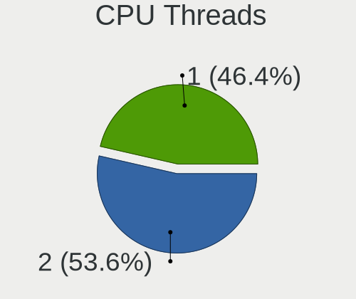
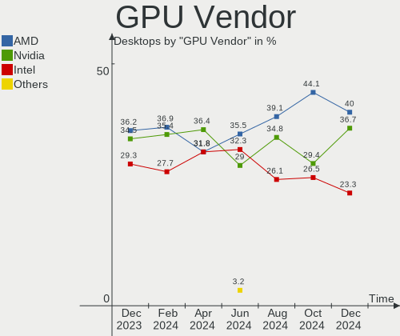
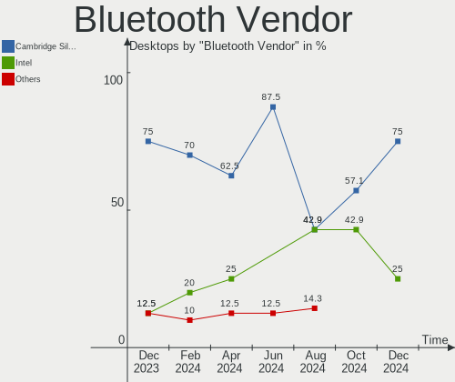
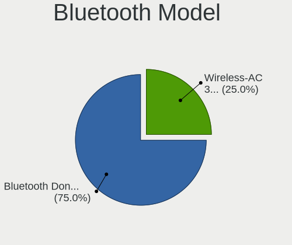
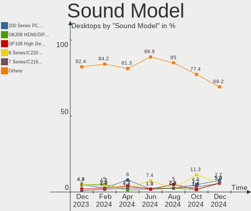
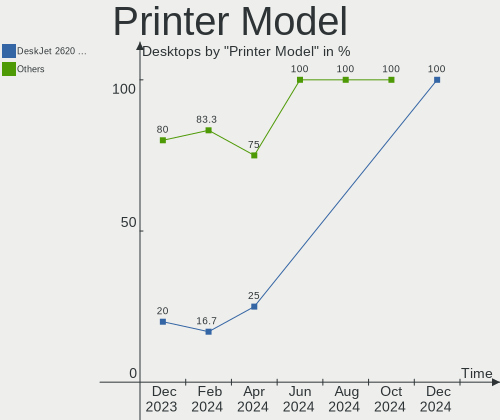

BlackPanther - Hardware Trends (Desktops)
-----------------------------------------

A project to identify most popular hardware characteristics and track their change
over time based on data collected by Linux users at https://Linux-Hardware.org.

Anyone can contribute to this report by the [hw-probe](https://github.com/linuxhw/hw-probe) tool:

    sudo -E hw-probe -all -upload

This report is for one last month. Overall report since the beginning of time: [TestDays](https://github.com/linuxhw/TestDays)

Period: Mar, 2023.

Contents
--------

* [ System ](#system)
  - [ OS                       ](#os)
  - [ OS Family                ](#os-family)
  - [ Kernel                   ](#kernel)
  - [ Kernel Family            ](#kernel-family)
  - [ Kernel Major Ver.        ](#kernel-major-ver)
  - [ Arch                     ](#arch)
  - [ DE                       ](#de)
  - [ Display Server           ](#display-server)
  - [ Display Manager          ](#display-manager)
  - [ OS Lang                  ](#os-lang)
  - [ Boot Mode                ](#boot-mode)
  - [ Filesystem               ](#filesystem)
  - [ Part. scheme             ](#part-scheme)
  - [ Dual Boot with Linux/BSD ](#dual-boot-with-linuxbsd)
  - [ Dual Boot (Win)          ](#dual-boot-win)

* [ Board ](#board)
  - [ Vendor                   ](#vendor)
  - [ Model                    ](#model)
  - [ Model Family             ](#model-family)
  - [ MFG Year                 ](#mfg-year)
  - [ Form Factor              ](#form-factor)
  - [ Secure Boot              ](#secure-boot)
  - [ Coreboot                 ](#coreboot)
  - [ RAM Size                 ](#ram-size)
  - [ RAM Used                 ](#ram-used)
  - [ Total Drives             ](#total-drives)
  - [ Has CD-ROM               ](#has-cd-rom)
  - [ Has Ethernet             ](#has-ethernet)
  - [ Has WiFi                 ](#has-wifi)
  - [ Has Bluetooth            ](#has-bluetooth)

* [ Location ](#location)
  - [ Country                  ](#country)
  - [ City                     ](#city)

* [ Drives ](#drives)
  - [ Drive Vendor             ](#drive-vendor)
  - [ Drive Model              ](#drive-model)
  - [ HDD Vendor               ](#hdd-vendor)
  - [ SSD Vendor               ](#ssd-vendor)
  - [ Drive Kind               ](#drive-kind)
  - [ Drive Connector          ](#drive-connector)
  - [ Drive Size               ](#drive-size)
  - [ Space Total              ](#space-total)
  - [ Space Used               ](#space-used)
  - [ Malfunc. Drives          ](#malfunc-drives)
  - [ Malfunc. Drive Vendor    ](#malfunc-drive-vendor)
  - [ Malfunc. HDD Vendor      ](#malfunc-hdd-vendor)
  - [ Malfunc. Drive Kind      ](#malfunc-drive-kind)
  - [ Failed Drives            ](#failed-drives)
  - [ Failed Drive Vendor      ](#failed-drive-vendor)
  - [ Drive Status             ](#drive-status)

* [ Storage controller ](#storage-controller)
  - [ Storage Vendor           ](#storage-vendor)
  - [ Storage Model            ](#storage-model)
  - [ Storage Kind             ](#storage-kind)

* [ Processor ](#processor)
  - [ CPU Vendor               ](#cpu-vendor)
  - [ CPU Model                ](#cpu-model)
  - [ CPU Model Family         ](#cpu-model-family)
  - [ CPU Cores                ](#cpu-cores)
  - [ CPU Sockets              ](#cpu-sockets)
  - [ CPU Threads              ](#cpu-threads)
  - [ CPU Op-Modes             ](#cpu-op-modes)
  - [ CPU Microcode            ](#cpu-microcode)
  - [ CPU Microarch            ](#cpu-microarch)

* [ Graphics ](#graphics)
  - [ GPU Vendor               ](#gpu-vendor)
  - [ GPU Model                ](#gpu-model)
  - [ GPU Combo                ](#gpu-combo)
  - [ GPU Driver               ](#gpu-driver)
  - [ GPU Memory               ](#gpu-memory)

* [ Monitor ](#monitor)
  - [ Monitor Vendor           ](#monitor-vendor)
  - [ Monitor Model            ](#monitor-model)
  - [ Monitor Resolution       ](#monitor-resolution)
  - [ Monitor Diagonal         ](#monitor-diagonal)
  - [ Monitor Width            ](#monitor-width)
  - [ Aspect Ratio             ](#aspect-ratio)
  - [ Monitor Area             ](#monitor-area)
  - [ Pixel Density            ](#pixel-density)
  - [ Multiple Monitors        ](#multiple-monitors)

* [ Network ](#network)
  - [ Net Controller Vendor    ](#net-controller-vendor)
  - [ Net Controller Model     ](#net-controller-model)
  - [ Wireless Vendor          ](#wireless-vendor)
  - [ Wireless Model           ](#wireless-model)
  - [ Ethernet Vendor          ](#ethernet-vendor)
  - [ Ethernet Model           ](#ethernet-model)
  - [ Net Controller Kind      ](#net-controller-kind)
  - [ Used Controller          ](#used-controller)
  - [ NICs                     ](#nics)
  - [ IPv6                     ](#ipv6)

* [ Bluetooth ](#bluetooth)
  - [ Bluetooth Vendor         ](#bluetooth-vendor)
  - [ Bluetooth Model          ](#bluetooth-model)

* [ Sound ](#sound)
  - [ Sound Vendor             ](#sound-vendor)
  - [ Sound Model              ](#sound-model)

* [ Memory ](#memory)
  - [ Memory Vendor            ](#memory-vendor)
  - [ Memory Model             ](#memory-model)
  - [ Memory Kind              ](#memory-kind)
  - [ Memory Form Factor       ](#memory-form-factor)
  - [ Memory Size              ](#memory-size)
  - [ Memory Speed             ](#memory-speed)

* [ Printers & scanners ](#printers--scanners)
  - [ Printer Vendor           ](#printer-vendor)
  - [ Printer Model            ](#printer-model)
  - [ Scanner Vendor           ](#scanner-vendor)
  - [ Scanner Model            ](#scanner-model)

* [ Camera ](#camera)
  - [ Camera Vendor            ](#camera-vendor)
  - [ Camera Model             ](#camera-model)

* [ Security ](#security)
  - [ Fingerprint Vendor       ](#fingerprint-vendor)
  - [ Fingerprint Model        ](#fingerprint-model)
  - [ Chipcard Vendor          ](#chipcard-vendor)
  - [ Chipcard Model           ](#chipcard-model)

* [ Unsupported ](#unsupported)
  - [ Unsupported Devices      ](#unsupported-devices)
  - [ Unsupported Device Types ](#unsupported-device-types)

System
------

OS
--

Installed operating systems

| Name              | Desktops | Percent |
|-------------------|----------|---------|
| BlackPanther 18.1 | 19       | 95%     |
| BlackPanther 16.1 | 1        | 5%      |

OS Family
---------

OS without a version

| Name         | Desktops | Percent |
|--------------|----------|---------|
| BlackPanther | 20       | 100%    |

Kernel
------

Version of the Linux kernel

| Version             | Desktops | Percent |
|---------------------|----------|---------|
| 4.18.16-desktop-1bP | 10       | 50%     |
| 5.6.14-desktop-2bP  | 9        | 45%     |
| 4.7.0-desktop-1bP   | 1        | 5%      |

Kernel Family
-------------

Linux kernel without a distro release

| Version | Desktops | Percent |
|---------|----------|---------|
| 4.18.16 | 10       | 50%     |
| 5.6.14  | 9        | 45%     |
| 4.7.0   | 1        | 5%      |

Kernel Major Ver.
-----------------

Linux kernel major version

| Version | Desktops | Percent |
|---------|----------|---------|
| 4.18    | 10       | 50%     |
| 5.6     | 9        | 45%     |
| 4.7     | 1        | 5%      |

Arch
----

OS architecture (x86_64, i586, etc.)

| Name   | Desktops | Percent |
|--------|----------|---------|
| x86_64 | 19       | 95%     |
| i686   | 1        | 5%      |

DE
--

Desktop Environment

| Name | Desktops | Percent |
|------|----------|---------|
| KDE5 | 20       | 100%    |

Display Server
--------------

X11 or Wayland

| Name | Desktops | Percent |
|------|----------|---------|
| X11  | 20       | 100%    |

Display Manager
---------------

SDDM, LightDM, etc.

| Name | Desktops | Percent |
|------|----------|---------|
| SDDM | 20       | 100%    |

OS Lang
-------

Language

| Lang    | Desktops | Percent |
|---------|----------|---------|
| Unknown | 20       | 100%    |

Boot Mode
---------

EFI or BIOS

| Mode | Desktops | Percent |
|------|----------|---------|
| BIOS | 13       | 65%     |
| EFI  | 7        | 35%     |

Filesystem
----------

Type of filesystem

| Type    | Desktops | Percent |
|---------|----------|---------|
| Overlay | 16       | 80%     |
| Ext4    | 4        | 20%     |

Part. scheme
------------

Scheme of partitioning

| Type | Desktops | Percent |
|------|----------|---------|
| GPT  | 12       | 60%     |
| MBR  | 8        | 40%     |

Dual Boot with Linux/BSD
------------------------

Hosting more than one Linux/BSD

| Dual boot | Desktops | Percent |
|-----------|----------|---------|
| Yes       | 14       | 70%     |
| No        | 6        | 30%     |

Dual Boot (Win)
---------------

Hosting Linux and Windows

| Dual boot | Desktops | Percent |
|-----------|----------|---------|
| Yes       | 11       | 55%     |
| No        | 9        | 45%     |

Board
-----

Vendor
------

Motherboard manufacturer

| Name                | Desktops | Percent |
|---------------------|----------|---------|
| Gigabyte Technology | 5        | 25%     |
| Dell                | 4        | 20%     |
| ASUSTek Computer    | 4        | 20%     |
| MSI                 | 3        | 15%     |
| Lenovo              | 1        | 5%      |
| Intel               | 1        | 5%      |
| Hewlett-Packard     | 1        | 5%      |
| ASRock              | 1        | 5%      |

Model
-----

Motherboard model

| Name                               | Desktops | Percent |
|------------------------------------|----------|---------|
| MSI MS-7C91                        | 1        | 5%      |
| MSI MS-7721                        | 1        | 5%      |
| MSI MS-7592                        | 1        | 5%      |
| Lenovo ThinkCentre M93p 10A7003AUK | 1        | 5%      |
| Intel DN2820FYK H24582-203         | 1        | 5%      |
| HP Compaq Pro 6300 SFF             | 1        | 5%      |
| Gigabyte Z390 UD                   | 1        | 5%      |
| Gigabyte H310M A 2.0               | 1        | 5%      |
| Gigabyte EG41MFT-US2H              | 1        | 5%      |
| Gigabyte B450M GAMING              | 1        | 5%      |
| Gigabyte AB350M-DS3H V2            | 1        | 5%      |
| Dell Vostro 400                    | 1        | 5%      |
| Dell Precision WorkStation T5500   | 1        | 5%      |
| Dell Precision Tower 5810          | 1        | 5%      |
| Dell OptiPlex 3050                 | 1        | 5%      |
| ASUS V-P7H55E                      | 1        | 5%      |
| ASUS PRIME B365M-A                 | 1        | 5%      |
| ASUS P7H55D-M EVO                  | 1        | 5%      |
| ASUS All Series                    | 1        | 5%      |
| ASRock H81M-VG4                    | 1        | 5%      |

Model Family
------------

Motherboard model prefix

| Name                  | Desktops | Percent |
|-----------------------|----------|---------|
| Dell Precision        | 2        | 10%     |
| MSI MS-7C91           | 1        | 5%      |
| MSI MS-7721           | 1        | 5%      |
| MSI MS-7592           | 1        | 5%      |
| Lenovo ThinkCentre    | 1        | 5%      |
| Intel DN2820FYK       | 1        | 5%      |
| HP Compaq             | 1        | 5%      |
| Gigabyte Z390         | 1        | 5%      |
| Gigabyte H310M        | 1        | 5%      |
| Gigabyte EG41MFT-US2H | 1        | 5%      |
| Gigabyte B450M        | 1        | 5%      |
| Gigabyte AB350M-DS3H  | 1        | 5%      |
| Dell Vostro           | 1        | 5%      |
| Dell OptiPlex         | 1        | 5%      |
| ASUS V-P7H55E         | 1        | 5%      |
| ASUS PRIME            | 1        | 5%      |
| ASUS P7H55D-M         | 1        | 5%      |
| ASUS All              | 1        | 5%      |
| ASRock H81M-VG4       | 1        | 5%      |

MFG Year
--------

Motherboard manufacture year

| Year | Desktops | Percent |
|------|----------|---------|
| 2014 | 4        | 20%     |
| 2018 | 3        | 15%     |
| 2019 | 2        | 10%     |
| 2013 | 2        | 10%     |
| 2010 | 2        | 10%     |
| 2009 | 2        | 10%     |
| 2020 | 1        | 5%      |
| 2017 | 1        | 5%      |
| 2012 | 1        | 5%      |
| 2011 | 1        | 5%      |
| 2007 | 1        | 5%      |

Form Factor
-----------

Physical design of the computer

| Name    | Desktops | Percent |
|---------|----------|---------|
| Desktop | 20       | 100%    |

Secure Boot
-----------

Enabled or disabled

| State    | Desktops | Percent |
|----------|----------|---------|
| Disabled | 20       | 100%    |

Coreboot
--------

Have coreboot on board

| Used | Desktops | Percent |
|------|----------|---------|
| No   | 20       | 100%    |

RAM Size
--------

Total RAM memory

| Size in GB | Desktops | Percent |
|------------|----------|---------|
| 8.01-16.0  | 7        | 35%     |
| 32.01-64.0 | 4        | 20%     |
| 3.01-4.0   | 4        | 20%     |
| 4.01-8.0   | 2        | 10%     |
| 1.01-2.0   | 2        | 10%     |
| 16.01-24.0 | 1        | 5%      |

RAM Used
--------

Used RAM memory

| Used GB  | Desktops | Percent |
|----------|----------|---------|
| 0.51-1.0 | 11       | 55%     |
| 0.01-0.5 | 8        | 40%     |
| 1.01-2.0 | 1        | 5%      |

Total Drives
------------

Number of drives on board

| Drives | Desktops | Percent |
|--------|----------|---------|
| 1      | 12       | 60%     |
| 2      | 4        | 20%     |
| 4      | 3        | 15%     |
| 3      | 1        | 5%      |

Has CD-ROM
----------

Has CD-ROM on board

| Presented | Desktops | Percent |
|-----------|----------|---------|
| Yes       | 16       | 80%     |
| No        | 4        | 20%     |

Has Ethernet
------------

Has Ethernet on board

| Presented | Desktops | Percent |
|-----------|----------|---------|
| Yes       | 20       | 100%    |

Has WiFi
--------

Has WiFi module

| Presented | Desktops | Percent |
|-----------|----------|---------|
| No        | 13       | 65%     |
| Yes       | 7        | 35%     |

Has Bluetooth
-------------

Has Bluetooth module

| Presented | Desktops | Percent |
|-----------|----------|---------|
| No        | 13       | 65%     |
| Yes       | 7        | 35%     |

Location
--------

Country
-------

Geographic location (country)

| Country  | Desktops | Percent |
|----------|----------|---------|
| Hungary  | 16       | 80%     |
| Germany  | 2        | 10%     |
| Slovakia | 1        | 5%      |
| France   | 1        | 5%      |

City
----

Geographic location (city)

| City                    | Desktops | Percent |
|-------------------------|----------|---------|
| Budapest                | 5        | 25%     |
| Hajduboszormeny         | 2        | 10%     |
| Zalaegerszeg            | 1        | 5%      |
| Ubstadt-Weiher          | 1        | 5%      |
| Tatabánya              | 1        | 5%      |
| Szekszárd              | 1        | 5%      |
| Szajol                  | 1        | 5%      |
| Pfaffenhofen an der Ilm | 1        | 5%      |
| Oroshaza                | 1        | 5%      |
| Nancy                   | 1        | 5%      |
| Morahalom               | 1        | 5%      |
| Kecskemét              | 1        | 5%      |
| Janoshaza               | 1        | 5%      |
| Fertoszentmiklos        | 1        | 5%      |
| Bratislava              | 1        | 5%      |

Drives
------

Drive Vendor
------------

Hard drive vendors

| Vendor              | Desktops | Drives | Percent |
|---------------------|----------|--------|---------|
| WDC                 | 7        | 7      | 21.21%  |
| Samsung Electronics | 6        | 7      | 18.18%  |
| Kingston            | 6        | 6      | 18.18%  |
| Seagate             | 2        | 3      | 6.06%   |
| Intenso             | 2        | 2      | 6.06%   |
| HGST                | 2        | 3      | 6.06%   |
| Crucial             | 2        | 2      | 6.06%   |
| Zheino              | 1        | 1      | 3.03%   |
| Toshiba             | 1        | 1      | 3.03%   |
| SanDisk             | 1        | 1      | 3.03%   |
| QUANTUM             | 1        | 1      | 3.03%   |
| Kingmax             | 1        | 1      | 3.03%   |
| Hitachi             | 1        | 1      | 3.03%   |

Drive Model
-----------

Hard drive models

| Model                                | Desktops | Percent |
|--------------------------------------|----------|---------|
| Kingston SA2000M8250G 250GB          | 2        | 5.71%   |
| Zheino CHN-NGFFNV2280-256 256GB      | 1        | 2.86%   |
| WDC WDS240G2G0B-00EPW0 240GB SSD     | 1        | 2.86%   |
| WDC WD5000AAKS-007AA0 500GB          | 1        | 2.86%   |
| WDC WD5000AADS-00S9B0 500GB          | 1        | 2.86%   |
| WDC WD3200AAKX-00ERMA0 320GB         | 1        | 2.86%   |
| WDC WD3200AAJS-55B4A0 320GB          | 1        | 2.86%   |
| WDC WD20EZRZ-00Z5HB0 2TB             | 1        | 2.86%   |
| WDC WD20EZBX-00AYRA0 2TB             | 1        | 2.86%   |
| Toshiba DT01ACA100 1TB               | 1        | 2.86%   |
| Seagate ST500DM002-1BD142 500GB      | 1        | 2.86%   |
| Seagate ST3500514NS 500GB            | 1        | 2.86%   |
| Seagate ST310212A 10GB               | 1        | 2.86%   |
| SanDisk SDSSDH3512G 512GB            | 1        | 2.86%   |
| Samsung SSD 970 EVO Plus 500GB       | 1        | 2.86%   |
| Samsung SSD 960 EVO 500GB            | 1        | 2.86%   |
| Samsung SSD 850 EVO 120GB            | 1        | 2.86%   |
| Samsung MZ7LN256HMJP-000H1 256GB SSD | 1        | 2.86%   |
| Samsung HD502HJ 500GB                | 1        | 2.86%   |
| Samsung HD322HJ 320GB                | 1        | 2.86%   |
| Samsung HD321KJ 320GB                | 1        | 2.86%   |
| QUANTUM FIREBALLlct20 20 20GB        | 1        | 2.86%   |
| Kingston SV300S37A120G 120GB SSD     | 1        | 2.86%   |
| Kingston SS200S330G 32GB SSD         | 1        | 2.86%   |
| Kingston SA400S37240G 240GB SSD      | 1        | 2.86%   |
| Kingston SA400S37120G 120GB SSD      | 1        | 2.86%   |
| Kingmax SSD 480GB                    | 1        | 2.86%   |
| Intenso SSD SATAIII 512GB            | 1        | 2.86%   |
| Intenso Portable SSD 1024GB          | 1        | 2.86%   |
| Hitachi HDS721032CLA362 320GB        | 1        | 2.86%   |
| HGST HTS541010B7E610 1TB             | 1        | 2.86%   |
| HGST HMS5C4040BLE640 4TB             | 1        | 2.86%   |
| Crucial M4-CT128M4SSD2 128GB         | 1        | 2.86%   |
| Crucial CT1000MX500SSD4 1TB          | 1        | 2.86%   |

HDD Vendor
----------

Hard disk drive vendors

| Vendor              | Desktops | Drives | Percent |
|---------------------|----------|--------|---------|
| WDC                 | 6        | 6      | 37.5%   |
| Samsung Electronics | 3        | 3      | 18.75%  |
| Seagate             | 2        | 3      | 12.5%   |
| HGST                | 2        | 3      | 12.5%   |
| Toshiba             | 1        | 1      | 6.25%   |
| QUANTUM             | 1        | 1      | 6.25%   |
| Hitachi             | 1        | 1      | 6.25%   |

SSD Vendor
----------

Solid state drive vendors

| Vendor              | Desktops | Drives | Percent |
|---------------------|----------|--------|---------|
| Kingston            | 4        | 4      | 30.77%  |
| Samsung Electronics | 2        | 2      | 15.38%  |
| Intenso             | 2        | 2      | 15.38%  |
| Crucial             | 2        | 2      | 15.38%  |
| WDC                 | 1        | 1      | 7.69%   |
| SanDisk             | 1        | 1      | 7.69%   |
| Kingmax             | 1        | 1      | 7.69%   |

Drive Kind
----------

HDD or SSD

| Kind | Desktops | Drives | Percent |
|------|----------|--------|---------|
| HDD  | 13       | 18     | 44.83%  |
| SSD  | 11       | 13     | 37.93%  |
| NVMe | 5        | 5      | 17.24%  |

Drive Connector
---------------

SATA, SAS, NVMe, etc.

| Type | Desktops | Drives | Percent |
|------|----------|--------|---------|
| SATA | 20       | 30     | 76.92%  |
| NVMe | 5        | 5      | 19.23%  |
| SAS  | 1        | 1      | 3.85%   |

Drive Size
----------

Size of hard drive

| Size in TB | Desktops | Drives | Percent |
|------------|----------|--------|---------|
| 0.01-0.5   | 16       | 21     | 64%     |
| 0.51-1.0   | 5        | 5      | 20%     |
| 1.01-2.0   | 3        | 3      | 12%     |
| 3.01-4.0   | 1        | 2      | 4%      |

Space Total
-----------

Amount of disk space available on the file system

| Size in GB | Desktops | Percent |
|------------|----------|---------|
| Unknown    | 17       | 85%     |
| 101-250    | 2        | 10%     |
| 251-500    | 1        | 5%      |

Space Used
----------

Amount of used disk space

| Used GB | Desktops | Percent |
|---------|----------|---------|
| Unknown | 17       | 85%     |
| 1-20    | 3        | 15%     |

Malfunc. Drives
---------------

Drive models with a malfunction

| Model                                            | Desktops | Drives | Percent |
|--------------------------------------------------|----------|--------|---------|
| WDC WD5000AAKS-007AA0 500GB                      | 1        | 1      | 14.29%  |
| WDC WD3200AAJS-55B4A0 320GB                      | 1        | 1      | 14.29%  |
| Seagate ST500DM002-1BD142 500GB                  | 1        | 1      | 14.29%  |
| Seagate ST3500514NS 500GB                        | 1        | 1      | 14.29%  |
| Seagate ST310212A 10GB                           | 1        | 1      | 14.29%  |
| Samsung Electronics MZ7LN256HMJP-000H1 256GB SSD | 1        | 1      | 14.29%  |
| QUANTUM FIREBALLlct20 20 20GB                    | 1        | 1      | 14.29%  |

Malfunc. Drive Vendor
---------------------

Vendors of faulty drives

| Vendor              | Desktops | Drives | Percent |
|---------------------|----------|--------|---------|
| WDC                 | 2        | 2      | 33.33%  |
| Seagate             | 2        | 3      | 33.33%  |
| Samsung Electronics | 1        | 1      | 16.67%  |
| QUANTUM             | 1        | 1      | 16.67%  |

Malfunc. HDD Vendor
-------------------

Vendors of faulty HDD drives

| Vendor  | Desktops | Drives | Percent |
|---------|----------|--------|---------|
| WDC     | 2        | 2      | 40%     |
| Seagate | 2        | 3      | 40%     |
| QUANTUM | 1        | 1      | 20%     |

Malfunc. Drive Kind
-------------------

Kinds of faulty drives

| Kind | Desktops | Drives | Percent |
|------|----------|--------|---------|
| HDD  | 3        | 6      | 75%     |
| SSD  | 1        | 1      | 25%     |

Failed Drives
-------------

Failed drive models

Zero info for selected period =(

Failed Drive Vendor
-------------------

Failed drive vendors

Zero info for selected period =(

Drive Status
------------

Number of failed and malfunc. drives

| Status   | Desktops | Drives | Percent |
|----------|----------|--------|---------|
| Works    | 18       | 28     | 78.26%  |
| Malfunc  | 4        | 7      | 17.39%  |
| Detected | 1        | 1      | 4.35%   |

Storage controller
------------------

Storage Vendor
--------------

Storage controller vendors

| Vendor                      | Desktops | Percent |
|-----------------------------|----------|---------|
| Intel                       | 15       | 57.69%  |
| AMD                         | 5        | 19.23%  |
| Samsung Electronics         | 2        | 7.69%   |
| Kingston Technology Company | 2        | 7.69%   |
| Silicon Motion              | 1        | 3.85%   |
| Marvell Technology Group    | 1        | 3.85%   |

Storage Model
-------------

Storage controller models

| Model                                                                          | Desktops | Percent |
|--------------------------------------------------------------------------------|----------|---------|
| AMD FCH SATA Controller [AHCI mode]                                            | 3        | 9.68%   |
| Kingston Company A2000 NVMe SSD                                                | 2        | 6.45%   |
| Intel SATA Controller [RAID mode]                                              | 2        | 6.45%   |
| Intel NM10/ICH7 Family SATA Controller [IDE mode]                              | 2        | 6.45%   |
| Intel 8 Series/C220 Series Chipset Family 6-port SATA Controller 1 [AHCI mode] | 2        | 6.45%   |
| Intel 200 Series PCH SATA controller [AHCI mode]                               | 2        | 6.45%   |
| Silicon Motion SM2263EN/SM2263XT SSD Controller                                | 1        | 3.23%   |
| Samsung NVMe SSD Controller SM981/PM981/PM983                                  | 1        | 3.23%   |
| Samsung NVMe SSD Controller SM961/PM961/SM963                                  | 1        | 3.23%   |
| Marvell Group 88SE6111/6121 SATA II / PATA Controller                          | 1        | 3.23%   |
| Intel Cannon Lake PCH SATA AHCI Controller                                     | 1        | 3.23%   |
| Intel C610/X99 series chipset sSATA Controller [AHCI mode]                     | 1        | 3.23%   |
| Intel C600/X79 series chipset SATA RAID Controller                             | 1        | 3.23%   |
| Intel Atom Processor E3800 Series SATA AHCI Controller                         | 1        | 3.23%   |
| Intel 82801IR/IO/IH (ICH9R/DO/DH) 4 port SATA Controller [IDE mode]            | 1        | 3.23%   |
| Intel 82801I (ICH9 Family) 2 port SATA Controller [IDE mode]                   | 1        | 3.23%   |
| Intel 82801G (ICH7 Family) IDE Controller                                      | 1        | 3.23%   |
| Intel 7 Series/C210 Series Chipset Family 6-port SATA Controller [AHCI mode]   | 1        | 3.23%   |
| Intel 5 Series/3400 Series Chipset 6 port SATA AHCI Controller                 | 1        | 3.23%   |
| Intel 5 Series/3400 Series Chipset 4 port SATA IDE Controller                  | 1        | 3.23%   |
| Intel 5 Series/3400 Series Chipset 2 port SATA IDE Controller                  | 1        | 3.23%   |
| AMD 500 Series Chipset SATA Controller                                         | 1        | 3.23%   |
| AMD 400 Series Chipset SATA Controller                                         | 1        | 3.23%   |
| AMD 300 Series Chipset SATA Controller                                         | 1        | 3.23%   |

Storage Kind
------------

Kind of storage controller (IDE, SATA, NVMe, SAS, ...)

| Kind | Desktops | Percent |
|------|----------|---------|
| SATA | 14       | 51.85%  |
| NVMe | 5        | 18.52%  |
| IDE  | 5        | 18.52%  |
| RAID | 3        | 11.11%  |

Processor
---------

CPU Vendor
----------

Processor vendors

| Vendor | Desktops | Percent |
|--------|----------|---------|
| Intel  | 15       | 75%     |
| AMD    | 5        | 25%     |

CPU Model
---------

Processor models

| Model                                       | Desktops | Percent |
|---------------------------------------------|----------|---------|
| Intel Core i3 CPU 530 @ 2.93GHz             | 2        | 10%     |
| AMD Ryzen 5 3400G with Radeon Vega Graphics | 2        | 10%     |
| Intel Xeon CPU E5530 @ 2.40GHz              | 1        | 5%      |
| Intel Xeon CPU E5-1620 v3 @ 3.50GHz         | 1        | 5%      |
| Intel Core i7-4790 CPU @ 3.60GHz            | 1        | 5%      |
| Intel Core i5-9400 CPU @ 2.90GHz            | 1        | 5%      |
| Intel Core i5-7500 CPU @ 3.40GHz            | 1        | 5%      |
| Intel Core i3-9100F CPU @ 3.60GHz           | 1        | 5%      |
| Intel Core i3-8100 CPU @ 3.60GHz            | 1        | 5%      |
| Intel Core i3-4160 CPU @ 3.60GHz            | 1        | 5%      |
| Intel Core i3-3225 CPU @ 3.30GHz            | 1        | 5%      |
| Intel Core 2 Duo CPU E8400 @ 3.00GHz        | 1        | 5%      |
| Intel Core 2 Duo CPU E6850 @ 3.00GHz        | 1        | 5%      |
| Intel Core 2 Duo CPU E6550 @ 2.33GHz        | 1        | 5%      |
| Intel Celeron CPU N2830 @ 2.16GHz           | 1        | 5%      |
| AMD Sempron 3850 APU with Radeon R3         | 1        | 5%      |
| AMD Ryzen 7 5800X 8-Core Processor          | 1        | 5%      |
| AMD A4-6300 APU with Radeon HD Graphics     | 1        | 5%      |

CPU Model Family
----------------

Processor model prefix

| Model            | Desktops | Percent |
|------------------|----------|---------|
| Intel Core i3    | 6        | 30%     |
| Intel Core 2 Duo | 3        | 15%     |
| Intel Xeon       | 2        | 10%     |
| Intel Core i5    | 2        | 10%     |
| AMD Ryzen 5      | 2        | 10%     |
| Intel Core i7    | 1        | 5%      |
| Intel Celeron    | 1        | 5%      |
| AMD Sempron      | 1        | 5%      |
| AMD Ryzen 7      | 1        | 5%      |
| AMD A4           | 1        | 5%      |

CPU Cores
---------

Number of processor cores

| Number | Desktops | Percent |
|--------|----------|---------|
| 4      | 9        | 45%     |
| 2      | 8        | 40%     |
| 8      | 1        | 5%      |
| 6      | 1        | 5%      |
| 1      | 1        | 5%      |

CPU Sockets
-----------

Number of sockets

| Number | Desktops | Percent |
|--------|----------|---------|
| 1      | 20       | 100%    |

CPU Threads
-----------

Threads per core (Hyper-Threading)

| Number | Desktops | Percent |
|--------|----------|---------|
| 1      | 12       | 60%     |
| 2      | 8        | 40%     |

CPU Op-Modes
------------

CPU Operation Modes (32-bit, 64-bit)

| Op mode        | Desktops | Percent |
|----------------|----------|---------|
| 32-bit, 64-bit | 20       | 100%    |

CPU Microcode
-------------

Microcode number

| Number     | Desktops | Percent |
|------------|----------|---------|
| 0x906eb    | 2        | 10%     |
| 0x6fb      | 2        | 10%     |
| 0x306c3    | 2        | 10%     |
| 0x20652    | 2        | 10%     |
| 0x08108109 | 2        | 10%     |
| 0x906ea    | 1        | 5%      |
| 0x906e9    | 1        | 5%      |
| 0x306f2    | 1        | 5%      |
| 0x306a9    | 1        | 5%      |
| 0x30678    | 1        | 5%      |
| 0x106a5    | 1        | 5%      |
| 0x1067a    | 1        | 5%      |
| 0x0a20120a | 1        | 5%      |
| 0x0700010f | 1        | 5%      |
| 0x06001119 | 1        | 5%      |

CPU Microarch
-------------

Microarchitecture

| Name       | Desktops | Percent |
|------------|----------|---------|
| KabyLake   | 4        | 20%     |
| Haswell    | 3        | 15%     |
| Zen+       | 2        | 10%     |
| Westmere   | 2        | 10%     |
| Core       | 2        | 10%     |
| Zen 3      | 1        | 5%      |
| Silvermont | 1        | 5%      |
| Piledriver | 1        | 5%      |
| Penryn     | 1        | 5%      |
| Nehalem    | 1        | 5%      |
| Jaguar     | 1        | 5%      |
| IvyBridge  | 1        | 5%      |

Graphics
--------

GPU Vendor
----------

Vendors of graphics cards

| Vendor | Desktops | Percent |
|--------|----------|---------|
| Intel  | 10       | 47.62%  |
| AMD    | 7        | 33.33%  |
| Nvidia | 4        | 19.05%  |

GPU Model
---------

Graphics card models

| Model                                                                       | Desktops | Percent |
|-----------------------------------------------------------------------------|----------|---------|
| Intel Core Processor Integrated Graphics Controller                         | 2        | 9.09%   |
| Intel 4 Series Chipset Integrated Graphics Controller                       | 2        | 9.09%   |
| Nvidia GP106 [GeForce GTX 1060 6GB]                                         | 1        | 4.55%   |
| Nvidia GM107 [GeForce GTX 750 Ti]                                           | 1        | 4.55%   |
| Nvidia GA106 [Geforce RTX 3050]                                             | 1        | 4.55%   |
| Nvidia GA104 [GeForce RTX 3060 Ti Lite Hash Rate]                           | 1        | 4.55%   |
| Nvidia G96CGL [Quadro FX 580]                                               | 1        | 4.55%   |
| Intel Xeon E3-1200 v3/4th Gen Core Processor Integrated Graphics Controller | 1        | 4.55%   |
| Intel IvyBridge GT2 [HD Graphics 4000]                                      | 1        | 4.55%   |
| Intel HD Graphics 630                                                       | 1        | 4.55%   |
| Intel CoffeeLake-S GT2 [UHD Graphics 630]                                   | 1        | 4.55%   |
| Intel Atom Processor Z36xxx/Z37xxx Series Graphics & Display                | 1        | 4.55%   |
| Intel 82G33/G31 Express Integrated Graphics Controller                      | 1        | 4.55%   |
| AMD Redwood XT [Radeon HD 5670/5690/5730]                                   | 1        | 4.55%   |
| AMD Picasso/Raven 2 [Radeon Vega Series / Radeon Vega Mobile Series]        | 1        | 4.55%   |
| AMD Oland PRO [Radeon R7 240/340 / Radeon 520]                              | 1        | 4.55%   |
| AMD Lexa PRO [Radeon 540/540X/550/550X / RX 540X/550/550X]                  | 1        | 4.55%   |
| AMD Kabini [Radeon HD 8280 / R3 Series]                                     | 1        | 4.55%   |
| AMD Cedar [Radeon HD 5000/6000/7350/8350 Series]                            | 1        | 4.55%   |
| AMD Baffin [Radeon RX 550 640SP / RX 560/560X]                              | 1        | 4.55%   |

GPU Combo
---------

Combinations of graphics cards

| Name       | Desktops | Percent |
|------------|----------|---------|
| 1 x Intel  | 9        | 45%     |
| 1 x AMD    | 7        | 35%     |
| 1 x Nvidia | 3        | 15%     |
| 2 x Nvidia | 1        | 5%      |

GPU Driver
----------

Free vs proprietary

| Driver  | Desktops | Percent |
|---------|----------|---------|
| Free    | 19       | 95%     |
| Unknown | 1        | 5%      |

GPU Memory
----------

Total video memory

| Size in GB | Desktops | Percent |
|------------|----------|---------|
| Unknown    | 9        | 45%     |
| 0.51-1.0   | 3        | 15%     |
| 0.01-0.5   | 3        | 15%     |
| 3.01-4.0   | 2        | 10%     |
| 1.01-2.0   | 2        | 10%     |
| 5.01-6.0   | 1        | 5%      |

Monitor
-------

Monitor Vendor
--------------

Monitor vendors

| Vendor               | Desktops | Percent |
|----------------------|----------|---------|
| Samsung Electronics  | 5        | 29.41%  |
| Goldstar             | 5        | 29.41%  |
| Dell                 | 2        | 11.76%  |
| OEM                  | 1        | 5.88%   |
| Mi                   | 1        | 5.88%   |
| Lenovo               | 1        | 5.88%   |
| Iiyama               | 1        | 5.88%   |
| Ancor Communications | 1        | 5.88%   |

Monitor Model
-------------

Monitor models

| Model                                                                   | Desktops | Percent |
|-------------------------------------------------------------------------|----------|---------|
| Goldstar L1942 GSM4B85 1280x1024 376x301mm 19.0-inch                    | 2        | 11.76%  |
| Samsung Electronics SyncMaster SAM0191 1280x1024 338x270mm 17.0-inch    | 1        | 5.88%   |
| Samsung Electronics SMS24A450/460 SAM0837 1920x1080 531x299mm 24.0-inch | 1        | 5.88%   |
| Samsung Electronics S27E500 SAM0D0D 1920x1080 598x336mm 27.0-inch       | 1        | 5.88%   |
| Samsung Electronics S24D330 SAM0D92 1920x1080 531x299mm 24.0-inch       | 1        | 5.88%   |
| Samsung Electronics LS27AG30x SAM717A 1920x1080 597x336mm 27.0-inch     | 1        | 5.88%   |
| OEM 32W_LCD_TV OEM3700 1920x540                                         | 1        | 5.88%   |
| Mi 27 NFGL XMIB004 1920x1080 598x336mm 27.0-inch                        | 1        | 5.88%   |
| Lenovo LEN L171 LEN24C9 1280x1024 337x270mm 17.0-inch                   | 1        | 5.88%   |
| Iiyama PL2474H IVM6146 1920x1080 521x293mm 23.5-inch                    | 1        | 5.88%   |
| Goldstar W2242 GSM5678 1680x1050 474x296mm 22.0-inch                    | 1        | 5.88%   |
| Goldstar W2042 GSM4E7E 1680x1050 434x270mm 20.1-inch                    | 1        | 5.88%   |
| Goldstar 2D FHD TV GSM59C6 1920x1080 509x286mm 23.0-inch                | 1        | 5.88%   |
| Dell S2721D DELA19A 2560x1440 597x336mm 27.0-inch                       | 1        | 5.88%   |
| Dell 1704FPV DEL3015 1280x1024 338x270mm 17.0-inch                      | 1        | 5.88%   |
| Ancor Communications ASUS VS228 ACI22FD 1920x1080 476x268mm 21.5-inch   | 1        | 5.88%   |

Monitor Resolution
------------------

Monitor screen resolution

| Resolution         | Desktops | Percent |
|--------------------|----------|---------|
| 1920x1080 (FHD)    | 7        | 43.75%  |
| 1280x1024 (SXGA)   | 5        | 31.25%  |
| 1680x1050 (WSXGA+) | 2        | 12.5%   |
| 2560x1440 (QHD)    | 1        | 6.25%   |
| 1920x540           | 1        | 6.25%   |

Monitor Diagonal
----------------

Diagonal size in inches

| Inches | Desktops | Percent |
|--------|----------|---------|
| 27     | 4        | 25%     |
| 23     | 3        | 18.75%  |
| 17     | 3        | 18.75%  |
| 24     | 2        | 12.5%   |
| 19     | 2        | 12.5%   |
| 21     | 1        | 6.25%   |
| 20     | 1        | 6.25%   |

Monitor Width
-------------

Physical width

| Width in mm | Desktops | Percent |
|-------------|----------|---------|
| 501-600     | 8        | 50%     |
| 401-500     | 3        | 18.75%  |
| 301-350     | 3        | 18.75%  |
| 351-400     | 2        | 12.5%   |

Aspect Ratio
------------

Proportional relationship between the width and the height

| Ratio | Desktops | Percent |
|-------|----------|---------|
| 16/9  | 8        | 53.33%  |
| 5/4   | 5        | 33.33%  |
| 3/2   | 1        | 6.67%   |
| 16/10 | 1        | 6.67%   |

Monitor Area
------------

Area in inch²

| Area in inch² | Desktops | Percent |
|----------------|----------|---------|
| 201-250        | 6        | 37.5%   |
| 301-350        | 4        | 25%     |
| 151-200        | 3        | 18.75%  |
| 141-150        | 3        | 18.75%  |

Pixel Density
-------------

Pixels per inch

| Density | Desktops | Percent |
|---------|----------|---------|
| 51-100  | 14       | 87.5%   |
| 101-120 | 2        | 12.5%   |

Multiple Monitors
-----------------

Total monitors connected

| Total | Desktops | Percent |
|-------|----------|---------|
| 1     | 17       | 85%     |
| 2     | 2        | 10%     |
| 0     | 1        | 5%      |

Network
-------

Net Controller Vendor
---------------------

Controller vendors

| Vendor                | Desktops | Percent |
|-----------------------|----------|---------|
| Realtek Semiconductor | 15       | 55.56%  |
| Intel                 | 7        | 25.93%  |
| TP-Link               | 1        | 3.7%    |
| Ralink Technology     | 1        | 3.7%    |
| Qualcomm Atheros      | 1        | 3.7%    |
| Microsoft             | 1        | 3.7%    |
| Broadcom              | 1        | 3.7%    |

Net Controller Model
--------------------

Controller models

| Model                                                             | Desktops | Percent |
|-------------------------------------------------------------------|----------|---------|
| Realtek RTL8111/8168/8411 PCI Express Gigabit Ethernet Controller | 13       | 43.33%  |
| Intel Wireless 7260                                               | 2        | 6.67%   |
| Intel Ethernet Connection I217-LM                                 | 2        | 6.67%   |
| TP-Link TL-WN821N v5/v6 [RTL8192EU]                               | 1        | 3.33%   |
| Realtek RTL8188EUS 802.11n Wireless Network Adapter               | 1        | 3.33%   |
| Realtek RTL8188EE Wireless Network Adapter                        | 1        | 3.33%   |
| Realtek RTL8188CUS 802.11n WLAN Adapter                           | 1        | 3.33%   |
| Realtek RTL8169 PCI Gigabit Ethernet Controller                   | 1        | 3.33%   |
| Realtek RTL8125 2.5GbE Controller                                 | 1        | 3.33%   |
| Ralink RT5372 Wireless Adapter                                    | 1        | 3.33%   |
| Qualcomm Atheros AR8132 Fast Ethernet                             | 1        | 3.33%   |
| Microsoft Xbox 360 Wireless Adapter                               | 1        | 3.33%   |
| Intel Ethernet Connection (2) I219-V                              | 1        | 3.33%   |
| Intel 82579LM Gigabit Network Connection (Lewisville)             | 1        | 3.33%   |
| Intel 82562V-2 10/100 Network Connection                          | 1        | 3.33%   |
| Broadcom NetXtreme BCM5761 Gigabit Ethernet PCIe                  | 1        | 3.33%   |

Wireless Vendor
---------------

Wireless vendors

| Vendor                | Desktops | Percent |
|-----------------------|----------|---------|
| Realtek Semiconductor | 3        | 37.5%   |
| Intel                 | 2        | 25%     |
| TP-Link               | 1        | 12.5%   |
| Ralink Technology     | 1        | 12.5%   |
| Microsoft             | 1        | 12.5%   |

Wireless Model
--------------

Wireless models

| Model                                               | Desktops | Percent |
|-----------------------------------------------------|----------|---------|
| Intel Wireless 7260                                 | 2        | 25%     |
| TP-Link TL-WN821N v5/v6 [RTL8192EU]                 | 1        | 12.5%   |
| Realtek RTL8188EUS 802.11n Wireless Network Adapter | 1        | 12.5%   |
| Realtek RTL8188EE Wireless Network Adapter          | 1        | 12.5%   |
| Realtek RTL8188CUS 802.11n WLAN Adapter             | 1        | 12.5%   |
| Ralink RT5372 Wireless Adapter                      | 1        | 12.5%   |
| Microsoft Xbox 360 Wireless Adapter                 | 1        | 12.5%   |

Ethernet Vendor
---------------

Ethernet vendors

| Vendor                | Desktops | Percent |
|-----------------------|----------|---------|
| Realtek Semiconductor | 14       | 66.67%  |
| Intel                 | 5        | 23.81%  |
| Qualcomm Atheros      | 1        | 4.76%   |
| Broadcom              | 1        | 4.76%   |

Ethernet Model
--------------

Ethernet models

| Model                                                             | Desktops | Percent |
|-------------------------------------------------------------------|----------|---------|
| Realtek RTL8111/8168/8411 PCI Express Gigabit Ethernet Controller | 13       | 59.09%  |
| Intel Ethernet Connection I217-LM                                 | 2        | 9.09%   |
| Realtek RTL8169 PCI Gigabit Ethernet Controller                   | 1        | 4.55%   |
| Realtek RTL8125 2.5GbE Controller                                 | 1        | 4.55%   |
| Qualcomm Atheros AR8132 Fast Ethernet                             | 1        | 4.55%   |
| Intel Ethernet Connection (2) I219-V                              | 1        | 4.55%   |
| Intel 82579LM Gigabit Network Connection (Lewisville)             | 1        | 4.55%   |
| Intel 82562V-2 10/100 Network Connection                          | 1        | 4.55%   |
| Broadcom NetXtreme BCM5761 Gigabit Ethernet PCIe                  | 1        | 4.55%   |

Net Controller Kind
-------------------

Ethernet, WiFi or modem

| Kind     | Desktops | Percent |
|----------|----------|---------|
| Ethernet | 20       | 74.07%  |
| WiFi     | 7        | 25.93%  |

Used Controller
---------------

Currently used network controller

| Kind     | Desktops | Percent |
|----------|----------|---------|
| Ethernet | 17       | 85%     |
| WiFi     | 3        | 15%     |

NICs
----

Total network controllers on board

| Total | Desktops | Percent |
|-------|----------|---------|
| 1     | 15       | 75%     |
| 2     | 5        | 25%     |

IPv6
----

IPv6 vs IPv4

| Used | Desktops | Percent |
|------|----------|---------|
| No   | 11       | 55%     |
| Yes  | 9        | 45%     |

Bluetooth
---------

Bluetooth Vendor
----------------

Controller vendors

| Vendor                  | Desktops | Percent |
|-------------------------|----------|---------|
| Cambridge Silicon Radio | 4        | 57.14%  |
| Intel                   | 2        | 28.57%  |
| Belkin Components       | 1        | 14.29%  |

Bluetooth Model
---------------

Controller models

| Model                                               | Desktops | Percent |
|-----------------------------------------------------|----------|---------|
| Cambridge Silicon Radio Bluetooth Dongle (HCI mode) | 4        | 57.14%  |
| Intel Bluetooth wireless interface                  | 2        | 28.57%  |
| Belkin Components F8T013 Bluetooth Adapter          | 1        | 14.29%  |

Sound
-----

Sound Vendor
------------

Sound card vendors

| Vendor              | Desktops | Percent |
|---------------------|----------|---------|
| Intel               | 15       | 50%     |
| AMD                 | 8        | 26.67%  |
| Nvidia              | 3        | 10%     |
| Creative Labs       | 2        | 6.67%   |
| Texas Instruments   | 1        | 3.33%   |
| C-Media Electronics | 1        | 3.33%   |

Sound Model
-----------

Sound card models

| Model                                                                                           | Desktops | Percent |
|-------------------------------------------------------------------------------------------------|----------|---------|
| Intel 200 Series PCH HD Audio                                                                   | 3        | 8.33%   |
| Intel NM10/ICH7 Family High Definition Audio Controller                                         | 2        | 5.56%   |
| Intel 8 Series/C220 Series Chipset High Definition Audio Controller                             | 2        | 5.56%   |
| Intel 5 Series/3400 Series Chipset High Definition Audio                                        | 2        | 5.56%   |
| AMD FCH Azalia Controller                                                                       | 2        | 5.56%   |
| AMD Family 17h/19h HD Audio Controller                                                          | 2        | 5.56%   |
| AMD Baffin HDMI/DP Audio [Radeon RX 550 640SP / RX 560/560X]                                    | 2        | 5.56%   |
| Texas Instruments PCM2902 Audio Codec                                                           | 1        | 2.78%   |
| Nvidia GP106 High Definition Audio Controller                                                   | 1        | 2.78%   |
| Nvidia GM107 High Definition Audio Controller [GeForce 940MX]                                   | 1        | 2.78%   |
| Nvidia GA106 High Definition Audio Controller                                                   | 1        | 2.78%   |
| Nvidia GA104 High Definition Audio Controller                                                   | 1        | 2.78%   |
| Intel Xeon E3-1200 v3/4th Gen Core Processor HD Audio Controller                                | 1        | 2.78%   |
| Intel Cannon Lake PCH cAVS                                                                      | 1        | 2.78%   |
| Intel C610/X99 series chipset HD Audio Controller                                               | 1        | 2.78%   |
| Intel Atom Processor Z36xxx/Z37xxx Series High Definition Audio Controller                      | 1        | 2.78%   |
| Intel 82801JI (ICH10 Family) HD Audio Controller                                                | 1        | 2.78%   |
| Intel 82801I (ICH9 Family) HD Audio Controller                                                  | 1        | 2.78%   |
| Intel 7 Series/C216 Chipset Family High Definition Audio Controller                             | 1        | 2.78%   |
| Creative Labs EMU10k1 [Sound Blaster Live! Series]                                              | 1        | 2.78%   |
| Creative Labs CA0132 Sound Core3D [Sound Blaster Recon3D / Z-Series / Sound BlasterX AE-5 Plus] | 1        | 2.78%   |
| C-Media Electronics Blue Snowball                                                               | 1        | 2.78%   |
| AMD Starship/Matisse HD Audio Controller                                                        | 1        | 2.78%   |
| AMD Redwood HDMI Audio [Radeon HD 5000 Series]                                                  | 1        | 2.78%   |
| AMD Raven/Raven2/Fenghuang HDMI/DP Audio Controller                                             | 1        | 2.78%   |
| AMD Oland/Hainan/Cape Verde/Pitcairn HDMI Audio [Radeon HD 7000 Series]                         | 1        | 2.78%   |
| AMD Kabini HDMI/DP Audio                                                                        | 1        | 2.78%   |
| AMD Cedar HDMI Audio [Radeon HD 5400/6300/7300 Series]                                          | 1        | 2.78%   |

Memory
------

Memory Vendor
-------------

Memory module vendors

| Vendor              | Desktops | Percent |
|---------------------|----------|---------|
| Unknown             | 5        | 21.74%  |
| Kingston            | 3        | 13.04%  |
| SK hynix            | 2        | 8.7%    |
| Samsung Electronics | 2        | 8.7%    |
| Kingmax             | 2        | 8.7%    |
| G.Skill             | 2        | 8.7%    |
| Elpida              | 2        | 8.7%    |
| Crucial             | 2        | 8.7%    |
| Patriot             | 1        | 4.35%   |
| Nanya Technology    | 1        | 4.35%   |
| Corsair             | 1        | 4.35%   |

Memory Model
------------

Memory module models

| Model                                                     | Desktops | Percent |
|-----------------------------------------------------------|----------|---------|
| Unknown RAM Module 1024MB DIMM DDR 1333MT/s               | 2        | 6.9%    |
| Unknown RAM Module 4096MB DIMM DDR 1333MT/s               | 1        | 3.45%   |
| Unknown RAM Module 4096MB DIMM 400MT/s                    | 1        | 3.45%   |
| Unknown RAM Module 2048MB DIMM SDRAM 1066MT/s             | 1        | 3.45%   |
| Unknown RAM Module 2048MB DIMM 400MT/s                    | 1        | 3.45%   |
| Unknown RAM DDR3 1600 8G 8192MB DIMM DDR3 1600MT/s        | 1        | 3.45%   |
| SK hynix RAM HYMP164U64CP6-Y5 512MB DIMM DDR2 667MT/s     | 1        | 3.45%   |
| SK hynix RAM HMA41GR7MFR8N-TF 8192MB RIMM DDR4 2133MT/s   | 1        | 3.45%   |
| SK hynix RAM HMA41GR7AFR8N-TF 8192MB RIMM DDR4 2133MT/s   | 1        | 3.45%   |
| Samsung RAM M393A1G43DB0-CPB 8192MB RIMM DDR4 2133MT/s    | 1        | 3.45%   |
| Samsung RAM M378B5173QH0-CK0 4GB DIMM DDR3 1600MT/s       | 1        | 3.45%   |
| Patriot RAM PSD416G24002 16384MB DIMM DDR4 2400MT/s       | 1        | 3.45%   |
| Nanya RAM NT4GC72B4NA1NL-BE 4096MB DIMM DDR3 1066MT/s     | 1        | 3.45%   |
| Kingston RAM M378A1K43BB2-CRC 4096MB DIMM DDR4 2400MT/s   | 1        | 3.45%   |
| Kingston RAM 9905594-001.A00G 2048MB DIMM DDR3 1600MT/s   | 1        | 3.45%   |
| Kingston RAM 9905403-444.A00LF 4096MB DIMM DDR3 1333MT/s  | 1        | 3.45%   |
| Kingmax RAM GLAG42F-18--------- 8192MB DIMM DDR4 2666MT/s | 1        | 3.45%   |
| Kingmax RAM GLAF62F-D8--------- 4096MB DIMM DDR4 2400MT/s | 1        | 3.45%   |
| Kingmax RAM FLFF65F-D8KQ9 4096MB DIMM DDR3 1333MT/s       | 1        | 3.45%   |
| Kingmax RAM FLFF65F-C8KL9 4096MB DIMM DDR3 1333MT/s       | 1        | 3.45%   |
| G.Skill RAM F4-3200C16-8GIS 8GB DIMM DDR4 3200MT/s        | 1        | 3.45%   |
| G.Skill RAM F4-3000C16-8GISB 8GB DIMM DDR4 3200MT/s       | 1        | 3.45%   |
| Elpida RAM EBJ21UE8BDF0-DJ-F 2GB DIMM DDR3 1333MT/s       | 1        | 3.45%   |
| Elpida RAM EBJ20UF8BCF0-DJ-F 2048MB DIMM DDR3 1333MT/s    | 1        | 3.45%   |
| Elpida RAM EBE10UE8ACWA-6E-E 1024MB DIMM DDR2 667MT/s     | 1        | 3.45%   |
| Crucial RAM BLS4G4D240FSB.8FBD2 4096MB DIMM DDR4 2400MT/s | 1        | 3.45%   |
| Crucial RAM BL16G32C16U4B.16FE 16384MB DIMM DDR4 3200MT/s | 1        | 3.45%   |
| Corsair RAM CMK32GX4M2A2400C16 16GB DIMM DDR4 2400MT/s    | 1        | 3.45%   |

Memory Kind
-----------

Memory module kinds

| Kind    | Desktops | Percent |
|---------|----------|---------|
| DDR4    | 8        | 38.1%   |
| DDR3    | 7        | 33.33%  |
| SDRAM   | 2        | 9.52%   |
| DDR     | 2        | 9.52%   |
| DDR2    | 1        | 4.76%   |
| Unknown | 1        | 4.76%   |

Memory Form Factor
------------------

Physical design of the memory module

| Name | Desktops | Percent |
|------|----------|---------|
| DIMM | 19       | 95%     |
| RIMM | 1        | 5%      |

Memory Size
-----------

Memory module size

| Size  | Desktops | Percent |
|-------|----------|---------|
| 4096  | 8        | 32%     |
| 8192  | 6        | 24%     |
| 2048  | 4        | 16%     |
| 16384 | 3        | 12%     |
| 1024  | 3        | 12%     |
| 512   | 1        | 4%      |

Memory Speed
------------

Memory module speed

| Speed | Desktops | Percent |
|-------|----------|---------|
| 1333  | 5        | 23.81%  |
| 2400  | 4        | 19.05%  |
| 3200  | 3        | 14.29%  |
| 1600  | 2        | 9.52%   |
| 1066  | 2        | 9.52%   |
| 2666  | 1        | 4.76%   |
| 2133  | 1        | 4.76%   |
| 1866  | 1        | 4.76%   |
| 667   | 1        | 4.76%   |
| 400   | 1        | 4.76%   |

Printers & scanners
-------------------

Printer Vendor
--------------

Printer device vendors

| Vendor          | Desktops | Percent |
|-----------------|----------|---------|
| Hewlett-Packard | 1        | 100%    |

Printer Model
-------------

Printer device models

| Model                  | Desktops | Percent |
|------------------------|----------|---------|
| HP DeskJet 2600 series | 1        | 100%    |

Scanner Vendor
--------------

Scanner device vendors

Zero info for selected period =(

Scanner Model
-------------

Scanner device models

Zero info for selected period =(

Camera
------

Camera Vendor
-------------

Camera device vendors

| Vendor              | Desktops | Percent |
|---------------------|----------|---------|
| Samsung Electronics | 1        | 33.33%  |
| Microdia            | 1        | 33.33%  |
| Logitech            | 1        | 33.33%  |

Camera Model
------------

Camera device models

| Model                   | Desktops | Percent |
|-------------------------|----------|---------|
| Samsung Galaxy A5 (MTP) | 1        | 33.33%  |
| Microdia Camera         | 1        | 33.33%  |
| Logitech Webcam C270    | 1        | 33.33%  |

Security
--------

Fingerprint Vendor
------------------

Fingerprint sensor vendors

Zero info for selected period =(

Fingerprint Model
-----------------

Fingerprint sensor models

Zero info for selected period =(

Chipcard Vendor
---------------

Chipcard module vendors

Zero info for selected period =(

Chipcard Model
--------------

Chipcard module models

Zero info for selected period =(

Unsupported
-----------

Unsupported Devices
-------------------

Total unsupported devices on board

| Total | Desktops | Percent |
|-------|----------|---------|
| 0     | 19       | 95%     |
| 2     | 1        | 5%      |

Unsupported Device Types
------------------------

Types of unsupported devices

| Type             | Desktops | Percent |
|------------------|----------|---------|
| Unassigned class | 1        | 50%     |
| Graphics card    | 1        | 50%     |

