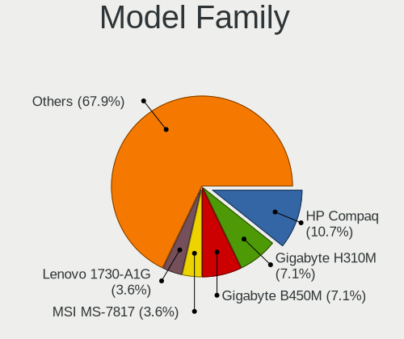
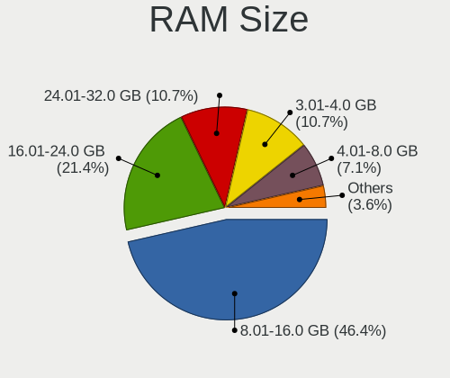
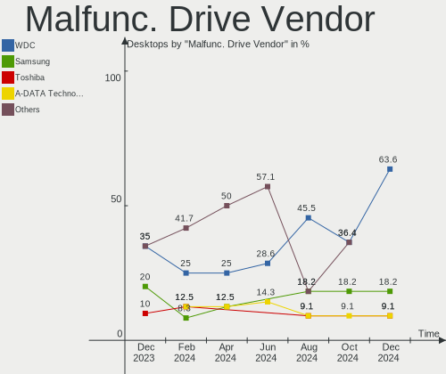
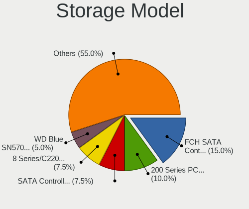
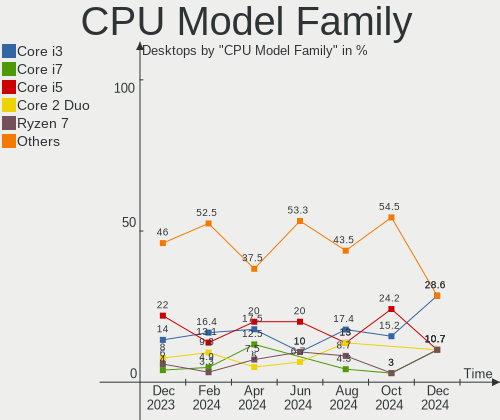
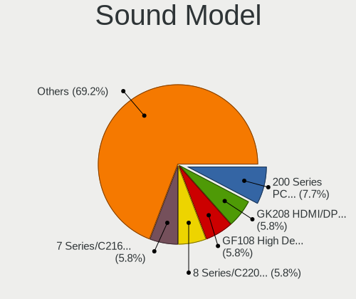
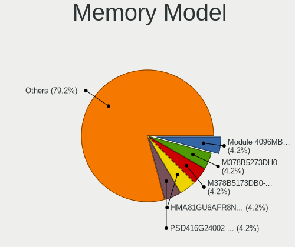

BlackPanther - Hardware Trends (Desktops)
-----------------------------------------

A project to identify most popular hardware characteristics and track their change
over time based on data collected by Linux users at https://Linux-Hardware.org.

Anyone can contribute to this report by the [hw-probe](https://github.com/linuxhw/hw-probe) tool:

    sudo -E hw-probe -all -upload

This report is for one last month. Overall report since the beginning of time: [TestCoverage](https://github.com/linuxhw/TestCoverage)

Period: Dec, 2022.

Contents
--------

* [ System ](#system)
  - [ OS                       ](#os)
  - [ OS Family                ](#os-family)
  - [ Kernel                   ](#kernel)
  - [ Kernel Family            ](#kernel-family)
  - [ Kernel Major Ver.        ](#kernel-major-ver)
  - [ Arch                     ](#arch)
  - [ DE                       ](#de)
  - [ Display Server           ](#display-server)
  - [ Display Manager          ](#display-manager)
  - [ OS Lang                  ](#os-lang)
  - [ Boot Mode                ](#boot-mode)
  - [ Filesystem               ](#filesystem)
  - [ Part. scheme             ](#part-scheme)
  - [ Dual Boot with Linux/BSD ](#dual-boot-with-linuxbsd)
  - [ Dual Boot (Win)          ](#dual-boot-win)

* [ Board ](#board)
  - [ Vendor                   ](#vendor)
  - [ Model                    ](#model)
  - [ Model Family             ](#model-family)
  - [ MFG Year                 ](#mfg-year)
  - [ Form Factor              ](#form-factor)
  - [ Secure Boot              ](#secure-boot)
  - [ Coreboot                 ](#coreboot)
  - [ RAM Size                 ](#ram-size)
  - [ RAM Used                 ](#ram-used)
  - [ Total Drives             ](#total-drives)
  - [ Has CD-ROM               ](#has-cd-rom)
  - [ Has Ethernet             ](#has-ethernet)
  - [ Has WiFi                 ](#has-wifi)
  - [ Has Bluetooth            ](#has-bluetooth)

* [ Location ](#location)
  - [ Country                  ](#country)
  - [ City                     ](#city)

* [ Drives ](#drives)
  - [ Drive Vendor             ](#drive-vendor)
  - [ Drive Model              ](#drive-model)
  - [ HDD Vendor               ](#hdd-vendor)
  - [ SSD Vendor               ](#ssd-vendor)
  - [ Drive Kind               ](#drive-kind)
  - [ Drive Connector          ](#drive-connector)
  - [ Drive Size               ](#drive-size)
  - [ Space Total              ](#space-total)
  - [ Space Used               ](#space-used)
  - [ Malfunc. Drives          ](#malfunc-drives)
  - [ Malfunc. Drive Vendor    ](#malfunc-drive-vendor)
  - [ Malfunc. HDD Vendor      ](#malfunc-hdd-vendor)
  - [ Malfunc. Drive Kind      ](#malfunc-drive-kind)
  - [ Failed Drives            ](#failed-drives)
  - [ Failed Drive Vendor      ](#failed-drive-vendor)
  - [ Drive Status             ](#drive-status)

* [ Storage controller ](#storage-controller)
  - [ Storage Vendor           ](#storage-vendor)
  - [ Storage Model            ](#storage-model)
  - [ Storage Kind             ](#storage-kind)

* [ Processor ](#processor)
  - [ CPU Vendor               ](#cpu-vendor)
  - [ CPU Model                ](#cpu-model)
  - [ CPU Model Family         ](#cpu-model-family)
  - [ CPU Cores                ](#cpu-cores)
  - [ CPU Sockets              ](#cpu-sockets)
  - [ CPU Threads              ](#cpu-threads)
  - [ CPU Op-Modes             ](#cpu-op-modes)
  - [ CPU Microcode            ](#cpu-microcode)
  - [ CPU Microarch            ](#cpu-microarch)

* [ Graphics ](#graphics)
  - [ GPU Vendor               ](#gpu-vendor)
  - [ GPU Model                ](#gpu-model)
  - [ GPU Combo                ](#gpu-combo)
  - [ GPU Driver               ](#gpu-driver)
  - [ GPU Memory               ](#gpu-memory)

* [ Monitor ](#monitor)
  - [ Monitor Vendor           ](#monitor-vendor)
  - [ Monitor Model            ](#monitor-model)
  - [ Monitor Resolution       ](#monitor-resolution)
  - [ Monitor Diagonal         ](#monitor-diagonal)
  - [ Monitor Width            ](#monitor-width)
  - [ Aspect Ratio             ](#aspect-ratio)
  - [ Monitor Area             ](#monitor-area)
  - [ Pixel Density            ](#pixel-density)
  - [ Multiple Monitors        ](#multiple-monitors)

* [ Network ](#network)
  - [ Net Controller Vendor    ](#net-controller-vendor)
  - [ Net Controller Model     ](#net-controller-model)
  - [ Wireless Vendor          ](#wireless-vendor)
  - [ Wireless Model           ](#wireless-model)
  - [ Ethernet Vendor          ](#ethernet-vendor)
  - [ Ethernet Model           ](#ethernet-model)
  - [ Net Controller Kind      ](#net-controller-kind)
  - [ Used Controller          ](#used-controller)
  - [ NICs                     ](#nics)
  - [ IPv6                     ](#ipv6)

* [ Bluetooth ](#bluetooth)
  - [ Bluetooth Vendor         ](#bluetooth-vendor)
  - [ Bluetooth Model          ](#bluetooth-model)

* [ Sound ](#sound)
  - [ Sound Vendor             ](#sound-vendor)
  - [ Sound Model              ](#sound-model)

* [ Memory ](#memory)
  - [ Memory Vendor            ](#memory-vendor)
  - [ Memory Model             ](#memory-model)
  - [ Memory Kind              ](#memory-kind)
  - [ Memory Form Factor       ](#memory-form-factor)
  - [ Memory Size              ](#memory-size)
  - [ Memory Speed             ](#memory-speed)

* [ Printers & scanners ](#printers--scanners)
  - [ Printer Vendor           ](#printer-vendor)
  - [ Printer Model            ](#printer-model)
  - [ Scanner Vendor           ](#scanner-vendor)
  - [ Scanner Model            ](#scanner-model)

* [ Camera ](#camera)
  - [ Camera Vendor            ](#camera-vendor)
  - [ Camera Model             ](#camera-model)

* [ Security ](#security)
  - [ Fingerprint Vendor       ](#fingerprint-vendor)
  - [ Fingerprint Model        ](#fingerprint-model)
  - [ Chipcard Vendor          ](#chipcard-vendor)
  - [ Chipcard Model           ](#chipcard-model)

* [ Unsupported ](#unsupported)
  - [ Unsupported Devices      ](#unsupported-devices)
  - [ Unsupported Device Types ](#unsupported-device-types)

System
------

OS
--

Installed operating systems

| Name              | Desktops | Percent |
|-------------------|----------|---------|
| BlackPanther 18.1 | 11       | 100%    |

OS Family
---------

OS without a version

| Name         | Desktops | Percent |
|--------------|----------|---------|
| BlackPanther | 11       | 100%    |

Kernel
------

Version of the Linux kernel

| Version             | Desktops | Percent |
|---------------------|----------|---------|
| 5.6.14-desktop-2bP  | 5        | 45.45%  |
| 4.18.16-desktop-1bP | 5        | 45.45%  |
| 5.15.83-1-lts       | 1        | 9.09%   |

Kernel Family
-------------

Linux kernel without a distro release

| Version | Desktops | Percent |
|---------|----------|---------|
| 5.6.14  | 5        | 45.45%  |
| 4.18.16 | 5        | 45.45%  |
| 5.15.83 | 1        | 9.09%   |

Kernel Major Ver.
-----------------

Linux kernel major version

| Version | Desktops | Percent |
|---------|----------|---------|
| 5.6     | 5        | 45.45%  |
| 4.18    | 5        | 45.45%  |
| 5.15    | 1        | 9.09%   |

Arch
----

OS architecture (x86_64, i586, etc.)

| Name   | Desktops | Percent |
|--------|----------|---------|
| x86_64 | 11       | 100%    |

DE
--

Desktop Environment

| Name | Desktops | Percent |
|------|----------|---------|
| KDE5 | 11       | 100%    |

Display Server
--------------

X11 or Wayland

| Name | Desktops | Percent |
|------|----------|---------|
| X11  | 11       | 100%    |

Display Manager
---------------

SDDM, LightDM, etc.

| Name | Desktops | Percent |
|------|----------|---------|
| SDDM | 11       | 100%    |

OS Lang
-------

Language

| Lang    | Desktops | Percent |
|---------|----------|---------|
| Unknown | 11       | 100%    |

Boot Mode
---------

EFI or BIOS

| Mode | Desktops | Percent |
|------|----------|---------|
| EFI  | 6        | 54.55%  |
| BIOS | 5        | 45.45%  |

Filesystem
----------

Type of filesystem

| Type    | Desktops | Percent |
|---------|----------|---------|
| Overlay | 9        | 81.82%  |
| Ext4    | 2        | 18.18%  |

Part. scheme
------------

Scheme of partitioning

| Type | Desktops | Percent |
|------|----------|---------|
| GPT  | 9        | 81.82%  |
| MBR  | 2        | 18.18%  |

Dual Boot with Linux/BSD
------------------------

Hosting more than one Linux/BSD

| Dual boot | Desktops | Percent |
|-----------|----------|---------|
| Yes       | 7        | 63.64%  |
| No        | 4        | 36.36%  |

Dual Boot (Win)
---------------

Hosting Linux and Windows

| Dual boot | Desktops | Percent |
|-----------|----------|---------|
| Yes       | 9        | 81.82%  |
| No        | 2        | 18.18%  |

Board
-----

Vendor
------

Motherboard manufacturer

| Name                | Desktops | Percent |
|---------------------|----------|---------|
| ASUSTek Computer    | 5        | 45.45%  |
| Gigabyte Technology | 3        | 27.27%  |
| ASRock              | 2        | 18.18%  |
| Dell                | 1        | 9.09%   |

Model
-----

Motherboard model

| Name                              | Desktops | Percent |
|-----------------------------------|----------|---------|
| Gigabyte Z690 UD AX               | 1        | 9.09%   |
| Gigabyte F2A88XM-HD3              | 1        | 9.09%   |
| Gigabyte B450M GAMING             | 1        | 9.09%   |
| Dell OptiPlex 7010                | 1        | 9.09%   |
| ASUS ROG Strix GL10DH_GL10DH      | 1        | 9.09%   |
| ASUS ROG STRIX B550-A GAMING      | 1        | 9.09%   |
| ASUS Pentino_H-Series A_SFF_B85-2 | 1        | 9.09%   |
| ASUS M5A97 EVO R2.0               | 1        | 9.09%   |
| ASUS H110M-A                      | 1        | 9.09%   |
| ASRock Z370 Extreme4              | 1        | 9.09%   |
| ASRock N68C-S UCC                 | 1        | 9.09%   |

Model Family
------------

Motherboard model prefix

| Name                 | Desktops | Percent |
|----------------------|----------|---------|
| ASUS ROG             | 2        | 18.18%  |
| Gigabyte Z690        | 1        | 9.09%   |
| Gigabyte F2A88XM-HD3 | 1        | 9.09%   |
| Gigabyte B450M       | 1        | 9.09%   |
| Dell OptiPlex        | 1        | 9.09%   |
| ASUS Pentino         | 1        | 9.09%   |
| ASUS M5A97           | 1        | 9.09%   |
| ASUS H110M-A         | 1        | 9.09%   |
| ASRock Z370          | 1        | 9.09%   |
| ASRock N68C-S        | 1        | 9.09%   |

MFG Year
--------

Motherboard manufacture year

| Year | Desktops | Percent |
|------|----------|---------|
| 2015 | 2        | 18.18%  |
| 2013 | 2        | 18.18%  |
| 2021 | 1        | 9.09%   |
| 2020 | 1        | 9.09%   |
| 2019 | 1        | 9.09%   |
| 2018 | 1        | 9.09%   |
| 2017 | 1        | 9.09%   |
| 2012 | 1        | 9.09%   |
| 2010 | 1        | 9.09%   |

Form Factor
-----------

Physical design of the computer

| Name    | Desktops | Percent |
|---------|----------|---------|
| Desktop | 11       | 100%    |

Secure Boot
-----------

Enabled or disabled

| State    | Desktops | Percent |
|----------|----------|---------|
| Disabled | 11       | 100%    |

Coreboot
--------

Have coreboot on board

| Used | Desktops | Percent |
|------|----------|---------|
| No   | 11       | 100%    |

RAM Size
--------

Total RAM memory

| Size in GB | Desktops | Percent |
|------------|----------|---------|
| 16.01-24.0 | 5        | 45.45%  |
| 32.01-64.0 | 2        | 18.18%  |
| 8.01-16.0  | 2        | 18.18%  |
| 4.01-8.0   | 1        | 9.09%   |
| 3.01-4.0   | 1        | 9.09%   |

RAM Used
--------

Used RAM memory

| Used GB  | Desktops | Percent |
|----------|----------|---------|
| 0.51-1.0 | 8        | 72.73%  |
| 0.01-0.5 | 3        | 27.27%  |

Total Drives
------------

Number of drives on board

| Drives | Desktops | Percent |
|--------|----------|---------|
| 2      | 5        | 45.45%  |
| 1      | 4        | 36.36%  |
| 8      | 1        | 9.09%   |
| 3      | 1        | 9.09%   |

Has CD-ROM
----------

Has CD-ROM on board

| Presented | Desktops | Percent |
|-----------|----------|---------|
| No        | 6        | 54.55%  |
| Yes       | 5        | 45.45%  |

Has Ethernet
------------

Has Ethernet on board

| Presented | Desktops | Percent |
|-----------|----------|---------|
| Yes       | 11       | 100%    |

Has WiFi
--------

Has WiFi module

| Presented | Desktops | Percent |
|-----------|----------|---------|
| No        | 8        | 72.73%  |
| Yes       | 3        | 27.27%  |

Has Bluetooth
-------------

Has Bluetooth module

| Presented | Desktops | Percent |
|-----------|----------|---------|
| No        | 9        | 81.82%  |
| Yes       | 2        | 18.18%  |

Location
--------

Country
-------

Geographic location (country)

| Country | Desktops | Percent |
|---------|----------|---------|
| Hungary | 10       | 90.91%  |
| Italy   | 1        | 9.09%   |

City
----

Geographic location (city)

| City             | Desktops | Percent |
|------------------|----------|---------|
| Győr            | 2        | 18.18%  |
| Tiszaalpar       | 1        | 9.09%   |
| Rackeve          | 1        | 9.09%   |
| Pécs            | 1        | 9.09%   |
| Miskolc          | 1        | 9.09%   |
| Mestre           | 1        | 9.09%   |
| Fertoszentmiklos | 1        | 9.09%   |
| Dedestapolcsany  | 1        | 9.09%   |
| Budapest         | 1        | 9.09%   |
| Bonyhad          | 1        | 9.09%   |

Drives
------

Drive Vendor
------------

Hard drive vendors

| Vendor              | Desktops | Drives | Percent |
|---------------------|----------|--------|---------|
| WDC                 | 5        | 5      | 25%     |
| Toshiba             | 3        | 7      | 15%     |
| Samsung Electronics | 3        | 4      | 15%     |
| Kingston            | 2        | 3      | 10%     |
| A-DATA Technology   | 2        | 2      | 10%     |
| Patriot             | 1        | 1      | 5%      |
| KingFast            | 1        | 1      | 5%      |
| Intel               | 1        | 1      | 5%      |
| Hitachi             | 1        | 1      | 5%      |
| Gigabyte Technology | 1        | 1      | 5%      |

Drive Model
-----------

Hard drive models

| Model                                | Desktops | Percent |
|--------------------------------------|----------|---------|
| Toshiba HDWD130 3TB                  | 2        | 8.33%   |
| Samsung SSD 860 EVO 500GB            | 2        | 8.33%   |
| WDC WD5000AAKS-00UU3A0 500GB         | 1        | 4.17%   |
| WDC WD3200AAJS-56B4A0 320GB          | 1        | 4.17%   |
| WDC WD30PURX-64PFUY0 3TB             | 1        | 4.17%   |
| WDC WD15EADS-00S2B0 1TB              | 1        | 4.17%   |
| WDC WD10EZRX-00L4HB0 1TB             | 1        | 4.17%   |
| Toshiba HDWD260 6TB                  | 1        | 4.17%   |
| Toshiba DT01ACA300 3TB               | 1        | 4.17%   |
| Toshiba DT01ACA100 1TB               | 1        | 4.17%   |
| Samsung SSD 980 PRO 500GB            | 1        | 4.17%   |
| Samsung SSD 970 PRO 512GB            | 1        | 4.17%   |
| Patriot Burst 960GB SSD              | 1        | 4.17%   |
| Kingston SKC600256G 256GB SSD        | 1        | 4.17%   |
| Kingston SA400S37240G 240GB SSD      | 1        | 4.17%   |
| Kingston SA2000M8250G 250GB          | 1        | 4.17%   |
| KingFast SSD 32GB                    | 1        | 4.17%   |
| Intel SSDPEKNW512G8 512GB            | 1        | 4.17%   |
| Hitachi HDS5C3020BLE630 2TB          | 1        | 4.17%   |
| Gigabyte GP-GSTFS31120GNTD 120GB SSD | 1        | 4.17%   |
| A-DATA SWORDFISH 250GB               | 1        | 4.17%   |
| A-DATA SP920SS 128GB SSD             | 1        | 4.17%   |

HDD Vendor
----------

Hard disk drive vendors

| Vendor  | Desktops | Drives | Percent |
|---------|----------|--------|---------|
| WDC     | 5        | 5      | 55.56%  |
| Toshiba | 3        | 7      | 33.33%  |
| Hitachi | 1        | 1      | 11.11%  |

SSD Vendor
----------

Solid state drive vendors

| Vendor              | Desktops | Drives | Percent |
|---------------------|----------|--------|---------|
| Samsung Electronics | 2        | 2      | 28.57%  |
| Patriot             | 1        | 1      | 14.29%  |
| Kingston            | 1        | 2      | 14.29%  |
| KingFast            | 1        | 1      | 14.29%  |
| Gigabyte Technology | 1        | 1      | 14.29%  |
| A-DATA Technology   | 1        | 1      | 14.29%  |

Drive Kind
----------

HDD or SSD

| Kind | Desktops | Drives | Percent |
|------|----------|--------|---------|
| HDD  | 8        | 13     | 44.44%  |
| SSD  | 6        | 8      | 33.33%  |
| NVMe | 4        | 5      | 22.22%  |

Drive Connector
---------------

SATA, SAS, NVMe, etc.

| Type | Desktops | Drives | Percent |
|------|----------|--------|---------|
| SATA | 10       | 21     | 71.43%  |
| NVMe | 4        | 5      | 28.57%  |

Drive Size
----------

Size of hard drive

| Size in TB | Desktops | Drives | Percent |
|------------|----------|--------|---------|
| 0.01-0.5   | 7        | 9      | 46.67%  |
| 2.01-3.0   | 3        | 6      | 20%     |
| 0.51-1.0   | 3        | 4      | 20%     |
| 1.01-2.0   | 1        | 1      | 6.67%   |
| 4.01-10.0  | 1        | 1      | 6.67%   |

Space Total
-----------

Amount of disk space available on the file system

| Size in GB | Desktops | Percent |
|------------|----------|---------|
| Unknown    | 9        | 81.82%  |
| 21-50      | 2        | 18.18%  |

Space Used
----------

Amount of used disk space

| Used GB | Desktops | Percent |
|---------|----------|---------|
| Unknown | 9        | 81.82%  |
| 1-20    | 2        | 18.18%  |

Malfunc. Drives
---------------

Drive models with a malfunction

| Model                        | Desktops | Drives | Percent |
|------------------------------|----------|--------|---------|
| WDC WD5000AAKS-00UU3A0 500GB | 1        | 1      | 33.33%  |
| Toshiba HDWD260 6TB          | 1        | 1      | 33.33%  |
| Toshiba HDWD130 3TB          | 1        | 1      | 33.33%  |

Malfunc. Drive Vendor
---------------------

Vendors of faulty drives

| Vendor  | Desktops | Drives | Percent |
|---------|----------|--------|---------|
| Toshiba | 2        | 2      | 66.67%  |
| WDC     | 1        | 1      | 33.33%  |

Malfunc. HDD Vendor
-------------------

Vendors of faulty HDD drives

| Vendor  | Desktops | Drives | Percent |
|---------|----------|--------|---------|
| Toshiba | 2        | 2      | 66.67%  |
| WDC     | 1        | 1      | 33.33%  |

Malfunc. Drive Kind
-------------------

Kinds of faulty drives

| Kind | Desktops | Drives | Percent |
|------|----------|--------|---------|
| HDD  | 3        | 3      | 100%    |

Failed Drives
-------------

Failed drive models

Zero info for selected period =(

Failed Drive Vendor
-------------------

Failed drive vendors

Zero info for selected period =(

Drive Status
------------

Number of failed and malfunc. drives

| Status  | Desktops | Drives | Percent |
|---------|----------|--------|---------|
| Works   | 10       | 23     | 76.92%  |
| Malfunc | 3        | 3      | 23.08%  |

Storage controller
------------------

Storage Vendor
--------------

Storage controller vendors

| Vendor                      | Desktops | Percent |
|-----------------------------|----------|---------|
| Intel                       | 6        | 33.33%  |
| AMD                         | 5        | 27.78%  |
| ASMedia Technology          | 3        | 16.67%  |
| Samsung Electronics         | 1        | 5.56%   |
| Nvidia                      | 1        | 5.56%   |
| MAXIO Technology (Hangzhou) | 1        | 5.56%   |
| Kingston Technology Company | 1        | 5.56%   |

Storage Model
-------------

Storage controller models

| Model                                                                          | Desktops | Percent |
|--------------------------------------------------------------------------------|----------|---------|
| ASMedia ASM1062 Serial ATA Controller                                          | 3        | 13.64%  |
| AMD FCH SATA Controller [AHCI mode]                                            | 2        | 9.09%   |
| AMD 400 Series Chipset SATA Controller                                         | 2        | 9.09%   |
| Samsung NVMe SSD Controller SM981/PM981/PM983                                  | 1        | 4.55%   |
| Samsung NVMe SSD Controller PM9A1/PM9A3/980PRO                                 | 1        | 4.55%   |
| Nvidia MCP61 SATA Controller                                                   | 1        | 4.55%   |
| Nvidia MCP61 IDE                                                               | 1        | 4.55%   |
| MAXIO (Hangzhou) NVMe SSD Controller MAP1002                                   | 1        | 4.55%   |
| Kingston Company A2000 NVMe SSD                                                | 1        | 4.55%   |
| Intel SSD 660P Series                                                          | 1        | 4.55%   |
| Intel SATA Controller [RAID mode]                                              | 1        | 4.55%   |
| Intel Q170/Q150/B150/H170/H110/Z170/CM236 Chipset SATA Controller [AHCI Mode]  | 1        | 4.55%   |
| Intel Alder Lake-S PCH SATA Controller [AHCI Mode]                             | 1        | 4.55%   |
| Intel 8 Series/C220 Series Chipset Family 6-port SATA Controller 1 [AHCI mode] | 1        | 4.55%   |
| Intel 7 Series/C210 Series Chipset Family 6-port SATA Controller [AHCI mode]   | 1        | 4.55%   |
| ASMedia ASM1166 Serial ATA Controller                                          | 1        | 4.55%   |
| AMD SB7x0/SB8x0/SB9x0 SATA Controller [AHCI mode]                              | 1        | 4.55%   |
| AMD 500 Series Chipset SATA Controller                                         | 1        | 4.55%   |

Storage Kind
------------

Kind of storage controller (IDE, SATA, NVMe, SAS, ...)

| Kind | Desktops | Percent |
|------|----------|---------|
| SATA | 10       | 62.5%   |
| NVMe | 4        | 25%     |
| RAID | 1        | 6.25%   |
| IDE  | 1        | 6.25%   |

Processor
---------

CPU Vendor
----------

Processor vendors

| Vendor | Desktops | Percent |
|--------|----------|---------|
| AMD    | 6        | 54.55%  |
| Intel  | 5        | 45.45%  |

CPU Model
---------

Processor models

| Model                                         | Desktops | Percent |
|-----------------------------------------------|----------|---------|
| Intel Core i5-8500 CPU @ 3.00GHz              | 1        | 9.09%   |
| Intel Core i5-6500 CPU @ 3.20GHz              | 1        | 9.09%   |
| Intel Core i5-4430 CPU @ 3.00GHz              | 1        | 9.09%   |
| Intel Core i5-3470S CPU @ 2.90GHz             | 1        | 9.09%   |
| Intel 12th Gen Core i5-12600K                 | 1        | 9.09%   |
| AMD Ryzen 7 5700G with Radeon Graphics        | 1        | 9.09%   |
| AMD Ryzen 5 3400G with Radeon Vega Graphics   | 1        | 9.09%   |
| AMD Ryzen 5 2600X Six-Core Processor          | 1        | 9.09%   |
| AMD FX-6300 Six-Core Processor                | 1        | 9.09%   |
| AMD Athlon II X4 640 Processor                | 1        | 9.09%   |
| AMD A8-7600 Radeon R7, 10 Compute Cores 4C+6G | 1        | 9.09%   |

CPU Model Family
----------------

Processor model prefix

| Model            | Desktops | Percent |
|------------------|----------|---------|
| Intel Core i5    | 4        | 36.36%  |
| AMD Ryzen 5      | 2        | 18.18%  |
| Other            | 1        | 9.09%   |
| AMD Ryzen 7      | 1        | 9.09%   |
| AMD FX           | 1        | 9.09%   |
| AMD Athlon II X4 | 1        | 9.09%   |
| AMD A8           | 1        | 9.09%   |

CPU Cores
---------

Number of processor cores

| Number | Desktops | Percent |
|--------|----------|---------|
| 4      | 5        | 45.45%  |
| 6      | 2        | 18.18%  |
| 10     | 1        | 9.09%   |
| 3      | 1        | 9.09%   |
| 2      | 1        | 9.09%   |
| 1      | 1        | 9.09%   |

CPU Sockets
-----------

Number of sockets

| Number | Desktops | Percent |
|--------|----------|---------|
| 1      | 11       | 100%    |

CPU Threads
-----------

Threads per core (Hyper-Threading)

| Number | Desktops | Percent |
|--------|----------|---------|
| 1      | 7        | 63.64%  |
| 2      | 4        | 36.36%  |

CPU Op-Modes
------------

CPU Operation Modes (32-bit, 64-bit)

| Op mode        | Desktops | Percent |
|----------------|----------|---------|
| 32-bit, 64-bit | 11       | 100%    |

CPU Microcode
-------------

Microcode number

| Number     | Desktops | Percent |
|------------|----------|---------|
| 0x906ea    | 1        | 9.09%   |
| 0x90672    | 1        | 9.09%   |
| 0x506e3    | 1        | 9.09%   |
| 0x306c3    | 1        | 9.09%   |
| 0x306a9    | 1        | 9.09%   |
| 0x0a50000c | 1        | 9.09%   |
| 0x08108109 | 1        | 9.09%   |
| 0x0800820d | 1        | 9.09%   |
| 0x06003106 | 1        | 9.09%   |
| 0x06000852 | 1        | 9.09%   |
| 0x010000c8 | 1        | 9.09%   |

CPU Microarch
-------------

Microarchitecture

| Name             | Desktops | Percent |
|------------------|----------|---------|
| Zen+             | 2        | 18.18%  |
| Zen 3            | 1        | 9.09%   |
| Steamroller      | 1        | 9.09%   |
| Skylake          | 1        | 9.09%   |
| Piledriver       | 1        | 9.09%   |
| KabyLake         | 1        | 9.09%   |
| K10              | 1        | 9.09%   |
| IvyBridge        | 1        | 9.09%   |
| Haswell          | 1        | 9.09%   |
| Alderlake Hybrid | 1        | 9.09%   |

Graphics
--------

GPU Vendor
----------

Vendors of graphics cards

| Vendor | Desktops | Percent |
|--------|----------|---------|
| Nvidia | 8        | 61.54%  |
| AMD    | 4        | 30.77%  |
| Intel  | 1        | 7.69%   |

GPU Model
---------

Graphics card models

| Model                                                                | Desktops | Percent |
|----------------------------------------------------------------------|----------|---------|
| Nvidia GP108 [GeForce GT 1030]                                       | 1        | 7.69%   |
| Nvidia GM107GL [Quadro K620]                                         | 1        | 7.69%   |
| Nvidia GM107 [GeForce GTX 750]                                       | 1        | 7.69%   |
| Nvidia GK208B [GeForce GT 730]                                       | 1        | 7.69%   |
| Nvidia GK208B [GeForce GT 710]                                       | 1        | 7.69%   |
| Nvidia GK106GL [Quadro K4000]                                        | 1        | 7.69%   |
| Nvidia GA104 [GeForce RTX 3060 Ti Lite Hash Rate]                    | 1        | 7.69%   |
| Nvidia C61 [GeForce 7025 / nForce 630a]                              | 1        | 7.69%   |
| Intel AlderLake-S GT1                                                | 1        | 7.69%   |
| AMD Picasso/Raven 2 [Radeon Vega Series / Radeon Vega Mobile Series] | 1        | 7.69%   |
| AMD Kaveri [Radeon R7 Graphics]                                      | 1        | 7.69%   |
| AMD Ellesmere [Radeon RX 470/480/570/570X/580/580X/590]              | 1        | 7.69%   |
| AMD Cypress XT [Radeon HD 5870]                                      | 1        | 7.69%   |

GPU Combo
---------

Combinations of graphics cards

| Name           | Desktops | Percent |
|----------------|----------|---------|
| 1 x Nvidia     | 6        | 54.55%  |
| 1 x AMD        | 3        | 27.27%  |
| Intel + Nvidia | 1        | 9.09%   |
| AMD + Nvidia   | 1        | 9.09%   |

GPU Driver
----------

Free vs proprietary

| Driver  | Desktops | Percent |
|---------|----------|---------|
| Free    | 10       | 90.91%  |
| Unknown | 1        | 9.09%   |

GPU Memory
----------

Total video memory

| Size in GB | Desktops | Percent |
|------------|----------|---------|
| 1.01-2.0   | 6        | 54.55%  |
| 3.01-4.0   | 1        | 9.09%   |
| 2.01-3.0   | 1        | 9.09%   |
| 0.51-1.0   | 1        | 9.09%   |
| 0.01-0.5   | 1        | 9.09%   |
| Unknown    | 1        | 9.09%   |

Monitor
-------

Monitor Vendor
--------------

Monitor vendors

| Vendor               | Desktops | Percent |
|----------------------|----------|---------|
| Samsung Electronics  | 4        | 44.44%  |
| Iiyama               | 1        | 11.11%  |
| ASUSTek Computer     | 1        | 11.11%  |
| AOC                  | 1        | 11.11%  |
| Ancor Communications | 1        | 11.11%  |
| Acer                 | 1        | 11.11%  |

Monitor Model
-------------

Monitor models

| Model                                                              | Desktops | Percent |
|--------------------------------------------------------------------|----------|---------|
| Samsung Electronics T22B300 SAM092B 1920x1080 477x268mm 21.5-inch  | 1        | 11.11%  |
| Samsung Electronics S27E500 SAM0D0D 1920x1080 598x336mm 27.0-inch  | 1        | 11.11%  |
| Samsung Electronics S24R35x SAM100E 1920x1080 527x296mm 23.8-inch  | 1        | 11.11%  |
| Samsung Electronics C49J89x SAM0F21 3840x1080 1196x336mm 48.9-inch | 1        | 11.11%  |
| Iiyama PLX2783H IVM6648 1920x1080 598x336mm 27.0-inch              | 1        | 11.11%  |
| ASUSTek Computer VG289Q1A AUS28CA 3840x2160 621x341mm 27.9-inch    | 1        | 11.11%  |
| AOC 2770M AOC2770 1920x1080 598x336mm 27.0-inch                    | 1        | 11.11%  |
| Ancor Communications VC279 ACI27C4 1920x1080 598x336mm 27.0-inch   | 1        | 11.11%  |
| Acer X193HQL ACR0159 1366x768 410x230mm 18.5-inch                  | 1        | 11.11%  |

Monitor Resolution
------------------

Monitor screen resolution

| Resolution      | Desktops | Percent |
|-----------------|----------|---------|
| 1920x1080 (FHD) | 5        | 55.56%  |
| 3840x2160 (4K)  | 1        | 11.11%  |
| 3840x1080       | 1        | 11.11%  |
| 2560x1440 (QHD) | 1        | 11.11%  |
| 1366x768 (WXGA) | 1        | 11.11%  |

Monitor Diagonal
----------------

Diagonal size in inches

| Inches | Desktops | Percent |
|--------|----------|---------|
| 27     | 5        | 55.56%  |
| 49     | 1        | 11.11%  |
| 24     | 1        | 11.11%  |
| 21     | 1        | 11.11%  |
| 18     | 1        | 11.11%  |

Monitor Width
-------------

Physical width

| Width in mm | Desktops | Percent |
|-------------|----------|---------|
| 501-600     | 5        | 55.56%  |
| 401-500     | 2        | 22.22%  |
| 601-700     | 1        | 11.11%  |
| 1001-1500   | 1        | 11.11%  |

Aspect Ratio
------------

Proportional relationship between the width and the height

| Ratio | Desktops | Percent |
|-------|----------|---------|
| 16/9  | 8        | 88.89%  |
| 32/9  | 1        | 11.11%  |

Monitor Area
------------

Area in inch²

| Area in inch² | Desktops | Percent |
|----------------|----------|---------|
| 301-350        | 5        | 55.56%  |
| 201-250        | 1        | 11.11%  |
| 151-200        | 1        | 11.11%  |
| 141-150        | 1        | 11.11%  |
| 501-1000       | 1        | 11.11%  |

Pixel Density
-------------

Pixels per inch

| Density | Desktops | Percent |
|---------|----------|---------|
| 51-100  | 7        | 77.78%  |
| 121-160 | 1        | 11.11%  |
| 101-120 | 1        | 11.11%  |

Multiple Monitors
-----------------

Total monitors connected

| Total | Desktops | Percent |
|-------|----------|---------|
| 1     | 10       | 90.91%  |
| 0     | 1        | 9.09%   |

Network
-------

Net Controller Vendor
---------------------

Controller vendors

| Vendor                | Desktops | Percent |
|-----------------------|----------|---------|
| Realtek Semiconductor | 7        | 53.85%  |
| Intel                 | 4        | 30.77%  |
| Ralink Technology     | 1        | 7.69%   |
| Nvidia                | 1        | 7.69%   |

Net Controller Model
--------------------

Controller models

| Model                                                             | Desktops | Percent |
|-------------------------------------------------------------------|----------|---------|
| Realtek RTL8111/8168/8411 PCI Express Gigabit Ethernet Controller | 6        | 42.86%  |
| Realtek RTL8822CE 802.11ac PCIe Wireless Network Adapter          | 1        | 7.14%   |
| Realtek RTL8125 2.5GbE Controller                                 | 1        | 7.14%   |
| Ralink RT5370 Wireless Adapter                                    | 1        | 7.14%   |
| Nvidia MCP61 Ethernet                                             | 1        | 7.14%   |
| Intel Ethernet Controller I225-V                                  | 1        | 7.14%   |
| Intel Ethernet Connection (2) I219-V                              | 1        | 7.14%   |
| Intel Alder Lake-S PCH CNVi WiFi                                  | 1        | 7.14%   |
| Intel 82579LM Gigabit Network Connection (Lewisville)             | 1        | 7.14%   |

Wireless Vendor
---------------

Wireless vendors

| Vendor                | Desktops | Percent |
|-----------------------|----------|---------|
| Realtek Semiconductor | 1        | 33.33%  |
| Ralink Technology     | 1        | 33.33%  |
| Intel                 | 1        | 33.33%  |

Wireless Model
--------------

Wireless models

| Model                                                    | Desktops | Percent |
|----------------------------------------------------------|----------|---------|
| Realtek RTL8822CE 802.11ac PCIe Wireless Network Adapter | 1        | 33.33%  |
| Ralink RT5370 Wireless Adapter                           | 1        | 33.33%  |
| Intel Alder Lake-S PCH CNVi WiFi                         | 1        | 33.33%  |

Ethernet Vendor
---------------

Ethernet vendors

| Vendor                | Desktops | Percent |
|-----------------------|----------|---------|
| Realtek Semiconductor | 7        | 63.64%  |
| Intel                 | 3        | 27.27%  |
| Nvidia                | 1        | 9.09%   |

Ethernet Model
--------------

Ethernet models

| Model                                                             | Desktops | Percent |
|-------------------------------------------------------------------|----------|---------|
| Realtek RTL8111/8168/8411 PCI Express Gigabit Ethernet Controller | 6        | 54.55%  |
| Realtek RTL8125 2.5GbE Controller                                 | 1        | 9.09%   |
| Nvidia MCP61 Ethernet                                             | 1        | 9.09%   |
| Intel Ethernet Controller I225-V                                  | 1        | 9.09%   |
| Intel Ethernet Connection (2) I219-V                              | 1        | 9.09%   |
| Intel 82579LM Gigabit Network Connection (Lewisville)             | 1        | 9.09%   |

Net Controller Kind
-------------------

Ethernet, WiFi or modem

| Kind     | Desktops | Percent |
|----------|----------|---------|
| Ethernet | 11       | 78.57%  |
| WiFi     | 3        | 21.43%  |

Used Controller
---------------

Currently used network controller

| Kind     | Desktops | Percent |
|----------|----------|---------|
| Ethernet | 10       | 90.91%  |
| WiFi     | 1        | 9.09%   |

NICs
----

Total network controllers on board

| Total | Desktops | Percent |
|-------|----------|---------|
| 1     | 9        | 81.82%  |
| 2     | 2        | 18.18%  |

IPv6
----

IPv6 vs IPv4

| Used | Desktops | Percent |
|------|----------|---------|
| No   | 10       | 90.91%  |
| Yes  | 1        | 9.09%   |

Bluetooth
---------

Bluetooth Vendor
----------------

Controller vendors

| Vendor       | Desktops | Percent |
|--------------|----------|---------|
| Intel        | 1        | 50%     |
| IMC Networks | 1        | 50%     |

Bluetooth Model
---------------

Controller models

| Model                        | Desktops | Percent |
|------------------------------|----------|---------|
| Intel AX201 Bluetooth        | 1        | 50%     |
| IMC Networks Bluetooth Radio | 1        | 50%     |

Sound
-----

Sound Vendor
------------

Sound card vendors

| Vendor | Desktops | Percent |
|--------|----------|---------|
| Nvidia | 8        | 40%     |
| AMD    | 6        | 30%     |
| Intel  | 5        | 25%     |
| BR25   | 1        | 5%      |

Sound Model
-----------

Sound card models

| Model                                                                 | Desktops | Percent |
|-----------------------------------------------------------------------|----------|---------|
| Nvidia GM107 High Definition Audio Controller [GeForce 940MX]         | 2        | 8.33%   |
| Nvidia GK208 HDMI/DP Audio Controller                                 | 2        | 8.33%   |
| AMD Family 17h/19h HD Audio Controller                                | 2        | 8.33%   |
| Nvidia MCP61 High Definition Audio                                    | 1        | 4.17%   |
| Nvidia GP108 High Definition Audio Controller                         | 1        | 4.17%   |
| Nvidia GK106 HDMI Audio Controller                                    | 1        | 4.17%   |
| Nvidia GA104 High Definition Audio Controller                         | 1        | 4.17%   |
| Intel Alder Lake-S HD Audio Controller                                | 1        | 4.17%   |
| Intel 8 Series/C220 Series Chipset High Definition Audio Controller   | 1        | 4.17%   |
| Intel 7 Series/C216 Chipset Family High Definition Audio Controller   | 1        | 4.17%   |
| Intel 200 Series PCH HD Audio                                         | 1        | 4.17%   |
| Intel 100 Series/C230 Series Chipset Family HD Audio Controller       | 1        | 4.17%   |
| BR25 UACDemoV1.0                                                      | 1        | 4.17%   |
| AMD SBx00 Azalia (Intel HDA)                                          | 1        | 4.17%   |
| AMD Renoir Radeon High Definition Audio Controller                    | 1        | 4.17%   |
| AMD Raven/Raven2/Fenghuang HDMI/DP Audio Controller                   | 1        | 4.17%   |
| AMD Kaveri HDMI/DP Audio Controller                                   | 1        | 4.17%   |
| AMD FCH Azalia Controller                                             | 1        | 4.17%   |
| AMD Family 17h (Models 00h-0fh) HD Audio Controller                   | 1        | 4.17%   |
| AMD Ellesmere HDMI Audio [Radeon RX 470/480 / 570/580/590]            | 1        | 4.17%   |
| AMD Cypress HDMI Audio [Radeon HD 5830/5850/5870 / 6850/6870 Rebrand] | 1        | 4.17%   |

Memory
------

Memory Vendor
-------------

Memory module vendors

| Vendor              | Desktops | Percent |
|---------------------|----------|---------|
| Kingston            | 3        | 20%     |
| Corsair             | 3        | 20%     |
| SK hynix            | 2        | 13.33%  |
| Crucial             | 2        | 13.33%  |
| Unknown             | 1        | 6.67%   |
| Samsung Electronics | 1        | 6.67%   |
| OCZ                 | 1        | 6.67%   |
| Micron Technology   | 1        | 6.67%   |
| G.Skill             | 1        | 6.67%   |

Memory Model
------------

Memory module models

| Model                                                    | Desktops | Percent |
|----------------------------------------------------------|----------|---------|
| Unknown RAM Module 2048MB DIMM 400MT/s                   | 1        | 6.67%   |
| SK hynix RAM HMT351U6EFR8C-PB 4GB DIMM DDR3 1800MT/s     | 1        | 6.67%   |
| SK hynix RAM HMA82GU6CJR8N-VK 16384MB DIMM DDR4 2667MT/s | 1        | 6.67%   |
| Samsung RAM M378B5173QH0-CK0 4GB DIMM DDR3 1600MT/s      | 1        | 6.67%   |
| OCZ RAM OCZ3BE1600C8LV2G 2048MB DIMM DDR3 1066MT/s       | 1        | 6.67%   |
| Micron RAM CT8G4DFD8213.16FA11 8192MB DIMM DDR4 2133MT/s | 1        | 6.67%   |
| Kingston RAM KHX3200C16D4/8GX 8GB DIMM DDR4 3600MT/s     | 1        | 6.67%   |
| Kingston RAM KHX1600C10D3/8G 8192MB DIMM DDR3 1600MT/s   | 1        | 6.67%   |
| Kingston RAM KF548C38-16 16GB DIMM DDR5 4800MT/s         | 1        | 6.67%   |
| G.Skill RAM F4-3200C16-8GIS 8192MB DIMM DDR4 3200MT/s    | 1        | 6.67%   |
| Crucial RAM BLS8G4D240FSBK.8FD 8192MB DIMM DDR4 2448MT/s | 1        | 6.67%   |
| Crucial RAM BLS4G3D1609DS 4096MB DIMM DDR3 1600MT/s      | 1        | 6.67%   |
| Corsair RAM CMW16GX4M2C3600C18 8192MB DIMM DDR4 3600MT/s | 1        | 6.67%   |
| Corsair RAM CMV4GX3M1B1600C11 4GB DIMM DDR3 1600MT/s     | 1        | 6.67%   |
| Corsair RAM CML16GX3M2A1600C9 8192MB DIMM DDR3 2133MT/s  | 1        | 6.67%   |

Memory Kind
-----------

Memory module kinds

| Kind    | Desktops | Percent |
|---------|----------|---------|
| DDR4    | 5        | 41.67%  |
| DDR3    | 5        | 41.67%  |
| DDR5    | 1        | 8.33%   |
| Unknown | 1        | 8.33%   |

Memory Form Factor
------------------

Physical design of the memory module

| Name | Desktops | Percent |
|------|----------|---------|
| DIMM | 12       | 100%    |

Memory Size
-----------

Memory module size

| Size  | Desktops | Percent |
|-------|----------|---------|
| 8192  | 6        | 46.15%  |
| 4096  | 3        | 23.08%  |
| 16384 | 2        | 15.38%  |
| 2048  | 2        | 15.38%  |

Memory Speed
------------

Memory module speed

| Speed | Desktops | Percent |
|-------|----------|---------|
| 3600  | 2        | 13.33%  |
| 2133  | 2        | 13.33%  |
| 1600  | 2        | 13.33%  |
| 4800  | 1        | 6.67%   |
| 3200  | 1        | 6.67%   |
| 2667  | 1        | 6.67%   |
| 2448  | 1        | 6.67%   |
| 1867  | 1        | 6.67%   |
| 1866  | 1        | 6.67%   |
| 1800  | 1        | 6.67%   |
| 1066  | 1        | 6.67%   |
| 400   | 1        | 6.67%   |

Printers & scanners
-------------------

Printer Vendor
--------------

Printer device vendors

| Vendor              | Desktops | Percent |
|---------------------|----------|---------|
| Samsung Electronics | 1        | 100%    |

Printer Model
-------------

Printer device models

| Model               | Desktops | Percent |
|---------------------|----------|---------|
| Samsung C48x Series | 1        | 100%    |

Scanner Vendor
--------------

Scanner device vendors

Zero info for selected period =(

Scanner Model
-------------

Scanner device models

Zero info for selected period =(

Camera
------

Camera Vendor
-------------

Camera device vendors

Zero info for selected period =(

Camera Model
------------

Camera device models

Zero info for selected period =(

Security
--------

Fingerprint Vendor
------------------

Fingerprint sensor vendors

Zero info for selected period =(

Fingerprint Model
-----------------

Fingerprint sensor models

Zero info for selected period =(

Chipcard Vendor
---------------

Chipcard module vendors

Zero info for selected period =(

Chipcard Model
--------------

Chipcard module models

Zero info for selected period =(

Unsupported
-----------

Unsupported Devices
-------------------

Total unsupported devices on board

| Total | Desktops | Percent |
|-------|----------|---------|
| 0     | 9        | 81.82%  |
| 5     | 1        | 9.09%   |
| 1     | 1        | 9.09%   |

Unsupported Device Types
------------------------

Types of unsupported devices

| Type                     | Desktops | Percent |
|--------------------------|----------|---------|
| Sound                    | 1        | 20%     |
| Net/wireless             | 1        | 20%     |
| Graphics card            | 1        | 20%     |
| Communication controller | 1        | 20%     |
| Bluetooth                | 1        | 20%     |

