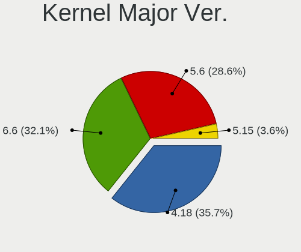
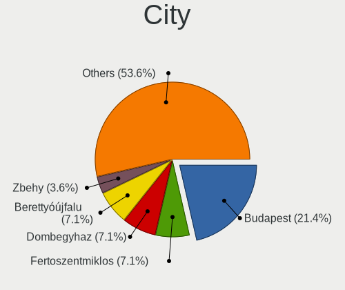
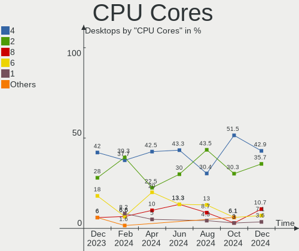
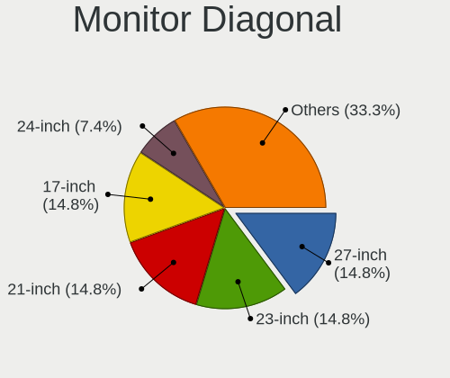
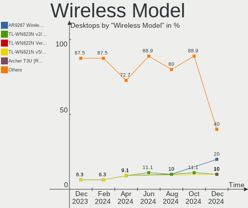
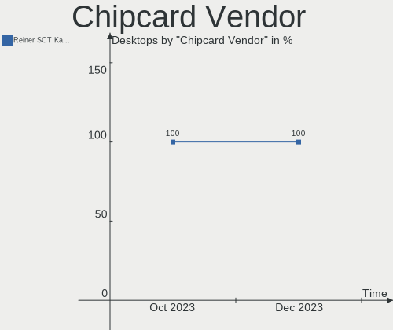

BlackPanther - Hardware Trends (Desktops)
-----------------------------------------

A project to identify most popular hardware characteristics and track their change
over time based on data collected by Linux users at https://Linux-Hardware.org.

Anyone can contribute to this report by the [hw-probe](https://github.com/linuxhw/hw-probe) tool:

    sudo -E hw-probe -all -upload

This report is for one last month. Overall report since the beginning of time: [TestDays](https://github.com/linuxhw/TestDays)

Period: Dec, 2023.

Contents
--------

* [ System ](#system)
  - [ OS                       ](#os)
  - [ OS Family                ](#os-family)
  - [ Kernel                   ](#kernel)
  - [ Kernel Family            ](#kernel-family)
  - [ Kernel Major Ver.        ](#kernel-major-ver)
  - [ Arch                     ](#arch)
  - [ DE                       ](#de)
  - [ Display Server           ](#display-server)
  - [ Display Manager          ](#display-manager)
  - [ OS Lang                  ](#os-lang)
  - [ Boot Mode                ](#boot-mode)
  - [ Filesystem               ](#filesystem)
  - [ Part. scheme             ](#part-scheme)
  - [ Dual Boot with Linux/BSD ](#dual-boot-with-linuxbsd)
  - [ Dual Boot (Win)          ](#dual-boot-win)

* [ Board ](#board)
  - [ Vendor                   ](#vendor)
  - [ Model                    ](#model)
  - [ Model Family             ](#model-family)
  - [ MFG Year                 ](#mfg-year)
  - [ Form Factor              ](#form-factor)
  - [ Secure Boot              ](#secure-boot)
  - [ Coreboot                 ](#coreboot)
  - [ RAM Size                 ](#ram-size)
  - [ RAM Used                 ](#ram-used)
  - [ Total Drives             ](#total-drives)
  - [ Has CD-ROM               ](#has-cd-rom)
  - [ Has Ethernet             ](#has-ethernet)
  - [ Has WiFi                 ](#has-wifi)
  - [ Has Bluetooth            ](#has-bluetooth)

* [ Location ](#location)
  - [ Country                  ](#country)
  - [ City                     ](#city)

* [ Drives ](#drives)
  - [ Drive Vendor             ](#drive-vendor)
  - [ Drive Model              ](#drive-model)
  - [ HDD Vendor               ](#hdd-vendor)
  - [ SSD Vendor               ](#ssd-vendor)
  - [ Drive Kind               ](#drive-kind)
  - [ Drive Connector          ](#drive-connector)
  - [ Drive Size               ](#drive-size)
  - [ Space Total              ](#space-total)
  - [ Space Used               ](#space-used)
  - [ Malfunc. Drives          ](#malfunc-drives)
  - [ Malfunc. Drive Vendor    ](#malfunc-drive-vendor)
  - [ Malfunc. HDD Vendor      ](#malfunc-hdd-vendor)
  - [ Malfunc. Drive Kind      ](#malfunc-drive-kind)
  - [ Failed Drives            ](#failed-drives)
  - [ Failed Drive Vendor      ](#failed-drive-vendor)
  - [ Drive Status             ](#drive-status)

* [ Storage controller ](#storage-controller)
  - [ Storage Vendor           ](#storage-vendor)
  - [ Storage Model            ](#storage-model)
  - [ Storage Kind             ](#storage-kind)

* [ Processor ](#processor)
  - [ CPU Vendor               ](#cpu-vendor)
  - [ CPU Model                ](#cpu-model)
  - [ CPU Model Family         ](#cpu-model-family)
  - [ CPU Cores                ](#cpu-cores)
  - [ CPU Sockets              ](#cpu-sockets)
  - [ CPU Threads              ](#cpu-threads)
  - [ CPU Op-Modes             ](#cpu-op-modes)
  - [ CPU Microcode            ](#cpu-microcode)
  - [ CPU Microarch            ](#cpu-microarch)

* [ Graphics ](#graphics)
  - [ GPU Vendor               ](#gpu-vendor)
  - [ GPU Model                ](#gpu-model)
  - [ GPU Combo                ](#gpu-combo)
  - [ GPU Driver               ](#gpu-driver)
  - [ GPU Memory               ](#gpu-memory)

* [ Monitor ](#monitor)
  - [ Monitor Vendor           ](#monitor-vendor)
  - [ Monitor Model            ](#monitor-model)
  - [ Monitor Resolution       ](#monitor-resolution)
  - [ Monitor Diagonal         ](#monitor-diagonal)
  - [ Monitor Width            ](#monitor-width)
  - [ Aspect Ratio             ](#aspect-ratio)
  - [ Monitor Area             ](#monitor-area)
  - [ Pixel Density            ](#pixel-density)
  - [ Multiple Monitors        ](#multiple-monitors)

* [ Network ](#network)
  - [ Net Controller Vendor    ](#net-controller-vendor)
  - [ Net Controller Model     ](#net-controller-model)
  - [ Wireless Vendor          ](#wireless-vendor)
  - [ Wireless Model           ](#wireless-model)
  - [ Ethernet Vendor          ](#ethernet-vendor)
  - [ Ethernet Model           ](#ethernet-model)
  - [ Net Controller Kind      ](#net-controller-kind)
  - [ Used Controller          ](#used-controller)
  - [ NICs                     ](#nics)
  - [ IPv6                     ](#ipv6)

* [ Bluetooth ](#bluetooth)
  - [ Bluetooth Vendor         ](#bluetooth-vendor)
  - [ Bluetooth Model          ](#bluetooth-model)

* [ Sound ](#sound)
  - [ Sound Vendor             ](#sound-vendor)
  - [ Sound Model              ](#sound-model)

* [ Memory ](#memory)
  - [ Memory Vendor            ](#memory-vendor)
  - [ Memory Model             ](#memory-model)
  - [ Memory Kind              ](#memory-kind)
  - [ Memory Form Factor       ](#memory-form-factor)
  - [ Memory Size              ](#memory-size)
  - [ Memory Speed             ](#memory-speed)

* [ Printers & scanners ](#printers--scanners)
  - [ Printer Vendor           ](#printer-vendor)
  - [ Printer Model            ](#printer-model)
  - [ Scanner Vendor           ](#scanner-vendor)
  - [ Scanner Model            ](#scanner-model)

* [ Camera ](#camera)
  - [ Camera Vendor            ](#camera-vendor)
  - [ Camera Model             ](#camera-model)

* [ Security ](#security)
  - [ Fingerprint Vendor       ](#fingerprint-vendor)
  - [ Fingerprint Model        ](#fingerprint-model)
  - [ Chipcard Vendor          ](#chipcard-vendor)
  - [ Chipcard Model           ](#chipcard-model)

* [ Unsupported ](#unsupported)
  - [ Unsupported Devices      ](#unsupported-devices)
  - [ Unsupported Device Types ](#unsupported-device-types)

System
------

OS
--

Installed operating systems

| Name              | Desktops | Percent |
|-------------------|----------|---------|
| BlackPanther 18.1 | 47       | 94%     |
| BlackPanther 22.1 | 3        | 6%      |

OS Family
---------

OS without a version

| Name         | Desktops | Percent |
|--------------|----------|---------|
| BlackPanther | 50       | 100%    |

Kernel
------

Version of the Linux kernel

| Version             | Desktops | Percent |
|---------------------|----------|---------|
| 5.6.14-desktop-2bP  | 21       | 42%     |
| 5.15.85-desktop-1bP | 18       | 36%     |
| 4.18.16-desktop-1bP | 6        | 12%     |
| 6.3.8-desktop-1bP   | 2        | 4%      |
| 6.7.0-rc4-tkg-eevdf | 1        | 2%      |
| 6.3.3-desktop-1bP   | 1        | 2%      |
| 6.2.9-desktop-1bP   | 1        | 2%      |

Kernel Family
-------------

Linux kernel without a distro release

| Version | Desktops | Percent |
|---------|----------|---------|
| 5.6.14  | 21       | 42%     |
| 5.15.85 | 18       | 36%     |
| 4.18.16 | 6        | 12%     |
| 6.3.8   | 2        | 4%      |
| 6.7.0   | 1        | 2%      |
| 6.3.3   | 1        | 2%      |
| 6.2.9   | 1        | 2%      |

Kernel Major Ver.
-----------------

Linux kernel major version

| Version | Desktops | Percent |
|---------|----------|---------|
| 5.6     | 21       | 42%     |
| 5.15    | 18       | 36%     |
| 4.18    | 6        | 12%     |
| 6.3     | 3        | 6%      |
| 6.7     | 1        | 2%      |
| 6.2     | 1        | 2%      |

Arch
----

OS architecture (x86_64, i586, etc.)

| Name   | Desktops | Percent |
|--------|----------|---------|
| x86_64 | 50       | 100%    |

DE
--

Desktop Environment

| Name    | Desktops | Percent |
|---------|----------|---------|
| KDE5    | 48       | 96%     |
| Unknown | 2        | 4%      |

Display Server
--------------

X11 or Wayland

| Name    | Desktops | Percent |
|---------|----------|---------|
| X11     | 49       | 98%     |
| Wayland | 1        | 2%      |

Display Manager
---------------

SDDM, LightDM, etc.

| Name | Desktops | Percent |
|------|----------|---------|
| SDDM | 50       | 100%    |

OS Lang
-------

Language

| Lang    | Desktops | Percent |
|---------|----------|---------|
| Unknown | 50       | 100%    |

Boot Mode
---------

EFI or BIOS

| Mode | Desktops | Percent |
|------|----------|---------|
| BIOS | 30       | 60%     |
| EFI  | 20       | 40%     |

Filesystem
----------

Type of filesystem

| Type    | Desktops | Percent |
|---------|----------|---------|
| Ext4    | 29       | 58%     |
| Overlay | 21       | 42%     |

Part. scheme
------------

Scheme of partitioning

| Type | Desktops | Percent |
|------|----------|---------|
| GPT  | 27       | 54%     |
| MBR  | 23       | 46%     |

Dual Boot with Linux/BSD
------------------------

Hosting more than one Linux/BSD

| Dual boot | Desktops | Percent |
|-----------|----------|---------|
| No        | 30       | 60%     |
| Yes       | 20       | 40%     |

Dual Boot (Win)
---------------

Hosting Linux and Windows

| Dual boot | Desktops | Percent |
|-----------|----------|---------|
| Yes       | 27       | 54%     |
| No        | 23       | 46%     |

Board
-----

Vendor
------

Motherboard manufacturer

| Name                | Desktops | Percent |
|---------------------|----------|---------|
| Gigabyte Technology | 19       | 38%     |
| ASUSTek Computer    | 8        | 16%     |
| Hewlett-Packard     | 5        | 10%     |
| Fujitsu             | 5        | 10%     |
| ASRock              | 4        | 8%      |
| MSI                 | 3        | 6%      |
| Lenovo              | 3        | 6%      |
| Dell                | 2        | 4%      |
| Medion              | 1        | 2%      |

Model
-----

Motherboard model

| Name                                | Desktops | Percent |
|-------------------------------------|----------|---------|
| Gigabyte Z390 UD                    | 3        | 6%      |
| Lenovo ThinkStation P520 30BFS44D04 | 2        | 4%      |
| Fujitsu ESPRIMO P920                | 2        | 4%      |
| MSI MS-7C52                         | 1        | 2%      |
| MSI MS-7996                         | 1        | 2%      |
| MSI MS-7519                         | 1        | 2%      |
| Medion MS-7748                      | 1        | 2%      |
| Lenovo ThinkCentre M93p 10A7003AUK  | 1        | 2%      |
| HP Z400 Workstation                 | 1        | 2%      |
| HP Compaq Pro 6300 SFF              | 1        | 2%      |
| HP Compaq dc7900 Ultra-Slim Desktop | 1        | 2%      |
| HP Compaq 8200 Elite MT PC          | 1        | 2%      |
| HP Compaq 6200 Pro MT PC            | 1        | 2%      |
| Gigabyte X570 AORUS XTREME          | 1        | 2%      |
| Gigabyte X570 AORUS ELITE           | 1        | 2%      |
| Gigabyte P67A-D3-B3                 | 1        | 2%      |
| Gigabyte P35-DS3R                   | 1        | 2%      |
| Gigabyte H97-D3H                    | 1        | 2%      |
| Gigabyte H61MA-D3V                  | 1        | 2%      |
| Gigabyte H61M-S2PV                  | 1        | 2%      |
| Gigabyte H61M-S1                    | 1        | 2%      |
| Gigabyte H310M A 2.0                | 1        | 2%      |
| Gigabyte G31M-ES2C                  | 1        | 2%      |
| Gigabyte F2A88XM-HD3                | 1        | 2%      |
| Gigabyte EP31-DS3L                  | 1        | 2%      |
| Gigabyte B660M GAMING DDR4          | 1        | 2%      |
| Gigabyte B450M GAMING               | 1        | 2%      |
| Gigabyte AB350M-DS3H V2             | 1        | 2%      |
| Gigabyte A520M S2H                  | 1        | 2%      |
| Fujitsu ESPRIMO E7935               | 1        | 2%      |
| Fujitsu ESPRIMO E520                | 1        | 2%      |
| Fujitsu CELSIUS M470                | 1        | 2%      |
| Dell OptiPlex 755                   | 1        | 2%      |
| Dell OptiPlex 745                   | 1        | 2%      |
| ASUS Pro WS X570-ACE                | 1        | 2%      |
| ASUS PRIME B365M-A                  | 1        | 2%      |
| ASUS PRIME A320M-R                  | 1        | 2%      |
| ASUS M5A97 EVO R2.0                 | 1        | 2%      |
| ASUS M5A78L-M PLUS/USB3             | 1        | 2%      |
| ASUS H110M-K                        | 1        | 2%      |

Model Family
------------

Motherboard model prefix

| Name                 | Desktops | Percent |
|----------------------|----------|---------|
| HP Compaq            | 4        | 8%      |
| Fujitsu ESPRIMO      | 4        | 8%      |
| Gigabyte Z390        | 3        | 6%      |
| Lenovo ThinkStation  | 2        | 4%      |
| Gigabyte X570        | 2        | 4%      |
| Dell OptiPlex        | 2        | 4%      |
| ASUS PRIME           | 2        | 4%      |
| MSI MS-7C52          | 1        | 2%      |
| MSI MS-7996          | 1        | 2%      |
| MSI MS-7519          | 1        | 2%      |
| Medion MS-7748       | 1        | 2%      |
| Lenovo ThinkCentre   | 1        | 2%      |
| HP Z400              | 1        | 2%      |
| Gigabyte P67A-D3-B3  | 1        | 2%      |
| Gigabyte P35-DS3R    | 1        | 2%      |
| Gigabyte H97-D3H     | 1        | 2%      |
| Gigabyte H61MA-D3V   | 1        | 2%      |
| Gigabyte H61M-S2PV   | 1        | 2%      |
| Gigabyte H61M-S1     | 1        | 2%      |
| Gigabyte H310M       | 1        | 2%      |
| Gigabyte G31M-ES2C   | 1        | 2%      |
| Gigabyte F2A88XM-HD3 | 1        | 2%      |
| Gigabyte EP31-DS3L   | 1        | 2%      |
| Gigabyte B660M       | 1        | 2%      |
| Gigabyte B450M       | 1        | 2%      |
| Gigabyte AB350M-DS3H | 1        | 2%      |
| Gigabyte A520M       | 1        | 2%      |
| Fujitsu CELSIUS      | 1        | 2%      |
| ASUS Pro             | 1        | 2%      |
| ASUS M5A97           | 1        | 2%      |
| ASUS M5A78L-M        | 1        | 2%      |
| ASUS H110M-K         | 1        | 2%      |
| ASUS H110M-A         | 1        | 2%      |
| ASUS All             | 1        | 2%      |
| ASRock X370          | 1        | 2%      |
| ASRock H310CM-DVS    | 1        | 2%      |
| ASRock B550M         | 1        | 2%      |
| ASRock 960GC-GS      | 1        | 2%      |

MFG Year
--------

Motherboard manufacture year

| Year | Desktops | Percent |
|------|----------|---------|
| 2018 | 7        | 14%     |
| 2013 | 6        | 12%     |
| 2019 | 5        | 10%     |
| 2012 | 5        | 10%     |
| 2010 | 5        | 10%     |
| 2011 | 4        | 8%      |
| 2020 | 3        | 6%      |
| 2015 | 3        | 6%      |
| 2008 | 3        | 6%      |
| 2007 | 3        | 6%      |
| 2014 | 2        | 4%      |
| 2021 | 1        | 2%      |
| 2017 | 1        | 2%      |
| 2016 | 1        | 2%      |
| 2009 | 1        | 2%      |

Form Factor
-----------

Physical design of the computer

| Name    | Desktops | Percent |
|---------|----------|---------|
| Desktop | 50       | 100%    |

Secure Boot
-----------

Enabled or disabled

| State    | Desktops | Percent |
|----------|----------|---------|
| Disabled | 50       | 100%    |

Coreboot
--------

Have coreboot on board

| Used | Desktops | Percent |
|------|----------|---------|
| No   | 50       | 100%    |

RAM Size
--------

Total RAM memory

| Size in GB | Desktops | Percent |
|------------|----------|---------|
| 8.01-16.0  | 19       | 38%     |
| 16.01-24.0 | 9        | 18%     |
| 4.01-8.0   | 8        | 16%     |
| 3.01-4.0   | 7        | 14%     |
| 32.01-64.0 | 6        | 12%     |
| 24.01-32.0 | 1        | 2%      |

RAM Used
--------

Used RAM memory

| Used GB   | Desktops | Percent |
|-----------|----------|---------|
| 1.01-2.0  | 18       | 36%     |
| 0.51-1.0  | 18       | 36%     |
| 0.01-0.5  | 9        | 18%     |
| 2.01-3.0  | 3        | 6%      |
| 3.01-4.0  | 1        | 2%      |
| 8.01-16.0 | 1        | 2%      |

Total Drives
------------

Number of drives on board

| Drives | Desktops | Percent |
|--------|----------|---------|
| 1      | 19       | 38%     |
| 3      | 13       | 26%     |
| 2      | 11       | 22%     |
| 5      | 3        | 6%      |
| 4      | 3        | 6%      |
| 6      | 1        | 2%      |

Has CD-ROM
----------

Has CD-ROM on board

| Presented | Desktops | Percent |
|-----------|----------|---------|
| Yes       | 33       | 66%     |
| No        | 17       | 34%     |

Has Ethernet
------------

Has Ethernet on board

| Presented | Desktops | Percent |
|-----------|----------|---------|
| Yes       | 50       | 100%    |

Has WiFi
--------

Has WiFi module

| Presented | Desktops | Percent |
|-----------|----------|---------|
| No        | 36       | 72%     |
| Yes       | 14       | 28%     |

Has Bluetooth
-------------

Has Bluetooth module

| Presented | Desktops | Percent |
|-----------|----------|---------|
| No        | 42       | 84%     |
| Yes       | 8        | 16%     |

Location
--------

Country
-------

Geographic location (country)

| Country  | Desktops | Percent |
|----------|----------|---------|
| Hungary  | 43       | 86%     |
| Germany  | 3        | 6%      |
| Slovakia | 1        | 2%      |
| Greece   | 1        | 2%      |
| France   | 1        | 2%      |
| Austria  | 1        | 2%      |

City
----

Geographic location (city)

| City                    | Desktops | Percent |
|-------------------------|----------|---------|
| Budapest                | 11       | 22%     |
| Csongrad                | 4        | 8%      |
| Pfaffenhofen an der Ilm | 3        | 6%      |
| Győr                   | 3        | 6%      |
| Zalaegerszeg            | 2        | 4%      |
| Tatabánya              | 2        | 4%      |
| Pécs                   | 2        | 4%      |
| Veszprém               | 1        | 2%      |
| Szolnok                 | 1        | 2%      |
| Szekszárd              | 1        | 2%      |
| Szeghalom               | 1        | 2%      |
| Szeged                  | 1        | 2%      |
| Siófok                 | 1        | 2%      |
| Oroshaza                | 1        | 2%      |
| Nancy                   | 1        | 2%      |
| Nadudvar                | 1        | 2%      |
| Miskolc                 | 1        | 2%      |
| Lučenec                | 1        | 2%      |
| Kiskunhalas             | 1        | 2%      |
| Kastoria                | 1        | 2%      |
| Kaposvár               | 1        | 2%      |
| Hodmezovasarhely        | 1        | 2%      |
| Graz                    | 1        | 2%      |
| Fertoszentmiklos        | 1        | 2%      |
| Dunaharaszti            | 1        | 2%      |
| Debrecen                | 1        | 2%      |
| Celldomolk              | 1        | 2%      |
| Biatorbagy              | 1        | 2%      |
| Balatonfuered           | 1        | 2%      |
| Agfalva                 | 1        | 2%      |

Drives
------

Drive Vendor
------------

Hard drive vendors

| Vendor                    | Desktops | Drives | Percent |
|---------------------------|----------|--------|---------|
| WDC                       | 19       | 22     | 19%     |
| Samsung Electronics       | 19       | 25     | 19%     |
| Kingston                  | 15       | 17     | 15%     |
| Toshiba                   | 7        | 8      | 7%      |
| Seagate                   | 5        | 6      | 5%      |
| SanDisk                   | 5        | 5      | 5%      |
| Intenso                   | 4        | 4      | 4%      |
| XPG                       | 3        | 4      | 3%      |
| HGST                      | 3        | 5      | 3%      |
| Gigabyte Technology       | 3        | 3      | 3%      |
| SPCC                      | 2        | 2      | 2%      |
| Patriot                   | 2        | 2      | 2%      |
| Hitachi                   | 2        | 3      | 2%      |
| Zheino                    | 1        | 1      | 1%      |
| Unknown                   | 1        | 2      | 1%      |
| PNY                       | 1        | 1      | 1%      |
| Micron/Crucial Technology | 1        | 1      | 1%      |
| Kingmax                   | 1        | 1      | 1%      |
| Intel                     | 1        | 1      | 1%      |
| Fujitsu                   | 1        | 1      | 1%      |
| Corsair                   | 1        | 1      | 1%      |
| China                     | 1        | 1      | 1%      |
| Apacer                    | 1        | 1      | 1%      |
| A-DATA Technology         | 1        | 1      | 1%      |

Drive Model
-----------

Hard drive models

| Model                                | Desktops | Percent |
|--------------------------------------|----------|---------|
| WDC WD5000AAKS-007AA0 500GB          | 3        | 2.63%   |
| Toshiba DT01ACA100 1TB               | 3        | 2.63%   |
| SanDisk SDSSDH3512G 512GB            | 3        | 2.63%   |
| Kingston SA400S37480G 480GB SSD      | 3        | 2.63%   |
| Intenso Portable SSD 128GB           | 3        | 2.63%   |
| XPG SPECTRIX S40G 1TB                | 2        | 1.75%   |
| WDC WD5000AAKS-00UU3A0 500GB         | 2        | 1.75%   |
| Samsung SSD 870 EVO 250GB            | 2        | 1.75%   |
| Samsung MZNLF128HCHP-000H1 128GB SSD | 2        | 1.75%   |
| Kingston SV300S37A120G 120GB SSD     | 2        | 1.75%   |
| Kingston SUV400S37120G 120GB SSD     | 2        | 1.75%   |
| Kingston SKC600256G 256GB SSD        | 2        | 1.75%   |
| Kingston SA400S37240G 240GB SSD      | 2        | 1.75%   |
| Kingston SA400S37120G 120GB SSD      | 2        | 1.75%   |
| Hitachi HDS721050CLA662 500GB        | 2        | 1.75%   |
| HGST HMS5C4040BLE640 4TB             | 2        | 1.75%   |
| Gigabyte GP-GSTFS31120GNTD 120GB     | 2        | 1.75%   |
| Zheino CHN-NGFFNV2280-256 256GB      | 1        | 0.88%   |
| XPG GAMMIX S11 Pro 256GB             | 1        | 0.88%   |
| WDC WDS240G2G0B-00EPW0 240GB SSD     | 1        | 0.88%   |
| WDC WD5000LPLX-75ZNTT0 500GB         | 1        | 0.88%   |
| WDC WD5000AZRX-00A8LB0 500GB         | 1        | 0.88%   |
| WDC WD40EFAX-68JH4N1 4TB             | 1        | 0.88%   |
| WDC WD3200AAKS-00L9A0 320GB          | 1        | 0.88%   |
| WDC WD30EZRZ-00GXCB0 3TB             | 1        | 0.88%   |
| WDC WD30EZRX-00DC0B0 3TB             | 1        | 0.88%   |
| WDC WD30EFRX-68EUZN0 3TB             | 1        | 0.88%   |
| WDC WD30 PURX-64PFUY0 3TB            | 1        | 0.88%   |
| WDC WD20PURX-64P6ZY0 2TB             | 1        | 0.88%   |
| WDC WD20EZRX-00D8PB0 2TB             | 1        | 0.88%   |
| WDC WD20EZBX-00AYRA0 2TB             | 1        | 0.88%   |
| WDC WD20EARS-00MVWB0 2TB             | 1        | 0.88%   |
| WDC WD2002FAEX-00MJRA0 2TB           | 1        | 0.88%   |
| WDC WD10EZRX-00L4HB0 1TB             | 1        | 0.88%   |
| WDC WD10EZEX-00KUWA0 1TB             | 1        | 0.88%   |
| WDC WD10EARS-00Y5B1 1TB              | 1        | 0.88%   |
| Unknown SD/MMC 2GB                   | 1        | 0.88%   |
| Unknown M.S./M.S.Pro/HG 16GB         | 1        | 0.88%   |
| Toshiba MQ01ABF032 320GB             | 1        | 0.88%   |
| Toshiba MQ01ABB200 2TB               | 1        | 0.88%   |

HDD Vendor
----------

Hard disk drive vendors

| Vendor              | Desktops | Drives | Percent |
|---------------------|----------|--------|---------|
| WDC                 | 18       | 21     | 41.86%  |
| Toshiba             | 7        | 8      | 16.28%  |
| Samsung Electronics | 7        | 7      | 16.28%  |
| Seagate             | 5        | 6      | 11.63%  |
| HGST                | 3        | 5      | 6.98%   |
| Hitachi             | 2        | 3      | 4.65%   |
| Fujitsu             | 1        | 1      | 2.33%   |

SSD Vendor
----------

Solid state drive vendors

| Vendor              | Desktops | Drives | Percent |
|---------------------|----------|--------|---------|
| Kingston            | 13       | 15     | 29.55%  |
| Samsung Electronics | 10       | 12     | 22.73%  |
| SanDisk             | 4        | 4      | 9.09%   |
| Intenso             | 4        | 4      | 9.09%   |
| Patriot             | 2        | 2      | 4.55%   |
| Gigabyte Technology | 2        | 2      | 4.55%   |
| WDC                 | 1        | 1      | 2.27%   |
| SPCC                | 1        | 1      | 2.27%   |
| PNY                 | 1        | 1      | 2.27%   |
| Kingmax             | 1        | 1      | 2.27%   |
| Intel               | 1        | 1      | 2.27%   |
| Corsair             | 1        | 1      | 2.27%   |
| China               | 1        | 1      | 2.27%   |
| Apacer              | 1        | 1      | 2.27%   |
| A-DATA Technology   | 1        | 1      | 2.27%   |

Drive Kind
----------

HDD or SSD

| Kind    | Desktops | Drives | Percent |
|---------|----------|--------|---------|
| SSD     | 36       | 48     | 44.44%  |
| HDD     | 33       | 51     | 40.74%  |
| NVMe    | 11       | 17     | 13.58%  |
| Unknown | 1        | 2      | 1.23%   |

Drive Connector
---------------

SATA, SAS, NVMe, etc.

| Type | Desktops | Drives | Percent |
|------|----------|--------|---------|
| SATA | 48       | 92     | 71.64%  |
| NVMe | 11       | 17     | 16.42%  |
| SAS  | 8        | 9      | 11.94%  |

Drive Size
----------

Size of hard drive

| Size in TB | Desktops | Drives | Percent |
|------------|----------|--------|---------|
| 0.01-0.5   | 41       | 62     | 57.75%  |
| 0.51-1.0   | 17       | 18     | 23.94%  |
| 3.01-4.0   | 6        | 8      | 8.45%   |
| 1.01-2.0   | 4        | 7      | 5.63%   |
| 2.01-3.0   | 3        | 4      | 4.23%   |

Space Total
-----------

Amount of disk space available on the file system

| Size in GB     | Desktops | Percent |
|----------------|----------|---------|
| Unknown        | 20       | 40%     |
| 101-250        | 10       | 20%     |
| 251-500        | 6        | 12%     |
| More than 3000 | 5        | 10%     |
| 51-100         | 4        | 8%      |
| 501-1000       | 3        | 6%      |
| 21-50          | 1        | 2%      |
| 1001-2000      | 1        | 2%      |

Space Used
----------

Amount of used disk space

| Used GB        | Desktops | Percent |
|----------------|----------|---------|
| Unknown        | 20       | 40%     |
| 1-20           | 10       | 20%     |
| 51-100         | 7        | 14%     |
| 21-50          | 4        | 8%      |
| 101-250        | 4        | 8%      |
| More than 3000 | 3        | 6%      |
| 251-500        | 1        | 2%      |
| 1001-2000      | 1        | 2%      |

Malfunc. Drives
---------------

Drive models with a malfunction

| Model                                            | Desktops | Drives | Percent |
|--------------------------------------------------|----------|--------|---------|
| WDC WD5000AAKS-007AA0 500GB                      | 3        | 3      | 14.29%  |
| WDC WD3200AAKS-00L9A0 320GB                      | 1        | 1      | 4.76%   |
| WDC WD20PURX-64P6ZY0 2TB                         | 1        | 1      | 4.76%   |
| WDC WD20EARS-00MVWB0 2TB                         | 1        | 1      | 4.76%   |
| WDC WD10EARS-00Y5B1 1TB                          | 1        | 1      | 4.76%   |
| Toshiba MQ01ABB200 2TB                           | 1        | 1      | 4.76%   |
| Toshiba MK3259GSX 320GB                          | 1        | 1      | 4.76%   |
| Toshiba DT01ACA100 1TB                           | 1        | 1      | 4.76%   |
| Seagate ST9320320AS 320GB                        | 1        | 1      | 4.76%   |
| Seagate ST9160310AS 160GB                        | 1        | 1      | 4.76%   |
| Samsung Electronics SP2504C 250GB                | 1        | 1      | 4.76%   |
| Samsung Electronics MZ7LN256HMJP-000H1 256GB SSD | 1        | 1      | 4.76%   |
| Samsung Electronics HD103UJ 1TB                  | 1        | 1      | 4.76%   |
| Samsung Electronics HD103SJ 1TB                  | 1        | 1      | 4.76%   |
| Kingston SUV400S37120G 120GB SSD                 | 1        | 1      | 4.76%   |
| Kingston SA400S37480G 480GB SSD                  | 1        | 1      | 4.76%   |
| Intel SSDSC2BF180A4H 180GB                       | 1        | 1      | 4.76%   |
| Hitachi HTS545050A7E380 500GB                    | 1        | 1      | 4.76%   |
| Hitachi HDS721050CLA662 500GB                    | 1        | 1      | 4.76%   |

Malfunc. Drive Vendor
---------------------

Vendors of faulty drives

| Vendor              | Desktops | Drives | Percent |
|---------------------|----------|--------|---------|
| WDC                 | 7        | 7      | 35%     |
| Samsung Electronics | 4        | 4      | 20%     |
| Toshiba             | 2        | 3      | 10%     |
| Seagate             | 2        | 2      | 10%     |
| Kingston            | 2        | 2      | 10%     |
| Hitachi             | 2        | 2      | 10%     |
| Intel               | 1        | 1      | 5%      |

Malfunc. HDD Vendor
-------------------

Vendors of faulty HDD drives

| Vendor              | Desktops | Drives | Percent |
|---------------------|----------|--------|---------|
| WDC                 | 7        | 7      | 43.75%  |
| Samsung Electronics | 3        | 3      | 18.75%  |
| Toshiba             | 2        | 3      | 12.5%   |
| Seagate             | 2        | 2      | 12.5%   |
| Hitachi             | 2        | 2      | 12.5%   |

Malfunc. Drive Kind
-------------------

Kinds of faulty drives

| Kind | Desktops | Drives | Percent |
|------|----------|--------|---------|
| HDD  | 12       | 17     | 75%     |
| SSD  | 4        | 4      | 25%     |

Failed Drives
-------------

Failed drive models

Zero info for selected period =(

Failed Drive Vendor
-------------------

Failed drive vendors

Zero info for selected period =(

Drive Status
------------

Number of failed and malfunc. drives

| Status   | Desktops | Drives | Percent |
|----------|----------|--------|---------|
| Works    | 47       | 90     | 68.12%  |
| Malfunc  | 16       | 21     | 23.19%  |
| Detected | 6        | 7      | 8.7%    |

Storage controller
------------------

Storage Vendor
--------------

Storage controller vendors

| Vendor                      | Desktops | Percent |
|-----------------------------|----------|---------|
| Intel                       | 35       | 52.24%  |
| AMD                         | 15       | 22.39%  |
| Samsung Electronics         | 3        | 4.48%   |
| Realtek Semiconductor       | 2        | 2.99%   |
| Kingston Technology Company | 2        | 2.99%   |
| JMicron Technology          | 2        | 2.99%   |
| ASMedia Technology          | 2        | 2.99%   |
| Silicon Motion              | 1        | 1.49%   |
| SanDisk                     | 1        | 1.49%   |
| Phison Electronics          | 1        | 1.49%   |
| Micron/Crucial Technology   | 1        | 1.49%   |
| Marvell Technology Group    | 1        | 1.49%   |
| ADATA Technology            | 1        | 1.49%   |

Storage Model
-------------

Storage controller models

| Model                                                                                   | Desktops | Percent |
|-----------------------------------------------------------------------------------------|----------|---------|
| AMD FCH SATA Controller [AHCI mode]                                                     | 9        | 10.59%  |
| Intel 8 Series/C220 Series Chipset Family 6-port SATA Controller 1 [AHCI mode]          | 5        | 5.88%   |
| Intel 6 Series/C200 Series Chipset Family Desktop SATA Controller (IDE mode, ports 4-5) | 5        | 5.88%   |
| Intel 6 Series/C200 Series Chipset Family Desktop SATA Controller (IDE mode, ports 0-3) | 5        | 5.88%   |
| Intel 200 Series PCH SATA controller [AHCI mode]                                        | 5        | 5.88%   |
| Intel Q170/Q150/B150/H170/H110/Z170/CM236 Chipset SATA Controller [AHCI Mode]           | 3        | 3.53%   |
| Intel Cannon Lake PCH SATA AHCI Controller                                              | 3        | 3.53%   |
| Samsung NVMe SSD Controller SM981/PM981/PM983                                           | 2        | 2.35%   |
| Realtek RTS5762 NVMe SSD Controller                                                     | 2        | 2.35%   |
| Intel NM10/ICH7 Family SATA Controller [IDE mode]                                       | 2        | 2.35%   |
| Intel 82801JI (ICH10 Family) SATA AHCI Controller                                       | 2        | 2.35%   |
| Intel 4 Series Chipset PT IDER Controller                                               | 2        | 2.35%   |
| ASMedia ASM1062 Serial ATA Controller                                                   | 2        | 2.35%   |
| AMD SB7x0/SB8x0/SB9x0 SATA Controller [AHCI mode]                                       | 2        | 2.35%   |
| AMD SB7x0/SB8x0/SB9x0 IDE Controller                                                    | 2        | 2.35%   |
| AMD FCH SATA Controller D                                                               | 2        | 2.35%   |
| AMD 500 Series Chipset SATA Controller                                                  | 2        | 2.35%   |
| Silicon Motion SM2263EN/SM2263XT (DRAM-less) NVMe SSD Controllers                       | 1        | 1.18%   |
| SanDisk WD Blue SN570 NVMe SSD 2TB                                                      | 1        | 1.18%   |
| Samsung NVMe SSD Controller PM9A1/PM9A3/980PRO                                          | 1        | 1.18%   |
| Phison E16 PCIe4 NVMe Controller                                                        | 1        | 1.18%   |
| Micron/Crucial P1 NVMe PCIe SSD[Frampton2]                                              | 1        | 1.18%   |
| Marvell Group 88SE9172 SATA III 6Gb/s RAID Controller                                   | 1        | 1.18%   |
| Kingston Company NV2 NVMe SSD SM2267XT                                                  | 1        | 1.18%   |
| Kingston Company NV1 NVMe SSD E13T                                                      | 1        | 1.18%   |
| JMicron JMB368 IDE controller                                                           | 1        | 1.18%   |
| JMicron JMB363 SATA/IDE Controller                                                      | 1        | 1.18%   |
| Intel SATA Controller [RAID mode]                                                       | 1        | 1.18%   |
| Intel Alder Lake-S PCH SATA Controller [AHCI Mode]                                      | 1        | 1.18%   |
| Intel 9 Series Chipset Family SATA Controller [AHCI Mode]                               | 1        | 1.18%   |
| Intel 82Q35 Express PT IDER Controller                                                  | 1        | 1.18%   |
| Intel 82801JD/DO (ICH10 Family) SATA AHCI Controller                                    | 1        | 1.18%   |
| Intel 82801JD/DO (ICH10 Family) 4-port SATA IDE Controller                              | 1        | 1.18%   |
| Intel 82801JD/DO (ICH10 Family) 2-port SATA IDE Controller                              | 1        | 1.18%   |
| Intel 82801IR/IO/IH (ICH9R/DO/DH) 6 port SATA Controller [AHCI mode]                    | 1        | 1.18%   |
| Intel 82801IR/IO/IH (ICH9R/DO/DH) 4 port SATA Controller [IDE mode]                     | 1        | 1.18%   |
| Intel 82801I (ICH9 Family) 2 port SATA Controller [IDE mode]                            | 1        | 1.18%   |
| Intel 82801HR/HO/HH (ICH8R/DO/DH) 2 port SATA Controller [IDE mode]                     | 1        | 1.18%   |
| Intel 82801H (ICH8 Family) 4 port SATA Controller [IDE mode]                            | 1        | 1.18%   |
| Intel 7 Series/C210 Series Chipset Family 6-port SATA Controller [AHCI mode]            | 1        | 1.18%   |

Storage Kind
------------

Kind of storage controller (IDE, SATA, NVMe, SAS, ...)

| Kind | Desktops | Percent |
|------|----------|---------|
| SATA | 39       | 59.09%  |
| IDE  | 15       | 22.73%  |
| NVMe | 11       | 16.67%  |
| RAID | 1        | 1.52%   |

Processor
---------

CPU Vendor
----------

Processor vendors

| Vendor | Desktops | Percent |
|--------|----------|---------|
| Intel  | 35       | 70%     |
| AMD    | 15       | 30%     |

CPU Model
---------

Processor models

| Model                                       | Desktops | Percent |
|---------------------------------------------|----------|---------|
| Intel Core i5-9400 CPU @ 2.90GHz            | 3        | 6%      |
| Intel Xeon W-2135 CPU @ 3.70GHz             | 2        | 4%      |
| Intel Core i7-4790 CPU @ 3.60GHz            | 2        | 4%      |
| Intel Core 2 Quad CPU Q6600 @ 2.40GHz       | 2        | 4%      |
| Intel Core 2 Duo CPU E8400 @ 3.00GHz        | 2        | 4%      |
| AMD Ryzen 9 5950X 16-Core Processor         | 2        | 4%      |
| AMD Ryzen 5 3400G with Radeon Vega Graphics | 2        | 4%      |
| Intel Xeon CPU W3550 @ 3.07GHz              | 1        | 2%      |
| Intel Xeon CPU L5640 @ 2.27GHz              | 1        | 2%      |
| Intel Xeon CPU E5440 @ 2.83GHz              | 1        | 2%      |
| Intel Pentium CPU G4560 @ 3.50GHz           | 1        | 2%      |
| Intel Pentium CPU G3220 @ 3.00GHz           | 1        | 2%      |
| Intel Core i5-9400F CPU @ 2.90GHz           | 1        | 2%      |
| Intel Core i5-7500 CPU @ 3.40GHz            | 1        | 2%      |
| Intel Core i5-6500 CPU @ 3.20GHz            | 1        | 2%      |
| Intel Core i5-4690 CPU @ 3.50GHz            | 1        | 2%      |
| Intel Core i5-4430 CPU @ 3.00GHz            | 1        | 2%      |
| Intel Core i5-3470 CPU @ 3.20GHz            | 1        | 2%      |
| Intel Core i5-2400 CPU @ 3.10GHz            | 1        | 2%      |
| Intel Core i5-2300 CPU @ 2.80GHz            | 1        | 2%      |
| Intel Core i3-9100F CPU @ 3.60GHz           | 1        | 2%      |
| Intel Core i3-8100 CPU @ 3.60GHz            | 1        | 2%      |
| Intel Core i3-4160 CPU @ 3.60GHz            | 1        | 2%      |
| Intel Core i3-3225 CPU @ 3.30GHz            | 1        | 2%      |
| Intel Core i3-3220 CPU @ 3.30GHz            | 1        | 2%      |
| Intel Core i3-2120 CPU @ 3.30GHz            | 1        | 2%      |
| Intel Core i3-2100 CPU @ 3.10GHz            | 1        | 2%      |
| Intel Core 2 Duo CPU E7300 @ 2.66GHz        | 1        | 2%      |
| Intel Core 2 Duo CPU E6750 @ 2.66GHz        | 1        | 2%      |
| Intel Core 2 CPU 4300 @ 1.80GHz             | 1        | 2%      |
| Intel 12th Gen Core i5-12400                | 1        | 2%      |
| AMD Ryzen 7 5700X 8-Core Processor          | 1        | 2%      |
| AMD Ryzen 7 5700G with Radeon Graphics      | 1        | 2%      |
| AMD Ryzen 7 1700X Eight-Core Processor      | 1        | 2%      |
| AMD Ryzen 5 5600G with Radeon Graphics      | 1        | 2%      |
| AMD Ryzen 3 2200G with Radeon Vega Graphics | 1        | 2%      |
| AMD Ryzen 3 1200 Quad-Core Processor        | 1        | 2%      |
| AMD Phenom II X4 840 Processor              | 1        | 2%      |
| AMD FX-6300 Six-Core Processor              | 1        | 2%      |
| AMD Athlon II X2 240e Processor             | 1        | 2%      |

CPU Model Family
----------------

Processor model prefix

| Model             | Desktops | Percent |
|-------------------|----------|---------|
| Intel Core i5     | 11       | 22%     |
| Intel Core i3     | 7        | 14%     |
| Intel Xeon        | 5        | 10%     |
| Intel Core 2 Duo  | 4        | 8%      |
| AMD Ryzen 7       | 3        | 6%      |
| AMD Ryzen 5       | 3        | 6%      |
| Intel Pentium     | 2        | 4%      |
| Intel Core i7     | 2        | 4%      |
| Intel Core 2 Quad | 2        | 4%      |
| AMD Ryzen 9       | 2        | 4%      |
| AMD Ryzen 3       | 2        | 4%      |
| AMD A8            | 2        | 4%      |
| Other             | 1        | 2%      |
| Intel Core 2      | 1        | 2%      |
| AMD Phenom II X4  | 1        | 2%      |
| AMD FX            | 1        | 2%      |
| AMD Athlon II X2  | 1        | 2%      |

CPU Cores
---------

Number of processor cores

| Number | Desktops | Percent |
|--------|----------|---------|
| 4      | 21       | 42%     |
| 2      | 14       | 28%     |
| 6      | 9        | 18%     |
| 8      | 3        | 6%      |
| 16     | 2        | 4%      |
| 3      | 1        | 2%      |

CPU Sockets
-----------

Number of sockets

| Number | Desktops | Percent |
|--------|----------|---------|
| 1      | 50       | 100%    |

CPU Threads
-----------

Threads per core (Hyper-Threading)

| Number | Desktops | Percent |
|--------|----------|---------|
| 1      | 28       | 56%     |
| 2      | 22       | 44%     |

CPU Op-Modes
------------

CPU Operation Modes (32-bit, 64-bit)

| Op mode        | Desktops | Percent |
|----------------|----------|---------|
| 32-bit, 64-bit | 50       | 100%    |

CPU Microcode
-------------

Microcode number

| Number     | Desktops | Percent |
|------------|----------|---------|
| Unknown    | 6        | 12%     |
| 0x206a7    | 4        | 8%      |
| 0x906ea    | 3        | 6%      |
| 0x6fb      | 3        | 6%      |
| 0x306c3    | 3        | 6%      |
| 0x1067a    | 3        | 6%      |
| 0x906eb    | 2        | 4%      |
| 0x906e9    | 2        | 4%      |
| 0x306a9    | 2        | 4%      |
| 0x0a50000c | 2        | 4%      |
| 0x08108109 | 2        | 4%      |
| 0x906ed    | 1        | 2%      |
| 0x90672    | 1        | 2%      |
| 0x6f2      | 1        | 2%      |
| 0x506e3    | 1        | 2%      |
| 0x50654    | 1        | 2%      |
| 0x206c2    | 1        | 2%      |
| 0x106a5    | 1        | 2%      |
| 0x10676    | 1        | 2%      |
| 0x0a20120e | 1        | 2%      |
| 0x0a20120a | 1        | 2%      |
| 0x0a201009 | 1        | 2%      |
| 0x0810100b | 1        | 2%      |
| 0x0800820d | 1        | 2%      |
| 0x08001137 | 1        | 2%      |
| 0x06003106 | 1        | 2%      |
| 0x06000852 | 1        | 2%      |
| 0x03000027 | 1        | 2%      |
| 0x010000c8 | 1        | 2%      |

CPU Microarch
-------------

Microarchitecture

| Name             | Desktops | Percent |
|------------------|----------|---------|
| KabyLake         | 8        | 16%     |
| Haswell          | 6        | 12%     |
| Zen 3            | 5        | 10%     |
| SandyBridge      | 4        | 8%      |
| Penryn           | 4        | 8%      |
| Core             | 4        | 8%      |
| Zen+             | 3        | 6%      |
| Skylake          | 3        | 6%      |
| IvyBridge        | 3        | 6%      |
| Zen              | 2        | 4%      |
| K10              | 2        | 4%      |
| Westmere         | 1        | 2%      |
| Steamroller      | 1        | 2%      |
| Piledriver       | 1        | 2%      |
| Nehalem          | 1        | 2%      |
| K10 Llano        | 1        | 2%      |
| Alderlake Hybrid | 1        | 2%      |

Graphics
--------

GPU Vendor
----------

Vendors of graphics cards

| Vendor | Desktops | Percent |
|--------|----------|---------|
| AMD    | 21       | 36.21%  |
| Nvidia | 20       | 34.48%  |
| Intel  | 17       | 29.31%  |

GPU Model
---------

Graphics card models

| Model                                                                       | Desktops | Percent |
|-----------------------------------------------------------------------------|----------|---------|
| Nvidia GK208B [GeForce GT 710]                                              | 5        | 8.47%   |
| Intel Xeon E3-1200 v3/4th Gen Core Processor Integrated Graphics Controller | 5        | 8.47%   |
| Intel CoffeeLake-S GT2 [UHD Graphics 630]                                   | 4        | 6.78%   |
| AMD Oland PRO [Radeon R7 240/340 / Radeon 520]                              | 3        | 5.08%   |
| AMD Navi 21 [Radeon RX 6800/6800 XT / 6900 XT]                              | 3        | 5.08%   |
| Nvidia GK107 [GeForce GTX 650]                                              | 2        | 3.39%   |
| Nvidia GF108 [GeForce GT 630]                                               | 2        | 3.39%   |
| Intel 4 Series Chipset Integrated Graphics Controller                       | 2        | 3.39%   |
| Intel 2nd Generation Core Processor Family Integrated Graphics Controller   | 2        | 3.39%   |
| AMD Cezanne [Radeon Vega Series / Radeon Vega Mobile Series]                | 2        | 3.39%   |
| AMD Cedar [Radeon HD 5000/6000/7350/8350 Series]                            | 2        | 3.39%   |
| Nvidia TU116 [GeForce GTX 1660 SUPER]                                       | 1        | 1.69%   |
| Nvidia GT218 [GeForce 210]                                                  | 1        | 1.69%   |
| Nvidia GP108 [GeForce GT 1030]                                              | 1        | 1.69%   |
| Nvidia GP107 [GeForce GTX 1050 Ti]                                          | 1        | 1.69%   |
| Nvidia GP106 [GeForce GTX 1060 3GB]                                         | 1        | 1.69%   |
| Nvidia GP104 [GeForce GTX 1080]                                             | 1        | 1.69%   |
| Nvidia GM107 [GeForce GTX 750]                                              | 1        | 1.69%   |
| Nvidia GM107 [GeForce GTX 750 Ti]                                           | 1        | 1.69%   |
| Nvidia GK106GL [Quadro K4000]                                               | 1        | 1.69%   |
| Nvidia GK106 [GeForce GTX 660]                                              | 1        | 1.69%   |
| Nvidia G92 [GeForce GTS 250]                                                | 1        | 1.69%   |
| Intel Alder Lake-S GT1 [UHD Graphics 730]                                   | 1        | 1.69%   |
| Intel 82Q35 Express Integrated Graphics Controller                          | 1        | 1.69%   |
| Intel 82G33/G31 Express Integrated Graphics Controller                      | 1        | 1.69%   |
| Intel 4th Generation Core Processor Family Integrated Graphics Controller   | 1        | 1.69%   |
| AMD Sumo [Radeon HD 6550D]                                                  | 1        | 1.69%   |
| AMD RV620 LE [Radeon HD 3450]                                               | 1        | 1.69%   |
| AMD RS780L [Radeon 3000]                                                    | 1        | 1.69%   |
| AMD Redwood XT [Radeon HD 5670/5690/5730]                                   | 1        | 1.69%   |
| AMD Redwood PRO [Radeon HD 5550/5570/5630/6510/6610/7570]                   | 1        | 1.69%   |
| AMD Pitcairn XT [Radeon HD 7870 GHz Edition]                                | 1        | 1.69%   |
| AMD Picasso/Raven 2 [Radeon Vega Series / Radeon Vega Mobile Series]        | 1        | 1.69%   |
| AMD Navi 22 [Radeon RX 6700/6700 XT/6750 XT / 6800M/6850M XT]               | 1        | 1.69%   |
| AMD Lexa PRO [Radeon 540/540X/550/550X / RX 540X/550/550X]                  | 1        | 1.69%   |
| AMD Kaveri [Radeon R7 Graphics]                                             | 1        | 1.69%   |
| AMD Juniper XT [Radeon HD 6770]                                             | 1        | 1.69%   |
| AMD Baffin [Radeon RX 550 640SP / RX 560/560X]                              | 1        | 1.69%   |

GPU Combo
---------

Combinations of graphics cards

| Name           | Desktops | Percent |
|----------------|----------|---------|
| 1 x Nvidia     | 16       | 32%     |
| 1 x AMD        | 15       | 30%     |
| 1 x Intel      | 11       | 22%     |
| Intel + AMD    | 3        | 6%      |
| Intel + Nvidia | 2        | 4%      |
| AMD + Nvidia   | 2        | 4%      |
| 2 x AMD        | 1        | 2%      |

GPU Driver
----------

Free vs proprietary

| Driver  | Desktops | Percent |
|---------|----------|---------|
| Free    | 48       | 96%     |
| Unknown | 2        | 4%      |

GPU Memory
----------

Total video memory

| Size in GB | Desktops | Percent |
|------------|----------|---------|
| Unknown    | 15       | 30%     |
| 0.51-1.0   | 11       | 22%     |
| 1.01-2.0   | 8        | 16%     |
| 0.01-0.5   | 5        | 10%     |
| 3.01-4.0   | 4        | 8%      |
| 8.01-16.0  | 3        | 6%      |
| 2.01-3.0   | 2        | 4%      |
| 7.01-8.0   | 1        | 2%      |
| 5.01-6.0   | 1        | 2%      |

Monitor
-------

Monitor Vendor
--------------

Monitor vendors

| Vendor               | Desktops | Percent |
|----------------------|----------|---------|
| Samsung Electronics  | 14       | 28%     |
| Goldstar             | 9        | 18%     |
| Ancor Communications | 7        | 14%     |
| AOC                  | 3        | 6%      |
| ViewSonic            | 2        | 4%      |
| LG Electronics       | 2        | 4%      |
| Lenovo               | 2        | 4%      |
| Dell                 | 2        | 4%      |
| BenQ                 | 2        | 4%      |
| Philips              | 1        | 2%      |
| MStar                | 1        | 2%      |
| Medion               | 1        | 2%      |
| Iiyama               | 1        | 2%      |
| Hitachi              | 1        | 2%      |
| Eizo                 | 1        | 2%      |
| CVT                  | 1        | 2%      |

Monitor Model
-------------

Monitor models

| Model                                                                | Desktops | Percent |
|----------------------------------------------------------------------|----------|---------|
| Samsung Electronics LS27AG30x SAM717A 1920x1080 597x336mm 27.0-inch  | 3        | 5.77%   |
| ViewSonic VG2236 SERIES VSCE726 1920x1080 477x268mm 21.5-inch        | 2        | 3.85%   |
| Samsung Electronics S24D330 SAM0D92 1920x1080 531x299mm 24.0-inch    | 2        | 3.85%   |
| Samsung Electronics S22D300 SAM0B3B 1920x1080 477x268mm 21.5-inch    | 2        | 3.85%   |
| AOC Q32G1WG4 AOC3201 2560x1440 697x393mm 31.5-inch                   | 2        | 3.85%   |
| Ancor Communications VC279 ACI27C4 1920x1080 598x336mm 27.0-inch     | 2        | 3.85%   |
| Ancor Communications ASUS VH192 ACI19E4 1366x768 410x230mm 18.5-inch | 2        | 3.85%   |
| Samsung Electronics SyncMaster SAM02DB 1680x1050 474x296mm 22.0-inch | 1        | 1.92%   |
| Samsung Electronics SyncMaster SAM01B8 1280x1024 338x270mm 17.0-inch | 1        | 1.92%   |
| Samsung Electronics SyncMaster SAM01B7 1280x1024 340x270mm 17.1-inch | 1        | 1.92%   |
| Samsung Electronics SyncMaster SAM0191 1280x1024 338x270mm 17.0-inch | 1        | 1.92%   |
| Samsung Electronics S27E500 SAM0D0D 1920x1080 598x336mm 27.0-inch    | 1        | 1.92%   |
| Samsung Electronics S24R35x SAM100E 1920x1080 527x296mm 23.8-inch    | 1        | 1.92%   |
| Samsung Electronics S24A31x SAM7114 1920x1080 527x296mm 23.8-inch    | 1        | 1.92%   |
| Philips 196V4 PHLC0AF 1366x768 410x230mm 18.5-inch                   | 1        | 1.92%   |
| MStar TV MST0030 1920x1080 708x398mm 32.0-inch                       | 1        | 1.92%   |
| Medion MD20328 MED3941 1600x900 462x272mm 21.1-inch                  | 1        | 1.92%   |
| LG Electronics LCD Monitor MP59G 1920x1080                           | 1        | 1.92%   |
| LG Electronics LCD Monitor LG TV 1920x1080                           | 1        | 1.92%   |
| Lenovo LEN L192p LEN4BDB 1280x1024 376x301mm 19.0-inch               | 1        | 1.92%   |
| Lenovo LEN L171 LEN24C9 1280x1024 337x270mm 17.0-inch                | 1        | 1.92%   |
| Iiyama PL2474H IVM6146 1920x1080 521x293mm 23.5-inch                 | 1        | 1.92%   |
| Hitachi HDMI HEC0030 1920x1080 1150x650mm 52.0-inch                  | 1        | 1.92%   |
| Goldstar ULTRAWIDE GSM7770 2560x1080 798x334mm 34.1-inch             | 1        | 1.92%   |
| Goldstar ULTRAWIDE GSM76F9 2560x1080 531x298mm 24.0-inch             | 1        | 1.92%   |
| Goldstar MP59G GSM5B35 1920x1080 480x270mm 21.7-inch                 | 1        | 1.92%   |
| Goldstar MP59G GSM5B34 1920x1080 480x270mm 21.7-inch                 | 1        | 1.92%   |
| Goldstar M2280D GSM57B7 1920x1080 477x268mm 21.5-inch                | 1        | 1.92%   |
| Goldstar L1718S GSM443C 1280x1024 338x270mm 17.0-inch                | 1        | 1.92%   |
| Goldstar E2350 GSM5790 1920x1080 510x290mm 23.1-inch                 | 1        | 1.92%   |
| Goldstar 2D FHD TV GSM59C6 1920x1080 509x286mm 23.0-inch             | 1        | 1.92%   |
| Goldstar 24MB56 GSM5A97 1920x1080 477x268mm 21.5-inch                | 1        | 1.92%   |
| Eizo EV2216W ENC2440 1680x1050 474x297mm 22.0-inch                   | 1        | 1.92%   |
| Dell SE2722H DELD115 1920x1080 596x335mm 26.9-inch                   | 1        | 1.92%   |
| Dell S2721DGF DEL41DA 2560x1440 597x336mm 27.0-inch                  | 1        | 1.92%   |
| Dell P2319H DELD0D7 1920x1080 509x286mm 23.0-inch                    | 1        | 1.92%   |
| CVT CVTE TV CVT0003 1360x768 575x323mm 26.0-inch                     | 1        | 1.92%   |
| BenQ G900W BNQ7805 1440x900 408x255mm 18.9-inch                      | 1        | 1.92%   |
| BenQ EW277HDR BNQ7948 1920x1080 598x336mm 27.0-inch                  | 1        | 1.92%   |
| AOC 24B1W AOC2401 1920x1080 521x293mm 23.5-inch                      | 1        | 1.92%   |

Monitor Resolution
------------------

Monitor screen resolution

| Resolution         | Desktops | Percent |
|--------------------|----------|---------|
| 1920x1080 (FHD)    | 27       | 55.1%   |
| 1280x1024 (SXGA)   | 6        | 12.24%  |
| 3840x2160 (4K)     | 4        | 8.16%   |
| 1366x768 (WXGA)    | 3        | 6.12%   |
| 2560x1440 (QHD)    | 2        | 4.08%   |
| 2560x1080          | 2        | 4.08%   |
| 1680x1050 (WSXGA+) | 2        | 4.08%   |
| 1440x900 (WXGA+)   | 2        | 4.08%   |
| 1600x900 (HD+)     | 1        | 2.04%   |

Monitor Diagonal
----------------

Diagonal size in inches

| Inches  | Desktops | Percent |
|---------|----------|---------|
| 27      | 9        | 17.31%  |
| 21      | 9        | 17.31%  |
| 24      | 5        | 9.62%   |
| 23      | 5        | 9.62%   |
| 17      | 5        | 9.62%   |
| 18      | 4        | 7.69%   |
| Unknown | 3        | 5.77%   |
| 34      | 2        | 3.85%   |
| 31      | 2        | 3.85%   |
| 26      | 2        | 3.85%   |
| 22      | 2        | 3.85%   |
| 84      | 1        | 1.92%   |
| 52      | 1        | 1.92%   |
| 20      | 1        | 1.92%   |
| 19      | 1        | 1.92%   |

Monitor Width
-------------

Physical width

| Width in mm | Desktops | Percent |
|-------------|----------|---------|
| 501-600     | 20       | 40.82%  |
| 401-500     | 14       | 28.57%  |
| 301-350     | 5        | 10.2%   |
| Unknown     | 3        | 6.12%   |
| 701-800     | 2        | 4.08%   |
| 601-700     | 2        | 4.08%   |
| 351-400     | 1        | 2.04%   |
| 1501-2000   | 1        | 2.04%   |
| 1001-1500   | 1        | 2.04%   |

Aspect Ratio
------------

Proportional relationship between the width and the height

| Ratio   | Desktops | Percent |
|---------|----------|---------|
| 16/9    | 33       | 67.35%  |
| 5/4     | 6        | 12.24%  |
| 16/10   | 5        | 10.2%   |
| Unknown | 3        | 6.12%   |
| 21/9    | 2        | 4.08%   |

Monitor Area
------------

Area in inch²

| Area in inch² | Desktops | Percent |
|----------------|----------|---------|
| 201-250        | 17       | 32.69%  |
| 301-350        | 10       | 19.23%  |
| 141-150        | 8        | 15.38%  |
| 151-200        | 6        | 11.54%  |
| 351-500        | 4        | 7.69%   |
| Unknown        | 3        | 5.77%   |
| More than 1000 | 2        | 3.85%   |
| 251-300        | 2        | 3.85%   |

Pixel Density
-------------

Pixels per inch

| Density | Desktops | Percent |
|---------|----------|---------|
| 51-100  | 38       | 74.51%  |
| 101-120 | 9        | 17.65%  |
| Unknown | 3        | 5.88%   |
| 1-50    | 1        | 1.96%   |

Multiple Monitors
-----------------

Total monitors connected

| Total | Desktops | Percent |
|-------|----------|---------|
| 1     | 43       | 86%     |
| 2     | 6        | 12%     |
| 0     | 1        | 2%      |

Network
-------

Net Controller Vendor
---------------------

Controller vendors

| Vendor                | Desktops | Percent |
|-----------------------|----------|---------|
| Realtek Semiconductor | 33       | 47.83%  |
| Intel                 | 18       | 26.09%  |
| Ralink Technology     | 4        | 5.8%    |
| TP-Link               | 3        | 4.35%   |
| Qualcomm Atheros      | 3        | 4.35%   |
| Broadcom              | 2        | 2.9%    |
| Ralink                | 1        | 1.45%   |
| Microsoft             | 1        | 1.45%   |
| IMC Networks          | 1        | 1.45%   |
| Huawei Technologies   | 1        | 1.45%   |
| D-Link System         | 1        | 1.45%   |
| Aquantia              | 1        | 1.45%   |

Net Controller Model
--------------------

Controller models

| Model                                                             | Desktops | Percent |
|-------------------------------------------------------------------|----------|---------|
| Realtek RTL8111/8168/8411 PCI Express Gigabit Ethernet Controller | 29       | 40.85%  |
| Ralink MT7601U Wireless Adapter                                   | 4        | 5.63%   |
| Intel I211 Gigabit Network Connection                             | 4        | 5.63%   |
| Intel Ethernet Connection I217-LM                                 | 3        | 4.23%   |
| Intel 82579LM Gigabit Network Connection (Lewisville)             | 3        | 4.23%   |
| Intel Ethernet Connection I217-V                                  | 2        | 2.82%   |
| Intel Ethernet Connection (2) I219-LM                             | 2        | 2.82%   |
| Intel 82567LM-3 Gigabit Network Connection                        | 2        | 2.82%   |
| TP-Link TL-WN821N Version 5 RTL8192EU                             | 1        | 1.41%   |
| TP-Link TL-WN722N v2/v3 [Realtek RTL8188EUS]                      | 1        | 1.41%   |
| TP-Link 802.11ac WLAN Adapter                                     | 1        | 1.41%   |
| Realtek RTL88x2bu [AC1200 Techkey]                                | 1        | 1.41%   |
| Realtek RTL8188EE Wireless Network Adapter                        | 1        | 1.41%   |
| Realtek RTL8169 PCI Gigabit Ethernet Controller                   | 1        | 1.41%   |
| Realtek RTL8125 2.5GbE Controller                                 | 1        | 1.41%   |
| Realtek RTL810xE PCI Express Fast Ethernet controller             | 1        | 1.41%   |
| Ralink RT2561/RT61 802.11g PCI                                    | 1        | 1.41%   |
| Qualcomm Atheros AR9485 Wireless Network Adapter                  | 1        | 1.41%   |
| Qualcomm Atheros AR9287 Wireless Network Adapter (PCI-Express)    | 1        | 1.41%   |
| Qualcomm Atheros AR922X Wireless Network Adapter                  | 1        | 1.41%   |
| Microsoft Xbox Wireless Adapter for Windows                       | 1        | 1.41%   |
| Intel Wi-Fi 6 AX210/AX211/AX411 160MHz                            | 1        | 1.41%   |
| Intel Ethernet Connection (2) I219-V                              | 1        | 1.41%   |
| Intel 82566DM-2 Gigabit Network Connection                        | 1        | 1.41%   |
| IMC Networks Mediao 802.11n WLAN [Realtek RTL8191SU]              | 1        | 1.41%   |
| Huawei MAR-LX1M                                                   | 1        | 1.41%   |
| D-Link System DL10050 Sundance Ethernet                           | 1        | 1.41%   |
| Broadcom NetXtreme BCM5764M Gigabit Ethernet PCIe                 | 1        | 1.41%   |
| Broadcom NetXtreme BCM5754 Gigabit Ethernet PCI Express           | 1        | 1.41%   |
| Aquantia AQC107 NBase-T/IEEE 802.3bz Ethernet Controller [AQtion] | 1        | 1.41%   |

Wireless Vendor
---------------

Wireless vendors

| Vendor                | Desktops | Percent |
|-----------------------|----------|---------|
| Ralink Technology     | 4        | 25%     |
| TP-Link               | 3        | 18.75%  |
| Qualcomm Atheros      | 3        | 18.75%  |
| Realtek Semiconductor | 2        | 12.5%   |
| Ralink                | 1        | 6.25%   |
| Microsoft             | 1        | 6.25%   |
| Intel                 | 1        | 6.25%   |
| IMC Networks          | 1        | 6.25%   |

Wireless Model
--------------

Wireless models

| Model                                                          | Desktops | Percent |
|----------------------------------------------------------------|----------|---------|
| Ralink MT7601U Wireless Adapter                                | 4        | 25%     |
| TP-Link TL-WN821N Version 5 RTL8192EU                          | 1        | 6.25%   |
| TP-Link TL-WN722N v2/v3 [Realtek RTL8188EUS]                   | 1        | 6.25%   |
| TP-Link 802.11ac WLAN Adapter                                  | 1        | 6.25%   |
| Realtek RTL88x2bu [AC1200 Techkey]                             | 1        | 6.25%   |
| Realtek RTL8188EE Wireless Network Adapter                     | 1        | 6.25%   |
| Ralink RT2561/RT61 802.11g PCI                                 | 1        | 6.25%   |
| Qualcomm Atheros AR9485 Wireless Network Adapter               | 1        | 6.25%   |
| Qualcomm Atheros AR9287 Wireless Network Adapter (PCI-Express) | 1        | 6.25%   |
| Qualcomm Atheros AR922X Wireless Network Adapter               | 1        | 6.25%   |
| Microsoft Xbox Wireless Adapter for Windows                    | 1        | 6.25%   |
| Intel Wi-Fi 6 AX210/AX211/AX411 160MHz                         | 1        | 6.25%   |
| IMC Networks Mediao 802.11n WLAN [Realtek RTL8191SU]           | 1        | 6.25%   |

Ethernet Vendor
---------------

Ethernet vendors

| Vendor                | Desktops | Percent |
|-----------------------|----------|---------|
| Realtek Semiconductor | 32       | 58.18%  |
| Intel                 | 18       | 32.73%  |
| Broadcom              | 2        | 3.64%   |
| Huawei Technologies   | 1        | 1.82%   |
| D-Link System         | 1        | 1.82%   |
| Aquantia              | 1        | 1.82%   |

Ethernet Model
--------------

Ethernet models

| Model                                                             | Desktops | Percent |
|-------------------------------------------------------------------|----------|---------|
| Realtek RTL8111/8168/8411 PCI Express Gigabit Ethernet Controller | 29       | 52.73%  |
| Intel I211 Gigabit Network Connection                             | 4        | 7.27%   |
| Intel Ethernet Connection I217-LM                                 | 3        | 5.45%   |
| Intel 82579LM Gigabit Network Connection (Lewisville)             | 3        | 5.45%   |
| Intel Ethernet Connection I217-V                                  | 2        | 3.64%   |
| Intel Ethernet Connection (2) I219-LM                             | 2        | 3.64%   |
| Intel 82567LM-3 Gigabit Network Connection                        | 2        | 3.64%   |
| Realtek RTL8169 PCI Gigabit Ethernet Controller                   | 1        | 1.82%   |
| Realtek RTL8125 2.5GbE Controller                                 | 1        | 1.82%   |
| Realtek RTL810xE PCI Express Fast Ethernet controller             | 1        | 1.82%   |
| Intel Ethernet Connection (2) I219-V                              | 1        | 1.82%   |
| Intel 82566DM-2 Gigabit Network Connection                        | 1        | 1.82%   |
| Huawei MAR-LX1M                                                   | 1        | 1.82%   |
| D-Link System DL10050 Sundance Ethernet                           | 1        | 1.82%   |
| Broadcom NetXtreme BCM5764M Gigabit Ethernet PCIe                 | 1        | 1.82%   |
| Broadcom NetXtreme BCM5754 Gigabit Ethernet PCI Express           | 1        | 1.82%   |
| Aquantia AQC107 NBase-T/IEEE 802.3bz Ethernet Controller [AQtion] | 1        | 1.82%   |

Net Controller Kind
-------------------

Ethernet, WiFi or modem

| Kind     | Desktops | Percent |
|----------|----------|---------|
| Ethernet | 50       | 78.13%  |
| WiFi     | 14       | 21.88%  |

Used Controller
---------------

Currently used network controller

| Kind     | Desktops | Percent |
|----------|----------|---------|
| Ethernet | 42       | 84%     |
| WiFi     | 8        | 16%     |

NICs
----

Total network controllers on board

| Total | Desktops | Percent |
|-------|----------|---------|
| 1     | 42       | 84%     |
| 2     | 6        | 12%     |
| 3     | 2        | 4%      |

IPv6
----

IPv6 vs IPv4

| Used | Desktops | Percent |
|------|----------|---------|
| No   | 30       | 60%     |
| Yes  | 20       | 40%     |

Bluetooth
---------

Bluetooth Vendor
----------------

Controller vendors

| Vendor                  | Desktops | Percent |
|-------------------------|----------|---------|
| Cambridge Silicon Radio | 6        | 75%     |
| Intel                   | 1        | 12.5%   |
| Belkin Components       | 1        | 12.5%   |

Bluetooth Model
---------------

Controller models

| Model                                               | Desktops | Percent |
|-----------------------------------------------------|----------|---------|
| Cambridge Silicon Radio Bluetooth Dongle (HCI mode) | 6        | 75%     |
| Intel AX210 Bluetooth                               | 1        | 12.5%   |
| Belkin Components Bluetooth Mini Dongle             | 1        | 12.5%   |

Sound
-----

Sound Vendor
------------

Sound card vendors

| Vendor              | Desktops | Percent |
|---------------------|----------|---------|
| Intel               | 35       | 40.23%  |
| AMD                 | 26       | 29.89%  |
| Nvidia              | 19       | 21.84%  |
| Creative Labs       | 3        | 3.45%   |
| Texas Instruments   | 1        | 1.15%   |
| GN Netcom           | 1        | 1.15%   |
| Genesis Radium 600  | 1        | 1.15%   |
| C-Media Electronics | 1        | 1.15%   |

Sound Model
-----------

Sound card models

| Model                                                                                           | Desktops | Percent |
|-------------------------------------------------------------------------------------------------|----------|---------|
| Intel 6 Series/C200 Series Chipset Family High Definition Audio Controller                      | 6        | 5.88%   |
| Nvidia GK208 HDMI/DP Audio Controller                                                           | 5        | 4.9%    |
| Intel Xeon E3-1200 v3/4th Gen Core Processor HD Audio Controller                                | 5        | 4.9%    |
| Intel 8 Series/C220 Series Chipset High Definition Audio Controller                             | 5        | 4.9%    |
| Intel 200 Series PCH HD Audio                                                                   | 5        | 4.9%    |
| AMD Family 17h/19h HD Audio Controller                                                          | 5        | 4.9%    |
| AMD Oland/Hainan/Cape Verde/Pitcairn HDMI Audio [Radeon HD 7000 Series]                         | 4        | 3.92%   |
| AMD Navi 21/23 HDMI/DP Audio Controller                                                         | 4        | 3.92%   |
| Intel Cannon Lake PCH cAVS                                                                      | 3        | 2.94%   |
| Intel 82801JI (ICH10 Family) HD Audio Controller                                                | 3        | 2.94%   |
| Intel 100 Series/C230 Series Chipset Family HD Audio Controller                                 | 3        | 2.94%   |
| Creative Labs CA0132 Sound Core3D [Sound Blaster Recon3D / Z-Series / Sound BlasterX AE-5 Plus] | 3        | 2.94%   |
| AMD Starship/Matisse HD Audio Controller                                                        | 3        | 2.94%   |
| AMD SBx00 Azalia (Intel HDA)                                                                    | 3        | 2.94%   |
| Nvidia GM107 High Definition Audio Controller [GeForce 940MX]                                   | 2        | 1.96%   |
| Nvidia GK107 HDMI Audio Controller                                                              | 2        | 1.96%   |
| Nvidia GK106 HDMI Audio Controller                                                              | 2        | 1.96%   |
| Nvidia GF108 High Definition Audio Controller                                                   | 2        | 1.96%   |
| Intel NM10/ICH7 Family High Definition Audio Controller                                         | 2        | 1.96%   |
| Intel 82801JD/DO (ICH10 Family) HD Audio Controller                                             | 2        | 1.96%   |
| Intel 82801I (ICH9 Family) HD Audio Controller                                                  | 2        | 1.96%   |
| AMD Renoir Radeon High Definition Audio Controller                                              | 2        | 1.96%   |
| AMD Redwood HDMI Audio [Radeon HD 5000 Series]                                                  | 2        | 1.96%   |
| AMD FCH Azalia Controller                                                                       | 2        | 1.96%   |
| AMD Family 17h (Models 00h-0fh) HD Audio Controller                                             | 2        | 1.96%   |
| AMD Cedar HDMI Audio [Radeon HD 5400/6300/7300 Series]                                          | 2        | 1.96%   |
| AMD Baffin HDMI/DP Audio [Radeon RX 550 640SP / RX 560/560X]                                    | 2        | 1.96%   |
| Texas Instruments PCM2900 Audio Codec                                                           | 1        | 0.98%   |
| Nvidia TU116 High Definition Audio Controller                                                   | 1        | 0.98%   |
| Nvidia High Definition Audio Controller                                                         | 1        | 0.98%   |
| Nvidia GP108 High Definition Audio Controller                                                   | 1        | 0.98%   |
| Nvidia GP107GL High Definition Audio Controller                                                 | 1        | 0.98%   |
| Nvidia GP106 High Definition Audio Controller                                                   | 1        | 0.98%   |
| Nvidia GP104 High Definition Audio Controller                                                   | 1        | 0.98%   |
| Intel Alder Lake-S HD Audio Controller                                                          | 1        | 0.98%   |
| Intel 9 Series Chipset Family HD Audio Controller                                               | 1        | 0.98%   |
| Intel 82801H (ICH8 Family) HD Audio Controller                                                  | 1        | 0.98%   |
| Intel 7 Series/C216 Chipset Family High Definition Audio Controller                             | 1        | 0.98%   |
| GN Netcom Jabra EVOLVE 65                                                                       | 1        | 0.98%   |
| Genesis Radium 600 Genesis Radium 600                                                           | 1        | 0.98%   |

Memory
------

Memory Vendor
-------------

Memory module vendors

| Vendor              | Desktops | Percent |
|---------------------|----------|---------|
| Kingston            | 13       | 20.97%  |
| Unknown             | 11       | 17.74%  |
| Crucial             | 9        | 14.52%  |
| Kingmax             | 6        | 9.68%   |
| G.Skill             | 6        | 9.68%   |
| Samsung Electronics | 5        | 8.06%   |
| SK hynix            | 3        | 4.84%   |
| Micron Technology   | 3        | 4.84%   |
| Corsair             | 3        | 4.84%   |
| Team                | 1        | 1.61%   |
| Patriot             | 1        | 1.61%   |
| Nanya Technology    | 1        | 1.61%   |

Memory Model
------------

Memory module models

| Model                                                                     | Desktops | Percent |
|---------------------------------------------------------------------------|----------|---------|
| Samsung RAM M378B5273DH0-CH9 4096MB DIMM DDR2 2133MT/s                    | 3        | 4.17%   |
| Kingston RAM M378A1K43BB2-CRC 4096MB DIMM DDR4 2400MT/s                   | 3        | 4.17%   |
| G.Skill RAM F4-3000C16-8GISB 8192MB DIMM DDR4 3200MT/s                    | 3        | 4.17%   |
| Crucial RAM BLS4G4D240FSB.8FBD2 4096MB DIMM DDR4 2400MT/s                 | 3        | 4.17%   |
| Unknown RAM Module 4096MB DIMM DDR3 1333MT/s                              | 2        | 2.78%   |
| Unknown RAM Module 2048MB DIMM 800MT/s                                    | 2        | 2.78%   |
| Unknown RAM Module 1024MB DIMM 667MT/s                                    | 2        | 2.78%   |
| Samsung RAM M378B5173DB0-CK0 4GB DIMM DDR3 1600MT/s                       | 2        | 2.78%   |
| Kingston RAM KHX1600C9D3/4GX 4096MB DIMM DDR3 1600MT/s                    | 2        | 2.78%   |
| Unknown RAM V02L3L84GB52852816 4096MB DIMM DDR3 1333MT/s                  | 1        | 1.39%   |
| Unknown RAM Module 4096MB DIMM DDR3 1600MT/s                              | 1        | 1.39%   |
| Unknown RAM Module 4096MB DIMM DDR2 52217MT/s                             | 1        | 1.39%   |
| Unknown RAM Module 4096MB DIMM 52217MT/s                                  | 1        | 1.39%   |
| Unknown RAM Module 2048MB DIMM SDRAM 1333MT/s                             | 1        | 1.39%   |
| Unknown RAM Module 2048MB DIMM 667MT/s                                    | 1        | 1.39%   |
| Unknown RAM Module 2048MB DIMM 1333MT/s                                   | 1        | 1.39%   |
| Unknown RAM DDR3 1600 8G 8192MB DIMM DDR3 1600MT/s                        | 1        | 1.39%   |
| Team RAM TEAMGROUP-UD4-2666 8192MB DIMM DDR4 3000MT/s                     | 1        | 1.39%   |
| SK hynix RAM Module 8GB DIMM DDR4 2933MT/s                                | 1        | 1.39%   |
| SK hynix RAM Module 8192MB DIMM DDR4 2933MT/s                             | 1        | 1.39%   |
| SK hynix RAM HMA81GU6AFR8N-UH 8192MB DIMM DDR4 2400MT/s                   | 1        | 1.39%   |
| Samsung RAM M378B5273CH0-CK0 4GB DIMM DDR3 2000MT/s                       | 1        | 1.39%   |
| Samsung RAM 4D332037385435363633515A332D43463720 2048MB DIMM DDR2 800MT/s | 1        | 1.39%   |
| Patriot RAM PSD416G24002 16384MB DIMM DDR4 2400MT/s                       | 1        | 1.39%   |
| Nanya RAM Module 2048MB DIMM DDR3 1333MT/s                                | 1        | 1.39%   |
| Micron RAM Module 2048MB DIMM DDR3 1333MT/s                               | 1        | 1.39%   |
| Micron RAM CT8G4DFD8213.16FA11 8192MB DIMM DDR4 2133MT/s                  | 1        | 1.39%   |
| Micron RAM 16HTF25664HZ-800H1 2048MB DIMM DDR2 800MT/s                    | 1        | 1.39%   |
| Kingston RAM KHX2400C15/16G 16GB DIMM DDR4 3334MT/s                       | 1        | 1.39%   |
| Kingston RAM KF3600C18D4/32GX 32GB DIMM DDR4 3600MT/s                     | 1        | 1.39%   |
| Kingston RAM KF3200C16D4/8GX 8192MB DIMM DDR4 3600MT/s                    | 1        | 1.39%   |
| Kingston RAM 99U5751-004.A00G 8192MB DIMM DDR4 2667MT/s                   | 1        | 1.39%   |
| Kingston RAM 99U5584-009.A00LF 4096MB DIMM DDR3 1600MT/s                  | 1        | 1.39%   |
| Kingston RAM 99U5584-007.A00LF 4GB DIMM DDR3 1333MT/s                     | 1        | 1.39%   |
| Kingston RAM 99U5584-001.A00LF 4096MB DIMM DDR3 1600MT/s                  | 1        | 1.39%   |
| Kingston RAM 9905702-159.A00G 8192MB DIMM DDR4 2400MT/s                   | 1        | 1.39%   |
| Kingston RAM 9905584-049.A00LF 4096MB DIMM DDR3 1333MT/s                  | 1        | 1.39%   |
| Kingmax RAM Module 4096MB DIMM DDR3 1333MT/s                              | 1        | 1.39%   |
| Kingmax RAM KLED48F-B8KU6 1024MB DIMM DDR2 800MT/s                        | 1        | 1.39%   |
| Kingmax RAM KLED48F-A8KI5 1024MB DIMM DDR2 800MT/s                        | 1        | 1.39%   |

Memory Kind
-----------

Memory module kinds

| Kind    | Desktops | Percent |
|---------|----------|---------|
| DDR4    | 22       | 43.14%  |
| DDR3    | 17       | 33.33%  |
| Unknown | 5        | 9.8%    |
| DDR2    | 4        | 7.84%   |
| SDRAM   | 2        | 3.92%   |
| DDR     | 1        | 1.96%   |

Memory Form Factor
------------------

Physical design of the memory module

| Name | Desktops | Percent |
|------|----------|---------|
| DIMM | 49       | 100%    |

Memory Size
-----------

Memory module size

| Size  | Desktops | Percent |
|-------|----------|---------|
| 8192  | 20       | 33.33%  |
| 4096  | 20       | 33.33%  |
| 2048  | 12       | 20%     |
| 16384 | 3        | 5%      |
| 1024  | 3        | 5%      |
| 32768 | 2        | 3.33%   |

Memory Speed
------------

Memory module speed

| Speed | Desktops | Percent |
|-------|----------|---------|
| 1333  | 10       | 16.95%  |
| 2400  | 9        | 15.25%  |
| 1600  | 7        | 11.86%  |
| 2133  | 6        | 10.17%  |
| 800   | 6        | 10.17%  |
| 3200  | 4        | 6.78%   |
| 3600  | 3        | 5.08%   |
| 3666  | 2        | 3.39%   |
| 2933  | 2        | 3.39%   |
| 2667  | 2        | 3.39%   |
| 2666  | 2        | 3.39%   |
| 667   | 2        | 3.39%   |
| 52217 | 1        | 1.69%   |
| 3334  | 1        | 1.69%   |
| 3000  | 1        | 1.69%   |
| 2000  | 1        | 1.69%   |

Printers & scanners
-------------------

Printer Vendor
--------------

Printer device vendors

| Vendor              | Desktops | Percent |
|---------------------|----------|---------|
| Samsung Electronics | 2        | 40%     |
| Hewlett-Packard     | 2        | 40%     |
| QinHeng Electronics | 1        | 20%     |

Printer Model
-------------

Printer device models

| Model                  | Desktops | Percent |
|------------------------|----------|---------|
| Samsung C48x Series    | 2        | 40%     |
| QinHeng CH340S         | 1        | 20%     |
| HP LaserJet M14-M17    | 1        | 20%     |
| HP DeskJet 2600 series | 1        | 20%     |

Scanner Vendor
--------------

Scanner device vendors

Zero info for selected period =(

Scanner Model
-------------

Scanner device models

Zero info for selected period =(

Camera
------

Camera Vendor
-------------

Camera device vendors

| Vendor                        | Desktops | Percent |
|-------------------------------|----------|---------|
| Microdia                      | 4        | 44.44%  |
| KYE Systems (Mouse Systems)   | 2        | 22.22%  |
| Z-Star Microelectronics       | 1        | 11.11%  |
| Sunplus Innovation Technology | 1        | 11.11%  |
| Logitech                      | 1        | 11.11%  |

Camera Model
------------

Camera device models

| Model                                      | Desktops | Percent |
|--------------------------------------------|----------|---------|
| Microdia Camera                            | 3        | 33.33%  |
| Z-Star Saturn USB 2.0 Camera               | 1        | 11.11%  |
| Sunplus Full HD webcam                     | 1        | 11.11%  |
| Microdia USB Camera                        | 1        | 11.11%  |
| Logitech QuickCam Communicate Deluxe/S7500 | 1        | 11.11%  |
| KYE Systems (Mouse Systems) Genius Webcam  | 1        | 11.11%  |
| KYE Systems (Mouse Systems) FaceCam 320X   | 1        | 11.11%  |

Security
--------

Fingerprint Vendor
------------------

Fingerprint sensor vendors

Zero info for selected period =(

Fingerprint Model
-----------------

Fingerprint sensor models

Zero info for selected period =(

Chipcard Vendor
---------------

Chipcard module vendors

| Vendor                   | Desktops | Percent |
|--------------------------|----------|---------|
| Reiner SCT Kartensysteme | 1        | 100%    |

Chipcard Model
--------------

Chipcard module models

| Model                                                                      | Desktops | Percent |
|----------------------------------------------------------------------------|----------|---------|
| Reiner SCT Kartensysteme cyberJack RFID basis contactless smartcard reader | 1        | 100%    |

Unsupported
-----------

Unsupported Devices
-------------------

Total unsupported devices on board

| Total | Desktops | Percent |
|-------|----------|---------|
| 0     | 46       | 92%     |
| 1     | 3        | 6%      |
| 2     | 1        | 2%      |

Unsupported Device Types
------------------------

Types of unsupported devices

| Type             | Desktops | Percent |
|------------------|----------|---------|
| Net/wireless     | 2        | 40%     |
| Graphics card    | 2        | 40%     |
| Unassigned class | 1        | 20%     |

