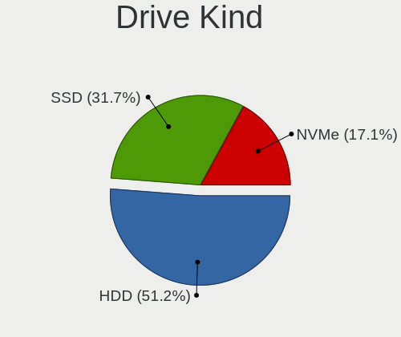
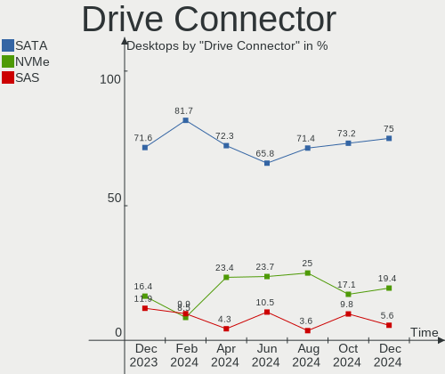
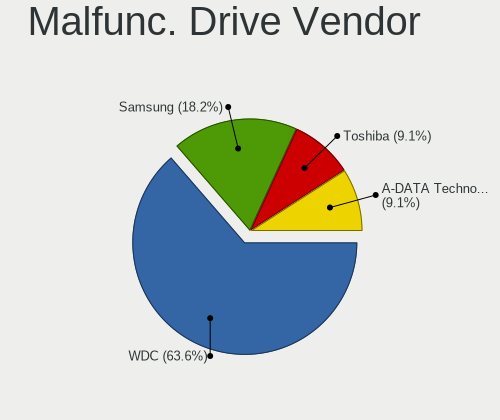
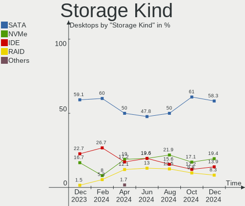
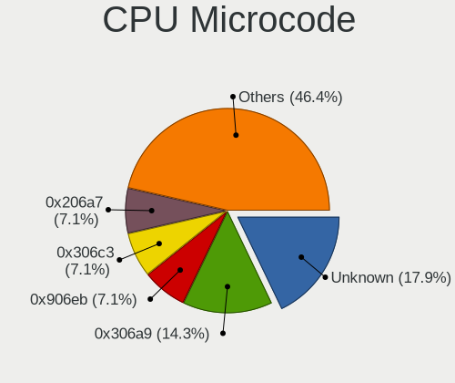
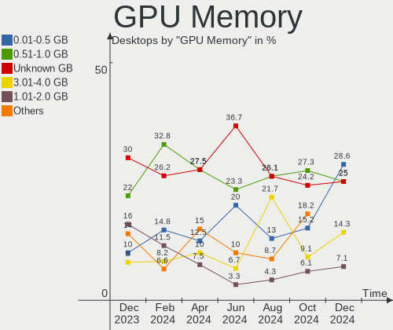
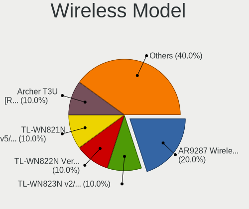

BlackPanther Hardware Trends (Desktops)
---------------------------------------

A project to identify most popular hardware characteristics and track their change
over time based on data collected by BlackPanther users at https://Linux-Hardware.org.

Anyone can contribute to this report by the [hw-probe](https://github.com/linuxhw/hw-probe) tool:

    sudo -E hw-probe -all -upload

Full-feature report is available here: https://linux-hardware.org/?view=trends

Period: Feb, 2022.

Contents
--------

* [ System ](#system)
  - [ OS                       ](#os)
  - [ OS Family                ](#os-family)
  - [ Kernel                   ](#kernel)
  - [ Kernel Family            ](#kernel-family)
  - [ Kernel Major Ver.        ](#kernel-major-ver)
  - [ Arch                     ](#arch)
  - [ DE                       ](#de)
  - [ Display Server           ](#display-server)
  - [ Display Manager          ](#display-manager)
  - [ OS Lang                  ](#os-lang)
  - [ Boot Mode                ](#boot-mode)
  - [ Filesystem               ](#filesystem)
  - [ Part. scheme             ](#part-scheme)
  - [ Dual Boot with Linux/BSD ](#dual-boot-with-linuxbsd)
  - [ Dual Boot (Win)          ](#dual-boot-win)

* [ Board ](#board)
  - [ Vendor                   ](#vendor)
  - [ Model                    ](#model)
  - [ Model Family             ](#model-family)
  - [ MFG Year                 ](#mfg-year)
  - [ Form Factor              ](#form-factor)
  - [ Secure Boot              ](#secure-boot)
  - [ Coreboot                 ](#coreboot)
  - [ RAM Size                 ](#ram-size)
  - [ RAM Used                 ](#ram-used)
  - [ Total Drives             ](#total-drives)
  - [ Has CD-ROM               ](#has-cd-rom)
  - [ Has Ethernet             ](#has-ethernet)
  - [ Has WiFi                 ](#has-wifi)
  - [ Has Bluetooth            ](#has-bluetooth)

* [ Location ](#location)
  - [ Country                  ](#country)
  - [ City                     ](#city)

* [ Drives ](#drives)
  - [ Drive Vendor             ](#drive-vendor)
  - [ Drive Model              ](#drive-model)
  - [ HDD Vendor               ](#hdd-vendor)
  - [ SSD Vendor               ](#ssd-vendor)
  - [ Drive Kind               ](#drive-kind)
  - [ Drive Connector          ](#drive-connector)
  - [ Drive Size               ](#drive-size)
  - [ Space Total              ](#space-total)
  - [ Space Used               ](#space-used)
  - [ Malfunc. Drives          ](#malfunc-drives)
  - [ Malfunc. Drive Vendor    ](#malfunc-drive-vendor)
  - [ Malfunc. HDD Vendor      ](#malfunc-hdd-vendor)
  - [ Malfunc. Drive Kind      ](#malfunc-drive-kind)
  - [ Failed Drives            ](#failed-drives)
  - [ Failed Drive Vendor      ](#failed-drive-vendor)
  - [ Drive Status             ](#drive-status)

* [ Storage controller ](#storage-controller)
  - [ Storage Vendor           ](#storage-vendor)
  - [ Storage Model            ](#storage-model)
  - [ Storage Kind             ](#storage-kind)

* [ Processor ](#processor)
  - [ CPU Vendor               ](#cpu-vendor)
  - [ CPU Model                ](#cpu-model)
  - [ CPU Model Family         ](#cpu-model-family)
  - [ CPU Cores                ](#cpu-cores)
  - [ CPU Sockets              ](#cpu-sockets)
  - [ CPU Threads              ](#cpu-threads)
  - [ CPU Op-Modes             ](#cpu-op-modes)
  - [ CPU Microcode            ](#cpu-microcode)
  - [ CPU Microarch            ](#cpu-microarch)

* [ Graphics ](#graphics)
  - [ GPU Vendor               ](#gpu-vendor)
  - [ GPU Model                ](#gpu-model)
  - [ GPU Combo                ](#gpu-combo)
  - [ GPU Driver               ](#gpu-driver)
  - [ GPU Memory               ](#gpu-memory)

* [ Monitor ](#monitor)
  - [ Monitor Vendor           ](#monitor-vendor)
  - [ Monitor Model            ](#monitor-model)
  - [ Monitor Resolution       ](#monitor-resolution)
  - [ Monitor Diagonal         ](#monitor-diagonal)
  - [ Monitor Width            ](#monitor-width)
  - [ Aspect Ratio             ](#aspect-ratio)
  - [ Monitor Area             ](#monitor-area)
  - [ Pixel Density            ](#pixel-density)
  - [ Multiple Monitors        ](#multiple-monitors)

* [ Network ](#network)
  - [ Net Controller Vendor    ](#net-controller-vendor)
  - [ Net Controller Model     ](#net-controller-model)
  - [ Wireless Vendor          ](#wireless-vendor)
  - [ Wireless Model           ](#wireless-model)
  - [ Ethernet Vendor          ](#ethernet-vendor)
  - [ Ethernet Model           ](#ethernet-model)
  - [ Net Controller Kind      ](#net-controller-kind)
  - [ Used Controller          ](#used-controller)
  - [ NICs                     ](#nics)
  - [ IPv6                     ](#ipv6)

* [ Bluetooth ](#bluetooth)
  - [ Bluetooth Vendor         ](#bluetooth-vendor)
  - [ Bluetooth Model          ](#bluetooth-model)

* [ Sound ](#sound)
  - [ Sound Vendor             ](#sound-vendor)
  - [ Sound Model              ](#sound-model)

* [ Memory ](#memory)
  - [ Memory Vendor            ](#memory-vendor)
  - [ Memory Model             ](#memory-model)
  - [ Memory Kind              ](#memory-kind)
  - [ Memory Form Factor       ](#memory-form-factor)
  - [ Memory Size              ](#memory-size)
  - [ Memory Speed             ](#memory-speed)

* [ Printers & scanners ](#printers--scanners)
  - [ Printer Vendor           ](#printer-vendor)
  - [ Printer Model            ](#printer-model)
  - [ Scanner Vendor           ](#scanner-vendor)
  - [ Scanner Model            ](#scanner-model)

* [ Camera ](#camera)
  - [ Camera Vendor            ](#camera-vendor)
  - [ Camera Model             ](#camera-model)

* [ Security ](#security)
  - [ Fingerprint Vendor       ](#fingerprint-vendor)
  - [ Fingerprint Model        ](#fingerprint-model)
  - [ Chipcard Vendor          ](#chipcard-vendor)
  - [ Chipcard Model           ](#chipcard-model)

* [ Unsupported ](#unsupported)
  - [ Unsupported Devices      ](#unsupported-devices)
  - [ Unsupported Device Types ](#unsupported-device-types)

System
------

OS
--

Installed operating systems

| Name              | Desktops | Percent |
|-------------------|----------|---------|
| BlackPanther 18.1 | 30       | 100%    |

OS Family
---------

OS without a version

| Name         | Desktops | Percent |
|--------------|----------|---------|
| BlackPanther | 30       | 100%    |

Kernel
------

Version of the Linux kernel

| Version             | Desktops | Percent |
|---------------------|----------|---------|
| 5.6.14-desktop-2bP  | 19       | 63.33%  |
| 4.18.16-desktop-1bP | 11       | 36.67%  |

Kernel Family
-------------

Linux kernel without a distro release

| Version | Desktops | Percent |
|---------|----------|---------|
| 5.6.14  | 19       | 63.33%  |
| 4.18.16 | 11       | 36.67%  |

Kernel Major Ver.
-----------------

Linux kernel major version

| Version | Desktops | Percent |
|---------|----------|---------|
| 5.6     | 19       | 63.33%  |
| 4.18    | 11       | 36.67%  |

Arch
----

OS architecture (x86_64, i586, etc.)

| Name   | Desktops | Percent |
|--------|----------|---------|
| x86_64 | 30       | 100%    |

DE
--

Desktop Environment

| Name | Desktops | Percent |
|------|----------|---------|
| KDE5 | 30       | 100%    |

Display Server
--------------

X11 or Wayland

| Name | Desktops | Percent |
|------|----------|---------|
| X11  | 30       | 100%    |

Display Manager
---------------

SDDM, LightDM, etc.

| Name | Desktops | Percent |
|------|----------|---------|
| SDDM | 30       | 100%    |

OS Lang
-------

Language

| Lang    | Desktops | Percent |
|---------|----------|---------|
| Unknown | 30       | 100%    |

Boot Mode
---------

EFI or BIOS

| Mode | Desktops | Percent |
|------|----------|---------|
| BIOS | 16       | 53.33%  |
| EFI  | 14       | 46.67%  |

Filesystem
----------

Type of filesystem

| Type    | Desktops | Percent |
|---------|----------|---------|
| Overlay | 28       | 93.33%  |
| Ext4    | 2        | 6.67%   |

Part. scheme
------------

Scheme of partitioning

| Type | Desktops | Percent |
|------|----------|---------|
| MBR  | 17       | 56.67%  |
| GPT  | 13       | 43.33%  |

Dual Boot with Linux/BSD
------------------------

Hosting more than one Linux/BSD

| Dual boot | Desktops | Percent |
|-----------|----------|---------|
| Yes       | 17       | 56.67%  |
| No        | 13       | 43.33%  |

Dual Boot (Win)
---------------

Hosting Linux and Windows

| Dual boot | Desktops | Percent |
|-----------|----------|---------|
| Yes       | 17       | 56.67%  |
| No        | 13       | 43.33%  |

Board
-----

Vendor
------

Motherboard manufacturer

| Name                | Desktops | Percent |
|---------------------|----------|---------|
| Gigabyte Technology | 11       | 36.67%  |
| ASUSTek Computer    | 5        | 16.67%  |
| Hewlett-Packard     | 4        | 13.33%  |
| MSI                 | 3        | 10%     |
| Fujitsu             | 3        | 10%     |
| Medion              | 1        | 3.33%   |
| Fujitsu Siemens     | 1        | 3.33%   |
| ASRock              | 1        | 3.33%   |
| Acer                | 1        | 3.33%   |

Model
-----

Motherboard model

| Name                                | Desktops | Percent |
|-------------------------------------|----------|---------|
| MSI MS-7846                         | 1        | 3.33%   |
| MSI MS-7788                         | 1        | 3.33%   |
| MSI MS-7253                         | 1        | 3.33%   |
| Medion MS-7748                      | 1        | 3.33%   |
| HP ProDesk 600 G2 SFF               | 1        | 3.33%   |
| HP Compaq Pro 6305 SFF              | 1        | 3.33%   |
| HP Compaq dc7800p Small Form Factor | 1        | 3.33%   |
| HP Compaq dc5800 Small Form Factor  | 1        | 3.33%   |
| Gigabyte Z370 AORUS Gaming 7        | 1        | 3.33%   |
| Gigabyte P67A-D3-B3                 | 1        | 3.33%   |
| Gigabyte H61M-S2PV                  | 1        | 3.33%   |
| Gigabyte H61M-S1                    | 1        | 3.33%   |
| Gigabyte H61M-D2-B3                 | 1        | 3.33%   |
| Gigabyte H310M H 2.0                | 1        | 3.33%   |
| Gigabyte F2A88XM-HD3                | 1        | 3.33%   |
| Gigabyte B85M-DS3H-A                | 1        | 3.33%   |
| Gigabyte B85M-D3H                   | 1        | 3.33%   |
| Gigabyte B450M GAMING               | 1        | 3.33%   |
| Gigabyte AB350M-D3H                 | 1        | 3.33%   |
| Fujitsu Siemens ESPRIMO P5730       | 1        | 3.33%   |
| Fujitsu ESPRIMO P910                | 1        | 3.33%   |
| Fujitsu ESPRIMO P710                | 1        | 3.33%   |
| Fujitsu CELSIUS M470                | 1        | 3.33%   |
| ASUS VM40B                          | 1        | 3.33%   |
| ASUS P5KPL-AM IN/ROEM/SI            | 1        | 3.33%   |
| ASUS M5A78L-M PLUS/USB3             | 1        | 3.33%   |
| ASUS Crosshair IV Formula           | 1        | 3.33%   |
| ASUS All Series                     | 1        | 3.33%   |
| ASRock B550M Pro4                   | 1        | 3.33%   |
| Acer Aspire X1470                   | 1        | 3.33%   |

Model Family
------------

Motherboard model prefix

| Name                    | Desktops | Percent |
|-------------------------|----------|---------|
| HP Compaq               | 3        | 10%     |
| Fujitsu ESPRIMO         | 2        | 6.67%   |
| MSI MS-7846             | 1        | 3.33%   |
| MSI MS-7788             | 1        | 3.33%   |
| MSI MS-7253             | 1        | 3.33%   |
| Medion MS-7748          | 1        | 3.33%   |
| HP ProDesk              | 1        | 3.33%   |
| Gigabyte Z370           | 1        | 3.33%   |
| Gigabyte P67A-D3-B3     | 1        | 3.33%   |
| Gigabyte H61M-S2PV      | 1        | 3.33%   |
| Gigabyte H61M-S1        | 1        | 3.33%   |
| Gigabyte H61M-D2-B3     | 1        | 3.33%   |
| Gigabyte H310M          | 1        | 3.33%   |
| Gigabyte F2A88XM-HD3    | 1        | 3.33%   |
| Gigabyte B85M-DS3H-A    | 1        | 3.33%   |
| Gigabyte B85M-D3H       | 1        | 3.33%   |
| Gigabyte B450M          | 1        | 3.33%   |
| Gigabyte AB350M-D3H     | 1        | 3.33%   |
| Fujitsu Siemens ESPRIMO | 1        | 3.33%   |
| Fujitsu CELSIUS         | 1        | 3.33%   |
| ASUS VM40B              | 1        | 3.33%   |
| ASUS P5KPL-AM           | 1        | 3.33%   |
| ASUS M5A78L-M           | 1        | 3.33%   |
| ASUS Crosshair          | 1        | 3.33%   |
| ASUS All                | 1        | 3.33%   |
| ASRock B550M            | 1        | 3.33%   |
| Acer Aspire             | 1        | 3.33%   |

MFG Year
--------

Motherboard manufacture year

| Year | Desktops | Percent |
|------|----------|---------|
| 2012 | 7        | 23.33%  |
| 2011 | 5        | 16.67%  |
| 2013 | 4        | 13.33%  |
| 2018 | 2        | 6.67%   |
| 2017 | 2        | 6.67%   |
| 2015 | 2        | 6.67%   |
| 2009 | 2        | 6.67%   |
| 2007 | 2        | 6.67%   |
| 2020 | 1        | 3.33%   |
| 2016 | 1        | 3.33%   |
| 2014 | 1        | 3.33%   |
| 2008 | 1        | 3.33%   |

Form Factor
-----------

Physical design of the computer

| Name    | Desktops | Percent |
|---------|----------|---------|
| Desktop | 30       | 100%    |

Secure Boot
-----------

Enabled or disabled

| State    | Desktops | Percent |
|----------|----------|---------|
| Disabled | 30       | 100%    |

Coreboot
--------

Have coreboot on board

| Used | Desktops | Percent |
|------|----------|---------|
| No   | 30       | 100%    |

RAM Size
--------

Total RAM memory

| Size in GB | Desktops | Percent |
|------------|----------|---------|
| 8.01-16.0  | 11       | 36.67%  |
| 4.01-8.0   | 7        | 23.33%  |
| 3.01-4.0   | 7        | 23.33%  |
| 16.01-24.0 | 4        | 13.33%  |
| 1.01-2.0   | 1        | 3.33%   |

RAM Used
--------

Used RAM memory

| Used GB  | Desktops | Percent |
|----------|----------|---------|
| 0.01-0.5 | 20       | 66.67%  |
| 0.51-1.0 | 10       | 33.33%  |

Total Drives
------------

Number of drives on board

| Drives | Desktops | Percent |
|--------|----------|---------|
| 1      | 18       | 60%     |
| 2      | 4        | 13.33%  |
| 4      | 3        | 10%     |
| 3      | 3        | 10%     |
| 5      | 1        | 3.33%   |
| 0      | 1        | 3.33%   |

Has CD-ROM
----------

Has CD-ROM on board

| Presented | Desktops | Percent |
|-----------|----------|---------|
| Yes       | 19       | 63.33%  |
| No        | 11       | 36.67%  |

Has Ethernet
------------

Has Ethernet on board

| Presented | Desktops | Percent |
|-----------|----------|---------|
| Yes       | 30       | 100%    |

Has WiFi
--------

Has WiFi module

| Presented | Desktops | Percent |
|-----------|----------|---------|
| No        | 28       | 93.33%  |
| Yes       | 2        | 6.67%   |

Has Bluetooth
-------------

Has Bluetooth module

| Presented | Desktops | Percent |
|-----------|----------|---------|
| No        | 29       | 96.67%  |
| Yes       | 1        | 3.33%   |

Location
--------

Country
-------

Geographic location (country)

| Country  | Desktops | Percent |
|----------|----------|---------|
| Hungary  | 25       | 83.33%  |
| USA      | 1        | 3.33%   |
| UK       | 1        | 3.33%   |
| Slovakia | 1        | 3.33%   |
| Romania  | 1        | 3.33%   |
| Canada   | 1        | 3.33%   |

City
----

Geographic location (city)

| City             | Desktops | Percent |
|------------------|----------|---------|
| Budapest         | 7        | 23.33%  |
| Szombathely      | 2        | 6.67%   |
| Pécs          | 2        | 6.67%   |
| Balatonfured     | 2        | 6.67%   |
| Valley Village   | 1        | 3.33%   |
| Tatabánya     | 1        | 3.33%   |
| Tapioszentmarton | 1        | 3.33%   |
| Sherwood Park    | 1        | 3.33%   |
| Pecel            | 1        | 3.33%   |
| Papa             | 1        | 3.33%   |
| Miskolc          | 1        | 3.33%   |
| Mezotur          | 1        | 3.33%   |
| Levice           | 1        | 3.33%   |
| Lenti            | 1        | 3.33%   |
| Kecskemét     | 1        | 3.33%   |
| Kapuvar          | 1        | 3.33%   |
| Harlow           | 1        | 3.33%   |
| Győr         | 1        | 3.33%   |
| Fuzesabony       | 1        | 3.33%   |
| Debrecen         | 1        | 3.33%   |
| Bucharest        | 1        | 3.33%   |

Drives
------

Drive Vendor
------------

Hard drive vendors

| Vendor              | Desktops | Drives | Percent |
|---------------------|----------|--------|---------|
| WDC                 | 10       | 13     | 20.41%  |
| Samsung Electronics | 9        | 12     | 18.37%  |
| Toshiba             | 6        | 9      | 12.24%  |
| Seagate             | 5        | 6      | 10.2%   |
| Kingston            | 5        | 6      | 10.2%   |
| Hitachi             | 3        | 4      | 6.12%   |
| Crucial             | 3        | 3      | 6.12%   |
| Patriot             | 2        | 2      | 4.08%   |
| MAXTOR              | 1        | 1      | 2.04%   |
| Kingmax             | 1        | 1      | 2.04%   |
| HGST                | 1        | 1      | 2.04%   |
| Gigabyte Technology | 1        | 1      | 2.04%   |
| Corsair             | 1        | 1      | 2.04%   |
| A-DATA Technology   | 1        | 1      | 2.04%   |

Drive Model
-----------

Hard drive models

| Model                            | Desktops | Percent |
|----------------------------------|----------|---------|
| Toshiba HDWQ140 4TB              | 2        | 3.39%   |
| Toshiba DT01ACA200 2TB           | 2        | 3.39%   |
| Toshiba DT01ACA100 1TB           | 2        | 3.39%   |
| Samsung HD154UI 1TB              | 2        | 3.39%   |
| Kingston SA400S37120G 120GB SSD  | 2        | 3.39%   |
| Hitachi HDP725025GLA380 250GB    | 2        | 3.39%   |
| WDC WD5000AAKS-00UU3A0 500GB     | 1        | 1.69%   |
| WDC WD30EZRZ-00GXCB0 3TB         | 1        | 1.69%   |
| WDC WD30EZRX-00DC0B0 3TB         | 1        | 1.69%   |
| WDC WD30EFRX-68EUZN0 3TB         | 1        | 1.69%   |
| WDC WD2500JS-60NCB1 250GB        | 1        | 1.69%   |
| WDC WD2500AAKX-00ERMA0 250GB     | 1        | 1.69%   |
| WDC WD20EZRX-00D8PB0 2TB         | 1        | 1.69%   |
| WDC WD20EARX-008FB0 2TB          | 1        | 1.69%   |
| WDC WD10EZRZ-22HTKB0 1TB         | 1        | 1.69%   |
| WDC WD10EZRX-00A8LB0 1TB         | 1        | 1.69%   |
| WDC WD10EZEX-21WN4A0 1TB         | 1        | 1.69%   |
| WDC WD10EZEX-08WN4A0 1TB         | 1        | 1.69%   |
| WDC WD10EZEX-00KUWA0 1TB         | 1        | 1.69%   |
| Toshiba MQ04ABF100 1TB           | 1        | 1.69%   |
| Toshiba MK1237GSX 120GB          | 1        | 1.69%   |
| Seagate ST4000DM004-2CV104 4TB   | 1        | 1.69%   |
| Seagate ST3160815AS 160GB        | 1        | 1.69%   |
| Seagate ST3160812AS 160GB        | 1        | 1.69%   |
| Seagate ST2000DM008-2FR102 2TB   | 1        | 1.69%   |
| Seagate ST1000DM010-2EP102 1TB   | 1        | 1.69%   |
| Seagate ST1000DM003-1CH162 1TB   | 1        | 1.69%   |
| Samsung SSD 960 EVO 250GB        | 1        | 1.69%   |
| Samsung SSD 870 QVO 1TB          | 1        | 1.69%   |
| Samsung SSD 870 EVO 500GB        | 1        | 1.69%   |
| Samsung SSD 860 EVO 250GB        | 1        | 1.69%   |
| Samsung SSD 850 EVO 500GB        | 1        | 1.69%   |
| Samsung SSD 830 Series 64GB      | 1        | 1.69%   |
| Samsung HD502IJ 500GB            | 1        | 1.69%   |
| Samsung HD160JJ 160GB            | 1        | 1.69%   |
| Samsung HD082GJ 80GB             | 1        | 1.69%   |
| Patriot Burst 240GB SSD          | 1        | 1.69%   |
| Patriot Burst 120GB SSD          | 1        | 1.69%   |
| MAXTOR 6V320F0 320GB             | 1        | 1.69%   |
| Kingston SV300S37A240G 240GB SSD | 1        | 1.69%   |
| Kingston SH103S3120G 120GB SSD   | 1        | 1.69%   |
| Kingston SA400S37480G 480GB SSD  | 1        | 1.69%   |
| Kingston SA2000M8250G 250GB      | 1        | 1.69%   |
| Kingmax SSD 240GB                | 1        | 1.69%   |
| Hitachi HDS721010CLA332 1TB      | 1        | 1.69%   |
| Hitachi HCS5C3225SLA380 250GB    | 1        | 1.69%   |
| HGST HTS541010B7E610 1TB         | 1        | 1.69%   |
| Gigabyte GP-GSTFS31120GNTD 120GB | 1        | 1.69%   |
| Crucial CT480BX500SSD1 480GB     | 1        | 1.69%   |
| Crucial CT120BX500SSD1 120GB     | 1        | 1.69%   |
| Crucial CT1000P1SSD8 1TB         | 1        | 1.69%   |
| Corsair Force 3 SSD 120GB        | 1        | 1.69%   |
| A-DATA SU630 240GB SSD           | 1        | 1.69%   |

HDD Vendor
----------

Hard disk drive vendors

| Vendor              | Desktops | Drives | Percent |
|---------------------|----------|--------|---------|
| WDC                 | 10       | 13     | 32.26%  |
| Toshiba             | 6        | 9      | 19.35%  |
| Seagate             | 5        | 6      | 16.13%  |
| Samsung Electronics | 5        | 5      | 16.13%  |
| Hitachi             | 3        | 4      | 9.68%   |
| MAXTOR              | 1        | 1      | 3.23%   |
| HGST                | 1        | 1      | 3.23%   |

SSD Vendor
----------

Solid state drive vendors

| Vendor              | Desktops | Drives | Percent |
|---------------------|----------|--------|---------|
| Samsung Electronics | 4        | 6      | 25%     |
| Kingston            | 4        | 5      | 25%     |
| Patriot             | 2        | 2      | 12.5%   |
| Crucial             | 2        | 2      | 12.5%   |
| Kingmax             | 1        | 1      | 6.25%   |
| Gigabyte Technology | 1        | 1      | 6.25%   |
| Corsair             | 1        | 1      | 6.25%   |
| A-DATA Technology   | 1        | 1      | 6.25%   |

Drive Kind
----------

HDD or SSD

| Kind | Desktops | Drives | Percent |
|------|----------|--------|---------|
| HDD  | 24       | 39     | 61.54%  |
| SSD  | 12       | 19     | 30.77%  |
| NVMe | 3        | 3      | 7.69%   |

Drive Connector
---------------

SATA, SAS, NVMe, etc.

| Type | Desktops | Drives | Percent |
|------|----------|--------|---------|
| SATA | 28       | 57     | 87.5%   |
| NVMe | 3        | 3      | 9.38%   |
| SAS  | 1        | 1      | 3.13%   |

Drive Size
----------

Size of hard drive

| Size in TB | Desktops | Drives | Percent |
|------------|----------|--------|---------|
| 0.01-0.5   | 22       | 32     | 50%     |
| 0.51-1.0   | 13       | 15     | 29.55%  |
| 1.01-2.0   | 4        | 5      | 9.09%   |
| 3.01-4.0   | 3        | 3      | 6.82%   |
| 2.01-3.0   | 2        | 3      | 4.55%   |

Space Total
-----------

Amount of disk space available on the file system

| Size in GB | Desktops | Percent |
|------------|----------|---------|
| Unknown    | 28       | 93.33%  |
| 101-250    | 2        | 6.67%   |

Space Used
----------

Amount of used disk space

| Used GB | Desktops | Percent |
|---------|----------|---------|
| Unknown | 28       | 93.33%  |
| 1-20    | 2        | 6.67%   |

Malfunc. Drives
---------------

Drive models with a malfunction

| Model                           | Desktops | Drives | Percent |
|---------------------------------|----------|--------|---------|
| WDC WD5000AAKS-00UU3A0 500GB    | 1        | 1      | 12.5%   |
| WDC WD10EZRX-00A8LB0 1TB        | 1        | 1      | 12.5%   |
| Toshiba MK1237GSX 120GB         | 1        | 2      | 12.5%   |
| Seagate ST1000DM003-1CH162 1TB  | 1        | 1      | 12.5%   |
| Samsung Electronics HD154UI 1TB | 1        | 1      | 12.5%   |
| MAXTOR 6V320F0 320GB            | 1        | 1      | 12.5%   |
| Hitachi HDP725025GLA380 250GB   | 1        | 1      | 12.5%   |
| Hitachi HCS5C3225SLA380 250GB   | 1        | 1      | 12.5%   |

Malfunc. Drive Vendor
---------------------

Vendors of faulty drives

| Vendor              | Desktops | Drives | Percent |
|---------------------|----------|--------|---------|
| WDC                 | 2        | 2      | 28.57%  |
| Toshiba             | 1        | 2      | 14.29%  |
| Seagate             | 1        | 1      | 14.29%  |
| Samsung Electronics | 1        | 1      | 14.29%  |
| MAXTOR              | 1        | 1      | 14.29%  |
| Hitachi             | 1        | 2      | 14.29%  |

Malfunc. HDD Vendor
-------------------

Vendors of faulty HDD drives

| Vendor              | Desktops | Drives | Percent |
|---------------------|----------|--------|---------|
| WDC                 | 2        | 2      | 28.57%  |
| Toshiba             | 1        | 2      | 14.29%  |
| Seagate             | 1        | 1      | 14.29%  |
| Samsung Electronics | 1        | 1      | 14.29%  |
| MAXTOR              | 1        | 1      | 14.29%  |
| Hitachi             | 1        | 2      | 14.29%  |

Malfunc. Drive Kind
-------------------

Kinds of faulty drives

| Kind | Desktops | Drives | Percent |
|------|----------|--------|---------|
| HDD  | 6        | 9      | 100%    |

Failed Drives
-------------

Failed drive models

Zero info for selected period =(

Failed Drive Vendor
-------------------

Failed drive vendors

Zero info for selected period =(

Drive Status
------------

Number of failed and malfunc. drives

| Status  | Desktops | Drives | Percent |
|---------|----------|--------|---------|
| Works   | 27       | 52     | 81.82%  |
| Malfunc | 6        | 9      | 18.18%  |

Storage controller
------------------

Storage Vendor
--------------

Storage controller vendors

| Vendor                      | Desktops | Percent |
|-----------------------------|----------|---------|
| Intel                       | 19       | 54.29%  |
| AMD                         | 10       | 28.57%  |
| VIA Technologies            | 2        | 5.71%   |
| Samsung Electronics         | 1        | 2.86%   |
| Micron/Crucial Technology   | 1        | 2.86%   |
| Kingston Technology Company | 1        | 2.86%   |
| JMicron Technology          | 1        | 2.86%   |

Storage Model
-------------

Storage controller models

| Model                                                                                   | Desktops | Percent |
|-----------------------------------------------------------------------------------------|----------|---------|
| AMD FCH SATA Controller [AHCI mode]                                                     | 6        | 12%     |
| Intel 6 Series/C200 Series Chipset Family Desktop SATA Controller (IDE mode, ports 4-5) | 4        | 8%      |
| Intel 6 Series/C200 Series Chipset Family Desktop SATA Controller (IDE mode, ports 0-3) | 4        | 8%      |
| Intel 8 Series/C220 Series Chipset Family 6-port SATA Controller 1 [AHCI mode]          | 3        | 6%      |
| Intel SATA Controller [RAID mode]                                                       | 2        | 4%      |
| Intel 82801I (ICH9 Family) 2 port SATA Controller [IDE mode]                            | 2        | 4%      |
| Intel 200 Series PCH SATA controller [AHCI mode]                                        | 2        | 4%      |
| AMD SB7x0/SB8x0/SB9x0 SATA Controller [IDE mode]                                        | 2        | 4%      |
| AMD SB7x0/SB8x0/SB9x0 IDE Controller                                                    | 2        | 4%      |
| VIA VT82C586A/B/VT82C686/A/B/VT823x/A/C PIPC Bus Master IDE                             | 1        | 2%      |
| VIA VT8237A SATA 2-Port Controller                                                      | 1        | 2%      |
| VIA VT6421 IDE/SATA Controller                                                          | 1        | 2%      |
| Samsung NVMe SSD Controller SM961/PM961/SM963                                           | 1        | 2%      |
| Micron/Crucial NVMe Controller                                                          | 1        | 2%      |
| Kingston Company A2000 NVMe SSD                                                         | 1        | 2%      |
| JMicron JMB363 SATA/IDE Controller                                                      | 1        | 2%      |
| Intel Q170/Q150/B150/H170/H110/Z170/CM236 Chipset SATA Controller [AHCI Mode]           | 1        | 2%      |
| Intel NM10/ICH7 Family SATA Controller [IDE mode]                                       | 1        | 2%      |
| Intel 82Q35 Express PT IDER Controller                                                  | 1        | 2%      |
| Intel 82801JI (ICH10 Family) SATA AHCI Controller                                       | 1        | 2%      |
| Intel 82801JD/DO (ICH10 Family) 4-port SATA IDE Controller                              | 1        | 2%      |
| Intel 82801JD/DO (ICH10 Family) 2-port SATA IDE Controller                              | 1        | 2%      |
| Intel 82801IR/IO/IH (ICH9R/DO/DH) 4 port SATA Controller [IDE mode]                     | 1        | 2%      |
| Intel 82801IB (ICH9) 2 port SATA Controller [IDE mode]                                  | 1        | 2%      |
| Intel 82801G (ICH7 Family) IDE Controller                                               | 1        | 2%      |
| Intel 7 Series/C210 Series Chipset Family 6-port SATA Controller [AHCI mode]            | 1        | 2%      |
| Intel 7 Series Chipset Family 6-port SATA Controller [AHCI mode]                        | 1        | 2%      |
| Intel 6 Series/C200 Series Chipset Family 6 port Desktop SATA AHCI Controller           | 1        | 2%      |
| Intel 4 Series Chipset PT IDER Controller                                               | 1        | 2%      |
| AMD Starship/Matisse Chipset SATA Controller [AHCI mode]                                | 1        | 2%      |
| AMD 400 Series Chipset SATA Controller                                                  | 1        | 2%      |
| AMD 300 Series Chipset SATA Controller                                                  | 1        | 2%      |

Storage Kind
------------

Kind of storage controller (IDE, SATA, NVMe, SAS, ...)

| Kind | Desktops | Percent |
|------|----------|---------|
| SATA | 20       | 54.05%  |
| IDE  | 11       | 29.73%  |
| RAID | 3        | 8.11%   |
| NVMe | 3        | 8.11%   |

Processor
---------

CPU Vendor
----------

Processor vendors

| Vendor | Desktops | Percent |
|--------|----------|---------|
| Intel  | 19       | 63.33%  |
| AMD    | 11       | 36.67%  |

CPU Model
---------

Processor models

| Model                                         | Desktops | Percent |
|-----------------------------------------------|----------|---------|
| Intel Core i5-3470 CPU @ 3.20GHz              | 2        | 6.67%   |
| Intel Core i3-2120 CPU @ 3.30GHz              | 2        | 6.67%   |
| Intel Core 2 Duo CPU E8400 @ 3.00GHz          | 2        | 6.67%   |
| Intel Xeon CPU W3550 @ 3.07GHz                | 1        | 3.33%   |
| Intel Pentium Gold G5400 CPU @ 3.70GHz        | 1        | 3.33%   |
| Intel Pentium CPU G840 @ 2.80GHz              | 1        | 3.33%   |
| Intel Pentium CPU G630 @ 2.70GHz              | 1        | 3.33%   |
| Intel Pentium CPU G3420 @ 3.20GHz             | 1        | 3.33%   |
| Intel Core i7-8700K CPU @ 3.70GHz             | 1        | 3.33%   |
| Intel Core i5-6500 CPU @ 3.20GHz              | 1        | 3.33%   |
| Intel Core i5-4570 CPU @ 3.20GHz              | 1        | 3.33%   |
| Intel Core i5-4460 CPU @ 3.20GHz              | 1        | 3.33%   |
| Intel Core i5-2300 CPU @ 2.80GHz              | 1        | 3.33%   |
| Intel Core 2 Quad CPU Q6600 @ 2.40GHz         | 1        | 3.33%   |
| Intel Core 2 Duo CPU E7300 @ 2.66GHz          | 1        | 3.33%   |
| Intel Celeron CPU 1017U @ 1.60GHz             | 1        | 3.33%   |
| AMD Sempron Processor LE-1100                 | 1        | 3.33%   |
| AMD Sempron 3850 APU with Radeon R3           | 1        | 3.33%   |
| AMD Ryzen 7 3700X 8-Core Processor            | 1        | 3.33%   |
| AMD Ryzen 5 3400G with Radeon Vega Graphics   | 1        | 3.33%   |
| AMD Ryzen 5 1500X Quad-Core Processor         | 1        | 3.33%   |
| AMD Phenom II X6 1090T Processor              | 1        | 3.33%   |
| AMD FX-8350 Eight-Core Processor              | 1        | 3.33%   |
| AMD A8-7600 Radeon R7, 10 Compute Cores 4C+6G | 1        | 3.33%   |
| AMD A8-3820 APU with Radeon HD Graphics       | 1        | 3.33%   |
| AMD A8-3800 APU with Radeon HD Graphics       | 1        | 3.33%   |
| AMD A4-5300B APU with Radeon HD Graphics      | 1        | 3.33%   |

CPU Model Family
----------------

Processor model prefix

| Model              | Desktops | Percent |
|--------------------|----------|---------|
| Intel Core i5      | 6        | 20%     |
| Intel Pentium      | 3        | 10%     |
| Intel Core 2 Duo   | 3        | 10%     |
| AMD A8             | 3        | 10%     |
| Intel Core i3      | 2        | 6.67%   |
| AMD Sempron        | 2        | 6.67%   |
| AMD Ryzen 5        | 2        | 6.67%   |
| Intel Xeon         | 1        | 3.33%   |
| Intel Pentium Gold | 1        | 3.33%   |
| Intel Core i7      | 1        | 3.33%   |
| Intel Core 2 Quad  | 1        | 3.33%   |
| Intel Celeron      | 1        | 3.33%   |
| AMD Ryzen 7        | 1        | 3.33%   |
| AMD Phenom II X6   | 1        | 3.33%   |
| AMD FX             | 1        | 3.33%   |
| AMD A4             | 1        | 3.33%   |

CPU Cores
---------

Number of processor cores

| Number | Desktops | Percent |
|--------|----------|---------|
| 4      | 14       | 46.67%  |
| 2      | 11       | 36.67%  |
| 6      | 2        | 6.67%   |
| 1      | 2        | 6.67%   |
| 8      | 1        | 3.33%   |

CPU Sockets
-----------

Number of sockets

| Number | Desktops | Percent |
|--------|----------|---------|
| 1      | 30       | 100%    |

CPU Threads
-----------

Threads per core (Hyper-Threading)

| Number | Desktops | Percent |
|--------|----------|---------|
| 1      | 19       | 63.33%  |
| 2      | 11       | 36.67%  |

CPU Op-Modes
------------

CPU Operation Modes (32-bit, 64-bit)

| Op mode        | Desktops | Percent |
|----------------|----------|---------|
| 32-bit, 64-bit | 30       | 100%    |

CPU Microcode
-------------

Microcode number

| Number     | Desktops | Percent |
|------------|----------|---------|
| 0x206a7    | 5        | 16.67%  |
| 0x306c3    | 3        | 10%     |
| 0x306a9    | 3        | 10%     |
| 0x906ea    | 2        | 6.67%   |
| 0x1067a    | 2        | 6.67%   |
| 0x03000027 | 2        | 6.67%   |
| 0x6fb      | 1        | 3.33%   |
| 0x506e3    | 1        | 3.33%   |
| 0x106a5    | 1        | 3.33%   |
| 0x10676    | 1        | 3.33%   |
| 0x08701021 | 1        | 3.33%   |
| 0x08108109 | 1        | 3.33%   |
| 0x08001138 | 1        | 3.33%   |
| 0x0700010f | 1        | 3.33%   |
| 0x06003106 | 1        | 3.33%   |
| 0x06001119 | 1        | 3.33%   |
| 0x06000852 | 1        | 3.33%   |
| 0x010000dc | 1        | 3.33%   |
| Unknown    | 1        | 3.33%   |

CPU Microarch
-------------

Microarchitecture

| Name        | Desktops | Percent |
|-------------|----------|---------|
| SandyBridge | 5        | 16.67%  |
| Penryn      | 3        | 10%     |
| IvyBridge   | 3        | 10%     |
| Haswell     | 3        | 10%     |
| Piledriver  | 2        | 6.67%   |
| KabyLake    | 2        | 6.67%   |
| K10 Llano   | 2        | 6.67%   |
| Zen+        | 1        | 3.33%   |
| Zen 2       | 1        | 3.33%   |
| Zen         | 1        | 3.33%   |
| Steamroller | 1        | 3.33%   |
| Skylake     | 1        | 3.33%   |
| Nehalem     | 1        | 3.33%   |
| K8 Hammer   | 1        | 3.33%   |
| K10         | 1        | 3.33%   |
| Jaguar      | 1        | 3.33%   |
| Core        | 1        | 3.33%   |

Graphics
--------

GPU Vendor
----------

Vendors of graphics cards

| Vendor           | Desktops | Percent |
|------------------|----------|---------|
| Nvidia           | 11       | 34.38%  |
| Intel            | 10       | 31.25%  |
| AMD              | 10       | 31.25%  |
| VIA Technologies | 1        | 3.13%   |

GPU Model
---------

Graphics card models

| Model                                                                       | Desktops | Percent |
|-----------------------------------------------------------------------------|----------|---------|
| Intel Xeon E3-1200 v3/4th Gen Core Processor Integrated Graphics Controller | 3        | 8.82%   |
| Nvidia GT218 [GeForce 210]                                                  | 2        | 5.88%   |
| Nvidia GK208B [GeForce GT 710]                                              | 2        | 5.88%   |
| Nvidia GF108 [GeForce GT 630]                                               | 2        | 5.88%   |
| AMD Sumo [Radeon HD 6550D]                                                  | 2        | 5.88%   |
| VIA Technologies K8M890CE/K8N890CE [Chrome 9]                               | 1        | 2.94%   |
| Nvidia GM204 [GeForce GTX 970]                                              | 1        | 2.94%   |
| Nvidia GK208B [GeForce GT 730]                                              | 1        | 2.94%   |
| Nvidia GF119 [GeForce GT 610]                                               | 1        | 2.94%   |
| Nvidia GF114 [GeForce GTX 560]                                              | 1        | 2.94%   |
| Nvidia G73 [GeForce 7600 GT]                                                | 1        | 2.94%   |
| Intel Xeon E3-1200 v2/3rd Gen Core processor Graphics Controller            | 1        | 2.94%   |
| Intel HD Graphics 530                                                       | 1        | 2.94%   |
| Intel CoffeeLake-S GT2 [UHD Graphics 630]                                   | 1        | 2.94%   |
| Intel 82Q35 Express Integrated Graphics Controller                          | 1        | 2.94%   |
| Intel 4 Series Chipset Integrated Graphics Controller                       | 1        | 2.94%   |
| Intel 3rd Gen Core processor Graphics Controller                            | 1        | 2.94%   |
| Intel 2nd Generation Core Processor Family Integrated Graphics Controller   | 1        | 2.94%   |
| AMD Trinity 2 [Radeon HD 7480D]                                             | 1        | 2.94%   |
| AMD Redwood XT [Radeon HD 5670/5690/5730]                                   | 1        | 2.94%   |
| AMD Picasso/Raven 2 [Radeon Vega Series / Radeon Vega Mobile Series]        | 1        | 2.94%   |
| AMD Oland XT [Radeon HD 8670 / R5 340X OEM / R7 250/350/350X OEM]           | 1        | 2.94%   |
| AMD Navi 22 [Radeon RX 6700/6700 XT / 6800M]                                | 1        | 2.94%   |
| AMD Kaveri [Radeon R7 Graphics]                                             | 1        | 2.94%   |
| AMD Kabini [Radeon HD 8280 / R3 Series]                                     | 1        | 2.94%   |
| AMD Cedar [Radeon HD 5000/6000/7350/8350 Series]                            | 1        | 2.94%   |
| AMD Bonaire XTX [Radeon R7 260X/360]                                        | 1        | 2.94%   |
| AMD Baffin [Radeon RX 550 640SP / RX 560/560X]                              | 1        | 2.94%   |

GPU Combo
---------

Combinations of graphics cards

| Name           | Desktops | Percent |
|----------------|----------|---------|
| 1 x Nvidia     | 9        | 30%     |
| 1 x Intel      | 9        | 30%     |
| 1 x AMD        | 8        | 26.67%  |
| 2 x AMD        | 1        | 3.33%   |
| 1 x VIA        | 1        | 3.33%   |
| Intel + Nvidia | 1        | 3.33%   |
| AMD + Nvidia   | 1        | 3.33%   |

GPU Driver
----------

Free vs proprietary

| Driver  | Desktops | Percent |
|---------|----------|---------|
| Free    | 29       | 96.67%  |
| Unknown | 1        | 3.33%   |

GPU Memory
----------

Total video memory

| Size in GB | Desktops | Percent |
|------------|----------|---------|
| Unknown    | 10       | 33.33%  |
| 0.51-1.0   | 7        | 23.33%  |
| 0.01-0.5   | 6        | 20%     |
| 1.01-2.0   | 4        | 13.33%  |
| 3.01-4.0   | 3        | 10%     |

Monitor
-------

Monitor Vendor
--------------

Monitor vendors

| Vendor               | Desktops | Percent |
|----------------------|----------|---------|
| Samsung Electronics  | 5        | 17.86%  |
| Dell                 | 5        | 17.86%  |
| Goldstar             | 4        | 14.29%  |
| Ancor Communications | 3        | 10.71%  |
| Philips              | 2        | 7.14%   |
| HannStar             | 2        | 7.14%   |
| ZLS                  | 1        | 3.57%   |
| Sony                 | 1        | 3.57%   |
| Medion               | 1        | 3.57%   |
| InnoLux Display      | 1        | 3.57%   |
| Eizo                 | 1        | 3.57%   |
| CVT                  | 1        | 3.57%   |
| Acer                 | 1        | 3.57%   |

Monitor Model
-------------

Monitor models

| Model                                                                   | Desktops | Percent |
|-------------------------------------------------------------------------|----------|---------|
| HannStar HannsG HS191D HSD0013 1280x1024 376x301mm 19.0-inch            | 2        | 6.9%    |
| ZLS VMD-1951 ZLS1950 1600x900                                           | 1        | 3.45%   |
| Sony TV SNY5801 1280x720                                                | 1        | 3.45%   |
| Samsung Electronics SMB1920NW SAM06A5 1440x900 408x255mm 18.9-inch      | 1        | 3.45%   |
| Samsung Electronics S27E500 SAM0D0D 1920x1080 598x336mm 27.0-inch       | 1        | 3.45%   |
| Samsung Electronics S22C150 SAM0AE5 1920x1080 477x268mm 21.5-inch       | 1        | 3.45%   |
| Samsung Electronics S22B350 SAM08D4 1920x1080 477x268mm 21.5-inch       | 1        | 3.45%   |
| Samsung Electronics LCD Monitor SAM0E83 3840x2160 1872x1053mm 84.6-inch | 1        | 3.45%   |
| Philips FTV PHL0AC2 1920x1080 1440x810mm 65.0-inch                      | 1        | 3.45%   |
| Philips FTV PHL01EA 1920x1080 1440x810mm 65.0-inch                      | 1        | 3.45%   |
| Medion MD20328 MED3941 1600x900 462x272mm 21.1-inch                     | 1        | 3.45%   |
| InnoLux Display LE2262 INL2262 1680x1050 473x296mm 22.0-inch            | 1        | 3.45%   |
| Goldstar L1918S GSM4B31 1280x1024 376x301mm 19.0-inch                   | 1        | 3.45%   |
| Goldstar IPS FULLHD GSM5AB8 1920x1080 480x270mm 21.7-inch               | 1        | 3.45%   |
| Goldstar E2350 GSM5790 1920x1080 510x290mm 23.1-inch                    | 1        | 3.45%   |
| Goldstar 27MP55 GSM5A1D 1920x1080 510x290mm 23.1-inch                   | 1        | 3.45%   |
| Eizo EV2216W ENC2440 1680x1050 474x297mm 22.0-inch                      | 1        | 3.45%   |
| Dell SE2717H/HX DELD0A1 1920x1080 598x336mm 27.0-inch                   | 1        | 3.45%   |
| Dell S2721DGF DEL41DA 2560x1440 597x336mm 27.0-inch                     | 1        | 3.45%   |
| Dell E198FP DELA028 1280x1024 376x301mm 19.0-inch                       | 1        | 3.45%   |
| Dell 2209WA DELF011 1680x1050 474x296mm 22.0-inch                       | 1        | 3.45%   |
| Dell 2208WFP DEL403B 1680x1050 473x296mm 22.0-inch                      | 1        | 3.45%   |
| Dell 1704FPT DEL4005 1280x1024 338x270mm 17.0-inch                      | 1        | 3.45%   |
| CVT CVTE TV CVT0003 1360x768 575x323mm 26.0-inch                        | 1        | 3.45%   |
| Ancor Communications VC279 ACI27C4 1920x1080 598x336mm 27.0-inch        | 1        | 3.45%   |
| Ancor Communications ASUS VS207 ACI20C1 1366x768 434x236mm 19.4-inch    | 1        | 3.45%   |
| Ancor Communications ASUS VH192 ACI19E4 1366x768 410x230mm 18.5-inch    | 1        | 3.45%   |
| Acer V193W ACR0025 1440x900 408x255mm 18.9-inch                         | 1        | 3.45%   |

Monitor Resolution
------------------

Monitor screen resolution

| Resolution         | Desktops | Percent |
|--------------------|----------|---------|
| 1920x1080 (FHD)    | 10       | 37.04%  |
| 1680x1050 (WSXGA+) | 4        | 14.81%  |
| 1440x900 (WXGA+)   | 4        | 14.81%  |
| 1600x900 (HD+)     | 2        | 7.41%   |
| 1366x768 (WXGA)    | 2        | 7.41%   |
| 1280x1024 (SXGA)   | 2        | 7.41%   |
| 3840x2160 (4K)     | 1        | 3.7%    |
| 2560x1440 (QHD)    | 1        | 3.7%    |
| 1280x720 (HD)      | 1        | 3.7%    |

Monitor Diagonal
----------------

Diagonal size in inches

| Inches  | Desktops | Percent |
|---------|----------|---------|
| 19      | 6        | 20.69%  |
| 27      | 5        | 17.24%  |
| 22      | 4        | 13.79%  |
| 21      | 4        | 13.79%  |
| 65      | 2        | 6.9%    |
| 18      | 2        | 6.9%    |
| 84      | 1        | 3.45%   |
| 72      | 1        | 3.45%   |
| 26      | 1        | 3.45%   |
| 23      | 1        | 3.45%   |
| 17      | 1        | 3.45%   |
| Unknown | 1        | 3.45%   |

Monitor Width
-------------

Physical width

| Width in mm | Desktops | Percent |
|-------------|----------|---------|
| 401-500     | 12       | 41.38%  |
| 501-600     | 7        | 24.14%  |
| 351-400     | 4        | 13.79%  |
| 1501-2000   | 2        | 6.9%    |
| 1001-1500   | 2        | 6.9%    |
| 301-350     | 1        | 3.45%   |
| Unknown     | 1        | 3.45%   |

Aspect Ratio
------------

Proportional relationship between the width and the height

| Ratio | Desktops | Percent |
|-------|----------|---------|
| 16/9  | 17       | 62.96%  |
| 16/10 | 6        | 22.22%  |
| 5/4   | 4        | 14.81%  |

Monitor Area
------------

Area in inch²

| Area in inch² | Desktops | Percent |
|----------------|----------|---------|
| 201-250        | 8        | 27.59%  |
| 151-200        | 8        | 27.59%  |
| 301-350        | 5        | 17.24%  |
| More than 1000 | 4        | 13.79%  |
| 141-150        | 2        | 6.9%    |
| 251-300        | 1        | 3.45%   |
| Unknown        | 1        | 3.45%   |

Pixel Density
-------------

Pixels per inch

| Density | Desktops | Percent |
|---------|----------|---------|
| 51-100  | 20       | 71.43%  |
| 101-120 | 4        | 14.29%  |
| 1-50    | 3        | 10.71%  |
| Unknown | 1        | 3.57%   |

Multiple Monitors
-----------------

Total monitors connected

| Total | Desktops | Percent |
|-------|----------|---------|
| 1     | 27       | 90%     |
| 2     | 2        | 6.67%   |
| 0     | 1        | 3.33%   |

Network
-------

Net Controller Vendor
---------------------

Controller vendors

| Vendor                   | Desktops | Percent |
|--------------------------|----------|---------|
| Realtek Semiconductor    | 19       | 59.38%  |
| Intel                    | 7        | 21.88%  |
| VIA Technologies         | 1        | 3.13%   |
| Qualcomm Atheros         | 1        | 3.13%   |
| Marvell Technology Group | 1        | 3.13%   |
| IMC Networks             | 1        | 3.13%   |
| D-Link System            | 1        | 3.13%   |
| Broadcom Limited         | 1        | 3.13%   |

Net Controller Model
--------------------

Controller models

| Model                                                                          | Desktops | Percent |
|--------------------------------------------------------------------------------|----------|---------|
| Realtek RTL8111/8168/8411 PCI Express Gigabit Ethernet Controller              | 16       | 48.48%  |
| Realtek RTL810xE PCI Express Fast Ethernet controller                          | 2        | 6.06%   |
| Intel 82566DM-2 Gigabit Network Connection                                     | 2        | 6.06%   |
| VIA VT6102/VT6103 [Rhine-II]                                                   | 1        | 3.03%   |
| Realtek RTL8821AE 802.11ac PCIe Wireless Network Adapter                       | 1        | 3.03%   |
| Realtek RTL8169 PCI Gigabit Ethernet Controller                                | 1        | 3.03%   |
| Qualcomm Atheros Killer E2500 Gigabit Ethernet Controller                      | 1        | 3.03%   |
| Marvell Group Yukon Optima 88E8059 [PCIe Gigabit Ethernet Controller with AVB] | 1        | 3.03%   |
| Intel Ethernet Connection (2) I219-V                                           | 1        | 3.03%   |
| Intel Ethernet Connection (2) I219-LM                                          | 1        | 3.03%   |
| Intel 82579V Gigabit Network Connection                                        | 1        | 3.03%   |
| Intel 82579LM Gigabit Network Connection (Lewisville)                          | 1        | 3.03%   |
| Intel 82567LF-3 Gigabit Network Connection                                     | 1        | 3.03%   |
| IMC Networks Mediao 802.11n WLAN [Realtek RTL8191SU]                           | 1        | 3.03%   |
| D-Link System DL10050 Sundance Ethernet                                        | 1        | 3.03%   |
| Broadcom Limited NetXtreme BCM5761 Gigabit Ethernet PCIe                       | 1        | 3.03%   |

Wireless Vendor
---------------

Wireless vendors

| Vendor                | Desktops | Percent |
|-----------------------|----------|---------|
| Realtek Semiconductor | 1        | 50%     |
| IMC Networks          | 1        | 50%     |

Wireless Model
--------------

Wireless models

| Model                                                    | Desktops | Percent |
|----------------------------------------------------------|----------|---------|
| Realtek RTL8821AE 802.11ac PCIe Wireless Network Adapter | 1        | 50%     |
| IMC Networks Mediao 802.11n WLAN [Realtek RTL8191SU]     | 1        | 50%     |

Ethernet Vendor
---------------

Ethernet vendors

| Vendor                   | Desktops | Percent |
|--------------------------|----------|---------|
| Realtek Semiconductor    | 19       | 61.29%  |
| Intel                    | 7        | 22.58%  |
| VIA Technologies         | 1        | 3.23%   |
| Qualcomm Atheros         | 1        | 3.23%   |
| Marvell Technology Group | 1        | 3.23%   |
| D-Link System            | 1        | 3.23%   |
| Broadcom Limited         | 1        | 3.23%   |

Ethernet Model
--------------

Ethernet models

| Model                                                                          | Desktops | Percent |
|--------------------------------------------------------------------------------|----------|---------|
| Realtek RTL8111/8168/8411 PCI Express Gigabit Ethernet Controller              | 16       | 51.61%  |
| Realtek RTL810xE PCI Express Fast Ethernet controller                          | 2        | 6.45%   |
| Intel 82566DM-2 Gigabit Network Connection                                     | 2        | 6.45%   |
| VIA VT6102/VT6103 [Rhine-II]                                                   | 1        | 3.23%   |
| Realtek RTL8169 PCI Gigabit Ethernet Controller                                | 1        | 3.23%   |
| Qualcomm Atheros Killer E2500 Gigabit Ethernet Controller                      | 1        | 3.23%   |
| Marvell Group Yukon Optima 88E8059 [PCIe Gigabit Ethernet Controller with AVB] | 1        | 3.23%   |
| Intel Ethernet Connection (2) I219-V                                           | 1        | 3.23%   |
| Intel Ethernet Connection (2) I219-LM                                          | 1        | 3.23%   |
| Intel 82579V Gigabit Network Connection                                        | 1        | 3.23%   |
| Intel 82579LM Gigabit Network Connection (Lewisville)                          | 1        | 3.23%   |
| Intel 82567LF-3 Gigabit Network Connection                                     | 1        | 3.23%   |
| D-Link System DL10050 Sundance Ethernet                                        | 1        | 3.23%   |
| Broadcom Limited NetXtreme BCM5761 Gigabit Ethernet PCIe                       | 1        | 3.23%   |

Net Controller Kind
-------------------

Ethernet, WiFi or modem

| Kind     | Desktops | Percent |
|----------|----------|---------|
| Ethernet | 30       | 93.75%  |
| WiFi     | 2        | 6.25%   |

Used Controller
---------------

Currently used network controller

| Kind     | Desktops | Percent |
|----------|----------|---------|
| Ethernet | 30       | 96.77%  |
| WiFi     | 1        | 3.23%   |

NICs
----

Total network controllers on board

| Total | Desktops | Percent |
|-------|----------|---------|
| 1     | 28       | 93.33%  |
| 2     | 2        | 6.67%   |

IPv6
----

IPv6 vs IPv4

| Used | Desktops | Percent |
|------|----------|---------|
| No   | 23       | 76.67%  |
| Yes  | 7        | 23.33%  |

Bluetooth
---------

Bluetooth Vendor
----------------

Controller vendors

| Vendor           | Desktops | Percent |
|------------------|----------|---------|
| ASUSTek Computer | 1        | 100%    |

Bluetooth Model
---------------

Controller models

| Model                | Desktops | Percent |
|----------------------|----------|---------|
| ASUS Bluetooth Radio | 1        | 100%    |

Sound
-----

Sound Vendor
------------

Sound card vendors

| Vendor           | Desktops | Percent |
|------------------|----------|---------|
| Intel            | 19       | 45.24%  |
| AMD              | 12       | 28.57%  |
| Nvidia           | 10       | 23.81%  |
| VIA Technologies | 1        | 2.38%   |

Sound Model
-----------

Sound card models

| Model                                                                      | Desktops | Percent |
|----------------------------------------------------------------------------|----------|---------|
| Intel 6 Series/C200 Series Chipset Family High Definition Audio Controller | 5        | 9.09%   |
| AMD FCH Azalia Controller                                                  | 5        | 9.09%   |
| Nvidia GK208 HDMI/DP Audio Controller                                      | 3        | 5.45%   |
| Intel Xeon E3-1200 v3/4th Gen Core Processor HD Audio Controller           | 3        | 5.45%   |
| Intel 8 Series/C220 Series Chipset High Definition Audio Controller        | 3        | 5.45%   |
| Intel 7 Series/C216 Chipset Family High Definition Audio Controller        | 3        | 5.45%   |
| Nvidia High Definition Audio Controller                                    | 2        | 3.64%   |
| Nvidia GF108 High Definition Audio Controller                              | 2        | 3.64%   |
| Intel 82801I (ICH9 Family) HD Audio Controller                             | 2        | 3.64%   |
| Intel 200 Series PCH HD Audio                                              | 2        | 3.64%   |
| AMD SBx00 Azalia (Intel HDA)                                               | 2        | 3.64%   |
| AMD BeaverCreek HDMI Audio [Radeon HD 6500D and 6400G-6600G series]        | 2        | 3.64%   |
| VIA Technologies VX900/VT8xxx High Definition Audio Controller             | 1        | 1.82%   |
| Nvidia GM204 High Definition Audio Controller                              | 1        | 1.82%   |
| Nvidia GF119 HDMI Audio Controller                                         | 1        | 1.82%   |
| Nvidia GF114 HDMI Audio Controller                                         | 1        | 1.82%   |
| Intel NM10/ICH7 Family High Definition Audio Controller                    | 1        | 1.82%   |
| Intel 82801JI (ICH10 Family) HD Audio Controller                           | 1        | 1.82%   |
| Intel 82801JD/DO (ICH10 Family) HD Audio Controller                        | 1        | 1.82%   |
| Intel 100 Series/C230 Series Chipset Family HD Audio Controller            | 1        | 1.82%   |
| AMD Trinity HDMI Audio Controller                                          | 1        | 1.82%   |
| AMD Tobago HDMI Audio [Radeon R7 360 / R9 360 OEM]                         | 1        | 1.82%   |
| AMD Starship/Matisse HD Audio Controller                                   | 1        | 1.82%   |
| AMD Redwood HDMI Audio [Radeon HD 5000 Series]                             | 1        | 1.82%   |
| AMD Raven/Raven2/Fenghuang HDMI/DP Audio Controller                        | 1        | 1.82%   |
| AMD Oland/Hainan/Cape Verde/Pitcairn HDMI Audio [Radeon HD 7000 Series]    | 1        | 1.82%   |
| AMD Navi 21 HDMI Audio [Radeon RX 6800/6800 XT / 6900 XT]                  | 1        | 1.82%   |
| AMD Kaveri HDMI/DP Audio Controller                                        | 1        | 1.82%   |
| AMD Kabini HDMI/DP Audio                                                   | 1        | 1.82%   |
| AMD Family 17h/19h HD Audio Controller                                     | 1        | 1.82%   |
| AMD Family 17h (Models 00h-0fh) HD Audio Controller                        | 1        | 1.82%   |
| AMD Cedar HDMI Audio [Radeon HD 5400/6300/7300 Series]                     | 1        | 1.82%   |
| AMD Baffin HDMI/DP Audio [Radeon RX 550 640SP / RX 560/560X]               | 1        | 1.82%   |

Memory
------

Memory Vendor
-------------

Memory module vendors

| Vendor              | Desktops | Percent |
|---------------------|----------|---------|
| Unknown             | 6        | 17.65%  |
| Kingston            | 6        | 17.65%  |
| Samsung Electronics | 5        | 14.71%  |
| Kingmax             | 3        | 8.82%   |
| Crucial             | 3        | 8.82%   |
| Micron Technology   | 2        | 5.88%   |
| G.Skill             | 2        | 5.88%   |
| SK Hynix            | 1        | 2.94%   |
| Qimonda             | 1        | 2.94%   |
| OCZ                 | 1        | 2.94%   |
| Nanya Technology    | 1        | 2.94%   |
| H                   | 1        | 2.94%   |
| Corsair             | 1        | 2.94%   |
| A-DATA Technology   | 1        | 2.94%   |

Memory Model
------------

Memory module models

| Model                                                                     | Desktops | Percent |
|---------------------------------------------------------------------------|----------|---------|
| Kingston RAM KHX1600C9D3/4GX 4GB DIMM DDR3 2400MT/s                       | 2        | 4.65%   |
| Unknown RAM Module 4096MB DIMM DDR3 800MT/s                               | 1        | 2.33%   |
| Unknown RAM Module 4096MB DIMM DDR3 1333MT/s                              | 1        | 2.33%   |
| Unknown RAM Module 4096MB DIMM 1333MT/s                                   | 1        | 2.33%   |
| Unknown RAM Module 2048MB DIMM DDR2 800MT/s                               | 1        | 2.33%   |
| Unknown RAM Module 2048MB DIMM 1333MT/s                                   | 1        | 2.33%   |
| Unknown RAM Module 2048MB DIMM                                            | 1        | 2.33%   |
| Unknown RAM Module 1024MB DIMM DDR2 800MT/s                               | 1        | 2.33%   |
| SK Hynix RAM Module 1024MB DIMM DDR2 800MT/s                              | 1        | 2.33%   |
| Samsung RAM M471B5173QH0-YK0 4096MB SODIMM DDR3 1600MT/s                  | 1        | 2.33%   |
| Samsung RAM M378B5273DH0-CH9 4096MB DIMM DDR3 2133MT/s                    | 1        | 2.33%   |
| Samsung RAM M378B5173QH0-CK0 4GB DIMM DDR3 1866MT/s                       | 1        | 2.33%   |
| Samsung RAM M3 78T2863EHS-CF7 1024MB DIMM DDR2 800MT/s                    | 1        | 2.33%   |
| Samsung RAM M3 78T2863DZS-CE6 1GB DIMM DDR2 667MT/s                       | 1        | 2.33%   |
| Samsung RAM 4D332037385435363633515A332D43463720 2048MB DIMM DDR2 800MT/s | 1        | 2.33%   |
| Qimonda RAM 64T128020HU3SB 1024MB DIMM DDR2 667MT/s                       | 1        | 2.33%   |
| OCZ RAM OCZ3G1333LV2G 2048MB DIMM 1333MT/s                                | 1        | 2.33%   |
| Nanya RAM NT1GT64U8HB0BY-3C 1024MB DIMM DDR2 667MT/s                      | 1        | 2.33%   |
| Nanya RAM M2Y2G64TU8HD6B-AC 2048MB DIMM DDR2 800MT/s                      | 1        | 2.33%   |
| Micron RAM 8JTF25664AZ-1G4M1 2GB DIMM DDR3 1333MT/s                       | 1        | 2.33%   |
| Micron RAM 16JTF51264AZ-1G6M1 4096MB DIMM DDR3 1600MT/s                   | 1        | 2.33%   |
| Micron RAM 16JTF25664AZ-1G4G1 2048MB DIMM DDR3 1400MT/s                   | 1        | 2.33%   |
| Kingston RAM Module 2048MB DIMM DDR3 1333MT/s                             | 1        | 2.33%   |
| Kingston RAM KHX2666C16/8G 8GB DIMM DDR4 3200MT/s                         | 1        | 2.33%   |
| Kingston RAM KHX2666C15D4/4G 4096MB DIMM DDR4 3200MT/s                    | 1        | 2.33%   |
| Kingston RAM KHX1600C10D3/8G 8GB DIMM DDR3 1867MT/s                       | 1        | 2.33%   |
| Kingston RAM 99U5584-009.A00LF 4096MB DIMM DDR3 1600MT/s                  | 1        | 2.33%   |
| Kingston RAM 99U5584-001.A00LF 4096MB DIMM DDR3 1600MT/s                  | 1        | 2.33%   |
| Kingston RAM 9905584-049.A00LF 4096MB DIMM DDR3 1333MT/s                  | 1        | 2.33%   |
| Kingmax RAM FLFF65F-D8KQ900000 4096MB DIMM 667MT/s                        | 1        | 2.33%   |
| Kingmax RAM FLFF65F-D8KQ9 4096MB DIMM DDR3 1333MT/s                       | 1        | 2.33%   |
| Kingmax RAM FLFF65F-C8KM9 4096MB DIMM DDR3 1067MT/s                       | 1        | 2.33%   |
| Kingmax RAM FLFF65F-C8KL9 4096MB DIMM DDR3 1333MT/s                       | 1        | 2.33%   |
| Kingmax RAM FLFE85F-C8KM9 2048MB DIMM DDR3 1333MT/s                       | 1        | 2.33%   |
| H RAM Module 4096MB DIMM DDR3 800MT/s                                     | 1        | 2.33%   |
| G.Skill RAM F4-3200C16-8GIS 8192MB DIMM DDR4 3200MT/s                     | 1        | 2.33%   |
| G.Skill RAM F4-3000C15-8GRBB 8192MB DIMM DDR4 3000MT/s                    | 1        | 2.33%   |
| Crucial RAM CT8G4DFS824A.M8FE 8GB DIMM DDR4 2933MT/s                      | 1        | 2.33%   |
| Crucial RAM BLS4G3D1609DS 4096MB DIMM DDR3 1600MT/s                       | 1        | 2.33%   |
| Crucial RAM BL8G32C16U4B.M8FE1 8GB DIMM DDR4 3600MT/s                     | 1        | 2.33%   |
| Corsair RAM CMSO4GX3M1C1333C9 4096MB SODIMM DDR3 1333MT/s                 | 1        | 2.33%   |
| A-DATA RAM Module 4096MB DIMM DDR4 2133MT/s                               | 1        | 2.33%   |

Memory Kind
-----------

Memory module kinds

| Kind    | Desktops | Percent |
|---------|----------|---------|
| DDR3    | 16       | 53.33%  |
| DDR4    | 6        | 20%     |
| DDR2    | 4        | 13.33%  |
| Unknown | 4        | 13.33%  |

Memory Form Factor
------------------

Physical design of the memory module

| Name   | Desktops | Percent |
|--------|----------|---------|
| DIMM   | 28       | 96.55%  |
| SODIMM | 1        | 3.45%   |

Memory Size
-----------

Memory module size

| Size | Desktops | Percent |
|------|----------|---------|
| 4096 | 17       | 48.57%  |
| 2048 | 9        | 25.71%  |
| 8192 | 6        | 17.14%  |
| 1024 | 3        | 8.57%   |

Memory Speed
------------

Memory module speed

| Speed   | Desktops | Percent |
|---------|----------|---------|
| 1333    | 10       | 27.78%  |
| 800     | 5        | 13.89%  |
| 1600    | 4        | 11.11%  |
| 667     | 3        | 8.33%   |
| 3200    | 2        | 5.56%   |
| 2400    | 2        | 5.56%   |
| 2133    | 2        | 5.56%   |
| 3600    | 1        | 2.78%   |
| 3000    | 1        | 2.78%   |
| 2933    | 1        | 2.78%   |
| 1867    | 1        | 2.78%   |
| 1866    | 1        | 2.78%   |
| 1400    | 1        | 2.78%   |
| 1067    | 1        | 2.78%   |
| Unknown | 1        | 2.78%   |

Printers & scanners
-------------------

Printer Vendor
--------------

Printer device vendors

| Vendor          | Desktops | Percent |
|-----------------|----------|---------|
| Hewlett-Packard | 2        | 100%    |

Printer Model
-------------

Printer device models

| Model                | Desktops | Percent |
|----------------------|----------|---------|
| HP LaserJet 1300     | 1        | 50%     |
| HP Deskjet 1050 J410 | 1        | 50%     |

Scanner Vendor
--------------

Scanner device vendors

Zero info for selected period =(

Scanner Model
-------------

Scanner device models

Zero info for selected period =(

Camera
------

Camera Vendor
-------------

Camera device vendors

| Vendor          | Desktops | Percent |
|-----------------|----------|---------|
| Logitech        | 2        | 40%     |
| Microsoft       | 1        | 20%     |
| Hewlett-Packard | 1        | 20%     |
| HD 2MP WEBCAM   | 1        | 20%     |

Camera Model
------------

Camera device models

| Model                                      | Desktops | Percent |
|--------------------------------------------|----------|---------|
| Microsoft LifeCam HD-3000                  | 1        | 20%     |
| Logitech QuickCam Communicate Deluxe/S7500 | 1        | 20%     |
| Logitech HD Webcam C525                    | 1        | 20%     |
| HP Webcam 1300                             | 1        | 20%     |
| HD 2MP WEBCAM HD 2MP WEBCAM                | 1        | 20%     |

Security
--------

Fingerprint Vendor
------------------

Fingerprint sensor vendors

Zero info for selected period =(

Fingerprint Model
-----------------

Fingerprint sensor models

Zero info for selected period =(

Chipcard Vendor
---------------

Chipcard module vendors

Zero info for selected period =(

Chipcard Model
--------------

Chipcard module models

Zero info for selected period =(

Unsupported
-----------

Unsupported Devices
-------------------

Total unsupported devices on board

| Total | Desktops | Percent |
|-------|----------|---------|
| 0     | 28       | 93.33%  |
| 1     | 2        | 6.67%   |

Unsupported Device Types
------------------------

Types of unsupported devices

| Type          | Desktops | Percent |
|---------------|----------|---------|
| Graphics card | 2        | 100%    |

