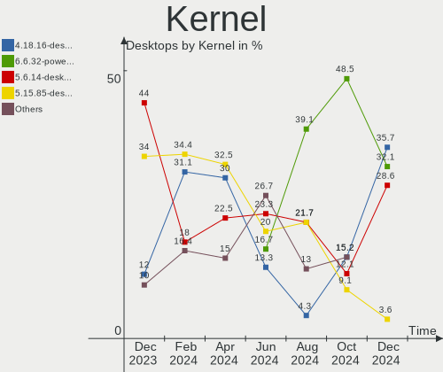
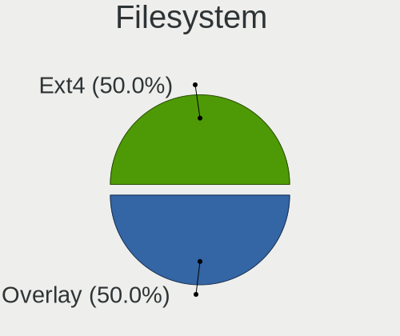
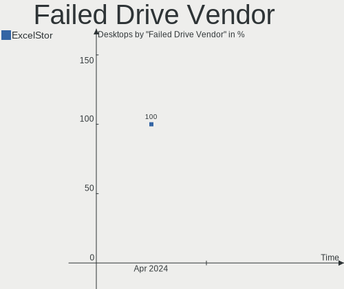
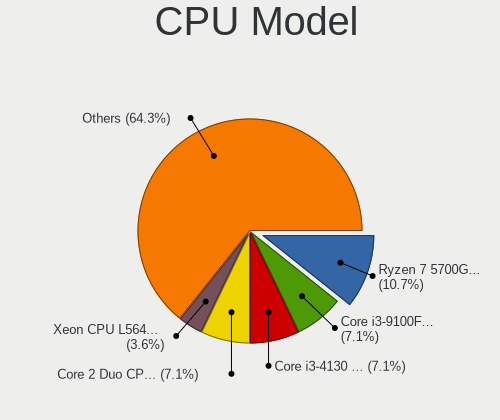
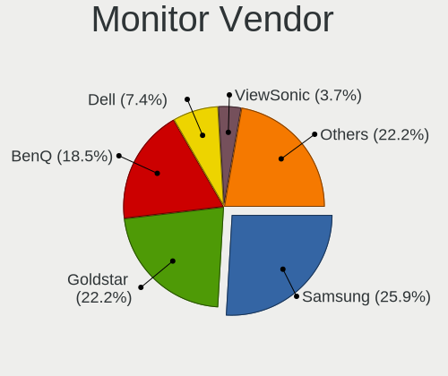
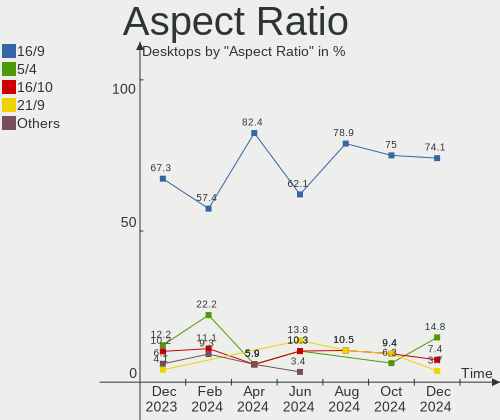

BlackPanther Hardware Trends (Desktop)
--------------------------------------

A project to identify most popular hardware characteristics and track their change
over time based on data collected by BlackPanther users at https://Linux-Hardware.org.

Anyone can contribute to the study by uploading probes of their computers by
the [hw-probe](https://github.com/linuxhw/hw-probe) tool:

    sudo -E hw-probe -all -upload

Full-feature report is available here: https://linux-hardware.org/?view=trends&formfactor=desktop

Period: Jan, 2021.

Contents
--------

- [ OS                       ](#os)
- [ OS Family                ](#os-family)
- [ Kernel                   ](#kernel)
- [ Kernel Family            ](#kernel-family)
- [ Kernel Major Ver.        ](#kernel-major-ver)
- [ Arch                     ](#arch)
- [ DE                       ](#de)
- [ Display Server           ](#display-server)
- [ Display Manager          ](#display-manager)
- [ OS Lang                  ](#os-lang)
- [ Boot Mode                ](#boot-mode)
- [ Filesystem               ](#filesystem)
- [ Part. scheme             ](#part-scheme)
- [ Dual Boot with Linux/BSD ](#dual-boot-with-linux/bsd)
- [ Dual Boot (Win)          ](#dual-boot-win)
- [ Country                  ](#country)
- [ City                     ](#city)
- [ Vendor                   ](#vendor)
- [ Model                    ](#model)
- [ Model Family             ](#model-family)
- [ MFG Year                 ](#mfg-year)
- [ Form Factor              ](#form-factor)
- [ Secure Boot              ](#secure-boot)
- [ Coreboot                 ](#coreboot)
- [ RAM Size                 ](#ram-size)
- [ RAM Used                 ](#ram-used)
- [ Has CD-ROM               ](#has-cd-rom)
- [ Total Drives             ](#total-drives)
- [ Has Ethernet             ](#has-ethernet)
- [ Drive Vendor             ](#drive-vendor)
- [ Drive Model              ](#drive-model)
- [ HDD Vendor               ](#hdd-vendor)
- [ SSD Vendor               ](#ssd-vendor)
- [ Drive Kind               ](#drive-kind)
- [ Drive Connector          ](#drive-connector)
- [ Drive Size               ](#drive-size)
- [ Space Total              ](#space-total)
- [ Space Used               ](#space-used)
- [ Malfunc. Drives          ](#malfunc-drives)
- [ Malfunc. Drive Vendor    ](#malfunc-drive-vendor)
- [ Malfunc. HDD Vendor      ](#malfunc-hdd-vendor)
- [ Malfunc. Drive Kind      ](#malfunc-drive-kind)
- [ Failed Drives            ](#failed-drives)
- [ Failed Drive Vendor      ](#failed-drive-vendor)
- [ Drive Status             ](#drive-status)
- [ Storage Vendor           ](#storage-vendor)
- [ Storage Model            ](#storage-model)
- [ Storage Kind             ](#storage-kind)
- [ CPU Vendor               ](#cpu-vendor)
- [ CPU Model                ](#cpu-model)
- [ CPU Model Family         ](#cpu-model-family)
- [ CPU Cores                ](#cpu-cores)
- [ CPU Sockets              ](#cpu-sockets)
- [ CPU Threads              ](#cpu-threads)
- [ CPU Op-Modes             ](#cpu-op-modes)
- [ CPU Microcode            ](#cpu-microcode)
- [ CPU Microarch            ](#cpu-microarch)
- [ GPU Vendor               ](#gpu-vendor)
- [ GPU Model                ](#gpu-model)
- [ GPU Combo                ](#gpu-combo)
- [ GPU Driver               ](#gpu-driver)
- [ GPU Memory               ](#gpu-memory)
- [ Monitor Vendor           ](#monitor-vendor)
- [ Monitor Model            ](#monitor-model)
- [ Monitor Resolution       ](#monitor-resolution)
- [ Monitor Diagonal         ](#monitor-diagonal)
- [ Monitor Width            ](#monitor-width)
- [ Aspect Ratio             ](#aspect-ratio)
- [ Monitor Area             ](#monitor-area)
- [ Pixel Density            ](#pixel-density)
- [ Multiple Monitors        ](#multiple-monitors)
- [ Net Controller Vendor    ](#net-controller-vendor)
- [ Net Controller Model     ](#net-controller-model)
- [ Wireless Vendor          ](#wireless-vendor)
- [ Wireless Model           ](#wireless-model)
- [ Ethernet Vendor          ](#ethernet-vendor)
- [ Ethernet Model           ](#ethernet-model)
- [ Net Controller Kind      ](#net-controller-kind)
- [ Used Controller          ](#used-controller)
- [ NICs                     ](#nics)
- [ Memory Vendor            ](#memory-vendor)
- [ Memory Model             ](#memory-model)
- [ Memory Kind              ](#memory-kind)
- [ Memory Form Factor       ](#memory-form-factor)
- [ Memory Size              ](#memory-size)
- [ Memory Speed             ](#memory-speed)
- [ Sound Vendor             ](#sound-vendor)
- [ Sound Model              ](#sound-model)
- [ Camera Vendor            ](#camera-vendor)
- [ Camera Model             ](#camera-model)
- [ Fingerprint Vendor       ](#fingerprint-vendor)
- [ Fingerprint Model        ](#fingerprint-model)
- [ Chipcard Vendor          ](#chipcard-vendor)
- [ Chipcard Model           ](#chipcard-model)
- [ Printer Vendor           ](#printer-vendor)
- [ Printer Model            ](#printer-model)
- [ Scanner Vendor           ](#scanner-vendor)
- [ Scanner Model            ](#scanner-model)
- [ Bluetooth Vendor         ](#bluetooth-vendor)
- [ Bluetooth Model          ](#bluetooth-model)
- [ Unsupported Devices      ](#unsupported-devices)
- [ Unsupported Device Types ](#unsupported-device-types)

OS
--

Installed operating systems

| Name              | Desktops | Percent |
|-------------------|----------|---------|
| BlackPanther 18.1 | 108      | 95.58%  |
| BlackPanther 16.2 | 4        | 3.54%   |
| BlackPanther 16.1 | 1        | 0.88%   |

OS Family
---------

OS without a version

| Name         | Desktops | Percent |
|--------------|----------|---------|
| BlackPanther | 113      | 100%    |

Kernel
------

Version of the Linux kernel

| Version                | Desktops | Percent |
|------------------------|----------|---------|
| 4.18.16-desktop-1bP    | 102      | 90.27%  |
| 5.6.14-desktop-2bP     | 6        | 5.31%   |
| 4.9.20-desktop-pae-1bP | 3        | 2.65%   |
| 4.7.0-desktop-1bP      | 2        | 1.77%   |

Kernel Family
-------------

Linux kernel without a distro release

| Version | Desktops | Percent |
|---------|----------|---------|
| 4.18.16 | 102      | 90.27%  |
| 5.6.14  | 6        | 5.31%   |
| 4.9.20  | 3        | 2.65%   |
| 4.7.0   | 2        | 1.77%   |

Kernel Major Ver.
-----------------

Linux kernel major version

| Version | Desktops | Percent |
|---------|----------|---------|
| 4.18    | 102      | 90.27%  |
| 5.6     | 6        | 5.31%   |
| 4.9     | 3        | 2.65%   |
| 4.7     | 2        | 1.77%   |

Arch
----

OS architecture (x86_64, i586, etc.)

| Name   | Desktops | Percent |
|--------|----------|---------|
| x86_64 | 108      | 95.58%  |
| i686   | 5        | 4.42%   |

DE
--

Desktop Environment

| Name | Desktops | Percent |
|------|----------|---------|
| KDE5 | 113      | 100%    |

Display Server
--------------

X11 or Wayland

| Name | Desktops | Percent |
|------|----------|---------|
| X11  | 113      | 100%    |

Display Manager
---------------

SDDM, LightDM, etc.

| Name | Desktops | Percent |
|------|----------|---------|
| SDDM | 113      | 100%    |

OS Lang
-------

Language

| Lang    | Desktops | Percent |
|---------|----------|---------|
| Unknown | 113      | 100%    |

Boot Mode
---------

EFI or BIOS

| Mode | Desktops | Percent |
|------|----------|---------|
| BIOS | 82       | 72.57%  |
| EFI  | 31       | 27.43%  |

Filesystem
----------

Type of filesystem

| Type    | Desktops | Percent |
|---------|----------|---------|
| Overlay | 100      | 88.5%   |
| Ext4    | 13       | 11.5%   |

Part. scheme
------------

Scheme of partitioning

| Type | Desktops | Percent |
|------|----------|---------|
| MBR  | 72       | 63.72%  |
| GPT  | 41       | 36.28%  |

Dual Boot with Linux/BSD
------------------------

Hosting more than one Linux/BSD

| Dual boot | Desktops | Percent |
|-----------|----------|---------|
| No        | 58       | 51.33%  |
| Yes       | 55       | 48.67%  |

Dual Boot (Win)
---------------

Hosting Linux and Windows

| Dual boot | Desktops | Percent |
|-----------|----------|---------|
| Yes       | 74       | 65.49%  |
| No        | 39       | 34.51%  |

Country
-------

Geographic location (country)

| Country     | Desktops | Percent |
|-------------|----------|---------|
| Hungary     | 82       | 72.57%  |
| Germany     | 6        | 5.31%   |
| USA         | 3        | 2.65%   |
| Canada      | 3        | 2.65%   |
| Slovakia    | 2        | 1.77%   |
| Romania     | 2        | 1.77%   |
| Poland      | 2        | 1.77%   |
| Ukraine     | 1        | 0.88%   |
| UK          | 1        | 0.88%   |
| Switzerland | 1        | 0.88%   |
| Spain       | 1        | 0.88%   |
| Slovenia    | 1        | 0.88%   |
| Italy       | 1        | 0.88%   |
| France      | 1        | 0.88%   |
| Bulgaria    | 1        | 0.88%   |
| Brazil      | 1        | 0.88%   |
| Belgium     | 1        | 0.88%   |
| Austria     | 1        | 0.88%   |
| Australia   | 1        | 0.88%   |
| Unknown     | 1        | 0.88%   |

City
----

Geographic location (city)

| City                   | Desktops | Percent |
|------------------------|----------|---------|
| Budapest               | 28       | 24.78%  |
| Debrecen               | 8        | 7.08%   |
| Miskolc                | 3        | 2.65%   |
| Karcag                 | 3        | 2.65%   |
| Toronto                | 2        | 1.77%   |
| Tiszafoldvar           | 2        | 1.77%   |
| Pecsvarad              | 2        | 1.77%   |
| Oroshaza               | 2        | 1.77%   |
| Krakow                 | 2        | 1.77%   |
| Kecskemét             | 2        | 1.77%   |
| Frankfurt am Main      | 2        | 1.77%   |
| Baja                   | 2        | 1.77%   |
| Zsombo                 | 1        | 0.88%   |
| Worms                  | 1        | 0.88%   |
| Wettingen              | 1        | 0.88%   |
| Vienna                 | 1        | 0.88%   |
| Varpalota              | 1        | 0.88%   |
| Vagovce                | 1        | 0.88%   |
| Uzhhorod               | 1        | 0.88%   |
| Tatarusi               | 1        | 0.88%   |
| Szolosgyorok           | 1        | 0.88%   |
| Szigetszentmiklos      | 1        | 0.88%   |
| Szeged                 | 1        | 0.88%   |
| Sutton                 | 1        | 0.88%   |
| Stuttgart              | 1        | 0.88%   |
| Souffelweyersheim      | 1        | 0.88%   |
| Sistov                 | 1        | 0.88%   |
| Sfantu Gheorghe        | 1        | 0.88%   |
| Sempeter pri Gorici    | 1        | 0.88%   |
| Sarospatak             | 1        | 0.88%   |
| Santiago de Compostela | 1        | 0.88%   |
| Sajokeresztur          | 1        | 0.88%   |
| Saint-Gilles           | 1        | 0.88%   |
| Rieseby                | 1        | 0.88%   |
| Parnamirim             | 1        | 0.88%   |
| Nyiregyhaza            | 1        | 0.88%   |
| Nyirbator              | 1        | 0.88%   |
| Nyirad                 | 1        | 0.88%   |
| Nyalka                 | 1        | 0.88%   |
| New Windsor            | 1        | 0.88%   |
| Nagyszenas             | 1        | 0.88%   |
| Nagykoros              | 1        | 0.88%   |
| Mohács                | 1        | 0.88%   |
| Mezokovesd             | 1        | 0.88%   |
| Mezokovacshaza         | 1        | 0.88%   |
| Mezobereny             | 1        | 0.88%   |
| Melbourne              | 1        | 0.88%   |
| Mako                   | 1        | 0.88%   |
| Jaszjakohalma          | 1        | 0.88%   |
| Ilmmunster             | 1        | 0.88%   |
| Hunya                  | 1        | 0.88%   |
| Hort                   | 1        | 0.88%   |
| Hodmezovasarhely       | 1        | 0.88%   |
| Hlinik nad Hronom      | 1        | 0.88%   |
| Győr                  | 1        | 0.88%   |
| Gyongyos               | 1        | 0.88%   |
| Guin                   | 1        | 0.88%   |
| Fisciano               | 1        | 0.88%   |
| Fehergyarmat           | 1        | 0.88%   |
| Evansville             | 1        | 0.88%   |

Vendor
------

Motherboard manufacturer

| Name                | Desktops | Percent |
|---------------------|----------|---------|
| ASUSTek Computer    | 23       | 20.35%  |
| Gigabyte Technology | 17       | 15.04%  |
| Hewlett-Packard     | 16       | 14.16%  |
| ASRock              | 13       | 11.5%   |
| Lenovo              | 9        | 7.96%   |
| Dell                | 9        | 7.96%   |
| MSI                 | 6        | 5.31%   |
| Fujitsu             | 4        | 3.54%   |
| Acer                | 3        | 2.65%   |
| Foxconn             | 2        | 1.77%   |
| ViewSonic Crop.     | 1        | 0.88%   |
| TYAN Computer       | 1        | 0.88%   |
| Shuttle             | 1        | 0.88%   |
| Pegatron            | 1        | 0.88%   |
| Packard Bell        | 1        | 0.88%   |
| Medion              | 1        | 0.88%   |
| Login Informatica   | 1        | 0.88%   |
| Lex                 | 1        | 0.88%   |
| Intel               | 1        | 0.88%   |
| IBM                 | 1        | 0.88%   |
| Fujitsu Siemens     | 1        | 0.88%   |

Model
-----

Motherboard model

| Name                                   | Desktops | Percent |
|----------------------------------------|----------|---------|
| ASUS P5KPL-AM EPU                      | 3        | 2.65%   |
| HP Compaq Pro 6305 MT                  | 2        | 1.77%   |
| HP Compaq dc5800 Microtower            | 2        | 1.77%   |
| Gigabyte P67A-D3-B3                    | 2        | 1.77%   |
| Dell OptiPlex 320                      | 2        | 1.77%   |
| ASUS All Series                        | 2        | 1.77%   |
| ViewSonic Crop. VPC221                 | 1        | 0.88%   |
| TYAN S2925                             | 1        | 0.88%   |
| Shuttle XS35V4                         | 1        | 0.88%   |
| Pegatron 2A73                          | 1        | 0.88%   |
| Packard Bell iPower X9975              | 1        | 0.88%   |
| MSI MS-7B79                            | 1        | 0.88%   |
| MSI MS-7A32                            | 1        | 0.88%   |
| MSI MS-7817                            | 1        | 0.88%   |
| MSI MS-7721                            | 1        | 0.88%   |
| MSI MS-7693                            | 1        | 0.88%   |
| MSI MS-7418                            | 1        | 0.88%   |
| Medion MS-7728                         | 1        | 0.88%   |
| Login Informatica LOG-H310C-M          | 1        | 0.88%   |
| Lex CedarView                          | 1        | 0.88%   |
| Lenovo ThinkStation S10 6483AS4        | 1        | 0.88%   |
| Lenovo ThinkCentre M93p 10A8S07N0T     | 1        | 0.88%   |
| Lenovo ThinkCentre M81 5049PF4         | 1        | 0.88%   |
| Lenovo ThinkCentre M73 10B6001SUS      | 1        | 0.88%   |
| Lenovo ThinkCentre M70e 00P5607        | 1        | 0.88%   |
| Lenovo ThinkCentre M58p 6138DK1        | 1        | 0.88%   |
| Lenovo ThinkCentre M58 7373A25         | 1        | 0.88%   |
| Lenovo ThinkCentre A57 98517HG         | 1        | 0.88%   |
| Lenovo 3000 969162G                    | 1        | 0.88%   |
| Intel DQ67SW AAG12527-310              | 1        | 0.88%   |
| IBM 8114WGW                            | 1        | 0.88%   |
| HP Z600 Workstation                    | 1        | 0.88%   |
| HP Compaq Pro 6305 SFF                 | 1        | 0.88%   |
| HP Compaq Pro 6300 SFF                 | 1        | 0.88%   |
| HP Compaq dx6120 MT(PL926AV)           | 1        | 0.88%   |
| HP Compaq dc7900 Small Form Factor     | 1        | 0.88%   |
| HP Compaq dc7900 Convertible Minitower | 1        | 0.88%   |
| HP Compaq dc7700 Convertible Minitower | 1        | 0.88%   |
| HP Compaq dc5850 Small Form Factor     | 1        | 0.88%   |
| HP Compaq dc5750 Small Form Factor     | 1        | 0.88%   |
| HP Compaq 8000 Elite SFF PC            | 1        | 0.88%   |
| HP Compaq 6000 Pro SFF PC              | 1        | 0.88%   |
| HP 2AFA                                | 1        | 0.88%   |
| Gigabyte Z97X-SLI                      | 1        | 0.88%   |
| Gigabyte Z390 UD                       | 1        | 0.88%   |
| Gigabyte P35-S3G                       | 1        | 0.88%   |
| Gigabyte P35-DS3                       | 1        | 0.88%   |
| Gigabyte M57SLI-S4                     | 1        | 0.88%   |
| Gigabyte H81M-S1                       | 1        | 0.88%   |
| Gigabyte H81M-HD3                      | 1        | 0.88%   |
| Gigabyte H61MS                         | 1        | 0.88%   |
| Gigabyte H61M-S1                       | 1        | 0.88%   |
| Gigabyte GA-MA78LMT-US2H               | 1        | 0.88%   |
| Gigabyte COMFOR BOXER                  | 1        | 0.88%   |
| Gigabyte B450M GAMING                  | 1        | 0.88%   |
| Gigabyte B450 AORUS M                  | 1        | 0.88%   |
| Gigabyte 970A-DS3P                     | 1        | 0.88%   |
| Gigabyte 965P-DS3                      | 1        | 0.88%   |
| Fujitsu Siemens ESPRIMO E5730          | 1        | 0.88%   |
| Fujitsu ESPRIMO P720                   | 1        | 0.88%   |

Model Family
------------

Motherboard model prefix

| Name                          | Desktops | Percent |
|-------------------------------|----------|---------|
| HP Compaq                     | 14       | 12.39%  |
| Lenovo ThinkCentre            | 7        | 6.19%   |
| Dell OptiPlex                 | 7        | 6.19%   |
| Fujitsu ESPRIMO               | 4        | 3.54%   |
| ASUS PRIME                    | 4        | 3.54%   |
| ASUS P5KPL-AM                 | 3        | 2.65%   |
| Gigabyte P67A-D3-B3           | 2        | 1.77%   |
| ASUS H110M-A                  | 2        | 1.77%   |
| ASUS All                      | 2        | 1.77%   |
| Acer Veriton                  | 2        | 1.77%   |
| ViewSonic Crop. VPC221        | 1        | 0.88%   |
| TYAN S2925                    | 1        | 0.88%   |
| Shuttle XS35V4                | 1        | 0.88%   |
| Pegatron 2A73                 | 1        | 0.88%   |
| Packard Bell iPower           | 1        | 0.88%   |
| MSI MS-7B79                   | 1        | 0.88%   |
| MSI MS-7A32                   | 1        | 0.88%   |
| MSI MS-7817                   | 1        | 0.88%   |
| MSI MS-7721                   | 1        | 0.88%   |
| MSI MS-7693                   | 1        | 0.88%   |
| MSI MS-7418                   | 1        | 0.88%   |
| Medion MS-7728                | 1        | 0.88%   |
| Login Informatica LOG-H310C-M | 1        | 0.88%   |
| Lex CedarView                 | 1        | 0.88%   |
| Lenovo ThinkStation           | 1        | 0.88%   |
| Lenovo 3000                   | 1        | 0.88%   |
| Intel DQ67SW                  | 1        | 0.88%   |
| IBM 8114WGW                   | 1        | 0.88%   |
| HP Z600                       | 1        | 0.88%   |
| HP 2AFA                       | 1        | 0.88%   |
| Gigabyte Z97X-SLI             | 1        | 0.88%   |
| Gigabyte Z390                 | 1        | 0.88%   |
| Gigabyte P35-S3G              | 1        | 0.88%   |
| Gigabyte P35-DS3              | 1        | 0.88%   |
| Gigabyte M57SLI-S4            | 1        | 0.88%   |
| Gigabyte H81M-S1              | 1        | 0.88%   |
| Gigabyte H81M-HD3             | 1        | 0.88%   |
| Gigabyte H61MS                | 1        | 0.88%   |
| Gigabyte H61M-S1              | 1        | 0.88%   |
| Gigabyte GA-MA78LMT-US2H      | 1        | 0.88%   |
| Gigabyte COMFOR               | 1        | 0.88%   |
| Gigabyte B450M                | 1        | 0.88%   |
| Gigabyte B450                 | 1        | 0.88%   |
| Gigabyte 970A-DS3P            | 1        | 0.88%   |
| Gigabyte 965P-DS3             | 1        | 0.88%   |
| Fujitsu Siemens ESPRIMO       | 1        | 0.88%   |
| Foxconn Pro                   | 1        | 0.88%   |
| Foxconn G41MX                 | 1        | 0.88%   |
| Dell PowerEdge                | 1        | 0.88%   |
| Dell Inspiron                 | 1        | 0.88%   |
| ASUS ROG                      | 1        | 0.88%   |
| ASUS PC                       | 1        | 0.88%   |
| ASUS P8Z77-V                  | 1        | 0.88%   |
| ASUS P8H61-M                  | 1        | 0.88%   |
| ASUS P8B75-M                  | 1        | 0.88%   |
| ASUS P5QLD                    | 1        | 0.88%   |
| ASUS P5QL                     | 1        | 0.88%   |
| ASUS P5K-VM                   | 1        | 0.88%   |
| ASUS M5A78L-M                 | 1        | 0.88%   |
| ASUS M2N                      | 1        | 0.88%   |

MFG Year
--------

Motherboard manufacture year

| Year | Desktops | Percent |
|------|----------|---------|
| 2011 | 14       | 12.39%  |
| 2014 | 13       | 11.5%   |
| 2012 | 13       | 11.5%   |
| 2015 | 11       | 9.73%   |
| 2008 | 11       | 9.73%   |
| 2019 | 9        | 7.96%   |
| 2009 | 9        | 7.96%   |
| 2010 | 7        | 6.19%   |
| 2018 | 6        | 5.31%   |
| 2013 | 6        | 5.31%   |
| 2016 | 5        | 4.42%   |
| 2007 | 5        | 4.42%   |
| 2020 | 2        | 1.77%   |
| 2017 | 1        | 0.88%   |
| 2006 | 1        | 0.88%   |

Form Factor
-----------

Physical design of the computer

| Name    | Desktops | Percent |
|---------|----------|---------|
| Desktop | 113      | 100%    |

Secure Boot
-----------

Enabled or disabled

| State    | Desktops | Percent |
|----------|----------|---------|
| Disabled | 113      | 100%    |

Coreboot
--------

Have coreboot on board

| Used | Desktops | Percent |
|------|----------|---------|
| No   | 113      | 100%    |

RAM Size
--------

Total RAM memory

| Size in GB | Desktops | Percent |
|------------|----------|---------|
| 3.01-4.0   | 35       | 30.97%  |
| 8.01-16.0  | 35       | 30.97%  |
| 4.01-8.0   | 17       | 15.04%  |
| 1.01-2.0   | 11       | 9.73%   |
| 16.01-24.0 | 10       | 8.85%   |
| 2.01-3.0   | 4        | 3.54%   |
| 32.01-64.0 | 1        | 0.88%   |

RAM Used
--------

Used RAM memory

| Used GB  | Desktops | Percent |
|----------|----------|---------|
| 0.01-0.5 | 77       | 68.14%  |
| 0.51-1.0 | 31       | 27.43%  |
| 1.01-2.0 | 5        | 4.42%   |

Has CD-ROM
----------

Has CD-ROM on board

| Presented | Desktops | Percent |
|-----------|----------|---------|
| Yes       | 80       | 70.8%   |
| No        | 33       | 29.2%   |

Total Drives
------------

Number of drives on board

| Drives | Desktops | Percent |
|--------|----------|---------|
| 1      | 60       | 53.1%   |
| 2      | 27       | 23.89%  |
| 3      | 16       | 14.16%  |
| 4      | 7        | 6.19%   |
| 5      | 2        | 1.77%   |
| 6      | 1        | 0.88%   |

Has Ethernet
------------

Has Ethernet on board

| Presented | Desktops | Percent |
|-----------|----------|---------|
| Yes       | 113      | 100%    |

Drive Vendor
------------

Hard drive vendors

| Vendor              | Desktops | Drives | Percent |
|---------------------|----------|--------|---------|
| WDC                 | 46       | 60     | 24.6%   |
| Seagate             | 35       | 37     | 18.72%  |
| Kingston            | 30       | 35     | 16.04%  |
| Samsung Electronics | 21       | 28     | 11.23%  |
| Toshiba             | 12       | 13     | 6.42%   |
| Hitachi             | 10       | 11     | 5.35%   |
| SanDisk             | 5        | 6      | 2.67%   |
| A-DATA Technology   | 5        | 5      | 2.67%   |
| Maxtor              | 3        | 3      | 1.6%    |
| OCZ                 | 2        | 2      | 1.07%   |
| Intenso             | 2        | 2      | 1.07%   |
| Intel               | 2        | 2      | 1.07%   |
| Zheino              | 1        | 1      | 0.53%   |
| WD MediaMax         | 1        | 1      | 0.53%   |
| SPCC                | 1        | 1      | 0.53%   |
| SK Hynix            | 1        | 1      | 0.53%   |
| PNY                 | 1        | 1      | 0.53%   |
| Patriot             | 1        | 1      | 0.53%   |
| JMicron             | 1        | 1      | 0.53%   |
| HUAWEI              | 1        | 1      | 0.53%   |
| HGST                | 1        | 1      | 0.53%   |
| Fujitsu             | 1        | 1      | 0.53%   |
| EMTEC               | 1        | 1      | 0.53%   |
| Crucial             | 1        | 1      | 0.53%   |
| China               | 1        | 1      | 0.53%   |
| Apacer              | 1        | 1      | 0.53%   |

Drive Model
-----------

Hard drive models

| Model                            | Desktops | Percent |
|----------------------------------|----------|---------|
| Kingston SA400S37240G 240GB SSD  | 8        | 3.79%   |
| Seagate ST500DM002-1BD142 500GB  | 6        | 2.84%   |
| Kingston SA400S37120G 120GB SSD  | 6        | 2.84%   |
| Seagate ST380815AS 80GB          | 5        | 2.37%   |
| Kingston SV300S37A120G 120GB SSD | 5        | 2.37%   |
| Toshiba DT01ACA100 1TB           | 4        | 1.9%    |
| WDC WD10EZRZ-00HTKB0 1TB         | 3        | 1.42%   |
| WDC WD10EZEX-08WN4A0 1TB         | 3        | 1.42%   |
| Kingston SUV400S37120G 120GB SSD | 3        | 1.42%   |
| Kingston SA400S37480G 480GB SSD  | 3        | 1.42%   |
| A-DATA SU630 240GB SSD           | 3        | 1.42%   |
| WDC WDS240G2G0B-00EPW0 240GB SSD | 2        | 0.95%   |
| WDC WD5000AAKX-22ERMA0 500GB     | 2        | 0.95%   |
| WDC WD5000AAKX-07U6AA0 500GB     | 2        | 0.95%   |
| WDC WD30EZRZ-00GXCB0 3TB         | 2        | 0.95%   |
| WDC WD30EFRX-68EUZN0 3TB         | 2        | 0.95%   |
| Toshiba DT01ACA050 500GB         | 2        | 0.95%   |
| Seagate ST380811AS 80GB          | 2        | 0.95%   |
| Seagate ST3250620AS 250GB        | 2        | 0.95%   |
| Seagate ST1000DM010-2EP102 1TB   | 2        | 0.95%   |
| Samsung SSD 860 EVO 250GB        | 2        | 0.95%   |
| Samsung SSD 850 EVO 250GB        | 2        | 0.95%   |
| Samsung SSD 830 Series 64GB      | 2        | 0.95%   |
| Samsung HD154UI 1TB              | 2        | 0.95%   |
| Samsung HD103SI 1TB              | 2        | 0.95%   |
| Hitachi HDS721050CLA662 500GB    | 2        | 0.95%   |
| Zheino CHN-NGFFNV2280-256 256GB  | 1        | 0.47%   |
| WDC WDS500G2X0C-00L350 500GB     | 1        | 0.47%   |
| WDC WDS240G2G0A-00JH30 240GB SSD | 1        | 0.47%   |
| WDC WDS120G2G0A-00JH30 120GB SSD | 1        | 0.47%   |
| WDC WD800JD-60LSA5 80GB          | 1        | 0.47%   |
| WDC WD800AAJS-75M0A0 80GB        | 1        | 0.47%   |
| WDC WD800AAJS-60PSA0 80GB        | 1        | 0.47%   |
| WDC WD5003AZEX-00K1GA0 500GB     | 1        | 0.47%   |
| WDC WD5000AZLX-00K2TA0 500GB     | 1        | 0.47%   |
| WDC WD5000AVCS-632DY1 500GB      | 1        | 0.47%   |
| WDC WD5000AAKX-60U6AA0 500GB     | 1        | 0.47%   |
| WDC WD5000AAKX-221CA1 500GB      | 1        | 0.47%   |
| WDC WD5000AAKX-08U6AA0 500GB     | 1        | 0.47%   |
| WDC WD5000AAKS-00YGA0 500GB      | 1        | 0.47%   |
| WDC WD5000AAKS-00V1A0 500GB      | 1        | 0.47%   |
| WDC WD5000AAKS-00UU3A0 500GB     | 1        | 0.47%   |
| WDC WD5000AAKS-007AA0 500GB      | 1        | 0.47%   |
| WDC WD5000AADS-00S9B0 500GB      | 1        | 0.47%   |
| WDC WD400BD-75MRA1 40GB          | 1        | 0.47%   |
| WDC WD3200AAJS-22B4A0 320GB      | 1        | 0.47%   |
| WDC WD3200AAJS-00VWA0 320GB      | 1        | 0.47%   |
| WDC WD3200AAJS-00L7A0 320GB      | 1        | 0.47%   |
| WDC WD2500AVJS-63WDA0 250GB      | 1        | 0.47%   |
| WDC WD2500AAKX-75U6AA0 250GB     | 1        | 0.47%   |
| WDC WD2500AAKX-603CA0 250GB      | 1        | 0.47%   |
| WDC WD2500AAKX-07U6AA0 250GB     | 1        | 0.47%   |
| WDC WD2500AAJS-75M0A0 250GB      | 1        | 0.47%   |
| WDC WD20EARX-00PASB0 2TB         | 1        | 0.47%   |
| WDC WD20EARS-60MVWB0 2TB         | 1        | 0.47%   |
| WDC WD2005FBYZ-01YCBB2 2TB       | 1        | 0.47%   |
| WDC WD2000FYYZ-01UL1B2 2TB       | 1        | 0.47%   |
| WDC WD1600BEVT-22ZCT0 160GB      | 1        | 0.47%   |
| WDC WD1600AAJS-75M0A0 160GB      | 1        | 0.47%   |
| WDC WD1600AAJS-22PSA0 160GB      | 1        | 0.47%   |

HDD Vendor
----------

Hard disk drive vendors

| Vendor              | Desktops | Drives | Percent |
|---------------------|----------|--------|---------|
| WDC                 | 43       | 55     | 36.13%  |
| Seagate             | 35       | 37     | 29.41%  |
| Samsung Electronics | 13       | 14     | 10.92%  |
| Toshiba             | 12       | 13     | 10.08%  |
| Hitachi             | 10       | 11     | 8.4%    |
| MAXTOR              | 3        | 3      | 2.52%   |
| WD MediaMax         | 1        | 1      | 0.84%   |
| HGST                | 1        | 1      | 0.84%   |
| Fujitsu             | 1        | 1      | 0.84%   |

SSD Vendor
----------

Solid state drive vendors

| Vendor              | Desktops | Drives | Percent |
|---------------------|----------|--------|---------|
| Kingston            | 28       | 33     | 42.42%  |
| Samsung Electronics | 11       | 14     | 16.67%  |
| SanDisk             | 5        | 6      | 7.58%   |
| A-DATA Technology   | 5        | 5      | 7.58%   |
| WDC                 | 4        | 4      | 6.06%   |
| OCZ                 | 2        | 2      | 3.03%   |
| Intenso             | 2        | 2      | 3.03%   |
| SPCC                | 1        | 1      | 1.52%   |
| SK Hynix            | 1        | 1      | 1.52%   |
| PNY                 | 1        | 1      | 1.52%   |
| Patriot             | 1        | 1      | 1.52%   |
| JMicron             | 1        | 1      | 1.52%   |
| EMTEC               | 1        | 1      | 1.52%   |
| Crucial             | 1        | 1      | 1.52%   |
| China               | 1        | 1      | 1.52%   |
| Apacer              | 1        | 1      | 1.52%   |

Drive Kind
----------

HDD or SSD

| Kind    | Desktops | Drives | Percent |
|---------|----------|--------|---------|
| HDD     | 95       | 136    | 60.13%  |
| SSD     | 57       | 75     | 36.08%  |
| NVMe    | 5        | 6      | 3.16%   |
| Unknown | 1        | 1      | 0.63%   |

Drive Connector
---------------

SATA, SAS, NVMe, etc.

| Type | Desktops | Drives | Percent |
|------|----------|--------|---------|
| SATA | 113      | 210    | 94.17%  |
| NVMe | 5        | 6      | 4.17%   |
| SAS  | 2        | 2      | 1.67%   |

Drive Size
----------

Size of hard drive

| Size in TB | Desktops | Drives | Percent |
|------------|----------|--------|---------|
| 0.01-0.5   | 103      | 158    | 71.53%  |
| 0.51-1.0   | 32       | 40     | 22.22%  |
| 1.01-2.0   | 6        | 8      | 4.17%   |
| 2.01-3.0   | 2        | 4      | 1.39%   |
| 3.01-4.0   | 1        | 1      | 0.69%   |

Space Total
-----------

Amount of disk space available on the file system

| Size in GB | Desktops | Percent |
|------------|----------|---------|
| Unknown    | 99       | 87.61%  |
| 101-250    | 6        | 5.31%   |
| 251-500    | 3        | 2.65%   |
| 51-100     | 2        | 1.77%   |
| 21-50      | 1        | 0.88%   |
| 1-20       | 1        | 0.88%   |
| 501-1000   | 1        | 0.88%   |

Space Used
----------

Amount of used disk space

| Used GB | Desktops | Percent |
|---------|----------|---------|
| Unknown | 99       | 87.61%  |
| 1-20    | 12       | 10.62%  |
| 21-50   | 1        | 0.88%   |
| 101-250 | 1        | 0.88%   |

Malfunc. Drives
---------------

Drive models with a malfunction

| Model                                 | Desktops | Drives | Percent |
|---------------------------------------|----------|--------|---------|
| Seagate ST500DM002-1BD142 500GB       | 3        | 3      | 5.56%   |
| WDC WD5000AAKX-07U6AA0 500GB          | 2        | 2      | 3.7%    |
| Toshiba DT01ACA050 500GB              | 2        | 2      | 3.7%    |
| Seagate ST380811AS 80GB               | 2        | 2      | 3.7%    |
| WDC WDS120G2G0A-00JH30 120GB SSD      | 1        | 1      | 1.85%   |
| WDC WD800AAJS-75M0A0 80GB             | 1        | 1      | 1.85%   |
| WDC WD5000AAKX-22ERMA0 500GB          | 1        | 1      | 1.85%   |
| WDC WD5000AAKX-08U6AA0 500GB          | 1        | 1      | 1.85%   |
| WDC WD5000AAKS-00UU3A0 500GB          | 1        | 1      | 1.85%   |
| WDC WD5000AAKS-007AA0 500GB           | 1        | 1      | 1.85%   |
| WDC WD5000AADS-00S9B0 500GB           | 1        | 1      | 1.85%   |
| WDC WD3200AAJS-22B4A0 320GB           | 1        | 1      | 1.85%   |
| WDC WD2500AVJS-63WDA0 250GB           | 1        | 1      | 1.85%   |
| WDC WD20EARS-60MVWB0 2TB              | 1        | 1      | 1.85%   |
| WDC WD2000FYYZ-01UL1B2 2TB            | 1        | 1      | 1.85%   |
| WDC WD1600BEVT-22ZCT0 160GB           | 1        | 1      | 1.85%   |
| WDC WD1600AAJS-22PSA0 160GB           | 1        | 1      | 1.85%   |
| WDC WD10EZEX-08WN4A0 1TB              | 1        | 1      | 1.85%   |
| WD MediaMax WL1000GSA6472B 1TB        | 1        | 1      | 1.85%   |
| Toshiba MK5061GSYN 500GB              | 1        | 1      | 1.85%   |
| Toshiba MK1646GSX 160GB               | 1        | 1      | 1.85%   |
| Toshiba DT01ACA100 1TB                | 1        | 1      | 1.85%   |
| SK Hynix SC210 2.5 7MM 128GB SSD      | 1        | 1      | 1.85%   |
| Seagate ST9320325AS 320GB             | 1        | 1      | 1.85%   |
| Seagate ST500NM0011 500GB             | 1        | 1      | 1.85%   |
| Seagate ST500LM012 HN-M500MBB 500GB   | 1        | 1      | 1.85%   |
| Seagate ST380815AS 80GB               | 1        | 1      | 1.85%   |
| Seagate ST3160812AS 41N3268 LEN 160GB | 1        | 1      | 1.85%   |
| Seagate ST3160811AS 160GB             | 1        | 1      | 1.85%   |
| Seagate ST2000DM006-2DM164 2TB        | 1        | 1      | 1.85%   |
| Seagate ST1000LM035-1RK172 1TB        | 1        | 1      | 1.85%   |
| Samsung Electronics SP1203N 120GB     | 1        | 1      | 1.85%   |
| Samsung Electronics HD501LJ 500GB     | 1        | 1      | 1.85%   |
| Samsung Electronics HD161HJ 160GB     | 1        | 1      | 1.85%   |
| Samsung Electronics HD103UJ 1TB       | 1        | 1      | 1.85%   |
| Samsung Electronics HD103SI 1TB       | 1        | 1      | 1.85%   |
| OCZ AGILITY3 64GB SSD                 | 1        | 1      | 1.85%   |
| MAXTOR STM3250820AS 250GB             | 1        | 1      | 1.85%   |
| Maxtor 6Y080L0 82GB                   | 1        | 1      | 1.85%   |
| Maxtor 2B020H1 20GB                   | 1        | 1      | 1.85%   |
| Kingston SV300S37A120G 120GB SSD      | 1        | 1      | 1.85%   |
| Kingston SUV400S37240G 240GB SSD      | 1        | 1      | 1.85%   |
| Kingston SHFS37A120G 120GB SSD        | 1        | 1      | 1.85%   |
| Kingston SA400S37120G 120GB SSD       | 1        | 1      | 1.85%   |
| Intenso SSD Sata III 120GB            | 1        | 1      | 1.85%   |
| Hitachi HDS721010CLA330 1TB           | 1        | 1      | 1.85%   |
| Hitachi HDP725032GLA360 320GB         | 1        | 1      | 1.85%   |
| Hitachi HDP725016GLA380 160GB         | 1        | 1      | 1.85%   |
| A-DATA Technology SU630 240GB SSD     | 1        | 1      | 1.85%   |

Malfunc. Drive Vendor
---------------------

Vendors of faulty drives

| Vendor              | Desktops | Drives | Percent |
|---------------------|----------|--------|---------|
| WDC                 | 15       | 16     | 28.85%  |
| Seagate             | 12       | 13     | 23.08%  |
| Toshiba             | 5        | 5      | 9.62%   |
| Samsung Electronics | 5        | 5      | 9.62%   |
| Kingston            | 4        | 4      | 7.69%   |
| Maxtor              | 3        | 3      | 5.77%   |
| Hitachi             | 3        | 3      | 5.77%   |
| WD MediaMax         | 1        | 1      | 1.92%   |
| SK Hynix            | 1        | 1      | 1.92%   |
| OCZ                 | 1        | 1      | 1.92%   |
| Intenso             | 1        | 1      | 1.92%   |
| A-DATA Technology   | 1        | 1      | 1.92%   |

Malfunc. HDD Vendor
-------------------

Vendors of faulty HDD drives

| Vendor              | Desktops | Drives | Percent |
|---------------------|----------|--------|---------|
| WDC                 | 14       | 15     | 32.56%  |
| Seagate             | 12       | 13     | 27.91%  |
| Toshiba             | 5        | 5      | 11.63%  |
| Samsung Electronics | 5        | 5      | 11.63%  |
| Maxtor              | 3        | 3      | 6.98%   |
| Hitachi             | 3        | 3      | 6.98%   |
| WD MediaMax         | 1        | 1      | 2.33%   |

Malfunc. Drive Kind
-------------------

Kinds of faulty drives

| Kind | Desktops | Drives | Percent |
|------|----------|--------|---------|
| HDD  | 37       | 45     | 82.22%  |
| SSD  | 8        | 9      | 17.78%  |

Failed Drives
-------------

Failed drive models

| Model                       | Desktops | Drives | Percent |
|-----------------------------|----------|--------|---------|
| Hitachi HDS721010DLE630 1TB | 1        | 1      | 100%    |

Failed Drive Vendor
-------------------

Failed drive vendors

| Vendor  | Desktops | Drives | Percent |
|---------|----------|--------|---------|
| Hitachi | 1        | 1      | 100%    |

Drive Status
------------

Number of failed and malfunc. drives

| Status   | Desktops | Drives | Percent |
|----------|----------|--------|---------|
| Works    | 93       | 159    | 65.49%  |
| Malfunc  | 45       | 54     | 31.69%  |
| Detected | 3        | 4      | 2.11%   |
| Failed   | 1        | 1      | 0.7%    |

Storage Vendor
--------------

Storage controller vendors

| Vendor                      | Desktops | Percent |
|-----------------------------|----------|---------|
| Intel                       | 78       | 59.54%  |
| AMD                         | 30       | 22.9%   |
| Nvidia                      | 5        | 3.82%   |
| JMicron Technology          | 5        | 3.82%   |
| ASMedia Technology          | 5        | 3.82%   |
| Marvell Technology Group    | 2        | 1.53%   |
| Kingston Technology Company | 2        | 1.53%   |
| Silicon Motion              | 1        | 0.76%   |
| Silicon Image               | 1        | 0.76%   |
| Sandisk                     | 1        | 0.76%   |
| LSI Logic / Symbios Logic   | 1        | 0.76%   |

Storage Model
-------------

Storage controller models

| Model                                                                                   | Desktops | Percent |
|-----------------------------------------------------------------------------------------|----------|---------|
| AMD FCH SATA Controller [AHCI mode]                                                     | 17       | 8.59%   |
| Intel 8 Series/C220 Series Chipset Family 6-port SATA Controller 1 [AHCI mode]          | 15       | 7.58%   |
| Intel NM10/ICH7 Family SATA Controller [IDE mode]                                       | 11       | 5.56%   |
| Intel 82801G (ICH7 Family) IDE Controller                                               | 10       | 5.05%   |
| Intel 82801I (ICH9 Family) 2 port SATA Controller [IDE mode]                            | 7        | 3.54%   |
| Intel 4 Series Chipset PT IDER Controller                                               | 7        | 3.54%   |
| Intel 6 Series/C200 Series Chipset Family Desktop SATA Controller (IDE mode, ports 4-5) | 6        | 3.03%   |
| Intel 6 Series/C200 Series Chipset Family Desktop SATA Controller (IDE mode, ports 0-3) | 6        | 3.03%   |
| Intel 82801IB (ICH9) 2 port SATA Controller [IDE mode]                                  | 5        | 2.53%   |
| Intel 7 Series/C210 Series Chipset Family 6-port SATA Controller [AHCI mode]            | 5        | 2.53%   |
| Intel 6 Series/C200 Series Chipset Family 6 port Desktop SATA AHCI Controller           | 5        | 2.53%   |
| ASMedia ASM1062 Serial ATA Controller                                                   | 5        | 2.53%   |
| AMD FCH IDE Controller                                                                  | 5        | 2.53%   |
| Intel 82801JD/DO (ICH10 Family) SATA AHCI Controller                                    | 4        | 2.02%   |
| Intel 82801JD/DO (ICH10 Family) 4-port SATA IDE Controller                              | 4        | 2.02%   |
| Intel 82801JD/DO (ICH10 Family) 2-port SATA IDE Controller                              | 4        | 2.02%   |
| AMD SB7x0/SB8x0/SB9x0 SATA Controller [AHCI mode]                                       | 4        | 2.02%   |
| AMD 400 Series Chipset SATA Controller                                                  | 4        | 2.02%   |
| JMicron JMB368 IDE controller                                                           | 3        | 1.52%   |
| Intel SATA Controller [RAID mode]                                                       | 3        | 1.52%   |
| Intel 200 Series PCH SATA controller [AHCI mode]                                        | 3        | 1.52%   |
| AMD SB7x0/SB8x0/SB9x0 SATA Controller [IDE mode]                                        | 3        | 1.52%   |
| AMD SB7x0/SB8x0/SB9x0 IDE Controller                                                    | 3        | 1.52%   |
| AMD SB600 Non-Raid-5 SATA                                                               | 3        | 1.52%   |
| AMD SB600 IDE                                                                           | 3        | 1.52%   |
| Nvidia MCP61 SATA Controller                                                            | 2        | 1.01%   |
| Nvidia MCP61 IDE                                                                        | 2        | 1.01%   |
| Nvidia MCP55 SATA Controller                                                            | 2        | 1.01%   |
| Nvidia MCP55 IDE                                                                        | 2        | 1.01%   |
| JMicron JMB363 SATA/IDE Controller                                                      | 2        | 1.01%   |
| Intel Q170/Q150/B150/H170/H110/Z170/CM236 Chipset SATA Controller [AHCI Mode]           | 2        | 1.01%   |
| Intel Cannon Lake PCH SATA AHCI Controller                                              | 2        | 1.01%   |
| Intel Atom Processor E3800 Series SATA AHCI Controller                                  | 2        | 1.01%   |
| Intel 9 Series Chipset Family SATA Controller [AHCI Mode]                               | 2        | 1.01%   |
| Intel 82801JI (ICH10 Family) 4 port SATA IDE Controller #1                              | 2        | 1.01%   |
| Intel 82801JI (ICH10 Family) 2 port SATA IDE Controller #2                              | 2        | 1.01%   |
| Intel 82801IR/IO/IH (ICH9R/DO/DH) 4 port SATA Controller [IDE mode]                     | 2        | 1.01%   |
| Intel 82801H (ICH8 Family) 4 port SATA Controller [IDE mode]                            | 2        | 1.01%   |
| Intel 5 Series/3400 Series Chipset 4 port SATA IDE Controller                           | 2        | 1.01%   |
| AMD X370 Series Chipset SATA Controller                                                 | 2        | 1.01%   |
| AMD FCH SATA Controller [IDE mode]                                                      | 2        | 1.01%   |
| AMD FCH SATA Controller D                                                               | 2        | 1.01%   |
| Silicon Motion SM2263EN/SM2263XT SSD Controller                                         | 1        | 0.51%   |
| Silicon Image SiI 3132 Serial ATA Raid II Controller                                    | 1        | 0.51%   |
| Sandisk WD Black 2018 / PC SN720 NVMe SSD                                               | 1        | 0.51%   |
| Nvidia MCP51 Serial ATA Controller                                                      | 1        | 0.51%   |
| Nvidia MCP51 IDE                                                                        | 1        | 0.51%   |
| Marvell Group 88SE9215 PCIe 2.0 x1 4-port SATA 6 Gb/s Controller                        | 1        | 0.51%   |
| Marvell Group 88SE6101/6102 single-port PATA133 interface                               | 1        | 0.51%   |
| LSI Logic / Symbios Logic SAS1064ET PCI-Express Fusion-MPT SAS                          | 1        | 0.51%   |
| Kingston Company U-SNS8154P3 NVMe SSD                                                   | 1        | 0.51%   |
| Kingston Company A2000 NVMe SSD                                                         | 1        | 0.51%   |
| Intel SSD 660P Series                                                                   | 1        | 0.51%   |
| Intel NVMe Optane Memory Series                                                         | 1        | 0.51%   |
| Intel NM10/ICH7 Family SATA Controller [AHCI mode]                                      | 1        | 0.51%   |
| Intel 82801HR/HO/HH (ICH8R/DO/DH) 2 port SATA Controller [IDE mode]                     | 1        | 0.51%   |
| Intel 82801FB/FW (ICH6/ICH6W) SATA Controller                                           | 1        | 0.51%   |
| Intel 82801FB/FBM/FR/FW/FRW (ICH6 Family) IDE Controller                                | 1        | 0.51%   |
| Intel 6 Series/C200 Series Chipset Family IDE-r Controller                              | 1        | 0.51%   |
| Intel 5 Series/3400 Series Chipset 2 port SATA IDE Controller                           | 1        | 0.51%   |

Storage Kind
------------

Kind of storage controller (IDE, SATA, NVMe, SAS, ...)

| Kind | Desktops | Percent |
|------|----------|---------|
| SATA | 71       | 51.45%  |
| IDE  | 57       | 41.3%   |
| NVMe | 5        | 3.62%   |
| RAID | 4        | 2.9%    |
| SCSI | 1        | 0.72%   |

CPU Vendor
----------

Processor vendors

| Vendor | Desktops | Percent |
|--------|----------|---------|
| Intel  | 81       | 71.68%  |
| AMD    | 32       | 28.32%  |

CPU Model
---------

Processor models

| Model                                       | Desktops | Percent |
|---------------------------------------------|----------|---------|
| Intel Core i5-4590 CPU @ 3.30GHz            | 3        | 2.65%   |
| Intel Core 2 Duo CPU E8400 @ 3.00GHz        | 3        | 2.65%   |
| Intel Pentium Dual-Core CPU E5500 @ 2.80GHz | 2        | 1.77%   |
| Intel Pentium CPU G3220 @ 3.00GHz           | 2        | 1.77%   |
| Intel Core i5-4570 CPU @ 3.20GHz            | 2        | 1.77%   |
| Intel Core i5-2400 CPU @ 3.10GHz            | 2        | 1.77%   |
| Intel Core i5-2300 CPU @ 2.80GHz            | 2        | 1.77%   |
| Intel Core i3-8100 CPU @ 3.60GHz            | 2        | 1.77%   |
| Intel Core i3-4170 CPU @ 3.70GHz            | 2        | 1.77%   |
| Intel Core i3-4130 CPU @ 3.40GHz            | 2        | 1.77%   |
| Intel Core i3-2120 CPU @ 3.30GHz            | 2        | 1.77%   |
| Intel Core 2 Quad CPU Q9300 @ 2.50GHz       | 2        | 1.77%   |
| Intel Core 2 Quad CPU Q6600 @ 2.40GHz       | 2        | 1.77%   |
| Intel Core 2 Duo CPU E8500 @ 3.16GHz        | 2        | 1.77%   |
| Intel Core 2 CPU 4300 @ 1.80GHz             | 2        | 1.77%   |
| Intel Celeron CPU J1900 @ 1.99GHz           | 2        | 1.77%   |
| Intel Celeron CPU G1610 @ 2.60GHz           | 2        | 1.77%   |
| AMD Ryzen 5 3400G with Radeon Vega Graphics | 2        | 1.77%   |
| AMD FX-6300 Six-Core Processor              | 2        | 1.77%   |
| AMD A8-5500B APU with Radeon HD Graphics    | 2        | 1.77%   |
| AMD A4-5300 APU with Radeon HD Graphics     | 2        | 1.77%   |
| Intel Xeon CPU X5560 @ 2.80GHz              | 1        | 0.88%   |
| Intel Xeon CPU E5440 @ 2.83GHz              | 1        | 0.88%   |
| Intel Xeon CPU E3-1225 v3 @ 3.20GHz         | 1        | 0.88%   |
| Intel Pentium Gold G5400 CPU @ 3.70GHz      | 1        | 0.88%   |
| Intel Pentium Dual-Core CPU E6500 @ 2.93GHz | 1        | 0.88%   |
| Intel Pentium Dual-Core CPU E5800 @ 3.20GHz | 1        | 0.88%   |
| Intel Pentium Dual-Core CPU E5300 @ 2.60GHz | 1        | 0.88%   |
| Intel Pentium D CPU 3.00GHz                 | 1        | 0.88%   |
| Intel Pentium CPU G6960 @ 2.93GHz           | 1        | 0.88%   |
| Intel Pentium CPU G630 @ 2.70GHz            | 1        | 0.88%   |
| Intel Pentium CPU G2030 @ 3.00GHz           | 1        | 0.88%   |
| Intel Pentium 4 CPU 3.40GHz                 | 1        | 0.88%   |
| Intel Pentium 4 CPU 3.00GHz                 | 1        | 0.88%   |
| Intel Genuine CPU 2140 @ 1.60GHz            | 1        | 0.88%   |
| Intel Core i7-8700K CPU @ 3.70GHz           | 1        | 0.88%   |
| Intel Core i7-6700 CPU @ 3.40GHz            | 1        | 0.88%   |
| Intel Core i7-4790T CPU @ 2.70GHz           | 1        | 0.88%   |
| Intel Core i7-4790 CPU @ 3.60GHz            | 1        | 0.88%   |
| Intel Core i7-2600K CPU @ 3.40GHz           | 1        | 0.88%   |
| Intel Core i5-9400 CPU @ 2.90GHz            | 1        | 0.88%   |
| Intel Core i5-4570T CPU @ 2.90GHz           | 1        | 0.88%   |
| Intel Core i5-4440 CPU @ 3.10GHz            | 1        | 0.88%   |
| Intel Core i5-3470 CPU @ 3.20GHz            | 1        | 0.88%   |
| Intel Core i5-2320 CPU @ 3.00GHz            | 1        | 0.88%   |
| Intel Core i3-7100 CPU @ 3.90GHz            | 1        | 0.88%   |
| Intel Core i3-4160 CPU @ 3.60GHz            | 1        | 0.88%   |
| Intel Core i3-3220T CPU @ 2.80GHz           | 1        | 0.88%   |
| Intel Core i3-3220 CPU @ 3.30GHz            | 1        | 0.88%   |
| Intel Core i3-2100 CPU @ 3.10GHz            | 1        | 0.88%   |
| Intel Core i3 CPU 550 @ 3.20GHz             | 1        | 0.88%   |
| Intel Core 2 Quad CPU Q9500 @ 2.83GHz       | 1        | 0.88%   |
| Intel Core 2 Quad CPU Q9400 @ 2.66GHz       | 1        | 0.88%   |
| Intel Core 2 Quad CPU Q8200 @ 2.33GHz       | 1        | 0.88%   |
| Intel Core 2 Duo CPU E8600 @ 3.33GHz        | 1        | 0.88%   |
| Intel Core 2 Duo CPU E8300 @ 2.83GHz        | 1        | 0.88%   |
| Intel Core 2 Duo CPU E8200 @ 2.66GHz        | 1        | 0.88%   |
| Intel Core 2 Duo CPU E7600 @ 3.06GHz        | 1        | 0.88%   |
| Intel Core 2 Duo CPU E7500 @ 2.93GHz        | 1        | 0.88%   |
| Intel Core 2 Duo CPU E6550 @ 2.33GHz        | 1        | 0.88%   |

CPU Model Family
----------------

Processor model prefix

| Model                   | Desktops | Percent |
|-------------------------|----------|---------|
| Intel Core i5           | 14       | 12.39%  |
| Intel Core i3           | 14       | 12.39%  |
| Intel Core 2 Duo        | 12       | 10.62%  |
| Intel Core 2 Quad       | 7        | 6.19%   |
| AMD Ryzen 5             | 7        | 6.19%   |
| Intel Celeron           | 6        | 5.31%   |
| AMD A8                  | 6        | 5.31%   |
| Intel Pentium Dual-Core | 5        | 4.42%   |
| Intel Pentium           | 5        | 4.42%   |
| Intel Core i7           | 5        | 4.42%   |
| Intel Xeon              | 3        | 2.65%   |
| Intel Core 2            | 3        | 2.65%   |
| AMD FX                  | 3        | 2.65%   |
| AMD Athlon 64 X2        | 3        | 2.65%   |
| AMD A6                  | 3        | 2.65%   |
| Intel Pentium 4         | 2        | 1.77%   |
| Intel Atom              | 2        | 1.77%   |
| AMD Athlon II X2        | 2        | 1.77%   |
| AMD A4                  | 2        | 1.77%   |
| Other                   | 1        | 0.88%   |
| Intel Pentium Gold      | 1        | 0.88%   |
| Intel Pentium D         | 1        | 0.88%   |
| Intel Genuine           | 1        | 0.88%   |
| AMD Sempron             | 1        | 0.88%   |
| AMD Ryzen 3             | 1        | 0.88%   |
| AMD Phenom II X2        | 1        | 0.88%   |
| AMD Athlon Dual Core    | 1        | 0.88%   |
| AMD A12                 | 1        | 0.88%   |

CPU Cores
---------

Number of processor cores

| Number | Desktops | Percent |
|--------|----------|---------|
| 2      | 59       | 52.21%  |
| 4      | 36       | 31.86%  |
| 1      | 9        | 7.96%   |
| 6      | 6        | 5.31%   |
| 3      | 2        | 1.77%   |
| 8      | 1        | 0.88%   |

CPU Sockets
-----------

Number of sockets

| Number | Desktops | Percent |
|--------|----------|---------|
| 1      | 112      | 99.12%  |
| 2      | 1        | 0.88%   |

CPU Threads
-----------

Threads per core (Hyper-Threading)

| Number | Desktops | Percent |
|--------|----------|---------|
| 1      | 71       | 62.83%  |
| 2      | 42       | 37.17%  |

CPU Op-Modes
------------

CPU Operation Modes (32-bit, 64-bit)

| Op mode        | Desktops | Percent |
|----------------|----------|---------|
| 32-bit, 64-bit | 113      | 100%    |

CPU Microcode
-------------

Microcode number

| Number     | Desktops | Percent |
|------------|----------|---------|
| 0x306c3    | 18       | 15.93%  |
| 0x1067a    | 16       | 14.16%  |
| 0x206a7    | 10       | 8.85%   |
| 0x06001119 | 7        | 6.19%   |
| Unknown    | 7        | 6.19%   |
| 0x306a9    | 6        | 5.31%   |
| 0x906ea    | 3        | 2.65%   |
| 0x6fb      | 3        | 2.65%   |
| 0x6f2      | 3        | 2.65%   |
| 0x10676    | 3        | 2.65%   |
| 0x010000c8 | 3        | 2.65%   |
| 0x906eb    | 2        | 1.77%   |
| 0x20655    | 2        | 1.77%   |
| 0x10677    | 2        | 1.77%   |
| 0x08108109 | 2        | 1.77%   |
| 0x0810100b | 2        | 1.77%   |
| 0x0600084f | 2        | 1.77%   |
| 0x03000027 | 2        | 1.77%   |
| 0xf65      | 1        | 0.88%   |
| 0xf64      | 1        | 0.88%   |
| 0xf43      | 1        | 0.88%   |
| 0x906e9    | 1        | 0.88%   |
| 0x6fd      | 1        | 0.88%   |
| 0x506e3    | 1        | 0.88%   |
| 0x30678    | 1        | 0.88%   |
| 0x30673    | 1        | 0.88%   |
| 0x30661    | 1        | 0.88%   |
| 0x106c2    | 1        | 0.88%   |
| 0x106a5    | 1        | 0.88%   |
| 0x10661    | 1        | 0.88%   |
| 0x08701013 | 1        | 0.88%   |
| 0x0800820d | 1        | 0.88%   |
| 0x08008206 | 1        | 0.88%   |
| 0x08001138 | 1        | 0.88%   |
| 0x0600611a | 1        | 0.88%   |
| 0x06003104 | 1        | 0.88%   |
| 0x0600111f | 1        | 0.88%   |
| 0x06000852 | 1        | 0.88%   |

CPU Microarch
-------------

Microarchitecture

| Name        | Desktops | Percent |
|-------------|----------|---------|
| Penryn      | 21       | 18.58%  |
| Haswell     | 18       | 15.93%  |
| Piledriver  | 11       | 9.73%   |
| SandyBridge | 10       | 8.85%   |
| Core        | 9        | 7.96%   |
| KabyLake    | 6        | 5.31%   |
| K8 Hammer   | 6        | 5.31%   |
| IvyBridge   | 6        | 5.31%   |
| Zen+        | 4        | 3.54%   |
| Zen         | 3        | 2.65%   |
| NetBurst    | 3        | 2.65%   |
| K10         | 3        | 2.65%   |
| Westmere    | 2        | 1.77%   |
| Silvermont  | 2        | 1.77%   |
| K10 Llano   | 2        | 1.77%   |
| Bonnell     | 2        | 1.77%   |
| Zen 2       | 1        | 0.88%   |
| Steamroller | 1        | 0.88%   |
| Skylake     | 1        | 0.88%   |
| Nehalem     | 1        | 0.88%   |
| Excavator   | 1        | 0.88%   |

GPU Vendor
----------

Vendors of graphics cards

| Vendor                                       | Desktops | Percent |
|----------------------------------------------|----------|---------|
| Intel                                        | 42       | 36.21%  |
| AMD                                          | 37       | 31.9%   |
| Nvidia                                       | 36       | 31.03%  |
| XGI Technology (eXtreme Graphics Innovation) | 1        | 0.86%   |

GPU Model
---------

Graphics card models

| Model                                                                       | Desktops | Percent |
|-----------------------------------------------------------------------------|----------|---------|
| Intel Xeon E3-1200 v3/4th Gen Core Processor Integrated Graphics Controller | 9        | 7.38%   |
| Intel 4 Series Chipset Integrated Graphics Controller                       | 7        | 5.74%   |
| Intel 82G33/G31 Express Integrated Graphics Controller                      | 5        | 4.1%    |
| Intel 2nd Generation Core Processor Family Integrated Graphics Controller   | 4        | 3.28%   |
| Nvidia GT218 [GeForce 210]                                                  | 3        | 2.46%   |
| Nvidia GP107 [GeForce GTX 1050 Ti]                                          | 3        | 2.46%   |
| AMD Redwood XT [Radeon HD 5670/5690/5730]                                   | 3        | 2.46%   |
| AMD Oland PRO [Radeon R7 240/340]                                           | 3        | 2.46%   |
| AMD Lexa PRO [Radeon 540/540X/550/550X / RX 540X/550/550X]                  | 3        | 2.46%   |
| Nvidia TU117 [GeForce GTX 1650]                                             | 2        | 1.64%   |
| Nvidia GP108 [GeForce GT 1030]                                              | 2        | 1.64%   |
| Nvidia GK208B [GeForce GT 710]                                              | 2        | 1.64%   |
| Nvidia GK107 [GeForce GTX 650]                                              | 2        | 1.64%   |
| Nvidia GF119 [GeForce GT 610]                                               | 2        | 1.64%   |
| Intel Xeon E3-1200 v2/3rd Gen Core processor Graphics Controller            | 2        | 1.64%   |
| Intel Atom Processor Z36xxx/Z37xxx Series Graphics & Display                | 2        | 1.64%   |
| Intel 82Q33 Express Integrated Graphics Controller                          | 2        | 1.64%   |
| Intel 82945G/GZ Integrated Graphics Controller                              | 2        | 1.64%   |
| Intel 4th Generation Core Processor Family Integrated Graphics Controller   | 2        | 1.64%   |
| AMD Trinity [Radeon HD 7560D]                                               | 2        | 1.64%   |
| AMD Juniper XT [Radeon HD 5770]                                             | 2        | 1.64%   |
| AMD Ellesmere [Radeon RX 470/480/570/570X/580/580X/590]                     | 2        | 1.64%   |
| AMD Cedar [Radeon HD 5000/6000/7350/8350 Series]                            | 2        | 1.64%   |
| AMD Caicos [Radeon HD 6450/7450/8450 / R5 230 OEM]                          | 2        | 1.64%   |
| XGI Technology (eXtreme Graphics Innovation) Z7/Z9 (XG20 core)              | 1        | 0.82%   |
| Nvidia TU116 [GeForce GTX 1660]                                             | 1        | 0.82%   |
| Nvidia GT218M [GeForce 310M]                                                | 1        | 0.82%   |
| Nvidia GT216 [GeForce GT 220]                                               | 1        | 0.82%   |
| Nvidia GP107 [GeForce GTX 1050 3GB]                                         | 1        | 0.82%   |
| Nvidia GP106 [GeForce GTX 1060 3GB]                                         | 1        | 0.82%   |
| Nvidia GM107 [GeForce GTX 750 Ti]                                           | 1        | 0.82%   |
| Nvidia GK208M [GeForce GT 730M]                                             | 1        | 0.82%   |
| Nvidia GK208B [GeForce GT 720]                                              | 1        | 0.82%   |
| Nvidia GK107 [GeForce GT 640 OEM]                                           | 1        | 0.82%   |
| Nvidia GK106GL [Quadro K4000]                                               | 1        | 0.82%   |
| Nvidia GK106 [GeForce GTX 660]                                              | 1        | 0.82%   |
| Nvidia GK106 [GeForce GTX 650 Ti Boost]                                     | 1        | 0.82%   |
| Nvidia GF108GL [Quadro 600]                                                 | 1        | 0.82%   |
| Nvidia GF108 [GeForce GT 630]                                               | 1        | 0.82%   |
| Nvidia GF108 [GeForce GT 530]                                               | 1        | 0.82%   |
| Nvidia G98 [GeForce 9300 GE]                                                | 1        | 0.82%   |
| Nvidia G94 [GeForce 9600 GT]                                                | 1        | 0.82%   |
| Nvidia G84GL [Quadro FX 1700]                                               | 1        | 0.82%   |
| Nvidia G84 [GeForce 8600 GT]                                                | 1        | 0.82%   |
| Nvidia G73 [GeForce 7300 GT]                                                | 1        | 0.82%   |
| Nvidia C61 [GeForce 6100 nForce 405]                                        | 1        | 0.82%   |
| Intel Xeon E3-1200 v3 Processor Integrated Graphics Controller              | 1        | 0.82%   |
| Intel UHD Graphics 630                                                      | 1        | 0.82%   |
| Intel UHD Graphics 610                                                      | 1        | 0.82%   |
| Intel Core Processor Integrated Graphics Controller                         | 1        | 0.82%   |
| Intel Atom Processor D2xxx/N2xxx Integrated Graphics Controller             | 1        | 0.82%   |
| Intel 82Q963/Q965 Integrated Graphics Controller                            | 1        | 0.82%   |
| Intel 82915G/GV/910GL Integrated Graphics Controller                        | 1        | 0.82%   |
| AMD Wani [Radeon R5/R6/R7 Graphics]                                         | 1        | 0.82%   |
| AMD Vega 10 XL/XT [Radeon RX Vega 56/64]                                    | 1        | 0.82%   |
| AMD Turks XT [Radeon HD 6670/7670]                                          | 1        | 0.82%   |
| AMD Turks PRO [Radeon HD 6570/7570/8550]                                    | 1        | 0.82%   |
| AMD Trinity 2 [Radeon HD 7540D]                                             | 1        | 0.82%   |
| AMD Trinity 2 [Radeon HD 7480D]                                             | 1        | 0.82%   |
| AMD Tonga PRO [Radeon R9 285/380]                                           | 1        | 0.82%   |

GPU Combo
---------

Combinations of graphics cards

| Name           | Desktops | Percent |
|----------------|----------|---------|
| 1 x Intel      | 39       | 34.51%  |
| 1 x Nvidia     | 34       | 30.09%  |
| 1 x AMD        | 32       | 28.32%  |
| 2 x AMD        | 5        | 4.42%   |
| Intel + Nvidia | 2        | 1.77%   |
| 1 x XGI        | 1        | 0.88%   |

GPU Driver
----------

Free vs proprietary

| Driver  | Desktops | Percent |
|---------|----------|---------|
| Free    | 109      | 96.46%  |
| Unknown | 4        | 3.54%   |

GPU Memory
----------

Total video memory

| Size in GB | Desktops | Percent |
|------------|----------|---------|
| Unknown    | 43       | 38.05%  |
| 0.51-1.0   | 23       | 20.35%  |
| 0.01-0.5   | 20       | 17.7%   |
| 1.01-2.0   | 14       | 12.39%  |
| 3.01-4.0   | 8        | 7.08%   |
| 2.01-3.0   | 3        | 2.65%   |
| 7.01-8.0   | 2        | 1.77%   |

Monitor Vendor
--------------

Monitor vendors

| Vendor                  | Desktops | Percent |
|-------------------------|----------|---------|
| Samsung Electronics     | 20       | 19.23%  |
| Goldstar                | 19       | 18.27%  |
| Dell                    | 12       | 11.54%  |
| Hewlett-Packard         | 11       | 10.58%  |
| Acer                    | 8        | 7.69%   |
| BenQ                    | 6        | 5.77%   |
| Ancor Communications    | 4        | 3.85%   |
| Fujitsu Siemens         | 3        | 2.88%   |
| Sony                    | 2        | 1.92%   |
| Philips                 | 2        | 1.92%   |
| Medion                  | 2        | 1.92%   |
| Iiyama                  | 2        | 1.92%   |
| AOC                     | 2        | 1.92%   |
| ___                     | 1        | 0.96%   |
| Videoseven              | 1        | 0.96%   |
| Unknown                 | 1        | 0.96%   |
| OEM                     | 1        | 0.96%   |
| Lenovo                  | 1        | 0.96%   |
| KTC                     | 1        | 0.96%   |
| Impression              | 1        | 0.96%   |
| IBM                     | 1        | 0.96%   |
| Eizo                    | 1        | 0.96%   |
| CVT                     | 1        | 0.96%   |
| Chi Mei Optoelectronics | 1        | 0.96%   |

Monitor Model
-------------

Monitor models

| Model                                                                   | Desktops | Percent |
|-------------------------------------------------------------------------|----------|---------|
| Goldstar 2D HD LG TV GSM59CA 1920x1080 510x290mm 23.1-inch              | 3        | 2.86%   |
| Samsung Electronics S19B150 SAM08A2 1366x768 410x230mm 18.5-inch        | 2        | 1.9%    |
| Philips 220E PHLC02E 1920x1080 476x268mm 21.5-inch                      | 2        | 1.9%    |
| Hewlett-Packard P222va HWP322B 1920x1080 476x268mm 21.5-inch            | 2        | 1.9%    |
| Goldstar HD GSM5ACB 1366x768 410x230mm 18.5-inch                        | 2        | 1.9%    |
| Goldstar E2350 GSM5790 1920x1080 510x290mm 23.1-inch                    | 2        | 1.9%    |
| Fujitsu Siemens XE17-4 FUS0674 1280x1024 338x270mm 17.0-inch            | 2        | 1.9%    |
| Dell P2213 DELF041 1680x1050 473x296mm 22.0-inch                        | 2        | 1.9%    |
| Dell 1908FP DEL4025 1280x1024 380x300mm 19.1-inch                       | 2        | 1.9%    |
| BenQ EW277HDR BNQ7948 1920x1080 598x336mm 27.0-inch                     | 2        | 1.9%    |
| ___ LCDTV16 ___0101 1600x1200 1600x900mm 72.3-inch                      | 1        | 0.95%   |
| Videoseven V7 L15R VSN0501 1024x768 304x228mm 15.0-inch                 | 1        | 0.95%   |
| Unknown LCD TV 0101 1920x1080 1600x900mm 72.3-inch                      | 1        | 0.95%   |
| Sony TV SNY4803 1920x1080 1107x623mm 50.0-inch                          | 1        | 0.95%   |
| Sony TV  *00 SNY9D03 1920x1080 1220x680mm 55.0-inch                     | 1        | 0.95%   |
| Samsung Electronics SyncMaster SAM0564 1024x768 410x230mm 18.5-inch     | 1        | 0.95%   |
| Samsung Electronics SyncMaster SAM0560 1440x900 408x255mm 18.9-inch     | 1        | 0.95%   |
| Samsung Electronics SyncMaster SAM0453 1280x1024 376x301mm 19.0-inch    | 1        | 0.95%   |
| Samsung Electronics SyncMaster SAM0352 1680x1050 459x296mm 21.5-inch    | 1        | 0.95%   |
| Samsung Electronics SyncMaster SAM01D3 1440x900 410x260mm 19.1-inch     | 1        | 0.95%   |
| Samsung Electronics SyncMaster SAM01B8 1280x1024 338x270mm 17.0-inch    | 1        | 0.95%   |
| Samsung Electronics SyncMaster SAM0161 1280x1024 338x270mm 17.0-inch    | 1        | 0.95%   |
| Samsung Electronics SyncMaster SAM011E 1280x1024 338x270mm 17.0-inch    | 1        | 0.95%   |
| Samsung Electronics SME1920N SAM06A3 1366x768 410x230mm 18.5-inch       | 1        | 0.95%   |
| Samsung Electronics SMBX2250 SAM071B 1920x1080 477x268mm 21.5-inch      | 1        | 0.95%   |
| Samsung Electronics SMB1920NW SAM06A5 1920x1080 410x260mm 19.1-inch     | 1        | 0.95%   |
| Samsung Electronics S27E500 SAM0D0D 1920x1080 600x340mm 27.2-inch       | 1        | 0.95%   |
| Samsung Electronics S24D330 SAM0D92 1920x1080 531x299mm 24.0-inch       | 1        | 0.95%   |
| Samsung Electronics S22F350 SAM0D1A 1920x1080 480x270mm 21.7-inch       | 1        | 0.95%   |
| Samsung Electronics LCD Monitor SAM0F0B 1920x1080 1872x1053mm 84.6-inch | 1        | 0.95%   |
| Samsung Electronics LCD Monitor SAM0D49 1920x1080 480x270mm 21.7-inch   | 1        | 0.95%   |
| Samsung Electronics LCD Monitor SAM0AC6 1920x1080 700x390mm 31.5-inch   | 1        | 0.95%   |
| Samsung Electronics LCD Monitor SAM0A7C 1920x1080 700x390mm 31.5-inch   | 1        | 0.95%   |
| Samsung Electronics C32F391 SAM0D35 1920x1080 698x393mm 31.5-inch       | 1        | 0.95%   |
| OEM 32W_LCD_TV OEM3700 1920x1080                                        | 1        | 0.95%   |
| Medion MD30799PY MED89E0 1280x1024 376x301mm 19.0-inch                  | 1        | 0.95%   |
| Medion MD1998PB MED8963 1280x1024 355x266mm 17.5-inch                   | 1        | 0.95%   |
| Lenovo LEN L171p LEN24C9 1280x1024 338x270mm 17.0-inch                  | 1        | 0.95%   |
| KTC Monitor KTC1700 1024x768                                            | 1        | 0.95%   |
| Impression R19W11 IMP1911 1440x900 410x257mm 19.1-inch                  | 1        | 0.95%   |
| Iiyama PLX2783H IVM6648 1920x1080 598x336mm 27.0-inch                   | 1        | 0.95%   |
| Iiyama PL2492H IVM612F 1920x1080 530x300mm 24.0-inch                    | 1        | 0.95%   |
| IBM E74M IBM1975 1024x768 310x230mm 15.2-inch                           | 1        | 0.95%   |
| Hewlett-Packard LP2065 HWP0A72 1600x1200 408x306mm 20.1-inch            | 1        | 0.95%   |
| Hewlett-Packard LP1965 HWP2692 1280x1024 380x300mm 19.1-inch            | 1        | 0.95%   |
| Hewlett-Packard LE2201w HWP2843 1680x1050 473x296mm 22.0-inch           | 1        | 0.95%   |
| Hewlett-Packard LA2306 HWP294A 1920x1080 510x287mm 23.0-inch            | 1        | 0.95%   |
| Hewlett-Packard L2208w HWP26FA 1680x1050 473x296mm 22.0-inch            | 1        | 0.95%   |
| Hewlett-Packard L1502 HWP2600 1024x768 304x228mm 15.0-inch              | 1        | 0.95%   |
| Hewlett-Packard All-in-One HWP4224 1920x1080 533x312mm 24.3-inch        | 1        | 0.95%   |
| Hewlett-Packard 27xi HWP3038 1920x1080 600x340mm 27.2-inch              | 1        | 0.95%   |
| Hewlett-Packard 2009 HWP2827 1600x900 442x249mm 20.0-inch               | 1        | 0.95%   |
| Goldstar MP59G GSM5B34 1920x1080 480x270mm 21.7-inch                    | 1        | 0.95%   |
| Goldstar M2380D GSM57BC 1920x1080 510x290mm 23.1-inch                   | 1        | 0.95%   |
| Goldstar M2294D-PZ GSM56B0 1680x1050 473x296mm 22.0-inch                | 1        | 0.95%   |
| Goldstar L204WT GSM4E48 1680x1050 434x270mm 20.1-inch                   | 1        | 0.95%   |
| Goldstar L1954 GSM4B65 1280x1024 338x270mm 17.0-inch                    | 1        | 0.95%   |
| Goldstar IPS FULLHD GSM5AB6 1920x1080 480x270mm 21.7-inch               | 1        | 0.95%   |
| Goldstar HDR WFHD GSM7714 2560x1080 798x334mm 34.1-inch                 | 1        | 0.95%   |
| Goldstar FULL HD GSM5B54 1920x1080 480x270mm 21.7-inch                  | 1        | 0.95%   |

Monitor Resolution
------------------

Monitor screen resolution

| Resolution         | Desktops | Percent |
|--------------------|----------|---------|
| 1920x1080 (FHD)    | 46       | 44.23%  |
| 1280x1024 (SXGA)   | 20       | 19.23%  |
| 1680x1050 (WSXGA+) | 10       | 9.62%   |
| 1366x768 (WXGA)    | 9        | 8.65%   |
| 1440x900 (WXGA+)   | 5        | 4.81%   |
| 1600x900 (HD+)     | 4        | 3.85%   |
| 1024x768 (XGA)     | 4        | 3.85%   |
| 3840x2160 (4K)     | 1        | 0.96%   |
| 2560x1440 (QHD)    | 1        | 0.96%   |
| 2560x1080          | 1        | 0.96%   |
| 1920x540           | 1        | 0.96%   |
| 1600x1200          | 1        | 0.96%   |
| 1360x768           | 1        | 0.96%   |

Monitor Diagonal
----------------

Diagonal size in inches

| Inches  | Desktops | Percent |
|---------|----------|---------|
| 21      | 16       | 15.24%  |
| 19      | 16       | 15.24%  |
| 23      | 14       | 13.33%  |
| 18      | 9        | 8.57%   |
| 20      | 8        | 7.62%   |
| 17      | 8        | 7.62%   |
| 27      | 6        | 5.71%   |
| 22      | 6        | 5.71%   |
| 24      | 5        | 4.76%   |
| 15      | 4        | 3.81%   |
| 55      | 2        | 1.9%    |
| 40      | 2        | 1.9%    |
| 31      | 2        | 1.9%    |
| 26      | 2        | 1.9%    |
| Unknown | 2        | 1.9%    |
| 84      | 1        | 0.95%   |
| 72      | 1        | 0.95%   |
| 34      | 1        | 0.95%   |

Monitor Width
-------------

Physical width

| Width in mm | Desktops | Percent |
|-------------|----------|---------|
| 401-500     | 43       | 41.35%  |
| 501-600     | 27       | 25.96%  |
| 351-400     | 12       | 11.54%  |
| 301-350     | 11       | 10.58%  |
| 801-900     | 2        | 1.92%   |
| 601-700     | 2        | 1.92%   |
| 1501-2000   | 2        | 1.92%   |
| 1001-1500   | 2        | 1.92%   |
| Unknown     | 2        | 1.92%   |
| 701-800     | 1        | 0.96%   |

Aspect Ratio
------------

Proportional relationship between the width and the height

| Ratio | Desktops | Percent |
|-------|----------|---------|
| 16/9  | 62       | 59.62%  |
| 5/4   | 17       | 16.35%  |
| 16/10 | 15       | 14.42%  |
| 4/3   | 7        | 6.73%   |
| 6/5   | 1        | 0.96%   |
| 32/9  | 1        | 0.96%   |
| 21/9  | 1        | 0.96%   |

Monitor Area
------------

Area in inch²

| Area in inch² | Desktops | Percent |
|----------------|----------|---------|
| 201-250        | 34       | 32.38%  |
| 151-200        | 30       | 28.57%  |
| 141-150        | 17       | 16.19%  |
| 301-350        | 7        | 6.67%   |
| More than 1000 | 4        | 3.81%   |
| 351-500        | 3        | 2.86%   |
| 101-110        | 3        | 2.86%   |
| 251-300        | 2        | 1.9%    |
| 501-1000       | 2        | 1.9%    |
| Unknown        | 2        | 1.9%    |
| 111-120        | 1        | 0.95%   |

Pixel Density
-------------

Pixels per inch

| Density | Desktops | Percent |
|---------|----------|---------|
| 51-100  | 79       | 76.7%   |
| 101-120 | 17       | 16.5%   |
| 1-50    | 5        | 4.85%   |
| Unknown | 2        | 1.94%   |

Multiple Monitors
-----------------

Total monitors connected

| Total | Desktops | Percent |
|-------|----------|---------|
| 1     | 108      | 95.58%  |
| 2     | 4        | 3.54%   |
| 0     | 1        | 0.88%   |

Net Controller Vendor
---------------------

Controller vendors

| Vendor                          | Desktops | Percent |
|---------------------------------|----------|---------|
| Realtek Semiconductor           | 60       | 42.25%  |
| Intel                           | 28       | 19.72%  |
| Qualcomm Atheros                | 12       | 8.45%   |
| Broadcom Limited                | 10       | 7.04%   |
| Marvell Technology Group        | 5        | 3.52%   |
| Broadcom Inc. and subsidiaries  | 5        | 3.52%   |
| Nvidia                          | 4        | 2.82%   |
| Ralink Technology               | 3        | 2.11%   |
| Ralink                          | 3        | 2.11%   |
| TP-Link                         | 2        | 1.41%   |
| Huawei Technologies             | 2        | 1.41%   |
| Xiaomi                          | 1        | 0.7%    |
| Wacom                           | 1        | 0.7%    |
| VIA Technologies                | 1        | 0.7%    |
| Qualcomm Atheros Communications | 1        | 0.7%    |
| NetGear                         | 1        | 0.7%    |
| Linksys                         | 1        | 0.7%    |
| IMC Networks                    | 1        | 0.7%    |
| D-Link                          | 1        | 0.7%    |

Net Controller Model
--------------------

Controller models

| Model                                                                         | Desktops | Percent |
|-------------------------------------------------------------------------------|----------|---------|
| Realtek RTL8111/8168/8411 PCI Express Gigabit Ethernet Controller             | 50       | 34.25%  |
| Intel 82567LM-3 Gigabit Network Connection                                    | 7        | 4.79%   |
| Intel Ethernet Connection I217-V                                              | 5        | 3.42%   |
| Qualcomm Atheros AR8121/AR8113/AR8114 Gigabit or Fast Ethernet                | 4        | 2.74%   |
| Marvell Group 88E8056 PCI-E Gigabit Ethernet Controller                       | 4        | 2.74%   |
| Broadcom Limited NetXtreme BCM5761 Gigabit Ethernet PCIe                      | 4        | 2.74%   |
| Realtek RTL8169 PCI Gigabit Ethernet Controller                               | 3        | 2.05%   |
| Realtek RTL8152 Fast Ethernet Adapter                                         | 3        | 2.05%   |
| Intel 82579LM Gigabit Network Connection (Lewisville)                         | 3        | 2.05%   |
| Realtek RTL8188EUS 802.11n Wireless Network Adapter                           | 2        | 1.37%   |
| Ralink RT2870/RT3070 Wireless Adapter                                         | 2        | 1.37%   |
| Qualcomm Atheros QCA8171 Gigabit Ethernet                                     | 2        | 1.37%   |
| Nvidia MCP55 Ethernet                                                         | 2        | 1.37%   |
| Intel I211 Gigabit Network Connection                                         | 2        | 1.37%   |
| Intel Ethernet Connection I217-LM                                             | 2        | 1.37%   |
| Intel Ethernet Connection (2) I219-V                                          | 2        | 1.37%   |
| Intel 82566DM-2 Gigabit Network Connection                                    | 2        | 1.37%   |
| Broadcom Limited BCM4401-B0 100Base-TX                                        | 2        | 1.37%   |
| Xiaomi Mi/Redmi series (RNDIS)                                                | 1        | 0.68%   |
| Wacom Wireless adapter for Bamboo tablets                                     | 1        | 0.68%   |
| VIA VT6102/VT6103 [Rhine-II]                                                  | 1        | 0.68%   |
| TP-Link TL-WN821N Version 5 RTL8192EU                                         | 1        | 0.68%   |
| TP-Link TL-WN722N v2                                                          | 1        | 0.68%   |
| Realtek RTL8822BE 802.11a/b/g/n/ac WiFi adapter                               | 1        | 0.68%   |
| Realtek RTL8188EE Wireless Network Adapter                                    | 1        | 0.68%   |
| Realtek RTL810xE PCI Express Fast Ethernet controller                         | 1        | 0.68%   |
| Realtek RTL-8100/8101L/8139 PCI Fast Ethernet Adapter                         | 1        | 0.68%   |
| Ralink RT5372 Wireless Adapter                                                | 1        | 0.68%   |
| Ralink RT3062 Wireless 802.11n 2T/2R                                          | 1        | 0.68%   |
| Ralink RT2790 Wireless 802.11n 1T/2R PCIe                                     | 1        | 0.68%   |
| Ralink RT2561/RT61 802.11g PCI                                                | 1        | 0.68%   |
| Qualcomm Atheros Killer E220x Gigabit Ethernet Controller                     | 1        | 0.68%   |
| Qualcomm Atheros AR9271 802.11n                                               | 1        | 0.68%   |
| Qualcomm Atheros AR9285 Wireless Network Adapter (PCI-Express)                | 1        | 0.68%   |
| Qualcomm Atheros AR922X Wireless Network Adapter                              | 1        | 0.68%   |
| Qualcomm Atheros AR8151 v2.0 Gigabit Ethernet                                 | 1        | 0.68%   |
| Qualcomm Atheros AR242x / AR542x Wireless Network Adapter (PCI-Express)       | 1        | 0.68%   |
| Qualcomm Atheros AR2413/AR2414 Wireless Network Adapter [AR5005G(S) 802.11bg] | 1        | 0.68%   |
| Nvidia MCP61 Ethernet                                                         | 1        | 0.68%   |
| Nvidia MCP51 Ethernet Controller                                              | 1        | 0.68%   |
| NetGear WG111v3 54 Mbps Wireless [realtek RTL8187B]                           | 1        | 0.68%   |
| Marvell Group 88E8057 PCI-E Gigabit Ethernet Controller                       | 1        | 0.68%   |
| Linksys WUSB600N v2 Dual-Band Wireless-N Network Adapter [Ralink RT3572]      | 1        | 0.68%   |
| Intel 82579V Gigabit Network Connection                                       | 1        | 0.68%   |
| Intel 82574L Gigabit Network Connection                                       | 1        | 0.68%   |
| Intel 82573E Gigabit Ethernet Controller (Copper)                             | 1        | 0.68%   |
| Intel 82567LF-3 Gigabit Network Connection                                    | 1        | 0.68%   |
| Intel 82566DM Gigabit Network Connection                                      | 1        | 0.68%   |
| IMC Networks Mediao 802.11n WLAN [Realtek RTL8191SU]                          | 1        | 0.68%   |
| Huawei SNE-LX1                                                                | 1        | 0.68%   |
| Huawei Modem/Networkcard                                                      | 1        | 0.68%   |
| D-Link GO-USB-N150 N Adapter                                                  | 1        | 0.68%   |
| Broadcom Limited NetXtreme BCM5755 Gigabit Ethernet PCI Express               | 1        | 0.68%   |
| Broadcom Limited NetXtreme BCM5754 Gigabit Ethernet PCI Express               | 1        | 0.68%   |
| Broadcom Limited NetXtreme BCM5751 Gigabit Ethernet PCI Express               | 1        | 0.68%   |
| Broadcom Limited NetLink BCM5787 Gigabit Ethernet PCI Express                 | 1        | 0.68%   |
| Broadcom Inc. and subsidiaries NetXtreme BCM5764M Gigabit Ethernet PCIe       | 1        | 0.68%   |
| Broadcom Inc. and subsidiaries NetXtreme BCM5755 Gigabit Ethernet PCI Express | 1        | 0.68%   |
| Broadcom Inc. and subsidiaries NetXtreme BCM5754 Gigabit Ethernet PCI Express | 1        | 0.68%   |
| Broadcom Inc. and subsidiaries NetLink BCM57788 Gigabit Ethernet PCIe         | 1        | 0.68%   |

Wireless Vendor
---------------

Wireless vendors

| Vendor                          | Desktops | Percent |
|---------------------------------|----------|---------|
| Realtek Semiconductor           | 4        | 16.67%  |
| Qualcomm Atheros                | 4        | 16.67%  |
| Ralink Technology               | 3        | 12.5%   |
| Ralink                          | 3        | 12.5%   |
| TP-Link                         | 2        | 8.33%   |
| Broadcom Inc. and subsidiaries  | 2        | 8.33%   |
| Wacom                           | 1        | 4.17%   |
| Qualcomm Atheros Communications | 1        | 4.17%   |
| NetGear                         | 1        | 4.17%   |
| Linksys                         | 1        | 4.17%   |
| IMC Networks                    | 1        | 4.17%   |
| D-Link                          | 1        | 4.17%   |

Wireless Model
--------------

Wireless models

| Model                                                                         | Desktops | Percent |
|-------------------------------------------------------------------------------|----------|---------|
| Realtek RTL8188EUS 802.11n Wireless Network Adapter                           | 2        | 8.33%   |
| Ralink RT2870/RT3070 Wireless Adapter                                         | 2        | 8.33%   |
| Wacom Wireless adapter for Bamboo tablets                                     | 1        | 4.17%   |
| TP-Link TL-WN821N Version 5 RTL8192EU                                         | 1        | 4.17%   |
| TP-Link TL-WN722N v2                                                          | 1        | 4.17%   |
| Realtek RTL8822BE 802.11a/b/g/n/ac WiFi adapter                               | 1        | 4.17%   |
| Realtek RTL8188EE Wireless Network Adapter                                    | 1        | 4.17%   |
| Ralink RT5372 Wireless Adapter                                                | 1        | 4.17%   |
| Ralink RT3062 Wireless 802.11n 2T/2R                                          | 1        | 4.17%   |
| Ralink RT2790 Wireless 802.11n 1T/2R PCIe                                     | 1        | 4.17%   |
| Ralink RT2561/RT61 802.11g PCI                                                | 1        | 4.17%   |
| Qualcomm Atheros AR9271 802.11n                                               | 1        | 4.17%   |
| Qualcomm Atheros AR9285 Wireless Network Adapter (PCI-Express)                | 1        | 4.17%   |
| Qualcomm Atheros AR922X Wireless Network Adapter                              | 1        | 4.17%   |
| Qualcomm Atheros AR242x / AR542x Wireless Network Adapter (PCI-Express)       | 1        | 4.17%   |
| Qualcomm Atheros AR2413/AR2414 Wireless Network Adapter [AR5005G(S) 802.11bg] | 1        | 4.17%   |
| NetGear WG111v3 54 Mbps Wireless [realtek RTL8187B]                           | 1        | 4.17%   |
| Linksys WUSB600N v2 Dual-Band Wireless-N Network Adapter [Ralink RT3572]      | 1        | 4.17%   |
| IMC Networks Mediao 802.11n WLAN [Realtek RTL8191SU]                          | 1        | 4.17%   |
| D-Link GO-USB-N150 N Adapter                                                  | 1        | 4.17%   |
| Broadcom Inc. and subsidiaries BCM43228 802.11a/b/g/n                         | 1        | 4.17%   |
| Broadcom Inc. and subsidiaries BCM4313 802.11bgn Wireless Network Adapter     | 1        | 4.17%   |

Ethernet Vendor
---------------

Ethernet vendors

| Vendor                         | Desktops | Percent |
|--------------------------------|----------|---------|
| Realtek Semiconductor          | 57       | 47.9%   |
| Intel                          | 28       | 23.53%  |
| Broadcom Limited               | 10       | 8.4%    |
| Qualcomm Atheros               | 8        | 6.72%   |
| Marvell Technology Group       | 5        | 4.2%    |
| Nvidia                         | 4        | 3.36%   |
| Broadcom Inc. and subsidiaries | 4        | 3.36%   |
| Xiaomi                         | 1        | 0.84%   |
| VIA Technologies               | 1        | 0.84%   |
| Huawei Technologies            | 1        | 0.84%   |

Ethernet Model
--------------

Ethernet models

| Model                                                                         | Desktops | Percent |
|-------------------------------------------------------------------------------|----------|---------|
| Realtek RTL8111/8168/8411 PCI Express Gigabit Ethernet Controller             | 50       | 41.32%  |
| Intel 82567LM-3 Gigabit Network Connection                                    | 7        | 5.79%   |
| Intel Ethernet Connection I217-V                                              | 5        | 4.13%   |
| Qualcomm Atheros AR8121/AR8113/AR8114 Gigabit or Fast Ethernet                | 4        | 3.31%   |
| Marvell Group 88E8056 PCI-E Gigabit Ethernet Controller                       | 4        | 3.31%   |
| Broadcom Limited NetXtreme BCM5761 Gigabit Ethernet PCIe                      | 4        | 3.31%   |
| Realtek RTL8169 PCI Gigabit Ethernet Controller                               | 3        | 2.48%   |
| Realtek RTL8152 Fast Ethernet Adapter                                         | 3        | 2.48%   |
| Intel 82579LM Gigabit Network Connection (Lewisville)                         | 3        | 2.48%   |
| Qualcomm Atheros QCA8171 Gigabit Ethernet                                     | 2        | 1.65%   |
| Nvidia MCP55 Ethernet                                                         | 2        | 1.65%   |
| Intel I211 Gigabit Network Connection                                         | 2        | 1.65%   |
| Intel Ethernet Connection I217-LM                                             | 2        | 1.65%   |
| Intel Ethernet Connection (2) I219-V                                          | 2        | 1.65%   |
| Intel 82566DM-2 Gigabit Network Connection                                    | 2        | 1.65%   |
| Broadcom Limited BCM4401-B0 100Base-TX                                        | 2        | 1.65%   |
| Xiaomi Mi/Redmi series (RNDIS)                                                | 1        | 0.83%   |
| VIA VT6102/VT6103 [Rhine-II]                                                  | 1        | 0.83%   |
| Realtek RTL810xE PCI Express Fast Ethernet controller                         | 1        | 0.83%   |
| Realtek RTL-8100/8101L/8139 PCI Fast Ethernet Adapter                         | 1        | 0.83%   |
| Qualcomm Atheros Killer E220x Gigabit Ethernet Controller                     | 1        | 0.83%   |
| Qualcomm Atheros AR8151 v2.0 Gigabit Ethernet                                 | 1        | 0.83%   |
| Nvidia MCP61 Ethernet                                                         | 1        | 0.83%   |
| Nvidia MCP51 Ethernet Controller                                              | 1        | 0.83%   |
| Marvell Group 88E8057 PCI-E Gigabit Ethernet Controller                       | 1        | 0.83%   |
| Intel 82579V Gigabit Network Connection                                       | 1        | 0.83%   |
| Intel 82574L Gigabit Network Connection                                       | 1        | 0.83%   |
| Intel 82573E Gigabit Ethernet Controller (Copper)                             | 1        | 0.83%   |
| Intel 82567LF-3 Gigabit Network Connection                                    | 1        | 0.83%   |
| Intel 82566DM Gigabit Network Connection                                      | 1        | 0.83%   |
| Huawei SNE-LX1                                                                | 1        | 0.83%   |
| Broadcom Limited NetXtreme BCM5755 Gigabit Ethernet PCI Express               | 1        | 0.83%   |
| Broadcom Limited NetXtreme BCM5754 Gigabit Ethernet PCI Express               | 1        | 0.83%   |
| Broadcom Limited NetXtreme BCM5751 Gigabit Ethernet PCI Express               | 1        | 0.83%   |
| Broadcom Limited NetLink BCM5787 Gigabit Ethernet PCI Express                 | 1        | 0.83%   |
| Broadcom Inc. and subsidiaries NetXtreme BCM5764M Gigabit Ethernet PCIe       | 1        | 0.83%   |
| Broadcom Inc. and subsidiaries NetXtreme BCM5755 Gigabit Ethernet PCI Express | 1        | 0.83%   |
| Broadcom Inc. and subsidiaries NetXtreme BCM5754 Gigabit Ethernet PCI Express | 1        | 0.83%   |
| Broadcom Inc. and subsidiaries NetLink BCM57788 Gigabit Ethernet PCIe         | 1        | 0.83%   |
| Broadcom Inc. and subsidiaries NetLink BCM57780 Gigabit Ethernet PCIe         | 1        | 0.83%   |

Net Controller Kind
-------------------

Ethernet, WiFi or modem

| Kind     | Desktops | Percent |
|----------|----------|---------|
| Ethernet | 113      | 81.88%  |
| WiFi     | 24       | 17.39%  |
| Modem    | 1        | 0.72%   |

Used Controller
---------------

Currently used network controller

| Kind     | Desktops | Percent |
|----------|----------|---------|
| Ethernet | 103      | 88.03%  |
| WiFi     | 14       | 11.97%  |

NICs
----

Total network controllers on board

| Total | Desktops | Percent |
|-------|----------|---------|
| 1     | 95       | 84.07%  |
| 2     | 17       | 15.04%  |
| 0     | 1        | 0.88%   |

Memory Vendor
-------------

Memory module vendors

| Vendor                     | Desktops | Percent |
|----------------------------|----------|---------|
| Unknown                    | 39       | 29.1%   |
| Kingston                   | 29       | 21.64%  |
| Samsung Electronics        | 17       | 12.69%  |
| SK Hynix                   | 11       | 8.21%   |
| Elpida                     | 5        | 3.73%   |
| Corsair                    | 5        | 3.73%   |
| Nanya Technology           | 4        | 2.99%   |
| Micron Technology          | 4        | 2.99%   |
| G.Skill                    | 4        | 2.99%   |
| Crucial                    | 3        | 2.24%   |
| Unknown (7F7F7F8300000000) | 2        | 1.49%   |
| A-DATA Technology          | 2        | 1.49%   |
| Team                       | 1        | 0.75%   |
| Ramaxel Technology         | 1        | 0.75%   |
| Qimonda                    | 1        | 0.75%   |
| Princeton                  | 1        | 0.75%   |
| Patriot                    | 1        | 0.75%   |
| Multilaser                 | 1        | 0.75%   |
| Kingmax Semiconductor      | 1        | 0.75%   |
| Kingmax                    | 1        | 0.75%   |
| H                          | 1        | 0.75%   |

Memory Model
------------

Memory module models

| Model                                                                      | Desktops | Percent |
|----------------------------------------------------------------------------|----------|---------|
| Unknown RAM Module 2048MB DIMM DDR2 800MT/s                                | 4        | 2.56%   |
| Kingston RAM KHX1600C10D3/4G 4096MB DIMM DDR3 1866MT/s                     | 4        | 2.56%   |
| Unknown RAM Module 1024MB DIMM 667MT/s                                     | 3        | 1.92%   |
| Kingston RAM KHX1600C9D3/4GX 4GB DIMM DDR3 2400MT/s                        | 3        | 1.92%   |
| Elpida RAM EBE10UE8ACWA-8G-E 1024MB DIMM DDR2 800MT/s                      | 3        | 1.92%   |
| Unknown RAM Module 2048MB DIMM SDRAM                                       | 2        | 1.28%   |
| Unknown RAM Module 2048MB DIMM DDR3 1333MT/s                               | 2        | 1.28%   |
| Unknown RAM Module 2048MB DIMM DDR2                                        | 2        | 1.28%   |
| Unknown RAM Module 2048MB DIMM 1333MT/s                                    | 2        | 1.28%   |
| Unknown RAM Module 1024MB DIMM 800MT/s                                     | 2        | 1.28%   |
| Unknown (7F7F7F8300000000) RAM Module 1024MB DIMM DDR2 533MT/s             | 2        | 1.28%   |
| SK Hynix RAM HMT125U6TFR8C-H9 2048MB DIMM DDR3 1333MT/s                    | 2        | 1.28%   |
| Samsung RAM M378B5173QH0-CK0 4096MB DIMM DDR3 1866MT/s                     | 2        | 1.28%   |
| Samsung RAM M378B5173DB0-CK0 4096MB DIMM DDR3 1600MT/s                     | 2        | 1.28%   |
| Samsung RAM M3 78T5663QZ3-CF7 2048MB DIMM DDR2 1639MT/s                    | 2        | 1.28%   |
| Kingston RAM KHX2666C16/8G 8192MB DIMM DDR4 2800MT/s                       | 2        | 1.28%   |
| Kingston RAM KHX1600C10D3/8G 4096MB DIMM DDR3 1867MT/s                     | 2        | 1.28%   |
| Kingston RAM 99U5584-005.A00LF 4096MB DIMM DDR3 1600MT/s                   | 2        | 1.28%   |
| Corsair RAM CMZ8GX3M2A1600C9 4096MB DIMM DDR3 1600MT/s                     | 2        | 1.28%   |
| Unknown RAM V02L3L84GB52852816 4096MB DIMM DDR3 1333MT/s                   | 1        | 0.64%   |
| Unknown RAM V02D2LF2GB1881880 2048MB DIMM DDR2 800MT/s                     | 1        | 0.64%   |
| Unknown RAM Module 8192MB DIMM DDR3 1866MT/s                               | 1        | 0.64%   |
| Unknown RAM Module 512MB DIMM DDR 400MT/s                                  | 1        | 0.64%   |
| Unknown RAM Module 4096MB DIMM SDRAM 1066MT/s                              | 1        | 0.64%   |
| Unknown RAM Module 4096MB DIMM SDRAM                                       | 1        | 0.64%   |
| Unknown RAM Module 4096MB DIMM DDR3 800MT/s                                | 1        | 0.64%   |
| Unknown RAM Module 4096MB DIMM DDR3 1600MT/s                               | 1        | 0.64%   |
| Unknown RAM Module 4096MB DIMM DDR3 1333MT/s                               | 1        | 0.64%   |
| Unknown RAM Module 4096MB DIMM DDR2 1067MT/s                               | 1        | 0.64%   |
| Unknown RAM Module 4096MB DIMM 1600MT/s                                    | 1        | 0.64%   |
| Unknown RAM Module 2048MB DIMM DDR3 1600MT/s                               | 1        | 0.64%   |
| Unknown RAM Module 2048MB DIMM DDR3 1066MT/s                               | 1        | 0.64%   |
| Unknown RAM Module 2048MB DIMM DDR2 667MT/s                                | 1        | 0.64%   |
| Unknown RAM Module 2048MB DIMM DDR2 533MT/s                                | 1        | 0.64%   |
| Unknown RAM Module 2048MB DIMM DDR2 1067MT/s                               | 1        | 0.64%   |
| Unknown RAM Module 2048MB DIMM DDR 800MT/s                                 | 1        | 0.64%   |
| Unknown RAM Module 2048MB DIMM DDR 667MT/s                                 | 1        | 0.64%   |
| Unknown RAM Module 2048MB DIMM DDR 400MT/s                                 | 1        | 0.64%   |
| Unknown RAM Module 2048MB DIMM 800MT/s                                     | 1        | 0.64%   |
| Unknown RAM Module 2048MB DIMM 667MT/s                                     | 1        | 0.64%   |
| Unknown RAM Module 2048MB DIMM                                             | 1        | 0.64%   |
| Unknown RAM Module 1024MB DIMM DDR3 1067MT/s                               | 1        | 0.64%   |
| Unknown RAM Module 1024MB DIMM DDR2 800MT/s                                | 1        | 0.64%   |
| Unknown RAM Module 1024MB DIMM DDR2 667MT/s                                | 1        | 0.64%   |
| Unknown RAM L-20181122 8192MB DIMM DDR3 800MT/s                            | 1        | 0.64%   |
| Unknown RAM 73.G19E9.ASL...... 1024MB DIMM DDR2 800MT/s                    | 1        | 0.64%   |
| Team RAM TEAMGROUP-UD4-2133 8192MB DIMM DDR4 2133MT/s                      | 1        | 0.64%   |
| SK Hynix RAM HMT451U7BFR8A-PB 4096MB DIMM DDR3 1600MT/s                    | 1        | 0.64%   |
| SK Hynix RAM HMT451U6BFR8C-PB 4096MB DIMM DDR3 1600MT/s                    | 1        | 0.64%   |
| SK Hynix RAM HMT451U6AFR8A-PB 4GB DIMM DDR3 1600MT/s                       | 1        | 0.64%   |
| SK Hynix RAM HMT41GS6MFR8C-PB 8192MB SODIMM DDR3 1600MT/s                  | 1        | 0.64%   |
| SK Hynix RAM HMT351U6CFR8C-H9 4096MB DIMM DDR3 1600MT/s                    | 1        | 0.64%   |
| SK Hynix RAM HMT325U7CFR8C-H9 2048MB DIMM DDR3 1333MT/s                    | 1        | 0.64%   |
| SK Hynix RAM HMT325U6BFR8C-H9 2048MB DIMM DDR3 1333MT/s                    | 1        | 0.64%   |
| SK Hynix RAM HMT112U6TFR8C-H9 1024MB DIMM DDR3 1333MT/s                    | 1        | 0.64%   |
| SK Hynix RAM HMT112U6TFR8C-H9 1024MB DIMM 1333MT/s                         | 1        | 0.64%   |
| SK Hynix RAM 48594D503132355536344350382D53362020 2048MB DIMM DDR2 800MT/s | 1        | 0.64%   |
| Samsung RAM M471B5273DH0-CH9 4096MB DIMM DDR3 1333MT/s                     | 1        | 0.64%   |
| Samsung RAM M378B5773DH0-CK0 2048MB DIMM DDR3 1600MT/s                     | 1        | 0.64%   |
| Samsung RAM M378B5773DH0-CH9 2048MB DIMM DDR3 1333MT/s                     | 1        | 0.64%   |

Memory Kind
-----------

Memory module kinds

| Kind    | Desktops | Percent |
|---------|----------|---------|
| DDR3    | 54       | 47.37%  |
| DDR2    | 22       | 19.3%   |
| DDR4    | 16       | 14.04%  |
| SDRAM   | 9        | 7.89%   |
| Unknown | 9        | 7.89%   |
| DDR     | 4        | 3.51%   |

Memory Form Factor
------------------

Physical design of the memory module

| Name   | Desktops | Percent |
|--------|----------|---------|
| DIMM   | 110      | 99.1%   |
| SODIMM | 1        | 0.9%    |

Memory Size
-----------

Memory module size

| Size  | Desktops | Percent |
|-------|----------|---------|
| 4096  | 41       | 32.54%  |
| 2048  | 41       | 32.54%  |
| 8192  | 25       | 19.84%  |
| 1024  | 17       | 13.49%  |
| 16384 | 1        | 0.79%   |
| 512   | 1        | 0.79%   |

Memory Speed
------------

Memory module speed

| Speed   | Desktops | Percent |
|---------|----------|---------|
| 1600    | 29       | 22.66%  |
| 800     | 22       | 17.19%  |
| 1333    | 20       | 15.63%  |
| 2400    | 9        | 7.03%   |
| 667     | 8        | 6.25%   |
| 1866    | 7        | 5.47%   |
| Unknown | 6        | 4.69%   |
| 533     | 4        | 3.13%   |
| 3200    | 3        | 2.34%   |
| 2133    | 3        | 2.34%   |
| 1867    | 3        | 2.34%   |
| 1067    | 3        | 2.34%   |
| 2800    | 2        | 1.56%   |
| 1639    | 2        | 1.56%   |
| 1066    | 2        | 1.56%   |
| 3600    | 1        | 0.78%   |
| 3333    | 1        | 0.78%   |
| 2933    | 1        | 0.78%   |
| 2667    | 1        | 0.78%   |
| 400     | 1        | 0.78%   |

Sound Vendor
------------

Sound card vendors

| Vendor                  | Desktops | Percent |
|-------------------------|----------|---------|
| Intel                   | 76       | 47.5%   |
| AMD                     | 45       | 28.13%  |
| Nvidia                  | 31       | 19.38%  |
| Creative Labs           | 2        | 1.25%   |
| Plantronics             | 1        | 0.63%   |
| Ensoniq                 | 1        | 0.63%   |
| Elite Silicon           | 1        | 0.63%   |
| Creative Technology     | 1        | 0.63%   |
| C-Media Electronics     | 1        | 0.63%   |
| BEHRINGER International | 1        | 0.63%   |

Sound Model
-----------

Sound card models

| Model                                                                             | Desktops | Percent |
|-----------------------------------------------------------------------------------|----------|---------|
| Intel 8 Series/C220 Series Chipset High Definition Audio Controller               | 15       | 7.81%   |
| Intel NM10/ICH7 Family High Definition Audio Controller                           | 12       | 6.25%   |
| Intel 6 Series/C200 Series Chipset Family High Definition Audio Controller        | 11       | 5.73%   |
| AMD FCH Azalia Controller                                                         | 11       | 5.73%   |
| AMD SBx00 Azalia (Intel HDA)                                                      | 10       | 5.21%   |
| Intel Xeon E3-1200 v3/4th Gen Core Processor HD Audio Controller                  | 9        | 4.69%   |
| Intel 82801JD/DO (ICH10 Family) HD Audio Controller                               | 8        | 4.17%   |
| Intel 82801I (ICH9 Family) HD Audio Controller                                    | 7        | 3.65%   |
| AMD Trinity HDMI Audio Controller                                                 | 6        | 3.13%   |
| Intel 7 Series/C216 Chipset Family High Definition Audio Controller               | 5        | 2.6%    |
| AMD Oland/Hainan/Cape Verde/Pitcairn HDMI Audio [Radeon HD 7000 Series]           | 4        | 2.08%   |
| AMD Family 17h (Models 10h-1fh) HD Audio Controller                               | 4        | 2.08%   |
| Nvidia High Definition Audio Controller                                           | 3        | 1.56%   |
| Nvidia GP107GL High Definition Audio Controller                                   | 3        | 1.56%   |
| Nvidia GK208 HDMI/DP Audio Controller                                             | 3        | 1.56%   |
| Nvidia GK107 HDMI Audio Controller                                                | 3        | 1.56%   |
| Nvidia GK106 HDMI Audio Controller                                                | 3        | 1.56%   |
| Nvidia GF108 High Definition Audio Controller                                     | 3        | 1.56%   |
| Intel 200 Series PCH HD Audio                                                     | 3        | 1.56%   |
| AMD Redwood HDMI Audio [Radeon HD 5000 Series]                                    | 3        | 1.56%   |
| AMD Family 17h (Models 00h-0fh) HD Audio Controller                               | 3        | 1.56%   |
| AMD Baffin HDMI/DP Audio [Radeon RX 550 640SP / RX 560/560X]                      | 3        | 1.56%   |
| Nvidia TU107 GeForce GTX 1650 High Definition Audio Controller                    | 2        | 1.04%   |
| Nvidia MCP61 High Definition Audio                                                | 2        | 1.04%   |
| Nvidia GP108 High Definition Audio Controller                                     | 2        | 1.04%   |
| Nvidia GF119 HDMI Audio Controller                                                | 2        | 1.04%   |
| Nvidia GF116 High Definition Audio Controller                                     | 2        | 1.04%   |
| Intel Cannon Lake PCH cAVS                                                        | 2        | 1.04%   |
| Intel Atom Processor Z36xxx/Z37xxx Series High Definition Audio Controller        | 2        | 1.04%   |
| Intel 9 Series Chipset Family HD Audio Controller                                 | 2        | 1.04%   |
| Intel 82801JI (ICH10 Family) HD Audio Controller                                  | 2        | 1.04%   |
| Intel 82801H (ICH8 Family) HD Audio Controller                                    | 2        | 1.04%   |
| Intel 5 Series/3400 Series Chipset High Definition Audio                          | 2        | 1.04%   |
| Intel 100 Series/C230 Series Chipset Family HD Audio Controller                   | 2        | 1.04%   |
| AMD Turks HDMI Audio [Radeon HD 6500/6600 / 6700M Series]                         | 2        | 1.04%   |
| AMD Raven/Raven2/Fenghuang HDMI/DP Audio Controller                               | 2        | 1.04%   |
| AMD Juniper HDMI Audio [Radeon HD 5700 Series]                                    | 2        | 1.04%   |
| AMD Ellesmere HDMI Audio [Radeon RX 470/480 / 570/580/590]                        | 2        | 1.04%   |
| AMD Cedar HDMI Audio [Radeon HD 5400/6300/7300 Series]                            | 2        | 1.04%   |
| AMD Caicos HDMI Audio [Radeon HD 6450 / 7450/8450/8490 OEM / R5 230/235/235X OEM] | 2        | 1.04%   |
| Plantronics RIG                                                                   | 1        | 0.52%   |
| Nvidia TU116 High Definition Audio Controller                                     | 1        | 0.52%   |
| Nvidia MCP55 High Definition Audio                                                | 1        | 0.52%   |
| Nvidia MCP51 High Definition Audio                                                | 1        | 0.52%   |
| Nvidia GT216 HDMI Audio Controller                                                | 1        | 0.52%   |
| Nvidia GP106 High Definition Audio Controller                                     | 1        | 0.52%   |
| Intel 82801FB/FBM/FR/FW/FRW (ICH6 Family) AC'97 Audio Controller                  | 1        | 0.52%   |
| Ensoniq 5880B / Creative Labs CT5880                                              | 1        | 0.52%   |
| Elite Silicon USB Audio Device                                                    | 1        | 0.52%   |
| Creative Technology SoundBlaster Live! 24-bit External SB0490                     | 1        | 0.52%   |
| Creative Labs Sound Core3D [Sound Blaster Recon3D / Z-Series]                     | 1        | 0.52%   |
| Creative Labs EMU10k1 [Sound Blaster Live! Series]                                | 1        | 0.52%   |
| C-Media Electronics CMI8738/CMI8768 PCI Audio                                     | 1        | 0.52%   |
| BEHRINGER International UMC404HD 192k                                             | 1        | 0.52%   |
| AMD Vega 10 HDMI Audio [Radeon Vega 56/64]                                        | 1        | 0.52%   |
| AMD Tonga HDMI Audio [Radeon R9 285/380]                                          | 1        | 0.52%   |
| AMD Starship/Matisse HD Audio Controller                                          | 1        | 0.52%   |
| AMD RV620 HDMI Audio [Radeon HD 3450/3470/3550/3570]                              | 1        | 0.52%   |
| AMD RS780 HDMI Audio [Radeon 3000/3100 / HD 3200/3300]                            | 1        | 0.52%   |
| AMD Kaveri HDMI/DP Audio Controller                                               | 1        | 0.52%   |

Camera Vendor
-------------

Camera device vendors

| Vendor                  | Desktops | Percent |
|-------------------------|----------|---------|
| Microdia                | 3        | 25%     |
| Aveo Technology         | 2        | 16.67%  |
| Z-Star Microelectronics | 1        | 8.33%   |
| Microsoft               | 1        | 8.33%   |
| Logitech                | 1        | 8.33%   |
| GEMBIRD                 | 1        | 8.33%   |
| Chicony Electronics     | 1        | 8.33%   |
| Arkmicro Technologies   | 1        | 8.33%   |
| Apple                   | 1        | 8.33%   |

Camera Model
------------

Camera device models

| Model                                             | Desktops | Percent |
|---------------------------------------------------|----------|---------|
| Microdia Camera                                   | 2        | 16.67%  |
| Z-Star Venus USB2.0 Camera                        | 1        | 8.33%   |
| Microsoft LifeCam HD-5000                         | 1        | 8.33%   |
| Microdia Sonix USB 2.0 Camera                     | 1        | 8.33%   |
| Logitech Portable Webcam C905                     | 1        | 8.33%   |
| GEMBIRD Generic UVC 1.00 camera [AppoTech AX2311] | 1        | 8.33%   |
| Chicony HP High Definition 1MP Webcam             | 1        | 8.33%   |
| Aveo USB2.0 Camera                                | 1        | 8.33%   |
| Aveo Camera                                       | 1        | 8.33%   |
| Arkmicro USB2.0 PC CAMERA                         | 1        | 8.33%   |
| Apple iPod Touch 2.Gen                            | 1        | 8.33%   |

Fingerprint Vendor
------------------

Fingerprint sensor vendors

Zero info for selected period =(

Fingerprint Model
-----------------

Fingerprint sensor models

Zero info for selected period =(

Chipcard Vendor
---------------

Chipcard module vendors

| Vendor      | Desktops | Percent |
|-------------|----------|---------|
| Alcor Micro | 1        | 100%    |

Chipcard Model
--------------

Chipcard module models

| Model                               | Desktops | Percent |
|-------------------------------------|----------|---------|
| Alcor Micro AU9540 Smartcard Reader | 1        | 100%    |

Printer Vendor
--------------

Printer device vendors

| Vendor              | Desktops | Percent |
|---------------------|----------|---------|
| Hewlett-Packard     | 6        | 66.67%  |
| Samsung Electronics | 1        | 11.11%  |
| Dymo-CoStar         | 1        | 11.11%  |
| Brother Industries  | 1        | 11.11%  |

Printer Model
-------------

Printer device models

| Model                              | Desktops | Percent |
|------------------------------------|----------|---------|
| HP DeskJet 2620 All-in-One Printer | 3        | 33.33%  |
| Samsung M2020 Series               | 1        | 11.11%  |
| HP DeskJet 845c                    | 1        | 11.11%  |
| HP DeskJet 5650c                   | 1        | 11.11%  |
| HP DeskJet 2130 series             | 1        | 11.11%  |
| Dymo-CoStar LabelWriter 450        | 1        | 11.11%  |
| Brother HL-5380DN series           | 1        | 11.11%  |

Scanner Vendor
--------------

Scanner device vendors

| Vendor          | Desktops | Percent |
|-----------------|----------|---------|
| Hewlett-Packard | 1        | 50%     |
| Canon           | 1        | 50%     |

Scanner Model
-------------

Scanner device models

| Model                  | Desktops | Percent |
|------------------------|----------|---------|
| HP ScanJet 3670        | 1        | 50%     |
| Canon CanoScan LIDE 25 | 1        | 50%     |

Bluetooth Vendor
----------------

Controller vendors

| Vendor                  | Desktops | Percent |
|-------------------------|----------|---------|
| Cambridge Silicon Radio | 4        | 57.14%  |
| Logitech                | 1        | 14.29%  |
| Broadcom                | 1        | 14.29%  |
| ASUSTek Computer        | 1        | 14.29%  |

Bluetooth Model
---------------

Controller models

| Model                                               | Desktops | Percent |
|-----------------------------------------------------|----------|---------|
| Cambridge Silicon Radio Bluetooth Dongle (HCI mode) | 4        | 57.14%  |
| Logitech BT Mini-Receiver (HCI mode)                | 1        | 14.29%  |
| Broadcom HP Portable Bumble Bee                     | 1        | 14.29%  |
| ASUS Bluetooth Radio                                | 1        | 14.29%  |

Unsupported Devices
-------------------

Total unsupported devices on board

| Total | Desktops | Percent |
|-------|----------|---------|
| 0     | 100      | 88.5%   |
| 1     | 13       | 11.5%   |

Unsupported Device Types
------------------------

Types of unsupported devices

| Type          | Desktops | Percent |
|---------------|----------|---------|
| Graphics card | 11       | 84.62%  |
| Chipcard      | 1        | 7.69%   |
| Camera        | 1        | 7.69%   |

