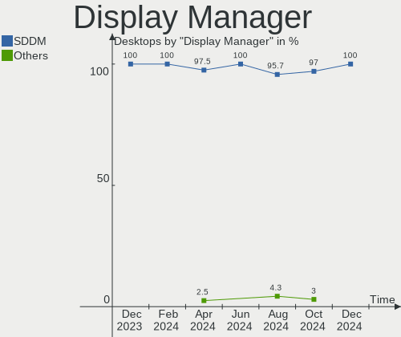
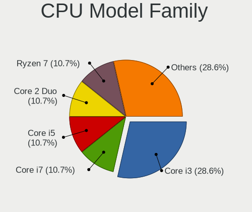
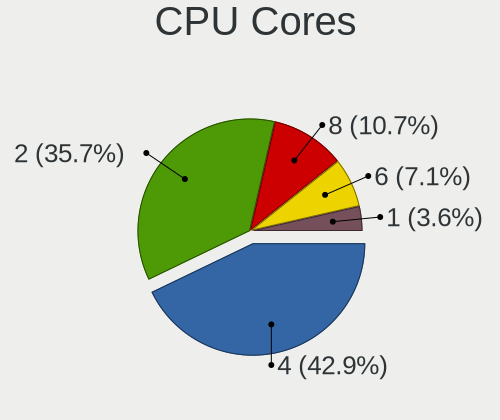
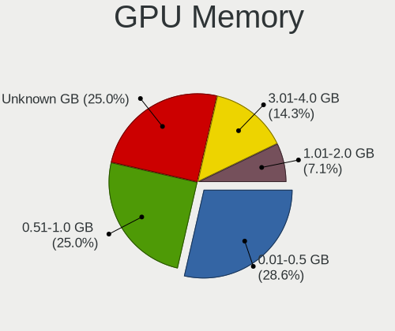

BlackPanther - Hardware Trends (Desktops)
-----------------------------------------

A project to identify most popular hardware characteristics and track their change
over time based on data collected by Linux users at https://Linux-Hardware.org.

Anyone can contribute to this report by the [hw-probe](https://github.com/linuxhw/hw-probe) tool:

    sudo -E hw-probe -all -upload

This report is for one last month. Overall report since the beginning of time: [TestDays](https://github.com/linuxhw/TestDays)

Period: Apr, 2024.

Contents
--------

* [ System ](#system)
  - [ OS                       ](#os)
  - [ OS Family                ](#os-family)
  - [ Kernel                   ](#kernel)
  - [ Kernel Family            ](#kernel-family)
  - [ Kernel Major Ver.        ](#kernel-major-ver)
  - [ Arch                     ](#arch)
  - [ DE                       ](#de)
  - [ Display Server           ](#display-server)
  - [ Display Manager          ](#display-manager)
  - [ OS Lang                  ](#os-lang)
  - [ Boot Mode                ](#boot-mode)
  - [ Filesystem               ](#filesystem)
  - [ Part. scheme             ](#part-scheme)
  - [ Dual Boot with Linux/BSD ](#dual-boot-with-linuxbsd)
  - [ Dual Boot (Win)          ](#dual-boot-win)

* [ Board ](#board)
  - [ Vendor                   ](#vendor)
  - [ Model                    ](#model)
  - [ Model Family             ](#model-family)
  - [ MFG Year                 ](#mfg-year)
  - [ Form Factor              ](#form-factor)
  - [ Secure Boot              ](#secure-boot)
  - [ Coreboot                 ](#coreboot)
  - [ RAM Size                 ](#ram-size)
  - [ RAM Used                 ](#ram-used)
  - [ Total Drives             ](#total-drives)
  - [ Has CD-ROM               ](#has-cd-rom)
  - [ Has Ethernet             ](#has-ethernet)
  - [ Has WiFi                 ](#has-wifi)
  - [ Has Bluetooth            ](#has-bluetooth)

* [ Location ](#location)
  - [ Country                  ](#country)
  - [ City                     ](#city)

* [ Drives ](#drives)
  - [ Drive Vendor             ](#drive-vendor)
  - [ Drive Model              ](#drive-model)
  - [ HDD Vendor               ](#hdd-vendor)
  - [ SSD Vendor               ](#ssd-vendor)
  - [ Drive Kind               ](#drive-kind)
  - [ Drive Connector          ](#drive-connector)
  - [ Drive Size               ](#drive-size)
  - [ Space Total              ](#space-total)
  - [ Space Used               ](#space-used)
  - [ Malfunc. Drives          ](#malfunc-drives)
  - [ Malfunc. Drive Vendor    ](#malfunc-drive-vendor)
  - [ Malfunc. HDD Vendor      ](#malfunc-hdd-vendor)
  - [ Malfunc. Drive Kind      ](#malfunc-drive-kind)
  - [ Failed Drives            ](#failed-drives)
  - [ Failed Drive Vendor      ](#failed-drive-vendor)
  - [ Drive Status             ](#drive-status)

* [ Storage controller ](#storage-controller)
  - [ Storage Vendor           ](#storage-vendor)
  - [ Storage Model            ](#storage-model)
  - [ Storage Kind             ](#storage-kind)

* [ Processor ](#processor)
  - [ CPU Vendor               ](#cpu-vendor)
  - [ CPU Model                ](#cpu-model)
  - [ CPU Model Family         ](#cpu-model-family)
  - [ CPU Cores                ](#cpu-cores)
  - [ CPU Sockets              ](#cpu-sockets)
  - [ CPU Threads              ](#cpu-threads)
  - [ CPU Op-Modes             ](#cpu-op-modes)
  - [ CPU Microcode            ](#cpu-microcode)
  - [ CPU Microarch            ](#cpu-microarch)

* [ Graphics ](#graphics)
  - [ GPU Vendor               ](#gpu-vendor)
  - [ GPU Model                ](#gpu-model)
  - [ GPU Combo                ](#gpu-combo)
  - [ GPU Driver               ](#gpu-driver)
  - [ GPU Memory               ](#gpu-memory)

* [ Monitor ](#monitor)
  - [ Monitor Vendor           ](#monitor-vendor)
  - [ Monitor Model            ](#monitor-model)
  - [ Monitor Resolution       ](#monitor-resolution)
  - [ Monitor Diagonal         ](#monitor-diagonal)
  - [ Monitor Width            ](#monitor-width)
  - [ Aspect Ratio             ](#aspect-ratio)
  - [ Monitor Area             ](#monitor-area)
  - [ Pixel Density            ](#pixel-density)
  - [ Multiple Monitors        ](#multiple-monitors)

* [ Network ](#network)
  - [ Net Controller Vendor    ](#net-controller-vendor)
  - [ Net Controller Model     ](#net-controller-model)
  - [ Wireless Vendor          ](#wireless-vendor)
  - [ Wireless Model           ](#wireless-model)
  - [ Ethernet Vendor          ](#ethernet-vendor)
  - [ Ethernet Model           ](#ethernet-model)
  - [ Net Controller Kind      ](#net-controller-kind)
  - [ Used Controller          ](#used-controller)
  - [ NICs                     ](#nics)
  - [ IPv6                     ](#ipv6)

* [ Bluetooth ](#bluetooth)
  - [ Bluetooth Vendor         ](#bluetooth-vendor)
  - [ Bluetooth Model          ](#bluetooth-model)

* [ Sound ](#sound)
  - [ Sound Vendor             ](#sound-vendor)
  - [ Sound Model              ](#sound-model)

* [ Memory ](#memory)
  - [ Memory Vendor            ](#memory-vendor)
  - [ Memory Model             ](#memory-model)
  - [ Memory Kind              ](#memory-kind)
  - [ Memory Form Factor       ](#memory-form-factor)
  - [ Memory Size              ](#memory-size)
  - [ Memory Speed             ](#memory-speed)

* [ Printers & scanners ](#printers--scanners)
  - [ Printer Vendor           ](#printer-vendor)
  - [ Printer Model            ](#printer-model)
  - [ Scanner Vendor           ](#scanner-vendor)
  - [ Scanner Model            ](#scanner-model)

* [ Camera ](#camera)
  - [ Camera Vendor            ](#camera-vendor)
  - [ Camera Model             ](#camera-model)

* [ Security ](#security)
  - [ Fingerprint Vendor       ](#fingerprint-vendor)
  - [ Fingerprint Model        ](#fingerprint-model)
  - [ Chipcard Vendor          ](#chipcard-vendor)
  - [ Chipcard Model           ](#chipcard-model)

* [ Unsupported ](#unsupported)
  - [ Unsupported Devices      ](#unsupported-devices)
  - [ Unsupported Device Types ](#unsupported-device-types)

System
------

OS
--

Installed operating systems

| Name              | Desktops | Percent |
|-------------------|----------|---------|
| BlackPanther 18.1 | 35       | 87.5%   |
| BlackPanther 22.1 | 5        | 12.5%   |

OS Family
---------

OS without a version

| Name         | Desktops | Percent |
|--------------|----------|---------|
| BlackPanther | 40       | 100%    |

Kernel
------

Version of the Linux kernel

| Version             | Desktops | Percent |
|---------------------|----------|---------|
| 5.15.85-desktop-1bP | 13       | 32.5%   |
| 4.18.16-desktop-1bP | 12       | 30%     |
| 5.6.14-desktop-2bP  | 9        | 22.5%   |
| 6.3.3-desktop-1bP   | 3        | 7.5%    |
| 6.3.8-desktop-1bP   | 2        | 5%      |
| 6.7.0-power-2bP     | 1        | 2.5%    |

Kernel Family
-------------

Linux kernel without a distro release

| Version | Desktops | Percent |
|---------|----------|---------|
| 5.15.85 | 13       | 32.5%   |
| 4.18.16 | 12       | 30%     |
| 5.6.14  | 9        | 22.5%   |
| 6.3.3   | 3        | 7.5%    |
| 6.3.8   | 2        | 5%      |
| 6.7.0   | 1        | 2.5%    |

Kernel Major Ver.
-----------------

Linux kernel major version

| Version | Desktops | Percent |
|---------|----------|---------|
| 5.15    | 13       | 32.5%   |
| 4.18    | 12       | 30%     |
| 5.6     | 9        | 22.5%   |
| 6.3     | 5        | 12.5%   |
| 6.7     | 1        | 2.5%    |

Arch
----

OS architecture (x86_64, i586, etc.)

| Name   | Desktops | Percent |
|--------|----------|---------|
| x86_64 | 40       | 100%    |

DE
--

Desktop Environment

| Name    | Desktops | Percent |
|---------|----------|---------|
| KDE5    | 38       | 95%     |
| Unknown | 2        | 5%      |

Display Server
--------------

X11 or Wayland

| Name | Desktops | Percent |
|------|----------|---------|
| X11  | 40       | 100%    |

Display Manager
---------------

SDDM, LightDM, etc.

| Name    | Desktops | Percent |
|---------|----------|---------|
| SDDM    | 39       | 97.5%   |
| Unknown | 1        | 2.5%    |

OS Lang
-------

Language

| Lang    | Desktops | Percent |
|---------|----------|---------|
| Unknown | 39       | 97.5%   |
| hu_HU   | 1        | 2.5%    |

Boot Mode
---------

EFI or BIOS

| Mode | Desktops | Percent |
|------|----------|---------|
| BIOS | 25       | 62.5%   |
| EFI  | 15       | 37.5%   |

Filesystem
----------

Type of filesystem

| Type    | Desktops | Percent |
|---------|----------|---------|
| Overlay | 20       | 50%     |
| Ext4    | 20       | 50%     |

Part. scheme
------------

Scheme of partitioning

| Type    | Desktops | Percent |
|---------|----------|---------|
| GPT     | 24       | 60%     |
| MBR     | 15       | 37.5%   |
| Unknown | 1        | 2.5%    |

Dual Boot with Linux/BSD
------------------------

Hosting more than one Linux/BSD

| Dual boot | Desktops | Percent |
|-----------|----------|---------|
| No        | 22       | 55%     |
| Yes       | 18       | 45%     |

Dual Boot (Win)
---------------

Hosting Linux and Windows

| Dual boot | Desktops | Percent |
|-----------|----------|---------|
| No        | 24       | 60%     |
| Yes       | 16       | 40%     |

Board
-----

Vendor
------

Motherboard manufacturer

| Name                | Desktops | Percent |
|---------------------|----------|---------|
| Gigabyte Technology | 10       | 25%     |
| Dell                | 8        | 20%     |
| ASUSTek Computer    | 7        | 17.5%   |
| ASRock              | 5        | 12.5%   |
| Hewlett-Packard     | 4        | 10%     |
| Lenovo              | 3        | 7.5%    |
| Fujitsu             | 2        | 5%      |
| MSI                 | 1        | 2.5%    |

Model
-----

Motherboard model

| Name                                | Desktops | Percent |
|-------------------------------------|----------|---------|
| Gigabyte Z390 UD                    | 2        | 5%      |
| Gigabyte H61M-S1                    | 2        | 5%      |
| MSI MS-7522                         | 1        | 2.5%    |
| Lenovo ThinkStation P520 30BFS44D04 | 1        | 2.5%    |
| Lenovo ThinkStation D20 4158AF8     | 1        | 2.5%    |
| Lenovo ThinkCentre M78 10BNS02900   | 1        | 2.5%    |
| HP Z400 Workstation                 | 1        | 2.5%    |
| HP ProDesk 400 G3 SFF               | 1        | 2.5%    |
| HP EliteDesk 705 G3 SFF             | 1        | 2.5%    |
| HP Compaq 8200 Elite CMT PC         | 1        | 2.5%    |
| Gigabyte H310M A 2.0                | 1        | 2.5%    |
| Gigabyte GA-890GPA-UD3H             | 1        | 2.5%    |
| Gigabyte F2A88XN-WIFI               | 1        | 2.5%    |
| Gigabyte B75M-D3H                   | 1        | 2.5%    |
| Gigabyte B660M GAMING DDR4          | 1        | 2.5%    |
| Gigabyte B450M GAMING               | 1        | 2.5%    |
| Fujitsu ESPRIMO E700                | 1        | 2.5%    |
| Fujitsu ESPRIMO E520                | 1        | 2.5%    |
| Dell Precision WorkStation T5500    | 1        | 2.5%    |
| Dell OptiPlex 790                   | 1        | 2.5%    |
| Dell OptiPlex 780                   | 1        | 2.5%    |
| Dell OptiPlex 745                   | 1        | 2.5%    |
| Dell OptiPlex 740 Enhanced          | 1        | 2.5%    |
| Dell OptiPlex 7040                  | 1        | 2.5%    |
| Dell OptiPlex 3050                  | 1        | 2.5%    |
| Dell OptiPlex 3020                  | 1        | 2.5%    |
| ASUS ROG Maximus X CODE             | 1        | 2.5%    |
| ASUS PRIME H610M-K D4               | 1        | 2.5%    |
| ASUS PRIME B365M-A                  | 1        | 2.5%    |
| ASUS PRIME A320M-R                  | 1        | 2.5%    |
| ASUS P8Z77-V LX                     | 1        | 2.5%    |
| ASUS M4A785TD-V EVO                 | 1        | 2.5%    |
| ASUS A88XM-E                        | 1        | 2.5%    |
| ASRock Z390 Pro4                    | 1        | 2.5%    |
| ASRock Z370 Extreme4                | 1        | 2.5%    |
| ASRock X370 Gaming X                | 1        | 2.5%    |
| ASRock B550M Pro4                   | 1        | 2.5%    |
| ASRock 4CoreDual-SATA2              | 1        | 2.5%    |

Model Family
------------

Motherboard model prefix

| Name                    | Desktops | Percent |
|-------------------------|----------|---------|
| Dell OptiPlex           | 7        | 17.5%   |
| ASUS PRIME              | 3        | 7.5%    |
| Lenovo ThinkStation     | 2        | 5%      |
| Gigabyte Z390           | 2        | 5%      |
| Gigabyte H61M-S1        | 2        | 5%      |
| Fujitsu ESPRIMO         | 2        | 5%      |
| MSI MS-7522             | 1        | 2.5%    |
| Lenovo ThinkCentre      | 1        | 2.5%    |
| HP Z400                 | 1        | 2.5%    |
| HP ProDesk              | 1        | 2.5%    |
| HP EliteDesk            | 1        | 2.5%    |
| HP Compaq               | 1        | 2.5%    |
| Gigabyte H310M          | 1        | 2.5%    |
| Gigabyte GA-890GPA-UD3H | 1        | 2.5%    |
| Gigabyte F2A88XN-WIFI   | 1        | 2.5%    |
| Gigabyte B75M-D3H       | 1        | 2.5%    |
| Gigabyte B660M          | 1        | 2.5%    |
| Gigabyte B450M          | 1        | 2.5%    |
| Dell Precision          | 1        | 2.5%    |
| ASUS ROG                | 1        | 2.5%    |
| ASUS P8Z77-V            | 1        | 2.5%    |
| ASUS M4A785TD-V         | 1        | 2.5%    |
| ASUS A88XM-E            | 1        | 2.5%    |
| ASRock Z390             | 1        | 2.5%    |
| ASRock Z370             | 1        | 2.5%    |
| ASRock X370             | 1        | 2.5%    |
| ASRock B550M            | 1        | 2.5%    |
| ASRock 4CoreDual-SATA2  | 1        | 2.5%    |

MFG Year
--------

Motherboard manufacture year

| Year | Desktops | Percent |
|------|----------|---------|
| 2010 | 6        | 15%     |
| 2018 | 5        | 12.5%   |
| 2011 | 5        | 12.5%   |
| 2017 | 4        | 10%     |
| 2012 | 4        | 10%     |
| 2021 | 3        | 7.5%    |
| 2014 | 3        | 7.5%    |
| 2019 | 2        | 5%      |
| 2016 | 2        | 5%      |
| 2013 | 2        | 5%      |
| 2007 | 2        | 5%      |
| 2020 | 1        | 2.5%    |
| 2009 | 1        | 2.5%    |

Form Factor
-----------

Physical design of the computer

| Name    | Desktops | Percent |
|---------|----------|---------|
| Desktop | 40       | 100%    |

Secure Boot
-----------

Enabled or disabled

| State    | Desktops | Percent |
|----------|----------|---------|
| Disabled | 40       | 100%    |

Coreboot
--------

Have coreboot on board

| Used | Desktops | Percent |
|------|----------|---------|
| No   | 40       | 100%    |

RAM Size
--------

Total RAM memory

| Size in GB | Desktops | Percent |
|------------|----------|---------|
| 8.01-16.0  | 13       | 32.5%   |
| 16.01-24.0 | 11       | 27.5%   |
| 3.01-4.0   | 6        | 15%     |
| 32.01-64.0 | 4        | 10%     |
| 4.01-8.0   | 3        | 7.5%    |
| 24.01-32.0 | 2        | 5%      |
| 1.01-2.0   | 1        | 2.5%    |

RAM Used
--------

Used RAM memory

| Used GB  | Desktops | Percent |
|----------|----------|---------|
| 1.01-2.0 | 14       | 35%     |
| 0.51-1.0 | 14       | 35%     |
| 0.01-0.5 | 7        | 17.5%   |
| 2.01-3.0 | 4        | 10%     |
| 4.01-8.0 | 1        | 2.5%    |

Total Drives
------------

Number of drives on board

| Drives | Desktops | Percent |
|--------|----------|---------|
| 1      | 21       | 52.5%   |
| 2      | 10       | 25%     |
| 3      | 7        | 17.5%   |
| 4      | 1        | 2.5%    |
| 0      | 1        | 2.5%    |

Has CD-ROM
----------

Has CD-ROM on board

| Presented | Desktops | Percent |
|-----------|----------|---------|
| Yes       | 25       | 62.5%   |
| No        | 15       | 37.5%   |

Has Ethernet
------------

Has Ethernet on board

| Presented | Desktops | Percent |
|-----------|----------|---------|
| Yes       | 40       | 100%    |

Has WiFi
--------

Has WiFi module

| Presented | Desktops | Percent |
|-----------|----------|---------|
| No        | 29       | 72.5%   |
| Yes       | 11       | 27.5%   |

Has Bluetooth
-------------

Has Bluetooth module

| Presented | Desktops | Percent |
|-----------|----------|---------|
| No        | 32       | 80%     |
| Yes       | 8        | 20%     |

Location
--------

Country
-------

Geographic location (country)

| Country  | Desktops | Percent |
|----------|----------|---------|
| Hungary  | 32       | 80%     |
| Germany  | 3        | 7.5%    |
| UK       | 2        | 5%      |
| Slovakia | 1        | 2.5%    |
| Serbia   | 1        | 2.5%    |
| Greece   | 1        | 2.5%    |

City
----

Geographic location (city)

| City                    | Desktops | Percent |
|-------------------------|----------|---------|
| Budapest                | 7        | 17.5%   |
| Zalaegerszeg            | 2        | 5%      |
| Pfaffenhofen an der Ilm | 2        | 5%      |
| Koszeg                  | 2        | 5%      |
| Győr                   | 2        | 5%      |
| Zalakomár              | 1        | 2.5%    |
| Winsford                | 1        | 2.5%    |
| Tatabánya              | 1        | 2.5%    |
| Szombathely             | 1        | 2.5%    |
| Šahy                   | 1        | 2.5%    |
| Oroshaza                | 1        | 2.5%    |
| Nyiregyhaza             | 1        | 2.5%    |
| Nyirad                  | 1        | 2.5%    |
| Nyergesujfalu           | 1        | 2.5%    |
| Nyaregyhaza             | 1        | 2.5%    |
| Lewisham                | 1        | 2.5%    |
| Kecskemét              | 1        | 2.5%    |
| Kastoria                | 1        | 2.5%    |
| Karloca                 | 1        | 2.5%    |
| Karcag                  | 1        | 2.5%    |
| Kaposvár               | 1        | 2.5%    |
| Isaszeg                 | 1        | 2.5%    |
| Hatvan                  | 1        | 2.5%    |
| Fertoszentmiklos        | 1        | 2.5%    |
| Esztergom               | 1        | 2.5%    |
| Dombovar                | 1        | 2.5%    |
| Csongrad                | 1        | 2.5%    |
| Berettyóújfalu        | 1        | 2.5%    |
| Balatonfuzfo            | 1        | 2.5%    |
| Bad Schoenborn          | 1        | 2.5%    |

Drives
------

Drive Vendor
------------

Hard drive vendors

| Vendor                      | Desktops | Drives | Percent |
|-----------------------------|----------|--------|---------|
| WDC                         | 11       | 11     | 16.67%  |
| Kingston                    | 11       | 11     | 16.67%  |
| Samsung Electronics         | 8        | 9      | 12.12%  |
| Seagate                     | 6        | 6      | 9.09%   |
| Intenso                     | 5        | 5      | 7.58%   |
| SanDisk                     | 4        | 4      | 6.06%   |
| HGST                        | 3        | 4      | 4.55%   |
| Kingston Technology Company | 2        | 2      | 3.03%   |
| Zheino                      | 1        | 1      | 1.52%   |
| Toshiba                     | 1        | 1      | 1.52%   |
| SPCC                        | 1        | 1      | 1.52%   |
| Realtek Semiconductor       | 1        | 1      | 1.52%   |
| Patriot                     | 1        | 1      | 1.52%   |
| Micron/Crucial Technology   | 1        | 1      | 1.52%   |
| Micron Technology           | 1        | 1      | 1.52%   |
| KingSpec                    | 1        | 1      | 1.52%   |
| Kingmax                     | 1        | 1      | 1.52%   |
| Intel                       | 1        | 1      | 1.52%   |
| Integral                    | 1        | 1      | 1.52%   |
| Hitachi                     | 1        | 1      | 1.52%   |
| Gigabyte Technology         | 1        | 1      | 1.52%   |
| ExcelStor                   | 1        | 1      | 1.52%   |
| Crucial                     | 1        | 1      | 1.52%   |
| A-DATA Technology           | 1        | 1      | 1.52%   |

Drive Model
-----------

Hard drive models

| Model                                              | Desktops | Percent |
|----------------------------------------------------|----------|---------|
| Kingston SA400S37120G 120GB SSD                    | 3        | 4.48%   |
| WDC WD5000AAKS-007AA0 500GB                        | 2        | 2.99%   |
| SanDisk SDSSDH3512G 512GB                          | 2        | 2.99%   |
| Samsung SSD 860 EVO 500GB                          | 2        | 2.99%   |
| Kingston Company A2000 NVMe SSD 500GB              | 2        | 2.99%   |
| Kingston SV300S37A120G 120GB SSD                   | 2        | 2.99%   |
| Kingston SNV2S500G 500GB                           | 2        | 2.99%   |
| Kingston SA400S37240G 240GB SSD                    | 2        | 2.99%   |
| Intenso SSD 120GB                                  | 2        | 2.99%   |
| Zheino CHN-NGFFNV2280-256 256GB                    | 1        | 1.49%   |
| WDC WDS500G2B0C-00PXH0 500GB                       | 1        | 1.49%   |
| WDC WDS240G2G0B-00EPW0 240GB SSD                   | 1        | 1.49%   |
| WDC WD800AAJS-75M0A0 80GB                          | 1        | 1.49%   |
| WDC WD5000LPVX-80V0TT0 500GB                       | 1        | 1.49%   |
| WDC WD5000AAKX-329BA0 500GB                        | 1        | 1.49%   |
| WDC WD2500KS-00MJB0 250GB                          | 1        | 1.49%   |
| WDC WD20EZBX-00AYRA0 2TB                           | 1        | 1.49%   |
| WDC WD10EZEX-22MFCA0 1TB                           | 1        | 1.49%   |
| WDC WD10EZEX-00KUWA0 1TB                           | 1        | 1.49%   |
| Toshiba DT01ACA100 1TB                             | 1        | 1.49%   |
| SPCC Solid State Disk 256GB                        | 1        | 1.49%   |
| Seagate ST500LT012-1DG142 500GB                    | 1        | 1.49%   |
| Seagate ST3200827AS 200GB                          | 1        | 1.49%   |
| Seagate ST1000LM024 HN-M101MBB 1TB                 | 1        | 1.49%   |
| Seagate ST1000DM010-2EP102 1TB                     | 1        | 1.49%   |
| Seagate ST1000DM003-1SB102 1TB                     | 1        | 1.49%   |
| Seagate Basic 1TB                                  | 1        | 1.49%   |
| SanDisk SDSSDH3 1T00 1TB                           | 1        | 1.49%   |
| SanDisk NVMe SSD Drive 2TB                         | 1        | 1.49%   |
| Samsung SSD 970 EVO Plus 2TB                       | 1        | 1.49%   |
| Samsung SSD 970 EVO 500GB                          | 1        | 1.49%   |
| Samsung SSD 850 EVO 120GB                          | 1        | 1.49%   |
| Samsung NVMe SSD Controller SM981/PM981/PM983 1TB  | 1        | 1.49%   |
| Samsung NVMe SSD Controller PM9A1/PM9A3/980PRO 1TB | 1        | 1.49%   |
| Samsung MZ7LN256HAJQ-000H1 256GB SSD               | 1        | 1.49%   |
| Samsung HD103UJ 1TB                                | 1        | 1.49%   |
| Realtek RTS5763DL NVMe SSD Controller 256GB        | 1        | 1.49%   |
| Patriot Burst 120GB SSD                            | 1        | 1.49%   |
| Micron/Crucial CT1000P1SSD8 1TB                    | 1        | 1.49%   |
| Micron MTFDDAK256TDL-1AW1ZABFA 256GB SSD           | 1        | 1.49%   |

HDD Vendor
----------

Hard disk drive vendors

| Vendor              | Desktops | Drives | Percent |
|---------------------|----------|--------|---------|
| WDC                 | 9        | 9      | 42.86%  |
| Seagate             | 5        | 5      | 23.81%  |
| HGST                | 3        | 4      | 14.29%  |
| Toshiba             | 1        | 1      | 4.76%   |
| Samsung Electronics | 1        | 1      | 4.76%   |
| Hitachi             | 1        | 1      | 4.76%   |
| ExcelStor           | 1        | 1      | 4.76%   |

SSD Vendor
----------

Solid state drive vendors

| Vendor              | Desktops | Drives | Percent |
|---------------------|----------|--------|---------|
| Kingston            | 9        | 9      | 29.03%  |
| Intenso             | 5        | 5      | 16.13%  |
| Samsung Electronics | 4        | 4      | 12.9%   |
| SanDisk             | 3        | 3      | 9.68%   |
| WDC                 | 1        | 1      | 3.23%   |
| SPCC                | 1        | 1      | 3.23%   |
| Patriot             | 1        | 1      | 3.23%   |
| Micron Technology   | 1        | 1      | 3.23%   |
| KingSpec            | 1        | 1      | 3.23%   |
| Kingmax             | 1        | 1      | 3.23%   |
| Intel               | 1        | 1      | 3.23%   |
| Integral            | 1        | 1      | 3.23%   |
| Crucial             | 1        | 1      | 3.23%   |
| A-DATA Technology   | 1        | 1      | 3.23%   |

Drive Kind
----------

HDD or SSD

| Kind    | Desktops | Drives | Percent |
|---------|----------|--------|---------|
| SSD     | 28       | 31     | 47.46%  |
| HDD     | 19       | 22     | 32.2%   |
| NVMe    | 11       | 14     | 18.64%  |
| Unknown | 1        | 1      | 1.69%   |

Drive Connector
---------------

SATA, SAS, NVMe, etc.

| Type | Desktops | Drives | Percent |
|------|----------|--------|---------|
| SATA | 34       | 52     | 72.34%  |
| NVMe | 11       | 14     | 23.4%   |
| SAS  | 2        | 2      | 4.26%   |

Drive Size
----------

Size of hard drive

| Size in TB | Desktops | Drives | Percent |
|------------|----------|--------|---------|
| 0.01-0.5   | 30       | 37     | 68.18%  |
| 0.51-1.0   | 12       | 13     | 27.27%  |
| 3.01-4.0   | 1        | 2      | 2.27%   |
| 1.01-2.0   | 1        | 1      | 2.27%   |

Space Total
-----------

Amount of disk space available on the file system

| Size in GB | Desktops | Percent |
|------------|----------|---------|
| Unknown    | 20       | 50%     |
| 101-250    | 10       | 25%     |
| 251-500    | 5        | 12.5%   |
| 501-1000   | 3        | 7.5%    |
| 51-100     | 2        | 5%      |

Space Used
----------

Amount of used disk space

| Used GB | Desktops | Percent |
|---------|----------|---------|
| Unknown | 20       | 50%     |
| 1-20    | 12       | 30%     |
| 101-250 | 3        | 7.5%    |
| 51-100  | 3        | 7.5%    |
| 21-50   | 2        | 5%      |

Malfunc. Drives
---------------

Drive models with a malfunction

| Model                              | Desktops | Drives | Percent |
|------------------------------------|----------|--------|---------|
| WDC WD5000AAKS-007AA0 500GB        | 1        | 1      | 12.5%   |
| WDC WD2500KS-00MJB0 250GB          | 1        | 1      | 12.5%   |
| Seagate ST1000LM024 HN-M101MBB 1TB | 1        | 1      | 12.5%   |
| Samsung Electronics HD103UJ 1TB    | 1        | 1      | 12.5%   |
| Kingston SV300S37A120G 120GB SSD   | 1        | 1      | 12.5%   |
| Intel SSDSC2BF180A4H 180GB         | 1        | 1      | 12.5%   |
| Hitachi HCS5C1032CLA382 320GB      | 1        | 1      | 12.5%   |
| A-DATA Technology SU630 240GB SSD  | 1        | 1      | 12.5%   |

Malfunc. Drive Vendor
---------------------

Vendors of faulty drives

| Vendor              | Desktops | Drives | Percent |
|---------------------|----------|--------|---------|
| WDC                 | 2        | 2      | 25%     |
| Seagate             | 1        | 1      | 12.5%   |
| Samsung Electronics | 1        | 1      | 12.5%   |
| Kingston            | 1        | 1      | 12.5%   |
| Intel               | 1        | 1      | 12.5%   |
| Hitachi             | 1        | 1      | 12.5%   |
| A-DATA Technology   | 1        | 1      | 12.5%   |

Malfunc. HDD Vendor
-------------------

Vendors of faulty HDD drives

| Vendor              | Desktops | Drives | Percent |
|---------------------|----------|--------|---------|
| WDC                 | 2        | 2      | 40%     |
| Seagate             | 1        | 1      | 20%     |
| Samsung Electronics | 1        | 1      | 20%     |
| Hitachi             | 1        | 1      | 20%     |

Malfunc. Drive Kind
-------------------

Kinds of faulty drives

| Kind | Desktops | Drives | Percent |
|------|----------|--------|---------|
| HDD  | 5        | 5      | 62.5%   |
| SSD  | 3        | 3      | 37.5%   |

Failed Drives
-------------

Failed drive models

| Model                             | Desktops | Drives | Percent |
|-----------------------------------|----------|--------|---------|
| ExcelStor Technology J8160S 160GB | 1        | 1      | 100%    |

Failed Drive Vendor
-------------------

Failed drive vendors

| Vendor    | Desktops | Drives | Percent |
|-----------|----------|--------|---------|
| ExcelStor | 1        | 1      | 100%    |

Drive Status
------------

Number of failed and malfunc. drives

| Status   | Desktops | Drives | Percent |
|----------|----------|--------|---------|
| Works    | 34       | 54     | 72.34%  |
| Malfunc  | 8        | 8      | 17.02%  |
| Detected | 4        | 5      | 8.51%   |
| Failed   | 1        | 1      | 2.13%   |

Storage controller
------------------

Storage Vendor
--------------

Storage controller vendors

| Vendor                      | Desktops | Percent |
|-----------------------------|----------|---------|
| Intel                       | 28       | 48.28%  |
| AMD                         | 10       | 17.24%  |
| Kingston Technology Company | 4        | 6.9%    |
| Samsung Electronics         | 3        | 5.17%   |
| SanDisk                     | 2        | 3.45%   |
| JMicron Technology          | 2        | 3.45%   |
| VIA Technologies            | 1        | 1.72%   |
| Silicon Motion              | 1        | 1.72%   |
| Realtek Semiconductor       | 1        | 1.72%   |
| Phison Electronics          | 1        | 1.72%   |
| Nvidia                      | 1        | 1.72%   |
| Micron/Crucial Technology   | 1        | 1.72%   |
| ASMedia Technology          | 1        | 1.72%   |
| Adaptec                     | 1        | 1.72%   |
| 3ware                       | 1        | 1.72%   |

Storage Model
-------------

Storage controller models

| Model                                                                                   | Desktops | Percent |
|-----------------------------------------------------------------------------------------|----------|---------|
| AMD FCH SATA Controller [AHCI mode]                                                     | 7        | 9.59%   |
| Intel SATA Controller [RAID mode]                                                       | 5        | 6.85%   |
| Intel 200 Series PCH SATA controller [AHCI mode]                                        | 4        | 5.48%   |
| Intel Cannon Lake PCH SATA AHCI Controller                                              | 3        | 4.11%   |
| Intel 6 Series/C200 Series Chipset Family 6 port Desktop SATA AHCI Controller           | 3        | 4.11%   |
| Samsung NVMe SSD Controller SM981/PM981/PM983                                           | 2        | 2.74%   |
| Kingston Company A2000 NVMe SSD SM2263EN                                                | 2        | 2.74%   |
| JMicron JMB363 SATA/IDE Controller                                                      | 2        | 2.74%   |
| Intel Q170/Q150/B150/H170/H110/Z170/CM236 Chipset SATA Controller [AHCI Mode]           | 2        | 2.74%   |
| Intel Alder Lake-S PCH SATA Controller [AHCI Mode]                                      | 2        | 2.74%   |
| Intel 8 Series/C220 Series Chipset Family 6-port SATA Controller 1 [AHCI mode]          | 2        | 2.74%   |
| Intel 6 Series/C200 Series Chipset Family Desktop SATA Controller (IDE mode, ports 4-5) | 2        | 2.74%   |
| Intel 6 Series/C200 Series Chipset Family Desktop SATA Controller (IDE mode, ports 0-3) | 2        | 2.74%   |
| AMD SB7x0/SB8x0/SB9x0 SATA Controller [IDE mode]                                        | 2        | 2.74%   |
| AMD SB7x0/SB8x0/SB9x0 IDE Controller                                                    | 2        | 2.74%   |
| VIA VT82C586A/B/VT82C686/A/B/VT823x/A/C PIPC Bus Master IDE                             | 1        | 1.37%   |
| VIA VT8237/8251 Serial ATA Controller                                                   | 1        | 1.37%   |
| Silicon Motion SM2263EN/SM2263XT (DRAM-less) NVMe SSD Controllers                       | 1        | 1.37%   |
| SanDisk WD Blue SN570 NVMe SSD 2TB                                                      | 1        | 1.37%   |
| SanDisk Ultra 3D / WD Blue SN550 NVMe SSD                                               | 1        | 1.37%   |
| Samsung NVMe SSD Controller PM9A1/PM9A3/980PRO                                          | 1        | 1.37%   |
| Realtek RTS5762 NVMe SSD Controller                                                     | 1        | 1.37%   |
| Phison E16 PCIe4 NVMe Controller                                                        | 1        | 1.37%   |
| Nvidia MCP51 Serial ATA Controller                                                      | 1        | 1.37%   |
| Micron/Crucial P1 NVMe PCIe SSD[Frampton2]                                              | 1        | 1.37%   |
| Kingston Company NV2 NVMe SSD SM2267XT (DRAM-less)                                      | 1        | 1.37%   |
| Kingston Company NV2 NVMe SSD E21T (DRAM-less)                                          | 1        | 1.37%   |
| JMicron JMB368 IDE controller                                                           | 1        | 1.37%   |
| Intel Volume Management Device NVMe RAID Controller                                     | 1        | 1.37%   |
| Intel 82801JI (ICH10 Family) SATA AHCI Controller                                       | 1        | 1.37%   |
| Intel 82801JI (ICH10 Family) 4 port SATA IDE Controller #1                              | 1        | 1.37%   |
| Intel 82801JI (ICH10 Family) 2 port SATA IDE Controller #2                              | 1        | 1.37%   |
| Intel 82801HR/HO/HH (ICH8R/DO/DH) 2 port SATA Controller [IDE mode]                     | 1        | 1.37%   |
| Intel 82801H (ICH8 Family) 4 port SATA Controller [IDE mode]                            | 1        | 1.37%   |
| Intel 7 Series/C210 Series Chipset Family 6-port SATA Controller [AHCI mode]            | 1        | 1.37%   |
| Intel 7 Series/C210 Series Chipset Family 4-port SATA Controller [IDE mode]             | 1        | 1.37%   |
| Intel 7 Series/C210 Series Chipset Family 2-port SATA Controller [IDE mode]             | 1        | 1.37%   |
| Intel 4 Series Chipset PT IDER Controller                                               | 1        | 1.37%   |
| ASMedia ASM1061/ASM1062 Serial ATA Controller                                           | 1        | 1.37%   |
| AMD X370 Series Chipset SATA Controller                                                 | 1        | 1.37%   |

Storage Kind
------------

Kind of storage controller (IDE, SATA, NVMe, SAS, ...)

| Kind | Desktops | Percent |
|------|----------|---------|
| SATA | 30       | 50.85%  |
| NVMe | 11       | 18.64%  |
| IDE  | 10       | 16.95%  |
| RAID | 7        | 11.86%  |
| SCSI | 1        | 1.69%   |

Processor
---------

CPU Vendor
----------

Processor vendors

| Vendor | Desktops | Percent |
|--------|----------|---------|
| Intel  | 29       | 72.5%   |
| AMD    | 11       | 27.5%   |

CPU Model
---------

Processor models

| Model                                           | Desktops | Percent |
|-------------------------------------------------|----------|---------|
| Intel Core i5-9400 CPU @ 2.90GHz                | 2        | 5%      |
| Intel Core i5-2320 CPU @ 3.00GHz                | 2        | 5%      |
| Intel Core i3-2120 CPU @ 3.30GHz                | 2        | 5%      |
| Intel Xeon W-2135 CPU @ 3.70GHz                 | 1        | 2.5%    |
| Intel Xeon CPU X5677 @ 3.47GHz                  | 1        | 2.5%    |
| Intel Xeon CPU L5640 @ 2.27GHz                  | 1        | 2.5%    |
| Intel Xeon CPU E5530 @ 2.40GHz                  | 1        | 2.5%    |
| Intel Core i7-7700 CPU @ 3.60GHz                | 1        | 2.5%    |
| Intel Core i7-6700 CPU @ 3.40GHz                | 1        | 2.5%    |
| Intel Core i7-4790 CPU @ 3.60GHz                | 1        | 2.5%    |
| Intel Core i7-3770K CPU @ 3.50GHz               | 1        | 2.5%    |
| Intel Core i7 CPU 950 @ 3.07GHz                 | 1        | 2.5%    |
| Intel Core i5-8600K CPU @ 3.60GHz               | 1        | 2.5%    |
| Intel Core i5-8500 CPU @ 3.00GHz                | 1        | 2.5%    |
| Intel Core i5-3470 CPU @ 3.20GHz                | 1        | 2.5%    |
| Intel Core i5-2400 CPU @ 3.10GHz                | 1        | 2.5%    |
| Intel Core i3-9100F CPU @ 3.60GHz               | 1        | 2.5%    |
| Intel Core i3-9100 CPU @ 3.60GHz                | 1        | 2.5%    |
| Intel Core i3-8100 CPU @ 3.60GHz                | 1        | 2.5%    |
| Intel Core i3-6100 CPU @ 3.70GHz                | 1        | 2.5%    |
| Intel Core i3-4130 CPU @ 3.40GHz                | 1        | 2.5%    |
| Intel Core 2 Quad CPU Q6600 @ 2.40GHz           | 1        | 2.5%    |
| Intel Core 2 Duo CPU E7500 @ 2.93GHz            | 1        | 2.5%    |
| Intel Core 2 Duo CPU E7400 @ 2.80GHz            | 1        | 2.5%    |
| Intel 12th Gen Core i5-12400F                   | 1        | 2.5%    |
| Intel 12th Gen Core i5-12400                    | 1        | 2.5%    |
| AMD Ryzen 7 5700X 8-Core Processor              | 1        | 2.5%    |
| AMD Ryzen 7 5700G with Radeon Graphics          | 1        | 2.5%    |
| AMD Ryzen 7 1700X Eight-Core Processor          | 1        | 2.5%    |
| AMD Ryzen 3 2200G with Radeon Vega Graphics     | 1        | 2.5%    |
| AMD PRO A6-9500 R5, 8 COMPUTE CORES 2C+6G       | 1        | 2.5%    |
| AMD Phenom II X4 965 Processor                  | 1        | 2.5%    |
| AMD Phenom II X4 955 Processor                  | 1        | 2.5%    |
| AMD Athlon X4 860K Quad Core Processor          | 1        | 2.5%    |
| AMD Athlon 64 X2 Dual Core Processor 5200+      | 1        | 2.5%    |
| AMD A4-6300B APU with Radeon HD Graphics        | 1        | 2.5%    |
| AMD A10-7890K Radeon R7, 12 Compute Cores 4C+8G | 1        | 2.5%    |

CPU Model Family
----------------

Processor model prefix

| Model             | Desktops | Percent |
|-------------------|----------|---------|
| Intel Core i5     | 8        | 20%     |
| Intel Core i3     | 7        | 17.5%   |
| Intel Core i7     | 5        | 12.5%   |
| Intel Xeon        | 4        | 10%     |
| Other             | 3        | 7.5%    |
| AMD Ryzen 7       | 3        | 7.5%    |
| Intel Core 2 Duo  | 2        | 5%      |
| AMD Phenom II X4  | 2        | 5%      |
| Intel Core 2 Quad | 1        | 2.5%    |
| AMD Ryzen 3       | 1        | 2.5%    |
| AMD Athlon X4     | 1        | 2.5%    |
| AMD Athlon 64 X2  | 1        | 2.5%    |
| AMD A4            | 1        | 2.5%    |
| AMD A10           | 1        | 2.5%    |

CPU Cores
---------

Number of processor cores

| Number | Desktops | Percent |
|--------|----------|---------|
| 4      | 17       | 42.5%   |
| 2      | 9        | 22.5%   |
| 6      | 8        | 20%     |
| 8      | 4        | 10%     |
| 1      | 2        | 5%      |

CPU Sockets
-----------

Number of sockets

| Number | Desktops | Percent |
|--------|----------|---------|
| 1      | 39       | 97.5%   |
| 2      | 1        | 2.5%    |

CPU Threads
-----------

Threads per core (Hyper-Threading)

| Number | Desktops | Percent |
|--------|----------|---------|
| 2      | 21       | 52.5%   |
| 1      | 19       | 47.5%   |

CPU Op-Modes
------------

CPU Operation Modes (32-bit, 64-bit)

| Op mode        | Desktops | Percent |
|----------------|----------|---------|
| 32-bit, 64-bit | 40       | 100%    |

CPU Microcode
-------------

Microcode number

| Number     | Desktops | Percent |
|------------|----------|---------|
| Unknown    | 6        | 15%     |
| 0x206a7    | 4        | 10%     |
| 0x906ea    | 3        | 7.5%    |
| 0x906eb    | 2        | 5%      |
| 0x506e3    | 2        | 5%      |
| 0x306c3    | 2        | 5%      |
| 0x306a9    | 2        | 5%      |
| 0x106a5    | 2        | 5%      |
| 0x1067a    | 2        | 5%      |
| 0x06003106 | 2        | 5%      |
| 0x010000c8 | 2        | 5%      |
| 0x906e9    | 1        | 2.5%    |
| 0x90675    | 1        | 2.5%    |
| 0x90672    | 1        | 2.5%    |
| 0x6fb      | 1        | 2.5%    |
| 0x206c2    | 1        | 2.5%    |
| 0x0a50000d | 1        | 2.5%    |
| 0x0a20120a | 1        | 2.5%    |
| 0x08101016 | 1        | 2.5%    |
| 0x08001137 | 1        | 2.5%    |
| 0x0600611a | 1        | 2.5%    |
| 0x06001119 | 1        | 2.5%    |

CPU Microarch
-------------

Microarchitecture

| Name             | Desktops | Percent |
|------------------|----------|---------|
| KabyLake         | 8        | 20%     |
| SandyBridge      | 5        | 12.5%   |
| Skylake          | 3        | 7.5%    |
| Zen 3            | 2        | 5%      |
| Zen              | 2        | 5%      |
| Westmere         | 2        | 5%      |
| Steamroller      | 2        | 5%      |
| Penryn           | 2        | 5%      |
| Nehalem          | 2        | 5%      |
| K10              | 2        | 5%      |
| IvyBridge        | 2        | 5%      |
| Haswell          | 2        | 5%      |
| Alderlake Hybrid | 2        | 5%      |
| Piledriver       | 1        | 2.5%    |
| K8 Hammer        | 1        | 2.5%    |
| Excavator        | 1        | 2.5%    |
| Core             | 1        | 2.5%    |

Graphics
--------

GPU Vendor
----------

Vendors of graphics cards

| Vendor | Desktops | Percent |
|--------|----------|---------|
| Nvidia | 16       | 36.36%  |
| Intel  | 14       | 31.82%  |
| AMD    | 14       | 31.82%  |

GPU Model
---------

Graphics card models

| Model                                                                       | Desktops | Percent |
|-----------------------------------------------------------------------------|----------|---------|
| Intel CoffeeLake-S GT2 [UHD Graphics 630]                                   | 5        | 11.36%  |
| Nvidia GF108 [GeForce GT 630]                                               | 3        | 6.82%   |
| Nvidia GP107 [GeForce GTX 1050 Ti]                                          | 2        | 4.55%   |
| Intel HD Graphics 530                                                       | 2        | 4.55%   |
| AMD Oland PRO [Radeon R7 240/340 / Radeon 520]                              | 2        | 4.55%   |
| Nvidia TU116 [GeForce GTX 1660 SUPER]                                       | 1        | 2.27%   |
| Nvidia GP106 [GeForce GTX 1060 6GB]                                         | 1        | 2.27%   |
| Nvidia GP106 [GeForce GTX 1060 3GB]                                         | 1        | 2.27%   |
| Nvidia GP104 [GeForce GTX 1080]                                             | 1        | 2.27%   |
| Nvidia GM206 [GeForce GTX 950]                                              | 1        | 2.27%   |
| Nvidia GK208B [GeForce GT 710]                                              | 1        | 2.27%   |
| Nvidia GF119 [GeForce 605]                                                  | 1        | 2.27%   |
| Nvidia GA106 [GeForce RTX 3060]                                             | 1        | 2.27%   |
| Nvidia G96CGL [Quadro FX 580]                                               | 1        | 2.27%   |
| Nvidia G94 [GeForce 9600 GT]                                                | 1        | 2.27%   |
| Nvidia C51 [GeForce 6150 LE]                                                | 1        | 2.27%   |
| Intel Xeon E3-1200 v3/4th Gen Core Processor Integrated Graphics Controller | 1        | 2.27%   |
| Intel IvyBridge GT2 [HD Graphics 4000]                                      | 1        | 2.27%   |
| Intel HD Graphics 630                                                       | 1        | 2.27%   |
| Intel Alder Lake-S GT1 [UHD Graphics 730]                                   | 1        | 2.27%   |
| Intel 4th Generation Core Processor Family Integrated Graphics Controller   | 1        | 2.27%   |
| Intel 4 Series Chipset Integrated Graphics Controller                       | 1        | 2.27%   |
| Intel 2nd Generation Core Processor Family Integrated Graphics Controller   | 1        | 2.27%   |
| AMD Wani [Radeon R5/R6/R7 Graphics]                                         | 1        | 2.27%   |
| AMD RS880 [Radeon HD 4290]                                                  | 1        | 2.27%   |
| AMD Richland [Radeon HD 8370D]                                              | 1        | 2.27%   |
| AMD Oland XT [Radeon HD 8670 / R5 340X OEM / R7 250/350/350X OEM]           | 1        | 2.27%   |
| AMD Navi 22 [Radeon RX 6700/6700 XT/6750 XT / 6800M/6850M XT]               | 1        | 2.27%   |
| AMD Navi 21 [Radeon RX 6800/6800 XT / 6900 XT]                              | 1        | 2.27%   |
| AMD Lexa PRO [Radeon 540/540X/550/550X / RX 540X/550/550X]                  | 1        | 2.27%   |
| AMD Kaveri [Radeon R7 Graphics]                                             | 1        | 2.27%   |
| AMD Juniper XT [Radeon HD 5770]                                             | 1        | 2.27%   |
| AMD Cezanne [Radeon Vega Series / Radeon Vega Mobile Series]                | 1        | 2.27%   |
| AMD Cape Verde XT [Radeon HD 7770/8760 / R7 250X]                           | 1        | 2.27%   |
| AMD Caicos [Radeon HD 6450/7450/8450 / R5 230 OEM]                          | 1        | 2.27%   |

GPU Combo
---------

Combinations of graphics cards

| Name        | Desktops | Percent |
|-------------|----------|---------|
| 1 x Nvidia  | 16       | 40%     |
| 1 x AMD     | 12       | 30%     |
| 1 x Intel   | 10       | 25%     |
| Intel + AMD | 2        | 5%      |

GPU Driver
----------

Free vs proprietary

| Driver  | Desktops | Percent |
|---------|----------|---------|
| Free    | 38       | 95%     |
| Unknown | 2        | 5%      |

GPU Memory
----------

Total video memory

| Size in GB | Desktops | Percent |
|------------|----------|---------|
| 0.51-1.0   | 11       | 27.5%   |
| Unknown    | 11       | 27.5%   |
| 0.01-0.5   | 5        | 12.5%   |
| 3.01-4.0   | 4        | 10%     |
| 1.01-2.0   | 3        | 7.5%    |
| 7.01-8.0   | 2        | 5%      |
| 5.01-6.0   | 2        | 5%      |
| 8.01-16.0  | 2        | 5%      |

Monitor
-------

Monitor Vendor
--------------

Monitor vendors

| Vendor               | Desktops | Percent |
|----------------------|----------|---------|
| Samsung Electronics  | 7        | 20%     |
| Goldstar             | 5        | 14.29%  |
| Dell                 | 4        | 11.43%  |
| Philips              | 3        | 8.57%   |
| MStar                | 2        | 5.71%   |
| Fujitsu Siemens      | 2        | 5.71%   |
| Vestel Elektronik    | 1        | 2.86%   |
| LG Electronics       | 1        | 2.86%   |
| Lenovo               | 1        | 2.86%   |
| Iiyama               | 1        | 2.86%   |
| Hitachi              | 1        | 2.86%   |
| Hewlett-Packard      | 1        | 2.86%   |
| CVT                  | 1        | 2.86%   |
| BenQ                 | 1        | 2.86%   |
| ASUSTek Computer     | 1        | 2.86%   |
| AOC                  | 1        | 2.86%   |
| Ancor Communications | 1        | 2.86%   |
| Acer                 | 1        | 2.86%   |

Monitor Model
-------------

Monitor models

| Model                                                                 | Desktops | Percent |
|-----------------------------------------------------------------------|----------|---------|
| Samsung Electronics LS27AG30x SAM717A 1920x1080 597x336mm 27.0-inch   | 2        | 5.56%   |
| MStar TV MST0030 1920x1080 708x398mm 32.0-inch                        | 2        | 5.56%   |
| Vestel Elektronik 22W_LCD_TV VES3700 1920x540                         | 1        | 2.78%   |
| Samsung Electronics SyncMaster SAM05CC 1920x1080 530x300mm 24.0-inch  | 1        | 2.78%   |
| Samsung Electronics S27E500 SAM0D0D 1920x1080 598x336mm 27.0-inch     | 1        | 2.78%   |
| Samsung Electronics S24B350 SAM08D8 1920x1080 521x293mm 23.5-inch     | 1        | 2.78%   |
| Samsung Electronics S22F350 SAM0D1B 1920x1080 480x270mm 21.7-inch     | 1        | 2.78%   |
| Samsung Electronics LS49A950U SAM71CC 3840x1080 1192x336mm 48.8-inch  | 1        | 2.78%   |
| Philips PHL 272V8 PHLC21A 1920x1080 598x336mm 27.0-inch               | 1        | 2.78%   |
| Philips PHL 226E9Q PHLC17D 1920x1080 477x268mm 21.5-inch              | 1        | 2.78%   |
| Philips 197EL PHLC08B 1366x768 410x230mm 18.5-inch                    | 1        | 2.78%   |
| LG Electronics LCD Monitor LG TV 1920x1080                            | 1        | 2.78%   |
| Lenovo LEN L171 LEN24C9 1280x1024 337x270mm 17.0-inch                 | 1        | 2.78%   |
| Iiyama PL2473HD IVM6107 1920x1080 521x293mm 23.5-inch                 | 1        | 2.78%   |
| Hitachi HISENSE HEC0030 3840x2160 1872x1053mm 84.6-inch               | 1        | 2.78%   |
| Hewlett-Packard LP2475w HWP26F9 1920x1200 546x352mm 25.6-inch         | 1        | 2.78%   |
| Goldstar TV SSCR2 GSMC0C8 3840x2160                                   | 1        | 2.78%   |
| Goldstar M2262DP GSM5803 1920x1080 477x268mm 21.5-inch                | 1        | 2.78%   |
| Goldstar E2360 GSM57E4 1920x1080 510x290mm 23.1-inch                  | 1        | 2.78%   |
| Goldstar E2260 GSM57E0 1920x1080 477x268mm 21.5-inch                  | 1        | 2.78%   |
| Goldstar E2260 GSM57DF 1920x1080 480x270mm 21.7-inch                  | 1        | 2.78%   |
| Goldstar 2D FHD TV GSM59C6 1920x1080 509x286mm 23.0-inch              | 1        | 2.78%   |
| Fujitsu Siemens L20T-2 LED FUS07E3 1600x900 442x249mm 20.0-inch       | 1        | 2.78%   |
| Fujitsu Siemens E19-6GL FUS0719 1280x1024 376x301mm 19.0-inch         | 1        | 2.78%   |
| Dell S2721DGF DEL41DB 2560x1440 597x336mm 27.0-inch                   | 1        | 2.78%   |
| Dell S2721D DELA19A 2560x1440 597x336mm 27.0-inch                     | 1        | 2.78%   |
| Dell S2719H DELD0CD 1920x1080 598x336mm 27.0-inch                     | 1        | 2.78%   |
| Dell IN2030M DELF03C 1600x900 443x249mm 20.0-inch                     | 1        | 2.78%   |
| CVT CVTE TV CVT0003 1360x768 575x323mm 26.0-inch                      | 1        | 2.78%   |
| BenQ EW277HDR BNQ7948 1920x1080 598x336mm 27.0-inch                   | 1        | 2.78%   |
| ASUSTek Computer VP249 AUS24AF 1920x1080 527x296mm 23.8-inch          | 1        | 2.78%   |
| AOC Q32G1WG4 AOC3201 2560x1440 697x393mm 31.5-inch                    | 1        | 2.78%   |
| Ancor Communications ASUS VX239 ACI23E1 1920x1080 509x286mm 23.0-inch | 1        | 2.78%   |
| Acer AL2416W ACRAD61 1920x1200 518x324mm 24.1-inch                    | 1        | 2.78%   |

Monitor Resolution
------------------

Monitor screen resolution

| Resolution        | Desktops | Percent |
|-------------------|----------|---------|
| 1920x1080 (FHD)   | 19       | 54.29%  |
| 3840x2160 (4K)    | 6        | 17.14%  |
| 2560x1440 (QHD)   | 2        | 5.71%   |
| 1920x1200 (WUXGA) | 2        | 5.71%   |
| 1600x900 (HD+)    | 2        | 5.71%   |
| 1280x1024 (SXGA)  | 2        | 5.71%   |
| 3840x1080         | 1        | 2.86%   |
| 1366x768 (WXGA)   | 1        | 2.86%   |

Monitor Diagonal
----------------

Diagonal size in inches

| Inches  | Desktops | Percent |
|---------|----------|---------|
| 27      | 8        | 22.86%  |
| 23      | 5        | 14.29%  |
| 21      | 4        | 11.43%  |
| 24      | 3        | 8.57%   |
| 84      | 2        | 5.71%   |
| 52      | 2        | 5.71%   |
| 20      | 2        | 5.71%   |
| 72      | 1        | 2.86%   |
| 48      | 1        | 2.86%   |
| 31      | 1        | 2.86%   |
| 26      | 1        | 2.86%   |
| 25      | 1        | 2.86%   |
| 19      | 1        | 2.86%   |
| 18      | 1        | 2.86%   |
| 17      | 1        | 2.86%   |
| Unknown | 1        | 2.86%   |

Monitor Width
-------------

Physical width

| Width in mm | Desktops | Percent |
|-------------|----------|---------|
| 501-600     | 18       | 51.43%  |
| 401-500     | 7        | 20%     |
| 1501-2000   | 3        | 8.57%   |
| 1001-1500   | 3        | 8.57%   |
| 601-700     | 1        | 2.86%   |
| 351-400     | 1        | 2.86%   |
| 301-350     | 1        | 2.86%   |
| Unknown     | 1        | 2.86%   |

Aspect Ratio
------------

Proportional relationship between the width and the height

| Ratio   | Desktops | Percent |
|---------|----------|---------|
| 16/9    | 28       | 82.35%  |
| 5/4     | 2        | 5.88%   |
| 16/10   | 2        | 5.88%   |
| 32/9    | 1        | 2.94%   |
| Unknown | 1        | 2.94%   |

Monitor Area
------------

Area in inch²

| Area in inch² | Desktops | Percent |
|----------------|----------|---------|
| 201-250        | 10       | 28.57%  |
| 301-350        | 8        | 22.86%  |
| More than 1000 | 5        | 14.29%  |
| 151-200        | 4        | 11.43%  |
| 251-300        | 3        | 8.57%   |
| 141-150        | 2        | 5.71%   |
| 351-500        | 1        | 2.86%   |
| 501-1000       | 1        | 2.86%   |
| Unknown        | 1        | 2.86%   |

Pixel Density
-------------

Pixels per inch

| Density | Desktops | Percent |
|---------|----------|---------|
| 51-100  | 26       | 74.29%  |
| 101-120 | 6        | 17.14%  |
| 1-50    | 2        | 5.71%   |
| Unknown | 1        | 2.86%   |

Multiple Monitors
-----------------

Total monitors connected

| Total | Desktops | Percent |
|-------|----------|---------|
| 1     | 34       | 85%     |
| 2     | 4        | 10%     |
| 3     | 1        | 2.5%    |
| 0     | 1        | 2.5%    |

Network
-------

Net Controller Vendor
---------------------

Controller vendors

| Vendor                | Desktops | Percent |
|-----------------------|----------|---------|
| Realtek Semiconductor | 24       | 44.44%  |
| Intel                 | 14       | 25.93%  |
| Broadcom              | 6        | 11.11%  |
| TP-Link               | 3        | 5.56%   |
| Ralink Technology     | 2        | 3.7%    |
| Qualcomm Atheros      | 2        | 3.7%    |
| VIA Technologies      | 1        | 1.85%   |
| D-Link                | 1        | 1.85%   |
| Broadcom Limited      | 1        | 1.85%   |

Net Controller Model
--------------------

Controller models

| Model                                                                  | Desktops | Percent |
|------------------------------------------------------------------------|----------|---------|
| Realtek RTL8111/8168/8211/8411 PCI Express Gigabit Ethernet Controller | 20       | 37.04%  |
| Intel Ethernet Connection (2) I219-V                                   | 3        | 5.56%   |
| Broadcom NetXtreme BCM5754 Gigabit Ethernet PCI Express                | 3        | 5.56%   |
| Intel Wireless 7260                                                    | 2        | 3.7%    |
| Intel Ethernet Connection (2) I219-LM                                  | 2        | 3.7%    |
| Intel 82579LM Gigabit Network Connection (Lewisville)                  | 2        | 3.7%    |
| VIA VT6102/VT6103 [Rhine-II]                                           | 1        | 1.85%   |
| TP-Link TL-WN823N v2/v3 [Realtek RTL8192EU]                            | 1        | 1.85%   |
| TP-Link TL-WN821N v5/v6 [RTL8192EU]                                    | 1        | 1.85%   |
| TP-Link 802.11ac WLAN Adapter                                          | 1        | 1.85%   |
| Realtek RTL8822BE 802.11a/b/g/n/ac WiFi adapter                        | 1        | 1.85%   |
| Realtek RTL8153 Gigabit Ethernet Adapter                               | 1        | 1.85%   |
| Realtek RTL8125 2.5GbE Controller                                      | 1        | 1.85%   |
| Realtek RTL8111/8168/8411 PCI Express Gigabit Ethernet Controller      | 1        | 1.85%   |
| Ralink RT5370 Wireless Adapter                                         | 1        | 1.85%   |
| Ralink MT7601U Wireless Adapter                                        | 1        | 1.85%   |
| Qualcomm Atheros AR9287 Wireless Network Adapter (PCI-Express)         | 1        | 1.85%   |
| Qualcomm Atheros AR9227 Wireless Network Adapter                       | 1        | 1.85%   |
| Intel I211 Gigabit Network Connection                                  | 1        | 1.85%   |
| Intel Ethernet Connection I217-V                                       | 1        | 1.85%   |
| Intel Ethernet Connection (7) I219-V                                   | 1        | 1.85%   |
| Intel 82579V Gigabit Network Connection                                | 1        | 1.85%   |
| Intel 82567LM-3 Gigabit Network Connection                             | 1        | 1.85%   |
| D-Link DWA-131 Wireless N Nano Adapter (Rev. E1) [Realtek RTL8192EU]   | 1        | 1.85%   |
| Broadcom NetXtreme BCM5764M Gigabit Ethernet PCIe                      | 1        | 1.85%   |
| Broadcom NetXtreme BCM5762 Gigabit Ethernet PCIe                       | 1        | 1.85%   |
| Broadcom NetXtreme BCM5761 Gigabit Ethernet PCIe                       | 1        | 1.85%   |
| Broadcom Limited NetXtreme BCM5755 Gigabit Ethernet PCI Express        | 1        | 1.85%   |

Wireless Vendor
---------------

Wireless vendors

| Vendor                | Desktops | Percent |
|-----------------------|----------|---------|
| TP-Link               | 3        | 27.27%  |
| Ralink Technology     | 2        | 18.18%  |
| Qualcomm Atheros      | 2        | 18.18%  |
| Intel                 | 2        | 18.18%  |
| Realtek Semiconductor | 1        | 9.09%   |
| D-Link                | 1        | 9.09%   |

Wireless Model
--------------

Wireless models

| Model                                                                | Desktops | Percent |
|----------------------------------------------------------------------|----------|---------|
| Intel Wireless 7260                                                  | 2        | 18.18%  |
| TP-Link TL-WN823N v2/v3 [Realtek RTL8192EU]                          | 1        | 9.09%   |
| TP-Link TL-WN821N v5/v6 [RTL8192EU]                                  | 1        | 9.09%   |
| TP-Link 802.11ac WLAN Adapter                                        | 1        | 9.09%   |
| Realtek RTL8822BE 802.11a/b/g/n/ac WiFi adapter                      | 1        | 9.09%   |
| Ralink RT5370 Wireless Adapter                                       | 1        | 9.09%   |
| Ralink MT7601U Wireless Adapter                                      | 1        | 9.09%   |
| Qualcomm Atheros AR9287 Wireless Network Adapter (PCI-Express)       | 1        | 9.09%   |
| Qualcomm Atheros AR9227 Wireless Network Adapter                     | 1        | 9.09%   |
| D-Link DWA-131 Wireless N Nano Adapter (Rev. E1) [Realtek RTL8192EU] | 1        | 9.09%   |

Ethernet Vendor
---------------

Ethernet vendors

| Vendor                | Desktops | Percent |
|-----------------------|----------|---------|
| Realtek Semiconductor | 23       | 53.49%  |
| Intel                 | 12       | 27.91%  |
| Broadcom              | 6        | 13.95%  |
| VIA Technologies      | 1        | 2.33%   |
| Broadcom Limited      | 1        | 2.33%   |

Ethernet Model
--------------

Ethernet models

| Model                                                                  | Desktops | Percent |
|------------------------------------------------------------------------|----------|---------|
| Realtek RTL8111/8168/8211/8411 PCI Express Gigabit Ethernet Controller | 20       | 46.51%  |
| Intel Ethernet Connection (2) I219-V                                   | 3        | 6.98%   |
| Broadcom NetXtreme BCM5754 Gigabit Ethernet PCI Express                | 3        | 6.98%   |
| Intel Ethernet Connection (2) I219-LM                                  | 2        | 4.65%   |
| Intel 82579LM Gigabit Network Connection (Lewisville)                  | 2        | 4.65%   |
| VIA VT6102/VT6103 [Rhine-II]                                           | 1        | 2.33%   |
| Realtek RTL8153 Gigabit Ethernet Adapter                               | 1        | 2.33%   |
| Realtek RTL8125 2.5GbE Controller                                      | 1        | 2.33%   |
| Realtek RTL8111/8168/8411 PCI Express Gigabit Ethernet Controller      | 1        | 2.33%   |
| Intel I211 Gigabit Network Connection                                  | 1        | 2.33%   |
| Intel Ethernet Connection I217-V                                       | 1        | 2.33%   |
| Intel Ethernet Connection (7) I219-V                                   | 1        | 2.33%   |
| Intel 82579V Gigabit Network Connection                                | 1        | 2.33%   |
| Intel 82567LM-3 Gigabit Network Connection                             | 1        | 2.33%   |
| Broadcom NetXtreme BCM5764M Gigabit Ethernet PCIe                      | 1        | 2.33%   |
| Broadcom NetXtreme BCM5762 Gigabit Ethernet PCIe                       | 1        | 2.33%   |
| Broadcom NetXtreme BCM5761 Gigabit Ethernet PCIe                       | 1        | 2.33%   |
| Broadcom Limited NetXtreme BCM5755 Gigabit Ethernet PCI Express        | 1        | 2.33%   |

Net Controller Kind
-------------------

Ethernet, WiFi or modem

| Kind     | Desktops | Percent |
|----------|----------|---------|
| Ethernet | 40       | 78.43%  |
| WiFi     | 11       | 21.57%  |

Used Controller
---------------

Currently used network controller

| Kind     | Desktops | Percent |
|----------|----------|---------|
| Ethernet | 38       | 92.68%  |
| WiFi     | 3        | 7.32%   |

NICs
----

Total network controllers on board

| Total | Desktops | Percent |
|-------|----------|---------|
| 1     | 33       | 82.5%   |
| 2     | 7        | 17.5%   |

IPv6
----

IPv6 vs IPv4

| Used | Desktops | Percent |
|------|----------|---------|
| Yes  | 21       | 52.5%   |
| No   | 19       | 47.5%   |

Bluetooth
---------

Bluetooth Vendor
----------------

Controller vendors

| Vendor                  | Desktops | Percent |
|-------------------------|----------|---------|
| Cambridge Silicon Radio | 5        | 62.5%   |
| Intel                   | 2        | 25%     |
| ASUSTek Computer        | 1        | 12.5%   |

Bluetooth Model
---------------

Controller models

| Model                                               | Desktops | Percent |
|-----------------------------------------------------|----------|---------|
| Cambridge Silicon Radio Bluetooth Dongle (HCI mode) | 5        | 62.5%   |
| Intel Bluetooth wireless interface                  | 2        | 25%     |
| ASUS Bluetooth Radio                                | 1        | 12.5%   |

Sound
-----

Sound Vendor
------------

Sound card vendors

| Vendor              | Desktops | Percent |
|---------------------|----------|---------|
| Intel               | 28       | 41.79%  |
| AMD                 | 18       | 26.87%  |
| Nvidia              | 14       | 20.9%   |
| Creative Labs       | 3        | 4.48%   |
| C-Media Electronics | 3        | 4.48%   |
| VIA Technologies    | 1        | 1.49%   |

Sound Model
-----------

Sound card models

| Model                                                                                           | Desktops | Percent |
|-------------------------------------------------------------------------------------------------|----------|---------|
| Intel 200 Series PCH HD Audio                                                                   | 6        | 8%      |
| Intel 6 Series/C200 Series Chipset Family High Definition Audio Controller                      | 5        | 6.67%   |
| Intel 82801JI (ICH10 Family) HD Audio Controller                                                | 4        | 5.33%   |
| AMD Oland/Hainan/Cape Verde/Pitcairn HDMI Audio [Radeon HD 7000 Series]                         | 4        | 5.33%   |
| Nvidia GF108 High Definition Audio Controller                                                   | 3        | 4%      |
| Intel Cannon Lake PCH cAVS                                                                      | 3        | 4%      |
| AMD FCH Azalia Controller                                                                       | 3        | 4%      |
| Nvidia GP107GL High Definition Audio Controller                                                 | 2        | 2.67%   |
| Nvidia GP106 High Definition Audio Controller                                                   | 2        | 2.67%   |
| Intel Xeon E3-1200 v3/4th Gen Core Processor HD Audio Controller                                | 2        | 2.67%   |
| Intel Alder Lake-S HD Audio Controller                                                          | 2        | 2.67%   |
| Intel 8 Series/C220 Series Chipset High Definition Audio Controller                             | 2        | 2.67%   |
| Intel 7 Series/C216 Chipset Family High Definition Audio Controller                             | 2        | 2.67%   |
| Intel 100 Series/C230 Series Chipset Family HD Audio Controller                                 | 2        | 2.67%   |
| Creative Labs CA0132 Sound Core3D [Sound Blaster Recon3D / Z-Series / Sound BlasterX AE-5 Plus] | 2        | 2.67%   |
| C-Media Electronics CM108 Audio Controller                                                      | 2        | 2.67%   |
| AMD SBx00 Azalia (Intel HDA)                                                                    | 2        | 2.67%   |
| AMD Navi 21/23 HDMI/DP Audio Controller                                                         | 2        | 2.67%   |
| AMD Family 17h/19h HD Audio Controller                                                          | 2        | 2.67%   |
| VIA Technologies VX900/VT8xxx High Definition Audio Controller                                  | 1        | 1.33%   |
| Nvidia TU116 High Definition Audio Controller                                                   | 1        | 1.33%   |
| Nvidia MCP51 High Definition Audio                                                              | 1        | 1.33%   |
| Nvidia GP104 High Definition Audio Controller                                                   | 1        | 1.33%   |
| Nvidia GM206 High Definition Audio Controller                                                   | 1        | 1.33%   |
| Nvidia GK208 HDMI/DP Audio Controller                                                           | 1        | 1.33%   |
| Nvidia GF119 HDMI Audio Controller                                                              | 1        | 1.33%   |
| Nvidia GA106 High Definition Audio Controller                                                   | 1        | 1.33%   |
| Intel 82801JD/DO (ICH10 Family) HD Audio Controller                                             | 1        | 1.33%   |
| Intel 82801H (ICH8 Family) HD Audio Controller                                                  | 1        | 1.33%   |
| Creative Labs EMU20k2 [Sound Blaster X-Fi Titanium Series]                                      | 1        | 1.33%   |
| C-Media Electronics USB Audio Device                                                            | 1        | 1.33%   |
| AMD Trinity HDMI Audio Controller                                                               | 1        | 1.33%   |
| AMD Starship/Matisse HD Audio Controller                                                        | 1        | 1.33%   |
| AMD RS880 HDMI Audio [Radeon HD 4200 Series]                                                    | 1        | 1.33%   |
| AMD Renoir Radeon High Definition Audio Controller                                              | 1        | 1.33%   |
| AMD Kaveri HDMI/DP Audio Controller                                                             | 1        | 1.33%   |
| AMD Kabini HDMI/DP Audio                                                                        | 1        | 1.33%   |
| AMD Juniper HDMI Audio [Radeon HD 5700 Series]                                                  | 1        | 1.33%   |
| AMD Family 17h (Models 00h-0fh) HD Audio Controller                                             | 1        | 1.33%   |
| AMD Family 15h (Models 60h-6fh) Audio Controller                                                | 1        | 1.33%   |

Memory
------

Memory Vendor
-------------

Memory module vendors

| Vendor              | Desktops | Percent |
|---------------------|----------|---------|
| Kingston            | 11       | 22.92%  |
| Unknown             | 6        | 12.5%   |
| SK hynix            | 6        | 12.5%   |
| Kingmax             | 5        | 10.42%  |
| Samsung Electronics | 4        | 8.33%   |
| Crucial             | 4        | 8.33%   |
| G.Skill             | 3        | 6.25%   |
| Nanya Technology    | 2        | 4.17%   |
| Corsair             | 2        | 4.17%   |
| Team                | 1        | 2.08%   |
| Patriot             | 1        | 2.08%   |
| Micron Technology   | 1        | 2.08%   |
| Hikvision           | 1        | 2.08%   |
| CSX                 | 1        | 2.08%   |

Memory Model
------------

Memory module models

| Model                                                    | Desktops | Percent |
|----------------------------------------------------------|----------|---------|
| Unknown RAM Module 4096MB DIMM DDR3 1600MT/s             | 2        | 3.45%   |
| Unknown RAM Module 8192MB DIMM 1600MT/s                  | 1        | 1.72%   |
| Unknown RAM Module 2048MB DIMM SDRAM                     | 1        | 1.72%   |
| Unknown RAM Module 2048MB DIMM 1333MT/s                  | 1        | 1.72%   |
| Unknown RAM Module 16384MB DIMM DDR4 3200MT/s            | 1        | 1.72%   |
| Team RAM TEAMGROUP-UD4-3200 8GB DIMM DDR4 3800MT/s       | 1        | 1.72%   |
| SK hynix RAM Module 8GB DIMM DDR4 2933MT/s               | 1        | 1.72%   |
| SK hynix RAM HMT41GR7BFR4A-PB 8GB DIMM DDR3 1333MT/s     | 1        | 1.72%   |
| SK hynix RAM HMT41GR7AFR4A-PB 8GB DIMM DDR3 1600MT/s     | 1        | 1.72%   |
| SK hynix RAM HMT325U6CFR8C-H9 2048MB DIMM 1333MT/s       | 1        | 1.72%   |
| SK hynix RAM HMT151R7BFR4C-H9 4GB DIMM DDR3 1333MT/s     | 1        | 1.72%   |
| SK hynix RAM HMT112U6BFR8C-G7 1024MB DIMM DDR3 1066MT/s  | 1        | 1.72%   |
| SK hynix RAM HMA851U6AFR6N-UH 4GB DIMM DDR4 2400MT/s     | 1        | 1.72%   |
| SK hynix RAM HMA81GU6AFR8N-UH 8GB DIMM DDR4 2400MT/s     | 1        | 1.72%   |
| Samsung RAM Module 4096MB DIMM DDR4 2133MT/s             | 1        | 1.72%   |
| Samsung RAM M378B5773CH0-CH9 2048MB DIMM DDR3 1867MT/s   | 1        | 1.72%   |
| Samsung RAM M378B5273DH0-CH9 4096MB DIMM DDR3 2133MT/s   | 1        | 1.72%   |
| Samsung RAM M378B5173EB0-YK0 4GB DIMM DDR3 1600MT/s      | 1        | 1.72%   |
| Samsung RAM M378B5173DB0-CK0 4GB DIMM DDR3 1600MT/s      | 1        | 1.72%   |
| Samsung RAM M378A5143DB0-CPB 4096MB DIMM DDR4 2400MT/s   | 1        | 1.72%   |
| Patriot RAM PSD416G24002 16384MB DIMM DDR4 2400MT/s      | 1        | 1.72%   |
| Nanya RAM NT4GC72B4NA1NL-BE 4096MB DIMM DDR3 1066MT/s    | 1        | 1.72%   |
| Nanya RAM NT4GC64B8HG0NF-DI 4GB DIMM DDR3 1600MT/s       | 1        | 1.72%   |
| Micron RAM 16JTF51264AZ-1G4M1 4096MB DIMM DDR3 1333MT/s  | 1        | 1.72%   |
| Kingston RAM Module 4096MB DIMM DDR3 1333MT/s            | 1        | 1.72%   |
| Kingston RAM M378A1K43BB2-CRC 4096MB DIMM DDR4 2400MT/s  | 1        | 1.72%   |
| Kingston RAM KP223C-ELD 2GB DIMM DDR3 1600MT/s           | 1        | 1.72%   |
| Kingston RAM KHX3200C16D4/8GX 8GB DIMM DDR4 3733MT/s     | 1        | 1.72%   |
| Kingston RAM KHX2400C15/8G 8GB DIMM DDR4 3400MT/s        | 1        | 1.72%   |
| Kingston RAM KHX2400C11D3/ 8GB DIMM DDR3 1600MT/s        | 1        | 1.72%   |
| Kingston RAM KHX1600C10D3/8G 8GB DIMM DDR3 1648MT/s      | 1        | 1.72%   |
| Kingston RAM KCM633-ELC 1024MB DIMM DDR2 2048MT/s        | 1        | 1.72%   |
| Kingston RAM ACR512X64D3U13C9G 4096MB DIMM DDR3 1333MT/s | 1        | 1.72%   |
| Kingston RAM 99U5584-009.A00LF 4096MB DIMM DDR3 1600MT/s | 1        | 1.72%   |
| Kingston RAM 99U5584-001.A00LF 4096MB DIMM DDR3 1600MT/s | 1        | 1.72%   |
| Kingston RAM 9905625-076.A00G 8GB DIMM DDR4 2400MT/s     | 1        | 1.72%   |
| Kingston RAM 9905403-174.A00LF 2048MB DIMM DDR3 1600MT/s | 1        | 1.72%   |
| Kingston RAM 9905402-414.A00LF 2048MB DIMM DDR3 1333MT/s | 1        | 1.72%   |
| Kingmax RAM KLDE88F-B8KY6 2048MB DIMM DDR 800MT/s        | 1        | 1.72%   |
| Kingmax RAM KLDE88F-B8KW6 2048MB DIMM DDR2 800MT/s       | 1        | 1.72%   |

Memory Kind
-----------

Memory module kinds

| Kind    | Desktops | Percent |
|---------|----------|---------|
| DDR4    | 17       | 42.5%   |
| DDR3    | 16       | 40%     |
| SDRAM   | 2        | 5%      |
| DDR2    | 2        | 5%      |
| Unknown | 2        | 5%      |
| DDR     | 1        | 2.5%    |

Memory Form Factor
------------------

Physical design of the memory module

| Name | Desktops | Percent |
|------|----------|---------|
| DIMM | 38       | 100%    |

Memory Size
-----------

Memory module size

| Size  | Desktops | Percent |
|-------|----------|---------|
| 8192  | 16       | 37.21%  |
| 4096  | 14       | 32.56%  |
| 2048  | 7        | 16.28%  |
| 16384 | 3        | 6.98%   |
| 1024  | 2        | 4.65%   |
| 32768 | 1        | 2.33%   |

Memory Speed
------------

Memory module speed

| Speed   | Desktops | Percent |
|---------|----------|---------|
| 1333    | 11       | 22.92%  |
| 1600    | 9        | 18.75%  |
| 2400    | 8        | 16.67%  |
| 3200    | 3        | 6.25%   |
| 1066    | 3        | 6.25%   |
| 2133    | 2        | 4.17%   |
| 1867    | 2        | 4.17%   |
| 3800    | 1        | 2.08%   |
| 3733    | 1        | 2.08%   |
| 3666    | 1        | 2.08%   |
| 3600    | 1        | 2.08%   |
| 3400    | 1        | 2.08%   |
| 2933    | 1        | 2.08%   |
| 2666    | 1        | 2.08%   |
| 2048    | 1        | 2.08%   |
| 800     | 1        | 2.08%   |
| Unknown | 1        | 2.08%   |

Printers & scanners
-------------------

Printer Vendor
--------------

Printer device vendors

| Vendor              | Desktops | Percent |
|---------------------|----------|---------|
| Hewlett-Packard     | 2        | 50%     |
| Samsung Electronics | 1        | 25%     |
| Canon               | 1        | 25%     |

Printer Model
-------------

Printer device models

| Model                               | Desktops | Percent |
|-------------------------------------|----------|---------|
| Samsung ML-2010P Mono Laser Printer | 1        | 25%     |
| HP LaserJet 1020                    | 1        | 25%     |
| HP DeskJet 2600 series              | 1        | 25%     |
| Canon LiDE 300                      | 1        | 25%     |

Scanner Vendor
--------------

Scanner device vendors

Zero info for selected period =(

Scanner Model
-------------

Scanner device models

Zero info for selected period =(

Camera
------

Camera Vendor
-------------

Camera device vendors

| Vendor                      | Desktops | Percent |
|-----------------------------|----------|---------|
| Microdia                    | 3        | 60%     |
| KYE Systems (Mouse Systems) | 1        | 20%     |
| Cubeternet                  | 1        | 20%     |

Camera Model
------------

Camera device models

| Model                                     | Desktops | Percent |
|-------------------------------------------|----------|---------|
| Microdia Camera                           | 2        | 40%     |
| Microdia USB 2.0 Camera                   | 1        | 20%     |
| KYE Systems (Mouse Systems) FaceCam 1000X | 1        | 20%     |
| Cubeternet USB2.0 Camera                  | 1        | 20%     |

Security
--------

Fingerprint Vendor
------------------

Fingerprint sensor vendors

Zero info for selected period =(

Fingerprint Model
-----------------

Fingerprint sensor models

Zero info for selected period =(

Chipcard Vendor
---------------

Chipcard module vendors

Zero info for selected period =(

Chipcard Model
--------------

Chipcard module models

Zero info for selected period =(

Unsupported
-----------

Unsupported Devices
-------------------

Total unsupported devices on board

| Total | Desktops | Percent |
|-------|----------|---------|
| 0     | 38       | 95%     |
| 1     | 2        | 5%      |

Unsupported Device Types
------------------------

Types of unsupported devices

| Type          | Desktops | Percent |
|---------------|----------|---------|
| Graphics card | 2        | 100%    |

