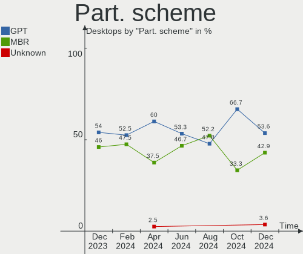
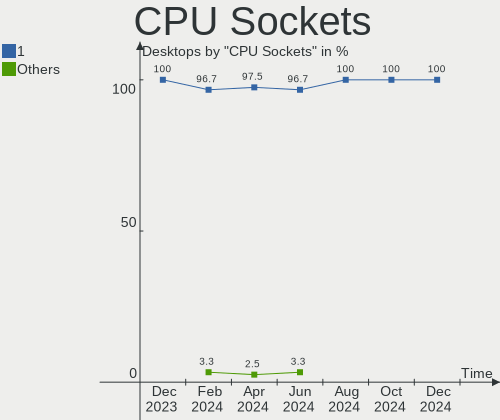
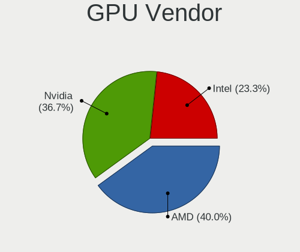

BlackPanther - Hardware Trends (Desktops)
-----------------------------------------

A project to identify most popular hardware characteristics and track their change
over time based on data collected by Linux users at https://Linux-Hardware.org.

Anyone can contribute to this report by the [hw-probe](https://github.com/linuxhw/hw-probe) tool:

    sudo -E hw-probe -all -upload

This report is for one last month. Overall report since the beginning of time: [TestCoverage](https://github.com/linuxhw/TestCoverage)

Period: May, 2022.

Contents
--------

* [ System ](#system)
  - [ OS                       ](#os)
  - [ OS Family                ](#os-family)
  - [ Kernel                   ](#kernel)
  - [ Kernel Family            ](#kernel-family)
  - [ Kernel Major Ver.        ](#kernel-major-ver)
  - [ Arch                     ](#arch)
  - [ DE                       ](#de)
  - [ Display Server           ](#display-server)
  - [ Display Manager          ](#display-manager)
  - [ OS Lang                  ](#os-lang)
  - [ Boot Mode                ](#boot-mode)
  - [ Filesystem               ](#filesystem)
  - [ Part. scheme             ](#part-scheme)
  - [ Dual Boot with Linux/BSD ](#dual-boot-with-linuxbsd)
  - [ Dual Boot (Win)          ](#dual-boot-win)

* [ Board ](#board)
  - [ Vendor                   ](#vendor)
  - [ Model                    ](#model)
  - [ Model Family             ](#model-family)
  - [ MFG Year                 ](#mfg-year)
  - [ Form Factor              ](#form-factor)
  - [ Secure Boot              ](#secure-boot)
  - [ Coreboot                 ](#coreboot)
  - [ RAM Size                 ](#ram-size)
  - [ RAM Used                 ](#ram-used)
  - [ Total Drives             ](#total-drives)
  - [ Has CD-ROM               ](#has-cd-rom)
  - [ Has Ethernet             ](#has-ethernet)
  - [ Has WiFi                 ](#has-wifi)
  - [ Has Bluetooth            ](#has-bluetooth)

* [ Location ](#location)
  - [ Country                  ](#country)
  - [ City                     ](#city)

* [ Drives ](#drives)
  - [ Drive Vendor             ](#drive-vendor)
  - [ Drive Model              ](#drive-model)
  - [ HDD Vendor               ](#hdd-vendor)
  - [ SSD Vendor               ](#ssd-vendor)
  - [ Drive Kind               ](#drive-kind)
  - [ Drive Connector          ](#drive-connector)
  - [ Drive Size               ](#drive-size)
  - [ Space Total              ](#space-total)
  - [ Space Used               ](#space-used)
  - [ Malfunc. Drives          ](#malfunc-drives)
  - [ Malfunc. Drive Vendor    ](#malfunc-drive-vendor)
  - [ Malfunc. HDD Vendor      ](#malfunc-hdd-vendor)
  - [ Malfunc. Drive Kind      ](#malfunc-drive-kind)
  - [ Failed Drives            ](#failed-drives)
  - [ Failed Drive Vendor      ](#failed-drive-vendor)
  - [ Drive Status             ](#drive-status)

* [ Storage controller ](#storage-controller)
  - [ Storage Vendor           ](#storage-vendor)
  - [ Storage Model            ](#storage-model)
  - [ Storage Kind             ](#storage-kind)

* [ Processor ](#processor)
  - [ CPU Vendor               ](#cpu-vendor)
  - [ CPU Model                ](#cpu-model)
  - [ CPU Model Family         ](#cpu-model-family)
  - [ CPU Cores                ](#cpu-cores)
  - [ CPU Sockets              ](#cpu-sockets)
  - [ CPU Threads              ](#cpu-threads)
  - [ CPU Op-Modes             ](#cpu-op-modes)
  - [ CPU Microcode            ](#cpu-microcode)
  - [ CPU Microarch            ](#cpu-microarch)

* [ Graphics ](#graphics)
  - [ GPU Vendor               ](#gpu-vendor)
  - [ GPU Model                ](#gpu-model)
  - [ GPU Combo                ](#gpu-combo)
  - [ GPU Driver               ](#gpu-driver)
  - [ GPU Memory               ](#gpu-memory)

* [ Monitor ](#monitor)
  - [ Monitor Vendor           ](#monitor-vendor)
  - [ Monitor Model            ](#monitor-model)
  - [ Monitor Resolution       ](#monitor-resolution)
  - [ Monitor Diagonal         ](#monitor-diagonal)
  - [ Monitor Width            ](#monitor-width)
  - [ Aspect Ratio             ](#aspect-ratio)
  - [ Monitor Area             ](#monitor-area)
  - [ Pixel Density            ](#pixel-density)
  - [ Multiple Monitors        ](#multiple-monitors)

* [ Network ](#network)
  - [ Net Controller Vendor    ](#net-controller-vendor)
  - [ Net Controller Model     ](#net-controller-model)
  - [ Wireless Vendor          ](#wireless-vendor)
  - [ Wireless Model           ](#wireless-model)
  - [ Ethernet Vendor          ](#ethernet-vendor)
  - [ Ethernet Model           ](#ethernet-model)
  - [ Net Controller Kind      ](#net-controller-kind)
  - [ Used Controller          ](#used-controller)
  - [ NICs                     ](#nics)
  - [ IPv6                     ](#ipv6)

* [ Bluetooth ](#bluetooth)
  - [ Bluetooth Vendor         ](#bluetooth-vendor)
  - [ Bluetooth Model          ](#bluetooth-model)

* [ Sound ](#sound)
  - [ Sound Vendor             ](#sound-vendor)
  - [ Sound Model              ](#sound-model)

* [ Memory ](#memory)
  - [ Memory Vendor            ](#memory-vendor)
  - [ Memory Model             ](#memory-model)
  - [ Memory Kind              ](#memory-kind)
  - [ Memory Form Factor       ](#memory-form-factor)
  - [ Memory Size              ](#memory-size)
  - [ Memory Speed             ](#memory-speed)

* [ Printers & scanners ](#printers--scanners)
  - [ Printer Vendor           ](#printer-vendor)
  - [ Printer Model            ](#printer-model)
  - [ Scanner Vendor           ](#scanner-vendor)
  - [ Scanner Model            ](#scanner-model)

* [ Camera ](#camera)
  - [ Camera Vendor            ](#camera-vendor)
  - [ Camera Model             ](#camera-model)

* [ Security ](#security)
  - [ Fingerprint Vendor       ](#fingerprint-vendor)
  - [ Fingerprint Model        ](#fingerprint-model)
  - [ Chipcard Vendor          ](#chipcard-vendor)
  - [ Chipcard Model           ](#chipcard-model)

* [ Unsupported ](#unsupported)
  - [ Unsupported Devices      ](#unsupported-devices)
  - [ Unsupported Device Types ](#unsupported-device-types)

System
------

OS
--

Installed operating systems

| Name              | Desktops | Percent |
|-------------------|----------|---------|
| BlackPanther 18.1 | 11       | 100%    |

OS Family
---------

OS without a version

| Name         | Desktops | Percent |
|--------------|----------|---------|
| BlackPanther | 11       | 100%    |

Kernel
------

Version of the Linux kernel

| Version             | Desktops | Percent |
|---------------------|----------|---------|
| 4.18.16-desktop-1bP | 7        | 63.64%  |
| 5.6.14-desktop-2bP  | 4        | 36.36%  |

Kernel Family
-------------

Linux kernel without a distro release

| Version | Desktops | Percent |
|---------|----------|---------|
| 4.18.16 | 7        | 63.64%  |
| 5.6.14  | 4        | 36.36%  |

Kernel Major Ver.
-----------------

Linux kernel major version

| Version | Desktops | Percent |
|---------|----------|---------|
| 4.18    | 7        | 63.64%  |
| 5.6     | 4        | 36.36%  |

Arch
----

OS architecture (x86_64, i586, etc.)

| Name   | Desktops | Percent |
|--------|----------|---------|
| x86_64 | 11       | 100%    |

DE
--

Desktop Environment

| Name | Desktops | Percent |
|------|----------|---------|
| KDE5 | 11       | 100%    |

Display Server
--------------

X11 or Wayland

| Name | Desktops | Percent |
|------|----------|---------|
| X11  | 11       | 100%    |

Display Manager
---------------

SDDM, LightDM, etc.

| Name | Desktops | Percent |
|------|----------|---------|
| SDDM | 11       | 100%    |

OS Lang
-------

Language

| Lang    | Desktops | Percent |
|---------|----------|---------|
| Unknown | 11       | 100%    |

Boot Mode
---------

EFI or BIOS

| Mode | Desktops | Percent |
|------|----------|---------|
| BIOS | 8        | 72.73%  |
| EFI  | 3        | 27.27%  |

Filesystem
----------

Type of filesystem

| Type    | Desktops | Percent |
|---------|----------|---------|
| Overlay | 6        | 54.55%  |
| Ext4    | 5        | 45.45%  |

Part. scheme
------------

Scheme of partitioning

| Type | Desktops | Percent |
|------|----------|---------|
| MBR  | 6        | 54.55%  |
| GPT  | 5        | 45.45%  |

Dual Boot with Linux/BSD
------------------------

Hosting more than one Linux/BSD

| Dual boot | Desktops | Percent |
|-----------|----------|---------|
| Yes       | 6        | 54.55%  |
| No        | 5        | 45.45%  |

Dual Boot (Win)
---------------

Hosting Linux and Windows

| Dual boot | Desktops | Percent |
|-----------|----------|---------|
| No        | 7        | 63.64%  |
| Yes       | 4        | 36.36%  |

Board
-----

Vendor
------

Motherboard manufacturer

| Name                | Desktops | Percent |
|---------------------|----------|---------|
| Gigabyte Technology | 3        | 27.27%  |
| MSI                 | 2        | 18.18%  |
| Dell                | 2        | 18.18%  |
| ASUSTek Computer    | 2        | 18.18%  |
| Lenovo              | 1        | 9.09%   |
| Fujitsu             | 1        | 9.09%   |

Model
-----

Motherboard model

| Name                           | Desktops | Percent |
|--------------------------------|----------|---------|
| MSI MS-7A33                    | 1        | 9.09%   |
| MSI MS-7846                    | 1        | 9.09%   |
| Lenovo ThinkCentre A57 98517HG | 1        | 9.09%   |
| Gigabyte H61M-S1               | 1        | 9.09%   |
| Gigabyte G41MT-S2              | 1        | 9.09%   |
| Gigabyte B450M GAMING          | 1        | 9.09%   |
| Fujitsu ESPRIMO E7935          | 1        | 9.09%   |
| Dell OptiPlex 320              | 1        | 9.09%   |
| Dell OptiPlex 3050             | 1        | 9.09%   |
| ASUS PRIME B365M-A             | 1        | 9.09%   |
| ASUS P8B75-M LX PLUS           | 1        | 9.09%   |

Model Family
------------

Motherboard model prefix

| Name               | Desktops | Percent |
|--------------------|----------|---------|
| Dell OptiPlex      | 2        | 18.18%  |
| MSI MS-7A33        | 1        | 9.09%   |
| MSI MS-7846        | 1        | 9.09%   |
| Lenovo ThinkCentre | 1        | 9.09%   |
| Gigabyte H61M-S1   | 1        | 9.09%   |
| Gigabyte G41MT-S2  | 1        | 9.09%   |
| Gigabyte B450M     | 1        | 9.09%   |
| Fujitsu ESPRIMO    | 1        | 9.09%   |
| ASUS PRIME         | 1        | 9.09%   |
| ASUS P8B75-M       | 1        | 9.09%   |

MFG Year
--------

Motherboard manufacture year

| Year | Desktops | Percent |
|------|----------|---------|
| 2017 | 2        | 18.18%  |
| 2012 | 2        | 18.18%  |
| 2010 | 2        | 18.18%  |
| 2019 | 1        | 9.09%   |
| 2018 | 1        | 9.09%   |
| 2013 | 1        | 9.09%   |
| 2008 | 1        | 9.09%   |
| 2007 | 1        | 9.09%   |

Form Factor
-----------

Physical design of the computer

| Name    | Desktops | Percent |
|---------|----------|---------|
| Desktop | 11       | 100%    |

Secure Boot
-----------

Enabled or disabled

| State    | Desktops | Percent |
|----------|----------|---------|
| Disabled | 11       | 100%    |

Coreboot
--------

Have coreboot on board

| Used | Desktops | Percent |
|------|----------|---------|
| No   | 11       | 100%    |

RAM Size
--------

Total RAM memory

| Size in GB | Desktops | Percent |
|------------|----------|---------|
| 8.01-16.0  | 6        | 54.55%  |
| 1.01-2.0   | 3        | 27.27%  |
| 32.01-64.0 | 1        | 9.09%   |
| 16.01-24.0 | 1        | 9.09%   |

RAM Used
--------

Used RAM memory

| Used GB  | Desktops | Percent |
|----------|----------|---------|
| 0.51-1.0 | 10       | 90.91%  |
| 0.01-0.5 | 1        | 9.09%   |

Total Drives
------------

Number of drives on board

| Drives | Desktops | Percent |
|--------|----------|---------|
| 1      | 5        | 45.45%  |
| 2      | 3        | 27.27%  |
| 3      | 2        | 18.18%  |
| 4      | 1        | 9.09%   |

Has CD-ROM
----------

Has CD-ROM on board

| Presented | Desktops | Percent |
|-----------|----------|---------|
| Yes       | 7        | 63.64%  |
| No        | 4        | 36.36%  |

Has Ethernet
------------

Has Ethernet on board

| Presented | Desktops | Percent |
|-----------|----------|---------|
| Yes       | 11       | 100%    |

Has WiFi
--------

Has WiFi module

| Presented | Desktops | Percent |
|-----------|----------|---------|
| No        | 7        | 63.64%  |
| Yes       | 4        | 36.36%  |

Has Bluetooth
-------------

Has Bluetooth module

| Presented | Desktops | Percent |
|-----------|----------|---------|
| No        | 9        | 81.82%  |
| Yes       | 2        | 18.18%  |

Location
--------

Country
-------

Geographic location (country)

| Country | Desktops | Percent |
|---------|----------|---------|
| Hungary | 9        | 81.82%  |
| Germany | 1        | 9.09%   |
| France  | 1        | 9.09%   |

City
----

Geographic location (city)

| City          | Desktops | Percent |
|---------------|----------|---------|
| Szekszárd    | 1        | 9.09%   |
| Ostringen     | 1        | 9.09%   |
| Oroshaza      | 1        | 9.09%   |
| Mezobereny    | 1        | 9.09%   |
| Kiskunlachaza | 1        | 9.09%   |
| Kapuvar       | 1        | 9.09%   |
| Houilles      | 1        | 9.09%   |
| Esztergom     | 1        | 9.09%   |
| Eger          | 1        | 9.09%   |
| Debrecen      | 1        | 9.09%   |
| Budapest      | 1        | 9.09%   |

Drives
------

Drive Vendor
------------

Hard drive vendors

| Vendor              | Desktops | Drives | Percent |
|---------------------|----------|--------|---------|
| WDC                 | 4        | 4      | 19.05%  |
| Kingston            | 4        | 5      | 19.05%  |
| Seagate             | 2        | 3      | 9.52%   |
| Samsung Electronics | 2        | 2      | 9.52%   |
| A-DATA Technology   | 2        | 2      | 9.52%   |
| Zheino              | 1        | 1      | 4.76%   |
| Toshiba             | 1        | 1      | 4.76%   |
| SPCC                | 1        | 1      | 4.76%   |
| MAXTOR              | 1        | 1      | 4.76%   |
| HGST                | 1        | 1      | 4.76%   |
| Crucial             | 1        | 1      | 4.76%   |
| ASMT                | 1        | 1      | 4.76%   |

Drive Model
-----------

Hard drive models

| Model                            | Desktops | Percent |
|----------------------------------|----------|---------|
| A-DATA SU630 240GB SSD           | 2        | 9.09%   |
| Zheino CHN-NGFFNV2280-256 256GB  | 1        | 4.55%   |
| WDC WDS240G2G0B-00EPW0 240GB SSD | 1        | 4.55%   |
| WDC WD6400AAKS-65A7B2 640GB      | 1        | 4.55%   |
| WDC WD400BD-75MRA1 40GB          | 1        | 4.55%   |
| WDC WD20EZRX-00D8PB0 2TB         | 1        | 4.55%   |
| Toshiba DT01ACA100 1TB           | 1        | 4.55%   |
| SPCC Solid State Disk 128GB      | 1        | 4.55%   |
| Seagate ST500LT012-9WS142 500GB  | 1        | 4.55%   |
| Seagate ST4000DM004-2CV104 4TB   | 1        | 4.55%   |
| Seagate ST2000DM008-2FR102 2TB   | 1        | 4.55%   |
| Samsung SSD 860 EVO 250GB        | 1        | 4.55%   |
| Samsung HD103UJ 1TB              | 1        | 4.55%   |
| MAXTOR 2B020H1 20GB              | 1        | 4.55%   |
| Kingston SV300S37A120G 120GB SSD | 1        | 4.55%   |
| Kingston SUV400S37120G 120GB SSD | 1        | 4.55%   |
| Kingston SA400S37120G 120GB SSD  | 1        | 4.55%   |
| Kingston SA2000M8250G 250GB      | 1        | 4.55%   |
| HGST HTS541010B7E610 1TB         | 1        | 4.55%   |
| Crucial M4-CT256M4SSD2 256GB     | 1        | 4.55%   |
| ASMT USB 3.0 TOSATA 120GB        | 1        | 4.55%   |

HDD Vendor
----------

Hard disk drive vendors

| Vendor              | Desktops | Drives | Percent |
|---------------------|----------|--------|---------|
| WDC                 | 3        | 3      | 33.33%  |
| Seagate             | 2        | 3      | 22.22%  |
| Toshiba             | 1        | 1      | 11.11%  |
| Samsung Electronics | 1        | 1      | 11.11%  |
| MAXTOR              | 1        | 1      | 11.11%  |
| HGST                | 1        | 1      | 11.11%  |

SSD Vendor
----------

Solid state drive vendors

| Vendor              | Desktops | Drives | Percent |
|---------------------|----------|--------|---------|
| Kingston            | 3        | 4      | 33.33%  |
| A-DATA Technology   | 2        | 2      | 22.22%  |
| WDC                 | 1        | 1      | 11.11%  |
| SPCC                | 1        | 1      | 11.11%  |
| Samsung Electronics | 1        | 1      | 11.11%  |
| Crucial             | 1        | 1      | 11.11%  |

Drive Kind
----------

HDD or SSD

| Kind    | Desktops | Drives | Percent |
|---------|----------|--------|---------|
| SSD     | 8        | 10     | 42.11%  |
| HDD     | 8        | 10     | 42.11%  |
| NVMe    | 2        | 2      | 10.53%  |
| Unknown | 1        | 1      | 5.26%   |

Drive Connector
---------------

SATA, SAS, NVMe, etc.

| Type | Desktops | Drives | Percent |
|------|----------|--------|---------|
| SATA | 11       | 20     | 78.57%  |
| NVMe | 2        | 2      | 14.29%  |
| SAS  | 1        | 1      | 7.14%   |

Drive Size
----------

Size of hard drive

| Size in TB | Desktops | Drives | Percent |
|------------|----------|--------|---------|
| 0.01-0.5   | 10       | 13     | 58.82%  |
| 0.51-1.0   | 4        | 4      | 23.53%  |
| 1.01-2.0   | 2        | 2      | 11.76%  |
| 3.01-4.0   | 1        | 1      | 5.88%   |

Space Total
-----------

Amount of disk space available on the file system

| Size in GB | Desktops | Percent |
|------------|----------|---------|
| Unknown    | 6        | 54.55%  |
| 101-250    | 3        | 27.27%  |
| 1-20       | 1        | 9.09%   |
| 51-100     | 1        | 9.09%   |

Space Used
----------

Amount of used disk space

| Used GB | Desktops | Percent |
|---------|----------|---------|
| Unknown | 6        | 54.55%  |
| 1-20    | 5        | 45.45%  |

Malfunc. Drives
---------------

Drive models with a malfunction

| Model                             | Desktops | Drives | Percent |
|-----------------------------------|----------|--------|---------|
| WDC WD6400AAKS-65A7B2 640GB       | 1        | 1      | 20%     |
| Seagate ST500LT012-9WS142 500GB   | 1        | 1      | 20%     |
| Samsung Electronics HD103UJ 1TB   | 1        | 1      | 20%     |
| MAXTOR 2B020H1 20GB               | 1        | 1      | 20%     |
| A-DATA Technology SU630 240GB SSD | 1        | 1      | 20%     |

Malfunc. Drive Vendor
---------------------

Vendors of faulty drives

| Vendor              | Desktops | Drives | Percent |
|---------------------|----------|--------|---------|
| WDC                 | 1        | 1      | 20%     |
| Seagate             | 1        | 1      | 20%     |
| Samsung Electronics | 1        | 1      | 20%     |
| MAXTOR              | 1        | 1      | 20%     |
| A-DATA Technology   | 1        | 1      | 20%     |

Malfunc. HDD Vendor
-------------------

Vendors of faulty HDD drives

| Vendor              | Desktops | Drives | Percent |
|---------------------|----------|--------|---------|
| WDC                 | 1        | 1      | 25%     |
| Seagate             | 1        | 1      | 25%     |
| Samsung Electronics | 1        | 1      | 25%     |
| MAXTOR              | 1        | 1      | 25%     |

Malfunc. Drive Kind
-------------------

Kinds of faulty drives

| Kind | Desktops | Drives | Percent |
|------|----------|--------|---------|
| HDD  | 4        | 4      | 80%     |
| SSD  | 1        | 1      | 20%     |

Failed Drives
-------------

Failed drive models

| Model                           | Desktops | Drives | Percent |
|---------------------------------|----------|--------|---------|
| Zheino CHN-NGFFNV2280-256 256GB | 1        | 1      | 100%    |

Failed Drive Vendor
-------------------

Failed drive vendors

| Vendor | Desktops | Drives | Percent |
|--------|----------|--------|---------|
| Zheino | 1        | 1      | 100%    |

Drive Status
------------

Number of failed and malfunc. drives

| Status   | Desktops | Drives | Percent |
|----------|----------|--------|---------|
| Works    | 9        | 16     | 56.25%  |
| Malfunc  | 5        | 5      | 31.25%  |
| Detected | 1        | 1      | 6.25%   |
| Failed   | 1        | 1      | 6.25%   |

Storage controller
------------------

Storage Vendor
--------------

Storage controller vendors

| Vendor                      | Desktops | Percent |
|-----------------------------|----------|---------|
| Intel                       | 8        | 61.54%  |
| AMD                         | 3        | 23.08%  |
| Silicon Motion              | 1        | 7.69%   |
| Kingston Technology Company | 1        | 7.69%   |

Storage Model
-------------

Storage controller models

| Model                                                                                   | Desktops | Percent |
|-----------------------------------------------------------------------------------------|----------|---------|
| Intel NM10/ICH7 Family SATA Controller [IDE mode]                                       | 2        | 11.11%  |
| Silicon Motion SM2263EN/SM2263XT SSD Controller                                         | 1        | 5.56%   |
| Kingston Company A2000 NVMe SSD                                                         | 1        | 5.56%   |
| Intel SATA Controller [RAID mode]                                                       | 1        | 5.56%   |
| Intel 82801JD/DO (ICH10 Family) 4-port SATA IDE Controller                              | 1        | 5.56%   |
| Intel 82801JD/DO (ICH10 Family) 2-port SATA IDE Controller                              | 1        | 5.56%   |
| Intel 82801G (ICH7 Family) IDE Controller                                               | 1        | 5.56%   |
| Intel 8 Series/C220 Series Chipset Family 6-port SATA Controller 1 [AHCI mode]          | 1        | 5.56%   |
| Intel 7 Series/C210 Series Chipset Family 6-port SATA Controller [AHCI mode]            | 1        | 5.56%   |
| Intel 6 Series/C200 Series Chipset Family Desktop SATA Controller (IDE mode, ports 4-5) | 1        | 5.56%   |
| Intel 6 Series/C200 Series Chipset Family Desktop SATA Controller (IDE mode, ports 0-3) | 1        | 5.56%   |
| Intel 200 Series PCH SATA controller [AHCI mode]                                        | 1        | 5.56%   |
| AMD X370 Series Chipset SATA Controller                                                 | 1        | 5.56%   |
| AMD SB600 Non-Raid-5 SATA                                                               | 1        | 5.56%   |
| AMD SB600 IDE                                                                           | 1        | 5.56%   |
| AMD FCH SATA Controller [AHCI mode]                                                     | 1        | 5.56%   |
| AMD 400 Series Chipset SATA Controller                                                  | 1        | 5.56%   |

Storage Kind
------------

Kind of storage controller (IDE, SATA, NVMe, SAS, ...)

| Kind | Desktops | Percent |
|------|----------|---------|
| SATA | 6        | 42.86%  |
| IDE  | 5        | 35.71%  |
| NVMe | 2        | 14.29%  |
| RAID | 1        | 7.14%   |

Processor
---------

CPU Vendor
----------

Processor vendors

| Vendor | Desktops | Percent |
|--------|----------|---------|
| Intel  | 9        | 81.82%  |
| AMD    | 2        | 18.18%  |

CPU Model
---------

Processor models

| Model                                       | Desktops | Percent |
|---------------------------------------------|----------|---------|
| Intel Pentium CPU G3420 @ 3.20GHz           | 1        | 9.09%   |
| Intel Genuine CPU 2140 @ 1.60GHz            | 1        | 9.09%   |
| Intel Core i5-7500 CPU @ 3.40GHz            | 1        | 9.09%   |
| Intel Core i5-3470 CPU @ 3.20GHz            | 1        | 9.09%   |
| Intel Core i3-8100 CPU @ 3.60GHz            | 1        | 9.09%   |
| Intel Core i3-3220 CPU @ 3.30GHz            | 1        | 9.09%   |
| Intel Core 2 Quad CPU Q9400 @ 2.66GHz       | 1        | 9.09%   |
| Intel Core 2 Duo CPU E6550 @ 2.33GHz        | 1        | 9.09%   |
| Intel Core 2 CPU 4300 @ 1.80GHz             | 1        | 9.09%   |
| AMD Ryzen 5 3400G with Radeon Vega Graphics | 1        | 9.09%   |
| AMD Ryzen 5 1400 Quad-Core Processor        | 1        | 9.09%   |

CPU Model Family
----------------

Processor model prefix

| Model             | Desktops | Percent |
|-------------------|----------|---------|
| Intel Core i5     | 2        | 18.18%  |
| Intel Core i3     | 2        | 18.18%  |
| AMD Ryzen 5       | 2        | 18.18%  |
| Intel Pentium     | 1        | 9.09%   |
| Intel Genuine     | 1        | 9.09%   |
| Intel Core 2 Quad | 1        | 9.09%   |
| Intel Core 2 Duo  | 1        | 9.09%   |
| Intel Core 2      | 1        | 9.09%   |

CPU Cores
---------

Number of processor cores

| Number | Desktops | Percent |
|--------|----------|---------|
| 4      | 6        | 54.55%  |
| 2      | 4        | 36.36%  |
| 1      | 1        | 9.09%   |

CPU Sockets
-----------

Number of sockets

| Number | Desktops | Percent |
|--------|----------|---------|
| 1      | 11       | 100%    |

CPU Threads
-----------

Threads per core (Hyper-Threading)

| Number | Desktops | Percent |
|--------|----------|---------|
| 1      | 8        | 72.73%  |
| 2      | 3        | 27.27%  |

CPU Op-Modes
------------

CPU Operation Modes (32-bit, 64-bit)

| Op mode        | Desktops | Percent |
|----------------|----------|---------|
| 32-bit, 64-bit | 11       | 100%    |

CPU Microcode
-------------

Microcode number

| Number     | Desktops | Percent |
|------------|----------|---------|
| 0x6f2      | 2        | 18.18%  |
| 0x306a9    | 2        | 18.18%  |
| 0x906eb    | 1        | 9.09%   |
| 0x906e9    | 1        | 9.09%   |
| 0x6fb      | 1        | 9.09%   |
| 0x306c3    | 1        | 9.09%   |
| 0x1067a    | 1        | 9.09%   |
| 0x08108109 | 1        | 9.09%   |
| 0x08001137 | 1        | 9.09%   |

CPU Microarch
-------------

Microarchitecture

| Name      | Desktops | Percent |
|-----------|----------|---------|
| Core      | 3        | 27.27%  |
| KabyLake  | 2        | 18.18%  |
| IvyBridge | 2        | 18.18%  |
| Zen+      | 1        | 9.09%   |
| Zen       | 1        | 9.09%   |
| Penryn    | 1        | 9.09%   |
| Haswell   | 1        | 9.09%   |

Graphics
--------

GPU Vendor
----------

Vendors of graphics cards

| Vendor | Desktops | Percent |
|--------|----------|---------|
| Intel  | 6        | 46.15%  |
| AMD    | 4        | 30.77%  |
| Nvidia | 3        | 23.08%  |

GPU Model
---------

Graphics card models

| Model                                                                       | Desktops | Percent |
|-----------------------------------------------------------------------------|----------|---------|
| Nvidia GP107 [GeForce GTX 1050]                                             | 1        | 7.69%   |
| Nvidia GP106 [GeForce GTX 1060 6GB]                                         | 1        | 7.69%   |
| Nvidia GK107 [GeForce GTX 650]                                              | 1        | 7.69%   |
| Intel Xeon E3-1200 v3/4th Gen Core Processor Integrated Graphics Controller | 1        | 7.69%   |
| Intel Xeon E3-1200 v2/3rd Gen Core processor Graphics Controller            | 1        | 7.69%   |
| Intel HD Graphics 630                                                       | 1        | 7.69%   |
| Intel CoffeeLake-S GT2 [UHD Graphics 630]                                   | 1        | 7.69%   |
| Intel 82G33/G31 Express Integrated Graphics Controller                      | 1        | 7.69%   |
| Intel 4 Series Chipset Integrated Graphics Controller                       | 1        | 7.69%   |
| AMD RC410 [Radeon Xpress 200/1100]                                          | 1        | 7.69%   |
| AMD Picasso/Raven 2 [Radeon Vega Series / Radeon Vega Mobile Series]        | 1        | 7.69%   |
| AMD Ellesmere [Radeon RX 470/480/570/570X/580/580X/590]                     | 1        | 7.69%   |
| AMD Cedar [Radeon HD 5000/6000/7350/8350 Series]                            | 1        | 7.69%   |

GPU Combo
---------

Combinations of graphics cards

| Name       | Desktops | Percent |
|------------|----------|---------|
| 1 x Intel  | 4        | 36.36%  |
| 1 x AMD    | 4        | 36.36%  |
| 1 x Nvidia | 3        | 27.27%  |

GPU Driver
----------

Free vs proprietary

| Driver | Desktops | Percent |
|--------|----------|---------|
| Free   | 11       | 100%    |

GPU Memory
----------

Total video memory

| Size in GB | Desktops | Percent |
|------------|----------|---------|
| Unknown    | 4        | 36.36%  |
| 1.01-2.0   | 3        | 27.27%  |
| 5.01-6.0   | 1        | 9.09%   |
| 3.01-4.0   | 1        | 9.09%   |
| 0.51-1.0   | 1        | 9.09%   |
| 0.01-0.5   | 1        | 9.09%   |

Monitor
-------

Monitor Vendor
--------------

Monitor vendors

| Vendor              | Desktops | Percent |
|---------------------|----------|---------|
| Samsung Electronics | 2        | 18.18%  |
| Dell                | 2        | 18.18%  |
| S2-Tek              | 1        | 9.09%   |
| Lenovo              | 1        | 9.09%   |
| Impression          | 1        | 9.09%   |
| Hewlett-Packard     | 1        | 9.09%   |
| Goldstar            | 1        | 9.09%   |
| BenQ                | 1        | 9.09%   |
| Acer                | 1        | 9.09%   |

Monitor Model
-------------

Monitor models

| Model                                                                | Desktops | Percent |
|----------------------------------------------------------------------|----------|---------|
| Samsung Electronics SyncMaster SAM01B8 1280x1024 338x270mm 17.0-inch | 1        | 8.33%   |
| Samsung Electronics S27E500 SAM0D0D 1920x1080 598x336mm 27.0-inch    | 1        | 8.33%   |
| S2-Tek TV STK531A 1920x1080 930x530mm 42.1-inch                      | 1        | 8.33%   |
| Lenovo LEN L171 LEN24C9 1280x1024 337x270mm 17.0-inch                | 1        | 8.33%   |
| Impression R19W11 IMP1911 1440x900 410x257mm 19.1-inch               | 1        | 8.33%   |
| Hewlett-Packard L1502 HWP2600 1024x768 304x228mm 15.0-inch           | 1        | 8.33%   |
| Goldstar L204WT GSM4E48 1680x1050 434x270mm 20.1-inch                | 1        | 8.33%   |
| Goldstar L204WT GSM4E47 1680x1050 434x270mm 20.1-inch                | 1        | 8.33%   |
| Dell S2721D DELA19A 2560x1440 597x336mm 27.0-inch                    | 1        | 8.33%   |
| Dell P2219H DELA115 1920x1080 476x267mm 21.5-inch                    | 1        | 8.33%   |
| BenQ G2010W BNQ7811 1680x1050 474x296mm 22.0-inch                    | 1        | 8.33%   |
| Acer V193W ACR0025 1440x900 408x255mm 18.9-inch                      | 1        | 8.33%   |

Monitor Resolution
------------------

Monitor screen resolution

| Resolution         | Desktops | Percent |
|--------------------|----------|---------|
| 1920x1080 (FHD)    | 3        | 27.27%  |
| 1680x1050 (WSXGA+) | 2        | 18.18%  |
| 1440x900 (WXGA+)   | 2        | 18.18%  |
| 1280x1024 (SXGA)   | 2        | 18.18%  |
| 2560x1440 (QHD)    | 1        | 9.09%   |
| 1024x768 (XGA)     | 1        | 9.09%   |

Monitor Diagonal
----------------

Diagonal size in inches

| Inches | Desktops | Percent |
|--------|----------|---------|
| 27     | 2        | 18.18%  |
| 17     | 2        | 18.18%  |
| 42     | 1        | 9.09%   |
| 22     | 1        | 9.09%   |
| 21     | 1        | 9.09%   |
| 20     | 1        | 9.09%   |
| 19     | 1        | 9.09%   |
| 18     | 1        | 9.09%   |
| 15     | 1        | 9.09%   |

Monitor Width
-------------

Physical width

| Width in mm | Desktops | Percent |
|-------------|----------|---------|
| 401-500     | 5        | 45.45%  |
| 301-350     | 3        | 27.27%  |
| 501-600     | 2        | 18.18%  |
| 901-1000    | 1        | 9.09%   |

Aspect Ratio
------------

Proportional relationship between the width and the height

| Ratio | Desktops | Percent |
|-------|----------|---------|
| 16/9  | 4        | 36.36%  |
| 16/10 | 4        | 36.36%  |
| 5/4   | 2        | 18.18%  |
| 4/3   | 1        | 9.09%   |

Monitor Area
------------

Area in inch²

| Area in inch² | Desktops | Percent |
|----------------|----------|---------|
| 151-200        | 3        | 27.27%  |
| 301-350        | 2        | 18.18%  |
| 201-250        | 2        | 18.18%  |
| 141-150        | 2        | 18.18%  |
| 101-110        | 1        | 9.09%   |
| 501-1000       | 1        | 9.09%   |

Pixel Density
-------------

Pixels per inch

| Density | Desktops | Percent |
|---------|----------|---------|
| 51-100  | 9        | 81.82%  |
| 101-120 | 2        | 18.18%  |

Multiple Monitors
-----------------

Total monitors connected

| Total | Desktops | Percent |
|-------|----------|---------|
| 1     | 11       | 100%    |

Network
-------

Net Controller Vendor
---------------------

Controller vendors

| Vendor                   | Desktops | Percent |
|--------------------------|----------|---------|
| Realtek Semiconductor    | 8        | 53.33%  |
| Intel                    | 2        | 13.33%  |
| TP-Link                  | 1        | 6.67%   |
| Qualcomm Atheros         | 1        | 6.67%   |
| Microsoft                | 1        | 6.67%   |
| Marvell Technology Group | 1        | 6.67%   |
| Broadcom Limited         | 1        | 6.67%   |

Net Controller Model
--------------------

Controller models

| Model                                                             | Desktops | Percent |
|-------------------------------------------------------------------|----------|---------|
| Realtek RTL8111/8168/8411 PCI Express Gigabit Ethernet Controller | 7        | 43.75%  |
| TP-Link TL-WN821N Version 5 RTL8192EU                             | 1        | 6.25%   |
| Realtek RTL8188EUS 802.11n Wireless Network Adapter               | 1        | 6.25%   |
| Realtek RTL8188EE Wireless Network Adapter                        | 1        | 6.25%   |
| Qualcomm Atheros AR8151 v1.0 Gigabit Ethernet                     | 1        | 6.25%   |
| Microsoft Xbox 360 Wireless Adapter                               | 1        | 6.25%   |
| Marvell Group 88E8056 PCI-E Gigabit Ethernet Controller           | 1        | 6.25%   |
| Intel Wireless 7260                                               | 1        | 6.25%   |
| Intel 82567LM-3 Gigabit Network Connection                        | 1        | 6.25%   |
| Broadcom Limited BCM4401-B0 100Base-TX                            | 1        | 6.25%   |

Wireless Vendor
---------------

Wireless vendors

| Vendor                | Desktops | Percent |
|-----------------------|----------|---------|
| Realtek Semiconductor | 2        | 40%     |
| TP-Link               | 1        | 20%     |
| Microsoft             | 1        | 20%     |
| Intel                 | 1        | 20%     |

Wireless Model
--------------

Wireless models

| Model                                               | Desktops | Percent |
|-----------------------------------------------------|----------|---------|
| TP-Link TL-WN821N Version 5 RTL8192EU               | 1        | 20%     |
| Realtek RTL8188EUS 802.11n Wireless Network Adapter | 1        | 20%     |
| Realtek RTL8188EE Wireless Network Adapter          | 1        | 20%     |
| Microsoft Xbox 360 Wireless Adapter                 | 1        | 20%     |
| Intel Wireless 7260                                 | 1        | 20%     |

Ethernet Vendor
---------------

Ethernet vendors

| Vendor                   | Desktops | Percent |
|--------------------------|----------|---------|
| Realtek Semiconductor    | 7        | 63.64%  |
| Qualcomm Atheros         | 1        | 9.09%   |
| Marvell Technology Group | 1        | 9.09%   |
| Intel                    | 1        | 9.09%   |
| Broadcom Limited         | 1        | 9.09%   |

Ethernet Model
--------------

Ethernet models

| Model                                                             | Desktops | Percent |
|-------------------------------------------------------------------|----------|---------|
| Realtek RTL8111/8168/8411 PCI Express Gigabit Ethernet Controller | 7        | 63.64%  |
| Qualcomm Atheros AR8151 v1.0 Gigabit Ethernet                     | 1        | 9.09%   |
| Marvell Group 88E8056 PCI-E Gigabit Ethernet Controller           | 1        | 9.09%   |
| Intel 82567LM-3 Gigabit Network Connection                        | 1        | 9.09%   |
| Broadcom Limited BCM4401-B0 100Base-TX                            | 1        | 9.09%   |

Net Controller Kind
-------------------

Ethernet, WiFi or modem

| Kind     | Desktops | Percent |
|----------|----------|---------|
| Ethernet | 11       | 73.33%  |
| WiFi     | 4        | 26.67%  |

Used Controller
---------------

Currently used network controller

| Kind     | Desktops | Percent |
|----------|----------|---------|
| Ethernet | 9        | 81.82%  |
| WiFi     | 2        | 18.18%  |

NICs
----

Total network controllers on board

| Total | Desktops | Percent |
|-------|----------|---------|
| 1     | 9        | 81.82%  |
| 2     | 2        | 18.18%  |

IPv6
----

IPv6 vs IPv4

| Used | Desktops | Percent |
|------|----------|---------|
| No   | 7        | 63.64%  |
| Yes  | 4        | 36.36%  |

Bluetooth
---------

Bluetooth Vendor
----------------

Controller vendors

| Vendor                  | Desktops | Percent |
|-------------------------|----------|---------|
| Intel                   | 1        | 50%     |
| Cambridge Silicon Radio | 1        | 50%     |

Bluetooth Model
---------------

Controller models

| Model                                               | Desktops | Percent |
|-----------------------------------------------------|----------|---------|
| Intel Bluetooth wireless interface                  | 1        | 50%     |
| Cambridge Silicon Radio Bluetooth Dongle (HCI mode) | 1        | 50%     |

Sound
-----

Sound Vendor
------------

Sound card vendors

| Vendor              | Desktops | Percent |
|---------------------|----------|---------|
| Intel               | 8        | 47.06%  |
| AMD                 | 5        | 29.41%  |
| Nvidia              | 3        | 17.65%  |
| C-Media Electronics | 1        | 5.88%   |

Sound Model
-----------

Sound card models

| Model                                                                      | Desktops | Percent |
|----------------------------------------------------------------------------|----------|---------|
| Intel NM10/ICH7 Family High Definition Audio Controller                    | 2        | 10.53%  |
| Intel 200 Series PCH HD Audio                                              | 2        | 10.53%  |
| Nvidia GP107GL High Definition Audio Controller                            | 1        | 5.26%   |
| Nvidia GP106 High Definition Audio Controller                              | 1        | 5.26%   |
| Nvidia GK107 HDMI Audio Controller                                         | 1        | 5.26%   |
| Intel Xeon E3-1200 v3/4th Gen Core Processor HD Audio Controller           | 1        | 5.26%   |
| Intel 82801JD/DO (ICH10 Family) HD Audio Controller                        | 1        | 5.26%   |
| Intel 8 Series/C220 Series Chipset High Definition Audio Controller        | 1        | 5.26%   |
| Intel 7 Series/C216 Chipset Family High Definition Audio Controller        | 1        | 5.26%   |
| Intel 6 Series/C200 Series Chipset Family High Definition Audio Controller | 1        | 5.26%   |
| C-Media Electronics Blue Snowball                                          | 1        | 5.26%   |
| AMD SBx00 Azalia (Intel HDA)                                               | 1        | 5.26%   |
| AMD Raven/Raven2/Fenghuang HDMI/DP Audio Controller                        | 1        | 5.26%   |
| AMD Family 17h/19h HD Audio Controller                                     | 1        | 5.26%   |
| AMD Family 17h (Models 00h-0fh) HD Audio Controller                        | 1        | 5.26%   |
| AMD Ellesmere HDMI Audio [Radeon RX 470/480 / 570/580/590]                 | 1        | 5.26%   |
| AMD Cedar HDMI Audio [Radeon HD 5400/6300/7300 Series]                     | 1        | 5.26%   |

Memory
------

Memory Vendor
-------------

Memory module vendors

| Vendor              | Desktops | Percent |
|---------------------|----------|---------|
| Kingston            | 4        | 33.33%  |
| Unknown             | 2        | 16.67%  |
| Samsung Electronics | 2        | 16.67%  |
| Corsair             | 2        | 16.67%  |
| Kingmax             | 1        | 8.33%   |
| G.Skill             | 1        | 8.33%   |

Memory Model
------------

Memory module models

| Model                                                                     | Desktops | Percent |
|---------------------------------------------------------------------------|----------|---------|
| Kingston RAM KHX1600C9D3/4GX 4096MB DIMM DDR3 2400MT/s                    | 2        | 14.29%  |
| Unknown RAM Module 4096MB DIMM 400MT/s                                    | 1        | 7.14%   |
| Unknown RAM Module 1024MB DIMM DDR2 667MT/s                               | 1        | 7.14%   |
| Samsung RAM M3 78T2953EZ3-CE6 1024MB DIMM DDR2 667MT/s                    | 1        | 7.14%   |
| Samsung RAM 4D332037385435363633515A332D43463720 2048MB DIMM DDR2 800MT/s | 1        | 7.14%   |
| Kingston RAM KPN424-ELJ 1024MB DIMM DDR 667MT/s                           | 1        | 7.14%   |
| Kingston RAM KHX2666C16/8G 8GB DIMM DDR4 3466MT/s                         | 1        | 7.14%   |
| Kingston RAM KHX1600C10D3/8G 4096MB DIMM DDR3 1600MT/s                    | 1        | 7.14%   |
| Kingmax RAM GLAG42F-18--------- 8192MB DIMM DDR4 2666MT/s                 | 1        | 7.14%   |
| Kingmax RAM GLAF62F-D8--------- 4096MB DIMM DDR4 2400MT/s                 | 1        | 7.14%   |
| G.Skill RAM F4-3200C16-8GIS 8192MB DIMM DDR4 3200MT/s                     | 1        | 7.14%   |
| Corsair RAM CMX8GX3M2B1600C9 4096MB DIMM DDR3 1600MT/s                    | 1        | 7.14%   |
| Corsair RAM CMK32GX4M2A2400C16 16384MB DIMM DDR4 2400MT/s                 | 1        | 7.14%   |

Memory Kind
-----------

Memory module kinds

| Kind    | Desktops | Percent |
|---------|----------|---------|
| DDR4    | 4        | 33.33%  |
| DDR3    | 3        | 25%     |
| DDR2    | 3        | 25%     |
| SDRAM   | 1        | 8.33%   |
| Unknown | 1        | 8.33%   |

Memory Form Factor
------------------

Physical design of the memory module

| Name | Desktops | Percent |
|------|----------|---------|
| DIMM | 11       | 100%    |

Memory Size
-----------

Memory module size

| Size  | Desktops | Percent |
|-------|----------|---------|
| 4096  | 5        | 38.46%  |
| 8192  | 4        | 30.77%  |
| 1024  | 2        | 15.38%  |
| 16384 | 1        | 7.69%   |
| 2048  | 1        | 7.69%   |

Memory Speed
------------

Memory module speed

| Speed | Desktops | Percent |
|-------|----------|---------|
| 2400  | 4        | 30.77%  |
| 667   | 2        | 15.38%  |
| 3466  | 1        | 7.69%   |
| 3200  | 1        | 7.69%   |
| 2666  | 1        | 7.69%   |
| 1867  | 1        | 7.69%   |
| 1600  | 1        | 7.69%   |
| 800   | 1        | 7.69%   |
| 400   | 1        | 7.69%   |

Printers & scanners
-------------------

Printer Vendor
--------------

Printer device vendors

| Vendor          | Desktops | Percent |
|-----------------|----------|---------|
| Hewlett-Packard | 1        | 100%    |

Printer Model
-------------

Printer device models

| Model                              | Desktops | Percent |
|------------------------------------|----------|---------|
| HP DeskJet 2620 All-in-One Printer | 1        | 100%    |

Scanner Vendor
--------------

Scanner device vendors

Zero info for selected period =(

Scanner Model
-------------

Scanner device models

Zero info for selected period =(

Camera
------

Camera Vendor
-------------

Camera device vendors

| Vendor   | Desktops | Percent |
|----------|----------|---------|
| Microdia | 1        | 50%     |
| Logitech | 1        | 50%     |

Camera Model
------------

Camera device models

| Model                   | Desktops | Percent |
|-------------------------|----------|---------|
| Microdia Camera         | 1        | 50%     |
| Logitech HD Webcam C525 | 1        | 50%     |

Security
--------

Fingerprint Vendor
------------------

Fingerprint sensor vendors

Zero info for selected period =(

Fingerprint Model
-----------------

Fingerprint sensor models

Zero info for selected period =(

Chipcard Vendor
---------------

Chipcard module vendors

Zero info for selected period =(

Chipcard Model
--------------

Chipcard module models

Zero info for selected period =(

Unsupported
-----------

Unsupported Devices
-------------------

Total unsupported devices on board

| Total | Desktops | Percent |
|-------|----------|---------|
| 0     | 11       | 100%    |

Unsupported Device Types
------------------------

Types of unsupported devices

Zero info for selected period =(

