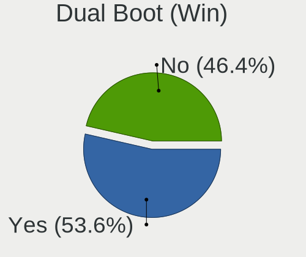
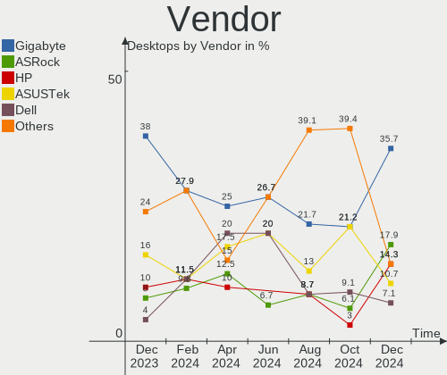

BlackPanther Hardware Trends (Desktop)
--------------------------------------

A project to identify most popular hardware characteristics and track their change
over time based on data collected by BlackPanther users at https://Linux-Hardware.org.

Anyone can contribute to the study by uploading probes of their computers by
the [hw-probe](https://github.com/linuxhw/hw-probe) tool:

    sudo -E hw-probe -all -upload

Full-feature report is available here: https://linux-hardware.org/?view=trends&formfactor=desktop

Period: Oct, 2020.

Contents
--------

- [ OS                       ](#os)
- [ OS Family                ](#os-family)
- [ Kernel                   ](#kernel)
- [ Kernel Family            ](#kernel-family)
- [ Kernel Major Ver.        ](#kernel-major-ver)
- [ Arch                     ](#arch)
- [ DE                       ](#de)
- [ Display Server           ](#display-server)
- [ Display Manager          ](#display-manager)
- [ OS Lang                  ](#os-lang)
- [ Boot Mode                ](#boot-mode)
- [ Filesystem               ](#filesystem)
- [ Part. scheme             ](#part-scheme)
- [ Dual Boot with Linux/BSD ](#dual-boot-with-linux/bsd)
- [ Dual Boot (Win)          ](#dual-boot-win)
- [ Country                  ](#country)
- [ City                     ](#city)
- [ Vendor                   ](#vendor)
- [ Model                    ](#model)
- [ Model Family             ](#model-family)
- [ MFG Year                 ](#mfg-year)
- [ Form Factor              ](#form-factor)
- [ Secure Boot              ](#secure-boot)
- [ Coreboot                 ](#coreboot)
- [ RAM Size                 ](#ram-size)
- [ RAM Used                 ](#ram-used)
- [ Has CD-ROM               ](#has-cd-rom)
- [ Total Drives             ](#total-drives)
- [ Has Ethernet             ](#has-ethernet)
- [ Drive Vendor             ](#drive-vendor)
- [ HDD Vendor               ](#hdd-vendor)
- [ SSD Vendor               ](#ssd-vendor)
- [ Drive Model              ](#drive-model)
- [ Drive Kind               ](#drive-kind)
- [ Drive Connector          ](#drive-connector)
- [ Drive Size               ](#drive-size)
- [ Space Total              ](#space-total)
- [ Space Used               ](#space-used)
- [ Malfunc. Drives          ](#malfunc-drives)
- [ Malfunc. Drive Vendor    ](#malfunc-drive-vendor)
- [ Malfunc. HDD Vendor      ](#malfunc-hdd-vendor)
- [ Malfunc. Drive Kind      ](#malfunc-drive-kind)
- [ Failed Drives            ](#failed-drives)
- [ Failed Drive Vendor      ](#failed-drive-vendor)
- [ Drive Status             ](#drive-status)
- [ Storage Vendor           ](#storage-vendor)
- [ Storage Model            ](#storage-model)
- [ Storage Kind             ](#storage-kind)
- [ CPU Vendor               ](#cpu-vendor)
- [ CPU Model                ](#cpu-model)
- [ CPU Model Family         ](#cpu-model-family)
- [ CPU Cores                ](#cpu-cores)
- [ CPU Sockets              ](#cpu-sockets)
- [ CPU Threads              ](#cpu-threads)
- [ CPU Op-Modes             ](#cpu-op-modes)
- [ CPU Microcode            ](#cpu-microcode)
- [ CPU Microarch            ](#cpu-microarch)
- [ GPU Vendor               ](#gpu-vendor)
- [ GPU Model                ](#gpu-model)
- [ GPU Combo                ](#gpu-combo)
- [ GPU Driver               ](#gpu-driver)
- [ GPU Memory               ](#gpu-memory)
- [ Monitor Vendor           ](#monitor-vendor)
- [ Monitor Model            ](#monitor-model)
- [ Monitor Resolution       ](#monitor-resolution)
- [ Monitor Diagonal         ](#monitor-diagonal)
- [ Monitor Width            ](#monitor-width)
- [ Aspect Ratio             ](#aspect-ratio)
- [ Monitor Area             ](#monitor-area)
- [ Pixel Density            ](#pixel-density)
- [ Multiple Monitors        ](#multiple-monitors)
- [ Net Controller Vendor    ](#net-controller-vendor)
- [ Net Controller Model     ](#net-controller-model)
- [ Wireless Vendor          ](#wireless-vendor)
- [ Wireless Model           ](#wireless-model)
- [ Ethernet Vendor          ](#ethernet-vendor)
- [ Ethernet Model           ](#ethernet-model)
- [ Net Controller Kind      ](#net-controller-kind)
- [ Used Controller          ](#used-controller)
- [ NICs                     ](#nics)
- [ Memory Vendor            ](#memory-vendor)
- [ Memory Model             ](#memory-model)
- [ Memory Kind              ](#memory-kind)
- [ Memory Form Factor       ](#memory-form-factor)
- [ Memory Size              ](#memory-size)
- [ Memory Speed             ](#memory-speed)
- [ Sound Vendor             ](#sound-vendor)
- [ Sound Model              ](#sound-model)
- [ Camera Vendor            ](#camera-vendor)
- [ Camera Model             ](#camera-model)
- [ Fingerprint Vendor       ](#fingerprint-vendor)
- [ Fingerprint Model        ](#fingerprint-model)
- [ Chipcard Vendor          ](#chipcard-vendor)
- [ Chipcard Model           ](#chipcard-model)
- [ Printer Vendor           ](#printer-vendor)
- [ Printer Model            ](#printer-model)
- [ Scanner Vendor           ](#scanner-vendor)
- [ Scanner Model            ](#scanner-model)
- [ Bluetooth Vendor         ](#bluetooth-vendor)
- [ Bluetooth Model          ](#bluetooth-model)
- [ Unsupported Devices      ](#unsupported-devices)
- [ Unsupported Device Types ](#unsupported-device-types)

OS
--

Installed operating systems

| Name              | Desktops | Percent |
|-------------------|----------|---------|
| BlackPanther 18.1 | 98       | 95.15%  |
| BlackPanther 16.2 | 4        | 3.88%   |
| BlackPanther 16.1 | 1        | 0.97%   |

OS Family
---------

OS without a version

| Name         | Desktops | Percent |
|--------------|----------|---------|
| BlackPanther | 103      | 100%    |

Kernel
------

Version of the Linux kernel

| Version                | Desktops | Percent |
|------------------------|----------|---------|
| 4.18.16-desktop-1bP    | 97       | 94.17%  |
| 4.9.20-desktop-pae-1bP | 2        | 1.94%   |
| 4.7.0-desktop-1bP      | 2        | 1.94%   |
| 5.1.15-desktop-1bP     | 1        | 0.97%   |
| 4.9.20-desktop-1bP     | 1        | 0.97%   |

Kernel Family
-------------

Linux kernel without a distro release

| Version | Desktops | Percent |
|---------|----------|---------|
| 4.18.16 | 97       | 94.17%  |
| 4.9.20  | 3        | 2.91%   |
| 4.7.0   | 2        | 1.94%   |
| 5.1.15  | 1        | 0.97%   |

Kernel Major Ver.
-----------------

Linux kernel major version

| Version | Desktops | Percent |
|---------|----------|---------|
| 4.18    | 97       | 94.17%  |
| 4.9     | 3        | 2.91%   |
| 4.7     | 2        | 1.94%   |
| 5.1     | 1        | 0.97%   |

Arch
----

OS architecture (x86_64, i586, etc.)

| Name   | Desktops | Percent |
|--------|----------|---------|
| x86_64 | 98       | 95.15%  |
| i686   | 5        | 4.85%   |

DE
--

Desktop Environment

| Name | Desktops | Percent |
|------|----------|---------|
| KDE5 | 102      | 99.03%  |
| KDE  | 1        | 0.97%   |

Display Server
--------------

X11 or Wayland

| Name    | Desktops | Percent |
|---------|----------|---------|
| X11     | 100      | 97.09%  |
| Wayland | 3        | 2.91%   |

Display Manager
---------------

SDDM, LightDM, etc.

| Name    | Desktops | Percent |
|---------|----------|---------|
| SDDM    | 102      | 99.03%  |
| Unknown | 1        | 0.97%   |

OS Lang
-------

Language

| Lang    | Desktops | Percent |
|---------|----------|---------|
| Unknown | 102      | 99.03%  |
| en_AU   | 1        | 0.97%   |

Boot Mode
---------

EFI or BIOS

| Mode | Desktops | Percent |
|------|----------|---------|
| BIOS | 72       | 69.9%   |
| EFI  | 31       | 30.1%   |

Filesystem
----------

Type of filesystem

| Type    | Desktops | Percent |
|---------|----------|---------|
| Overlay | 91       | 88.35%  |
| Ext4    | 11       | 10.68%  |
| Btrfs   | 1        | 0.97%   |

Part. scheme
------------

Scheme of partitioning

| Type    | Desktops | Percent |
|---------|----------|---------|
| MBR     | 69       | 66.99%  |
| GPT     | 29       | 28.16%  |
| Unknown | 5        | 4.85%   |

Dual Boot with Linux/BSD
------------------------

Hosting more than one Linux/BSD

| Dual boot | Desktops | Percent |
|-----------|----------|---------|
| No        | 60       | 58.25%  |
| Yes       | 43       | 41.75%  |

Dual Boot (Win)
---------------

Hosting Linux and Windows

| Dual boot | Desktops | Percent |
|-----------|----------|---------|
| No        | 52       | 50.49%  |
| Yes       | 51       | 49.51%  |

Country
-------

Geographic location (country)

| Country     | Desktops | Percent |
|-------------|----------|---------|
| Hungary     | 64       | 62.14%  |
| USA         | 7        | 6.8%    |
| Germany     | 7        | 6.8%    |
| Romania     | 3        | 2.91%   |
| Italy       | 3        | 2.91%   |
| Australia   | 3        | 2.91%   |
| Slovakia    | 2        | 1.94%   |
| Philippines | 2        | 1.94%   |
| Japan       | 2        | 1.94%   |
| Brazil      | 2        | 1.94%   |
| UK          | 1        | 0.97%   |
| Spain       | 1        | 0.97%   |
| Serbia      | 1        | 0.97%   |
| Kenya       | 1        | 0.97%   |
| Israel      | 1        | 0.97%   |
| Greece      | 1        | 0.97%   |
| Canada      | 1        | 0.97%   |
| Argentina   | 1        | 0.97%   |

City
----

Geographic location (city)

| City              | Desktops | Percent |
|-------------------|----------|---------|
| Budapest          | 20       | 19.42%  |
| Karcag            | 4        | 3.88%   |
| Mosonmagyaróvár | 3        | 2.91%   |
| Zsombo            | 2        | 1.94%   |
| North Hollywood   | 2        | 1.94%   |
| Miskolc           | 2        | 1.94%   |
| Kunhegyes         | 2        | 1.94%   |
| Győr             | 2        | 1.94%   |
| Zamboanga City    | 1        | 0.97%   |
| Worcester         | 1        | 0.97%   |
| Vertesboglar      | 1        | 0.97%   |
| Ullo              | 1        | 0.97%   |
| Târgu Mureş     | 1        | 0.97%   |
| Tomorkeny         | 1        | 0.97%   |
| Timișoara        | 1        | 0.97%   |
| Thessaloniki      | 1        | 0.97%   |
| Tet               | 1        | 0.97%   |
| Teresopolis       | 1        | 0.97%   |
| Tel Aviv          | 1        | 0.97%   |
| Szigetszentmiklos | 1        | 0.97%   |
| Szeged            | 1        | 0.97%   |
| Stuttgart         | 1        | 0.97%   |
| Staffordsville    | 1        | 0.97%   |
| Siófok           | 1        | 0.97%   |
| Signa             | 1        | 0.97%   |
| Seregno           | 1        | 0.97%   |
| Sarkeszi          | 1        | 0.97%   |
| Sandorfalva       | 1        | 0.97%   |
| Rome              | 1        | 0.97%   |
| Rieseby           | 1        | 0.97%   |
| Richmond          | 1        | 0.97%   |
| Retkozberencs     | 1        | 0.97%   |
| Pomaz             | 1        | 0.97%   |
| Pincehely         | 1        | 0.97%   |
| Pecel             | 1        | 0.97%   |
| Papa              | 1        | 0.97%   |
| Ostringen         | 1        | 0.97%   |
| Oroshaza          | 1        | 0.97%   |
| Oberbergkirchen   | 1        | 0.97%   |
| Northcote         | 1        | 0.97%   |
| North Port        | 1        | 0.97%   |
| New Windsor       | 1        | 0.97%   |
| Nairobi           | 1        | 0.97%   |
| Nagykoros         | 1        | 0.97%   |
| Nadudvar          | 1        | 0.97%   |
| Magyaralmas       | 1        | 0.97%   |
| Madrid            | 1        | 0.97%   |
| Laval             | 1        | 0.97%   |
| Laupheim          | 1        | 0.97%   |
| Launceston        | 1        | 0.97%   |
| Kumamoto          | 1        | 0.97%   |
| Kanazawa          | 1        | 0.97%   |
| Kaiserslautern    | 1        | 0.97%   |
| Itaquaquecetuba   | 1        | 0.97%   |
| Houston           | 1        | 0.97%   |
| Helvecia          | 1        | 0.97%   |
| Hajdusamson       | 1        | 0.97%   |
| Gödöllő        | 1        | 0.97%   |
| Gyomro            | 1        | 0.97%   |
| Frankfurt am Main | 1        | 0.97%   |

Vendor
------

Motherboard manufacturer

| Name                | Desktops | Percent |
|---------------------|----------|---------|
| ASRock              | 23       | 22.33%  |
| ASUSTek Computer    | 18       | 17.48%  |
| Gigabyte Technology | 12       | 11.65%  |
| Dell                | 12       | 11.65%  |
| Hewlett-Packard     | 8        | 7.77%   |
| MSI                 | 5        | 4.85%   |
| Lenovo              | 5        | 4.85%   |
| Fujitsu             | 4        | 3.88%   |
| AMD                 | 2        | 1.94%   |
| Acer                | 2        | 1.94%   |
| Supermicro          | 1        | 0.97%   |
| Shuttle             | 1        | 0.97%   |
| Pegatron            | 1        | 0.97%   |
| MouseComputer       | 1        | 0.97%   |
| Medion              | 1        | 0.97%   |
| Gateway             | 1        | 0.97%   |
| Fujitsu Siemens     | 1        | 0.97%   |
| Foxconn             | 1        | 0.97%   |
| ECS                 | 1        | 0.97%   |
| Biostar             | 1        | 0.97%   |
| Alienware           | 1        | 0.97%   |
| Unknown             | 1        | 0.97%   |

Model
-----

Motherboard model

| Name                                | Desktops | Percent |
|-------------------------------------|----------|---------|
| ASRock FM2A75M Pro4+                | 7        | 6.8%    |
| MSI MS-7309                         | 2        | 1.94%   |
| HP Compaq 8000 Elite SFF PC         | 2        | 1.94%   |
| Gigabyte H55M-D2H                   | 2        | 1.94%   |
| Dell OptiPlex 755                   | 2        | 1.94%   |
| Dell OptiPlex 3050                  | 2        | 1.94%   |
| ASUS PRIME H310M-R R2.0             | 2        | 1.94%   |
| ASRock FM2A88M Extreme4+            | 2        | 1.94%   |
| AMD 970A-DS3                        | 2        | 1.94%   |
| Supermicro H8QM8                    | 1        | 0.97%   |
| Shuttle XS35                        | 1        | 0.97%   |
| Pegatron p7-1010a                   | 1        | 0.97%   |
| MSI Pro 3130 Small Form Factor PC   | 1        | 0.97%   |
| MSI MS-7A32                         | 1        | 0.97%   |
| MSI MS-7253                         | 1        | 0.97%   |
| MouseComputer NG-i670               | 1        | 0.97%   |
| Medion B075DE                       | 1        | 0.97%   |
| Lenovo ThinkCentre M93p 10A7000LGE  | 1        | 0.97%   |
| Lenovo ThinkCentre M91p 7034BN4     | 1        | 0.97%   |
| Lenovo ThinkCentre M70e 0832W2F     | 1        | 0.97%   |
| Lenovo ThinkCentre M57 6087AG9      | 1        | 0.97%   |
| Lenovo H50-55 90BF005HAU            | 1        | 0.97%   |
| HP ProDesk 400 G3 MT                | 1        | 0.97%   |
| HP Compaq Pro 6305 SFF              | 1        | 0.97%   |
| HP Compaq Pro 6305 MT               | 1        | 0.97%   |
| HP Compaq Pro 6300 SFF              | 1        | 0.97%   |
| HP Compaq Elite 8300 CMT            | 1        | 0.97%   |
| HP Compaq dc7900 Ultra-Slim Desktop | 1        | 0.97%   |
| Gigabyte M68M-S2P                   | 1        | 0.97%   |
| Gigabyte H81M-S2H                   | 1        | 0.97%   |
| Gigabyte H81M-DS2                   | 1        | 0.97%   |
| Gigabyte H61MA-D3V                  | 1        | 0.97%   |
| Gigabyte H61M-S1                    | 1        | 0.97%   |
| Gigabyte GA-MA770-UD3               | 1        | 0.97%   |
| Gigabyte F2A68HM-HD2                | 1        | 0.97%   |
| Gigabyte B85M-DS3H                  | 1        | 0.97%   |
| Gigabyte B450M GAMING               | 1        | 0.97%   |
| Gigabyte B250M-D2V                  | 1        | 0.97%   |
| Gateway DT55                        | 1        | 0.97%   |
| Fujitsu Siemens D2584-A1            | 1        | 0.97%   |
| Fujitsu ESPRIMO P720                | 1        | 0.97%   |
| Fujitsu ESPRIMO P5731               | 1        | 0.97%   |
| Fujitsu ESPRIMO E7935               | 1        | 0.97%   |
| Fujitsu CELSIUS W420                | 1        | 0.97%   |
| Foxconn 45CMX/45GMX/45CMX-K         | 1        | 0.97%   |
| ECS G43T-3L                         | 1        | 0.97%   |
| Dell Vostro 400                     | 1        | 0.97%   |
| Dell OptiPlex 960                   | 1        | 0.97%   |
| Dell OptiPlex 760                   | 1        | 0.97%   |
| Dell OptiPlex 7020                  | 1        | 0.97%   |
| Dell OptiPlex 360                   | 1        | 0.97%   |
| Dell OptiPlex 330                   | 1        | 0.97%   |
| Dell OptiPlex 3060                  | 1        | 0.97%   |
| Dell OptiPlex 3010                  | 1        | 0.97%   |
| Biostar TA785GE 128M                | 1        | 0.97%   |
| ASUS VM40B                          | 1        | 0.97%   |
| ASUS VC65R                          | 1        | 0.97%   |
| ASUS ROG STRIX Z370-G GAMING        | 1        | 0.97%   |
| ASUS PRIME H310M-E R2.0             | 1        | 0.97%   |
| ASUS PRIME B450M-K                  | 1        | 0.97%   |

Model Family
------------

Motherboard model prefix

| Name                     | Desktops | Percent |
|--------------------------|----------|---------|
| Dell OptiPlex            | 11       | 10.68%  |
| HP Compaq                | 7        | 6.8%    |
| ASRock FM2A75M           | 7        | 6.8%    |
| ASUS PRIME               | 5        | 4.85%   |
| Lenovo ThinkCentre       | 4        | 3.88%   |
| Fujitsu ESPRIMO          | 3        | 2.91%   |
| MSI MS-7309              | 2        | 1.94%   |
| Gigabyte H55M-D2H        | 2        | 1.94%   |
| ASUS H110M-A             | 2        | 1.94%   |
| ASRock FM2A88M           | 2        | 1.94%   |
| AMD 970A-DS3             | 2        | 1.94%   |
| Acer Aspire              | 2        | 1.94%   |
| Supermicro H8QM8         | 1        | 0.97%   |
| Shuttle XS35             | 1        | 0.97%   |
| Pegatron p7-1010a        | 1        | 0.97%   |
| MSI Pro                  | 1        | 0.97%   |
| MSI MS-7A32              | 1        | 0.97%   |
| MSI MS-7253              | 1        | 0.97%   |
| MouseComputer NG-i670    | 1        | 0.97%   |
| Medion B075DE            | 1        | 0.97%   |
| Lenovo H50-55            | 1        | 0.97%   |
| HP ProDesk               | 1        | 0.97%   |
| Gigabyte M68M-S2P        | 1        | 0.97%   |
| Gigabyte H81M-S2H        | 1        | 0.97%   |
| Gigabyte H81M-DS2        | 1        | 0.97%   |
| Gigabyte H61MA-D3V       | 1        | 0.97%   |
| Gigabyte H61M-S1         | 1        | 0.97%   |
| Gigabyte GA-MA770-UD3    | 1        | 0.97%   |
| Gigabyte F2A68HM-HD2     | 1        | 0.97%   |
| Gigabyte B85M-DS3H       | 1        | 0.97%   |
| Gigabyte B450M           | 1        | 0.97%   |
| Gigabyte B250M-D2V       | 1        | 0.97%   |
| Gateway DT55             | 1        | 0.97%   |
| Fujitsu Siemens D2584-A1 | 1        | 0.97%   |
| Fujitsu CELSIUS          | 1        | 0.97%   |
| Foxconn 45CMX            | 1        | 0.97%   |
| ECS G43T-3L              | 1        | 0.97%   |
| Dell Vostro              | 1        | 0.97%   |
| Biostar TA785GE          | 1        | 0.97%   |
| ASUS VM40B               | 1        | 0.97%   |
| ASUS VC65R               | 1        | 0.97%   |
| ASUS ROG                 | 1        | 0.97%   |
| ASUS P5QPL-AM            | 1        | 0.97%   |
| ASUS P5L8L-SE            | 1        | 0.97%   |
| ASUS P5KPL-AM            | 1        | 0.97%   |
| ASUS P5K-VM              | 1        | 0.97%   |
| ASUS M5A97               | 1        | 0.97%   |
| ASUS EX-B250-V7          | 1        | 0.97%   |
| ASUS All                 | 1        | 0.97%   |
| ASUS A55BM-K             | 1        | 0.97%   |
| ASRock Z77               | 1        | 0.97%   |
| ASRock Z270              | 1        | 0.97%   |
| ASRock X470              | 1        | 0.97%   |
| ASRock X370              | 1        | 0.97%   |
| ASRock N68-GS3           | 1        | 0.97%   |
| ASRock M3N78D            | 1        | 0.97%   |
| ASRock H170              | 1        | 0.97%   |
| ASRock FM2A88X+          | 1        | 0.97%   |
| ASRock B450M-HDV         | 1        | 0.97%   |
| ASRock AB350M            | 1        | 0.97%   |

MFG Year
--------

Motherboard manufacture year

| Year | Desktops | Percent |
|------|----------|---------|
| 2014 | 14       | 13.59%  |
| 2012 | 12       | 11.65%  |
| 2019 | 10       | 9.71%   |
| 2010 | 10       | 9.71%   |
| 2015 | 9        | 8.74%   |
| 2018 | 7        | 6.8%    |
| 2013 | 7        | 6.8%    |
| 2011 | 7        | 6.8%    |
| 2008 | 7        | 6.8%    |
| 2009 | 6        | 5.83%   |
| 2016 | 5        | 4.85%   |
| 2007 | 4        | 3.88%   |
| 2020 | 3        | 2.91%   |
| 2017 | 2        | 1.94%   |

Form Factor
-----------

Physical design of the computer

| Name    | Desktops | Percent |
|---------|----------|---------|
| Desktop | 103      | 100%    |

Secure Boot
-----------

Enabled or disabled

| State    | Desktops | Percent |
|----------|----------|---------|
| Disabled | 103      | 100%    |

Coreboot
--------

Have coreboot on board

| Used | Desktops | Percent |
|------|----------|---------|
| No   | 103      | 100%    |

RAM Size
--------

Total RAM memory

| Size in GB | Desktops | Percent |
|------------|----------|---------|
| 8.01-16.0  | 33       | 32.04%  |
| 3.01-4.0   | 25       | 24.27%  |
| 16.01-24.0 | 15       | 14.56%  |
| 1.01-2.0   | 13       | 12.62%  |
| 4.01-8.0   | 10       | 9.71%   |
| 32.01-64.0 | 4        | 3.88%   |
| 2.01-3.0   | 2        | 1.94%   |
| 24.01-32.0 | 1        | 0.97%   |

RAM Used
--------

Used RAM memory

| Used GB  | Desktops | Percent |
|----------|----------|---------|
| 0.01-1.0 | 95       | 92.23%  |
| 1.01-2.0 | 7        | 6.8%    |
| 3.01-4.0 | 1        | 0.97%   |

Has CD-ROM
----------

Has CD-ROM on board

| Presented | Desktops | Percent |
|-----------|----------|---------|
| Yes       | 71       | 68.93%  |
| No        | 32       | 31.07%  |

Total Drives
------------

Number of drives on board

| Drives | Desktops | Percent |
|--------|----------|---------|
| 1      | 56       | 54.37%  |
| 2      | 30       | 29.13%  |
| 3      | 8        | 7.77%   |
| 0      | 5        | 4.85%   |
| 4      | 3        | 2.91%   |
| 5      | 1        | 0.97%   |

Has Ethernet
------------

Has Ethernet on board

| Presented | Desktops | Percent |
|-----------|----------|---------|
| Yes       | 103      | 100%    |

Drive Vendor
------------

Hard drive vendors

| Vendor              | Desktops | Drives | Percent |
|---------------------|----------|--------|---------|
| WDC                 | 39       | 42     | 25.49%  |
| Seagate             | 20       | 25     | 13.07%  |
| Samsung Electronics | 20       | 21     | 13.07%  |
| Kingston            | 18       | 19     | 11.76%  |
| A-DATA Technology   | 12       | 14     | 7.84%   |
| Hitachi             | 9        | 10     | 5.88%   |
| Toshiba             | 5        | 6      | 3.27%   |
| Intel               | 5        | 5      | 3.27%   |
| SanDisk             | 4        | 4      | 2.61%   |
| Fujitsu             | 3        | 3      | 1.96%   |
| PNY                 | 2        | 2      | 1.31%   |
| Patriot             | 2        | 2      | 1.31%   |
| Kingmax             | 2        | 2      | 1.31%   |
| Crucial             | 2        | 2      | 1.31%   |
| Zheino              | 1        | 1      | 0.65%   |
| SPCC                | 1        | 1      | 0.65%   |
| OCZ                 | 1        | 1      | 0.65%   |
| MAXTOR              | 1        | 1      | 0.65%   |
| LITEON              | 1        | 1      | 0.65%   |
| Leven               | 1        | 1      | 0.65%   |
| HGST                | 1        | 1      | 0.65%   |
| Gigabyte Technology | 1        | 1      | 0.65%   |
| ExcelStor           | 1        | 1      | 0.65%   |
| ASMT                | 1        | 2      | 0.65%   |

HDD Vendor
----------

Hard disk drive vendors

| Vendor              | Desktops | Drives | Percent |
|---------------------|----------|--------|---------|
| WDC                 | 36       | 38     | 40.91%  |
| Seagate             | 20       | 25     | 22.73%  |
| Samsung Electronics | 11       | 11     | 12.5%   |
| Hitachi             | 9        | 10     | 10.23%  |
| Toshiba             | 5        | 6      | 5.68%   |
| Fujitsu             | 3        | 3      | 3.41%   |
| MAXTOR              | 1        | 1      | 1.14%   |
| HGST                | 1        | 1      | 1.14%   |
| ExcelStor           | 1        | 1      | 1.14%   |
| ASMT                | 1        | 2      | 1.14%   |

SSD Vendor
----------

Solid state drive vendors

| Vendor              | Desktops | Drives | Percent |
|---------------------|----------|--------|---------|
| Kingston            | 17       | 18     | 30.36%  |
| A-DATA Technology   | 11       | 13     | 19.64%  |
| Samsung Electronics | 6        | 6      | 10.71%  |
| WDC                 | 4        | 4      | 7.14%   |
| SanDisk             | 3        | 3      | 5.36%   |
| Intel               | 3        | 3      | 5.36%   |
| PNY                 | 2        | 2      | 3.57%   |
| Kingmax             | 2        | 2      | 3.57%   |
| Crucial             | 2        | 2      | 3.57%   |
| SPCC                | 1        | 1      | 1.79%   |
| Patriot             | 1        | 1      | 1.79%   |
| OCZ                 | 1        | 1      | 1.79%   |
| LITEON              | 1        | 1      | 1.79%   |
| Leven               | 1        | 1      | 1.79%   |
| Gigabyte Technology | 1        | 1      | 1.79%   |

Drive Model
-----------

Hard drive models

| Model                        | Desktops | Percent |
|------------------------------|----------|---------|
| SU630 240GB SSD              | 6        | 3.61%   |
| SU700 120GB SSD              | 5        | 3.01%   |
| DT01ACA100 1TB               | 5        | 3.01%   |
| WD10EZRX-00L4HB0 1TB         | 4        | 2.41%   |
| SV300S37A120G 120GB SSD      | 4        | 2.41%   |
| SUV400S37120G 120GB SSD      | 4        | 2.41%   |
| SV300S37A240G 240GB SSD      | 3        | 1.81%   |
| ST250DM000-1BD141 250GB      | 3        | 1.81%   |
| SA400S37120G 120GB SSD       | 3        | 1.81%   |
| MHZ2160BH G2 160GB           | 3        | 1.81%   |
| WD3200AVVS-56L2B0 320GB      | 2        | 1.2%    |
| ST500DM002-1BD142 500GB      | 2        | 1.2%    |
| ST4000DM000-1F2168 4TB       | 2        | 1.2%    |
| ST3250318AS 250GB            | 2        | 1.2%    |
| ST1000LM 024 HN-M101MBB 1TB  | 2        | 1.2%    |
| SSD 850 EVO 250GB            | 2        | 1.2%    |
| SSD 240GB                    | 2        | 1.2%    |
| SA400S37480G 480GB SSD       | 2        | 1.2%    |
| HDS721050CLA362 500GB        | 2        | 1.2%    |
| WDS250G2B0A-00SM50 250GB SSD | 1        | 0.6%    |
| WDS240G2G0B-00EPW0 240GB SSD | 1        | 0.6%    |
| WDS240G2G0A-00JH30 240GB SSD | 1        | 0.6%    |
| WDS120G2G0A-00JH30 120GB SSD | 1        | 0.6%    |
| WD800JD-75MSA1 80GB          | 1        | 0.6%    |
| WD800AAJS-00WAA0 80GB        | 1        | 0.6%    |
| WD6003FZBX-00K5WB0 6TB       | 1        | 0.6%    |
| WD5003ABYX-01WERA2 500GB     | 1        | 0.6%    |
| WD5000AAKX-75U6AA0 500GB     | 1        | 0.6%    |
| WD5000AAKX-22ERMA0 500GB     | 1        | 0.6%    |
| WD5000AAKX-07U6AA0 500GB     | 1        | 0.6%    |
| WD3200AAJS-56M0A0 320GB      | 1        | 0.6%    |
| WD3200AAJS-56B4A0 320GB      | 1        | 0.6%    |
| WD2500JS-60NCB1 250GB        | 1        | 0.6%    |
| WD2500BEVT-75ZCT2 250GB      | 1        | 0.6%    |
| WD2500AAKX-603CA0 250GB      | 1        | 0.6%    |
| WD2500AAJS-75M0A0 250GB      | 1        | 0.6%    |
| WD20EARX-00PASB0 2TB         | 1        | 0.6%    |
| WD20EARS-60MVWB0 2TB         | 1        | 0.6%    |
| WD2000JD-22HBC0 200GB        | 1        | 0.6%    |
| WD1600HLHX-60JJPV1 160GB     | 1        | 0.6%    |
| WD1600BEVT-80A23T0 160GB     | 1        | 0.6%    |
| WD1600AAJS-60M0A0 160GB      | 1        | 0.6%    |
| WD1600AAJS-08L7A0 160GB      | 1        | 0.6%    |
| WD1600AAJS-07M0A0 160GB      | 1        | 0.6%    |
| WD1600AAJS-00PSA0 160GB      | 1        | 0.6%    |
| WD10JPCX-24UE4T0 1TB         | 1        | 0.6%    |
| WD10EZRZ-22HTKB0 1TB         | 1        | 0.6%    |
| WD10EZRZ-00HTKB0 1TB         | 1        | 0.6%    |
| WD10EZEX-75M2NA0 1TB         | 1        | 0.6%    |
| WD10EZEX-22MFCA0 1TB         | 1        | 0.6%    |
| WD10EZEX-21M2NA0 1TB         | 1        | 0.6%    |
| WD10EZEX-08M2NA0 1TB         | 1        | 0.6%    |
| WD10EZEX-00KUWA0 1TB         | 1        | 0.6%    |
| WD10EZEX-00BN5A0 1TB         | 1        | 0.6%    |
| WD10EARS-00Y5B1 1TB          | 1        | 0.6%    |
| Technology J8080S 82GB       | 1        | 0.6%    |
| SX8200PNP 256GB              | 1        | 0.6%    |
| SV300S37A60G 64GB SSD        | 1        | 0.6%    |
| SUV500M8240G 240GB SSD       | 1        | 0.6%    |
| SU800 256GB SSD              | 1        | 0.6%    |

Drive Kind
----------

HDD or SSD

| Kind | Desktops | Drives | Percent |
|------|----------|--------|---------|
| HDD  | 73       | 98     | 54.89%  |
| SSD  | 51       | 59     | 38.35%  |
| NVMe | 9        | 11     | 6.77%   |

Drive Connector
---------------

SATA, SAS, NVMe, etc.

| Type | Desktops | Drives | Percent |
|------|----------|--------|---------|
| SATA | 98       | 152    | 88.29%  |
| NVMe | 9        | 11     | 8.11%   |
| SAS  | 4        | 5      | 3.6%    |

Drive Size
----------

Size of hard drive

| Size in TB | Desktops | Drives | Percent |
|------------|----------|--------|---------|
| 0.01-0.5   | 87       | 117    | 71.9%   |
| 0.51-1.0   | 25       | 30     | 20.66%  |
| 1.01-2.0   | 4        | 5      | 3.31%   |
| 3.01-4.0   | 2        | 2      | 1.65%   |
| 4.01-10.0  | 2        | 2      | 1.65%   |
| 2.01-3.0   | 1        | 1      | 0.83%   |

Space Total
-----------

Amount of disk space available on the file system

| Size in GB | Desktops | Percent |
|------------|----------|---------|
| Unknown    | 90       | 87.38%  |
| 101-250    | 6        | 5.83%   |
| 251-500    | 3        | 2.91%   |
| 51-100     | 3        | 2.91%   |
| 1001-2000  | 1        | 0.97%   |

Space Used
----------

Amount of used disk space

| Used GB | Desktops | Percent |
|---------|----------|---------|
| Unknown | 90       | 87.38%  |
| 1-20    | 12       | 11.65%  |
| 101-250 | 1        | 0.97%   |

Malfunc. Drives
---------------

Drive models with a malfunction

| Model                    | Desktops | Drives | Percent |
|--------------------------|----------|--------|---------|
| SU630 240GB SSD          | 6        | 6      | 15.79%  |
| ST4000DM000-1F2168 4TB   | 2        | 2      | 5.26%   |
| HDS721050CLA362 500GB    | 2        | 2      | 5.26%   |
| WD5000AAKX-07U6AA0 500GB | 1        | 1      | 2.63%   |
| WD3200AVVS-56L2B0 320GB  | 1        | 1      | 2.63%   |
| WD3200AAJS-56M0A0 320GB  | 1        | 1      | 2.63%   |
| WD20EARX-00PASB0 2TB     | 1        | 1      | 2.63%   |
| WD2000JD-22HBC0 200GB    | 1        | 1      | 2.63%   |
| WD1600HLHX-60JJPV1 160GB | 1        | 1      | 2.63%   |
| WD1600AAJS-08L7A0 160GB  | 1        | 1      | 2.63%   |
| WD1600AAJS-00PSA0 160GB  | 1        | 1      | 2.63%   |
| WD10JPCX-24UE4T0 1TB     | 1        | 1      | 2.63%   |
| WD10EARS-00Y5B1 1TB      | 1        | 1      | 2.63%   |
| Technology J8080S 82GB   | 1        | 1      | 2.63%   |
| SV300S37A120G 120GB SSD  | 1        | 1      | 2.63%   |
| SUV400S37120G 120GB SSD  | 1        | 1      | 2.63%   |
| STM3250318AS 250GB       | 1        | 1      | 2.63%   |
| STM3250310AS 250GB       | 1        | 1      | 2.63%   |
| ST500DM002-1BD142 500GB  | 1        | 1      | 2.63%   |
| ST380815AS 80GB          | 1        | 2      | 2.63%   |
| ST3500410AS 500GB        | 1        | 1      | 2.63%   |
| ST340014AS 40GB          | 1        | 1      | 2.63%   |
| ST3250318AS 250GB        | 1        | 1      | 2.63%   |
| SSD 970 EVO 250GB        | 1        | 1      | 2.63%   |
| HTS543232L9A300 320GB    | 1        | 1      | 2.63%   |
| HM500JI 500GB            | 1        | 1      | 2.63%   |
| HDS721050CLA360 500GB    | 1        | 1      | 2.63%   |
| HDS721010CLA332 1TB      | 1        | 1      | 2.63%   |
| HD501LJ 500GB            | 1        | 1      | 2.63%   |
| HD161GJ 160GB            | 1        | 1      | 2.63%   |
| HD103UJ 1TB              | 1        | 1      | 2.63%   |

Malfunc. Drive Vendor
---------------------

Vendors of faulty drives

| Vendor              | Desktops | Drives | Percent |
|---------------------|----------|--------|---------|
| WDC                 | 9        | 10     | 25%     |
| Seagate             | 8        | 9      | 22.22%  |
| A-DATA Technology   | 6        | 6      | 16.67%  |
| Hitachi             | 5        | 5      | 13.89%  |
| Samsung Electronics | 4        | 5      | 11.11%  |
| Kingston            | 2        | 2      | 5.56%   |
| MAXTOR              | 1        | 1      | 2.78%   |
| ExcelStor           | 1        | 1      | 2.78%   |

Malfunc. HDD Vendor
-------------------

Vendors of faulty HDD drives

| Vendor              | Desktops | Drives | Percent |
|---------------------|----------|--------|---------|
| WDC                 | 9        | 10     | 32.14%  |
| Seagate             | 8        | 9      | 28.57%  |
| Hitachi             | 5        | 5      | 17.86%  |
| Samsung Electronics | 4        | 4      | 14.29%  |
| MAXTOR              | 1        | 1      | 3.57%   |
| ExcelStor           | 1        | 1      | 3.57%   |

Malfunc. Drive Kind
-------------------

Kinds of faulty drives

| Kind | Desktops | Drives | Percent |
|------|----------|--------|---------|
| HDD  | 26       | 30     | 74.29%  |
| SSD  | 8        | 8      | 22.86%  |
| NVMe | 1        | 1      | 2.86%   |

Failed Drives
-------------

Failed drive models

| Model                    | Desktops | Drives | Percent |
|--------------------------|----------|--------|---------|
| WD1600BEVT-80A23T0 160GB | 1        | 1      | 100%    |

Failed Drive Vendor
-------------------

Failed drive vendors

| Vendor | Desktops | Drives | Percent |
|--------|----------|--------|---------|
| WDC    | 1        | 1      | 100%    |

Drive Status
------------

Number of failed and malfunc. drives

| Status   | Desktops | Drives | Percent |
|----------|----------|--------|---------|
| Works    | 84       | 117    | 67.74%  |
| Malfunc  | 33       | 39     | 26.61%  |
| Detected | 6        | 11     | 4.84%   |
| Failed   | 1        | 1      | 0.81%   |

Storage Vendor
--------------

Storage controller vendors

| Vendor                      | Desktops | Percent |
|-----------------------------|----------|---------|
| Intel                       | 62       | 48.44%  |
| AMD                         | 34       | 26.56%  |
| Nvidia                      | 6        | 4.69%   |
| Silicon Image               | 4        | 3.13%   |
| Samsung Electronics         | 4        | 3.13%   |
| ASMedia Technology          | 4        | 3.13%   |
| JMicron Technology          | 3        | 2.34%   |
| VIA Technologies            | 2        | 1.56%   |
| Marvell Technology Group    | 2        | 1.56%   |
| Silicon Motion              | 1        | 0.78%   |
| Sandisk                     | 1        | 0.78%   |
| Phison Electronics          | 1        | 0.78%   |
| Kingston Technology Company | 1        | 0.78%   |
| ADATA Technology            | 1        | 0.78%   |
| Adaptec                     | 1        | 0.78%   |
| 3ware                       | 1        | 0.78%   |

Storage Model
-------------

Storage controller models

| Model                                                                             | Desktops | Percent |
|-----------------------------------------------------------------------------------|----------|---------|
| FCH SATA Controller [AHCI mode]                                                   | 24       | 12.7%   |
| FCH IDE Controller                                                                | 10       | 5.29%   |
| 200 Series PCH SATA controller [AHCI mode]                                        | 9        | 4.76%   |
| SB7x0/SB8x0/SB9x0 SATA Controller [IDE mode]                                      | 7        | 3.7%    |
| SB7x0/SB8x0/SB9x0 IDE Controller                                                  | 7        | 3.7%    |
| NM10/ICH7 Family SATA Controller [IDE mode]                                       | 7        | 3.7%    |
| 82801G (ICH7 Family) IDE Controller                                               | 7        | 3.7%    |
| Q170/Q150/B150/H170/H110/Z170/CM236 Chipset SATA Controller [AHCI Mode]           | 6        | 3.17%   |
| 8 Series/C220 Series Chipset Family 6-port SATA Controller 1 [AHCI mode]          | 6        | 3.17%   |
| 4 Series Chipset PT IDER Controller                                               | 6        | 3.17%   |
| 82801I (ICH9 Family) 2 port SATA Controller [IDE mode]                            | 5        | 2.65%   |
| NVMe SSD Controller SM981/PM981/PM983                                             | 4        | 2.12%   |
| MCP61 SATA Controller                                                             | 4        | 2.12%   |
| MCP61 IDE                                                                         | 4        | 2.12%   |
| ASM1062 Serial ATA Controller                                                     | 4        | 2.12%   |
| 82Q35 Express PT IDER Controller                                                  | 4        | 2.12%   |
| 82801JD/DO (ICH10 Family) SATA AHCI Controller                                    | 4        | 2.12%   |
| 82801IR/IO/IH (ICH9R/DO/DH) 4 port SATA Controller [IDE mode]                     | 4        | 2.12%   |
| 7 Series/C210 Series Chipset Family 6-port SATA Controller [AHCI mode]            | 4        | 2.12%   |
| 6 Series/C200 Series Chipset Family 6 port Desktop SATA AHCI Controller           | 4        | 2.12%   |
| 400 Series Chipset SATA Controller                                                | 4        | 2.12%   |
| SATA Controller [RAID mode]                                                       | 3        | 1.59%   |
| JMB368 IDE controller                                                             | 3        | 1.59%   |
| 82801JD/DO (ICH10 Family) 4-port SATA IDE Controller                              | 3        | 1.59%   |
| 82801JD/DO (ICH10 Family) 2-port SATA IDE Controller                              | 3        | 1.59%   |
| X370 Series Chipset SATA Controller                                               | 2        | 1.06%   |
| VT82C586A/B/VT82C686/A/B/VT823x/A/C PIPC Bus Master IDE                           | 2        | 1.06%   |
| SSD 660P Series                                                                   | 2        | 1.06%   |
| SiI 3512 [SATALink/SATARaid] Serial ATA Controller                                | 2        | 1.06%   |
| SiI 3132 Serial ATA Raid II Controller                                            | 2        | 1.06%   |
| 82801JI (ICH10 Family) SATA AHCI Controller                                       | 2        | 1.06%   |
| 5 Series/3400 Series Chipset 6 port SATA AHCI Controller                          | 2        | 1.06%   |
| XPG SX8200 Pro PCIe Gen3x4 M.2 2280 Solid State Drive                             | 1        | 0.53%   |
| WD Black 2018 / PC SN720 NVMe SSD                                                 | 1        | 0.53%   |
| VT8237A SATA 2-Port Controller                                                    | 1        | 0.53%   |
| VT8237/8251 Serial ATA Controller                                                 | 1        | 0.53%   |
| SB7x0/SB8x0/SB9x0 SATA Controller [Non-RAID5 mode]                                | 1        | 0.53%   |
| SB7x0/SB8x0/SB9x0 SATA Controller [AHCI mode]                                     | 1        | 0.53%   |
| NVMe Storage Controller                                                           | 1        | 0.53%   |
| Non-Volatile memory controller                                                    | 1        | 0.53%   |
| NM10/ICH7 Family SATA Controller [AHCI mode]                                      | 1        | 0.53%   |
| MCP78S [GeForce 8200] IDE                                                         | 1        | 0.53%   |
| MCP78S [GeForce 8200] AHCI Controller                                             | 1        | 0.53%   |
| MCP55 SATA Controller                                                             | 1        | 0.53%   |
| MCP55 IDE                                                                         | 1        | 0.53%   |
| FCH SATA Controller [IDE mode]                                                    | 1        | 0.53%   |
| FCH SATA Controller D                                                             | 1        | 0.53%   |
| Cannon Lake PCH SATA AHCI Controller                                              | 1        | 0.53%   |
| Atom Processor E3800 Series SATA AHCI Controller                                  | 1        | 0.53%   |
| AIC-7870P/7871 [AHA-2940/W/S76]                                                   | 1        | 0.53%   |
| A2000, M.2, 500GB                                                                 | 1        | 0.53%   |
| 88SE9230 PCIe SATA 6Gb/s Controller                                               | 1        | 0.53%   |
| 88SE9172 SATA III 6Gb/s RAID Controller                                           | 1        | 0.53%   |
| 82801IB (ICH9) 2 port SATA Controller [IDE mode]                                  | 1        | 0.53%   |
| 7xxx/8xxx-series PATA/SATA-RAID                                                   | 1        | 0.53%   |
| 7 Series Chipset Family 6-port SATA Controller [AHCI mode]                        | 1        | 0.53%   |
| 6 Series/C200 Series Chipset Family Desktop SATA Controller (IDE mode, ports 4-5) | 1        | 0.53%   |
| 6 Series/C200 Series Chipset Family Desktop SATA Controller (IDE mode, ports 0-3) | 1        | 0.53%   |
| 5 Series/3400 Series Chipset 4 port SATA IDE Controller                           | 1        | 0.53%   |
| 5 Series/3400 Series Chipset 2 port SATA IDE Controller                           | 1        | 0.53%   |

Storage Kind
------------

Kind of storage controller (IDE, SATA, NVMe, SAS, ...)

| Kind | Desktops | Percent |
|------|----------|---------|
| SATA | 75       | 52.45%  |
| IDE  | 50       | 34.97%  |
| NVMe | 9        | 6.29%   |
| RAID | 8        | 5.59%   |
| SCSI | 1        | 0.7%    |

CPU Vendor
----------

Processor vendors

| Vendor | Desktops | Percent |
|--------|----------|---------|
| Intel  | 62       | 60.19%  |
| AMD    | 41       | 39.81%  |

CPU Model
---------

Processor models

| Model                                         | Desktops | Percent |
|-----------------------------------------------|----------|---------|
| AMD A8-6600K APU with Radeon HD Graphics      | 8        | 7.77%   |
| Intel Core 2 Duo CPU E8400 @ 3.00GHz          | 4        | 3.88%   |
| Intel Core 2 Duo CPU E7500 @ 2.93GHz          | 3        | 2.91%   |
| Intel Pentium Dual-Core CPU E5300 @ 2.60GHz   | 2        | 1.94%   |
| Intel Pentium Dual CPU E2160 @ 1.80GHz        | 2        | 1.94%   |
| Intel Core i7-8700K CPU @ 3.70GHz             | 2        | 1.94%   |
| Intel Core i7-6700K CPU @ 4.00GHz             | 2        | 1.94%   |
| Intel Core i5-6500 CPU @ 3.20GHz              | 2        | 1.94%   |
| Intel Core i3-8100 CPU @ 3.60GHz              | 2        | 1.94%   |
| Intel Core i3-7100 CPU @ 3.90GHz              | 2        | 1.94%   |
| AMD Sempron 145 Processor                     | 2        | 1.94%   |
| AMD Ryzen 5 2400G with Radeon Vega Graphics   | 2        | 1.94%   |
| AMD Phenom II X4 965 Processor                | 2        | 1.94%   |
| AMD Athlon X4 860K Quad Core Processor        | 2        | 1.94%   |
| AMD Athlon 64 Processor 3000+                 | 2        | 1.94%   |
| AMD A8-7600 Radeon R7, 10 Compute Cores 4C+6G | 2        | 1.94%   |
| Intel Pentium Dual-Core CPU E5800 @ 3.20GHz   | 1        | 0.97%   |
| Intel Pentium Dual-Core CPU E5700 @ 3.00GHz   | 1        | 0.97%   |
| Intel Pentium CPU G3260 @ 3.30GHz             | 1        | 0.97%   |
| Intel Core i7-3770 CPU @ 3.40GHz              | 1        | 0.97%   |
| Intel Core i7-2600 CPU @ 3.40GHz              | 1        | 0.97%   |
| Intel Core i7 CPU 930 @ 2.80GHz               | 1        | 0.97%   |
| Intel Core i7 CPU 870 @ 2.93GHz               | 1        | 0.97%   |
| Intel Core i5-9400F CPU @ 2.90GHz             | 1        | 0.97%   |
| Intel Core i5-7500 CPU @ 3.40GHz              | 1        | 0.97%   |
| Intel Core i5-7400 CPU @ 3.00GHz              | 1        | 0.97%   |
| Intel Core i5-6500T CPU @ 2.50GHz             | 1        | 0.97%   |
| Intel Core i5-6400T CPU @ 2.20GHz             | 1        | 0.97%   |
| Intel Core i5-6400 CPU @ 2.70GHz              | 1        | 0.97%   |
| Intel Core i5-4590 CPU @ 3.30GHz              | 1        | 0.97%   |
| Intel Core i5-4570 CPU @ 3.20GHz              | 1        | 0.97%   |
| Intel Core i5-3570 CPU @ 3.40GHz              | 1        | 0.97%   |
| Intel Core i5-3470 CPU @ 3.20GHz              | 1        | 0.97%   |
| Intel Core i5-2400 CPU @ 3.10GHz              | 1        | 0.97%   |
| Intel Core i5 CPU 750 @ 2.67GHz               | 1        | 0.97%   |
| Intel Core i3-4160T CPU @ 3.10GHz             | 1        | 0.97%   |
| Intel Core i3-4160 CPU @ 3.60GHz              | 1        | 0.97%   |
| Intel Core i3-4130 CPU @ 3.40GHz              | 1        | 0.97%   |
| Intel Core i3-3245 CPU @ 3.40GHz              | 1        | 0.97%   |
| Intel Core i3-2120 CPU @ 3.30GHz              | 1        | 0.97%   |
| Intel Core i3 CPU 550 @ 3.20GHz               | 1        | 0.97%   |
| Intel Core i3 CPU 540 @ 3.07GHz               | 1        | 0.97%   |
| Intel Core 2 Quad CPU Q9300 @ 2.50GHz         | 1        | 0.97%   |
| Intel Core 2 Quad CPU Q8400 @ 2.66GHz         | 1        | 0.97%   |
| Intel Core 2 Duo CPU E8500 @ 3.16GHz          | 1        | 0.97%   |
| Intel Core 2 Duo CPU E7300 @ 2.66GHz          | 1        | 0.97%   |
| Intel Core 2 Duo CPU E7200 @ 2.53GHz          | 1        | 0.97%   |
| Intel Core 2 Duo CPU E6850 @ 3.00GHz          | 1        | 0.97%   |
| Intel Core 2 Duo CPU E6550 @ 2.33GHz          | 1        | 0.97%   |
| Intel Core 2 Duo CPU E4600 @ 2.40GHz          | 1        | 0.97%   |
| Intel Core 2 CPU 4300 @ 1.80GHz               | 1        | 0.97%   |
| Intel Celeron G4920 CPU @ 3.20GHz             | 1        | 0.97%   |
| Intel Celeron CPU J1900 @ 1.99GHz             | 1        | 0.97%   |
| Intel Celeron CPU G1620 @ 2.70GHz             | 1        | 0.97%   |
| Intel Celeron CPU G1610 @ 2.60GHz             | 1        | 0.97%   |
| Intel Celeron CPU 1017U @ 1.60GHz             | 1        | 0.97%   |
| Intel Atom CPU D510 @ 1.66GHz                 | 1        | 0.97%   |
| AMD Ryzen 7 3700X 8-Core Processor            | 1        | 0.97%   |
| AMD Ryzen 7 1700X Eight-Core Processor        | 1        | 0.97%   |
| AMD Ryzen 5 3400G with Radeon Vega Graphics   | 1        | 0.97%   |

CPU Model Family
----------------

Processor model prefix

| Model                   | Desktops | Percent |
|-------------------------|----------|---------|
| Intel Core i5           | 14       | 13.59%  |
| Intel Core 2 Duo        | 13       | 12.62%  |
| Intel Core i3           | 11       | 10.68%  |
| AMD A8                  | 11       | 10.68%  |
| Intel Core i7           | 8        | 7.77%   |
| Intel Celeron           | 5        | 4.85%   |
| Intel Pentium Dual-Core | 4        | 3.88%   |
| AMD Ryzen 5             | 4        | 3.88%   |
| AMD Athlon 64           | 3        | 2.91%   |
| Intel Pentium Dual      | 2        | 1.94%   |
| Intel Core 2 Quad       | 2        | 1.94%   |
| AMD Sempron             | 2        | 1.94%   |
| AMD Ryzen 7             | 2        | 1.94%   |
| AMD Ryzen 3             | 2        | 1.94%   |
| AMD Phenom II X4        | 2        | 1.94%   |
| AMD FX                  | 2        | 1.94%   |
| AMD Athlon X4           | 2        | 1.94%   |
| AMD Athlon II X2        | 2        | 1.94%   |
| AMD Athlon 64 X2        | 2        | 1.94%   |
| AMD A10                 | 2        | 1.94%   |
| Other                   | 1        | 0.97%   |
| Intel Pentium           | 1        | 0.97%   |
| Intel Core 2            | 1        | 0.97%   |
| Intel Atom              | 1        | 0.97%   |
| AMD Phenom II X6        | 1        | 0.97%   |
| AMD Phenom II X2        | 1        | 0.97%   |
| AMD Athlon              | 1        | 0.97%   |
| AMD A4                  | 1        | 0.97%   |

CPU Cores
---------

Number of processor cores

| Number | Desktops | Percent |
|--------|----------|---------|
| 2      | 56       | 54.37%  |
| 4      | 33       | 32.04%  |
| 1      | 6        | 5.83%   |
| 6      | 5        | 4.85%   |
| 8      | 3        | 2.91%   |

CPU Sockets
-----------

Number of sockets

| Number | Desktops | Percent |
|--------|----------|---------|
| 1      | 102      | 99.03%  |
| 4      | 1        | 0.97%   |

CPU Threads
-----------

Threads per core (Hyper-Threading)

| Number | Desktops | Percent |
|--------|----------|---------|
| 1      | 62       | 60.19%  |
| 2      | 41       | 39.81%  |

CPU Op-Modes
------------

CPU Operation Modes (32-bit, 64-bit)

| Op mode        | Desktops | Percent |
|----------------|----------|---------|
| 32-bit, 64-bit | 103      | 100%    |

CPU Microcode
-------------

Microcode number

| Number     | Desktops | Percent |
|------------|----------|---------|
| 0x1067a    | 12       | 11.65%  |
| 0x06001119 | 10       | 9.71%   |
| 0x306a9    | 7        | 6.8%    |
| Unknown    | 7        | 6.8%    |
| 0x506e3    | 6        | 5.83%   |
| 0x306c3    | 6        | 5.83%   |
| 0x010000c8 | 6        | 5.83%   |
| 0x906e9    | 4        | 3.88%   |
| 0x906eb    | 3        | 2.91%   |
| 0x906ea    | 3        | 2.91%   |
| 0x6fd      | 3        | 2.91%   |
| 0x206a7    | 3        | 2.91%   |
| 0x10676    | 3        | 2.91%   |
| 0x06003106 | 3        | 2.91%   |
| 0x6fb      | 2        | 1.94%   |
| 0x20655    | 2        | 1.94%   |
| 0x106e5    | 2        | 1.94%   |
| 0x0810100b | 2        | 1.94%   |
| 0x06003104 | 2        | 1.94%   |
| 0x6f2      | 1        | 0.97%   |
| 0x30673    | 1        | 0.97%   |
| 0x106ca    | 1        | 0.97%   |
| 0x106a5    | 1        | 0.97%   |
| 0x10677    | 1        | 0.97%   |
| 0x0870100a | 1        | 0.97%   |
| 0x08108109 | 1        | 0.97%   |
| 0x08101016 | 1        | 0.97%   |
| 0x0800820d | 1        | 0.97%   |
| 0x08008206 | 1        | 0.97%   |
| 0x08001137 | 1        | 0.97%   |
| 0x0700010f | 1        | 0.97%   |
| 0x0600111f | 1        | 0.97%   |
| 0x06000852 | 1        | 0.97%   |
| 0x0600063d | 1        | 0.97%   |
| 0x010000dc | 1        | 0.97%   |
| 0x010000db | 1        | 0.97%   |

CPU Microarch
-------------

Microarchitecture

| Name        | Desktops | Percent |
|-------------|----------|---------|
| Penryn      | 16       | 15.53%  |
| Piledriver  | 12       | 11.65%  |
| KabyLake    | 10       | 9.71%   |
| K10         | 8        | 7.77%   |
| Skylake     | 7        | 6.8%    |
| IvyBridge   | 7        | 6.8%    |
| K8 Hammer   | 6        | 5.83%   |
| Haswell     | 6        | 5.83%   |
| Core        | 6        | 5.83%   |
| Steamroller | 5        | 4.85%   |
| Zen         | 4        | 3.88%   |
| Zen+        | 3        | 2.91%   |
| SandyBridge | 3        | 2.91%   |
| Nehalem     | 3        | 2.91%   |
| Westmere    | 2        | 1.94%   |
| Zen 2       | 1        | 0.97%   |
| Silvermont  | 1        | 0.97%   |
| Jaguar      | 1        | 0.97%   |
| Bulldozer   | 1        | 0.97%   |
| Bonnell     | 1        | 0.97%   |

GPU Vendor
----------

Vendors of graphics cards

| Vendor | Desktops | Percent |
|--------|----------|---------|
| AMD    | 38       | 35.51%  |
| Nvidia | 37       | 34.58%  |
| Intel  | 32       | 29.91%  |

GPU Model
---------

Graphics card models

| Model                                                                 | Desktops | Percent |
|-----------------------------------------------------------------------|----------|---------|
| Richland [Radeon HD 8570D]                                            | 8        | 7.14%   |
| 4 Series Chipset Integrated Graphics Controller                       | 6        | 5.36%   |
| Caicos [Radeon HD 6450/7450/8450 / R5 230 OEM]                        | 5        | 4.46%   |
| Oland PRO [Radeon R7 240/340]                                         | 4        | 3.57%   |
| GK208B [GeForce GT 710]                                               | 4        | 3.57%   |
| Xeon E3-1200 v2/3rd Gen Core processor Graphics Controller            | 3        | 2.68%   |
| HD Graphics 530                                                       | 3        | 2.68%   |
| GT218 [GeForce 210]                                                   | 3        | 2.68%   |
| GP108 [GeForce GT 1030]                                               | 3        | 2.68%   |
| 4th Generation Core Processor Family Integrated Graphics Controller   | 3        | 2.68%   |
| RV730 PRO [Radeon HD 4650]                                            | 2        | 1.79%   |
| Raven Ridge [Radeon Vega Series / Radeon Vega Mobile Series]          | 2        | 1.79%   |
| Kaveri [Radeon R7 Graphics]                                           | 2        | 1.79%   |
| HD Graphics 630                                                       | 2        | 1.79%   |
| GP106 [GeForce GTX 1060 6GB]                                          | 2        | 1.79%   |
| GK208B [GeForce GT 720]                                               | 2        | 1.79%   |
| GF108 [GeForce GT 630]                                                | 2        | 1.79%   |
| G73 [GeForce 7300 GT]                                                 | 2        | 1.79%   |
| Ellesmere [Radeon RX 470/480/570/570X/580/580X/590]                   | 2        | 1.79%   |
| C61 [GeForce 7025 / nForce 630a]                                      | 2        | 1.79%   |
| 8th Gen Core Processor Gaussian Mixture Model                         | 2        | 1.79%   |
| 82Q35 Express Integrated Graphics Controller                          | 2        | 1.79%   |
| 82G33/G31 Express Integrated Graphics Controller                      | 2        | 1.79%   |
| 82945G/GZ Integrated Graphics Controller                              | 2        | 1.79%   |
| 2nd Generation Core Processor Family Integrated Graphics Controller   | 2        | 1.79%   |
| Xeon E3-1200 v3/4th Gen Core Processor Integrated Graphics Controller | 1        | 0.89%   |
| UHD Graphics 610                                                      | 1        | 0.89%   |
| Turks PRO [Radeon HD 6570/7570/8550]                                  | 1        | 0.89%   |
| Trinity [Radeon HD 7560D]                                             | 1        | 0.89%   |
| Trinity 2 [Radeon HD 7480D]                                           | 1        | 0.89%   |
| RV620 LE [Radeon HD 3450]                                             | 1        | 0.89%   |
| RS880 [Radeon HD 4250]                                                | 1        | 0.89%   |
| RS880 [Radeon HD 4200]                                                | 1        | 0.89%   |
| Richland [Radeon HD 8670D]                                            | 1        | 0.89%   |
| Redwood PRO [Radeon HD 5550/5570/5630/6510/6610/7570]                 | 1        | 0.89%   |
| R480 [Radeon X800 GTO] (Secondary)                                    | 1        | 0.89%   |
| R480 [Radeon X800 GTO]                                                | 1        | 0.89%   |
| Picasso                                                               | 1        | 0.89%   |
| NV44 [GeForce 6200 TurboCache]                                        | 1        | 0.89%   |
| Lexa PRO [Radeon 540/540X/550/550X / RX 540X/550/550X]                | 1        | 0.89%   |
| Kabini [Radeon HD 8400 / R3 Series]                                   | 1        | 0.89%   |
| GT218M [ION]                                                          | 1        | 0.89%   |
| GT215 [GeForce GT 240]                                                | 1        | 0.89%   |
| GT200 [GeForce GTX 260]                                               | 1        | 0.89%   |
| GP107 [GeForce GTX 1050 Ti]                                           | 1        | 0.89%   |
| GP106GL [Quadro P2000]                                                | 1        | 0.89%   |
| GP106 [GeForce GTX 1060 3GB]                                          | 1        | 0.89%   |
| GP104 [GeForce GTX 1080]                                              | 1        | 0.89%   |
| GP102 [GeForce GTX 1080 Ti]                                           | 1        | 0.89%   |
| GK106GL [Quadro K4000]                                                | 1        | 0.89%   |
| GK104 [GeForce GTX 760]                                               | 1        | 0.89%   |
| GF119 [GeForce GT 610]                                                | 1        | 0.89%   |
| GF119 [GeForce GT 520]                                                | 1        | 0.89%   |
| GF119 [GeForce 605]                                                   | 1        | 0.89%   |
| GF116 [GeForce GT 545]                                                | 1        | 0.89%   |
| GF106 [GeForce GTS 450]                                               | 1        | 0.89%   |
| G96C [GeForce 9400 GT]                                                | 1        | 0.89%   |
| Cypress PRO [Radeon HD 5850]                                          | 1        | 0.89%   |
| Curacao PRO [Radeon R7 370 / R9 270/370 OEM]                          | 1        | 0.89%   |
| Core Processor Integrated Graphics Controller                         | 1        | 0.89%   |

GPU Combo
---------

Combinations of graphics cards

| Name       | Desktops | Percent |
|------------|----------|---------|
| 1 x Nvidia | 36       | 34.95%  |
| 1 x AMD    | 33       | 32.04%  |
| 1 x Intel  | 29       | 28.16%  |
| 2 x AMD    | 5        | 4.85%   |

GPU Driver
----------

Free vs proprietary

| Driver  | Desktops | Percent |
|---------|----------|---------|
| Free    | 100      | 97.09%  |
| Unknown | 3        | 2.91%   |

GPU Memory
----------

Total video memory

| Size in GB | Desktops | Percent |
|------------|----------|---------|
| 0.51-1.0   | 31       | 30.1%   |
| Unknown    | 31       | 30.1%   |
| 1.01-2.0   | 15       | 14.56%  |
| 0.01-0.5   | 14       | 13.59%  |
| 3.01-4.0   | 3        | 2.91%   |
| 2.01-3.0   | 3        | 2.91%   |
| 7.01-8.0   | 2        | 1.94%   |
| 5.01-6.0   | 2        | 1.94%   |
| 4.01-5.0   | 1        | 0.97%   |
| 8.01-16.0  | 1        | 0.97%   |

Monitor Vendor
--------------

Monitor vendors

| Vendor               | Desktops | Percent |
|----------------------|----------|---------|
| Samsung Electronics  | 24       | 26.97%  |
| BenQ                 | 12       | 13.48%  |
| Dell                 | 10       | 11.24%  |
| Goldstar             | 8        | 8.99%   |
| Hewlett-Packard      | 5        | 5.62%   |
| Acer                 | 4        | 4.49%   |
| Lenovo               | 3        | 3.37%   |
| Vestel Elektronik    | 2        | 2.25%   |
| Plain Tree Systems   | 2        | 2.25%   |
| Philips              | 2        | 2.25%   |
| Iiyama               | 2        | 2.25%   |
| Fujitsu Siemens      | 2        | 2.25%   |
| Ancor Communications | 2        | 2.25%   |
| Yakumo               | 1        | 1.12%   |
| Unknown (XXX)        | 1        | 1.12%   |
| UMC                  | 1        | 1.12%   |
| Panasonic            | 1        | 1.12%   |
| IBM                  | 1        | 1.12%   |
| GML                  | 1        | 1.12%   |
| CVT                  | 1        | 1.12%   |
| Belinea              | 1        | 1.12%   |
| ASUSTek Computer     | 1        | 1.12%   |
| Arnos Instruments    | 1        | 1.12%   |
| AOC                  | 1        | 1.12%   |

Monitor Model
-------------

Monitor models

| Model                                                | Desktops | Percent |
|------------------------------------------------------|----------|---------|
| EW277HDR BNQ7948 1920x1080 598x336mm 27.0-inch       | 8        | 8.99%   |
| SyncMaster SAM036F 1440x900 428x255mm 19.6-inch      | 2        | 2.25%   |
| LT1952p Wide LEN0990 1440x900 408x255mm 18.9-inch    | 2        | 2.25%   |
| L1740 HWP2648 1280x1024 337x270mm 17.0-inch          | 2        | 2.25%   |
| L1718S GSM443C 1280x1024 338x270mm 17.0-inch         | 2        | 2.25%   |
| 50UHD_LCD_TV VES3700 3840x2160 1872x1053mm 84.6-inch | 2        | 2.25%   |
| XL-775I PTS030C 1280x1024 338x270mm 17.0-inch        | 1        | 1.12%   |
| W1934 GSM4B7A 1440x900 410x260mm 19.1-inch           | 1        | 1.12%   |
| VZ239 AUS23CC 1920x1080 509x286mm 23.0-inch          | 1        | 1.12%   |
| V173 ACR0053 1280x1024 338x270mm 17.0-inch           | 1        | 1.12%   |
| ULTRAWIDE GSM76E4 3440x1440 800x335mm 34.1-inch      | 1        | 1.12%   |
| TH-50P**7 MEIA027 1600x1200 1100x620mm 49.7-inch     | 1        | 1.12%   |
| T24B300 SAM092E 1920x1080 521x293mm 23.5-inch        | 1        | 1.12%   |
| T22E390 SAM0C1D 1920x1080 477x268mm 21.5-inch        | 1        | 1.12%   |
| T2200HDA BNQ7725 1920x1080 477x268mm 21.5-inch       | 1        | 1.12%   |
| SyncMaster SAM037B 1680x1050 474x296mm 22.0-inch     | 1        | 1.12%   |
| SyncMaster SAM034D 1280x1024 376x301mm 19.0-inch     | 1        | 1.12%   |
| SyncMaster SAM02DB 1680x1050 474x296mm 22.0-inch     | 1        | 1.12%   |
| SyncMaster SAM020D 1280x1024 338x270mm 17.0-inch     | 1        | 1.12%   |
| SyncMaster SAM01B8 1280x1024 338x270mm 17.0-inch     | 1        | 1.12%   |
| SyncMaster SAM0191 1280x1024 338x270mm 17.0-inch     | 1        | 1.12%   |
| SW2700 BNQ7F47 2560x1440 596x335mm 26.9-inch         | 1        | 1.12%   |
| SP2009W DELD01A 1680x1050 430x270mm 20.0-inch        | 1        | 1.12%   |
| SME1920N SAM06A3 1366x768 410x230mm 18.5-inch        | 1        | 1.12%   |
| SMBX2250 SAM071B 1920x1080 477x268mm 21.5-inch       | 1        | 1.12%   |
| S27E500 SAM0D0D 1920x1080 600x340mm 27.2-inch        | 1        | 1.12%   |
| S24F350 SAM0D20 1920x1080 521x293mm 23.5-inch        | 1        | 1.12%   |
| S24C450 SAM0B10 1920x1080 531x299mm 24.0-inch        | 1        | 1.12%   |
| S24C450 SAM09CB 1920x1080 531x299mm 24.0-inch        | 1        | 1.12%   |
| S240HL ACR0289 1920x1080 531x299mm 24.0-inch         | 1        | 1.12%   |
| S22D300 SAM0B3E 1920x1080 477x268mm 21.5-inch        | 1        | 1.12%   |
| S20B300 SAM08A8 1600x900 443x249mm 20.0-inch         | 1        | 1.12%   |
| S19D300 SAM0B34 1280x720 410x230mm 18.5-inch         | 1        | 1.12%   |
| RL2240H BNQ7F0C 1920x1080 480x270mm 21.7-inch        | 1        | 1.12%   |
| PL2875UH IVM710F 3840x2160 621x341mm 27.9-inch       | 1        | 1.12%   |
| PHL BDM3201FD PHLC12E 1920x1080 698x393mm 31.5-inch  | 1        | 1.12%   |
| PHL 273V7 PHLC156 1920x1080 598x336mm 27.0-inch      | 1        | 1.12%   |
| P246HL ACR023F 1920x1080 530x300mm 24.0-inch         | 1        | 1.12%   |
| P2317H DEL40F2 1920x1080 509x286mm 23.0-inch         | 1        | 1.12%   |
| P2012H DEL4078 1600x900 443x249mm 20.0-inch          | 1        | 1.12%   |
| Monitor PTS076D 1280x1024 376x301mm 19.0-inch        | 1        | 1.12%   |
| M-19 AIC1960 1280x1024 376x301mm 19.0-inch           | 1        | 1.12%   |
| LG ULTRAWIDE GSM59F1 1920x1080 580x240mm 24.7-inch   | 1        | 1.12%   |
| LEN L171p LEN24C9 1280x1024 338x270mm 17.0-inch      | 1        | 1.12%   |
| LCD Monitor SAM0DF6 3840x2160 890x500mm 40.2-inch    | 1        | 1.12%   |
| LCD Monitor SAM0D4F 1920x1080 1210x680mm 54.6-inch   | 1        | 1.12%   |
| LCD Monitor SAM0D49 1920x1080 480x270mm 21.7-inch    | 1        | 1.12%   |
| LCD Monitor SAM0B7C 1920x1080 886x498mm 40.0-inch    | 1        | 1.12%   |
| LCD Monitor SAM0A7A 1920x1080 1060x626mm 48.5-inch   | 1        | 1.12%   |
| LA2205 HWP2848 1680x1050 473x296mm 22.0-inch         | 1        | 1.12%   |
| L191p IBM24CB 1280x1024 376x301mm 19.0-inch          | 1        | 1.12%   |
| IPS FULLHD GSM5AB8 1920x1080 480x270mm 21.7-inch     | 1        | 1.12%   |
| IN2020 DELF028 1600x900 443x249mm 20.0-inch          | 1        | 1.12%   |
| GW2760 BNQ78C6 1920x1080 598x336mm 27.0-inch         | 1        | 1.12%   |
| GM-MATRIX-B GML1400 3840x1200 255x255mm 14.2-inch    | 1        | 1.12%   |
| FULL HD GSM5B54 1920x1080 480x270mm 21.7-inch        | 1        | 1.12%   |
| E1910 DELD035 1440x900 410x260mm 19.1-inch           | 1        | 1.12%   |
| E170S DELA04A 1280x1024 338x270mm 17.0-inch          | 1        | 1.12%   |
| CVTE TV CVT0003 1920x1080 575x323mm 26.0-inch        | 1        | 1.12%   |
| Beyond TV XXX2851 3840x2160 1209x680mm 54.6-inch     | 1        | 1.12%   |

Monitor Resolution
------------------

Monitor screen resolution

| Resolution         | Desktops | Percent |
|--------------------|----------|---------|
| 1920x1080 (FHD)    | 37       | 41.57%  |
| 1280x1024 (SXGA)   | 18       | 20.22%  |
| 1440x900 (WXGA+)   | 8        | 8.99%   |
| 3840x2160 (4K)     | 5        | 5.62%   |
| 1680x1050 (WSXGA+) | 5        | 5.62%   |
| 1600x900 (HD+)     | 3        | 3.37%   |
| 1366x768 (WXGA)    | 3        | 3.37%   |
| 1920x1200 (WUXGA)  | 2        | 2.25%   |
| 1024x768 (XGA)     | 2        | 2.25%   |
| 3840x1200          | 1        | 1.12%   |
| 3440x1440          | 1        | 1.12%   |
| 2560x1440 (QHD)    | 1        | 1.12%   |
| 2560x1080          | 1        | 1.12%   |
| 1600x1200          | 1        | 1.12%   |
| 1360x768           | 1        | 1.12%   |

Monitor Diagonal
----------------

Diagonal size in inches

| Inches | Desktops | Percent |
|--------|----------|---------|
| 19     | 14       | 15.73%  |
| 17     | 13       | 14.61%  |
| 27     | 12       | 13.48%  |
| 21     | 9        | 10.11%  |
| 23     | 7        | 7.87%   |
| 24     | 6        | 6.74%   |
| 20     | 5        | 5.62%   |
| 84     | 3        | 3.37%   |
| 22     | 3        | 3.37%   |
| 54     | 2        | 2.25%   |
| 40     | 2        | 2.25%   |
| 34     | 2        | 2.25%   |
| 26     | 2        | 2.25%   |
| 18     | 2        | 2.25%   |
| 15     | 2        | 2.25%   |
| 49     | 1        | 1.12%   |
| 48     | 1        | 1.12%   |
| 32     | 1        | 1.12%   |
| 31     | 1        | 1.12%   |
| 14     | 1        | 1.12%   |

Monitor Width
-------------

Physical width

| Width in mm | Desktops | Percent |
|-------------|----------|---------|
| 401-500     | 28       | 31.46%  |
| 501-600     | 26       | 29.21%  |
| 301-350     | 15       | 16.85%  |
| 351-400     | 5        | 5.62%   |
| 1001-1500   | 4        | 4.49%   |
| 701-800     | 3        | 3.37%   |
| 1501-2000   | 3        | 3.37%   |
| 801-900     | 2        | 2.25%   |
| 601-700     | 2        | 2.25%   |
| 201-300     | 1        | 1.12%   |

Aspect Ratio
------------

Proportional relationship between the width and the height

| Ratio | Desktops | Percent |
|-------|----------|---------|
| 16/9  | 53       | 59.55%  |
| 5/4   | 18       | 20.22%  |
| 16/10 | 13       | 14.61%  |
| 4/3   | 2        | 2.25%   |
| 21/9  | 2        | 2.25%   |
| 1.00  | 1        | 1.12%   |

Monitor Area
------------

Area in inch²

| Area in inch² | Desktops | Percent |
|----------------|----------|---------|
| 151-200        | 22       | 24.72%  |
| 201-250        | 20       | 22.47%  |
| 141-150        | 15       | 16.85%  |
| 301-350        | 13       | 14.61%  |
| More than 1000 | 7        | 7.87%   |
| 351-500        | 4        | 4.49%   |
| 251-300        | 3        | 3.37%   |
| 101-110        | 3        | 3.37%   |
| 501-1000       | 2        | 2.25%   |

Pixel Density
-------------

Pixels per inch

| Density       | Desktops | Percent |
|---------------|----------|---------|
| 51-100        | 71       | 80.68%  |
| 101-120       | 11       | 12.5%   |
| 1-50          | 4        | 4.55%   |
| More than 240 | 1        | 1.14%   |
| 121-160       | 1        | 1.14%   |

Multiple Monitors
-----------------

Total monitors connected

| Total | Desktops | Percent |
|-------|----------|---------|
| 1     | 101      | 98.06%  |
| 2     | 2        | 1.94%   |

Net Controller Vendor
---------------------

Controller vendors

| Vendor                          | Desktops | Percent |
|---------------------------------|----------|---------|
| Realtek Semiconductor           | 58       | 44.27%  |
| Intel                           | 31       | 23.66%  |
| Qualcomm Atheros                | 16       | 12.21%  |
| Nvidia                          | 5        | 3.82%   |
| Broadcom Limited                | 3        | 2.29%   |
| VIA Technologies                | 2        | 1.53%   |
| Qualcomm Atheros Communications | 2        | 1.53%   |
| Marvell Technology Group        | 2        | 1.53%   |
| D-Link                          | 2        | 1.53%   |
| Broadcom Inc. and subsidiaries  | 2        | 1.53%   |
| TP-Link                         | 1        | 0.76%   |
| Samsung Electronics             | 1        | 0.76%   |
| Realtek                         | 1        | 0.76%   |
| Ralink Technology               | 1        | 0.76%   |
| JMicron Technology              | 1        | 0.76%   |
| Huawei Technologies             | 1        | 0.76%   |
| Broadcom                        | 1        | 0.76%   |
| Aquantia                        | 1        | 0.76%   |

Net Controller Model
--------------------

Controller models

| Model                                                                                 | Desktops | Percent |
|---------------------------------------------------------------------------------------|----------|---------|
| RTL8111/8168/8411 PCI Express Gigabit Ethernet Controller                             | 45       | 31.91%  |
| QCA8171 Gigabit Ethernet                                                              | 9        | 6.38%   |
| 82567LM-3 Gigabit Network Connection                                                  | 6        | 4.26%   |
| RTL8188EUS 802.11n Wireless Network Adapter                                           | 5        | 3.55%   |
| Ethernet Connection (2) I219-V                                                        | 5        | 3.55%   |
| MCP61 Ethernet                                                                        | 4        | 2.84%   |
| I211 Gigabit Network Connection                                                       | 4        | 2.84%   |
| 82579LM Gigabit Network Connection (Lewisville)                                       | 4        | 2.84%   |
| 82566DM-2 Gigabit Network Connection                                                  | 4        | 2.84%   |
| RTL8169 PCI Gigabit Ethernet Controller                                               | 3        | 2.13%   |
| VT6102/VT6103 [Rhine-II]                                                              | 2        | 1.42%   |
| RTL8821AE 802.11ac PCIe Wireless Network Adapter                                      | 2        | 1.42%   |
| RTL810xE PCI Express Fast Ethernet controller                                         | 2        | 1.42%   |
| NetXtreme BCM5761 Gigabit Ethernet PCIe                                               | 2        | 1.42%   |
| NetLink BCM5784M Gigabit Ethernet PCIe                                                | 2        | 1.42%   |
| Ethernet Connection I217-LM                                                           | 2        | 1.42%   |
| AR9271 802.11n                                                                        | 2        | 1.42%   |
| AR8121/AR8113/AR8114 Gigabit or Fast Ethernet                                         | 2        | 1.42%   |
| Wireless 7265                                                                         | 1        | 0.71%   |
| Wireless 3160                                                                         | 1        | 0.71%   |
| VNS-L21                                                                               | 1        | 0.71%   |
| TL-WN821N v5/v6 [RTL8192EU]                                                           | 1        | 0.71%   |
| RTL8822BE 802.11a/b/g/n/ac WiFi adapter                                               | 1        | 0.71%   |
| RTL8192EU 802.11b/g/n WLAN Adapter                                                    | 1        | 0.71%   |
| RTL8191SU 802.11n WLAN Adapter                                                        | 1        | 0.71%   |
| RTL8191SEvA Wireless LAN Controller                                                   | 1        | 0.71%   |
| RTL8187SE Wireless LAN Controller                                                     | 1        | 0.71%   |
| RTL8152 Fast Ethernet Adapter                                                         | 1        | 0.71%   |
| RT5572 Wireless Adapter                                                               | 1        | 0.71%   |
| Realtek 8812AU/8821AU 802.11ac WLAN Adapter [USB Wireless Dual-Band Adapter 2.4/5Ghz] | 1        | 0.71%   |
| QCA9377 802.11ac Wireless Network Adapter                                             | 1        | 0.71%   |
| NetLink BCM5787 Gigabit Ethernet PCI Express                                          | 1        | 0.71%   |
| MCP77 Ethernet                                                                        | 1        | 0.71%   |
| Killer E220x Gigabit Ethernet Controller                                              | 1        | 0.71%   |
| JMC260 PCI Express Fast Ethernet Controller                                           | 1        | 0.71%   |
| Galaxy series, misc. (tethering mode)                                                 | 1        | 0.71%   |
| Ethernet Connection I217-V                                                            | 1        | 0.71%   |
| DWA-171 AC600 DB Wireless Adapter(rev.A1) [Realtek RTL8811AU]                         | 1        | 0.71%   |
| DWA-123 Wireless N 150 Adapter (rev.D1)                                               | 1        | 0.71%   |
| Dual Band Wireless-AC 3168NGW [Stone Peak]                                            | 1        | 0.71%   |
| BCM4360 802.11ac Wireless Network Adapter                                             | 1        | 0.71%   |
| BCM4312 802.11b/g LP-PHY                                                              | 1        | 0.71%   |
| AR9462 Wireless Network Adapter                                                       | 1        | 0.71%   |
| AR9287 Wireless Network Adapter (PCI-Express)                                         | 1        | 0.71%   |
| AR9227 Wireless Network Adapter                                                       | 1        | 0.71%   |
| AQC108 NBase-T/IEEE 802.3bz Ethernet Controller [AQtion]                              | 1        | 0.71%   |
| 88E8057 PCI-E Gigabit Ethernet Controller                                             | 1        | 0.71%   |
| 88E8056 PCI-E Gigabit Ethernet Controller                                             | 1        | 0.71%   |
| 82578DM Gigabit Network Connection                                                    | 1        | 0.71%   |
| 82567V-2 Gigabit Network Connection                                                   | 1        | 0.71%   |
| 82567LF-3 Gigabit Network Connection                                                  | 1        | 0.71%   |
| 82562V-2 10/100 Network Connection                                                    | 1        | 0.71%   |
| 82546GB Gigabit Ethernet Controller                                                   | 1        | 0.71%   |
| 802.11n NIC                                                                           | 1        | 0.71%   |

Wireless Vendor
---------------

Wireless vendors

| Vendor                          | Desktops | Percent |
|---------------------------------|----------|---------|
| Realtek Semiconductor           | 13       | 44.83%  |
| Qualcomm Atheros                | 4        | 13.79%  |
| Intel                           | 3        | 10.34%  |
| Qualcomm Atheros Communications | 2        | 6.9%    |
| D-Link                          | 2        | 6.9%    |
| Broadcom Inc. and subsidiaries  | 2        | 6.9%    |
| TP-Link                         | 1        | 3.45%   |
| Realtek                         | 1        | 3.45%   |
| Ralink Technology               | 1        | 3.45%   |

Wireless Model
--------------

Wireless models

| Model                                                                                 | Desktops | Percent |
|---------------------------------------------------------------------------------------|----------|---------|
| RTL8188EUS 802.11n Wireless Network Adapter                                           | 5        | 17.24%  |
| RTL8821AE 802.11ac PCIe Wireless Network Adapter                                      | 2        | 6.9%    |
| AR9271 802.11n                                                                        | 2        | 6.9%    |
| Wireless 7265                                                                         | 1        | 3.45%   |
| Wireless 3160                                                                         | 1        | 3.45%   |
| TL-WN821N v5/v6 [RTL8192EU]                                                           | 1        | 3.45%   |
| RTL8822BE 802.11a/b/g/n/ac WiFi adapter                                               | 1        | 3.45%   |
| RTL8192EU 802.11b/g/n WLAN Adapter                                                    | 1        | 3.45%   |
| RTL8191SU 802.11n WLAN Adapter                                                        | 1        | 3.45%   |
| RTL8191SEvA Wireless LAN Controller                                                   | 1        | 3.45%   |
| RTL8187SE Wireless LAN Controller                                                     | 1        | 3.45%   |
| RT5572 Wireless Adapter                                                               | 1        | 3.45%   |
| Realtek 8812AU/8821AU 802.11ac WLAN Adapter [USB Wireless Dual-Band Adapter 2.4/5Ghz] | 1        | 3.45%   |
| QCA9377 802.11ac Wireless Network Adapter                                             | 1        | 3.45%   |
| DWA-171 AC600 DB Wireless Adapter(rev.A1) [Realtek RTL8811AU]                         | 1        | 3.45%   |
| DWA-123 Wireless N 150 Adapter (rev.D1)                                               | 1        | 3.45%   |
| Dual Band Wireless-AC 3168NGW [Stone Peak]                                            | 1        | 3.45%   |
| BCM4360 802.11ac Wireless Network Adapter                                             | 1        | 3.45%   |
| BCM4312 802.11b/g LP-PHY                                                              | 1        | 3.45%   |
| AR9462 Wireless Network Adapter                                                       | 1        | 3.45%   |
| AR9287 Wireless Network Adapter (PCI-Express)                                         | 1        | 3.45%   |
| AR9227 Wireless Network Adapter                                                       | 1        | 3.45%   |
| 802.11n NIC                                                                           | 1        | 3.45%   |

Ethernet Vendor
---------------

Ethernet vendors

| Vendor                         | Desktops | Percent |
|--------------------------------|----------|---------|
| Realtek Semiconductor          | 49       | 44.95%  |
| Intel                          | 30       | 27.52%  |
| Qualcomm Atheros               | 12       | 11.01%  |
| Nvidia                         | 5        | 4.59%   |
| Broadcom Limited               | 3        | 2.75%   |
| VIA Technologies               | 2        | 1.83%   |
| Marvell Technology Group       | 2        | 1.83%   |
| Samsung Electronics            | 1        | 0.92%   |
| JMicron Technology             | 1        | 0.92%   |
| Huawei Technologies            | 1        | 0.92%   |
| Broadcom Inc. and subsidiaries | 1        | 0.92%   |
| Broadcom                       | 1        | 0.92%   |
| Aquantia                       | 1        | 0.92%   |

Ethernet Model
--------------

Ethernet models

| Model                                                     | Desktops | Percent |
|-----------------------------------------------------------|----------|---------|
| RTL8111/8168/8411 PCI Express Gigabit Ethernet Controller | 45       | 40.18%  |
| QCA8171 Gigabit Ethernet                                  | 9        | 8.04%   |
| 82567LM-3 Gigabit Network Connection                      | 6        | 5.36%   |
| Ethernet Connection (2) I219-V                            | 5        | 4.46%   |
| MCP61 Ethernet                                            | 4        | 3.57%   |
| I211 Gigabit Network Connection                           | 4        | 3.57%   |
| 82579LM Gigabit Network Connection (Lewisville)           | 4        | 3.57%   |
| 82566DM-2 Gigabit Network Connection                      | 4        | 3.57%   |
| RTL8169 PCI Gigabit Ethernet Controller                   | 3        | 2.68%   |
| VT6102/VT6103 [Rhine-II]                                  | 2        | 1.79%   |
| RTL810xE PCI Express Fast Ethernet controller             | 2        | 1.79%   |
| NetXtreme BCM5761 Gigabit Ethernet PCIe                   | 2        | 1.79%   |
| NetLink BCM5784M Gigabit Ethernet PCIe                    | 2        | 1.79%   |
| Ethernet Connection I217-LM                               | 2        | 1.79%   |
| AR8121/AR8113/AR8114 Gigabit or Fast Ethernet             | 2        | 1.79%   |
| VNS-L21                                                   | 1        | 0.89%   |
| RTL8152 Fast Ethernet Adapter                             | 1        | 0.89%   |
| NetLink BCM5787 Gigabit Ethernet PCI Express              | 1        | 0.89%   |
| MCP77 Ethernet                                            | 1        | 0.89%   |
| Killer E220x Gigabit Ethernet Controller                  | 1        | 0.89%   |
| JMC260 PCI Express Fast Ethernet Controller               | 1        | 0.89%   |
| Galaxy series, misc. (tethering mode)                     | 1        | 0.89%   |
| Ethernet Connection I217-V                                | 1        | 0.89%   |
| AQC108 NBase-T/IEEE 802.3bz Ethernet Controller [AQtion]  | 1        | 0.89%   |
| 88E8057 PCI-E Gigabit Ethernet Controller                 | 1        | 0.89%   |
| 88E8056 PCI-E Gigabit Ethernet Controller                 | 1        | 0.89%   |
| 82578DM Gigabit Network Connection                        | 1        | 0.89%   |
| 82567V-2 Gigabit Network Connection                       | 1        | 0.89%   |
| 82567LF-3 Gigabit Network Connection                      | 1        | 0.89%   |
| 82562V-2 10/100 Network Connection                        | 1        | 0.89%   |
| 82546GB Gigabit Ethernet Controller                       | 1        | 0.89%   |

Net Controller Kind
-------------------

Ethernet, WiFi or modem

| Kind     | Desktops | Percent |
|----------|----------|---------|
| Ethernet | 103      | 78.63%  |
| WiFi     | 28       | 21.37%  |

Used Controller
---------------

Currently used network controller

| Kind     | Desktops | Percent |
|----------|----------|---------|
| Ethernet | 101      | 80.8%   |
| WiFi     | 24       | 19.2%   |

NICs
----

Total network controllers on board

| Total | Desktops | Percent |
|-------|----------|---------|
| 1     | 84       | 81.55%  |
| 2     | 17       | 16.5%   |
| 4     | 1        | 0.97%   |
| 3     | 1        | 0.97%   |

Memory Vendor
-------------

Memory module vendors

| Vendor                     | Desktops | Percent |
|----------------------------|----------|---------|
| Unknown                    | 29       | 25.22%  |
| Kingston                   | 21       | 18.26%  |
| Samsung Electronics        | 12       | 10.43%  |
| SK Hynix                   | 11       | 9.57%   |
| Micron Technology          | 9        | 7.83%   |
| Corsair                    | 5        | 4.35%   |
| G.Skill                    | 4        | 3.48%   |
| Transcend                  | 2        | 1.74%   |
| Team                       | 2        | 1.74%   |
| Patriot                    | 2        | 1.74%   |
| Nanya Technology           | 2        | 1.74%   |
| Kingmax                    | 2        | 1.74%   |
| CSX                        | 2        | 1.74%   |
| Crucial                    | 2        | 1.74%   |
| Unknown (7F7F7F7F3B000000) | 1        | 0.87%   |
| TwinMOS                    | 1        | 0.87%   |
| Smart                      | 1        | 0.87%   |
| Silicon Power              | 1        | 0.87%   |
| Kingmax Semiconductor      | 1        | 0.87%   |
| H                          | 1        | 0.87%   |
| Golden Empire              | 1        | 0.87%   |
| GeIL                       | 1        | 0.87%   |
| Elpida                     | 1        | 0.87%   |
| 48spaces                   | 1        | 0.87%   |

Memory Model
------------

Memory module models

| Model                                            | Desktops | Percent |
|--------------------------------------------------|----------|---------|
| RAM KHX1600C10D3/4G 4096MB DIMM DDR3 1866MT/s    | 8        | 6.11%   |
| RAM 99U5584-005.A00LF 4GB DIMM DDR3 1600MT/s     | 4        | 3.05%   |
| RAM Module 8192MB DIMM DDR4 2133MT/s             | 3        | 2.29%   |
| RAM Module 2048MB DIMM DDR3 1333MT/s             | 3        | 2.29%   |
| RAM Module 1024MB DIMM DDR2                      | 3        | 2.29%   |
| RAM V01L3L84GB528 4096MB DIMM DDR3 800MT/s       | 2        | 1.53%   |
| RAM TEAMGROUP-UD4-2400 8192MB DIMM DDR4 3007MT/s | 2        | 1.53%   |
| RAM Module 8192MB DIMM DDR3 1600MT/s             | 2        | 1.53%   |
| RAM Module 4096MB DIMM 1333MT/s                  | 2        | 1.53%   |
| RAM Module 2048MB DIMM SDRAM                     | 2        | 1.53%   |
| RAM Module 1024MB DIMM DDR2 800MT/s              | 2        | 1.53%   |
| RAM M378B5773CH0-CH9 2048MB DIMM DDR3 1867MT/s   | 2        | 1.53%   |
| RAM M378B5273DH0-CH9 4096MB DIMM DDR3 2133MT/s   | 2        | 1.53%   |
| RAM 99U5584-005.A 4096MB DIMM DDR3 1600MT/s      | 2        | 1.53%   |
| RAM 18JSF1G72AZ-1G9E1 8192MB DIMM DDR3 1866MT/s  | 2        | 1.53%   |
| RAM TS256MLQ64V6U 2048MB DIMM DDR2 667MT/s       | 1        | 0.76%   |
| RAM SH564568FH8N6PHSFG 2048MB DIMM DDR3 1333MT/s | 1        | 0.76%   |
| RAM PSD48G240081 8192MB DIMM DDR4 2400MT/s       | 1        | 0.76%   |
| RAM Module 512MB DIMM DDR2 667MT/s               | 1        | 0.76%   |
| RAM Module 512MB DIMM DDR2 266MT/s               | 1        | 0.76%   |
| RAM Module 4096MB DIMM SDRAM                     | 1        | 0.76%   |
| RAM Module 4096MB DIMM DDR3 800MT/s              | 1        | 0.76%   |
| RAM Module 4096MB DIMM DDR3 1600MT/s             | 1        | 0.76%   |
| RAM Module 4096MB DIMM 400MT/s                   | 1        | 0.76%   |
| RAM Module 256MB DIMM DDR2 266MT/s               | 1        | 0.76%   |
| RAM Module 2048MB SODIMM DDR2 667MT/s            | 1        | 0.76%   |
| RAM Module 2048MB DIMM SDRAM 800MT/s             | 1        | 0.76%   |
| RAM Module 2048MB DIMM DDR3 1600MT/s             | 1        | 0.76%   |
| RAM Module 2048MB DIMM DDR2 667MT/s              | 1        | 0.76%   |
| RAM Module 2048MB DIMM 800MT/s                   | 1        | 0.76%   |
| RAM Module 2048MB DIMM 667MT/s                   | 1        | 0.76%   |
| RAM Module 2048MB DIMM 1333MT/s                  | 1        | 0.76%   |
| RAM Module 1024MB DIMM DDR3 1333MT/s             | 1        | 0.76%   |
| RAM Module 1024MB DIMM DDR2 667MT/s              | 1        | 0.76%   |
| RAM Module 1024MB DIMM DDR2 333MT/s              | 1        | 0.76%   |
| RAM Module 1024MB DIMM 1066MT/s                  | 1        | 0.76%   |
| RAM Module 1024MB DIMM                           | 1        | 0.76%   |
| RAM M471B5173QH0-YK0 4096MB SODIMM DDR3 1600MT/s | 1        | 0.76%   |
| RAM M471B1G73EB0-YK0 8GB SODIMM DDR3 1600MT/s    | 1        | 0.76%   |
| RAM M378B5773SB0-CK0 2048MB DIMM DDR3 1600MT/s   | 1        | 0.76%   |
| RAM M378B5773DH0-CH9 2048MB DIMM DDR3 1333MT/s   | 1        | 0.76%   |
| RAM M378B5673FH0-CH9 2048MB DIMM DDR3 1600MT/s   | 1        | 0.76%   |
| RAM M378B5173QH0-CK0 4096MB DIMM DDR3 1866MT/s   | 1        | 0.76%   |
| RAM M378B5173DB0-CK0 4096MB DIMM DDR3 1600MT/s   | 1        | 0.76%   |
| RAM M3 78T5663EH3-CF7 2GB DIMM DDR2 2048MT/s     | 1        | 0.76%   |
| RAM M3 78T2863RZS-CE6 1024MB DIMM DDR2 667MT/s   | 1        | 0.76%   |
| RAM M3 78T2863EHS-CF7 1024MB DIMM DDR2 800MT/s   | 1        | 0.76%   |
| RAM M2S4G64CC88C4N-DI 4096MB DIMM DDR3 1600MT/s  | 1        | 0.76%   |
| RAM KLED48F-A8KI5 1024MB DIMM DDR2 667MT/s       | 1        | 0.76%   |
| RAM KLDD48F-A8KB5 1024MB DIMM DDR2 667MT/s       | 1        | 0.76%   |
| RAM KHX3200C18D4/8G 8192MB DIMM DDR4 3333MT/s    | 1        | 0.76%   |
| RAM KHX3000C15D4/4GX 4096MB DIMM DDR4 3000MT/s   | 1        | 0.76%   |
| RAM KHX2666C16/8G 8192MB DIMM DDR4 2800MT/s      | 1        | 0.76%   |
| RAM KHX2400C15D4/4G 4096MB DIMM DDR4 2400MT/s    | 1        | 0.76%   |
| RAM KHX2133C14D4/8G 8192MB DIMM DDR4 2667MT/s    | 1        | 0.76%   |
| RAM KHX2133C14/8G 8192MB DIMM DDR4 2133MT/s      | 1        | 0.76%   |
| RAM JM1333KLH-4G 4096MB DIMM DDR3 1333MT/s       | 1        | 0.76%   |
| RAM HYMP512U64CP8-Y5 1024MB DIMM DDR2 667MT/s    | 1        | 0.76%   |
| RAM HYMP164U64CP6-Y5 512MB DIMM DDR2 667MT/s     | 1        | 0.76%   |
| RAM HYMP125U64CP8-S6 2048MB DIMM DDR2 49926MT/s  | 1        | 0.76%   |

Memory Kind
-----------

Memory module kinds

| Kind    | Desktops | Percent |
|---------|----------|---------|
| DDR3    | 42       | 42.86%  |
| DDR4    | 21       | 21.43%  |
| DDR2    | 20       | 20.41%  |
| Unknown | 8        | 8.16%   |
| SDRAM   | 7        | 7.14%   |

Memory Form Factor
------------------

Physical design of the memory module

| Name   | Desktops | Percent |
|--------|----------|---------|
| DIMM   | 92       | 95.83%  |
| SODIMM | 4        | 4.17%   |

Memory Size
-----------

Memory module size

| Size  | Desktops | Percent |
|-------|----------|---------|
| 4096  | 33       | 30%     |
| 2048  | 27       | 24.55%  |
| 8192  | 24       | 21.82%  |
| 1024  | 16       | 14.55%  |
| 16384 | 6        | 5.45%   |
| 512   | 3        | 2.73%   |
| 256   | 1        | 0.91%   |

Memory Speed
------------

Memory module speed

| Speed   | Desktops | Percent |
|---------|----------|---------|
| 1600    | 24       | 20.69%  |
| 1333    | 16       | 13.79%  |
| 800     | 14       | 12.07%  |
| 1866    | 11       | 9.48%   |
| 667     | 9        | 7.76%   |
| 2133    | 8        | 6.9%    |
| Unknown | 7        | 6.03%   |
| 2400    | 5        | 4.31%   |
| 3200    | 4        | 3.45%   |
| 2667    | 4        | 3.45%   |
| 3007    | 2        | 1.72%   |
| 3000    | 2        | 1.72%   |
| 1867    | 2        | 1.72%   |
| 49926   | 1        | 0.86%   |
| 3333    | 1        | 0.86%   |
| 2800    | 1        | 0.86%   |
| 2048    | 1        | 0.86%   |
| 1066    | 1        | 0.86%   |
| 400     | 1        | 0.86%   |
| 333     | 1        | 0.86%   |
| 266     | 1        | 0.86%   |

Sound Vendor
------------

Sound card vendors

| Vendor                 | Desktops | Percent |
|------------------------|----------|---------|
| Intel                  | 61       | 41.78%  |
| AMD                    | 42       | 28.77%  |
| Nvidia                 | 34       | 23.29%  |
| C-Media Electronics    | 3        | 2.05%   |
| VIA Technologies       | 2        | 1.37%   |
| Sony                   | 1        | 0.68%   |
| Plantronics            | 1        | 0.68%   |
| JMTek                  | 1        | 0.68%   |
| Generalplus Technology | 1        | 0.68%   |

Sound Model
-----------

Sound card models

| Model                                                                         | Desktops | Percent |
|-------------------------------------------------------------------------------|----------|---------|
| FCH Azalia Controller                                                         | 17       | 9.34%   |
| Trinity HDMI Audio Controller                                                 | 10       | 5.49%   |
| 200 Series PCH HD Audio                                                       | 10       | 5.49%   |
| SBx00 Azalia (Intel HDA)                                                      | 9        | 4.95%   |
| NM10/ICH7 Family High Definition Audio Controller                             | 8        | 4.4%    |
| Caicos HDMI Audio [Radeon HD 6450 / 7450/8450/8490 OEM / R5 230/235/235X OEM] | 7        | 3.85%   |
| 82801JD/DO (ICH10 Family) HD Audio Controller                                 | 7        | 3.85%   |
| Oland/Hainan/Cape Verde/Pitcairn HDMI Audio [Radeon HD 7000 Series]           | 6        | 3.3%    |
| GK208 HDMI/DP Audio Controller                                                | 6        | 3.3%    |
| 82801I (ICH9 Family) HD Audio Controller                                      | 6        | 3.3%    |
| 8 Series/C220 Series Chipset High Definition Audio Controller                 | 6        | 3.3%    |
| 100 Series/C230 Series Chipset Family HD Audio Controller                     | 6        | 3.3%    |
| High Definition Audio Controller                                              | 5        | 2.75%   |
| 7 Series/C216 Chipset Family High Definition Audio Controller                 | 5        | 2.75%   |
| 6 Series/C200 Series Chipset Family High Definition Audio Controller          | 5        | 2.75%   |
| Xeon E3-1200 v3/4th Gen Core Processor HD Audio Controller                    | 4        | 2.2%    |
| MCP61 High Definition Audio                                                   | 4        | 2.2%    |
| GP106 High Definition Audio Controller                                        | 4        | 2.2%    |
| Family 17h (Models 10h-1fh) HD Audio Controller                               | 4        | 2.2%    |
| 5 Series/3400 Series Chipset High Definition Audio                            | 4        | 2.2%    |
| Raven/Raven2/Fenghuang HDMI/DP Audio Controller                               | 3        | 1.65%   |
| GP108 High Definition Audio Controller                                        | 3        | 1.65%   |
| GF119 HDMI Audio Controller                                                   | 3        | 1.65%   |
| Family 17h (Models 00h-0fh) HD Audio Controller                               | 3        | 1.65%   |
| VT8237A/VT8251 HDA Controller                                                 | 2        | 1.1%    |
| RV710/730 HDMI Audio [Radeon HD 4000 series]                                  | 2        | 1.1%    |
| Kaveri HDMI/DP Audio Controller                                               | 2        | 1.1%    |
| GF108 High Definition Audio Controller                                        | 2        | 1.1%    |
| Ellesmere HDMI Audio [Radeon RX 470/480 / 570/580/590]                        | 2        | 1.1%    |
| 82801JI (ICH10 Family) HD Audio Controller                                    | 2        | 1.1%    |
| USB PnP Audio Device                                                          | 1        | 0.55%   |
| USB Audio Device                                                              | 1        | 0.55%   |
| Turks HDMI Audio [Radeon HD 6500/6600 / 6700M Series]                         | 1        | 0.55%   |
| Starship/Matisse HD Audio Controller                                          | 1        | 0.55%   |
| RV620 HDMI Audio [Radeon HD 3450/3470/3550/3570]                              | 1        | 0.55%   |
| RS880 HDMI Audio [Radeon HD 4200 Series]                                      | 1        | 0.55%   |
| RIG                                                                           | 1        | 0.55%   |
| Redwood HDMI Audio [Radeon HD 5000 Series]                                    | 1        | 0.55%   |
| MCP72XE/MCP72P/MCP78U/MCP78S High Definition Audio                            | 1        | 0.55%   |
| Kabini HDMI/DP Audio                                                          | 1        | 0.55%   |
| GP107GL High Definition Audio Controller                                      | 1        | 0.55%   |
| GP104 High Definition Audio Controller                                        | 1        | 0.55%   |
| GP102 HDMI Audio Controller                                                   | 1        | 0.55%   |
| GK106 HDMI Audio Controller                                                   | 1        | 0.55%   |
| GK104 HDMI Audio Controller                                                   | 1        | 0.55%   |
| GF116 High Definition Audio Controller                                        | 1        | 0.55%   |
| GF106 High Definition Audio Controller                                        | 1        | 0.55%   |
| DualShock 4 [CUH-ZCT2x]                                                       | 1        | 0.55%   |
| Cypress HDMI Audio [Radeon HD 5830/5850/5870 / 6850/6870 Rebrand]             | 1        | 0.55%   |
| CM108 Audio Controller                                                        | 1        | 0.55%   |
| CM106 Like Sound Device                                                       | 1        | 0.55%   |
| Cannon Lake PCH cAVS                                                          | 1        | 0.55%   |
| Baffin HDMI/DP Audio [Radeon RX 550 640SP / RX 560/560X]                      | 1        | 0.55%   |
| Audio Device                                                                  | 1        | 0.55%   |
| Atom Processor Z36xxx/Z37xxx Series High Definition Audio Controller          | 1        | 0.55%   |

Camera Vendor
-------------

Camera device vendors

| Vendor                  | Desktops | Percent |
|-------------------------|----------|---------|
| Microdia                | 3        | 30%     |
| Pixart Imaging          | 2        | 20%     |
| Z-Star Microelectronics | 1        | 10%     |
| Trust                   | 1        | 10%     |
| Microsoft               | 1        | 10%     |
| Logitech                | 1        | 10%     |
| GEMBIRD                 | 1        | 10%     |

Camera Model
------------

Camera device models

| Model                       | Desktops | Percent |
|-----------------------------|----------|---------|
| Camera                      | 2        | 20%     |
| Webcam Vitade AF            | 1        | 10%     |
| Webcam                      | 1        | 10%     |
| Vimicro USB Camera (Altair) | 1        | 10%     |
| USB2.0_Camera               | 1        | 10%     |
| USB2.0 PC CAMERA            | 1        | 10%     |
| QuickCam Pro 9000           | 1        | 10%     |
| Multimedia audio controller | 1        | 10%     |
| LifeCam HD-5000             | 1        | 10%     |

Fingerprint Vendor
------------------

Fingerprint sensor vendors

Zero info for selected period =(

Fingerprint Model
-----------------

Fingerprint sensor models

Zero info for selected period =(

Chipcard Vendor
---------------

Chipcard module vendors

| Vendor      | Desktops | Percent |
|-------------|----------|---------|
| Alcor Micro | 1        | 100%    |

Chipcard Model
--------------

Chipcard module models

| Model                   | Desktops | Percent |
|-------------------------|----------|---------|
| AU9540 Smartcard Reader | 1        | 100%    |

Printer Vendor
--------------

Printer device vendors

| Vendor              | Desktops | Percent |
|---------------------|----------|---------|
| Hewlett-Packard     | 3        | 60%     |
| Seiko Epson         | 1        | 20%     |
| Samsung Electronics | 1        | 20%     |

Printer Model
-------------

Printer device models

| Model                           | Desktops | Percent |
|---------------------------------|----------|---------|
| L395 Series                     | 1        | 20%     |
| DeskJet F4100 Printer series    | 1        | 20%     |
| DeskJet F2100 Printer series    | 1        | 20%     |
| DeskJet 2620 All-in-One Printer | 1        | 20%     |
| C48x Series                     | 1        | 20%     |

Scanner Vendor
--------------

Scanner device vendors

Zero info for selected period =(

Scanner Model
-------------

Scanner device models

Zero info for selected period =(

Bluetooth Vendor
----------------

Controller vendors

| Vendor                  | Desktops | Percent |
|-------------------------|----------|---------|
| Cambridge Silicon Radio | 7        | 46.67%  |
| Intel                   | 3        | 20%     |
| Lite-On Technology      | 2        | 13.33%  |
| ASUSTek Computer        | 2        | 13.33%  |
| Realtek Semiconductor   | 1        | 6.67%   |

Bluetooth Model
---------------

Controller models

| Model                              | Desktops | Percent |
|------------------------------------|----------|---------|
| Bluetooth Dongle (HCI mode)        | 7        | 46.67%  |
| Bluetooth wireless interface       | 2        | 13.33%  |
| Bluetooth Radio                    | 2        | 13.33%  |
| Wireless-AC 3168 Bluetooth         | 1        | 6.67%   |
| RTL8821A Bluetooth                 | 1        | 6.67%   |
| Qualcomm Atheros QCA9377 Bluetooth | 1        | 6.67%   |
| Bluetooth Device                   | 1        | 6.67%   |

Unsupported Devices
-------------------

Total unsupported devices on board

| Total | Desktops | Percent |
|-------|----------|---------|
| 0     | 92       | 89.32%  |
| 1     | 10       | 9.71%   |
| 2     | 1        | 0.97%   |

Unsupported Device Types
------------------------

Types of unsupported devices

| Type          | Desktops | Percent |
|---------------|----------|---------|
| Graphics card | 8        | 66.67%  |
| Net/wireless  | 3        | 25%     |
| Chipcard      | 1        | 8.33%   |

