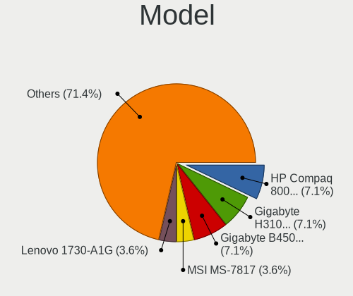
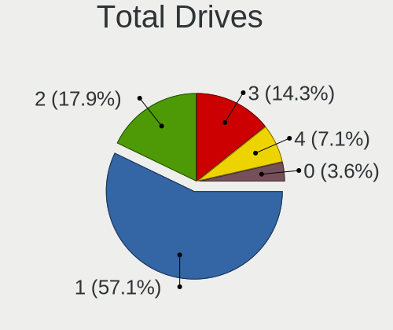
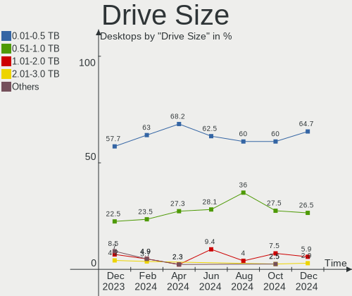
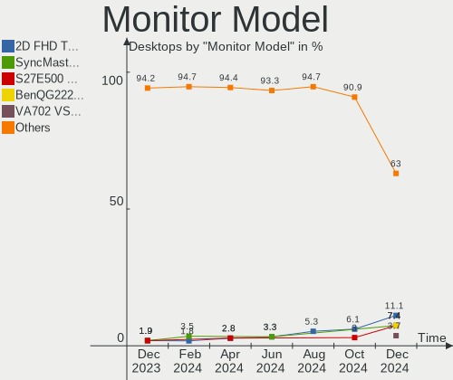
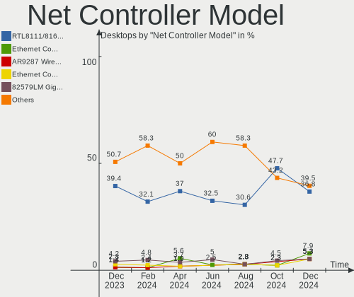

BlackPanther Hardware Trends (Desktop)
--------------------------------------

A project to identify most popular hardware characteristics and track their change
over time based on data collected by BlackPanther users at https://Linux-Hardware.org.

Anyone can contribute to the study by uploading probes of their computers by
the [hw-probe](https://github.com/linuxhw/hw-probe) tool:

    sudo -E hw-probe -all -upload

Full-feature report is available here: https://linux-hardware.org/?view=trends&formfactor=desktop

Period: Mar, 2021.

Contents
--------

- [ OS                       ](#os)
- [ OS Family                ](#os-family)
- [ Kernel                   ](#kernel)
- [ Kernel Family            ](#kernel-family)
- [ Kernel Major Ver.        ](#kernel-major-ver)
- [ Arch                     ](#arch)
- [ DE                       ](#de)
- [ Display Server           ](#display-server)
- [ Display Manager          ](#display-manager)
- [ OS Lang                  ](#os-lang)
- [ Boot Mode                ](#boot-mode)
- [ Filesystem               ](#filesystem)
- [ Part. scheme             ](#part-scheme)
- [ Dual Boot with Linux/BSD ](#dual-boot-with-linux/bsd)
- [ Dual Boot (Win)          ](#dual-boot-win)
- [ Country                  ](#country)
- [ City                     ](#city)
- [ Vendor                   ](#vendor)
- [ Model                    ](#model)
- [ Model Family             ](#model-family)
- [ MFG Year                 ](#mfg-year)
- [ Form Factor              ](#form-factor)
- [ Secure Boot              ](#secure-boot)
- [ Coreboot                 ](#coreboot)
- [ RAM Size                 ](#ram-size)
- [ RAM Used                 ](#ram-used)
- [ Has CD-ROM               ](#has-cd-rom)
- [ Total Drives             ](#total-drives)
- [ Has Ethernet             ](#has-ethernet)
- [ Has WiFi                 ](#has-wifi)
- [ Has Bluetooth            ](#has-bluetooth)
- [ Drive Vendor             ](#drive-vendor)
- [ Drive Model              ](#drive-model)
- [ HDD Vendor               ](#hdd-vendor)
- [ SSD Vendor               ](#ssd-vendor)
- [ Drive Kind               ](#drive-kind)
- [ Drive Connector          ](#drive-connector)
- [ Drive Size               ](#drive-size)
- [ Space Total              ](#space-total)
- [ Space Used               ](#space-used)
- [ Malfunc. Drives          ](#malfunc-drives)
- [ Malfunc. Drive Vendor    ](#malfunc-drive-vendor)
- [ Malfunc. HDD Vendor      ](#malfunc-hdd-vendor)
- [ Malfunc. Drive Kind      ](#malfunc-drive-kind)
- [ Failed Drives            ](#failed-drives)
- [ Failed Drive Vendor      ](#failed-drive-vendor)
- [ Drive Status             ](#drive-status)
- [ Storage Vendor           ](#storage-vendor)
- [ Storage Model            ](#storage-model)
- [ Storage Kind             ](#storage-kind)
- [ CPU Vendor               ](#cpu-vendor)
- [ CPU Model                ](#cpu-model)
- [ CPU Model Family         ](#cpu-model-family)
- [ CPU Cores                ](#cpu-cores)
- [ CPU Sockets              ](#cpu-sockets)
- [ CPU Threads              ](#cpu-threads)
- [ CPU Op-Modes             ](#cpu-op-modes)
- [ CPU Microcode            ](#cpu-microcode)
- [ CPU Microarch            ](#cpu-microarch)
- [ GPU Vendor               ](#gpu-vendor)
- [ GPU Model                ](#gpu-model)
- [ GPU Combo                ](#gpu-combo)
- [ GPU Driver               ](#gpu-driver)
- [ GPU Memory               ](#gpu-memory)
- [ Monitor Vendor           ](#monitor-vendor)
- [ Monitor Model            ](#monitor-model)
- [ Monitor Resolution       ](#monitor-resolution)
- [ Monitor Diagonal         ](#monitor-diagonal)
- [ Monitor Width            ](#monitor-width)
- [ Aspect Ratio             ](#aspect-ratio)
- [ Monitor Area             ](#monitor-area)
- [ Pixel Density            ](#pixel-density)
- [ Multiple Monitors        ](#multiple-monitors)
- [ Net Controller Vendor    ](#net-controller-vendor)
- [ Net Controller Model     ](#net-controller-model)
- [ Wireless Vendor          ](#wireless-vendor)
- [ Wireless Model           ](#wireless-model)
- [ Ethernet Vendor          ](#ethernet-vendor)
- [ Ethernet Model           ](#ethernet-model)
- [ Net Controller Kind      ](#net-controller-kind)
- [ Used Controller          ](#used-controller)
- [ NICs                     ](#nics)
- [ IPv6                     ](#ipv6)
- [ Memory Vendor            ](#memory-vendor)
- [ Memory Model             ](#memory-model)
- [ Memory Kind              ](#memory-kind)
- [ Memory Form Factor       ](#memory-form-factor)
- [ Memory Size              ](#memory-size)
- [ Memory Speed             ](#memory-speed)
- [ Sound Vendor             ](#sound-vendor)
- [ Sound Model              ](#sound-model)
- [ Camera Vendor            ](#camera-vendor)
- [ Camera Model             ](#camera-model)
- [ Fingerprint Vendor       ](#fingerprint-vendor)
- [ Fingerprint Model        ](#fingerprint-model)
- [ Chipcard Vendor          ](#chipcard-vendor)
- [ Chipcard Model           ](#chipcard-model)
- [ Printer Vendor           ](#printer-vendor)
- [ Printer Model            ](#printer-model)
- [ Scanner Vendor           ](#scanner-vendor)
- [ Scanner Model            ](#scanner-model)
- [ Bluetooth Vendor         ](#bluetooth-vendor)
- [ Bluetooth Model          ](#bluetooth-model)
- [ Unsupported Devices      ](#unsupported-devices)
- [ Unsupported Device Types ](#unsupported-device-types)

OS
--

Installed operating systems

| Name              | Desktops | Percent |
|-------------------|----------|---------|
| BlackPanther 18.1 | 83       | 96.51%  |
| BlackPanther 16.2 | 3        | 3.49%   |

OS Family
---------

OS without a version

| Name         | Desktops | Percent |
|--------------|----------|---------|
| BlackPanther | 86       | 100%    |

Kernel
------

Version of the Linux kernel

| Version                | Desktops | Percent |
|------------------------|----------|---------|
| 5.6.14-desktop-2bP     | 52       | 60.47%  |
| 4.18.16-desktop-1bP    | 31       | 36.05%  |
| 4.9.20-desktop-pae-1bP | 3        | 3.49%   |

Kernel Family
-------------

Linux kernel without a distro release

| Version | Desktops | Percent |
|---------|----------|---------|
| 5.6.14  | 52       | 60.47%  |
| 4.18.16 | 31       | 36.05%  |
| 4.9.20  | 3        | 3.49%   |

Kernel Major Ver.
-----------------

Linux kernel major version

| Version | Desktops | Percent |
|---------|----------|---------|
| 5.6     | 52       | 60.47%  |
| 4.18    | 31       | 36.05%  |
| 4.9     | 3        | 3.49%   |

Arch
----

OS architecture (x86_64, i586, etc.)

| Name   | Desktops | Percent |
|--------|----------|---------|
| x86_64 | 83       | 96.51%  |
| i686   | 3        | 3.49%   |

DE
--

Desktop Environment

| Name | Desktops | Percent |
|------|----------|---------|
| KDE5 | 86       | 100%    |

Display Server
--------------

X11 or Wayland

| Name | Desktops | Percent |
|------|----------|---------|
| X11  | 86       | 100%    |

Display Manager
---------------

SDDM, LightDM, etc.

| Name | Desktops | Percent |
|------|----------|---------|
| SDDM | 86       | 100%    |

OS Lang
-------

Language

| Lang    | Desktops | Percent |
|---------|----------|---------|
| Unknown | 86       | 100%    |

Boot Mode
---------

EFI or BIOS

| Mode | Desktops | Percent |
|------|----------|---------|
| BIOS | 57       | 66.28%  |
| EFI  | 29       | 33.72%  |

Filesystem
----------

Type of filesystem

| Type    | Desktops | Percent |
|---------|----------|---------|
| Overlay | 71       | 82.56%  |
| Ext4    | 14       | 16.28%  |
| Ext3    | 1        | 1.16%   |

Part. scheme
------------

Scheme of partitioning

| Type | Desktops | Percent |
|------|----------|---------|
| MBR  | 52       | 60.47%  |
| GPT  | 34       | 39.53%  |

Dual Boot with Linux/BSD
------------------------

Hosting more than one Linux/BSD

| Dual boot | Desktops | Percent |
|-----------|----------|---------|
| Yes       | 45       | 52.33%  |
| No        | 41       | 47.67%  |

Dual Boot (Win)
---------------

Hosting Linux and Windows

| Dual boot | Desktops | Percent |
|-----------|----------|---------|
| Yes       | 53       | 61.63%  |
| No        | 33       | 38.37%  |

Country
-------

Geographic location (country)

| Country     | Desktops | Percent |
|-------------|----------|---------|
| Hungary     | 65       | 75.58%  |
| Serbia      | 3        | 3.49%   |
| Romania     | 2        | 2.33%   |
| Netherlands | 2        | 2.33%   |
| Brazil      | 2        | 2.33%   |
| USA         | 1        | 1.16%   |
| UK          | 1        | 1.16%   |
| Thailand    | 1        | 1.16%   |
| Spain       | 1        | 1.16%   |
| Slovakia    | 1        | 1.16%   |
| Poland      | 1        | 1.16%   |
| Morocco     | 1        | 1.16%   |
| Mexico      | 1        | 1.16%   |
| Ireland     | 1        | 1.16%   |
| Germany     | 1        | 1.16%   |
| France      | 1        | 1.16%   |
| Canada      | 1        | 1.16%   |

City
----

Geographic location (city)

| City              | Desktops | Percent |
|-------------------|----------|---------|
| Budapest          | 15       | 17.44%  |
| Debrecen          | 5        | 5.81%   |
| Miskolc           | 3        | 3.49%   |
| Érd              | 2        | 2.33%   |
| Zsira             | 2        | 2.33%   |
| Maastricht        | 2        | 2.33%   |
| Kecskemét        | 2        | 2.33%   |
| Győr             | 2        | 2.33%   |
| Belgrade          | 2        | 2.33%   |
| Tredegar          | 1        | 1.16%   |
| Tihany            | 1        | 1.16%   |
| Tatabánya        | 1        | 1.16%   |
| Tar               | 1        | 1.16%   |
| Székesfehérvár | 1        | 1.16%   |
| Szombathely       | 1        | 1.16%   |
| Szolnok           | 1        | 1.16%   |
| Szigethalom       | 1        | 1.16%   |
| Szentes           | 1        | 1.16%   |
| Szekszárd        | 1        | 1.16%   |
| Szabadszentkiraly | 1        | 1.16%   |
| Sapucaia          | 1        | 1.16%   |
| Rimavská Sobota  | 1        | 1.16%   |
| Ribeirão Preto   | 1        | 1.16%   |
| Pécs             | 1        | 1.16%   |
| Pecsely           | 1        | 1.16%   |
| Papa              | 1        | 1.16%   |
| Oradea            | 1        | 1.16%   |
| Ocsod             | 1        | 1.16%   |
| Niš              | 1        | 1.16%   |
| Nagykoros         | 1        | 1.16%   |
| Nagykata          | 1        | 1.16%   |
| Nagyatad          | 1        | 1.16%   |
| Mosonszentmiklos  | 1        | 1.16%   |
| Mezokovacshaza    | 1        | 1.16%   |
| Marcali           | 1        | 1.16%   |
| Kocsord           | 1        | 1.16%   |
| Karcag            | 1        | 1.16%   |
| Jackson Center    | 1        | 1.16%   |
| Heroica Matamoros | 1        | 1.16%   |
| Hegyeshalom       | 1        | 1.16%   |
| Gyortelek         | 1        | 1.16%   |
| Gyal              | 1        | 1.16%   |
| Gmina Końskie    | 1        | 1.16%   |
| Esztergom         | 1        | 1.16%   |
| Essen             | 1        | 1.16%   |
| Epol              | 1        | 1.16%   |
| Eger              | 1        | 1.16%   |
| Edmonton          | 1        | 1.16%   |
| Dunaújváros     | 1        | 1.16%   |
| Dublin            | 1        | 1.16%   |
| Darnozseli        | 1        | 1.16%   |
| Cigand            | 1        | 1.16%   |
| Chiang Rai        | 1        | 1.16%   |
| Celldomolk        | 1        | 1.16%   |
| Casablanca        | 1        | 1.16%   |
| Békéscsaba      | 1        | 1.16%   |
| Brasov            | 1        | 1.16%   |
| Biatorbagy        | 1        | 1.16%   |
| Barakaldo         | 1        | 1.16%   |
| Aubord            | 1        | 1.16%   |

Vendor
------

Motherboard manufacturer

| Name                | Desktops | Percent |
|---------------------|----------|---------|
| ASUSTek Computer    | 15       | 17.44%  |
| Dell                | 14       | 16.28%  |
| Gigabyte Technology | 13       | 15.12%  |
| ASRock              | 12       | 13.95%  |
| MSI                 | 11       | 12.79%  |
| Hewlett-Packard     | 10       | 11.63%  |
| Fujitsu             | 4        | 4.65%   |
| Lenovo              | 3        | 3.49%   |
| Medion              | 1        | 1.16%   |
| Intel               | 1        | 1.16%   |
| Acer                | 1        | 1.16%   |
| Unknown             | 1        | 1.16%   |

Model
-----

Motherboard model

| Name                                | Desktops | Percent |
|-------------------------------------|----------|---------|
| Dell OptiPlex 7010                  | 3        | 3.49%   |
| MSI MS-7721                         | 2        | 2.33%   |
| HP Compaq dc5850 Microtower         | 2        | 2.33%   |
| Gigabyte P61-USB3-B3                | 2        | 2.33%   |
| Dell OptiPlex 380                   | 2        | 2.33%   |
| Dell OptiPlex 330                   | 2        | 2.33%   |
| ASRock G31M-S                       | 2        | 2.33%   |
| MSI MS-7B89                         | 1        | 1.16%   |
| MSI MS-7A72                         | 1        | 1.16%   |
| MSI MS-7A40                         | 1        | 1.16%   |
| MSI MS-7A36                         | 1        | 1.16%   |
| MSI MS-7846                         | 1        | 1.16%   |
| MSI MS-7680                         | 1        | 1.16%   |
| MSI MS-7267                         | 1        | 1.16%   |
| MSI Elite 7100 Microtower PC        | 1        | 1.16%   |
| MSI 09AC                            | 1        | 1.16%   |
| Medion Pentino G-Series             | 1        | 1.16%   |
| Lenovo ThinkStation D20 4158AF8     | 1        | 1.16%   |
| Lenovo ThinkCentre M81 0385BE3      | 1        | 1.16%   |
| Lenovo ThinkCentre M720t 10SRS76500 | 1        | 1.16%   |
| Intel 945                           | 1        | 1.16%   |
| HP xw4400 Workstation               | 1        | 1.16%   |
| HP EliteDesk 800 G3 SFF             | 1        | 1.16%   |
| HP Compaq Pro 6305 MT               | 1        | 1.16%   |
| HP Compaq Pro 6300 MT               | 1        | 1.16%   |
| HP Compaq 8200 Elite MT PC          | 1        | 1.16%   |
| HP Compaq 8000 Elite SFF PC         | 1        | 1.16%   |
| HP Compaq 6005 Pro SFF PC           | 1        | 1.16%   |
| HP Compaq 6000 Pro MT PC            | 1        | 1.16%   |
| Gigabyte X570 AORUS MASTER          | 1        | 1.16%   |
| Gigabyte P67A-D3-B3                 | 1        | 1.16%   |
| Gigabyte H61M-S2V-B3                | 1        | 1.16%   |
| Gigabyte H61M-S1                    | 1        | 1.16%   |
| Gigabyte GA-890GPA-UD3H             | 1        | 1.16%   |
| Gigabyte G31M-ES2L                  | 1        | 1.16%   |
| Gigabyte F2A88XN-WIFI               | 1        | 1.16%   |
| Gigabyte EG41MFT-US2H               | 1        | 1.16%   |
| Gigabyte B450M S2H                  | 1        | 1.16%   |
| Gigabyte B450M GAMING               | 1        | 1.16%   |
| Gigabyte B360N WIFI                 | 1        | 1.16%   |
| Fujitsu ESPRIMO P720                | 1        | 1.16%   |
| Fujitsu ESPRIMO P2560               | 1        | 1.16%   |
| Fujitsu ESPRIMO E7935               | 1        | 1.16%   |
| Fujitsu ESPRIMO E710                | 1        | 1.16%   |
| Dell Precision WorkStation T3500    | 1        | 1.16%   |
| Dell OptiPlex GX620                 | 1        | 1.16%   |
| Dell OptiPlex 760                   | 1        | 1.16%   |
| Dell OptiPlex 755                   | 1        | 1.16%   |
| Dell OptiPlex 5055 Ryzen APU        | 1        | 1.16%   |
| Dell OptiPlex 390                   | 1        | 1.16%   |
| Dell OptiPlex 320                   | 1        | 1.16%   |
| ASUS ROG STRIX B450-F GAMING        | 1        | 1.16%   |
| ASUS PRIME H310M-R R2.0             | 1        | 1.16%   |
| ASUS P8H77-V LE                     | 1        | 1.16%   |
| ASUS P7P55D-E                       | 1        | 1.16%   |
| ASUS P5Q SE2                        | 1        | 1.16%   |
| ASUS P5KPL-AM EPU                   | 1        | 1.16%   |
| ASUS P-P5G41                        | 1        | 1.16%   |
| ASUS Maximus VIII RANGER            | 1        | 1.16%   |
| ASUS M5A99FX PRO R2.0               | 1        | 1.16%   |

Model Family
------------

Motherboard model prefix

| Name                    | Desktops | Percent |
|-------------------------|----------|---------|
| Dell OptiPlex           | 13       | 15.12%  |
| HP Compaq               | 8        | 9.3%    |
| Fujitsu ESPRIMO         | 4        | 4.65%   |
| MSI MS-7721             | 2        | 2.33%   |
| Lenovo ThinkCentre      | 2        | 2.33%   |
| Gigabyte P61-USB3-B3    | 2        | 2.33%   |
| Gigabyte B450M          | 2        | 2.33%   |
| ASUS M5A97              | 2        | 2.33%   |
| ASRock G31M-S           | 2        | 2.33%   |
| MSI MS-7B89             | 1        | 1.16%   |
| MSI MS-7A72             | 1        | 1.16%   |
| MSI MS-7A40             | 1        | 1.16%   |
| MSI MS-7A36             | 1        | 1.16%   |
| MSI MS-7846             | 1        | 1.16%   |
| MSI MS-7680             | 1        | 1.16%   |
| MSI MS-7267             | 1        | 1.16%   |
| MSI Elite               | 1        | 1.16%   |
| MSI 09AC                | 1        | 1.16%   |
| Medion Pentino          | 1        | 1.16%   |
| Lenovo ThinkStation     | 1        | 1.16%   |
| Intel 945               | 1        | 1.16%   |
| HP xw4400               | 1        | 1.16%   |
| HP EliteDesk            | 1        | 1.16%   |
| Gigabyte X570           | 1        | 1.16%   |
| Gigabyte P67A-D3-B3     | 1        | 1.16%   |
| Gigabyte H61M-S2V-B3    | 1        | 1.16%   |
| Gigabyte H61M-S1        | 1        | 1.16%   |
| Gigabyte GA-890GPA-UD3H | 1        | 1.16%   |
| Gigabyte G31M-ES2L      | 1        | 1.16%   |
| Gigabyte F2A88XN-WIFI   | 1        | 1.16%   |
| Gigabyte EG41MFT-US2H   | 1        | 1.16%   |
| Gigabyte B360N          | 1        | 1.16%   |
| Dell Precision          | 1        | 1.16%   |
| ASUS ROG                | 1        | 1.16%   |
| ASUS PRIME              | 1        | 1.16%   |
| ASUS P8H77-V            | 1        | 1.16%   |
| ASUS P7P55D-E           | 1        | 1.16%   |
| ASUS P5Q                | 1        | 1.16%   |
| ASUS P5KPL-AM           | 1        | 1.16%   |
| ASUS P-P5G41            | 1        | 1.16%   |
| ASUS Maximus            | 1        | 1.16%   |
| ASUS M5A99FX            | 1        | 1.16%   |
| ASUS M5A78L             | 1        | 1.16%   |
| ASUS H61M-K             | 1        | 1.16%   |
| ASUS ET1610PT           | 1        | 1.16%   |
| ASUS All                | 1        | 1.16%   |
| ASRock H81M-VG4         | 1        | 1.16%   |
| ASRock H61M-VG3         | 1        | 1.16%   |
| ASRock G31M-VS          | 1        | 1.16%   |
| ASRock FM2A88X          | 1        | 1.16%   |
| ASRock FM2A88M          | 1        | 1.16%   |
| ASRock FM2A75M          | 1        | 1.16%   |
| ASRock FM2A68M-DG3+     | 1        | 1.16%   |
| ASRock FM2A55M-HD+      | 1        | 1.16%   |
| ASRock AB350M-HDV       | 1        | 1.16%   |
| ASRock 960GM-VGS3       | 1        | 1.16%   |
| Acer Aspire             | 1        | 1.16%   |
| Unknown                 | 1        | 1.16%   |

MFG Year
--------

Motherboard manufacture year

| Year | Desktops | Percent |
|------|----------|---------|
| 2010 | 13       | 15.12%  |
| 2013 | 10       | 11.63%  |
| 2019 | 9        | 10.47%  |
| 2014 | 9        | 10.47%  |
| 2011 | 9        | 10.47%  |
| 2018 | 6        | 6.98%   |
| 2015 | 6        | 6.98%   |
| 2012 | 6        | 6.98%   |
| 2009 | 4        | 4.65%   |
| 2007 | 4        | 4.65%   |
| 2021 | 2        | 2.33%   |
| 2016 | 2        | 2.33%   |
| 2006 | 2        | 2.33%   |
| 2020 | 1        | 1.16%   |
| 2017 | 1        | 1.16%   |
| 2008 | 1        | 1.16%   |
| 2005 | 1        | 1.16%   |

Form Factor
-----------

Physical design of the computer

| Name    | Desktops | Percent |
|---------|----------|---------|
| Desktop | 86       | 100%    |

Secure Boot
-----------

Enabled or disabled

| State    | Desktops | Percent |
|----------|----------|---------|
| Disabled | 86       | 100%    |

Coreboot
--------

Have coreboot on board

| Used | Desktops | Percent |
|------|----------|---------|
| No   | 86       | 100%    |

RAM Size
--------

Total RAM memory

| Size in GB | Desktops | Percent |
|------------|----------|---------|
| 3.01-4.0   | 21       | 24.42%  |
| 8.01-16.0  | 20       | 23.26%  |
| 4.01-8.0   | 19       | 22.09%  |
| 16.01-24.0 | 13       | 15.12%  |
| 1.01-2.0   | 6        | 6.98%   |
| 32.01-64.0 | 4        | 4.65%   |
| 0.51-1.0   | 2        | 2.33%   |
| 2.01-3.0   | 1        | 1.16%   |

RAM Used
--------

Used RAM memory

| Used GB  | Desktops | Percent |
|----------|----------|---------|
| 0.01-0.5 | 53       | 61.63%  |
| 0.51-1.0 | 25       | 29.07%  |
| 1.01-2.0 | 8        | 9.3%    |

Has CD-ROM
----------

Has CD-ROM on board

| Presented | Desktops | Percent |
|-----------|----------|---------|
| Yes       | 53       | 61.63%  |
| No        | 33       | 38.37%  |

Total Drives
------------

Number of drives on board

| Drives | Desktops | Percent |
|--------|----------|---------|
| 1      | 40       | 46.51%  |
| 2      | 28       | 32.56%  |
| 3      | 13       | 15.12%  |
| 4      | 2        | 2.33%   |
| 8      | 1        | 1.16%   |
| 5      | 1        | 1.16%   |
| 0      | 1        | 1.16%   |

Has Ethernet
------------

Has Ethernet on board

| Presented | Desktops | Percent |
|-----------|----------|---------|
| Yes       | 86       | 100%    |

Has WiFi
--------

Has WiFi module

| Presented | Desktops | Percent |
|-----------|----------|---------|
| No        | 61       | 70.93%  |
| Yes       | 25       | 29.07%  |

Has Bluetooth
-------------

Has Bluetooth module

| Presented | Desktops | Percent |
|-----------|----------|---------|
| No        | 75       | 87.21%  |
| Yes       | 11       | 12.79%  |

Drive Vendor
------------

Hard drive vendors

| Vendor              | Desktops | Drives | Percent |
|---------------------|----------|--------|---------|
| WDC                 | 31       | 40     | 22.14%  |
| Seagate             | 28       | 33     | 20%     |
| Samsung Electronics | 18       | 23     | 12.86%  |
| Kingston            | 17       | 18     | 12.14%  |
| Toshiba             | 11       | 11     | 7.86%   |
| Maxtor              | 5        | 5      | 3.57%   |
| Hitachi             | 4        | 4      | 2.86%   |
| A-DATA Technology   | 4        | 5      | 2.86%   |
| HGST                | 3        | 3      | 2.14%   |
| Crucial             | 3        | 3      | 2.14%   |
| SK Hynix            | 2        | 2      | 1.43%   |
| PNY                 | 2        | 2      | 1.43%   |
| Intel               | 2        | 2      | 1.43%   |
| Fujitsu             | 2        | 2      | 1.43%   |
| Verbatim            | 1        | 1      | 0.71%   |
| SPCC                | 1        | 1      | 0.71%   |
| SanDisk             | 1        | 1      | 0.71%   |
| OCZ                 | 1        | 1      | 0.71%   |
| Kingmax             | 1        | 1      | 0.71%   |
| GOODRAM             | 1        | 1      | 0.71%   |
| Gigabyte Technology | 1        | 1      | 0.71%   |
| GALAX               | 1        | 1      | 0.71%   |

Drive Model
-----------

Hard drive models

| Model                                | Desktops | Percent |
|--------------------------------------|----------|---------|
| Kingston SA400S37120G 120GB SSD      | 6        | 3.8%    |
| Toshiba DT01ACA100 1TB               | 4        | 2.53%   |
| Kingston SV300S37A120G 120GB SSD     | 3        | 1.9%    |
| Kingston SA400S37240G 240GB SSD      | 3        | 1.9%    |
| WDC WDS240G2G0A-00JH30 240GB SSD     | 2        | 1.27%   |
| WDC WD800JD-75MSA3 80GB              | 2        | 1.27%   |
| WDC WD5000AAKX-001CA0 500GB          | 2        | 1.27%   |
| WDC WD10EZEX-08WN4A0 1TB             | 2        | 1.27%   |
| Seagate ST500DM002-1BD142 500GB      | 2        | 1.27%   |
| Seagate ST3160815AS 160GB            | 2        | 1.27%   |
| Seagate ST2000DM008-2FR102 2TB       | 2        | 1.27%   |
| Seagate ST1000DM010-2EP102 1TB       | 2        | 1.27%   |
| Seagate ST1000DM003-1SB102 1TB       | 2        | 1.27%   |
| Samsung HD502HJ 500GB                | 2        | 1.27%   |
| Samsung HD154UI 1TB                  | 2        | 1.27%   |
| Samsung HD103SI 1TB                  | 2        | 1.27%   |
| PNY CS900 120GB SSD                  | 2        | 1.27%   |
| Kingston SUV400S37120G 120GB SSD     | 2        | 1.27%   |
| Kingston SA2000M8250G 250GB          | 2        | 1.27%   |
| A-DATA SU630 240GB SSD               | 2        | 1.27%   |
| WDC WDS120G2G0B-00EPW0 120GB SSD     | 1        | 0.63%   |
| WDC WD800JD-75LSA0 80GB              | 1        | 0.63%   |
| WDC WD800JD-08LSA0 80GB              | 1        | 0.63%   |
| WDC WD800AAJS-75M0A0 80GB            | 1        | 0.63%   |
| WDC WD5003ABYX-01WERA2 500GB         | 1        | 0.63%   |
| WDC WD5002ABYS-01B1B0 500GB          | 1        | 0.63%   |
| WDC WD5000BEVT-22A0RT0 500GB         | 1        | 0.63%   |
| WDC WD5000AVCS-982DY1 500GB          | 1        | 0.63%   |
| WDC WD5000AAKX-08ERMA0 500GB         | 1        | 0.63%   |
| WDC WD5000AAKS-00D2B0 500GB          | 1        | 0.63%   |
| WDC WD40PURZ-85TTDY0 4TB             | 1        | 0.63%   |
| WDC WD40PURZ-85AKKY0 4TB             | 1        | 0.63%   |
| WDC WD400BD-75MRA1 40GB              | 1        | 0.63%   |
| WDC WD3200BPVT-22ZEST0 320GB         | 1        | 0.63%   |
| WDC WD3200AAJS-00L7A0 320GB          | 1        | 0.63%   |
| WDC WD30PURX-64P6ZY0 3TB             | 1        | 0.63%   |
| WDC WD30EZRZ-00GXCB0 3TB             | 1        | 0.63%   |
| WDC WD30EFRX-68EUZN0 3TB             | 1        | 0.63%   |
| WDC WD2500BEVT-00A23T0 250GB         | 1        | 0.63%   |
| WDC WD20EZRZ-00Z5HB0 2TB             | 1        | 0.63%   |
| WDC WD2003FYYS-02W0B1 2TB            | 1        | 0.63%   |
| WDC WD1600BEVS-22RST0 160GB          | 1        | 0.63%   |
| WDC WD1600BB-55GUA0 160GB            | 1        | 0.63%   |
| WDC WD1600AAJS-07M0A0 160GB          | 1        | 0.63%   |
| WDC WD10EZEX-60WN4A0 1TB             | 1        | 0.63%   |
| WDC WD10EZEX-22MFCA0 1TB             | 1        | 0.63%   |
| WDC WD10EZEX-22BN5A0 1TB             | 1        | 0.63%   |
| WDC WD10EZEX-21M2NA0 1TB             | 1        | 0.63%   |
| WDC WD10EZEX-00WN4A0 1TB             | 1        | 0.63%   |
| WDC WD10EURX-63UY4Y0 1TB             | 1        | 0.63%   |
| WDC PC SN730 SDBQNTY-256G-1001 256GB | 1        | 0.63%   |
| Verbatim Vi500 S3 120GB SSD          | 1        | 0.63%   |
| Toshiba MQ01ABD050 500GB             | 1        | 0.63%   |
| Toshiba MK5061GSYN 500GB             | 1        | 0.63%   |
| Toshiba MK3001GRRB 304GB             | 1        | 0.63%   |
| Toshiba MK1059GSM 1TB                | 1        | 0.63%   |
| Toshiba HDWD130 3TB                  | 1        | 0.63%   |
| Toshiba HDWD110 1TB                  | 1        | 0.63%   |
| Toshiba DT01ACA050 500GB             | 1        | 0.63%   |
| SPCC Solid State Disk 128GB          | 1        | 0.63%   |

HDD Vendor
----------

Hard disk drive vendors

| Vendor              | Desktops | Drives | Percent |
|---------------------|----------|--------|---------|
| WDC                 | 28       | 36     | 29.47%  |
| Seagate             | 28       | 33     | 29.47%  |
| Samsung Electronics | 14       | 16     | 14.74%  |
| Toshiba             | 11       | 11     | 11.58%  |
| Maxtor              | 5        | 5      | 5.26%   |
| Hitachi             | 4        | 4      | 4.21%   |
| HGST                | 3        | 3      | 3.16%   |
| Fujitsu             | 2        | 2      | 2.11%   |

SSD Vendor
----------

Solid state drive vendors

| Vendor              | Desktops | Drives | Percent |
|---------------------|----------|--------|---------|
| Kingston            | 15       | 16     | 37.5%   |
| Samsung Electronics | 4        | 5      | 10%     |
| A-DATA Technology   | 4        | 5      | 10%     |
| WDC                 | 3        | 3      | 7.5%    |
| PNY                 | 2        | 2      | 5%      |
| Intel               | 2        | 2      | 5%      |
| Crucial             | 2        | 2      | 5%      |
| Verbatim            | 1        | 1      | 2.5%    |
| SPCC                | 1        | 1      | 2.5%    |
| SK Hynix            | 1        | 1      | 2.5%    |
| OCZ                 | 1        | 1      | 2.5%    |
| Kingmax             | 1        | 1      | 2.5%    |
| GOODRAM             | 1        | 1      | 2.5%    |
| Gigabyte Technology | 1        | 1      | 2.5%    |
| GALAX               | 1        | 1      | 2.5%    |

Drive Kind
----------

HDD or SSD

| Kind | Desktops | Drives | Percent |
|------|----------|--------|---------|
| HDD  | 74       | 110    | 61.67%  |
| SSD  | 38       | 43     | 31.67%  |
| NVMe | 7        | 7      | 5.83%   |
| MMC  | 1        | 1      | 0.83%   |

Drive Connector
---------------

SATA, SAS, NVMe, etc.

| Type | Desktops | Drives | Percent |
|------|----------|--------|---------|
| SATA | 83       | 151    | 89.25%  |
| NVMe | 7        | 7      | 7.53%   |
| SAS  | 2        | 2      | 2.15%   |
| MMC  | 1        | 1      | 1.08%   |

Drive Size
----------

Size of hard drive

| Size in TB | Desktops | Drives | Percent |
|------------|----------|--------|---------|
| 0.01-0.5   | 74       | 104    | 65.49%  |
| 0.51-1.0   | 28       | 35     | 24.78%  |
| 1.01-2.0   | 5        | 5      | 4.42%   |
| 3.01-4.0   | 3        | 5      | 2.65%   |
| 2.01-3.0   | 3        | 4      | 2.65%   |

Space Total
-----------

Amount of disk space available on the file system

| Size in GB | Desktops | Percent |
|------------|----------|---------|
| Unknown    | 71       | 82.56%  |
| 251-500    | 4        | 4.65%   |
| 51-100     | 4        | 4.65%   |
| 501-1000   | 3        | 3.49%   |
| 101-250    | 2        | 2.33%   |
| 21-50      | 1        | 1.16%   |
| 1-20       | 1        | 1.16%   |

Space Used
----------

Amount of used disk space

| Used GB | Desktops | Percent |
|---------|----------|---------|
| Unknown | 71       | 82.56%  |
| 1-20    | 15       | 17.44%  |

Malfunc. Drives
---------------

Drive models with a malfunction

| Model                               | Desktops | Drives | Percent |
|-------------------------------------|----------|--------|---------|
| WDC WD800JD-75LSA0 80GB             | 1        | 1      | 2.08%   |
| WDC WD800AAJS-75M0A0 80GB           | 1        | 1      | 2.08%   |
| WDC WD5003ABYX-01WERA2 500GB        | 1        | 1      | 2.08%   |
| WDC WD5002ABYS-01B1B0 500GB         | 1        | 1      | 2.08%   |
| WDC WD5000AAKX-08ERMA0 500GB        | 1        | 1      | 2.08%   |
| WDC WD5000AAKS-00D2B0 500GB         | 1        | 1      | 2.08%   |
| WDC WD3200AAJS-00L7A0 320GB         | 1        | 1      | 2.08%   |
| WDC WD30PURX-64P6ZY0 3TB            | 1        | 1      | 2.08%   |
| WDC WD1600BB-55GUA0 160GB           | 1        | 1      | 2.08%   |
| WDC WD1600AAJS-07M0A0 160GB         | 1        | 1      | 2.08%   |
| WDC WD10EZEX-08WN4A0 1TB            | 1        | 1      | 2.08%   |
| Toshiba MQ01ABD050 500GB            | 1        | 1      | 2.08%   |
| Toshiba MK5061GSYN 500GB            | 1        | 1      | 2.08%   |
| Toshiba MK1059GSM 1TB               | 1        | 1      | 2.08%   |
| Toshiba HDWD130 3TB                 | 1        | 1      | 2.08%   |
| Toshiba DT01ACA100 1TB              | 1        | 1      | 2.08%   |
| Seagate ST750LM022 HN-M750MBB 752GB | 1        | 1      | 2.08%   |
| Seagate ST500NM0011 500GB           | 1        | 1      | 2.08%   |
| Seagate ST500LT012-9WS142 500GB     | 1        | 1      | 2.08%   |
| Seagate ST500DM002-9YN14C 500GB     | 1        | 1      | 2.08%   |
| Seagate ST500DM002-1BD142 500GB     | 1        | 1      | 2.08%   |
| Seagate ST4000DM000-1F2168 4TB      | 1        | 1      | 2.08%   |
| Seagate ST380815AS 80GB             | 1        | 1      | 2.08%   |
| Seagate ST3500418AS 500GB           | 1        | 1      | 2.08%   |
| Seagate ST340016A 40GB              | 1        | 1      | 2.08%   |
| Seagate ST3320418AS 320GB           | 1        | 1      | 2.08%   |
| Seagate ST3320413AS 320GB           | 1        | 1      | 2.08%   |
| Seagate ST3160310CS 160GB           | 1        | 1      | 2.08%   |
| Samsung Electronics SP0842N 80GB    | 1        | 1      | 2.08%   |
| Samsung Electronics SP0812C 80GB    | 1        | 1      | 2.08%   |
| Samsung Electronics HD642JJ 640GB   | 1        | 1      | 2.08%   |
| Samsung Electronics HD502IJ 500GB   | 1        | 1      | 2.08%   |
| Samsung Electronics HD502HJ 500GB   | 1        | 1      | 2.08%   |
| Samsung Electronics HD322GJ 320GB   | 1        | 1      | 2.08%   |
| Samsung Electronics HD254GJ 250GB   | 1        | 1      | 2.08%   |
| Samsung Electronics HD161GJ 160GB   | 1        | 1      | 2.08%   |
| Samsung Electronics HD154UI 1TB     | 1        | 1      | 2.08%   |
| Samsung Electronics HD103SI 1TB     | 1        | 1      | 2.08%   |
| OCZ VERTEX3 120GB SSD               | 1        | 1      | 2.08%   |
| MAXTOR STM3160215AS 160GB           | 1        | 1      | 2.08%   |
| Maxtor 6Y120P0 128GB                | 1        | 1      | 2.08%   |
| Maxtor 6N040T0 40GB                 | 1        | 1      | 2.08%   |
| Maxtor 2B020H1 20GB                 | 1        | 1      | 2.08%   |
| Kingston SV100S264G 64GB SSD        | 1        | 1      | 2.08%   |
| Hitachi HDE721010SLA330 1TB         | 1        | 1      | 2.08%   |
| HGST HTS541075A9E680 752GB          | 1        | 1      | 2.08%   |
| Fujitsu MHZ2120BH G2 120GB          | 1        | 1      | 2.08%   |
| A-DATA Technology SU630 240GB SSD   | 1        | 1      | 2.08%   |

Malfunc. Drive Vendor
---------------------

Vendors of faulty drives

| Vendor              | Desktops | Drives | Percent |
|---------------------|----------|--------|---------|
| Seagate             | 12       | 12     | 26.67%  |
| WDC                 | 10       | 11     | 22.22%  |
| Samsung Electronics | 8        | 10     | 17.78%  |
| Toshiba             | 5        | 5      | 11.11%  |
| Maxtor              | 4        | 4      | 8.89%   |
| OCZ                 | 1        | 1      | 2.22%   |
| Kingston            | 1        | 1      | 2.22%   |
| Hitachi             | 1        | 1      | 2.22%   |
| HGST                | 1        | 1      | 2.22%   |
| Fujitsu             | 1        | 1      | 2.22%   |
| A-DATA Technology   | 1        | 1      | 2.22%   |

Malfunc. HDD Vendor
-------------------

Vendors of faulty HDD drives

| Vendor              | Desktops | Drives | Percent |
|---------------------|----------|--------|---------|
| Seagate             | 12       | 12     | 28.57%  |
| WDC                 | 10       | 11     | 23.81%  |
| Samsung Electronics | 8        | 10     | 19.05%  |
| Toshiba             | 5        | 5      | 11.9%   |
| Maxtor              | 4        | 4      | 9.52%   |
| Hitachi             | 1        | 1      | 2.38%   |
| HGST                | 1        | 1      | 2.38%   |
| Fujitsu             | 1        | 1      | 2.38%   |

Malfunc. Drive Kind
-------------------

Kinds of faulty drives

| Kind | Desktops | Drives | Percent |
|------|----------|--------|---------|
| HDD  | 35       | 45     | 92.11%  |
| SSD  | 3        | 3      | 7.89%   |

Failed Drives
-------------

Failed drive models

| Model                           | Desktops | Drives | Percent |
|---------------------------------|----------|--------|---------|
| Samsung Electronics HD103SJ 1TB | 1        | 1      | 100%    |

Failed Drive Vendor
-------------------

Failed drive vendors

| Vendor              | Desktops | Drives | Percent |
|---------------------|----------|--------|---------|
| Samsung Electronics | 1        | 1      | 100%    |

Drive Status
------------

Number of failed and malfunc. drives

| Status   | Desktops | Drives | Percent |
|----------|----------|--------|---------|
| Works    | 65       | 109    | 61.32%  |
| Malfunc  | 37       | 48     | 34.91%  |
| Detected | 3        | 3      | 2.83%   |
| Failed   | 1        | 1      | 0.94%   |

Storage Vendor
--------------

Storage controller vendors

| Vendor                      | Desktops | Percent |
|-----------------------------|----------|---------|
| Intel                       | 55       | 55%     |
| AMD                         | 31       | 31%     |
| JMicron Technology          | 3        | 3%      |
| Samsung Electronics         | 2        | 2%      |
| Marvell Technology Group    | 2        | 2%      |
| Kingston Technology Company | 2        | 2%      |
| ASMedia Technology          | 2        | 2%      |
| SK Hynix                    | 1        | 1%      |
| Sandisk                     | 1        | 1%      |
| Micron/Crucial Technology   | 1        | 1%      |

Storage Model
-------------

Storage controller models

| Model                                                                                   | Desktops | Percent |
|-----------------------------------------------------------------------------------------|----------|---------|
| AMD FCH SATA Controller [AHCI mode]                                                     | 18       | 12.59%  |
| Intel NM10/ICH7 Family SATA Controller [IDE mode]                                       | 14       | 9.79%   |
| Intel 82801G (ICH7 Family) IDE Controller                                               | 13       | 9.09%   |
| Intel 6 Series/C200 Series Chipset Family Desktop SATA Controller (IDE mode, ports 4-5) | 6        | 4.2%    |
| Intel 6 Series/C200 Series Chipset Family Desktop SATA Controller (IDE mode, ports 0-3) | 6        | 4.2%    |
| Intel 7 Series/C210 Series Chipset Family 6-port SATA Controller [AHCI mode]            | 5        | 3.5%    |
| Intel 6 Series/C200 Series Chipset Family 6 port Desktop SATA AHCI Controller           | 5        | 3.5%    |
| AMD SB7x0/SB8x0/SB9x0 SATA Controller [IDE mode]                                        | 5        | 3.5%    |
| AMD 400 Series Chipset SATA Controller                                                  | 5        | 3.5%    |
| AMD SB7x0/SB8x0/SB9x0 SATA Controller [AHCI mode]                                       | 4        | 2.8%    |
| AMD FCH IDE Controller                                                                  | 4        | 2.8%    |
| JMicron JMB363 SATA/IDE Controller                                                      | 3        | 2.1%    |
| Intel NM10/ICH7 Family SATA Controller [AHCI mode]                                      | 3        | 2.1%    |
| Intel 8 Series/C220 Series Chipset Family 6-port SATA Controller 1 [AHCI mode]          | 3        | 2.1%    |
| Intel 4 Series Chipset PT IDER Controller                                               | 3        | 2.1%    |
| Intel 200 Series PCH SATA controller [AHCI mode]                                        | 3        | 2.1%    |
| AMD SB7x0/SB8x0/SB9x0 IDE Controller                                                    | 3        | 2.1%    |
| Kingston Company A2000 NVMe SSD                                                         | 2        | 1.4%    |
| Intel Q170/Q150/B150/H170/H110/Z170/CM236 Chipset SATA Controller [AHCI Mode]           | 2        | 1.4%    |
| Intel Cannon Lake PCH SATA AHCI Controller                                              | 2        | 1.4%    |
| Intel 82801JI (ICH10 Family) SATA AHCI Controller                                       | 2        | 1.4%    |
| Intel 82801JD/DO (ICH10 Family) SATA AHCI Controller                                    | 2        | 1.4%    |
| Intel 82801JD/DO (ICH10 Family) 4-port SATA IDE Controller                              | 2        | 1.4%    |
| Intel 82801JD/DO (ICH10 Family) 2-port SATA IDE Controller                              | 2        | 1.4%    |
| Intel 7 Series/C210 Series Chipset Family 4-port SATA Controller [IDE mode]             | 2        | 1.4%    |
| Intel 7 Series/C210 Series Chipset Family 2-port SATA Controller [IDE mode]             | 2        | 1.4%    |
| ASMedia ASM1062 Serial ATA Controller                                                   | 2        | 1.4%    |
| AMD 300 Series Chipset SATA Controller                                                  | 2        | 1.4%    |
| SK Hynix PC401 NVMe Solid State Drive 256GB                                             | 1        | 0.7%    |
| Sandisk WD Black SN750 / PC SN730 NVMe SSD                                              | 1        | 0.7%    |
| Samsung NVMe SSD Controller SM981/PM981/PM983                                           | 1        | 0.7%    |
| Samsung NVMe SSD Controller SM961/PM961/SM963                                           | 1        | 0.7%    |
| Micron/Crucial P1 NVMe PCIe SSD                                                         | 1        | 0.7%    |
| Marvell Group MV64460/64461/64462 System Controller, Revision B                         | 1        | 0.7%    |
| Marvell Group 88SE914D SATA-600 Controller                                              | 1        | 0.7%    |
| Intel SATA Controller [RAID mode]                                                       | 1        | 0.7%    |
| Intel 82Q35 Express PT IDER Controller                                                  | 1        | 0.7%    |
| Intel 82801IR/IO/IH (ICH9R/DO/DH) 6 port SATA Controller [AHCI mode]                    | 1        | 0.7%    |
| Intel 5 Series/3400 Series Chipset 6 port SATA AHCI Controller                          | 1        | 0.7%    |
| Intel 5 Series/3400 Series Chipset 4 port SATA IDE Controller                           | 1        | 0.7%    |
| Intel 5 Series/3400 Series Chipset 2 port SATA IDE Controller                           | 1        | 0.7%    |
| AMD SB600 Non-Raid-5 SATA                                                               | 1        | 0.7%    |
| AMD SB600 IDE                                                                           | 1        | 0.7%    |
| AMD IXP SB4x0 Serial ATA Controller                                                     | 1        | 0.7%    |
| AMD IXP SB4x0 IDE Controller                                                            | 1        | 0.7%    |
| AMD FCH SATA Controller D                                                               | 1        | 0.7%    |

Storage Kind
------------

Kind of storage controller (IDE, SATA, NVMe, SAS, ...)

| Kind | Desktops | Percent |
|------|----------|---------|
| SATA | 59       | 54.63%  |
| IDE  | 40       | 37.04%  |
| NVMe | 7        | 6.48%   |
| RAID | 2        | 1.85%   |

CPU Vendor
----------

Processor vendors

| Vendor | Desktops | Percent |
|--------|----------|---------|
| Intel  | 56       | 65.12%  |
| AMD    | 30       | 34.88%  |

CPU Model
---------

Processor models

| Model                                           | Desktops | Percent |
|-------------------------------------------------|----------|---------|
| Intel Core i3-2120 CPU @ 3.30GHz                | 5        | 5.81%   |
| Intel Core i5-2300 CPU @ 2.80GHz                | 3        | 3.49%   |
| Intel Core 2 Duo CPU E8400 @ 3.00GHz            | 3        | 3.49%   |
| AMD Ryzen 3 2200G with Radeon Vega Graphics     | 3        | 3.49%   |
| Intel Core i5-3470 CPU @ 3.20GHz                | 2        | 2.33%   |
| Intel Core 2 Quad CPU Q9550 @ 2.83GHz           | 2        | 2.33%   |
| Intel Core 2 Duo CPU E7500 @ 2.93GHz            | 2        | 2.33%   |
| Intel Celeron CPU 430 @ 1.80GHz                 | 2        | 2.33%   |
| AMD FX-8350 Eight-Core Processor                | 2        | 2.33%   |
| Intel Xeon CPU X5677 @ 3.47GHz                  | 1        | 1.16%   |
| Intel Xeon CPU X5670 @ 2.93GHz                  | 1        | 1.16%   |
| Intel Xeon CPU X3330 @ 2.66GHz                  | 1        | 1.16%   |
| Intel Xeon CPU E31220 @ 3.10GHz                 | 1        | 1.16%   |
| Intel Pentium Dual-Core CPU E5500 @ 2.80GHz     | 1        | 1.16%   |
| Intel Pentium Dual-Core CPU E5400 @ 2.70GHz     | 1        | 1.16%   |
| Intel Pentium Dual-Core CPU E5300 @ 2.60GHz     | 1        | 1.16%   |
| Intel Pentium Dual CPU E2200 @ 2.20GHz          | 1        | 1.16%   |
| Intel Pentium Dual CPU E2140 @ 1.60GHz          | 1        | 1.16%   |
| Intel Pentium D CPU 3.40GHz                     | 1        | 1.16%   |
| Intel Pentium CPU G630 @ 2.70GHz                | 1        | 1.16%   |
| Intel Pentium CPU G3420 @ 3.20GHz               | 1        | 1.16%   |
| Intel Pentium CPU G2030 @ 3.00GHz               | 1        | 1.16%   |
| Intel Pentium 4 CPU 3.20GHz                     | 1        | 1.16%   |
| Intel Genuine CPU 2140 @ 1.60GHz                | 1        | 1.16%   |
| Intel Core i7-9700 CPU @ 3.00GHz                | 1        | 1.16%   |
| Intel Core i7-8700 CPU @ 3.20GHz                | 1        | 1.16%   |
| Intel Core i5-7600K CPU @ 3.80GHz               | 1        | 1.16%   |
| Intel Core i5-7400 CPU @ 3.00GHz                | 1        | 1.16%   |
| Intel Core i5-6500 CPU @ 3.20GHz                | 1        | 1.16%   |
| Intel Core i5-3570K CPU @ 3.40GHz               | 1        | 1.16%   |
| Intel Core i5-3470S CPU @ 2.90GHz               | 1        | 1.16%   |
| Intel Core i5-2500K CPU @ 3.30GHz               | 1        | 1.16%   |
| Intel Core i5-2400 CPU @ 3.10GHz                | 1        | 1.16%   |
| Intel Core i5 CPU 750 @ 2.67GHz                 | 1        | 1.16%   |
| Intel Core i3-4130 CPU @ 3.40GHz                | 1        | 1.16%   |
| Intel Core i3-3220 CPU @ 3.30GHz                | 1        | 1.16%   |
| Intel Core i3 CPU 550 @ 3.20GHz                 | 1        | 1.16%   |
| Intel Core 2 Duo CPU E7600 @ 3.06GHz            | 1        | 1.16%   |
| Intel Core 2 Duo CPU E7300 @ 2.66GHz            | 1        | 1.16%   |
| Intel Core 2 CPU 6600 @ 2.40GHz                 | 1        | 1.16%   |
| Intel Core 2 CPU 4300 @ 1.80GHz                 | 1        | 1.16%   |
| Intel Celeron G4920 CPU @ 3.20GHz               | 1        | 1.16%   |
| Intel Celeron CPU G3930 @ 2.90GHz               | 1        | 1.16%   |
| Intel Celeron CPU G1820 @ 2.70GHz               | 1        | 1.16%   |
| Intel Celeron CPU E1500 @ 2.20GHz               | 1        | 1.16%   |
| Intel Atom CPU D410 @ 1.66GHz                   | 1        | 1.16%   |
| AMD Sempron 3850 APU with Radeon R3             | 1        | 1.16%   |
| AMD Ryzen 7 3800X 8-Core Processor              | 1        | 1.16%   |
| AMD Ryzen 7 2700X Eight-Core Processor          | 1        | 1.16%   |
| AMD Ryzen 7 2700 Eight-Core Processor           | 1        | 1.16%   |
| AMD Ryzen 5 PRO 2400G with Radeon Vega Graphics | 1        | 1.16%   |
| AMD Ryzen 5 3400G with Radeon Vega Graphics     | 1        | 1.16%   |
| AMD Ryzen 3 1200 Quad-Core Processor            | 1        | 1.16%   |
| AMD Phenom II X4 955 Processor                  | 1        | 1.16%   |
| AMD Phenom II X3 B75 Processor                  | 1        | 1.16%   |
| AMD FX-6300 Six-Core Processor                  | 1        | 1.16%   |
| AMD FX-4350 Quad-Core Processor                 | 1        | 1.16%   |
| AMD Athlon X4 860K Quad Core Processor          | 1        | 1.16%   |
| AMD Athlon II X4 620 Processor                  | 1        | 1.16%   |
| AMD Athlon II X2 B22 Processor                  | 1        | 1.16%   |

CPU Model Family
----------------

Processor model prefix

| Model                   | Desktops | Percent |
|-------------------------|----------|---------|
| Intel Core i5           | 13       | 15.12%  |
| Intel Core i3           | 8        | 9.3%    |
| Intel Core 2 Duo        | 7        | 8.14%   |
| Intel Celeron           | 6        | 6.98%   |
| Intel Xeon              | 4        | 4.65%   |
| AMD Ryzen 3             | 4        | 4.65%   |
| AMD FX                  | 4        | 4.65%   |
| Intel Pentium Dual-Core | 3        | 3.49%   |
| Intel Pentium           | 3        | 3.49%   |
| AMD Ryzen 7             | 3        | 3.49%   |
| AMD A8                  | 3        | 3.49%   |
| Intel Pentium Dual      | 2        | 2.33%   |
| Intel Core i7           | 2        | 2.33%   |
| Intel Core 2 Quad       | 2        | 2.33%   |
| Intel Core 2            | 2        | 2.33%   |
| AMD Athlon II X2        | 2        | 2.33%   |
| AMD A6                  | 2        | 2.33%   |
| AMD A4                  | 2        | 2.33%   |
| AMD A10                 | 2        | 2.33%   |
| Intel Pentium D         | 1        | 1.16%   |
| Intel Pentium 4         | 1        | 1.16%   |
| Intel Genuine           | 1        | 1.16%   |
| Intel Atom              | 1        | 1.16%   |
| AMD Sempron             | 1        | 1.16%   |
| AMD Ryzen 5 PRO         | 1        | 1.16%   |
| AMD Ryzen 5             | 1        | 1.16%   |
| AMD Phenom II X4        | 1        | 1.16%   |
| AMD Phenom II X3        | 1        | 1.16%   |
| AMD Athlon X4           | 1        | 1.16%   |
| AMD Athlon II X4        | 1        | 1.16%   |
| AMD Athlon 64           | 1        | 1.16%   |

CPU Cores
---------

Number of processor cores

| Number | Desktops | Percent |
|--------|----------|---------|
| 2      | 40       | 46.51%  |
| 4      | 29       | 33.72%  |
| 1      | 8        | 9.3%    |
| 8      | 5        | 5.81%   |
| 6      | 2        | 2.33%   |
| 3      | 2        | 2.33%   |

CPU Sockets
-----------

Number of sockets

| Number | Desktops | Percent |
|--------|----------|---------|
| 1      | 85       | 98.84%  |
| 2      | 1        | 1.16%   |

CPU Threads
-----------

Threads per core (Hyper-Threading)

| Number | Desktops | Percent |
|--------|----------|---------|
| 1      | 56       | 65.12%  |
| 2      | 30       | 34.88%  |

CPU Op-Modes
------------

CPU Operation Modes (32-bit, 64-bit)

| Op mode        | Desktops | Percent |
|----------------|----------|---------|
| 32-bit, 64-bit | 86       | 100%    |

CPU Microcode
-------------

Microcode number

| Number     | Desktops | Percent |
|------------|----------|---------|
| 0x206a7    | 12       | 13.95%  |
| 0x1067a    | 12       | 13.95%  |
| 0x306a9    | 6        | 6.98%   |
| 0x06001119 | 6        | 6.98%   |
| 0x906e9    | 3        | 3.49%   |
| 0x6fd      | 3        | 3.49%   |
| 0x306c3    | 3        | 3.49%   |
| 0x06000852 | 3        | 3.49%   |
| Unknown    | 3        | 3.49%   |
| 0x6f2      | 2        | 2.33%   |
| 0x206c2    | 2        | 2.33%   |
| 0x10661    | 2        | 2.33%   |
| 0x08101016 | 2        | 2.33%   |
| 0x0810100b | 2        | 2.33%   |
| 0x0800820d | 2        | 2.33%   |
| 0x010000c8 | 2        | 2.33%   |
| 0xf65      | 1        | 1.16%   |
| 0xf43      | 1        | 1.16%   |
| 0x906ed    | 1        | 1.16%   |
| 0x906eb    | 1        | 1.16%   |
| 0x906ea    | 1        | 1.16%   |
| 0x6f6      | 1        | 1.16%   |
| 0x506e3    | 1        | 1.16%   |
| 0x20655    | 1        | 1.16%   |
| 0x106e5    | 1        | 1.16%   |
| 0x106ca    | 1        | 1.16%   |
| 0x10676    | 1        | 1.16%   |
| 0x08701021 | 1        | 1.16%   |
| 0x08108109 | 1        | 1.16%   |
| 0x08001138 | 1        | 1.16%   |
| 0x07030106 | 1        | 1.16%   |
| 0x0700010f | 1        | 1.16%   |
| 0x06003106 | 1        | 1.16%   |
| 0x06003104 | 1        | 1.16%   |
| 0x0600111f | 1        | 1.16%   |
| 0x0600084f | 1        | 1.16%   |
| 0x010000db | 1        | 1.16%   |

CPU Microarch
-------------

Microarchitecture

| Name        | Desktops | Percent |
|-------------|----------|---------|
| Penryn      | 13       | 15.12%  |
| SandyBridge | 12       | 13.95%  |
| Piledriver  | 11       | 12.79%  |
| Core        | 8        | 9.3%    |
| KabyLake    | 6        | 6.98%   |
| IvyBridge   | 6        | 6.98%   |
| Zen         | 5        | 5.81%   |
| K10         | 5        | 5.81%   |
| Zen+        | 3        | 3.49%   |
| Westmere    | 3        | 3.49%   |
| Haswell     | 3        | 3.49%   |
| Steamroller | 2        | 2.33%   |
| NetBurst    | 2        | 2.33%   |
| Zen 2       | 1        | 1.16%   |
| Skylake     | 1        | 1.16%   |
| Puma        | 1        | 1.16%   |
| Nehalem     | 1        | 1.16%   |
| K8 Hammer   | 1        | 1.16%   |
| Jaguar      | 1        | 1.16%   |
| Bonnell     | 1        | 1.16%   |

GPU Vendor
----------

Vendors of graphics cards

| Vendor | Desktops | Percent |
|--------|----------|---------|
| AMD    | 43       | 48.86%  |
| Intel  | 27       | 30.68%  |
| Nvidia | 18       | 20.45%  |

GPU Model
---------

Graphics card models

| Model                                                                       | Desktops | Percent |
|-----------------------------------------------------------------------------|----------|---------|
| Intel 4 Series Chipset Integrated Graphics Controller                       | 7        | 7.61%   |
| Intel 2nd Generation Core Processor Family Integrated Graphics Controller   | 6        | 6.52%   |
| Intel 82G33/G31 Express Integrated Graphics Controller                      | 5        | 5.43%   |
| Nvidia GK208B [GeForce GT 710]                                              | 4        | 4.35%   |
| AMD Raven Ridge [Radeon Vega Series / Radeon Vega Mobile Series]            | 4        | 4.35%   |
| AMD Ellesmere [Radeon RX 470/480/570/570X/580/580X/590]                     | 4        | 4.35%   |
| AMD Redwood XT [Radeon HD 5670/5690/5730]                                   | 3        | 3.26%   |
| Intel Xeon E3-1200 v2/3rd Gen Core processor Graphics Controller            | 2        | 2.17%   |
| Intel 82945G/GZ Integrated Graphics Controller                              | 2        | 2.17%   |
| AMD RS780C [Radeon 3100]                                                    | 2        | 2.17%   |
| AMD Oland PRO [Radeon R7 240/340]                                           | 2        | 2.17%   |
| AMD Lexa PRO [Radeon 540/540X/550/550X / RX 540X/550/550X]                  | 2        | 2.17%   |
| AMD Cedar [Radeon HD 5000/6000/7350/8350 Series]                            | 2        | 2.17%   |
| Nvidia TU117 [GeForce GTX 1650]                                             | 1        | 1.09%   |
| Nvidia TU104 [GeForce RTX 2070 SUPER]                                       | 1        | 1.09%   |
| Nvidia GT218 [GeForce 210]                                                  | 1        | 1.09%   |
| Nvidia GT215 [GeForce GT 240]                                               | 1        | 1.09%   |
| Nvidia GP108 [GeForce GT 1030]                                              | 1        | 1.09%   |
| Nvidia GP107 [GeForce GTX 1050 Ti]                                          | 1        | 1.09%   |
| Nvidia GP104 [GeForce GTX 1070 Ti]                                          | 1        | 1.09%   |
| Nvidia GM204 [GeForce GTX 970]                                              | 1        | 1.09%   |
| Nvidia GM107GL [Quadro K620]                                                | 1        | 1.09%   |
| Nvidia GK208B [GeForce GT 720]                                              | 1        | 1.09%   |
| Nvidia GF119 [GeForce GT 610]                                               | 1        | 1.09%   |
| Nvidia GF108 [GeForce GT 730]                                               | 1        | 1.09%   |
| Nvidia GF108 [GeForce GT 630]                                               | 1        | 1.09%   |
| Nvidia G96C [GeForce 9500 GT]                                               | 1        | 1.09%   |
| Intel Xeon E3-1200 v3/4th Gen Core Processor Integrated Graphics Controller | 1        | 1.09%   |
| Intel HD Graphics 530                                                       | 1        | 1.09%   |
| Intel CoffeeLake-S GT2 [UHD Graphics 630]                                   | 1        | 1.09%   |
| Intel CoffeeLake-S GT1 [UHD Graphics 610]                                   | 1        | 1.09%   |
| Intel Atom Processor D4xx/D5xx/N4xx/N5xx Integrated Graphics Controller     | 1        | 1.09%   |
| AMD Turks PRO [Radeon HD 7570]                                              | 1        | 1.09%   |
| AMD Turks PRO [Radeon HD 6570/7570/8550 / R5 230]                           | 1        | 1.09%   |
| AMD Trinity [Radeon HD 7660D]                                               | 1        | 1.09%   |
| AMD Trinity [Radeon HD 7560D]                                               | 1        | 1.09%   |
| AMD Trinity 2 [Radeon HD 7540D]                                             | 1        | 1.09%   |
| AMD Trinity 2 [Radeon HD 7480D]                                             | 1        | 1.09%   |
| AMD RV730 PRO [Radeon HD 4650]                                              | 1        | 1.09%   |
| AMD RV710 [Radeon HD 4350/4550]                                             | 1        | 1.09%   |
| AMD RV620 PRO [Radeon HD 3470]                                              | 1        | 1.09%   |
| AMD RV610 [Radeon HD 2350]                                                  | 1        | 1.09%   |
| AMD RS880 [Radeon HD 4290]                                                  | 1        | 1.09%   |
| AMD RS880 [Radeon HD 4200]                                                  | 1        | 1.09%   |
| AMD RS480 [Radeon Xpress 200 Series] (Secondary)                            | 1        | 1.09%   |
| AMD RS480 [Radeon Xpress 200 Series]                                        | 1        | 1.09%   |
| AMD Richland [Radeon HD 8570D]                                              | 1        | 1.09%   |
| AMD Richland [Radeon HD 8470D]                                              | 1        | 1.09%   |
| AMD RC410 [Radeon Xpress 200/1100]                                          | 1        | 1.09%   |
| AMD Pitcairn PRO [Radeon HD 7850 / R7 265 / R9 270 1024SP]                  | 1        | 1.09%   |
| AMD Picasso                                                                 | 1        | 1.09%   |
| AMD Mullins [Radeon R3 Graphics]                                            | 1        | 1.09%   |
| AMD Kaveri [Radeon R7 Graphics]                                             | 1        | 1.09%   |
| AMD Kabini [Radeon HD 8280 / R3 Series]                                     | 1        | 1.09%   |
| AMD Hawaii XT / Grenada XT [Radeon R9 290X/390X]                            | 1        | 1.09%   |
| AMD Cape Verde XT [Radeon HD 7770/8760 / R7 250X]                           | 1        | 1.09%   |
| AMD Cape Verde PRO [Radeon HD 7750/8740 / R7 250E]                          | 1        | 1.09%   |
| AMD Caicos [Radeon HD 6450/7450/8450 / R5 230 OEM]                          | 1        | 1.09%   |
| AMD Caicos PRO [Radeon HD 7450]                                             | 1        | 1.09%   |
| AMD Baffin [Radeon RX 460/560D / Pro 450/455/460/555/555X/560/560X]         | 1        | 1.09%   |

GPU Combo
---------

Combinations of graphics cards

| Name       | Desktops | Percent |
|------------|----------|---------|
| 1 x AMD    | 39       | 45.35%  |
| 1 x Intel  | 25       | 29.07%  |
| 1 x Nvidia | 18       | 20.93%  |
| 2 x AMD    | 4        | 4.65%   |

GPU Driver
----------

Free vs proprietary

| Driver | Desktops | Percent |
|--------|----------|---------|
| Free   | 86       | 100%    |

GPU Memory
----------

Total video memory

| Size in GB | Desktops | Percent |
|------------|----------|---------|
| Unknown    | 24       | 27.91%  |
| 0.51-1.0   | 22       | 25.58%  |
| 1.01-2.0   | 17       | 19.77%  |
| 0.01-0.5   | 12       | 13.95%  |
| 3.01-4.0   | 8        | 9.3%    |
| 7.01-8.0   | 3        | 3.49%   |

Monitor Vendor
--------------

Monitor vendors

| Vendor                  | Desktops | Percent |
|-------------------------|----------|---------|
| Samsung Electronics     | 22       | 27.85%  |
| Goldstar                | 11       | 13.92%  |
| Hewlett-Packard         | 10       | 12.66%  |
| Dell                    | 4        | 5.06%   |
| BenQ                    | 4        | 5.06%   |
| Philips                 | 3        | 3.8%    |
| AOC                     | 3        | 3.8%    |
| Acer                    | 3        | 3.8%    |
| Lenovo                  | 2        | 2.53%   |
| Iiyama                  | 2        | 2.53%   |
| Fujitsu Siemens         | 2        | 2.53%   |
| ASUSTek Computer        | 2        | 2.53%   |
| Ancor Communications    | 2        | 2.53%   |
| ZLS                     | 1        | 1.27%   |
| ViewSonic               | 1        | 1.27%   |
| Vestel Elektronik       | 1        | 1.27%   |
| Unknown                 | 1        | 1.27%   |
| Sony                    | 1        | 1.27%   |
| LLL                     | 1        | 1.27%   |
| DENON                   | 1        | 1.27%   |
| CTT                     | 1        | 1.27%   |
| Chi Mei Optoelectronics | 1        | 1.27%   |

Monitor Model
-------------

Monitor models

| Model                                                                  | Desktops | Percent |
|------------------------------------------------------------------------|----------|---------|
| Samsung Electronics SyncMaster SAM036F 1440x900 428x255mm 19.6-inch    | 2        | 2.47%   |
| Hewlett-Packard L1950 HWP26E7 1280x1024 380x300mm 19.1-inch            | 2        | 2.47%   |
| Goldstar FULL HD GSM5B55 1920x1080 480x270mm 21.7-inch                 | 2        | 2.47%   |
| BenQ G2420HD BNQ783F 1920x1080 530x300mm 24.0-inch                     | 2        | 2.47%   |
| ZLS VMD-1951 ZLS1950 1600x900                                          | 1        | 1.23%   |
| ViewSonic VG2236 SERIES VSCE726 1920x1080 477x268mm 21.5-inch          | 1        | 1.23%   |
| Vestel Elektronik 50UHD_LCD_TV VES3700 3840x2160 1872x1053mm 84.6-inch | 1        | 1.23%   |
| Unknown LCD Monitor FFFF 2288x1287 2550x2550mm 142.0-inch              | 1        | 1.23%   |
| Sony SDM-M81 SNY0480 1280x1024 359x287mm 18.1-inch                     | 1        | 1.23%   |
| Samsung Electronics T24B300 SAM0930 1920x1080 521x293mm 23.5-inch      | 1        | 1.23%   |
| Samsung Electronics T22C300 SAM0AB3 1920x1080 477x268mm 21.5-inch      | 1        | 1.23%   |
| Samsung Electronics T22C300 SAM0AB1 1920x1080 477x268mm 21.5-inch      | 1        | 1.23%   |
| Samsung Electronics SyncMaster SAM01E1 1280x1024 376x301mm 19.0-inch   | 1        | 1.23%   |
| Samsung Electronics SyncMaster SAM01B8 1280x1024 338x270mm 17.0-inch   | 1        | 1.23%   |
| Samsung Electronics SyncMaster SAM0191 1280x1024 338x270mm 17.0-inch   | 1        | 1.23%   |
| Samsung Electronics SyncMaster SAM011E 1280x1024 338x270mm 17.0-inch   | 1        | 1.23%   |
| Samsung Electronics SyncMaster SAM010C 1280x1024 338x270mm 17.0-inch   | 1        | 1.23%   |
| Samsung Electronics SyncMaster SAM0107 1280x1024 312x234mm 15.4-inch   | 1        | 1.23%   |
| Samsung Electronics SyncMaster SAM0014 1280x1024 376x301mm 19.0-inch   | 1        | 1.23%   |
| Samsung Electronics SME1920 SAM06B7 1366x768 410x230mm 18.5-inch       | 1        | 1.23%   |
| Samsung Electronics SMB1920NW SAM06A5 1920x1080 410x260mm 19.1-inch    | 1        | 1.23%   |
| Samsung Electronics SA300/SA350 SAM078E 1680x1050 480x270mm 21.7-inch  | 1        | 1.23%   |
| Samsung Electronics S27E500 SAM0D0D 1920x1080 600x340mm 27.2-inch      | 1        | 1.23%   |
| Samsung Electronics PDP SAM007B 1024x768 920x518mm 41.6-inch           | 1        | 1.23%   |
| Samsung Electronics LCD Monitor SAM0DF6 3840x2160 890x500mm 40.2-inch  | 1        | 1.23%   |
| Samsung Electronics LCD Monitor SAM0992 1920x1080 1020x570mm 46.0-inch | 1        | 1.23%   |
| Samsung Electronics LCD Monitor SAM03D3 1360x768 410x256mm 19.0-inch   | 1        | 1.23%   |
| Samsung Electronics LCD Monitor SAM02EA 1360x768 885x498mm 40.0-inch   | 1        | 1.23%   |
| Samsung Electronics C24F390 SAM0D2D 1920x1080 521x293mm 23.5-inch      | 1        | 1.23%   |
| Samsung Electronics C24F390 SAM0D2C 1920x1080 520x290mm 23.4-inch      | 1        | 1.23%   |
| Philips PHL 243V7 PHLC155 1920x1080 530x300mm 24.0-inch                | 1        | 1.23%   |
| Philips PHL 223V5 PHLC0CF 1920x1080 480x270mm 21.7-inch                | 1        | 1.23%   |
| Philips 197EL PHLC08B 1366x768 410x230mm 18.5-inch                     | 1        | 1.23%   |
| LLL LCD LLL0001 1280x800 360x290mm 18.2-inch                           | 1        | 1.23%   |
| Lenovo LEN T24i-10 LEN61CE 1920x1080 527x296mm 23.8-inch               | 1        | 1.23%   |
| Lenovo LEN T2364pA LEN60F1 1920x1080 509x286mm 23.0-inch               | 1        | 1.23%   |
| Iiyama PLX2783H IVM6648 1920x1080 598x336mm 27.0-inch                  | 1        | 1.23%   |
| Iiyama PL2473HD IVM6107 1920x1080 521x293mm 23.5-inch                  | 1        | 1.23%   |
| Hewlett-Packard Z24i HWP309E 1920x1200 518x324mm 24.1-inch             | 1        | 1.23%   |
| Hewlett-Packard w1907 HWP26A2 1440x900 408x255mm 18.9-inch             | 1        | 1.23%   |
| Hewlett-Packard LA2206 HWP2948 1920x1080 476x268mm 21.5-inch           | 1        | 1.23%   |
| Hewlett-Packard L1740 HWP2649 1280x1024 330x270mm 16.8-inch            | 1        | 1.23%   |
| Hewlett-Packard L1502 HWP2600 1024x768 304x228mm 15.0-inch             | 1        | 1.23%   |
| Hewlett-Packard E243 HPN3468 1920x1080 527x296mm 23.8-inch             | 1        | 1.23%   |
| Hewlett-Packard 27es HWP3327 1920x1080 600x340mm 27.2-inch             | 1        | 1.23%   |
| Hewlett-Packard 1825 HWP0721 1280x1024 360x290mm 18.2-inch             | 1        | 1.23%   |
| Goldstar W1934 GSM4B7A 1440x900 410x260mm 19.1-inch                    | 1        | 1.23%   |
| Goldstar W1642C GSM3E89 1366x768 344x194mm 15.5-inch                   | 1        | 1.23%   |
| Goldstar ULTRAWIDE GSM76FA 2560x1080 798x334mm 34.1-inch               | 1        | 1.23%   |
| Goldstar TV SSCR GSMC0C0 3840x2160 1600x900mm 72.3-inch                | 1        | 1.23%   |
| Goldstar M2294D-PZ GSM56B0 1680x1050 473x296mm 22.0-inch               | 1        | 1.23%   |
| Goldstar L194W GSM4B6A 1440x900 410x260mm 19.1-inch                    | 1        | 1.23%   |
| Goldstar L1910S GSM4A78 1280x1024 376x301mm 19.0-inch                  | 1        | 1.23%   |
| Goldstar FULL HD GSM5B54 1920x1080 480x270mm 21.7-inch                 | 1        | 1.23%   |
| Goldstar FULL HD GSM5ABA 1920x1080 480x270mm 21.7-inch                 | 1        | 1.23%   |
| Goldstar E2350 GSM5790 1920x1080 510x290mm 23.1-inch                   | 1        | 1.23%   |
| Fujitsu Siemens L19W-5 FUS0744 1440x900 410x256mm 19.0-inch            | 1        | 1.23%   |
| Fujitsu Siemens B22W-7 LED FUS0837 1680x1050 474x296mm 22.0-inch       | 1        | 1.23%   |
| DENON AVR DON0064 1920x540                                             | 1        | 1.23%   |
| Dell U2212HM DELD047 1920x1080 475x267mm 21.5-inch                     | 1        | 1.23%   |

Monitor Resolution
------------------

Monitor screen resolution

| Resolution         | Desktops | Percent |
|--------------------|----------|---------|
| 1920x1080 (FHD)    | 30       | 39.47%  |
| 1280x1024 (SXGA)   | 14       | 18.42%  |
| 1440x900 (WXGA+)   | 8        | 10.53%  |
| 3840x2160 (4K)     | 6        | 7.89%   |
| 1366x768 (WXGA)    | 4        | 5.26%   |
| 1680x1050 (WSXGA+) | 3        | 3.95%   |
| 1600x900 (HD+)     | 2        | 2.63%   |
| 1360x768           | 2        | 2.63%   |
| 1024x768 (XGA)     | 2        | 2.63%   |
| 800x600            | 1        | 1.32%   |
| 2560x1080          | 1        | 1.32%   |
| 2288x1287          | 1        | 1.32%   |
| 1920x540           | 1        | 1.32%   |
| 1920x1200 (WUXGA)  | 1        | 1.32%   |

Monitor Diagonal
----------------

Diagonal size in inches

| Inches  | Desktops | Percent |
|---------|----------|---------|
| 19      | 14       | 17.72%  |
| 21      | 12       | 15.19%  |
| 24      | 9        | 11.39%  |
| 23      | 7        | 8.86%   |
| 18      | 6        | 7.59%   |
| 17      | 6        | 7.59%   |
| 27      | 5        | 6.33%   |
| 22      | 3        | 3.8%    |
| 15      | 3        | 3.8%    |
| 84      | 2        | 2.53%   |
| 72      | 2        | 2.53%   |
| Unknown | 2        | 2.53%   |
| 142     | 1        | 1.27%   |
| 46      | 1        | 1.27%   |
| 41      | 1        | 1.27%   |
| 40      | 1        | 1.27%   |
| 39      | 1        | 1.27%   |
| 34      | 1        | 1.27%   |
| 31      | 1        | 1.27%   |
| 20      | 1        | 1.27%   |

Monitor Width
-------------

Physical width

| Width in mm    | Desktops | Percent |
|----------------|----------|---------|
| 401-500        | 28       | 35.9%   |
| 501-600        | 21       | 26.92%  |
| 301-350        | 9        | 11.54%  |
| 351-400        | 7        | 8.97%   |
| 1501-2000      | 4        | 5.13%   |
| 801-900        | 2        | 2.56%   |
| Unknown        | 2        | 2.56%   |
| More than 2000 | 1        | 1.28%   |
| 701-800        | 1        | 1.28%   |
| 601-700        | 1        | 1.28%   |
| 1001-1500      | 1        | 1.28%   |
| 901-1000       | 1        | 1.28%   |

Aspect Ratio
------------

Proportional relationship between the width and the height

| Ratio | Desktops | Percent |
|-------|----------|---------|
| 16/9  | 45       | 60.81%  |
| 5/4   | 12       | 16.22%  |
| 16/10 | 11       | 14.86%  |
| 4/3   | 3        | 4.05%   |
| 6/5   | 1        | 1.35%   |
| 21/9  | 1        | 1.35%   |
| 1.00  | 1        | 1.35%   |

Monitor Area
------------

Area in inch²

| Area in inch² | Desktops | Percent |
|----------------|----------|---------|
| 201-250        | 25       | 32.47%  |
| 151-200        | 21       | 27.27%  |
| 141-150        | 9        | 11.69%  |
| More than 1000 | 5        | 6.49%   |
| 301-350        | 5        | 6.49%   |
| 501-1000       | 4        | 5.19%   |
| 351-500        | 2        | 2.6%    |
| 101-110        | 2        | 2.6%    |
| Unknown        | 2        | 2.6%    |
| 251-300        | 1        | 1.3%    |
| 111-120        | 1        | 1.3%    |

Pixel Density
-------------

Pixels per inch

| Density | Desktops | Percent |
|---------|----------|---------|
| 51-100  | 56       | 73.68%  |
| 101-120 | 13       | 17.11%  |
| 1-50    | 5        | 6.58%   |
| Unknown | 2        | 2.63%   |

Multiple Monitors
-----------------

Total monitors connected

| Total | Desktops | Percent |
|-------|----------|---------|
| 1     | 75       | 87.21%  |
| 2     | 11       | 12.79%  |

Net Controller Vendor
---------------------

Controller vendors

| Vendor                          | Desktops | Percent |
|---------------------------------|----------|---------|
| Realtek Semiconductor           | 48       | 41.74%  |
| Intel                           | 24       | 20.87%  |
| Qualcomm Atheros                | 9        | 7.83%   |
| Broadcom Inc. and subsidiaries  | 9        | 7.83%   |
| Broadcom Limited                | 7        | 6.09%   |
| Qualcomm Atheros Communications | 5        | 4.35%   |
| TP-Link                         | 2        | 1.74%   |
| Ralink Technology               | 2        | 1.74%   |
| Ralink                          | 2        | 1.74%   |
| NetGear                         | 1        | 0.87%   |
| JMicron Technology              | 1        | 0.87%   |
| D-Link System                   | 1        | 0.87%   |
| D-Link                          | 1        | 0.87%   |
| Broadcom                        | 1        | 0.87%   |
| ASUSTek Computer                | 1        | 0.87%   |
| Accton Technology               | 1        | 0.87%   |

Net Controller Model
--------------------

Controller models

| Model                                                                         | Desktops | Percent |
|-------------------------------------------------------------------------------|----------|---------|
| Realtek RTL8111/8168/8411 PCI Express Gigabit Ethernet Controller             | 39       | 32.77%  |
| Intel 82579LM Gigabit Network Connection (Lewisville)                         | 6        | 5.04%   |
| Realtek RTL810xE PCI Express Fast Ethernet controller                         | 4        | 3.36%   |
| Qualcomm Atheros AR9271 802.11n                                               | 4        | 3.36%   |
| Intel 82567LM-3 Gigabit Network Connection                                    | 4        | 3.36%   |
| Realtek RTL-8100/8101L/8139 PCI Fast Ethernet Adapter                         | 3        | 2.52%   |
| Qualcomm Atheros QCA8171 Gigabit Ethernet                                     | 3        | 2.52%   |
| Intel I211 Gigabit Network Connection                                         | 3        | 2.52%   |
| TP-Link TL-WN722N v2/v3 [Realtek RTL8188EUS]                                  | 2        | 1.68%   |
| Realtek RTL8169 PCI Gigabit Ethernet Controller                               | 2        | 1.68%   |
| Intel Ethernet Connection (7) I219-V                                          | 2        | 1.68%   |
| Intel Ethernet Connection (2) I219-V                                          | 2        | 1.68%   |
| Broadcom Limited NetXtreme BCM5754 Gigabit Ethernet PCI Express               | 2        | 1.68%   |
| Broadcom Limited NetLink BCM5787 Gigabit Ethernet PCI Express                 | 2        | 1.68%   |
| Broadcom Inc. and subsidiaries NetXtreme BCM5761 Gigabit Ethernet PCIe        | 2        | 1.68%   |
| Broadcom Inc. and subsidiaries NetLink BCM57780 Gigabit Ethernet PCIe         | 2        | 1.68%   |
| Realtek RTL8125 2.5GbE Controller                                             | 1        | 0.84%   |
| Ralink RT5372 Wireless Adapter                                                | 1        | 0.84%   |
| Ralink MT7610U ("Archer T2U" 2.4G+5G WLAN Adapter                             | 1        | 0.84%   |
| Ralink RT2561/RT61 rev B 802.11g                                              | 1        | 0.84%   |
| Ralink RT2561/RT61 802.11g PCI                                                | 1        | 0.84%   |
| Qualcomm Atheros TP-Link TL-WN322G v3 / TL-WN422G v2 802.11g [Atheros AR9271] | 1        | 0.84%   |
| Qualcomm Atheros AR922X Wireless Network Adapter                              | 1        | 0.84%   |
| Qualcomm Atheros AR9227 Wireless Network Adapter                              | 1        | 0.84%   |
| Qualcomm Atheros AR8151 v2.0 Gigabit Ethernet                                 | 1        | 0.84%   |
| Qualcomm Atheros AR8131 Gigabit Ethernet                                      | 1        | 0.84%   |
| Qualcomm Atheros AR8121/AR8113/AR8114 Gigabit or Fast Ethernet                | 1        | 0.84%   |
| Qualcomm Atheros AR5212/5213/2414 Wireless Network Adapter                    | 1        | 0.84%   |
| NetGear A6210                                                                 | 1        | 0.84%   |
| JMicron JMC250 PCI Express Gigabit Ethernet Controller                        | 1        | 0.84%   |
| Intel Wireless-AC 9560 [Jefferson Peak]                                       | 1        | 0.84%   |
| Intel Wireless 8265 / 8275                                                    | 1        | 0.84%   |
| Intel Wireless 7265                                                           | 1        | 0.84%   |
| Intel Wireless 7260                                                           | 1        | 0.84%   |
| Intel Wireless 3165                                                           | 1        | 0.84%   |
| Intel Wi-Fi 6 AX200                                                           | 1        | 0.84%   |
| Intel Ethernet Connection I217-V                                              | 1        | 0.84%   |
| Intel Ethernet Connection (5) I219-LM                                         | 1        | 0.84%   |
| Intel Dual Band Wireless-AC 3168NGW [Stone Peak]                              | 1        | 0.84%   |
| Intel 82579V Gigabit Network Connection                                       | 1        | 0.84%   |
| D-Link System AirPlus G DWL-G122 Wireless Adapter(rev.C1) [Ralink RT2571W]    | 1        | 0.84%   |
| D-Link DUB-E100 Fast Ethernet Adapter(rev.C1) [ASIX AX88772]                  | 1        | 0.84%   |
| Broadcom NetXtreme BCM5751 Gigabit Ethernet PCI Express                       | 1        | 0.84%   |
| Broadcom Limited NetXtreme BCM5761 Gigabit Ethernet PCIe                      | 1        | 0.84%   |
| Broadcom Limited NetXtreme BCM5755 Gigabit Ethernet PCI Express               | 1        | 0.84%   |
| Broadcom Limited BCM4401-B0 100Base-TX                                        | 1        | 0.84%   |
| Broadcom Inc. and subsidiaries NetXtreme BCM5762 Gigabit Ethernet PCIe        | 1        | 0.84%   |
| Broadcom Inc. and subsidiaries NetXtreme BCM5755 Gigabit Ethernet PCI Express | 1        | 0.84%   |
| Broadcom Inc. and subsidiaries NetXtreme BCM5754 Gigabit Ethernet PCI Express | 1        | 0.84%   |
| Broadcom Inc. and subsidiaries NetXtreme BCM5751 Gigabit Ethernet PCI Express | 1        | 0.84%   |
| Broadcom Inc. and subsidiaries BCM4312 802.11b/g LP-PHY                       | 1        | 0.84%   |
| ASUS N10 Nano 802.11n Network Adapter [Realtek RTL8192CU]                     | 1        | 0.84%   |
| Accton SMC2-1211TX                                                            | 1        | 0.84%   |

Wireless Vendor
---------------

Wireless vendors

| Vendor                          | Desktops | Percent |
|---------------------------------|----------|---------|
| Intel                           | 7        | 28%     |
| Qualcomm Atheros Communications | 5        | 20%     |
| Qualcomm Atheros                | 3        | 12%     |
| TP-Link                         | 2        | 8%      |
| Ralink Technology               | 2        | 8%      |
| Ralink                          | 2        | 8%      |
| NetGear                         | 1        | 4%      |
| D-Link System                   | 1        | 4%      |
| Broadcom Inc. and subsidiaries  | 1        | 4%      |
| ASUSTek Computer                | 1        | 4%      |

Wireless Model
--------------

Wireless models

| Model                                                                         | Desktops | Percent |
|-------------------------------------------------------------------------------|----------|---------|
| Qualcomm Atheros AR9271 802.11n                                               | 4        | 16%     |
| TP-Link TL-WN722N v2/v3 [Realtek RTL8188EUS]                                  | 2        | 8%      |
| Ralink RT5372 Wireless Adapter                                                | 1        | 4%      |
| Ralink MT7610U ("Archer T2U" 2.4G+5G WLAN Adapter                             | 1        | 4%      |
| Ralink RT2561/RT61 rev B 802.11g                                              | 1        | 4%      |
| Ralink RT2561/RT61 802.11g PCI                                                | 1        | 4%      |
| Qualcomm Atheros TP-Link TL-WN322G v3 / TL-WN422G v2 802.11g [Atheros AR9271] | 1        | 4%      |
| Qualcomm Atheros AR922X Wireless Network Adapter                              | 1        | 4%      |
| Qualcomm Atheros AR9227 Wireless Network Adapter                              | 1        | 4%      |
| Qualcomm Atheros AR5212/5213/2414 Wireless Network Adapter                    | 1        | 4%      |
| NetGear A6210                                                                 | 1        | 4%      |
| Intel Wireless-AC 9560 [Jefferson Peak]                                       | 1        | 4%      |
| Intel Wireless 8265 / 8275                                                    | 1        | 4%      |
| Intel Wireless 7265                                                           | 1        | 4%      |
| Intel Wireless 7260                                                           | 1        | 4%      |
| Intel Wireless 3165                                                           | 1        | 4%      |
| Intel Wi-Fi 6 AX200                                                           | 1        | 4%      |
| Intel Dual Band Wireless-AC 3168NGW [Stone Peak]                              | 1        | 4%      |
| D-Link System AirPlus G DWL-G122 Wireless Adapter(rev.C1) [Ralink RT2571W]    | 1        | 4%      |
| Broadcom Inc. and subsidiaries BCM4312 802.11b/g LP-PHY                       | 1        | 4%      |
| ASUS N10 Nano 802.11n Network Adapter [Realtek RTL8192CU]                     | 1        | 4%      |

Ethernet Vendor
---------------

Ethernet vendors

| Vendor                         | Desktops | Percent |
|--------------------------------|----------|---------|
| Realtek Semiconductor          | 48       | 52.17%  |
| Intel                          | 19       | 20.65%  |
| Broadcom Inc. and subsidiaries | 8        | 8.7%    |
| Broadcom Limited               | 7        | 7.61%   |
| Qualcomm Atheros               | 6        | 6.52%   |
| JMicron Technology             | 1        | 1.09%   |
| D-Link                         | 1        | 1.09%   |
| Broadcom                       | 1        | 1.09%   |
| Accton Technology              | 1        | 1.09%   |

Ethernet Model
--------------

Ethernet models

| Model                                                                         | Desktops | Percent |
|-------------------------------------------------------------------------------|----------|---------|
| Realtek RTL8111/8168/8411 PCI Express Gigabit Ethernet Controller             | 39       | 41.49%  |
| Intel 82579LM Gigabit Network Connection (Lewisville)                         | 6        | 6.38%   |
| Realtek RTL810xE PCI Express Fast Ethernet controller                         | 4        | 4.26%   |
| Intel 82567LM-3 Gigabit Network Connection                                    | 4        | 4.26%   |
| Realtek RTL-8100/8101L/8139 PCI Fast Ethernet Adapter                         | 3        | 3.19%   |
| Qualcomm Atheros QCA8171 Gigabit Ethernet                                     | 3        | 3.19%   |
| Intel I211 Gigabit Network Connection                                         | 3        | 3.19%   |
| Realtek RTL8169 PCI Gigabit Ethernet Controller                               | 2        | 2.13%   |
| Intel Ethernet Connection (7) I219-V                                          | 2        | 2.13%   |
| Intel Ethernet Connection (2) I219-V                                          | 2        | 2.13%   |
| Broadcom Limited NetXtreme BCM5754 Gigabit Ethernet PCI Express               | 2        | 2.13%   |
| Broadcom Limited NetLink BCM5787 Gigabit Ethernet PCI Express                 | 2        | 2.13%   |
| Broadcom Inc. and subsidiaries NetXtreme BCM5761 Gigabit Ethernet PCIe        | 2        | 2.13%   |
| Broadcom Inc. and subsidiaries NetLink BCM57780 Gigabit Ethernet PCIe         | 2        | 2.13%   |
| Realtek RTL8125 2.5GbE Controller                                             | 1        | 1.06%   |
| Qualcomm Atheros AR8151 v2.0 Gigabit Ethernet                                 | 1        | 1.06%   |
| Qualcomm Atheros AR8131 Gigabit Ethernet                                      | 1        | 1.06%   |
| Qualcomm Atheros AR8121/AR8113/AR8114 Gigabit or Fast Ethernet                | 1        | 1.06%   |
| JMicron JMC250 PCI Express Gigabit Ethernet Controller                        | 1        | 1.06%   |
| Intel Ethernet Connection I217-V                                              | 1        | 1.06%   |
| Intel Ethernet Connection (5) I219-LM                                         | 1        | 1.06%   |
| Intel 82579V Gigabit Network Connection                                       | 1        | 1.06%   |
| D-Link DUB-E100 Fast Ethernet Adapter(rev.C1) [ASIX AX88772]                  | 1        | 1.06%   |
| Broadcom NetXtreme BCM5751 Gigabit Ethernet PCI Express                       | 1        | 1.06%   |
| Broadcom Limited NetXtreme BCM5761 Gigabit Ethernet PCIe                      | 1        | 1.06%   |
| Broadcom Limited NetXtreme BCM5755 Gigabit Ethernet PCI Express               | 1        | 1.06%   |
| Broadcom Limited BCM4401-B0 100Base-TX                                        | 1        | 1.06%   |
| Broadcom Inc. and subsidiaries NetXtreme BCM5762 Gigabit Ethernet PCIe        | 1        | 1.06%   |
| Broadcom Inc. and subsidiaries NetXtreme BCM5755 Gigabit Ethernet PCI Express | 1        | 1.06%   |
| Broadcom Inc. and subsidiaries NetXtreme BCM5754 Gigabit Ethernet PCI Express | 1        | 1.06%   |
| Broadcom Inc. and subsidiaries NetXtreme BCM5751 Gigabit Ethernet PCI Express | 1        | 1.06%   |
| Accton SMC2-1211TX                                                            | 1        | 1.06%   |

Net Controller Kind
-------------------

Ethernet, WiFi or modem

| Kind     | Desktops | Percent |
|----------|----------|---------|
| Ethernet | 86       | 77.48%  |
| WiFi     | 25       | 22.52%  |

Used Controller
---------------

Currently used network controller

| Kind     | Desktops | Percent |
|----------|----------|---------|
| Ethernet | 73       | 83.91%  |
| WiFi     | 14       | 16.09%  |

NICs
----

Total network controllers on board

| Total | Desktops | Percent |
|-------|----------|---------|
| 1     | 67       | 77.91%  |
| 2     | 16       | 18.6%   |
| 3     | 2        | 2.33%   |
| 0     | 1        | 1.16%   |

IPv6
----

IPv6 vs IPv4

| Used | Desktops | Percent |
|------|----------|---------|
| No   | 67       | 77.91%  |
| Yes  | 19       | 22.09%  |

Memory Vendor
-------------

Memory module vendors

| Vendor              | Desktops | Percent |
|---------------------|----------|---------|
| Unknown             | 24       | 23.08%  |
| Kingston            | 21       | 20.19%  |
| Samsung Electronics | 14       | 13.46%  |
| SK Hynix            | 12       | 11.54%  |
| Micron Technology   | 8        | 7.69%   |
| G.Skill             | 5        | 4.81%   |
| Corsair             | 5        | 4.81%   |
| Nanya Technology    | 3        | 2.88%   |
| Ramaxel Technology  | 2        | 1.92%   |
| Elpida              | 2        | 1.92%   |
| CSX                 | 2        | 1.92%   |
| Team                | 1        | 0.96%   |
| OCZ                 | 1        | 0.96%   |
| Kreton              | 1        | 0.96%   |
| Kingmax             | 1        | 0.96%   |
| Crucial             | 1        | 0.96%   |
| A-DATA Technology   | 1        | 0.96%   |

Memory Model
------------

Memory module models

| Model                                                                     | Desktops | Percent |
|---------------------------------------------------------------------------|----------|---------|
| Samsung RAM M378B5173QH0-CK0 4096MB DIMM DDR3 1866MT/s                    | 4        | 3.48%   |
| Unknown RAM Module 2048MB DIMM SDRAM                                      | 3        | 2.61%   |
| Kingston RAM KHX1600C10D3/8G 8192MB DIMM DDR3 1867MT/s                    | 3        | 2.61%   |
| Unknown RAM Module 8192MB DIMM 1333MT/s                                   | 2        | 1.74%   |
| Unknown RAM Module 2048MB DIMM DDR3 1333MT/s                              | 2        | 1.74%   |
| Unknown RAM Module 2048MB DIMM DDR2 800MT/s                               | 2        | 1.74%   |
| Unknown RAM Module 2048MB DIMM 1333MT/s                                   | 2        | 1.74%   |
| Unknown RAM Module 1024MB DIMM DDR2 800MT/s                               | 2        | 1.74%   |
| SK Hynix RAM HMT351U6EFR8C-PB 4GB DIMM DDR3 1800MT/s                      | 2        | 1.74%   |
| Samsung RAM M378B5173DB0-CK0 4GB DIMM DDR3 1600MT/s                       | 2        | 1.74%   |
| Samsung RAM M3 78T2953EZ3-CE6 1024MB DIMM DDR 667MT/s                     | 2        | 1.74%   |
| Micron RAM 8JTF51264AZ-1G6E1 4GB DIMM DDR3 1600MT/s                       | 2        | 1.74%   |
| Kingston RAM KHX2666C16/8G 8192MB DIMM DDR4 3200MT/s                      | 2        | 1.74%   |
| Kingston RAM KHX1600C9D3/4GX 4GB DIMM DDR3 2400MT/s                       | 2        | 1.74%   |
| Kingston RAM KHX1600C10D3/4G 4096MB DIMM DDR3 1866MT/s                    | 2        | 1.74%   |
| Kingston RAM 99U5584-014.A00LF 4096MB DIMM DDR3 1600MT/s                  | 2        | 1.74%   |
| G.Skill RAM F4-3000C16-8GISB 8192MB DIMM DDR4 3200MT/s                    | 2        | 1.74%   |
| Unknown RAM Module 512MB DIMM DDR                                         | 1        | 0.87%   |
| Unknown RAM Module 4096MB DIMM DDR3 1333MT/s                              | 1        | 0.87%   |
| Unknown RAM Module 4096MB DIMM DDR2 1067MT/s                              | 1        | 0.87%   |
| Unknown RAM Module 4096MB DIMM 400MT/s                                    | 1        | 0.87%   |
| Unknown RAM Module 4096MB DIMM 1600MT/s                                   | 1        | 0.87%   |
| Unknown RAM Module 4096MB DIMM 1333MT/s                                   | 1        | 0.87%   |
| Unknown RAM Module 256MB DIMM DDR 266MT/s                                 | 1        | 0.87%   |
| Unknown RAM Module 2048MB DIMM DDR3 1600MT/s                              | 1        | 0.87%   |
| Unknown RAM Module 2048MB DIMM DDR2 667MT/s                               | 1        | 0.87%   |
| Unknown RAM Module 2048MB DIMM DDR 533MT/s                                | 1        | 0.87%   |
| Unknown RAM Module 2048MB DIMM DDR 1333MT/s                               | 1        | 0.87%   |
| Unknown RAM Module 2048MB DIMM 800MT/s                                    | 1        | 0.87%   |
| Unknown RAM Module 2048MB DIMM 400MT/s                                    | 1        | 0.87%   |
| Unknown RAM Module 128MB DIMM DDR 266MT/s                                 | 1        | 0.87%   |
| Unknown RAM Module 1024MB DIMM SDRAM                                      | 1        | 0.87%   |
| Unknown RAM Module 1024MB DIMM DDR                                        | 1        | 0.87%   |
| Team RAM TEAMGROUP-UD4-2400 8192MB DIMM DDR4 3007MT/s                     | 1        | 0.87%   |
| SK Hynix RAM Module 4096MB DIMM DDR3 1333MT/s                             | 1        | 0.87%   |
| SK Hynix RAM HYMP564U64CP8-Y5 512MB DIMM DDR2 667MT/s                     | 1        | 0.87%   |
| SK Hynix RAM HYMP125U64CP8-S6 2048MB DIMM DDR2 49926MT/s                  | 1        | 0.87%   |
| SK Hynix RAM HYMP112U64CP8-S6 1024MB DIMM DDR2 800MT/s                    | 1        | 0.87%   |
| SK Hynix RAM HMT451U6AFR8C-PB 4096MB DIMM DDR3 1600MT/s                   | 1        | 0.87%   |
| SK Hynix RAM HMT41GR7BFR4A-PB 8192MB DIMM DDR3 1333MT/s                   | 1        | 0.87%   |
| SK Hynix RAM HMT41GR7AFR4A-PB 8192MB DIMM DDR3 1600MT/s                   | 1        | 0.87%   |
| SK Hynix RAM HMT351U6CFR8C-PB 4096MB DIMM DDR3 1800MT/s                   | 1        | 0.87%   |
| SK Hynix RAM HMT325U6BFR8C-H9 2048MB DIMM DDR3 1333MT/s                   | 1        | 0.87%   |
| SK Hynix RAM HMT151R7BFR4C-H9 4096MB DIMM DDR3 1333MT/s                   | 1        | 0.87%   |
| SK Hynix RAM HMT125U6TFR8C-H9 2048MB DIMM DDR3 1333MT/s                   | 1        | 0.87%   |
| SK Hynix RAM HMT112U6TFR8C-H9 1024MB DIMM DDR3 1333MT/s                   | 1        | 0.87%   |
| SK Hynix RAM HMA81GU6AFR8N-UH 8GB DIMM DDR4 2400MT/s                      | 1        | 0.87%   |
| Samsung RAM M378B5773DH0-CH9 2GB DIMM DDR3 1333MT/s                       | 1        | 0.87%   |
| Samsung RAM M378B5673FH0-CH9 2048MB DIMM DDR3 1600MT/s                    | 1        | 0.87%   |
| Samsung RAM M378B5673EH1-CH9 2048MB DIMM DDR3 1333MT/s                    | 1        | 0.87%   |
| Samsung RAM M378B1G73DB0-CK0 8192MB DIMM DDR3 2133MT/s                    | 1        | 0.87%   |
| Samsung RAM M378A1K43DB2-CTD 8192MB DIMM DDR4 4333MT/s                    | 1        | 0.87%   |
| Samsung RAM M3 78T5663EH3-CF7 2048MB DIMM DDR2 2048MT/s                   | 1        | 0.87%   |
| Samsung RAM 4D332037385435363633515A332D43463720 2048MB DIMM DDR2 800MT/s | 1        | 0.87%   |
| Ramaxel RAM RMR1870EC58E9F1333 4GB DIMM DDR3 1333MT/s                     | 1        | 0.87%   |
| Ramaxel RAM RMR1810EC58E8F1333 2048MB DIMM DDR3 1333MT/s                  | 1        | 0.87%   |
| OCZ RAM OCZ3BE1600C8LV2G 2048MB DIMM DDR3 800MT/s                         | 1        | 0.87%   |
| Nanya RAM NT2GC64B88B0NF-CG 2GB DIMM DDR3 1333MT/s                        | 1        | 0.87%   |
| Nanya RAM Module 2048MB DIMM DDR3 1333MT/s                                | 1        | 0.87%   |
| Nanya RAM M2Y2G64TU8HD5B-AC 2048MB DIMM DDR2 800MT/s                      | 1        | 0.87%   |

Memory Kind
-----------

Memory module kinds

| Kind    | Desktops | Percent |
|---------|----------|---------|
| DDR3    | 38       | 43.68%  |
| DDR4    | 16       | 18.39%  |
| DDR2    | 12       | 13.79%  |
| SDRAM   | 9        | 10.34%  |
| Unknown | 8        | 9.2%    |
| DDR     | 4        | 4.6%    |

Memory Form Factor
------------------

Physical design of the memory module

| Name   | Desktops | Percent |
|--------|----------|---------|
| DIMM   | 83       | 98.81%  |
| SODIMM | 1        | 1.19%   |

Memory Size
-----------

Memory module size

| Size  | Desktops | Percent |
|-------|----------|---------|
| 2048  | 30       | 30.93%  |
| 4096  | 27       | 27.84%  |
| 8192  | 24       | 24.74%  |
| 1024  | 8        | 8.25%   |
| 16384 | 4        | 4.12%   |
| 512   | 2        | 2.06%   |
| 256   | 1        | 1.03%   |
| 128   | 1        | 1.03%   |

Memory Speed
------------

Memory module speed

| Speed   | Desktops | Percent |
|---------|----------|---------|
| 1333    | 19       | 19.79%  |
| 1600    | 17       | 17.71%  |
| 800     | 10       | 10.42%  |
| 3200    | 8        | 8.33%   |
| 1866    | 7        | 7.29%   |
| 2400    | 6        | 6.25%   |
| 667     | 5        | 5.21%   |
| Unknown | 5        | 5.21%   |
| 2133    | 3        | 3.13%   |
| 1867    | 3        | 3.13%   |
| 1800    | 2        | 2.08%   |
| 49926   | 1        | 1.04%   |
| 4333    | 1        | 1.04%   |
| 3600    | 1        | 1.04%   |
| 3066    | 1        | 1.04%   |
| 3007    | 1        | 1.04%   |
| 2048    | 1        | 1.04%   |
| 1648    | 1        | 1.04%   |
| 1067    | 1        | 1.04%   |
| 533     | 1        | 1.04%   |
| 400     | 1        | 1.04%   |
| 266     | 1        | 1.04%   |

Sound Vendor
------------

Sound card vendors

| Vendor                  | Desktops | Percent |
|-------------------------|----------|---------|
| Intel                   | 55       | 41.67%  |
| AMD                     | 45       | 34.09%  |
| Nvidia                  | 17       | 12.88%  |
| C-Media Electronics     | 4        | 3.03%   |
| Trust                   | 1        | 0.76%   |
| Sunplus Technology      | 1        | 0.76%   |
| MCS                     | 1        | 0.76%   |
| Logitech                | 1        | 0.76%   |
| KORG                    | 1        | 0.76%   |
| JMTek                   | 1        | 0.76%   |
| Hewlett-Packard         | 1        | 0.76%   |
| Ensoniq                 | 1        | 0.76%   |
| Creative Labs           | 1        | 0.76%   |
| BEHRINGER International | 1        | 0.76%   |
| Barco Display Systems   | 1        | 0.76%   |

Sound Model
-----------

Sound card models

| Model                                                                             | Desktops | Percent |
|-----------------------------------------------------------------------------------|----------|---------|
| Intel NM10/ICH7 Family High Definition Audio Controller                           | 15       | 9.62%   |
| Intel 6 Series/C200 Series Chipset Family High Definition Audio Controller        | 11       | 7.05%   |
| AMD FCH Azalia Controller                                                         | 11       | 7.05%   |
| AMD SBx00 Azalia (Intel HDA)                                                      | 10       | 6.41%   |
| Intel 7 Series/C216 Chipset Family High Definition Audio Controller               | 7        | 4.49%   |
| Nvidia GK208 HDMI/DP Audio Controller                                             | 5        | 3.21%   |
| AMD Trinity HDMI Audio Controller                                                 | 5        | 3.21%   |
| AMD Raven/Raven2/Fenghuang HDMI/DP Audio Controller                               | 5        | 3.21%   |
| AMD Oland/Hainan/Cape Verde/Pitcairn HDMI Audio [Radeon HD 7000 Series]           | 5        | 3.21%   |
| AMD Family 17h (Models 10h-1fh) HD Audio Controller                               | 5        | 3.21%   |
| Intel 82801JD/DO (ICH10 Family) HD Audio Controller                               | 4        | 2.56%   |
| AMD Ellesmere HDMI Audio [Radeon RX 470/480 / 570/580/590]                        | 4        | 2.56%   |
| Intel 82801JI (ICH10 Family) HD Audio Controller                                  | 3        | 1.92%   |
| Intel 8 Series/C220 Series Chipset High Definition Audio Controller               | 3        | 1.92%   |
| Intel 200 Series PCH HD Audio                                                     | 3        | 1.92%   |
| AMD Redwood HDMI Audio [Radeon HD 5000 Series]                                    | 3        | 1.92%   |
| AMD Baffin HDMI/DP Audio [Radeon RX 550 640SP / RX 560/560X]                      | 3        | 1.92%   |
| Nvidia High Definition Audio Controller                                           | 2        | 1.28%   |
| Nvidia GF108 High Definition Audio Controller                                     | 2        | 1.28%   |
| Intel Cannon Lake PCH cAVS                                                        | 2        | 1.28%   |
| Intel 82801G (ICH7 Family) AC'97 Audio Controller                                 | 2        | 1.28%   |
| Intel 5 Series/3400 Series Chipset High Definition Audio                          | 2        | 1.28%   |
| Intel 100 Series/C230 Series Chipset Family HD Audio Controller                   | 2        | 1.28%   |
| AMD Turks HDMI Audio [Radeon HD 6500/6600 / 6700M Series]                         | 2        | 1.28%   |
| AMD RV710/730 HDMI Audio [Radeon HD 4000 series]                                  | 2        | 1.28%   |
| AMD Kabini HDMI/DP Audio                                                          | 2        | 1.28%   |
| AMD Family 17h (Models 00h-0fh) HD Audio Controller                               | 2        | 1.28%   |
| AMD Cedar HDMI Audio [Radeon HD 5400/6300/7300 Series]                            | 2        | 1.28%   |
| AMD Caicos HDMI Audio [Radeon HD 6450 / 7450/8450/8490 OEM / R5 230/235/235X OEM] | 2        | 1.28%   |
| Trust USB Sound Device                                                            | 1        | 0.64%   |
| Sunplus Technology USB to Midi Adapter                                            | 1        | 0.64%   |
| Nvidia TU107 GeForce GTX 1650 High Definition Audio Controller                    | 1        | 0.64%   |
| Nvidia TU104 HD Audio Controller                                                  | 1        | 0.64%   |
| Nvidia GP108 High Definition Audio Controller                                     | 1        | 0.64%   |
| Nvidia GP107GL High Definition Audio Controller                                   | 1        | 0.64%   |
| Nvidia GP104 High Definition Audio Controller                                     | 1        | 0.64%   |
| Nvidia GM204 High Definition Audio Controller                                     | 1        | 0.64%   |
| Nvidia GM107 High Definition Audio Controller [GeForce 940MX]                     | 1        | 0.64%   |
| Nvidia GF119 HDMI Audio Controller                                                | 1        | 0.64%   |
| MCS NuPrime uDSD                                                                  | 1        | 0.64%   |
| Logitech Speaker                                                                  | 1        | 0.64%   |
| KORG microKEY2                                                                    | 1        | 0.64%   |
| JMTek USB PnP Audio Device                                                        | 1        | 0.64%   |
| Intel Xeon E3-1200 v3/4th Gen Core Processor HD Audio Controller                  | 1        | 0.64%   |
| Intel 82801I (ICH9 Family) HD Audio Controller                                    | 1        | 0.64%   |
| Hewlett-Packard Premium Digital Headset                                           | 1        | 0.64%   |
| Ensoniq ES1371/ES1373 / Creative Labs CT2518                                      | 1        | 0.64%   |
| Creative Labs EMU20k2 [Sound Blaster X-Fi Titanium Series]                        | 1        | 0.64%   |
| C-Media Electronics USB Advanced Audio Device                                     | 1        | 0.64%   |
| C-Media Electronics CMI8788 [Oxygen HD Audio]                                     | 1        | 0.64%   |
| C-Media Electronics CMI8738/CMI8768 PCI Audio                                     | 1        | 0.64%   |
| C-Media Electronics Audio Adapter (Unitek Y-247A)                                 | 1        | 0.64%   |
| BEHRINGER International UMC202HD 192k                                             | 1        | 0.64%   |
| Barco Display Systems USBGH520-ENC                                                | 1        | 0.64%   |
| AMD Starship/Matisse HD Audio Controller                                          | 1        | 0.64%   |
| AMD RS880 HDMI Audio [Radeon HD 4200 Series]                                      | 1        | 0.64%   |
| AMD Kaveri HDMI/DP Audio Controller                                               | 1        | 0.64%   |
| AMD IXP SB400 AC'97 Audio Controller                                              | 1        | 0.64%   |
| AMD Hawaii HDMI Audio [Radeon R9 290/290X / 390/390X]                             | 1        | 0.64%   |

Camera Vendor
-------------

Camera device vendors

| Vendor                      | Desktops | Percent |
|-----------------------------|----------|---------|
| Samsung Electronics         | 1        | 14.29%  |
| Microsoft                   | 1        | 14.29%  |
| Logitech                    | 1        | 14.29%  |
| KYE Systems (Mouse Systems) | 1        | 14.29%  |
| IMC Networks                | 1        | 14.29%  |
| Chicony Electronics         | 1        | 14.29%  |
| Apple                       | 1        | 14.29%  |

Camera Model
------------

Camera device models

| Model                                    | Desktops | Percent |
|------------------------------------------|----------|---------|
| Samsung Galaxy A5 (MTP)                  | 1        | 14.29%  |
| Microsoft LifeCam VX-2000                | 1        | 14.29%  |
| Logitech Webcam C600                     | 1        | 14.29%  |
| KYE Systems (Mouse Systems) FaceCam 320X | 1        | 14.29%  |
| IMC Networks USB2.0 UVC VGA WebCam       | 1        | 14.29%  |
| Chicony HP 720p HD Monitor Webcam        | 1        | 14.29%  |
| Apple iPhone 5/5C/5S/6/SE                | 1        | 14.29%  |

Fingerprint Vendor
------------------

Fingerprint sensor vendors

Zero info for selected period =(

Fingerprint Model
-----------------

Fingerprint sensor models

Zero info for selected period =(

Chipcard Vendor
---------------

Chipcard module vendors

Zero info for selected period =(

Chipcard Model
--------------

Chipcard module models

Zero info for selected period =(

Printer Vendor
--------------

Printer device vendors

| Vendor              | Desktops | Percent |
|---------------------|----------|---------|
| Samsung Electronics | 3        | 50%     |
| Hewlett-Packard     | 2        | 33.33%  |
| Canon               | 1        | 16.67%  |

Printer Model
-------------

Printer device models

| Model                     | Desktops | Percent |
|---------------------------|----------|---------|
| Samsung ML-1630 Series    | 1        | 16.67%  |
| Samsung M2020 Series      | 1        | 16.67%  |
| Samsung C48x Series       | 1        | 16.67%  |
| HP LaserJet 1018          | 1        | 16.67%  |
| HP LaserJet 1010          | 1        | 16.67%  |
| Canon PIXMA MG2500 Series | 1        | 16.67%  |

Scanner Vendor
--------------

Scanner device vendors

Zero info for selected period =(

Scanner Model
-------------

Scanner device models

Zero info for selected period =(

Bluetooth Vendor
----------------

Controller vendors

| Vendor                  | Desktops | Percent |
|-------------------------|----------|---------|
| Intel                   | 6        | 54.55%  |
| Cambridge Silicon Radio | 5        | 45.45%  |

Bluetooth Model
---------------

Controller models

| Model                                               | Desktops | Percent |
|-----------------------------------------------------|----------|---------|
| Cambridge Silicon Radio Bluetooth Dongle (HCI mode) | 5        | 45.45%  |
| Intel Bluetooth wireless interface                  | 3        | 27.27%  |
| Intel Bluetooth Device                              | 1        | 9.09%   |
| Intel Bluetooth 9460/9560 Jefferson Peak (JfP)      | 1        | 9.09%   |
| Intel AX200 Bluetooth                               | 1        | 9.09%   |

Unsupported Devices
-------------------

Total unsupported devices on board

| Total | Desktops | Percent |
|-------|----------|---------|
| 0     | 81       | 94.19%  |
| 1     | 5        | 5.81%   |

Unsupported Device Types
------------------------

Types of unsupported devices

| Type          | Desktops | Percent |
|---------------|----------|---------|
| Graphics card | 2        | 40%     |
| Camera        | 2        | 40%     |
| Storage       | 1        | 20%     |

