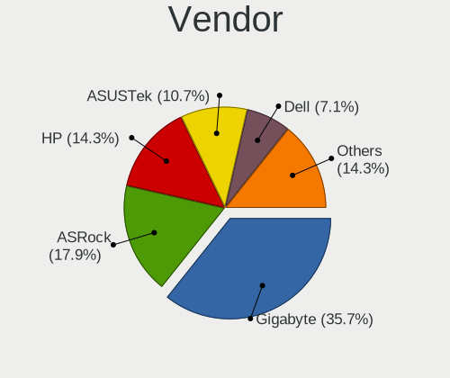
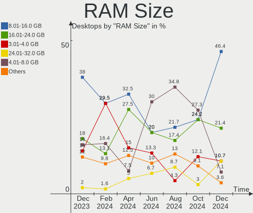
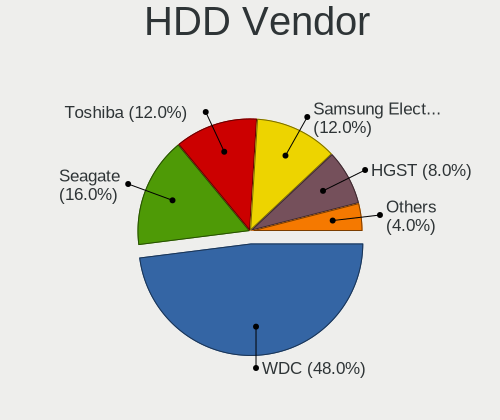
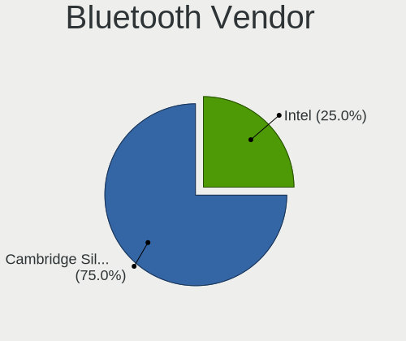

BlackPanther - Hardware Trends (Desktops)
-----------------------------------------

A project to identify most popular hardware characteristics and track their change
over time based on data collected by Linux users at https://Linux-Hardware.org.

Anyone can contribute to this report by the [hw-probe](https://github.com/linuxhw/hw-probe) tool:

    sudo -E hw-probe -all -upload

This report is for one last month. Overall report since the beginning of time: [TestDays](https://github.com/linuxhw/TestDays)

Period: Oct, 2023.

Contents
--------

* [ System ](#system)
  - [ OS                       ](#os)
  - [ OS Family                ](#os-family)
  - [ Kernel                   ](#kernel)
  - [ Kernel Family            ](#kernel-family)
  - [ Kernel Major Ver.        ](#kernel-major-ver)
  - [ Arch                     ](#arch)
  - [ DE                       ](#de)
  - [ Display Server           ](#display-server)
  - [ Display Manager          ](#display-manager)
  - [ OS Lang                  ](#os-lang)
  - [ Boot Mode                ](#boot-mode)
  - [ Filesystem               ](#filesystem)
  - [ Part. scheme             ](#part-scheme)
  - [ Dual Boot with Linux/BSD ](#dual-boot-with-linuxbsd)
  - [ Dual Boot (Win)          ](#dual-boot-win)

* [ Board ](#board)
  - [ Vendor                   ](#vendor)
  - [ Model                    ](#model)
  - [ Model Family             ](#model-family)
  - [ MFG Year                 ](#mfg-year)
  - [ Form Factor              ](#form-factor)
  - [ Secure Boot              ](#secure-boot)
  - [ Coreboot                 ](#coreboot)
  - [ RAM Size                 ](#ram-size)
  - [ RAM Used                 ](#ram-used)
  - [ Total Drives             ](#total-drives)
  - [ Has CD-ROM               ](#has-cd-rom)
  - [ Has Ethernet             ](#has-ethernet)
  - [ Has WiFi                 ](#has-wifi)
  - [ Has Bluetooth            ](#has-bluetooth)

* [ Location ](#location)
  - [ Country                  ](#country)
  - [ City                     ](#city)

* [ Drives ](#drives)
  - [ Drive Vendor             ](#drive-vendor)
  - [ Drive Model              ](#drive-model)
  - [ HDD Vendor               ](#hdd-vendor)
  - [ SSD Vendor               ](#ssd-vendor)
  - [ Drive Kind               ](#drive-kind)
  - [ Drive Connector          ](#drive-connector)
  - [ Drive Size               ](#drive-size)
  - [ Space Total              ](#space-total)
  - [ Space Used               ](#space-used)
  - [ Malfunc. Drives          ](#malfunc-drives)
  - [ Malfunc. Drive Vendor    ](#malfunc-drive-vendor)
  - [ Malfunc. HDD Vendor      ](#malfunc-hdd-vendor)
  - [ Malfunc. Drive Kind      ](#malfunc-drive-kind)
  - [ Failed Drives            ](#failed-drives)
  - [ Failed Drive Vendor      ](#failed-drive-vendor)
  - [ Drive Status             ](#drive-status)

* [ Storage controller ](#storage-controller)
  - [ Storage Vendor           ](#storage-vendor)
  - [ Storage Model            ](#storage-model)
  - [ Storage Kind             ](#storage-kind)

* [ Processor ](#processor)
  - [ CPU Vendor               ](#cpu-vendor)
  - [ CPU Model                ](#cpu-model)
  - [ CPU Model Family         ](#cpu-model-family)
  - [ CPU Cores                ](#cpu-cores)
  - [ CPU Sockets              ](#cpu-sockets)
  - [ CPU Threads              ](#cpu-threads)
  - [ CPU Op-Modes             ](#cpu-op-modes)
  - [ CPU Microcode            ](#cpu-microcode)
  - [ CPU Microarch            ](#cpu-microarch)

* [ Graphics ](#graphics)
  - [ GPU Vendor               ](#gpu-vendor)
  - [ GPU Model                ](#gpu-model)
  - [ GPU Combo                ](#gpu-combo)
  - [ GPU Driver               ](#gpu-driver)
  - [ GPU Memory               ](#gpu-memory)

* [ Monitor ](#monitor)
  - [ Monitor Vendor           ](#monitor-vendor)
  - [ Monitor Model            ](#monitor-model)
  - [ Monitor Resolution       ](#monitor-resolution)
  - [ Monitor Diagonal         ](#monitor-diagonal)
  - [ Monitor Width            ](#monitor-width)
  - [ Aspect Ratio             ](#aspect-ratio)
  - [ Monitor Area             ](#monitor-area)
  - [ Pixel Density            ](#pixel-density)
  - [ Multiple Monitors        ](#multiple-monitors)

* [ Network ](#network)
  - [ Net Controller Vendor    ](#net-controller-vendor)
  - [ Net Controller Model     ](#net-controller-model)
  - [ Wireless Vendor          ](#wireless-vendor)
  - [ Wireless Model           ](#wireless-model)
  - [ Ethernet Vendor          ](#ethernet-vendor)
  - [ Ethernet Model           ](#ethernet-model)
  - [ Net Controller Kind      ](#net-controller-kind)
  - [ Used Controller          ](#used-controller)
  - [ NICs                     ](#nics)
  - [ IPv6                     ](#ipv6)

* [ Bluetooth ](#bluetooth)
  - [ Bluetooth Vendor         ](#bluetooth-vendor)
  - [ Bluetooth Model          ](#bluetooth-model)

* [ Sound ](#sound)
  - [ Sound Vendor             ](#sound-vendor)
  - [ Sound Model              ](#sound-model)

* [ Memory ](#memory)
  - [ Memory Vendor            ](#memory-vendor)
  - [ Memory Model             ](#memory-model)
  - [ Memory Kind              ](#memory-kind)
  - [ Memory Form Factor       ](#memory-form-factor)
  - [ Memory Size              ](#memory-size)
  - [ Memory Speed             ](#memory-speed)

* [ Printers & scanners ](#printers--scanners)
  - [ Printer Vendor           ](#printer-vendor)
  - [ Printer Model            ](#printer-model)
  - [ Scanner Vendor           ](#scanner-vendor)
  - [ Scanner Model            ](#scanner-model)

* [ Camera ](#camera)
  - [ Camera Vendor            ](#camera-vendor)
  - [ Camera Model             ](#camera-model)

* [ Security ](#security)
  - [ Fingerprint Vendor       ](#fingerprint-vendor)
  - [ Fingerprint Model        ](#fingerprint-model)
  - [ Chipcard Vendor          ](#chipcard-vendor)
  - [ Chipcard Model           ](#chipcard-model)

* [ Unsupported ](#unsupported)
  - [ Unsupported Devices      ](#unsupported-devices)
  - [ Unsupported Device Types ](#unsupported-device-types)

System
------

OS
--

Installed operating systems

| Name              | Desktops | Percent |
|-------------------|----------|---------|
| BlackPanther 18.1 | 46       | 88.46%  |
| BlackPanther 22.1 | 6        | 11.54%  |

OS Family
---------

OS without a version

| Name         | Desktops | Percent |
|--------------|----------|---------|
| BlackPanther | 52       | 100%    |

Kernel
------

Version of the Linux kernel

| Version             | Desktops | Percent |
|---------------------|----------|---------|
| 5.6.14-desktop-2bP  | 26       | 50%     |
| 4.18.16-desktop-1bP | 13       | 25%     |
| 5.15.85-desktop-1bP | 8        | 15.38%  |
| 6.4.3-desktop-1bP   | 2        | 3.85%   |
| 6.3.8-desktop-1bP   | 2        | 3.85%   |
| 6.5.7-power-1bP     | 1        | 1.92%   |

Kernel Family
-------------

Linux kernel without a distro release

| Version | Desktops | Percent |
|---------|----------|---------|
| 5.6.14  | 26       | 50%     |
| 4.18.16 | 13       | 25%     |
| 5.15.85 | 8        | 15.38%  |
| 6.4.3   | 2        | 3.85%   |
| 6.3.8   | 2        | 3.85%   |
| 6.5.7   | 1        | 1.92%   |

Kernel Major Ver.
-----------------

Linux kernel major version

| Version | Desktops | Percent |
|---------|----------|---------|
| 5.6     | 26       | 50%     |
| 4.18    | 13       | 25%     |
| 5.15    | 8        | 15.38%  |
| 6.4     | 2        | 3.85%   |
| 6.3     | 2        | 3.85%   |
| 6.5     | 1        | 1.92%   |

Arch
----

OS architecture (x86_64, i586, etc.)

| Name   | Desktops | Percent |
|--------|----------|---------|
| x86_64 | 52       | 100%    |

DE
--

Desktop Environment

| Name    | Desktops | Percent |
|---------|----------|---------|
| KDE5    | 49       | 94.23%  |
| Unknown | 3        | 5.77%   |

Display Server
--------------

X11 or Wayland

| Name | Desktops | Percent |
|------|----------|---------|
| X11  | 52       | 100%    |

Display Manager
---------------

SDDM, LightDM, etc.

| Name | Desktops | Percent |
|------|----------|---------|
| SDDM | 52       | 100%    |

OS Lang
-------

Language

| Lang    | Desktops | Percent |
|---------|----------|---------|
| Unknown | 52       | 100%    |

Boot Mode
---------

EFI or BIOS

| Mode | Desktops | Percent |
|------|----------|---------|
| BIOS | 29       | 55.77%  |
| EFI  | 23       | 44.23%  |

Filesystem
----------

Type of filesystem

| Type    | Desktops | Percent |
|---------|----------|---------|
| Overlay | 31       | 59.62%  |
| Ext4    | 21       | 40.38%  |

Part. scheme
------------

Scheme of partitioning

| Type | Desktops | Percent |
|------|----------|---------|
| GPT  | 32       | 61.54%  |
| MBR  | 20       | 38.46%  |

Dual Boot with Linux/BSD
------------------------

Hosting more than one Linux/BSD

| Dual boot | Desktops | Percent |
|-----------|----------|---------|
| No        | 27       | 51.92%  |
| Yes       | 25       | 48.08%  |

Dual Boot (Win)
---------------

Hosting Linux and Windows

| Dual boot | Desktops | Percent |
|-----------|----------|---------|
| No        | 27       | 51.92%  |
| Yes       | 25       | 48.08%  |

Board
-----

Vendor
------

Motherboard manufacturer

| Name                | Desktops | Percent |
|---------------------|----------|---------|
| Gigabyte Technology | 14       | 26.92%  |
| ASUSTek Computer    | 8        | 15.38%  |
| MSI                 | 6        | 11.54%  |
| Lenovo              | 6        | 11.54%  |
| Hewlett-Packard     | 6        | 11.54%  |
| ASRock              | 4        | 7.69%   |
| Fujitsu             | 2        | 3.85%   |
| Dell                | 2        | 3.85%   |
| Pegatron            | 1        | 1.92%   |
| Medion              | 1        | 1.92%   |
| Fujitsu Siemens     | 1        | 1.92%   |
| eMachines           | 1        | 1.92%   |

Model
-----

Motherboard model

| Name                                | Desktops | Percent |
|-------------------------------------|----------|---------|
| MSI MS-7C91                         | 2        | 3.85%   |
| MSI MS-7817                         | 2        | 3.85%   |
| HP EliteDesk 705 G3 SFF             | 2        | 3.85%   |
| Pegatron Elite 7200 MT Business PC  | 1        | 1.92%   |
| MSI MS-7923                         | 1        | 1.92%   |
| MSI MS-7680                         | 1        | 1.92%   |
| Medion MS-7748                      | 1        | 1.92%   |
| Lenovo ThinkStation P520 30BFS44D04 | 1        | 1.92%   |
| Lenovo ThinkStation D20 4158AF8     | 1        | 1.92%   |
| Lenovo ThinkCentre M93p 10A7003AUK  | 1        | 1.92%   |
| Lenovo ThinkCentre M73 10B6001SUS   | 1        | 1.92%   |
| Lenovo ThinkCentre M715s 10MCS03C00 | 1        | 1.92%   |
| Lenovo 1730-A1G                     | 1        | 1.92%   |
| HP Compaq Pro 6300 SFF              | 1        | 1.92%   |
| HP Compaq Pro 6300 MT               | 1        | 1.92%   |
| HP Compaq dc7800 Small Form Factor  | 1        | 1.92%   |
| HP Compaq 8200 Elite CMT PC         | 1        | 1.92%   |
| Gigabyte Z390 UD                    | 1        | 1.92%   |
| Gigabyte P67A-D3-B3                 | 1        | 1.92%   |
| Gigabyte J4005ND2P-CF               | 1        | 1.92%   |
| Gigabyte H81M-HD3                   | 1        | 1.92%   |
| Gigabyte H61MA-D3V                  | 1        | 1.92%   |
| Gigabyte H310M A 2.0                | 1        | 1.92%   |
| Gigabyte GA-MA790X-UD3P             | 1        | 1.92%   |
| Gigabyte GA-MA78GPM-DS2H            | 1        | 1.92%   |
| Gigabyte GA-A75M-D2H                | 1        | 1.92%   |
| Gigabyte F2A88XN-WIFI               | 1        | 1.92%   |
| Gigabyte F2A88XM-D3HP               | 1        | 1.92%   |
| Gigabyte B75M-D3H                   | 1        | 1.92%   |
| Gigabyte B660M GAMING DDR4          | 1        | 1.92%   |
| Gigabyte B450M GAMING               | 1        | 1.92%   |
| Fujitsu Siemens ESPRIMO P5625       | 1        | 1.92%   |
| Fujitsu ESPRIMO Q556/2              | 1        | 1.92%   |
| Fujitsu ESPRIMO P920                | 1        | 1.92%   |
| eMachines EL1358G                   | 1        | 1.92%   |
| Dell Precision WorkStation T5500    | 1        | 1.92%   |
| Dell Precision Tower 5810           | 1        | 1.92%   |
| ASUS TUF B450M-PRO GAMING           | 1        | 1.92%   |
| ASUS PRIME B365M-A                  | 1        | 1.92%   |
| ASUS PRIME A320M-R                  | 1        | 1.92%   |

Model Family
------------

Motherboard model prefix

| Name                     | Desktops | Percent |
|--------------------------|----------|---------|
| HP Compaq                | 4        | 7.69%   |
| Lenovo ThinkCentre       | 3        | 5.77%   |
| MSI MS-7C91              | 2        | 3.85%   |
| MSI MS-7817              | 2        | 3.85%   |
| Lenovo ThinkStation      | 2        | 3.85%   |
| HP EliteDesk             | 2        | 3.85%   |
| Fujitsu ESPRIMO          | 2        | 3.85%   |
| Dell Precision           | 2        | 3.85%   |
| ASUS PRIME               | 2        | 3.85%   |
| Pegatron Elite           | 1        | 1.92%   |
| MSI MS-7923              | 1        | 1.92%   |
| MSI MS-7680              | 1        | 1.92%   |
| Medion MS-7748           | 1        | 1.92%   |
| Lenovo 1730-A1G          | 1        | 1.92%   |
| Gigabyte Z390            | 1        | 1.92%   |
| Gigabyte P67A-D3-B3      | 1        | 1.92%   |
| Gigabyte J4005ND2P-CF    | 1        | 1.92%   |
| Gigabyte H81M-HD3        | 1        | 1.92%   |
| Gigabyte H61MA-D3V       | 1        | 1.92%   |
| Gigabyte H310M           | 1        | 1.92%   |
| Gigabyte GA-MA790X-UD3P  | 1        | 1.92%   |
| Gigabyte GA-MA78GPM-DS2H | 1        | 1.92%   |
| Gigabyte GA-A75M-D2H     | 1        | 1.92%   |
| Gigabyte F2A88XN-WIFI    | 1        | 1.92%   |
| Gigabyte F2A88XM-D3HP    | 1        | 1.92%   |
| Gigabyte B75M-D3H        | 1        | 1.92%   |
| Gigabyte B660M           | 1        | 1.92%   |
| Gigabyte B450M           | 1        | 1.92%   |
| Fujitsu Siemens ESPRIMO  | 1        | 1.92%   |
| eMachines EL1358G        | 1        | 1.92%   |
| ASUS TUF                 | 1        | 1.92%   |
| ASUS M5A97               | 1        | 1.92%   |
| ASUS M5A78L-M            | 1        | 1.92%   |
| ASUS H110M-K             | 1        | 1.92%   |
| ASUS H110M-A             | 1        | 1.92%   |
| ASUS All                 | 1        | 1.92%   |
| ASRock H310CM-DVS        | 1        | 1.92%   |
| ASRock G41M-VS3          | 1        | 1.92%   |
| ASRock B550M             | 1        | 1.92%   |
| ASRock 775i945GZ         | 1        | 1.92%   |

MFG Year
--------

Motherboard manufacture year

| Year | Desktops | Percent |
|------|----------|---------|
| 2011 | 8        | 15.38%  |
| 2018 | 5        | 9.62%   |
| 2014 | 5        | 9.62%   |
| 2012 | 5        | 9.62%   |
| 2019 | 4        | 7.69%   |
| 2015 | 4        | 7.69%   |
| 2013 | 4        | 7.69%   |
| 2010 | 4        | 7.69%   |
| 2020 | 3        | 5.77%   |
| 2017 | 3        | 5.77%   |
| 2008 | 2        | 3.85%   |
| 2021 | 1        | 1.92%   |
| 2016 | 1        | 1.92%   |
| 2009 | 1        | 1.92%   |
| 2007 | 1        | 1.92%   |
| 2006 | 1        | 1.92%   |

Form Factor
-----------

Physical design of the computer

| Name    | Desktops | Percent |
|---------|----------|---------|
| Desktop | 52       | 100%    |

Secure Boot
-----------

Enabled or disabled

| State    | Desktops | Percent |
|----------|----------|---------|
| Disabled | 52       | 100%    |

Coreboot
--------

Have coreboot on board

| Used | Desktops | Percent |
|------|----------|---------|
| No   | 52       | 100%    |

RAM Size
--------

Total RAM memory

| Size in GB | Desktops | Percent |
|------------|----------|---------|
| 8.01-16.0  | 17       | 32.69%  |
| 4.01-8.0   | 10       | 19.23%  |
| 16.01-24.0 | 8        | 15.38%  |
| 32.01-64.0 | 7        | 13.46%  |
| 3.01-4.0   | 6        | 11.54%  |
| 24.01-32.0 | 2        | 3.85%   |
| 2.01-3.0   | 2        | 3.85%   |

RAM Used
--------

Used RAM memory

| Used GB  | Desktops | Percent |
|----------|----------|---------|
| 0.51-1.0 | 17       | 32.69%  |
| 0.01-0.5 | 16       | 30.77%  |
| 1.01-2.0 | 13       | 25%     |
| 2.01-3.0 | 4        | 7.69%   |
| 3.01-4.0 | 2        | 3.85%   |

Total Drives
------------

Number of drives on board

| Drives | Desktops | Percent |
|--------|----------|---------|
| 1      | 23       | 44.23%  |
| 2      | 15       | 28.85%  |
| 3      | 7        | 13.46%  |
| 4      | 4        | 7.69%   |
| 5      | 2        | 3.85%   |
| 0      | 1        | 1.92%   |

Has CD-ROM
----------

Has CD-ROM on board

| Presented | Desktops | Percent |
|-----------|----------|---------|
| Yes       | 32       | 61.54%  |
| No        | 20       | 38.46%  |

Has Ethernet
------------

Has Ethernet on board

| Presented | Desktops | Percent |
|-----------|----------|---------|
| Yes       | 52       | 100%    |

Has WiFi
--------

Has WiFi module

| Presented | Desktops | Percent |
|-----------|----------|---------|
| No        | 34       | 65.38%  |
| Yes       | 18       | 34.62%  |

Has Bluetooth
-------------

Has Bluetooth module

| Presented | Desktops | Percent |
|-----------|----------|---------|
| No        | 39       | 75%     |
| Yes       | 13       | 25%     |

Location
--------

Country
-------

Geographic location (country)

| Country | Desktops | Percent |
|---------|----------|---------|
| Hungary | 48       | 92.31%  |
| USA     | 1        | 1.92%   |
| Romania | 1        | 1.92%   |
| Germany | 1        | 1.92%   |
| France  | 1        | 1.92%   |

City
----

Geographic location (city)

| City                    | Desktops | Percent |
|-------------------------|----------|---------|
| Budapest                | 13       | 25%     |
| Zalaegerszeg            | 2        | 3.85%   |
| Toeroekbalint           | 2        | 3.85%   |
| Tatabánya              | 2        | 3.85%   |
| Szeghalom               | 2        | 3.85%   |
| Győr                   | 2        | 3.85%   |
| Balatonfuered           | 2        | 3.85%   |
| Agfalva                 | 2        | 3.85%   |
| Zichyujfalu             | 1        | 1.92%   |
| Zalău                  | 1        | 1.92%   |
| Veszprém               | 1        | 1.92%   |
| Tolna                   | 1        | 1.92%   |
| Tamasi                  | 1        | 1.92%   |
| Szolnok                 | 1        | 1.92%   |
| Szentendre              | 1        | 1.92%   |
| Szekszárd              | 1        | 1.92%   |
| Siófok                 | 1        | 1.92%   |
| Pfaffenhofen an der Ilm | 1        | 1.92%   |
| Oroshaza                | 1        | 1.92%   |
| Nancy                   | 1        | 1.92%   |
| Nagykoroes              | 1        | 1.92%   |
| Kiskunmajsa             | 1        | 1.92%   |
| Kiskunhalas             | 1        | 1.92%   |
| Karcag                  | 1        | 1.92%   |
| Jaszdozsa               | 1        | 1.92%   |
| Gyal                    | 1        | 1.92%   |
| Fertoszentmiklos        | 1        | 1.92%   |
| Evansville              | 1        | 1.92%   |
| Eger                    | 1        | 1.92%   |
| Dunaharaszti            | 1        | 1.92%   |
| Debrecen                | 1        | 1.92%   |
| Csor                    | 1        | 1.92%   |
| Berettyóújfalu        | 1        | 1.92%   |

Drives
------

Drive Vendor
------------

Hard drive vendors

| Vendor                    | Desktops | Drives | Percent |
|---------------------------|----------|--------|---------|
| WDC                       | 17       | 23     | 18.89%  |
| Samsung Electronics       | 17       | 21     | 18.89%  |
| Kingston                  | 10       | 11     | 11.11%  |
| Seagate                   | 9        | 9      | 10%     |
| Toshiba                   | 8        | 8      | 8.89%   |
| SPCC                      | 5        | 5      | 5.56%   |
| SanDisk                   | 3        | 3      | 3.33%   |
| Intel                     | 2        | 2      | 2.22%   |
| Gigabyte Technology       | 2        | 2      | 2.22%   |
| Crucial                   | 2        | 2      | 2.22%   |
| Zheino                    | 1        | 1      | 1.11%   |
| XPG                       | 1        | 1      | 1.11%   |
| Unknown                   | 1        | 2      | 1.11%   |
| Transcend                 | 1        | 1      | 1.11%   |
| PNY                       | 1        | 1      | 1.11%   |
| Netac                     | 1        | 1      | 1.11%   |
| Micron/Crucial Technology | 1        | 1      | 1.11%   |
| Micron Technology         | 1        | 1      | 1.11%   |
| JMicron Technology        | 1        | 1      | 1.11%   |
| Intenso                   | 1        | 1      | 1.11%   |
| Hitachi                   | 1        | 1      | 1.11%   |
| HGST                      | 1        | 1      | 1.11%   |
| China                     | 1        | 1      | 1.11%   |
| Apacer                    | 1        | 1      | 1.11%   |
| A-DATA Technology         | 1        | 2      | 1.11%   |

Drive Model
-----------

Hard drive models

| Model                            | Desktops | Percent |
|----------------------------------|----------|---------|
| Toshiba DT01ACA100 1TB           | 4        | 4%      |
| SPCC Solid State Disk 256GB      | 3        | 3%      |
| Samsung SSD 850 EVO 250GB        | 3        | 3%      |
| Samsung SSD 850 EVO 120GB        | 3        | 3%      |
| Kingston SA400S37240G 240GB SSD  | 3        | 3%      |
| WDC WD30EFRX-68EUZN0 3TB         | 2        | 2%      |
| WDC WD20EZRZ-00Z5HB0 2TB         | 2        | 2%      |
| Toshiba DT01ACA050 500GB         | 2        | 2%      |
| Seagate ST500DM002-1BD142 500GB  | 2        | 2%      |
| Samsung SSD 970 EVO Plus 500GB   | 2        | 2%      |
| Kingston SA400S37480G 480GB SSD  | 2        | 2%      |
| Crucial CT1000MX500SSD4 1TB      | 2        | 2%      |
| Zheino CHN-NGFFNV2280-256 256GB  | 1        | 1%      |
| XPG SPECTRIX S40G 1TB            | 1        | 1%      |
| WDC WDS500G2B0A 500GB SSD        | 1        | 1%      |
| WDC WDS240G2G0B-00EPW0 240GB SSD | 1        | 1%      |
| WDC WDS120G2G0B-00EPW0 120GB SSD | 1        | 1%      |
| WDC WD800JD-75MSA3 80GB          | 1        | 1%      |
| WDC WD800AAJS-60PSA0 80GB        | 1        | 1%      |
| WDC WD5003AZEX-00MK2A0 500GB     | 1        | 1%      |
| WDC WD5000BPKT-75PK4T0 500GB     | 1        | 1%      |
| WDC WD5000AAKX-60U6AA0 500GB     | 1        | 1%      |
| WDC WD5000AAKX-329BA0 500GB      | 1        | 1%      |
| WDC WD5000AAKS-00UU3A0 500GB     | 1        | 1%      |
| WDC WD5000AAKS-007AA0 500GB      | 1        | 1%      |
| WDC WD30EZRZ-00GXCB0 3TB         | 1        | 1%      |
| WDC WD30 PURX-64PFUY0 3TB        | 1        | 1%      |
| WDC WD20EZBX-00AYRA0 2TB         | 1        | 1%      |
| WDC WD10PURZ-85U8XY0 1TB         | 1        | 1%      |
| WDC WD10EZEX-22MFCA0 1TB         | 1        | 1%      |
| WDC WD10EADX-22TDHB0 1TB         | 1        | 1%      |
| Unknown SD/MMC 2GB               | 1        | 1%      |
| Unknown M.S./M.S.Pro/HG 16GB     | 1        | 1%      |
| Transcend TS128GMTE110S 128GB    | 1        | 1%      |
| Toshiba MQ01ABD050 500GB         | 1        | 1%      |
| Toshiba DT01ACA200 2TB           | 1        | 1%      |
| SPCC Solid State Disk 128GB      | 1        | 1%      |
| SPCC M.2 PCIe SSD 512GB          | 1        | 1%      |
| Seagate ST9160310AS 160GB        | 1        | 1%      |
| Seagate ST3500418AS 500GB        | 1        | 1%      |

HDD Vendor
----------

Hard disk drive vendors

| Vendor              | Desktops | Drives | Percent |
|---------------------|----------|--------|---------|
| WDC                 | 15       | 20     | 38.46%  |
| Seagate             | 9        | 9      | 23.08%  |
| Toshiba             | 8        | 8      | 20.51%  |
| Samsung Electronics | 5        | 5      | 12.82%  |
| Hitachi             | 1        | 1      | 2.56%   |
| HGST                | 1        | 1      | 2.56%   |

SSD Vendor
----------

Solid state drive vendors

| Vendor              | Desktops | Drives | Percent |
|---------------------|----------|--------|---------|
| Samsung Electronics | 11       | 12     | 26.83%  |
| Kingston            | 9        | 10     | 21.95%  |
| SPCC                | 4        | 4      | 9.76%   |
| WDC                 | 3        | 3      | 7.32%   |
| SanDisk             | 2        | 2      | 4.88%   |
| Intel               | 2        | 2      | 4.88%   |
| Crucial             | 2        | 2      | 4.88%   |
| PNY                 | 1        | 1      | 2.44%   |
| Netac               | 1        | 1      | 2.44%   |
| Micron Technology   | 1        | 1      | 2.44%   |
| Intenso             | 1        | 1      | 2.44%   |
| Gigabyte Technology | 1        | 1      | 2.44%   |
| China               | 1        | 1      | 2.44%   |
| Apacer              | 1        | 1      | 2.44%   |
| A-DATA Technology   | 1        | 2      | 2.44%   |

Drive Kind
----------

HDD or SSD

| Kind    | Desktops | Drives | Percent |
|---------|----------|--------|---------|
| HDD     | 35       | 44     | 44.3%   |
| SSD     | 32       | 44     | 40.51%  |
| NVMe    | 11       | 13     | 13.92%  |
| Unknown | 1        | 2      | 1.27%   |

Drive Connector
---------------

SATA, SAS, NVMe, etc.

| Type | Desktops | Drives | Percent |
|------|----------|--------|---------|
| SATA | 47       | 84     | 73.44%  |
| NVMe | 11       | 12     | 17.19%  |
| SAS  | 6        | 7      | 9.38%   |

Drive Size
----------

Size of hard drive

| Size in TB | Desktops | Drives | Percent |
|------------|----------|--------|---------|
| 0.01-0.5   | 41       | 59     | 62.12%  |
| 0.51-1.0   | 18       | 20     | 27.27%  |
| 1.01-2.0   | 4        | 4      | 6.06%   |
| 2.01-3.0   | 3        | 5      | 4.55%   |

Space Total
-----------

Amount of disk space available on the file system

| Size in GB     | Desktops | Percent |
|----------------|----------|---------|
| Unknown        | 31       | 59.62%  |
| 251-500        | 6        | 11.54%  |
| 101-250        | 6        | 11.54%  |
| 501-1000       | 5        | 9.62%   |
| 51-100         | 2        | 3.85%   |
| More than 3000 | 1        | 1.92%   |
| 21-50          | 1        | 1.92%   |

Space Used
----------

Amount of used disk space

| Used GB   | Desktops | Percent |
|-----------|----------|---------|
| Unknown   | 31       | 59.62%  |
| 1-20      | 9        | 17.31%  |
| 21-50     | 5        | 9.62%   |
| 51-100    | 3        | 5.77%   |
| 101-250   | 2        | 3.85%   |
| 251-500   | 1        | 1.92%   |
| 1001-2000 | 1        | 1.92%   |

Malfunc. Drives
---------------

Drive models with a malfunction

| Model                                            | Desktops | Drives | Percent |
|--------------------------------------------------|----------|--------|---------|
| WDC WD5000AAKS-00UU3A0 500GB                     | 1        | 1      | 6.25%   |
| WDC WD5000AAKS-007AA0 500GB                      | 1        | 1      | 6.25%   |
| WDC WD10PURZ-85U8XY0 1TB                         | 1        | 1      | 6.25%   |
| Toshiba MQ01ABD050 500GB                         | 1        | 1      | 6.25%   |
| Seagate ST9160310AS 160GB                        | 1        | 1      | 6.25%   |
| Seagate ST500DM002-1BD142 500GB                  | 1        | 1      | 6.25%   |
| Seagate ST3500418AS 500GB                        | 1        | 1      | 6.25%   |
| Seagate ST1000LM024 HN-M101MBB 1TB               | 1        | 1      | 6.25%   |
| Seagate ST1000DL002-9TT153 1TB                   | 1        | 1      | 6.25%   |
| Samsung Electronics MZ7LN256HMJP-000H1 256GB SSD | 1        | 1      | 6.25%   |
| Samsung Electronics HD200HJ 200GB                | 1        | 1      | 6.25%   |
| Samsung Electronics HD103UJ 1TB                  | 1        | 1      | 6.25%   |
| Kingston SA400S37480G 480GB SSD                  | 1        | 1      | 6.25%   |
| Intel SSDSC2KF240H6L 240GB                       | 1        | 1      | 6.25%   |
| Hitachi HTS545050A7E380 500GB                    | 1        | 1      | 6.25%   |
| A-DATA Technology SP600 64GB SSD                 | 1        | 1      | 6.25%   |

Malfunc. Drive Vendor
---------------------

Vendors of faulty drives

| Vendor              | Desktops | Drives | Percent |
|---------------------|----------|--------|---------|
| Seagate             | 5        | 5      | 31.25%  |
| WDC                 | 3        | 3      | 18.75%  |
| Samsung Electronics | 3        | 3      | 18.75%  |
| Toshiba             | 1        | 1      | 6.25%   |
| Kingston            | 1        | 1      | 6.25%   |
| Intel               | 1        | 1      | 6.25%   |
| Hitachi             | 1        | 1      | 6.25%   |
| A-DATA Technology   | 1        | 1      | 6.25%   |

Malfunc. HDD Vendor
-------------------

Vendors of faulty HDD drives

| Vendor              | Desktops | Drives | Percent |
|---------------------|----------|--------|---------|
| Seagate             | 5        | 5      | 41.67%  |
| WDC                 | 3        | 3      | 25%     |
| Samsung Electronics | 2        | 2      | 16.67%  |
| Toshiba             | 1        | 1      | 8.33%   |
| Hitachi             | 1        | 1      | 8.33%   |

Malfunc. Drive Kind
-------------------

Kinds of faulty drives

| Kind | Desktops | Drives | Percent |
|------|----------|--------|---------|
| HDD  | 11       | 12     | 73.33%  |
| SSD  | 4        | 4      | 26.67%  |

Failed Drives
-------------

Failed drive models

Zero info for selected period =(

Failed Drive Vendor
-------------------

Failed drive vendors

Zero info for selected period =(

Drive Status
------------

Number of failed and malfunc. drives

| Status   | Desktops | Drives | Percent |
|----------|----------|--------|---------|
| Works    | 45       | 80     | 68.18%  |
| Malfunc  | 15       | 16     | 22.73%  |
| Detected | 6        | 7      | 9.09%   |

Storage controller
------------------

Storage Vendor
--------------

Storage controller vendors

| Vendor                      | Desktops | Percent |
|-----------------------------|----------|---------|
| Intel                       | 33       | 50%     |
| AMD                         | 17       | 25.76%  |
| Samsung Electronics         | 4        | 6.06%   |
| Silicon Motion              | 2        | 3.03%   |
| Phison Electronics          | 2        | 3.03%   |
| Nvidia                      | 2        | 3.03%   |
| SanDisk                     | 1        | 1.52%   |
| Realtek Semiconductor       | 1        | 1.52%   |
| Micron/Crucial Technology   | 1        | 1.52%   |
| Marvell Technology Group    | 1        | 1.52%   |
| Kingston Technology Company | 1        | 1.52%   |
| JMicron Technology          | 1        | 1.52%   |

Storage Model
-------------

Storage controller models

| Model                                                                                   | Desktops | Percent |
|-----------------------------------------------------------------------------------------|----------|---------|
| Intel 8 Series/C220 Series Chipset Family 6-port SATA Controller 1 [AHCI mode]          | 7        | 8.54%   |
| AMD FCH SATA Controller [AHCI mode]                                                     | 7        | 8.54%   |
| Intel 200 Series PCH SATA controller [AHCI mode]                                        | 4        | 4.88%   |
| Samsung NVMe SSD Controller SM981/PM981/PM983                                           | 3        | 3.66%   |
| Intel Q170/Q150/B150/H170/H110/Z170/CM236 Chipset SATA Controller [AHCI Mode]           | 3        | 3.66%   |
| Intel 6 Series/C200 Series Chipset Family Desktop SATA Controller (IDE mode, ports 4-5) | 3        | 3.66%   |
| Intel 6 Series/C200 Series Chipset Family Desktop SATA Controller (IDE mode, ports 0-3) | 3        | 3.66%   |
| Intel 6 Series/C200 Series Chipset Family 6 port Desktop SATA AHCI Controller           | 3        | 3.66%   |
| AMD SB7x0/SB8x0/SB9x0 IDE Controller                                                    | 3        | 3.66%   |
| AMD 500 Series Chipset SATA Controller                                                  | 3        | 3.66%   |
| AMD 300 Series Chipset SATA Controller                                                  | 3        | 3.66%   |
| Silicon Motion SM2263EN/SM2263XT (DRAM-less) NVMe SSD Controllers                       | 2        | 2.44%   |
| Intel NM10/ICH7 Family SATA Controller [IDE mode]                                       | 2        | 2.44%   |
| Intel 82801G (ICH7 Family) IDE Controller                                               | 2        | 2.44%   |
| Intel 7 Series/C210 Series Chipset Family 6-port SATA Controller [AHCI mode]            | 2        | 2.44%   |
| AMD SB7x0/SB8x0/SB9x0 SATA Controller [IDE mode]                                        | 2        | 2.44%   |
| AMD SB7x0/SB8x0/SB9x0 SATA Controller [AHCI mode]                                       | 2        | 2.44%   |
| AMD 400 Series Chipset SATA Controller                                                  | 2        | 2.44%   |
| SanDisk WD Blue SN570 NVMe SSD 2TB                                                      | 1        | 1.22%   |
| Samsung NVMe SSD Controller SM961/PM961/SM963                                           | 1        | 1.22%   |
| Realtek RTS5762 NVMe SSD Controller                                                     | 1        | 1.22%   |
| Phison E16 PCIe4 NVMe Controller                                                        | 1        | 1.22%   |
| Phison E12 NVMe Controller                                                              | 1        | 1.22%   |
| Nvidia MCP78S [GeForce 8200] AHCI Controller                                            | 1        | 1.22%   |
| Nvidia MCP61 SATA Controller                                                            | 1        | 1.22%   |
| Micron/Crucial P1 NVMe PCIe SSD[Frampton2]                                              | 1        | 1.22%   |
| Marvell Group 88SE9172 SATA III 6Gb/s RAID Controller                                   | 1        | 1.22%   |
| Kingston Company NV2 NVMe SSD SM2267XT                                                  | 1        | 1.22%   |
| JMicron JMB363 SATA/IDE Controller                                                      | 1        | 1.22%   |
| Intel SATA Controller [RAID mode]                                                       | 1        | 1.22%   |
| Intel Celeron/Pentium Silver Processor SATA Controller                                  | 1        | 1.22%   |
| Intel Cannon Lake PCH SATA AHCI Controller                                              | 1        | 1.22%   |
| Intel C610/X99 series chipset IDE-r Controller                                          | 1        | 1.22%   |
| Intel Alder Lake-S PCH SATA Controller [AHCI Mode]                                      | 1        | 1.22%   |
| Intel 9 Series Chipset Family SATA Controller [AHCI Mode]                               | 1        | 1.22%   |
| Intel 82Q35 Express PT IDER Controller                                                  | 1        | 1.22%   |
| Intel 82801JI (ICH10 Family) SATA AHCI Controller                                       | 1        | 1.22%   |
| Intel 82801IR/IO/IH (ICH9R/DO/DH) 4 port SATA Controller [IDE mode]                     | 1        | 1.22%   |
| Intel 82801I (ICH9 Family) 2 port SATA Controller [IDE mode]                            | 1        | 1.22%   |
| Intel 7 Series/C210 Series Chipset Family 4-port SATA Controller [IDE mode]             | 1        | 1.22%   |

Storage Kind
------------

Kind of storage controller (IDE, SATA, NVMe, SAS, ...)

| Kind | Desktops | Percent |
|------|----------|---------|
| SATA | 42       | 62.69%  |
| IDE  | 13       | 19.4%   |
| NVMe | 11       | 16.42%  |
| RAID | 1        | 1.49%   |

Processor
---------

CPU Vendor
----------

Processor vendors

| Vendor | Desktops | Percent |
|--------|----------|---------|
| Intel  | 33       | 63.46%  |
| AMD    | 19       | 36.54%  |

CPU Model
---------

Processor models

| Model                                       | Desktops | Percent |
|---------------------------------------------|----------|---------|
| Intel Core i3-4130 CPU @ 3.40GHz            | 3        | 5.77%   |
| Intel Core i3-2100 CPU @ 3.10GHz            | 2        | 3.85%   |
| AMD Ryzen 7 5800X 8-Core Processor          | 2        | 3.85%   |
| AMD PRO A10-8770 R7, 10 COMPUTE CORES 4C+6G | 2        | 3.85%   |
| Intel Xeon W-2135 CPU @ 3.70GHz             | 1        | 1.92%   |
| Intel Xeon CPU X5677 @ 3.47GHz              | 1        | 1.92%   |
| Intel Xeon CPU E5530 @ 2.40GHz              | 1        | 1.92%   |
| Intel Xeon CPU E5-2696 v3 @ 2.30GHz         | 1        | 1.92%   |
| Intel Xeon CPU E3-1230 V2 @ 3.30GHz         | 1        | 1.92%   |
| Intel Pentium CPU G4560 @ 3.50GHz           | 1        | 1.92%   |
| Intel Pentium CPU G3220 @ 3.00GHz           | 1        | 1.92%   |
| Intel Core i7-4790 CPU @ 3.60GHz            | 1        | 1.92%   |
| Intel Core i5-9400F CPU @ 2.90GHz           | 1        | 1.92%   |
| Intel Core i5-9400 CPU @ 2.90GHz            | 1        | 1.92%   |
| Intel Core i5-6500 CPU @ 3.20GHz            | 1        | 1.92%   |
| Intel Core i5-4670K CPU @ 3.40GHz           | 1        | 1.92%   |
| Intel Core i5-4590 CPU @ 3.30GHz            | 1        | 1.92%   |
| Intel Core i5-4430 CPU @ 3.00GHz            | 1        | 1.92%   |
| Intel Core i5-3330 CPU @ 3.00GHz            | 1        | 1.92%   |
| Intel Core i5-2400 CPU @ 3.10GHz            | 1        | 1.92%   |
| Intel Core i5-2320 CPU @ 3.00GHz            | 1        | 1.92%   |
| Intel Core i5-2300 CPU @ 2.80GHz            | 1        | 1.92%   |
| Intel Core i3-9100F CPU @ 3.60GHz           | 1        | 1.92%   |
| Intel Core i3-8100 CPU @ 3.60GHz            | 1        | 1.92%   |
| Intel Core i3-6100T CPU @ 3.20GHz           | 1        | 1.92%   |
| Intel Core i3-3225 CPU @ 3.30GHz            | 1        | 1.92%   |
| Intel Core i3-2120 CPU @ 3.30GHz            | 1        | 1.92%   |
| Intel Core 2 Quad CPU Q6600 @ 2.40GHz       | 1        | 1.92%   |
| Intel Core 2 Duo CPU E8400 @ 3.00GHz        | 1        | 1.92%   |
| Intel Celeron J4005 CPU @ 2.00GHz           | 1        | 1.92%   |
| Intel Celeron D CPU 3.33GHz                 | 1        | 1.92%   |
| Intel 12th Gen Core i5-12400                | 1        | 1.92%   |
| AMD Ryzen 7 5700X 8-Core Processor          | 1        | 1.92%   |
| AMD Ryzen 5 3600X 6-Core Processor          | 1        | 1.92%   |
| AMD Ryzen 5 3400G with Radeon Vega Graphics | 1        | 1.92%   |
| AMD Ryzen 3 2200G with Radeon Vega Graphics | 1        | 1.92%   |
| AMD PRO A6-9500 R5, 8 COMPUTE CORES 2C+6G   | 1        | 1.92%   |
| AMD Phenom II X4 965 Processor              | 1        | 1.92%   |
| AMD FX-8350 Eight-Core Processor            | 1        | 1.92%   |
| AMD FX-6300 Six-Core Processor              | 1        | 1.92%   |

CPU Model Family
----------------

Processor model prefix

| Model                | Desktops | Percent |
|----------------------|----------|---------|
| Intel Core i5        | 10       | 19.23%  |
| Intel Core i3        | 10       | 19.23%  |
| Intel Xeon           | 5        | 9.62%   |
| AMD Ryzen 7          | 3        | 5.77%   |
| Other                | 2        | 3.85%   |
| Intel Pentium        | 2        | 3.85%   |
| AMD Ryzen 5          | 2        | 3.85%   |
| AMD PRO A10          | 2        | 3.85%   |
| AMD FX               | 2        | 3.85%   |
| AMD Athlon II X2     | 2        | 3.85%   |
| AMD A10              | 2        | 3.85%   |
| Intel Core i7        | 1        | 1.92%   |
| Intel Core 2 Quad    | 1        | 1.92%   |
| Intel Core 2 Duo     | 1        | 1.92%   |
| Intel Celeron D      | 1        | 1.92%   |
| Intel Celeron        | 1        | 1.92%   |
| AMD Ryzen 3          | 1        | 1.92%   |
| AMD Phenom II X4     | 1        | 1.92%   |
| AMD Athlon II X4     | 1        | 1.92%   |
| AMD Athlon Dual Core | 1        | 1.92%   |
| AMD A8               | 1        | 1.92%   |

CPU Cores
---------

Number of processor cores

| Number | Desktops | Percent |
|--------|----------|---------|
| 4      | 20       | 38.46%  |
| 2      | 19       | 36.54%  |
| 6      | 5        | 9.62%   |
| 8      | 4        | 7.69%   |
| 1      | 2        | 3.85%   |
| 18     | 1        | 1.92%   |
| 3      | 1        | 1.92%   |

CPU Sockets
-----------

Number of sockets

| Number | Desktops | Percent |
|--------|----------|---------|
| 1      | 51       | 98.08%  |
| 2      | 1        | 1.92%   |

CPU Threads
-----------

Threads per core (Hyper-Threading)

| Number | Desktops | Percent |
|--------|----------|---------|
| 2      | 27       | 51.92%  |
| 1      | 25       | 48.08%  |

CPU Op-Modes
------------

CPU Operation Modes (32-bit, 64-bit)

| Op mode        | Desktops | Percent |
|----------------|----------|---------|
| 32-bit, 64-bit | 52       | 100%    |

CPU Microcode
-------------

Microcode number

| Number     | Desktops | Percent |
|------------|----------|---------|
| Unknown    | 8        | 15.38%  |
| 0x306c3    | 7        | 13.46%  |
| 0x206a7    | 6        | 11.54%  |
| 0x0a20120a | 3        | 5.77%   |
| 0x906eb    | 2        | 3.85%   |
| 0x306a9    | 2        | 3.85%   |
| 0x0600611a | 2        | 3.85%   |
| 0x06003106 | 2        | 3.85%   |
| 0x06000852 | 2        | 3.85%   |
| 0x03000027 | 2        | 3.85%   |
| 0x010000c8 | 2        | 3.85%   |
| 0xf65      | 1        | 1.92%   |
| 0x906ea    | 1        | 1.92%   |
| 0x906e9    | 1        | 1.92%   |
| 0x90672    | 1        | 1.92%   |
| 0x706a1    | 1        | 1.92%   |
| 0x6fb      | 1        | 1.92%   |
| 0x506e3    | 1        | 1.92%   |
| 0x50654    | 1        | 1.92%   |
| 0x106a5    | 1        | 1.92%   |
| 0x1067a    | 1        | 1.92%   |
| 0x08701021 | 1        | 1.92%   |
| 0x08108109 | 1        | 1.92%   |
| 0x0810100b | 1        | 1.92%   |
| 0x06006118 | 1        | 1.92%   |

CPU Microarch
-------------

Microarchitecture

| Name             | Desktops | Percent |
|------------------|----------|---------|
| Haswell          | 9        | 17.31%  |
| SandyBridge      | 6        | 11.54%  |
| KabyLake         | 5        | 9.62%   |
| Zen 3            | 3        | 5.77%   |
| Skylake          | 3        | 5.77%   |
| K10              | 3        | 5.77%   |
| IvyBridge        | 3        | 5.77%   |
| Excavator        | 3        | 5.77%   |
| Steamroller      | 2        | 3.85%   |
| Piledriver       | 2        | 3.85%   |
| K10 Llano        | 2        | 3.85%   |
| Zen+             | 1        | 1.92%   |
| Zen 2            | 1        | 1.92%   |
| Zen              | 1        | 1.92%   |
| Westmere         | 1        | 1.92%   |
| Penryn           | 1        | 1.92%   |
| NetBurst         | 1        | 1.92%   |
| Nehalem          | 1        | 1.92%   |
| K8 Hammer        | 1        | 1.92%   |
| Goldmont plus    | 1        | 1.92%   |
| Core             | 1        | 1.92%   |
| Alderlake Hybrid | 1        | 1.92%   |

Graphics
--------

GPU Vendor
----------

Vendors of graphics cards

| Vendor | Desktops | Percent |
|--------|----------|---------|
| Nvidia | 19       | 35.19%  |
| AMD    | 19       | 35.19%  |
| Intel  | 16       | 29.63%  |

GPU Model
---------

Graphics card models

| Model                                                                       | Desktops | Percent |
|-----------------------------------------------------------------------------|----------|---------|
| Intel Xeon E3-1200 v3/4th Gen Core Processor Integrated Graphics Controller | 4        | 7.02%   |
| Intel 2nd Generation Core Processor Family Integrated Graphics Controller   | 3        | 5.26%   |
| AMD Wani [Radeon R5/R6/R7 Graphics]                                         | 3        | 5.26%   |
| Nvidia TU116 [GeForce GTX 1660 SUPER]                                       | 2        | 3.51%   |
| Nvidia GM107 [GeForce GTX 750 Ti]                                           | 2        | 3.51%   |
| Nvidia GK208B [GeForce GT 720]                                              | 2        | 3.51%   |
| Nvidia GF116 [GeForce GTX 550 Ti]                                           | 2        | 3.51%   |
| Nvidia GA106 [Geforce RTX 3050]                                             | 2        | 3.51%   |
| Intel CoffeeLake-S GT2 [UHD Graphics 630]                                   | 2        | 3.51%   |
| AMD Kaveri [Radeon R7 Graphics]                                             | 2        | 3.51%   |
| AMD Cedar [Radeon HD 5000/6000/7350/8350 Series]                            | 2        | 3.51%   |
| Nvidia GT218 [GeForce 210]                                                  | 1        | 1.75%   |
| Nvidia GP107 [GeForce GTX 1050 Ti]                                          | 1        | 1.75%   |
| Nvidia GK208B [GeForce GT 710]                                              | 1        | 1.75%   |
| Nvidia GK106GL [Quadro K4000]                                               | 1        | 1.75%   |
| Nvidia GK106 [GeForce GTX 660]                                              | 1        | 1.75%   |
| Nvidia GF110 [GeForce GTX 570 Rev. 2]                                       | 1        | 1.75%   |
| Nvidia GF108 [GeForce GT 630]                                               | 1        | 1.75%   |
| Nvidia GA104 [GeForce RTX 3060 Ti Lite Hash Rate]                           | 1        | 1.75%   |
| Nvidia G96CGL [Quadro FX 580]                                               | 1        | 1.75%   |
| Nvidia G72 [GeForce 7500 LE]                                                | 1        | 1.75%   |
| Nvidia C61 [GeForce 6150SE nForce 430]                                      | 1        | 1.75%   |
| Intel Xeon E3-1200 v2/3rd Gen Core processor Graphics Controller            | 1        | 1.75%   |
| Intel HD Graphics 530                                                       | 1        | 1.75%   |
| Intel GeminiLake [UHD Graphics 600]                                         | 1        | 1.75%   |
| Intel Alder Lake-S GT1 [UHD Graphics 730]                                   | 1        | 1.75%   |
| Intel 82Q35 Express Integrated Graphics Controller                          | 1        | 1.75%   |
| Intel 82945G/GZ Integrated Graphics Controller                              | 1        | 1.75%   |
| Intel 4th Generation Core Processor Family Integrated Graphics Controller   | 1        | 1.75%   |
| AMD Sumo [Radeon HD 6550D]                                                  | 1        | 1.75%   |
| AMD RS780 [Radeon HD 3200]                                                  | 1        | 1.75%   |
| AMD Redwood XT [Radeon HD 5670/5690/5730]                                   | 1        | 1.75%   |
| AMD Picasso/Raven 2 [Radeon Vega Series / Radeon Vega Mobile Series]        | 1        | 1.75%   |
| AMD Oland [Radeon HD 8570 / R5 430 OEM / R7 240/340 / Radeon 520 OEM]       | 1        | 1.75%   |
| AMD Oland PRO [Radeon R7 240/340 / Radeon 520]                              | 1        | 1.75%   |
| AMD Navi 22 [Radeon RX 6700/6700 XT/6750 XT / 6800M/6850M XT]               | 1        | 1.75%   |
| AMD Navi 21 [Radeon RX 6800/6800 XT / 6900 XT]                              | 1        | 1.75%   |
| AMD Lexa PRO [Radeon 540/540X/550/550X / RX 540X/550/550X]                  | 1        | 1.75%   |
| AMD Juniper XT [Radeon HD 5770]                                             | 1        | 1.75%   |
| AMD Ellesmere [Radeon RX 470/480/570/570X/580/580X/590]                     | 1        | 1.75%   |

GPU Combo
---------

Combinations of graphics cards

| Name           | Desktops | Percent |
|----------------|----------|---------|
| 1 x AMD        | 18       | 34.62%  |
| 1 x Nvidia     | 16       | 30.77%  |
| 1 x Intel      | 14       | 26.92%  |
| 2 x Nvidia     | 2        | 3.85%   |
| 2 x AMD        | 1        | 1.92%   |
| Intel + Nvidia | 1        | 1.92%   |

GPU Driver
----------

Free vs proprietary

| Driver  | Desktops | Percent |
|---------|----------|---------|
| Free    | 50       | 96.15%  |
| Unknown | 2        | 3.85%   |

GPU Memory
----------

Total video memory

| Size in GB | Desktops | Percent |
|------------|----------|---------|
| Unknown    | 17       | 32.69%  |
| 0.51-1.0   | 12       | 23.08%  |
| 0.01-0.5   | 8        | 15.38%  |
| 1.01-2.0   | 6        | 11.54%  |
| 3.01-4.0   | 3        | 5.77%   |
| 7.01-8.0   | 2        | 3.85%   |
| 8.01-16.0  | 2        | 3.85%   |
| 5.01-6.0   | 1        | 1.92%   |
| 2.01-3.0   | 1        | 1.92%   |

Monitor
-------

Monitor Vendor
--------------

Monitor vendors

| Vendor                  | Desktops | Percent |
|-------------------------|----------|---------|
| Goldstar                | 12       | 22.64%  |
| Samsung Electronics     | 7        | 13.21%  |
| Dell                    | 4        | 7.55%   |
| Philips                 | 3        | 5.66%   |
| Ancor Communications    | 3        | 5.66%   |
| Panasonic               | 2        | 3.77%   |
| Lenovo                  | 2        | 3.77%   |
| Hewlett-Packard         | 2        | 3.77%   |
| Fujitsu Siemens         | 2        | 3.77%   |
| BenQ                    | 2        | 3.77%   |
| Vestel Elektronik       | 1        | 1.89%   |
| Sony                    | 1        | 1.89%   |
| S2-Tek                  | 1        | 1.89%   |
| NEC Computers           | 1        | 1.89%   |
| NCS                     | 1        | 1.89%   |
| MStar                   | 1        | 1.89%   |
| Medion                  | 1        | 1.89%   |
| LG Electronics          | 1        | 1.89%   |
| ITE                     | 1        | 1.89%   |
| Iiyama                  | 1        | 1.89%   |
| Grundig                 | 1        | 1.89%   |
| Chi Mei Optoelectronics | 1        | 1.89%   |
| AOC                     | 1        | 1.89%   |
| Acer                    | 1        | 1.89%   |

Monitor Model
-------------

Monitor models

| Model                                                                | Desktops | Percent |
|----------------------------------------------------------------------|----------|---------|
| Panasonic TV MEIA096 1920x1080 698x392mm 31.5-inch                   | 2        | 3.51%   |
| Goldstar W2242 GSM5678 1680x1050 474x296mm 22.0-inch                 | 2        | 3.51%   |
| Vestel Elektronik 42 FHD_LCD-TV VES3700 1920x540                     | 1        | 1.75%   |
| Sony KDL-S32A12U SNY5C00 1280x768                                    | 1        | 1.75%   |
| Samsung Electronics SyncMaster SAM05CC 1920x1080 530x300mm 24.0-inch | 1        | 1.75%   |
| Samsung Electronics SyncMaster SAM01B7 1280x1024 338x270mm 17.0-inch | 1        | 1.75%   |
| Samsung Electronics S27E500 SAM0D0D 1920x1080 598x336mm 27.0-inch    | 1        | 1.75%   |
| Samsung Electronics S24R35x SAM100E 1920x1080 527x296mm 23.8-inch    | 1        | 1.75%   |
| Samsung Electronics S24D300 SAM0B45 1920x1080 521x293mm 23.5-inch    | 1        | 1.75%   |
| Samsung Electronics S24A31x SAM7114 1920x1080 527x296mm 23.8-inch    | 1        | 1.75%   |
| Samsung Electronics S22B370 SAM08BD 1920x1080 477x268mm 21.5-inch    | 1        | 1.75%   |
| Samsung Electronics LS27AG30x SAM717A 1920x1080 597x336mm 27.0-inch  | 1        | 1.75%   |
| S2-Tek TV STK531A 1920x1080 930x530mm 42.1-inch                      | 1        | 1.75%   |
| Philips 221B PHL08A1 1920x1080 477x268mm 21.5-inch                   | 1        | 1.75%   |
| Philips 196V4 PHLC0AF 1366x768 410x230mm 18.5-inch                   | 1        | 1.75%   |
| Philips 190WV PHLC014 1440x900 408x255mm 18.9-inch                   | 1        | 1.75%   |
| NEC Computers EA223WM NEC6891 1680x1050 474x296mm 22.0-inch          | 1        | 1.75%   |
| NCS LCD Monitor NCS2275 1920x1080 256x192mm 12.6-inch                | 1        | 1.75%   |
| MStar Demo MST0030 1920x1080 708x398mm 32.0-inch                     | 1        | 1.75%   |
| Medion MD20328 MED3941 1600x900 462x272mm 21.1-inch                  | 1        | 1.75%   |
| LG Electronics LCD Monitor LG HDR WFHD 1920x1080                     | 1        | 1.75%   |
| Lenovo LEN L174 LEN240B 1280x1024 340x270mm 17.1-inch                | 1        | 1.75%   |
| Lenovo LEN L171p LEN24C9 1280x1024 338x270mm 17.0-inch               | 1        | 1.75%   |
| ITE DP2VGA V226 ITE6516 1920x1080 600x340mm 27.2-inch                | 1        | 1.75%   |
| Iiyama PL2474H IVM6146 1920x1080 521x293mm 23.5-inch                 | 1        | 1.75%   |
| Hewlett-Packard w2338h HWP281B 1920x1080 509x286mm 23.0-inch         | 1        | 1.75%   |
| Hewlett-Packard LP2475w HWP26F9 1920x1200 546x352mm 25.6-inch        | 1        | 1.75%   |
| Grundig WXGA GRU4448 1600x1200                                       | 1        | 1.75%   |
| Goldstar W2252 GSM567E 1680x1050 474x296mm 22.0-inch                 | 1        | 1.75%   |
| Goldstar W2252 GSM567D 1680x1050 474x296mm 22.0-inch                 | 1        | 1.75%   |
| Goldstar W2234 GSM56B8 1680x1050 474x296mm 22.0-inch                 | 1        | 1.75%   |
| Goldstar MP59G GSM5B35 1920x1080 480x270mm 21.7-inch                 | 1        | 1.75%   |
| Goldstar MP59G GSM5B34 1920x1080 480x270mm 21.7-inch                 | 1        | 1.75%   |
| Goldstar IPS FULLHD GSM5AB6 1920x1080 480x270mm 21.7-inch            | 1        | 1.75%   |
| Goldstar FULL HD GSM5B55 1920x1080 480x270mm 21.7-inch               | 1        | 1.75%   |
| Goldstar E2350 GSM5790 1920x1080 510x290mm 23.1-inch                 | 1        | 1.75%   |
| Goldstar 32LG3000 GSM75F0 1920x1080 700x390mm 31.5-inch              | 1        | 1.75%   |
| Goldstar 2D HD TV GSM59CA 1366x768 509x286mm 23.0-inch               | 1        | 1.75%   |
| Goldstar 2D FHD TV GSM59C6 1920x1080 509x286mm 23.0-inch             | 1        | 1.75%   |
| Goldstar 24MB56 GSM5A97 1920x1080 477x268mm 21.5-inch                | 1        | 1.75%   |

Monitor Resolution
------------------

Monitor screen resolution

| Resolution         | Desktops | Percent |
|--------------------|----------|---------|
| 1920x1080 (FHD)    | 29       | 56.86%  |
| 3840x2160 (4K)     | 5        | 9.8%    |
| 1680x1050 (WSXGA+) | 5        | 9.8%    |
| 1280x1024 (SXGA)   | 4        | 7.84%   |
| 1440x900 (WXGA+)   | 2        | 3.92%   |
| 1366x768 (WXGA)    | 2        | 3.92%   |
| 2560x1440 (QHD)    | 1        | 1.96%   |
| 1920x1200 (WUXGA)  | 1        | 1.96%   |
| 1600x900 (HD+)     | 1        | 1.96%   |
| 1280x768           | 1        | 1.96%   |

Monitor Diagonal
----------------

Diagonal size in inches

| Inches  | Desktops | Percent |
|---------|----------|---------|
| 23      | 11       | 20.37%  |
| 21      | 11       | 20.37%  |
| 27      | 7        | 12.96%  |
| 31      | 4        | 7.41%   |
| 18      | 4        | 7.41%   |
| 17      | 3        | 5.56%   |
| 24      | 2        | 3.7%    |
| 22      | 2        | 3.7%    |
| Unknown | 2        | 3.7%    |
| 84      | 1        | 1.85%   |
| 54      | 1        | 1.85%   |
| 52      | 1        | 1.85%   |
| 42      | 1        | 1.85%   |
| 26      | 1        | 1.85%   |
| 25      | 1        | 1.85%   |
| 19      | 1        | 1.85%   |
| 12      | 1        | 1.85%   |

Monitor Width
-------------

Physical width

| Width in mm | Desktops | Percent |
|-------------|----------|---------|
| 401-500     | 20       | 37.04%  |
| 501-600     | 19       | 35.19%  |
| 601-700     | 4        | 7.41%   |
| 301-350     | 3        | 5.56%   |
| 1001-1500   | 2        | 3.7%    |
| Unknown     | 2        | 3.7%    |
| 351-400     | 1        | 1.85%   |
| 201-300     | 1        | 1.85%   |
| 1501-2000   | 1        | 1.85%   |
| 901-1000    | 1        | 1.85%   |

Aspect Ratio
------------

Proportional relationship between the width and the height

| Ratio   | Desktops | Percent |
|---------|----------|---------|
| 16/9    | 36       | 72%     |
| 16/10   | 5        | 10%     |
| 5/4     | 4        | 8%      |
| 3/2     | 3        | 6%      |
| 4/3     | 1        | 2%      |
| Unknown | 1        | 2%      |

Monitor Area
------------

Area in inch²

| Area in inch² | Desktops | Percent |
|----------------|----------|---------|
| 201-250        | 21       | 38.18%  |
| 151-200        | 9        | 16.36%  |
| 301-350        | 8        | 14.55%  |
| 141-150        | 5        | 9.09%   |
| 351-500        | 4        | 7.27%   |
| More than 1000 | 3        | 5.45%   |
| Unknown        | 2        | 3.64%   |
| 71-80          | 1        | 1.82%   |
| 251-300        | 1        | 1.82%   |
| 501-1000       | 1        | 1.82%   |

Pixel Density
-------------

Pixels per inch

| Density | Desktops | Percent |
|---------|----------|---------|
| 51-100  | 35       | 70%     |
| 101-120 | 11       | 22%     |
| Unknown | 2        | 4%      |
| 1-50    | 1        | 2%      |
| 161-240 | 1        | 2%      |

Multiple Monitors
-----------------

Total monitors connected

| Total | Desktops | Percent |
|-------|----------|---------|
| 1     | 46       | 88.46%  |
| 2     | 5        | 9.62%   |
| 0     | 1        | 1.92%   |

Network
-------

Net Controller Vendor
---------------------

Controller vendors

| Vendor                          | Desktops | Percent |
|---------------------------------|----------|---------|
| Realtek Semiconductor           | 38       | 53.52%  |
| Intel                           | 12       | 16.9%   |
| Qualcomm Atheros                | 6        | 8.45%   |
| Broadcom                        | 5        | 7.04%   |
| Ralink Technology               | 4        | 5.63%   |
| TP-Link                         | 1        | 1.41%   |
| Qualcomm Atheros Communications | 1        | 1.41%   |
| Nvidia                          | 1        | 1.41%   |
| IMC Networks                    | 1        | 1.41%   |
| D-Link                          | 1        | 1.41%   |
| Broadcom Limited                | 1        | 1.41%   |

Net Controller Model
--------------------

Controller models

| Model                                                                | Desktops | Percent |
|----------------------------------------------------------------------|----------|---------|
| Realtek RTL8111/8168/8411 PCI Express Gigabit Ethernet Controller    | 31       | 41.33%  |
| Intel 82579LM Gigabit Network Connection (Lewisville)                | 4        | 5.33%   |
| Realtek RTL8125 2.5GbE Controller                                    | 3        | 4%      |
| Intel Ethernet Connection I217-LM                                    | 3        | 4%      |
| Realtek RTL8188EUS 802.11n Wireless Network Adapter                  | 2        | 2.67%   |
| Ralink MT7601U Wireless Adapter                                      | 2        | 2.67%   |
| Qualcomm Atheros AR8152 v2.0 Fast Ethernet                           | 2        | 2.67%   |
| Broadcom NetXtreme BCM5762 Gigabit Ethernet PCIe                     | 2        | 2.67%   |
| TP-Link TL-WN821N v5/v6 [RTL8192EU]                                  | 1        | 1.33%   |
| Realtek RTL8812AU 802.11a/b/g/n/ac 2T2R DB WLAN Adapter              | 1        | 1.33%   |
| Realtek RTL8192EE PCIe Wireless Network Adapter                      | 1        | 1.33%   |
| Realtek RTL8188CUS 802.11n WLAN Adapter                              | 1        | 1.33%   |
| Realtek RTL8169 PCI Gigabit Ethernet Controller                      | 1        | 1.33%   |
| Realtek RTL-8185 IEEE 802.11a/b/g Wireless LAN Controller            | 1        | 1.33%   |
| Realtek RTL-8100/8101L/8139 PCI Fast Ethernet Adapter                | 1        | 1.33%   |
| Ralink RT5372 Wireless Adapter                                       | 1        | 1.33%   |
| Ralink MT7610U ("Archer T2U" 2.4G+5G WLAN Adapter                    | 1        | 1.33%   |
| Qualcomm Atheros AR9271 802.11n                                      | 1        | 1.33%   |
| Qualcomm Atheros AR9485 Wireless Network Adapter                     | 1        | 1.33%   |
| Qualcomm Atheros AR9287 Wireless Network Adapter (PCI-Express)       | 1        | 1.33%   |
| Qualcomm Atheros AR922X Wireless Network Adapter                     | 1        | 1.33%   |
| Qualcomm Atheros AR9227 Wireless Network Adapter                     | 1        | 1.33%   |
| Nvidia MCP61 Ethernet                                                | 1        | 1.33%   |
| Intel Wireless 7260                                                  | 1        | 1.33%   |
| Intel Wi-Fi 6 AX200                                                  | 1        | 1.33%   |
| Intel Ethernet Connection (2) I219-V                                 | 1        | 1.33%   |
| Intel Ethernet Connection (2) I219-LM                                | 1        | 1.33%   |
| Intel 82566DM-2 Gigabit Network Connection                           | 1        | 1.33%   |
| IMC Networks Mediao 802.11n WLAN [Realtek RTL8191SU]                 | 1        | 1.33%   |
| D-Link DWA-131 Wireless N Nano Adapter (Rev. E1) [Realtek RTL8192EU] | 1        | 1.33%   |
| Broadcom NetXtreme BCM5761 Gigabit Ethernet PCIe                     | 1        | 1.33%   |
| Broadcom NetXtreme BCM5754 Gigabit Ethernet PCI Express              | 1        | 1.33%   |
| Broadcom NetLink BCM5787 Gigabit Ethernet PCI Express                | 1        | 1.33%   |
| Broadcom Limited NetXtreme BCM5755 Gigabit Ethernet PCI Express      | 1        | 1.33%   |

Wireless Vendor
---------------

Wireless vendors

| Vendor                          | Desktops | Percent |
|---------------------------------|----------|---------|
| Realtek Semiconductor           | 6        | 30%     |
| Ralink Technology               | 4        | 20%     |
| Qualcomm Atheros                | 4        | 20%     |
| Intel                           | 2        | 10%     |
| TP-Link                         | 1        | 5%      |
| Qualcomm Atheros Communications | 1        | 5%      |
| IMC Networks                    | 1        | 5%      |
| D-Link                          | 1        | 5%      |

Wireless Model
--------------

Wireless models

| Model                                                                | Desktops | Percent |
|----------------------------------------------------------------------|----------|---------|
| Realtek RTL8188EUS 802.11n Wireless Network Adapter                  | 2        | 10%     |
| Ralink MT7601U Wireless Adapter                                      | 2        | 10%     |
| TP-Link TL-WN821N v5/v6 [RTL8192EU]                                  | 1        | 5%      |
| Realtek RTL8812AU 802.11a/b/g/n/ac 2T2R DB WLAN Adapter              | 1        | 5%      |
| Realtek RTL8192EE PCIe Wireless Network Adapter                      | 1        | 5%      |
| Realtek RTL8188CUS 802.11n WLAN Adapter                              | 1        | 5%      |
| Realtek RTL-8185 IEEE 802.11a/b/g Wireless LAN Controller            | 1        | 5%      |
| Ralink RT5372 Wireless Adapter                                       | 1        | 5%      |
| Ralink MT7610U ("Archer T2U" 2.4G+5G WLAN Adapter                    | 1        | 5%      |
| Qualcomm Atheros AR9271 802.11n                                      | 1        | 5%      |
| Qualcomm Atheros AR9485 Wireless Network Adapter                     | 1        | 5%      |
| Qualcomm Atheros AR9287 Wireless Network Adapter (PCI-Express)       | 1        | 5%      |
| Qualcomm Atheros AR922X Wireless Network Adapter                     | 1        | 5%      |
| Qualcomm Atheros AR9227 Wireless Network Adapter                     | 1        | 5%      |
| Intel Wireless 7260                                                  | 1        | 5%      |
| Intel Wi-Fi 6 AX200                                                  | 1        | 5%      |
| IMC Networks Mediao 802.11n WLAN [Realtek RTL8191SU]                 | 1        | 5%      |
| D-Link DWA-131 Wireless N Nano Adapter (Rev. E1) [Realtek RTL8192EU] | 1        | 5%      |

Ethernet Vendor
---------------

Ethernet vendors

| Vendor                | Desktops | Percent |
|-----------------------|----------|---------|
| Realtek Semiconductor | 34       | 64.15%  |
| Intel                 | 10       | 18.87%  |
| Broadcom              | 5        | 9.43%   |
| Qualcomm Atheros      | 2        | 3.77%   |
| Nvidia                | 1        | 1.89%   |
| Broadcom Limited      | 1        | 1.89%   |

Ethernet Model
--------------

Ethernet models

| Model                                                             | Desktops | Percent |
|-------------------------------------------------------------------|----------|---------|
| Realtek RTL8111/8168/8411 PCI Express Gigabit Ethernet Controller | 31       | 56.36%  |
| Intel 82579LM Gigabit Network Connection (Lewisville)             | 4        | 7.27%   |
| Realtek RTL8125 2.5GbE Controller                                 | 3        | 5.45%   |
| Intel Ethernet Connection I217-LM                                 | 3        | 5.45%   |
| Qualcomm Atheros AR8152 v2.0 Fast Ethernet                        | 2        | 3.64%   |
| Broadcom NetXtreme BCM5762 Gigabit Ethernet PCIe                  | 2        | 3.64%   |
| Realtek RTL8169 PCI Gigabit Ethernet Controller                   | 1        | 1.82%   |
| Realtek RTL-8100/8101L/8139 PCI Fast Ethernet Adapter             | 1        | 1.82%   |
| Nvidia MCP61 Ethernet                                             | 1        | 1.82%   |
| Intel Ethernet Connection (2) I219-V                              | 1        | 1.82%   |
| Intel Ethernet Connection (2) I219-LM                             | 1        | 1.82%   |
| Intel 82566DM-2 Gigabit Network Connection                        | 1        | 1.82%   |
| Broadcom NetXtreme BCM5761 Gigabit Ethernet PCIe                  | 1        | 1.82%   |
| Broadcom NetXtreme BCM5754 Gigabit Ethernet PCI Express           | 1        | 1.82%   |
| Broadcom NetLink BCM5787 Gigabit Ethernet PCI Express             | 1        | 1.82%   |
| Broadcom Limited NetXtreme BCM5755 Gigabit Ethernet PCI Express   | 1        | 1.82%   |

Net Controller Kind
-------------------

Ethernet, WiFi or modem

| Kind     | Desktops | Percent |
|----------|----------|---------|
| Ethernet | 52       | 74.29%  |
| WiFi     | 18       | 25.71%  |

Used Controller
---------------

Currently used network controller

| Kind     | Desktops | Percent |
|----------|----------|---------|
| Ethernet | 42       | 80.77%  |
| WiFi     | 10       | 19.23%  |

NICs
----

Total network controllers on board

| Total | Desktops | Percent |
|-------|----------|---------|
| 1     | 41       | 78.85%  |
| 2     | 11       | 21.15%  |

IPv6
----

IPv6 vs IPv4

| Used | Desktops | Percent |
|------|----------|---------|
| No   | 34       | 65.38%  |
| Yes  | 18       | 34.62%  |

Bluetooth
---------

Bluetooth Vendor
----------------

Controller vendors

| Vendor                  | Desktops | Percent |
|-------------------------|----------|---------|
| Cambridge Silicon Radio | 8        | 61.54%  |
| Intel                   | 2        | 15.38%  |
| Conwise Technology      | 1        | 7.69%   |
| Broadcom                | 1        | 7.69%   |
| Belkin Components       | 1        | 7.69%   |

Bluetooth Model
---------------

Controller models

| Model                                               | Desktops | Percent |
|-----------------------------------------------------|----------|---------|
| Cambridge Silicon Radio Bluetooth Dongle (HCI mode) | 8        | 61.54%  |
| Intel Bluetooth wireless interface                  | 1        | 7.69%   |
| Intel AX200 Bluetooth                               | 1        | 7.69%   |
| Conwise CW6622                                      | 1        | 7.69%   |
| Broadcom Bluetooth 3.0 Device                       | 1        | 7.69%   |
| Belkin Components Bluetooth Mini Dongle             | 1        | 7.69%   |

Sound
-----

Sound Vendor
------------

Sound card vendors

| Vendor              | Desktops | Percent |
|---------------------|----------|---------|
| Intel               | 33       | 41.25%  |
| AMD                 | 25       | 31.25%  |
| Nvidia              | 17       | 21.25%  |
| Texas Instruments   | 2        | 2.5%    |
| Plantronics         | 1        | 1.25%   |
| Creative Labs       | 1        | 1.25%   |
| C-Media Electronics | 1        | 1.25%   |

Sound Model
-----------

Sound card models

| Model                                                                                           | Desktops | Percent |
|-------------------------------------------------------------------------------------------------|----------|---------|
| Intel 8 Series/C220 Series Chipset High Definition Audio Controller                             | 7        | 7.07%   |
| Intel 6 Series/C200 Series Chipset Family High Definition Audio Controller                      | 6        | 6.06%   |
| Intel Xeon E3-1200 v3/4th Gen Core Processor HD Audio Controller                                | 4        | 4.04%   |
| Intel 200 Series PCH HD Audio                                                                   | 4        | 4.04%   |
| AMD Starship/Matisse HD Audio Controller                                                        | 4        | 4.04%   |
| AMD SBx00 Azalia (Intel HDA)                                                                    | 4        | 4.04%   |
| AMD FCH Azalia Controller                                                                       | 4        | 4.04%   |
| Nvidia GK208 HDMI/DP Audio Controller                                                           | 3        | 3.03%   |
| Intel 7 Series/C216 Chipset Family High Definition Audio Controller                             | 3        | 3.03%   |
| Intel 100 Series/C230 Series Chipset Family HD Audio Controller                                 | 3        | 3.03%   |
| AMD Oland/Hainan/Cape Verde/Pitcairn HDMI Audio [Radeon HD 7000 Series]                         | 3        | 3.03%   |
| AMD Kabini HDMI/DP Audio                                                                        | 3        | 3.03%   |
| AMD Family 15h (Models 60h-6fh) Audio Controller                                                | 3        | 3.03%   |
| Texas Instruments PCM2902 Audio Codec                                                           | 2        | 2.02%   |
| Nvidia TU116 High Definition Audio Controller                                                   | 2        | 2.02%   |
| Nvidia GM107 High Definition Audio Controller [GeForce 940MX]                                   | 2        | 2.02%   |
| Nvidia GK106 HDMI Audio Controller                                                              | 2        | 2.02%   |
| Nvidia GF116 High Definition Audio Controller                                                   | 2        | 2.02%   |
| Nvidia GA106 High Definition Audio Controller                                                   | 2        | 2.02%   |
| Intel NM10/ICH7 Family High Definition Audio Controller                                         | 2        | 2.02%   |
| Intel 82801JI (ICH10 Family) HD Audio Controller                                                | 2        | 2.02%   |
| AMD Navi 21/23 HDMI/DP Audio Controller                                                         | 2        | 2.02%   |
| AMD Kaveri HDMI/DP Audio Controller                                                             | 2        | 2.02%   |
| AMD Family 17h/19h HD Audio Controller                                                          | 2        | 2.02%   |
| AMD Cedar HDMI Audio [Radeon HD 5400/6300/7300 Series]                                          | 2        | 2.02%   |
| Plantronics Blackwire 325.1                                                                     | 1        | 1.01%   |
| Nvidia MCP72XE/MCP72P/MCP78U/MCP78S High Definition Audio                                       | 1        | 1.01%   |
| Nvidia MCP61 High Definition Audio                                                              | 1        | 1.01%   |
| Nvidia High Definition Audio Controller                                                         | 1        | 1.01%   |
| Nvidia GP107GL High Definition Audio Controller                                                 | 1        | 1.01%   |
| Nvidia GF110 High Definition Audio Controller                                                   | 1        | 1.01%   |
| Nvidia GF108 High Definition Audio Controller                                                   | 1        | 1.01%   |
| Nvidia GA104 High Definition Audio Controller                                                   | 1        | 1.01%   |
| Intel Celeron/Pentium Silver Processor High Definition Audio                                    | 1        | 1.01%   |
| Intel Cannon Lake PCH cAVS                                                                      | 1        | 1.01%   |
| Intel C610/X99 series chipset HD Audio Controller                                               | 1        | 1.01%   |
| Intel Alder Lake-S HD Audio Controller                                                          | 1        | 1.01%   |
| Intel 9 Series Chipset Family HD Audio Controller                                               | 1        | 1.01%   |
| Intel 82801I (ICH9 Family) HD Audio Controller                                                  | 1        | 1.01%   |
| Creative Labs CA0132 Sound Core3D [Sound Blaster Recon3D / Z-Series / Sound BlasterX AE-5 Plus] | 1        | 1.01%   |

Memory
------

Memory Vendor
-------------

Memory module vendors

| Vendor              | Desktops | Percent |
|---------------------|----------|---------|
| Kingston            | 14       | 21.88%  |
| Unknown             | 12       | 18.75%  |
| Samsung Electronics | 9        | 14.06%  |
| Crucial             | 7        | 10.94%  |
| Kingmax             | 5        | 7.81%   |
| SK hynix            | 4        | 6.25%   |
| G.Skill             | 3        | 4.69%   |
| Corsair             | 3        | 4.69%   |
| Nanya Technology    | 2        | 3.13%   |
| Transcend           | 1        | 1.56%   |
| Silicon Power       | 1        | 1.56%   |
| Ramaxel Technology  | 1        | 1.56%   |
| Patriot             | 1        | 1.56%   |
| Micron Technology   | 1        | 1.56%   |

Memory Model
------------

Memory module models

| Model                                                        | Desktops | Percent |
|--------------------------------------------------------------|----------|---------|
| Unknown RAM Module 4096MB DIMM DDR3 1333MT/s                 | 3        | 4.05%   |
| Samsung RAM M378B5273DH0-CH9 4096MB DIMM DDR3 2133MT/s       | 2        | 2.7%    |
| Samsung RAM M378B5173QH0-CK0 4GB DIMM DDR3 1600MT/s          | 2        | 2.7%    |
| Samsung RAM M378B5173DB0-CK0 4GB DIMM DDR3 1600MT/s          | 2        | 2.7%    |
| Kingmax RAM FLFF65F-C8KF9 4096MB DIMM DDR3 1333MT/s          | 2        | 2.7%    |
| Crucial RAM BL16G32C16U4B.16FE 16384MB DIMM DDR4 3200MT/s    | 2        | 2.7%    |
| Unknown RAM V02L3L84GB52852816 4096MB DIMM DDR3 1333MT/s     | 1        | 1.35%   |
| Unknown RAM Module 4096MB DIMM SDRAM                         | 1        | 1.35%   |
| Unknown RAM Module 4096MB DIMM 1600MT/s                      | 1        | 1.35%   |
| Unknown RAM Module 2048MB DIMM SDRAM                         | 1        | 1.35%   |
| Unknown RAM Module 2048MB DIMM DDR2                          | 1        | 1.35%   |
| Unknown RAM Module 2048MB DIMM 800MT/s                       | 1        | 1.35%   |
| Unknown RAM Module 2048MB DIMM 1333MT/s                      | 1        | 1.35%   |
| Unknown RAM Module 1024MB DIMM SDRAM                         | 1        | 1.35%   |
| Unknown RAM Module 1024MB DIMM DDR2                          | 1        | 1.35%   |
| Unknown RAM Module 1024MB DIMM 667MT/s                       | 1        | 1.35%   |
| Unknown RAM DDR3 1600 8G 8192MB DIMM DDR3 1600MT/s           | 1        | 1.35%   |
| Transcend RAM JM800QLU-2G 2048MB DIMM DDR2 2048MT/s          | 1        | 1.35%   |
| SK hynix RAM Module 8192MB DIMM DDR4 2933MT/s                | 1        | 1.35%   |
| SK hynix RAM HMT151R7BFR4C-H9 4GB DIMM DDR3 1333MT/s         | 1        | 1.35%   |
| SK hynix RAM HMA81GU6AFR8N-UH 8GB DIMM DDR4 2400MT/s         | 1        | 1.35%   |
| SK hynix RAM HMA41GR7MFR8N-TF 8GB RIMM DDR4 2133MT/s         | 1        | 1.35%   |
| SK hynix RAM HMA41GR7AFR8N-TF 8GB RIMM DDR4 2133MT/s         | 1        | 1.35%   |
| Silicon Power RAM SP004GBLFU240C02 4096MB DIMM DDR4 2400MT/s | 1        | 1.35%   |
| Samsung RAM Module 4096MB DIMM DDR4 2133MT/s                 | 1        | 1.35%   |
| Samsung RAM M471A1K43BB1-CRC 8GB SODIMM DDR4 2667MT/s        | 1        | 1.35%   |
| Samsung RAM M393A1G43DB0-CPB 8GB RIMM DDR4 2133MT/s          | 1        | 1.35%   |
| Samsung RAM M378B5773CH0-CH9 2GB DIMM DDR3 1867MT/s          | 1        | 1.35%   |
| Samsung RAM M378B5273CH0-CK0 4GB DIMM DDR3 2000MT/s          | 1        | 1.35%   |
| Ramaxel RAM RMR5030MN68F9F1600 4096MB DIMM DDR3 1600MT/s     | 1        | 1.35%   |
| Ramaxel RAM RMR5030KD68F9F1600 4096MB DIMM DDR3 1600MT/s     | 1        | 1.35%   |
| Patriot RAM PSD416G24002 16384MB DIMM DDR4 2400MT/s          | 1        | 1.35%   |
| Nanya RAM NT4GC72B4NA1NL-BE 4096MB DIMM DDR3 1066MT/s        | 1        | 1.35%   |
| Nanya RAM NT2GT64U8HD0BY-AD 2048MB DIMM DDR2 2048MT/s        | 1        | 1.35%   |
| Micron RAM CT8G4DFD8213.16FA11 8192MB DIMM DDR4 2133MT/s     | 1        | 1.35%   |
| Kingston RAM Module 4096MB DIMM DDR4 2400MT/s                | 1        | 1.35%   |
| Kingston RAM Module 4096MB DIMM DDR3 1333MT/s                | 1        | 1.35%   |
| Kingston RAM Module 2048MB DIMM DDR3 1066MT/s                | 1        | 1.35%   |
| Kingston RAM Module 1024MB DIMM DDR3 1066MT/s                | 1        | 1.35%   |
| Kingston RAM M378A1K43BB2-CRC 4096MB DIMM DDR4 2400MT/s      | 1        | 1.35%   |

Memory Kind
-----------

Memory module kinds

| Kind    | Desktops | Percent |
|---------|----------|---------|
| DDR3    | 23       | 43.4%   |
| DDR4    | 20       | 37.74%  |
| SDRAM   | 4        | 7.55%   |
| Unknown | 4        | 7.55%   |
| DDR2    | 2        | 3.77%   |

Memory Form Factor
------------------

Physical design of the memory module

| Name   | Desktops | Percent |
|--------|----------|---------|
| DIMM   | 49       | 96.08%  |
| SODIMM | 1        | 1.96%   |
| RIMM   | 1        | 1.96%   |

Memory Size
-----------

Memory module size

| Size  | Desktops | Percent |
|-------|----------|---------|
| 4096  | 24       | 40.68%  |
| 8192  | 18       | 30.51%  |
| 2048  | 9        | 15.25%  |
| 16384 | 4        | 6.78%   |
| 1024  | 4        | 6.78%   |

Memory Speed
------------

Memory module speed

| Speed   | Desktops | Percent |
|---------|----------|---------|
| 1333    | 12       | 19.35%  |
| 1600    | 11       | 17.74%  |
| 2400    | 7        | 11.29%  |
| 2133    | 6        | 9.68%   |
| 3200    | 4        | 6.45%   |
| 2666    | 3        | 4.84%   |
| Unknown | 3        | 4.84%   |
| 2667    | 2        | 3.23%   |
| 1866    | 2        | 3.23%   |
| 1066    | 2        | 3.23%   |
| 800     | 2        | 3.23%   |
| 3733    | 1        | 1.61%   |
| 3666    | 1        | 1.61%   |
| 3600    | 1        | 1.61%   |
| 2933    | 1        | 1.61%   |
| 2048    | 1        | 1.61%   |
| 2000    | 1        | 1.61%   |
| 1867    | 1        | 1.61%   |
| 667     | 1        | 1.61%   |

Printers & scanners
-------------------

Printer Vendor
--------------

Printer device vendors

| Vendor              | Desktops | Percent |
|---------------------|----------|---------|
| Hewlett-Packard     | 5        | 71.43%  |
| Samsung Electronics | 1        | 14.29%  |
| QinHeng Electronics | 1        | 14.29%  |

Printer Model
-------------

Printer device models

| Model                                | Desktops | Percent |
|--------------------------------------|----------|---------|
| HP DeskJet 2600 series               | 2        | 28.57%  |
| Samsung ML-1640 Series Laser Printer | 1        | 14.29%  |
| QinHeng CH340S                       | 1        | 14.29%  |
| HP OfficeJet 6950                    | 1        | 14.29%  |
| HP LaserJet M14-M17                  | 1        | 14.29%  |
| HP DeskJet 4100 series               | 1        | 14.29%  |

Scanner Vendor
--------------

Scanner device vendors

| Vendor | Desktops | Percent |
|--------|----------|---------|
| Canon  | 1        | 100%    |

Scanner Model
-------------

Scanner device models

| Model                              | Desktops | Percent |
|------------------------------------|----------|---------|
| Canon CanoScan N670U/N676U/LiDE 20 | 1        | 100%    |

Camera
------

Camera Vendor
-------------

Camera device vendors

| Vendor       | Desktops | Percent |
|--------------|----------|---------|
| Microdia     | 5        | 71.43%  |
| MacroSilicon | 1        | 14.29%  |
| Logitech     | 1        | 14.29%  |

Camera Model
------------

Camera device models

| Model                         | Desktops | Percent |
|-------------------------------|----------|---------|
| Microdia Camera               | 3        | 42.86%  |
| Microdia USB 2.0 Camera       | 1        | 14.29%  |
| Microdia Sonix USB 2.0 Camera | 1        | 14.29%  |
| MacroSilicon USB Video        | 1        | 14.29%  |
| Logitech C920 PRO HD Webcam   | 1        | 14.29%  |

Security
--------

Fingerprint Vendor
------------------

Fingerprint sensor vendors

Zero info for selected period =(

Fingerprint Model
-----------------

Fingerprint sensor models

Zero info for selected period =(

Chipcard Vendor
---------------

Chipcard module vendors

| Vendor                   | Desktops | Percent |
|--------------------------|----------|---------|
| Reiner SCT Kartensysteme | 1        | 100%    |

Chipcard Model
--------------

Chipcard module models

| Model                                                                      | Desktops | Percent |
|----------------------------------------------------------------------------|----------|---------|
| Reiner SCT Kartensysteme cyberJack RFID basis contactless smartcard reader | 1        | 100%    |

Unsupported
-----------

Unsupported Devices
-------------------

Total unsupported devices on board

| Total | Desktops | Percent |
|-------|----------|---------|
| 0     | 49       | 94.23%  |
| 1     | 2        | 3.85%   |
| 2     | 1        | 1.92%   |

Unsupported Device Types
------------------------

Types of unsupported devices

| Type             | Desktops | Percent |
|------------------|----------|---------|
| Graphics card    | 2        | 66.67%  |
| Unassigned class | 1        | 33.33%  |

